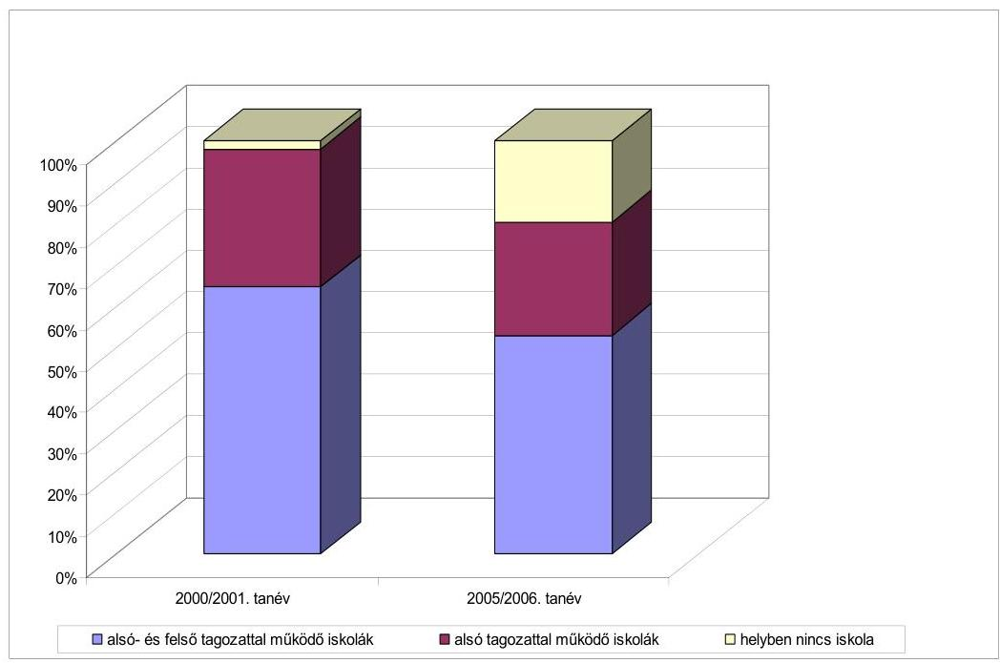
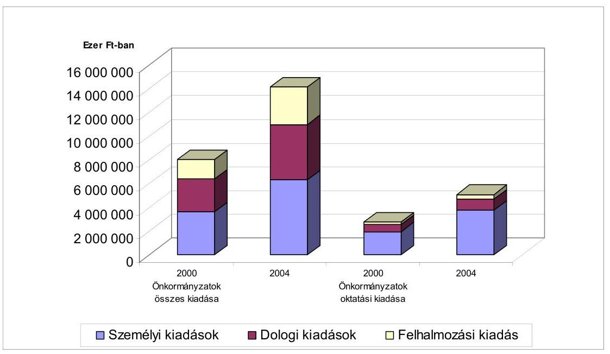
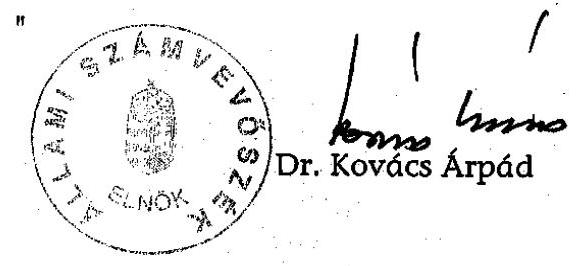
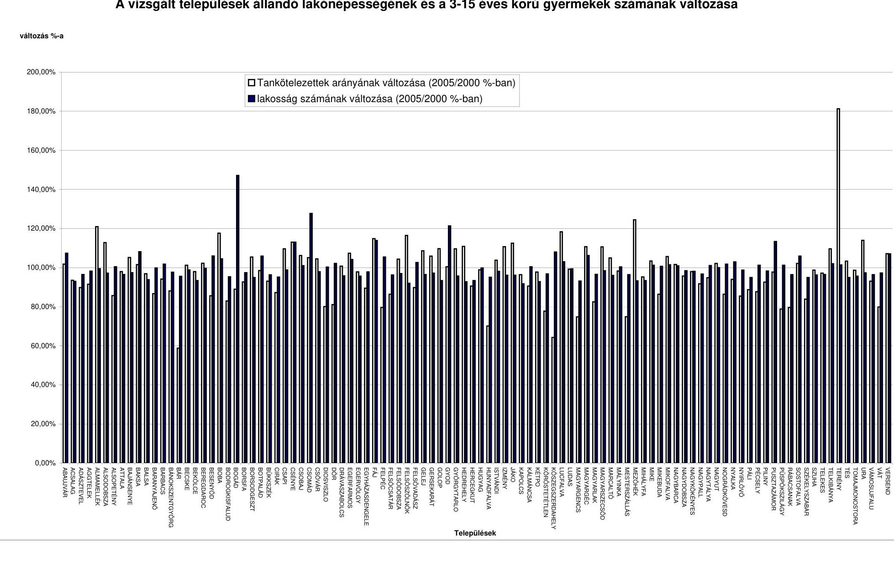
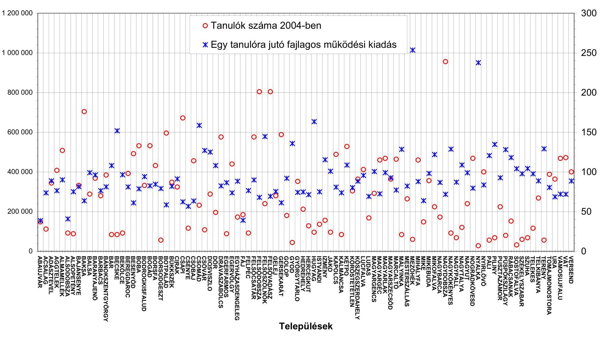
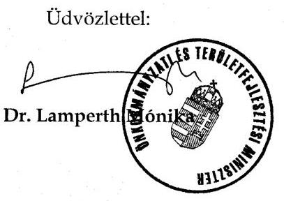
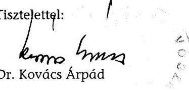
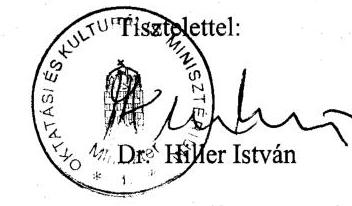
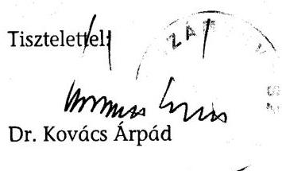
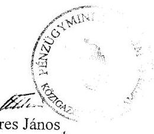

# ÁLLAMI   SZÁMVEVŐSZÉK 

## JELENTÉS

a kistelepülések iskola-előkészítési, általános iskolai oktatási feltételeinek ellenőrzési tapasztalatairól

---

# 3. Önkormányzati és Területi Ellenőrzési Igazgatóság 

3.2. Szabályszerűségi és Teljesítmény Ellenőrzési Főcsoport Iktatószám: V-1021-168/2005-2006.
Témaszám: 787
Vizsgálat-azonosító szám: V0238

## Az ellenőrzést felügyelte:

## dr. Lóránt Zoltán

főigazgató
Az ellenőrzés végrehajtásáért felelős:
Németh Péterné
főcsoportfőnök
Az ellenőrzést vezette:
dr. Lacó Bálintné
főtanácsadó

A számvevői jelentések feldolgozásában és a jelentés összeállításában közreműködtek:

Kispálné Wiedemann Györgyi
tanácsadó
Varga József
számvevő-tanácsos
Az ellenőrzést végezték:

Bíró Zsolt
számvevő
dr. Hegedűs György
főtanácsadó
Hütter Erzsébet
számvevő
Kispálné Wiedemann Györgyi
tanácsadó
Maróti Sándor
számvevő-tanácsos
Szabó Zoltán
számvevő-tanácsos

## Zeke József

számvevő-tanácsos

Borbély Zsuzsanna
főtanácsadó
dr. Lacó Bálintné
főtanácsadó
Kányáné Murvai Tünde
számvevő
Korsósné Vígh Andrea
számvevő-tanácsos
Molnár Istvánné
számvevő
Szihalminé Kovács Zsuzsanna
számvevő

## Dér Lívia

számvevő-tanácsos
Fodor Tivadarné
számvevő-tanácsos
Keszthelyi Zoltán
számvevő-tanácsos
Luhály Matild
számvevő

Szabó Leonóra
számvevő
Varga József
számvevő-tanácsos

---

# A témához kapcsolódó eddig készített számvevőszéki jelentések: 

## címe

Jelentés az alapfokú oktatásra fordított pénzeszközök felhasználásának ellenőrzéséről
Jelentés az alapfokú oktatásra fordított pénzeszközök felhasználásának vizsgálatáról
Jelentés az általános iskolai oktatás minőségének javítását szolgáló intézkedések ellenőrzésének tapasztalatairól
sorszáma
98
9818

---

# TARTALOMJEGYZÉK 

BEVEZETÉS ..... 5
I. ÖSSZEGZŐ MEGÁLLAPÍTÁSOK, KÖVETKEZTETÉSEK, JAVASLATOK ..... 8
II. RÉSZLETES MEGÁLLAPÍTÁSOK ..... 15

1. A szakmai munka ellátását segítő célok, feladatok meghatározása, szabályozási háttere ..... 15
1.1. Közoktatási feladatok tervezése ..... 15
1.2. A minőségfejlesztés, minőségirányítás szabályozása ..... 18
1.3. A finanszírozás szabályainak változása ..... 19
1.4. A közoktatási intézményhálózat hosszú távon történő stabilizálása érdekében kidolgozás alatt lévő intézkedések ..... 20
1.5. A kistérségi feladatok megjelenése a szabályozásban ..... 22
2. A gyermeklétszám, az önkormányzatok által vállalt feladatok változása, a feladatellátás szervezeti keretei ..... 23
2.1. A lakónépesség, a gyermekek számának alakulása ..... 23
2.2. A feladatellátás szervezeti keretei, annak változása ..... 26
2.3. A közoktatási intézmények feladatainak meghatározása, fenntartói, irányítói feladatok érvényesülése ..... 29
3. A többcélú kistérségi társulások szerepe az önkormányzati feladatok ellátásában ..... 32
4. A feladatellátás pénzügyi, humán erőforrásai, tárgyi-, létesítményi feltételei ..... 37
4.1. A pénzügyi források, ráfordítások változása ..... 37
4.2. A humán erőforrások alakulása ..... 40
4.3. Tárgyi-, létesítményi feltételek ..... 42
5. Szakmai feladatok mérése, értékelése, ellenőrzése ..... 44

---

# MELLÉKLETEK 

1. számú Vizsgált települési önkormányzatok, többcélú kistérségi társulások
2. számú Az önkormányzatok fenntartásában működő óvodák, általános iskolák főbb adatai
3. számú A vizsgált települések állandó lakónépességének és a 3-15 éves korú gyermekek számának változása
4. számú A vizsgált önkormányzatok költségvetési bevételeinek és kiadásainak változása
5. számú Az egy tanulóra jutó működési kiadások és az általános iskolai tanulók száma a 2004. évben
6. számú Az Önkormányzati és Területfejlesztési Miniszter jelentéssel kapcsolatos észrevétele
7. számú Az Önkormányzati és Területfejlesztési Miniszternek adott válasz
8. számú Az Oktatási és Kulturális Miniszter jelentéssel kapcsolatos észrevétele
9. számú Az Oktatási és Kulturális Miniszternek adott válasz
10. számú A Pénzügyminiszter jelentéssel kapcsolatos levele

---

# RÖVIDÍTÉSEK JEGYZÉKE 

| ÁSZ tv. | az Állami Számvevőszékről szóló 1989. évi XXXVIII. törvény |
| :--: | :--: |
| Kistérségi tv. | a települési önkormányzatok többcélú kistérségi társulásáról szóló 2004. évi CVII. törvény |
| Közokt. tv. | a közoktatásról szóló 1993. évi LXXIX. törvény |
| Ötv. | a helyi önkormányzatokról szóló, többször módosított 1990. évi LXV. törvény |
| Ámr. | az államháztartás működési rendjéről szóló 217/1998. (XII. 30.) Korm. rendelet |
| kistérségi kormányrendeletek | a többcélú kistérségi társulások 2004. évi támogatása mértékének, igénylésének, döntési rendszerének, folyósításának és elszámolásának részletes feltételeiről szóló 65/2004. (IV. 15.) Korm. rendelet |
|  | a többcélú kistérségi társulások által ellátott egyes közszolgáltatások 2005. évi normatív működési támogatásáról szóló 5/2005. (I. 19.) Korm. rendelet |
|  | a többcélú kistérségi társulások megalakulásának 2005. évi ösztönzéséről és modellkísérletek támogatásáról szóló 36/2005. (III. 1.) Korm. rendelet |
| Közokt. Vhr. | a nevelési-oktatási intézmények működéséről szóló 11/1994. (VI. 8.) MKM rendelet |
| ÁSZ | Állami Számvevőszék |
| BM | Belügyminisztérium |
| HEFOP | Humánerőforrás-fejlesztési Operatív Program |
| IMIP | Közoktatási intézmény minőségirányítási programja |
| KEK | közoktatási ellátási körzet |
| NFT | Nemzeti Fejlesztési Terv |
| OKÉV | Országos Közoktatási Értékelési és Vizsgaközpont |
| OKI | Országos Közoktatási Intézet |
| OM | Oktatási Minisztérium |
| ÖMIP | Önkormányzati közoktatási intézményrendszer működésének minőségirányítási programja |
| ÖNHIKI támogatás | az önhibájukon kívül hátrányos helyzetben lévő helyi önkormányzatok támogatása |
| PM | Pénzügyminisztérium |

---

.

---

# JELENTÉS 

## a kistelepülések iskola-előkészítési, általános iskolai oktatási feltételeinek ellenőrzési tapasztalatairól

## BEVEZETÉS

Az Ötv. 92.§ (1) bekezdése, valamint az ÁSZ tv. 2.§ (3) bekezdése szerint a helyi önkormányzatok gazdálkodását az ÁSZ ellenőrzi, ennek keretében vizsgálja az önkormányzatok által kötelezően ellátandó közszolgáltatásokat is. Az általános iskolai oktatással legutóbb a 2001. évben foglalkoztunk. ${ }^{1}$ Az ellenőrzés arra irányult, hogy az oktatásirányítás minden szintjén megfogalmazódtak-e azok a célok és feladatok, amelyek az általános iskolai oktatás minőségének javítását szolgálják, a szükséges jogszabályi feltételek és az ehhez biztosított pályázati pénzeszközök mennyiben segítették a célok megvalósulását. Az ellenőrzés tapasztalatai alapján - többek között - a közoktatás hosszú- és középtávú fejlesztési tervének kidolgozására, a feladatok társulásban történő ellátásának hangsúlyosabb támogatására, a feladatot ellátókkal szembeni szakmai elvárások, standardok kidolgozására, a kötelező taneszköz- és felszerelési jegyzékben felsorolt eszközök 2003. évig történő biztosításához a szükséges pénzügyi források megteremtésére, illetve ennek hiányában a megvalósítására előírt jogszabályi határidő módosítására tettünk javaslatot.

Az elmúlt években a közoktatásban a minőség és az eredményesség mellett, illetve részben ezekhez kapcsolódóan egyre nagyobb figyelmet kapott az iskolák méretgazdaságosságának, a költséghatékonyságnak a kérdése, melyet az OM 2003-ban közzétett középtávú közoktatás-fejlesztési stratégiája önálló prioritásként fogalmazott meg. A tanulólétszám csökkenése - az elmúlt évekhez hasonlóan - a vizsgált időszakban tovább folytatódott, ami az átlagosnál nagyobb mértékben érintette a kisebb településeket, mert korlátozottabb lehetőségeik vannak a gyermeklétszám csökkenéséből adódó hatások kezelésére.

A 2005. évi ellenőrzési terv alapján végzett jelen ellenőrzésünk a kistelepülési - az 1000 fő alatti állandó lakónépességű - önkormányzatok iskolaelőkészítéssel, általános iskolai oktatással kapcsolatos feladatainak megszervezésére és ellátásának feltételeire irányult.

Az önkormányzatok - az éves gazdálkodásról készített beszámoló jelentések adatai szerint - közoktatással kapcsolatos feladataik ellátására a 2004. évben

[^0]
[^0]:    ${ }^{1}$ Jelentés az általános iskolai oktatás minőségének javítását szolgáló intézkedések ellenőrzésének tapasztalatairól 0219

---

mintegy 575 Mrd Ft-ot fordítottak. Az 1000 főnél kisebb állandó lakónépességű 1695 település - az önkormányzatok 53,2%-a - a feladatra 24 Mrd Ft-ot, a közoktatással kapcsolatos ráfordítások 4,2%-át használta fel².

Ennek megfelelően vizsgáltuk a feladatellátás jogszabályi hátterének, szervezeti kereteinek a 2000-2005. évek között bekövetkezett változását, a fenntartói irányítás, az oktató-nevelő munka szabályozottságát, személyi, tárgyi, szervezési feltételeit, a feladatok ellátására fordított pénzeszközöket és a kistelepülések közoktatási szereplői által megtett intézkedéseket. A vonatkozó jogszabályi előírások alapján rávilágítottunk a fenntartói irányítói, szakmai feladatellátói szerepkörből adódó hiányosságokra. Kiemelt figyelmet fordítottunk a települések közös feladatellátásában rejlő lehetőségek igénybevételére, körülményeire.

A vizsgálat célja annak megállapítása volt, hogy

- a gyermek-, illetve tanulólétszám változása a kistelepüléseken hogyan befolyásolta a feladatok ellátását;
- az önkormányzatok az iskola-előkészítési feladatok ellátására, az általános iskolák működtetésére a központi támogatásokon, hozzájárulásokon kívül milyen nagyságrendű helyi forrásokat fordítottak. A Közokt. tv-ben, egyéb jogszabályokban előírt feltételek mennyiben biztosítottak;
- történtek-e intézkedések a költséghatékonyság javítására, a feladatok társulásban való ellátására. A törekvéseket mennyiben segítette a pénzügyi szabályozás egyes elemeinek változása, a tárca szakmai irányító tevékenysége. A társulások szélesebb körben való megvalósulásának melyek az akadályozó tényezői.

A helyszíni vizsgálatot 102 települési önkormányzatnál, s az általuk fenntartott 107 saját fenntartásban, valamint 77 társulásban, gesztorként működtetett óvodában, illetve általános iskolában végeztük el. Az óvodai ellátáson belül vizsgálatunk az iskolai előkészítésre vonatkozott, annak ellenére, hogy a pénzügyi információs rendszerben arra elkülönített adatok nem találhatók. A feladatellátás szervezeti kereteinek változása, a közös feladatellátásban rejlő lehetőségek feltárása, kistérségi társulásban történő ellátása kapcsán 14 többcélú kistérségi társulásnál is vizsgálatot végeztünk. (1. számú melléklet)

[^0]
[^0]:    ${ }^{2}$ Az adatok forrása a Magyar Államkincstár által megjelentetett, az önkormányzatok főbb pénzügyi-, ellátottsági mutatói 2004. címú kiadvány.

---

Vizsgált időszak: a 2000/2001-2005/2006. tanévek, gazdasági évek tekintetében a 2000-2004. évek, a 2005. év I. féléve, illetve a helyszíni vizsgálat lezárásáig terjedő időszak a többcélú kistérségi társulások működésére vonatkozóan.

---

# I. ÖSSZEGZŐ MEGÁLLAPÍTÁSOK, KÖVETKEZTETÉSEK, JAVASLATOK 

Az Ötv, a Közokt. tv. - a települések méretétől függetlenül - az önkormányzatok kötelező feladatává teszi az iskola-előkészítés, az általános iskolai oktatás ellátását. A törvények feladatellátási és nem intézmény-fenntartási felelősséget írnak elő, ennek ellenére az önkormányzatok jellemzően óvoda, általános iskola fenntartásával teljesítik kötelezettségüket. Az önkormányzatok megalakulását követően a kistelepülések önállóságuk zálogaként kezelték, s legfontosabb feladataik közé sorolták az óvodai, általános iskolai (legalább alsó tagozatos) oktatás helyben történő megvalósítását, annak „visszaállítását". Ez azt eredményezte, hogy az 1990-1998. évek között a gyermeklétszám csökkenése ellenére az óvodák, általános iskolák száma nőtt. Mindezek következtében a gyermekek, tanulók nevelése-oktatása elaprózott intézményhálózatban, a kistelepüléseken alacsony létszámú intézményekben történik.

Az önkormányzatoknak több mint fele (51,2%-a) az 1000 fő alatti állandó lakónépességű településeken működik, mely településeken az összlakosság 7,6%-a él. A közoktatási rendszer decentralizáltságát jellemzi, hogy a 2001/2002. tanévben az óvodák 25%-át, az általános iskolák 20,4%-át, de még a 2005/2006. tanévben is az óvodák több, mint ötödét, az általános iskoláknak pedig mintegy 16%-át működtették ezen települési önkormányzatok. Ugyanakkor a 2001/2002. tanévben az óvodásoknak mindössze 6,9%-a, az általános iskolásoknak 5,3%-a, a 2005/2006. tanévben pedig 6,4 illetve 4,9%-a járt a kistelepülések intézményeibe.

A 2001/2002. tanévben az ország 1000 fő alatti állandó lakónépességű településeinek 37,4%-a tartott fenn önállóan vagy gesztorként iskolát, és 47,5%-a működtetett óvodát, a 2005/2006. tanévben 28,8%, illetve 41,7%-a. A kistelepülések által saját fenntartásban működtetett közoktatási intézmények arányának csökkenését az átszervezések, illetve társulások létrejötte eredményezte. A vizsgált időszakban a társulásban való feladatellátás köre bővült, ennek következtében a 2005/2006. tanévben 488 kistelepülés tartott fenn önállóan, illetve gesztorként iskolát, működtetett óvodát. 2005. évben az új intézményfenntartó társulások létrehozásában, a meglévők bővítésében döntő szerepet játszott a többcélú kistérségi társulások által elnyerhető többlet állami támogatás, hozzájárulás.

A korábbi évekhez hasonlóan a vizsgált időszakban tovább csökkent az óvodába beírt gyermekek, az általános iskolai tanulók száma, ami fokozottabban érintette a kistelepüléseket. Országos szinten a 2005/2006. tanévben az önkormányzati fenntartásban működő óvodákba beírt gyermekek száma 308524 fő, az általános iskolások száma 794210 fő volt, 3,9%-kal, illetve 7,6%-kal kevesebb, mint a 2001/2002. tanévben. A vizsgált intézményekben az óvodások száma 14,8%-kal, az általános iskolások száma 16,5%-kal csökkent. A kistelepüléseken - ezen belül különösen a városokhoz, nagyobb településekhez közeli, illetve azokat könnyen megközelíthető községekben - a tanulólétszám csökkenéséhez hozzájárult az is, hogy a szülő többletszolgáltatások, magasabb szín-

---

vonalú oktatás reményében a szabad iskolaválasztás jogával élve nem a helyben működő intézménybe íratta gyermekét, ami a tanulólétszám 10%-át érintette.

A kistelepülések közoktatási intézmény-fenntartási problémáival, az óvoda és iskola megszüntetések okaival az Országgyűlés rendkívüli bizottsága is foglalkozott. Az Országgyűlés határozata szerint a jelenlegi oktatás szervezés vesztesei a kistelepüléseken

 élő, valamint a hátrányos helyzetű családokban született gyermekek. Ezért hatékonyabbá kell tenni a pedagógiai, tanulói munkát, a közoktatás rendszerébe befektetett források felhasználását. A határozat a Kormányt programcsomag kidolgozására kötelezte, mely hosszú távon elősegítheti az iskolahálózat stabilitásának megteremtését. A programcsomag határidőre elkészült, a programokban rögzített megoldásra váró feladatok tartalmának, eszközrendszerének meghatározására azonban nem került sor.

A Közoktatási tv. módosításával a közoktatás ellátásának és irányításának valamennyi szintjén nőtt a tervszerűség, a szabályozottsággal kapcsolatos kötelezettség. Az oktatási tárca elkészítette középtávú közoktatás-fejlesztési stratégiáját és kidolgozás alatt áll a közoktatás hosszú távú fejlesztési programja is. A tervezés során az EU csatlakozás kapcsán kidolgozott NFT, azon belül a HEFOP céljaival való összhang megteremtésére törekedtek. A célok, prioritások között kiemelten szerepelt a közoktatás irányításának és költséghatékonyságának javítása. A Közoktatási tv. az oktatási miniszter feladatává teszi az iskolahálózat és iskolaszerkezet alakulásához fejlesztési program kidolgozását. Ilyen programmal a tárca nem rendelkezik, így a kisiskolák sorsát illetően sem készült koncepció. Nem határozták meg, hogy mi tekinthető hátrányos helyzetnek a gyermek szempontjából, a minőségi oktatást milyen körülmények veszélyeztetik, azok mennyiben érintik a kistelepüléseken élő gyermekeket, a hátrányok felszámolását, mérséklését milyen módon, eszközökkel lehet elérni.

A Közoktatási tv. előírásainak módosítása kapcsán valamennyi önkormányzatnak és többcélú kistérségi társulásnak a feladatok, valamint a jövőbeli elképzelések meghatározására intézkedési tervet kellett készítenie. A fenntartott intézményekkel szembeni szakmai és egyéb elvárásokat, a teljesítés követését szolgáló ellenőrzés rendjét minőségirányítási programjaikban kellett megfogalmazniuk. A Közoktatási tv. előírásai szerint a 2004. évben az önkormányzatoknak felül kellett vizsgálniuk az intézmények alapító okiratait, a pedagógiai programokat, jóvá kellett hagyniuk az abban, illetve az intézmények minőségirányítási programjaiban foglaltakat. Az önkormányzatok e feladataiknak nem tettek maradéktalanul eleget, mivel a kistelepülések a fenntartói irányításhoz megfelelő felkészültségű, hozzáértő szakemberekkel nem rendelkeznek. Ez tükröződik többek között abban is, hogy intézkedési terveikben jellemzően csak a ténylegesen ellátott feladatokat, adottságokat rögzítették, nem foglalkoztak a demográfiai és egyéb tényezők által indokolt változásokkal, hiányos az intézményekkel szembeni elvárások konkrét, helyi adottságokat tükröző megfogalmazása is.

A közoktatási feladatok ellátását segítő normatív állami hozzájárulások, támogatások rendszere az elmúlt években változott, módosult. Mint azt korábbi vizsgálatunk ${ }^{3}$ is rögzíti, a normatívák igénylési jogcímeinek, az igénybevétel és az elszámolás feltételeinek évente változó előírásai az igénylés, elszámolás és ellenőrzés szempontjából is áttekinthetetlen rendszert alkotnak, nehezítik a fenntartók hosszabb távú döntéseinek biztonságát. A támogatások, hozzájárulások egyes elemei egymással ellentétes hatású „üzeneteket" közvetítettek az intézményfenntartók felé. 2002-ig a költségvetési törvények - a települések nagyságrendjétől függetlenül - céltámogatást biztosítottak a közoktatási intézmények hiányzó létesítményeinek megépítéséhez. Ennek keretében kistelepüléseken is - a magas működtetési költségeket figyelmen kívül hagyva - tornatermek, tantermek épültek, életveszélyessé vált kisiskolák tantermeinek kiváltására került sor, melyek segítették az önkormányzatok iskolamegtartási törekvéseinek megvalósítását. A folyamatot erősítették a helyi decentralizált alapokból elnyerhető támogatások is. Az éves költségvetésről szóló törvények 1997-től kiegészítő támogatást biztosítottak az önkormányzatok részére az intézményfenntartó társulás óvodájába, általános iskolájába bejáró tanulók létszáma alapján. Az önkormányzatok közötti társulás, a közös feladatellátás ösztönzése mellett a pénzügyi szabályozás pozitív diszkriminációt is alkalmazott a kistelepülések intézményfenntartó tevékenységét érintően (kisiskolák - 1-4. osztályos tanulói - részére biztosított kiegészítő normatív állami hozzájárulás). Mindezek hatásaként az önkormányzatok rövid távon belül is ellentétes tartalmú döntéseket hoztak. Az intézményeik megtartásához való erőteljes ragaszkodás gátolta a társulásban való feladatellátás széles körű megvalósulását. Az alapfokú oktatási intézményhálózat elaprózottsága továbbra is fennáll.

A kistelepülések kiemelt feladatuknak tekintették a közoktatási feladatok ellátását azok népességmegtartó és identitás megőrzésében betöltött szerepe miatt, ezért sokszor pénzügyi forrásaikat is meghaladó mértékben vállalják intézményeik fenntartását. Költségvetési előirányzataiknak 2000-ben 34,3%-át, 2004-ben 36%-át fordították e feladatokra. Miközben a gyermeklétszám alapján igénybe vehető költségvetési hozzájárulások, támogatások 77,8%-kal, addig a feladatellátással kapcsolatos ráfordítások 82,6%-kal emelkedtek, növekedtek a fajlagos ráfordítások. Ennek következtében a vizsgált önkormányzatoknak intézményeik fenntartása érdekében az állami normatívákat, hozzájárulásokat nagyobb arányban kellett kiegészíteniük. Mindezt tükrözi, hogy a feladatok ellátásához igényelt állami hozzájárulások, támogatások a működtetéssel kapcsolatos ráfordításoknak 2000. évben 69,7%-át, 2004. évben pedig 68%-át fedezték. A hiányzó források pótlását segítette az ellenőrzött önkormányzatok mintegy felénél az ÖNHIKI címén elnyert támogatás, amit 2004. évben közel háromnegyed részben közoktatási intézményeik működési kiadására használtak fel.

A kistelepülések óvodái, általános iskolái magas fajlagos költséggel működnek (lásd 5. számú melléklet). Az ellenőrzött önkormányzatok negyedénél volt magasabb 400 ezer Ft-nál az egy tanulóra vetített működési kiadás a 2004. évben. A magas fajlagos költséggel működő általános iskolák 77%-ában a tanulók létszáma nem érte el az 50 főt. A decentralizált oktatás-struktúrához igazodó mérési, értékelési rendszer kiépítését az OM megkezdte, a minőségi

[^0]
[^0]:    ${ }^{3}$ Lásd: Vélemény a Magyar Köztársaság 2005. évi költségvetésének tervezéséről

---

munka követelményeit meghatározó standardok azonban hiányoznak, ezért az alulteljesítő intézmények azonosítása, a hatékonyság mérése nem megoldott. Szakmai standardok, megfelelő számú és összehasonlítható mérések, értékelések hiányában nem ítélhető meg, hogy a magas költségszint mögött milyen a szakmai munka színvonala, a tanulói teljesítmény.

A pedagógusok létszámának változása a tanulók, a gyermekek létszámának csökkenésénél kisebb mértékű volt. Míg az általános iskolákban, óvodákban ellátott gyermekek száma a vizsgált körben és időszakban 17%-kal, a közoktatási intézményekben foglalkoztatott pedagógusok száma 13%-kal csökkent. Ennek ellenére a kistelepülések óvodáiban továbbra sem biztosított az óvodai csoporthoz előírt két fő óvónő alkalmazása. Az összességében viszonylag jobb pedagógus ellátottság mellett is az óvodások szinte teljes egészében, az általános iskolai tanulóknak pedig ötöde jár osztatlan óvodai csoportba, illetve összevont tanulócsoportba. ${ }^{4}$ Nem javult a szakos ellátottság ${ }^{5}$ sem. A 2000/2001. tanévben a szakosan leadott órák aránya 85,2%, a 2005/2006. tanévben 84,7% volt. (Az országos, az 1000 fő alatti lakónépességű, valamint a vizsgált települések közoktatását jellemző főbb adatokat a 2. számú melléklet szemlélteti.)

Az oktatás tárgyi feltételeiben számottevő javulás nem következett be, a fenntartók anyagi helyzetétől, az elnyert támogatásoktól függően azonban az intézmények között nagyok a különbségek. Egyes településeken új épületekben korszerű körülmények között folyik az oktatás, ugyanakkor a közoktatási intézmények többsége felújításra szorul. Az előírt létesítményi feltételek közül hiányzik - bár az a szakmai feladatok ellátásában fennakadást nem okoz - a tornaterem, szaktanterem, orvosi szoba. A települések közmű ellátásának kiépítésével az oktatási intézmények higiénés feltételei javultak. Pályázati pénzeszközök, saját források felhasználásával az önkormányzatok egy része korszerűsítette az intézmények konyháit.

A jelenleg hatályos taneszköz- és felszerelési jegyzékben foglaltaknak az előírt határidőre a vizsgált óvodáknak 8,5%-a, az általános iskoláknak pedig mindössze 13,4%-a tudott eleget tenni. A követelményeknek való megfeleléshez a vizsgált önkormányzatok a szükséges fejlesztési forrásokkal nem rendelkeznek.

Az önkormányzatok a Közoktatási tv. rendelkezéseinek megfelelően 2004. évben intézkedtek a közoktatási intézmények ellenőrzési feladatainak, az ellenőrzés rendjének kialakításáról. E rendelkezések szerinti ellenőrzésekre azonban a vizsgált időszakban még nem került sor.

[^0]
[^0]:    ${ }^{4}$ Összevont tanulócsoport: kettő vagy több évfolyam tanulóiból szervezett, közösen oktatott csoport.
    ${ }^{5}$ Szakos ellátottság: ha az egyes tantárgyakat, műveltségi területeket a tantárgy oktatására jogosító megfelelő végzettséggel és szakképzettséggel rendelkező pedagógus oktatja.

---

2003. évben a közigazgatás korszerűsítésének irányairól felvázolt elképzelések célul tűzték ki, hogy a szolgáltatások színvonala a gazdaságossági szempontok érvényesítésével lényeges többletráfordítás nélkül javuljon. A korszerűsítés fontos eleme volt a többcélú kistérségi társulások megalakítása, megerősítése. A feladatok társulásban való ellátásának bővítéséhez, a többcélú kistérségi társulások megalakításának támogatására először a 2004. évi költségvetési törvény biztosított forrást a központi költségvetésben. Az ösztönző finanszírozási rendszer célja az elaprózott önkormányzati rendszer integrációja, a közoktatási feladatellátás hatékony és szakszerű működtetésének megszervezése volt. A közoktatás szempontjából nagy jelentősége volt annak, hogy a többcélú kistérségi társulás megalakításakor a támogatás elnyerése érdekében kötelezően választandó feladat volt az alapfokú oktatás, illetve a pedagógiai szakszolgálati feladatok társulásban való ellátása.

A BM által meghirdetett, pályázati úton elnyerhető pótlólagos támogatások hatására az oktatás területén a már korábban is meglévő intézményfenntartó társulások bővültek, újak alakultak. A közös feladatellátás körének kibővítésében jelentős szerepet töltöttek be az újonnan megalakult többcélú kistérségi társulások, melyek az intézményfenntartó társulásokkal, önkormányzati intézményekkel jellemzően az elnyert pályázati források továbbadása révén kerültek kapcsolatba, az önkormányzatok kötelező közoktatási feladatainak ellátásában azonban közvetlenül nem vettek részt.

A többcélú kistérségi társulások megalakítása óta eltelt rövid időre tekintettel működésükkel, a közoktatási feladatok ellátására gyakorolt hatásukkal kapcsolatosan még kevés információ áll rendelkezésre, de jelentős szerepük volt a pályázati források megszerzésében, annak továbbadásában, a pedagógiai szakszolgálati feladatok helyben való elérhetőségének megteremtésében. A települési önkormányzatok önként vállalt feladatai körébe tartozó tevékenységek ellátására - logopédiai ellátás, nevelési tanácsadás, sérült gyermekek rehabilitációja - a pályázati pénzeszközök felhasználásával megállapodást kötöttek a városokban működő szakszolgálati intézményekkel, melynek eredményeként bővült ezen ellátásban részesítettek köre. Az önkormányzatok közötti koordináció keretében ellátható egyéb feladatokra - pedagógus helyettesítési rendszer kiépítése, fenntartói irányítás segítése, szakmai fórumok rendezése, mérési, értékelési, ellenőrzési feladatok térségi szintű megszervezése - még kevés kezdeményezés volt tapasztalható.

A társulásban történő feladatellátás pénzügyi eszközökkel való ösztönzése nem járt a kívánt eredménnyel, melyet korábbi vizsgálatunk is megerősített. ${ }^{6}$ A többcélú kistérségi társulások megalakítása önkéntesen, a társulási szabadság elvének megfelelően történt. Az önkéntességet bizonyos mértékig korlátozta a kistérségek jogszabályi lehatárolása, mely nem minden esetben vette figyelembe a közlekedési adottságokat, a települések között már korábban is működő kapcsolatokat. Az önkormányzatok - a pótlólagos támogatások reményében mindaddig partnerek és támogatják a közoktatási feladatok társulásban való

[^0]
[^0]:    ${ }^{6}$ Lásd: 0407 számú ÁSZ ellenőrzés: A helyi önkormányzatok társulásainak ellenőrzéséről

---

ellátását, amíg az a helyben történő oktatás-nevelés megszüntetését nem eredményezi. A többcélú kistérségi társulásokhoz csatlakozott vizsgált kistelepülések önkormányzatainak 23%-a szüntette meg közoktatási intézménye önálló fenntartását, a feladatot azonban továbbra is helyben, de a társulásban működtetett intézmény tagintézményében ${ }^{7}$ látják el. A társuláshoz a központi költségvetésből biztosított kiegészítő támogatások, hozzájárulások kiváltották a saját források egy részét, azonban a helyben történő oktatás-nevelés elaprózottságának felszámolásában jelentős előrelépés továbbra sem történt. Az önkormányzatok vállalták, hogy a tagintézmények működtetésével kapcsolatos ráfordításoknak állami támogatásokkal, hozzájárulásokkal nem fedezett összegét a gesztor önkormányzat részére megtérítik. Ez azt eredményezte, hogy a társulásban történő feladatellátás miatt a ráfordítások érzékelhető mértékben nem mozdultak el, csak a feladatok ellátására biztosított központi pénzeszközök nőttek.

# A helyszíni vizsgálatok megállapításai alapján számos javaslatot fogalmaztunk meg. 

A többcélú kistérségi társulások részére javasoltuk, hogy határozzák meg a társulás által vállalt közoktatási feladatokat, a feladatellátás módját, azt jelenítsék meg a társulási megállapodásokban. A feladatok követése, kötelezettségeik teljesítése érdekében alakítsák ki megbízható helyi információs rendszerüket. A kistérségek rendelkezésére
 bocsátott állami támogatások, hozzájárulások önkormányzatok részére történő átadásáról kössenek megállapodást, abban rögzítsék a felhasználás, az elszámolás szabályait.

A települési önkormányzatoknak és intézményeiknek javasoltuk, hogy intézkedjenek a Közokt. tv-ben kötelező jelleggel előírt dokumentumok pótlólagos elkészítéséről, azok tartalmának kiegészítéséről. Közös intézményfenntartás esetén határozzák meg az azzal kapcsolatosan átadott, illetve átvett feladat- és hatásköröket, a feladatellátás garanciális tényezőit, azt rögzítsék az intézményfenntartó társulási megállapodásokban. Iktassák be a képviselő-testületek a munkatervükbe a közoktatási intézményekben folyó szakmai munkáról szóló beszámolók rendszeres megvitatását. A törvényes működés, a szakmai munka színvonalának javítása érdekében végeztessenek méréseket, értékeléseket. Szabályozzák a polgármesteri, a körjegyzőségi hivatalokon belül a közoktatás irányításával, a fenntartással kapcsolatos feladatok ellátását. A döntések szakszerű előkészítése érdekében gondoskodjanak a Közokt. tv-ben előírtaknak megfelelően pedagógus munkakör betöltésére jogosító felsőfokú végzettséggel rendelkező személy közreműködéséről. A bevételeik és a ráfordításaik elszámolásánál tartsák be a számviteli tv-ben, a PM útmutatókban foglalt előírásokat. Elemezzék intézményeik fenntartási költségeit, a fajlagos ráfordítások mértékét, a méret- és költséghatékonyság, takarékosság szempontjaira is tekintettel szorgalmazzák a feladatok közös, társulás keretében történő ellátását.

[^0]
[^0]:    ${ }^{7}$ Tagintézmény: székhelyen kívül - azonos vagy más településen - működő intézményegység, ha a székhelytől való távolság miatt az irányítási, képviseleti feladatok nem, vagy csak részben láthatók el.

---

A helyszíni ellenőrzés megállapításainak hasznosítása mellett javasoljuk:

# az oktatási és kulturális miniszternek 

1. határozza meg azokat a minimum feltételeket, melyek teljesítése esetén a kistelepülések közoktatási intézményei működtethetők és támogathatók;
2. az önkormányzati és területfejlesztési miniszterrel egyeztetve tegyen javaslatot a pénzügyminiszternek a kistelepülési feladatellátási modellek finanszírozási rendszerére, olyan szabályozási rendszer kidolgozására, amely a gyermekek érdekeit és a demográfiai tényezőket is figyelembe véve a fenntartók orientálásával hosszú távon elősegíti a közoktatási intézményhálózat stabilitását, az oktatás minőségének és költséghatékonyságának javítását;
3. elemezze a többcélú kistérségi társulásoknak a közoktatási feladatok ellátására, a fajlagos ráfordításokra, a szakmai munka minőségére és eredményességére gyakorolt hatását, tegyen ajánlást a társulás keretében ellátandó közoktatási feladatokra, azok tartalmi, szervezeti kereteire;
4. kezdeményezze, hogy a szakma bevonásával készüljenek standardok, melyek lehetővé teszik az iskolák szakmai munkájának minősítését, s ezzel segítik a költséghatékonyság elemzését. Tegyen javaslatot a központi, országos szintű mérésekhez kapcsolódó helyi mérési, értékelési feladatokra, annak kötelező elemeire, tartalmi követelményeire;
5. kísérje figyelemmel a hatályos taneszköz- és felszerelési jegyzékben előírtak teljesülését, s tegye meg a szükséges intézkedéseket az ellentmondások feloldására.

---

# II. RÉSZLETES MEGÁLLAPÍTÁSOK 

## 1. A SZAKMAI MUNKA ELLÁTÁSÁT SEGÍTŐ CÉLOK, FELADATOK MEGHATÁROZÁSA, SZABÁLYOZÁSI HÁTTERE

A közoktatás rendszere, az oktató-nevelő munka irányításának, ellátásának tartalmi szabályozása a 80-as évek közepétől állandóan változik, formálódik. A változásokat az önkormányzatiság kialakulása, az oktatási, majd közoktatási törvény megalkotása, végrehajtási rendelkezései és azok rendszeres módosítása mellett a helyi kezdeményezések is elősegítették. A szakmai jogszabályok változásán túl hatással volt a feladatok megszervezésére, ellátására az éves költségvetési törvényben megfogalmazott pénzügyi szabályozók változása, a többcélú kistérségi társulásokra vonatkozó jogszabályi előírások megjelenése.

Az ezredfordulót követően a decentralizált irányítás körülményeihez alkalmazkodó új szabályozó eszközök (minőségbiztosítás, kerettanterv) jelentek meg, illetve a már korábban kialakultak (pénzügyi ösztönzők) módosultak.

A közoktatás irányítási rendszerének szintjeit és szereplőit tekintve is változások történtek. Megalakultak a megyei és a települési szint között elhelyezkedő, az önkormányzatok közös feladatellátásában és szervezésében részt vállaló többcélú kistérségi társulások.

A vizsgált időszakban megerősödött a tárca közoktatás irányító szerepe, közvetett szabályozó funkciója.

### 1.1. Közoktatási feladatok tervezése

A közoktatás irányításának valamennyi (országos, megyei, térségi, helyi) szintjén fokozott szerepet kapott a feladatok ellátásának tervezése.

A Közokt. tv. 95.§ (1) bekezdése szerint az oktatási miniszter feladatai közé tartozik többek között a közoktatás hosszú- és középtávú fejlesztési terveinek kidolgozása. Kormányzati szinten (a kormány döntési kompetenciájához rendelt) tervezési kötelezettség alapvetően az Európai Unióhoz való csatlakozásból fakad. E körben a legfontosabb a Strukturális és Kohéziós Alapokhoz való hozzáférést lehetővé tevő tervezés, ezen belül is az NFT, valamint a HEFOP.

A tárca rendelkezik a miniszter által jóváhagyott középtávú közoktatásfejlesztési stratégiával és folyamatban van a közoktatás hosszú távú fejlesztési programjának kidolgozása is. A középtávú közoktatási stratégia elkészítése során kiemelt figyelmet fordítottak a kapcsolódó tervezési dokumentumokban foglalt célokra, elsősorban az NFT, azon belül a HEFOP céljaival és eszközeivel való összhang megteremtése.

---

A középtávú közoktatás-fejlesztési stratégia a helyzetelemzés, a vázolt jövőkép alapján határozta meg a középtávú fejlesztési célokat, prioritásokat, melyek a következők:

- az élethosszig tartó tanulás megalapozása a kulcskompetenciák fejlesztése révén;
- az oktatási egyenlőtlenségek mérséklése;
- az oktatás minőségének fejlesztése;
- a pedagógus szakma fejlődésének támogatása;
- az információs és kommunikációs technológiák alkalmazásának fejlesztése;
- az oktatás tárgyi feltételeinek javítása;
- a közoktatás költséghatékonyságának és irányításának javítása.

A közoktatás költséghatékonyságának és irányításának javítása keretében a stratégia további részcélokat is megfogalmazott, melyek alapvetően érintik a kistelepülések közoktatási feladatainak ellátását is. Ezek az alábbiak:

- az oktatás finanszírozási rendszer fejlesztése;
- a helyi-területi tervezési rendszerek fejlesztése;
- a társulások, a települések és intézmények közötti együttműködés támogatása és fejlesztése;
- az oktatási információs és statisztikai rendszer fejlesztése;
- az intézményi szintű menedzsment fejlesztése.

A stratégia a társulásoknak, a települések és intézmények közötti együttműködés támogatásának és fejlesztésének meghatározó szerepet szán a költséghatékonyság javításában. Az intézményfenntartók körében alacsony a társulási hajlandóság, ezért olyan érdekeltségi környezet kialakítása, konkrét társulási formák létrehozásának támogatása és a már jól működő modellek elterjesztése a cél, amelyek nem sértik a helyi érdekeket, de elősegítik az eredményességi és hatékonysági mutatók javítását, az irányítás szakszerűségének növelését.

A stratégia a közoktatás helyi szereplőinek orientálására, az egyes prioritások érvényesítése során elsősorban közvetett eszközök (ösztönzők, fejlesztés, képzés, támogatás és stratégiai kommunikáció) alkalmazására törekszik, tág teret engedve a helyi, területi, térségi elképzelések érvényesülésének.

A Közokt. tv. 95.§ (1) c.) pontja szerint az oktatási miniszter feladata az iskolahálózat és iskola szerkezet alakulásához fejlesztési program kidolgozása. Ilyen programmal a tárca nem rendelkezik, így a kisiskolák sorsát illetően sem készült kidolgozott koncepció. Nem határozták meg azt sem, hogy mi tekinthető hátrányos helyzetnek a gyermek szempontjából, a minőségi oktatást milyen körülmények veszélyeztetik, azok mennyiben érintik a kistelepüléseken élő

---

gyermekeket, a hátrányok felszámolását, mérséklését milyen módon, eszközökkel lehet elérni.

A hátrányos helyzetű gyermekek kategóriájára a normatív állami hozzájárulásoknál a nemzeti, etnikai kisebbségekről, a fogyatékkal élőkről szóló jogszabályi meghatározást alkalmazták. A fenntartó oldaláról a hátrányos helyzetű településekre vonatkozó kormányrendeletet tartják irányadónak, működtetés szempontjából az ÖNHIKI támogatásban részesülő önkormányzatot tekintik hátrányosnak.

A Közokt. tv. 85.§ (4) bekezdésének 2003 szeptember 1-től hatályos rendelkezése szerint valamennyi helyi önkormányzat önállóan vagy más helyi önkormányzattal közösen intézkedési tervet köteles készíteni.

A 2003. év előtt csak a kettő vagy annál több közoktatási intézményt fenntartó önkormányzatoknak kellett intézkedési tervet készíteniük. Nem voltak tervkészítésre kötelezettek az egy intézményt fenntartó, illetve azon önkormányzatok, melyek társulásban vagy megállapodás alapján látták el közoktatási feladataikat. Az 1000 fő alatti állandó lakónépességgel rendelkező kistelepülések - a vizsgált önkormányzatok - szinte teljes körben mentesültek a tervkészítési kötelezettség alól.

A Közokt. tv. 89/A.§ (5) bekezdése a többcélú kistérségi társulások részére - az általuk ellátott feladatokra - önálló intézkedési terv készítését írja elő.

Az intézkedési terveknek tartalmaznia kell, hogy az adott önkormányzat milyen módon kíván eleget tenni kötelező közoktatási feladatainak, milyen - számára nem kötelező - közoktatási feladatot lát el. Rögzíteni kell az intézményrendszer működtetésével, fenntartásával, fejlesztésével és átszervezésével összefüggő elképzeléseket. A tervek elkészítésének, illetve a már korábban elkészített tervek felülvizsgálatának határidejét a helyi önkormányzatok tekintetében a Közokt. tv. - a vizsgált időszakban hatályos - 129.§ (5) bekezdése 2004. január 31-i határidőben jelölte meg. A többcélú kistérségi társulások által elkészítendő intézkedési tervekre vonatkozóan a Közokt. tv. határidőt nem írt elő, arról a többcélú kistérségi társulások által ellátott egyes közszolgáltatások 2005. évi normatív működési támogatásáról szóló 5/2005. (I.19.) Korm. rendelet 14/A.§ (2) bekezdése rendelkezik.

Az önkormányzatok nem tettek maradéktalanul eleget intézkedési terv készítési kötelezettségüknek. A vizsgált települések mintegy 20%-a nem készítette el az intézkedési tervet. Ezen önkormányzatok által felvállalt és ellátott feladatok köre egyéb önkormányzati dokumentumokból - az önkormányzat SZMSZ-e, hatásköri jegyzék, intézményi alapító okiratok - követhető.

Az elkészült tervek 22%-a nem foglalkozik a gyermek-, tanulólétszám várható változásával, az abból adódóan szükséges intézkedésekkel (feladatcsökkentés, intézményátszervezés), azok csak a tervezés időpontjában fennálló állapotot rögzítik. Hiányossága a terveknek, hogy azok mintegy 80%-a csak a saját fenntartásban működtetett intézményekben ellátott feladatokat részletezi, nem tér ki a társulásban ellátott tevékenységekre (felső tagozatosok oktatására, egyéb feladatellátásra). Társult településsel közös tervezéssel az ellenőrzés mindössze egy esetben (Gersekarát) találkozott.

---

Annak ellenére, hogy a Közokt. tv. 85.§ (4) bekezdése szerint az intézkedési terv készítésekor be kell szerezni a helyi kisebbségi önkormányzat egyetértését, elkészítéséhez ki kell kérni a településen működő közoktatási intézmények vezetőinek, a szülői és diákszervezeteknek, a nem állami, nem önkormányzati intézményfenntartók, települési szintű szakszervezetek véleményét is, e dokumentumok a tervekkel kapcsolatosan nem (Telekes, Boba, Felsőszölnök), vagy nem teljes körben voltak fellelhetők.

# 1.2. A minőségfejlesztés, minőségirányítás szabályozása 

Az elmúlt években az oktatáspolitika központi kérdésévé vált a közoktatás minőségének, eredményességének és törvényességének értékelése, ellenőrzése. Az OM vezetése az oktatás színvonalának, minőségének emelését a minőségirányítás rendszerének kötelező kidolgozásával kívánta elérni. A Közokt. tv. 2003. évi módosítása fontos és szabályozandó területként határozta meg a közoktatási feladatok hatékony, törvényes és szakszerű ellátását, a minőségpolitika megvalósítását, ennek érdekében a minőségfejlesztési rendszer kiépítését, működtetését.

A helyi önkormányzatok feladatellátási kötelezettsége, a fenntartói irányítás keretében fontos szabályozási eszközzé vált az önkormányzati minőségirányítási program. Az ÖMIP-ben kell meghatároznia az önkormányzatnak a közoktatási rendszerrel kapcsolatos követelményeit, a fenntartói elvárásokat, azzal kapcsolatosan az egyes intézmények feladatait, a közoktatást érintő más ágazatokkal való kapcsolat rendszerét, a fenntartói irányítás keretében tervezett szakmai, törvényességi, pénzügyi ellenőrzések rendjét.

A vizsgált települések 90%-a rendelkezik a Közokt. tv. 85.§ (7) bekezdésében előírt önkormányzati minőségirányítási programmal. Szakértők, szakértői csoportok, és a pedagógiai intézetek az önkormányzatok, intézmények feladatellátását különféle mintaszabályzatok elkészítésével segítették, amelyek részletes előírásokat tartalmaznak valamennyi, a törvény által előírt és szabályozandó kérdéskörre. A típus szabályzatokat az önkormányzatok és intézményeik hasznosították, de azok helyi adottságokat figyelembe vevő adaptálására nem vagy csak részben került sor, az ÖMIP-ek így általános jellegű megfogalmazásokat tartalmaznak.

Az intézmények részére szakmai elvárásként az eredményes oktató tevékenységet, a gyermekközpontú nevelést, a takarékosságot, a hatékonyság növelését, a jogszabályok betartását írták elő. Előfordult (Mályinka), hogy az önkormányzat a közoktatási ellátási központ által térségi szinten elkészített minőségirányítási programot használja, külön az önkormányzatra kidolgozott program nem is készült. „Önkormányzat- és intézmény idegen" megfogalmazások is szerepelnek a dokumentumokban (az 5-8-ik évfolyamra értelmezhető előírások, holott az önkormányzat ilyen ellátást helyben nem biztosít).

Az önkormányzatok mintegy 69%-a határozott meg intézménye részére konkrét, számonkérhető feladatot. Ennek keretében idegen nyelv oktatásának bevezetését,
 a nemzetiségi hagyományok ápolását, az ünnepek, megemlékezések kultúrájának erősítését írták elő.

---

# 1.3. A finanszírozás szabályainak változása 

A közoktatás decentralizált irányítási rendszerében a közoktatás szereplői döntésének befolyásolásában, az állami preferenciák kifejezésében meghatározó szerepe van a pénzügyi támogatások rendszerének, egyes elemeinek változásának. A feladatok finanszírozásában az állam kiemelt szerepét jelzi a normatív állami hozzájárulások fajlagos értékeinek, a központosított és kötött felhasználású támogatások összegének növekedése, jogcímeinek bővülése.

A feladatok ellátását segítő finanszírozás elemei változtak, bővültek, ezzel párhuzamosan egyre bonyolultabbá, a kistelepülések önkormányzati hivatalai, pénzügyi apparátusai számára nehezebben kezelhetővé vált a rendszer.

A közoktatási intézményekben ellátottak létszáma alapján igényelhető normatív állami hozzájárulások fajlagos értékei a 2000-2005. évek között közel megduplázódtak. A növekedés mértéke - a pedagógus béremeléshez kapcsolódóan - a 2003. évben volt a legjelentősebb (mintegy 40%). Az intézményfenntartó társulások óvodájába, általános iskolájába bejáró gyermekek létszámához kapcsolódó normatívák kivételével a kiegészítő normatívák (napközis foglalkozás, étkeztetés, kistelepülések támogatása) növekedésének mértéke elmaradt az alapnormatívák emelkedésétől. A normatív állami hozzájárulások fajlagos értékeinek emelkedése ellenére a csökkenő gyermeklétszám miatt az önkormányzatok egyre növekvő mértékben kényszerültek igénybe venni egyéb saját forrásaikat a közoktatási feladatok finanszírozásához. Finanszírozási gondjaikat enyhítette az ÖNHIKI címén elnyerhető pályázati forrás.

A 2003. évtől az általános iskolai tanulók létszáma alapján igénybe vehető normatív állami hozzájárulásokkal kapcsolatosan változást jelentett, hogy az alaphozzájárulás az 1-4, illetve az 5-8. évfolyamok tanulóit érintően eltérő összegben került meghatározásra.

Új elemként jelent meg a finanszírozásban a kapacitás-kihasználtsági feltételekhez kötött állami támogatás, hozzájárulás. Az ÖNHIKI és a többcélú kistérségi társulások támogatásán túl - csak a 2005. évben hatályos szabályozás szerint - egyes kiegészítő hozzájárulások (óvodába beírt, általános iskolai tanulók létszáma alapján igényelhető kiegészítő hozzájárulás, az intézményfenntartó társulás óvodájába, általános iskolájába bejáró tanulók normatív állami hozzájárulása) is kapacitás-kihasználtsági feltételek mellett voltak igényelhetők. A feltételek az egyes támogatási formáknál eltérőek voltak. Az ÖNHIKI támogatás 50%-os kihasználtságot írt elő, mely alól a megyei közigazgatási hivatalok felmentést is adhattak. A többcélú kistérségi társulások, valamint az önkormányzatok által igényelhető normatív, illetve kiegészítő hozzájárulások évfolyamonként eltérő mértékű (50-65-75%) kihasználtság (a Közokt. tv. 3. számú mellékletében meghatározott csoport, illetve osztálylétszámok teljesülésének mértéke) esetén voltak igényelhetők.

A tanulócsoportok támogatott létszámhatáraira az OM-ben szakmai számítások, hatástanulmányok nem készültek. A tárca a költségvetési modellek alapján a BM-PM által meghatározott létszámhatárokat elfogadta.

---

A költségvetési törvények az alapnormatívákon felül 1997-től támogatást biztosítottak az intézményfenntartó társulás intézményeibe járó gyermekek létszáma alapján, de támogatásban részesítették a kistelepülések önállóan fenntartott intézményeit is az ott oktatott-nevelt gyermekek létszáma alapján. A finanszírozás szabályai így más-más „üzenetet" közvetítettek a fenntartók felé a központi prioritások, elvárások tekintetében.

A pénzügyi szabályozás eszközeivel történő ösztönzés a fenntartókban a vizsgált körben nem tudatosult kellőképpen. A támogatások, hozzájárulások felhasználásával saját erejüket meghaladó döntéseket hoztak. A csökkenő gyermeklétszám mellett a fenntartásukban működő intézményekben kis létszámú (5-12 fő) tanulócsoportok jöttek létre, létesítményeik kihasználtsága csökkent, illetve helyenként azokat a magas fűtési költségek miatt a téli hónapokban nem tudták használni (pl. tornacsarnokok). A vizsgált körben két településen került sor a feladatellátás szervezeti kereteinek többszöri módosítására, ami nem kedvezett az intézményekben folyó zavartalan szakmai munkának, és iskolaváltással kapcsolatos megfontolásokra is késztetheti a szülőket, tanulókat.

Becske önkormányzata 2001. szeptember 1-ig az általános iskolai feladatokat társulásban látta el, a 2004. évben saját fenntartásba „visszahozta" a településre az általános iskola alsó tagozatát, majd a 2005/2006. tanévtől a feladatot ismét társulásban látja el.

Dör község a feladatellátás hatékonyabbá tétele érdekében - költségtakarékossági szempontokra is tekintettel - intézményeit 2002. szeptember 1-jével Általános Művelődési Központba szervezte, a 2005/2006. tanévtől pedig az általános iskolai feladatokat társulás keretében látja el.

# 1.4. A közoktatási intézményhálózat hosszú távon történő stabilizálása érdekében kidolgozás alatt lévő intézkedések 

Az elmúlt másfél évtizedben a lakosság, a 3-15 éves korosztály száma folyamatosan csökkent. Az általános iskolába belépők száma rendre elmaradt az intézményrendszert elhagyók létszámától, mely tendencia várhatóan tovább folytatódik.

Minél kisebb a település, annál korlátozottabb a reagálási lehetősége az ellátott gyermeklétszám csökkenésének „kezelésére" (további tanulócsoport összevonásokat már nem tud végrehajtani, esetenként egyetlen megoldás az intézmény megszüntetése). A kistelepülések forrásteremtő képessége gyenge, működtetéssel összefüggő költségvetési kiadásaikat differenciált mértékben - a vizsgált körben 15,1% - 71,2% között - közoktatási intézményeik fenntartására fordították. A gyermeklétszám mérséklődésével a feladat ellátására igényelhető támogatások, hozzájárulások összege is csökkent, mivel az az ellátandó létszám függvénye. Az ily módon kieső forrásokat egyéb bevételekkel pótolni nem tudták. Ezért - mint azt az óvoda- és iskolabezárások okait vizsgáló parlamenti bizottság munkájáról készült jelentés, valamint az annak elfogadásáról és a szüksé-

---

ges kormányzati intézkedésekről szóló Országgyűlési határozat ${ }^{8}$ is megfogalmazta - az önkormányzatok oktatási-nevelési intézményeik összevonására, megszüntetésére intézkedtek. A felmerült problémák kezelésére a határozat szerint kormányzati ciklusokon átívelő oktatáspolitika kialakítására, a közoktatási intézményhálózat stabilitásának biztosítására van szükség. Ezért az Országgyűlés felkérte a Kormányt, hogy az érintett minisztériumok, szakmai, érdekképviseleti és egyéb szervezetek bevonásával, a megadott szempontok figyelembevételével készítsen feladattervet.

A feladatterv elkészítéséhez az OM a Kormány részére tájékoztató jelentéseket készített. Azokban áttekintette a közoktatás finanszírozási, döntési és felelősségi rendszerét, a hatályos szabályozási környezetet, az iskolák átjárhatóságát, az ellenőrzési-mérési és értékelési rendszert, valamint a közoktatási intézmények átszervezését érintő jogszabályokat. Az országgyűlés határozatában megfogalmazott határidőre a célok, feladatok megvalósítására átfogó programcsomag készült. Az abban rögzítettek szerint:

- a finanszírozási problémák kezelésére rövidtávon hasznosuló intézkedések bevezetése, módszerek alkalmazása szükséges;

Kistelepüléseken az intézményfenntartó társulások kialakítása biztosíthatja a megfelelő létszám elérését. A hátrányos helyzetű gyermekek támogatására biztosítani kell a napközis ellátást, a gyermekek étkeztetését. Meg kell szervezni a források felhasználásának, a Közokt. tv. előírásainak következetesebb ellenőrzését. El kell érni az EU strukturális alapjaiból elnyerhető támogatások kihasználását.

- a Közokt. tv. hatályos rendelkezései jelenleg is biztosítják, hogy az iskola, óvodabezárások miatt a gyermek nem kerülhet rosszabb helyzetbe;

A problémák megoldására az utóbbi időben intézkedések történtek: oktatási jogok miniszteri biztosának kinevezése; a pedagógiai programokhoz, a helyi tantervek közötti átjárhatóság kidolgozásához nyújtott segítség; közoktatási intézmények korszerűsítéséhez, kötelező taneszköz- és felszerelési jegyzékben foglaltak beszerzéséhez adott támogatások.

- az átjárhatóságot biztosító oktatáspolitikában kiemelt figyelmet kell fordítani az intézményen belüli differenciált oktatásra, az iskolák közötti különbségek csökkentésére irányuló intézkedésekre;
- olyan minőségirányítási rendszer kidolgozását kell elősegíteni, mely minden irányítási szint számára lehetővé teszi a ráfordítások és eredmények együttes vizsgálatát.

A programcsomag határidőre elkészült, az azonban a kitűzött célok megvalósítását biztosító feladatok részletezését, annak eszközrendszerét, ütemezését nem tartalmazza.

[^0]
[^0]:    ${ }^{8}$ az óvoda- és iskolabezárások okait vizsgáló bizottság munkájáról szóló jelentés elfogadásáról és a szükséges kormányzati intézkedésekről szóló 30/2004. (IV. 6.) OGY határozat

---

# 1.5. A kistérségi feladatok megjelenése a szabályozásban 

A közigazgatási rendszer korszerűsítésének irányairól, feladatairól 2003 szeptemberében határozott a Kormány ${ }^{9}$. A reform célkitűzései között szerepelt a lakossági közszolgáltatások, köztük kiemelten a közoktatás színvonalának emelése a gazdaságossági szempontok érvényesítésével, lényeges többletráfordítás nélkül az ellátás hatékonyabbá tétele, a települések együttműködésének kibontakoztatása, ezzel összhangban a többcélú kistérségi társulások megalakításának támogatása.

A többcélú kistérségi társulások létrehozásának és működésének kereteit meghatározó jogszabályok fokozatosan jelentek meg. A Kistérségi tv. elfogadása körüli vita késleltette a szabályozást, a törvény csak 2004. november 18-án került kihirdetésre, ezért a társulások megalakulása - az ösztönző rendszer működtetése eredményeként - megelőzte a törvény hatálybalépését.

A megalakulás ösztönzésére a 2004. évi költségvetési törvény biztosított előirányzatot, mely a BM által kiírt pályázat keretében került felosztásra. A pályázat fontos célja volt, hogy gazdaságosan működtethető nagyobb szervezeti egységek jöjjenek létre. Ezt a célt fajlagos mutatók (a Közokt. tv-ben illetve a pályázati felhívásban előírt osztálylétszámok) meghatározásával kívánták elérni, mely mutatók teljesítéséhez kötötték a támogatás elnyerését.

A közoktatás területén az általános iskolai és óvodai ellátást biztosító intézmények fenntartásával kapcsolatos feladatok, valamint a Közokt. tv. 34.§-ában megjelölt pedagógiai szakszolgálati feladatok közül legalább két feladat közös ellátása volt a támogatás feltétele. A pályázat keretében a kistérségek a társulásos együttműködés indulásakor jelentkező infrastrukturális hiányok megszüntetésére kaphattak támogatást.

Az ösztönzés hatására megalakult többcélú kistérségi társulásoknak a 2004. december 1-vel hatályos Kistérségi tv. alapján át kellett alakulniuk. A törvény megteremtette a jogalapot a többcélú kistérségi társulások létrehozására, meghatározta működésük feltételeit és lehetőséget biztosított az ágazatoknak arra, hogy ösztönözzék az egyes feladat- és hatáskörök e társulási típusban történő ellátását.

A törvény alapján a többcélú kistérségi társulás ellátja a társulás tagjai által átruházott önkormányzati feladat- és hatásköröket. A törvény rögzíti a többcélú kistérségi társulás létrehozásához szükséges megállapodás kötelező és fakultatív elemeit, az ellátandó feladatok meghatározására viszont nem tartalmaz ajánlást, nem rögzíti, hogy a közoktatásba tartozó feladatellátáson belül mely konkrét feladatokat tart különösen fontosnak e formában ellátni. A támogatott feladatokat a kistérségi kormányrendeletek rögzítették.

A többcélú kistérségi társulások megalakulásával a kistérség, mint önálló tervezési szint jelent meg a közoktatás szabályozásában. A Közokt. tv. 89/A.§ (5)

[^0]
[^0]:    ${ }^{9}$ a közigazgatási rendszer korszerűsítéséről szóló 2198/2003. (IX. 1.) számú kormányhatározat

---

bekezdés alapján a többcélú kistérségi társulásoknak az általuk ellátott feladatokról önálló feladatellátási, működtetési és fejlesztési tervet kell készíteniük. 2005. évben ösztönző, illetve normatív támogatásban azon kistérségek részesülhettek, amelyek intézkedési tervüket 2005. június 15-ig megküldték az OM részére. A jogi szabályozás megjelenése és a végrehajtás határideje közötti rendkívül rövid idő feszültséget idézett elő, ezért az OM annak oldására - a kistérségeknek küldött köriratában - úgy rendelkezett, hogy 2005. június 15-ig a tervnek csak a helyzetelemzésre vonatkozó részét kell elkészíteni és megküldeni, míg a terv további elemeinek beküldési határidejét 2005. november 30-i határidővel írta elő. A tárca intézkedése segítette ugyan a kistérségek munkáját, a kormányrendeletben rögzített, a többcélú kistérségi társulások támogatási feltételei között szereplő határidő módosítására, a kétütemű tervezés elrendelésére azonban nem volt felhatalmazása.

# 2. A GYERMEKLÉTSZÁM, AZ ÖNKORMÁNYZATOK ÁLTAL VÁLLALT FELADATOK VÁLTOZÁSA, A FELADATELLÁTÁS SZERVEZETI KERETEI 

### 2.1. A lakónépesség, a gyermekek számának alakulása

Az országban megfigyelhető demográfiai változásokkal egyezően a kistelepülések lakónépessége is csökkent. A változás mértéke öt év alatt az országos szinten jelentkező 1,3%-os csökkenéssel szemben a vizsgált településeken 3,4% volt. A lakosságon belül a 3-15 éves korosztály aránya is lefelé mozdult el. Arányuk a lakónépességen belül a vizsgált körben átlagosan 15% volt a 2005. évben, közel 0,5%-kal kisebb, mint a 2000. évben. A statisztikai jelentések adatai szerint az önkormányzatok által fenntartott óvodákba beírt gyermekek, az általános iskolák nappali tagozatán tanulók létszáma az 1980-as évektől folyamatosan csökkent. A vizsgált időszakban országos szinten az óvodákba beírt gyermekek száma 3,9%-kal, az általános iskolai tanulók száma 7,6%-kal esett vissza. A
 kistelepüléseken az országos átlagot meghaladó mértékű volt a gyermeklétszám csökkenése. A vizsgált önkormányzatok saját fenntartásában, illetve gesztorként működtetett intézményeiben az óvodások száma a 2000-2005. évek között 14,8%-kal, az általános iskolai tanulók száma 16,5%-kal csökkent. A változások mértéke, iránya differenciált, 58 településen (a vizsgált önkormányzatok 57,8%-án) a 3-15 év közötti korosztály csökkenése, 42,2%-án annak növekedése volt megfigyelhető. A vizsgált települések állandó lakónépességének, a 3-15 éves korú gyermekek számának változását a 3. számú melléklet szemlélteti.

Az elmúlt években részben a lakosság számának változása, másrészt gazdasági erőforrásaik tekintetében a falvak között nagymértékű polarizációs folyamat zajlott le. A vizsgált települések nem egészen kétharmadában a lakosság fogyása figyelhető meg. Hatvannégy településen átlagosan több mint 7%-kal csökkent a lakosság száma. Ezzel egyidejűleg a fiatalok arányának csökkenése következtében 18 településen (a vizsgált kör 17,6%-ánál) erőteljesen megindult a lakosság elöregedése. Ennek okai közé sorolható, hogy a termelőszövetkezetek megszűnésével a helyben történő munkavállalás lehetősége nagyrészt megszűnt. A főközlekedési útvonalaktól kieső, gazdasági potenciállal nem rendelkező települések fokozatosan elnéptelenednek.

---

A lakosság száma 38 településen 3%-ot meghaladó mértékben nőtt. E folyamat a jó gazdasági adottságokkal rendelkező, illetve a munkalehetőséget biztosító városokhoz, nagyobb településekhez közeli, azt tömegközlekedési eszközökkel, személygépjárművel könnyen, viszonylag rövid idő alatt megközelíthető településeken figyelhető meg. A települések különféle intézkedésekkel igyekeznek a lakosságot megtartani, számát növelni. Telkek kialakításával, értékesítésével próbálják a helyi lakosság megtartását ösztönözni, segíteni a máshonnan betelepülőket. Előfordul, hogy az önkormányzat (Kétpó) gyermek születése esetén a családokat egyszeri, kiemelt összegű (100 ezer Ft) támogatásban részesíti.

Az OM által összesített statisztikai jelentések adatai szerint a 2005/2006. tanévben az óvodába beírt gyermekek 94,5%-a, az általános iskolai tanulók 92,4%-a részére biztosítják az ellátást az önkormányzatok fenntartásában működő intézmények. Ugyanezen adatok az 1000 fő alatti lakónépességű településeken 99,6%, illetve 98,8%. Tehát minél kisebb a település, jellemzően annál kevésbé vesznek részt a feladatellátásban az egyéb szervezetek (egyházak, alapítványok). A vizsgált településeken csak önkormányzati fenntartásban működtek közoktatási intézmények.

A feladatellátás átszervezésével kapcsolatos önkormányzati intézkedések hatására a vizsgált kistelepüléseken a létszámcsökkenés a 2004/2005. tanévről a 2005/2006. tanévre felgyorsult és meghaladta a korábbi évek csökkenésének ütemét.

Öt év átlagában a vizsgált körben az óvodások száma évente 2,9%-kal, az általános iskolai tanulók létszáma 3,3%-kal csökkent, míg az elmúlt tanév viszonylatában a gyermekek, tanulók létszáma 9,2%-kal, illetve 10,2%-kal esett vissza.

Az ellátottak számának változása tekintetében differenciált a kép. Az óvodába beírt gyermekek száma 27, az általános iskolások száma 28 településen emelkedett. A többi településen a létszám erőteljesen csökkent, illetve az önkormányzat fenntartásában működtetett intézmény megszüntetésére került sor.

Az országos adatok szerint a 2005/2006. tanévben az 1000 főnél nagyobb állandó lakónépességgel rendelkező településeken az átlagos iskolanagyság 235 fő, az óvodák átlagos gyermeklétszáma 104 fő volt. Az általunk vizsgált 102 önkormányzat által fenntartott óvodák átlaglétszáma a 2000/2001. tanévben 30, a 2005/2006. tanévben 29 fő, az átlagos iskolanagyság 76 fő, illetve 78 fő volt. Nem volt ritka a 15 fős intézményméret sem. A vizsgált időszak végén (a 2005/2006. tanévben) az óvodák 10,5, az általános iskolák 6%-a ilyen, illetve még ennél is alacsonyabb gyermek, tanulólétszámmal működött.

Az óvodákban szélső értékként a 2000/2001. tanévben egy, a 2005/2006. tanévben kettő településen mindössze 10 fő volt a gyermeklétszám, a 60 fő, illetve azt meghaladó létszámmal működő óvodák száma a 2000/2001. tanévben négy, a 2005/2006. tanévben kettő volt.

Az általános iskolákban a 2000/2001. tanévben két településen (Borsodgeszt, Mezőhék) mindössze kilenc főt, a 2005/2006. tanévben egy településen (Mezőhék) 10 főt oktattak, a 200 főt meghaladó létszámmal rendelkező iskolák száma - melyek több (3-5) település tanulóit látták el - a 2000/2001. tanévben négy (Baksa, Felsődobsza, Felsővadász, Nagydobsza), a 2005/2006. tanévben már csak kettő (Felsődobsza, Nagydobsza) volt.

---

# A tanulólétszám változását a demográfiai tényezőkön túl befolyásolta

az is, hogy a szülő a szabad iskolaválasztás jogával élve jobb színvonalúnak vélt, illetve többlet-szolgáltatásokat nyújtó más település által fenntartott iskolába járatja gyermekét. E szempontból a legkedvezőtlenebb helyzetben a városokhoz, nagyobb településekhez közeli kisközségek vannak.

A jegyzők által vezetett nyilvántartások szerint a vizsgált körben a 2005/2006. tanévben 43 településről 337 gyermek nem veszi igénybe a helyben nyújtott szolgáltatást, ami ezen intézmények tanulólétszámának 10,4%-át jelenti.

A településeken nem életvitelszerűen élő gyermekek adott település iskolájába történő felvételét korlátozó rendelkezéseket a Közokt. tv. 2006. évtől vezetett be, melynek hatása csak a későbbiekben vizsgálható.

Az önkormányzatok intézményeik fenntarthatósága, a gyermekek megtartása, a helyben történő oktatás-nevelés vonzóvá tétele érdekében különféle intézkedéseket tettek. E körbe tartozik a nemzetiségi oktatás, a nemzetiségi és egyéb nyelv oktatása, többletszolgáltatást biztosító egyéb önként vállalt feladatok megszervezése. Nemzetiségi kisebbségi oktatást a 2005/2006. tanévben az iskolák 23%-ában folytattak. Kilenc településen a német, három helyen a szlovák, egy településen a szlovén kisebbségi oktatást szervezték meg. Roma etnikai kisebbségi oktatás hat vizsgált település általános iskolájában van. Nemzetiségi nyelvet idegen nyelvként nyolc településen oktatnak, ennek keretében az általános iskolások és részben az óvodások is szlovák, horvát, német és román nyelvet tanulnak.

A szülők, gyermekek igényei alapján a 2000/2001. évben az intézmények 78,5%-ában, a 2005/2006. tanévben 63,4%-ában biztosították a napközis ellátást. A napközis csoportok magas működtetési költségeire, valamint az önkormányzat szűkös pénzügyi forrásaira tekintettel a vizsgált időszakban kilenc településen szüntették meg intézményekben a napközis ellátást, helyette a rászoruló gyermekek részére étkeztetést biztosítanak, valamint tanulószobai foglalkozásokat szerveznek. A 2005/2006. tanévben napközis ellátásban az alsó tagozatosok 34,9%-a, a felső tagozatosok 19,2%-a részesült.

Az alacsony és egyre csökkenő gyermeklétszám miatt a gyermekek, tanulók nevelése-oktatása összevont csoportokban, osztályokban történik. Az óvodát saját fenntartásban, illetve gesztorként működtető önkormányzatok mintegy 70%-ában (a 2000/2001. tanévben 71,1%, a 2005/2006. tanévben 70,3%) a gyermeklétszám csak egy csoport megszervezését tette lehetővé, a többi településen is csak két részben osztott csoportban folyik az óvodai nevelés.

Az általános iskolákban nőtt az összevont tanulócsoportokban tanulók száma, aránya. A 2000/2001. tanévben az önkormányzatok által fenntartott iskolák 52,5%-ában, a 2005/2006. tanévben 55,6%-ában összevont csoportokban folyt az oktatás. A 2000/2001. tanévben a tanulók 19,2%-a, a 2005/2006. tanévben a tanulók ötöde összevont tanulócsoportban tanul. Az összevont tanulócsoportba járók aránya az általános iskola alsó tagozatán (1-4. évfolyamon) 30%, az 5-8. évfolyamosok körében 10,2% a 2005/2006. tanévben. A szakmai feladatok ellátása, a gyermekek középiskolára történő felkészítése érdekében felső

---

tagozaton, meghatározó részben a 7-8. évfolyamon, az alaptantárgyakat - az alacsony gyermeklétszám mellett is - igyekeznek csoportbontásban oktatni.

Az alacsony és egyre csökkenő gyermeklétszám miatt összevont tanulócsoportok szervezése mellett is az egy tanulócsoportra vetített tanulók száma alacsony, elmarad az országos átlagtól. Az önkormányzatok által fenntartott általános iskolákban országos szinten a 2001/2002. tanévben és a 2005/2006. tanévben az egy tanulócsoportra jutó tanulók száma 19,7 fő, illetve 19,8 fő; ugyanezen adat a vizsgált körben 13,5 fő, illetve 13,6 fő volt.

Az átlagos értékhez viszonyított jelentős szórást jellemzi, hogy a 2005/2006. tanévben a tanulócsoportok átlagos létszáma egy településen (Jód) mindössze hat fő volt és csak nyolc településen haladta meg a 20 főt.

A vizsgált körben az önkormányzatok intézményeiben ellátott gyermekek, tanulók összlétszámának változását az is befolyásolta, hogy a feladatellátás módjában is változások következtek be, intézményeket szüntettek meg.

A 2005/2006. tanévtől a vizsgált 102 település közül 17 önkormányzat óvodát, 20 önkormányzat általános iskolát nem működtet a településen saját fenntartásban.

# 2.2. A feladatellátás szervezeti keretei, annak változása 

Az Ötv. 8.§ (4) bekezdése szerint a települési önkormányzatok kötelező feladata az iskola-előkészítés, az általános iskolai oktatás-nevelés biztosítása, mely kötelezettségüknek a vizsgált önkormányzatok - egy kivételével - eleget tettek.

Fáj település nem működtetett óvodát, és más településsel sem kötött megállapodást az iskola-előkészítési feladatok ellátására.

Az Ötv, a Közokt. tv. feladatellátási, és nem intézmény fenntartási kötelezettséget ír elő. A feladatellátás módjának megválasztását illetően az önkormányzatoknak szabad választási lehetőségük van. A lehetőséggel élve a kistelepülések a feladatok saját fenntartású intézményekben történő ellátására törekednek, meglévő intézményeikhez ragaszkodnak. Erre is visszavezethető, hogy az iskola-előkészítés, az általános iskolai oktatás-nevelés jellemzően elaprózott intézményhálózatban, alacsony létszámú gyermek, tanulócsoportokban folyik. A vizsgált időszakban a társulásban való feladatellátás köre bővült, ennek ellenére a 2005/2006. tanévben még mindig az ország 1000 fő alatti állandó lakónépességű településeinek több mint negyede (28,8%-a) tart fenn önállóan, gesztorként iskolát, és 41,7%-a működtet óvodát. A vizsgált körben az óvodát fenntartó, iskolát működtető önkormányzatok aránya 83,3%, illetve 80,4%.

A mai magyar oktatáspolitikában igen elterjedt az a nézet, mely szerint a közoktatásban jelentkező hatékonyságveszteségek egyik fő oka a falusi kisiskolák magas költsége és alacsony eredményessége ${ }^{10}$. Az Európai Tanács és az Európai

[^0]
[^0]:    ${ }^{10}$ Forrás: Az OKI által megjelentetett „A falusi kisiskolák és a méret gazdaságossággal összefüggő hatékonyság veszteségek" c. tanulmány.

---

Bizottság 2006. évi közös időközi jelentéséhez készített szakértői háttéranyag rögzíti -, hogy „a magyar oktatási rendszer a rendelkezésre álló erőforrásokat az oktatás eredményességéhez viszonyítva alacsony hatékonysággal használja fel. Ennek legszembetűnőbb jele, hogy miközben nemzetközi összehasonlításban a magyar oktatási rendszerben jut a legkevesebb diák egy pedagógusra a tanulók tanulmányi teljesítménye (PISA mérés alapján) elmarad az átlagtól. A rendszer így állandó forráshiánnyal küzd, ami az intézményfenntartó települési önkormányzatoknál jelentkezik legerőteljesebben".

A csökkenő gyermeklétszám, az önkormányzatok közös feladatellátásának pénzügyi ösztönzése ellenére a kistelepüléseken erőteljes ragaszkodás figyelhető meg az oktatási intézmények fenntartásához. Az óvodákhoz, iskolákhoz erőteljes érzelmi kötődések kapcsolódnak. Egyes települések képviselő-testületei úgy vélik, hogy az iskolának komoly népességmegtartó ereje van, a helyben történő oktatás megszűnése miatt a gyermek „gyökértelenné" válik, mely meghatározó lehet későbbi elvándorlásában, ezért intézményeik fenntartásához ragaszkodniuk kell még akkor is, ha alacsony a gyermeklétszám, s emiatt egyre fokozódó pénzügyi nehézségeik vannak. Vállalták ezért a képviselő testületek azt is, hogy vagyonértékesítésből származó bevételeiket az oktatási intézmények működtetésére fordítsák.

A 2000-2004. évek között a vizsgált települések közül iskola-előkészítéssel kapcsolatos feladatok ellátására hét (6,9%), általános iskolai feladatokra négy (3,9%) önkormányzat csatlakozott intézményfenntartó társuláshoz. A többi településen az óvodai nevelést, és az általános iskolai oktatást, vagy legalább az általános iskola 1-4. évfolyamát az önkormányzatok továbbra is helyben, saját fenntartású intézményeikben látták el.

A 2005. évben a közoktatási feladatok közös, társulás keretében történő ellátásában növekedés volt tapasztalható. Az új intézményfenntartó társulások létrehozásában, a meglévők bővítésében döntő szerepet játszott a többcélú kistérségi társulások által elnyerhető többlet állami támogatás, hozzájárulás.

Az átszervezések, a társulásban történő feladatellátás eredményeként az intézmények által ellátott feladatokban átrendeződés következett be. A 2000/2001. tanévben az önkormányzatok 63,2%-a látta el az általános iskolai oktatást helyben, saját fenntartású intézményében önállóan, illetve gesztorként az
 1-8. évfolyamon, a 2005/2006. tanévben e feladatra az ellenőrzött önkormányzatoknak már csak alig több mint fele vállalkozott. Az alsó tagozat fenntartását a vizsgált időszak elején a települések 34,3%-a, a 2005/2006. tanévtől 28,4%-a vállalta fel. A 2000/2001 és a 2005/2006 tanévek közötti időszakban az önkormányzatok 19,6%-a szüntette meg intézménye önálló működtetését és a feladatot a jövőben társulásban látja el.

A vizsgált körben az önkormányzatok által az ellátott általános iskolai feladatok szervezeti keretében bekövetkezett változást az alábbi grafikon szemlélteti.

---

A feladatellátás szervezeti kereteinek módosítását, a társulásban történő feladatellátást számos tényező befolyásolta. A társulási hajlandóság leginkább az 5-8. évfolyamon történő oktatással kapcsolatosan jelentkezett. Ez többek között összefügg azzal is, hogy az önkormányzatok egy része nem tudta biztosítani a szakos ellátást, mivel magas a feladatellátás közalkalmazotti létszámigénye, ezzel szemben évfolyamonként rendkívül alacsony a településeken az érintett tanulók száma.

A közoktatási feladatok társulás keretében történő ellátásával kapcsolatban az önkormányzatok célként a szakos ellátás javítását, a pedagógusok helyettesítési rendszerének kialakítását, a fajlagos költségráfordítások csökkentését, a pedagógiai munka feltételeinek javítását fogalmazták meg.

A pótlólagos támogatások ösztönző hatására a 2005. évben végrehajtott átszervezések eredményeként a 2005/2006. tanévtől óvodát 18 (a vizsgált települések 17,6%-a), általános iskolát 20 önkormányzat (a vizsgált kör ötöde) nem működtet saját fenntartásban. A települések 13%-a helyben közoktatási intézményt nem tart fenn.

A társulásban történő feladatellátás bővülésével egyidejűleg szinte általános tendenciaként volt megfigyelhető a tagintézmények számának növekedése. Az átszervezések eredményeként az óvodát önállóan, saját fenntartásban, illetve gesztorként működtető önkormányzatok aránya a 2000-2005. évek között 92%-ról 74%-ra csökkent, a helyben biztosított ellátás aránya azonban nem változott, továbbra is mintegy 91%.

Az általános iskolai oktatás terén hasonlóak a tapasztalatok, 20 településen az önkormányzat saját fenntartásában, illetve gesztorságával működtetett általános iskola megszűnt, 17 községben a gyermekek oktatása azonban továbbra is helyben történik. A társulási megállapodásokban foglaltak alapján ugyanis az ellátást a gesztor önkormányzat óvodája, általános iskolája tagintézményeként működtetett intézményegységben helyben biztosítják.

---

Előfordult (Kőszegszerdahely), hogy korábban három település gyermekeinek oktatás-nevelését végző, társulásban működtetett intézmény sem tudott eleget tenni az előírt létszámfeltételeknek, ezért a társulást megszüntették, új társuláshoz csatlakoztak és a továbbiakban az intézmény városi iskola tagintézményeként működik.

Az anyagi ösztönzések hatására a feladatellátás szervezeti keretei megváltoztak, igazgatásilag az intézményegységek a gesztor önkormányzat, illetve a társulás által működtetett intézményekhez tartoznak, a közoktatási feladatok ellátásának elaprózottságában változás mégsem következett be.

A társulási megállapodásokban rögzítettek szerint az önkormányzatok a feladatellátást szolgáló épületeknek csak a használati jogát adták át a gesztor önkormányzatnak, és továbbra is vállalták azok karbantartását, felújítását. Fontos pontja volt a megállapodásoknak az is, hogy a tagintézmények működési kiadásai az intézményi ráfordításokon belül elhatárolhatók legyenek. Az önkormányzatok vállalták, hogy a tagintézmények működtetésével kapcsolatos ráfordításoknak, állami támogatásokkal, hozzájárulásokkal nem fedezett összegét a gesztor önkormányzat részére megtérítik. Ez azt eredményezte, hogy a társulásban történő feladatellátás miatt a ráfordítások érzékelhető mértékben nem mozdultak el, csak a feladatok ellátására biztosított központi pénzeszközök nőttek. A feladatokat a továbbiakban társulásban ellátó önkormányzatok az intézmények fenntartói irányításában, a szakmai feladatok, elvárások meghatározásában közvetlenül nem vettek részt, így arról, a szakmai munka minőségének, színvonalának változásáról információval nem rendelkeztek.

# 2.3. A közoktatási intézmények feladatainak meghatározása, fenntartói, irányítói feladatok érvényesülése 

A Közokt. tv. 2003. évi módosítása keretében - a 2003. évi LXI. tv. 81.§ alapján - 2004. március 31-ig a közoktatási intézmények fenntartóinak át kellett tekinteniük az általuk fenntartott közoktatási intézmények alapító okiratait, s szükség esetén el kellett végezniük annak módosítását.

A vizsgált intézmények rendelkeztek alapító okiratokkal, azokat a képviselő-testületek jóváhagyták. Az alapító okiratok és a ténylegesen ellátott feladatok összhangja nem minden esetben volt biztosított.

Egyes intézmények alapító okiratai nem tartalmazták teljes körűen az ellátott feladatokat (pl. Urán a gyermekek napközis ellátását, Kétpón a tanulószobát), másutt az alapító okiratokban olyan közoktatási feladatok is megfogalmazásra kerültek, melyeket ténylegesen nem látnak el (pl. Páli településen a napközis ellátást, a bükkszéki iskola alapító okirata szerint a nemzetiségi oktatást, Diósviszlón, Bogádon, Almamelléken a szakmai szolgáltatásokat).

Jellemző hiányossága volt a dokumentumoknak, hogy nem rögzítették az intézményekbe felvehető maximális létszámot, a gyermek-, tanulócsoportok számát, azok átlaglétszámát, illetve az attól való eltérés mértékét. Az átlagtól való létszámeltérés az óvodákban okozott gondot, ugyanis a Közokt. tv. 3. számú mellékletének előírása ellenére az OKÉV engedélye nélkül lépték túl az önkormányzati hatáskörben engedélyezhető maximális létszámot, a nevelési év, illetőleg a tanítási év indításánál. A vizsgált körben a 2000. évben 13, a 2004. évben 10, a 2005. évben kilenc olyan önkormányzat volt, ahol az óvodások csoportonkénti létszáma meghaladta a 30 főt (egy-két fővel), új csoport indítása azonban sem gazdaságossági, sem szakmai szempontok figyelembevételével nem volt megoldható. A létszámtúllépéssel kapcsolatos engedélyek az érintett önkormányzatok mindössze 33%-ánál álltak rendelkezésre.

Az önkormányzatok közel egyharmada nem határozta meg intézményei alapító okiratában a gazdálkodással összefüggő jogosítványokat, nem rögzítették az előirányzatok feletti jogosultság rendjét, emiatt nem tartották be az Ámr. 14.§ (5) bekezdés c) pontjának előírásait.

Nyolc intézmény kivételével az iskolák, óvodák önálló gazdálkodási jogosítvánnyal nem rendelkeznek, gazdálkodási feladataikat az önkormányzatok polgármesteri hivatalai, a körjegyzőségek látják el. Az érintettek 11%-a nem kötötte meg az Ámr. 14.§ (5) b.) pontjában előírt megállapodást, mely a részben önálló gazdálkodási jogkörű intézmény, illetve a gazdálkodási feladatokat ellátó, önállóan gazdálkodó költségvetési szerv között a gazdálkodással kapcsolatos munkamegosztás és felelősségvállalás rendjét szabályozza.

Intézmény megszüntetése esetén a képviselő-testületek a megszüntetésről határozat formájában döntöttek. A megszüntető határozatokban kijelölték a jogutód intézményt.

A működést, a szakmai feladatok ellátását szabályozó alapdokumentumokkal - pedagógiai program, SZMSZ, házirend, IMIP - az intézmények rendelkeztek. A pedagógiai programokat - egy önkormányzat kivételével - a 2004. évben mindenütt felülvizsgálták. A testületi jóváhagyást megelőzően a szakértői véleményeket beszerezték. A szakértők az intézmények által elkészített programokat jónak ítélték, módosításukra, kiegészítésükre érdemben javaslatot nem tettek. A dokumentumok jóváhagyásáról részben a képviselő-testületek döntöttek, illetve annak hiányában azok automatikusan hatályba léptek, mivel a Közokt. tv. 103.§ (1) bekezdése szerint „az SZMSZ-t, házirendet, intézményi minőségirányítási programot, illetve ezek módosításait jóváhagyottnak kell tekinteni helyi önkormányzat által fenntartott nevelési, oktatási intézmény esetén, ha a döntéshozó a harmincadik napot követő első képviselő-testületi ülésen nem nyilatkozik".

A közoktatási intézmények SZMSZ-ének elkészítését a Közokt. tv. 40.§ (1) bekezdése, a házirend elkészítését a Közokt. tv. 40.§ (7) bekezdése írja elő. Az SZMSZ-szel kapcsolatosan hiányosságként volt tapasztalható, hogy azt az intézmények mintegy 30%-a nem aktualizálta. A dokumentumok nem tartalmazták a szervezeti, jogszabályi változások miatti módosításokat, többcélú intézmények esetében a vezetők, intézményegységek közötti feladat- és felelősségmegosztás rendjét.

A Csapi községben működő általános iskola, kollégium és speciális szakiskola SZMSZ-e 1995-ben készült, melyet azóta nem módosítottak.

A közoktatási intézményekben megvalósítandó minőségpolitikára, minőségfejlesztési rendszerére a Közokt. tv. korábbi rendelkezései is tartalmaztak előírást, míg a célok, feladatok kötelezően előírt dokumentumokban történő rögzítését a Közokt. tv. 2003. évi módosítása keretében rendelték el. Az intézményeknek az IMIP-eket az ÖMIP-ekben foglaltakkal összhangban kellett meghatározniuk.

---

Az IMIP-eket meghatározó részben a pedagógiai programok jóváhagyásával együtt tárgyalták az önkormányzatok képviselő-testületei, a szakértői vélemények kitértek ezen programokra is. A szakértők a programokat jónak, „előremutatónak" tartották, úgy vélték, hogy az abban foglaltak végrehajtása garanciája lehet az intézményekben folyó szakmai munka színvonalának emelésének. Módosító javaslatokat, kiegészítést a programokkal kapcsolatosan nem fogalmaztak meg.

A Közokt. tv 40.§ (12) bekezdése szerint az intézményi SZMSZ-t, a házirendet, az IMIP-et, a törvény 44.§ (2) bekezdése szerint pedig a nevelési, illetve pedagógiai programot nyilvánosságra kell hozni. Nehezen vagy nem volt megállapítható, hogy ezen kötelezettségüknek az intézmények eleget tettek-e, mivel a kapott tájékoztatás szerint a dokumentumok tartalmát szülői értekezleteken, a tanévnyitó keretében ismertették az érintettekkel, a házirendet a beiratkozással egyidejűleg a szülő, a gyermek részére írásos formában átadták.

A fenntartói kompetenciák biztosítása érdekében a Közokt. tv. három vagy több közoktatási intézmény működtetése esetén írja elő oktatási ügyekkel is foglalkozó bizottság létrehozását. A Közokt. tv. előírása szerint a vizsgált kistelepülések bizottság létrehozására nem voltak kötelezettek, ennek ellenére a vizsgált körben oktatási bizottságot öt települési önkormányzat képviselőtestülete hozott létre, egy településen az oktatással kapcsolatos előterjesztések véleményezését a szociális bizottság feladatává tették.

# Az érintett önkormányzatok 24%-a tett eleget a Közokt. tv. 102.§ (1) bekezdése előírásának, mely szerint, ha a fenntartó legalább hat évfolyammal működő általános iskolát tart fenn, a fenntartói irányítással összefüggő döntés-előkészítő munkában pedagógus munkakör betöltésére jogosító, felsőfokú iskolai végzettséggel rendelkező személynek kell közreműködnie. 

Hat településen a polgármester, a körjegyző, a jegyző vagy a hivatal dolgozója pedagógus végzettséggel is rendelkezik, a KEK, a Megyei Pedagógiai Intézet dolgozóit vonták be az előterjesztések készítésébe.

Kis önkormányzatoknál jellemzően a testületek tagjai között vannak pedagógusok, akik az önkormányzat fenntartásában lévő intézmények vezetői, beosztott pedagógusai, ezért iskolamegtartással, illetve megszüntetéssel kapcsolatos kérdésekben személyükben érintettek. Esetenként az intézmények maguk is részt vettek a képviselő-testületi előterjesztések előkészítésében. Az alkalmazott gyakorlat eredményeként keveredtek a fenntartók és a feladatot ellátók feladatai.

Az ellenőrzés tapasztalatai szerint a kistelepülések önkormányzatai a szakmai feladatok irányításához nem rendelkeznek kellő szakmai hozzáértéssel, - szűkös pénzügyi forrásaikra tekintettel - döntéseik megalapozásához jellemzően mégis csak a Közokt. tv-ben előírt esetekben kérnek szakmai véleményt, javaslatot.

A polgármesteri, körjegyzői hivatalokon belül - a vizsgált önkormányzatok 5%-a kivételével - nem szabályozott az oktatással kapcsolatos fenntartói feladatok megosztása. Jellemzően e kistelepüléseken az oktatási intézmények vezetői, a körjegyzőség, a polgármesteri hivatal dolgozói között személyes jellegű

---

kapcsolat alakult ki, ahol a polgármester, a jegyző naponta szembesül a feladatokkal, a megoldásra váró problémákkal.

# 3. A TÖBBCÉLÚ KISTÉRSÉGI TÁRSULÁSOK SZEREPE AZ ÖNKORMÁNYZATI FELADATOK ELLÁTÁSÁBAN 

Az 1990-es évek közepe óta az oktatáspolitika központi céljai között szerepel a kistelepülések társulásának ösztönzése, a közoktatási feladatok térségi szintű feladatellátásának támogatása. A társulásoknak különösen az 1000 fő alatti lakosságszámú települések esetében van fontos szerepe, mivel e kis önkormányzatok a helyi közszolgáltatási feladataikat nem tudják önállóan, aránytalanul nagy ráfordítás nélkül, előírásszerűen teljesíteni.

A közös feladatellátásban rejlő lehetőségek feltárására - az OM támogatásával - már hosszabb ideje folytattak modellkísérleteket. Ennek keretében Borsod-Abaúj-Zemplén megyében a közoktatási igazgatás, pedagógiai szak- és szakmai szolgáltatás, továbbképzés, közoktatási információ, Szabolcs-Szatmár-Bereg megyében a pedagógiai szakmai szolgáltatások közös ellátására vállalkoztak az önkormányzatok szinte teljes körben. E közoktatási ellátási körzetek tapasztalatai hozzájárultak a többcélú kistérségi társulások közoktatási feladatai meghatározásához.

Borsod-Abaúj-Zemplén megyében a KEK-ek feladatait részben vagy egészben átvették az újonnan megalakított többcélú kistérségi társulások, előfordult az is, hogy a még működő KEK-et bízta meg a kistérségi társulás közoktatási feladatai ellátásával.

A többcélú kistérségi társulások megalakítása önkéntesen, a társulási szabadság elvének megfelelően történt. Az
 önkéntességet bizonyos mértékig korlátozta a kistérségek jogszabályi lehatárolása.

A Kormány először a 244/2003. (XII. 18.) Korm. rendeletében, majd a Kistérségi tv. keretében 168 kistérséget határozott meg. A kistérségen belül lévő önkormányzatok hozhatják létre a társulást.

A kistérségek lehatárolásánál nem minden esetben vették figyelembe a közlekedési adottságokat, a települések között már korábban is működött kapcsolatokat, melyek több esetben a kistérség határain túlmutattak.

A többcélú kistérségi társulások létrejöttének sarkalatos pontja volt a közoktatási feladatok társulási formában történő ellátása, melynek módját, feltételeit a 2005. évben az ösztönző és normatív támogatások igénybevételét szabályozó Korm. rendeletek határozták meg. E szerint a társulásnak kell gondoskodnia:

- a közoktatási feladat ellátásában részt vevő önkormányzatok területén működő óvodák és általános iskolák hatékonyabb működésének megszervezéséről;
- ezen intézményekben folyó nevelés-oktatás színvonalának javításáról;
- a pedagógiai szakszolgálati feladatokon belül (a gyógypedagógiai tanácsadás, a korai fejlesztés és gondozás, a fejlesztő felkészítés, a nevelési tanács-

---

adás, a logopédiai ellátás, a továbbtanulási, pályaválasztási tanácsadás, és a gyógytestnevelés közül) legalább kettő ellátásának megszervezéséről.

A feladatellátás keretében a társulás:

- átvállalhatja közoktatási feladat ellátásában részt vevő önkormányzatok területén működő óvodák és általános iskolák fenntartását az intézményt fenntartó települési önkormányzatoktól, illetve önkormányzati intézményi társulásoktól;
- szervező tevékenységével részt vállalhat egyes fenntartói feladatok (iskolabusz üzemeltetése, illetve a menetrendtől függetlenül e célból indított buszjárat igénybevétele, szaktanárok foglalkoztatása, stb.) elvégzésében;
- a fenntartók felé kezdeményezheti az intézmények szakmai színvonalának és hatékonyságának javítását szolgáló intézkedéseket (a pedagógiai szakmai programok kistérségi szintű összehangolása).

A társulások megalakításában, az önkormányzatok meggyőzésében kiemelt szerepe volt a térségközpontok önkormányzati vezetésének. Az ellenőrzött 102 települési önkormányzat közül 95 önkormányzat csatlakozott a többcélú kistérségi társuláshoz, melyből 86 vállalta a közoktatási feladatok többcélú kistérségi társulás keretében történő ellátását. A vizsgált önkormányzatok 15,7%-a nem vállalta a közoktatási feladatok közös ellátását. A társulástól való elzárkózás indokai között szerepeltek a korábbi időszak vélt, vagy valós sérelmei, a települési önállóság féltése.

A közoktatási feladatok kistérségi keretek között történő ellátását jellemzően azon önkormányzatok utasították el, melyeknél a társuláshoz való csatlakozás - a teljesítendő kapacitáskihasználtsági feltételek miatt - azt eredményezte volna, hogy a településen megszűnik a helyben történő oktatás (Acsalag, Cirák, Csomád, Egyházasdengeled, Páli).

Előfordult, hogy a társulás létrehozását, bővítését, a települések közötti viszonylag jelentős távolság, a rossz útviszonyok, téli időszakban a települések jellemzően nehéz megközelíthetősége akadályozza (Zala megye egyes települései).

A csatlakozó önkormányzatok a társulásban vélték felfedezni azt a lehetőséget, amellyel a település forrásokhoz juthat. Az együttműködés tartalmát jelentősen befolyásolta a társulások támogatására kiírt pályázat. A kistérségek elsősorban azon feladatok közös ellátására vállalkoztak, amelyek központilag támogatottak voltak.

Az önkormányzatok a társuláshoz való csatlakozást, az ellátandó feladatokat a társulási megállapodásban rögzítették. A megállapodások tartalma eltérő részletezettségű. A társulási megállapodások egy része a közoktatási feladatokat általánosan fogalmazta meg, nem rögzítették a feladatellátás módját, nem sorolták fel a már működő, illetve a létrehozni tervezett közoktatási intézményfenntartó társulásokat (Dunakanyar-i, Csorna-i, Balatonfüred-i, Nagykanizsa-i, Szekszárd-i, Karcag-i kistérségi társulások).

---

A közoktatási feladatokat részletező megállapodásokban a kistérségek tervezési, szervezési, irányítási feladatokat, az információs hálózat működtetését, mérési, értékelési feladatokat, szakmai munkaközösségek működtetését, törvényességi, szakmai ellenőrzést, tanulmányi- és sportversenyek, szakmai napok, konferenciák szervezését vállalták. Volt olyan megállapodás is, melyben szerepelt a művészeti oktatás, illetve a nyelvi képzés közös megszervezése (Bonyhád, Budaörs, Csenger és Vidéke Többcélú Kistérségi Társulás), az utazótanár hálózat és az állandó helyettesítési rendszer működtetése (Borsod-Abaúj-Zemplén megye társulásai).

A pedagógiai szakszolgálati feladatok közül legalább két feladatot valamennyi kistérségi társulás vállalt, jellemzően a logopédiai ellátást és a nevelési tanácsadást, de a gyógytestnevelés és a fejlesztő felkészítés is megtalálható a megállapodásokban rögzített feladatok között.

# A megállapodásokban a feladatellátás garanciális tényezőire nem megfelelő részletezettséggel tértek ki. Nem fordítottak kellő figyelmet 

annak dokumentálására, hogy a feladatellátás megszervezése és végrehajtása érdekében hogyan működnek együtt az önkormányzatokkal, annak milyen eszközei alkalmazhatók. Csak néhány megállapodás érinti az információszolgáltatást, a létszámelőírások betartásával, betartatásával kapcsolatos teendőket (Bélapátfalva, Balassagyarmat többcélú kistérségi társulás).

A többcélú kistérségi társulások döntést hozó szerve a társulási tanács. A tanácsot a társulás tagjainak polgármesterei alkotják. Az önkormányzatok döntése alapján - három vizsgált kistérség kivételével - a társulási tanács minden tagja egy szavazattal rendelkezik.

A bélapátfalvai-, a balassagyarmati-, és a Dunakanyar többcélú kistérségi társulások esetében a társulási tanács tagjai a települések lakosságszáma arányában rendelkeznek szavazati joggal.

A megalakulást követően a kistérség székhely települése önkormányzatainak hivatalai látták el a társulási tanács döntéseinek előkészítését, később önálló munkaszervezeteket hoztak létre. A vizsgált többcélú kistérségi társulások 64%-a intézkedett önálló munkaszervezet kialakítására. A munkaszervezetek létszáma térségenként eltérő, a legkisebb létszámú a Szekszárd és Térsége Többcélú Kistérségi Társulás munkaszervezete, ahol két főállású dolgozó mellett három fő megbízásos jogviszonyban segíti a feladatellátást. Az ellenőrzött körben a Kaposvári Többcélú Kistérségi Társulás munkaszervezetének létszáma volt a legtöbb, 15 fő. A munkaszervezetek kialakítása még folyamatban van, a pályázati úton elnyerhető pénzügyi források bizonytalansága miatt óvatosság volt tapasztalható.

Jellemzően hiányoznak még a munkaszervezetben nélkülözhetetlen közoktatási szakemberek. A közoktatási szakemberek, a szakmai tapasztalatok hiánya is hozzájárult ahhoz, hogy a kistérségi közoktatási intézkedési tervek elkészítése elhúzódott. A tervnek az OM által 2005. június 15-ig kért helyzetelemzési részét a kistérségek - három kistérség kivételével - elkészítették, a felhasznált adatok pontosítása, egyeztetése azonban a helyszíni ellenőrzés időpontjában még folyamatban volt.

---

A kistérségek mérete alapvető kritérium a hatékony működés szempontjából. A többcélú kistérségi társulásokban eltérő számú település van. A vizsgált kistérségek között van öt településből (Karcag) és 77 (Kaposvár) településből álló is. A nagyobb településszámú kistérségek esetében nehezebb az egyeztetés, az együttműködés, a konszenzus megteremtése érdekében egyeztető fórumokat működtetnek.

A többcélú kistérségi társulások fontos feladatuknak tartották a térségi, ezen belül a közoktatási feladatok ellátását segítő pályázati források elnyerését:

- a vizsgált többcélú kistérségi társulások mindegyike pályázott a társulások megalakulásának ösztönzését szolgáló támogatásra. A 2004. és 2005. évekre együttesen 372071 ezer Ft ösztönző támogatáshoz jutottak, melyet az alábbi feladatokra terveztek felhasználni:

| Megnevezés | Támogatás   összege   (ezer Ft) | Megoszlás   (\%) |
| :-- | :--: | :--: |
| Intézmények fejlesztésére, új intézmény létesítésére | 21000 | 5,6 |
| Intézmények korszerűsítésére | 60657 | 16,3 |
| Iskolabusz beszerzésre | 80000 | 21,5 |
| Kötelező eszköz- és felszerelés beszerzésére | 138597 | 37,3 |
| Egyéb célokra | 71817 | 19,3 |
| Összesen | $\mathbf{3 7 2} \mathbf{0 7 1}$ | $\mathbf{1 0 0 , 0}$ |

A források felhasználása a helyszíni vizsgálatok lezárásakor még folyamatban volt. A fejlesztésekhez szükséges közbeszerzési eljárásokat a kistérségi társulások bonyolították le. A megvalósult fejlesztések között pedagógiai szakszolgálati feladatok ellátásához szükséges eszközbeszerzések, iskolabusz beszerzések szerepeltek (Közép-Szabolcs, Szekszárd). Az eszközöket a kistérségi társulások határozott idejű üzemeltetési szerződéssel adták át használatra a feladatot ellátó önkormányzatoknak, illetve önkormányzati intézményeknek, az üzemeltetés költségeit az önkormányzatok vállalták;

- a többcélú kistérségi társulások által ellátott egyes közszolgáltatások normatív működési támogatását - egy kivétellel - a vizsgált többcélú kistérségi társulások igényelték. A 2005. évben az intézményfenntartó társulások óvodájába, iskolájába bejáró gyermekek, tanulók létszáma alapján, valamint a közoktatási szakszolgálati feladatok ellátásához kapcsolódóan 512 millió Ft normatív működési támogatást kaptak, melyet részben vagy egészben az önkormányzatoknak átadtak. A pénzeszköz átadásról - a szekszárdi és a nagykanizsai kistérség kivételével - megállapodást nem készítettek. A normatív működési támogatáson belül a pedagógiai szakszolgálati feladatok ellátására a kistérségek 93 millió Ft támogatásban részesültek. E feladatok közül a logopédiai ellátás és a nevelési tanácsadás megoldására történtek intézkedések, de a gyógytestnevelés és a fejlesztő felkészítés közös megszervezésére is van példa (Sárospatak, Bélapátfalva, Kapos-

---

vár, Közép-Szabolcs, Celldömölk). A szakszolgálati feladatok ellátása céljából a többcélú kistérségi társulások megállapodásokat kötöttek a kistérség székhelytelepülésével, megyei, illetve más önkormányzattal vagy önkormányzati intézményekkel;

- a többcélú kistérségi társulások az általuk vállalt közszolgáltatások általános működési támogatása céljára 327 millió Ft támogatást kaptak. A helyszíni ellenőrzés időpontjáig két kistérség társulási tanácsa hozott olyan értelmű döntést, hogy a támogatások 44%-át, illetve 63%-át a közoktatási intézményfenntartó társulások működésének támogatására, egyéb közoktatási feladatok finanszírozására fordítják.

A többcélú kistérségi társulások szerepe, feladata a közoktatási feladatok ellátásában a megalakulásuk óta eltelt rövid időre tekintettel még nehezen ítélhető meg. A kezdeti tapasztalatok alapján megállapítható, hogy szervező, koordináló tevékenységükkel szorgalmazták a közoktatási intézményfenntartó társulások létrehozását, bővítését, a kistelepülések azokhoz történő csatlakozását. A vizsgált körben óvodák, általános iskolák fenntartását, egyéb konkrét feladatok ellátását (például: iskolabusz üzemeltetését) nem vállalták át, ahhoz a szükséges feltételekkel (személyi, tárgyi, pénzügyi) nem is rendelkeztek. Az intézményfenntartó társulásokkal, önkormányzatokkal, a többcélú kistérségi társulások a feladatok ellátására megállapodást jellemzően nem kötöttek. Az óvodák, általános iskolák továbbra is saját fenntartásban önállóan, illetve a helyi önkormányzatok társulásairól és együttműködéséről szóló 1997. évi CXXXV. törvény alapján létrehozott intézmény fenntartó társulások keretében működnek.

Koordináló, szervező tevékenységük a szakmai munka színvonalának javítása, a fenntartói irányítás segítése érdekében még kevésbé érzékelhető. Jelentős szerepük volt a pályázat útján elnyerhető források megszerzésében és továbbadásában, illetve újraelosztásában. A kistérségi társulások tevékenysége kapcsán előrelépés a pedagógiai szakszolgáltatások, ezen belül is meghatározó részben a logopédia, nevelési tanácsadói feladatok ellátása eredményeképpen volt tapasztalható. A feladatok ellátásával döntően a városokban működő szakszolgálati intézményeket bízták meg, akik a kistelepülések rászoruló gyermekeit intézményeikben, lakóhelyükön vagy a kialakított körzetközpontokban látják el. Az elnyert támogatások felhasználásával javult a szakszolgálati feladatok eszközellátottsága, a szakmai munka személyi- és tárgyi feltétele. A megalakulás ösztönzését szolgáló támogatások mérsékelték a feladatellátásban jelentkező infrastrukturális hiányokat, a normatív működési támogatás feladatellátásra gyakorolt hatása még nem érzékelhető. Az önkormányzatoknak juttatott többlettámogatás javítja az oktatás feltételeit vagy kiváltja az oktatáshoz szükséges saját források egy részét.

A feladatok tervezését, követését akadályozza, hogy a kistérségek információs rendszere még nem alakult ki. Kötelező tartalmi elemeire, az adatszolgáltatás rendjére vonatkozóan a jogszabályok előírásokat nem tartalmaznak, illetve arra a társulási megállapodások sem térnek ki. A tapasztalatok szerint a kistérségek a konkrét feladatokhoz kapcsolódóan (ösztönző és normatív támogatások igénylése, intézkedési terv készítése) kértek be adatokat, melyeket ellenőrizni, felülvizsgálni - a szükséges kompetencia, jogszabályi felhatalmazás, és áttekinthető nyilvántartási rendszer kialakításának hiányában - nem tudtak.

# 4. A feladatellátás pénzügyi, humán erőforrásai, tárgyi-, létesítményi feltételei 

### 4.1. A pénzügyi források, ráfordítások változása

A közoktatási intézmények működtetéséhez szükséges személyi-, tárgyi feltételek biztosítása elsősorban a fenntartó anyagi helyzetétől függ, de befolyásolják azt többek között a helyi társadalmi viszonyok, a szolgáltatást igénybe vevők, a pedagógusok érdekérvényesítő képessége is.

A vizsgált önkormányzatok költségvetési bevétele a 2004. évben 14705 millió Ft volt, 76,8%-kal haladta meg a 2000. évi értéket. A pénzügyi forrásokon belül 106%-kal nőtt a költségvetési támogatások,
 hozzájárulások összege. E forráslelemek részaránya a bevételek viszonylatában a 2000. évi 34,3%-ról, a 2004. évre mintegy 40%-ra emelkedett. A közoktatási feladatokra rendelkezésre álló állami hozzájárulások, támogatások növekedése kisebb mértékű volt (77,8%), mint az önkormányzati szintű költségvetési támogatások emelkedése, de azok elmaradtak az oktatással kapcsolatos kiadások növekedésétől is. A vizsgált önkormányzatok mintegy felénél a közoktatási feladatokkal kapcsolatos költségvetési támogatások növekedése nem érte el az átlagos szintet sem, sőt, a gyermeklétszám csökkenése miatt e forráslemek nagyságrendje helyenként abszolút összegében is visszaesett.

A támogatások, hozzájárulások alakulását kedvezőtlenül befolyásolta a gyermeklétszám változása. A gyermeklétszám csökkenésével - mivel az az ellátott létszám alapján igényelhető - a normatív működési hozzájárulások, támogatások, ráfordításokhoz viszonyított aránya is csökkent. A létszám csökkenése miatti forráskiesést nem, vagy csak részben tudta ellensúlyozni e hozzájárulások, támogatások fajlagos értékeinek emelkedése.

A csökkenő gyermeklétszám mellett a közoktatással kapcsolatos ráfordítások növekedése egyre nagyobb terhet jelent az önkormányzatok számára intézményeik fenntartásában. A feladatok ellátása alapján az önkormányzatokat megillető állami hozzájárulások, támogatások a 2000. évben a központi költségvetési források a működési kiadások 69,7%-ára, a 2004. évben 68,0%-ára nyújtottak pénzügyi fedezetet. Az önkormányzatok között e tekintetben is rendkívül differenciált a kép.

A 2000. évben kettő, a 2004. évben egy önkormányzatnál haladta meg a normatív állami hozzájárulások, támogatások összege a közoktatással kapcsolatos ráfordításokat. A települések 10%-ánál a központi források a ráfordítások - önkormányzatonként differenciált mértékben - kevesebb, mint 40%-át finanszírozták. Ezek jellemzően az alacsony gyermeklétszámmal működő intézményeket fenntartó önkormányzatok.

A vizsgált időszakban a ráfordításokon belül a központi költségvetési források aránya 28 településen javult, a többi vizsgált településen csökkent. A szűkülő pénzügyi forrásokat jelzi, hogy a kistelepülések intézményeik működtetését

---

egyre nagyobb arányban ÖNHIKI támogatás igénybevételével tudják csak biztosítani. A 2000. évben a vizsgált önkormányzatok 44%-a, a 2004. évben 52%-a részesült e támogatási formában.

E támogatásból származott 2004. évben ezen önkormányzatok költségvetési bevételeinek mintegy 4%-a, Balsa településen a költségvetési források 16, Bodrogkisfaludon 13%-át képezi az ÖNHIKI támogatás. Vagyonértékesítésből származó bevételeit három település kényszerült felhasználni intézményei működtetéséhez.

A vizsgált önkormányzatok 2000. és 2004. évi költségvetési bevételeit, kiadásait, azon belül a közoktatással kapcsolatos ráfordításokat, a feladatellátással összefüggő központi költségvetési támogatásokat, hozzájárulásokat a 4. számú melléklet szemlélteti.

A közoktatási feladatok ellátásával kapcsolatos ráfordítások növekedése közel 10%-kal meghaladta az önkormányzati szintű költségvetési kiadások emelkedését, ezért e kiadások önkormányzati költségvetésen belüli aránya tovább nőtt. A 2000. évben a vizsgált önkormányzatok iskola-előkészítésre, az általános iskolai oktatással kapcsolatos feladatokra fordították a költségvetési kiadásaik 34,3%-át, a 2004. évben 36%-át, ezen belül a folyó működési kiadások 40,2%-át, illetve 42,9%-át.

A 2004. évben a települések mintegy harmada folyó működési kiadásainak több mint 50%-át a vizsgált feladatok ellátására fordította, két településen ez az arány nem érte el a 15%-ot sem.

Fáj községben, ahol a közoktatási kiadások aránya az összes költségvetésen belül mindössze 14,3%, 35 fő alsó tagozatos gyermek oktatását-nevelését végzi két pedagógus, két összevont tanulócsoportban, délelőtt-délutáni váltakozó oktatásban. A gyermekek kiegészítő ellátásban (étkeztetés, napközi) nem részesülnek, a településen óvoda nem működik.

A ráfordítások önkormányzatonkénti nagyságrendje, aránya többek között attól is függ, hogy a kötelező feladatokon túl milyen önként vállalt feladatokat látnak el, mely feladatokra működtetnek saját fenntartásban, helyben intézményt, a gyermekek részére biztosítanak-e kiegészítő szolgáltatásokat.

A közoktatással kapcsolatos ráfordításokon belül, a szakfeladatokon, a gyermekek oktatásával-nevelésével, ellátásával kapcsolatosan elszámolt ráfordítások összege a vizsgált körben a 2000. évről a 2004. évre 91,1%-kal nőtt. Ugyanezen időszak alatt az intézményi vagyon működtetése kiadásainak emelkedése mindössze 40% volt.

Az oktatással-neveléssel összefüggő költségek finanszírozása mellett kevesebb forrás jutott a létesítmények fenntartására, bővítésére, felújítására, a tárgyi feltételek javítására, így az is előfordult, hogy a korábbi években céltámogatással felépült korszerű tornatermet a téli időszakban a magas fűtési költségek miatt nem használták.

A kiadások összetételében is változások jelentkeztek. Az önkormányzati szintű költségvetési kiadások, a közoktatással kapcsolatos ráfordítások változását, összetételét az alábbi grafikon szemlélteti:

---

Az oktatási beruházásokra fordított kiadások aránya az önkormányzati szintű kiadáson belül csökkent, a 2000. évben 12,5%, a 2004. évben 7,5% volt. Az oktatási intézményeket érintő nagyobb volumenű beruházásokra, korszerűsítésekre a vizsgált időszakban külső pályázati források (címzett, CÉDA, TEKI, Phare támogatások) felhasználásával a települések mintegy 15%-án került sor.

A pedagógusok 2002. évben megvalósított béremelése következtében a folyó működési ráfordításokon belül nőtt a személyi juttatások, a kapcsolódó járulékokra fordított kiadások aránya. A közoktatási intézményekben a 2000. évben átlagosan a működési kiadások 76,7%-át, a 2004. évben 81%-át fordították személyi jellegű kifizetésekre, azok járulékaira. 2004. évben ez az arány a vizsgált körben 66,3% (Egerfarmos), valamint 94,3% (Magyargencs) között szóródott.

A foglalkoztatottak létszámának - a vizsgált körben átlagosan mintegy 13%-os - csökkenésére a 2005/2006. tanévtől, a feladatellátás módját érintő átszervezésekkel párhuzamosan került sor. Ez azonban csak részben jelentett tényleges csökkenést, mivel az oktatás-nevelés továbbra is helyben - tagintézményekben - történő ellátása következtében az a gesztor önkormányzatoknál létszámnövekedést eredményezett.

A személyi juttatások és járulékok, valamint az intézmények működtetésével kapcsolatos kiadások teljesítése mellett szakmai eszközök beszerzésére, az egyéb tárgyi feltételek javítására az önkormányzatok pénzügyi forrásokat csak kevésbé tudtak biztosítani.

A gyermeklétszám csökkenése, a ráfordítások növekedése miatt az egy ellátottra (óvodás, általános iskolás) jutó közoktatási kiadások összege a vizsgált önkormányzatoknál a 2000-2004. évek között közel megduplázódott, a 2000. évi 254974 Ft/főről 2004. évre 489125 Ft/főre nőtt. 2004. évben a vizsgált önkormányzatok mintegy negyedénél volt magasabb 400 ezer Ft-nál a fajlagos működési kiadás. Ezen önkormányzatok 77%-ának általános iskoláiban a tanulók létszáma nem érte el az 50 főt.

---

A fajlagos ráfordítások mértéke önkormányzatonként jelentős eltéréseket mutat. Ezt befolyásolja egyrészt, hogy az egyes intézmények adatai mögött eltérő feladatellátási struktúra jelentkezik (összevont tanulócsoportban történő oktatás, napközis ellátás, differenciált oktatást segítő foglalkozások megszervezése), másrészt a gyermeklétszám csökkenésével párhuzamosan a fajlagos ráfordítások ugrásszerű növekedése figyelhető meg.

Mezőhék településen a közoktatási intézményekben egy ellátottra a 2004. évben több mint egy millió Ft-ot fordítottak, ötször többet, mint Fáj községben, Felsőszölnökön is közel 2,5-szer többet, mint Besenyőd községben.

A gyermeklétszám, az egy ellátottra jutó kiadások településenkénti alakulását az 5. számú mellékletben bemutatott grafikon ábrázolja.

Az intézményt fenntartóknak, de a központi költségvetés szempontjából sem közömbös, hogy a települések jövőjére jelentős hatással bíró közoktatás milyen erőforrásokat igényel, a szükséges ráfordítások összhangba hozhatók-e az önkormányzatok pénzügyi forrásaival, biztosított-e a költséghatékonyság. Ennek ellenére ezek vizsgálatára ma még kevés helyen került sor. A vizsgált körben a ráfordítások egy ellátottra jutó „fajlagos" értékeinek elemzését az önkormányzatok 35%-a végezte el, meghatározó részben azon települések, melyek társulásban - gesztorként - látják el a feladatot és ezen számítások szolgáltak alapul a társulásban résztvevő települések által fizetendő hozzájárulások megállapításához. Szakmai standardok, összehasonlítható mérési-értékelési adatok hiányában nem állapítható meg, hogy a kiugróan magas oktatási költségek mögött milyen minőség, milyen színvonalú szakmai munka húzódik meg.

# 4.2. A humán erőforrások alakulása 

Az oktató-nevelő munka eredményességét nagymértékben meghatározzák a személyi feltételek, a pedagógusok létszáma, szakképzettsége. A tanulók, gyermekek létszáma a vizsgált időszakban a korábbi évek tendenciáját követve tovább csökkent, a gyermeklétszámnál azonban kisebb ütemben csökkent a pedagógusok létszáma, így az egy pedagógusra jutó gyermekek száma is tovább mérséklődött.

A vizsgált körben az óvodákban az egy csoportra jutó gyermeklétszám a 2000/2001. tanévi 22,1 főről a 2005/2006. tanévre 21,2 főre csökkent, az egy óvónőre jutó gyermeklétszám 12,4 főről 11,9 főre változott. Az intézmények között e mutatók tekintetében jelentős eltérések vannak. Az egy óvónőre jutó gyermeklétszám öt fő és 27 fő között szóródott, az óvodák mintegy 21%-ában nem érte el a 10 főt sem.

Az óvodai csoportra jutó gyermeklétszám a 2005/2006. tanévben nyolc fő volt az egyházasdengelegi óvodában, 36 fő a csényei óvodában.

Az egy óvodai csoportra jutó óvónők száma kismértékben csökkent 1,79 főről 1,77 főre. A mutató azt is jelzi, hogy az ellenőrzött intézményi körben az óvodai nevelés létszámfeltételeit a Közokt. tv. 1. számú mellékletében előírtak szerint nem tudták biztosítani. 14 óvodánál nem volt meg az egy csoporthoz szükséges két óvodapedagógus. Az óvodák heti maximális nyitvatartási idejét a Közokt. tv. 24.§ (4) bekezdése 50 órában határozza meg, a vizsgált településeken ez az időtartam 45-46 óra volt.

Az általános iskolákban az egyes pedagógus munkakörökben foglalkoztatottak kötelező és ajánlott létszámára vonatkozóan a Közokt. tv. 1. számú melléklete tartalmaz előírásokat, ezen túlmenően a szükséges pedagógus létszámot az ellátandó óraszám, illetve a pedagógusok kötelező óraszáma határozza meg. A vizsgált körben az egy pedagógusra jutó tanulólétszám 8,9 főről 8,6 főre csökkent, az egy tanulócsoportra jutó pedagóguslétszám 1,5 főről 1,6 főre emelkedett. Az egy főállású pedagógusra jutó tanulólétszám szélső értékei a 2005/2006. tanévben három fő (Mezőhék), illetve 24 fő (Fáj), az ellenőrzött iskolák 87,8%-ánál nem érte el a 10 főt.

A Közokt. tv. előírásainak módosításával a 2005-2006. tanévtől egyes (igazgatóhelyettes, gyermek- és ifjúságvédelmi felelős, szabadidő szervező) munkakörökben kötelezően foglalkoztatottak létszáma ajánlott létszámmá vált, az önkormányzatoknak lehetőségük volt az e munkakörökben foglalkoztatottak létszámának csökkentésére, illetve a be nem töltött álláshelyek megszüntetésére. E lehetőséggel az önkormányzatok - két kivétellel - nem éltek.

Nyírlövői általános iskolában nyugdíjazás miatt szűntették meg az igazgatóhelyettesi státuszt.

A bánokszentgyörgyi közoktatási intézményben a két igazgatóhelyettes közül az egyik lemondott. Az intézmény igazgatója a lemondott igazgató-helyettes helyére az SZMSZ módosításával négy főből álló igazgató-helyettesi tanácsot kívánt létrehozni. Az önkormányzat képviselő-testülete az átszervezést tanügyigazgatási szakértővel felülvizsgáltatta, aki a tervezett intézkedést jogsértőnek minősítette, ezért a képviselőtestület SZMSZ módosításához nem járult hozzá.

A tantárgyfelosztások szerint a ténylegesen ellátott órák száma - annak ellenére, hogy az intézményekben ellátandó, az önkormányzatok által kötelezően finanszírozandó órák számát a Közokt. tv. 52.§ (3)-(7) valamint (10) bekezdései rögzítik - a 2000/2001. tanévben az önkormányzatok 39%-ánál, a 2005/2006. tanévben 44%-ánál maradt el a törvényben előírtól. Azt tapasztaltuk, hogy:

- költségtakarékossági szempontok miatt egyes készségtantárgyakat (testnevelés, rajz) összevontan oktattak;
- a mindennapos testnevelési foglalkozásokat, a szakköri órákat a napközi keretében szervezték;
- a napközis foglalkozásokat az előírtnál alacsonyabb óraszámmal szervezték.

Másutt az önkormányzatok pénzügyi lehetőségeik, valamint a rendelkezésre álló egyéb személyi, tárgyi feltételek megléte esetén intézményeik részére a törvényi minimumot meghaladó órakeretet ismertek el. A Közokt. tv-ben kötelezően előírt minimumot meghaladó óraszámot finanszírozó önkormányzatok száma a vizsgált időszakban csökkent. A 2000/2001. tanévben az önkormányzatok 47%-a, a 2005/2006. tanévben 35%-a biztosított forrást többletfeladatokra, szakkörökre, könyvtár működtetésére, csoportbontásokra intézményei részére.

---

A pedagógusok szakképzettsége az alsó tagozatban megfelelt a törvényi előírásoknak. Azokban az intézményekben, ahol a nyelvi képzéshez szükséges feltételekkel az alkalmazott pedagógusok nem rendelkeztek, óraadók foglalkoztatásával oldották meg a
 nyelvoktatást.

Szakrendszerű oktatást a felső tagozaton kell szervezni, ami a pedagógusok szakmai összetétele, a kis intézményi méretek, valamint az alacsony nevelőtestületi létszám miatt nem biztosított. A viszonylag kedvező pedagógus-ellátottság mellett is a felső tagozatban a szakosan leadott órák aránya kismértékben csökkent (a 2000/2001. tanévben a szakosan leadott órák aránya 85,2 %, a 2005/2006. tanévben 84,7 % volt). Két településen tudták csak teljes mértékben biztosítani a felső tagozatosok szakos tanítását.

A bogádi iskolában egyetlen tantárgy esetében sem okozott gondot a szakos ellátás. A tantestület tagjainak 85 %-a több szakkal is rendelkező pécsi lakos, akik napi ingázással látják el a gyermekek oktatását.

Az almamelléki német nemzetiségi oktatást folytató iskolában a 2000/2001. és a 2003/2004. tanévekben még a testnevelés tantárgy oktatásánál nem volt biztosított a szakos ellátás, a 2004/2005. tanévtől azt óraadó alkalmazásával oldották meg.

A többi településen a szakosan leadott órák aránya 44,87 % és 98,31 % között szóródott. A szakos ellátásban 17 településen volt megfigyelhető visszaesés. A szakos oktatás biztosítása leginkább az alacsony - heti egy-két - óraszámban oktatott tantárgyaknál okozott gondot, az alaptantárgyak közül a kémia, fizika, biológia, illetve a készségtantárgyaknál rajz, ének esetében.

Az alkalmazásban lévő pedagógusok közül többen vesznek részt főiskolai, egyetemi képzésen. Az óraadó pedagógusok foglalkoztatása is döntően a szakos ellátás biztosítása érdekében történt, bár a vizsgált időszakban foglalkoztatott óraadók száma csökkent.

Az összes óraszámon belül a pedagógusok által teljesített túlórák aránya a 2000/2001. tanévi 12,45 %-ról a 2005/2006. tanévre 9,44 %-ra csökkent. Az átlagot jelentősen meghaladó mértékű túlóra hat intézményben volt tapasztalható. A magas túlóraszámban szerepet játszott a tartós betegség miatti helyettesítés, a csoportbontások, a fejlesztő, felzárkóztató foglalkozások óraszámának emelkedése, de előfordult az is (Gyód), hogy a pedagógusok létszámának csökkenése miatt a tantervi órákat csak túlórával lehetett biztosítani.

# 4.3. Tárgyi-, létesítményi feltételek 

A közoktatási intézményekben az oktatás-nevelés tárgyi feltételei a vizsgált időszakban számottevően nem javultak. Az ellenőrzött körben az óvodák 67 %-ánál, az általános iskolák 39 %-ánál álltak rendelkezésre a jogszabályban előírt létesítményi feltételek. Az egyéb tárgyi feltételek tekintetében az óvodák 33 %-a, az iskolák 31 %-a rendelkezik teljeskörűen az oktatáshoz-neveléshez elvárt feltételekkel.

A vizsgálat a 2000-2005 közötti évekre terjedt ki, a kistelepülések intézményfenntartói törekvéseinek megítéléséhez, értékeléséhez azonban figyelembe kell

---

venni azt a tényt, hogy az 1990-es évek elején a csökkenő gyermeklétszám ellenére a központi költségvetés az önkormányzatok részére cél- és címzett támogatást biztosított oktatási létesítmények (tantermek, tornatermek) építéséhez, bővítéséhez, támogatta a kistelepülések „iskola-visszaállítási" törekvéseit (1-4. osztály visszaállításához szükséges tantermek építését, életveszélyessé vált tantermek kiváltását). A területfejlesztési támogatások felhasználásával új létesítmények épültek, a meglévő épületeket felújították, korszerűsítették. Mindezek hatására egyes településeken - rendkívül alacsony gyermeklétszámmal ugyan, de - új épületekben, korszerű körülmények között folyik az oktatás. A települések közmű-ellátásának kiépítésével az oktatási intézmények higiénés feltételei javultak. Pályázati pénzeszközök, saját források felhasználásával az önkormányzatok egy része korszerűsítette az intézmények konyháit.

# A fenntartók anyagi helyzetétől függően az intézmények között na-

gyok a különbségek. Vannak kedvező körülmények között működők (Csővár, Sóstófalva, Bodrogkisfalud) és vannak szükségtantermeket használó intézmények (Felsődobsza, Felsővadász, Golop).

Az intézmények épületeinek állaga leromlott, felújítást igényel. A jogszabályokban előírt létesítmények megvalósítását, az egyéb indokolt fejlesztéseket a rendelkezésre álló pénzügyi források korlátozzák. Új létesítmények kialakítását, a meglévő épületek felújítását, korszerűsítését az önkormányzatok csak pályázati forrásokkal tudták megvalósítani. A vizsgált időszakot megelőzően két önkormányzat (Csapi, Lucfalva) épített általános iskolát, illetve bővítette a meglévő intézményépületet címzett támogatás felhasználásával, 10 önkormányzat épített céltámogatással tornatermet, oktatási célokat szolgáló tantermeket illetve váltotta ki életveszélyessé vált iskolai tantermét.

## A vizsgált időszakban két önkormányzat kapott címzett támogatást,

további két önkormányzat céltámogatást oktatási létesítmények megvalósításához.

Csapi Község Önkormányzata az általános iskola és kollégium bővítéséhez, rekonstrukciójához 597 millió Ft címzett támogatást kapott, melynek segítségével 612 millió Ft értékű beruházást valósított meg.

Sóstófalva Község Önkormányzata az Általános Művelődési Központ építéséhez 121,9 millió Ft címzett támogatást és 30,5 millió Ft saját forrást használt fel, 25 férőhelyes óvodát, két tantermet, konyhát, éttermet, előadótermet és klubszobát építettek.

Besenyőd és Györgytarló községek céltámogatások igénybevételével építettek tantermeket az életveszélyessé vált helységek kiváltására.

A 2002. évtől oktatási feladatokra céltámogatás igénylésére már nem volt lehetőség.

Az önkormányzatok fejlesztési, felújítási céljainak megvalósítását segítették a területfejlesztési támogatások (TEKI, CÉDA), melyek saját forrással kiegészítve az oktatási intézmények tetőfelújítását, a nyílászárók cseréjét, fűtéskorszerűsítést tettek lehetővé (Mályinka, Attala, Püspökszilágy, Vámosújfalu), továbbá beruházások kiegészítő forrásai voltak (Besenyőd). A 2005. évtől az általános iskolák épületeinek felújítását és a korszerű számítástechnikai oktatás fel-

---

tételeinek a megteremtését a PHARE program keretében elnyerhető támogatás is segítette. Hét önkormányzat (Almamellék, Bánokszentgyörgy, Fáj, Gelej, Magyargéc, Telkibánya, Versend) nyert PHARE támogatást. A felújítások, informatikai beruházások egy része megvalósult, a többi a helyszíni ellenőrzés időszakában folyamatban volt.

Gelej Község Önkormányzata a meglévő iskolaépület tetőszerkezetének beépítésével bővítette az intézményt két tanteremmel, számítástechnikai teremmel, iskolai könyvtárral, nyelvi laborral. A beruházás összes költsége 44 millió Ft volt, melyből a PHARE pályázaton elnyert támogatás 40 millió Ft.

Az önkormányzatoknál a létesítmény, taneszköz- és felszerelések jegyzékben foglaltakhoz viszonyítva hiányzó létesítményként tornatermek, tornaszobák, szaktantermek, öltözők, szertárak, orvosi szoba szerepeltek. A létesítmények hiánya a szakmai feladatok ellátásában fennakadást nem okozott. A tornaterem helyett a művelődési házak termeit, sportpályát, az intézmény udvarát használták a mindennapi testnevelés céljára, az orvosi rendelő is elérhető távolságra van a kistelepüléseken.

A közoktatási intézmények eszközellátottsága elmarad a Közokt. Vhr. 17. számú mellékletében előírtaktól, annak ellenére, hogy a központi költségvetés többlettámogatásokat juttatott az önkormányzatok számára a megyei közoktatási közalapítványok útján, egyéb pályázati forrásokból.

Az önkormányzatok kimutatása szerint a vizsgált körben az óvodáknak mindössze 8,5 %-a, az általános iskolák 13,4 %-a teljesítette az előírt határidőre a taneszköz- és felszerelési jegyzékben előírtakat. A hiány valós nagyságrendjének meghatározását nehezíti, hogy az önkormányzatok nem egységes szempontok alapján jártak el. A vizsgált önkormányzatok 16 %-a hiányt csak a 2005. évben mutatott ki, előfordult az is, hogy karbantartási költségeket is hiányként szerepeltettek, illetve eltérő (inflációval növelt vagy bázis) árakat alkalmaztak.

A kimutatott hiányt az önkormányzatok önerőből felszámolni nem tudják, az csak pótlólagos támogatásokkal biztosítható. Mindezek alapján felvetődő kérdés, hogy az alacsony és egyre csökkenő létszámú iskolákban szükséges-e a taneszköz- és felszerelési jegyzékben szereplő valamennyi eszköz biztosítása.

# 5. Szakmai feladatok mérése, értékelése, ellenőrzése 

A Közokt. tv. 95/A.§ (2) bekezdése szerint az OKÉV feladata különösen, hogy közreműködik - közoktatás ágazati irányításának keretei között - az ellenőrzési, mérési, értékelési feladatok irányításában, szervezésében, koordinálásában. A magyar diákok évek óta részt vesznek a különféle nemzetközi méréseken (PISA, TIMMS, PIRLS). A hazai országos szintű mérések lebonyolítása, koordinálása az OKÉV és a Sulinova Kht. közreműködésével történik. A 2001/2002. tanévtől kezdődően a tanév rendjéről szóló oktatási miniszteri rendeletben meghatározott körben és tantárgyakban országos méréseket végeznek. A nemzeti, országos szintű mérésekhez azonban jellemzően nem kapcsolódnak a fenntartói, intézményi mérési, értékelési feladatok. A mérés, értékelés rendszerszerűen még nem működik, annak garanciális elemei (gyakorisága, jellege, szakmai-tárgyi feltételei) még nem alakultak ki.

---

A monitoring jelleggel működő mérési, értékelési rendszerben az adatbázisnak alkalmasnak kellene lennie arra, hogy az intézményekben folyó szakmai, a pedagógiai munka, a tanulói teljesítmények, az időbeli változások tükrében legyenek értékelhetőek. A szakmai munka minőségének megítéléséhez szükséges standardok azonban nem állnak rendelkezésre, melyek segítséget jelentenének az önkormányzati döntések meghozatalában, az intézmények fejlesztésével, átszervezésével, esetlegesen megszüntetésével kapcsolatos intézkedések szakmai megalapozásához.

Tapasztalataink szerint a fenntartók által, illetve az intézményi kezdeményezés alapján megrendelt külső mérések ma még esetlegesek, nem felmenő jelleggel készülnek, a pedagógiai hozzáadott érték elemzésére nem alkalmasak.

Az IMIP-ekben az intézmények foglalkoznak a tanulói teljesítmények mérésének, értékelésének feladataival, azok tartalma azonban eltérő. Volt olyan intézmény, amely meghatározott évfolyamokon belső vizsgát írt elő, illetve saját készítésű vagy külső mérőlapok felhasználásával tervezett méréseket a tanulók körében.

A vizsgált körben a 2004. évben a tanulók teljesítményét mindössze 14 intézményben, 54 alkalommal mérték. A mérésekre néhány intézményben (Bajánsenye, Egervölgy) a mérést végző intézmények próba mérései keretében került sor, az a mérések tesztelését biztosította, de az segítséget jelentett a pedagógusoknak is a diákok teljesítményének megítéléséhez, összehasonlításához.

A Közokt. tv. előírása szerint nyilvánosságra kell hozni a mérési, értékelési eredményeket, de a vizsgált körben ennek végrehajtásáról dokumentumok nem álltak rendelkezésre. A kapott tájékoztatás szerint a tanévzáró értekezleteken a tanulók által az egyes tantárgyakból elért érdemjegyeket, tanulmányi, egyéb versenyeken elért helyezéseket ismertették, az országos szintű mérések eredményeivel, az abból adódó feladatokkal nem vagy csak elvétve foglalkoztak.

Az ellenőrzött önkormányzatok által elkészített közoktatási minőségirányítási programok, a közoktatási intézmények szakmai, törvényességi, pénzügyi ellenőrzési rendjét is meghatározták, és előírták a törvényben foglalt négyévenkénti kötelező ellenőrzési kötelezettséget írják elő. Ennek kapcsán kívánják megvalósítani az önkormányzatok, közoktatási intézményeik gazdálkodásának, működése törvényességének, hatékonyságának, a szakmai munka eredményességének ellenőrzését. A kialakított szabályok egy része általános, az ellenőrzés minden területét érintő előírásokat tartalmaz, a konkrét helyi eljárásra nem tér ki. A szabályozások jellemző hiányossága, hogy az ellenőrzések tartalmi, formai követelményeit, ütemezésüket és az ellenőrzésben részt vevők körét nem határozták meg. Nem állapítható meg az ÖMIP-ekből az sem, hogy az önkormányzati ellenőrzésekben növekvő szerepet vállaló többcélú kistérségi társulások e téren milyen feladatokat látnak el. A szabályzatok szerinti ellenőrzésekre még nem került sor, annak gyakorlata nem alakult ki.

A 2000-2005. közötti időszakban - részben az ÖMIP-ek elkészítését megelőzően - az óvodák 86 %-ánál, az általános iskolák 96 %-ánál volt külső szakmai ellenőrzés. Az ellenőrzések egy-egy meghatározott feladathoz, doku-

---

mentum jóváhagyásához kapcsolódtak, melyeket abban az esetben végeztettek el az önkormányzatok amennyiben azt a Közokt. tv. kötelezően előírta.

Az elvégzett vizsgálatok mintegy 80 %-a a módosított óvodai nevelési-, pedagógiai programok, valamint az intézményi minőségirányítási programok felülvizsgálatával volt kapcsolatos. Vezetőválasztáshoz kilenc esetben, intézményátszervezéshez az óvodákat érintően 14, az általános iskolákat érintően 25 esetben kértek szakértői ellenőrzést.

A szakértők a pedagógiai-, minőségirányítási programokat az előírt követelményeknek megfelelőnek minősítették és a képviselő-testületek részére elfogadásra javasolták, kiegészítő, módosító javaslatot csak ritkán tettek.

Az intézményátszervezést, társuláshoz csatlakozást megelőzően készíttetett szakértői ellenőrzések az átszervezés jogi megalapozottságát, az átszervezésből adódó pénzügyi következményeket vizsgálták. A szakértők az intézmények átszervezését, integrációját támogatták, javaslatukban az átszervezésből adódó feladatokat sorolták fel.

Nyolc esetben végeztek intézményi működést érintő szakmai jellegű vizsgálatokat a tantárgyfelosztás, a létszám- és bérgazdálkodás, a speciális oktatás feltételei értékelésére, elemzésére. A szakértői javaslatok alapján a szükséges intézkedéseket az önkormányzatok megtették.

A fenntartói ellenőrzés leggyakrabban alkalmazott formája az intézmények képviselő-testület előtti beszámoltatása volt. Az óvodák 76 %-ának, az általános iskolák 80 %-ának munkájával kapcsolatos beszámoló szerepelt a képviselőtestületi ülések napirendjén, melyek tartalmáról az intézmények vezetői döntöttek. Elért eredményeikről, illetve jelentkező problémáikról számoltak be. A képviselő-testületek
 a beszámolókat elfogadták, feladatokat nem határoztak meg.

Budapest, 2006. július 31.

Melléklet: $\quad 10 \mathrm{db} \quad 15$ lap

---

# A vizsgált települési önkormányzatok, többcélú kistérségi társulások 

| Megye | Településnév |
| :--: | :--: |
| Baranya | Almamellék   Baksa   Bár   Baranyajenő   Bogád   Diósviszló   Drávaszabolcs   Gyód   Nagydobsza   Nagypall   Székelyszabar   Versend |
| Borsod-Abaúj-Zemplén | Abaújvár   Aggtelek   Alsódobsza   Bodrogkisfalud   Borsodgeszt   Csobaj   Fáj   Felsődobsza   Felsővadász   Gelej   Golop   Györgytarló   Hercegkút   Mályinka   Nagybarca   Sóstófalva   Telkibánya   Vámosújfalu |
| Győr-Moson-Sopron | Acsalag   Barbacs   Cirák   Dör   Felpéc   Nyalka   Páli   Rábacsanak |
| Heves | Bekölce   Bükkszék   Egerfarmos   Ludas   Mikófalva   Nagykökényes   Nagytálya   Nagyút |
| Jász-Nagykun-Szolnok | Hunyadfalva   Kétpó   Mesterszállás   Mezőhék   Tomajmonostora |

---

| Megye | Településnév |
| :--: | :--: |
| Nógrád | Alsópetény   Becske   Egyházasdengeleg   Hugyag   Lucfalva   Magyargéc   Nógrádkövesd   Piliny   Szuha   Terény |
| Pest | Csomád   Csővár   Köröstetétlen   Mikebuda   Pusztazámor   Püspökszilágy |
| Somogy | Hedrehely   Istvándi   Jákó   Kálmáncsa   Mike |
| Szabolcs-Szatmár-Bereg | Balsa   Beregdaróc   Besenyőd   Botpalád   Nyírlövő   Ura |
| Tolna | Attala   Izmény |
| Vas | Bajánsenye   Boba   Csénye   Egervölgy   Felsőcsatár   Felsőszólnök   Gersekarát   Köszegszerdahely   Magyarlak   Magyarszecsőd   Telekes   Vát |
| Veszprém | Adásztevel   Kapolcs   Magyargencs   Marcaltó   Pécsely   Tés |
| Zala | Bánokszentgyörgy   Borsfa   Csapi   Mihályfa |

---

| Megye | Többcélú kistérségi társulás megnevezése |
| :-- | :-- |
| Baranya | Sásdi Többcélú Kistérségi Társulás |
| Borsod-Abaúj-Zemplén | Sárospataki Többcélú Kistérségi Társulás |
| Győr-Moson-Sopron | Csornai Többcélú Kistérségi Társulás |
| Heves | Bélapátfalvai Kistérség Többcélú Társulása |
| Jász-Nagykun-Szolnok | Karcagi Többcélú Kistérségi Társulás |
| Nógrád | Balassagyarmati Kistérség Többcélú Társulása |
| Pest | Dunakanyar Többcélú Önkormányzati Kistérségi Társulás |
| Somogy | Barcsi Többcélú Kistérségi Társulás |
|  | Kaposvári Többcélú Kistérségi Társulás |
| Szabolcs-Szatmár-Bereg | Közép-Szabolcsi Kistérségi Többcélú Társulás |
| Tolna | Szekszárd és Térsége Többcélú Kistérségi Társulás |
| Vas | Celldömölki Kistérség Önkormányzatainak Többcélú Társulása |
| Veszprém | Balatonfüredi Kistérségi Többcélú Társulás |
| Zala | Nagykanizsai Kistérség Többcélú Társulása |

---

# Az önkormányzatok fenntartásában működő óvodák, általános iskolák főbb adatai

|  Megnevezés | M.e. | 2001/2002. tanév |  |  | 2005/2006. tanév |  |  | Index %-a |  |   |
| --- | --- | --- | --- | --- | --- | --- | --- | --- | --- | --- |
|   |  | Ország összesen | 1000 főnél kisebb lakónépességű települések | Vizsgált önkormányzatok* | Ország összesen | 1000 főnél kisebb lakónépességű települések | Vizsgált önkormányzatok | Ország összesen | 1000 főnél kisebb lakónépességű települések | Vizsgált önkormányzatok  |
|  ÓVODÁK |  |  |  |  |  |  |  |  |  |   |
|  Óvodák száma | db | 3187 | 802 | 95 | 2963 | 707 | 83 | 93,0 | 88,2 | 87,4  |
|  Beírt gyermekek száma | fő | 321058 | 22275 | 2835 | 308524 | 19595 | 2416 | 96,1 | 88,0 | 85,2  |
|  Óvónők száma | fő | 30071 | 1992 | 229 | 28610 | 1765 | 202 | 95,1 | 88,6 | 88,2  |
|  Óvodai csoportok száma | db | 14460 | 1066 | 128 | 13666 | 989 | 114 | 94,5 | 92,8 | 89,1  |
|  Egy óvónőre jutó gyermekek száma | fő | 10,7 | 11,2 | 12,4 | 10,8 | 11,1 | 11,9 | 100,9 | 99,1 | 96,0  |
|  Egy óvódai csoportra jutó gyermekek száma | fő | 22,2 | 20,9 | 22,1 | 25,6 | 19,8 | 21,2 | 115,3 | 94,7 | 95,9  |
|  Egy csoportra jutó óvónők száma | fő | 2,0 | 1,9 | 1,8 | 2,1 | 1,8 | 1,8 | 105,0 | 94,7 | 100,0  |
|  ALTALÁNOS ISKOLÁK |  |  |  |  |  |  |  |  |  |   |
|  Iskolák száma | db | 3086 | 632 | 100 | 2839 | 489 | 82 | 92,0 | 77,4 | 82,0  |
|  Tanulók száma | fő | 859453 | 45847 | 7662 | 794210 | 39297 | 6394 | 92,4 | 85,7 | 83,5  |
|  Átlagos iskolanagyság | fő | 278,5 | 72,5 | 76,6 | 279,7 | 80,4 | 77,9 | 100,4 | 110,9 | 101,7  |
|  Összevont tanulócsoportba járók száma | fő | 21910 | 7724 | 1473 | 23411 | 8240 | 1284 | 106,9 | 106,7 | 87,2  |
|  Összevont tanulócsoportba járók aránya | \% | 2,6 | 16,9 | 19,2 | 2,9 | 21 | 20,1 | 111,5 | 124,3 | 104,7  |
|  Pedagógusok száma | fő | 81829 | 5571 | 856 | 78196 | 4792 | 742 | 95,6 | 86,0 | 86,7  |
|  Tanulócsoportok száma | db | 43592 | 3646 | 568 | 40467 | 2915 | 469 | 92,8 | 80,0 | 82,6  |
|  Egy pedagógusra jutó tanulók száma | fő | 10,5 | 8,2 | 8,9 | 10,2 | 8,2 | 8,6 | 97,1 | 100,0 | 96,6  |
|  Egy tanulócsoportra jutó tanulók száma | fő | 19,7 | 12,6 | 13,5 | 19,8 | 13,5 | 13,6 | 100,5 | 107,1 | 100,7  |

---

A vizsgált települések állandó lakónépességének és a 3-15 éves korú gyermekek számának változása

---

# A vizsgált önkormányzatok költségvetési bevételeinek és kiadásainak változása

|  Adatok millió Ft-ban! |  |  |  |  |  |  |  |  |   |
| --- | --- | --- | --- | --- | --- | --- | --- | --- | --- |
|  Megnevezés |  | Költségvetési bevételek |  |  | Megnevezés |  | Költségvetési kiadások |  |   |
|   |  | 2000. év | 2004. év | Index \%-a |  |  | 2000. év | 2004. év | Index \%-a  |
|  ÖSSZES KÖLTSÉGVETÉSI BEVÉTEL |  | 8318,6 | 14705,3 | 176,8 | ÖSSZES KÖLTSÉGVETÉSI KIADÁS |  | 8111,3 | 14109,1 | 173,9  |
|  Ebből: | költségvetési támogatások összege | 2849,5 | 5870,7 | 206,0 | Ebből: | működési kiadás összege | 6417,8 | 10973,5 | 171,0  |
|   | aránya | 34,3 | 39,9 | 116,3 |  | működési kiadás aránya | 79,1 | 77,8 | 98,3  |
|   | Ebből: | közoktatási feladatokhoz kapcsolódó költségvetési támogatások, hozzájárulások összege | 1799,8 | 3200,5 | 177,8 | Ebből: | személyi juttatás és járulékai összege | 3636,7 | 6332,4  |
|   |  | közoktatási feladatokhoz kapcsolódó költségvetési támogatások, hozzájárulások aránya | 63,1 | 54,5 | 86,4 |  | személyi juttatás és járulékai aránya | 56,7 | 57,7  |
|  Költségvetési támogatásból ÖNHIKI |  | 308,7 | 575,2 | 186,3 |  | felhalmozási kiadás összege | 1612,9 | 3152,3 | 195,4  |
|  ÖNHIKI aránya az összes költségvetési bevételhez |  | 3,7 | 3,9 | 105,4 |  | felhalmozási kiadás aránya | 19,9 | 22,3 | 112,4  |
|   |  |  |  |  |  | Közoktatási feladatokra fordított kiadások összege | 2784,0 | 5084,5 | 182,6  |
|   |  |  |  |  |  | Közoktatási feladatokra fordított kiadások aránya | 34,3 | 36,0 | 105,0  |
|   |  |  |  |  |  | Ebből: | működési kiadás összege | 2582,9 | 4700,3  |
|   |  |  |  |  |  | működési kiadás aránya | 92,8 | 92,4 | 99,6  |
|   |  |  |  |  |  | Ebből: | személyi juttatás és járulékai összege | 1980,4 | 3797,2  |
|   |  |  |  |  |  |  | személyi juttatás és járulékai aránya | 76,7 | 80,8  |
|   |  |  |  |  |  |  | felhalmozási kiadás összege | 201,1 | 384,1  |
|   |  |  |  |  |  |  | felhalmozási kiadás aránya | 7,2 | 7,6  |

---

# Iskolai nevelés működési kiadásai és az osztálylétszámok alakulása 2004-ben

|  Ft-ban | Fő  |
| --- | --- |
|  1 200 000 | 300  |
|  1 000 000 | 250  |
|  800 000 | 150  |
|  600 000 | 100  |
|  400 000 | 50  |
|  200 000 | 0  |
|  0 | 0  |
|  0 | 0  |
|  0 | 0  |
|  0 | 0  |
|  0 | 0  |
|  0 | 0  |
|  0 | 0  |
|  0 | 0  |
|  0 | 0  |
|  0 | 0  |
|  0 | 0  |
|  0 | 0  |
|  0

 | 0  |
|  0 | 0  |
|  0 | 0  |
|  0 | 0  |
|  0 | 0  |
|  0 | 0  |
|  0 | 0  |
|  0 | 0  |
|  0 | 0  |
|  0 | 0  |
|  0 | 0  |
|  0 | 0  |
|  0 | 0  |
|  0 | 0  |
|  0 | 0  |
|  0 | 0  |
|  0 | 0  |
|  0 | 0  |
|  0 | 0  |
|  

---

ÖNKORMÁNYZATI ÉS TERÜLETFEJLESZTÉSI MINISZTÉRIUM

Iktatószám: 1-a/36/2006.

Dr. Kovács Árpád úrnak
elnök

# Állami Számvevőszék 

Budapest

## Tisztelt Elnök Úr!

A kistelepülések iskola-előkészítési, általános iskolai oktatási feltételeinek ellenőrzéséről készített számvevőszéki jelentésben foglaltakkal összefüggésben az alábbi tájékoztatást adom.

A Jelentés előremutató, hasznos megállapításokat tesz az 1000 fő alatti lakónépességű önkormányzatok óvodai neveléssel és általános iskolai oktatással kapcsolatos feladatellátás személyi, tárgyi, szervezési feltételeinek tekintetében. E megállapítások jelentősen hozzájárulnak az Önkormányzati és Területfejlesztési Minisztérium (továbbiakban: ÖTM) önkormányzati finanszírozási területet érintő munkájához.

Az Állami Számvevőszék javaslataival alapvetően egyetértek. Véleményem szerint a 2. pontban javasolt „kistelepülési feladatellátási modellek finanszírozásának" kialakítását a többcélú kistérségi társulások támogatási rendszerén belül lehet megvalósítani, így biztosítható - a gyermekek érdekeit szem előtt tartva - az intézményhálózat stabilitása, az oktatás minőségének és költséghatékonyságának javítása. A többcélú kistérségi társulások támogatásán keresztül lehet elérni, hogy hosszú távon a kistelepülések a közoktatási feladataikat ne önállóan, hanem intézményi társulási formában lássák el, továbbá a demográfiai helyzet és a szakmai célok együttes figyelembe vételével fenntartható intézményeket működtessenek. E cél elérését a finanszírozási rendszer külön ösztönzőkkel jelenleg és a jövőben is támogatja. Megjegyzem a Kormányprogrammal összhangban támogatjuk, hogy a kistelepüléseken - ahol lehetséges - az óvoda és az általános iskola alsó tagozata megmaradhasson. Ehhez a többcélú kistérségi társulások finanszírozási rendszere is hozzájárul.

A Jelentés megállapítja, hogy a tapasztalt hiányosságokhoz nagyban hozzájárul a kistelepülési önkormányzatok polgármesteri hivatalainál, illetve a többcélú kistérségi

---

társulások munkaszervezeteinél dolgozók szakmai képesítésének, iskolai végzettségének hiánya, melyet már korábbi jelentések is kifogásoltak.

A közoktatási feladatok magasabb színvonalú és hatékonyabb ellátása véleményem szerint is csak megfelelő szakemberek közreműködésével lehetséges. Fontosnak tartom, hogy a fenntartók, de különösen a többcélú kistérségi társulások ismerjék a szakmai és gazdálkodási szabályokat, mert csak így képesek a közoktatási intézmények hatékony és magas színvonalú működtetésére.

Fentieknek megfelelően kezdeményezni fogjuk a többcélú kistérségi társulásoknál, hogy - ahol nem megoldott - megfelelő felkészültségű közoktatási szakembereket alkalmazzanak a munkaszervezetükben.

A Jelentés azon kijelentésével, miszerint „a kistérségek információs rendszere még nem alakult ki" nem értek egyet.
Elsősorban szükségesnek tartom az „információs rendszer" fogalmának tisztázását. Egyfelől az információszolgáltatás jelentheti a lakosság tájékoztatását a többcélú kistérségi társulások közszolgáltatási feladatellátásáról, másfelől lehetőséget biztosít a központi költségvetési hozzájárulások és támogatások igénylésének ellenőrzésére. Amennyiben az információs rendszer közszolgáltatást, vagyis a társulás lakosságának tájékoztatását jelenti, úgy annak működtetéséről a kistérségi társulásoknak kell gondoskodnia. Ehhez nyújtanak segítséget a különböző fejlesztési célú - elsősorban az Európai Uniós (pl. e-közigazgatás kialakítását célzó) pályázatok.
Tájékoztatom, hogy 2006. évben a többcélú kistérségi társulások - a költségvetési törvény 8. számú melléklete V. pont szerinti támogatásokra vonatkozó - igénylése külön erre a célra létrehozott rendszerben történik. A Társulások által benyújtott adatlapból megállapítható a társulás által vállalt feladatok ellátásának struktúrája (pl. mely önkormányzatok vesznek részt az egyes feladatok ellátásában, illetve a feladatok ellátásának módja).

Az elmúlt időszak hatékony együttműködését továbbra is fenntartva, a jövőben is várom az ellenőrzések során tapasztalt észrevételeiket és javaslataikat, amelyek segítik a gazdálkodás szempontjából hatékonyabb szakmai tevékenységet, hiszen ez mindannyiunk közös érdeke.

Budapest, 2006. július „ $\odot$ "

---

# Állami Számvevőszék 

Élnök

V-1021-176/2005.

## Dr. Lamperth Mónika úrhölgy

miniszter
Önkormányzati és Területfejlesztési Minisztérium

## Budapest

## Tisztelt Miniszter Úrhölgy!

A kistelepülések iskola-előkészítésének, általános iskolai oktatási feltételeinek ellenőrzési tapasztalatairól szóló jelentésre tett észrevételeit megkaptam.

Örömmel vettem, hogy a jelentést előremutatónak, hasznosnak ítéli és az abban foglaltakkal összességében egyetért.

Megjegyzem ugyanakkor, hogy - mivel a jelenlegi jogszabályok alapján az önkormányzat nem kötelezhető közoktatási feladatainak többcélú kistérségi társulás keretében történő ellátására - továbbra is indokoltnak tartom olyan finanszírozási rendszer vagy egyéb jogi szabályozás kidolgozását, amely hosszú távon iránymutatást ad és megoldást jelent a kistelepülések számára a feladatellátás módjának megszervezéséhez. A többcélú kistérségi társulások a tárca által kiírt pályázati támogatások igényléséhez bekért információkkal rendelkeznek, nem állnak azonban rendelkezésre adatbázisok, melyek kellően megalapozott információt nyújtanának - nem elsődlegesen lakossági információs célból - a társulás keretében ellátott közoktatási feladatokról (pl. szakmai munkaközösségekről, pedagógiai szakmai szolgáltatásokról, tanulmányi - egyéb versenyekről), és amelyek elősegítenék a kistérség által is ellenőrzött összesített adatok alapján az igénybevett állami támogatások, hozzájárulások jogosságának megítélését.

A végleges jelentést mellékelten megküldöm. Kérem a Miniszter Úrhölgyet, hogy intézkedései során szíveskedjék az ellenőrzés tapasztalatait hasznosítani, javaslatait érvényre juttatni. Egyben tájékoztatom, hogy jelentésünket a miniszteri észrevétellel és e levél csatolásával hozzuk nyilvánosságra.

Budapest, 2006. július 20.

---

# 8. számú melléklet a V-1021-168/2005. számú jelentéshez 

$$
\begin{aligned}
& \text { ATM-3979/2006 } \\
& \text { Lórait unal. } \\
& 1 \\
& \text { keren un } \\
& 07.18
\end{aligned}
$$

## Oktatási és Kulturális Minisztérium

Miniszter

Iktatószám: 11893-7/2006.
Hiv.szám: V-1021-164/2005-2006.

## Állami Számvevőszék

## Dr. Kovács Árpád úr

elnök

## Budapest

## Tisztelt Elnök Úr!

A kistelepülések iskola-előkészítési, általános iskolai oktatási feltételei ellenőrzési tapasztalatairól szóló jelentés-tervezetet köszönettel megkaptam, azt áttanulmányozva figyelembe véve azt is, hogy az előző egyeztetési szakaszban az OM észrevételt nem tett - a következő általános észrevételeket teszem:

A Jelentés-tervezet körültekintően kialakított szempontok alapján, a szabályozás és a helyi gyakorlat összevetése által reális képet nyújt a kistelepülések alapfokú oktatási feladatainak ellátásáról. A Jelentés-tervezet megítélésünk szerint alkalmas arra, hogy értékelje a kistelepülések intézményeinek feladat-ellátási és finanszírozási viszonyait, és bemutassa a többcélú kistérségi társulások működésének első tapasztalatait.

Általános jellegű észrevételem, hogy a tervezet kevéssé veszi figyelembe a közoktatás rendszerének decentralizált működését, a helyi önkormányzatokról szóló 1990. évi LXV. törvény (Ötv.) alapvető rendelkezéseit, amely szerint az önkormányzatok a feladat- és hatáskörükbe tartozó ügyekben önállóan járnak el, szabadon igazgatják a helyi közügyeket. Ily módon az oktatásért felelős miniszternek rendkívül korlátozottak a szabályozáson túli egyéb eszközei. A felelősségi és irányítási szintek vertikálisan és horizontálisan is rendkívül megosztottak. A miniszternek nincs direkt beavatkozási eszköze, legfeljebb alternatívákkal, modellekkel, ajánlásokkal segítheti a szakszerű helyi feladatellátás szervezését.

## Észrevételeim a tervezetben megfogalmazott javaslatokhoz:

I. A többcélú kistérségi társulások, illetve a települési önkormányzatok és intézményeik részére megfogalmazott javaslataikkal egyetértek.

---

II. Az oktatási és kulturális miniszternek megfogalmazott javaslatok:

1. A javaslat minimum feltételek meghatározását indítványozza. Megítélésem szerint ez ellentmond a kistérségi iskolák működtetését és fejlesztését, valamint az esélyegyenlőség biztosítását felvállaló kormányzati céloknak. A kormányzatnak nem célja olyan körülményeket, illetve minimumfeltételeket meghatározni a kistelepülések iskoláira vonatkozóan, amelyek eltérnek a közoktatás többi intézményében érvényes követelményektől. Megítélésem szerint egy ilyen megoldás tovább erősíti a lemaradásukat és megakadályozza a minőségi oktatás megvalósulását. Tájékoztatásul megjegyezni kívánom, hogy a közoktatásról szóló 1993. évi LXXIX. törvény - jelenleg a Parlament előtt lévő - módosítása a Kormányprogrammal összhangban már tartalmazza azt, hogy a nyolc évfolyamnál kevesebb évfolyammal működő általános iskola, másik nyolc évfolyammal működő általános iskola, vagy legalább hat évfolyammal működő gimnázium tagiskolájaként látja el feladatait.
2. A 2. pontban meghatározott javaslattal egyetértek. Fontosnak tartom egy olyan támogatási modell kialakítását, amely a társulásokat ösztönzi és nem a kistelepülési intézmény-fenntartókat preferálja. A fentiekkel kapcsolatban számos javaslatot tettünk a Belügyminisztérium és a Pénzügyminisztérium számára az elmúlt években is. A 2. NFT keretén belül is tervezzük a modellek finanszírozási rendszerének, illetve, országos szintű mérésekhez, valamint helyi mérési, értékelési feladatokhoz kapcsolódó standardok kidolgozását.
3. A 3. pontban megfogalmazott javaslat kivitelezése azért ütközik jelentős akadályokba, mert az Oktatási és Kulturális Minisztérium nem rendelkezik az elemzés elvégzéséhez szükséges intézményi, fenntartói adatok mindegyikével, azok részben más minisztériumoknál találhatók, részben alkalmatlanok arra, hogy költség-hatékonyságot célzó elemzéseket végezzünk. Szükségesnek ítélnénk, hogy a más minisztériumok rendelkezésére álló adatbázisok az oktatásért felelős miniszter számára hozzáférhetővé váljanak, és ezzel segítsék elemző-szabályozó tevékenységét.
4. A közoktatási törvény részletesen tartalmazza a szakmai munka mérésének és értékelésének ágazati-, fenntartói- és intézményi feladatait. A készülő törvénymódosítás további - az eredményes szakmai munka érdekében - szabályokat fogalmaz meg az alulteljesítő intézmények szakmai munkájának fejlesztésére.
5. A kötelező és minimális taneszköz- és felszerelési jegyzék teljesítése fenntartói kötelezettség. Az oktatásért felelős miniszter ezen kötelezettségek teljesítésének ágazati szintű ellenőrzésére kijelölte az Országos Közoktatási Értékelési és Vizsgaközpontot. Megítélésünk szerint a közigazgatási hivatalokat támogatni kellene abban, hogy ellenőrizni tudják az önkormányzati feladat-ellátási kötelezettségek teljesítését.

# Egyéb észrevételek: 

- Az „Iskola-előkészítés" kifejezést az érvényes szabályozás már nem ismeri. Javaslom az óvodai ellátás, óvodáztatás kifejezések használatát.

---

- Megjegyezni kívánom, hogy az Oktatási Minisztérium 2005-ben elfogadta hosszú távú közoktatási fejlesztési programját.
- A 43. oldalon jelzett iskola-felújítások tekintetében a jelentés tervezetet érdemes lenne kiegészíteni a Regionális Fejlesztés Operatív Program 2.3-as „Óvodák és alapfokú nevelési-oktatási intézmények infrastrukturális fejlesztése" című pályázat kedvezményezettjeivel is (Felsődobsza, Felsővadász, Mezőhék).

Kérem Elnök Urat az észrevételeim megfontolására.

Budapest, 2006. július „A8."

---

# Állami Számvevőszék 

## Dr. Hiller István úr

miniszter
Oktatási és Kulturális Minisztérium

## Budapest

## Tisztelt Miniszter Úr!

A kistelepülések iskola-előkészítésének, általános iskolai oktatási feltételeinek ellenőrzési tapasztalatairól szóló jelentésre tett észrevételeit megkaptam.

Örömmel vettem a tájékoztatását, miszerint megállapításaink a tárca tapasztalataival összhangban állnak, s jogszabály-módosító indítványaik alapján várható, hogy a javaslatainkban foglaltak (kistelepülések iskoláinak tagintézményként történő működtetése, standardok kidolgozása, a szakmai munka mérése, értékelésének szabályozása) rövid időn belül megvalósíthatók lesznek.

Megjegyzem azonban, hogy a jelentésben használt „iskola-előkészítés" kifejezés tartalmában azonos a közoktatási tv. 91. § (7) bekezdés b) pontjában használt „óvodai nevelés keretében folyó iskolai életmódra felkészítő foglalkozás"-sal. Ezért a szakmai körökben is használt rövidebb „iskola-előkészítés" megfogalmazást használjuk. A közoktatási feladatok ellátásával kapcsolatos felelősségi és irányítási szintek megosztottságának hangsúlyozásával arra kívántuk felhívni a figyelmet, hogy épp ennek következtében is szükséges a miniszteri szintű beavatkozás erősítése. Nem gondolom és ez a jelentésünkben sem szerepel, hogy indokolt lenne a kisiskolákra vonatkozóan az esélyegyenlőség biztosítását gátló feltételek meghatározása. Tapasztalataink szerint azonban az önkormányzatok és intézményeik a Közokt. tv-ben előírt módosított határideig sem tudnak eleget tenni a kötelező (minimális) eszköz- és felszerelési jegyzékben előírtaknak, ezért - figyelemmel a Kormány részéről tervezett megszorító intézkedésekre is - a fokozott ellenőrzés mellett is szükségesnek tartom a jegyzékben foglaltak szakmai indokoltságának felülvizsgálatát, a követelmények és a lehetőségek összhangjának megteremtését.

A végleges jelentést mellékelten megküldöm. Kérem a Miniszter Urat, hogy intézkedései során szíveskedjék az ellenőrzés tapasztalatait hasznosítani, javaslatait
 érvényre juttatni. Egyben tájékoztatom, hogy jelentésünket a miniszteri észrevétellel és e levél csatolásával hozzuk nyilvánosságra.

Budapest, 2006. július 20.

---

# $A T M-3539 / 2006$ 

H-1051 BUDAPEST V., JÓZSEF NÁDOR TÉR 2-4. POSTACIM: 1369 BUDAPEST, POSTAFIÓK 481.

TELEFON: (36-1) 327-2159, (36-1) 327-2141
E-MAIL: janos.veres@pm.gov.hu
FAX: (36-1) 318-0738
PÉNZÜGYMINISZTER

Dr. Kovács Árpád úr
elnök
Állami Számvevőszék
Budapest

Tisztelt Elnök Úr!

Köszönettel vettem „a kistelepülések iskola-előkészítési, általános iskolai oktatási feltételeinek ellenőrzési tapasztalatairól" készült jelentés-tervezetet.

Amellett, hogy elsődlegesen szakmai szempontú ellenőrzést végeztek munkatársai, pénzügyi, költségvetési szempontból is igen értékes, és a következőkben számunkra is hasznosítható megállapítások szerepelnek az anyagban.

Ismételten megköszönve munkatársai munkáját kérem tájékoztatásom szíves elfogadását.

Budapest, 2006. június  

Tisztelettel:

