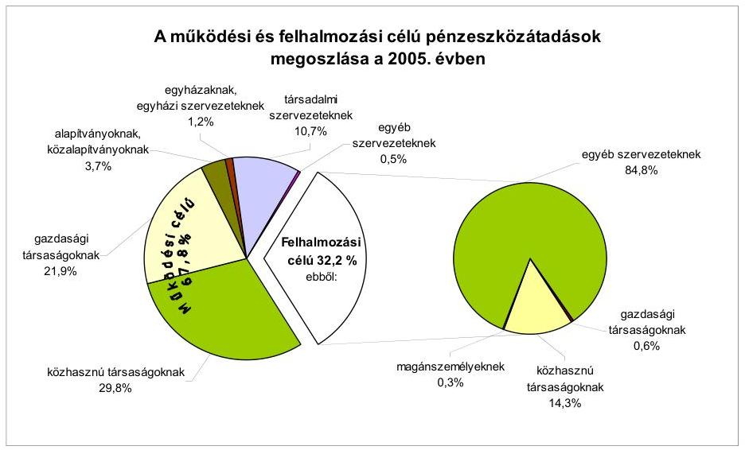
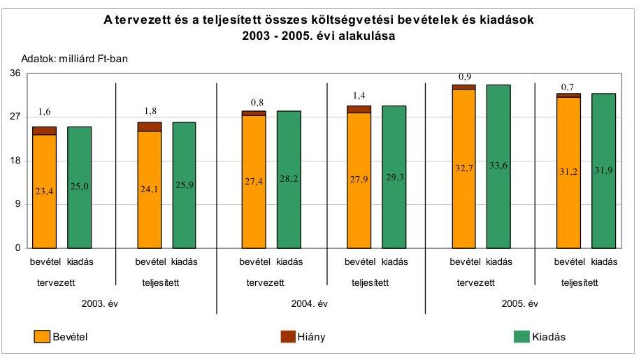
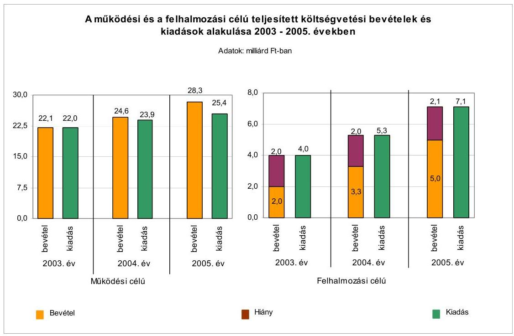
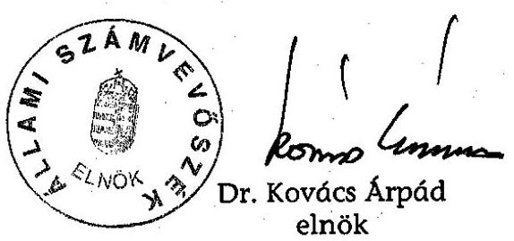

# JELENTÉS 

a Nyíregyháza Megyei Jogú Város Önkormányzata gazdálkodási rendszerének 2006. évi átfogó ellenőrzéséről

---

# 3. Önkormányzati és Területi Ellenőrzési Igazgatóság 

3.3. Átfogó Ellenőrzések Főcsoport

Iktatószám: V-1003-5/21/20/2006.
Témaszám: 803
Vizsgálat-azonosító szám: V0268

## Az ellenőrzést felügyelte:

Dr. Lóránt Zoltán
főigazgató
Az ellenőrzés végrehajtásáért felelős:
Dr. Sepsey Tamás
főigazgató-helyettes
Az ellenőrzést vezette:
Csecserits Imréné
főcsoportfőnök-helyettes
Az ellenőrzést végezték:
Lingné Rajz Borbála Dr. Szücs Zoltán Újvári Józsefné számvevő számvevő tanácsos számvevő

## A témához kapcsolódó - elmúlt három évben - készített számvevőszéki jelentések:

## címe

Jelentés a helyi önkormányzatok egyes pénzügyi befektetésekkel 0318 történő gazdálkodásának ellenőrzéséről
Jelentés a helyi és a helyi kisebbségi önkormányzatok gazdálkodásának átfogó ellenőrzéséről 319
Jelentés a szakképzési struktúra szerepéről a munkaerőpiaci igények kielégítésében 0321
Jelentés a helyi önkormányzatok beruházásaihoz és rekonstrukcióihoz nyújtott 2002. évi címzett és céltámogatások igénybevételének és felhasználásának vizsgálatáról 0332
Jelentés a helyi önkormányzatoknak bérlakásépítésre és korszerűsítésre juttatott pénzügyi támogatások ellenőrzéséről
Jelentés a települési önkormányzatok szennyvízközmű fejlesztési és működtetési feladatai ellátásának vizsgálatáról ..... 0416
Jelentés a Magyar Köztársaság 2004. évi költségvetése végrehajtásának ellenőrzéséről
Függelék

- a helyi önkormányzatokat a 2004. évben megillető normatív állami hozzájárulás elszámolása;
- a helyi önkormányzatok beruházásaihoz és rekonstrukcióihoz nyújtott 2004. évi felhalmozási célú támogatások;
- normatív kötött felhasználású támogatások.

---

# TARTALOMJEGYZÉK 

BEVEZETÉS ..... 5
I. ÖSSZEGZŐ MEGÁLLAPÍTÁSOK, KÖVETKEZTETÉSEK, JAVASLATOK ..... 7
II. RÉSZLETES MEGÁLLAPÍTÁSOK ..... 19

1. A költségvetés tervezésének, végrehajtásának, az Önkormányzat vagyongazdálkodásának és a zárszámadás elkészítésének szabályszerűsége ..... 19
1.1. A költségvetési rendelet jóváhagyásának, módosításának, az előirányzatok nyilvántartásának szabályszerűsége ..... 19
1.2. A gazdálkodás szabályozottsága, a bizonylati rend és fegyelem szabályszerűsége ..... 23
1.3. A pénzügyi-számviteli feladatok ellátásának informatikai támogatottsága ..... 34
1.4. Az önkormányzati vagyon nyilvántartása és számbavétele ..... 37
1.5. A vagyonnal való gazdálkodás szabályszerűsége, célszerűsége, nyilvánossága ..... 40
1.6. A céljelleggel nyújtott támogatások szabályszerűsége ..... 53
1.7. A közbeszerzési eljárások szabályszerűsége ..... 60
1.8. A zárszámadási kötelezettség teljesítésének szabályszerűsége ..... 63
1.9. A Polgármesteri hivatal helyi kisebbségi önkormányzatok gazdálkodását segítő tevékenysége ..... 65
2. Az önkormányzati feladatok és a rendelkezésre álló források összhangja ..... 67
2.1. A feladatok meghatározása és szervezeti keretei ..... 67
2.2. A költségvetés egyensúlyának helyzete ..... 70
2.3. A feladatok finanszírozása ..... 78
3. A belső irányítási, ellenőrzési rendszer működésének értékelése ..... 80
3.1. Az ellenőrzési rendszer kialakítása, működése ..... 80
3.2. A könyvvizsgálati kötelezettség teljesítése ..... 85
3.3. A korábbi számvevőszéki ellenőrzések javaslatainak hasznosulása ..... 85

---

# MELLÉKLETEK 

1. számú Az Önkormányzat gazdálkodását meghatározó adatok, mutatószámok (1 oldal)
2. számú Az önkormányzati vagyon nagyságának alakulása (1 oldal)
3. számú Az Önkormányzat 2005. évi bevételeinek és kiadásainak alakulása (1 oldal)
4. számú Egyes önkormányzati feladatok finanszírozása (1 oldal)
5. számú Helyszíni ellenőrzési jegyzőkönyv (7 oldal)
6. számú Csabai Lászlóné úrhölgy, a Nyíregyháza Megyei Jogú Város Önkormányzatának polgármesterének észrevétele (3 oldal)

---

# RÖVIDÍTÉSEK JEGYZÉKE 

## Törvények:

Áht.
Hat. tv.
Htv.

Kbt.
Költségvetési tv.

Ksztv.
Ltv.

Nek. tv
Ötv.
Ptk.
Számv. tv.
Vt.

## Rendeletek:

Ámr.
Ber.
Vhr.
kisebbségi kormányrendelet

2003. évi költségvetési rendelet

2004. évi költségvetési rendelet

2005. évi költségvetés rendelet

2006. évi költségvetés rendelet

az államháztartásról szóló 1992. évi XXXVIII. törvény
a helyi adókról szóló 1990. évi C. törvény
a helyi önkormányzatok és szerveik, a köztársasági megbízottak, valamint egyes centrális alárendeltségű szervek feladat- és hatásköreiről szóló 1991. évi XX. törvény
a közbeszerzésekről szóló 2003. évi CXXIX. törvény
a Magyar Köztársaság 2005. évi költségvetéséről szóló 2004. évi CXXXV. törvény
a közhasznú szervezetekről szóló 1997. évi CLVI. törvény
a lakások és helyiségek bérletére, valamint elidegenítésükre vonatkozó egyes szabályokról szóló 1993. évi LXXVIII. törvény
a nemzeti és etnikai kisebbségek jogairól szóló 1993. évi LXXVII. törvény
a helyi önkormányzatokról szóló 1990. évi LXV. törvény
a Polgári Törvénykönyvről szóló 1959. évi IV. törvény
a számvitelről szóló 2000. évi C. törvény
a vízgazdálkodásról szóló 1995. évi LVII. törvény
az államháztartás működési rendjéről szóló 217/1998. (XII. 30.) Korm. rendelet
a költségvetési szervek belső ellenőrzéséről szóló 193/2003. (XI. 26.) Korm. rendelet
az államháztartás szervezetei beszámolási és könyvvezetési kötelezettségének sajátosságairól szóló 249/2000. (XII. 24.) Korm. rendelet
a kisebbségi önkormányzatok költségvetésének, gazdálkodásának, vagyonjuttatásának egyes kérdéseiről szóló 20/1995. (III. 3.) Korm. rendelet
Nyíregyháza Megyei Jogú Város Önkormányzatának a 2003. évi költségvetésről és a költségvetés vitelének szabályairól szóló 7/2003. (III. 1.) számú rendelete
Nyíregyháza Megyei Jogú Város Önkormányzatának a 2004. évi költségvetésről és a költségvetés vitelének szabályairól szóló 8/2004. (II. 12.) számú rendelete
Nyíregyháza Megyei Jogú Város Önkormányzatának a 2005. évi költségvetésről és a költségvetés vitelének szabályairól szóló 5/2005. (II. 17.) számú rendelete
Nyíregyháza Megyei Jogú Város Önkormányzatának a 2006. évi költségvetésről és a költségvetés vitelének szabályairól szóló 3/2006. (II. 9.) számú rendelete
Nyíregyháza Megyei Jogú Város Önkormányzatának a 2004. évi költségvetési gazdálkodás végrehajtásáról szóló 15/2005. (IV. 28.) számú rendelete

---

SzMSz
vagyongazdálkodási rendelet ${ }_{1}$
vagyongazdálkodási rendelet ${ }_{2}$

Informatikai szabályzat

## Szórövidítések:

ÁSZ
FEUVE
Önkormányzat
Közgyűlés
Polgármesteri hivatal
polgármester
jegyző
Gazdasági bizottság
Gyermek, ifjúsági és sport bizottság
Pénzügyi bizottság
Szociális, egészségügyi és lakásügyi bizottság Városfejlesztési bizottság
Ellenőrzési iroda
Gazdasági iroda
Oktatási, kulturális és sport iroda
Vagyongazdálkodási iroda

MÁK
Nyírinfo Kht.
Nyírségvíz Rt.

Nyíregyháza Megyei Jogú Város Önkormányzatának a Közgyűlés és Szervei Szervezeti és Működési Szabályzatáról szóló 6/1999. (III. 1.) számú rendelete
Nyíregyháza Megyei Jogú Város Önkormányzatának a vagyon meghatározásáról, a vagyon feletti tulajdonjog gyakorlásának szabályozásáról szóló 21/2004. (VI. 24.) számú rendelete
Nyíregyháza Megyei Jogú Város Önkormányzatának a vagyon meghatározásáról, a vagyon feletti tulajdonjog gyakorlásának szabályozásáról szóló 21/2004. (VI. 24.) számú rendelete
Nyíregyháza Megyei Jogú Város Polgármesteri hivatal Informatikai, Adatvédelmi és Biztonsági Szabályzata

Állami Számvevőszék
folyamatba épített, előzetes és utólagos vezetői ellenőrzés
Nyíregyháza Megyei Jogú Város Önkormányzata
Nyíregyháza Megyei Jogú Város Önkormányzatának Közgyűlése
Nyíregyháza Megyei Jogú Város Önkormányzatának Polgármesteri hivatala
Nyíregyháza Megyei Jogú Város Önkormányzatának polgármestere
Nyíregyháza Megyei Jogú Város Önkormányzatának jegyzője
Nyíregyháza Megyei Jogú Város Önkormányzatának Gazdasági Bizottsága
Nyíregyháza Megyei Jogú Város Önkormányzatának Gyermek, Ifjúsági és Sport Bizottsága
Nyíregyháza Megyei Jogú Város Önkormányzatának Pénzügyi Bizottsága
Nyíregyháza Megyei Jogú Város Önkormányzatának Szociális, Egészségügyi és Lakásügyi bizottsága
Nyíregyháza Megyei Jogú Város Önkormányzatának Városfejlesztési Bizottsága
Nyíregyháza Megyei Jogú Városi Önkormányzata Polgármesteri Hivatalának Ellenőrzési és Minőségügyi Irodája
Nyíregyháza Megyei Jogú Városi Önkormányzata Polgármesteri Hivatalának Gazdasági Irodája
Nyíregyháza Megyei Jogú Városi Önkormányzata Polgármesteri Hivatalának Oktatási, Kulturális és Sport Irodája
Nyíregyháza Megyei Jogú Városi Önkormányzata Polgármesteri Hivatalának Vagyongazdálkodási és Üzemeltetési Irodája
Magyar Államkincstár Területi Igazgatósága
Nyíregyházi Informatikai Közhasznú Társaság
Nyíregyháza és Térsége Víz-és Csatornamű Részvénytársaság

---

# JELENTÉS 

## a Nyíregyháza Megyei Jogú Város Önkormányzata gazdálkodási rendszerének 2006. évi átfogó ellenőrzéséről

## BEVEZETÉS

Az Ötv. 92. § (1) bekezdése, az Állami Számvevőszékről szóló 1989. évi XXXVIII. törvény 2. § (3) bekezdése, valamint az Áht. 120/A. § (1) bekezdése alapján az önkormányzatok gazdálkodását az Állami Számvevőszék ellenőrzi. Az ellenőrzés elvégzése az Országgyűlés illetékes bizottságai részére is átadott, országosan egységes ellenőrzési program alapján történt.

## Az ellenőrzés célja annak értékelése volt, hogy:

- az önkormányzati gazdálkodás törvényességét, szabályszerűségét biztosították-e a tervezés, a költségvetés végrehajtása, a vagyongazdálkodás és a zárszámadás során;
- az Önkormányzat által ellátott feladatok és az azokhoz rendelkezésre álló források összhangja biztosított volt-e, különös tekintettel az egyes kiemelt feladatokra;
- a gazdálkodás szabályszerűségét biztosító kontrollok megfelelően segítették-e a végrehajtást.

Az ellenőrzött időszak: a 2005. év, az 1.5, 2.1-2.3 és 3.3 ellenőrzési pontok esetében ezen túlmenően a 2003-2004. évek is.

Nyíregyháza megyei jogú város Szabolcs-Szatmár-Bereg megye székhelye. A város lakosainak száma 2005. január 1-jén 118 426 fő volt. A Közgyűlés tagjainak száma 35 fő, munkáját 10 állandó bizottság támogatja. A polgármestert - aki az 1994. év óta tölti be tisztségét - két főállású és egy társadalmi megbízatású alpolgármester segíti feladatai ellátásában.

[^0]
[^0]:    ${ }^{1}$ A törvényi előírások betartásának elmulasztásakor a részletes megállapítások fejezetben egységesen a törvénysértés megjelölést alkalmazzuk, mivel az ÁSZ nem tehet különbséget a törvényi előírások között.
    ${ }^{2}$ A gazdálkodás szabályszerűségét biztosító kontroll alatt értjük a kiépített és működő belső irányítási és szabályozási rendszert, valamint a belső ellenőrzési funkciók ellátását.

---

A jegyző 1999. január 1-jétől vezeti a Polgármesteri hivatalt.
A városban hat kisebbségi önkormányzat működik. Az Önkormányzat a 2005. évben 36 081 millió Ft bevételből gazdálkodott, a teljesített kiadás 34 382,2 millió Ft volt. A kiadások 78%-át működési, 22%-át felhalmozási célra fordították. A könyvviteli mérlegben kimutatott vagyonának értéke 120 519 millió Ft-ot tett ki.

A városban és a vonzáskörzetében élőknek nyújtott közszolgáltatásokhoz összesen 69 intézményt (ebből 29 részben önálló gazdálkodási jogkörrel rendelkezőt) tartottak fenn a 2003. évben. Az intézményracionalizálási intézkedések következtében a 2005. év folyamán az intézmények száma 67-re csökkent, melyből 38 intézmény rendelkezik részben önálló gazdálkodási jogkörrel. Ezen kívül hat gazdasági társaságnak és öt közhasznú társaságnak 100%-ban tulajdonosa az Önkormányzat, amelyek közreműködnek a kötelező feladatok, a különböző közszolgáltatások ellátásában. A Polgármesteri hivatalban foglalkoztatott köztisztviselők száma a 2005. évben 327 fő volt, az intézményekben 4079 fő közalkalmazott látta el a különböző közszolgáltatásokat, és az azokhoz kapcsolódó gazdálkodási teendőket. Az Önkormányzat gazdálkodását meghatározó adatokat, mutatószámokat a jelentés 1. számú melléklete tartalmazza.

A jelentés megállapításainak, javaslatainak egyeztetése során a polgármester úrhölgy arról adott tájékoztatást, hogy az időközben megtett intézkedésekkel a javaslatok egy részét megvalósították. Ezekben az esetekben a jelentés II. Részletes megállapítások fejezetében az adott témához kapcsolt lábjegyzetben a megtett intézkedést feltüntettük és a kapcsolódó javaslatot elhagytuk.

[^0]
[^0]:    ${ }^{3}$ Cigány, lengyel, örmény, szlovák, német, ukrán.

---

# I. ÖSSZEGZŐ MEGÁLLAPÍTÁSOK, KÖVETKEZTETÉSEK, JAVASLATOK 

Az Önkormányzat rendelkezett gazdasági programmal, melyben a helyi gazdasági, társadalmi adottságok figyelembevételével a 2003-2006. évekre meghatározták az Önkormányzat stratégiai céljait.

A 2005. és a 2006. évi költségvetési koncepciókat az Ámr. előírásának megfelelően a helyben képződő bevételek és az ismert kötelezettségek figyelembevételével állították össze. A helyi kisebbségi önkormányzatok elnökeit az Ámr-ben foglaltak ellenére a koncepció kisebbségi önkormányzatokra vonatkozó részéről nem tájékoztatták. A határidőben beterjesztett költségvetési koncepciókhoz a polgármester az Ámr. előírása ellenére nem csatolta a Pénzügyi bizottság véleményét. A költségvetési koncepciók alapján a Közgyűlés határozatokban döntött a költségvetés készítésének további munkálatairól.

A polgármester a 2005. és a 2006. évi költségvetési rendelettervezetet az Áht-ban előírt határidőben a Közgyűlés elé terjesztette, azonban az Ámr. előírása ellenére a rendelettervezethez nem csatolta a Pénzügyi bizottság véleményét, valamint a könyvvizsgáló írásos jelentését. A 2005. évi költségvetési rendeletben az Áht-ban foglaltakat megsértve a költségvetési bevételek és kiadások között finanszírozási célú pénzügyi műveleteket szerepeltettek, valamint a 2005. és a 2006. években nem mutatták be a tervezett hiány összegét. A költségvetési rendelettervezetek előkészítése során az Ámr-ben meghatározott, a költségvetés szerkezetére vonatkozó előírásokat - a működési és felhalmozási célú bevételi és kiadási előirányzatokat mérlegszerűen, egymástól elkülönítetten, de együttesen egyensúlyban történő bemutatása kivételével - figyelembe vették. A költségvetés előterjesztésekor az Áht-ban előírt mérlegeket és kimutatásokat - kivéve a közvetett támogatásokat szöveges indokolással - bemutatták, de azok tartalmi követelményeit az Áht. előírása ellenére rendeletben nem határozták meg. Az Ámr. előírását figyelmen kívül hagyva a működő hat kisebbségi önkormányzat költségvetésére vonatkozó adatokat az Önkormányzat költségvetésébe a kisebbségi önkormányzatok képviselő-testületeinek a költségvetésről történő határozathozatala nélkül építették be. A költségvetés végrehajtására vonatkozó szabályok között a Közgyűlés a 2005. évben nem, azonban a 2006. évben már
 rendelkezett az önállóan gazdálkodó költségvetési szervek előirányzat-módosítási jogkörének meghatározásáról.

A Közgyűlés a 2005. évi költségvetés kiadási és bevételi előirányzatait év közben összesen 3%-kal, 925 millió Ft-tal növelte. Az Önkormányzat a költségvetési előirányzatok módosításáról az Ámr-ben foglalt előírásokat betartva döntött. A helyi kisebbségi önkormányzatok költségvetését - a cigány kisebbségi önkormányzat kivételével - az Áht. előírását megsértve a kisebbségi önkormányzatok képviselő-testületeinek határozatai nélkül módosították.

A Polgármesteri hivatal rendelkezett a Közgyűlés által jóváhagyott, szervezetére és működésére vonatkozó szabályzattal, amely az SzMSz mellékletét képezte.

---

Az SzMSz az Ámr. előírásai ellenére nem tartalmazta a Polgármesteri hivatal alapító okiratának keltét, számát, a költségvetésének végrehajtására szolgáló számlaszámot, a hozzá rendelt részben önállóan gazdálkodó költségvetési szerv megjelölését, valamint ezen szervnél, illetve saját szervezeti egységeinél a pénzügyi-gazdasági tevékenységet ellátó személyek feladatkörének és munkakörének meghatározását. A Polgármesteri hivatal gazdasági szervezete ügyrendjében az Ámr. előírása ellenére nem határozták meg a Polgármesteri hivatalhoz rendelt részben önállóan gazdálkodó költségvetési szerv tekintetében ellátandó feladatokat. A költségvetési gazdálkodást érintő gazdálkodási jogkörök szabályozását polgármesteri és jegyzői együttes utasítás tartalmazta, továbbá a jegyző szabályozta a szakmai teljesítés igazolásának módját, gondoskodott az azt végző személyek kijelöléséről. Az érvényesítést végzők írásos kijelölése a jegyző részéről megtörtént, amely során az érvényesítők iskolai végzettségre és szakmai képesítésre vonatkozó előírásait betartotta. A gazdálkodási jogkörök gyakorlására történő felhatalmazásoknál utólagos beszámolási kötelezettséget nem írtak elő, beszámoltatásra nem került sor. A Polgármesteri hivatalhoz rendelt részben önállóan gazdálkodó költségvetési szerv gazdálkodási jogkörei gyakorlásának szabályait a felelősségvállalás és a munkamegosztás rendjéről szóló megállapodás tartalmazta, ehhez azonban a Vhr. előírásai ellenére nem rendelkeztek a felügyeleti szerv egyetértésével.

A jegyző a Htv-ben foglaltak ellenére nem alakította ki az önkormányzati intézmények egységes számviteli rendjét. A jegyző elkészítette a Polgármesteri hivatal számviteli politikáját és a kapcsolódó szabályzatokat. A számviteli politikában meghatározták, hogy a számviteli elszámolás és értékelés szempontjából mit tekintenek lényegesnek, nem lényegesnek, jelentős és nem jelentős összegnek. A Vhr. előírása ellenére nem rögzítették, hogy mi tekintendő figyelembe veendő szempontnak, a jelentősnek minősített árfolyamváltozás összegének meghatározásánál. Az eszközök és források leltározási és leltárkészítési szabályzata tartalmazta az évenkénti leltározás előkészítésével, megszervezésével és végrehajtásával kapcsolatos feladatokat. Az értékelési szabályzatban a Vhr. előírása ellenére nem rögzítették az áruszállításból és a szolgáltatásnyújtásból származó követelés értéke meghatározásának módját, a számlázás és a követelésekkel kapcsolatos adatok nyilvántartásának rendjét, valamint követeléstípusonként a kis összegű követelések év végi meghatározásának elveit, dokumentálásának szabályait. A pénzkezelési szabályzatban rögzített házipénztári keret maximális összege a házipénztár átlagos napi pénzforgalma figyelembevételével indokolatlanul magas volt. Az eszközök hasznosítási, selejtezési szabályzata tartalmazta a selejtezéssel kapcsolatos eljárási szabályokat, hatásköröket. A számlarendben a Vhr-ben foglaltak ellenére nem rögzítették az analitikus nyilvántartások főkönyvi könyveléssel való egyeztetésének dokumentálási módját, nem határozták meg az analitikus nyilvántartásokból készítendő összesítő kimutatások (feladások) formáját, tartalmát. A Polgármesteri hivatal számviteli politikája, számlarendje a Vhr. előírásai ellenére nem tartalmazta a kisebbségi önkormányzatok számviteli elszámolási, nyilvántartási és pénzkezelési szabályait.

A számvitel rendjét, a gazdálkodási jogköröket meghatározó szabályzatok előírásai egymással, valamint az ügyrenddel összhangban voltak. A FEUVE rendszer elemeit képező, a pénzügyi, gazdálkodási és számviteli feladatellátásra készített szabályzatokban az Ámr. előírása ellenére a jegyző nem szabályozta a

---

szabálytalanságok kezelésének eljárásrendjét. A pénzügyi-számviteli dolgozók munkaköri leírásaiban az egyeztetési, folyamatba épített ellenőrzési feladatokat meghatározták, azonban ezek szabályzatokkal való összhangját nem biztosították. Az Ámr. előírása alapján a jegyző elkészítette a Polgármesteri hivatal ellenőrzési nyomvonalát, azonban az Ámr. előírása ellenére az nem képezi az SzMSz mellékletét. Az Ámr-ben előírtak ellenére a jegyző nem alakította ki és nem működtette a kockázatkezelés rendjét.

A könyvviteli nyilvántartásban elszámolt gazdasági műveletekről, eseményekről a Számv. tv-ben előírt számviteli bizonylatokat kiállították, azonban a könyvviteli elszámolást közvetlenül alátámasztó bizonylatok a Számv. tv-ben foglaltakat megsértve nem tartalmazták a könyvviteli rögzítés időpontját, a rögzítés elvégzésének igazolását, valamint a bizonylatok 53%-ában nem tüntették fel az érintett könyvviteli számlákra történő hivatkozást. Az Ámr-ben foglaltak ellenére a kötelezettségvállalás nyilvántartásba vételének sorszámát a bizonylatok 77%-ában nem tüntették fel az utalványrendeleten. A költségvetést terhelő kötelezettségvállalások 18%-át az Ámr. előírása ellenére nem foglalták írásba.

A kiadási bizonylatok 39%-ánál elmaradt a kötelezettségvállalás ellenjegyzése, az ellenjegyzésre jogosult nem tett eleget az Ámr-ben előírt ellenőrzési feladatának. A bizonylatok 61%-ánál elmaradt a szakmai teljesítés igazolása, amely esetekben az Ámr-ben foglalt előírás ellenére nem végezték el a kiadások teljesítésének és a bevételek beszedésének elrendelése előtt az ellenőrzési feladatokat. Az érvényesítő a bizonylatok 53%-ában nem igazolta aláírásával az ellenőrzési feladat elvégzését, továbbá nem tett eleget az Ámr-ben foglalt munkafolyamatba épített ellenőrzési kötelezettségének, mert annak ellenére érvényesítette a kiadási bizonylatokat, hogy hiányzott a kötelezettségvállalás nyilvántartásba vételi sorszámának feltüntetése, a szakmai teljesítés igazolása, valamint a kötelezettségvállalás ellenjegyzése. Az utalványozás ellenjegyzője a bizonylatok 7%-ában az Ámr. előírása ellenére nem igazolta aláírásával az ellenőrzési feladat elvégzését, az ellenjegyzett bizonylatok esetében az utalványrendeleteket aláírásával ellátta, azonban elmulasztotta az Ámr-ben előírt ellenőrzési feladatok elvégzését azokban az esetekben, ahol hiányzott a kötelezettségvállalás nyilvántartásba vételi sorszámának feltüntetése, a szakmai teljesítés igazolása vagy az érvényesítés. A bizonylatok 7%-a - a banki bevételek bizonylatai - az Ámr. előírása ellenére nem tartalmazta az utalványozó aláírását. A Polgármesteri hivatalban a gazdálkodási és ellenőrzési jogköröket a pénztári és a bankszámla pénzmozgások bizonylatain, illetve az utalványrendeleteken az arra jogosultak gyakorolták.

A bizonylatokban foglalt gazdasági események könyvviteli elszámolása során a Vhr. előírásával ellentétesen a negyedévenként készített összesítésben az analitikus nyilvántartások adatait összevontan - a növekedés-csökkenés jogcímeinek részletezése nélkül - szerepeltették, továbbá a Polgármesteri hivatal könyveiben előirányzat nélkül számolták el az előző évi költségvetési tartalék igénybevételét. A Polgármesteri hivatalban a kötelezettségvállalásokról rendelkeztek nyilvántartással, de abból az Ámr-ben foglaltak ellenére nem volt megállapítható az évenkénti kötelezettségvállalások, illetve a rendelkezésre álló kötelezettségvállalással nem terhelt előirányzatok összege, nem volt biztosított annak feltétele, hogy a költségvetés végrehajtása során kötelezettségvállalás és

---

utalványozás csak a jóváhagyott kiadási előirányzatok mértékéig teljesüljön. Önkormányzati szinten a 2005. évi kiemelt előirányzatokon belül gazdálkodtak, azonban az Áht. előírását megsértve 18 költségvetési szerv az intézményi szintű módosított előirányzatot, a Polgármesteri hivatal és 38 intézmény pedig a kiemelt előirányzatok valamelyikét túllépte. Az előirányzat-túllépések okait a 2005. évi ellenőrzési tervben szereplő intézmények pénzügyi-gazdasági ellenőrzése keretében és a személyi juttatással való gazdálkodás ellenőrzése során vizsgálta a Polgármesteri hivatal. A többieknél a túllépések okait nem vizsgálták, felelősségre vonás nem történt.

Az Önkormányzat, a Polgármesteri hivatal informatikai eszközökkel való ellátottságának biztosítására, az informatikai rendszer működtetésére a 2001. évben közhasznú társaságot alapított. A Polgármesteri hivatal bérleti és szolgáltatási szerződést kötött a Nyírinfo Kht-val, melynek keretében a társaság bérbeadás útján biztosítja a feladatellátáshoz szükséges számítástechnikai eszközöket, az azokat működtető programokat és ellátja a rendszer működtetését. A Polgármesteri hivatalban - a részesedések, értékpapírok nyilvántartásának kivételével - az analitikus nyilvántartásokat számítógépes programok segítségével vezették. A Polgármesteri hivatal rendelkezett a Közgyűlés által jóváhagyott informatikai stratégiával, jegyző által hatályba léptetett informatikai és biztonsági szabályzattal, katasztrófa-elhárítási tervvel, de nem határozták meg a pénzügyi- és számviteli rendszerek működését biztosító szerveren elvégzendő mentések gyakoriságát. A szabályzatban megfogalmazott informatikai feladatok és azok ellátására kötött szolgáltatási szerződés tartalma nem volt összhangban egymással. Az informatikai szabályzatok, az üzemeltetési dokumentációk együttesen tartalmazták a biztonságos feladatellátást segítő üzemeltetés feltételeit. A Polgármesteri hivatalban az informatikai rendszer program-részletezésű jogosultsági rendszerét kialakították, azonban nem dokumentálták, hogy az egyes számítógépes programok kezelésére mely munkakörben foglalkoztatottak jogosultak.

Az önkormányzati vagyont forgalomképesség szerint elkülönítetten tartották nyilván, ezzel eleget tettek a Vhr-ben foglalt előírásoknak. A 2005. évi leltározási tevékenység végrehajtására készített leltározási utasítás, az ütemterv és a leltározási tevékenység végrehajtása megfelelt a Vhr-ben foglaltaknak. Az ingatlanok, üzemeltetésre, kezelésre átadott eszközök leltározását mennyiségi felvétellel, a részesedések, értékpapírok, követelések és kötelezettségek leltározását az analitikus nyilvántartások - követelések esetében egyenlegközlő levél alapján - egyeztetésével végezték. A negyedévenkénti értékvesztés elszámolásához a százalékos értékvesztési mutatókat adónemenként, minősítési kategóriánként, tapasztalati adatok alapján a Vhr-ben foglalt előírásoknak megfelelően meghatározták. A követelések értékvesztésének megállapítását nem a Vhr-ben előírt határidőben végezték, ezért az értékvesztés Vhr. által előírt negyedévenkénti elszámolására és visszaírására nem került sor. Az adósok, vevők és egyéb követelések év végi értékelését a Vhr-ben foglaltaknak megfelelően elvégezték. A 25% alatti tulajdoni részaránnyal rendelkező gazdasági társaságok közül egy társaság értékeléséhez, a 100%-os önkormányzati tulajdonú gazdasági társaságokban levő valamennyi részesedés értékeléséhez rendelkezésre álltak a szükséges információk. Az értékelést és az értékvesztés elszámolását a Számv. tv. előírását megsértve, annak indokoltsága ellenére nem végezték el négy gazdasági társaságban lévő részesedés esetében. A szükséges információk hiányában tíz társaságban lévő részesedés esetében sem végezték el az értékelést.

Az Önkormányzat a vagyonával való gazdálkodás szabályait, a döntési jogköröket a vagyongazdálkodási, a nem lakás céljára szolgáló helyiségek elidegenítéséről, valamint a nem lakás céljára szolgáló helyiségek bérletéről szóló rendeletekben határozta meg. A vagyongazdálkodási hatásköröket vagyoncsoportonként, értékhatártól függően, a hasznosítás módjára tekintettel, differenciáltan, célszerűen állapították meg. A vagyongazdálkodási rendeletben nem határozták meg, hogy mely szervezetek tartoznak az egyéb gazdálkodó szervezetek, valamint a kezelő szervezetek közé. A vagyonhasznosítás nyilvánossága érdekében előírták, hogy az pályáztatás útján, vagy liciteljárás keretében történhet. A vagyongazdálkodási rendeletben nem szabályozták a vagyon forgalomképesség szerinti besorolásának megváltoztatási módját. Meghatározták az ingyenes vagyonátadásra, követelésről való lemondásra jogosultak körét, de az Áht. előírását megsértve nem határozták meg azok eseteit. A vagyongazdálkodási rendelet a Vt. előírásaitól eltérően szabályozta a víziközmű vagyonnal való gazdálkodást, mivel lehetővé tette annak gazdasági társaságba történő apportálását. Az ingatlanok tulajdonjogának átadásához, a forgalmi érték megállapításához nem írtak elő értékbecslési kötelezettséget.

Az Önkormányzat vagyongazdálkodással kapcsolatos döntései a költségvetésben megfogalmazott programcélokkal összhangban voltak. A vagyont érintő döntések során betartották a vagyongazdálkodási rendeletben rögzített hatásköri szabályokat. Az ingatlanok értékesítése során három esetben a versenyeztetés mellőzésével megsértették az Áht. előírását, két esetben pedig a forgalomképtelen vagyon értékesítése miatt megsértették az Ötv. és a vagyongazdálkodási rendelet előírásait. Az Önkormányzat a fejlesztési célú támogatások és a vagyonváltozást érintő - az Áht-ban meghatározott értékhatár feletti szerződések közzétételi kötelezettségét - a 2004. évben megkötött szerződések kivételével - utólag, a helyszíni ellenőrzés ideje alatt teljesítette, azonban a nyilvánosságra hozatali kötelezettség helyi szabályairól, felelőseinek kijelöléséről nem rendelkeztek. Az Önkormányzat az SzMSz-ben rögzített szabályok alapján biztosított helyiségeket négy párt részére díjmentesen, egy pártszervezet részére pedig kedvezményes bérleti díjat állapított meg. Az Önkormányzat térítésmentes vagy kedvezményes helyiséghasználat biztosításával az Ötv. előírásai ellenére nem közfeladat-ellátásához nyújtott támogatást a pártok részére, és nem biztosította az alkotmányos egyenlőséget a bérlők között.

Az Önkormányzatnál a céljellegű támogatások egységes
 pályáztatási, igénylési rendszerét nem alakították ki. A támogatott szervezetek részére - a nem szociális jelleggel - nyújtott támogatások folyósításának szabályait, a számadási kötelezettség teljesítésének, a rendeltetésszerű felhasználás ellenőrzésének helyi szabályait, felelőseit, a kapcsolódó analitikus nyilvántartás tartalmi követelményeit indokoltsága ellenére nem szabályozták. A 2005. évi költségvetési rendeletben megtervezett, nem szociális jellegű támogatások fedezetére szolgáló előirányzatok felett a „civil keret" kivételével a rendelkezésre jogosultak körét meghatározták.

A Közgyűlés, a bizottságok és a polgármester összesen 976 alkalommal döntött nem szociális jellegű működési és fejlesztési célokat szolgáló támogatások folyósításáról. A 2005. évben közhasznú szervezeteknek, gazdasági társaságoknak, alapítványoknak, közalapítványoknak, egyházaknak, társadalmi szervezeteknek, és magánszemélyeknek összesen 2401 millió Ft céljellegű támogatást adott. A támogatás 68%-a működési, 32%-a fejlesztési célokat szolgált. A bizottságok és a polgármester az Ötv. előírását megsértve döntöttek alapítványok részére nyújtott támogatásokról. Az Önkormányzatnál a Kszftv. előírása ellenére a támogatottak 88%-a esetében nem rögzítették támogatási szerződésben a támogatással való elszámolás feltételeit és módját. A támogatottak 28%-a részére az Áht. előírását megsértve nem határozták meg a támogatás célját, nem írtak elő számadási kötelezettséget. Az előírt számadási kötelezettség teljesítését figyelemmel kísérték, a beérkezett dokumentumokat alakilag és tartalmilag ellenőrizték, azonban a cél szerint felhasználást a megküldött számadások 63%-át érintően az Áht-ban foglaltakat megsértve nem ellenőrizték. A lefolytatott ellenőrzések során hét esetben céltól eltérő felhasználást állapítottak meg. A céltól eltérő felhasználás és a számadási kötelezettség elmulasztása esetén az Áht. előírását megsértve nem kezdeményezték a támogatás visszafizetését.

A közbeszerzési eljárás helyi szabályainak meghatározására a Közgyűlés közbeszerzési szabályzatot fogadott el, melyben meghatározták a közbeszerzési eljárás előkészítésével, lefolytatásával, ellenőrzésével kapcsolatos felelősségi és dokumentálási rendet. A 2005. évben a Polgármesteri hivatal 41 közbeszerzési eljárást folytatott le. A közbeszerzési eljárások során betartották a Kbt. és a közbeszerzési szabályzat előírásait. A közbeszerzési eljárás során vizsgálták az előkészítésben részt vevők összeférhetetlenségét, az eljárást lezáró határozatot hozó döntést a Közgyűlés határozatának megfelelően a polgármester hozta meg. A szerződéskötés az ajánlati felhívás tartalmának, illetve az adott ajánlat tartalmának megfelelően történt. Szerződésmódosításra nem került sor. A közbeszerzési tevékenység ellenőrzését a Kbt. és a közbeszerzési szabályzat előírása ellenére nem végezték el. A Közbeszerzések Tanácsa Közbeszerzési Döntőbizottsága egy alkalommal marasztalta el az Önkormányzatot a Kbt. megsértése miatt.

A polgármester az Áht-ban meghatározott határidőn belül terjesztette elő a zárszámadási rendelettervezetet. A zárszámadási rendeletet az Áht. előírása ellenére nem a költségvetési rendelettel összehasonlítható módon készítették el, mivel nem mutatták be a működési és fenntartási célú bevételi és kiadási előirányzatokat részben önállóan gazdálkodó költségvetési szervenként, azon belül kiemelt előirányzatonként. Az Áht-ban foglaltakat megsértve a zárszámadás előterjesztésekor tájékoztatásul nem mutatták be a többéves kihatással járó döntések számszerűsítését évenkénti bontásban és összesítve, szöveges indokolással, valamint a közvetett támogatást tartalmazó kimutatás szöveges indokolását. Az Áht-ban foglaltakat megsértve a helyi kisebbségi önkormányzatok zárszámadása a helyi kisebbségi önkormányzatok képviselő-testületei zárszámadást elfogadó határozata hiányában került beépítésre. Az önkormányzati szintű költségvetési pénzmaradványt és a vállalkozási tevékenység eredményét a Vhr. és az Ámr. előírásainak megfelelően határozták meg. Az intézményi beszámolókat az előírt határidőben felülvizsgálták, azonban a beszámoló elfogadásáról és a működés elbírálásáról az Ámr. előírása ellenére az intézményeket írásban nem értesítették.

Az Önkormányzat a Nek. tv-ben foglaltak ellenére az SzMSz-ben nem rögzítette, hogy milyen módon biztosítja a kisebbségi önkormányzatok részére, a testületi működésük feltételeit. Az Önkormányzat valamennyi helyi kisebbségi önkormányzattal megkötötte az Áht-ban és az Ámr-ben előírt együttműködési megállapodást. Az Ámr. előírásával szemben az együttműködési megállapodások felülvizsgálatát nem végezték el és nem módosították annak ellenére, hogy az indokolt lett volna. A megállapodásokban meghatározták - de az Ámr. előírása ellenére nem konkrét időpont megjelölésével - a költségvetési és a zárszámadási előterjesztések benyújtásának és a határozatok meghozatalának határidejét. A megállapodások a kisebbségi kormányrendelet előírása ellenére nem tartalmazták a kisebbségi önkormányzatok előirányzatait módosító határozatok átadásának idejét. A megállapodásban nem szabályozták a jegyző által elkészítendő költségvetési, előirányzat módosítási, zárszámadási határozattervezetek kisebbségi önkormányzatok részére történő átadásának időpontját. A jegyző a kisebbségi önkormányzatok gazdálkodásához kapcsolódóan az Ámr. előírása ellenére nem szabályozta a szakmai teljesítés igazolásának módját és belső szabályzatban nem jelölte ki a szakmai teljesítés igazolását végző személyeket. Az együttműködési megállapodások nem biztosították maradéktalanul az Önkormányzat és a helyi kisebbségi önkormányzatok központi előírásoknak megfelelő együttműködését a költségvetés tervezése, a zárszámadás és az operatív gazdálkodás területén. A Polgármesteri hivatal a Nek. tv. rendelkezésének megfelelően biztosította a kisebbségi önkormányzatok testületi működésének feltételeit. A Polgármesteri hivatal a kisebbségi önkormányzatok előirányzatairól, kötelezettségvállalásairól analitikus nyilvántartást az Áht. és az Ámr. előírásai ellenére nem vezetett.

Az Önkormányzat az Ötv. előírása ellenére nem határozta meg, hogy a lakosság igényeitől és anyagi lehetőségeitől függően mely feladatokat milyen mértékben és módon lát el. Az Önkormányzatnál a feladatok ellátását alapvetően költségvetési intézmények útján biztosították. A közművelődési, szociális, sport, ifjúsági, egészségügyi alapellátási, és közszolgáltatási területeken közalapítványok, közhasznú társaságok, egyéni vállalkozások, valamint önkormányzati többségi tulajdonú vállalkozások vettek részt a kötelező és önként vállalt feladatok elvégzésében. A feladatellátás szervezeti kereteiben történő változtatások a feladatok megoldásának saját intézményi területét érintették elsősorban. Egy-egy költségvetési intézményt szüntettek meg a közoktatási, kulturális ágazatban, a gazdálkodási jogkörök jelentős átszervezéséről döntöttek a 2005. évben. A 2003-2005. évben végrehajtott szervezeti változások végrehajtásának eredményeit a Közgyűlés nem értékelte.

Az Önkormányzat gazdálkodásának pénzügyi egyensúlya az elmúlt három évben nem volt biztosított, a költségvetési rendeletekben tervezett költségvetési bevételek nem nyújtottak fedezetet a tervezett költségvetési kiadásokra. A 2005. évben a tervezett hiány összege 2444 millió Ft volt, ez a költségvetés főösszegének 7%-át alkotta. Az Önkormányzatnál a forráshiány 2003-2005. között állandósult, melyet a tervezett és teljesített felhalmozási célú kiadások okoztak. A működési célú bevételek ugyanezen időszakban minden évben meghaladták a működési célú kiadásokat, a többletet felhalmozási célú kiadásokra fordították. A növekvő likviditási problémák megoldására a folyószámla hitelkeretet évente növelték, ennek összege a 2005. évben 1700 millió Ft volt. Az év végi rövid lejáratú hitelállomány 2003-2005. között folyamatosan nőtt, a 2005. év végén 1559 millió Ft éven belül nem törlesztett hitellel rendelkeztek. A tervezett felhalmozási kiadások finanszírozásához a 2003-2005. évben több évre szóló fizetési kötelezettséget vállaltak további hitelek felvételével. A hosszú lejáratú hitelek és kölcsönök állománya a 2005. év végén 4920 millió Ft volt. Az adósságot keletkeztető kötelezettségvállalásoknál az Ötv-ben előírt felső határt betartották.

Az Önkormányzat a 2003-2005. években a tervezett felhalmozási feladatok megoldása érdekében több alkalommal hozott kiadáscsökkentő és forrásbővítő intézkedéseket. Intézmények megszüntetéséről, átszervezéséről döntöttek, létszámcsökkentést hajtottak végre, vagyonhasznosításra irányuló döntéseket hoztak és ingatlanokat értékesítettek. Az Önkormányzat a bevételek növelése érdekében a 2003. évben új helyi adónemet (idegenforgalmi adó) vezetett be, a helyi adó bevételek a 2005. évben a költségvetési bevételek 13%-át alkották. Az iparűzési adónál a törvényi maximumot alkalmazták, az építményadó mértéke 0,2%-kal marad el a törvényi maximumtól, az idegenforgalmi adó mértéke a törvényi maximum 33%-a. A Hat. tv-ben meghatározottakon túlmenően is megállapítottak adókedvezményeket, mentességeket.

A naturális mutatókkal mérhető feladatok (bölcsődei ellátás, óvodai nevelés, általános és középiskolai ellátás, nappali szociális és bentlakásos szociális intézményi ellátás) egy főre jutó kiadásai a 2003. évről a 2005. évre 0,1-20%-kal emelkedtek. A legalacsonyabb emelkedés a bölcsődéknél, a legmagasabb a bentlakásos szociális intézménynél volt. A kapacitás kihasználtság az oktatási intézményeknél nőtt, a szociális intézményeknél kismértékben csökkent. A kiadások finanszírozásában a 2005. évben az Önkormányzat részesedése képviselt meghatározó súlyt, a nappali szociális intézményi ellátásban 55%, a bölcsődei ellátásban 47%, az óvodai nevelésben 44% volt. Az állami hozzájárulás és támogatás az általános iskolai oktatáshoz 71%-ot, a középiskolai oktatáshoz 89%-ot biztosított. Az intézményi saját bevétel aránya csak a nappali és a bentlakásos szociális intézményi ellátásban jelentett a 2005. évben 10% feletti arányt (17, illetve 30%-ot).

Az önként vállalt feladatok finanszírozására a költségvetési kiadások 11%-9%-9%-át fordították a 2003-2005. években. Az önként vállalt feladatok főleg a kulturális, sport és ifjúsági területeken történő intézmény fenntartást, illetve a nem feladat-ellátási szerződéseken alapuló céljellegű támogatást tartalmazták, az önként vállalt feladatok az Önkormányzat működőképességét nem veszélyeztették.

Az Önkormányzat a fogyatékos személyek akadálymentes közlekedésének segítése érdekében felmérte a várható kiadásokat, mely szerint a teljes akadálymentesítés kiadásai 933 millió Ft-ot tesznek ki. A 2003-2005. években 69 millió Ft-ot fordítottak akadálymentesítésre. A 137 önkormányzati tulajdonú középületből 65 épületben biztosított a teljes akadálymentesítés, az épületek 53%-ában, 72 épületben nem biztosított a mozgássérült személyek akadálymentes közlekedése. Az Önkormányzat a fogyatékos személyek jogairól és esélyegyenlőségük biztosításáról szóló törvényben előírtakat figyelmen kívül hagyva a 2005. január 1-jei határidőre a feladatok elvégzését nem biztosította.

Az Önkormányzat kialakította a belső ellenőrzési kötelezettség teljesítéséhez szükséges szervezeti kereteket. A Polgármesteri hivatal és az intézmények ellenőrzési feladatainak ellátására az Áht-ban foglaltaknak megfelelően, közvetlenül a jegyzőnek alárendelve a Közgyűlés a 2003. évben létrehozta az Ellenőrzési irodát. Az Áht. előírása ellenére nem biztosították az Ellenőrzési iroda funkcionális függetlenségét, mert az ellenőrzési tevékenység végzése mellett, egyéb feladatok ellátásába is bevonták. Az ellenőrzési feladatokat az Ellenőrzési irodán belül tíz fő látta el. A belső ellenőrzési vezető a Ber-ben előírtak alapján elkészítette a belső ellenőrzési kézikönyvet. Az éves ellenőrzési terv a Berben foglaltak ellenére nem tartalmazta az ellenőrizendő időszak megjelölését, az ellenőrzések ütemezését, nem terveztek soron kívüli feladatokra kapacitást. A 2005. évben 30 alkalommal végeztek az intézményeknél pénzügyi-gazdasági, informatikai ellenőrzést és témavizsgálatot, továbbá hat alkalommal a Polgármesteri hivatalban belső ellenőrzést. Az ellenőrzésről készült jelentéseket a Ber-ben foglaltaknak megfelelő tartalommal készítették le. A jegyző az Áhtban foglalt kötelezettségének eleget téve beszámolt a Közgyűlésnek a Polgármesteri hivatalnál és intézményeknél végzett ellenőrzések tapasztalatairól. A Közgyűlés a Htv-ben foglaltaknak megfelelően áttekintette az elvégzett ellenőrzések tapasztalatait, az ellenőrzési munkával kapcsolatos feladatot, követelményt, elvárást nem fogalmazott meg.

Az Önkormányzat az Ötv. előírása alapján könyvvizsgálatra volt kötelezett. A könyvvizsgáló kiválasztásánál és megbízásánál a szakmai követelményekre és az összeférhetetlenségre vonatkozó Ötv. előírásokat betartották. A könyvvizsgáló a Polgármesteri hivatal és intézmények összevont adatait tartalmazó 2004. évi egyszerűsített költségvetési beszámolót korlátozás nélküli hitelesítő záradékkal látta el, a 2004. évi könyvviteli mérleg adataira, illetve a 2004. évi pénzmaradvány összegére vonatkozóan auditálási eltérést nem állapított meg.

Az elmúlt három évben kilenc alkalommal folytatott az ÁSZ vizsgálatot az Önkormányzatnál. A gazdálkodás átfogó ellenőrzéséről készített jelentésben megfogalmazott javaslatok háromnegyede valósult meg. A javaslatok alapján kiegészítették a munkaköri leírásokat, megteremtették az analitikus nyilvántartás és az ingatlanvagyon-kataszter összhangját, a zárszámadási rendelethez csatolták az Önkormányzat vagyonkimutatását, kialakították a belső ellenőrzés új szervezeti rendszerét. Elkészítették
 a Polgármesteri hivatal informatikai stratégiáját, kidolgozták a katasztrófaelhárítási tervet, kialakították a szoftverekhez való hozzáférési szinteket. Részben valósult meg a számviteli politika és a kapcsolódó szabályzatok kiegészítése. A gazdálkodási jogkörök gyakorlása során az ellenjegyzés és érvényesítés teljes körűvé tételére, illetve az Ámr-ben megfogalmazott tartalommal történő végrehajtására tett javaslat nem realizálódott.

A pénzügyi befektetésekkel történő gazdálkodás ellenőrzése során két szabályszerűségi és egy célszerűségi javaslat került megfogalmazásra, melyből egy szabályszerűségi - az értékelési szabályzat kiegészítésére vonatkozó - javaslat megvalósult, a befektetett pénzügyi eszközök analitikus nyilvántartásának tartalmi kiegészítése részben valósult meg. Célszerűségi javaslat az osztalékot nem eredményező részesedések értékesítésének kezdeményezésére irányult, mely részben realizálódott.

---

A 2004. évi normatív kötött felhasználású támogatások igénylésének és felhasználásának ellenőrzéséről készült számvevői jelentés tíz szabályszerűségi és kettő célszerűségi javaslatot tartalmazott. A javaslatok alapján intézkedés történt a költségvetési szervek felé, az igénybevett, kötött felhasználású támogatások felhasználásáról folyamatos, naprakész analitikus nyilvántartás vezetése érdekében.

A közcélú foglalkoztatás helyi szabályainak kialakítására, a Városüzemeltetési Kht-val kötött szerződés - a közcélú foglalkoztatottakhoz kapcsolódó analitikus nyilvántartás vezetésével és adatszolgáltatással kapcsolatos feladatokkal történő - kiegészítésére tett javaslatok nem realizálódtak. Célszerűségi javaslatként tartalmazta a jelentés a szociális juttatásban részesülőkről vezetett analitikus nyilvántartás szoftverrel való alátámasztását és a meglevő szoftverek korszerűsítését, melyek nem valósultak meg.

A normatív állami hozzájárulások ellenőrzése során tett javaslat - mely szerint a jegyző a normatív költségvetési hozzájárulásokkal történő elszámolás keretében gondoskodjon az igénybejelentéshez és az év végi elszámoláshoz kapcsolódó intézményi adatszolgáltatás felülvizsgálatáról - megvalósult.

A számvevői jelentés nem tartalmazott javaslatot a helyi önkormányzatok beruházásaihoz és rekonstrukcióihoz nyújtott 2002. évi címzett és céltámogatások igénybevételének és felhasználásának, a bérlakásépítésre és korszerűsítésre juttatott pénzügyi támogatások, a települési önkormányzatok szennyvízközmű fejlesztési és működtetési feladatainak ellenőrzése, a szakképzési struktúra szerepe a munkaerőpiaci igények kielégítésében és a helyi önkormányzatok beruházásaihoz és rekonstrukcióihoz nyújtott 2004. évi felhalmozási célú támogatása témakörben végzett vizsgálatok esetében.

A helyszíni ellenőrzés megállapításainak hasznosítása mellett javasoljuk:

# a polgármesternek 

a jogszabályi előírások maradéktalan betartása érdekében

1. gondoskodjon az Áht. 13/A. § (2) bekezdésének betartása érdekében a céljellegű támogatások esetében a számadási kötelezettség előírásáról, továbbá kezdeményezze, hogy az Ötv. 10. § (1) bekezdésének d) pontja alapján az alapítványoknak nyújtott támogatások odaítéléséről a Közgyűlés döntsön;
2. rendelkezzen a számadási kötelezettség elmulasztása, a támogatás nem rendeltetésszerű felhasználása esetén a támogatás visszafizetési kötelezettségéről az Áht. 13/A. § (2) bekezdésében foglaltak betartása érdekében;
3. kezdeményezze, hogy a Közgyűlés az Ötv. 8. § (2) bekezdésében foglaltak alapján határozza meg, hogy a lakosság igényeitől és anyagi lehetőségeitől függően mely feladatokat milyen mértékben és módon lát el;
4. gondoskodjon a középületek akadálymentessé tételéről, tekintettel arra, hogy a fogyatékos személyek jogairól és esélyegyenlőségük biztosításáról szóló 1998. évi XXVI. törvény 29. § (6) bekezdésében foglalt 2005. január 1-i határidő lejárt;

---

a munka színvonalának javítása érdekében
5. terjessze a számvevőszéki jelentést a Közgyűlés elé, a feltárt hiányosságok megszüntetésére a határidők és a felelősök megjelölésével készíttessen intézkedési tervet;
6. kezdeményezze a vagyongazdálkodási rendelet kiegészítését az értékpapírok vételének, eladásának és a pénzügyi befektetések rendjének a meghatározásával;

# a jegyzőnek 

a jogszabályi előírások maradéktalan betartása érdekében
1. a költségvetési és a zárszámadási rendelettervezet előkészítésekor
a) tájékoztassa az Ámr. 28. § (6) bekezdésében foglaltaknak megfelelően a helyi kisebbségi önkormányzatok elnökeit a költségvetési koncepció helyi kisebbségi önkormányzatokra vonatkozó részéről;
b) kezdeményezze az Ámr. 32. § (1) bekezdésben foglaltaknak megfelelően, hogy az Önkormányzat költségvetésének jóváhagyását előzze meg a helyi kisebbségi önkormányzatok képviselő-testületeinek a költségvetésről történő határozathozatala, valamint a helyi kisebbségi önkormányzatok előirányzat-módosítási kötelezettségeiknek az Áht. 74. § (3) bekezdésben foglaltaknak megfelelően tegyenek eleget és az Önkormányzat zárszámadási rendeletébe a helyi kisebbségi önkormányzatok zárszámadásai a képviselő-testületek zárszámadást elfogadó határozatai alapján kerüljenek beépítésre;
c) gondoskodjon az Áht. 118. §-ában előírtaknak megfelelően arról, hogy a költségvetési rendelettervezet előterjesztésekor tájékoztatásul mutassák be a közvetett támogatásokat szöveges indokolással;
d) biztosítsa, hogy az Áht. 8. § (1) bekezdésében foglaltaknak megfelelően a költségvetési bevételek és kiadások különbözeteként a tervezett hiány bemutatásra kerüljön;
e) gondoskodjon arról, hogy az Ámr. 29. § (1) bekezdés h) pontjában foglaltak szerint a költségvetési rendelettervezet előterjesztésekor a működési és felhalmozási célú bevételi és kiadási előirányzatok mérlegszerűen egymástól elkülönítetten, de együttesen egyensúlyban bemutatásra kerüljenek;
2. szabályozza az Ámr. 145/A. § (5) bekezdésében előírtak alapján a szabálytalanságok kezelésének eljárásrendjét;
3. gondoskodjon arról, hogy a Vhr. 9. számú melléklet 14. e) pontjában foglaltaknak megfelelően a költségvetésben bemutatásra kerüljön a költségvetési tartalék előirányzata;
4. a szabályszerű vagyongazdálkodás érdekében
a) gondoskodjon a Számv. tv. 16. § (1) bekezdésében foglalt előírás alapján arról, hogy a tulajdoni részesedések év végi értékelését elvégezzék és az értékvesztés

---

összege, valamint annak visszaírása a Vhr. 51. § (1) bekezdés b) pontjában foglaltak betartásával nyilvántartásba vételre kerüljön;
b) alakítsa ki és működtesse a szabályozás olyan rendszerét, amely biztosítja, hogy az Ötv. 79. § (2) bekezdés a) pontjában meghatározott forgalomképtelen vagyoni körbe tartozó ingatlanok értékesítésére ne kerüljön sor, valamint gondoskodjon a kialakított szabályozás érvényesülésének ellenőrzéséről;
c) gondoskodjon arról, hogy a versenyeztetésre vonatkozó előírások betartásával kerüljön sor vagyonértékesítésre, az Áht. 108. § (1) bekezdésében és a vagyongazdálkodási rendeletben foglaltaknak megfelelően;
5. gondoskodjon arról, hogy a Ksztv. 14. § (2) bekezdésében foglaltaknak megfelelően a támogatott közhasznú szervezetek támogatással való elszámolásának feltételeit és módját szerződésben rögzítsék;
6. biztosítsa, hogy megtörténjen a közbeszerzési eljárás ellenőrzése a Kbt. 308. § (2) bekezdésében és a közbeszerzési szabályzat III/6 pontjában foglalt előírásnak megfelelően;
7. készítse elő és kezdeményezze a Nek. tv. 27. § (1) bekezdésének megfelelően az SzMSz kiegészítését annak meghatározásával, hogy az Önkormányzat milyen módon biztosítja a kisebbségi önkormányzatok testületi működésének feltételeit;
8. készítse elő és kezdeményezze az Ámr. 29. § (11) bekezdésében foglalt határidőt betartva a kisebbségi önkormányzatokkal kötött együttműködési megállapítások módosítását és kiegészítését annak érdekében, hogy az tartalmazza
a) az Ámr. 29. § (10) bekezdésének megfelelően a költségvetési és zárszámadási határozatok elfogadásának és benyújtásának konkrét határidejét;
b) az Ámr. 53. § (8) bekezdésében foglaltak betartása érdekében az előirányzatmódosító határozatok elfogadásának és a helyi önkormányzatok részére történő átadásának határidejét;
a munka színvonalának javítása érdekében
9. vizsgáltassa meg a Materiál Kft. részére értékesített ingatlannak a Közgyűlés határozatában megjelölt összegnél alacsonyabb összegben történő értékesítési körülményeit, és indokolt esetben kezdeményezzen felelősségre vonást;
10. kezdeményezze a kisebbségi önkormányzatokkal kötött megállapodások módosítását annak érdekében, hogy az tartalmazza a jegyző által elkészítendő költségvetési, előirányzat módosítási, zárszámadási határozat-tervezetek kisebbségi önkormányzatok részére történő átadásának konkrét időpontját.

---

# II. RÉSZLETES MEGÁLLAPÍTÁSOK 

## 1. A KÖLTSÉGVETÉS TERVEZÉSÉNEK, VÉGREHAJTÁSÁNAK, AZ ÖNKORMÁNYZAT VAGYONGAZDÁLKODÁSÁNAK ÉS A ZÁRSZÁMADÁS ELKÉSZÍTÉSÉNEK SZABÁLYSZERŰSÉGE

### 1.1. A költségvetési rendelet jóváhagyásának, módosításának, az előirányzatok nyilvántartásának szabályszerűsége

A Közgyűlés a 2/2003. (I. 27.) számú határozatával az Ötv. 91. § (1) bekezdésében előírtaknak megfelelően elfogadta az Önkormányzat 2003-2006. évi gazdasági programját, mely tartalmazta a fejlesztési elképzeléseket, a munkahelyteremtés feltételeinek elősegítését, a településfejlesztési politika célkitűzéseit, az egyes közszolgáltatások biztosítására, színvonalának javítására vonatkozó megoldásokat, továbbá a befektetés-támogatási politika célkitűzéseit.

A program a fejlett vállalkozói infrastruktúra kiépítése, a gazdaság igényeihez illeszkedő humán erőforrás fejlesztése, az egészséges gazdasági struktúra, a húzóágazatok kialakítása és fejlesztése, a regionális szerepkör erősítése, a környezet- és természetvédelem, az épített környezet fejlesztése és védelme, a lakosság egészségi állapotának javítása, a magas szintű kultúra és közművelődés lehetőségeinek biztosítása, a szociális biztonság megteremtése fejezetekben bemutatta az Önkormányzat stratégiai céljait.

A polgármester az Áht. 70. §-ában előírt határidőt ${ }^{4}$ betartva - 2004. november 12-én, illetve 2005. november 19-én - benyújtotta a Közgyűlésnek a 2005. és a 2006. évi költségvetési koncepciókat.

A Közgyűlés által elfogadott 2005. és 2006. évi költségvetési koncepciókat ${ }^{5}$ az Ámr. 28. § (1) bekezdésében foglaltaknak megfelelően a helyben képződő bevételek és az ismert kötelezettségek, valamint a gazdasági program figyelembevételével állították össze.

A költségvetési koncepciókról szóló határozatokban az Ámr. 28. § (4) bekezdésében előírtakra figyelemmel a Közgyűlés határozott a költségvetés készítés további munkálatairól.

A költségvetési koncepciók főbb célkitűzései mindkét évben a város és a meglévő intézmények racionális és zavartalan működési feltételeinek biztosítása, az áthú-

[^0]
[^0]:    ${ }^{4}$ Az Áht. 70. §-a szerint a következő évre vonatkozó költségvetési koncepciót november 30-ig, a helyi önkormányzati képviselő-testület tagjainak választásának évében legkésőbb december 15-ig kell a Közgyűlésnek benyújtani.
    ${ }^{5}$ A Közgyűlés a 2005. évi költségvetési koncepcióról a 310/2004. (XI. 24.) számú, a 2006. évi költségvetési koncepcióról a 286/2005. (XI. 30.) számú határozattal döntött.

---

zódó beruházások mielőbbi befejezése és üzembe helyezése, a fizető- és hitelképesség megőrzése, a saját bevételek maradéktalan beszedése, a kintlévőségek csökkentése voltak.

A helyi kisebbségi önkormányzatok elnökeit az Ámr. 28. § (6) bekezdésében foglaltak ellenére a koncepció kisebbségi önkormányzatokra vonatkozó részéről nem tájékoztatták.

A költségvetési koncepciók tervezetét a bizottságok - köztük a Pénzügyi bizottság - előzetesen megismerték, javaslataikat határozatokban rögzítették. Az Ámr. 28. § (3) bekezdésében foglaltak ellenére a polgármester a Pénzügyi bizottság koncepciók tervezetéről alkotott véleményét nem csatolta az előterjesztésekhez.

A Közgyűlés - előterjesztés hiányában - az Áht. 118. §-ában előírt kötelezettséget megsértve rendeletben nem határozta meg a költségvetés és a zárszámadás előterjesztésekor tájékoztatásul bemutatandó, az Áht. 118. §-ában meghatározott mérlegek, kimutatások tartalmi követelményeit ${ }^{6}$.

A jegyző a költségvetési rendelettervezeteket egyeztette a költségvetési szervek vezetőivel, melynek eredményét az Ámr. 29. § (4) bekezdésében foglaltak alapján írásban rögzítették.

A 2005. és a 2006. évi költségvetési rendelettervezeteket a polgármester az Áht. 71. § (1) bekezdésében előírt határidőt betartva ${ }^{7}$, 2005. február 4-én, valamint 2006. január 27-én a Közgyűlés elé terjesztette. A rendelettervezetek előterjesztéséhez - az Ámr. 29. § (9) bekezdésében előírtak ellenére - a polgármester nem csatolta a Pénzügyi bizottság véleményét, valamint az Ötv. 92/A. § (1) bekezdés és a 92/C. § (2) bekezdés alapján elkészített könyvvizsgálói jelentést. A könyvvizsgálói jelentést a Közgyűlésen osztották ki a képviselők részére ${ }^{8}$.

A Közgyűlés a polgármester előterjesztését elfogadva megalkotta az 5/2005. (II. 17.) számú rendeletet a 2005. évi költségvetésről. A költségvetési rendeletben a bevételeket és a kiadásokat 35427 millió Ft-ban hagyta jóvá a Közgyűlés, 2444 millió Ft hitel felvételét tervezték meg a bevételek között, a kiadási oldalon pedig 1844 millió Ft hiteltörlesztést szerepeltettek. A 2005. évi költségvetési rendelet előterjesztésekor az Áht. 8. § (1) és a 8/A. § (7) bekezdésében foglaltakat megsértve a költségvetési bevételek és a költségvetési

[^0]
[^0]:    ${ }^{6}$ A polgármester által adott, mellékelt tájékoztatás szerint az Önkormányzat a 21/2006. (VI. 1.) számú rendeletben meghatározta a költségvetés és a zárszámadás előterjesztésekor tájékoztatásul bemutatandó mérlegek és kimutatások tartalmi követelményeit.
    ${ }^{7}$ Az Áht. 71. § (1) bekezdés szerinti

 határidő a tárgyév február 15-e.
    ${ }^{8}$ A közbenső egyeztetés során tett polgármesteri észrevétel szerint a 2006. május 10-én kelt átiratában a Pénzügyi bizottság és a könyvvizsgáló felé intézkedett, hogy a bizottsági vélemény és a könyvvizsgálói jelentés minden esetben a költségvetést érintő előterjesztésekkel egyidejűleg kerüljenek kiküldésre.

---

kiadások között finanszírozási célú pénzügyi műveleteket mutattak ki, a bevételek-kiadások különbözeteként a hiány összegét nem mutatták be. A 2006. évi költségvetési rendeletben a költségvetési bevételek és kiadások között finanszírozási célú pénzügyi műveleteket nem mutattak ki, azonban továbbra is elmaradt a hiány összegének bemutatása.

A polgármester az Áht. 71. § (2) bekezdésében előírtaknak megfelelően a költségvetési rendelet tervezetek beterjesztését megelőzően előterjesztette azokat a rendelettervezeteket, amelyek a javasolt előirányzatokat megalapozták ${ }^{9}$ és bemutatta a többéves elkötelezettséggel járó kiadási tételek későbbi évekre vonatkozó kihatásait, valamint az Áht. 71. § (3) bekezdés alapján a tárgyévet követő két év várható előirányzatait.

Az Önkormányzat költségvetési rendelete tartalmazta a címrend meghatározását az Áht. 67. § (3) bekezdésében foglalt előírásoknak megfelelően.

Az Áht. 69. § (1) bekezdésében foglaltaknak megfelelően rögzítették a költségvetésben a működési és felhalmozási célú bevételeket és kiadásokat önkormányzatra összesítve, ezen belül a személyi jellegű kiadásokat, munkaadókat terhelő járulékokat, dologi jellegű kiadásokat, az ellátottak pénzbeli juttatásait, a speciális célú támogatásokat és a létszámkeretet. Bemutatták az Önkormányzat és az intézmények bevételeit - a pénzügyminiszter elemi költségvetés összeállítására vonatkozó tájékoztatóban rögzített - főbb jogcím-csoportonkénti részletezettségben, a működési-fenntartási előirányzatokat önállóan és részben önállóan gazdálkodó költségvetési szervenként, azon belül kiemelt előirányzatonként. Tartalmazta a felújítási előirányzatokat célonként, a felhalmozási kiadásokat feladatonként részletezve, továbbá a Polgármesteri hivatal költségvetését feladatonként, és külön tételben az általános és céltartalékot, ezen belül az államháztartási tartalékot az Ámr. 29. § (1) bekezdés a)-g) pontjaiban foglaltaknak megfelelően.

Az Ámr. 29. § (1) bekezdés h) pontjában foglaltak ellenére a 2005. és a 2006. évi költségvetési rendeletekben nem mutatták be a működési és felhalmozási célú bevételi és kiadási előirányzatokat mérlegszerűen, egymástól elkülönítetten, de együttesen egyensúlyban.

Elkészítették az év várható bevételi és kiadási előirányzatainak teljesüléséről az előirányzat-felhasználási ütemtervet az Ámr. 29. § (1) bekezdés j) pontjában foglaltak alapján.

A költségvetési rendeletek tartalmazták - az Ámr. 29. § (1) bekezdés k) pontjában előírtaknak megfelelően - elkülönítetten az európai uniós támogatással tervezett projektek bevételeit és kiadásait.

[^0]
[^0]:    ${ }^{9}$ Az Önkormányzat 33/2004. (XI. 25.) és a 45/2005. (XII. 1.) számú rendelete az egyes szociális és gyermekvédelmi tárgyú helyi önkormányzati rendeletek módosításáról, a 312/2004. (XI. 24.) számú határozat az élelmezési nyersanyagnorma megállapításáról, valamint a helyi iparűzési adó módosításáról szóló 40/2004. (XII. 16.) számú és az építményadóról szóló 41/2004. (XII. 16.) számú rendelet.

---

A költségvetési rendelet az Ámr. 29. § (1) bekezdés i) pontjában foglaltak ellenére nem a kisebbségi önkormányzatok költségvetéseit tartalmazta, mivel a kisebbségi önkormányzatok a 2005. évi költségvetési rendelet-tervezetet tárgyaló Közgyűlést követően február 18. és március 24. között fogadták el költségvetéseiket. (Az Önkormányzat költségvetési rendelete a kisebbségi önkormányzatok költségvetéseiről szóló határozat-tervezetek adatait tartalmazta.)

A költségvetés végrehajtására vonatkozó szabályokat a Közgyűlés a költségvetési rendeletekben határozta meg:

- az Áht. 74. § (2) bekezdésében foglaltak alapján átcsoportosítási joggal hatalmazta fel a polgármestert a költségvetési főösszeg egy ezreléke erejéig a Polgármesteri hivatal szakfeladatai között;
- az Áht. 75. § rendelkezése alapján a költségvetési rendeletben elfogadott nagyságrendű hitel felvételéhez a polgármester részére biztosított hatáskört;
- felhatalmazást adott az illetékes szakmai bizottságoknak a célfeladatra tervezett - bizottsági hatáskörbe tartozó - előirányzatok, valamint a polgármesternek a polgármesteri keret felhasználására.

A 2005. évi költségvetési rendelet nem tartalmazta az önállóan gazdálkodó költségvetési szervek előirányzat módosítási jogkörének meghatározását, erről a 2006. évi költségvetési rendeletben rendelkeztek.

A Közgyűlés tájékoztatása céljából az Áht. 118. §-a alapján a költségvetés előterjesztésekor bemutatták az Áht. 116. § 6. pontja szerinti összevont mérleget, az Áht. 116. § 9. pontja szerinti többéves kihatással járó döntések számszerűsítését tartalmazó kimutatást évenkénti bontásban és összesítve, szöveges indoklással, annak ellenére, hogy nem határozták meg rendeletben azok tartalmi követelményeit. Az Áht. 118. § előírását megsértve elmaradt az Áht. 116. § 10. pontja szerinti közvetett támogatások szöveges indokolással együtt történő bemutatása ${ }^{10}$.

Az Önkormányzat a 2005. évi költségvetési rendeletében jóváhagyott előirányzatokat kilenc ${ }^{11}$ alkalommal módosította, melynek során a kiadások és bevételek főösszegét 2,6%-kal, 925 millió Ft-tal növelte. Az előirányzatok évközi módosítását a központi költségvetési támogatások növekedése, a saját bevételekben bekövetkező változások, az előző évi pénzmaradvány igénybevétele, valamint a kiadási jogcímek közötti átcsoportosítás indokolta.

[^0]
[^0]:    ${ }^{10}$ A közbenső egyezetés során tett polgármesteri észrevétel szerint: „Az Áht. 118. §-ában foglaltaknak megfelelően a 2005. évi költségvetésről szóló beszámolóban már szerepeltek a közvetett támogatások a hozzákapcsolódó szöveges indokolásokkal együtt, s a rendelet is tartalmazza a többéves kihatással járó döntéseket számszerűen évenkénti bontásban".
    ${ }^{11}$ Az Önkormányzat 2005. évi költségvetésének módosításáról szóló 14/2005. (III. 31.), 18/2005. (IV. 28.), 21/2005. (V. 26.), 22/2005. (VI. 30.), 24/2005. (VII. 28.), 32/2005. (IX. 29.), 44/2005. (X. 27.), 65/2005. (XII. 22.), valamint a 9/2006. (II. 23.) számú rendeletek.

---

A költségvetési előirányzatok módosítására előterjesztett rendelettervezetek a költségvetéssel összehasonlítható módon tartalmazták a módosítási javaslatokat. Az előterjesztésekben részletes számadatokkal indokolták a módosítások okait és a Közgyűlés számára megfelelő információt biztosítottak a rendeletek módosításához. Az előirányzat-változásokat hitelt érdemlően dokumentálták. A jóváhagyott előirányzatokról és az azokban bekövetkezett változásokról önkormányzati szinten és költségvetési szervenkénti bontásban nyilvántartást vezettek.

A polgármester évközben az Ámr. 53. § (2) bekezdésében foglaltak szerint, a központi költségvetési fejezettől és az elkülönített állami pénzalapoktól kapott pótelőirányzatok összegéről negyedévenként tájékoztatta a Közgyűlést és azokkal a költségvetési rendeleteket módosították.

Az önállóan gazdálkodó intézmények saját hatáskörű előirányzat módosításaira vonatkozó szabályokat a Közgyűlés a 2005. évi költségvetési rendeletben nem határozta meg. Az intézmények saját hatáskörben végrehajtott módosításairól a jegyző előterjesztésében - az Ámr. 53. § (6) bekezdésében előírt 30 napon belüli határidőt betartva - a polgármester három alkalommal tájékoztatta a Közgyűlést.

Az Önkormányzat a 2005. évi költségvetésének előirányzatait utolsóként a 2006. február 22-i ülésén módosította, az Ámr. 53. § (2) és (6) bekezdésében előírt határidőt ${ }^{12}$ betartva.

A helyi kisebbségi önkormányzatok 2005. évi költségvetési előirányzatait az Áht. 74. § (3) bekezdésében foglaltakat megsértve - a cigány kisebbségi önkormányzat kivételével - a kisebbségi önkormányzatok erre vonatkozó határozatai nélkül módosították.

# 1.2. A gazdálkodás szabályozottsága, a bizonylati rend és fegyelem szabályszerűsége 

A Közgyűlés az SzMSz 6. számú mellékletét képező 4/2004. (I. 28.) számú határozatával megállapította a Polgármesteri hivatal belső szervezeti tagozódását és ügyrendjét, mely az Ámr. 10. § (4) bekezdés f) pontjának megfelelően tartalmazta a Polgármesteri hivatal szervezeti felépítését és működésének rendszerét, a szervezeti egységek megnevezését. A szabályozás az Ámr. 10. § (4) bekezdés a), g) és h) pontjaiban foglalt előírás ellenére nem tartalmazta a Polgármesteri hivatal alapító okiratának keltét, számát, a költségvetésének végrehajtására szolgáló számlaszámot, a hozzárendelt részben önállóan gazdálkodó költségvetési szerv megjelölését ${ }^{13}$, valamint ezen szervnél, illetve saját

[^0]
[^0]:    ${ }^{12}$ A költségvetési beszámoló felügyeleti szervhez történő megküldésének külön jogszabályban meghatározott határidejéig, amely a Vhr. 10. § (1) bekezdése alapján február 28.
    ${ }^{13}$ A Nyíregyháza és Térsége Hulladékgazdálkodási Társulás a Közgyűlés 292/2003. (X. 28.) számú határozatával jóváhagyott alapító okirata szerint a Polgármesteri hivatal részben önállóan gazdálkodó költségvetési szerve.

---

szervezeti egységeinél a pénzügyi-gazdasági tevékenységet ellátó személyek feladat- és munkakörének meghatározását ${ }^{14}$.

A Polgármesteri hivatal gazdasági szervezete ügyrendjében ${ }^{15}$ meghatározták a pénzügyi-gazdasági feladatok ellátásáért felelős személyek feladatait, a vezetők és más dolgozók feladat-, hatás- és jogkörét, azonban az Ámr. 17. § (5) bekezdés előírása ellenére nem határozták meg a Polgármesteri hivatalhoz rendelt részben önállóan gazdálkodó költségvetési szerv tekintetében ellátandó feladatokat.

A költségvetési gazdálkodást érintő gazdálkodási jogkörök szabályozását - kötelezettségvállalás, utalványozás, ezek ellenjegyzése, szakmai teljesítés igazolása, érvényesítés - polgármesteri és jegyzői együttes utasításban ${ }^{16}$ határozták meg. Az operatív gazdálkodással kapcsolatos feladatok szabályozása során rögzítették a gazdálkodási folyamatba épített ellenőrzési hatásköröket:

- a polgármester kötelezettségvállalásra és utalványozásra értékhatártól függetlenül a jegyzőt, szakterületüket érintően 10 millió Ft értékhatárig a három alpolgármestert és ötmillió Ft értékhatárig a belső szervezeti egységek vezetőit, távollétük esetén az állandó helyetteseiket hatalmazta fel;
- a jegyző a polgármester és az alpolgármesterek kötelezettségvállalása, utalványozása ellenjegyzésére, valamint a jegyző és a belső szervezeti egységek vezetői és helyetteseik által történt kötelezettségvállalás, utalványozás ellenjegyzésére a Gazdasági iroda vezetőjét, tartós távolléte esetén az irodavezető helyettest hatalmazta fel.

A polgármesteri és jegyzői együttes utasításban rögzített felhatalmazások nem személyre, hanem munkakörökre szóltak, amely ellentétes az Ámr. 134. § (2), 136. § (2) és a 137. § (2) bekezdésekben foglalt előírásokkal, mivel a

[^0]
[^0]:    ${ }^{14}$ A közbenső egyezetés során tett polgármesteri észrevétel szerint: „A gazdasági szervezet ügyrendje 2006. április hó 25.-én módosításra került, amely az Ámr. 17. § (5) bekezdésének megfelelően tartalmazza a Polgármesteri hivatalhoz rendelt részben önállóan gazdálkodó költségvetési szerv keretében ellátandó feladatokat is." A polgármester által adott, mellékelt tájékoztatás szerint a 2006. május 31-i Közgyűlésen az SZMSZ a Közgyűlés 133/2006. (V. 31.) számú határozatával módosításra került, amely az Ámr. 10. § (4) bekezdés a), g), és h) pontokban foglaltaknak megfelelően tartalmazza az alapító okirat keltét, számát, a Polgármesteri hivatal költségvetésének végrehajtására szolgáló számlaszámot, a Polgármesteri hivatalhoz rendelt részben önállóan gazdálkodó költségvetési szerv megjelölését, valamint ezen szervnél, illetve saját szervezeti egységeinél a pénzügyi - gazdasági tevékenységet ellátó személyek feladatkörének és munkakörének meghatározását és megnevezését.
    ${ }^{15}$ A Polgármesteri hivatal gazdasági szervezetének ügyrendjét a jegyző 2005. július 15-én hagyta jóvá.
    ${ }^{16}$ A polgármester és a jegyző 28.104-3/1999. VI. számú együttes utasítása a költségvetési gazdálkodást érintő kiadmányozási rend szabályozására, mely a Közgyűlés 4/2004. (I. 28.) számú - a Polgármesteri hivatal belső szervezeti tagozódásának és ügyrendjének megállapításáról szóló - határozatának 2. számú függeléke, a 2004. január 1-jén hatályba lépett módosítását a Közgyűlés 2003. november 28-án hagyta jóvá.

---

hatáskörrel rendelkezők által írásban felhatalmazott személyek nem kerültek kijelölésre kötelezettségvállalásra, utalványozásra, valamint ezek ellenjegyzésének gyakorlására. A polgármester kötelezettségvállalási és utalványozási joggal, a jegyző a kötelezettségvállalás és utalványozás ellenjegyzésének jogával 2006. január 2-án írásban felhatalmazta a polgármesteri és jegyzői együttes utasításban meghatározott munkaköröket betöltő személyeket. A felhatalmazások a gazdálkodási és ellenőrzési jogkörök gyakorlásával kapcsolatban utólagos beszámolási kötelezettséget nem írtak elő, beszámoltatásra nem került sor ${ }^{17}$.

A polgármesteri és jegyzői együttes utasításban a jegyző
 rendelkezett a szakmai teljesítés igazolásának módjáról, az azt végző személyek kijelölését a munkaköri leírások tartalmazták.

A jegyző az Ámr. 135. § (2) bekezdésében foglaltak alapján írásbeli megbízást adott az érvényesítés ellátására, ennek során az érvényesítők iskolai végzettségére és szakmai képesítésére vonatkozó előírásokat betartotta.

A gazdálkodási jogkörökkel való felhatalmazásoknál, megbízásoknál és kijelöléseknél biztosították az Ámr. 135. § (5) bekezdésében és az Ámr. 138. § (1)-(3) bekezdéseiben rögzített összeférhetetlenségi követelmények érvényesülését.

A Polgármesteri hivatalhoz rendelt részben önállóan gazdálkodó költségvetési szerv gazdálkodási jogköre gyakorlásának szabályait a felelősségvállalás és a munkamegosztás rendjéről szóló, 2005. július 4-én a jegyző, a részben önállóan gazdálkodó költségvetési szerv vezetője és a Gazdasági iroda vezetője által aláírt megállapodás tartalmazta, amelyet azonban az Ámr. 14. § (5) bekezdés b) pontjában foglaltak ellenére a Közgyűlés, mint felügyeleti szerv nem hagyott jóvá.

A jegyző a Htv. 140. § (1) bekezdés c) pontjában foglaltakat megsértve nem alakította ki az önkormányzati intézmények egységes számviteli rendjét, nem határozta meg azokat a követelményeket, amelyeket érvényesíteni kell az egységes számviteli rend kialakítása érdekében ${ }^{18}$.

[^0]
[^0]:    ${ }^{17}$ A közbenső egyeztetés során tett polgármesteri észrevétel szerint a 2006. március 21-én megtartott irodavezetői értekezleten intézkedett, hogy a felhatalmazottak első ízben a 2006. február 28-ig hozott pénzügyi döntésekről (kötelezettségvállalásokról), s azt követően negyedévente adjanak tájékoztatást. A jegyző a 2006. március 21-én kelt átiratban intézkedett az ellenjegyzési feladatok ellátásával kapcsolatos beszámolási kötelezettségről.
    ${ }^{18}$ A közbenső egyeztetés során tett polgármesteri észrevétel szerint: „Az önállóan gazdálkodó intézmények részére 2006. május hó 9-én került sor (a többször módosított 217/1998. (XII. 30.) Kormányrendelet és a szintén többször módosított 249/2000. (XII. 24.) Kormányrendelet módosításából adódó feladatokkal kapcsolatos - szakmai továbbképzés megtartására. Ezen az értekezleten kerültek a Jegyző által (a 32.875/2006.XII. iktatószám alatt) kiadásra az egységes számvitel rend kialakítására vonatkozó irányelvek."

---

A Polgármesteri hivatalra vonatkozóan a jegyző elkészítette a számviteli politikát ${ }^{19}$ és a kapcsolódó szabályzatokat, valamint a számlarendet és az eszközök hasznosítási és selejtezési szabályzatát. A számviteli politika és a kapcsolódó szabályzatok hatályát a Vhr. 8. § (11) bekezdés előírásai alapján kiterjesztette a Polgármesteri hivatalhoz kapcsolódó részben önállóan gazdálkodó költségvetési szervre is, ehhez azonban a Vhr. 8. § (13) bekezdésében előírtak ellenére nem rendelkeztek a Közgyűlés, mint felügyeleti szerv egyetértésével ${ }^{20}$.

A számviteli politikában a Vhr. 8. § (5) bekezdésében előírtaknak megfelelően rögzítették, hogy a számviteli elszámolás és az értékelés szempontjából mit tekintenek lényegesnek, illetve nem lényegesnek, továbbá jelentős és nem jelentős összegnek. Meghatározták, hogy mi tekintendő figyelembe veendő szempontnak a megbízható és valós összkép kialakítását befolyásoló lényeges információk tekintetében a kis értékű tárgyi eszközök, vagyoni értékű jogok és szellemi termékek minősítésénél, a terven felüli értékcsökkenés elszámolásánál. A jelentős összegű hiba nagyságát a mérleg főösszeg 2%-ában, maximum 100 millió Ft-ban rögzítették, a Vhr. 5. § 8. pontjában meghatározott módon. Kijelölték azt az időpontot, ameddig az értékelési feladatokat el kell végezni, ameddig a könyvekben a helyesbítések elvégezhetők. A Vhr. 33. § (1) bekezdés előírása ellenére nem határozták meg, hogy mi tekintendő figyelembe veendő szempontnak a jelentősnek minősített árfolyamváltozás összegének meghatározásánál ${ }^{21}$. A számviteli politika előírása alapján nem éltek a befektetett eszközök piaci értéken történő értékelésével.

A leltározás részletes szabályait a Vhr. 37. § (5) bekezdésének előírása alapján saját hatáskörben az eszközök és források leltározási szabályzatában rögzítették. Meghatározták a leltározás és leltárkészítés célját, tartalmát, a leltározási alapfogalmakat, a leltározás előkészítése és végrehajtása során elvégzendő feladatokat, a közreműködők felelősségét. A szabályzat az eszközök és források évenkénti leltározási és leltárkészítési kötelezettségét írta elő, megfelelve a Vhr. 37. § (1) bekezdésében foglaltaknak. Tartalmazta a könyvviteli mérlegben értékkel nem szereplő használt és használatban lévő készletek leltározásának idejét és módját. A szabályzat tartalmazta a leltározás és a könyvvitel adatainak egyeztetési módját, az értékelés ellenőrzésének, a leltárkülönbözetek

[^0]
[^0]:    ${ }^{19}$ A számviteli politikát és a kapcsolódó szabályzatokat a jegyző 2005. január 19-én készítette el.
    ${ }^{20}$ A polgármester által adott, mellékelt tájékoztatás szerint a Polgármesteri Hivatal, mint önállóan gazdálkodó költségvetési szerv és a Nyírség Hulladékgazdálkodási Társulás, mint részben önállóan gazdálkodó költségvetési intézmény között létrejött együttműködési megállapodást a Közgyűlés a 134/2006. (V. 31.) számú határozatával jóváhagyta.
    ${ }^{21}$ A közbenső egyeztetés során tett polgármesteri észrevétel szerint: „A számviteli politika 2005. április 25-én módosításra került, amely tartalmazza, hogy a Vhr. 33. § (1) bekezdésében foglaltaknak megfelelően minden árfolyam-változást jelentős mértékűnek tekintünk, amit úgy határoztunk meg, hogy a devizahitelek esetében a mérlegforduló napján érvényes OTP Bank Rt. eladási árfolyamán számoljuk át forintra a hiteltartozásunkat."

---

megállapításának és rendezésének módját, az üzemeltetésre, kezelésre átadott eszközök leltározásának módját.

Az eszközök és források értékelési szabályzatában rögzítették az eszközök bekerülési értékébe beszámítandó kiadások tartalmát, megnevezését eszközcsoportonkénti részletezettségben, a terven felüli értékcsökkenés elszámolását, az értékvesztés és visszaírásának eszközcsoportonként részletezett rendjét. Rögzítették továbbá az adós minősítési szempontjait, azonban nem rögzítették a Vhr. 8. § (17) bekezdés b) és d) pontja ellenére az áruszállításból és szolgáltatásnyújtásból származó követelés értéke meghatározásának módját, a számlázás és a követelésekkel kapcsolatos adatok nyilvántartásának rendjét, valamint követeléstípusonként a kis összegű követelések év végi meghatározásának elveit, dokumentálásának szabályait. ${ }^{22}$ A szabályzat tartalmazta a Vhr. 31/A. § (1) bekezdésében foglalt egyszerűsített értékelési eljárás alkalmazását a helyi adók és adók módjára behajtandó köztartozásokkal kapcsolatos követelések értékelése esetében. Szabályozták az egyszerűsített értékelési eljárás alá vont adókövetelések csoportjai kialakításának elveit, rögzítették az egyes minősítési kategóriákhoz rendelt százalékos mutatók meghatározásának módszerét, ezek felülvizsgálatának rendjét és felelőseit, valamint az elszámolt értékvesztés dokumentálásának szabályait.

A Polgármesteri hivatal saját kivitelezésben beruházási tevékenységet, rendszeres termékértékesítést és szolgáltatást nem végzett, alapító okirata szerint vállalkozási tevékenységet nem folytatott, így a Vhr. 8. § (14) bekezdés előírása szerinti önköltségszámítás rendjére vonatkozó szabályzatot nem kellett készíteni.

A pénzkezelési szabályzatban rögzítették az Ámr. 103. § (2), (6) és (7) bekezdése alapján megnyitható bankszámlák körét, rendeltetését és az azok feletti rendelkezésre jogosultak megnevezését, azoknak a bankszámláknak a felsorolását, amelyekről készpénz vehető fel, a bankszámlák és a pénztár kapcsolatrendszerét. Meghatározták a készpénz felvételének rendjét, az elszámolási szabályokat, a pénztári átadás-átvétel szabályait. A szabályzatban rögzített házipénztári keret (kétmillió Ft) maximális összege a házipénztár átlagos napi pénzforgalma (0,8 millió Ft) figyelembevételével indokolatlanul magas volt ${ }^{23}$. Rögzítették a pénztáros feladatait, a helyettesítés rendjét, a pénztári ellenőrzés módját, gyakoriságát, az előlegek, utólagos elszámolásra átadott összegek nyilvántartásának, elszámolásának rendjét, a házipénztáron kívüli pénzkezelés

[^0]
[^0]:    ${ }^{22}$ A közbenső egyeztetés során tett polgármesteri észrevétel szerint az értékelési szabályzat 2006. április 25. napjával módosításra került, mely tartalmazta az áruszállításból, szolgáltatásnyújtásból származó követelések értéke meghatározásának módját, a számlázás és a követelésekkel kapcsolatos adatok nyilvántartásának rendjét a Vhr. 8. § (17) bekezdés b) pontja szerint, valamint a Vhr. 8. § (17) bekezdés d) pontjának megfelelően követeléstípusonként a kisösszegű követelések év végi meghatározásának elveit, dokumentálásának szabályait.
    ${ }^{23}$ A közbenső egyeztetés során tett polgármesteri észrevétel szerint a pénzkezelési szabályzat 2006. május 16-tal történt módosítása során a házipénztári pénzkeretet egymillió Ft-ra csökkentették.

---

szabályait. A szabályzat tartalmazta a Gazdasági és az Adóirodán elhelyezett ügyfélterminálok használatának, a pénzfelvételnek a részletes szabályait, valamint az üzemanyag vásárlására jogosító bankkártyák használatának és a szigorú számadás alá vont nyomtatványok kezelésének, nyilvántartásának rendjét. A helyi kisebbségi önkormányzatok elkülönített pénzkezelésének rendjét - beleértve a bankszámlavezetést, pénztári és számlapénz-kezelést - a szabályzat nem tartalmazta ${ }^{24}$.

A vagyontárgyak hasznosítási, selejtezési szabályzata tartalmazta a feleslegessé vált vagyontárgyak feltárásának és hasznosításának eljárási rendjét, a selejtezés bizonylati rendjét, a kiselejtezett eszközökkel, illetve a vonatkozó nyilvántartásokkal kapcsolatos feladatokat. A szabályzat szerint a feleslegessé válás minősítése, a felesleges vagyontárgyak értékesítése előtt bekért ajánlatok elfogadása, az értékesítésről szóló döntés meghozatala a vagyontárgyat kezelő iroda és a Gazdasági iroda vezetőjének közös feladata.

A Számv. tv. 161. § (2) bekezdése és a Vhr. 49. §-a alapján a számlarendet elkészítették, mely tartalmazta az alkalmazni kívánt főkönyvi számlák megnevezését, tartalmát, a főkönyvi számla értéke növekedésének és csökkenésének jogcímeit, a főkönyvi számlát érintő gazdasági eseményeket, valamint a főkönyvi számlák más főkönyvi számlákkal való kapcsolatát. Meghatározták a feladások elkészítésének az időpontját, mely a tárgynegyedévet követő hó 15. napja. A Vhr. 49. § (2) bekezdésében foglaltak alapján szabályozták az analitikus nyilvántartások formáját, tartalmát, azok vezetésének, a főkönyvi könyveléssel való egyeztetésének a módját, azonban az egyeztetések dokumentálási módját a Vhr. 2005. január 1-jétől hatályos 49. § (2) bekezdésében foglaltak ellenére nem rögzítették, nem határozták meg az analitikus nyilvántartásokból készítendő összesítő kimutatások (feladások) formáját, tartalmát ${ }^{25}$. A nyilvántartás olyan rendjét alakították ki, amely alapján megállapítható a törzsvagyon részét képező eszközök értéke.

A Polgármesteri hivatal számviteli szabályzatai a Vhr. 8. § (3) bekezdésben és a Vhr. 49. § (3) bekezdésben előírtak ellenére a kisebbségi önkormányzatok gazdálkodásával összefüggő sajátos számviteli feladatok szabályozását nem tartalmazták ${ }^{26}$.

A Polgármesteri hivatal számviteli politikája, számlarendje nem tartalmazta a kisebbségi önkormányzatok számviteli elszámolási és nyilvántartási szabályait, a

[^0]
[^0]:    ${ }^{24}$ A helyi kisebbség önkormányzatok alszámláit a számlavezető pénzintézet a 2006. február 22-i értesítés szerint megnyitotta, az önálló pénztárak kialakítására a vizsgálat ideje alatt intézkedés történt.
    ${ }^{25}$ A közbenső egyeztetés során tett polgármesteri észrevétel szerint: az analitikus nyilvántartások főkönyvi könyveléssel való egyeztetésének dokumentumait tartalmazó kimutatás elkészült, melyet a 2006 évi számlarendnél alkalmaznak.
    ${ }^{26}$ A közbenső egyeztetés során tett polgármesteri észrevétel szerint: az Önkormányzat számviteli politikája és a kapcsolódó szabályzatai 2006. április 25-én módosításra kerültek, így azok tartalmazzák a helyi kisebbségi önkormányzatok számviteli elszámolási és pénzkezelési szabályait is.

---

leltározást érintő sajátos feladatokat, a pénzkezelési szabályzatban nem rögzítették a kisebbségi önkormányzatokra vonatkozó pénzkezelési szabályokat.

A Polgármesteri hivatalnál az operatív gazdálkodási jogkörök szabályozásánál, a számviteli politika részeként elkészített szabályzatokban - az egyes szabályozási területeknél leírt hiányosságok miatt - a helyi sajátosságokat nem vették figyelembe. A számvitel rendjét, a gazdálkodási jogköröket meghatározó szabályzatok előírásai egymással, valamint az ügyrenddel összhangban voltak.

A jegyző az Áht. 97. § (1) bekezdésében foglaltaknak megfelelően gondoskodott a FEUVE megszervezéséről. A FEUVE rendszer elemeit meghatározó - a pénzügyi, gazdálkodási és számviteli feladatellátásra készített - szabályzatokban az Ámr. 145/A. § (5) bekezdésének előírása ellenére a jegyző nem szabályozta a szabálytalanságok kezelésének eljárásrendjét ${ }^{27}$. A szabályozás hiányosságai ellenére a
 pénzügyi-számviteli dolgozók munkaköri leírásaiban az egyeztetési, folyamatba épített ellenőrzési feladatokat meghatározták, azonban a szabályzatok és a munkaköri leírások összhangját nem biztosították ${ }^{28}$.

Az Ámr. 145/B. § (1) bekezdés előírása alapján a jegyző elkészítette és 2005. január 19-én hatályba léptette a Polgármesteri hivatal tervezési, pénzügyi lebonyolítási és ellenőrzési folyamatainak szöveges, valamint táblázatba foglalt és folyamatábrákkal szemléltetett ellenőrzési nyomvonalát, azonban az Ámr. 145/B. § (2) bekezdés előírása ellenére az nem képezi az SzMSz mellékletét. Az Ámr. 145/C. § (1) bekezdésében előírtak ellenére nem alakította ki és nem működtette a kockázatkezelés rendjét ${ }^{29}$.

Az Ámr. 134. § (3) bekezdésében megfogalmazott lehetőség ellenére az előzetes, írásbeli kötelezettségvállalást nem igénylő, a gazdasági eseményenként 50 ezer Ft-ot el nem érő kifizetések rendjét nem szabályozták, a nyilvántartás módját nem határozták meg, a gyakorlatban azonban az Áht. 98. § (2) bekezdésében foglaltakat megsértve és az Ámr. 134. § (8) bekezdés előírása ellenére a kiadások 17,6%-ánál nem történt meg előzetesen az írásbeli kötelezettségvállalás ${ }^{30}$.

A Polgármesteri hivatalban a gazdálkodási és ellenőrzési jogkörök gyakorlása során a kötelezettségvállalást és az utalványozást az arra jogosultak végezték, illetve a feladat elvégzését a pénztári és a bankszámla pénzmozgások bizonylatain, valamint az utalványrendeleteken, a kötelezettségvállalás és az utalvány ellenjegyzését, a szakmai teljesítés igazolását, az érvényesítést, az arra jogosultak igazolták.

A könyvviteli nyilvántartásban elszámolt gazdasági műveletekről, eseményekről a Számv. tv. 165. § (1)-(2) bekezdésében előírt számviteli bizonylatokat kiállították. A gazdasági eseményeket magukba foglaló, a könyvviteli elszámolást közvetlenül alátámasztó bizonylatok a Számv. tv. 167. § (1) bekezdésében, az Ámr. 134-138. §-aiban és a Polgármesteri hivatal számlarendjében foglalt alaki és tartalmi követelményeknek a következők miatt nem feleltek meg:

- a Számv. tv. 167. § (1) bekezdés i) pontjában foglaltakat megsértve a bizonylatok nem tartalmazták a könyvviteli rögzítés időpontját és elvégzésének igazolását ${ }^{31}$;
- a Számv. tv. 167. § (1) bekezdés h) pontjában foglaltakat megsértve a bizonylatok 52,9%-ában nem tüntették fel az érintett könyvviteli számlákra történő hivatkozást ${ }^{32}$;
- az Ámr. 136. § (4) bekezdés h) pontjában foglaltak ellenére a kötelezettségvállalás nyilvántartásba vételének sorszámát a bizonylatok 76,9%-ában nem tüntették fel az utalványrendeleten. A jegyző a gazdasági szervezet ügyrendjének 2006. január 16-i kiegészítésében előírta, hogy a módosított utalványrendeleten fel kell tüntetni a kötelezettségvállalás nyilvántartásba vételének sorszámát;
- a kötelezettségvállalás ellenjegyzője a bizonylatok 39,3%-ában nem tett eleget az Ámr. 134. § (9) bekezdés a) pontjában előírt ellenőrzési feladatának, mivel ezen ellenjegyzett bizonylatok esetében nem győződött meg arról, hogy a vállalt kötelezettség teljesítéséhez a költségvetési előirányzat biztosított volt-e ${ }^{33}$;

- a munkafolyamatba épített ellenőrzési feladatok közül az Ámr. 135. § (1) bekezdés előírása ellenére a bizonylatok 61,3%-ánál a szakmai teljesítés igazolására kijelöltek nem ellenőrizték azok jogosultságát, összegszerűségét, a szerződés, megrendelés, megállapodás teljesítését ${ }^{34}$;
- az érvényesítési feladatot ellátó személyek a bizonylatok 52,9%-ában nem igazolták aláírásukkal a feladat elvégzését, továbbá nem tettek eleget -- az Ámr. 135. § (1) bekezdésében foglalt - munkafolyamatba épített ellenőrzési feladatuknak, mert annak ellenére érvényesítették a kiadási bizonylatokat, hogy hiányzott a kötelezettségvállalás-nyilvántartásba vételi sorszámának feltüntetése, valamint a kötelezettségvállalás ellenjegyzése. A szakmai teljesítések hiányos igazolása miatt az érvényesítést végzők a bizonylatok 61,3%-ánál nem végezték el az ellenőrzési feladatot ${ }^{35}$. Az érvényesítési feladatokat nem végezték el a bevételeknél, mivel a bevételi bizonylatok az „érvényesítve” megjelölést és a megállapított összeget, valamint a funkcionális osztályozás szerinti főkönyvi számla kijelölést az Ámr. 135. § (4) bekezdés előírása ellenére nem tartalmazták;
- az utalvány ellenjegyzője a bizonylatok 6,7%-ában nem igazolta aláírásával az ellenőrzési feladat elvégzését. Az ellenjegyzett bizonylatok esetében az utalványrendeleteket aláírásával ellátta, azonban elmulasztotta az Ámr. 137. § (3) bekezdésében előírt ellenőrzési feladatának elvégzését azokban az esetekben, ahol hiányzott a kötelezettségvállalás nyilvántartásba vételi sorszámának feltüntetése, a szakmai teljesítés igazolása vagy az érvényesítés ${ }^{36}$;
- az Ámr. 136. § (4) bekezdés g) pontjában foglaltak ellenére bizonylatok 6,7%-a nem tartalmazta az utalványozónak az aláírását. Az utalványozást a banki bevételeknél annak ellenére nem végezték el, hogy az Ámr. 136. § (6) bekezdése szerint csak a termékértékesítés és szolgáltatásnyújtás esetében nem szükséges az utalványozás ${ }^{37}$.

A Számv. tv. 167. § (1) bekezdés e) pontjában foglaltaknak megfelelően a könyvviteli elszámolást alátámasztó bizonylatok tartalmazták a gazdasági művelet tartalmának leírását, a változás értékbeni adatait.

A pénztárellenőr - a pénzkezelési szabályzatban meghatározott módon - a munkafolyamatba épített ellenőrzési kötelezettségének eleget tett.

A Polgármesteri hivatalnál az összeférhetetlenségi szabályok érvényesülését az Ámr. 135. § (5) bekezdése, valamint az Ámr. 138. § (1)-(3) bekezdésében foglaltaknak megfelelően a gazdálkodási, ellenőrzési jogkörök gyakorlása során biztosították.

Kötelezettségvállalás ellenjegyzése és utalványozás ellenjegyzése utasításra nem történt.

A költségvetési pénzforgalmat érintő gazdasági események bizonylatainak adatait - az idősoros könyvelés adatai szerint - a Vhr. 51. § (1) bekezdésében előírtaknak megfelelő időben, a házipénztárban a pénzmozgással egy időben, a bankszámlák esetében a pénzintézeti értesítés megérkezésekor rögzítették a számviteli nyilvántartásban. Az egyéb gazdasági események könyvelése a tárgynegyedévet követő hónap 15. napjáig megtörtént.

A Polgármesteri hivatal a működési és felhalmozási kiadásokat és bevételeket a főkönyvi könyvelésben a közgazdasági és funkcionális osztályozási mód szerint elszámolta, amelyeket a költségvetés szerkezeti rendjében meghatározottak figyelembevételével és a belső szervezeti kódok szerint alábontott főkönyvi számlákon könyveltek. A gazdasági események rögzítése során az alábbiakban felsorolt jogszabályi előírásokkal ellentétes főkönyvi elszámolások történtek a 2005. évben:

- a követelésekről és a kötelezettségekről értékben folyamatosan vezetett analitikus nyilvántartásokból a főkönyvi könyvelés részére készített összesítő bizonylat (feladás) - a Vhr. 9. számú melléklet 2. c) és a 4. d) pontokban foglaltak és a számlarendben rögzített szabályozás ellenére - tartalmában és szerkezetében nem biztosította, hogy a negyedévet érintő változásokat a követelés, kötelezettség változásának jogcímeként rögzítsék a könyvekben. Az összesítő bizonylaton az analitikus nyilvántartások adatai összevontan szerepeltek, így nem volt biztosítva az időszak forgalmának a növekedés és a csökkenés jogcímei szerinti könyvelése ${ }^{38}$;

- a Polgármesteri hivatal a 2004. évi költségvetési beszámolóban előirányzat nélkül 1312 millió Ft összegű pénzforgalom nélküli bevételt mutatott ki, mint előző évi pénzmaradvány és vállalkozási eredmény igénybevételét, de a Vhr. 9. számú melléklet 14. e) pontjában foglaltak ellenére az igénybe vehető pénzmaradvány és vállalkozási eredmény módosított előirányzatát nem határozták meg.

A főkönyvi és analitikus nyilvántartások közötti egyeztetés a számlarendben foglaltak szerint legalább negyedévente dokumentáltan megtörtént. A 2004. évi beszámoló összeállítását megelőzően a könyvviteli mérleget és a pénzforgalmi kimutatást a Vhr. 17. számú melléklete szerinti főkönyvi kivonattal alátámasztották.

A Polgármesteri hivatalban a kötelezettségvállalásokról kiemelt előirányzatonkénti részletezettségben rendelkeztek nyilvántartással, de abból - a hiányos rögzítések miatt - az Ámr. 134. § (13) bekezdésben foglaltak ellenére nem volt megállapítható az évenkénti kötelezettségvállalások, illetve a rendelkezésre álló kötelezettségvállalással nem terhelt, szabad előirányzatok összege ${ }^{39}$. A nyilvántartás nem volt folyamatos és naprakész, mivel abban nem rögzítették az 50 ezer Ft alatti gazdasági eseményeket. Ennek hiányában a kötelezettségvállalás nyilvántartás nem biztosított megfelelő információt a döntést hozók (kötelezettségvállalók és ellenjegyzők) számára a még szabad, felhasználható előirányzatok mértékéről. A nyilvántartás hiányos vezetése miatt nem volt biztosított annak feltétele, hogy a költségvetés végrehajtása során kötelezettségvállalás és utalványozás csak a jóváhagyott kiadási előirányzatok mértékéig teljesüljön.

A Közgyűlés által meghatározott 2004. évi kiemelt előirányzatok közül önkormányzati szinten túllépték a munkaadókat terhelő járulékok, a dologi kiadások és az ellátottak pénzbeli juttatásai módosított előirányzatait. A költségvetési szervek 64,3%-a lépte túl a kiemelt előirányzatok valamelyikét.

A 2005. évben önkormányzati szinten a Közgyűlés által jóváhagyott előirányzaton belül gazdálkodtak, azonban
 18 költségvetési szerv az intézményi szintű módosított előirányzatot, 38 pedig - az intézmények 57%-a - a kiemelt előirányzatok valamelyikét túllépte.

Az intézmények közül az intézményi többletbevételek terhére 18 intézményben lépték túl a kiadási főösszeg módosított előirányzatát, melynek mértéke 0,1 és 11,8% között szóródott, az előirányzat túllépés legnagyobb összege 13645 ezer Ft volt. A személyi juttatások módosított előirányzatát 26 intézmény (0,1% és 6,6% között), a munkaadókat terhelő járulékokat 38 intézmény (0,1% és 8,0% között), a dologi kiadásokat 23 intézmény (0,6% és 36,4% között) lépte túl. Az ellátottak pénzbeli juttatásait három intézmény: az Inczédy György Szakközépiskola és Szakiskola 5,6%-kal, kilencezer Ft-tal, a Bessenyei György Kollégium 36,1%-kal,

[^0]
[^0]:    ${ }^{39}$ A közbenső egyeztetés során tett polgármesteri észrevétel szerint a jegyző gondoskodott arról, hogy a kötelezettségvállalások nyilvántartásából megállapítható legyen az évenkénti kötelezettségvállalások összege.

---

26 ezer Ft-tal, a Westsik Vilmos Élelmiszeripari Szakközépiskola és Szakiskola 169,0%-kal, 338 ezer Ft-tal lépte túl.

A Polgármesteri hivatal a személyi juttatások módosított előirányzatát 1683 ezer Ft-tal, 0,1%-kal, valamint egyes fejlesztési kiadásainak módosított előirányzatát lépte túl${ }^{40}$.

Az előirányzat túllépésekkel az előirányzatok felett kötelezettségvállalási és utalványozási joggal rendelkező személyek megsértették az Áht. 93. § (1) bekezdésében foglaltakat, valamint az Áht. 12/A. § (1) bekezdésének előírását is, amely szerint tárgyévi fizetési kötelezettség a jóváhagyott kiadási előirányzatok mértékéig vállalható. A kötelezettségvállalás és az utalványozás ellenjegyzési jogával rendelkező személyek az ellenjegyzés során nem tartották be az Ámr. 134. § (9) bekezdés a) pontjában foglalt előírásokat.

A 2004. évi előirányzat túllépések okait a 2005. évi ellenőrzési tervben szereplő intézmények pénzügyi-gazdasági ellenőrzése keretében és a személyi juttatással való gazdálkodás ellenőrzése során vizsgálta az Ellenőrzési iroda. A többi intézménynél a túllépések okait nem vizsgálták, felelősségre vonás nem történt${ }^{41}$.

# 1.3. A pénzügyi-számviteli feladatok ellátásának informatikai támogatottsága 

A számítástechnikai és informatikai rendszer működtetése - az SzMSz 6. számú mellékletében - a Polgármesteri hivatal általános feladatai között került megfogalmazásra. A rendelkezés szerint a Polgármesteri hivatal informatikai fejlesztésében közreműködik az Ellenőrzési iroda, figyelemmel kíséri és ellenőrzi az informatikai szerződéseket, azok teljesülését, továbbá biztosítja az informatikai és az adatvédelmi szabályok érvényesülését, ellenőrzi azok betartását.

Az Önkormányzat a Polgármesteri hivatal informatikai eszközökkel való ellátottságának biztosítására, az informatikai rendszer működtetésére a 2001. évben közhasznú társaságot alapított${ }^{42}$. A Polgármesteri

[^0]
[^0]:    ${ }^{40}$ Az önkormányzati tulajdonú ingatlanok felújítására biztosított előirányzatot 35,7%-kal, 18,3 millió Ft-tal, energiahálózat bővítésének építőmesteri munkáira biztosított előirányzatot 325%-kal, 3,9 millió Ft-tal, állatmenhely felújítására biztosított előirányzatot 43,3%-kal, 2,7 millió Ft-tal lépte túl.
    ${ }^{41}$ A közbenső egyeztetés során tett polgármesteri észrevétel szerint intézkedett, hogy a jegyző tegyen intézkedést arra vonatkozóan, hogy az intézmények a jövőben a jóváhagyott előirányzaton belül gazdálkodjanak, valamint 2006. június 30-ig vizsgáltassa meg a 2005. évi beszámoló adatai alapján valamennyi intézménynél és a Polgármesteri hivatalnál is az előirányzat túllépések okait és amennyiben indokolt tegyen javaslatot az érintett személyek felelősségre vonására. A jegyző intézkedett, hogy a Polgármesteri hivatalban az előirányzat túllépésének okait az Ellenőrzési és minőségügyi iroda vezetője vizsgáltassa ki.
    ${ }^{42}$ A Nyírinfo Kht. megalakításáról a Közgyűlés a 184-2/2001. (VI. 29) számú határozatban döntött. A Nyírinfo Kht. 100%-ban az Önkormányzat tulajdonában van.

---

hivatal bérleti és szolgáltatási szerződést kötött a Nyírinfo Kht-val, melynek keretében a Nyírinfo Kht. bérbeadás útján biztosítja a feladatellátáshoz szükséges számítástechnikai eszközöket, az azokat működtető programokat és ellátja a rendszer működtetését.

A Polgármesteri hivatalban a pénzügyi-számviteli nyilvántartások vezetésének számítástechnikai és informatikai ellátottságát biztosították. A feladatok ellátását szolgáló szoftverek egy-egy részterülethez kapcsolódtak.

A Polgármesteri hivatalban - a részesedések, értékpapírok nyilvántartásának kivételével - az analitikus nyilvántartásokat számítógépes programok segítségével vezették. A főkönyvi könyvelés és a beszámoló készítés számítógépes feldolgozással történt. A számviteli nyilvántartások programjait a központi jogszabályi változásoknak megfelelően módosították. A főkönyvi és az analitikus nyilvántartások programjai között nem volt közvetlen adatátadást lehetővé tevő kapcsolat, az analitikus nyilvántartások által előállított listákból a főkönyvi könyvelés részére nyújtott feladásokat manuálisan készítették el.

A pénzügyi-számviteli feladatok informatikai fejlesztésével kapcsolatos kiadások teljesítéséhez a 2005. évben az Önkormányzat nem biztosított forrásokat a költségvetésében, a megvalósult fejlesztéseket, a számítástechnikai eszközök beszerzését a Nyírinfo Kht. biztosította.

A pénzügyi számviteli feladatok ellátásához a 2005. évben 92 db számítógép állt a Polgármesteri hivatal rendelkezésére, melyből három darabot 2005. évben szerzett be a Nyírinfo Kht., szoftver beszerzésére, meglevők fejlesztésére nem került sor. Számítógép kezelői tanfolyamon két pénzügyi-számviteli területen dolgozó vett részt, melyre 63 ezer Ft-ot fordítottak.

Az ÁSZ a normatív kötött felhasználású támogatások 2004. évi felhasználásának ellenőrzéséről készült jelentésében - 2005. évben - javaslatot tett a szociális juttatásban részesülőkről vezetett, valamennyi analitikus nyilvántartás számítógépes alátámasztására, a már alkalmazott szoftverek korszerűsítésére. A 2004. évben alkalmazott - egyes szociális juttatások nyilvántartásának vezetéséhez használt szoftvereket nem fejlesztették, azon szociális juttatások nyilvántartásához - melyek vezetéséhez nem rendelkeztek számítógépes programmal - nem szereztek be új szoftvert az elkészített és elfogadott intézkedési tervben foglaltak ellenére.

Az informatikai stratégiai tervet a Közgyűlés az 5/2005. (I. 26.) számú határozatával hagyta jóvá. Az Önkormányzati Informatikai Stratégia II. a 2005-2008. évekre vonatkozóan határozta meg az Önkormányzat fejlesztési célkitűzéseit. A pénzügy-számvitel területén célként fogalmazták meg az integrált alkalmazások fejlesztését, illetve a használatban levő alkalmazások korszerűsítését, továbbfejlesztését. A terv tartalmazta az önkormányzati feladatok hatékony elvégzéséhez szükséges számítógépek és felhasználói programok fejlesztési terveit, meghatározta a megvalósításhoz és működtetéshez szükséges erőforrásokat, továbbá kijelölte a fejlődés irányát.

A jegyző 2005. január 1-jén léptette hatályba a Polgármesteri hivatal Informatikai Adatvédelmi és Biztonsági Szabályzatát. A szabályzat védelmi

---

intézkedéseket fogalmazott meg a Polgármesteri hivatalban működő számítástechnikai rendszer működésének biztonsága érdekében. Ebben rögzítették a katasztrófa elhárítási intézkedéseket, a váratlan események bekövetkezésekor szükséges teendőket és felelőseit, azonban nem határozták meg a pénzügyi és számviteli rendszerek működését biztosító szerveren elvégzendő mentések gyakoriságát${ }^{43}$. A szabályzat a Nyírinfo Kht. feladataként írta elő az adatvédelmi rendszer biztonságos működtetését, az adatvédelmi szabályok végrehajtását, továbbá meghatározta a felhasználók e területen jelentkező kötelezettségeit. A Nyírinfo Kht-val kötött szolgáltatási szerződésben meghatározott, illetve az Informatikai szabályzatban a Nyírinfo Kht. részére megfogalmazott feladatok nincsenek összhangban.

A szabályzat és a szerződés közötti összhang hiányának oka, hogy a szolgáltatási szerződést a 2001. évben kötötték és a szabályzat 2005. évi hatálybalépését követően a szolgáltatási szerződést nem módosították az Informatikai szabályzatban, a Nyírinfo Kht. számára megfogalmazott konkrét feladatokkal. A szolgáltatási szerződésben nem rögzítették a Nyírinfo Kht. adatmentéssel kapcsolatos konkrét feladatait, a mentések gyakoriságát. A Nyírinfo Kht. folyamatosan ellátta a szabályzatban számára előírt üzemeltetési, adatvédelmi feladatokat, a központi szerveren hetenként kétszer végzett biztonsági mentést.

Az adatok védelme, biztonsága érdekében a hozzáférési jogosultságot jogosultsági szintek${ }^{44}$ kialakításával határozták meg. Rögzítették, hogy az egyes felhasználói csoportok milyen rendszerekhez férhetnek hozzá, milyen műveletek végrehajtására jogosultak. A Polgármesteri hivatalban az informatikai rendszer programrészletezésű jogosultsági rendszerét - a jelszóval történő belépési rendszer bevezetésével - kialakították, azt azonban nem dokumentálták, hogy az egyes programok kezelésére mely munkakörben foglalkoztatottak jogosultak${ }^{45}$.

A pénzügyi-számviteli területen alkalmazott felhasználói programokhoz rendelkeztek felhasználói leírással és üzemeltetési dokumentációval.

A Gazdasági irodán a pénzügyi-számviteli programokat alkalmazók a számítógépes feladat ellátásához szükséges alapfokú informatikai ismeretekkel rendelkeztek, az alkalmazott programok használatához szükséges tanfolyamokon részt vettek. A Gazdasági iroda dolgozóinak munkaköri leírása tartalmazta a

[^0]
[^0]:    ${ }^{43}$ A közbenső egyeztetés során tett polgármesteri észrevétel szerint a Nyírinfo Kht-val kötött ellátási szerződés 2006. május 10-ével módosításra került, amely már tartalmazza a mentések gyakoriságát.
    ${ }^{44}$ Ügykezelő, adatrögzítő; személyi titkár; ügyintéző; csoportvezető; irodavezető.
    ${ }^{45}$ A közbenső egyeztetés során tett polgármesteri észrevétel szerint a Nyírinfo Kht-val kötött ellátási szerződés 2006. május 10-ével módosításra került, amelyben külön mellékleteként szerepelt, hogy az egyes számítógépes programok kezelésére kik és milyen munkakörben foglalkoztatottak jogosultak.

---

munkaköri feladatok ellátásához szükséges informatikai rendszer használatát, az általuk végzendő feladat leírását${ }^{46}$.

# 1.4. Az önkormányzati vagyon nyilvántartása és számbavétele 

A Polgármesteri hivatalban a Vhr. 9. számú melléklet 1. k) pontjában foglaltaknak megfelelően a törzsvagyon (ezen belül forgalomképtelen, illetve korlátozottan forgalomképes) valamint az egyéb vagyon részét képező eszközök elkülönítéséről a főkönyvi számlák további bontásával és az analitikus nyilvántartásokban is gondoskodtak.

Az ingatlanok, részesedések, értékpapírok, üzemeltetésre, kezelésre átadott eszközök, rövid- és hosszú lejáratú követelések, kötelezettségek, pénzeszközök főkönyvi számláihoz kapcsolódott analitikus nyilvántartás, amelyek értékadatai 2005. év december 31-én megegyeztek a főkönyvi könyvelés adataival.

Az Önkormányzat tulajdonában levő üzemeltetésre, kezelésre átadott eszközök értéke 2005. december 31-én 89650 millió Ft volt a könyvviteli mérleg szerint, amely az Önkormányzat összes vagyonértékének 74,4%-át tette ki.

A Városüzemeltetési Kht. részére a városi közterületek, utak; a Nyírsuli Kht. részére sportcélú feladatok ellátására ingatlanok, sporteszközök; a „SÖSTÖ GYÓGYFÜRDŐK" Rt. részére szabadidő, turisztikai, gyógyászati feladatokra ingatlanok, építmények; a Piac és Vagyonkezelő Kft. részére az önkormányzati bérlakások; a Nyírségvíz Rt. részére az ivóvíz biztosítása és a szennyvíz tisztítása érdekében az ivóvíz- és szennyvíz hálózat; a Tréner Kft. részére légi közlekedés megvalósításához ingatlanok; az Állatpart Kht. részére szabadidős tevékenység ellátására ingatlanok kerültek üzemeltetésre átadásra.

Az Önkormányzatnak más önkormányzattal közös tulajdonban levő üzemeltetésre, kezelésre átadott eszköze nem volt.

Az Önkormányzat beruházásában 2003-2005. évben összesen 1889 millió Ft összegű víziközmű fejlesztés valósult meg. Ivóvíz-hálózat építésére 188 millió Ft-ot, szennyvízcsatorna hálózat építésére 1701 millió Ft-ot fordítottak, melyet az üzemeltetésre átadott eszközök között mutattak ki. A Polgármesteri hivatalban a víziközmű vagyon számviteli nyilvántartásban való rögzítése megfelelt a Vhr. 18. § (1), illetve 20. § (1) bekezdéseiben foglaltaknak, mivel azokat az üzemeltetésre, kezelésre átadott eszközök között tartották nyilván.

Az Önkormányzat a tulajdonában álló közszolgáltatást ellátó víziközművek üzemeltetéséről, a közszolgáltatás folyamatos teljesítéséről a Nyíregyháza és

[^0]
[^0]:    ${ }^{46}$ A polgármester által adott, mellékelt tájékoztatás szerint „a munkaköri leírások tartalmazzák a dolgozók által alkalmazott számítógépes programokat."

---

térsége ellátására létrehozott gazdálkodó szervezet - a Nyírségvíz Rt.${ }^{47}$ - útján gondoskodott.

A 2005. évi leltározási tevékenység végrehajtására készített leltározási utasítás és ütemterv megfelelt a Vhr. 37. § (3) bekezdésében és az eszközök és források leltározási szabályzatában foglalt előírásoknak. A Polgármesteri hivatal kezelésében levő ingatlanok és az üzemeltetésre, kezelésre átadott eszközök leltározását az előírásoknak megfelelően mennyiségi felvétellel végezték. A részesedések, értékpapírok, követelések, rövid- és hosszú lejáratú kötelezettségek, valamint az aktív, passzív pénzügyi elszámolások év végi leltározását az analitikus nyilvántartás főkönyvi könyveléssel történő egyeztetésével végezték. A követelések leltára

 az adósok által elismert követeléseket tartalmazta, a követelések adós által történő elfogadását egyenlegközlő levéllel dokumentálták. A leltározás kiértékelése során leltáreltérést nem állapítottak meg.

Az értékelési szabályzat az adók és adók módjára behajtandó köztartozásokkal kapcsolatos követelések értékelésére az egyszerűsített értékelési eljárás alkalmazását írta elő, ezért a Vhr. 31/A. § (3) bekezdésében foglalt előírásnak megfelelően, az értékvesztési mutatókat (arányszámokat) adónemenként, minősítési kategóriánként, tapasztalati adatok alapján meghatározták. A követelések miatt elszámolandó értékvesztés összegének megállapítására a Vhr. 31/A. § (2) bekezdésében előírtaktól eltérően a 2005. év első három negyedévében nem került sor, így ezen időszakban az értékvesztést és visszaírását - a Vhr. 51. § (1) bekezdés b) pontjában foglaltak ellenére - a könyvviteli nyilvántartásokban nem rögzítették ${ }^{48}$. A 2005. évi követelések év végi mérlegértékének valódisága érdekében - a negyedik negyedévi hátralékos állomány alapján - megállapították az adók és adók módjára behajtandó követelések értékvesztésének összegét, és azt a számviteli nyilvántartásokban rögzítették.

Az egyedi értékeléssel értékelendő vevő-követelések mérlegértékének megállapításához a szükséges információk rendelkezésre álltak, az év végi értékelést elvégezték és a Vhr. 31. § (2) bekezdésének előírása alapján értékvesztést állapítottak meg és számoltak el.

Az adók és adók módjára behajtandó követelések egyszerűsített értékelési eljárással történő értékelése során 425,5 millió Ft, a követelések egyedi értékelése során 2,6 millió Ft értékvesztést állapítottak meg és rögzítettek a számviteli nyilvántartásokban.

[^0]
[^0]:    ${ }^{47}$ Az Önkormányzat a Nyírségvíz Rt-ben 58,8%-os tulajdoni hányaddal rendelkezik, mely a Nyíregyháza és Térsége Víz- és Csatornamű Vállalat átalakulásával annak általános jogutódaként zártkörű alapítással jött létre 1996. október 31-én.
    ${ }^{48}$ A közbenső egyeztetés során tett polgármesteri észrevétel szerint: „A 2005. évi zárszámadási rendeletben a követelések értékvesztésénél a hivatkozott Vhr. 31/A § (2) megfelelően került sor a helyi adók és adók módjára behajtandó köztartozásokkal kapcsolatos követelések értékvesztésének egyszerűsített értékelési eljárással történő meghatározására. Ezt a módszert alkalmaztuk a 2006. I. negyedéves mérlegjelentés során is."

---

A 25% alatti tulajdoni részaránnyal rendelkező gazdasági társaságok közül egy társaság esetében állt rendelkezésre információ az értékelés elvégzéséhez. Tíz társaság esetében a Számv. tv. 46. § (3) bekezdésében foglaltakat megsértve az egyedi értékelést a szükséges információk hiányában nem végezték el. A 25% feletti tulajdoni részaránnyal rendelkező gazdasági társaságok értékeléséhez minden társaság esetében rendelkezésre álltak az értékelés elvégzését biztosító információk. Az Önkormányzat 2005. évi könyvviteli mérlegében kimutatott részesedések értéke 6512,6 millió Ft volt.

Az Önkormányzat 11 gazdasági társaságban 25% alatti (1,17%-tól 17,2%-ig) tulajdoni hányadnak megfelelő részesedéssel 130,2 millió Ft, 25% és 50% közötti tulajdoni hányaddal kettő gazdasági társaságban 36,4 millió Ft, 50% feletti a részesedéssel kettő gazdasági társaságban, 3904 millió Ft nyilvántartási értékű részesedéssel rendelkezett. A 2005. évben alapított Nyírvidék Térségi Integrált Szakképző Központ Kht-ban 79%-os az Önkormányzat részesedése, 2,4 millió Ft összegben. Hét gazdasági társaság az Önkormányzat 100%-os tulajdonában volt 1952,7 millió Ft jegyzett tőkével. Az Önkormányzat által alapított - 100%-os önkormányzati tulajdonban levő - öt közhasznú társaság 486,9 millió Ft alapítói vagyonnal rendelkezett.

Az Önkormányzat az Amfora Kereskedelmi Rt-ben 1,2%-os tulajdoni hányaddal rendelkezett, részesedésének nyilvántartási értéke 4,1 millió Ft volt. A gazdasági társaság 2004. évi könyvviteli mérlegének adatai alapján 0,8 millió Ft értékvesztést számoltak el.

Az önkormányzati tulajdonban levő gazdálkodó szervezetek saját és jegyzett tőkéjének arányában bekövetkezett változás miatt a 2005. évben a Számv. tv. 54. § (1) bekezdésének előírását megsértve 22,4 millió Ft értékvesztés elszámolását elmulasztották.

A 100%-os önkormányzati tulajdonban levő Nyíregyházi Ipari Park Kft. 2004. december 31-ei könyvviteli mérlegadatai alapján a saját tőke és jegyzett tőke aránya 27,6%-os volt, mely alapján 72,4%-os mértékű, 20,2 millió Ft értékvesztés elszámolása lett volna indokolt.

A Nyíregyházi Stadion Beruházó és Üzemeltető Kft-t az Önkormányzat alapította hárommillió Ft alapító tőkével. A Kft. 2004. évi könyvviteli mérlegadatai alapján 2,2 millió Ft értékvesztés elszámolása lett volna indokolt, mivel a saját tőke és jegyzett tőke aránya 35%-os volt.

A felszámolás, végelszámolás alatt álló gazdasági társaságokban levő, 16,5 millió Ft nyilvántartási értékű részesedések 2005. év végi értékelését a Számv. tv. 16. § (1) bekezdésében foglaltakat megsértve nem végezték el, az értékeléséhez nem szerezték be a szükséges információkat és a 2005. évben a Számv. tv. 54. § (1) bekezdésének előírását megsértve nem számoltak el értékvesztést.

A helyszíni ellenőrzés ideje alatt beszerzett információk - mérlegadatok - alapján a felszámolás és végelszámolás alatt levő gazdasági társaságokban levő részesedések értéke után értékvesztés elszámolása lett volna indokolt, mivel:

- a Topán Kereskedelmi Rt. 1996. év óta felszámolás alatt áll, az értékvesztés megállapításához 1995. évi mérlegadatainál későbbi adatok nem álltak rendelkezésre, azonban ezen beszámoló adataiból végzett értékelés alapján megállapítható, hogy a gazdálkodó szervezet saját tőkéje negatív előjelű volt;

- a Kelet-Metropol Rt. 2003-2004. évi beszámolójának könyvviteli mérlegadatai alapján a saját tőke és jegyzett tőke aránya 5% volt, mely 95%-os 12,4 millió Ft összegű értékvesztést eredményezett.

Az értékvesztés elszámolásának elmulasztása a vagyon könyvviteli mérleg szerinti értékének 0,03%-át jelentette, az el nem számolt 38,3 millió Ft értékvesztés a számviteli politika előírása szerint nem minősül jelentős összegnek.

Az Önkormányzat által alapított közhasznú társaságok, gazdasági társaságok a saját és jegyzett tőkéjének aránya - a végelszámolás alatt álló gazdasági társaság kivételével - 100%-ot meghaladó volt.

Az Önkormányzat a 2005. évi könyvviteli mérlegében 299 millió Ft tartós hitelviszonyt megtestesítő értékpapírral - gázprivatizációból származó - államkötvénnyel rendelkezett, amelynek lejárati ideje a 2007. év. Az értékpapírokból 294 millió Ft nyilvántartási értéken szereplő államkötvényt óvadékként ajánlottak fel az OTP-től felvett 260 millió Ft hitel fedezetéül. Az államkötvények várható megtérülésének figyelembevételével nem állapítottak meg értékvesztést.

A követeléseknél, részesedéseknél a 2004. évben, illetve az azt megelőző években értékvesztést nem számoltak el, így a Számv. tv. 54. § (3) bekezdésére figyelemmel értékvesztés visszaírására nem volt szükség.

# 1.5. A vagyonnal való gazdálkodás szabályszerűsége, célszerűsége, nyilvánossága 

Az Önkormányzat a vagyongazdálkodással kapcsolatos feladatait és a döntési jogköröket a Htv. 138. § (1) bekezdés j) pontjában foglalt előírás alapján a vagyongazdálkodási rendeletben${ }_{1,2}$, továbbá a nem lakás céljára szolgáló helyiségek elidegenítéséről ${ }^{49}$, és a nem lakás céljára szolgáló helyiségek bérletéről ${ }^{50}$ szóló rendeletekben határozta meg.

A vagyongazdálkodási rendelet ${ }_{1,2}$ hatálya kiterjedt a forgalomképtelen és a korlátozottan forgalomképes törzsvagyonra, valamint a törzsvagyonon kívüli egyéb vagyonra. A vagyongazdálkodási rendelet ${ }_{1,2}$ meghatározta a forgalomképtelen és korlátozottan forgalomképes törzsvagyont, illetve az egyéb vagyoni körbe tartozó forgalomképes vagyont. A vagyongazdálkodási rendelet ${ }_{1,2}$-ben az Önkormányzat összes vagyonát érintően rendelkeztek a forgalomképesség szerint besorolásról, a besorolást vagyoncsoportonként rögzítették. A teljes vagyoni kört érintően rendelkeztek a tulajdonosi jogok gyakorlásának feltételeiről, meghatározták az önkormányzati intézmények és az „egyéb gazdálkodó szervezetek" vagyongazdálkodással kapcsolatos feladatait, jogosultságait. A vagyongazdálkodási rendelet ${ }_{1,2}$ nem pontosítja, hogy mely szervezetek tartoznak az egyéb gazdálkodó szervezetek közé, így a rendelet érvényesülése pontosan nem határolható be ${ }^{51}$.

A vagyongazdálkodási hatásköröket vagyoncsoportonként, értékhatártól függően, a hasznosítás módjára tekintettel, differenciáltan, célszerűen állapították meg.

# A Közgyűlés kizárólagos hatásköre: 

- az önkormányzati tulajdonú ingatlan szerzése, elidegenítése, illetőleg a tulajdonjog változással járó minden más jogügylet, használatba adás, hasznosítási jog átengedése, jelzálogjog létesítése, ingyenes átruházása, követelés elengedése 20 millió Ft érték fölött;
- a forgalomképtelen vagyontárgyak hasznosításának, koncesszióba adásának engedélyezése, ha az a rendeltetésszerű használatukat nem akadályozza;
- döntés korlátozottan forgalomképes önkormányzati vagyon szerzéséről, megterheléséről, gazdasági társaságba viteléről, használati és hasznosítási jogának átengedéséről.

## A Gazdasági bizottság hatáskörébe tartozott:

- az önkormányzati tulajdonú ingatlan szerzése, elidegenítése, illetőleg a tulajdonjog változással járó minden más jogügylet, használatba adás, hasznosítási jog átengedése, jelzálogjog létesítése, ingyenes átruházása, követelés elengedése 10 millió Ft és 20 millió Ft értékhatár között ${ }^{52}$;
- az önkormányzati tulajdonban maradó eszközök „kezelő szervezetek" közötti átcsoportosítása.

A vagyongazdálkodási rendelet ${ }_{1,2}$ nem határozza meg a „kezelő szervezetek" fogalmát, így a hatáskör jogos gyakorlása bizonytalanná válik.

## A polgármester hatáskörébe tartozott:

- az önkormányzati tulajdonú ingatlan szerzése, elidegenítése, illetőleg a tulajdonjog változással járó minden más jogügylet, használatba adás, haszno-

[^0]
[^0]:    ${ }^{49}$ Az Önkormányzat 28/2003. (V. 29) számú rendelettel módosított 9/2001. (III. 1.) számú rendelete.
    ${ }^{50}$ Az Önkormányzat 27/2003. (V. 29.) számú rendelete.

---

sítási jog átengedése, jelzálogjog létesítése, ingyenes átruházása, követelés elengedése 10 millió Ft értékhatárig ${ }^{53}$;

- egyéb gazdálkodó szervezetek esetében a tagsági jogok gyakorlása - az ingatlan vagyon gazdálkodás esetére meghatározott értékhatár és - a Közgyűlés, illetve a bizottságok állásfoglalásának figyelembevételével.

A közszolgáltatásokat ellátó önkormányzati intézmények a használatukban levő ingatlanokat és ingókat - az alapfeladatuk sérelme nélkül - bevételeik növelése érdekében hasznosíthatják, melyről az intézmény vezetője dönt, döntéséről ötmillió Ft értékhatárig „éves beszámolójában köteles a polgármestert tájékoztatni". Az ötmillió Ft-ot meghaladó jogügylet esetén a vagyongazdálkodási rendeletben meghatározott értékhatár alapján döntésre jogosult előzetes állásfoglalása figyelembevételével köteles eljárni az intézmény vezetője.

A vagyongazdálkodási rendelet ${ }_{1,2}$-ben a vagyon tulajdonjogának átadása esetére - a vagyon valós forgalmi értékének a meghatározásához nem írtak elő értékbecslési kötelezettséget, annak ellenére, hogy ez indokolt a döntések megalapozásához, az elidegenítéseknél az értékarányosság biztosításához ${ }^{54}$.

Az önkormányzati vagyon hasznosítására vonatkozó szabályokat a Költségvetési tv. 7. § (1) bekezdésével összhangban határozták meg. Önkormányzati vagyont elidegeníteni, használatának, illetve hasznosításának jogát átengedni a vagyongazdálkodási rendelet ${ }_{2}$ előírása szerint 20 millió Ft értékhatár ${ }^{55}$ felett nyilvános, indokolt esetben zártkörű versenytárgyalás útján lehet, a rendelet 3. számú mellékletében foglalt versenyeztetési szabályzat szerint. Zártkörű versenytárgyalás tartható különösen ajánlat beérkezése, ingatlan tulajdonjogának, vagy ingatlanra vonatkozó egyéb jognak cseréje, telek kiegészítés, telekhatár rendezés esetén, illetve ha a nyilvános versenytárgyalás legalább két alkalommal eredménytelenül zárult.

A vagyongazdálkodási rendelet ${ }_{1,2}$ szabályozta az Önkormányzat tulajdonában levő víziközmű vagyonnal való gazdálkodást. A víziközmű vagyont korlátozottan forgalomképesnek minősíti, előírása szerint kizárólag közszolgáltatási célra hasznosíthatók. A rendelkezés szerint a víziközművek e feltétel megtartásával, erre a célra alapított önkormányzati többségi részesedéssel létrehozott gazdálkodó szervezetbe apportálhatók. A víziközmű vagyonnal való gazdálkodás ily módon történt szabályozása sérti a Vt. 6. § (3) bekezdésében foglaltakat, mely szerint az Önkormányzat e vagyontárgyak működtetésének jogát

[^0]
[^0]:    ${ }^{51}$ A polgármester által adott, mellékelt tájékoztatás szerint : „A Közgyűlés 2006. április hó 27.-i ülésén került sor az önkormányzat vagyonának meghatározásáról, a vagyon feletti tulajdonjog gyakorlásának szabályozásáról szóló 21/2004.(VI. 24.) KGY rendelet módosítására, illetve a vagyongazdálkodási rendelet kiegészítésére. A 14/2006. (IV. 27.) KGY rendelet tartalmazza ...az egyéb gazdálkodó szervezetek és kezelő szervezetek fogalomkörének pontosítását".
    ${ }^{52}$ 2005. augusztus 31-e előtti időszakban ötmillió és 20 millió Ft értékhatár között.

---
 időlegesen engedheti át koncessziós szerződésben, és ad-

[^0]
[^0]:    ${ }^{53}$ 2005. augusztus 31-e előtt ötmillió Ft értékhatár alatt.
    ${ }^{54}$ A polgármester által adott, mellékelt tájékoztatás szerint 2006. június 1-jével hatályba lépett jegyzői utasítás rendelkezik a vagyon elidegenítése esetén a döntéseket megelőző forgalmi értékbecslés-készítési kötelezettség szabályairól.
    ${ }^{55}$ A vagyongazdálkodási rendelet ${ }_{1}$ rendelkezése szerint egymillió Ft értékhatár felett.

---

hatja használatba gazdálkodó szervezetek részére. ${ }^{56}$ A helytelen szabályozás ellenére a 2003-2005. években megvalósult közműberuházások apportálására nem került sor.

# A vagyongazdálkodási rendelet ${ }_{1,2}$-ben: 

- nem szabályozták az önkormányzati vagyon forgalomképesség szerinti besorolásának megváltoztatási módját ${ }^{57}$;
- a tulajdonjog változásai között nem nevesítették, és nem rögzítették az értékpapírok vételének, eladásának, pénzügyi befektetéseknek a rendjét;
- az Áht. 108. § (2) bekezdésében foglaltakat megsértve nem határozták meg az önkormányzati vagyon ingyenes átruházásának, valamint a követelés elengedés eseteit, azonban meghatározták a döntéshozatalra jogosultak körét ${ }^{58}$.

Az Önkormányzat megsértette az Áht. 15/A. § és 15/B. §-ainak előírását, mivel az általa nyújtott céljellegű fejlesztési célú támogatásokkal, illetve a nettó ötmillió Ft értékhatár feletti árubeszerzéssel, szolgáltatásvásárlással, beruházással és vagyongazdálkodással összefüggően megkötött szerződéseket honlapján, illetve a helyben szokásos módon, 2004. január 1-jétől kezdődően nem tette közzé. A nyilvánosságra hozatali kötelezettség helyi szabályairól, teljesítésének módjáról, felelőseinek kijelöléséről a jegyző nem rendelkezett. A helyszíni ellenőrzés ideje alatt - 2006. február 28-án - a 2005. évben esedékes közzétételi kötelezettségnek visszamenőleg eleget tettek. A 2004. évi közzétételi kötelezettséget nem teljesítették ${ }^{59}$.
${ }^{56}$ A közbenső egyeztetés során tett polgármesteri észrevétel szerint: „Az önkormányzat vagyonának meghatározásáról, a vagyonfeletti tulajdonjog gyakorlásának szabályozásáról szóló 21/2004. (VI. 24.) KGY rendelet 2006. április hó 27-én a 16/2006. (IV. 27.) KGY rendelettel módosításra került, amely tartalmazza a vízi-közmű vagyonnal való gazdálkodás... szabályait".
${ }^{57}$ A polgármester által adott, mellékelt tájékoztatás szerint : „A Közgyűlés 2006. április hó 27.-i ülésén került sor az önkormányzat vagyonának meghatározásáról, a vagyon feletti tulajdonjog gyakorlásának szabályozásáról szóló 21/2004.(VI. 24.) KGY rendelet módosítására, illetve a vagyongazdálkodási rendelet kiegészítésére. A 14/2006. (IV. 27.) KGY rendelet tartalmazza az önkormányzati vagyon forgalomképesség szerinti besorolásának módosítási szabályait...".
${ }^{58}$ A közbenső egyeztetés során tett polgármesteri észrevétel szerint: „Az önkormányzat vagyonának meghatározásáról, a vagyonfeletti tulajdonjog gyakorlásának szabályozásáról szóló 21/2004. (VI. 24.) KGY rendelet 2006. április hó 27-én a 16/2006. (IV. 27.) KGY rendelettel módosításra került, amely tartalmazza ... az önkormányzati vagyon ingyenes átruházásának és a követelés elengedésének szabályait".
${ }^{59}$ A közbenső egyeztetés során tett polgármesteri észrevétel szerint: „A 2006. április hó 10-én 24/2006. XII. sz. alatt kelt átiratban intézkedtem az érintett belső szervezeti egységek felé a nettó 5.000 eFt-ot elérő árubeszerzés, építési beruházás, szolgáltatás megrendelés, vagyonértékesítésre, vagyonhasználatra, vagyon- és vagyoni értékű jog átadására vonatkozó szerződések szerinti adatszolgáltatásra. Az Áht. 15/A. § (1) bekezdés

---

Az Önkormányzat vagyona a 2003-2005. évek között a könyvviteli mérleg szerint 19028 millió Ft-tal, 18,7%-kal növekedett, amit a befektetett eszközök állományának 19,4%-os növekedése és a forgóeszközök 16,2%-os csökkenése együttesen eredményezett. A befektetett eszközök összetétele ugyanezen időszakban jelentősen megváltozott, az ingatlanok értéke egyötödére csökkent, míg az üzemeltetésre, kezelésre átadott eszközök értéke több mint 36-szorosára nőtt, amelyet az önkormányzati bérlakások Piac és Vagyonkezelő Kft. részére, továbbá a korábban érték nélkül nyilvántartott utak értékének megállapítása és üzemeltetésre a Városüzemeltetési Kht-nak történő átadása okozott. A vagyon könyvviteli mérleg szerint alakulását a 2. számú melléklet részletezi.

A befektetett eszközök 2005. évi könyvviteli mérleg szerinti értékét a beruházási felújítási tevékenységekből, értékesítésekből, apportálásból és selejtezésből származó állományváltozások együttesen alakították ki. Az önkormányzati vagyon értékét növelő beruházások és felújítások közül az alábbiak voltak a jelentősebbek.

A 2003. évben 47 millió Ft értékben ivóvízhálózatot, 609 millió Ft összegben szennyvízcsatorna hálózatot, és 73 millió Ft összegben csapadékcsatorna hálózatot aktiváltak. Útépítés összesen 198 millió Ft-értékben valósult meg, 141 millió Ft összegben a Kertvárosi Általános Iskola tornaterem építését fejezték be, 153 millió Ft értékben komposztáló telep épült.

A 2004. évben felújították a Krúdy Gimnázium épületét 12 millió Ft értékben, az Arany János Gimnázium és Általános Iskola uszodáját 47 millió Ft összegben, kilenc szociális bérlakást építettek 62 millió Ft-ért, Sóstóhegyen egészségügyi központot létesítettek, aktivált értéke 54 millió Ft. Az egyes városrészek szennyvízcsatorna hálózatának kiépítésére 777 millió Ft, a bokortanyák ivóvíz hálózatának kiépítésére 136,8 millió Ft kiadást teljesítettek, útépítésre 149,5 millió Ft-ot fordítottak.

A 2005. évben 315 millió Ft-ot szennyvízcsatorna hálózat kiépítésére, 430 millió Ft-ot utak felújítására, építésére, 69 millió Ft-ot általános iskola rekonstrukció és bővítésre, belvárosi terek rekonstrukciójára 54 millió Ft-ot fordítottak. A 2004-2005. években a nyíregyházi élményfürdő építésére 1725 millió Ft-ot, a megyei és városi könyvtár rekonstrukciójára 1314 millió Ft kifizetést teljesítettek.

Az Önkormányzatnál a vagyongazdálkodás keretében a 2003-2005. években vagyonértékesítésre, vételre, bérbeadásra, selejtezésre, apportálásra és részesedés értékesítésre került sor, ezen időszakban követelés elengedés nem volt. Az éves költségvetési beszámolókban kimutatott térítés nélküli (ingyenes) eszközátadás az Önkormányzat intézményei részére átadott, Önkormányzat által végzett felújítások értéke volt.

Az Önkormányzat vagyongazdálkodási döntései a gazdasági programban és az éves költségvetésekben megfogalmazott célokkal összhangban voltak. Nem lakás céljára szolgáló helyiségeket, beépítetlen belterületi földingatlanokat, telkeket értékesítettek. Az Önkormányzatnak a 2003. évben ingatlan
és 15/B. §. (1) bekezdésében foglaltaknak megfelelően 2006. január - február- március hónapokra együttesen, majd azt követően minden hónapról havonta a tárgyhót követő hó 10-ig kell adatot szolgáltatni, ami felkerül az önkormányzat honlapjára."

---

értékesítésből 704,1 millió Ft, a 2004. évben 542,1 millió Ft, a 2005. évben 881,4 millió Ft bevétele származott. A nem lakás céljára szolgáló helyiség bérleti jogviszony keretében történő hasznosítása során a 2003. évben 362,9 millió Ft, a 2004. évben 415,3 millió Ft, a 2005. évben 408,3 millió Ft bevételt realizáltak.

Az ingatlanok értékesítése során betartották az értékhatár szerinti hatásköri előírást, az elidegenítésekről a Közgyűlés, a Gazdasági bizottság, illetve a polgármester döntött. Az ingatlan értékesítésre vonatkozó ajánlati felhívásokat a megyei napilapban és a helyi újságban - 100 millió Ft feletti értékesítés esetén egy országos napilapban - megjelentették. A külső ajánlattevők kezdeményezésére indult eljárásokban az Áht. 108. § (1) bekezdésében foglaltakat megsértve, a vagyongazdálkodási rendeletben előírtak ellenére versenyeztetésre nem került sor.

A Közgyűlés értékesítésre jelölte ki a 1375/11 helyrajzi számú, $2000 \mathrm{~m}^{2}$ és a 31552/4 helyrajzi számú, $54886 \mathrm{~m}^{2}$ területű ingatlanokat, valamint a 6593/2 helyrajzi számú ingatlan cseréjéről döntött.

A MEGOSZ Szabolcs-Szatmár-Bereg Megyei Erdészeti Integrátorok Szövetsége 2005. január 12-én kérelmet intézett a polgármester, majd a Közgyűlés felé, melyben jelezte a 1375/11 helyrajzi számú, $2000 \mathrm{~m}^{2}$ területű ingatlanra vonatkozó vételi szándékát, ahol Erdészeti Központot kíván létrehozni. A Vagyongazdálkodási iroda a városban kialakult ingatlanárakra tekintettel $7000 \mathrm{Ft} / \mathrm{m}^{2}+$ áfa eladási árat javasolt, míg a MEGOSZ $3000 \mathrm{Ft} / \mathrm{m}^{2}+$ áfa vételárat ajánlott. Az egyeztetéseket követően a Vagyongazdálkodási iroda előterjesztést készített a Közgyűlés részére, melyben a terület értékesítésére tett javaslatot, $7000 \mathrm{Ft} / \mathrm{m}^{2}+$ áfa áron. A Közgyűlés a 1375/11 helyrajzi számú földterületet - kizárólag Erdészeti Információs Központ létesítésére - a 84/2005. (III. 30.) számú határozatában elidegenítésre kijelölte. A földterület forgalmi értékét a Vagyongazdálkodási iroda értékbecslése alapján $7000 \mathrm{Ft} / \mathrm{m}^{2}+$ áfa összegben határozta meg, továbbá előírta a terület éven belüli rekultivációját és a három éven belüli beépítési kötelezettséget. Az adás-vételi szerződés megkötésére 2005. július 14-én került sor, melyben az Önkormányzat a szerződés aláírásával hozzájárult a tulajdonjog Földhivatal által történő bejegyzéséhez. Az adásvételi szerződés megkötésére a vételár kiegyenlítésekor került sor.

A Jász-Plasztik Kft. kezdeményezése alapján, az Ipari Park területén levő ingatlan értékesítéséről a Közgyűlés a 24/2004. (I. 28.) számú határozatában döntött. Az Ipari Park területének szabályozási tervét és helyi építési szabályzatát rendeletben hagyta jóvá a Közgyűlés. A Jász-Plasztik Kft. vételi ajánlatot nyújtott be az Ipari Park területén levő 31552/4 helyrajzi számú, $54886 \mathrm{~m}^{2}$ területű ingatlanra, $2500 \mathrm{Ft} / \mathrm{m}^{2}$ általános forgalmi adót nem tartalmazó áron, építési beruházás létesítése céljából. A Közgyűlés az ajánlatot elfogadta, hivatkozva arra, hogy a Jász-Plasztik Kft. a már az Ipari Parkban működő egyik vállalkozás beszállítója, illetve egyéb olyan termékek előállítását tervezte, melyeket az Észak-alföldi régióban nem gyártanak. Az eladási ár meghatározását értékbecslés nem alapozta meg. A Jász Plasztik Kft-vel 2004. május 7-én megkötött adásvételi szerződésben az Önkormányzat érdekeit védő - a tulajdonjog bejegyzésére vonatkozó - garanciális elemként szerepeltették, hogy az ingatlan tulajdonjoga a 171,5 millió Ft vételár kiegyenlítését követően kerülhet a vevő részére bejegyzésre.

Az Országos Rendőrkapitánysággal kötött csereszerződés útján 2005. február 28-án az Önkormányzat a Nyíregyháza Damjanich utca 4-6. szám alatt levő

---

6593/2 helyrajzi számú ingatlanban levő tulajdonát, az Országos Rendőrkapitányság kezelésében levő 5808 helyrajzi számú ingatlanra cserélte. A cserét megelőzően mindkét ingatlan értékbecslését elvégeztették. A Kincstári Vagyoni Igazgatóság megbízásából 2004. október 15-én készített értékbecslés az 5808 helyrajzi számú, Nyíregyháza Rákóczi út 104. szám alatti ingatlan értékét 73250 ezer Ft-ban határozta meg. Az Önkormányzat megbízásából készített értékbecslés a 6593/2 helyrajzi számú, Nyíregyháza Damjanich u. 4-6. szám alatti ingatlan csereként felajánlott 46/100 részének forgalmi értékét 2004. július 10-én 51481 ezer Ft-ban határozta meg, az értékbecslés 2005. február 10-ig volt érvényes. A becsült ingatlanárak tartalmazták az általános forgalmi adó összegét. A két ingatlan közötti 21769 ezer Ft értékkülönbözetet a Közgyűlés a 39/2005. (II. 23.) számú határozatában elfogadta. A csereszerződést az érintett felek 2005. február 28-án kötötték meg, az Önkormányzat a vételár különbözetet megfizette.

Az ingatlanok értékesítését a vagyongazdálkodási rendelet, hatásköri előírásait betartva, de a vagyongazdálkodási rendelet ${ }_{1}$ 3. § (4) bekezdésében, valamint az Áht. 108. § (1) bekezdésében foglalt versenyeztetési eljárási kötelezettségre vonatkozó előírás megsértésével végezték. A vagyongazdálkodási rendelet ${ }_{1,2}$ nem írt elő az értékesítésre kijelölt ingatlanok forgalmi értékének megállapítására vonatkozó szabályokat, a szabályozási hiányosság ellenére két esetben értékbecslés alapján határozták meg az eladási árat.

A nem lakás céljára szolgáló helyiségek elidegenítéséről szóló rendelet az értékesítésre kijelölt helyiség bérlője számára elővásárlási jogot biztosít, részére a rendeletben meghatározott áron vételi ajánlatot kell tenni. A rendelet a bérlő által el nem fogadott vételi ajánlat esetére és az üresen álló helyiségek értékesítésére versenytárgyalás kiírásáról rendelkezett, továbbá szabályozta a versenyeztetés és értékesítés lebonyolításának szabályait. A szabályozás megfelelt a Ltv. 58. § (1) bekezdésében foglalt rendelkezésnek, mely a bérlő számára elővásárlási jogot biztosít.

A Közgyűlés a 243/2004. (VIII. 30.) számú határozatában döntött a Nyíregyháza Zrínyi Ilona út 8-10. szám alatti ingatlanban található nem lakás céljára szolgáló helyiségek elidegenítéséről.

A Vagyongazdálkodási iroda a Közgyűlés
 által értékesítésre kijelölt 163/1/A/78 helyrajzi számú $158 \mathrm{~m}^{2}$ nem lakás céljára szolgáló ingatlan eladási árára vonatkozó javaslatát a rendelkezésére álló összehasonlító ingatlanforgalmi adatok alapján, valamint a bérleti szerződéssel történő hasznosítás útján elérhető bevétel figyelembevételével alakította ki. A Közgyűlés az ingatlan eladási árát - a Vagyongazdálkodási iroda javaslatát elfogadva - a 297/2004. (X. 27.) számú határozatában 48,9 millió Ft összegben határozta meg. A Vagyongazdálkodási iroda tájékoztatta a 163/1/A/78. helyrajzi számú ingatlan bérlőjét - a Harmónia Materiál Kft-t - hogy a Közgyűlés az általa bérelt ingatlant 48,9 millió Ft-os áron vételre felajánlja, továbbá tájékoztatta az Önkormányzatnak a nem lakás céljára szolgáló helyiségek értékesítéséről szóló rendeletében foglalt értékesítési feltételekről. A bérlő vételi szándékát jelezte az Önkormányzat felé, azonban az értékesítésre felajánlott helyiség alapterületét vitatta ( $158 \mathrm{~m}^{2}$ helyett $163 \mathrm{~m}^{2}$-t tartott jogosnak) és 47,4 millió Ft-os vételárat ajánlott az ingatlanért. A Vagyongazdálkodási Iroda vezetője a bérlő alapterületre vonatkozó észrevételét elfogadta, azonban elmulasztotta az ingatlan területének ingatlan-nyilvántartásban történő módosításának kezdeményezését. Az ingatlant a Közgyűlés által előírt 48,9 millió Ft-tal szemben a vevő által ajánlott 47,4 millió Ft eladási áron értékesítették 2005. június 3-án.

Az értékesítés során a Vagyongazdálkodási iroda vezetője nem a Közgyűlés 297/2004. (X. 27.) számú határozatának rendelkezése szerint járt el, a Közgyűlés felhatalmazása nélkül, a határozatban rögzített vételártól 1,5 millió Ft-tal alacsonyabb áron értékesítette az ingatlant.

A 2003-2005. években az Önkormányzat az ingatlan-kataszteri nyilvántartás, a vagyongazdálkodási rendelet ${ }_{1,2}$ mellékletét képező kimutatás és az Ötv. 79. § (2) bekezdésének a) pontja alapján forgalomképtelen törzsvagyoni körbe tartozó - közút megnevezéssel - kettő ingatlanból területrészt idegenített el.

A vagyongazdálkodási rendelet ${ }_{2}$ 5. §-a  rendelkezik a forgalomképtelen vagyontárgyak tulajdonjoga feletti gyakorlás szabályairól, miszerint forgalomképtelen vagyontárgyak hasznosítását, koncesszióba adását a Közgyűlés engedélyezheti, viszont e tárgyak nem idegeníthetők el és nem apportálhatók.

A Gazdasági bizottság a 9/2004. (IV. 1.) számú határozatában döntött a 01568/54 helyrajzi számon nyilvántartott közút területéből $927 \mathrm{~m}^{2}$, 1500 Ft/m² eladási áron történő értékesítéséről. Az út megvásárlására 2003. december 10-én vételi ajánlatot tevő Aktuál Bau Kft. által ajánlott 1000 Ft/m² vételárat a Gazdasági bizottság nem fogadta el, a Vagyongazdálkodási iroda vezetője az eladási árat az előterjesztésben 1500 Ft/m² összegben javasolta meghatározni. Az Önkormányzat tulajdonában levő közút - kérelemben szereplő - utolsó szakasza, mint a zsákutcaként funkcionáló út vége, az Aktuál Bau Kft. tulajdonában levő 01568/52 és a 01568/53 helyrajzi számú ingatlanok között helyezkedett el. Az Aktuál Bau Kft. egyesíteni kívánta a tulajdonában levő 01568/52 és a 01568/53 helyrajzi számú ingatlanokat, erre hivatkozva tette a vételi ajánlatot. A Polgármesteri hivatalban az ingatlan-kataszterben és a számviteli nyilvántartásában a közutat a forgalomképtelen vagyoncsoportban tartotta nyilván, vagyonkimutatásában a forgalomképtelen vagyon között szerepeltette. Az adásvételi szerződés megkötését követően a vevő a Polgármesteri hivatal által számlázott általános forgalmi adót tartalmazó, 1738125 Ft-os vételárat 2005. július 29-én megfizette.

Az Önkormányzat 3212/2 helyrajzi számú, a földhivatali nyilvántartásban közútként nyilvántartott és a vevő 2704 helyrajzi számú lakóház udvarként nyilvántartott ingatlana egymás mellett helyezkedett el. A közútként nyilvántartott önkormányzati ingatlanból $38 \mathrm{~m}^{2}$ beékelődött a vevő ingatlanába. Az érintett területre vonatkozó rendezési terv előírásai szerint a beékelődött ingatlan részre a közút használatához nincs szükség, így annak értékesítése telekhatár-rendezés keretében oldható meg. Az ingatlanokat érintően az Aranykorona Földmérő Iroda 14679-13/2005. munkaszámon változási vázrajzot készített, melyet az Önkormányzat és a vevő, mint akaratukkal mindenben egyezőt jóváhagytak. A változási vázrajz alapján megvalósuló telekhatár-rendezés során az Önkormányzat $8309 \mathrm{~m}^{2}$ nagyságú területe $38 \mathrm{~m}^{2}$-rel csökkent, a vevő 2704 helyrajzi számú ingatlana $38 \mathrm{~m}^{2}$-rel nőtt. A telekhatár-rendezést követően az Önkormányzat nevében - a polgármester írásban adott egyetértése mellett - a Vagyongazdálkodási iroda vezetőjének kötelezettségvállalásával és a Gazdasági iroda vezetőjének ellenjegyzésével a vevővel kölcsönösen elfogadott 475 ezer Ft-os eladási áron értékesítették a területet. A vételárat a vevő 2005. december 27-én megfizette.

A Ptk. 173. § (1) bekezdés b) pontja és (2) bekezdése, valamint a 200. § (2) bekezdése alapján az Ötv. 79. § (2) bekezdés a) pontjában meghatározott forgalomképtelen ingatlanok elidegenítése semmis. A forgalomképtelen törzsvagyonba tartozó utak esetében fennállt az elidegenítési tilalom, értékesítésükkel a Gazdasági bizottság, valamint a Vagyongazdálkodási és a Gazdálkodási iroda vezetője megsértette a Ptk. 173. § (1) bekezdés b) pontjában és a (2) bekezdésében foglaltakat.

Az utak értékesítését változási vázrajz készítése előzte meg, mely alapján az ingatlan-nyilvántartásban az ingatlanok értékesítési tilalom alóli feloldására a Földhivatalban a tulajdonjog bejegyzésével egyidejűleg került sor. Az utak értékesítésére kötött adásvételi szerződésekben az Önkormányzat érdekeit védő garanciális elemet nem építettek be, a tulajdonjog bejegyzésének feltételeit nem határozták meg.

A jegyző az útként nyilvántartott forgalomképtelen ingatlan részterületek elidegenítését megelőzően nem alakította ki, és nem működtette a szabályozás olyan rendszerét, amely biztosította volna az ingatlanok értékesítésére vonatkozó döntések jogszabályszerűségének felelős ellenőrzését.

Az Önkormányzat - a nem lakás céljára szolgáló helyiségek bérletéről szóló a 27/2003. (V. 29.) számú rendeletében - a helyiségek nyilvános pályázati eljárással történő hasznosításáról rendelkezett. A Közgyűlés a kialakított városi övezeti besoroláshoz kapcsolódó bérleti díj minimumát évenként határozatban állapította meg.

Az Önkormányzat a nem lakás céljára szolgáló helyiségek bérletéről szóló 27/2003. (V. 29.) számú rendeletében foglaltaknak megfelelően a Nyíregyháza Luther köz 2. szám alatti ingatlan bérbeadás útján történő hasznosítására pályázati kiírást tett közzé, mely szerint a pályázatok benyújtási határideje 2004. május 28-a volt. A pályázati kiírás tartalmazta az Önkormányzatnak a nem lakás céljára szolgáló helyiségek bérletéről szóló 27/2003. (V. 29.) számú rendeletében meghatározott adatokat, információkat és a hatályos övezeti bérleti díjat. A beérkezett ajánlat kiértékeléséről 2004. június 1-jén jegyzőkönyvet készítettek, amelyben megállapítást nyert, hogy a kiírásra egy pályázat érkezett, és abban a pályázó vállalta a kiírásban szereplő bérleti díj megfizetését. A bérleti szerződés megkötésére a Közgyűlés 161/2003. (V. 21.) határozatában rögzített övezeti besorolásnak megfelelő 20700 Ft/m²/év + áfa bérleti díj figyelembevételével került sor.

A Vagyongazdálkodási iroda vezetője az Önkormányzatnak a nem lakás céljára szolgáló helyiségek bérletéről szóló 27/2003. (V. 29.) számú rendeletében biztosított hatáskörében eljárva bérbe adott a Nyíregyháza, Korányi Frigyes út 3436. szám alatti garázssorból egy $13 \mathrm{~m}^{2}$ alapterületű gépjárműtároló helyiséget. A bérbeadás során megsértette az Önkormányzat nem lakás céljára szolgáló helyiségek bérletéről szóló 27/2003. (V. 29.) számú rendeletének 3. § (1) bekezdésében foglaltakat, mivel a bérbeadást megelőzően versenyeztetési eljárást nem folytatott le.

A bérleti szerződésekbe az Önkormányzat érdekeit védő garanciális elemeket beépítették, szankcióként késedelmes fizetés esetére késedelmi kamat felszámítását, a bérleti díj meg nem fizetése esetére a bérleti jogviszony - konkrét határidő megjelölése nélkül történő - felmondását fogalmazták meg.

Az Önkormányzat tulajdonában lévő részesedések állománya 2003. év és 2005. év között 5944,5 millió Ft-ról 6512,6 millió Ft-ra emelkedett. A részesedések állománya az önkormányzati tulajdonban levő gazdasági, illetve közhasznú társaságok tőkeemelése kapcsán összesen 573,9 millió Ft-tal, üzletrész-vásárlás miatt 0,2 millió Ft-tal, közhasznú társaság alapítása miatt 2,4 millió Ft-tal növekedett, értékesítés miatt 5,7 millió Ft-tal, értékvesztés elszámolás következtében 0,8 millió Ft-tal, gazdasági társaságok felszámolása miatti értékvesztés elszámolása következtében 1,9 millió Ft-tal csökkent. A részesedések állományváltozásával kapcsolatos döntéshozatal során betartották a vagyongazdálkodási rendelet ${ }_{1,2}$ hatásköri előírásait.

Az Önkormányzat a 2003. évben a 100%-ban önkormányzati tulajdonban levő Városüzemeltetési Kht-ban, a Piac és Vagyonkezelő Kft-ben, a „SÓSTÓ GYÓGYFÜRDŐK" Rt-ben és Nyírtávhő Kft-ben tőkeemelést hajtott végre, apport, illetve pénzbeli betét formájában, továbbá megemelte a Nyírség Foglalkoztatási Kht-ban levő törzstőkéjét. A 2005. évben a Nyírtávhő Kft-be újabb vagyontárgyak apportálásáról, továbbá a Nyírvidék Térségi Integrált Szakképző Központ Kht. megalapításáról, abban üzletrész-vásárlásáról döntött a Közgyűlés.

A 2003. évben a Nyírtávhő Kft. törzstőkéjét a Közgyűlés 14,3 millió Ft-tal felemelte a 255-1/2002. (X. 7.) számú határozatában. Az apport három központi fűtéstechnológiai berendezés volt. A Piac és Vagyonkezelő Kft. alapító vagyonát 95,7 millió Ft értékű apporttal növelte a Közgyűlés a 343/2003. (XII. 17.) számú határozatában. A döntéssel a nyíregyházi Vásártér ingatlanai és az örökösföldi piac került a Piac és Vagyonkezelő Kft. tulajdonába. A Közgyűlés a 68-2/2003. (III. 26.) számú határozatában az ún. „Svájci-lak" idegenforgalmi célra hasznosított épületének és a 15181/1 helyrajzi számú üdülőtelep (Strandfürdő) „SÓSTÓ GYÓGYFÜRDŐ" Rt-be történő apportálásáról döntött, mellyel a „SÓSTÓ GYÓGYFÜRDŐ" Rt jegyzett tőkéje 154,2 millió Ft-tal növekedett. A tőkeemelés célja az Rt. hitelképességének megteremtése volt. A Városüzemeltetési Kht. tőkeemelése pénzbetét formájában történt 105 millió Ft-tal, az Önkormányzat 2003. évi költségvetését módosító 53/2003. (X. 29.) számú rendelete alapján. A tőkeemelés célja az volt, hogy a Városüzemeltetési Kht. a pályázatokon való részvétel során, illetve a hitelképesség vonatkozásában kedvezőbb pozícióba kerüljön. A 2003. évben a Közgyűlés a 277/2003. (X. 28.) számú határozatában döntött a Nyírség Foglalkoztatási Kht-ban levő törzstőkéjének 1,3 millió Ft-tal történő megemeléséről.

A 2005. évben az Önkormányzat költségvetési szervei kezelésében levő fűtéstechnikai berendezések Nyírtávhő Kft-be történő apportálásáról döntött a Közgyűlés a 349/2004. (XII. 15.) számú határozatában. Az apport társasági szerződés szerint értéke 125,4 millió Ft volt. A Közgyűlés a 236/2004. (VIII. 30.) számú határozatában döntött arról, hogy a földgázfűtésű kazánházi technológiai berendezéseket a Nyírtávhő Kft., mint az Önkormányzat 100%-os tulajdonú gazdasági társasága 2005. január 1-jével tulajdonba kapja és ezzel egyidejűleg átveszi az érintett intézmények fűtési rendszerét. Az előterjesztésben szereplő indokolás szerint a tervezett rekonstrukciók megvalósítása és az üzemeltetés átvétele indokolja, hogy a technológiai berendezések a szolgáltató tulajdonában legyenek.

A Közgyűlés a 176/2005. (VI. 29.) számú határozatában a "SÓSTÓ GYÓGYFÜRDŐ" Rt. 30 millió Ft-os alaptőke-emelésről döntött az elvégzendő felújítási munkák fedezetének biztosítása céljából. A Közgyűlés a 177/2005. (VI. 29.) számú határozatában a Városüzemeltetési Kht. alaptőkéjét 48 millió Ft-tal megemelte, a köztisztasági feladatok ellátásához szükséges gépek beszerzése céljából. A Nyírvidék Térségi Integrált Szakképző Központ Kht. alapításáról a Közgyűlés a 98/2005. (IV. 27.) számú határozatában döntött, a törzsbetét összegét 2,4 millió Ft-ban határozta meg.

A részesedések állományában csökkenést eredményező döntések meghozatala során betartották a vagyongazdálkodási rendelet ${ }_{1,2}$ szabályait.

Az Önkormányzat 2004. évi leltára 5657 db 1000 Ft/db névértékű - tőzsdén kívüli forgalomban részt vevő - DOMUS Rt. részvénycsomagot tartalmazott. A vagyongazdálkodási rendelet ${ }_{2}$ 3. § (3) bekezdésében foglaltak alapján a 10 millió Ft-ot
 el nem érő tulajdonjog változásról a polgármester jogosult dönteni. Az OTP által vezetett ügyfél értékpapír számlán a 2005. október 17-i számlakivonat adatai szerint a részvény névértéke $1000 \mathrm{Ft} / \mathrm{db}$, árfolyamértéke $1150 \mathrm{Ft} / \mathrm{db}$ volt. Az értékesítés előtt megvizsgálták a részvény korábbi években kialakult árfolyamát, a legalacsonyabb árfolyam $310 \mathrm{Ft} / \mathrm{db}$, a legmagasabb árfolyam $1200 \mathrm{Ft} / \mathrm{db}$ volt. A 2005. szeptember 12-i átlagárfolyama $1150 \mathrm{Ft} / \mathrm{db}$ volt ${ }^{63}$. A részvénycsomag megvásárlására $1150 \mathrm{Ft} / \mathrm{db}$ árfolyamon 2005. szeptember 7-én vételi ajánlat érkezett. A polgármester $1237 \mathrm{Ft} / \mathrm{db}$ árfolyamon, összesen hétmillió Ft-ért kívánta értékesíteni a részvénycsomagot, melyről az ajánlattevőt 2005. szeptember 19-én jogi képviselőjén keresztül tájékoztatta. Az ajánlattevő 2005. szeptember 21-én korábbi ajánlatának fenntartásáról tájékoztatta a polgármestert. Ezt követően a polgármester 2005. október 26-án elfogadta a vételi ajánlatot és 2005. november 11-én megkötötték az adásvételi szerződést $1150 \mathrm{Ft} / \mathrm{db}$ eladási áron, összesen 6,5 millió Ft összegben. (Az adásvételi szerződés megkötéséhez legközelebb álló időpontokban a 2006. március 31-én beszerzett információ szerint a tőzsdén kívüli forgalomban megkötött üzletek alapján az árfolyam 2005. november 4-én $1300 \mathrm{Ft} / \mathrm{db}$, 2005. november 28-án $1250 \mathrm{Ft} / \mathrm{db}$ volt.) Az értékesítésből származó bevétel 2005. november 28-án megérkezett az Önkormányzat költségvetési elszámolási számlájára.

További állománycsökkenést eredményezett, hogy a felszámolási eljárás befejeződése miatt a Déli Autópálya Rt.-ben és a Halértékesítő és Szolgáltató Kft.-ben meglévő részesedés értékét a Cégközlönyben történt közzététel alapján a 2005. évben 2,4 millió Ft értékben kivezették, továbbá a meglévő részesedések értékelése során az Amfora Rt. saját és jegyzett tőkéjének aránya változásának megfelelően, 0,8 millió Ft értékvesztést számoltak el.

Az apportálás a vagyongazdálkodási rendeletben foglalt hatásköri előírások betartásával, a könyvvizsgáló által hitelesített apport lista és a Közgyűlés döntése alapján történt. Az apport és a tőkeemelés számviteli nyilvántartásba véte-

[^0]
[^0]:    ${ }^{63}$ Az árfolyam alakulásáról a Buda-Cash Brókerház Rt.-től kért információt az Önkormányzat.

---

lét a Vhr. 9. számú melléklet 1. h) pontjában foglaltaknak megfelelően végezték.

Az Önkormányzatnál a 2003-2005. években a felesleges vagyontárgyak feltárását követően a nullára leírt, gazdaságosan már fel nem újítható számítástechnikai eszközöket, irodabútorokat - a selejtezési szabályzatban foglaltaknak megfelelően - selejteztek, a nyilvántartásokból történő kivezetésükről gondoskodtak. A selejtezési szabályzat előírása szerint a selejtezési tevékenységet a Gazdasági Iroda Ellátó Csoportjának vezetője ${ }^{64}$ által kijelölt bizottság végezte. A selejtezés végrehajtásáról, a selejt hasznosításáról és megsemmisítéséről a selejtezési szabályzatban rögzített hatáskörrel rendelkezők döntöttek.

A szükséges esetekben a selejtezendő eszközöket a megfelelő szakszervizben megvizsgáltatták, az eszközök gazdaságos javításának lehetőségéről, vagy javíthatatlanságáról szóló szakvélemény alapján döntött a selejtezési bizottság.

A selejtezésről a selejtezési szabályzatban foglaltaknak megfelelően, jegyzőkönyvet készítettek, melyben rögzítették a selejtezés helyét, idejét, a selejtezett eszközök azonosító adatait, megnevezését, továbbá a selejtezési bizottság döntését - a selejtezett eszközök minősítését követően - azok hasznosításának módjáról. A még használható eszközöket értékesítésre, térítés nélküli átadásra, a használhatatlanná vált eszközöket megsemmisítésre jelölték ki.

A veszélyes és egyéb nem hasznosítható hulladék anyagok átvételéről szóló igazolásokat, a térítés nélküli átadás-átvételről szóló jegyzőkönyveket a selejtezési jegyzőkönyvhöz mellékleteként csatolták.

Az Önkormányzat a 2003-2005. években ingatlan (irodahelyiség) kedvezményes és ingyenes bérbeadásával részesített támogatásban pártokat.

Az Önkormányzat, az önkormányzati tulajdonú ingatlanok pártok és más szervezetek, továbbá alapítványok által történő használatának szabályozásáról szóló 37/2001. (IX. 1.) számú rendelet megalkotásával a pártok, más társadalmi szervezetek, alapítványok által, a rendeletben kijelölt ingatlanok és helyiségek törvényes használatának feltételeit kívánta biztosítani. A hivatkozott rendelet 4. §-a szerint a párt által használt ingatlan vonatkozásában a bérbeadói jogok a Piac és Vagyonkezelő Kft.-t illetik meg, azonban a bérleti szerződés megkötéséhez a Polgármesteri hivatal ellenjegyzése szükséges. Az Önkormányzat 2003. június 2-án „vagyonkezelési szerződés"-t kötött a Piac és Vagyonkezelő Kft.-vel, melyben rögzítették a pártoknak, társadalmi szervezeteknek bérbe adható ingatlanok körét, és a Piac és Vagyonkezelő Kft. ingatlanok hasznosítására vonatkozó jogosultságát. A közgyűlési képviselőcsoport részére biztosított, képviselői irodának helyet adó helyiség együttest az adott képviselőcsoport pártja bérli. A párt által fizetendő bérleti díjat az SzMSz 41/A. §-ában foglaltak ${ }^{65}$, illetve az Önkormányzatnak

[^0]
[^0]:    ${ }^{64}$ A 2005. január 19-e előtt hatályos selejtezési szabályzat a Selejtezési bizottság tagjainak kijelölésére az Ellátó iroda vezetőjét bízta meg.
    ${ }^{65}$ Az SzMSz 41/A. §-a a Közgyűlés képviselőcsoportjai, valamint a képviselők számára a jelölő szervezetek székhelyéül szolgáló helyiség-együttesen belül képviselőnként legfeljebb $35 \mathrm{~m}^{2}$ alapterületű, munkavégzésre alkalmas irodahelyiség térítésmentes használatának lehetőségét biztosítja.

---

az önkormányzati képviselők természetbeni juttatásának megállapításáról rendelkező 7/1995. (II. 1.) rendelet 4/A. § (3) bekezdésében foglaltaknak megfelelő mértékben csökkentette ${ }^{66}$ a Piac és Vagyonkezelő Kft.

Az MSZP, az MDF, a Fidesz Magyar Polgári Szövetség és az SZDSZ megyei és városi szervezetével - mint bérlőkkel - az Önkormányzat tulajdonában lévő helyiségekre a Piac és Vagyonkezelő Kft. kötött helyiség bérleti szerződést a Polgármesteri hivatal Vagyongazdálkodási iroda és a Gazdasági iroda vezetőinek ellenjegyzésével. A bérlő a szerződésben megjelölt helyiségekben biztosítja az egyes képviselőcsoportok munkavégzéséhez szükséges irodahelyiséget. A bérbe adott helyiségek nagysága nem haladta meg a képviselőcsoport létszáma és - az egy képviselő részére térítésmentesen adható - $35 \mathrm{~m}^{2}$ figyelembevételével meghatározott területmértéket, ezért a bérleti szerződésben nulla Ft bérleti díjfizetésben állapodtak meg. A MIÉP Szabolcs-Szatmár-Bereg Megyei Szervezete által bérelt helyiséget kedvezményes bérleti díj alkalmazásával adta bérbe a Piac és Vagyonkezelő Kft. A jegyző által adott tanúsítvány szerint a MIÉP Szabolcs-Szatmár-Bereg Megyei Szervezete részére megállapított kedvezményes bérleti díj - a Közgyűlés nem lakás céljára szolgáló helyiségek bérleti díj minimumának megállapításáról szóló 161/2003. (V. 28.), a 197/2004. (VI. 23.), és a 129/2005. (V. 25.) számú határozatában előírt - övezeti besorolásnak megfelelő bérleti díj 52,2%-a, illetve 95-95%-a volt a 2003-2005. években.

A képviselőcsoportok elhelyezésére szolgáló irodahelyiségek nagysága változott, a 2003. évben $738 \mathrm{~m}^{2}$, a 2004-2005. években $555 \mathrm{~m}^{2}$ volt. A jegyző által adott tanúsítvány szerint az Önkormányzat rendeletében meghatározott, adott övezetre vonatkozó bérleti díj figyelembevételével - a képviselői iroda céljára bérelt helyiségek - ingyenes, illetve kedvezményes bérlésével a pártok összesen 27 millió Ft támogatásban részesültek.

Az önkormányzati vagyongazdálkodásnak - vagyon hasznosítása során nyújtott kedvezmények és támogatások esetében is - az önkormányzati feladatellátással kapcsolatos célokhoz kell igazodnia. A pártok támogatása nem tartozik a helyi közügyek körébe, a bérleti díjkedvezményen, illetve elengedésén keresztül számukra nyújtott közvetett támogatás az önkormányzati feladatellátással kapcsolatos célokat nem szolgálta. A pártok részére kedvezményesen, illetve térítésmentesen nyújtott ingatlanhasználattal megsértették az Ötv. 78. § (1) bekezdésében foglaltakat. Az Alkotmány 70/A. § (1) bekezdésében szereplő jogegyenlőség általános elvét megfogalmazó alkotmányos követelménybe, illetve az Ötv. 1. § (2) bekezdésében meghatározott helyi közügyekre vonatkozó előírásba ütközik az Önkormányzat részéről a pártoknak adott

[^0]
[^0]:    ${ }^{66}$ Az Önkormányzatnak az önkormányzati tulajdonú ingatlanok pártok és más szervezetek, továbbá alapítványok által történő használatának szabályozásáról szóló 37/2001. (IX. 1.) számú rendeletének 4. § (2) bekezdésében kapott felhatalmazás alapján a fizetendő bérleti díjat képviselőnként $35 \mathrm{~m}^{2}$ alapterület bérleti díjjal csökkentette.

---

támogatás. Ezt támasztja alá az Alkotmánybíróság határozata ${ }^{67}$, mely szerint e szervezetek és más e kedvezményben nem részesülő helységbérlők közötti megkülönböztetésének alkotmányosan elfogadható oka nincs ${ }^{68}$. A bérelt és térítésmentesen használt irodahelyiségek üzemeltetési költségeit a pártok finanszírozták.

# 1.6. A céljelleggel nyújtott támogatások szabályszerűsége 

Az Önkormányzat 2005. évi költségvetési rendelete az Áht. 69. § (1) bekezdése előírásának megfelelően a speciális célú támogatásokat működési és felhalmozási célú pénzeszköz átadások részletezésben tartalmazta, ezen belül elkülönítetten szerepeltették a pályázat útján felosztandó támogatásokat. Az egyesületek, társadalmi szervezetek, nem önkormányzati intézmények részére nyújtott 200 ezer Ft alatti támogatás esetén, az Áht. 13/A. § (2) bekezdésében előírt számadási kötelezettségre vonatkozó előírást megsértve, lehetővé tették a számadási kötelezettség előírása nélküli támogatást. Az Önkormányzat 2006. évi költségvetésről szóló rendelete a számadási kötelezettség előírására vonatkozóan már nem tartalmazott az Áht. 13/A. § (2) bekezdésében foglaltakkal ellentétes előírást.

A támogatási keretösszegek felett rendelkezésre jogosultak körét és a rendelkezés feltételeit a 2005. évi költségvetési rendeletben az alábbiak szerint szabályozták:

- a bizottságok a költségvetésben meghatározott szakmai célokat szolgáló támogatási keretek terhére a bizottság által meghatározott célokra pályázatokat írnak ki, a pályázatok elbírálásáról a bizottságok döntenek;
- a célfeladatok között tervezett támogatási célú előirányzatok felhasználásáról az illetékes szakmai bizottságok döntenek, az egyes feladatokra tervezett összegek kizárólag az adott feladatra használhatók fel;
- a szakfeladatok között tervezett polgármesteri keret nem használható fel alapítványok támogatására, üzemanyag költségtérítés finanszírozására, valamint magánerős út-közmű beruházásoknál a lakossági önerős befizetés helyettesítésére;

[^0]
[^0]:    ${ }^{67}$ Az Alkotmánybíróság önkormányzati rendelet törvényességének és alkotmányosságának vizsgálatára irányuló indítvány alapján meghozott 47/2002. (X. 11.) számú határozata.
    ${ }^{68}$ A polgármester által adott, mellékelt tájékoztatás szerint : „A 2006. március hó 21-én megtartott irodavezetői értekezleten intézkedtem a pártok részére biztosított helyiségekre vonatkozó szerződések 2006. május 31-ig történő módosítására, mely szerint a képviselői csoportok működési feltételeinek biztosításáról szóljon a szerződés. A szerződések átcedálása a közgyűlési csoportok részére megtörtént".

---

- a „civil keret" feletti rendelkezési jogosultságot a Közgyűlés nem határozta meg $^{69}$.

A kialakult gyakorlat szerint - a polgármesteri és a civil keret terhére - beérkezett kérelmek alapján a polgármester döntött a támogatás nyújtásáról. A polgármester a kérelmek elbírálása során figyelembe vette az alpolgármesterekkel és a képviselőkkel kötött megállapodás alapján, 1,5-1,5 millió Ft összeghatárig az alpolgármesterek, 30-30 ezer Ft-ig a képviselők javaslatait.

A Közgyűlés, a bizottságok és a polgármester a 2005. évben összesen 976 alkalommal döntött különböző szervezetek részére, nem szociális jellegű működési és fejlesztési támogatások folyósításáról. Az Önkormányzat által nyújtott működési és felhalmozási célú pénzeszköz átadások 2005. évi kiadási előirányzatainak teljesítése önkormányzati szinten 2400,7 millió Ft volt, amelynek 67,8%-a működési, 32,2%-a fejlesztési célokat szolgált.

Gazdasági szervezetet 68, közhasznú társaságot 16, társadalmi szervezetet 670, alapítványt, közalapítványt 176, egyházakat 30, egyéb szervezeteket 16 esetben támogattak.

A céljelleggel - nem szociális ellátásként - nyújtott önkormányzati támogatásokat a 2005. évben a következő jogcímeken és összegben ${ }^{70}$ biztosították.

| Megnevezés | millió Ft |
| :-- | :--: |
| Működési célú pénzeszközátadások | 1627,2 |
| - közhasznú társaságoknak | 716,2 |
| - gazdasági társaságoknak | 526,3 |
| - alapítványoknak, közalapítványoknak | 89,3 |
| - egyházaknak, egyházi szervezeteknek | 29,4 |
| - társadalmi szervezeteknek | 255,3 |
| - egyéb szervezeteknek | 10,7 |

[^0]
[^0]:    ${ }^{69}$ A közbenső egyeztetés során a polgármesteri észrevétel szerint jegyzői utasításban meghatározták a „civil keret" felett

 rendelkezésre jogosultakat.
    ${ }^{70}$ A táblázat nem tartalmazza az átadott pénzeszközök között a szociális jellegű juttatásokat, - az Önkormányzat 2005. évi költségvetési rendeletében elfogadott - kisebbségi önkormányzatok működési támogatását, a többcélú kistérségi társulásnak adott, továbbá a Szabolcs-Szatmár-Bereg Megyei Önkormányzatnak, a közösen fenntartott intézmények működtetésére nyújtott támogatását, továbbá a fejlesztési célú támogatások nem tartalmazzák a lakosságnak igénylés alapján nyújtott közműfejlesztési támogatás összegét.

---

| Megnevezés | millió Ft |
| :-- | --: |
| Felhalmozási célú pénzeszközátadások | 773,5 |
| - közhasznú társaságoknak | 111,0 |
| - gazdasági társaságoknak | 4,3 |
| - egyéb szervezeteknek | 655,8 |
| - magánszemélyeknek | 2,4 |
| Mindösszesen | 2400,7 |

A céljellegű támogatásokról szóló döntéseket - a 2005. évi költségvetési rendeletben jóváhagyott céloknak megfelelően - a támogatási összeg 85,7%-ában a Közgyűlés, 13,2%-ában éves költségvetési rendeletben hatáskörrel felhatalmazott bizottságok, 1,1%-ában a polgármester hozta meg.

A közhasznú szervezetek, gazdasági társaságok működési célú támogatása esetében jellemzően nem fogalmaztak meg konkrét támogatási célt, a támogatást az adott szervezet általános működéséhez biztosították ${ }^{71}$. Az alapítványok, társadalmi szervezetek, egyházak a bizottságok által kiírt pályázatban megfogalmazott sport, kulturális, oktatási és egészségügyi célok megvalósításához, vagy az Önkormányzattal kötött feladatellátási szerződés alapján részesültek támogatásban. A fejlesztési célú támogatásokat valamennyi esetben konkrét cél megvalósítására biztosította az Önkormányzat.

A 2005. évben a bizottságok ${ }^{72}$ 125 alkalommal, a polgármester 37 alkalommal összesen 22,7 millió Ft-tal alapítványt támogattak, mellyel megsértették az Ötv. 10. § (1) bekezdés d) pontjában előírtakat, mely szerint alapítvány és alapítványi forrás átadása és átvétele a Közgyűlés kizárólagos hatáskörébe tartozik, a döntési hatáskör nem ruházható át.

A speciális célú támogatások felhasználásakor betartották az Áht. 12/A. § (1) és az Áht. 93. § (1) bekezdésének megfelelően az éves költségvetésben meghatározott előirányzatokat.

Az Önkormányzat költségvetési szervei társadalmi szerveket nem támogattak, 2005. évben nem szociális jellegű támogatás címén kifizetést nem teljesítettek.

[^0]
[^0]:    ${ }^{71}$ A Szabolcs Voltán Rt. részére a közlekedés támogatása céljából 245,6 millió Ft, a Tréner Kft. részére repülőtér üzemeltetés céljából 42,7 millió Ft, a Temetkezési Vállalat működéséhez 38,8 millió Ft, a Városkép Kht. éves működéséhez 196,5 millió Ft, az Állatpark Kht. éves működéséhez 118,5 millió Ft, a Nyírsuli Kht. éves működéséhez 116,6 millió Ft támogatást biztosítottak.
    ${ }^{72}$ Gyermek ifjúsági és sport bizottság, Kulturális és idegenforgalmi bizottság, Külkapcsolatok és kisebbségi bizottság, Szociális, egészségügyi és lakásügyi bizottság.

---

A támogatások szervezeti típusonkénti megoszlását a következő ábra szemlélteti:

A működési célú pénzeszköz átadásból a legnagyobb arányt 44%-kal a közhasznú társaságok képviselték. Magas részesedésüket - alacsony számuk ellenére - az önkormányzati feladatellátásban ${ }^{73}$ képviselt jelentős szerepük eredményezte. A működési célú támogatás 32,3%-ával gazdasági társaságok feladatellátását ${ }^{74}$ segítették. Az alapítványok és közalapítványok működésének támogatása 5,5%-os részesedést jelentett, mellyel többségében sport, kulturális és egyéb rendezvények lebonyolítását támogatták. A társadalmi szervezetek részére az összes támogatás 15,7%-át nyújtották, mellyel elsősorban működésük finanszírozását, oktatási, kulturális és sport rendezvények megtartását támogatták. A felhalmozási célú támogatások 84,8%-át panel-felújítási program megvalósítására, 25%-át a közhasznú társaságok feladatellátásához ${ }^{75}$ kapcsolódó beruházásokhoz nyújtotta az Önkormányzat.

A 2005. évben a támogatottak 28,3%-a részére az Áht. 13/A. § (2) bekezdésében előírtakat megsértve nem írtak elő számadási kötelezettséget:

- a Közgyűlés által támogatott szervezetek 83%-ánál nem írtak elő számadási kötelezettséget, 17%-ánál a támogatás célszerű felhasználásáról - a gazdálkodó szervezetek Számv. tv. 153. § (1) bekezdés által előírt beszámolási kötelezettség teljesítéséhez igazodva - 2006. május 30-i elszámolási határidőt írtak elő;

[^0]
[^0]:    ${ }^{73}$ Szabadidősport, sport utánpótlás nevelés, állatpark üzemeltetés, városi televízió működtetés, városüzemeltetés.
    ${ }^{74}$ A helyi tömegközlekedés, repülőtér üzemeltetés, folyékony hulladékártalmatlanítás, verseny-és élsport, kis értékű egészségügyi műszerbeszerzés.
    ${ }^{75}$ Az Állatpark Kht. az elefánt-ház kiépítéséhez 56 millió Ft, a Nyírsuli Kht. a műfüves pálya felújításához 55 millió Ft támogatásban részesült.

---

- a bizottsági döntés alapján támogatottak 14,7%-a részére nem írtak elő számadási kötelezettséget, 85,3%-a részére a határidő és a számadási mód megjelölésével meghatározták ezt;
- a polgármester hatáskörében hozott támogatási döntések 60,6%-a esetében számadási kötelezettséget nem írt elő, a támogatottak 39,4%-át kiértesítő levélben tájékoztatta a számadási kötelezettség teljesítésének módjáról, határidejéről;
- a közhasznú szervezetek részére nyújtott támogatás 87,5%-ánál az Önkormányzat megsértette a Ksztv. 14. § (2) bekezdését, mert szerződésben nem írták elő a támogatással való elszámolás feltételeit, határidejét és módját.

A számadási kötelezettség előírása esetében, annak módját megállapodásban, vagy kiértesítő levélben határozták meg a támogatott szervezetek részére. Azon szervezetek számára, melyek nem az éves működési költségeik fedezetére, hanem konkrét feladat megvalósításához részesültek támogatásban, a hitelesített számlamásolatok és a cél szerinti felhasználást igazoló bizonylatok benyújtásán túlmenően, szakmai beszámoló készítési kötelezettséget is meghatároztak. A 2005. évi támogatások 83%-a esetében a számadási kötelezettség teljesítését 2006. február 28-i, vagy azt megelőző határidővel írták elő, 17%-a esetében a számadási határidő 2006. március 1-jét követően esedékes.

Az Önkormányzatnál a jegyző a céljellegű támogatások egységes pályáztatási, igénylési rendszerét nem alakította ki. A támogatott szervezetek részére - a nem szociális jelleggel - nyújtott támogatások folyósításának szabályait, a számadási kötelezettség teljesítésének, a rendeltetésszerű felhasználás ellenőrzésének helyi szabályait, felelőseit annak indokoltsága ellenére nem határozta meg. Nem alakította ki, továbbá a - nem szociális jelleggel nyújtott - céljellegű támogatások nyilvántartásának olyan egységes rendszerét, amely tartalmazza a döntési jogkör gyakorlójának, és a támogatásban részesült szervezetnek a megnevezését, a támogatás forrását, a számadási kötelezettség előírását, határidejét, annak teljesítését, továbbá a támogatás rendeltetésszerű felhasználásának ellenőrzési megállapítását ${ }^{76}$.

A Polgármesteri hivatal érintett irodái a bizottságok által odaítélt támogatásról, a polgármesteri és a civil keret felhasználásáról különböző tartalommal vezettek nyilvántartást, azonban ezek a számadási kötelezettség előírását, határidejét, teljesítését, nem tartalmazták. A nyilvántartásban a rendeltetésszerű felhasználás ellenőrzését nem dokumentálták.

A támogatásban részesített szervezetek számadási kötelezettségének teljesítését figyelemmel kísérték. Az előírt számadási kötelezettségének a támogatottak 84,8%-a tett eleget, az előírt tartalmú számadást - a cél szerinti felhaszná-

[^0]
[^0]:    ${ }^{76}$ A közbenső egyeztetés során tett polgármesteri észrevétel szerint a nem szociális jelleggel nyújtott céljellegű támogatások egységes pályáztatási, igénylési rendszerének kialakítására jegyzői utasítás készült, amelyben meghatározták a támogatás nyilvántartásának, folyósításának és a felhasználás ellenőrzésének szabályait.

---

lást számlamásolatokkal igazolva - az Önkormányzat részére határidőn belül megküldte.

A Polgármesteri hivatalban a beérkezett számadásokat a megküldött dokumentumok alapján formailag és tartalmilag ellenőrizték. A támogatások cél szerinti, rendeltetésszerű felhasználását azonban az Áht. 13/A. § (2) bekezdésében foglaltakat megsértve a beküldött számadások 63,4%-ánál nem ellenőrizték ${ }^{77}$. Az ellenőrzés során céltól eltérő felhasználást hét támogatott esetében összesen 230 ezer Ft-ban állapítottak meg. A számadási kötelezettségüket határidőben nem teljesítő szervezetek részére 2006. február hónapjában felszólítást küldtek, újabb számadási határidő megjelölésével.

Az Oktatási, kulturális és sport iroda a számadások ellenőrzése során nem állapította meg a Szabolcs Szimfonikus Zenekar Egyesület és a Naplemente Alapítvány támogatásának, illetve számadásának hiányosságait:

- a Szabolcsi Szimfonikus Zenekar Egyesület működésének támogatására az Önkormányzat a 2005. évi költségvetési rendeletében 5,4 millió Ft-ot hagyott jóvá. A támogatás felhasználásáról támogatási szerződést kötöttek, melyben meghatározták a támogatás felhasználási jogcímét, mely szerint a támogatás a Szabolcsi Szimfonikus Zenekar Egyesület művészeti, közművelődési és egyéb kulturális céljainak megvalósításával összefüggő dologi kiadások fedezeteként használható fel. A megállapodás szerint a támogatás felhasználásáról a tárgyévet követő hó 31-ig számadást kell készíteni hiteles számlamásolatokkal, a kifizetést igazoló banki, illetve pénztári bizonylatokkal, és a szakmai beszámoló csatolásával. A Szabolcsi Szimfonikus Zenekar Egyesület 2006. január 31-én teljesítette számadási kötelezettségét, hitelesített számlamásolatokkal, azokról készített összesített kimutatással, szakmai beszámolóval. Az Oktatási, kulturális és sport iroda ellenőrizte a számadási kötelezettség teljesítését, annak elfogadását 2006. február 26-án igazolta. A számadás ellenőrzése során céltól eltérő felhasználást nem állapítottak meg, annak ellenére, hogy a megállapodástól eltérően a számadás szerint támogatást nem csak a dologi kiadásokra, hanem 220815 Ft összegben zenekari közreműködés címén megbízási díjak kifizetésére fordították.
- A Naplemente Alapítvány pályázatot nyújtott be a Szociális, egészségügyi és lakásügyi bizottsághoz, szakmai továbbképzéseken való részvétel támogatására. A Szociális, egészségügyi és lakásügyi bizottság a 101-49/2005. számú ügyiratában tájékoztatta a Naplemente Alapítványt, hogy a pályázatában foglalt program megvalósításához 205 ezer Ft támogatást biztosított, s egyben előírta a támogatással való számadási kötelezettség teljesítését 2005. október 31-ig, számlamásolatokkal, szöveges értékeléssel. A Naplemente Alapítvány vezetője határidő módosítási kérelemmel fordult a Szociális, egészségügyi és lakásügyi bizottság elnökéhez, a határidő november 30-ig történő hosszabbítását kérte. Kérését azzal indokolta, hogy öt fő tanfolyami részvétele november 11-én fejeződik be. A Bizottság elnöke engedélyezte a határidő módosítást. A Naplemente Alapítvány a módosított határidőt betartva teljesítette számadási kötelezettségét, hitelesített számlamásolatokkal, dokumentációkkal megküldte számadását és a szöveges értékelést tartalmazó szakmai beszámolót. A Szociális

[^0]
[^0]:    ${ }^{77}$ A közbenső egyeztetés során tett polgármesteri észrevétel szerint a nem szociális jelleggel nyújtott céljellegű támogatások egységes pályáztatási, igénylési rendszerének kialakítására külön jegyzői utasítás készült, amelyben meghatározásra kerültek a támogatás felhasználásának ellenőrzési szabályai.

---

iroda vezetője a rendelkezésére álló dokumentációk alapján céltól eltérő felhasználást nem állapított meg. Az ellenőrzés során nem állapították meg, hogy a támogatás nyújtására vonatkozóan a Szociális, egészségügyi és lakásügyi bizottság nem rendelkezett hatáskörrel, döntésével megsértette az Ötv. 10. § (1) bekezdés d) pontjában foglaltakat.

A céltól eltérő, nem rendeltetésszerű felhasználás esetén, illetve a számadás határidőben történő teljesítését elmulasztókkal és ezáltal a cél szerinti felhasználást nem igazolókkal szemben - az Áht. 13/A. § (2) bekezdésében foglaltakat megsértve - a polgármester nem kezdeményezte a támogatás visszafizetését.

Az Önkormányzat ellenőrzésével egy időben a helyszínen számvevőszéki ellenőrzésre került sor a Nyíregyházi Polgári Lövész Egyesületnél (továbbiakban: Egyesület). Az Önkormányzat az Egyesület 2005. évi működéséhez a 2005. évi költségvetési rendeletében 2,5 millió Ft támogatást biztosított, továbbá a Gyermek, ifjúsági és sportbizottságtól a 2005. évi sportcélú bizottsági tartalék felosztása során 0,9 millió Ft-ot, pályázaton 0,2 millió Ft-ot, a „Milotai Gábor Nemzetközi Sportlövő Emlékverseny" megrendezésére és utánpótlás korú élsportoló támogatására 43 ezer Ft-ot, összesen 1143 ezer Ft-ot kapott.

A Polgármesteri hivatal a támogatás folyósításához az Egyesülettel kötött megállapodásban előírta a támogatások célját, a számadási kötelezettség határidejét. Az elszámolás módját az éves 2,5 millió Ft működési támogatás esetében nem határozta meg. Az Egyesület a megállapodásban előírt határidőben teljesítette számadási kötelezettségét. A működési támogatás felhasználásáról, a bizonylatokról készített összesítő kimutatás formájában számolt el. A megállapodás szerint a támogatás kizárólag működtetési, üzemeltetési célokat szolgált, ennek ellenére az Egyesület a kapott támogatásból 1027042 Ft-ot felújítási munkálatok
 finanszírozására fordított. A Polgármesteri hivatal a támogatás rendeltetésszerű felhasználását nem ellenőrizte, a 1027042 Ft céltól eltérő felhasználása ellenére visszafizetési kötelezettséget az Áht. 13/A. § (2) bekezdésében foglaltakat megsértve nem kezdeményezett.

Az Önkormányzat sportkoncepciójáról szóló 51/2005. (II. 17.) számú határozata alapján, a Gyermek, ifjúsági és sport bizottság 29/2005. (IV. 12.) számú határozatában döntött a 2005. évi sportcélú tartalék felosztásáról, melyben az Egyesület részére Nyíregyháza város minőségi sportjának színvonalának emelésére, az egészséges és sportos életmód népszerűsítése érdekében 0,9 millió Ft támogatás folyósításáról döntött. A támogatási megállapodásban hitelesített, fénymásolt bizonylatokkal, számlákkal és szakmai beszámolóval történő számadási kötelezettséget írt elő a finanszírozó. Az Egyesület számadási kötelezettségének az előírt módon és határidőben eleget tett.

Az utánpótláskorú élsportoló 2005. évi támogatására kapott 43 ezer Ft-ról támogatási megállapodás nem készült, a számadási kötelezettség határidejét és módját kiértesítő levélben közölte a Polgármesteri hivatal. Az Egyesület a támogatással kapcsolatos számadást az előírt formában és határidőben teljesítette.

A „Milotai Gábor Nemzetközi Sportlövő Emlékverseny" megrendezését 200 ezer Ft-tal támogatta az Önkormányzat. Az Egyesület a támogatás fel-

---

használásáról a megkötött megállapodás szerint teljesített számadási kötelezettségét. Az Oktatási, kulturális és sport iroda ellenőrizte a számadásokat, céltól eltérő felhasználást nem állapítottak meg.

A helyszíni ellenőrzés a „Milotai Gábor Nemzetközi Sportlövő Emlékverseny" rendezésére az Önkormányzat által adott 200 ezer Ft támogatásból 57 ezer Ft nem rendeltetésszerű felhasználást állapított meg. Az Áht. 13/A. § (2) bekezdésében foglaltak szerint a támogatások jogszabálysértő, vagy nem rendeltetésszerű felhasználása esetén, a felhasználót visszafizetési kötelezettség terheli. A helyszíni ellenőrzésről készült jegyzőkönyvet a jelentés 5. számú melléklete tartalmazza.

# 1.7. A közbeszerzési eljárások szabályszerűsége 

Az Önkormányzat a Kbt. 18. §-ában foglalt előírásnak megfelelően 2004. május 21-én írásban értesítette a Közbeszerzések Tanácsát arról, hogy a Kbt. 22. § (1) bekezdés d) pontja alapján a törvény hatálya alá tartozik.

A jegyző az éves közbeszerzési tervet 2005. április 30-ig elkészítette.
A 2005. március 16-án, a Polgármesteri hivatal belső szervezeti egységeinek vezetői részére írásban meghatározta a közbeszerzési terv elkészítéséhez szükséges adatszolgáltatás tartalmát, a figyelembe veendő legfontosabb szabályokat. A belső szervezeti egységek adatszolgáltatása alapján a Közbeszerzési munkacsoport elkészítette az Önkormányzat 2005. évi összesített közbeszerzési tervét.

A közbeszerzési szabályzatot a Közgyűlés a Kbt. 6. § (1) bekezdése alapján, a 336/2004. (XII. 15.) számú határozatával hagyta jóvá. A közbeszerzési szabályzatban meghatározták a közbeszerzési eljárás előkészítésének, lefolytatásának, elbírálásának, belső ellenőrzésének felelősségi rendjét, az ajánlatkérő nevében eljáró, illetőleg az eljárásba bevont személyek, illetőleg szervezetek felelősségi körét, a dokumentálási rendet. Tartalmazta a közbeszerzési szabályzat a Kbt. hatálya alá nem tartozó beszerzési eljárások, valamint a különös eljárások – összevont közbeszerzés, rendkívüli beszerzés – rendjét. A közbeszerzési szabályzat alanyi hatálya kiterjed az Önkormányzatra, valamint az önálló és részben önálló önkormányzati költségvetési szervekre. A közbeszerzési szabályzat szerint az Önkormányzat által meghirdetett beszerzés esetén a polgármester, a Polgármesteri hivatal beszerzése esetén a jegyző, költségvetési szervek beszerzése esetén a szerv vezetője jár el ajánlatkérőként.

A közbeszerzési eljárásra vonatkozó rendeletét az Önkormányzat 2004. május 1-jétől hatályon kívül helyezte.

A Polgármesteri hivatal a Kbt. 16. § (1) bekezdésében előírt éves összegzést a 2004. évi közbeszerzéseiről elkészítette, és azt határidőben megküldte a Közbeszerzések Tanácsa Elnökének. Ebben kilenc, a korábban hatályos közbeszerzési törvény és 23, a Kbt. szabályai szerint lefolytatott eljárásról adtak számot.

A Kbt. előírásai szerint a 2005. évben 41 db közbeszerzésre került sor a Polgármesteri hivatalban. A lefolytatott eljárások közül 22 db nyílt, hét db tárgyalásos és kilenc db egyszerű közbeszerzési eljárásként lett lefolytatva. Eredménytelennek három eljárást minősítettek. A Polgármesteri hivatal a 2005. évi beszerzései becsült értékének megállapításakor a Kbt. 36-40. §-ai szerint járt el, az

---

egybeszámításra vonatkozó szabályt betartották, a közbeszerzési értékhatárokat elérő beszerzéseknél a közbeszerzési eljárást lefolytatták.

A beszerzések során a közbeszerzési eljárás fajtájának kiválasztása megfelel a Kbt. 41. § (1) bekezdésében és a közbeszerzési szabályzatban előírtaknak.

A közbeszerzési eljárás szabályszerűségét a következő közbeszerzési eljárás alapján vizsgáltuk részletesen:

Az Önkormányzat a volt Báthory István laktanya átalakításának projekt tervében foglaltaknak megfelelően közbeszerzési eljárás útján kezdte el az ún. Esély Centrum építési munkáit. A beruházáshoz az „Integrált helyi fejlesztési akciók" című program keretében PHARE támogatást nyert az Önkormányzat. A projekt beruházási előirányzata 3104560 euró, amelyből 90% a támogatás, 10% a saját erő összege. A támogatási szerződést 2004. július 6-án kötötték meg a VÁTI, Magyar Regionális Fejlesztési és Urbanisztikai Kht-val, majd azt 2005. május 25-én módosították. A támogató a PILDA Kft. konzorciumot jelölte ki arra, hogy a támogatott cél megvalósítási folyamatában részt vegyen, és közreműködésével segítse a szakszerű és törvényes lebonyolítást.

A Közgyűlés határozatában ${ }^{78}$ kijelölte a döntés előkészítő bizottság három tagját, a döntés előkészítés véleményezőjeként a Városfejlesztési bizottságot, döntéshozóként a polgármestert. Az eljárásban résztvevő személyek a Kbt. 10. § (7) bekezdésében foglaltaknak megfelelően írásban nyilatkoztak arról, hogy velük szemben az eljárás kapcsán összeférhetetlenség nem áll fenn. A beruházás bonyolítóját - aki a közbeszerzési eljárás lefolytatását is elvégzi - nyílt közbeszerzési eljárás útján választották ki. A kivitelezésre a Kbt. 402. § (1) bekezdés b) pontjában foglalt előírás szerint a nemzeti értékhatárokat elérő értékű közbeszerzésekre vonatkozó rendelkezések figyelembevételével nyílt közbeszerzési eljárást hirdettek meg. Az ajánlati kiírás tartalmának meghatározásakor a beruházás becsült értékét a Kbt. 39. §-ában foglalt előírások figyelembevételével határozták meg és alkalmazták a Kbt. 40. § (2) bekezdésében foglalt egybeszámítás követelményét. Az ajánlati kiírás a Közbeszerzési Értesítő 2005. évi 30. számában jelent meg, 2005. március 16-án. A kiírásban megjelölt határidőig hat cég nyújtotta be ajánlatát, a borítékok felbontásáról külön jegyzőkönyv készült.

A döntés előkészítő bizottság a PILDA Kft. bevonásával a Kbt. 57. §-a alapján meghatározott bírálati szempontok figyelembevételével elkészítette a pályázatok értékelését. Az értékelés során a Kbt. 60-64. §-aiban foglaltak alapján vizsgálták, hogy a pályázókat érintően kizáró okok vannak-e, és ellenőrizték az ajánlattevők alkalmasságára vonatkozó, a Kbt. 65. §-ában foglalt előírások alapján az ajánlati kiírásban meghatározott követelmények betartását.

Az értékelés eredményeként az előkészítő bizottság elkészítette döntési javaslatát és a Városfejlesztési bizottsággal egyetértésben azt a döntésre feljogosított személy elé terjesztette. A benyújtott hat pályázat közül öt pályázatot érvényesnek, egy pályázatot érvénytelennek nyilvánított. A polgármester - mint a döntésre feljogosított személy - döntését, a 4/2005. (V. 25.) számú határozatával kihirdette és

[^0]
[^0]:    ${ }^{78}$ A Közgyűlés 258/2004 (IX. 29.) számú határozata.

---

- az előkészítő bizottság javaslatával összhangban - megnevezte a nyertes pályázót, valamint a nyertes ajánlati összeget. Az eredmény kihirdetésére 2005. június 1-jén került sor, arra a Kbt. 95. §-ában foglaltaknak megfelelően az ajánlattevők képviselőit meghívták, és azon mind a hat pályázó képviselője részt vett. A jelen lévő képviselőknek a Kbt. 96. § (1) bekezdésében foglaltaknak megfelelően a döntést megalapozó írásbeli összegzést átadták. Az ajánlattevők az eredmény kihirdetését tudomásul vették, jogorvoslati eljárást nem kezdeményeztek.

Az eljárás eredményének közzététele megtörtént. A hirdetményt a Kbt. 98. § (2) bekezdésében foglaltaknak megfelelően - a kihirdetéstől számított öt munkanapon belül - 2005. június 7-én a Közbeszerzési Értesítőben történő közzététel céljából feladták és az a 2005. évi 81. számban megjelent. A nyertes ajánlattevővel a kivitelezésre vonatkozó szerződést a Kbt. 99. § (1) bekezdésében foglaltak alapján az ajánlati felhívás, a dokumentáció és az ajánlat tartalmának megfelelően 2005. június 10-én megkötötték, a szerződés szerinti befejezési határidő 2006. május 2. A szerződést a vizsgálat idejéig nem módosították.

A vizsgált eljárás dokumentálása megfelelt a Kbt. 7. §-ában és a közbeszerzési szabályzatban foglalt előírásoknak, mivel minden dokumentumot írásban készítettek el és minden eljárási cselekményt írásban rögzítettek.

A Polgármesteri hivatalnál a felügyeleti és belső ellenőrzés keretében 2005. évben a közbeszerzési eljárás ellenőrzésére annak ellenére nem került sor, hogy a közbeszerzési szabályzat III/6. pontjának előírása szerint a közbeszerzési eljárások előkészítésének, lebonyolításának és dokumentálásának a Kbt. és a szabályzat szerinti megfelelősségét a Polgármesteri hivatal belső ellenőrzési rendszerében kell ellenőrizni. Az ellenőrzés elmulasztásával megsértették a Kbt. 308. § (2) bekezdésében előírt ellenőrzési kötelezettséget.

A Közbeszerzések Tanácsa Közbeszerzési Döntőbizottságánál jogorvoslati kérelemmel az ajánlattevők a 2005. évben három esetben éltek. A Közbeszerzések Tanácsa Közbeszerzési Döntőbizottsága az Önkormányzatot érintő elmarasztaló döntést egy esetben hozott.

A Közbeszerzések Tanácsa Közbeszerzési Döntőbizottsága a D.993/9/2005. számú határozatában az Önkormányzatot a kérelmező érvénytelenségét kimondó döntés jogszerűtlen meghozatala miatt egymillió Ft bírsággal sújtotta és 150 ezer Ft igazgatási szolgáltatási díj megfizetésére kötelezte, „az önkormányzati adatvagyon másodlagos felhasználást támogató rendszer tervezése, az alkalmazott szoftverek kifejlesztése és a rendszer teljes implementálása, valamint szoftverlicencek biztosítása, a szolgáltatások kommunikációja" tárgyú közbeszerzési eljárásban. A Közbeszerzések Tanácsa Közbeszerzési Döntőbizottsága megállapította, hogy az ajánlatkérő által elkészített összegzés nem rögzítette a nyertes ajánlat elbírálásra kerülő tartalmi elemeinek adatait az általános informatikai követelmények és a funkcionális követelmények bírálati alszempontok vonatkozásában, valamint nem közölte az értékelési pontszámok indoklását, ezzel az Önkormányzat - mint ajánlatkérő - megsértette a Kbt. 88. § (1) bekezdésének f) pontjára tekintettel a Kbt. 81. § (3) és a 93. § (2) bekezdését.

---

# 1.8. A zárszámadási kötelezettség teljesítésének szabályszerűsége 

Az Önkormányzat 2004. évi gazdálkodásáról szóló zárszámadási rendelet tervezetét a polgármester az Áht. 82. §-ában meghatározott határidőn belül ${ }^{79}$, 2005. április 13-án terjesztette elő. A Közgyűlés a 15/2005. (IV. 28.) számú rendeletével alkotta meg a 2004. évi költségvetés végrehajtásáról szóló rendeletét, mely szerint az Önkormányzat és intézményei 2004. évi költségvetésének teljesítését 31919,2 millió Ft bevétellel és 30459,5 millió Ft kiadással hagyta jóvá.

A 2004. évi zárszámadásról szóló rendelettervezetet és az egyszerűsített éves beszámolót a könyvvizsgáló az Ötv. 92/A. § (1) bekezdés és a 92/C. § (2) bekezdésben előírtak alapján felülvizsgálta, amelyről 2005. április 13-án kelt jelentésben adott számot. A könyvvizsgáló a zárszámadást elfogadásra javasolta. A könyvvizsgálói jelentést a polgármester a zárszámadásról szóló rendelettervezettel együtt terjesztette a Közgyűlés elé.

A 2004. évi zárszámadási rendeletet az Áht. 18. §-ában foglaltakat megsértve nem az elfogadott költségvetéssel összehasonlítható módon fogadták el, mert az Ámr. 29. § (1) bekezdés b) pontjában foglalt előírás ellenére a zárszámadás nem tartalmazta a működési és fenntartási előirányzatok teljesítését részben önállóan gazdálkodó költségvetési szervenként, azon belül kiemelt előirányzatonként, annak ellenére, hogy a Közgyűlés részben önállóan gazdálkodó költségvetési szervenként hagyta jóvá az eredeti előirányzatokat ${ }^{80}$.

A 2004. évi zárszámadási rendelet tartalmazta a működési és felhalmozási célú bevételeket és kiadásokat, ezen belül önállóan gazdálkodó költségvetési szervenként, valamint kisebbségi önkormányzatonként a személyi jellegű kiadásokat, a munkaadókat terhelő járulékokat, a dologi jellegű kiadásokat, az ellátottak pénzbeli juttatásait, a pénzeszközátadásokat, valamint az egyéb pénzbeli támogatások előirányzatai teljesítését, a tényleges költségvetési
 létszámkeretet önállóan gazdálkodó költségvetési szervenként elkülönítetten és összesítve együttesen. Bemutatták a zárszámadási rendeletben a Polgármesteri hivatal kiadásait feladatonként, az Önkormányzat, valamint az önállóan gazdálkodó költségvetési szervek bevételeit forrásonkénti bontásban, a felújítási előirányzatok teljesítését célonként, a felhalmozási kiadásokat feladatonként, valamint a közvetett támogatásokat.

[^0]
[^0]:    ${ }^{79}$ Az Áht. 82. §-a alapján a költségvetési évet követő négy hónapon belül terjeszti a polgármester a képviselő-testület elé a jegyző által elkészített zárszámadási rendelettervezetet, valamint a könyvvizsgálói záradékkal ellátott, az önkormányzat intézményei adatai összevontan tartalmazó éves pénzforgalmi jelentést, könyvviteli mérleget, pénzmaradvány- és eredménykimutatást.
    ${ }^{80}$ A közbenső egyeztetés során tett polgármesteri észrevétel szerint a 2005. évi zárszámadási rendelettervezet az elfogadott költségvetéssel összehasonlítható módon került beterjesztésre és elfogadásra.

---

A Közgyűlés részére a zárszámadás előterjesztésekor tájékoztatásul bemutatták az Áht. 118. §-ában foglaltak alapján az Önkormányzat összes bevételét és kiadását, finanszírozását, pénzeszközeinek változását, a hitelállományt, az Áht. 116. § 6. és 8. pontja szerinti összevont mérleget és a vagyonkimutatást, valamint az Áht. 116. § 10. pontjában előírt közvetett támogatást tartalmazó kimutatást. Az Áht. 118. § előírásait megsértve a 2004. évi zárszámadás előterjesztésekor nem mutatták be az Áht. 116. § 9. pontjában előírt, a többéves kihatással járó döntések számszerűsítését évenkénti bontásban, és összesítve szöveges indokolással, valamint az Áht. 116. § 10. pontjában előírt közvetett támogatást tartalmazó kimutatás szöveges indokolását ${ }^{81}$.

Az Önkormányzat 2004. évi zárszámadási rendeletébe az Áht. 74. § (3) bekezdésében foglaltakat megsértve a helyi kisebbségi önkormányzatok zárszámadása a helyi kisebbségi önkormányzatok képviselő-testületei zárszámadást elfogadó határozata hiányában került beépítésre ${ }^{82}$.

A Közgyűlés a 2004. évi zárszámadási rendelet 2. §-ában jóváhagyta a Vhr. 38-39. §-aiban és az Ámr. 65-67. §-aiban foglaltaknak megfelelően az önállóan gazdálkodó intézmények és a Polgármesteri hivatal tárgyévi pénzmaradványát. A módosított pénzmaradvány összegét - költségvetési szervenként - a záró pénzkészletből kiindulva állapították meg, az aktív és passzív elszámolásokkal, a költségvetési többlettámogatás miatti befizetéssel és a költségvetési kiutalatlan támogatással, valamint a pénzmaradványt terhelő elvonásokkal korrigálva. Az intézmények módosított pénzmaradványát 329 millió Ft-tal, míg a Polgármesteri hivatal módosított pénzmaradványát 846 millió Ft-tal fogadták el. A Közgyűlés a zárszámadási rendeletben a módosított pénzmaradványt önállóan gazdálkodó költségvetési szervenként hagyta jóvá az Ámr. 66. § (4) bekezdésének megfelelően, melynek összegéről a Polgármesteri hivatal az intézmények vezetőit írásban értesítette.

A Polgármesteri hivatal a 2004. évben számviteli nyilvántartásaiban vállalkozási tevékenységet számolt el annak ellenére, hogy az alapító okirata a vállalkozási tevékenységet nem tartalmazta ${ }^{83}$. A vállalkozásként nyilvántartott tevékenység bevételeit és kiadásait számvitelében elkülönített, külön szakfeladaton számolta el. Az Ámr. 64. § (3) bekezdés előírását betartva a tárgyévben képződött eredmény terhére felhalmozási kiadásokat nem teljesített. Az előzetesen felszámított általános forgalmi adó és az értékcsökkenés összegének

[^0]
[^0]:    ${ }^{81}$ A közbenső egyezetés során tett polgármesteri észrevétel szerint: „Az Áht. 118. §-ában foglaltaknak megfelelően a 2005. évi költségvetésről szóló beszámolóban már szerepeltek a közvetett támogatások a hozzákapcsolódó szöveges indokolásokkal együtt, s a rendelet is tartalmazza a többéves kihatással járó döntéseket számszerűen évenkénti bontásban".
    ${ }^{82}$ A kisebbségi önkormányzatok testületei a 2004. évi költségvetés végrehajtásáról szóló határozataikat 2005. május 6. és szeptember 7. között hagyták jóvá.
    ${ }^{83}$ A Polgármesteri hivatal alapító okirata - melyet a Közgyűlés a 262/2003. (X. 1.) számú határozatával hagyott jóvá - nem tartalmazta a vállalkozási tevékenység körét és mértékét.

---

tételes elkülönítése biztosított volt. Az eredmény-kimutatás egyes soraiban szereplő összegek megegyeztek a vonatkozó főkönyvi számlák adataival. A vállalkozási tevékenység pénzforgalmi eredménye 918 millió Ft, a tartalékba helyezhető összeg 566 millió Ft volt. A vállalkozási tevékenység eredménye megállapításánál a Vhr. 38-39. §-ban foglaltak szerint jártak el, a zárszámadásban kimutatott eredmény összege ennek megfelelő.

A zárszámadási rendelettervezet összeállítása előtt a Polgármesteri hivatal - a Közgyűlés hatáskörében eljárva - az Ámr. 149. § (3) bekezdésben előírt határidőben felülvizsgálta az intézmények költségvetési beszámolóit. Az intézményeket az éves számszaki beszámolóik elfogadásáról és működésük elbírálásáról az Ámr. 149. § (5) bekezdésében foglaltakkal ellentétben írásban nem értesítették ${ }^{84}$.

A 2004. évi zárszámadási rendelet és a központi információs rendszer keretében elkészített költségvetési beszámoló tartalmi összhangját biztosították.

# 1.9. A Polgármesteri hivatal helyi kisebbségi önkormányzatok gazdálkodását segítő tevékenysége 

A városban a 2005. évben hat helyi kisebbségi önkormányzat működött. Az Önkormányzat megsértve a Nek. tv. 27. § (1) bekezdésében ${ }^{85}$ foglaltakat az SzMSz-ben nem rögzítette, hogy milyen módon biztosítja a kisebbségi önkormányzatok részére, a kisebbségi önkormányzatok testületi működésének feltételeit.

A polgármester valamennyi helyi kisebbségi önkormányzattal megkötötte az Áht. 66. §, 68. § (3) bekezdésében, valamint az Ámr. 29. § (10) bekezdésében előírt együttműködési megállapodást, amelyet a Közgyűlés jóváhagyott ${ }^{86}$. Az együttműködési megállapodás-tervezeteket a helyi kisebbségi önkormányzatok képviselő-testületei elfogadták. A megállapodások felülvizsgálatára, módosítására vonatkozó - az Ámr. 29. § (11) bekezdésében foglalt rendelkezést nem tartották be, mert az együttműködési megállapodások felülvizsgálatát nem végezték el és nem módosították annak ellenére, hogy az indokolt lett volna.

A megállapodások tartalmazták a kisebbségi önkormányzati gazdálkodás végrehajtására a Polgármesteri hivatal, valamint az Ámr. 29. § (3) bekezdésében foglaltak alapján a költségvetési és zárszámadási rendelettervezetek

[^0]
[^0]:    ${ }^{84}$ A közbenső egyeztetés során tett polgármesteri észrevétel szerint: „Az intézmények az éves számszaki beszámolóik elfogadásáról és működésük elbírálásáról 2006. április 27-én a 12.277-4/2006. XII. sz. alatt írásban lettek kiértesítve".
    ${ }^{85} 2005$. november 25 -ét megelőzően 28. §.
    ${ }^{86}$ Az együttműködési megállapodások elfogadása a Közgyűlés 30/1999. (II. 22.) számú határozatával megtörtént.

---

előkészítésére a jegyző felkérését. Az Ámr. 29. § (10) bekezdés előírása alapján a megállapodásokban meghatározták - de nem konkrét időpont megjelölésével - a költségvetési és a zárszámadási határozatok meghozatalának határidejét, a Polgármesteri hivatal részére történő átadásának időpontját, a költségvetési előirányzatok módosításának rendjét. A megállapodás szerint a kisebbségi önkormányzatoknak a határozataikat olyan időpontban kell elfogadni és továbbítani, hogy azokat az Önkormányzat saját rendeleteibe beépíthesse. A megállapodások nem tartalmazták a kisebbségi önkormányzatok előirányzatait módosító határozatok átadásának idejét, annak ellenére, hogy az Ámr. 53. § (8) bekezdésében foglaltak betartása érdekében az indokolt lett volna. A megállapodásban nem szabályozták a jegyző által elkészítendő költségvetési, előirányzat módosítási, zárszámadási határozattervezetek kisebbségi önkormányzatok részére történő átadásának időpontját.

A megállapodások szerint a költségvetés végrehajtása során a kötelezettségvállalásra, utalványozásra a kisebbségi önkormányzat elnöke, vagy az általa felhatalmazott kisebbségi önkormányzati képviselő jogosult. A kötelezettségvállalás és az utalványozás ellenjegyzését a jegyző, vagy az általa felhatalmazott személy, az érvényesítést a Polgármesteri hivatal ezzel megbízott dolgozója végzi. A megállapodásban a gazdálkodási jogkörök gyakorlásával, érvényesítéssel felhatalmazott és megbízott személyeket nem nevezték meg. A jegyző nem szabályozta a kisebbségi önkormányzatok gazdálkodásához kapcsolódóan a szakmai teljesítés igazolásának módját és belső szabályzatban nem jelölte ki a szakmai teljesítés igazolását végző személyeket, az Ámr. 135. § (3) bekezdés előírása ellenére. A megállapodások a szakmai teljesítések igazolására vonatkozó feladatokat nem tartalmazták ${ }^{87}$.

Az együttműködési megállapodások a megállapított hiányosságok miatt nem biztosították az Önkormányzat és a helyi kisebbségi önkormányzatok központi előírásoknak megfelelő együttműködését a költségvetés tervezése, a zárszámadás és az operatív gazdálkodás területén.

A Polgármesteri hivatal a Nek. tv. 28. §-ának rendelkezése alapján biztosította a kisebbségi önkormányzatok testületi működésének feltételeit, ellátta az ezzel kapcsolatos - az Ámr. 57. § (6) bekezdésében nevesített - feladatokat (helyiséghasználat, postai, kézbesítési, sokszorosítási feladatok).

A kisebbségi önkormányzatok vagyoni és számviteli nyilvántartásait a Polgármesteri hivatal nyilvántartásain belül, kisebbségi önkormányzatonként elkülönítetten vezették. A kisebbségi önkormányzatok bevételeit és kiadásait külön szakfeladaton a kisebbségi kormányrendelet 15. § (1) bekezdésének, valamint az Ámr. 57. § (5) bekezdésének előírása szerint számolták el. A Polgármesteri hivatalban kisebbségi önkormányzatonként elkülönítetten vezették a kis értékű tárgyi eszközök analitikus nyilvántartását. A Polgármesteri hivatal az Áht. 103. § (1) bekezdés előírásait megsértve és az

[^0]
[^0]:    ${ }^{87}$ A közbenső egyeztetés során tett polgármesteri észrevétel szerint a jegyző 2006. április 25-én intézkedett a kisebbségi önkormányzatok által teljesített kiadások szakmai teljesítések igazolására.

---

Ámr. 134. § (13) bekezdés előírása ellenére a kisebbségi önkormányzatok előirányzatairól, ${ }^{88}$ kötelezettségvállalásairól elkülönített analitikus nyilvántartást nem vezetett ${ }^{89}$.

# 2. AZ ÖNKORMÁNYZATI FELADATOK ÉS A RENDELKEZÉSRE ÁLLÓ FORRÁSOK ÖSSZHANGJA 

### 2.1. A feladatok meghatározása és szervezeti keretei

Az Önkormányzat az Ötv. 8. § (2) bekezdésében foglaltakat megsértve nem határozta meg, hogy a lakosság igényeitől és anyagi lehetőségeitől függően mely feladatokat, milyen mértékben és módon lát el. Az Önkormányzat az Ötv-ben és ágazati törvényekben előírt kötelező és önként vállalt feladatai ellátását intézményeivel, valamint az általa alapított vagy résztulajdonában álló gazdasági és közhasznú társaságok, továbbá a Megyei Önkormányzattal közösen működtetett intézmények, szolgáltatásokat nyújtó egyéb vállalkozások és nonprofit szervezetek útján biztosította. A 2003-2005. években Önkormányzat résztvevője volt a Nyírvidék Térségi Integrált Szakképző Központ Kht. létrehozásának, de önállóan közhasznú szervezetet nem hozott létre.

Az Önkormányzat intézményeinek száma 2003-2005. évek között többször változott. Megszűnt egy általános iskola 2005. augusztus 1-től, egy közművelődési intézmény (Tókuckó) pedig 2005. november 1-től. A nemzetközi hírű Cantemus kórus működtetése céljából 2003. december 1-jével költségvetési szervet alapított az Önkormányzat. A szociális feladatellátás területén a 2003. évben módosították a Családsegítő és gyermekjóléti szolgálat feladatkörét. A családsegítési feladatokat a Szocio East Egyesületnek adták át, míg a gyermekjóléti szolgálattal kapcsolatos feladatokat továbbra is az intézmény végzi. A változtatást az intézményi kihasználtság csökkenése és a racionálisabb feladatellátásra való törekvés motiválta. A feladatellátás szervezeti feltételeiben legjelentősebb változás 2005. április 1-től következett be azzal, hogy a Közgyűlés a 42 önállóan gazdálkodó intézmény számát 28 -ra csökkentette. Az önálló gazdálkodási jogkör megvonása a gazdasági szervezetben foglalkoztatottak létszámának 27 fős csökkenését eredményezte a 2005. évben és hozzájárult a pénzügyi-számviteli rendszer egyszerűsítéséhez, az áttekinthetőség javításához. A 28 önálló és a 38 részben önállóan gazdálkodó intézménynek meghatározó szerepe volt az önkormányzati feladatok ellátásában. A működési célú bevételek a 2003-2005. években fedezetet biztosítottak a működési célú kiadásokra, így a feladatellátás mértékét, módját és azok változását nem a működési forráshiány, hanem a kiadások csökkentése motiválta.

[^0]
[^0]:    ${ }^{88}$ A közbenső egyeztetés során tett polgármesteri észrevétel szerint: „Az Áht 103. §. (1) bekezdésében foglaltaknak megfelelően a kisebbségi önkormányzatok előirányzatairól folyamatosan elkülönített analitikus nyilvántartást vezetünk."
    ${ }^{89}$ A polgármester által adott, mellékelt tájékoztatás szerint: „Az Ámr. 134. § (13.) bekezdésében foglaltaknak megfelelően ez évben a kisebbségi önkormányzatok kötelezettségvállalásairól külön analitikus

 nyilvántartást vezetünk."

---

A közművelődési feladatokat két önállóan és két részben önállóan gazdálkodó intézmény látta el. A Móricz Zsigmond Könyvtár működtetéséhez - mint a kötelező feladatellátás címzettje - a Szabolcs-Szatmár-Bereg Megyei Önkormányzat hozzájárult. Az Önkormányzat pedig a Szabolcs-Szatmár-Bereg Megyei Önkormányzat által fenntartott színház, valamint a kulturális és sport feladatokat ellátó intézmény - Bujtosi Szabadidő Csarnok - működtetéséhez nyújtott hozzájárulást az évente megkötött megállapodás alapján. A közművelődési és az idegenforgalmi feladatellátásban is fontos szerepe van az Önkormányzat tulajdonában lévő közhasznú társaság, az Állatpark Kht. évről-évre bővülő tevékenységének.

Az Önkormányzat a szociális alap és szakosított, valamint a bölcsődei ellátást, és a gyermekjóléti szolgáltatást két önállóan és négy részben önállóan gazdálkodó intézmény működtetésével és ellátási szerződések megkötésével biztosította. A bölcsődei férőhelyek száma a 2003-2005. években nem változott, a kihasználtság növekvő mértékű volt. Az ellátási szerződésben megfogalmazottaknak megfelelően az ellátásban résztvevő szervezetek alapellátási és szakellátási feladatokat is elláttak. Az Önkormányzat összesen kilenc szervezettel kötött ellátási szerződést.

Az ellátási szerződések keretében bölcsődei ellátásra, fogyatékosok nappali intézményének működtetésére, családsegítésre, tanyagondnoki feladatok ellátására, hajléktalan ellátásra, házi segítségnyújtásra, idősek nappali ellátására, utcai szociális munka végzésére, szociális étkeztetésre, szenvedélybetegek átmeneti otthonának működtetésére került sor. A HÉTSZÍNVIRÁG '98 Gyermekjóléti Kht-val a 2002. évben 50 férőhelyen bölcsődei ellátásra kötöttek szerződést. Az ÉLETÚT Alapítvánnyal a 2002. évben 33 fő szenvedélybeteg átmeneti otthonban történő elhelyezésére és ellátására kötött az Önkormányzat ellátási szerződést. A Szent Kamill Életet az Életnek Közhasznú Alapítvány 25 fő részére biztosít szociális ellátást a 2004. évben kötött szerződés szerint az általa működtetett fogyatékosok nappali intézményében. A Szocio East Egyesület a családsegítési feladatokban vállalt szerepet a 2003. évtől. Az Önkormányzat a HUMAN-NET Alapítvánnyal 2005. évben kötött ellátási szerződést tanyagondnoki és családsegítői feladatok ellátására. A Nyíregyháza kertvárosi Evangélikus Egyházközség tanyagondnoki feladatok ellátását és Idősek Klubja működtetését vállalta. A Magyarországi Evangélikus Egyházzal a 2002. évben kötött szerződés szerint az Evangélikus Egyház 25 férőhelyen hajléktalanok átmeneti szállását, 36 férőhelyen anyaóvó családok átmeneti szállását és 50 férőhelyen nappali melegedőt és népkonyhát üzemeltet. A Joób Olivér Gondozó és Rehabilitációs Szeretetintézmény idősek klubja működtetését, szociális étkeztetést, családsegítést és házi segítségnyújtási feladatokat lát el.

A szociális feladatok közül a közösségi pszichiátriai ellátás, a gyermekjóléti szolgáltatás és a szakellátást nyújtó idősek otthona kilenc önkormányzat részvételével létrejött önkormányzati társulás keretében működött. A szociális alapszolgáltatások között biztosította az Önkormányzat a szociális étkeztetést, a házi segítségnyújtást, a családsegítést, az időskorúak nappali ellátását, a tanyagondnoki szolgáltatást, a jelzőrendszeres házi segítségnyújtást, az utcai szociális munkát, a szociális információs szolgáltatást. Az Önkormányzat 2003. augusztus 1-jével hozta létre a Mentálhigiénés Központot, amely fogyatékosok nappali ellátását, lakóotthoni szolgáltatás nyújtását és támogató szolgáltatást biztosít.

---

Egészségügyi alapellátásról vállalkozó orvosokkal kötött szerződések alapján gondoskodtak. Önkormányzati intézményi keretek között biztosították a védőnői, iskola-egészségügyi feladatok ellátását, és a központi ügyeleti szolgáltatást.

Az alapfokú közoktatási feladatok ellátását a 2005. évi intézményátszervezések után 12 önálló, és 26 részben önálló gazdálkodási jogkörű költségvetési intézményben végezték. Az óvodai nevelést három önálló gazdálkodási jogkörrel és 15 részben önálló gazdálkodási jogkörrel rendelkező intézmény biztosította. Az óvodás korú gyereklétszám a 2003-2005. évek között nem változott, de a férőhelyek számát az Önkormányzat 104-gyel csökkentette. A férőhelyek számának csökkenése következtében tovább nőtt a kapacitás kihasználtsága, a 2005. évben 106,2% volt. Az általános iskolai oktatásnál a csökkenő tanulólétszám indokolta az Önkormányzat által végrehajtott szervezeti átalakítást. Egy iskolát, mint önálló intézményt megszüntettek (A Hunyadi Mátyás Általános Iskola megszüntetésére 2005. augusztus 1-jével került sor). Az általános iskolai osztályok számát a tanulólétszám csökkenése miatt a 2003/2004. évi 375-ről 2005/2006-os tanévre 330-ra mérsékelték, amelynek arányában pedagógus, valamint nem pedagógus álláshelyeket szüntettek meg. Az átszervezéseket követően a 2005. évben kilenc önálló gazdálkodási jogkörrel és 11 részben önálló gazdálkodási jogkörrel rendelkező általános és zeneiskolát működtetett az Önkormányzat.

A középfokú oktatást, szakképzést, valamint a kollégiumi ellátást 11 önálló gazdálkodási és hat részben önálló gazdálkodási jogkörű intézményben végeztek a 2005. évi átszervezést követően. A tanulólétszám 301 fős csökkenése mellett a tanulócsoportok száma is csökkent kilenc csoporttal. Az egy csoportra jutó tanulók átlagos száma nem változott, a 2003. évben és a 2005. évben is 34,2 fő volt. A Közgyűlés 2005. július 31-ével, a Westsik Vilmos Élelmiszeripari Szakközépiskola és Szakiskola működését, a megszűnő általános iskola épületében biztosította, és az ingatlant értékesítette. A Bolyai János Kollégiumot, mint intézményt 2003. augusztus 1-jével szüntette meg a Közgyűlés, de a kollégium tovább működött a Bessenyei György Kollégium telephelyeként.

A sportlétesítmények működtetését, a tömegsport feltételeinek biztosítását, valamint az ifjúsági feladatok ellátását, a sportegyesületek támogatását önkormányzati tulajdonú gazdasági társaság útján történt.

Az Önkormányzatnál önálló költségvetési szervként működtették a hivatásos Tűzoltóságot.

A településüzemeltetési fenntartási feladatok közül a köztisztasággal, településtisztasággal, parkfenntartással, zöldterület-gazdálkodással, közutak-hidak fenntartásával, belvíz-elvezetési feladatellátással, a közhasznú foglalkoztatással kapcsolatos önkormányzati feladatokat az Önkormányzat 100%-os tulajdonában lévő közhasznú társaság látta el. A feladatellátás tartalmát az évenként megkötött megállapodásban rögzítették. A 2005. évtől ez a közhasznú társaság látja el a kijelölt önkormányzati intézmények villamos energiagazdálkodással kapcsolatos feladatait. Az Önkormányzat tulajdonát képező ingatlanvagyon kezelési feladatait, az Önkormányzat tulajdonát képező Piac és Vagyonkezelő Kft. látta el, a megkötött szerződés keretében. Az idegenfor-

---

galmi feladatokkal kapcsolatos fejlesztési és üzemeltetési tevékenység ellátására hozta létre az Önkormányzat a "SÓSTÓ GYÓGYFÜRDŐ" Rt-t, amely gazdája a jelenleg is folyó, címzett támogatással megvalósuló wellness, élményfürdőt és egészségturisztikai centrumot magába foglaló beruházásnak. A távhőszolgáltatási feladatokat az önkormányzati tulajdonú gazdasági társaság látta el.

Az önkormányzati tulajdonú temetők fenntartására és a temetkezési tevékenység ellátására az Önkormányzat megállapodást kötött a Szabolcs-Szatmár-Bereg Megyei Temetkezési Vállalattal.

Az ivóvíz és szennyvíz hálózat üzemeltetését az e célra 1996. évben létrehozott gazdasági társaság látta el, amelyben az Önkormányzatnak 58,8%-os részesedése van.

Az Önkormányzat a gazdasági társaságok létrehozásáról, illetve abban való részvételről hozott döntéseinél betartotta az Ötv. 80. § (3) bekezdésében rögzített azon korlátozást, mely szerint kizárólag olyan vállalkozásban vehet részt, amelyben felelőssége nem haladja meg vagyoni hozzájárulásának mértékét.

Az Önkormányzat tagja a kilenc önkormányzat részvételével 2005. február 28-ával alakult Nyírségi Többcélú Kistérségi Társulásnak, amely az intézményi - egészségügyi, szociális, oktatási - feladatellátásban vállalt szerepet. A társulás működteti a Szivárvány Idősek Otthonát, gyermekjóléti szolgáltatást lát el és a speciális alapellátás keretében a közösségi pszichiátriai ellátás intézményét működteti. A Térségi Integrált Szakképző Központ Kht-t a 2005. évben három város, Nyíregyháza, Nagykálló és Tiszavasvári hozta létre a Humánerőforrás-fejlesztés operatív program keretében elnyert pályázat megvalósítása céljából. A 2003-2005. években az Önkormányzat és a Szabolcs-Szatmár-Bereg Megyei Önkormányzat között feladatátadás-átvétel nem történt.

A 2003-2005. évben végrehajtott szervezeti változtatások szakmai és gazdasági előnyeit, hátrányait mérlegelve hoztak döntéseket, melyek végrehajtásának eredményeit a Közgyűlés nem értékelte ${ }^{90}$. A szervezeti változások hatására nőtt a non profit szervezetek és vállalkozások önkormányzati feladatellátásban betöltött szerepe.

# 2.2. A költségvetés egyensúlyának helyzete 

Az Önkormányzat 2003-2005. évi költségvetési rendeleteiben tervezett költségvetési bevételek nem nyújtottak fedezetet a tervezett költségvetési kiadásokra.

A költségvetési rendeletekben tervezett hiány összege a 2003. évben 2472 millió Ft, a 2004. évben 2446 millió Ft, a 2005. évben 2444 millió Ft volt, amely a költségvetési főösszegeknek időrendben a 9,6%-8,2%-6,9%-át jelentette. A költségvetés tervezésekor a várható pénzmaradvány összegét nem tervezték meg. A 2005. évi költségvetés esetében a pénzmaradvány 0,3 millió Ft-tal volt kevesebb, mint a tervezett hiány.

A költségvetési bevételek és kiadások a tervezés során tartalmazták a finanszírozási célú bevételeket és kiadásokat is. A finanszírozási célú bevételek és kiadások tervezett előirányzatainak figyelembevétele nélkül a hiány mintegy felére-harmadára csökken, a 2003. évben 1617,9 millió Ft, a 2004. évben 812,4 millió Ft, a 2005. évben 606,1 millió Ft volt. A tervezett működési célú bevételek minden évben meghaladták a működési célú kiadásokat - a 2003. évben 726,4 millió Ft-tal, a 2004. évben 713,6 millió Ft-tal, a 2005. évben 398,6 millió Ft-tal -, így a hiány a fejlesztési célú kiadásokat érintette. A költségvetési rendeletekben a működési célú bevételek a 2003. évben 103,6%-ban, a 2004. évben 103,4%-ban, és a 2005. évben 101,7%-ban fedezték a működési célú kiadásokat. A tervezéskor a felhalmozási célú bevételek a 2003. évben 55,4%-ban, a 2004. évben 78,5%-ban, 2005. évben 90,1%-ban nyújtottak fedezetet a felhalmozási célú kiadásokra.

A 2005. évben a költségvetési bevétel ${ }^{91}$ eredeti előirányzata 32657,5 millió Ft volt, melynek 72,1%-át biztosították a működési célú bevételek, és 33582,6 millió Ft volt a költségvetési kiadás, melynek 69,8%-a volt a működési célú kiadás.

Az Önkormányzat a költségvetési bevételek-kiadások különbségét jelentő hiányt finanszírozási célú műveletekkel, elsősorban hitel felvételével tervezte biztosítani. A Közgyűlés a fejlesztési feladatok megvalósításához a 2003. évben 1872,5 millió Ft, a 2004. évben 1446 millió Ft, a 2005. évben 1444 millió Ft fejlesztési hitel felvételét nevesítette a költségvetések elfogadásakor. A végrehajtás során a tervezett fejlesztési célú hitelfelvételek mellett igénybevett folyószámlahitel is a fejlesztések finanszírozását szolgálta.

[^0]
[^0]:    ${ }^{91}$ Hitel, egyéb finanszírozási bevételek és kiadások nélküli adatok.

---

Az Önkormányzat 2003-2005. évekre szóló költségvetésének teljesítési adata$\mathbf{i}$ ${ }^{92}$ a működési és felhalmozási célú költségvetési bevételek, valamint kiadások alakulását a következő táblázat szemlélteti:

Adatok millió Ft-ban

| Megnevezés | 2003. évi   tény | 2004. évi   tény | 2005. évi   tény |
| :-- | --: | --: | --: |
| Működési bevételek | 22118,0 | 24583,3 | 28265,0 |
| Felhalmozási bevételek | 2001,2 | 3262,0 | 5049,6 |
| Összes költségvetési bevétel | $\mathbf{2 4 1 1 9 , 2}$ | $\mathbf{2 7 8 4 5 , 3}$ | $\mathbf{3 3 3 1 4 , 6}$ |
| Működési bevétel az összes költségvetési bevétel %-ában | 91,7 | 88,3 | 84,8 |
| Felhalmozási bevétel az összes   költségvetési bevétel %-ában | 8,3 | 11,7 | 15,2 |
| Működési kiadások | 21980,4 | 23911,3 | 25348,4 |
| Felhalmozási kiadások | 3959,8 | 5342,3 | 7126,9 |
| Összes költségvetési kiadás | $\mathbf{2 5 9 4 0 , 2}$ | $\mathbf{2 9 2 5 3 , 6}$ | $\mathbf{3 2 4 7 5 , 3}$ |
| Működési kiadás az összes költségvetési kiadás %-ában | 84,7 | 81,7 | 77,4 |
| Felhalmozási kiadás az összes  

 költségvetési kiadás %-ban | 15,3 | 18,3 | 22,6 |

A költségvetésben tervezetthez hasonlóan a működési célú bevételek minden évben meghaladták a működési célú kiadásokat. A 2003. évben 137,6 millió Ft-tal, a 2004. évben 672 millió Ft-tal, míg a 2005. évben 2916,6 millió Ft-tal. A működési célú bevételi többletet a fejlesztési célú kiadások finanszírozására használták fel.

A felhalmozási célú bevételek egyik évben sem fedezték a kiadásokat, a tényleges hiány minden évben jelentősen meghaladta a tervezettet. A felhalmozási kiadások hiánya a 2003. évben 1958,6 millió Ft, a 2004. évben 2080,3 millió Ft, a 2005. évben 2077,3 millió Ft volt. A 2005. évi költségvetésben a felhalmozási és tőkejellegű bevételek 60%-ban teljesültek az eredeti előirányzathoz viszonyítva, míg a felhalmozási célra átvett pénzeszközök teljesülési aránya 43%-os volt. A bevételek tervezetthez viszonyított elmaradása következtében a felhalmozási kiadások teljesülése is elmaradt az eredetileg tervezettől 30%-kal.

A működési célú bevételek összességében 27,8%-kal növekedtek (a 2003. évről a 2004. évre 11,1%-kal, a 2004. évről a 2005. évre 14,9%-kal), az összes költségvetési bevételen belüli részarányuk csökkenő tendenciájú volt (a 2003. évi 91,7%-ról a 2005. évben 84,9%-ra csökkent).

Az összes költségvetési kiadáson belül a működési célú kiadások voltak a jelentősek, de a 2003-2005. években részarányuk 84,7%-ról 77,4%-ra csökkent.

[^0]
[^0]:    ${ }^{92}$ Hitel, értékpapír, egyéb finanszírozási bevételek és kiadások nélküli adatok.

---

A működési célú kiadások a 2003. és a 2005. évek között - a bevétel növekedésétől elmaradva - 14,4%-kal emelkedtek.

A felhalmozási célú bevételek az érintett időszakban dinamikusan növekedtek, a 2005. évben realizálódott bevétel 152,3%-kal volt magasabb, mint a 2003. évben. A növekedésben meghatározó volt a Nyíregyháza-Sóstó Élményfürdő és a Megyei Könyvtár rekonstrukciós bővítéséhez biztosított címzett támogatásból származó 1039,2 millió Ft igénybevétele.

A 2003-2005. évek között évente keletkezett hiány összegében szerepet játszott a finanszírozási célú műveletek hatása is. A hitelállomány év végi állománya a 2005. évben 1761,6 millió Ft-tal haladta meg a 2003. év végi állomány összegét. A hitelállomány növekedése egyben az évi törlesztési kötelezettségek emelkedését is eredményezte.

Az Önkormányzat a 2003-2005. években a hiány mérséklése érdekében több esetben hozott költségcsökkentő intézkedéseket. A legfontosabb intézkedések a következők voltak:

- a feladatellátás racionálisabb megszervezése érdekében a Közgyűlés a 2004. évben a Polgármesteri hivatal létszámát 18 fővel csökkentette ${ }^{93}$ és a szociális ágazatban végrehajtott átszervezések következtében 30 fővel csökkentette az intézményekben foglalkoztatottak létszámát;
- döntött a Közgyűlés arról, hogy 2004. február 27-én, a 2902 millió Ft hosszú lejáratú hitelét euró alapú hitellé konvertálja. A hitel átváltása a 2004. évben 294,7 millió Ft, a 2005. évben 47,1 millió Ft kamatmegtakarítást eredményezett;

[^0]
[^0]:    ${ }^{93}$ A Közgyűlés 5/2004. (I. 28.) számú határozata.

---

- a közvilágítási hálózat és az intézmények 2004. évtől kezdődő energia racionalizálási programba való bekapcsolása a 2003-2005. években 235 millió Ft energia költségmegtakarítást eredményezett, amit az energiaellátás rekonstrukciós feladataira forgattak vissza;
- a 2005. évben intézmények megszüntetésére (Tókuckó, Hunyadi Mátyás Általános Iskola) került sor;
- az Önkormányzat által fenntartott intézmények racionálisabb gazdálkodása érdekében a Közgyűlés 2005. április 1-jei hatállyal döntött az önállóan gazdálkodó intézmények átszervezéséről. A döntés következtében a 42 önállóan gazdálkodó intézmény helyett ezen időponttól 28 intézmény rendelkezik önálló gazdálkodási jogkört biztosító besorolással;
- döntött a Közgyűlés a saját konyhák működtetésének vállalkozási formában történő biztosításáról. Az ebből származó megtakarítás a 2006. évtől jelentkezik majd, mivel a konyhák vállalkozók általi működtetése következtében az iskolaszünet idejére eső munkabér és járulékai nem terhelik az Önkormányzat költségvetését.

Az Önkormányzat a pénzügyi helyzet javítása érdekében forrásbővítő intézkedéseket is tett. Ingatlanokat értékesített, és a 2003. évben új adónemet (idegenforgalmi adó) vezetett be. Az ingatlanok értékesítéséből a 2004. évben 606,3 millió Ft, a 2005. évben 1495,9 millió Ft bevétel realizálódott.

A pénzállomány várható alakulásáról a jegyző az Ámr. 139. §-ában előírtaknak megfelelően a 2003-2005. évben likviditási tervet készített, annak folyamatos aktualizálásáról megfelelően gondoskodott. A mindenkori aktuális pénzügyi helyzet alakulását mutatta az önkormányzati szintű havonta elkészített pénzügyi információ.

Az Önkormányzatnál a forráshiány állandósult, a növekvő likviditási problémák megoldására a folyószámla hitelkeret-szerződés összegét évente emelték. (A 2003. évben ennek összege 1030 millió Ft, a 2004. évben 1300 millió Ft, a 2005. évben 1700 millió Ft volt.) A forráshiány a vizsgált időszakban alapvetően a fejlesztési feladatok megvalósítása körében keletkezett és a növekvő mértékben állandósuló folyószámlahitel is a fejlesztési célok megvalósítását szolgálta.

A finanszírozási problémák kezelése érdekében év közben több alkalommal is likviditási hitelt vettek igénybe. A folyószámlahitel keret igénybevételére a 2005. év valamennyi munkanapján sor került. A 2005. évben az igénybevett folyószámlahitel legkisebb napi összege 102,5 millió Ft, a legnagyobb 1310,2 millió Ft, átlagos napi hitelösszeg 959,3 millió Ft volt. A likvid hitelt nem fizették vissza az év végéig, annak év végi állománya is évről évre növekedett. A 2003-2005. évek végén a fennálló folyószámlahitel összege az évek sorrendjében 628 millió Ft, 746 millió Ft, illetve 1298,6 millió Ft volt.

---

A hitelek igénybevétele következtében az évi kamatkiadások a 2003-2005. évek között 46,8 millió Ft, 118,1 millió Ft és 79,2 millió Ft összegben merültek fel. A kamatkiadásokon belül a folyószámlahitel kamatának mértéke a jegybanki alapkamat csökkenésével összhangban csökkent. (A kamat mértéke 2004. I. negyedévében 12,7%, 2005. IV. negyedévében 6,6% volt.)

Az Önkormányzat a folyószámlahitel mellett a tulajdonát képező hosszú lejáratú értékpapírok fedezetül adásával minden évben 260 millió Ft összegű lombardhitelt is igénybe vett.

Az Önkormányzat a pénzügyi helyzetéből adódóan átmenetileg szabad pénzeszközökkel korlátozott mértékben rendelkezett, kamatbevétel elsősorban a kapott államkötvények alapján keletkezett, amely a 2003. évben 21,8 millió Ft, 2004. évben 45,6 millió Ft, és a 2005. évben 26,1 millió Ft volt.

Az Önkormányzat a 2005. évben több alkalommal döntött hosszú lejáratú hitelek felvételéről. Ennek során a számlavezető pénzintézettől 804,4 millió Ft fejlesztési hitelt vett fel, melynek törlesztési kötelezettsége a 2015. évben jár le. A Sikeres Magyarországért Önkormányzati Infrastruktúra Fejlesztési Hitelprogram keretében további 1444 és 1685 millió Ft hitel felvételéről hozott döntést a Közgyűlés ${ }^{94}$. A hitelt a Magyar Fejlesztési Bank nyújtotta, a hitel lejárati ideje a 2015. év. A 2005. évben igénybe vett hitel 470,8 millió Ft volt. A 100%-ban önkormányzati tulajdonú gazdasági társaságok felé 50,3 millió Ft, míg a Közműépítő Vízgazdálkodási Társulat felé 76,2 millió Ft összegben vállalt a 2005. évben a Közgyűlés készfizető kezességet.

A 2005. év december 31-én fennálló hitel- és kölcsönállomány 6519,6 millió Ft volt, ebből a folyószámlahitel 1298,6 millió Ft-ot tett ki. A 2005. december 31-én fennálló hosszú lejáratú fejlesztési hitelek állománya 4920,2 millió Ft volt, ebből a 2006. évet terhelő törlesztési kötelezettség összege 769,2 millió Ft.

Az Önkormányzat az alábbi hosszú lejáratú fejlesztési hitelekkel rendelkezett:

- a 2005. évben igénybe vett MFB hitel állománya év végén 470,8 millió Ft volt;
- a számlavezető banktól az 1997-2005. évek között felvett hitelek állománya 2005. év végén 4186,3 millió Ft;
- az átvett víziközmű társulati hitelek 2005. december 31-i állománya 263,1 millió Ft.

Az Önkormányzat a 2003-2005. években garancia- és kezességvállalásokról döntött, ennek le nem járt összege 2005. december 31-én 1891,9 millió Ft volt. Ezen években kezességbeváltásra nem került sor.

Az adósságot keletkeztető kötelezettségvállalások - garancia és kezességvállalás, hitelfelvétel - esetében a Pénzügyi bizottság az Ötv. 92. § (3) bekezdés

[^0]
[^0]:    ${ }^{94}$ A Közgyűlés 173/2005. (VI. 29.) számú határozata.

---

c) pontjában foglalt jogkörében vizsgálta a tervezett kötelezettségvállalást és azzal egyetértett.

Az adósságot keletkeztető kötelezettségvállalás felső határát - ami az Ötv. 88. § (3) bekezdés a) pontjában meghatározott tartalommal számított korrigált saját folyó bevétel - vizsgálták, azt a döntés során betartották. Az Önkormányzat könyvvizsgálója az Ötv. 92/C. § (2) és (4) bekezdésében előírtak alapján az adósságot keletkeztető kötelezettségvállalásokat a költségvetési rendelettervezet és az évközi módosítások írásos véleményezése során elemezte, a hosszú távú kötelezettségvállaláshoz kapcsolódóan év közben külön véleményt nem készített.

A számított hitelfelvételi korlát összege a 2003. évben 2658,7 millió Ft, a 2004. évben 3089 millió Ft, a 2005. évben 3330,6 millió Ft volt. A likvid hitelkeretet ${ }^{95}$ is figyelembe véve, a hitelfelvételi korláthoz viszonyítva az adósságot keletkeztető kötelezettségvállalásból a tárgyévi fizetési kötelezettség aránya a 2003. évben 17,7%, a 2004. évben 55,9%, a 2005. évben 55,7% volt.

Az adósságot keletkeztető kötelezettségvállalások a 2005. évben - sem az előző két évben - nem veszélyeztették az Önkormányzat fizető- és működőképességét.

Az Önkormányzat gazdasági programja nem tartalmazott újabb helyi adónem bevezetésére vonatkozó elképzelést. Meghatározta azonban, hogy a 2,5 millió Ft alatti iparűzési adóalapot meg nem haladó vállalkozásokat a Közgyűlés adómentességben részesíti.

A helyi iparűzési adót 1993. január 1-jétől alkalmazták, mértéke a 2000. évtől kezdődően 2%-os, azonos a törvényi maximummal. Az iparűzési adóbevételek 2003-2005. évek között folyamatosan emelkedtek, a 2003. évben 2725,4 millió Ft-ot, a 2004. évben 3202,5 millió Ft-ot, 2005. évben 3609 millió Ft-ot tettek ki. Az iparűzési adóbevételek az Önkormányzat költségvetési bevételeinek 2003-ban 11,6%-át, 2005-ban 10%-át biztosították.

Az építményadót 1993. január 1-jétől alkalmazták, mértéke 2002. évtől a korrigált forgalmi érték 2,8%-a. A törvényi maximum 3%. Az építményadóból származó bevételek 2003-2005. évek között folyamatosan emelkedtek, 2003. évben 644,8 millió Ft-ot, 2004. évben 717,5 millió Ft-ot, 2005. évben 826,1 millió Ft-ot tettek ki. Az építményadóból származó adóbevételek 2005. évben a költségvetési bevételek 2,6%-át és a saját bevételek 4,1%-át képezték.

A 2003. évben bevezetett idegenforgalmi adó mértéke 100 Ft személyenként és vendégéjszakánként, ami a törvényi maximum 33%-a. Az idegenforgalmi adóból a 2003-2005. évek között 6,7-7 millió Ft éves bevétel keletkezett az Önkormányzatnak.

A helyi adóbevételek 2005. évben a költségvetési bevételek 12,7%-át és a saját bevételek 32,2%-át képezték.

[^0]
[^0]:    ${ }^{95}$ Az Önkormányzatnál a likvid hitelek állománya az egyes években áthúzódott, az év végi állománya növekedett, emiatt a hitel jellegét és célját tekintve nem éven belülinek minősül.

---

Adómentességet biztosítottak az iparűzési adó fizetése alól a 2,5 millió Ft vállalkozási szintű adóalapot meg nem haladó vállalkozásoknak kívül azon vállalkozásoknak, amelyek 2001. december 31-ig megkezdték a legalább egymilliárd Ft értékű beruházásaikat az Ipari Parkban. Ezen beruházók a beruházás befejezését követően négy évig adómentességben, az ötödik évben 50%-os, a hatodik évben 25%-os adókedvezményben részesültek. A mentességet és kedvezményt 2007. december 31-ig vehetik igénybe a vállalkozások. Az építményadó megfizetése alól mentesültek a vállalkozónak nem minősülő magánszemélyek a rendeltetésszerűen használt garázsok, üdülők és a lakás céljára használt lakás, lakrész után. Az iparűzési adónál
 adókedvezményt biztosítottak az Önkormányzat által meghatározott nagyságrendű beruházást és azzal összefüggő létszámfejlesztést megvalósító vállalkozásoknak.

Az Önkormányzat az adómentességek és adókedvezmények biztosításával kieső adóként 2003. évben 351,9 millió Ft-ot, 2004. évben 341,4 millió Ft-ot mutatott ki a zárszámadási rendeleteiben.

Az Önkormányzat bevételi forrásainak bővítéséhez külső források is hozzájárultak. A pályázatokon elnyert többletforrásokból összességében a 2003. évben 872,5 millió Ft, a 2004. évben 2245,4 millió Ft, a 2005. évben 3122,5 millió Ft külső forrás állt az Önkormányzat rendelkezésére. A külső források jellemzően felhalmozási célú pályázatokból származtak a 2003. és a 2005. évek között.

A pályázatokból származó külső források részaránya az Önkormányzat költségvetési bevételeiben növekvő mértékű volt, a 2003. évben 3,7%, a 2004. évben 8,3 %, a 2005. évben 10,3 %-ban realizálódott.

A beruházási és felújítási kiadásoknak a 2003. évben 25,2%-át, a 2004. évben 39,6%-át, a 2005. évben 47,7%-át finanszírozták a pályázati forrásokból és átvett pénzeszközökből.

Az Önkormányzat a 2003-2005. években címzett és céltámogatásban is részesült. Céltámogatás segítette az ivóvíz és szennyvíz beruházások megvalósulását 631,8 millió Ft összegben. A támogatás a tervezett kiadás 32-50%-át biztosította. Címzett támogatás segítette a Megyei Könyvtár rekonstrukciós munkáinak elvégzését, amihez a három év alatt 1367,2 millió Ft, 90%-os arányú támogatást kapott az Önkormányzat.

A céljellegű decentralizált támogatás (219 millió Ft) elemi károk - vihar és belvízkár - helyreállítását, középületek felújítását, településrendezési tervek készítését segítette elő.

Az Önkormányzat a bevételei növelése érdekében a pályázatok személyi, szakmai és szervezeti feltételeit a Polgármesteri hivatalon belül biztosította, ilyen célból külön szervezeti egységet nem hozott létre.

A pályázati tevékenység összhangban volt az éves költségvetésekben foglalt célkitűzésekkel. A külső források igénybevételénél, a pályázatok benyújtásához kapcsolódó döntéseknél a központi és a helyi szabályozásban előírt hatásköri előírásokat betartották.

---

# 2.3. A feladatok finanszírozása 

Az Önkormányzat által biztosított naturális mutatókkal mérhető feladatok fajlagos kiadásait, és ezek forrásainak alakulását a 2003-2005. évek között a bölcsődei ellátásnál, az óvodai nevelésnél, az általános iskolai oktatásnál, a középfokú iskolai oktatásnál, a nappali szociális ellátásnál és a bentlakásos szociális intézményi ellátásnál vizsgáltuk. (A részletes adatokat a 4. számú melléklet tartalmazza.)

A kiadások és a rendelkezésre álló források alakulását befolyásolták a központi bérintézkedések - a közalkalmazottak bérének 2002. szeptember 1-jétől történt emelésének hatása, a minimálbér évenkénti emelése, a pótlékalap változása -, valamint az intézkedések fedezetére biztosított normatív hozzájárulások emelése, az intézményhálózat kapacitáskihasználtsága.

A bölcsődei ellátás engedélyezett férőhelyszáma a 2003-2005. évben hárommal nőtt, 435-ről 438-ra. A kapacitáskihasználtság is emelkedett, a 2005. évben már 92%-os volt a 2003. évi 85,7%-kal szemben. A működési kiadások abszolút értékben emelkedtek, de a jobb férőhely-kihasználtság miatt a 1069049 Ft/fő fajlagos kiadás a 2005. évben mindössze 608 Ft/fővel volt magasabb, mint 2003-ban. A felmerült kiadások finanszírozásában az állami hozzájárulás részaránya a 2003. évben 34,3% volt, mely a 2005. évre a normatív hozzájárulás emelkedése és a gyerek létszám emelkedése (30 fő) következtében 44,4%-ra nőtt. Az önkormányzati támogatás mértéke a 2003. évben 600352 Ft/fő, a 2005. évben 504810 Ft/fő volt. A finanszírozásban az önkormányzati támogatás aránya magas de csökkenő mértékű, a 2003. évben 56,2%, a 2004. évben 54,9%, a 2005. évben 47,2% volt. Az intézményi saját bevételek alakulását befolyásolta az ingyenes bölcsődei étkezés 2004. évi bevezetése, így a saját bevétel aránya a 2005. évben a térítési díjak emelkedése ellenére 1,1 százalékponttal kevesebb a 2003. évinél.

Az óvodai nevelésnél a neveltek száma kettő fővel nőtt 2003-ról a 2005. évre. Az engedélyezett férőhelyszám ugyanakkor 104 fővel csökkent. Az engedélyezett férőhelyek számának csökkenését a neveltek számának alakulása nem indokolta, mivel a kapacitás kihasználtság minden évben 100% fölött volt. A fajlagos kiadások 2003-2005. év között 6,9%-kal emelkedtek, a kiadások volumenének azonos arányú emelkedésével összhangban. A fajlagos kiadások összege 2003. évben 353893 Ft/fő, a 2004. évben 362013 Ft/fő, a 2005. évben 378332 Ft/fő volt. Az óvodai nevelés kiadásainak finanszírozásában az állami hozzájárulás, támogatás aránya 2,3 százalékponttal nőtt (2003. évben 52,7%, 2004. évben 54,3%, 2005. évben 55% volt). Az Önkormányzat hozzájárulásának aránya a kiadások finanszírozásához a 2003. évi 45,5%-ról a 2005. évre 43,9%-ra csökkent, amely az állami hozzájárulás növekedésének eredménye.

Az általános iskolai oktatásnál a tanulócsoportok száma és a tanulólétszám is csökkent (45 csoporttal és 687 fővel) a 2003. és a 2005. évek között. A fajlagos kiadások a 2003. évi 281128 Ft/főről, a 2005. évben 324486 Ft/főre (15,4%-kal) nőttek. A fajlagos kiadások emelkedésében a bérintézkedéseken kívül közrejátszott, hogy a csökkenő tanulólétszám mellett az intézmények fenntartási kiadásai növekedtek. Az állami hozzájárulás aránya a források között a 2005. évben 3,1 százalékponttal volt alacsonyabb a 2003. évinél.

---

Az önkormányzati támogatás mértéke és a finanszírozási aránya ugyanakkor 5,4 százalékponttal emelkedett. Az Önkormányzat a 2003. évben az egy tanulóra jutó kiadás 22,9%-át, a 2005. évben 28,3%-át biztosította. Az intézményi saját bevételek aránya 2,3 százalékponttal csökkent, az összes forráson belül 2005. évben 0,7% volt.

A középiskolai oktatásban a tanulólétszám a 2003. évről a 2005. évre 301 fővel (97%-kal), 10046 főről 9745 főre csökkent. A tanulócsoportok száma a 2004. évben az előző évhez viszonyítva négy csoporttal emelkedett, majd 2005. évben 13 csoporttal csökkent. Az egy tanulócsoportra jutó átlaglétszám a 2005. évben megegyezett a 2003. évivel (34,2 fő/csoport). Az egy középfokú képzésben részesülő tanulóra jutó kiadások emelkedtek a 2003. évi 321209 Ft/főről a 2005. évben 334108 Ft/főre. Az összes működési kiadás 0,9%-kal volt magasabb a 2005. évben, mint 2003-ban. A finanszírozásban a 2003. évben az állami hozzájárulás aránya 82,9%, ami a normatív hozzájárulások emelkedése miatt 89%-ra nőtt a 2005. évben. Az intézményi saját bevételek aránya a források között a 2003. évről a 2005. évre 0,1 százalékponttal nőtt. Az önkormányzati támogatás aránya a finanszírozásban 15,4%, 12,7%, és 9,2% volt.

Az Önkormányzat nappali szociális ellátásra szakosodott intézményeiben az engedélyezett férőhelyek száma a 2003. és a 2004. évben is 238 volt, majd a 2005. évben 228-ra csökkent. Az ellátottak átlagos létszáma 14 fővel csökkent, emiatt az intézmények kapacitáskihasználtsága is csökkent 1,8 százalékponttal 2003. évről a 2005. évre. Az egy ellátottra jutó kiadás a kapacitáskihasználtság csökkenésének következtében 749992 Ft/főről, 815915 Ft/főre nőtt. A finanszírozásban az állami hozzájárulás aránya alig változott (0,4 százalékponttal csökkent), az önkormányzati támogatás aránya 3,0 százalékponttal csökkent, míg a saját bevétel aránya 3,4 százalékponttal nőtt. Az egy ellátottra jutó kiadásokhoz való önkormányzati hozzájárulás mértéke a 2003. évben 431854 Ft/fő, a 2005. évben 446061 Ft/fő volt, aránya 3,0 százalékponttal csökkent.

A bentlakásos szociális ellátást szolgáló intézmények tartós férőhelyeinek száma a 2003. évi 441 főről 11 fővel, 430 főre csökkent. A ténylegesen ellátottak száma is csökkent 18 fővel, a 2005. évben 416 fő volt. Emiatt a férőhely kihasználtság is csökkent 1,7 százalékponttal. A bentlakásos intézményi ellátás fajlagos kiadásai a 2003. évről a 2005. évre 19,5%-kal emelkedtek. A fajlagos kiadások összege a 2003. évben 1448652 Ft/fő, a 2005. évben 1731827 Ft/fő volt. A működési kiadások emelkedésében jelentősen közrejátszott a 2003. évben megvalósult központi béremelés, amely a szociális ágazatot is érintette. A kiadások finanszírozásában az önkormányzati részarány a 2003. évről a 2005. évre 3,9 százalékponttal nőtt, az állami hozzájárulások aránya viszont 5,7 százalékponttal csökkent. Az intézményi saját bevételek aránya is nőtt a 2003. évről a 2005. évre 1,8 százalékponttal.

Az Önkormányzat költségvetésében előirányzatot biztosított az önként vállalt intézményi feladatokra, fejlesztésekre és speciális célú támogatásokra. Az önként vállalt feladatok között az Önkormányzat minden évben biztosította a közhasznú foglalkoztatással kapcsolatos saját erő fedezetét, más közhasznú feladatokhoz nyújtott támogatást és támogatta a panel felújítási programot. Az önként vállalt feladatokra az elmúlt három évben a költségvetési kiadások 10,5%-8,8%-9,2%-át fordították. A céljelleggel nyújtott támogatásokkal olyan alapítványok, gazdasági társaság, civil szervezetek, egyházak, egyéb szervezetek működését is támogatták, melyek nem a kötelező önkormányzati feladatellátásban vettek részt. A felhalmozási célú pénzeszközátadásoknál a társasházaknak nyújtott támogatások voltak jellemzőek, a 2004. évben a támogatásokra felhasznált összeg 15%-át alkották. A 2005. évben a nem kötelező feladatokhoz adott működési és felhalmozási célú pénzeszközátadások az Önkormányzat tényleges kiadásainak 5,8%-át alkották. Az Önkormányzat kötelező feladatainak ellátását az önként vállalt feladatokra fordított kiadások a 2003-2005. években nem veszélyeztették.

Az Önkormányzat a közintézmények akadálymentesítése érdekében szükséges felméréseket a 2004. és a 2005. évben is elvégezte. A 2005. december 31-i állapotot tartalmazó felmérés szerint a teljes körű akadálymentesítés megvalósításának becsült költsége 933 millió Ft-ot tesz ki.

Az akadálymentesítésre a 2003. és a 2004. évi költségvetésben nem terveztek eredeti előirányzatot. Módosított előirányzatként biztosított fedezetet a Közgyűlés a Mozgáskorlátozottak Egyesülete által használt épület akadálymentesítésére fordított 2,6 millió Ft kiadásra.

A 2005. évi költségvetésben 59,6 millió Ft előirányzatot terveztek akadálymentesítési célokra. Megvalósult 65,2 millió Ft kiadással a Gárdonyi Géza Általános Iskola külső-belső akadálymentesítése, az Arany János Gimnázium és Általános Iskola vizesblokkjának valamint a Napsugár Óvoda akadálymentesítése.

A 2005. december 31-én az Önkormányzat tulajdonában lévő 137 középületből 65-ben volt biztosított az akadálymentes megközelíthetőség, ami 47%-os arányt képvisel, nem akadálymentesített 72 épület (53%). A fogyatékos személyek jogairól és esélyegyenlőségük biztosításáról szóló 1998. évi XXVI. törvény 29. § (6) bekezdésében előírt határidőre, 2005. január 1-jére az Önkormányzat a közintézmények akadálymentesítését nem oldotta meg.

# 3. A BELSŐ IRÁNYÍTÁSI, ELLENŐRZÉSI RENDSZER MŰKÖDÉSÉNEK ÉRTÉKELÉSE 

### 3.1. Az ellenőrzési rendszer kialakítása, működése

Az Önkormányzat kialakította az Ötv. 92. § (3)-(4) bekezdésében meghatározott belső ellenőrzési kötelezettség teljesítéséhez szükséges szervezeti kereteket, gondoskodott az ellenőrzési feladatok megszervezéséről és végrehajtásáról, biztosította a belső ellenőrzési egység működtetéséhez szükséges forrásokat. A belső ellenőrzési tevékenység szervezeti struktúrájának átalakítására a Ber. hatályba lépését megelőzően 2003. február 1-jén került sor. A Polgármesteri hivatal belső ellenőrzési és az intézmények pénzügyi ellenőrzési feladatainak ellátására a Közgyűlés a Polgármesteri hivatal belső szervezeti tagozódásának és ügyrendjének megállapításáról szóló 3/2003. (I. 27.) számú határozatában döntött az Ellenőrzési és minőségügyi iroda létrehozásáról.

---

A jegyző az Áht. 97. § (1) bekezdésében és a Htv. 140. § (1) bekezdés e) pontjában foglalt ellenőrzési kötelezettsége alapján az Önkormányzat által alapított és fenntartott költségvetési intézmények, valamint a Polgármesteri hivatal belső ellenőrzési feladatait, a Polgármesteri hivatalban önálló szervezeti egységként működő Ellenőrzési irodán keresztül látta el. Az ellenőrzési feladatokat összesen tíz fő, egy fő belső ellenőrzési vezető, négy fő
 ellenőrzési munkatárs, egy-egy fő törvényességi referens, revizori szakasszisztens, informatikus, közgazdasági elemző, minőségügyi vezető látta el.

Az SzMSz-nek a Polgármesteri hivatal belső szervezeti tagozódását és ügyrendjét megállapító 6. számú mellékletében - a Ber. 4. § (2) bekezdésében foglaltaknak megfelelően - előírták a belső ellenőrzési kötelezettséget, a belső ellenőrzést végző szervezeti egység - az Ellenőrzési iroda - jogállását, feladatait.

Az Ellenőrzési iroda az Áht. 121/A. § (3) bekezdésében foglaltaknak megfelelően közvetlenül a jegyzőnek alárendelve végezte feladatait. Az Önkormányzat nem biztosította az Ellenőrzési Iroda funkcionális (feladatköri) függetlenségét, mert az Ellenőrzési iroda feladatainak SzMSz-ben történő jóváhagyásakor - az Áht. 121/A. § (4) bekezdés e) pontjában, továbbá a Ber. 6. § (3) bekezdésében foglaltakat megsértve - az ellenőrzési tevékenység végzése mellett egyéb feladatok ellátását is az Ellenőrzési iroda feladataként határozott meg ${ }^{96}$.

Az Ellenőrzési iroda közreműködik az önkormányzati alapítású, illetve tulajdonú gazdálkodó szervezetek tulajdonosi irányításában, segíti a gazdasági társaságokban levő részesedésekkel, valamint az egyéb közhasznú szervezetekben levő vagyonnal való hatékony gazdálkodást, ellátja a Polgármesteri hivatal minőségirányítási feladatait, szervezi a minőségügyi rendszer továbbfejlesztését. Figyelemmel kíséri és ellenőrzi az informatikai szerződéseket, azok teljesülését, továbbá biztosítja az informatikai és az adatvédelmi szabályok érvényesülését, ellenőrzi azok betartását.

A jegyző az éves terv összeállításakor, az ellenőrzési módszer kiválasztásakor, a jelentések elkészítésekor és az ajánlások kidolgozásakor biztosította a belső ellenőrök függetlenségét.

A belső ellenőrzési feladatot ellátó köztisztviselők közül nyolc fő iskolai végzettsége és szakmai képzettsége, valamint szakmai gyakorlata megfelelt a Ber. 11. § (1) bekezdésében előírt követelményeknek. A szükséges iskolai végzettség megszerzésére kettő fő 2006. december 31-ig halasztást kapott.

[^0]
[^0]:    ${ }^{96}$ A polgármester által adott, mellékelt tájékoztatás szerint: „A Polgármesteri Hivatal belső szervezeti tagozódását és ügyrendjét a Közgyűlés 2006 június hó 1-i hatállyal módosította, mely szerint az Úgyrend V. fejezetének 2. pontjának - a Polgármesteri Hivatal belső szervezeti egységei és elnevezésük - negyedik francia beütésében az Ellenőrzési és Minőségügyi Iroda elnevezése: Ellenőrzési Irodára változik. Ezzel a Ber. 6. § (3) bekezdésében és az Áht. 121/A. § (4) bekezdés e) pontjában előírtaknak megfelelően az ellenőrzési iroda funkcionális függetlensége biztosított, az Ellenőrzési Iroda az ellenőrzéseken kívül más feladattal nincs megbízva, illetőleg más feladatot nem lát el".

---

Az Önkormányzatnál foglalkoztatott belső ellenőrök számát a Ber. 4. § (6) bekezdése alapján kapacitás-felméréssel, a hatályos jogszabályi előírásoknak megfelelő vizsgálatok elvégzéséhez szükséges létszám figyelembevételével, az ellátandó feladatok arányában határozták meg.

Az Ellenőrzési iroda vezetője a Ber. 5. § (1) bekezdésében előírt belső ellenőrzési kézikönyvet elkészítette, amelyet a jegyző 2004. július 31-én hagyott jóvá. A jogszabályi változások figyelembevételével az ellenőrzési kézikönyv előírásait 2005. december 1-jei hatállyal módosították.

A jegyző a Ber. 19. §-ában foglaltaknak megfelelő tartalmú stratégiai tervet jóváhagyta, mely az ellenőrzési munka hatékonyságának továbbfejlesztése érdekében fogalmazott meg fejlesztési célokat. Az éves ellenőrzési tervet a belső ellenőrzési vezető elkészítette, melyet 2004-2005. években a jegyző hagyott jóvá. A 2006. évi belső ellenőrzési tervet a jegyző az Ötv. 92. § (6) bekezdésében foglaltaknak megfelelően, jóváhagyás céljából a Közgyűlés elé terjesztette, melyet az Önkormányzat 2006. évi belső ellenőrzési tervéről szóló 287/2005. (XI. 30.) számú határozatában elfogadott. Az éves ellenőrzési terv a Ber. 21. § (3) bekezdés d) és g) pontjában előírtak ellenére nem tartalmazta az ellenőrizendő időszak megjelölését, az ellenőrzések ütemezését és a Ber. 21. § (4) bekezdésében foglaltak ellenére abban nem terveztek soron kívüli feladatokra kapacitást ${ }^{97}$. Az ellenőrzési terv alapján kimutatásban rögzítették az ellenőrzések ütemezését, melyről a jegyző tájékoztatta a Közgyűlést, amit a 2005. évre tervezett ellenőrzésekre vonatkozó tájékoztatóról szóló 4/2005. (II. 23.) számú határozatában tudomásul vett. A 2006. évben az ellenőrzési terv elfogadására készített előterjesztés mellékleteként elkészítették az ellenőrzések ütemezését.

A Közgyűlés a 2005. évre tervezett ellenőrzésekre vonatkozó tájékoztatóról szóló 41/2005. (II. 23.) számú határozatában hat alkalommal a Polgármesteri hivatalnál belső ellenőrzést, 30 alkalommal az Önkormányzat intézményeinél elvégzendő szabályszerűségi, pénzügyi, informatikai, szakmai és törvényességi, összesen 36 ellenőrzés megtartását írta elő.

A 2005. évi ellenőrzési tervben megfogalmazott feladatok a végrehajtás során módosultak, hat intézménynél tervezett ellenőrzés maradt el, illetve hat nem tervezett ellenőrzést hajtottak végre az intézményeknél és a Polgármesteri hivatalban. Az elmaradás oka a nem tervezett, soron kívül végrehajtandó ellenőrzések voltak, továbbá az ellenőrzésre kijelölt szervezetek közül négy intézménynél a Közgyűlés a 66/2005. (III. 30.) számú határozatában átszervezést hajtott végre, így ezen intézményeknél kizárólag pénztár- és leltárellenőrzést végeztek. A nem tervezett ellenőrzéseket, írásban történő bejelentés és egyéb észrevételek alapján rendelte el a jegyző.

[^0]
[^0]:    ${ }^{97}$ A közbenső egyeztetés során tett polgármesteri észrevétel szerint a jegyző a 2005. április 25-én kelt átiratában utasította az Ellenőrzési és minőségügyi iroda vezetőjét, hogy a 2006. évi ellenőrzési tervet a Ber. 21. (3) bekezdés d) pontjában foglaltaknak megfelelően dolgozza át, mely szerint az tartalmazza az ellenőrizendő időszak megjelölését, valamint a Ber. 21. § (4) bekezdése alapján a soron kívüli feladatokra jutó ellenőrzési kapacitást is.

---

Az Ellenőrzési iroda által elvégzett ellenőrzések száma 2005. évben 36 db volt, melyhez a Ber. 23. § (1) bekezdés és a 24. § (1) bekezdés előírásai ellenére kettő ( $4,7 \%$ ) alkalommal ellenőrzési program, egy esetben ( $2,4 \%$ ) megbízólevél nem készült. Az ellenőrzési program és megbízólevél készítésének elmulasztása bejelentések nyomán kezdeményezett vizsgálatok esetében fordult elő, illetve olyan esetben, mikor az ellenőrzés nem helyszíni vizsgálattal történt, hanem azt adatbekérés alapján végezték.

A 2005. évben hat alkalommal végeztek a Polgármesteri hivatalban belső ellenőrzést, ahol vizsgálták az Önkormányzat 2005. évi költségvetési rendelete előkészítését, a Polgármesteri hivatal vállalkozási tevékenységének szabályszerűségét, eredményességét, az államháztartáson kívüli szervezeteknek nyújtott támogatás felhasználását, a Polgármesteri hivatal telefonkiadásainak alakulását. Utóellenőrzés keretében vizsgálták a telefonköltség megtakarítás érdekében tett intézkedések hatását, a postázó működését, anyaggazdálkodását.

Az önkormányzati intézményeknél 25 pénzügyi-gazdasági, szabályszerűségi, informatikai, törvényességi, tanügyi-igazgatási ellenőrzést és öt témavizsgálatot, összesen 30 ellenőrzést végeztek.

Témavizsgálat keretében megvizsgálták az intézményi bérbeadási tevékenység szabályszerűségét, majd elvégezték az utóellenőrzését, a 2004. évi költségvetési bérmegtakarítások okait, felhasználásának szabályszerűségét, a szálláshely szolgáltatási tevékenység eredményességét, a szakképző intézmények által átvett szakképzési pénzeszközök hatékonyságát.

Az Ellenőrzési iroda ellenőrei a jelentéseket a Ber. 27. § (2) bekezdésében foglaltaknak megfelelő tartalommal készítették el. A jelentések javaslatai a gazdálkodás szabályszerűségének javítására, a gazdaságossági, a hatékonysági, és az eredményességi követelmények érvényesülésének előmozdítására alkalmasak voltak.

A jelentéseket a Ber. 28. § (1) bekezdésében foglaltak alapján egyeztetés céljából megküldték az ellenőrzött szervek vezetőinek, akik a jelentésben foglalt megállapítások megismerését a záradék aláírásával igazolták. Az átvett vizsgálati jelentések megállapításaival kapcsolatban nem tettek észrevételt. Az ellenőrzési jelentésekben a szabálytalanságok és hiányosságok megszüntetésére intézkedési terv készítését határidő megjelölésével írták elő, az intézkedési terv véleményezése a Ber. 29. §-ában foglaltaknak megfelelt.

Az Ellenőrzési iroda vezetője a feltárt hibák, hiányosságok megszüntetése érdekében javaslatokat, ajánlásokat fogalmazott meg a polgármester részére. Az ajánlásokban megfogalmazottak alapján a polgármester figyelemfelhívást intézett az intézmények felé.

A szálláshely szolgáltatási tevékenység ellenőrzését követően, a polgármester, írásban hívta fel az érintett intézmények figyelmét a hiányosságok megszüntetésére, a kapacitás kihasználtság és a működés eredményességének növelésére, továbbá a nem lakás céljára szolgáló helyiségek bérbeadásának ellenőrzése során feltárt hiányosságok megszüntetésére, a vonatkozó hatályos jogszabályok maradéktalan betartására.

---

A jegyző és a polgármester felé megfogalmazott ajánlások nem tették szükségessé a Közgyűlés soron kívüli tájékoztatását.

Az Ellenőrzési iroda a 2005. évben két esetben tett felelősségre vonás kezdeményezésére javaslatot, amely alapján a polgármester két költségvetési szerv igazgatóját, valamint egy intézményvezető a költségvetési szerv gazdasági vezetőjét részesítette írásbeli figyelmeztetésben.

Az intézményvezető felelősségre vonását javasolták a belső ellenőrök, mert az általa vezetett intézményben:

- az önköltség számítási szabályzat tartalma nem felelt meg a Vhr 8. § (15) és (16) bekezdésében, továbbá a Közgyűlés nem lakás céljára szolgáló helyiségek bérbeadásáról szóló határozatában foglaltaknak;
- a szolgálati lakások bérbeadása során nem tartották be a vonatkozó jogszabályi előírásokat;
- a leltározási tevékenységet nem mennyiségi felvétellel végezték, hanem a könyvviteli mérleget, leltárt helyettesítő összesítő kimutatással támasztották alá.

A mulasztásokért a polgármester az intézmény vezetőjét írásbeli figyelmeztetésben részesítette.

Az intézmény igazgatójának felelősségét vetette fel az Ellenőrzési iroda abban az intézményben, amelyben:

- az önköltség számítási szabályzat nem felelt meg a nem lakás céljára szolgáló helyiségek bérbeadásáról szóló közgyűlési határozatban foglaltaknak;
- nem határozták meg a kiegészítő, kisegítő jellegű szerződéskötések rendjét az Ámr. 9. § (7) bekezdése ellenére;
- nem kötöttek megállapodást a tornacsarnok nem sportcélú hasznosításáról, annak ellenére, hogy ezt lehetővé tették, valamint nem gondoskodtak minden esetben az ezzel kapcsolatos bevétel beszedéséről;
- a Diáksport Egyesület részére átadott kötött felhasználású normatív támogatás esetében a számadási kötelezettségét nem írták elő;
- a számítógépes tanterem bérbeadásakor nem írtak elő bérbeadási díjat.

A hiányosságokért a polgármester az intézményvezetőt, az intézményvezető a gazdasági igazgató helyettest részesítette figyelmeztetésben.

Az intézmények gazdálkodásában korábbi években feltárt hiányosságok megszüntetéséről utóellenőrzéssel győződtek meg és megállapították, hogy a feltárt hiányosságok megszüntetésre kerültek.

A jegyző az Áht. 97. § (2) bekezdésében foglalt kötelezettségének eleget téve - évente két alkalommal - a féléves és az éves zárszámadás keretében beszámolt a Polgármesteri hivatalnál, az Önkormányzat intézményeinél végzett ellenőrzések tapasztalatairól, a beszámolóhoz csatolták a Pénzügyi bizottság véleményét. A 2004. évi ellenőrzések tapasztalatairól szóló beszámolót a Közgyűlés a 91/2005. (IV. 27.) számú határozatával jóváhagyólag tudomásul vette.

---

A 2005. első félévi ellenőrzések tapasztalatairól szóló tájékoztatót a 200/2005. (VII. 31.) számú határozatával a Közgyűlés elfogadta. A félévi és éves tájékoztatók részletesen tartalmazták az ellenőrzés során tett megállapításokat, feltárt hiányosságokat.

A Közgyűlés a Htv. 138. § (1) bekezdés g) pontjában foglaltaknak megfelelően áttekintette az általa alapított intézményeknél és a Polgármesteri hivatalban végzett belső ellenőrzések tapasztalatait. A Közgyűlés a jegyzőnek, az ellenőrzést végzőknek, valamint az ellenőrzöttek számára az ellenőrzési munkával kapcsolatos feladatot, követelményeket, elvárásokat nem fogalmazott meg.

# 3.2. A könyvvizsgálati kötelezettség teljesítése 

Az Önkormányzat az Ötv. 92/A. § (1) bekezdésében foglaltak alapján folyamatos könyvvizsgálatra kötelezett, amelyet egy könyvvizsgáló társaság lát el. A Közgyűlés 209/2004. (VI. 23.) számú határozatában a könyvvizsgálói feladatok ellátására 2004. július 1-jétől 2008. június 30-ig adott megbízást. Az Önkormányzatnál 1997. óta ugyanaz a könyvvizsgáló társaság látja el a könyvvizsgálói feladatokat.

A feladat ellátására kötött megbízási szerződésben az Ötv. 92/B. § (3) bekezdésében foglaltaknak megfelelően megnevezték a könyvvizsgálatot végző természetes személyt. A könyvvizsgáló rendelkezik a Magyar Könyvvizsgáló Kamara „költségvetési" minősítésével, és nyilatkozatot tett arról, hogy az Ötv. 92/B. § (2) bekezdése szerinti összeférhetetlenség sem társasága, sem személye esetében nem áll fenn.

A 2004. évi összevont, egyszerűsített beszámolót a könyvvizsgáló korlátozás nélküli hitelesítő záradékkal látta el, az auditálás
 során eltérést nem állapított meg, intézkedést igénylő javaslatot, ajánlást nem tett. Az éves jelentést a Közgyűlés a zárszámadással együtt megtárgyalta.

### 3.3. A korábbi számvevőszéki ellenőrzések javaslatainak hasznosulása

Az Állami Számvevőszék az Önkormányzat gazdálkodását a 2002. évben ellenőrizte átfogó jelleggel és azt követően nyolc témában tartott még vizsgálatot. A helyi önkormányzatok egyes pénzügyi befektetésekkel történő gazdálkodásának, a szakképzési struktúra szerepéről a munkaerő-piaci igények kielégítésében, a helyi önkormányzatok beruházásokhoz és rekonstrukcióhoz nyújtott 2002. évi címzett és céltámogatások igénybevételének és felhasználásának, a helyi önkormányzatoknak bérlakás építésére és korszerűsítésére juttatott támogatások, a települési önkormányzatok szennyvízközmű fejlesztési és működési feladatai ellátásának, továbbá a 2004. évi normatív állami hozzájárulások és a kötött felhasználású támogatások 2004. évi felhasználásának, a helyi önkormányzatok beruházásaihoz és rekonstrukcióihoz nyújtott 2004. évi felhalmozási támogatások ellenőrzését végezte el.

---

A helyi és helyi kisebbségi önkormányzatok gazdálkodásának átfogó ellenőrzése során 13 javaslatot tartalmazott a számvevői jelentés. A gazdálkodás szabályozottságának, a bizonylati rend és fegyelem megteremtéséhez kilenc, a vagyon nyilvántartásával, a vagyongazdálkodással kapcsolatban kettő és a belső ellenőrzési tevékenység javítására kettő javaslat került megfogalmazásra.

A javaslatok közül nyolc megvalósult, kettő részben valósult meg, és három javaslat realizálása elmaradt.

Megvalósult javaslatok:

- a munkafolyamatba épített ellenőrzési rendszert kialakították;
- a Polgármesteri hivatal hivatali dolgozóinak munkaköri leírását kiegészítették, teljes körűvé tették;
- megteremtették a számviteli nyilvántartás és az ingatlanvagyon-kataszter összhangját, a zárszámadási rendelethez csatolták az Önkormányzat vagyonkimutatását;
- elkészítették a gépjárművek üzemeltetésére, üzemanyag elszámolására vonatkozó szabályozást;
- a pénzkezelési szabályzatot kiegészítették, teljes körűvé tették;
- a leltározási tevékenység Vhr. 37. §-ában foglaltaknak megfelelő végrehajtása;
- a belső ellenőrzést végzők szervezetileg elkülönültek a Gazdasági irodától;
- kidolgozták a Polgármesteri hivatal informatikai stratégiáját, katasztrófa elhárítási tervet készítettek;
- a kisebbségi önkormányzatokkal kötött együttműködési megállapodásnak megfelelő gyakorlati végrehajtása, a kisebbségi önkormányzatok részére megnyitották - a megállapodás által előírt - önálló bankszámlákat.

Részben valósult meg:

- a számviteli politikát és a mellékleteként készítendő szabályzatokat a Vhr. és a helyi sajátosságok figyelembevételével módosították, aktualizálták, azonban a kisebbségi önkormányzatok gazdálkodására és nyilvántartására vonatkozó szabályokkal nem egészítették ki;
- kialakították a szoftverekhez való hozzáférési szinteket, azonban a jogosultságokat, a szoftverekhez való közvetlen hozzáférést nem dokumentálták.

Nem valósultak meg:

- az érvényesítés és a kötelezettségvállalás és utalványozás ellenjegyzés gyakorlása során az Ámr. 134. § és a 135. §-aiban foglaltak maradéktalan betartása;
- a bizonylatok teljes körű érvényesítése.

A helyi önkormányzatok egyes pénzügyi befektetésekkel történő gazdálkodásának ellenőrzése két szabályszerűségi és egy célszerűségi javaslatot fogalmazott meg.

---

Megvalósult javaslatok:

- az értékelési szabályzat kiegészítése a befektetett pénzügyi eszközök értékelésével, az értékvesztés elszámolásával, visszaírásával kapcsolatos feladatokkal.

Részben valósult meg:

- a befektetett eszközökről olyan analitikus nyilvántartás vezetése, melyből valamennyi szükséges adat megállapítható.
Részben megvalósult célszerűségi javaslat:
- az osztalékot nem biztosító befektetések értékesítési lehetőségének kezdeményezése, a Közgyűlés ilyen irányú határozat meghozatala céljából.

# A számvevői jelentés nem tartalmazott javaslatot: 

- a szakképzési struktúra szerepe a munkaerőpiaci igények kielégítésében;
- a helyi önkormányzatoknak bérlakásépítésre és korszerűsítésre juttatott pénzügyi támogatások;
- a helyi önkormányzatok beruházásaihoz és rekonstrukcióihoz nyújtott 2002. évi címzett és céltámogatások igénybevételének és felhasználásának;
- a települési önkormányzatok szennyvízközmű fejlesztési és működtetési feladatai ellátásának;
- a helyi önkormányzatok beruházásaihoz és rekonstrukcióihoz nyújtott 2004. évi felhalmozási célú támogatások
ellenőrzése esetében.

## A 2004. évi normatív kötött felhasználású támogatások igénylésének

és felhasználásának ellenőrzéséről készült számvevői jelentés tíz szabályszerűségi és kettő célszerűségi javaslatot tartalmazott. A szabályszerűségi javaslatok közül hét javaslat megvalósulásának ellenőrzése a kötött felhasználású támogatásokkal való elszámolást követően válik lehetővé.

Megvalósult javaslatok:

- a költségvetési szervek felé írásban intézkedtek, hogy az igénybe vett, kötött felhasználású támogatások felhasználásáról folyamatos, naprakész analitikus nyilvántartást vezessenek.
Megvalósult célszerűségi javaslatok:
- az igénybe vett támogatásokból a központi költségvetést megillető részt visszafizették az országgyűlési döntést megelőzően.

Nem valósultak meg:

- a Városüzemeltetési Kht-val kötött megállapodás kiegészítése a közcélú foglalkoztatás nyilvántartási és adatszolgáltatási feladataival;
- a közcélú foglalkoztatásra vonatkozó helyi szabályozás elkészítése, Közgyűlés elé terjesztése jóváhagyás céljából.
Nem valósult meg a célszerűségi javaslatok közül:

---

- a szociális juttatásokban részesülőkről vezetett analitikus nyilvántartás számítógépes alátámasztása, az alkalmazott szoftverek korszerűsítése.

# A normatív állami hozzájárulások 2004. évi igénylésének és felhasználásának ellenőrzése során kettő javaslatot tettünk. 

Megvalósult javaslatok:

- a számvevői jelentésben foglalt megállapítások Közgyűléssel való ismertetése megtörtént, a hiányosságok felszámolására készített intézkedési tervet a Közgyűlés határozattal fogadta el;
- a normatív költségvetési hozzájárulásokkal történő elszámolás keretében az igénybejelentéshez és az év végi elszámoláshoz kapcsolódó intézményi adatszolgáltatást felülvizsgálták, arról feljegyzést készítettek.

Az Önkormányzatnál a számvevőszéki ellenőrzések szabályszerűségi és célszerűségi javaslatainak 75%-át teljes mértékben, 5%-át részben hajtották végre, amelynek eredményeképpen javult a feladatellátás törvényessége, szabályszerűsége.

Az ÁSZ ellenőrzésekről készített jelentéseket a Közgyűlés megtárgyalta, a megállapított hiányosságok kijavítására intézkedési tervet fogadott el.

Budapest, 2006. július " 31 "

Melléklet: $\quad 6 \mathrm{db} \quad 14$ lap

---

Nyíregyháza Megyei Jogú Város Önkormányzata

# Az Önkormányzat gazdálkodását meghatározó adatok, mutatószámok 

| Megnevezés | 2005. év |
| :--: | :--: |
| A település állandó lakosainak száma (fő) 2005. év január 1-jén | 118426 |
| A Közgyűlés tagjainak a száma (fő) | 35 |
| A Közgyűlés munkáját segítő állandó bizottságok száma (db) | 10 |
| A Polgármesteri hivatalban foglalkoztatott köztisztviselők száma (fő) | 327 |
| Az összes vagyon értéke, a 2005. december 31-i számviteli mérleg szerint (millió Ft) | 120519 |
| Az adósságállomány értéke 2005. december 31-én (millió Ft) | 6520 |
| Az egy lakosra jutó adósságállomány ( Ft ) | 55055 |
| Az összes költségvetési bevétel (millió Ft) | 33315 |
| Ebből: saját bevétel (millió Ft), melyből | 19899 |
| helyi adóbevétel (millió Ft) | 4535 |
| Az egy lakosra jutó összes költségvetési bevétel (Ft) | 281315 |
| Az egy lakosra jutó saját bevétel (Ft) | 168029 |
| Az egy lakosra jutó helyi adóbevétel (Ft) | 38293 |
| Saját bevétel/Összes költségvetési bevétel (\%) | 59,7 |
| Helyi adó bevétel/Összes költségvetési bevétel (\%) | 14 |
| Az összes teljesített költségvetési kiadás (millió Ft) | 32475 |
| Ebből: felhalmozási célú kiadás (millió Ft) | 7127 |
| Az összes költségvetési kiadásból a felhalmozási kiadás részaránya (\%) | 21,6 |
| Az egy lakosra jutó költségvetési kiadás (Ft) | 274222 |
| Az egy lakosra jutó felhalmozási kiadás (Ft) | 60181 |
| Az Önkormányzat által fenntartott költségvetési intézmények száma (db) | 67 |
| Ebből: részben önállóan gazdálkodó (db) | 38 |
| Az Önkormányzat által fenntartott költségvetési intézményekben foglalkoztatott közalkalmazottak száma (fő) | 4079 |

---

# Az önkormányzati vagyon nagyságának alakulása

|  Mérlegsor
megnevezése | 2003. év
(ezer Ft) | 2004. év
(ezer Ft) | 2005. év
(ezer Ft) | Változás %-a |  |   |
| --- | --- | --- | --- | --- | --- | --- |
|   |  |  |  | 2004/2003. | 2005/2004. | 2005/2003.  |
|  Immateriális javak | 216460 | 163144 | 118320 | 75,4 | 72,5 | 54,7  |
|  Tárgyi eszközök | 89467527 | 55232326 | 21678169 | 61,7 | 39,2 | 24,2  |
|  ebből: ingatlanok | 87802603 | 51459392 | 18782092 | 58,6 | 36,5 | 21,4  |
|  beruházások | 547882 | 2478552 | 1361784 | 452,4 | 54,9 | 248,6  |
|  Befektetett pénzügyi eszközök | 7620917 | 7448516 | 7612413 | 97,7 | 102,2 | 99,9  |
|  Üzemeltetésre átadott eszközök | 2443797 | 40032282 | 89650118 | 1638,1 | 223,9 | 3668,5  |
|  Befektetett eszközök összesen | 99748701 | 102876268 | 119059020 | 103,1 | 115,7 | 119,4  |
|  Forgóeszközök összesen | 1742522 | 1807456 | 1460424 | 103,7 | 80,8 | 83,8  |
|  ebből: követelések | 807735 | 1409658 | 892478 | 174,5 | 63,3 | 110,5  |
|  pénzeszközök | 164353 | 146457 | 252130 | 89,1 | 172,2 | 153,4  |
|  Eszközök összesen | 101491223 | 104683724 | 120519444 | 103,1 | 115,1 | 118,7  |
|  Saját tőke összesen | 94559662 | 97970625 | 111403448 | 103,6 | 113,7 | 117,8  |
|  Tartalék összesen | - 289213 | - 845243 | - 599285 | 292,3 | 70,9 | 207,2  |
|  Kötelezettségek összesen | 7220774 | 7558342 | 9715281 | 104,7 | 128,5 | 134,5  |
|  ebből: rövid lejáratú kötelezettségek | 2991395 | 3083950 | 4366642 | 103,1 | 141,6 | 146,0  |
|  hosszú lejáratú kötelezettségek | 3128146 | 3360281 | 4302258 | 107,4 | 128,0 | 137,5  |
|  Források összesen: | 101491223 | 104683724 | 120519444 | 103,1 | 115,1 | 118,7  |

Forrás: Magyar Államkincstár Fejlesztési Igazgatóság éves költségvetési beszámoló "01" számú űrlap adatai

---

# Az Önkormányzat 2005. évi bevételeinek és kiadásainak alakulása 

|  |  |  | Adatok: ezer Ft-ban |
| :--: | :--: | :--: | :--: |
| Mérlegsor megnevezése | Eredeti | Módosított | Teljesítés |
|  | előirányzat |  |  |
| Bevételek |  |  |  |
| Intézményi működési bevételek | 2802496 | 3098842 | 3427131 |
| Kamatbevételek | 40000 | 40617 | 26986 |
| Gépjárműadó | 715000 | 715000 | 752351 |
| Helyi adók és kapcsolódó pótlékok, bírságok | 4113300 | 4196000 | 4442046 |
| Illetékek | 647987 | 682309 | 706069 |
| Személyi jövedelemadó | 5123603 | 5123596 | 4884438 |
| Egyéb átengedett adók, adójellegű bevételek | 200 | 200 | 192 |
| Önkorm. megillető bírságok és egyéb sajátos bevételek | 443000 | 470300 | 463663 |
| Működési célra átvett pénzeszközök | 1256493 | 998737 | 971533 |
| Költségvetési kiegészítések, visszatérülések |  |  | 491707 |
| Felhalmozási és tőkejellegű bevételek | 2726695 | 2865587 | 1662710 |
| ebből: |  |  |  |
| Tárgyi eszköz, immateriális javak értékesítése | 1246089 | 1438687 | 1447519 |
| Önkorm. lakások, egyéb helyiségek ért., cseréje | 1478106 | 1413400 | 191088 |
| Részesedések értékesítése |  |  | 6506 |
| Felhalmozási célra átvett pénzeszközök | 4589750 | 2498243 | 1963940 |
| Kölcsönök visszatérülése | 95000 | 103279 | 106229 |
| Kölcsönök igénybevétele |  |  |  |
| Saját bevételek összesen | 22553524 | 20792710 | 19898995 |
| Önkormányzat költségvetési támogatása | 10104010 | 11366029 | 11254247 |
| Előző évi pénzmaradvány igénybevétele |  | 316773 | 2161327 |
| Hitelek bevételei | 2444000 | 3875878 | 2833934 |

 |
| Értékpapírok bevételei | 325000 |  |  |
| Egyéb finanszírozás bevételei |  |  | 67547 |
| BEVÉTELEK MINDÖSSZESEN | 35426534 | 36351390 | 36080956 |
| Kiadások |  |  |  |
| Személyi juttatások | 10021621 | 10343725 | 10211269 |
| Munkaadókat terhelő járulékok | 3209804 | 3312563 | 3302981 |
| Dologi kiadások | 7136994 | 7802884 | 7291714 |
| Egyéb folyó kiadások | 506685 | 798850 | 1120566 |
| Ellátottak pénzbeli juttatása | 1800 | 41958 | 40686 |
| Működési célú pénzeszköz átadás | 1405392 | 2000145 | 1919774 |
| Társadalom- és szociálpolitikai juttatások | 1389216 | 1461407 | 1361658 |
| Tervezett maradvány, eredmény, tartalék | 318201 | 536140 | 568453 |
| Felújítás | 697035 | 663115 | 865095 |
| Intézményi beruházási kiadások | 7301292 | 5243283 | 4594658 |
| Részesedések vásárlása | 64458 | 311604 | 275405 |
| Felhalmozási célú pénzeszköz átadások | 1332100 | 1876484 | 773468 |
| Kölcsönök nyújtása | 198000 | 115296 | 129230 |
| Kölcsönök törlesztése |  | 20364 | 20364 |
| Hitelek törlesztése | 1843936 | 1823572 | 1834350 |
| Értékpapírok kiadásai |  |  |  |
| Egyéb finanszírozás kiadásai |  |  | 72554 |
| KIADÁSOK MINDÖSSZESEN | 35426534 | 36351390 | 34382225 |

---

# Egyes önkormányzati feladatok finanszírozása

|  Megnevezés | 2003. év | 2004. év | 2005. év | A finanszírozási források megoszlásának változása (+/- százalékpont) |   |
| --- | --- | --- | --- | --- | --- |
|   |  |  |  | 2004-2003. év | 2005-2004. év  |
|  Bölcsődei ellátás:
Kapacitás kihasználtsága (\%) | 86 | 93 | 92 |  |   |
|  Egy ellátottra jutó kiadás (Ft/fő) | 1068933 | 1026049 | 1069541 |  |   |
|  Egy ellátottra jutó kiadás változása (előző év $=100 \%$ ) | 100,0 | 96,0 | 104,2 |  |   |
|  A kiadások forrásának megoszlása (\%) | 100,0 | 100,0 | 100,0 |  |   |
|  - állami hozzájárulás, támogatás | 34,3 | 36,7 | 44,4 | 2,4 | 7,7  |
|  - önkormányzati támogatás | 56,2 | 54,9 | 47,2 | 1,3 | 7,7  |
|  - intézményi saját bevétel | 9,5 | 8,4 | 8,4 | 1,1 | -  |
|  Övodai nevelés:
Kapacitás kihasználtsága (\%) | 104 | 102 | 106 |  |   |
|  Egy neveltre jutó kiadás (Ft/fő) | 353893 | 362013 | 378332 |  |   |
|  Egy neveltre jutó kiadás változása (előző év $=100 \%$ ) | 100,0 | 102,3 | 104,5 |  |   |
|  A kiadások forrásának megoszlása (\%) | 100,0 | 100,0 | 100,0 |  |   |
|  - állami hozzájárulás, támogatás | 52,7 | 54,3 | 55,0 | 1,6 | 0,7  |
|  - önkormányzati támogatás | 45,5 | 43,9 | 43,9 | 1,6 | -  |
|  - intézményi saját bevétel | 1,8 | 1,8 | 1,1 | - | 0,7  |
|  Általános Iskolai oktatás:
Egy csoportra jutó tanulók száma (fő) | 23 | 22 | 24 |  |   |
|  Egy oktatottra jutó kiadás (Ft/fő) | 281128 | 307911 | 324486 |  |   |
|  Egy oktatottra jutó kiadás változása (előző év $=100 \%$ ) | 100,0 | 109,5 | 105,4 |  |   |
|  A kiadások forrásának megoszlása (\%) | 100,0 | 100,0 | 100,0 |  |   |
|  - állami hozzájárulás, támogatás | 74,1 | 70,7 | 71,0 | 3,4 | 0,3  |
|  - önkormányzati támogatás | 22,9 | 26,5 | 28,3 | 3,6 | 1,8  |
|  - intézményi saját bevétel | 3,0 | 2,8 | 0,7 | 0,2 | 2,1  |
|  Középiskolai oktatás:
Egy csoportra jutó tanulók száma (fő) | 34 | 34 | 34 |  |   |
|  Egy oktatott jutó kiadás (Ft/fő) | 321209 | 334912 | 334108 |  |   |
|  Egy oktatottra jutó kiadás változása (előző év $=100 \%$ ) | 100,0 | 104,3 | 99,8 |  |   |
|  A kiadások forrásának megoszlása (\%) | 100,0 | 100,0 | 100,0 |  |   |
|  - állami hozzájárulás, támogatás | 82,9 | 85,3 | 89,0 | 2,4 | 3,7  |
|  - önkormányzati támogatás | 15,4 | 12,7 | 9,2 | 2,7 | 3,5  |
|  - intézményi saját bevétel | 1,7 | 2,0 | 1,8 | 0,3 | 0,2  |
|  Nappali szociális intézményi ellátás:
Kapacitás kihasználtsága (\%) | 100 | 89 | 98 |  |   |
|  Egy ellátottra jutó kiadás (Ft/fő) | 749992 | 877377 | 815915 |  |   |
|  Egy ellátottra jutó kiadás változása (előző év $=100 \%$ ) | 100,0 | 117,0 | 93,0 |  |   |
|  A kiadások forrásának megoszlása (\%) | 100,0 | 100,0 | 100,0 |  |   |
|  - állami hozzájárulás, támogatás | 29,0 | 24,7 | 28,6 | 4,3 | 3,9  |
|  - önkormányzati támogatás | 57,6 | 60,7 | 54,6 | 3,1 | 6,1  |
|  - intézményi saját bevétel | 13,4 | 14,6 | 16,8 | 1,2 | 2,2  |
|  Bentlakásos szociális intézményi ellátás:
Kapacitás kihasználtsága (\%) | 98 | 99 | 97 |  |   |
|  Egy ellátottra jutó kiadás (Ft/fő) | 1448652 | 1581855 | 1731827 |  |   |
|  Egy ellátottra jutó kiadás változása (előző év $=100 \%$ ) | 100,0 | 109,2 | 109,5 |  |   |
|  A kiadások forrásának megoszlása (\%) | 100,0 | 100,0 | 100,0 |  |   |
|  - állami hozzájárulás, támogatás | 50,5 | 47,0 | 44,8 | 3,5 | 2,2  |
|  - önkormányzati támogatás | 21,1 | 24,3 | 25,0 | 3,2 | 0,7  |
|  - intézményi saját bevétel | 28,4 | 28,7 | 30,2 | 0,3 | 1,5  |

---

# HELYSZÍNI ELLENŐRZÉSI JEGYZŐKÖNYV 

Készült: a Nyíregyházi Polgári Lövész Egyesület Nyíregyháza Stadion u. 7. szám alatti helyiségében 2006. május 4-én.

Jelen vannak: Ujvári Józsefné számvevő: az Állami Számvevőszék Önkormányzat és Területi Ellenőrzési Igazgatósága részéről,

Sára Gyula ügyvezető elnök: a Nyíregyházi Polgári Lövész Egyesület részéről, mint támogatott,

László Géza irodavezető: a Polgármesteri hivatal Gazdasági Iroda részéről, mint támogató.

Tárgy: Nyíregyháza Megyei Jogú Város Önkormányzata (továbbiakban: Önkormányzat) által céljelleggel juttatott 2005. évi támogatás felhasználásának ellenőrzése, az Állami Számvevőszékről szóló 1989. évi XXXVIII. törvény 2. § (5) bekezdésében kapott felhatalmazás alapján.

## MEGÁLLAPÍTÁSOK

1. A Nyíregyházi Polgári Lövész Egyesület (továbbiakban: Egyesület) és az Önkormányzat 2003. november 8-án megállapodást kötött, melyben az Egyesület vállalta, hogy az Önkormányzat által üzemeltetésre átadott épületet sportesemények céljára, a hozzá kapcsolódó területet oktatási kulturális célokra használja, továbbá gondoskodik a Városi Lőtér üzemeltetéséhez szükséges szakmailag képzett személyi állományról, a rábízott vagyon megőrzéséről. A megállapodásban rögzített feladatok ellátására - a Lövész Egyesület üzemeltetéséhez az Önkormányzat támogatást biztosít. A támogatás mértéke az Önkormányzat éves költségvetésének elfogadásakor külön tételben kerül meghatározásra. Az Önkormányzat 2005. évi költségvetésében az Egyesület működésének támogatására 2500 ezer Ft támogatást biztosított.
2. A megállapodásban foglaltak szerint az önkormányzati támogatás kizárólag a Lőtér működtetésére, üzemeltetési feladatokra használható fel és elkülönítetten kezelendő. Az Egyesület az Önkormányzat által üze-

---

meltetésre átadott ingatlanon ${ }^{1}$ átalakítási, felújítási munkálatokat az Önkormányzat előzetes írásos engedélyével végezhet.
3. Az Önkormányzat elszámolási kötelezettséget írt elő a megállapodásban, az Egyesület pedig vállalta, hogy a gazdálkodás ellenőrzését az Önkormányzat számára mindenkor biztosítja, és az éves támogatás felhasználásáról a következő év január 31-ig elszámol. Az Önkormányzat a számadási kötelezettség teljesítésének módját nem határozta meg.
4. Az Önkormányzat a támogatás összegét a 2005. évben nyolc havi bontásban, egyenlőtlen részletekben folyósította az Egyesület részére.
5. A vizsgálat során megállapítottuk, hogy az Egyesület a bevételi nyilvántartásában a megállapodásban foglaltaktól eltérően nem különítette el az Önkormányzattól, illetve más szervezetektől kapott támogatást és az egyéb bevételeket.
6. Az Egyesület a 2005. évben 9287 ezer Ft bevételből gazdálkodott. A kiadások fedezetét szolgáló bevételekből

- 2500 ezer Ft az Önkormányzat 2005. évi költségvetésében szereplő önkormányzati működési célú támogatás,
- 1143 ezer Ft az Önkormányzat Gyermek, ifjúsági és sportbizottságának pályázatain elnyert összeg,
- 300 ezer a Ft Nemzeti Sporthivatal pályázatán elnyert támogatás,
- 150 ezer Ft a Nemzeti Civil Alapprogramból elnyert támogatás,
- 110 ezer Ft a gazdálkodó szervezetektől kapott támogatás,
- 203 ezer Ft a személyi jövedelemadó 1\%-ának felajánlásából,
- 550 ezer Ft a tagdíj bevétel,
- 780 ezer Ft az üzemeltetésre átvett ingatlan helyiségeinek bérbeadásából származó bevétel,
- 3121 ezer Ft a Lőtér használatának, lövészet költségeinek térítési díjából származó bevétel,
- 430 ezer Ft reklám bevétel volt.

7. Kiadások között a Lőtér működtetésével kapcsolatos bérkiadások és járulékai, lőszervásárlások és a sportolók versenyeztetésével kapcsolatos (szállás, étkeztetés, kiküldetési) költségek kerültek elszámolásra.
8. Az Egyesület a megállapodásban előírt határidőn belül - 2006. január 12-én teljesítette számadási kötelezettségét, melyben 2567281 Ft kiadás teljesíté-
[^0]
[^0]:    ${ }^{1}$ Az Nyíregyháza Megyei Jogú Város Közgyűlése a 320/2003. (XI. 27.) számú határozatában az Egyesület részére átadta a Nyíregyháza Stadion u. 7. szám alatti, forgalomképes kategóriába sorolt ingatlanának üzemeltetési jogát.

---

séről - számadási kötelezettség teljesítés módjára vonatkozó előírás hiányában - kimutatás formájában adott számot.
9. Az Önkormányzat az Egyesület számadási kötelezettségének teljesítését ellenőrizte, azonban a támogatás cél szerinti, rendeltetésszerű felhasználását nem vizsgálta.
10. Az Egyesület által készített számadás 1091823 Ft felújítási kiadást, 113608 Ft összegben fűtőanyag (szén) költséget, 106646 Ft gázfogyasztási, 180000 Ft vagyonőrzéssel kapcsolatos és 115204 Ft vagyonbiztosítási díj kifizetést, valamint 960000 Ft bérköltséget tartalmazott.
11. A helyszíni vizsgálat során megállapítást nyert, hogy az elszámolt bérkiadás a Lövész Egyesület vezetőjének, mint munkavállalónak a bérét tartalmazta, aki a

 bérszámfejtési ív és a bérnyilvántartó karton szerint havi 85000 Ft-os bruttó bérezésben részesült. Az éves bérkifizetés összegéből 960000 Ft-ot számoltak el az Önkormányzat felé. A bér kifizetésének megtörténtét a havi bérfizetési jegyzékek alátámasztották.

Az Egyesület az üzemeltetésére bízott vagyon (klubház, a légfegyveres csarnok és lőpályák) védelme céljából - őrző-védő szolgálat teljesítésére - a Magnum 44 Személy és Vagyonvédelmi Kft-vel kötött vállalkozói szerződést. A szolgáltatás éves díja 177500 Ft volt, kifizetésére az alábbiak szerint került sor:

| 2005.01.07. | 3. sz. bankkivonatban | 2004000275 számú számla | 13750 Ft |
| :-- | :-- | :-- | :-- |
| 2005.02.10. | 12. sz. bankkivonatban | 2005000047 számú számla | 13750 Ft |
| 2005.03.11. | 19. sz. bankkivonatban | 2005000110 számú számla | 15000 Ft |
| 2005.04.08. | 25. sz. bankkivonatban | 2005000170 számú számla | 15000 Ft |
| 2005.05.10. | 35. sz. bankkivonatban | 2005000231 számú számla | 15000 Ft |
| 2005.06.10. | 42. sz. bankkivonatban | 2005000295 számú számla | 15000 Ft |
| 2005.07.07. | 49. sz. bankkivonatban | 2005000355 számú számla | 15000 Ft |
| 2005.08.09. | 56. sz. bankkivonatban | 2005000424 számú számla | 15000 Ft |
| 2005.09.09. | 63. sz. bankkivonatban | 2005000486 számú számla | 15000 Ft |
| 2005.10.10. | 72. sz. bankkivonatban | 2005000556 számú számla | 15000 Ft |
| 2005.11.10. | 83. sz. bankkivonatban | 2005000622 számú számla | 15000 Ft |
| 2005.12.09. | 90. sz. bankkivonatban | 2005000689 számú számla | 15000 Ft |
| Összesen: |  |  | 177500 Ft |
| Önkormányzat felé elszámolt összeg: |  |  | 180000 Ft |

Az őrző-védő szolgálat címén az eredeti számlák és banki dokumentációk alapján elszámolható összeg 177500 Ft volt, az Egyesület az általa elszámolt további 2500 Ft-ról dokumentációkat nem tudott bemutatni.

---

A támogatásból finanszírozta az Egyesület az épület (klubház, a légfegyveres csarnok) és lőpályák vagyonbiztosítási költségét, melyre az UNIQA Biztosító Rt-vel kötött szerződést. A biztosítási díjakat negyedévente átutalási postautalványon fizették ki:

| I. negyedévi befizetés | 2005.01.11. | 28801 Ft |
| :-- | :-- | :-- |
| II. negyedévi befizetés | 2005.03.30. | 28801 Ft |
| III. negyedévi befizetés | 2005.06.24. | 28207 Ft |
| IV. negyedévi befizetés | 2005.09.23. | 28801 Ft |
| Összes kifizetés | $\mathbf{115204 ~Ft}$ |  |

A helyszínen megtekintett eredeti bizonylatok alapján a Lőtér üzemeltetési költségeként elszámolható biztosítási díj 115204 Ft, mely összeg megegyezik a számadásban kimutatott összeggel.

Az Egyesület számadása szerint az Önkormányzattól kapott támogatásból fedezte a fűtőanyag vásárlás egy részét. A Prímagáz Rt. 2005/130003. számú számláján számlázott 106646 Ft gázszolgáltatást 2005. január 28-án, a 6. számú bankszámlakivonatban egyenlítette ki az Egyesület, az eredeti dokumentációk alátámasztották az elszámolás jogszerűségét.

A szénvásárlást az Egyesület készpénzben fizette ki:

| Balár Ker. Bt. | D 211124 számú számláját | 2005.10.27. | 46350 Ft |
| :-- | :-- | :-- | :-- |
| Balár Ker. Bt. | D 211125 számú számláját | 2005.10.27. | 61578 Ft |
| Balogh János | AV1496525 számú számláját 2005.10.27. | 5500 Ft |  |
| összegben egyenlítették ki, a szénvásárlás összesen: | $\mathbf{113608 ~Ft}$ |  |  |

A helyszíni ellenőrzés a számadásban elszámolt összeg tekintetében eltérést nem állapított meg.
12. A Belügyminisztérium Bűnügyi Szakértői és Kutatóintézet által 2005. szeptember 16-án készített szakvélemény alapján a Nyíregyháza Stadion u. 7. szám alatt levő lőtér 25 méteres szektora, kilövést gátló támfala lövészetek végrehajtására alkalmatlanná, illetve balesetveszélyessé vált. A balesetveszélyes állapot megszüntetéséről, a kilövést gátló támfal felújításáról a szakvélemény alapján az Egyesület vezetője döntött. Az Egyesület a felújítási munkálatok elvégzéséhez költségvetést készíttetett, melyet a Polgármesteri hivatal Vagyongazdálkodási Osztálya 873823 Ft összegben hagyott jóvá. Az Egyesület a felújításhoz nem rendelkezett elegendő saját forrással, az Önkormányzattól kért támogatást a megvalósításhoz.

Nyíregyháza Megyei Jogú Város Polgármestere a 15/2005. számú határozatában - Nyíregyháza Megyei Jogú Város 2005. évi költségvetésében megtervezett általános tartalék terhére - a Lőtér felújításához - 500000 Ft-ot biztosított. A határozat szerint a felújítás további költségeit, 373823 Ft-ot az Egyesület saját bevételéből finanszírozza.

---

A kilövést gátló támfal felújítás kivitelezői munkáinak elvégzésre, a korábban bekért árajánlat alapján a Polgármesteri hivatal, vállalkozási szerződést kötött a Betomix Trend Bt-vel (továbbiakban: kivitelező). A szerződés tárgya a Lőtér kilövést gátló munkálatainak elvégzése, a kivitelezési munka értéke 500000 Ft, mely az általános forgalmi adó értékét is tartalmazta. A kivitelező szerződésben vállalt kötelezettségeinek teljesítését - a szerződésben kijelölt - műszaki ellenőr ellenőrizte és igazolta. A kivitelező 052379 számú, 2005. október 27-én benyújtott számláját a műszaki ellenőr szakmai teljesítésének igazolását követően a Polgármesteri hivatal kiegyenlítette.

Az Egyesület a kilövést gátló támfal felújítási munkáinak elvégzésére szintén ugyanezen kivitelezővel kötött vállalkozói szerződést, mely szerint a vállalkozói díj összege 873823 Ft volt. Az Önkormányzat által finanszírozott - 500000 Ft értékű - munkálatokról a Polgármesteri hivatal és a kivitelező által történő szerződéskötést követően, az Egyesülettel kötött szerződést nem módosították, ennek ellenére a kivitelező - a Polgármesteri hivatal által kifizetett 500000 Ft-tal csökkentett összegű - 373823 Ft vállalkozói díjat számlázott az Egyesület felé. Az Egyesület a kivitelező 052378. számú számláját a 78. számú bankszámlakivonat szerint 2005. október 24-én egyenlítette ki.

A kilövést gátló szerkezet megépítésével kapcsolatban pótmunka igények merültek fel, továbbá a bontási munkálatokat követően keletkezett hulladék elszállítását rendelte meg az Egyesület a kivitelezőtől valamint a Nyír-Flop Kft-től. A megrendelés alapján az alábbi kifizetésekre került sor:

| Betomix Trend Bt | 405854 számú számla | 250000 Ft | 2005.11.18-án |
| :-- | :-- | :-- | :-- |
| készpénzben kifizetve, havi pénztárjelentésben 104. sorszám alatt felvezetve, |  |  |  |
| Betomix Trend Bt | 405853 számú számlán | 325000 Ft | 2005.10.11-én |
| készpénzben kifizetve, havi pénztárjelentésben 87. sorszám alatt felvezetve, |  |  |  |
| Nyír-Flop Kft | AT/053933 számú számla | 143232 Ft | 2005.10.17-én |
| 75. számú bankszámlakivonat szerint átutalással kiegyenlítve. |  |  |  |

A kilövést gátló támfal felújításához a 2003. november 8-án kötött megállapodásban foglaltaknak megfelelően az Egyesület megkérte és megkapta az Önkormányzat engedélyét, azonban a kilövést gátló támfal felújítása céljára az Egyesület nem kapott az Önkormányzattól támogatást, a felújításhoz kapcsolódó kiadások önkormányzati támogatásból történő finanszírozásához nem rendelkezett az Önkormányzat jóváhagyásával. Az Önkormányzat 2005. évi költségvetésében szereplő 2500 ezer Ft támogatás felhasználásáról készített számadásban szereplő 1091823 Ft felújítási kiadásról az eredeti dokumentációk a helyszínen rendelkezésre álltak, a kilövést gátló támfal felújítására az Egyesület összesen 1092055 Ft-ot fizetett ki a bemutatott dokumentációk alapján.

Az eredeti bizonylatok alapján az Önkormányzat által biztosított 2500 ezer Ft támogatásból célszerinti felhasználásként a következő kiadások elszámolhatók:

---

| Egyesület vezetőjének bérköltsége | 960000 Ft |
| :-- | :-- |
| őrző-védő szolgálat költsége | 177500 Ft |
| vagyonbiztosítás | 115204 Ft |
| gázszolgáltatás díja | 106646 Ft |
| fűtőanyag (szén) vásárlás | 113608 Ft |
| Összes elszámolható kiadás: | 1472958 Ft |
| Nyújtott támogatás | 2500000 Ft |
| Eltérés | 1027042 Ft |

Az Egyesület a 2005. évben az Önkormányzat Gyermek, ifjúsági és sport bizottságától pályázat útján három alkalommal nyert el támogatást. Az utánpótlás korú élsportolók támogatására 43000 Ft, a „Milotai Gábor Nemzetközi Sportlövő Emlékverseny" rendezésére 200000 Ft, az egészséges és sportos életmód népszerűsítésére, a város hírnevének, minőségi sportja színvonalának emelése érdekében 900000 Ft támogatásban részesült.

Az Egyesület a 43000 Ft-ot Babitz Sára utánpótlás korú élsportoló sporttevékenységének 2005. évi támogatására kapta, és 2005. június 3-án kiértesítő levélben kapott tájékoztatást a támogatás folyósításáról, jogcíméről és az elszámolási kötelezettségéről. A támogatás felhasználásáról - a sportoló és a sportoló szülője által - hitelesített bizonylat megküldésével történő elszámolást írták elő, határidőként 2006. január 31-ét írták elő. A támogatás folyósítására két egyenlő részletben, 2005. július 21-én és 2005. szeptember 20-án került sor.

Az Egyesület az előírt határidőn belül, 2005. január 10-én teljesített számadási kötelezettségét, melyhez csatolt 719155 számú, 60000 Ft-ról szóló számlamásolat szerint a támogatást - a támogatási célnak megfelelően - az élsportoló sporttevékenységhez szükséges lőszer vásárlására fordították. A támogatás felhasználását igazoló számlamásolatot - a támogatásról szóló kiértesítésben előírtaknak megfelelően - a sportoló és szülője aláírásával hitelesítette.

A „Milotai Gábor Nemzetközi Sportlövő Emlékverseny" támogatásáról a Gyermek, ifjúsági és Sportbizottság döntött a sport célfeladatok megvalósításáról hozott 29/2005. (IV. 12.) számú határozatban. Az Önkormányzattal kötött támogatási szerződésben foglaltak szerint az Egyesület 200000 Ft támogatásban részesül, melynek 40%-át előfinanszírozás, 60%-át utófinanszírozás formájában kapja meg, melyhez a verseny befejezését követő két héten belül írásos szakmai és pénzügyi beszámolót kell a finanszírozó részére megküldeni. A támogatás felhasználható szállás és étkeztetés költségeire, valamint versenybírói díjak kifizetésére. A verseny kiírására 2005. június 23-án került sor, a versenyrendezés időpontja 2005. szeptember 3-4. volt. Az előfinanszírozás keretében 2005. augusztus 30-án 80000 Ft-ot kapott az Önkormányzattól az Egyesület számlájára.

Az Egyesület számadását 2005. szeptember 12-én küldte meg az Önkormányzat részére és a következő számlamásolatokat csatolta:

---

| lőszervásárlás | 2435958 sz. számla | 2005.08.09. | 57000 Ft, |
| :-- | :-- | :-- | --: |
| szállás, étkezés | AT 551689 sz. számla | 2005.09.05. | 91830 Ft, |
| versenybirói díjak | (kifizetési jegyzék alapján) 2005.09.03. | 30000 Ft, |  |
| versenybirói díjak | (kifizetési jegyzék alapján) 2005.09.04. | 30000 Ft |  |
| Összesen: |  |  | 208830 Ft |

A számadás megküldését követően az Önkormányzat a támogatás utófinanszírozási részét, 120000 Ft-ot 2005. szeptember 22-én átutalta az Egyesület számlájára. A támogatási szerződésben rögzítettek alapján a támogatás lőszervásárlásra nem volt felhasználható, így a támogatásból jogszerűen felhasznált összeg 151830 Ft.

A Közgyűlésnek az Önkormányzat sportkoncepciójáról szóló 51/2005. (II. 17.) számú határozata alapján az Önkormányzat - a Gyermek, ifjúsági és sportbizottság javaslata alapján - Nyíregyháza város hírnevének, minőségi sportja színvonalának emelése érdekében, valamint az egészséges és sportos életmód népszerűsítése érdekében 900000 Ft-tal támogatta az Egyesületet. A támogatás folyósításának feltételeit, elszámolásának módját és határidejét támogatási szerződésben rögzítették, mely szerint az Egyesület a támogatásról hitelesített,
 fénymásolt bizonylatokkal, számlamásolatokkal, és a sportszakmai tevékenységről szóló értékeléssel 2006. január 31-ig köteles számadást készíteni. A támogatási szerződést határozott időre - 2005. január 1-je és 2005. december 31-e - közötti időtartamra kötötték. A támogatás összegét az Önkormányzat havonta, egyenlő részletekben folyósította az Egyesület részére.

Az Egyesület a támogatás felhasználásáról a támogatási szerződésekben foglalt tartalommal, 2006. január 12-én számolt el. Az elszámolás 60 darab, összesen 935442 Ft-ról készített, hitelesített számlamásolatot tartalmazott. A számlamásolatok szerint a támogatást a támogatási célnak megfelelően nevezési díjakra, versenyengedély vásárlásra, versenyeken való részvételek költségeire (utazás, szállás, étkeztetés), a sporttevékenységhez szükséges lőfegyverek bevizsgálására, lőszervásárlásra használták fel.

Az Egyesület a pénzügyi-számviteli nyilvántartásában nem dokumentálta, hogy az adott bizonylaton szereplő kiadást mely támogatásból finanszírozta, illetve mely támogatással való elszámolás során vette figyelembe.

A jegyzőkönyvben foglaltakkal a jelenlevők egyetértenek, melyet aláírásukkal igazolnak.

Kmf.
Ujvári Józsefné számvevő

László Géza
Polgármesteri hivatal
Gazdasági irodavezető

Sára Gyula ügyvezető elnök

---

# MEGYEI JOGÚ VÁROS POLGÁRMESTERE   4401 Nyíregyháza, Kossuth tér 1. Pf.: S3. 

Tel.: (36) 42-524-500, Fax: (36) 42-524-501

Száma: 1855/2006.XII.

Tárgy: ÁSZ. vizsgálat megállapításra vonatkozó észrevétel

## Állami Számvevőszék Elnökének Dr. Kovács Árpád Úrnak

1052. Budapest

Apáczai Csere János utca 12.

## Tisztelt Elnök Úr!

Nyíregyháza Megyei Jogú Város Önkormányzata gazdálkodási rendszerének átfogó ellenőrzéséről készült V-1003-5/21/17/2006. iktatószámú számvevői jelentést megkaptam. A számvevői jelentésben tett megállapításokat megismertem, s arra vonatkozó észrevételeimet az alábbiakban teszem meg:

A Polgármesternek tett javaslatok pontjaira vonatkozóan

1. pontra: Az Áht. 118. §-ában előírt kötelezettségnek eleget téve a 2006. május hó 31.-i Közgyűlés elé terjesztettem a költségvetés és a zárszámadás előterjesztésekor tájékoztatásul bemutatandó mérlegek és kimutatások tartalmi követelményeiről szóló rendelet - tervezetet, amit Közgyűlés a 21/2006 (VI.1.) KGY. szám alatt fogadott el.
2. pontra: A 2006. március hó 21.-én megtartott irodavezetői értekezleten intézkedtem a pártok részére biztosított helyiségekre vonatkozó szerződések 2006. május 31.-ig történő módosítására, mely szerint a képviselői csoportok működési feltételeinek biztosításáról szóljon a szerződés. A szerződések átcedálása a közgyűlési csoportok részére megtörtént.
3. pontra: A Közgyűlés 2006. április hó 27.-i ülésén került sor az önkormányzat vagyonának meghatározásáról, a vagyon feletti tulajdonjog gyakorlásának szabályozásáról szóló 21/2004.(VI. 24.) KGY rendelet módosítására, illetve a vagyongazdálkodási rendelet kiegészítésére. A 14/2006. (IV. 27.) KGY rendelet tartalmazza az önkormányzati vagyon forgalomképesség szerinti besorolásának módosítási szabályait, valamint az önkormányzati vagyon elidegenítésével kapcsolatos szabályokat és az egyéb gazdálkodó szervezetek és kezelő

---

szervezetek fogalomkörének pontosítását. Intézkedtem a Jegyző Úr felé, hogy a vagyon elidegenítések esetén - a döntéseket megelőző forgalmi értékbecslés készítési kötelezettség szabályaira vonatkozóan készítsen külön jegyzői utasítást, amely 2006. június hó 1-vel lépett hatályba.

A jegyzőnek tett javaslatok pontjaira vonatkozóan

2/a. pontra: A 2006. május hó 31.-i Közgyűlésen az SZMSZ. a Közgyűlés 133/2006. (V.31.) számú határozatával módosításra került, amely az Ámr. 10. § (4) bekezdés a), g), és h) pontokban foglaltaknak megfelelően tartalmazza az alapító okirat keltét, számát, a Polgármesteri Hivatal költségvetésének végrehajtására szolgáló számlaszámot, a Polgármesteri Hivatalhoz rendelt részben önállóan gazdálkodó költségvetési szerv megjelölését, valamint ezen szervnél, illetve saját szervezeti egységeinél a pénzügyi - gazdasági tevékenységet ellátó személyek feladatkörének és munkakörének meghatározását és megnevezését.

2/b. pontra: A 2006. május 31.-i Közgyűlés elé beterjesztésre kerül - utólagos jóváhagyásra - a Polgármesteri Hivatal, mint önállóan gazdálkodó költségvetési intézmény és a Nyírség Hulladékgazdálkodási Társulás, mint részben önállóan gazdálkodó költségvetési intézmény között létrejött együttműködési megállapodás, melyet a Közgyűlés a 134/2006. (V. 31.) számú határozatával hagyott jóvá.

2/d. pontra: A Közgyűlés a 133/2006. (V.31.) számú határozatával módosította a Polgármesteri Hivatal belső szervezeti tagozódásának és ügyrendjének megállapításáról szóló 4/2001. (I. 28.) számú határozatát. A hivatkozott határozat 2. pontja szerint az ügyrend II. fejezet kiegészítésre került a 7/A. ponttal, mely szerint: „Az Önkormányzat belső ellenőrzését a folyamatba épített előzetes és utólagos vezetői ellenőrzés /FEUVE, továbbiakban FEUVE/ és belső ellenőrzés útján biztosítja. A FEUVE keretében kockázatelemzési és kezelési rendszer működik, az ellenőrzési nyomvonal és szabálytalanságok kezelésének rendje a jelen Ügyrend mellékletét képezi. A jegyző irányítása alatt álló funkcionális feladatköri és szervezeti függetlenségi Ellenőrzési Iroda látja el a belső ellenőrzési feladatokat."

3/a. pontra: A helyszíni vizsgálat során bemutatott - az analitikus nyilvántartások főkönyvi könyveléssel való egyeztetésének dokumentumait tartalmazó - kimutatást rendszeresen - negyedévente - a tárgynegyedévet követő hónap 12.-ig elkészítjük. A 2006. első negyedévi mérlegjelentés során már ezt alkalmaztuk.

4/b. pontra: Felhívtam a Vagyon és Városüzemeltetési Iroda vezetőjének figyelmét, hogy a jövőben ne fordulhasson elő a forgalomképtelen vagyoni körbe tartozó ingatlanok értékesítése.

---

5. pontra: Az önkormányzat által alapított és fenntartott közhasznú társaságokkal megkötendő szerződések tervezetét a 2006. áprilisi, illetve a májusi közgyűlés elé terjesztettem. A NYÍRSULI KHT. közszolgáltatási szerződésének tervezetét a Közgyűlés a 84/2006. (IV. 26.) számú határozatával hagyta jóvá, a Nyíregyházi Állatpark KHT. közhasznúsági szerződés tervezetét a Közgyűlés a 87/2006. IV. 26. számú határozatával hagyta jóvá. A Közgyűlés a májusi ülésén a Városüzemeltetési KHT. közszolgáltatási szerződés tervezetét a 126/2006.(V. 31.) számú határozatával, míg a Város - Kép KHT. közhasznúsági szerződés tervezetét a 129/2006. (V.31.) számú határozatával hagyta jóvá.
6. pontra: Az Ámr. 134. § (13.) bekezdésében foglaltaknak megfelelően ez évben a kisebbségi önkormányzatok kötelezettségvállalásairól külön analitikus nyilvántartás vezetünk.
7. pontra: A Polgármesteri Hivatal belső szervezeti tagozódását és ügyrendjét a Közgyűlés 2006. június hó 1-i hatállyal módosította, mely szerint az Ügyrend V. fejezetének 2. pontjának - a Polgármesteri Hivatal belső szervezeti egységei és elnevezésük - negyedik bekezdésében az Ellenőrzési és Minőségügyi Iroda elnevezése: Ellenőrzési Irodára változik. Ezzel a Ber. 6. § (3) bekezdésében és az Áht. 121/A. § (4) bekezdés e) pontjában előírtaknak megfelelően az ellenőrzési iroda funkcionális függetlensége biztosított, az Ellenőrzési Iroda az ellenőrzéseken kívül más feladattal nincs megbízva, illetőleg más feladatot nem lát el.
8. - 12. pontra: Intézkedtem a pénzügyi - számviteli dolgozók munkaköri leírásainak módosítására, kiegészítésére a folyamatba épített ellenőrzésre, egyeztetésre vonatkozó előírások és a szabályzatok közötti összhang megteremtésére. A munkaköri leírások tartalmazzák a dolgozók által alkalmazott számítógépes programokat.

Kérem Elnök Urat, hogy a vizsgálattal kapcsolatosan tett észrevételeimet, a tett intézkedéseimet szíveskedjen figyelembe venni, a határidő csúszásért szíves elnézését kérem.

Nyíregyháza, 2006. június hó 26.-án.
Tisztelettel:
Csabaí Lászlóné
