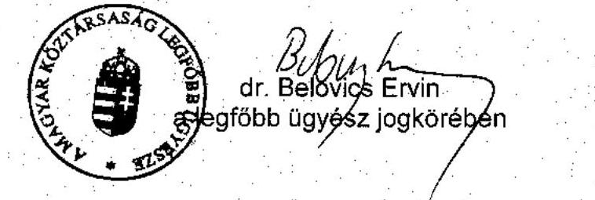
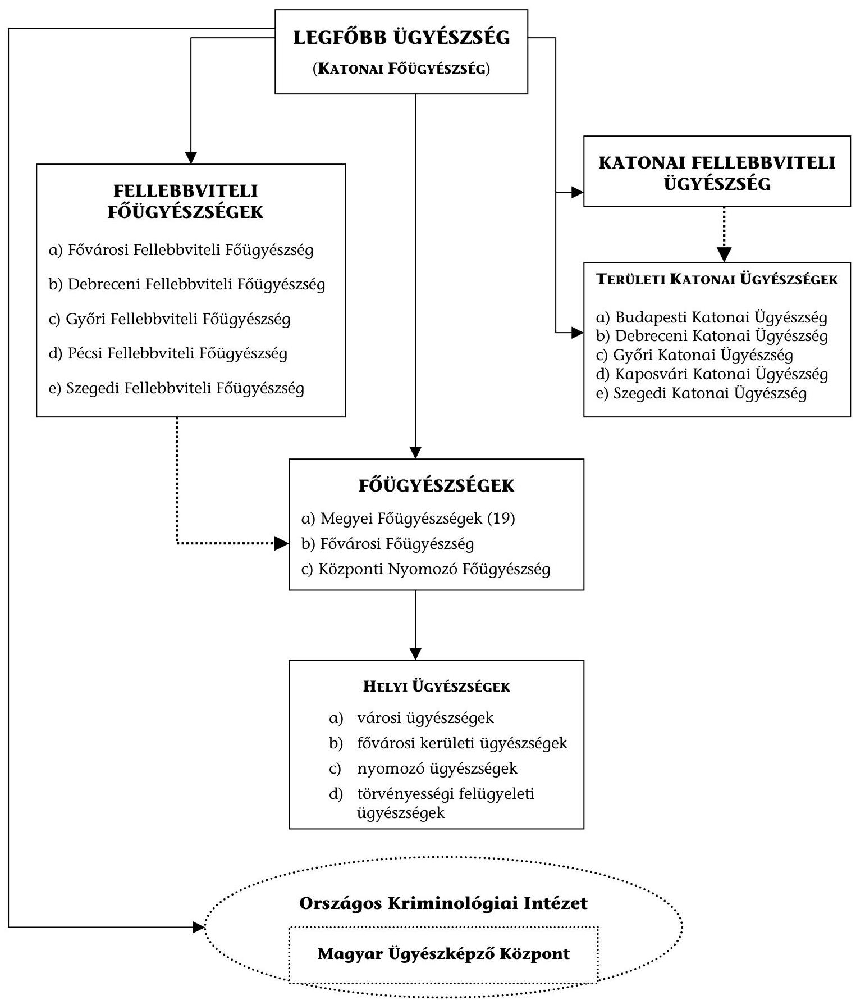
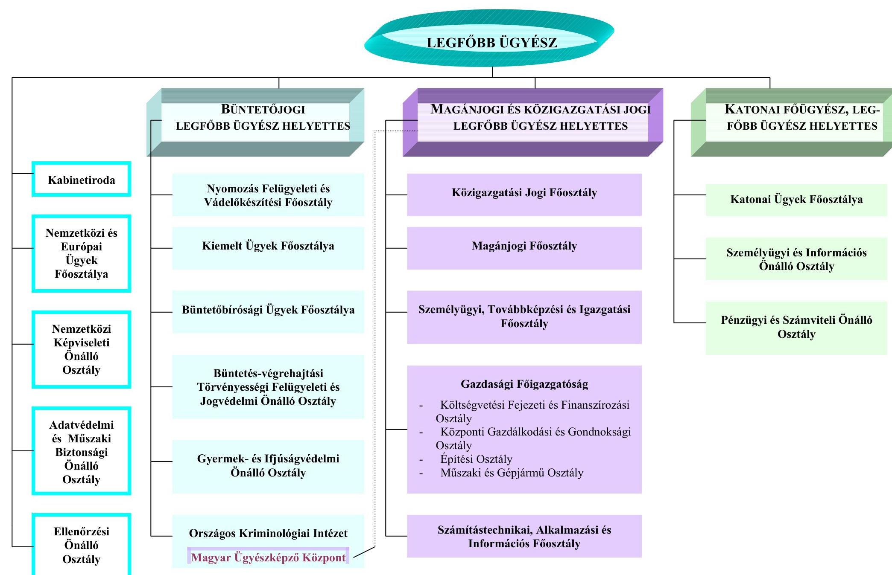
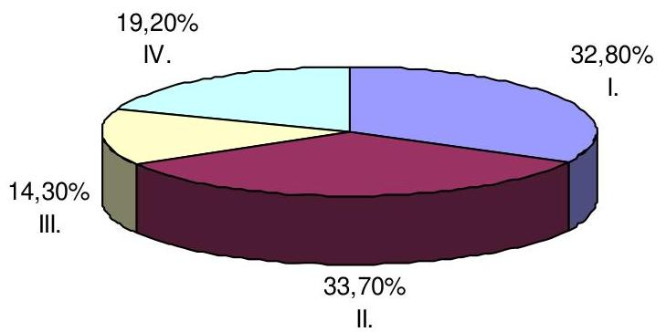
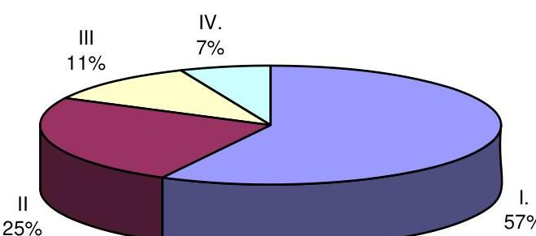
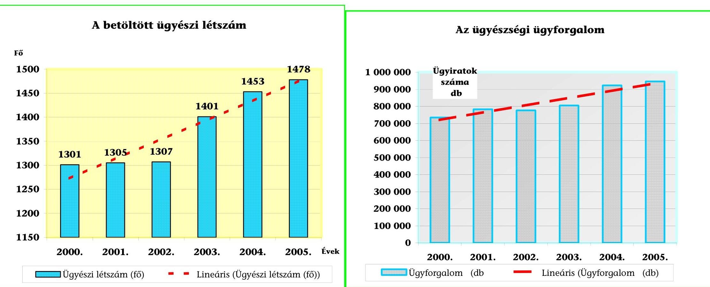

# ÁLLAMI   SZÁMVEVŐSZÉK 

## JELENTÉS

a Magyar Köztársaság Ügyészsége fejezet
működésének ellenőrzéséről

---

# 2. Államháztartás Központi Szintjét Ellenőrző Igazgatóság 

2.3. Átfogó Ellenőrzési Főcsoport

Iktatószám: V-03-50/2006.
Témaszám: 806
Vizsgálat-azonosító szám: V-0257

## Az ellenőrzést felügyelte:

Bihary Zsigmond
főigazgató
Az ellenőrzés végrehajtásáért felelős:
Hegedüsné Dr. Müllern Veronika
főcsoportfőnök

## Az ellenőrzést vezette:

## Hudik Zoltán

főcsoportfőnök-helyettes

## Az ellenőrzést végezték:

| Balkay Attila számvevő tanácsos | Domonkosné Kurilla   Edit   számvevő tanácsos | Dr. Jártas Ágnes számvevő tanácsos |
| :--: | :--: | :--: |
| Dr. Király László számvevő tanácsos tanácsadó | Molnár Bálint számvevő gyakornok | Major Gizella külső munkatárs |
| Dr. Pataki Magdolna számvevő tanácsos tanácsadó | Vásárhelyi Zoltán számvevő tanácsos |  |

## A témához kapcsolódó eddig készített számvevőszéki jelentések:

| címe | sorszáma |
| :-- | :-- |
| Jelentés a központi költségvetés területén működő belső kontroll- | [0115] |
| mechanizmusok ellenőrzéséről (a Magyar Köztársaság Ügyészsége |  |
| fejezetre vonatkozó megállapítások tekintetében) (2001.) |  |

Jelentés a Magyar Köztársaság Ügyészsége fejezet működésének [0305] ellenőrzéséről (2003.)
Éves jelentések központi költségvetés előirányzatai megalapozottságáról (évente)
[9932][0034]
[0241][0338]
[0449][0550]
Éves jelentések a központi költségvetés zárszámadásainak ellenőrzéséről (évente)
[9927][0024]
[0126][0232]
[0329][0443]
[0540]

---

# TARTALOMJEGYZÉK 

BEVEZETÉS ..... 5
I. ÖSSZEGZŐ MEGÁLLAPÍTÁSOK, KÖVETKEZTETÉSEK, JAVASLATOK ..... 7
II. RÉSZLETES MEGÁLLAPÍTÁSOK ..... 12

1. A fejezeti irányítás és a működés kontrollkörnyezete ..... 12
1.1. A szakmai és gazdasági szervezet alkalmazkodása a jogszabályi követelményekhez ..... 12
1.2. A feladatellátás létszámfeltételeinek kockázati tényezői ..... 14
1.3. Az európai uniós tagság kötelezettségeinek teljesítése ..... 16
1.4. Az ügyészi szakági együttműködés egyes területei ..... 18
1.4.1. A környezetvédelmi ügyészi tevékenység ..... 18
1.4.2. A kártérítési ügyek megelőzése ..... 21
1.5. A fejezeti irányítás kontroll tevékenységei ..... 24
2. A működés informatikai hátterének kockázati elemei ..... 26
2.1. A fejezeti informatikai biztonság kérdései ..... 26
2.2. Az ügyészségi adatfeldolgozás rendszere ..... 30
3. A költségvetési gazdálkodás ..... 31
3.1. A költségvetési gazdálkodás belső kontroll eszközei ..... 31
3.1.1. A tervezés és beszámolás kontroll kockázatai ..... 32
3.1.2. A pénzügyi-számviteli folyamatok kontrollmechanizmusa ..... 34
3.2. A fejezeti sajátosságok érvényesülése a költségvetésben ..... 35
3.2.1. A prioritások érvényesülése ..... 36
3.2.2. A fejezeti kezelésű előirányzatok költségvetésének tervezése és végrehajtása ..... 39
3.3. Az eszközgazdálkodás jellemzői ..... 41

## MELLÉKLETEK

1. sz. melléklet a legfőbb ügyész jogkörében eljáró legfőbb ügyész helyettes levele
2. sz. melléklet Az ügyészségi szervezetrendszer 2006-ban
3. sz. melléklet A Legfőbb Ügyészség szervezete 2006-ban
4. sz. melléklet Az MKÜ fejezet költségvetési előirányzatai 2002-2006 között
5. sz. melléklet Az ügyészségi irodák műszaki állapota 2002. és 2006. években

---

6. sz. melléklet Az ügyészségi irodák műszaki állapota ingatlancsoportonként
7. sz. melléklet A betöltött ügyészi létszám és az ügyészségi ügyforgalom alakulása 2000. és 2005. között
8. sz. melléklet Az ügyészségi ügyforgalom alakulása 2000-2005-ig
9. sz. melléklet A büntetőjogi ügyek száma és aránya az összes ügyészségi ügyforgalmon belül 2000-2005-ig
10. sz. melléklet Kimutatás a fellebbviteli főügyészségek kialakításának költségeiről

---

# RÖVIDÍTÉSEK JEGYZÉKE 

| AB | Alkotmánybíróság |
| :--: | :--: |
| Áht. | az államháztartásról szóló 1992. évi XXXVIII. törvény |
| Ámr. | az államháztartás működési rendjéről szóló 217/1998. (XII. 30.) Korm. rendelet |
| APEH | Adó- és Pénzügyi Ellenőrzési Hivatal |
| Be. | a büntetőeljárásról szóló 1998. évi XIX. törvény |
| Ber. | 193/2003. (XI. 26.) Korm. rendelet a költségvetési szervek belső ellenőrzéséről |
| BV OP | Büntetés-végrehajtás Országos Parancsnokság |
| EÖO | Ellenőrzési Önálló Osztály |
| ERÜBS | Egységes Rendőrségi és Ügyészségi Bűnügyi Statisztikai Rendszer |
| EUROJUST | European Union's Judicial Cooperation Unit (Európai Igazságügyi Együttműködési Egység) |
| EUROSTAT | Statistical Office of the European Union (EU Statisztikai Hivatala) |
| FEUVE | folyamatba épített, előzetes és utólagos vezetői ellenőrzési rendszer |
| GF | Gazdasági Főigazgatóság |
| IM | Igazságügyi Minisztérium |
| LB | Legfelsőbb Bíróság |
| LÜ | Legfőbb Ügyészség |
| MeH | Miniszterelnöki Hivatal |
| OGY | Országgyűlés |
| OIT | Országos Igazságszolgáltatási Tanács |
| OKRI | Országos Kriminológiai Intézet |
| OLAF | Oficce Européen De Lutte Anti-Fraude (Európai Csalás Elleni Hivatal) |
| PHARE | Poland-Hungary Assistance for the Restructuring of the Economy |
| PM | Pénzügyminisztérium |
| Szvt. | a számvitelről szóló 2000. évi C. törvény |
| SZTIF | Személyügyi, Továbbképzési és Igazgatási Főosztály |
| Üsztv. | Az ügyészségi szolgálati viszonyról és az ügyészségi adatkezelésről szóló 1994. évi LXXX. Törvény |
| Ütv. | A Magyar Köztársaság ügyészségéről szóló 1972. évi V. törvény |

---

.

---

# JELENTÉS 

## a Magyar Köztársaság Ügyészsége fejezet működésének ellenőrzéséről

## BEVEZETÉS

Az ügyészség feladatait és jogkörét a Magyar Köztársaság Alkotmánya XI. fejezete, valamint ennek alapján a Magyar Köztársaság ügyészségéről szóló, többször módosított 1972. évi V. törvény (Ütv.) határozza meg, melynek végrehajtásáról és ezzel összefüggésben az ügyészi szervezet vezetéséről a legfőbb ügyész gondoskodik.

A Magyar Köztársaság legfőbb ügyésze és az ügyészség feladata az állampolgárok jogainak védelme, valamint az alkotmányos rendet, az ország biztonságát és függetlenségét sértő vagy veszélyeztető minden cselekmény következetes üldözése. Az ügyészség törvényben meghatározott ügyekben nyomozást végez, képviseli a vádat a bírósági eljárásban, továbbá törvényességi felügyeletet gyakorol - többek között - a büntetés-végrehajtás felett. Közreműködik annak biztosításában, hogy a társadalom valamennyi szervezete, minden állami szerv és állampolgár megtartsa a törvényeket, törvénysértés esetén - a törvényben meghatározott esetekben és módon - fellép a törvényesség védelmében.

Az igazságügyi/igazságszolgáltatási reform keretében elfogadott törvények - az európai uniós jogharmonizációt követve - bővítették a legfőbb ügyész jogkörét, további feladatokat határozva meg számára. Ezek közül kiemelt jelentőségű a fellebbviteli főügyészségek felállítása és működési feltételrendszerük megteremtése, valamint az uniós tagságból adódó magyar képviselet biztosításának szükségessége.

Az ügyészi szervezet szakmailag egységesen foglalja magában a civil (polgári) és a katonai ügyészi feladatokat ellátó szerveket. A Magyar Köztársaság Ügyészsége (MKÜ) fejezet döntően a civil feladatokat ellátó ügyészi szervezet részére biztosít költségvetési forrásokat, míg a katonai ügyészi feladatok ellátását a honvédelmi tárca finanszírozza.

A Magyar Köztársaság 2003. évi költségvetéséről és az államháztartás hároméves kereteiről szóló 2003. évi CXVI. törvény az MKÜ fejezet kiadási előirányzatát 20,5 Mrd Ft-ban határozta meg, míg 2006-ra ez az előirányzat 29,1 Mrd Ft lett. A növekedésben jelentős szerepet játszott a személyi juttatások és járulékaik emelkedése, mivel a fejezet költségvetésében az éves kiadások közel háromnegyedét ezek a tételek képezik. A Fejezeti kezelésű előirányzatok döntően az igazságszolgáltatás beruházásainak finanszírozását szolgálják (2003-ban 670 M Ft, 2006-ban 380 M Ft).

---

Az előző, 2002. évi átfogó ellenőrzés óta végzett számvevőszéki ellenőrzések az éves költségvetések tervezését, zárszámadását, illetve ezeken belül az úgynevezett belső kontroll mechanizmusok működését érintették.

A jelen ellenőrzés célja annak értékelése volt, hogy az MKÜ fejezet

- irányítási, működtetési rendje és szervezeti kialakítása összhangban volt-e a jogszabályokban meghatározott feladatokkal; a fejezeti irányítás és felügyelet kontroll tevékenységei, kockázatkezelő képessége megfelelő feltételeket biztosítottak-e a működés eredményességéhez (ezen belül az ügyészi szervezetek környezet- és természetvédelemmel kapcsolatos szakági együttműködésének eredményességéhez);
- költségvetési gazdálkodási rendszere (a költségvetés tervezése és végrehajtása, a forráselosztás döntési rendszere) lehetővé tette-e az ügyészi szervezet állami feladatainak, nemzetközi kötelezettségeinek teljesítését, a gazdálkodási feladatok előírásszerű, eredményes ellátását, az erőforrások és a vagyon megfelelő védelmét;
- a belső kontrollrendszerének fejlesztésében hasznosította-e a korábbi számvevőszéki ellenőrzések megállapításait, ajánlásait.

Átfogó ellenőrzéssel, rendszervizsgálat keretében tekintettük át a fejezet belső kontroll (szabályozási, irányítási, ellenőrzési, információs-informatikai, számviteli) rendszerét annak értékelése céljából, hogy a kontrollmechanizmusok megfelelő biztosítékot adtak-e az ügyészségi feladatok ${ }^{1}$ előírásszerű, gazdaságos és eredményes ellátásához, az erőforrások védelméhez, a megbízható információszolgáltatási, valamint beszámolási kötelezettségek teljesítéséhez.

Rendszerszemléletben értékeltük továbbá az ügyészi szakági együttműködés eredményességét, elsősorban a környezet- és természetvédelmi jogterület működését alapul véve. Ehhez áttekintettük a környezetvédelmi szakági együttműködés személyi, tárgyi és szervezeti feltételeit, működési folyamatait az ügyészi közreműködés hatékonysága szempontjából.

Az átfogó ellenőrzés - a 2006. év tendenciáit is figyelembe véve - a fejezetnek a 2003-2005. évekre jellemző irányítási, szervezeti és gazdálkodási folyamataira irányult és alapvetően e folyamatokban hangsúlyos feladatkörrel rendelkező szervezeti egységekre terjedt ki.

A jelen ellenőrzés végrehajtására az Állami Számvevőszékről szóló 1989. évi XXXVIII. törvény 2. § (3) és 17. § (3) bekezdésben foglaltak adtak jogszabályi alapot.

A jelentést tervezet formájában egyeztettük az ellenőrzött időszakban hivatalban levő legfőbb ügyésszel. A végleges jelentést az Állami Számvevőszékről szóló 1989. évi XXXVIII. törvény III. fejezet 25. § (1) bekezdésének megfelelően megküldtük a legfőbb ügyész jogkörében eljáró dr. Belovics Ervin legfőbb ügyész helyettes úrnak, aki észrevételt nem tett (1. sz. melléklet).

[^0]
[^0]:    ${ }^{1}$ Az Állami Számvevőszék ellenőrzései a szakmai kérdéseket mindössze azok finanszírozási összefüggéseire tekintettel érintik.

---

# I. ÖSSZEGZŐ MEGÁLLAPÍTÁSOK, KÖVETKEZTETÉSEK, JAVASLATOK 

Az igazságszolgáltatás jogszabálykörnyezetének változása következtében bővültek a Magyar Köztársaság Ügyészségének feladatai is. Az ügyészség vezetése a hatékonyság további növeléséhez 2000 közepétől a szervezet modernizációját határozta el. A szervezeti rendszer racionalizálása mellett az ügyészi szakági (magánjogi, közigazgatási-jogi, büntetőjogi) együttműködés hatékonysági kérdései kerültek előtérbe, kiemelt figyelemmel az egyre bonyolultabb jogi megítélésű büntetőjogi ügyek, valamint a közigazgatási-jogi területek jogvédelmének (gyermek- és ifjúságvédelem, fogyasztóvédelem, szabálysértések, környezetvédelem) ellátására.

A szervezeti módosítások egyrészt a jogszabály-változások - alapvetően a büntetőeljárásról szóló törvény módosításai, a fellebbviteli ügyészségek létrehozásáról szóló törvények, az európai uniós feladatokkal összefüggő jogszabályok követelményeihez alkalmazkodtak, másrészt a költségvetési megtakarítási megfontolásokat érvényesítő belső törekvések koncepcióit testesítették meg. E változások következményeként létrejöttek a fellebbviteli főügyészségek, a törvényességi felügyeleti és az egyéb, törvényi többletfeladatok ellátásának kielégítő feltételei, és - többek között - egyre inkább a nemzetközi és hazai figyelem központjába kerülő környezetvédelem hatékony ügyészi képviseletének szervezeti háttere (2. sz. melléklet).

A szervezeti reform gazdasági téren megnyilvánuló egyik vívmányának tekinthető a szakmai és a funkcionális (a működési feltételeket biztosító, kiszolgáló) szervezeti egységek felügyeleti rendszerének szétválasztása. Ez megteremtette az együvé tartozó feladatok összehangolt végrehajtásának és a felelősségi körök elkülönítésének, valamint a folyamatos költségvetési egyeztetés és kontroll kedvezőbb feltételeit.

A környezetvédelmi jog érvényesülését folyamatosan, 2000 óta megkülönböztetett figyelemmel kezelték az ügyészségen belül. A szervezeti reformhoz kapcsolódóan 2003-tól intézményes keretet kapott a környezetvédelmi ügyészi tevékenység. Legfőbb ügyészi utasítás rendelkezett arról, hogy az ügyészi közreműködés a környezet és a természet védelme érdekében a büntetőjogi, törvényességi felügyeleti és a magánjogi szakág szoros együttműködésével valósuljon meg.

A szakági együttműködés formálódó keretei között az ügyészség szerepe hatékonyabbá vált a környezetvédelmi előírások betartatásában. Az együttműködésben érintett mindhárom szakág által végzett ügyészi tevékenység volumene folyamatosan nőtt. Az egyre bővülő feladatokat az e terület változatlan létszáma mellett a szervezet a kijelölt ügyészek többlet munkájával látta el és a megfelelő felkészültséget szakmai továbbképzéssel igyekezett támogatni. Az eddigi tapasztalatok alapján úgy a szakember kapacitás, mint a feladathoz

---

kapcsolódó munkaidő ráfordítás jelenleginél kedvezőbb feltételei a hatékonyságot növelő tényezőknek tekinthetők.

Az ügyészség felkészülése az uniós tagként történő működésre nyelvi és uniós jogi szakmai képzések, illetve az informatikai
 infrastruktúra megteremtése révén valósult meg. A legfőbb ügyész által kijelölt nemzeti tag delegálásával a Magyar Köztársaság bekapcsolódott az EUROJUST ${ }^{2}$ tevékenységébe. Az ezzel kapcsolatos feladatok a jogszabályokban ${ }^{3}$ és a Szervezeti és Működési Szabályzatban is megjelentek. A nemzeti tag hazai jogosítványainak meghatározása még hiányzó, így pótolandó elem maradt. Az EUROJUST tagság az ügyészi feladatellátás segítésén túl - járulékos eredményként - hozzájárulhat a nemzeti büntetőeljárási ráfordítások csökkentéséhez is.

A reform 2006 elejére kiforrott, világos szerkezetű, a hatás- és jogkörök tekintetében pontosan működő szakmai és gazdasági szervezetet eredményezett (3. sz. melléklet). Az Országos Kriminológiai Intézet (OKRI) ügyészi szervezetbe történő szakmai integrációja is megkezdődött, aminek egyik lépéseként - a rendelkezésre álló szellemi kapacitást kihasználva - az intézet keretein belül szervezték meg az ügyészi továbbképzést és ügyész utánpótlási képzést.

A Legfőbb Ügyészség fejezeti szinten kialakította mindazokat a kontroll mechanizmusokat, amelyek összességében alkalmasak a belső (saját) költségvetési kockázatainak kezelésére. A szakmai és költségvetési felügyeleti ellenőrzések rendje az ügyészségi szervezet egészére kiterjedően szabályozott volt. A monitoring rendszer kiépítettsége, működtetése alapvetően biztosította a feladatok ellátásához szükséges információk megfelelő döntési szintekhez juttatását. A szervezeti reform eredményeként a költségvetési gazdálkodás vezetői kontrollja átfogóvá vált, amit a költségvetési beszámoltatások gyakorlata és a gazdálkodási folyamatok rendszeres elemzése egyaránt igazolt. (A költségvetési fejezet zárszámadásának ellenőrzései is ezzel egyező következtetésre jutottak.)

A zavartalan működés biztonságát befolyásoló tényezővé lépett elő az ügyészi hibákból fakadó kártérítési keresetek előfordulásának és követelési értékének utóbbi években tapasztalt növekedése. (A kereseti követelés akkor válik valós, költségvetést veszélyeztető tényezővé, amikor azt a bíróság a kártérítésre igényt tartónak megítéli.) Az ügyészség mindeddig a kártérítési igények döntő többsége ellen sikeres jogi képviselettel tudott fellépni, a kárigényekkel kapcsolatos

[^0]
[^0]:    ${ }^{2}$ EUROJUST (European Judicial Cooperation Unit) kooperatív és koordinatív szervezet. Az Eurojust-ot a transznacionális bűnügyi tevékenységek (kábítószercsempészet, emberés illegális fegyverkereskedelem, korrupció, súlyos gazdasági bűncselekmények) elleni nemzetközi összefogásként hozta létre az Európai Unió Tanácsa 2002. február 28-i Határozata. A szervezet elősegíti a határokon átnyúló súlyos bűncselekményekben végzett nyomozást és a büntetőeljárás összehangolását a nemzeti hatóságok közötti együttműködés segítésével.
    ${ }^{3}$ 2006. évi VII. törvény a Magyar Köztársaság ügyészségéről szóló 1972. évi V. törvény, valamint az ügyészségi szolgálati viszonyról és az ügyészségi adatkezelésről szóló 1994. évi LXXX. törvény módosításáról

---

kockázatok megelőzésére egyéb eszközökkel (képzések, szankcionálások stb.) is élt.

2005-ig számottevő nehézség nélkül volt kezelhető a megítélt kártérítések teljesítése. A várhatóan fizetési kötelezettséggel záruló esetekben viszont a költségvetést nem várt kiadások ${ }^{4}$ terhelik, amelyek akár a folyamatos működésben is képesek átmeneti zavart támasztani.

Az ügyészi hibákból fakadó kártérítési követelések megelőzésére való törekvés továbbá az a körülmény, hogy 2006-ban két olyan ügyben várható marasztalás, melyek együttes kárigénye közel $1 \mathrm{Mrd} \mathrm{Ft}^{5}$ - a szervezeti kontrollmechanizmusok fokozott érvényesítésére hívja fel a figyelmet, új módszerek, eljárások igényét veti fel. A kártérítésekkel kapcsolatos kockázatok kezeléséhez 2006. májusától kedvezőbb feltételt teremtett a kártérítésekben az ügyészség jogi képviseletével felruházott, az ügyek elemzésével és jelzésével is foglalkozó szervezeti egység legfőbb ügyész közvetlen alárendeltségébe helyezése.

A működés informatikai háttere - a korábbi átfogó számvevőszéki ellenőrzés megállapításait figyelembe véve - kedvezőbben alakult. Jól érzékelhető volt az informatikai terület átfogó szabályozására való törekvés, az alapvető informatikai biztonság- és titokvédelmi elvi követelmények megfogalmazásában. Az informatikai biztonság több területén (pl. átfogó biztonsági koncepció kiadása, szerződéskötések és részteljesítések az Informatikai Biztonsági Dokumentációs Rendszer kidolgozásával összefüggésben, informatikai biztonsági politika kiadása, az átfogó biztonság önálló felügyeletének kialakítása) történt előrelépés, ezzel együtt az ügyészi szervezetben az informatikai biztonság szabályozási rendszere továbbra is hiányos, ami a felhalmozott adatvagyon egyediségét figyelembe véve magas kockázatot hordoz.

Az informatikai rendszerek országos lefedettséget teremtettek az ügyészségi feladatok ellátásához, egyúttal létrehozták az egyéb bűnüldöző, illetve nyilvántartó szervekkel (Netzsaru, ERÜBS) a megfelelő kapcsolódási pontokat. Nem kerülhető meg azonban annak a szakmai megszervezése, hogy a jelentős PHARE és hazai források árán kialakított informatikai rendszer folyamatos és biztonságos üzemeltetése garantálható legyen. Az ügyészségi alapfeladatokat széles körben támogató informatikai rendszerek fejlesztési és üzemeltetési feladatainak szabályozási környezete elavult, nem teljes körű, illetve nem megfelelő tartalmú, ezáltal szintén kockázatot jelentő tényezőnek számít.

Az informatikai szakfeladatok irányítását és ellátását több esetben hátráltatta az ügyészségi szervezetek nehézkes és gyengén dokumentált együttműködése. Az egyeztetésen, konszenzuson alapuló irányítási gyakorlatban nem azonosíthatóak az egyes szakterületek szakmai álláspontjait módosító tényezők, nem értékelhető a döntés-előkészítés megalapozottsága, nem állapítható meg a hibás döntések felelőssége.

[^0]
[^0]:    ${ }^{4}$ A felmerülő jelentős mértékű perköltségeket a PM a költségvetés általános tartaléka terhére tartja rendezhetőnek.
    ${ }^{5}$ Forrás: Emlékeztető Országos Vezetői Értekezletről (Ig. 183/2006. Legf. Ü.) 7. oldal.

---

A költségvetési tervezési és végrehajtási rendszer kialakítása és működtetése összességében szabályszerűen és az ágazati sajátosságok érvényre juttatásával történt. A Legfőbb Ügyészség a jogszabályi feladatváltozással járó többletköltségeket általában el tudta ismertetni, szakember- és eszközigényei többségét a költségvetési tárgyalások során érvényesíteni tudta (4. sz. melléklet).

A létszámgazdálkodásban a feladatellátás - esetenként költségvetési forrásvisszafizetési kötelezettséget eredményező - túlbiztosításával (a váratlan többletfeladatokra tartalékolt létszámfedezettel), továbbá az ügyészi utánpótlás meghatározásánál a fogalmazó-, illetve titkár létszám túlméretezésével előfordultak célszerűtlen lépések is. (A beállított fogalmazó-, titkár létszám mellett kétségessé vált az ügyésszé válásuk realitása.)

A gazdálkodáshoz fejezeti szinten fűződő döntési jogosultságok és felelősségi viszonyok szabályozottsága megfelelő volt, érvényesülésüket a vezetői ellenőrzés folyamatossága és következetessége biztosította. Az SzMSz és a kapcsolódó belső szabályozások rendelkezései garantálták a feladatellátáshoz kapcsolódó gazdálkodási előirányzatok felhasználásának a törvényi keretek között tartását. A kialakított számviteli rend, nyilvántartási rendszer alkalmas volt a költségvetési fejezet vagyonának kimutatására, biztosította a vagyonelemek alakulásának nyomon követhetőségét.

A vagyongazdálkodás célkitűzéseinek teljesítését segítette 2004-től - az addig hiányzó - beruházási és felújítási szabályzat. Az intézményi és központi beruházásra, valamint az eszközfelújításra fordítható felhalmozási előirányzat 2003 után - a következő évi közel kétszeresére történő emelkedést követően - 2006-ra a kiinduló év szintje alá (közel 1,6 Mrd Ft-ra) csökkent. A 2004. évi kiugró pénzügyi lehetőségnek is köszönhetően - a tendenciájában szűkülő források és a növekvő ügyészi létszám mellett - összességében elfogadható munkafeltételeket (elhelyezés, eszköz ellátottság) sikerült kialakítani (5 - 6. sz. mellékletek). Javult az épületek műszaki állapota, nőtt az egy főre jutó irodaterület és gyarapodott az épület állomány is (pl. Szeged, Szolnok, Kecskemét, Budapest). A bíróságokkal közösen használt ingatlanok egy részénél azonban - az eltérő költségvetési lehetőségek és prioritások miatt - halasztódott, elhúzódik az ügyészség épületrészeinek műszakilag indokolt rekonstrukciója.

Az ügyészség belső ellenőrzési rendjét a költségvetési fejezetek belső ellenőrzésének 2003. évben módosított szabályozásához igazították. Az ügyészségi stratégiai célkitűzések determinálták a belső ellenőrzés stratégiai céljait. A belső ellenőrzési kézikönyv megfelelő keretet ad a költségvetési gazdálkodás gazdaságossági, hatékonysági és eredményességi ellenőrzésének végrehajtásához. Az ellenőrzési tervek, az ellenőrzött szervezetekre és tevékenységekre vonatkozó megállapítások, javasolt intézkedések és azok realizálásának áttekintése alapján megállapítható volt, hogy a belső ellenőrzés alapvetően a területi szervek működésére és nem a központi gazdálkodásra koncentrált. A belső ellenőrzés személyi feltételeiben - a korábbi számvevőszéki ellenőrzés alkalmával jelzett hiányosságok ${ }^{6}$ tekintetében - előrelépés történt az ellenőri státuszok megerősíté-

[^0]
[^0]:    ${ }^{6}$ Jelentés a Magyar Köztársaság Ügyészsége fejezet működésének ellenőrzéséről [0305] 12. oldal

---

sében, de ennek teljes feltöltöttsége hiányában érdemi javulás nem következett be.

Tartalmában a jogszabályi előírásnak megfelelően, de a határidőt tekintve késéssel dolgozták ki az ellenőrzési nyomvonal kialakításának és a szabálytalanságok kezelésének eljárás rendjét, valamint a kockázatkezelési szabályzatot. A hivatkozott dokumentumokba beépítették az ügyészi szervezetből adódó sajátosságokat, amihez felhasználták a korábbi évek gazdálkodási, ellenőrzési tapasztalatait is. A kockázatelemzések, a besorolások, a kockázati tényezők súlyozásának teljes körű értékeléséhez szükséges információk még nem álltak rendelkezésre.

A helyszíni ellenőrzés megállapításainak hasznosítása mellett javasoljuk:

# a legfőbb ügyésznek: 

Gondoskodjon

1. a szervezet kontrollrendszerének fokozott érvényesítéséről az ügyészséggel szemben felmerülő kártérítési követelések megelőzése, a működést veszélyeztető hatások mérséklése érdekében;
2. az informatikai szabályozások teljes körű kialakításáról, ehhez a szervezeti feltételek biztosításáról;
3. az EUROJUST nemzeti tagja hazai ügyész és egyéb jogosítványainak meghatározásáról és az intézmény igénybevétele szabályainak megalkotásáról;
4. a költségvetési fejezet belső ellenőrzéseiben a központi gazdálkodás ellenőrzésének hangsúlyosabb szerepéről, az ellenőrző szervezet személyi feltételeinek érdemi javításáról.

---

# II. RÉSZLETES MEGÁLLAPÍTÁSOK 

## 1. A FEJEZETI IRÁNYÍTÁS ÉS A MŰKÖDÉS KONTROLLKÖRNYEZETE

### 1.1. A szakmai és gazdasági szervezet alkalmazkodása a jogszabályi követelményekhez

A szakmai feladatok uniós gyakorlathoz igazodó - a bírósági szervezet, a négyszintű igazságszolgáltatás - ellátása az 1998-tól kezdődő jogszabályi változásokat követően ${ }^{7}$ realizálódott, amelynek megfelelően az új szervezeti egységek -Budapesti-, Szegedi- és Pécsi Fellebbviteli Főügyészségek - az ítélőtáblákkal egyidejűleg, 2003. július 1-jén kezdték meg működésüket.

A 2003. július 1-jén hatályba lépett 1998. évi XIX. törvény (Be.) rendelkezéseinek új szabályozása szerint (28. §.) az ügyészség a nyomozó hatóságokat irányító közvádló. Ennek megfelelően a Központi Ügyészségi Nyomozó Hivatal önálló főügyészséggé, a főügyészségi nyomozó hivatalok a megyeszékhelyi városi ügyészségek mellett önálló nyomozó ügyészségekké alakultak át. Ezáltal elkerülhetővé vált, hogy a helyi bíróság hatáskörébe tartozó ügyek nyomozása során a jogorvoslatok elbírálása a Legfőbb Ügyészség (LÜ) hatáskörébe tartozzon. Az ellátandó ügyek mennyiségére tekintetel a fővárosban a közigazgatási jogi tevékenység ellátása egy új, - kizárólag ezzel foglalkozó - ügyészséghez, a Budapesti Törvényességi Felügyeleti Ügyészséghez került.

A Be. új értelmezésének következetes megvalósítása módosította a gyermek- és ifjúságvédelmi (fk.) ügyészi szakterület szervezeten belüli elhelyezését, egyúttal új formában szervezte meg a közlekedési büntetőjogi szakterület tevékenységét, racionalizálva a korábbi megoldásokat (főügyészségiről helyi ügyészségire helyezte az első fokú eljárásban való ügyészi részvételt). 2003. július 1-jétől a LÜ szerkezetátalakítása is követte a jogszabályi változásokat.

A Be. változását követve a Nyomozás Felügyeleti Főosztály ettől az időponttól Nyomozás Felügyeleti és Vádelőkészítési Főosztályként működött tovább. A Büntető Bírósági Ügyek Főosztálya szervezetét a Legfelsőbb Bíróság hatásköréhez kellett igazítani, a főosztály feladata lett a fellebbviteli főügyészségek és a főügyészségek szakmai tevékenységének összehangolása, egyúttal új osztályként létrehozták az Elvi Ügyek Osztályát.

A Be. 14. §. (7) bekezdése alapján a Btk. XVII. fejezetébe tartozó - gazdasági bűncselekmények többségében másodfokon az Országos Igazságszolgáltatási Tanács (OIT) által kijelölt bíró jár el. A korrupciós, a gazdasági és a szervezett bűnözés elleni egységes ügyészi szakmai irányítás szükségessége, az ilyen bűncselekmények megítélésének bonyolultsága, illetve a fokozott ügyészi felügyelet alá

[^0]
[^0]:    ${ }^{7}$ Az igazságszolgáltatás szervezetét érintő - többször változó - javaslatokat követően az ítélőtáblák és a fellebbviteli ügyészi szervek székhelyének és illetékességi területének megállapításáról szóló 2002. évi XXII. törvény hozta létre az ítélőtáblákat.

---

vont ügyek nagy száma miatt a LÚ Nyomozás Felügyeleti
 Főosztály szervezetébe tartozó Kiemelt Ügyek Osztálya 2003. július elsejétől önállóan, főosztályként – két osztállyal (Szervezett Bűnözés és Korrupció Elleni és Gazdasági) – működött tovább.

A különféle, időközben módosuló jogszabályok ${ }^{8}$ az ügyészséghez újabb és újabb hatásköröket telepítettek, amelyek ismét szervezeti változásokat eredményeztek (pl. szétvált a Magánjogi és Közigazgatási Jogi Főosztály, létrejött a Környezetvédelmi Osztály, környezetvédelmi szakügyészek kijelölése történt meg). 2004-ben Pest megyében a megyeszékhelyen eddig hiányzó központi helyi ügyészséget a budapesti székhelyű Budakörnyéki Ügyészség létrehozásával pótolták ${ }^{9}$. Az ügyészi szervezet egészét érintő peres és nem peres eljárásokban a Legfőbb Ügyészséget képviselő Jogi Képviseleti és Koordinációs Osztály 2004 júniusától a Személyügyi, Továbbképzési és Igazgatási Főosztály (SZTIF) keretein belül látta el a feladatait.
2004. július 1-jén, figyelemmel a fokozottabb biztonsági követelményekre, részben új tevékenységek (adatvédelem, informatikai biztonság ellenőrzése, biztonságvédelmi vizsgálat és ellenőrzés, stb.) ellátására létrehozták az Adatvédelmi és Műszaki Biztonsági Önálló Osztályt, s egyidőben az igazságszolgáltatási reform részeként 2004. július 1-jével létrejött a Debreceni és a Győri Fellebbviteli Főügyészség is ${ }^{10}$ (2 – 3. sz. melléklet).

A szervezeti egységek felügyeleti rendszerének szétválasztásával megszűnt a korábban jellemző széttagolt irányítás az ügyészség személyi és tárgyi tényezői felett, ami egyúttal biztosította a folyamatos költségvetési egyeztetés és a kontroll lehetőségeit. A szakmai igényeket költségvetési oldalon leginkább tükröző személyügyi és informatikai feladatok finanszírozása a szakmai főosztályok és a Gazdasági Főigazgatóság (GF) koordinált együttműködésével valósul meg.

A szervezet változtatása megteremtette az együvé tartozó feladatok összehangolt végrehajtásának és a felelősségi körök elkülönítésének feltételeit, 2001-től az igazgatási, személyügyi és adminisztrációs feladatok a magán- és közigazgatási jogi legfőbb ügyész helyettes irányítása alá kerültek. Ugyanígy hozzá rendelődött a Számítástechnika-alkalmazási és Információs Főosztály. Ezzel a költségvetés közvetlen kommunikációs lehetőséget nyert a személyüggyel és az informatikával, a felügyeletet gyakorló legfőbb ügyész helyettes pedig teljes rálátással bírhat az összefüggő kérdésekre.
${ }^{8}$ Pl. az 1995. évi LIII. tv. a környezetvédelem általános szabályairól, az 1997. évi LXXVIII. tv. az épített környezet alakításáról és védelméről, az 1997. évi CLV. tv. a fogyasztóvédelemről, az 1999. évi LXIX. tv. a szabálysértésekről, a 2000. évi XLIII. tv. a hulladékgazdálkodásról, a 2000. évi CXLV. tv. a sportról, a 2001. évi LXXXI. tv. a környezeti ügyekben az információhoz való hozzáférésről, a 2001. évi X. tv. a hajókról történő szennyezés megelőzéséről, stb.
${ }^{9}$ Az MKÜSZ KE határozatot módosító 188/2003. (X. 13.) KE határozat
${ }^{10}$ MKÜSZ KE határozatot módosító 31/2004. (III. 18.) KE határozat

---

A LÚ a 2003. évi költségvetés tervezésével együtt járó szervezeti változtatási lehetőségekkel élve az egyes ügyészi szervek költségvetési besorolását rendezte, amellyel a korábbi, az Áht. vonatkozó rendelkezéseivel ellentétes állapotot felszámolta. Eszerint a gazdálkodás szervezését tekintve egyetlen önálló, a költségvetési előirányzatok felett teljes jogkörrel rendelkező költségvetési szervként a LÚ működik, míg valamennyi egyéb ügyészi szervezet részjogkörű költségvetési egységgé (telephely) vált, mely a gazdálkodás folyamatában fennakadást nem váltott ki.

2002 végéig a fejezet egyes költségvetési intézményeinek besorolása ellentétes volt az Áht. 87. § (1) bek., valamint az Ámr. 14. § (4) bek. szerinti követelményekkel, melyek szerint a költségvetési szerv, illetőleg a részben önállóan gazdálkodó költségvetési szerv jogi személy. Ebből következett, hogy a fejezeti, illetve az intézményi döntések a felelősség és a hatáskörök szempontjából elkülöníthetetlenekké váltak.

Magyarország uniós csatlakozásával lehetőség nyílt az EUROJUST-ba való magyar képviselő (nemzeti tag) delegálására, amely az ügyészség uniós tevékenységének egyik kiemelt és intézményesített formája. A nemzeti tag a 2004. márciusában létrehozott Nemzetközi Képviseleti Önálló Osztály vezetője, a legfőbb ügyész közvetlen alárendeltségében. 2006. márciusától egy beosztott ügyész – aki az Európai Igazságügyi Hálózat ügyészségi kontaktpontja is – segíti az EUROJUST-ban való részvétellel összefüggő feladatainak ellátását. A szervezeti változás az SzMSz módosításával a nemzeti tag kinevezésével egyidejűleg megtörtént, törvényi szinten – az ügyészségi törvény módosításával – a feladat a 2006. évi módosításkor jelent meg.

Az MKÜ szervezetét érintő változásokat az ügyészi szervezet működésének korszerűsítéséről szóló 7/2003. (ÜK. 6.) LÚ utasítás, illetve az új Szervezeti és Működési Szabályzatról (SzMSz) szóló – időközben többször módosított – 25/2003. (ÜK. 12.) LÚ utasítás rögzítette, aktualizálta, mely folyamatos, számon kérhető kontroll elemeket teremtett a szervezeti feladatok ellátásához.

Az ügyészség kialakított szervezeti és költségvetési rendje mellett az ügyészségi tevékenység eredményessége növekedett.

Az ügyészségi tevékenység eredményességét az ügyészség folyamatosan figyelemmel kíséri, a statisztikai adatokat évi rendszerességgel elemzi. Több olyan adatsor létezik, melyekből az eredményességre vonatkozó következtetést le lehet vonni. Például nőtt a 30 napon belül feldolgozott vádemelési javaslattal érkezett nyomozati anyagok aránya, miközben emelkedett az ügyészségi nyomozások ügyiratforgalma, több volt az első fokú bíróságon tárgyalt ügyek száma, stb. Az eredményes vádemelések aránya a növekvő esetszám mellett változatlanul 96% körül alakult.

# 1.2. A feladatellátás létszámfeltételeinek kockázati tényezői 

Több mint egyéves, az OIT Hivatala (OITH) és a LÚ közös előkészítő munkájának eredményeként 2002 közepére elkészült a bírák, ügyészek, igazságügyi és ügyészségi alkalmazottak – az ügyészek pályán tartását is célzó – életpályamodelljének koncepciója, amely több vonatkozásában – pl. a címadományozásra, a vezetői kinevezésekre és a nyugdíjas időszakra, illetve különféle

---

pótlékok bevezetésére, korrekciójára vonatkozó részek kivételével – az időközben módosult Üsztv.-be beépült.

Az ügyészek körében általában kedvező a kinevezések és a szolgálati viszony megszűnésének az aránya, az ügyészi szervezet munkaerő megtartó képessége jó.

2002-ben 40 kinevezésre 45 megszűnés (2003-ban 146 : 42, 2004-ben 91 : 34, 2005-ben 99 : 57) jutott. A megszűnések kétharmada „természetes" okokból (nyugdíjazás, elhalálozás) következett be, így elmondható, hogy az utolsó év emelkedése ellenére összességében az ügyészi szervezet munkaerő megtartó képessége jó.

2004-ben a titkárok esetében csökkent, míg a fogalmazók körében arányaiban nőtt a fluktuáció.

88 titkári kinevezésre 1 megszűnés (2002-ben 125 : 2, 2003-ban 84 : 4), 56 fogalmazói kinevezésre 7 megszűnés (2002-ben 124 : 1, 2003-ban 81 : 7) jutott. 2005-ben a titkárok esetében arányaiban nőtt (95 : 4), míg az ügyészségi fogalmazók körében csökkent (86 : 3) a fluktuáció.

A 2005. január 1-jei állapot szerint engedélyezett ügyészi létszám 1598, központi tartalék 48, betöltött létszám 1450 (létszámhiány 10,2%). A titkári engedélyezett álláshely 106, a betöltött 116 (9,4%-os túltöltöttség), a fogalmazói létszám 332 az engedélyezett 262-vel szemben (túltöltöttség 26,7%). Ügyintézői álláshelyen az engedélyezett 13-mal szemben 16 a betöltés.

Az ügyészség jövőbeni működésének egyik alapvető eleme az ügyészi utánpótlás biztosítása, amit – a bíróságokkal közös oktatási struktúra kialakításának sikertelensége után – az OKRI keretében önálló szervezeti egységként kialakított Magyar Ügyészképző Központ (MÜK) létrehozása célzott meg.

A MÜK 2006. januárban kezdte meg működését, mely során három régióban (Budapest, Balatonlelle, Szolnok), összesen 144 fogalmazó számára indult meg az ügyészi pályára való felkészítés. A 14/2005. (ÜK. 9.) LÚ utasítás 3. §-a értelmében a vezetői feladatokat megosztott hatáskörrel az OKRI képzési igazgató-helyettese és a LÚ SZTIF Továbbképzési Osztályának vezető ügyésze látja el.

A MÜK gazdálkodási feladatait a GF gondozza, a programok költségei a központi továbbképzési költségek között kerülnek elszámolásra.

2004-2005-ben is fennmaradt az a magas arány, amely a továbbképzésben részt vett ügyészek számát jellemzi. Az ügyészi állomány háromnegyede részt vett valamilyen – az LÚ, vagy mások által szervezett – továbbképzésben, melyet az általánosan alkalmazott szakmai útmutatási (instruálási) rendszer segített célirányossá tenni.

2005-ben a kiírt 80 fogalmazói álláshelyre 556 pályázat érkezett, ami a korábbi évek 9-10-szeres érdeklődéséhez képest még mindig hétszeres túljelentkezést mutatott. A felvettek egyharmada summa cum laude, míg a többiek cum laude diplomások közül kerültek ki.

Várható, hogy az ügyészek közül egyre többen élnek azzal a törvény adta lehetőséggel, hogy bár az általános öregségi nyugdíjkorhatárt betöltötték, felmentésüket e jogcímre hivatkozással nem kérik és 70. életévük betöltéséig kívánnak dolgozni. Ennek következménye lehet, hogy a fiatalok kezdő ügyészi kinevezése kétségessé válhat megüresedő álláshelyek hiányában. 2003 elején még azzal számoltak, hogy a felvett fogalmazók 2008-ban valamennyien ügyészek lesznek, azonban egy év múlva már látszódtak a kinevezésekkel kapcsolatos jövőbeli problémák, ennek ellenére folytatódott a fogalmazói álláshelyre történő pályáztatás.

Az Országos Vezetői Értekezletek emlékeztetőiből kiderül, hogy míg 2003-ban még abban bízott az ügyészség vezetősége, hogy 2008-ban valamennyien ügyészek lesznek a fogalmazókból, 2004-re már kétségek támadtak, míg 2006. márciusában már meggyőződéssé vált, hogy nincs és nem is lesz álláshely minden felvett fogalmazó számára. (Forrás: Országos Vezetői értekezletek anyagai 2003-2006-ig).

Az LÜ álláspontja szerint „...elvi fontosságú – az ügyészi szervezet érdekében ható tényező a nagyobb számú fogalmazó felvétele. Ez biztosít ugyanis lehetőséget arra, hogy a jó vagy kevésbé jó képességű fogalmazókból megtaláljuk azokat, akik leginkább alkalmasak az ügyészi hivatás gyakorlására... Az Úsztv. sem az ügyészségi titkári, sem az ügyészi kinevezésre nem nyújt garanciát... Annak a lehetősége, hogy az ügyészségi fogalmazóból nem lesz automatikusan ügyészségi titkár, a titkárból pedig ügyész, a konkrét személy szempontjából kétség kívül kedvezőtlen lehet, a szervezet szempontjából viszont semmiképp sem hátrányos és célszerűtlen."

# 1.3. Az európai uniós tagság kötelezettségeinek teljesítése 

Az ügyészség uniós tagságra történő felkészülés fő területei a következők voltak: az ügyészek uniós jogi képzése, a nyelvtudás általános szintjének emelése, valamint az ügyészi munka infrastrukturális feltételeinek javítása az informatika területén.

A csatlakozás előtti felkészülést PHARE programok segítették, amelyek egyrészről az ügyészek európai uniós jogi oktatásában és nyelvi képzésében, másrészről az informatikai háttér kiépítésében nyújtottak jelentős anyagi támogatást.

Az első PHARE program (technikailag a BM átfogó PHARE programja) keretében 2000-ben 400 ügyész vett részt európai uniós alapjogi, ezen belül 240 fő harmadik pilléres (bel- és igazságügyi együttműködés) képzésben, de a projekt 45 ügyész külföldi tanulmányútjára is fedezetet biztosított.

A második PHARE programra a LÜ 2001-ben nyert el támogatást (összesen 3 M Euro összegben, melyből 2 M Euro uniós és 1 M Euro hazai forrás volt), mely keretében 2002-2004 között további 400 ügyész uniós alapképzésére és 250 fő specializált képzésre nyújtott fedezetet.

Az ügyészség uniós felkészülése eredményes volt, mivel az ügyészi állomány döntő többsége rendelkezik uniós jogi ismeretekkel, illetve egyre nagyobb mértékben a szükséges nyelvismerettel.

2006 elejéig összesen 72 ügyész, titkár és fogalmazó végzett EU szakjogászként és további 20 fő folytatja ilyen irányú tanulmányait. Az ügyészi állomány mintegy fele (49,8%-a) rendelkezik közép- vagy felsőfokú állami nyelvvizsgával, jellemzően angol és német nyelvből. A titkárok és a fogalmazók körében ez az arány jelentősen magasabb (74,6%, illetve 88,8%).

Magyarország uniós csatlakozásával a magyar ügyészi szervezet egyben uniós ügyészséggé is vált. Ennek megfelelően a szervezetben kijelölték azokat az ügyészeket, akik a különböző szervezetek kontaktpontjai (pl. Európai Csalás Elleni Hivatal, Európai Igazságügyi Hálózat, Igazságügyi Képzés Európai Hálózata,
 az EUROJUST terrorizmus elleni nemzeti levelezőinek hálózata stb.), ezen kívül minden megyében kijelöltek egy-egy ügyészt az uniós ügyekkel összefüggő tevékenységek ellátására. A nemzetközi kapcsolattartás személyi és - az informatikai fejlesztéseknek köszönhetően - a kommunikációs feltételei biztosítottak.

Az EUROJUST-ban való részvétel az ügyészség uniós tevékenységének egyik kiemelt és intézményesített formája.

A 2025/2004. (II. 5.) Korm. határozat ${ }^{11}$ végrehajtására kiadott 2/2004. (ÜK. 2.) LÚ utasítás rendelkezett az EUROJUST munkájában való magyar ügyészi részvételről. Kinevezték a Magyar Köztársaságot képviselő nemzeti tagot, aki magyar ügyészként egyben az újonnan létrehozott Nemzetközi Képviseleti Önálló Osztály vezetője is. A szervezeti háttér megalkotásán túl azonban a nemzeti tag hazai jogosítványainak meghatározása nem történt meg.

Ilyen szabályozási területek pl. a nemzeti tag eljárási jogosultsága külföldi hatóságok irányában, jogsegélyügyekben, nyomozás elrendelése esetén, a nemzeti hatóságokkal kapcsolatok, kötelező információszolgáltatás a küldő ország részéről a nemzeti tag részére stb.

Az osztály SzMSz-ben meghatározott feladatai a nemzeti tag EUROJUST-ban gyakorolható jogosítványait sorolja fel, de a közvetlen legfőbb ügyészi alárendeltségen kívül az ügyészi szervezeten belüli viszonyrendszerét és jogosítványait - amely egyébként a szervezeti és működési szabályzat elsődleges célja lenne - nem részletezi.

A nemzeti tag hatáskörének meghatározása alapvető jelentőségű munkájának - így végső soron az EUROJUST tevékenységének - szempontjából. A EUROJUST 2004. évi jelentésében rámutatott, hogy néhány tagállam nem tett eleget az EUROJUST Határozat végrehajtása érdekében előírt belső jogalkotási kötelezettségének. „Rendkívül fontos valamennyi nemzeti tag számára, hogy hozzáférjen minden, a feladatai ellátásához nélkülözhetetlen információhoz...valamennyi tag hatáskörét illetően egyértelműségre és a kétségek kizárására van szükség. A nemzeti tagok hatáskörét világosan meg kell határozni és érteni a nemzeti jogokban."(EUROJUST Határozat 9. cikk)

Az EUROJUST tevékenységéről szóló jelentéseit a Tanácsnak nyújtja be, amely kifejti véleményét az abban foglaltakról. A 2005. évi jelentéssel kapcsolatos következtetése többek között, hogy a Tanács „felhív minden tagállamot, hogy tegyen eleget a Határozatnak minden szükséges intézkedés megtételével nemzeti tagjának

[^0]
[^0]:    ${ }^{11}$ 2025/2004. (II. 5.) Korm. határozat Magyarországnak az EU intézményeiben való részvételéről, valamint a tagállamként való működés szervezeti és személyi feltételei megteremtésének további feladatairól (4. pont)

---

megfelelő hatáskörökkel felruházása és eszközökkel ellátása érdekében, a nemzeti tag feladatainak hatékony ellátása céljából" (Draft Council Conclusions on the fourth EUROJUST Annual Report - calendar year 2005).

A nemzeti tag hazai jogkörének meghatározása a szabályozási kötelezettség teljesítésén túl azért is fontos, mert az lehetővé tenné a szervezet intenzívebb igénybevételét Magyarország részéről. Az EUROJUST, mint fiatal intézmény feladatának tekinti tevékenységének népszerűsítését a tagállamok hatóságai körében és arra ösztönzi őket, hogy minél szélesebb körben használják ki az általa nyújtott lehetőségeket.

Ennek érdekében a szervezet népszerűsítő szemináriumokat szervez, a megbeszélésekhez tolmácsolási lehetőséget biztosít, a koordinációs értekezleteken való részvételhez két főnek téríti az utazási költséget és a szállodaköltséget.

Az újonnan csatlakozott államok között Magyarország nem tartozik az EUROJUST-ot a legaktívabban igénybe vevő tagállamok közé, bár az elmúlt évben nőtt a kiküldött ügyek száma (2004-ben 2 ügy, 2005-ben 17 ügy, 2006. áprilisig 6 ügy). A magyar hatóságok között még nem vált gyakorlattá a több tagállamot is érintő nemzetközi ügyekben az EUROJUST igénybevétele, erre vonatkozóan nincs hazai előírás (több államban a potenciálisan az EUROJUST elé tartozó ügyekről értesíteni kell a nemzeti tagot). A nemzetközi jogsegélyügyek intézésében segítséget jelenthetne az EUROJUST, amennyiben a nemzeti tag hivatalból értesülne az ilyen irányú megkeresésekről.

Az EUROJUST-ban való részvétel előnye, hogy a folyamatban lévő ügyek intézését gyorsabbá és gazdaságosabbá teheti, amelyet elősegíthetne a megfelelő szabályozási háttér kialakítása.

Az Európai Alkotmány tervezete szerint a később felállítandó Európai Ügyészség az EUROJUST bázisán szerveződik majd meg. A szakmai tevékenység hangsúlyosabbá tétele lehetőséget nyújthatna arra is, hogy a magyar ügyészek és hatóságok munkája nemzetközi téren is ismertebbé váljon, valamint tapasztalatot szerezzenek a nemzetközi bűnügyi együttműködésben. További előnye lehet a EUROJUST igénybevételének a nemzeti költségekre gyakorolt költségkímélő hatása.

# 1.4. Az ügyészi szakági együttműködés egyes területei 

### 1.4.1. A környezetvédelmi ügyészi tevékenység

Az Alkotmány 18. §-ában az egészséges környezethez való jog, illetve a 70/D. §-ban a környezetvédelem szükségessége fogalmazódik meg. Az ügyészség alapfeladatából következően a környezet- és természetvédelemre, illetve ezekkel szorosan összefüggő, rokon jogterületekre vonatkozó (állatok védelméről és kíméletéről, az épített környezet alakításáról és védelméről, a hulladékgazdálkodásról szóló) törvények, illetve egyéb kapcsolódó jogterületek - pl. halászat, horgászat, vadászat, vadvédelem - előírásaira alapozva folytatja le a környezetvédelemmel összefüggő ügyészi eljárásokat.

A környezetvédelmi ügyészi tevékenység egy olyan sajátos területe az ügyészi jogalkalmazásnak, amelyben valamennyi ügyészi szakág - a magánjogi, a közigazgatás-jogi és a büntetőjogi szakterületek - egymást kiegészítő és kölcsönösen támogató együttműködése jellemző. A környezetvédelmi ügyészi törvényességi eljárásoknak kiemelt szerepük és lehetőségük van a visszafordíthatatlan természeti, vagyoni és nem vagyoni károsítások és károsodások megelőzésében, amik önmagukban is erkölcsi és gazdasági jelentőséggel bírnak.

A LÚ az ügyészségi reform keretében folyamatosan fejlesztette a környezetvédelmi ügyészi tevékenység feltételeit. Az elmúlt években kiépültek azok a személyi, szervezeti és tárgyi feltételek, amelyek e szakmai tevékenység ellátásához szükségesek. A belső szabályozások a reálfolyamatokat követve rögzítették ezeket a szervezeti és eljárási kereteket. 2003-tól minden megyei és a fővárosi főügyészségen kijelölt ügyész foglalkozik a környezet- és természetvédelmi szakterülettel (az ügyészek osztott munkakörben végzik e feladatukat, más ügyekkel is foglalkoznak). Környezetvédelmi ügyekre kijelölt ügyészek száma összesen 23 fő, akikből 3 fő legfőbb ügyészségi ügyész.

A környezet védelmének általános szabályairól szóló 1995. évi LIII. törvényben előírt ügyészi feladatok ellátását szabályozó, az ügyészek perindítási jogosultságáról szóló 1/1997. (ÜK.4.) LÜ h. körlevél az eljárási és jogi iránymutatást szolgáló rendelkezései mellett előírta a szakági együttműködést a különböző felelősségi formák érvényesíthetősége érdekében. A körlevél megyei főügyészhez utalta annak megszervezését, hogy a konkrét büntető ügyekben tájékoztatást kapjon a hatáskörébe tartozó ügyről a magánjogi és közigazgatási szakági feladatokat ellátó ügyész is.

A 8/2000 (ÜK. 12.) LÚ utasítása alapján minden megyei főügyész kijelölte a magánjogi és közigazgatási jogi szakterületen környezetvédelemmel foglalkozó ügyészt.

A Magyar Köztársaság ügyészsége szervezetéről és működéséről szóló 3/2001. LÚ utasítás alapján adták ki az ügyészség környezetvédelmi tevékenységéről szóló 1/2003. (LÜ. 8.) LÚ körlevelet, amely a szakági együttműködés részleteit, különösen a kölcsönös tájékoztatási kötelezettséget és konzultációt, adatok, információk és iratok megküldését írta elő.

A közelmúltban - 2006. májusában - készült el a Közigazgatási Jogi Főosztály összefoglaló jelentése a 2003-2004. évek környezet- és természetvédelmét szolgáló ügyészi tevékenységéről. A LÚ 2005. évi munkaterve alapján lefolytatott ellenőrzés megállapította, hogy „megfelelően kialakultak az ügyészi környezetvédelmi tevékenység szervezeti keretei, a szakágak közötti együttműködés módszerei, egységessé és összehangolttá váltak a környezetvédelem érdekében teendő ügyészi intézkedések." A jelentés általánosítható megállapításai és a tendenciák 2005-re is érvényesek. Ugyanakkor a környezetvédelmi ügyészi szakterület folyamatosan küzd a létszámhiánnyal, kapacitáshiánnyal, a szakértői igénybevétel forráshiány miatti korlátozottságával. A környezetvédelemre jellemző széttagolt hatósági rendszer és a jogrendszer folyamatos változása miatt növekvő munkaterhet a szervezet - létszámbővítési lehetőség hiányában - szakmai továbbképzésekkel és a kijelölt ügyészek túlmunkájával látja el.

Az ügyészek szakmai képzését az ügyészség posztgraduális tanulmányok támogatásával, rendszeres továbbképzéssel és konferenciák rendezésével támogatja. A személyügyi statisztikai beszámoló adatai alapján 2005. végén környezetvédelmi szakjogászi képesítéssel rendelkezők száma 33 fő volt, ezen kívül 13 fő végzi tanulmányait jelenleg is.

---

A feladatellátás nehézségeivel együtt a környezetvédelmi tevékenység - a szakterületen használatos mutatók (váderedményesség, a felhívások eredményessége) alapján - az ügyészi szervezeten belül, az országos környezetvédelmi intézményrendszer részeként egyaránt pozitívan értékelhető.

A jogvédelem megvalósítása a környezetvédelmi jog területén a különböző ügyészségi szakterületek összehangolásával - törvényességi felügyelet, magánjog és büntetőjog - történik. Az ügyészség a hatályos jogi szabályozás alapján törvényességi felügyeletet gyakorol, de felhatalmazása van polgári és büntetőjogi eljárások megindítására is, ezért e három szakág szoros együttműködése és az ügyek komplex szemléletű megközelítése szükséges. Az ügyészség klasszikus büntető és büntetőjogon kívüli tevékenysége ezen a területen együtt jelenik meg a párhuzamos felelősségre vonás lehetősége miatt (a büntetőjogi, szabálysértési és kártérítési felelősség nem zárja ki egymást, hanem együttesen is alkalmazhatók). A szakági együttműködés intézményes formában először ezen a területen jelent meg.

A környezetvédelmi ügyészi tevékenység gerince a törvényességi felügyelet, melynek keretében az ügyészség rendszeresen vizsgálja az anyagi jogi és eljárásjogi szabályok helyes alkalmazását a hatósági tevékenységben. Az ügyészi munkát az illetékes hatóságokkal folytatott folyamatos információcsere és szoros együttműködés segíti.

A LÚ és a környezetvédelmi tárca közötti megállapodás alapján a környezetvédelmi és természetvédelmi hatóságok folyamatosan megküldik a kötelezést és bírságot megállapító jogerős közigazgatási határozatokat. Eddig több, mint 3000 határozat érkezett, melyet az ügyészség feldolgozott és szükség esetén intézkedéseket tett (óvás, felszólalás, jelzés), segítve ezzel a hatóságok munkájának törvényességét.

A törvényességi felügyeleti tevékenység jellemző módszere a környezetvédelem területén is a különböző közigazgatási szervek hatósági tevékenységének ügyészi vizsgálattal történő ellenőrzése. A 90-es évek eleje óta vizsgálatsorozatokat hajtottak végre egyes témákra (pl. hulladékgazdálkodás, állatvédelmi hatósági tevékenység). A tervezett átfogó vizsgálatok és utóvizsgálatok az éves vizsgálati tervben is szerepeltek. 2003-2004-ben 17 témakörben 260 vizsgálatot végeztek. Szintén a törvényességi felügyelethez tartozik az egyes jogszabályok tervezetének előzetes észrevételezése, amelyek általában korábbi vizsgálatok tapasztalatán alapulnak. Az ügyészség ezirányú tevékenysége eredményesnek tekinthető, mert javaslataik nagy része beépült a tervezetekbe.

A vizsgálatok közül 126 a hulladékgazdálkodás területén, 98 a föld, 20 az épített környezet, 10 az élővilág (természet) 4 a víz, és 2 a levegő védelme érdekében eljáró hatóságoknál került lefolytatásra. A vizsgálatok alapján az ügyészségek 95 óvást, 177 felszólalást, 3 figyelmeztetést és 141 jelzést nyújtottak be, emellett több esetben kezdeményeztek büntető vagy fegyelmi eljárást, illetve bírság kiszabását.

2003-2004-ben az ügyészséghez 235 törvényességi kérelem érkezett környezetvédelmi tárgykörben, melyek közül 68 hulladékgazdálkodással, 29 földvédelemmel, 25 vízvédelemmel, 24 levegővédelemmel, 20 élővilággal és 69 az épített környezettel volt kapcsolatos.

---

Az ügyészség a környezetvédelmi tevékenység hatékonysága javítása érdekében a szakmai irányítás során az egységes ügyészi jogértelmezés kialakítására törekedett, amelyet a LÚ rendszeres továbbképzéssel, szakmai konferenciák tartásával, több szakágat is érintő állásfoglalások kiadásával segített elő. Az ügyészségi gyakorlat és a szakhatóságok jogértelmezési ügyekben történő megkeresésein túl hozzájárult a bírói gyakorlat fejlesztéséhez is (pl. származék fogalma, veszélyes hulladék és hulladék értelmezése).

Az ügyész keresetindítási joga az ágazati jogszabályokban (pl. természetvédelmi és környezetvédelmi törvény) biztosított felhatalmazáson alapul és mérlegelési jogkörbe tartozik, hogy az ügyész benyújt-e keresetet egy adott ügyben. Az ügyészség magánjogi jogkörben évente általában 50-70 pert indított a veszélyeztető tevékenységtől történő eltiltás, valamint a tevékenységgel okozott kár megtérítése iránt. A kártérítési ügyekben megítélt összegek a költségvetés környezetvédelmi alap célfeladat fejezeti kezelésű előirányzatába folytak be.

2003-2004-ben a megyei főügyészségek 96 esetben fordultak a bírósághoz. A kérelmek nagyobb részben (62) tevékenységtől eltiltásra, kisebb részben (34) a kár
 megtérítésére vonatkoztak.

Büntetőjogi fellépésre a Btk-ban meghatározott, a környezetvédelmi szabályok legsúlyosabb megsértését megvalósító tényállások (környezetkárosítás, természetkárosítás, környezetre veszélyes hulladék elhelyezése) bekövetkezése esetén kerül sor.

2003-2004-ben a három bűncselekmény miatt 505 esetben kezdeményeztek büntetőeljárást, ebből 454 esetben rendeltek el nyomozást és 133 ügy jutott el vádemelésig. 124 ügyben született jogerős ítélet és 193 vádlottal szemben hoztak jogerős határozatot. Az ügyek döntően pénzbüntetés kiszabásával zárultak.

# 1.4.2. A kártérítési ügyek megelőzése 

A LÚ szervezeti és szabályozási rendszere - az informatikai területnek a jelentős fejlesztésekkel összefüggő, még formálódó és folyamatban lévő hiányos szabályozóit leszámítva - összességében alkalmas a fejezeti költségvetés egyensúlyának biztosítására, az ezzel összefüggő kockázatok kezelésére, a növekvő számú és követelési értékű kártérítési igények tekintetében azonban a testület korlátozott lehetőségekkel rendelkezett.

Az ügyészséggel szemben kereseti követelést tartalmazó - 2005. december 31-én folyamatban lévő - ügyek száma az 1996. évi 1 db-ról 2005-re 309-re emelkedett, a kártérítési követelési érték az akkori 3,9 M Ft-ról 5483,0 M Ft-ra nőtt. (A tényleges követelés számításához általában kétszeres szorzószámot lehet alkalmazni a követelés kamatai, illetve a kapcsolódó perköltség megtérítési igény miatt.)

A LÚ az igazságszolgáltatás folyamatában vele szemben keletkezett kártérítési igények döntő többsége ellen egyrészt pernyerést eredményező sikeres jogi képviselettel lépett fel, másrészt több olyan intézkedést tett, amely a kártérítési igényre okot adó szakmai tévedések vagy hibák előfordulásának csökkentését célozzák.

---

Kártérítési ügyekben az ügyészi jogi képviselet eredményessége

| Évek | Kártérítési   ügyek (db) | Kereseti   nettó   követelés   (M Ft) | Ügyészség   számára   eredményes   (db) | Eredménytelen (db) | Folyamatban   lévő ügyek   (db) | Elutasított   kereset   (M Ft) | Marasztalás   miatt már   kifizetett   (M Ft) |
| :--: | :--: | :--: | :--: | :--: | :--: | :--: | :--: |
| 1996 | 1 | 4 | 1 | 0 | 0 | 4 | 0 |
| 1997 | 6 | 210 | 4 | 1 | 1 | 207 | 1 |
| 1998 | 1 | 1 | 1 | 0 | 0 | 1 | 0 |
| 1999 | 7 | 101 | 5 | 0 | 2 | 72 | 0 |
| 2000 | 8 | 39 | 4 | 0 | 4 | 14 | 0 |
| 2001 | 14 | 218 | 9 | 2 | 3 | 29 | 28 |
| 2002 | 33 | 2320 | 20 | 1 | 12 | 1590 | 0 |
| 2003 | 34 | 1067 | 23 | 0 | 11 | 695 | 0 |
| 2004 | 49 | 598 | 26 | 0 | 23 | 154 | 0 |
| 2005 | 57 | 926 | 14 | 1 | 42 | 158 | 1 |
| Összesen | $\mathbf{2 1 0}$ | $\mathbf{5 4 8 4}$ | $\mathbf{1 0 7}$ | $\mathbf{5}$ | $\mathbf{9 8}$ | $\mathbf{2 9 2 4}$ | $\mathbf{3 0}$ |

Az ügyészségi képzések során minden esetben napirendre kerül az egyes eljárási folyamatokban rejlő hibalehetőségek bemutatása, a megtörtént esetek elemzése. Következetesen alkalmazzák a pontatlanul végzett ügyészi munka miatt előfordult ügyészi hibák esetén a fegyelmi felelősségre vonás és a munkáltató által érvényesíthető kártérítés eszközeit.

Ugyanakkor az ügyészség számára elmarasztalással és fizetési kötelezettséggel záruló esetekben a költségvetés nem várt - és nem is tervezhető - kiadások terhelik, amelyek a feszes gazdálkodás körülményei mellett a működést gátolhatják.

2005-ig számottevő nehézség nélkül volt kezelhető a kártérítések teljesítése egyrészt a sorozatos pernyerés, másrészt a megítélt kártérítések alacsony összege miatt, de már 2005-ben közel 30 M Ft fizetési kötelezettség keletkezett. Ez - összehasonlításként - például a fejezeti felújítási eredeti előirányzat 30%-ának felel meg.

2006-ban két olyan ügyben várható marasztalás, melyekben az összpertárgy érték közel 1 Mrd Ft-ot tesz ki, és a tényleges fizetési kötelezettség a szakértői bizonyítás függvénye. Csak e két eljárásban a követelt kártérítés közel egy teljes havi fejezeti bérösszeggel egyenlő.

Az ügyészség - tekintve, hogy a kártérítésekben esetenként a bíróság is érintett - többször tett javaslatot az igazságszolgáltatási kár- és perköltség-térítések működési költségvetési körön kívüli rendezésének megoldására, például a PM által elkülönítetten kezelt számla létrehozásával. A javaslatot a PM nem támogatta egyrészt - az ügyészség szerint indokolatlan - jogi aggályai miatt, másrészt azzal az indoklással, hogy „egy adott év jelentős mértékű perköltségét a költségvetés általános tartalékából lehetne rendezni" (IM/CIV/2002/MAGÁNJ/438. sz. ügyirat).

A PM jogi aggályait tükröző érvelés szerint a kifizetések jogosságának vizsgálatára a PM, illetve a Kincstár nem rendelkezik megfelelő jogi és tárgyi eszközökkel.

---

Az ügyészség szerint a jogerős ítélettel megállapított fizetési kötelezettség nem igényli, de nem is teszi lehetővé az indokoltság vagy jogosság vizsgálatát.

A hatályos jogi szabályozás szerint ${ }^{12}$ ha a bíróság az ügyész keresetét elutasítja, a perköltség megfizetésére az államot kell kötelezni. Fizetési kötelezettsége keletkezik ${ }^{13}$ az ügyészségnek a Legfőbb Ügyészséggel szemben érvényesítendő ügyészségi jogkörben okozott kár megtérítése iránti polgári perekben is, ahol a kártérítési marasztalási összegen kívül annak kamatát és az ellenérdekű fél jogi képviseletével felmerült költséget is meg kell térítenie. Figyelembe véve, hogy az ilyen követelésekkel összefüggő kiadásokra az ügyészség költségvetésében nincs külön előirányzat, azok a működési költségek, illetve - a PM álláspontjára tekintettel - a központi tartalék terhére teljesíthetők.

A végrehajtott strukturális és funkcionális változások eredményeként a feladat ellátás javulásával, az ügyészség jobb működésével, munkateher csökkentésével kapcsolatos célkitűzések nagyrészt teljesültek, azonban a vezetői kontroll tevékenységben maradtak olyan kockázatok, melyek csökkentése, - illetve teljes megszüntetése - az ügyészség deklarált kiemelkedő feladatai között került meghatározásra.

Az ügyészséggel szembeni kárigények számának, és a kereseti összegek nagyságának jelentős növekedése adja e kockázatok meghatározó alapját, melyek részben a bíróságok eltérő jogértelmezése, részben az eljárások során az ügyészi munkában esetenként tapasztalható pontatlanságok, hibák, mulasztások következtében 2005. végére bruttó 10 Mrd Ft követelési állományt ért el, ami az MKÜ éves költségvetésének egyharmada. (Megjegyzendő, hogy a követelések egy része olyan nem valós sérelmeken alapul, amelyek a későbbi bírósági eljárások során tisztázódtak.)

A nagymértékben megnövekedett feladatok ellenére - a végső vádemelést figyelembe véve - a váderedményesség kiemelkedően magas szinten, 96% körül maradt.

A feladatnövekedéssel együtt járó iratszám bővülés ellenére, részben az átszervezések, részben az ügyészi létszám emelkedése miatt 2003. végére az egy ügyészre jutó ügyiratteher szignifikáns csökkenést (650-ről közel 600-ra) mutatott, ugyanakkor 2004-ben ismét enyhe növekedésnek indult.

Tekintve, hogy a büntetőeljárások egyre jelentősebb részét polgári (kártérítési és kártalanítási) eljárások követik, felveti annak igényét, hogy ahol indokolt, már a kezdeti szakaszban egyre szorosabb együttműködés alakuljon ki a büntető és a büntetőjogon kívüli szakágak között. Azokban az esetekben, amikor büntetőügy kapcsán az ügyészséggel szemben kártérítési pert indítanak, szükségszerű az alapügyekben eljárt és az ügyészség képviseletét ellátó ügyészek

[^0]
[^0]:    ${ }^{12}$ A polgári perrendtartásról szóló 1952. évi III. törvény 78. § (3) bekezdés., a közigazgatási hatósági eljárás és szolgáltatás általános szabályairól szóló 2004. évi CXL. törvény 4. § (2) bekezdés
    ${ }^{13}$ A Polgári Törvénykönyvről szóló 1959. évi IV. törvény 349. §-a (1) és (3) bekezdésén keresztül alkalmazandó 339. § (1) bekezdés

---

együttműködése. Figyelembe véve a kárigények elhárítása során végzett eddigi - egyébként eredményes - munkát, az ezzel járó leterheltséget, indokolt volt ezen tevékenység - 2006. május 1-től történt - a legfőbb ügyésznek közvetlenül alárendelt - Jogi Képviseleti Önálló Osztályba való átszervezése.

2004-ben 90 folyamatban lévő ügy és 1 eredménytelen képviselet mellett 62 volt eredményes, míg 2005-ben 309 folyamatban lévő mellett 9 volt eredménytelen és 144 eredményes.

# 1.5. A fejezeti irányítás kontroll tevékenységei 

A szakmai és költségvetési felügyeleti ellenőrzések rendje az ügyészségi szervezet egészére kiterjedően szabályozott volt.

A legfőbb ügyész az ellenőrzés rendszerét, az ügyészi szakterületen elfogadott ellenőrzés típusok (általános, szakági és célvizsgálatok) tartalmát és a végrehajtás részletes szabályait körlevélben határozta meg, melyben a szakmai felügyeleti ellenőrzés általános céljaként a főügyészségeken a működés átfogó értékelését, a szakágak együttműködésének, valamint a vezetői, irányító és ellenőrző tevékenységek eredményeinek elemzését határozta meg (Az általános, a szakági és célvizsgálatokról szóló 1/2002. (ÜK. 2.) LÜ körlevél).

Az ellenőrzött időszakban működtetett monitoring rendszer kiépítettsége alkalmas volt a feladatok ellátásához szükséges információk megfelelő döntési szintekhez juttatására, amelyet a rendszeres szakmai és költségvetési közös értekezletek biztosítottak (hetenként), így a gazdálkodási döntések meghozatalához a vezetés megfelelő információkkal rendelkezett.

A fejezeti költségvetési vezetés a feladatok (tervezés, végrehajtás, zárszámadás) időszakai szerint a felső vezetés és az érintett területek tájékoztatása mellett, rendszeres és szükség szerinti adatszolgáltatással, gazdálkodási információkkal segítette a külső (pl. költségvetési feltételek változása, zárolás) és belső (pl. beruházási többletkiadások) kockázatok kezelésének eredményességét.

A költségvetési gazdálkodás vezetői kontrollja biztosított volt, a gazdálkodási döntések meghozatalához a vezetés megfelelő információval rendelkezett, amit a korábban említett célszerű irányítási rendszer megválasztása tett lehetővé (funkcionális és szakmai feladatok irányításának szétválasztása). Az ügyészi szervezet 2000-ben megkezdett szervezeti reformja 2005 végére kiforrottá vált, amit a rendszeres költségvetési beszámoltatások és a gazdálkodási folyamatok rendszeres elemzése támasztott alá.

Az ügyészségi fejezetnél bekövetkezett feladat- és szervezeti változások pozitív hatást gyakoroltak az ügyészség belső kontrollrendszerére, melyek - esetenként kisebb késedelemmel - a szükséges belső szabályozások (SZMSZ-ek, ügyrendek, belső szabályzatok, eljárási szabályok, az irányítás és felügyelet eszközei stb.) tekintetében fokozottabb figyelemmel kerültek aktualizálásra.

Az ügyészségnél kialakított szabályozási rendszer alapjaiban biztosította a feladatok egységes értelmezését és pontos végrehajtását.

---

Az Ámr. 145/A.-C. §-ai az ellenőrzési nyomvonallal és a kockázatkezeléssel egészítették ki a FEUVE szabályozási rendszerét 2004. január 1-jei hatállyal, amely feladatként az SzMSz-ben is megjelent (9/2006. (ÜK. 3.) LÚ utasítás.

A fejezet feladatellátásának alapját a törvényalkotás szándékával összhangban álló munkatervek képezték, melyek végrehajtásának legfelső szintű felügyeletét a legfőbb ügyész részére készített havi jelentések, valamint a legfőbb ügyészi értekezleten történő beszámoltatás biztosította.

A fejezeti szintű feladatszabás napirendjére általában csak olyan fejlesztési feladatok kerültek, melyek szorosan kapcsolódtak az alaptevékenység ellátásához, és végrehajtásukhoz több szakterület közötti szoros együttműködés volt szükséges (pl. a jogszabály értelmezés, az ezzel összefüggő együttműködés konkretizálása).

A költségvetési fejezetek belső ellenőrzésének 2003. évi újraszabályozásához igazodóan szervezték az ügyészség belső ellenőrzési rendszerét (az ügyészség stratégiai ellenőrzési tervét, belső ellenőrzési kézikönyvét, ügyrendjeit stb). Az ellenőrzési stratégia kialakítása során figyelembe vették az ügyészi szervezet szakmai elképzeléseit, melynek középpontját a szervezet átalakítási folyamata képezte. A belső ellenőrzési kézikönyv az ügyészi szervezet sajátosságait figyelembe vette, ugyanakkor az ellenőrzések hangsúlya a területi szervekre, kevésbé
 a LÜ központi gazdálkodására helyeződött.

Az ÁSZ korábbi ellenőrzése során felhívta a figyelmet és javasolta a legfőbb ügyésznek, hogy gondoskodjon a jogszabályban előírt költségvetési (belső) ellenőrzések végrehajtásához szükséges ellenőri kapacitásról, figyelemmel a fejezethez tartozó költségvetési szervek besorolásának módosítására. A belső ellenőrzés fejlesztése keretében a személyi állomány szakmai munkája színvonalának továbbképzéssel történő fejlesztését, valamint az új szabályozásnak és nemzetközi ellenőrzési standardoknak és a feladatok mennyiségének megfelelő ellenőri kapacitás kiépítését irányozták elő. A feladatok végrehajtásában korlátozó tényezőt jelentett azonban az Ellenőrzési Önálló Osztály számára biztosított álláshelyek számában (névleges ellenőri kapacitás) és a konkrét lehetőségek alapján (a tisztviselők számára biztosítható jövedelem, valamint az elvárt tapasztalat és a belátható munkateher alapján az álláshelyekre jelentkezők száma) mutatkozó tényleges ellenőri kapacitás közötti különbség.

A GF a vonatkozó kormányrendeletnek megfelelően - némi késéssel - kidolgozta és 2006. jan. 1-jétől legfőbb ügyészi jóváhagyással hatályba léptette az ellenőrzés és kockázatkezelés kötelezően előírt dokumentumait ${ }^{14}$.

A kockázatkezelési szabályzat előírja az adott évi költségvetésre vonatkozó kockázatelemzés elkészítését. Ez a fejezetre vonatkozóan a GF-en határidőre elkészült, míg az intézményekre vonatkozó kockázatelemzések a helyszíni ellenőrzés időszakában érkeztek be a Főigazgatóságra, ahol összesítésük folyamatban volt.

[^0]
[^0]:    ${ }^{14}$ A Magyar Köztársaság Úgyészsége ellenőrzési nyomvonal kialakításának rendje; A Magyar Köztársaság Úgyészsége szabálytalanságok kezelésének eljárásrendje; A Magyar Köztársaság Úgyészsége kockázatkezelési szabályzata.

---

A kockázatelemzések, a besorolások, a kockázati tényezők súlyozásának helyességére jelenleg nem vonható le teljes körű megállapítás. Alacsony kockázatúnak minősítették a pénzügyi szabálytalanságok valószínűségét, a tévedés, a munkatársak tapasztalata és képzettsége, valamint a csalás, hamisítás eseményeket. Ennek némileg ellentmond a belső ellenőrzésnek valamennyi ügyészi szervezetre érvényes néhány eltérő megállapítása a magasabb kockázatra vonatkozóan (PI.: Bizonylati album, Pénzkezelési szabályzat aktualizálásának elmaradása).

# 2. A MŰKÖDÉS INFORMATIKAI HÁTTERÉNEK KOCKÁZATI ELEMEI 

### 2.1. A fejezeti informatikai biztonság kérdései

Az ügyészség informatikai szolgáltatásainak fejlesztése PHARE program keretében 2001-ben indult meg. A projekt a záródokumentum adatai alapján összesen 2,475 M Euro uniós és 1,325 M Euro hazai forrásból valósult meg. A program hálózat-építést, informatikai eszközök és szoftverek beszerzését, valamint 1600 ügyészségi alkalmazott felhasználói képzését tette lehetővé. A végrehajtás több lépcsőben történt és jelentős színvonal-emelkedést eredményezett az ügyészi munka technikai hátterében. A informatikai hálózat országos kiépítése az ügyészi munkát támogató szolgáltatások széleskörű elérését tette lehetővé.

A fejezeti informatikai szolgáltatások és fejlesztések alapvető célja az ügyészségi szakfeladatok és szervezeti munkafolyamatok támogatása, valamint naprakész és hiteles információszolgáltatás az ügyészség és az igazságszolgáltatási szervek feladatellátásához, valamint az EU illetékes szervezetei részére.

Az alapfeladatok ellátása érdekében az ügyészség kapcsolatot tart a közigazgatás és az igazságszolgáltatás szerveivel, amit együttműködési megállapodások szabályoznak. Az ügyészség biztosítja a feldolgozott adatainak felhasználhatóságát és gondoskodik azok meghatározott szempontok szerinti rendszeres és igény szerinti közléséről.

Az ügyészségi alapfeladatokat széles körben támogató informatikai rendszerek fejlesztési és üzemeltetési feladatait elavult, nem teljes körű, illetve nem megfelelő tartalmú informatikai szabályzók irányítják. Az informatikai szabályozottság színvonala 2003 óta érdemben nem változott ${ }^{15}$, továbbra is hiányos és magas kockázatú, ami nem egyeztethető össze a felhalmozott adatvagyon egyediségével és értékével. A szabályzórendszerben még mindig nem alakították ki a folyamatos üzemvitelt, az adatok és információk rendelkezésre állását, sértetlenségét és bizalmasságát biztosító szabályzatokat, eljárásrendeket, nem készültek el a munkaköri leírások. Szükséges az ügyészségi adatkezeléssel összefüggő teljes szabályzórendszer rendelkezéseinek felülvizsgálata, újragondolása is.

[^0]
[^0]:    ${ }^{15}$ Jelentés a Magyar Köztársaság Ügyészsége fejezet működésének ellenőrzéséről [0305], amely szerint a szabályzó rendszerből hiányoznak az informatikai rendszerek és szolgáltatások folyamatos üzemvitelét, az adatok és információk rendelkezésre állását, sértetlenségét és bizalmasságát biztosító szabályzatok, eljárásrendek.

---

Pl. az Üsztv. értelmében „az ügyészségi adatot kezelő szerv vezetője gondoskodik a személyes adatok körében a jogosulatlan hozzáférés, közlés, megváltoztatás vagy törlés megelőzéséről, illetőleg a törlés szabályozását biztosító technikai és logikai védelemről". E rendelkezés az adatkezelői (ügyészi szakmai) feladatkörbe olyan informatikai szaktevékenységet (technikai védelem) emel be, amelynek ellátása informatikai szakismeret nélkül nem várható el.

A kiépített országos informatikai hálózat technikai felszereltsége lehetővé teszi a biztonságos üzemvitelt, de az alapvető szabályzatok és eljárásrendek (adatvédelmi szabályzat, átfogó informatikai szabályzat, működésfolytonossági tervek, mentési eljárások szabályozása, a felhasználói jogosultságok kezelésének átfogó szabályzása) hiánya magas üzemeltetési kockázatot okoz.

A szabályozási hiányosságok elsősorban arra vezethetők vissza, hogy az informatikai hálózat kiépítéséhez szükséges pénzügyi fedezet rendelkezésre állását követően a kivitelezés előtérbe került, ugyanakkor az informatikai rendszerek biztonságos felhasználását és üzemeltetését biztosító, az ügyészség teljes szervezetét átfogó - az illetékes szakterületekkel egyeztetett - szabályzatok és eljárásrendek kidolgozása az előkészítés és tervezés során elmaradt.

Az informatikai biztonság több területén (pl. átfogó biztonsági koncepció kiadása, szerződéskötések és részteljesítések az Informatikai Biztonsági Dokumentációs Rendszer kidolgozásával összefüggésben, informatikai biztonsági politika kiadása, az átfogó biztonság önálló felügyeletének kialakítása) történt előrelépés a korábbi számvevőszéki vizsgálatot követően, de a szervezeti intézkedések és a jelenleg is tartó kidolgozó munka hatása a feladatellátásban még nem a szükséges szinten jut érvényre.

Az ÁSZ 2003. évi vizsgálatában már jelzett informatikai biztonsági kockázatok teljes körű azonosítása és kezelése érdekében a LÜ 2003 júniusában vállalkozói szerződést kötött az Informatikai Biztonsági Dokumentációs Rendszer (IBDR) kidolgozására 18,8 M Ft értékben. A 2003-2004 években történt igazolt vállalkozói teljesítéseket eredményeként az ügyészség azonosította és felmérte az informatikai biztonság kockázati elemeit és a meghatározta a szükséges intézkedéseket, melyek végrehajtása megkezdődött. Ezzel összefüggésben 2005. évben további 8 M Ft értékben újabb szerződést kötött az IBDR kiegészítésére és fejlesztésére a szükséges részletszabályozások és eljárásrendek kidolgozására, melyek a 2006. június 30-i teljesítését követően a szabályozási környezetbe építve várhatóan megfelelően kezelik majd az informatikai biztonság kockázatait.

Az Adatvédelmi és Műszaki Biztonsági Önálló Osztály 2004. júliusi létrehozásával az átfogó biztonság független felügyeletének korábbi hiányosságát megszüntették, de az ügyészségi informatikai biztonság szabályzórendszerének jelenlegi kidolgozó munkájában az osztály gyakorlati irányító szerepe még korlátozott, de folyamatosan bővül.

A 2003-ban kiadott átfogó biztonsági koncepció, valamint az IBDR projekt részeredményeként 2005-ben kiadott informatikai biztonsági politika már megfelelő alap- és irányelvekkel támogatja az ügyészi szervezetek elhelyezésében és feladatellátásában lévő biztonsági kockázatok folyamatban lévő azonosítását. Ezt követően lehetővé válik a biztonsági kockázatok minimalizálására alkalmas környezeti és informatikai kontrollok, valamint eljárások és ezek valós költségvetési igényének meghatározása.

---

A személy, az objektum és az informatikai biztonsággal kapcsolatban a Legfőbb Ügyészség 2003-2006 években az éves költségvetés tervezése során évente 600 M Ft részletesen nem alátámasztott forrásigényt terjesztett elő, melynek realizálása nem történt meg. Az informatika és a fizikai biztonság megvalósítási lehetőségeit, színvonalát és költségeit az ügyészi szervezetek egyedi és változatos elhelyezési lehetőségei nagymértékben befolyásolják. A különböző elhelyezési körülményekből eredő eltérő kockázati elemek miatt az egyedi megvalósítási költségeket csak helyszíni vizsgálattal lehet meghatározni. Az Adatvédelmi és Műszaki Biztonsági Önálló Osztály megkezdte már az ügyészségi szervezetek biztonsági kockázatainak és védelmi igényeinek országos helyszíni felmérését, de a fejezeti szintű költségvetési igényt csak az országos felmérés befejezését követően lehet összesíteni.

Az Informatikai Főosztály az LÜ éves vizsgálati tervében foglalt informatikai szakellenőrzések feladatait végrehajtotta. A lefolytatott vizsgálatok jelentéseiben a főügyészségek, ügyészségek egyedi elhelyezési nehézségei és megoldásai által okozott kockázati tényezőket bemutatták. A 2003-2005 közötti időszakban 9 megyei főügyészségen vizsgálták az Egységes Rendőrségi és Ügyészségi Bűnügyi Statisztika (ERÜBS) és a Büntetőbíróság előtti ügyészi tevékenység számítógépes bázisú rendszerének munkaszervezési, statisztikai és informatikai megoldásait megadott szempontok szerint.

A pénzügyi informatikai rendszerek üzemeltetése az Informatikai Főosztály és a GF közös és nem egyértelműen elhatárolt felelősségi körébe tartozik. A pénzügyi informatikai rendszerek adatvédelemének és üzemeltetésének szabályozása nem történt meg, a főkönyvi és a bérszámfejtő rendszer üzemeltetési feladatait (pl. mentések végrehajtása, tárolása, gyakorisága, valamint tartalma) nem megfelelően, felelőseit pedig nem megfelelően határozták meg, ami a pénzügyi, gazdálkodási informatikai rendszerek üzembiztos működésében magas kockázatot eredményez. A pénzügyi rendszerek mentési szabályozatlanságának egyes kockázati összetevőire a LÜ Ellenőrzési Önálló Osztálya több vizsgálatában is felhívta a figyelmet, de erre nem történt intézkedés.

A fejezet informatika-irányítási gyakorlatában az ügyészségi szervezetek együttműködése nehézkes és gyengén dokumentált, a döntési felelősségek a szervezetek egyeztetése során (pl. Informatikai Központ építészeti, gépészeti kialakítása, informatikai költségvetés tervezése) összemosódtak, utólag nem megállapíthatóak, nem számonkérhetőek.

A főügyészségeken dolgozó megyei informatikusok feladatait a felhasználói igények gyors kielégítése érdekében a munkáltatói jogokat gyakorló illetékes főügyészek határozzák meg, azonban ez az irányítási rend háttérbe szorítja az Informatikai Főosztály szakmai irányítását, emellett nincs kialakított kontroll a szakmai követelmények esetleges figyelmen kívül hagyásának megakadályozására.

Az ügyészség Informatikai Központjának (IK) 2004. júniustól otthont adó ingatlan építészeti és épületgépészeti megoldásai az IK biztonságos üzemeltetésében kockázati elemeket jelentenek. A kockázatok kialakulásában az IK elhelyezését alapvetően befolyásoló külső tényezők (a korábbi kijelölt ingatlan átalakításának elhúzódó engedélyezési eljárása miatti döntéskényszer) mellett a teljes körű funkcionális és biztonsági követelményrendszer hiánya, valamint az

---

ügyészség szakirányító szervezetei között együttműködési és döntési problémák is szerepet játszottak.

Az építési beruházás tervezési és kivitelezési szakaszaiban a szervezetek döntései és igénytámasztásai nem teljes körűen kerültek dokumentálásra, ami az esetleges hibás, illetve többletköltséget okozó döntések esetében a felelősség megállapítását lehetetlenné teszi. Az Informatikai Főosztály és az Adatvédelmi és Műszaki Biztonsági Önálló Osztály 2005. évben végzett és dokumentált utólagos szakmai igénytámasztás sem azonosította még teljes körűen az üzemeltetés biztonsági kockázatait (pl. az IK helyiségei feletti emeletek fűtési rendszeréből adódó biztonsági kockázat). Mindezek mellett az Építési Osztály sem kezelte megfelelő körültekintéssel az informatikai és a biztonsági szakterületek felelősségi körébe tartozó valós kockázaton alapuló gépészeti átalakítási igényeit (pl. nem ismerte el a felszálló vízvezetékek egyébként valós kockázatait). A gépészeti problémák érdemi kezelése csak 2006-ban kezdődött el, a problémák teljes körű megoldása csak további épületgépészeti átalakítási munkálatokkal lehetséges, melyek teljes költségvonzatát (ezen belül többletköltségét) még nem mérték fel.

A fejezeti költségvetés tervezési gyakorlatában az informatikai célú költségvetési előirányzatok tervezésének rendje nem egységes, az egyes előirányzatok tervezési és végrehajtási kockázata különböző.

Az informatikai üzemeltetési és karbantartási feladatok forrásigényét a Gazdasági Főigazgatóság és az egyes főügyészségek együttesen állítják össze, ami nagyrészt a költségvetési évre vonatkozó érvényes szerződési kötelezettségeken alapul, így azok jól tervezhetőek, tervezési kockázatuk alacsony.

Ezzel szemben az informatikai fejlesztési költségvetés tervezési folyamatában a döntések előkészítése és meghozatala gyengén dokumentált, a döntési felelősségek nem elhatároltak, a költségvetés tervezésében hozott döntések utólagos ellenőrzéséhez a nyomvonal nem biztosított. Ezen a területen a költségvetés tervezésének megalapozottsága, a szakmailag indokolt informatikai fejlesztések végrehajtása nem teljes körűen biztosított.

Az informatikai fejlesztési költségvetés feladatalapú tervezését az ügyészség 2003-2007. évi Informatikai Stratégiai Terve tartalmi hiányosságai miatt nem támogatja.

Az informatikai stratégia 18 fejlesztési projektet tartalmaz, de nem határozták meg az egyes projektek erőforrásigényét és végrehajtásuk tervezett kezdetét, befejezését és prioritását.
 Ezekkel a hiányosságokkal a stratégia nem alkalmas a vele szemben támasztott funkcionális követelmények kielégítésére. Az informatikai stratégia nem képezte alapját a költségvetés tervezésének, az igényelt és az igazolható mértékű befektetések megítélésének. Az informatikai stratégia szakmai követelményekhez és pénzügyi lehetőségekhez igazodó felülvizsgálata elmaradt.

Az ügyészségi informatikai fejlesztési igények nem kaptak megfelelő kontrollt, vagyis nem olyan részletezettséggel kerültek összeállításra, hogy azok mögött egyértelműek legyenek a végrehajtandó fejlesztési feladatok.

A fejlesztési költségvetés tervezési folyamatában nem gondoskodtak a döntések számonkérhető dokumentálásáról, a szakfeladatok ellátására vonatkozóan fejlesztési igényeinek nem kellően részletezett, megalapozott és priorizált előter-

---

jesztése miatt - nem születtek olyan felsővezetői döntések (pl. mely egyébként szakmailag indokolt fejlesztéseket kell teljesen, vagy részlegesen elhagyni) melyek kezelték a szakmai forrásigény és az engedélyezett forráskeret között fennálló jelentős különbségeket.

# 2.2. Az ügyészségi adatfeldolgozás rendszere 

A Legfőbb Ügyészség Számítástechnika-alkalmazási és Információs Főosztálya által 2004. októberében kiadott „A Magyar Köztársaság fővárosi, megyei főügyészségeihez tartozó ügyészi szerveknél dolgozó ügyészek és ügyészségi titkárok munkavégzésének egyes mutatói 2002. és 2003. években" vizsgálat anyaga az adott években betöltött ügyészi és titkári átlaglétszámra terjedt ki, és mintegy 1300 ügyészt érintett. (A kiadványt 2004. decemberében országos vezetői értekezlet tárgyalta.)

A kiadvány az Ügyészségi Statisztikai Tájékoztatóban, a Büntetőjogi Szakterület Számítógépes Ügyviteli Rendszeréből, valamint a PERSONA személyügyi nyilvántartó rendszerből kinyerhető adatokat összesen 31 táblázatban és 22 ábrában dolgozza fel és hasonlítja össze az egyes főügyészségek munkaterhét a büntetőjogi és a magán- és közjogi területen alkalmazott szakmai tevékenységi mutatók (pl. vádemelések, egyes nyomozással és büntetés-végrehajtással összefüggő ügyészi tevékenységek, tárgyalási részvétel, polgári peres ügyekben való részvétel, törvényességi felügyeleti tevékenység stb.) alapján.

Az anyagot a megyei főügyészek előzetesen megismerhették és írásban is véleményt nyilvánítottak, melynek során új ügyészi álláshelyek létesítését, az ügyész - nem ügyész arányok javítását, a titkári, tisztviselői, ügyintézői, írnoki álláshelyek számának növelését, az informatikában rejlő lehetőségek jobb kihasználását (egyszerű adatbevitel), és az ügyészek adminisztrációs terheinek csökkentését, valamint a munkateher vizsgálat módszertani finomítását (ügyek szerinti differenciálás) és folytatását javasolták.

Az elvégzett munkateher vizsgálat és a 2005. márciusában végrehajtott létszámkorrekció között nem mutatható ki egyértelmű összefüggés, mivel egyrészt a munkateher-vizsgálat csak az ügyészi tevékenységre irányult, másrészt az értekezleten elhangzottak döntően a nem ügyészi kapacitás növelését szorgalmazták, harmadrészt a létszámkeret elosztásának kérdésében született döntés során egyéb tényezőket (pl. előterjesztett igényeket) is figyelembe vettek.

A 2002-ben végrehajtott számvevőszéki vizsgálat alapján készített Intézkedési terv szerint az ügyészségi költségvetési létszám és a létszámhoz tartozó bérkeret nyilvántartására 2004-től üzembe állították a Nexon-Bérenc álláshely- és létszám-gazdálkodási modulját. Ennek segítségével valamennyi (betölthető-, üres-, betöltött-, passzív-, munkajogi) létszám és béradat, illetve azok változásai rendelkezésre állnak.

A munkaterhelés vizsgálat a Legfőbb Ügyészség utasításának megfelelően a 2004-ben végrehajtott ügyészi intézkedések feldolgozásával a helyszíni vizsgálat időszakában folyt. Ebben még nem jelentkeztek azok az előnyök, amelyek a MAKÖR (magán- és közjogi szakterület számítógépes ügyviteli rendszere) 2005. márciusában történt bevezetésétől várhatók a szakterület statisztikai adatainak feldolgozásában. A hivatkozott munkateher vizsgálat a 2002-2003. évihez képest megváltozott táblarendszerben kerül feldolgozásra és a 2004. decemberi országos vezetői értekezleten elhangzott észrevételek (ügyek bonyolultsága szerinti differenciálás, az eljárások elhúzódásának ügyészségen kívüli okainak kimutatása stb.) figyelembevételével folyik. Az ügyészek munkateher vizsgálata nem ad választ az ügyintézők, írnokok munkaterhelésére, így az ügyész-nem ügyész arányok megállapításához a szubjektív tapasztalatokon túl nem álltak rendelkezésre mért adatok. (Az ügyészség 2000-2005 közötti ügyforgalmát és az ügyészi létszám változását 7-9 melléklet mutatja be.)

Az ügyészi munkát segítő informatikai alkalmazások (pl.: Netzsaru, PRAETOR PRAXIS) üzemszerű használata a 2005-ös évben vált általánossá, azonban szervezeti egységenként igen eltérő képet mutat.

Pl. a Netzsarut a Győr-Moson-Sopron megyei ügyészségek 213-szor, míg a Szabolcs-Szatmár-Bereg megyei 1480-szor vették igénybe. Hasonló képet mutat a PRAETOR PRAXIS használata, amit a VIII. ker. ügyészség 3861-szer, a XX-XXIII. ker. ügyészség mindössze 7-szer vette igénybe.

Az informatikai alkalmazások használata az ügyészi teljesítménymutatókkal nincs direkt kapcsolatban, így a fejlesztések hatása objektíven nem értékelhető. Írásos módszertani útmutató hiányában nem állapítható meg előzetesen a két munkateher vizsgálat összevethetősége és statisztikai trendként való értékelhetősége.

# 3. A KÖLTSÉGVETÉSI GAZDÁLKODÁS 

### 3.1. A költségvetési gazdálkodás belső kontroll eszközei

A belső kontroll eszközök terén kedvező változások következtek be a gazdálkodással összefüggő tevékenységek szabályozásában, azonban egyes szabályzatok kiegészítése, módosításra szorultak, amire az ÁSZ évenkénti financial audit vizsgálatai felhívták a figyelmet.

A Bizonylati szabályzat és bizonylati album 1998. január 1-jétől van érvényben, amely elavult. Aktualizálását a korábbi számvevőszéki ellenőrzések javasolták a számviteli törvénynek, a 249/2000. (XII. 24.) Korm. rendeletnek és a fejezet sajátosságainak megfelelően, a korszerűsítésre azonban ez ideig nem került sor.

A szabályzatok többségének előírásai összhangban vannak a vonatkozó jogszabályokban foglaltakkal.

Az Értékelési szabályzat kiadására 2005. december 1-jén került sor, egyes elemeit a korábbi években részben a Számlarend, részben a Számviteli politika szabályzat tartalmazta.

A fejezeti kezelésű előirányzatokkal való gazdálkodásra vonatkozó gazdálkodási-, kötelezettségvállalási- és utalványozási szabályzatot a fejezet a vizsgált időszakban évenként kiadta, a szabályzatra vonatkozó egyetértést a fejezet részére a PM évente megküldte. A szabályzatok megfelelően részletezettek voltak és a felelősségi jogkörök konkrét meghatározását tartalmazták.

---

A fejezeti kezelésű előirányzatok a központi beruházási előirányzaton kívül a Phare támogatással megvalósuló országos informatikai fejlesztés előirányzatát, valamint az EUROJUST-hoz delegált ügyész kiadási előirányzatát tartalmazzák. A hatályos szabályzat tartalmazza az előírt tartalmi elemeket.

A Legfőbb Ügyészség Közbeszerzési szabályzattal nem rendelkezik, de az egyes közbeszerzési eljárásokat megelőzően meghatározza a vonatkozó törvény 6. § (1) bekezdésében foglaltak alkalmazását.

A pénzügyi, számviteli terület belső kontroll kockázata 2006 elején alacsonynak tekinthető, amely kockázatcsökkenést jelent a korábbi időszakhoz viszonyítva (az ÁSZ évenként elemzi a fejezet kockázati elemeit).

# 3.1.1. A tervezés és beszámolás kontroll kockázatai 

Törvényi rendelkezés alapján ${ }^{16}$ az ügyészségek (MKÜ fejezet) - a bírósági szervezetekhez hasonlóan - éves költségvetési tervjavaslatát a Kormány változtatás nélkül kell, hogy beépítse a költségvetési törvénybe, azokra csak észrevételt tehet, amelyről végső soron az Országgyűlés dönt. A 2003-tól érvényes szabályozás - az adott évi terv-benyújtást követő hatálya miatt - a 2004. év költségvetésére vonatkozóan érvényesülhetett először. Az ügyészségi költségvetés készítésében ez az új, az önálló tervezést biztosító lehetőség lényeges, érdemi változást nem eredményezett, mivel az ügyészség OGY elé terjesztett tervjavaslatát - a képviselői módosító indítvány elfogadásával - a parlamenti döntés csökkentette, olyan mértékben, ami egyezett a PM javaslatával. (Az MKÜ fejezet 2002-2006 közötti költségvetési előirányzatait a 4. sz. melléklet mutatja be.)

Az ügyészség nem bevétel-orientált szervezet, saját bevétele az ügyészségi üdülő által nyújtott szolgáltatás ellenértéke, esetenként a selejtezésből származó bevétel. A saját tervezett bevétel aránya az összes kiadáshoz képest elenyésző volt (0,5-1,5%), az évenkénti teljesítési értékek magasabb arányát az előző évi előirányzat maradványok felhasználása indokolta.

A kiadások tervezésének kiindulópontját az ügyészségi feladatellátás forrásszükséglete képezte, melynek mértékét elsősorban a prioritások költségvetési igényei determinálták.

A prioritásokat egyrészt a már meglévő feladatok hatékonyabb ellátásának igénye, másrészt az egyes ügyészi szakági (büntetőjogi, magánjogi, közigazgatási-jogi, törvényességi felügyeleti, nyomozati) területeket érintő - az európai uniós jogharmonizációt megvalósító - új, illetve módosított jogszabályok alapján, továbbá az igazságszolgáltatás reformjához kapcsolódó szervezeti változások szükségletei szerint határozták meg.

Például folyamatosan kiemelt feladat volt az EU-hoz való csatlakozással összefüggésben az ügyészek uniós-jogi, idegen nyelvi képzése és a nemzetközi tapasztalatcserékben való részvétele, 2004. május 1-jétől az EUROJUST-ban történő magyar ügyészi képviselet biztosítása. A környezetvédelmi kérdések iránt folyamatosan növekvő nemzetközi és hazai figyelem - az ügyészek ez irányú jogszabályi felhatalmazásaival egyetemben - a szakág fokozott eredményességére helyezte a hangsúlyt csakúgy, mint a gyermek- és ifjúságvédelem és a fogyasztóvédelem terén.

Az ítélőtáblák és a fellebbviteli ügyészi szervek székhelyének és illetékességi területének megállapításáról szóló 2002. évi XXII. törvény alapján a 2003. január 1-jétől létrejött és működésüket 2003. július 1-től megkezdő budapesti-, szegedi és pécsi fellebbviteli főügyészségek működésének feltételeit kellett biztosítani. 2004. július 1. napjától, a Győri és a Debreceni Ítélőtábla létrejöttétől gondoskodni kellett az azonos székhelyű fellebbviteli főügyészségek zavartalan feladatellátásáról 2005. január 1-jétől.

Prioritást kapott az új Be. azon rendelkezése végrehajtásának költségvetési biztosítása, amely szerint a kézbesítésre kerülő iratot a magyar nyelvet nem ismerők számára az érintett és illetékes hatóságnak le kell fordítani. Ez több ezer iratot érintett (vádirat, nyomozást felfüggesztő és megszüntető határozat, a nyomozó hatóság határozata ellen benyújtott panaszt elbíráló határozat, stb.), amely a korábbi évek költségeihez képest többszörös kiadást jelentett.

Az Alkotmánybíróság 20/2005. (V. 26.) határozata az ügyészi feladatok növekedését (nagyobb számú személyes részvétel) eredményezte azon keresztül, hogy az egyes ügyek tanácsülésen történő, nyilvánosságot kizáró megtárgyalását alkotmányellenesnek minősítette stb.

A tervezés során a törvényi és szervezeti változásokból prognosztizálható költségvetési követelményeket figyelembe vették.

Pl. időben tervezett volt a Fellebbviteli Főügyészségek 2003. január 1-jei felállításának és július 1-jétől történő működtetésének kiadása, melyet - 129 fős fokozatos létszámbővítés mellett - 922,2 M Ft-ra terveztek.

A prioritásokból kiindulva a tervezéshez felhasznált információs forrásokat célszerűen választották meg.

A tervezési folyamatban az ügyészség jellemző tevékenységi mutatóit hasznosították, melyek évről évre rendelkezésre álltak. Ilyen mutatók pl. az érkeztetett ügyek száma, az ügyészségi nyomozás alá vont ügyek, az ügyészi vádképviselet, a külföldi, a fiatalkorú bűnelkövetők, stb. számának alakulása és a feladatokat ellátó ügyészi létszám. Rendszeresen elvégezték a megyei főügyészségek munkateher vizsgálatát, melynek eredménye alapján a szükséges ügyészi létszámot határozták meg.

A költségvetési tervezés szakmai és számszaki feladatait a jogszabályi előírásoknak megfelelő tartalommal teljesítették.

A tervezési szükségleteket mindenkor a legfőbb ügyész által jóváhagyott ellenőrzött - szakmai igények alapozták meg, melyek - elsősorban a költségvetés döntő hányadát kitevő személyi juttatásokat meghatározó személyügyi, továbbképzési tervekhez kötődően - többségükben alapos elemzések, illetve éves feladat-végrehajtási értékelések alapján alakultak ki.

---

A várható szakmai terheltség alapján először a szükséges ügyészi létszámot határozták meg, majd azokat a tárgyi tényezőket (helyiség, irodatechnika, informatikai eszközök stb.), melyek az adott létszám zavartalan működéséhez szükségesek. A szakmai létszám és eszközök összefüggésében tervezték a funkcionális - kiszolgáló - tevékenységhez szükséges létszámot és eszközöket.

A tárgyidőszaki tervezést minden esetben többéves előretekintés kísérte az ügyészi létszám utánpótlásának és bővítésének, valamint a szükséges beruházások kivitelezésének biztosítása érdekében.

A szükségszerű létszámnövekedéshez a megfelelő elhelyezést, infrastruktúrát és eszközöket párhuzamosan tervezték a felújítási és felhalmozási, valamint a központi beruházások előirányzatain (ingatlanok bővítése, korszerűsítése, vásárlása, valamint az informatikai és egyéb irodatechnikai eszközök beszerzése).

A tervezés során teljesítmény- és feladatmutatókat nem alkalmaztak, mivel az ügyészi tevékenység sajátosságai
 miatt általánosan érvényesíthető, a tervezést megalapozottan szolgáló normatív megoldást nem találtak. Az ügyészi tevékenység szakmai teljesítmény-mutatóinak megbízható pénzügyi tartalommal való kitöltése magának az ügyészi tevékenységnek a sajátosságai miatt aránytalan idő- és létszámigényes feladatot jelentene, amelyhez megfelelő kapacitással nem rendelkeznek.

Pl. ha a jogerős bírósági határozattal befejezett ügyek száma csökkent, az ügyészi vádképviselet terhei mégis növekedtek, mivel az ügyekben szereplő vádlottak száma a szervezett bűnözés terjedése révén nőtt. Ezzel összefüggésben általában jellemző, hogy a jogerős bírósági határozatokkal befejezett ügyek számánál az azokban szereplő vádlottak száma 30-40%-kal több. A fokozott törvényességi felügyelet költségeit nem lehet felmérni, normásítani a helyszínek, munkaerő- és időigények sokfélesége miatt. Az érkezett ügyiratok száma sem igazít el a költségvetési szükségleteket illetően, mivel más-más munkaráfordítást igényelnek a különböző szakágak, illetve azokon is belül a konkrét ügyek stb.

Az ellenőrzés azonos megállapításra jutott a fejezet előző átfogó ellenőrzésének számvevőszéki jelentésében foglaltakkal, miszerint egy összetett szakmai terület teljesítménye nem mérhető egyetlen normatív mutatószámmal. Egy költségvetési fejezet teljesítménye sem mérhető egyetlen célra irányuló ellenőrzés elvégzésével, az érdemben csak több irányban lefolytatott teljesítmény-ellenőrzések tapasztalatainak összegzése révén ítélhető meg.

# 3.1.2. A pénzügyi-számviteli folyamatok kontrollmechanizmusa 

A GF a költségvetési beszámoló elkészítéséhez és az év végi zárási feladatok egységes értelmezéséhez körleveleket adott ki a részjogkörű költségvetési egységek részére, amelyek a beszámoló készítéséhez minden szükséges információt tartalmaztak.

A körlevél előírta a házipénztárak-, a kártyafedezeti számlák zárását, a KTK rendezések határidejét, a függő-, átfutó- és kiegyenlítő tételek rendezését, a helyesbítő tételek könyvelését, a pénzforgalmi adatok egyeztetésének módját, a pénzforgalmi kimutatás űrlapjainak és a főkönyvi kivonatok elkészítésének és a fejezethez történő beküldésének határidejét, a függő-, átfutó és kiegyenlítő tételek analitikus kimutatását, valamint az év végi kötelezettségvállalás állományának kimutatását.

Az adatszolgáltatásra és beszámoló adatokra vonatkozóan Teljességi nyilatkozat kérésére került sor a részjogkörű költségvetési egységektől, ugyanakkor a fejezet a részjogkörű költségvetési egységek beszámolóit számszakilag felülvizsgálta, a főkönyvi kivonatok, a függő tételek, a szállítói állomány adatai alapján ellenőrizte, az ellenőrzés megtörténtét aláírásokkal rögzítette.

A mérlegtételek valódisága minden évben leltárral biztosított volt, melyet az ÁSZ beszámolói igazoltak.

# 3.2. A fejezeti sajátosságok érvényesülése a költségvetésben 

Az ügyészségi reform 2000-ben elindult folyamata 2006-ra gördülékenyen működő, a centralizált szakmai szervezethez logikusan illeszkedő gazdálkodó szervezetet eredményezett, melynek feladat- és hatásköre, szervezeti kapcsolatrendszere, valamint ellenőrzése a jogszabályi követelményeknek megfelelően szabályozott és rendezett.

A LÜ, valamint a részjogkörű költségvetési egységek jogosultságait és feladatmegosztását - a felelősség és hatáskörök egyértelmű meghatározása mellett - a 2004 augusztusában kiadott Gazdasági Főigazgatósági Ügyrend tartalmazta (GF Ügyrend, 2004. aug. 3., 4. pont), amely biztosítja a részjogkörű költségvetési egységek gazdálkodásának folyamatos kontrollját. A korábbi felügyeleti szervek megszüntetését és a fejezeti címrend változtatását a PM jóváhagyta (13915/2002. PM sz. levél).

Az MKÜ költségvetési fejezet 2003-tól összefoglalóan az „Ügyészségek”, illetve a „Fejezeti kezelésű előirányzatok” címen tartalmazza a polgári ügyészségi szervek működési és felhalmozási költségvetését.

A költségvetési szervek közhiteles, nyilvános nyilvántartása érdekében a 2003-ban támasztott törvényi követelményeknek ${ }^{17}$ a fejezeti felügyelet a megfelelő adatszolgáltatással eleget tett, 2005-ben - szintén jogszabályi kötelezés alapján ${ }^{18}$ - a legfőbb ügyész kiadta a LÜ Alapító Okiratát (ÜK. 2005/4.).

2003-tól a fejezet egészének gazdálkodási feladatait - a korábbiakhoz képest 3 fő többlet létszámmal - a Pénzügyi és Műszaki Főosztályból alakult Gazdasági Főigazgatóság (GF) látja el. A GF szervezete és vezetői szintjei jól körülhatárolt feladatok köré rendeződtek, tagozódása célszerűen a fő tevékenységi köröket

[^0]
[^0]:    ${ }^{17}$ A közpénzek felhasználásával, a köztulajdon használatának nyilvánosságával, átláthatóbbá tételével és ellenőrzésének bővítésével összefüggő egyes törvények módosításáról szóló 2003. évi XXIV. törvény Áht-t módosító rendelkezése következtében 2003. június 30-ig kellett az Államháztartási Hivatalhoz benyújtani az Áht. 88/A. §- szerinti okiratokat.
    ${ }^{18}$ Az Áht. 2004. évi módosítása (88. § (4) bek.) előírta, hogy a törvény által létrehozott, felügyeleti szervvel nem rendelkező költségvetési szervek esetében az alapító okiratot a fejezet felügyeletét ellátó szerv vezetőjének kell kiadni.

---

követi, feladatait részletesen és aktualizáltan tartalmazza a hatályos SZMSZ, illetve Ügyrend.

A GF-en osztály szinten elkülönülnek a fejezeti, a LÚ ellátását biztosító intézményi gazdálkodási, az építési, illetve a műszaki feladatok. Ennek megfelelően van Költségvetési Fejezeti és Finanszírozási Osztály, Központi Gazdálkodási és Gondnoksági Osztály, Építési Osztály és Műszaki és Gépjármű Osztály, valamint Pénzügyi és Műszaki Ügykezelő Iroda. Az egyes osztályok a tipikus feladatok szerint csoportokra tagozódnak. A vezetői beosztások: többek között a gazdálkodás irányítása és szabályozása tekintetében kizárólagos jogkörrel a gazdasági főigazgató, helyettesítői pénzügyi területen a pénzügyi igazgató - aki a fejezeti költségvetési feladatok felelőse egyúttal -, műszaki területen a műszaki igazgató, aki a vonatkozó (építési, műszaki) osztályok munkáját szervezi és irányítja.

A gazdálkodási feladatok ellátásának személyi és tárgyi feltételei az elmúlt három évben a szükségletek alapján bővültek és jelenleg kielégítően biztosítottak, a GF létszáma, annak összetétele és képzettsége alkalmas a fejezeti szintű gazdálkodási feladatok ellátására.

A költségvetési gazdálkodás döntési mechanizmusában a szakmai és pénzügyi vezetés szoros együttműködése fokozott kontrollt biztosító környezetet teremtett a gazdálkodási fegyelem érvényesítéséhez, melyhez megfelelő háttérként szolgálnak az SZMSZ, a gazdálkodásra vonatkozó szabályozások, illetve a vezető értekezletek rendszeressége és a gazdasági főigazgató következetes beszámoltatása.

Általános gyakorlat, hogy a különböző törvénymódosításokból eredő ügyészségi többletfeladatok teljesíthetőségi feltételeiről - létszám, gépjármű, egyéb tárgyi szükséglet - az illetékes szakmai főosztály részletes kimutatásokat készít, melyeket a GF vezetője költségvetési vonatkozásaiban mutat be a költségvetési területet felügyelő legfőbb ügyész helyettesnek. A legfőbb ügyész elé jóváhagyásra az a költségvetési előterjesztés kerül, amely a többszöri egyeztetés után - a költségvetési forráslehetőségeket tekintve - a leginkább reális megoldásnak tekinthető.

A kialakult gyakorlat nyomon követhető volt valamennyi törvénymódosításból következő többletfeladat esetén (pl. a büntetőeljárásról szóló 1998. évi XIX. törvény módosításai, a fellebbviteli főügyészségek létrehozása, stb.).

# 3.2.1. A prioritások érvényesülése 

A legfőbb ügyész által meghatározott, az állami feladatellátást szolgáló költségvetési prioritásokat a fejezet vezetése érvényesíteni tudta, azonban a teljes körű - a működést segítő másodlagos - szükségletekre nem jutott elegendő forrás.

Nem volt finanszírozási lehetőség a megvalósult informatikai fejlesztések garancia idejének megszűnése után a rendszerfelügyelet, hibajavítás biztosítására, valamint a táv-adatátviteli díjak felmerült kiadásainak teljes fedezetére. Elmaradtak biztonságtechnikai fejlesztések: 20 megyei/fővárosi főügyészségen valamint a helyi ügyészségek egy részénél rács, tűzálló iratszekrény, infra-érzékelők, bejárati kamerák beszerelése.

---

A Be. módosítás miatt megnövekedett fénymásolási költségeket, valamint a fordítások, tolmácsolások, igazságügyi szakértők igénybevételének fedezetét támogatási többlet nélkül kellett kigazdálkodni.

Az ügyészi és a nem ügyészi állományi aránya az ügyészségi ügyintézői álláshelyek bővülésének hiányában érdemben nem változott.

Az évenkénti tervezés során a főosztályok részletes indoklással benyújtott többletigényeinek - a realitások mérlegelése után - általában a felét terjesztették be tervjavaslatként, ami a tervegyeztetések után többnyire érvényesíthető volt. A fejezet költségvetési támogatása ezekkel összefüggésben a 2002. évi 15 877,8 M Ft eredeti előirányzatról - 182,2%-os növekedéssel - 2006-ra 28 936,7 M Ft-ra emelkedett. A juttatott költségvetési többletek, valamint a PHARE pályázatok forrásai lehetővé tették az egyes szervek kultúrált elhelyezését, az informatikai eszközök kiterjedt alkalmazását.

Jelentős volumenű felújítási munkák voltak több ügyészségen (pl. Győri Városi Ügyészség 17,3 M Ft, Fővárosi XX., XXI., XXIII. kerületi Ügyészség 16,3 M Ft, Legfőbb Ügyészség - Markó utca 39,4 M Ft). Befejeződött Szolnokon és Kecskeméten az új ügyészségi irodaház építése, valamint a Székely Bertalan utcai épület rekonstrukciója és bővítése.

Az ügyészségi költségvetés túlnyomó hányadát - 75-85%-át a személyi juttatások és járulékaik tették ki. 2003-ban a személyi juttatások eredeti előirányzata 11 760,2 M Ft volt, 2006-ban ez az előirányzat 18 380,4 M Ft (56,3%-os emelkedés). A 2006. évi személyi juttatás előirányzata a 2002. évinek már közel kétszerese (185,8%). Az erőteljes emelkedést részben az ügyészségi létszámkeret - a 2002. évi 3456 főről a 2006. évben 3954-re történő, 14%-os növekedése -, részben az ügyészségi illetményeknek a bíróságiakhoz való illesztése, továbbá az ügyészségi életpálya modellel kapcsolatos - elsősorban a köztisztviselői juttatásokat érvényesítő - béremelések és juttatások idézték elő.

A legalacsonyabb ügyészi alapilletmény 2002-ben 202 950 Ft volt, amely a 2003. évi évközi emelések, illetve az azt követő évenkénti emelések hatására 2006. április 1-jétől 339 000 Ft-ra emelkedett. Az életpálya modellel kapcsolatban igényelt, a köztisztviselőket megillető juttatások (jubileumi jutalmak, címpótlékok stb.) érvényesíthetőek lettek, de az ügyészségi szolgálati idővel összefüggő illetményszorzó emelése nem volt megvalósítható.

A személyi juttatások tervezését és felhasználását megalapozó létszámgazdálkodás a 2007-ig tartó időszakra meghatározott középtávú terven alapuló éves személyügyi és továbbképzési tervekre épült.

Az ügyészi létszámot a főügyészségek munkateher vizsgálatainak eredményeit is - segédeszközként - felhasználva határozták meg, amely segített eldönteni az új álláshelyek iránti előterjesztések indokoltságát.

A munkateher számításánál a vádjavaslattal és a vádeljárás megszüntetési javaslatával érkezett kész nyomozati anyagok ügyenkénti együttes számát, valamint az előzetes letartóztatások iránti nyomozóhatósági előterjesztések és hivatalból történő kezdeményezések számát vették figyelembe. A munkateher ügyészenkénti mérését az engedélyezett és a ténylegesen betöltött létszámra vetítve végezték el.

---

Az utánpótlás biztosítására, valamint az ügyészi terhek csökkentése érdekében a fogalmazói és titkári álláshelyeknél ún. túlbetöltést engedélyeztek a betöltetlen ügyészi álláshelyek terhére.

Az egyes ügyészségeken engedélyezett létszámon túl az esetleges rendkívüli létszámhiány áthidalásához központilag tartalékoltak álláshelyeket (2005-ben 30 fő ügyészi, 43 egyéb), elsősorban a nem állományba tartozók, illetve részmunkaidőben foglalkoztatottak alkalmazásával a tartósan távollévők (gyed, oktatás, kirendelés) helyettesítésére, amivel a feladatellátás létszám oldalon számba vehető kockázatait csökkentették. Ugyanakkor a tartalékolás esetenkénti túlméretezése tartósan üres álláshelyeket eredményezett, ami miatt az évi előirányzat maradványokat rendszeres befizetési kötelezettség terhelte (2003-ban 18,2 M Ft, 2004-ben 6,8 M Ft).

A területi ügyészségek létszámigényeinek mérlegelése során általános elvként érvényesítették azt, hogy amíg van feltöltetlen ügyészi és egyéb álláshely, addig nem engedélyeznek részükre újabb státuszokat. Ugyanakkor az ügyészség létszámbővítése a korábbiakhoz hasonlóan a betöltetlen álláshelyek számának növekedése mellett valósult meg, ami ügyészi létszámhiányt idézett elő.

A Személyügyi, Továbbképzési és Igazgatási Főosztály 2003. évi beszámolója (Szem. 10/1/2004. sz. irat) pozitív változásként értékeli az ügyészi utánpótlás emelkedését a magas számú (120 fő) titkári előmenetel révén, ugyanakkor ennek ellenére 10,8%-os ügyészi létszámhiányról számol be, melynek okaként a 2002. évi bázishoz képest a 137 fős engedélyezett ügyészi létszámfejlesztést jelölte meg.

Az előző számvevőszéki ellenőrzés során hiányolt költségvetési létszám- és bérkeret nyilvántartást a 2003-ban vásárolt Nexon-Berenc álláshely- és létszám-gazdálkodási modul alkalmazásával megoldották, amellyel az álláshelyek feltöltetlenségéből és a tartós bérmegtakarításból származó összegek aktuálisan kimutathatóvá váltak, ezzel megteremtették a létszám és személyi juttatás mindenkori összhangjának biztonságát.

Az engedélyezett létszám személyi juttatásainak és járulékainak előirányzatát a törvényi előírásoknak megfelelően tervezték, az ügyészek és az ügyészségi dolgozók illetményeit
 szabályszerűen, a költségvetési törvények és az Úsztv. vonatkozó rendelkezései szerint állapították meg.

Az áttekintett években a dologi kiadások emelését a 2003., 2004. és a 2005. évre is elismertették, valamint a befejezett beruházások működési többletére is érvényesítettek előirányzati többletet, azonban 2006-ra ez az előirányzat a 2005. évinek 64,4%-ára csökkent. Ebben az évben vélhetően komoly nehézségek árán lesz tartható a vonatkozó kiadások finanszírozása.

A dologi kiadások eredeti előirányzata a 2002. évi 1364,4 M Ft-ról folyamatosan emelkedett az elkövetkező években, 2005-ben 3721,8 M Ft-ot ért el, 2006-ra azonban 2395,4 M Ft.

A dologi kiadások radikális csökkenése felhívja a figyelmet a tervezési gyakorlatnak azokra az ellentmondásaira, amelyek az állami feladatellátás szükségleteitől függetlenül - az előző évhez (bázishoz) képest - korlátozott dologi kiadások meghatározásából fakadnak, illetve bizonyos személyi jellegű kiadásokat - pl. megbízási szerződés keretében teljesített feladatok finanszírozását (adott esetben pl. fordítás, tolmácsolás, szakértői tevékenység) - saját forrás terhére enged megvalósítani. A folyamat az egyes évek költségvetési adatainak - ezen keresztül a feladatellátás tényleges költségeinek - összehasonlíthatóságát teszi bizonytalanná, ami a következő évek megalapozott tervezését, az államháztartási információs rendszer megbízhatóságát korlátozza.

Az ügyészség tervezési tevékenységében az egyes előirányzatok közötti rendszeres átcsoportosítás figyelhető meg, mely során a hiányzó személyi juttatásokat a dologi kiadások terhére finanszírozták, majd az elégtelen dologi forrásokat a felújítási-felhalmozási előirányzatok átcsoportosításával egészítették ki.

A felhalmozásra tervezett előirányzatokban az épület felújítások és az ezekkel összefüggő épületgépészeti, híradástechnikai, informatikai, biztonsági beruházások ráfordítás szükségletét vették figyelembe. A felújítási és beruházási előirányzatok kialakításánál az ügyészi szervek megfelelő elhelyezését tekintették prioritásnak, mivel - az évtizedek óta elégtelen beruházási lehetőségek miatt - elsősorban a helyiséghiány jelentette az ügyészi létszám bővítésének szűk keresztmetszetét. Ugyanakkor forráshiány miatt elsősorban a régi épületeknél az akadálymentesítés, valamint a vagyoni és informatikai biztonságtechnikai fejlesztések feladatainak teljesítése elmaradt, bizonytalan időszakra halasztódik.

2003-2006-ig az intézményi beruházás és felújítás előirányzaton összesen csökkenő felújítási előirányzatokkal - 5117,8 M Ft-ot terveztek, amely fedezetet nyújtott a növekvő ügyészségi létszám megfelelő működését biztosító elhelyezésére és munkafeltételeinek, eszközellátottságának javítására (5 - 6. sz. melléklet). A beruházási források koncentrálásával az ügyészségi kezelésű épületállomány is gyarapodott (pl. Szolnok, Kecskemét, Budapest).

Tekintettel arra, hogy az ügyészségnek egy önállóan gazdálkodó intézménye van, az egyes évek tervezett előirányzatait az önállóan gazdálkodó intézmény a LÚ - szintjén határozták meg, a részjogkörű egységek előirányzatainak kialakítására a fejezeti főösszeg jóváhagyását követően került sor.

# 3.2.2. A fejezeti kezelésű előirányzatok költségvetésének tervezése és végrehajtása 

Fejezeti kezelésű előirányzatok címen kerültek megtervezésre a központi beruházások, a Phare támogatással megvalósuló programok és az EU tagságból eredő feladatok kiadásai. Az előirányzatok meghatározásánál a szakmai feladatok ellátásának szükségleteit vették figyelembe, melyeket számításokkal, feladattervvel alapoztak meg. Kidolgozták a beruházások három éves programját, az egyes tételeket évek szerinti bontásban.

A költségvetési előirányzatok tartalmi- és számszaki levezetései összhangban voltak a törvényi előírásokkal és megfeleltek a Tervezési Körirat követelményeinek. A fejezet szakmai szervezeti egységei és a GF az igények és előirányzatok meghatározásában a belső szabályozásnak megfelelően együttműködtek.

A GF Ügyrendje, a Beruházási, felújítási szabályzat, valamint a Fejezeti kezelésű előirányzatok felhasználásának rendjére vonatkozó szabályzat részletesen rögzítette az előirányzatok felhasználásával kapcsolatos feladatokat, jogköröket.

Az Építési Osztály az ügyészi szervek írásos igényeinek felülvizsgálata alapján az igények rangsorolására javaslatot készített. Ellátta az előkészítési, tervezési, piackutatási, pályáztatási, közbeszerzési feladatokat, valamint műszaki ellenőri teendőket végzett.

A központi beruházások előirányzatának felhasználásánál a közbeszerzésre vonatkozó jogszabályi előírásokat betartották. A többéves kihatású feladatokról vezetett nyilvántartás tartalmazta évenként a tervezett és teljesített kiadásokat.

A Legfőbb Ügyészség közbeszerzési feladatait megbízási szerződés alapján 2002. május elsejétől az OKFON Közbeszerzési és Szolgáltatási Rt. végzi (a szolgáltatás díja egyik évben sem érte el a közbeszerzési értékhatárt). Szakmailag támogatja a beszerzési feladatokat, lebonyolítja a közbeszerzési eljárásokat a 2003. évi CXXIX. törvény előírásai szerint, és jogorvoslati eljárás kezdeményezése esetén képviseli a Legfőbb Ügyészséget a Közbeszerzési Döntőbizottság előtt. Konkrét közbeszerzési eljárás lefolytatása esetén az ajánlattétel tervezetének kialakításától kezdve bonyolítja le az egész eljárást. Az eljárás során a Legfőbb Ügyészség a szakmai bíráló bizottság munkájában vesz részt, valamint a döntéshozó szerepét tölti be. Az eljárás során a bíráló bizottság által megvalósul a folyamatos adatszolgáltatás az Ügyészség felé, illetve az eljárás lefolytatása után az OKFON Rt. a közbeszerzési eljárás teljes dokumentációját átadja a megbízónak.

A fejezeti kezelésű előirányzatokból a központi beruházás előirányzatai új építési beruházás indítására, épület rekonstrukciók megvalósítására vonatkoztak. A fejezet részére a vizsgált időszakban a költségvetés eredeti előirányzatként 670,0 - 878,6 M Ft-ot biztosított, melyet a jóváhagyott előző évi pénzmaradványok felhasználásával egészítettek ki. Az éves kiadás összegei 1065,8 M Ft-ra, 1332,1 M Ft-ra és 620,0 M Ft-ra teljesültek.

Az informatikai beszerzésekhez együttesen 804,9 M Ft Phare támogatás és 536,0 M Ft saját rész került felhasználásra.
2004. évtől az Európai Unió szervezeteként működő EUROJUST munkájában való részvétel 1 fő tartósan kiküldött ügyész kiadásainak fedezetére az ügyészség 23,7 M Ft, 2005. évben szintén 23,7 M Ft kiadást tervezett. Az előirányzat a személyi juttatások, munkaadói járulékok, dologi kiadások tervezett kiadásait tartalmazta. A teljesített kiadás 22,3 M Ft, illetve 21,9 M Ft volt.

A központilag bonyolított beruházások, beszerzett eszközök a részjogkörű szervezeti egységek részére történő átadása és nyilvántartása a korábbi időszak következetlenségeit megszüntetve megfelelően átalakításra került.
2004. évtől az önálló intézmény az eszközöket befejezetlen beruházásként adja át egységei részére, majd a részjogkörű ügyészségek határozzák meg az eszközök besorolását, illetve analitikus nyilvántartásba vételét, az átadó önálló intézmény a kapcsolódó bizonylatokat az ügyészségek részére megküldi. Az eszközök átvételéről és nyilvántartásba vételéről a részjogkörű egységeket folyamatos adatszolgáltatási kötelezettség terheli. Az önálló intézmény beruházási analitikus nyilvántartást vezet a főkönyvi nyilvántartással egyezően és folyamatosan.
2005. évtől megvalósult az egységes analitikus számítógépes nyilvántartás, a részjogkörű szervezeti egységek a LÚ Központi Igazgatás kivételével (az egység vonalkódos analitikus programot alkalmaz) a főkönyvi program analitikus könyvelési modulját alkalmazzák.

Az eszközök átadása, kezelése, illetve részletező nyilvántartásai megfelelően szolgálják a szabályos eszköznyilvántartást és a beszámoló valódiságának megalapozását.

# 3.3. Az eszközgazdálkodás jellemzői 

Az évi mintegy 30 Mrd Ft-os kiadási főösszeggel gazdálkodó fejezet a mindenkori teljes kiadásának 7-13%-át fordította beruházásra, valamint az eszközök felújítására. Az eszközellátottság kontrollmechanizmusaiban az eszköz és létszám összhangjának biztosítására gazdasági vezetés költségvetési és műszaki együttműködése nyújtott garanciát és fenntartására a mindenkori kiadási főösszeg 8-15%-a biztosított fedezetet.

Az ügyészi munkavégzést biztosító - és a létszámnövelést behatároló - eszközök legnagyobb és legfontosabb csoportjai az elhelyezést biztosító épületek, irodahelyiségek; az informatikai eszközök; a bútorzat és irodai felszerelések, valamint a gépjárművek.

Az ügyészségi szervezet vagyon(eszköz) gazdálkodásának tervezésével és beszámolásával, a működés tárgyi feltételeinek megteremtésével és üzemeltetésével, az éves költségvetésben biztosított előirányzatok keretén belül végzett beruházásokkal, felújításokkal kapcsolatos feladatokat a GF szervezeti keretébe tartozó Építési Osztály, Műszaki és Gépjármű Osztály látják el.

A korábbi ÁSZ vizsgálat során hiányolt beruházási, felújítási szabályzat 2004 januárjára készült el és lépett hatályba. A közbenső időszakban az ilyen típusú feladatvégzést a fejezeti kezelésű előirányzatok felhasználási rendjében szabályozták, amely tartalmazta a kötelezettségvállalásra, ellenjegyzésre és utalványozásra vonatkozó értékhatárokat és jogosultságokat.

A szabályzatok köréből hiányzik a közbeszerzési eljárási rend, amire már korábbi ellenőrzések is felhívták a figyelmet. A legfőbb ügyész által jóváhagyott intézkedési terv 2004. december 31-i határidővel a műszaki igazgató, a számítástechnikai, az igazgatási és a magánjogi főosztályvezető feladatává tette annak elkészítését, ami nem teljesült. Ugyanakkor a beruházási és felújítási szabályzat vonatkozó pontjai, valamint a közbeszerzések bonyolítására kialakított és 2006. január 1-től hatályos ellenőrzési nyomvonal alkalmasnak tűnnek az eljárási rend pótlására.

A helyszíni ellenőrzés befejezéséig az ügyészségnek írásban lefektetett eszközgazdálkodási koncepciója nem volt, azonban a tervezés-végrehajtás gyakorlatából kitapintható volt az a törekvés, ami a saját kezelésű épületvagyon arányának növelésére és műszaki állapotának javítására, a bútorzat, iroda felszerelések és gépjárművek tekintetében pedig a központosított közbeszerzésekkel a meglévő állomány minőségi cseréjére, illetve a kialakított irodai normatíva szerinti ellátás biztosítására irányult.

A 2003-2006. közötti időszakban a költségvetés az ügyészség számára összesen 493 fő létszámbővítési lehetőséget biztosított a növekvő feladatokhoz, ezen belül 87 fő fizikai állományút az új irodaházakkal, épületbővítéssel összefüggő feladat ellátásra. Ez azt jelentette, hogy 2002. végén 3200 fő, 2006. áprilisában pedig több mint 3500 fő irodai elhelyezését kellett biztosítani. Ezt az ügyészség részére a gazdasági főigazgatóság összesen 140 épületben biztosította, amelyből 45 db (az összes alapterület több mint fele) saját kezelésű, 56 db a bírósággal közös kezelésű, míg 39 db (az összterület kevesebb, mint 10%-a) bérleményben és egyéb közös használatú épületben található.

A korábbi Állami Számvevőszéki vizsgálat megállapította, hogy a bíróságokkal közös épületekben elhelyezett ügyészségi szervek helyiséghasználati jogosultságát a 114/1955. (IK11.) IM -Legf. Ügyész együttes utasítás szabályozza. Azóta új szabályozás nem született, csak helyi (egyedi) megállapodásokat kötöttek az érintettek. Az eltérő költségvetési forráslehetőségek és szakmai prioritásokkal befolyásolt ütemezések miatt nem prognosztizálható pl.: az egri, több Baranya megyei (Mohács, Siklós), vagy a nagykanizsai ügyészség épületrészeinek műszakilag indokolt rekonstrukciója.

A kezelői jogból fakadó bizonytalan helyzet indokolja azt a - nem deklarált vagyongazdálkodási koncepciót, hogy az ügyészség egyre nagyobb mértékben saját kezelésű épületekben nyerjen elhelyezést. Ez megmutatkozik a fellebbviteli főügyészségek kialakítása során, ahol 2003-2006. között közel 1400 M Ft fordítottak épületrekonstrukcióra, vásárlásra és új épületek építésére, mint pl.: Debrecenben és Győrben (10. sz. melléklet), ahol a fellebbviteli főügyészségek elhelyezésén túl enyhítették az adott városban működő nyomozóhivatalok elhelyezési gondjait, és ezzel bérleményeket szüntettek meg. A Szegedi Fellebbviteli Főügyészség elhelyezésének végleges megoldása még folyamatban van, mivel az eredetileg az ítélőtáblával egy helyen történő működés feltételei az ügyészség szerint nem voltak számukra elfogadhatóak. Az LÚ a használati jogáról véglegesen lemondott és az ennek megváltásáért 2006-ban kapott közel 140 M Ft-ból önálló ingatlan vásárlása és felújítása révén - a jelenlegi irodabérlés megszüntetése mellett - kívánja az elhelyezést megoldani.

A korábbi évek külső és belső ellenőrzései során az eszközgazdálkodásra tett megállapítások a 2005. év elejével a számviteli nyilvántartási rendszer részét képező MEGASTAR eszköz-nyilvántartási modul teljes körű alkalmazásával okafogyottá válnak. Ezzel a tárgyi eszköz és készletnyilvántartások, a változások nyomonkövethetősége, a leltározás egyszerűbbé, átláthatóbbá, teljesebbé tételével a területen számbavehető kockázatok csökkentek.

Az ügyészség eszközállományán belül indokolt mértékű a gépjárműállomány, amelynek növekedését a munkavégzési mobilitás feltételeinek megteremtése indokolta. Ez a vizsgált időszakban átlagosan mintegy 80 gépjárművet jelentett, amelyeknek évente 15-25%-át cserélték le annak arányában, ahogy azt életkoruk és futásteljesítményük szükségessé tette. A felsővezetők számára biztosított személyi használatú gépkocsik típusválasztéka a vonatkozó kormányrendeletnek megfelelő volt.

Budapest, 2006. augusztus "23" 10 lap

# MELLÉKLETEK 

a V-03-50/2006. sz. Jelentéshez

LEGFÖBB ÜGYÉSZ HELYETTESE
ig. 96/2/2006.

Dr. Kovács Árpád úrnak, az Állami
 Számvevőszék elnöke

BUDAPEST

Tisztelt Elnök Úr!

A Magyar Köztársaság Ügyészsége fejezet működésének ellenőrzéséről készített állami számvevőszéki jelentésre nem teszek észrevételt.

Budapest, 2006. augusztus 98.

Üdvözlettel:

---

# Az ügyészségi szervezetrendszer 2006-ban 

---

# A Legfőbb Ügyészség Szervezete 2006-ban 

---

# Az MKÜ fejezet költségvetési előirányzatai 2002-2006 között

|  Kiemelt előirányzatok | 2002. évi előirányzatok |  | 2003. évi előirányzatok |  | 2004. évi előirányzatok |  | 2005. évi előirányzatok | 2006. évi előirányzatok  |
| --- | --- | --- | --- | --- | --- | --- | --- | --- |
|   | Eredeti | Teljesítés | Eredeti | Teljesítés | Eredeti | Teljesítés | Eredeti | Eredeti  |
|  Kiadások összesen | 16053,3 | 17518,5 | 20497,8 | 21388,0 | 29369,6 | 28364,7 | 29368,9 | 29149,7  |
|  Működési/felhalmozási előirányzatok | 14085,4 | 15377,9 | 19827,8 | 19296,8 | 27823,5 | 25962,0 | 28153,9 | 27875,0  |
|  Fejezeti kezelésű előirányzatok | 1967,9 | 2140,6 | 670,0 | 2091,2 | 1546,1 | 2402,7 | 1215,0 | 1274,7  |
|  Működési költségvetés |  |  |  |  |  |  |  |   |
|  Személyi juttatások | 9327,5 | 9892,0 | 11760,2 | 12040,4 | 17302,3 | 16205,8 | 17736,2 | 18368,4  |
|  Munkaadói járulékok | 2750,5 | 3264,1 | 3522,5 | 4015,3 | 5311,0 | 5018,3 | 5449,2 | 5770,0  |
|  Dologi kiadások | 1364,4 | 1576,1 | 2926,0 | 2040,6 | 4384,1 | 2438,3 | 3711,2 | 2385,4  |
|  Egyéb működési kiadás | 20,5 | 6,2 | 10,0 | 334,8 | 10,0 | 5,7 | 10,0 | 5,0  |
|  Felhalmozási költségvetés |  |  |  |  |  |  |  |   |
|  Intézményi beruházás | 312,5 | 258,3 | 1389,1 | 497,2 | 616,1 | 2109,6 | 971,3 | 1076,2  |
|  Felújítás | 243,0 | 263,3 | 150,0 | 169,1 | 150,0 | 145,1 | 100,0 | 100,0  |
|  Egyéb felhalm.kiadás | 50,0 | 93,1 | 50,0 | 174,0 | 50,0 | 16,2 | 120,0 | 144,0  |
|  Kölcsönök | 17,0 | 24,8 | 20,0 | 25,4 | 30,0 | 23,0 | 56,0 | 26,0  |
|  Fejezeti kezelésű előirányzatok |  |  |  |  |  |  |  |   |
|  Beruházás (központi/kormányz.) | 1967,9 | 1704,8 | 670,0 | 1065,8 | 1270,0 | 1332,1 | 878,6 | 380,0  |
|  Szakmai fejezeti kezelésű ei. |  | 435,8 |  | 1025,4 | 276,1 | 1070,6 | 336,4 | 894,7  |
|  Bevétel összesen | 175,5 | 1002,3 | 846,2 | 1529,4 | 330,5 | 1196,2 | 390,8 | 213,0  |
|  Támogatás összesen | 15877,8 | 16615,5 | 19651,6 | 19880,1 | 29039,1 | 27318,8 | 28978,1 | 28936,7  |
|  Létszámkeret (fő) | 3456 | 3094 | 3819 | 3273 | 3889 | 3484 | 3995 | 4040  |

---

# Az ügyészségi irodák műszaki állapota 2002. és 2006. években

Műszaki állapot kategóriák:

I. Kifogástalan
II. Megfelelő
III. Felújítandó
IV. Sürgős beavatkozást igényel

|  2002. | 2006.  |
| --- | --- |
|  Létszám (fizikaiak nélkül): | 3.172 fő  |
|  1 főre jutó irodaterület: | 13,87 m²/fő  |
|   | 3 532 fő  |
|   | 16,25 m²/fő  |

---

Az ügyészségi irodák műszaki állapota ingatlancsoportonként /2006. áprilisi adatok/

|  Ingatlancsoport | Épületek száma db | Iroda-alapterület |  |  |  |   |
| --- | --- | --- | --- | --- | --- | --- |
|   |  | műszaki állapot kategóriánként |  |  |  | Összesen  |
|   |  | I. | II. | III. | IV. |   |
|  Saját kezelésű épületekben | 45 | $21453 \mathrm{~m}^{2}$ | $8739 \mathrm{~m}^{2}$ | $1957 \mathrm{~m}^{2}$ | $656 \mathrm{~m}^{2}$ | $32805 \mathrm{~m}^{2}$  |
|  Bírósági kezelésű épületekben | 56 | $10780 \mathrm{~m}^{2}$ | $2906 \mathrm{~m}^{2}$ | $2778 \mathrm{~m}^{2}$ | $2725 \mathrm{~m}^{2}$ | $19189 \mathrm{~m}^{2}$  |
|  Bérleményekben és egyéb közös használatú épületekben | 39 | $870 \mathrm{~m}^{2}$ | $2553 \mathrm{~m}^{2}$ | $1622 \mathrm{~m}^{2}$ | $379 \mathrm{~m}^{2}$ | $5424 \mathrm{~m}^{2}$  |
|  ÖSSZESEN: | 140 | $33103 \mathrm{~m}^{2}$ | $14198 \mathrm{~m}^{2}$ | $6357 \mathrm{~m}^{2}$ | $3760 \mathrm{~m}^{2}$ | $57418 \mathrm{~m}^{2}$  |
|   |  | $57,70 \%$ | $24,70 \%$ | $11,10 \%$ | $6,50 \%$ | $100,00 \%$  |

---

7. sz. Melléklet a V-03-50/2006. sz. Jelentéshez

Az ügyészi létszám és az ügyészségi ügyforgalom alakulása
2000. és 2005. között

---

# Az ügyészségi ügyforgalom alakulása 2000-2005-ig

|  Év | Ügyforgalom összesen db | ebből |  |  |   |
| --- | --- | --- | --- | --- | --- |
|   |  | Büntetőjogi |  | Magánjogi és közigazgatási jogi |   |
|   |  | szakterület |  |  |   |
|   |  | db | arány (\%) | db | arány (\%)  |
|  2000. | 734702 | 654470 | 89,1% | 80232 | 10,9%  |
|  2001. | 782620 | 672941 | 86,0% | 109679 | 14,0%  |
|  2002. | 776086 | 661856 | 85,3% | 114230 | 14,7%  |
|  2003. | 805135 | 678332 | 84,3% | 126803 | 15,7%  |
|  2004. | 922836 | 784148 | 85,0% | 138688 | 15,0%  |
|  2005. | 975239 | 807425 | 82,8% | 167814 | 17,2%  |

---

# A büntetőjogi ügyek száma és aránya az összes ügyészségi ügyforgalmon belül 2000-2005-ig

|  Évek |  |  |  |  |  |  |   |
| --- | --- | --- | --- | --- | --- | --- | --- |
|   | 807 425 |  |  |  |  | 167 814 |   |
|  2005. |  |  |  |  |  |  |   |
|   | 784 148 |  |  |  |  | 138 688 |   |
|  2004. |  |  |  |  |  |  |   |
|   | 678 332 |  |  |  |  | 126 803 |   |
|  2003. |  |  |  |  |  |  |   |
|   | 661 856 |  |  |  |  | 114 230 | ■ Büntetőjogi  |
|  2002. |  |  |  |  |  |  |   |
|   | 672 941 |  |  |  |  | 109 679 |   |
|  2001. |  |  |  |  |  |  |   |
|   | 654 470 |  |  |  |  | 80 232 |   |
|  2000. |  |  |  |  |  |  |   |
|   | 0% | 20% | 40% | 60% | 80% | 100% |   |
|   |  |  |  | Megoszlás |  |  |   |

---

# Kimutatás a fellebviteli főügyészségek kialakításának költségeiről

(2006. március 31.)

|  Beruházás megnevezése | Beruházási kiadások (millió forintban) |  |  |  |   |
| --- | --- | --- | --- | --- | --- |
|   | 2003. | 2004. | 2005. | 2006. | Összesen  |
|  Fővárosi Fellebviteli Főügyészség | 16,20 | 0,00 | 0,00 | 0,00 | 16,20  |
|  Debreceni Fellebbviteli Főügyészség | 7,20 | 9,73 | 343,64 | 176,06 | 536,63  |
|  Pécsi Fellebbviteli Főügyészség | 73,66 | 155,16 | 0,00 | 0,00 | 228,82  |
|  Győri Fellebbviteli Főügyészség | 0,00 | 18,71 | 93,35 | 389,83 | 501,89  |
|  Szegedi Fellebbviteli Főügyészség | 0,00 | 0,00 | 0,00 | 115,20 | 115,20  |
|  Összesen: | 97,06 | 183,60 | 436,99 | 681,09 | 1398,74  |

*Megjegyzés: A kiadásokból 238,9 MFt pénzügyi teljesítése 2006. I. félévében várható. Budapest, 2006. augusztus
