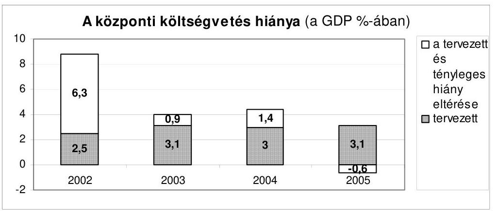
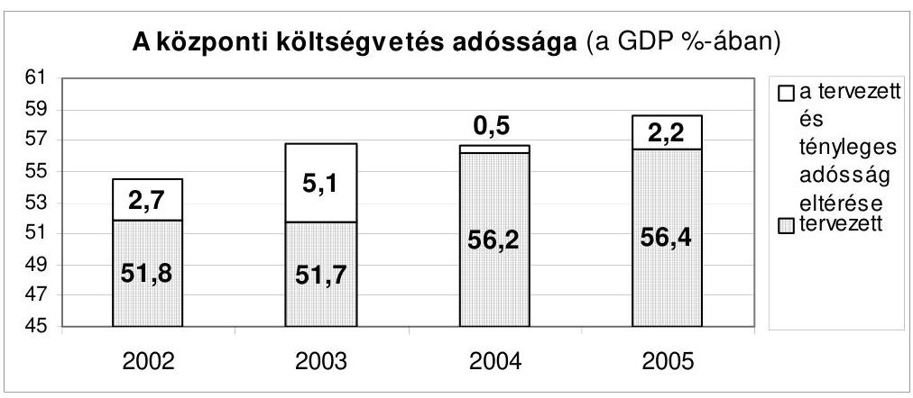
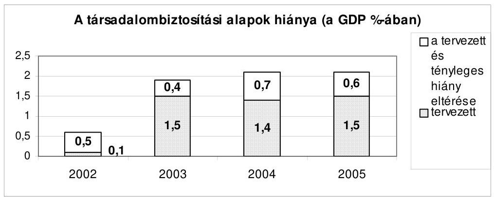
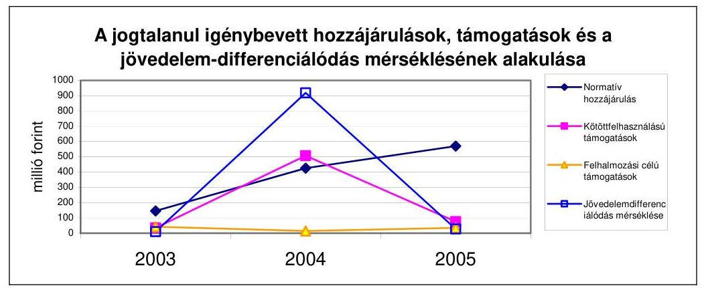
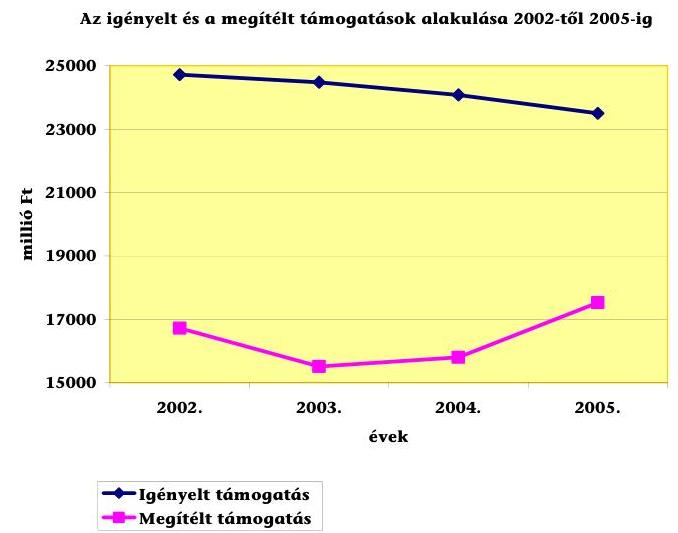
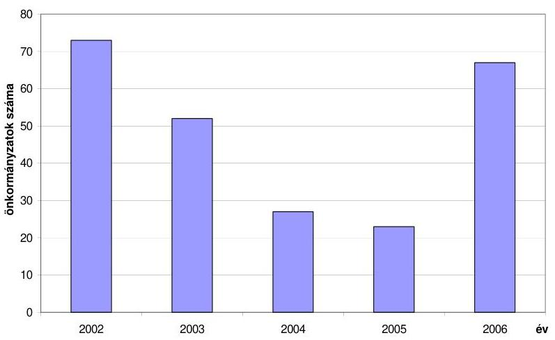
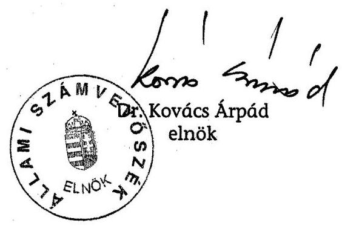

# ÁLLAMI   SZÁMVEVŐSZÉK 

## JELENTÉS

a Magyar Köztársaság 2005. évi költségvetése végrehajtásának ellenőrzéséről

---

# 1. Szervezetirányítási és Müködtetési Igazgatóság 

Vizsgálat-azonosító szám: V0227

## Az ellenőrzést felügyelte:

Dr. Csapodi Pál
főtitkár

## Az ellenőrzés végrehajtásáért felelős:

Dr. Kékesi László
főtitkárhelyettes

## Az ellenőrzést vezette:

Horváthné Menyhárt Erika
főcsoportfőnök-helyettes

## Az ellenőrzést végezték:

Bojtos Rozália
tanácsadó
Dr. Somorjai Zsoltné
számvevő tanácsos

Göller Géza
főtanácsadó
Bálint Józsefné
címzetes főmunkatárs

## 2. Államháztartás Központi Szintjét Ellenőrző Igazgatóság

## Az ellenőrzést felügyelte:

Bihary Zsigmond
főigazgató

## Az ellenőrzés végrehajtásáért felelős:

Simon Ákosné
főigazgató-helyettes

## Az ellenőrzést vezette:

Horváth Sándor
főcsoportfőnök-helyettes
Holé Sándorné Dr.
igazgatóhelyettes
Szabóné Farkas Katalin
osztályvezető főtanácsos

Dr. Csépán Mária Magdolna igazgatóhelyettes
Norczen Győzőné osztályvezető főtanácsos

Hámoriné Maróti Györgyi osztályvezető főtanácsos
Pongrácz Éva osztályvezető főtanácsos

## Az összefoglaló jelentést készítették:

Balázs Melinda számvevő tanácsos

Farkas László
főtanácsadó
Görgényi Gábor
számvevő gyakornok
Konorót Zsuzsanna számvevő tanácsos

Dr. Sipos Dóra
számvevő tanácsos
Zaroba Szilvia
számvevő

Deli Gáborné
számvevő
Fogarasi Miklós
főtanácsadó
Gyarmati István
számvevő tanácsos
Morvay András
számvevő tanácsos
Szilágyi Zsuzsanna
tanácsadó
Winter Zsuzsanna
számvevő

Éva Katalin
főtanácsadó
Ferenc Katalin
számvevő tanácsos
Dr. Juhászné Szima Mária
tanácsadó
Dr. Pósch Gábor
főtanácsadó
Vacsora Erika
számvevő

---

# Az ellenőrzést végezték: 

Dr. Antal Zoltán
külső munkatárs
Balázs Melinda
számvevő tanácsos
Bartha Gyula
külső munkatárs
Borsos Ferenc
számvevő tanácsos
Dancsóné Kuron Ildikó
számvevő
Dombovári Nóra
számvevő
Dormán István Zoltán
számvevő
Fehérné Jagasich Mariann
számvevő tanácsos
Fodor Edit
számvevő tanácsos
Franczen Lajos
számvevő gyakornok
Gyarmati István
számvevő tanácsos
Hajduné Sipos Erika
számvevő tanácsos
Hegedűsné Csongor Mária
külső munkatárs
Hozleiter Erika
külső munkatárs
Jagicza Istvánné
számvevő
Jenei Zoltán Béláné
számvevő
Dr. Juhászné Szima Mária
tanácsadó
Kiss Józsefné
külső munkatárs
Dr. Knapp József
külső munkatárs
Laub Ágota
külső munkatárs
Major Gizella
külső munkatárs
Molnár Katalin
számvevő gyakornok
Némethné Nagy Mária
számvevő
Patai Tamás
számvevő tanácsos
Dr. Pósch Gábor
főtanácsadó

Dr. Baji László
számvevő
Dr. Baloghné Sebestyén Éva
számvevő
Bata Zsuzsanna
külső munkatárs
Burenzsargal Narantuja
számvevő
Deli Gáborné
számvevő
Dr. Domján Eszter
számvevő tanácsos
Éva Katalin
főtanácsadó
Fekete Győr László
számvevő
Fogarasi Miklós
főtanácsadó
Gömöri József
számvevő tanácsos
Haáz Andorné
külső munkatárs
Hegedűsné Erdélyi Piroska
tanácsadó
Hites Anita
külső munkatárs
Huszár József
számvevő
Dr. Jakab Kornél
számvevő
Jeszenkovits Tamás
számvevő tanácsos
Karsai Lászlóné
tanácsadó
Konorót Zsuzsanna
számvevő tanácsos
Knoppné Szabó Ildikó
számvevő tanácsos
Dr. Lengyel Attila
tanácsadó
Dr. Mészáros Leila
számvevő
Morvay András
számvevő tanácsos
Oláh Róbert
számvevő
Pető Krisztina
számvevő
Dr. Remport Katalin
tanácsadó

Baki István
számvevő
Bamberger Mária
tanácsadó
Bács Ágnes
számvevő
Dr. Csiba Andrásné
külső munkatárs
Demes Istvánné
külső munkatárs
Domonkosné Kurilla Edit
számvevő tanácsos
Farkas László
főtanácsadó
Ferencz Katalin
számvevő tanácsos
Dr. Fónyad Erzsébet
számvevő tanácsos
Görgényi Gábor
számvevő gyakornok
Hajdu Károlyné
számvevő tanácsos
Hegedűs Miklós
külső munkatárs
Horváth József
számvevő tanácsos
Huszárné Borbás Melinda
számvevő gyakornok
Jáger Lajos
számvevő
Juhász József Gábor
számvevő
Kincses Erzsébet Eszter
számvevő
Koska János
külső munkatárs
Krémó Márkné
számvevő tanácsos
Magyar Sára
számvevő
Molnár Bálint
számvevő
Nagy József
főtanácsadó
Papp Julianna
számvevő tanácsos
Polyák Ferenc
számvevő
Rónai Éva
külső munkatárs

---

Séra Andrásné főtanácsadó

Szabó Erzsébet számvevő tanácsos

Szentesiné Tuka Margit külső munkatárs

Szilágyi Zsuzsanna tanácsadó

Tompa Mihály külső munkatárs

Vacsora Erika számvevő

Vértényi Gábor számvevő

Zaroba Szilvia számvevő

Simon Andrásné Dr. számvevő tanácsos

Szabóé Simai Mária számvevő

Székely Ibolya tanácsadó

Szöllősiné Hrabóczki Etelka főtanácsadó

Tóth Árpád számvevő tanácsos

Vas Lajos főtanácsadó

Winter Zsuzsa számvevő

Dr. Sipos Dóra számvevő tanácsos

Dr. Szávai Tamás főtanácsadó

Szilágyi Gyöngyi főtanácsadó

Takács Andrea külső munkatárs

Trenovszki István főtanácsadó

Dr. Vass Gábor számvevő tanácsos

Zakar László számvevő

# 3. Önkormányzati és Területi Ellenőrzési Igazgatóság 

## Az ellenőrzést felügyelte:

Dr. Lóránt Zoltán
föigazgató

## Az ellenőrzés végrehajtásáért felelős:

Dr. Sepsey Tamás Németh Péterné főcsoportfőnök
föigazgató helyettes
Az ellenőrzést vezette:
Ernst László
fötanácsadó, irodavezető

## A számvevői jelentések összeállításában közremúködtek:

Ambrus Lajos
tanácsadó
Gelencsér Zoltán
számvevő
Nagy Istvánné dr.
számvevő tanácsos
dr.Vasváriné dr. Rózsa Anikó
főtanácsadó

## Az ellenőrzést végezték:

Ambrus Lajos tanácsadó

Bauer Lajosné
fötanácsadó
Benkéné dr. Lavner Klára számvevő tanácsos

Bíró Zsolt
számvevő
Borbély Zsuzsanna
főtanácsadó
Buczkó András
külső munkatárs

Borbély Zsuzsanna
főtanácsadó
Kersmájer Ágota
számvevő tanácsos
Preller Zsuzsanna
tanácsadó

Baloghné Dakó Eszter
számvevő tanácsos
Bencsik Árpád
számvevő
Benn Imréné
számvevő tanácsos
Bocsi Sándor
főtanácsadó
dr. Botta Tibor
számvevő tanácsos
Buus Zoltánné Hütter Erzsébet számvevő

Turnheimné Lakos Zsuzsa
főcsoportfőnök helyettes

Czifra Erzsébet
tanácsadó
Korsósné Vígh Andrea
számvevő tanácsos
Varga József
számvevő tanácsos

Batkiné Vas Anna
számvevő
Benczik Lászlóné
számvevő tanácsos
Bialkó Zsolt Gyula
számvevő tanácsos
dr. Boda Sándor
számvevő tanácsos
Börócz Imre
tanácsadó
dr. Csapó Anna
tanácsadó

---

Csényi István számvevő

Csiszárné dr. Kosik Mária számvevő tanácsos

Czifra Erzsébet tanácsadó

Ébner Vilmosné főtanácsadó

Engert Jakab külső munkatárs

Fodor Tivadarné számvevő tanácsos

Gaál László számvevő

Groholy Andrásné Hangyál Márta számvevő

Hadházy Sándor számvevő tanácsos

Hirka Mihály
főtanácsadó
Horváth Mária számvevő

Iszakné Dóczé Katalin számvevő

Kányáné Murva Tünde számvevő

Kéri Péter számvevő tanácsos

Kisapáti Angéla számvevő
dr. Kiss Károly számvevő tanácsos

Klinga László számvevő tanácsos

Korsósné Vígh Andrea számvevő tanácsos

Köllődné Gátai Mária számvevő

Lingné Rajz Borbála számvevő

Maróti Sándor számvevő tanácsos

Mokánszkiné Mengyi Andrea számvevő

Nagy Ervin Barnabás számvevő

Nagy László Csaba számvevő tanácsos

Pálfi András számvevő tanácsos

Preller Zsuzsanna tanácsadó
dr. Csermák Judit számvevő

Csomán Mihály
főtanácsadó
Dér Géza
számvevő
Eigner György Zoltán
számvevő
dr. Ernst László
főtanácsadó
dr. Fónagy Diána
számvevő
Gál Istvánné
külső munkatárs
György Árpád
számvevő tanácsos
dr. Hegedüs György
főtanácsadó
Holman Magdolna
számvevő
Humli Tamásné
számvevő
Jakubcsák Jenő
számvevő tanácsos
dr.Karáné Kőszegi Zsuzsanna
számvevő tanácsos
Kersmájer Ágota
számvevő tanácsos
Kisgergely István
számvevő
Kiss Rita Teréz
számvevő
Komlósiné Bogár Éva
számvevő tanácsos
Kozák György
főtanácsadó
dr. Kőrös István
külső munkatárs
Luhály Matild
számvevő
Máthé Endréné
külső munkatárs
Molnár Istvánné
számvevő
Nagy Istvánné dr.
számvevő tanácsos
Nyikon Zsigmondné
számvevő tanácsos
Pálfiné Pusztai Magdolna
számvevő
Puskás Balázs
számvevő
dr. Csikai Zsolt
főtanácsadó
Csuti Lajos
számvevő tanácsos
Dér Lívia
számvevő tanácsos
Endrődy Péterné
számvevő tanácsos
Fodor Pálné
külső munkatárs
Fórián Erika
számvevő tanácsos
Gelencsér Zoltán
számvevő
Gyüre Lajosné
számvevő tanácsos
Hegyes Mária
számvevő
dr. Horváth Klára
számvevő
Huszár Sándorné
számvevő tanácsos
Kalmár István
számvevő tanácsos
Kerezsi Pál
számvevő tanácsos
Keszthelyi Zoltán
számvevő tanácsos
Kispálné Wiedemann Györgyi
tanácsadó
dr. Klapcsík László
főtanácsadó
Kopaczné Horváth Zsuzsanna
számvevő tanácsos
Kozma Gábor
számvevő
Laki Dóra
számvevő tanácsos
Major Lászlóné
számvevő tanácsos
dr. Mezei Imréné
főtanácsadó
Nagy Attila
számvevő tanácsos
Nagy János
számvevő tanácsos
dr. Pál Lehelné
főtanácsadó
Péntek László
főtanácsadó
Reichert Margit
számvevő

---

Ritecz Tibor
számvevő
Szabó Leonóra Ildikó
számvevő
Szalontai Miklós
számvevő tanácsos
Szihalminé Kovács Zsuzsa
számvevő
dr. Telkes Imre
számvevő tanácsos
Tóth László
számvevő gyakornok
Tóth Tamás
számvevő
dr. Vasváriné dr. Rózsa Anikó
főtanácsadó
Vojcsekné Szabó Ágnes
számvevő tanácsos

Schósz Attila Ferencné számvevő tanácsos
Szabó Tamás
számvevő tanácsos
Szarvas Szilárd
számvevő
dr. Szikszai Bertalan
számvevő tanácsos
Tótfalusi Zoltán
számvevő
Tóth Pál
számvevő tanácsos
Újvári Józsefné
számvevő
Veres Jánosné
számvevő
Zeke József
számvevő tanácsos

Somogyiné dr. Legény Mária számvevő tanácsos
Szabó Zoltán
számvevő tanácsos
Szenténé Tubak Klára
számvevő tanácsos
Szűtsné Kiss Zsuzsanna
külső munkatárs
dr. Tóth András
külső munkatárs
Tóth Péter
számvevő
Varga József
számvevő tanácsos
Vida László
számvevő tanácsos

# A témához kapcsolódó eddig készített számvevőszéki jelentések: 

címe
Jelentés a Magyar Köztársaság 2003. évi költségvetése végrehajtásának 0443 ellenőrzéséről
Jelentés a Magyar Köztársaság 2004. évi költségvetése végrehajtásának 0540 ellenőrzéséről

---

# TARTALOMJEGYZÉK 

BEVEZETŐ ..... 15
I. ÖSSZEGZŐ MEGÁLLAPÍTÁSOK, KÖVETKEZTETÉSEK, JAVASLATOK ..... 18
II. RÉSZLETES MEGÁLLAPÍTÁSOK ..... 63
A) A ZÁRSZÁMADÁSI DOKUMENTUM TÖRVÉNYESSÉGI ÉS SZÁMSZAKI ELLENŐRZÉSE ..... 65

1. A zárszámadási dokumentum tartalma, szerkezete ..... 67
2. Egyes törvényi előírások és felhatalmazások teljesítése ..... 68
2.1. A dokumentumra vonatkozó Áht.-előírások teljesítése ..... 68
2.2. Állami kezesség és viszontgarancia ..... 70
2.3. Az állami vagyon bemutatása ..... 70
2.4. A központi költségvetés hiányának finanszírozása, adósságának változása ..... 71
2.5. A helyi önkormányzatok ..... 71
2.6. Az ÁPV Zrt. költségvetési előirányzatainak teljesítése ..... 71
2.7. Általános tartalék, céltartalék és államháztartási tartalék ..... 72
2.8. A központi költségvetés előirányzat-módosítás nélkül teljesülő kiadásai ..... 72
2.9. Infrastruktúra-fejlesztési Tőkealap Számla ..... 73
2.10. A Költségvetési tv.-ben kapott felhatalmazások teljesítése ..... 73
2.11. Az elkülönített állami pénzalapok ..... 73
2.12. A társadalombiztosítási alapokra vonatkozó előírások ..... 74
3. A zárszámadási dokumentum külső és belső egyezősége, átláthatósága ..... 75
4. A törvényjavaslat fejezeti indokolása ..... 76
B) HELYSZÍNI ELLENŐRZÉS ..... 79
B.1. AZ ÁLLAMHÁZTARTÁS KÖZPONTI SZINTJE ..... 81
B.1.1. A KÖZPONTI KÖLTSÉGVETÉS ..... 81
5. A központi költségvetés 2005. évi törvényi előirányza-tainak teljesítése, a hiány alakulása ..... 81

---

2. A központi költségvetés finanszírozása és a kincstári egységes számla likviditása ..... 83
2.1. A központi költségvetés finanszírozási igénye ..... 83
2.2. A központi költségvetés tényleges finanszírozása ..... 86
3. A központi költségvetés közvetlen előirányzatai ..... 90
3.1. A központi költségvetés közvetlen bevételei ..... 90
3.1.1. Vállalkozások költségvetési befizetései ..... 91
3.1.2. Fogyasztáshoz kapcsolt adók ..... 94
3.1.3. A lakosság befizetései ..... 98
3.1.4. Egyéb költségvetési bevételek ..... 99
3.1.5. Állami vagyonnal kapcsolatos bevételek ..... 101
3.1.5.1. Osztalékbevételek ..... 101
3.1.5.2. Koncessziós bevételek ..... 102
3.1.5.3. Kincstári vagyonkezeléssel és -hasznosítással kapcsolatos központi költségvetést megillető bevétel ..... 103
3.1.5.4. Autópályák finanszírozási rendszerének változásából adódó bevételek ..... 105
3.1.6. Uniós elszámolások ..... 105
3.1.7. Vám- és importelszámolások ..... 106
3.2. A központi költségvetés közvetlen bevételei elszámolásainak megbízhatósága ..... 107
3.2.1. Az APEH és a VP főkönyvi és analitikus nyilvántartásának egyezősége ..... 107
3.3. A köztartozások behajtására tett intézkedések ..... 113
3.3.1. Az adóhátralékok behajtására tett intézkedések ..... 113
3.3.2. Végrehajtói letéti rendszer ..... 115
3.3.3. Fizetési könnyítés, méltányossági jogok gyakorlása ..... 115
3.3.4. A vámhatóság által kezelt vám- és adótartozások behajtására tett intézkedések ..... 116
3.4. A központi költségvetés közvetlen kiadásai ..... 118
3.4.1. Az előirányzatok felhasználása ..... 118
3.4.2. A központi költségvetés kamatelszámolásai, tőkevissza- térülései, az adósság- és követeléskezelés költségei ..... 125
3.4.3. A központi költségvetés terhére vállalt kezességek ..... 132
3.4.4. A központi költségvetés általános tartalékának és céltartalékának felhasználása ..... 140
3.5. A központi költségvetés közvetlen kiadásai elszámolásainak megbízhatósága ..... 150
4. A fejezetek költségvetésének végrehajtása ..... 160
4.1. A fejezetek bevételi és kiadási előirányzatainak teljesítése, az előirányzat-maradványok alakulása, az intézmények finanszírozása ..... 162
4.1.1. A bevételi előirányzatok teljesítése ..... 162

---

4.1.2. A kiadási előirányzatok teljesítése ..... 163
4.1.3. Az előirányzat-maradványok alakulása ..... 163
4.1.4. A költségvetési intézmények finanszírozása ..... 165
4.1.4.1. Az előirányzat-felhasználási keret megnyitása, felhasználása ..... 165
4.1.4.2. A központi költségvetési szervek tartozásállománya, köztartozásai ..... 166
4.2. A beszámolók megbízhatósága ..... 168
4.2.1. A kijelölt fejezetek, fejezeti jogosítványú költségvetési címek beszámolóinak megbízhatósága ..... 168
4.2.2. Az igazgatási címek, alcímek elemi beszámoló jelentéseinek megbízhatósága ..... 168
4.2.3. A fejezetek által ellenőrzött elemi beszámolók megbízhatósága ..... 169
4.2.4. A fejezeti kezelésű előirányzatok elszámolásainak megbízhatósága ..... 170
5. Az EU-támogatások és az uniós tagsággal összefüggő hazai befizetések ..... 171
6. A belső kontrollrendszer értékelése ..... 182
7. Letéti számlák ..... 186
7.1. A központi letéti számla ..... 186
7.2. Fejezeti letéti számlák ..... 187
8. A korábbi ÁSZ ellenőrzések megállapításaival kapcsolatban tett intézkedések ..... 187
B.1.2. ELKÜLÖNÍTETT ÁLLAMI PÉNZALAPOK ..... 190

1. Munkaerőpiaci Alap ..... 190
1.1. Az MPA költségvetési beszámolója ..... 190
1.2. Az MPA pénzügyi helyzete ..... 190
1.3. Az Alap bevételeinek teljesülése ..... 191
1.4. Az MPA 2005. évi kiadásai ..... 192
2. Központi Nukleáris Pénzügyi Alap ..... 193
2.1. A KNPA 2005. évi költségvetésének végrehajtása ..... 193
2.1.1. Az Alap bevételei ..... 194
2.1.2. Az Alap kiadásai ..... 194
3. Wesselényi Miklós Ár- és belvízvédelmi Kártalanítási Alap ..... 195
4. Kutatási és Technológiai Innovációs Alap ..... 196
4.1. Az Alap múködésének jogszabályi háttere ..... 196
4.2. Az Alap 2005. évi költségvetési beszámolója ..... 197
4.3. Az Alap költségvetésének végrehajtása ..... 198
4.3.1. A bevételek alakulása ..... 198

---

4.3.2. A kiadások alakulása ..... 199
5. Szülőföld Alap ..... 202
5.1. A Szülőföld Alap létrehozása ..... 202
5.2. Az Alap 2005. évi költségvetésének végrehajtása ..... 203
5.3. Az Alap 2005. évi pályázatai ..... 203
B.1.3. A TÁRSADALOMBIZTOSÍTÁS PÉNZÜGYI ALAPJAI ..... 204

1. Nyugdíjbiztosítási Alap ..... 204
1.1. A 2005. évi költségvetési beszámolók elkészítése ..... 204
1.1.1. Az ellátási beszámoló fontosabb információi ..... 204
1.1.2. A múködési költségvetés beszámolója ..... 206
1.2. Az Ny. Alap pénzügyi helyzete ..... 206
1.3. Az Ny. Alap kiadásai ..... 206
1.4. Az Ny. Alap ellátási kiadások ..... 207
1.4.1. Nyugellátások ..... 207
1.4.2. Az Ny. Alap egyéb kiadásai ..... 209
1.5. Az Ny. Alap vagyongazdálkodási kiadásai ..... 209
2. Egészségbiztosítási Alap ..... 210
2.1. A 2005. évi költségvetési beszámolók elkészítése ..... 210
2.1.1. Az ellátási szektor 2005. évi beszámolója ..... 210
2.1.2. A múködési költségvetés beszámolója ..... 211
2.2. Az E. Alap 2005. évi pénzügyi helyzete ..... 211
2.3. Az Egészségbiztosítási Alap 2005. évi ellátási kiadásai ..... 212
2.3.1. Rokkantsági ellátások ..... 212
2.3.2. Az egészségbiztosítás pénzbeli ellátásai ..... 213
2.3.3. A gyógyító-megelőző egészségügyi ellátás finanszírozása ..... 214
2.3.4. A gyógyszerkiadások alakulása ..... 217
2.3.5. Egyéb természetbeni ellátások ..... 218
2.3.6. Irányított betegellátás modellkísérlete ..... 220
2.3.7. Az ellátásokhoz kapcsolódó egyéb kiadások ..... 223
B.2. AZ ÁLLAMHÁZTARTÁS HELYI SZINTJE, A HELYI ÖNKORMÁNYZATOK ..... 224
3. A Költségvetési tv. mellékleteiben meghatározott központi támogatások elszámolásának szabályszerűsége ..... 224
1.1. Az előirányzatok nyilvántartása ..... 224
1.1.1. Az eredeti előirányzatok jogcímenkénti megfelelősége a Költségvetési tv.-ben és a PM-BM együttes rendeletben ..... 224
1.1.2. Az előirányzat módosítások szabályszerűsége ..... 227
1.2. A helyi önkormányzatok támogatásainak és hozzájárulásainak jogcímenkénti alakulása ..... 228

---

1.2.1. A helyi önkormányzatok normatív hozzájárulásai ..... 228
1.2.2. A helyi önkormányzatok személyi jövedelemadó részesedése ..... 232
1.2.3. A helyi önkormányzatok által felhasználható központosított előirányzatok ..... 233
1.2.4. A helyi önkormányzatok működőképességének megőrzését szolgáló kiegészítő támogatások ..... 240
1.2.4.1. Az önhibájukon kívül hátrányos helyzetben lévő helyi önkormányzatok támogatása ..... 240
1.2.4.2. A tartósan fizetésképtelen helyzetbe került helyi önkormányzatok támogatása ..... 242
1.2.4.3. A működésképtelen önkormányzatok egyéb támogatása ..... 243
1.2.5. A helyi önkormányzatok színházi támogatása ..... 245
1.2.5.1. A kőszínházak és a bábszínházak épületmúködtetési és művészeti tevékenységeinek kiadásaihoz való hozzájárulás ..... 246
1.2.5.2. Színházak pályázati támogatása ..... 247
1.2.6. A normatív kötött felhasználású támogatások ..... 248
1.2.7. Felhalmozási célú támogatások ..... 252
1.2.7.1. Címzett és céltámogatások ..... 252
1.2.7.2. A helyi önkormányzatok fejlesztési és vis maior feladatainak támogatása ..... 253
1.2.7.3. Vis maior tartalék ..... 254
1.2.7.4. A felhalmozási célú támogatások felhasználása ellenőrzésének tapasztalatai ..... 254
1.2.8. Budapest 4-es - Budapest Kelenföldi pályaudvar-Bosnyák tér közötti - metróvonal első szakasza építésének támogatása ..... 257
1.2.9. A gyermekétkeztetés szociális célú támogatása ..... 258
1.2.10.Támogatás rendkívüli esőzés miatti lakossági károk enyhítésére, valamint az érintett önkormányzatok által e célra felvett hitel kamattámogatása ..... 258
2. A helyi önkormányzatok előző évi elszámolása és ellenőrzése során megállapított eltérések rendezésének szabályszerűsége ..... 259
3. A könyvvizsgálati kötelezettség teljesítésének országos tapasztalatai ..... 263

---

.

---

# RÖVIDÍTÉSEK JEGYZÉKE 

| áfa | általános forgalmi adó |
| :--: | :--: |
| ÁFSz | Állami Foglalkoztatási Szolgálat |
| ÁHH | Államháztartási Hivatal |
| Áht. | Az államháztartásról szóló 1992. évi XXXVIII. tv. |
| AIK | Agrárintervenciós Központ |
| ÁAK Rt. | Állami Autópálya Kezelő Rt. |
| ÁAK Zrt. | Állami Autópálya Kezelő Zrt. |
| AKA Rt. | AKA Alföld Koncessziós Autópálya Rt. |
| AKA Zrt. | AKA Alföld Koncessziós Autópálya Zrt. |
| ÁKK Rt. | Államadósság Kezelő Központ Rt. |
| ALB | Alkotmánybíróság |
| Ap.tv. | A Magyar Köztársaság gyorsforgalmi közúthálózatának közérdekúségéről és fejlesztéséről szóló 2003. évi CXXVIII. tv. |
| Ámr. | Az államháztartás múködési rendjéről szóló 217/1998. (XII. 30.) Korm. rendelet |
| APEH | Adó- és Pénzügyi Ellenőrzési Hivatal |
| APEH-SZTADI | Adó- és Pénzügyi Ellenőrzési Hivatal Számítástechnikai és Adatfeldolgozó Intézet |
| AVOP | Agrár- és Vidékfejlesztési Operatív Program |
| Avtv. | A személyes adatok védelméről és a közérdekú adatok védelméről szóló 1992. évi LXIII. tv. |
| ÁPV Rt. | Állami Privatizációs és Vagyonkezelési Rt. |
| Art. | Az adózás rendjéről szóló 2003. évi XCII. tv. |
| ÁSZ | Állami Számvevőszék |
| ÁSZ-FEMI | Állami Számvevőszék Fejlesztési és Módszertani Intézet |
| ÁSZ tv. | Az Állami Számvevőszékről szóló 1989. évi XXXVIII. tv. |
| BA Rt. | Budapest Airport Rt. |
| BC | Beruházásösztönzési Célelőirányzat |
| BÉT | Budapesti Értéktőzsde Rt. |
| BIR | Bíróságok |
| Bjt. | Bírák jogállásáról és javadalmazásáról szóló 1997. LXVII. tv. |
| BKSZ | Budapesti Közlekedési Szövetség |
| BKV Rt. | Budapesti Közlekedési Vállalat Rt. |
| BM | Belügyminisztérium |
| Bsz | A bíróságok szervezetéről és igazgatásáról szóló 1997. évi LXVI. tv. |
| Cct | A helyi önkormányzatok címzett és céltámogatási rendszeréről szóló 1992. évi LXXXIX. tv. |
| Cct. Vhr. | 9/1998. (I. 23.) Korm. rendelet a helyi önkormányzatok címzett és céltámogatásának, a céljellegú decentralizált támogatásának igénybejelentési, döntéselőkészítési és elszámolási rendjéről, valamint a Magyar Államkincstár finanszírozási, elszámo- |

---

|  | lási és ellenőrzési feladatairól, továbbá a Magyar Államkincstár Területi Igazgatóságai feladatairól |
| :--: | :--: |
| CEB | Európa Tanács Fejlesztési Bank |
| CÉDE | Céljellegú decentralizált támogatás |
| CONNECT | Coordination and stimulation of innovative ITS activities in Central and Eastern European Countries |
| DIS | Decentralised Implementation System (decentralizált végrehajtási rendszer) |
| E. Alap | Egészségbiztosítási Alap |
| EBB | Európai Beruházási Bank |
| EBRD | Európai Újjáépítési és Fejlesztési Bank |
| EDIS | Extended Decentralisation Implementation System (kiterjesztett decentralizációs végrehajtási rendszer) |
| EGC | Energiagazdálkodási célelőirányzat |
| EHJC | Energiahasznosítás javítása célelőirányzat |
| EIB | Európai Beruházási Bank |
| EK | Európai Közösség |
| EMIR | Egységes Monitoring Információs Rendszer |
| EMMA | Egységes Magyar Munkaügyi Alapnyilvántartás |
| EMOGA | Európai Mezőgazdasági Orientációs és Garancia Alap |
| EMU | Európai Monetáris Unió |
| ERFA | Európai Regionális Fejlesztési Alap |
| ESA | Európa Statisztikai Adattár |
| ESZA | Európai Szociális Alap |
| ESzCsM | Egészségügyi, Szociális és Családügyi Minisztérium |
| ET | Európa Tanács |
| ETI | Egészségügyi Szak-, és Továbbképző Intézet |
| EU | Európai Unió |
| EU Integráció | EU Integráció (fejezet) |
| EUPM | Európai Unió Rendőri Missziója |
| EURIBOR | Frankfurti EUR betéti kamatláb |
| EU SAVE | Európai uniós támogatásból megvalósuló programok |
| EüM | Egészségügyi Minisztérium |
| eva | egyszerúsített vállalkozói adó |
| EXIMBANK Rt. | Magyar Export-Import Bank Rt. |
| ÉDUKÖVIZIG | Észak-Dunántúli Környezetvédelmi és Vízügyi Igazgatóság |
| FA | MPA Foglalkoztatási Alaprész |
| FEUVE | folyamatba épített előzetes és utólagos vezetői ellenőrzés |
| FH | Foglalkoztatási Hivatal |
| FIFA | Felzárkóztatási Infrastrukturális Fejlesztési Alapprogram |
| FKA | MPA Fejlesztési és Képzési Alaprész |
| Flt. | A foglalkoztatás elősegítéséről és a munkanélküliek ellátásáról szóló 1991. évi IV. tv. |
| FMM | Foglalkoztatáspolitikai és Munkaügyi Minisztérium |
| FPMNYI | Fővárosi és Pest Megyei Nyugdíjbiztosítási Igazgatóság |

---

| FVM | Földművelésügyi és Vidékfejlesztési Minisztérium |
| :--: | :--: |
| FVM GH | FVM Gazdasági Hivatala |
| FVM GSZ | FVM Gazdálkodó Szervezet |
| GDP | Bruttó nemzeti termék |
| GET | A gázellátásról szóló 2003. évi XLII. tv. |
| GFS | Government Financial Statistics |
| GKI | Gazdaság Kutató Intézet |
| GKM | Gazdasági és Közlekedési Minisztérium |
| GKM GI | GKM Gazdasági Igazgatóság |
| GM | Gazdasági Minisztérium |
| GNI | Gross National Income (Bruttó Nemzeti Jövedelem) |
| Gt. | A Gazdasági társaságokról szóló 1997. évi CXLIV. tv. |
| GVH | Gazdasági Versenyhivatal |
| GVOP | Gazdasági Versenyképesség Operatív Program |
| GYED | Gyermekgondozási díj |
| GYES | Gyermekgondozási segély |
| GYET | Gyermeknevelési támogatás |
| GyISM | Gyermek-, Ifjúsági és Sportminisztérium |
| GySEV Rt. | Győr-Sopron-Ebenfurthi Vasút Rt. |
| Gyvt. | A gyermekek védelméről és a gyámügyi igazgatásról szóló 1997. évi XXXI. tv. |
| HEFOP | Humánerőforrás-fejlesztési Operatív Program |
| HG Rt. | Hitelgarancia Rt. |
| HIPC | Súlyosan Eladósodott Szegény Országok adósság-könnyítő program |
| HM | Honvédelmi Minisztérium |
| HOPE | Halászati Orientációs Pénzügyi Eszköz |
| HÖT | Helyi önkormányzatok támogatása |
| Hrsz. | Helyrajzi szám |
| Hszt. | A fegyveres szervek hivatásos állományú tagjainak szolgálati viszonyáról szóló 1996. évi XLIII. tv. |
| HTMH | Határon Túli Magyarok Hivatala |
| HVR | Hátralékkezelési és Végrehajtási Információs Rendszer |
| Iasz | Az igazságügyi alkalmazottak szolgálati jogviszonyáról |
| IBR | Irányított Betegellátás Rendszere |
| IBRD | Nemzetközi Újjáépítési és Fejlesztési Bank |
| IBSZ | Informatikai Biztonsági Szabályzat |
| ICsSzEM | Ifjúsági, Családügyi, Szociális és Esélyegyenlőségi Minisztérium |
| IH | Irányító Hatóság |
| IHM | Informatikai és Hírközlési Minisztérium |
| IIER | Integrált Igazgatási és Ellenőrzési Rendszer |
| Igazgatóságok | Magyar Államkincstár Területi Igazgatóságai |
| ILO | Nemzetközi Munkaügyi Szervezet |
| IM | Igazságügyi Minisztérium |

---

| IMF | Nemzetközi Valuta Alap |
| :--: | :--: |
| ISPA | Instrument for Structural Policies for Pre-Accession (Strukturális Politikák Csatlakozás Elötti Eszköze) |
| ISK | Ifjúsági és Sportkommunikációs Szolgáltató Kft. |
| ISZIH | Igazságügyi Szakértői Intézetek Hivatala |
| IT Kht. | Információs Társadalom Kht. |
| ITB | Informatikai Tárcaközi Bizottság |
| ITD-H Kht. | Magyar Befektetési és Kereskedelemfejlesztési Kht. |
| Jöt. | A jövedéki adóról szóló 1997. CIII. tv. |
| KAC | Környezetvédelmi Alap Célelóirányzat |
| KAIG | Kiemelt Adózók Igazgatósága (APEH) |
| Kbt. | A közbeszerzésekről szóló 2003. évi CXXIX. tv. |
| KE | Köztársasági Elnökség |
| KEH | Köztársasági Elnöki Hivatal |
| KEHI | Kormányzati Ellenőrzési Hivatal |
| KELER Rt. | Központi Elszámolóház és Értéktár Rt. |
| KESZ | Kincstári Egységes Számla |
| Kft. | Korlátolt felelősségú társaság |
| KfW | Kreditanstalt für Wiederaufbau (Újjáépítési és Hitelbank) |
| Kht. | Közhasznú társaság |
| KHVM | Környezetvédelmi, Hírközlési és Vízügyi Minisztérium |
| Kincstár | Magyar Államkincstár |
| KIOP | Környezetvédelmi és Infrastruktúra Operatív Program |
| Kjt. | A közalkalmazottak jogállásáról szóló 1992. évi XXXIII. tv. |
| KKC | Kis- és középvállalkozási célelóirányzat |
| KKI | Központi Kárrendezési Iroda |
| KNPA | Központi Nukleáris Pénzügyi Alap |
| KOMT | Közalkalmazottak Országos Munkaügyi Tanácsa |
| Korm. | Kormány |
| Költségvetési tv. | A Magyar Köztársaság 2005. évi költségvetéséről szóló 2004.   évi CXXXV. tv. |
| Kövice | Környezetvédelmi és vízügyi céleloirányzat |
| Kp | Központ |
| Kp-i | Központi |
| KPSZE | Központi Szerződéskötő Egység |
| KSH | Központi Statisztikai Hivatal |
| KSZ | Közremúködő Szervezet |
| KSZF | Miniszterelnökség Központi Szolgáltatási Főigazgatóság |
| KT | Közbeszerzések Tanácsa |
| Kt. | A közoktatásról szóló 1993. évi LXXIX. tv. |
| Kttv. | A kockázati tőkebefektetésekről, a kockázati tőketársaságokról, valamint a kockázati tőkealapokról szóló 1998. évi XXXIV. tv. |
| KTK | Kincstári Tranzakciós Kód |
| Ktv. | A köztisztviselők jogállásáról szóló 1992. évi XXIII. tv. |

---

| KüM | Külügyminisztérium |
| :--: | :--: |
| KVI | Kincstári Vagyoni Igazgatóság |
| Kvtv. | A Magyar Köztársaság 2004. évi költségvetéséről és az államháztartás hároméves kereteiről szóló 2003. évi CXVI. tv. |
| KvVM | Környezetvédelmi és Vízügyi Minisztérium |
| KvVM FI | Környezetvédelmi és Vízügyi Minisztérium Fejlesztési Igazgatósága |
| LRI | Légiforgalmi és Repülőtéri Igazgatóság |
| M | Millió |
| MAB | Magyar Akkreditációs Bizottság |
| MAHART | Magyar Hajózási Rt. |
| MÁK | Magyar Államkincstár |
| MALÉV | Magyar Légiközlekedési Rt. |
| MAT | Munkaerőpiaci Alap Irányító Testülete |
| MÁV Rt. | Magyar Államvasutak Rt. |
| MÁV Zrt. | Magyar Államvasutak Zrt. |
| MBH | Magyar Bányászati Hivatal |
| ME | Miniszterelnökség |
| ME-EK | Miniszterelnökség Esélyegyenlőségi Kormányhivatal |
| MeH | Miniszterelnöki Hivatal |
| MEHIB Rt. | Magyar Exporthitel Biztosító Rt. |
| MeHIG | Miniszterelnöki Hivatal Igazgatása |
| MEP | Megyei Egészségbiztosítási Pénztár |
| M Ft | millió Ft |
| MFB Rt. | Magyar Fejlesztési Bank Rt. |
| MH | Magyar Honvédség |
| MH KHK | Magyar Honvédség Központi Honvédkórház |
| MK | Munkaügyi Központ |
| MKK | Múködési Kézikönyv |
| MKK Rt. | Magyar Követeléskezelő Rt. |
| MKÜ | Magyar Köztársaság Ügyészsége |
| MLI Kht. | Magyar Lakás-innovációs Kht. |
| MNB | Magyar Nemzeti Bank |
| MOL Rt. | Magyar Olaj- és Gázipari Rt. |
| MPA | Munkaerőpiaci Alap |
| Mrd | Milliárd |
| MTA | Magyar Tudományos Akadémia |
| MTH | Magyar Turisztikai Hivatal |
| MTRFH | Magyar Terület- és Regionális Fejlesztési Hivatal (2005. szeptember 1-jétől OTH) |
| MTV Rt. | Magyar Televízió Rt. |
| MÜI | Magyar Űrkutatási Iroda |
| MVf Kht. | Magyar Vállalkozásfejlesztési Kht. |
| MVH | Mezőgazdasági és Vidékfejlesztési Hivatal |

---

| NA Rt. | Nemzeti Autópálya Rt. |
| :--: | :--: |
| NA Zrt. | Nemzeti Autópálya Zrt. |
| NATO | Észak Atlanti Szerződés Szervezete (Nort Atlantic Treaty Organization) |
| NBC | Nemzeti beruházás-ösztönzési célelőirányzat |
| NBH | Nemzetbiztonsági Hivatal |
| NBSZ | Nemzetbiztonsági Szakszolgálat |
| NFA | Nemzeti Földalap Program |
| NFH | Nemzeti Fejlesztési Hivatal |
| NFÜ | Nemzeti Fejlesztési Ügynökség (a Nemzeti Fejlesztési Hivatal jogutódja) |
| NFI | Nemzetközi Fejlesztési Intézet |
| NFT | Nemzeti Fejlesztési Terv |
| NHH | Nemzeti Hírközlési Hatóság |
| NHIT | Nemzeti Hírközlési és Informatikai Tanács |
| NIIF | Nemzeti Információs és Infrastruktúra Fejlesztési Program Iroda |
| NKÖM | Nemzeti Kulturális Örökség Minisztériuma |
| NKTH | Nemzeti Kutatási és Technológiai Hivatal |
| NSH | Nemzeti Sporthivatal |
| NVT | Nemzeti Vidékfejlesztési Terv |
| Ny. Alap | Nyugdíjbiztosítási Alap |
| NYUFIG | Nyugdíjfolyósító Igazgatóság |
| OAH | Országos Atomenergia Hivatal |
| OBH | Országgyúlési Biztosok Hivatala |
| OECD | Gazdasági Együttmúködési és Fejlesztési Szervezet |
| OECF | Japan's Overseas Economic Cooperation Fund |
| OEP | Országos Egészségbiztosítási Pénztár |
| OFA | Országos Foglalkoztatási Közalapítvány |
| OGY | Országgyúlés |
| OGYH | Országgyúlés Hivatala |
| OKÉV | Országos Közoktatási Értékelési és Vizsgaközpont |
| OKF | Országos Katasztrófavédelmi Főigazgatóság |
| OLAF | Office Européen de Lutte Anti-Fraude (Európai Csalásellenes Hivatal) |
| OLÉH | Országos Lakás- és Építésügyi Hivatal |
| OM | Oktatási Minisztérium |
| OMAI | Oktatási Minisztérium Alapkezelő Igazgatósága |
| OMMF | Országos Munkabiztonsági és Munkaügyi Főfelügyelőség |
| OM MUB | Oktatási Minisztérium Magyar Unesco Bizottság |
| OMSZ | Országos Mentőszolgálat |
| OMSZI | Oktatási Minisztérium Szolgáltató Intézmény |
| ONYF | Országos Nyugdíjbiztosítási Főigazgatóság |
| OOSZI | Országos Orvosi Szakértői Intézet |
| OP | Operatív Program |

---

| OTH | Országos Területfejlesztési Hivatal |
| :--: | :--: |
| OTIVA | Országos Takarékszövetkezeti Intézmény Védelmi Alap |
| OTKA | Országos Tudományos Kutatási Alapprogramok |
| OTMR | Országos Támogatási Monitoring Rendszer |
| PHARE | Pologne Hongrie Aid a la Reconstruction Économique |
| PKD | Program-kiegészítő Dokumentum |
| PM | Pénzügyminisztérium |
| PM-BM együttes rendelet | a helyi önkormányzatokat a 2005. évben megillető normatív állami hozzájárulásokról, normatív kötött felhasználású támogatásokról, személyi jövedelemadóról, valamint a helyi önkormányzatok bevételeinek aránytalanságát mérséklő kiegészítésről, illetve beszámításról, valamint az államháztartási tartalékról szóló 4/2005. (I. 28.) PM-BM együttes rendelet |
| PM NAO Iroda | Pénzügyminisztérium Nemzeti Programengedélyező Iroda |
| PNSZ | Polgári Nemzetbiztonsági Szolgálatok |
| PNSZ IH | PNSZ Információs Hivatal |
| POLEBISZ | Polgári Légiközlekedés Biztonsági Szervezet |
| PPP | Public Private Partnership |
| Priv. tv. | Az állam tulajdonában lévő vállalkozói vagyon értékesítéséről szóló 1995. évi XXXIX. tv. |
| PROMEI Kht. | Modernizációs és Euroatlanti Integrációs Projekt Iroda Közhasznú Társaság |
| PSZÁF | Pénzügyi Szervezetek Állami Felügyelete |
| RA | MPA Rehabilitációs Alaprész |
| REFT | Regionális Egészségügyi Fejlesztési Terv |
| RFT | Regionális Fejlesztési Tanács |
| RET | Regionális Egészségügyi Tanács |
| RFÜ | Regionális Fejlesztési Ügynökség |
| ROP | Regionális Fejlesztés Operatív Program |
| Rt. | Részvénytársaság |
| SMART Hungary | Nemzeti Beruházás-ösztönzési Program keretében meghirdetett pályázat |
| SAPARD | EU Mezőgazdasági és Vidékfejlesztési Előcsatlakozási Program |
| SAPS | Egységes Területalapú Támogatás |
| SZÉSZEK | Szénbányászati és Szerkezet-átalakítási Központ |
| SZF | Szerencsejáték Felügyelet |
| SzJ | Szolgáltatások Jegyzéke |
| szja | személyi jövedelemadó |
| SZMSZ | Szervezeti és Múködési Szabályzat |
| Szoc. tv. | A szociális igazgatásról és szociális ellátásról szóló 1993. évi III. tv. |
| Szt. | A számvitelről szóló 2000. évi C. tv. |
| TB alapok | Társadalombiztosítás pénzügyi alapjai |
| TC | Turisztikai Célelóirányzat |
| TF | Területfejlesztés (fejezet) |

---

| TEN-T | Transzeurópai Közlekedési Hálózat |
| :-- | :-- |
| TESZ | Térségi Egészségszervezési Szolgálat |
| TERKI támogatás | Területi kiegyenlítést szolgáló fejlesztési támogatás |
| TJKSZ | Támogatásokat és Járadékokat Kezelő Szervezet |
| TKH | Területpolitikai Kormányzati Hivatal |
| TNM | Tárca Nélküli Miniszter |
| TOP-up | Kiegészítő Nemzeti Támogatás |
| TS | Technikai Segítségnyújtás |
| zárszámadási tv. | a Magyar Köztársaság 2004. évi költségvetéséről és az állam- |
|  | háztartás hároméves kereteiről szóló törvény végrehajtásáról |
|  | szóló 2005. évi CXVIII. törvény |
| UFCE | Útfenntartás és fejlesztés célelóirányzat |
| UKIG | Útgazdálkodási Koordinációs Igazgatóság |
| VICE | Vízügyi Célelóirányzat |
| UVATERV | Út-, Vasúttervező Részvénytársaság |
| VP | Vám- és Pénzügyőrség |
| VPOP | Vám- és Pénzügyőrség Országos Parancsnoksága |
| VPOP JIG | VPOP Jövedéki Igazgatósága |
| VPSZP | Vám- és Pénzügyőrség Számlavezető Parancsnoksága |
| Zrt. | Zártkörűen múködő részvénytársaság |
| 2004. évi Kö.tv. | A Magyar Köztársaság 2004. évi költségvetéséről és az állam- |
|  | háztartás három éves kereteiről szóló 2003. évi CXVI. törvény |

---

VE-02-003/2006.

# BEVEZETŐ 

A Magyar Köztársaság 2005. évi költségvetéséről rendelkező 2004. évi CXXXV. törvény (a továbbiakban: Költségvetési tv.) végrehajtásáról készített törvényjavaslatot és a döntéshozatalhoz szükséges információkat a Kormány az éves zárszámadási dokumentumban terjeszti az Országgyűlés elé.

A 2005. évi költségvetés zárszámadásának számvevőszéki ellenőrzése a Magyar Köztársaság Alkotmányának 32/C. § (1) bekezdése, az Állami Számvevőszékről szóló 1989. évi XXXVIII. törvény 1. § (2), 2. § (1), (3), (5-6) és (9), 17. § (1), illetve az államháztartásról szóló 1992. évi XXXVIII. törvény 29. § (2), 104. § (3) és a 120/A. § (1) bekezdésekben kapott felhatalmazások alapján történt.

Az Állami Számvevőszéknek (ÁSZ) a zárszámadás ellenőrzéséről készített jelentése államháztartási alrendszerenként foglalja össze az előterjesztett dokumentumnak, a költségvetési bevételek és a kiadások elszámolásának, valamint a költségvetési gazdálkodásra vonatkozó jogszabályok érvényesülésének ellenőrzéséről szerzett tapasztalatokat.

Az Országgyűlés felkérése, a zárszámadási ellenőrzéshez kapcsolódóan, a Magyar Köztársaság 2004. évi költségvetése végrehajtásáról szóló 2005. évi CXVIII. törvény 7. § (17) bekezdés alapján az önkormányzati út- és szennyvízcsatorna beruházásokhoz 2002-2005. években igénybevett közműfejlesztési támogatás igénylésére és felhasználására irányuló - 2006 szeptemberében lezáruló - ellenőrzést végeztünk.

Zárszámadási jelentésünkkel egyidőben hozzuk nyilvánosságra az ún. trend report-ot, ami az Országgyűlés 43/2005. (V. 26.) OGY határozatának és az Európai Unió szándékának megfelelően ismerteti és elemzi az uniós támogatások 2005. évi felhasználására vonatkozó, a nemzetközi és hazai szervezetek által elvégzett ellenőrzéseket. A vonatkozó költségvetési összefüggések ezen tájékoztató jelentésünkben (trend report) is megjelennek.

Tudatosan törekszünk arra, hogy - amennyire azt a törvényjavaslat prezentációja lehetővé teszi - zárszámadási jelentésünket mindinkább sztenderdizált módon, az évenkénti összehasonlítást lehetővé tevő szerkezetben adjuk közre.

Az ÁSZ a költségvetés véleményezésekor az Országgyűlésnek benyújtott költségvetési törvényjavaslatról ad véleményt. A parlamenti vitát követően az elfogadott költségvetési törvény a beterjesztett javaslattól akár jelentősen is eltérhet. Ezen eljárási folyamatból adódóan az ÁSZ a zárszámadás ellenőrzésekor

---

találkozik olyan problémákkal, melyekkel a véleményezés során nem szembesült, és állapítja meg a törvények közötti összhanghiányokat, szabályozási ellentmondásokat.

A jelentés két kötetből áll. Az első kötet az ellenőrzés legfontosabb megállapításait és javaslatait, valamint a zárszámadási dokumentum törvényességi és számszaki ellenőrzésére és az államháztartás alrendszereire vonatkozó részletes ellenőrzési megállapításokat tartalmazza. A második kötet (Függelék) a költségvetési fejezetekre, a belső kontroll rendszerek értékelésére, az EUtámogatásokkal és az uniós tagsággal összefüggő hazai befizetésekre, az államháztartáson kívüli (gazdasági és közhasznú társaságok) feladatellátásra, az elkülönített állami pénzalapokra, a társadalombiztosítási alapokra és a helyi önkormányzatok költségvetési kapcsolataira vonatkozó részletes megállapításokat és javaslatokat foglalja magában.

Javaslatainkkal erősíteni kívánjuk a zárszámadási törvényjavaslat megbízhatóságát, átláthatóságát, illetve a feltárt hibák jövőbeni elkerülését.

Az ellenőrzés célja annak értékelése volt, hogy

- a 2005. évi költségvetés végrehajtása során érvényesültek-e az államháztartási törvény, a Költségvetési tv., illetve az egyéb vonatkozó jogszabályok és az állami irányítás egyéb jogi eszközei, előírásai,
- az állami költségvetés teljesítését bemutató adatok valósághűen tükrözik-e a 2005. évi pénzügyi folyamatokat,
- a helyi önkormányzatokat megillető hozzájárulások, támogatások előirányzatainak módosítását szabályszerűen végezték-e, azok folyósítása a jogszabályi előírások szerint történt-e,
- a helyszíni vizsgálatba vont önkormányzatok a jogszabályoknak megfelelően igényelték, használták fel és számolták-e el a hozzájárulásokat és a támogatásokat,
- a támogatások igénylésére vonatkozó pályázati kiírások tartalma és a pályázatokról hozott döntés összhangban van-e a tárgyévre vonatkozó költségvetési törvénnyel és a kapcsolódó ágazati jogszabályokkal,
- a zárszámadási dokumentum előterjesztése megfelel-e a vonatkozó törvényi előírásoknak, adattartalma segíti-e a költségvetési év lezárásához szükséges döntések meghozatalát.

A központi költségvetési alrendszeren belül helyszíni ellenőrzésre került sor valamennyi költségvetési fejezetnél ${ }^{1}$, fejezeti jogosítványú költségvetési címnél, az elkülönített állami pénzalapok és a társadalombiztosítás pénzügyi alapjai kezelőinél.

[^0]
[^0]:    ${ }^{1}$ Az ÁSZ költségvetési beszámolóját az Országgyűlés elnöke által pályázat alapján kiválasztott, külső auditáló szervezet vizsgálta. Az ÁSZ gazdálkodásáról szóló beszámolót hitelesítő záradékkal látta el.

---

A központi költségvetés 2005. évi kiadási főösszege mintegy 80\%-át ellenőriztük a zárszámadási adatok megbízhatóságát tanúsító pénzügyi-szabályszerúségi ellenőrzés (financial audit) módszerével.

Az alkotmányos és az egyintézményes fejezetek, a fejezeti jogosítványú költségvetési címek, a fejezetek igazgatási címei, a fejezeti kezelésű előirányzatok és a központi költségvetés közvetlen bevételei és kiadásai tekintetében a financial audit módszer szerint minősítettük a zárszámadás adatainak megbízhatóságát.

A fejezetek 63 intézménynél minősítették az ÁSZ módszertana szerint - szoros szakmai együttmúködés mellett - a beszámoló jelentések megbízhatóságát.

A zárszámadási jelentésben külön is értékeltük az Európai Unióval kapcsolatos elszámolásokat.

Az elkülönített állami pénzalapok és a társadalombiztosítás pénzügyi alapjai zárszámadásának ellenőrzésénél - tekintettel azok kötelező könyvvizsgálatára - az adatok valódiságának, hitelességének minősítésénél hasznosítottuk a könyvvizsgálatok értékelését.

A 2005. évi zárszámadáshoz kapcsolódóan az önkormányzati alrendszer vonatkozásában 1352,8 Mrd Ft kiadási és 6,5 Mrd Ft bevételi előirányzat teljesítési adatainak megbízhatóságáról alkottunk véleményt. A központi költségvetésből nyújtott hozzájárulások és támogatások pénzügyi ellenőrzését az ÁSZ nemzetgazdasági elszámolások pénzügyi-szabályszerúségi ellenőrzési módszertana alapján végeztük el.

Helyszíni ellenőrzést folytattunk a Belügyminisztériumban, a Pénzügyminisztériumban, a Magyar Államkincstárban, a Környezetvédelmi és Vízügyi Minisztériumban, az Ifjúsági, Családügyi, Szociális és Esélyegyenlőségi Minisztériumban, a Gazdasági és Közlekedési Minisztériumban, a Nemzeti Kulturális Örökség Minisztériumában, az Oktatási Minisztériumban, az Országos Területfejlesztési Hivatalban, valamint a Jelentés függelékében felsorolt 210 helyi önkormányzatnál és 7 többcélú kistérségi társulásnál. (Az utóbbiból téma szerint: normatív támogatás 70 önkormányzat, kötött felhasználású normatív és központosított támogatás 68 önkormányzat és 7 többcélú kistérségi társulás, felhalmozási célú támogatás 72 önkormányzat).

A Magyar Köztársaság 2005. évi költségvetésének végrehajtásáról szóló törvényjavaslatban szereplő elszámolási adatok megbízhatóságát az önkormányzatok hozzájárulásai, támogatásai előirányzatának adatbázisaiból, valamint a pénzérték alapú mintavételi eljárással kiválasztott önkormányzatok részére folyósított hozzájárulások, támogatások alapján ellenőriztük.

---

# I. ÖSSZEGZŐ MEGÁLLAPÍTÁSOK, KÖVETKEZTETÉSEK, JAVASLATOK 

Az államháztartás alrendszereinek 2005. évi bevételi előirányzata 12054,7 Mrd Ft, kiadási előirányzata 13 109,1 Mrd Ft, a tervezett hiány 1054,4 Mrd Ft volt. A Magyar Köztársaság 2004. évi költségvetésének végrehajtásáról szóló 2005. évi CXVIII. törvény (2005. november 11-i hatállyal) a központi költségvetés és az elkülönített állami pénzalapok főösszegeit és a hiányt módosította. Ezáltal az államháztartás hiánya 1167,9 Mrd Ft-ra növekedett. Az előirányzat-módosítás indokolt volt, mivel a központi költségvetés első háromnegyed évben kialakult 780,9 Mrd Ft hiánya a Költségvetési tv.-ben meghatározott összeget $11,6 \%$-kal meghaladta.

A módosítás következtében az államháztartás központi szintjének előirányzott (központi költségvetés, elkülönített állami pénzalapok, tb. alapok) hiánya 1136,14 Mrd Ft-ra (113,5 Mrd Ft-tal) nőtt. A 2005. évi tényleges hiány 986,2 Mrd Ft volt, amely 149,9 Mrd Ft-tal 13,2\%-kal kevesebb a 2005. évi módosított összegnél. Ebből 468,8 Mrd Ft-ot a tb. alrendszer hiánya tett ki. A helyi önkormányzatok alrendszer hiánya a 2005. évi 31,8 Mrd Ft-os előirányzatról 81,4 Mrd Ft-ra nőtt. Az államháztartás pénzforgalmi szemléletű GDP arányos hiánya (a törvényjavaslat szerint) 4,9\%, míg az ESA ${ }^{2}$ (nyugdíjpénztárak nélküli) számítási módszer szerint 7,5\%.

A központi költségvetés 2005. évi végrehajtását tartalmazó mérleg főösszegei (bevételi 6456,7 Mrd Ft, kiadási 7004,4 Mrd Ft) 573,5 Mrd Ft-tal, illetve 308,1 Mrd Ft-tal magasabbak, míg a hiány ( 547,8 Mrd Ft) 265,4 Mrd Ft-tal alacsonyabb a módosított törvényben meghatározott összegnél. A központi költségvetés hiányát túlnyomó részben az okozta, hogy a költségvetés - a Költségvetési tv.-ben tervezett módon - 487,5 Mrd Ft-ot adott át a TB alapoknak. Ez felhívja a figyelmet a társadalombiztosítás fő ellentmondásaira (önfenntartó képesség hiánya, a kötelező egészségbiztosítás tartalmi meghatározatlansága, illetőleg az ellátórendszer strukturális problémái).

[^0]
[^0]:    ${ }^{2}$ Az uniós szabályok nem foglalkoznak az egyes tagállamok belső költségvetési rendszerének a költségvetés összeállításának és bemutatásának kérdésével. Azt viszont meghatározzák, hogy az Unió részére milyen módszertan szerint kell az adatokat öszszeállítani és azokat szolgáltatni. Az adatok összeállítása a nemzeti számlák rendszere (European System of Accounts, ESA '95 számlarendszer) alapján történik, amely nemzetközileg egyeztetett fogalmakat, meghatározásokat és elszámolási szabályokat rögzít. A tagországoknak a túlzott hiány eljárás (Excessive Deficit Procedura, EDP) szabályai szerint kell az adatszolgáltatást teljesíteni (ez a notifikációs jelentés) és az EU a közölt adatok alapján vizsgálja meg, hogy valamely ország hiánya túlzott mértékű-e, vagy sem.

---

Forrás: költségvetési és zárszámadási törvényjavaslatok
A központi költségvetés 2005. évi pénzforgalmi hiánya kedvezően alakult ugyan, de azt egyszeri, a költségvetés egyensúlyi helyzetét nem tartósan javító tényezők idézték elő. Már a Költségvetési tv. előírta az államháztartási egyensúlyt biztosító tartalék képzését, amely előirányzatot a Kormány 92,5 Mrd Ft összeggel hozta létre a központi költségvetési szervek és a központi fejezeti kezelésű előirányzatok támogatásai, illetve az általános tartalék terhére és ezen előirányzatból az év során felhasználást nem engedélyezett. A Budapest Airport Rt. (BA Rt.) értékesítéséből 400,1 Mrd Ft rendkívüli, a költségvetésben nem tervezett kincstári vagyonkezeléssel és -hasznosítással kapcsolatos bevétel származott és a MOL Rt. összesen 80,0 Mrd Ft-ot fizetett be a bányatelkek használata meghosszabbításának illetékeként, illetve a párnagáz megváltásának ellenértékeként. Mindezek együttes hatása (572,6 Mrd Ft) meghatározóan befolyásolta a 2005. évi hiány alakulását. A PM 2005. szeptemberi hiányprognózisa ( 820,3 Mrd Ft) reális volt, tekintettel a 480,1 Mrd Ft rendkívüli bevétel decemberi teljesülésére.

A hiány megítélésénél figyelembe kell venni, hogy a Költségvetési tv. - az autópályák finanszírozási rendszerének változása jogcímen - bevételi előirányzatként 148,0 Mrd Ft-ot tartalmazott. A 2005. évi bevétel az NA Rt. által két részletben állami kezességvállalás mellett felvett 177,8 Mrd Ft költségvetésbe történő befizetéssel teljesült. (A hitel visszafizetésének határideje 2006. január 16-a volt.) A Költségvetési tv. módosítása szerint az NA Rt. által felvett hitel adósságátvállalásba ment át.

A BA Rt. értékesítése nemcsak annak lehetőségét teremtette meg, hogy a Kormány rendezze az NA Rt. által felvett 177,8 Mrd Ft-os hitel visszafizetését, hanem azt is, hogy a 2006. évi pénzforgalmi hiányt csökkenthesse, a 2005. évre számítható hiány pedig megfeleljen az EUROSTAT számítási módszere szerinti követelményeknek.

A központi költségvetés kiadási oldalának szerkezete és szabályozása lényegében az előző évek tendenciáját követte. A költségvetés egyensúlya szempontjából meghatározó jelentőségű, automatikusan túlléphető kiadási előirányzatok és azok teljesítése az előző évekhez képest alacsonyabb mértékben (adósságszolgálat, kamattérítés 34,2 Mrd Ft, lakástámogatások 17,5 Mrd Ft) terhelte meg a költségvetést.

---

Mindezen jelenségek jól tükrözik, hogy a központi költségvetés kiadási struktúráját érintően nem történt előrelépés. Néhány fejezetnél elindított szervezetkorszerűsítések pénzügyi-gazdasági hatása nem volt számszerűsíthető. Ellenőrzési jelentéseinkben, az éves költségvetési törvényjavaslatok véleményezése során folyamatosan jeleztük a feladat-, a szervezeti keretek, valamint a költségvetési források összhangjának diszharmóniáját.

Az államháztartáson kívüli gazdasági és közhasznú társaságokban való állami szerepvállalás mértéke a törvényi korlátozás ellenére érdemben nem változott, átfogó rendezést eredményező döntések a 2005. évben sem születtek.

Az államháztartás nagy ellátó rendszereinek struktúrája 2005. évben is gyakorlatilag változatlan maradt, miközben a rendszerekre fordított kiadások a 2005. évben tovább növekedtek, és a bevételek alakulása ezzel nincs összhangban.

Az E. Alap hiánya annak ellenére elérte a 375,3 Mrd Ft-ot, hogy az állam és a gyártók közötti szerződések szerint az utóbbiak 23 Mrd Ft-ot fizettek be költségvetésbe. A Ny. Alap „0" szaldósra tervezett egyenlege helyett a hiány 93,5 Mrd Ft volt. Ezzel van összefüggésben, hogy mindkét alap az év minden napján igénybe vett a KESZ-hez kapcsolódó megelőlegezési számlákról kamatmentes hitelt, amit a törvényi szabályoknak megfelelően törlesztettek. A zárszámadási törvényjavaslat szerint az Országgyúlés a Ny. Alap 93,5 Mrd Ft, az E. Alap 375,3 Mrd Ft összegű hiányát a KESZ hitelállományából elengedi. Ez azt jelenti, hogy ennyivel nő az államadósság.

A 2005. évi költségvetési javaslatról készített véleményünkben jeleztük, hogy az államháztartás 2005. évi tervezett hiányának „kézben tartása" - a tervezett bevételi és kiadási előirányzatok ismeretében, valamint a szabályozási rendszerrel összefüggésben - különböző mértékű kockázatokat hordoz. A főbb adóbevételi előirányzatok teljesíthetőségét magas illetve közepes kockázatúnak ítéltük, jeleztük továbbá az alapok vonatkozásában a kiadási előirányzatok alultervezését is. Különösen a Ny. Alap egyenleg követelménye nem érvényesül 2002 óta. A tervezett „0" egyenleg helyett az egyes költségvetési évek növekvő összegű hiánnyal zárultak. Az E. Alap vonatkozásában pedig a gyógyszer kaszsza kiadásainak tarthatóságát láttuk kockázatosnak. Megállapításaink a 2005. évi teljesítési adatok tükrében helytállóak voltak.

# A ZÁRSZÁMADÁSI DOKUMENTUM 

A zárszámadási törvényjavaslat előterjesztésére vonatkozóan teljes körű tartalmi, szerkezeti szabályozás nincs, a zárszámadási dokumentum tartalma, szerkezete a korábbi évekéhez hasonló. Az ÁSZ évek óta jelzi, hogy az Áht. zárszámadási törvényjavaslatra vonatkozó előírásainak jogszabályban rögzített tartalmi és formai meghatározása nem egyértelmű, nem teljes körű. Ebből adódóan nem egyértelmű, hogy mit kell törvényi mellékletként, s mit egyéb tájékoztató kimutatásként megjeleníteni az előterjesztésben. Az Áht. - bár megalkotása óta folyamatosan módosul - prezentációra vonatkozó előírásai egyértelműségük és teljesíthetőségük tekintetében érdemben nem változtak.

---

Az ÁSZ évről-évre felveti, hogy a tartalmi, formai követelmények teljes körú szabályozása biztosíthatná az információ-tartalom állandóságát, az átláthatóságot, az évek közötti összevetést és a folyamatokról való képalkotást. Ennek hiányában minden évben merülnek fel a prezentációval kapcsolatos értelmezési problémák.

A zárszámadási törvényjavaslat összeállítását tekintve megállapítható, hogy a dokumentum külső és belső összhangja, pontossága - az elmúlt éveket áttekintve - egyre kedvezőbb képet mutat, a törvényjavaslat normaszövege és a törvényi mellékletek összhangban állnak, az általános indokolás és kapcsolódó mellékletei, valamint az intézményi beszámolók összesített adatainak egyezőségére vonatkozóan kevesebb a hiányosság.

Az éves zárszámadás alkalmával teljesítendő Áht.-előírásoknak a törvényjavaslat jellemzően megfelel, azonban néhány előírás teljesítése rendre hiányos, illetve nem egyértelműen megítélhető. Az ÁSZ ismétlődően megállapítja, hogy az államháztartás alrendszereinek egységes szemléletű vagyonkimutatása a zárszámadási dokumentumokban eddig nem jelent meg. Hasonlóképpen a többéves kihatással járó döntések áttekintésre alkalmas, összefoglaló jellegű bemutatása sem szerepelt a törvényjavaslatokban. E területeken a 2005. év vonatkozásában sem tapasztalható előrelépés.

A zárszámadási dokumentumra vonatkozó megállapítások részletes kifejtése a jelentés első kötetének II. Részletes megállapítások fejezet A) A zárszámadási dokumentum törvényességi és számszaki ellenőrzése c. pontjában található meg.

# A KÖZPONTI KÖLTSÉGVETÉS 

A központi költségvetés bevételei közül az általános forgalmi adóból 262,7 Mrd Ft-tal, a személyi jövedelemadóból 14,0 Mrd Ft-tal, a társasági adóból 37,7 Mrd Ft-tal, az ökoadókból 3,8 Mrd Ft-tal kevesebb realizálódott. A közel 320 Mrd Ft összegú bevételkiesést részben ellensúlyozták az egyes bevételi többletek, így az egyéb bevételek 35,3 Mrd Ft, az adósságszolgálattal kapcsolatos bevételek 20,6 Mrd Ft, az egyszerűsített vállalkozói adó 16,1 Mrd Ft, az illeték befizetések 14,2 Mrd Ft összegű túlteljesítése. A bevételek növekedéséhez hozzájárult, hogy a költségvetési szerveknél és a fejezeti kezelésű előirányzatoknál 297,9 Mrd Ft-tal, illetve az államháztartás másik két alrendszeréből 53,2 Mrd Ft-tal több bevétel realizálódott.

Az egyes kiadási mérlegtételeknél a költségvetési szervek és a fejezeti kezelésű előirányzatok többletkifizetései 356,7 Mrd Ft-ot, az adósságszolgálat, kamattérítés 34,2 Mrd Ft-ot, a lakástámogatások 17,5 Mrd Ft-ot tettek ki.

Az előzőekben említettek ismételten alátámasztják az elmúlt évek költségvetési törvényjavaslatairól készített ÁSZ vélemények azon összegzett tapasztalatát, hogy a központi költségvetés meghatározó bevételi előirányzatai fölül, míg egyes jelentős súlyú kiadási előirányzatai alultervezettek.

---

Az államháztartás finanszírozási igénye ${ }^{3} 2005$-ben az eredeti finanszírozási tervben ${ }^{4}$ szereplő összegekhez képest kedvezőtlenebbül, míg a módosított finanszírozási tervekhez képest kedvezőbben alakult. Az eredeti finanszírozási tervtől való eltérés a társadalombiztosítás pénzügyi alapjai hiányának a tervezetthez képest történt jelentős emelkedéséből, illetve az uniós kifizetések visszatérítésének és a privatizációs bevételeknek a tervhez viszonyított elmaradásából származik.

A 2005. évi teljes nettó finanszírozási igény 977,7 Mrd Ft volt, amely 179,6 Mrd Ft-tal haladta meg a tervezett összeget. Az Unió és a Magyar Köztársaság közötti költségvetésen kívüli intervenciós és pénzügyi kapcsolatok 172,8 Mrd Ft-tal növelték a teljes nettó finanszírozási igényt.

A központi költségvetés, a társadalombiztosítás pénzügyi alapjai és az elkülönített állami pénzalapok finanszírozása 2005-ben is biztosított volt.

Az államháztartás központi szintjének forrásszükségletét - a tervezett 1023,2 Mrd Ft-nál 67,1 Mrd Ft-tal alacsonyabb - 956,1 Mrd Ft összegű teljes nettó kibocsátás finanszírozta.

A KESZ átlagos állománya (megelőlegezés nélkül) 434,6 Mrd Ft volt, amely nagymértékben, 31,6\%-ban haladta meg az eredeti finanszírozási tervben szereplő (330,1 Mrd Ft) összeget. Ennek döntő oka, a költségvetési folyamatok évközi alakulásának bizonytalansága.

A központi költségvetés bruttó adóssága a 2005. év végén - a tervezett 12 373,3 Mrd Ft-hoz képest 392,3 Mrd Ft-tal magasabb - 12 765,6 Mrd Ft volt. A 2004. évi összeget 10,1\%-kal haladta meg. Az adósságállomány 2002-től tartó folyamatos növekedése 2005-ben is folytatódott, bár a kormányzati ciklus első két évétől mérsékeltebb, az előző évivel lényegében azonos ütemben. (Az előző évhez viszonyítottan a növekedési ütem 2002-ben 19,5\%, 2003-ban 14,8\%, 2004-ben 9,5\%). Az adósságállomány a KSH adatai szerint a GDP arányában 58,6\%-ot tett ki, amely 1,9\%-ponttal magasabb az előző évi értéknél. A BA Rt. értékesítésével összefüggő (áfa-val növelt) bevételből a Kormány az államadósságot csökkentette. Ez azt jelentette, hogy az NA Rt. által a gyorsforgalmi úthálózat fejlesztésére kereskedelmi bankoktól állami kezességvállalás mellett felvett 177,8 Mrd Ft-ot visszafizette, előtörlesztett 192,1 Mrd Ft államadósságot és a ÁAK Rt. visszavásárolt 32,4 Mrd Ft értékű államkötvényt.

[^0]
[^0]:    ${ }^{3}$ Az éves finanszírozási szükségletet a lejáró adósság megújítási igénye, valamint a központi költségvetés, TB alapok, elkülönített alapok mindenkori hiánya határozza meg. Ezen túl a finanszírozási igényt módosíthatja a KESZ egyenlegének és az MNB kiegyenlítési tartalékának változása, az Áht-ban nevesített megelőlegezési, illetve likviditási hitelek nyújtása, az uniós kifizetésekkel kapcsolatos megelőlegezések és a privatizációs bevételek költségvetést érintő hányada.
    ${ }^{4}$ A finanszírozási terv magába foglalja a nettó finanszírozási igényt, valamint az adósság finanszírozását. Az adósságkezelési múveletek közé a hitel felvételek és törlesztések, az állampapír visszafizetések és kibocsátások, valamint a hitelátvállalások miatti kifizetések tartoznak.

---

A bruttó adósságállomány összetételében az elmúlt évben már tapasztalt arányeltolódás folytatódott, miután a devizában fennálló adósság aránya - az elfogadott stratégiának megfelelően, bár a tervezettől kisebb mértékben - 3,5\%ponttal emelkedett és részesedése $28,2 \%$-ot tett ki. (Ez az arány 2002-ben $24,5 \%, 2003$-ban $24,3 \%, 2004$-ben $25,7 \%$ volt.)

Forrás: költségvetési és zárszámadási törvényjavaslatok
A központi költségvetés bevételeinek 65,4\%-át az APEH és a VP illetékességébe tartozó adónemek adták. (Az állami, kincstári vagyonnal kapcsolatos, döntően egyszeri befizetések nélkül számított arány 72,5\%.) Egyes kiemelt adónemek (áfa, társasági adó) elmaradtak az elöirányzattól.

A társasági és osztalékadóból a 2005. év folyamán 430,1 Mrd Ft folyt be a költségvetésbe, ami az előirányzatnál ( 467,8 Mrd Ft) 8,1\%-kal kevesebb. Az elmaradás egyrészt annak a következménye, hogy a bevétel kieséssel járó, de a versenyképesség elősegítését szolgáló jogszabályváltozások a számítottnál nagyobb mértékű csökkenést okoztak. Másrészt a társasági és osztalékadóvisszatérítések jelentősen növekedtek, mivel 2004-ben az előlegfizetési (és a decemberi feltöltési) kötelezettséget a korábbi magasabb ( $18 \%$-os) adókulcs alapján kellett teljesíteniük az adózóknak. Így a 2 százalékpontos adókulcs csökkentés pénzforgalmi hatása (visszaigénylés formájában) a 2005. évben jelentkezett.

Általános forgalmi adóból a 2005. évben 1785,3 Mrd Ft folyt be, amely a 2048,0 Mrd Ft előirányzattól 12,8\%-kal maradt el. Az elmaradás fele a vásárolt fogyasztás túltervezéséből, a másik fele a 2004. évet illető visszautalások (127,0 Mrd Ft) 2005. évre történő áthúzódásából adódott.

A tervezés során olyan magas bázissal (1893,9 Mrd Ft) számoltak, ami a 2004. évi I-III. negyedévi adatok ismeretében nem volt indokolt. (Ezt a 2004. évi teljesítés - utólag - sem támasztotta alá.) A vásárolt fogyasztás 10,6\%-os növekményének prognózisa is túlzottnak bizonyult. A 2005. évi tervezett összeg 1681,7 Mrd Ft, a vásárolt fogyasztásból realizált áfa bevétel 1558,4 Mrd Ft.

A pénzügyminiszter 2004. évi intézkedése végeredményben - 2005. évi áfa adatokkal számolva - egy ezrelék alatti többletbevételhez juttatta a költségvetést, azzal a következménnyel, hogy az áfa bevételek 6,6\%-ának, 127 Mrd Ft-nak az

---

utólagos visszautalása rontotta a költségvetés 2005. évi pozícióját. A költségvetést illető hatások mérlegelésénél indokolt figyelembe venni, hogy a pénzügyminiszteri utasítással érintett adózók bevallásaik közel 20\%-ára vonatkozóan nem kértek kiutalást (a részükre járó összeget más adónemre kívánják átvezetni, vagy később esedékes kötelezettségeik beszámításához az áfa számlán tartják). Ennek figyelembevételével mintegy 2 Mrd Ft-ra tehető az elvi késedelmi kamat összeg, amelyet még meg kellett volna fizetni, ha az adózók ezen összegeket is kiutalni kérik.

Az egyéb költségvetési bevételeken belül az egyéb vegyes bevételek jogcímcsoport előirányzata több mint 13-szorosára teljesült. Ebben 95,4\%-ot képviseltek a különböző, (20,0 Mrd Ft MOL Rt., 5,0 Mrd Ft FVM, 1,6 Mrd Ft KüM) egyösszegű egyszeri bevételek. A MOL Rt. befizetésére 2005. december 27-én - egy december 22-én hatályba lépett törvénymódosítással - került sor. A jogszabály módosítás nem tartalmazta a befizetés jogcímét. Mivel a jogcímcsoport előirányzata egyösszegben jelenik meg a költségvetési és a zárszámadási törvényben egyaránt, így részletesen a törvényi indokolásokból ismerhető csak meg, ami az átláthatóságot nem segíti elő.

A központi költségvetés 2005. évi hiányának alakulását döntően a kincstári vagyonkezeléssel és hasznosítással kapcsolatos, a Budapest Airport Rt. vagyonkezelői jogának és ehhez kapcsolódó egyes ingóságok értékesítéséből származó 400,1 Mrd Ft összegű rendkívüli, a költségvetésben nem tervezett bevétel határozta meg.

A BA Rt. privatizációjához kapcsolódó vagyonelemeken felül - a kincstári nyilvántartás alapján - ingatlanokat is értékesítettek, amelyekből összesen 851,9 M Ft folyt be a központi költségvetés kincstári vagyonkezeléssel és -hasznosítással kapcsolatos bevételeként. Ez a teljes bevételnek $0,2 \%$-a, az előirányzatnak 2,8\%-a. Az előirányzat tervezése megalapozatlan volt és teljesítése nem volt összhangban a tervvel.

A KVI kincstári vagyonértékesítéssel kapcsolatos tevékenysége az átgondoltság hiányát mutatja, mivel a 851,9 M Ft-ért értékesített ingatlanok körében egy olyan ingatlan sem található, amelyet a KVI a tervezési időszakban a PM-nek eladni javasolt, illetve a KVI értékesítési terveiben szerepelt volna. A kincstári nyilvántartásban a BA Rt.-én felül értékesített ingatlanok a KVI által az ellenőrzés rendelkezésére bocsátott nyilvántartásban nem lelhetők fel, az ingatlanokról az Igazgatóság felvilágosítást nem tudott adni. Olyan kincstári ingatlanok kerültek - közel 1,0 Mrd Ft összértékben a kincstári nyilvántartás alapján, de a KVI tájékoztatása szerint ismeretlen számban - értékesítésre, amelyek kincstári vagyonként nyilvántartási értékükben, pontos megnevezésükben és a jogosultságukat illetően nem beazonosíthatóak.

Az állam által vállalt kezesség és viszontgarancia érvényesítése címén kifizetett 13949 M Ft-os összeg a 18243 M Ft-os előirányzattól lényegesen elmaradt.

A korábbi évek kezesség és viszontgarancia érvényesítésének megtérüléséből származó költségvetési bevétel 2005-ben 4934,6 M Ft volt, ami jelentősen meghaladta a költségvetési előirányzat 1500,0 M Ft-os összegét. Az állam által vál-

---

lalt kezesség és viszontgarancia költségvetési előirányzatainak teljesülései egyenlegükben 9014,4 M Ft-os kiadást jelentettek.

A Kormány 375 Mrd Ft keret mértékéig vállalhatott kezességet 2005-ben. Az egyedi kezességi keret eredetileg 125 Mrd Ft volt, majd kétszeri törvénymódosítást követően előbb 225 Mrd Ft-ra, majd 375 Mrd Ft-ra változott. 2005-ben a Kormány 8 db új egyedi kezességet vállalt döntően állami (NA Rt., MÁV Rt.) és önkormányzati (BKV Rt.) tulajdonú társaságok hitelfelvételeihez. Ezek együttesen 336 Mrd Ft-ot tettek ki, ami a lehetséges vállalási összeg 89\%-a.

Az Áht. 33. § (3) bekezdésében foglaltak szerint a Kormány csak kivételesen indokolt esetben vállalhat készfizető kezességet. Az előírástól eltérően a Kormány 313,9 Mrd Ft összegben, a lehetséges vállalási összeg 93\%-ára vállalt készfizető kezességet. A Kormány 2003-ban és 2004-ben sem tartotta be a „kivételesen indokolt" esetre vonatkozó előirást, készfizető kezességei a vállalt összeg $77 \%$-át, illetve $100 \%$-át tették ki e két évben.

A pénzügyminiszter 120 Mrd Ft összegű állomány mértékéig vállalhatott - a Nemzeti Kulturális Örökség Minisztériumának minisztere javaslatára - 2005ben kiállítási garanciát. E felhatalmazás alapján három kiállításhoz kapcsolódva történt 8,5 Mrd Ft összegben garanciavállalás. A viszonylag csekély öszszegű keretkihasználtság annak a következménye, hogy a tervezés időszakában olyan kiállításokkal is számoltak, amelyek ténylegesen 2006. januárban valósultak csak meg. E kiállítási garanciavállalások a 2005. évben közel 13 M Ft biztosítási dí megtakarítást jelentettek a kiállító múzeumoknak. Kiállítási garancia érvényesítésére 2005-ben nem került sor.

Az állami kezességvállalások és nyújtott hitelek állománya 2005. december 31-én 1816,3 Mrd Ft volt, ami 381,8 Mrd Ft-tal haladta meg az előző év végén meglévő állományt. A jelzett összegű növekmény jelentős részét (265,3 Mrd Ft) az MFB Rt. által felvett hitelekhez vállalt jogszabályi kezességek jelentik. Az egyedi kezességvállalások állománya is számottevően (36,0 Mrd Fttal) nőtt. A Diákhitel Központ hiteleire vállalt forrásoldali kezesség ( 35,1 Mrd Ft-tal) nőtt, az állami kezességgel biztosított lakáscélú hitelek állománya pedig 21,3 Mrd Ft-tal emelkedett.

A központi költségvetés általános tartalékának 2005. évi - 51950 M Ft-os eredeti előirányzatának kormányhatározattal 41950 M Ft-ra módosított - előirányzatából a Kormány 2005-ben 30 határozattal, összesen 38 543,9 M Ft felhasználását, azaz fejezetekhez történő átcsoportosítását rendelte el. Ebből ténylegesen 29 határozat alapján összesen 38 493,9 M Ft előirányzat került átcsoportosításra a fejezetekhez. A PM nem értesítette a Kincstárt a decemberi kormányhatározatban foglalt 50 M Ft-os előirányzat-átcsoportosítási döntésről, amit a Kincstár így nem tudott nyilvántartásba venni, végrehajtani.

Bevétel elmaradás miatt az általános tartalék zárolására, illetve törlésére a 2005. évben nem került sor. A Kormány 2005. márciusi határozatában a felhasználásnál 25000 M Ft megtakarításról szóló döntést hozott. Ezt követően négy alkalommal a megtakarítási kötelezettséget - eredeti szándékától eltérően - összesen 16 008,4 M Ft-tal csökkentette, ezáltal csak 8991,6 M Ft megtakarítással számolt éves szinten.

---

Az általános tartalékból a Kormány 21 fejezethez csoportosított át előirányzatot, amelyből 45,0\%-kal két fejezet (FVM, ICSSZEM), 11,2\%-kal egy fejezet (BM) részesült.

A kormány-előterjesztések nagyarányú hiánya, illetve a jogszabályi előírásoknak nem megfelelő, hiányos kidolgozása jellemzi az elmúlt évek kormányhatározat előkészítési munkálatait. A kormány-előterjesztések tartalmi-formai kidolgozása és dokumentáltsága, valamint az előirányzat-átcsoportosításhoz kapcsolódó további eljárás - úgy, mint 2004-ben, amit az ÁSZ már akkor jelzett a jelentésében - az esetek jelentős hányadánál ( 30 előterjesztésből - illetve az azok alapján jóváhagyott kormányhatározatból - 25-nél) eltér a jogszabályban előírtaktól.

# Az ÁSZ évek óta rendszeresen jelzi, hogy a fejezetek többletforrás igénye egyes feladatok esetében nem minősült előre nem valószínúsíthetőnek, nem tervezhetőnek, illetve előirányzott, de elháríthatatlan ok miatt elmaradó bevétel miatt pótolandónak. A szükséges forrás az adott fejezetnél tervezhető lett volna. 

A központi költségvetés céltartalékának 2005. évi kiadási előirányzata 23100 M Ft , a jogszerú teljesítés $33509,4 \mathrm{M}$ Ft volt. A túlteljesítést a Költségvetési tv.-ben megfogalmazott célokra történt előirányzat-átcsoportosítási többletek okozták, amelyek a Költségvetési tv. jóváhagyásakor még nem voltak ismertek. A céltartalék előirányzatából $86 \%$ a központi költségvetési szervekhez, 11\% a MÁV Rt.-hez, 3\% a Duna TV Rt.-hez és az MTV Rt.-hez került átcsoportosításra.

A PM a részére előírt ellenőrzési kötelezettségnek nem tudott eleget tenni. A KEHI jelentésekben foglalt megállapítások - amelyek szerint a kormányrendeletek nem adnak egyértelmú útmutatást az igénylések szabályszerű összeállításához és későbbi ellenőrzéséhez - is alátámasztják ezt.

A Költségvetési tv. 51. § (1) bekezdésében foglalt rendelkezése alapján, a források megjelölésével - az államháztartás egyensúlyi kockázatainak mérséklésére - államháztartási egyensúlyt biztosító államháztartási tartalék előirányzat létrehozására került sor a Miniszterelnökség fejezetnél kormányhatáskörben, összesen 92 519,9 M Ft összegben. A felhasználásra kormánydöntés nem született, így az államháztartási tartalék maradványa 2005. december 31-én az előirányzattal megegyezően $92519,9 \mathrm{M}$ Ft volt.

A központi költségvetés tartalék előirányzatai (általános, cél- és államháztartási) tervezésének, módosításának, valamint várható teljesítésének adatszolgáltatási és nyilvántartási rendjére vonatkozó előírásait - a hatályos jogszabályi rendelkezéseken túl - a PM részéről kiadott tájékoztató tartalmazza. Már a 2004. évi állami költségvetés végrehajtásának ellenőrzésekor jelezte az ÁSZ a tájékoztató elavultságát, de módosítás nem történt.

---

Az ezen PM tájékoztató szerint vezetett nyilvántartásban a központi költségvetés államháztartási tartaléka előirányzatának PM általi nyilvántartása nem megfelelő, mivel nem tartalmazza az általános tartalék előirányzatából átcsoportosított 10 000,0 M Ft-ot. Tartalmazza viszont tévesen az E. Alapnál, az Ny. Alapnál és az MPA-nál - a Költségvetési tv. előírásai alapján - létrehozott államháztartási tartalék előirányzatát egy összegben, 2721,0 M Ft-tal. A nyilvántartás nem biztosítja az előirányzatok felhasználásának átláthatóságát, amit az ÁSZ már a 2004. évi jelentésében kifogásolt.

A számvevőszéki ellenőrzés során a központi költségvetési szervek tartozásállományánál az elmúlt évben tapasztalt kedvezőtlen jelenségek (az adósságállomány növekedése, a tartozások emelkedő összegű átütemezése, az adóssággal érintett intézmények számának növekedése) 2005-ben is folytatódtak. Az adósságállomány nagyságrendje az elmúlt évekhez képest ugyan kiugróan magas volt, azonban kincstári és ezen belül biztosi eszközökkel kezelhető mértékűnek (a költségvetési előirányzatokhoz képest csak 0,5\%) bizonyult.

Az adósság lejárat és a tartozásnemek szerinti összetételét tekintve - az előző év átlagához viszonyítottan - a rövidebb futamidejű tartozásállomány arányának csökkenése, illetve az átütemezett adósság növekedése figyelhető meg. Az elmúlt évek tapasztalataival egyezően az adósság meghatározó része változatlanul egy szük intézménycsoportnál (orvostudományi egyetemek, egészségügyi intézmények) koncentrálódik.

# Az ÁSZ és a tárcák által elvégzett megbízhatósági ellenőrzések a 2005. évi bevételi és a kiadási főösszeg mintegy 80\%-át fedték le. 

A központi költségvetés zárszámadási törvényjavaslatában kimutatott közvetlen bevételek egészében és bevételi nemenként is megegyeztek a pénzforgalomban realizált összegekkel.

Az APEH és a VP valamennyi lényeges adóztatási, vám- és jövedéki igazgatási tevékenységét törvényesen és saját belső előírásai szerint látta el. Nem történt előrelépés azonban a VP-nél a bizonylati rend és az okmányfegyelem szabályozásában, továbbá a lényeges szintű hibák meghatározását illetően. Az adó- és vámbeszedés végrehajtásának törvényességét a beépített kontrollok elősegítették.

A VP informatikai ${ }^{5}$ biztonságának tekintetében történt előrelépés, azonban az informatikai rendszerek biztonságos múködését elősegítő szabályozási környezet még nem teljes körű. Hiányzik továbbá az informatikai biztonsági kontrollrendszer kidolgozásához szükséges emberi erőforrás, nem biztosított az adatvédelmi felelős szervezeti függetlensége. Egyes előírások (pl. jelszókezelés) betartása, valamint a fizikai védelem hiányos. Az üzemeltetői, felhasználói dokumentációk naprakészsége nem minden esetben biztosított valamennyi alkalmazást illetően.

[^0]
[^0]:    ${ }^{5}$ A nemzetgazdasági elszámolásokhoz kapcsolódó informatikai rendszerek ellenőrzési tapasztalatait a Függelék tartalmazza.

---

Hiányosságok vannak az informatikai kontrolloknál és a minőségbiztosítás függetlenségének biztosítása terén. Szükséges lenne a VP Számlavezető Parancsnokságán a helyszíni ellenőrzések számának növelése és a már lefolytatott belső ellenőrzések megállapításainak hasznosítása.

Hiányosságok tapasztalhatók a Kincstár informatikai és múködés biztonsági fejlesztése tekintetében is. Nem megoldott az informatikai rendszerek belső ellenőrzése. Intézkedést igényel a kiemelt informatikai rendszereknél a két példányos mentések megoldása, az általános és informatikai múködésfolytonossági tervek teljes körűvé tétele. Nem történt meg az adatgazdák kijelölése. Helytelen gyakorlat érvényesül a felhasználói jelszavak tekintetében. A kiemelt fontosságú rendszerek esetében nem érvényesülnek maradéktalanul az Informatikai Biztonsági Szabályzat előírásai.

A zárszámadási törvényjavaslatban a központi költségvetés közvetlen kiadásainak adatai - a korlátozottan megbízható lakástámogatások elszámolása kivételével - teljes körúek és megbízhatóak. Az elfogadó vélemény mellett a K-600 hírrendszer elszámolását és az agrárgazdasági kezességérvényesítés jogosságának és összegszerűségének adóhatósági ellenőrzését figyelemfelhívó megjegyzéssel egészítette ki a vizsgálat.

A lakástámogatások - a központi költségvetés mérlegében kimutatott - összegének 9,3\%-át 22 292,6 M Ft-ot 6 hitelintézet részére aláírt szerződés nélkül folyósították. Mivel a 26 hitelintézetből 6 nem írta alá a szerződéskötő személye miatt és a tartalmi elemekben is megváltozott szerződést, ezáltal a kormányrendelet előírásainak nem tett eleget. Ezen felül további 21,9 M Ft jogosulatlan költségtérítés igénybevételére és $7,1 \mathrm{M}$ Ft szabálytalan kifizetésére került sor. A lakástámogatások előirányzat teljesítési adatai ezen összegek kivételével megbízhatóan mutatják a pénzügyi elszámolásokat. Az Országos Területfejlesztési Hivatal támogatások igénybevételének ellenőrzésével és jogosság elbírálásával kapcsolatos tevékenysége nem volt megfelelő.

A K-600 hírrendszer előirányzat terhére beszerzett tárgyi eszközök, készletek, hálózatbővítések, felújítások értéke az IHM nyilvántartásaiban és a költségvetési beszámolójában sem szerepelt. A vagyonváltozás nyilvántartásokon való átvezetésének hiányára az ÁSZ a 2002. évi zárszámadás ellenőrzése óta évente felhívta a figyelmet. Az intézkedés a 2005. évben elkezdődött ugyan, de várhatóan a 2006. évben fejeződik be.

Az agrárgazdasági kezességérvényesítési kérelem elbírálásánál egyes APEH igazgatóságok a kérelmek jogszerúségének ellenőrzése során nem az előírásoknak megfelelően jártak el. Különösen az óvadéki szerződéssel biztosított hitelszerződések alapján történő kezességbeváltásoknál kifogásolható a kezességérvényesítés jogosságának megállapítása.

Az APEH által folyósított támogatások (normatív támogatások, fogyasztói árkiegészítés) elbírálását és a támogatások kiutalását az előírások és a belső utasítások alapján hajtották végre. A normatív támogatásoknál a belső kontrollok múködésének javulása figyelemre méltó, mivel a korábbi évek hiányosságainak kezelésére az APEH a 2005. évben megtette a szükséges intézkedéseket.

---

Az általános tartalék felhasználását a végrehajtott előirányzat átcsoportosításnak megfelelően mutatja be a zárszámadási törvényjavaslat általános indokolása. Az előirányzat felhasználása viszont nem minden esetben az igényelt célnak megfelelően valósult meg. A céltartalék képzése és felhasználása megfelelt az Áht., illetve a Költségvetési tv. előírásainak.

Az államháztartási tartalék előirányzat felhasználására - indokoltan nem került sor.

Az adósságszolgálattal kapcsolatos folyó bevételek és kiadások adatai a pénzforgalmi nyilvántartásokban megbízhatóan állnak rendelkezésre.

Az ún. alkotmányos, az egyintézményes és a Miniszterelnökség fejezetek törvényjavaslatban szereplő adatai megbízható és valós képet mutatnak, azonban az ALB az OBH, a BIR, a PNSZ-IH és a PSZÁF vezetésének fel kellett hívni a figyelmét néhány hiányosság megszüntetésére, pl. belső szabályzatok elkészítésére, aktualizálására.

Az NKTH fejezet beszámolója ${ }^{6}$ a vagyoni, pénzügyi helyzetét nem megbízható módon mutatta, az abban feltüntetett adatok nem a valós képet tükrözték.

A fejezeti jogosítvánnyal rendelkező költségvetési címek, a fejezetek igazgatási címei és alcímei adatainak megbízhatósága az előző évhez képest javult.

A fejezetek igazgatási címeinél, alcímeinél (26 intézmény) és a fejezetek felügyeleti ellenőrző szervei által lefolytatott pénzügyi-szabályszerúségi ellenőrzések (63 intézmény) eredményeként az intézményi beszámolójelentések 2\%-át elutasító, $6 \%$-át korlátozó és $37 \%$-át figyelemfelhívó megjegyzéssel láttuk el.

A fejezeti kezelésú előirányzatokról készült beszámoló jelentések adatai megbízhatóságának aránya az előző évekhez képest változott. Az elutasító vélemények aránya csökkent, míg a korlátozó vélemények aránya megduplázódott. Ez utóbbiak döntően a többszöri struktúraváltással, a belső kontroll rendszer múködésének elégtelenségével, a vagyonmérleg adataiban jelentkező lényeges szintű hibákkal és a céltól eltérő felhasználásokkal voltak összefüggésben.

Az ICsSzEM és a GKM fejezeti kezelésű előirányzatairól készült beszámoló jelentéseket elutasító véleménnyel láttuk el. A GKM esetében a beszámoló jelentés megbízhatatlansága az előző évben is fennállt.

[^0]
[^0]:    ${ }^{6}$ Az NKTH 2004. évi beszámoló jelentésének vizsgálata ugyancsak elutasító véleménynyel zárult.

---

A fejezeti kezelésű előirányzatokról készült beszámoló jelentések 10,5\%-át elutasító, $26 \%$-át korlátozó és $26 \%$-át figyelemfelhívó megjegyzéssel láttuk el.

A 2005. évben 16 fejezet - ME, BM, FVM, HM, IM, GKM, KvVM, OM, EüM, PM, NKÖM, ICsSzEM, IHM, FMM, KSH, MTA - vállalta, hogy egy vagy több intézményének elemi beszámolóját a felügyeleti ellenőrzés keretében, az ÁSZ financial audit módszertana felhasználásával minősíti.

A fejezetek összesen 78 intézmény ellenőrzését vállalták. Az ellenőrzések mintegy $80 \%$-a készült el. Négy intézmény esetében korlátozottan megbízhatónak, egy esetben pedig nem megbízhatónak minősítették a beszámolók. A többi esetben a beszámolók megbízható minősítést kaptak, azonban ezek mintegy $32 \%$-ánál az ellenőrzés felhívta az intézmények vezetőinek figyelmét a feltárt hibák, hiányosságok megszüntetésére.

Az ÁSZ stratégiai célkitűzése volt, hogy meghatározott körben (kiadási főösszeg közel 80\%-ára) minősítő véleménnyel záruló zárszámadási ellenőrzést végez. A vállalt feladatunkat teljesítettük. Ahhoz, hogy az ÁSZ szakmai nyilatkozatot tegyen a költségvetés végrehajtásáról készített, az Országgyúlésnek benyújtott beszámoló megbízhatóságáról, a zárszámadás teljes körű ellenőrzése szükséges. Ez utóbbi a számvevőszéki ellenőrzésen túl, a fejezetek belső ellenőrzése keretében végzett, az intézményi kör minősítő ellenőrzését jelenti.

A fejezetek által végzett - a felügyelt intézményi kört érintő pénzügyi szabályszerűségi - ellenőrzések száma 63. Ez 2004-ben 72 volt, ugyanakkor kedvező jelenség, hogy az ellenőrzések kiadási és bevételi előirányzati lefedettsége viszont növekedett. A jelenleg hatályos előírások alapján a Kormánynak 2010-re kell megteremteni a zárszámadás teljes körű ellenőrzésének feltételeit.

A fejezetek által végzett ellenőrzések közül a BM, FVM, HM, PM és FMM fejezetek kiemelten jó színvonalú jelentéseket készítettek.

Magyarország hozzájárulása az Európai Unió költségvetéséhez 186 644,5 M Ft volt, mely fizetési kötelezettség az Európai Unió által előírt ütemben és részletekben teljesült.

A költségvetésben megjelenő EU támogatások (195 291,9 M Ft) 10,3\%-kal haladták meg a tervezettet, a befizetések pedig 11,1\%-kal alacsonyabbak voltak a tervezettnél (210 000,0 M Ft).

A támogatások eltérő teljesülést mutatnak: amíg a strukturális alapok, a Nemzeti Vidékfejlesztési Terv és a SAPARD program támogatásai a tervezett értékek felett realizálódtak, addig a Schengen Alap támogatásainál és a PHARE támogatásoknál jelentős mértékű elmaradás volt tapasztalható a tervezetthez képest. A Kohéziós Alap támogatásai a tervezettet megközelítő mértékben teljesültek. A támogatások és a befizetések összességében kedvezően alakultak.

---

A 2005. évben a központi költségvetésben a tervezetthez képest több uniós forrás jelent meg, ugyanakkor az ezekhez kapcsolódó hazai társfinanszírozás mértéke alig maradt el az eredeti támogatási előirányzattól. Ennek oka a nagyobb mértékű uniós forrásból történő előleg kifizetés volt.

A költségvetésen kívüli támogatások összege 307 156,2 M Ft volt. Ebből az agrárpiaci támogatás 159 133,3 M Ft volt, míg a közvetlen termelői támogatás 148 022,9 M Ft-ot tett ki. Az intervenciós felvásárlás címen a 2005. évben 142 215,4 M Ft-ot fordítottak a felvásárlás és az értékesítéshez kapcsolódó költségek megelőlegezésére. Ezzel szemben a gabona értékesítéséből befolyt összeg csupán 11275,2 M Ft volt, az unió által megtérítésre kerülő további 13 623,3 M Ft figyelembe vétele után fennmaradó 117316,9 M Ft , visszatérülésének időpontja bizonytalan. Ez az összeg növelte az államháztartás forrásszükségletét, illetve az emiatti kamatkülönbözet által annak hiányát. Mindezek alapján megállapítható, hogy az intervenciós felvásárlás megelőlegezése évről-évre visszatérő pótlólagos finanszírozási terhet jelent az államháztartás számára, amely egyúttal a hiány növekedésével járhat.

A közvetlen termelői támogatások címén kifizetett összegeket az Európai Unió az elszámolást követően két hónap után visszatéríti. A 2005. év végén a Kincstár számláinak egyenlege az Uniótól már beérkezett, de a fejezetekhez még át nem utalt támogatásokat mutatta. Ennek összege 36465,2 M Ft volt. Ez az egyenleg 25 932,0 M Ft-tal alacsonyabb az egy évvel korábbihoz képest, ami azt jelenti, hogy a még fel nem használt uniós források aránya csökkent.

A támogatások felhasználását különböző szervezetek végezték. A pályázatok útján megítélt támogatások - az operatív programok, a közösségi kezdeményezések, a Kohéziós Alap támogatásai esetében - az egyes irányító hatóságok rendelkezése alapján kerülhettek a kedvezményezettekhez.

A 2005. évben a kormányzat több esetben módosította azokat a korábban hatályba lépett jogszabályokat, amelyek alapvető vagy részletes előírásokat tartalmaztak az uniós támogatások, illetve a hozzájuk kapcsolódó költségvetési források elosztásában résztvevő szervezetekre. A változtatásokat az a kormányzati törekvés indokolta, hogy a támogatások minél hamarabb, ugyanakkor minél pontosabban körülhatárolt feltételek mellett jussanak el a kedvezményezettekhez. Ezek az intézkedések még nem hozták meg az elvárt eredményt.

Nem működött teljes körűen az EMIR és az Országos Támogatási Monitoring Rendszer (OTMR) közötti adatáramlás, emiatt papír-alapú adatátadás vált szükségessé, ami munkatöbbletet okozott és a feldolgozás lelassulását idézte elő. A két nyilvántartási rendszer kommunikációjának zavarai miatt az OTMRbe történő adatbevitelt pótlólagos kézi feldolgozással, papíralapú bizonylatok előállításával kellett megoldani még 2005 első hónapjaiban is. Az adatkapcsolat problémái miatt a két nyilvántartási rendszer eltérő adatokat tartalmazott. Ezért a rendszerből származó információk nem tekinthetők megbízhatóknak.

A két nyilvántartási rendszer közötti folyamatos, zavartalan adatkapcsolat megteremtésére erőfeszítéseket tettek 2005. évben. Ennek ellenére az év végéig

---

nem múködött teljes körűen az OTMR köztartozás figyelési funkciója, és nem volt kizárható annak a lehetősége, hogy támogatás-halmozódás forduljon elő, illetve köztartozással rendelkező pályázó részére is történjen támogatás kifizetés.

Az EMIR keretében múködő számviteli nyilvántartási rendszer a 2005. év végén még nem tudta biztosítani a számvitel zárt rendszerétől elvárható követelményeket (pl. az analitikus nyilvántartások egyeztethetősége a főkönyvi nyilvántartásokkal, az EMIR finanszírozási modulja és a számviteli modulja közötti egyeztethetőség). Egyes közremúködő szervezetek - többek között emiatt is - az EMIR-től független nyilvántartás vezetésére kényszerültek annak érdekében, hogy adatszolgáltatási kötelezettségeiknek eleget tegyenek.

Mindez - túl azon, hogy a szükséges koordináció hiányosságaira utal - a 360/2004. (XII. 26.) Korm. rendelet 36-39. §-ai előírásainak sem felelt meg és nehezíti az Európai Unióval szembeni beszámolási és adatszolgáltatási kötelezettség teljesítését.

Az év során az EMIR-adatok szerint az öt irányító hatósághoz összesen csaknem 15000 pályázat érkezett be. A programok meghirdetése óta összegyűlt mintegy 30000 pályázat több mint háromnegyedét bírálták el 2005 végéig. A feldolgozás sebessége javult az előző évhez képest, bár még mindig nem érte el az eljárásrendek által szabályozott két és fél, három hónapos időhatárt. Az átlagos feldolgozási idő 2005-ben még mindig meghaladta az öt hónapot. Tekintettel arra, hogy a támogató IH-döntés után még további átlagosan négy hónapra volt szükség a szerződéskötésig, a strukturális alapok programjainál a pályázat benyújtásától a szerződés hatályba lépéséig szükséges idő átlagosan kilenc hónapot vett igénybe. Ez a helyzet a múködtetésben résztvevő szervezetek megítélése szerint is veszélyezteti a támogatási rendszer hitelességét, és bizonytalan helyzetet teremt a kedvezményezettek számára. Ennek gyorsítása elengedhetetlen követelménye egy sikeresen múködő operatív programnak.

A Kohéziós Alap által támogatott projektek finanszírozása terén a 2005. év számos változást hozott. A központi költségvetésbe befolyt uniós támogatások, valamint a hazai források tényleges kiadásként való megjelenése szembetűnő növekedést mutat az uniós tagság első, 2004. évi adataihoz képest.

# Jelentős eredmény volt a 2005. évben az Európai Unió által Magyarország számára a 2006. év végéig terjedő költségvetési időszakra jóváhagyott Kohéziós Alap támogatási keretének teljes lekötése. Ezzel elhárult annak a közvetlen veszélye, hogy hazánk elveszíti a támogatási keret egy részét. 

Ezzel együtt nőtt az év során meghirdetett tenderek megkötött kivitelezési szerződéseinek a projektek összköltségéhez viszonyított aránya, ami az év végére elérte az $52 \%$-ot. Ebben szerepe volt annak, hogy több jogszabály egyszerúsödött 2005-ben. Ez az arány ugyan pozitív változást mutat az előző évhez képest, de egyúttal felhívja a figyelmet a tenderek meghirdetése, lebonyolítása, illetve a szerződéskötések folyamata felgyorsításának szükségességére.

---

Az agrártámogatások folyósítását ellátó MVH múködésére közel 23 Mrd Ftot, az Integrált Igazgatási és Ellenőrzési Rendszer (IIER) rendszer fejlesztésére 2,7 Mrd Ft-ot, a Mezőgazdasági Parcella Azonosító Rendszer (MePAR) informatikai rendszer fejlesztésére pedig 3,5 Mrd Ft-ot fordítottak múködésének megkezdése óta.

Az anyagi és szellemi erőforrások felhasználása lehetővé tette, hogy az MVH tevékenysége 2005. év végén már az akkreditációs követelményeknek megfelel, az uniós támogatásokon kívül a szervezet a nemzeti támogatások egyre szélesebb körének a lebonyolítását is elvégezte.

Az MVH 2005-ben közel 400 Mrd Ft támogatás lebonyolítását intézte. A feladatellátás folyamatosságát nehezítette, hogy a változást tartalmazó jogszabályok 2005-ben is későn jelentek meg. Az FVM, mint fejezet gazda a fedezet biztosítást néha késedelemmel, illetve nem a megfelelő összegben tudta teljesíteni, mivel az előző évekről áthozott, növekvő determináció miatt forráshiány nehezítette a folyamatos pénzellátást.

Az FVM kezdeményezésére az Európai Unió Bizottsága 2005. szeptember 2-i határozatában elfogadta a Magyar Köztársaság 2004-2006. évi programozási időszakra szóló B(2004) 3235 bizottsági határozat módosítását, melyben lehetővé tette, hogy az NVT intézkedéseinek jogcímeként a közvetlen kifizetésekre 31,37 M eurót felhasználhassanak. Ezen felhatalmazás alapján az MVH az NVT forrásai terhére 8006,3 M Ft-ot a Top-up céljaira szabályosan kifizetett.

A 2005. évi központi költségvetésben az FVM fejezet Folyó kiadások és jövedelem-támogatás törvényi soron 107 582,2 M Ft eredeti előirányzat szerepelt, az eredeti előirányzat így nem biztosított elégséges forrást a Top-up kifizetésére. Erről az előirányzatról azonban - a Top-up mellett - még 23-féle agrártámogatást finanszíroz az FVM. A Top-up előirányzatot külön törvényi soron nem tervezte meg a fejezet, annak ellenére, hogy azt az ÁSZ az előző évi ellenőrzésében is javasolta.

A 2005. évben az EU által folyósított támogatások és a visszatérítés összege meghaladja a Magyarország által teljesített hozzájárulás összegét az unió költségvetéséhez, így az egyenleg pozitív. A központi költségvetésben felhasznált uniós támogatásoknak a folyósított támogatásokhoz viszonyított aránya is javult az előző évhez képest. Ugyanakkor a központi költségvetésen kívüli KESZ-ről előfinanszírozott intervenciós gabonafelvásárlás megtérülésének bizonytalansága, valamint az egységes területalapú támogatás indokolt előfinanszírozása az említett pozitív jelenségekkel szemben, jelenleg pontosan nem számszerúsíthető többletkiadást (kamat) jelentenek a költségvetésnek.

A központi költségvetésre vonatkozó megállapítások részletes kifejtése a jelentés első kötetének II. Részletes megállapítások fejezet B) Helyszíni ellenőrzés B.1.1. A központi költségvetés c. pontjában, illetve a Függelék c. második kötet „A" részében található meg.

---

# AZ ELKÜLÖNÍTETT ÁLLAMI PÉNZALAPOK 

Az államháztartás alrendszerében 2005. évben öt elkülönített állami pénzalap tartozott: a Munkaerőpiaci Alap (MPA). a Központi Nukleáris Pénzügyi Alap (KNPA), a Wesselényi Miklós Ár- és Belvízvédelmi Kártalanítási Alap (WMA), a Kutatási és Technológiai Innovációs Alap (KTIA) és a Szülőföld Alap (SzA).

Az alapok 2005. évi költségvetési beszámolóit a törvényi előírásoknak megfelelően könyvvizsgáló ellenőrizte. Mindegyik beszámoló hitelesítő záradékot kapott, az MPA esetében figyelemfelhívó minősítés kiegészítéssel.

Az alapok 2005. évi pénzügyi helyzete kiegyensúlyozottnak tekinthetö. Az alrendszer egészét tekintve a bevételek összege 341,6 Mrd Ft-ban, a kiadások összege 311,2 Mrd Ft-ban teljesült. Az alapok (együttesen számított) 30,4 Mrd Ft-os többlete javította az államháztartás egyensúlyi helyzetét.

Az MPA kiadásai és bevételei nem érték el a tervezettet. Az Alap 275 885,1 M Ft bevételre tett szert, és 271 509,6 M Ft kiadást teljesített, így az Alap megtakarítása 4375,5 M Ft-tal emelkedett, 2005. végén az Alap költségvetési tartaléka 15 986,3 M Ft lett. Az MPA pénzügyi helyzete - év közben jelentősebb várható bevétel elmaradás miatt kiadáscsökkentő intézkedéseket hoztak -2005-ben is kiegyensúlyozott volt.

A 2003-2004. évi zárszámadás ellenőrzésekor jeleztük, hogy a kiadások belső szerkezetében bekövetkezett változások egy része kedvezőtlen tendenciákat mutat. Ezt a 2005. évi tapasztalatok megerősítik. Továbbra is legfontosabb, hogy az aktív foglalkoztatáspolitikai célok támogatásának összege és aránya változatlanul csökkenő mértékű. A tisztán aktív eszköznek tekinthető foglalkoztatási és képzési alaprész kiadási főösszeghez viszonyított aránya 2003-ban 31,3\%, 2004-ben 24,5\% volt. Ez a szám 2005-ben már csak $23,8 \%$. A munkanélküli ellátások (szolidaritási alaprész) összege 78,2 Mrd Ft-ról 86,7 Mrd Ft-ra növekedtek, a kifizetések részarányának változatlansága mellett ( $32 \%$ ).

Az Flt. 39. § (2) bekezdése sorolja fel az MPA forrásai terhére megvalósítandó célokat, a (3) bekezdése pedig nevesíti az MPA nyolc alaprészét (2005. évben új a vállalkozói alaprész). Változatlan az elmúlt évi megállapításunk, hogy a Költségvetési tv. mellékletében már húszféle kiadási jogcím szerepel. Ezek csak részben és az Alap egészéhez viszonyítva csökkenő arányban kötődnek az egyes alaprészekhez. Egyre jellemzőbb, hogy a költségvetési törvénnyel (összefüggésben az egyes foglalkoztatáspolitikai, szociálpolitikai indíttatású döntésekkel, illetve állami költségek áthárításával) új kiadási jogcímek kerülnek az MPA-ba (2005-ben pl. Kincstári szolgáltatási díjak). Megítélésünk szerint mindez sürgetően veti fel az MPA tervezési rendszerének, költségvetési kapcsolatainak, jogszabályi hátterének felülvizsgálatát.

---

Nem változott az az elmúlt évben jelzett tendencia sem, hogy az Alapból mind többet fordítanak közvetlenül, illetve közvetett módon az MPA-hoz kötődő (az Alap feladatait lebonyolító, pénzeszközeinek elosztásában közremúködő) szervezetek múködési kiadásainak finanszírozására.

A költségvetési törvény a KNPA bevételi előirányzatát 29 506,1 M Ft-ban, a kiadási előirányzatot 11 110,6 M Ft-ban állapította meg. A bevételek 30 497,1 M Ft-ra, a kiadások 11 026,9 M Ft-ra teljesültek. Az Alap felhalmozott egyenlege (jövőbeni feladatokra szükséges tartalék) 19 470,2 M Ft-tal emelkedett, a 2004. évi 65 115,8 M Ft-ról 84 585,0 M Ft-ra.

Meg kell jegyezni, hogy az Alap költségvetésének törvényi előirányzatai 2004-ben, 2005-ben (és 2006-ban is) lényegesen alacsonyabbak a közép és hosszú távú szakmai tervekben kialakított összegeknél.

A forráshiány feladatok elmaradását, késedelmét okozhatja. A távlati célok és kötelezettségek megvalósulását a KNPA elkövetkező évekre meghatározandó költségvetési mozgástere - ideértve a költségvetési tartalék megnyitását is - érdemben befolyásolhatja.

A 2005. évi költségvetési keret felhasználására készült munkaprogramban meghatározták a feladatokat és a kapcsolódó kiadási tételeket. A kiadási főöszszeg $73,5 \%$-át, 8100,6 M Ft-ot fordították felhalmozási célokra. A tervezett öszszeg 8176,6 M Ft volt. A felhalmozási kiadásokat érintő belső előirányzatátcsoportosítás a jogszabályban foglaltaknak megfelelően a miniszter jóváhagyásával történt, ugyanakkor egyes feladatok esetében a források csökkentése a megvalósítást hátráltatja.

Múködési jellegű kiadások finanszírozására 2926,3 M Ft-ot használtak fel, ami az összes kiadás 26,5\%-a és az előző évhez képest 19,4\%-os növekedést jelent.

A WMA 2005. évre jóváhagyott költségvetés főösszege $90,0 \mathrm{M}$ Ft volt. A bevételek összege 86,0 M Ft-ra, a kiadások összege 31,9 M Ft-ra teljesült. A könyvvizsgáló a költségvetési beszámolót hitelesítette.

A tárgyévi 54,1 M Ft-os bevételi többlettel együtt az Alap eddigi maradványa (költségvetési tartaléka) 203,3 M Ft.

A bevételek meghatározó része, 84,5 M Ft költségvetési támogatás, mindössze 1,5 M Ft származik a szerződő felek befizetéseiből. Megítélésünk szerint ez nem elégíti ki az Áht. 54. §-ában foglalt feltételt, miszerint az elkülönített állami pénzalapok létrehozásakor a feladatellátáshoz államháztartáson kívüli forrásokat is hozzá kell rendelni. Az említett összeg a bevételeknek mindössze $1,7 \%$-át teszi ki, ami még a jelenlegi körben sem ellentételezné egy komolyabb káresemény bekövetkezését.

Az Alap összes kiadásából 0,2 M Ft függ össze káreseménnyel. Erre vonatkozó előirányzatot eredetileg nem is terveztek, a „káreseménnyel összefüggő kártalanítás" jogcímmel utólag egészítették ki a kiadási előirányzatot.

---

Az Alapnak 2005. végén 187 „élő" kártalanítási szerződése volt (ami 103 lakóingatlant érintett), az előző évhez képest a növekedés 13 darab. Kártalanítási kérelmet 12 szerződés esetében adtak be, amiből 2 kérelemnek adtak helyt. A kárszakértő által megállapított kár 196716 Ft volt. A kárszakértőnek kifizetett 40250 Ft-os díjat a múködési költségek között számolták el.

Az Alap 2005. évi múködése megerősítette - az elkülönített állami pénzalapként való fenntartást megkérdőjelező - korábbi álláspontunkat. Az elmúlt időszak gyakori és súlyos ár- és belvízi eseményei sem indították a veszélyeztetett területek lakosságát szerződéskötésre, aminek oka a fizetőképes kereslet, az öngondoskodási képesség hiánya.

A KTIA múködésével és felhasználásával kapcsolatos szabályokat a 133/2004. (IV. 29.) Korm. rendelet tartalmazza, amely nem ad egyértelmú eligazítást az egyedi támogatások adható mértékének és körének meghatározásához.

Az Alappal kapcsolatos - Atv. 10. § (3) bekezdése szerinti - jogok és a kötelezettségek teljes körúen nem érvényesültek.

A 2004. évi zárszámadási ellenőrzést követően is jeleztük, hogy a jogi szabályozás egyes szintjei között nincs meg a kellő összhang, illetőleg, hogy a Hivatal, az Iroda és a Tanács múködése, döntési mechanizmusa, a pályázati rendszer múködtetése nem minden esetben felel meg a jogszabályi előírásoknak. Az Alap 2005. évi zárszámadási ellenőrzése során ezek a problémák lényegében változatlanul fennálltak.

Az Alap 2005. évi eredeti bevételi és kiadási előirányzatát a Költségvetési tv. 36 818,3 M Ft-ban határozta meg, „0" GFS egyenleg mellett.

A módosított 33 962,9 M Ft bevételi előirányzat 34 159,9 M Ft összegben teljesült, 0,6\%-kal haladta meg a módosított előirányzatot. A 33 962,9 M Ft módosított kiadási előirányzattal szemben a tényleges teljesítés 27 668,6 M Ft volt, mely 18,5\%-kal maradt el a módosított kiadási előirányzattól. Ennek következtében az Alap a 2005. évet 6455,5 M Ft többlettel zárta.

Az Alap (meghatározóan a vállalkozások befizetéseiből származó) pénzmaradványa 19 391,3 M Ft-ra növekedett, aminek felhasználási lehetősége, az Áht. 55. § (1) bekezdésében, illetőleg a Költségvetési tv. 26. §-ában foglaltak miatt erősen korlátozott (lényegében csak átmeneti likviditási problémák esetén vehető igénybe). Az Alap maradványa így az államháztartás hiányát finanszírozza. Az eljárás az éven túli kötelezettség-vállalások lehetőségeit is akadályozza.

Az Alap bevételi előirányzatai a tervezettnél alacsonyabb értékben teljesültek, amit a kisvállalkozók járulékfizetői körből történt 2005. évi kivonása okozott.

A 2004. évihez hasonlóan, a 2005. évi kifizetések 51\%-át 2005. december hónap során ( 14201 M Ft ) teljesítették. Az év utolsó hónapjára torlódó jelentős arányú kifizetések az előző évihez hasonlóan a pályázati döntések elhúzódásával hozhatók összefüggésbe.

---

A kiadások összetételét, a nyújtott támogatások irányát vizsgálva megállapítható, hogy a támogatások $62 \%$-át költségvetési intézmények kapták, ami az előző évhez képest 10\%-pontos csökkenést jelent.

Az Atv. 9. §-a szerinti pénzfelhasználások arányára vonatkozó előírások nem érvényesültek. A 2005. évben a vállalkozások az Alap forrásainak 27\%át kapták, miközben az általuk befizetett járulékok 60\%-os részarányt képviseltek a KTIA forrásai között.

A döntés előkészítés, illetve a pályázatok elbírálásának szempontjait az NKTH elnöke által kiadott ügyrend és eljárásrend határozta meg. Az esetek többségében az irányító testület nem az eljárásrendben meghatározottak szerint hozta meg döntését.

Az ellenőrzés céltól eltérő felhasználást tárt fel 7 pályázat esetében 329,8 M Ft összegben, amelyből a tárgyévi kifizetés $61,8 \mathrm{M}$ Ft volt.

Az NKTH az Alaptól a jogszabályokban meghatározott 3,3\%-os alapkezelési költségen felül, kiküldetési célú költségek finanszírozására 33,5 M Ft-ot, egyéb célokra (elsősorban tanulmányok készítésére) $29,4 \mathrm{M}$ Ft-ot vett át. A források felhasználására az Alappal támogatási szerződést nem kötött, ezzel megsértette az Atv. 8. § (4) bekezdésében foglaltakat.

A SzA-ról szóló a 2005. évi XVI. törvénnyel módosított 2005. évi II. tv. (Szatv.) új elkülönített állami pénzalapként hozta létre a Szülőföld Alapot, 1 Mrd Ft nagyságrendben. A törvényi előírások végrehajtásáról a 105/2005. (VI. 16.) Korm. rendelet szól.

Az Alap létrehozásával kapcsolatosan szükséges megemlíteni, hogy „A határon túli magyarságot támogató pénzügyi forrás, a Szülőföld Alap létrehozásának kezdeményezéséről" szóló 1127/2004. (XI. 24.) Korm. határozat 2.2. pontja előírta, hogy meg kell vizsgálni a határon túli magyarok támogatására szolgáló előirányzatok Alapba történő átcsoportosításának lehetőségét és módját. Ennek határideje megegyezett az Szatv. elfogadásával. Noha a kérdés megvizsgálásra kormánymegbízottat neveztek ki, érdemi lépésekre nem került sor.

A külügyi tárca költségvetésén kívül több fejezet előirányzatai között is szerepelnek a határon túli magyarokkal kapcsolatos előirányzatok, alapítványi, közalapítványi támogatások, amelyeknek nagyságrendje sokszorosan meghaladja a Szülőföld Alap költségvetését, a helyzet 2006-ban sem változott.

Az elkülönített állami pénzalapokra vonatkozó megállapítások részletes kifejtése a jelentés első kötetének II. Részletes megállapítások fejezet B) Helyszíni ellenőrzés B.1.2.) Az elkülönített állami pénzalapok c. pontjában, illetve a második Függelék c. kötet „B" részében található.

---

# A TÁRSADALOMBIZTOSÍTÁS PÉNZÜGYI ALAPJAI 

Az államháztartás társadalombiztosítási alrendszerét alkotó Nyugdíjbiztosítási Alap (Ny. Alap) és az Egészségbiztosítási Alap (E. Alap) költségvetési beszámolóit 2005-ben is könyvvizsgáló ellenőrizte. Mindkét alap hitelesítő záradékot kapott.

A zárszámadási törvényjavaslat társadalombiztosítási alapokra vonatkozó adattartalma a beszámolókból levezethető, nyomon követhető. Az alapok ellátási beszámolói mérlegének adósállomány adata (a társadalombiztosítással szemben fennálló járulék- és hozzájárulás és kintlévőségek könyvszerinti értékének az adóhatóság által alkalmazott „csoportos értékelési eljárás" alapján számított) értékvesztéssel csökkentett összeg. Az elszámolt értékvesztés az Ny. Alap esetében átlagosan 61,7\%, az E. Alap esetében 63,3\%, ami jelzi a kintlévőségi állomány megtérülésének bizonytalanságát.

A társadalombiztosítási alrendszer kiadásainak összege 3496,0 Mrd Ft.
A költségvetési törvény az alrendszerek hiányát 341,3 Mrd Ft-ban határozta meg. Mindkét alap pénzügyi helyzete kedvezőtlenebbül alakult a tervezettnél, aminek következtében az együttes hiány 468,8 Mrd Ft lett.

Forrás: költségvetési és zárszámadási törvényjavaslatok
Az Ny. Alap ellátási beszámolójának mérleg-főösszege 2005. december 31-én 53091,2 M Ft volt (a 2004. december 31-ei adat $58711,4 \mathrm{MFt}$ ).

Eszköz-oldalon az Alap adósállománya a meghatározó tétel, aminek „auditálás utáni" mérlegadata 46 913,8 M Ft. Az APEH által nyilvántartott járulék kintlévőség könyv szerinti értéke $110812,9 \mathrm{M}$ Ft-ot tett ki, ami $8,1 \%$-kal alacsonyabb a tartozások egy évvel korábbi állományi értékénél ( $119863,8 \mathrm{M} \mathrm{Ft}$ ). A tartozások esetében $68378,7 \mathrm{M} \mathrm{Ft}$, átlagosan $61,7 \%$-os mértékú értékvesztés elszámolására került sor.

A társadalombiztosítás pénzügyi alapjai 2003. évi költségvetése végrehajtásának ellenőrzése óta rendszeresen kifogásoljuk a tartozásállománynál elszámolt értékvesztés mértékét és módját. A számviteli törvény elöírásaival ellentétesnek találtuk és találjuk továbbra is a kormányrendelet előírá-

---

sain - az APEH által valószínúsített adatokon - alapuló értékelési eljárást, mert a törvény által megkövetelt egyedi értékelés elve és a köztartozásoknál alkalmazott csoportos értékelési eljárás egymással nincs összhangban.

A múködési költségvetés beszámolójának mérleg-főösszege 20020,2 M Ft, $1,1 \%$-kal haladja meg az előző évit. A befektetett eszközök 17211 M Ft-ot tesznek ki. A tárgyi eszközök értéke 16720,2 M Ft. Mindkét érték közel azonos az előző évivel.

A Költségvetési tv. szerint az Alap bevételi és kiadási előirányzata 1854373,8 M Ft volt, nulla egyenleg mellett. A tervezett bevételek elmaradása és a kiadási túllépés miatt az egyensúly nem valósult meg, az Alap a 2005. évet 93 533,1 M Ft hiánnyal zárta. Ennek rendezésére - kialakult gyakorlat szerint - a zárszámadási törvényben kell intézkedni.

Az Alap napi likviditását, az ellátási kiadások teljesítésének zavartalanságát a Költségvetési tv. 24. §-a alapján a KESZ-ről igénybevett kamatmentes hitel biztosítja. Az év folyamán minden naptári napon volt az Ny. Alapnak hitelállománya. A hitelfelvételek alapvetően a likviditási terv szerint alakultak, ettől érdemi eltérés csak három hónapban jelentkezett a járulékbevételek tervezettől eltérő alakulása miatt. Az Alap pénzügyi helyzete a 2005. évben romlott.

Az Alap 2005. évi kiadási főösszege 1916 021,9 M Ft, ami a törvényi tervezettet 61 648,1 M Ft-tal haladta meg. A múködési kiadásokat nem tartalmazó összeg 1892 368,2 M Ft. Itt az eltérés 60 849,4 M Ft.

# A kiadási többlet alapvetően a nyugdíjkiadásokkal kapcsolatos, 

amely a törvény értelmében előirányzat módosítási kötelezettség nélkül túlléphető. A múködési kiadások tervezettől eltérő többlete többletbevételből, illetve engedélyezett túllépési lehetőségből adódott.

Az Ny. Alapot terhelő nyugellátások kiadásai az eredeti előirányzathoz képest 3,3\%-kal magasabban teljesültek, ami alapvetően tervezési okokra vezethető vissza. Az előrejelzések egy része nem teljesült. A 2005. évben is - a makrogazdasági paraméterek tervezettől eltérő alakulása miatt - sor került kiegészítő nyugdíjemelésre. A legnagyobb eltérést az ún. automatizmusok hatásának bizonytalanságai okozták.

A nyugellátásokat 2005. évben minden nyugdíjasra kiterjedően két alkalommal emelték.

A nettó átlagkereset tervezettet meghaladó növekedése miatt a 215/2005. (X. 7.) Korm. rendelet november 1-jétől, visszamenőleges hatállyal 1\%-os kiegészítő nyugdíjemelésről intézkedett. Ennek végrehajtása után az egyéni ellátások 2005. évi emelése 7,4\%-os mértékű volt.

---

A múködési kiadások 22 855,0 M Ft-os eredeti előirányzata 25 701,1 M Ft-ra módosult és 23 653,7 M Ft-ra teljesült. (A 2004. évi múködési kiadásokat 1,2\%kal haladta meg.) A múködési kiadások aránya az Ny. Alapból folyósított ellátásokhoz viszonyítva 1,25\%, az összes folyósított ellátáshoz képest 1,03\%. Mindkét viszonyszám a 2000. évi értéknél 0,7 százalékponttal alacsonyabb. Az engedélyezett keretek szűkössége miatt az ONYF gazdálkodása továbbra is kényszerpályán múködik. A köztisztviselői besorolások előírásai csak a létszám csökkentése mellett teljesülhetnek. A dologi kiadások és a felhalmozási kiadások szükössége az ágazat múködőképessége romlásának irányába hat.

Az E. Alap összesített ellátási beszámolójának mérleg-főösszege 2005. december 31-én 40 987,1 M Ft, ami 12,1\%-kal marad el az előző évitől (46 644,1 M Ft).

Eszköz oldalon a követelések adata 41 968,0 M Ft, amiből változatlanul az adósállomány mérleg szerinti 37 626,7 M Ft-os összege a meghatározó. Ebből 35 502,8 M Ft az APEH által nyilvántartott kintlévőségek állománya.

Az állami adóhatóságnál kimutatott 2005. évi bruttó adósságállomány 96 675,2 M Ft volt, amiből 61 172,4 M Ft-ot (63,3\%-ot) értékvesztésként számoltak el. A 2004. évi teljes adósállomány 104 259,3 M Ft, az akkor elszámolt értékvesztés összege 63 739,9 M Ft (61,1\%) volt. Az adatokból megállapítható, hogy a kintlévőségek bruttó összege egy év alatt 7,3\%-kal csökkent, ugyanakkor az elszámolt értékvesztés aránya (a megtérülés kockázata) nőtt.

Figyelemre méltó, hogy a tartozások nagyobb hányada (72,6\%-a, 70 160,3 M Ft) a működő gazdálkodóknál halmozódott fel, a fennmaradó rész a felszámolás, csődeljárás, végelszámolás alatt álló, illetőleg a megszűnt szervezetek adóssága. Ezen belül 32 131,5 M Ft tartozás 180, illetve 90 napon belül keletkezett. A múködő szervezetek esetében az átlagosan 50\% körüli értékvesztési arányt túlzottnak ítéljük.

A Költségvetési tv. az E. Alap hiányát 341 319,5 M Ft-ban állapította meg. A hiány (a törvény államháztartási tartalékképzésre vonatkozóan az 51. §-ban rögzített követelmények érvényesítése mellett is) meghaladta a tervezettet, a teljesítés adata 375 272,6 M Ft. A magasabb hiány egyes jogcímeknél bevételi elmaradás, illetőleg kiadási túllépés (elsődlegesen a gyógyszerkiadások növekedése) együttes hatására következett be.

Az Alap állandósult és növekvő hiányának, a bevételek és a kiadások megbomlott egyensúlyának kérdéskörét zárszámadási jelentéseinkben évek óta problémaként vetettük fel. A járulékfizetői kör szükülése, az Alapban forráskivonást eredményező intézkedések, kiadási oldalon az ellátások - járulékfizetéssel nem fedezett - növekvő igénybevétele, egyes ellátási kiadások aránytalan emelkedése vezetett a kedvezőtlen pénzügyi helyzet kialakulásához.

---

Az Alap 2005. évi eredeti kiadási előirányzata 1521 684,9 M Ft volt, ami 1579 869,8 M Ft-ra teljesült. A tárgyévi kiadások 9,4\%-kal haladták meg a 2004. évi kiadási főösszeget. Az előirányzat évközi módosítására nem került sor.

Az egészségbiztosítás pénzbeli ellátásainak és a gyógyító-megelőző egészségügyi ellátás jogcímcsoport 2005. évi kiadási előirányzatai a teljesítési adatokkal összhangban voltak.

A gyógyító-megelőző egészségügyi ellátás 2005. évi kiadásai csaknem 40,0 Mrd Ft-tal haladták meg a 2004. évi kiadásokat. A többlet kizárólag a bérintézkedés fedezetét, illetőleg a 2004-ben - a háziorvosi kapacitásnál, a járó- és a fekvőbeteg ellátás területén - befogadott kapacitások szintre-hozását, valamint a 2005. évi fejlesztések (védőnői ellátás, szűrőprogramok, CT-MRI, műve-se-ellátás, onkológiai centrumok, sürgősségi ellátás) befogadását szolgálta. Ez az előirányzat tervezésekor is egyértelmú volt.

A gyógyszer-támogatási jogcímcsoport 2005. évi együttes előirányzata 284000,0 M Ft volt. A gyógyszerkassza (azon belül az általános gyógyszertámogatási jogcím) 2004. év végi megnyitása miatt a 2005. év folyamán nem volt szükség a havonkénti finanszírozás érdekében egyedi intézkedésekre, a korábbiaktól eltérően nem születtek kormányhatározatok és nem került sor az előirányzat évközi módosítására, illetőleg az egyes jogcímek közötti átcsoportosításokra sem.

A 2004. évi gyógyszerkiadások 288 849,6 M Ft-os tényadata miatt az ÁSZ költségvetési véleménye az előirányzatot (a korábbi évek tapasztalatait és a kiadások alakulását befolyásoló ismert tényezőket is figyelembe véve) egyértelműen alultervezettnek tekintette.

# A gyógyszer kiadások visszafogására tett erőfeszítések 2005-ben sem 

voltak eredményesek. Ez különösen igaz a gyógyszerkassza védelmére kötött szerződésekre, ahol még a jelentős összegű (összességében 23,1 Mrd Ft-os) gyártói befizetés sem tudta a kassza túllépését - ami nettó módon értelmezve is meghaladja a 40 Mrd Ft-ot - ellentételezni.

A gyógyszer-gyártókkal kötött szerződésekben foglaltak teljesülésének átfogó értékelésére (a 2004. évi zárszámadási jelentésben) tett javaslatunkat változatlanul időszerűnek tartjuk. Emellett szükségesnek látjuk - az egészségügyi reform lépéseihez igazodóan - a gyógyszerellátás teljes rendszerére kiterjedő, átgondolt, hosszabb távú koncepció kidolgozását, amelyben kiemelt szerepet kap a gyógyszerek hatástani csoportonként való áttekintése, a lakosság egészségügyi érdekeit szem előtt tartó, de az olcsóbb és korszerúbb gyógyszerek alkalmazását elősegítő támogatási és befogadási rendszer kialakítása.

Az OEP adatai szerint az irányított betegellátási modellkísérlettel érintett összeg 2005. évben 176 661,2 M Ft volt, amelyből a finanszírozott természetbeni ellátások értéke 172 951,8 M Ft volt. Az elért megtakarítás így 3709,4 M Ft.

---

Az OEP 2005. évben orvosszakmai és pénzügyi szempontból e témában átfogó ellenőrzést végzett. Megállapították, hogy a szervezők a kötelezően vállalt prevenciós tevékenységük során szűrési- és ellátási protokollokat alkalmaznak. Mérhető volt a háziorvosok gyógyszerrendelési szokásainak változása, részben a protokollok, részben a magas gyógyszerárak miatt. A modellkísérlet hozadékának tekintették a dokumentációs fegyelem (háziorvosi tételes betegforgalmi rendszer) javulását, amely a beteg utak nyomon követésében hozott előrelépést.

Nem változott a háziorvosok keresőképtelen állományba vételi gyakorlata, sem a beutalási rend. Negatív hatásként értékelték a szervezői és prevenciós díjakban megvalósuló diszkriminációt. (2006-tól ezeken a címeken meg is szűnt a kifizetés.) A kormányrendeletnek megfelelően ellenőrizték a betegek ki- és bejelentkezését és a belső minőségbiztosítási rendszereket, melyeket rendben lévőnek találtak. Kötelező minimumfeltételek hiányában nem vizsgálták a szervezeti egységek személyi és tárgyi feltételeinek megvalósulását.

Negatív pénzügyi hatásként értékelték, hogy a fejkvóta számítási módja nem veszi figyelembe a lakosságcsoportok átlagtól való eltérését, minek következménye, hogy a rendszer az átlagtól való eltérést jutalmazza vagy bünteti. A 2006-tól életbelépő jogszabályváltozások lépést tesznek az elvégzett munka nagyobb arányú elismerésére a bevételi többlet szétosztásánál.

Az irányított betegellátás és annak a finanszírozási rendszere a természetbeni egészségbiztosítási ellátások finanszírozásának különálló részévé vált. A finanszírozás általános rendszerében az E. Alap meghatározott költségvetési jogcímei szerint külön-külön folyik az ellátások igénybevételének finanszírozása. Az irányított betegellátás területén ezen jogcímek összevonásából számított fejkvóta alapján kapja meg a szervező a felhasználható pénzügyi keretet. Megtakarítás esetén lehetősége van annak részbeni felhasználására, kormányrendeletben meghatározott egészségügyi célokra.

Az OEP múködési kiadásainak eredeti előirányzata a Költségvetési tv. szerint 22 967,2 M Ft, mely kormányzati hatáskörben előírt, államháztartási egyensúlyt biztosító tartalékképzési kötelezettség miatt 213,6 M Ft-tal csökkent. A módosított kiadási előirányzat $25373,8 \mathrm{M}$ Ft-ra változott év közben. A pénzforgalmi teljesítés $23696,7 \mathrm{M}$ Ft volt. A múködési kiadások aránya az E. Alapból folyósított kiadásokhoz viszonyítva 1,50\% volt, mely az előző évi 1,55\%-hoz képest 0,05 százalékponttal alacsonyabb.

A kiadások összetételének arányai az előző évekhez képest tartósan, a folyamatos múködést tekintve hátrányosan megváltoztak. A személyi juttatások és járulékok, valamint a kamat, kölcsön és az egyéb kiadások arányának emelkedése mellett a dologi és felhalmozási kiadások aránya folyamatosan csökkent. A 2005. évi költségvetési tervezés során jeleztük, hogy a „0" fejlesztési keret meghatározása akár múködési zavarokat is előre vetíthet. Az elhasználódott eszközök pótlása, az időben végzett felújítási, karbantartási munkák évekig tartó elmaradása - különös tekintettel a nagymennyiségű számítástechnikai eszközre - nagyobb ráfordítási igényt jelent a folyamatos lehetőségek biztosításánál. A rendelkezésre bocsátott források nem fedezik a szinten tartáshoz szükséges költségeket.

---

A társadalombiztosítási alapokra vonatkozó megállapítások részletes kifejtése a jelentés első kötetének II. Részletes megállapítások fejezet B) Helyszíni ellenőrzés B.1.3.) A társadalombiztosítási alapok c. pontjában, illetve a második, Függelék c. kötet „C" részében található.

# A HELYI ÖNKORMÁNYZATOK KÖLTSÉGVETÉSI KAPCSOLATAI 

A helyi önkormányzatokat megillető támogatások és hozzájárulások előirányzatait a Költségvetési tv. 1. számú mellékletében a IX. Helyi önkormányzatok támogatásai fejezet, valamint a 4. sz. melléklet (személyi jövedelemadó) tartalmazta. Ennek alapján az önkormányzatokat a 2005. évben $884146,5 \mathrm{M} \mathrm{Ft}$ állami támogatás és hozzájárulás, valamint $465625,6 \mathrm{M} \mathrm{Ft}$ személyi jövedelemadó részesedés, összesen 1349772,1 M Ft illette meg.

Az előirányzat-módosítások Kormány és fejezeti hatáskörben az Áht.-ban és a Költségvetési tv.-ben meghatározott szabályoknak megfelelően történtek. Év végére az előirányzat 1393015,9 M Ft-ra változott A helyi önkormányzatok támogatásának módosított előirányzata 43243,8 M Ft-tal, azaz 3,2\%-kal haladta meg az eredeti előirányzatot. A pénzügyi teljesítés 1321306,3 M Ft volt, amely az eredeti előirányzatnak 97,9\%-a, a módosítottnak 94,9\%-a.

A Költségvetési tv. a helyi önkormányzatok számára államháztartási tartalékképzési kötelezettséget írt elő, amely előírás szabályozási ellentmondásokat tartalmazott ${ }^{7}$. Kiadáscsökkentő hatása helyi szinten nem érvényesült, mivel az önkormányzatok rövidlejáratú múködési hitelállománya az előző évihez képest $34,1 \%$-kal növekedett.

A helyi önkormányzatok normatív hozzájárulásai és a normatív kötött felhasználású támogatások összegeit önkormányzatonként és jogcímenként az Áht. előírásainak megfelelően tették közzé. Az eredeti előirányzatok az évközi lemondások és pótigénylések, valamint az intézményátadás és -átvétel következtében csökkentek.

Az ellenőrzésbe bevont önkormányzatoknál feltárt eltérések egyenlege -546,5 M Ft, amely az önkormányzatok által elszámolt és ellenőrzött normatív hozzájárulások 0,54\%-a. A helyi önkormányzatok 2005. évi normatív állami hozzájárulás igénylése és elszámolása szabályszerú, az erről készített beszámolásuk a lényegesség figyelembevételével megbízható és valós képet mutat. Az előző évi elszámolás ellenőrzésekor az azonos módszerrel számított hiba aránya $0,34 \%$ volt.

Az ellenőrzésbe bevont 70 önkormányzat adatainak összesítése alapján a helyi önkormányzatok 569,9 M Ft normatív állami hozzájárulást jogtalanul vettek igénybe és számoltak el, 23,4 M Ft pedig pótlólagosan jár részükre.

[^0]
[^0]:    ${ }^{7}$ Ennek részletes kifejtését a B.2. fejezet 1.1.1. pontja tartalmazza.

---

A normatív hozzájárulás szabályszerű igénybevételét és elszámolását nehezítette és a hibák elkövetésének kockázatát növelte, hogy az igénybevételre vonatkozó jogszabályok évről-évre lényegesen módosulnak. Különösen vonatkozik ez a szociális és gyermekjóléti alapszolgáltatási feladatokra. Az e körbe tartozó házi segítségnyújtás alapján igénybe vehető normatív hozzájárulás a 2004. évben a kialakított gondozási körzetek, a 2005. évben a házi segítségnyújtásban részesített személyek száma és az egy ellátottra vonatkozó átlagos gondozási óraszám, a 2006. évben pedig az ellátott személyek száma alapján számolható el. A 2005. évben először igénybe vehető étkeztetés jogcímú normatív hozzájárulás alapját képező feladat és a már korábban bevezetett házi segítségnyújtás feladat tartalma részben átfedte egymást, az egyértelmű szétválasztás csak a 2006. évi jogszabály módosítással történt meg. Több alapszolgáltatási feladat (falugondnoki vagy tanyagondnoki szolgáltatás, támogató szolgálat, közösségi ellátások, valamint az utcai szociális munka) esetében követelmény volt, hogy a szolgáltató teljesítse a külön jogszabályban meghatározott kötelező éves munkaóraszámot. A Költségvetési tv.-be úgy került be ez a követelmény, hogy annak megalkotásakor a hivatkozott külön jogszabályi előírás nem létezett és a 2005. évben sem alkották meg. Ugyanez vonatkozik az alapszolgáltatási központ külön jogszabályban foglalt szakmai szabályaira is. A külön jogszabályi előírások hiányában az előírt igénybevételi feltételek nem voltak ellenőrizhetőek.

# A helyi önkormányzatok átengedett személyi jövedelemadóról készített elszámolása a lényegesség figyelembe vételével megbízható és valós adatokat tartalmaz. 

A Költségvetési tv.-ben meghatározott államháztartási tartalék felhasználását a Kormány nem engedélyezte. A 10\% helyben maradó személyi jövedelemadó módosított előirányzataként a költségvetési beszámoló 16. számú űrlapján az eredeti előirányzatot kellett szerepeltetni. Ez azt eredményezte, hogy a helyi önkormányzatok a részükre előírt államháztartási tartalékkal azonos összegű finanszírozási hiányt mutattak ki.

A megyei önkormányzat által fenntartott intézményekben ellátottak utáni normatív részesedésú személyi jövedelemadóval a vizsgált évben is a költségvetési beszámoló 31. számú űrlapján kellett elszámolni. Valamennyi vizsgált megyei önkormányzat elszámolása hibás volt. Az ellátotti létszámban megállapított eltérések egyenlegeként a megyei önkormányzatoknak 5,5 M Ftot kell visszafizetniük. Hat megyei önkormányzat a jogszerűen elszámolhatónál - együttesen - 7,5 M Ft-tal többet, míg két önkormányzat a jogszerűen elszámolhatónál 2,0 M Ft-tal kevesebb hozzájárulást mutatott ki beszámolójában. A megállapított hiba $0,19 \%$-a az ellenőrzött normatív részesedésű személyi jövedelemadónak.

Az ellenőrzött települési önkormányzatok a jövedelem-differenciálódás mérséklése jogcímen 32 729,9 M Ft abszolút értékű kiegészítéssel, illetve csökkentéssel számoltak el a költségvetési beszámolójuk 50. számú űrlapján. Az ÁSZ ellenőrzés alapján az önkormányzatokat 20,2 M Ft befizetési kötelezettség terheli, és részükre 1,5 M Ft további kiegészítés utalandó ki. A jövedelemdifferenciálódás mérséklése elszámolásában 0,06\% volt a hibaarány.

---

A települési önkormányzatok 2005. évi jövedelemkülönbség mérsékléssel való teljes körű elszámolásának ellenőrzésénél a megállapított eltérések következményeként a saját forrásból beruházásra felhasznált összeg visszaigényelhető része is változott. Két önkormányzat részére összesen $0,05 \mathrm{M} \mathrm{Ft}$ utalandó ki és egy önkormányzatot $0,03 \mathrm{M}$ Ft befizetési kötelezettség terhel.

Az ellenőrzött 68 önkormányzat és 7 kistérségi társulás egyenlegében 19,7 M Ft tárgyévi és 3,6 M Ft 2004. évről áthozott központosított előirányzatot vett igénybe jogtalanul, ami a tételesen ellenőrzött támogatás $0,1 \%$-át teszi ki. Ennek alapján a Költségvetési tv. 5. sz. mellékletében szereplő központosított előirányzatok helyi önkormányzatok által történő 2005. évi felhasználása és elszámolása szabályszerű, az erről készített beszámolásuk a lényegesség figyelembevételével megbízható és valós képet ad. Az összesített $0,1 \%$-os eltérésen belül két esetben jelentősebb az eltérés: a lakosság közműfejlesztési támogatása ellenőrzése során - az egyidejűleg alkalmazandó háromféle igénybevételi szabály helytelen alkalmazásából adódóan feltárt eltérés aránya $4,8 \%$, az érettségi és szakmai vizsgák lebonyolításához biztosított támogatás esetében $2,7 \%$-ot tesz ki, mivel az emelt szinten érettségizők után is a központosított előirányzatból igényelték a támogatást az OM fejezeti kezelésű előirányzata helyett.

Az önkormányzati feladatellátás sokcsatornás finanszírozási rendszerében az elmúlt évek során - az aktuális település-, illetve társadalompolitikai feladatok függvényében - többször változott és végeredményében növekedett a kötött felhasználású támogatások száma, aránya és jelentősége.

Az igénylés útján biztosított központosított támogatási körben ki kell emelni, hogy a lakosság közmúfejlesztési támogatási rendszere a 2004. év őszén hatályba lépett szabályozással átalakult, szociális alapra helyeződött, több vonatkozásban egyértelművé vált. Ezzel - a közmúfejlesztési hozzájárulás megállapítási időpontjától függően - párhuzamosan kellett az eredeti és a 2002. évi módosított kormányrendelet előírásait is alkalmazni. A jogosultsági feltételek szabályozása nem zárta ki, hogy a támogatást a tulajdonos helyett egy szociálisan rászoruló telek-, illetve lakásingatlan-használó személy igényelje, akár több lakóingatlant érintően is. A jegyző ez irányú feladatára, illetve a támogatást igénylő nyilatkozatának tartalmára vonatkozó előírás hiányában az önkormányzatok 57\%-a továbbra sem kért írásos nyilatkozatot a támogatás igénybevételét kizáró feltételek nemlegességéről. A támogatás kifizetésére meghatározott 15 napon belüli határidő a gyakorlatban kevésnek bizonyult. Nem tér ki a szabályozás a fel nem vett támogatások kezelésére, a helyi - 15 és $25 \%$ os - támogatás-igények közmú fajtánkénti országos összesítésére sem. A szabályozási hiányosságok, pontatlanságok a támogatás céljának meg nem felelő gyakorlat kialakulásához, illetve a támogatás jogtalan igénybevételéhez vezetnek.

A központosított előirányzatok 21 alcíménél pályázati úton ítélték oda a támogatást. A Kormány és a miniszterek eleget tettek az előírt rendeletalkotási kötelezettségüknek, kidolgozták a támogatás igénylésének, döntési rendjének, folyósításának és elszámolásának részletes feltételeit, azonban a rendeletek kiadására vonatkozó határidőt a miniszterek tizenkét esetben nem tartották be. Az előírt határidőhöz képest több hónapos késedelem fordult elő a gyermek és

---

ifjúsági feladatok (ICsSzEM) alcímnél. A minisztériumok a késést a rendelettervezek külső és belső egyeztetésének elhúzódásával indokolták. A támogatás tárgyévi felhasználhatóságát mindez - különösen a fejlesztési feladatok esetében, ahol még közbeszerzési eljárás lefolytatási kötelezettsége is volt a támogatott önkormányzatoknak - kedvezőtlenül befolyásolta. Egyes jogcímek esetében ezért a támogatás felhasználási határidejét már eleve 2006. évre határozták meg (gyermek- és ifjúsági feladatok, többcélú kistérségi társulások megalakulásának ösztönzése). A tárgyévi felhasználás feltétele nem volt biztosítható több, év közben jóváhagyott előirányzat esetében sem. A többcélú kistérségi társulások munkaszervezetének múködési, a közösségi busz beszerzésének, valamint a tűzoltóságok technikai eszközbeszerzései és -felújítási támogatása jogcímeknél a támogatás kiutalása csak 2005 decemberében történt meg. A közösségi busz beszerzése esetében - a közbeszerzési eljárás lefolytatási kötelezettsége miatt - még a kötelezettségvállalás sem volt biztosítható a tárgyévben, így a támogatási szerződésben 2006. december 31-ében határozták meg a támogatás felhasználási lehetőségét. A rendeletekben egyik támogatási jogcím esetében sem szabályozták, hogy milyen feltételek esetén vihető át a támogatás maradványa a következő évre, illetve azt, hogy milyen okmányok megléte szükséges a kötelezettségvállalás dokumentálásához.

Az egyes jogcímek esetében igen terjedelmes pályázatok (többcélú kistérségi társulások megalakulást ösztönző, illetve működési támogatása, gyermek- és ifjúsági feladatok támogatása, pincerendszerek, természetes partfalak és földcsuszamlások veszély-elhárítási munkáinak támogatása) felülvizsgálata, a döntés előkészítéssel kapcsolatos feladatok elvégzése a minisztériumok apparátusainak, a szabályszerűségi felülvizsgálat, hiánypótoltatás a Magyar Államkincstár Területi Igazgatóságainak (Igazgatóságok) jelentős feladatot adott. Az önkormányzatoknál az egyes támogatási jogcímek igénybevételi feltételei közzétételének figyelemmel kísérése, a pályázati dokumentáció elkészítése, az ahhoz szükséges mellékletek beszerzése, különösen a kisebb önkormányzatok esetében, ahol az ehhez szükséges szakmai apparátus nem állt rendelkezésre, nem volt problémamentes. A pályázatok terjedelmességéből adódóan a döntéselőkészítés folyamata, a támogatási megállapodások aláírása időben elhúzódott, a támogatás összegét az önkormányzatok jellemzően a tárgyév második felében, négy jogcím esetében az év utolsó napjaiban kapták meg.

Két jogcím esetében a feladatellátás több forrásból történő támogatására is volt lehetőség. A pince és partfal veszély-elhárítási munkáihoz a központosított előirányzaton túlmenően 2002-ben - több éves, a 2005. évre is áthúzódó felhasználási lehetőséggel - céltámogatást, továbbá megyei és központi vis maior támogatást is igényelhettek az önkormányzatok. E jogcím esetében az információcsere, illetve az egyeztetési kötelezettség előírásának hiányában a párhuzamos támogatás lehetőségét a szabályozás nem zárta ki. A belső ellenőrzési feladatok ellátásához is több forrásból (normatív kötött támogatás és a többcélú kistérségi társulások megalakulását ösztönző, illetve múködési támogatása) igényelhettek az önkormányzatok támogatást. Arra vonatkozóan, hogy az igénybe vett támogatások milyen arányban biztosítottak fedezetet a feladatellátás kiadásaira, a minisztériumok - információ hiányában - előzetes számításokat nem végeztek.

---

A központosított támogatásokkal kapcsolatos döntéshozatal, a támogatási szerződések megkötése, az elszámoltatás gyakorlata nem volt egységes. Egyes jogcímekkel kapcsolatban a minisztériumok külön szakmai és pénzügyi elszámolást kértek (gyermek- és ifjúsági feladatok, pince- partfal veszély elhárítási munkáinak támogatása), de jellemzően csak a költségvetési beszámolóban kellett a cél szerinti felhasználásról számot adni.

A regionális fejlesztési tanácsok hatáskörébe tartozó települési hulladék közszolgáltatás fejlesztése, valamint a települési önkormányzati szilárd burkolatú belterületi közutak burkolat-felújítási támogatása - az utólagos finanszírozás bevezetése és részben a tárgyévet követő kiutalás miatt - nem illeszkedik a központosított előirányzatok rendszerébe. A támogatás részleges tárgyévi kiutalása esetén a költségvetési beszámoló 33. űrlapján a ténylegesen kiutalt, felhasznált támogatás jelenik meg, ez azonban nem azonos az odaítélt, a fejlesztés egészéhez szükséges támogatással. A tárgyévet követő évek költségvetési beszámolóiban nem különíthető el egymástól az előző évi keretmaradványból és a tárgyévi keretből biztosított támogatás - a települési szilárd burkolatú belterületi közutak esetében pedig a következő évi támogatási keret terhére vállalt kötelezettség sem -, ami az áttekinthetőséget rontja.

A lakossági víz- és csatornaszolgáltatás támogatásának szabályozása nem limitálta a támogatható fajlagos költségszintet, és ezzel csökkentette az önkormányzatok ármegállapításért és a szigorú költséggazdálkodás megköveteléséért való felelősségét. A támogatás szabályozását tartalmazó rendelet előírta ugyan az önkormányzatok támogatással való elszámolási kötelezettségét, de nem határozta meg pontosan a támogatás-visszafizetés eseteit, kiszámítási módját, a szolgáltatók és a gesztor önkormányzatok elszámolási kötelezettségét. Nem fogadható el, hogy azért, mert a pályázat benyújtásának időpontjában az előző évről történő elszámoláshoz szükséges tényleges teljesítési adatok - a szolgáltatóknak az önkormányzatokénál későbbi beszámoló-készítési kötelezettsége miatt - még nem voltak ismertek, az elszámolás, illetve az elszámoltatás csak a várható adatokat vette figyelembe.

A közforgalmú közlekedés normatív támogatása esetében a szabályozás nem határozta meg, hogy több szolgáltató esetén az önkormányzatoknak hogyan - a szolgáltatók előző évi teljesítménye arányában vagy önkormányzati szinten a helyi döntésnek megfelelő arányok szerint - kell a központi támogatást és a kapcsolódó saját forrást továbbutalni. E szabályok hiányában a több közlekedési szolgáltatót igénybevevő önkormányzatok nem érvényesítették minden szolgáltató felé a támogatás normativitását, saját tulajdonú társaságukat - a többiek rovására - kiemelten támogatták. A helyi saját forrásból származó támogatás átadásának ütemezésére, illetve határidejére ugyancsak nem volt előírás, ami annak év végi átutalását eredményezte.

A helyi önkormányzatok múködőképességének megőrzését szolgáló kiegészítő támogatások az önhibájukon kívül hátrányos helyzetben lévő önkormányzatok támogatását, a tartósan fizetésképtelen helyzetbe került helyi önkormányzatok támogatását, és a múködésképtelen önkormányzatok egyéb támogatását tartalmazta.

---

Az önhibájukon kívül hátrányos helyzetben lévő helyi önkormányzatok támogatása igénylésének, feldolgozásának, döntésének és elszámolásának rendjét a Költségvetési tv.-ben, valamint a pénzügyminiszter által kiadott Útmutatóban szabályozták. A helyi önkormányzatok támogatási igénylésének szabályszerűségi vizsgálatát az Igazgatóságok elvégezték, majd a PMben felülvizsgálták. A döntést megalapozó előterjesztéseket a felülvizsgálat alapján állították össze. A Költségvetési tv.-ben előírtaknak megfelelően az első és második ütemben javasolt támogatásokról a pénzügyminiszter döntött. A támogatás igényelt összegének csökkentése, elutasítása a törvényi megfelelés alapján végzett felülvizsgálat keretében megalapozottan történt.

A tartósan fizetésképtelen helyzetbe került helyi önkormányzatok támogatása keretében egy önkormányzat az adósságrendezési eljárás időtartama alatt múködési célra, egy másik önkormányzat a pénzügyi gondnok díjához igényelt támogatást. A támogatásokról hozott döntések szabályszerűek és alátámasztottak voltak. A 2005. évben az adósságrendezés alatt múködési célra, valamint a pénzügyi gondnok díjára az igényelt, a megítélt, az utalványozott és a folyósított támogatás összege megegyezett.

A múködésképtelen önkormányzatok egyéb támogatása igénybevételi feltételeit a Költségvetési tv., a BM utasítás és a belügyminiszteri útmutató tartalmazta. A BM utasításban a döntés-előkészítés feladataihoz az előző évhez mérten több szempontot rögzítettek, de a döntés-előkészítés során a figyelembe veendő szempontok érvényesítésére, számbavételére vonatkozóan sem a BM utasítás, sem egyéb belső szabályozás nem tartalmazott előírást. A támogatási javaslatot megalapozó számbavételre vonatkozó előirás hiányában nem volt megítélhető az egyes szempontok támogatási összegre gyakorolt hatása. A döntés-előkészítés során a BM-ben a támogatási kérelemben közölt költségvetési előirányzatok alapján alakították ki véleményüket az önkormányzatok pénzügyi helyzetéről. Az önkormányzatok terv- és teljesítési adatai jelentős eltéréseket mutattak, ezért az egyéb támogatás igénylésére benyújtott támogatási kérelmek költségvetési előirányzatokon alapuló döntés-előkészítése - a 2005. évi költségvetési beszámoló által visszaigazoltan - nem nyújtott megalapozott véleményt az önkormányzatok pénzügyi helyzetéről, ezért olyan önkormányzatok is támogatáshoz jutottak, akiknek tényleges helyzete ezt nem indokolta. A belügyminiszter döntése a múködésképtelen helyi önkormányzatok egyéb támogatásának odaítéléséről - a BM utasítás támogatási kérelem teljességére vonatkozó előírása alapján - nem volt szabályszerű, valamint nem volt alátámasztott 14 esetben, amikor támogatási kérelem, illetve a szükséges adatlapok hiányában döntött az egyéb támogatás folyósításáról. A belügyminiszter a törvényi szabályozásban, illetve a BM utasításban kijelölt szempontokon túl döntött az egyéb támogatásról 14 önkormányzatnál az esőzésekkel összefüggő kiadásokra, két önkormányzatnál felhalmozási céllal összefüggő kiadásokra vonatkozóan, valamint hét önkormányzatnál az állami hozzájárulások és támogatások jogtalan igénybevételének visszafizetésével kapcsolatban.

A normatív, kötött felhasználású támogatási előirányzatok a helyi önkormányzatok közoktatási, egyes szociális, a hivatásos tűzoltóság fenntartási, a települési folyékony hulladékkezelési és ártalmatlanítási, valamint a belső

---

ellenőrzési társulások feladataihoz biztosítottak - csak az adott célra felhasználható - forrásokat.

Az ellenőrzött 68 önkormányzat és 7 kistérségi társulás a 2005. évben egyenlegében 39,3 M Ft tárgyévi, valamint 7,3 M Ft előző évről áthozott normatív, kötött felhasználású támogatást vett jogtalanul igénybe, ami a tételesen ellenőrzött támogatás $0,4 \%$-át teszi ki. Ennek alapján a Költségvetési tv. 8. sz. mellékletében szereplő normatív, kötött felhasználású előirányzatok helyi önkormányzatok által történő 2005. évi felhasználása és elszámolása szabályszerű, az erről készített beszámolásuk a lényegesség figyelembevételével megbízható és valós képet ad. Felhívjuk azonban a figyelmet arra, hogy az összesített $0,4 \%$-os eltérésen belül az 51. sz. űrlapon a középiskolai pedagógusok kétszintű érettségiztetésre való felkészítésének és a szociális továbbképzés, szakvizsga támogatásának ellenőrzése során - a rendelkezésre álló támogatási keret kihasználásának hiánya és a támogatás alapjául szolgáló létszám hibás kimutatása miatt - feltárt eltérés aránya 2,3\%, illetve 2,1\%. Ugyancsak lényegesen meghaladja az átlagos eltérés mértékét a 2004-ről áthozott normatív, kötött felhasználású támogatási jogcímek mindegyike (három kivétellel), mivel a 2004. évi költségvetési törvény tiltása ellenére a 2005. évre áthozott közoktatási támogatások, illetve a kötelezettségvállalás nélkül áthozott támogatások miatt - az eltérés aránya például a szakmai fejlesztési feladatok esetében $53,8 \%$, a pedagógiai szakmai szolgáltatásoknál $46,2 \%$, illetve a diáksporttal kapcsolatos feladatok támogatásánál $11,6 \%$, a középiskolai pedagógusok felkészülésének támogatása esetében pedig $10,8 \%$.

Az egyes közoktatási feladatok ellátásához a Költségvetési tv. a 2005. évben négy jogcímen biztosított normatív, kötött felhasználású támogatást az önkormányzatoknak kiegészítő jelleggel. A szakmai és informatikai fejlesztéseknél a támogatás három kódszámra bontása, illetve a belső megosztási arányok megkötése nem segítette megfelelően a támogatás hatékony felhasználását, gátolta az intézményeket abban, hogy a támogatást az engedélyezett célokon belül az általuk szükségesnek tartott arányban és tényleges igényeiknek megfelelően használják fel.

Az éves költségvetési törvények több támogatási jogcímnél nem tették lehetővé a fel nem használt, de feladattal terhelt tárgyévi támogatás következő évre való átvitelét pénzügyi kötelezettségvállalás esetén sem. A 2004. évi költségvetési törvény a szakmai fejlesztési feladatok, a pedagógiai szakmai szolgáltatások, a minőségfejlesztési feladatok, a pedagógiai szakszolgálat, a diáksporttal kapcsolatos feladatok jogcímeknél, a 2005. évi szabályozás már csak a pedagógiai szakszolgálatok esetében tiltotta meg a támogatás átvitelét a következő évre. A törvényi előírások figyelmen kívül hagyása jogtalan támogatás elszámolásokat eredményezett. Az előző évi vizsgálatunk hasonló tartalmú megállapításai ellenére a PM nem hívta fel az Igazgatóságok figyelmét a törvénysértő gyakorlat megszüntetésére, az Igazgatóságok pedig nem javíttatták azokat a beszámolókat, amelyekben a Költségvetési tv. tiltása ellenére hoztak át az előző évről, vagy vittek át a következő évre támogatást.

A mutatószámok átlagszámítása miatt az egyes jogcímeknél a ténylegesen felhasználható támogatási keret csak októberben vált ismertté, így bizonytalanná tette a kiadások forrás-összetételét. A 2005. évi költségvetési törvény 8. számú

---

melléklete az egyes közoktatási feladatok ellátásához biztosított kiegészítő támogatásoknál nem rögzítette a mutatószám (átlaglétszám) megállapításának módját. A hiányos szabályozás a tervezéskor nem okozott problémát, mivel a felmérési adatokból központilag számították ki az átlaglétszámot és a támogatást. Elszámoláskor a $8 / 12$ és $4 / 12$ súlyszámok figyelembevételére, a kerekítési szabályok alkalmazására csak az előző évek szabályozásából és a létszámfelmérések feldolgozásának gyakorlatából lehetett következtetni a közoktatási jogcímek többségénél. A pedagóguslétszám számbavételénél nincs összhang a költségvetési törvény, az Ámr. és a közoktatási statisztikai jelentés előírásai között, ezek értelmezése bizonytalanságot okozott.

Az egyes jövedelempótló támogatások kiegészítése gyűjtő jogcímbe tartozó pénzbeli és természetbeni ellátások célja a szociális biztonság megteremtése volt a megélhetési gondokkal küzdő, gyermeket nevelő családoknál; azon időskorúaknál, valamint aktív korú rokkant és nem foglalkoztatott, illetve rokkant vagy tartósan beteg hozzátartozójukat ápoló személyeknél, akiknek megfelelő jövedelem hiányában megélhetésük nem volt biztosított. A támogatási célok között szerepelt a lakhatás feltételeinek segítése, a közüzemi és lakáshitel hátralékok csökkentése, a családok eladósodásának mérséklése.

A normatív lakásfenntartási támogatás jogosultsági feltétele és mértéke 2005. január 1-jével módosult. Bizonytalanságot okozott a megváltozott elöírások értelmezése egyrészt azért, mert a támogatás mértékét módosító törvény záró rendelkezése nem tartalmazott arra vonatkozóan előírást, hogy a 2004. évben már jogerősen megállapított lakásfenntartási támogatások mértékét 2005. január 1-jével módosítaniuk kell-e az önkormányzatoknak, másrészt az ellátások folyósítását szabályozó kormányrendeletben sem volt egyértelmű, hogy az öregségi nyugdíj legkisebb összegének változásakor a lakásfenntartási támogatás összegét az új összegnek megfelelően kell-e folyósítani. E jogbizonytalanság folytán az önkormányzatok gyakorlata eltérő volt a 2005. január 1jével járó összeg megállapítását illetően. A támogatással érintett önkormányzatok 17,2\%-a nem emelte január 1-jétől a támogatottak ellátását az egy $\mathrm{m}^{2}$-re jutó elismert havi költség jogszabályban előírt új összegének megfelelően. Ugyanakkor 8,6\%-uk - nem csak a 2005. évben benyújtott kérelmeknél, hanem - már a 2004. évben megállapított lakásfenntartási támogatás 2005. évben folyósított összegének kiszámítása során is a 2005. január 1-jével hatályos mértéket alkalmazta, s ez eredményezte az e jogcímen elvonásra javasolt 1,4 M Ft $76,5 \%$-át.

Az ápolási díj esetében az érintett önkormányzatok 8,3\%-ánál nem lehetett megállapítani, hogy az igazolás a tartós betegségre vagy a súlyos fogyatékosságra vonatkozik, és azt a háziorvos milyen szakvélemény alapján igazolta. Tapasztalataink szerint az ápolt súlyos fogyatékosságának az igazolásához - a jogszabályi előírásokkal ellentétben - nem elegendőek a kórházi zárójelentések és a szakrendelői igazolások, ugyanis a súlyosan fogyatékos személyek részére - a szinte ugyanazon fogyatékossági kritériumok alapján - megállapítható fogyatékossági támogatáshoz is az OOSZI illetékes szakértői bizottságának szakvéleménye szükséges.

---

Az önkormányzatok a rendszeres szociális segélyben részesülők Szoc. tv.-ben előírt foglalkoztatási kötelezettségét leggyakrabban közcélú munka keretében teljesítették. Az előző évhez hasonlóan ebben az évben sem volt elegendő az e célra képzett központi támogatási tartalék az önkormányzati igények kielégítésére. A közcélú munkában résztvevők jellemzően köztisztasági, közterü-let- és parkfenntartási, intézményi karbantartási, kisegítői feladatokat láttak el. A támogatás $94,6 \%$-át munkabérre, járulékokra, $3,6 \%$-át szervezési, $1,8 \%$-át dologi kiadásokra fordították. Az önkormányzatok $83 \%$-a készítette el megalapozottan az igényléseket, a többi esetben pontatlanul állapították meg a kifizetési kötelezettséggel terhelt munkanapok számát, valamint nem vették figyelembe a Szoc. tv. 2005. szeptember 1-jétől hatályos módosítását, amely az egybefüggően végzett közcélú munka időtartamát legfeljebb 12 hónapban határozta meg. A fentiek miatt állapítottunk meg eltérést az önkormányzatok 10\%át érintően, ami az elvonásra javasolt 6,3 M Ft $89 \%$-át tette ki.

A központi költségvetés a szociális, gyermekvédelmi, gyermekjóléti intézményekben dolgozók szakismereteinek bővítése, szinten tartása érdekében továbbképzésükhöz támogatást nyújtott. A támogatás igénylésének feltételei 2005. évben az előző évhez képest változatlanok voltak, mégis az érintett önkormányzatok közel fele az igénylés alapjául szolgáló, adott időpontra vonatkozó létszámot év közben és év végén módosította, és azzal kapcsolatban az ellenőrzés további eltéréseket is megállapított, mivel az elszámolás alapját képező 2004. szeptember 1-jei statisztikai létszámot az önkormányzatok 29,8\%a tévesen állapította meg. Ennek következtében a pótlólagosan járó támogatás 1,7 M Ft.

A helyi önkormányzati hivatásos tűzoltóságok támogatásának szabályozása nem hívta fel kellően a tűzoltóságok figyelmét az alapfeladattal kapcsolatos és a kiegészítő vagy vállalkozási tevékenységként végzett térítéses munkákhoz kapcsolódó kilométerek elkülönítésére, ami jogtalan támogatásigényléseket és elszámolásokat okozott. A kötelező feladatellátáshoz szükséges a támogatás alapját képező - fűtéssel és világítással ellátott alapterület meghatározásának módszerére sem volt részletes előírás. Továbbra sem tartalmazott a szabályozás módszertani útmutatást arra, hogy a központi normatív támogatásból hogyan kell megállapítani a tárgyévben felhasznált, a feladattal terhelten a következő évre átvitt, valamint a visszafizetendő összeget, továbbá az előző évről áthozott támogatásból felhasznált és visszafizetendő összeget.

Országosan 14 olyan önkormányzat volt a belső ellenőrzési társulások támogatásában részesülők között, amely a belső ellenőrzési feladatok ellátásához csak normatív kötött felhasználású támogatásban részesült. A többi támogatást igénylő többcélú kistérségi társuláshoz is tartozott, és a belső ellenőrzési feladat ellátása e jogcímen belül is támogatott volt. A párhuzamosan létező finanszírozási források a feladatellátás tényleges kiadásainál nagyobb összegű költségvetési támogatást biztosítottak a társulásoknak, ezért a cél szerinti felhasználás hiánya miatt az igénybevett támogatás egy részéről lemondtak.

A felhalmozási célú támogatásokat a helyi önkormányzatok szabályszerűen igényelték és azokról a lényegesség figyelembevételével, megbízhatóan számoltak el.

---

A címzett és céltámogatások, valamint a helyi önkormányzatok fejlesztési és vis maior feladatainak támogatása címek felett 2005. január 1-jétől a regionális fejlesztésért és felzárkóztatásért felelős tárca nélküli miniszter gyakorolta a tervezéssel, előirányzat-módosítással, felhasználással, beszámolással és információszolgáltatással kapcsolatos jogokat és kötelezettségeket.

Az OTH-ban a címzett és céltámogatások, valamint a fejlesztési és vis maior támogatások előirányzati és teljesítési adatainak év végi értéke megegyezett és összhangban volt a Kincstár által kimutatott adatokkal. Az OTH a helyi önkormányzatok felhalmozási célú támogatásairól készített fejezeti szintű pénzügyi kimutatásokat minden szempontból a vonatkozó beszámoló készítési elveknek megfelelően állította össze és azok megbízható, valós képet adnak a felhalmozási célú támogatások 2005. évi előirányzatairól és felhasználásáról.

A helyi önkormányzatoknál vizsgált TERKI és CÉDE támogatások vonatkozásában a megyei területfejlesztési tanácsok pályázati kiírásai - egy kivételtől eltekintve - összhangban voltak a jogszabályi előírásokkal. Az Igazgatóságok által előírt hiánypótlások, pontosítások elvégzését követően a címzett és céltámogatási igénybejelentések, TERKI és CÉDE támogatás elnyerésére vonatkozó pályázatok $98 \%$-a megfelelt a jogszabályokban és a pályázati felhívásokban előírt tartalmi és formai követelménynek.

A beruházások pénzügyi előkészítése az esetek 81,8\%-ában megfelelő volt. A pénzügyi előkészítés hiányosságai az önkormányzati saját forrás időbeli ütemezésének tervezésével, az egyéb források pontatlan számbavételével, a kivitelezés és a támogatás pénzügyi üzemezésének eltérésével, valamint - egy beruházás esetében - a nem támogatott műszaki tartalom után is tervezett támogatással hozhatók összefüggésbe. A forrásösszetétel módosítása a forráskoordináció nem kellően hatékony működése, és a beruházási költségek változása miatt vált szükségessé.

A felhalmozási célú támogatások igénybevétele érdekében benyújtott számlák $97,4 \%$-os mértékben megfeleltek az előírásoknak, a műszaki ellenőrök teljesí-tés-igazolásai 94,4\%-ban szabályszerűek voltak. A műszaki és a pénzügyi teljesítés összhangját a felhasznált támogatások 86,6\%-ánál biztosították.

A felhalmozási célú támogatások felhasználása a beruházások 98,4\%-ánál a támogatások elnyerésére vonatkozó igénybejelentésekben, pályázatokban meghatározott célokra, feladatokra és műszaki tartalomra, a jogszabályoknak megfelelően történt. Az ellenőrzés három támogatás igénybevételénél és felhasználásánál állapított meg szabálytalanságot, mellyel összefüggésben jogtalan támogatás igénybevétel és felhasználás miatt egy címzett támogatás és két céltámogatás esetében javasoltunk az érintett önkormányzatoknak támogatás visszafizetést. A jogtalanul igénybe vett és felhasznált felhalmozási célú támogatás összege 35,4 M Ft, az ellenőrzött előirányzat 0,14\%-a. A helyszíni ellenőrzést követően az önkormányzatok a számvevői jelentésekben szereplő javaslatokra figyelemmel $24,0 \mathrm{M} \mathrm{Ft}$ jogtalanul igénybe vett felhalmozási célú támogatást visszafizettek a központi költségvetésbe.

---

Nem teljesítette előirányzat lemondási kötelezettségét három önkormányzat, így jogtalan felhalmozási célú támogatási előirányzat lekötést három beruházásnál tapasztaltunk, egy címzett támogatás, egy céltámogatás és egy TERKI támogatás vonatkozásában. A jogtalanul lekötött felhalmozási célú támogatási előirányzat 76,2 M Ft, az ellenőrzött előirányzat 0,29\%-a. A helyszíni ellenőrzést követően az önkormányzatok a számvevői jelentésekben szereplő javaslatokra figyelemmel $0,3 \mathrm{M}$ Ft jogtalanul lekötött felhalmozási célú támogatási előirányzatról (TERKI támogatás) lemondtak.

Az önkormányzatoknál az ellenőrzött 193 felhalmozási célú támogatás 183 beruházás megvalósításában játszott meghatározó szerepet. A beruházások megvalósítása - egy kivételtől eltekintve - célszerú volt, mert valós lakossági igényeket elégített ki és javította az ellátás színvonalát.

A helyi önkormányzatok által elszámolt hozzájárulásokból, támogatásokból 200658 M Ft-ot ellenőriztünk tételesen, a megállapított hiba összege 657 M Ft , a hiba aránya $0,33 \%$. A helyi önkormányzatoknak a központi költségvetésből kapott támogatásokról készített beszámolása a lényegesség figyelembevételével megbízható és valós képet mutat, de felhívjuk a figyelmet arra, hogy a központosított előirányzatok közül a lakosság közműfejlesztési támogatása elszámolásánál megállapított hibaarány $4,8 \%$, az érettségi és szakmai vizsgák lebonyolításának támogatásánál $2,7 \%$, a normatív, kötött felhasználású támogatások közül a középiskolai pedagógusok felkészülésének támogatása a kétszintű érettségiztetéshez esetében $2,3 \%$, a szociális továbbképzés és szakvizsga támogatásánál $2,1 \%$ volt.

A jogtalanul igénybevett támogatások, hozzájárulások és a jövedelemdifferenciálódás mérséklésére átengedett személyi jövedelemadó évenkénti alakulását bemutató diagram azt tükrözi, hogy az előző évhez viszonyítva a jogtalanul igénybevett támogatások és az átengedett személyi jövedelemadó összege csökkent, míg a normatív hozzájárulás összege növekedett.

Megjegyzés: a jogtalanul igénybevett kötött felhasználású támogatások 2004. évi összege nem tartalmazza az államháztartáson kívülre nyújtott támogatásokra vonatkozó ellenőrzés alapján megállapított jogtalanul igénybevett közműfejlesztési hozzájárulást.

---

A központi költségvetésből származó támogatások előirányzati és teljesítési adatainak év végi egyeztetését a BM és a Kincstár elvégezte. Az adatok egyezőségét a zárszámadási előterjesztés mellékleteinek megfelelő táblázatokon aláírásukkal hitelesítették.

A IX. Helyi önkormányzatok támogatásai fejezetről készített, a 2005. évi költségvetés végrehajtására vonatkozó kimutatások megalapozottak, a hozzájárulásokról és a támogatásokról a lényegesség figyelembevételével, a jogszabályi előírások betartásával döntöttek, az esetek 99,97\%-ában ${ }^{8}$. A támogatások és hozzájárulások önkormányzatok részére történt átutalása szabályszerű volt. A költségvetés végrehajtásáról szóló törvénytervezetben szereplő erre vonatkozó adatok megbízható, valós képet mutatnak.

Az előző évi támogatások, hozzájárulások elszámolásával kapcsolatos eltérések rendezése a jogszabályi előírásoknak megfelelően történt.
${ }^{8}$ A jogszabályi előírásoknak nem megfelelő döntést hoztak a múködésképtelen önkormányzatok egyéb támogatásánál és a céltámogatásoknál összesen 0,03\%-ban.

---

# JAVASLATOK 

A helyszíni ellenőrzés megállapításainak hasznosítása mellett javasoljuk:

## a Kormánynak

1. Követelje meg a pénzügyminisztertől az előirányzat-maradványok jogszabályban előírt határidőig történő jóváhagyását.
2. Számoltassa be az érintett fejezetek felügyeletét ellátó szervek vezetőit a (korlátozó és elutasító) minősített véleménnyel zárult beszámolójelentések megállapításaira tett intézkedésekről.
3. A Kormány hangsúlyosabban ellenőriztesse az általános tartalékból nyújtott támogatások igényelt célra történő felhasználását, hogy az Áht. 26. § (4) bekezdésében foglalt visszafizetési kötelezettség maradéktalanul érvényesüljön.
4. Módosítsa az Ámr. 47. § (1) bekezdésében foglaltakat úgy, hogy a központi költségvetés általános tartalékának felhasználására előterjesztést a fejezet felügyeletét ellátó szerv vezetőjének kezdeményezése alapján csak a pénzügyminiszter nyújthasson be a Kormánynak.
5. Vizsgálja felül a Munkaerőpiaci Alap tervezési rendszerét, törekedjen az Alap cél- és eszközrendszere összhangjának megteremtésére.
6. Tekintse át a Központi Nukleáris Pénzügyi Alap múködésének, az Alapból történt kifizetések hasznosulását és vizsgálja meg, hogy az egyes feladatok elmaradása, késedelme nem veszélyezteti-e a távlati célok és kötelezettségek megvalósulását.
7. Fontolja meg a Wesselényi Miklós Ár-és Belvízvédelmi Kártalanítási Alap további múködtetésének indokoltságát.
8. Vizsgálja felül az elkülönített állami pénzalapok múködtetésének általános gyakorlatát. Új alap létrehozására csak akkor kerüljön sor, ha a feladatellátás, a finanszírozás és a pénzfelhasználás oldaláról egyaránt a céloknak megfelelő, hatékonyabb múködési rend alakítható ki.
9. Dolgoztasson ki a gyógyszerellátás teljes rendszerére kiterjedő, átgondolt, hosszabb távra szóló, az egészségügy átalakításához igazodó stratégiát. Határozza meg a megvalósítás pénzügyi, szakmai, illetőleg társadalmi szintű prioritásait.
10. Kezdeményezze, hogy a 2007. évi költségvetési törvényben a helyi önkormányzatokat megillető személyi jövedelemadó megosztásának szabályozása a valós célnak megfelelően, valamint az Áht. előírásaival összhangban történjen, és abban ne írjon elő államháztartási tartalékképzési kötelezettséget.

---

11. Gondoskodjon arról, hogy az érintett szaktárcák a költségvetési törvényben előírt határidőre eleget tegyenek rendeletalkotási kötelezettségüknek, hogy a támogatások elnyeréséhez szükséges pályázatok elkészítésére, a támogatások tárgyévi felhasználására a jövőben reális idő álljon az önkormányzatok rendelkezésére.
12. Vizsgálja meg annak a lehetőségét, hogy az ME fejezetnél az Informatikai Kockázati Tőkealapból több éve fel nem használt és kamatozó 1 Mrd Ft támogatási összeg elvonás útján a központi költségvetésbe befizetésre kerüljön.

# a pénzügyminiszternek 

13. Vizsgálja felül és aktualizálja az Áht. 116. §-ában előírt, a költségvetés és a zárszámadás előterjesztésekor kötelezően bemutatandó mérlegeket, kimutatásokat.
14. Gondoskodjon arról, hogy az Áht. és az Ámr. előírása alapján készített belső szabályzat (PM tájékoztató) - a kincstári körbe tartozók költségvetési előirányzatai tervezésének, módosításának és várható teljesítésének adatszolgáltatási és nyilvántartási rendjéről - a hatályos jogszabályoknak megfelelően aktualizálásra és az érintettek részéről maradéktalanul betartásra kerüljön.
15. Intézkedjen, hogy a kincstári vagyonkezeléssel és -hasznosítással kapcsolatos költségvetést megillető bevételek előirányzatát a KVI támassza alá értékesítési tervvel. A kincstári vagyonkezeléssel és -hasznosítással kapcsolatos központi költségvetést megillető bevételek minden - kincstári bevételi számlán megjelenő - tétele beazonosítható legyen, és a KVI-nél a kincstári elszámolásokkal összhangban lévő nyilvántartás álljon rendelkezésre. A 2005. évi nyilvántartási rendezetlenségek miatt vizsgálja meg a felelősség kérdését.
16. Gondoskodjon arról, hogy növekedjen az ÁPV Rt. és az állam tulajdonosi jogait gyakorló szervezetek osztalék tervezésének összehangoltsága, megbízhatósága az előirányzat pontosabb meghatározhatósága érdekében.
17. Intézkedjen, hogy - az egyéb lakástámogatásoknál a folyósítási költségeket illetően az APEH több évre visszamenőleg ellenőrzést végezzen a hitelintézeteknél.
18. Intézkedjen és kérje számon, hogy a Kincstár elnöke gondoskodjon
a) a Kincstár egész szervezetére kiterjedő biztonságfejlesztési projekt indításáról, amelynek alapját egy átfogó helyzetfelmérés és kockázatelemzés képezi;
b) mind az általános, mind az informatikai müködésfolytonossági tervek teljes körű kialakításáról.
19. Intézkedjen és kérje számon, hogy a Vám- és Pénzügyőrség országos parancsnoka
a) gondoskodjon a fizikai védelmi eszközök és eljárások egységes, kockázatokkal arányos kialakításáról a szervezet valamennyi telephelyén, a folyószámla rendszer és a vele kapcsolatban álló informatikai rendszerek közötti adatforgalom megbízhatóságát és sértetlenségét biztosító informatikai kontrollok kialakításáról és valamennyi jelentős informatikai projekt - fejlesztési területtől független - minőségbiztosításáról;

---

b) fordítson figyelmet arra, hogy növekedjenek a helyszíni ellenőrzések a VP Számlavezető Parancsnokságán (VPSZP), valamint intézkedjen a VPSZP-n végzett belső ellenőrzések hasznosítására.
20. Kezdeményezze, hogy az Országgyűlés hagyja jóvá a Magyar Köztársaság 2005. évi költségvetésének végrehajtásáról szóló törvény elfogadása során
a) az önkormányzatok által jogtalanul igénybe vett 569871237 Ft normatív hozzájárulás központi költségvetésbe való visszafizetését, illetve az önkormányzatoknak 23396520 Ft pótlólagos kiutalását;
b) a megyei önkormányzatok által fenntartott intézményekben ellátottak után jogtalanul elszámolt 7445020 személyi jövedelemadó visszafizetését, illetve 1962778 Ft pótlólagos kifizetését;
c) az önkormányzatok jövedelem-differenciálódás mérséklésének elszámolásában szereplő, jogtalanul igénybe vett 20172341 Ft személyi jövedelemadó visszafizetését, illetve 1503576 Ft pótlólagos kiutalását;
d) az önkormányzatok jövedelem-differenciálódás mérséklés elszámolásában megállapított eltérések következményeként a beruházásuk után jogtalanul visszaigényelt 29924 Ft személyi jövedelemadó visszafizetését, illetve a még jogszerűen járó 54570 Ft kiutalását;
e) a helyszíni vizsgálat által feltárt, az éves költségvetési beszámolókban jogtalanul elszámolt kötött felhasználású támogatások - központosított előirányzatok és egyéb kötött felhasználású támogatások jogcímen 39732 ezer $\mathrm{Ft}^{9}$ visszafizetendő; normatív, kötött felhasználású támogatások jogcímen 24477275 Ft visszafizetendő és 5240022 Ft kiutalandó; előző évi kötelezettségvállalással terhelt normatív, kötött felhasználású támogatás jogcímen 7309508 Ft visszafizetendő; előző évi kötelezettségvállalással terhelt központosított előirányzatok és egyéb kötött felhasználású támogatások jogcímen 3605 ezer Ft visszafizetendő támogatás - pénzügyi rendezését;
f) hagyja jóvá az önkormányzatok által jogtalanul igénybe vett 23533 ezer Ft címzett támogatás és 11869 ezer Ft céltámogatás visszafizetését, figyelemmel az önkormányzatok által időközben visszafizetett címzett és céltámogatásokra.
21. Biztosítsa a költségvetési törvény előkészítése során, hogy a normatív hozzájárulások igénylési feltételei ne hivatkozzanak olyan jogszabályokra, amelyek kihirdetése a költségvetési törvényről való országgyűlési végszavazásig nem történik meg.

[^0]
[^0]:    ${ }^{9}$ Ez az összeg nem tartalmazza az Országgyűlés felkérése - a Magyar Köztársaság 2004. évi költségvetéséről és az államháztartás hároméves kereteiről szóló törvény végrehajtásáról szóló 2005. évi CXVIII. törvény 7. § (17) bekezdés - alapján az önkormányzati út- és szennyvízcsatorna beruházásokhoz 2002-2005. években igénybevett közműfejlesztési támogatás igénylésére és felhasználására irányuló - szeptember hóban lezáruló - ellenőrzésünk során feltárásra került jogtalanul igénybevett támogatást.

---

22. Kezdeményezze a magánszemélyek közműfejlesztési támogatásáról szóló 262/2004. (IX. 23.) Korm. rendelet módosítását, illetve pontosítását
a) a visszaélések kizárása érdekében a tulajdonos magánszemély jogosultságát egy lakóingatlanra korlátozza, a tulajdonos helyett pedig csak a haszonélvező használó részére tegye lehetővé a támogatás igénylését;
b) az ellentmondások és hiányosságok megszüntetése érdekében pontosítsa a magánszemélyek nyilatkoztatására, a támogatás kifizetési határidejére, a fel nem vett támogatások kezelésére, a helyi igények országos összesítésére vonatkozó előírásokat.
23. Kezdeményezze a - többször módosított 249/2000. (XII. 24.) Korm. rendelettel előírt költségvetési beszámoló nyomtatvány-garnitúrájának pontosításával a 33., 51., továbbá a 46. és 47. űrlapokon elszámolandó - kötött felhasználású támogatások következő évre való átvitelének, illetve előző évről való áthozatalának következetes érvényesítését, az elszámolásokban egységesen azonos értékadatok alkalmazását, intézkedjen a Kincstár felé, hogy a beszámolóban a törvényi előírással ellentétes tá-mogatás-átvitelre, illetve áthozatalra ne kerülhessen sor.
24. Fizettesse vissza az önkormányzatokkal - a Kincstár bevonásával - a 2005. és 2006. években ÁSZ ellenőrzéssel nem érintett önkormányzati körben a Költségvetési tv. tiltása ellenére a 2004. évről a 2005. évre átvitt - a 8. számú melléklet kiegészítő szabályai alapján át nem vihető - normatív kötött felhasználású támogatásokat.
25. Kezdeményezze, hogy a költségvetési törvény a helyi önkormányzatok normatív, kötött felhasználású támogatásai mellékletében határozza meg a közoktatáshoz kapcsolódó normatív, kötött felhasználású támogatási jogcímek mutatószámának számítási módját, és a felhasználandó adatok pontos elérési helyét a statisztikai jelentésekben.
26. Kezdeményezze a belső ellenőrzési társulások esetében a párhuzamos finanszírozási lehetőség megszüntetését.
27. Tekintse át az Európai Unióval való elszámolások szerkezeti rendjét és gondoskodjon az elszámolások részletesebb bemutatásáról, amely elősegíti az Európai Unióval való kapcsolatrendszerünk teljesebb körű megismerését és növeli az elszámolások átláthatóságát.

# a Miniszterelnöki Hivatalt vezető miniszternek 

28. Fordítson figyelmet arra, hogy a jogszabályi előírásokkal összhangban lévő - előterjesztési anyaggal alátámasztott - kormányhatározatok kerüljenek kiadásra, különös tekintettel az általános tartalékra.
29. Kérje számon a Nemzeti Fejlesztési Ügynökség vezetőjétől, hogy az Egységes Monitoring Információs Rendszer számviteli modulja teljes körűen kiépüljön, amely biztosítja a jogszabályban előírt követelmények teljesítését.

---

30. Intézkedjenek, hogy a K-600 hírrendszer múködtetésére szolgáló előirányzatból beszerzett eszközök a mennyiségi leltárfelvétel után az azt használó költségvetési fejezet beszámolójában bemutatásra kerüljenek.

# a Miniszterelnöki Hivatalt vezető miniszternek és a pénzügyminiszternek 

31. Gondoskodjanak az Egységes Monitoring Információs Rendszer és az Országos Támogatási Monitoring Rendszer elektronikus adatkapcsolatának felülvizsgálatáról, különös tekintettel arra, hogy az OTMR-ben már rendelkezésre álló információk az uniós pályázati döntések meghozatalakor felhasználásra kerüljenek.

## a földmúvelési és vidékfejlesztési miniszternek

32. Intézkedjen a 2007. évi költségvetési tervezési során kezdeményezze, hogy a Top-up önállóan egy törvényi soron legyen megtervezve, előirányozva.
33. Intézkedjen az egyes agrártámogatásokkal kapcsolatos rendeletek megfelelő időben történő meghozataláról, hogy a végrehajtó apparátusnak elegendő idő álljon rendelkezésére az eljárásrendek és a szükséges szoftverek kifejlesztésére.

## az oktatási és kulturális miniszternek

34. Intézkedjen, hogy a felügyelete alá tartozó Kutatási és Technológiai Innovációs Alap gazdálkodása és forrásfelhasználása során érvényesüljenek a jogszabályi és belső szabályozási előírások.
35. Értékelje a KTIA 2004. és 2005. évi múködésének tapasztalatait, a jogi szabályozás, a kialakított eljárási rend betartását, az Alapból nyújtott támogatások indokoltságát.
36. Az ÁSZ megállapításait is figyelembe véve tegye meg az alapkezelő és az KTIA törvényes, célszerű és eredményes múködése érdekében szükséges intézkedéseket.
37. Határozza meg pontosan a közoktatáshoz kapcsolódó normatív, kötött felhasználású támogatási jogcímek mutatószámának számítási módját, és a felhasználandó adatok pontos elérési helyét a statisztikai jelentésekben.

## az önkormányzati és területfejlesztési miniszternek

38. Gondoskodjon arról, hogy az átláthatóság érdekében az egyéb lakástámogatások alcímen belül legalább összevont jogcímcsoportonként jelenjenek meg a speciális jogcímcsoportok előirányzatai.
39. Intézkedjen a lakástámogatások folyósításában érintett hitelintézetek esetében a szerződések mielőbbi megkötése érdekében.
40. Gondoskodjon - a szerződés nélkül folyósított támogatások esetében - a felelősség kivizsgálásáról a hasonló esetek megelőzése érdekében.

---

41. Gondoskodjon arról, hogy a lakáscélú támogatások folyósítása jogszerűen történjen, továbbá intézkedjen az elszámolások helyességének és azok maradéktalan ellenőrzöttségének biztosítása érdekében.
42. Intézkedjen a lakástámogatásoknál jogtalanul igénybe vett költségtérítések és kamatai mielőbbi visszafizetéséről.
43. Kezdeményezze, hogy a regionális fejlesztési tanácsok hatáskörébe tartozó települési hulladék közszolgáltatás fejlesztése, valamint a települési önkormányzati szilárd burkolatú belterületi közutak burkolat-felújítási támogatásait - az utólagos finanszírozás bevezetése és az ebből adódó tárgyévet követő kiutalások, továbbá a következő évi támogatási keret terhére vállalt kötelezettségek miatt - a 2007. évi költségvetésben a központosított előirányzatoktól elkülönítve, felhalmozási célú támogatásként tervezzék meg.
44. A múködésképtelen önkormányzatok egyéb támogatására vonatkozóan
a) dolgoztassa ki a döntés-előkészítéshez a korábban BM utasításban rögzített szempontok érvényesítésének részletes szabályait, annak érdekében, hogy a támogatási összegre tett javaslatot szakmailag alátámasztott, egységes és tárgyilagos módon határozzák meg;
b) mérlegelje, hogy a döntés-előkészítés során az egyéb támogatást igénylő önkormányzatok pénzügyi helyzetét a támogatási kérelmek költségvetési előirányzati adatai helyett a tényszámok alapján értékeljék, és ehhez egészítsék ki a támogatási kérelem adatlapjait az időközi mérlegjelentéssel a szállítói kötelezettség- és a hitelállomány számbavétele céljából;
c) ne adjon támogatást kérelem nélkül, illetve az ÁSZ ellenőrzés által feltárt visszafizetési kötelezettség teljesítéséhez.
45. Kezdeményezze, hogy az Országgyűlés a Magyar Köztársaság 2005. évi költségvetésének végrehajtásáról szóló törvény elfogadás során hagyja jóvá az önkormányzatok által jogtalanul lekötött 90 ezer Ft címzett támogatási előirányzat, 75810 ezer Ft céltámogatási előirányzat és 291 ezer Ft TERKI támogatási előirányzat csökkentését, figyelemmel a képviselő-testületek döntése alapján időközben lemondott előirányzatokra.
46. Kezdeményezze, hogy az ágazati beruházásokban érintett szakminisztériumok - élve a Cct. Vhr. 14. § (9) bekezdésében biztosított lehetőséggel - ellenőrizzék a címzett és céltámogatások rendeltetésszerű felhasználását.

# az egészségügyi miniszternek 

47. Tegyen javaslatot a közgyógyellátás keretében igénybe vehető gyógyászati segédeszközök ésszerűbb szabályozására.

---

# a gazdasági és közlekedési miniszternek és a honvédelmi miniszternek 

48. Vizsgálja meg, hogy a fejezeti kezelésű előirányzatok beszámolójelentésének megbízhatatlansága miatt kit terhel felelősség.
49. Határozza meg a helyi közfogalmú közlekedés normatív támogatását szabályozó rendeletben, hogy az önkormányzatoknak több szolgáltató esetén a szolgáltatók teljesítménye arányában kapott központi támogatás összegét és a kapcsolódóan elvárt önkormányzati támogatást szolgáltató szervezetenként arányosan kell vagy önkormányzati szinten a helyi döntésnek megfelelő arányok szerint is lehet-e továbbutalni.

## a környezetvédelmi és vízügyi miniszternek:

50. Határozza meg rendeletében egyértelműen a lakossági víz és csatornaszolgáltatáshoz biztosított támogatás elszámoltatásához a visszafizetési kötelezettség kritériumait, írja elő a gesztor önkormányzatok elszámolási kötelezettségét.

## a szociális és munkaügyi miniszternek:

51. Biztosítsa, hogy a szociális feladatok ellátásához kapcsolódó normatív hozzájárulások jogcímei és igénylési feltételei ne változzanak évről-évre, gondoskodjon az indokolt változások teljes körű jogi szabályozásáról.
52. Intézkedjen, hogy az ápolási díj és a tartósan beteg, illetve a súlyosan fogyatékos személyeket megillető különböző pénzbeli ellátások esetében a tartós betegség és a súlyos fogyatékosság megállapításának kritériumai és eljárási rendje összhangba kerüljön.

## a fejezetek, fejezeti jogosultságú költségvetési szervek felügyeletét ellátó szervek vezetőinek

53. Tegyék meg a szükséges intézkedéseket az ÁSZ ellenőrzésének megállapításai alapján, különös tekintettel a minősített véleménnyel ellátott beszámoló jelentésekre, annak érdekében, hogy a hibák, szabálytalanságok ne ismétlődjenek meg.
54. Intézkedjenek a felügyeletük alá tartozó költségvetési szerveknél a működés (SZMSZ, ügyrend, munkaköri leírások stb.), a gazdálkodás (számviteli politika, számlarend, leltározás-, önköltség-számítás, térítésköteles szolgáltatások megosztása, kötelezettségvállalás stb.) szabályozásának aktualizálására, a beszámolás (számszaki- és szöveges beszámoló, kiegészítő melléklet stb.) szabályzatainak jogszabályok által meghatározott időben és tartalommal való elkészítésére.
55. Gondoskodjanak arról, hogy a belső ellenőrzés - a működés, gazdálkodás és elszámolás során bekövetkezett hibák kiszűrése, a feltárt hiányosságok időben való kijavítása érdekében - a jogszabályi előírásoknak megfelelően működjön. Intézkedjenek, hogy a belső ellenőrzés munkatervébe valamennyi gazdálkodási terület kontrolljainak ellenőrzése felvételre kerüljön és a vizsgálatok megállapításai alapján a realizálások időben, és maradéktalanul megvalósuljanak.

---

56. Növeljék a folyamatba épített előzetes és utólagos vezetői ellenőrzések hatékonyságát, valamint a fejezeti kezelésű előirányzatok ellenőrzését.
57. Vizsgáltassák felül a megbízásos szerződéssel foglalkoztatott külső munkatársak szerződéseit és az azokban foglaltaknak megfelelően történjen a foglalkoztatás.

---

# II. RÉSZLETES MEGÁLLAPÍTÁSOK

---

.

---

A) A ZÁRSZÁMADÁSI DOKUMENTUM TÖRVÉNYESSÉGI ÉS SZÁMSZAKI ELLENŐRZÉSE

---

.

---

# 1. A ZÁRSZÁMADÁSI DOKUMENTUM TARTALMA, SZERKEZETE 

Az ÁSZ több év óta megtett azonos tartalmú észrevételei ellenére a zárszámadási dokumentum tartalma és szerkezete változatlanul szabályozatlan, nehezen áttekinthető. Az erre vonatkozó törvényi előírások nem egyértelmúek, nem teljes körúek.

A dokumentum tartalma és szerkezete egyfajta, évek óta kialakult gyakorlatot követ. Az egyes évek prezentációi azonban nem feleltethetők meg egymásnak maradéktalanul. Kisebb eltérések, változások szinten minden évben tapasztalhatók. A tartalom szabályozatlanságából adódóan nem egyértelmú, hogy mit kell törvényi normaszövegben, annak mellékleteként, illetve mit kell az általános indokolás tájékoztató kimutatásaként, mellékleteként vagy a fejezeti indokolások között bemutatni. Egyes mellékletek, információs táblák megjelenítése az évek során különböző szerkezetben, eltérő tartalommal, illetve esetlegesen történik.

A „központi költségvetés végrehajtásának mérlege (funkcionális szerkezetben)" a 2002. évi zárszámadási előterjesztésben törvényi mellékletként került bemutatásra, majd az általános indokolás mellékletei között szerepel.

Az előirányzat-maradványok kimutatása csak a 2003. évben került előterjesztésre a mérleg szerinti alábontásában (költségvetési szervek, szakmai fejezeti kezelésű előirányzatok, központi beruházások), a 2002., 2004., és 2005. években attól eltérően, összevontan került bemutatásra.

A törvényi rendelkezésekről való döntéshozatalt az általános indokolás hivatott segíteni. Tartalmi szabályozás hiányában az előterjesztő megítélése és a rendelkezésre álló információk határozzák meg annak részletezettségét. Még mindig megjelennek az általános indokolásban önálló alcímmel indokoló részek, amelyek jórészt a vonatkozó mellékletekben bemutatott számadatok, százalékos viszonyszámok megismétlésére korlátozódnak (pl. „III. Az állami feladatellátás funkcionális bemutatása, változásának jellemzői").

Az előző évekhez hasonlóan ismételten megállapítható, hogy a zárszámadási (költségvetési) törvényjavaslatok paragrafusainak részletes indokolása a normaszöveghez képest döntéshozatalt segítő érdemi többletinformációt nem tartalmaz. Az egyes paragrafusok indokolásai többségükben csak a törvényi rendelkezés tartalmi megismétlésére szorítkoznak. A 2005. évi zárszámadási törvényjavaslat paragrafusainak csak mintegy egynegyedénél található a törvényi rendelkezések értelmezését támogató indokolás.

A részletes szabályozás, pontos meghatározás hiányából adódóan minden évben merülnek fel a prezentációval kapcsolatos értelmezési problémák. Az ÁSZ évek óta jelzi, hogy a zárszámadási dokumentum tartalmi és formai követelményeinek jogszabályban történő teljes körű meghatározása szükséges ahhoz, hogy az információtartalom állandósága, a folyamatok követése és az évek közötti összehasonlítás lehetősége biztosítható legyen.

---

# 2. EGYES TÖRVÉNYI ELŐÍRÁSOK ÉS FELHATALMAZÁSOK TELJESÍTÉSE 

### 2.1. A dokumentumra vonatkozó Áht.-előírások teljesítése

Az Áht. több paragrafusa is tartalmaz előírást a zárszámadási törvény tartalmi elemeire vonatkozóan. Az Áht. éves zárszámadás alkalmával teljesítendő előírásainak a zárszámadási törvényjavaslatok jellemzően megfelelnek. Néhány rendelkezés teljesítése azonban évről-évre hiányos, illetve nem egyértelmű. Ez a 2005. évi törvényjavaslatra is jellemző.

Az Áht. 20. §-ának (6) bekezdése előírja, hogy a Kormány a címrend változásáról a költségvetés végrehajtásáról szóló törvényjavaslat indokolásában részletesen beszámol. A törvényjavaslatok évről-évre a fejezeti kötetekben indokolják az évközi címrend változásokat.

Az Áht. 23. §-ának (1)-(2) bekezdése értelmében a központi beruházások megvalósítására szolgáló pénzeszközöket „Beruházás" alcímen kell megtervezni és teljesítésüket bemutatni, az 1000 M Ft összköltség feletti beruházásokat tételesen, az értékhatár alattiakat összevontan. A törvényjavaslat(ok) általános indokolása felsorolja az 1000 M Ft feletti összköltségű beruházásokat. Ezek bemutatása a korábbi évekhez hasonlóan 2005-re vonatkozó sem egységes. A beruházások egy része a törvényi előírás szerint, tételesen szerepel a mellékletekben, mások összevontan vagy csak a fejezeti indokolásokban kapnak helyet, illetve sem a fejezeti kötetekben, sem a mellékletekben nem azonosíthatók.

Az Áht. 108/A. § előírja, hogy a külföldi követelésekkel való gazdálkodásról az Országgyűlést a zárszámadás keretében évente kell tájékoztatni. Ennek során be kell mutatni a külföldi követelések alakulását országonként, követeléstípusonként, lejárat szerint, ezeken belül külön a lejárt és a kétessé vált állományt. A törvényjavaslat az általános indokolás mellékleteiben bemutatja a külfölddel szemben fennálló követelések állományát országonként, volt rubel és dollár elszámolású bontásban és a lejárt állományt. Nem tartalmazza a táblázat a kétessé vált állományt külön, illetve az állomány bemutatását lejárat szerint.

Az Áht. 112. §-a szerint az államadósságot az államháztartás alrendszereire bontva kell nyilvántartani és az Országgyűlés részére bemutatni. Ezen túlmenően ki kell mutatni az államháztartás alrendszerei államadósságának összefüggését és kapcsolatát az Európai Unió Túlzott Hiány Eljárása keretében előírt és jelentendő mutatóval: a kormányzati szektor adósságával (maastrichti adósságmutató). Az Áht. 8. §-a hasonló előírást fogalmaz meg a kormányzati szektor hiányának kimutatására is (maastrichti deficitmutató).

A törvény szövege nem határozza meg, hogy az uniós módszertan szerint számított mutatószámokat mikor és kinek kell bemutatni. Az elmúlt években célszerűen a költségvetési és a zárszámadási törvényjavaslatok általános indokolásában is szerepeltek ezzel foglalkozó részek.

A törvényjavaslat általános indokolásában és annak mellékletei között bemutatja a központi költségvetés bruttó adósságának alakulását. Az általános indokolás önálló fejezetben foglalkozik a kormányzati szektor uniós módszertan

---

szerinti adósságával és hiányával. A dokumentumban az alrendszerekre bontott államadósságnak egyedül itt található egyfajta bemutatása, a központi kormányzat mellett megjelenik az önkormányzatok, illetve a társadalombiztosítás adóssága is.

Az előterjesztett törvényjavaslat általános indokolásának mellékletei az Áht. 114. § (3) bekezdése előírásának megfelelően tartalmazzák az államháztartás, valamint a központi költségvetés funkcionális és közgazdasági osztályozás szerinti mérlegeit. Az ÁSZ az utóbbi években hiányolta, hogy a funkcionális besorolás, illetve a konszolidálás módszertanára nincs utalás. A 2005. évi törvényjavaslat általános indokolása ezúttal rövid ismertetést is tartalmaz a funkcionális besorolás módszertanáról.

Az Áht. 115. §-a előírása szerint a mérlegeknek a zárszámadáskor a vonatkozó év terv- és tény-, illetve az előző év tényadatait kell tartalmazniuk. A törvényjavaslat II. kötetében a „központi költségvetés egyéb adatai" kimutatások között új mellékletként szerepel „a központi költségvetés végrehajtásának mérlege (2004-2005)". Az itt bemutatott mérleg a 2. sz. törvényi melléklet szerkezetét követi és megfelel az Áht. előírásainak. Az előző évekhez képest többlet információt nyújt azzal, hogy a teljesítési adatok mellett nem csak a törvényi, hanem az egyéb hatáskörű módosított előirányzatok is szerepelnek, döntési hatáskörök szerinti részletezésben. Az általános indokolás mellékleteként előterjesztett, az államháztartás összefoglaló és a központi költségvetés adatait bemutató funkcionális és közgazdasági osztályozás szerint összeállított mérlegek az előző évi teljesítési adatokat és a 2005. évi eredeti előirányzatokat is tartalmazzák.

A 2002. és 2003. évi törvényjavaslatban a költségvetési törvény szerinti „eredeti előirányzatok" egyik mérlegben sem jelentek meg, az eredeti előirányzatok a törvényjavaslat mellékleteiben 2004-től szerepelnek.

Az Áht. 116. §-ában meghatározott mérlegek tartalmának részletes szabályozására az Áht. 124. §-ában a Kormány, illetve a pénzügyminiszter kapott felhatalmazást. Az Áht. ezen felhatalmazására hivatkozva több kormányrendelet jelent meg. Ezekben azonban nincs előírás arra, hogy a zárszámadáshoz is e mérlegeket kell előterjeszteni, s a zárszámadási dokumentumban előterjesztett mérlegek, kimutatások egyike sem feleltethető meg egyértelműen a kormányrendeletekben szereplőknek.

Az Áht. 116. §-ának 9. pontja előírja, hogy zárszámadáskor be kell mutatni a többéves kihatással járó döntések számszerűsítését, évenkénti bontásban és összesítve. Az ÁSZ évek óta jelzi, hogy a zárszámadási (költségvetési) törvényjavaslatok nem adnak olyan összesített kimutatást, amely a többéves kihatású döntéseket és azok számszerűsített, évekre bontott hatásait bemutatná.

A többéves kihatással járó döntések egyik eleme a PPP-projektek megvalósítása. A 2005. évi költségvetési törvényjavaslat általános indokolásában a folyamatban és az előkészítés alatt álló főbb PPP-projektekről szöveges és táblázatos formában is szerepelt tájékoztatás. Ezen PPP-projektek megvalósítási folyamatáról, eredményeiről sem tartalmaz azonban összefoglaló tájékoztatást a zárszámadási törvényjavaslat. Mindössze néhány mondatos utalás található az egyes projektekre az általános indokolásban, illetve a fejezeti kötetekben.

---

Az Áht. 116. §-ának 10. pontja előírja, hogy zárszámadáskor be kell mutatni a közvetett támogatásokat (pl. adóelengedéseket, adókedvezményeket) tartalmazó kimutatást. Ilyen, teljes körű tájékoztató kimutatásokat a törvényjavaslatok, illetve annak indokolásai, mellékletei jellemzően nem tartalmaznak. Ezek hiányát az ÁSZ évről-évre megállapítja. A 2005. évi törvényjavaslat XLII. fejezetének indokolása a személyi jövedelemadó 2004. és 2005. évi kedvezményeiről tartalmaz kimutatást.

# 2.2. Állami kezesség és viszontgarancia 

Az Áht. 42. § szerint a Kormány a zárszámadási törvényjavaslatban köteles beszámolni az Országgyűlésnek a költségvetési törvényben meghatározott célokra, illetve mértékben történő kezességvállalásokról és a kezesi helytállás alapján teljesített kifizetésekről.

Az állam által vállalt kezesség és viszontgarancia érvényesítése érdekében a PM fejezetben teljesített kiadások mindegyike az előirányzott összegen belül maradt. A törvényjavaslat ezekről, valamint a Költségvetési tv.-ben előírt, kezességvállalásokhoz kapcsolódó különféle állományi keretösszegek alakulásáról indokolásában ad tájékoztatást.

A Költségvetési tv. 33. §-ának felhatalmazása alapján a Kormány - az eredeti 125 Mrd Ft-os keretösszeg kétszeri módosítását követően - 375 Mrd Ft-ig vállalhatott egyedi kezességet a központi költségvetés terhére. 2005-ben összesen mintegy 336 Mrd Ft értékben került sor egyedi kezesség vállalására. Ez a keret közel $90 \%$-os kihasználtságát jelenti. A különféle kezességvállalásokról szóló határozatokat a Költségvetési tv. paragrafusaihoz kapcsolva ismerteti a törvényjavaslat indokolása.

### 2.3. Az állami vagyon bemutatása

Az Áht. 105. §-ának rendelkezése szerint az államháztartás alrendszereihez kapcsolódó vagyont, annak változásait és értékét nyilván kell tartani. Az Áht. 116. §-ának 8. pontja kimondja, hogy az államháztartás alrendszereinek vagyonkimutatását zárszámadáskor tájékoztatásul be kell mutatni.

A PM korábbi, 2003. évi tájékoztatása szerint a vagyonnyilvántartás terén jelentős előrelépések történtek. Az előző évekhez hasonlóan azonban ezek 2005ben sem követhetőek nyomon. Az állami vagyon bemutatása a törvényjavaslat dokumentumában nem részletesebb, teljesebb, mint az elmúlt években.

Évek óta jelzi az ÁSZ, hogy a törvényjavaslatban szereplő eszköz-forrás mérlegek, táblázatok (a KVI által kezelt tárgyi eszközök és az ÁPV Rt. hozzárendelt vagyona) nem adnak teljes képet az állami vagyonról. Az Áht. 109/A. § (1), (2) bekezdésében és a 109/B. §-ában felsorolt kincstári vagyonelemek többsége évek óta hiányzik a törvényjavaslatból (termőföld, védett természeti terület, koncesszióba adott vagyonértékű jog, közcélokat szolgáló, vagy nemzeti kincsnek minősülő létesítmény, alkotás stb.).

---

A KVI tárgyi eszközök vagyon csoportonkénti megoszlását prezentáló táblák előző évi záró és ez évi nyitó adatai - az építmények, földterületek, immateriális javak sorokon - jelentősen eltérnek.

# 2.4. A központi költségvetés hiányának finanszírozása, adósságának változása 

Az Országgyúlés a Költségvetési tv. 5. §-ában felhatalmazta a pénzügyminisztert, hogy a központi költségvetés hiányát finanszírozza, a Kincstári Egységes Számla folyamatos likviditását biztosítsa, és a központi költségvetés adósságát, valamint a Magyar Államkincstár követeléseit kezelje. Az Áht. 8/A. § (1) bekezdése előírja, hogy zárszámadáskor jóvá kell hagyni költségvetési hiány finanszírozásának módját.

A költségvetés finanszírozásával kapcsolatos egyes rendelkezéseket a törvényjavaslat 3-6. §-ai tartalmazzák. A Költségvetési tv. 69. §-a meghatározza, hogy a társadalombiztosítási alrendszer 2005. évi hiányának rendezésére a tárgyévi zárszámadási törvényben kerül majd sor. Az ennek megfelelő rendelkezést a törvényjavaslat 17. §-a fogalmazza meg. Az általános indokolás külön pontban tekinti át a központi költségvetés 2005. évi hiányának finanszírozását, adósságának változását. Az általános indokolás mellékleteiben táblázatos formában is megjelennek a központi költségvetés finanszírozási és adósságműveletei.

### 2.5. A helyi önkormányzatok

A helyi önkormányzatok 2005. évi költségvetésének végrehajtásáról, illetve az annak kapcsán keletkezett költségvetési kiegészítési igényekről, valamint viszszafizetési kötelezettségekről a törvényjavaslat normaszövegének 7-8. §-ai szólnak.

A 7. § (8)-(9) bekezdéseibe illesztendő - az ÁSZ ellenőrzések megállapítása szerinti - összegek a korábbi évek gyakorlatának megfelelően az Országgyúlés Költségvetési, pénzügyi és számvevőszéki bizottsága által kidolgozott módosító indítványoknak megfelelően kerülnek a törvénybe.

A törvényjavaslat általános indokolása beszámol a helyi önkormányzatok gazdálkodásáról. Ez a beszámolás minden évben hasonló felépítésű a bemutatott táblák és elemzések sorrendjét tekintve, a tartalom az aktuális elemekkel bővül, az elemzések évről-évre teljesebbek. Így most az általános indokolás a „Többcélú kistérségi társulásokról", az általuk igényelhető támogatások növekedésével arányosan nagyobb terjedelemben számol be az előző évinél. A helyi adóbevételek alakulásának bemutatása is részletesebb, mint az előző években.

### 2.6. Az ÁPV Zrt. költségvetési előirányzatainak teljesítése

A törvényjavaslat 9. §-a a 15. sz. melléklet szerint javasolja jóváhagyni az Országgyúlésnek az ÁPV Zrt. privatizációval és vagyonkezeléssel összefüggő ráfordításait, valamint tartalékfeltöltési előirányzatainak teljesítését.

---

Míg a Költségvetési tv. 5. §-a 11 bekezdésben határoz meg az ÁPV Zrt. gazdálkodására tárgyévi előírásokat, keretszabályokat, a zárszámadási törvényjavaslat ezen előírások és felhatalmazások teljesítéséről a normaszövegben nem, csak az általános indokolásban számol be.

Az ÁSZ - zárszámadási jelentésével egyidejűleg - önálló jelentésben ad számot a privatizációs szervezet 2005. évi múködésének és a központi költségvetés végrehajtásához kapcsolódó tevékenységének ellenőrzéséről.

# 2.7. Általános tartalék, céltartalék és államháztartási tartalék 

Az Áht. 25. § (1) bekezdése előírja, hogy a központi költségvetésben általános tartalékot kell képezni az előre nem valószínűsíthető, nem tervezhető kiadásokra, illetve az előirányzott, de elháríthatatlan ok miatt elmaradó bevételek pótlására. A 2004. évi költségvetés végrehajtása során alkalmazotthoz hasonló módon 2005-ben is kormányhatározat rögzítette, hogy az általános tartalék felhasználásakor „a Kormány megtakarítással számol".

Az ÁSZ korábban is jelezte, hogy a kormányhatározatokban szereplő előírás nem értelmezhető a költségvetés végrehajtása során, továbbá nem összeegyeztethető az általános tartalék törvényben előírt céljával (előre nem valószínűsíthető kiadásokból nem lehet takarékoskodni). Ez is rámutat az ÁSZ által több éve kifogásolt gyakorlatra, hogy az általános tartalék felhasználási jogcímei között rendszerint több olyan kiadás is előfordul, ami jobb, körültekintőbb tervezéssel beépíthető lett volna az előirányzatok közé.

A törvényjavaslat az indokoló részben szöveges értékelést ad az általános tartalék felhasználásáról, emellett a mellékletek között táblázatos formában is bemutatja azt (minisztériumi bontásban). A tartalék évközi alakulásának áttekintését megnehezíti a 2046/2005. (III. 23.) Korm. határozatban előírt 25 Mrd Ft-os „megtakarítási szándék", amit előirányzat-módosítás nem követett, de az elosztásnál zárolt összeghez hasonlóan szerepelt.

A céltartalék eredeti előirányzata 23,1 Mrd Ft volt. A teljesítés 45\%-kal (2004ben $47 \%$-kal) lépte túl az eredeti előirányzatot, ami a költségvetési törvény szerint automatikusan túlteljesíthető előirányzat volt. A törvényjavaslat általános indokoló rész 2.2. fejezete részletesen beszámol a céltartalék felosztásáról.

A Költségvetési tv. 51. §-a államháztartási tartalék létrehozásáról rendelkezett, felsorolva annak forrásait, képzési szabályát. A megképzett államháztartási tartalékból az év során felhasználás nem történt.

### 2.8. A központi költségvetés előirányzat-módosítás nélkül teljesülő kiadásai

Az éves költségvetési törvények meghatározzák azon előirányzatokat, amelyek előirányzat-módosítás nélkül „automatikusan" túlteljesülhetnek. Ezen előirányzatoknak a központi költségvetés kiadási főösszegén belül tervezett aránya az 1998. évi 54\%-ról 2006. évi 41\%-ra csökkent, a 2005. évi költségvetésben azonban ez a tervezett arány $46 \%$ volt. Az előirányzatok 2005-ben 1,7\%-kal teljesültek túl (2004-ben 8,5\%-kal).

---

|  | „automatikus" előirányzatok | arány\% |
| :--: | :--: | :--: |
| 2004. évi teljesítés | 2684 Mrd Ft | 43 |
| 2005. évi teljesítés | 3123 Mrd Ft | 45 |

# 2.9. Infrastruktúra-fejlesztési Tőkealap Számla 

A 2004. évi Költségvetési tv. 4. §-ának (1) bekezdése szerint az ÁPV Zrt. által a privatizációs folyamat befejeződéséig a központi költségvetésbe befizetett privatizációs bevételek a jóváhagyott költségvetési előirányzat erejéig Infrastruktúrafejlesztési Tőkealap Számlát képeznek a finanszírozáshoz. A 2006. évről szóló Költségvetési tv. 101. § (3) bekezdése ezen előírást 2005. december 30-tól hatályon kívül helyezte. A 2005. évről szóló zárszámadási törvényjavaslat általános indokolásában rövid tájékoztatást ad a számláról, amely 2005 végén 51,8 Mrd Ft kiadási többletet mutatott. A számla nyitó és záró egyenlegének, forgalmi adatainak alakulását az általános indokolás melléklete mutatja be. A törvényjavaslat nem ad információt a Tőkealap Számlán fennálló 51,8 Mrd Ft-os kiadási többlet rendezéséről, a számla további sorsáról.

### 2.10. A Költségvetési tv.-ben kapott felhatalmazások teljesítése

A zárszámadási törvényjavaslat nem követi a Költségvetési tv. szerkezetét. Ezért nehezen követhető nyomon a felhatalmazások teljesítése. A Költségvetési tv.ben kapott felhatalmazásokról a törvényjavaslat különféle részeiben - normaszöveg, törvényi melléklet, általános indokolás stb. - található beszámolás, ezért az indokolások évek óta önálló pontban mutatják be az ezekről szóló információk dokumentumon belüli fellelhetőségét.

A felhatalmazásokról való elszámolás azonban hiányos, illetve nem következetes. A költségvetési törvény egyes rendelkezéseiről nem tesz említést a beszámoló (pl. a Költségvetési tv. 9. §, 13. § (3), 50. § (8), (10), (12-15), (18-21), (23-24) bekezdéseiben, 51 § (6), a 73. § (7), a 121 § (f) bekezdésben, valamint a 127., 128., és 133. §-okban kapott felhatalmazások teljesítéséről). Így a tájékoztatás nem teljes körű, illetve az egyes törvényi rendelkezések végrehajtása nem követhető, mivel nem egyértelműen a vonatkozó fejezetben, hanem esetlegesen, az indokolás más részében található utalás a végrehajtásra (pl. a Költségvetési tv. 50 § (3), (4) bekezdések végrehajtása az általános indokolásban szerepel).

### 2.11. Az elkülönített állami pénzalapok

Az elkülönített állami pénzalapok számát gazdaságpolitikai megfontolásból az 1990-es évek közepén csökkentették, csak a Munkaerőpiaci Alap és a Nukleáris Pénzügyi Alap maradt fenn. 2005-ben már öt elkülönített állami pénzalap múködött.

Az Áht. 57. §-ának (3) és (4) bekezdése szerint az alappal rendelkező miniszter éves költségvetési beszámolót és mérleget készít, amelyet könyvvizsgálóval kell hitelesíttetni. A Kormány a zárszámadás keretében tájékoztatja az Országgyú́lést a könyvvizsgálatok eredményéről. Az elmúlt évekhez hasonlóan 2005-ben az alapok beszámolója a vagyoni, pénzügyi és jövedelmi helyzetükről megbíz-

---

ható és valós képet ad a könyvvizsgálók szerint. Az egyes alapokról kiadott könyvvizsgálói záradékok a fejezeti indokolások mellékleteiben szerepelnek.

Munkaerőpiaci Alap célja a foglalkoztatáshoz, a munkanélküliséghez, a képzési rendszer fejlesztéséhez kapcsolódó pénzeszközök összevonása, egységes kezelése. Legnagyobb bevételi forrása a munkáltatói, munkavállalói és 2005. január 1-jétől a vállalkozói járulékokból származik. A Költségvetési tv. és a 2004. évi zárszámadási törvény az MPA részére írt elő befizetési kötelezettséget, amit az teljesített.

A 2005. évi II. törvény létrehozta a Szülőföld Alapot, amelynek célja a szomszédos államokban élő magyarság szülőföldjén való boldogulásának, Magyarországgal való sokoldalú kapcsolatának megerősítése. (2005. évi II. tv.) Az alap bevételeit önkéntes befizetések, hozzájárulások és a költségvetési támogatás képezik. 2005-ben, az alap múködésének első évében, összesen két önkéntes befizetés történt 385 E Ft összegben.

A Központi Nukleáris Pénzügyi Alap az atomenergiáról szóló 1996. évi CXVI. törvény alapján múködő önálló pénzalap. Az alap bevételeinek döntő hányadát a Paksi Atomerőmú, a mindenkori költségvetési törvényben meghatározott befizetése teszi ki.

A Wesselényi Miklós Ár- és Belvízvédelmi Kártalanítási Alap 2003-ban létrehozott pénzalap, amelynek érdemi múködése 2004-ben kezdődött. Célja az ár- és belvízkárok megtérítésében való önkéntes részvétel ösztönzése, de e várakozások nem teljesültek. 2005-ben elmozdulás történt a veszélyeztetett településeken élők, biztosítási elven múködő kárenyhítésben való részvétele érdekében.

A Kutatási és Technológiai Innovációs Alapot létrehozó 2003. évi XC. törvény a költségvetési és az államháztartáson kívüli források egyesítésével, célirányos felhasználásával kívánja elősegíteni a gazdaság versenyképességének innovatív alapú növelését. Az elmúlt években a támogatások többségét költségvetési intézmények kapták. Cél, hogy az Alap forrásai a gazdaságban hasznosuljanak (az ott folyó innovációs tevékenységeket támogatva, ösztönözve).

# 2.12. A társadalombiztosítási alapokra vonatkozó előírások 

Az Áht. 86/A. § (3) bekezdése szerint a Kormány a társadalombiztosítási alapok hitelesített mérlegét is tartalmazó beszámolót megküldi az ÁSZ-nak. A könyvvizsgálat eredményéről a zárszámadás keretében tájékoztatja az Országgyűlést. Az alapok beszámolói a könyvvizsgálók szerint hitelesek, vagyoni, pénzügyi és jövedelmi helyzetükről valós képet adnak. A könyvvizsgálói záradékok az alapok fejezeti indokolásainak mellékleteiben szerepelnek.

Az Áht. 86. § (10) bekezdése szerint az alapok hiányának a központi költségvetés terhére történő elszámolását zárszámadáskor kell rendezni. A 2005. évi törvényjavaslat 17. §-a rendelkezik az alapok hiányának rendezéséről: a korábbi évek gyakorlatának megfelelően mindkét alap tartozását a tárgyévet követő év december 31-i hatállyal elengedi.

---

A TB alapok hiányának alakulása (Mrd Ft)

|  | 2001 | 2002 | 2003 | 2004 | 2005 |
| :-- | :--: | :--: | :--: | :--: | :--: |
| a TB alapok hiánya | 28,8 | 100,9 | 349,0 | 423,9 | 468,8 |

Az E. Alap előirányzat-módosítás nélkül túlteljesíthető előirányzatainak aránya (Mrd Ft)

|  | „automatikus" előirányzatok | arány\% |
| :--: | :--: | :--: |
| 2004. évi teljesítés | 1684 Mrd Ft | 30 |
| 2005. évi teljesítés | 1892 Mrd Ft | 50 |

Az E. Alap esetében az előirányzat-módosítás nélkül túlteljesíthető előirányzatok 2005-ben 8,5\%-kal teljesültek túl (2004-ben 98,2\%-ra teljesültek).

# Az Ny. Alap előirányzat-módosítás nélkül túlteljesíthető előirányzatainak aránya (Mrd Ft) 

|  | „automatikus" előirányzatok | arány\% |
| :--: | :--: | :--: |
| 2004. évi teljesítés | 434 Mrd Ft | 99 |
| 2005. évi teljesítés | 792 Mrd Ft | 99 |

Az Ny. Alap esetében az előirányzat-módosítás nélkül túlteljesíthető előirányzatok 2005-ben 3,3\%-kal teljesültek túl (2004-ben 2,2\%-kal).

A fegyveres testületek kedvezményes nyugellátásához való hozzájárulás és a sorkatonai szolgálatot teljesítők utáni, a minisztériumoktól a társadalombiztosításnak átadott összegek megjelenítése a törvényjavaslatok prezentációjában évek óta nem egységes. Ezt az ÁSZ már több alkalommal megállapította. A 1213. sz. melléklet szerint a X. ME, XI. BM, XIII. HM, XIV. IM és a XXII. PM fejezetektől vesz át pénzeszközöket a társadalombiztosítás. Ilyen címen átadás az 1. számú mellékletben csak a XIII. HM fejezetnél jelenik meg, a többi érintett fejezetnél nem.

Az Áht. 115. §-a szerint zárszámadáskor a mérlegeknek tartalmazniuk kell a vonatkozó év terv- és tény- illetve az előző év tényadatai. A törvényi mellékletek nem tartalmazzák az előző év tényadatait, azok rendszeresen a fejezeti kötetekben találhatók meg.

## 3. A ZÁrSZÁMADÁSI DOKUMENTUM KÜLSŐ ÉS BELSŐ EGYEZŐSÉGE, ÁTLÁTHATÓSÁGA

A zárszámadási törvényjavaslatok összeállításával kapcsolatban megállapítható, hogy azok külső és belső összhangja, pontossága folyamatosan javul. A törvényjavaslat normaszövege és a törvényi mellékletek összhangban állnak. Az előterjesztésben szereplő adatok és az intézményi beszámolók összesített adatai közötti egyezőség tekintetében az utóbbi években szintén kedvező változás tapasztalható.

---

A korábbi szerkezeti eltérések szinte lehetetlenné tették a több éven keresztül megvalósuló beruházásokra fordított pénzeszközök felhasználásának ellenőrzését. Az utóbbi két évben azonban ilyen eltérések már nem tapasztalhatók. A beruházási táblák, a törvényi melléklet, a mérleg, valamint az intézményi beszámolók összesített beruházási adatainak egyezősége megvalósult. A több éven keresztül tartó beruházások forrásainak bemutatása áttekinthetőbb, bár eseti hiányosságok még tapasztalhatók (lásd 2.1. pont központi beruházások).

Az alapvetően jellemző tartalmi összhang mellett az általános indokolás és annak mellékletei között továbbra is fellelhetők hiányosságok. Az általános indokolás szöveges elemző, értékelő része nem mindenütt azonosítható egyértelműen az előterjesztett mérlegekkel, kimutatásokkal, illetve tapasztalható, hogy nem követi azok részletezettségét.

Jellemzően az általános indokolás központi költségvetési szervek előirányzatait funkcionális főcsoportonként értékelő fejezetében a feladatok végrehajtásának, az előirányzatok teljesítésének áttekintését nehezíti, hogy a kiadások növekedését, illetve arányai változását szemléltető százalékos viszonyszámok közvetlenül nem egyeztethetőek. Az indokolás nem követi az elemzés alapjául szolgáló kimutatás sorrendjét, az egyes funkciók értékelése tartalmilag nem következetes, mivel egyes jelentős nagyságrendű kiadásokról egyáltalán nincs értékelés. (Pl. 2004-ben iskolai előkészítés, alapfokú és középfokú oktatás, közegészségügyi tevékenységek, 2005-ben egészségügy, társadalombiztosítási és jóléti szolgáltatások).

A zárszámadási dokumentum átláthatósága tekintetében nem tapasztalható változás. A 2005. évi előterjesztés sem felel meg maradéktalanul az átláthatóság, ellenőrizhetőség és teljesség követelményének. Az általános indokolás szöveges, értékelő részében többségében nem történik egyértelmű hivatkozás és figyelem felhívás az elemzések alapjául szolgáló mérlegekre, illetve mellékletekre, annak ellenére, hogy az ÁSZ ezt ismétlődően észrevételezte. Az előterjesztés egyes témakörei nehezen követhető, ellenőrizhető értékeléseket, kimutatásokat tartalmaznak (pl. az Európai Unióval kapcsolatos programok).

# 4. A TÖRVÉNYJAVASLAT FEJEZETI INDOKOLÁSA 

A fejezeti indokolások összeállítását az elmúlt években visszatérően tapasztalt hiányosságok és az egyes területeken megfigyelhető tartalmi javulás együttesen jellemzik. Összességében az információtartalom bővülése és a beszámolók minőségi javulása érzékelhető.

A fejezetek egészére vonatkozóan a fejezet általános ismertetése, „küldetése" és az annak eléréséhez szükséges célok, feladatok bemutatása terén 2004-től javulás tapasztalható, a fejezeti indokolások nagy része részletesen bemutatja ezeket. Továbbra is vannak azonban olyan fejezetek, amelyek csak a fő feladataikat meghatározó jogszabályokat jelölték meg, illetve küldetésük bemutatása teljesen elmaradt.
A 2005. évi fejezeti beszámolók többségére jellemző a tevékenységközpontúság, a források bemutatásán kívül az elvégzett tevékenységek, a teljesült célok is értékelésre kerülnek. Ez fejezetenként eltérő terjedelemben és színvonalon valósul meg, egyes esetekben a fejezet egészére összevontan ilyen be-

---

számolás nem található. A fejezetek általában az év során hatályba lépett szabályozás gazdálkodásra gyakorolt hatását is bemutatták.

A fejezeti beszámolók tartalmazzák a feladatok, tevékenységek, az intézményi működőképesség, az előirányzat-módosító intézkedések hatásának, a főbb bevételi és kiadási tételek, a személyi juttatások, a lakásépítés támogatására fordított pénzeszközök, a munkaerőre vonatkozó adatok bemutatását. A fejezetek többsége beszámol szervezeti, szervezési, takarékossági intézkedések megtételéről is. A 2003. évi zárszámadástól kezdődően, új elemként a fejezeti indokolások jellemzően bemutatják a fejezet felügyeletét ellátó szerv és a fejezethez tartozó intézmények nevét, törzskönyvi azonosítóját, honlapcímét. Az előirányzatmódosítások alakulásáról való beszámolás teljes körűnek tekinthető. A gazdasági társaságokban való részvétel táblázatos formában jellemzően bemutatásra kerül, a részvétel indokai azonban többnyire hiányoznak.

A fejezetek eleget tettek a költségvetési törvényben előírt államháztartási tartalék képzési követelménynek. Az erről való beszámolás eltérő színvonalú. A fejezetek 2/3-a mutatja be ezt fejezet egészére összevontan és szövegesen, a többi fejezet az egyes intézményi címeknél elkülönülten, egyes esetekben azonban az előirányzat módosításokat levezető táblázatból állapítható meg a megképzett államháztartási tartalék nagysága. A fejezetek a 2005. évi maradványképzési kötelezettségük teljesítésére szinte kivétel nélkül kitérnek az indokolásokban.

A letéti számlák forgalmának tartalmi értékelését, nyitó és záró állományát az érintett fejeztek többségének beszámolója tartalmazza. Három fejezet szöveges értékelésben nem, csak a mellékletek között mutatja be a számlákat.

Az intézményi beszámolók a tevékenységi körre, feladatokra vonatkozó információkat, a legfontosabb bevételi és kiadási tételeket, az előirányzatmaradványt tartalmazzák, a gazdálkodás, vagyonváltozás bemutatása az intézmények felénél megtalálható, a kiszervezett tevékenységekről az előző évekhez hasonlóan alacsony arányban számoltak be.

---

.

---

B) HELYSZÍNI ELLENŐRZÉS

---

.

---

# B.1. AZ ÁLLAMHÁZTARTÁS KÖZPONTI SZINTJE 

## B.1.1. A KÖZPONTI KÖLTSÉGVETÉS

## 1. A KÖZPONTI KÖLTSÉGVETÉS 2005. ÉVI TÖRVÉNYI ELŐIRÁNYZATAINAK TELJESÍTÉSE, A HIÁNY ALAKULÁSA

A Magyar Köztársaság 2005. évi költségvetéséről szóló 2004. évi CXXXV. tv. a 2005. évi központi költségvetés kiadási főösszegét 6582 893,4 M Ft-ban, bevételi főösszegét 5883 157,8 M Ft-ban, hiányát 699 735,6 M Ft-ban határozta meg. Az elkülönített állami pénzalapok kiadási főösszege 326 722,7 M Ft, bevételi főösszege 345 118,2 M Ft, egyenlege 18 395,5 M Ft volt. A társadalombiztosítás pénzügyi alapjait a törvény 3376 058,7 M Ft kiadási főösszeggel, 3034 739,2 M Ft bevételi főösszeggel és 341 319,5 M Ft öszszegű hiánnyal tartalmazza.

A Magyar Köztársaság 2004. évi költségvetésének végrehajtásáról szóló 2005. évi CXVIII. tv. (2005. november 11-ei hatállyal) a központi költségvetés és az elkülönített állami pénzalapok főösszegeit és a hiányt az alábbiak szerint módosította:

- a központi költségvetés kiadási főösszege 6696 365,2 M Ft, bevételi főösszege 5883 157,8 M Ft, a hiány 813 207,4 M Ft;
- az elkülönített állami pénzalapok kiadási főösszege 328 090,8 M Ft, bevételi főösszege 346 486,3 M Ft egyenlege változatlan (18 395,5 M Ft) maradt.

A Pénzügyminisztérium októberi államháztartási tájékoztatója alapján a központi költségvetés első háromnegyed éves hiánya elérte a 780 929,2 Mrd Ft-ot, amely az eredeti előirányzatot $11,6 \%$-kal haladta meg.

A módosítás következtében az államháztartás központi szintjének tervezett hiánya 1136 131,4 M Ft-ra (113 471,8 M Ft-tal) nőtt. A 2005. évi hiány 986 250,5 M Ft volt, amely 149 880,9 M Ft-tal, 13,2\%-kal kevesebb a törvényben rögzítettnél. ${ }^{10}$

A zárszámadási törvényjavaslat számozott mellékletét képező, a központi költségvetés 2005. évi végrehajtását tartalmazó mérleg föösszegei és a hiány jelentős összegekkel térnek el a módosított előirányzatoktól. A kiadási főösszeg (7 004 471,0 M Ft) 308 105,8 M Ft-tal, a bevételi főösszeg

[^0]
[^0]:    ${ }^{10}$ A számszaki adatok a PM által 2006. június 30 -án megküldött „Törvényjavaslat a Magyar Köztársaság 2005. évi költségvetéséről szóló törvény végrehajtásáról" dokumentumban foglaltakkal egyezőek.

---

(6 456 669,5 M Ft) 573 511,7 M Ft-tal magasabb, míg a hiány (547 801,5 M Ft) 265 405,9 M Ft-tal elmarad a módosított törvényben meghatározott összegtől.

Az elmúlt évektől eltérően a központi költségvetés hiánya lényegesen (32,6\%kal) kisebb, mint a törvényben rögzített összeg.

A központi költségvetés hiánya 2002-ben 251,6 Mrd Ft-tal (20,7\%-kal), 2003-ban 163,4 Mrd Ft-tal ( $28,7 \%$-kal), 2004-ben pedig 218,2 Mrd Ft-tal ( $31,8 \%$-kal) haladta meg törvényben rögzített összeget.

A központi költségvetés 2005. évi pénzforgalmi hiányának kedvezőbb alakulása nem a gazdálkodás javulásának eredménye, miután

- a Költségvetési tv. 51. §-ában foglaltak államháztartási egyensúlyi tartalék képzését írták elő. Az előirányzatot 2005 decemberében a Kormány 92,5 Mrd Ft összeggel a központi költségvetési szervek és a központi fejezeti kezelésű előirányzatok támogatásai, illetve az általános tartalék terhére létrehozta és ezen előirányzatból az év során felhasználást nem engedélyezett;
- a Budapest Airport Rt. értékesítéséből 400,1 Mrd Ft rendkívüli, a költségvetésben nem tervezett kincstári vagyonkezeléssel és hasznosítással kapcsolatos bevétel származott;
- a MOL Rt. összesen 80,0 Mrd Ft-ot fizetett be a bányatelkek használata meghosszabbításának illetékeként, illetve a párnagáz megváltásának ellenértékeként.

A fentiek együttes hatása (572,6 Mrd Ft) meghatározó jelentőséggel bírt a 2005. évi hiány alakulásában. A PM 2005. szeptemberi hiányprognózisa (820,3 Mrd Ft) reális volt, tekintettel 480,1 Mrd Ft rendkívüli bevétel decemberi befolyására.

A hiány megítélésénél indokolt figyelembe venni azt, hogy egyes, a költségvetés egyensúlya szempontjából meghatározó jelentőségű előirányzatok és azok teljesítése nagyobb vagy kisebb mértékben eltér egymástól.

A bevételek közül az általános forgalmi adóból 262,7 Mrd Ft-tal, a személyi jövedelemadóból 14,0 Mrd Ft-tal, a társasági adóból 37,7 Mrd Ft-tal, illetve az ökoadókból 3,8 Mrd Ft-tal kevesebb realizálódott. A közel 320,0 Mrd Ft összegű bevételkiesést részben ellensúlyozták az egyes bevételi többletek, így az egyéb bevételek 35,3 Mrd Ft, az adósságszolgálattal kapcsolatos bevételek 20,6 Mrd Ft, az egyszerűsített vállalkozói adó 16,1 Mrd Ft, az illeték befizetése 14,2 Mrd Ft összegű túlteljesítése. A bevételek növekedéséhez hozzájárult, hogy a költségvetési szerveknél és fejezeti kezelésű előirányzatoknál 297,9 Mrd Ft-tal, illetve az államháztartás alrendszereiből 53,2 Mrd Ft-tal több bevétel realizálódott. A központi költségvetési szervek és a fejezeti kezelésű előirányzatok bevételi többlete csak mérsékelte ezen előirányzatok kiadásai jelentős túlteljesítésének hatását.

Az előirányzattól jelentős összegben kisebb bevételt realizáló egyes adónemeket az Állami Számvevőszék a 2005. évi költségvetési törvényjavaslat véleményezése során úgy ítélte meg, hogy azok teljesülése - mindenekelőtt az áfa - magas, illetve közepes kockázatokat jelent.

---

Az egyes kiadási mérlegtételeknél a költségvetési szervek és fejezeti kezelésű előirányzatok többletkifizetései 356,7 Mrd Ft-ot, az adósságszolgálat, kamattérítés 34,2 Mrd Ft-ot, a lakástámogatások 17,5 Mrd Ft-ot tettek ki.

Az előzőekben említettek ismételten alátámasztják az elmúlt évek költségvetési törvény javaslatairól készített ÁSZ vélemények azon összegzett tapasztalatát, hogy a központi költségvetés meghatározó bevételi előirányzatai fölül, míg egyes jelentős súlyú kiadási előirányzatai alultervezettek.

A központi költségvetés 2005. évi végrehajtásának mérlegében szereplő kiadási és bevételi főösszeg, valamint a hiány összege - a korábbi évekhez hasonlóan a 2005. évben is - eltérnek a Kincstár adataitól. A 2005. évre vonatkozó Kincstár által készített központi költségvetési mérlegben a bevételi főösszeg 6464 025,7 M Ft, a kiadási főösszeg 7008772,3 M Ft, a hiány 544 746,6 M Ft. Ez azt jelenti, hogy a zárszámadási törvényjavaslat 2. sz. mellékletét képező mérlegben a bevételi főösszeg 7356,3 M Ft-tal, a kiadási főösszeg 4301,3 M Ft-tal alacsonyabb, illetve a hiány 3055,0 M Ft-tal magasabb, mint a Kincstár mérlegében szereplő adatok.

A PM és a Kincstár által készített mérlegek főösszegei közötti eltérések a bevételi és kiadási oldalon a 2005. évben is ugyanazokon a mérlegsorokon jelentkeztek, mint az előző évi zárszámadások során.

A költségvetés szervek és fejezeti kezelésű előirányzatok bevételeinél és kiadásainál az eltérés 11 139,5 M Ft, illetve 4301,2 M Ft. A költségvetési szervek bevételeinél az eltérés $10535,6 \mathrm{M} F$ t, míg a kiadásainál 4652,6 M Ft, a szakmai fejezeti kezelésű előirányzatok saját bevételeinél az eltérés 1518,5 M Ft, a kiadásainál 351,3 M Ft, a fejezeti kezelésű előirányzatok és központi beruházások EU támogatása bevételeinél az eltérés 160,5 M Ft. A Kincstár 2005. évi mérlegében a központi beruházásoknál saját bevétel nem szerepel, a PM mérlegében a saját bevétel összege 754,1 M Ft.

# 2. A KÖZPONTI KÖLTSÉGVEtÉS FINANSZírozása ÉS A KINCSTÁRI EGYSÉGES SZÁMLA LIKVIDITÁSA 

### 2.1. A központi költségvetés finanszírozási igénye

A 2005. évi költségvetésről szóló 2004. évi CXXXV. tv. 3. §-ában az Országgyúlés felhatalmazza a pénzügyminisztert, hogy a központi költségvetés 2005. évi hiányát finanszírozza, valamint a KESZ folyamatos likviditását biztosítsa és a központi költségvetés adósságát, valamint a Magyar Államkincstár által kezelt követeléseit kezelje. A törvény 69. §-ának (2) bekezdése szerint a társadalombiztosítási alrendszer 2005. évi hiányának rendezésére a tárgyévi költségvetés végrehajtásáról szóló törvényben kerül sor.

A 2005. évi költségvetési tervezés során figyelembe vett, a költségvetés kamatelőirányzatait megalapozó előzetes finanszírozási tervet az ÁKK Rt. Igazgatósága 2004 szeptemberében fogadta el. Ezt követően 2004. november végén került előterjesztésre - két változatban - a 2005. évi finanszírozási terv, amely a 2004

---

szeptemberében prognosztizált helyzethez képest a finanszírozási igény éven belüli lefutásának jelentős változásával számolt.

2004 novemberében az ÁKK Rt. mindkét finanszírozási tervben a költségvetési törvényjavaslatban szereplő nettó kamatkiadásokat (780,7 Mrd Ft) vette figyelembe. A kincstári kör finanszírozási igénye 932,7 Mrd Ft, az MNB kiegyenlítési tartalékának feltöltésével, a privatizációs bevétellel és az uniós transzferekkel együtt a teljes éves nettó finanszírozási igény 798,1 Mrd Ft volt. Az egyik változat lényegében az előzetes finanszírozási terv aktualizált változata, míg az elfogadott tervváltozatban nemcsak a finanszírozási igény összege és ütemezése, valamint a forintpiaci kibocsátások módosultak jelentősen, hanem a deviza-kibocsátás öszszege is. Ennek oka, hogy az ÁKK Rt. Igazgatósága 2004 októberében elfogadta és a pénzügyminiszter részére jóváhagyásra beterjesztette - az új adósságkezelési stratégiát, amelyben a devizaadósság teljes államadósságon belüli részarányát a korábbinál magasabb sávban kívánta tartani.

2004 novemberében az ÁKK Rt. Igazgatósága által megtárgyalt finanszírozási tervek közül a pénzügyminiszter a magasabb deviza-kibocsátást tartalmazó változatot hagyta jóvá.

A költségvetés 2005. évi alakulását és a 2005. évi finanszírozási tervet az ÁKK Rt. Igazgatósága - július és december kivételével - havi rendszerességgel tárgyalta. A PM megküldte az ÁKK Rt. részére a 2005. évi költségvetési törvény teljesülésére vonatkozó prognózisát (a központi költségvetés, a társadalombiztosítási alapok, az elkülönített állami pénzalapok havi egyenlegét, a privatizációs befizetéseket, az MNB és a költségvetés közötti finanszírozási jellegű átutalásokat, a KESZ-ről megelőlegezendő uniós mezőgazdasági támogatások nettó előfinanszírozását, továbbá a központi kormányzat elsődleges egyenlegét, a várható kamategyenleget, a központi kormányzat teljes és kumulált egyenlegét). A finanszírozási tervek alakításánál ezen adatokat az ÁKK Rt. figyelembe vette.

A pénzügyminiszter a 2005. évi finanszírozási tervet a 2004 novemberi jóváhagyása után, alapítói határozattal, két alkalommal (júniusban és szeptemberben) módosította. A módosítások szükségességét indokolta, hogy a Pénzügyminisztérium előrejelzései alapján a kincstári kör nettó finanszírozási igénye és annak időbeli lefutása jelentősen eltért a finanszírozási tervtől.

- A 2004 novemberében jóváhagyott finanszírozási terv a teljes nettó finanszírozási igényt 932,7 Mrd Ft-ban határozta meg. Ennek alapját képezte, hogy a 2005. évi költségvetési törvényjavaslat szerint a központi költségvetés pénzforgalmi hiánya 610,7 Mrd Ft, a társadalombiztosítás pénzügyi alapjainak hiánya 340,4 Mrd Ft, az elkülönített állami pénzalapok többlete pedig 18,4 Mrd Ft. (A javaslatban 69,9 Mrd Ft összegű hitelátvállalás is szerepelt, amely ugyan hiányt növelő tétel, azonban finanszírozási igényt nem jelentett.) A teljes nettó finanszírozási igényt a terv 798,1 Mrd Ft-ban tartalmazta, tekintettel az MNB kiegyenlítési tartalékának feltöltésére ( 15,0 Mrd Ft), a privatizációs bevételre ( 101,3 Mrd Ft), valamint a közvetlen uniós kifizetések előfinanszírozásának és ezek visszatérítésének egyenlegére (48,3 Mrd Ft). A KESZ-t érintő nettó piaci kibocsátást 953,4 Mrd Ft-ban tartalmazta a terv. Az

---

ÁPV Rt. számlaállományát 65,0 és 240,0 Mrd Ft-os szint között, míg az év végi megelőlegezések összegét 145,0 Mrd Ft-ban irányozta elő.

- A finanszírozási terv 2005 júniusában kidolgozott és az alapító által jóváhagyott módosítását az indokolta, hogy a PM júniusi prognózisa szerint a kincstári kör elsődleges (kamatok nélküli) hiánya 111,1 Mrd Ft-tal, a teljes nettó finanszírozási igény 301,2 Mrd Ft-tal haladta meg a novemberi finanszírozási tervben szereplő összeget. (Ez a PM májusban prognosztizált hiányát 70,9 Mrd Ft-tal, a teljes nettó finanszírozási igényét 98,3 Mrd Ft-tal haladta meg.) A finanszírozási igényt ugyan csökkentette a privatizációs bevételek várható 58,4 Mrd Ft-os többlete és az MNB kiegyenlítési tartalék feltöltésének 13,9 Mrd Ft-os mérséklődése, azonban erőteljesen növelte a költségvetés hiányának emelkedése, valamint a közvetlen uniós kifizetések előfinanszírozásának és visszatérítésének 214,1 Mrd Ft-os negatív egyenlege.

A finanszírozási tervben a központi költségvetés, a társadalombiztosítás pénzügyi alapjai és az elkülönített állami pénzalapok hiánya 1043,8 Mrd Ft volt. A teljes nettó finanszírozási igény 1099,3 Mrd Ft, tekintettel az MNB befizetés 1,1 Mrd Ft-os, az EU támogatások előfinanszírozásának 214,1 Mrd Ftos kiadására és a privatizációs bevételek 159,7 Mrd Ft összegére. A teljes nettó kibocsátást a módosított terv 18,3 Mrd Ft-tal magasabb összegben, 971,7 Mrd Ft-ban, az év végi megelőlegezéseket 25,0 Mrd Ft-tal alacsonyabb összegben, 120,0 Mrd Ft-ban tartalmazta, mint a korábban jóváhagyott terv. Az ÁPV Rt. számlaállományát jelentősen alacsonyabb, 54,0 és 91,0 Mrd Ft szint között (szemben a 65,0-240,0 Mrd Ft-tal) vette figyelembe a tervmódosítás.

- A finanszírozási terv szeptemberi módosítását az tette szükségessé, hogy a Pénzügyminisztérium - az Eurostat várható döntése alapján - áttekintette a kincstári kör pénzügyi helyzetének 2005. évi várható alakulását, amely a teljes nettó finanszírozási igény jelentős növekedését vetítette előre. Ennek része volt, hogy a központi költségvetés átvállalta az NA Rt. 177,8 Mrd Ft-os hitelállományát. A növekvő forrásigény finanszírozásánál jelentősebb kockázati tényezőt jelentett a vagyonkezelői jog értékesítéséből származó 350,0 Mrd Ft bevétel tényleges decemberi beérkezése, valamint a Nemzetközi Fejlesztési Intézettől (továbbiakban: NFI) várt 97,0 Mrd Ft-os hitellehívás késése. A finanszírozási terv - tekintettel az előbb felsorolt kockázatokra - két változatban készült el. Az ÁKK Rt. Igazgatósága és a pénzügyminiszter képviselője azt a változatot hagyta jóvá, amely azzal számolt, hogy a privatizációs bevételek beérkezése és az NFI hitellehívása decemberben megtörténik.

A finanszírozási terv a központi költségvetés, a társadalombiztosítás pénzügyi alapjai és az elkülönített állami pénzalapok hiányaként 853,5 Mrd Ftot tartalmazott. (Ezen összeg nem vette figyelembe a 2005 novemberére tervezett 177,8 Mrd Ft-os hitelátvállalást, amelyet a BA Rt. vagyonkezelői jogának és az e joghoz kapcsolódó ingatlanoknak az értékesítéséből származó decemberi bevétel finanszíroz.) A nettó finanszírozási igény 1021,6 Mrd Ft volt, tekintettel a 10,3 Mrd Ft privatizációs bevételre, az MNB kiegyenlítési tartalékának 1,1 Mrd Ft összegű feltöltésére, valamint az EU támogatások előfinanszírozásának 177,2 Mrd Ft-os összegére. A teljes nettó kibocsátást 991,4 Mrd Ft-ban, az év végi megelőlegezéseket változatlan (120,0 Mrd Ft)

---

összegben tartalmazta. Az ÁPV Rt. számlaállományát jelentősen alacsonyabb, 65,0 és 100,0 Mrd Ft szint között (szemben a 65,0-240,0 Mrd Ft-tal) vette figyelembe a tervmódosítás.

# 2.2. A központi költségvetés tényleges finanszírozása 

Az államháztartás finanszírozási igénye 2005-ben az eredeti finanszírozási tervben szereplő összegekhez képest kedvezőtlenebbül, míg a módosított finanszírozási tervekhez képest kedvezőbben alakult. Az eredeti finanszírozási tervtől való eltérés oka a társadalombiztosítás pénzügyi alapjai hiányának a tervezethez képest történt jelentős emelkedéséből, illetve az uniós kifizetések visszatérítésének és a privatizációs bevételeknek a tervhez viszonyított elmaradásából származik.

A központi költségvetés - hitelátvállalások és tartozás elengedések nélküli pénzforgalmi hiánya 364,4 Mrd Ft, a társadalombiztosítás pénzügyi alapjainak hiánya 469,8 Mrd Ft, az elkülönített állami pénzalapok többlete pedig 30,4 Mrd Ft volt 2005-ben. ${ }^{11}$

A kincstári kör nettó finanszírozási igénye 803,8 Mrd Ft volt, amely 128,9 Mrd Ft-tal alacsonyabb a 2004 novemberében jóváhagyott ( 932,7 Mrd Ft) finanszírozási tervben szereplő összegnél.

Ennek oka, hogy a központi költségvetés egyenlege 246,3 Mrd Ft-tal, az elkülönített állami pénzalapok egyenlege 12,0 Mrd Ft-tal lett kedvezőbb a tervhez képest, míg a társadalombiztosítás egyenlege 128,5 Mrd Ft-tal romlott.

A 2005. évi teljes nettó finanszírozási igény 977,7 Mrd Ft volt, amely 179,6 Mrd Ft-tal haladta meg a 2004 novemberében jóváhagyott finanszírozási tervben szereplő 798,1 Mrd Ft összeget.

A törvényjavaslat szerint az EU EMOGA Garancia Alapból finanszírozott agrártámogatások nettó előfinanszírozása 172,8 Mrd Ft volt. Ez azt jelenti, hogy az Unió és a Magyar Köztársaság közötti költségvetésen kívüli (EMOGA) pénzügyi kapcsolatok 172,8 Mrd Ft-tal növelték a teljes nettó finanszírozási igényt.

A Kincstár által nyújtott adatok szerint az EMOGA támogatások KESZ-ről történő megelőlegezése 321 025,6 M Ft, az Unió által visszatérített összeg 147 654,4 M Ft volt és így a megelőlegezés egyenlege -173,4 Mrd Ft volt, szemben a finanszírozási tervben szereplő 48,3 Mrd Ft-os többlettel.

A 2005. évben nem volt rendkívüli privatizációs bevétel, így a tervezett 101,3 Mrd Ft nem teljesült. Az MNB kiegyenlítési tartalékának feltöltési igénye 1,1 Mrd Ft volt, amely a tervezettnél ( 15,0 Mrd Ft) 13,9 Mrd Ft-tal kisebb öszszegben realizálódott.

[^0]
[^0]:    ${ }^{11}$ A számszaki adatok a PM által 2006. június 30 -án megküldött „Törvényjavaslat a Magyar Köztársaság 2005. évi költségvetéséről szóló törvény végrehajtásáról" dokumentumban foglaltakkal egyezőek.

---

A központi költségvetés, a társadalombiztosítás pénzügyi alapjai és az elkülönített állami pénzalapok finanszírozása 2005-ben is biztosított volt.

Az államháztartás központi szintjének forrásszükségletét - a tervezett 1023,2 Mrd Ft-nál 67,1 Mrd Ft-tal alacsonyabb - 956,1 Mrd Ft összegű teljes nettó kibocsátás finanszírozta.

A 2005. évi kibocsátásokat az alábbiak jellemezték:

- A kötvények esetében a nettó kibocsátás 439,8 Mrd Ft-ot tett ki, amely 133,2 Mrd Ft-tal haladta meg a tervezett 306,6 Mrd Ft-ot.
- A diszkont kincstárjegyek nettó piaci értékesítése 67,6 Mrd Ft volt, amely 22,2 Mrd Ft-tal maradt el a tervezett 89,8 Mrd Ft-tól.
- A lakossági nettó piaci értékesítés összege -39,6 Mrd Ft volt, amely lényegesen, 107,6 Mrd Ft-tal alacsonyabb a novemberi tervben szereplő 68,0 Mrd Ft-nál. A lakossági állampapírokon belül a kincstári takarékjegyek nettó értékesítése 23,4 Mrd Ft-tal meghaladta a tervezettet, míg a kamatozó kincstárjegy nettó értékesítése 131,0 Mrd Ft-tal elmaradt a tervtől.
- A forint hitelek törlesztése 193,4 Mrd Ft volt, 155,0 Mrd Ft-tal meghaladva a tervezett 38,4 Mrd Ft összeget, azaz ennyivel több forint hitel előtörlesztése valósult meg. A forint hitelek év végi állománya 0,8 Mrd Ft volt, amely a tervezett 36,2 Mrd Ft-nál 35,4 Mrd Ft-tal kisebb lett. A 2004. novemberi finanszírozási terv tartalmazott egy 69,9 Mrd Ft összegű hitelátvállalást, amely elmaradt. Ezzel szemben a 2005. évben 180,3 Mrd Ft összegű hitelátvállalás és törlesztés valósult meg.
- A nettó deviza kibocsátás - a devizabetét műveletekkel együtt 492,1 Mrd Ft-ot tett ki, amely 35,3 Mrd Ft-tal maradt el a tervezett 527,4 Mrd Ft-tól. Ez több ellentétes irányú művelet eredménye. A nettó kibocsátást növelték a piaci deviza kibocsátás és a nemzetközi szervezetek által nyújtott projektfinanszírozó devizahitel lehívások, azonban csökkentette az MNB-vel szemben fennálló devizahitelek - Budapest Airport Rt. eladásából származó bevételből történt - előtörlesztése.

A KESZ átlagos állománya (megelőlegezés nélkül) 434,6 Mrd Ft volt, amely 31,6\%-ban haladta meg a 2004. novemberi finanszírozási tervben szereplő 330,1 Mrd Ft összeget.

Az ÁKK Rt. a KESZ optimális állományát az állampapírpiaci és a költségvetési folyamatok - különös tekintettel a TB pénzügyi alapjaira - várható bizonytalanságára való tekintettel nagy óvatossággal határozta meg. Ez egyaránt tükröződik mind a napi egyenlegek alakulásában, mind az államháztartás központi szintje hiányára és időbeli lefutására vonatkozó tervezett és tényadatok eltérésében.

Az ÁKK Rt. likviditáskezelési tevékenysége elsődleges célkitúzésének - a KESZ nap végi állományának az optimális szint körüli sávba igazításának - az eszköze a likviditási diszkont kincstárjegy és a repózás. A 2005. évben jelentősen nőtt ezen diszkont kincstárjegyek szerepe a KESZ optimális szintjéhez közelítő napi egyenlegek alakulásában. A 2005. évben 197 értéknapon került sor

---

repózásra (2004-ben ez a szám 112 volt), amely az aktivitás növekedését mutatja. 2005-ben a megkötött repó tranzakciók összege kétszerese a 2004. évinek. Ezek együttesen jelentősen ( $43 \%$-kal) csökkentették a KESZ ingadozását.

A KESZ célsávba helyezésének az eredményességét alapvetően befolyásolja a KESZ alakulására vonatkozó kincstári prognózis. E prognózisok pontatlanságából adódóan csökken az optimális döntéshozatal lehetősége, amely hátrányosan befolyásolja a likviditáskezelés hatékonyságát.

Ez annak a következménye, hogy nincs olyan jogszabályi előírás, amely előírná a költségvetési szervek részére a KESZ-en keresztül történő kifizetések Kincstár részére történő előrejelzését, bejelentési és a megjelölt összeg betartási kötelezettségét. Emiatt a Kincstár által az ÁKK Rt. részére hetente átadott prognózisok - a prognózisok idejére eső, de előre nem ismert tranzakciók miatt - tág hibahatárok között ingadoznak.

A fentieken túlmenően a KESZ átlagos állományának és optimális szintjének a tervezettől való lényeges eltérését - a korábbi évekhez hasonlóan - nagymértékben befolyásolta a kincstári kör (az államháztartás központi szintjének) hiányára és időbeli lefutására vonatkozó PM prognózis és annak megvalósulása.

A PM által készített havi prognózis meghatározó mértékben helytállónak bizonyult, miután a havi tervezett és tényleges hiány eltérése lényeges mértékben alacsonyabb volt a KESZ optimális állományának kialakítása során a terv- és tényadatok eltéréseként számításba vett összegnél.

Mind a KESZ napi állományának, mind a PM által készített prognózis és a tényadatok alakulása és ennek a KESZ optimális állományával való összevetése szükségessé teszi az állomány meghatározásának felülvizsgálatát a sáv szélességére és a sáv középpontjára vonatkozóan egyaránt. E felülvizsgálatot indokolja, hogy az elmúlt két évben a KESZ átlagos állománya jelentősen meghaladta a finanszírozási tervben foglaltakat.

A KESZ átlagos állománya 2004-ben a tervezett 281,0 Mrd Ft-tal szemben 401,2 Mrd Ft volt, míg 2005-ben 435,0 Mrd Ft volt, amely 31,8\%-kal meghaladta a tervezett (330,0 Mrd Ft) összeget.

A 2005. év végi KESZ állomány 174,7 Mrd Ft volt, amely jelentős mértékben, 252,1 Mrd Ft-tal elmaradt a finanszírozási tervben szereplő összegtől (426,8 Mrd Ft).

Ennek oka elsősorban az adósságállomány év végi szintjének beállítása volt.
Az év végi megelőlegezés 108,3 Mrd Ft összeget tett ki, amely lényegesen, 36,7 Mrd Ft-tal kevesebb, mint a finanszírozási tervben szereplő (145,0 Mrd Ft) összeg. A megelőlegezések (az önkormányzatok támogatásának megelőlegezése 59,7 Mrd Ft, a TB ellátás megelőlegezése 13,8 Mrd Ft, a munkabér megelőlegezése 34,8 Mrd Ft) 2006 januárjában visszafizetésre kerültek. (Ezen összegek a 2004. év végi megelőlegezésekkel közel azonosak.)

---

A társadalombiztosítás pénzügyi alapjai (a Nyugdíjbiztosítási Alap és az Egészségbiztosítási Alap) az államháztartásról szóló 1992. évi XXXVIII. tv. 18/B. § (1) bekezdésének d) pontja, valamint a 2005. évi költségvetésről szóló 2004. CXXXV. tv. 24. § (1) bekezdése alapján a Nyugdíjbiztosítási Alapot és az Egészségbiztosítási Alapot terhelő ellátások, valamint az alapokat nem terhelő ellátások folyamatos teljesítése érdekében a bevételek és a kiadások időbeli eltéréséből adódó átmeneti pénzügyi hiányok fedezetére a központi költségvetésből a Kincstár útján a KESZ-hez kapcsolódó megelőlegezési számlákról rendszeresen vettek igénybe kamatmentes hitelt. A hitel igénybevételéhez az Alapok a jogszabályi előírásoknak megfelelően készítettek finanszírozási tervet.

A Nyugdíjbiztosítási Alap és az Egészségbiztosítási Alap a 2005. év minden napján igénybe vett megelőlegezési hitelt. Az igénybe vett hiteleket az Alapok az államháztartás múködési rendjéről szóló 217/1998. (XII. 30.) Korm. rendelet 116. §-ának, valamint a 2004. CXXXV. tv. 24. §-ának (3) bekezdésének megfelelően törlesztették. A zárszámadási törvényjavaslat szerint az Országgyúlés a Nyugdíjbiztosítási Alap 80 249,7 M Ft, az Egészségbiztosítási Alap 343 652,7 M Ft összegű hiányát a KESZ hitelállományából elengedi.

Az ÁPV Rt. Számlaállománya az év végén 141,4 Mrd Ft volt, amely 16,4 Mrd Ft-tal haladta meg a finanszírozási tervben szereplő (125,0 Mrd Ft) összeget.

A központi költségvetés bruttó adóssága a 2005. év végén - a tervezett 12 373,3 Mrd Ft-hoz képest 392,3 Mrd Ft-tal magasabb - 12 765,6 Mrd Ft volt. A 2004. évi összeget ( 11592,4 Mrd Ft) 10,1\%-kal, 1173,2 Mrd Ft-tal haladta meg. Az adósságállomány 2002-től tartó jelentős mértékű növekedése 2005ben is folytatódott, bár a kormányzati ciklus első két évétől mérsékeltebb, az előző évivel lényegében azonos ütemben. (Az előző évhez viszonyítottan a növekedési ütem 2002-ben 19,5\%, 2003-ban 14,8\%, 2004-ben 9,5\%.) Az adósságállomány a GDP arányában $58,6 \%$-ot tett ki, amely $1,9 \%$-ponttal magasabb az előző évi értéknél.

Az ÁKK Rt.-nél elhelyezett mark-to-market (pozíció pillanatnyi piaci árfolyamok melletti kiértékelése) betétek állománya 21,4 Mrd Ft.

A forintban fennálló adósság 2005. december 31-én 9153,5 Mrd Ft volt, amely 544,7 Mrd Ft-tal (6,3\%-kal) haladta meg az előző évit.

A devizában fennálló adósság 3590,7 Mrd Ft-ot tett ki, amely 607,2 Mrd Ft összegű ( $20,4 \%$-os) emelkedést jelent a 2004. évihez képest.

A bruttó adósságállomány összetételében az elmúlt évben már tapasztalt arányeltolódás folytatódott, miután a devizában fennálló adósság aránya - az elfogadott stratégiának megfelelően, bár a tervezettől kisebb mértékben - 3,5\%ponttal emelkedett és részesedése $28,2 \%$-ot tett ki. (Ez az arány 2002-ben $24,5 \%, 2003$-ban $24,3 \%, 2004$-ben $25,7 \%$ volt.)

---

A KESZ forintállománya után az MNB által fizetett kamat előirányzata (a 2004. évi CXXXV. tv. XLI. A központi költségvetés kamatelszámolásai, tőkevisszatérülései, az adósság- és követeléskezelés költségei fejezet 2/4. Kincstári egységes számla forint-betét kamatelszámolásai alcímen) 13 882,0 M Ft. A teljesítés 28 887,0 M Ft volt, amely 15 005,0 M Ft-tal (108,1\%) haladta meg az előirányzatot. Ennek oka, hogy a KESZ átlagos állománya az előirányzatot megalapozó finanszírozási tervben foglalt összegnél 105,0 Mrd Ft-tal magasabban alakult.

A Kincstári egységes számla forint-betét kamatelszámolásai alcímen az előirányzott összeghez képest a teljesítés 2002-ben 7816,0 M Ft-tal (40,4\%-kal) volt magasabb, 2003-ban 7992,4 M Ft-tal ( $23,8 \%$-kal) volt alacsonyabb, míg 2004-ben 19 372,5 M Ft-tal ( $95,4 \%$-kal) volt magasabb.

A KESZ forintbetét kamatából származó bevétel egyeztetése és elszámolása megtörtént.

# 3. A KÖZPONTI KÖLTSÉGVETÉS KÖZVETLEN ELŐIRÁNYZATAI 

### 3.1. A központi költségvetés közvetlen bevételei

A Költségvetési tv. a 2005. évtől a XLII. A központi költségvetés fő bevételei fejezetben szerepelteti a központi költségvetés közvetlen bevételeit.

Az APEH és a VP a 2005. évben 4251,8 Mrd Ft bevételt realizált, 191,0 Mrd Fttal - 4,1\%-kal - többet, mint a 2004. évben. Az adó- és vámbevételek aránya a központi költségvetés bevételeinek főösszegén belül 65,4\% volt, ami 10,8\%ponttal kevesebb, mint az előző évben. (Az állami, kincstári vagyonnal kapcsolatos, döntően egyszeri befizetések nélkül számított arány 72,5\%).

Az APEH felelősségi körébe tartozó adónemekből a központi költségvetésnek a 2005. évben 3303,0 Mrd Ft bevétele származott. A kiemelt adónemek bevétele a tárgyévben is elmaradt az előirányzattól. Az általános forgalmi adó 87,2\%-a, a társasági adó $91,9 \%$-a, és a személyi jövedelemadó $98,6 \%$-a folyt be a központi költségvetésbe.

A VP a 2005. évben 948,8 Mrd Ft bevételt szedett be, 547,6 Mrd Ft-tal kevesebbet, mint az előző évben. A bevételcsökkenés elsősorban az import áfa beszedés módjában (2005. július 1-jétől) bekövetkezett változással és az EU-hoz való csatlakozással kapcsolatos. A bevétel különbség döntő részét az APEH áfa bevételei tartalmazzák. A VP által realizált bevételek döntő része az import- és dohánygyártmányok áfájából ( 182,0 Mrd Ft) és a jövedéki adóból ( 670,7 Mrd Ft) származik.

Az egyéb költségvetési bevételek címen 39,9 Mrd Ft bevétel realizálódott. Az állami vagyonnal kapcsolatos bevételek 631,9 Mrd Ft összegben teljesültek.

---

# 3.1.1. Vállalkozások költségvetési befizetései 

A társasági és osztalékadóból a 2005. év folyamán 430,1 Mrd Ft folyt be a költségvetésbe, ami az előirányzatnál ( 467,8 Mrd Ft) 37,7 Mrd Ft-tal ( $8,1 \%$-kal) kevesebb. Az előző évhez képest a költségvetés társasági és osztalékadó bevétele a 2005. évben 18,6 Mrd Ft-tal ( $4,1 \%$-kal) volt alacsonyabb.

A december szerepe - a vállalkozások számára előírt ún. feltöltési kötelezettség miatt - továbbra is meghatározó, a 2005. évben ekkor érkezett az éves összes adóbevétel 37,5\%-a ( $161,4 \mathrm{Mrd} \mathrm{Ft}$ ).

Az előirányzatnál kevesebb adóbevétel oka a társasági és osztalék-adó-visszatérítések jelentős növekedése. A 2005. évi 84,3 Mrd Ft kiutalás 21 Mrd Ft-tal (33,2\%-kal) meghaladta a 2004. évi kiutalások összegét. 2004ben az előlegfizetési kötelezettségeket a korábbi magasabb ( $18 \%$-os) adókulcs alapján kellett teljesíteniük az adózóknak és így a 2\%-pontos adókulcs csökkentés pénzforgalmi hatása (visszaigénylés formájában) a 2005. évben jelentkezett.

Az Állami Számvevőszék a 2005. évi költségvetési javaslatról készített véleményében a korábbi évek tapasztalatai alapján az előirányzat realizálását alacsony kockázatúnak minősítette annak ellenére, hogy az előirányzat megalapozottsága a rendelkezésre álló munkaanyagok alapján, valamint az indokolások késedelmes átadása miatt nem volt teljes körűen megítélhető.

Az előirányzattól való elmaradást az is befolyásolta, hogy a bevételkieséssel járó jogszabályváltozások a számítottnál nagyobb mértékű csökkenést okoztak.

A társasági és osztalékadó törvény módosításai - a vállalkozások adóterheinek enyhítése révén - a versenyképesség elősegítését, a foglalkoztatás ösztönzését, illetve az uniós irányelveknek való megfelelést (az osztalékadó mentesség feltételének változása) célozták. Ezt szolgálta az is, hogy a 2005. évben a vállalkozások a helyi iparúzési adó 50\%-át számolhatták el a 2004. évi $25 \%$-kal szemben, és ez a társasági adó alapját csökkentette.

A PM a társasági és osztalékadóról szóló fejezeti indokolásában az előirányzattól való eltérés okait megfelelő részletességgel bemutatja.

A hitelintézetek és pénzügyi vállalkozások különadójából a 2005. év folyamán 35,6 Mrd Ft folyt be a költségvetésbe, ami az előirányzatnál (37,8 Mrd Ft) 2,1 Mrd Ft-tal (5,8\%-kal) kevesebb.

Az előirányzathoz viszonyított elmaradást a PM megfelelő indokolása szerint az okozta, hogy több adózó - a törvényben biztosított választási lehetőséggel élve a kisebb adóterheléssel járó adóalap után fizette a különadót.

Az ÁSZ a 2005. évi költségvetésről készített véleményében az előirányzat teljesülését megvalósíthatónak ítélte, de a kamatkülönbözet változása esetében a tervezettől való eltérést valószínűsítette.

---

A bányajáradékból származó bevételek 2005. évi 20,1 Mrd Ft összegű előirányzatát a 23,8 Mrd Ft teljesítés $18,4 \%$-kal haladta meg. Az előirányzat ilyen mértékű túlteljesítése a földgáz és a kőolaj világpiaci - a tervezés időszakában előre nem látható - árának a bányajáradékban is érvényesülő emelkedésével van összefüggésben. A 2005. évi költségvetési törvényjavaslathoz adott ÁSZ vélemény - az ellenőrzés lezárásakor rendelkezésre álló dokumentumok alapján az előirányzatot megalapozottnak minősítette.

A központi költségvetés 2005. évi - bányajáradékból származó - 23,8 Mrd Ft bevétele a 2004. évben befolyt összeget 20,8\%-kal haladta meg, ami 4,1 Mrd Ft növekményt jelent. A bevétel $90 \%$-a a szénhidrogének után fizetett bányajáradékból származik.

A Magyar Bányászati Hivatal elemzése alapján a szénhidrogének után fizetett bányajáradék növekedés a hazai földgáz és a kőolaj termelés csökkenése mellett e termékek árának jelentős emelkedésével függ össze.

A bányajáradékból származó bevételek között a 2003-2005. évek időszakát tekintve jelentősnek mondható még az építőipari nyersanyagok után fizetett és növekvő tendenciát mutató járadék bevétel, ami az időszakot tekintve 0,9 Mrd Ftról 1,6 Mrd Ft-ra emelkedett. Bevételi forrás a szén és lignit kitermelés után fizetett járadék is, bár ennek összege a vizsgált időszakban 0,8 Mrd Ft-ról 0,5 Mrd Ftra csökkent. Ebben meghatározó hatása van a bányászatról szóló 1993. évi XLVIII. tv. 2003 augusztusában hatályba lépett módosításának, amely a szilárd ásványi energiahordozók mélymúveléses bányászata esetében $2 \%$-ról $0 \%$-ra csökkentette a bányajáradék mértékét. E változás hatása a szén kitermelést érintően 2004-ben 341,0 M Ft, 2005-ben 461,0 M Ft bányajáradék bevétel elmaradást jelentett.

A bányajáradék fizetésre kötelezettek körébe a 2005. év végén 865 vállalkozás tartozott és ami 4,3\%-os csökkenést jelent. (A 2004. évben az előző évhez viszonyított csökkenés $4,7 \%$ volt.)

A játékadó-bevétel 2005. évi 64,2 Mrd Ft előirányzata 66,4 Mrd Ft-ra teljesült. A 103,4\%-os teljesítés az előirányzathoz képest 2,0 Mrd Ft-tal több bevételt eredményezett. A 2004. évben ténylegesen befolyt bevételhez viszonyítva - a 2005. évben 6,0 Mrd Ft-ot jelentő - 9,9\%-os növekedés lényegesen kisebb a megelőző két év 20\% fölötti növekedésénél.

A 2004. évi játékadó-bevétel 22,7\%-os növekedése elsősorban fiskális szempontok alapján, a lottójátékok, valamint a pénznyerő automata játékadója megemeléséből adódott. A 2005. évi növekedés forgalmi oldalon képződött, ami az állami játékszervező áremelésével és a sorsjegyek forgalomnövekedését eredményező törvénymódosítással van összefüggésben.

Az ÁSZ a Magyar Köztársaság 2005. évi költségvetéséről szóló véleményében a játékadó bevételi előirányzatát alacsony kockázatúnak ítélte meg, ami a tényadatok ismeretében helytállónak bizonyult.

A PM a 2005. évi játékadó-bevétel alakulására ható tényezőket a részletes indokolásban - a helyszíni ellenőrzés szerint - megfelelően mutatja be.

---

Az egyszerúsített vállalkozói adóból (eva) a 2005. év folyamán 91,4 Mrd Ft folyt be a költségvetésbe, ami az eredeti előirányzatot ( 75,3 Mrd Ft) 16,1 Mrd Ft-tal ( $21,3 \%$-kal) haladta meg. Az előző évihez képest a költségvetés eva bevétele a 2005. évben 24,4 Mrd Ft-tal ( $36,4 \%$-kal) volt magasabb. A bevételi többlettel összefüggésben hangsúlyozni szükséges, hogy az eva bevétel növekedése más adónemek (elsősorban áfa) bevétel kiesésével járt együtt.

Az evából származó bevételi többlet okaként a PM azt jelölte meg, hogy 2005től az evára áttérő vállalkozások számának emelkedésével a költségvetés tervezésekor nem számoltak. Az eva adóalanyi köre azonban mintegy 15 ezer vállalkozással bővült, ami a 2004. évhez képest 17,8\%-os növekedést jelent.

Az ÁSZ a 2005. évi költségvetésről szóló véleményében felhívta a PM figyelmét az adónemből származó bevétel alultervezésére. Erre, valamint a nagyösszegű 2004. évi időarányos adatokra tekintettel a 2004. évhez viszonyított kiemelkedően magas előirányzat várható teljesülését az ÁSZ véleményében alacsony kockázatúnak minősítette.

Az energiaadóból származó bevétel a 2005. évben 12,7 Mrd Ft-ot tett ki, az előirányzathoz viszonyítva 18,6\%-kal (2,0 Mrd Ft-tal), míg a bázis évihez képest $16,5 \%$-kal ( $1,8 \mathrm{Mrd}$ Ft-tal) növekedett.

A villamos energia és a földgáz energiaadója a 2004. évtől az uniós szabályozással harmonizáltan került bevezetésre. A 2005. évi szabályozás szerint a visszaigénylési lehetőségek bővültek, azonban a bevételeket ez nem érintette kedvezőtlenül.

A számvevőszéki ellenőrzés a 2005. évi előirányzat-tervezetet alacsony kockázatúnak minősítette.

A környezetterhelési díj 2005. évi előirányzata 9,0 Mrd Ft volt. A 3,2 Mrd Ft bevételi teljesítés jelentősen, $64,9 \%$-kal marad el az előirányzattól. Ennek egyik oka, hogy a tervezettnél alacsonyabb befizetések mellett a prognosztizáltnál több (díkkedvezmény igénybevételére jogosító, környezetszennyezést csökkentő) beruházást kezdtek meg.

Az előirányzat 2005. évi teljesülésének elmaradásához hozzájárult, hogy - a környezetterhelési díj öt éven keresztül történő fokozatos bevezetését érintően a 2005. évre meghatározott díjak mértéke a környezetterhelési díjról szóló 2003. évi LXXXIX. tv. 2005. január 1-jétől hatályos módosítása alapján a 2004. éves díjak szintjére csökkent.

Módosult továbbá a környezet és a természet megóvását szolgáló tevékenységre való ösztönzés elszámolásának módja is. A törvénymódosítás ugyanis a díjviszszafizetés helyett a díjkedvezmény igénybevételét vezette be. A díjkedvezmény a negyedévenkénti díjelőleg fizetésénél vehető igénybe. A törvény 20. § (2) bekezdése értelmében „A kibocsátó negyedévenként a nettó díjelőleget megállapítja és bevallja." A díjelőleg nettó meghatározásával a környezetterhelési díj pénzforgalmában - a korábbi szabályozással szemben - nem jelennek meg sem a jogszabály szerint számítandó befizetések, sem a környezet megóvásának ösztönzését szolgáló visszaigénylések.

---

Ily módon nem hasonlítható össze a nemzetgazdasági számlára történt 2004. évi 8,0 Mrd Ft befizetési és a 1,5 Mrd Ft kifizetési forgalom a 2005. évi 4,6 és 1,4 Mrd Ft összegű be-, illetve kifizetési forgalommal.

Az ÁSZ a 2005. évi költségvetésről szóló véleményében a környezetterhelési dí előirányzatát a 2004. évi várható teljesítéshez mérten megfelelőnek ítélte meg, mivel a tervezés időszakában még nem volt ismert a környezetterhelési díjról szóló 2003. évi LXXXIX. tv. 2004. november 15-én kihirdetett és 2005. január 1jétől hatályos módosítása. Mindezek rámutatnak a költségvetési tervezés és a jogszabály módosítás előkészítése összhangjának hiányára.

A PM a zárszámadás indokolásában a befolyásoló tényezők mélyebb összefüggéseinek feltárása nélkül foglalkozik a környezetterhelési díj alakulásával.

Egyéb befizetések (késedelmi pótlék és bírságok) jogcímen az APEH a központi költségvetés és a TB alapok számára - a 2004. évi realizált összegnél 4,3 Mrd Ft-tal kevesebbet - 28,8 Mrd Ft-ot szedett be. A befolyt összegből a központi költségvetést megillető bevétel 21,2 Mrd Ft volt, ami a 2005. évi előirányzat (21,5 Mrd Ft) 98,6\%-a.

Az APEH a TB alapok részére átengedett hányadot az előírásoknak megfelelően, határidőben bocsátotta rendelkezésre.

Az ÁSZ a 2005. évi költségvetési törvényjavaslat véleményezése során az előirányzat tervezetet megalapozottnak értékelte. Az előirányzat tervezet minősítése helytállónak bizonyult.

A tervezés során a PM körültekintően járt el, minden körülményt figyelembe vett, amely befolyásolhatja az előirányzat teljesíthetőségét. Így a tervezés számolt az uniós adószámmal rendelkezők kiutalás előtti ellenőrzésének meghoszszabbítása miatt késedelmesen kiutalt áfa után fizetendő kamat várható mértékével is.

Figyelemre méltó, hogy az APEH a szankciókból származó - az előirányzattól mindössze 0,3 Mrd Ft-tal elmaradó - bevételt úgy érte el, hogy 9,3 Mrd Ft olyan késedelmi kamatot fizetett ki az adózók részére, amely nem az adóhatóság hibájából származott.

A 8,4 Mrd Ft összegű késedelmi kamatot az uniós adószámmal rendelkező adózók 2004. évben elrendelt kiutalás előtti ellenőrzése befejezési határidejének meghosszabbítása miatt utalta ki az adóhatóság. (További 0,9 Mrd Ft-ot az agrártámogatási számlák fedezethiánya miatt kellett kifizetni.)

# 3.1.2. Fogyasztáshoz kapcsolt adók 

Általános forgalmi adóból a 2005. évben 1785,3 Mrd Ft folyt be a költségvetésbe, amely a 2048,0 Mrd Ft előirányzattól 12,8\%-kal, 262,7 Mrd Ft-tal maradt el, a 2004. évi teljesítést ( 1727,7 Mrd Ft) 3,3\%-kal haladta meg.

Az ÁSZ a 2005. évi előirányzat teljesítését magas kockázatúnak értékelte. E minősítés helytállónak bizonyult.

---

Az elmaradás fele a vásárolt fogyasztás túltervezéséből, a másik fele a 2004. évet illető visszautalások ( 127,0 Mrd Ft) 2005. évre történő áthúzódásából adódik.

A törvényjavaslat fejezeti indokolása szerint - a helyszíni ellenőrzés megítélésével egyezően - a bruttó befizetés összege az év során folyamatosan növekedett, és összhangban volt az év második felére felgyorsult gazdasági, valamint az uniós csatlakozás okozta egyszeri bevételkiesés bázishatásával. A kiutalások alakulása ugyanakkor hullámzó volt, mivel az uniós adószámmal rendelkezők fokozottabb ellenőrzése miatt jelentős összegű kiutalás áthúzódott 2005. I. félévére.

Az indokolás azon része is elfogadható, hogy a fogyasztás lassabban nőtt, mint a bruttó hazai termék, ami szintén hozzájárult a bevételek mérsékelt ütemű emelkedéséhez. Az indokolást alátámasztja, hogy a 2005. évi áfa bevételi növekmény (2004. évhez viszonyítva) összhangban van a főbb makrogazdasági mutatószámok alakulásával (a háztartások fogyasztási kiadásainak, a háztartások végső fogyasztásának és a kiskereskedelmi áruforgalomnak a folyóáras növekedésével).

Az indokolás azonban a fogyasztásból várt bevétel alakulásánál két lényeges szempontra nem tér ki. A tervezés során olyan magas bázissal (1893,9 Mrd Ft) számoltak, ami a 2004. évi I-III. negyedévi adatok ismeretében nem volt indokolt. (Ezt a 2004. évi teljesítés - utólag - sem támasztja alá.) A vásárolt fogyasztás 10,6\%-os növekményének prognózisa is túlzottnak bizonyult. (A 2004. évi várható összeg 1445,0 Mrd Ft, a 2005. évi tervezett összeg 1681,7 Mrd Ft, a vásárolt fogyasztásból realizált áfa bevétel 1558,4 Mrd Ft.)

A törvényjavaslat indokolása - bár a számszerű kihatást mellőzve - említést tesz arról, hogy a közösségi adószámmal rendelkező adóalanyok fokozott kiutalás előtti ellenőrzése döntő szerepet játszott a 2005. évi kiutalások jelentős emelkedésében.

A 2004. évben elrendelt ellenőrzések befejezési határidejének meghosszabbítása 383,0 Mrd Ft összegű visszautalást érintett. Az összeg 84\%-ának (322,0 Mrd Ftnak) visszautalása szenvedett késedelmet. Ebből - az Art. szerint - 127,0 Mrd Ft-ot még 2004. évben vissza kellett volna utalni.

Az APEH 2006. április 21-i összegező kimutatása szerint az adóhatóság jogerősen 8,3 Mrd Ft-ot tartott vissza, 1,8 Mrd Ft adóbírságot és 0,1 Mrd Ft késedelmi pótlékot szabott ki, ezzel szemben 8,5 Mrd Ft késedelmi kamatot fizetett ki. (Ebből 0,1 Mrd Ft-ot még a 2004. évben.) E kimutatás szerint az elrendelt vizsgálatok 1,7 Mrd Ft-tal javították a költségvetés egyenlegét.

A költségvetési hatások számbavételénél az APEH kimutatása figyelmen kívül hagyta az egyes igazgatóságok által egyedileg jóváírt késedelmi kamatok öszszegét.

Figyelembe véve az igazgatóságok által jóváírt kamatok 1,5 Mrd Ft-os 2005. évi összegét, az áfa bevétel arányát és ebből az uniós adószámmal rendelkező adózók ellenőrzéssel érintett összegét, több száz millió forint kalkulálható, mint egyenleget befolyásoló hatás.

---

Az APEH észrevételében jelezte, hogy az egyedileg kiszámított és jóváírt kamatösszegek is adónemekhez kötődnek, azonban a késedelmi kamat jóváírása - az ügyek jellege miatt - általában nem adónemenként történik. Azt megállapítani, hogy a jóváírt összegekből mennyi lett az adózók részére visszautalva, csak manuális kigyűjtéssel, illetve az ügyek egyenkénti felülvizsgálatával lehetne, ugyanis az egyedi ügyek függvénye az is, hogy hivatalból történik-e kamatkiutalás vagy az adózó utólag rendelkezik a jóváírt kamat összege felett.

Az elrendelt ellenőrzések közvetlen hatásaként kimutatható jogerős visszatartásból nem választották külön az uniós kereskedelemmel összefüggő megállapításokat. A törvényjavaslat fejezeti indokolása sem tér ki arra, hogy az uniós tagállamokból érkezett negyedéves VIES (Áfainformációs Csererendszeren keresztül érkező) kontroll információk az uniós adószámmal rendelkező adóalanyok termékbeszerzéseinek mindössze 18,9\%-át érintették, a közösség országaiba irányuló értékesítésüknél - VIES adatok hiányában - kontroll adat nem is volt értelmezhető.

A kellő differenciálást nélkülöző utasítás az APEH ellenőrzési kapacitását részben indokolatlanul kötötte le és az egyes igazgatóságokon belül belső átcsoportosításokra volt szükség.

A tételes, valamint a VIES adatokra épülő ellenőrzés elrendelése megkérdőjelezte az APEH korábbi - igazgatóságonként differenciált, de egységes kiválasztási alapelveken nyugvó - ellenőrzési gyakorlatát.

Az egyéb (nem uniós adószámmal rendelkező) adósok célzott - több éve jól múködő - kiválasztási rendszere nagyobb feltárási arányt jelentett az uniós adószámmal rendelkező vállalkozások ellenőrzése során tapasztaltakhoz képest. A nem uniós adószámmal rendelkező adózóknál 33,8\% volt (a 2005. június 9-i APEH adatszolgáltatás szerint) a megállapítással zárult vizsgálatok száma, az uniós adószámmal rendelkezőknél 16,7\% volt az adóhatóság kimutatása szerint.

A pénzügyminiszter 2004. évi intézkedése végeredményben - a 2005. évi adatokkal számolva - egy ezrelék alatti többletbevételhez juttatta a költségvetést, azzal a következménnyel, hogy az áfa bevételek 6,6\%-ának, 127,0 Mrd Ft-nak az utólagos visszautalása rontotta a költségvetés 2005. évi pozícióját.

A költségvetést illető hatások mérlegelésénél indokolt figyelembe venni, hogy a pénzügyminiszteri utasítással érintett adózók bevallásaik közel 20\%-ára vonatkozóan nem kértek kiutalást (a részükre járó összeget más adónemre kívánják átvezetni, vagy később esedékes kötelezettségeik beszámításához az áfa számlán tartják). Ennek figyelembevételével mintegy 2,0 Mrd Ft-ra tehető az elvi késedelmi kamat összeg, amelyet még meg kellett volna fizetni, ha az adózók ezen összegeket is kiutalni kérik.

A jövedéki adóbevételek 2005. évi előirányzatát a költségvetési törvény 672,3 Mrd Ft-ban határozta meg, a teljesítés 670,7 Mrd Ft (99,8\%) volt. A VP a jövedéki adóbevételekből a bázis évihez viszonyítva 19,1 Mrd Ft-tal, 2,9\%-kal több bevételt realizált. A jövedéki adóbevételek 63,7\%-a, (427,2 Mrd Ft) az üzemanyagok termékcsoportjában keletkezett. A dohányipari termékek után 173,2 Mrd Ft (a bevétel 25,8\%-a), míg az egyéb termékek után 68,9 Mrd Ft (a bevétel 10,3\%-a) adóbefizetés történt. A bevételcsoport szerkezetében kis mérté-

---

kű módosulás következett be. (Az üzemanyagok utáni adóbevételek részaránya 2,4\%-kal növekedett, a dohánytermékek utáni adóbevételek aránya pedig $2,4 \%$-kal csökkent.)

A jövedéki adótörvények előírásaiban a 2005. évben lényeges változások nem voltak. A módosítások a környezetvédelemmel kapcsolatos EU elvárásokkal való harmonizáció érdekében történtek, valamint a bio-üzemanyagok gyártására, adókedvezményére vonatkozó szabályokat érintették. A jövedéki termékek esetében a 2005. évben a jövedéki adók valorizációjára nem került sor, ez részben az inflációs hatások mérséklését szolgálta. A bevételek biztosítása érdekében a VP és az APEH összehangolt intézkedéseket tettek.

A PM indokolásában termékcsoportonként értékeli a jövedéki adóbevételek 2005. évi alakulását. Így az üzemanyagok jövedéki adója ( 427,2 Mrd Ft) 28,1 Mrd Ft-tal több az előző évinél, a dohánytermékek után befizetett adó (173,2 Mrd Ft) 10,7 Mrd Ft-tal kevesebb a bázis időszakinál, miután a forgalom csökkenő tendenciája fennmaradt, dinamikája azonban csökkent. Az egyéb termékek jövedéki adó bevétele ( 68,9 Mrd Ft) pedig 1,9 Mrd Ft-tal volt magasabb az előző évinél.

A szőlőbor jövedéki adó bevétele 1,4 Mrd Ft-ot tett ki, e bevételcsoport a 2006. évtől megszűnik.

A számvevőszéki ellenőrzés a 2005. évi előirányzat-tervezet véleményezésekor a teljesülést alacsony kockázatúnak minősítette, de nem zárta ki az előirányzat tervezettől való kisebb elmaradását, ami ténylegesen 1,6 Mrd Ft volt.

A jövedéki adó-visszautalások 2005. évi összege 27,7 Mrd Ft volt, mely összeg a bevétel $4,1 \%$-ának felel meg.

A visszautalásokból 27,1 Mrd Ft-ot ( $97,7 \%$-ot) tett ki az üzemanyag jövedéki adó visszautalása. A visszatérítések közel háromnegyed részét, 20,2 Mrd Ft-ot a mezőgazdaságban felhasznált gázolaj utáni jövedéki adó adta. Ez 2004-hez viszonyítottan 1,2 Mrd Ft jövedéki adó kifizetés-növekedést (6,5\%) jelentett. A növekedés a realizált jövedéki adóbevétellel összhangban van és döntően az ásványolaj világpiaci áremelkedésének a következménye.

A regisztrációs adóból a költségvetésnek a 2005. évben összesen 68,3 Mrd Ft bevétele realizálódott, amely az éves előirányzatot ( 62,3 Mrd Ft) 6,0 Mrd Ft-tal $(9,6 \%-k a l)$ haladta meg.

A regisztrációs adó szabályozásában 2005. január 1-jén hatályba lépett konstrukcionális változtatás értelmében az adókötelezettséget nem az érintett járművek első belföldi forgalomba helyezése keletkezteti, hanem az a tény, hogy az érintett termékkör hazánkba - forgalomba hozatali céllal - bekerült. Az adófizetési kötelezettség az áfa fizetési kötelezettség keletkezéséhez kötődik, ezen túlmenően a regisztrációs adó 2005. január 1-jétől áfa alapot képez. A 2005. évtől az adótételek 5\%-os valorizációjára került sor, valamint az áfa kötelezettséggel nem járó magánimport (az EU-on belül vásárolt használt gépjármúvek) regisztrációs adója az egyébként alkalmazandó adómértékeknél 25\%-kal magasabb szinten került meghatározásra. A 2005. évtől a motorkerékpárokkal bővült az adóköteles termékkör.

A PM indokolása szerint a regisztrációs adóbevételek 2005. évi alakulását befolyásolta, hogy a regisztrációs adó 2005. január 1-jétől áfa alappá vált. Emiatt a 2004. év végén jelentős mértékű személygépkocsi vásárlás történt. Így a 2005. év

---

első hónapjaiban a piaci aktivitás alacsonyabb volt. A személygépkocsik piacának telítődése miatt az év további hónapjait is a bázishoz képest mért alacsonyabb trend határozta meg. A 2005. év IV. negyedévében azonban a személygépkocsik piacán a kereskedők között kiéleződött piaci versenynek köszönhetően kínált kedvezményes konstrukciók, valamint a bejelentett - 2006. év januárjától életbe lépett - regisztrációs adóváltozások eredményeként a forgalom jelentősen megélénkült.

A 2005. évi költségvetés véleményezésekor a számvevőszéki ellenőrzés az előirányzat tervezetet teljesíthetőnek és alacsony kockázatúnak minősítette, amelyet a teljesítési adat igazol.

# 3.1.3. A lakosság befizetései 

A központi költségvetés személyi jövedelemadóból származó 2005. évi bevételi előirányzata 1011,8 Mrd Ft volt, amely a 2004. évhez képest 1,3\%-kal alacsonyabb bevételi célkitűzést jelentett. A teljesítés 997,8 Mrd Ft (98,6\%) volt, ami $10,3 \%$-kal haladta meg a 2004. évi ténylegesen befolyt összeget.

Az ÁSZ a 2005. évi költségvetésről szóló véleményében a személyi jövedelemadó előirányzat teljesülését közepes kockázatúnak minősítette, mivel a bérkiáramlást és ennek következményeként az összevont adóalap után fizetendő adót kisebb mértékűnek ítélte meg az előirányzatot megalapozó számításokhoz képest. A számvevőszéki véleményt a tervezettől elmaradt teljesítés mind a befizetett személyi jövedelemadó, mind a bérek és keresetek vonatkozásában igazolta.

A személyi jövedelemadó bevétel alakulását jelentősen befolyásolták a kedvezmények, amelyek együttes összege a PM előzetes adatai szerint 417,0 Mrd Ft. (Ez mindössze 300,0 M Ft-tal haladja meg az előző évi kedvezmények összegét.) Az adókedvezmények egyes jogcímeinek 2005. évi alakulása néhány kivétellel megfelel a tervezés során számításba vett adatoknak. A tervezettet 2,8 , illetve 5,6 Mrd Ft-tal meghaladóan teljesült az adójóváírás, illetve a lakáscélú hiteltörlesztés adókedvezménye. Ezt ellensúlyozta az a 13,0 Mrd Ft, amely összeggel a számítástechnikai eszközök beszerzése utáni kedvezmény igénybevétele kisebb lett a 2005. évre tervezetthez képest. Az adókedvezmények 2005. évi struktúrájában lényeges változás a 2004. évhez képest nem volt. A kedvezmények legnagyobb tételét 2005-ben is az adójóváírás és a családi adókedvezmény tette ki 58, illetve 19\%-os arányban.

Az elkülönülten adózó jövedelmek után fizetett adóból - a PM előzetes adatai szerint - a számítottnál kevesebb (120,8 Mrd Ft) folyt be, annak ellenére, hogy ezen jövedelmek adómértéke 20\%-ról 25\%-ra emelkedett.

A személyi jövedelemadó bevétel GDP-hez viszonyított aránya az államháztartás egészét tekintve 6,6\%-ot ért el, ami a 2004. évi 0,4\%-pontos csökkenést követően további $0,1 \%$-ponttal mérséklődött. Ez összhangban van az összevont adóalapra jutó átlagos adóterhelés 2004. évi 19,5\%-ról 18,9\%-ra történő csökkenésével.

A PM a zárszámadás indokolásában a személyi jövedelemadó előirányzatának teljesülését az eltéréseket kiváltó főbb tényezők megfelelő kifejtésével mutatja be.

---

A lakossági adóbefizetések (bérfőzési szeszadó, nem kereskedelmi vámbevételek) előirányzatát a költségvetési törvény 3,5 Mrd Ft-ban határozta meg. A 2005. évi realizált bevétel 3,4 Mrd Ft volt, amely lényegében az előirányzatnak megfelelően alakult.

# 3.1.4. Egyéb költségvetési bevételek 

A Magyar Köztársaság 2005. évi költségvetéséről szóló 2004. évi CXXXV. tv. az egyéb költségvetési bevételek cím előirányzatát 4530,0 M Ft összegben állapította meg. A törvény a címet vegyes bevételek alcímre, egyéb vegyes bevételek (2530,0 M Ft), kezesség-visszatérülés ( $1500,0 \mathrm{M} \mathrm{Ft}$ ) és törvénytelenül kifizetett szövetkezeti üzletrészek visszatérülése (500,0 M Ft) jogcímcsoportokra osztotta.

A cím 2005. évi teljesítése $39876,9 \mathrm{M}$ Ft összegben valósult meg, ami az előirányzatnak több mint nyolcszorosa. A jelentős túlteljesítés az egyéb vegyes bevételek jogcímcsoportot érintő évközi jogszabályváltozások bevételt növelő hatásával, a verseny-felügyeleti bírság és a kezesség visszatérülés vártnál magasabb teljesülésével indokolható. Az egyéb vegyes bevételek teljesítése 34 942,3 M Ft, a kezesség visszatérülésé 4934,6 M Ft. A törvénytelenül kifizetett szövetkezeti üzletrészek visszatérülése jogcímcsoportban teljesítés nem történt.

Az egyéb vegyes bevételek jogcímcsoport előirányzatát a Költségvetési tv. 2530 M Ft összegben állapította meg. A jogcímcsoport 2005. évi teljesülése 34 942,3 M Ft, ami a tervezett bevételnek több mint tizenháromszorosa.

Az előirányzat túlteljesítésének jelentős részét a vegyes bevételek (33 336,2 M Ft) adják, ami a jogcímcsoport összes bevételének ( $34942,3 \mathrm{M} \mathrm{Ft}$ ) 95,4\%-a.

A vegyes bevételekből 20 000,0 M Ft-ot a MOL Rt. (pénzügyi teljesítés: 2006. december 22.); 5000,0 M Ft-ot a Földművelésügyi és Vidékfejlesztési Minisztérium (pénzügyi teljesítés: 2006. október 28.); 1554,4 M Ft-ot a Külügyminisztérium (pénzügyi teljesítés: 2006. szeptember 21.); 300,0 M Ft-ot az Informatikai és Hírközlési Minisztérium (pénzügyi teljesítés: 2006. december 28.) teljesített. Ezen öszszegek a 2005. évben a vegyes bevételeken belül új tételeket jelentenek, melyek egyszeri és egy összegben teljesített bevételek.

A teljesített összeg 57,2\%-át jelentette a MOL Rt. által befizetett 20 000,0 M Ft. A MOL Rt. a befizetését a bányászatról szóló 1993. évi XLVIII. tv. 2005. december 22-től hatályos módosítása után, a törvény 26/A. § (5) bekezdés alapján teljesítette. A jogszabály alapján a befizetés jogcíme a bányatelkek használatának egyszeri, 5 évvel történő meghosszabbítása volt. A MOL Rt. a befizetéssel 12 bányatelek használatát hosszabbította meg.

A bányászatról szóló törvény 1993. május 13-i kihirdetésétől a 2005. évig még egy esetben sem került sor a bányatelkek használatának meghosszabbítására, mivel a törvény sem tartalmazott a használati jog időbeni kiterjesztésére vonatkozó rendelkezéseket. Az Országgyűlés a 2005. évi CXXXVI. törvénnyel módosította a bányászati törvényt, amely 2005. december 22-i hatállyal már tartalmaz a használati jog meghosszabbítására vonatkozó rendelkezéseket.

---

A jogszabály nem tartalmazta a befizetés jogcímét, így a MOL Rt. a befizetést megelőzően a PM-től állásfoglalást kért, hogy a befizetést milyen számlára teljesítse.

A PM a részvénytársaságra bízta a döntést és a pénzügyi teljesítésre két számlát jelölt meg. E szerint a MOL Rt., vagy a bányajáradék, vagy az egyéb vegyes bevétel számlára teljesíthetett. A Pénzügyminisztérium a MOL Rt.-nek szóló 2005. december 23-i levelében lehetővé tette az Rt. részére, hogy „A költségvetési kapcsolatokban általános önadózás elve alapján Önök a társaság elszámolásaival összhangban lévő megoldást..." választhassák. A MOL Rt., tekintettel arra, hogy a gazdasági esemény/teljesítés a jogszabálynak megfelelően használati jog meghosszabbítására, s nem ásványi anyag (olaj/gáz) kitermelése után fizetendő bányajáradék teljesítésére irányult, a befizetést az Egyéb vegyes bevétel jogcímcsoportra fizette be 2005. december 27-én.

Az átláthatóságot e bevételi kör (Egyéb vegyes bevételek) tekintetében rontja, hogy a 2005. évben nem látható, csak esetleg az általános indokolásból ismerhető meg az egy összegű adat tartalma.

A jogszabályváltozás és a MOL Rt. teljesítésének az időpontjait figyelembe véve az év vége előtt egy héttel előírt nagy összegű, új bevétel hozzájárult a költségvetés tárgyévi hiányának mérsékléséhez.

Az IHM és az FVM Egyéb vegyes bevétel jogcímcsoportba történő befizetésére az Áht. 2005. január 1-jével hatályos módosítása alapján került sor.

A Költségvetési tv. 88. § (13) bekezdése 2005. január 1-jei hatállyal kibővítette az Áht. 26. §-át a (4) bekezdéssel, mely szerint „Az általános tartalékból elszámolási, valamint visszatérítési kötelezettséggel nyújtott támogatás összegét, illetve annak fel nem használt részét a Pénzügyminisztérium fejezet, Egyéb vegyes bevételek számlájára kell befizetni, amellyel az adott évi általános tartalék előirányzatát a Kormány megnövelheti."

Az IHM a visszapótlási kötelezettségét 2005. december 28-án részben, 300,0 M Ft összegben teljesítette az XLII. A központi költségvetés fő bevételei fejezet, Egyéb vegyes bevételek számlájára, mivel a PM fejezettől e fejezethez került a jelzett jogcímcsoport.

A 2005. évi központi költségvetés általános tartalékának felhasználásáról szóló 2167/2005. (VIII. 2.) Korm. határozat 3. pontja az FVM számára, az agrárgazdálkodók közvetlen területalapú támogatásának összegéből (a teljes 7000,0 M Ft helyett) 5000,0 M Ft visszapótlását írta elő. A teljesítés határidejét a Korm. határozat 2005. október 31-ében állapította meg, amit az FVM 2005. október 28-án teljesített.

A berlini „integrált magyar diplomáciai külképviselet" megvalósításáról és pénzügyi lezárásáról szóló 2184/2005. (VIII. 26.) Korm. határozat 1. pontja a KüM számára elrendelte, hogy a beruházás során keletkezett (maradvány öszszeget) 6019 988,0 eurót (mérleg szerint 1405 944,0 E Ft-ot) és annak kamatait azonnali hatállyal az Egyéb vegyes bevételek Különleges bevételek számlájára fizesse be. A KüM a kötelezettségét teljesítette.

---

# 3.1.5. Állami vagyonnal kapcsolatos bevételek 

### 3.1.5.1. Osztalékbevételek

A Költségvetési tv. az ÁPV Rt. által fizetendő osztalékbevétel előirányzatát 16 937,0 M Ft összegben állapította meg. Az előirányzat megegyezik az ÁPV Rt. költségvetési törvényt előkészítő javaslatában kimutatott várható osztalékbevétellel. A társaság évközben az üzleti tervét módosította, és abban már a hozzárendelt vagyona utáni részesedését 18 100,0 M Ft összegben határozta meg.

A javaslat kidolgozása során az ÁPV Rt. a PM-mel több lépcsőben szakértői és vezetői szinten is egyeztetett. A javaslatban az eredmény elvonás mértéke többségi részesedés esetén $100 \%$, néhány esetben, a társaságok megnevezése nélkül a likviditási határig osztalék előleg elvonás, a kisebbségi tulajdonú részesedéseknél a 2004. évben elvont osztalék mértéke/összege volt a kiindulási alap.

A tárgyévben befolyt osztalék összege 31 412,7 M Ft volt, ami a tervezett bevételt $85,5 \%$-kal haladta meg. A bevétel meghatározó hányada ( 28372,8 M Ft) az ÁPV Rt.-hez folyt be a hozzárendelt vagyonába tartozó társaságoktól. Bevétel növekedést eredményezett a PM egyéb osztalék bevételre irányuló évközi intézkedése is, amely következtében 3039,9 M Ft összegű bevételi többlet keletkezett. Az egyéb osztalék bevételeket az MFB Rt. és az ÁKK Rt. teljesítette.

A PM fejezeti indokolásában az ÁPV Rt. 2005. évi teljesítését a társaság módosított javaslatához viszonyítja, annak ellenére, hogy az előirányzat nem került módosításra. A teljesítés üzleti tervhez való viszonyítása a tervezésről kedvezőbb képet mutat, de a társaság módosított üzleti terve szerint is jelentős az eltérés a tervszám és a teljesítés között. Az általános indokolásban ez a jellegű összehasonlítás már nem szerepel.

A PM az általános indokolásban az egyes cégek meghatározó súlyú túlteljesítését a „társaságok eredményességének javulásával" indokolja, az előirányzatot képező javaslattól eltérő esetekre azonban magyarázatot nem ad.

Az Eximbank Rt.-nél a 2005. évben többségi tulajdonos váltás történt (ÁPV Rt. helyett MFB Rt.). Az ezt rögzítő szerződésben/megállapodásban nem kerültek rögzítésre az osztalék elvonás feltételei. Az osztalékelvonáskor a többségi tulajdonos még az ÁPV Rt. volt, de a tulajdonos váltás után az osztalékot a társaságnak - a megállapodásban nem rögzített osztalékfeltételek miatt - vissza kellett fizetnie. Az ezzel kapcsolatos pénzmozgás a kincstári számlát nem érintette, a teljesítés az ÁPV Rt. MNB-nél vezetett számláin bonyolódott.

Az osztalékbevételek előirányzata évek óta alultervezett. Az ÁPV Rt.-nek 2000. és 2002. évek között nem volt osztalékfizetési kötelezettsége és annak megfelelően nem is teljesített. Az ÁPV Rt. az osztalék előirányzatát nagymértékben, a 2003. évben 175\%-ban, 2004-ben 173,5\%-ban, a tárgyévben 167,5\%-ban túlteljesítette. Az előirányzatot meghaladó teljesítések a tervezés hiányosságait is jelzik. A PM és a társaság 2003-2005. évek közötti évközi egyeztetéseinek dokumentumai alapján a teljesítés és a költségvetés aktuális egyensúlyi helyzete között összefüggés mutatkozik.

---

Az ÁPV Rt. által 2005-re készített javaslatban nevesített társaságok a becsült 16,9 Mrd Ft helyett 22,1 Mrd Ft osztalékot fizettek. Ezek közül jelentősen, 4,1 Mrd Ft-tal elmaradt a Szerencsejáték Rt. teljesítése. A Magyar Posta Rt. 3,1 Mrd Ft összegű osztalék befizetést nem teljesített. A tervezetthez képest kiemelkedő viszont a Budapest Airport Rt. (9,2 Mrd Ft) és a MOL Rt. (1,4 Mrd Ft) befizetése. A Budapest Airport Rt. teljesítésének a fedezete a társaság privatizáció előtti, I-IX. havi időarányos nyereségéből származik.

Nem terveztek osztalékot az Antenna Hungária Rt. és az MVM Rt. vonatkozásában. Ennek ellenére ezen társaságoktól 6,0 Mrd Ft osztalékot vontak el.

A Költségvetési tv. egyéb osztalék bevétel előirányzatot nem állapított meg. A tárgyévben, az ÁKK Rt. és az MFB Rt. befizetéseiből 3,0 Mrd Ft összegű egyéb osztalék bevétel keletkezett.

A költségvetési egyensúly 2005. évi javítása érdekében a pénzügyminiszter, mint alapító, a 2005. április 22-én kelt határozatában az ÁKK Rt. 2004. évi beszámolóját a kimutatott, 39,9 M Ft adózott eredmény teljes összegű osztalék befizetési kötelezettségével hagyta jóvá. Az alapító a pénzügyi teljesítés utolsó napját 2005. június 30 -ában határozta meg.

A pénzügyminiszter 2005. szeptember 12-én kelt, a gazdasági és közlekedési miniszternek írt levelében felkéri a minisztert, mint az MFB Rt. alapítóját, hogy intézkedjen a társaság 2004. évi nyeresége eredménytartalékba helyezett részének osztalékelőlegként történő elvonására és a költségvetésbe való befizetésére. A pénzügyminiszter a kezdeményezését azzal indokolta, hogy a „központi költségvetés osztalék bevételt vár el minden olyan állami tulajdonú társaságtól, amelyek nyereségesek és a tevékenységük nem igényli a tőke növelését". A pénzügyminiszter a pénzügyi teljesítés határidejéül a szeptember hónapot jelölte meg.

Az MFB Rt. az ÁSZ jelentésre adott észrevételében jelezte, „-tekintettel arra, hogy az MFB Rt.-nek a kezdeményezés időszakában eredménytartaléka nem volt - az MFB Rt. a 2005. I. félévi gazdasági eredménye terhére fizetett be 3,0 Mrd Ft osztalékelőleget."

# 3.1.5.2. Koncessziós bevételek 

A Költségvetési tv. a koncessziós bevételek előirányzatát két jogcímcsoportban, a szerencsejátékkal kapcsolatos koncessziós díjban és az infrastruktúrával kapcsolatos koncessziós és árverési díjban, összesen 27 319,2 M Ft-ban állapította meg. A költségvetés a tárgyévben a koncessziós jogokból az előirányzattól jelentősen elmaradó (21 808,1 M Ft) bevételt realizált.

A szerencsejátékkal kapcsolatos koncessziós díj előirányzata 1609,0 M Ft volt, amely 1613,4 M Ft összegben teljesült. Az előirányzathoz viszonyított minimális eltérés a díjak számításának a módjából ered. (Az éves díj számításakor növelő tényező a megelőző év hivatalos fogyasztói árindexe.)

Az infrastruktúrával kapcsolatos koncessziós díj és árverési díj bevételi előirányzata $25710,2 \mathrm{M}$ Ft, a teljesítés $20194,7 \mathrm{M} \mathrm{Ft}(78,5 \%)$ volt. Az infrastruktúrával kapcsolatos koncessziós díj és árverési díj bevétel 2005. évi teljesítésének előirányzattól való elmaradását döntően a koncessziós szerződések tárgyévre tervezett meghosszabbításának meghiúsulása okozta. A szerződések

---

meghosszabbításából várt $10000,0 \mathrm{M}$ Ft a tervezett bevételnek 38,9\%-át adta. A koncessziós díjak realizálása során további bevételkiesést ( $3000,0 \mathrm{M} \mathrm{Ft}$ ) okozott a forint 2005. évi árfolyam ingadozása is. A jogcímcsoport teljesítését javította a pályázati díjak vártnál nagyobb, mintegy $25 \%$-ot ( $4000,0 \mathrm{M} \mathrm{Ft}$ ) meghaladó növekedése.

A PM tájékoztatása alapján az előirányzat megállapításakor azzal is kalkuláltak, hogy a 2008. évben kifutó GSM koncessziós szerződéseket sikerül már a 2005. évben meghosszabbítani, és az ebből várható bevétel elérheti a 10000,0 M Ft-ot. A szolgáltatókkal kezdeményezett tárgyalások nem vezettek eredményre, így a tervezett bevétel is elmaradt.

# 3.1.5.3. Kincstári vagyonkezeléssel és -hasznosítással kapcsolatos központi költségvetést megillető́ bevétel 

A Költségvetési tv. az előirányzatot 30 000,0 M Ft összegben tartalmazta. Az alcím 2005. évi bevétele összesen 400 929,6 M Ft volt, ami az előirányzatnak több mint tizenháromszorosa. A jelentős összegű eltérést - a Budapest Airport Rt. (BA Rt.) privatizációjával összefüggésben - a társaság 75 évre meghosszabbított vagyonkezelői jogának és a vagyonkezelői jog gyakorlásához kapcsolódó ingóságoknak az eladásából származó, együttesen 400077,7 M Ft összegű bevétel eredményezte, ami az összbevételnek 99,8\%-a. A további 851,9 M Ft kisebb értékű ingatlanok eladásaiból származó bevétel ${ }^{12}$.

A Kormány a Budapest Airport Rt. privatizációjáról szóló 2104/2005. (VI. 6.) Korm. határozatban fogadta el és rögzítette a társaság privatizációjának a koncepcióját. A kormányhatározat egyúttal utasította a pénzügyminisztert a feladatok lebonyolítására.

A privatizációs eljárásban a részvények ellenértékét a nyertes pályázó a részvényesi jogok gyakorlójának, az ÁPV Rt.-nek volt köteles megfizetni. A kezelői jogok gyakorlója és az ingóságok hasznosítója a BA Rt., amely a KVI-vel korábban vagyonkezelői szerződést kötött, és e szerződésnek a 2005. évben a további 75 évre történő meghosszabbítását kezdeményezte. Így a vagyonkezelői jog meghoszszabbításáért és az ingóságok kincstári körből való kikerüléséért a KVI felé a fizetési kötelezettség a vagyonkezelő BA Rt.-t terhelte. Ennek megfelelően a kormányhatározat a kötelezettségeket a BA Rt. részére állapította meg, de az ellenértékek pénzügyi teljesítőjeként a nyertes pályázót jelölte meg.

A BA Rt. privatizációjához kapcsolódó vagyonelemeken felül - a kincstári nyilvántartás alapján - további ingatlanok is értékesítésre kerültek, amelyekből összesen 851,9 M Ft folyt be a központi költségvetés kincstári vagyonkezeléssel és -hasznosítással kapcsolatos bevételeként. Ez a teljes bevételnek $0,2 \%$-a, az előirányzatnak 2,8\%-a.

Az előirányzat tervezése megalapozatlan volt és teljesítése nem volt összhangban a tervvel.

[^0]
[^0]:    ${ }^{12}$ A BA Rt. privatizációjának értékelését a „Jelentés az Állami Privatizációs és Vagyonkezelő Rt. 2005. évi múködésének ellenőrzéséről" című jelentésünk tartalmazza.

---

A KVI 8 ingatlan eladásával 20,0 Mrd Ft összegben számolt. A KVI vezérigazgatójának 2006. június 9-i írásbeli tájékoztatása alapján az előirányzat „nem a KVI felajánlását, hanem a PM elvárását tartalmazza." A PM az előirányzatra vonatkozó intézkedéseket nem tett, az elvárása összegszerű, konkrét vagyonelemeket nem tartalmaz. A KVI a 10000,0 M Ft összegű ( $1 / 3$ rész) különbözetet az „egyéb kincstári vagyonelemek (társasági részesedések és ingóságok) értékesítéséből kívánta elérni." Ez utóbbiakat alátámasztó dokumentáció (amelyben e vagyonelemek bemutatása megtörtént volna) nem állt a számvevőszéki ellenőrzés rendelkezésére. Ily módon nem ítélhető meg a 30000,0 M Ft megalapozottsága és teljesíthetősége.

A KVI kincstári vagyonértékesítéssel kapcsolatos tevékenysége az átgondoltság hiányát mutatja, mivel a 851,9 M Ft-ért értékesített ingatlanok körében egy olyan ingatlan sem található, amelyet a KVI a tervezési időszakban a PM felé felajánlott, illetve a KVI értékesítési terveiben szerepelt volna. A kincstári nyilvántartásban a BA Rt. privatizációjához kapcsolódó vagyonelemeken túl értékesített ingatlanok a KVI által rendelkezésre bocsátott nyilvántartásban nem lelhetők fel, az ingatlanokról az Igazgatóság felvilágosítást nem tudott adni.

A KVI a tájékoztatásában közli, hogy „az ÁSZ felsorolásában szereplő (a kincstári nyilvántartás szerinti) eladott, hasznosított 10 ingatlan valójában több ingatlan értékesítéséből befolyt és a központi költségvetés állami ingatlan bevételi számlájára átutalt (az értékesítés érdekében ráfordításokkal, és a vagyonkezelőnél viszszahagyott összeggel csökkentett) összeget tartalmazza, nem egy-egy ingatlan szerződésben meghatározott bruttó eladási árát. A MÁK által a központi számlára a 2005. évben könyvelt tételek nem fedik le az értékesítéseket."

Olyan kincstári ingatlanok kerültek 851,9 M Ft összértékben a kincstári nyilvántartás alapján, de a KVI tájékoztatása szerint ismeretlen számban értékesítésre, amelyek kincstári vagyonként nyilvántartási értékükben, pontos megnevezésükben és a jogosultságukat illetően nem beazonosíthatóak.

A KVI a tájékoztatójában rögzíti, hogy: „Tekintettel arra, hogy az értékesítési szerződést a vevővel a vagyonkezelő köti, a pénzmozgásra nincs napi rálátása a KVI-nek." Továbbá: „A szerződés szerinti fizetési határidőről a KVI-nek csak a saját szerződései esetén van adata, a vagyonkezelők által kötött szerződések esetében az eljárás keretében a szerződéskötés legkésőbbi lehetséges dátuma az utolsó dátum, amire a KVI befolyással bír."

A kincstári vagyonkezeléssel és -hasznosítással kapcsolatos központi költségvetést megillető bevételek előirányzatának tervezésében és a teljesítésben a PM és a KVI szándékai és elképzelései eltérőek és nem egyeztetettek. A Kincstár és a PM-KVI nyilvántartások nem egyeznek meg annak ellenére, hogy az Áht.-ban meghatározottak szerint az értékesítésekről a KVI félévente jelentést készít a Pénzügyminisztérium részére.

Az államháztartásról szóló 1992. évi XXXVIII. törvény 109/C. § (1) bekezdése alapján fő szabály, hogy „A kincstári vagyonért felelős miniszter a kincstári vagyon felett a Magyar Állam nevében őt megillető jogok gyakorlását a KVI útján látja el..." A jogszabály (7) bekezdése alapján „A KVI feladata a kincstári vagyonnal történő gazdálkodás tulajdonosi ellenőrzése. Az ellenőrzött szervezet vagy személy a tulajdonosi ellenőrzést tűrni, és annak lefolytatásában - a külön jogszabályban meghatározott módon - együttműködni köteles."

---

A PM tájékoztatása szerint a Magyar Közlöny 2005/35. számú Hivatalos Értesítőjében közzétett szabályzat alapján a KVI-nek sem technikai, sem pedig tartalmi lehetősége nincs a tulajdonosi ellenőrzésre és felügyeletre.

A PM indokolásaiban a 851,9 M Ft összértékű ingatlan értékesítése nem jelenik meg.

# 3.1.5.4. Autópályák finanszírozási rendszerének változásából adódó bevételek 

A Költségvetési tv. az alcím előirányzatát 148,6 Mrd Ft összegben állapította meg. A bevétel 177,8 Mrd Ft összegben teljesült, ami az előirányzatot 19,6\%-kal haladja meg.

Az előirányzat jogcímét, kötelezettjét, összegének az alapját és az elszámolásának módját a Költségvetési tv. 13. §. (3) bekezdése és a (3) bekezdéssel összefüggésben a Magyar Köztársaság gyorsforgalmi közúthálózatának közérdekűségéről és fejlesztéséről szóló hatályos 2003. évi CXXVIII. tv. (Ap.tv.) II. fejezet 3. §. (5) bekezdése rögzíti.

A túlteljesítést az okozta, hogy az év során a finanszírozás átalakításába bevont útszakaszok köre bővült. A 2005. évtől az állam 19 megkezdett gyorsforgalmi útszakasz építésének befejezését és később üzemeltetését magántőke bevonásával kívánta megvalósítani. Ennek elsődlegesen az állami forráshiány az oka. Ezért a már épülő 19 útszakasz tervezésére, előkészítésére, mérnöki lebonyolítására és építésére a 2005. évig felhasznált állami forrásokat az NA Rt.-vel legkésőbb 2005. június 30-ig visszafizetteti. A teljesítés két - államilag garantált, kormányhatározatokkal alátámasztott - hitel (125,0 Mrd Ft és 52,8 Mrd Ft összegű) felvételével és az adott számlára utalásával megtörtént.

A Kormány a társaság számára kereskedelmi banki, MFB Rt. által folyósított és egyéb, külső forrásból származó hitelfelvételt írt elő. A Kormány, a kedvezőbb adósminősítés és a várhatóan elérhető kedvezőbb kamatterhek/költségek érdekében a társaság által felvett hitelekre állami garanciát vállalt. A Kormány a kezességvállalási díjaktól e konstrukcióban eltekintett.

Az NA Rt. összességében a 2005. évben 335,8 Mrd Ft hitelt vett fel, amelyből 177,8 Mrd Ft-ot a 19 útszakasz állami finanszírozásának a visszatérítésére, a fennmaradó 158,0 Mrd Ft-ot pedig a megkezdett építések továbbfinanszírozására használt fel. Ennek oka, hogy a társaság visszafizetési kötelezettsége teljesítetésének időszakában a magántőke még nem, az Ap.tv. által korábban biztosított költségvetési támogatás már nem állt rendelkezésre. A munkálatok továbbfolytatását a Kormány az NA Rt. számára előírt hitelből fedezte.

### 3.1.6. Uniós elszámolások

A vámbeszedési költség megtérítését (a vám- és importbefizetésekből a nemzeti költségvetést megillető 25\%) a Költségvetési tv. 10,0 Mrd Ft-ban határozta meg. A teljesítés ( $8,8 \mathrm{Mrd}$ Ft) az előirányzattól 1,2 Mrd Ft-tal, 11,6\%-kal elmaradt. (A PM belső munkaanyagaiban a közösségi saját források bevételét a 2005. évre 40,0 Mrd Ft-ra tervezte, a VP által az összes vám- és importbefizetések 35,4 Mrd Ft-ban realizálódtak.)

---

A PM indokolása szerint a vámbeszedési költségtérítés elmaradásának elsődleges oka a számított EU átlagnál lényegesen alacsonyabb átlagvám. Az átlagvámot jelentősen befolyásolta, hogy a forgalom az EU átlaghoz képest nagyobb arányban tartalmazott alacsony vámtételű termékeket, illetve meghatározóbb volt a vámkedvezménnyel érintett országokból származó bevétel aránya.

Az EU egészére érvényes átlagvám alapján tervezett 1,6-1,7\%-os átlagvám helyett a tényleges forgalom szerinti magyar átlagvám $0,88 \%$ volt, és így közel 1\%ponttal elmaradt a közösségitől. A PM szerint a közösség vám preferenciális rendszerét jelentősen befolyásolták még az aktuális politikai és gazdaságpolitikai szempontok, amelyek hatása előre nem tervezhető pontosan.

A számvevőszéki ellenőrzés a 2005. évi költségvetési törvényjavaslat véleményezésekor megállapította, hogy a vámbeszedési költségtérítés javasolt 10,0 Mrd Ft-os előirányzatának teljesülése magas kockázatot tartalmaz. A teljesítés igazolja ezt. Megjegyezni szükséges, hogy a tervezés véleményezésekor nem álltak rendelkezésre az előirányzatot megalapozó számítások.

# 3.1.7. Vám- és importelszámolások 

A 2004. év végén a vámbiztosíték maradvány összege 12 898,8 M Ft volt, amelyből a 2005. évben 6725,8 M Ft került elszámolásra. Az elszámolás során 703,0 M Ft került az ügyfelek kérelme alapján visszautalásra. A visszafizetett vámbiztosíték a központi költségvetés kiadását képezi. (Az ügyfélnek visszajáró vámbiztosíték előirányzatot a Költségvetési tv. 1,5 Mrd Ft-ban határozta meg.)

A befizetett, átutalt vámbiztosítékot 2004. január 1-je után a VP kezelésében lévő vámletét bevételi számlára kell helyezni. A számlán lévő befizetések mindaddig nem részei az államháztartási bevételeknek, ameddig a megfelelő államháztartási számlára az elszámolás meg nem történik.

A Vám- és Pénzügyőrség a 2005. évben - a vám, áfa, statisztikai illeték, fogyasztási adó, vámpótlék, regisztrációs adó, környezetvédelmi termékdíj és uniós vám számláról - összesen 5546,5 M Ft vámvisszatérítést eszközölt, az előző évinél 55,6\%-kal kevesebbet. A vámteher visszautalások tételszáma is visszaesett, a 2004. évi 23895 db-bal szemben a 2005. évben 8652 db volt. A csökkenés oka az, hogy az uniós csatlakozást követően életbelépett jogszabályokban már nem szerepelnek a vámtörvény 137. §-ában meghatározott visszatérítési jogcímek. Ugyanakkor az említett § alapján keletkezett visszatérítéseket - a közösségi vámjog végrehajtásának részletes szabályairól szóló 15/2004. (IV. 5.) PM rendelet 82. §-ának (3) bekezdése szerint - a csatlakozás előtt hatályos jogszabályok alapján kell még teljesíteni.

A visszatérítési eljárásokat minden évben pénzügyi és szakmai felülvizsgálat alá vonják. A 7 regionális parancsnokság, valamint a Központi Repülőtéri Parancsnokság 931 esetben vizsgálta felül az 1,0 E Ft és 3,0 M Ft közötti visszatérítési határozatokat. A jogsértőnek talált 10 határozatnál 3401,7 E Ft megalapozatlan visszatérítést ismételten bevételezték. A 3,0 M Ft feletti visszatérítésekről rendelkező határozatok közül 130 esetben, 1948,0 M Ft értékre kiterjedően történt felülvizsgálat. A jogsértőnek talált 2 határozatnál 24,9 M Ft megalapozatlan visszatérítést ismételten bevételeztek.

---

Az elvégzett felülvizsgálatok több hiányosságot tártak fel, így pl. kisebb eljárási szabálytalanságokat, a határozatokkal kapcsolatos hiányosságokat, az ügyintézési határidő túllépését, az ügyfél által a kérelem határidőn túli benyújtását, a kérelmező által felterjesztett iratanyag hiányosságait stb.

A vámvisszatérítésekre vonatkozóan a gazdálkodóknál az utólagos ellenőrzési szakterület által végzett vizsgálatok eredménye szerint 2005. december 31-ig 204,3 M Ft vámteher és vámigazgatási bírság került előírásra és 170,5 M Ft bevételezésre. E tárgykörben a 2004. évben 467,0 M Ft került előírásra és 173,0 M Ft bevételezésre. Az előírt összeg 56\%-os csökkenését egyrészt a vámteher visszautalások csökkenő tendenciája (EU csatlakozás utáni új jogszabály), másrészt a preventív hatás érvényesülése (azonos gazdálkodói kör érintett) indokolja.

# 3.2. A központi költségvetés közvetlen bevételei elszámolásainak megbízhatósága 

### 3.2.1. Az APEH és a VP fókönyvi és analitikus nyilvántartásának egyezősége

A zárszámadási törvényjavaslatban a központi költségvetés bevételei jogcímenként egyezőséget mutattak a pénzforgalomban teljesített összegekkel. Az adó- és vámbeszedés végrehajtásának törvényességét - az e területen múködő kontrollmechanizmusok biztosították. A bevételek kimutatása teljes körű és megbízható volt.

A zárszámadási törvényjavaslatban a központi költségvetést megillető - az APEH felelősségi körébe tartozó - adóbevételek összege valamennyi adónemnél megegyezett a nemzetgazdasági számlákon teljesített 2005. évi pénzforgalom év végi záró egyenlegeként kimutatott adatokkal.

A Kincstár a 2005. évben is a hibás tételeket teljes körűen tisztázta és a tételek helyesbítését az előírásoknak megfelelően dokumentálta.

Az APEH által kezelt bevételekről vezetett analitikus nyilvántartás adatai - a nem azonosított 324,6 M Ft (2341 tétel) figyelembevételével - megegyeztek a Kincstár adónemenként vezetett főkönyvi számláinak egyenlegével, a zárszámadási törvényjavaslatban kimutatott bevételek adataival. A folyószámlák logikai zárásakor, április 28-án mindössze 19,0 M Ft volt (a 2004. évben 34,0 M Ft) a nem azonosított állomány, a tételszám azonban az előző évi 81ről 221-re emelkedett.

Az azonosítatlan állomány növekedését az is befolyásolta, hogy 2005. január 1jét követően az illetékköteles eljárás utáni eljárási illetéket - nem a megszokott módon, illetékbélyegben kell leróni, hanem - az APEH által megadott illeték beszedési számlára banki átutalással vagy készpénz átutalási megbízással lehet megfizetni.

---

Az APEH - a 2005. évi beszámolóhoz és mérlegjelentéshez szükséges - a központi költségvetés követelésállományáról szóló információkat a Kincstár részére határidőben biztosította. A Kincstár által vezetett főkönyvi könyvelés és az APEH-SZTADI kincstári elszámolása alapján készített analitikus nyilvántartás összhangban van a 240/2003. (XII. 17.) Korm. rendelet előírásaival, beleértve a zárómérleg, az adósok főkönyvi számlái és az adósleltár közötti egyezőséget.

A Vám- és Pénzügyő́rség államháztartási bevételi számláit kezelő vámszerve a Vám- és Pénzügyőrség Számlavezető Parancsnoksága (a továbbiakban VPSZP). A VPSZP a Vám- és Pénzügyőrség számlavezető főkönyvelősége, melynek feladata az államháztartási bevételi számlákra vonatkozó szintetikus és analitikus könyvelés végzése és a kettő egyezőségének biztosítása.

A VPSZP a vám- és adóbevételi nemzetgazdasági elszámolások analitikus helye, amely a kincstári főkönyvi számlák valódiságát, teljes körűségét és megbízhatóságát hivatott alátámasztani.

A VPSZP az államháztartási bevételi számlák forgalmáról havonta pénzforgalmi jelentést, negyedévenként főkönyvi kivonatot, míg az éves zárást követően főkönyvi kivonatot, zárómérleget és a kintlévőségekről a főkönyvi kivonattal egyező adósleltárt készített.

# Az államháztartási bevételi számlákról vezetett 343. Vám-, adó-, ille-ték-, pótlék bevételi számlák 2005. évi záró egyenlege megegyezett a Magyar Államkincstár - azonos megnevezésú - számláinak záró kivonatával. 

A 2005. évi kintlévőség és túlfizetés egyeztetése a záró főkönyvi kivonat és az analitikus nyilvántartás között megtörtént.

A VP az Európai Uniót megillető vámösszegek könyveléséről és elszámolásáról, és az áfa alapú hozzájárulás meghatározásáról a 81/2004. (V. 21.), valamint a 116/2005. (IX. 30.) számú VPOP utasításokban rendelkezett és szabályozta a vámbevételek A és B számlára könyvelését, a beszedési kötelezettségeket, a pénzügyi teljesítést, a B számlát érintő egyéb jelentési kötelezettségeket, az ellenőrzést stb.

A VPSZP feladata a megállapított közösségi jogosultságok (vámösszegek) A vagy B számla szerinti könyvelésének (nyilvántartásának) vezetése volt.

A VPSZP az AB számla rendszert üzemeltette. A 2005. évben a VPSZP-n az AB számla és a CDPS (Vámáru-nyilatkozat feldolgozó) rendszerek múködése során számos hibát (pl. vámhivatalok rossz adatrögzítése, az adatok más rendszerbe rögzítése), hiányosságot (informatikai rendszerek múködésének hiányosságai) tártak fel. Az előzőekben jelzett hibák következménye, hogy számos manuális beavatkozás történt (a hibák előfordulásának lehetőségét növelte), amely az ellenőrzés megítélése szerint jelentős kockázatot hordoz.

A VPSZP a 2005. évben is a 81/2004. utasítás alapján készítette el a havi, negyedéves és éves jelentéseit, valamint a B számlát érintő - a 2005. évben előírt - egyéb jelentési kötelezettségeit. A jelentések elkészítésénél is számtalan esetben történt manuális beavatkozás, ami szintén kockázatot jelent.

---

Az APEH a társasági és osztalékadó bevétel realizálása során 2005-ben is a lényeges adóztatási (adóügyi, ellenőrzési) területekre vonatkozóan törvényesen és a saját belső előírásai szerint járt el.

Az adatfeldolgozás szabályozottsága és teljes körűsége biztosított volt. Az APEH a szabályzataiban, belső utasításaiban előírt alapbizonylatokat a tartalmi és formai követelményeknek megfelelően alkalmazta.

# Az APEH elszámolási és ellenőrzési rendszere a 2005. évben is jól múködött. Előfordult azonban, hogy az adózó részére visszajáró kiutalások, illetve az egyes adónemek közötti átvezetések az előírt határidőre nem történtek meg. 

Az adózói visszaigényléssel kapcsolatos tételek 15,4\%-ánál lépték túl az Art. 37. § (4) bekezdésében megszabott 30 napos határidőt, amely minden esetben késedelmi kamat kiutalásával is járt. A kimutatott - a 2004. évihez képest jelentősebb arányú - határidő túllépést a 2005. évi társasági és osztalékadóhoz kapcsolódóan kifizetett késedelmi kamat előző évhez viszonyított jelentős, 3,5-szeres növekedése is alátámasztja (a 2004. évi 7,8 M Ft-ról a 2005. évi 27,4 M Ft-ra).

Az APEH észrevételében jelezte, hogy „A kizárólag átvezetést tartalmazó tételeknél nagyobb arányban történt késedelem, de az ilyen esetekben nem merült fel kamatfizetési kötelezettség."

A belső szakmai kontrollok megfelelően működtek, a tranzakciók a folyószámlákon nyomon követhetőek voltak. A visszatérítések és az átvezetések szabályszerűségének kontrollját a több ponton beiktatott ellenőrzések biztosították. Az APEH Igazgatósága részéről előírt kontrollok (pl. köztartozás esetén felülvizsgálatra kiválasztás, nagy tételeknél igazgatói vagy igazgató-helyettesi jóváhagyás) után, a számlavezető szerv kezdeményezte a Kincstár felé a kiutalást.

A rosszul vagy adathiányosan kitöltött kérelmeknél, illetve bevallásoknál az APEH minden esetben az ügyféllel együttmúködve korrigálta a téves adatokat, illetve pótolta a hiányzó adatokat, dokumentumokat.

A 2005. évben is folytatódott az adóhatóság azon gyakorlata, amely szerint a társasági és osztalékadó visszautalások ellenőrzését nem a kiutalás előtti ellenőrzések keretében, hanem az éves bevallások utólagos ellenőrzése során folytatta le. Ezt az adóhatóság a kiutalásokra törvényileg biztosított határidővel, illetve az érintett adózók megbízhatóságával indokolta.

Az ÁSZ által ellenőrzött tranzakciók 30\%-ának APEH ellenőrzésre való kiválasztása történt meg, amelyek $63 \%$-át ténylegesen az ellenőrzésnek át is adták. Azonban egy esetben sem történt konkrét ellenőrzés, a revízió a kiutalásra váró tételek ellenőrzésének elengedése mellett döntött.

A visszaigénylést tartalmazó bevallások növekvő száma mellett az ellenőrzések száma a 2004. évi 5,1\%-ról a 2005. évi 0,9\%-ra csökkent. A végrehajtott ellenőrzések közül egy sem zárult megállapítással.

---

Az egyszerúsített vállalkozói adónál az alapbizonylatok a tartalmi és formai követelményeknek megfeleltek. Az APEH elszámolási és ellenőrzési rendszere biztosította, hogy az előírások és jóváírások határidőre megtörténjenek.

Az előírt kontrollok jól működtek. Az adóügyi megerősítések az eva alanyiság feltételeinek meglétére (bevételi értékhatár betartása, nemleges köztartozás, nemleges jövedéki termékkereskedelem, egyéb adózási megbízhatósági feltételek) irányultak. Az ÁSZ vizsgálata hiányosságot nem tárt fel.

Az adóhatósági intézkedések szabályszerűek voltak. Éves bevallás ellenőrzés az esetek 2,4\%-ában fordult elő. A vizsgálat helyesen, az evás számlát adó alanyokra is kiterjedt. Az APEH ellenőrzés adókülönbözetet nem állapított meg.

A folyamatba épített ellenőrzések jól működtek, az adóügyi, adóellenőrzési eljárások szabályszerűsége biztosított volt.

A személyi jövedelemadónál a bevallások feldolgozását, ellenőrzését az APEH a személyi jövedelemadóról szóló 1995. évi CXVII. tv., az adózás rendjéről szóló 2003. évi XCII. tv., valamint a vonatkozó belső utasítások alapján, szabályszerűen folytatta le.

A bevallások fogadásának és feldolgozásának általános és speciális ügyviteli szabályait az APEH évenként belső utasításban írja elő. Az ügyviteli szabályok érvényesülése a rendelkezésre álló dokumentumok alapján jól nyomon követhető. A feldolgozást támogató információs rendszer biztosítja a jogszabályon alapuló adózási összefüggések és a számszaki egyezőségek kontrollját.

A feldolgozási folyamat részeként a kiutalás előtti ellenőrzésre történő kiválasztás rendszerét - a tranzakciókhoz tartozó dokumentumok alapján - a vonatkozó belső utasítás szerint működtették.

Az APEH a személyi jövedelemadóhoz kapcsolódóan a 2005. évben 8,2 M Ft késedelmi kamatot fizetett ki, 2,5\%-kal kevesebbet, mint a 2004. évben.

A 2005. évben a személyi jövedelemadó visszaigénylések feldolgozása során az APEH nagyobb figyelmet fordított a kiutalásra nyitva álló határidő betartására.

A személyi jövedelemadónál a pénzforgalmi számlát érintő átvezetési és kiutalási kérelmek feldolgozása és teljesítése során az APEH a vonatkozó belső utasítások szerint járt el.

Az átvezetési kérelmek - a bevallásokhoz hasonlóan - az azokat feldolgozó számítógépes rendszerben kerültek rögzítésre és a kiutalás előtti szűrőrendszer vizsgálatán is átmentek. Az átvezetni, illetve kiutalni kért tételek esetében megvizsgálták, hogy az adófolyószámlán rendelkezésre állt-e az adózó túlfizetéséből származó fedezet.

Az átvezetésekre vonatkozó belső utasításban foglaltak szerint járt el az APEH azon esetekben is, amelyeknél a bevallásokat köztartozás miatt a feldolgozó rendszer kiválasztotta.

---

Az APEH a vizsgált pénzügyi tranzakciók vonatkozásában a pénzforgalmi tételek kezeléséről szóló belső utasítás szerint járt el, beleértve az 500,0 M Ft-ot meghaladó kiutalást, átvezetést, ahol az igazgató vagy helyettese jóváhagyása szükséges a pénzügyi teljesítéshez.

Az ingatlanértékesítésből származó jövedelem lakáscélú felhasználása utáni adóvisszaigénylések iránti kérelmek esetében az APEH megvizsgálta mindazon feltételek teljesülését, amelyeket a személyi jövedelemadóról szóló 1995. évi CXVII. tv. 63. §-a előír.

A feltételek meglétének igazolása érdekében több esetben a kérelmező hiánypótlásra történő felszólítása vált szükségessé. A dokumentumok által igazoltan érvényesíthető kedvezmény összegéről határozatban értesítették az adózót. A határozat szerinti összeg pénzforgalmi kezelése és bizonylatolása szabályszerűen megtörtént.

Az általános forgalmi adó számvevőszéki ellenőrzése alapján megállapítható, hogy az adatfeldolgozás szabályozottsága és teljes körűsége biztosított volt. Az APEH belső utasításaiban előírt - az EU ajánlásainak megfelelő - alapbizonylatokat (tájékoztató adatokat) a tartalmi és formai követelményeknek megfelelően alkalmazták.

A belső kontrollok megfelelően működtek. A visszatérítések és átvezetések szabályszerűségét az ellenőrzések és a felülvizsgálatok biztosították.

A számvevőszéki helyszíni ellenőrzés által vizsgált tranzakciók több mint 70\%át választották ki ellenőrzésre. Az uniós adószámmal rendelkezőknél a kiutalás előtti ellenőrzések minden esetben megtörténtek, a 2004. évben elrendelt fokozott ellenőrzéseknek megfelelően.

# A kiutalás előtti ellenőrzéseknél a vizsgálatok befejezési határidejének indokolatlan meghosszabbítását - a 2004. évi zárszámadási vizsgálati tapasztalatokhoz hasonlóan - a jelen vizsgálat megerősítette. 

További tények igazolták, hogy abban az esetben is meghosszabbították az ellenőrzések lezárásának időpontját - az Unióból származó VIES kontroll adatok megérkezéséig - amikor az adózó nem kért kiutalást, illetve amikor a benyújtott bevallási adatokból megállapíthatóan, közösségi forgalom hiányában nem volt ok a kontroll adatokkal való ütköztetésre.

Az ellenőrzésre kiválasztott uniós adószám tételek közül például egy 100\%-ban állami tulajdonban lévő társaságot is ellenőriztek. Az ellenőrzés alá vont időszak 2004 szeptembere volt, viszont a III. negyedévről kontroll információ nem volt várható. Az ellenőrzés meghosszabbítása miatt 127,7 M Ft összegű visszaigénylés szenvedett késedelmet, mely után 4,2 M Ft kamat terhelte a költségvetést.

Az uniós vámbevételek lebonyolítási számlán a 2005. évben is a VP által beszedett teljes bevétel került kimutatásra. Az Uniót megillető beszedett vámbevételek $75 \%$-a, valamint a központi költségvetést megillető $25 \%$-os vámbeszedési költség megtérítése nem különíthető el, így a mintaelemek kiválasztása az öszszes jóváírt tranzakcióból történt. Az alapbizonylatok a tartalmi követelményeknek megfeleltek.

---

A gazdálkodók a 2005. évben a vámteher megfizetését - a 2913/92 EGK rendelet 222.-229. cikkei szerint, a vámösszeg közlését követően - az Uniós vámbevételek lebonyolítási számlára teljesítették (azonnali vagy halasztott fizetési módon).

A regisztrációs adóbevételek 2005. évi befizetései határozat alapján, az előírásoknak megfelelően, határidőben megtörténtek. A dokumentumok a tartalmi és formai követelményeknek megfeleltek.

A 2005. évben a határozatban foglaltak és az adatlapon szereplő információk egy regisztrációs adó adatlap/határozat elnevezésű dokumentumon voltak megtalálhatók. 2006. január 1-jétől az adatlap és határozat külön dokumentumot képez az átláthatóság érdekében.

Az import áfa befizetések határozat alapján azonnali vagy halasztott fizetési móddal, határidőre megtörténtek. A bizonylatok a tartalmi és formai követelményeknek megfeleltek.

A 2005. évi XXVI. tv. (az adókról, járulékokról szóló törvények módosításáról) a termékimportot terhelő általános forgalmi adó vámhatósági kivetését 2005. július 1-jétől részlegesen visszaállította. (Csak a harmadik országból beszerzett, behozott termékeknél és az importálók egy bizonyos körében alkalmazandó.)

A dohánygyártmány áfa befizetései a határozatok alapján, halasztott fizetési móddal, határidőben megtörténtek. A határozatok és mellékleteik (adójegy átvételekor megállapított fizetési kötelezettség részletezése, adójegy kiadási okmány) szabályosan álltak rendelkezésre, hitelesítésük minden esetben megtörtént.

Az energiaadó befizetési, illetve visszautalási kötelezettségének rendezése a bevallások és a határozatok alapján szabályszerűen történt. A regionális jövedéki központok a visszaigénylés jogosságát minden esetben ellenőrizték. A hitelesített bizonylatok az alaki követelményeknek megfeleltek, de a tartalmi követelményeknek nem.

A befizetés és az előírás bizonylatok az alaki követelményeknek megfeleltek, azonban az összes előírás bizonylaton a vámkezelés jellegének az „energiaadó bevallás" helyett helytelenül a „jövedéki adóbevallás" megnevezést jelölték meg, amit a számvevőszéki ellenőrzés már a 2004. évi zárszámadás ellenőrzésekor is jelzett. A téves megnevezés az adóbevételek nyilvántartásánál kockázatot jelent.

Az üzemanyagok jövedéki adója bevallás és előírás alapján, az előírtakkal azonos összegben teljesült. Az üzemanyagok jövedéki adójának befizetése, illetve a visszatérítések határidőben megtörténtek. A folyószámla előírás alapján teljesített utalások és visszatérítések megegyeztek a bevallásban szereplő összegekkel. A bevallások és a határozatok a tartalmi és formai követelményeknek megfeleltek.

A vámhivatalok - a benyújtott jövedéki adó visszaigénylési kérelem alapján - a „Jelentés a kiutalási kérelemről "elnevezésű dokumentum alapján ellenőrizték a kiutalás jogszerűségét. A visszafizetések minden esetben határidőben megtörténtek.

---

Az egyéb termékek jövedéki adója 2005. évi befizetéseinél a gazdálkodók adófizetési kötelezettségüket határidőben, szabályosan teljesítették.

A befizetések bevallás alapján, azonnali fizetési móddal megtörténtek. (Az adóraktárak adóbevallásainak elfogadásáról hozott határozatot minden esetben mellékelték.) A dokumentumok a tartalmi és formai követelményeknek megfeleltek.

A dohánygyártmány jövedéki adónál a határozat alapján előírt összegeket azonnali vagy halasztott fizetési móddal, határidőre teljesítették.

A dokumentumok a tartalmi követelményeknek megfeleltek. A határozatok mellékletét képező „Adójegy kiadási okmány"-on a mintaelemek 31,5\%-ánál hiányzott az átvevő aláírása, ami azonban nem befolyásolta ezen bevételek megbízhatóságát.

Az állami vagyonnal kapcsolatos bevételek - a kincstári vagyonkezeléssel és hasznosítással kapcsolatos központi költségvetést megillető bevételekhez tartozó 851,9 M Ft kivételével - teljesítési adatait a központi költségvetés 2005. évi mérlege megbízhatóan tartalmazza.

# 3.3. A köztartozások behajtására tett intézkedések 

### 3.3.1. Az adóhátralékok behajtására tett intézkedések

Az adózók központi költségvetéssel szemben fennálló tartozása - az APEH folyószámla állományának adónemekre egyenlegezett 2005. év végi adatai szerint - az azonosíthatatlan állománnyal együtt 2005. december 31-én 735,8 Mrd Ft volt, 19,9 Mrd Ft-tal több mint a 2004. évi záróállomány.

Az adókra vonatkozó hátralékállomány - az előző évekhez hasonlóan - a járulékokhoz kapcsolódó késedelmi pótlékot és a bírságokat teljes összegben adótartozásként mutatja ki.

A 735,8 Mrd Ft kintlévőségi állományból 341,3 Mrd Ft a késedelmi pótlék és a bírságok összege. A késedelmi pótlék és a bírság összegének 33,3\%-a (bevétel arányos felosztás alapján) 113,7 Mrd Ft a TB alapokkal kapcsolatos.

Az APEH folyószámla rendszere az előírások szerint tartalmazza a kintlévőségek 2005. év végi állományát. Az egyenlegezés módszere az Art. előírásainak megfelel ugyan, azonban (2005. évben utoljára) a kintlévőségek pontos kimutatását nem teszi lehetővé, tekintve, hogy a társasági adó december 20-i feltöltési kötelezettségével szemben nincs előírás, s így indokolatlanul alacsonyabb a nyilvántartott hátralékállomány. Erre a tényre az ÁSZ a zárszámadási ellenőrzései során minden évben felhívta a figyelmet.

Az ÁSZ javaslata alapján az Art. 2006. február 15-étől hatályos módosítása előírja az adózók részére a társasági adóelőleg-kiegészítés összegének a tárgyév utolsó hónapja 20. napjáig történő bevallását. (Art. 1. sz. melléklet I. fejezet 2/c. pont.) Így a 2006. évtől a társasági adó egyenlege - elvileg - már nem befolyásolja a fennálló hátralékállomány nagyságát.

---

# A kintlévőségi állomány emelkedése a behajtási tevékenység eredményességének - tendenciájában állandósuló - javulása mellett következett be. A beszedett hátralék 98,3\%-ban a végrehajtási eljárások által realizálódott, a csőd- és felszámolás bevételei 1,7\%-ot jelentenek. 

Az APEH 228146 végrehajtási eljárást indított, 7,3\%-kal meghaladva az előző évben indított eljárások számát. A 2005. évben 415,0 Mrd Ft adó- és járuléktartozást vontak végrehajtás alá, $8,9 \%$-kal többet, mint a 2004. évben.

## Az APEH a 2005. évi feladattervében meghatározott összevont (adó+járulék) behajtási előirányzatát (165,6 Mrd Ft) 125,4\%-ra teljesítette.

Az APEH beszedési tevékenységének eredményességet a gyakorlati tapasztalatokhoz igazodó behajtási politikával és a 2004. évben bevezetett Hátralékkezelési és Végrehajtási Információs Rendszer (HVR) folyamatos fejlesztésével érte el.

Az adóbeszedésből származó behajtási bevételek végrehajtási cselekmények szerinti legfontosabb jogcímeinek - adó- és járulékadatokra - elkülönített nyilvántartását a végrehajtás statisztikai rendszere a 2005. évben sem biztosította, így azok csak együtt értelmezhetők.

Az adó- és járulékbehajtásból 207,7 Mrd Ft származott, 8,7\%-kal több mint a 2004. évben. Az adókra vonatkozó bevétel 144,0 Mrd Ft, a járulékoké 63,7 Mrd Ft volt. Figyelemre méltó, a $207,7 \mathrm{Mrd}$ Ft behajtási bevétel legfontosabb jogcímei (azonnali inkasszó és a végrehajtás hatására teljesített befizetés) között tapasztalható arányeltolódás.

A HVR elektronikus inkasszó moduljának bevezetésével a kibocsátott azonnali beszedési megbízások megtérülése megduplázódott és meghaladta a 15,4\%-ot, a befolyt összeg 91,4 Mrd Ft volt. (A 2004. évben 76,5 Mrd Ft.)

A végrehajtási cselekmények hatására teljesített befizetések összbevételen belüli aránya már a 2004. évben, összege a 2005. évben csökkent az előző évekhez képest. (A 2004. évben 109,8 Mrd Ft, a 2005. évben 107,9 Mrd Ft volt.) A végrehajtási cselekményeket követő befizetések csökkenő tendenciáját, s ezáltal kieső bevételeket ellensúlyozta az elektronikus inkasszó modul alkalmazása.

A behajtási politika módosulásaként is értékelhető, hogy a követelés foglalásból és munkabér letiltásból származó bevételek 62,5\%-kal emelkedtek. (A 2004. évben 2,4 Mrd Ft, a 2005. évben 3,9 Mrd Ft.)

Az ingó és ingatlan értékesítésből származó együttes bevétel összege változatlanul alacsony 1,0 Mrd Ft (a 2004. évben 1,1 Mrd Ft volt).

A kintlévőségek összetétele - a múködő vállalkozások összes hátralékon belüli arányát tekintve - lényegesen nem változott.

A múködő vállalkozások adóhátraléka 313,4 Mrd Ft-ról 317,0 Mrd Ft-ra növekedett, a kintlévőségek év végi állományához viszonyítva 42,5\%-ról 42\%-ra módosult.

---

A felszámolási eljárás alatt álló gazdálkodók kintlévőségi állománya kismértékben emelkedett.

A felszámolás alatt álló vállalkozások hátraléka 345,0 Mrd Ft, 4,0 Mrd Ft-tal több mint a 2004. év végi állomány.

A 2005. évben a felszámolási eljárásokhoz, illetve a felszámolási kezdeményekhez kapcsolódó APEH követelésből 3,4 Mrd Ft folyt be, melyből az engedményezés által beszedett összeg 2,1 Mrd Ft volt.

Az APEH a felszámolás alatt lévő gazdálkodókkal szembeni hitelezői követelését 2005. II. félévétől - új megállapodás alapján - ismét az MKK Rt.-re engedményezte. Az új megállapodás annak következménye, hogy a pályáztatás útján gyakorolt 2003., 2004. évi engedményezések során is alacsony volt a megtérülés. Így az engedményezés visszakerült az MKK Rt.-hez.

# 3.3.2. Végrehajtói letéti rendszer 

A végrehajtói letéti számlák 2005. év végi záró egyenlege - a letéti számlák forgalmának $17,1 \%$-os csökkentése mellett - csak kismértékben változott a 2004. évi záró egyenleghez képest.

A végrehajtói letéti számlák 2005. december 31-i záró állománya 3628,8 M Ft volt, 2004. december 31-én 3734,6 M Ft volt.

A beszámolási időszakban a letéti számlák követel forgalma 178 517,2 M Ft, a 2004. évben $214920,8 \mathrm{M}$ Ft volt.

A 2003. év óta a végrehajtói letéti számlák záró egyenlege lényegében nem változott annak ellenére, hogy 2004. április 1-jétől a revíziós adókülönbözeteket amely a forgalom közel $25 \%$-át érintette - a letéti rendszer már nem tartja nyilván.

Tekintettel arra, hogy a végrehajtói letéti számlák év végi egyenlege az APEH által realizált bevételek egy ezrelékét sem éri el, érdemben nincs hatással az egyes bevételek éves összegére.

Az igazgatóságok végrehajtói letéti számláin 2005. december 31-én lévő összeg 99,4\%-át a folyószámlák logikai zárásának időpontjáig, 2006. április 28-ig a megfelelő adó- és járulékszámlákra átutalták. A fennmaradó $0,6 \%$-ot (23,2 M Ft-ot) az említett időpontig nem rendezték.

### 3.3.3. Fizetési könnyítés, méltányossági jogok gyakorlása

Az APEH a fizetési könnyítések és a méltányossági kérelmek elbírálása során az előírások szerint járt el. A 2005. évben az első fokon hozott határozatok megalapozottsága lényegesen nem változott, tekintve, hogy a másodfokú határozatok - a 2004. évhez hasonlóan - az alaphatározatok közel kétharmadát helyben hagyták.

A 2005. évben 153119 db fizetési kedvezményre irányuló kérelem érkezett az igazgatóságokhoz, ami az előző évinél 5456 db-bal (közel 3,4\%-kal) kevesebb. A kérelmekből 64354 db fizetési könnyítésre, 31437 db mérséklésre irányult, va-

---

lamint 30681 db vegyes (fizetési könnyítésre és mérséklésre is), illetve 26647 db hiányos (a kérelem tárgya, irányultsága annak beérkezésekor nem volt megállapítható) volt.

Az elsőfokú határozatokból 34,7\% a helyben hagyó, 28,8\% a részben helyben hagyó határozatok aránya. Az elutasított határozatok aránya 26,4\%, illetve 10,1\%-ban kellett megszüntetni az eljárást (adózó visszavonta a kérelmét, az ügy más szakterületre került át).

Az adóhatósági eljárások során mintegy 136,2 Mrd Ft összegű tartozás elengedésére és átütemezésére került sor, ami a 2004. évi összegnél 36,4\%-kal kevesebb.

A csökkenés egy 2004. évi - kimagaslóan nagy összegű - tartozás átütemezéshez kapcsolódik.

A fizetési könnyítéseket tartalmazó határozatokban 125,5 Mrd Ft hátralék átütemezését engedélyezte az I. fokú adóhatóság, melyből az adó összege 80,6 Mrd Ft volt. (A 2004. évben az adó összege 161,5 Mrd Ft volt.)

Az objektív elbírálást igazolja, hogy a 21 db megváltoztatott határozatból 12 esetben a II. fokon eljáró hatóság az adózó javára döntött.

A méltányossági jogok gyakorlása tekintetében az APEH hatósági tevékenységét - a törölt összegek mértékét illetően - az előző évhez hasonló szigorú elbírálás jellemezte.

A jogerős I. fokú határozatokban méltányosságból törölt összeg 10,7 Mrd Ft volt (a 2004. évben ezen a jogcímen 10,1 Mrd Ft-ot törölt az I. fokú adóhatóság). Ez a törlési beadványok darabszámát tekintve 11304 db (27,9\%) kérelem engedélyezését jelentette. (A 2005. évben 31437 db beadványban 27,1 Mrd Ft törlését kérték.) Ez arányában ugyan jelentős javulás, de az összeg mértékében lényeges csökkenést nem jelent.

A törölt összegek összetételét illetően viszont kedvezőnek értékelhető, hogy a méltányosságból törölt 10,7 Mrd Ft-ból - a 2004. évi adatokhoz hasonlóan mindössze 1,0 Mrd Ft volt a tőke összege (a gazdálkodó szervezetek adó, valamint járulék tőketartozása nem engedhető el, a járulék tőketartozás magánszemély esetében sem mérsékelhető).

A megalapozottság a méltányossági ügyekben született határozatok esetében is lényegében a korábbi évekhez hasonló volt. A másodfokon hozott döntések az elsőfokú határozatokat 8\%-át változtatták meg, szemben a 2004. évi 7\%-os aránnyal. A 30 db megváltoztatott határozatból valamennyi esetben az adózó javára született döntés.

# 3.3.4. A vámhatóság által kezelt vám- és adótartozások behajtására tett intézkedések 

A VP 2005. év végi kintlévőségi állománya a vámhatóság nyilvántartása szerint 53939,2 M Ft, ami a 2004. december 31-i záró adatokhoz viszonyítva (60 352,2 M Ft), 10,6\%-os csökkenést jelent.

---

A tartozásokon belül a tőke összege 26 906,4 M Ft, a kamat, bírság összege 27 032,8 M Ft.

A tartozásállomány 2004. év óta tapasztalható csökkenése a befizetések, a folyószámla-rendezések, az elévülés miatti törlések, az elszámolatlan vámbiztosíték rendezések, valamint a behajtási tevékenység javulásának az eredménye. A kedvező irányú változásban a 2402/2002. sz. bevételi főigazgatói utasítás következetes végrehajtása is szerepet játszott.

Az utasítás szerint a számlavezető vámszerv által készített havi listák alapján a szakmai felügyeletet ellátó igazgatóságok a folyamatban lévő eljárás vagy intézkedés alatt nem álló - 30,0 M Ft feletti tartozást felhalmozó - gazdálkodókat vizsgálat alá vonták. A vizsgálatok elősegítették a folyószámla-rendezést, illetve a tartozás mielőbbi behajtásra való átadását.

# A kintlévőségi állomány összetétele a beszedhetőség szempontjából 

pozitív irányban változott, tekintve, hogy a működő vállalkozások és a folyamatban lévő végrehajtás alatt álló vállalkozások hátralékának összes tartozáson belüli aránya $10 \%$-kal magasabb, mint az előző évben.

Az 53 939,2 M Ft összegű hátralékállományból a folyamatban lévő csőd-, felszámolási és végelszámolási eljárással érintett tartozás összege az összes tartozás $43,1 \%-a, 23268,4 \mathrm{M}$ Ft volt. A működő szervezetek, valamint a folyamatban lévő végrehajtási eljárás alatt állók hátraléka az összes tartozás 53,6\%-a, 28 905,8 M Ft volt. A hátralék 3,3\%-a, 1765,0 M Ft a törölt és a jogutóddal megszűnt szervezetek tartozása.

A hátralékállomány nagy része a korábbi évekből származik, ami a megtérülés esélyét jelentősen csökkenti. Az 1996. előtti (AS-400) folyószámlarendszerben 14 395,2 M Ft tartozást (valamint 2371,9 M Ft túlfizetést) tartanak nyilván.

A csőd-, felszámolás, végelszámolás és végrehajtási eljárás alatt álló szervezeteknél az eljárás lezárása után várható megtérülés mértéke csekély, $1 \%$ alatti, hasonlóan a korábbi évekhez. A törölt gazdálkodóknál megtérülés nem is várható.

## A behajtási tevékenység eredményessége - az azonnali beszedési megbízások realizálásának ugrásszerű növekedése által - javult.

A 2005. évben a behajtási tevékenységből 868,0 M Ft bevétel származott, 47\%-kal meghaladva az előző évit. Az összeg háromnegyed része - 643,0 M Ft - az azonnali beszedés útján folyt be, ami 79\%-kal több mint a 2004. évben. (A megtérülés mértéke $13,6 \%$.)

Az APEH által realizált végrehajtásból és adóvisszatartásból 200,8 M Ft (a 2004. évben 195,0 M Ft), a lezárult csőd- és felszámolási eljárásból 24,2 M Ft bevétel teljesült. A pontos elszámolás érdekében folyamatosan értesítették a tartozást nyilvántartó fővámhivatalokat és rendszeresen megkeresték az átutalást teljesítő APEH megyei igazgatóságokat is. Az intézkedések eredményeként az előző évekhez viszonyítva csökkent az elszámolatlan összegek állománya. A 2005. év végén összesen 71,3 M Ft volt (a 2004. évben 109,7 M Ft) az adóvisszatartásból és a végrehajtásból származó elszámolatlan, a folyószámlára még fel nem osztott APEH átutalások összege.

---

A központi költségvetés mérlegében a beszedett bevételek között - a letéti előírásoknak megfelelően - a végrehajtói letéti számlán a 2005. év végén 35,1 M Ft-ot mutattak ki (a 2004. év végén 28,3 M Ft-ot), a növekedés a tárgyévben átutalt összegnek (a tartozó forgalomnak) mindössze 3,2\%-a.

# 3.4. A központi költségvetés közvetlen kiadásai 

### 3.4.1. Az előirányzatok felhasználása

A Magyar Köztársaság 2005. évi költségvetéséről szóló 2004. évi CXXXV. tv. 46. § (1) bekezdésében meghatározott, előirányzat módosítási kötelezettség nélkül teljesülő kiadások előirányzatainak túllépése jogszerűen történt.

A Magyar Köztársaság 2005. évi költségvetéséről szóló törvényben az I. Országgyúlés fejezet kiadásai között a 10. címen szerepelt a Magyar Rádió támogatása, a 11. címen a Magyar Televízió támogatása, a 12. címen a Duna Televízió, a 13. címen a Média közalapítványok támogatása, a 14. címen a Magyar Távirati Iroda Rt. támogatása, valamint a 15. címen a TV üzemben tartási díj pótlása.

A címekhez tartozó előirányzatok kiutalását a Kincstár teljesítette.
A Kincstár a támogatási előirányzatokkal nem gazdálkodik, a jogszabályi előírások, rendeletek alapján technikailag teljesíti az előírtakat (nyilvántartja a költségvetési előirányzatokat, vezeti a módosításokat, valamint az átutalások végrehajtásával kapcsolatos pénzforgalmi feladatokat teljesíti).

A Kincstár, a pénzügyminiszter szakmai és költségvetési felügyelete alá tartozó, önállóan gazdálkodó költségvetési szerv, amely az államháztartásról szóló 1992. évi XXXVIII. tv.-ben, valamint külön jogszabályokban meghatározott feladatokat látja el.

A címek 2005. évi Költségvetési tv. szerinti összesített eredeti előirányzata 44 564,8 M Ft - a módosítások következtében 45 622,2 M Ft-ra változott. A teljesítés 45 935,6 M Ft-ban realizálódott. A módosítás összege 1057,4 M Ft volt, amely Magyar Televízió és a Duna Televízió létszámcsökkentésével kapcsolatos egyszeri kifizetések, valamint a Magyar Távirati Iroda Rt. támogatásának megemeléséből adódott.

A Magyar Rádió támogatásán belül a műsorterjesztési költségeinek előirányzata 6793,3 M Ft, teljesítése 4676,6 M Ft volt. A Magyar Rádió Rt. művészeti együtteseinek támogatási előirányzata 700,0 M Ft volt, amely 100\%-ban teljesült.

A Magyar Televízió mú́sorterjesztés költségeinek előirányzata 6793,3 M Ft volt, teljesítése 7579,9 M Ft-ban valósult meg.

A Duna Televízió műsorterjesztési költségeinek előirányzata 1315,3 M Ft, amely 1297, 4 M Ft-ban teljesült.

---

A Magyar Távirati Iroda Rt. támogatásának eredeti kiadási előirányzata 2000,0 M Ft volt, a módosítás következtében 2080,0 M Ft-ra emelkedett. A teljesítés a módosított előirányzat 100\%-ában realizálódott.

A 13. címen szereplő Média közalapítványok támogatása 3479,5 M Ft összegű előirányzata realizálódott.

A TV üzemben tartási díj pótlása előirányzata 25 094,8 M Ft volt, amely 100\%-ban teljesült.
2005. január 1-jével az Egyedi támogatásokat két fejezet között osztották fel. A Költségtérítés a vasúttársaságok személyszállítási közszolgáltatásaihoz és a Bányabezárás jogcímcsoportok a XV. Gazdasági és Közlekedési Minisztérium fejezet 26. Vállalkozások folyó támogatása cím alatt találhatók meg. Az Eximbank Rt. kamatkiegyenlítése és a kamattámogatás (felszámolt vagyon értékesítéséhez) jogcímcsoportok a XXII. Pénzügyminisztérium fejezet 14. Vállalkozások folyó támogatása cím alatt maradtak.

A GKM fejezetrendjéhez tartozó Vállalkozások folyó támogatása címen belüli egyedi támogatások alcím 2005. évi előirányzata 54,4 Mrd Ft volt, amely teljes összegében folyósításra került.

Az egyedi támogatások legnagyobb súlyú tétele ( $91,5 \%$-a) a közlekedési ágazatban a személyszállítás támogatása. A vasút támogatási előirányzata, amely a személyszállítási ellátás bevételeihez, valamint az egyéb, a Kormány által biztosított kedvezményes utazások költségtérítéséhez járult hozzá, 53,0 Mrd Ft volt, és teljes egészében - 12 havi részletben - felhasználásra került.

Az iparban az egyedi támogatás a bányászati ágazatban jelenik meg. A szénbányászati szerkezetátalakítás keretében 2005-ben folytatódott a gazdaságtalan szénbányák bezárása. A költségvetés a bányavagyon-hasznosító részvénytársaságok vagyonértékesítésből nem fedezett hányadát finanszírozta. E célra a 2005. évben a költségvetésben előirányzott 1,4 Mrd Ft előirányzat teljes összegében folyósításra került.

A PM fejezetrendjéhez tartozó Vállalkozások folyó támogatása címen belüli Egyedi támogatások alcím 2005. évi előirányzata 3,5 Mrd Ft volt, amely teljes összegében folyósításra került.

Az Eximbank Rt. kamatkiegyenlítése 3,5 Mrd Ft előirányzat terhére 2005ben 3,48 Mrd Ft ( $99,5 \%$ ) kamattámogatás került folyósításra.

Az Eximbank Rt. a 2005. évi kamatkiegyenlítési előirányzata terhére a kereskedelmi bankoknak nyújtott két éven túli refinanszírozási hiteleket, valamint a közvetlenül nyújtott kölcsönök kamattámogatását számolja el.

A felszámolás alatt lévő vállalkozások vagyonának értékesítését elősegítő kamattámogatás 2003. január 1-jétől megszűnt, azonban az 5 éves futamidejű hitelekhez adott kamattámogatás folyósításának kötelezettsége a 2002. december 31-ig megkötött szerződések alapján folyamatos. A 2005. évi előirányzatnál ( $30,0 \mathrm{M}$ Ft) a kifizetés $11,3 \%$-kal ( $33,4 \mathrm{MFt}$ ) volt magasabb.

---

A PM fejezet 15. Fogyasztói árkiegészítés címének 2005. évi 117,0 Mrd Ftos előirányzata terhére 117,7 Mrd Ft kifizetés történt, amely kismértékben $(0,6 \%-k a l)$ haladta meg az előirányzatot. A 2004. évben kifizetett támogatás 103,8 Mrd Ft volt.

A zárszámadási törvényjavaslat indokolása alapján az előirányzatnak megfelelő tényszám teljesülése a nagymértékű közlekedési tarifaemelést részben ellensúlyozó szállítási teljesítmények csökkenésének tudható be.

A PM fejezet 16. Normatív támogatások címének 2005. évi 55,0 Mrd Ft-os előirányzata 34,6\%-kal magasabb az előző évi 40,9 Mrd Ft-hoz képest, de a teljesítés 100\% volt (a 2000. év óta első alkalommal).

Az előző években tapasztalt jelentős előirányzat túllépést a számvevőszéki ellenőrzés korábban többször is jelezte a zárszámadások vizsgálatai keretében.

Az előirányzat túllépés 2000-ben 30\%, 2001-ben 37\%, 2002-ben 99\%, 2003-ban $29 \%, 2004$-ben $57 \%$ mértékű volt.

Az ÁSZ már a 2004. évi zárszámadási jelentésében jelezte, hogy a megváltozott munkaképességű dolgozók foglalkoztatásáról és szociális ellátásáról szóló 8/1983. (VI. 29.) EüM-PM együttes rendelet szerinti támogatási rendszer nem felel meg az EU direktíváinak, mivel a dotációban részesülő vállalkozások támogatottsági szintje sokkal magasabb az uniós előírások által megengedettnél.

A 2005. évi költségvetési javaslatról készült ÁSZ vélemény ugyancsak kitért a szabályozás elavultságára:
„A 8/1983. (VI. 29.) EüM-PM együttes rendelet által a megváltozott munkaképességűek foglalkoztatásának elősegítésére kialakított szerinti dotációs rendszer a korábbi társadalmi-gazdasági viszonyok, a teljes foglalkoztatás körülményei között született. E támogatási forma nem ösztönzött valós rehabilitációra. Ez a szabályozás a megváltozott társadalmi gazdasági körülmények és munkaerő-piaci viszonyok között idejét múlttá vált. A támogatási rendszeren belül a célszervezetek támogatása aránytalanul magas úgy, hogy valójában nem is tekinthetők az EU értelmezések szerint valódi védett szervezeteknek. Ezért szükséges a védett szervezetek újradefiniálása és a jelenlegi célszervezetek akkreditálási eljáráson keresztüli újraminősítése. A terápiás foglalkoztatást le kell választani az eredményérdekeltségű foglalkoztatástól, nincs helye a dotációs rendszerben.

A szervezetek követelmény nélküli támogatása helyett a megváltozott munkaképességű személyek tényleges rehabilitációs foglalkoztatását segítő, az ezzel kapcsolatos többletterhek kompenzálását szolgáló támogatási rendszer kialakítására van szükség."

A megváltozott munkaképességűek foglalkoztatása támogatási előirányzatának 2005. évi 100\%-os teljesítése a 8/1983. (VI. 29.) EüM-PM együttes rendelet 2005. január 1-jétől hatályos módosításaival is összefügg, mivel azok közvetlenül hatottak a költségvetési évben folyósított támogatások pénzforgalmára. Az új szabályozás limitálja az igénybe vehető támogatás összegét és kizárja a következő költségvetési évre áthúzódó elszámolást, valamint gátolja a támogatás szabálytalan igénybevételét.

---

A rendelet további módosítása, hogy az átlagos statisztikai állományi létszám számításából kizárták a más munkáltatónál történő átmeneti munkavégzés lehetőségét. Ezáltal ugyanazon foglalkoztatott után egy másik társaság, vagy esetlegesen ugyanannak a tulajdonosnak a másik vállalkozása nem veheti többször igénybe a dotációt. Ily módon a szabályozás korlátozza az igényelhető dotáció maximalizálására irányuló, a korábbi szabályozás lehetőségeit kihasználó adózói technikákat is.

Az új szabályozás módosította a bevalláshoz csatolandó adatlapok szerkezetét is, ami a számítási összefüggések soronkénti feltüntetésével a helyes számolásra kényszerít, beépítve a folyósítási korlát folyamatos figyelését. Ez a körülmény javítja az ellenőrizhetőséget.

A 2005. évben folyósított normatív támogatás 10,4\%-át képezi az áfa kompenzáció. E jogcímen 2005-ben, bevallás alapján 5,7 Mrd Ft-ot folyósítottak, ami $55,8 \%$-kal magasabb a 2004. évi kiutaláshoz viszonyítva.

Az áfa kompenzáció az arányosítás szabályai szerint a normatív támogatásra jutó, le nem vonható általános forgalmi adó összegével azonos. A kompenzáció a 8/1983. (VI. 29.) EüM-PM együttes rendelet módosításával került bevezetésre, ami 2004. január 1-jétől illeti meg a célszervezeteket és azokat a vállalkozásokat, ahol a megváltozott munkaképességú dolgozók átlagos statisztikai állományi létszámon belüli aránya meghaladja a $60 \%$-ot.

A PM a zárszámadás indokolásában a normatív támogatás előirányzatának teljesülésére ható tényezőket a vonatkozó jogszabályi változás hatásával összefüggésben megbízhatóan mutatja be.

A Lakástámogatások cím 2005. január 1-jétől a XXII. PM fejezettől a XVII. Területfejlesztés fejezet 6. Lakástámogatás cím 6/1. Egyéb lakástámogatások alcímébe került. Az Egyéb lakástámogatás alcímen belül - az Országos La-kás-, és Építésügyi Hivatal (OLÉH) által kidolgozott, az előirányzat terhére teljesítendő, az ellátandó feladathoz igazodó - speciális jogcímcsoportokat a lakáscélú állami támogatásokról szóló 12/2001. (I. 31.) Korm. rendelet alapján alakították ki. Az alcím évek óta egy összegben jelenik meg a költségvetésről szóló törvényekben és a zárszámadási törvényekben egyaránt. A speciális jogcímcsoportok egyikben sem szerepelnek, holott kiadási csoportonként megjelenítve tennének eleget az átláthatóság és az összehasonlíthatóság követelményének.

Az egyéb lakástámogatások előirányzata a 2005. évben 215 067,9 M Ft, a teljesítése $232565,5 \mathrm{M} \mathrm{Ft}(108,1 \%)$ volt. A teljesítés a 2005. évi előirányzatot a korábbi éveknél jóval kisebb ( $8,1 \%$-os) mértékben haladta meg. A módosított előirányzathoz viszonyított teljesítés 2002-ben 54,6\%-kal, 2003-ban 68,2\% és 2004-ben 59,8\%-kal volt magasabb.

A lakástámogatások 2005. évi előirányzatát a PM tervezte. Az ÁSZ által véleményezett 2005. évi előirányzat-tervezetként e címen még 201 121,2 M Ft szerepelt, melyet a törvény 6,9\%-kal magasabb összegben határozott meg.

Az előirányzat teljesítésénél említésre méltó, hogy a regionális fejlesztésért és felzárkóztatásért felelős tárca nélküli miniszter és a pénzügyminiszter az érintett hitelintézetekkel 2005. szeptember 30-án megállapodást kötött, amely sze-

---

rint ezen hitelintézetekkel szembeni 2005. évi fizetési kötelezettség márciustól, év közben halasztottan került kifizetésre. A 2005. évben halasztottan kifizetett támogatási összeg 101 991,7 M Ft volt (az alcím összegének 43,9\%-a). Ennek következtében a költségvetésnek 2452,8 M Ft összegű kamatkiadása keletkezett 2005-ben.

A PM fejezet 17. Egyéb költségvetési kiadások cím, 17/1. Vegyes kiadások alcímének 2005. évi eredeti előirányzata 16222,0 M Ft , a módosított előirányzata 15441,0 M Ft és a teljesítés $22626,3 \mathrm{M} \mathrm{Ft}(146,5 \%)$ volt.

A védelmi felkészítéssel kapcsolatos egyes költségvetési előirányzatok fejezetek közötti átcsoportosításáról szóló 2271/2005. (XII. 6.) Korm. határozat alapján a PM fejezet K-600 hírrendszer múködtetésére jogcímcsoportból az IHM fejezet Intézményi beruházások kiadásokra 200,0 M Ft előirányzat került átcsoportosításra.

A pénzügyminiszter, illetve az informatikai és hírközlési miniszter megállapodása alapján a PM fejezet Egyéb vegyes kiadások jogcímcsoportból 281,0 M Ft előirányzat került átcsoportosításra az IHM fejezet Nemzetközi választott bírósági perben való képviselet ellátására.

Az előirányzat túlteljesítése elsősorban a helyi önkormányzatok állami támogatásának elszámolásából eredő fizetési kötelezettség 3000,0 M Ft-os előirányzatának több mint 3,5-szeres túlteljesítéséből adódott. A felszámolással kapcsolatos kiadások előirányzatánál 61,6\%-kal és az Egyéb vegyes kiadásokénál 6,1\%-kal volt magasabb a teljesítés. A korábbi évek túlteljesítésétől eltérően a Magán- és egyéb jogi személyek kártérítése előirányzat 99,7\%-on teljesült.

A PM fejezet 24. Kormányzati rendkívüli kiadások cím pénzbeli kárpótlás alcíme alatt három jogcímcsoport előirányzata és teljesítése szerepel. A pénzbeli kárpótlás előirányzata 4660,0 M Ft, teljesülése 4579,5 M Ft (98,3\%) volt. Az 1947-es Párizsi Békeszerződésből eredő kárpótlás 2460,0 M Ft-os előirányzata 2291,4 M Ft összegben ( $93,1 \%$ ) teljesült. A két jogcímcsoport alulteljesülése a kárpótlást igénylők számának tervezettnél gyorsabb csökkenésére vezethető vissza. A pénzbeli kárpótlás folyósítási költségeinek összege 123,0 M Ft-ot tett ki és $100 \%$-on teljesült.

A PM fejezet 26. Garancia és hozzájárulás a társadalombiztosítási ellátásokhoz cím kiadásainak eredeti előirányzata 421 404,1 M Ft volt, amelyet az év során 991,4 M Ft-tal megemeltek, így a módosított előirányzat 422 395,5 M Ft volt. A teljesítés ( $422371,6 \mathrm{M} \mathrm{Ft}$ ) a módosított előirányzat mintegy 100\%-a. A minimális eltérést az Egészségbiztosítási Alap létszámcsökkentéssel kapcsolatos kiadásokból történt 23,8 M Ft visszautalása okozta.

A költségvetési cím két alcímet foglal magába: 1. A Nyugdíjbiztosítási Alap támogatása, 2. Egészségbiztosítási Alap támogatása.

A 26/1/1. magánnyugdíj-pénztárba átlépők miatti járulékkiesés pótlására szolgáló jogcímcsoport eredeti előirányzata $211248,0 \mathrm{M}$ Ft volt, ami megegyezik az elszámolt teljesítéssel, mivel a központi költségvetés csak az előirányzat mértékéig téríti meg a járulékkiesést. A PSZÁF 2005. december 20-i előrejelzése szerint a magán-nyugdíjpénztári kötelező tagdíjbevétel 245,0-255,0 Mrd Ft-ra tehető, ezért a PM az év végén kezdeményezte a teljes előirányzat kifizetését. (Előzetes adatok

---

alapján 2005-ben a magánnyugdíj-pénztárak kötelező tagdíjbevétele 248,9 Mrd Ft volt.)

A 26/1/2. Nyugdíjbiztosítási Alap kiadásainak támogatása jogcímcsoport eredeti előirányzata 187 209,1 M Ft volt, amely 2005 szeptemberében - a Nyugdíjbiztosítási Alap finanszírozási tervének módosítása alapján - 70,0 M Ft-tal kibővült. Az elszámolt teljesítés megegyezik a módosított előirányzattal, mivel a PM december végén áttekintette a Kincstár által a Nyugdíjbiztosítási Alapnak nyújtott kamatmentes hitel állományát és megállapította, hogy a teljes előirányzat igénybevétele szükséges.

A 26/1/3. GYES-en, GYED-en és GYET-en lévők után nyugdíjbiztosítási járulék megtérítése a Nyugdíjbiztosítási Alapnak a jogcímcsoport előirányzata 22947 M Ft volt, ami megegyezik a teljesítéssel.

A 26/1/4. Létszámcsökkentéssel kapcsolatos kiadások jogcímcsoport előirányzata 401 329,0 E Ft volt, amit 2005 októberében, illetve novemberében 999, illetve 728,0 E Ft-tal megemeltek. Az előirányzat és az emelt összegek egyaránt a Miniszterelnökség fejezet Céltartalékok alcím Különféle személyi kifizetések jogcímcsoport előirányzatából kerültek átcsoportosításra az ONYF igénylése alapján. A teljesítés $100 \%$ volt.

A Kormány az Áht. 38. §-ának (1) bekezdése alapján a 2279/2005. (XII. 9.) Korm. határozat szerint az általános tartalékból $65,6 \mathrm{M}$ Ft átcsoportosításra került, amely a 26/1/5. Nyugdíjintézkedésekkel kapcsolatos kiadások előirányzatának fedezetéül szolgált. Az előirányzat 100\%-on teljesült.

Az Egészségbiztosítási Alap támogatása alcímen belül kialakult 26/2/2. jogcímcsoport előirányzata a közgyógyellátással kapcsolatos on-line rendszer támogatásának fedezetét jelentette. A 2167/2005. (VIII. 2.) Korm. hat. alapján 95,0 M Ft került átcsoportosításra az általános tartalékból, kialakítva ezáltal ezen jogcímcsoportot. A teljesülés $100 \%$ volt.

Az OEP által a létszámcsökkentéssel kapcsolatos kiadásokra igényelt összeg 357 661,0 E Ft volt. Ezen összeg az Egészségbiztosítási Alap támogatása alcím alá új 26/2/3. jogcímcsoport előirányzataként került átcsoportosításra a Miniszterelnökség fejezet Céltartalékok alcím Különféle személyi kifizetések jogcímcsoport előirányzatából. Az átcsoportosított összeg nem került teljes egészében felhasználásra, ezért év végén az OEP 23,8 M Ft-ot visszautalt a Kincstárnak.

A PM fejezet 28. Nemzetközi elszámolások kiadásai cím előirányzata 7834,2 M Ft volt, a teljesítés 7588,7 M Ft-ot (96,9\%) tett ki.

A kismértékű elmaradást az okozta, hogy a forint árfolyamváltozása miatt a devizában előírt kötelezettségek teljesítése forintra átszámítva eltért a tervezettől. Az Európai Nemzetközi Gazdasági Kutatóközpont tagdíjának befizetése előirányzat esetében, a mindössze $44,5 \%$-os teljesítést, az üzleti szféra befizetései miatti tagdíjcsökkentés okozta. Az egyéb kiadások alig 37,2\%-os megvalósulása annak az eredménye, hogy az előirányzat előre nem látható eseményekre való tartalékolást is tartalmazott, amelyek nem következtek be.

A XXIII. NKÖM fejezet 15. Kormányzati rendkívüli kiadások címe Volt egyházi ingatlanok tulajdoni helyzetének rendezését szolgáló előirányzatának 4556,0 M Ft-os összege 100\%-on teljesült.

---

A XXIV. ICsSzEM fejezet 10. Családi támogatások címének előirányzata 330317,0 M Ft, amely 326 261,6 M Ft-ra ( $98,8 \%$ ) teljesült.

A 10. költségvetési cím hat alcímet foglalt magába: 10/1. családi pótlék, 10/2. anyasági támogatás, 10/3. gyermekgondozási segély, 10/4. gyermekgondozási díj, 10/5. gyermeknevelési támogatás és 10/6. apákat megillető munkaidőkedvezmény távollégi díjának megtérítése.

A Családi pótlék előirányzata 195 938,0 M Ft, a Kincstár által kiutalt ellátmány $195042,0 \mathrm{M} \mathrm{Ft}(99,5 \%)$ volt.

Az Anyasági támogatás előirányzata 5432,0 M Ft, a Kincstár által teljesített kiutalás 5092,4 M Ft (93,7\%) volt. A teljesítés a születések alacsony számával függ össze.

A Gyermekgondozási segély előirányzata $54848,0 \mathrm{M}$ Ft, a Kincstár által kiutalt ellátmány $49800,3 \mathrm{M} \mathrm{Ft}(90,8 \%)$. Az előirányzathoz viszonyított kisebb teljesítés oka, hogy az ellátást igénylők létszáma a tervezett alatt maradt.

A Gyermekgondozási dí előirányzata $57941,0 \mathrm{M}$ Ft, a Kincstár által kiutalt ellátmány $61300,0 \mathrm{M} \mathrm{Ft}(105,8 \%)$. A többlet teljesítés a gyedet igénybevevők létszámának 2005. évi tervezettet meghaladó további növekedésével függ össze.

A Gyermeknevelési támogatás előirányzata $14697,0 \mathrm{M}$ Ft, a Kincstár által teljesített kiutalás $13746,8 \mathrm{M} \mathrm{Ft}(93,5 \%)$ volt. Az ellátást igénylő „főállású anyák" létszáma évről-évre fokozatosan csökken, ami a 2005. évben a tervezettnél nagyobb mértékű volt.

Az Apákat megillető munkaidő-kedvezmény távolléti díjának megtérítése előirányzata 1461,0 M Ft, a Kincstár által kiutalt ellátmány 1280,1 M Ft (87,6\%). A teljesülés a születésszám túltervezésével indokolható.

Az ICsSzEM fejezet 11. Egyéb szociális ellátások és költségtérítések címének eredeti előirányzata $166727,0 \mathrm{M}$ Ft, módosított előirányzata 167 707,0 M Ft, amely 166 257,5 M Ft-ra ( $99,1 \%$-ra) teljesült.

A 212/2005. (X. 5.) Korm. rendelet intézkedett a nyugdíjasok távhő-szolgáltatási támogatásáról. Ennek megvalósítása érdekében a nyugdíjasok távhőszolgáltatási támogatásával kapcsolatos intézkedésekről szóló 2209/2005. (X. 5.) Korm. határozat - a központi költségvetés általános tartaléka terhére 975,0 M Ft átcsoportosítását írta elő a Nyugdíjasok távfútési-díj támogatása 14. jogcímcsoport-számra a XXIV. ICsSzEM fejezethez, továbbá 5,0 M Ft átcsoportosítását szintén az ICsSzEM fejezethez a Nyugdíjasok távfútési-díj támogatásával kapcsolatos feladatokhoz való hozzájárulás 5 . alcímre.

A 11. cím 4 alcímet foglalt magába, amelyek a következőképpen teljesültek. A 11/2 alcím jövedelempótló és jövedelemkiegészítő szociális támogatások 142 702,0 M Ft előirányzata 98,5\%-ban (140 524,4 M Ft), a 11/3 alcím különféle jogcímen adott térítések 23750,0 M Ft előirányzata 102,9\%-ban (24 436,0 M Ft), a 11/4 alcím folyósított ellátások utáni térítés 1250,0 M Ft előirányzata 103,4\%-ban (1292,1 M Ft). A túlteljesítések az ellátottak számának tervezettnél nagyobb számával voltak összefüggésben. A 11/5 alcím nyugdíjasok távfútési-díj támogatásával kapcsolatos feladatokhoz hozzájárulás 5,0 M Ft előirányzata 100,0\%-ban teljesült.

---

# 3.4.2. A központi költségvetés kamatelszámolásai, tőkevisszatérülései, az adósság- és követeléskezelés költségei 

A XLI. technikai fejezetben megjelenő összes kiadás $880247,2 \mathrm{M}$ Ft-os előirányzata $914434,6 \mathrm{M}$ Ft-ra (103,9\%) teljesült, ami a tervezett értékhez képest $34187,4 \mathrm{M}$ Ft-os többletkiadást jelent.

Az adósságszolgálat folyó kiadásainak növekedése a kamatkiadások 34 951,1 M Ft-tal magasabb és az egyéb költségek 763,7 M Ft-tal alacsonyabb kiadásaiból származott. A kiadásokat döntően ( $98,8 \%$-ban) a kamatteher összege ( $903328,8 \mathrm{M} \mathrm{Ft}$ ) határozta meg. Az előirányzottnál magasabb kamatkiadás a forintban fennálló adósság kamatának $29066,8 \mathrm{M}$ Ft-os és a devizában fennálló adósság után fizetett összeg 5884,3 M Ft-os többletkiadásából származott.

A költségvetés adósságával kapcsolatos folyó kamatkiadásokat növelte a forint és devizahitel előtörlesztések és hitelátvállalások tényleges összegeinek módosulása az előirányzott értékekhez képest (a 2004. év végén és a 2005. év folyamán) és a 2005. évi magasabb nettó finanszírozási igény (402,4 Mrd Ft-tal több lett a tervezettnél).

A Magyar Köztársaság 2004. évi költségvetéséről és az államháztartás hároméves kereteiről szóló 2005. évi CXVIII. tv. 31. § (14) bekezdése módosította a Magyar Köztársaság 2005. évi költségvetéséről szóló 2004. évi CXXXV. tv. 125. §-át. A 125. § (1) és (5) bekezdése értelmében a Magyar Állam a központi költségvetés terhére az NA Rt., és a Budai Várgondnokság Kht. 180 300,0 M Ft összegű hiteltartozását - annak járulékaival együtt - átvállalja.

A kamatkiadások csökkenéséhez hozzájárult az előirányzottnál alacsonyabb Ft/EUR árfolyam (az előirányzott 254,5 Ft/EUR helyett 248,1 Ft/EUR volt a tényleges árfolyam) és a 2004. év végi adósságállomány alakulása (205,2 Mrd Fttal kevesebb volt a 2004. évre előirányzott összegnél). A hozamok alakulása nem okozott lényeges hatást a kamatkiadások összegében (a hozamok az év első felében meghaladták a tervezett szintet, a második felében viszont az előirányzott szint alatt alakultak).

A 2005. évi tényleges hozamok nem tértek el lényegesen a költségvetési előirányzatok alapjául szolgáló hozamoktól. Az éves tényleges forint hozamgörbe átlaga $0,2 \%$-kal magasabb volt a három hónapos előirányzatnál, az egy évesnél $0,04 \%$ kal. A három évesnél viszont $0,06 \%$-kal, az öt évesnél pedig $0,05 \%$-kal alacsonyabb prognosztizált értéknél.

A folyó kamatkiadások növekedését meghatározó okok mennyiségi és egyéb tényezők hatására oszthatók. A mennyiségi hatás, amelynek nagyságát a 2005. évi magasabb finanszírozási igény határozta meg, 8100,0 M Ft-tal növelte a 2005. évi folyó kamatkiadások összegét. A kamatterheket növelte 26 851,1 M Ft-tal - az előtörlesztések és átvállalások állományának alakulása, mivel a tényleges értékek eltértek az előirányzott összegektől és a tervezett törlesztési és átvállalási időpontoktól.

A devizában fennálló adósság kamatkiadásainak 145 792,1 M Ft-os előirányzata 104,0\%-on teljesült ( $151676,4 \mathrm{M}$ Ft). A devizaadósság után fizetett kamat a fejezet összes kiadásának 16,6\%-a volt. A 5884,3 M Ft-os többletki-

---

adásból 6344,8 M Ft a devizahitelek után fizetett kamat növekedéséből és a devizakötvények után fizetett 460,5 M Ft-os kamat csökkenéséből származott.

A devizahitelek kamatkiadásainak 50 893,3 M Ft-os előirányzata 112,5\%-on teljesült (57 238,1 M Ft). A devizában fennálló adósság kamatkiadásainak 37,7\%-át a devizahitelek kamatkiadásai képezték. A devizahitelek után elszámolt többlet kamatkiadás a belföldi devizahitelek 9021,7 M Ft-os többletkamatából, az 1999-től felvett devizahitelek 108,7 M Ft-os többletéből és a nemzetközi pénzügyi szervezetektől felvett hitelek után fizetett kamatok 2785,6 M Ft-os elmaradásából származott.

A nemzetközi pénzügyi szervezetektől és külföldi pénzintézetektől (Világbank, EBB, EBRD, KfW, ET Fejlesztési Bank) felvett devizahitelek, valamint az átvállalt (MÁV Rt.-től, GySEV Rt.-től, ÁAK Rt.-től) hitelek utáni kamatkiadás 17 843,5 M Ft-os előirányzata 84,4\%-ban (15 057,9 M Ft) teljesült. A kiadások csökkenését a 2005. évre előirányzottnál alacsonyabb árfolyam és a 2004-ben elmaradt hitelfelvétel befolyásolta.

Az EBB-től és az ET Fejlesztési Banktól származó hiteleknél az előirányzatok a szerződésekbe foglalt összegeket tartalmazzák, de a programok megkezdése, lebonyolítása csak fokozatosan kezdődhet meg, és emiatt időbeni elmaradások keletkeznek.

Az EBB hitelek kamatkiadásának 8046,7 M Ft előirányzata 76,4\%-ban teljesült (6143,7 M Ft). A jogcímcsoport kamatmegtakarításának 68,3\%-a ebből az előirányzatból származik. Az 1903,0 M Ft-os kamatmegtakarítás oka az, hogy a 2004. évre előirányzott hitellehívások egy része ( $10073,5 \mathrm{M} \mathrm{Ft}$ ) nem valósult meg, jóllehet a 2005. évi tervezett kamatköltségeket a prognosztizált hitelfelvételeknek megfelelően vették számításba. A fizetendő kamatok összegét mérsékelte az, hogy a devizaárfolyamok alakulása a tervezettnél kedvezőbb volt. A 2005. év folyamán az állam 94275 M Ft hitelt vett fel az EBB-től a négyes metró építésére, az M0-ás körgyűrű finanszírozására és a vasúti infrastruktúra fejlesztésére. Az ET Fejlesztési Banktól felvett hitelek (2005-ben 5165,7 M Ft hitelfelvétel történt) kamatkiadásainak előirányzata 2797,0 M Ft volt, amely 75,2\%-ban (2103,1 M Ft) teljesült. 2004-ben a kamatkiadások tervezésekor nagyobb összegű hitel lehívásával számoltak (az elmaradás 3545,1 M Ft volt) és így a kamatkiadásokban megtakarítás keletkezett.

A Világbanktól felvett hitelek esetében a folyó kamatkiadás az előirányzatnál egy kissé alacsonyabb szinten teljesült. Az 1592,3 M Ft-os előirányzat 97,7\%-on teljesült (1555,8 M Ft). A Világbankkal 1999 óta a Magyar Állam nem írt alá új hitel-megállapodást. A hiteltörlesztések következtében a hitel állománya csökkent. A 2005. év végén a hitelportfolioban a Világbanktól felvett hitel állománya 25 832,0 M Ft volt. Az EBRD hitelek kamatterhének 37,6 M Ft-os előirányzata 33,5 M Ft-on teljesült. A 2005. évben a hitelek állománya a törlesztések következtében csökkent és az év végén az állomány értéke 966,9 M Ft-ot tett ki. A KfW hitelek kamatterhének előirányzata (1270,4 M Ft) 97,8\%-ban teljesült (1242,3 M Ft). 2005-ben a hitelek állománya 2858,3 M Ft-tal csökkent.

A MÁV Rt.-től 2000-ben átvállalt hitelek kamatkiadásainak 83,4 M Ft-os előirányzata $90,4 \%$-ban teljesült. A 2005. évben a hitelek állományának teljes törlesztése megtörtént. A MÁV Rt.-től és a GySEV Rt.-től 2002-ben átvállalt hitelek előirányzott kamatkiadása ( 2727,5 M Ft), ami 94,6 M Ft-tal volt kevesebb a teljesítési összegnél (2632,9 M Ft). Ez 96,5\%-os teljesülést jelent. Az ÁAK Rt.-től 2002-

---

ben átvállalt hitelek kamatkiadásainak 1288,6 M Ft-os előirányzata 98,6\%-ban teljesült (1271,2 M Ft).

Az 1999-től felvett devizahitelek 3433,4 M Ft-os tervezett kamatkiadása 103,2\%-ban valósult meg (3542,1 M Ft). Az alcímhez a szindikált és a készenléti hitelek után fizetett kamatkiadások tartoznak. A 108,7 M Ft többlet kamatkiadás a készenléti hitel kevésbé pontos tervezhetőségéből adódott, mivel a készenléti hitel tényleges igénybevétele az adott időszak likviditási helyzetétől függ.

Az Állami Számvevőszékről szóló 1989. évi XXXVIII. tv. 2. § (2) bekezdése alapján az Állami Számvevőszék elnöke ellenjegyezte a készenléti hitelkeret szerződés másodszori meghosszabbítását. A készenléti hitelkeret likviditási hiányt finanszíroz és lehetőséget ad arra, hogy a pénzügyi folyamatok kedvezőbb alakulása esetén az ügyfél a hitelt visszafizesse, majd újból felvehesse azt. A Magyar Köztársaság 2003. november 28 -án egy 500,0 M euró összegű készenléti hitelkeretről szóló szerződést írt alá bankok egy csoportjával az ÁSZ elnökének ellenjegyzése mellett. A 2004. évben az ÁKK Rt. - a keretszerződés egyes pénzügyi feltételeinek módosítása mellett - meghosszabbította a készenléti hitelkeretre vonatkozó szerződést az ÁSZ elnökének ellenjegyzése mellett. A 2005. évben kerül sor a keretszerződés másodszori meghosszabbítására, amely a 2004. évi pénzügyi feltételek alapján történt. 2005-ben a készenléti hitelkeretből három alkalommal történt lehívás, amelynek visszatörlesztése a 2005. évben megtörtént.

A belföldi devizahitelek kamatelszámolásain belül az 1997-ben átváltott devizaadósság kamatkiadásainak 28711,6 M Ft-os előirányzata 131,8\%-ban teljesült ( $37852,1 \mathrm{M} \mathrm{Ft}$ ), ami a tervhez képest $9140,5 \mathrm{M}$ Ft-os többletkiadást jelent. Ennek oka az, hogy 2005-ben egyes hitelelemek rendkívüli előtörlesztésére került sor. A 2005. év végére a törlesztések és előtörlesztések következtében (a nettó csökkenés $259593,2 \mathrm{M}$ Ft) az MNB felé fennálló devizaadósság állománya 96 064,8 M Ft-ra csökkent.

A Budapest Airport Rt. használati jogának átadásából származó bevételből 2005. 12. 29-én 192051,2 M Ft MNB-nél lévő devizahitel előtörlesztésére került sor. Három hitel teljes egészében és egy hitel részben előtörlesztésre került.

A MÁV Rt.-től 2002-ben átvállalt devizahitelek kamatkiadásainak 480,6 M Ftos előirányzata $87,0 \%$-ban teljesült, ami a tervhez képest $62,3 \mathrm{M}$ Ft-tal kevesebb kiadást jelent a 2005. évre előirányzottnál alacsonyabb árfolyam következtében. 2005-ben az ÁKK Rt. 10 461,9 M Ft átvállalt hitelt törlesztett.

A Rendezvénycsarnok Ingatlanfejlesztő és Kezelő Rt. 2004-ben átvállalt devizahitelei kamatkiadásainak 424,2 M Ft-os előirányzata 86,7\%-ban teljesült ( 367,7 M Ft), ami a tervezetthez képest 56,5 M Ft-tal kevesebb kiadást jelent a kedvezőbb devizaárfolyam következtében. Az átvállalt hitel még fennmaradt állományát - 14 962,6 M Ft-ot - az ÁKK Rt. 2005-ben törlesztette.

A devizakötvények kamatelszámolásain belül az 1999-től kibocsátott devizakötvények után fizetendő kamat előirányzata $94893,2 \mathrm{M}$ Ft 99,5\%-ban teljesült ( 94432,9 M Ft). A devizakötvények kamatkiadásainak 460,3 M Ft-os megtakarítását az előirányzathoz viszonyítva két ellentétes irányú folyamat eredményezte. Egyrészt az előirányzottnál magasabb devizakötvény kibocsátás 3315,0 M Ft-tal emelte a kamatkiadásokat. Másrészt a hozam és árfolyamhatá-

---

son keresztül 3775,3 M Ft-tal csökkent a kamatkiadás. Az ÁKK Rt. a deviza kötvénykibocsátás növelésével csökkentette a nettó forint piaci kibocsátást, ami így jelentősen mérsékelte a forint piacra nehezedő nyomást. Ennek következtében a devizaadósság aránya a központi költségvetés adósságán belül 25,7\%-ról 28,2\%-ra növekedett, amely megfelel az adósság deviza összetételére vonatkozó teljesítménymutatónak (az optimális devizaarány 25-32\% közé esik a jóváhagyott stratégia szerint).

2005-ben jelentős deviza forrásbevonás - 973,4 Mrd Ft értékű (swap múveletek nélkül) - valósult meg. Ennek összetétele a következő:

- egy 1500,0 M dolláros ( 1160 M euró), 10 éves futamidejű, fix kamatozású kötvény kibocsátása (282,6 Mrd Ft);
- egy 15 éves futamidejű, fix kamatozású 1 milliárd euró értékű kötvénykibocsátás, ami 242,7 Mrd Ft-nak felelt meg;
- egy 12 éves futamidejű, fix kamatozású 500,0 M angol font ( 733 M euró) értékű kötvénykibocsátás, ami 182,9 Mrd Ft-nak felelt meg;
- egy 5 éves futamidejű, fix kamatozású 30,0 milliárd japán jen (225,0 M euró) értékű és egy 7 éves, fix kamatozású 45,0 milliárd japán jen (338,0 M euró) értékű kötvénykibocsátás, ami összesen 139,0 Mrd Ft-nak felelt meg;
- és egy 7 éves futamidejű, változó kamatozású 500,0 M euró értékű kötvénykibocsátás valósult meg, ami 126,2 Mrd Ft-nak felelt meg.

2005-ben az angol és amerikai kötvények után kifizetett kamat összege 5,4 M Ft volt, amely 3,6\%-kal volt kevesebb az előirányzott (5,6 M Ft) összegnél.

A forintadóssággal kapcsolatos folyó kamatkiadások 722 585,6 M Ftos előirányzata 104,0\%-ban teljesült ( $751652,4 \mathrm{M}$ Ft), és így 29 066,8 M Ft-tal haladta meg a tervezett összeget. A fejezet összes kiadásának 82,2\%-át a forintban fennálló adósság után fizetett kamat képezte. Az előirányzottnál magasabb kamatkiadás a forinthitelekben fennálló adósság kamatának 6658,9 M Ft-os, az államkötvényekben fennálló adósság után fizetett összeg 19 292,4 M Ft-os többletkiadásából és a kincstárjegyek 3115,5 M Ft-os többlet kamatterhéből származott.

A forinthitelek kamatkiadásainak 3812,5 M Ft-os előirányzata 274,7\%-on teljesült (10 471,4 M Ft). A 2005. évi kamatteher csökkenéséhez vezettek a 2004. év végi előtörlesztések. Ennek következtében a Sportfolió Kht.-től 2004-ben átvállalt hitelek és a BKV Rt.-től 2002-ben átvállalt hitelek kamatelszámolásainak volt előirányzata, de nem volt teljesítése. A növekedéshez elsősorban az járult hozzá, hogy az NA Rt.-től 2005-ben átvállalt forinthitelek és a Budai Várgondnokság Kht.-től 2005-ben átvállalt forinthitelek esetében viszont volt teljesítés, de nem volt előirányzat.

A Magyar Köztársaság 2005. évi költségvetéséről szóló 2004. évi CXXXV. tv. 125. § (1) bekezdése értelmében a Magyar Állam a központi költségvetés terhére a Nemzeti Autópálya Rt.-nek a kereskedelmi bankokkal szemben fennálló 177800 M Ft összegű hiteltartozását - annak járulékaival együtt - átvállalta. A Budapest Airport Rt. használati jogának átadásából származó bevételből 2005. december 29-én 177 800,0 M Ft összegű a Nemzeti Autópálya Rt.-nek a ke-

---

reskedelmi bankokkal szemben fennálló hiteltartozása előtörlesztésre került. A Magyar Köztársaság 2005. évi költségvetéséről szóló 2004. évi CXXXV. tv. 125. § (5) bekezdése értelmében az Országgyúlés hozzájárult, hogy a Magyar Állam a központi költségvetés terhére a Budai Várgondnokság Kht.-nek a Magyar Külkereskedelmi Bank Rt.-vel szemben fennálló 2500,0 M Ft összegű hiteltartozását annak járulékaival együtt - legkésőbb 2005. november 29-ei hatállyal átvállalja. A Budai Várgondnokság Kht.-től a hitel átvállalása 2005. november 24-én megvalósult. Az átvállalt hitel törlesztése 2005. november 28-án megtörtént.

A forinthitel-állomány a hitelátvállalások következtében a kamat-tőkésítéssel együtt 189611,5 M Ft-tal növekedett, ugyanakkor e hitelek előtörlesztése és az esedékes törlesztések következtében összesen 193 429,9 M Ft-tal csökkent. Ennek eredményeként a központi költségvetés forinthitel állománya 2005. december végén egy 2002-ben átvállalt hitelből állt, amelynek teljes állománya 844,0 M Ft volt.

Az Útalaptól átvállalt hitelek kamatelszámolásának 189,9 M Ft-os előirányzata $78,1 \%$-on teljesült ( $148,3 \mathrm{M}$ Ft). A kamatkiadás csökkenését az okozta, hogy 2005 áprilisában a hitel előtörlesztésre került.

A forint államkötvények kamatelszámolása 19 292,4 M Ft-tal haladta meg az előirányzott 517548,5 M Ft-os összeget, ami 103,7\%-os teljesülést jelent (536 840,9 M Ft). Az államkötvények megvalósult kibocsátási szerkezete és hozama eltért a 2005. évre előirányzott értékektől és ez befolyásolta a tényleges kamatkiadás nagyságát.

A Budapest Airport Rt. használati jogának átadásából származó bevételből az ÁKK Rt. 2005. december 28-án visszavásárolt 32353,2 M Ft értékű államkötvényt.

A piaci értékesítésű, hiányt finanszírozó államkötvények kamatkiadásának 440 413,1 M Ft-os előirányzata 103,3\%-on teljesült (455 056,0 M Ft), amely az előirányzathoz képest 14642,9 M Ft-os növekedést jelent. A magasabb összegű kamatkiadást több tényező befolyásolta. Az év első felében a hozamok magasabb szintet értek el a tervezett értékekhez viszonyítva és ennek következtében a kamatteher 7142,8 M Ft-tal növekedett. A kibocsátási technika és a bruttó elszámolási rendszer sajátosságai miatt 9625,0 M Ft-os kamattöbblet keletkezett. A kamatkiadás többletét viszont 2125,0 M Ft-tal csökkentette a volumenhatás, annak következtében, hogy a forintkötvények kibocsátása 124,0 Mrd Ft-tal volt kevesebb a tervezett értékhez viszonyítva.

A nem piaci értékesítésű államkötvények 77 135,4 M Ft-os 2005. évi előirányzata 106,0\%-on teljesült ( 81784,9 M Ft), így a kamatkiadások összege 4649,5 M Ft-tal több volt. A lakással, konszolidációval kapcsolatos államkötvények, a kamatmentes adósság kötvényesítésével kapcsolatos államkötvények és a Postabank Rt.-nek átadott államkötvények változó kamatozásúak. Ebben az időszakban a hozamszint a tervezett hozamokat meghaladta. Ennek következtében 2937,6 M Ft-tal magasabb volt a kamatkiadás. A rubelkövetelések megvásárlását fedező államkötvények esetében 2005-re nem volt kamatkiadási előirányzat, mivel a tervezéskor az év végi előtörlesztést vették figyelembe. Az előtörlesztés nem történt meg, így 2005-ben 1607,1 M Ft összegű kamat került elszámolásra. Az ÁPV Rt. gázközművek miatti tartalékfeltöltést fedező kötvényei utáni kamatkiadás 1461,2 M Ft-os előirányzata 107,2\%-ban (1566,0 M Ft) teljesült. Az MFB Rt.nek átadott államkötvények 5281,4 M Ft-os előirányzata 100\%-ban teljesült. Az

---

átadott államkötvények fix kamatozásúak és ennek következtében a hozamok emelkedése nem befolyásolta a kamatkiadást.

A kincstárjegyek 201 224,6 M Ft-os kamat előirányzata 101,5\%-on teljesült (204 340,1 M Ft). A diszkont kincstárjegyek kamatkiadása több, míg a lakossági kincstárjegyek kamatterhe kevesebb volt az előirányzottnál. A kincstárjegyek kamatkiadásainak 72,8\%-át a diszkont kincstárjegyek kamatkiadása képviselte.

A diszkont kincstárjegyek 139 569,0 M Ft-os kamat előirányzata 106,6\%-on teljesült (148 795,9 M Ft). A 9226,9 M Ft-os többletkiadást az előirányzottnál magasabb hozamok és a bruttó többlet kibocsátás okozta. Az eltérés 55,5\%-át (5124,5 M Ft) a bruttó többlet kibocsátás, 44,5\%-át (4102,3 M Ft) hozamhatás okozta.

A 2005. évi költségvetést megalapozó finanszírozási tervben 118,6 Mrd Ft-os állomány csökkenés szerepelt a diszkont kincstárjegyek esetében. 2005-ben a magas finanszírozási igény következtében csökkenés helyett 67,6 Mrd Ft-tal nőtt az állomány. A lakossági kincstárjegyek 61 655,6 M Ft-os előirányzott kamatkiadása $90,1 \%$-on (55 544,2 M Ft) teljesült. Az előirányzatnál alacsonyabb nettó értékesítés 3174,8 M Ft-tal, a lakossági kincstárjegyek struktúrája és hozamhatása 2936,6 M Ft-tal csökkentette a kamatkiadást. Az eredeti finanszírozási tervben a lakossági kincstárjegyek nettó értékesítése 64,1 Mrd Ft-tal szerepelt. A kereslet csökkenése következtében azonban állománycsökkenés (-39 ,6 Mrd Ft) következett be.

Az adósság és követeléskezelés egyéb kiadásainak előirányzott 11 869,5 M Ft-os költsége 93,6\%-on (11 105,8 M Ft) teljesült.

A deviza elszámolások 1273,8 M Ft-os előirányzata 204,1\%-on (2600,2 M Ft) teljesült. A devizajutalékok növekedését az előirányzat készítésénél figyelembe nem vett, a terveket meghaladó devizakötvény kibocsátás okozta.

A forint elszámolások 9725,7 M Ft-os előirányzata 7850,4 M Ft-on (80,7\%) teljesült. A forintjutalékok csökkenését a vártnál alacsonyabb lakossági kincstárjegy értékesítés eredményezte.

Az állampapírok lakossági értékesítését támogató kiadásokra előirányzott 800,0 M Ft 81,2\%-on teljesült ( 649,5 M Ft). Az állampapírok lakossági értékesítését támogató kiadásokra előirányzott összegből 521,0 M Ft-ot termékkommunikációra, 55,3 M Ft-ot jogszabályi kötelezettségek teljesítésére, 38,8 M Ft-ot internetes és PR kommunikációra és 34,4 M Ft-ot jogdíjra, reklámanyagok újragyártására használt fel az ÁKK Rt.

A követelés-kezelés költségeinek 70,0 M Ft-os előirányzata 5,7 M Ft-on (8,1\%) teljesült. A külföldi követelések lebontásához kapcsolódó költségekre előirányzott 69,6 M Ft-ból 5,5 M Ft kifizetés történt. A belföldi követelések kezelésére rendelkezésre álló 0,4 M Ft-os előirányzatból mindössze 0,2 M Ft került felhasználásra.

A központi költségvetés követeléseivel kapcsolatos tőke- és kamatbevételek eredeti előirányzata 95817,4 M Ft, módosított előirányzata 95 846,7 M Ft volt. A bevétel 116 377,5 M Ft, amely a módosított előirányzathoz képest 121,4\%-on teljesült. A különbség a devizaszámla, a Kincstári Egységes Számla, az államkötvények felhalmozott kamatbevételének, az intervenciós felvásárlás előfinanszírozási költsége megtérítésének és a kormányhitelek visszatérülésének többletbevételéből adódott.

---

A devizában fennálló követelések bevételeire előirányzott $627,5 \mathrm{M}$ Ft 158,7\%on ( $996,0 \mathrm{M}$ Ft) teljesült. A devizaszámla kamatelszámolásainak 346,8 M Ft-os bevételi előirányzatát a teljesülés ( $750,7 \mathrm{MFt}$ ) 403,8 M Ft-tal meghaladta, mivel az előirányzottnál több devizabetét elhelyezésére került sor.

A Világbanki hitelek kamatbevételi előirányzata $247,3 \mathrm{M}$ Ft volt. A megtérülés $212,5 \mathrm{M}$ Ft volt, amely $14,1 \%$-kal elmaradt a tervezettől. A bevételkiesést a kamatlábak tervezettnél kedvezőtlenebb alakulása okozta.

Az EBB továbbkölcsönzött devizaalapú hiteléhez kapcsolódó kamatbevétel az előirányzott $33,4 \mathrm{M}$ Ft-tal szemben $32,9 \mathrm{M} \mathrm{Ft}(98,5 \%)$ volt, amit az USD devizaszorzójának az előirányzottnál az első félévben alacsonyabb, a második félévben magasabb mértéke okozott.

A forintban fennálló adósság kamatbevételeinek 88 380,0 M Ft-os előirányzata 107 621,9 M Ft-on (121,8\%) teljesült. A tervezett bevételek túllépése elsősorban a KESZ kamatbevételének 15005,0 M Ft-os és az államkötvények felhalmozott kamatbevételének 1335,7 M Ft-os, az alárendelt kölcsöntőke kötvény 113,4 M Ft-os és az intervenciós felvásárlás előfinanszírozási költsége megtérítésének 2784,9 M Ft-os többletéből adódott.

A tőke követelések visszatérülésével kapcsolatos bevételek eredeti előirányzata 6809,9 M Ft volt. A cím 6839,2 M Ft-os módosított előirányzata 7759,8 M Ft-on (113,5\%) teljesült. A tervezettől való eltérés a kormányhitelek lebontásából származó bevételek 932,9 M Ft-os többlete, a nemzetközi pénzügyi szervezetek által nyújtott és belföldre kihelyezett hitelek törlesztésének 48,8 M Ft-os elmaradása, illetve az állami alapjuttatásban részesült társaságok törlesztéseinek 36,5 M Ft-tal magasabb befizetései egyenlegeként alakult ki.

A kormányhitelek visszatérüléséből származó bevételek eredeti előirányzata 3516 M Ft volt. A 3545,3 M Ft-os módosított előirányzat 4478,2 M Ft-on (126,3\%) valósult meg. Az előirányzatok - a korábbi évekhez hasonlóan növekvő bizonytalansággal voltak előre tervezhetőek. A fizetőképesebb relációkban már sikerült megszüntetni a kormányzati követelések jelentős részét. A fennálló követelések nagyobb hányada ezáltal a nem, vagy csak késve és hiányosan törlesztő államokkal szemben áll fenn.

A volt rubel elszámolású országoknak korábban nyújtott kormányhitelek visszatérülése 3283,6 M Ft volt. A bevételek az Oroszországgal (3212,6 M Ft), Albániával ( $46,0 \mathrm{MFt}$ ) és Laosszal ( $25,0 \mathrm{MFt}$ ) szemben fennálló követelések tervezett visszatérüléséből származtak.

A volt dollár elszámolású országoknak korábban nyújtott kormányhitelek visszatérülése 1194,6 M Ft volt. A bevételek Törökországgal (80,6 M Ft), Nicaraguával ( $25,5 \mathrm{MFt}$ ), Tanzániával ( $442,9 \mathrm{MFt}$ ) és Jemennel ( $645,6 \mathrm{MFt}$ ) szemben fennálló követelések - két utóbbi nem tervezett - visszatérüléséből származtak.

A 2132/2005. (VII. 8.) Korm. határozat alapján a Magyar Köztársaság Kormánya és a Jemeni Köztársaság Kormánya 2005. október 26-án aláírták a Jemen Magyarországgal szemben fennálló adósságának konszolidálásáról és rendezéséről szóló Megállapodást, amelynek eredményeként 3000 000,0 USD tőketörlesztés teljesült 2005. december 1-jei értéknappal. 2005-ben Jemen - a Megállapodásban foglaltaknak megfelelően - teljesítette egyösszegű készpénzfizetési kötelezettségét

---

645600 000,0 Ft értékben, így a Kincstár által vezetett deviza nyilvántartási számla egyenlege a 2005. december 1-jei értéknapon már nulla volt.

2005-ben a tanzániai követelésből 442888 237,0 Ft - nem tervezett - befizetés teljesült a központi költségvetés javára és a Kincstár által vezetett deviza nyilvántartási számla egyenlege 2005. október 24-én már nulla volt.

A Kormány a 2285/2005. (XII. 22.) határozata alapján jóváhagyta a Magyarország Irakkal szemben fennálló követeléséről szóló előterjesztést. A határozat 1. pontja - az Áht. 108/A. §-ának (5) bekezdése alapján - felhatalmazta a pénzügyminisztert, hogy a követelés rendezése és megtérülése érdekében a piac folyamatos figyelemmel kísérése mellett, megfelelő feltételek fennállása esetén döntsön Magyarország Irakkal szemben fennálló követelésének rendezési módjáról. 2005-ben - a PM által jóváhagyott feltételek mellett - a MEHIB Rt. harmadik fél részére értékesítette az Irakkal szemben fennálló követelést. Az intézkedés alapján a Kincstár által vezetett „Állami kezesség beváltás folyósítási számla" elnevezésű nemzetgazdasági számlára 2005. december 27-én jóváírásra került a „Nemzetközi bevételek" elnevezésű - a kormányhitelek megtérüléssel kapcsolatos - bevételi számla helyett a központi költségvetést megillető 41 196,7 E Ft összegű bevétel. A bevétel rendezésére a 2005. év végén hátralévő idő rövidsége miatt nem került sor. A központi költségvetést ebből adódóan kár nem érte. Az iraki kormányhitel jellegű követelés állományának a nyilvántartásban nullára történő csökkentése az Iraki Kormány és a pénzügyminiszter által 2006 áprilisában aláírt Megállapodást követően történt meg, amelyre a rendezésre nyitva álló 90 napos opció adott lehetőséget.

A Nemzetközi pénzügyi szervezetek és külföldi pénzintézetek belföldre kihelyezett hiteleinek tőke-visszatérülési előirányzata (1993,9 M Ft) 1945,1 M Ft-on $(97,6 \%)$ teljesült.

A világbanki hitelek esetében a tervezett 1084,4 M Ft-tal szemben 1075,7 M Ft folyt be a költségvetésbe, ami 99,2\%-os teljesítést jelent. Az LRI-nek nyújtott EBB hitelnél a 693,0 M Ft-ra tervezett törlesztés 689,9 M Ft-on (99,6\%) teljesült, amit az USD devizaszorójának a 2005. évre tervezettnél az első félévben alacsonyabb, a második félévben magasabb mértéke okozott.

Az OECF hitel tőketörlesztése az előirányzott 216,5 M Ft-tal szemben 179,5 M Fton ( $82,9 \%$ ) teljesült. A 37,0 M Ft-os bevétel elmaradásának oka, hogy egyrészt a tervezés készítésének időpontjában még nem volt ismert, hogy az Országgyűlés elengedi a novemberben esedékes kölcsöntartozások 50\%-át, másrészt az, hogy az egyik önkormányzatnak fizetési nehézségei lesznek.

Az állami alapjuttatás járadékának 1300,0 M Ft-os előirányzata 1336,5 M Ft-on (102,8\%) teljesült. A túlteljesítés oka a felszámolásokból befolyt törlesztések növekedése volt, illetve a 2005. évre az állami kölcsön törlesztések esetében előirányzatot nem terveztek, azonban a felszámolásokból ténylegesen befolyt $0,2 \mathrm{M}$ Ft összeg ezen az alcímen került a központi költségvetésben elszámolásra.

# 3.4.3. A központi költségvetés terhére vállalt kezességek 

A Költségvetési tv. A PM fejezet 18. állam által vállalt kezesség és viszontgarancia érvényesítése címén (7 alcímen) a 2005. évre 18 243,0 M Ftot irányzott elő. E költségvetési előirányzatok terhére 2005-ben összesen 13 949,0 M Ft került felhasználásra.

---

Az előirányzattól való jelentős összegű (4294,0 M Ft) és mértékű (23,5\%) elmaradás okai az alábbiak:

- a Hitelgarancia Rt. és az Agrárvállalkozási Hitelgarancia Alapítvány esetében az előirányzathoz (5000,0 M Ft) képest az „elmaradás" 1848,3 M Ft, amely a lehetséges kockázatok mérlegeléséből adódó, óvatosságra törekvő tervezés eredménye;
- az EXIMBANK Rt. által vállalt garancia ügyletekből eredő fizetési kötelezettség (200,0 M Ft) előirányzata csak váratlan események miatti kifizetések fedezetéül szolgált, miután a tervezés során ismert volt, hogy ezen az alcímen kiadás nem valószínűsíthető;
- a MEHIB Rt. általi biztosítási tevékenységből eredő fizetési kötelezettség 1000,0 M Ft összegű előirányzata terhére minimális ( $10,6 \mathrm{MFt}$ ) összegű kifizetés történt, miután a kárkifizetési türelmi időszak alatt a követelések befolytak, átütemezésre került sor és a biztosítónak sikerült a kikötött garanciákat érvényesítenie;
- a köztisztviselők és a hivatásos állomány lakáshiteleihez vállalt kezességekből eredő fizetési kötelezettség előirányzata ( 623,0 M Ft ) terhére mindössze 16,1 M Ft kifizetés történt, amely a PM észrevétele szerint az óvatos prognózis következménye;
- az agrárhitelekhez vállalt kezességekből eredő fizetési kötelezettség jogcímen történt kifizetések az előirányzat (1000,0 M Ft) 75,6\%-át jelentik, a tervezés során a várható kezességérvényesítést az állomány magas arányában vették figyelembe;
- az egyedi és jogszabályi kezességek érvényesítésének fedezetéül szolgáló előirányzatból (10 420,0 M Ft) 406,1 M Ft-tal kisebb összegű kifizetés történt, miután az Orosházi Agro-M Rt. hiteleivel kapcsolatos kezesség nem került beváltásra.

A 2005. évi költségvetési törvényjavaslat véleményezése során a helyszíni ellenőrzés ezen kiadási előirányzatokat megalapozottnak minősítette azzal, hogy a Hitelgarancia Rt. kiadási előirányzatánál 5-8\%-kal, az Agrárvállalkozási Hitelgarancia Alapítványnál 20\%-kal kisebb összeg valószínűsíthető, továbbá úgy ítélte meg, hogy az agrárgazdasági kezességérvényesítési előirányzat tartalékot is tartalmaz. A helyszíni ellenőrzés - a tapasztalatok hiányában - nem alkotott véleményt a köztisztviselők és a hivatásos állomány lakáshiteleihez vállalt kezességekből eredő fizetési kötelezettségek előirányzatáról. Az előirányzat tervezése során a PM is elfogadta a hitelező pénzintézetek és a Kincstár javaslatát, tekintettel a tapasztalatok hiányára.

Összességében az állapítható meg, hogy az előirányzattól lényegesen elmaradó kiadások mérséklően hatottak a központi költségvetés egyenlegére.

2005-ben az egyedi kezesség beváltás címén kifizetett összeg 10 013,9 M Ft volt, amit a költségvetés a Szövetkezeti Üzletrészhasznosító Kft. hiteléhez kapcsolódó készfizető kezesség érvényesítése miatt fizetett. A kifizetés megfelelt a tervezettnek, hiszen - tekintettel arra, hogy a társaság érdemi tevékenységet nem végzett - számolni lehetett azzal, hogy a 2005-ben esedékes fizetési kötelezettségének nem tud eleget tenni.

---

Kiadásként egy 13,9 M Ft összegű technikai átvezetés összege jelenik meg. Egy korábbi kezességbeváltásból származó kezesség-megtérülésként befizetett összeg egy részét át kellett vezetni az adóbevételek közé.

# A közszférában foglalkoztatottak lakáshiteleihez kapcsolódó állami 

kezesség érvényesítése $16,1 \mathrm{M}$ Ft kiadást jelentett.
A helyszíni ellenőrzés azt állapította meg, hogy a vonatkozó törvények (1992. évi XXIII. tv., 1992. évi XXXIII. tv., 1994. évi LXXX. tv, 1996. évi XLIII. tv., 1997. évi LXVII. és LXVIII. tv., 2001. évi XCV. tv.) és az érintett hitelintézetekkel kötött kezesi megállapodás nem tartalmaz rendelkezést az állami kezességgel biztosított kölcsönösszeg fedezetére vonatkozóan. Ennek az a következménye, hogy a kezesség érvényesítését követően az adóssal, mint kötelezettel szembeni állami követelés megtérülése nem biztosított.

A Költségvetési tv. az EXIMBANK Rt. által forrásszerzés céljából felvett hitelek és hitelintézetektől elfogadott betétek, valamint a kibocsátott kötvények együttes állományának 2005. évi felső határát 220,0 Mrd Ft-ban határozta meg. A Bank hitelintézetekkel szemben fennálló kötelezettségei 2005. december 31-én 129,3 Mrd Ft-ot $(58,7 \%)$ tettek ki.

A Költségvetési tv. az EXIMBANK Rt. számára a központi költségvetés terhére vállalt exportcélú garanciaügyletek 2005. december 31-én fennálló állományát legfeljebb 80,0 Mrd Ft összegben írta elő. Az Rt. ezen előírást betartotta, miután a kibocsátott garanciaállomány az év végén 46,0 Mrd Ft-ot (57,5\%) tett ki. Ez az állomány az előző évihez viszonyítva (10,8 Mrd Ft összegű) növekedést jelent.

A Költségvetési tv. az EXIMBANK Rt. által - az állam készfizető kezességvállalása mellett - kibocsátott garanciákból eredő fizetési kötelezettséget 200,0 M Ft összegben határozta meg. Ezen előirányzat terhére kifizetés nem történt, továbbá a korábbi években beváltott garanciákból visszatérülés sem volt.

A MEHIB Rt. által vállalható nem piacképes kockázatok elleni biztosítási kötelezettség keretösszegét a Költségvetési tv. 250,0 Mrd Ft-ban határozta meg. A keret kihasználása a 2005. december 31-i állomány alapján 25,4\% (63,5 Mrd Ft) volt, amely $22,5 \%$-ponttal alacsonyabb az előző évinél.

A Költségvetési tv.-ben meghatározott 1000,0 M Ft előirányzatból 2005-ben mindössze 10,6 M Ft került kifizetésre. Ez az átütemezési megállapodásokra, a kárfizetési türelmi idő alatt teljesített fizetésre, valamint a garanciák lehívására vezethető vissza. A 2005. évi kármegtérülés tervezése során a MEHIB Rt. 176,0 M Ft összegű kárkinnlevőség behajtásával számolt. A tényleges megtérülés 3134,5 M Ft volt. A Kormány felhatalmazása alapján a MEHIB Rt. zártkörű, meghívásos pályázat keretében értékesítette a jogelőd biztosító tevékenységi körében keletkezett Irakkal szemben fennálló követelést, melynek eredményeként még a tárgyévben mintegy 3115,2 M Ft összegű kármegtérülés (MEHIB Rt által nyilvántartott kárkintlevőség állami hányadának megtérülése, megszűnt vállalatok miatti, központi költségvetést megillető megtérülés) költségvetési elszámolására került sor 2005. december 27-én a Kincstár által vezetett „Állami kezesség beváltás folyósítási számlá"-ra. Az összeg részét képezi a központi költségvetést megillető 41 196,7 E Ft-os összeg is.

---

A tárgyévi kármegtérülés részét képezi a Nicaraguai Központi Bankkal kötött átütemezési megállapodás alapján két kisebb összegű törlesztő részlet teljesülése, valamint egy „C" módozatú kötvénnyel kapcsolatos kárkinnlevőségből történt részteljesülés.

A MEHIB Rt. 14,7 M Ft összegű követeléséről lemondott és ezt a Kincstár megtérülésként számolta el.

A Költségvetési tv. előírása szerint a Hitelgarancia Rt. (HG Rt.) által vállalt készfizető kezesség állománya 2005. december 31-én a 250,0 Mrd Ft-ot nem haladhatta meg. A kezességállomány ezen időpontban 214,6 Mrd Ft volt, mely összeg $85,8 \%$-os keretkihasználást jelentett.

A garanciavállalás növekedésének hatására a 2004. évi zárszámadás keretében a Hitelgarancia Rt. kezdeményezte a költségvetési törvény módosítását, a vállalható garanciaállomány (döntően a Széchenyi Kártyahitelekkel összefüggésben) maximumának felemelését. Ez alapján 2005. november. 19-étől az eredeti 200,0 Mrd Ft-ról 250,0 Mrd Ft-ra módosult az állomány felső határa.

A legnagyobb mértékű állománynövekedés a Széchenyi-kártyahiteleknél történt. A kezességvállalás összege elérte a 85,4 Mrd Ft-ot, szemben a 2004. évi 63 Mrd Ft-tal.

Az előző évitől és a 2005. évi tervezettől (70,0 Mrd Ft) is jelentősen eltérő összegű felfutás oka, hogy keresetté váltak a 6-10 M Ft-os hitelek is a Széchenyi Kártyánál.

A Költségvetési tv. a társaság részére viszontgarancia érvényesítés jogcímen 4000 M Ft-ot irányzott elő. A költségvetés ezen a jogcímen ennél lényegesen kisebb összegű (2557,9 M Ft) kifizetést teljesített.

A viszontgarancia érvényesítése a Támogatásokat és Járadékokat Kezelő Szervezet (TJKSZ) és a HG Rt. között érvényben lévő, 2001. június 1-jén megkötött „Viszontgarancia szerződés" és a 2002. július 10-én megkötött „Széchenyi vállalkozói kártyahitelekhez kapcsolódó viszontgarancia szerződés" alapján történik. A jogszabályi háttér változása miatt a HG Rt. kezdeményezte a szerződések módosítását a TJKSZ-nél 2003. január 27-ei levelével, annak mellékleteként a szerződés-módosítások tervezetének egyidejű megküldésével. A TJKSZ részéről azonban - többszöri sürgetés ellenére - a számvevőszéki ellenőrzés lezárásáig nem kerültek a szerződés-módosítások aláírásra és visszaküldésre.

A költségvetési viszontgarancia vállalásának és érvényesítésének részletes szabályait a 48/2002. (XII. 28.) PM rendelet szabályozza 2003. január 1-jétől. Hatályba lépésével egyidejűleg a 48/1997. (XII. 31.) PM rendelet, amelyre a HG Rt. és a TJKSZ között jelenleg is érvényben lévő szerződésben több helyen hivatkozás történik, hatályát vesztette.

A Kincstár észrevételében jelezte, hogy „A Hitelgarancia Rt., valamint az AgrárVállalkozási Hitelgarancia Alapítvány és a Támogatásokat és Járulékokat Kezelő Szervezet között létrejött viszontgarancia szerződések aktuális módosításai folyamatban vannak, mindkét esetben személyes, illetve írásos egyeztetések folynak. A szükséges módosítások legkésőbb 2006. szeptember hónapban megtörténnek."

---

A HG Rt. 910 ügylet esetében állt helyt 4429,0 M Ft összegben (a 2004. évit $32 \%$-kal meghaladóan) készfizető kezesként.

A Széchenyi-kártyahitel konstrukció második teljes üzleti évében igen magasnak ítélhető meg a beváltások száma és összege, mivel a 910 beváltás közül 763 (84\%) a Széchenyi Kártyához kapcsolódik, 2200,0 M Ft-os kifizetett garanciával, ami az összes beváltás ( $4429,0 \mathrm{MFt}$ ) 49,7\%-át jelenti.

A 2004. évben az összes beváltásból ( 343 db ) 47\%-os, a beváltott garancia összegéből ( 3355 M Ft ) 12\%-os volt a Széchenyi Kártya részaránya.

E kedvezőtlen tendencia erősödése tapasztalható a 2006. év első öt hónapjában, miután ezen időszakban - a 2005. egész évit meghaladóan - 690 db kártya öszszesen 2372,4 M Ft összegben került beváltásra.

A helyszíni ellenőrzés, csakúgy mint 2004-ben, úgy ítéli meg, hogy a Hitelgarancia Rt.-nek fel kell tárnia a beváltások okait, rámutatva a szabályozás esetleges azon elemeire, amelyek szerepet játszhatnak a beváltások ugrásszerű emelkedésében.

A 2005-ben befejezett behajtásokból összesen 1265,4 M Ft folyt be (ún. normál ügyek 864,5 M Ft, Széchenyi Kártyahitel 401,0 M Ft), amelyből 445,0 M Ft-ot fizetett be a HG Rt. a költségvetésbe. A befejezett behajtások átlagos megtérülési aránya 33,1\%-os volt (Normál ügyek 39,6\%, Széchenyi Kártyahitel 19,9\%), ami az előző évihez viszonyítva 0,9\%-pontos csökkenést jelent.

Az Agrár-Vállalkozási Hitelgarancia Alapítvány készfizető kezességállományának felső határát a Költségvetési tv. 120,0 Mrd Ft-ban határozta meg. A 2005. december 31-én fennálló állomány 61,5 Mrd Ft volt, amely 51,2\%-os keretkihasználást jelent.

Az Alapítvány költségvetést érintő kezesi helytállása 593,8 M Ft-ot tett ki, ami a költségvetési előirányzat (1000,0 M Ft) 59,4\%-a. Az Alapítvány kezesi helytállási kötelezettségét jelentősen csökkentette a 151,0 M Ft összegű kezességbeváltási kérelem elutasítás.

A korábbiakban beváltott garanciákból 250,0 M Ft térült meg, amelyből az Alapítvány 167,7 M Ft-ot átutalt a költségvetésnek. Változatlanul magas (43,1\%) a végelszámolással lezárt garancia megtérülések aránya. (A 2000. évben 38,2\%, 2001-ben 43,6\%, 2002-ben 41,6\%, 2003-ban 37,6\%, 2004-ben $37,7 \%$.)

Az agrárgazdasági kezességek jogcímen 2005-ben a költségvetés terhére 756,4 M Ft kifizetés történt, ami 75,6\%-a az előirányzatnak (1000,0 M Ft) és 87,1\%-kal több, mint a 2004. évi kifizetés (404,3 M Ft) volt.

Az agrárgazdasági kezességérvényesítés jogcímen történt kifizetések jelentős hányada (44,2\%) a 30/2000. (III. 10.) Korm. rendelethez, további 22,5\%-a pedig a 3/2003. (I. 24.) FVM rendelethez és a 46/2003. (IV. 3.) Korm. rendelethez kapcsolódik.

---

Az APEH nyilvántartásai szerint 2005. december 31-én az egyedi, valamint jogszabályon alapuló és agrárgazdasági kezesség beváltással érintett gazdálkodó szervezetek és magánszemélyek 19,8 Mrd Ft hátralékkal rendelkeztek (2004. XII. 31-én a fennálló hátralékállomány 9,5 Mrd Ft volt). Az egyedi, illetve jogszabályon alapuló kezesség beváltás miatti hátralék 17,9 Mrd Ft, az agrárgazdasági kezesség beváltással érintettek hátraléka 1,9 Mrd Ft.

A hátralékállományt a következők jellemzik:

- az egyedi és jogszabályi kezességek hátralékállománya a 2004. év végéhez képest több mint kétszeresére nőtt, mivel egyedi kezességbeváltás 2005-ben 10013,9 M Ft összegben történt, míg a megtérülések csak 417,0 M Ft-ot tettek ki,
- az agrárgazdasági kezességbeváltás miatti hátralék 446,0 M Ft-tal nőtt,
- a 2005. év végi hátralékállomány összetétele a további megtérülések szempontjából kedvezőtlen, miután a működő gazdálkodók hátraléka mindössze $561,1 \mathrm{M} \mathrm{Ft}(2,8 \%)$.

A korábbi évek kezesség- és viszontgarancia érvényesítésének megtérüléséből származó költségvetési bevétel 2005-ben 4934,6 M Ft volt, mely összeg meghaladta a költségvetési előirányzatot. Az állam által vállalt kezesség és viszontgarancia költségvetési előirányzatai egyenlegükben 9014,4 M Ft-tal rontották a költségvetés pozícióját. (Az e jogcímen teljesített kifizetések és bevételek egyenlege 2004-ben 138,9 M Ft, 2003-ban 9612,2 M Ft, 2002-ben 1221,1 M Ft, 2001-ben 2317,3 M Ft, 2000-ben 812,0 M Ft, 1999-ben pedig 9967,0 M Ft volt.)

A 2005. évi költségvetés megalapozottsága véleményezése során az ÁSZ a rendelkezésére álló munkaanyagok alapján a korábban beváltott kezességek megtérüléseként 1,5 Mrd Ft költségvetési bevételt prognosztizált, egyezően a törvényi előirányzatban szereplő összeggel. (Sem a költségvetés tervezése, sem a helyszíni ellenőrzés során nem voltak ismeretesek azon kormányzati szándékok, amelyek 2005 őszén az Irakkal szemben fennálló követelések eladásához vezettek.)

A költségvetés terhére korábban kifizetett egyedi, jogszabályi kezesség és viszontgarancia megtérüléséből származó bevételekből

- 187,7 M Ft-ot a Postabank részvényesei fizettek vissza;
- 229,3 M Ft az egyedi kezességvállalás érvényesítéséből eredő fizetési kötelezettség törlesztése (DNM Kft., CASA Vagyonkezelő Kft., Mátraaljai Szénbányák Fa., Mezőhegyesi Állami Ménesbirtok Rt.);
- a MEHIB Rt. kárkinnlevőségéből 3134,4 M Ft költségvetési bevétel származott;
- a HG Rt. és az Agrár-Vállalkozási Hitelgarancia Alapítvány által behajtott összeg 1156,9 M Ft volt,

---

- az agrárgazdasági kezességek korábbi érvényesítéséből származó megtérülések 226,1 M Ft-ot tettek ki;
- 0,2 M Ft a függő tételek, illetve a téves adózói befizetések rendezésének öszszege.

A megtérülések vizsgálata során a számvevőszéki ellenőrzés megállapította, hogy egy Rt. - az APEH-tól korábban (több alkalommal is) kapott fizetési könnyítés ellenére - nem fizette a kezességbeváltás miatti 236,3 M Ft-os tartozására a határozatban előírtak szerinti törlesztő részleteket sem a korábbi években, sem 2005-ben a megadott határidőre. Ennek ellenére a fizetési könynyítés nem került felmondásra és nem történt intézkedés a hátralék behajtására a tartozás fedezetét jelentő ingatlanállomány értékesítése útján. A cég 2005 októberében felszámolás alá került. Az APEH a felszámolási eljárás keretében benyújtotta hitelezői igényét.

Az APEH 2002 és 2004 között négy alkalommal adott fizetési könnyítést a 236,3 M Ft-os tartozásra a konzerviparban tevékenykedő Rt.-nek a kérelme alapján, amelyben minden esetben az átmeneti fizetési nehézségre történt hivatkozás. Az APEH határozatok rögzítették azt, hogy a fizetési könnyítésben megállapított határidők elmulasztása a tartozás azonnali egyösszegű fizetési kötelezettségét vonja maga után. Ennek ellenére egy esetben sem került - a részletfizetés teljesítésének elmaradása miatt - fizetési meghagyás kibocsátásra az APEH részéről. Ehelyett 2005. augusztus 24 -én az APEH hozzájárult, hogy egy cég megvásárolja az Rt. egyik ingatlanát 140,0 M Ft-ért és ennek fejében átvállaljon az APEH felé fennálló tartozásból 120,0 M Ft-ot egy másik gazdasági társaság készfizető kezességvállalásával. Egyik cég sem fizetett azonban a megadott határidőre az APEHnak, ezért az APEH pert indított 2006 januárjában az adás-vételi szerződés érvénytelenségének megállapítására. Az időközben megindult felszámolási eljárás keretében az APEH bejelentette a felszámoló felé 2005 decemberében az igényét a kezességbeváltás miatt keletkezett tartozás teljes összegére. A felszámolás keretében - még az Rt. tulajdonát képező ingatlanokra - készített vagyonértékelésre az APEH észrevételt tett a Felszámolónál. Mindez elkerülhető lett volna és a tartozás már évekkel ezelőtt kedvezőbb feltételekkel behajtásra kerülhetett volna, amenynyiben az APEH a saját határozatában jelzett intézkedéseket megteszi az első fizetési kedvezményben foglaltak teljesítésének elmulasztásakor.

Az APEH észrevételében jelezte, hogy „az Rt. fizetési könnyítésekre irányuló kérelmeit, az adóhatóság a PM-mel egyeztetve bírálta el. Az átütemezések indoka alapvetően a térség gazdasági helyzete, a munkahelyek megőrzése volt, illetve az, hogy végrehajtás (árverés), illetve felszámolás keretében a tartozás csak töredékben térül meg."

A Kormány 375,0 Mrd Ft keret mértékéig vállalhatott kezességet 2005-ben. Az egyedi kezességi keret eredetileg 125,0 Mrd Ft volt, majd kétszeri törvénymódosítást követően előbb 225,0 Mrd Ft-ra, majd 375,0 Mrd Ft-ra változott.

2005-ben a Kormány 8 db új egyedi kezességet vállalt döntően állami (NA Rt., MÁV Rt.) és önkormányzati (BKV Rt.) tulajdonú társaságok hitelfelvételeihez. Ezek együttesen 336,0 Mrd Ft-ot tettek ki, amely a lehetséges vállalási összeg $89 \%-a$.

---

Az Áht. 33. § (3) bekezdésében foglaltak szerint a Kormány csak kivételesen indokolt esetben vállalhat készfizető kezességet. Ennek ellenére a Kormány 313,9 Mrd Ft összegben (93,4\%) készfizető kezességet határozott meg. A Kormány 2003-ban és 2004-ben sem tartotta be ezen előírást, miután készfizető kezességei a vállalt összeg 77,4\%-át, illetve 100\%-át tették ki az elmúlt két évben.

A Kormány - betartva az Áht. 42. § (1) bekezdésében, valamint a 151/1996. (X. 1.) Korm. rendelet 3. § (1) bekezdésében foglaltakat - az egyedi kezességvállalásáról nyilvános határozatokban döntött és ezeket a Magyar Közlönyben közzétette.

A pénzügyminiszter 120,0 Mrd Ft összegű állomány mértékéig vállalhatott - a NKÖM minisztere javaslatára - 2005-ben kiállítási garanciát. E felhatalmazás alapján három kiállításhoz kapcsolódva történt 8,5 Mrd Ft összegben garanciavállalás. A viszonylag csekély összegű keretkihasználtság annak a következménye, hogy a tervezés időszakában olyan kiállításokkal is számoltak, amelyek ténylegesen 2006. januárban valósultak csak meg. E kiállítási garanciavállalások a 2005. évben közel 13,0 M Ft biztosítási díj megtakarítást jelentettek a kiállító múzeumoknak.

Kiállítási garancia érvényesítésére 2005-ben nem került sor.
A 2005. évi költségvetési törvény szerint állami kezesség áll fenn a Diákhitel Központ Rt.-nek a diákhitelezési rendszer finanszírozására felvett hitelei, illetve kibocsátott kötvényeiből eredő fizetési kötelezettségei mögött. A diákhitelek finanszírozását - a pénzügyminiszter által 2004. június 23 -án jóváhagyott és 2005. augusztus 4 -én módosított finanszírozási terv alapján - 77,3 Mrd Ft összegű kötvényállomány, az EIB 100 M euró keretösszegű éven túli lejáratú hitelének 1,8 Mrd Ft összegű lehívása, az MFB Rt. által biztosított 50 Mrd Ft összegű hitelkeret igénybevétele 31,6 Mrd Ft összegben, valamint az Erste Bank likviditási célokat szolgáló 6,0 Mrd Ft-os készenléti hitelkerete biztosította.

Kezesség beváltására a Diákhitel Központ Rt. forrásbevonásai kapcsán nem került sor.

Kereten kívüli kezességet, illetve a nemzetközi fejlesztési intézményekkel szemben kezességet vagy garanciát (a költségvetési törvény felhatalmazása alapján) a Kormány 2005-ben két alkalommal vállalt, mind a két esetben Budapest Főváros Önkormányzata hiteléért. Az Európai Beruházási Bank kölcsöne a 4-es metró megépítését 184,0 M EUR összegben, míg a budapesti központi szennyvíztisztító telep és intézményei projektet 100,0 M EUR összegben szolgálja. Ilyen kezesség vagy garancia beváltására nem került sor a 2005. évben.

A Magyar Fejlesztési Bank Rt. (MFB Rt.) ügyleteiért három módon vállalhatott a Kormány kezességet, illetve garanciát. Forrásszerzési hiteleiért és kötvénykibocsátásaiért 1000,0 Mrd Ft, harmadik fél javára vállalt készfizető kezességeiért, illetve hitelnyújtásaiért 400,0 Mrd Ft és az általa finanszírozott ügyletekhez kapcsolódó hosszú lejáratú külföldi hitelek árfolyamkockázatára 900,0 Mrd Ft összegben.

---

A 2005. évben 685,0 Mrd Ft megkötött forrásbevonásból az MFB Rt. 131,1 Mrd Ft-nak megfelelő eurót hívott le jogszabályi állami kezességvállalás mellett. Bankgaranciát, illetve hitelt 2005-ben négy esetben nyújtott mintegy 163,5 Mrd Ft értékben.

Az MFB Rt. devizahiteleihez a központi költségvetés 297,0 Mrd Ft értékű árfolyam garanciát vállalt 2005 folyamán.

A költségvetési törvényben meghatározott kereteket az MFB Rt. betartotta.
Kezességvállalási díj fizetésére 2005 folyamán a bank részéről nem került sor, továbbá kezesség beváltás sem volt.

Az állami kezességvállalások és nyújtott hitelek állománya 2005. december 31-én 1816,3 Mrd Ft volt, ami 381,8 Mrd Ft-tal (27,5\%-kal) haladta meg az előző év végén meglévő állományt. A jelzett összegű növekmény jelentős részét ( 265,3 Mrd Ft) az MFB Rt. által felvett hitelekhez vállalt jogszabályi kezességek jelentik. Az egyedi kezességvállalások állománya is számottevően (36,0 Mrd Ft-tal) nőtt. A Diákhitel Központ hiteleire vállalt forrásoldali kezesség (35,1 Mrd Ft-tal) nőtt, az állami kezességgel biztosított lakáscélú hitelek állománya pedig 21,3 Mrd Ft-tal emelkedett.

# 3.4.4. A központi költségvetés általános tartalékának és céltartalékának felhasználása 

A központi költségvetés általános tartalékának 2005. évi eredeti előirányzata 51 950,0 M Ft volt. Az Országgyűlés a Költségvetési tv. 51. § (1) bekezdés c) pontjában az újonnan létrehozandó államháztartási tartalék előirányzatának egyik forrásaként az általános tartalék előirányzatából 10000,0 M Ft összeget jelölt meg 2005 januári, Kormány hatáskörben történő előirányzatátcsoportosítással. Ezzel az általános tartalék előirányzata 41 950,0 M Ft-ra módosult. Az előirányzat átcsoportosítására ténylegesen 2005 december hónapban került sor a Kormány 2275/2005. (XII. 9.) határozata alapján.

Bevétel elmaradás miatt az általános tartalék zárolására, illetve törlésére a 2005. évben nem került sor.

A Kormány 2005 márciusi határozatában a felhasználásnál 25000,0 M Ft megtakarításról szóló döntést hozott. Ezt követően négy alkalommal a megtakarítási kötelezettséget eredeti szándékától eltérően összesen 16 008,4 M Ft-tal csökkentette. Ezáltal a Kormány határozataiban 8991,6 M Ft megtakarítással számolt éves szinten a központi költségvetés általános tartalékánál.

A megtakarítás mérséklésére hozott kormányhatározatok és az azokban szereplő összegek: a 2242/2005. (XI. 4.) Korm. határozatban 3707,1 M Ft, a 2261/2005. (XI. 25.) Korm. határozatban 5805,9 M Ft, a 2275/2005. (XII. 9.) Korm. határozatban 1421,8 M Ft, a 2298/2005. (XII. 23.) Korm. határozatban 5073,6 M Ft.

Az Áht. és az Ámr. hatályos rendelkezéseitől eltérően, előterjesztés és adatlap nélkül kiadott 2046/2005. (III. 23.) Korm. határozatban, valamint a részbeni feloldására - szintén előterjesztés és adatlap nélkül - kiadott kormányhatározatokban foglalt kormánydöntés nem volt egyértelmű rendelkezés a PM és a

---

Kincstár számára az általános tartalék 2005. évi jóváhagyott előirányzatának módosítása tekintetében.

A Magyar Államkincstár Elnöke a 2006. augusztus 4-én kelt levelében jelezte, hogy „A hivatkozott Áht. 38/A. § (1) bekezdésében adott felhatalmazás véleményünk szerint az előirányzat módosításának módjára vonatkozik és márciusban a 2046/2005. számú határozatban a Kormány intézkedése még nem irányult az előirányzat módosítására. Év végén -a megtakarítási követelmények évközi többszöri módosítását követően- a Kormány az Áht. jelzett §-a szerint járt el, a végleges megtakarítási követelménnyel csökkentette az előirányzatokat, s ekkor hajtotta végre a Kincstár -szabályszerúen- a nyilvántartásba vételt és az előirányzat módosítást."

Egyértelmű volt viszont a Kormánynak az általános tartalék felhasználása öszszegszerűségére vonatkozó szándéka és döntése tekintetében. Emiatt, úgy, mint 2004-ben - a jogszabályi előírások betartásán túl - ezen a kormányzati döntésen alapuló szándéknak is meg kívánt felelni a PM, amikor egyidejúleg két tartalmában és összegszerűségében egymástól eltérő - előirányzatnyilvántartást vezetett. A Kincstár pedig az Ámr. 165. §-a alapján a PM-nek adott „Havi tájékoztató a Központi Kormányzat költségvetési helyzetéről" 5/1a. számú mellékletét képező, „Tájékoztató a költségvetés általános tartaléka alakulásáról,, című kimutatásban - a könyvviteli nyilvántartásában szereplő előirányzat-módosításokon túl - a PM-mel egyezően valamennyi, a jogszabályi előírásoknak nem megfelelő és jogszabályi hivatkozást nem tartalmazó, az általános tartalék előirányzat felhasználásnál megtakarítást előíró kormányhatározatot is szerepeltette összegszerűen.

A Magyar Államkincstár Elnöke a 2006. augusztus 4-én kelt levelében jelezte, hogy „összefoglaló vezetői információs tábla - a havi Tájékoztatók rendszeres melléklete -, melynek a tartalék előirányzat változásaira vonatkozó része természetesen megegyezik az előirányzat nyilvántartási rendszerünkkel, ezen túl tartalmaz egyéb, általunk lényegesnek ítélt információt is -a gyors áttekinthetőség érdekében - táblázatszerúen, de az előirányzat változásoktól elkülönülten, kizárólag tájékoztatási céllal. (Megjegyezzük, hogy véleményünk szerint szakmai elvárás a feladatkörünkben tartozó előirányzatokra vonatkozó jogszabályok, határozatok figyelése függetlenül arról, hogy jár-e előirányzat változással vagy nyilvántartásba vételi kötelezettséggel.)"

A Kincstár 2005. június 1-jétől - a PM szóbeli kérése alapján - a Havi jelentést már nem, csak annak mellékleteit küldi meg a PM-nek elektronikus úton.

A PM a zárszámadási törvényjavaslat általános indokolásában és annak mellékletében (a központi költségvetés egyéb adatainál) is feltünteti mindkét nyilvántartásának - egymástól eltérő - adatait.

A tartalék-előirányzatoknál a 2.1. pont alatt a PM szerint „Annak ellenére, hogy kormányhatározattal alátámasztott előirányzat módosítás nem történt, a Kormány megtakarítási szándékát figyelembe véve éves szinten összesen 35000,0 M Ft-tal kevesebb tartalék előirányzat állt rendelkezésre, ami 16 950,0 M Ft átcsoportosítását tette lehetővé. Az év utolsó felében szükségessé vált a 25000,0 M Ft-os megtakarításból további összegeket feloldani... Ezzel az államháztartási tartalékképzés és a Kormány megtakarítási szándéka miatt a 16 950,0 M Ft-ra változott felhasználható összeg 38558,4 M Ft-ra nőtt. ... A Kormány döntéseit követően az év végére 3456,1 M Ft maradt az előirány-

---

zaton.... A Kormány megtakarításra vonatkozó előírásait, valamint a visszapótlásokat, a feloldásokat és az elmaradt kormányhatározat-végrehajtást szem előtt tartva éves szinten 64,5 M Ft a fel nem használt összeg." Ugyanitt, a különböző jogcímeken történő felhasználást bemutató táblázatban a módosított előirányzat 41950,0 M Ft.

Az előirányzat nyilvántartás és adatszolgáltatás előzőekben ismertetett eljárási menetének hibás gyakorlata a 2004. évben is fennállt. Ezt az ÁSZ már akkor kifogásolta, jelezve, hogy a kormányhatározatban szereplő előírás, miszerint „megtakarítással kell számolni" nem értelmezhető a költségvetés végrehajtása során, valamint megvalósítása sem ítélhető meg egyértelműen. Ennek ellenére a 2005. évben nem történt változás sem az eljárási gyakorlatban (PM, Kincstár), sem annak ellenőrzésében (MeH).

A Miniszterelnöki Hivatalnak fel kellett volna figyelnie a jogszabályi előírásoknak nem megfelelő és azokra nem is hivatkozó, kormány-előterjesztéssel nem rendelkező kormányhatározatokra, mind a kormányzati döntések előkészítésének folyamatában való részvétele során, mind a kiadott kormányhatározatok nyilvántartásba vétele és végrehajtásának ellenőrzése során. Ezt az ÁSZ a 2004. évi vizsgálat alapján készült jelentésében már jelezte, változás azonban nem történt.

A Miniszterelnöki Hivatalról kiadott 148/2002. (VII. 1.) Korm. rendelet 5. § (1) bekezdése értelmében a Hivatal a miniszterelnök részére döntés-előkészítéssel kapcsolatos tevékenységet végez, segíti a miniszterelnök kormányzati irányítással kapcsolatos szakmai tevékenységét (a) pont), és komplex - alkotmányossági, jogi, valamint társadalom- és gazdaságpolitikai szempontokra is kiterjedő - szakvéleményt készít a Kormány napirendjén szereplő előterjesztésekről (b) pont). A Hivatal a Kormány múködésével kapcsolatban a kormányrendelet 6. § l) pontja értelmében nyilvántartja a Kormány rendeleteit és határozatait, ellenőrzi a határidős, valamint a folyamatos feladatok végrehajtását, közreműködik a döntések megvalósulásának értékelésében. Ennek keretében tájékoztatást kérhet az illetékes minisztertől, és a végrehajtás alakulásáról az érintett szerveknél közvetlenül is tájékozódhat; megállapításairól rendszeresen jelentést készít a Kormány részére.

Egy, az előzőekkel azonos módon kiadott kormányhatározatban [2167/2005. (VIII. 2.)] a Kormány az államháztartási tartalék létrehozásánál mentesített előirányzatokról szóló 2046/2005. (III. 23.) Korm. határozat 3. pontjában előírt, általános tartalékot érintő $25000,0 \mathrm{M}$ Ft összegű megtakarításból visszapótlásig 5600,0 M Ft mértékű kötelezettségvállalással számolt. Ténylegesen azonban csak 5300,0 M Ft került visszapótlásra és a Kormány nem élt a jogszabályban biztosított lehetőséggel, nem emelte meg a visszatérített összeggel az általános tartalék 2005. évi előirányzatát. Ennek ellenére, mind a PM a nyilvántartásában, valamint a zárszámadási törvényjavaslat általános indokolásában és annak mellékletében, mind a Kincstár az Ámr. alapján a PM-nek adott havi tájékoztató mellékletében figyelembe vette 2005. december 31-ével az 5600,0 M Ftot, mint az általános tartalék újból felhasználható előirányzatát.

A kormányzati szándéknál ugyan 5600,0 M Ft-tal kevesebb került év végén megtakarításra az általános tartalékon, azonban a visszatérítéssel megtakarítás keletkezett egy nemzetgazdasági bevételi számlán. A - „Kincstár különleges bevételek" elnevezésű nemzetgazdasági számlára - befizetett 5300,0 M Ft a 2005. év

---

végén a XLII. A központi költségvetés fő bevételei fejezet Egyéb vegyes bevételek jogcímcsoporton szerepel, ezáltal csökkentve a 2005. évi költségvetési hiány öszszegét.

Az előzőek alapján a központi költségvetés általános tartalékának kormányhatározattal 41950 M Ft-ra módosított előirányzatából a felhasználható, azaz a fejezetekhez átcsoportosítható összeg 32 958,4 M Ft volt. A Kormány - az Áht. 38. §-ának (1) bekezdésében biztosított jogkörében a pénzügyminiszter, illetve a fejezet felügyeletét ellátó szerv vezetője által benyújtott előterjesztések alapján -2005-ben 30 határozattal, összesen 38 543,9 M Ft felhasználását, azaz fejezetekhez történő átcsoportosítását rendelte el. Ebből ténylegesen 29 határozat alapján összesen 38 493,9 M Ft előirányzat került átcsoportosításra a fejezetekhez. Az év végi maradvány 3456,1 M Ft.

A PM a zárszámadási törvényjavaslat általános indokolásában a központi költségvetés 2005. évi kiadási előirányzatainál a 2.6.2. pont alatt az államháztartási tartalék képzéséhez az általános tartalékról év közben átcsoportosított 10,0 Mrd Ft-ot az év végi 3,4 Mrd Ft-os általános tartalék maradvánnyal összevontan, mint a Kormány döntései alapján keletkezett 13,4 Mrd Ft államháztartási tartalék megtakarítást tünteti fel.

Az általános tartalék felhasználásánál a Kormány - a jogszabályi előírásoknak megfelelő kormányhatározattal hozott előirányzat-átcsoportosítási döntései tekintetében - betartotta az első félévi kötelezettségvállalás $40 \%$-os felső korlátját. Az első félévben kiadott kormányhatározatokban történt 11 971,0 M Ft átcsoportosítás az általános tartalék 2005. június 30 -án a Költségvetési tv. rendelkezései szerint 41 950,0 M Ft összegű, de előirányzat-módosítás hiánya miatt érvényben lévő 51 950,0 M Ft-os előirányzatának 23\%-át tette ki.

A PM előirányzat-nyilvántartása szerint - amely a Kormány részére az általános tartalék előirányzatának naprakész kimutatására szolgált és amelyben az Országgyűlésnek a Költségvetési tv. 51. § (1) bekezdésben foglalt rendelkezése, valamint a Kormány felhasználásnál megtakarítással számoló 2046/2005. (III. 23.) határozata is szerepelt - az első félévben a felhasználható előirányzat 16 950,0 M Ft volt. Ennek figyelembevételével történtek az első félévi kötelezettségvállalások, melyek 11 971,0 M Ft-os összege a felhasználható előirányzat $70,6 \%$-át tette ki.

A tárgyidőszakot megelőző kötelezettségvállalás az általános tartalék terhére nem történt (Áht. 26. § (3) bekezdés).

Az általános tartalékból a Kormány 21 fejezethez csoportosított át előirányzatot, amelyből egyenként $20,0 \%$ feletti arányban, összesen $45,0 \%$-kal két fejezet (FVM, ICsSzEM), 10-20\% közötti arányban, összesen 11,2\%-kal egy fejezet (BM), 5-10\% közötti arányban, összesen 15,1\%-kal két fejezet (KvVM, KüM), 5\% alatti arányban, összesen 28,7\%-kal 16 fejezet (OGY, KE, HÖT, ME, IM, GKM, TF, OM, EüM, PM, NKÖM, IHM, FMM, GVH, KSH, MTA) részesült.

A központi költségvetés általános tartalék előirányzat átcsoportosításának jogcímek szerint $18,2 \%$-át ( 7000,0 M Ft ) az agrárgazdálkodók közvetlen területalapú támogatása, $13,0 \%$-át ( 5000,0 M Ft) különböző humán- és szociális szolgáltatások támogatása, $10,0 \%$-át ( 3852,9 M Ft ) az árvíz- és belvízvédelem munkálatainak támogatása, $8,1 \%$-át ( 3120,1 M Ft ) az ICsSzEM Egyéb múködési célú támo-

---

gatások, kiadások támogatása, 7,8\%-át (3000,0 M Ft) a 100 lépés program keretében a „sportoló nemzetté válás" programrész megvalósulásának támogatása, $4,7 \%$-át ( $1800,0 \mathrm{M}$ Ft) a szociális célú gyermekétkeztetés további bővítésének támogatása, a fennmaradó $38,2 \%$-ot ( $14770,9 \mathrm{M}$ Ft) számos tevékenység egyenként kisebb összegű és arányú ( $5 \%$ alatti) támogatási többlete tette ki.

A forrásigények alapján készített kormány-előterjesztések tartalmi-formai kidolgozása és dokumentáltsága, valamint az előirányzat-átcsoportosításhoz kapcsolódó további eljárás - úgy, mint 2004-ben, amit az ÁSZ már akkor jelzett a jelentésében - az esetek jelentős hányadánál ( 30 előterjesztésből, - illetve az azok alapján jóváhagyott kormányhatározatból - 25-nél) eltér a jogszabályban előírtaktól.

Az átcsoportosított előirányzatok összesen 34,2\%-át kitevő összegre (13 175,1 M Ft) nem készült írásos előterjesztés, a forrásigény a kormányülésen a különféle egyéb témák között, szóbeli előterjesztés formájában került bejelentésre és jóváhagyásra. Így ezek jogszabályi előírásokkal való összhangjának vizsgálatára érdemben nem kerülhetett sor (Ámr. 47. § (1) bekezdés).

11 esetben a fejezet felügyeletét ellátó szerv vezetője nem nyilatkozott arról az írásban benyújtott előterjesztésben, hogy a fejezet költségvetésében az igényelt feladat ellátására felhasználható szabad előirányzat, pénzeszköz nem áll rendelkezésre (Ámr. 47. § (1) bekezdés).

14 esetben nem, vagy nem megfelelően történt meg az írásban benyújtott előterjesztésben a Kormány tájékoztatása az általános tartalék igénybevételének naprakész helyzetéről (Ámr. 47. § (2) bekezdés).

# A kormány-előterjesztések nagyarányú hiánya, illetve a jogszabályi előírásoknak nem megfelelő, hiányos kidolgozása jellemzi az elmúlt évek kormányhatározat előkészítési munkálatait. 

Amint azt az ÁSZ évek óta rendszeresen jelzi, a fejezetek többletforrás igénye egyes feladatok esetében nem minősült előre nem valószínűsíthetőnek, nem tervezhetőnek, illetve előirányzott, de elháríthatatlan ok miatt elmaradó bevétel miatt pótolandónak (Áht. 25. § (1) bekezdés). A szükséges előirányzat az adott fejezeteknél átgondoltabb költségvetés-készítéssel, illetve forrásbiztosítással, valamint mérsékeltebb évközi forrásmegvonással (10\%-os hozzájárulás az államháztartási tartalékhoz, maradványképzési kötelezettség a 2004. évivel megegyezően) tervezhető lett volna.

Az IHM fejezethez 900,0 M Ft került átcsoportosításra a felsőoktatási intézmények és alkalmazottaik, a felsőoktatási hallgatók, valamint a közoktatási intézmények és alkalmazottaik szoftverellátásának finanszírozására. A korábban hatályban lévő szerződések 2004 novemberében, illetve 2005 februárjában lejártak. A téma fontosságára tekintettel, valamint a szerződések lejáratának ismeretében a szükséges pénzösszeget meg kellett volna tervezni a 2005. évi költségvetésben. A támogatás egy részére ( $600,0 \mathrm{M}$ Ft) egyébként visszapótlási kötelezettséget írt elő a kormányhatározat, amely részben teljesült (300,0 M Ft) 2005-ben.

Az ICsSzEM fejezethez 100,0 M Ft került átcsoportosításra az évek óta rendszeresen megrendezésre kerülő Sziget fesztivál támogatására, amire az ifjúsági célú előirányzatok 2005-ben nem adtak lehetőséget. Az igénybevétel azonban nem előre nem valószínűsíthető, nem tervezhető kiadásokra történt, így nem felelt meg a jogszabályi előírásoknak.

---

A ME fejezethez 150,0 M Ft került átcsoportosításra a tárca kérése alapján a helyi események, rendezvények támogatására, amelynek forrásai a költségvetési szigorítások miatt csökkentek, ugyanakkor az igények változatlanok voltak. Ez ugyancsak tervezhető kiadás lett volna, illetve, ha költségtakarékossági okokból csökkentek a források, akkor azok kiegészítése a tartalék előirányzat terhére nem volt indokolt.

Az MTA fejezethez a „Tudomány Világfóruma" rendezvény kiadásaira 40,0 M Ft átcsoportosítás történt. Az előterjesztés nem tér ki az igényelt tartalékfelhasználás indokoltságára és nincs benne nyilatkozat, hogy a fejezet miért nem rendelkezik a szükséges előirányzattal. Ezt a PM jelezte az előterjesztés véleményezése kapcsán.

Az OGY fejezethez 80,0 M Ft került átcsoportosításra az MTI Tulajdonosi Tanácsadó Testületének többszöri kérése alapján. Az először elutasított, majd jóváhagyott - MTI által kért pótlólagos költségvetési támogatást - a PM nem javasolta, mivel nem tartotta előre nem látható, váratlan kiadásnak a kérelemben jelzett fejlesztéseket. Az MTI arra alapozta igényét, hogy az a 2006. évi országgyűlési és önkormányzati választásokra való felkészüléshez szükséges informatikai fejlesztések megvalósítása érdekében merült fel és amelyhez a szükséges előirányzat a költségvetési javaslatban szerepelt, de annak 150,0 M Ft-os csökkentése miatt a végrehajtáshoz fedezettel nem rendelkeznek.

A KüM fejezethez 95,0 M Ft került átcsoportosításra, a kormányfői protokoll IV. negyedévi várható kiadásaihoz a már ismert és előkészítés alatt álló programok lebonyolításához. A feladatra egyszer már történt átcsoportosítás évközben 90,0 M Ft összegben a kormányfőváltással összefüggésben. Így ez a másodszori igénylés nem minősíthető indokoltnak, inkább az alultervezés következménye. Az előirányzat évközi másodszori módosítása után 657,0 M Ft volt a felhasználható előirányzat, amely több mint 30\%-os túlköltést jelent az eredeti költségvetési előirányzathoz képest és aminek indokát az előterjesztés nem tartalmazta.

Az előirányzat-átcsoportosításra benyújtott igénylésekben, előterjesztésekben több esetben is az szerepelt a támogatási kérelem indokaként, hogy a 10\% államháztartási tartalék-képzés miatti - zárolás, valamint a kötelező maradványképzés együttesen olyan terhet ró a fejezetre, amely már veszélyezteti a feladatellátást és emiatt szükség van más forrásból támogatás biztosítására. Az ilyen kérelem alapján hozott előirányzat-átcsoportosítási döntéssel a Kormány valójában az általános tartalékból - az általános tartalék céljától eltérően - a fejezetek múködési költségeit finanszírozta.

Az Áht. 26. §-a 2005. január 1-jétől kiegészült egy (4) bekezdéssel. Az új jogszabályhely alapján a 2005. évben három esetben az általános tartalék előirányzatának átcsoportosítására visszatérítési kötelezettséggel került sor.

Az Áht. 26. § (4) bekezdésében foglalt új szabályozás szerint „Az általános tartalékból elszámolási, valamint visszatérítési kötelezettséggel nyújtott támogatás összegét, illetve annak fel nem használt részét a Pénzügyminisztérium fejezet, Egyéb vegyes bevételek számlájára kell befizetni, amellyel az adott évi általános tartalék előirányzatát a Kormány megnövelheti."

A fenti rendelkezésben foglaltaktól eltérően a befizetést a XLII. A központi költségvetés fő bevételei fejezet, Egyéb vegyes bevételek számlájára teljesítették az érintettek. A PM fejezetből e fejezetbe került át az Egyéb vegyes bevételek jogcímcsoport.

---

A három kormányhatározattal előírt, összesen 6575,0 M Ft visszatérítési kötelezettség 5300,0 M Ft-ban teljesült.

Az FVM a 2072/2005. (IV. 29.) Korm. határozatban előírt 5000,0 M Ft-os visszatérítési kötelezettségnek az előírt határidőn belül maradéktalanul eleget tett.

A 2026/2005. (II. 25.) Korm. határozattal 600,0 M Ft visszapótlási kötelezettséget állapított meg a Kormány az IHM és az OM számára, a két tárca közötti megállapodás alapján. A 2005. november 30-ig történő visszapótlásért a felelős az informatikai és hírközlési miniszter volt a kormányhatározat értelmében. Az IHM december 28-án 300,0 M Ft visszafizetést teljesített a megadott számlára. Az OM részéről visszafizetés nem történt.

A Kormány 2209/2005. (X. 5.) határozatával a nyugdíjasok távhőszolgáltatási dijának támogatására 975,0 M Ft , az ezzel kapcsolatos feladatok múködési kiadásaira 5 M Ft , összesen 980,0 M Ft átcsoportosítását rendelte el az ICsSzEM fejezethez, a 975,0 M Ft-ból fel nem használt összegre 2005. december 15-ig történő visszapótlási kötelezettséggel. A visszapótlási kötelezettség felelőse a pénzügyminiszter és az ifjúsági, családügyi, szociális és esélyegyenlőségi miniszter volt. A felhasználás 335,7 M Ft volt, a fel nem használt összegre visszapótlás nem történt.

A visszatérített 5300,0 M Ft-os összeggel a Kormány nem növelte meg az általános tartalék 2005. évi előirányzatát, így az nem vált újból felhasználhatóvá, fejezetekhez átcsoportosíthatóvá.

A 2005. évi általános tartalék terhére megemelt fejezeti előirányzatok tényleges felhasználására, esetleges maradványára vonatkozó információval a PM a többi esetben, ahol elszámolási, illetve visszapótlási kötelezettséget nem írt elő a kormányhatározat, nem rendelkezik.

A költségvetési fegyelem szigorítása érdekében, valamint a szűkös költségvetési forrásokra tekintettel az ÁSZ célszerűnek tartja az Áht. 26. § (4) bekezdésében foglaltakat oly módon kiegészíteni, hogy valamennyi, az általános tartalékból nyújtott támogatás elszámolási és - az igényelt célra fel nem használt része tekintetében, illetve nem az igényelt célra történő felhasználás esetén - visszatérítési kötelezettséggel kerüljön a fejezetekhez átcsoportosításra. Ebben az esetben ugyanis biztosított lenne a jogszabályi előírásnak és az igénylésben szereplő célnak megfelelő felhasználás. Ahol pedig az nem valósul meg, ott az elszámolás kapcsán visszatérítésre kerülő összeggel megemelhetné a Kormány az általános tartalék előirányzatát és így az újból a céljának megfelelően hasznosulhatna.

A központi költségvetés céltartalékának 2005. évi kiadási előirányzata 23 100,0 M Ft, a teljesítés 33 509,4 M Ft volt. A Költségvetési tv. 4. §-a szerinti célokat szolgáló előirányzat módosítás nélküli, 10 409,4 M Ft-os (45\%-os) túlteljesítését a Költségvetési tv. 46. § (1) bekezdés 8. pontja tette lehetővé. Elszámolása jogszerű volt.

Az előirányzat megalapozottságát a 2005. évi költségvetési törvényjavaslat számvevőszéki véleménye nem minősítette. A túlteljesítést a Költségvetési tv.ben megfogalmazott célokra történt előirányzat-átcsoportosítási többletek okozták, amelyek a Költségvetési tv. jóváhagyásakor még nem voltak ismertek.

---

A céltartalék előirányzatának - felmérés alapján történő - átcsoportosítására a pénzügyminiszter kapott felhatalmazást (Költségvetési tv. 50. § (2) bekezdés). A céltartalék előirányzatából 86\% (28 832,0 M Ft) a központi költségvetési szervekhez, 11\% (3700,0 M Ft) a MÁV Rt.-hez, 3\% (977,4 M Ft) a Duna TV Rt.-hez és az MTV Rt.-hez került átcsoportosításra.

A felhasználás jogszerűségének utólagos vizsgálata a KEHI hatáskörébe tartozik a 193/2003. (XI. 26.) Korm. rendelet, valamint a 70/2004. (IV. 15.) Korm. rendelet értelmében.

A Költségvetési tv. 4. § (1) bekezdésének a) pontja alapján, a 6518/2005. PM intézkedéssel, a központi költségvetési szerveknél 2005. évben megvalósuló létszámcsökkentések többletkiadásainak finanszírozására kiadott 29/2005. (II. 15.) Korm. rendeletben szabályozott módon, a tárgyévben megvalósuló létszámcsökkentések 2005. évi egyszeri többletkiadásainak fedezetére - a fejezetek előirány-zat-igénylése alapján - a céltartalék előirányzatából 27 796,5 M Ft átcsoportosítás történt, melyből 20 fejezet részesült. A támogatás jogosultságáról és felhasználásáról a fejezeteket elszámolási kötelezettség terheli.

A Költségvetési tv. 4. § (1) bekezdésének b) pontja alapján, a 15760/2005. PM intézkedéssel az EU intézményeiben foglalkoztatott köztisztviselők és hivatásos állományú nemzeti szakértők számára a 146/2005. (VII. 27.) Korm. rendeletben meghatározott kiadások fedezetére 10 fejezet $72,8 \mathrm{M}$ Ft-ban részesült a céltartalék előirányzatából.

A Költségvetési tv. 4. § (1) bekezdésének c) pontja alapján, a 19003/2005. PM intézkedéssel, a 20/2005. (II. 11.) Korm. rendeletben szabályozott előirányzatigényléssel 15 fejezet részesült a céltartalékból 54,0 M Ft-tal a pályakezdő fiatalok, az ötven év feletti munkanélküliek, valamint a gyermek gondozását, illetve a családtag ápolását követően munkát keresők foglalkoztatásának elősegítéséről, továbbá az ösztöndíjas foglalkoztatásról szóló 2004. évi CXXIII. törvényben meghatározott kiadások fedezetére.

A Költségvetési tv. 4. § (1) bekezdésének d) pontja alapján, a 10765/2005. PM intézkedéssel a főtisztviselők és a központi tisztek illetménykülönbözeteinek megtérítésére 792,2 M Ft került a céltartalékból átcsoportosításra 19 fejezet részére a 145/2005. (VII. 27.) Korm. rendelet szerint történt igényléssel.

A Költségvetési tv. 4. § (1) bekezdésének e) pontja alapján a prémiumévek programmal és a különleges foglalkoztatási állománnyal kapcsolatos egyes munkáltatói kiadások költségvetési megtérítésére a 2004. évi CXXII. tv. alapján kiadott 8/2005. (II. 8.) PM rendelettel szabályozott módon 116,5 M Ft került - a 18406/2005. PM intézkedéssel - átcsoportosításra a céltartalékból. A program 2005-ben kezdődött, 2006. december 31-ig történő belépési lehetőséggel és a legfeljebb 3 éven belül előrehozott öregségi nyugdíjat figyelembe véve 2009-es befejezéssel, a szükséges forrás biztosításával.

A Költségvetési tv. 4. § (3) bekezdése alapján, a Kormány megtárgyalta a közszolgálati műsorszolgáltatók létszámcsökkentése 2005. évi költségvetési támogatásának feltételeit és erről a 1047/2005. (V. 19.) Korm. határozatban rendelkezett. Ez alapján a pénzügyminiszter az MTV Rt. és a Duna TV Rt. vezetőivel megkötötte a megállapodást, amely alapján - kizárólag a 2005. évi létszámcsökkentéssel összefüggésben a tárgyévben felmerülő kifizetésekre - a költségvetési támogatás biztosíthatóvá vált. Az igénylések elbírálása alapján készített előterjesztést a Kormány december 7-én hagyta jóvá, ezt követően történt a támogatás folyósítá-

---

sa az MTV Rt. részére 933,5 M Ft összegben, a Duna TV Rt. részére 43,9 M Ft öszszegben. A kormányhatározatban foglalt elszámolási kötelezettségének mindkét igénylő eleget tett. Az elszámolásokat a KEHI az előírásoknak megfelelően 2006 márciusában tételesen ellenőrizte, az igényelt összegek egy részének jogosságát kifogásolta és visszafizetési kötelezettséget állapított meg. Az MTV Rt. a KEHI jelentés alapján 2006 májusában visszautalta a kifogásolt $9,6 \mathrm{M}$ Ft összeget. A DUNA TV Rt. azonban vitatta a KEHI jelentésében szereplő $10,9 \mathrm{M}$ Ft visszautalandó összeget. A számvevőszéki ellenőrzés lezárásakor még folyt az egyeztetés.

A Költségvetési tv. 4. § (4) bekezdése alapján, a Kormány döntésétől függően támogathatók a MÁV Rt.-nek az állami feladatellátásban részt vevő üzletágainál a veszteség mérséklését eredményező létszámcsökkentéssel kapcsolatos egyszeri személyi kifizetések a gazdasági és közlekedési miniszterrel - a pénzügyminiszterrel egyetértésben - kötött megállapodás alapján. A 2252/2005. (XI. 11.) Korm. határozat értelmében a céltartalék terhére a MÁV Rt.-nél 2005. évben végrehajtott, veszteség mérséklését eredményező létszámcsökkentés költségeihez a Kormány 3700,0 M Ft egyszeri támogatást biztosított 2005. december 1-jei határidővel. A Finanszírozási megállapodás 2005. december 19-én jött létre, amelyben a GKM december 23-ig történő intézkedést vállalt a céltartalék lehívhatósága érdekében történő előirányzat-átcsoportosításra, a MÁV Rt. részére december 28-ig történő utalás érdekében. A kormányhatározat azonban nem jelölte meg, hogy hova kell az átcsoportosítást teljesíteni. A határozat helyesbítését követően az ügyirat a PM-től december 23-án érkezett a Kincstárba és ez alapján december 28-án végrehajtották az előirányzat-átcsoportosítást. A GKM 2006. január 11-én intézkedett a Kincstár felé az utalásra. A megállapodásban rögzítették a finanszírozási feltételeket. A felhasználásról 2006. június 30-ig kell a MÁV Rt.-nek a GKM felé elszámolni, az esetleges maradvány GKM részére 2006. július 30-ig történő visszautalása mellett.

A helyszíni ellenőrzés a Költségvetési tv., a kapcsolódó jogszabályok, a vonatkozó kormánydöntések és PM rendelet, illetve Útmutató alapján készített fejezeti felmérések, egyéb munkaanyagok és összesítő kimutatások felülvizsgálatára terjedt ki, eltérést nem állapított meg. Ugyanakkor a vonatkozó kormányrendeletekben a PM részére előírt ellenőrzési kötelezettséggel (a támogatási igény jogosultságának teljesítés előtti vizsgálata) kapcsolatban megállapította, hogy a nem egyértelmű kormányrendeletek alapján készített igénylések - felügyeleti szervek által sok esetben ellenőrzés nélkül megküldött - alapján a PM e kötelezettségének nem tudott eleget tenni.

A Költségvetési tv. 4. § (1) bekezdésének a-d) pontjai alapján kiadott kormányrendeletekben meghatározott kiadások fedezetére történő előirányzatátcsoportosítások során - a kormányhatározatok vonatkozó rendelkezése értelmében - a jogosulatlanul benyújtott támogatás iránti igény teljesítését a PM-nek meg kell tagadnia.

Ezt a KEHI jelentésekben foglalt megállapítások is alátámasztják, amelyek szerint a kormányrendeletek nem adnak egyértelmű útmutatást az igénylések szabályszerű összeállításához és későbbi ellenőrzéséhez.

A felügyeleti szervek többsége nem ellenőrzi tartalmilag a támogatási igényeket, ezért ezen fejezetek részéről ellenőrizetlen támogatási igények érkeznek a PM-hez.

A szűkös költségvetési forrásokra tekintettel, valamint a költségvetési fegyelem javítása érdekében indokolt a kormányrendeletekben foglalt, kiutalás előtti elő-

---

zetes ellenőrzések (felügyeleti szerv, PM) pontos tartalmi meghatározása és dokumentálási kötelezettsége, továbbá a KEHI ellenőrzések teljes körűvé tétele a jelenlegi mintavételi eljárással történő ellenőrzés helyett, valamint előírni a megállapított jogosulatlan igénybevételeknek - az ellenőrzés lezárását követő 30 napon belüli - pénzügyi rendezési kötelezettségét a jelenlegi, maradvány elszámolás keretében történő rendezés helyett.

Az Országgyűlés a Költségvetési tv. 51. § (1) bekezdésével az államháztartás egyensúlyi kockázatainak mérséklésére Államháztartási egyensúlyt biztosító tartalék - államháztartási tartalék - előirányzat létrehozását rendelte el a központi költségvetés Miniszterelnökség fejezetében, valamint a Munkaerőpiaci Alapnál, az E. Alapnál és az Ny. Alapnál, megjelölve annak forrásait is.

Az államháztartási tartalék forrásai: a központi költségvetési szervek - ideértve a társadalombiztosítási igazgatási szerveket is - támogatással fedezett kiadásainak intézményi előirányzatai $1 \%$-a; a központi költségvetés fejezeti kezelésű előirányzatok támogatással fedezett kiadásai 10\%-a; az Általános tartalék előirányzatából 10000,0 M Ft; a Munkaerőpiaci Alap Állami Foglalkoztatási Szolgálat múködése és fejlesztése cím alcímeinek kiadási előirányzatai 1\%-a; az E. Alap Gyó-gyító-megelőző ellátás jogcímcsoport jogcímei kiadási előirányzatai együttes öszszegének $0,3 \%$-a.

Az Országgyűlés az államháztartási tartalék előirányzatának létrehozására a Kormányt hatalmazta fel 2005 januárját megjelölve a végrehajtásra. Szintén a Kormány kapott felhatalmazást arra, hogy a forrásátcsoportosítás alá nem eső előirányzatokat (mentesítés) megállapítsa. A mentesítésről év közben a Kormány - a fejezetekkel folytatott egyeztetések alapján - több határozatban is döntött, az előirányzat létrehozására azonban csak 2005 decemberében került sor a Kormány 2275/2005. (XII. 19.) határozatában foglalt előirányzatátcsoportosítási rendelkezések alapján, összesen 92 519,9 M Ft összegben.

A Kormány az államháztartási tartalék előirányzatának létrehozása helyett a 2046/2005. (III. 23.) határozatával felkérte a fejezetek felügyeletét ellátó szervek vezetőit, hogy jelentsék be azonnal a Kincstárnak jogcímenként és intézményenként, kiemelt előirányzatos bontásban - a további intézkedésig fel nem használható - államháztartási tartalék részét képező előirányzatokat.

Sem a Költségvetési tv. 51. §-a, sem a 2046/2005. (III. 23.) Korm. határozat nem rendelkezett a Kincstár államháztartási tartalék létrehozásának végrehajtásával kapcsolatos feladatairól.

A Kincstár a PM-től kért állásfoglalás kézhezvételét követően, a határozat szerint benyújtott adatszolgáltatások alapján visszatartott a támogatások fedezetéből és azt - a számítástechnikai rendszerfejlesztést követően - külön nyilvántartásba vette.

A rendszerfejlesztésre azért volt szükség a Kincstárnál, mert nem az Áht. és az Ámr., valamint a Költségvetési tv. előírásainak megfelelő előirányzatcsökkentésről született kormánydöntés, hanem - annak hiányában - támogatás visszatartására került sor a kormányhatározatban előírt adatszolgáltatás alapján, amelynek figyelembevételével a folyósítható támogatás nyilvántartásba vételére a kincstári nyilvántartás nem volt alkalmas.

---

Az előzőek szerinti támogatás-visszatartás teljes körűen - a tárcák bejelentése alapján - augusztusban történt meg, ezt követően a tárcák még rendelkezhettek az egyes előirányzatok közötti módosításról.

A felhasználásra kormánydöntés nem született, így az államháztartási tartalék maradványa 2005. december 31-én az előirányzattal megegyezően 92 519,9 M Ft volt. Az államháztartási tartalék képzéséről és felhasználásáról a zárszámadási törvényjavaslat tervezetében a X. Miniszterelnökség fejezet teljesítési adatai között, valamint az általános indokolásban (XI. Törvényekben előírt beszámolási és tájékoztatási kötelezettségek 2.3. pont) megfelelően - a kincstári nyilvántartással egyezően - számol be a PM.

A 8001/1997. (PK) PM tájékoztató szerint vezetett - az előirányzatmódosításokat kóddal ellátó és regisztráló - számítógépes nyilvántartásban azonban a központi költségvetés államháztartási tartaléka előirányzatának PM általi nyilvántartása nem megfelelő.

A nyilvántartás nem tartalmazza az általános tartalék előirányzatából átcsoportosított 10 000,0 M Ft-ot. Tartalmazza viszont az E. Alapnál, az Ny. Alapnál és az MPA-nál - a Költségvetési tv. előírásai alapján - létrehozott államháztartási tartalék előirányzatát egy összegben, 2721,0 M Ft-tal.

A nyilvántartás (amely valamennyi, a költségvetési törvényben jóváhagyott központi költségvetési előirányzatot és azok módosításait tartalmazza) az elői-rányzat-módosítások összegét nem áttekinthető formában, külön kimutatva szerepelteti, hanem az előirányzat-módosítás jogcíménél. Így nincs előirányzatfajtánkénti összesítés sem, ezáltal a nyilvántartás nem biztosítja az előirányzatok felhasználásának átláthatóságát. Ezt az ÁSZ már a 2004. évi jelentésében kifogásolta. Az ellenőrzés megítélése szerint szükséges a nyilvántartás módosítása.

# 3.5. A központi költségvetés közvetlen kiadásai elszámolásainak megbízhatósága 

A zárszámadási törvényjavaslatban a központi költségvetés 2005. évi közvetlen kiadásai teljes körűek, megbízható és valós képet adnak a Területfejlesztés fejezet 6. Lakástámogatások címének kivételével, amelynek teljesítési összegéből 22 321,6 M Ft összeg folyósítása a vonatkozó jogszabályokkal nem volt összhangban. Emellett - a korábbi évekhez hasonlóan - továbbra is fel kellett hívni a K-600 hírrendszer elszámolási problémáira a figyelmet. A PM fejezet 26. Garancia és hozzájárulás a társadalombiztosítási ellátásokhoz címnél az Ny. Alap nyugdíj intézkedésekkel kapcsolatos kiadásai és az E. Alap közgyógyellátás átalakítás miatti on-line rendszer támogatása jogcímcsoportok esetében az adatok megbízhatósága nem állapítható meg.

A lakástámogatások számvevőszéki ellenőrzése megállapította, hogy az előirányzat terhére 2005-ban elszámolt összeg 9,3\%-a, 22,3 Mrd Ft szerződéskötés nélkül került kifizetésre.

A 12/2001. (I. 31.) Korm. rendelet 24. § (15) bekezdése előírja a lakástámogatást folyósító hitelintézetek részére a szerződéskötési kötelezettséget a Magyar Állammal. A 2005. évtől azért vált szükségessé - a tartalmi változtatásokon túl

---

- az új szerződés megkötése, mivel a Magyar Állam részéről megváltozott a szerződéskötő személye. A pénzügyminiszter helyett a regionális fejlesztésért és felzárkóztatásért felelős tárca nélküli miniszter lett a szerződéskötő.

A módosított megbízási szerződések tartalmi kérdésekben is változtak, illetve új rendelkezésekkel egészültek ki. Így többek között a kamattámogatás adott évi összegének meghatározása, a nem magyar állampolgár igénylőnél a jogosultsági feltételek megszủnése esetén a visszafizetendő összeg számítása, a hitelintézet tájékoztatási kötelezettsége a hiteladósok részére az állami kamattámogatás összegéről, a hiteladós felhatalmazása személyi adatokra a Kincstár részére való átadására.

A támogatások folyósítására a regionális fejlesztésért és felzárkóztatásért felelős tárca nélküli miniszter 26 hitelintézet közül 20-szal megkötötte a szerződést, 6 viszont nem írta alá az új szerződést. Ezen hitelintézetek nem tettek eleget a 12/2001. (I. 31.) Korm. rendelet 24. § (15) bekezdésében foglaltaknak, mely szerint „a hitelintézet a támogatás, valamint a (11) bekezdés szerinti előlegek folyósításáról és azokkal való elszámolás rendjéről a regionális fejlesztésért és felzárkóztatásért felelős tárca nélküli miniszterrel szerződést köt." Az OLÉH ennek ellenére folyósította a támogatást a részükre. Az előirányzatot kezelő szervezet felelős az aláírt szerződés nélkül történt folyósításért. Hasonlóképpen felelősség terheli az OTH ellenjegyzőit, akik az aláírt szerződés hiánya ellenére ellenjegyezték az utalványokat.

A hitelintézetek a költségvetési támogatások összegére vonatkozó elszámolásaikat az OLÉH által meghatározott szerkezetben, jogcímenként készítették el. (Megtették ezt azon hitelintézetek is, amelyek nem kötötték meg az új szerződést.)

Az OLÉH a támogatást a 6 - 2005. évre aláírt szerződési háttérrel nem rendelkező - hitelintézet részére 2006-ban is folyósította, melynek összege 2006. május 31-ig 7,6 Mrd Ft volt.

A folyósítási költségek speciális jogcímcsoport terhére három jelzáloghitelintézet jogtalanul igényelt többlet költségtérítést. Ebből két jelzáloghitelintézet a lakásépítési kedvezményt megelőlegező kölcsön esetében - a hitel összege után felszámított 3\% költségtérítésen felül további - 1,5\% költségtérítést számított fel az állam által az ügyfél helyett fizetett kamatok és költségek után. Mindhárom jelzálog-hitelintézet további 1,5\%-ot igényelt a kölcsön kamattámogatására, holott a 12/2001. (I. 31.) Korm. rendelet 24. § (10) bekezdése alapján a 3\%-os költségtérítésen túlmenően a megelőlegező kölcsön után más költségtérítés nem igényelhető.
A számvevőszéki ellenőrzés feltárta azt is, hogy mindhárom jelzáloghitelintézet az általuk megvásárolt hitelek és önálló jelzálogjogok után járó 0,5\%-os költségtérítés összegére további 1,5\% költségtérítést számított fel szabálytalanul.
A belső kontrollok e tekintetben nem múködtek megfelelően. Az ÁSZ ellenőrzés által feltárt, jogtalanul igénybe vett költségtérítéseket már a folyamatba épített ellenőrzés során fel kellett volna tárni.

---

A hitelintézetek a megelőlegező kölcsönre jutó kamattámogatás után elszámolt, jogtalanul igényelt 1,5\%-os költségtérítést elismerték és a helyszíni ellenőrzés folyamán 21,94 M Ft-ot már visszautaltak a Kincstárnak.
Az érintett jelzálog-hitelintézetek a megvásárolt hitelállomány és/vagy önálló jelzálogjog után járó 0,5\%-os költségtérítésre jogtalanul lehívott további 1,5\%os költségtérítés jogtalanságát és ezáltal az azzal kapcsolatos visszatérítési kötelezettséget a helyszíni ellenőrzés lezárásáig nem ismerték el. Az OLÉH és a hitelintézetek közötti egyeztetés a helyszíni ellenőrzés befejezésekor még folyamatban volt.

A tájékoztatási költségek speciális jogcímcsoport terhére 7,1 M Ft összeg szabálytalanul került kifizetésre, ami a jogcímcsoport teljesítési összegének $(89,1 \mathrm{M} \mathrm{Ft}) 8,1 \%-a$.

Egy gazdasági társaság által kiállított számla szerinti összeg (4150,0 E Ft) került kifizetésre, míg megkötött szerződés szerint 3673,5 E Ft-ot kellett volna kifizetni. Az eltérés abból adódott, hogy a társaság és az OLÉH pontatlanul kötötte meg a szerződést. Az OTH észrevételében jelezte, hogy „A megkötött szerződésben két tételnél volt megadva a vállalkozási díj, a másik két tétel esetén csak egységár szerepel a szerződésben és darabszám nem."

A 2005. évben 512,3 E Ft került kifizetésre szabálytalanul, mivel a 12/2001. (I. 31.) Korm. rendelet 25/A. §-a szerint nem a tájékoztatási költségek speciális jogcímcsoportba tartoztak. Reprezentációs költségre (65,8 E Ft), az OLÉH debreceni ügyfélirodájának bútorbeszerzésére (275,1 E Ft), a Gazdasági és Közlekedési Minisztérium Gazdasági Igazgatóság OLÉH budapesti ügyfélszolgálati irodájában végzett nagytakarításra ( 42,4 E Ft), az OLÉH debreceni ügyfélirodájának üzemeltetési költségére (27,1 E Ft) és telefonköltségre (101,9 E Ft) fordították a fent jelzett összeget.

A tájékoztatási költségek speciális jogcímcsoportról egy alapítvány (100,0 E Ft) és egy gazdasági társaság (1990,0 E Ft) kapott támogatást a „Ferencvárosi Fészekrakó Fesztivál", illetve a „Népszava Fészekrakó Sportnap" megrendezésére. A két szervezettől az OLÉH a megkötött támogatási szerződés alapján számlát, illetve pénzügyi beszámolót kért, amelyet egyik szervezet sem készített el és küldött meg az OLÉH részére.

Három gazdasági társasággal összesen 4052,5 E Ft összegben az OLÉH a teljesítést követően, utólag kötötte meg a szerződést.

A jogszerútlen kifizetések oka a belső kontroll mechanizmusok nem megfelelő múködése mellett az, hogy a lakástámogatásokkal foglalkozó szervezetek nem készültek fel teljesen ezen költségvetési támogatások kezelésére. A szükséges belső szabályozások egy része nem készült el időben, holott a feladat Területfejlesztés fejezethez kerülése már a 2005. évi költségvetés kialakításának időszakában ismert volt.

A lakástámogatások eljárási rendjét tartalmazó utasítás 2005. április 29-én, a tárca nélküli miniszter közbeszerzésekre vonatkozó utasítása pedig 2005. szeptember 29-én lépett hatályba.

Az OTH a támogatások utalványozását - a kiadott eljárási rend szerint ellenjegyzi, azonban nem rendelkezik a hitelintézetekkel kötött szerződésekkel. Ezáltal az OTH ellenjegyzése formális, miután a tájékoztatási költségek speciá-

---

lis jogcímcsoporton szabálytalanul elszámolt számlák kifizetését az OTH, mint felügyeleti szerv nem vizsgálta felül, de az utalványokat ennek ellenére ellenjegyezte.

A Kincstár a 12/2001. (I. 31.) Korm. rendelet 18. § (7) bekezdése alapján elkészített egy feldolgozási rendet, amelyben szabályozta a Kincstár és a hitelintézetek közötti adatküldési és ellenőrzési eljárásokat. A hitelintézetek az adatszolgáltatási kötelezettségüknek eleget tettek, még azok is, amelyek nem írták alá a szerződést.

A K-600 hírrendszer 2005. évben felmerült kiadásainak az IHM Védelemszervezési önálló osztálya által történt teljesítés igazolása, a PM általi utalványozása és ellenjegyzése, valamint Kincstár általi folyósítása szabályszerű volt. A tételes ellenőrzés továbbra is a nyilvántartással kapcsolatban állapított meg szabálytalanságot, így ismét felhívta a figyelmet a hiányosságra.

Az ÁSZ már három alkalommal (2002., 2003., 2004. évi zárszámadás ellenőrzése) hívta fel a figyelmet a K-600 hírrendszer esetében, hogy az előirányzat terhére beszerzett tárgyi eszközöket, készleteket, továbbá a hálózatbővítések, felújítások értékét az érintett tárcák (IHM, korábban HM, BM) a könyveikben, nyilvántartásaikban nem szerepeltették. Az ellenőrzés rendelkezésére bocsátott okmányok alapján az intézkedések 2005-ben megkezdődtek, de az IHM-nél a 19/29/2006. számú tanúsítvány szerint 2006-ban fognak befejeződni.

Az 1997-2002 között beszerzett tárgyi eszközök és készletek, illetőleg a 2002-től 2005-ig beszerzett eszközök továbbra sem szerepelnek az IHM vagyonában. Az IHM által 2006. május 5 -én kiadott tanúsítvány szerint a 2006. évi költségvetési beszámolójában már szerepeltetni fogja az eszközöket. Elkészült két objektum tárgyi beruházásainak előtalálási jegyzőkönyve, illetőleg a mennyiségi leltár és a leltárív. A személyekre vonatkozó nyilvántartás készítése az ellenőrzés lezárásakor még nem fejeződött be.

A központi költségvetés általános tartalék előirányzatából a Kormány 2005ben 30 határozattal, összesen 38 543,9 M Ft felhasználását, azaz fejezetekhez történő átcsoportosítását rendelte el. Ebből ténylegesen 29 határozat alapján összesen 38 493,9 M Ft előirányzat került átcsoportosításra a fejezetekhez. A felhasználás a PM által vezetett analitikus nyilvántartással egyezően került a zárszámadási törvényjavaslat általános indokolásában bemutatásra (XI. törvényekben előírt beszámolási és tájékoztatási kötelezettségek 2.1. pont).

A PM nem értesítette a Kincstárt - a költségvetési törvényi előirányzatok módosításának dokumentumát képező ügyirat megküldésével - a 2284/2005. (XII. 22.) Korm. határozatban foglalt 50,0 M Ft-os előirányzat-átcsoportosítási döntésről. Emiatt a Kincstár az előirányzat-módosítást nem tudta nyilvántartásba venni és végrehajtani, és ez alapján a központi költségvetés 2005. évi mérlegadataiban szerepeltetni.

A központi költségvetés céltartalékának képzése és felhasználása megfelelt az Áht., illetve a Költségvetési tv. vonatkozó előírásainak. A céltartalék 2005. évi 33 509,4 M Ft-os felhasználásáról a zárszámadási törvényjavaslat tervezetében a fejezetek teljesítési adatai között, valamint az általános indokolásban (XI. Törvényekben előírt beszámolási és tájékoztatási kötelezettségek 2.2. pont) megfelelően - a kincstári nyilvántartással egyezően - számol be a PM.

---

Az Országgyűlés Költségvetési tv. 51. § (1) bekezdésében foglalt rendelkezése alapján, a források megjelölésével - az államháztartás egyensúlyi kockázatainak mérséklésére - államháztartási egyensúlyt biztosító államháztartási tartalék előirányzat létrehozására került sor a Miniszterelnökség fejezetnél kormányhatáskörben, összesen 92519,9 M Ft összegben.

A Kormány 2275/2005. (XII. 19.) határozatában foglalt előirányzatátcsoportosítási rendelkezések alapján 10000,0 M Ft került átcsoportosításra a központi költségvetés általános tartalékának előirányzatából és 82519,9 M Ft a központi költségvetési szervek és fejezeti kezelésű előirányzatok támogatásából az újonnan képzett államháztartási tartalék előirányzatára. A 10000,0 M Ft összegre a Költségvetési tv. vonatkozó rendelkezése 2005. januári, kormányhatáskörben történő előirányzat-átcsoportosítást tartalmaz.

Az Országgyűlés a Költségvetési tv. 51. § (4) bekezdésében felhatalmazta a Kormányt, hogy a gazdasági növekedés ismeretében és az államháztartás bevételi előirányzatainak függvényében, azok kedvező alakulása esetén, az államháztartási tartalék felhasználását engedélyezze. A felhasználásra kormánydöntés nem született, így az államháztartási tartalék maradványa 2005. december 31-én az előirányzattal megegyezően 92 519,9 M Ft volt.

A PM fejezet 17. Egyéb költségvetési kiadások címének pénzügyi szabályszerűségi ellenőrzése során az ÁSZ a K-600 hírrendszer kivételével szabálytalanságot nem állapított meg. Az átutalások bizonylatai szabályszerűen rendelkezésre álltak.

A PM fejezet 24. Kormányzati rendkívüli kiadások tételes ellenőrzése szabálytalanságot nem tárt fel.

A PM fejezet 26. Garancia és hozzájárulás a társadalombiztosítási ellátásokhoz címnél a rendelkezésre álló dokumentumok szabályszerűek voltak.

A fogyasztói árkiegészítésből azok a közlekedési vállalatok részesültek a 2005. évben, amelyeket ezen támogatás megilleti - a jogszabály által utazási kedvezményt megállapító - szolgáltatásukhoz kapcsolódóan.

Az előző évekhez hasonlóan az APEH belső kontrolljai jól működtek. A pénzügyi (szabályszerűségi) ellenőrzés során - a jól működő kontroll mechanizmusok mellett - ugyanazon problémákkal találkozott a helyszíni ellenőrzés, mint az előző években.

A közlekedési szolgáltató vállalkozások gyakorított (5 vagy 10 naponkénti) támogatási engedély birtokában több hónapon keresztül a felhasználható öszszegnél átlagosan havonta 10,0 M Ft-tal többet igényeltek. A többletet két hét, illetve másfél havi igénybevétel után a bevallással egyidejűleg fizették vissza.

Erre a problémára az ÁSZ a 2003. és a 2004. évi zárszámadási ellenőrzés során már felhívta a figyelmet. Ennek eredményeként a gyakorított támogatási engedélyt 2005. évben szigorították, és a kiutalás előtti ellenőrzések számát a 2004. évi 45 -ről 86 -ra növelték. A vizsgálatszám növekedésével az ellenőrzöttségi szint ugyan kétszeresére növekedett, de - a számvevőszéki helyszíni ellenőrzés

---

szerint - a 3,1\%-os ellenőrzöttségi szint sem tekinthető kielégítőnek, mivel az átmeneti túligényléseket - a jelenlegi jogi szabályozás mellett - elsősorban a kiutalás előtti bevallások ellenőrzése csökkentheti.

A költségvetési érdekek szempontjából a kiutalás előtti ellenőrzéseknek - preventív hatásuk miatt - kiemelt jelentőségük van. Ameddig az átfogó ellenőrzések és az adónem ellenőrzések jellemzője, hogy az adóévet lezáró bevallás után az Art.ban előírt elévülési időn belül több évet utólag vizsgálnak, addig a kiutalás előtti ellenőrzések időben feltárhatják a jogosulatlan támogatás felhasználást.

A normatív termelési támogatások bevallását feldolgozó számítógépes rendszer biztosította az adatok és a számszaki összefüggések rendszer általi ellenőrzését. A téves, vagy hibás és a hivatal által nem javítható adatokat kiértesítés alapján az adózók bevonásával helyesbítették.

A kiutalás előtti ellenőrzésre kiválasztó rendszer 2005. évi múködésének köszönhetően több mint kétszeresére - 115\%-kal - növekedett az ellenőrzés alá vont bevallások száma. Ennek eredményeként 59\%-kal növekedett a jogerőssé vált megállapítások száma. A rendszer - a tranzakciókhoz kapcsolódóan - biztosította a folyamat, valamint a beállított szűrési feltételeknek megfelelő műveletek nyomon követését.

A kiutalás előtti kiválasztó rendszer folyószámla tartozás miatt kijelölte a támogatás igénylésére szolgáló bizonylatot. Az adótartozások rendezésére az Art. visszatartási jog gyakorlásáról szóló 151. §-a alapján az APEH a támogatást visszatartó határozatokat hozott. A 2005. év során 57,1 M Ft összegben történt jogerős visszatartás.

A támogatások gyakorított igénybevétele és az egyszeri támogatási előleg engedélyezésénél követendő eljárásról szóló 2/2005. (AEÉ. 4.) APEH utasítás szerint járt el a hivatal az e tárgykörbe tartozó kérelmek elbírálása és a határozathozatal során.

A 2004. évi költségvetés zárszámadási ellenőrzésekor (a 2002., 2003. évek ellenőrzésekor is) a számvevőszéki ellenőrzés megállapította, hogy a 8/1983. (VI. 29.) EüM-PM együttes rendelet szerinti a normatív támogatás bevallásához csatolandó adatlapokat továbbra sem ellenőrzi az APEH. Ennek következményeként a korábbi években ellenőrzött tranzakcióknál jogosulatlan támogatások is előfordultak, amelyeket az ÁSZ az adott évben jelzett is.

A 2004. évre vonatkozó számvevőszéki megállapítás alapján az APEH szakmai elnökhelyettese 2005. június hónapban körlevelet adott ki, amelyben 2005. január 1-jéig visszamenőleg intézkedett a normatív támogatás bevallásához csatolt adatlapok manuális úton történő ellenőrzésére, a 8/1983. (VI. 29.) EüM-PM együttes rendelet alapján.

A dokumentumok vizsgálata során, hitelt érdemlő módon két tranzakciónál tudott a számvevőszéki ellenőrzés meggyőződni a körlevél szerinti intézkedés végrehajtásáról (ügyintézői aláírás, bélyegző). A többi esetben hiányzott az adatlapokról az ellenőrzés megtörténtének dokumentálása. E kifogásolt hiányosság miatt a számvevőszéki ellenőrzés nem tudott bizonyosságot szerezni a 8/1983. (VI. 29.) EüM-PM együttes rendelet által 2005. január 1-jei hatállyal

---

bevezetett és a bevallás részeként az adatlapon szereplő folyósítási korlát APEH általi ellenőrzésének megtörténtéről.

Az APEH az észrevételében jelezte a következőket: „Körlevélben rendeltük el az igazgatóságok normatív támogatás igénylések felülvizsgálatát, melyet az igazgatóságok elvégeztek és a feladat végrehajtásáról jelentést is adtak. Ennek alapján véleményünk szerint az előírt feladatok végrehajtása hitelt érdemlően bizonyítható."

A normatív támogatás bevalláshoz tartozó adatlapok 2005. évben elrendelt manuális feldolgozásáról csak közvetett bizonyosságot kapott a számvevőszéki ellenőrzés, az APEH Központi Hivatala által adott hivatalos tájékoztatásból, amely a vizsgálatok eredményét az előfordult hibák típusa szerint tartalmazza.

Az APEH tájékoztatása szerint a kiadott intézkedés eredményeként az adóügyi területen kis számú bevallást kellett ellenőrzésre kijelölni, ami az APEH észrevétele szerint „a hibás bevallások alacsony számát jelzi". Az ellenőrzési szakterület a 2005. évben lefolytatott ellenőrzések eredményeit a következők szerint öszszegezte: „a folyamatos adóhatósági jelenlét következtében a cégek nagy része szigorúan betartva a rendelet előírásait igényli a dotációt, de jelentős számú azon adózói kör is ahol a jogszabály kijátszásával igényelnek nagy összegű támogatást."

A viszontgaranciával érintett szervezetek (MEHIB Rt., Hitelgarancia Rt., Agrárvállalkozási Hitelgarancia Alapítvány) szerződésállományának, a garanciabeváltás és -megtérülés dokumentumainak helyszíni ellenőrzése során megállapítható volt, hogy ezen szervezetek a vonatkozó jogszabályok előírásait betartották. Ezen túlmenően az ellenőrzés indokoltnak tartja kiemelni, hogy e szervezetek eredményes tevékenységet végeznek annak érdekében, hogy a garanciabeváltás miatti összegek minél nagyobb mértékben térüljenek meg és kerüljenek befizetésre a költségvetésbe.

Az APEH az agrárgazdasági kezességérvényesítés elbírálása során jogszerűen járt el, betartotta a 151/1996. (X. 1.) Korm. rendelet előírásait.

A helyszíni ellenőrzés tételesen vizsgálta az e jogcímen teljesített kifizetések öszszegének $93,1 \%$-át, a visszafizetések $92,9 \%$-át.

Az APEH - a korábbi években tapasztaltakkal egyezően - fokozott gondossággal járt el (egy igazgatóság kivételével) az agrárgazdasági kezességérvényesítési kérelmek elbírálása során.

Az érintett igazgatóságok 63 beváltási kérelem esetén az igényelt összeget részben vagy egészben jogszerűtlennek ítélték meg és ezzel 699,0 M Ft-tal mérsékelték a költségvetés kiadásait.

Az elsőfokú adóhatóságok a kiutalások előtti ellenőrzéseik során a 2005. évben az ellenőrzött tranzakciók közül egy esetben nem fordítottak kellő figyelmet az óvadéki szerződésekkel biztosított hitelszerződésekre. A kiutalni kért összeget helyesnek ítélték meg annak ellenére, hogy a hitelintézet az óvadékkal nem csökkentette a tőketartozás összegét, illetve nem nyilatkozott az óvadék felhasználásáról.

---

2005. december 30-án egy kft. hiteltartozásával összefüggésben a hitelező hitelszövetkezetnek kiutalásra került 26,4 M Ft kezességbeváltás címén. A kiutalás előtti ellenőrzés során az eljáró revizorok bekérték a hitelszerződés mellékletét képező óvadéki szerződést, azonban arról, annak tartalmáról az ellenőrzésről készült jegyzőkönyv nem tesz említést. A lejárt, vissza nem fizetett hiteltartozás öszszege $44,0 \mathrm{M}$ Ft, az óvadék összege az óvadéki szerződés szerint $20,7 \mathrm{M}$ Ft, a kettő különbözete, vagyis a takarékszövetkezet jogos követelése $23,3 \mathrm{M} \mathrm{Ft}$, míg a kezességbeváltási kérelemben szereplő - és az APEH által kiutalt - összeg 26,4 M Ft. A túlfizetés 3,1 M Ft, amennyiben az óvadék a hiteltartozással összefüggésben teljes egészében beszámításra került a hitelszövetkezet részéről. Az APEH a helyszíni vizsgálat során érdemben nem tudott nyilatkozni arról, hogy mi lett az óvadék sorsa - azaz a takarékszövetkezet beszámította-e azt teljes egészében, vagy részben a követelésébe, vagy visszaadta azt beszámítás nélkül az adósnak - mivel a kiutalás előtti ellenőrzés során az óvadék beszámításának kérdését nem vizsgálta, arról a Hitelszövetkezetet nem nyilatkoztatta. Számvevői kérésre az APEH Baranya Megyei Igazgatósága 2006. május 9-én írásban adott tájékoztatást. E szerint „A Hitelszövetkezet a kölcsön nyújtása során a 84/2003. (VII. 22.) FVM rendelet előírásai szerint járt el. Az állami kezesség beváltása során eljárása megfelelt az állam által vállalt kezesség előkészítésének és a kezesség beváltásának eljárási rendjéről szóló 151/1996. (X. 1.) Korm. rendeletben foglaltaknak. A Ptk. 274. §-a szerint a készfizető kezest sortartási kifogás nem illeti meg. Készfizető kezesség esetén a jogosultnak választási lehetősége van a tekintetben, hogy a követelését kivel szemben kívánja érvényesíteni, emiatt az óvadék bank általi beváltása nem képezte a vizsgálat tárgyát." Arra azonban egyetlen jogszabály sem ad felhatalmazást, hogy a banki követelés jogalap nélkül az eredeti követelés összegénél nagyobb összegben térüljön meg több, egyidejűleg rendelkezésre álló forrásból történő lehívás miatt.

Az APEH észrevételében leírt álláspontja szerint „az alkalmazásra került jogszabályok egyike sem mondja ki az állami garancia érvényesítése során alkalmazandó sorrendiség szabályait. A beváltás során a kielégítési sorrendről a szerződés sem tartalmaz külön rendelkezést, így a bank a biztosítékokat szabadon, meghatározott sorrend nélkül, saját döntése alapján érvényesíthette. Továbbra is fenntartjuk, hogy a Kft. Esetében nem volt jogszabályi alapja annak, hogy a kezesség beváltása során a tőketartozás az óvadék összegével csökkentésre kerüljön. A hitelszövetkezet a Ptk. rendelkezései alapján a szerződéssel korábbi időpontban biztosított állami garanciát érvényesítette, mely jogérvényesítés az adóshatóság álláspontja szerint nem kifogásolható."
Ez esetben az elsőfokú adóhatóság nem vizsgálta az óvadéki szerződés létét és az abban foglaltak teljesülését, ezáltal tevékenysége nem volt összhangban a 1063/2005. APEH elnöki utasítás 3. § (2) bekezdésében előírtakkal.

Az APEH észrevételében leírt álláspontja szerint „Az állami garancia készfizető kezességként és nem sortartó kezességként lett rögzítve. A készfizető kezességre vonatkozóan a Ptk. 274. §-a az irányadó. Ennek megfelelően az elnök utasítás 3. § (2) bekezdésének g) pontja nem vonatkozik a példában említett adózóra, a többi szempontnak pedig megfelelt az adóshatóság eljárása."

Az állam által vállalt kezességek és nyújtott hitelek állományáról - az adatszolgáltatások alapján - a Kincstár teljes körű nyilvántartással rendelkezik. A Kincstár, a PM és a garantőr szervezetek (EXIMBANK Rt., MEHIB Rt., HG Rt., Agrárvállalkozási Hitelgarancia Alapítvány) nyilvántartásai összehangoltak és egyezőek.

---

A PM fejezet 28. Nemzetközi elszámolások kiadásai cím zárszámadási adatainak alátámasztását szolgáló nyilvántartások és dokumentációk alapján az elszámolás megbízható.

Az ICsSzEM fejezet 10. Családi támogatások és a 11. Egyéb szociális ellátások és költségtérítések pénzügyi szabályszerűségi ellenőrzése alapján megállapítható, hogy a támogatások folyósítása, elszámolása szabályszerűen történt. Az általános tartalékból a nyugdíjasok távhőszolgáltatási dijának támogatására - a 2209/2005. (X. 5.) Korm. határozat által - átcsoportosított 975,0 M Ft esetében 335,7 M Ft került felhasználásra. A fel nem használt összeg (639,3 M Ft) visszapótlása - a kormányhatározattól eltérően - nem történt meg.

A központi költségvetés 2005. évi mérlege az adósságszolgálat kamattérítés kiadásait, valamint az adósságszolgálattal kapcsolatos bevételeket megbízhatóan tartalmazza.

Az adósságszolgálat kamattérítési kiadásai teljesítését érvényes szerződések támasztják alá. A kifizetések minden esetben tartalmi és formai szempontból megfelelő, az ÁKK Rt. részéről igazolt, utalványozott bizonylatok, számlák alapján történtek. Az adósságszolgálattal összefüggő adatok integrált adósságkezelő és elszámoló rendszerbeli elektronikus nyilvántartása és a kibocsátási dokumentumok adatai azonosak. A fizetési megbízáson szereplő kamatkifizetés és jutalék összege megegyezik a kontrollszámítások összegével.

A Kincstár felé küldött fizetési megbízások tételei minden esetben megegyeznek az ÁKK Rt. analitikus nyilvántartásában szereplő tételekkel. A fejezetben szereplő jogcímcsoport éves összege megegyezik az integrált adósságkezelő és elszámoló rendszerben nyilvántartott 2005. évi kamatfizetéssel.

A leltár alapján a belföldi és külföldi devizahitelek, a devizakötvények, valamint a Mark-to market betétek állománya 3612,1 Mrd Ft, ami az ÁKK Rt. nyilvántartásaiban és a közremúködő szervezetek (MNB, külföldi pénzintézetek, külföldi fizető ügynökök) jelentéseiben egyező.

A forintban fennálló adósság állománya az ÁKK Rt. leltára alapján 9153,5 Mrd Ft. A KELER Rt. és az ÁKK Rt. nyilvántartása 7,3 Mrd Ft eltérést mutat, aminek elszámolástechnikai okai vannak. Az ÁKK Rt. a 2005. évi államadósságot alátámasztó leltárak ellenőrzéséről készített összefoglaló jelentésben kimutatta és szövegesen értékelte az eltérést.

Egy lakossági kincstárjegyeket forgalmazó szervezet (SBB Solution Rt.) papíralapú elszámolását nem készítette el.

Az ÁKK Rt. helyszíni ellenőrzéskor is hatályos 14/2003. számú Vezérigazgatói utasítással kiadott leltározási szabályzatának 8.2. pontja értelmében a kikért fizikai értékpapírok fordulónapi állományát - a pénzforgalmi elszámolás mellett nyilvántartásokkal (sorozatszámot, címletet, sorszámot tartalmazó kimutatásokkal) is alá kell támasztani.

---

Az SBB Solution Rt. pénzforgalmi elszámolása megegyezik az ÁKK Rt. nyilvántartásaival. Az értékpapír alapú elszámolás hiányában azonban az általa forgalmazott lakossági kincstárjegyek forgalomban lévő tényleges állományának nagysága nem határozható meg teljes bizonyossággal.

A korábbi években jeleztük az államadósság papíralapú leltárral való alátámasztottságának hiányát. A 2005. évi költségvetés végrehajtásának számvevőszéki ellenőrzése során rendelkezésre bocsátott dokumentációk (levelek, feljegyzések és megállapodás-tervezetek) alapján megállapítható, hogy az ÁKK Rt. és a PM is tett intézkedéseket az államadósság leltárral való alátámasztottságának teljes körűvé tételére. Mivel ezek az intézkedések nem jártak eredménnyel, és az ÁKK Rt. belső ellenőri jelentése (Jelentés a 2005. évi államadósságot alátámasztó leltárak ellenőrzéséről) is felhívta a figyelmet a mielőbbi rendezés szükségességére, így az ÁKK Rt. Felügyelő Bizottsága a 20/2006. számú jegyzőkönyvében rögzítette, hogy az Alapító hivatott megtenni a szükséges intézkedéseket. A helyszíni ellenőrzés lezárásáig az Alapító részéről intézkedés nem történt.

A kamatbevételek és tőke visszatérülések tételeit - 1 alcím és 3 jogcímcsoport kivételével - a szerződésekben és megállapodásokban foglaltaknak megfelelően számolták el, a nyilvántartások egyezőek, a jogszabályi előírásokat és a belső szabályozásokban foglaltakat betartották. A 2005. év végén már a fent említett alcím és jogcímcsoportok esetében is fennállt az egyezőség.

A tranzakciók tételes ellenőrzése során a következő jogcímcsoportoknál tapasztalt az ellenőrzés az adott alcímhez, illetve költségvetési címhez viszonyított csekély arányú hiányosságokat:

A Nemzetközi pénzügyi szervezetektől és külföldi pénzintézetektől felvett hitelek kamatelszámolásai jogcímcsoportnál a nemzetgazdasági számlára az érvényes szerződésnek megfelelően törlesztették a kamatösszegeket. A tranzakciókhoz tartozó bizonylatok feldolgozása és analitikus nyilvántartásba vétele több esetben indokolatlanul késve történt meg, amely ellent mond a 48/2003. sz. Elnöki Utasításban foglaltaknak. A késedelmesen rögzített, összesen 1,4 M Ft összegű kamattörlesztések az alcím teljesült előirányzatának ( 245,4 M Ft) 0,6\%-át jelentették. A költségvetést ebből adódó veszteség nem érte. A bevételeket az Alap- és Követeléseket Kezelő Osztály által az Államháztartási Számviteli Főosztály részére készített főkönyvi feladás a 2005. év l. negyedévi mérlegjelentéshez címú dokumentum nem tartalmazta, az csak a következő negyedévi mérlegjelentésben jelent meg. A számviteli osztály - a megfelelő időszakban - a pénzforgalmi adatokat lekönyvelte a főkönyvi rendszer adatbázisát képező számlavezető rendszerből nyert adatok alapján.

A Világbanki hitelek tőke visszatérülése jogcímcsoportnál a nemzetgazdasági számlára az érvényes szerződésnek megfelelően törlesztett összeg bizonylatának feldolgozása és analitikus nyilvántartásba vétele indokolatlanul késve történt meg, amely ellent mond a 48/2003. sz. Elnöki Utasításban foglaltaknak. A késedelmesen rögzített 2005. évi tőketörlesztés összege 32,8 M Ft, ami az alcím 2005. évi teljesült összegének (1945,1 M Ft) 1,7\%-a. A költségvetést ebből adódó veszteség nem érte. A bevételt az Alap- és Követeléseket Kezelő Osztály által az Államháztartási Számviteli Főosztály részére készített főkönyvi feladás a 2005. év II. negyedévi mérlegjelentéshez címú dokumentum tartalmazta.

---

Az OECF hitelek tőke visszatérülése jogcímcsoportnál és az állami alapjuttatás járadéka alcímnél az ellenőrzés feltárta, hogy az egyes nyilvántartások egyezőségének megállapításához szükséges tételes és összesített napi napló segédletek, illetve a „Tény tartozások és tőketörlesztés ütemezése" c. tábla nem állt az ellenőrzés rendelkezésére 2005. március hónapra vonatkozóan. Ez csak az Alap- és Követeléseket Kezelő Osztály munkatársa által rögzített az analitikus, számítógépes, nyilvántartó - Xvision - rendszerben volt fellelhető.

A 48/2003. számú Elnöki Utasításban előírtak alapján a helyes nyilvántartásba vétel ellenőrzéséhez nyújt segítséget az Alap- és Követeléseket Kezelő Osztály munkatársa által, a napi rögzítés után, az Xvision rendszerből elkészített tételes és összesített napi napló segédlet, amely segítségével a bankbizonylatokat tételesen a napi napló segédlet tételeivel kell egyeztetnie. A „Tény tartozások és tőketörlesztés ütemezése" c. tábla a készítés időpontjában a kért napra vonatkozóan mutatja a követelésállományt tőke és kamatfajta bontásban, külön bemutatva a lejárt tartozásokat, illetve a hátralévő ütemeket éves bontásban.

Az ellenőrzés megállapítása, hogy a késedelmes rögzítések és a hiányos analitikus nyilvántartás miatt a 3 jogcímcsoportot és 1 alcímet érintő követeléselemeknél a nyilvántartások év közben nem nyújtottak napra kész, a valóságnak megfelelő, megbízható és teljes körű információt. A nyilvántartás folyamatos vezetésére azért van szükség, mert a számítástechnikai rendszerben tartják nyilván a szerződések adatait, a törlesztendő összegeket és a fizetési időpontokat. Ebből következik, hogy befizetések feldolgozása után derülhet ki, ha egy adós nem a szerződésekben foglaltak szerint tesz eleget fizetési kötelezettségeinek.

Az előzőekben leírtak alapján a főkönyvi kivonat év közben az analitikával nem volt alátámasztott, de az év végi zárásig az analitikus nyilvántartás teljes körűvé tétele megtörtént és ez alapján az egyezőség az analitika és a főkönyvi nyilvántartás között december 31-ével fennáll.

# 4. A FEJEZETEK KÖLTSÉGVETÉSÉNEK VÉGREHAJTÁSA 

A kormányzati struktúrában a 2005. évben a kormányzati múködés szervezeti és hatásköri kereteinek alapvető átalakítására nem került sor, mindössze néhány súlyponti területen történt változtatás.

A TF fejezet feladat- és hatáskörébe került - Az egyes feladat- és hatáskörök gyakorlásáról szóló 274/2004. (X. 7.) Korm. rendeletben foglaltak alapján - a korábban a GKM feladatkörébe tartozó idegenforgalom ágazati irányítása. A turizmus egységes, hatékony irányítása és intézményrendszere korszerűsítésének érdekében 2005. január 1-jétől a Kormány a 296/2004. (X. 28.) Korm. rendelet alapján létrehozta a Magyar Turisztikai Hivatalt, amely a rendeletben meghatározott feladatkör tekintetében a GKM általános jogutódja.

A GKM fejezet költségvetési intézményei közül a Magyar Kereskedelmi Engedélyezési Hivatal átveszi - a Magyar Kereskedelmi Engedélyezési Hivatalról szóló 297/2005. (XII. 23.) Korm. rendelet alapján - a megszüntetésre kerülő Magyar Műszaki Biztonsági Hivatal, valamint a Nemesfémvizsgáló és Hitelesítő Intézet feladatkörét. A Hivatal műszaki-biztonsági feladat körében eljáró 9 területi felügyelőség székhelyét és illetékességi területét a rendelet melléklete tartalmazza.

---

A GKM fejezetet érintette továbbá, hogy az 1069/2005. (VII. 8.) Korm. határozat alapján az Állami Közúti Műszaki és Információs Kht. átalakult Magyar Közút Állami Közútkezelő, Fejlesztő Műszaki és Információs Kht.-vá ( Magyar Közút Kht.). Egyidejűleg megszűnt a 19 megyei Állami Közútkezelő Közhasznú Társaság, amelyek beolvadtak a Magyar Közút Kht.-ba.

A GKM fejezetet érintően a Magyar Bányászati Hivatalnál a pénzügyi gazdálkodás és az igazgatás területén változás történt. Múködését 2005. február 12-étől saját bevételből fedezik, a bányászatról szóló 1993. évi XLVIII. tv. 43. § (9) bekezdésében foglalt rendelkezés és a gazdasági és közlekedési miniszter 57/2005. (VII. 7.) GKM rendeletében foglalt részletes szabályozása alapján. A változás szükségessé tette a bányafelügyelet szervezetének és feladatstruktúrájának korszerűsítését, ezért 2005. évben megkezdődött a bányafelügyelet szervezetének átalakítása, az új SZMSZ 2006. február 15-én jóváhagyásra került.

Az ME fejezetnél a sportügyekkel kapcsolatos feladatkör ellátására - a megszűnt Gyermek-, Ifjúsági és Sportminisztérium (GyISM) fenti feladatai tekintetében jogutódként - a 297/2004. (X. 28.) Korm. rendelet létrehozta a fejezeti jogosítványnyal rendelkező NSH-t. Az NSH 2005. évi költségvetését az ME fejezetben hagyták jóvá. Az NSH felügyeletének változásával összefüggésben szükséges törvénymódosításokról szóló 2005. évi XIII. tv. (a Költségvetési tv. módosításával) az NSH előirányzatait 2005. március 30 -ától a BM fejezet 20 . címébe emelte át. A törvény az NSH fejezeti jogosultságát megszüntette.

Tranzakciós díjat számíthat fel a Kincstár - 2005. január 1-jétől az Ámr.-t módosító 382/2004. (XII. 29.) Korm. rendelet 51. §-a alapján - a költségvetési szerveknek nyújtott pénzügyi szolgáltatások fedezetére. A jogszabály a Költségvetési tv. elfogadása után két nappal jelent meg, így a tranzakciós díjak fedezetét a fejezetek az elemi költségvetésben nem tervezték meg. A jogszabály módosítás azonban továbbra sem tette lehetővé a kincstári számlák egyenlegei után kamat térítését.

A Kincstár a hivatkozott jogszabály alapján a tranzakciós díjjal „jogosult megterhelni a számlatulajdonos számláját", továbbá „a felszámított díjakról számlakivonatában tájékoztatja a számlatulajdonost". A gyakorlati végrehajtás során az ÁSZ zárszámadási ellenőrzésével érintettek (alkotmányos és egyintézményes fejezetek, fejezeti jogosítványú költségvetési címek, a fejezetek igazgatási címei, alcímei és a fejezeti kezelésű előirányzatok) ezen kiadási tételnél nem alkalmazták az Áht. és az Ámr. szerinti gazdálkodási jogosítványaikat, nem történt meg a kiadások érvényesítése, utalványozása, annak ellenére, hogy a hivatkozott jogszabályok nem adtak felmentést ez alól.

# Az intézményi költségvetésben a tranzakciós díjak kiegyenlítése eredeti kiadási előirányzat fedezete nélkül - a dologi előirányzatból történt. 

A fejezeti kezelésú előirányzatoknál a számlavezetési díj kifizetése nem minden esetben az adott előirányzat terhére történt (PSZÁF, EüM, OM).

---

A fejezetek egy része (FVM, HM, KvVM, PM, NKÖM, FMM) a fejezeti kezelésű előirányzatok között fejezeti hatáskörű előirányzat átcsoportosítást, és címrend kiegészítést végzett, melynek eredményeként önálló alcímen jelent meg az előirányzat és a pénzügyi teljesítés.

A teljesítményhez kötött jutalom tartalmát és a kifizetés feltételeit a jogszabályok nem határozták meg egyértelmúen, ezért a gyakorlatban az Ámr. 59. § (2) bekezdésében foglalt teljesítményhez kötött jutalom elszámolására vonatkozó követelmények eltérő módon valósultak meg.

A KSZF-nél céljutalmat fizettek ki, melyhez célfeladat nem volt meghatározva. A céljutalom kifizetésének feltételeit a Kollektív Szerződés sem szabályozza.

Az IM-nél a teljesítményhez kötött jutalom kifizetésénél nem kötöttek egyénenkénti megállapodást a többletfeladat ellátására, annak határidejére és díjtételére. A jutalom kifizetése az IM Közszolgálati Szabályzatának 37. §-ában megfogalmazott szempontrendszer alapján történt.

A KvVM-nél csak normatív jutalomra terveztek előirányzatot. A kifizetett teljesítményhez kötött jutalom esetében előzetes feltételt nem határoztak meg, de személyi értékelés alapján differenciáltan történt a kifizetés, azonban az értékelés nem volt dokumentálva.

# 4.1. A fejezetek bevételi és kiadási előirányzatainak teljesítése, az előirányzat-maradványok alakulása, az intézmények finanszírozása 

### 4.1.1. A bevételi előirányzatok teljesítése

A bevételek teljesítése a fejezeteknél és a fejezeti jogosítvánnyal rendelkező költségvetési szerveknél a Költségvetési tv.-ben meghatározott előirányzatokhoz viszonyítva $\mathbf{1 0 0 \%}$ feletti volt, azon belül jelentős szóródást mutatott. A KE, az ALB, az OBH és a GVH fejezeteknél a Költségvetési tv.ben bevételi előirányzatot nem hagytak jóvá, azonban az év folyamán ezen szervezetek is realizáltak bevételt.

A bevételeknek (a pénzforgalom nélküli bevételekkel és a pénzeszköz átvételekkel együtt) az eredeti előirányzatokhoz képest többszörös (hat-tízszeres) túlteljesítése volt jellemző az MKÜ, a ME, a KEHI, a PNSZ, a HM, a TF és az ICsSzEM fejezeteknél, a többi fejezetnél egy-kétszeres túlteljesítés volt tapasztalható.

A bevételek módosított előirányzatainak teljesítését - amelynek mértéke a 76,5\%-os alulteljesítés és a 8,3-szoros túlteljesítés között mozgott - jelentős eltérések jellemezték. A teljesítés a módosított előirányzat alatt maradt a fejezetek 59,4\%-ánál, az OGY, a BIR, az MKÜ, a KEHI, a PNSZ, az FVM, az IM, a KvVM, a TF, a KüM, az EU Integráció, az OM, az EüM, a PM, az NKÖM, az IHM, az FMM, a KSH és az NKTH fejezeteknél.

---

A TF fejezetnél a fejezeti kezelésű előirányzatok 2005. évi bevételi lemaradásának alapvető oka, hogy az EU-s előirányzatok múködési mechanizmusa szerint a kivitelezés befejezése után a megfelelő ellenőrzést követően lehet visszaigényelni a beruházás szerződésben megállapított hányadát, így a társfinanszírozás elmaradása maga után vonta a bevételek elmaradását is.

A BIR fejezet múködési bevételeinek 95,5\%-a az alaptevékenység bevételéből származik. A bevételek döntően bírói határozatokon alapulnak, azok alakulása a bíróságokon folyó eljárásoktól és bírói döntésektől függ.

A KSH múködési bevételei alulteljesítésének jellemző oka az volt, hogy a KSH növelte az ingyenes statisztikai adatközlések mennyiségét.

A módosított előirányzat jelentős túlteljesítése a BM (81,4\%) és az ICsSzEM (730\%) fejezeteknél valósult meg, a többi esetben a teljesítés 100 és 112,6\% között mozgott.

# 4.1.2. A kiadási előirányzatok teljesítése 

A kiadások- néhány kivételtől eltekintve - meghaladták az eredeti kiadási elöirányzatokat, a legnagyobb ( $30 \%$ feletti) mértékben a ME, a KvVM, az EU Integráció, az FMM fejezeteknél és a KT fejezeti jogosítványú költségvetési szervnél. A teljesítés az eredeti kiadási előirányzathoz viszonyítva 110\% és 129\% közötti a KE, az FVM, a HM, a GKM, a KüM fejezeteknél, 110\% alatti a BIR, a BM, az IM, az ICsSzEM, az IHM, a GVH, a KSH és az MTA fejezeteknél volt.

A Költségvetési tv.-ben jóváhagyott eredeti kiadási előirányzat tárgyévi teljesítése $100 \%$ alatti volt az ALB, az OBH, az MKÜ, az NKÖM fejezeteknél, illetve a KEHI fejezeti jogosítványú költségvetési szervnél.

A módosított kiadási előirányzathoz képest a kiadási előirányzatok teljesülése jellemzően nem érte el a 100\%-os mértéket. 20\% feletti volt a kiadási megtakarítás a KvVM, a KüM, az EU Integráció, az IHM, az FMM, fejezeteknél, 10\% és 19\% közötti a KT, a BM, az FVM, 10\% alatti a KE, az ALB, a BIR, az MKÜ, a HM, az IM, a GVH, és a KSH fejezeteknél.

### 4.1.3. Az előirányzat-maradványok alakulása

A fejezeteknél 2005-ben - az előző évek felhasználatlan előirányzatmaradványával együtt - összesen 555,0 Mrd Ft maradvány keletkezett, ami a 2004. évit ( 515,0 Mrd Ft) 7,8\%-kal haladja meg. A 2005. évi maradvány 64,1\%a (356,0 Mrd Ft) a fejezeti kezelésű előirányzatokhoz, 35,9\%-a (199,0 Mrd Ft) az intézményi gazdálkodáshoz kapcsolódott. A kiadási megtakarítás összege 621,0 Mrd Ft, a bevételi lemaradás 132,0 Mrd Ft volt. Az előirányzatmaradvány döntő része ( 477,0 Mrd Ft) kötelezettségvállalással terhelt.

Az intézményi maradványok 2005-ben meghaladták az előző évit, a fejezeti kezelésú előirányzatok maradványa kis mértékben csökkent.

---

Fejezeti szinten jelentősebb - 30,0 Mrd Ft-ot meghaladó - összegű maradványok a GKM, a TF, az EU Integráció és az OM fejezeteknél keletkeztek.

A kincstári adatok alapján a fejezetek - az előző évek felhasználatlan maradványát is tartalmazó - 2005. évi előirányzat-maradványa összesen 546,1 Mrd Ft, amely a zárszámadási törvényjavaslatban szereplő adatoktól 8,9 Mrd Ft-tal tér el, melynek okát nem vizsgáltuk.

# Maradványképzési kötelezettség 

A Költségvetési tv. 51. § (6) bekezdése a korrigált államháztartási hiány teljesíthetősége érdekében előírta, hogy 2005-ben a 2004. évivel azonos összegű elő-irányzat-maradványnak kell keletkeznie. Ennek biztosítását a fejezetek felügyeletét ellátó szervek vezetőinek kötelességi és felelősségi körébe utalta.

A 2166/2005. (VIII. 2.) Korm. határozatban elrendelt maradványképzési kötelezettség szerint a fejezeteknek - az ún. alkotmányos fejezetekkel együtt - 2005ben 539 875,9 M Ft előirányzat-maradványt kellett teljesíteniük. A 2275/2005. (XII. 9.) Korm. határozat a kötelezettség összegét 490212,0 M Ft-ra módosította, a ME fejezetnél magasabb, az FVM, az IM, a GKM, a TF, a KüM, az OM, az EüM, az NKÖM, az ICsSzEM, az IHM és az FMM fejezeteknél alacsonyabb, a többi (21) fejezetnél és fejezeti jogosítványú költségvetési szervnél változatlan összegben állapította meg a 2005. évi maradványképzési kötelezettséget.

A PSZÁF-nél a kormányhatározatban a Kincstár felé előírt előirányzat zárolás nem történt meg, mivel a kiadások forrása nem támogatás.

A kormány által elrendelt kötelező maradványképzés végrehajtása a fejezeteknél - a BM, az IM, a TF, az OM, az NKÖM és az MTA fejezetek kivételével a működésben, gazdálkodásban nem okozott jelentős problémákat, azonban nehezményezték, hogy az Európai Uniós programokra is érvényesíteni kellett a maradványtartalékolást, ami a projektek megvalósulását is veszélyeztette.

A BM fejezetnél a maradványképzési kötelezettség az intézmények működésében, a gazdálkodásban esetenként likviditási gondokat okozott. Év végére a Határőrség, a Rendőrség és a BM Központi Kórház és intézményei címeken 2092,9 M Ft állammal és TB alapokkal szembeni és 1479,1 M Ft egyéb lejárt szállítói tartozás halmozódott fel.

Az IM fejezetnél a Korm. határozat végrehajtása a gazdálkodásban problémát okozott, a 2261/2005. (XI. 25.) Korm. határozat alapján 609,1 M Ft (intézmények és fejezeti kezelésű előirányzatok) összegű mentesítést kaptak a fejezet indoklásokkal alátámasztott kérésére.

A TF fejezetnek a kötelező maradványképzés követelményeinek végrehajtása komoly nehézségeket okozott, aminek következtében azokat a szerződéskötéseket és kötelezettségvállalásokat, amelyek 2005. évi kifizetésekkel jártak volna, leállították.

Az OM fejezetnél a zárolás az intézmények működésében, gazdálkodásában likviditási problémákat okozott.

---

Az NKÖM fejezetnél a Kormány takarékossági intézkedései alapján elrendelt kötelező maradványképzési előírások után elsősorban intézményi körben jelentkeztek finanszírozási problémák. A gazdálkodásban jelentkező feszültségek feloldására többlettámogatást biztosítottak, például a Magyar Állami Operaház részére az általános tartalékból.

Az MTA fejezetnél több ízben váltak forráshiányossá az intézmények, amit a fejezet az átmenetileg szabad pénzeszközök átcsoportosításával igyekezett enyhíteni. Az intézmények a kiadások visszafogásával, a feladatok átütemezésével, szigorúan ellenőrzött gazdálkodással igyekeztek a múködésüket fenntartani. Így is előfordult azonban, hogy pl. a Talajtani és Agrokémiai Kutatóintézet dolgozóit 3 hét kényszerszabadságra küldték a fenntartási költségek csökkentése érdekében.

# Tartalékképzési kötelezettség 

A Költségvetési tv. 51. § (1) bekezdése az államháztartás egyensúlyi kockázatainak mérséklésére Államháztartási egyensúlyt biztosító tartalék előirányzat létrehozását rendelte el. Az intézményi előirányzatok támogatással fedezett kiadásainak $1 \%$-át, valamint a fejezeti kezelésű előirányzatok támogatással fedezett kiadásainak 10\%-át érintő zárolást - a 2046/2005. (III. 23.) Korm. határozatban foglaltaknak megfelelően - valamennyi fejezet és fejezeti jogosítványú költségvetési szerv végrehajtotta, ezzel határidőben eleget tettek a tartalék képzésére vonatkozó kötelezettségüknek.

Év végén a 2275/2005. (XII. 9.) Korm. határozat értelmében a fel nem használható előirányzatokat elvonta a Kormány. A csökkentés a központi költségvetési szerveknél összesen 82 519,8 M Ft volt, amelyből az intézményi előirányzatok 12 345,5 M Ft-ot, a fejezeti kezelésű előirányzatok 70 174,3 M Ft-ot tettek ki. Az államháztartási tartalékot az ME fejezethez, az Államháztartási tartalék alcímre csoportosították át.

### 4.1.4. A költségvetési intézmények finanszírozása

### 4.1.4.1. Az előirányzat-felhasználási keret megnyitása, felhasználása

A központi költségvetési szervek havi előirányzat-felhasználási keretét az Áht. 102. § (1) és az Ámr. 109. § (1) bekezdése előírásainak figyelembe vételével a Kincstár - a fejezetek döntő többségénél - automatikusan állapította meg és utalta át a fejezeti elosztási számlán keresztül a költségvetési szervek előirány-zat-felhasználási keret számlájára.

Amennyiben a megállapított havi előirányzat-felhasználási keret nem nyújtott fedezetet a kiadásokra, az Áht. 102. § (2) és az Ámr. 109. § (7) bekezdése alapján lehetőség volt keret-előrehozásra.

A Kincstár által megállapított időarányos költségvetési előirányzatfelhasználási kerettől eltérő, előrehozott keret lekérése és a Kincstár általi teljesítése a BIR fejezetnél, a BM-nél, az-NSH-nál, az FVM-nél, az TF-OTH-nál a PM-nél és az NKÖM fejezeti kezelésú előirányzatoknál fordult elő. A keretelőrehozások dokumentáltak és indokoltak voltak.

---

A BIR fejezetnél a finanszírozási rendből származó likviditási problémát a zárolt előirányzatok feloldásával és a költségvetési előirányzatok belső átcsoportosításaival segítették. Előfinanszírozásra 4 alkalommal, összesen 3163,0 M Ft értékben volt szükség.

Az TF-OTH-nál az előirányzat keret előrehozására egy alkalommal volt szükség a fejezet átszervezésének elhúzódása miatt.

A PM-nél likviditási probléma évközben elsősorban az APEH-nél jelentkezett, amit keret-előrehozással oldottak meg.

# 4.1.4.2. A központi költségvetési szervek tartozásállománya, köztartozásai 

A számvevőszéki ellenőrzés során az elmúlt évben tapasztalt kedvezőtlen jelenségek (az adósságállomány növekedése, a tartozások emelkedő összegű átütemezése, az adóssággal érintett intézmények számának növekedése) 2005-ben is folytatódtak.

Ezek okaként a központi költségvetési szervek tartalékolási és maradványképzési kötelezettségéből fakadó gazdálkodási és főleg likviditási nehézségek jelölhetők meg.

Az év elején - az előző évi előirányzat maradvány, illetve pénzmaradvány terhére - fokozatosan csökkent az adósság, az intézmények a korábban átütemezett tartozásokat folyamatosan törlesztették. Az évközi, szezonálisan indokolt változások után szeptembertől folyamatosan nőtt az adósság. Nagyságrendje az elmúlt évekhez képest ugyan kiugróan magas volt, azonban ezen belül, kincstári biztosi eszközökkel kezelhető mértékűnek (a költségvetési előirányzatokhoz képest csak 0,5\%) bizonyult.

Az adósság lejárat és tartozásnemek szerinti összetételét tekintve - az előző év átlagához viszonyítottan - a rövidebb futamidejű tartozásállomány arányának csökkenése, illetve az átütemezett adósság növekedése figyelhető meg.

A 30 nap alatti állomány az összes tartozás $61 \%$-át tette ki. A 30-60 nap közötti állomány $17 \%$-ot, a 60 napon túli a $6 \%$-ot, az átütemezett adósság $16 \%$-ot tett ki (ugyanezen adatok 2004-ben rendre a következők voltak: $68 \%, 18 \%, 8 \%, 6 \%$ ). Az átütemezett állomány növekedése (mind mértékében, mind arányában közel 300\%) önmagában kedvező, hiszen a költségvetési szervek a likviditás figyelembevételével élnek az átütemezés lehetőségével. Az azonban kedvezőtlen, hogy az érintett intézmények zöme a köztartozásait ütemeztette át.

A Kincstári Biztosi Iroda a 2005. év végén elemezte az átütemezések nagyságrendjének és időbeli hatályának alakulását. Az átütemezés jelentős része az év végi tartalékolási kötelezettség teljesítésével függött össze. Tekintettel az átütemezés nagyságrendjére ( $2,7 \mathrm{Mrd}$ Ft), nem számottevő az átmenetileg kieső állami bevételek fedezésére szolgáló pótlólagos forrásbevonás költsége sem.

A 2005. decemberi, kiugróan magas összadósság ( $6700,0 \mathrm{M}$ Ft-tal), az átütemezett állomány (2100,0 M Ft-tal) 2006. január-február hónapban jelentősen csökkent, az intézmények a maradványt adósságaik törlesztésére használták fel.

---

Az adós költségvetési szervek száma 2005-ben 150-180 között alakult. Az év folyamán az adatszolgáltatást teljesítő intézmények 25-28\%-ánál (2004-ben 20\%) keletkezett hosszabb-rövidebb ideig fennálló tartozásállomány.

Ezen belül mintegy 91 intézménynek csak 30 nap alatti, átlagosan 1-5 M Ft-os tartozása volt. Az OM felügyelete alá tartozó költségvetési szervek, ezen belül a felsőoktatási intézmények és elsősorban az orvosegyetemek tartozásállománya a 2005. év során meghaladta az összes adósság 40-50\%-át. Az egészségügyi ágazat általános eladósodása miatt folytatódott a Kormány „Egészség évtizede" program keretében a konszolidációs és reorganizációs részprogram végrehajtása, amelyben a Kincstár a kincstári biztosi körből kijelölt programellenőrök útján vett részt.

A tartozás adósságnemek közötti megoszlásán belül továbbra is az egyéb (szállítókkal, szolgáltatókkal szembeni) tartozásállomány a legjelentősebb: éves átlagban a mértéke 9905,0 M Ft, aránya az össz-tartozás 78,8\%-a. A köztartozások mértéke (az állammal szemben 636,0 M Ft, a társadalombiztosítási alapokkal szemben 2022,0 M Ft volt éves átlagban) a megtett intézkedések és az adóhatósággal közös rendszer működése következtében kissé csökkent. A kincstári biztosi és a tartozásállományt kezelő eszközrendszert a rendkívüli körülményekhez igazítva a fő törekvés arra irányult, hogy a köztartozások mértéke és aránya ne növekedjen. A köztartozások, ezen belül elsősorban a társadalombiztosítás pénzügyi alapjaival szemben fennálló tartozások, jelentős része átütemezésre került.

2005-ben 7 esetben vált szükségessé az intézményi adósság kincstári biztosi eszközökkel történő kezelése, ennek keretében összesen 12 fő kincstári biztos, illetve biztosi szakértő kirendelésére került sor.

Közvetlen kincstári biztosi intézkedés az adósság felszámolása érdekében az előző évről áthúzódóan a rendőrségnél, ezen belül az Országos Rendőrfőkapitányságon, illetve a Fejér és Nógrád megyei kapitányságokon történt. A PM kérésére az Iroda külön figyelmet fordított a BM fejezet tartozásállományának alakulására.

2004 decemberében kezdődött meg a Pécsi Tudományegyetem tartozásának felszámolása. A kincstári biztos és szakértői 2005 első félévében végzett tevékenysége alapján megállapítást nyert, hogy az adósság kialakulásában a legjelentősebb tényezőt az Orvos és Egészségtudományi Centrum, valamint az Általános Orvostudományi Kar gazdálkodási problémái jelentettek, azaz mind az oktatási, mind a betegellátási terület érintett. A finanszírozási rendszerből, annak változásából eredő okok mellett a gazdálkodási nehézségek leginkább az egyetemi integráció megvalósítására, valamint gazdálkodás-szervezési és menedzsment problémákra vezethetők vissza. Az ad hoc bizottság 2005 szeptemberétől újabb féléves időtartamra kirendelte a biztost és szakértőit.

2005-ben az FVM felügyelete alá tartozó intézmények közül háromnál tevékenykedett kincstári biztos: a Pannon Lovasakadémián, a Nemzeti Lovardánál, illetve a Szilvásváradi Állami Ménesgazdaságnál. A biztosok, az adósság felszámolásán túl, a valós gazdálkodási helyzet feltárásával segítséget nyújtottak a felügyeleti szerv számára bizonyos szervezeti átalakítások megalapozásához is.

A zárolás intézményével a Kincstári Biztosi Irodának 2005-ben nem kellett élnie.

---

Összefoglalva megállapítható, hogy a kincstári biztosi rendszer 2005-ben az adósság növekedése ellenére betöltötte szerepét, hiszen csökkentette a tartozásnövekedés mértékét és ütemét. A maradványtartalékolási kötelezettséget figyelembe véve a rendszer kiemelten kezelte a köztartozásokat és ezen belül az átütemezett tartozások megfizetését.

# 4.2. A beszámolók megbízhatósága 

### 4.2.1. A kijelölt fejezetek, fejezeti jogosítványú költségvetési címek beszámolóinak megbízhatósága

A Magyar Köztársaság 2005. évi költségvetése végrehajtásának vizsgálata keretében végzett pénzügyi-szabályszerúségi ellenőrzés során az ún. alkotmányos fejezetek (az OGY, a KE, az ALB, a BIR, az OBH, az MKÜ), az egyintézményes fejezet (GVH) fejezetek, és az NKTH fejezet, valamint a KT, a KEHI, a PNSZ és a PSZÁF fejezeti jogosítvánnyal felruházott költségvetési címek éves beszámolójának megbízhatóságát és az Szt.-ben foglalt alapelveknek való megfelelését ellenőriztük.

A lényegesség számviteli alapelv teljesülésére való figyelemmel a költségvetési beszámoló, az elkészítésének alapjául szolgáló belső szabályzatok, utasítások, nyilvántartások, dokumentumok és bizonylatok alapján megállapítottuk, hogy az ellenőrzött fejezetek, fejezeti jogosítvánnyal rendelkező költségvetési szervek a beszámolókat az Szt.-ben foglaltak és az Szt. végrehajtására kiadott 249/2000. (XII. 24.) Korm. rendelet előírásainak megfelelően elkészítették. A beszámolók és azok szöveges indoklása eleget tett a törvényi előírásoknak, a PM köriratban foglalt követelményeknek és a vonatkozó egyéb rendelkezéseknek.

A fejezet, a fejezeti jogosítvánnyal rendelkező költségvetési szerv vagyoni, pénzügyi helyzetéről megbízható és valós képet adott az OGY, a KT, a KE, az MKÜ, a KEHI, a PNSZ-NBH és NBSZ, valamint a GVH 2005. évi éves beszámolója.

A 2005. évi éves beszámolók megfeleltek a törvényi előírásoknak, vagyoni, pénzügyi helyzetéről megbízható és valós képet adtak, azonban az ALB az OBH, a BIR, a PNSZ-IH és a PSZÁF vezetésének figyelmét fel kellett hívni néhány hiányosság megszüntetésére, pl.: belső szabályzatok elkészítésére, aktualizálására.

Az NKTH beszámolója a fejezet vagyoni, pénzügyi helyzetét nem megbízható módon mutatta, az abban feltüntetett adatok nem a valós képet tükrözték. (Megállapításaink részletes kifejtését a Függelék tartalmazza.)

### 4.2.2. Az igazgatási címek, alcímek elemi beszámoló jelentéseinek megbízhatósága

A BM Központi Igazgatása és az NSH, az IM, a KvVM, a TF, a KüM Igazgatása és a HTMH, az EU Integráció, az EüM, a PM, az ICsSzEM, az IHM, az FMM, a KSH, az MTA Igazgatás címei, az ME fejezet két intéz-

---

ménye (MeHIG, KSZF), az FVM fejezet két intézménye (GSZ, GH), a HM I./1. alcíme, a GKM fejezet két intézménye (IG, GI), az OM fejezet négy intézménye (Igazgatás, OMAI, OMSZI, OM UNESCO) és az NKÖM fejezet két intézménye (Igazgatás, GF) elemi beszámolójelentéseinek megbízhatóságát ellenőriztük.

A pénzügyi-szabályszerúségi ellenőrzés az ellenőrzött szervezet szempontjából lényegesnek, illetve érzékenynek ítélt tranzakciók tételes, valamint a beszámoló további területeinek mintavételes eljáráson alapuló számszaki és szabályszerűségi vizsgálatára irányult. Az egyes tételek tartalmi és formai ellenőrzése kiterjedt a kincstári tranzakció teljes folyamatára, a kötelezettségvállalástól az elszámolásig és a pénzügyi teljesítésig.

A költségvetési beszámoló, a beszámoló összeállításának alapjául szolgáló bizonylatok, dokumentumok, nyilvántartások és belső szabályzatok ellenőrzése során - tekintettel a lényegesség elvére is - megállapítottuk, hogy a költségvetési szervek az intézményi beszámolókat a Szt. és a végrehajtására kiadott 249/2000. (XII. 24.) Korm. rendelet előírásai szerint készítették el.

Az intézményi beszámoló az Igazgatási címek, illetve alcímek vagyoni, pénzügyi helyzetéről megbízható és valós képet adott a MeHIG, a BM, a HM I./1 alcíme, a GKM IG, a GKM GI, a HTMH, a PM, az NKÖM GF, a KSH, az MTA esetében.

A költségvetési szerv vagyoni, pénzügyi helyzetéről ugyan megbízható és valós képet adott az MeH-KSZF, az FVM GSZ és az FVM GH, az IM, a KvVM, a TF, a KüM, az EU Integráció, az OM Igazgatás, az OMAI, az OMSZI és az OM MUB, az NKÖM Igazgatás, az ICsSzEM, az IHM, az FMM beszámolója, azonban az intézmények vezetésének figyelmét indokolt volt felhívni a gazdálkodás szabályozásának teljes körú kialakítására, illetve aktualizálására, a belső ellenőrzési nyomvonal kiépítésére, továbbá a feltárt szabályszerűségi hiányosságok megszüntetésére.

Az NSH intézményi beszámolóját korlátozó véleménnyel láttuk el, a beszámolóban feltárt hibák a lényegességi szintet nem érték el, a tapasztalt szabálytalanságok az intézményi beszámoló elutasítását nem indokolták. (Megállapításaink részletes kifejtését a Függelék tartalmazza.)

Az EüM Igazgatás beszámolója a költségvetési szerv vagyoni, pénzügyi helyzetét nem megbízható módon mutatta, az abban feltüntetett adatok nem a valós képet tükrözték. (Megállapításaink részletes kifejtését a Függelék tartalmazza.)

# 4.2.3. A fejezetek által ellenőrzött elemi beszámolók megbízhatósága 

A 2005. évben 16 tárca - ME, BM, FVM, HM, IM, GKM, KvVM, OM, EüM, PM, NKÖM, ICsSzEM, IHM, FMM, KSH, MTA - vállalta, hogy egy, vagy több intézményének elemi beszámolóját a felügyeleti ellenőrzés keretében, az ÁSZ financial audit módszertana felhasználásával minősíti. A tárca összesen

---

77 intézmény ellenőrzését vállalták. Az ellenőrzések mintegy 80\%-a készült el. ${ }^{13}$ Négy intézmény esetében korlátozottan megbízhatónak, egy esetben pedig nem megbízhatónak minősítették a beszámolók. A többi esetben a beszámolók megbízható minősítést kaptak, azonban ezek mintegy 32\%-ánál az ellenőrzés indokoltnak találta felhívni az intézmények vezetőinek figyelmét a feltárt hibák, hiányosságok megszüntetésére.

A 2004. évi költségvetés végrehajtásáról szóló ÁSZ jelentés - az Országgyűlésnek 2005. augusztus 31 -én történő - leadását követően az FVM, az OM és az IcsSzEM+ összesen 15 intézmény pénzügyi szabályszerűségi ellenőrzéséről készített jelentést küldött meg az ÁSZ részére.

Az ellenőrzések 80\%-a megbízható véleménnyel zárult, kettő intézmény esetében korlátozó, illetve egy intézménynél elutasító véleményt adtak az ellenőrök.

# 4.2.4. A fejezeti kezelésú előirányzatok elszámolásainak megbízhatósága 

A 2005. évi zárszámadás keretében a fejezetek fejezeti kezelésú előirányzatairól összeállított 2005. évi költségvetési beszámolót, annak részeit és tételeit, azok könyvelési és bizonylati alátámasztását a financial audit módszertanban foglaltak szerint felülvizsgáltuk és ennek alapján elegendő és megfelelő bizonyosságot szereztünk arról, hogy a fejezeti kezelésű előirányzatokkal történő gazdálkodásról készült 2005. évi pénzügyi kimutatásokat és az azokból összeállított költségvetési beszámolót az Szt.-ben foglaltak és a végrehajtására kiadott 249/2000. (XII. 24.) Korm. rendelet előírásai szerint készítették el.

A költségvetési beszámoló megfelel a törvényi előírásoknak és a vonatkozó egyéb rendelkezéseknek, a vagyoni, pénzügyi helyzetről megbízható és valós képet ad az ME, a BM, a HM, a KüM, az EU Integráció, az OM, a KSH és az MTA fejezeteknél.

A 2005. évi fejezeti kezelésű előirányzatokról készített éves költségvetési beszámolók a vagyoni, pénzügyi helyzetről megbízható és valós képet adnak az IM, a KvVM, a PM, és az FMM fejezeteknél és az NSH-nál is, azonban a véleményünket figyelemfelhívó megjegyzéssel egészítettük ki.

[^0]
[^0]:    ${ }^{13}$ Az ÁSZ minden évben a zárszámadási törvényjavaslattal együtt köteles beszámolni az Országgyűlésnek az állami költségvetés végrehajtásának ellenőrzéséről. Ennek részét képezik a fejezetek belső ellenőrzési egységei által az ÁSZ módszertana alapján lefolytatott megbízhatósági ellenőrzések is. Azokat a költségvetési szervek belső ellenőrzéséről szóló 193/2003. (XI. 26.) Korm. rendelet 31. § (5) bekezdése alapján a fejezetek felügyeletét ellátó szerv belső ellenőrzési egységének vezetője a jelentés elkészülte után haladéktalanul, de legkésőbb a tárgyévet követő év május 31-ig a pénzügyminiszternek kötelesek megküldeni. A jogszabály nem rendelkezik arról, hogy a jelentéseket az ÁSZ részére is továbbítani kell. Így az ÁSZ-nak nincs naprakész információja az intézményi kör megbízhatósági ellenőrzéseiről.

---

Az FVM, a TF, az EüM, az NKÖM és az IHM fejezetek fejezeti kezelésű előirányzatairól készült beszámolók az Szt. és a végrehajtására kiadott 249/2000. (XII. 24.) Korm. rendelet előírásainak eleget tesznek, de a feltárt hibák, hiányosságok befolyásolják a fejezeti kezelésű előirányzatokkal való gazdálkodásról kialakított képet, emiatt a beszámolójelentéseket korlátozó minősítéssel láttuk el. (Részletes megállapításainkat a Függelék tartalmazza.)

A GKM és az ICsSzEM fejezetek fejezeti kezelésű előirányzatainak felhasználásáról készített beszámolójelentése a lényegességi szintet meghaladó hibát tartalmaz, ezért a beszámolójelentésben szereplő adatok a fejezeti kezelésű előirányzatok pénzügyi és vagyoni helyzetéről nem nyújtanak megbízható és valós képet. (Részletes megállapításainkat a Függelék tartalmazza.)

# 5. Az EU-tÁmogatÁsok És az uniÓs tagSÁGgal ÖSSZEFÜGGŐ HAZAI BEFIZETÉSEK 

A Költségvetési tv. szerint azoknak az előirányzatoknak, amelyek európai uniós támogatásokat (uniós befizetést) és a hozzájuk kapcsolódó hazai társfinanszírozást egyaránt tartalmaztak, az eredeti kiadási előirányzata összesen 485 549,3 M Ft, eredeti bevételi előirányzata 191 640,4 M Ft, eredeti támogatási előirányzata $83908,9 \mathrm{M}$ Ft volt. Az év során végrehajtott előirányzat módosítások, átcsoportosítások eredményeként a módosított kiadási előirányzat 685 396,6 M Ft, a módosított bevételi előirányzat 302 191,6 M Ft, a módosított támogatási előirányzat 383 205,0 M Ft lett. A tényleges kiadás 479 787,2 M Ft, a tényleges bevétel 210 384,9 M Ft, a tényleges támogatás $82757,8 \mathrm{M}$ Ft volt.

Az Európai Uniótól származó támogatások, illetve az Európai Uniós integrációval kapcsolatos kiadások a 2005. évi központi költségvetés 17 fejezetében, 174 előirányzaton kerültek az Országgyúlés által megállapításra.

A konkrét uniós támogatásokat (uniós befizetést) magában foglaló előirányzatokon kívül a törvény tartalmazott olyan, csak hazai forrás-felhasználást célzó fejezeti kezelésű előirányzatokat is, amelyek Magyarország uniós tagságából következtek, és felhasználásuk közvetetten szolgálta az uniós intézményrendszer múködtetését. (Ezen előirányzatok eredeti kiadási előirányzata $5272,0 \mathrm{M}$ Ft, eredeti bevételi előirányzata nem volt, eredeti támogatási előirányzata $5272,0 \mathrm{M}$ Ft volt. Az előző összegek nem tartalmazzák az egyes fejezetek igazgatási címein megtervezett uniós célú előirányzatokat.)

A költségvetésben megjelenő EU források 10,1\%-kal haladták meg a tervezettet ( $185033,4 \mathrm{M}$ Ft), a befizetések pedig 11,1\%-kal alacsonyabbak voltak a tervezettnél ( $210000,0 \mathrm{M}$ Ft). A támogatások eltérő teljesülést mutatnak: amíg a strukturális alapok, a Nemzeti Vidékfejlesztési Terv és a SAPARD program támogatásai a tervezett értékek felett realizálódtak, addig a Schengen Alap támogatásainál jelentős mértékű, a PHARE támogatásoknál nagyobb mértékű elmaradás volt tapasztalható a tervezetthez képest. A Kohéziós Alap támogatásai a tervezettet megközelítő mértékben teljesültek. A Függelékben lévő kimutatás a támogatások és a befizetések összességében kedvező alakulását mutatja. A teljesítés alakulásában közrejátszó okokat a jelentés az egyes támogatások értékelésénél részletesen bemutatja.

---

A 2005. évi költségvetési előirányzat 210 000,0 M Ft-ban határozta meg a hozzájárulás összegét, a 2005-ben teljesített összeg 186 644,5 M Ft volt. Az előirányzat és a teljesítés közötti eltérés három okra vezethető vissza. Az Európai Uniónak a 2004. évben keletkezett költségvetési többletét a 2005. évben elosztották a tagállamok között. Ezzel az összeggel csökkent az ország befizetési kötelezettsége. További csökkenést jelentett a befizetési kötelezettségünkben, hogy a tervezés során 254,5 Ft/euró árfolyammal számoltak, míg az EU-val történő elszámolás során a költségvetési évet megelőző év december 31-i középárfolyammal kell számolni, mely 245,97 Ft/euró volt a 2004. évben. Ez az átváltási különbözetből keletkező összeg csökkentette a befizetési kötelezettségünk összegét. Az alacsonyabb befizetés harmadik oka a közösségi költségvetés megállapításánál figyelembe vett alapadatok (pl. a tagállami bruttó nemzeti jövedelem szintje) év közbeni felülvizsgálata volt.

A csatlakozást követően Magyarországnak az Unión kívüli országokkal folytatott kereskedelméből származó vámbevételek, valamint a Magyarország területén beszedett cukorilletékek az Uniót tradicionális saját forrás címen illetik meg. Ugyanakkor Magyarország jogosult a vámbevételek valamint a cukorilletékek 25\%-ának a beszedési költségek fedezésének címén való visszatartására. A tradicionális saját források összege a 2005. évben 28 118,5 M Ft volt.

A visszatérítés (tervezett előirányzat $7915,7 \mathrm{M} F$ ) és az uniós befizetés kedvező alakulását részben a forint árfolyamnak a tervezetthez képest kedvezőbb alakulása, valamint a tagországok számára meghatározott befizetési kötelezettség módosítása okozta.

A 2005. évben a központi költségvetésben a tervezetthez képest több uniós forrás jelent meg, ugyanakkor az ezekhez kapcsolódó 89 393,1 M Ft hazai társfinanszírozás mértéke alig maradt el az eredeti támogatási előirányzattól ( $90515,9 \mathrm{M}$ Ft). Ennek oka a nagyobb mértékű uniós forrásból történő előleg kifizetés.

A törvényjavaslat általános indokolásának mellékletében szereplő kimutatás nem tartalmazza a kiegészítő nemzeti támogatás (Top-up) címén 2005-ben kifizetett, az FVM kimutatása szerinti $85458,3 \mathrm{M}$ Ft-ot. Ez a tétel csak az FVM fejezeti indokolásában szerepel.

A költségvetésen kívüli kiadások finanszírozása a Kincstári Egységes Számláról (KESZ) történik. Ilyen típusú támogatási formának minősül az agrárpiaci támogatások körébe tartozó exporttámogatások, belpiaci támogatások és intervenciós felvásárlások valamint a közvetlen termelői támogatások (egységes terület alapú támogatás), amelyeket a kifizető ügynökség a KESZ-ről megelőlegez, és az Unió utólag téríti meg az államháztartás számára.

Az intervenciós felvásárlás esetében, a Kifizető Ügynökség a KESZ útján megelőlegezi és kifizeti a termelők számára a felvásárolt gabona értékét. Ezt az összeget az Európai Unió a költségek vonatkozásában utólag megtéríti, míg az értékesített gabona ellenértéke a vevőtől térül meg a KESZ javára. Ennek következményeként a 2005. évben 142 215,4 M Ft-ot fordítottak a felvásárlás és az értékesítéshez kapcsolódó költségek megelőlegezésére. Ezzel szemben a gabona értékesítéséből befolyt összeg csupán

---

11275,2 M Ft, az Unió által megtérítésre kerülő további 13623,3 M Ft figyelembe vétele után fennmaradó 117316,9 M Ft visszatérülésének időpontja bizonytalan. Ez az összeg növelte az államháztartás forrásszükségletét, illetve az emiatti kamatkülönbözet által annak hiányát. Mindezek alapján megállapítható, hogy az intervenciós felvásárlás megelőlegezése évről-évre visszatérő pótlólagos finanszírozási terhet jelent az államháztartás számára, amely egyúttal a hiány növekedésével járhat.

A közvetlen termelői támogatások címén feltüntetett 148 022,9 M Ft tartalmazza a 2004. évi jogalap után a 2005. évben kifizetett 66 388,0 M Ft-ot, valamint a 2005. évi jogalap után 2005. december 1. és december 31. között kifizetett 81 634,9 M Ft-ot. Az exporttámogatásokra 10 398,8 M Ft-ot, a belpiaci támogatásokra 6519,1 M Ft-ot fizettek ki. Ezek a KESZ által megelőlegezett összegek az EU-val történő elszámolást követően 2 hónap után térülnek vissza.

A meglévő politikák címén, a kedvezményezetteknek közvetlenül nyújtott uniós támogatásokról nem állnak rendelkezésre adatok a Pénzügyminisztériumnál.

Az Uniótól érkező támogatások, a Bizottság rendelkezése alapján a Magyar Nemzeti Bankon keresztül, a Magyar Államkincstárnál vezetett megfelelő számlákon kerülnek jóváírásra. A Kincstár az Irányító Hatóságok/Kifizető Hatóságok rendelkezése alapján teljesít átutalást a vonatkozó fejezet előirányzat felhasználási keret-számlájára. (Az Irányító Hatóságok alatt értjük a különböző elnevezésű, az uniós források felhasználásának folyamatában döntési jogkörrel rendelkező szervezeteket.) A 2005. év végén a Kincstár számláinak egyenlege az Uniótól már beérkezett, de a fejezetekhez még át nem utalt támogatásokat mutatta. Ennek összege 36 465,2 M Ft volt. Ez az összeg a fejezetek 2005. évre vonatkozó pénzügyi beszámolóiban bevételként még nem jelenik meg, mert felhasználásukra vonatkozóan az adott fejezetek még nem intézkedtek, ezért átutalásukra sem került sor. Ez az egyenleg 25 932,0 M Ft csökkenést mutat az egy évvel korábbihoz képest, ami azt jelenti, hogy javult a még fel nem használt uniós források aránya a felhasználtakhoz képest.

# A KESZ által finanszírozott, és a fentiekben részletezett összegek következtében a KESZ 2005. évi forrásszükséglete 80851,7 M Ft volt. 

A támogatások felhasználását különböző szervezetek végezték. A pályázatok útján megítélt támogatások - az operatív programok, a közösségi kezdeményezések, a Kohéziós Alap támogatásai esetében - az egyes irányító hatóságok rendelkezése alapján kerülhettek a kedvezményezettekhez. Az irányító hatóságokat az Európai Unió strukturális alapjaiból és Kohéziós Alapjából származó támogatások hazai felhasználásáért felelős intézményekről szóló 1/2004. (I. 5.) Korm. rendelet melléklete szerinti minisztériumok szervezetén belül alakították ki. A folyamat lebonyolításában az irányító hatóságok munkáját közreműködő szervezetek és (a Kohéziós Alap vonatkozásában) lebonyolító testületek segítették. Ez utóbbiakat azok a közhasznú szervezetek és gazdasági társaságok alkották, amelyek az adott minisztérium tevékenységéhez kapcsolódóan a megfelelő szakmai kapacitás birtokában a projektek adminisztrációját, valamint a támogatások pénzügyi lebonyolítását végezték. A pályázatokról való érdemi döntések a strukturális alapokból igénybe vehető

---

támogatások esetében az irányító hatóságoknál, a Kohéziós Alap által támogatott projekteknél az Európai Bizottságnál születtek.

A PM szervezetében kialakított Nemzeti Programengedélyező Iroda látta el a Kifizető Hatóság feladatait a strukturális alapok és a Kohéziós Alap támogatásainak folyósításakor, valamint a Nemzeti Alap feladatait az előcsatlakozási támogatásoknál (PHARE, SAPARD).

A Schengen Alapból érkező támogatásoknak az egyes fejezetekhez történő eljuttatásáért a Központi Szerződéskötő Egység (KPSZE) volt a felelős, amely szervezet az NFH felügyelete alatt múködött.

Az uniós agrártámogatások lebonyolítását az FVM, mint Irányító Hatóság, és az MVH, mint Kifizető Ügynökség és közremúködő szervezet látta el.

A Közösségi Támogatási Keret Irányító Hatóságot és a Kohéziós Alap Irányító Hatóságot múködtető NFH szervezeti struktúrája alapvetően nem változott az év folyamán, egyes feladatok átcsoportosításra kerültek a szervezeti egységek között. A változások a kormányzati irányításban történt módosulásokhoz kapcsolódtak, az NFH szervezetének tagoltsága, a koordinációs feladatok jellege nem tért el az előző évitől.

A Kincstár a pénzügyminiszter törvényességi felügyelete alatt múködő önálló jogi személyiséggel rendelkező országos hatáskörú költségvetési szervezet. Fő feladata a költségvetés pénzügyi végrehajtása és többek között a pályázatos támogatásokkal kapcsolatos feladatok végzése, meghatározott pénzügyi szolgáltatások nyújtása, így az Európai Uniótól érkező támogatások, illetve az oda befizetésre kerülő magyar hozzájárulás kezelésére jogosult szervezetek számára való folyószámla vezetés.

A 2005. évben a kormányzat több esetben módosította azokat a korábban hatályba lépett jogszabályokat, amelyek alapvető vagy részletes előírásokat tartalmaztak az uniós támogatások, illetve a hozzájuk kapcsolódó költségvetési források elosztásában résztvevő szervezetekre. A változtatásokat az a kormányzati törekvés indokolta, hogy a támogatások minél hamarabb, ugyanakkor minél pontosabban körülhatárolt feltételek mellett jussanak el a kedvezményezettekhez.

Az informatikai rendszer múködése során korábban tapasztalt zavarok miatt is került sor 2005 első felében az Egységes Monitoring Információs Rendszer (EMIR) és használatának rendszerellenőrzésére a strukturális alapok felhasználása terén, valamint az EMIR jogszabályi megfelelőségének vizsgálatára. Az ellenőrzéseket független szakértő cégek végezték. A vizsgálatok megállapították, hogy a rendszerrel kapcsolatos problémák jelentős része nem vezethető viszsza az informatikai vagy jogszabályi megfelelőség hiányára. Alapvető problémaként állapította meg az egyik jelentés a rendszerrel kapcsolatos stratégiai terv hiányát.

Az NFÜ a fenti megállapítással nem ért egyet. Álláspontja a következő „Az ellenőrzés kezdeményezése az NFH önként vállalt feladata volt azon okból, hogy bizonyítsa az EMIR rendszer jogszabályi megfelelőségét, továbbá, azon okból,

---

hogy az elkészült, bevezetett rendszert korábban még nem auditálták sem informatikai sem jogi szempontból és nem „korábban tapasztalt zavarok" miatt."

A vizsgálat idején ugyancsak nem volt megoldott az EMIR és az Országos Támogatási Monitoring Rendszer (OTMR) közötti adatáramlás, emiatt papír-alapú adatátadás vált szükségessé, ami munkatóbbletet okozott és a feldolgozás lelassulását idézte elő. E problémák kiküszöbölésének útját a jelentés az OTMR fejlesztésében jelölte meg.

Az NFÜ álláspontja szerint a megállapítással ellentétben az adatáramlás megoldott volt.

Az EMIR kifejlesztése során az egyik fontos követelmény volt az OTMR-rel való adatkapcsolat fenntartása, a két nyilvántartási rendszer kommunikációjának biztosítása. Ennek elérésében már 2004-ben is fennakadások voltak, és az OTMR-be történő adatbevitelt pótlólagos kézi feldolgozással, papíralapú bizonylatok előállításával kellett megoldani még 2005 első hónapjaiban is. Az adatkapcsolat zavartalanságának hiánya miatt a két nyilvántartási rendszer eltérő adatokat tartalmazott.

Az NFÜ a fenti megállapítással nem ért egyet, álláspontja a következő: „A két nyilvántartási rendszer a folyamatos adatfeldolgozásból kifolyólag eltérő adatokat kell, hogy tartalmazzon, hiszen csak azt az adatot lehet átadni, amit előtte létrehoztak és az adatrögzítés, valamint az adat jogszabály és készültség szerinti átadása, OTMR-ben történt berögzítése között eltelt időben az adott adat csak az EMIR-ben található meg. Ez természetes velejárója ennek a helyzetnek és nem értékelhető sem hibaként sem hiányosságként. Pontos összehasonlítást és valós képet az OTMR nyilvántartás pontosságáról csak akkor kapunk, ha az OTMR felé küldhető státuszban lévő, illetve kiküldött adatokat hasonlítjuk öszsze az OTMR által feldolgozott adatokkal, ezeknek kell megegyeznie."

Mindaddig, amíg e két nyilvántartási rendszer adattartalma között a fenti okokból eltérés van, az onnan származó információk nem tekinthetők megbízhatóknak.

Az NFÜ a fenti megállapítással nem ért egyet, álláspontja a következő: „Mivel a két nyilvántartási rendszer közül az EMIR az adatforrás, az OTMR csak az EMIR adatait tartja nyilván adott hatékonysággal, ezért az OTMR-ben lévő adatok mennyisége és minősége semmilyen befolyással nem bír az EMIR rendszer megbízhatóságára, amelyet a korábban e jelentésben hivatkozott független audit már egyszer megállapított. "

A Kincstár nyilvántartásai szerint a folyamatos elektronikus adatszolgáltatás nem valósult meg, ezért az Ámr. 92. § (4) bekezdése által szabályozott eljárás teljes körűen nem valósult meg. A két nyilvántartási rendszer közötti folyamatos, zavartalan adatkapcsolat megteremtésére erőfeszítéseket tettek 2005. évben. Ennek ellenére az év végéig nem működött teljes körűen az OTMR köztartozás figyelési funkciója, és nem volt kizárható annak a lehetősége, hogy támogatás-halmozódás forduljon elő, illetve köztartozással rendelkező pályázó részére történjen támogatás kifizetés.

---

Az NFÜ a fenti megállapítással nem ért egyet. Álláspontja a következő: „A vizsgálat időtartama alatt az elektronikus adatkapcsolat az EMIR részéről „folyamatos" volt, tehát minden olyan adatot, amely küldésre alkalmas státuszban volt, megküldésre került az OTMR részére. A megállapítás másik felének érvényességéről, tehát a MÁK felől az NFH felé történő adatáramlás említett meg nem valósulásáról nem tisztünk nyilatkozni. A fentiek alapján kérjük a bekezdés első mondatának törlését."

Az eredményszemléletű számviteli nyilvántartási rendszert az érintett szervezeteknek az EMIR keretében kell alkalmazniuk. A közreműködő szervezetektől és a kifizető hatóságtól származó információk szerint a számviteli nyilvántartási rendszer a 2005. év végén még nem tudta biztosítani a számvitel zárt rendszerétől elvárható követelményeket (pl. az analitikus nyilvántartások egyeztethetősége a főkönyvi nyilvántartásokkal, az EMIR finanszírozási modulja és a számviteli modulja közötti egyeztethetőség). Egyes közreműködő szervezetek többek között emiatt is - az EMIR-től független nyilvántartás vezetésére kényszerültek annak érdekében, hogy adatszolgáltatási kötelezettségeiknek eleget tegyenek.

Az NFÜ a fenti megállapítással nem ért egyet. Álláspontja a következő: „Az EMIR számviteli moduljának funkcionális tartalma az NFH és a PM közötti megállapodás eredményeképpen a Kifizető Hatóság KSZ-ekkel egyeztetett szakmai igényei alapján készült el. A modul fejlesztését a KH szakmailag megfelelőnek minősítette és átvette 2005. októberében. Ennél hamarabb a modult bevezetni a hiányzó PM útmutató és számlatükör hiányában nem lehetett. Az említett, a vizsgálat szerint elvárható követelményeket a rendszer már a modul átvételekor tudta teljesíteni. Fontosnak tartjuk megjegyezni, hogy nem csak egyes közreműködő szervezetek, hanem minden a magyar jog hatálya alá tartozó vonatkozó szervezet alapvetően köteles számviteli nyilvántartások vezetésére és ez alól semmilyen informatikai rendszerre vonatkozó fejlesztés sem jelent felmentést. Ebből adódóan az EMIR-től független számviteli nyilvántartás vezetése a számviteli modul bevezetéséig nem az EMIR által kifejtett kényszer volt, hanem jogszabályi kötelezettség. Kérjük a bekezdés törlését. "

Mindez - túl azon, hogy a szükséges koordináció hiányosságaira utal a 360/2004. (XII. 26.) Korm. rendelet 36-39. §-ai előírásainak sem felel meg teljes körűen és nehezíti az Európai Unióval szembeni beszámolási és adatszolgáltatási kötelezettség teljesítését.

A fenti megállapítással az NFÜ nem ért egyet. Álláspontja a következő: „Az NFH koordinációs szerepével kapcsolatosan a KEHI vonatkozó jelentése már megállapította, hogy az NFH koordinációs szerepkörét az ehhez szükséges jogosítványok hiányában nem tudta teljes körűen ellátni, ami a vonatkozó jogszabályok hiányossága volt és nem a koordinációs tevékenység kapcsán kifejtett munkát minősíti. Az Európai Unióval történő elszámolás nem a könyvelési, hanem a finanszírozási adatok alapján történik a könyveléstől függetlenül, ezért nem állja meg a helyét az a kijelentés, hogy a számviteli modul bármilyen módon veszélyeztetni tudná az EU elszámolások biztonságát. Kérjük a teljes bekezdés törlését."Az év során az EMIR-adatok szerint az öt irányító hatósághoz összesen csaknem 15000 pályázat érkezett be. A programok meghirdetése óta összegyűlt mintegy 30000 pályázat több mint háromnegyedét bírálták

---

el 2005 végéig. A feldolgozás sebessége javult az előző évhez képest, bár még mindig nem érte el az eljárásrendek által szabályozott két és fél, három hónapos időhatárt. Az átlagos feldolgozási idő 2005-ben még mindig meghaladta az öt hónapot. Tekintettel arra, hogy a támogató IH-döntés után még további átlagosan négy hónapra volt szükség a szerződéskötésig, a strukturális alapok programjainál a pályázat benyújtásától a szerződés hatályba lépéséig szükséges idő átlagosan kilenc hónapot vett igénybe. Ez a helyzet a múködtetésben résztvevő szervezetek megítélése szerint is veszélyezteti a támogatási rendszer hitelességét, és bizonytalan helyzetet teremt a kedvezményezettek számára. Ennek gyorsítása elengedhetetlen követelménye egy sikeresen múködő operatív programnak.

A Kohéziós Alap által támogatott projektek finanszírozása terén a 2005. év számos változást hozott. A központi költségvetésbe befolyt uniós támogatások, valamint a hazai források tényleges kiadásként való megjelenése szembetűnő növekedést mutat az uniós tagság első, 2004. évi adataihoz képest.

Jelentős eredmény volt a 2005. évben az Európai Unió által Magyarország számára a 2006. év végéig terjedő költségvetési időszakra jóváhagyott Kohéziós Alap támogatási keretének teljes lekötése. Ezzel elhárult annak a közvetlen veszélye, hogy hazánk elveszíti a támogatási keret egy részét.

Ezzel együtt nőtt az év során meghirdetett tenderek megkötött kivitelezési szerződéseinek a projektek összköltségéhez viszonyított aránya, ami az év végére elérte az 52\%-ot. Ennek elérésében szerepe volt annak, hogy több jogszabály egyszerűsödött 2005-ben. Ez az arány ugyan pozitív változást mutat az előző évhez képest, de egyúttal felhívja a figyelmet a tenderek meghirdetése, lebonyolítása, illetve a szerződéskötések folyamata felgyorsításának szükségességére.

A 2005. év tapasztalatai szerint a megvalósulás eddigi adatai alapján egyes projekteknél költségtúllépés, másoknál költségmegtakarítás mutatkozik. Amennyiben a megtakarítások nem fedezik a költségtúllépéseket, szükség lehet állami többletforrás bevonására. Egyéb esetben forrás átcsoportosítás lesz indokolt. Mivel projektzárásra az elmúlt évben még nem került sor, a végleges helyzet értékelésére legkorábban a 2006 végén záruló projekteknél lesz lehetőség.

Tekintettel az EMIR folyamatos továbbfejlesztésére és karbantartására, a finanszírozási modul múködésének korábbi zavara 2005-ben a kifizetéseket már nem akadályozta.

A fenti megállapítással az NFÜ nem ért egyet. Álláspontja a következő: „Mivel a jelentésben sem találtuk nyomát a finanszírozási modul korábbi múködési zavarára vonatkozó információknak, illetve mi sem tudunk ilyet alátámasztani saját információink alapján, és az eredeti specifikáción felül leadott továbbfejlesztési igényeket nem tudjuk zavarként értelmezni."A 2005. évben a Schengen Alap kifizetéseinek volumene nem érte el a költségvetés tervezésekor várt szintet. A kifizetések jelentős elmaradásának magyarázataként a Felelős Hatóság valamint a Közremúködő Szervezetek a következő okokat jelölték meg: Az Európai Bizottság csak 2004 decemberében hagyta jóvá az Indikatív

---

Programot, így a végrehajtás megtervezése csak ekkor kezdődhetett meg, melynek hatására a közbeszerzési eljárások lebonyolítása is csak 2005-ben indulhatott el, valamint a közbeszerzési törvényhez kapcsolódó végrehajtási rendeletek megjelenésének késedelme is indokolta az eljárások megindításának elhúzódását.

A 2005. évi alacsony teljesítési adatok ellenére a Közreműködő Szervezetek biztosítottnak látják a rendelkezésre álló források lekötését és azok felhasználását a 2007. év végéig.

A közbeszerzési eljárásokért KPSZE projektfőosztálya felel, amelynek azonban nehézséget okozhat a szerződéskötési határidő lejárta előtt hirtelen megjelenő nagyszámú szerződések feldolgozása és az eljárások lefolytatása. Ennek következményeként a Schengen Alap támogatásainak igénybevétele veszélybe kerülhet a felhalmozódott források volumene miatt.

A Felelős Hatóság célul tűzte ki az EMIR rendszer működtetését a Schengen Alap vonatkozásában 2005. december 31-i határidővel. Ennek célja, hogy az NFH pontos és naprakész információkkal rendelkezzen a Schengen Alap projektjeinek állásáról. A vizsgálat megállapította, hogy az EMIR a Schengen Alap vonatkozásában 2006. június elején még nem működött, addig csupán az adatstruktúra készült el. A Közreműködő Szervezetek időközben kiépítették saját monitoring rendszerüket, ami nincs összhangban a Felelős Hatóság célkitűzéseivel.

A fenti megállapítás első részével az NFÜ nem ért egyet. Álláspontja a következő: „A szerződés által meghatározott határidő nem 2005. december 31., hanem 2006. december 31., ez egy év eltérés. Eddig hatályos ugyanis a szerződés, amelynek keretén belül kifejlesztésre fog kerülni az említett alrendszer. Az ettől eltérő közbenső ütemezések csupán a kapacitás tervezés céljait szolgálták, és nem alkották részét a szerződésnek. Ezen ütemezések a feladatok átcsoportosítása kapcsán változhattak közös megegyezéssel, ez nem jelenti a szerződés késedelmes teljesítését, így sem hibaként, sem hiányosságként nem minősíthető."A 2005. év során (2005. november 30-ával) befejeződtek a 2003. évi Nemzeti Program, az utolsó PHARE program szerződéskötései is. A kifizetési határidő 2006. november 30-a lesz. A csatlakozást követően a PHARE program szerepét az Átmeneti támogatás vette át.

A 2002-es PHARE Nemzeti Program 2005. május 31-én befejeződött. A teljes allokáció $96,4 \%$-át kötötték le, $3,6 \%$ a támogatás azon összege, amit nem sikerült felhasználni.

A PHARE program lezárásával egyidejűleg elkezdődtek a megvalósult projektek programzáró auditjai, melyeket a Bizottság végez el. Az ellenőrzés a 2000. év utáni projektekre terjed ki, és azt vizsgálja, hogy történt e szabálytalanság az adott projekt megvalósítása során. A 119/2004. (IV. 29.) Korm. rendelet szerint amennyiben a szabálytalanságban érintett összeg 2 hónapon belüli behajtása sikertelennek bizonyul, az összeget a program szakmai lebonyolításáért felelős fejezet költségvetésének terhére kell elszámolni.

---

Az agrártámogatások folyósítását ellátó MVH múködésére közel 23 Mrd Ftot, az Integrált Igazgatási és Ellenőrzési Rendszer (IIER) rendszer fejlesztésére 2,7 Mrd Ft-ot, a Mezőgazdasági Parcella Azonosító Rendszer (MePAR) informatikai rendszer fejlesztésére pedig 3,5 Mrd Ft-ot fordítottak működésének megkezdése óta. Az MVH múködése és az ahhoz szükséges informatikai rendszer kiépítése több mint 29,2 Mrd Ft-ba került. Az anyagi és szellemi erőforrások felhasználása lehetővé tette, hogy az MVH tevékenysége 2005. év végén már az akkreditációs követelményeknek megfelelt, az uniós támogatásokon kívül a szervezet a nemzeti támogatások egyre szélesebb körének a lebonyolítását is elvégezte.

Az MVH 2005-ben közel 400,0 Mrd Ft támogatás lebonyolítását intézte. E jelentős feladatot gyakran csak belső munkaerő-átcsoportosítással tudta a Hivatal elvégezni. A munkatársak továbbképzése, az eljárásrendek kidolgozása és az informatikai rendszer fejlesztése 2005-ben is napirenden szerepeltek. Ez utóbbi (különösen az integrált igazgatási és ellenőrzési rendszer komplexitása okán is) egyre kevésbé megoldható belső erőforrásokból.

A feladatellátás folyamatosságát nehezítette, hogy a változást tartalmazó jogszabályok 2005-ben is későn jelentek meg. Az FVM, mint fejezet gazda a fedezet biztosítást késedelemmel, illetve nem a megfelelő összegben tudta teljesíteni, mivel az előző évekről áthozott, növekvő determináció (80-100 Mrd Ft) miatti forráshiány nehezítette a folyamatos pénzellátást.

A földművelésügyi és vidékfejlesztési miniszter az 5676/2005. ügyirat számon akkreditálta az MVH-t az EMOGA Garancia Részlegéből finanszírozott intézkedések tekintetében a kifizető ügynökségi feladatok ellátására.

Az MVH szakmai tevékenysége folyamatos kontroll alatt van, ezt biztosítja az IIER rendszerbe beépített kontrollok és a Területi Ellenőrzési Főosztály múködése is.

A Területi Ellenőrzési Főosztály minden olyan jogcím esetén, ahol a jogi szabályozás kockázatelemzésen alapuló kiválasztást ír elő, elkészítette a kockázatelemzést, amelynek alapján az informatikai rendszer leválogatta az ellenőrzésre kijelölt kérelmeket. A megyei kirendeltségek 2005-ben 7495 db ellenőrzést végeztek, amelyek $73,0 \%$-a a közvetlen termelői támogatásokra irányult, 20\%os arányú a Nemzeti Vidékfejlesztési Terv (NVT) intézkedéseinek az ellenőrzése, a többi vizsgálat megoszlik a belpiaci intézkedések között.

Az integrált rendszer az általa átfogott közösségi támogatási intézkedések végrehajtásának kötelezően előírt rendszere. A rendszer fokozatos bővítése azt eredményezte, hogy a rendszer az EMOGA Garancia részlegből folyósított kifizetések fő ellenőrzési eszköze lett, a kifizetések több mint $60 \%$-át az integrált rendszeren keresztül dolgozták fel.

A kérelmek feldolgozási folyamatában a beérkezett kérelmeket teljes körűen, adminisztratív ellenőrzésnek vetették alá, amelynek keretében került sor a formai ellenőrzésre. Az adminisztratív formai ellenőrzés során a kérelmek 10\%-os mintahalmazán az MVH egy további felülvizsgálati ellenőrzést végzett.

---

# A támogatások kezelését - a beépített kontrollok segítségével - az IIER informatikai rendszer ellátja, de a számviteli modul kifejlesztésének lemaradása következtében a pénzügyi információ szolgáltatását az adatok naprakészségét és megbízhatóságát nem tudja biztosítani. 

Az NVT eredeti kiadási előirányzata $43728,0 \mathrm{M}$ Ft volt, a módosított kiadási előirányzat 54 433,2 M Ft-ra növekedett, és a kiadás 49 681,8 M Ft-ra teljesült.

Az NVT a következő intézkedéseket tartalmazza: agrár-környezetgazdálkodás támogatása; az EU környezetvédelmi, állatjóléti és állathigiéniai előírásainak való megfelelés támogatása; félig önellátó mezőgazdasági üzemek szerkezetének átalakításához nyújtott támogatás; kedvezőtlen adottságú területek támogatása; termelői csoportok létrehozásához és múködéséhez nyújtott támogatás; mezőgazdasági területek erdősítése; technikai segítségnyújtás.

Az FVM kezdeményezésére az Európai Unió Bizottsága 2005. szeptember 2-i határozatában elfogadta a Magyar Köztársaság 2004-2006. programozási időszakra szóló B(2004) 3235 bizottsági határozat módosítását, melyben lehetővé tette, hogy az NVT intézkedéseinek jogcímeként a közvetlen kifizetésekre 31,37 M eurót felhasználhassanak. Ezen felhatalmazás alapján az MVH az NVT forrásai terhére 8006,3 M Ft-ot a Top-up céljaira kifizetett.

Az 1268/1999/EK Rendelet értelmében jóváhagyott támogatásból lehetővé tették, hogy 15,0 M eurót SAPARD céljaira felhasználjanak, az NVT céljaira felhasználható összegből. Ezen felhatalmazás szerint az MVH 507,0 M Ft-ot a SAPARD intézkedéseire használt fel.

2005-ben az AVOP eredeti kiadási előirányzata 13241,4 M Ft, mely év közben 22 739,3 M Ft-ra módosult, az év végéig 18 379,6 M Ft kifizetés történt.

Az AVOP két közösségi forrásból és társfinanszírozásból táplálkozott. A HOPE forrásait kizárólag egyetlen intézkedés, a 1.3. A halászati ágazat strukturális támogatására használták fel. A többi intézkedést az EMOGA Orientációs Részlegből és a nemzeti forrásból finanszírozták.

A program keretében meghirdetett pályázati felhívások 2004. március 31-én jelentek meg, de a pályázatokat a SAPARD pályázatok 2004. évi lezárása után, 2004. május 3 -ától lehetett benyújtani.

A pályázatok több mint 50\%-át hiánypótlásra kellett bocsátani, mert a pályázatok a célnak megfeleltek, de nem voltak elég részletezettek.

SAPARD intézkedésekre az eredeti kiadási előirányzat 20 000,0 M Ft volt, mely 48 045,7 M Ft-ra növekedett és 29 712,0 M Ft-ra teljesült.
2005. december 31-én 2682 hatályos támogatási szerződés volt az MVH-nál, 63,9 Mrd Ft támogatási összeggel. 2005. december 31-éig 2192 projekt megvalósítását fejezték be, ami az összes hatályos szerződés $82 \%$-a, 490 projekt folyamatban van, melynek a befejezése 2006. év végéig várható.

---

Legnépszerűbb intézkedés a mezőgazdasági vállalkozások beruházásainak támogatása, mely projektek $90 \%$-a már megvalósult. Kevésbé népszerűek a falufejlesztés és felújítás, a vidék tárgyi és szellemi örökségének védelme és megőrzése címú intézkedések, valamint a tevékenységek diverzifikálása, alternatív jövedelemszerzést biztosító gazdasági tevékenységek fejlesztése intézkedésekhez tartozó projektek $50 \%$-a valósult meg.
2005. év Egységes Területalapú Támogatás (SAPS) támogatásra beérkezett kérelmek száma: 205292 volt, melyből az MVH elfogadott 202 365-ot. A támogatási kérelmek 14,1\%-ánál, 29062 esetben végeztek adategyeztetést.

A SAPS pénzügyi boríték ( $375,431 \mathrm{M}$ euró) és a bázisterület ( $4,355 \mathrm{M}$ hektár), hányadosából lett meghatározva a 86,21 euró hektáronkénti támogatás összege. Az illetékes EU Bizottság 2005. július 4-i 1044/2005/EK rendelete az átváltási árfolyamot 249,61 Ft/euróban határozta meg. Ez alapján a SAPS támogatás hektáronkénti értéke: 21518 Ft , mely azonban a bázisterület túllépése miatti visszaosztási mechanizmus következtében később 18904 Ft-ra módosult.

A 2004. évi SAPS-ra 66388,0 M Ft és a 2005. évi SAPS-ra - a 2005. évben 81 634,9 M Ft kifizetés történt.

A 2005. évi előirányzatból a 2004. évi Kiegészítő Nemzeti Támogatást (Top-up) fizették, a 2005. évi Top-up-ot pedig 2006-ban, mivel a tárgyévi támogatás kifizetésének határideje a következő év április 30-a.

A hazai területalapú támogatási rendszer keretében az EU által finanszírozott SAPS támogatás mellett bizonyos ágazatok esetében Top-up adható. A szántóföldi növénytermesztési támogatási jogcímen hektáronként legfeljebb 19420 Ft vehető igénybe, ennek mértéke a bázisterület túllépés miatti visszaosztási mechanizmus alkalmazása következtében 19142 Ft/ha-ra módosult.
2005. évben 164250 kérelem érkezett a területalapú támogatásra, melyből 163 655-öt elfogadott az MVH.

2005-ben a 2004. évi Top-up-ra az FVM kimutatása szerint 35 948,7 M Ft-ot fizetett ki az MVH, 49 509,6 M Ft az APEH, összesen 85 458,3 M Ft kifizetés történt.

A 2005. évi Top-up-ra 2006-ban (május 5-ig) 72 509,3 M Ft-ot fizetett ki az MVH.

A 2005. évi központi költségvetésben az FVM fejezet Folyó kiadások és jövede-lem-támogatás törvényi soron 107 582,2 M Ft eredeti előirányzat szerepelt, az eredeti előirányzat nem biztosított elégséges forrást a Top-up kifizetésére. Erről az előirányzatról azonban - a ToP-up mellett - még 23-féle agrártámogatást finanszíroz az FVM. A Top-up előirányzatot külön törvényi soron nem tervezte meg a fejezet, annak ellenére, hogy azt az ÁSZ az előző évi ellenőrzésében is javasolta.

A 2005. évben felvásárolt gabona mennyiségből

---

- árpa
- cirok
- étkezési búza
- kukorica
- Összesen

109117
2338
1436511
2254374
3802340

tonna
tonna
tonna

A 2005. december 31-i állapot szerint gabona tárolására 6027555 tonna raktár kapacitással rendelkezik az MVH, kizárólagosan bértárolás formájában. A kapacitás $30 \%$-a határozott időre szóló - de minimum fél év futamidejű - tárolási szerződéssel lekötött kapacitás, ami miatt gyakran szükségessé válik az áttárolás, amely a tárolási költséget növeli.

Az MVH 2005. december 31-ig összesen 1161 ezer tonna áttárolását engedélyezte. Az áttárolás átlagos szállítási távolsága 60 kilométer volt.

2005-ben 1,6 millió tonna értékesítési tender került megnyitásra, melyből 600 ezer tonna gabona értékesítése megtörtént. Az exportra értékesített készletek többsége a Dunán, Constanca kikötőjén keresztül került közel-keleti célállomásokra.

Az MVH 2004-től 2006. április 23-ig felvásárolt összesen 6,45 millió tonnát és értékesített 856 ezer tonna gabonát. A felvásárlás ütemétől lényegesen elmarad az értékesítés üteme, amely a gabonakészlet felhalmozódásához vezet. Ezzel az ütemmel 7-8 év kellene ahhoz, hogy az intervenciós raktárkészlet értékesítésre kerüljön.

Magyarország éves átlagos gabona termelése 12-14 millió tonna, melynek jelentős hányada intervenciós készlet. Az intervenciós készlet tárolása a felmerülő tárolási költségek mellett jelentős kockázati tényezőket is hordoz. A felvásárolt készletek mennyiségi és minőségi megóvására továbbra is nagy figyelmet kell fordítani, mert az - a finanszírozás szabályai szerint - a nemzeti költségvetés forrásait köti le, és csak akkor térül vissza, amikor a készletek eladása megtörténik.

2005-ben intervenciós felvásárlásra és az ehhez kapcsolódó költségekre 142 215,4 M Ft-ot fizettek ki, és az értékesítésből befolyt 11 275,2 M Ft.

# 6. A BELSŐ KONTROLLRENDSZER ÉRTÉKELÉSE 

A 2005. évi zárszámadás ellenőrzése keretében - az alkotmányos és az egy intézményes fejezetek, a fejezeti jogosítványú költségvetési címek, a fejezetek igazgatási címei, a fejezeti kezelésú előirányzatok körében - értékeltük a belső kontrollrendszerek kialakítását és múködését, azon fő kontrollokra koncentrálva, amelyek biztosítják a számviteli nyilvántartások pontosságát és teljességét; a beszámoló készítés követelményeinek érvényesítését; a vagyon és a források védelmét.

A belső kontrollrendszer összehangolt kiépítésének, következetes és folyamatos múködésének hiányosságai miatt nem volt hatékony eszköze az elemi beszámolók megbízhatóságát befolyásoló kockázatok mérséklésének.

---

Az intézményi és a fejezeti kezelésű előirányzatok elemi beszámolóját egyaránt érintő legkockázatosabb terület az informatikai környezet szabályozottsága és múködése; a belső ellenőrzési tevékenység valamint a folyamatba épített előzetes és utólagos vezetői ellenőrzés (FEUVE) volt. Pozitívumként értékelhető ugyanakkor, hogy az intézményi múködés, gazdálkodás és a számviteli tevékenység szabályozottsága alacsony kockázatot képviselt.

Az informatikai környezet szabályozottsága és múködése az ellenőrzött intézmények és a fejezeti kezelésű előirányzatokat kezelő szervezetek több mint 1/3-ánál volt magas kockázatú. A kockázatok döntő többsége abból eredt, hogy nem volt megfelelően biztosított a pénzügyi-számviteli szoftverek, dokumentumok, adatbázisok védelme, megoldatlan volt naprakész nyilvántartásuk és a szoftverváltozások ellenőrzése. Az ellenőrizetlen adatkapcsolatok növelik a munkafolyamatba épített szükséges kontrollokat, illetve hibalehetőségeket.

A belső ellenőrzés a kontroll keretek kialakítása, valamint a költségvetési beszámolók megbízhatóságát érintő kockázatok mérséklésére irányuló gyakorlati tevékenysége tekintetében a leggyengébb láncszemnek bizonyult, az intézmények mindössze $40 \%$-ánál volt alacsony kockázatú. Az intézmények $43 \%$-ánál nem gondoskodtak belső ellenőrzési egység létrehozásáról. A feladatokat mintegy $1 / 4$-üknél ( $24 \%$ ) külső erőforrás bevonásával, $14 \%$-uknál pedig teljes, illetve részfoglalkoztatású munkaerő útján látták el, $5 \%$-uk nem alkalmazott folyamatosan belső ellenőrt. A belső ellenőrzés feladatkörének, eljárásrendjének meghatározása nem felelt meg minden tekintetben a jogszabályi követelményeknek. A kockázat növeléséhez legnagyobb arányban az éves költségvetési beszámolók megbízhatóságára irányuló ellenőrzések (az intézmények felénél), valamint az informatikai rendszer ellenőrzések és a FEUVE kiépítésére, múködésére irányuló ellenőrzések elmaradása járult hozzá.

A Pénzügyminisztérium észrevételében jelezte: „...az Ellenőrzésirendszerfejlesztési főosztályon fellelhető, a 2005. évi éves és éves összefoglaló ellenőrzési jelentések alapján megállapítható, hogy a 2005. év során a fejezetek és felügyelt intézmények - 10\%-os létszámcsökkenés mellett - növelték a terv szerint végrehajtásra került megbízhatósági ellenőrzések (2004. évi 4,6\%-ról 5\%-ra), valamint a FEUVE kiépítését és múködését is vizsgáló rendszerellenőrzések (2004. évi 19,3\%-ról 23,5\%-ra) arányát.

Az informatikai rendszerellenőrzések továbbra is alacsony arányának indoka a speciális szaktudás igény, illetve a megfelelő szakmai felkészültséggel rendelkező szakember állomány hiánya.

A belső ellenőri tevékenység hatékonysága az ajánlásokkal és követéssel összefüggő feladatok tekintetében nem volt kielégítő. Az intézmények mintegy 1/3ánál nem tettek ajánlást a múködés eredményességének növelésére; a FEUVE és a belső ellenőrzési rendszerek javítására, továbbfejlesztésére; a kockázati tényezők, hiányosságok megszüntetésére. Az intézkedési tervek készítésére, illetve az utóvizsgálatokra nem fordítottak kellő figyelmet.

A Pénzügyminisztérium észrevételében jelezte: „A fejezetek 2005. évi éves és éves összefoglaló ellenőrzési jelentései alapján megállapítható, hogy a fejezetek és felügyelt intézményeik a 2005. év során - 10\%-os létszámcsökkenés mellett - 6607 darab ellenőrzést hajtottak végre, amely csupán 5\%-kal kevesebb a 2004. év

---

ugyanezen adatához képest. Ugyancsak megállapítható, hogy a végrehajtott ellenőrzéseken belül jelentősen növekedett a rendszerellenőrzések aránya, valamint kisebb mértékben, de ugyancsak növekedett a teljesítmény ellenőrzések (2004. évi 8,5\%-ról 9\%-ra) aránya is.

A fejezetek 2005. évi éves és éves összefoglaló ellenőrzési jelentések alapján megállapítható, hogy az előző évekhez hasonlóan a belső ellenőrök ajánlásaik, javaslataik nagy részében a FEUVE rendszer „hagyományos" elemeinek javítására, továbbfejlesztésére tettek javaslatot. A FEUVE rendszer elemeinek javítására vonatkozó javaslatok nem kizárólag a megbízhatósági ellenőrzések megállapításai kapcsán születtek, hanem a belső ellenőrzés által ellátott rendszer-, szabályszerűségi és pénzügyi ellenőrzések lefolytatása keretében is.

A fejezetek 2005. évi éves és éves összefoglaló ellenőrzési jelentéseiben a költségvetési szervek vezetői beszámoltak az intézkedési tervek megvalósításáról, az ellenőrzési megállapítások és ajánlások hasznosulásának tapasztalatairól. A költségvetési szervek vezetőinek beszámolói alapján megállapítható, hogy a belső ellenőrzési jelentések javaslataira az esetek túlnyomó többségében az ellenőrzött szervezetek, szervezeti egységek intézkedési tervet készítettek. Az intézkedési tervek végrehajtását a belső ellenőrök utóellenőrzések keretében vagy írásos beszámolók segítségével követték nyomon. Az utóellenőrzések több esetben a terv szerinti ellenőrzésekkel együtt zajlottak, mert így az ellenőrök az azonos vagy hasonló témakörben végzett ellenőrzések javaslatainak végrehajtását is vizsgálták. A tárgyévi ellenőrzésekhez kapcsolódóan készített intézkedési tervek végrehajtásáról a belső ellenőrzés írásban kért tájékoztatást az ellenőrzött szervezetek vagy szervezeti egységek vezetőitől.

Az intézkedési tervek végrehajtásának nyomon követésével kapcsolatban megjegyezzük továbbá, hogy a költségvetési szervek belső ellenőrzéséről szóló 193/2003. (XI.26.) Korm. rendelet 29. § (5) bekezdése alapján elsősorban az ellenőrzött szerv, illetve szervezeti egység vezetője felelős az intézkedési terv végrehajtásáért, illetve annak nyomon követéséért."

A fejezeti belső ellenőrzési egységek fejezeti kezelésű előirányzatokra vonatkozó vizsgálatainak mintegy 3/4-e terjedt ki azok célszerű felhasználására, s csak 1/2-e jutott el a felhasználókig, míg az elsődleges elszámolást végző szervezetek több, mint 1/3-át nem érintették. A realizálások elmaradása (a vizsgálatok $42 \%$-ánál), az intézkedési tervek hiánya (az ellenőrzések 1/3-ánál), az utóellenőrzések elmulasztása (a vizsgálatok $52 \%$-ánál) rontotta az ellenőrzési munka eredményességét.

A belső ellenőrzés vizsgálatai, értékelései és javaslatai révén - a kialakításának, múködésének, feladat ellátásának hiányosságai következtében - nem támogatta teljes körűen a belső kontroll folyamatok eredményességét, az elszámoltathatóságot, így csak korlátozott mértékben járult hozzá a kontroll kockázatok mérsékléséhez.

A FEUVE jogszabályi követelményeknek megfelelő kiépítése az egész évben való folyamatos és hatékony múködése a belső kontrollrendszer egyik kritikus területe volt. A FEUVE rendszere felöleli a kontrolltevékenységeket - azon belül a megelőző és feltáró kontrollokat - az ellenőrzési nyomvonalat, a kockázatkezelés és a szabálytalanságok kezelésének eljárásait, továbbá a vezetői elszámoltatással összefüggésben a nyilatkozattételi kötelezettséget.

---

A FEUVE keretében a kötelezettségvállalás, szakmai igazolás, utalványozás, ellenjegyzés rendjét az intézmények megfelelően szabályozták, s gondoskodtak a feladatkörök szabályszerű elkülönítéséről. A könyvvezetés területén ugyanakkor az intézmények mintegy 20\%-ánál fordultak elő szabályozásbeli hiányosságok.

Magas kockázatot okozott az „új elemek" az ellenőrzési nyomvonal, a szabálytalanságok kezelése, valamint a kockázatkezelés rendje kidolgozásának és alkalmazásának hiánya, illetve hiányosságai.

Ezen dokumentumok elkészítési határidejét az Ámr. módosításáról szóló 382/2004. (XII. 29.) Korm. rendelet a Pénzügyminisztérium által kidolgozott módszertani útmutatók közzétételétől számított 90 . napban határozta meg. A hivatkozott jogszabály 94. § (8) bekezdése kimondja azt is, hogy a költségvetési szerv vezetőjének, első ízben a 2005. évre vonatkozó beszámolás során értékelni kell a FEUVE rendszer múködését.

A módszertani útmutatók késedelmes (2005. január 20-i) megjelenése miatt ezen jogszabályi kötelemnek a költségvetési szervek vezetői a 2005. évre vonatkozóan nem tudtak teljes körűen eleget tenni. Az ellenőrző szervezetek pedig nem szerezhettek bizonyosságot arról, hogy a FEUVE minden eleme egész évben következetesen és folyamatosan múködött.

A Pénzügyminisztérium észrevételében jelezte: „A 2005. évi éves és éves összefoglaló ellenőrzési jelentések alapján összességében megállapítható, hogy a belső ellenőrzési megállapítások, javaslatok az intézkedési terveken keresztül eredményesen hasznosultak, segítették és teljesebbé tették az új szemléletű belső kontroll rendszereket, javították a gazdálkodási fegyelmet, szabályosságot és hatékonyságot. A minisztériumok által felügyelt intézmények túlnyomó többségéből a vezetők nyilatkozataikat megjegyzés nélkül állították ki, ami azt jelenti, hogy az intézmények megfelelően gondoskodtak a FEUVE megszervezéséről és hatékony múködtetéséről. Emellett a vezetői nyilatkozatok alapján megállapítható, hogy a belső ellenőrzés megszervezése és múködtetése is hatékony volt a felügyelt szervezetek többségénél."

Az ellenőrzési nyomvonallal, a kockázatkezelési rendszerrel és a szabálytalanságkezelési eljárásrenddel párhuzamosan bevezetésre került a FEUVE új eleme, a vezetői elszámoltathatóság is. Az államháztartás működési rendjéről szóló 217/1998 (XII. 30.) Korm. rendelet 2005. január 1-től hatályba lépett 149. § (2) bekezdés c) pontja alapján a fejezetek felügyeletét ellátó szervek az éves költségvetési beszámolóval együttesen megkapják a felügyeletük alá tartozó szervektől az általuk múködtetett FEUVE rendszerek múködésének értékelését. A fejezetek felügyeletét ellátó szervek ezzel egyrészt képet kapnak a felügyelt intézményekben múködő FEUVE rendszerek hatékonyságáról, másrészt az írásos nyilatkozatok rendszere ösztönzést jelent a felügyelt szervek számára a jól múködő FEUVE rendszer kialakításához.

A fejezet felügyeletét ellátó szervek összefoglaló értékelés keretében tájékoztatják a Pénzügyminisztérium ellenőrzési rendszer fejlesztéséért felelős egységét a FEUVE rendszer helyzetéről és esetleg javaslatokat, információkat adnak a rendszer továbbfejlesztésére (vezetői nyilatkozatok).

---

Az ellenőrzött intézmények sem fordítottak kellő figyelmet ezen jogszabályi előírás maradéktalan betartására. Az ellenőrzési nyomvonalat nem alakították ki az intézmények, illetve a fejezetek 20\%-ánál, több esetben (60\%-uknál) jelentős késedelemmel léptették hatályba, így nem követhető nyomon a teljes időszakban a tervezési, pénzügyi lebonyolítási és ellenőrzési feladatok végrehajtásának folyamata, amely növeli a kockázatot. Az ellenőrzési nyomvonal az intézmények közel felénél, a fejezeti kezelésű előirányzatok vonatkozásában 1/4-énél nem képezte az SZMSZ mellékletét.

A kockázatkezelés eljárásrendjét - amely a belső kontrollrendszer egyik központi eleme - az intézmények 1/3-a nem dolgozta ki. Jellemző, hogy a rendelkezésre álló eljárásrendek több, mint felének elkészítésénél túllépték a határidőt. Mindezek jelzik, hogy az ellenőrzött intézmények és a fejezeti kezelésű előirányzatokat kezelő szervezetek nem rendelkeztek a teljes időszakban a kockázatok bekövetkezésének esélyét, lehetséges hatását hatékonyan csökkentő eljárásrenddel. A szabálytalanságok kezelésének eljárásrendjét az intézmények közel 1/3-a nem készítette el, illetve több mint fele nem tartotta be a határidőt, s az elkészített szabályzatok az intézmények több mint 1/3-ánál nem képezik az SzMSz mellékletét.

Mind a három szabályzat vonatkozásában megállapítható, hogy azok tartalma több tekintetben eltért a kiadott módszertani útmutatóktól, ami az egységes alkalmazást is korlátozza.

A kontrolltevékenységek és a belső ellenőrzés folyamatos, összehangolt működtetése a belső kontrollrendszeren belül nem vált általános gyakorlattá. Mindezek a belső kontrollrendszer nem kielégítő kialakítására, esetenként működési zavaraira, módszertani hiányosságaira utalnak.

A megbízható belső kontrollok - amelyek folyamatos nyomon követése, értékelése és a fejlesztését elősegítő javaslatok megtétele a belső ellenőrzés egyik alapvető feladata - egyben támpontul szolgálnak a belső ellenőrzési munka számára, növelve annak hatékonyságát. A nemzetközi követelményekhez igazodó belső kontrollrendszer, ezen belül a folyamatba épített kontrollok érvényesítése, csökkenti a belső ellenőrzési tevékenység kapacitásigényét. A továbbfejlesztés iránya ezért nem a belső ellenőrzési létszám növelésében, hanem a belső kontrollrendszer megfelelő kialakításában, elemeinek egymásra épülő, folyamatos, biztonságos működtetésében jelölhető meg. (Megállapításaink részletes kifejtését a Függelék tartalmazza.)

# 7. LETÉTI SZÁMLÁK 

### 7.1. A központi letéti számla

A központi költségvetés tevékenységi körén kívül eső, nem állami feladatellátást finanszírozó pénzeszközkezelés letéti számlán történik. A központi költségvetés 2005-ben egy központi letéti számlával rendelkezett. A nyitó egyenleg nélküli számlára 2005-ben 2,9 M Ft érkezett 18 megszűnt társadalmi szervezet vagyonának az értékesítéséből. A beérkezett összegek egy része nem volt egyértelműen beazonosítható, és mire az azonosításhoz szükséges egyeztetéseket a

---

Kincstár lefolytatta, a kiutalásra vonatkozó PM rendelkezésre már nem kerülhetett sor. A beérkezett összegek - döntési jogosultság betartásával történő közérdekű célra - utalására (1989. évi II. tv. 21. § (2) bekezdés) a PM és a Kincstár megállapodása értelmében a 2006. évben kerül sor. A számla 2005. év végi záró egyenlege 2,9 M Ft. A központi letéti számlakezelés és az analitikájának vezetése a pénzügyi-, számviteli előírásokkal összhangban történt.

# 7.2. Fejezeti letéti számlák 

A központi költségvetési szervek számára a letéti számlák nyitásának, a számlák vezetésének szabályait, a letéti pénzkezelést és az arról való beszámolást az Áht. 12/A. § (4) bekezdése, az Ámr. 108. §-a, valamint a 249/2000. (XII. 24.) Korm. rendelet 44. § (4) bekezdése szabályozza.

A letéti pénzkezelés és a letéti számlák szükségességének korábbi - az Áht. módosítását követően a fejezetek felügyeleti szervei által elvégzett - felülvizsgálata következtében az ellenőrzött fejezetek, fejezeti jogosítványú költségvetési szervek közül a KT, a KE, az ALB, az OBH, a KEHI, a PNSZ, a TF, az EU Integráció, a PSZÁF, az IHM, az FMM, a KSH és az MTA és az NKTH 2005-ben nem rendelkezett letéti számlával.

Az OGY, az ME, a HM, a KvVM, az OM, a PM és a GVH fejezetek ugyan rendelkeztek 2005-ben letéti számlával, de azokon - a korábbi évekhez hasonlóan - forgalom nem volt.

A 2005. év során a fejezeteknél meglévő letéti számla megszüntetésére, illetve új letéti számlák nyitására is sor került.

A HM fejezetnél a letéti számlát, mivel azon évek óta nem volt forgalom, 2005. október 28 -án megszüntették.

A KüM fejezetnél 2005 decemberében - a PM engedélyével - letéti számlát nyitottak. A Magyar Köztársaság Kormánya és a Román Köztársaság Kormánya között döntés született a Magyar-Román Gozsdu Közalapítvány létrehozásáról. A román fél a Közalapítvány megalapítása előtt a saját hozzájárulását a magyar fél javára át kívánta utalni, ezért került sor letéti számla megnyitására. A számla javára 125,9 M Ft került átutalásra, ez a letéti számla év végi záró állománya.

Az NKÖM fejezetnél az NKÖM Hivatala nyitott letéti számlát, amelyen 2005. október 10-étől - egy elhúzódó hagyatéki eljárás miatt - 1115,0 E Ft-ot mutattak ki.

A BIR, az MKÜ, a BM, az FVM, az IM, a GKM, az EüM, az ICsSzEM fejezeteknél a letéti számlák vezetése, a letéti pénzkezelés és a letéti pénzforgalomról való elszámolás a hatályos jogszabályokkal összhangban valósult meg.

## 8. A KORÁBBI ÁSZ ELLENŐRZÉSEK MEGÁLLAPÍTÁSAIVAL KAPCSOLATBAN TETT INTÉZKEDÉSEK

A korábbi évekhez hasonlóan a 2005. évi költségvetés végrehajtásának ellenőrzése keretében külön vizsgáltuk az egyes fejezeteknél, a fejezeti jogosítványú

---

költségvetési szerveknél az előző évi ellenőrzésünk során tett javaslatok hasznosulását.

Javaslatainkat a kormányzati munka hatékonyabbá, szabályozottabbá, a zárszámadási törvényjavaslat teljesebbé, áttekinthetőbbé tétele mellett a fejezetek és az intézmények működése, gazdálkodása és a pénzügyi, számviteli elszámolásokra vonatkozó szabályzatok naprakészségének megteremtése, a gazdálkodás szabályszerű lebonyolítása és a pénzügyi folyamatok zártságának biztosítása érdekében tettük.

A Magyar Köztársaság 2005. évi költségvetése végrehajtásának helyszíni ellenőrzési tapasztalatai szerint 8 fejezetnél (OGY, KE, HM, KüM, EüM, KvVM, GVH, MTA), illetve a KEHI fejezeti jogosítványú költségvetési szervnél nem voltak az előző évi vizsgálat során olyan megállapítások, amelyekre intézkedéseket kellett volna tenni.

A javaslatokat az OM (az OMAI kivételével) és a KSH fejezeteknél maradéktalanul végrehajtották.

A javaslatokat részben teljesítették, illetve a végrehajtás folyamatban volt az ALB, az OBH, a BIR, az MKÜ, az ME, a BM, az FVM, az IM, a TF, az EU Integráció, a PM, a PSZÁF, az IHM, az FMM fejezeteknél és az OMAI-nál.

Az ÁKK Rt. - az ÁSZ 2003. évi zárszámadás ellenőrzéséhez tett javaslata alapján - a 2004. október 15. és a 2005. december 30. közötti időszakra elvégeztette az informatikai biztonsági dokumentumainak szakértői véleményezését, valamint az adósságkezelési rendszer informatikai auditját. Az auditori véleményben megfogalmazott hiányosságok pótlására az ÁKK Rt. 2006. január 24-én elkészítette az Intézkedési tervet, amelyben vállalta, hogy a szabályozásbeli hiányosságokat 2006. június 30-ig megszünteti. Az ÁKK Rt. az auditori véleményben megfogalmazottaknak megfelelően 2006 decemberében az adósságkezelési munkafolyamatokat ismételt ellenőrzésnek kívánja alávetni.

Az ÁSZ 2003. évi zárszámadási ellenőrzése során a családtámogatásokkal kapcsolatban tett javaslat realizálásra került a 2005. évi költségvetés tervezésénél. A 2004. évi zárszámadásnál még két fejezet tartalmazta ezen nemzetgazdasági elszámolások körébe tartozó címeket, amelyek a 2005. évre az ICsSzEM fejezethez kerültek át. A Magyar Köztársaság 2005. évi költségvetéséről szóló 2004. évi CXXXV. tv. alapján a XXI. EüM fejezettől a 11. cím „GYED, egyéb szociális ellátások és költségtérítések", valamint a XXII. PM fejezettől a 25. cím „Családi támogatások, egyéb szociális ellátások és költségtérítések" az átláthatóság érdekében átkerültek a XXIV. ICsSzEM fejezethez a 10. Családi támogatások és a 11. Egyéb ellátások és költségtérítések címre.

Nem került sor - a 2004. évi zárszámadási ellenőrzés során tett javaslat ellenére - az Ámr. 47. § (1) bekezdésében foglaltak módosítására. A javaslat alapján a központi költségvetés általános tartalékának felhasználására előterjesztést csak a pénzügyminiszter nyújthatna be a Kormánynak, a fejezet felügyeletét ellátó szerv vezetőjének kezdeményezése alapján.

---

A 2002., a 2003. és a 2004. évi költségvetés végrehajtásának ellenőrzése során tapasztaltak alapján az ÁSZ javasolta az óvadék intézményével való visszaélés lehetőségének megszüntetését, egyúttal a költségvetés érdekeinek fokozott védelmét. A javaslatban foglaltakat a PM évekig mellőzte, és csak 2006-ban vette figyelembe azt a 151/1996. (X. 1.) Korm. rendeletet 2006. május 25 -ével hatályon kívül helyező 110/2006. (V. 5.) Korm. rendelet vonatkozó rendelkezéseivel.

Az állam által vállalt kezesség előkészítésének és a kezesség beváltásának eljárási rendjéről kiadott 110/2006. (V. 5.) Korm. rendelet 3. § (6) bekezdésének rendelkezése szerint „Egyedi kezességvállalás esetén nem lehet az állami kezességvállalás mellett folyósított kölcsön összegét, vagy annak egy részét a hitel fedezetét jelentő óvadéknak minősíteni.". A kormányrendelet 2. sz. mellékletét képező „Állami kezességvállalási szerződés" minta 4. pontja azt rögzíti, hogy a Jogosult (Hitelnyújtó) tudomásul veszi, hogy a folyósított kölcsön összegét, vagy annak egy részét nem lehet a hitel fedezetét jelentő óvadéknak minősíteni (amennyiben a hitelhez fedezetként óvadék kapcsolódik). A kormányrendelet 3. számú mellékletét képező „Igénylőlap az állami egyedi kezesség beváltásához" 4. pontja értelmében az igényléshez mellékletként csatolandók: a biztosítéki szerződések és mellékleteik, a biztosítékok módosításának indokai, a jogosult nyilatkozata, hogy volt-e megtérülés a biztosítékokból, ha igen mennyi, valamint óvadéki szerződés esetén az óvadéki szerződés, annak hiányában a jogosult nemleges nyilatkozata.

A Kincstár - a 2004. évi ÁSZ ellenőrzés javaslata alapján - eljárási rend módosítási kötelezettségének eleget tett és 2005. december 15-től hatályba lépett az új, 50/2005. sz. Elnöki Utasítás „a központi költségvetésnek az állam által nyújtott hitelekből és állami garanciavállalásokból keletkezett külföldi követelései kincstári kezelésének eljárási rendje" címmel.

A 2004. évi költségvetés végrehajtásának ellenőrzéséről készített ÁSZ jelentésben meghatározott javaslatok végrehajtására a VP intézkedési tervet készített (2005. szeptember 30-án). A VPOP 1980. évi Ügyviteli és Múködési Szabályzatának átdolgozása a 2006. évben - a 2005. évi zárszámadás számvevőszéki ellenőrzésének lezárásakor - még folyamatban volt. A VPOP Jövedéki Igazgatóságán az Intézkedési tervben megfogalmazott - „a mezőgazdaságban felhasznált gázolaj jövedéki adójának visszaigénylése során végrehajtott kiutalás előtti és kiutalás utáni ellenőrzések hatékonyságának növelése érdekében a szükséges intézkedések megtétele" - feladatot folyamatosan hajtják végre.

---

# B.1.2. ELKÜLÖNÍTETT ÁLLAMI PÉNZALAPOK 

## 1. Munkaerőpiaci Alap

Az MPA költségvetésére vonatkozó sajátos szabályokat a Költségvetési tv. 68. §a, a költségvetési előirányzatokat pedig a törvény 9. sz. melléklete tartalmazza. Az Alap kiadási és bevételi előirányzatát a 2005. évi CXVIII. tv. módosította.

### 1.1. Az MPA költségvetési beszámolója

Az MPA előzetes költségvetési beszámolóját 2006. április 30-ig, az auditált beszámolót május 31-éig kellett elkészíteni, illetve benyújtani. Az Alap kezelője határidőre eleget tett kötelezettségeinek, a beszámolót az ÁSZ-nak is megküldte.

Az MPA kötelező könyvvizsgálata május 24-ére zárult le. A könyvvizsgáló a beszámolót hitelesítő záradékkal látta el, a vélemény korlátozása nélkül kiadott figyelemfelhívó megjegyzésekkel. Ezek a számviteli alapelvek betarthatóságára, illetve a követelés- és kötelezettségállomány megállapítására vonatkoztak, amelyeket a könyvvizsgálói jelentésekhez kapcsolódó „Kiegészítés" részletesen ismertet.

A könyvviteli mérleg főösszege a 2004. évi 51 641,7 M Ft-ról 61 140,1 M Ft-ra növekedett.

Eszköz oldalon a növekedést döntően a követelésállomány ( 5144,0 M Ft) és a pénzeszközök állományának ( 4429,0 M Ft) emelkedése adta ki. Az eszközállomány $71 \%$-át a követelések teszik ki.

A kintlévőségek adóhatóság által nyilvántartott bruttó állománya 19090,6 M Ft, amiből az APEH adatközlése alapján 8160,9 M Ft összegű ( $42,7 \%$ mértékű) értékvesztést számoltak el, a köztartozásoknál bevezetett csoportos értékelési eljárási szabályok szerint. Az APEH adatközlése nem tartalmazta a vállalkozói járuléktartozásra vonatkozó adatokat (azokat az MPA Kintlévőségei között nem tüntette fel), ezért a követelések nettó értékét a mérleg 1075,4 M Ft-tal alacsonyabban tartalmazza. A vállalkozói járulékoknál az APEH 1075,4 M Ft értékvesztést jelzett.

Forrás oldalon a saját tőke állománya 30 360,4 M Ft-ról 34 462,0 M Ft-ra nőtt. A növekedés a tőkeváltozásnál jelentkezik.

### 1.2. Az MPA pénzügyi helyzete

A Költségvetési tv. az MPA bevételi és kiadási főösszegét azonosan, 278 703,8 M Ft-ban állapította meg. A 2004. évi zárszámadásról szóló törvény 31. §-a (a költségvetés és az MPA közötti 2004. évi elszámolás eredményként) 368 M Ft-tal megemelte a kiadási és bevételi előirányzatot, így annak összege

---

279 071,8 M Ft-ra változott, változatlanul nullszaldós egyenleggel. A Munkaerőpiaci Alap előző években képződött maradványának (tartalék) induló összege 11610,8 M Ft volt. Az Alap likviditási helyzete nem tette szükségessé - a költségvetési törvényben biztosított, legfeljebb 3 hónapos hitel igénybevételét a KESZ-ről.

Az Alap kiadásai és bevételei sem érték el a tervezettet. Az Alap 275 885,1 M Ft bevételre tett szert, és 271 509,6 M Ft kiadást teljesített, így az Alap megtakarítása 4375,5 M Ft-tal emelkedett, 2005. végén az Alap költségvetési tartaléka 15 986,3 M Ft lett. Az MPA pénzügyi helyzete - év közben jelentősebb várható bevétel elmaradás miatt kiadáscsökkentő intézkedéseket hoztak - 2005ben is kiegyensúlyozott volt.

# 1.3. Az Alap bevételeinek teljesülése 

Az Alap tárgyévi bevételei 3186,7 M Ft-tal maradtak el a törvényi módosított előirányzattól.

A bevételeket 81,6\%-ban meghatározó munkaadói és munkavállalói járulékbevételek 224873,2 M Ft-ra teljesültek, és 5590,8 M Ft-tal maradtak el a tervezett összegtől, de 19 279,9 M Ft-tal magasabbak a 2004. évinél. A növekedési mérték összhangban van a 2005. évi bruttó keresettömeg 8,7\%-os növekedésével.

2005 januárjától új bevételi elem volt az egyéni és társas vállalkozók által fizetett 4\%-os mértékű vállalkozói járulék. A vállalkozói járulék 11 183,7 M Ftos előirányzata 6523,7 M Ft-ra teljesült. A jelentős összegű 4660,0 M Ft-os (41,7\%) járulék elmaradást a bevételek túltervezése mellett, a vállalkozói kör fizetőképessége okozta. (A fizetőképességre jellemző, hogy a 2005. évi hátralék összege a vállalkozói járulék előirányzatának 20\%-át teszi ki. A vállalkozói járulék az összes bevételen belül 2,4\%-os részaránnyal növeli az MPA bevételét, melyet céljellegú kiadások 2005. évben még nem terhelnek.)

Az egyéb bevételek összege 4289,3 M Ft, amely a 2847,7 M Ft-os előirányzatot 1441,6 M Ft-tal, 50,6\%-kal haladta meg. Az egyéb bevételeknél a teljesítés és az előirányzat közötti eltérés az előre nem látható bevételek befolyásából adódott.

A rehabilitációs hozzájárulás 9900,0 M Ft-os előirányzata 11 403,7 M Ft-ra teljesült, a bevételi többlet összege 1503,7 M Ft (15,2\%). A 2004. évi 8066,6 M Ft bevételhez képest a túlteljesítés összege 3337,1 M Ft (41,4\%). A bevételek jelentős alultervezését a rehabilitációs hozzájárulás mértékének 2005-től történő jogszabályi módosítása okozta, melynek hatása - az áthúzódó elszámolások miatt - a tervezés időszakában nehezen volt megítélhető.

A szakképzési hozzájárulás - amely az összes bevétel 10\%-a 23 598,4 M Ft-os előirányzata 27 669,2 M Ft-ra teljesült. A többletbevétel összege az előirányzathoz képest 4070,8 M Ft (17,3\%). A 2005. évi teljesítés összege az előző évhez képest 5250,3 M Ft-os (23,4\%) növekedést mutat. A jelentősnek mondható bevételi többlet oka az alultervezés. A szakképzési hozzájárulás öszszegéből 24 856,7 M Ft az FMM-nél, 2812,5 M Ft az OM Alapkezelő Igazgatóságnál realizálódott.

---

A költségvetési támogatás tételt a bevételi oldalon - a Magyar Köztársaság 2004. évi költségvetésének végrehajtásáról és az államháztartás 3 éves kereteiről szóló 2005. évi CXVIII. tv. 31. §-ában foglaltak alapján - új jogcímként nyitották meg. A tétel elnevezése vitatható, ténylegesen nem költségvetési támogatásról, hanem a korábbi évi elszámolásból adódó összeg visszafizetéséről van szó, ami 368,0 M Ft-ban, előirányzati értéken teljesült.

# 1.4. Az MPA 2005. évi kiadásai 

A kiadások 271 509,6 M Ft-os összege 7562,2 M Ft-tal kevesebb a tervezettnél.
A 2003-2004. évi zárszámadás ellenőrzésekor jeleztük, hogy a kiadások belső szerkezetében bekövetkezett változások egy része kedvezőtlen tendenciákat jelez. Ezt a 2005. évi tapasztalatok megerősítik.

Továbbra is legfontosabb, hogy az aktív foglalkoztatáspolitikai célok támogatásának összege és aránya változatlanul csökkenő mértékű. A tisztán aktív eszköznek tekinthető foglalkoztatási és képzési alaprész kiadási főösszeghez viszonyított aránya 2003-ban 31,3\%, 2004-ben 24,5\% volt. Ez a szám 2005-ben már csak $23,8 \%$. A munkanélküli ellátások (szolidaritási alaprész) összege 78,2 Mrd Ft-ról 86,7 Mrd Ft-ra növekedtek, a kifizetések részarányának változatlansága mellett (32\%).

A foglalkoztatás elősegítéséről szóló 1991. évi IV. tv. (Flt.) 39. §.(2) bekezdése sorolja fel az MPA forrásai terhére megvalósítandó célokat, a (3) bekezdése pedig nevesíti az MPA nyolc alaprészét (2005. évben új a vállalkozói alaprész). Változatlan az elmúlt évi megállapításunk, hogy a Költségvetési tv. mellékletében már húszféle kiadási jogcím szerepel. Ezek már csak részben és az Alap egészéhez viszonyítva csökkenő arányban kötődnek az egyes alaprészekhez. Egyre jellemzőbb, hogy a költségvetési törvénnyel (összefüggésben az egyes foglalkoztatáspolitikai, szociálpolitikai indíttatású döntésekkel, illetve állami költségek áthárításával) új kiadási jogcímek kerülnek az MPA-ba (2005-ben pl. Kincstári szolgáltatási díjak). Megítélésünk szerint mindez sürgetően veti fel az MPA tervezési rendszerének, költségvetési kapcsolatainak, jogszabályi hátterének felülvizsgálatát.

Nem változott az elmúlt évben jelzett tendencia sem, hogy az Alapból mind többet fordítanak közvetlenül, illetve közvetett módon az MPA-hoz kötődő (az Alap feladatait lebonyolító, pénzeszközeinek elosztásában közremúködő) szervezetek múködési kiadásainak finanszírozására. A múködési alaprészből ugyan csak 0,017\%-kal nőtt a 2005. évi kifizetés ( $22690,0 \mathrm{M} F \mathrm{Ft}$ ), az Alap kiadásainak $8,3 \%-a$ ), amit közvetlenül kap meg az FMM, az ÁFSZ és az OMMF. A szakképzési alaprész kezelését végző OM múködési kiadásait a szakképzési alaprészből képzi, és az Alapkezelő szervezete egy részét saját bevételeként tervezi és számol be róla, más részét az alapkezelő hagyja jóvá. Számításaink szerint 5 Mrd Ft-ot meghaladó összegben használtak fel olyan pénzeszközöket az alap múködtetésére, amelyek bemutatása az MPA zárszámadásban nem jelenik meg, ebből 2,3 Mrd Ft a szakképzési alaprésznél, 2,7 Mrd Ft a foglalkoztatási tárca intézményeinél jelentkezik. A múködési kiadások felmerülési helyén a

---

költségvetési szervek erről saját bevétel felhasználásaként számolnak be.) Az Alap forrásainak 2005-ben 10\%-át használták fel múködési célokra. Az MPA zárszámadásával kapcsolatos részletes megállapításait a Függelék tartalmazza.

# 2. Központi NukleÁris PénzüGyi Alap 

Az atomenergiáról szóló 1996. évi CXVI. tv. (At.) szerint a Központi Nukleáris Pénzügyi Alap (KNPA) a radioaktív hulladékok végleges, valamint a kiégett üzemanyagok átmeneti és végleges elhelyezésére szolgáló tárolók létesítését és üzemeltetését, a nukleáris létesítmények leszerelésének finanszírozását biztosítja. Az alap kezelője az Országos Atomenergia Hivatal (OAH), a múködtetés operatív feladatait a Radioaktív Hulladékokat Kezelő Közhasznú Társaság (Kht.) látja el.

Az Alap felügyeleti jogkörét jelenleg az igazságügyi miniszter látja el.

### 2.1. A KNPA 2005. évi költségvetésének végrehajtása

Az Alap 2005. december 31-ei könyvviteli mérlegének főösszege 84676,7 M Ft, ami - alapvetően a tárgyévi bevételi többlet miatt 19 469,9 M Ft-tal haladja meg az előző évi záró állományt (65 206,8 M Ft). Az Alap költségvetési beszámolóját a könyvvizsgáló hitelesítő záradékkal látta el.

A költségvetési törvény az Alap bevételi előirányzatát 29 506,1 M Ft-ban, a kiadási előirányzatot 11 110,6 M Ft-ban állapította meg. A bevételek 30 497,1 M Ft-ra, a kiadások 11 026,9 M Ft-ra teljesültek. Az Alap felhalmozott egyenlege (jövőbeni feladatokra szükséges tartalék) 19 470,2 M Ft-tal emelkedett, a 2004. évi 65 115,8 M Ft-ról 84 585,0 M Ftra.

Meg kell jegyezni, hogy az Alap költségvetésének törvényi előirányzatai 2004ben, 2005-ben (és 2006-ban is) lényegesen alacsonyabbak a közép és hosszú távú szakmai tervekben kialakított összegeknél. Ennek magyarázatát az államháztartás egyensúlyi helyzetében látjuk.

| Év | Szakmai terv   M Ft | Költségvetési törvény   M Ft |
| :--: | :--: | :--: |
| 2004 | 16293,4 | 9744,3 |
| 2005 | 19238,5 | 11110,6 |
| 2006 | 22871,1 | 11110,6 |

A Kht. jelezte, hogy a forráshiány feladatok elmaradását, késedelmét okozhatja. A távlati célok és kötelezettségek megvalósulását a KNPA elkövetkező évekre meghatározandó költségvetési mozgástere - ideértve a költségvetési tartalék megnyitását is - érdemben befolyásolhatja.

---

# 2.1.1. Az Alap bevételei 

A Paksi Atomerőmú a költségvetési törvényben foglalt összegben (23 709,6 M Ft) és az előírt havonkénti ütemezés szerint teljesítette befizetési kötelezettségét.

A radioaktív hulladékok végleges, eseti elhelyezésének befizetéseiből származó bevétel 4,9 M Ft volt, ami 1,6 M Ft-tal kevesebb a tervezettnél.

A felhalmozott pénzeszközök értékállóságát a központi költségvetési támogatás biztosítja az At. 64. § (2) bekezdése alapján. Az összeget a Kincstár állapítja meg az előző évi betétállomány után járó havi kamatösszegekből. A bevétel tervezett összeg 5790,0 M Ft volt, a megállapítás módja miatt azonban 6731,3 M Ft átutalására került sor. Ez a tétel a központi költségvetésben (az IM fejezetben) előirányzat-módosítási kötelezettség nélkül teljesíthető kiadás.

Az Alap egyéb bevételeként kimutatott 51,3 M Ft a Kht.-nak 2004-ben átutalt, fel nem használt összeg visszautalása.

### 2.1.2. Az Alap kiadásai

A 2005. évi költségvetési keret felhasználására készült munkaprogramban meghatározták a feladatokat és a kapcsolódó kiadási tételeket. A Kht. a múködési kiadásokra elkészítette az üzleti tervet. Az OAH, az Alap Szakbizottsága és a Kht. a KNPA költségvetésével kapcsolatos eljárási, elszámolási, ellenőrzési feladatainak eleget tett, a vonatkozó szabályokat betartva.

A kiadási főösszeg 73,5\%-át, 8100,6 M Ft-ot fordították felhalmozási célokra. A tervezett összeg 8176,6 M Ft volt. A felhalmozási kiadásokat érintő belső előirányzat-átcsoportosítás a jogszabályban foglaltaknak megfelelően a miniszter jóváhagyásával történt, ugyanakkor egyes feladatok esetében a források csökkentése a megvalósítást hátráltatja.

- A kis és közepes aktivitású hulladéktároló (Bátaapáti) létesítésének előkészítésére fordított kiadás 3849,8 M Ft volt, 449,8 M Ft-tal több az eredeti előirányzatnál, de 4,1 M Ft-tal kevesebb a módosított előirányzatnál. Az Országgyűlés a 85/2005. (XI. 23.) számú határozatával előzetes elvi hozzájárulását adta a tároló létesítését előkészítő tevékenység megkezdéséhez.
- A Püspökszilágyi Radioaktív Hulladék Feldolgozó és Tároló beruházási kiadása $914,9 \mathrm{M} F \mathrm{t}$.
- A nagyaktivitású hulladéktároló létesítése előkészítésére 947,1 M Ft-ot fordítottak. Jelezni kell, hogy az előkészítés 2008-ig történő végrehajtása késedelmet szenved, mert az ütemezett feladatokhoz a szükséges költségvetési forrás nem biztosított.
- A kiégett fűtőelemek átmeneti tárolójának bővítésére 2339,4 M Ft-ot használtak fel. A feladatok teljesítése itt is lelassult, időben elhúzódik.
- A Paksi Atomerőmű leszerelése előkészítésének kiadása 27,9 M Ft, ami elmaradt a tervezettől.

---

- A kiégett fűtőelemek átmeneti tárolójának felújítására 21,5 M Ft-ot költöttek. Az eredeti előirányzat csökkentése itt is feladat-elmaradást vont maga után.

Múködési jellegű kiadások finanszírozására 2926,3 M Ft-ot használtak fel, ami az összes kiadás $26,5 \%$-a és az előző évhez képest $19,4 \%$-os növekedést jelent.

- A hulladéktárolók és a Kht. múködési költségeire 1869,8 M Ft-ot fordítottak, a felügyeleti díjfizetési kötelezettség 282,5 M Ft volt. A társaság feladatait a 240/1997. (XII. 18) Korm. rendelet tartalmazza, tevékenységének pénzügyi forrását az Alap biztosítja. A tevékenységéről készített éves beszámolót az alapító elfogadta, a könyvvizsgáló hitelesítő záradékkal látta el.
- Az Alapból négy társulás és azon keresztül 37 önkormányzat 709,0 M Ft támogatáshoz jutott, ami 336,2 M Ft-tal több a 2004. évinél. Az önkormányzatok elszámoltak a kapott pénzösszegekkel. A támogatások hivatalos célja az érintett települések lakosságának tájékoztatása a tárolók elfogadtatásának érdekében. A támogatásokból olyan beruházásokat is megvalósítottak, amelyek a települések jólétét szolgálják (pl. közvilágítás, szennyvízberuházás). Ennek jogszerúségét csak az At. decemberi módosítása tette egyértelmúvé, amikor a terület és településfejlesztési célok is a támogatható körbe kerültek. A támogatás részletes szabályait ugyanakkor a Kormány még nem dolgozta ki.
- Az alapkezelői tevékenység ellátásáért kifizetett összeg 65,0 M Ft volt.

# 3. Wesselényi Miklós Ár- és belvízvédelmi KártalanítÁsi Alap 

Az Alapot a 2003. évi LVIII. tv. hozta létre, az ár- és belvízkárok megtérítésében való önkéntes részvételre ösztönző elkülönített állami pénzalapként.

A 2005. évre jóváhagyott költségvetés főösszege 90,0 M Ft volt. A bevételek öszszege 86,0 M Ft-ra, a kiadások összege 31,9 M Ft-ra teljesült. A könyvvizsgáló a költségvetési beszámolót hitelesítette.

A tárgyévi 54,1 M Ft-os bevételi többlettel együtt az Alap eddigi maradványa (költségvetési tartaléka) 203,3 M Ft.

A bevételek meghatározó része 84,5 M Ft költségvetési támogatás, mindössze 1,5 M Ft származik a szerződő felek befizetéseiből. Megítélésünk szerint ez nem elégíti ki az Áht. 54. §-ában foglalt feltételt sem, miszerint az elkülönített állami pénzalapok létrehozásakor a feladatellátáshoz „adójellegű" államháztartáson kívüli forrásokat is hozzá kell rendelni. A szerződés alapján teljesített befizetések adójellege sem áll fenn. Az említett összeg a bevételeknek mindössze $1,7 \%$-át teszi ki, ami még a jelenlegi körben sem ellentételezné egy komolyabb káresemény bekövetkezését.

---

Az Alap összes kiadásából 0,2 M Ft függ össze káreseménnyel. Erre vonatkozó előirányzatot -az Alap finanszírozási konstrukciójából adódóan eredetileg nem is terveztek, a „káreseménnyel összefüggő kártalanítás" jogcímmel utólag egészítették ki a kiadási előirányzatot.

Az Alapnak 2005. végén 187 „élő" kártalanítási szerződése volt (ami 103 lakóingatlant érintett), az előző évhez képest a növekedés 13 darab. Kártalanítási kérelmet 12 szerződés esetében adtak be, amiből 2 kérelemnek adtak helyt. A kárszakértő által megállapított kár 196 716,0 Ft volt. A kárszakértőnek kifizetett 40250 Ft-os díjat a múködési költségek között számolták el.

Az Alap 2005. évi múködése megerősítette - az elkülönített állami pénzalapként való fenntartást megkérdőjelező - korábbi álláspontunkat. Az elmúlt időszak gyakori és súlyos ár- és belvízi eseményei sem indították a veszélyeztetett területek lakosságát szerződéskötésre, aminek oka a fizetőképes kereslet, az öngondoskodási képesség hiánya.

# 4. Kutatási és TeChnológiai InNOVÁciós Alap 

Az Országgyűlés Magyarország gazdasági versenyképességének javítása érdekében - a kutatásfejlesztésre fordítható források növelésével - létrehozta a 2003. évi XC. törvénnyel (továbbiakban: Atv.) a Kutatási és Technológiai Innovációs Alapot (továbbiakban Alap). Az elkülönített állami pénzalap két fő bevételi forrása a gazdálkodó szervezetek innovációs járuléka és a költségvetési támogatás, amelynek mértékét az Atv. 7. §-a szabályozza.

Az Alap feletti rendelkezési jogot az oktatási miniszter gyakorolja, és felelős a felhasználásáért. Az oktatási miniszter rendelkezési jogait az Atv. 10. § (3) bekezdésében meghatározott feladatkörben az Alapot múködtető Nemzeti Kutatási és Technológiai Hivatal (továbbiakban: NKTH) elnökére ruházta át. Az Alap pénzeszközeinek kezelésével és felhasználásával összefüggő feladatokat a 133/2004. (IV. 29.) Korm. rendelet 1. § (4) bekezdése alapján az NKTH felügyelete alatt álló Kutatás-fejlesztési Pályázati és Kutatáshasznosítási Iroda (továbbiakban: KPI) látta el.

Az Alapra vonatkozó stratégiai kérdésekkel foglalkozó testület a Kutatási és Technológiai Innovációs Tanács (a továbbiakban: Tanács).

### 4.1. Az Alap múködésének jogszabályi háttere

Az Alap múködésével és felhasználásával kapcsolatos szabályokat a 133/2004. (IV. 29.) Korm rendelet tartalmazza, amely nem ad egyértelmú eligazítást az egyedi támogatások adható mértékének és körének meghatározásához.

Az NKTH elnöke az Alappal kapcsolatos - Atv. 10. § (3) bekezdése szerinti - jogainak és a kötelezettségeinek teljes körúen nem tett eleget.

Az Alap összes jogcímére kiterjedő (tervezett egyedi döntéseket is tartalmazó) felhasználási terv nem készült, csak a tárgyévi tervezett pályázatokat, illetve az abból a tárgyévre eső kötelezettségek kimutatását terjesztette a Tanács elé.

---

A 133/2004. (IV. 29) Korm. rendelet 8. § (1) bekezdésében előírtak ellenére az Alap múködtetésének, pénzforgalmának és felhasználásának belső ellenőrzésére a Hivatalon belül szervezetet nem alakított ki, ellenőrzési módszereket nem határozott meg.

Az Alap pénzeszközeinek 2005-2006. évi felhasználására vonatkozó, - a 133/2004. (IV. 29.) Korm. rendelet 3. § (1) bekezdésében előírt - középtávú stratégiát a Tanács nem hagyta jóvá, nem készült el a Tanács által kért módosított változat.

A 2004. évi zárszámadási ellenőrzést követően is jeleztük, hogy a jogi szabályozás egyes szintjei között nincs meg a kellő összhang, illetőleg, hogy a Hivatal, az Iroda és a Tanács múködése, döntési mechanizmusa, a pályázati rendszer múködtetése nem minden esetben felel meg a jogszabályi előírásoknak. Az Alap 2005. évi zárszámadási ellenőrzése során ezek a problémák lényegében változatlanul fennállnak.

# 4.2. Az Alap 2005. évi költségvetési beszámolója 

A KPI a 2005. évi PM köriratban rögzített határidőre elkészítette az Alap 2005. évi költségvetése végrehajtásáról szóló beszámolóját, de az - ESA'95 szerinti eredményszemlélet kialakításához szükséges adatokat tartalmazó melléklet hiánya miatt - nem felelt meg teljes körűen az előírásoknak.

A könyvviteli mérleg főösszege 45 912,4 M Ft. Eszköz oldalon az adósállomány 750,0 M Ft, amiből 679,8 M Ft az innovációs járulékra vonatkozóan az APEH által közölt adat. Az egyéb követelések összege 24 842,5 M Ft (rövid lejáratú előlegek, kölcsönök, NKTH részére átadott pénzösszeg fel nem használt része). Forrás oldalon a tőkeváltozások összege 22 523,8 M Ft. Költségvetési tartalék (a 2004. és a 2005. évi bevételi megtakarítás együttes összege) 19 391,3 M Ft. Az egyéb rövid lejáratú kötelezettségek mérleg adata 3961,5 M Ft.

Az éves költségvetési beszámoló és a kincstári beszámoló között az egyezőség nem állt fenn (összességében 77,6 M Ft volt az eltérés), a határidőn túl is végzett KTK rendezések miatt.

A beszámolót könyvvizsgáló ellenőrizte, melyet „hitelesítő záradék"-kal minősített:

- a kötelezettség vállalások nyilvántartásánál a jogszabályi előírással ellentétesen csak a megkötött szerződéseket veszik figyelembe, így nyilvántartás a ténylegesnél kevesebb kötelezettségvállalást tartalmaz;
- az APEH innovációs járulékból eredő követelés és kötelezettség állományának nyilvántartása nem pontos;
- a hosszabb távú kutatatás-fejlesztési célok és a költségvetési források összhangja bizonytalan;
- az alapkezelőnek átadott egyéb operatív keret átadások a jelenlegi szabályozási környezetben nem esnek teljesen egybe az előírásokkal;

---

- az előző évi előirányzat-maradvány felhasználhatósága az érvényes jogszabályokkal nincs összhangban.

Az alapkezelő NKTH (fejezet) és a felügyelet alá tartozó KPI 2005. évi intézményi költségvetési beszámolóit az ÁSZ Financial Audit módszertanával ellenőriztük. Mindkét szervezet esetében olyan súlyú számviteli hiányosságokat állapítottunk meg, amelyek miatt a beszámolók a vagyoni, pénzügy helyzetet nem megbízható módon mutatják, a feltüntetett adatok nem a valós képet tükrözik. A beszámoló tartalmában a lényegességi küszöbértéket meghaladó, egyedileg is igazolható számszaki hibák, hiányosságok fordulnak elő. Az ellenőrzés főbb megállapításait a Függelék tartalmazza.

# 4.3. Az Alap költségvetésének végrehajtása 

Az Alap 2005. évi eredeti bevételi és kiadási előirányzatát a Költségvetési tv. 36 818,3 M Ft-ban határozta meg, „0" GFS egyenleg mellett.

A módosított 33 962,9 M Ft bevételi előirányzat 34 159,9 M Ft összegben teljesült, 0,6\%-kal haladta meg a módosított előirányzatot. A 33 962,9 M Ft módosított kiadási előirányzattal szemben a tényleges teljesítés $27668,6 \mathrm{M}$ Ft volt, mely 18,5\%-kal maradt el a módosított kiadási előirányzattól. Ennek következtében az Alap a 2005. évet 6455,5 M Ft többlettel zárta.

Az Alap (meghatározóan a vállalkozások befizetéseiből származó) pénzmaradványa 19 391,3 M Ft-ra növekedett, aminek felhasználási lehetősége, az Áht. 55. § (1) bekezdésében, illetőleg a Költségvetési tv. 26. §-ában foglaltak miatt erősen korlátozott (lényegében csak átmeneti likviditási problémák esetén vehető igénybe). Az Alap maradványa így az államháztartás hiányát finanszírozza. Az eljárás az éven túli kötelezettség-vállalások lehetőségeit is akadályozza.

### 4.3.1. A bevételek alakulása

Az Alap bevételi előirányzatai az eredetileg tervezettnél alacsonyabb értékben teljesültek, amit a kisvállalkozók járulékfizetői körből történt 2005. évi kivonása okozott.

A 2004. évi 35 398,1 M Ft bevételhez képest az Alap bevételei tárgyidőszakban 34 159, 9 M Ft összegben realizálódtak. Ez 1238,2 M Ft-os csökkenést mutat. Az Alap költségvetési támogatása megegyezett az előző évi nagyságrenddel. A vállalkozók által befizetett innovációs járulék 4577,9 M Ft-tal haladta meg a 2004. évben realizált értéket. Az átvett pénzeszközök összege 415,5 M Ft volt, ez 5564,4 M Ft-tal kevesebb az előző időszaki összegnél.

A bevételek forrásonkénti összetétele az alábbiak szerint alakult:

- az innovációs járulék bevétele az eredetileg tervezett 23 423,2 M Ft-tal szemben 20 548,4 M Ft-ra teljesült;
- a költségvetési támogatás 12 196,9 M Ft összege megegyezett a tervezett összeggel;

---

- a visszterhes támogatások törlesztései 798,2 M Ft-tal szemben, 963,3 M Ft-ra nőttek;
- az átvett pénzeszközök, egyéb bevételek összege (az eredetileg tervezett 400,0 M Ft-tal szemben), 415,5 M Ft-ra teljesült;
- a 2004. évi pénzmaradványa (12 935,8 M Ft) az Atv.-ben az Alap év végi záró állománya felhasználására, az áthúzódó kiadások teljesítésére vonatkozó részletes szabályok hiánya, valamint a Költségvetési tv. pénzmaradvány felhasználására vonatkozó korlátozó előírásai alapján a beszámolási időszakban nem volt felhasználható.

Tekintettel az államháztartás egyensúlyi helyzetére az Alap pénzmaradványa várhatóan továbbra sem lesz bevonható az Alap kiadásainak finanszírozásába, ami a tárgyévi források nemcsak lekötésének, hanem teljes kifizetésének irányába motiválja az alapkezelő szervezeteket.

# 4.3.2. A kiadások alakulása 

A 36 818,3 M Ft-os kiadási főösszeg módosított előirányzata 33 962,9 M Ft-ra változott. Az Alap kiadásai 27 668,6 M Ft-ra teljesültek, ami az eredeti előirányzathoz képest $24,9 \%$-os, a módosított előirányzathoz mérve $18,5 \%$-os elmaradást mutat.

A 2004. évihez hasonlóan, a 2005. évi kifizetések 51,2\%-át 2005. december hónap során (14 201,0 M Ft) teljesítették. Az év utolsó hónapjára torlódó jelentős arányú kifizetések az előző évihez hasonlóan a pályázati döntések elhúzódásával hozhatók összefüggésbe. A tárgyévben vállalt kötelezettségek állománya 16 065,2 M Ft, míg a korábbi évekből determinált kötelezettségek állománya 16327,0 M Ft volt, tehát a 2005. évi forrásokat $95,3 \%$-ban terhelték le kötelezettség vállalással.

A kiadások összetételét, a nyújtott támogatások irányát vizsgálva megállapítható, hogy a támogatások $62 \%$-át költségvetési intézmények kapták, ami az előző évhez képest 10\%-pontos csökkenést jelent.

Az Alapról szóló törvény 8. § (6) bekezdése szerint az Alap tárgyévi kiadási előirányzatának $25 \%$-át regionális innovációs célokra kell fordítani. Ez 2005ben az előirányzat 17,7\%-a (a teljesített kifizetések 21,7\%-a) volt. A kifizetések zöme az előző évi kötelezettségvállaláshoz kapcsolódott.

A támogatások kedvezményezettjeinek csoportosítása szerint vizsgálva megállapítottuk, hogy:

- a non-profit szervezetek támogatása 3154,5 M Ft (az előző évben 1478,0 M Ft);
- a vállalkozásoknak nyújtott támogatás 7389,4 M Ft (az előző évben 4819,4 M Ft);
- költségvetési intézmények - MTA, felsőoktatás, egyéb - támogatása 17 124,8 M Ft (az előző évben 16 164,8 M Ft) volt.

---

Az Alapról szóló törvény 9. §-a egyértelmúen rögzíti, hogy „Az Alap a magyar gazdaság versenyképességének és innovációs teljesítményének javítását szolgálja. Az Alap pénzeszközeit a gazdasági társaságok által közvetve vagy közvetlenül megvalósított kutatási és technológiai innovációs tevékenységekre kell fordítani." A törvény indoklása - elvi szinten - megfogalmazza, hogy a vállalkozások előnyére javítani kell a pályázati források elosztási arányain, sőt célként rögzíti, hogy a vállalkozásoknak legalább a befizetett járulékok összegét „vissza kell juttatni". Ez az elv a gyakorlatban nem érvényesül, 2005-ben a vállalkozások az Alap forrásainak 26,7\%-át kapták, miközben az általuk befizetett járulékok 60,2\%-os részarányt képviseltek a KTIA forrásai között.

# A Költségvetési tv. 9. számú melléklete 8 kiadási jogcímre bontja a kiadási főösszeget. Ezen jogcímek közül kiemelkednek: 

- a gazdaságban hasznosuló K+F tevékenységek támogatása, melynek 6461,6 M Ft-os teljesítése jelentősen elmarad mind az eredeti, mind a módosított kiadási előirányzat összegéhez képest;
- a regionális innováció támogatásra 6011,7 M Ft kifizetés történt, ez a jogcím eredeti 7950,7 M Ft-os előirányzatánál 23,4\%-kal, a módosított előirányzat 6300,7 M Ft-os összegénél 4,6\%-kal kevesebb, az előirányzat maradvány öszszege $289,0 \mathrm{M} \mathrm{Ft}$;
- az innovációs és kutatási partnerség, hálózatépítés, infrastruktúra és mobilitás támogatására 2376,5 M Ft tényleges kifizetés történt, mely 3653,6 M Ft eredeti előirányzattól $35,0 \%$-kal, a 3402,4 M Ft-ra módosított előirányzattól 30,2\%-kal elmaradt, az előirányzat-maradvány összege 1025,9 M Ft;
- a K+F eredmények elterjesztése, gazdasági és társadalmi hasznosítására vállalt kötelezettségek összege 141,0 M Ft, amelyből a teljesített 132,6 M Ft kiadás az eredeti 280,0 M Ft-hoz képest 52,6\%-kal maradt el. A felhasználás kizárólag pályázaton kívüli egyedi támogatások nyújtására korlátozódott;
- a Nemzetközi együttműködésből eredő feladatok eredeti előirányzata 919,9 M Ft volt. A teljesítés 611,9 M Ft összegben realizálódott;
- az alapkezelőnek átadott pénzeszközök 2005. évi kiadási előirányzatát a törvényi előírásoknak megfelelően 1215,0 M Ft-ban állapították meg. A tényleges felhasználás a Hivatal Elnökének 2005. október 25-ei döntését követően 94,2 M Ft-tal csökkentve valósult meg;
- az Alap kiadásaiból a legnagyobb összegű támogatások (10 953,6 M Ft, a kiadások 39,6\%-a) a Nemzeti Kutatási Fejlesztési Programok jogcím kiadásai voltak;

A helyszíni ellenőrzés keretében a Jedlik Ányos pályázat terhére folyósított támogatások szabályszerűségét vizsgáltuk. Megállapításaink a következők voltak:

A pályázat célkitűzésének elérése érdekében a Hivatal az Alapból 11 000,0 M Ft-ot biztosított, mely 6 alprogramban került meghirdetésre.

---

A pályázat tartalmi követelményeit az NKTH a 133/2004. (IV. 29.) Korm. rendelet 13. § (4) bekezdése szerint határozta meg. Az NKTH által készített pályázati felhívás és útmutató a támogatási szerződések megszegésének szankcióit nem tartalmazta.

A pályázatból történő kizárás feltételeit a 133/2004. (IV. 29.) Korm. rendelet 11. §-a határozza meg, mely feltételek a pályázati kiírásban felsorolásra kerültek. A feltételek ellenőrzését az KPI teljes körűen nem végezte el. Az ellenőrzés elmulasztása következtében a 26 pályázóval 2666,3 M Ft összegben támogatási szerződést kötöttek úgy, hogy a pályázóknak összesen 1258,5 M Ft tárgyévet megelőző években lejárt határidejű tartozása volt. Az Alap terhére 2005. évben a lejárt határidejű tartozással rendelkezők részére 946,6 M Ft kifizetés történt, mely megegyezett a kötelezettségvállalás összegével. A pályázati kiírás szerint ezen pályázatokat el kellett volna utasítani.

A döntés előkészítés, illetve a pályázatok elbírálásának szempontjait az NKTH elnöke által kiadott ügyrend és eljárásrend határozta meg. Az 1-5-ös alprogramokkal kapcsolatban 97 pályázatból 38 esetben, a 6-os alprogramnál 132 pályázatból 62 esetben az irányító testület nem az eljárásrendben meghatározottak szerint hozta meg döntését.

A 2-es és 6-os alprogramok szakmai irányító testületének elnöki teendőit ellátó személyek esetében hiányzott a Tanács előzetes véleménye, ennek következtében a 255/2003. (XII. 24.) Korm. rendelet 3. § (3) bekezdése alapján feladatukat nem láthatták volna el.

A 133/2004. (IV. 29.) Korm. rendelet 14. § (3) bekezdése alapján a pályázat bírálatát végző szakértők kötelesek összeférhetetlenségi nyilatkozatot tenni az általuk bírált minden egyes pályaművel kapcsolatban. Az 1-6-os alprogramokban bírált pályázatoknál 41 esetben hiányzott az összeférhetetlenségi és titoktartási nyilatkozat.

A 6-os alprogramban résztvevő külső szakértő összeférhetetlenségi és titoktartási nyilatkozatában jelezte érdekeltségét az egyik pályázatban. Összeférhetetlensége ellenére 12 pályázat bírálatát végezte el.

A vizsgálat során megállapítást nyert, hogy a 6-os alprogramon belül meghatározott témakörök céljától eltérő pályázatra 7 esetben 329,8 M Ft összegben ítéltek oda támogatást, amelyből a tárgyévi kifizetés $61,8 \mathrm{M}$ Ft volt.

Az alprogram nyertes pályázatai között szerepeltek: „A szubjektivitás filozófiája és társadalmi modernizáció" 54,1 M Ft, „Magyar színházak müsoradatainak, forrásainak elemzése" 41,6 M Ft, „A tradíció folytonosságának és az életmú egységének kérdése Nitzsche, Lukács és Heidegger munkásságában" 53,9 M Ft, A tudomány személyes és társas és morális vonatkozásai Polányi Mihály filozófiája alapján 21,0 M Ft, A nemzeti és etnikai identitás vizsgálata történelmi eseményekre vonatkozó szövegek narratív alakzatainak mondatszint fölötti számítógépes elemzése révén 38,4 M Ft, Vallásfilozófia és a vallások társadalmi jelenléte 70,5 M Ft, Európa és Magyarország a középkori zenetörténetben 50,3 M Ft összeggel.

Az Alap pénzeszközeinek a felhasználásáról az Atv. 10. § (3) bekezdésének d) pontja alapján a Hivatal elnöke dönt. Az NKTH elnöke döntését a 133/2004. (IV. 29.) Korm. rendelet 14. § (4) bekezdésében meghatározottak sze-

---

rint, a szakmai irányító testületek döntési javaslatai alapján hozta meg. Az NKTH elnökének a döntése az előzőekben az 1-6-os alprogramoknál felsorolt esetekben a jogszabályi előírások megszegésével történt.

Az NKTH az Alaptól a jogszabályokban meghatározott 3,3\%-os alapkezelési költségen felül, kiküldetési célú költségek finanszírozására 33,5 M Ft-ot, egyéb célokra (elsősorban tanulmányok készítésére) 29,4 M Ft-ot vett át. A források felhasználására az Alappal támogatási szerződést nem kötött, ezzel megsértette az Atv. 8. § (4) bekezdésében foglaltakat.

# 5. Szülöföld Alap 

### 5.1. A Szülőföld Alap létrehozása

A Szülőföld Alapról szóló a 2005. évi XVI. törvénnyel módosított 2005. évi II. tv. (Szatv.) új elkülönített állami pénzalapként hozta létre a Szülőföld Alapot, 1 Mrd Ft nagyságrendben. A törvényi előírások végrehajtásáról a 105/2005. (VI. 16.) Korm. rendelet szól.

Céljaként a határon túli magyarságnak a szülőföldjén való egyéni és közösségi boldogulását, anyagi és szellemi gyarapodását, nyelvének, kultúrájának megőrzését és továbbfejlesztését, a kapcsolattartás erősítését fogalmazták meg, a célokat szolgáló támogatások nyújtásával.

Az Alap kezelője a Határon Túli Magyarok Hivatala (HTMH), a rendelkezési jogokat a külügyminiszter gyakorolja. A 2111/2005. (VI. 16.) Korm. határozat a HTMH-n belül létrehozta a Szülőföld Alap Irodát. Az elvi irányító feladatokat ellátó testület a 15 fős Tanács, amelynek elnökét és hét tagját a miniszterelnök, további hét tagját a külügyminiszter nevezte ki. A Tanács első ülését június 15 -ig kellett volna összehívni, erre azonban csak július 28 -án került sor (a személyi jelölések elhúzódása miatt).

A kollégiumok a támogatások odaítéléséről döntést hozó szakmai szervezetek. Három kollégiumot hoztak létre:

- az Oktatási, kulturális, szociális, egyházügyi és média kollégiumot;
- a Regionális, önkormányzati együttmúködési és területfejlesztési kollégiumot;
- a Gazdasági és informatikai kollégiumot.

Az Alap létrehozásával kapcsolatosan szükséges megemlíteni, hogy „A határon túli magyarságot támogató pénzügyi forrás, a Szülőföld Alap létrehozásának kezdeményezéséről" szóló 1127/2004. (XI. 24.) Korm. határozat 2.2. pontja előírta, hogy meg kell vizsgálni a határon túli magyarok támogatására szolgáló előirányzatok Alapba történő átcsoportosításának lehetőségét és módját. Ennek határideje megegyezett az Szatv. elfogadásával. Noha a kérdés megvizsgálására kormánymegbízottat neveztek ki, érdemi lépésekre nem került sor.

---

A külügyi tárca költségvetésén kívül több fejezet előirányzatai között is szerepelnek a határon túli magyarokkal kapcsolatos előirányzatok, alapítványi, közalapítványi támogatások, amelyeknek nagyságrendje sokszorosan meghaladja a Szülőföld Alap költségvetését. Ez a helyzet 2006-ban sem változott. Ezért az önálló alap létrehozásának indokai is megkérdőjeleződnek.

Az egyes célok és előirányzatok sajátos rendeltetését nem kívánjuk megkérdőjelezni, ehhez elegendő ismerettel sem rendelkezünk. Mégis úgy látjuk, hogy az említett kormányhatározat reális elvárásként fogalmazta meg a hasonló célokat szolgáló források egységes kezelésének gondolatát, melynek révén a pénzeszközök odaítélése, felhasználása átláthatóbbá, ellenőrizhetőbbé, célzottabbá válhatna.

# 5.2. Az Alap 2005. évi költségvetésének végrehajtása 

A HTMH-nál rendben elkészültek az előírt gazdálkodási szabályzatok. Az auditált költségvetési beszámoló 2006. április 27-ére készült el. A könyvvizsgáló hitelesítette a beszámolót.

Az Alap bevételeinek és kiadásainak költségvetési előirányzata 1000,1 M Ft volt. A bevételek 1000,4 M Ft-ra teljesültek. A bevételi oldal két tétele, a költségvetési támogatás 1000,0 M Ft-os előirányzatának teljesítése, illetőleg az önkéntes befizetések, adományok 0,4 M Ft-os összege. A személyi jövedelemadó 1\%-ának felajánlásából először 2006-ban lehet bevétele az Alapnak.

A kiadások nagysága 999,0 M Ft volt. A határon túli magyarok programjaira nyújtott támogatás $499,0 \mathrm{M} \mathrm{Ft}$, egyéb támogatások címen $475,0 \mathrm{M}$ Ft szerepel és az alapkezelő működési költségeire 25,0 M Ft-ot költöttek.

### 5.3. Az Alap 2005. évi pályázatai

Az Alapból vissza nem térítendő, illetve részben vagy egészben visszatérítendő formában nyújtható támogatás. A támogatás odaítéléséről határozatot kell hozni.

Támogatást igényelhet magyarországi és határon túli magánszemély, oktatási intézmény, kutatóintézet, civil szervezet, önkormányzatok és vállalkozások.

A Tanács - a három kollégiumra egységesen - meghatározta a pályázati stratégia elveit, az egyes régiók részesedési arányát, a támogatások országonkénti prioritásait.

A pályázatok kiírására első két kollégiumnál került sor az év utolsó hónapjaiban, amelyre 932 pályázat érkezett. Az elbírálásra és a pénzügyi lebonyolításra kevés idő jutott, komoly erőfeszítéseket követelve az alapkezelőtől és a kollégiumoktól is. Az értékelési rendszer szubjektív, ezt a célok sokfélesége (amelyeket tartalmilag is nehéz meghatározni) is akadályozza. Nem állítottak össze részletes és konkrét kritériumokat. Kizárólag vissza nem térítendő támogatásokat nyújtottak. Az első év tapasztalatai lehetőséget adnak a szükséges változtatásokra.

---

# B.1.3. A TÁRSADALOMBIZTOSÍTÁS PÉNZÜGYI ALAPJAI 

## 1. NyUGDÍJbIZtOSÍTÁsi Alap

### 1.1. A 2005. évi költségvetési beszámolók elkészítése

A társadalombiztosítási alapok kezelő szervezeteinek - alaponként - a működési költségvetés („A"-jelű) beszámolóját, továbbá az ellátási költségvetés („D"jelű) beszámolóját - a könyvvizsgálat befejezését megelőzően - 2005. április 30áig kellett megküldeni a Pénzügyminisztériumnak.

Az auditált („A"-jelű intézményi, a „D"-jelű ellátási és az adott alapra vonatkozó „G"jelű konszolidált) költségvetési beszámolók, illetőleg a társadalombiztosítási alrendszer („H"-jelű) konszolidált éves beszámolója elkészítésének és megküldésének végső határideje 2006. május 31. volt. A beszámolókat az Állami Számvevőszékhez is el kell juttatni.

Az Országos Nyugdíjbiztosítási Főigazgatóság (ONYF) beszámoló készítési és tájékoztatási kötelezettségét határidőre teljesítette.

Az Ny. Alapra vonatkozóan 21 db intézményi, és 2 db ellátási elemi beszámoló, 1-1 összegzett beszámoló és 1 db konszolidált költségvetési beszámoló készült. A munkafolyamatok szervezettségét, szabályozottságát, a vonatkozó előírások betartását illetően hiányosságot nem tapasztaltunk.

A könyvvizsgáló megállapította, hogy a beszámolók (a 2005. évre vonatkozó könyvviteli mérleg, a pénzforgalmi jelentés, az előirányzat-maradvány kimutatás és a kiegészítő melléklet) az ellátási és a múködési szektor 2005. december 31-én fennálló vagyoni, pénzügyi és jövedelmi helyzetről megbízható, valós képet nyújtanak, a beszámolók mindegyikét hitelesítő záradékkal látta el.

A 2005. évi költségvetés végrehajtásáról szóló törvényjavaslat Ny. Alapra vonatkozó adatai a beszámolók adataiból levezethetőek, nyomon követhetőek. Az Alap pénzforgalmi bevételeinek főösszege mindkét dokumentum szerint 1822 488,8 M Ft, a kiadások nagysága 1916021,9 M Ft, a hiány 93 533,1 M Ft.

### 1.1.1. Az ellátási beszámoló fontosabb információi

Az Ny. Alap ellátási beszámolójának mérleg-főösszege 2005. december 31én 53 091,2 M Ft volt (a 2004. december 31-ei adat 58 711,4 M Ft).

Eszköz-oldalon az Alap adósállománya a meghatározó tétel, aminek „auditálás utáni" mérlegadata 46 913,8 M Ft. Az APEH által nyilvántartott járulék kintlévőség könyv szerinti értéke 110 812,9 M Ft-ot tett ki, ami 8,1\%-kal alacsonyabb a kintlevőségek egy évvel korábbi állományi értékénél

---

(119 863,8 M Ft). A tartozások esetében 68 378,7 M Ft, átlagosan 61,7\%-os mértékú értékvesztés elszámolására került sor.

Az APEH közlése szerint az Ny. Alapot megillető, 2005. évi behajtási tevékenységből eredő bevétel $35155,3 \mathrm{M}$ Ft.

A társadalombiztosítás pénzügyi alapjai 2003. évi költségvetése végrehajtásának ellenőrzése óta rendszeresen kifogásoljuk a tartozásállománynál elszámolt értékvesztés mértékét és módját. A számviteli törvény előírásaival ellentétesnek találtuk és találjuk továbbra is a kormányrendelet előírásain - az APEH által valószínűsített adatokon - alapuló értékelési eljárást.

Az államháztartás szervezeteinek beszámolási és könyvvezetési kötelezettségének sajátosságairól szóló 249/2000. (XII. 24.) Korm. rendeletet 2005. is évben módosították a 319/2005. (XII. 26.) Korm. rendelettel életbe léptetett 9. § új (1011) bekezdéseivel, (amelyek már a 2005. évi beszámoló készítésére is vonatkoztak). A (10) bekezdés felhatalmazást ad a számviteli törvényben meghatározott „egyedi értékelés elve" sajátos alkalmazására, vagyis arra, hogy bármilyen, nagyságtól független követelés esetében egyszerúsített értékelési eljárás alkalmazható.

A számviteli törvény szerint csak kisösszegű követelések esetében lehet eltérni az egyedi értékeléstől. A kormányrendelet által biztosított lehetőség „sajátos alkal-mazás"-ként nevesítve, ténylegesen bármely nagyságú követelés esetében mentesíti az APEH-ot az egyedi értékelés elvégzése alól. A csoportos értékelési eljárás általánossá tétele - azon túl, hogy nem egyeztethető össze a törvényi előírásokkal az adóhatóság mozgásterét növeli, ronthatja a gazdálkodó szervezetek fizetési fegyelmét. Ez különösen a múködő gazdálkodók esetében járhat kedvezőtlen következményekkel. Az Ny. Alappal szembeni 110 812,9 M Ft-os kintlévőségből 79 522,6 M Ft ebből a körből származik. Vitatható, hogy miben áll a költségvetési szervek sajátossága, amiért azokat mentesíteni kell az általános szabályozás alól.

Az APEH az adósok csoportosítása szerinti különféle járulék és hozzájárulás bevételeket érintően - a tavalyi évhez hasonló - $20 \%$ és $96 \%$ közötti százalékos kulcsokat határozott meg, ennek alapján történt az értékvesztés elszámolása.

Az évek óta módosított kormányrendeleti szabályozással lényegében nem történt más, mint hogy az adóhatóság ÁSZ által kifogásolt értékelési gyakorlatát finomított változatban - jogszabályi szintre emelték, azonban továbbra sem felel meg a számviteli törvényben foglaltaknak.

A forrás oldalon az Alap (negatív előjelű) saját tőkéje a 2004. december 31ei - „mínusz" 45 407,7 M Ft-ról tovább csökkent - 65391 M Ft-ra változott. A 19 983,3 M Ft-os tőkecsökkenés alapvetően az értékvesztéssel függ össze.

A rövid lejáratú kötelezettségek összege az előző év végi 99 007,4 M Ft-ról 112 386,2 M Ft-ra emelkedett, elsődlegesen a rövid lejáratú hitelek állománya ( 89990 M Ft ), illetőleg a járulék- és járulék jellegű túlfizetés (21 817,2 M Ft) miatt.

---

# 1.1.2. A múködési költségvetés beszámolója 

A működési költségvetés beszámolójának mérleg-főösszege 20 020,2 M Ft, $1,1 \%$-kal haladja meg az előző évit. A befektetett eszközök 17211 M Ft-ot tesznek ki. A tárgyi eszközök értéke 16 720,2 M Ft. Mindkét érték közel azonos az előző évivel.

A forrásokon belül a saját tőke állományi adata $16 \mathbf{1 6 2 , 7} \mathbf{~ M ~ F t}$, a tőketartalék 2433,6 M Ft, a kötelezettségek összege 1423,9 M Ft.

### 1.2. Az Ny. Alap pénzügyi helyzete

A Költségvetési tv. szerint az Alap bevételi és kiadási előirányzata 1854 373,8 M Ft volt, nulla egyenleg mellett. A tervezett bevételek elmaradása és a kiadási túllépés miatt az egyensúly nem valósult meg, az Alap a 2005. évet 93 533,1 M Ft hiánnyal zárta. Ennek rendezésére - kialakult gyakorlat szerint - a zárszámadási törvényben kell intézkedni.

Az Ny. Alap költségvetési helyzetének alakulása 2001-2005. között:

| Év | Elöirányzat | Tény (Mrd Ft) |
| :--: | :--: | :--: |
| 2001 | "0" | $+1,5$ |
| 2002. | "0" | $-14,2$ |
| 2003. | "0" | $-39,0$ |
| 2004. | "0" | $-80,2$ |
| 2005. | "0" | $-93,5$ |

Az Alap napi likviditását, az ellátási kiadások teljesítésének zavartalanságát a Költségvetési tv. 24. §-a alapján a KESZ-ről igénybevett kamatmentes hitel biztosítja. Az év folyamán minden naptári napon volt az Ny. Alapnak hitelállománya. A hitelfelvételek alapvetően a likviditási terv szerint alakultak, ettől érdemi eltérés csak három hónapban jelentkezett a járulékbevételek tervezettől eltérő alakulása miatt.

A 2005. évi induló hitelállomány 77,5 Mrd Ft, a záró állomány 90,0 Mrd Ft volt, a legmagasabb összeg (december 7-én) elérte a 343,2 Mrd Ft-ot.

Az Alap hiányának bekövetkezte, a hitelszükséglet állandósulása (épp úgy, mint az 1.1.1. pont szerinti kedvezőtlen irányú tőkeváltozás is) a pénzügyi helyzet romlását jelzi.

Az Alap bevételei alakulásának részletes kifejtését a Függelék tartalmazza.

### 1.3. Az Ny. Alap kiadásai

Az Alap 2005. évi kiadási főösszege 1916 021,9 M Ft, ami a törvényi tervezettet 61 648,1 M Ft-tal haladta meg. A múködési kiadásokat nem tartalmazó összeg 1892 368,2 M Ft. Itt az eltérés 60 849,4 M Ft.

---

A 2167/2005. (VIII. 2.) Korm. határozat az államháztartási tartalék terhére megemelte a hozzátartozói nyugellátás előirányzatát 70 M Ft-tal. A módosított tervtől való eltérés így ennyivel kevesebb.

A kiadási többlet alapvetően a nyugdíjkiadásokkal kapcsolatos, amely a törvény értelmében előirányzat módosítási kötelezettség nélkül túlléphető. A múködési kiadások tervezettől eltérő többlete többletbevételből, illetve engedélyezett túllépési lehetőségből adódott.

# 1.4. Az Ny. Alap ellátási kiadások 

Az ellátási kiadások törvényi előirányzata 1831 498,8 M Ft volt, amit a kormány 1831 568,8 M Ft-ra módosított és 1892 255,9 M Ft-ra teljesült. Az előirányzat alakulását döntően a nyugdíjkiadások határozzák meg.

### 1.4.1. Nyugellátások

Az Ny. Alapot terhelő nyugellátások kiadási előirányzata 1826 911,5 M Ft volt, amit a kormány 1826 981,5 M Ft-ra módosított és az 1888 077,7 M Ft-ra teljesült. A 3,3\%-kal magasabb nyugdíjkiadás tervezési okokra vezethető vissza. Az előrejelzések egy része nem teljesült. A 2004. évi nyugdíjkiadások összege 9 223,8 M Ft-tal volt magasabb a tervezéskor várt értéknél. További, 17 700,0 M Ft-os kiadási többletet okozott az, hogy 2005. évben is - a makrogazdasági paraméterek tervezettől eltérő alakulása miatt - sor került kiegészítő nyugdíjemelésre. A legnagyobb eltérést az ún. automatizmusok hatásának bizonytalanságai okozták. A létszám, a cserélődés és az összeté-tel-változás hatása magasabb volt a várt értékeknél. Például a nyugdíjas létszám $0,7 \%$-os tervezett csökkenésével szemben az emelkedés $0,2 \%$-os. Az automatizmusok tervezése különösen a cserélődés tekintetében a dolog természetéből adódóan eleve csak jelentős bizonytalansági tényező mellett lehetséges.

A nyugdíjkiadások 2004. évi összege 1678 884,7 M Ft volt, amit a 2005. évi kiadások 209 193,0 M Ft-tal, 12,5\%-kal haladtak meg. Ebből a nyugellátások emelése 7,3\%-ot, a szerkezeti változások (a 13. havi nyugdíj és a 2004. évi özvegyi nyugdíjemelés áthúzódó hatása) 3\%-ot, az automatizmusok (létszámváltozás, összetétel változás, kiegészítő ellátások számának változása, a cserélődés) $2,1 \%$-ot tettek ki.

A nyugdíjkiadásokon belül öregségi nyugdíjakra 1241,2 Mrd Ft-ot, rokkantsági nyugellátásokra 283,6 Mrd Ft-ot, hozzátartozói ellátásokra 255,8 Mrd Ft-ot fordítottak. A 13. havi nyugdíj bevezetésének harmadik lépéseként kifizetett három heti nyugdíj összege 107,4 Mrd Ft-ba került. Az öregségi nyugdíjak havi átlagos értéke 2005-ben 62 723,0 Ft volt. Az átlagnál jóval magasabb az előrehozott öregségi nyugdíjban részesülők, valamint a korkedvezményes nyugdíjasok ellátása (havi 82 355,0 Ft, illetve 100 433,0 Ft). A rokkantsági nyugdíj átlaga 2005. évben 55 784,0 Ft/hó volt, a hozzátartozói ellátások átlagai - az ellátásfajtától függően - 18 545,0 és 40 095,0 Ft között szóródnak. Az Ny. Alapból finanszírozott ellátottak átlagos létszáma 2005-ben 2345 ezer fő volt.

A nyugellátásokat 2005. évben minden nyugdíjasra kiterjedően két alkalommal emelték. 2005. január 1-jétől a Költségvetési tv.-ben rögzített 8\%os nettó keresetnövekedés és $4,5 \%$-os áremelkedés alapul vételével $6,3 \%$-os

---

nyugdíjemelés valósult meg. Erről a nyugellátások és a baleseti járadékok emeléséről szóló 380/2004. (XII. 28.) Korm. rendelet intézkedett. Az emelés havi öszszege a saját jogú teljes nyugdíjaknál nem lehetett kevesebb 1800 Ft-nál. A rendelet rögzítette a nyugellátások 2005. évi legkisebb összegeit is. Az öregségi nyugdíjminimum havi 23200 Ft -ról 24700 Ft -ra emelkedett.

A nettó átlagkereset tervezettet meghaladó növekedése miatt a 215/2005. (X. 7.) Korm. rendelet november 1-jétől, visszamenőleges hatállyal 1\%-os kiegészítő nyugdíjemelésről intézkedett. Ennek végrehajtása után az egyéni ellátások 2005. évi emelése 7,4\%-os mértékű volt.

A nettó keresetek 2005-ben 10,1\%-kal, a nyugdíjasokat érintő árak 3,9\%-kal nőttek. Ez 7\%-os nyugdíjemelési mértéket indokolt volna. A megvalósult nyugdíjemelés 0,4 százalékponttal nagyobb volt ennél, de ez is csak a nyugdíjak nettó keresetekhez mért relatív pozíciójának változatlanságát eredményezte.

# A nyugdíjak reálértékének és relatív pozíciójának változása (\%-ban) 

| Évek | nyugdíjak növe-   kedése* | nyugdíjak vásárlóérték   változása | nyugdíjak relatív pozíció   változása |
| :--: | :--: | :--: | :--: |
| 2002 | 15,8 | 10,0 | $-3,1$ |
| 2003 | 13,6 | 8,6 | $-0,5$ |
| 2004 | 10,8 | 3,3 | 4,3 |
| 2005 | 10,4 | 6,3 | 0,0 |

*az éves nyugdíjemelések mellett a 13. havi nyugdíj fokozatos bevezetésének és a nyugdíjasok meghatározott csoportjaira kiterjedő nyugdíjemeléseknek hatásával együtt.

A korábbi évek zárszámadás ellenőrzéséről szóló jelentésünkben kitértünk a kötelező állami társadalombiztosítási nyugdíjrendszert érintő egyes intézkedésekre. A 2005. évi eseményeket áttekintve megállapítottuk, hogy a témában hozott 78/2003. (VI. 24.) OGY. határozat végrehajtásához kapcsolhatók a 2005 decemberében hozott, a nyugdíjak korrekciós célú emeléséről szóló 2005. évi CLXXIII. tv. előírásai. Azok teljesülését a következő évek zárszámadási ellenőrzéseinél értékeljük.

A méltányosság gyakorlását, a méltányossági nyugellátás-emelés, megállapítás szabályait 2005. évben is a társadalombiztosítási nyugellátásról szóló 1997. évi LXXXI. tv. 66. §-a és a törvény végrehajtására kiadott 168/1997. (X. 6.) Korm. rendelet 72/B. §-a határozza meg. A méltányossági jogkör gyakorlásának részletes eljárási rendjét és az előirányzatok felhasználását a 25/2003. (Nyb.K.4.) ONYF főigazgatói utasítás szabályozta. A szabályozásban az előző évhez viszonyítva változás nem történt.

A Költségvetési tv. méltányosságból történő nyugellátás megállapítására 200 M Ft-ot, a méltányossági nyugdíjemelésekre 750,0 M Ft-ot határozott meg és az előirányzatok között biztosította az átcsoportosítás lehetőségét. Az ONYF főigazgatójának javaslatára az Ifjúsági, családügyi, szociális és esélyegyenlősé-

---

gi miniszter által jóváhagyott keretösszegek 210,0, illetve 740,0 M Ft-ra módosultak. A felhasználást a keretnyilvántartásból ellenőriztük. A pénzügyi kereteket az ONYF nem lépte túl, a rendelkezésre álló előirányzaton 2005. évben az emelési kereten 11,3 M Ft, a megállapítási kereten 9,2 M Ft összesen 20,5 M Ft megtakarítás keletkezett. (A zárszámadás során ezen összegek a megfelelő nyugellátási kiadási jogcímekbe beépülnek, elkülönített kimutatásukra már nem kerül sor.)

A korábbi évek gyakorlatának és a főigazgatói utasításnak megfelelően a méltányossági nyugdíjemelésre fordítható 2005. évi előirányzatot a nyugdíjbiztosítási szervek között január hónap első felében felosztották, így a kérelmek folyamatos, decentralizált elbírálása biztosított volt. Az elbírált esetek 20\%-a főigazgató kizárólagos hatáskörébe tartozott.

A méltányossági jogkör gyakorlásának eljárási szabályait a végrehajtás során betartották, a kérelmek elbírálásában zavar nem jelentkezett. A nyugdíjbiztosítási szervekhez az év során 87374 nyugellátás emelése iránti kérelem érkezett, ebből 42731 esetet pozitívan bíráltak el, az emelés átlagos összege 3176 Ft volt. Méltányossági ellátás megállapítása céljából összesen 3665 kérelem érkezett, amiből 1413 teljesítésére volt mód. A korábbi években felhalmozott kérelmek feldolgozása befejeződött, a 2005. évi kérelmeknek - csak a folyamatos feldolgozásból eredő - kisebb hányada húzódott át 2006. évre.

# 1.4.2. Az Ny. Alap egyéb kiadásai 

A nyugdíjbiztosítás ellátásaihoz kapcsolódó egyéb kiadások előirányzata 4587,3 M Ft volt, ami 4178,2 M Ft-ra teljesült.

Az ellátásokat terhelő postaköltség összege 3795,1 M Ft, ami 392,2 M Fttal kevesebb a tervezetnél és 122,3 M Ft-tal alacsonyabb az előző évi ténynél. A megtakarítás annak a fejlesztő munkának az eredménye is, amely lehetővé tette, hogy a 13. havi nyugdíj, valamint az évközi emelés kifizetése a havi rendszeres emelésekkel együtt, egy utalványon kerüljön kifizetésre.

Az egyéb ellátási kiadások összege 383,1 M Ft. A tervezett előirányzatot a teljesítés nem érte el.

### 1.5. Az Ny. Alap vagyongazdálkodási kiadásai

A vagyongazdálkodás kiadásainak összege 112,3 M Ft volt, szemben a 20,0 M Ft-os előirányzattal. A többletkiadás több, az 1999. és a 2000. években az ÁPV Rt. által értékesített részvények utáni áfa fizetési kötelezettség teljesítéséből adódott, összesen 1018 M Ft értékben.

Az APEH 2003. évi ellenőrzése pótlólagos áfa (hozzákapcsolódó bírság és pótlék) megfizetésre kötelezte az ÁPV Rt.-t, a közte és a Magyar Állam között - a társadalombiztosítási alapok vagyonának jogszabályon alapuló értékesítésére - létrejött szerződés alapján kifizetett számlák áfa befizetési kötelezettség elmaradása miatt. Az ÁPV. Rt. a határozat ellen fellebbezést nyújtott be, miután annak jogosságát a továbbszámlázásban érintett OEP és ONYF is - vitatta. A felek egyeztetést kértek a PM-től. Az egyeztetés eredménye az ONYF előtt ismeretlen, de tény, hogy az

---

APEH másodfokú határozata az első fokú határozatot helybenhagyta és a fizetési kötelezettséget az ÁPV Rt. számlájáról leemelte 2003. év végén. Ezt követően az ÁPV Rt. 10 db helyesbítő számla alapján kérte az Alap kezelőjét az áfa értékének kifizetésére. Az Alapkezelő a pénzügyminisztérium helyettes államtitkárának állásfoglalása alapján 2005. január 21-én az átutalást teljesítette. A szakmai véle-mény-eltérések tisztázására a bíróság lett volna illetékes.

Az ONYF működési költségvetése végrehajtásának értékelése a Függelékben szerepel.

# 2. EgészsÉgBizTosítÁsi Alap 

### 2.1. A 2005. évi költségvetési beszámolók elkészítése

Az OEP a 2005. költségvetési év tekintetében - a jelentés 1.1. pontjában foglaltak szerint - eleget tett beszámoló készítési és tájékoztatási kötelezettségének. Az auditált „A", „D" és „G" jelű beszámolókat az ÁSZ-hoz is eljuttatta. A beszámolókat a 2005-ben pályázati úton kiválasztott könyvvizsgáló hitelesítő záradékkal látta el.

A 2005. évi költségvetés végrehajtásáról szóló törvényjavaslat E. Alapra vonatkozó adatai a „G"-jelű (konszolidált) beszámoló adataiból levezethetőek. A költségvetési bevételek főösszege e szerint 1204 597,2 M Ft, a kiadások főösszege pedig 1579 869,8 M Ft.

### 2.1.1. Az ellátási szektor 2005. évi beszámolója

Az E. Alap összesített „D"-jelű ellátási beszámolójának mérleg-főösszege 2005. december 31-én 40 987,1 M Ft, ami 12,1\%-kal marad el az előző évitől (46 644,1 M Ft).

Eszköz oldalon a követelések adata 41 968,0 M Ft, amiből változatlanul az adósállomány mérleg szerinti 37 626,7 M Ft-os összege a meghatározó. Ebből 35 502,8 M Ft az APEH által nyilvántartott kintlévőségek állománya.

Az állami adóhatóságnál kimutatott 2005. évi bruttó adósságállomány 96 675,2 M Ft volt, amiből 61 172,4 M Ft-ot (63,3\%-ot) értékvesztésként számoltak el. A 2004. évi teljes adósállomány 104 259,3 M Ft, az akkor elszámolt értékvesztés összege 63 739,9 M Ft (61,1\%) volt. Az adatokból megállapítható, hogy a kintlévőségek bruttó összege egy év alatt 7,3\%-kal csökkent, ugyanakkor az elszámolt értékvesztés aránya (a megtérülés kockázata) nőtt.

Figyelemre méltó, hogy a tartozások nagyobb hányada ( $72,6 \%$-a, 70 160,3 M Ft) a múködő gazdálkodóknál halmozódott fel, a fennmaradó rész a felszámolás, csődeljárás, végelszámolás alatt álló, illetőleg a megszűnt szervezetek adóssága. Ezen belül 32 131,5 M Ft tartozás 180, illetve 90 napon belül keletkezett. A múködő szervezetek esetében az átlagosan 50\% körüli értékvesztési arányt túlzottnak ítéljük. Az elszámolt értékvesztés mértékével és módjával kapcsolatos szabályszerűségi észrevételeinket az 1.1.1. pont tartalmazza.

---

Az egyéb követelések összege a mérlegben 4341,3 M Ft, amiből 2710,4 M Ft a gyógyszer-gyártókkal szembeni követelés, 334,6 M Ft az EU-s és az Unión kívüli tagállamokkal szemben fennálló követelés, 1208,0 M Ft az APEH-el szembeni követelés (a 2005. december 31-e után átutalt, 2005-re vonatkozó járulékbefizetések kimutatása).

Forrás oldalon az Alap saját tőkéje a 2004. évi mínusz 338 482,6 M Ft-ról mínusz 377 900,9 M Ft-ra változott, jelezve a tovább romló pénzügyi helyzetet. Ezt erősíti meg a rövid lejáratú hitelek 375 022,8 M Ft-os év végi adata is.

# 2.1.2. A múködési költségvetés beszámolója 

A múködési költségvetés 2005. évi összesített „A"-jelű beszámolójának mérlegfóösszege 11 817,4 M Ft (a 2004. év végi adat 11 424,4 M Ft). A befektetett eszközök állománya 9656,7 M Ft , ezen belül a tárgyi eszközök értéke 8980,1 M Ft.

Forrás oldalon a saját tőke 7988,1 M Ft, a költségvetési tartalék 1806,6 M Ft, a kötelezettségek összege 2022,7 M Ft.

### 2.2. Az E. Alap 2005. évi pénzügyi helyzete

A költségvetési törvény az E. Alap hiányát 341 319,5 M Ft-ban állapította meg. A hiány (a törvény államháztartási tartalékképzésre vonatkozóan az 51. §-ban rögzített követelmények érvényesítése mellett is) meghaladta a tervezettet, a teljesítés adata 375 272,6 M Ft. A magasabb hiány - egyes jogcímeknél - bevételi elmaradás, illetőleg kiadási túllépés (elsődlegesen a gyógyszerkiadások növekedése) együttes hatására következett be.

Az Alap állandósult és növekvő hiányának, a bevételek és a kiadások megbomlott egyensúlyának kérdéskörét zárszámadási jelentéseinkben évek óta problémaként vetettük fel. A járulékfizetői kör szűkülése, az Alapban forráskivonást eredményező intézkedések, kiadási oldalon az ellátások - járulékfizetéssel nem fedezett - növekvő igénybevétele, egyes ellátási kiadások aránytalan emelkedése vezetett a kedvezőtlen pénzügyi helyzet kialakulásához.

| Év | A hiány összege (Mrd Ft-ban) |  |
| :--: | :--: | :--: |
|  | Tervezett | Tényleges |
| 2001. | $-10,3$ | $-30,3$ |
| 2002. | $-17,2$ | $-86,7$ |
| 2003. | $-277,1$ | $-310,0$ |
| 2004. | $-286,8$ | $-343,7$ |
| 2005. | $-341,3$ | $-375,3$ |

---

Az E. Alap 2006. évi költségvetésében új bevételi elemként jelent meg a központi költségvetésből járulék címén átvett pénzeszköz, mintegy 304,0 Mrd Ft. A változás kétségtelenül a szolidaritási elv, a nemzeti kockázatközösség erősitését juttatja kifejezésre, ugyanakkor államháztartási szinten nem jelent változást (az E. Alap eddigi hiánya közvetlenül a központi költségvetés hiányaként jelenik meg).

Az Alap folyamatos múködését a KESZ-ről nyújtott, kamatmentes hitel biztosítja. Erre az év során minden naptári napon, növekvő mértékben volt szükség. Az év első napjának hitelállománya 343 431,1 M Ft volt. A felvett hitel legmagasabb összege december 2-án 752 761,9 M Ft, a legalacsonyabb igénybevétel január 2-án 343 431,1 M Ft volt. Az éves hiány rendezése a 2005. december 31-i hitelállomány elengedésével valósul meg.

Az Alap bevételei alakulásának részletes kifejtését a Függelék tartalmazza.

# 2.3. Az Egészségbiztosítási Alap 2005. évi ellátási kiadásai 

Az Alap 2005. évi eredeti kiadási előirányzata 1521 684,9 M Ft volt, ami 1579 869,8 M Ft-ra teljesült. A tárgyévi kiadások 9,4\%-kal haladták meg a 2004. évi kiadási főösszeget (1 443 792,9 M Ft-ot). Az előirányzat évközi módosítására nem került sor.

### 2.3.1. Rokkantsági ellátások

A korhatár alatti III. csoportos nyugellátások és a kapcsolódó hozzátartozói ellátások kiadási összege 2005-ben 257 349,5 M Ft. A teljesítés 1589,9 M Ft-tal kevesebb a törvény szerinti előirányzatnál (258 939,4 M Ft) és 9,4\%-kal haladja meg a 2004. évi kiadások (235 190,9 M Ft) nagyságát.

A saját jogú ellátások összege 233 906,6 M Ft, hozzátartozói ellátásokra 8969,9 M Ft-ot fizettek ki, a 13. havi nyugdíj időarányos (háromheti) része 14 472,9 M Ft-ot tett ki.

## Összefoglalva:

| Megnevezés | Nyugellátások kiadásai (Mrd Ft-ban) |  |  |
| :-- | :--: | :--: | :--: |
|  | 2004. évi | 2005. évi |  |
|  | tény | előirányzat | tény |
| összesen | $\mathbf{2 3 5 , 2}$ | $\mathbf{2 5 8 , 9}$ | $\mathbf{2 5 7 , 3}$ |
| ebből: rokk. nyugell. | 218,2 | 235,0 | 233,9 |
| hozzátart. „ | 8,1 | 8,7 | 9,0 |
| 13. havi nyd. | 8,9 | 15,2 | 14,4 |

A nyugdíjkiadások alakulását több tényező együttes hatása befolyásolta. Az ellátások januárban egységesen 6,3\%-kal emelkedtek és novemberben 1\%os kiegészítő nyugdíjemelésre került sor. A nyugdíjemelés éves szinten 15 945,6 M Ft-os kiadási többletet eredményezett.

---

Az átlagos havi nyugellátás 2005. évi összege 50,7 E Ft, a baleseti rokkantsági ellátás havi átlagos nagysága $70,3 \mathrm{E}$ Ft volt.

A kiadások előirányzaton belüli tartását elősegítette a létszámalakulás és a cserélődés „megtakarító" hatása, ami a 13. havi nyugdíjkiadásokra is mérséklően hatott. 2005-ben csökkent az új igénylők száma, közülük is kevesebbet minősítettek III. csoportba tartozónak.

Az egészségügyi állapot elbírálását végző Országos Orvosszakértői Intézet (OOSZI) szakmai tevékenysége következetesebbé vált. Az OEP szakmai ellenőrző szervezete (Egészségügyi Szakértői Főosztály) ugyanakkor megállapította, hogy az OOSZI szakértői tevékenysége további javulását az OEP által működtetett Rokkantsági Monitoring Rendszer elérhetősége jelentősen segíthetné.

Az E. Alapot terhelő nyugellátásokban részesülők adatbázisának kezelését és az ellátások folyósítását az ONYF Nyugdíjfolyósító Igazgatósága végzi. A kiadásokkal kapcsolatos elszámolások rendjét az OEP és az ONYF közötti megállapodás rendezi. A két Alap közötti pénzforgalmi rendezés december 27-én történt meg, amikor az OEP 133,2 M Ft-ot utalt át. Pénzforgalmilag nem rendezett, átfutó tételként az év végén 186,0 M Ft-ot tartottak nyilván.

# 2.3.2. Az egészségbiztosítás pénzbeli ellátásai 

Az egészségbiztosítás pénzbeli ellátásainak 2005. évi összesített ellátásainak 2005. évi előirányzata 196 543,9 M Ft volt, ami 193 975,3 M Ft-ra teljesült.

Részletezve:

|  | Pénzbeli ellátások (Mrd Ft-ban) |  |  |
| :--: | :--: | :--: | :--: |
| Megnevezés | 2004. évi | 2005. évi |  |
|  | tény | előirányzat | tény |
| Összesen: | 182,6 | 196,6 | 194,0 |
| Ebből: Thgys. | 23,4 | 25,3 | 27,1 |
| táppénz | 96,2 | 104,6 | 97,0 |
| külf. gyk.. | 0,6 | 0,7 | 0,5 |
| egysz. S. | 0,4 | 0,5 | 0,4 |
| kárt. J. | 1,2 | 1,0 | 1,2 |
| bs. Jár. | 6,1 | 6,5 | 6,5 |
| Gyed. | 54,5 | 57,9 | 61,2 |

A pénzbeli ellátások előirányzat alatti teljesítését alapvetően a táppénzkiadások vártnál - 7,6 Mrd Ft-tal - kisebb kiadási összege eredményezte, ami mind a három jogcímcsoportra (táppénz, gyermekápolási táppénz, baleseti táppénz) vonatkozik. A táppénzkiadások alakulásában, 2004-ben bekövetkezett kedvező fordulat 2005-ben is folytatódott, az ellátás igénybevételét szigorító szabályok egyértelműen kiadáscsökkentő hatással jártak. Ez az igénybevétel általános szabályozásában, illetőleg az ún. passzív jogon igénybevett táppénzkiadások csökkenésében egyértelműen kifejezésre jut.

---

Gyermekgondozási díjra a költségvetési törvénybe rögzítettnél 3237,0 M Fttal többet, 61 178,0 M Ft-ot fizettek ki. A GYED kiadásai 12,2\%-kal haladták meg az előző év kiadásait. Az ellátási igénybevevők száma, a segélyezési napok száma, az egy főre jutó havi díj átlagos összege egyaránt emelkedett.

A GYED átlagos havi összege 2005-ben 58,5 E Ft volt (aminek a maximális összege 83 E Ft ). A keresettől függő, ám felső összeghatárában korlátozott ellátást az igénybevevők mind nagyobb hányada (2005-ben több mint 1/5-e) veheti igénybe. A GYED felső határa 2006. január 1-jétől 83,0 E Ft-ról 87,5 E Ft-ra emelkedett.

# 2.3.3. A gyógyító-megelőző egészségügyi ellátás finanszírozása 

A Költségvetési tv. a gyógyító-megelőző egészségügyi ellátás jogcímcsoport 2005. évi előirányzatát 696 730,5 M Ft-ban állapította meg. A 2004. évi CXXXV. tv. 51. §-a ezt az előirányzat 0,3\%-ával (államháztartási tartalék), 2090,2 M Ft-tal csökkentette. A módosított előirányzat így 694 640,3 M Ft-ra változott. A felhasználás 694 452,1 M Ft volt, a módosított előirányzatnál 188,2 M Ft-tal kevesebb. A 2005. évi kiadások 6,1\%-kal haladták meg a 2004. évi kiadások összegét.

| A gyógyító-megelőző ellátás finanszírozási adatai   2001-2005. között (Mrd Ft-ban) |  |  |
| :-- | :--: | :--: |
| Évek | Eredeti előirányzat | Tény |
| 2001. | 399,3 | 410,3 |
| 2002. | 429,7 | 502,9 |
| 2003. | 615,6 | $623,0^{*}$ |
| 2004. | 665,1 | 654,6 |
| 2005. | $\mathbf{6 9 6 , 7}$ | $\mathbf{6 9 4 , 5}$ |

*Megjegyzés: Az egészségügyben 2002 szeptemberétől végrehajtott (50\%-os) béremelés beépült az E. Alap 2003. évi költségvetésébe, ami 127,3 Mrd Ft-os többletet jelentett.

Az államháztartási tartalékképzési kötelezettségtől eltekintve a 2005. évi előirányzat módosítására év közben nem került sor. A felhasználás, 2004 után a 2005. évben is a törvényi előirányzaton belül maradt.

## Az előirányzaton belül végrehajtott módosítások, átcsoportosítások:

- Az Országos Mentőszolgálat (OMSZ) szeptemberben tájékoztatta az Egészségügyi Minisztériumot a magas üzemagyag árak miatt kialakult nehéz likviditási helyzetéről és az év hátra lévő részére mintegy $100,0 \mathrm{M} \mathrm{Ft}$ többletkiadást prognosztizált, amit saját erőből nem tudott fedezni.

A kialakult finanszírozási gondok enyhítésére a háziorvosi ügyeleti ellátásban számított év végi előirányzat-maradvány terhére 100,0 M Ft-os elő-irányzat-átcsoportosítás történt.

---

- Az év végén a „hagyományos kasszasöprés" helyett a forráshiányos kasszák, elsődlegesen az aktív fekvőbeteg szakellátás fedezethiányának megszüntetésére került sor, összességében 2405,8 M Ft átcsoportosításával. Ezzel vált elkerülhetővé a 134000,0 Ft-os alapdíj csökkentése.

A gyógyító-megelőző egészségügyi ellátás 2005. évi kiadásai csaknem 40,0 Mrd Ft-tal haladták meg a 2004. évi kiadásokat. A többlet kizárólag a bérintézkedés fedezetét, illetőleg a 2004-ben - a háziorvosi kapacitásnál, a járó- és a fekvőbeteg ellátás területén - befogadott kapacitások szintre-hozását, valamint a 2005. évi fejlesztések (védőnői ellátás, szűrőprogramok, CT-MRI, műve-se-ellátás, onkológiai centrumok, sürgősségi ellátás) befogadását szolgálta. Ez az előirányzat tervezésekor is egyértelmú volt.

A költségvetési tervezés során - 2005-re vonatkozóan -, a törvényi előirányzatok meghatározásánál 6\%-os béremeléssel számoltak, amiből 4,5\%-ot az Alap költségvetésében biztosítottak.

A bérnövekmény beépítése a finanszírozás rendszerébe (az egészségügyi szolgáltatások Egészségbiztosítási Alapból történő finanszírozásának részletes szabályairól szóló 43/1999. (III. 3.) Korm. rendelet előírásainak többszöri módosításával) 2005-ben is a súlyszámokhoz kapcsolódó alapdíjak, a pontszámokhoz kapcsolódó forintértékek, illetőleg az egyéb díjtételek megemelésével valósult meg.

Így például a teljesítményegységek forintértéke a járóbeteg szakellátást érintően $1,26 \mathrm{Ft} /$ pontról $1,34 \mathrm{Ft} /$ pontra, az aktív fekvőbeteg szakellátás területén 126000 Ft alapdíjról 134000,0 Ft-ra emelkedett. A krónikus kórházi ellátás napi díja 3900,0 Ft-tól 4050,0 Ft-ra emelkedett.

Az intézményi bevételek 65-75\%-át a bérek és a kapcsolódó járulékok terhelik. A béremelés megvalósítása szempontjából is meghatározó, hogy sikerül-e a szükséges bevételekhez hozzájutni. A közalkalmazotti bérrendszer, a kötött bérgazdálkodás és a teljesítmény szerinti finanszírozás változatlanul lemerevíti az egészségügyi intézmények gazdálkodását. Ezen a helyzeten csak a bérezés kötöttségeinek feloldása lenne képes változtatni, amelynek révén a betegellátás szükségleteihez is jobban lehetne igazodni.

| A gyógyító-megelőző egészségügyi ellátás előirányzatainak kasszánkénti alakulása (M Ft-ban) |  |  |
| :--: | :--: | :--: |
| Megnevezés | Elöirányzat | Felhasználás |
| háziorvosi ellátás | 63939,8 | 62917,1 |
| védőnő, anya-, gyermek és ifjúságvédelem | 17028,5 | 17001,2 |
| fogászati ellátás | 21760,1 | 21688,9 |
| gondozóintézet ellátás | 10769,4 | 10460,4 |
| beteg- és halott szállítás | 6296,6 | 6276,2 |
| mentés | 17984,2 | 18079,9 |
| járóbeteg szakellátás | 108937,6 | 108575,8 |
| CT, MRI | 11155,3 | 11119,2 |
| Múvese kezelés | 16829,4 | 16774,9 |
| otthoni szakápolás | 3558,1 | 3086,1 |
| fekvőbeteg szakell. | 411079,3 | 411492,1 |
| célelőirányzatok | 7041,4 | 6980,3 |
| múködési költségelőleg | 350,8 | - |
| mindösszesen | 696730,5 | 694452,1 |

---

A gyógyító-megelőző ellátások jogcímcsoport év végi maradványa 188,2 M Ft volt. Az összeg nagysága a maradvány kasszák közötti - teljesítményarányosan történő - szétosztását nem tette lehetővé.

A járóbeteg és az aktív fekvőbeteg szakellátás „átjárhatósága" érdekében 2004. végére megvalósult az egy pontra jutó forintérték és az egy súlyszámra jutó alapdíj összehangolása (dí/harmonizáció). Áprilisban a járóbeteg ellátásban egy pont $1,32 \mathrm{Ft}$-ot, az aktív fekvőbeteg ellátásban egy súlyszám $132000,0 \mathrm{Ft}$-ot ért, ami az októberi kifizetésektől 1,34 M Ft-ra, illetőleg 134000,0 Ft-ra emelkedett. A cél az, hogy a „drága" aktív fekvőbeteg ellátásban nyújtott, de az „olcsóbb" járóbeteg ellátásban is elvégezhető beavatkozások száma növekedjen. Ezt a jelenlegi finanszírozási különbség mérséklése mint eszköz - elősegítheti.

A két meghatározó kassza (ami a teljes előirányzat 2/3-át teszik ki) területén 2005-ben is fennmaradt a 2004-ben bevezetett teljesítmény-volumen korláton (TVK) alapuló degresszív finanszírozás rendszere. A szabályozás lényege nem változott. A degresszió nélkül elszámolható teljesítmény alapját továbbra is az egészségügyi szolgáltató 2003. évi teljesítményének 98\%-a képezte. Ezt a teljesítményt az OEP 100\%-os szinten ismerte el. Ha a teljesítmény a korlátot meghaladta, a növekmény után - a meghatározott díjazási sávtól függően - azonban már csak 60, 30, valamint 10\%-os díjazás járt. Az év első felében a teljesítmények által remélt díjemelés nem valósult meg -a teljesítmények növekedni kezdtek, az intézmények részben így próbálták pótolni hiányzó bevételeiket.

Az OEP adatai szerint járóbeteg ellátásban a 100\%-os díjtétellel elszámolt teljesít-mény-hányad $92,1 \%$ volt, az aktív fekvőbeteg ellátás területén pedig $95,26 \%$ volt.

Egyértelmű, hogy a gyógyító kassza 2005. évi zárt előirányzatának megtartását a TVK szerinti finanszírozás alkalmazása tette lehetővé. E nélkül a kasszában mintegy 15-20 Mrd Ft hiány keletkezett volna, aminek költségvetési elismerésére nem volt esély. Az adott körülmények között díjcsökkentést és/vagy súlyszám korrekciót kellett volna végrehajtani.

A teljesítmény további (általános érvényű) korlátozása ugyanakkor a működőképesség megőrzését és a betegellátás biztonságát is veszélyeztetheti. (Ismeretes, hogy 2006. július 1-jétől a teljesítményvolumen szerinti finanszírozás alapja a 2005. évben degresszió nélkül elszámolt teljesítmény 95\%-a. A változtatások érintették a CT, az MRI diagnosztika finanszírozását is.)

Jelentős finanszírozási változásnak tekinthető - 2005 júliusától - a járóbeteg és az aktív fekvőbeteg ellátás költségvetési előirányzatainak együttes kezeléséről hozott kormányzati döntés (104/2005. (VI. 11.) Korm. rendelet). Az ún. kasszaösszenyitás célja (a dí/harmonizációhoz hasonlóan) az egészségügyi ellátórendszerben a strukturális problémák megoldásának gazdasági ösztönzőkkel való segítése, hogy a gyógyítás folyamatában az alacsonyabb költségigényű járóbeteg szakellátás az eddigieknél nagyobb szerepet kapjon. A jogszabály szerint az együttesen kezelt keretekkel össze kell vonni a CT és az MRI előirányzatokat is. Ennek hatálybalépését külön jogszabály megjelenéséhez kötötte, ami azonban csak 2006-tól valósult meg.

---

A 2006. évre vonatkozó költségvetési törvényben (2005. évi CLIII. törvény) megjelenő „összevont szakellátás" elöirányzata (444,3 Mrd Ft) együttesen tartalmazza a korábbi járóbeteg szakellátás, az aktív fekvőbeteg szakellátás, a CT és MRI kasszák előirányzatait.

A múködésről, a kedvező irányú változásokról még nincs elegendő tapasztalat. Erre csak több év távlatában lehet számítani, feltételezve, hogy a finanszírozás szabályainak rugalmasabbá tétele mellett az egészségügyi, egészségbiztosítási rendszer átalakításához szükséges szakmapolitikai döntések is megszületnek.

# 2.3.4. A gyógyszerkiadások alakulása 

A gyógyszer-támogatási jogcímcsoport 2005. évi együttes elöirányzata $284000,0 \mathrm{M} \mathbf{F t}$ volt. A gyógyszerkassza (azon belül az általános gyógyszertámogatási jogcím) 2004. év végi megnyitása miatt a 2005. év folyamán nem volt szükség a havonkénti finanszírozás érdekében egyedi intézkedésekre, a korábbiaktól eltérően nem születtek kormányhatározatok és nem került sor az előirányzat évközi módosítására, illetőleg az egyes jogcímek közötti átcsoportosításokra sem.

A 2004. évi gyógyszerkiadások 288 849,6 M Ft-os tényadata miatt az ÁSZ költségvetési véleménye az előirányzatot (a korábbi évek tapasztalatait és a kiadások alakulását befolyásoló ismert tényezőket is figyelembe véve) egyértelmúen alultervezettnek tekintette.

Véleményünket igazolta a kiadások 348 869,1 M Ft-os teljesülése.

| Évek | A gyógyszer-kiadások alakulása 2001-2005. között   (Mrd Ft-ban) |  |
| :-- | :--: | :--: |
|  | előirányzat | tény |
| 2001. | 147,0 | 179,5 |
| 2002. | 153,0 | 209,0 |
| 2003. | 217,0 | $251,8^{*}$ |
| 2004. | 239,9 | $288,9^{*}$ |
| 2005. | $\mathbf{2 8 4 , 0}$ | $\mathbf{3 4 8 , 9 *}$ |
| *Megjegyzés: a bruttó gyógyszerkiadási összeg mellett 2003-ban 6,3 Mrd Ft, 2004-ben |  |  |
| 9,0 Mrd Ft, 2005-ben pedig 23,1 Mrd Ft összegű gyártói befizetésre került sor. |  |  |

A gyógyszertámogatás jogcímcsoporton belül:

- a „nyitott kassza" a gyógyszer-támogatás kiadási előirányzata a 257 820,0 M Ft-os előirányzattal szemben 324 086,3 M Ft-ra teljesült;
- a speciális beszerzésú - külön keretes - gyógyszerkiadások összege 23 831,5 M Ft, az előirányzaton (25 080,0 M Ft) belül maradt;
- a vénykezelési díj, gyógyszertárak ellátási érdekből való támogatása 951,4 M Ft, ami szintén nem lépte túl a tervezett összeget (1100,0 M Ft-ot).

---

A gyógyszerkiadások erőteljes növekedése a támogatott körbe tartozó gyógyszerek árának emelése, a gyógyszerek hatóanyag-alapú fix összegű támogatásának kiszélesítése és az Állam és gyártók között 2004-ben kötött megállapodás 2005. évi meghosszabbítása (2006. végéig) mellett következett be. Kétségtelen, hogy ezen intézkedések nélkül a kiadások még jobban növekedtek volna, másrészről viszont az is tény, hogy a kiadások visszafogására tett erőfeszítések 2005-ben sem voltak eredményesek. Ez különösen igaz a gyógyszerkassza védelmére kötött szerződésekre, ahol még a jelentős összegű (összességében 23,1 Mrd Ft-os) gyártói befizetés sem tudta a kassza túllépését ami még nettó módon értelmezve is meghaladja a 40,0 Mrd Ft-ot - ellentételezni.

A költségvetési törvény 121. § b) pontja felhatalmazást adott a Kormánynak, hogy „a gyógyszergyártók 2005. évi ellentételezése kifizetésének és a gyártói befizetések részletes szabályait" rendeletben állapítsa meg. Ehelyett a befizetésekre vonatkozó szabályozást a 2005. októberében, novemberében megállapodásokba, szerződésekbe foglalták. December 22-én -megkésve - jelent meg az Ebtv. végrehajtásáról szóló kormányrendelet kiegészítése, ami kimondja, hogy a befizetés a szerződésben megállapított szabályoknak megfelelően történik. Ez a „szabályozás" azonban csupán formalitás. A törvényi felhatalmazás szempontjából nem tekinthető részletes és érdemi szabályozásnak.

Az árak alakulását, a támogatás-kiáramlást számos egyéb - a szerződésekből adódó, illetőleg attól független - tényező is befolyásolja.

A szerződésben foglaltak teljesülésének átfogó értékelésére (a 2004. évi zárszámadási jelentésben) tett javaslatunkat változatlanul időszerűnek tartjuk. Emellett szükségesnek látjuk - az egészségügyi reform lépéseihez igazodóan - a gyógyszerellátás teljes rendszerére kiterjedő, átgondolt, hosszabb távú koncepció kidolgozását, amelyben kiemelt szerepet kap a gyógyszerek hatástani csoportonként való áttekintése, a lakosság egészségügyi érdekeit szem előtt tartó, de az olcsóbb és korszerűbb gyógyszerek alkalmazását elősegítő támogatási és befogadási rendszer kialakítása.

A gyógyszertámogatások 2005. évi alakulását a Függelék ismerteti részletesebben.

# 2.3.5. Egyéb természetbeni ellátások 

A gyógyászati segédeszközök 2005. évi összesített támogatási előirányzata 45 200,0 M Ft volt, ami 44 131,7 M Ft-ra teljesült. Ez 1149,1 M Ft-tal több az előző évi felhasználásnál.

| A jogcímcsoport egyes kiadásainak részletezése (M Ft-ban) |  |  |  |
| :-- | :--: | :--: | :--: |
| Megnevezés | Előirányzat | Mód. előirányzat | Teljesítés |
| gyse. támogatás | 39600,0 | 39600,0 | 39084,1 |
| kötszertámogatás | 4100,0 | 5050,0 | 5047,6 |
| kölcsönzési r. | 1500,0 | 550,0 | 0 |
| összesen | $\mathbf{4 5 2 0 0 , 0}$ | $\mathbf{4 5 2 0 0 , 0}$ | $\mathbf{4 4 1 3 1 , 7}$ |

---

Évek óta először sikerült az előirányzatot betartani. Ez azonban a kötszertámogatás és a kölcsönzési rendszer bevezetése jogcímek közötti belső átcsoportosítás mellett valósult meg.

- A kötszertámogatás 5047,6 M Ft-os kiadási összege az előző évhez viszonyítva jelentősen (850,2 M Ft-tal, 20,3\%-kal) növekedett. Egyes kötszerféleségek esetében a növekedés különösen magas. Az igénybevétel növekedése okainak feltárására az OEP által végzett ellenőrzés szabálytalanságokat is megállapított és javaslatot tett az érintett forgalmazókkal való szerződésbontásra. A liberalizált (patikán kívüli) forgalmazás lehetősége egyértelmúen hozzájárult a kiadások növekedéséhez. A 2005. évi XLIX. törvény 2005. közepétől hatályon kívül helyezte az Ebtv. 21. §-ának (3)-(5). bekezdéseit, amelyet az eladásösztönző módszerek alkalmazását megtiltották. A promóció tilalmának felszámolása következtében a támogatás kiáramlás üteme a második félévtől emelkedett. Problémát jelent az is, hogy a mennyiségi korlátokat a szakmai kollégiumok -annak ellenére, hogy a feladatot felvállalták mindeddig nem határozták meg. Mindez módot ad a forgalmazók számára, nagy mennyiségű drága kötszer elszámolására.
- Az egyéb gyógyászati segédeszköz támogatási jogcímen összesen 39 084,1 M Ft-ot számoltak el, ami alig haladja meg az előző évit ( 38785 M Ft). Ebből 11 369,6 M Ft a közgyógyellátottak által - térítésmentesen - igénybe vett gyógyászati segédeszközök árához nyújtott támogatás összege. Ahhoz viszonyítva, hogy a közgyógyellátottak részaránya nem éri el a lakosság $6 \%$-át, a támogatások csaknem $30 \%$-ának igénybevétele ezen a címen, aránytalanul magasnak tűnik. Ebből az indokolatlan igénybevételre lehet következtetni. Ezt még annak ismeretében túlzottnak tartjuk, hogy a közgyógyellátás való jogosultság egyik lehetséges oka a fogyatékos állapot. Ismereteink szerint a közgyógyellátás 2006. július 1-jétől életbelépett módosított szabályozása ezt az ellentmondást annyiban kezeli, hogy a gyógyászati segédeszköz (és a gyógyfürdői ellátás) támogatása kizárólag a közfinanszírozás alapjául elfogadott ár erejéig terjed.
- A gyógyászati segédeszköz kölcsönzési rendszer bevezetésére és kialakítására - az OEP szakmai erőfeszítései ellenére - 2005-ben sem születtek érdemi intézkedések, ezért kifizetésre sem került sor.

A 2005. évi gyógyfürdő és egyéb gyógyászati ellátások támogatására fordított kiadás 4758,5 M Ft volt, szemben az 5708,1 M Ft-os előirányzattal. A kiadások mérséklődése a kezelések számának csökkenésével is összefügg.

A gyógyászati segédeszközök a gyógyfürdő és egyéb gyógyászati ellátások közfinanszírozás alapjául szolgáló árainak kialakítására az ártárgyalások lefolytatása jogszabályi kötelezettség. Erre sem 2004-ben, sem 2005-ben nem került sor, a támogatások alapjául elfogadott árakra még mindig a 2003. évi jogszabályok vannak érvényben. Az ártárgyalások halasztódása a támogatáskiáramlást akadályozza. Ugyanakkor gátolja a betegellátást, illetve a megelőzést jobban szolgáló korszerű eszközök és ellátások elterjedését.

Utazási költségtérítésre a költségvetési törvény 5637,8 M Ft-ot tartalmazott. A valós kiadások nagysága 6056,1 M Ft. A többletet az árak emelkedésén túl az ún. „pénzes" utazási költségtérítés fokozott igénybevétele okozta.

---

# 2.3.6. Irányított betegellátás modellkísérlete 

A 2005. évben a Költségvetési tv. 78. §-a és az egészségügyi szolgáltatások E. Alapból történő finanszírozásának részletes szabályairól szóló 43/1999. (III. 3.) Korm. rendelet hatályos 50. §-50/D. §-ai tartalmazták az IBM-re vonatkozó jogszabályi hátteret. Ezek alapján az alábbi változások követhetők nyomon a modellkísérletet érintően:

- a szervező által ellátott lakosságszámnak meg kell haladnia a 100 ezer főt (korábban 75 ezer fő volt a minimum), de maximum 450 ezer fő lehet,
- A kísérletbe bevont lakosok száma 2 millió fơről 2,5 millió főre bővíthető,
- a prevenciós díj éves összege 500 Ft-ról 600 Ft-ra emelkedett,
- szigorították a rendszerből való kilépés szabályait mind a szervezők, mind a háziorvosi praxisok tekintetében,
- az ellátásszervező területének kialakításakor törekedni kell a zárt kistérségek kialakítására; és az elvi számla tekintetében az adott kistérség a szervező területének minősül, ha a kistérségben működő háziorvosi praxisok több mint $70 \%$-a csatlakozik a szervezőhöz (ennek célja az volt, hogy ne legyen érdeke senkinek a költségesebb betegeket nem a modellkísérletben ellátni),
- a bevételi többletből a háziorvosok legfeljebb 40\%-os mértékben részesülhetnek,
- július 1-jétől megváltoztak a fejkvóta előállítás szabályai: a fejkvóta számítás alapja a tárgyév azonos időszakának TAJ-ra bontott teljesítménydíjai lettek, nem pedig az előző év indexálásával számítják ki.

A 2005. évben jelentős létszámbővítés történt, ami azzal függött össze, hogy legalább 100 ezer före kellett növelni az ennél kisebb létszámmal rendelkező szervezőknél a lakosságszámot. Az erre vonatkozó határidőt, 2005. június 30 -át a szervezők betartották. Két szervező nem tudta teljesíteni a kötelezően ellátandó lakosságszámot, ezért megszűntek, mint ellátásszervezők. A két szervezővel pénzügyileg elszámolták az őket töredékév után megillető kifizetéseket. A szervezők száma 16-ra csökkent, ami a modellév végéig már nem változott.

A bővítés az érvényes szerződéssel rendelkező szervezőknél pályázat nélkül történhetett, és 2,5 M főig terjedhetett. Ennek eredményeképp 2005. júliusra az ellátottak száma 2279513 före emelkedett, ami a modellév végéig alig változott, 2285446 fő lett. A praxisok száma az év folyamán 1234-ről 1498ra emelkedett.

A Költségvetési tv. 78. § (5) bekezdés szerinti elvi számla tekintetében az adott kistérség a szervező területének minősül, ha a kistérségben működő praxisok több mint 70\%-a csatlakozik a szervezőhöz. Ennek következtében a tv. 78. § (4) bekezdése alapján érintett lakosnak minősül a bevont kistérségek háziorvoshoz bejelentkezett lakossága. 2005 szeptemberében 60 praxis, 88154 bejelentkezett személy esett ebbe a kategóriába. A TAJ-szám alapú elszámolás miatt felmerülhet az, hogy nem sérül-e ezen állampolgárok személyiségi joga.

---

# Az OEP adatai szerint a modellkísérlettel érintett összeg 2005. évben 176 661,2 M Ft volt, amelyből a finanszírozott természetbeni ellátások értéke 172 951,8 M Ft volt. Az elért megtakarítás így 3709,4 M Ft. 

Ez az egyenleg 2,4\%-kal alacsonyabb, mint az előző modellévben. A pozitív számlaegyenlegek összege azonban, ami a bevételi többlet kiosztásához kiindulópontként szolgál, $43,4 \%$-kal nőtt.

Az Irányított Betegellátási Rendszer szabályozása 2006. évi hatállyal új jogszabályi környezetbe került. 2005. december 29-én kihirdették a 331/2005. (XII. 29.) Korm. rendeletet az irányított betegellátási rendszerről. Hatályon kívül kerültek „Az egészségügyi szolgáltatások E. Alapból történő finanszírozásának részletes szabályairól" szóló 43/1999 (III. 3.) Korm. rendelet 50.-50/D. §-ai. A Költségvetési tv. szabályozza továbbra is a maximálisan ellátható lakosságszámot (2006-ra 2,3 M fó) és az elvi számla kifizetéséhez kapcsolódó degresszió elszámolását. Az új szabályok hatálybalépésétől Irányított Betegellátási Rendszerről és nem modellkísérletről beszélhetünk.

Az irányított betegellátás kísérletként való lezárását és rendszerként való múködését a 2006. január 1-jétől hatályos 2005. évi CLXXXII. tv. 19. § (3) bekezdése mondta ki. Ugyanezzel a törvénnyel módosították az Ebtv.-t, és beiktatták a 38/C. - 38/D. §-okat, melyek az IBR célját, tartalmát jelölik meg.

A 2005. évi költségvetést terhelő kifizetések a régi szabályok alkalmazásával születtek, nagyságukról az alábbi áttekintő táblázat nyújt információt:
adatok M Ft-ban

| Szervezési díj | 643,3 |
| :-- | :--: |
| Prevención díj | 1114,8 |
| Megtakarítás kifizetés* | 3205,5 |
| Szervezési alap kifizetés | 262,7 |
| Összesen | $\mathbf{5 2 2 6 , 3}$ |
| * (a 2004. év után) |  |

A 2005. évben teljesített összes kiadáshoz viszonyítottan a kiadások 63,6\%-át teszik ki a gyógyító ellátások költségei. A gyógyító - megelőző ellátásokon belül a járóbeteg szakellátás $17,1 \%$-kal, az aktív fekvőbeteg szakellátás $56,4 \%$-kal, a krónikus fekvőbeteg szakellátás $6 \%$-kal részesedik.

A 2005. évi kifizetéseket a szervezők felhasználták, tipikusan a szervezői alap felhasználása maradt el, ezt a kizárólag beruházásra és fejlesztésre fordítható összeget 10-ből 6 szervező nem használta fel év végéig.

A szervezési díjat többnyire múködési körben felmerült kiadásaikra fordították a szervezők. Mind a szervezői, mind a prevención díj egy része az év végén még felhasználatlan volt, és 2006-ban kell elszámolni vele.

A prevención díjakat igen eltérő mértékben osztották fel a szervezők, volt olyan, aki szinte kizárólag saját maga használta fel a központi prevención tevékenységére, de volt olyan is, amelyik a háziorvosoknak utalta át.

---

A szervezők a megtakarítás 30-40\%-át a háziorvosoknak utalják, ezt a jogszabály 40\%-os mértékben maximalizálja. Járó- illetve fekvőbeteg intézmények részére a továbbadás gyakorlata nem egységes, egyes szervezők 10-20\%-ot továbbutalnak, míg mások nem. Jellemzően a megtakarítás 20-30\%-a marad a szervezőnél. Több szervező jellemzően 10\% körüli díjazást biztosít az informatikai szolgáltatások teljesítéséért.

Az irányított betegellátási modellkísérletben 2005. február 1-jétől az ellenőrzés jogszabályi feladatai bővültek. Az OEP évi egyszeri teljes körű ellenőrzése kibővül a modellkísérlet működtetésére létrehozott önálló szervezeti egység működésének, a személyi és tárgyi feltételek megvalósulásának ellenőrzésével valamint a bevételi többlet jogszabályi előírások szerinti felhasználásának ellenőrzésével. A teljes körű ellenőrzések tapasztalatairól készített összefoglaló, értékelő jelentést meg kell küldeni az egészségügyi miniszternek és a pénzügyminiszternek. A tapasztalatokról az egészségügyi miniszter által létrehozott szakértői csoport a tárgyévet követő március 31-ig értékelést készít, amelyet megküldenek az Egészségügyi Miniszternek, a Pénzügyminiszternek és az OEP főigazgatójának.

A 2005. évi ellenőrzésről az összefoglaló jelentés elkészült. Az OEP orvosszakmai és pénzügyi szempontból tette meg megállapításait. Megállapítást nyert, hogy a szervezők a kötelezően vállalt prevenciós tevékenységük során szűrési- és ellátási protokollokat alkalmaznak. Mérhető volt a háziorvosok gyógyszerrendelési szokásainak változása, részben a protokollok, részben a magas gyógyszerárak miatt. A modellkísérlet hozadékának tekintették a dokumentációs fegyelem (háziorvosi tételes betegforgalmi rendszer) javulását, amely a betegutak nyomon követésében hozott előrelépést.

Ugyanakkor azt is megjegyezték, hogy nem változott a háziorvosok keresőképtelen állományba vételi gyakorlata, sem a beutalási rend. Negatív hatásként értékelték a szervezői és prevenciós díjakban megvalósuló diszkriminációt. (2006-tól ezeken a címeken meg is szűnt a kifizetés.) A kormányrendeletnek megfelelően ellenőrizték a betegek ki- és bejelentkezését és a belső minőségbiztosítási rendszereket, melyeket rendben lévőnek találtak.

Negatív pénzügyi hatásként értékelték, hogy a fejkvóta számítási módja nem veszi figyelembe a lakosságcsoportok ellátás-igénybevételének átlagtól való eltérését, minek következménye, hogy a rendszer az átlagtól való eltérést „jutalmazza", vagy „bünteti". A 2006-tól életbelépő jogszabályváltozások lépést tesznek az elvégzett munka nagyobb arányú elismerésére a bevételi többlet szétosztásánál.

A szakmai ellenőrzés jegyében jelentés készült az IBM-ben résztvevő egészségügyi szolgáltatók pénzügyi ellenőrzéséről. A célellenőrzés során megállapítást nyert, hogy az E. Alap bevételeit az egészségügyi szolgáltatók elkülönítetten kezelik, továbbá, hogy az egészségügyi dokumentáció általános szabályainak (Eütv 136. §) eleget tesznek. Az egészségügyi szolgáltatók a számviteli törvényben megfogalmazott alapelvektől sem a könyvvezetés, sem a beszámoló készítés során nem térnek el. Az elszámolási rendszer átlátható, szabályozott. Az E. Alap terhére folyósított támogatások felhasználása jogszerú, a finanszírozott betegellátás érdekében történik, ezáltal szerződéses kötelezettségüket teljesítik.

---

Az ellenőrzés szabálytalanságot nem tárt fel, visszavonási javaslatra nem került sor.

Egy másik célellenőrzésében az OEP az IBM-ben résztvevő háziorvosok eszközés ingatlantámogatási hitel-igénylését és felhasználás jogszerűségét vizsgálta. 2002-től 2005 első félévéig 452,4 M Ft eszköztámogatást és 53,2 M Ft ingatlantámogatást vettek igénybe a praxisok. Ebből 3,3 M Ft-ot vont vissza az ellenőrzés.

Az irányított betegellátás és annak a finanszírozási rendszere a természetbeni egészségbiztosítási ellátások finanszírozásának különálló részévé vált, 2,3 M lakos részére. A finanszírozás eltérő módja lehetőséget biztosít a szervező részére az elvi megtakarítás részbeni felhasználására, kormányrendeletben meghatározott egészségügyi célokra.

# 2.3.7. Az ellátásokhoz kapcsolódó egyéb kiadások 

Az egyéb kiadások jogcímcsoport együttes felhasználása 2005-ben 4194,8 M Ft volt, ami 287,7 M Ft-tal haladta meg az előirányzatot. Ezen belül:

- a kifizetőhelyeket megillető költségtérítésre 1269,4 M Ft-ot fizettek ki;
- a postaköltség tárgyévi összege 1868,6 M Ft volt;
- az orvosspecifikus vényekre 168,8 M Ft-ot fordítottak;
- a gyógyszer-gyártók ellentételezésére átutalt összeg 457,8 M Ft volt (az Állam és a gyártók közötti szerződés szerint);
- „egyéb" gyűjtő címen 430,2 M Ft merült fel (eljárási költségek, késedelmi kamat stb.).

Az OEP múködési költségvetése végrehajtásának értékelése a Függelékben szerepel.

---

# B.2. AZ ÁLLAMHÁZTARTÁS HELYI SZINTJE, A HELYI ÖNKORMÁNYZATOK 

## 1. A KöltsÉGvetési tv. MELLÉKLETEIben MEGHATÁrozotT KÖZPONTI TÁMOGATÁSOK ELSZÁMOLÁSÁNAK SZABÁLYSZERŰSÉGE

A helyi önkormányzatok és a központi költségvetés kapcsolatrendszerét a Költségvetési tv. harmadik fejezet A) pontjában határozták meg. A központi költségvetési kapcsolatokból származó forrásait a Költségvetési tv. 14-18. §-ai tartalmazták.

A helyi önkormányzatokat megillető központi források eredeti előirányzata a Költségvetési tv. 1. számú mellékletében a IX. Helyi önkormányzatok támogatásai fejezeten $884146,5 \mathrm{M} \mathrm{Ft}$, valamint a 4. sz. mellékletében a helyi önkormányzatokat megillető átengedett személyi jövedelemadó $465625,6 \mathrm{M} \mathrm{Ft}$, öszszesen 1349772,1 M Ft volt. Év végére az előirányzat 928114,1 M Ft-ra, illetve 464 901,8 M Ft-ra, összesen 1393015,9 M Ft-ra változott A helyi önkormányzatok támogatásának módosított előirányzata $43243,8 \mathrm{M}$ Ft-tal, azaz 3,2 \%kal haladta meg az eredeti előirányzatot. A pénzügyi teljesítés 1321 306,3 M Ft, amely az eredeti előirányzat $97,9 \%$-a, a módosítottnak $94,9 \%$-a.

### 1.1. Az előirányzatok nyilvántartása

### 1.1.1. Az eredeti előirányzatok jogcímenkénti megfelelősége a Költségvetési tv.-ben és a PM-BM együttes rendeletben

A Költségvetési tv. 14. § (1) és (2) bekezdéseiben határozták meg a helyi önkormányzatok, valamint a helyi kisebbségi önkormányzatok normatív állami hozzájárulására és normatív részesedésű átengedett személyi jövedelemadójára, valamint a felhasználási kötöttséggel járó normatív állami támogatására vonatkozó előírások jogszabályi helyeit. A (3) bekezdésben a pénzügyminiszter és a belügyminiszter feladataként írták elő, hogy „a normativ hozzájárulásokat és - az egyes jövedelempótló támogatások kiegészitése kivételével - a normativ állami támogatásokat, valamint a Kiegészitő támogatás helyi önkormányzatok bérkiadásaihoz jogcímú központosított elöirányzatot a helyi önkormányzatoknak az Áht. 64. § (1) bekezdésében meghatározott adatszolgáltatása szerinti feladatmutatók, mutatószámok alapján, továbbá az 51. § (2) bekezdése szerinti államháztartási tartalékot önkormányzatonként és jogcímenként PM-BM együttes rendeletben hirdessék ki az Áht. 64. § (3) bekezdésének megfelelően".

A pénzügyminiszter és a belügyminiszter az előírásnak megfelelően tette közzé a helyi önkormányzatokat a 2005. évben megillető normatív állami hozzájárulásokról, normatív, kötött felhasználású támogatásokról, személyi jövedelemadóról, a bérkiadások kiegészítő támogatásáról, a települési önkormányzatok jövedelemdifferenciálódását mérsékelő kiegészítésről, illetve beszámításról, valamint az államháztartási tartalékról szóló 4/2005. (I. 28.) PM-BM együttes

---

rendeletet, amelyben 591 528,2 M Ft állami támogatás és 465 660,2 M Ft személyi jövedelemadó, valamint $21726,2 \mathrm{M}$ Ft államháztartási tartalék (a Költségvetési tv. 51. § (2) bekezdés c) és d) pontja szerint) önkormányzatonkénti felosztásáról intézkedtek. A rendeletalkotás során betartották a határidőre vonatkozó előírást, mivel azt, az Áht. 64. § (3) bekezdése szerint az Áht. 71. § (1) bekezdésében meghatározott határidőt megelőző 15. napig, január 28-án tették közzé.

A PM-BM együttes rendeletben a Költségvetési tv. előírásának megfelelően önkormányzatonként előírták az államháztartási tartalék összegét.

Az Országgyúlés a Költségvetési tv. 51. § (2) bekezdésében államháztartási tartalékképzési kötelezettséget írt elő a helyi önkormányzatok számára. Az államháztartási tartalék képzésének mértékét 17,25\%-ban határozta meg a települési önkormányzatoknál a településre kimutatott személyi jövedelemadó 10\%-ára, a megyei önkormányzatoknál a személyi jövedelemadó egységes és a lakosságszám utáni részesedésének 83\%-ára vetítve. Az önkormányzatoknak az államháztartási tartalék összegét céltartalékként kellett előirányozni a költségvetésükben. A Költségvetési tv. 51. § (2) bekezdésének d) pontjában rögzítették, hogy az önkormányzatok pénzellátását a csökkentett személyi jövedelemadó figyelembevételével hajtják végre. Az Országgyúlés felhatalmazta a Kormányt a Költségvetési tv. 51 § (4) bekezdésében - az államháztartás bevételi előirányzatainak függvényében - az államháztartási tartalék felhasználásának engedélyezésére. A Kormány év végéig az államháztartási tartalék felhasználását nem engedélyezte.

A helyi önkormányzatokra vonatkozó államháztartási tartalékképzési kötelezettség szabályozási ellentmondásokat tartalmazott, az Áht. egyes előírásait figyelmen kívül hagyta.

A Költségvetési tv. 51. § (2) bekezdés d) pontja szerint a helyi önkormányzatok pénzellátása az államháztartási tartalékkal csökkentett mértékben történt, a csökkentés a személyi jövedelemadót érintette. A Költségvetési tv. 18. § (1) bekezdése kimondja, hogy „a helyi önkormányzatokat együttesen az állandó lakóhely szerint adózók által a 2003. évre bevallott - az Adó és Pénzügyi Ellenőrzési Hivatal által településenként kimutatott - személyi jövedelemadó 40 \%-a illeti meg." Tekintettel arra, hogy a Kormány nem engedélyezte az államháztartási tartalék felhasználását, a helyi önkormányzatok által képzett államháztartási tartalékkal megegyező összegű személyi jövedelemadó úgy képezte a központi költségvetés bevételét, hogy az az Áht. 21. §-ában foglaltak szerint nem illette meg.

Az önkormányzatokat megillető átengedett személyi jövedelemadó - korábbi javaslatunk ellenére - nem képezi részét a központi költségvetésnek. A helyi önkormányzatok által képzett államháztartási tartalékkal azonos összegű előirányzat nélkül képződött többletbevételről az Áht. 12. § (5) bekezdés előírását megsértve nem rendelkeztek. Az önkormányzati alrendszer forráselvonásáról nem a tartalomnak megfelelően rendelkezett a Költségvetési tv..

Az önkormányzatok együttesen a személyi jövedelemadó csökkentett mérvű finanszírozásának eredményeként - a Költségvetési tv. 18. § (1) bekezdésében előírtak ellenére - az állandó lakóhely szerint adózók által a 2003. évre bevallott személyi jövedelemadó $40 \%$-a helyett $38,1 \%$-hoz, azaz 21,7 milliárd Ft-tal kevesebbhez jutottak. A helyi önkormányzatok esetében az államháztartási tartalékképzés kiadáscsökkentő hatása nem érvényesült, a kieső bevételt hitel-

---

ből pótolták. A helyi önkormányzatok rövidlejáratú múködési hitelállománya a 2005. évben 34,1 \%-kal, az általuk képzett államháztartási tartalékkal csaknem azonos összeggel növekedett. A rövid lejáratú hitelállomány emelkedése és kamatokkal történő törlesztése további kiadás-növekedést eredményez a helyi önkormányzati alrendszerben.

A nemzetgazdaság szempontjából célszerútlen döntés volt a központi költségvetés hiánya egy részének áthelyezése az önkormányzati alrendszerbe, mert ennek finanszírozása ott csak magasabb kamatköltséggel volt megoldható.

A PM-BM együttes rendeletben közzétett helyi önkormányzatokat megillető állami támogatások és hozzájárulások összege, a Költségvetési tv. 1. és 4. számú mellékletében meghatározott előirányzatoktól hat támogatási jogcímnél eltért. A Költségvetési tv.-ben - az adott feladatokra meghatározott 1035 435,3 M Ft-tal szemben a PM-BM együttes rendeletben 1035 462,2 M Ftot osztottak fel. Az eltérés összesen 26,9 M Ft, a Költségvetési tv.-ben meghatározott összes támogatás $0,002 \%$-a, az adott feladatokra meghatározott támogatásnak a $0,003 \%$-a.

- A PM-BM együttes rendeletben a Községek általános feladatai jogcím felosztott összege 24,3 M Ft-tal maradt el a Költségvetési tv. 4. számú mellékletben meghatározott előirányzattól. Az eltérés az előzetes számításoknál magasabb támogatási sávba tévesen besorolt önkormányzatok miatt következett be.
- A PM-BM együttes rendeletben a Szociális és gyermekjóléti alapszolgáltatási feladatok jogcím felosztott összege 9 M Ft-tal maradt el a Költségvetési tv. 1. és 4. számú mellékleteiben meghatározott együttes előirányzattól. Ennek oka, hogy a feladatra történő támogatást több összetevő szerint számították, amelyek hatását előzetesen csak becsülni lehetett és a végső adatszolgáltatásnál pontosították.
- A PM-BM együttes rendeletben az Alapszolgáltatási központ jogcím felosztott összege 0,6 M Ft-tal maradt el a Költségvetési tv. 1. és 4. számú mellékleteiben meghatározott együttes előirányzattól. Az eltérést az okozta, hogy az PM-BM együttes rendeletben két önkormányzat számára - amelyek jelezték, hogy központjuk csak 11 hónapot múködik - csökkentett összeget állítottak be támogatásként.
- A PM-BM együttes rendeletben az Egyéb differenciált hozzájárulások egyes közoktatási intézményeket fenntartó önkormányzatok feladatellátásához jogcím felosztott összege 0,1 M Ft-tal maradt el a Költségvetési tv. 1. számú mellékletében meghatározott előirányzattól.
- A PM-BM együttes rendeletben a Hozzájárulás tömegközlekedési feladatokhoz jogcím felosztott összege 0,1 M Ft-tal maradt el a Költségvetési tv. 1. számú mellékletében meghatározott előirányzattól.
- A PM-BM együttes rendeletben a Települési önkormányzatok jövedelemdifferenciálódásának mérséklése jogcím felosztott összege 61 M Ft-tal meghaladta a Költségvetési tv. 4. számú melléklet B) pont III. részben részletezett előirányzatot. Az eltérés kétirányú volt. Az Igazgatóság tévesen rögzítette négy önkormányzat adóerő képességét, amely miatt a Költségvetési tv.-ben 66,2

---

M Ft-tal kevesebb, míg a maximális elvonási korlát számításánál történt tévedés miatt 5,2 M Ft-tal magasabb előirányzattal számoltak.

# 1.1.2. Az előirányzat módosítások szabályszerűsége 

Az előirányzat módosítások hatáskör szerinti alakulása a következő:

|  | Támogatások,   hozzájárulások | Átengedett   személyi jövedelemadó |
| :-- | :--: | :--: |
| Kormány hatáskörben | 1800,0 M Ft | - |
| Fejezeti hatáskörben | 42167,6 M Ft | $-723,8 \mathrm{M} \mathrm{Ft}$ |
| Előirányzat módosítás ösz-   szesen | 43967,6 M Ft | $-723,8 \mathrm{M} \mathrm{Ft}$ |

A Kormány 13 esetben rendelkezett a Költségvetési tv.-ben tervezett előirányzatok módosításáról.

- Az önkormányzati kört érintően a módosítások közül egy érintette az állami támogatások, hozzájárulások összegét.

A szociális célú gyermekétkeztetéssel kapcsolatos kormányzati feladatokról szóló 1031/2005. (IV. 4.) Korm. határozatban az Áht. 38. §-ának (1) bekezdésében biztosított jogkörében a központi költségvetés 2005. évi általános tartalékából 1800 M Ft-ot csoportosított át a Kormány a gyermekétkeztetés szociális célú támogatására, amely új címként jelent meg a Helyi önkormányzatok támogatásai fejezetben.

- Tizenkét esetben a már meglévő előirányzatok terhére csoportosított át a Kormány előirányzatot, létrehozva így négy átcsoportosítással egy új címet, illetve a többi átcsoportosítással a központosított előirányzatok között nyolc új alcímet. Ezen átcsoportosításokat a jogcímek felsorolásánál részletezzük. Az átcsoportosításokra az Áht. 39. § (2) bekezdése adott felhatalmazást a Kormány számára.

## Fejezeti hatáskörben

- csökkentették az előirányzatot a Költségvetési tv. 15. § (3) bekezdése alapján az intézményátvételből és átadásból származó átcsoportosítások miatt 90,3 M Ft-tal, illetve a személyi jövedelemadót $0,8 \mathrm{M}$ Ft-tal;
- a felhalmozási célú támogatások előirányzatát az Áht. 101. § (5) bekezdése alapján 2318,2 M Ft-tal növelték;
- a helyi önkormányzatok normatív hozzájárulásainak és normatív, kötött felhasználású támogatásainak lemondásából felszabadult előirányzat átcsoportosítása az önhibájukon kívül hátrányos helyzetben lévő helyi önkormányzatok támogatására a Költségvetési tv. 15. § (2) bekezdése alapján történt. A címen belüli átcsoportosításon túl a lemondásokból felszabaduló átengedett személyi jövedelemadóból 723 M Ft-tal emelték meg az előirányzatot;

---

- a felhalmozási célú előirányzatok felhasználásához kapcsolódó saját hatáskörú (önkormányzati kezdeményezésű) előirányzat módosítás 39 214,4 M Ft volt. A módosítás a több évet érintő felhalmozási célú támogatásoknál (címzett- és céltámogatások, a helyi önkormányzatok fejlesztési és vis maior feladatainak támogatása) történt.

Az előirányzat módosításokat az Áht-ben és a Költségvetési tv.-ben meghatározott szabályoknak megfelelően hajtották végre.

A helyi önkormányzatok támogatásának módosított előirányzata 43 243,8 M Ft-tal, azaz 3,2 \%-kal haladta meg az eredeti előirányzatot.

# 1.2. A helyi önkormányzatok támogatásainak és hozzájárulásainak jogcímenkénti alakulása 

### 1.2.1. A helyi önkormányzatok normatív hozzájárulásai

A Költségvetési tv. 14. § (1) bekezdése szerint az Országgyűlés a helyi és a helyi kisebbségi önkormányzatok számára normatív állami hozzájárulást és normatív részesedésű átengedett személyi jövedelemadót állapított meg. A hozzájárulás jogcímeit és fajlagos összegeit a Költségvetési tv. 3. számú mellékletében határozták meg. A Helyi önkormányzatok támogatásai fejezet 1. címén megjelent normatív hozzájárulások előirányzata 549 059,8 M Ft volt, amely a 202085 M Ft normatív részesedésű személyi jövedelemadó kiegészítéssel együtt 751 144,8 M Ft-ot tett ki. A normatív állami hozzájárulások és a normatív részesedésű átengedett személyi jövedelemadó helyi önkormányzatokat megillető összegeit jogcímenként az Áht. 64. § (3) bekezdésében előírtaknak megfelelve a pénzügyminiszter és a belügyminiszter együttes rendeletben tették közzé. A rendeletalkotás során betartották az Áht. 64. §-ának (3) bekezdésében rögzített határidőt.

A Költségvetési tv. 3. 5. és 8. számú mellékleteiben meghatározott normatív és normatív kötött felhasználású támogatások igénybevételi feltételei 12 jogcím esetében eltértek a törvényjavaslatban foglaltaktól. Az igénybevételi szabályok eltérése miatt a pénzügyminiszter a belügyminiszterrel valamint az érintett ágazati miniszterrel együttműködve 2005. januárban kiegészítő felmérést hajtott végre az Áht. 64. § (4) bekezdése alapján.

A felmérés eredményeként megváltozott, normatív módon elosztott önkormányzatonkénti és forrásonkénti támogatások összegét, az egyes helyi önkormányzatokat érintő finanszírozási különbözeteket - betartva az Áht. 64. § (4) bekezdésében előírtakat - a pénzügyminiszter és a belügyminiszter együttes rendeletben ${ }^{14}$ tette közzé. Az együttes rendeletben 2960 M Ft támogatás

[^0]
[^0]:    ${ }^{14}$ A helyi önkormányzatokat 2005. évben megillető normatív állami hozzájárulásokról, normatív, kötött felhasználású támogatásokról, személyi jövedelemadóról, a bérkiadások kiegészítő támogatásáról, a települési önkormányzatok jövedelemdifferenciálódását mérsékelő kiegészítésről, illetve beszámításról, valamint az államháztartási tartalékról szóló 4/2005. (I. 28.) PM-BM együttes rendelet módosításáról szóló 17/2005. (V. 6.) PM-BM együttes rendelet.

---

és hozzájárulás, valamint 390 M Ft személyi jövedelemadó elosztásáról rendelkeztek.

A helyi önkormányzatok az Áht. 64. § (1) bekezdésében foglaltaknak megfelelően a feladatmutatók szerint járó normatív hozzájárulásokat az Igazgatóságok útján igényelték a központi költségvetésből.

A 2005. év végére a normatív hozzájárulások cím előirányzata 746 808,4 M Ft-ra csökkent. A 4336,4 M Ft-os ( $0,6 \%$-os) csökkenés okai:

- az április 30-ig, illetve október 15-ig történt lemondások miatt 3914,4 M Ft állami támogatás és 332,5 M Ft átengedett személyi jövedelemadó címen belüli átcsoportosítása történt a Költségvetési tv. 15. § (2) bekezdése alapján, az önhibájukon kívül hátrányos helyzetben lévő helyi önkormányzatok támogatási előirányzatára, a múködésképtelen önkormányzatok egyéb támogatási előirányzatára, valamint a vis maior tartalék előirányzatára;
- intézményátadás és átvétel miatt 88,7 M Ft állami támogatás és $0,8 \mathrm{M}$ Ft átengedett személyi jövedelemadó átcsoportosítását hajtották végre fejezeten kívülre a Költségvetési tv. 15. § (3) és (4) bekezdésének megfelelően.

A normatív hozzájárulások teljesítése 751 702,4 M Ft. A felhasználás 0,7\%kal, azaz 4894 M Ft-tal haladta meg a módosított előirányzatot. A Költségvetési tv. 46. § (1) bekezdés 2. pontja szerint a teljesülés módosítás nélkül is eltérhet az előirányzattól. A normatív hozzájárulások előirányzat-túllépése a helyi önkormányzatok előirányzat-módosítással nem járó évközi lemondásainak és pótlólagos igénylésének egyenlegeként keletkezett.

A helyi önkormányzatokat megillető normatív hozzájárulások finanszírozása során a megállapított nettó finanszírozási összeget - az Ámr. 119. § (2) bekezdésének előírásai szerint - a BM utalványozta, az Ámr. 119. § (1) bekezdésében rögzített tárgyhó 18 -ig.

A normatív állami támogatások és hozzájárulások BM által kimutatott előirányzati és teljesítési adatai megegyeztek a Kincstár által kimutatott, valamint az önkormányzatok beszámolóiban szereplő adatokkal.

Az ellenőrzésbe bevont 70 önkormányzat összesen 213 727,2 M Ft normatív hozzájárulást számolt el, amelyből tételesen 101 871,7 M Ft elszámolását ellenőriztünk.

Az ellenőrzés alapján a helyi önkormányzatok 569871237 Ft normatív állami hozzájárulást jogtalanul vettek igénybe és számoltak el, 23396520 Ft pedig pótlólagosan jár részükre az ellenőrzött feladatmutatók alapján.

Hibátlan volt öt önkormányzat elszámolása és további 59 önkormányzatnál az ellenőrzött hozzájárulásban a feltárt eltérés aránya nem haladta meg a $2 \%$-os lényegességi küszöböt, így összesen 64 önkormányzat elszámolása a lényegesség figyelembevételével megbízható. A $2 \%$ feletti hibát tartalmazó önkormányzati beszámolók száma hat volt, ami a vizsgálatban résztvevők $9 \%$-át teszi ki. A $2 \%$ feletti hibát tartalmazó elszámolások aránya az előző évihez képest 6 százalékpont növekedést mutat, amit a hozzájárulás formáiban és feltételeiben

---

bevezetett jelentős számú változás okozott. A vizsgált önkormányzatok elszámolásában a feltárt hibák aránya az elmúlt évi 0,41\%-os hiba átlagról 0,70\%ra változott (az eltérések önkormányzatonkénti arányának számtani átlaga).

Az ellenőrzésbe bevont önkormányzatoknál feltárt eltérések egyenlege -546 474717 Ft , amely az önkormányzatok által elszámolt és ellenőrzött normatív hozzájárulások $0,54 \%-a^{15}$. Ez alapján a helyi önkormányzatok 2005. évi normatív állami hozzájárulás igénylése és elszámolása szabályszerű, az erről készült beszámolásuk a lényegesség figyelembevételével megbízható és valós képet mutat. Az előző évi elszámolás ellenőrzésekor az azonos módszerrel számított hiba aránya $0,34 \%$ volt, ami ugyancsak az elszámolásban előforduló hibák növekedését jelzi.

Az elszámolásokat ellenőrző önkormányzatok aránya az előző évi 53\%-ról $69 \%$-ra növekedett. Ezek az ellenőrzések a hiányosságok ellenére azt eredményezték, hogy ezeknél az önkormányzatoknál az általuk megállapított eltérések egyenlege az elszámolt hozzájárulás $0,4 \%$-a volt, míg az ellenőrzést elmulasztóknál $1,1 \%$.

A normatív hozzájárulás szabályszerű igénybevételét és elszámolását nehezítette és a hibák elkövetésének kockázatát növelte, hogy az igénybevételre vonatkozó jogszabályok évről-évre lényegesen módosulnak. Különösen vonatkozik ez a szociális és gyermekjóléti alapszolgáltatási feladatokra. Az e körbe tartozó házi segítségnyújtás alapján igénybe vehető normatív hozzájárulás a 2004. évben a kialakított gondozási körzetek, a 2005. évben a házi segítségnyújtásban részesített személyek száma és az egy ellátottra vonatkozó átlagos gondozási óraszám, a 2006. évben pedig az ellátott személyek száma alapján számolható el. A 2005. évben először igénybe vehető étkeztetés jogcím normatív hozzájárulás alapját képező feladat és a már korábban bevezetett házi segítségnyújtás feladat tartalma részben átfedte egymást, az egyértelmű szétválasztás csak a 2006. évi jogszabály módosítással ${ }^{16}$ történt meg. Több alapszolgáltatási feladat (falugondnoki vagy tanyagondnoki szolgáltatás, támogató szolgálat, közösségi ellátások, valamint az utcai szociális munka) esetében követelmény volt, hogy a szolgáltató teljesítse a külön jogszabályban meghatározott kötelező éves munkaóraszámot ${ }^{17}$. A Költségvetési tv.-be úgy került be ez a követelmény, hogy annak megalkotásakor a hivatkozott jogszabályi előírás nem létezett és a 2005. évben sem alkották meg. Ugyanez vonatkozik az alapszolgáltatási központ külön jogszabályban foglalt szakmai szabályaira is ${ }^{18}$.

[^0]
[^0]:    ${ }^{15}$ A vizsgálatba bevont önkormányzatoknál feltárt és összesített eltéréseket a beszámolók tételesen ellenőrzött adatához viszonyítottuk.
    ${ }^{16}$ 40/2006. (II. 27.) Korm. rendelet a személyes gondoskodást nyújtó szociális ellátások térítési díjáról szóló 29/1993. (II. 17.) Korm. rendelet módosításáról 7. §.
    ${ }^{17}$ Költségvetési tv. 3. számú melléklet Kiegészítő szabályok 8. pont második francia bekezdés.
    ${ }^{18}$ Költségvetési tv. 3. számú melléklet 12. Alapszolgáltatási központ.

---

Az óvodai nevelés jogcímű normatíva igénylési szabálya korábbi javaslatunk alapján az önkormányzatok számára kedvezően változott, megoldódott az október 1. és december 31. között született, a költségvetési évet megelőző, valamint a költségvetési évben a harmadik életévüket betöltött gyermekek nevelésének megszakítás nélküli normatív hozzájárulással való támogatása. A szabályozás azonban ezen túlmenően lehetővé tette a 2005. évben a január 1. és július 31. között óvodai nevelésbe belépő olyan gyermekek figyelembevételét is, akik 2004. október 1. után töltötték be harmadik életévüket. A nehezen követhető szabályozás sok önkormányzat esetében okozott mind jogtalan normatív hozzájárulás igénybevételt, mind jogszerűen igénybe vehető hozzájárulás figyelmen kívül hagyását.

A közoktatási normatív hozzájárulások esetében jogtalan igénybevételt a közoktatási törvénynek az osztályok, csoportok szervezésére vonatkozó előírásai megsértése miatt állapítottunk meg. Az önkormányzatok az óvodai csoportok, iskolai osztályok szervezésekor annak ellenére lépték túl a közoktatási törvényben meghatározott maximális létszámhatárt, hogy a saját hatáskörű túllépésnek a törvényi feltételei nem voltak meg és a saját hatáskörön kívüli túllépéshez az OKÉV engedélyével nem rendelkeztek.

Az óvodai nevelés, iskolai oktatás kiegészítő hozzájárulás elszámolásánál amely normatíva csak a 2005. költségvetési év utolsó négy hónapjára vonatkozott - gondot okozott, hogy az integráltan nevelt sajátos nevelési igényű tanulókat figyelmen kívül kellett hagyni, és utánuk az azonos fajlagos összegű kiegészítő hozzájárulást a különleges gondozás keretében nyújtott ellátás kiegészítő hozzájárulásaként lehetett elszámolni. Ezt a külön elszámolást az önkormányzatok elmulasztották, mert tévesen úgy értelmezték a jogszabályi követelményt, hogy az egy csoportba nevelt, egy osztályban oktatott sajátos nevelési igényű gyermekek, tanulók számának önállóan is el kell érnie az előírt átlaglétszám hányadot.

A különleges gondozás keretében nyújtott ellátás jogcímű normatív hozzájárulás esetében változatlanul a fogyatékosságot megállapító szakértői és rehabilitációs bizottsági szakvélemények hiánya, tartalmi hiányosságai és az időszakos kötelező felülvizsgálat elmaradása miatt állapítottunk meg jogtalan igénybevételt. Jellemző hiányosság, hogy az általános iskolai tanulmányok befejezése után olyan középfokú intézményben folytatják tanulmányaikat a sajátos nevelési igényű tanulók, amelyet oktatásukra az illetékes szakértői és rehabilitációs bizottság nem jelölt ki. Az önkormányzatok egy része nem vette figyelembe, hogy a szakértői és rehabilitációs bizottsági időszakos felülvizsgálatra vonatkozó jogszabályi előírás 2005. augusztus 2-től módosult ${ }^{19}$ (a felülvizsgálatot ettől kezdve tanéven belül kell elvégezni), a statisztikai mérési időpontban érvényes szakértői rehabilitációs bizottsági szakvéleménnyel nem rendelkező tanulókat az elszámoláskor sem a gyógypedagógiai ellátás jogcímű normatívánál vették számba.

[^0]
[^0]:    ${ }^{19}$ 21/2005. (VII. 25.) OM rendelet egyes közoktatási tárgyú jogszabályok módosításáról 16. § (2).

---

A normatív hozzájárulás 2005. évi szabályozása azt tükrözi, hogy érdemi előrelépés nem történt a közigazgatási szolgáltatások korszerűsítési programjáról szóló kormányhatározat vonatkozó rendelkezéseinek végrehajtásában ${ }^{20}$. Nem vált áttekinthetőbbé a helyi önkormányzatokat megillető normatív állami hozzájárulások rendszere, az igénylési feltételek gyakori változása és a szabályozási hiányosságok nem teszik kiszámíthatóvá az önkormányzatokat megillető központi költségvetésből származó bevétel alakulását.

# 1.2.2. A helyi önkormányzatok személyi jövedelemadó részesedése 

A Költségvetési tv. 18. § (1) bekezdése szerint a helyi önkormányzatokat együttesen az állandó lakóhely szerint az adózók által 2003. évre bevallott - az Adóés Pénzügyi Ellenőrzési Hivatal által településenként kimutatott - személyi jövedelemadó $40 \%$-a illeti meg. A helyi önkormányzatokat megillető személyi jövedelemadó megosztásának részletes szabályait a Költségvetési tv. 4. számú melléklete tartalmazta.

A településre kimutatott személyi jövedelemadó $10 \%$-a az önkormányzatokat közvetlen illette meg, melynek a Költségvetési tv.-ben meghatározott összege 116 406,4 M Ft volt. Az előirányzott összegből a Költségvetési tv. 51. § (2) bekezdés a) és d) pontjának megfelelően - az államháztartási tartalékképzési kötelezettség miatt - az önkormányzatok 96 326,2 M Ft-ot kaptak meg, így 20 080,2 M Ft maradvány keletkezett.

A Költségvetési tv. 51. § (2) bekezdésében meghatározott államháztartási tartalék felhasználását a Kormány nem engedélyezte, ennek ellenére a 10\% helyben maradó személyi jövedelemadó módosított előirányzataként a költségvetési beszámoló 16. számú űrlapján az eredeti előirányzatot kellett szerepeltetni. Ez azt eredményezte, hogy a helyi önkormányzatok a részükre előírt államháztartási tartalékkal azonos összegű finanszírozási hiányt mutattak ki.

A településre kimutatott személyi jövedelemadó 30\%-ából 233281 M Ft a Költségvetési tv. 3. és 8. számú mellékleteiben meghatározott jogcímeket érintette, az előirányzat változásokat és felhasználásokat az említett jogcímeknél bemutattuk.

A megyei önkormányzatok személyi jövedelemadó részesedése eredeti előirányzata 19206 M Ft , amely a módosítások során csökkent 19 M Ft-tal, a lemondások és intézményátadások hatására bekövetkezett átcsoportosítások miatt, a felhasználás 17541 M Ft volt. Az 1646 M Ft maradvány a Költségvetési tv. 51. § (2) bekezdés a) és d) pontjának megfelelően - az államháztartási tartalékképzési kötelezettség miatt - keletkezett.

A megyei önkormányzat által fenntartott intézményekben ellátottak utáni normatív részesedésű személyi jövedelemadóval a vizsgált évben is a költségvetési beszámoló 31. számú űrlapján kellett elszámolni. Valamennyi vizsgált ön-

[^0]
[^0]:    ${ }^{20}$ 1113/2003. (XI. 11.) Korm. határozat a közigazgatási szolgáltatások korszerűsítési programjáról IV. Az önkormányzati rendszer korszerűsítése 2. pont.

---

kormányzat elszámolásában hibát talált az ellenőrzés. Az ellátotti létszámban megállapított eltérések egyenlegeként a megyei önkormányzatoknak 5482242 Ft-ot kell visszafizetniük. Hat önkormányzat a jogszerűen elszámolhatónál együttesen - 7445020 forinttal többet, míg két önkormányzat a jogszerűen elszámolhatónál 1962778 forinttal kevesebb hozzájárulást mutatott ki beszámolójában. A megállapított hiba $0,19 \%$ - az ellenőrzött normatív részesedésű személyi jövedelemadónak.

A települési önkormányzatok jövedelemdifferenciálódásának mérséklése 96732,2 M Ft-os előirányzata 369 M Ft-tal csökkent, a lemondások és intézményátadások hatására bekövetkezett átcsoportosítások miatt. A felhasználás $92448,8 \mathrm{M}$ Ft volt, ezáltal a maradvány 3914,4 M Ft.

Az ellenőrzött települési önkormányzatok a jövedelem-differenciálódás mérséklése jogcímen $32729,9 \mathrm{M}$ Ft abszolút értékű kiegészítéssel, illetve csökkentéssel számoltak el a költségvetési beszámolójuk 50. számú űrlapján. Az ÁSZ ellenőrzés alapján az önkormányzatokat 20172341 Ft befizetési kötelezettség terheli, és részükre 1503576 Ft további kiegészítés utalandó ki. Az elmúlt évihez viszonyítva az eltérés jelentősen csökkent. (Az elmúlt évben a vizsgálat által feltárt befizetési kötelezettség 891,9 M Ft, a pótlólagos kiutalás 19,9 M Ft volt.

A jövedelem-differenciálódás mérséklés elszámolásában 0,06 \% volt a hibaarány.

A jövedelem-differenciálódás mérséklés elszámolás ellenőrzésénél a megállapított eltérések következményeként a saját forrásból beruházásra felhasznált öszszeg visszaigényelhető része is változott. Két önkormányzat részére összesen 54570 Ft utalandó ki és egy önkormányzatot 29924 Ft befizetési kötelezettség terhel.

# 1.2.3. A helyi önkormányzatok által felhasználható központosított előirányzatok 

A Költségvetési tv. 15. § (1) bekezdése a) pontjában az Országgyúlés felhasználási kötöttséggel járó állami támogatást állapított meg központosított előirányzatként a helyi önkormányzatok által az 5. számú mellékletben felsorolt, ellátandó feladatokra.

Az önkormányzati feladatellátás sokcsatornás finanszírozási rendszerében az elmúlt évek során - az aktuális település-, illetve társadalompolitikai feladatok függvényében - többször változott és végeredményében növekedett a kötött felhasználású támogatások száma, aránya és jelentősége. Az önkormányzatok egyre nagyobb arányban juthattak az elmúlt években pótlólagos forrásokhoz központosított előirányzat formájában. Míg a 2003. évi költségvetési törvény eredeti előirányzatként 19 jogcímen $20013,5 \mathrm{M}$ Ft, a 2004. évben 24 jogcímen 53789,4 M Ft, addig a 2005. évben már 27 jogcímen 94450,3 M Ft támogatási előirányzatot tartalmazott. Az évközi változások eredményeképpen a 2005. évi előirányzat $89770,7 \mathrm{M}$ Ft-ra módosult és 35 jogcímre vonatkozott.

---

Az előirányzat 4679,6 M Ft-os (4,9 \%) csökkenésének oka, hogy

- a Kormány a központosított előirányzatok 10. alcímét 8 alkalommal csökkentette, összesen 5 860,6 M Ft-tal, a 19. alcímét két alkalommal 845,9 M Fttal, a 19-20. alcímét egy alkalommal 325,8 M Ft-tal. A csökkentésekkel felszabadult előirányzatokból nyolc új alcímet hozott létre 5601,7 M Ft előirányzattal és egy új címet 1430,6 M Ft-tal.
- a belügyminiszter a Költségvetési tv. 50. § (8) bekezdésében biztosított jogkörében a 10. alcímről összesen 3300 M Ft-ot csoportosított át a vis maior tartalékra és a helyi önkormányzatok működőképességét megőrző támogatások előirányzatára, valamint 51 M Ft-tal emelte az előirányzatot belső átcsoportosításokból.

Az önkormányzatok a központosított előirányzatokhoz pályázat és igénylés nélkül, igénylés alapján, valamint pályázati úton juthattak hozzá. A központosított előirányzatok nyolc alcíménél pályázat és igénylés nélkül, a központilag rendelkezésre álló információk alapján biztosították a támogatást az önkormányzatok részére. A központilag rendelkezésre álló információk alapján folyósított támogatások 28,5\%-os arányt képviseltek a központosított előirányzatok 2005. évi teljesített összegéből.

Az előző évhez viszonyítva megemelkedett a pályázat és igénylés nélkül nyújtott előirányzatok alcímeinek száma (háromról nyolcra), valamint a teljesített összes kiadásból a folyósított támogatás aránya ( $15 \%$-ról $28,5 \%$-ra). A növekedés olyan alcímeknél (kiegészítő támogatás a helyi önkormányzatok bérkiadásaihoz, hozzájárulás a közigazgatási hatósági eljárás és szolgáltatás általános szabályairól szóló 2004. évi CXL. törvény bevezetéséhez) következett be, amelyek valamennyi önkormányzatot érintették.

A központosított előirányzatok hat alcíménél igénylés alapján nyújtottak támogatást. Ezen alcímek 17,5\%-kal részesedtek a központosított előirányzatok teljesített összegéből.

Az igénylés alapján juttatott központosított előirányzatok alcímeinek száma és részesedése a teljesített kiadásokból kismértékben növekedett a 2004. évhez képest. Az ide tartozó központosított előirányzatok meghatározott kiadásokhoz (a lakosság közműfejlesztési támogatása, a könyvvizsgálatra kötelezett helyi önkormányzatok támogatása, a többcélú kistérségi társulások normatív működési támogatása) nyújtottak kiegészítő támogatást.

E támogatási körben ki kell emelni, hogy a lakossági közmúfejlesztési támogatás rendszere a 2004. év őszén hatályba lépett szabályozással átalakult, szociális alapra helyeződött, több vonatkozásban egyértelművé vált. Ezzel a közmúfejlesztési hozzájárulás megállapítási időpontjától függően párhuzamosan kellett az eredeti és a 2002. évi módosított kormányrendelet előírásait is alkalmazni. A jogosultsági feltételek szabályozása nem zárta ki, hogy a támogatást a tulajdonos helyett egy szociálisan rászoruló telek-, illetve lakásingat-lan-használó személy igényelje, akár több lakóingatlant érintően is. A jegyző ez irányú feladatára, illetve a támogatást igénylő nyilatkozatának tartalmára vonatkozó előírás hiányában az önkormányzatok 57\%-a továbbra sem kért írásos nyilatkozatot a támogatás igénybevételét kizáró feltételek nemlegességé-

---

ről. A támogatás kifizetésére meghatározott 15 napon belüli határidő a gyakorlatban kevésnek bizonyult. Nem tér ki a szabályozás a fel nem vett támogatások kezelésére, a helyi - 15 és $25 \%$-os - támogatás-igények közmű fajtánkénti országos összesítésére sem. A szabályozási hiányosságok, pontatlanságok a támogatás céljának meg nem felelő gyakorlat kialakulásához, illetve a támogatás jogtalan igénybevételéhez vezetnek.

A központosított előirányzatok 21 alcíménél pályázati úton ítélték oda a támogatást. A pályáztatás eredményeként folyósított támogatások 54,0\%-os arányt képviseltek a központosított előirányzatok teljesített összegéből.

A pályázat útján elnyerhető központosított előirányzatok alcímeinek száma néggyel növekedett, míg a folyósított támogatások részesedése a teljesített kiadásokból $14,7 \%$-kal csökkent az előző évhez képest.

A pályázati úton odaítélhető alcímeknél a Költségvetési tv. 5. számú mellékletében kijelölték a támogatás igénylésének, döntési rendjének, folyósításának, felhasználásának és elszámolásának részletes szabályairól szóló rendelet kiadásáért felelős minisztert.

A Költségvetési tv. 5. számú melléklete valamennyi alcímnél rendeletalkotási kötelezettséget írt elő, szakítva ezzel az előző évek tájékoztató megjelentetését előtérbe helyező szabályozásával. A BM-hez nyolc, a NKÖM-höz öt, a GKM-hez kettő, az ICsSzEM-hez, a KvVM-hez, valamint az OM-hez egy alcím szabályozási feladatai tartoztak. A területfejlesztéshez kapcsolódó alcímek esetében az Országgyűlés felhatalmazta a Kormányt a felhasználás általános és sajátos szabályainak rendeletben történő megállapítására.

Az év közbeni új alcímek esetében - két kivétellel - szintén rendeletben határozták meg a támogatás igénybevételének részletes feltételeit. Két esetben - a többcélú kistérségi társulások munkaszervezeteinek múködési támogatása, valamint a lakótelepi részönkormányzatok megerősítése és támogatása alcímeknél - pályázati felhívást tettek közzé.

A Kormány és a miniszterek eleget tettek az előírt rendeletalkotási kötelezettségüknek, kidolgozták a támogatás igénylésének, döntési rendjének, folyósításának és elszámolásának részletes feltételeit. A rendelet kiadására vonatkozó - a Költségvetési tv.-ben rögzített - határidőt a miniszterek tizenkét esetben (a kiadott rendeletek $70,6 \%$-ánál) nem tartották be. Az előírt határidőhöz képest több hónapos késedelem fordult elő a gyermek és ifjúsági feladatok (ICsSzEM) alcímnél. A minisztériumok a késést a rendelettervezek külső és belső egyeztetésének elhúzódásával indokolták.

A támogatás tárgyévi felhasználhatóságát mindez - különösen a fejlesztési feladatok esetében, ahol még közbeszerzési eljárás lefolytatási kötelezettsége is volt a támogatott önkormányzatoknak - kedvezőtlenül befolyásolta. Egyes jogcímek esetében ezért a támogatás felhasználási határidejét már eleve 2006. évre határozták meg (gyermek- és ifjúsági feladatok, többcélú kistérségi társulások megalakulásának ösztönzése). A tárgyévi felhasználás feltétele nem volt biztosítható több, év közben jóváhagyott előirányzat esetében sem. A többcélú kistérségi társulások munkaszervezetének múködési, a közösségi busz beszerzésének, valamint a tűzoltóságok technikai eszközbeszerzései és -felújítási támogatása jogcímeknél a támogatás kiutalása csak 2005. decemberében tör-

---

tént meg. A közösségi busz beszerzése esetében - a közbeszerzési eljárás lefolytatási kötelezettsége miatt - még a kötelezettségvállalás sem volt biztosítható a tárgyévben, így a támogatási szerződésben 2006. december 31-ében határozták meg a támogatás felhasználási lehetőségét. A rendeletekben egyik támogatási jogcím esetében sem szabályozták, hogy milyen feltételek esetén vihető át a támogatás maradványa a következő évre, illetve azt, hogy milyen okmányok megléte szükséges a kötelezettségvállalás dokumentálásához.

Az önkormányzatok az Áht. 64/B. § (3) bekezdésében foglaltaknak megfelelően támogatási igényüket - két kivétellel - az Igazgatóságokon keresztül juttatták el a támogatást elbíráló minisztériumhoz.

A többcélú kistérségi társulások munkaszervezetei múködésének támogatása alcímnél a pályázatokat közvetlenül a TKH vezetőjének nyújtották be. Az eljárás ellentétes az Áht. 64/B. § (3) bekezdésében előírtakkal, miszerint a központosított előirányzatok terhére jóváhagyott támogatásokat az Igazgatóságok útján kell igényelni. A támogatás a hivatásos önkormányzati tűzoltóságok technikai eszközeinek belvizi, árvizi védekezés miatt szükséges pótlása, javítása alcímnél a ha-táridő-csúszások miatt az Országos Katasztrófavédelmi Főigazgatóság közvetlenül is fogadott el pótigényt.

Az ÁSZ ellenőrzés az előző években kifogásolta a pincerendszerek, természetes partfalak és földcsuszamlások veszély-elhárítási munkáinak támogatása alcímnél a pályázatok BM részére történő közvetlen benyújtását. A 2005. évben az alcímre vonatkozó szabályozást és eljárást az Áht-val összhangban alakították ki.

A pályázatokat az Igazgatóságoknak az Áht 64/B. § (3) bekezdésében foglaltaknak megfelelően szabályszerűségi szempontból meg kellett vizsgálni. Ennek ellenére a minisztériumok a felülvizsgálat során számos hiányosságot állapítottak meg (pincerendszerek, természetes partfalak és földcsuszamlások veszély-elhárítási munkálatainak támogatása, helyi szervezési intézkedésekhez kapcsolódó többletkiadások támogatása, gyermek- és ifjúsági feladatok támogatása, könyvtári és közművelődési érdekeltség növelő támogatás), és további hiánypótlást kértek a pályázóktól. A hiányosságok arra hívták fel a figyelmet, hogy az Igazgatóságok részben tettek eleget a szabályszerűségi felülvizsgálati feladataiknak.

A minisztériumokban a pályázatok szakmai felülvizsgálatát a rendeletben (pályázatban) kiírt feltételek teljesítésére vonatkozóan, illetve a szakértők által kialakított bírálati szempontok alapján végezték el.

A központosított előirányzatok szakmai ellenőrzését kilenc esetben szakértői, illetve bíráló bizottság, hat esetben tárcaközi bizottság, három esetben a minisztérium szakmai szervezeti egysége, és egy esetben kuratórium végezte.

Az egyes jogcímek esetében igen terjedelmes pályázatok (többcélú kistérségi társulások megalakulást ösztönző, illetve működési támogatása, gyermek- és ifjúsági feladatok támogatása, pincerendszerek, természetes partfalak és földcsuszamlások veszély-elhárítási munkáinak támogatása) felülvizsgálata, a döntés előkészítéssel kapcsolatos feladatok elvégzése a minisztériumok apparátusainak, a szabályszerűségi felülvizsgálat, hiánypótoltatás az Igazgatóságoknak jelentős feladatot adott. Az önkormányzatoknál az egyes támogatási jogcímek igénybevételi feltételei közzétételének figyelemmel kísérése, a pályázati doku-

---

mentáció elkészítése, az ahhoz szükséges mellékletek beszerzése, különösen a kisebb önkormányzatok esetében, ahol az ehhez szükséges szakmai apparátus nem állt rendelkezésre, nem volt problémamentes. A pályázatok terjedelmességéből adódóan a döntés-előkészítés folyamata, a támogatási megállapodások aláírása időben elhúzódott, a támogatás összegét az önkormányzatok jellemzően a tárgyév második felében, négy jogcím esetében az év utolsó napjaiban kapták meg.

A javasolt támogatások odaítéléséről - a Költségvetési tv., valamint a minisztériumi rendeletek előírásaival összhangban - 16 alcímnél a feladatot ellátó miniszter, három alcímnél a regionális fejlesztési tanács, egy-egy alcímnél a tárcaközi bizottság, illetve a TKH vezetője döntött.

Két jogcím esetében a feladatellátás több forrásból történő támogatására is volt lehetőség. A pince és partfal veszély-elhárítási munkáihoz a központosított előirányzaton túlmenően 2002-ben - több éves, a 2005. évre is áthúzódó felhasználási lehetőséggel - céltámogatást, továbbá megyei és központi vis maior támogatást is igényelhettek az önkormányzatok. E jogcím esetében az információcsere, illetve az egyeztetési kötelezettség előírásának hiányában a párhuzamos támogatás lehetőségét a szabályozás nem zárta ki. A belső ellenőrzési feladatok ellátásához is több forrásból (normatív kötött támogatás és a többcélú kistérségi társulások megalakulását ösztönző, illetve működési támogatása) igényelhettek az önkormányzatok támogatást. Arra vonatkozóan, hogy az igénybe vett támogatások milyen arányban biztosítottak fedezetet a feladatellátás kiadásaira, a minisztériumok - információ hiányában - előzetes számításokat nem végeztek.

A központosított támogatásokkal kapcsolatos döntéshozatal, a támogatási szerződések megkötése, az elszámoltatás gyakorlata nem volt egységes. Egyes jogcímekkel kapcsolatban a minisztériumok külön szakmai és pénzügyi elszámolást kértek (gyermek- és ifjúsági feladatok, pince- partfal veszély elhárítási munkáinak támogatása) de jellemzően csak a költségvetési beszámolóban kellett a célszerinti felhasználásról számot adni.

A regionális fejlesztési tanácsok hatáskörébe tartozó települési hulladék közszolgáltatás fejlesztése, valamint a települési önkormányzati szilárd burkolatú belterületi közutak burkolat-felújítási támogatása - az utólagos finanszírozás bevezetése és részben a tárgyévet követő kiutalás miatt - nem illeszkedik a központosított előirányzatok rendszerébe. A támogatás részleges tárgyévi kiutalása esetén a költségvetési beszámoló 33. űrlapján a ténylegesen kiutalt, felhasznált támogatás jelenik meg, ez azonban nem azonos az odaítélt, a fejlesztés egészéhez szükséges támogatással. A tárgyévet követő évek költségvetési beszámolóiban nem különíthető el egymástól az előző évi keretmaradványból és a tárgyévi keretből biztosított támogatás - a települési szilárd burkolatú belterületi közutak esetében pedig a következő évi támogatási keret terhére vállalt kötelezettség sem -, ami az áttekinthetőséget rontja.

Az ellenőrzési tapasztalatok alapján a következő főbb megállapítások és szabályozási problémák kiemelését tartjuk még szükségesnek:

---

A lakossági víz- és csatornaszolgáltatás támogatásának szabályozása nem limitálta a támogatható fajlagos költségszintet, és ezzel csökkentette az önkormányzatok ármegállapításért és a szigorú költséggazdálkodás megköveteléséért való felelősségét. A támogatás szabályozását tartalmazó rendelet előírta ugyan az önkormányzatok támogatással való elszámolási kötelezettségét, de nem határozta meg pontosan a támogatás-visszafizetés eseteit, kiszámítási módját, a szolgáltatók és a gesztor önkormányzatok elszámolási kötelezettségét. Nem fogadható el, hogy azért, mert a pályázat benyújtásának időpontjában az előző évről történő elszámoláshoz szükséges tényleges teljesítési adatok - a szolgáltatóknak az önkormányzatokénál későbbi beszámoló-készítési kötelezettsége miatt - még nem voltak ismertek, az elszámolás, illetve az elszámoltatás csak a várható adatokat vette figyelembe.

A közforgalmú közlekedés normatív támogatása esetében a szabályozás nem határozta meg, hogy több szolgáltató esetén az önkormányzatoknak hogyan - a szolgáltatók előző évi teljesítménye arányában vagy önkormányzati szinten a helyi döntésnek megfelelő arányok szerint - kell a központi támogatást és a kapcsolódó saját forrást továbbutalni. E szabályok hiányában a több közlekedési szolgáltatót igénybevevő önkormányzatok nem érvényesítették minden szolgáltató felé a támogatás normativitását, saját tulajdonú társaságukat - a többiek rovására - kiemelten támogatták. A helyi saját forrásból származó támogatás átadásának ütemezésére, illetve határidejére ugyancsak nem volt előírás, ami annak év végi átutalását eredményezte.

A központosított előirányzatoknál a módosított előirányzat 88,8\%-át vették igénybe, a képződött maradvány összege 10 021,6 M Ft volt. A felhasználás átlagos szintje mögött jelentős különbségek húzódtak meg az egyes alcímek teljesítésében. A központosított előirányzatok közül tizenhat alcímnél az előirányzat felhasználás mértéke 100\%. Tizenhat alcímnél a teljesítés elmaradt a módosított előirányzattól. Előirányzat-túllépés a lakossági közműfejlesztés támogatása ( $154,0 \%$ ), a helyi szervezési intézkedésekhez kapcsolódó többletkiadások támogatása (105\%), és a 2004. évi jövedelem-differenciálódás mérséklésénél beszámítással érintett helyi önkormányzatok támogatása (106,6\%) alcímeknél történt. A lakossági közmúfejlesztés támogatása, a helyi szervezési intézkedésekhez kapcsolódó többletkiadások támogatása és a 2004. évi jövedelem-differenciálódás mérséklésénél beszámítással érintett helyi önkormányzatok támogatása alcímeknél nem tartották be a Költségvetési tv. 46.§ (1) bekezdés 3. a),b),c) pontjaiban elöírtakat, mivel az előirányzat-túllépés az átcsoportosítási lehetőség fennállása mellett következett be. A Költségvetési tv. 46. § (1) bekezdés 3. pontja szerint a lakossági közmúfejlesztési támogatás, a helyi szervezési intézkedésekhez kapcsolódó többletkiadások támogatása, és a 2004. évi jövedelem-differenciálódás mérséklésénél beszámítással érintett helyi önkormányzatok támogatása abban az esetben léphető túl előirányzat-módosítás nélkül, amennyiben kimerült a Költségvetési tv. 50. § (8) bekezdésében foglalt átcsoportosítási lehetőség. (A Költségvetési tv. 50. § (8) bekezdése felhatalmazza a belügyminisztert a pénzügyminiszterrel és a támogatás jellege szerint illetékes miniszterrel a központosított előirányzatok jogcímcsoportjai közötti átcsoportosításra.) Nem merült ki a Költségvetési tv. 50. § (8) bekezdésében foglalt átcsoportosítási lehetőség, mivel a központosított támogatások további jogcímcsoportjainál 11 670,2 M Ft marad-

---

vány képződött, az 1648,5 M Ft előirányzat túllépéssel szemben. A Kincstár jelezte a BM felé az előirányzat-módosítás szükségességét.

A képződő maradvány összegének meghatározását nehezítette az önkormányzatok visszafizetéseinek év végére történő tolódása. A 2005. évben 301,1 M Ft-ot fizettek vissza az önkormányzatok, ebből 65,8 M Ft-ot 2005. december 10-e és 20a között. A központosított előirányzatok maradványából az önkormányzati viszszafizetés $2,6 \%$-ot képviselt.

Jelentős nagyságrendű maradvány keletkezett a központosított előirányzatok alábbi alcímein:

- a helyi önkormányzatok EU-s, valamint hazai fejlesztési pályázatai saját forrás kiegészítésének támogatásánál ( 6433,4 M Ft) az önkormányzatok által kért átütemezés, valamint az Európai Unió támogatásai iránt benyújtott és elnyert pályázatok kifizetéseihez igazodó, teljesítményarányos felhasználás miatt;
- a települési önkormányzati szilárd burkolatú belterületi közutak burkolatfelújításának támogatásánál ( 3845 M Ft ). A 2005. évben új alcímnél a második félévre készült el a nyilvántartás számítógépes programja, ennek következtében késett a támogatási szerződések megkötése és a pénzügyi felhasználás. A regionális fejlesztési tanácsok által döntéssel lekötött összeg - a Költségvetési tv. 46. § (1) bekezdés 4) pontjában megfogalmazott lehetőség alapján - meghaladta az előirányzatot, ennek felhasználására 2006. június 30 -ig volt lehetőség;
- a települési hulladék közszolgáltatás fejlesztéseinek támogatása ( $762,8 \mathrm{M} \mathrm{Ft}$ ) alcímnél a regionális fejlesztési tanácsok az előirányzat 95,9\%-ára hoztak döntést. A támogatás 2005. évben fennmaradó összegének felhasználására 2006. június 30 -ig volt lehetőség.

A vizsgálattal érintett önkormányzatok, többcélú kistérségi társulások saját elszámolásuk szerint a 2005. évre kapott - az országosan felhasznált előirányzat 37,9\%-át kitevő - 30187,9 M Ft központosított előirányzatú támogatás $96 \%$-át éven belül felhasználták, 3,9-át feladattal terhelten vitték át a 2006. évre, 13,5 M Ft-ot, a támogatás $0,1 \%$-át visszafizetési kötelezettségként mutatták ki.

Az ellenőrzött 68 önkormányzat és 7 kistérségi társulás egyenlegében 19664 ezer Ft tárgyévi és 3605 ezer Ft 2004. évről áthozott központosított elöirányzatot vett igénybe jogtalanul, ami a tételesen ellenőrzött támogatás $0,1 \%$-át teszi ki. Ennek alapján a Költségvetési tv. 5. sz. mellékletében szereplő központosított elöirányzatok helyi önkormányzatok által történő 2005. évi felhasználása és elszámolása szabályszerű, az erről készített beszámolásuk a lényegesség figyelembevételével megbízható és valós képet ad. Felhívjuk azonban a figyelmet arra, hogy az összesített $0,1 \%$-os eltérésen belül a lakosság közmúfejlesztési támogatása, valamint az érettségi és szakmai vizsgák lebonyolításához biztosított támogatások ellenőrzése során előbbinél az egyidejúleg alkalmazandó háromféle igénybevételi szabály helytelen alkalmazásából, utóbbinál pedig abból adódóan, hogy emelt szinten érettségizők után is a központosított előirányzatból igényelték a támogatást az OM fejezeti kezelésű előirányzata helyett - az eltérés aránya 4,8 , illetve $2,7 \%$.

---

# 1.2.4. A helyi önkormányzatok múködőképességének megőrzését szolgáló kiegészítő támogatások 

Az Országgyűlés a Költségvetési tv. 16. § (1) bekezdésében működőképességük megőrzése érdekében kiegészítő támogatást hagyott jóvá a törvény 6. számú mellékletében foglalt feltételeknek megfelelő helyi önkormányzatok számára, 13470 M Ft-os összegben. Az előirányzatot 7528,0 M Ft-tal (55,9 \%) - fejezeti hatáskörben - növelték a Költségvetési tv. 15. § (2) bekezdésében előírtakat betartva, a normatív hozzájárulások és támogatások lemondásából felszabaduló előirányzatokkal, a lemondásokhoz kapcsolódó átengedett személyi jövedelemadó összegével, valamint a központosított előirányzatokból, így a felosztható összeg 20998 M Ft-ra emelkedett.

### 1.2.4.1. Az önhibájukon kívül hátrányos helyzetben lévő helyi önkormányzatok támogatása

A Költségvetési tv. 1. számú mellékletében a Helyi önkormányzatok támogatásai fejezet 3. címén belül az 1. alcíme tartalmazta az önhibájukon kívül hátrányos helyzetben lévő helyi önkormányzatok támogatásának előirányzatát.

Az önhibájukon kívül hátrányos helyzetben lévő helyi önkormányzatok támogatásának 2005. évi eredeti előirányzata 12000,0 M Ft , a módosított előirányzata 17528 M Ft volt. A fejezeti hatáskörű előirányzat-módosítás keretében 5528 M Ft-ot csoportosítottak át a normatív állami hozzájárulások, támogatások lemondásából, valamint a központosított előirányzatokból. A pénzügyminiszter által megítélt támogatás összege 17549,7 M Ft volt. A 2005. évben az önhibájukon kívül hátrányos helyzetben lévő helyi önkormányzatok támogatására 17527,9 M Ft-ot használtak fel, mivel év közben egy önkormányzat 21,8 M Ft összegben lemondott a megítélt támogatásról.

Az önhibájukon kívül hátrányos helyzetben lévő helyi önkormányzatok támogatására vonatkozóan az igényelt és a jóváhagyott támogatás közötti különbség fokozatosan mérséklődött a 2002-től 2005-ig terjedő időszakban. A helyi önkormányzatok igénylései évről-évre megalapozottabbá váltak, amelyhez hozzájárult az önhibájukon kívül hátrányos helyzetben lévő helyi önkormányzatok támogatási rendszerében az ellenőrzés szervezettsége és következetessége.

---

Az önhibájukon kívül hátrányos helyzetben lévő helyi önkormányzatok támogatás-igénylésének feltételeit és szabályait a Költségvetési tv. 6. számú mellékletének 1. pontja tartalmazta. A PM a 2005. évre vonatkozó módszertani Útmutatót elkészítette és az előírt határidőre megjelentette. A működési forráshiány összegének megállapítására vonatkozó előző évi szabályozást az egyszerűsítés, a reálisabb számbavétel és a szigorítás irányába ható elemekkel módosították, egészítették ki a 2005. évre. A Költségvetési tv.-ben és az Útmutatóban rögzített szabályozást az egységesség és az algoritmizáltság jellemezte. Az önhibájukon kívül hátrányos helyzetben lévő helyi önkormányzatok támogatási rendszerében a szabályozás egységességével, az azonos elvek és azonos szempontok figyelembevételével a helyi önkormányzatok működőképességének biztosításában az egyenlő feltételek megteremtésére törekedtek. Az igényelt támogatások számítását és felülvizsgálatát jellemző algoritmizáltság a döntések megalapozottságát, alátámasztottságát szolgálta.

A helyi önkormányzatok a támogatási igényüket két ütemben, 2005. április 20ig, és szeptember 30-ig nyújtották be a PM-hez, az Igazgatóságokon keresztül. Az Igazgatóságok az előírt felülvizsgálati feladataikat elvégezték, a figyelembe vehető forráshiányról szöveges és számszaki elemzést készítettek a PM részére. A PM-ben az Önkormányzati Gazdálkodási Osztályon az Igazgatóságok által szabályszerűségi szempontból ellenőrzött önkormányzati igények feldolgozását előkészítetten és szervezetten végezték el. Az önkormányzati igénylések PM általi felülvizsgálata a kimunkált módszerek, elvek és szempontok alapján történt. Öt önkormányzati Igénylés felülvizsgálata során nem tartották be a kötelezettségvállalással terhelt pénzmaradvány tartalmára, valamint a vállalkozási tevékenység hatásának számbavételére vonatkozó felülvizsgálati szempontokat. Ennek hatásaként a jóváhagyott támogatás összege 55,3 M Ft-tal emelkedett meg az indokolthoz képest. A növekmény összege 0,3\%-os arányt képviselt az önhibájukon kívül hátrányos helyzetben lévő helyi önkormányzatok 2005. évre jóváhagyott támogatásából.

Az önkormányzati igénylések teljes körű felülvizsgálatát követően a döntést megalapozó előterjesztéseket a felülvizsgálat alapján állították össze. Az első és a második ütemben javasolt támogatásokról a pénzügyminiszter a Költségvetési tv. 6. számú mellékletének 1. pont 1.6. alpontjában előírt határidők betartásával döntött. A pénzügyminiszter döntését követően a megítélt támogatásokat - a Költségvetési tv. 6. számú mellékletének 1. pont 1.6. alpontjában foglaltakkal egyezően - a Magyar Közlönyben önkormányzatonkénti részletezésben közzétette.

Az önhibájukon kívül hátrányos helyzetben lévő helyi önkormányzatok támogatásának igénylési és döntés-előkészítési szakaszaiban egyaránt kialakított a munkafolyamatba épített ellenőrzések rendje. Az igényelt támogatások csökkentése, elutasítása a törvényi megfelelés alapján végzett felülvizsgálat keretében megalapozottan történt. A Költségvetési tv.-ben, illetve az Útmutatóban előírtak figyelmen kívül hagyása okozta az igényelt támogatások elutasítását és csökkentését.

---

A helyi önkormányzatok a Költségvetési tv. 6. számú mellékletében előírtak szerint az éves költségvetési beszámoló kapcsolódó űrlapján tettek eleget a beszámolási kötelezettségüknek. A 2005. évi költségvetési beszámolók 55. számú űrlapjának összesített adatai alapján, az önhibájukon kívül hátrányos helyzetben lévő helyi önkormányzatok támogatásában részesült önkormányzatok $62,2 \%$-át, azaz 715 önkormányzatot terhelt visszafizetési kötelezettség. A viszszafizetendő támogatás $1559,2 \mathrm{M}$ Ft volt, a felhasznált támogatás $8,9 \%-a$.

# 1.2.4.2. A tartósan fizetésképtelen helyzetbe került helyi önkormányzatok támogatása 

A Költségvetési tv. 1. számú mellékletében a Helyi önkormányzatok támogatásai fejezet 3. címén belül a 2. alcíme tartalmazta a tartósan fizetésképtelen helyzetbe került helyi önkormányzatok támogatásának előirányzatát.

A tartósan fizetésképtelen helyzetbe került helyi önkormányzatok támogatásának 2005. évi eredeti előirányzata $270,0 \mathrm{M}$ Ft, a módosított előirányzata $70,0 \mathrm{M}$ Ft volt. A fejezeti hatáskörű előirányzat-módosítás keretében 200,0 M Ft-ot a vis maior tartalékra csoportosítottak át. Az előirányzatmódosítást a Költségvetési tv. 50. § (8) bekezdésében foglaltaknak megfelelően hajtották végre. A Költségvetési tv. 6. számú melléklet 2. pontjában részletezett jogcímen 12,8 M Ft-ot használtak fel a 2005. év során, amely a módosított előirányzathoz viszonyítva alacsony mérvű, 18,3\%-os pénzügyi teljesítésnek felelt meg.

A tartósan fizetésképtelen helyzetbe került helyi önkormányzatok támogatására a 2005. évben két igénybejelentés érkezett a belügyminiszterhez: egy az adósságrendezési eljárás időtartama alatti müködési célú támogatásra, Dunafalva Község Önkormányzatától, valamint egy a pénzügyi gondnok díjára, Forró Község Önkormányzatától.

Dunafalva Község Önkormányzata a támogatási igénylést az előírt módon állította össze. A Bács-Kiskun Megyei Igazgatóság a támogatási igénylést ellenőrizte és a szöveges indoklásával megküldte a BM-be. Az ellenőrzött és a PM által felülvizsgált működési forráshiány, azaz a működési célú támogatás összege $11,5 \mathrm{M}$ Ft volt. A támogatás odaítéléséről a belügyminiszter és a pénzügyminiszter együttesen döntött. A támogatást az elismert forráshiány összegével egyezően utalták át az önkormányzat részére.

A Borsod-Abaúj-Zemplén Megyei Bíróság a Forró Község Önkormányzatának adósságrendezési eljárását befejezettnek nyilvánította, és megállapította a pénzügyi gondnok díját ( $1,3 \mathrm{M}$ Ft összegben). A megyei bíróság a pénzügyi gondnok díjára vonatkozó végzésében felhívta a belügyminisztert, hogy a jogerőre emelkedést követően intézkedjen a díjösszeg átutalásáról. Fellebbezés nem érkezett, ezért a BM Önkormányzati Gazdasági Főosztálya 2005. december 15-én intézkedett a Kincstár felé a pénzügyi gondnok díjának átutalásáról.

---

A BM a tartósan fizetésképtelen helyzetbe került helyi önkormányzatok támogatásának felhasználását az éves beszámoló készítéséhez kötődően egyeztette a Kincstárral. A 2005. évben az adósságrendezés alatt múködési célra, valamint a pénzügyi gondnok díjára igényelt támogatás megítélt, utalványozott és folyósított összege megegyezett.

# 1.2.4.3. A múködésképtelen önkormányzatok egyéb támogatása 

A Költségvetési tv. 1. számú mellékletében a Helyi önkormányzatok támogatásai fejezet 3. címén belül az 3. alcíme tartalmazta a múködésképtelen önkormányzatok egyéb támogatását.

A múködésképtelen önkormányzatok egyéb támogatásának 2005. évi eredeti előirányzata 1200,0 M Ft, a módosított előirányzata 3400,0 M Ft volt. A fejezeti hatáskörű előirányzat-módosítás keretében 2200,0 M Ft-ot csoportosítottak át a normatív állami hozzájárulások lemondásából, valamint a központosított előirányzatokból. A múködésképtelen önkormányzatok egyéb támogatására 3416,4 M Ft-ot használt fel a BM, amelyből 36,4 M Ft a visszatérítendő támogatás visszafizetéséből származott. A 36,4 M Ft-ból 16,4 M Ft-ot ismételten felhasználtak, 20 M Ft maradványként képződött a kései (december 20 -át követő) visszafizetés miatt, ezáltal a felhasználás év végi egyenlege 3380 M Ft. A 2005. évben 912 önkormányzat részesült a múködésképtelen helyi önkormányzatok egyéb támogatásában.

A múködésképtelen helyi önkormányzatok egyéb támogatásának igénybevételi feltételeit a Költségvetési tv. 6. számú mellékletének 3. pontja, a BM utasítás ${ }^{21}$, és az útmutató ${ }^{22}$ tartalmazta. A Költségvetési tv.-ben az egyéb támogatás igénybevételi feltételeinek szabályait az előző évhez képest a 2005. évben kiegészítették. A Költségvetési tv.-ben az igénybevétel szabályainak változtatásával a korábbiakhoz viszonyítva pontosabban jelölték ki a támogatandó területet, határozták meg az igénylés feltételeit. A BM utasításban a döntéselőkészítés feladataihoz az előző évhez mérten több szempontot rögzítettek. A döntés-előkészítés során a figyelembe veendő szempontok érvényesítésére, számbavételére vonatkozóan sem a BM utasítás, sem a belső szabályozás nem tartalmazott előírást. A támogatási javaslatot megalapozó számbavételre vonatkozó előirás hiányában nem volt megítélhető az egyes szempontok támogatási összegre gyakorolt hatása. A BM Önkormányzati Gazdasági Főosztályán az előírt határidőre elkészítették az útmutatót, amelyet a támogatási kérelem adatlapjainak kitöltéséhez megfelelő részletezettségben, szerkezetben állították össze.

A helyi önkormányzatok az összeállított támogatási kérelmet, a kérelemhez csatolt dokumentumokkal és okiratokkal együtt az Igazgatóságok részére küldték meg. Az Igazgatóságok - az Áht. 64/B. § (3) bekezdésében előírtak alapján -

[^0]
[^0]:    ${ }^{21}$ Az 5/2005. (BK. 4.) BM utasítás rendelkezett a múködésképtelen önkormányzatok egyéb támogatásával kapcsolatos döntés-előkészítési feladatokról
    ${ }^{22}$ A BM által - a Költségvetési tv. 6. számú mellékletének 3. pontjában előírtakat teljesítve - a támogatás igényléséhez és felhasználásához készített útmutató.

---

szabályszerúségi szempontból (dokumentáció teljessége) megvizsgálták a támogatási kérelmeket, majd továbbították a BM részére. A BM-ben az Önkormányzati Gazdasági Főosztály munkatársai a támogatási kérelmeket nyilvántartásba vették, feldolgozták, és döntésre előkészítették. Az 1271 db támogatási kérelem feldolgozása és döntés-előkészítése a 2005. évben négy ütemben történt, amely mellett 74 db soron kívüli kérelmet is kezeltek.

A döntés-előkészítés során az Önkormányzati Gazdasági Főosztály munkatársai a támogatási kérelemben közölt költségvetési előirányzatok alapján alakították ki véleményüket az önkormányzatok pénzügyi helyzetéről. Az önkormányzatok a támogatási kérelmeikben havi részletezettséggel közölték a költségvetés eredeti és módosított előirányzatait. Azon hónapok, időszakok (negyedév, félév) tekintetében, amelyeknél a kérelem beadásának időpontjában teljesítési adatokkal rendelkeztek a tényadatokat tüntették fel, míg az év végéig hátra lévő hónapokra a tervadatokat jelenítették meg. Ellenőrzési tapasztalataink szerint az év hátralévő hónapjaira tovább vezetett előirányzatokat nem az előirányzat-felhasználási ütemterv szerint, hanem a tervezett adatok és a támogatási kérelem időpontjáig megtörtént teljesítések különbözeteként határozták meg. (Pl. ha az önkormányzat pénzügyi helyzete december hónapig nem indokolta a tervezett hitelek felvételét, akkor az adatlap december havi oszlopába az egész évre tervezett hitel összegét állították be.) A költségvetési előirányzatok fenti tartalmú továbbvezetése torzította az év végére várható pénzügyi helyzetet, és annak megítélését.

A támogatási kérelmek költségvetési előirányzatain alapuló döntés-előkészítés ellenőrzésére 121 önkormányzat - a támogatott önkormányzatok 13,3\%-a - támogatási kérelmét vizsgáltuk. A döntés-előkészítőknek az egyes önkormányzatok pénzügyi helyzetére kialakított véleményét összevetettük ugyanazon önkormányzatok 2005. évi költségvetési beszámolójában megjelenített pénzügyi helyzetével.

Az Önkormányzati Gazdasági Főosztály munkatársai által végzett döntéselőkészítés eredményeként a támogatási kérelmek költségvetési előirányzatai (valamint a BM utasítás szempontjai szerint a rövid lejáratú hitelállomány és a szállítói kötelezettségállomány figyelembevétele) alapján 121 önkormányzat esetében javasolták az egyéb támogatás odaítélését az önkormányzatok pénzügyi helyzete alapján. A 121 indokoltnak minősített támogatási kérelemmel szemben a 2005. évi költségvetési beszámoló vonatkozó adatai, az önkormányzatok 64,5\%-ánál, azaz 78 önkormányzat esetében igazolták az egyéb támogatás szükségességét. A 121 önkormányzat részére 1412,9 M Ft egyéb támogatást hagyott jóvá a belügyminiszter, az év végi pénzügyi helyzet alapján szükségesnek minősített egyéb támogatás összege a 78 önkormányzat esetében 835,6 M Ft, a folyósított támogatás 59,1\%-a volt. A 121 önkormányzatból 43 önkormányzat 2005. évi költségvetési beszámolója nem igazolta vissza az egyéb támogatás szükségességét, ezáltal a részükre folyósított 577,3 M Ft támogatás - a 121 önkormányzat részére jóváhagyott támogatás összegének 40,9\%a - nem volt indokolt.

Az egyéb támogatás igénylésére benyújtott támogatási kérelmek költségvetési elöirányzatokon alapuló döntés-előkészítése - a 2005. évi költségvetési beszámoló által visszaigazoltan - nem nyújtott megalapozott véleményt az önkormányzatok pénzügyi helyzetéről.

---

A múködésképtelen helyi önkormányzatok egyéb támogatásának odaítéléséről minden esetben, a Költségvetési tv. 6. számú melléklete 3. pontjának megfelelően a belügyminiszter döntött. A belügyminiszter döntése - a BM utasítás támogatási kérelem teljességére vonatkozó előirása alapján - nem volt szabályszerű, valamint nem volt alátámasztott 14 esetben, amikor támogatási kérelem, illetve a szükséges adatlapok hiányában döntött az egyéb támogatás folyósításáról. A belügyminiszter a törvényi szabályozásban, illetve a BM utasításban kijelölt szempontokon túl döntött az egyéb támogatásról 14 önkormányzatnál az esőzésekkel összefüggő kiadásokra, két önkormányzatnál felhalmozási céllal összefüggő kiadásokra vonatkozóan, valamint hét önkormányzatnál az állami hozzájárulások és támogatások jogtalan igénybevételének visszafizetésével kapcsolatban ${ }^{23}$.

# 1.2.5. A helyi önkormányzatok színházi támogatása 

A Költségvetési tv. 15. § (1) bekezdés b) pontja szerint az Országgyúlés felhasználási kötöttséggel járó állami támogatást állapított meg az önálló színházat fenntartó, illetve színházat vagy színházi produkciót támogató helyi önkormányzatok részére 11 332,7 M Ft összegben. A támogatás az előző évi eredeti előirányzathoz viszonyítva 829,1 M Ft-tal (7,9 \%), a tényleges kifizetéshez képest pedig 162,1 M Ft-tal (1,4 \%) emelkedett, előirányzata év közben nem változott és azt teljes összegben felhasználták.
A támogatás jogcímek szerinti megoszlása a következő volt:
M Ft

| Jogcím-csoport | Elöirányzat |
| :-- | --: |
| Múködtetési hozzájárulás | 7755,2 |
| Művészeti tevékenység kiadásaihoz való hozzájárulás | 2202,2 |
| Bábszínházak múködtetési hozzájárulása | 160,7 |
| Bábszínházak művészeti tevékenységének támogatása | 226,6 |
| Színházak pályázati támogatása | 988,0 |
| Összesen: | 11332,7 |

A Költségvetési tv. a 7. számú melléklete b), d) és e) pontjaiban nevesített támogatások igénybevételi rendjére rendeletalkotási kötelezettséget ír elő a NKÖM részére, melynek a minisztérium a Költségvetési tv. által előírt határidőn belül eleget tett, és megalkotta a helyi önkormányzatok színházi támogatásáról szóló 3/2005. (I. 28.) NKÖM rendeletet, amelyben meghatározták a színházak és a bábszínházak művészeti tevékenységének kiadásához való hozzájárulás igénylésének, a támogatás elosztásának számítási szabályait, a folyósításra, felhasználásra, elszámolásra vonatkozó előírásokat. Meghatározták to-

[^0]
[^0]:    ${ }^{23}$ Az előírásoknak nem megfelelő döntéseket már előző évi (Jelentés a Magyar Köztársaság 2004. évi költségvetése végrehajtásának ellenőrzéséről 0540) jelentésünkben is kifogásoltuk.

---

vábbá a színházak pályázati támogatása érintettjeinek körét, a besorolásuk és a támogatás felosztása feletti jogosultságot, valamint az elszámolási kötelezettséget.

# 1.2.5.1. A kőszínházak és a bábszínházak épületmúködtetési és múvészeti tevékenységeinek kiadásaihoz való hozzájárulás 

A támogatásban a költségvetési szervként, vagy közhasznú társasági formában, állandó vagy alkalmi társulattal új produkciókat létrehozó, folyamatosan játszó kőszínházat, illetve bábszínházat fenntartó helyi önkormányzatok részesültek, ami 25 önkormányzaton keresztül 36 színházat és 11 bábszínházat érintett. Az előző évhez képest a támogatottak köre egy bábszínházzal nőtt.

A színházak épületmúködtetési hozzájárulására biztosított 7755,2 M Ft és a bábszínházak múködtetési hozzájárulására biztosított $160,7 \mathrm{M}$ Ft elosztása már a költségvetési tervezéskor megtörtént, annak összege önkormányzatonként a Költségvetési tv. elfogadásakor ismert volt. A támogatást havonként egyenlő részletekben a nettó finanszírozás keretében utalta a BM. Az összeg év közben nem változott, és teljes mértékben felhasználásra került.

A helyi önkormányzatokat a költségvetési rendeletükben tervezett színház és bábszínház támogatási előirányzatuk arányában a művészeti kiadásokhoz hozzájárulás illette meg, amely igénybevételének rendjét a miniszter a 3/2005. (I. 28.) NKÖM rendeletben szabályozta.

A művészeti tevékenység kiadásaihoz való hozzájárulás felosztható összege 2202,2 M Ft volt. Az önkormányzatok a beküldött adatok alapján összesen 6494,1 M Ft-os saját támogatást terveztek színházaik részére, ami 731,9 M Ft-tal haladta meg a 2004. évit. A számítás alapján az önkormányzatok 0,9 M Ft és 609,2 M Ft közötti támogatáshoz jutottak.

Az önkormányzatok között négy csökkentette a támogatását a 2005. évben a 2004. évivel szemben 7-18 \%-kal (az előző évben egy önkormányzat tervezett kevesebb támogatási összeget színháza számára, mint 2003-ban). Két önkormányzat az előző évivel megegyező támogatást tervezett, hét önkormányzat emelése volt $10 \%$ alatti, öt önkormányzaté 10-20 \% közötti, három önkormányzaté 20$50 \%$ közötti és egy önkormányzaté $50 \%$ feletti. Egy önkormányzat az előző évben költségvetésében még nem tervezett színháztámogatást.

A bábszínházak művészeti tevékenységéhez a költségvetési törvényben 226,6 M Ft támogatást terveztek, amelyet az önkormányzati támogatások arányában osztottak fel. Az önkormányzatok 346,8 M Ft-ot terveztek a bábszínházak támogatására.

Az önkormányzatok közül egy csökkentette támogatását az előző évihez képest, a többi 7-20 \% között emelte.

A megítélt támogatásról az önkormányzatokat írásban értesítették. A felosztást és a negyedévenként utalandó támogatás összegét a BM-mel közölték, ahonnan az utalás megtörtént. A felosztott támogatási összegeket a NKÖM honlapján közzétették.

---

A támogatásban részesült önkormányzatok közül költségvetésükben tervezett támogatását három önkormányzat nem változtatta, a többi év közben megemelte, így az előirányzat 7660,8 M Ft-ra emelkedett. A 0 és $48 \%$ közötti módosítás okaként személyi jellegű kifizetéseket, a múködési kiadásokhoz való magasabb hozzájárulást és célfeladatokat jelöltek meg.

A színházak 2005. évi múködési kiadása a szolgáltatott adatok szerint összességében 22332 M Ft volt, melynek forrása $46 \%$ állami, $34 \%$ önkormányzati hozzájárulás és $20 \%$ saját bevétel volt.

# 1.2.5.2. Színházak pályázati támogatása 

E támogatást a NKÖM pályázati felhívása alapján a helyi önkormányzatok által fenntartott, illetve az általuk támogatott - múködtetési, valamint múvészeti tevékenység kiadásaihoz kapcsolódó támogatásban nem részesülő - szabadtéri színpadok, nemzetiségi színházak, valamint színházi vállalkozások és alternatív műhelyek igényelhették.

A NKÖM a Költségvetési tv. előírásának megfelelően mind a négy támogatáshoz pályázati felhívást adott ki, amelyben meghatározták a támogathatók körét, a pályázat feltételeit, beadási határidejét, valamint a kitöltendő űrlapot. A 3/2005. (I. 28.) NKÖM rendelet előírásának megfelelően, a kiemelt alternatív színházi műhelyek és a kiemelt alternatív tánc- és mozgásszínházi műhelyek köréről a NKÖM minisztere döntött, az általa felkért kuratóriumi tagok együttes javaslata alapján.

A pályázatok elbírálására különböző összetételű, a szakmai ismereteket és az érdekeket is képviselő, kuratóriumokat hoztak létre. A kuratóriumok tagjai a támogatás odaítélése feltételeinek súlyponti kérdéseit meghatározták. A vitás kérdésekről és a konkrét támogatási összegekről konszenzussal döntöttek. A döntések a NKÖM rendelet és a pályázati kiírások előírásai szerint történtek. A pályázat nyerteseit, illetve a támogató önkormányzatokat levélben értesítették.

A szabadtéri színházak pályázati támogatására 345 M Ft állt rendelkezésre a 2004. évben szétosztott 255 M Ft-tal szemben. A rendelkezésre álló határidőn belül 15 pályázat érkezett be, 495,8 M Ft támogatási igénnyel. Az öt tagú kuratórium 2005. március 31-én döntött a támogatás felosztásáról. Valamennyi beérkezett pályázatot elfogadták. A támogatás mértéke a kért összegnek 31-100\%-a között változott. A 2004. évre vonatkozó elszámolások szerint a támogatások a színházak kiadásainak 4-55 \%-át fedezték.

A nemzetiségi színházak pályázati támogatására a Költségvetési tv.-ben 111 M Ft állt rendelkezésre, amelyre 9 színház pályázott, 155,3 M Ft-os igénynyel. A hat tagú kuratórium 2005. március 31-i ülésén hét pályázat jóváhagyását javasolta a miniszter felé.

Mind a szabadtéri, mind a nemzetiségi színházak számára megítélt összegről a NKÖM 2005. április 5-án értesítette a támogatást folyósító belügyminisztériumot, valamint április 18-án az érintett önkormányzatokat, színházakat.

---

A színházi vállalkozások, alternatív színházi múhelyek támogatására a Költségvetési tv.-ben összességében 345 M Ft támogatást irányoztak elő, amelyből 200 M a kiemelt kört érintette.

A támogatásra 93 pályázat érkezett 1023,8 M Ft támogatási igénnyel. A hat tagú kuratórium március 29-én tartotta ülését, ahol meghatározták a kiemeltek körét és döntöttek a támogatás odaitéléséről. A pályázatok közül 26-ot elutasítottak. A kiemelt körben hat színház között 200 M Ft-ot és a többi 61 színház között 145 M Ft-ot osztottak fel.

A kiemelt körben a legmagasabb támogatást ( 100 M Ft-ot) a Krétakör színház kapta, a további öt 10 és 30 M Ft közötti összeget. A többi színház támogatása $0,5 \mathrm{M}$ Ft és 15 M Ft között változott.

Az alternatív tánc- és mozgásszínházi múhelyek és a kiemelt alternatív tánc- és mozgásszínházi múhelyek támogatására a Költségvetési tv.ben összességében 187 M Ft-ot irányoztak elő. A támogatásra 42 pályázó jelentkezett, melyek közül a kuratórium 2005. március 30-án 36-ot tartott elfogadhatónak. Hat alternatív tánc- és mozgásszínházi műhelyt soroltak be a kiemeltek közé, köztük 120 M Ft-ot osztottak fel, a többi 30 pályázó közt pedig 67 M Ft-ot.

A pályázat kedvező elbírálásának feltétele, hogy az előző évi támogatás felhasználásával elszámoljanak a színházak. Valamennyi színház szakmai beszámolót mellékelt a pályázatához, amelyben a pályázaton nyert összeg felhasználásával elszámolt, valamint a kitöltendő adatlapon beszámolt bevételeiről és kiadásairól is. Ez utóbbiból megállapítható, hogy a színházak összes kiadásának 12-50 \%-át fedezte a vizsgálatunk tárgyát képező támogatás.

A támogatásban részesített önkormányzatokat és színházakat levélben értesítették, egyben a döntést a NKÖM honlapján április 6-án közzétették.

A színházi támogatások előirányzati és teljesítési adatai a BM és a Kincstár kimutatásában, valamint az önkormányzati beszámolók összesített 16-os űrlapján egyeztek.

# 1.2.6. A normatív kötött felhasználású támogatások 

A Költségvetési tv. 14. § (2) bekezdése szerint az Országgyúlés felhasználási kötöttséggel járó normatív állami támogatást állapított meg a helyi önkormányzatok részére az e törvény 8 . számú mellékletében meghatározott feltételek szerint. A Helyi önkormányzatok támogatásai fejezet 5 . címén megjelent normatív, kötött felhasználású támogatások előirányzata 119 161,8 M Ft volt, amely a 31196,0 M Ft normatív részesedésű személyi jövedelemadó kiegészítéssel együtt 150 357,8 M Ft-ot tett ki.

A támogatásokat - a helyi önkormányzatok az Áht. 64. § (1) bekezdésében meghatározott adatszolgáltatása szerinti feladatmutatók, illetve szakmai mutatók alapján - önkormányzatonként és jogcímenként a pénzügyminiszter és a belügyminiszter együttes rendeletben tette közzé.

---

Év végére ez az előirányzat 116 171,8 M Ft-ra és 31 193,6 M Ft-ra, összesen 147 365,4 M Ft-ra változott. A módosított előirányzat 2992,4 M Ft-tal (2 \%), maradt alatta az eredeti előirányzatnak. Az előirányzat-csökkenésből

- az április 30-ig, illetve október 15-ig történt lemondások miatt 2988,4 M Ft állami támogatás és $2,4 \mathrm{M}$ Ft személyi jövedelemadó címen belüli átcsoportosítása történt a Költségvetési tv. 15. § (2) bekezdése alapján, az önhibájukon kívül hátrányos helyzetben lévő helyi önkormányzatok támogatási előirányzatára;
- intézményátadás miatt 1,6 M Ft állami támogatás átcsoportosítása történt fejezeten kívülre a Költségvetési tv. 15. § (4) bekezdésének megfelelően.

Az egyes közoktatási feladatok ellátásához a Költségvetési tv. a 2005. évben négy jogcímen biztosított normatív, kötött felhasználású támogatást az önkormányzatoknak kiegészítő jelleggel. A szakmai és informatikai fejlesztéseknél a támogatás három kódszámra bontása, illetve a belső megosztási arányok megkötése nem segítette megfelelően a támogatás hatékony felhasználását, gátolta az intézményeket abban, hogy a támogatást az engedélyezett célokon belül az általuk szükségesnek tartott arányban és tényleges igényeiknek megfelelően használják fel.

Az éves költségvetési törvények több támogatási jogcímnél nem tették lehetővé a fel nem használt, de feladattal terhelt tárgyévi támogatás következő évre való átvitelét pénzügyi kötelezettségvállalás esetén sem. A 2004. évi Kö.tv. a szakmai fejlesztési feladatok, a pedagógiai szakmai szolgáltatások, a minőségfejlesztési feladatok, a pedagógiai szakszolgálat, a diáksporttal kapcsolatos feladatok jogcímeknél, a 2005. évi szabályozás már csak a pedagógiai szakszolgálatok esetében tiltotta meg a támogatás átvitelét a következő évre. A törvényi előírások figyelmen kívül hagyása jogtalan támogatás elszámolásokat eredményezett. Az előző évi vizsgálatunk hasonló tartalmú megállapításai ellenére a PM nem hívta fel az Igazgatóságok figyelmét a törvénysértő gyakorlat megszüntetésére, az Igazgatóságok pedig nem javíttatták azokat a beszámolókat, amelyekben a Költségvetési tv. tiltása ellenére hoztak át az előző évről, vagy vittek át a következő évre támogatást.

A mutatószámok átlagszámítása miatt az egyes jogcímeknél a ténylegesen felhasználható támogatási keret csak októberben vált ismertté, így bizonytalanná tette a kiadások forrás-összetételét. A 2005. évi költségvetési törvény 8. számú melléklete az egyes közoktatási feladatok ellátásához biztosított kiegészítő támogatásoknál nem rögzítette a mutatószám (átlaglétszám) megállapításának módját. A hiányos szabályozás a tervezéskor nem okozott problémát, mivel a felmérési adatokból központilag számították ki az átlaglétszámot és a támogatást. Elszámoláskor a 8/12 és 4/12 súlyszámok figyelembevételére, a kerekítési szabályok alkalmazására csak az előző évek szabályozásából és a létszámfelmérések feldolgozásának gyakorlatából lehetett következtetni a közoktatási jogcímek többségénél. A pedagóguslétszám számbavételénél nincs összhang a költségvetési törvény, az Ámr. és a közoktatási statisztikai jelentés előírásai között, ezek értelmezése bizonytalanságot okozott.

---

Az egyes jövedelempótló támogatások kiegészítése gyűjtő jogcímbe tartozó pénzbeli és természetbeni ellátások célja a szociális biztonság megteremtése volt a megélhetési gondokkal küzdő, gyermeket nevelő családoknál; azon időskorúaknál, valamint aktív korú rokkant és nem foglalkoztatott, illetve rokkant vagy tartósan beteg hozzátartozójukat ápoló személyeknél, akiknek megfelelő jövedelem hiányában megélhetésük nem volt biztosított. A támogatási célok között szerepelt a lakhatás feltételeinek segítése, a közüzemi és lakáshitel hátralékok csökkentése, a családok eladósodásának mérséklése.

A normatív lakásfenntartási támogatás jogosultsági feltétele és mértéke 2005. január 1-jével módosult. Bizonytalanságot okozott a megváltozott elöírások értelmezése egyrészt azért, mert a támogatás mértékét módosító törvény záró rendelkezése nem tartalmazott arra vonatkozóan előírást, hogy a 2004. évben már jogerősen megállapított lakásfenntartási támogatások mértékét 2005. január 1-jével módosítaniuk kell-e az önkormányzatoknak, másrészt az ellátások folyósítását szabályozó kormányrendeletben sem volt egyértelmű, hogy az öregségi nyugdíj legkisebb összegének változásakor a lakásfenntartási támogatás összegét az új összegnek megfelelően kell-e folyósítani. E jogbizonytalanság folytán az önkormányzatok gyakorlata eltérő volt a 2005. január 1jével járó összeg megállapítását illetően. A támogatással érintett önkormányzatok 17,2\%-a nem emelte január 1-jétől a támogatottak ellátását az egy $\mathrm{m}^{2}$-re jutó elismert havi költség jogszabályban előírt új összegének megfelelően. Ugyanakkor 8,6\%-uk - nem csak a 2005. évben benyújtott kérelmeknél, hanem - már a 2004. évben megállapított lakásfenntartási támogatás 2005. évben folyósított összegének kiszámítása során is a 2005. január 1-jével hatályos mértéket alkalmazta, s ez eredményezte az e jogcímen elvonásra javasolt 1,4 millió Ft 76,5\%-át.

Az ápolási díj esetében az érintett önkormányzatok 8,3\%-ánál nem lehetett megállapítani, hogy az igazolás a tartós betegségre vagy a súlyos fogyatékosságra vonatkozik, és azt a háziorvos milyen szakvélemény alapján igazolta. Tapasztalataink szerint az ápolt súlyos fogyatékosságának az igazolásához - a jogszabályi előírásokkal ellentétben - nem elegendőek a kórházi zárójelentések és a szakrendelői igazolások, ugyanis a súlyosan fogyatékos személyek részére - a szinte ugyanazon fogyatékossági kritériumok alapján - megállapítható fogyatékossági támogatáshoz is az OOSZI illetékes szakértői bizottságának szakvéleménye szükséges.

Az önkormányzatok a rendszeres szociális segélyben részesülők Szoctv.-ben előírt foglalkoztatási kötelezettségét leggyakrabban közcélú munka keretében teljesítették. Az előző évhez hasonlóan ebben az évben sem volt elegendő az e célra képzett központi támogatási tartalék az önkormányzati igények kielégítésére. A közcélú munkában résztvevők jellemzően köztisztasági, közterület- és parkfenntartási, intézményi karbantartási, kisegítői feladatokat láttak el. A támogatás $94,6 \%$-át munkabérre, járulékokra, $3,6 \%$-át szervezési, $1,8 \%$-át dologi kiadásokra fordították. Az önkormányzatok $83 \%$-a készítette el megalapozottan az igényléseket, a többi esetben pontatlanul állapították meg a kifizetési kötelezettséggel terhelt munkanapok számát, valamint nem vették figyelembe a Szoctv. 2005. szeptember 1-jétől hatályos módosítását, amely az egybefüggően végzett közcélú munka időtartamát legfeljebb 12 hónapban határozta meg.

---

A fentiek miatt állapítottunk meg eltérést az önkormányzatok 10\%-át érintően, ami az elvonásra javasolt 6,3 millió Ft $89 \%$-át tette ki.

A központi költségvetés a szociális, gyermekvédelmi, gyermekjóléti intézményekben dolgozók szakismereteinek bővítése, szinten tartása érdekében továbbképzésükhöz támogatást nyújtott. A támogatás igénylésének feltételei 2005. évben az előző évhez képest változatlanok voltak, mégis az érintett önkormányzatok közel fele az igénylés alapjául szolgáló, adott időpontra vonatkozó létszámot év közben és év végén módosította, és azzal kapcsolatban az ellenőrzés további eltéréseket is megállapított, mivel az elszámolás alapját képező 2004. szeptember 1-jei statisztikai létszámot az önkormányzatok 29,8\%a tévesen állapította meg. Ennek következtében a pótlólagosan járó támogatás 1,7 millió Ft.

A helyi önkormányzati hivatásos tűzoltóságok támogatásának szabályozása nem hívta fel kellően a tűzoltóságok figyelmét az alapfeladattal kapcsolatos és a kiegészítő vagy vállalkozási tevékenységként végzett térítéses munkákhoz kapcsolódó kilométerek elkülönítésére, ami jogtalan támogatásigényléseket és elszámolásokat okozott. A kötelező feladatellátáshoz szükséges a támogatás alapját képező - fűtéssel és világítással ellátott alapterület meghatározásának módszerére sem volt részletes előírás. Továbbra sem tartalmazott a szabályozás módszertani útmutatást arra, hogy a központi normatív támogatásból hogyan kell megállapítani a tárgyévben felhasznált, a feladattal terhelten a következő évre átvitt, valamint a visszafizetendő összeget, továbbá az előző évről áthozott támogatásból felhasznált és visszafizetendő összeget.

Országosan 14 olyan önkormányzat volt a belső ellenőrzési társulások támogatásában részesülők között, amely a belső ellenőrzési feladatok ellátásához csak normatív kötött felhasználású támogatásban részesült. A többi támogatást igénylő többcélú kistérségi társuláshoz is tartozott, és a belső ellenőrzési feladat ellátása e jogcímen belül is támogatott volt. A párhuzamosan létező finanszírozási források a feladatellátás tényleges kiadásainál nagyobb összegű költségvetési támogatást biztosítottak a társulásoknak, ezért a cél szerinti felhasználás hiánya miatt az igénybevett támogatás egy részéről lemondtak.

A normatív kötött felhasználású támogatásoknál a felhasználás 0,7\%kal, azaz 992,9 M Ft-tal haladta meg a módosított előirányzatot. A Költségvetési tv. 46. § (1) bekezdés 6. pontja szerint a teljesülés módosítás nélkül is eltérhet az előirányzattól. A legjelentősebb előirányzat-túllépés ( 1512,6 M Ft) az egyes jövedelempótló támogatások kiegészítése jogcímcsoportnál jelentkezett a tervezettet meghaladó létszámigények miatt. A legnagyobb összegű előirányzatmaradvány ( $707,5 \mathrm{M} F$ ) az önkormányzat által szervezett közcélú foglalkoztatás támogatásánál képződött, amelyet valamennyi önkormányzatot megillető, de igénybe nem vett alapösszeg, valamint a fel nem használt támogatás eredményezett.

A vizsgálattal érintett önkormányzatok, többcélú kistérségi társulások saját elszámolásuk szerint a 2005. évre kapott - az országosan felhasznált normatív, kötött felhasználású támogatások 20,4\%-át kitevő - 30 205,8 millió Ft 96,1\%-át éven belül felhasználták, 3,6\%-át feladattal terhelten vitték át a 2006. évre, 218,1 millió Ft-ot pedig visszafizetési kötelezettségként mutattak ki.

---

Az ellenőrzött 68 önkormányzat és 7 kistérségi társulás a 2005. évben egyenlegében 39305 ezer Ft tárgyévi, valamint 7310 ezer Ft előző évről áthozott normatív, kötött felhasználású támogatást vett jogtalanul igénybe, ami a tételesen ellenőrzött támogatás $0,4 \%$-át teszi ki. Ennek alapján a Költségvetési tv. 8. sz. mellékletében szereplő normatív, kötött felhasználású előirányzatok helyi önkormányzatok által történő 2005. évi felhasználása és elszámolása szabályszerű, az erről készített beszámolásuk a lényegesség figyelembevételével megbízható és valós képet ad. Felhívjuk azonban a figyelmet arra, hogy az összesített $0,4 \%$-os eltérésen belül az 51. sz. úrlapon a középiskolai pedagógusok kétszintű érettségiztetésre való felkészítésének és a szociális továbbképzés, szakvizsga támogatásának ellenőrzése során - a rendelkezésre álló támogatási keret kihasználásának hiánya és a támogatás alapjául szolgáló létszám hibás kimutatása miatt - feltárt eltérés aránya 2,3, illetve 2,1\%. Ugyancsak lényegesen meghaladja az átlagos eltérés mértékét a 2004-ről áthozott normatív, kötött felhasználású támogatási jogcímek mindegyike (három kivétellel), mivel - a 2004. évi Kö.tv. tiltása ellenére a 2005. évre áthozott közoktatási támogatások, illetve a kötelezettségvállalás nélkül áthozott támogatások miatt - az eltérés aránya például a szakmai fejlesztési feladatok esetében $53,8 \%$, a pedagógiai szakmai szolgáltatásoknál $46,2 \%$, illetve a diáksporttal kapcsolatos feladatok támogatásánál $11,6 \%$, a középiskolai pedagógusok felkészülésének támogatása esetében pedig $10,8 \%$.

Az ellenőrzött szervezetek 76\%-ánál (57 ellenőrzött szervezet) állapítottunk meg eltérést saját elszámolásukhoz képest. Az önkormányzatok és kistérségi társulások 84\%-a költségvetési beszámolójának 33., 46., 47., 51. sz. úrlapjai adnak a lényegességet figyelembe véve megbízható képet a központosított és a normatív, kötött felhasználású támogatások 2005. évi elszámolásáról, 16\%-uk elszámolása nem megbízható. Ez utóbbiakon belül az eltérés mértéke négy településen meghaladta az 5\%-ot.

# 1.2.7. Felhalmozási célú támogatások 

A Költségvetési tv. szerint a címzett és céltámogatások, a helyi önkormányzatok fejlesztési és vis maior feladatainak támogatása címek felett 2005. január 1-től a regionális fejlesztésért és felzárkóztatásért felelős tárca nélküli miniszter gyakorolta a tervezéssel, előirányzat módosítással, felhasználással, beszámolással és információszolgáltatással kapcsolatos jogokat és kötelezettségeket. A 2005. évi új címzett támogatások esetén a döntés előkészítés feladatait a Cct. és a Cct. Vhr. határozták meg. A szabályozás a címzett támogatásokhoz kapcsolódó döntés előkészítési feladatokat 2004. december 10-ig még a BM-hez rendelte.

### 1.2.7.1. Címzett és céltámogatások

Az Országgyűlés a Költségvetési tv. 15. § (1) bekezdés c) pontjában felhasználási kötöttséggel járó támogatást állapított meg a helyi önkormányzatok kiemelt fontosságú beruházási feladataira. A helyi önkormányzatok támogatásai fejezet 6. címén megjelent 63755 M Ft előirányzat, év végére 95 808,9 M Ft-ra módosult.

A címzett és céltámogatások cím módosított előirányzata 32 053,9 M Fttal, azaz 50,3\%-kal haladta meg az eredeti előirányzatot.

---

Az előirányzat növekedett 1277,9 M Ft-tal a fejezeti hatáskörben - az Áht. 101. § (5) bekezdésének és a Cct. 9. § (2) bekezdésének megfelelően - történt módosítások, valamint 30776 M Ft-tal az önkormányzatok saját hatáskörében - az Ámr. 52. § (11) bekezdés a) pontjának megfelelően - végrehajtott módosítások hatására.

A jóváhagyott előirányzatból év végéig 68 033,4 M Ft-ot (71\%-ot) használtak fel az önkormányzatok.

A címzett támogatások vonatkozásában a BM eleget tett a Cct Vhr.-ben foglaltaknak a szakminisztériumokkal, az Igazgatóságokkal és a helyi önkormányzatokkal kapcsolatban előírt egyeztetési, véleménykérési és tájékoztatási kötelezettségeinek.

A címzett támogatások 2005. évi döntés-előkészítése során a BM az előírásoknak megfelelően járt el. A döntés-előkészítés első szakaszában a helyi önkormányzatok által összeállított beruházási koncepciókat az ágazatilag illetékes szakminisztériumoknak véleményezésre és rangsorolásra megküldte. A Kormány a belügyminiszter előterjesztése alapján állást foglalt az önkormányzatok által benyújtott beruházási koncepciókról. A támogatásra javasolt beruházásokra vonatkozóan az előírt dokumentumokkal az érintett önkormányzatok benyújtották címzett támogatási igénybejelentéseiket. A döntéselőkészítés második szakaszában a regionális fejlesztésért és felzárkóztatásért felelős tárca nélküli miniszter javaslata alapján a Kormány az Országgyűlés elé terjesztette a 2005. évi új címzett támogatásokról szóló törvényjavaslatot.

Az OTH-ban a címzett és céltámogatások, valamint a fejlesztési és vis maior támogatások előirányzati és teljesítési adatainak év végi értéke megegyezett és összhangban volt a Kincstár által kimutatott adatokkal. Az OTH a helyi önkormányzatok felhalmozási célú támogatásairól készített fejezeti szintü pénzügyi kimutatásokat minden szempontból a vonatkozó beszámoló készítési elveknek megfelelően állította össze és azok megbízható, valós képet adnak a felhalmozási célú támogatások 2005. évi előirányzatairól és felhasználásról.

# 1.2.7.2. A helyi önkormányzatok fejlesztési és vis maior feladatainak támogatása 

Az Országgyúlés a Költségvetési tv. 15. § (1) bekezdés d) pontjában felhasználási kötöttséggel járó támogatást állapított meg a helyi önkormányzatok fejlesztési és vis maior feladataira, amely a helyi önkormányzatok támogatásai fejezet 6. címén jelent meg 16873 M Ft előirányzattal. Az előirányzat a megyei területfejlesztési tanácsokat és a Fővárosi Önkormányzatot illette meg. A helyi önkormányzatok fejlesztési és vis maior feladataira rendelkezésre álló 16873 M Ft régiónkénti felosztását a Költségvetési tv. 19. számú mellékletében határozták meg. Az előirányzat $63 \%$-a ( 10630 M Ft ) a területi kiegyenlítést szolgáló beruházások támogatására szolgált (TERKI), 4994,4 M Ft volt a területi kötöttség nélküli fejlesztési (CÉDE) és 1248,6 M Ft a vis maior támogatás. A felosztás megfelelt a Költségvetési tv. 15. § (1) bekezdés d) pontjában meghatározott előírásnak.

---

Az előirányzat év végére 26344 M Ft-ra nőtt, így a módosított előirányzat 9471 M Ft-tal (56,1 \%) haladta meg az eredeti előirányzatot. Az előirányzatnövekedésből (5,8 M Ft a korábbi évi igénybevétel visszafizetése, illetve 1026,8 M Ft a 2004. évi döntéssel le nem kötött maradvány előirányzatosítása) 1032,6 M Ft M Ft fejezeti hatáskörben - az Áht. 101. § (5) bekezdésének megfelelő - és 8438,4 M Ft az előző években jóváhagyott fejlesztési célú támogatások maradványának tárgyévi felhasználásához kapcsolódó saját hatáskörű - az Ámr. 52. § (11) bekezdés a) pontjában előírtaknak megfelelő - előirányzat-módosítás hatására történt.

A fejlesztési és vis maior támogatások teljesítése a 26344 M Ft módosított előirányzattal szemben 22872,4 M Ft volt. A teljesítésből 8438,4 M Ft-ot a korábbi években jóváhagyott előirányzatokból, 14434 M Ft-ot a tárgyévi előirányzatból használtak fel, a területfejlesztési tanácsok döntése alapján.

# 1.2.7.3. Vis maior tartalék 

Vis maior tartalékra a Cct. 1/A. §-a (3) bekezdésének b) pontja szerinti felhasználási kötöttséggel a Költségvetési tv. 14. § (1) bekezdés e) pontja határozott meg támogatást. A Helyi önkormányzatok támogatásai fejezet 8. címén megjelent támogatás eredeti előirányzat $243,9 \mathrm{M} \mathrm{Ft}$, a módosított előirányzat 3351,6 M Ft volt. Az előirányzatot a fejezeten belüli átcsoportosítások 3100 M Ft-tal, valamint az előző évi visszafizetések összege 7,7 M Ft-tal (összesen 3107,7 M Ft) növelték.

A vis maior tartalék előirányzatból 3335,1 M Ft-ot használtak fel a 2005. év során, a maradvány $16,5 \mathrm{M} \mathrm{Ft}$.

### 1.2.7.4. A felhalmozási célú támogatások felhasználása ellenőrzésének tapasztalatai

Az önkormányzatok - egy önkormányzat kivételével - a jogszabályokban, illetve pályázati felhívásokban foglalt célokra, feladatokra nyújtották be címzett és céltámogatási igénybejelentéseiket, illetve a TERKI és a CÉDE támogatási pályázataikat, amelyet a döntés-előkészítők befogadtak. A helyi önkormányzatoknál vizsgált TERKI és CÉDE támogatások vonatkozásában a megyei területfejlesztési tanácsok pályázati kiírásai - egy kivételtől eltekintve - összhangban voltak a jogszabályi előírásokkal. Az Igazgatóságok által előírt hiánypótlások, pontosítások elvégzését követően a vizsgált címzett és céltámogatási igénybejelentések, TERKI és CÉDE támogatás elnyerésére vonatkozó pályázatok $98 \%$-a megfelelt a jogszabályokban és a pályázati felhívásokban előírt tartalmi és formai követelménynek.

A szakmai-műszaki előkészítés a beruházások 88,1\%-ánál megfelelő volt. A beruházások 11,9 \%-ánál az előkészítés anomáliái jellemzően a műszaki tervezési tevékenység hiányosságaiból, hibáiból, a tervezett műszaki tartalom nem elég körültekintő meghatározásából, a beruházási programok és a rendelkezésre álló pénzügyi források összehangolatlanságából adódtak.

---

A beruházások pénzügyi előkészítése az esetek 81,8\%-ában megfelelő volt. A pénzügyi előkészítés hiányosságai az önkormányzati saját forrás időbeli ütemezésének tervezésével, az egyéb források pontatlan számbavételével, a kivitelezés és a támogatás pénzügyi üzemezésének eltérésével, valamint - egy beruházás esetében - a nem támogatott műszaki tartalom után is tervezett támogatással hozhatók összefüggésbe. A tervezett pénzforrások körében az egyéb pénzforrások (önkormányzati saját forrás, KAC, VICE, Kövice, lakossági hozzájárulás, hitel) a beruházások 83,9\%-ánál időben rendelkezésre álltak, biztosítva a finanszírozás folyamatosságát. Az ellenőrzött beruházások 69,9\%-ánál nem változott a pénzforrások tervezett összetétele. A forrásösszetétel módosítása a forráskoordináció nem kellően hatékony működése, és a beruházási költségek változása miatt vált szükségessé.

A TERKI és CÉDE támogatásban részesült önkormányzatok megkötötték a támogatási szerződéseket az illetékes megyei területfejlesztési tanácsokkal. A szerződések tartalmában a szerződő felek érvényesítették a jogszabályokban és pályázati felhívásokban foglalt követelményeket. A felhalmozási célú támogatásokat elnyert vizsgált önkormányzatok - egy önkormányzat kivételével - megkötötték a finanszírozási szerződéseket a Kincstárral, illetve számlavezető pénzintézetükkel. A finanszírozási szerződések 96,9 \%-a tartalmát tekintve összhangban volt a jogszabályi előírásokkal, a pályázatokban és a támogatási szerződésekben foglaltakkal.

A felhalmozási célú támogatások felhasználásával összefüggésben az önkormányzatok az indokolt esetek 94,6 \%-ában alkalmazták a közbeszerzési törvény előírásait. A lefolytatott közbeszerzési eljárásoknál az egyes eljárási fajtákat (nyílt, meghívásos, tárgyalásos) a törvényi feltételeknek megfelelően választották meg. A közbeszerzési törvény alkalmazásánál az önkormányzatok négy kivételtől eltekintve - a helyi szabályozásnak megfelelően jártak el. A közbeszerzési eljárásokat lezáró döntések a vizsgált beruházások 86,5 \%-ánál megfeleltek a közbeszerzési törvény előírásainak, 20 esetben azonban nem a törvényben, illetve helyi szabályzatban felhatalmazott személy, vagy szervezet hozta meg a döntéseket. A közbeszerzésekkel összefüggésben a beruházások 26,3 \%-ánál kezdeményeztek jogorvoslati eljárást az ajánlattevők, illetve néhány esetben hivatalból történt az eljárás kezdeményezése. A Közbeszerzések Tanácsa Közbeszerzési Döntőbizottsága a jogsértéseket négy esetben 1-10 M Ftig terjedő bírság kiszabásával szankcionálta. A jogorvoslati eljárások az érintett beruházások 43,6 \%-ánál kedvezőtlenül hatottak a fejlesztési programok megvalósítására. A közbeszerzési eljárások megismétlése, valamint a bírósági eljárások időigénye, ezekből következően a szerződéskötések elhúzódása, késleltette a beruházások megkezdését. A késedelmek hátráltatták a felhalmozási célú támogatások tervezett ütemnek megfelelő felhasználását. A vizsgálat során a közbeszerzésekkel kapcsolatban jogorvoslat kezdeményezésére az ÁSZ részéről nem került sor, mivel ennek a közbeszerzési törvényben rögzített feltételei nem álltak fenn.

A felhalmozási célú támogatások igénybevétele érdekében benyújtott számlák 97,4\%-os mértékben megfeleltek az előírásoknak, a műszaki ellenőrök teljesí-tés-igazolásai 94,4\%-ban szabályszerűek voltak. A felhasznált támogatások 86,6\%-ánál a pénzügyi teljesítés összhangban volt a műszaki teljesítéssel.

---

A vizsgált felhalmozási célú támogatást tekintve - az érintett önkormányzatok számára - a 2005. évben rendelkezésre álló előirányzat 25886974 ezer Ft volt, melyből 16493641 ezer Ft-ot (63,7\%) felhasználtak az önkormányzatok, 429296 ezer Ft előirányzatról (1,7\%) lemondtak, így a 2005. év végi előirány-zat-maradvány 8964037 ezer Ft volt. Az előirányzat-maradvány mértéke $34,6 \%$, amely megegyezik a 2004. év végi maradvány mértékével. Az ellenőrzött 193 db felhalmozási célú támogatás közül 62 db-nak (32\%) volt maradványa a 2005. év végén. Az összes előirányzat-maradványból a címzett és céltámogatások nagyságrendje volt a meghatározó, hiszen a címzett támogatásoknál $35,6 \%$, a céltámogatásoknál pedig $37,9 \%$ volt a 2005. év végi előirányzatmaradvány mértéke.

Az Igazgatóságok a jogszabályi előírásoknak megfelelően a felhalmozási célú támogatások igénylésének szabályszerűségét az ellenőrzött támogatásokra (193 db) vonatkozóan teljes körűen felülvizsgálták, és hiányosság észlelése esetén az érintett önkormányzatokat hiánypótlásra szólították fel. Az MTRFH, a szakminisztériumok és a Magyar Államkincstár területi igazgatóságai nem éltek a Cct-ben biztosított ellenőrzési lehetőséggel, a beruházások esetében - egy kivételével - a címzett és céltámogatások felhasználásának szabályszerűségét nem ellenőrizték. A megyei területfejlesztési tanácsok a Dec. Vhr-ben foglalt előírásnak megfelelően a befejezett beruházások TERKI és CÉDE támogatásainak rendeltetésszerű felhasználását és elszámolását a helyszínen ellenőrizték.

A felhalmozási célú támogatások felhasználása a támogatások 98,4\%-ánál a támogatások elnyerésére vonatkozó igénybejelentésekben, pályázatokban meghatározott célokra, feladatokra és műszaki tartalomra, a jogszabályoknak megfelelően történt. Az ellenőrzés három támogatás igénybevételénél és felhasználásánál állapított meg szabálytalanságot, mellyel összefüggésben jogtalan támogatás igénybevétel és felhasználás miatt egy címzett támogatás és két céltámogatás esetében javasoltunk az érintett önkormányzatoknak (Dunakeszi, Balatonalmádi, Sárvár) támogatás visszafizetést. A jogtalanul igénybevett és felhasznált felhalmozási célú támogatás összege 35402 ezer Ft, az ellenőrzött előirányzat $0,14 \%$-a. A helyszíni ellenőrzést követően az önkormányzatok a számvevői jelentésekben szereplő javaslatokra figyelemmel 23981 ezer Ft jogtalanul igénybevett felhalmozási célú támogatást ( 23533 ezer Ft címzett támogatást és 448 ezer Ft céltámogatást) visszafizettek a központi költségvetésbe.

A beruházások közül a 2005. évre, illetve az azt megelőző évekre vonatkozó előirányzat lemondási kötelezettség 24 önkormányzat 31 felhalmozási célú támogatásánál keletkezett, amely a támogatások 16\%-ára, összesen 614488 ezer Ft előirányzatra vonatkozott. Előirányzatokról való lemondási kötelezettségének a jogszabályi előírásoknak megfelelően a 2005. évben a kötelezettek 83\%-a, 23 támogatás esetében eleget tett, lemondva 429296 ezer Ft támogatási előirányzatról. Késedelmesen, a 2006. évben, az ÁSZ helyszíni vizsgálatának időpontjáig öt támogatás esetében négy önkormányzat (Rácalmás, Szekszárd, Sárvár; Budapest Főváros Önkormányzata) teljesítette előirányzat lemondási kötelezettségét. Nem teljesítette előirányzat lemondási kötelezettségét három önkormányzat, így jogtalan felhalmozási célú támogatási előirányzat lekötést három beruházásnál tapasztaltunk, egy címzett támogatás (Borsod-AbaújZemplén Megyei Önkormányzat), egy céltámogatás (Balatonalmádi) és egy TERKI támogatás (Heves) esetében. A jogtalanul lekötött felhalmozási célú tá-

---

mogatási előirányzat 76191 ezer Ft, az ellenőrzött előirányzat 0,29\%-a. Ebből a helyszíni ellenőrzést követően az önkormányzatok a számvevői jelentésekben szereplő javaslatokra figyelemmel 291 ezer Ft jogtalanul lekötött felhalmozási célú támogatási előirányzatról (TERKI támogatás) lemondtak.

Az önkormányzatok a felhalmozási célú támogatások igénylése, a támogatások elnyerésére vonatkozó pályázatok benyújtása során - Balatonalmádi város önkormányzata kivételével - betartották a jogszabályi előírásokat. Összesen három önkormányzatnál (Dunakeszi, Balatonalmádi, Sárvár) tártunk fel jogtalan támogatás felhasználást. A jogtalan támogatás felhasználás mértéke Dunakeszi és Balatonalmádi esetében meghaladta a $2 \%$-ot, emiatt e két önkormányzat 2005. évi költségvetési beszámolója kiegészítő mellékletének 16., 32. és 39. számú űrlapjai nem megbízható minősítést kaptak. Az ellenőrzött további 70 önkormányzat beszámolójában szereplő felhalmozási célú támogatások adataira megbízható minősítést adtak a számvevők. A vizsgált 2005. évi felhalmozási célú támogatások előirányzatai 99,9\%-ának adatai az önkormányzatok költségvetési beszámolóiban valósak, megbízhatóak, a támogatások elszámolásai jogszerűek voltak. A felhalmozási célú támogatások összesített önkormányzati elszámolásában a valószínűsíthetően előforduló hiba nem éri el a lényegességi szintet. A helyi önkormányzatok 2005. évi felhalmozási célú támogatásainak igénylése, felhasználása szabályszerű, az erről készített elszámolásuk a lényegesség figyelembevételével, megbízható és valós képet mutat.

A felhalmozási célú támogatások felhasználásával megvalósuló beruházások tervszerűségét tekintve megállapítottuk, hogy a beruházások 78,7\%-a a tervezett határidőre elkészült. A beruházások 73,2\%-a a tervezett összköltségen, $93,4 \%$-a az igénybejelentésben, pályázatban szereplő műszaki tartalommal valósult meg. A beruházások határidő-, beruházási költség- és műszaki tartalom szempontjából történő értékelése azt jelzi, hogy a beruházásoknak megközelítően a fele tervszerű volt.

Az önkormányzatoknál az ellenőrzött 193 felhalmozási célú támogatás 183 beruházás megvalósításában játszott meghatározó szerepet. A beruházások megvalósítása - egy kivételtől eltekintve - célszerű volt, mert valós lakossági igényeket elégített ki és javította az ellátás színvonalát.

# 1.2.8. Budapest 4-es - Budapest Kelenföldi pályaudvar-Bosnyák tér közötti - metróvonal első szakasza építésének támogatása 

A Költségvetési tv. 15. § (1) bekezdés f) pontjában felhasználási kötöttséggel járó támogatást biztosított a budapesti 4-es - Budapest Kelenföldi pályaudvar Bosnyák tér közötti - metróvonal első szakasza megépítésének állami támogatásáról szóló 2005. évi LXVII. törvény szerinti építési feladatokra, 15800 M Ftos összegben, amelyből év végéig 5589,1 M Ft-ot (35,4 \%) használtak fel, az elő-irányzat-maradvány összege 10210,9 M Ft volt. A 2005. évi költségvetési előirányzat alacsony mérvű felhasználásához az új közbeszerzési törvény alapján kiírt közbeszerzési eljárások ( 12 db ), valamint az építéshatósági engedélyeztetés elhúzódása vezetett. A pénzügyi felhasználás a Baross tér felszíni rendezési és szerkezeti munkáihoz kapcsolódott.

---

# 1.2.9. A gyermekétkeztetés szociális célú támogatása 

A gyermekétkeztetés szociális célú támogatása címet a Kormány 1031/2005 (IV. 4.) Korm. határozatával hozta létre. A Helyi önkormányzatok támogatásai fejezet 10. alcímeként létrehozott támogatás fedezetét a költségvetés általános tartaléka terhére történt átcsoportosítással - az Áht. 38. § (1) bekezdés felhatalmazása alapján - teremtették meg.

A cím előirányzata 1800 M Ft volt, amelyből év végéig 1444,8 M Ft-ot használtak fel. A pénzügyi felhasználás $80,3 \%$-os, a képződött előirányzat-maradvány összege 355,2 M Ft volt.

A támogatás felhasználását a települési önkormányzat részére szociális gyermekétkeztetés céljából nyújtott támogatás igénylésének, folyósításának és elszámolásának részletes szabályairól szóló 6/2005. (VI. 20.) ICsSzEM-BM-PM együttes rendeletben szabályozták.

A támogatás összegéből 300 M Ft a nyári étkeztetést szolgálta. A feladatra a megyei, fővárosi gyámhivatal adatközlése alapján 2005. július 7-én 300 M Ftot utalt a BM utalványozása alapján a Kincstár. Az elszámolásokat követően 0,7 M Ft-ot visszautaltak az önkormányzatok.

Az iskolai étkeztetésre a támogatást az Igazgatóságokon keresztül igényelhették az önkormányzatok. Az augusztus-december között átutalt 1183,1 M Ft-ból 37,6 M Ft-ot utaltak vissza.

A támogatás felhasználása megfelelt a jogszabályi előírásoknak. Az előirány-zat-maradvány keletkezésének oka: a tapasztalati adatok hiányában az előzetes felmérésen alapuló tervezés és a tényleges igények közötti eltérés volt.

### 1.2.10. Támogatás rendkívüli esőzés miatti lakossági károk enyhítésére, valamint az érintett önkormányzatok által e célra felvett hitel kamattámogatása

Új címként jelent meg a támogatás rendkívüli esőzés miatt lakossági károk enyhítésére, valamint az érintett önkormányzatok által e célra felvett hitel kamattámogatása. A Kormány négyszer ${ }^{24}$ csoportosított át e feladatra a központosított támogatások cím terhére összesen 1430,6 M Ft előirányzatot, amelyet 249 M Ft-tal megemeltek fejezeti szinten önkormányzati körön belüli átcsoportosítással. Az 1679,6 M Ft előirányzatból év végéig felhasználtak 1652,2 M Ft-ot, a maradvány 27,4 M Ft volt.

[^0]
[^0]:    ${ }^{24}$ 1042/2005. (V. 5.) Korm. határozat, 1050/2005. (V. 21.) Korm. határozat, 1054/2005. (V. 28.) Korm. határozat, 1088/2005. (IX. 9.) Korm. határozat

---

Az előirányzat felhasználását a Kormány rendeletekben ${ }^{25}$ szabályozta. A rendeletekben meghatározták a támogatás feltételeit, a támogatási összeg számítását, az igénylés módját és határidejét, és az elszámolási kötelezettséget.

Támogatásban 13 megyéből összesen 157 önkormányzat részesült. Ezen belül három önkormányzat volt, amely a felvett hitel kamatának megfizetésére is kapott támogatást. Az átutalt támogatás 1661,0 M Ft volt, amelyből az elszámolás során az önkormányzatok 8,8 M Ft-ot visszautaltak.

A támogatás települési keretösszegéről - a rendeletek előírásának megfelelően a területfejlesztési tanácsok javaslata alapján a belügyminiszter döntött. Döntése minden esetben egyezett a területfejlesztési tanácsok javaslatával.

# 2. A HELYI ÖNKORMÁNYZATOK ELŐZŐ ÉVI ELSZÁMOLÁSA ÉS ELLENÖRZÉSE SORÁN MEGÁLLAPÍTOTT ELTÉRÉSEK RENDEZÉSÉNEK SZABÁLYSZERŰSÉGE 

A korábbi évektől eltérően a helyi önkormányzatok befizetési kötelezettségét a Költségvetési tv. 1. számú melléklet XLII. A központi költségvetés fő bevételei fejezet 5. Költségvetési befizetések cím 2. alcíme tartalmazta 6500 M Ft-os előirányzattal.

A helyi önkormányzatoknak befizetési kötelezettsége a 2003. és a 2004. évi költségvetési kapcsolatokból származó visszafizetési kötelezettségeiből és a 2005. évi lemondásokból keletkezett. A helyi önkormányzatok e jogcímre 2005. évben összesen 15 372,1, M Ft-ot fizettek be, amely 136,5 \%-kal haladta meg a tervezettet.

Az Országgyűlés a helyi önkormányzatok 2004. évi költségvetési kapcsolataiból származó visszafizetési kötelezettségeit a zárszámadási tv. 7. § (3)-(9) bekezdéseiben határozta meg. Az önkormányzatok saját elszámolása szerint 9265,7 M Ft, az ÁSZ megállapítása alapján 2434,5 M Ft, összesen 11 700,2 M Ft visszafizetési kötelezettség keletkezett nyolc jogcímet érintően.

A helyi önkormányzatok visszafizetési kötelezettsége az előző évihez képest öszszességében 31,6 \%-kal megemelkedett. Ezen belül a legmagasabb az emelkedés a jövedelemkülönbség-mérséklés jogcímnél, ahol az előző évi 245,3 M Ft-tal

[^0]
[^0]:    ${ }^{25}$ A Mátra északi térségében 2005. év április 18-a és 20-a között lehullott nagy mennyiségű csapadék miatt keletkezett károk enyhítéséről szóló 88/2005. (V. 5.) Korm. rendelet. A Tokaj-hegyalján 2005. év május 4-én lehullott nagy mennyiségű csapadék miatt keletkezett károk enyhítéséről, valamint a Mátra északi térségében 2005. év április 18-a és 20-a között lehullott nagy mennyiségű csapadék miatt keletkezett károk enyhítéséről szóló 88/2005. (V. 5.) Korm. rendelet módosításáról szóló 93/2005. (V. 21.) Korm. rendelet. A Hajdú-Bihar és a Szabolcs-Szatmár-Bereg megyékben a 2005. év május 18-i viharos időjárás, valamint a Borsod-Abaúj-Zemplén megyében 2005. év május 18-án lehullott nagy mennyiségű csapadék és árvíz miatt keletkezett károk enyhítéséről szóló 99/2005. (V. 28.) Korm. rendelet. A 2005. év augusztus 15-23. között lehullott nagy mennyiségű csapadék okozta károk enyhítéséről szóló 181/2005. (IX. 9.) Korm. rendelet.

---

szemben 6832,1 M Ft visszafizetési kötelezettség keletkezett. Ennek oka, hogy a 2005. évben - első alkalommal - a ténylegesen teljesített iparűzési adóbevétel alapján minden önkormányzatnak el kellett számolnia a jövedelemkülönbség mérsékléssel, valamint hogy az önkormányzatok költségvetésük tervezése során iparűzési adójukat tévesen ítélték meg.

A zárszámadási tv. 7. § (1) bekezdésében előírt kötelezettsége alapján a pénzügyminiszter és a belügyminiszter a zárszámadási törvény hatálybalépését követő 30 napon belül (december 16-án) együttes rendeletben ${ }^{26}$ hirdette ki a helyi önkormányzatok költségvetési kapcsolatokból adódó önkormányzatonként és jogcímenként részletezett elszámolását.

A zárszámadási tv. 7. § (11) bekezdése szerint az államháztartás működési rendjéről szóló 217/1998. (XII. 30.) Korm. rendelet 126. §-a (1) bekezdésének a) pontja alapján az éves beszámoló szerinti visszafizetési kötelezettségek teljesítésének határideje 2005. március 25. A visszafizetési kötelezettséghez kapcsolódó késedelmi kamat-fizetési kötelezettség 2004. március 26. napjától keletkezett és a zárszámadási tv. 7. § (13) bekezdés szerint amennyiben a határidőt követő 90 napon belül a befizetések nem érkeznek meg a Kincstár bevételi számlájára, az az Áht. 64/A. § (6) bekezdése alapján intézkedik a központi költségvetést megillető követelés érvényesítéséről.

A Kincstár az önkormányzati saját elszámolások figyelembevételével 2005. szeptember 21-én 220 önkormányzatnak nyújtott be azonnali beszedési megbízást 611,5 M Ft tartozásra, az ehhez fűződő késedelmi kamat elszámolása az ellenőrzés ideje alatt (2006. június) még folyamatban volt. A saját elszámolásból adódó valamennyi visszafizetési kötelezettséget rendezték az önkormányzatok, adósságrendezési eljárás megindítására nem volt szükség.

Az önkormányzatok saját elszámolásai alapján a normatív állami hozzájárulások és a normatív, kötött felhasználású támogatásokat, központosított támogatásokat, valamint a jövedelemkülönbség mérséklés elszámolásából a helyi önkormányzatokat megillető pótlólagos támogatásokat (összesen 3508,4 M Ft) összeget a PM 2005. május 5-én utalványozta és a Kincstár az önkormányzatok számára kiutalta. Ugyanezen az utalványon rendelkeztek a 2003. évi CXVI. törvény 4. számú mellékletének III./2.4. pontja szerint a 2004. évi jövedelem különbség mérséklés elszámolásakor megmaradó összeg 2/3-ának helyi önkormányzatokat megillető 3972,7 M Ft-os összeg átutalásáról. Az utalás megegyezik a zárszámadási törvény 7. § (14) és (16) bekezdésében megjelölt összegekkel.

[^0]
[^0]:    ${ }^{26}$ A helyi önkormányzatokat 2004. évben megillető normatív állami hozzájárulásokról, normatív, kötött felhasználású támogatásokról, személyi jövedelemadóról, valamint a helyi önkormányzatok bevételeinek aránytalanságát mérséklő kiegészítésről, illetve beszámításról szóló 3/2004. (I. 31.) PM-BM együttes rendelet végrehajtásáról szóló 41/2005. (XII. 16.) PM-BM együttes rendelet.

---

A PM a zárszámadási törvény 7. § (12) bekezdésében előírt kötelezettségét amely a PM-BM együttes rendelet hatálybalépését követő 15. nap - megelőzően 2005. december 6-án utalványozta, és a Kincstár utalta az ÁSZ megállapításaihoz kapcsolódó, helyi önkormányzatokat érintő pótlólagos állami támogatásokat (normatív hozzájárulások és normatív, kötött felhasználású támogatások $21,2 \mathrm{M} \mathrm{Ft}$, megyei önkormányzatok által fenntartott intézményekben ellátottak után járó SZJA kiegészítés elszámolása alapján $1,8 \mathrm{M} \mathrm{Ft}$, jövedelemdifferenciálódás elszámolása $18,9 \mathrm{M} \mathrm{Ft}$, illetve $221,5 \mathrm{M} \mathrm{Ft}$, egyes jövedelempótló támogatások kiegészítése és a közcélú foglalkoztatás támogatása $0,7 \mathrm{M} \mathrm{Ft}$ ). Ugyanekkor történt meg a képviselői indítványra történt visszatérítések (központosított előirányzatok és ezek után befizetett kamatok összesen $57,8 \mathrm{M} \mathrm{Ft}$ ), illetve a zárszámadási törvény 7. § (16) bekezdésébe foglalt elszámolás szerinti az önkormányzatok között felosztásra kerülő 2859,3 M Ft utalványozása.

A helyi önkormányzatonként és jogcímenként meghatározott kötelezettségek nyilvántartása a korábbi éveknek megfelelően a Komárom-Esztergom Megyei Igazgatóság által kifejlesztett és múködtetett zárszámadási nyilvántartó rendszerben történt. A nyilvántartó rendszer az önkormányzati saját elszámolások alapján a 2005. augusztus 31-i állapotnak megfelelő adatokat tartalmazott.

A nyilvántartó rendszerben az önkormányzatok beszámolását követően a saját elszámolások alapján történt fizetési kötelezettségeket felvezették. A nyilvántartás tartalmazta a fizetési kötelezettségeket jogcímenként (normatív és kötött felhasználású normatív, központosított, egyes jövedelempótló támogatások, 2003. évi normatív kötött felhasználású és központosított támogatások, ÖNHIKI és iparűzési adóerő téves elszámolásából eredő visszafizetési kötelezettségek), a normatív támogatás igénybevételéhez kapcsolódó $5 \%$-os kamat- és kiegészítő kamatfizetési kötelezettséget és az összes befizetési kötelezettséget. Tartalmazza továbbá a 2005. augusztus 31-ig számított késedelmi és igénybevételi kamatot, a megtörtént befizetéseket, és a fennálló tartozásokat összesen, valamint tőke és kamattartozásra megbontva.

Az Igazgatóság a 2005. augusztus 31-i állapotnak megfelelő adatszolgáltatásával nem segítette, hogy a jogszabály szerinti határidőt követő legrövidebb időn belül tegyen eleget a Kincstár a feladatának, így a nyilvántartás adatai alapján 2005. szeptemberében nyújtották be az inkasszót a nem fizető önkormányzatok ellen.

Ugyanezt a csúszást tapasztalta az ellenőrzés a zárszámadási tv. 7. § (12) bekezdés előírásának érvényesítésénél is.

Az Állami Számvevőszék megállapításához kapcsolódó, helyi önkormányzatokat érintő pótlólagos állami támogatások, illetve visszafizetési kötelezettségek teljesítésének a határideje a PM-BM együttes rendelet hatálybalépését követő 15. nap, azaz a december 16-án kihirdetett rendelet december 24-én lépett hatályba, ennek alapján március 24 -én járt le a 90 nap.

---

Az Igazgatóság az ÁSZ megállapításokkal egybefoglalt táblázatot június 15-i határnappal készítette el a Kincstár részére. A kimutatás szerint a 2004. évi önkormányzati saját elszámolások és az ÁSZ megállapításai alapján 2465 önkormányzatnak keletkezett befizetési kötelezettsége, 14 547,9 M Ft-os összegben ( $66 \%$-kal magasabb, mint az előző évi tartozás). Az adatközlés idején ebből 44 önkormányzatnak állt fel tartozása, amelyből 33 önkormányzat tartozása volt ezer Ft alatti. A fennmaradó 11 önkormányzat ellen kellett azonnali beszedési megbízást adnia a Kincstárnak.

A helyi önkormányzatoknak három jogcímen keletkezik kamatfizetési kötelezettségük. Ezek a visszafizetési kötelezettséghez kapcsolódó kiegészítő és igénybevételi kamat, valamint a késedelmi kamat.

Kiegészítő kamatot fizet az az önkormányzat, amely a mutatószámok igazgatósági felülvizsgálata során feltárt eltérések helyesbítésére szóló felhívásnak nem tett eleget és a felhívásban, illetve a jegyzőkönyvben szereplő jogcímeknél az év végi elszámolás során visszafizetési kötelezettsége és igénybevételi kamatfizetési kötelezettsége keletkezik. Alapja a jogtalanul igénybe vett előirányzat, de legfeljebb az Igazgatóság felhívásában, illetve a jegyzőkönyvbe foglalt javaslatában feltüntetett különbözet. A 2004. évi elszámolás során egy önkormányzatnak keletkezett (10 033 Ft) kamatfizetési kötelezettsége.

A helyi önkormányzat igénybevételi kamatot fizet a jogtalanul igényelt teljes előirányzat után, ha az igényelt, feladatmutatóhoz kapcsolódó normatív hozzájárulások és támogatások összege legalább 5 százalékkal meghaladja az önkormányzatot ténylegesen megillető összeget, illetve ha a központi költségvetésből származó támogatást vagy annak egy részét jogtalanul vette igénybe, illetve a jogszabályban rögzített arányt meghaladó mértékű támogatást vett igénybe, azt nem a megjelölt feladatra használta fel, vagy a támogatások igényléséhez valótlan adatot szolgáltatott. Az önkormányzatok igénybevételi kamatfizetési kötelezettsége összesen 105,4 M Ft volt.

Az a helyi önkormányzat, amelyik a visszafizetési és kamatfizetési kötelezettségének az éves költségvetési beszámoló Igazgatósághoz történő benyújtását követő 15 napon belül nem tesz eleget, további késedelmi kamatot fizet a jogtalanul igénybe vett összeg után addig a napig, amíg visszafizetési kötelezettségének eleget nem tesz. A késedelmi kamat végső összege csak a teljes körű elszámolás után - amely a vizsgálat lezárásáig nem történt meg - mutatható ki. A Komárom Esztergom Megyei Igazgatóság adata szerint a számított és önkormányzatonként felvezetett összeg 2006. június 15-ig 385,4 M Ft volt, amelyből a fennálló tartozás $118,6 \mathrm{MFt}$.

A kamatok számítása megfelelt az Áht. 64/A. és 64/B. §-aiban megfogalmazott előírásoknak.

---

# 3. A KÖNYVVIZSGÁLATI KÖTELEZETTSÉG TELJESÍTÉSÉNEK ORSZÁGOS TAPASZTALATAI 

A könyvvizsgálatra kötelezett önkormányzatok száma a Kincstár adatszolgáltatása alapján 2006-ban 16\%-kal 737-re nőtt, az önkormányzati kiadások és vele párhuzamosan a hitelt felvevő önkormányzatok számának emelkedése következtében. Közülük 669 önkormányzat (91\%) tett eleget kötelezettségének - ebből 65 folyamatos, 604 önkormányzat pedig eseti jelleggel volt kötelezett könyvvizsgálatra - a jogszabályban előírt határidőig. Ez az elmúlt évek 96\%-os teljesítéséhez képest némi visszalépést tükröz. Idén is széles körben kellett felhívni az önkormányzatok figyelmét a pótlásra az egyszerúsített beszámolók hiányosságai, könyvvizsgálati jelentések, záradék megküldésének elmulasztása miatt.

A könyvvizsgálati dokumentumokat 2006-ban - az előző évekhez képest csökkenő mértékben - további 104 auditálásra nem kötelezett önkormányzat is megküldte az ÁSZ-nak, a feldolgozás így összességében 773 önkormányzatra vonatkozik.

Az auditálási és letéti kötelezettségét a megadott határidőig elmulasztó önkormányzatok száma 2006-ban az előző évi 23 -al szemben csaknem megháromszorozódott ${ }^{27}$ (68 önkormányzat). Ennek kialakulásában a növekvő forráshiány, a 2005. évi költségvetési törvényben előírt kötelező tartalékképzés, az eladósodás, valamint az önkormányzatokról szóló törvényben szereplő hitel fogalmának eltérő értelmezése egyaránt hozzájárul.

A Kincstár is e jogértelmezési bizonytalansággal közölte a kötelezett önkormányzatok listáját. A BM esetenkénti állásfoglalása a hitelállományt illetően - mely szerint az átmeneti finanszírozási problémák pénzügyi kezelésére szolgáló likvid hitelek nem testesítenek meg hosszú, illetve rövid lejáratú kötelezettséget - nem tekinthető jogszabályértékűnek. Az érintett önkormányzatok vitatják, illetve nem ismerik el a könyvvizsgálati kötelezettség fennállását a nem pénzintézettől felvett pénzkölcsön esetében sem ${ }^{28}$.

A mulasztásos törvénysértést elkövető önkormányzatok számának növekedéséhez hozzájárult a könyvvizsgálati kötelezettség központi költségvetési támogatásának megszüntetése is 2006-ban.

Az auditálási és letétbe helyezési kötelezettséget a megadott határidőig elmulasztó önkormányzatok száma a következőképpen alakult 2002. és 2006. évek között:

[^0]
[^0]:    ${ }^{27}$ A mulasztó önkormányzatok listáját az illetékes Közigazgatási Hivatalok vezetőinek megküldjük..
    ${ }^{28}$ Forrás: Önkormányzati és Területi Igazgatóság megyei irodáinak összefoglalói, önkormányzati átfogó vizsgálati jelentések tapasztalatai.

---

Az ÁSZ-nál letétbe helyezett 773 jelentésből 741 önkormányzatnál (96\%) hitelesítették a könyvvizsgálók az egyszerűsített beszámolókat. Nem állapítottak meg a valódiságot befolyásoló lényeges, téves állítást, véleményük szerint a beszámolók megfeleltek a számviteli alapelveknek és a vonatkozó jogszabályi előírásokban foglaltaknak.

A 2006-ban megküldött, letétbe helyezett könyvvizsgálati jelentések között hasonlóan az előző évihez - elutasító záradékolású nincs.

Korlátozott záradékkal 32 önkormányzat (27 községi, nagyközségi, 4 városi és egy megyei) beszámolóját látták el a könyvvizsgálók.

# A könyvvizsgálati záradék megoszlásának alakulása 2002. és 2006. évek között (\%) 

|  | 2002. | 2003. | 2004. | 2005. | 2006. |
| :-- | --: | --: | --: | --: | --: |
| Hitelesítő | 92,0 | 90,0 | 91,0 | 94,0 | 95,9 |
| Korlátozott | 7,3 | 9,4 | 8,8 | 6,0 | 4,1 |
| Elutasító | 0,7 | 0,6 | 0,2 | 0,0 | 0,0 |
| Összesen | 100,0 | 100,0 | 100,0 | 100,0 | 100,0 |

A korlátozott záradék indokai ${ }^{29}$ az előfordulások számosságának megfelelő sorrendben a következők voltak:

- A főkönyvi könyvelés az analitikus nyilvántartás és a vagyonkataszter eltérései, hiányos vagyonkataszteri nyilvántartás (10 önkormányzat).

[^0]
[^0]:    ${ }^{29}$ A 32 korlátozott záradékkal rendelkező önkormányzat estében az indokok száma 38, mivel egy-egy önkormányzatnál indoklásul több tényezőt is megjelöltek a könyvvizsgálók.

---

- A követelések és befektetések értékelésének elmaradása, az értékvesztés elszámolásának hiányosságai (11 önkormányzat).
- Belső ellenőrzési rendszer nem kielégítő működése, kiépítésének hiányosságai, gazdálkodási szabályzatok korszerűtlensége (3 önkormányzat).
- Az adósságszolgálati korlátot túllépő kötelezettségvállalás, a kötelezettségek pontatlan bemutatása (3 önkormányzat).
- A számviteli alapelvek (bruttó elszámolás, óvatosság, világosság, teljesség) megsértése (4 önkormányzat).
- Hibás pénzforgalmi jelentés, pénzmaradvány elszámolás (3 önkormányzat).
- Egyéb: aktív és passzív pénzügyi elszámolások átvezetésének mulasztásai, pénztárhiány (4 önkormányzat).

A beküldött jelentések többsége megfelel ugyan a számviteli törvény 156.§ (5) bekezdésében foglalt független könyvvizsgálói jelentés tartalmi követelményeinek, de kevés az önkormányzatok gazdálkodására, pénzügyi számviteli rendjére vonatkozó érdemi megállapítás, javaslat. Jellemző, hogy egyes könyvvizsgálati jelentések auditálási eltérés megállapítása esetén sem tartalmaznak figyelemfelhívó megjegyzést. Az auditálási eltérést a könyvvizsgálók összességében nem minősítették a megbízható, valós képet befolyásoló (jelentős) mértékűnek.

Előfordult olyan könyvvizsgálói jelentés, amely az egyszerúsített költségvetési beszámoló felülvizsgálatának eredményét tartalmazó előírt záradék helyett a beszámolót jogszerűnek ítélte, vagy az egyszerűsített beszámoló felülvizsgálatát követően a képviselőtestületnek írt előterjesztésben "„elfogadásra javaslom" záradékkal látta el.

Tovább csökkent (az előző évi 259-ről 208-ra) a javaslatot ${ }^{30}$, vagy figyelemfelhívást tartalmazó könyvvizsgálói jelentések száma. Az auditálási javaslatok főbb jellemzői a következők:

- Az elmúlt évihez képest 11\%-kal nőtt a számviteli rendszer fejlesztésével, a szabályzatok aktualizálásával az analitikus nyilvántartások és a főkönyvi könyvelés adatainak egyeztetése hiányával kapcsolatos javaslatok aránya (2006-ban 27\%).
- Csökkent (17\%-ról 15\%-ra) a tárgyi eszközök, készletek értékelési és nyilvántartási rendjével, a vagyongazdálkodási tevékenység javításával összefüggő javaslatok aránya.
- Csökkent - az előző évi 17\%-ról 10\%-ra - a belső ellenőrzési rendszer, az önkormányzat és intézményei ellenőrzési rendszerével kapcsolatos javaslatok aránya, ami a belső ellenőrzés szabályozottságának, a jogszabályi előírások teljesítésének javulására, a többcélú kistérségi társulások keretében végzett belső ellenőrzések számának növekedésére utal.

[^0]
[^0]:    ${ }^{30}$ A könyvvizsgálók javaslattételi kötelezettségét jogszabály nem tartalmazza, de a számvevőszéki ellenőrzések során javasoljuk ezen igény gyakorlattá válását.

---

- A kötelezettségvállalások előírt nyilvántartásának hiányára vonatkozó észrevételek, javaslatok aránya 11\%-ról 9\%-ra csökkent.
- A javaslatok mindössze 3\%-a (előző évi 7\%) hívja fel az önkormányzatok figyelmét a követelések, kölcsönök helyes értékelésére, értékvesztés elszámolására, a befektetett pénzügyi eszközök mindenkori piaci értéken történő kimutatására.
- Az auditálási különbözetek elszámolásával összefüggő javaslatok aránya az előző évihez képest valamelyest nőtt ( $9 \%$-ról $11 \%$-ra).
- Az egyéb javaslatok az adósságállomány túlzott mértékével, a függő kötelezettségek rendezésével, az előirányzat módosítások jogszabályban előírt végrehajtásával, a felhalmozási és tőkejellegű bevételek megalapozottabb tervezésével kapcsolatosak.

Budapest, 2006. augusztus "... 28 ..."

Függelék: $\quad 1 \mathrm{db}$