# JELENTÉS 

az Állami Privatizációs és Vagyonkezelő Rt. 2005. évi múködésének és a központi költségvetés végrehajtásához kapcsolódó tevékenységének ellenőrzéséről

---

# 2. Államháztartás Központi Szintjét Ellenőrző Igazgatóság 

2.3. Átfogó Ellenőrzési Főcsoport

Iktatószám: V-01-44/2006.
Témaszám: 800
Vizsgálat-azonosító szám: V0281

## Az ellenőrzést felügyelte:

Bihary Zsigmond
föigazgató
Az ellenőrzés végrehajtásáért felelős:
Hegedűsné dr. Müllern Veronika
főcsoportfőnök
Simon Ákosné
föigazgató-helyettes (a központi költségvetés végrehajtásához kapcsolódó tevékenységet érintően)

## Az ellenőrzést vezette:

dr. Podonyi László
igazgatóhelyettes
A számvevői jelentések feldolgozásában és a jelentés összeállításában közremüködött:

Vati László
számvevő tanácsos, tanácsadó
Az ellenőrzést végezték:

| Bátory Béláné | Biró Endre | György Mária |
| :-- | :-- | :-- |
| számvevő tanácsos, ta- | számvevő tanácsos, ta- | számvevő tanácsos |
| nácsadó | nácsadó |  |
| dr. Kemenczei Rezső | Koós Lászlóné | dr. Majoros Sándor |
| számvevő tanácsos | számvevő tanácsos ta- | számvevő tanácsos, ta- |
|  | nácsadó | nácsadó |
| dr. Németh Klára | Rideg Margit | Uglár László |
| számvevő tanácsos | számvevő tanácsos, főta- | számvevő tanácsos, főta- |
|  | nácsadó | nácsadó |
| Vati László | dr. Zelei Andrásné |  |
| számvevő tanácsos, ta- | külső munkatárs |  |
| nácsadó |  |  |

A témához kapcsolódó eddig készített számvevőszéki jelentések:
címe
sorszáma
Jelentés az Állami Vagyonügynökség 1991. évi tevékenységéről 113
Jelentés az Állami Vagyonkezelő Rt. tevékenységének ellenőrzéséről 157

Jelentéseink az Országgyülés számítógépes hálózatán és az Interneten a www.asz.hu címen is olvashatók.

---

Jelentés az Állami Vagyonügynökség 1992. évi tevékenységének 158 ellenőrzéséről
Jelentés az Állami Vagyonügynökség 1993. évi tevékenységének 214 ellenőrzéséről
Jelentés az Állami Vagyonkezelő Rt. 1993. évi tevékenységének 224 ellenőrzéséről
Jelentés az Állami Vagyonügynökség költségvetési cím pénzügyigazdasági ellenőrzéséről
Jelentés az Állami Vagyonkezelő Rt. által a Budapest Bank Rt.-nek juttatott tőketartalék-átadás ellenőrzéséről
Jelentés az Állami Vagyonügynökség és az Állami Vagyonkezelő 285
Rt. 1994. évi tevékenységének, valamint a jogutód szervezet megalakulási költségeinek az Állami Privatizációs és Vagyonkezelő Rt.nél végzett ellenőrzésről
Jelentés az Állami Privatizációs és Vagyonkezelő Rt. 1995. évi tevékenységéről
Jelentés az Állami Privatizációs és Vagyonkezelő Rt. 1996. évi tevékenységének ellenőrzéséről
Jelentés az Állami Privatizációs és Vagyonkezelő Rt. hozzárendelt 9830 vagyonnal kapcsolatos 1997. évi tevékenységének ellenőrzéséről
Jelentés az Állami Privatizációs és Vagyonkezelő Rt. Rt. 1998. évi 9926
működésének és a központi költségvetés végrehajtásához kapcsolódó tevékenységének ellenőrzéséről
Jelentés az Állami Privatizációs és Vagyonkezelő Rt. tevékenységé- 0031
nek ellenőrzéséről, a hozzárendelt vagyon alakulásának, privatizációjának és múködésének ellenőrzéséről
Jelentés az Állami Privatizációs és Vagyonkezelő Rt. 2000. évi múködésének és a központi költségvetés végrehajtásához kapcsolódó tevékenységének ellenőrzéséről
Jelentés az Állami Privatizációs és Vagyonkezelő Rt. 2001. évi múködésének és a központi költségvetés végrehajtásához kapcsolódó tevékenységének ellenőrzéséről
Jelentés az Állami Privatizációs és Vagyonkezelő Rt. 2002. évi múködésének és a központi költségvetés végrehajtásához kapcsolódó tevékenységének ellenőrzéséről
Jelentés az Állami Privatizációs és Vagyonkezelő Rt. 2003. évi múködésének és a központi költségvetés végrehajtásához kapcsolódó tevékenységének ellenőrzéséről
Jelentés az Állami Privatizációs és Vagyonkezelő Rt. 2004. évi múködésének és a központi költségvetés végrehajtásához kapcsolódó tevékenységének ellenőrzéséről

---

# TARTALOMJEGYZÉK 

BEVEZETÉS ..... 5
I. ÖSSZEGZŐ MEGÁLLAPÍTÁSOK, KÖVETKEZTETÉSEK, JAVASLATOK ..... 8
II. RÉSZLETES MEGÁLLAPÍTÁSOK ..... 16

1. A Társaság működésének szabályozottsága ..... 16
1.1. A szervezeti és működési rendet meghatározó szabályozás ..... 16
1.2. A hozzárendelt vagyont érintő beszámolási rendszer ..... 18
2. A központi költségvetés végrehajtásához kapcsolódó tevékenység ..... 19
2.1. Az ÁPV Rt. 2005. évi költségvetési kapcsolata ..... 20
2.1.1. Az ÁPV Rt. üzleti tervének teljesítése ..... 20
2.2. A szerződésmenedzselés, a felszámolási és végelszámolási eljárások eredményessége ..... 23
2.3. Az értékesítési és vagyonkezelési tevékenység ..... 25
2.3.1. A Budapest Airport Rt. privatizációja ..... 25
2.3.2. Az Antenna Hungária Rt. privatizációja ..... 28
2.3.3. A Hungexpo Vásár és Reklám Rt. privatizációja ..... 29
2.3.4. Az agrártársaságok privatizációja ..... 31
2.4. A hozzárendelt vagyon változása ..... 34
2.5. A kormányzati szektor hiányát érintő ráfordítások ..... 36
2.6. A kormányzati szektor hiányát nem érintő ráfordítások ..... 39
2.7. A privatizációs tartalék képzése és felhasználása ..... 42
3. A Társaság saját vagyona, működtetése ..... 46
3.1. A Társaság saját vagyona üzleti eredménytervének megalapozottsága ..... 47
3.2. A Társaság 2005. évi gazdálkodása ..... 49
4. A Társaság ellenőrzési rendszere és az ÁSZ javaslatok hasznosulása ..... 52

---

# MELLÉKLETEK 

1. sz. melléklet A jelentésre és a jelentéstervezetre tett észrevételek és az arra adott válasz
2. sz. melléklet Az ÁPV Rt. 2005. évi bevételi tervének teljesítése
3. sz. melléklet A Budapest Airport Rt. privatizációja
4. sz. melléklet Az Antenna Hungária Rt. privatizációja
5. sz. melléklet A Hungexpo Vásár és Reklám Rt. privatizációja
6. sz. melléklet Az agrártársaságok privatizációja
7. sz. melléklet Az állami tulajdon vagyonértéken történő követhetősége
8. sz. melléklet A Nemzeti Lóverseny Kft. által üzemeltetett kincsemparki beruházás
9. sz. melléklet Az önkormányzatokat alapítói jogon megillető kifizetések
10. sz. melléklet Perköltségek, ügyvédi díjak és egyéb kiadások
11. sz. melléklet Az ÁPV Rt. saját vagyonának főbb adatai
12. sz. melléklet Tanúsítványok

---

# RÖVIDÍTÉSEK JEGYZÉKE 

| ADC | Airport Development Consorcium |
| :-- | :-- |
| áfa | általános forgalmi adó |
| Áht. | Az államháztartásról szóló 1992. évi XXXVIII. tv. |
| ÁSZ | Állami Számvevőszék |
| BA | BUSSINES ASSISTANT integrált számviteli rendszer |
| BAA | BAA International Holdings Ltd. |
| BA Rt. | Budapesti Airport Zrt. |
| BEI | Belső Ellenőrzési Igazgatóság |
| FB | Felügyelő Bizottság |
| FHB Rt. | Földhitel és Jelzálogbank Rt. |
| FUF Kft. | Ferihegyi Utasterminál Fejlesztő Kft. |
| GM | Gazdasági Minisztérium |
| Gt. | A gazdasági társaságokról szóló 1997. évi CXLIV. tv. |
| HM | Honvédelmi Minisztérium |
| IG | Igazgatóság |
| KVI | Kincstári Vagyoni Igazgatóság |
| Költségvetési tv. | A Magyar Köztársaság 2005. évi költségvetéséről szóló |
|  | 2004. évi CXXXV. törvény |
| LRI | Légiforgalmi és Repülőtéri Igazgatóság |
| MeH | Miniszterelnöki Hivatal |
| MFB | Magyar Fejlesztési Bank |
| MVM | Magyar Villamos Múvek Rt. |
| NFA | Nemzeti Földalap |
| OKKP | Országos Környezeti és Kármentesítési Program |
| PEH | privatizációs ellenérték hányad |
| PIR | privatizációs információs rendszer |
| PM | Pénzügyminisztérium |
| Priv. tv. | Az állam tulajdonában lévő vállalkozói vagyon értékesítéséről szóló 1995. évi XXXIX. tv. |
| RJGY | Részvényesi Jogok Gyakorlója |
| SZMSZ | Szervezeti és Múködési Szabályzat |
| SZP | Számviteli Politika |
| Sztv. | A számvitelről szóló 2000. évi C. tv. |
| "va" | végelszámolás alatt |
| Társaság | ÁPV Rt. |
| Vig. | vezérigazgatói |
| VIR | Vagyonkezelési Információs Rendszer |

---

.

---

# JELENTÉS 

## az Állami Privatizációs és Vagyonkezelő Rt. 2005. évi múködésének és a központi költségvetés végrehajtásához kapcsolódó tevékenységének ellenőrzéséről

## BEVEZETÉS

Az ÁPV Rt. egyszemélyes részvénytársaság elnevezése 2006. februárttól Állami Privatizációs és Vagyonkezelő Zártkörűen működő Részvénytársaságra változott (ÁPV Zrt.).

A részvényesi jogokat (RJGY) 2002. május 27 -étől a pénzügyminiszter gyakorolja, kivéve azon jogokat, amelyeket a privatizációs törvény a Kormány, mint testület hatáskörébe utal. A Társaság múködésére a privatizációs törvényben nem szabályozott kérdésekben a gazdasági társaságokról szóló törvény előírásai vonatkoznak.

A Társaság 2005. évi privatizációs tevékenységét a 2002-ben kidolgozott három éves vagyonpolitikai irányelvek utolsó évének végrehajtása keretében végezte. A vagyonpolitikai irányelvek fő célja volt a 700 Mrd Ft -ot meghaladó állami vagyon három év alatti egyenletes ütemű értékesítése.

Középtávú privatizációs koncepció
(éves célkitúrzések és megvalósításuk)
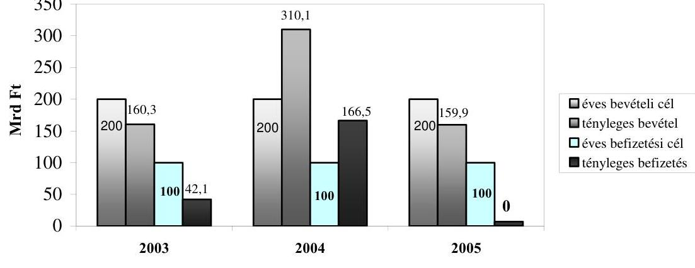

A Társaság 2005-ben az eredeti üzleti terv szerint összesen 300,1 Mrd Ft privatizációs és egyéb bevételre, valamint a költségvetés javára 158,3 Mrd Ft befizetéssel számolt. Az év közben módosított terv alapján az összes bevétel 154,9 Mrd Ft-ra csökkent, a központi költségvetésbe befizetési összeg nem maradt.

---

A Társaság hozzárendelt állami vagyonának 2005. évi nyitó értéke 713,4 Mrd Ft, év végi záró összege 760,7 Mrd Ft volt. A Társaság saját vagyona 11,3 Mrd Ft-ról 11,9 Mrd Ft-ra változott. A hozzárendelt vagyonba tartozó társaságok száma az év elején 274 volt, amelyből 193 gazdasági társaság, 81 állami vállalat. Az év végére a társaságok száma 245 -re csökkent.

A Társaság tulajdonrészére jutó adózás előtti eredmény a 2005-re tervezett 21,8 Mrd Ft-tal szemben 55,3 Mrd Ft volt. A hozzárendelt vagyon részeként az év végén 31,1 Mrd Ft követelést és 271,1 Mrd Ft kötelezettséget tartott nyilván. A készpénzes tartalékfeltöltés következtében a tartalékszámla záróegyenlege 97,9 Mrd Ft volt.

A Társaság átlagos állományi létszáma 2005-ben az előző évi 239-ről 200 főre változott.

A Társaság hozzárendelt vagyonának nyilvántartási, elszámolási és beszámolási rendszerét a 2000. évi C. törvény, a hozzárendelt vagyonnak a számviteli törvénytől eltérő kezelési sajátosságait a pénzügyminiszter által kiadott 4/2005. (VI. 2.) számú, 2005. január 1-jétől alkalmazandó RJGY határozatban foglaltak szerinti számviteli politika (SZP) szabályozza.

Az ellenőrzés célja annak értékelése volt, hogy

- a Társaság szervezeti és múködési rendszere összhangban volt-e a feladatokkal, és hogyan biztosította a kitűzött célok hatékony és eredményes végrehajtását;
- a tárgyévi költségvetési törvény előírásainak megfelelően teljesültek-e a Társaság tevékenységét érintő előirányzatok, kötelezettségek, garanciavállalások, valamint gazdaságos, célszerű és eredményes volt-e a Társaság hozzárendelt vagyonának változása és az egyes portfoliók kezelése;
- a Társaság üzleti tervének megfelelőek voltak-e a működés bevételei és ráfordításai, érvényesültek-e a szabályszerűségi és takarékossági szempontok a gazdálkodásában, az ellenőrzési rendszere összehangoltan múködött-e a kormányzati-felügyeleti ellenőrzéssel és az Igazgatósággal;
- a 2005-ben végrehajtott ÁSZ-ellenőrzés megállapításai hogyan hasznosultak.

Az ellenőrzés társasági szintű átfogó vizsgálat volt, amely a 2005. év gazdálkodására és a helyszíni tapasztalatok alapján az ellenőrzés befejezéséig terjedő időszak pénzügyi eseményeire terjedt ki.

A Társaságnál végzett helyszíni ellenőrzést dokumentális vizsgálattal és elemzéssel, a központi költségvetés végrehajtásához kapcsolódó tevékenység ellenőrzését statisztikai mintavételen alapuló módszerrel hajtottuk végre. Előtanulmány alapján teljesítmény-ellenőrzéssel vizsgáltuk a vagyonkezeléssel kapcsolatos reorganizációs kifizetések elemzésével összefüggésben a Társaság portfóliójába tartozó Nemzeti Lóverseny Kft. kincsemparki beruházásának eredményességét, a kitűzött beruházási cél megvalósításának kritériumai szerint.

---

Az ellenőrzés jogszabályi alapját az Állami Számvevőszékről szóló 1989. évi XXXVIII. törvény 2. § (6), a 17. § (1) és (5) bekezdései, valamint az állam tulajdonában lévő vállalkozói vagyon értékesítéséről szóló 1995. évi XXXIX. törvény 25. § (1) bekezdésében foglaltak képezik. A Priv. tv. előírásai szerint az Állami Számvevőszék feladata a Társaság tevékenységének ellenőrzése. A helyszíni ellenőrzés befejezésekor még nem készült el az ÁPV Rt. jelentése az RJGY számára, amely alapján a Kormány beterjeszthette volna az OGY részére az éves gazdálkodásáról szóló jelentést, ezért az ÁSZ számára készített beszámoló alapján végzett helyszíni ellenőrzésünkkel teszünk eleget jelentési kötelezettségünknek.

A jelentéshez csatolt mellékletek részletes megállapításokat és kiegészítő információkat tartalmaznak a Társaság bevételi tervének teljesítéséről, a főbb privatizációs tranzakciókról, az állami tulajdon vagyonértéken történő követhetőségéről, a Nemzeti Lóverseny Kft. által üzemeltetett kincsemparki beruházásról és a saját vagyonának főbb adatairól.

A jelentést és a jelentéstervezetet egyeztettük a pénzügyminiszterrel, a Miniszterelnöki Hivatal államtitkárával, valamint az ÁPV Zrt. Igazgatóságának és Felügyelő Bizottságának elnökeivel, az észrevételeket és az arra adott választ az 1. sz. melléklet tartalmazza.

---

# I. ÖSSZEGZŐ MEGÁLLAPÍTÁSOK, KÖVETKEZTETÉSEK, JAVASLATOK 

A Társaság múködését és szervezetét érintő törvényi szabályozás 2005-ben alapvető változásokat nem eredményezett. Az Igazgatóság elnökének 2006. január 1-től február 8-ig nem volt törvényi legitimációja, mert nem történt meg a kinevezése előtt az Országgyűlés illetékes bizottsági meghallgatása.

A tervezési, végrehajtási folyamatokba a tulajdonosi beavatkozást és ellenőrzést segítő kontrolling rendszerben nem volt szabályozva, hogy a korai riasztás rendszer ${ }^{1}$ jelzéseire az ÁPV Rt. szervezeteinek milyen intézkedéseket kell tenni, milyen felelősséggel. Ezért a társaságoknál bekövetkezett kedvezőtlen gazdasági eseményekről adott riasztások és értékelő jelentések eseti jelleggel hasznosultak a vagyonkezelési és privatizációs folyamatokban.

Az ÁPV Rt. hozzárendelt vagyonával kapcsolatos kormány-előterjesztéseket vezérigazgatói utasítással szabályozták.

A hozzárendelt vagyon elszámolási és nyilvántartási sajátosságait tartalmazó, 2005. január 1-től érvényes számviteli politika a részvényesi jogok gyakorlójának határozatában foglaltaknak megfelelően készült. Az egyes számviteli elvek alkalmazásán túl a beszámolás rendje és a beszámoló szerkezete a sajátosságok miatt eltér a számviteli törvény előírásaitól. A beszámoló a befektetési tevékenység eredményét nettó módon tartalmazza. Az eredmény levezetése sajátos, mivel a befektetési célú beszerzéseket a ráfordítások között számolják el.

A hozzárendelt vagyon átértékelési különbözete a mérlegben nem jelenik meg.
A középtávú privatizációs koncepció három (2003-2005) esztendejében a Társaság hozzárendelt vagyona után realizált bevételek és a költségvetési befizetések időbelisége nem a célkitűzések szerint alakult. A hozzárendelt állami vagyon lebontásának üteme nem volt egyenletes, a teljesített költségvetési befizetések összességükben elmaradtak az előirányzattól. A Budapest Airport Rt. privatizációjához kapcsolódó használati jogok bérbeadásából származó, a Kincstári Vagyoni Igazgatósághoz (KVI) befolyó bevétel ellensúlyozta a költségvetési befizetést. ${ }^{2}$

[^0]
[^0]:    ${ }^{1} 0541$ sz. Jelentés az Állami Privatizációs és Vagyonkezelő Rt. 2005. évi múködésének és a központi költségvetés végrehajtásához kapcsolódó tevékenységének ellenőrzése 13. sz. melléklete.
    ${ }^{2}$ Az ÁPV Rt. a középtávú koncepciót a kormányzati ciklusra vonatkozóan értelmezi, ezért a teljesülésekbe beszámítja a 2002. II. félévtől a 2006. II. félévig realizált privatizációs és vagyonkezelési tranzakcióit is. Ez alapján a kormányzati ciklus alatt összességében 1404,5 Mrd Ft bevételt ért el beleszámítva a BA Rt. értékesítésével összefüggésben a KVI-hez befolyt bevételt is.

---

A Társaság bevételeit a költségvetési törvény előirányzatként nem határozta meg. A törvényből levezethető minimális igény a bevételeknek a kiadási előirányzatokhoz való igazodása. Az ÁPV Rt. által teljesítendő bevételek összetételét és mértékét az RJGY által jóváhagyott és módosított éves terv tartalmazta. A hozzárendelt vagyonnal kapcsolatos 2005. évi bevétel összesen 154864 M Ft volt. A ténylegesen elért bevétel $4,7 \%$-kal haladta meg a módosított tervet.

A Társaságnak a hozzárendelt vagyon bevételei és kiadásai egyenlege terhére a privatizációs tartalékfeltöltés és a hozzárendelt vagyon záró pénzkészlete meghatározását követően 2005-ben költségvetési befizetési kötelezettsége nem keletkezett.

Az Társaság osztalék-befizetése a költségvetésbe a ténylegesen beszedett osztalék alapján 28373 M Ft volt, amely 11436 M Ft-tal magasabb volt a Költségvetési tv. által előírt 16937 M Ft-nál. A Társaság a befizetési kötelezettségét a beszedéssel azonos értékben teljesítette. Az osztalékbevétel tervezett nagyságát 2005-ben is az államháztartási hiány csökkentésének célja határozta meg.

A 2005. évi költségvetési előirányzatok és az ÁPV Rt. üzleti terve közötti mindenkori összhang a tényleges folyamatokat követő tervmódosítás eredménye. A Társaság üzleti tervezésének sajátossága, hogy a ráfordítási előirányzatok cím szerinti felsorolásának csoportosítása eltér a Költségvetési tv.-ben alkalmazott csoportosítástól, ez csak külön készült kimutatásból hasonlítható össze.

A Társaság végelszámolási eljárásai jellemzően hosszúak, amelynek oka a végelszámolási eljárások egységes kezelésének hiányára is visszavezethető, ami indokolatlan költségek felmerülését is eredményezi. Nincs érvényben az ÁPV Zrt.-nél a végelszámolások lefolytatására vonatkozó eljárási rend, vagy szabályozás, amely a végelszámolási eljárások rendezett keretek közötti tulajdonosi kontrollját tenné lehetővé.

A privatizációból származó bevétel 125092 M Ft volt, ami 1,8\%-kal maradt el a módosított tervtől. Az elmaradást az okozta, hogy néhány társaság privatizációja a tervezettnél alacsonyabb értéken, vagy nem realizálódott.

A Budapest Airport Rt. (BA Rt.) privatizációjának végrehajtását törvénymódosítások támogatták. Két törvény módosította a kizárólagos állami tulajdoni kört, és a repülőteret kivette a koncessziós ${ }^{3}$ törvény hatálya alól. Módosult a kizárólagos állami tulajdonú repülőtér vagyonelemeinek hasznosítására a KVIvel kötött vagyonkezelési szerződés. A kizárólagosan állami tulajdonú, valamint az állam vállalkozói vagyona körének és kezelésének változtatását az egységes állami vagyontörvény hiánya befolyásolta, amelynek megalkotását az ÁSZ már több alkalommal javasolta. A vagyonértékelés nem vette figyelembe a BA Rt. három társasági részesedése közül a 2,949 Mrd Ft jegyzett tőkéjű Ferihegyi Utasterminál Fejlesztő Kft.-ben (FUF Kft.) meglévő 29\%-os részesedé-

[^0]
[^0]:    ${ }^{3}$ A kizárólagos állami, önkormányzati vagy önkormányzati társulási tulajdon hatékony múködtetésének, valamint a kizárólagosan az állam vagy az önkormányzat hatáskörébe utalt tevékenységek gyakorlásának szerződés alapján való átengedése.

---

sét ${ }^{4}$. A privatizáció a 75\%-1 szavazatot kitevő részvénycsomag átruházása mellett kiterjedt a társaság teljes ingatlanvagyonának nemzetközi repülőtérként való hasznosítására vonatkozó vagyonkezelői jogának 75 évre szóló átruházására is.

A privatizáció kockázatai a harmadik fél felé fennálló kötelezettségek alapján egyrészről a tranzakcióval kapcsolatban vállalt eladói szavatosságból, másrészről a FUF Kft.-nek a repülőtér működtetésére vonatkozó jogai elvonása miatt az Airport Development Consorcium (ADC) kanadai tulajdonosnak a Magyar Állammal szemben benyújtott keresetéből erednek. Az ADC a privatizációt követően a BA Rt.-vel szemben is nyújtott be követelést. A követelések a repülőtéri jogok elvonásán alapulnak, ezért az ezzel kapcsolatos jövőbeni kiadások a tranzakció eredményét rontják.

A FUF Kft. tulajdonjogi helyzete, illetve annak megítélése a társaságra vonatkozó dokumentumokban ellentmondásos (pl. a cégnyilvántartásban a BA Rt. tagként (tulajdonosként) és nem vagyonkezelőként jelenik meg). A társtulajdonos ADC a FUF Kft. jogainak megvonása miatt több bírósági keresetet is indított, ezért nem volt célszerű a vagyonkezelés körében hagyni a FUF Kft.-t.

A korábbi ÁSZ jelentés ${ }^{5}$ rögzítette, hogy a privatizáció bizonyos kockázatokat jelenthet egyes területek rendezetlensége miatt. A privatizációig a hiányosságokat nem sikerült teljes körűen felszámolni, ami befolyásolta a tranzakció végső eredményét és rontotta az átláthatóságot.

Az Antenna Hungária Rt. (AH Rt.) privatizációjának előkészítése, a privatizációs tanácsadó és a pályázat nyertesének a kiválasztása megfelelt a vonatkozó jogszabályoknak. Ugyanakkor elmaradt a vagyonértékelés, amit a vállalatcsoport jelentős tőkeértéke, a műsorszórási és műsorelosztási monopolhelyzete, illetve ennek jövőbeni változása indokolttá tett volna. Ennek hiányában a vevő által ajánlott ár elfogadásához nem volt viszonyítási alap.

A Hungexpo Vásár és Reklám Rt. privatizációs pályázat és a munkavállalói részvény értékesítés eredményeként elért 8,3 Mrd Ft privatizációs bevétel alapján az eladott $82 \%$-os részvénycsomag értékesítési árfolyama a részvénycsomag 4,76 Mrd Ft sajáttőke értékéhez viszonyítva 174\%, a vagyonértékeléssel megállapított 5,6 Mrd Ft piaci értékhez viszonyítva 147\%-os volt. A privatizációs pályázati kiírás és a nyertes pályázóval megkötött adásvételi szerződés sajátossága, hogy mindkettő megelőlegezte a Priv. tv. későbbi módosítását, amely lehetővé tette a Hungexpo Rt. állami tulajdonú részvényinek teljes körű eladását.

[^0]
[^0]:    ${ }^{4}$ Az ÁPV Rt. tájékoztatása szerint, azért nem vette figyelembe, mivel az állam a leendő tulajdonost mentesítette a FUF Kft.-vel kapcsolatos minden jövőbeni kötelezettségtől, ugyanakkor az esetleges későbbi megtérülésekre is igényt tart.
    ${ }^{5} 0541$ sz. Jelentés az Állami Privatizációs és Vagyonkezelő Rt. 2004. évi múködésének és a központi költségvetés végrehajtásához kapcsolódó tevékenységének ellenőrzése.

---

Az agrártársaságok privatizációs bevételére 1100 M Ft-ot tervezett a Társaság. Az átvett agrártársaságok után tervezett 750 M Ft privatizációs bevétel nem realizálódott. A korábbi években a privatizációra előkészített agrártársaságok közül 2005-ben a Komáromi Mg Rt., az Alcsiszigeti Mg Rt., és a Bácsalmási Agráripari Rt. privatizációjából 385 M Ft bevétel volt.

Az agrártársaságok privatizációra történő előkészítése során elhatározott célkitűzések csak részben valósultak meg. Az első fordulóban eredménytelennek nyilvánított pályázat során megajánlott vételárnál lényegesen alacsonyabb értéken privatizálták a Komáromi Mg. Részvénytársaságot. A bevont tanácsadó javaslatával szemben alkalmazott tőkeemeléses technika vételár-csökkenést idézett elő 7 társaság értékesítésnél. A privatizációs tanácsadók és lebonyolítók megbízása során átfedések voltak. Költségnövekedést okozott a többszöri vagyonértékelés és átvilágítás annak tükrében, hogy a nagyságrendekkel jelentősebb BA Rt. részvénycsomagja eladási folyamatának megindításakor nem rendelkeztek sem vagyonleltárral, sem átvilágítással.

A Bábolna Mg. Rt. privatizációra történő előkészítése során olyan tulajdonosi döntések születtek, amelyek gyorsították a társaság piaci értékének jelentős csökkenését, illetve olyan tulajdonosi intézkedések maradtak el, amelyekkel csökkenteni lehetett volna a veszteségeket. Az elmaradt döntések következtében a végelszámolás megindítása kárt okozott a társaságnak, és az állami veszteséget a végelszámolási díjakkal, valamint az elengedett követelésekkel csak növelte a tulajdonos. A technikai társaságokon keresztül nyújtott tőkeemelések és kölcsönök nem segítették elő az átláthatatlan ügyek transzparenciáját. Az ÁPV Rt. sorozatosan a kormány-felhatalmazások hiányára hivatkozott a vizsgálataink során a téves döntéseinek magyarázatával. A reorganizációs eljárások kudarcait a Kormány utólagos döntéseivel igyekezett csökkenteni ${ }^{6}$.

Az állam tulajdonában lévő vállalkozói vagyon értékesítéséről a Priv. tv. 2005. évi módosításaival változott az ÁPV Rt. tulajdonosi joggyakorlása alá tartozó társaságok köre és a tartós állami tulajdon mértéke is. A hozzárendelt vagyon 2005. december 31-ére 713,4 Mrd Ft-ról 760,7 Mrd Ft-ra változott.

A társaságok saját tőkéjének két időszak közötti változása nem ad egyértelmű képet az ÁPV Rt. vagyongazdálkodásáról. A tranzakciós típusú vagyonváltozás egy része nem a piaci értéken történt. A vagyonértékelések folyamatosak voltak, de nem terjedtek ki az eszközvagyon egészére.

A költségvetési törvényjavaslatban a kormányzati szektor hiányában 2005-ben az ÁPV Rt. egyenlege -38,1 Mrd Ft-tal szerepel. A ráfordításoknak a előirányzott összege, illetve módosított összege, valamint a Társaság üzleti tervei és a tényszámok közötti eltérések jelentősek. A 2005. évi ráfordítási előirányzat 180

[^0]
[^0]:    ${ }^{6}$ A Kormány a 2135/2006. (VII. 27.) határozatával utólag tudomásul vette a Bábolna Zrt. végelszámolásáról szóló beszámolót, és a szükséges veszteségmérséklés részeként tudomásul veszi, hogy a társaságnak nyújtott 6500 M Ft kölcsön fejében a közbeiktatott technikai cég (opciós jogával élve) megvásárolta a Bábolna Takarmányipari Kft. üzletrészét. A kormányhatározat az FVM minisztert bízta meg a földhasználati jog rendezésével.

---

Mrd Ft volt - a hiányt növelő ráfordítások összege ezen belül 47,7 Mrd Ft -. A tényleges teljesítés 145 Mrd Ft , illetve 52,5 Mrd Ft volt. a hiányt növelő ráfordítások azért nőttek, mivel az ÁPV Rt. az előirányzatnál magasabb osztalék befizetést teljesített. Sajátos módon ez az ÁPV Rt. szintjén számított hiányszámot növelte, ugyanakkor a pénzforgalmi tételek konszolidált egyenleghatása az előirányzottnál kedvezőbb lett.

A Költségvetési tv.-ben 132346 M Ft előirányzat volt az ÁPV Rt. kormányzati szektor hiányát nem érintő ráfordításokra. Az üzleti tervet jóváhagyó RJGY határozat a Költségvetési tv. által megengedett előirányzat-átcsoportosítást is figyelembe vette. A Társaság a 2005. évi gazdálkodása során a törvény által engedélyezett keretet nem, de a módosított üzleti tervét 11,7 Mrd Ft-tal túllépte.

A lóversenyzés infrastruktúrájának fejlesztése érdekében megvalósult beruházás részben alkalmas a magyar lóversenysport szervezésére és lebonyolítására. A beruházás részben volt eredményes, mivel az ingatlancserével megvalósult kincsemparki beruházás önmagában nem felel meg teljes körűen a kitűzött célnak, csak az infrastruktúrafejlesztésben volt előrelépés. A lóversenyfogadás és szervezés üzleti alapjai 10 év óta nincsenek megteremtve, emiatt minden évben veszteséget termel, melyet a tulajdonosnak kell megtéríteni. Stratégia készült a lóversenyfogadás átalakítására, amelyben nem szerepel a Nemzeti Lóverseny Kft. (NL Kft.) üzleti tevékenységétől teljesen idegen, évtizedek óta fennálló, mintegy 500 főt érintő bérlakás-helyzet megoldatlansága.

A privatizációs tartalék egyenlege 2005. január 1-jén 51025 M Ft, 2005. december 31-én 97952 M Ft volt. A tartalék 2005-ben csak készpénzből állt. A Társaság módosított üzleti tervében a tartalék feltöltésére előirányzott összeg 37202 M Ft volt, amely lényegesen kevesebb a tényleges feltöltésnél. A bizonytalan és peresített kötelezettségekből lehetséges kifizetésekre a privatizációs tartalék nyitó értéke is bőven fedezetet nyújtott, ezért a kiadások ilyen mértékű feltöltést nem indokoltak.

Az összes rendelkezésre álló forrás 2003-2005. években meghaladta az előző években képzett céltartalék összegét, viszont a tényleges felhasználás a képzett céltartalék felét sem érte el, főként 2005-ben. A tartalékszámla likvidítása nem igényelt ilyen nagyságú készpénzlekötést.

2005-ben a privatizációs tartalék terhére a módosított üzleti tervben szereplő 8828 M Ft előirányzattal szemben csak 5474 M Ft-ot fizetett ki a Társaság. Az ellenőrzött kifizetések megfeleltek a megengedett jogcímeknek. Az önkormányzatokat a belterületi földek értéke alapján, illetve alapítói jogon megillető elszámolások esetében a dokumentáltság hiányos azokban az esetekben, amikor a kifizetés ún. önkéntes teljesítés alapján történt. Az önkormányzatokat alapítói jogon megillető járandósággal kapcsolatos döntéseiben a Társaság következetlen volt. A mérlegben nyilvántartott normatív kötelezettségek az előző év végi állományhoz képest 97 M Ft-tal csökkentek.

A céltartalék-képzés eljárása 2005-ben több dokumentumon alapult, az egyedi értékelésre lehetőséget biztosító más üzleti szempontok nem voltak meghatározva.

---

A Társaság saját vagyonának mérleg szerinti nyeresége 2005-ben 481 M Ft volt, miközben 764 M Ft-tal nőttek a Társaság pénzeszközei. A bankbetétek értéke összesen 9184 M Ft volt, amelyet befolyásolt, hogy az ÁPV Rt. - tulajdonosi döntés alapján - a székházát 2003-ban értékesítette. A Társaságtól osztalékot 2005-ben nem vontak el.

A saját vagyon bevételeinek 94\%-át a múködési kiadások finanszírozási bevétele adta. A Költségvetési tv. 2005-ben a Társaság múködésére a privatizációs bevételekből 5000 M Ft átvezetését irányozta elő, amelyet 857 M Ft átcsoportosításával a pénzügyminiszter megemelt. A Felügyelő Bizottság kifogásolta, hogy az 5000 M Ft feletti forrásigény konkrét indokolást nem tartalmaz. A Társaság ügyvezetésének kiadási terveit az RJGY jóváhagyta. A Társaság tevékenységének Kormány általi átvilágítására, a ténylegesen végzendő alapfeladatok (privatizáció és vagyonkezelés) meghatározására, a tevékenységgel összhangban lévő szervezeti, személyi és tárgyi feltételek meghatározására, a jövőbeni szerep tisztázására 2005-ben nem került sor. „Az állami vagyon kezelésének koncepciója" c. dokumentumot a Társaság elkészítette. A saját vagyon kiadásait a Társaság meglévő szervezeti rendje, személyi és tárgyi feltételei határozták meg, mert a tervek készítésekor a jövőbeni tevékenységének szervezeti-működési kereteit nem ismerte. A Társaság a tervezésnél az előző évben végzett feladatok folytatását, illetve az ismert privatizációs feladatok elvégzését követő, csökkenő feladatok miatti szervezeti és létszámcsökkentést vette figyelembe.

RJGY döntés alapján két költségvetési intézménynek ${ }^{7}$ az ÁPV Rt. által a Pozsonyi úton bételt székházban való elhelyezésével kapcsolatos beruházás és az intézmények helyett is fizetett bérleti díj a Társaság eredményét közel 130 M Ft-tal rontotta. Az RJGY döntéssel a Társaság költségvetési intézményeket keresztfinanszírozott, a döntés egyúttal az ÁPV Zrt.-t veszteséges tevékenység végzésére kötelezte. Az intézkedéssel a költségvetés átláthatósága romlott.

A Társaság a sajátvagyon gazdálkodásánál az értékesítés nettó árbevételi terveit 98,2\%-ban teljesítette, a múködési kiadásaiban az anyagjellegú ráfordítások és a személyi jellegű ráfordítások (94\%) voltak a meghatározók. Az anyagjellegú ráfordításokban 7,7\%-os, a személyi jellegű ráfordításokban pedig 10\%-os megtakarítást ( 377 M Ft ) ért el a Társaság, mert az átlagos állományi létszám az előző évihez képest 39 fővel csökkent. A tervekben a záró-létszámot nem határozták meg, mert a Társaság nem ismerte a jövőbeni tevékenységét.

A Társaság korábbi években kialakított kontroll-mechanizmusai 2005-ben nem változtak. A Belső Ellenőrzési Szabályzat módosítására javaslat nem készült, mert a bekövetkezett változások, feladat-átcsoportosítások ezt nem indokolták. Az FB véleményezte azokat az előterjesztéseket, amelyeket az érvényben lévő jog- és egyéb szabályok számára előírnak.

Az Állami Számvevőszék 2004-ben a pénzügyminiszternek javasolta, hogy vizsgáltassa meg a Hajógyári Sziget Vagyonkezelő (HSZV) Kft.-ben lévő múemlékingatlan vásárlására kötött szerződésben rögzítet árat, és a reális ár figye-

[^0]
[^0]:    ${ }^{7}$ Az Európai Ügyek Hivatala és az Európai Ügyekért Felelős Tárca Nélküli Miniszter Hivatala.

---

lembe vételével intézkedjen a szóban forgó ingatlan állami tulajdonba vétele érdekében. A HSZV Kft. és a Magyar Állam nevében eljáró Kincstári Vagyoni Igazgatóság között 2003. július 3-án, illetve 2003. augusztus 4-én aláírt szerződés az aláírástól számított 5 év határozott ideig terjedő visszavásárlási jogot biztosított a KVI-nek. A KVI a fenti ingatlan állami tulajdonba vétele érdekében kötött opciós adásvételi szerződésben rögzített visszavásárlási jogával még nem élt.

Az Állami Számvevőszék 2005-ben a Kormány és a pénzügyminiszter részére fogalmazott meg ajánlásokat. Az ajánlások részben hasznosultak.

A Kormánynak a meghatározó nagyságrendű privatizációs tranzakciókról emlékeztető készítésére tett javaslatunk hasznosult. Az ÁPV Rt. beszámolórendszere közelített a számviteli törvény elvi és tételes előírásaihoz, a beszámoló rendeletben való szabályozása nem valósult meg.

A pénzügyminiszternek tett első javaslatunkban a tranzakcióknál és a vagyonkezelésnél elkövetett szabálytalanságok okainak kivizsgálását, és ahol szükséges, a személyi felelősségre vonást javasoltunk. A pénzügyminiszter a vizsgálatot lefolytatta, de intézkedést nem tartott szükségesnek. Második javaslatunkra - az ÁPV Rt. igazgatósága olyan privatizációs pályázatokat írjon ki, amelyeknél a második fordulóban is mindvégig érvényesüljön a verseny, a kiírt pályázatok minden szempontból tegyék lehetővé az elbírálások objektivitását és átláthatóságát - a pénzügyminiszter kezdeményezte a Versenyeztetési Szabályzat módosítását, de azt az ÁPV Rt. nem tartotta célszerűnek és időszerűnek.

A helyszíni ellenőrzés megállapításainak hasznosítása mellett javasoljuk:

# a Kormánynak 

1. intézkedjen az állami vagyon egyes vagyoncsoportjaival kapcsolatos gazdálkodás összhangjáról a vagyontörvény megalkotásával; egységesítse az állam vállalkozói és kincstári vagyonával kapcsolatos állami követelések kezelésének rendjét;
2. határozza meg az állami tulajdonnal rendelkező társaságok működésének koncepcióját, a gazdálkodás színvonalának javítása és a veszteségek csökkentése érdekében; ${ }^{8}$
3. teremtse meg a hozzárendelt vagyonnal kapcsolatos éves beszámolási rendszer összhangját a számviteli törvénnyel, és azt rendeletben szabályozza;
4. intézkedjen a lóversenyágazat fogadásszervezési tevékenysége koncessziós koncepciójának elfogadásával a magyar lóversenyvertikum eredményessé tételéről (egyben rendezze a lóversenypálya területén lévő mintegy 500 főt érintő bérlakás-helyzetet).
[^0]
[^0]:    ${ }^{8}$ Figyelembe véve a 0611 sz. a tartósan veszteségesen múködő állami tulajdonú gazdasági társaságok gazdálkodásának ellenőrzése címú jelentésünkben tett megállapításokat és ajánlásokat is.

---

# a pénzügyminiszternek 

1. szabályozza az állam vállalkozói és kincstári vagyonának értékesítési, kezelési szerződéseiben vállalt kötelezettségek és követelések következetes érvényesülését a nyilvántartások és elszámolások egységesítésével;
2. intézkedjen az állami vagyonnal kapcsolatos felszámolási és végelszámolási eljárások elhúzódásának megakadályozásáról, követelje meg a vállalkozói vagyonkezelőtől a végelszámolási eljárások szabályainak rögzítését;
3. kezdeményezze a lóversenyágazat gazdaságos múködési feltételeinek megteremtését a versenyszervezési és versenyrendezési tevékenység veszteségének megszüntetésével.

---

# II. RÉSZLETES MEGÁLLAPÍTÁSOK 

## 1. A TÁRSASÁG MÜKÖDÉSÉNEK SZABÁLYOZOTTSÁGA

### 1.1. A szervezeti és múködési rendet meghatározó szabályozás

A Társaság szervezeti felépítését érintő törvényi szabályozás alapvető változásokat, kiegészítést, vagy újra szabályozást nem eredményezett a múködésben.

Az ÁPV Rt. elnevezése 2006. február 8-ai hatállyal megváltozott a gazdasági társaságokról szóló 1997. évi CXLIV. tv. 177. § (4) bekezdésében foglaltak szerint Állami Privatizációs és Vagyonkezelő Zártkörűen működő Részvénytársaságra.

Az 1025/2005. (III. 11.) Korm. határozat módosította az ÁPV Rt. Szervezeti és Múködési Szabályzatáról szóló 1125/1999. (XII. 13.) Korm. határozatot, amely szerint a Társaság hozzárendelt vagyonába tartozó társasági részesedések és egyéb vagyonelemek vagyonkezelésével, a privatizáció előkészítésével és végrehajtásával kapcsolatos feladatok végrehajtását a tranzakciós vezérigazgatóhelyettes irányítja, és ezen felül más tulajdonosi, felügyeleti jogköröket is gyakorol. Irányítása alá öt önállóan múködő igazgatóság tartozik.

A szervezeti átalakítással összefüggő szabályozást, elnevezéseket és feladatköröket megfelelően módosították a 17/2005. számú Vezérigazgatói utasítással.

Az ÁPV Rt. Igazgatósága elnökének 2006. I. 1.-II. 8-ig nem volt törvényi legitimációja, mivel megbízatása 2005. december 31-ével lejárt. A 1131/2005. (XII. 23.) Korm. határozat az elnök megbízatását meghosszabbította. A határozat szövegéből azonban kimaradt a Priv. tv. 12. §-ának azon rendelkezése, amely szerint az elnökjelöltet kinevezése előtt az OGY illetékes bizottságának meg kell hallgatnia. A határozatot utóbb a 1014/2006. (II. 8.) Korm. határozat módosította.

A Költségvetési tv. 93. §-a módosította a Priv. tv. egyes rendelkezéseit. A módosított törvény az ÁPV Rt.-től a KVI vagyonkezelésébe rendelte az állami tulajdonú védett és védelemre tervezett természeti területeket, lehetővé tette a hozzárendelt vagyon bevételeinek a vagyonkezelés érdekében történő felhasználást az elengedhetetlen reorganizációs célok megvalósítására.

A kritikus helyzetben lévő társaságoknál halmozottan következnek be vagyonvesztések. A vagyontárgy értékesítések a veszteséges múködést nem szüntetik meg. A veszteségeket okozó tevékenységekkel múködő egyre kritikusabb gazdasági helyzetbe kerülő cégekről a korai riasztási rendszer fokozott figyelmeztetéseket ad.

A tervezési és végrehajtási folyamatokba a tulajdonosi beavatkozás és ellenőrzés a kontrollingrendszer múködtetésével történik, amelyet a 384/1999. (VII. 15.) IG. sz. határozat szabályoz. Nincs azonban utasítás, hogy a korai riasztás

---

jelzéseire az ÁPV Rt. szervezeteinek milyen intézkedéseket kell tenni, milyen felelősséggel. Ezért a társaságoknál bekövetkezett kedvezőtlen gazdasági eseményekről adott riasztások és értékelő jelentések eseti jelleggel hasznosulnak.

A 2002-2005 közötti időszakban a tartósan veszteséges társaságok helyzetét az ÁPV Rt. vezetése a negyedéves értekezletein rendszeresen tárgyalta, de a gazdasági mutatóik nem javultak. A negyedéves kiértékelést nem hasznosították megfelelően az eladósodottság, a vagyonvesztés megállitására, a veszteséges tevékenységek átszervezésére, vagy megszüntetésére, a kedvezőtlen tendenciák fokozódása esetén a privatizációs folyamat indítására, vagy gyorsítására.

A tulajdonosi érdekek fokozott érvényesítésére 2004 végén és 2005-ben igazgatósági határozatok és vezérigazgatói utasítások rendelkeztek.

Határozatok és utasítások készültek a gördülő stratégiai tervezés módszerére való áttérésről, a források kihelyezésével kapcsolatos követelmények EU pályázati feltételek szerinti szabályozásáról, az eredményesség mérésére a sajáttőke arányos adózott eredménymutató (ROE) alkalmazásáról, a többségi társaságok első számú vezetői, igazgatóságai, és felügyelő bizottságai munkájának megítéléséhez alkalmazandó teljesítmény-értékelési rendszerről, az ÁPV Rt. egységes vagyonnyilvántartási rendszere múködésének és ellenőrzésének módosításáról és a Vagyonkezelési Információs Rendszer (VIR) üzemeltetéséről.

# A Társaság hozzárendelt vagyonával kapcsolatos kormányelőterjesztéseket a tulajdonosi joggyakorlással kapcsolatos döntések rendjéről és a döntések előkészítéséről szóló 25/2003. sz. Vig. utasítással szabályozták, 

amely a Miniszterelnöki Hivatal által kiadott, a kormányzati döntés előkészítés hatékonysága érdekében tett intézkedésekkel összhangban készült.

A kormány-előterjesztés tervezetét az Igazgatási és Kormányzati Kapcsolatok Igazgatósággal együttmúködve kell elkészíteni. A tervezetet az SZMSZ-ben foglaltak alapján az ÁPV Rt. tulajdonosi döntéshozó fórumai előzetesen megvitatják, és ezt követően hozzák meg döntéseiket. Az utasítás szerint a kormányelőterjesztések felterjesztését az ÁPV Rt. tulajdonosi döntéshozó testületei döntéseinek minden esetben meg kell előzni.

A Társaság 1208/2002. (XII. 21.) Korm. határozattal elfogadott Szervezeti és Múködési Szabályzatának 2. §-a szerint az Igazgatóság dönt minden olyan álláspont kialakításában, amelynek eredménye az ÁPV Rt. által kezdeményezett kormányelőterjesztés alapján kormányhatározat, vagy jogszabály, illetve ezek módosítása lesz. Ide tartozik a hozzárendelt vagyon alakulásáról, hasznosításának eredményéről készített jelentés, valamint a tartós állami tulajdon körének a módosítása. Az SZMSZ 3. §-a szerint az Igazgatóság dönt a hozzárendelt vagyonnal kapcsolatos tranzakciós ügyekben, ha annak értéke az 500 M Ft-ot meghaladja.

A vezérigazgatói utasítás nem tartalmazza a hozzárendelt vagyonnal kapcsolatos kormányzati hatáskörbe tartozó kritériumokat, hogy mikor és mely fórumnak, illetve melyik államigazgatási szervnek kell kezdeményezni kormányelőterjesztéseket.

Az SZMSZ a kormány-előterjesztések tervezetének készítését mindazon esetekben írja elő, amelyek alapján az Igazgatóság a Kormány döntéseit kezdeményezi. A megfogalmazás a hozzárendelt vagyonnal kapcsolatos tranzakcióknál tág teret biztosít a Társaság számára. A költségvetési törvényben meghatározott - de az

---

SZMSZ-ben és a vezérigazgatói utasításban nem szereplő - értékhatár azokban az esetekben is lehetővé teszi a Társaság döntési jogosultságát, ahol a hozzárendelt vagyon értéke nincs meghatározva egyértelmúen (pl. vagyoni értékű jogok, földhasználati joggal kapcsolatos döntések), vagy ha a döntés a hozzárendelt vagyonnal kapcsolatos koncepciók kialakítására irányul.

A hozzárendelt vagyont érintő előterjesztések és a hozzájuk kapcsolódó határozatok a 25/2003. Vez.ig. utasításban foglaltaknak megfelelően készültek. 21 esetben kezdeményeztek kormányhatározatot igénylő előterjesztést 2005-ben, ezek közül 6 esetben készült kormány-előterjesztést kezdeményező igazgatósági határozat.

# 1.2. A hozzárendelt vagyont érintő beszámolási rendszer 

A Számviteli Politika (SZP) 2005. évi módosítását elsősorban a Költségvetési tv. 13. sz. mellékletébe foglalt változások indokolták.

Az ÁPV Rt. kezelésében, az állam tulajdonában lévő hozzárendelt vagyonnal kapcsolatos beszámoló készítési és könyvvezetési kötelezettséget - a tevékenység sajátosságaira való tekintettel - a Priv. tv. és a 219/2000. (XII. 11.) sz. Korm. rendelet I. § b) pontja szabályozza. A jogszabályok a Sztv.-hez hasonlóan keretszabályozást alkotnak.

A hozzárendelt vagyon elszámolási és nyilvántartási sajátosságait tartalmazó, 2005. január1-től érvényes, SZP a 4/2005. (VI. 2.) sz. RJGY határozatban foglaltak figyelembe vételével készült.

A hozzárendelt vagyon értékelésére és elszámolására vonatkozó számviteli alapelvek közül a valódiság és a világosság elvét az Igazgatóság által elfogadott SZP az Sztv.-től részben eltérően határozza meg.

A RJGY határozat a Priv. tv.-en és a 219/2000. (XII. 11.) Korm. rendeleten alapul, de a hozzárendelt vagyon számviteli nyilvántartásának módját nem kormányrendelet szabályozza. A beszámolónak a bevételek és ráfordítások kimutatásában a befektetési tevékenység eredménye nettó módon szerepel. Az eredmény-levezetés sajátossága, hogy a befektetési célú beszerzéseket a ráfordítások között számolják el.

Az SZP az állami vagyon körébe tartozó részesedéseket az ÁPV Rt. tulajdoni hányad arányos sajáttőke értékén határozza meg. A hozzárendelt vagyon a sajáttőke változása miatt évente folyamatosan átértékelésre kerül. A kezelt társaságoknál a sajáttőke változására ható tényezőket az ÁPV Rt. nem vizsgálta.

Az Sztv. a jegyzett tőke valós értéken történő meghatározását lehetővé teszi, amely lehet a részvénynek a tőzsdei forgalom során kialakult ára, az értékelés alapján kialakított piaci ár, stb.

A hozzárendelt vagyon átértékelési különbözete a mérlegben külön soron nem jelenik meg. A hozzárendelt vagyont állammal szembeni hosszú-, illetve rövid lejáratú kötelezettségek között - az ÁPV Rt. tulajdoni hányad arányos sajáttőke érték- mutatják ki. Az Sztv. lehetővé teszi a vagyoni eszközökre az értékelési tartalék képzését, elszámolását és kimutatását. A vagyonértékelés eltéréséből eredő értékkülönbözet a hozzárendelt vagyonba tartozó társaságok esetében a

---

jegyzettőke és a sajáttőke közötti különbséget jelenítik meg és előjelének megfelelően az állammal szembeni hosszú-, vagy rövid lejáratú kötelezettség változásaként számolják el, módosítva a hozzárendelt vagyon értékét.

A tartós állami vagyon kötelezettségként való kimutatását az Sztv. 21. § (3) bekezdésére való hivatkozással indokolják, mely szerint a mérleg eszköz oldalán kell kimutatni a kezelésbe vett eszközöket a hosszú lejáratú kötelezettségekkel szemben.

Az állami tulajdont megtestesítő vagyon állammal szembeni hosszú- és rövidlejáratú kötelezettségként történő kimutatásának lehetősége az Sztv. alapján az önkormányzati és a kincstári vagyoni eszközök kezelésbevételéhez kapcsolódik.

Az ÁPV Rt. egyik sajátossága, hogy jegyzett tőkével nem rendelkezik. Számviteli és beszámolási rendszerének kialakításakor vezérlő elv volt, hogy mivel minden eszköz, amely az ÁPV Rt. jogelődjéhez hozzá lett rendelve, tulajdonképpen állami vagyon (a hozzárendelt vagyon megnevezés is ebből ered), így azoknak forrás oldala az állammal szembeni kötelezettség.

A Priv. tv. alapján különleges tulajdonosi jogokat biztosító szavazatelsőbbségi részvényeket az ún. „aranyrészvényeket" egyedileg nem értékelik, 1000 Ft-os névértéken tartják nyilván. Az aranyrészvények értéke elsősorban a hozzájuk tartozó különleges jogosultságoktól függ. A különleges jogokkal való éles szándékának jellemzően nincs „piaca", nincs olyan általánosan elfogadott, kialakuló értéke, mint amilyen más eszköz esetében lehetséges, ezért az aranyrészvények esetében nem beszélhetünk általános értelemben vett piaci értékről.

A részvényekben megtestesülő többletjogokról létesítő határozat, vagy alapító okirat rendelkezik. A szavazatelsőbbségi részvények valós értékének megállapítását a különleges többletjogok és az esetleges értékesítésük egyaránt indokolják.

# 2. A KÖZPONTI KÖLTSÉGVETÉS VÉGREHAJTÁSÁHoz KAPCSOLÓDÓ TEVÉKENYSÉG 

A Kormány - a 2003. évi zárszámadási törvény indokolásában bemutatott középtávú privatizációs és vagyonkezelési koncepciója végrehajtásának a záró éve volt a tavalyi év.

A középtávú privatizációs koncepció 2003-2005. évekre szólóan privatizációs célként 700 Mrd Ft-ot meghaladó, az ÁPV Rt. hozzárendelt vagyoni körébe tartozó állami vagyon három év alatt történő egyenletes ütemű - évi 150-200 Mrd Ft nyilvántartási értékű privatizálható vagyontömeg - lebontását fogalmazta meg, várhatóan évi 100 Mrd Ft költségvetési befizetéssel.

A koncepció három esztendejében a Társaság hozzárendelt vagyona terhére realizált bevételek és a költségvetési befizetések időbeli ütemezése nem a célkitűzések szerint alakultak. A hozzárendelt vagyon lebontásának üteme nem volt egyenletes, a költségvetési befizetések összességükben elmaradtak az előirányzattól. A BA Rt. privatizációs tranzakciójához kapcsolódó vagyonhasznosítás-

---

ból 2005-ben 404,9 Mrd Ft költségvetési bevétel a KVI-nél jelentkezett., amely pótolta a kiesést. ${ }^{9}$

# 2.1. Az ÁPV Rt. 2005. évi költségvetési kapcsolata 

A Költségvetési tv. Táraságra vonatkozó rendelkezései évközben módosultak. A törvénymódosítás a záró pénzkészlet megengedett összegét az eredeti 10000 M Ft-ról 35000 M Ft-ra emelte.

A privatizációért felelős miniszter a Költségvetési tv. 5. § (7) bekezdésének felhatalmazása alapján két alkalommal hajtott végre átcsoportosítást.

### 2.1.1. Az ÁPV Rt. üzleti tervének teljesítése

A Társaság bevételeit a Költségvetési tv. előirányzatként nem határozta meg. A törvényből levezethető minimális igény a bevételeknek a kiadási előirányzatokhoz való igazodása. A teljesítendő bevételek összetételét és mértékét az RJGY által jóváhagyott eredeti és módosított éves terv tartalmazta.

A Társaság 2005. évi módosított üzleti tervének 147893 M Ft bevételi oldala összhangban volt a költségvetési előirányzattal. A tervezett bevételek fedezetet nyújtottak a ráfordítási előirányzatok teljesítéséhez. A módosított terv 128 498 M Ft ráfordítása 29\%-kal alacsonyabb volt az előirányzatnál. A költségvetési előirányzatot, az éves üzleti tervet és a módosítását, a terv és az előirányzatok teljesítését a 3. sz. tanúsítvány tartalmazza.

A hozzárendelt vagyon kiadásai a Költségvetési tv. szerint 2005-ben nem haladhatták meg a 180059 M Ft -ot.

Az ÁPV Rt. osztalék-befizetési kötelezettsége a ténylegesen beszedett osztalék alapján 28373 M Ft volt, a Költségvetési tv. 16937 M Ft előirányzatával szemben. Az ÁPV Rt. a befizetési kötelezettségét a beszedéssel azonos értékben teljesítette.

A Társaságnak a hozzárendelt vagyon bevételek és kiadások egyenlege terhére a privatizációs tartalékfeltöltés és a hozzárendelt vagyon záró pénzkészlete meghatározását követően költségvetési befizetési kötelezettsége 2005-ben nem keletkezett.

A privatizációs tartalék feltöltésére a Költségvetési tv. előirányzata 54338 M Ftot tartalmazott. A tényleges tartalékképzés a költségvetési előirányzatnál alacsonyabb szinten - 52379 M Ft - teljesült.

[^0]
[^0]:    ${ }^{9}$ Az ÁPV Rt. a középtávú koncepciót a kormányzati ciklusra vonatkozóan értelmezi, ezért a teljesülésekbe beszámítja a 2002. II. félévtől a 2006. II. félévig realizált privatizációs és vagyonkezelési tranzakcióit is. Ez alapján a kormányzati ciklus alatt összességében 1404,5 Mrd Ft bevételt ért el beleszámítva a BA Rt. értékesítésével összefüggésben a KVI-hez befolyt bevételt is.

---

A privatizációs tartalékszámla záróegyenlege - a tartalékfeltöltés és a tervezett 8828 M Ft-nál alacsonyabb 5474 M Ft-os felhasználás eredményeként - az előző évi 51025 M Ft-os szintről 97952 M Ft-ra emelkedett.

A költségvetési előirányzatok és az ÁPV Rt. módosított üzleti terve közötti összhang a tényleges folyamatokat követő tervmódosítások eredménye. A tervszerűség biztosításának rendszere mindkét oldalt kölcsönösen érintő gyakorlat volt. Az ÁPV Rt. a féléves tényadatok alapján módosította az üzleti tervét. Az összhang kölcsönös és utólagos biztosítása - a bevételek, valamint a bevételek és ráfordítások egyenlege terhére teljesítésre kerülő költségvetési befizetés nagyságát érintő változtatásokban - kísérhető nyomon.

Az ÁPV Rt. eredeti üzleti terve 300,1 Mrd Ft bevételt és 158,3 Mrd Ft költségvetési befizetést irányzott elő. A tervmódosítással a bevételi terv 147,9 Mrd Ft-ra, a lehetséges költségvetési befizetés összege 10 Mrd Ft-ra csökkent. A központi költségvetés szintjén a kieső befizetést a BA Rt. tranzakciója kapcsán a KVI-nél realizált 404,9 Mrd Ft bevétel pótolta.

Az ÁPV Rt. üzleti tervezésének sajátossága, hogy a ráfordítási előirányzatok címszerinti felsorolásának csoportosítása eltér a Költségvetési tv.-ben alkalmazott csoportosítástól. A ráfordítások "kormányzati szektor hiányát növelő", valamint a "kormányzati szektor hiányát nem érintő" Költségvetési tv. szerinti csoportosítása tartalmilag és összegszerűen ezért nem hasonlíthatók össze a Társaság tervében használt - a "Hozzárendelt vagyont csökkentő kiadások", illetve a "Hozzárendelt vagyon változását nem eredményező kiadások" elnevezésű - csoportokkal. Az eltérő csoportosítás érinti a kárpótlási jegy bevonása, valamint a vagyontárgyak vásárlása és a privatizációval és vagyonkezeléssel kapcsolatos reorganizációs célú kifizetési előirányzatokat. A tervezésnél az összehasonlítás csak külön kézi kigyűjtésből készült kimutatás alapján végezhető el. A Társaság záró beszámolójában az eltérő csoportosításból eredő különbségeket bemutatja.

A kiadásoknak a Költségvetési tv. ráfordítási előirányzataival eltérő kezelésén túlmenően a Társaság a saját csoportosítási rendszerét a Költségvetési tv. csoportosítási rendszereként mutatta be 2005-ben is.

Az ÁPV Rt. hozzárendelt vagyonával kapcsolatos 2005. évi bevétel összesen 154864 M Ft volt, amelynek $80 \%$-a privatizációs -, és $18 \%$-a osztalékbevételből származott. A ténylegesen elért bevétel $4,7 \%$-kal haladta meg a módosított tervet.

A privatizációból származó bevétel 125092 M Ft volt, ami 1,8\%-kal maradt el a módosított tervtől. Az elmaradást az eredményezte, hogy az agrártársaságok, a Vértesi Erőmű Rt., a Mecsekérc Rt., a Rehab Rt., a Dunaferr Vámügynökség Kft., a Hollóházi Porcelánmanufaktúra Rt. tranzakciói a tervezettnél alacsonyabb értéken, vagy nem realizálódtak (2. sz. melléklet). A privatizáció jelentős tranzakciói (az Antenna Hungária Rt. (45 956 M Ft), a Budapest Airport Rt. (ÁPV Rt.-re jutó pénzforgalmi bevétel: 59670 M Ft), a Hungexpo Rt. (8296 M Ft), a Nemzeti Tankönyvkiadó Rt. (kárpótlási jegy bevétel nélkül 3296 M Ft), az M-Ingatlan Rt. ( 2500 M Ft ), és a tököli repülőtér értékesítései ( 2310 M Ft ) voltak.

---

A vagyonhasznosítási bevétel a földhaszonbérleti és a vadászati díjakból, valamint ingatlan bérbeadásból összesen 257 M Ft volt, a privatizációs bevételhez mérten jelentéktelen $(0,2 \%)$ nagyságrenddel.

A kárpótlási folyamat lezárása következtében a Költségvetési tv. csak 1500 M Ft kiadási előirányzatot tartalmazott kárpótlási jegy bevonásra. Az ÁPV Rt. ennél is kevesebb ( 500 M Ft ) bevételt, illetve ráfordítást tervezett. Ténylegesen 38 M Ft kárpótlási jegy bevonása valósult meg, mivel kevesebb - a kárpótlási jegy bevonását lehetővé tevő - privatizáció valósult meg.

A realizált osztalék és osztalék elöleg bevétel 28373 M Ft volt, ami jelentősen meghaladta a 18053 M Ft tervezett összeget. Az osztalékbevétel tervezett nagyságát 2005-ben is az államháztartási hiány csökkentésének célkitűzése határozta meg. A Költségvetési tv. 16937 M Ft osztalék-befizetési kötelezettségével szemben az ÁPV Rt. módosított terve 18053 M Ft osztalékbeszedést irányzott elő. A teljesítés érdekében az ÁPV Rt. egyedileg vizsgálta a társaságoktól elvonható osztalék és osztalékelőleg mértékét. A költségvetési előirányzatnál magasabb teljesítést a BA Rt.-től tervezett 4 Mrd Ft osztalékelvonáson felül beszedett 10 Mrd Ft osztalékelőleg eredményezte.

Az egyéb bevételek összege 1104 M Ft volt, amely $34,2 \%$-kal maradt el a tervezett összegtől. Összetételét tőkekivonások, tulajdonosi kölcsön-, és privatizációs tartalék megtérülések, valamint nem privatizációhoz kapcsolódó bevételek, illetve elszámolások határozták meg.

A követelések 2005. évi nettó összege 16430 M Ft volt, az előző évi 23960 M Ft-tal szemben csökkent. A követelések után értékvesztés címén - a visszaírás figyelembevételével - 23686 M Ft veszteséget számoltak el. A követelések között az egyéb követelések bruttó összege 38034 M Ft , az értékvesztésekkel csökkentve 16273 M Ft , az elszámolt értékvesztés 21761 M Ft volt. Az egyéb követelések között - a tőke emelés céljára átutalt összegből a bejegyzés 2005. évi elmaradása miatt - 7251 M Ft-ot mutattak ki. A Bábolna Rt. „va"-val szemben fennálló korábbi években nyújtott kölcsönből 13201 M Ft követelés elengedésére és hitelezési veszteségként történő elszámolására került sor 2005-ben.

A 2005. évi kötelezettségek összege 1042228 M Ft volt, melyből a hosszú lejáratú kötelezettségek összege 732391 M Ft-ot tett ki. A kötelezettségek többségét 570948 M Ft-ot a hozzárendelt állami vagyon nettó értéke alkotja, mivel azt az állammal szembeni rövid és hosszúlejáratú kötelezettségek között mutatják ki.

A hosszú lejáratú kötelezettségek között a 2004. évben kibocsátott, a Richter Gedeon Rt. részvényeire átváltoztatható kötvények 2005. december 31-ei árfolyamon számított 161443 M Ft értéke mellett a termőföld, valamint a tartós állami tulajdonú részesedések nettó értéke jelenik meg.

A rövidlejáratú kötelezettségek összege 309837 M Ft volt, melyből 296692 M Ft-ot a hozzárendelt vagyon részét képező privatizálandó vagyoni részesedések nettó értéke képvisel.

---

Az egyéb rövidlejáratú kötelezettségek között az átutalt, de be nem jegyzett tőkeemelések értéke miatt 7251 M Ft-ot számoltak el.

A függő kötelezettségek 0-s számlaosztályban kimutatott év végi állománya 452514 M Ft , a mérlegben szereplő céltartalék pedig 94184 M Ft volt.

# 2.2. A szerződésmenedzselés, a felszámolási és végelszámolási eljárások eredményessége 

Az ÁPV Rt. és jogelődei által kötött szerződések menedzselésére és a szerződéstár működésére vonatkozó eljárási rendet a 24/2003. sz. Vig. utasítás szabályozza. A szerződésmenedzselés magába foglalja „a szerződésekben foglalt kötelezettségek nyilvántartását, teljesülésük figyelemmel kísérését, illetőleg a kötelezettségek teljesitése érdekében történő, nem teljesités esetén a követelések érvényesitése iránti intézkedéseket."

Az 588/2003. (IX. 09.) Vig. sz. határozat szerint 2005. december 31-ig minden olyan menedzselésre kötelezett szerződést le kellett zárni, amelynél a szerződésben foglalt valamennyi kötelezettség és követelés ellenőrzése megtörtént. Ennek megfelelően 2005-ben 1706 db szerződés ellenőrzését fejezték be. A határozat végrehajtásának feltétele - miszerint „a megkötött szerzödések megfogalmazása egyértelmú és végrehajtható vállalásokat tartalmazzanak mind az eladó, mind a vevő részéről" - elsősorban a korábbi évek szerződéskötési gyakorlata alapján nem volt biztosított.

Az egyes kötelezettségek teljesítéseként elfogadható dokumentumok körét, valamint a „vevői és eladói kötelezettségek" nyilvántartását aktarendben rögzítették. A Társaság terminológiájában használt kifejezés és az erre alapozott kimutatás kötelezettségnek tekinti nem csak a Társaság által vállat szerződési feltételeket, hanem a vevők részéről az ÁPV Zrt.-vel szemben vállalt, de az ÁPV Rt. könyvviteli nyilvántartása szerinti követeléseket is, ami a kimutatások tartalmának egyértelműségét nehezíti. A menedzselésre kötelezett szerződéseket „vevői kötelezettségek" és "eladói kötelezettségek" szerint csoportosítva is nyilvántartják.

A szerződésmenedzselési tevékenység eredményeképpen befejeződött az ÁPV Rt. tevékenységével kapcsolatos - ezen belül külön kiemelve a privatizációs - szerződések és az abban vállalt követelések és jogosultságok 588/2003. Vig. határozat szerinti ellenőrzése. 2005. év végén összesen 967 db nyitott - jövőben lejáró, vagy bíróság által le nem zárt - vevői, illetve eladói kötelezettséget tartottak nyilván. Lejárati struktúra szerint a kötelezettségek fele ( 371 db ) határidő nélküli. Ide tartozik a térítésmentes, kormányhatározaton alapuló önkormányzati vagyonátadásokhoz kapcsolódó kötelezettségek ellenőrzése.

A nyilvántartás alapjául szolgáló szerződésekből nem minden esetben állapítható meg egyértelműen a szerződéses kötelezettségek lejárati határideje, öszszegszerúsége, a nem teljesítés következményei, illetve a nem teljesítés esetére vonatkozó szankciók. A nyilvántartás szerinti kötelezettségek és jogosultságok tartalma és a felvitt adatok biztonsága nem teljes körű.

---

A Társasággal szemben az 1990. évi VII. tv. 12. § (3) bekezdése és az 1992. évi LIV. tv. 53. § (1)-(2) bekezdése alapján vagyonelvonásból eredő felelősség, valamint az 1988. évi VI. tv. 328. § (2) és az 1997. évi CXLIV. tv. 296. § alapján konszernjogi felelősségből várható kötelezettség áll fenn. A konszernjogi felelősség és a vagyonelvonásból származó felelősség érvényesítésére a felszámolási eljárás alatt - amennyiben bizonyítható, hogy nem térül meg a hitelező követelése -, illetve lezárásával nyílik lehetőség. A PIR/VIR adatbázis szerint a Társaság összesen 201 cégnél tart nyilván vagyonelvonásból és konszernjogi felelősségből származó és érvényesíthető kötelezettséget.

Az elvont vagyon utáni és a Társaság konszernjogi felelősségének kezességvállalásból származó kötelezettség maximum értékének a megállapítására egy becslési elvekre alapozott számítási módszert dolgoztak ki, amelyet a 20/2004. Vig. utasítás tartalmaz.

A kötelezettségek tőkeösszege 2005 év végén az előző évhez viszonyítva nem változott, de a beváltási valószínűség az elévülés miatt 700 M Ft-tal csökkent. Az összes kötelezettségen belül az elhúzódó eljárási idő következtében évente növekvő késedelmi kamat már jelenleg is a tőke értékének az ötszöröse. A képzett céltartalék az összes korrigált beváltási valószínűség szerinti összeggel azonos.

A konszernfelelősségből származó várható felelősség mértékét a vagyonelvonásnál alkalmazott módszerrel állapítják meg. Nem veszik figyelembe a hitelezői igények között az ÁPV Rt. társasággal szembeni - pl. tulajdonosi kölcsönként folyósított - követelését, a felszámoló által összesített kielégítetlen adójellegű követeléseket, a felszámolási költségeket és a kamatköveteléseket.

A 2004. december 31-ei állapothoz képest az összes kötelezettség 41639 M Ft-tal, a beváltási valószínűség alapján korrigált érték 38080 M Ft-tal csökkent elsősorban az elévülés miatt. A konszernjogi felelősség maximum összegéből a kamat mértéke folyamatosan növekedve háromszorosa a törvényben megállapított felelősség szerinti tőke értékének. A konszernfelelősségből származó felelősség után számított céltartalék mindössze 25367 M Ft annak ellenére, hogy a korrigált beváltási valószínűség alapján becsült összeg 45805 M Ft .

A vagyonelvonásból eredő felelősség és a konszernjogi felelősség alapján az ÁPV Zrt.-vel szemben támasztott igények érvényesítése az esetek 90\%-ában nem az eredeti jogosult kezdeményezésére történik. Az állami kezességre alapozott követeléseket a tőkeérték 1-5\%-án felvásárló, több követelésben is részt vevő jól körülhatárolható engedményesek vásárolják meg és indítják meg a jogérvényesítési folyamatot.

Az ÁPV Rt. Felszámolási-végelszámolási Csoportjának portfóliójába 335 társaság tartozott 2005. év végén, ami 21 társasággal több, mint egy évvel korábban volt. Ezek közül 169 társaság esetében felszámolási eljárás, 14 esetében pedig végelszámolási eljárás van folyamatban, míg 152 társaság már lezárt felszámolási eljárást követően érintett. A felszámolásból és végelszámolásból eredő tulajdonosi és egyéb követelések 2005. január 31-ei bruttó értéke 21266 M Ft volt, amelyre 20953 M Ft értékvesztést számoltak el. Nem teljes körű a kimutatás, mivel nem tartalmazza a Bábolna Rt. „va."-val kapcsolatos követeléseket, amelyek nyilvántartása hátrasorolt kötelezettségek között történik. 2005. de-

---

cember 31-ei adatok szerint a felszámolásból és végelszámolásból eredő tulajdonosi és egyéb követelések bruttó értéke 9850 M Ft volt, amelyre az elszámolt értékvesztés 9488 M Ft , azaz a követelések várható megtérülése 362 M Ft .

A 169 felszámolási eljárás alatt álló cégből 104 társaság van az ÁPV Rt. tulajdonában, ebből 24 esetben az ÁPV Rt. tulajdonosi pozíciója mellett egyben hitelező is. A hitelezői státusból eredően az ÁPV Rt. követelése 14,9 Mrd Ft. A felszámolási eljárás alá vont cégek esetében nem ismert a konkrét vagyonvesztés mértéke. 2005-ben öt új felszámolási eljárás indult.

A végelszámolási eljárás alatt álló 14 cégből 13 az ÁPV Rt. többségi tulajdonában áll. Nem tartozott az ÁPV Rt. Felszámolási-végelszámolási Csoportjának portfóliójába a Bábolna Mg Rt. va. folyamatának a felügyelete. A végelszámolás alatti cégek jegyzett-tőke értéke 7190 M Ft a Bábolna Rt. va. nélkül. A társaságok végelszámolási eljárásának kezdetén meglévő sajáttőke része ( 3766 M Ft) 2005. év végi nyilvántartási értéke 766 M Ft-ra csökkent. A végelszámolási eljárások kétharmada 1997 előtt, egyharmada 2003 után kezdődött. A jellemzően hosszú eljárások oka az objektív tényezőkön kívül a végelszámolási eljárások egységes kezelésének hiányára is visszavezethető.

A végelszámolási vagyonmérlegek végleges értékének a meghatározását torzítja az ÁPV Zrt.-n belüli gyakorlat, amely szerint a végelszámolást érintő környezetvédelmi kötelezettségeket nem a végelszámolásnál, hanem a környezetvédelmi területen tartják nyilván (pl. Szerszámgépipari Művek v.a.).

A végelszámolók gyakori beszámoltatásának és számonkérésének a hiánya az eljárások folyamatának elhúzódását, és indokolatlan költségek felmerülését eredményezi. A végelszámolási eljárások hosszadalmas folyamata néhány esetben egyértelműen az ÁPV Rt. tevékenysége, más esetekben az ÁPV Zrt.-n kívülálló ok (pl. peres eljárások) miatt húzódik el.

Nincs érvényben az ÁPV Zrt.-nél a végelszámolások lefolytatására vonatkozó eljárási rend, vagy szabályozás, amely - ellentétben a felszámolási eljárásokkal - a végelszámolási eljárások rendezett keretek közötti tulajdonosi kontrollját tenné lehetővé. A végelszámolások egységes kezelésének hiányára vezethető vissza, hogy nem tartozik az ÁPV Rt. tulajdonosi kontrolljába a milliárdos nagyságrendű vagyonnal rendelkező, az ÁPV Rt. közvetlen irányítása alá tartozó társaságok közvetlen irányítású cégeinek a végelszámolása.

# 2.3. Az értékesítési és vagyonkezelési tevékenység 

### 2.3.1. A Budapest Airport Rt. privatizációja

A 2104/2005. (VI. 6.) Korm. határozat döntött a BA Rt. állami tulajdonban lévő 6015 M Ft névértékű, az alaptőke és az összes szavazatok 75\%-1 szavazatot kitevő részvénycsomagjának értékesítéséről. A Priv. tv. a fennmaradó 25\%+1 szavazatot kitevő tulajdonrész tartós állami tulajdonban tartásáról rendelkezett.

A privatizáció végrehajtását törvénymódosítások támogatták. Két - a légi közlekedésről és a koncesszióról szóló - törvény módosítása pontosította a

---

kizárólagos állami tulajdoni kört, és a repülőteret kivette a koncessziós törvény hatálya alól. Módosult a kizárólagos állami tulajdonú repülőtér vagyonelemeinek hasznosítására a KVI-vel kötött vagyonkezelési szerződés is.

A 2005. évi LXI. törvénnyel hatályba léptetett módosítást megelőzően a légi közlekedésről szóló 1995. évi XCVII. törvény szerint a repülőtér minden földterülete, épülete és ingósága forgalomképtelen kincstári vagyonnak minősült, a konceszszióról szóló 1991. évi XVI. törvény szerint az állami vagyon kezelésének és bérbeadásának megengedett időtartama legfeljebb 52,5 év volt. A 2104/2005. (VI. 6.) Korm. határozat a KVI-vel meghatározatlan időre szóló vagyonkezelési szerződés 75 éves határozott időtartamú módosításáról rendelkezett.

Az állami vagyon körének és kezelésének változtatását az egységes állami vagyontörvény hiánya tette lehetővé, amelynek megalkotását az ÁSZ már több alkalommal javasolta és szorgalmazta.

A privatizációt megelőző vagyonértékelés 114247 M Ft értékben állapította meg a BA Rt. 75\%-1 szavazatra eső vagyonrész sajáttőke piaci értékét, amely tartalmazta a vagyonkezelésért felszámított díjat is. A teljes társaság (a 100\% tulajdoni hányad) piaci értéke 152330 M Ft -ot tett ki.

A vagyonértékelés nem vette figyelembe a BA Rt. három társasági részesedése közül a 2,949 Mrd Ft jegyzett tőkéjű FUF Kft.-ben meglévő 29\%-os részesedést. Az ÁPV Rt. álláspontja szerint a Légiforgalmi Repülőtéri Igazgatóság (LRI) megszüntetésével a FUF Kft.-t érintő egyoldalú szerződésmódosítás miatt fennálló bizonytalan jogi helyzet következtében a társaság 2003 óta nem rendelkezett elfogadott éves beszámolóval, így 2002 óta nem volt lehetőség osztalék elvonására. Ez a BA Rt. vagyoni értékét tartalmilag nem befolyásolta, miután a megkötött szerződések szerint a FUF Kft.-vel kapcsolatos későbbi osztalékfizetések az ÁPV Zrt.-t illetik meg, ugyanakkor az ÁPV Rt. megtérítési kötelezettséget vállalt az ADC-vel szembeni kifizetésekre.

A privatizáció a 75\%-1 szavazatot kitevő részvénycsomag átruházása mellett kiterjedt a társaság összes ingatlanainak nemzetközi repülőtérként való hasznosítására vonatkozó vagyonkezelői jogának 75 évre szóló átruházására.

A vagyonkezelés tárgyát képező ingatlanállomány 5 egységből áll: Budapest Ferihegy Nemzetközi Repülőtér, Siófok-Kiliti Repülőtér, Balatonlelle üdülő, PécsPogány meteorológiai állomás és az Iharos külterületi telek. A vagyonkezelési szerződés három társasági részesedésre: a FUF Kft., a France Telecom és a Magyar Duty Free Kft.-ben meglévő részesedésekre is kiterjedt.

A kétfordulós prekvalifikációs privatizáció pályázati felhívást 2005. június 6-án tették közzé. A pályázat eredménytelenül zárult és új pályázat kiírására került sor. Az ÁPV Rt. Igazgatósága a versenyeztetési szabályzatának megfelelően tekintettel a Fővárosi Bíróság jogerős végzésére ${ }^{10}$, amely a pályázati kiírást érvénytelennek nyilvánította - a BA Rt. nyilvános, prekvalifikációs szakasszal in-

[^0]
[^0]:    ${ }^{10}$ A Budapest Airport Rt. üzemi tanácsa a Munkaügyi Bíróságra 2005. augusztus 3-án érkezett beadványban kérelmet terjesztett elő a privatizációs és a pályázati kiírásra vonatkozó döntések (munkáltatói döntések) érvénytelenségének megállapítása iránt.

---

duló, kétfordulós pályázati felhívását a 485/2005. (X. 20.) IG sz. határozattal visszavonta.

Az eredeti pályázat visszavonását követően a 2231/2005. (X. 26.) Korm. határozat alapján az 504/2005. (X. 27.) IG sz. határozattal új, zártkörű pályázat kiírásáról döntöttek. A pályázatra az ÁPV Rt. 5 szakmai befektetőt hívott meg. A BA Rt. privatizációs koncepciója alapvetően nem változott a korábban meghatározottakhoz képest. A pályázati eljárás során a hivatkozott kormányhatározat és a végrehajtására kiadott RJGY határozat alapján a 3. sz. mellékletben leírt feltételeket érvényesítették.

Az Értékelő Bizottság javaslata alapján az ÁPV Rt. Igazgatósága a pályázat nyertesének a BAA International Holdings Ltd.-t nyilvánította az azonnali tranzakciós ellenérték nagysága, és az elért legmagasabb szakmai értékelési pontszámok alapján.

Az adásvételi szerződéseket pályázati kiírás szerinti "Azonnali Tranzakciós Ellenérték" összetevőinek megfelelően a Magyar Állam képviseletében az ÁPV Rt. és a KVI a győztes pályázóval, a BAA Ltd.-vel a megállapodásoknak megfelelő formában, a BA Rt.-vel és a győztes által Magyarországon alapított céltársasággal, a BUD Holding Zrt.-vel 2005 decemberében megkötötte, az anyavállalat BAA Ltd. együttes aláírása mellett.

A BA Rt. privatizációjából származó bevétel megoszlása

| Sorszám | Tárgy | Szerződő   felek | Időpont | Összeg |
| :--: | :-- | :--: | :--: | :--: |
| 1. | Részvény adásvétel | ÁPV Zrt.-BUD | 2005.12 .18 . | 60000 M Ft |
| 2. | Vagyonkezelési szer-   ződés 75 év határozott   időtartamra | KVI-BA Rt. | 2005.12 .22 . | 389535 M Ft egyszeri + a   bevétel 0,5\%-a évente   (min.750 000 €) |
| 3. | Eszköz adásvételi szer-   ződés | KVI-BA Rt. | 2005.12 .22 . | 15000 M Ft |

Az adásvételi szerződés és a részvény adásvételi megállapodás egyéb lényeges feltételei az elővásárlási és a részvény-átruházási jogokat, a társaság OTP felé fennálló hiteltartozásának kiegyenlítését, valamint a repülőtéri szolgáltatások színvonalának fejlesztését szabályozták.

A privatizáció kockázatai a harmadik fél felé fennálló kötelezettségek alapján egyrészről a privatizációval kapcsolatban vállalt eladói szavatosságból, másrészről a FUF Kft.-nek a repülőtér múködtetésére vonatkozó jogainak a 45/2001. (XII. 20.) KöViM rendelettel történt elvonása miatt az ADC kanadai tulajdonosnak a Magyar Állammal szemben benyújtott keresetéből erednek.

A részvény adásvételi megállapodás kitér a szerződő felek kötelezettségvállalásaira, illetve ezeknek a vállalásoknak meghatározza a korlátait. Az eladótól követelhető megtérítés maximuma pl. a részvények tulajdonjoga tekintetében

---

az azonnali tranzakciós ellenérték, az állami kockázati események tekintetében a részvények vételára, plusz a teljesített tőkejuttatások, mínusz az osztalék. A szerződést kiegészítő „Részvény Adásvételi Megállapodás" szerint a szerződő felek az eladó szavatosságvállalását az ADC megtérítés tekintetében az azonnali tranzakciós ellenérték összegében határozták meg.

A repülőteret az ÁPV Rt. permentesen értékesítette, tekintettel arra is, hogy az ügyben vétlen új tulajdonost a szokásos üzleti kockázaton túli kockázatok nem terhelhetik.

Az ADC a privatizációt követően a BA Rt.-vel szemben is nyújtott be követelést. A BA Rt.-vel szemben benyújtott követelések az ÁPV Rt. jogi osztályának véleménye szerint megalapozottságukat és összegszerűségüket tekintve is kidolgozatlanok voltak, azok alapján az ÁPV Zrt.-vel szembeni megtérítési igény lehetősége a tranzakció során nem merül fel.

A FUF Kft., amely a kanadai ADC és a BA Rt. jogelődjének, az LRI-nek a közös cége, 1996-ban a Budapest Ferihegy Nemzetközi Repülőtér 2B termináljának megépítésére és a 2A termináljának átalakítására és üzemeltetésére 12 évre szóló szerződést kötött. A légügyi törvény 2001. év végi módosítása, illetve az ezt követő 45/2001. (XII. 20.) KöViM rendelet a terminálok üzemeltetésére a BA Rt.-ot jelölte ki, ezzel a FUF Kft.-től a 2B terminál üzemeltetési jogát megvonta.

A FUF Kft. a repülőtér múködtetésére vonatkozó jogainak rendelettel történt elvonása miatt az ADC kanadai tulajdonosnak a Magyar Állammal szemben benyújtott követelésnek az indoka a privatizációtól függetlenül áll fenn. Miután a követelések a repülőtéri üzemeltetési jogok elvonásán alapulnak, amelyeket a BA Rt. kapott meg, ezért indokolt az ezzel kapcsolatos, a jövőben esetlegesen felmerülő kiadásokat is a repülőtéri jogokat és a működtető társaságot értékesítő privatizációs bevétellel szembeállítani.

A FUF Kft. tulajdonjogi helyzete, illetve annak megítélése a társaságra vonatkozó dokumentumokban ellentmondásos (pl. a cégnyilvántartásban a BA Rt. tagként (tulajdonosként) és nem vagyonkezelőként jelenik meg). A FUF Kft. jogainak megvonása miatt több keresetet is indított a társtulajdonos ADC, ezért nem volt célszerű az állami vagyonkezelésbe vonás helyett a BA Rt. vagyonkezelési körében hagyni a FUF Kft.-t

A BA Rt. privatizációt megelőző időszaki, közbenső mérlegéhez a könyvvizsgáló elfogadó véleményének korlátozása nélkül - felhívta a figyelmet arra, hogy a FUF Kft. 2005. szeptember 12-én négy jogcímen igénybejelentéssel élt.

A BA Rt. privatizációját részletesen a 3. sz. melléklet tartalmazza.

# 2.3.2. Az Antenna Hungária Rt. privatizációja 

Az Antenna Hungária Rt. (AH)75\%+1 szavazatot biztosító részvénycsomagjának értékesítéséről a 2276/2004. (X. 30.) Korm. hat. rendelkezett. A nyílt kétfordulós pályázat elbírálása alapján a tulajdonos a legmagasabb - 46759 M Ft vételi ajánlatot tevő Swisscom Broadcast AG.-t nyilvánította nyertesnek.

A privatizáció lebonyolításának tanácsadója a versenyeztetési szabályzat szerint kiírt egyfordulós pályázattal kiválasztott HVB Bank Hungary Rt. volt. A tanács-

---

adó nyilvános, kétfordulós pályázat alapján történő értékesítést javasolt a lebonyolítás időigénye és a lehető legmagasabb ár biztosítása érdekében. A tanácsadó az AH Rt. részvényeinek tőkepiacon keresztül történő értékesítését nem javasolta, mivel a társaság tőzsdén való jelenlétét és a piaci tőkeértékét úgy ítélte meg, hogy a társaság. az iparágban összehasonlítható más hazai és nemzetközi cégekhez képest igen kis méretű. A privatizációs tanácsadó elvégezte a cégcsoport jogi és üzleti kockázatok szerinti átvilágítását.

A privatizációs célkitűzések érvényesülésének megítélése szempontjából a következőket kell kiemelni:

- A tanácsadó az előkészítés során a társaság vagyonának független vagyonértékelő által történő megállapítását javasolta. Az ÁPV Rt. Ügyvezetése a független vagyonértékelést arra való hivatkozással nem támogatta, hogy az AH Rt. tőzsdére bevezetett cég, ezért a valós piaci érték a tőzsdei árfolyam alapján megállapítható, és az értékelés az értékesítésben további bizonytalanságot eredményez.
- A maximálisan elérhető privatizációs bevétel nagyságának megítélésekor figyelembe kell venni, hogy a részvények kis százaléka forgott az értéktőzsdén. A tranzakció pénzügyi zárásáig a részvények piaca és a tőzsdén zajló kötések nem játszottak jelentős szerepet. A vállalatcsoport privatizációs árának tőzsdei árhoz történt viszonyítása nem fejezte ki a vállalatcsoport valós piaci értékét.
- Az Antenna Hungária Rt. valós piaci értékének meghatározását, a vagyonértékelés elvégzését a rendkívül összetett társasági és tulajdonosi struktúra, a vagyoni és jövedelmezőségi viszonyok is indokolták volna.
- Az anyavállalat jelentős tőkeértékű vállalatcsoportot hozott létre, amelyet pénzügyi és egyéb eszközökkel is támogatott. A $75+1 \%$ szavazatot biztosító részvénycsomag eladásával az AH Rt. 14,8 Mrd Ft jegyzett-tőke értékű konszolidációs körbe tartozó leányvállalatai is eladásra kerültek. A tranzakció részletes leírását a 4. sz. melléklet tartalmazza.

# 2.3.3. A Hungexpo Vásár és Reklám Rt. privatizációja 

Az ÁPV Rt. 2005-ben a Hungexpo Rt. 82\%-os állami tulajdonú hányadát képviselő részvénycsomagját nyílt kétfordulós, prekvalifikációs eljárással induló pályázat keretében értékesítette. A pályázatot a GL Events, a TriGránit Fejlesztési Részvénytársaság és a WestEnd Beruházó és Kereskedelmi Részvénytársaság által alkotott konzorcium nyerte.

A privatizációs stratégiáról, a vagyonértékelésről, a pályáztatás feltételeiről, a pályázatok értékeléséről és elbírálásáról igazgatósági határozatok rendelkeztek. Az ajánlatok átvételéről és bontásáról közjegyzői okiratok készültek, a pályázatok elbírálását értékelő bizottság végezte. A tranzakció részletes leírását az 5. sz. melléklet tartalmazza.

A Hungexpo Rt. 1990. október 20-án alakult át állami vállalatból egyszemélyes részvénytársasággá, amelynek jegyzett tőkéje 3,1 Mrd Ft, sajáttőkéje 5,8 Mrd Ft volt a 2004. december 31-i mérleg szerint. A jegyzett tőkéből az ÁPV Rt. tulajdon-

---

része $82 \%$-ot ( 2570 M Ft ), a kőbányai és fővárosi önkormányzatok tulajdonrésze pedig $18 \%$-ot ( 563 M Ft ) képviselt.

A vagyonértékelés az ÁPV Rt. tulajdonában lévő részvénycsomag piaci értékét 2004. december 31-ei időpontra aktualizált értéken - 5650 M Ft-ban állapította meg. A vagyonértékelést a közbeszerzési eljárással kiválasztott Mátraholding Rt. végezte a társaság eszközalapú és DCF hozamalapú üzleti értéke meghatározásával.

A tranzakció során az ÁPV Rt. 2400 M Ft névértékű és a sajáttőke 77\%-át megtestesítő részvénycsomagját a szakmai befektető 8000 M Ft értékben vásárolta meg. Az alaptőke 5\%-át megtestesítő 156,7 M Ft névértékű részvény kedvezményes munkavállalói értékesítés keretében 295,7 M Ft-ért kelt el. Mindkét tranzakció ellenértéke 2005-ben a tervezett határidőn belül befolyt az ÁPV Rt. számlájára.

A pályázat és a munkavállalói értékesítés eredményeként összesen elért 8296 M Ft-os privatizációs bevétel alapján az eladott részvénycsomag értékesítési árfolyama a részvénycsomag 4760 M Ft sajáttőke értékéhez viszonyítva 174\%, a vagyonértékeléssel megállapított 5800 M Ft valós piaci értékhez viszonyítva $147 \%$-os volt.

Az ÁPV Rt. a tranzakcióról készített emlékeztetőben, illetve értékelési jelentésében az eladási árfolyamot a részvénycsomag 2,57 Mrd Ft-os névértékéhez viszonyítva mutatta be. Az így számított $331 \%$-os árfolyam - a társaság tényleges vagyoni értékét tekintve - nem reális mutatója a tranzakció eredményességének.

A társaság sajáttőkéjének ÁPV Rt. sajátos nyilvántartása -RJGY határozattal szabályozott - félrevezető a megvalósult privatizáció árfolyamának értékelését tekintve. Az ÁPV Rt. a hozzárendelt vagyonában az értékesített részvénycsomagot nem a társaság mérlegében kimutatott értéken, hanem a társaság MFB Rt.-től történő visszavásárlása során alkalmazott - kormányhatározatban elrendelt 1,09 Mrd Ft-os szerződéses értéken tartotta nyilván. A reális értéket mellőző nyilvántartási értéken számolva a privatizációs árfolyam is irreális mértékűre, 761\%ra emelkedett.

A privatizációs pályázati kiírás és a nyertes pályázóval megkötött adásvételi szerződés sajátossága, hogy mindkettő megelőlegezte a Priv. tv. azon későbbi módosítását, amely lehetővé tette a Hungexpo Rt. állami tulajdonú részvényeinek teljes körű eladását.

A pályáztatás és a szerződéskötés aláírásának időpontjában a hatályos Priv. tv. még 1 db szavazatelsőbbségi részvény tartós állami tulajdonban tartását írta elő. A Priv. tv. módosítására - az állami tulajdonú részvény fenntartásának megszüntetésére - azonban csak a részvények értékesítéséről szóló szerződés 2005. április 29-ei aláírását követően 2005. július 1-jén került sor, miközben a szerződés már rendelkezett az elsőbbségi részvény jelképes ellenérték fejében történő átruházásáról, a szerződés aláírásától számított öt év elteltével.

---

# 2.3.4. Az agrártársaságok privatizációja 

Az agrártársaságok privatizációs bevételére 1,1 Mrd Ft-ot tervezett a Társaság. Az értékesítési tervben szerepelt a Dél-Gabona Rt., valamint a Fertő-tavi Nádgazdasági Rt. eladása is, mivel alacsony bevételt eredményező társasági részesedéssel vannak a portfólióban.

Az átvett agrártársaságok után tervezett 750 M Ft privatizációs bevételt nem sikerült realizálni. A korábbi években a privatizációra előkészített agrártársaságok közül 2005-ben a Komáromi Mg Rt., az Alcsiszigeti Mg Rt., és a Bácsalmási Agráripari Rt. privatizációjából 385 M Ft bevétel volt .

A Komáromi Mg Rt. privatizációját a 247/2004. (IV. 9.) IG sz. határozat hagyta jóvá. A 420/2004. (VII. 22.) IG sz. határozat a beérkezett 1 pályázatot érvényesnek, de eredménytelennek nyilvánította, mert a benyújtott árajánlat a vagyonértékelés során meghatározott átlagérték egynegyedét sem érte el, mivel az ajánlott vételár 300 M Ft volt. A vételáron kívül az ajánlat 480 M Ft tőkeemelést tartalmazott.

Az 542/2004. (IX. 30.) IG sz. határozattal újból meghirdették a társaság részvénycsomagjának eladását, változatlan feltételekkel. A 667/2004. (XII. 02.) IG sz. határozat a beérkezett 1 db pályázatot érvényesnek nyilvánította, de a pályázatot eredménytelennek tartotta, mivel a megajánlott 100 M Ft-os vételár miatt jelentős vagyonvesztés következett volna be.

Ezután a 750/2004. (XII. 22.) IG. sz. határozattal kihirdették a meghívásos tárgyalás keretében lefolytatott értékesítési eljárás eredményét, amely alapján 201 M Ft-ért sikerült eladni a társaság részvényeinek 80,69\%-át. Ez az összeg közel 100 M Ft-tal kevesebb a 420/2004. IG sz. határozattal eredménytelennek nyilvánított eljárástól. Nagyobb vagyonvesztés következett be, mint az első pályázat során várható volt.

A vételárat a részvény adásvételi szerződés I. Cikk 1.2. (a) pontja szerint 2004. december 30-ig kellett volna kiegyenlítenie a vevőnek. Ezzel szemben a pénzügyi teljesítés 2005. január 6-án történt meg. Ugyanezen szerződésben a részvények tulajdonjogának átruházási időpontja az 1.2. b) pont szerint a vételár megfizetéstől számított 15 napon belül volt meghatározva, viszont ilyen pont nem létezik az adásvételi szerződésben.

A fizetési késedelemnek és a részvények átadási határidejének az évzáró beszámoló készítésének körülményeire is hatása van.

Az ÁPV Rt. a 2003. június 25-én kelt pályázati felhívása alapján sikeresnek minősített közbeszerzési eljárásban 2003. augusztus 18-án a Reorg-Audit Könyvvizsgáló Korlátolt Felelősségű Társaságot bízta meg az értékesítendő tíz agrártársaság privatizációjának előkészítésével és lebonyolításával.

Az értékesítés előkészítő fázisában a tanácsadónak a 6. sz. mellékletben lévő feladatokat kellett elkészítenie.

A tanácsadó cég a megállapodás 2. sz. mellékletében 3 fő saját alkalmazottját, 2 fő megbízási jogviszonyban lévő személyt és további 2 társaságban összesen

---

16 főt jelölt meg szakértőként a feladatok végrehajtására. A tanácsadó a vállalt határidőre elkészítette a privatizálandó társaságok vagyonértékelését. A kijelölt 10 agrártársaság 2002. december 31-ei sajáttőke értéke összesen 36,411 M Ft volt. A 2003. december 31-ei saját tőke értéke a kedvezőtlen mezőgazdasági év következtében 33,746 M Ft-ra csökkent. Az ajánlati árak a 2003. év végi sajáttőke értéke alapján alakultak ki. Az ÁPV Rt. javaslatára a 2070/2004. (III. 31.) Korm. határozattal a tőkeemeléssel kombinált privatizáció mellett döntöttek. A vagyonértékelést végző tanácsadó szerint ez az eljárás előreláthatóan vételárcsökkentést okoz. A fenti kormányhatározat alapján 4870 M Ft tőkeemelést hajtottak végre 7 társaságban. Ezek közül a Bólyi Mezőgazdasági Rt.-ben nem volt szükség tőkeemelésre.

Ugyanez a kormányhatározat előírta, hogy ismételt vagyonértékelést kell végezni a privatizálandó társaságoknál. Mivel a tanácsadó cég a 2003. június 30ai fordulónappal elkészített beszámolókra építette a vagyonértékelést, aktualizálnia kellett a társaságoknak a könyvvizsgáló által felülvizsgált beszámolóit. Ennek időigénye 260 szakértői nap volt. A kormányhatározat által teremtett új helyzetben a tanácsadónak összesen 736 szakértői többletnapra volt szüksége az új koncepció elkészítésére, amelynek többletköltségét 19,1 M Ft-ban határozta meg.

A tanácsadó által készített kimutatások és értékelések döntő része rendelkezésre állt az ÁPV Rt. adatbázisában is, így az elvégzett munka nagyobb része indokolatlan volt, amely többletkiadást okozott a tulajdonosnak. Az agrártársaságoknál a kormányhatározat megszületése előtt elvégeztetett vagyonértékelés aktualitását vesztette a tőkeemelés miatti értékvesztés következtében is.

A 2005. évi vizsgálatunk során a 0541. számú jelentésünkben ${ }^{11}$ részletesen kitértünk a Bábolna Rt.-vel kapcsolatos vagyonkezelésre. Ezt követően 0611 sz. jelentésünkben ${ }^{12}$ a tartósan veszteségesen működő állami tulajdonú gazdasági társaságok gazdálkodásának ellenőrzése keretében is vizsgáltuk a társaság privatizációs folyamatát.

A 2186/2004. (VII. 22.) Korm. határozat rendelkezik a Bábolna Rt. tőkehelyzetének rendezéséről és privatizációjáról. A társaság tőkehelyzetének rendezése helyett kormány-felhatalmazás nélkül döntött az ÁPV Rt. a végelszámolási eljárás megindításáról, annak ellenére, hogy a kormányhatározat előkészítését az ÁPV Rt. menedzsmentje végezte. Tévesen ítélték meg a várható következményeket. Ennek egyik fő oka volt, hogy nem vették figyelembe a privatizáció előkészítésének feltételeként a társaság valós piaci értékét. Itt nem alkalmaztak sem tőkeemeléses eljárást (mint a korábban leírt 7 agrártársaságnál), sem vagyonátértékelést (mint pl. a Malév Rt. tőkehelyzetének rendezésénél a vagyonfelértékelés). Nem vették figyelembe, hogy a társaság olyan mulasztásokat is elkövetett, amellyel a piaci érték megítélése nem volt megalapozott (nem tör-

[^0]
[^0]:    ${ }^{11} 0541$ Az ÁPV Rt. 2004. évi múködésének és a központi költségvetés végrehajtásához kapcsolódó tevékenységének ellenőrzéséről szóló jelentés.
    ${ }^{12} 0611$ A tartósan veszteségesen múködő állami tulajdonú gazdasági társaságok gazdálkodásának ellenőrzéséről szóló jelentés.

---

tént meg a Bábolna Rt. által az állami földterületek haszonbérleti szerződéseinek bejelentése a fölhasználati nyilvántartásban a regisztrálás érdekében).

Később felismerve a végelszámolási eljárás buktatóit és az elmulasztott tulajdonosi döntések következményeit, kormány-felhatalmazás hiányára hivatkozva sorozatosan olyan döntéseket hoztak, amelyek rontották a társaság piaci megítélését és további jelentős kiadásokat okoztak a társaságnak és az állami költségvetésnek (a végelszámolási eljárás több Mrd Ft-os költsége, faktorálási díjak, ügyvédi díjak, állami kötelezettségek elengedése, technikai cégeken keresztül történő támogatás nyújtása).

A 2295/2005. (XII. 23.) Korm. határozat a Bábolna Rt. tőkehelyzetének rendezését és privatizációját megelőzően szükségessé vált végelszámolás továbbfolytatásának és lezárásának feltételeire intézkedéseket tett. A kormányhatározat végrehajtására az ÁPV Rt. a 653/2005. (XII. 22.) IG határozat alapján kezdte meg a végelszámolás megszüntetésének kidolgozását.

A kormányhatározattal elengedték a 2,9 Mrd Ft tulajdonosi kölcsönt és a 14,98 Mrd Ft hitelkövetelést a járulékaival együtt. Ezen kívül a közbeiktatott technikai cég (Agrárgazdasági Vagyonkezelő Kft.) által a Bábolna v.a-nak nyújtott 6,5 Mrd Ft-os tulajdonosi kölcsönének visszafizetési határidejét 2006. december 31-re módosították. Az ESCA Kft.-ben lévő 33,4\%-os üzletrész megvásárlására kijelölt SZEMPONT Kft. nem többségi állami tulajdonú cég.

Az állami követelések kormányhatározattal történő elengedését nem előzte meg törvényi felhatalmazás.
2004. évi CXXXV. tv. 5. § utáni magyarázat: Az ÁPV Rt. kiadási előirányzatait tartalmazó törvényi melléklet szerkezete az EU statisztikai módszertan (ESA'95) szabályaira épül, mivel az ÁPV Rt. is része a kormányzati szektornak.

Az ÁPV Rt. Felügyelő Bizottsága 2005. december 21-én elfogadta a „Az ÁPV Rt. vagyonkezelési tevékenységének vizsgálata a Bábolna Rt. gazdálkodása vonatkozásában" tárgyú jelentést. A jelentés az ÁSZ vizsgálat megállapítása ellenére nem állapított meg olyan jellegú mulasztásokat, amelyeknek a következménye személyi felelősségre vonás lenne. Az FB vizsgálata megemlíti a végelszámoló jelentése kapcsán, hogy a végelszámolást megelőzően kötött szerződésekről nem áll rendelkezésre nyilvántartás, valamint egyéb szabálytalanságok is történtek, de ezt nem tekinti a jelentés olyan súlyú mulasztásnak, ami miatt felelősségre vonást kellene alkalmazni. A FB elmarasztaló megállapításait a 6. sz. melléklet tartalmazza.

A technikai társaságokon keresztül nyújtott tőkeemelések és kölcsönök nem segítették elő a szinte átláthatatlan ügyek transzparenciáját. Az ÁPV Rt. sorozatosan a kormány-felhatalmazások hiányára hivatkozott a vizsgálataink során a téves döntéseinek magyarázatával. A reorganizációs eljárások kudarcait a Kormány utólagos döntéseivel igyekezett csökkenteni. Az RJGY sem tartotta olyan súlyúnak a nagy állami vagyonvesztést, amely miatt személyi felelősség megállapítását kezdeményezte volna.

---

# 2.4. A hozzárendelt vagyon változása 

Az ÁPV Rt. hozzárendelt vagyona 2005 év végére 713,4 Mrd Ft-ról 760,7 Mrd Ftra módosult. A múködő társaságoknál a törvényi rendelkezések és kormányhatározatok alapján megvalósult tranzakciók következtében 42,2 Mrd Ft csökkenés keletkezett.

A Priv. tv. 2005. évi módosításaival változott az ÁPV Rt. tulajdonosi joggyakorlása alá tartozó társaságok köre és a tartós állami tulajdon mértéke is.

A Hungexpo Rt. 1 db szavazatelsőbbségi részvényének állami tulajdonban tartása 2005. július 1-jétől megszűnt. A MOL Rt. 1 db szavazatelsőbbségi részvénye tartós állami tulajdonba került. Az állami tulajdon részaránya a Magyar Posta Rt. esetében 100\%-ra, a Magyar Villamos Művek Rt. és a Tokaj Kereskedőház Rt. esetében pedig $99 \%$-ra emelkedett.

A Költségvetési tv. és a kormányhatározatok alapján a térítésmentesen átvett társaságok az ÁPV Rt. hozzárendelt vagyonát 0,8 Mrd Ft-tal növelték, a térítésmentesen átadott társaságok 29,9 Mrd Ft-tal csökkentették. A vásárlási és értékesítési tranzakciós múveletek együttesen 28,9 Mrd Ft csökkenést, a hozzárendelt társaságoknál végrehajtott tőkeemelési és tőkeleszállítási műveletek 17,2 Mrd Ft növekedést eredményeztek. Egyéb tranzakciós múveletek - múködési státuszváltás, szétválással - új cég, dolgozói részvénybevonás, csoportváltás, idegen tőkeemelés, apport egyenlege 1,5 Mrd Ft csökkenést eredményeztek

Az ingatlanállományban bekövetkezett változások a törvényi rendelkezések alapján történt térítésmenten átadás kapcsán összesen 11,4 Mrd Ft csökkenést okoztak.

A hozzárendelt vagyon állományában lévő cégek és eszközállományuk piaci értéke meghatározott eseményekre vonatkozóan célirányos vagyonértékelés alapján határozható meg. A jelenlegi rendszerben a társaságok sajátőkéjének két időszak közötti változása nem ad egyértelmű képet az ÁPV Rt. vagyongazdálkodásáról. A tranzakciós típusú vagyonváltozás egy része nem a piaci értéken történik, a vagyonértékelések pedig folyamatosak, és nem terjednek ki az eszközvagyon egészére.

Az ÁPV Rt. beszámolási rendszere lehetővé teszi, hogy közgazdasági megfontolásokból a vagyonkezelő befolyásolni tudja a társaságai által kimutatható sajátőke értéket, mert meghatározhatja, hogy az általa megkívánt értékhelyesbítéseket a társaságok mikor hajtsák végre. A hozzárendelt vagyon cégeinek száma évről-évre csökken, a kimutatott sajátőke a gazdálkodás eredményétől nagyobb ütemben növekszik.

A jelentős értéket képviselő tőzsdei társaságok 2006-tól (pl. Mol Rt., Richter Rt., Földhitel és Jelzálogbank Rt.) a piac ítéletét tükröző tőzsdei árfolyamon szerepelnek az ÁPV Rt. kimutatásaiban. A másik módosítás pedig lehetővé teszi a nem tőzsdei társaságok egységes értékelését. Az RJGY szabályozás fejlődő iránya ellenére a nyilvántartási érték a gazdasági társaságoknál az ÁPV Rt. tulajdonrészre jutó sajátőke, vagy ennek meghatározott része. Ez azonban nem megfelelő a piaci érték helyettesítésére. 7. sz. melléklet.

---

A sajátőke értéke az elmúlt időszak gazdálkodásának hatását mutatja, és nem szerepel a következő időszakban látható trendek hatása, mivel költségtakarékosság miatt csak a társaságok egy része él az értékhelyesbítés lehetőségével. A beszámoló több vagyoneleme így valószínűsíthetően messze elmarad a piaci értéktől; több társaságnál az állam elismeri a közjóléti, közszolgáltatói feladatokat, aminek ellátásához jelentős támogatásokat folyósít.

Az ÁPV Rt. vagyon-nyilvántartási rendszerét tartalmazó összefoglaló ( 7 sz. melléklet) alapot adhat az egyértelmúbb és átláthatóbb vagyongazdálkodás követelményeinek megfelelő nyilvántartás bevezetésére. A kontrolling adatok megfelelő értékelésével a jövedelmezőség alapú piacihoz jobban közelítő cégérték már előállítható. A vagyongazdálkodási és a számadási kötelezettségeknek elvárható módon és egyértelmúen a vagyon kezelője akkor tudna megfelelni, ha pontosan dokumentálná a hozzárendelt vagyon múködtetésének folyamatát, körülményeit és az ezzel egyidőben bekövetkezett tényleges vagyonváltozást. Vagyis az ÁPV Rt. nyilvántartásának tartalmaznia kellene a vagyon piaci értéken történő tényleges alakulását. A beszámolókban azonban nem jelenik meg a működő társaságok eszköz- és jövedelmezőség alapú vagyonértéke és a vagyonkezelő részesedéseire jutó adózott eredmény.

A múködő társaságoknál 2005-ben a tranzakciók és a társaságok mérleg szerinti gazdálkodás eredményessége ${ }^{13}$ együttes hatásaként a sajáttőke növekedés 5,2 Mrd Ft. A tranzakciókból következően az állománycsoportba tartozó társaságok száma a nyitó 138 -ról év végére 129 -re alakult. A tranzakciós változásokból származóan a sajáttőke 42,2 Mrd Ft csökkenést mutat, a társaságok mérlege szerinti gazdálkodás eredményességéből viszont 47,4 Mrd Ft a növekedés. A gazdálkodás eredményességének 17 Mrd Ft-os különbözete olyan sajáttőke növekedés, amelyet az értékhelyesbítések ( 20 Mrd Ft), a konszolidáció miatti sajáttőke változás ( -13 Mrd Ft ), valamint egyéb tényezők ( 10 Mrd Ft ) együttesen okoznak. Az ÁPV Rt. gazdálkodásának eredményességét ezért jobban tükrözi a működő társaságoknál a hozzárendelt vagyonra jutó adózott eredmény. Ez azonban nem jelenik meg a vagyonkezelő beszámolójában, csak számítások útján, korrekciókkal lehet megállapítani.

Az ÁPV Rt.-re jutó adózott eredmény 48,5 Mrd Ft. A társaságok mérleg szerinti eredményéből a vagyonkezelőre jutó 30,4 Mrd Ft, a 2005. évi korrigált osztalék 17,7 Mrd Ft., és a Földhitel és Jelzálogbank Rt. eredményéből képzett általános tartalék 0,4 Mrd Ft összegéből adódik. Az ÁPV Rt. tulajdoni részre jutó 2005. évi adózás előtti eredmény 55,3 Mrd Ft visszaesés a 2004. évi 69,1 Mrd Ft-hoz viszonyítva.

A hozzárendelt vagyonba tartozó múködő társaságok (129 db) tárgyévi jövedelmezősége ( $6,5 \%$ ) nem éri el az előző évben teljesített 8,6\%-ot. Veszteséges 33 db (25,6\%) cég. Az ÁPV Rt. közvetlen irányítást biztosító befolyásával (75\% feletti tulajdoni részesedéssel) 19 db , a többségi irányítást biztosító befolyásával ( $50 \%$ feletti tulajdoni részesedéssel) 1 db , összesen 20 db veszteséges társaság

[^0]
[^0]:    ${ }^{13}$ Az elemzés az ÁSZ számára készített beszámoló adatai alapján készült. A végleges adatok és az ÁSZ beszámoló adatai közötti különbözet levezetését a 13. sz. tanúsítvány tartalmazza.

---

múködött a 2005. év végén. Az adózás előtti eredményük 2005-ben -16,3 Mrd Ft, amely 2,1 Mrd Ft-tal több mint az elmúlt évi -14,2 Mrd Ft.

A többségi tulajdonú társaságok ÁPV Rt.-re jutó vesztesége az összes ÁPV Rt.-re jutó veszteséghez (17,1 Mrd Ft) viszonyítva 95,3\%. Forrásjuttatásban 9 cég részesült összesen 1,7 Mrd Ft összeggel. A forrásjuttatások nem bizonyultak elégségesnek. A többségi tulajdonlású társaságok 2005. évi vesztesége nagyobb, mint az előző évben. A veszteségesség több éve tendenciaként jelentkezik ebben a portfolióban.

A társaságok múködtetését a sajáttőke arányos jövedelmezőségi mutatóval (ROE) mérve azt jelezte, hogy a hozzárendelt vagyonba tartozó társaságok jövedelmezősége a 2004. évi 20,5\%-ról 2005. évben 21,9\%-ra emelkedett, ha az eredmény nincs súlyozva az ÁPV Rt. tulajdoni hányaddal. Ekkor az összesítésben olyan társaságok is szerepelnek, ahol az ÁPV Rt. részesedése minimális. A tulajdoni részesedéssel súlyozott 2005. évi ROE mutató 6,5\%. Ez visszaesést mutat az előző évi 8,6\%-os szinthez képest.

A kizárólagos tulajdonú társaságok 2005. évi átlagos jövedelmezőségi szintje $8,4 \%$, a többségi társaságoké $1,6 \%$ csökkenést mutat az előző évhez viszonyítva.

Kisebbségi társaságok átlagos jövedelmezőségi szintje az előző évi 13,2\%-ról 2005-ben 18,9\%-ra növekedett, amely a Richter Rt., a Forrás Rt., és a Budapest Airport Zrt. eredményének a következménye. Kisebbségi tulajdonban lévő társaságok száma a 2005. évi nyitó állományban 45 db , a záróban 44 db volt.

Az ÁPV Rt. hozzárendelt vagyon múködő társaságai közül a tartós tulajdonában maradó társaságok száma 31, amelyből $5-16,1 \%$ - veszteséges. A privatizálható társaságok száma 65 . Ebből $18 \mathrm{db}-27,7 \%$ - veszteséges. A 96 társaság többsége ( $57 \mathrm{db}, 59,4 \%$ ) sajáttőke arányos jövedelmezőség szempontjából jellemzően a 0-5\% közötti pozitív sávban helyezkedik el.

# 2.5. A kormányzati szektor hiányát érintő ráfordítások 

A Költségvetési tv. kiadási előirányzatait tartalmazó 13. melléklet szerkezete az Európai Unió statisztikai módszertanának (ESA 95) szabályaira épül, mivel az ÁPV Rt. is része a kormányzati szektornak. Ez viszont azzal a ténnyel jár, hogy a gazdálkodása mindenképpen hozzájárul az államháztartási hiány növekedéséhez. A kormányzati szektor hiányának elemei között 2005-ben az ÁPV Rt. egyenlege -38,1 Mrd Ft-tal szerepel.

A Költségvetési tv. a hozzárendelt vagyon értékesítése előkészítésének költségeire, valamint az értékesítéssel felmerülő kiadásokra és díjakra eredetileg 8092 M Ft-ot, majd ezt módosítva 6782 M Ft-ot irányzott elő, amelyből 2500 M Ft az ÁPV Rt. által kibocsátott kötvény kamata volt. A Költségvetési tv. még ezen igen nagy összegen felül is túllépésre adott lehetőséget - pénzügyminiszteri engedéllyel -, amennyiben a privatizáció és vagyonkezelés zavartalan lebonyolítása ezt megkívánja.

A Társaság már a Költségvetési tv. módosított előirányzatát állította be eredeti

---

üzleti tervébe 6970 M Ft összegben, módosított üzleti tervében pedig 4157 M Ftot, amely 2856 M Ft (ebből 1585 M Ft a kibocsátott kötvény kamata) összegben valósult meg. A Társaság ezen kiadása az előző évekhez képest csökkent, de csökkent abban a tekintetben is $(0,1 \%-r a)$, ha azt az értékesített üzletrészek szerződés szerinti árának arányában vizsgáljuk.

Indokolatlan, hogy a Költségvetési tv-ben előirányzott összeg, illetve módosított összeg (aminek meghatározásakor az ÁPV Rt. javaslatát is figyelembe veszik), valamint a Társaság üzleti tervei és a tényszámok ilyen nagyságrendben eltérjenek egymástól.

A 2004 májusában elkészült Konvergencia Program 57,9\% GDP arányos adósság-, és 4,1\% GDP arányos hiánymutatóval számolt, melynek céljaként 2005 évre ugyanezeket a mutatókat 58,6\%-ban, illetve 4,6\%-ban határozta meg a költségvetési törvény.

A hozzárendelt vagyon értékesítésének költségein belül a vagyonértékelés díja ( 30 M Ft ), a szakértői, a tanácsadói díjak ( 818 M Ft ), valamint az ügyvédi díjak ( 135 M Ft ) részaránya $23 \%, 64 \%$, illetve $11 \%$-nak felelnek meg. A szakértői, tanácsadói díjak közül jelentős nagyságrendet képviselnek az Antenna Hungária Rt., a Budapest Airport Rt., a Hungexpo Rt., a Nemzeti Tankönyvkiadó Rt. és a megmaradt agrártársaságok privatizációjának lebonyolításáért kifizetett összegek.

A Nemzeti Tankönyvkiadó Rt. 75\%-1 szavazat mértékű állami tulajdonban lévő részvénycsomag értékesítésének a teljes lebonyolítására kiírt pályázat nyertese a KPMG Tanácsadó Kft. volt, amelynek díját 29,9 M Ft bruttó összegben határoztak meg.

Az ÁPV Rt. 390/2005. (VII. 28.) IG sz. határozata az Agroster Besugárzó Rt, a Geodéziai és Térképészeti Rt., az Országos Mesterséges Termékenyítő Rt, a Pécsi Geodéziai és Térképészeti Kft., és a Temperáltvizű Halszaporító és Kereskedelmi Kft. privatizációjáról rendelkezett. A Társaság a 2005. június 8 -án kelt felhívása alapján, 2005. augusztus 25 -én az Szt. 26437 sz. Tanácsadó Megállapodásban a REORG-AUDIT Könyvvizsgáló Kft.-t bízta meg az értékesítés előkészítésével és lebonyolításával, 84 M Ft összegért.

Az ÁPV Rt. Erdészeti és Agrárgazdasági Vagyonkezelő Igazgatósága 2004. augusztus 30 -án az Alcsiszigeti Mezőgazdasági Rt., a Tokaj Kereskedőház Kereskedelmi és Szolgáltató Rt., a Bácsalmási Agráripari Rt. és a Komáromi Mezőgazdasági Rt. privatizációjához kapcsolódó jogi közremúködői feladatra külső jogi tanácsadó igénybevételét kezdeményezte. Az ügyvédi iroda kiválasztását a Jogi Igazgatóság végezte el, néhány ügyvédi irodától bekért ajánlat alapján. 2004. szeptember 15-én megbízási szerződést kötöttek a feladatok teljesítésére. A szerződésben név szerint megjelölték, hogy a megbízás során a megbízott részéről kik az eljárásra jogosultak (alvállalkozók), akik a megbízott ügyvédi iroda tagjain kívül néhány egyéni ügyvéd, 2 ügyvédi iroda tagjai, illetve 3 társaság képviselői, akik közül egy társaság végezte ezen agrártársaságok privatizációjának lebonyolítását is. A megbízás díja bruttó 29 M Ft volt, melynek $80 \%$-át a privatizáció meghiúsulásakor is köteles kifizetni az ÁPV Rt. A díjazás jogi közremúködői díjra és nem jogi közremúködői díjra lett osztva. A privatizáció eredménytelen lett, a 29 M Ft 80\%-ának első fele 2004. november 19-én, a második fele pedig 2005. február 22-én átutalásra került.

---

Ellentmondás van a megbízás tárgya (jogi munka), valamint az ezért járó díjazás felosztása és a munkában részvevők szakmai képesítése (jogi és nem jogi munka) között. A privatizáció lebonyolításával megbízott társaság és az ügyvédi iroda vonatkozó szerződéseit vizsgálva átfedés tapasztalható az elvégzendő feladatok és az azt elvégző megjelölt személyek között (Szt. 25 475. és Szt.-26 046. szerződések).

Következetlen volt a többszöri vagyonértékelés és átvilágítás annak tükrében, hogy a nagyságrendekkel jelentősebb Budapest Airport Rt. részvénycsomagja eladási folyamatának megindításakor nem rendelkeztek sem vagyonértékeléssel, sem átvilágítással.

A Költségvetési tv. 13. mellékletének I/1/b) pontja alapján a Társaság eredetileg 4733 M Ft-ot, ezt módosítva 4503 M Ft-ot használhatott fel a vagyonkezeléssel összefüggő ráfordításokra. Az eredeti üzleti tervbe 4403 M Ft-ot, majd 4395 M Ft-ot állított be, a ténylegesen megvalósult ráfordítás a pénzforgalmi kimutatás szerint 2977 M Ft volt.

A Költségvetési tv. 13. mellékletének I/1/c). pontja alapján a hozzárendelt vagyonba tartozó társaságok támogatására 700 Ft-ot irányzott elő, az üzleti tervben 850 M Ft szerepelt, amely 686 M Ft-ban valósult meg.

Az állami tulajdonú erdőkben a 2005. évi erdőművelési célú közmunkaprogramra a Társaság a 60/2005. (II. 24.) sz. IG. utasításban rendelkezett arról, hogy a pályázati önrész kiegészítésére 11 erdészeti társaság számára egyenlő arányban összesen 300 M Ft-ot átutal. A Társaság a 455/2005. (X. 22.) és a 446/2005. (X. 22.) 16. sz. határozataival a Nyírerdő Nyírségi Erdészeti Zrt. részére 197 M Ft, Egererdő Erdészeti Zrt. részére pedig 58,6 M Ft vissza nem térítendő támogatást hagyott jóvá a természeti károk felszámolására.

A Költségvetési tv. 13. mellékletének I./2.a) sorában 16937 M Ft osztalékelvonást irányzott elő, amit a Társaság üzleti tervében először 17934 M Ft-ban, majd 18053 M Ft-ban határozott meg, és 28373 M Ft-ot fizetett be a központi költségvetésbe (ugyanannyit, amennyi a bevételeiben megjelenik, illetve amennyit a társaságoktól elvont). A Költségvetési tv. 5. § (10) bekezdése csak arról rendelkezik, hogy a Társaság az állami vagyon utáni részesedésként osztalékbevételeinek megfelelő összegű befizetést teljesítsen a költségvetés felé. Sem a befizetés ütemezéséről, sem az osztalékelvonás módjáról nem rendelkezik. Az osztalék befizetésének keretösszege és ütemezése a költségvetés igénye, illetve deficitegyenlegének függvénye, amit a PM-mel történő egyeztetések alapján határoztak meg.

Dokumentumokból nem állapítható meg az egyes társaságoktól az eredménytartalék terhére való elvonás módszere, valamint az sem, hogy az osztalékelőleget milyen megfontolások alapján határozták meg. A Társaság az év során először a 2005. III. 25.- IV. 9. között az elvont 4273 M Ft-ot a PM levele után V. 31-én utalt a költségvetésbe.

Jelentős mértékű osztalékot fizetett be a Budapest Airport Rt (14 Mrd Ft), az Antenna Hungária Rt. (4,025 Mrd Ft), a Richter Gedeon Rt. (2,3 Mrd Ft), valamint a Mol Rt. (2,1 Mrd Ft). Ebből a Budapest Airport Rt. esetében 10 Mrd Ft a 2005.

---

évi osztalékelőleg volt.
A Költségvetési tv. 13. mellékletének I/2.b) sorában először 10230 M Ft-ot, majd ezt módosítva 10860 M Ft-ot irányzott elő a hozzárendelt vagyonba tartozó társaságok, illetve egyéb vagyontárgyak esetében az állam tulajdonosi felelősségével kapcsolatos környezetvédelmi feladatokra. A Társaság módosított üzleti tervében a törvénynek megfelelően ez az összeg szerepel, amit 10252 M Ft-ban teljesítettek. Jelentős összeget fizettek ki a Nitrokémia Rt. környezetvédelmi kárelhárítása ( 7290 M Ft ), a Mecsekérc Zrt. és a Mecseköko Rt. bányabezárás és rekultiváció ( 2000 M Ft ), valamint a volán társaságok környezetvédelmi beruházásainak támogatása céljából ( 552 M Ft ).

A Nitrokémia Rt. e célra felhasználható összege 6700 M Ft volt, majd év vége felé a Társaság Igazgatósága további pótlólagos forrást, illetve forrásátcsoportosítást ( 590 M Ft ) hagyott jóvá. A Nitrokémia Rt. 1999-2005. évek között 18 677,6 M Ft támogatásban részesült. A munkálatok a középtávú és éves terveknek megfelelően haladtak, a kármentesítési munkák döntő része 2006-ban befejeződik, a talajvíztisztító rendszereket és a monitoring rendszereket azonban tovább kell múködtetni.

Az ÁPV Rt. Igazgatósága az 559/2005. (XI. 17.) határozatában döntött a volán társaságok környezetvédelmi feladatainak támogatására, 700 M Ft -os keretöszszeg szétosztásáról.

A volt szovjet ingatlanok környezetvédelmi kárainak elhárítására fordított kiadásokra a Költségvetési tv. 13. sz. mellékletében 995 M Ft szerepelt. A Társaság üzleti tervébe is ezt állította be, majd év közben ez az összeg 595 M Ft-ra módosult, amelyből 403 M Ft teljesült.

A Társaság felelősségi körébe utalt volt szovjet ingatlanok közül 2005-ben Tököl, Kiskunlacháza, Kalocsa, Kunmadaras, Mezőkövesd és Berettyóújfalu ingatlanok kármentesítése volt folyamatban. A legnagyobb összeget a tököli repülőtér ( 188 M Ft ), a kiskunlacházi laktanya ( 83 M Ft ), a kalocsai laktanya ( 97 M Ft), valamint a mezőkövesdi repülőtér ( 27 M Ft ) kármentesítésére fizettek ki.

# 2.6. A kormányzati szektor hiányát nem érintő ráfordítások 

A Költségvetési tv. 13. sz. mellékletében 132346 M Ft előirányzat szerepel a kormányzati szektor hiányát nem érintő ráfordítások elszámolására. Az üzleti tervet jóváhagyó 1/2005. (III. 18.) RJGY határozat az előirányzatátcsoportosítási lehetőséget is figyelembe vette. A Társaság az előirányzati keretet nem, de a módosított üzleti tervét 11,7 Mrd Ft-tal túllépte.

## A privatizációval és vagyonkezeléssel kapcsolatos reorganizációs kifizetésekre a Költségvetési tv. 13. mellékletének II. 1. pontja szerinti előirányzat 9 Mrd Ft. A Társaság módosított üzleti tervében ez a ráfordítás 5,5 Mrd Fttal szerepel, amely 7,2 Mrd Ft értéken teljesült.

Az üzleti terv az ÁPV Rt. vagyonára történő hatás szerint tagozódik, azonban tartalmazza az ESA-elszámolás szerinti változatot is, mely a kormányzati szektor hiány-elszámolásához igazodik. A K.3. sor tartalmazza a tv. mellékletének I. 1. e)

---

pontja szerinti 300 M Ft hiányrontó reorganizációs kiadások előirányzatát, továbbá a II.1. pont alapján a hiányt nem rontó reorganizációs célú kiadások 9 Mrd Ft összegű előirányzatát. Az ESA egyenlegre ható tételek (reorganizáció, vagyontárgyvásárlás) kezelése érdekében előirányzat átcsoportosítás vált szükségessé az értékesítést előkészítő költségek előirányzata terhére 303 M Ft értékben.

Üzleti célú befektetésekre a Költségvetési tv. 13. mellékletének II/2. pontja 20,57 Mrd Ft-ot irányzott elő. A módosított üzleti tervben ez a ráfordítás 16,98 Mrd Ft-tal szerepel, tényleges ráfordításként 11,61 Mrd Ft valósult meg.

Az ÁPV Rt. kormányhatározat alapján tőkeemelés címen a 23 volántársaság részére 10 Mrd Ft-ot fizetett ki. A többi tranzakció kereteit saját hatáskörben döntötte el. Ezek közül a legjelentősebb az erdőgazdaságok részére kifizetett összesen 1,5 Mrd Ft értékű tőkejuttatás.

Az ÁPV Rt. 18 erdészeti társaságnál összesen 3,5 Mrd Ft értékben tőkeemelést hajtott végre. Az egyes társaságok 32 és 432 M Ft közötti tőkejuttatásban részesültek, amelyet - az ÁPV Rt. tulajdonosi ellenőrzése mellett - ökoturisztikai komplex programot szolgáló fejlesztési célú, technológiai és egyéb beruházások megvalósítására kaptak. Az ÁPV Rt. Igazgatóságának határozata alapján az erdőgazdaságok tőkeemelését 1,5 Mrd Ft értékben a privatizációval és vagyonkezeléssel kapcsolatos reorganizációs előirányzat terhére finanszírozták.

A volán társaságok 2005. évi tőkeemelésére az ÁPV Rt. az üzleti célú befektetésekkel kapcsolatos előirányzatából 10 Mrd Ft-ot használt fel, autóbusz rekonstrukciós program folytatására 9 Mrd Ft-ot, az egyedi beruházások megvalósítására pedig 1 Mrd Ft-ot.

A volán társaságok 2005. évi tőkeemeléséből autóbusz rekonstrukciós program folytatására biztosított 9 Mrd Ft pénzügyi forrás felhasználása új autóbuszok beszerzésére összesített közbeszerzési eljárás útján valósul meg, amelyet a társaságok megbízása alapján az ÁPV Rt. egyszemélyes tulajdonában álló AutóbuszInvest Kft. bonyolít le. A közbeszerzési eljárások ajánlati felhívása 2006. január 4-én jelent meg az EU hivatalos lapjában, a pályázatok beadási határideje 2006. február 23-a volt. A közbeszerzési eljárások eredményhirdetésére 2006. augusztus 3-án kerül sor.

A vagyonvásárlásra a Költségvetési tv. 13. mellékletének II./3. pontja 46,94 Mrd Ft előirányzatot tartalmazott. Az ÁPV Rt. módosított üzleti tervében ez a ráfordítás 22,85 Mrd Ft-tal szerepel. A hozzárendelt vagyon pénzforgalmi kimutatása alapján a tényleges teljesítés 22,65 Mrd Ft volt.

A vagyontárgyak vásárlása a tervnek megfelelően teljesült. A pénzforgalmi kimutatás K.5. során kiemelten az MFB-től 2400/2002. (XII. 30.) Korm.. határozat alapján 2002. december 21-én megvásárolt MFB Úzletrész hasznosító Kft., illetve CASA Vagyonkezelő Kft. 2005. évben esedékes 12 Mrd Ft vételára, valamint a 2123/2003. (VI. 6.) Korm. határozat szerint jóváhagyott az MFB-től halasztott fizetéssel kamatmentesen megvásárolt portfólió esedékes részlete 9,1 Mrd Ft vételára szerepel. A felsorolt teljesítéseken túlmenően ezen a soron számolták el a Fűzfői Szennyvíz Szolgáltató Kft. üzletrésze ÁPV Rt. által történő vásárlásának 2005. évi 0,8 Mrd Ft összegű 2. részletét - amelyet az adásvételi előszerződésnek megfelelően fizettek ki -, és a Forrás Rt.-től opcióval visszavásárolt ingatlanok ( 656 M Ft ) vételárát.

---

A lóversenyzés és a lóversenyfogadás átalakítása érdekében hozott 2178/1997. (VII. 3.) Korm. határozat 3. pontja előírásainak szellemében az ÁPV Rt. tulajdonosi jogkörében eljárva intézkedéseket tett a lóversenyzés infrastruktúrájának fejlesztése érdekében a galopp-pálya átalakításával a nemzetközi igényeket is kielégítő, többfunkciós versenypálya megépítésére. A Nemzeti Lóverseny Kft. (NL Kft.) a kormányzati szándék alapján 1998 júliusában adásvételi és fővállalkozói szerződéseket kötött a Bouygues francia befektető csoporttal. A Kormány alapvető célja az volt, hogy a hazai lóversenyzés számára a nemzetközi színvonalnak megfelelő infrastruktúra alakuljon ki, és ezen keresztül megvalósulhasson a piaci alapú múködés.

A projekt 1998 júliusában kezdődött és 2006. június 30 -án a hiánypótlási munkák befejezésével, valamint az utó-felülvizsgálattal zárult. Megállapítható, hogy az elkészült beruházás részben alkalmas a magyar lóversenysport szervezésére és lebonyolítására. A beruházás részben volt eredményes, mivel az ingatlancserével megvalósult kincsemparki beruházás teljes körűen nem felel meg a kitűzött célnak.

- A fővállalkozói szerződésben nem határozták meg a pontos műszaki és minőségi követelményeket, amelynek következtében a megvalósult komplexum nem hatékony, nem rentábilis, nem adottak a feltételek az éjjelnappali, valamint az egész évben történő üzemeltetéshez sem.
- A kivitelezés ideje alatt 1998-2005 között kialakult jogi és műszaki természetű problémák miatt (építési engedély hiánya, részletes kiviteli tervdokumentáció hiánya, az ingatlan társtulajdonosának akadályozó tevékenysége) a beruházás műszaki tartalma és minőségi színvonala alacsonyabb értékűvé vált.
- A pályázati kiírásban szereplő alapkoncepció lényege az volt, hogy a vevő (Kerepesi úti Lóversenypálya Kft.) az ügetőingatlan tulajdonjogát és birtokát akkor szerzi meg, amikor a versenyzésre alkalmas, „kulcsrakész" kombinált versenypályát átadja (pályát pályáért elv alapján) a beruházó Nemzeti Lóverseny Kft. részére. A 2000. július 21-én aláírt szerződésmódosítás azonban alapjaiban változtatta meg a pályázati kiírás és a szerződések koncepcióját, amellyel az ügetőpálya tulajdonjogának átruházása és a kombinált versenypálya kulcsrakész átadása elvált egymástól.
- Az államilag felügyelt lóversenyrendezésre kialakított ingatlanfejlesztés és a fogadás-szervezésből származó bevétel napjainkra sem képes a magyar lóversenyvertikum múködését finanszírozni. Jelenlegi formájában nem fedezi a fogadás-szervezésből származó bevétel a lóversenyek lebonyolításának költségeit.

Az NL Kft. által biztosított lótartási és tréningezési lehetőségek költségei csak részben térülnek meg. Az elmúlt tíz évben a tulajdonosok nem teremtették meg a lóversenysport gazdálkodásának eredményes feltételrendszerét, a tevékenység fenntartása érdekében közel 4,5 Mrd Ft pénzügyi forrást biztosítottak a társaságok múködési költségeinek finanszírozására.

- A kincsemparki galopp-pálya átalakításának elkészülte ellenére szakértői vélemények szerint további jelentős beruházások szükségesek mind a lóversenyzés infrastruktúrájában, mind a pedig a fogadásszervezéssel kapcsola-

---

tosan ahhoz, hogy a fogadási bevételek növelhetők legyenek és biztosítsák a magyar lóversenysport stratégiai céljainak megvalósulását.

- A lóversenyfogadás-szervezés koncesszióba adásának hiányában lassan tíz éve késik a lóverseny-vertikum üzleti alapokra helyezése.
- A lóversenyfogadás átalakítására az ÁPV Rt. a 295/2005. (V. 26.) IG. határozatával kormányhatározat javaslatot készített, amelyben nem szerepel az NL Kft. üzleti tevékenységétől teljesen idegen, évtizedek óta fennálló mintegy 500 főt érintő bérlakás helyzet megoldatlanságának problémája. A társaság tulajdonában lévő telepeken mintegy 200 veszélyesen leromlott állapotú bérlakás van, amelynek felújítására nem rendelkezik elegendő pénzügyi forrással. A privatizáció során ez a szociális probléma kockázatként jelentkezik.

# 2.7. A privatizációs tartalék képzése és felhasználása 

A privatizációs tartalék egyenlege 2005 év elején 51025 M Ft, év végén pedig 97952 M Ft volt. A tartalék 2005-ben csak készpénzből állt.

A Társaság 52379 M Ft-tal növelte a privatizációs tartalékot (ebből 79 M Ft volt a privatizációs tartalék felhasználásához kapcsolódó visszatérülés), amely összhangban volt a Költségvetési tv. előírásaival.

Az eredeti üzleti tervben a RJGY az 1/2005. (III. 18.) sz. határozatával a privatizációs tartalék feltöltésére a törvényben szereplő összeget - 54338 M Ft-ot hagyta jóvá. A Társaság módosított üzleti tervében a privatizációs tartalék feltöltésére előirányzott összeg 37202 M Ft volt, amely lényegesen kevesebb a tényleges feltöltés összegénél. A módosítást azzal indokolták ${ }^{14}$, hogy „A költségvetési befizetés nagyságrendje a tartalék feltöltés lényegesen alacsonyabb szinten történő megvalósitása esetén tartható."

A megfelelő alacsonyabb szint meghatározásakor a jövőbeni kötelezettségekre képzett céltartalékkal úgy számoltak, mintha azt a Társaság köteles lenne bármelyik pillanatban teljes egészében kifizetni a jogosultaknak. A módosított üzleti tervben ezt úgy fogalmazták meg, hogy „A privatizációs tartalék 2005. évi forrásai - a tervezett 37202 M Ft tartalékfeltöltéssel együtt - megfelelő forrást biztosítanak a 2005. december 31-én várható kötelezettségállomány (79 422 M Ft) fedezetére. (A tartalék 2005. december 31-ei tervezett záróállománya: 79422 M Ft.)" A módosított üzleti terv 54. oldalán pedig az áll, hogy „A tartalékfeltöltés csökkentett értéke a jövő évben magasabb értékü feltöltést követel meg az egyre csökkenő privatizációs bevétel miatt fellépő későbbi fedezethiány elkerülése érdekében."

Az adatok alapján a 2005. évi várható kiadásokra, a bizonytalan, peresített kötelezettségekből lehetséges kifizetésekre a privatizációs tartalék nyitó értéke is bőven fedezetet nyújtott, a kiadások a tartalék ilyen mértékű feltöltését nem indokolták. Az üzleti tervben az áll, hogy „A költségvetési törvényjavaslatban

[^0]
[^0]:    ${ }^{14}$ Az ÁPV Rt. Igazgatósága részére készített 26/5/IG/2005. 09. 08. sz. előterjesztés, (4. oldal)

---

meghatározott tartalékfeltöltés nagyságát a privatizációból származó elkövetkező években felmerülő fizetési kötelezettségek mértéke és az egyre csökkenő privatizációs bevétel miatt fellépő későbbi fedezethiány indokolja."

A privatizációból származó, az elkövetkező években várható fizetési kötelezettségek nagyságát a számviteli politika szerint képzett céltartalék fejezi ki. 2004 végén a Társaság 58336 M Ft-ra becsülte az elkövetkező években várhatóan felmerülő fizetési kötelezettségeket - a Richter opció nélkül -, ezért a privatizációs tartalékkal összefüggésben ennyi céltartalékot is képzett. Ez természetesen nem jelent 2005-ben azonnali fizetési kötelezettséget.

Az alábbi táblázat adataiból az látszik, hogy a 2003-2005. években az összes rendelkezésre álló forrás minden évben meghaladta az előző évben képzett céltartalék összegét, viszont a tényleges felhasználás a képzett céltartalék felét sem érte el. Ez 2005-re különösen igaz.

A privatizációs tartalék alakulása
(M Ft)

|  | 2002 | 2003 | 2004 | 2005 |
| :-- | --: | --: | --: | --: |
| Nyitóegyenleg | 51894 | 60055 | 40367 | 51025 |
| Képzés, visszatérülés | 14200 | 7976 | 33782 | 52379 |
| Összes forrás | 66094 | 68031 | 74149 | 103404 |
| Felhasználás | 15065 | 28849 | 22869 | 5474 |
| Záróegyenleg* | 49906 | 40367 | 51025 | 97952 |
|  |  |  |  |  |
| Képzett céltartalék a privatizációs tartalékot   terhelő várható kötelezettségekre | 66365 | 59493 | 58335 | 98223 |

*Az év végi áthúzódó tételek miatt eltérés van a forrás és a felhasználás különbözetében (pl. áfa-elszámolás hatása).

A tartalék likviditása nem igényel ilyen nagyságú készpénzlekötést. A Költségvetési tv. 5. §-ának (4) bekezdése azt írja elő, hogy a privatizációs tartalék záró pénzkészlete nem lehet kevesebb 4 Mrd Ft-nál. (A 2006. évi költségvetésről szóló 2005. évi CLIII. törvény 5. §-ának (4) bekezdése a záró pénzkészletet már 10 Mrd Ft-ban határozta meg.) Ez nem jelenti azt, hogy a záró pénzkészletnek lehetőleg meg kell egyezni az év végén a számviteli szabályok szerint képzett céltartalék és a következő évben esedékes, a privatizációs tartalékból kifizethető normatív kötelezettségek együttes összegével. A Priv. tv. 23. §-ának (4) bekezdése értelmében az állam köteles helytállni a kötelezettségek teljesítéséért, ha a tartalékot terhelő kötelezettségekre a privatizációs tartalék és a tárgyévi bevétel nem nyújt fedezetet.

A tartalékszámla bevételeinek elszámolása - egy nem jelentős hiba kivételével - szabályszerű volt 2005-ben. A nem jelentős hiba az volt, hogy a megtérülésekből 22,1 M Ft-ot 2006-ban vezettek át a hozzárendelt vagyon bankszámlájáról a privatizációs tartalék bankszámlájára.

---

2005-ben a privatizációs tartalék terhére a módosított üzleti tervben szereplő 8828 M Ft előirányzattal szemben csak 5474 M Ft-ot fizetett ki a Társaság.

Az ellenőrzött kifizetések megfeleltek a Költségvetési tv. 5. § (3) a-m) pontjaiban megengedett jogcímeknek. A kifizetések többségében megfelelően dokumentáltak, pontosak voltak.

Az önkormányzatokat a belterületi földek értéke alapján, illetve alapítói jogon megillető elszámolások és nyilvántartások esetében a dokumentáltság hiányos azokban az esetekben, amikor a kifizetés ún. önkéntes teljesítés alapján történik. Az ÁPV Rt. az önkormányzatokat alapítói jogon megillető járandósággal kapcsolatos magatartása következetlen volt, amely egyes önkormányzatoknak kárt okozott. A teljesítésigazoláshoz csatolt önkormányzati lapokról és összesítőből hiányoznak olyan adatok - például az értékesítés kelte, vagy az értékesítés ellenértéke megfizetésének kelte -, amelyeknek ismerete mindenképpen szükséges ahhoz, hogy egy kifizetés jogosságát külső ellenőr el tudja bírálni. A Privatizációs Elszámolási Igazgatóság (PEI) szerint ezek az adatok a bővebb dokumentációban az ügyintézőknél állnak rendelkezésre (9. sz. melléklet).

A privatizációs tartalék összes kiadásának 4,5\%-át tették ki a tartalékkal kapcsolatos perköltségek, ügyvédi díjak és egyéb kiadások ( 248 M Ft ). A Társaság 2005. augusztus 24 -én nettó $22,6 \mathrm{M}$ Ft-ot fizetett ki egy ügyvédi irodának jogi képviseletért a Csepeli Csőgyár Vagyonkezelő Rt.-vel kapcsolatos konszernjogi perben. A II. fokon jogerőre emelkedett ítéletben, a pernyertesség alapján megítélt $32,4 \mathrm{M}$ Ft perköltség képezte az alapját ÁPV Rt. és az őt képviselő ügyvédi iroda közötti elszámolásnak és kifizetésnek. A felperes kezdeményezése révén, ezt követően született felülvizsgálati ítélet alapján az ÁPV Rt. csak 76\%-ban lett pernyertes, ezért csak 24,6 M Ft perköltség illette meg, és ezen a jogcímen az ügyvédi iroda is erre az összegre vált jogosulttá. A különbözet visszafizetése iránt a vizsgálat lezárása előtt az ÁPV Rt. intézkedett (a Jogi Igazgatóság e tárgyban a PSZI részére írt feljegyzése 2006. június 12 -én kelt), és annak az iroda még ki nem fizetett számláiban történő kompenzációja megtörtént. (10. sz. melléklet)

A mérlegben nyilvántartott normatív kötelezettségek (privatizációs ellenértékhányad, önkormányzati járandóságok belterületi föld után és alapítói jog alapján) az előző év végi állományhoz képest 2005-ben 97 M Ft-tal csökkentek. A csökkenésben a belterületi földek utáni önkormányzati járandóságok kifizetéseinek volt döntő szerepe ( 196 M Ft ). Ezzel szemben a járandóságok korrekció és tárgyévi megnyílás miatti növekedése 100 M Ft volt. A normatív kötelezettségek fennmaradó állományának ( 784 M Ft ) várható kamatterhét a Társaság 857 M Ft-ra becsülte, amelyre céltartalékot képzett. A számok azonban a szóbeli tájékoztatás szerint nem véglegesek, mert a VIR adatbázisának a végleges beszámolóhoz elvégzendő szokásos felülvizsgálata a helyszíni ellenőrzés végéig még nem történt meg. A VIR-adatbázis szúrópróbaszerú helyszíni ellenőrzése alapján azonban megállapítható, hogy a rendelkezésre álló adatok megbízhatóságát nem csak az ez évi szokásos felülvizsgálat elmaradása kérdőjelezi meg. Az alapítói jogon járó önkormányzati részesedések nyilvántartott adatai az ÁSZ megállapítása szerint már az előző években sem voltak megbízhatóak.

---

Az alapítói jogon járó önkormányzati járandóságoknak a szokásos éves felülvizsgálat előtti 2005 év végi állománya a VIR-ben 130 M Ft tőke és 38 M Ft kamat. Mindkét tétel része a hozzárendelt vagyon mérlegének. Az alapítói jogon járó önkormányzati járandóságok rendelkezésre álló nyilvántartása - amelynek alapján a céltartalék-képzés is történt - a mérlegadatok helytállóságát nem támasztja alá.

Az adatbázisban szereplő négy legnagyobb összegű alapítói járandóság együttes összege 92 M Ft tőke és 24 M Ft kamat. A négy közül egy peres eljárás alatt áll. Ennél az ügyiratok szerint a tőke- és kamatjárandóság már mintegy 14 M Ft-tal több mint az adatbázisban szereplő 56 M Ft. A másiknál már egy 2002. 08. 28 -ai felülvizsgálat szerint is az adatbázisban szereplő 16 M Ft kötelezettség helyett valójában 2,6 M Ft túlfizetés történt 1997. 07. 08-ával bezárólag, amely 2002. 07. 08-án elévült. A nyilvántartott harmadik - 17,5 M Ft-os - kötelezettség esetében sem kötelezettségről van szó, hanem a 2004. 02. 06-ai felülvizsgálat szerint 27,8 M Ft-os túlfizetésről 1996. 03. 13-ával bezárólag. Ez a túlfizetés is elévült 2001. 03. 13-án. A negyedik ügyiratban a 2003. 04. 22-ei felülvizsgálat szerint a Budapest Főváros VIII. kerületi Önkormányzatának alapítói járandósága 15,5 M Ft. Ez az összeg megegyezik az adatbázisban szereplő összeggel. Erre az összegre a 2003. 04. 22-ei felülvizsgálat szerint 2000. 05. 23-a óta jogosult az önkormányzat. Ettől az időponttól kamatot is számol utána az ÁPV Zrt., amely kamat része a céltartaléknak. A VIR-ben nyilvántartott kamat e tőkekövetelés után 2005 év végén 11 M Ft volt. Az ügyiraton szereplő jelzés szerint a kötelezettség 2005. 06. 19-én elévült, így az önkormányzatot kár érte.

A mérlegben céltartalékként megjelenő - várhatóan a privatizációs tartalékot terhelő - függő kötelezettségek és várható kamataik 2005 év végi állománya 97,4 Mrd Ft volt. Ez 40 Mrd Ft-tal több mint amennyivel az előző év végén számolt a Társaság. A növekedésből meghatározó volt a garancia és szavatosság címén várható kötelezettség 15,6 Mrd Ft-os növekedése, valamint az, hogy a konszernfelelősségből várható kötelezettségre először 2005-ben céltartalékot képzett a Társaság, amelynek becsült összege 25,4 Mrd Ft volt.

A céltartalékképzés eljárása 2005-ben több dokumentumban volt szabályozva. A Társaságnak a hozzárendelt vagyonra vonatkozó 2005-ben hatályos számviteli politikája (243. oldal) szerint a függő kötelezettségek esetében „A céltartalék összege - amennyiben más üzleti szempontok nem merülnek fel - megegyezik a kötelezettség maximumának a beváltási valószinüség \%-ának súlyozott értékével." Ugyanezt írja le az egységes vagyon-nyilvántartási rendszer múködtetéséről és ellenőrzéséről szóló 22/2003. számú Vig. utasítás is a 13. sz. melléklet kitöltési útmutatójában. Azt azonban egyik dokumentum sem említi, hogy mik lehetnek a „más üzleti szempontok". A 23/2004. sz. Vig. utasítás rendelkezik a saját és hozzárendelt vagyon eszközeire és forrásaira vonatkozó értékelésről. A képzés alapelveként általános elvek fogalmazódtak meg, mivel „a más üzleti szempontokat" azok előzetes ismeretének hiányában egyedi jellegük miatt nem rögzítették. A 2005. évre vonatkozó, a hozzárendelt vagyonnak és az ehhez kapcsolódó bevételeknek és kiadásoknak sajátos nyilvántartási és beszámolási rendszeréről szóló 4/2005. (VI. 2.) RJGY sz. határozat a következő előírást tartalmazza (8. oldal):

---

„Általános alapelvként a céltartalék képzése során az alábbiak szerint kell eljárni:

- A normatív kötelezettségek kamata után az átlag kamatlábbal számított teljes összeg után céltartalékot kell képezni.
- A függő kötelezettségekre egyedi értékeléssel, a vállalt kötelezettség várható beváltási valószínúségének figyelembevételével kell céltartalékot képezni."

A konszernfelelősségből és a vagyonelvonásból eredő kötelezettségek esetében például mind a maximumok, mind a beváltási valószínűséggel korrigált összeg kiszámítását a 20/2004. sz. Vig. utasítás - Eljárási rend a vagyonelvonással és konszernfelelősséggel érintett felszámolás alatti cégekkel kapcsolatos feltételezett kötelezettségek összegének becslésére és a beváltási valószínűség számítására - szabályozza. Az eljárási rend alapján a PEI végzi el a becsléseket, ő szolgáltat félévenként adatokat a PSZI-nek. A céltartalék-képzés analitikája szerint 2005-ben a PEI által kiszámított, beváltási valószínűséggel korrigált adatokat egy munkabizottság, a könyvvizsgáló, a Stratégiai Tervezési és Elemzési Igazgatóság közreműködésével felülvizsgálta és finomította. Ennek eredményeképpen a konszernfelelősségből eredő kötelezettségre eső céltartalékot a PEI által becsült adatnak közel felére, a vagyonelvonásból eredő kötelezettségre eső céltartalékot pedig a PEI által becsült adatnak mintegy 80\%-ára csökkentették.

A PEI szerződésmenedzselési szakterülete a Budapest Airport Rt. privatizációjával kapcsolatban a 27/2004. sz. Vig. utasításra - Eljárási rend az ÁPV Rt. és jogelődei által kötött szerződésekben foglalt ÁPV Zrt.-t terhelő szavatosságok, garanciavállalások maximális összegének és beváltási vaklószínúségének meghatározására - hivatkozással egyéb kellékszavatosság címén tüntette fel a szerződéses értéket (vételár, névérték), 464,5 Mrd Ft-ot. A beváltási valószínűség szerinti várható szavatossági kötelezettség összege 23,2 Mrd Ft. A szavatosság lejárata 2011. december 31. Ennek alapján a SZP és a 22/2003. sz. Vig. utasítás 13. sz. mellékletének kitöltési utasítása szerint a számvitelben 23,2 Mrd Ft céltartalékot kellett volna képezni, amennyiben más üzleti szempont nem merült volna fel. Az egyéb kellékszavatosság helyett az általános jog- és kellékszavatosságként képeztek rá céltartalékot 0,5\%-os beváltási valószínűséggel, azaz 2,3 Mrd Ft-ot. A jogi vezérigazgató-helyettes könyvvizsgálónak írt indokolása szerint „A BA Zrt.-vel szembeni, az ÁPV Rt. garanciavállalásával kapcsolatba hozható követelések jogi megalapozottságukat és összegszerúségüket tekintve is kidolgozatlanok, valamint azok érvényesitése a mai napig nem jutott olyan perbeli szakaszba, amely alapján irányadóak lehetnének társaságunk céltartalékának meghatározása során."

# 3. A TÁRSASÁG SAJÁT VAGYONA, MŰKÖDTETÉSE 

A Társaság saját tőkéje 2005. évi nyitó állománya 11277 M Ft volt, a záró állomány értéke 2005 végére 11757 Ft-ra nőtt, a 481 M Ft-os pozitív mérleg szerinti eredménynek köszönhetően. A jegyzett tőke összege - 9698 M Ft - nem változott. Az eredménytartalék a 2004. évi mérleg szerinti nyereség miatt 1073 M Ft-ról 1232 M Ft-ra, a mérleg-főösszege 12038 M Ft-ról 12662 M Ft-ra nőtt. Számottevő mértékben - 764 M Ft-tal - nőttek a Társaság pénzeszközei (a pénztár 288 M Ft, a bankbetétek értéke összesen 9184 M Ft volt). A Társaság éves ki-

---

adása évek óta 6000 M Ft. A Társaságtól osztalékot 2004-ben és 2005-ben sem vontak el. A Társaság 2005-ben sem képzett céltartalékot.

A saját vagyon bevételeinek összegét az aktuális állami költségvetés alapján hozott kormányzati/részvényesi joggyakorlói intézkedések döntötték el 2005ben is. (A saját vagyonba tartozó eszközök társasági hatáskörbe tartozó értékesítéséből, hasznosításából, valamint a Társaság egyéb szolgáltatásaiból származó bevételeinek aránya 10\% alatt volt.) A Költségvetési tv. 13. számú melléklet I. 1. d) pontja a hozzárendelt vagyon bevételeiből a Társaság múködési költségeire 5000 M Ft átvezetését irányozta elő, amelyet 857 M Ft átcsoportosításával 5857 M Ft-ra megemelt az RJGY az 1/2005. (III. 18.) sz. határozatával.

A bevétel döntő részét adó költségvetési források összegét 2005-ben úgy határozták meg, hogy a Társaság tervezett kiadásait fedezze, illetve fedezetet nyújtson 78 M Ft nyereség elérésére is. A múködési költségekre ily módon biztosított összeg megegyezett a 2004. évivel, mivel a Társaság az anyagjellegú és a személyi jellegű ráfordításokban a bázishoz viszonyítva $2,3 \%$, illetve $1,1 \%$-os növekedést ter-
vezett.

A saját vagyon kiadásait a Társaság meglévő vagyona, szervezeti rendje, személyi és tárgyi feltételei determinálták. A Társaság üzleti terveiben rögzítette, hogy a tervek készítésekor a jövőbeni tevékenységének szervezeti-működési kereteit nem ismerte, így a terv összeállításakor és módosításakor kiindulópontként a 2004-ben végzett feladatok folytatását, illetve az ismert privatizációs feladatok elvégzését követő, csökkenő feladatok miatti szervezet és létszámcsökkentést vette figyelembe. Az új szervezeti rendben több területen feladatösszevonások után a Társaság szervezete egyszerűsödött.

A Társaság ügyvezetése által az ismertetett szempont szerint készített kiadási terveket az RJGY szakértői egyeztetéseket követően elfogadta. A Társaság tevékenységének átvilágítására, a ténylegesen végzendő alapfeladatok (privatizáció és vagyonkezelés) meghatározására, a tevékenységgel összhangban lévő szervezeti, személyi és tárgyi feltételek meghatározására, a jövőbeni szerep tisztázására 2004-ben és 2005-ben sem került sor. A Társaság saját vagyona általában 6000 M Ft-os kiadásait az állam évek óta megfinanszírozta.

# 3.1. A Társaság saját vagyona üzleti eredménytervének megalapozottsága 

Az ÁPV Rt. saját vagyonának üzleti terve többlépcsős egyeztetési és döntési folyamat eredménye, amelyet az év második felében legalább egyszer a tényadatok ismeretében (a költségvetés helyzete és Társasági adatok) módosítanak. Az RJGY az első üzleti tervet 2005. március 18-án, a módosított üzleti tervet november 11-én hagyta jóvá.

A Társaság 2005. évi üzleti tervét a 708/2004. (XII. 16.) IG sz. határozat hagyta jóvá, amelyet az RJGY-vel folytatott szakértői egyeztetési folyamatot követően az 50/2005. (II. 10.) sz. határozatával véglegesített. Ez utóbbit az RJGY 1/2005. (III. 18.) sz. határozatával elfogadott. (A Felügyelő Bizottság a tervben kifogásolta, hogy az 5000 M Ft feletti 857 M Ft-os forrásigény konkrét indokolását az üzleti terv nem tartalmazza, továbbá, hogy a tervben foglalt létszámadatok el-

---

térő tartalmúak, ezért az FB-nek a létszámgazdálkodás értékelésére nem volt lehetősége.)

Az egyeztetési folyamatban az RJGY tudomásul vette a Társaság tervezett kiadásait, hogy a pozitív mérleg szerinti eredmény érdekében a költségvetési törvényben múködési költségre előirányzott 5000 M Ft-ot 857 M Ft-tal túllépje, illetve, hogy az Európai Ügyek Hivatala és az Európai Ügyekért Felelős Tárca Nélküli Miniszter Hivatala költségvetési intézmény elhelyezéséből a bevételi tervbe bérleti díj címén piaci értékű bevételt tervezzen. A tervezés időszakában érvényes bérleti szerződése a költségvetési intézményekkel az ÁPV Rt.-nek nem volt, ezért az RJGY tudomásul vette azt is, hogy amennyiben a Társaság piaci ár alatti bérleti díjban állapodik meg, az ebből eredő eredményhatású elmaradt bevétel maximum 100 M Ft-legyen. Az RJGY e döntésével egy költségvetési intézménynek a Társasággal történő keresztfinanszírozását engedélyezte, egyúttal a Társaságot veszteséges tevékenység folytatására kötelezte. Az intézkedéssel a költségvetés átláthatósága romlott.

A Társaság a gazdálkodás I. félévi adatai ismeretében az éves tervét felülvizsgálta, és a 431/2005. (IX. 08.) IG. sz. határozattal módosította.

A Felügyelő Bizottság a tervmódosítást véleményezte, amelyben megfogalmazta, hogy a bérlői igények és költöztetés (az Európai Ügyek Hivatala és az Európai Ügyekért Felelős Tárca Nélküli Miniszter Hivatala költségvetési intézmények elhelyezése) miatt szükségessé vált beruházási költségek, bérelt ingatlanon végzett beruházást jelent, ezért célszerű lenne ennek az összegnek a tulajdonosra történő áthárítása érdekében intézkedni.

A módosított üzleti tervet az RJGY a 17/2005 (XI. 11.) sz. határozattal hagyta jóvá, megismételve az Európai Ügyek Hivatalával összefüggő - bevétel elmaradására vonatkozó - korábbi döntését. Nem reagált viszont a bérelt ingatlanon végzett beruházások miatti további veszteség rendezésének igényére.

A Társaság jóváhagyott 2005. évi üzleti tervében a saját vagyonának múködtetése során a Priv.tv.-ben meghatározott alaptevékenységének zökkenőmentes ellátása a vagyoni, tárgyi és személyi eszközök hatékony múködtetésével történő biztosítását tűzte ki célul. A gazdálkodással szemben támasztott konkrét követelményt nem fogalmaztak meg, mert véleményük szerint a tervek készítésekor a Társaság jövőbeni tevékenységének szervezeti-működési keretei nem voltak ismertek.

A Társaság vezérigazgatójának szakmai prémiumfeladata volt (20\%, kiírva április 25.) az egységes vagyonkezelés fejlesztésével kapcsolatos kormányzati változtatási szándék érdekében szükséges előkészítő munka elvégzése. 2005. április 22én „Az állami vagyon kezelésének koncepciója" c. dokumentumot a Társaság az RJGY-nek megküldte. A Társaság jövőjéről az előző kormányzati ciklusban nem született döntés.

A Társaság 2005. évi éves beszámolója üzleti jelentésében a Társaság teljesítményeit az RJGY által 2005. november 11-én jóváhagyott módosított üzleti tervhez méri.

E szerint az értékesítés nettó árbevételi terveit 98,2\%-ban teljesítette. Az Európai Ügyek Hivatala fedezethiány miatt a bérelt ingatlannal kapcsolatos költségeket megfizetni nem tudta, albérleti szerződést sem írtak alá. Az anyagjellegú ráfordí-

---

tásokban 7,7\%-os megtakarítást értek el, amely az anyagköltségek és az igénybevett szolgáltatások tekintetében hasonló mértékű megtakarításból származott. 10\%-os megtakarítást ( 377 M Ft ) ért el a Társaság a személyi jellegű ráfordításokban. Nagyobb részben emiatt a tervezett mérleg szerinti 111 M Ft-os nyereséget 481 M Ft-ra (négyszeresére) teljesítette. A személyi jellegű ráfordítások tervezése megalapozottsága tekintetében ez érvényesült az előző évben is.

# 3.2. A Társaság 2005. évi gazdálkodása 

Az ÁPV Rt. saját vagyona múködési bevételei 98,2\%-ban ( 6225 M Ft), közel tervszinten teljesültek. Az értékesítés nettó árbevétele a múködési kiadások finanszírozási bevétele ( 5857 M Ft ), az eszközök bérbeadása és üzemeltetési költségek megtérülése, a megbízásból értékesített vagyonnal és vagyonkezeléssel kapcsolatos bevételi tételekből áll. Az értékesítés nettó árbevételének 94\%-át a működési kiadások finanszírozási bevétele jelenti, amelyet a Költségvetési tv. keretei között a Társaság megkapott. Emiatt a múködési bevételek nagysága és összetétele összhangban volt az üzleti tervvel, kockázati elemet - az Európai Úgyek Hivatalával kapcsolatos bizonytalanság kivételével - nem tartalmazott.

A Társaság saját vagyona múködési kiadásaiban az anyagjellegű- és a személyi jellegű ráfordítások (együtt 94\%) a meghatározók. Ez a kiadásszerkezet évek óta jellemző volt, kivéve az előző évben a Pozsonyi úti székház eladása utáni visszabérlésből adódó (összesen 550 M Ft ) igénybevett szolgáltatások értékének növekedését. Az anyagjellegú ráfordítások (anyagköltség, igénybevett szolgáltatások értéke, az eladott áruk és szolgáltatások beszerzési értéke) összege ( 2023 M Ft ) a tervhez képest $92,3 \%$-on alakult. Ezen belül az anyagköltség $93 \%$-on (az anyagjellegú ráfordítások $7 \%$-a, 142 M Ft ) az igénybevett szolgáltatások értéke (az anyagjellegű ráfordítások 91\%-a, 1840 M Ft)) 92,5\%on teljesült. Az anyagjellegú ráfordításokban általában bázis szintű, néhány elemében inflációt követő kiadásnövekedést terveztek.

A személyi jellegú ráfordítások (bérköltség, személyi jellegű egyéb kifizetések, bérjárulékok) összege 2005-ben 3373 M Ft volt. E kiadáscsoportban - a módosított üzleti terv megegyezik az elsővel, a bázisnál 41 M Ft-tal magasabb összeget terveztek - jelentős összegű, 377 M Ft-os megtakarítást ért el a Társaság. A megtakarítás egy része a bérköltségen belül a kilépési költségek megtakarításából és ugyanezen ok miatt a bérjárulékokban keletkezett megtakarításokból származott.

Miután 2005-ben nem került sor a tevékenység/feladat és annak elvégzéséhez szükséges szervezet és létszám tételes felmérésére és meghatározására, mert a tervek készítésekor a Társaság jövőbeni tevékenységének szervezeti-működési kereteit nem ismerte, ezért a terv összeállításakor és módosításakor kiindulópontként a 2004-ben végzett feladatok folytatását, illetve az ismert privatizációs feladatok elvégzését követő, csökkenő feladatok miatti szervezet és létszámcsökkentést vette figyelembe. A személyi jellegű ráfordítások tervezésénél 211 fős átlagos statisztikai létszámmal számoltak. A tervekben a zárólétszámot nem határozták meg. A tervezett létszámleépítés költségeit 2004-ben és 2005ben is úgy tervezték, hogy a kilépők között mindkét évben lesznek magasabb beosztású és jövedelmű munkavállalók is. Ezek száma a tervezettnél kisebb lett.

---

E kiadáscsoportban a Társaság további múködési kereteinek meghatározása nélkül nem tudtak nagyobb pontossággal tervezni.

A dolgozók javadalmazásával kapcsolatos korábbi gyakorlaton nem változtattak. A prémiumfeladatok kiírása a szabályzatnak megfelelő volt, elszámolása megtörtént, amelynek során 4 fő prémiumát csökkentették. Jutalmat a kimagasló teljesítményt nyújtó munkatársak kaptak, megközelítőleg a Társaság terveinek megfelelően, illetve a BA Rt. sikeres privatizációja érdekében végzett munka ( 21 fő 16 M Ft összegben) alapján.

Előző évi jelentésében az ÁSZ megállapította ${ }^{15}$, hogy a Társaság 2004. évi üzleti tervében a költségek minimalizálását túzte ki célul, az RJGY is a takarékos gazdálkodásra hívta fel a figyelmet, az Rt. néhány intézkedése, pl. a kiugróan magas összegű privatizációs sikerek elismerése, nem a takarékosságot segítette elő.

A Társaság - az ÁSZ észrevétele alapján - 2005. december 15-én szabályozta a hozzárendelt vagyoni körbe tartozó társaságok sikeres privatizálásában közremúködő, az ÁPV Zrt.-vel munkaviszonyban nem álló, kiemelkedő teljesítményt nyújtó személyek munkájának elismerése eljárási rendjét, de ilyen célú kifizetés a vagyoni körbe tartozó privatizált társaságok vezetői részére az ÁPV Rt. saját vagyonából nem történt. (597/2005. (XII. 15.) IG sz. határozat)

Az ÁPV Rt. 2005-ben is fizetett ki vele munkaviszonyban nem álló, ún. közreműködőknek díjat. A BA Rt. sikeres privatizációja után a tranzakcióban egyedülálló, magas színvonalú, nagy munkabírást és állandó készenlétet igénylő munkáért összesen 17 fő részesült 21 M Ft közreműködői díjban ( 9 fő igazgatósági tag kapott 1-4 havi tiszteletdijnak megfelelő, 8 fő PM dolgozó 0,4-3 M Ft közötti díjat). A díjak kifizetésével az RJGY egyetértett.

Az ÁPV Rt. saját vagyona épületben, ingatlanban, egyéb tárgyi eszközben, követelésekben és pénzeszközökben van. A Társaság gyakorlatilag az előző évi saját vagyonnal gazdálkodott.

A befektetett eszközök ( 3088 M Ft) között a meghatározó tárgyi eszközök (2669 Ft) körében 2005-ben említésre méltó változás volt a székházakkal kapcsolatos beruházás. A Pozsonyi úti székházra költött beruházási összeg egy része - mintegy 53,8 M Ft (az Európai Ügyek Hivatala elhelyezésével kapcsolatos beruházás) - bérelt ingatanon végzett beruházás, megtérülése az értékcsökkenés (6\%, 17 év) figyelembe vételével a bérleti szerződés időszaka (lejár 2009. december 31., illetve 3 évvel meghosszabbítható) alatt nem várható.

A Társaság 2004-es 226 M Ft-os beruházásaihoz képest 2005-re az eredeti tervben 606 M Ft-ot, a módosított tervben pedig 535 M Ft-ot tervezett. A 2005. évi beruházások tényleges összege 484 M Ft volt.

A Társaság 2004-es terveiben szerepelt a visszabérelt székház fűtéskorszerűsítése 260 M Ft értékben. A bérleti szerződés szerint a Társaság a tulajdonos helyett

[^0]
[^0]:    ${ }^{15} 0541$ Az ÁPV Rt. 2004. évi múködésének és a központi költségvetés végrehajtásához kapcsolódó tevékenységének ellenőrzéséről szóló jelentés.

---

előlegezte volna meg a beruházás maximum 250 M Ft-os összegét, amely öt év alatt a bérleti dijból térült volna meg. A Társaság szerint a munkára kiírt nyílt közbeszerzési eljárás eredménytelenül zárult, ezért a beruházás 2004-ben elmaradt. 2005-ben e célra először 433 M Ft, majd 308 M Ft-ot terveztek és 301 M Ftot (a bérleti dijból leírhatónál 51 M Ft-tal többet) költöttek. Bérelt ingatlanon végzett beruházásra, irodakialakítás címén 67 M Ft-ot terveztek és 60 M Ft-ot költöttek. Ez utóbbiból 53,8 M Ft az EU Úgyek Hivatala elhelyezése miatt merült fel, annak reményében, hogy piaci albérleti dijhoz jutnak. Az ÁPV Rt. a tulajdonos OTP Rt. Ingatlanalappal 2005-ben a fűtés-hűtésrendszer értékesítésére a beruházási összeg erejéig adás-vételi szerződést kötött.

A beruházási tervekben a gépjármúpark (személygépkocsik) cseréje is szerepelt 30 M Ft értékben. 2005-ben 7 gépjárművet szereztek be 29,5 M Ft-ért, 14 gépkocsit és 1 utánfutót értékesítettek, amelyből $17,8 \mathrm{M}$ Ft bevétel származott, könyv szerinti értékük 8 M Ft volt. Valamennyi gépjárműre 46 M Ft terven felüli értékcsökkenést számoltak el a könyv szerinti értéknek a piaci értékhez közelítése érdekében.

A gépkocsiállomány 2004. év végén 50 db (ebből 42 személyi használatú), 2005 végén 43 db (ebből 35 személyi használatú) volt, a vezető és vezetőhelyettes beosztásúak többsége személyi használatú gépjárművet kapott. (A Társaság vezetőinek száma 21, vezető-helyetteseinek száma 24 fő volt 2005 végén.) Műszaki-gazdaságossági, feladat szempontú felülvizsgálat utáni ésszerűsítést nem hajtott végre a Társaság.

#### Abstract

A Társaság a hivatali gépjárművek használatának szabályait (Gépjármú Üzemeltetési Szabályzat) a 16/2005. sz. Vig. utasítással módosított 9/2003. sz. Vig. utasításban rögzítette. A szabályzat hiányossága, hogy a személyi használatú gépjárművek igénybevevőinek körét tág határok között (vezetői tisztséghez, illetve munkakörhöz kötött megfogalmazást használ) nevesíti, illetve a jogosultság a vezérigazgató egyedi döntésétől függ. (2005-ben volt olyan eset, hogy a vezetői/helyettesi megbízás megszűnt, de a gépjármú személyi használata megmaradt.

Az első félév eredményeinek ismeretében a vezérigazgató-helyettes a közel 100 M Ft (értékcsökkenés nélkül) költségű gépjármúpark csökkentésére tett javaslatot, elsősorban az ügyvezető igazgató helyettesi, illetve egyéb besorolású munkakörökben. Véleménye szerint összességében 35 járművel, ebből 27 személyi használatúval a Társaság feladatai elvégezhetők. A javaslat nem valósult meg, mert a vezérigazgató nem támogatta azt.

A befektetett pénzügyi eszközök ( 329 M Ft) értéke lényegében nem változott.
A Társaság a meglévő kapcsolt vállalkozásaitól (két kft.) 2004 előtti években osztalékot nem vont el. A 2004. évi nyereség és az eredménytartaléka terhére 28,9 M Ft osztalékot vontak el a PRIV-DAT Dokumentum Archiváló és Tároló Kft.-től Az ÁPV Rt. kapcsolt vállalkozásai 2005-ben is nyereségesek voltak.

---

# 4. A TÁrsasÁG EllenŐrzési Rendszere És az ÁSZ JAVASlatOK HASZNOSULÁSA 

A Társaság korábbi években kialakított és vizsgált kontroll mechanizmusai 2005-ben nem változtak. A tranzakciós vezérigazgató-helyettes irányítása alatt koncentrálódott a Társaság érdemi tevékenységének tulajdonosi ellenőrzési funkciója, felügyelete.

A RJGY a Felügyelő Bizottság útján látja el a Társaság tevékenységének ellenőrzését. A Felügyelő Bizottság tájékoztatás céljából felterjeszti éves munkatervét az RJGY részére. Az RJGY által hozott határozatok végrehajtásának ellenőrzése az FB félévenként végzett munkatervi feladata.

2005-ben az RJGY az ÁPV Rt. múködésével összefüggésben 24 határozatot hozott, amelyből 18 kormányhatározathoz kapcsolódik. A 2005. évi múködést még két 2006-ban hozott RJGY határozat befolyásolta. Az egyik az ÁPV Rt. 2006. évi üzleti terve elfogadásáról, a másik térítésmentes szolgáltatásnyújtás elszámolásáról rendelkezik. Ezekben az RJGY az Európai Ügyekért Felelős Tárca nélküli Miniszter felügyelete alá tartozó, az ÁPV Rt. Pozsonyi úti székházában elhelyezett szervezetek által használt területekkel összefüggésben keletkezett Társasági veszteségek elszámolásáról intézkedik. Az egyik (2/2006. (II. 28.) sz. RJGY határozat) szerint az irodák kialakítására fordított $65,9 \mathrm{M} \mathrm{Ft}+$ áfa beruházás értékcsökkenésének költségelszámolása a saját vagyon 2006. évi eredményében is jelentkezik. Az ÁPV Rt. könyveiben az irodák kialakítására fordított beruházások könyvelt értéke 53,8 M Ft volt, az RJGY határozatban szereplő pontatlanul megállapított összeg és az 53,8 M Ft közötti 12,1 M Ft különbség más, beruházásnak nem minősülő tételből származik. A bérelt ingatlanon végzett beruházás után az értékcsökkenés 53,8 M Ft után számolható el.

A másik határozat alapján 73,6 M Ft + áfa összeget térítésmentes szolgáltatásnyújtásként a rendkívüli ráfordítások között kellett a Társaságnak elszámolni (4/2006. (III. 13.) sz. RJGY határozat). Az összegből 69,5 M Ft a meg nem fizetett bérleti díjak és üzemeltetési költségek értéke, a fennmaradó $4,2 \mathrm{M}$ Ft az ún.,„NATO szoba" kialakításának költsége volt.

Végeredményben az Európai Ügyekért Felelős Tárcanélküli Miniszter felügyelete alá tartozó szervezeteknek a Társaság Pozsonyi úti székházában történt elhelyezésével kapcsolatosan az eredményt közel 130 M Ft-tal negatívan befolyásoló döntés célszerűtlen és gazdaságtalan volt.

A 2004 októberi kormányzati szervezeti átalakítások következtében az Európai Ügyek Hivatala és az Európai Ügyekért Felelős Tárca Nélküli Miniszter Hivatala költségvetési intézmény elhelyezésére több levélváltást követően az a döntés született, hogy az ÁPV Rt. által bérelt Pozsonyi úti székházban oldják meg. Az ügyben az első levél 2004. december 13-án, az utolsó a 2005. évet lezáró, 2006. január 19-én íródott. Több lehetőség felvázolása után a finanszírozásról az a döntés született, hogy a 20069/2005. (IV. 28.) Korm. határozattal 110 M Ft átcsoportosításához járult hozzá. Az átcsoportosított 110 M Ft-ot a MeH más célra használta fel, bérleti szerződést a MeH fedezetlenségre hivatkozva nem írt alá, 2005ben díjat nem fizetett, az átalakítás költségeit sem térítette meg.

---

A vizsgált időszakban az FB 21 RJGY határozat végrehajtását ellenőrizte és megállapította, hogy az abban előírt feladatokat határidőre, megfelelően végrehajtották.

Az FB véleményezte azokat az előterjesztéseket, amelyeket az érvényben lévő jog- és egyéb szabályok számára előírnak. Az FB vizsgálatai kiterjedtek a privatizációs folyamatok, a költséggazdálkodási területek, a vagyonkezelési funkciók figyelemmel kísérése. Az FB 2005-ben 27 vizsgálati jelentést és 7 tájékoztatót fogadott el.

Az ÁPV Rt.-nél a belső ellenőrzési rendszer szabályozása a Priv. tv- előírásainak megfelelően az alapító által jóváhagyott (1102/2000. (XI. 29.) Korm. határozat) Belső Ellenőrzési Szabályzatban került megfogalmazásra.

Az ÁSZ előző évi jelentésében megállapította, hogy a Szabályzat, az SZMSZ és a tényleges múködés között több ponton összehangolási hiányosságok voltak. Az SZMSZ szervezeti egységekre lebontott feladatkörei alapján a Belső Ellenőrzési Igazgatóság feladata javaslatot tenni a Belső Ellenőrzési Szabályzat módosítására. Ilyen javaslat 2005-ben nem készült, mivel a belső rendszer változása ezt nem tette szükségessé.

Az előző évben megállapítottuk, hogy pl. a Kontrolling és Ellenőrzési Igazgatóság helyett két igazgatóság a Kontrolling és a Vezetői Ellenőrzési Igazgatóság múködött. A Szabályzat szerint a Kontrolling és Ellenőrzési Igazgatóság ellenőrzi az Igazgatóság és ügyvezetés határozatainak végrehajtását. A tényleges múködésben ezt az Igazgatási és Kormányzati Kapcsolatok Igazgatósága munkatársai végezték, akik ezen kívül az FB határozatok és döntések végrehajtását is havi rendszerességgel figyelemmel kísérték.

Az ÁPV Rt. vezérigazgatója 482/2005. (IX. 13.) sz. határozatában munkabizottságok felállításáról rendelkezett, többek között a Társaság múködése és szabályozási tevékenysége felülvizsgálata és a szükséges intézkedések megtétele céljából. A feladat szakmai irányítója a jogi vezérigazgató-helyettes, a feladat elvégzési határideje 2005. december 15. volt. A szakmai irányító 2005. október 5én feljegyzésben kérte a Belső Ellenőrzési Igazgatóság vezetőjét, hogy a témával kapcsolatban tegyen javaslatot. Javaslat nem készült, mert a belső ellenőrzési rendszerben érdemi változás nem történt.

Az Állami Számvevőszék a helyszíni ellenőrzés megállapításainak hasznosítása mellett 2005-ben a Kormány és a pénzügyminiszter részére fogalmazott meg ajánlásokat.

A Kormánynak tett első javaslat mely szerint a meghatározó nagyságrendű, de nem privatizációt jelentő tranzakcióról készüljön emlékeztető, és ezt a Priv. tv. tartalmazza, megvalósult. A pénzügyminiszter rendelkezése alapján az ajánlás a 25/2003. sz. Vig. utasítás módosításával teljesült. Az emlékeztetőre vonatkozó rendelkezések kiegészültek az átcserélhető kötvénykibocsátás esetével és annak részletszabályaival.

Az ÁPV Rt. beszámolórendszerének módosítására tettünk javaslatot. A pénzügyminiszter a 2005. október 26-án az ÁPV Rt. vezérigazgatójához írt levelében elrendelte a 2006. évi beszámolási és nyilvántartási rendjére RJGY határozat

---

előkészítése során, hogy a Számviteli Politikájában az elszámolások elemeiben, az alkalmazott számviteli eljárások tekintetében közelítse rendszerét a Sztv. elvi és tételes előírásaihoz. Elrendelte továbbá, hogy az ÁPV Rt. vizsgálja meg a hozzárendelt vagyonban lévő, tőzsdére bevezetett részvények esetében a sajáttőke tulajdoni hányad arányos értékelése helyett a tőzsdei árfolyam alapulvételével történő értékelés lehetőségét, az értékelés megváltoztatásának hatását az ÁPV Rt. vagyonára, és tegyen javaslatot az értékelési rendszerre. A feladatot az ÁPV Rt. végrehajtotta, a 2006. évi Számviteli Politika, a Számlarend és a Számlatükör elkészítésénél.

Az ÁPV Rt.-vel kapcsolatos kormány-előterjesztések készítése rendjének és folyamatának felülvizsgálatára az ellenőrzés által feltárt ellentmondások, megalapozatlanságok és szabályoktól való eltérések megszüntetése érdekében nem volt intézkedés.

A pénzügyminiszternek tett első javaslatunkban a tranzakcióknál és a vagyonkezelésnél elkövetett szabálytalanságok, ellentmondásos előkészítések, megalapozatlan döntések és vagyonvesztések okainak kivizsgálását és ahol szükséges a személyi felelősségre vonást kértük. A pénzügyminiszter az ÁPV Rt. Felügyelő Bizottságát kérte fel a Bábolna Rt. folyó vizsgálatának az ÁSZ által felvetett kérdésekkel való kiegészítésével és 2005. december 31-ig jelentéstételi kötelezettséggel. A vizsgálat alapján intézkedést nem tartott szükségesnek. A pénzügyminiszter 2006-ban ismételten felkérte a Felügyelő Bizottságot a Bábolna Rt.-nél és annak társaságainál bekövetkezett vagyonvesztéssel kapcsolatos személyi felelősség megállapítására. A FB 2006. szeptember 30-ig tájékoztatja a pénzügyminisztert a vizsgálatának eredményéről.

Második javaslatunk - mely szerint intézkedjen, hogy az ÁPV Rt. igazgatósága olyan privatizációs pályázatokat írjon ki, amelyeknél a második fordulóban is mindvégig érvényesülhessen a verseny, továbbá, hogy a kiírt pályázatok minden szempontból tegyék lehetővé az elbírálások objektivitását és átláthatóságát - nem valósult meg. A pénzügyminiszter felkérte az ÁPV Rt. Igazgatóságát, hogy tegyen javaslatot - 2005. november 30 -áig - a versenyeztetési szabályzat megfelelő módosítására a kétfordulós eljárás árajánlatai közötti harmonikusabb kapcsolat megvalósítása érdekében. Az ÁPV Rt. a Versenyeztetési Szabályzat módosítását nem tartotta célszerűnek és időszerűnek. Az ÁSZ ajánlására tekintettel azonban az Igazgatóság szükségesnek tartotta az ÁPV Rt. belső szabályrendszerének kiegészítését egy olyan alapelv rögzítésével, amely szerint a többfordulós pályázati eljárásokban a megajánlott vételár csökkentésére csak kivételesen indokolt esetben és kizárólag az igazgatósági döntés alapján, a pályázati kiírásban rögzített módon legyen lehetőség.

Az Állami Számvevőszék 2004-ben a pénzügyminiszternek javasolta, hogy vizsgáltassa meg a Hajógyári Sziget Vagyonkezelő (HSZV) Kft.-ben lévő műemlékingatlan vásárlására kötött szerződésben rögzített árat, és a reális ár figyelembe vételével intézkedjen a szóban forgó ingatlan állami tulajdonba vétele érdekében. A HSZV Kft. és a Magyar Állam nevében eljáró Kincstári Vagyoni Igazgatóság között 2003. július 3-án, illetve 2003. augusztus 4-én aláírt szerződés az aláírástól számított 5 év határozott ideig terjedő visszavásárlási jogot biztosított a KVI-nek. A KVI a fenti ingatlan állami tulajdonba vétele érdekében

---

kötött opciós adásvételi szerződésben rögzített visszavásárlási jogával még nem élt.

Budapest, 2006. augusztus 28 .

Melléklet: $\quad 12 \mathrm{db} \quad 45$ lap
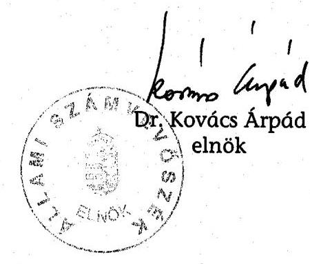

---

# Mellékletek jegyzéke 

1. sz. melléklet A jelentésre és a jelentéstervezetre tett észrevételek és az arra adott válasz
2. sz. melléklet Az ÁPV Zrt. 2005. évi bevételi tervének teljesítése
3. sz. melléklet A Budapest Airport Rt. privatizációja
4. sz. melléklet Az Antenna Hungária Rt. privatizációja
5. sz. melléklet A Hungexpo Vásár és Reklám Rt. privatizációja
6. sz. melléklet Az agrártársaságok privatizációja
7. sz. melléklet Az állami tulajdon vagyonértéken történő
követhetősége
8. sz. melléklet A Nemzeti Lóverseny Kft. által üzemeltetett
kincsemparki beruházás
9. sz. melléklet Az önkormányzatokat alapítói jogon
megillető kifizetések
10. sz. melléklet Perköltségek, ügyvédi díjak és egyéb kiadások
11. sz. melléklet Az ÁPV Zrt. saját vagyonának főbb adatai
12. sz. melléklet Tanúsítványok

---

1. sz. melléklet

a V-01-44/2006. sz. jelentéshez

# A jelentésre és a jelentéstervezetre tett észrevételek és az arra adott válasz 

Pénzügyminisztérium
Miniszterelnöki Hivatal
Állami Privatizációs és Vagyonkezelő Zrt. Felügyelő Bizottság + válasz
Állami Privatizációs és Vagyonkezelő Zrt.

---

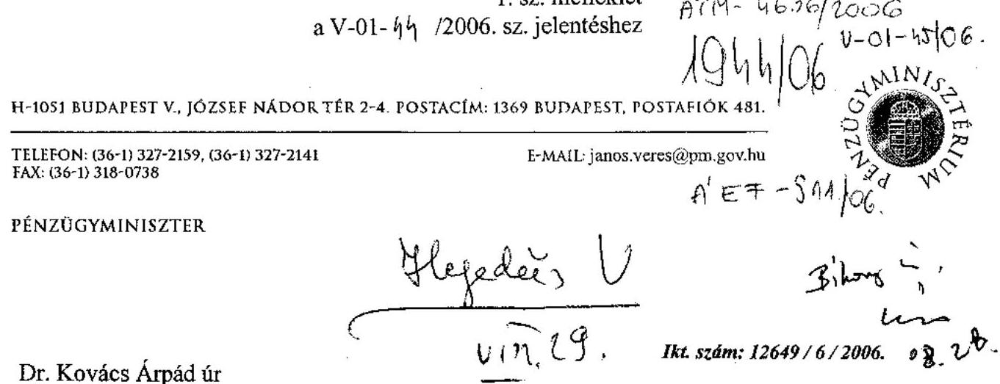

TELEFON: (36-1) 327-2159, (36-1) 327-2141
E-MAIL: janos.veres@pm.gov.hu
FAX: (36-1) 318-0738

Dr. Kovács Árpád úr
Ikt. szám: 12649/6/2006. 08.28
elnök

Állami Számvevőszék

Budapest,

Tisztelt Elnök Úr!

A V-01-42/2006. számú kísérő levéllel megküldött, az Állami Privatizációs és Vagyonkezelő Rt. 2005. évi müködésének és a központi költségvetés végrehajtásához kapcsolódó tevékenységének ellenőrzéséről szóló ÁSZ jelentéshez / Jelentés / észrevételt nem teszek.

Budapest, 2006. augusztus „ 24 „

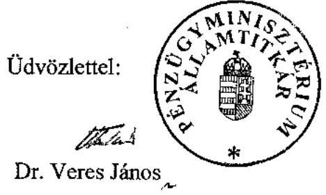

---

MINISZTERELNÖKI HIVATAL
GAZDASÁG- ÉS TÁRSADALOMPOLITIKAI TITKÁRSÁG

1886/06

Ikt.szám: XXXV/42/4/2006 (1) 4/23/06
Hivatkozási szám: V-01-34/2006.
Ügyintéző: Végh Szabolcs
Tárgy: ÁPV Rt. ellenőrzés

Bihary Zsigmond úr részére
főigazgató

Állami Számvevőszék

Budapest

Tisztelt Főigazgató Úr!

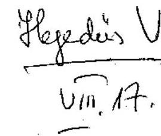

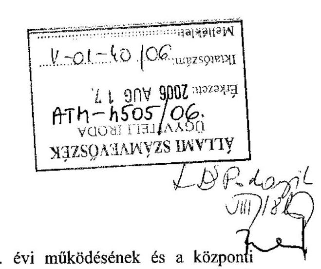

Az Állami Privatizációs és Vagyonkezelő Rt. 2005. évi működésének és a központi
költségvetés végrehajtásához kapcsolódó tevékenységének ellenőrzéséről készített újabb
jelentéstervezetet köszönettel megkaptuk.

Köszönöm, hogy javaslatainkat figyelembe vették, egyben – Gilyán György államtitkár úr
megbízásából – tájékoztatom, hogy további észrevételeket nem teszünk.

Budapest, 2006. augusztus 4.

Tisztelettel:

Dr. Tarjan Balázs
m. hezető
tárgy: Tárgy vezetö

1055 Budapest, Kossuth Lajos tér 2-4. Telefon: 441-3380, 441-3381; Fax: 441-3382
www.meh.hu • Tarjan.Balazs@meh.hu

---

# Állami Privatizációs és Vagyonkezelő Zrt. Hungarian Privatization and State Holding Company 

## Felügyelö Bizottság

Állami Számvevőszék
Bihari Zsigmond föigazgató úr
Budapest

## 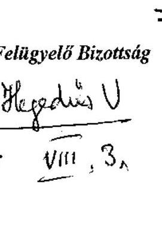

Állami Számvevőszék
Bihari Zsigmond föigazgató úr
$V / / 1,3$,

Budapest

## Tisztelt Föigazgató úr!

Hivatkozva az „ÁPV Rt. 2005. évi müködésének és központi költségvetés végrehajtásához kapcsolódó tevékenységének ellenőrzéséről" készített jelentéstervezetükkel kapcsolatos megkeresésre, az alábbi észrevételt tesszük:

Az ÁSZ jelentéstervezete a 35. oldalon ismerteti a Bábolna Rt. gazdálkodása tárgyában készített, az ÁPV Rt. Felügyelő Bizottságának 2005. december 21-i ülésén tárgyalt és elfogadott ellenőrzési jelentés megállapításait.
Erre vonatkozóan az Önök jelentéstervezete az alábbi észrevételt teszi:
„A jelentés az ÁSZ-vizsgálat megállapítása ellenére nem állapított meg olyan jellegű mulasztásokat, amelyeknek a következményei személyi felelősségre vonást jelentenének."
Megállapításukkal kapcsolatosan szíves tájékoztatásul közlöm, hogy dr. Veres János pénzügyminiszter úr 2006. évben tett felkérésének eleget téve jelenleg folyamatban van egy újabb felügyelő bizottsági ellenőrzés, amely a Bábolna Rtnél és annak (melléklet szerinti) társaságainál feltárt vagyonvesztés felelősségi kérdéseinek vizsgálatára irányul.

Tekintettel arra, hogy a 2005. évre vonatkozó vizsgálatukkal kapcsolatosan lefolytatott korábbi egyeztetések során tett észrevételeink figyelembe vételre kerültek, ezért kérem, hogy jelentéstervezetüket a fentiekben megfogalmazott kiegészítéssel módosítani szíveskedjék.
2006. Aug 3.

Melléklet: 1 db RJGY felkérés
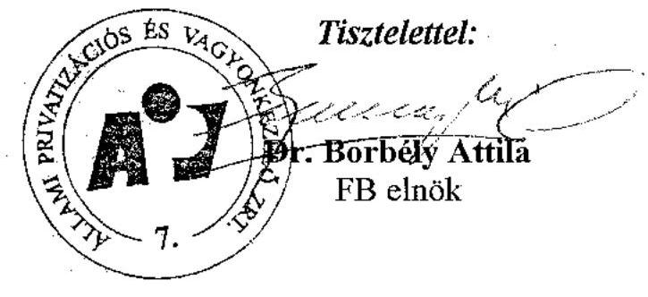

---

H-1051 BUDAPEST V., JÓZSEF NÁDOR TÉR 2-4. POSTACIM: 1369 BUDAPEST, POSTAFIÓK 481.

TELEFON: (36-1) 327-2159, (36-1) 327-2141
FAX: (36-1) 318-0738

PÉNZÜGYMINISZTER

E-MAIL: janos.veres@pm.gov.hu

Ikt. szám: 5946/16 / 2006.

Borbély Attila úr
elnök

Állami Privatizációs és Vagyonkezelő Zrt.
Felügyelő Bizottsága

Budapest

Tisztelt Elnök Úr!

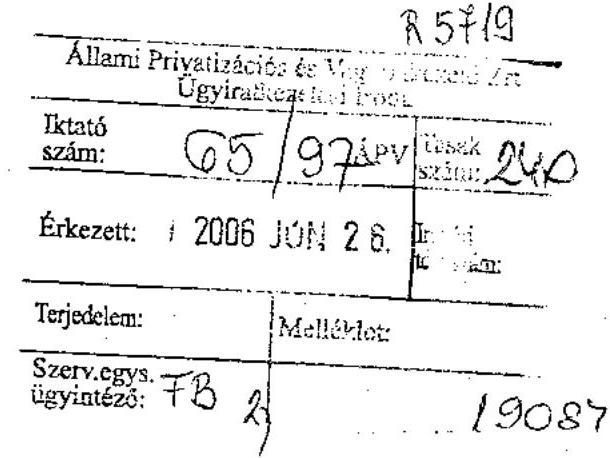

Az Állami Számvevőszék a tartósan veszteségesen működő állami tulajdonú gazdasági
társaságok gazdálkodásának ellenőrzéséről szóló jelentésében (0611) – többek között – az
alábbi javaslattal élt felém, melynek végrehajtása érdekében kérem szíves közreműködését:

„3. tisztázza, hogy a Bábolna Rt.-nél az ellenőrzés által feltárt 17,9 Mrd Ft
vagyonvesztésért, a Bábolna Élelmiszeripari Kft. 2004. évi 4 hónapos működése alatt
felhalmozott 3,1 Mrd Ft-os veszteség kialakulásáért, valamint a Bábolna Tetra Kft.
értékesítése során keletkezett 2,8 Mrd Ft veszteségért kit, milyen mértékben terhel
felelősség, és ennek függvényében tegye meg a szükséges intézkedéseket.”

Mindezt a magam részéről is igen fontosnak tartom, ezért felkérem az ÁPV Zrt. Felügyelő
Bizottságát, hogy az Állami Számvevőszék által felvetett, fent idézett kérdésekben a
szükséges vizsgálatot lefolytatni, a vizsgálat eredményéről a jelentést elkészíteni és azt – a
Felügyelő Bizottság javaslataival – legkésőbb 2006. szeptember 30-ig részemre
megküldeni szíveskedjék.

Budapest, 2006. június 16.

Másolatban kapja:
Dr. Vági Márton úr ÁPV Zrt. vezérigazgatója
Dr. Mészáros Tamás úr ÁPV Zrt. igazgatóság elnöke

Tisztelettel:

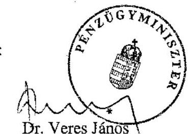

Dr. Veres János

---

# Dr. Borbély Attila úr 

FB elnök
Állami Privatizációs és Vagyonkezelő Zrt.

Budapest

## Tisztelt Elnök Úr!

Az Állami Privatizációs és Vagyonkezelő Rt. 2005. évi müködésének és a központi költségvetés végrehajtásához kapcsolódó tevékenységének ellenőrzéséről készült jelentéstervezetünkre tett észrevételeit megköszönöm.

Tájékoztatom, hogy észrevétele alapján a pénzügyminiszter felkérése által sorra kerülő újabb Bábolna Rt.-vel kapcsolatos vizsgálat tényét a jelentéstervezetbe beépítettük.

Budapest, 2006. augusztus $\mathcal{M}$,

Tisztelettel:
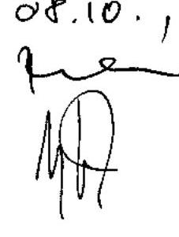

---

# 1. sz. melleklet 

Állami Privatizációs és Vagyonkezelö Rt.
Hungarian Privatization and State Holding Company
ELNÖK

Bihary Zsigmond
föigazgató
Állami Számvevőszék
H-1051 Budapest
Apáczai Csere J. u. 10.

## 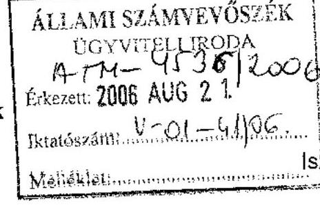

Igazgatóság Elnöke
Tel: 237-4292
Fax: 237-4291
$15 \ldots 1$ (1) /APV/2006.

Budapest, 2006. augusztus 15.

Tárgy: Az ÁPV Rt. 2005. évi müködésének vizsgálatáról készült ÁSZ Jelentés véleményezése

Tisztelt Föigazgató úr!

Köszönettel vettem az Állami Számvevőszék „az Állami Privatizációs és Vagyonkezelő Rt. 2005. évi müködésének és a központi költségvetés végrehajtásához kapcsolódó tevékenységének ellenőrzéséröl" szóló, 2006. augusztus 11-én megküldött, átdolgozott Jelentés tervezetét.

Örömömre szolgál, hogy megállapíthattam, a kollégáink - mind az ÁSZ, mind az ÁPV Zrt. részéről - alapos és színvonalas munkát végeztek.

Noha az Állami Számvevőszék Jelentése a 2005. évi tevékenység vizsgálata során a vagyonkezelési tevékenységre részleteiben nem tér ki, büszkék vagyunk a vagyonkezelés magas színvonalára. Az elmúlt években folyamatosan javuló vagyonkezelésünket mi sem minősíti jobban, mint az ÁPV Zrt. portfóliójába tartozó nyereséges és veszteséges cégek aránya. Míg 2002-ben csupán a társaságok $63 \%$ a müködött nyereségesen, addig 2005-ben már a cégek $78 \%$-a nyereséget termelt. Mindezt egy olyan időszakban sikerült elérni, amikor a privatizációs tevékenység eredményeképpen több, jelentős profitot hozó társaság értékesítésre került, cégeink száma 167 -röl 131 -re csökkent.

A Jelentés tervezet korábbi változata kapcsán kifejtettük szakmai álláspontunkat, amelyből úgy látom, néhányat beépítettek a végső anyagba. Nem kívánom megismételni a korábban kifejtetteket, az anyagban írottakat tudomásul vesszük. Bár a Jelentésben megfogalmazott néhány kérdésben továbbra is szakmai

---

véleménykülönbség áll fenn az ÁPV Zrt. és az ÁSZ között, megítélésem szerint a két szervezet vizsgálati együttmüködése eredményes volt.

Engedje meg, hogy ezúton tájékoztassam Önt, hogy az Állami Számvevőszék vizsgálatának lezárulta után elkészült az ÁPV Zrt. 2005. évi Éves Beszámolója. Ez a dokumentum is jól mutatja, hogy üzletileg sikeres évet zártunk, tevékenységünket a törvényes kereteken belül, szabályosan végeztük.

Tisztelettel:
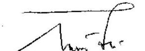

Dr. Mészáros Tamás az Igazgatóság elnöke
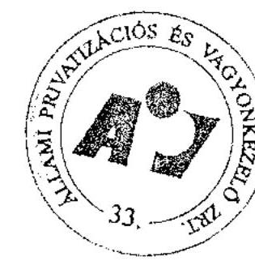

---

# Az ÁPV Rt. 2005. évi bevételi tervének teljesítése 

| Megnevezés | Módosított   terv | Tény | Teljesítés |
| :--: | :--: | :--: | :--: |
|  | M Ft |  | (\%) |
| Privatizációs bevételek | 127444 | 125092 | 98,2 |
| Vagyonhasznosítási bevétel | 218 | 257 | 117,9 |
| Privatizációs kárpótlási jegy bevétel | 500 | 38 | 7,6 |
| Értékesítés és vagyonhasznosítás   összesen | 128162 | 125387 | 97,8 |
| Kapott osztalék, részesedés | 18053 | 28373 | 157,2 |
| Egyéb bevételek | 1678 | 1104 | 65,8 |
| BEVÉTELEK ÖSSZESEN | 147893 | 154864 | 104,7 |

---

# A Budapest Airport Rt. privatizációja 

## A Kormány a 2104/2005. (VI. 6.) Korm. határozattal döntött a társaság 75\%-1 szavazatot kitevő részvénycsomagjának értékesítéséről.

A 2001-ben alakult társaság 2002. július 5-én vette fel a Budapest Airport Rt. nevet. A Társaság jogszabályokban rögzítetten - a Légi közlekedési Törvény és a 45/2001. (XII. 20.) KöViM rendelet - a kizárólagos állami tulajdonban álló Budapest Ferihegy Nemzetközi Repülőtér és vagyontárgyainak kizárólagos müködtetője a KVI-vel kötött meghatározatlan időre szóló vagyonkezelési szerződés alapján. A társaság ebben a minőségében az LRI jogutódja volt. A tulajdonosi jogokat az alapítást követően a KöVIM, 2002-ben a gazdasági és közlekedési miniszter, 2003. január 1-jétől az ÁPV Rt. gyakorolta. A társaság megalakulása óta folyamatosan nyereségesen gazdálkodott.

A privatizáció végrehajtását törvénymódosítások támogatták.
A privatizációt megelőző vagyonértékelés 114247 Mrd Ft-ban állapította meg a BA Rt. 75\%-1 szavazatra eső sajáttőke piaci értékét.

A részvénycsomag vagyonértékelését - 2004. december 31-ei fordulónappal - a CIB Bank és a HUNGAVENT alvállalkozó készítette. A valós piaci érték meghatározása súlyozott „DCF", „EVA", „Szorzószámos" alapú üzletértékeléssel, valamint eszközalapú értékeléssel készült. A vagyonértékelés a pályázati kiírás szerinti azonnali tranzakciós ellenérték összetételét követte, amely három elemből - a részvények árából, a 75 évre szóló egyszeri vagyonkezelési díjból és az ingóságok vételárából - tevődött össze. A vagyonértékelés - tekintettel arra is, hogy a MALÉV a repülőtér legnagyobb üzletfele - figyelembe vette a BA Rt. és a MALÉV közötti keret-megállapodást, a 2015-ig feltételezett üzleti terv alapján a várható bevételek, költségek, valamint az utasforgalom alakulását és az avulás miatt szükséges beruházásokat is.

A vagyonértékelés nem vette figyelembe a BA Rt. három társasági részesedése közül a 2,949 Mrd Ft jegyzett tőkéjű FUF Kft.-ben meglévő 29\%-os részesedést.

A vagyonkezelési szerződés 10. pontja szerint a felek megállapodtak abban, hogy az ÁPV Rt. jogosult, a társaság FUF Kft. üzletrészével kapcsolatos, vagy az után járó kifizetésre, ideértve az osztalék kifizetést, a tőkekifizetéseket és a likvidációs hányad kifizetését is azzal, hogy a társaság köteles mindent megtenni annak érdekében, hogy a FUF Kft. kifizetések összegét maximalizálja. Ez vonatkozik arra az esetre is, ha az ADC kifizetéseket a FUF Kft. felé kell teljesíteni, ebben az esetben az állam a tulajdoni hányadának megfelelő megítélt kifizetést (vissza) megkapja.

---

Az eladó Magyar Állam ADC megtérítési kötelezettségét a FUF Kft. üzletrésszel kapcsolatban a részvény adásvételi megállapodás 3. sz. mellékletének 2. pontja szabályozza. Az osztalékról a privatizációs szerződés melletti szindikátusi szerződés 8.9 pontja rendelkezik (előírja, hogy vevő köteles biztosítani, hogy a FUF Kft. az ÁPV Zrt.-nek a 2005. december 31-ig járó osztalékot megfizesse).

A privatizáció a 75\%-1 szavazatot kitevő részvénycsomag átruházása mellett kiterjedt a társaságnak a ferihegyi ingatlanok nemzetközi repülőtérként való hasznosítására vonatkozó vagyonkezelői jogának 75 évre szóló átruházására.

A vagyonkezelés tárgyát képező ingatlanállomány 5 egységből áll: Budapest Ferihegy Nemzetközi Repülőtér, Siófok-Kiliti Repülőtér, Balatonlelle üdülő, PécsPogány meteorológiai állomás és az Iharos külterületi telek. Legjelentősebb tétele a ferihegyi repülőtér. A repülőtér értékelt területe 15387953 m². A Ferihegyhez tartozó külső telkek összesített területe $132995 \mathrm{~m}^{2}$. A létesítménylista szerint a ferihegyi repülőtéren 230 számozott épület, építmény található. Ezenfelül a számviteli listában több beazonosítatlan felépítményt - konténerek, alépítmények - tartanak nyilván. Az épületeket és építményeket tételesen, egyenként értékelték. A vagyonkezelési szerződés három társasági részesedésre a FUF Kft., a France Telecom és a Magyar Duty Free Kft.-ben meglévő részesedésekre is kiterjedt.

A kétfordulós prekvalifikációs privatizáció pályázati felhívását 2005. június 6-án tették közzé.

A privatizáció megtervezésére, lebonyolítására a Credit Suisse First Boston (Europe) Limited kapott megbízást - 574,5 M Ft vállalkozási díjért - a privatizációs tanácsadói feladatok ellátására meghirdetett közbeszerzési pályázat alapján.

A pályázatra 11 darab szándéknyilatkozatot adtak be, amelyből 10 volt érvényes. A prekvalifikációs szakasz értékelését követően 9 pályázó nyújtott be ajánlatot, melyből az értékelő bizottság javaslata alapján az első öt helyezett jutott tovább.

# A pályázat eredménytelenül zárult és új pályázatot írtak ki. 

A Budapest Airport Rt. üzemi tanácsa a Munkaügyi Bíróságra 2005. augusztus 3-án érkezett beadványban kérelmet terjesztett elő a privatizációs és a pályázati kiírásra vonatkozó döntések (munkáltatói döntések) érvénytelenségének megállapítása iránt. A Fővárosi Munkaügyi Bíróság nem jogerős végzését, miszerint a BA Rt. részvényeinek értékesítésére vonatkozó pályázati kiírás érvénytelen volt, a Fővárosi Bíróság, mint másodfokú bíróság helybenhagyta. A végzéssel szemben a Budapest Airport Rt., valamint az ÁPV Rt. felülvizsgálati kérelmet nyújtott be 2005. november 22-én a Magyar Köztársaság Legfelsőbb Bíróságára.

Az eredeti pályázat visszavonását követően a 2231/2005. (X. 26.) Korm. határozat alapján az 504/2005. (X. 27.) IG sz. határozattal új, zártkörű pályázat kiírásáról döntöttek.

---

A pályázatra az ÁPV Rt. (a kormányhatározattal összhangban) az alábbi szakmai befektetőket hívta meg:

- a BAA (International Holdings) Ltd.,
- a Copenhagen Airports A/S,
- a Fraport AG Frankfurt Airport Services Worldwide,
- a HOCHTIEF Airport GmbH és a HOCHTIEF Airport Capital GmbH,
- a Macquarie Airports Holdings (Bermuda) Ltd.

A BA Rt. privatizációs koncepciója alapvetően nem változott a korábban meghatározottakhoz képest. A pályázati eljárás során a hivatkozott kormányhatározat és a végrehajtására kiadott RJGY határozat alapján a következő feltételeket rögzítették.

A pályázati kiírás fő elemei a következők voltak:

- A pályázat tárgya a BA Rt. alaptőkéjének 75 százalék mínusz 1 szavazat részét megtestesítő részvényeinek értékesítése.
- Az eszközök meghatározott köre kizárólagos állami tulajdon és így azok nem kerülnek értékesítésre. A terület nemzetközi repülőtérként való hasznosítására vonatkozó jogokat és kötelezettséget a KVI vagyonkezelési szerződés módosítása alapján a társaság 2006. január 1-jétől 2081. december 31-éig, azaz 75 éves időtartamra gyakorolhatja. A nyertesnek a tranzakció zárásakor finanszíroznia kell a vagyonkezelői jogért a KVI-nek fizetendő ellenértéket.
- A társaság vagyonkezelésében lévő és a kizárólagos állami tulajdonból kikerülő eszközöket és ingóságokat a társaság a KVI-től megvásárolja.
- A 75 évre szóló vagyonkezelési szerződés időtartama alatt a társaság által végrehajtott beruházások meghatározott köre a vagyonkezelési szerződésben rögzített kritériumok szerint állami tulajdonba kerülnek.
- A tranzakció zárásakor fizetendő "Azonnali Tranzakciós Ellenérték" három elemet tartalmaz: a részvények vételárát, a Vagyonkezelési szerződés 75 évre szóló egy összegben fizetendő díját és a Társaság állami tulajdonból kikerülő ingóságainak megvásárlásához szükséges finanszírozási összeget.
- A kiírás rögzíti, hogy az Azonnali Tranzakciós Ellenértéken felül a társaságnak a módosított vagyonkezelési szerződés alapján továbbra is éves vagyonkezelési díjat kell fizetnie a KVI részére, amelynek mértéke a társaság teljes éves bevételének $0,5 \%$-a.
- A társaságnak a légi közlekedésről szóló törvény szerinti felügyeleti díjat kell fizetnie a Polgári Légi közlekedési Hatóság részére.
- Az ÁPV Rt. részére a 2005. év után járó osztalék kifizetésre kerül.

---

A 11/2006. (V. 30.) közgyűlési határozat szerint az osztalék 10890 M Ft volt, amelyből 10068 M Ft előleg 2005-ben az ÁPV Zrt.-hez befolyt, a még hiányzó a 822 M Ft osztalék átutalása az ÁPV Rt. részére 2006. július 10-én megtörtént.

- Az állam a társaság hiteleivel kapcsolatosan a privatizációt követően nem fog semmilyen garanciát vállalni.

A pályázatra a HOCHTIEF Airport GmbH, a HOCHTIEF Airport Capital GmbH, és a Caisse de dépot et placement du Québec által alakított konzorcium, a BAA (International Holdings) Ltd., valamint a Fraport AG Frankfurt Airport Services Worldwide és a HAH Limited által alakított konzorcium nyújtott be ajánlatot. Az értékelő bizottság mindhárom ajánlatot érvényesnek találta, és javaslata alapján az ÁPV Rt. Igazgatósága a pályázat nyertesének a BAA International Holdings Ltd.-t nyilvánította. A nyertes BAA Ltd. által Magyarországon alapított céltársasággal, a BUD Holding Zrt.-vel 2005. decemberében szerződést kötött, az anyavállalat BAA Ltd. együttes aláírása mellett.

A szerződéseken kívül a felek között megállapodások is születtek, amelyek a szerződésben nem tárgyalt kérdéseket részletezik, illetve az ügylet lebonyolításának lépéseit határozzák meg (pl. „Letéti Megállapodás").

A 1254,74 M angol font vételárat a vevő az ajánlati feltételek szerinti MNB hivatalos devizaárfolyamon számítva 464,535 Mrd Ft összegben a „Letéti Ügynök" részére átutalta, amelyből az alábbi kifizetések teljesültek:

- az ÁPV Rt. részére részvények vételára tekintetében 162,06 M angol fontnak megfelelő forint,
- a KVI részére két összegben összesen 1052,16 M angol fontnak megfelelő forint ( 75 évi vagyonkezelési díj),
- továbbá a KVI-nak a BA Rt. tulajdonába kerülő ingóságok megvásárlásáért 40,52 M angol fontnak megfelelő forint + 25\% ÁFA összeg (eszközök adásvételi értéke).

A vételárat - az angol font 2005. november 7-11. közötti (5 banki nap) Magyar Nemzeti Bank fixing árfolyamának átlaga szerint állapították meg.

A többségi tulajdonos elővásárlási jogot az állami tulajdonban tartott részvényekre, a Magyar Állam pedig 2011. december 31-éig fennálló opciós jogot a részvényeknek az adásvételi szerződésben meghatározott feltételek szerinti értékesítésére. Az opciós részvények vételára a szerződéses teljes vételár 33\%-a, amely összeg évi 11,5\%-kal növekszik. Az állam fennálló $25 \%+1$ szavazat mértékű szavazati jogát érintően nem következhet be a törzstőkében, illetve a részvényfajták összetételében olyan változás, amely a szavazati jog arányt megváltoztatná.

A részvény-átruházási jogokat tekintve a kisebbségi tulajdonos ÁPV Rt. részvényeit bármikor átruházhatja az állami tulajdonosi körön belül. A BAA által megszerzett 75 százalék mínusz egy szavazattöbbségi tulajdonrészből 50 százalék plusz egy szavazat tulajdonrésznek a "jelen vevő" közvetlen tulajdonában kell maradnia.

---

Az ÁPV Rt. előzetes értesítése után a BAA kapcsolt vállalkozásának átadhatja a fenti részvénycsomagot, de ez nem sértheti a Magyar Állam érdekeit. Az esetleges új tulajdonosnak rendelkeznie kell a privatizációs szerződés teljesítéséhez szükséges felhatalmazásokkal, engedélyekkel és meg kell felelnie a részletesen szabályozott alkalmassági követelményeknek, valamint el kell fogadnia a privatizációs szerződés rendelkezéseit. A Budapest Airport Zrt. privatizációs szerződése a BAA esetleges tulajdonosváltásával kapcsolatban nem tartalmaz előírásokat.

A társaság OTP felé fennálló 40034 euro hiteltartozásának kiegyenlítése a vevő kötelezettsége volt. A BA Rt. a hitelt (a privatizációs szerződésnek megfelelően) 2006. február 28-án teljes egészében visszafizette.

A repülőtéri szolgáltatások színvonalának fejlesztésére a vevő 2011-ig 260,6 M euro értékű beruházást végez. Az így teljesített ingatlan-beruházások (épületek, vásárolt földterületek stb.) a Magyar Állam tulajdonába kerülnek és a vagyonkezelési szerződés részévé válnak.

Az ÁPV Rt. Felügyelő Bizottsága a privatizációt a jogszabályoknak, illetve kormányzati elvárásoknak megfelelőnek ítélte.

A részvény adásvételi megállapodás (továbbiakban szindikátusi szerződés) kitér a szerződő felek kötelezettségvállalásaira, illetve ezeknek a vállalásoknak meghatározza a korlátait. Az eladótól követelhető megtérítés maximuma pl. a részvények tulajdonjoga tekintetében az azonnali tranzakciós ellenérték, az állami kockázati események tekintetében a részvények vételára + a teljesített tőkejuttatások - osztalék. A szerződést kiegészítő „Részvény Adásvételi Megállapodás" szerint a szerződő felek az eladó szavatosságvállalását az ADC megtérítés tekintetében az azonnali tranzakciós ellenérték összegében határozták meg.

A privatizációs szerződés szerint ha a tranzakciós dokumentumok aláírását követően a 45/2001.(XII. 20.) KöViM rendelet alapján a Légiforgalmi és Repülőtéri Igazgatóság megszüntetéséből és a Ferihegyi Utasterminál Fejlesztő Kft. múködtetési jogainak megszűnéséből eredő követelések tekintetében bíróság, választottbíróság vagy egyéb arra hatáskörrel és illetékességgel rendelkező testület felülvizsgálati kérelemmel már nem megtámadható, jogerős és kötelező erejú határozatot hoz, az ÁPV Rt. az eladói szavatosság alapján megfelelő felelősségi korlátok érvényesítése mellett:

- megtérít a BA Rt. részére minden olyan összeget, amelyet a BA Rt.-nek a fenti határozat alapján ki kell fizetnie, illetve
- megtéríti a BA Rt. új többségi tulajdonosa minden kárát (ide nem értve az elmaradt hasznot), amely abból ered, hogy a BA Rt.-t a vagyonkezelési szerződés alapján megillető jogok gyakorlásában a fenti határozat korlátozza vagy megakadályozza.

Az ADC a privatizációt követően a BA Rt.-vel szemben is nyújtott be követelést. A BA Rt.-vel szemben benyújtott követelések az ÁPV Rt. jogi osztályának véleménye szerint megalapozottságukat és összegszerűségüket tekintve is kidolgozatlanok, azok alapján az ÁPV Zrt.-vel szembeni megtérítési igény lehetősége

---

ma nem merül fel. A BA Rt.-vel szemben benyújtott kereset nem választható el a Magyar Állammal szemben a fentiekben részletezett keresettől, illetve az abban hozott ítélettől. Az ÁPV Rt. a 27/2004. Vig. utasítása alapján a szavatossági beváltási valószínűséget - az összes szavatossági alapon vállalt kötelezettség tekintetében együttesen - a szokásos mértékben, a hivatkozott belső előírásnak megfelelő mértékben, azaz az azonnali tranzakciós ellenérték 5\%-ával, 23,227 Mrd Ft értékben vette figyelembe.

---

# Az Antenna Hungária Rt. privatizációja 

A társaság jogelődjét - a Magyar Postából 1990-ben kivált Magyar Műsorszóró Vállalatot - az Állami Vagyonügynökség Igazgatótanácsa Antenna Hungária Magyar Mú́sorszóró és Rádiótávközlési Részvénytársaság néven, 1992. június 30-i hatállyal, 7849 M Ft alaptőkével, egyszemélyes, zárt 100\%-os, állami tulajdonú részvénytársaságként, átalakítással hozta létre.

Az Antenna Hungária Rt vállalatcsoport konszolidációs körébe négy 100\%-os tulajdonú leányvállalat, három közös vezetésű vállalat $50 \%$ körüli közvetlen tulajdonnal és ennek megfelelő szavazati aránnyal, és két társult vállalat tartozott. A többségi szavazatot biztosító leányvállalatok jegyzett tőkéje 14,48 Mrd Ft volt

A privatizációt megelőző legfontosabb tranzakciók között kell említeni a Vodafone International B.V.-vel 2004. szeptember 24-én kötött megállapodást, melynek értelmében az AH Rt 12553501 db részvényt 19,4 Mrd Ft ellenében az angol többségi tulajdonosra ruházott át. A részesedés 2003 októberétől már nem érte el a $20 \%$-ot, ezért a Vodafone befektetés kikerült a konszolidációs körből, egyéb részesedéssé minősült.

A társaság korábbi monopolhelyzetet biztosító tevékenységét az elektronikus hírközlésről szóló 2003. évi C. törvény életbelépése alapvetően befolyásolta, mivel, ezáltal a műsorszétosztás és műsorszórás 2004. május 1-jétől liberalizálttá vált.

A Kormány 1021/2005. (III. 10.) határozattal fogadta el a földfelszíni digitális televízió műsorszórásra való átállás stratégiai célkitűzéseiről szóló koncepciót. Ennek következtében a teljes földfelszíni analóg műsorszórás leállításának legkésőbbi időpontja 2012. december 31-e.

A Magyar Televízió Rt. és az AH Rt. között 2005. januárjában hosszú távú stratégiai megállapodás jött létre, amely 2012-ig rendezi a két cég közötti együttműködési feltételeket.

A társaság privatizációját a Kormány 2276/2004. (X. 30.) sz. határozata alapján az ÁPV Rt. Igazgatósága 2005. április 11-én kelt pályázati felhívásban tette közzé. A Kormány legalább 75\%+1 szavazatot biztosító részvénycsomag felajánlására kérte fel az ÁPV Rt. Igazgatóságát.

A részvénycsomag nyilvános pályázat útján történő értékesítésének lebonyolítására - a versenyeztetési szabályzat alapján - a 2004. november 19-én nyilvános egyfordulós tanácsadói pályázatot írtak ki. Az érvényes pályázók közül a HVB Bank Hungary Rt.-t jelölték meg a tanácsadói pályázat nyerteseként.

A pályázó kiválasztásának egyetlen szempontja a díjajánlati oldalról a lekedvezőbb ajánlattevő kiválasztása volt. Az értékelési szempontrendszer 100 pontot

---

határozott meg, melyből a szakmai ajánlatra 25 pontot, a pályázó és közreműködő referenciái és a szakmai személyzet felkészültsége további 25 pontot, a vállalt feladat díj és költségigénye 50 pontot ért maximálisan.

A tanácsadó az AH Rt. részvényeinek tőkepiacon keresztül történő értékesítését nem javasolta, mivel a társaság tőzsdén való jelenlétét és piaci tőkeértékét, úgy ítélte meg, hogy az AH Rt. az iparágban összehasonlítható más hazai és nemzetközi cégekhez képest igen kis méretű vállalat. A tanácsadó nyilvános, kétfordulós pályázat alapján történő értékesítést javasolt a lebonyolítás időigénye és a lehető legmagasabb ár biztosítása érdekében.

A privatizációs tanácsadó elvégezte a cégcsoport jogi és üzleti kockázatok szerinti átvilágítását is.

Az üzleti kockázatként többek között a kizárólagos koncessziós jog megszűnésére, az árbevétel $47 \%$-át kitevő műsorszórási ágazatból származó bevételek várható mérséklődésére hívta fel a figyelmet a Magyar Televízió, a Magyar Rádió által fizetett díjak várható csökkenése, az MTV gazdasági nehézségei, valamint az RTL Klub és a TV2 tulajdonosai versenyhivatali keresete miatt.

A kiválasztott tanácsadó javaslata alapján a 2276/2004. (X. 30.) Korm. határozat és az annak alapján kiadott 23/2004. (XI. 10.) RJGY határozat jóváhagyta a $75+1 \%$ szavazatot megtestesítő részvénycsomag nyílt pályázat útján történő értékesítését azzal, hogy a társaságot a pályázati és a jogszabályokban előírt feltételeknek megfelelő, a részvénycsomagért a legmagasabb vételárat felajánló pályázónak kell értékesíteni.

Az Antenna Hungária Rt. értékesítésére az ÁPV Rt. Igazgatósága 172/2005. (IV. 07.)sz. határozata alapján nyílt, kétfordulós pályázat alapján került sor.

Az Igazgatóság a 625/2004. (XI. 18.) sz. határozat 2. pontjában úgy döntött, hogy a 2005. évi privatizáció során kedvezményes munkavállalói részvényértékesítésre felajánlható részvények hiányában nem kerül sor.

A pályázati kiírás a privatizáció legfőbb céljaként többek között a legmagasabb privatizációs bevétel elérését, az AH Rt. alaptevékenységéhez kapcsolódó feladatok Vevő általi hosszú távú ellátását, a műsorterjesztési és műsorszórási, valamint a Magyar Állam, illetve a mindenkori Kormány felelősségi körébe tartozó telekommunikációs tevékenység zökkenőmentes, magas színvonalú ellátását, a minősített feladatok és a társaság fejlődésének biztosítását jelölte meg.

A privatizáció az ÁPV Rt. és a Forrás Rt. tulajdonában lévő $75+1 \%$ szavazatot biztosító teljes részvénycsomagra kiterjedt.

A pályázat eredményére és a nyertesére vonatkozó végleges döntést az Igazgatóság a 377/2005. (VII. 21). határozattal hozta meg, melynek alapján a legmagasabb - 46,759 Mrd Ft - vételi ajánlatot tevő Swisscom Broadcast AG-t nyilvánították nyertesnek.

A Vezérigazgató a szavatossági felelősséget eredményező döntést megelőzően kikérte a pénzügyminiszter egyetértését, aki 2005. július 14-én hagyta jóvá a végleges adásvételi szerződés tervezetet.

---

A Swisscom Broadcast AG az AH Rt vállalatcsoport Magyar Állam tulajdonát képező 8753563 db egyenként 1000 Ft névértékű, valamint a Forrás Rt. tulajdonában lévő 152838 db 1000 Ft névértékű törzsrészvényt - a pályázatban megajánlott „tőzsdei ár feletti" - 5250 Ft részvényenkénti egységáron vásárolta meg. A szerződés aláírására 2005. július 28. napján került sor.

Az ÁPV Rt. az értékesítési szerződésében szereplő vételár után a jog és kellékszavatosság címen 0,5\%-os beváltási valószínűség alapulvételével 221,8 M Ft céltartalék képzését tartotta indokoltnak.

A társaság műsorsugárzásból származó jelentős évi bevétele a műsorterjesztési monopóliuma alapján - amennyiben a televíziós társaságok nem mondják fel a hosszú távú szerződéseket - még 2012-ig garantálva van.

A digitális tevevízió műsorszórásra való átállással kapcsolatban a vevő köteles a 1021/2005. (III. 10.) Korm. határozat szerinti stratégiát követni, ennek alapján 2012. december 31-éig a közszolgálati műsorok digitális vételkörzetére legalább a lakosság $97 \%$-át elérő hálózatot kiépíteni.

A szerződésben a vevő 2009. december 31-éig legalább 12 Mrd Ft-os fejlesztést vállalt a társaság, illetve a leányvállalatok műsorterjesztési, a digitális műsorszórásra való átállás, a hírközlési infrastruktúra, valamint az üzleti kommunikáció és kormányzati kommunikáció szolgáltatása terén.

A honvédelmi és minősített feladatokkal kapcsolatban a vevő a társaság és leányvállalatok jogszabályban előírt honvédelmi és minősített időszaki feladatainak további ellátását, valamint az alaptevékenységhez kapcsolódó honvédelmi, nemzetbiztonsági érdekek érvényre juttatatását célzó speciális feladatok maradéktalan végrehajtását köteles biztosítani.

---

# A Hungexpo Vásár és Reklám Rt. privatizációja 

A Hungexpo Rt. 1990. október 20-án alakult át állami vállalatból egyszemélyes részvénytársasággá.

A társaság fő tevékenysége a kiállítás szervezés és az ehhez kapcsolódó marketing kommunikáció. A társaság tevékenysége nemzetgazdasági szempontból is jelentőséggel bír a hazai és nemzetközi gazdasági kapcsolatok szervezése és élénkítése, valamint a nagyközönségnek szóló Budapesti Nemzetközi Vásár (BNV) évenkénti megrendezése által. A társasággá alakulást követően többféle koncepció alapján, több eredménytelen privatizációs kísérlet történt. Ezek viszszavonásának, leállításának alapvető oka volt, hogy a kiállítás- és vásárszervezési tevékenység megtartását, fejlesztését nem biztosították.

A társaság jegyzett tőkéje 3,1 Mrd Ft, saját tőkéje 5,8 Mrd Ft volt a 2004. december 31-én. A társaság a 2001-ben 448,8 M Ft-os mérlegszerinti nyereséggel, a 2002. évet 30,9 M Ft-os veszteséggel és a 2003. évet 0 Ft-os, a 2004. évet 6,4 Mrd Ft eredménnyel zárta.

A társaság meghatározó értékű vagyona a székhelyül is szolgáló, a Budapest Albertirsai úton lévő vásárváros 37 ha $9607 \mathrm{~m}^{2}$ területe és az összesen 92,6 ezer $\mathrm{m}^{2}$ alapterületű kiállítási pavilonok, raktárak, irodaépületek, egyéb építmények. Egyéb jelentősebb értékű ingatlanok az EXPO Hotel, a Városligeti telephely és a Csopak Vízisport-telep voltak.

A vagyonértékelést a közbeszerzési eljárással kiválasztott Mátraholding Rt. végezte a társaság eszközalapú és DCF hozamalapú üzleti értéke meghatározásával. A társaság egészének valós piaci értékét a vagyonértékelő javaslata alapján a két módszer szerint nyert érték súlyozott figyelembevételével 6890 M Ftban határozták meg. Az ÁPV Rt. tulajdonában lévő $82 \%$-os részvénycsomag piaci értéke 5650 M Ft -ot tett ki.

A privatizáció során az ÁPV Rt. 2,4 Mrd Ft névértékű és az alaptőke 77,01\%-át megtestesítő részvénycsomagját 8 Mrd Ft értékben vásárolta meg a GL Events, a TriGránit Fejlesztési Részvénytársaság, a WestEnd Beruházó és Kereskedelmi Részvénytársaság által alkotott konzorcium.

Az alaptőke 5\%-át megtestesítő 156,7 M Ft névértékű részvényeket kedvezményes munkavállalói értékesítés keretében 295,7 M Ft-ért adták el. Mindkét tranzakció ellenértéke 2005-ben a tervezett határidőn belül befolyt az ÁPV Rt. számlájára. A pályázati eljárás arról is rendelkezett, hogy a nyertes pályázó az ajánlati vételár alapján köteles megvásárolni az önkormányzatok birtokában lévő $18 \%$-os tulajdoni hányadot képviselő részvényeket, felkínálásuk estén.

---

A prekvalifikációs, nyílt kétfordulós pályázatra 2004. szeptemberében 6 db pályázó jelentkezett. A pályázat első fordulójára 2005. januárjában 3 db konzorcium nyújtott be érvényes ajánlatot. A második fordulóba a pályázati felhívás szerint az első forduló első két helyezettje került meghívásra.

A privatizációnak a pályázatban is megfogalmazott további feltétele, szakmai befektető bevonása és a rendezvényszervezési, kiállítási tevékenység tovább folytatásának a biztosítása volt. A nyertes pályázóval megkötött szerződés erről a szerződés aláírását követő 5 évig 1 db elsőbbségi részvény ÁPV Rt. birtokban tartásával és a vevő kötelezettségeinek teljesítésére vonatkozó bankgarancia fedezettel gondoskodott. A szerződés szerint a vevő a vásárváros területén 5 Mrd Ft értékű fejlesztést hajt végre és a kötelezettségvállalások teljesítésének biztosítékául 2011. januárjáig évi 1,6 Mrd Ft összegben banki biztosíték áll az ÁPV Rt. rendelkezésére.

A Hungexpo Rt. privatizációjáról az ÁPV Rt. vezérigazgatói utasításában foglaltaknak megfelelően „Emlékeztető" készült. Az ÁPV Zrt., Felügyelő Bizottsága a Hungexpo Rt. privatizációs folyamatát rendben megvizsgálta.

Az FB a 2006. március 29-én elfogadott Ellenőrzési Jelentésében megállapította, hogy a pályázati kiírás, az értékelés és elbírálási eljárása során az ÁPV Rt. megfelelő gondossággal és az érvényes törvényi előírások betartásával járt el; a privatizáció célja, szakmai befektető bevonása és a rendezvényszervezési kiállítási tevékenység tovább folytatásának biztosítás megvalósult. Az FB hangsúlyozottan és nyomatékosan felkérte az Igazgatóságot, hogy a Vevőnek a privatizációs szerződésben vállalt kötelezettségei teljesülését rendszeresen ellenőriztesse, és következetesen kérje számon.

---

# Az agrártársaságok privatizációja 

A Társaság 2005. évi módosított üzleti tervében megfogalmazódott a vállalkozói vagyon egységes kezelésének az igénye és a privatizációs feladatok Társasághoz történő csoportosítása. Így az ÁPV Rt. 2005-ben megbízás keretében értékesíthetett minisztériumi kezelésű vagyonelemeket is. A tervben a Földművelésügyi és Vidékfejlesztési Minisztériumtól (FVM) az alábbi társaságok átvétele és értékesítése szerepelt:

- Temperáltvízű Halszaporító és Kereskedelmi Kft., 100\%-os tulajdona,
- Pécsi Geodézia és Térképészeti Kft., 36,4\%-os tulajdona.

További három FVM tulajdonban lévő társaság privatizációjának előkészítését végezte a Társaság.

Az agrár-társaságok privatizációs bevételére 1,1 Mrd Ft-ot tervezett a Társaság. Az értékesítési tervben szerepelt a Dél-Gabona Rt., valamint a Fertő-tavi Nádgazdasági Rt. eladása is, mivel alacsony bevételt eredményező társasági részesedéssel vannak a portfolióban.

Az átvett agrártársaságok után tervezett 750 M Ft-os privatizációs bevételt nem sikerült realizálni. A korábbi években előkészített agrártársaságok közül 2005ben a Komáromi Mg Rt., az Alcsiszigeti Mg Rt., és a Bácsalmási Agráripari Rt. privatizációjából 385 M Ft bevétel volt 2005-ben.

## Az agrártársaságok privatizációját megelőző tanácsadó kiválasztásának folyamata és feladatai

Az ÁPV RT. a 2003. június 25 -én kelt pályázati felhívása alapján, sikeresnek minősített közbeszerzési eljárásban 2003. augusztus 18 -án a Reorg-Audit Könyvvizsgáló Korlátolt Felelősségű Társaságot bízta meg az értékesítendő alábbi tíz agrártársaság privatizációjának előkészítésével és lebonyolításával.

A privatizálandó agrártársaságok:

- Alcsigeti Mg Rt.
- Bácsalmási Mg. Rt.
- Bólyi Mg.Rt.
- Enyingi Agrár Rt.
- Hód-Mezőgazda Rt.
- Komáromi Mg. Rt.
- Mezőhegyesi Ménesbírtok Rt.

---

- Abaúji Charolais Rt.
- Szerencsi Mg. Rt.
- Tokaj Kereskedőház Rt.

Az értékesítés előkészítő fázisában a tanácsadónak az alábbi feladatokat kellett elkészítenie:

1. Üzleti, pénzügyi audit: amelynek keretében az értékesítendő társaságok és azok kapcsolt vállalkozásainak helyzetfelmérése, az összes olyan lényeges körülmény (pénzügyi, műszaki, kereskedelmi, humán erőforrás szempontból) feltárása, amely hatással lehet az értékesítésre és a társaságok jövőbeni fejlődésére. Az áttekintés első lépéseként a következő elemzések képezték a vizsgálat tárgyát: termékszerkezet; élelmiszer-biztonsági és állategészségügyi kérdések; minőségi követelmények; földhasználat; termelési, feldolgozási és értékesítési integráció; végső kibocsátás piaci megoszlása; a felhasznált erőforrások szerkezete; földhaszonbérleti helyzet hatása a társaságok értékére; technológiai színvonal, méretgazdaságosság; versenyképesség; erősségek és gyengeségek; belső forgalom, árak és külső piaci kapcsolatok; az EU csatlakozás várható hatásai a társaságok jövőjére.
2. Piaci jelentés, illetve elemzés készítése, a munkavállalói és szakmai érdekképviseletek tájékoztatása
3. Összefoglaló javaslat készítése az értékesítés végrehajtására, annak érdekében, hogy pozitív döntés esetén a részvényértékesítési fázis gyakorlatilag azonnal megkezdődhessen.
4. Értékesítési forgatókönyv elkészítése. Az értékesítési stratégia részleteinek ÁPV Rt. Igazgatósága és a Kormány általi elfogadását követően az értékesítés forgatókönyvének elkészítése és az előzetes marketing lebonyolítása.

A részvényértékesítési fázisban végzendő feladatok:

1. Adatszoba felállítása az ÁPV Rt. központjában, működési szabályzatának kidolgozása, működtetése és az érdeklődő befektetőkkel való kapcsolattartás. Napló vezetése az adatszobát igénybevevőkről.
2. Nyílt pályázat megszervezése és lebonyolítása. Részvétel az ajánlatok átvételében és a tenderbontáson. Javaslattétel a pályázat nyertesére. A privatizációs szerződéskötés megszervezése és lebonyolítása, közreműködés a szerződés véglegesítésében és az értékesítés pénzügyi elszámolásában, valamint adatszolgáltatás az ÁPV Rt. részére.
3. Munkavállalói részvényértékesítés teljes körű megszervezése és lebonyolítása.

A tanácsadó cég a megállapodás 2. sz. mellékletében 3 fő saját alkalmazottját, 2 fő megbízási jogviszonyban lévő személyt és további 2 társaságban összesen 16 főt jelölt meg szakértőként a feladatok végrehajtására.

---

# A privatizálandó társaságok vagyonértékelése 

A tanácsadó a vállalt határidőre elkészítette a privatizálandó társaságok vagyonértékelését. A kijelölt 10 társaság 2002. december 31-ei saját tőke értéke összesen 36,411 M Ft volt.

## A Bábolna Rt. privatizációra történő előkészítése

Részletek az FB jelentéséből (126-128. oldalaiból):
„(A Cstv. 70. §-ának b) pontja szerint a gazdálkodó szervezet vezetője köteles a végelszámoló részére a gazdálkodó szervezet iratait, az azokról készítendő iratjegyzéket, az irattári anyagokat és a folyamatban lévő ügyekről az információkat 30 napon belül átadni. A Bábolna Rt. „v.a." folyamatban lévő végelszámolási eljárásának eltelt egy éve alatt a végelszámoló nem kapta kézhez a Bábolna Rt. „v.a." irat- és szerződésállományára vonatkozó jegyzéket és az ehhez kapcsolódó teljességi nyilatkozatot.

A Bábolna Rt. „v.a." ügyeinek átláthatóságát és rendezését folyamatosan akadályozza, továbbá fel nem mérhető pénzügyi és múködési kockázatot hordoz, hogy a társaságnál a mai napig nincs teljes nyilvántartás és különösen nincs teljességi nyilatkozat a Bábolna Rt. által a végelszámolást megelőzően megkötött szerződésekről. Erre tekintettel a hatályos szerződések nyilvántartása sem volt összeállítható).

Az FVM Komárom-Esztergom Megyei Hivatalának követelése:
Az FVM Komárom-Esztergom Megyei Hivatala 2004. november 19-ei levelében 262 500 ezer Ft és annak a jegybanki alapkamat kétszeresét kitevő összegű járulékai erejéig követelést jelentett be a Bábolna Rt. „v.a." felé.

A hivatal szerint követelés jogtalanul igénybevett támogatás címszó alatt keletkezett, mivel a mezőgazdasági termelők éven belüli hiteleinek adósságrendezési programja keretében ilyen nagyságrendú követelést engedtek el a Bábolna Rt. felé 2002-ben, és az adósságrendezési program 2. §-a kizárja az adósságrendezési programból azon mezőgazdasági termelőket, melyek csőd-, felszámolási, vagy végelszámolási eljárás alatt állnak. Mivel a Bábolna Rt. 2004. szeptember 1. óta végelszámolás alatt áll, ezért a hivatal álláspontja szerint ez az összeg visszafizetendő. Ez a kötelezettség nem szerepelt a Bábolna Rt. tevékenységzáró mérlegében.

## A Bábolna Rt. „v.a." által haszonbérelt földterületek rendezetlensége:

Nem történt meg 2002. évben a haszonbérelt földterületekre az ingatlannyi̇vántartásban a Bábolna Rt. földhasználói bejegyeztetése, ami alapvető feltétele a terület alapú támogatások igénybevételének (ez a nagyságrendileg 13000 ha termőföld esetében évi 400 M Ft támogatást érint), és a növénytermesztési eszközrendszer valós piaci értékét is jelentősen befolyásolhatja.

---

# A Bábolna Rt. „v.a." által haszonbérelt földterületek földhivatali regisztrációja: 

Nem történt meg a Bábolna Rt. által 2001. évben haszonbérelt állami földterületekre megkötött földhaszonbérleti szerződések bejelentése határidőben az érintett földhivatalokhoz a földhasználati nyilvántartásban történő regisztrálás céljából.

Ez alapvető feltétele a terület alapú támogatások igénybevételének (ez a nagyságrendileg 13000 ha termőföld esetében évi 400 M Ft támogatást érint), ami a növénytermesztési eszközrendszer valós piaci értékét is jelentősen befolyásolhatja. A földhaszonbérleti szerződések utólagos regisztráltatását a földhivatalok és a Bábolna Rt. között a szerződések érvénytelenné válása körül kialakult jogszabály-értelmezési vita hátráltatja. A rendezéshez az ÁPV Rt. az FVM miniszter segítségét kérte, mert véleménye szerint a 2001-ben megkötött szerződések a mulasztás miatt nem válhattak érvénytelenné. „

---

# Az állami tulajdon vagyonértéken történő követhetősége 

Az ÁPV Rt. könyvvezetési kötelezettsége nem terjed ki a hozzárendelt vagyon állományának és annak változásaival kapcsolatos gazdasági eseményeknek az Sztv. szerinti nyilvántartási és beszámolási kötelezettségére, mert mindezekről a Priv. tv. 21. és 23. §-a szerint meghatározott, elkülönített nyilvántartási rendszert vezet. A rendelt vagyon állományában lévő cégek és eszközállományuk piaci értéke ezért meghatározott eseményekre vonatkozóan célirányos vagyonértékelés alapján határozható meg. A jelenlegi rendszerben a társaságok saját tőkéjének két időszak közötti változása nem ad egyértelmű képet az ÁPV Rt. vagyongazdálkodásáról. A tranzakciós típusú vagyonváltozás egy része nem a piaci értéken történik, a vagyonértékelések pedig folyamatosak és nem terjednek ki az eszközvagyon egészére. Ezért az egy időpontban elvégzett teljes körű értékelések felelnének meg az átlátható vagyongazdálkodás követelményének. Az ÁPV Rt. beszámolójában szereplő - a társaságok mérlege szerinti - gazdálkodás eredményességét is korrigálni kell a tárgyévben elvont osztalékkal, az értékhelyesbítésekkel, a társaságcsoportoknál a konszolidált mérlegben a hozzárendelt vagyonra jutó saját tőkét befolyásoló hatásokkal. A gazdálkodás eredményességét jobban tükrözné a tárgyévi ÁPV Rt. részesedésre jutó adózott eredmény. A tőzsdei társaságok nyilvántartási értéke a 2006. évtől már a mérlegkészítés napját megelőző 180 nap súlyozott tőzsdei árfolyamából kerül megállapításra. Ez leképezi a társaságok piaci értékét. A nem tőzsdei társaságok esetében az ÁPV Rt. tulajdonrészre jutó sajáttőke azonban nem megfelelő a piaci érték helyettesítésére. Az ÁPV Rt. nyilvántartási rendszere jelenleg olyan szerkezetű, amelyben közgazdasági megfontolásokból a vagyonkezelő is befolyásolni tudja a társaságai által kimutatható sajáttőke értéket, mert meghatározhatja, hogy az általa megkívánt értékhelyesbítéseket a társaságok mikor hajtsák végre. Erre mutat, hogy a hozzárendelt vagyon cégeinek száma évrőlévre csökken, a kimutatott sajáttőke azonban növekszik.

A 2005. évben a Részvényesi Jogok Gyakorlójának a hozzárendelt vagyon nyilvántartási és beszámolási rendszerére vonatkozó szabályozása a 4/2005.(VI. 2.) sz. határozatban került kiadásra. Ennek megfelelően a hozzárendelt vagyonról készített 2005. évi mérleg a társasági részesedéseket két helyen tartalmazza. A befektetett pénzügyi eszközök mérlegcsoport „részesedések" során a tartós részesedéseket, a forgóeszközök mérlegcsoport „részvények és üzletrészek" során pedig a privatizálható részesedéseket. Ezek értéke a társaságok tárgyévi mérlegében (konszolidált mérlegében) szereplő, az állami tulajdoni hányadnak megfelelő sajáttőke. Az aranyrészvényeket jegyzettőke értéken tartják nyilván. A felszámolás alatt lévő társaságok és a negatív sajáttőkével rendelkező múködő társaságok esetében a nyilvántartási érték nulla. A végelszámolás alatt álló társaságok nyilvántartási értéke az ÁPV Rt. részesedésre jutó saját tőke 50\%-a. Az ÁPV Rt. által 2000. január 1. után beszerzett értékpapírok (részvények és üzletrészek) nyilvántartási értéke megegyezik a tényleges beszerzési értékkel. Az

---

ÁPV Rt. által kezelt állami tulajdon vagyonértékelésére kiadott 13/2003. sz. Vig. utasítás (módosításokkal hatályos 2005. 03. 17.) és az egységes vagyonnyilvántartási rendszerről rendelkező 22/2003. sz. Vig. utasítás (módosításokkal hatályos 2005. 01. 01.) megfelel a 2005. évre érvényes RJGY határozatba foglaltaknak. A 2006. évre vonatkozó 11/2006. (05. 17.) sz. RGYJ határozat további módosításokat tartalmaz a nyilvántartási érték meghatározására:

- A tőzsdei társaságok nyilvántartási értéke a mérlegkészítés napját megelőző 180 nap súlyozott tőzsdei árfolyamából kerül megállapításra.
- A nem tőzsdei társaságoknál megszűnik az a szabály, hogy a 2000. január 1-je után vásárolt részesedések nyilvántartása beszerzési áron történik. Ezután itt is a tulajdoni hányadnak megfelelő sajátőke értéket mutatták ki.

A változások után a jelentős értéket képviselő tőzsdei társaságok (pl. Mol Rt, Richter Rt, Földhitel és Jelzálogbank Rt.) a piac ítéletét tükröző tőzsdei árfolyamon szerepelnek majd az ÁPV Rt. kimutatásaiban. A másik módosítás lehetővé teszi a nem tőzsdei társaságok egységes értékelését. Az RJGY szabályozás fejlődő iránya ellenére a nyilvántartási érték a gazdasági társaságoknál az ÁPV Rt. tulajdonrészre jutó sajátőke, vagy ennek meghatározott része. Ez azonban nem megfelelő a piaci érték helyettesítésére, mivel

- a sajátőke érték az elmúlt időszak gazdálkodásának hatását mutatja, és nem szerepel a következő időszakban látható trendek hatása.
- Költségtakarékosság miatt csak a társaságok egy része él az értékhelyesbítés lehetőségével. A beszámoló több vagyoneleme így valószínűsíthetően messze elmarad a piaci értéktől.
- Több társaságnál az állam elismeri a közjóléti, közszolgáltatói feladatokat, aminek ellátásához jelentős támogatásokat folyósít.
- Az állami vagyon kezelőinek aktív kötelezettségei vannak a vagyon kezelés folyamatában, minthogy „köteles a rábízott kincstári vagyonnal rendeltetésszerüen gazdálkodni, annak állagát és értékét megőrizni, védeni, lehetőség szerint a vagyon értékét növelni."(217/1998. (XII. 30.) Korm. rendelet az államháztartás múködési rendjéről, 63/A. § (1) bek.) Az ÁPV Zrt.-nek azonban még ennél is szélesebb kötelezettségei vannak a Priv. tv. 2. §-ban foglaltak szerint. A privatizáció és a vagyonkezelés során felmerült problémákra törvényi keretek között (elsődlegesen a Kö.tv, Priv. tv, Áht, Ámr, Gt. és a Számvitelről szóló tv.) kell megoldást találnia. Az ÁPV Rt. gazdasági tevékenységének is a fő célja a kezelt vagyon értékének megtartása, növelése.

A vagyon változását két mért állapot közötti értek különbözeteként kell értelmezni, de a két állapot között is reális információk szükségesek a vagyon tényleges alakulásáról. Ezért a vagyongazdálkodás és az erről történő számadási kötelezettség a tulajdonos Magyar Állam által elvárható - átlátható és egyértelmű - teljesítéséhez nem elégséges a 2000. évi C. törvény szerinti mérleg, és a termelést jellemző egyes mutatók alakulásának figyelése, ahogyan azt a hozzárendelt vagyon nyilvántartási és beszámolási rendszerére vonatkozó RGYJ szabályozás lehetővé teszi. Még a 2006. évre kiadott 11/2006. (05. 17.) sz. RGYJ határozat sem jelöli meg, hogy a vagyonban bekövetkezett „értékváltozás" alatt pontosan mit kell érteni.

---

Az ÁPV Rt. vagyon-nyilvántartási rendszerét tartalmazó összefoglaló alapot adhat az egyértelmú és átlátható vagyongazdálkodás követelményeinek jobban megfelelő nyilvántartás bevezetésére. A kontrolling adatok megfelelő értékelésével a jövedelmezőség alapú piaci cégérték már előállítható. A vagyongazdálkodási és a számadási kötelezettségeknek elvárható módon és egyértelmúen a vagyon kezelője akkor tudna megfelelni, ha pontosan dokumentálná a hozzárendelt vagyon múködtetésének folyamatát, körülményeit és az ezzel egyidőben bekövetkezett tényleges vagyonváltozást. Vagyis az ÁPV Rt. nyilvántartásának tartalmaznia kellene a vagyon piaci értéken történő tényleges alakulását. A beszámolókban azonban nem jelenik meg a múködő társaságok eszköz- és jövedelmezőség alapú vagyonértéke és a vagyonkezelő részesedéseire jutó adózott eredmény.

---

# A Nemzeti Lóverseny Kft. által üzemeltetett kincsemparki beruházás 

A teljesítmény-ellenőrzés a Nemzeti Lóverseny Kft. által üzemeltetett kincsemparki beruházás megvalósítása eredményességének vizsgálatára irányult. A vizsgálati program összeállítása és a vizsgálat lefolytatása az Állami Számvevőszék által adaptált és alkalmazott teljesítmény-ellenőrzés módszertanát követte. A vizsgálati cél szerint az eredményesség kritériumát az jelenti, hogy az ingatlancserével megvalósult beruházás megfelelt-e a kitűzött célnak.

## 1. A tÉma JELENTŐSÉGE

A Nemzeti Lóverseny Kft. (NL Kft.) a Magyar Lóverseny Közös Vállalat jogutódjaként átalakulással jött létre 1991. július 3-án, az ÁVÜ, valamint nyolc mezőgazdasági profilú gazdálkodó szervezet, mint alapítók részvételével. Az alapításkori törzstőke 1218 M Ft volt. 1992. augusztus 19-én az ÁVÜ üzletrészét átvette a Szerencsejáték Rt., (SZRT) és ugyanekkor a törzstőkét megemelte 80 M Ft-tal. 1994. év közepéig az SZRT kivásárolta hat tag üzletrészét, miközben a törzstőkét 1994. június 17-én tovább növelte, ezúttal 150 M Ft-tal. A 36/1995. (IV. 5.) Korm. rendelet az SZRT NL Kft.-ben lévő üzletrészét az eredeti tulajdonos ÁVÜ, majd a privatizációs szervezet átszervezése következtében az ÁPV Rt. portfóliójába helyezte vissza. Az ÁPV Rt. 1999. augusztusában kivásárolta a társtulajdonosok (Bábolna Rt. és Mezőhegyes Rt.) üzletrészeit, így egyszemélyes tulajdonossá vált.

A társaság fő tevékenysége a hazai galopp- és ügetőversenyek szervezése és lebonyolítása, valamint az ingatlanvagyonának fenntartása és hasznosítása. A társaság vagyonelemei közé tartoznak a kincsemparki és az alagi ingatlanok, valamint a rajtuk található felépítmények.

A lóversenyzés vertikuma négy fő folyamatra bontható:

- lótenyésztés,
- futtatás,
- versenyszervezés és rendezés,
- fogadásszervezés.

A magyarországi lóversenyágazat jelenlegi felépítését, a struktúra egyes elemeinek funkcióit és feladatát, illetve a pénzfolyamatokat az 1. sz. ábra mutatja be.

A struktúra fő bevételi forrása a fogadásszervezési bevételekből származik. A kialakított szerkezeti, szervezeti forma és ebből fakadó bevételek nem fedezik a lóversenyek lebonyolításának tenyésztési és futtatási ráfordításait, valamint a

---

struktúra fenntartási költségeit. A fogadási bevételek az Magyar Lóversenyfogadást Szervező Kft.-ben képződnek, amelynek 69,4\%-át a fogadók visszakapják, és a fennmaradó rész hivatott finanszírozni a teljes lóverseny vertikumot. Az NL Kft. további bevételekhez jut az általa biztosított tréningezési és lótartási lehetőségeken keresztül, de a felmerülő költségeit az azt igénybe vevő lótulajdonosok csak részben fizetik meg. A képződő alacsony fogadási bevételek miatt a működési költségracionalizálások ellenére jelentősek a veszteségek, ezért állandó likviditási problémával küzdenek a társaságok. Az ÁPV Rt. az NL Kft. részére eddig 4493 M Ft jelzálogfedezettel biztosított tulajdonosi kölcsönt nyújtott.

A 2005. évi gazdálkodás finanszírozását és a sajáttőke rendezését a társaság - a 300 M Ft tulajdonosi kölcsönön túl - ingatlanok eladásából biztosította. A társaság 2006. évi finanszírozásához a tulajdonos nem tervezett további hitelt folyósítani.
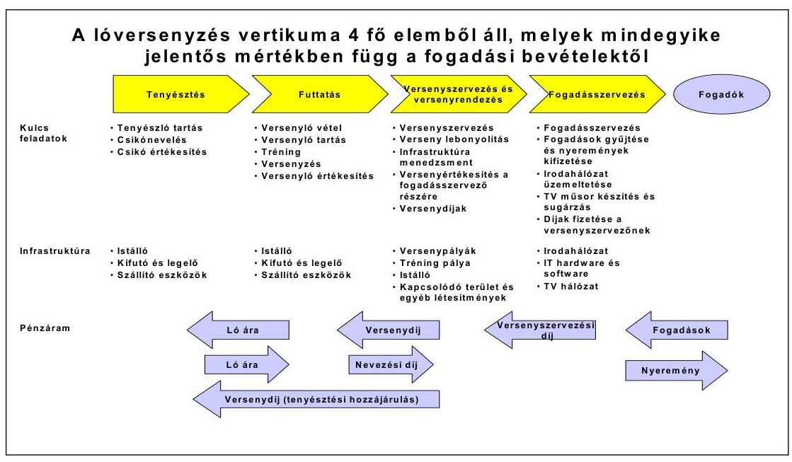

1. sz. ábra

# 2. A KINCSEMPARKI BERUHÁZÁs CÉLJA 

Az ÁPV Rt. a lóverseny hagyományok fenntartása, a minőségi lóversenyzés infrastrukturális feltételeinek megalapozása érdekében intézkedéseket tett a Kin-csem-parki galopp-pálya átalakításával, egy - a nemzetközi igényeket is kielégítő - többfunkciós versenypálya megépítésére a pályát pályáért elv alapján. Az NL Kft. az ÁPV Rt. jóváhagyásával - a 2178/1997. (VII. 3.) Korm. határozatot végrehajtva - 1998 júliusában szerződést kötött a francia Bouygues konzorciumba tartozó Kerepesi Úti Lóversenypálya Ingatlanforgalmazó, Ingatlankezelő és Szolgáltató Kft.-vel (Kerepesi Úti Kft.), aki vállalta, hogy a Kincsemparkban lévő galopp-pályát kombinált versenypályává (galopp- és ügető) alakítja át. Az NL Kft. azt vállalta, hogy a Kerepesi úti ügető versenypályával fizet az új beruházásért.

---

# 3. A beruházás vizsgálatának folyamata 

### 3.1. Helyzetértékelés a minőségi lóversenyzés infrastrukturális feltételeinek megalapozásáról

### 3.1.1. Készült-e előtanulmány a magyarországi nagy hagyományokkal rendelkező lóversenyzési ágazat továbbfejlesztésére? Részben, előterjesztések formájában

Az ÁPV Rt. Tranzakciós vezérigazgató-helyettese a vizsgált időszakban több alkalommal készített előterjesztést a Társaság Igazgatósága részére a lóverseny hagyományok fenntartása, a minőségi lóversenyzés infrastrukturális feltételeinek megalapozása érdekében. Az ÁPV Rt. Igazgatósága kormánydöntés alapján intézkedéseket tett a kincsemparki galopp-pálya átalakításával, egy - a nemzetközi igényeket is kielégítő - többfunkciós versenypálya megépítésére a pályát pályáért elv alapján.

### 3.1.2. Felelősség a lótenyésztés, futtatás, versenyszerezés-rendezés, fogadásszervezés fenntartásáért? A verseny szervezés-rendezés, fogadásszervezés esetében áll fenn kormányfelelősség, a 100\%os állami tulajdonban lévő társaságok útján

A nagy hagyományokkal rendelkező magyarországi lóversenyzés ágazati felépítése a következő: tenyésztés, futtatás, versenyszervezés és rendezés, fogadásszervezés. A jelenlegi szervezeti struktúrában a lóversenyzéssel kapcsolatos versenyszervezési és rendezési tevékenységeket a Nemzeti Lóverseny Kft. (NL Kft.), a fogadásszervezési tevékenységet pedig a Magyar Lóversenyfogadást Szervező Kft. (MLSZ Kft.) végzi. Mindkét társaság 100\%-os állami tulajdonban van és az ÁPV Rt. hozzárendelt vagyonába tartozik.

A hazai lóversenyzés- és fogadásszervezés helyzetének rendezéséről a Kormány 1997-ben majd 1999-ben a 2279/1999 (XI. 5.) sz. határozatával döntött, amelyben ismételten elrendelte a lóversenyfogadás-szervezés koncesszióba adására vonatkozó pályázat kiírását és a koncesszióba adásig a lóverseny szervezésével, valamint a fogadással foglalkozó társaságok múködési veszteségeinek tulajdonos általi finanszírozását. A hivatkozott kormányhatározat 1. pontjában meghatározott feladat végrehajtására megállapított 2000. január 31-i határidő nem teljesült. A Kormány 2007/2000. (I. 25.). sz. határozatában „a Kormány döntésétől függően"-re változtatta meg a 2279/1999. (XI. 5.) Korm. határozat határidejét.

A pénzügyminiszter 2006. február 24-én kelt levelében tájékoztatta az ÁPV Rt. vezérigazgatóját, hogy a lóverseny társaságok helyzetének rendezéséről szóló átdolgozott kormány-előterjesztés tervezet államigazgatási egyeztetés alatt áll. A pénzügyminiszter kérte, hogy az ÁPV Rt. a lóversenyfogadás-szervezés koncesszióba adására vonatkozó pályázat kiírásig és a koncesszióba adásig, valamint a lóverseny szervezésével és a fogadással foglalkozó társaságok tervezett privatizációjának lebonyolításáig a társaságok múködőképességének fenntartásával kapcsolatos tulajdonosi döntéseket hozza meg. Az ÁPV Rt. a vizsgált

---

időszakban többször foglalkozott a lóversenytársaságok jövőbeni működési koncepciójával kapcsolatos. Előterjesztése alapján módosított a szerencsejáték szervezéséről szóló 1991. évi XXXIV. törvény és az ahhoz kapcsolódó jogszabályok. Ennek ellenére megállapítható, hogy 1997-től a vizsgálat lezárásáig a hazai lóverseny- és fogadásszervezés helyzete nem rendezésére.

# 3.1.3. Megfogalmazták-e a környezetvédelmi és múszaki feladatokat a beruházási program előkészítésekor? Nem, csak részben 

Nem készült beruházási program és megfelelően megalapozott megvalósíthatósági tanulmány, amely tartalmazta volna a beruházás környezetvédelmi és műszaki paramétereit.

Az ÁPV Rt. Igazgatósága 680/1997.(IX. 10.) IG. sz. határozatával a Nemzeti Lóverseny Kft. útján pályázat kiírásáról döntött, amely a társaság tulajdonában lévő Úgető pálya ingatlan értékesítésére, valamint a Galopp-pálya ingatlanon megvalósításra kerülő fejlesztési projekt lebonyolításáról szólt.

### 3.2. A Kormány által jóváhagyott megvalósítási forma pénzügyi feltételei

### 3.2.1. A többfunkciós versenypálya megépítésére a pályát pályáért elv alapján készült-e javaslat az ÁPV Rt. Igazgatósága részére? Igen

Az ÁPV Rt. Agrárgazdasági Ügyvezető Igazgatósága 1997. szeptember 3-án elkészítette javaslatát a lóverseny- és fogadásszervezés helyzetének rendezését szolgáló kormányzati intézkedések végrehajtására. A lóversenyzés és a lóversenyfogadás átalakítása érdekében hozott 2178/1997. (VII. 3.) Korm. sz. határozat, valamint az ennek végrehajtására hozott 680/1997. (IX. 10.) sz. ÁPV Rt. IG határozat alapján a Nemzeti Lóverseny Kft. 1998. március 9-én pályázatot hirdetett a Kerepesi úti ügetőpálya ingatlan értékesítésére és a Kincsem Parkban egy modern, kombinált, ügető és galoppversenyek rendezésére egyaránt alkalmas versenypálya felépítésére.

### 3.2.2. Készült-e vagyonértékelés a Kerepesi úti galopp versenypályáról a fizetési konstrukció kialakítása előtt? Igen

A Nemzeti Lóverseny Kft. tulajdonában lévő Úgető pálya ingatlan értékesítésére, valamint a Galopp-pálya ingatlanon megvalósításra kerülő fejlesztési projekt pályázati kiírását megelőző kormány-előterjesztés benyújtását megelőzően az ügetőpálya vagyonértékelését az UNI-ECO Kft. elvégezte. Javaslatára az ügetőpálya eladási árát négyzetmétereként 25-30 E Ft értékben volt célszerű előirányozni.

Az NL Kft. a tulajdonában álló Úgető-pálya értékesítésére kiírt egyfordulós, nyílt, összevont pályázatában az értékesítésre szánt ingatlan esetében 3 Mrd Ft értékű limitárat határozott meg.

---

A pályázat kiírása előtt az Ügetőpálya ismételt vagyonértékelésére nem állt rendelkezésünkre információ.

# 3.3. A beruházás megkezdésének előkészítése 

### 3.3.1. A beruházás megkezdése előtt rendelkeztek-e az új létesítmény megvalósítására vonatkozó fejlesztési tervvel és hatástanulmánnyal? Nem, csak részben

A galopp-versenypálya átépítésének feladatait és a végrehajtandó beruházások költségeit az UNI-ECO Kft. felmérése alapján tájékoztató jelleggel mutatták be 1997. szeptemberében az ÁPV Rt. Igazgatóságának. A kombinált versenypálya a galopp-tréning pálya, a versenyek lebonyolításához szükséges eszközök, a versenylovak elhelyezését biztosító istállók, az istállók és a tréning- és versenypályák közötti utak, a meglévő tribün korszerűsítése, a nézők információkkal történő kiszolgálása és az üzemeltetést biztosító Kft.-k elhelyezését szolgáló irodaház előzetes beruházási költségeit 1-1,23 Mrd Ft értékben kalkulálták.

A pályázatnak része volt - a beruházás megkezdése előtt - a megvalósíthatóságra vonatkozó elképzelések bemutatása. A beruházás megkezdését követően problémák léptek fel a Kincsem Parkba tervezett beruházás kivitelezésével kapcsolatban, így a Kincsem Parkba tervezett beruházás megvalósításakor fellépő akadályok miatt 2000. év elején tanulmány készült a Kincsem Parkban megvalósítandó beruházás kiváltására, mely bemutatta, hogy Alagon hogyan képzelhető el a Kincsem Parkba tervezett beruházás.

### 3.3.2. A szerződés előkészítése és megkötése összhangban volt-e a határozatban megfogalmazott feltételekkel? Igen, részben

A lóversenyzés és a lóversenyfogadás átalakítása érdekében hozott 2178/1997. (VII. 3.) Korm. határozat 3. pontja előírásainak szellemében:
„...az ÁPV Rt. tulajdonosi jogkörében eljárva intézkedéseket tesz
a) a lóversenyzés infrastruktúrájának fejlesztése érdekében a galopp-pálya átalakításával, egy, a nemzetközi igényeket is kielégitő, többfunkciós versenypálya megépítésére,
b) a fejlesztési források biztosítása és a lóversenyzéssel kapcsolatos ráfordítások megtérülése érdekében a Kerepesi úti ügetőpálya eladására.

Az NL Kft. által kiírt első, eredménytelennek bizonyult pályázatot követően a második pályázatot egyetlen jelentkezőként a Kerepesi Úti Lóversenypálya Ingatlanforgalmazó, Ingatlankezelő és Szolgáltató Kft. (a Bouygues Hungária Kft. leányvállalata erre a projektre alapítva) és a Bouygues Hungária Kft. (BYH Kft.) konzorciuma nyerte. A konzorcium pályázatában vállalta, hogy a
„Legföbb célunk az Albertirsai úti Galopp-pálya sikeres átalakítása és felújítása egy modern, többfunkciós komplexummá, amely hatékonyan és rentábilisan, éjjel és nappal, valamint egész évben múködtethető oly módon, hogy az egyes sporttevékenységek egymást nem akadályozzák."

---

Az NL Kft. az ÁPV Rt. jóváhagyásával, - a 2178/1997. (VII. 3.) Korm. határozatot végrehajtva - 1998. július 22-én szerződést kötött a francia Bouygues konzorciumba tartozó Kerepesi Úti Lóversenypálya Ingatlanforgalmazó, Ingatlankezelő és Szolgáltató Kft.-vel, aki vállalata, hogy a Kincsem-parkban lévő ga-lopp-pályát kombinált versenypályává (galopp- és ügető) alakítja át. Az NL Kft. azt vállalta, hogy a Kerepesi úti galopp versenypályával fizet az új beruházásért. A szerződésben és annak módosításaiban nem határozták meg a pontos műszaki és minőségi követelményeket, amelynek következtében a megvalósult komplexum az eredeti elképzelésekhez képest csökkentett műszaki tartalommal készült el.

# 3.3.3. A beruházás költségvetése összhangban állt-e a rendelkezésre álló forrásokkal? Nem készült részletes költségvetés 

Az adásvételi szerződés alapján a Kerepesi úti ügetőpálya ingatlan 3 Mrd Ft vételárért került értékesítésre. A vételárat a vevő úgy egyenlítette ki, hogy 2,5 Mrd Ft fix összegű vállalkozási díjért vállalta a Kincsem Parki kombinált lóversenypálya felépítését 500 M Ft-ot pedig átutalt a Nemzeti Lóverseny Kft. számlájára. Az eredeti elképzelés szerint az ingatlan tulajdonjogának átruházására és birtokba adására a beruházás átvételével egyidejúleg került volna sor.

A kincsemparki beruházás levezénylése során vissza-visszatérő problémaként jelentkezett, hogy az adásvételi szerződés mellékletét képező fővállalkozási szerződésben az új pályák, istállók és a tribünépület múszaki specifikációi nem kellő részletességgel kerültek meghatározásra. A fővállalkozási szerződés 1. sz. mellékletét képező „A program leírása" című fejezet vázlatosan, igen nagyoltan tartalmazta a beruházás műszaki tartalmát, nem tért ki a lényeges részletkérdésekre, melynek hatásai a mai napig nehezítik a beruházás üzemeltetését.

### 3.4. A kincsemparki beruházás megvalósulása

### 3.4.1. Hogyan határozták meg a beruházás múszaki tartalmát és a pénzügyi forrásokat? Adásvételi szerződésben és annak mellékletét képező fővállalkozási szerződésben

A pályázatot az NL Kft. tulajdonát képező Kerepesi út 9. alatti ügetőpálya ingatlan értékesítésére, valamint a Kincsem Parkban egy minden igényt kielégítő, kombinált (ügető- és galopp-pályákat, istállókat magában foglaló) lóversenypálya felépítésére írták ki. A második pályázatot a kiíró eredményesnek minősítette, így az adásvételi szerződés, valamint az annak mellékletét képező fővállalkozási szerződés megkötésére a Kerepesi Úti Kft.-vel került sor 1998. július 22én. A BYH Kft. - mint a konzorcium másik tagja és egyben a fővállalkozási szerződésben megjelölt alvállalkozó - a szerződésben vállalt kötelezettségek teljesítéséért egyetemleges felelősséget vállalt.

A pályázati kiírásban szereplő alapkoncepció lényege az volt, hogy a vevő Kerepesi Úti Kft. az ügetőingatlan tulajdonjogát és birtokát akkor szerzi meg, ami-

---

kor a versenyzésre alkalmas, „kulcsrakész" kombinált versenypályát átadja (pályát pályáért elv alapján) a beruházó Nemzeti Lóverseny Kft. részére. A „pályát pályáért" elv szerződéses leképezése az volt, hogy az adásvételi szerződés 6. sz. mellékletét képezte a fővállalkozási szerződés, így azok egymástól elválaszthatatlanok.

# 3.4.2. Rendezett volt-e a beruházás megvalósításához szükséges ingatlan nyilvántartása? Igen 

Jelentős probléma alakult ki a beruházás megvalósítása során abból fakadóan, hogy a beruházás színhelyéül szolgáló Kincsem Parkot magában foglaló 39206/27 hrsz. alatti ingatlan osztatlan közös tulajdonban volt, s a Ficsór Autóház Kft., mint társtulajdonos az építési engedély kiadásához a tulajdonostársi hozzájáruló nyilatkozat kiadását megtagadta. A több évre nyúló jogvita lezárása akkor még nem látszott, így a lóversenypálya-beruházást a felek két részre tagolták. Az ún. Első Fázis Munkák keretében azok a munkálatok kerültek meghatározásra, melyekhez építési engedély beszerzésére nem volt szükség, az ún. Fennmaradó Munkák körében pedig így értelemszerűen azok a munkálatok maradtak, melyek a tulajdonostárssal fennálló jogvita lezárásáig építési engedély hiányában nem voltak végezhetők.

### 3.4.3. Meghatározták-e a szerződésben a műszaki tartalmat, a határidőket és a minőséget? Igen, részben

A többször módosított fővállalkozási szerződés értelmében a Kerepesi Úti Kft. vállalta, hogy felépíti a kombinált versenypályát és az új versenyistállókat, valamint felépít egy, a versenypályához látószögben megfelelően igazított korszerű tribünépületet, elvégzi továbbá a műemlék épületegyüttes - a régi tribün állagmegóvó felújítását.

Az adásvételi szerződésben meghatározott valamennyi előfeltétel teljesülését követően átadott munkaterület időpontjától számított 12 hónap alatt kellett volna elvégezni a fővállalkozói szerződés 2. pontjában meghatározott beruházást. A vállalkozó általános kötelezettségei között nem szerepel, hogy a beruházást milyen minőségi színvonalon köteles elkészíteni.

### 3.4.3.1. Kellett-e módosítani a szerződést? Igen, többször

A fővállalkozási szerződést a felek négy alkalommal módosították: 1998. szeptember 24-én, 2000. január 20-án, 2000. július 21-én, valamint 2003. október 6-án. Az utóbbi három szerződésmódosítás érintette a lóversenypályaberuházás műszaki tartalmát is. A fővállalkozási szerződés 2003-ban mintegy 11 hónapon keresztül tárgyalt és végül sikerrel zárult legutolsó módosításának célja az volt, hogy a beruházás teljes megvalósulása útjában álló összes aka-dályt elhárítsa, beleértve ebbe a telektulajdonos-társ nyilatkozatának megszerzését is.

- 1998. szeptember 24-én a felek annak érdekében módosították a szerződést, hogy az NL Kft.-nek elállási lehetőséget biztosítsanak az Adásvételi Szerződéstől és annak elválaszthatatlan részét képező Fővállalkozói Szerződéstől, ha a Vállalkozó a szükséges előfeltételek biztosítását követő 90 napon belül nem

---

kezdi meg a beruházás munkáit, illetve ha azt 45 munkanapon túl folyamatosan szünetelteti;

- 2000. január 20-i módosítás a műszaki tartalom csökkentésére irányult;
- 2000. július 21-én aláírt módosítás a műszaki tartalom további módosítását, a fennmaradó munkák értékének az inflációhoz történő igazítását, és az NL. Kft. elállási jogának korlátozását jelentette;
- 2003. október 6-án aláírt szerződésmódosítás lényege az volt, hogy a lóver-senypálya-beruházás Fennmaradó Munkák fázisát a felek újraosztották ún. „A" fázis munkákra és „B" fázis munkákra. Az „A" fázis munkák körébe - a már elvégzett, de át nem vett építményeken túl (a verseny- és tréningpályák kialakítása és az istállók és a pálya közötti alagút megépítése) - lényegében az ügetőistállók és a tranzitistállók felépítése került, a „B" fázis munkáiba pedig a tribún építése, valamint a régi műemlék tribún épületegyüttes állagmegóvő felújítása került. Új Bankgarancia (1.9 Mrd Ft értékben), Teljesítési bankgarancia ( 190 M Ft), anyavállalati garancia ( 190 M Ft), „komfort levél" és jótállási időszakra vonatkozó bankgarancia lett kiadva.

# 3.4.3.2. Változott-e a tervekhez képest a beruházás múszaki tartalma? Igen többször 

Az 1998. szeptember 24-én és a 2000. január 20-án aláírt szerződésmódosítások az alapkoncepciót - „pályát pályáért elv" - érintetlenül hagyták. A külső kényszerítő körülmények miatt előkészített és 2000. július 21-én aláírt szerződésmódosítás azonban alapjaiban változtatta meg a pályázati kiírás és a szerződések koncepcióját, mert ezzel a módosítással az ügetőpálya tulajdonjogának átruházása és a kombinált versenypálya kulcsrakész átadása elvált egymástól.

A Kerepesi úti ügetőingatlan birtokba adásával a Nemzeti Lóverseny Kft. maradéktalanul teljesítette az Adásvételi Szerződésben foglalt kötelezettségeit, ugyanakkor a Fővállalkozási Szerződés teljesítéséből akkor még 1,4 Mrd Ft értékű munka volt hátra. Ezen időponttól kezdődően a Fővállalkozó tárgyalókészsége, kompromisszumkészsége megszűnt.

A korábbi módosítások kapcsán - azon túlmenően, hogy a beruházás munkálatait két fázisra bontották - a beruházás műszaki tartalma is módosult. Ezek közül kiemelendő az, hogy a 2000. július 21-ei szerződésmódosítással a beruházás munkálatai közül törölték a csapadékvíz felfogására szolgáló víztározó tó megépítését, s a helyette alkalmazott műszaki megoldásról pedig a gyakorlatban bebizonyosodott, hogy funkciójának ellátására alkalmatlan. 2003. őszére a tulajdonostárssal kapcsolatos jogvita rendeződött, így került sor október 6-án a negyedik szerződésmódosításra. A szerződésmódosításokkal összefüggésben a szakértői vélemények alapján megállapítható volt, hogy a beruházás múszaki tartalma 20-25\%-kal romlott.

### 3.4.3.3. A beruházás „A" és „B" fázisainak megvalósításának folyamata megfelelt-e a szerződésben vállalt feltételeknek? Nem volt teljes körú

A Kincsem Parki pályaberuházás „A" fázisába az új ügetőistállók és az angol boxok felépítése, a versenypályák kialakítása, valamint az istállóktól a pályához vezető alagút megépítése tartozott. Az „A" fázis munkákat a Nemzeti Ló-

---

verseny Kft. 2004. május 13. napján vette át úgy, hogy az átadás-átvételi eljárásról szóló jegyzőkönyv kialakítása mellett hiba- és hiánylista is felvételre került. A Kerepesi Úti Lóversenypálya Kft. a hiba- és hiánylistában felvett pótlási, javítási munkáknak nem vagy nem megfelelően tett eleget.

A többször módosított fővállalkozási szerződésben rögzített ütemterv alapján a „B" fázis munkák beruházási szakaszát a vállalkozónak 2005. április 13-ig kellett volna befejezni. Az új lelátó terv szerint négyszintes, bruttó alapterülete több mint, $8000 \mathrm{~m}^{2}$, a lelátón 3200 ülőhellyel, a II. emeleten 400 fős panoráma étteremmel kellet elkészülnie.

# 3.4.4. Ki ellenőrizte a beruházás múszaki megvalósítását? ADAM Kft. 

A kincsmparki beruházás műszaki ellenőri feladatainak ellátására az NL. Kft. az ADAM Vagyonkezelő és Tanácsadó Kft.-vel 1998. október 30-án kötött szerződést. A szerződés a beruházás utó-felülvizsgálati munkálatainak lezárásáig 2006. július 30 -áig szólt.

### 3.4.5. A beruházás megfelelő határidőre és minőségben teljesült-e? Nem

A Kincsem parki beruházás „A" fázisának munkái (az ügető istállók, alagút, pálya felületének kialakítása) a többször módosított határidőre készültek el. A Nemzeti Lóverseny Kft. a munkákat 2004. május 13-án átadás-átvételi jegyzőkönyv aláírásával átvette, így a lovak átköltöztetése 2004. június végére megtörtént. A Kerepesi úti ügetőpályát az NL Kft. ügyvezetése 2004. július 13-án átadás-átvételi jegyzőkönyvvel átadta a Bouygues részére. A Kerepesi úti ügetőpályán az utolsó ügető versenynapot 2004. május 29-én, a Kincsem parki új pályán az első ügető versenynapot 2004. június 12-én tartották meg.

A beruházás „B" fázisának - amely a tribün és a kiszolgáló-létesítmények felépítését tartalmazta - munkálatai 2004. áprilisában kezdődtek. A többször módosított fővállalkozási szerződés szerint a beruházást 2005. június 13 -áig kellett teljes-körűen átadni. Az átadás - átvételi eljárás 2005. május 27-től július 1-ig tartott. Az ünnepélyes átadás a 2005. július 3-án megrendezésre került Galopp Derby-vel egybekötve valósult meg.

### 3.4.6. Hogyan finanszírozták a beruházást?

Az ajánlat értelmében az ajánlattevő a Kerepesi úti ügetőingatlan vételárát 3 Mrd Ft-ban jelölte meg, melyet oly módon vállalt kiegyenlíteni, hogy 2,5 Mrd Ft fix összegű vállalkozási díjért felépíti a minden igényt kielégítő, korszerű kombinált lóversenypályát, a fennmaradó 500 M Ft -ot pedig pénzben egyenlíti ki az NL Kft.-nek.

Ma az mondható el, hogy ahhoz, hogy a megvalósuló beruházás valóban korszerű és működőképes legyen, - az üzemeltető NL Kft. véleménye szerint - további beruházások szükségesek.

---

# 3.4.7. A megvalósult beruházás tényleges ráfordításai mennyiben tértek el az eredeti beruházási költségtervtől? 

Az adásvételi szerződés tulajdonképpen egy barter ügylet volt, amelynek lényege, hogy vevőként (fővállalkozóként) fellépő Kerepesi Úti Kft. a Kerepesi úti ingatlan ellenértékét kisebb részben pénzbeli, jelentősebb részben pedig építőipari tevékenység elvégzésével fizette meg. A felek a többször módosított szerződéskomplexum keretében határozták meg, hogy a fővállalkozási tevékenységgel teljesítendő vételárrésznek mi az ellenértéke, ezt részben bankgarancia rendszerrel fedezték. A kivitelezés ideje alatt 1998-2005 között kialakult jogi és műszaki természetű problémák miatt (építési engedély hiánya, részletes kiviteli tervdokumentáció hiánya, az ingatlan társtulajdonosának akadályozó tevékenysége) a beruházás műszaki tartalma és minőségi színvonala alacsonyabb értékűvé vált.

Az "A" fázishoz kapcsolódó nagyobb ráfordítást igénylő problémák (térvilágítás, vízelvezetés, állatorvos által megállapított hiányosságok, ügetőpálya rétegszerkezetének hibája stb.) rendezése, illetve a "B" fázishoz kapcsolódó - már menet közben felmerült - minőségi kifogások (fogadótér fűtésének megoldatlansága, kivitelezési tervdokumentáció hiánya, stb.) kapcsán feszültség alakult ki az NL Kft. és a Bouygues képviselői között. A beruházás során a Bouygues törekedett a legegyszerűbb, legolcsóbb megoldásokat alkalmazni. A beruházási szerződésekben nagyvonalúan, nem egyértelműen meghatározott műszaki tartalom miatt az NL Kft. menedzsmentjének kevés eszköze volt a problémák rendezésére.

A két fél ezzel kapcsolatos tárgyalásai nem vezettek eredményre. A problémák rendezésére az NL Kft. - a szerződésekben rögzítettek alapján, figyelemmel a mű-szaki-, jogi szakértők véleményére is - összeállította a választott bírósági eljárás megindításához szükséges dokumentumokat, és 2005. április 12-én benyújtotta azokat a bíróság részére. Vállalkozó 2005. augusztus 2-án válasz iratot terjesztett elő a Választott-bíróság előtt, amelyben reflektált a keresetre és egyben viszont keresetet terjesztett elő az NL Kft.-vel szemben. A felek 2005. december 9-én peren kívüli megállapodást kötöttek, amely szerint az NL Kft. a vállalkozónak kifizeti a 20,3 M Ft értékű áfa tartozását, vállalkozó pedig elvégzi az „A" és „B" fázist érintő munkákon fennmaradó javítási munkákat és 80 M Ft kártérítést fizet az NL Kft.-nek.

### 3.5. A beruházás kontrollja a tulajdonos részéről

### 3.5.1. A terveknek megfelelő beruházás valósult-e meg? Igen, részben

A Fővállalkozási Szerződés értelmében a Kerepesi Úti Kft. vállalta, hogy felépíti a kombinált versenypályát és az új versenyistállókat, valamint felépít egy korszerű tribünépületet, elvégzi továbbá a műemlék épületegyüttes - a régi tribün, 2 db fogadópénztár és 1 db jegypénztár - állagmegóvó felújítását.

A fővállalkozási szerződést a felek négy alkalommal módosították: 1998. szeptember 24-én, 2000. január 20-án, 2000. július 21-én, valamint 2003. október 6-án. A Kerepesi Úti Kft., illetve alvállalkozója, a BYH Kft. az első fázis munkákat elvégezte. Ennek során megépültek a pályák (kívülről befelé haladva):

- füves galopp versenypálya,

---

- homokos verseny- és tréningpálya,
- speciális felületű ügető versenypálya,
- ügetőversenyeket kísérő jármű részére aszfaltút,
- ügető tréningpálya,
valamint megépült a galopp-pályán belül elhelyezkedő, az ügetőpályák megközelítésére alkalmas alagút is. Az első fázis munkákat azonban minőségi kifogások, valamint az alagúthoz kapcsolódó jogi probléma rendezetlensége miatt (nevezetesen, hogy a Kulturális Örökségvédelmi Hivatal határozata értelmében az alagút megépítéséhez építési engedélyt kellett volna beszerezni) az NL Kft. nem vette át.

A „B" fázis kivitelezésére vonatkozó építési tervdokumentációt a Kerepesi Úti Kft. 2003. őszén elkészítette és azt az építésügyi hatóság - a műemlékként védett régi tribün okán a Kulturális Örökségvédelmi Hivatal - a 2003. október 30. napján kiadott, 12426/10/2003 sz. és 12427/4/2003-II. sz. határozataival engedélyezte.

A Kerepesi Úti Kft., illetve alvállalkozója a BYH Kft. az „A" és „B" fázis munkák körébe tartozó kivitelezési munkálatokat 2005. június 1-ig befejezte, azonban a kivitelezés során felmerült hibák kijavítása, hiányosságok pótlása csak a vá-lasztott-bírósági per egyezséggel történő lezárását követően valósult meg. A Kulturális Örökségvédelmi Hivatal az „A" fázis munkálatainak használatbavételi engedélyét 460/1755/9/2004 sz. határozatával 2004. május 10-én, a „B" fázis azaz a tribün használatbavételi engedélyét 460/1449/006/2005 sz. határozatával 2005. május 19-én adta meg. Az eredeti fővállalkozói szerződésben megfogalmazott műszaki tartalomtól való részletes eltérést a 8/1. sz. mellékletben mutatjuk be.

# 3.5.2. Készült-e zárójelentés a bonyolító (NL Kft.) társaságnál? Nem 

Az ÁPV Rt. kérte a Nemzeti Lóverseny Kft. Felügyelő Bizottságát, hogy a beruházás megvalósulását folyamatosan ellenőrizze. Ennek eredményeként a társaság ügyvezetése rendszeresen beszámolt a Felügyelő Bizottság részére a beruházás menetéről, a felmerült problémákról és azok kezeléséről. A Felügyelő Bizottság véleményt nyilvánított, javaslatokat tett az ügyvezetés részére a problémák lehetséges kezelésének módjára, a továbblépés lehetőségeire. A Felügyelő Bizottság és a társaság ügyvezetése szükség szerint tájékoztatta az ÁPV Rt. ügyvezetését a beruházás helyzetéről.

A beruházás műszaki átadás-átvételét követően az NL Kft. könyveiben aktiválta az elkészült létesítményeket. 2006. évben a társaság megbízást adott a kincsemparki ingatlanok ingatlanforgalmi értékbecslés elkészítésére. Az ingatlanok mérleg fordulónapra készített vagyonértékelése, és az értékelés alapján elszámolt értékhelyesbítés több mint 10 Mrd Ft-tal növelte a társaság tárgyi eszköz állományának értékét.

---

# 3.5.3. Készült-e utólagos értékelés a beruházás céljainak teljesüléséről és az üzemeltetés tapasztalatairól? Nem 

Az ÁPV Rt. Felügyelő Bizottsága 45/2002. (VIII. 28.) sz., valamint a 42/2003. (VII. 2.) sz. határozatokkal jóváhagyott, illetve a 2003. december 3-ai ülésén elfogadott Ellenőrzési Jelentésekben foglalkozott a beruházás helyzetével. Jelentéseiben többek között megállapította, hogy:

- 2002-2003. években a kincsemparki beruházás szerződéses feltételeinek módosítására irányuló tárgyalások indokolatlanul elhúzódtak;
- a beruházás legfőbb akadályát jelentő osztatlan közös tulajdon megosztása későn történt;
- az ÁPV Rt. nem készített megfelelően megalapozott megvalósíthatósági tanulmányt;
- az ÁPV Rt. nem rendelkezik olyan stratégiai tervel, amely alapján a lóversenysport egészének hatékony és gazdaságos múködtetése biztosítható lenne.

Az ÁPV Rt. vezérigazgatója folyamatosan tájékoztatta az ÁPV Rt. Igazgatóságát a beruházás helyzetéről, a felmerült jogi és műszaki problémákról. A beruházás átadását követően nem készült előterjesztés, amely megfogalmazta volna a beruházás céljainak teljesülését és az üzemeltetés tapasztalatait.

## 4. A MAGYAR LÓVERSENYSPORT JÖVŐJE

Az ÁPV Rt. Igazgatósága 2001-ben és 2003-ban is foglalkozott a lóversenyzés helyzetével, 2004-ben (137/2004. (III. 11.) IG sz. határozatával) döntött a lóverseny társaságok jövőbeli múködésével és privatizációjával kapcsolatos koncepció kialakításának szükségességéről. Az értékesítési koncepció elfogadására ismételten kormánydöntés szükséges. A kormány-előterjesztés tervezetét az ÁPV Rt. Igazgatósága 295/2005. (V. 26.) IG sz. határozatával elfogadta. A kormányelőterjesztés javaslatot fogalmaz meg a lóversenyágazat magánosításának koncepciójára, amely a Nemzeti Lóverseny Kft. privatizációját, majd ezt követően a fogadásszervezési tevékenység (lóversenyfogadás és bukmékeri rendszerú fogadás) koncesszióba adását tartalmazza oly módon, hogy az NL Kft. üzletrésze és a koncessziós jog azonos többségi tulajdonosi körrel rendelkező társaságokhoz kerüljön. A javaslat ismételten tartalmazza, hogy a magánosítás befejezéséig szükséges biztosítani a hazai lóversenyzés fenntartását, azaz a Nemzeti Lóverseny Kft. múködési veszteségeinek - szükség szerint tulajdonosi kölcsönön keresztüli - finanszírozását.

A Kormány az érintett tárcák (PM, FVM) eltérő véleménye miatt nem tárgyalta az ÁPV Rt. javaslatát. A tárcák ellenvéleményének alapvető szempontja az volt, hogy a lóversenyfogadás-szervezés csak akkor helyezhető piaci alapokra, ha megvalósul a Kincsem Parkban a nemzetközi színvonalú lóversenypálya. A Pénzügyminisztérium Befektetés-politikai és Beruházás-Finanszírozási Főosztálya a koncessziós pályázatról szóló kormány előterjesztés tervezetét 2005-ben elkészítette, és szakmai egyeztetésre megküldte az ÁPV Rt.-nek. Jelenleg a Pénz-

---

ügyminisztérium és az Igazságügyi Minisztérium gondozásában a koncesszióról szóló 1991. évi XVI. törvény módosítása van folyamatban ${ }^{1}$, amely a fogadásszervezési tevékenység koncesszióba adását, valamint a lóverseny szervezésével és a fogadással foglalkozó társaságok tervezett privatizációját készítené elő.

A Magyar Országgyúlés létrehozta „A nemzeti lovas programot előkészitő eseti bizottságot", amelynek feladatai közé tartozott egy olyan program kidolgozása, mely felöleli a lovas hagyományokkal kapcsolatos magyarországi tevékenységek egész skáláját, kezdve a lótenyésztéstől, a különböző lovassportokon keresztül, a hagyományőrzésig, a turizmusig és az oktatásig. Ennek a programnak szerves része a magyarországi lóversenyzés megerősítése, szakmai és pénzügyi fejlődési pályára állítása. A bizottság 2004. november 15 -ei ülésén Országgyúlési Határozati javaslatot fogadott el a Nemzeti Lovas Program elkészítéséről és a szükséges kormányzati intézkedésekről, és azt megküldte az Országgyűlés elnöke részére.

[^0]
[^0]:    ${ }^{1}$ A koncesszióról szóló 1991. évi XVI. törvény 10/a §-át a 2006. évi LXI. törvény 2. §-a 2006. VIII. 2-ai hatálybalépése módosította.

---

# KINCSEM PARK REKONSTRUKCIÓ 1998-2005

## A FÖVÁLLALKOZÁSI SZERZŐDÉS ÉS A MEGVALÓSULÁS MÜSZAKI TARTALOM VÁLTOZÁSAI

## A VÁLTOZÁSOK KÖLTSÉGHATÁSAINAK BECSLÉSE

|  Hely | Müszaki tartalom | Eredeti szerződés szerint Kelt: 1998. július | 4. sz. szerződés módosítás szerint Kelt: 2003. október | Megvalósult állapot | Változtatás különbözete, becslés (M Ft)  |
| --- | --- | --- | --- | --- | --- |
|  Füves galopp pálya | Körpálya hossza, szélessége | 1975 m | 2000 m | 2000 m | $+11.5$  |
|   |  | 18-25 m | 22-30 m | 22-30 m |   |
|   | Talpszivárgó és vízelvezetés | Víz elvezetésével | Víz elvezetésével | Szikkasztással (bizonytalan megv.) | $-24.0$  |
|   | pályaszerkezet | 15 cm homok szivárgó rtg 15 cm szerves anyaggal jav. | 30 cm szemcsés alap 5 cm zúzott homok 20 cm humusz | 10-125 cm iszapos homok 20-40 cm humusz | $-22.0$  |
|   | Automata öntözőrendszer | Pálya teljes felületén | Pálya teljes felületén | Csak körpályán | $-18.0$  |
|  Homok galopp pálya | Pálya szélesség | 13.1 m | 15 m | 15 m | $+5.6$  |
|   | Pályaszerkezet | 15 cm homok szivárgó rtg 5 cm vegyes zúzalék 15 cm futófelület | 30 cm szemcsés alap 15 cm homokos kavics 5 cm zúzott homok 12 cm finom homok | 15-95 cm humuszos finom homok 17-32 cm kavicsos homok | $-18.0$  |
|   | Talpszivárgó és vízelvezetés | Víz elvezetésével | Víz elvezetésével | Szikkasztással (bizonytalan megv.) | $-23.0$  |

---

|  Ügető
versenypálya | Pálya kialakítás |  | Hendikep starthelyek 35 m | Hendikep starthelyek 35 m | $+3.0$  |
| --- | --- | --- | --- | --- | --- |
|   | pályaszerkezet | 15 cm homok szivárgó rtg
$20+10 \mathrm{~cm}$ zúzottkő alap
5 cm futófelület
Víz elvezetésével | 30 cm szemcsés alap
23 cm homokos kavics
12 cm vörös salak
Víz elvezetésével | A nem megfelelő vörös salak leszedése után 30-35 cm homok
Szikkasztással (bizonytalan megv.) |   |
|   | pályavilágítás | Célegyenes függ. 1000lux
vízsz. 575 lux
célvonal
függ. 1800lux
vízsz. 1000 lux
pálya mentén
függ. 600 lux
vízsz. 415 lux | függ. 1137lux
vízsz. 874 lux
függ. 2100lux
vízsz. 1138 lux
függ. 680-730lux
vízsz.440-700lux | függ. 1137lux
vízsz. 874 lux
függ. 2100lux
vízsz. 1138 lux
függ. 680-730lux
vízsz.440-700lux | $+7.0$
$+7.0$
$+7.0$
$+7.0$  |
|  III. helyi tribün, | bontási munkák |  |  |  |   |
|  totaliz, műhely, |  |  | bontási munkák | elvégezve | $+8.0$  |
|  indítótorony, |  | - |  |  |   |
|  céltorony |  | Galopp pályák, jobb | Galopp pályák, jobb oldalon | Mindkét oldalon |   |
|  pályatartozékok | korlátok | oldalon |  |  | $+12.0$  |
|  eredményjelzés | TV készülékek | 50 db 72 cm átmérőjű monitor | 50 db 72 cm átmérőjű monitor | Pénzbeni teljesítés |   |
|  közvetítés | TV kameraállások | 6 db 7,5m magas fémszerkezetű állvány | 6 db 7,5m magas ácsolt faszerkezetű állvány | 6 db fémoszlop + pénzbeni teljesítés | -  |
|  pályafenntartás | gépek | 1-1 db traktor henger borona fünyíró | 1-1 db traktor henger borona fünyíró | Szerz. szerinti
+ svéd borona gréder |   |
|  Meglévő galopp | felújítás | Szerepel* | 70 db új tranzit boksz | 70 db új tranzit boksz |   |

---

|  istállók |  |  | építése | építése | -96.0  |
| --- | --- | --- | --- | --- | --- |
|  II. helyi tribün és régi fogadópénztárak | Átalakítás tranzit boxok és dopping vizsg. számára | Szerepel* | 70 db új tranzit boksz építése | 70 db új tranzit boksz építése |   |
|  Dopping vizsg. labor | Kialakítás | Meglévő fogadópénztárban | 17. sz. galopp istállóban | 17. sz. galopp istállóban | $+3.3$  |
|  Új istállók | Bruttó alapterület | $7010 \mathrm{~m}^{2}$ | $8159 \mathrm{~m}^{2}$ | $8159 \mathrm{~m}^{2}$ | -  |
|   | Kialakítás | 25 boksz +1 fürdető | 24 boksz +2 fürdető | 24 boksz +2 fürdető | -  |
|   | Funkcionális méretek | Boksz $4 \times 3 \mathrm{~m}$ | Boksz 3,60 x 3 m | Boksz 3,60 x 3 m | -  |
|   |  | Közlekedő 4 m | Közlekedő 3,5 m | Közlekedő 3,5 m |   |
|   | Helyiségek | Nyergelő | tároló | tároló | -  |
|   | Szerkezet | Talajnedvesség elleni szigetelés | Talajnedvesség elleni szigetelés | Nem készült | $-16.0$  |
|   |  | Betonpadló léccel lehúzva | Öntött aszfalt a boxokban | Hengerelt aszfalt a boxokban | $-12.0$  |
|   |  | Főfalak 20 cm zsalukő | Főfalak 38 cm porotherm | Főfalak 38 cm porotherm |   |
|   |  | Boksz elválasztó 15 cm zsalukő | Boksz elválasztó akác pallók horg. Acélkeretben | Boksz elválasztó akác pallók horg. Acélkeretben | -  |
|   |  | Vb. Pillérek | Fa oszlopok | Fa oszlopok |   |
|   |  | Végigfutó drótüveg felülvilágító | 7 db tetőszellőző | 7 db tetőszellőző | $-12.0$  |
|   |  | Boxok fölött pallóterítés és korlát | Nem szerepel | Nem készült | $-18.0$  |
|   | Vízelvezetés | Nem szerepel | Szikkasztó ciszterna | Szikkasztó ciszterna | -  |
|   | Homlokzatképzés | Fa ablakok | Műanyag ablakok | Müanyag ablakok | $-18.0$  |
|   |  | Tolókapuk | Nyílószárnyas kapuk | Nyílószárnyas kapuk | $-12.0$  |
|   |  | Meszelt külső homlokzat | homlokzatvakolat | homlokzatvakolat | $+6.0$  |
|   | Épületgépészet | Vízvételi hely a folyosón 1 db 200 l-es boyler | Nem szerepel
+1 db 80 l-es boyler | Boxokban önitatók
+1 db 80 l-es boyler | $+6.0$  |

---

|  Víztározó tó | Csapadékvíz tárolására | $10.000 \mathrm{~m}^{2}$ felületű | Nem szerepel** | Nem készült, helyette szikkasztómező a pálya közepén, és helyi szikkasztás a pályáknál és az istállóknál | $-$  |
| --- | --- | --- | --- | --- | --- |
|  Alagút | Ügető telepről a pályára | Nem szerepel | 40 m hosszú, 110 m rámpa | 40 m hosszú, 110 m rámpa | $-$  |
|  Új tribün épület | Bruttó alapterület | $6155 \mathrm{~m}^{2}$ | $8174 \mathrm{~m}^{2}$ | $8262 \mathrm{~m}^{2}$ |   |
|   | Állóhelyek járófelülete | Stabilizált talaj | Könnyű aszfalt | térburkolat | $+6.0$  |
|   | Befogadóképesség lelátó | 3500 | 3248 | 3248 | $-4.0$  |
|   | Befogadóképesség étterem | 500 | 500 | 340 | $-7.0$  |
|   | Fogadópénztárak | 75 db | 70 db | 70 db | $-1.2$  |
|   | Liftek | 1 db 1000 kg | 2 db 1000 kg | 2 db 1000 kg | $+8.0$  |
|   | Közlekedés | 1 db egyeneskarú lépcső hallban | 2 db egyeneskarú lépcső hallban | elmaradt |   |
|  Földszint | Funkcionális változások | Ügető öltöző és vizesblokk | Ügető öltöző és vizesblokk | Rendezvényterem szerkezetkész állapotú | $-$  |
|  I. emelet | Funkcionális változások | Közönségforgalmi | Közönségforgalmi | Irodák kialakítása, légterek lezárása, stúdió szerkezetkész | $+17.5$  |
|  Gépészeti szint |  | Nem szerepelt | $645 \mathrm{~m}^{2}+150 \mathrm{~m}^{2}$ terasz | $645 \mathrm{~m}^{2}+150 \mathrm{~m}^{2}$ terasz, kezelőjárda | $+84.0$  |
|   | Szökőkút | Nem szerepelt | Szerepelt | Pénzbeli megváltás | $-$  |
|   | Épületszerkezetek |  | Falazott és gipszkarton válaszfalak funkció függvényében | Csak gipszkarton | $-4.0$  |
|   | Külső nyílászárók | Hőhídmentes szerkezet hőszigetelő üvegezéssel a fütött helyiségekben | Hőhídmentes szerkezet hőszigetelő üvegezéssel a fütött helyiségekben | Nem készült a földszinten és a lelátó felőli kijáratoknál az I. emeleten | $-24.0$  |

---

|   | Külső nyílászárók és függőnyfalak | Nem szerepelt | Nem szerepelt | Sunguard típusú üvegezés a déli oldalon | $+1.1$  |
| --- | --- | --- | --- | --- | --- |
|   | Lakatos szerkezetek | Festett acél | Festett acél | Külső térben tüzihorganyzott és porszórt felület | $+4.2$  |
|   | Külső lelátó ülőhelyek | Fa ülőke vagy PVC | PVC+ támla a VIP részen | PVC+ támla a VIP részen |   |
|   | Fütés | Radiátoros | Radiátoros, sugárzó légfütés, fan coil, 8 db kazán | Radiátoros, sugárzó légfütés, fan coil, 10 db kazán | $+6.4$  |
|   | Szellőzés | Vizes blokkok és öltözők | 11 szellőző rendszer | 11 szellőző rendszer | $+14.0$  |
|   | Burkolatok | Nagy hallban, I. emeleten múgyanta | Nagy hallban, I. emeleten múgyanta | Nagy hallban csúszásmentes kerámia, irodaszinten szőnyegpadló, linóleum | $+7.0$  |
|   | Vizesblokkok | 180 WC és pissoire, 14 zuhanyzó | 115 WC, 64 pissoire, 116 mosdó, 28 zuhanyzó | 90 WC, 46 pissoire, 71 mosdó, 16 zuhanyzó | $-30.0$  |
|   | Szauna | Nem szerepelt | 3 db | 3 db | $+6.8$  |
|  Tribün épületek közötti terület | parkosítás | $2700 \mathrm{~m}^{2}$ | $3525 \mathrm{~m}^{2}$ | $3525 \mathrm{~m}^{2}$ | $+2.0$  |
|  Müemlék lelátó | Lelátó tetők és felső ülőhelyek bontása | Szerepel | állagmegóvás | állagmegóvás | $-$  |
|  Összesen |  |  |  |  | $-158.8$  |

[^0] [^0]: * A fővállalkozói szerződés 2. sz. módosításában változott ** A fővállalkozói szerződés 3. sz. módosításában változott

---

# A Nemzeti Lóverseny Kft. és a Magyar Lóversenyfogadást Szervező Kft. gazdálkodása

|   |  |  |  |  |  |  | E Ft  |
| --- | --- | --- | --- | --- | --- | --- | --- |
|   |  |  |  |  |  |  | terv  |
|   | 2000 | 2001 | 2002 | 2003 | 2004 | 2005 | 2006  |
|  Értékesítés nettó árbevétele | 962210 | 1046972 | 1471903 | 1472232 | 1488055 | 1548429 | 1684600  |
|  Egyéb bevételek | 16912 | 22438 | 3620 | 59312 | 146120 | 862872 | 2500  |
|  Anyagjellegủ ráfordítások | 172538 | 352117 | 385255 | 380960 | 410207 | 463886 | 452900  |
|  Személyi jellegủ ráfordítások | 208516 | 207969 | 228300 | 229495 | 279828 | 271207 | 298500  |
|  Értékcsökkenési leírás | 91075 | 54558 | 48517 | 26501 | 53851 | 83039 | 95400  |
|  Egyéb ráfordítások | 1001593 | 1000880 | 1353474 | 1438358 | 1400104 | 1443849 | 1561375  |
|  Üzemi eredmény | $-494600$ | $-546114$ | $-540023$ | $-543770$ | $-509815$ | 149320 | $-721075$  |
|  Pénzügyi műveletek eredménye | 138529 | $-1850$ | $-1481$ | 668 | 2150 | 5225 | $-1500$  |
|  Rendkívüli eredmény | 2733225 | $-30706$ | 0 | $-608$ | $-1183$ | 146 | 0  |
|  Adófizetési kötelezettség | 364121 | 0 | 0 | 0 | 0 | 0 | 0  |
|  Mérleg szerinti eredmény | 2013033 | $-578670$ | $-541504$ | $-543710$ | $-508848$ | 154691 | $-722575$  |
|  Ingatlanértékesités miatti korrekció | $-2694102$ |  |  |  | $-95526$ | $-735553$ |   |
|  Eredmény ingatlanértékesités nélkül | $-681069$ | $-578670$ | $-541504$ | $-543710$ | $-604374$ | $-580862$ | $-722575$  |

---

8/3. sz. melléklet
a V-01-44/2006. sz. jelentéshez
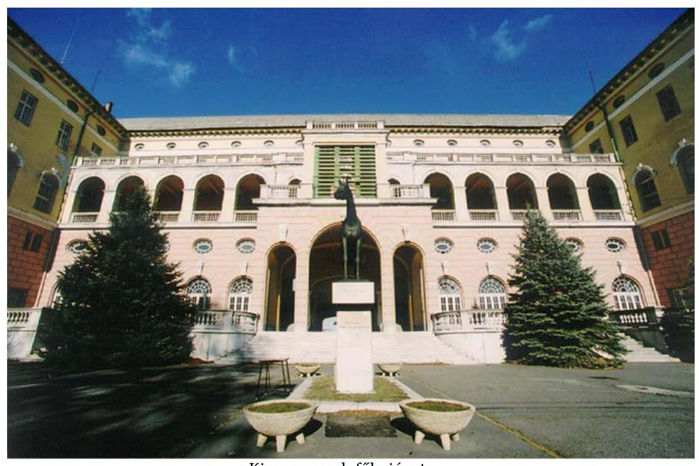

Kincsempark főbejárat
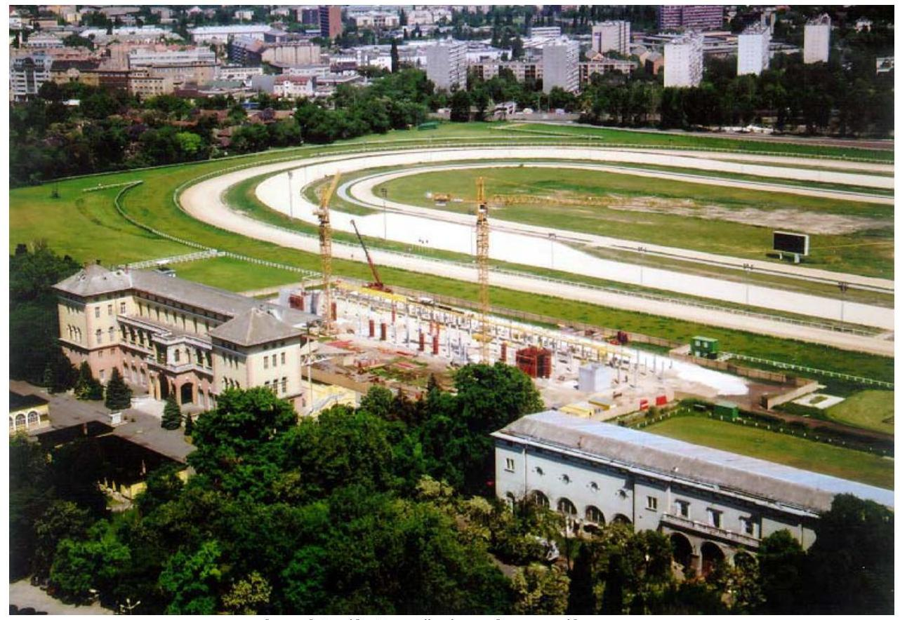
kombinált ügető- és galopp pálya

---

# Az önkormányzatokat alapítói jogon megillető kifizetések 

A Csongrád Megye Önkormányzatának 2005 szeptemberében 9 M Ft-ot utaltak át alapítói járandóság jogcímén. Az átutaláshoz mellékelt igazoló dokumentumokból nem derül ki, hogy a Csongrád megyei Vendéglátó Vállalatot amelynek révén az önkormányzat részesedését elszámolták - mikor értékesítették. Az ügyintézőnél fellelhető dokumentumok szerint végelszámolással szűnt meg a vállalat 2001. 11. 05-én. A maradványvagyon értéke - 18 M Ft - 2002. 03. 28-án befolyt az ÁPV Rt. számlájára. A 465/2001. (IX. 04.) Vig. sz. határozata 4. pontja szerint „A Csongrád Megyei Vendéglátó Vállalatot egykor alapító Csongrád Megyei Önkormányzatot alapítói járandóság nem illeti meg." Ennek ellenére a 2004. 02. 05-i felülvizsgálat az összeg felét az önkormányzatot megillető kötelezettségként állapította meg. A PEI 2005. szeptember 19-én értesítő levelet küldött a Csongrád megyei Önkormányzatnak: „Tájékoztatom, hogy az önkormányzatokat alapítói jogon megillető részesedések tárgyában folyó felülvizsgálat során megállapítást nyert, hogy Csongrád Megye Önkormányzatát a Csongrád Megyei Vendéglátóipari Vállalat végelszámolási maradványvagyona kapcsán további alapítói részesedés illeti meg. ... A járandóság átutalásáról jelen levelünkkel egyidejüleg intézkedtünk." 2005. 09. 28-án a 9 M Ft-ot átutalták. A dokumentumok között semmi nem utalt arra, hogy fenti vezérigazgatói határozatot visszavonták volna, illetve, hogy a Csongrád megyei Önkormányzat jelezte volna igényét a maradványvagyon $50 \%$-ára.

Az alapítói jogon járó részesedések felülvizsgálatát és kifizetését a 42/2003. számú Vig. utasítás szabályozza. Ennek 1.6. pontja szerint „Az alapítói jogon járó részesedés a tulajdonjog átszállását követően, az önkormányzat felszólításával válik esedékessé...Az ÁPV Rt. az alapítói részesedések önkéntes teljesítésére törekszik." 2.1.4. pontban „Amennyiben az önkormányzati bejelentés nem lelhető fel, az ÁPV Rt. vélelmezi, hogy a teljesítésben foglalt késedelemnek megfelelő időpontban a bejelentés megtörtént." A Társaság ehhez az álláspontjához a gyakorlatban következetesen nem ragaszkodik. Mindenképpen önként fizet annak az önkormányzatnak, akivel szemben valamilyen el nem évült túlfizetés miatt követelése van. Például: 2005-ben Jászberény Város Önkormányzatának önkéntes teljesítéssel elszámolt 1,9 M Ft-os járandóságot, amelybe beszámíthatta saját korábbi túlfizetéséből keletkezett 0,9 M Ft-os követelését. (Az átutalás dokumentációjából ebben az esetben is hiányzik a járandóság jogosságát alátámasztó értékesítési időpont.) A Csongrád Megyei Önkormányzat fent említett esetében is önként fizetett, de a kifizetés jogossága nem egyértelmú. Ugyanakkor egy 2003. 04. 22-i felülvizsgálat szerint a Budapest Főváros VIII. kerületi Önkormányzata 15,5 M Ft alapítói járandóságra jogosult 2000. 05. 23 óta a Józsefvárosi Közért Vállalat 9057. sz. üzletének értékesítése kapcsán. Az értékesítés két részletben történt, de csak az első részlet után kapta meg járandóságát. A második rész utáni járandóságáról is készült 2004. 12. 27-i napra elszámolás. Akkor kamat-

---

tal együtt 25,3 M Ft-ról szólhatott volna az önkéntes teljesítésről a VIII. kerületi önkormányzatot értesítő levél. 2005. december 31-én a Vagyonkezelési Információs Rendszerben (VIR-ben) nyilvántartott tőke- és kamatkövetelés együtt már 26,5 M Ft. A VIII. kerületi önkormányzatnak az ÁPV Rt. 2005-ben nem fizette ki a jogos járandóságát. Az ügyiraton szereplő jelzés szerint a kötelezettség 2005. 06. 19-én elévült.

---

# Perköltségek, ügyvédi díjak és egyéb kiadások 

Az 1998 szeptemberében kezdődött perben a KFB Tanácsadó és Szolgáltató Kft. a Csepeli Csőgyár Zrt. 1,9 Mrd Ft-os, APEH-től megvásárolt tartozásáért és ennek 1998. május 5-től a kifizetés napjáig számított kamataiért perelte az ÁPV Rt.-t konszernjogi háttérfelelősség címén.

Az összeg a 2002. októberrel kezdődő és 2005 augusztusáig tartó időszakban erre a perre elszámolt 9729139 Ft ügyvédi munkadíjat egészítette ki 32350000 Ft-ra. A kiegészítés alapja a Legfelsőbb Bíróság, mint másodfokú bíróság 2005. február 7-én kelt Gf. VII. 30.101/2004/15. számú jogerős ítélete, amely a felperes KFB Tanácsadó és Szolgáltató Kft. keresetét elutasítva kötelezte a felperest, hogy fizessen meg az alperes ÁPV Rt.-nek 32350000 Ft perköltséget. Az indoklás szerint ez az összeg „a megelőző eljárások során felmerült, illetve megállapított, a pertárgy értéke alapján meghatározott jogi képviseleti munkadíjból álló perköltség".

Az ügyvédi irodával 2002. augusztus 30-án kötött SZT-24903 számon nyilvántartott megbízási szerződés 2. sz. mellékletének 2. pontja szerint „Amennyiben peres eljárás során Bíróság perköltségként ügyvédi dijat állapítana meg, úgy a megállapított dijból az ÁPV Rt. által az adott ügy intézése során kifizetett munkadijjal egyező összeg az ÁPV Rt.-t illeti, csak az ezt meghaladó rész kerül az Ügyvédi Iroda részére kifizetésre."

A kifizetéssel kapcsolatban hiányoljuk, hogy

- a teljesítésigazoláshoz nem csatolták a kifizetés jogosságát igazoló bírói ítéleteket. Az elszámolásra vonatkozó megbízási szerződés kiegészítését csatolták kifizetés-igazolásként.
- az ügyvédi iroda SZT-24903 számon nyilvántartott megbízási szerződésének elválaszthatatlan részét képező 1. számú mellékletében felsorolt ügyek amelyekben az ügyvédi iroda jogosult és köteles a megbízó képviseletét ellátni - között nem szerepel a Csepeli Csőgyárral kapcsolatos per. A szerződésben nincs általános felhatalmazás peres ügyek vitelére. A megbízási szerződés későbbi módosításai, kiegészítései sem tartalmaznak ilyen kitételt, annak ellenére, hogy az ügyvédi iroda az 1. számú mellékletben nevesített ügyeken kívül sok más peres ügyben is képviseli az ÁPV Rt.-t.
- a Csepeli Csőgyárral kapcsolatos perhez bemutatott - 2002. szeptember 5-én kelt - meghatalmazásban nincs szó arról, hogy a díjazás a konkrét esetben hogyan történik, illetve nincs utalás az SZT-24903 számú megbízási szerződésre sem.

---

- A teljesítésigazolásban nincs szó arról, hogy az ÁPV Rt.-nek az adott ügy intézése során nem csak az ügyvédi irodával szemben voltak munkadíj jellegű költségei.
- Az ügyvédi iroda 2002. szeptember 5-étől vette át az alperes ÁPV Rt. jogi képviseletét, addig az ÁPV Rt.-t saját jogtanácsosa képviselte. Ekkor már volt jogerős elsőfokú ítélet, és az alperes ÁPV Rt. jogtanácsosa fellebbezést is benyújtott az elsőfokú ítélet megváltoztatása ügyében.
- Az ügyvédi iroda a fellebbezési szakaszban új tényállás felvetésével elérte a per - ÁPV Zrt.-re nézve - kedvező kimenetelét (A Legfelsőbb Bíróság, mint másodfokú bíróság Gf. VII. 30.101/2004/15. sz. ítélete). Ezt megelőzően polgári jogegységi határozat is született ${ }^{1}$, amelynek köszönhetően a konkrét ügyben sikerült elérni, hogy az APEH által be nem szedhető, magáncégre engedményezett adókövetelés ne a magáncég szedje be kamatostul az állami vagyont kezelő ÁPV Rt.-től. Azaz: az állam által kivetett adókat ne az állam fizesse meg magáncégnek. Ilyen veszély kevésbé fenyegette volna a Magyar Államot, ha az RJGY - aki egyben az APEH irányítója és felügyeleti szerve is - időben foglalkozott volna az ÁPV Rt. 2002. évi figyelmeztetésével. ${ }^{2}$
- A Legfelsőbb Bíróság mint felülvizsgálati bíróság Gfv. 30.227/2005/8. számú, 2005. november 16-án kelt ítélete szerint a pert az alperes ÁPV Rt. 76\%-ban nyerte meg. Az alperes ÁPV Zrt.-t megillető I. és II. fokú perköltség ezért 24 586000 Ft , szemben a 2005. augusztus 16-án az akkor jogerőssé vált másodfokú bírósági ítélet alapján elszámolt 32350000 Ft-tal. A különbség 7764000 Ft - visszafizetésére a helyszíni ellenőrzés lezárásáig az ÁPV Rt. nem szólította fel az ügyvédi irodát. ${ }^{3}$

Az SZT-24903 számú megbízási szerződés 6. számú kiegészítésének 2.7. pontja így szól: „Amennyiben az adott ügyben lefolytatott rendkívüli jogorvoslati eljárásban, olyan bírósági határozat születik, amely a jogerősen megitélt perköltség visszafizetésére kötelezi a Megbizót, Megbizott vállalja, hogy a részére megfizetett perköltségrészt Megbízó értesitése kézhezvételét követő 8 napon belül visszatéríti."

A bíróság az alperes ÁPV Zrt.-nek járó, az I. és II. fokú eljárások perköltségét perértékre állapította meg, de nem határozta meg külön-külön a rájuk eső költségeket. Az viszont egyértelmű az ítéletben és indoklásában, hogy az alperes ÁPV Rt. 6 M Ft elsőfokú, 1,764 M Ft másodfokú részperköltséget és 3 M Ft felülvizsgálati eljárási költséget köteles megfizetni a felperesnek. Ez arra enged következtetni, hogy az elsőfokú eljárás költségei a nagyobbak.

[^0]
[^0]:    ${ }^{1}$ 2/2004. Polgári jogegységi határozat a felszámolási eljárás során hitelezői igényként bejelentett, a felszámoló által besorolt és visszaigazolt adókövetelésnek az APEH által harmadik személy javára történt engedményezése esetén az adótartozás megfizetésének követeléséről, 2004. március 25.
    ${ }^{2}$ Ld. Jelentés az Állami Privatizációs és Vagyonkezelő Rt. 2003. évi müködésének és a központi költségvetés végrehajtásához kapcsolódó tevékenységének ellenőrzéséről, 50. oldal.
    ${ }^{3}$ Az ÁPV Rt. a számvevői jelentésre tett észrevételeiben jelezte, hogy még a jelentés megérkezése előtt felvette a kapcsolatot az ügyvédi irodával a 7,8 M Ft rendezése ügyében.

---

# Az ÁPV Rt. saját vagyonának föbb adatai 

|  |  |  |  |  |  |
| :-- | :--: | :--: | :--: | :--: | :--: |
| Megnevezés | 2003. évi   tény | 2004. évi   tény | 2005. ere-   deti terv | 2005. évi   módosított   terv | 2005. évi   tény |
| Értékesítés nettó árbevé-   tele | 2973805 | 6309921 | 6308471 | 6340219 | 6225433 |
| ebből hozzárendelt va-   gyonból történő átvezetés | 2500000 | 5857000 | 5857000 | 5857000 | 5857000 |
| Anyagjellegú ráfordítá-   sok | 1913727 | 2143520 | 2193072 | 2192175 | 2023268 |
| Személyi jellegú ráfordí-   tások | 3379418 | 3709113 | 3749775 | 3749775 | 3373315 |
| Adózás előtti eredmény | -1969092 | +159479 | +77940 | +110995 | +480654 |

Megjegyzés: Az ÁPV Rt. adózás előtti eredménye megegyezik a mérleg szerinti eredménnyel, mert nem alanya a társasági adónak és osztalékot a társaságtól nem vontak el.

Az ÁPV Rt. 2003-ban a székház értékesítésből 3550 M Ft egyéb bevételt realizált.

---

# Tanúsítványok jegyzéke 

1. sz. tanúsítvány
2. sz. tanúsítvány
3. sz. tanúsítvány
4. sz. tanúsítvány
5. sz. tanúsítvány
6. sz. tanúsítvány
7. sz. tanúsítvány
8. sz. tanúsítvány
9. sz. tanúsítvány
10. sz. tanúsítvány
11. sz. tanúsítvány
12. sz. tanúsítvány

A hozzárendelt vagyon változása 2005. évben - összesített kimutatás

A hozzárendelt vagyon változása tranzakciók alapján 2005. évben

Pénzforgalmi szemléletű eredménykimutatás az ÁPV Rt. hozzárendelt vagyon bevételeiről és kiadásairól 2005. évben

Privatizációs tartalék 2005. évben
ÁPV Rt. kötelezettségeinek változása
Az ÁPV Rt. saját vagyonának eszközállomány változása 2005. év

Az ÁPV Rt. saját vagyonának forrásösszetételének változása 2005. évben

Az ÁPV Rt. múködéséhez kapcsolódó anyagjellegủ ráfordítások alakulása 2005. évben

Az ÁPV Rt. átlagos állományi létszámának alakulása 2005. évben

Az ÁPV Rt. állományi létszáma 2005. évben
Az ÁPV Rt. múködésével kapcsolatos személyi jellegű ráfordítások alakulása 2005. évben

Az ÁPV Rt. munkavállalóinak beosztásonkénti átlagkeresete 2005. évben

A 2005. évi ÁSZ beszámoló és az auditált beszámoló közötti főbb különbségek levezetése

Az ÁPV Rt. hozzárendelt vagyonába tartozó, múködő társaságok adatai 2005. évben

Az ÁPV Rt. 2005. évi forrásallokációja felhasználási forma szerint

---

16. sz. tanúsítvány A korai riasztások sűrűsége az ÁPV Zrt. 25\%-nál nagyobb részesedéssel rendelkező veszteséges társaságoknál 2005. évben
17. sz. tanúsítvány A 2000-2005. évben veszteséges, $25 \%$-nál nagyobb ÁPV Zrt. tulajdonban álló társaságok veszteség okai
18. sz. tanúsítvány A saját tőkére jutó jövedelmezőség alakulása

---

A hozzárendelt vagyon változása 2005. évben -összesített kimutatás

1. sz. tanúsítvány a V-01- hív/2006. sz. jelentéshez

|  Megnevezés | Nyitó adatok |  |  |  | Vagyonváltozás |  |  |  |  |  |   |
| --- | --- | --- | --- | --- | --- | --- | --- | --- | --- | --- | --- |
|   |  |  |  |  | Tranzakciók alapján |  |  | Gazdálkodás
eredményessége mérlegek
szerint |  | Záró adatok |   |
|   |  |  |  |  | Növekedés |  | Csökkenés | Növekedés | Csökkenés |  |   |
|   | db | millió Ft | db |  | millió Ft |  |  | millió Ft |  |  |   |
|  1. Gazdasági társaságok | 193 | 837 894 | 13 |  | 253 688 | 28 | 295 913 | 60 997 | 6 177 | 178 | 850 490  |
|  1.1. Működő társaságok | 138 | 837 614 | 9 |  | 253 471 | 18 | 295 667 | 60 997 | 6 177 | 129 | 850 239  |
|  1.1.1. Tartós állami tulajdonban lévő | 38 | 314 919 | 2 |  | 238 324 | 2 | 0 | 14 921 | 535 | 38 | 567 629  |
|  ebből: részvénytársaság | 37 | 309 854 | 2 |  | 238 324 | 2 | 0 | 14 408 | 535 | 37 | 562 051  |
|  egyéb társaság | 1 | 5 065 | 0 |  | 0 | 0 | 0 | 513 | 0 | 1 | 5 578  |
|  1.1.2. Teljes mértékben privatizálható | 100 | 522 695 | 7 |  | 15 147 | 16 | 295 667 | 46 076 | 5 642 | 91 | 282 610  |
|  ebből: részvénytársaság | 78 | 515 730 | 4 |  | 12 333 | 14 | 295 180 | 35 220 | 5 201 | 68 | 262 903  |
|  egyéb társaság | 22 | 6 965 | 3 |  | 2 814 | 2 | 488 | 10 856 | 441 | 23 | 19 707  |
|  1.2. Végelszámolás alatt álló társaságok | 7 | 280 | 1 |  | 217 | 2 | 246 |  |  | 6 | 251  |
|  1.3. Felszámolás alatt álló társaságok | 48 | 0 | 3 |  | 0 | 8 | 0 |  |  | 43 | 0  |
|  2.Állami vállalatok | 81 | 200 | 2 |  | 0 | 16 | 12 |  |  | 67 | 188  |
|  2.1. Működő vállalatok | 0 | 0 | 0 |  | 0 | 0 | 0 |  |  | 0 | 0  |
|  2.2. Végelszámolás alatt álló vállalatok | 10 | 200 | 0 |  | 0 | 2 | 12 |  |  | 8 | 188  |
|  2.3. Felszámolás alatt álló vállalatok | 71 | 0 | 2 |  | 0 | 14 | 0 |  |  | 59 | 0  |
|  3. Elvont, vásárolt, átvett vagyonelemek |  | 27 578 |  |  | 1 140 |  | 15 060 |  |  |  | 13 658  |
|  3.1. Immateriális javak |  | 1 | 0 |  | 0 | 0 | 0 |  |  |  | 1  |
|  3.2. Ingatlanok |  | 26 131 | 0 |  | 722 | 0 | 14 408 |  |  |  | 12 445  |
|  3.3. Egyéb eszközök |  | 1 446 | 0 |  | 418 | 0 | 652 |  |  |  | 1 212  |
|  4. Termőföld |  | 2 592 | 0 |  | 727 | 0 | 0 |  |  |  | 3 319  |
|  5. Pénzkészlet |  | 76 498 | 0 |  | 207 243 | 0 | 150 796 |  |  |  | 132 945  |
|  6. Államkötvény | 0 | 0 | 0 |  | 0 | 0 | 0 |  |  | 0 | 0  |
|  7. Követelések |  | 41 086 | 0 |  | 4 987 | 0 | 14 944 |  |  |  | 31 130  |
|  8. Kötelezettségek |  | 272 441 | 0 |  | 47 183 | 0 | 48 569 |  |  |  | 271 054  |
|  HOZZÁRENDELT VAGYON ÖSSZESEN | 274 | 713 407 | 15 |  | 420 603 | 44 | 428 154 | 60 997 | 6 177 | 245 | 760 676  |

- A 2.sz. tanúsítvány összesített adatait tartalmazza

Budapest, 2006. 07.28.

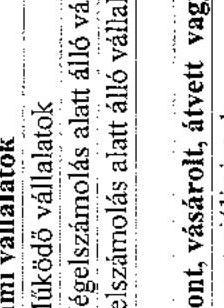

---

2. sz. tanúsítvány a V-01- 44/2006. sz. jelentéshez

|  Megnevezés |  |  |  |  |  |  |  |  |  |  |  |  |  |  |  |  |  |  |  |  |  |  |  |  |  |  |  |  |  |  |  |  |  |  |  |  |  |  |  |  |  |  |  |  |  |  |  |  |  |  |  |  |  |  |  |  |  |  |  |  |  |  |  |  |  |  |  |  |  |  |  |  |  |  |  |  |  |  |  |  |  |  |  |  |  |  |  |  |  |  |  |  |  |  |  |  |  |  |  |  | 

---

3. sz. tanúsítvány a V-01- 44/2006. sz. jelentőshez

Pénzforgalmi szemléletű eredménykimutatás az ÁPV Rt. hozzárendelt vagyon bevételeiről és kiadásairól 2005. évben M Ft

Hozzárendelt vagyon bevételek

|   |  | költs. ció- | módosított | üzleti terv | módosított | Tény ÁSZ beszá- | Tény végleges  |
| --- | --- | --- | --- | --- | --- | --- | --- |
|   |  | irányzat | előírányzat |  | üzleti terv | moló | beszámoló  |
|   | Hozzárendelt vagyon folyó tételek NYITÓEGYENLEGE |  |  | 25 460 | 25 460 | 25 460 | 25 460  |
|  B.1.1. | Privatizációs bevétel |  |  | 279 091 | 127 444 | 124 400 | 125 097  |
|  B.1.2. | Vagyonhasznosítási bevételei |  |  | 131 | 218 | 257 | 257  |
|  B.1.3. | Kárpótlási jegy |  |  | 1 500 | 500 | 38 | 38  |
|  B.1. | Értékesítés és vagyonhasznosítás összesen |  |  | 280 722 | 128 162 | 124 695 | 125 387  |
|  B.2. | Kapott osztalék, részesedés |  |  | 17 934 | 18 053 | 28 373 | 28 373  |
|  B.3. | Egyéb bevételek |  |  | 1 463 | 1 678 | 1 796 | 1 104  |
|  B. | Rendelt vagyonnal kapcsolatos bevételek összesen (B.1.- B.3.) |  |  | 300 118 | 147 893 | 154 864 | 154 864  |

Hozzárendelt vagyon kiadások

|  K.1.1. | Hozzárendelt vagyon értékecítése előkész.-nek ktg. kiadások, díjak | 8 092 | 6 782 | 6 970 | 4 157 | 2 856 | 2 856  |
| --- | --- | --- | --- | --- | --- | --- | --- |
|   | Ebből kibocsátott kötvény kamata |  |  |  |  | 1 585 | 1 585  |
|  K.1.2. | Vagyonkezeléssel összefüggő ráfordítások | 4 733 | 4 503 | 4 403 | 4 395 | 2 976 | 2 976  |
|  K.1.3. | Privatizációval és vagyonkezeléssel összefüggő reorg. kiifentések | 700 | 850 | 700 | 850 | 686 | 686  |
|  K.1.4. | Az ÁPV Rt. működési költségei | 5 000 | 5 857 | 5 857 | 5 857 | 5 857 | 5 857  |
|  K.1.5. | Kárpótlási jegy bevonás | 1 500 | 1 500 | 1 500 | 500 | 38 | 38  |
|  K.1. | Ráfordítások az 1995. évi XXXIX. tv. alapján | 20 025 | 19 492 | 19 430 | 15 759 | 12 413 | 12 413  |
|  K.2.1. | Osztalékbefizetési kötelezettség a Központi Költségvetés felé | 16 937 | 16 937 | 17 934 | 18 053 | 28 373 | 28 373  |
|  K.2.2. | Az állam tulajdonosi fel. kapcsán környezetvédelmi fel. finanszírozá- | 10 230 | 10 860 | 10 560 | 10 860 | 10 252 | 10 252  |

---

|  404 | 39 027 | 51 442 | 7 233 | 11 610 | 22 645 | 52 379 | 93 867 | 145 309 | 145 309 | 145 309 | 34 991  |
| --- | --- | --- | --- | --- | --- | --- | --- | --- | --- | --- | --- |
|  404 | 39 027 | 51 442 | 7 233 | 11 610 | 22 645 | 52 379 | 93 867 | 145 309 | 145 309 | 34 991 | 34 991  |
|  404 | 39 027 | 51 442 | 7 233 | 11 610 | 22 645 | 52 379 | 93 867 | 145 309 | 145 309 | 34 991 | 34 991  |
|  404 | 39 027 | 51 442 | 7 233 | 11 610 | 22 645 | 52 379 | 93 867 | 145 309 | 145 309 | 34 991 | 34 991  |
|  404 | 39 027 | 51 442 | 7 233 | 11 610 | 22 645 | 52 379 | 93 867 | 145 309 | 145 309 | 34 991 | 34 991  |
|  404 | 39 027 | 51 442 | 7 233 | 11 610 | 22 645 | 52 379 | 93 867 | 145 309 | 145 309 | 34 991 | 34 991  |
|  404 | 39 027 | 51 442 | 7 233 | 11 610 | 22 645 | 52 379 | 93 867 | 145 309 | 145 309 | 34 991 | 34 991  |
|  404 | 39 027 | 51 442 | 7 233 | 11 610 | 22 645 | 52 379 | 93 867 | 145 309 | 145 309 | 34 991 | 34 991  |
|  404 | 39 027 | 51 442 | 7 233 | 11 610 | 22 645 | 52 379 | 93 867 | 145 309 | 145 309 | 34 991 | 34 991  |
|  404 | 39 027 | 51 442 | 7 233 | 11 610 | 22 645 | 52 379 | 93 867 | 145 309 | 145 309 | 34 991 | 34 991  |
|  404 | 39 027 | 51 442 | 7 233 | 11 610 | 22 645 | 52 379 | 93 867 | 145 309 | 145 309 | 34 991 | 34 991  |
|  404 | 39 027 | 51 442 | 7 233 | 11 610 | 22 645 | 52 379 | 93 867 | 145 309 | 145 309 | 34 991 | 34 991  |
|  404 | 39 027 | 51 442 | 7 233 | 11 610 | 22 645 | 52 379 | 93 867 | 145 309 | 145 309 | 34 991 | 34 991  |
|  404 | 39 027 | 51 442 | 7 233 | 11 610 | 22 645 | 52 379 | 93 867 | 145 309 | 145 309 | 34 991 | 34 991  |
|  404 | 39 027 | 51 442 | 7 233 | 11 610 | 22 645 | 52 379 | 93 867 | 145 309 | 145 309 | 34 991 | 34 991  |
|  404 | 39 027 | 51 442 | 7 233 | 11 610 | 22 645 | 52 379 | 93 867 | 145 309 | 145 309 | 34 991 | 34 991  |
|  404 | 39 027 | 51 442 | 7 233 | 11 610 | 22 645 | 52 379 | 93 867 | 145 309 | 145 309 | 34 991 | 34 991  |
|  404 | 39 027 | 51 442 | 7 233 | 11 610 | 22 645 | 52 379 | 93 867 | 145 309 | 145 309 | 34 991 | 34 991  |
|  404 | 39 027 | 51 442 | 7 233 | 11 610 | 22 645 | 52 379 | 93 867 | 145 309 | 145 309 | 34 991 | 34 991  |
|  404 | 39 027 | 51 442 | 7 233 | 11 610 | 22 645 | 52 379 | 93 867 | 145 309 | 145 309 | 34 991 | 34 991  |
|  404 | 39 027 | 51 442 | 7 233 | 11 610 | 22 645 | 52 379 | 93 867 | 145 309 | 145 309 | 34 991 | 34 991  |
|  404 | 39 027 | 51 442 | 7 233 | 11 610 | 22 645 | 52 379 | 93 867 | 145 309 | 145 309 | 34 991 | 34 991  |
|  404 | 39 027 | 51 442 | 7 233 | 11 610 | 22 645 | 52 379 | 93 867 | 145 309 | 145 309 | 34 991 | 34 991  |
|  404 | 39 027 | 51 442 | 7 233 | 11 610 | 22 645 | 52 379 | 93 867 | 145 309 | 145 309 | 34 991 | 34 991  |
|  404 | 39 027 | 51 442 | 7 233 | 11 610 | 22 645 | 52 379 | 93 867 | 145 309 | 145 309 | 34 991 | 34 991  |
|  404 | 39 027 | 51 442 | 7 233 | 11 610 | 22 645 | 52 379 | 93 867 | 145 309 | 145 309 | 34 991 | 34 991  |
|  404 | 39 027 | 51 442 | 7 233 | 11 610 | 22 645 | 52 379 | 93 867 | 145 309 | 145 309 | 34 991 | 34 991  |
|  404 | 39 027 | 51 442 | 7 233 | 11 610 | 22 645 | 52 379 | 93 867 | 145 309 | 145 309 | 34 991 | 34 991  |
|  404 | 39 027 | 51 442 | 7 233 | 11 610 | 22 645 | 52 379 | 93 867 | 145 309 | 145 309 | 34 991 | 34 991  |
|  404 | 39 027 | 51 442 | 7 233 | 11 610 | 22 645 | 52 379 | 93 867 | 145 309 | 145 309 | 34 991 | 34 991  |
|  404 | 39 027 | 51 442 | 7 233 | 11 610 | 22 645 | 52 379 | 93 867 | 145 309 | 145 309 | 34 991 | 34 991  |
|  404 | 39 027 | 51 442 | 7 233 | 11 610 | 22 645 | 52 379 | 93 867 | 145 309 | 145 309 | 34 991 | 34 991  |
| 

---

4. sz. tanúsítvány a V-01- h4/2006. sz. jelentéshez

|   |  | Végleges
beszámoló | Különbözet  |
| --- | --- | --- | --- |
|   |  |  | ezer Fi  |
|  Privatizációs tartalék NYITO EGYENLEGE | 51 025 484 | 51 025 484 | 0  |
|  Privatizációs tartalékképzés Ft összege | 52 300 000 | 52 300 000 | 0  |
|  Gásközmű kötelezettsége képző állandótévény | 0 | 0 | 0  |
|  Gásközmű kötelezettsége képző állandótévény kamata | 0 | 0 | 0  |
|  Privatizációs tartalékképzés összesen | 52 380 000 | 52 380 000 | 0  |
|  Visszátrálások bevétán | 78 829 | 78 829 | 0  |
|  Összes forrás | 103 404 315 | 103 404 315 | 0  |
|  Átállással, szavatossággal kapcsolatos kifte | 12 287 | 12 287 | 0  |
|  Kezemegyűltséksből, átvállalt tartozásokból eredő kifizetések | 0 | 0 | 0  |
|  Kemmereddeblisség alapján történő kifizetések | 142 489 | 142 489 | 0  |
|  Elvissá vagyontárgyak adás betölti kezem feltéltsség rendezésre | 70 358 | 70 358 | 0  |
|  Szerződéses kapcsolatos alapuló tartozás kiegyentítése | 0 | 0 | 0  |
|  Belt föld értéke alapján, alapítói jogon kifte, önk, játesőőség | 480 083 | 480 017 | -F0  |
|  Privatizációs ellenérték hiányad | 767 127 | 767 127 | 0  |
|  Völjépes dulg. energiaes, priv. kapcs, köntét megáll. fedezete | 756 528 | 756 528 | 0  |
|  Kárpultási jogvek életjándéka vállára | 2 997 764 | 2 997 764 | 0  |
|  A "nevezális levelek" alapján történő kifizetések | 0 | 0 | 0  |
|  Völjépes dulg. energiaes, priv. kapcs, köntét megáll. fedezete | 0 | 0 | 0  |
|  A gázközművekből kapcsolatos önk, igényok rendezése | 0 | 0 | 0  |
|  ebből: pénzbeli rendezés |  |  |   |
|  állandótévényesí történő rendezés |  |  | 0  |
|  Előbbi feladatok végrehajtásával kapcs, ráfordítások | 247 408 | 247 568 | F0  |
|  Privatizációs tartalék kiadása összesen | 5 474 134 | 5 474 134 | 0  |
|  Elviss a tényleges és a számított egyedeg között | 21 944 | 21 944 | 0  |
|  Gásközműködéses záróegyesége | 0 | 0 | 0  |
|  Privatizációs tartalék bankszámla záróegyesége | 97 952 123 | 97 952 123 | 0  |
|  Privatizációs tartalék ZAROEGYENLEGE | 97 952 123 | 97 952 123 | 0  |

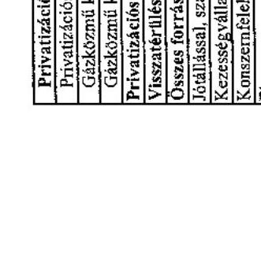

---

5. sz. tanúsítvány a V-01- h4 /2006. sz. jelentéshez

|  A |  |  |  |  |  |  |  |  |  |   |
| --- | --- | --- | --- | --- | --- | --- | --- | --- | --- | --- |
|  |   |   |   |   |   |   |   |   |   |   |
|  |   |   |   |   |   |   |   |   |   |   |
|  |   |   |   |   |   |   |   |   |   |   |
|  |   |   |   |   |   |   |   |   |   |   |
|  |   |   |   |   |   |   |   |   |   |   |
|  |   |   |   |   |   |   |   |   |   |   |
|  |   |   |   |   |   |   |   |   |   |   |
|  |   |   |   |   |   |   |   |   |   |   |
|  |   |   |   |   |   |   |   |   |   |   |
|  |   |   |   |   |   |   |   |   |   |   |
|  |   |   |   |   |   |   |   |   |   |   |
|  |   |   |   |   |   |   |   |   |   |   |
|  |   |   |   |   |   |   |   |   |   |   |
|  |   |   |   |   |   |   |   |   |   |   |
|  |   |   |   |   |   |   |   |   |   |   |
|  |   |   |   |   |   |   |   |   |   |   |
|  |   |   |   |   |   |   |   |   |   |   |
|  |   |   |   |   |   |   |   |   |   |   |
|  |   |   |   |   |   |   |   |   |   |   |
|  |   |   |   |   |   |   |   |   |   |   |
|  |   |   |   |   |   |   |   |   |   |   |
|  |   |   |   |   |   |   |   |   |   |   |
|  |   |   |   |   |   |   |   |   |   |   |
|  |   |   |   |   |   |   |   |   |   |   |
|  |   |   |   |   |   |   |   |   |   |   |
|  |   |   |   |   |   |   |   |   |   |   |
|  |   |   |   |   |   |   |   |   |   |   |
|  |   |   |   |   |   |   |   |   |   |   |
|  |   |   |   |   |   |   |   |   |   |   |
|  |   |   |   |   |   |   |   |   |   |   |
|  |   |   |   |   |   |   |   |   |   |   |

---

|  Normatív kötelezettségek | 2005.12.31. záró |  |   |
| --- | --- | --- | --- |
|   | alap | kamat | alap+  |
|  BERL |  |  | kamat  |
|  Önkormányzati járandóságok | 782 691 | 835 129 | 1 637 820  |
|  ebből Belterületi föld utáni járandóság | 652 663 | 817 228 | 1 469 891  |
|  ebből ebből állatáti új azadotás |  |  |   |
|  ebből állatáti új azadotás |  |  |   |
|  ebből állatáti új azadotás |  |  |   |
|  130 015 | 1 375 001 | 1 167 920 |   |
|  130 015 | 1 375 001 | 1 167 920 |   |
|  130 015 | 1 375 001 | 1 167 920 |   |
|  130 015 | 1 375 001 | 1 167 920 |   |
|  130 015 | 1 375 001 | 1 167 920 |   |
|  130 015 | 1 375 001 | 1 167 920 |   |
|  130 015 | 1 375 001 | 1 167 920 |   |
|  130 015 | 1 375 001 | 1 167 920 |   |
|  130 015 | 1 375 001 | 1 167 920 |   |
|  130 015 | 1 375 001 | 1 167 920 |   |
|  130 015 | 1 375 001 | 1 167 920 |   |
|  130 015 | 1 375 001 | 1 167 920 |   |
|  130 015 | 1 375 001 | 1 167 920 |   |
|  130 015 | 1 375 001 | 1 167 920 |   |
|  130 015 | 1 375 001 | 1 167 920 |   |
|  130 015 | 1 375 001 | 1 167 920 |   |
|  130 015 | 1 375 001 | 1 167 920 |   |
|  130 015 | 1 375 001 | 1 167 920 |   |
|  130 015 | 1 375 001 | 1 167 920 |   |
|  130 015 | 1 375 001 | 1 167 920 |   |
|  130 015 | 1 375 001 | 1 167 920 |   |
|  130 015 | 1 375 001 | 1 167 920 |   |
|  130 015 | 1 375 001 | 1 167 920 |   |
|  130 015 | 1 375 001 | 1 167 920 |   |
|  130 015 | 1 375 001 | 1 167 920 |   |
|  130 015 | 1 375 001 | 1 167 920 |   |
|  130 015 | 1 375 001 | 1 167 920 |   |
|  130 015 | 1 375 001 | 1 167 920 |   |
|  130 015 | 1 375 001 | 1 167 920 |   |
|  130 015 | 1 375 001 | 1 167 920 |   |
|  130 015 | 1 375 001 | 1 167 920 |   |
|  

---

Állami Privatizációs és Vagyonkezelő Rt.

Az ÁPV Rt. saját vagyonának eszközállomány változása 2005. év

|  Megnevezés | 2004. évi záró állomány (nyitó) | Változás |  |  | 2005. évi záró állomány  |
| --- | --- | --- | --- | --- | --- |
|   |  | növekedés | csökkenés | áll. vált. |   |
|  Immateriális javak | 172 968 | 55 909 | 138 422 | 82 523 | 90 445  |
|  Tárgyi eszközök | 2 410 386 | 644 446 | 339 594 | 304 852 | 2 715 238  |
|  Befektetett pénzügyi eszközök | 333 232 | 160 872 | 165 682 | 4 810 | 328 422  |
|  Befektetett eszközök összesen | 2 916 586 | 861 227 | 643 708 | 217 519 | 3 134 105  |
|  Köszletek | 1 073 | 80 183 | 73 583 | 6 600 | 7 673  |
|  Követelések | 688 047 | 8 085 986 | 8 380 765 | 294 779 | 393 268  |
|  Pénzeszközök | 8 420 224 | 14 433 971 | 13 670 024 | 763 947 | 9 184 171  |
|  Forgóeszközök | 9 109 344 | 22 600 140 | 22 124 372 | 475 768 | 9 585 112  |
|  Aktív időbeli elhatárolások | 12 344 | 11 560 | 12 344 | 784 | 11 560  |
|  Eszközök összesen | 12 038 274 | 23 472 927 | 22 780 424 | 692 503 | 12 730 777  |

Budapest, 2006. február 07.

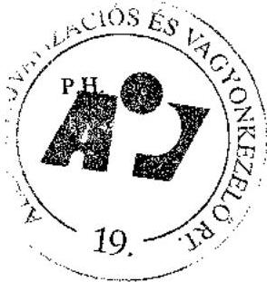

V. Aláírás

---

1. sz. tanúsítvány a V-01-44/2006. sz. jelentéshez

Állami Privatizációs és Vagyonkezelő Rt.

Az ÁPV Rt. saját vagyonának forrásösszetételének változása 2005.év

|  Megnevezés | 2004. évi záró állomány | Növekezdés | Változás csökkenés | áll. vált. | 2005. évi záró állomány  |
| --- | --- | --- | --- | --- | --- |
|  Saját tőke | 11276693 | 583002 |  | 583002 | 11859695  |
|  Céltartalék | - | - | - | - | -  |
|  Kötelezettségek | 612876 | 23002472 | 22841639 | 160833 | 773709  |
|  Passzív időbeli elhatárolások | 148705 | 97373 | 148705 | 51332 | 97373  |
|  Források összesen | 12038274 | 23682847 | 22990344 | 692503 | 12730777  |

Budapest, 2006. február 07.

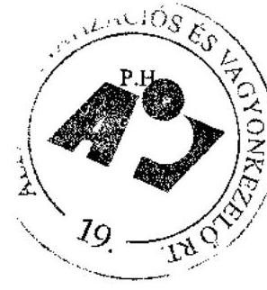

Kelboul aláírás

---

Állami Privatizációs és Vagyonkezelő Rt.

# Az ÁPV Rt. müködéséhez kapcsolódó anyagjellegủ ráfordítások alakulása 2005. év

|  Megnevezés |  | 2005. év |  |  | %  |
| --- | --- | --- | --- | --- | --- |
|   | terv (E Ft) | % | tény (E Ft) | tény% | Tervhez  |
|  Energia | 88 224 | 13,76% | 85145 | 15,12% | 97%  |
|  Üzemanyag | 20 954 | 3,27% | 23374 | 4,15% | 112%  |
|  Nyomtatvány, irodaszor | 21 894 | 3,41% | 11565 | 2,05% | 53%  |
|  Egyéb ki nem emelt anyag-
zöltség | 12 635 | 1,97% | 21486 | 3,82% | 170%  |
|  1. Anyagköltség összesen | 152 407 | 23,77% | 141570 | 25,15% | 93%  |
|  Utazás- és szállásköltség | 9 781 | 1,53% | 5403 | 0,96% | 55%  |
|  Fenntartás, javítás és karban-
tartás | 98 376 | 15,34% | 50051 | 8,89% | 51%  |
|  Posta, telefon, futározolgálat | 54 400 | 8,48% | 40973 | 7,28% | 75%  |
|  Székház fenntartás, üzemeltetés | 318 840 | 49,72% | 318840 | 56,64% | 100%  |
|  Egyéb ki nem emelt anyag-
jellegủ szogáltatás |  |  | 4565 | 0,81% | 62%  |
|  Egyéb ki nem emelt anyag-
jellegủ szogáltatás | 7 410 | 1,16% | 1568 | 0,28% | 21%  |
|  2. Anyagjellegű szolga-
tatás összesen | 488 807 | 76,23% | 421400 | 74,85% | 86%  |
|  3. Anyagjellegű ráfordítá-
sok összesen (1 + 2) | 641 214 | 100 | 562970 | 100 | 88%  |

Budapst, 2006. február 07.

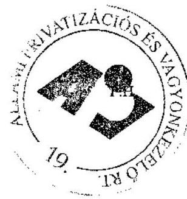

Aláírás

---

Állami Privatizációs és Vagyonkezelő Rt.

Az ÁPV Rt. átlagos állományi létszámának alakulása 2005. évben

| Megnevezés | 2005. év |  | Teljesítés \%   tervhez |
| :-- | :--: | :--: | :--: |
|  | $\operatorname{terv}(\mathbf{f o})$ | tény (fó) |  |
| Teljes munkaidőben fogl. | 210 | 200 | 95,23 |
| Részmunkaidőben fogl. | 1 | 0 | 0 |
| Állományi létszám összesen | 211 | 200 | 94,78 |

Budapest, 2006. február 06.
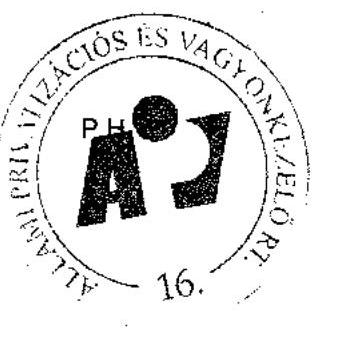
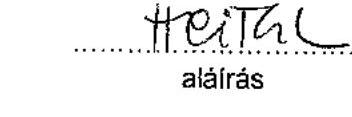

---

# Az ÁPV Rt. állományi létszáma 2005. évben 

létszámadatok: fóben

| Megnevezés | 2005. december 31. |  |
| :-- | :--: | :--: |
|  | Státusz | Betöltött állás |
| Vezető | 21 | 21 |
| Vezető-helyettes | 24 | 24 |
| Menedzser | 102 | 96 |
| Ügyintéző | 48 | 48 |
| Összesen | 195 | 189 |
|  |  |  |

Budapest, 2006. február 6.
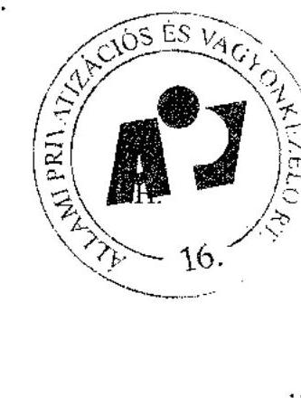

---

1. sz. tanúsítvány a V-01-44/2006. sz. jelentéshez

Állami Privatizációs és Vagyonkezelő Zrt.

# Az ÁPV Rt. müködésével kapcsolatos személyi jellegü ráfordítások alakulása 2005. évben

|  Megnevezés |  | 2005 év |  |  | Telj. %  |
| --- | --- | --- | --- | --- | --- |
|   | terv (E Ft) | % | tény(E Ft) | % | tervhez  |
|  Bérköltség | 1 992 399 | 53,13 | 1 782 815 | 52,95 | 89,48  |
|  ebből: jutalmak | 135 000 | 3,60 | 132 241 | 3,92 | 97,96  |
|  Személyi jellegű kifizetések | 1 757 376 | 46,87 | 1 590 500 | 47,15 | 90,50  |
|  ebből: szerzői díjak | 0 | 0,00 | 0 | 0,00 | 0,00  |
|  étkezési hozzájárulás | 19 392 | 0,52 | 17 602 | 0,52 | 90,77  |
|  üdülési hozzájárulás | 937 | 0,02 | 864 | 0,03 | 92,21  |
|  albérleti hozzájárulás | 0 | 0,00 | 0 | 0,00 | 0,00  |
|  utazási hozzájárulás | 6 000 | 0,16 | 3 235 | 0,10 | 53,92  |
|  reprezentáció és üzl. ajándék | 18 000 | 0,48 | 18 653 | 0,55 | 103,63  |
|  segélyek | 2 000 | 0,05 | 1 350 | 0,04 | 67,50  |
|  saját gépjármű hivatali célú használata | 2 500 | 0,07 | 1 880 | 0,06 | 75,20  |
|  belföldi napidíj | 100 | 0,00 | 16 | 0,00 | 16,00  |
|  külföldi napidíj | 2 248 | 0,06 | 559 | 0,02 | 24,87  |
|  betegszabadság | 25 000 | 0,67 | 17 592 | 0,52 | 70,37  |
|  egyéb személyi jell. Kifiz. | 670 227 | 17,87 | 622 913 | 18,47 | 92,94  |
|  táppénz 1/3-a | 8 500 | 0,23 | 8 315 | 0,25 | 97,82  |
|  nyugdíjpénztári hozzájár. | 120 079 | 3,21 | 109 835 | 3,25 | 91,47  |
|  dolgozók életbiztosítása | 0 | 0,00 | 0 | 0,00 | 0,00  |
|  belső továbbképzés | 5 000 | 0,13 | 2 227 | 0,07 | 44,54  |
|  egészségpénztári hozzájár. | 42 500 | 1,13 | 40 585 | 1,20 | 95,49  |
|  munkaruha | 79 588 | 2,12 | 79 868 | 2,36 | 100,35  |
|  társadalombizt. járulék | 755 305 | 20,15 | 665 006 | 19,71 | 88,04  |
|  Személyi jellegű ráfordítások összesen | 3 749 775 | 100,00 | 3 373 315 | 100,00 | 89,96  |

Budapest, 2006. május 17.

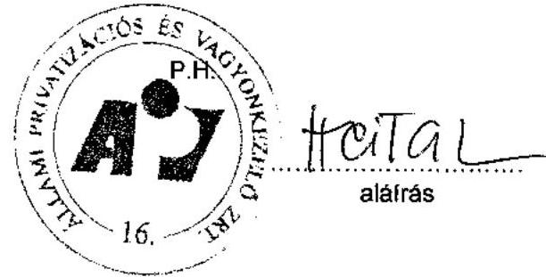

---

Állami Privatizációs és Vagyonkezelő Rt.

# Az ÁPV Rt. munkavállalóinak beosztásonkénti átlagkeresete 2005. évben 

| Sorszám | Állománycsoport | 2005. évi átlagkereset   Ft/fö/hó |
| :--: | :-- | --: |
| 1 | Felsővezetők | 3550726 |
| 2 | Ơgyvezetők | 1185259 |
| 3 | Ơgyvezető igazgató-helyettesek | 843354 |
| 4 | Menedzserek | 513195 |
| 5 | Ơgyintézők | 245408 |
| 6 | Ơgyviteli alkalmazottak | 0 |
| 7 | Összesen | 617445 |

Budapest, 2006. február 06.
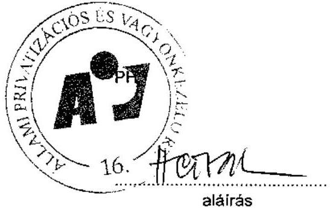

---

Állami Privatizációs és Vagyonkezelő Rt
2005. évi ÁSZ-beszámoló és auditált beszámoló közötti főbb különbségek levezetése

# 1. sz. tanúsítvány 

A hozzárendelt vagyon változása 2004. évben - összesített kimutatás
(millió Ft)

|  | ÁSZ beszámoló   adatai | Végleges beszámoló | Eltérés |
| :-- | --: | --: | --: |
| 4/b vagyontábla sorai 1-   6-ig (1.sz. tanúsítvány) | 945421 | 1000600 | 55179 |
| Követelések | 22327 | 31130 | 8803 |
| Kötelezettségek | 304954 | 271054 | -33900 |
| Hozzárendelt vagyon   összesen: | 662794 | 760676 | 97882 |

Az eltérések magyarázata:
A 4/b vagyontábla (1. sz. tanúsítvány)1-6 sorai 55179 MFt-os növekedésének okai:
A 2. sz. tanúsítvány 1-6. sorának 359 MFt-os növekedése (részletezve Id. ott), valamint a társaságok gazdálkodásának eredményessége miatti 60.997 MFt-os növekedés és 6.177 MFtos csökkenés eredményezi.

A követelések és kötelezettségek változását a 2. sz. tanúsítványban leírt tényezők eredményezik.

## 2. sz. tanúsítvány

A hozzárendelt vagyon változása tranzakciók alapján
(millió Ft)

|  | ÁSZ beszámoló   adatai | Végleges beszámoló | Eltérés |
| :-- | --: | --: | --: |
| 4/a vagyontábla sorai 1-   6-ig (2.sz.tanúsítvány) | 945421 | 945779 | 358 |
| Követelések | 22327 | 31130 | 8803 |
| Kötelezettségek | 304954 | 271054 | -33900 |
| Hozzárendelt vagyon   összesen: | 662794 | 705855 | 43061 |

Az eltérések magyarázata:

---

A 4/a vagyontábla (2. sz. tanúsítvány)1-6 sorainak 358 MFt-os növekedésének jelentősebb tételei:
Vasi Volán Rt. tőkeemelése 358 MFt , mely tranzakció cégbírósági bejegyzéséről az ÁSZ beszámoló után szcreztünk tudomást;

A követelések 8803 MFt növekedésének főbb összetevői:

- Átutalt, de még be nem jegyzett tőkeemelés csökkenése - 353 MFt
- HM ingatlanok miatti követelés csökkenése értékvesztés elszámolása miatt- 5.541 MFt
- Aktív időbeli elhatárolás növekedése +14587 MFt
- Osztalékkövetelés és egyéb követelés esetében értékvesztés visszaírása +111 MFt

A kötelezettségek 33900 MFt csökkenésének főbb összetevői:
Kibocsátott „Richter" kötvény opció miatti
céltartalék képzés megszüntetése - 18.643 MFt

- Önkormányzati járandóságok kamatára képzett céltartalék csökkenés - 57 MFt
- Konszernfelelősség miatt fennálló köt.-re képzett céltartalék csökkenése - 1.030 MFt

Garancia és szavatosság miatt fennálló
köt.-re képzett céltartalék csökkenése - 2.170 MFt

- Önkormányzatokkal szemben fennálló normatív köt. csökk. - 99 MFt
- Osztalék előleg miatt fennálló kötelezettség csökkenése a végleges
beszámolókat követően
Átutalt, de még be nem jegyzett tőkeemelés csökkenése - 11.567 MFt
- 353 MFt

# 3. sz. tanúsítvány 

A MOL Rt. részvényeinek opciós szerződéssel való értékesítése során az opció díj 692 MFt átsorolása az Egyéb bevételek (B.3.) sorról a Privatizációs bevételek (B.1.1) sorra.

## 4. sz. tanúsítvány

A Nyírbátori Önkormányzatot érintő ráfordítás jogcímének megváltozása miatt 70 EFt átsorolása a Belt.föld értéke alapján, alapítói jogon kifiz. önk. járandóság (T.7.) sorról a T.1T. 11 pontokban szereplő feladatok végrehajtásával kapcsolatos ráfordítások (T.12.) sorra.

Budapest, 2006. július 31.

---

14. sz. tanúsítvány a V-01- 44/2006. sz. jelentéshez

|  |   |   |   |   |   |   |   |   |   |   |   |   |   |   |   |   |   |   |   |   |   |   |   |   |
| --- | --- | --- | --- | --- | --- | --- | --- | --- | --- | --- | --- | --- | --- | --- | --- | --- | --- | --- | --- | --- | --- | --- | --- | --- |
|  Az ÁPV Rt. hozzárendelt vagyonába tartozó, működő támaságok adatai 2005. évben |  |  |  |  |  |  |  |  |  |  |  |  |  |  |  |  |  |  |  |  |  |  |  |   |
|  I |  |  |  |  |  |  |  |  |  |  |  |  |  |  |  |  |  |  |  |  |  |  |  |   |
|   |  |  |  |  |  |  |  |  |  |  |  |  |  |  |  |  |  |  |  |  |  |  |  |   |
|  I |  |  |  |  |  |  |  |  |  |  |  |  |  |  |  |  |  |  |  |  |  |  |  |   |
|  I |  |  |  |  |  |  |  |  |  |  |  |  |  |  |  |  |  |  |  |  |  |  |  |   |
|  I |  |  |  |  |  |  |  |  |  |  |  |  |  |  |  |  |  |  |  |  |  |  |  |   |
|  I |  |  |  |  |  |  |  |  |  |  |  |  |  |  |  |  |  |  |  |  |  |  |  |   |
|  I |  |  |  |  |  |  |  |  |  |  |  |  |  |  |  |  |  |  |  |  |  |  |  |   |
|  I |  |  |  |  |  |  |  |  |  |  |  |  |  |  |  |  |  |  |  |  |  |  |  |   |
|  I |  |  |  |  |  |  |  |  |  |  |  |  |  |  |  |  |  |  |  |  |  |  |  |   |
|  I |  |  |  |  |  |  |  |  |  |  |  |  |  |  |  |  |  |  |  |  |  |  |  |   |
|  I |  |  |  |  |  |  |  |  |  |  |  |  |  |  |  |  |  |  |  |  |  |  |  |   |
|  I |  |  |  |  |  |  |  |  |  |  |  |  |  |  |  |  |  |  |  |  |  |  |  |   |
|  I |  |  |  |  |  |  |  |  |  |  |  |  |  |  |  |  |  |  |  |  |  |  |  |   |
|  I |  |  |  |  |  |  |  |  |  |  |  |  |  |  |  |  |  |  |  |  |  |  |  |   |
|  I |  |  |  |  |  |  |  |  |  |  |  |  |  |  |  |  |  |  |  |  |  |  |  |   |
|  I |  |  |  |  |  |  |  |  |  |  |  |  |  |  |  |  |  |  |  |  |  |  |  |   |
|  I |  |  |  |  |  |  |  |  |  |  |  |  |  |  |  |  |  |  |  |  |  |  |  |   |
|  I |  |  |  |  |  |  |  |  |  |  |  |  |  |  |  |  |  |  |  |  |  |  |  |   |
|  I |  |  |  |  |  |  |  |  |  |  |  |  |  |  |  |  |  |  |  |  |  |  |  |   |
|  I |  |  |  |  |  |  |  |  |  |  |  |  |  |  |  |  |  |  |  |  |  |  |  |   |
|  I |  |  |  |  |  |  |  |  |  |  |  |  |  |  |  |  |  |  |  |  |  |  |  |   |
|  I |  |  |  |  |  |  |  |  |  |  |  |  |  |  |  |  |  |  |  |  |  |  |  |   |
|  I |  |  |  |  |  |  |  |  |  |  |  |  |  |  |  |  |  |  |  |  |  |  |  |   |
|  I |  |  |  |  |  |  |  |  |  |  |  |  |  |  |  |  |  |  |  |  |  |  |  |   |
|  I |  |  |  |  |  |  |  |  |  |  |  |  |  |  |  |  |  |  |  |  |  |  |  |   |
|  I |  |  |  |  |  |  |  |  |  |  |  |  |  |  |  |  |  |  |  |  |  |  |  |   |
|  I |  |  |  |  |  |  |  |  |  |  |  |  |  |  |  |  |  |  |  |  |  |  |  |   |
|  I |  |  |  |  |  |  |  |  |  |  |  |  |  |  |  |  |  |  |  |  |  |  |  |   |
|  I |  |  |  |  |  |  |  |  |  |  |  |  |  |  |  |  |  |  |  |  |  |  |  |   |
|  I |  |  |  |  |  |  |  |  |  |  |  |  |  |  |  |  |  |  |  |  |  |  |  |   |
|  I |  |  |  |  |  |  |  |  |  |  |  |  |  |  |  |  |  |  |  |  |  |  |  |   |
|  I |  |  |  |  |  |  |  |  |  |  |  |  |  |  |  |  |  |  |  |  |  |  |  |   |
|  I |  |  |  |  |  |  |  |  |  |  |  |  |  |  |  |  |  |  |  |  |  |  |  |   |
|  I

---

14. sz. tanúsítvány a V-01- kft /2006. sz. jelentéshez

Az ÁPV Rt. hozzárendelt vagyonába tartozó, működő társaságok adatai 2005. évben

|  Típus | Működő társaságok és társaságcsoportok | ÁPV Rt. tulajdon tartozó (%) | ÁPV Rt. tartós tulajdon tartozó (%) | Méneg/ökszseg (E Pl) | Daját téve összesen (E Pl) | Daját téve ÁPV Rt. 1-2 órás (E Pl) (scógnival) | Átlagos statisztikai összete (E) | Adásán előre aresztvány (E Pl*) | ÁPV Rt. ne pak Adásán szóló aresztvány (E Pl*) | ÁPV Rt. ne pak csatolata (2005. évi cégszerű) (E Pl*) | ROR (%)  |
| --- | --- | --- | --- | --- | --- | --- | --- | --- | --- | --- | --- |
|   |  | 2004 év tény | 2005 év tény | 2005 év tény | 2004 év tény | 2005 év tény | 2004 év tény | 2005 év tény | 2004 év tény | 2005 év tény | 2004 év tény  |
|  10 Bécsi Volán Zrt. |  | 92,50% | 94,35% | 1 247 031 | 1 177 221 | 883 501 | 848 790 | 818 170 | 869 586 | 930 | 921  |
|  10 Bécsi Volán Zrt. |  | 94,24% | 96,57% | 5 796 005 | 6 149 442 | 2 921 607 | 3 494 526 | 2 723 550 | 3 097 733 | 1 982 | 1 986  |
|  10 Egennec Volán Zrt. |  | 96,92% | 97,58% | 2 679 200 | 3 053 737 | 1 516 260 | 1 191 799 | 1 446 960 | 1 236 971 | 918 | 917  |
|  10 Hruzzöl Volán Zrt. |  | 93,60% | 96,34% | 4 495 224 | 4 804 660 | 2 371 682 | 2 080 489 | 2 108 288 | 2 523 554 | 1 667 | 1 667  |
|  10 Húvó Volán Zrt. |  | 94,84% | 97,80% | 869 560 | 825 141 | 257 609 | 486 213 | 244 622 | 426 858 | 174 | 174  |
|  10 Jászava Volán Zrt.(Összedi) |  | 93,80% | 95,38% | 4 728 277 | 6 237 622 | 2 620 877 | 2 373 988 | 2 463 073 | 2 740 226 | 830 | 830  |
|  10 Képes Volán Zrt. |  | 93,80% | 95,37% | 3 968 650 | 5 634 854 | 1 628 073 | 2 188 922 | 1 517 350 | 2 109 823 | 780 | 780  |
|  10 Kegelési Volán Zrt. |  | 75,34% | 73,24% | 5 709 788 | 5 519 458 | 3 019 771 | 2 000 120 | 2 210 558 | 1 692 | 1 603 | 165 280  |
|  10 Kőrös Volán Zrt. |  | 95,11% | 96,47% | 2 928 560 | 2 887 200 | 1 527 754 | 1 603 184 | 1 500 502 | 1 741 471 | 501 | 501  |
|  41 Kuvság Volán Zrt.(Összedi) |  | 94,80% | 96,12% | 3 072 481 | 2 468 760 | 1 572 208 | 1 509 947 | 1 480 050 | 1 759 263 | 528 | 519  |
|  42 Mátra Volán Zrt. |  | 91,17% | 93,83% | 1 623 231 | 1 524 685 | 874 638 | 708 355 | 417 091 | 747 228 | 381 | 380  |
|  43 Képszel Volán Zrt. |  | 90,29% | 96,42% | 2 580 466 | 3 222 096 | 921 302 | 1 081 484 | 850 586 | 1 023 858 | 708 | 704  |
|  44 Pánkayr Volán Zrt. |  | 91,70% | 95,35% | 4 458 241 | 4 098 435 | 2 480 989 | 2 038 256 | 2 308 926 | 2 509 986 | 1 160 | 1 160  |
|  45 Barna Volán Zrt. |  | 90,60% | 95,79% | 1 992 551 | 1 997 821 | 826 391 | 1 206 244 | 797 421 | 1 156 461 | 456 | 456  |
|  46 Szakolay Volán Zrt. |  | 93,58% | 95,44% | 5 435 160 | 3 978 668 | 1 231 482 | 2 020 855 | 1 500 283 | 1 634 528 | 1 160 | 1 160  |
|  47 Tisza Volán Zrt. |  | 90,87% | 95,25% | 4 958 470 | 5 015 504 | 2 732 596 | 2 665 574 | 2 641 142 | 2 669 204 | 1 403 | 1 403  |
|  48 Vagy Volán Zrt. |  | 93,77% | 96,27% | 2 715 662 | 3 543 694 | 979 982 | 1 415 914 | 916 030 | 1 389 534 | 825 | 825  |
|  49 Várkay Volán Zrt. |  | 94,50% | 97,95% | 5 439 690 | 3 972 143 | 1 197 162 | 2 010 874 | 1 707 300 | 2 502 373 | 1 080 | 1 080  |
|  50 Azis Áldésfjű Zrt. |  | 100,00% | 100,00% | 17 209 048 | 15 427 806 | 6 213 865 | 10 535 484 | 8 313 603 | 10 258 484 | 3 403 | 3 403  |
|  51 Átlag Volán Zrt. (Összedi) |  | 93,09% | 94,22% | 5 546 674 | 2 200 904 | 9 607 910 | 3 909 930 | 3 357 521 | 3 889 978 | 1 163 | 1 163  |
|  52 Írásos Volán Zrt. |  | 93,00% | 94,22% | 5 546 674 | 2 200 904 | 9 607 910 | 3 909 930 | 3 357 521 | 3 889 978 | 1 163 | 1 163  |
|  53 Vagyvalamai Zrt. |  | 93,00% | 94,22% | 5 546 674 | 2 200 904 | 9 607 910 | 3 909 930 | 3 357 521 | 3 889 978 | 1 163 | 1 163  |
|  54 Pánkayr Volán Zrt. |  | 93,00% | 94,22% | 5 546 674 | 2 200 904 | 9 607 910 | 3 909 930 | 3 357 521 | 3 889 978 | 1 163 | 1 163  |
|  55 Vagyvalamai Zrt. |  | 93,00% | 94,22% | 5 546 674 | 2 200 904 | 9 607 910 | 3 909 930 | 3 357 521 | 3 889 978 | 1 163 | 1 163  |
|  56 Átlag Volán Zrt. (Összedi) |  | 93,00% | 94,22% | 5 546 674 | 2 200 904 | 9 607 910 | 3 909 930 | 3 357 521 | 3 889 978 | 1 163 | 1 163  |
|  57 Átlag Volán Zrt. (Összedi) |  | 93,00% | 94,22% | 5 546 674 | 2 200 904 | 9 607 910 | 3 909 930 | 3 357 521 | 3 889 978 | 1 163 | 1 163  |
|  58 Átlag Volán Zrt. (Összedi) |  | 93,00% | 94,22% | 5 546 674 | 2 200 904 | 9 607 910 | 3 909 930 | 3 357 521 | 3 889 978 | 1 163 | 1 163  |
|  59 Vagyvalamai Zrt. (Összedi) |  | 93,00% | 94,22% | 5 546 674 | 2 200 904 | 9 607 910 | 3 909 930 | 3 357 521 | 3 889 978 | 1 163 | 1 163  |
|  60 Vagyvalamai Zrt. (Összedi) |  | 93,00% | 94,22% | 5 546 674 | 2 200 904 | 9 607 910 | 3 909 930 | 3 357 521 | 3 889 978 | 1 163 | 1 163  |
|  61 Átlag Volán Zrt. (Összedi) |  | 93,00% | 94,22% | 5 546 674 | 2 200 904 | 9 607 910 | 3 909 930 | 3 357 521 | 3 889 978 | 1 163 | 1 163  |
|  62 Átlag Volán Zrt. (Összedi) |  | 93,00% | 94,22% | 5 546 674 | 2 200 904 | 9 607 910 | 3 909 930 | 3 357 521 | 3 889 978 | 1 163 | 1 163  |
|  63 Vagyvalamai Zrt. (Összedi) |  | 93,00% | 94,22% | 5 546 674 | 2 200 904 | 9 607 910 | 3 909 930 | 3 357 521 | 3 889 978 | 1 163 | 1 163  |
|  64 Átlag Volán Zrt. (Összedi) |  | 93,00% | 94,22% | 5 546 674 | 2 200 904 | 9 607 910 | 3 909 930 | 3 357 521 | 3 889 978 | 1 163 | 1 163  |
|  65 Átlag Volán Zrt. (Összedi) |  | 93,00% | 94,22% | 5 546 674 | 2 200 904 | 9 607 910 | 3 909 930 | 3 357 521 | 3 889 978 | 1 163 | 1 163  |
|  66 Átlag Volán Zrt. (Összedi) |  | 93,00% | 94,22% | 5 546 674 | 2 200 904 | 9 607 910 | 3 909 930 | 3 357 521 | 3 889 978 | 1 163 | 1 163  |
|  67 Átlag Volán Zrt. (Összedi) |  | 93,00% | 94,22% | 5 546 674 | 2 200 904 | 9 607 910 | 3 909 930 | 3 357 521 | 3 889 978 | 1 163 | 1 163  |
|  68 Átlag Volán Zrt. (Összedi) |  | 93,00% | 94,22% | 5 546 674 | 2 200 904 | 9 607 910 | 3 909 930 | 3 357 521 | 3 889 978 | 1 163 | 1 163  |
|  69 Átlag Volán Zrt. (Összedi) |  | 93,00% | 94,22% | 5 546 674 | 2 200 904 | 9 607 910 | 3 909 930 | 3 357 521 | 3 889 978 | 1 163 | 1 163  |
|  70 Átlag Volán Zrt. (Összedi) |  | 93,00% | 94,22% | 5 546 674 | 2 200 904 | 9 607 910 | 3 909 930 | 3 357 521 | 3 889 978 | 1 163 | 1 163  |
|  71 Átlag Volán Zrt. (Összedi) |  | 93,00% | 94,22% | 5 546 674 | 2 200 904 | 9 607 910 | 3 909 930 | 3 357 521 | 3 889 978 | 1 163 | 1 163  |
|  72 Átlag Volán Zrt. (Összedi) |  | 93,00% | 94,22% | 5 546 674 | 2 200 904 | 9 607 910 | 3 909 930 | 3 357 521 | 3 889 978 | 1 163 | 1 163  |
|  73 Átlag Volán Zrt. (Összedi) |  | 93,00% | 94,22% | 5 546 674 | 2 200 904 | 9 607 910 | 3 909 930 | 3 357 521 | 3 889 978 | 1 163 | 1 163  |
|  74 Átlag Volán Zrt. (Összedi) |  | 93,00% | 94,22% | 5 546 674 | 2 200 904 | 9 607 910 | 3 909 930 | 3 357 521 | 3 889 978 | 1 163 | 1 163  |
|  75 Átlag Volán Zrt. (Összedi) |  | 93,00% | 94,22% | 5 546 674 | 2 200 904 | 9 607 910 | 3 909 930 | 3 357 521 | 3 889 978 | 1 163 | 1 163  |
|  76 Átlag Volán Zrt. (Összedi) |  | 93,00% | 94,22% | 5 546 674 | 2 200 904 | 9 607 910 | 3 909 930 | 3 357 521 | 3 889 978 | 1 163 | 1 163  |
|  77 Átlag Volán Zrt. (Összedi) |  | 93,00% | 94,22% | 5 546 674 | 2 200 904 | 9 607 910 | 3 909 930 | 3 357 521 | 3 889 978 | 1 163 | 1 163  |
|  78 Átlag Volán Zrt. (Összedi) |  | 93,00% | 94,22% | 5 546 674 | 2 200 904 | 9 607 910 | 3 909 930 | 3 357 521 | 3 889 978 | 1 163 | 1 163  |
|  79 Átlag Volán Zrt. (Összedi) |  | 93,00% | 94,22% | 5 546 674 | 2 200 904 | 9 607 910 | 3 909 930 | 3 357 521 | 3 889 978 | 1 163 | 1 163  |
|  80 Átlag Volán Zrt. (Összedi) |  | 93,00% | 94,22% | 5 546 674 | 2 200 904 | 9 607 910 | 3 909 930 | 3 357 521 | 3 889 978 | 1 163 | 1 163  |
|  81 Átlag Volán Zrt. (Összedi) |  | 93,00% | 94,22% | 5 546 674 | 2 200 904 | 9 607 910 | 3 909 930 | 3 357 521 | 3 889 978 | 1 163 | 1 163  |
|  82 Átlag Volán Zrt. (Összedi) |  | 93,00% | 94,22% | 5 546 674 | 2 200 904 | 9 607 910 | 3 909 930 | 3 357 521 | 3 889 978 | 1 163 | 1 163  |
|  83 Átlag Volán Zrt. (Összedi) |  | 93,00% | 94,22% | 5 546 674 | 2 200 904 | 9 607 910 | 3 909 930 | 3 357 521 | 3 889 978 | 1 163 | 1 163  |
|  84 Átlag Volán Zrt. (Összedi) |  | 93,00% | 94,22% | 5 546 674 | 2 200 904 | 9 607 910 | 3 909 930 | 3 357 521 | 3 889 978 | 1 163 | 1 163  |
|  85 Átlag Volán Zrt. (Összedi) |  | 93,00% | 94,22% | 5 546 674 | 2 200 904 | 9 607 910 | 3 909 930 | 3 357 521 | 3 889 978 | 1 163 | 1 163  |
|  86 Átlag Volán Zrt. (Összedi) |  | 93,00% | 94,22% | 5 546 674 | 2 200 904 | 9 607 910 | 3 909 930 | 3 357 521 | 3 889 978 | 1 163 | 1 163  |
|  87 Átlag Volán Zrt. (Összedi) |  | 93,00% | 94,22% | 5 546 674 | 2 200 904 | 9 607 910 | 3 909 930 | 3 357 521 | 3 889 978 | 1 163 | 1 163  |
|  88 Átlag Volán Zrt. (Összedi) |  | 93,00% | 94,22% | 5 546 674 | 2 200 904 | 9 607 910 | 3 909 930 | 3 357 521 | 3 889 978 | 1 163 | 1 163  |
|  89 Átlag Volán Zrt. (Összedi) |  | 93,00% | 94,22% | 5 546 674 | 2 200 904 | 9 607 910 | 3 909 930 | 3 357 521 | 3 889 978 | 1 163 | 1 163  |
|  90 Átlag Volán Zrt. (Összedi) |  | 93,00% | 94,22% | 5 546 674 | 2 200 904 | 9 607 910 | 3 909 930 | 3 357 521 | 3 889 978 | 1 163 | 1 163  |
|  91 Átlag Volán Zrt. (Összedi) |  | 93,00% | 94,22% | 5 546 674 | 2 200 904 | 9 607 910 | 3 909 930 | 3 357 521 | 3 889 978 | 1 163 | 1 163  |
|  92 Átlag Volán Zrt. (Összedi) |  | 93,00% | 94,22% | 5 546 674 | 2 200 904 | 9 607 910 | 3 909 930 | 3 357 521 | 3 889 978 | 1 163 | 1 163  |
|  93 Átlag Volán Zrt. (Összedi) |  | 93,00% | 94,22% | 5 546 674 | 2 200 904 | 9 607 910 | 3 909 930 | 3 357 521 | 3 889 978 | 1 163 | 1 163  |
|  94 Átlag Volán Zrt. (Összedi) |  | 93,00% | 94,22% | 5 546 674 | 2 200 904 | 9 607 910 | 3 909 930 | 3 357 521 | 3 889 978 | 1 163 | 1 163  |
|  95 Átlag Volán Zrt. (Összedi) |  | 93,00% | 94,22% | 5 546 674 | 2 200 904 | 9 607 910 | 3 909 930 | 3 357 521 | 3 889 978 | 1 163 | 1 163  |
|  96 Átlag Volán Zrt. (Összedi) |  | 93,00% | 94,22% | 5 546 674 | 2 200 904 | 9 607 910 | 3 909 930 | 3 357 521 | 3 889 978 | 1 163 | 1 163  |
|  97 Átlag Volán Zrt. (Összedi) |  | 93,00% | 94,22% | 5 546 674 | 2 200 904 | 9 607 910 | 3 909 930 | 3 357 521 | 3 889 978 | 1 163 | 1 163  |
|  98 Átlag Volán Zrt. (Összedi) |  | 93,00% | 94,22% | 5 546 674 | 2 200 904 | 9 607 910 | 3 909 930 | 3 357 521 | 3 889 978 | 1 163 | 1 163  |
|  99 Átlag Volán Zrt. (Összedi) |  | 93,00% | 94,22% | 5 546 674 | 2 200 904 | 9 607 910 | 3 909 930 | 3 357 521 | 3 889 978 | 1 163 | 1 163  |
|  100 Átlag Volán Zrt. (Összedi) |  | 93,00% | 94,22% | 5 546 674 | 2 200 904 | 9 607 910 | 3 909 930 | 3 357 521 | 3 889 978 | 1 163 | 1 163  |
|  101 Átlag Volán Zrt. (Összedi) |  | 93,00% | 94,22% | 5 546 674 | 2 200 904 | 9 607 910 | 3 909 930 | 3 357 521 | 3 889 978 | 1 163 | 1 163  |
|  102 Átlag Volán Zrt. (Összedi) |  | 93,00% | 94,22% | 5 546 674 | 2 200 904 | 9 607 910 | 3 909 930 | 3 357 521 | 3 889 978 | 1 163 | 1 163  |
|  103 Átlag Volán Zrt. (Összedi) |  | 93,00% | 94,22% | 5 546 674 | 2 200 904 | 9 607 910 | 3 909 930 | 3 357 521 | 3 889 978 | 1 163 | 1 163  |
|  104 Átlag Volán Zrt. (Összedi) |  | 93,00% | 94,22% | 5 546 674 | 2 200 904 | 9 607 910 | 3 909 930 | 3 357 521 | 3 889 978 | 1 163 | 1 163  |
|  105 Átlag Volán Zrt. (Összedi) |  | 93,00% | 94,22% | 5 546 674 | 2 200 904 | 9 607 910 | 3 909 930 | 3 357 521 | 3 889 978 | 1 163 | 1 163  |
|  106 Átlag Volán Zrt. (Összedi) |  | 93,00% | 94,22% | 5 546 674 | 2 200 904 | 9 607 910 | 3 909 930 | 3 357 521 | 3 889 978 | 1 163 | 1 163  |
|  107 Átlag Volán Zrt. (Összedi) |  | 93,00% | 94,22% | 5 546 674 | 2 200 904 | 9 607 910 | 3 909 930 | 3 357 521 | 3 889 978 | 1 163 | 1 163  |
|  108 Átlag Volán Zrt. (Összedi) |  | 93,00% | 94,22% | 5 546 674 | 2 200 904 | 9 607 910 | 3 909 930 | 3 357 521 | 3 889 978 | 1 163 | 1 163  |
|  109 Átlag Volán Zrt. (Összedi) |  | 93,00% | 94,22% | 5 546 674 | 2 200 904 | 9 607 910 | 3 909 930 | 3 357 521 | 3 889 978 | 1 163 | 1 163  |
|  110 Átlag Volán Zrt. (Összedi) |  | 93,00% | 94,22% | 5 546 674 | 2 200 904 | 9 607 910 | 3 909 930 | 3 357 521 | 3 889 978 | 1 163 | 1 163  |
|  111 Átlag Volán Zrt. (Összedi) |  | 93,00% | 94,22% | 5 546 674 | 2 200 904 | 9 607 910 | 3 909 930 | 3 357 521 | 3 889 978 | 1 163 | 1 163  |
|  112 Átlag Volán Zrt. (Összedi) |  | 93,00% | 94,22% | 5 546 674 | 2 200 904 | 9 607 910 | 3 909 930 | 3 357 521 | 3 889 978 | 1 163 | 1 163  |
|  113 Átlag Volán Zrt. (Összedi) |  | 93,00% | 94,22% | 5 546 674 | 2 200 904 | 9 607 910 | 3 909 930 | 3 357 521 | 3 889 978 | 1 163 | 1 163  |
|  114 Átlag Volán Zrt. (Összedi) |  | 93,00% | 94,22% | 5 546 674 | 2 200 904 | 9 607 910 | 3 909 930 | 3 357 521 | 3 889 978 | 1 163 | 1 163  |
|  115 Átlag Volán Zrt. (Összedi) |  | 93,00% | 94,22% | 5 546 674 | 2 200 904 | 9 607 910 | 3 909 930 | 3 357 521 | 3 889 978 | 1 163 | 1 163  |
|  116 Átlag Volán Zrt. (Összedi) |  | 93,00% | 94,22% | 5 546 674 | 2 200 904 | 9 607 910 | 3 357 521 | 3 889 978 | 1 163 | 1 163  |
|  117 Átlag Volán Zrt. (Összedi) |  | 93,00% | 94,22% | 5 546 674 | 2 200 904 | 9 607 910 | 3 357 521 | 3 57 521 | 3 889 978 | 1 163 | 1 163  |
|  118 Átlag Volán Zrt. (Összedi) |  | 93,00% | 94,22% | 5 546 674 | 2 200 904 | 9 607 910 | 3 57 521 | 3 57 521 | 3 889 978 | 1 163 | 1 163  |
|  119 Átlag Volán Zrt. (Összedi) |  | 93,00% | 94,22% | 5 546 674 | 2 200 904 | 9 607 910 | 3 57 521 | 3 57 521 | 3 57 521 | 3 57 521 | 3 57 521 | 3 57 521  |
|  120 Átlag Volán Zrt. (Összedi) |  | 93,00% | 94,22% | 5 546 674 | 2 200 904 | 9 607 910 | 3 57 521 | 3 57 521 | 3 57 521  |
|  121 Átlag Volán Zrt. (Összedi) |  | 93,00% | 94,22% | 5 546 674 | 2 200 904 | 9 607 910 | 3 57 521 | 3 57 521  |
|  122 Átlag Volán Zrt. (Összedi) |  | 93,00% | 94,22% | 5 546 674 | 2 200 904 | 9 607 910 | 3 57 521 | 3 57 521  |
|  123 Átlag Volán Zrt. (Összedi) |  | 93,00% | 94,22% | 5 546 674 | 2 200 904 | 9 607 910 | 3 57 521 | 3 57 521  |
|  130 Átlag Volán Zrt. (Összedi) |  | 93,00% | 94,22% | 5 546 674 | 2 200 904 | 9 607 910 | 3 57 521  |
|  131 Átlag Volán Zrt. (Összedi) |  | 93,00% | 94,22% | 5 546 674 | 2 200 904  |
|  132 Átlag Volán Zrt. (Összedi) |  | 93,00% | 94,22% | 5 546 674  |
|  133 Átlag Volán Zrt. (Összedi) |  | 93,00% | 94,22% | 5 546 674  |
|  133 Átlag Volán Zrt. (Összedi) |  | 93,00% | 94,22% | 5 546 674  |
|  134 Átlag Volán Zrt. (Összedi) |  | 93,00% | 94,22% | 5 546 674  |
|  135 Átlag Volán Zrt. (Összedi) |  | 93,00% | 94,22% | 5 546 674  |
|  135 Átlag Volán Zrt. (Összedi) |  | 93,00% | 94,22% | 5 546 674  |
|  135 Átlag Volán Zrt. (Összedi) |  | 93,00% | 94,22% | 5 546 674  |
|  136 Átlag Volán Zrt. (Összedi) |  | 93,00% | 94,22% | 5 546 674  |
|  137 Átlag Volán Zrt. (Összedi) |  | 93,00% | 94,22% | 5 546 674  |
|  138 Átlag Volán Zrt. (Összedi) |  | 93,00% | 94,22% | 5 547 674  |
|  140 Átlag Volán Zrt. (Összedi) |  | 93,00% | 94,22% | 5 546 674  |
|  140 Átlag Volán Zrt. (Összedi) |  | 93,00% | 94,2% | 5 546 674  |
|  140 Átlag Volán Zrt. (Összedi) |  | 93,00% | 94,2% | 5 547 674  |
|  1410 Átlag Volán Zrt. (Összedi) |  | 93,00% | 94,2% | 5 547 674  |
|  1420 Átlag Volán Zrt. (Összedi) |  | 93,00% | 94,2% | 5 547 674  |
|  1420 Átlag Volán Zrt. (Összedi) |  | 93,00% | 94,2% | 5 547 674  |
|  14210 Átlag Volán Zrt. (Összedi) |  | 93,00% | 94,2% | 5 547 674  |
|  14210 Átlag Volán Zrt. (Összedi) |  | 93,00% | 94,2% | 5 547 674  |
| 14220 Átlag Volán Zrt. (Összedi) |  | 93,00% | 94,2% | 5 547 674  |
|  14220 Átlag Volán Zrt. (Összedi) |  | 93,00% | 94,2% | 5 547 674  |
| 14220 Átlag Volán Zrt. (Összedi) |  | 93,00% | 94,2% | 5 547 674  |
| 14220 Átlag Volán Zrt. (Összedi) |  | 93,00% | 94,2% | 5 547 674  |
| 14220 Átlag Volán Zrt. (Összedi) |  | 93,00% | 94,2% | 5 547 674  |
| 14220 Átlag Volán Zrt. (Összedi) |  | 93,00% | 94,2% | 5 547 674  |
| 14220 Átlag Volán Zrt. (Összedi) |  | 93,00% | 94,2% | 5 547 674  |
| 14220 Átlag Volán Zrt. (Összedi) |  | 93,00% | 94,2% | 5 547 674  |
| 14220 Átlag Volán Zrt. (Összedi) |  | 93,00% | 94,2% | 5 547 674  |
| 14220 Átlag Volán Zrt. (Összedi) |  | 93,00% | 94,2% | 5 547 674  |
| 14220 Átlag Volán Zrt. (Összedi) |  | 93,00% | 94,2% | 5 547  |
| 14220 Átlag Volán Zrt. (Összedi) |  | 93,00% | 94,2% | 5 547 674  |
| 14220 Átlag Volán Zrt. (Összedi) |  | 93,00% | 94,2% | 5 547 674  |
| 14220 Átlag Volán Zrt. (Összedi) |  | 93,00% | 94,2% | 5 547  |
| 14220 Átlag Volán Zrt. (Összedi) |  | 93,00% | 94,2% | 5 547  |
| 14220 Átlag Volán Zrt. (Összedi) |  | 93,00% | 94,2% | 5 547  |
| 1420 Átlag Volán Zrt. (Összedi) |  | 93,00% | 94,2% | 5 547  |
| 1420 Átlag Volán Zrt. (Összedi) |  | 93,00% | 94,2% | 5 547  |
| 1420 Átlag Volán Zrt. (Összedi) |  | 93,00% | 94,2% | 5 547  |
| 1420 Átlag Volán Zrt. (Összedi) |  | 93,00% | 94,2% | 5 547  |
| 1420 Átlag Volán Zrt. (Összedi) |  | 93,00% | 94,2% | 5 547  |
| 1420 Átlag Volán Zrt. (Összedi) |  | 93,00% | 94,2% | 5 547  |
| 1420 Átlag Volán Zrt. (Összedi) |  | 93,00% | 94,2% | 5 547  |
| 1420 Átlag Volán Zrt. (Összedi) |  | 93,00% | 94,2% | 5 547  |
| 1420 Átlag Volán Zrt. (Összedi) |  | 93,00% | 94,2% | 5 547  |
| 1420 Átlag Volán Zrt. (Össz ek. (Össz ek. (Össz ek. (Össz ek. (Össz ek. (Össz ek. (Össz ek. (Össz ek. (Össz ek.

---

14. sz. tanúsítvány a V-01- 4/1 /2006. sz. jelentéshez

Az ÁPV Rt. hozzárendelt vagyonába tartozó, működő társaságok adatai 2005. évben

|  Rcs | BÓJKOT TÉRSZÁGOK ÉS
társaságokegyetők | ÁPV Rt. (egióg)
Tárkast (%) | ÁPV Rt. (entit.
kilajtart Tárkast
(% | Várfoglifőszereg | (E T) | Sejét tőve hozzásat (E F) | Sejét tőve (V F) Rt.oz. vég
(E F1) (számlító) | Alagym
tárkastikai
tárkast (V) | Kálózat kötő, eredmény
(E F1) | ÁPV Rt.-re jutó áldozás
kénti eredmény
(E F1) | ÁPV Rt.-re jutó
szépzés (2005. évi
cegnővek) (E F1) | RCE (%)  |
| --- | --- | --- | --- | --- | --- | --- | --- | --- | --- | --- | --- | --- |
|   |  | 2004 év
30/05 év
06/01 | 2004 év
30/05 év
06/01 | 2004 év 06/01 | 2005 év 06/01 | 2004 év 06/01 | 2005 év 06/01 | 2004 év 06/01 | 2005 év 06/01 | 2004 év 06/01 | 2005 év 06/01 | 2004 év
06/01  |
|   | Privatbálható jógok |  |  |  |  |  |  |  |  |  |  |   |
|   |  |  |  |  |  |  |  |  |  |  |  |   |
|   | Privatbálható többségi jógok |  |  |  |  |  |  |  |  |  |  |   |
|   |  |  |  |  |  |  |  |  |  |  |  |   |
|   |  |  |  |  |  |  |  |  |  |  |  |   |
|   |  |  |  |  |  |  |  |  |  |  |  |   |
|   |  |  |  |  |  |  |  |  |  |  |  |   |
|   |  |  |  |  |  |  |  |  |  |  |  |   |
|   |  |  |  |  |  |  |  |  |  |  |  |   |
|   |  |  |  |  |  |  |  |  |  |  |  |   |
|   |  |  |  |  |  |  |  |  |  |  |  |   |
|   |  |  |  |  |  |  |  |  |  |  |  |   |
|   |  |  |  |  |  |  |  |  |  |  |  |   |
|   |  |  |  |  |  |  |  |  |  |  |  |   |
|   |  |  |  |  |  |  |  |  |  |  |  |   |
|   |  |  |  |  |  |  |  |  |  |  |  |   |
|   |  |  |  |  |  |  |  |  |  |  |  |   |
|   |  |  |  |  |  |  |  |  |  |  |  |   |
|   |  |  |  |  |  |  |  |  |  |  |  |   |
|   |  |  |  |  |  |  |  |  |  |  |  |   |
|   |  |  |  |  |  |  |  |  |  |  |  |   |
|   |  |  |  |  |  |  |  |  |  |  |  |   |
|   |  |  |  |  |  |  |  |  |  |  |  |   |
|   |  |  |  |  |  |  |  |  |  |  |  |   |
|   |  |  |  |  |  |  |  |  |  |  |  |   |
|   |  |  |  |  |  |  |  |  |  |  |  |   |
|   |  |  |  |  |  |  |  |  |  |  |  |   |
|   |  |  |  |  |  |  |  |  |  |  |  |   |
|   |  |  |  |  |  |  |  |  |  |  |  |   |
|   |  |  |  |  |  |  |  |  |  |  |  |   |
|   |  |  |  |  |  |  |  |  |  |  |  |   |
|   |  |  |  |  |  |  |  |  |  |  |  |   |
|   |  |  |  |  |  |  |  |  |  |  |  |   |
|   |  |  |  |  |  |  |  |  |  |  |  |   |
|   |

---

14. sz. tanúsítvány a V-01- 44/2006. sz. jelentéshez

Az ÁPV Rt. hozzárendelt vagyonába tartozó, működő társaságok adatai 2005. évben

|  Ksz. | Működő társaságok és társaságcásporlok | ÁPV Rt. készített kárjunk (Rt.) | ÁPV Rt. bruttó felajátart kárjunk (Rt.) | Móregitőzsocg | (6 Ft) | Szót tőke összesen (6 Ft) | Szót tőke ÁPV Rt./sz. okot (6 Ft) (számétet) | Ápigye domotikai létszám (20) | Adózás adás eredmény (6 Ft) | ÁPV Rt. az pól. évtőzés adás eredmény (6 Ft) | ÁPV Rt. az pól. évtőzés (2005. évi jógévővek) (6 Ft.) | ÁPV Rt. az pól. évtőzés (2005. évi jogévővek) (6 Ft.)  |
| --- | --- | --- | --- | --- | --- | --- | --- | --- | --- | --- | --- | --- |
|   |  | 2004 év 2005 év 00/s | 2004 év 2005 év 00/s | 2004 év 00/s | 2005 év 00/s | 2004 év 00/s | 2005 év 00/s | 2004 év 00/s | 2005 év 00/s | 2004 év 00/s | 2004 év 00/s | 2005 év 00/s  |
|   |  | 308 741 000 | 378 513 350 | 184 000 100 | 166 350 350 | 35 458 530 | 13 582 420 | 3 873 | 3 200 | 31 176 010 | 29 956 293 | 61 910  |
|  20 | ASSI Tisza Szkocz Kft. | 0,01% | 0,01% |  |  |  |  |  |  |  |  |   |
|  100 | ALEXHEROSATI Kft. Rt. | 0,001% | 0,001% |  | 0,025 000 | 0,273 415 | 2 597 511 | 2 707 500 | 24 | 31 |  | 1 446 698  |
|  101 | ALEGLONIHAS I Páncigyi Szolgáltató Kft. | 4,10% | 4,10% |  | 862 201 |  | 142 733 |  | 5 845 |  |  | 2 150  |
|  102 | Balatonindalló Sorg. Rt. | 0,0004% | 0,02% |  | 3 095 710 |  | 3 863 109 |  | 10 | 0 |  |   |
|  103 | Balaton Hadisláti Rt. | 48,00% | 48,00% |  | 4 000 524 | 5 111 592 | 4 023 839 | 4 053 524 | 1 971 287 | 1 905 760 | 350 | 343  |
|  104 | Budapesté Elektronics Művek Rt. | 0,10% | 0,10% |  | 134 190 000 | 130 966 036 | 83 411 000 | 87 118 000 | 33 411 | 87 950 |  | 19 179 055  |
|  105 | Dalmartó Mg. Zrt. | 3,001% | 6,0004% |  | 6 547 000 | 7 520 633 | 3 830 053 | 5 497 154 | 39 | 15 |  | -39 022  |
|  106 | Ekk-Pest Megye Meditációadás Rt. | 3,001% | 0,001% |  | 7 201 797 | 3 534 143 | 3 577 630 | 23 | 21 |  | 143 207 | 154 151  |
|  107 | Eszak-magyonmoztat Szemesszállom Rt. | 0,01% | 0,01% |  | 58 209 859 | 64 421 709 | 33 996 473 | 37 317 454 | 4 400 | 4 041 |  | 3 748 273  |
|  108 | Fordivatási Helyi Emelci Utacit Kt. | 26,31% | 26,31% |  | 358 256 |  | -61 441 |  | -16 102 | 0 |  | -54 962  |
|  109 | KONSÁS Vagyonhatatási és Beheti Rt. (2) | 37,89% | 37,89% |  | 39 072 880 | 25 928 843 | 18 099 617 | 22 192 238 | 7 189 942 | 7 620 573 |  | 3 151 243  |
|  110 | Újszadó Tavaszolcság Zrt. | 0,002% | 0,002% |  | 1 797 232 | 3 051 536 | 584 860 | 576 934 | 13 | 13 |  |   |
|  111 | Győr- EMPU Rt. | 30,00% | 10,00% |  | 1 163 769 |  | 666 141 |  | 86 018 | 0 |  | -36 548  |
|  112 | Herzeggyinc Kszklári Szolcság Rt. | 0,002% | 0,002% |  | 1 996 280 | 1 411 636 | 437 394 | 397 428 | 10 | 0 |  |   |
|  113 | Hogyitók Mg. Rt. | 0,002% | 0,002% |  | 3 146 165 | 3 180 207 | 1 494 181 | 1 355 626 | 33 | 26 |  |   |
|  114 | Hengemény Szpet Rt. | 2,33% | 2,33% |  |  |  |  |  |  |  |  |   |
|  115 | Hengemény Mivaz Rt. | 6,79% | 0,79% |  | 246 571 | 243 609 | 211 105 | 212 497 | 1 880 | 1 670 |  | 1 169  |
|  116 | Hengence Rt. | 85,01% | 0,001% | 1,1000 |  | 6 884 425 | 6 929 507 | 5 684 570 | 8 410 550 | 4 951 550 | 85 | 256  |
|  117 | La Poma Kft. | 0,00% | 0,00% |  | 82 021 |  | 11 650 |  | 396 | 0 |  |   |
|  118 | Lajós Hecsag Kft. | 0,001% | 0,001% |  | 5 111 508 | 6 113 158 |  | 3 293 701 | 0 | 38 |  |   |
|  119 | Marbocsoki Körömcészet Mg. Rt. | 15,00% | 15,00% |  | 539 411 | 497 377 | 202 338 | 165 843 | 25 302 | 27 840 |  | 1 047 765  |
|  120 | Westfiskusi Mg. Tisza- és Szolg. Zrt. | 0,001% | 0,001% |  | 3 652 335 | 3 843 639 | 1 782 028 | 1 831 331 | 10 | 17 |  |   |
|  121 | Havas Gendicke Táncajz Kft. | 0,00% | 36,45% |  |  |  |  |  |  |  |  |   |
|  122 | Mankovsz Kft. | 0,00% | 0,00% |  | 80 501 |  | 75 393 |  | 4 219 | 0 |  | 17 603  |
|  123 | Mocser Kft. Rt. | 0,002% | 0,002% |  | 3 882 228 | 4 093 483 | 1 478 758 | 1 410 887 | 33 | 33 |  |   |
|  124 | Szevesd Mg. Termest és D.nek. Rt. | 0,001% | 0,001% |  | 2 694 160 | 2 004 778 | 1 413 258 | 1 376 137 | 18 | 17 |  |   |
|  125 | Szekszent M. Pécsésztség Zrt. | 0,001% | 0,001% |  | 2 120 117 | 2 525 598 | 1 463 754 | 1 467 253 | 18 | 18 |  |   |
|  126 | Törösgyesedség Mg. Rt. | 0,001% | 0,001% |  | 2 570 946 | 2 389 869 | 1 370 577 | 1 191 240 | 16 | 14 |  |   |
|  127 | Zsinógyesedség Mg. Rt. | 0,10% | 0,10% |  |  |  |  |  |  |  |  |   |
|  128 | Zsinógy Zrt. | 20,00% | 20,00% |  | 38 575 046 | 38 129 121 | 14 927 607 | 12 839 950 | 4 442 411 | 3 949 503 | 3 302  |
|  129 | Zsinógy Zrt. | 4,00% | 4,00% |  |  |  |  |  |  |  |  |   |
|  130 | Zsinógy Zrt. | 0,001% | 0,001% |  | 6 191 439 888 | 10 173 466 334 | 2 755 715 002 | 2 814 841 077 | 301 397 018 | 303 780 972 | 308 033  |
|  131 | Zsinógy Zrt. | 0,001% | 0,001% |  |  |  |  |  |  |  |  |   |
|  132 | Zsinógy Zrt. | 0,001% | 0,001% |  |  |  |  |  |  |  |  |   |
|  133 | Zsinógy Zrt. | 0,001% | 0,001% |  |  |  |  |  |  |  |  |   |
|  134 | Zsinógy Zrt. | 0,001% | 0,001% |  |  |  |  |  |  |  |  |   |
|  135 | Zsinógy Zrt. | 0,001% | 0,001% |  |  |  |  |  |  |  |  |   |
|  136 | Zsinógy Zrt. | 0,001% | 0,001% |  |  |  |  |  |  |  |  |   |
|  137 | Zsinógy Zrt. | 0,001% | 0,001% |  |  |  |  |  |  |  |  |   |
|  138 | Zsinógy Zrt. | 0,001% | 0,001% |  |  |  |  |  |  |  |  |   |
|  139 | Zsinógy Zrt. | 0,001% | 0,001% |  |  |  |  |  |  |  |  |   |
|  140 | Zsinógy Zrt. | 0,001% | 0,001% |  |  |  |  |  |  |  |  |   |
|  141 | Zsinógy Zrt. | 0,001% | 0,001% |  |  |  |  |  |  |  |  |   |
|  142 | Zsinógy Zrt. | 0,001% | 0,001% |  |  |  |  |  |  |  |  |   |
|  143 | Zsinógy Zrt. | 0,001% | 0,001% |  |  |  |  |  |  |  |  |   |
|  144 | Zsinógy Zrt. | 0,001% | 0,001% |  |  |  |  |  |  |  |  |   |
|  145 | Zsinógy Zrt. | 0,001% | 0,001% |  |  |  |  |  |  |  |  |   |
|  146 | Zsinógy Zrt. | 0,001% | 0,001% |  |  |  |  |  |  |  |  |   |
|  147 | Zsinógy Zrt. | 0,001% | 0,001% |  |  |  |  |  |  |  |  |   |
|  148 | Zsinógy Zrt. | 0,001% | 0,001% |  |  |  |  |  |  |  |  |   |
|  149 | Zsinógy Zrt. | 0,001% | 0,001% |  |  |  |  |  |  |  |  |   |
|  150 | Zsinógy Zrt. | 0,001% | 0,001% |  |  |  |  |  |  |  |  |   |
|  151 | Zsinógy Zrt. | 0,001% | 0,001% |  |  |  |  |  |  |  |  |   |
|  152 | Zsinógy Zrt. | 0,001% | 0,001% |  |  |  |  |  |  |  |  |   |
|  153 | Zsinógy Zrt. | 0,001% | 0,001% |  |  |  |  |  |  |  |  |   |
|  154 | Zsinógy Zrt. | 0,001% | 0,001% |  |  |  |  |  |  |  |  |   |
|  155 | Zsinógy Zrt. | 0,001% | 0,001% |  |  |  |  |  |  |  |  |   |
|  156 | Zsinógy Zrt. | 0,001% | 0,001% |  |  |  |  |  |  |  |  |   |
|  157 | Zsinógy Zrt. | 0,001% | 0,001% |  |  |  |  |  |  |  |  |   |
|  158 | Zsinógy Zrt. | 0,001% | 0,001% |  |  |  |  |  |  |  |  |   |
|  159 | Zsinógy Zrt. | 0,001% | 0,001% |  |  |  |  |  |  |  |  |   |
|  160 | Zsinógy Zrt. | 0,001% | 0,001% |  |  |  |  |  |  |  |  |   |
|  161 | Zsinógy Zrt. | 0,001% | 0,001% |  |  |  |  |  |  |  |  |   |
|  162 | Zsinógy Zrt. | 0,001% | 0,001% |  |  |  |  |  |  |  |  |   |
|  163 | Zsinógy Zrt. | 0,001% | 0,001% |  |  |  |  |  |  |  |  |   |
|  164 | Zsinógy Zrt. | 0,001% | 0,001% |  |  |  |  |  |  |  |  |   |
|  165 | Zsinógy Zrt. | 0,001% | 0,001% |  |  |  |  |  |  |  |  |   |
|  166 | Zsinógy Zrt. | 0,001% | 0,001% |  |  |  |  |  |  |  |  |   |
|  167 | Zsinógy Zrt. | 0,001% | 0,001% |  |  |  |  |  |  |  |  |   |
|  168 | Zsinógy Zrt. | 0,001% | 0,001% |  |  |  |  |  |  |  |  |   |
|  169 | Zsinógy Zrt. | 0,001% | 0,001% |  |  |  |  |  |  |  |  |   |
|  1610 | Zsinógy Zrt. | 0,001% | 0,001% |  |  |  |  |  |  |  |  |   |
|  1611 | Zsinógy Zrt. | 0,001% | 0,001% |  |  |  |  |  |  |  |  |   |
|  1612 | Zsinógy Zrt. | 0,001% | 0,001% |  |  |  |  |  |  |  |  |   |
|  1613 | Zsinógy Zrt. | 0,001% | 0,001% |  |  |  |  |  |  |  |  |   |
|  1614 | Zsinógy Zrt. | 0,001% | 0,001% |  |  |  |  |  |  |  |  |   |
|  1615 | Zsinógy Zrt. | 0,001% | 0,001% |  |  |  |  |  |  |  |  |   |
|  1616 | Zsinógy Zrt. | 0,001% | 0,001% |  |  |  |  |  |  |  |  |   |
|  1617 | Zsinógy Zrt. | 0,001% | 0,001% |  |  |  |  |  |  |  |  |   |
|  1618 | Zsinógy Zrt. | 0,001% | 0,001% |  |  |  |  |  |  |  |  |   |
|  1619 | Zsinógy Zrt. | 0,001% | 0,001% |  |  |  |  |  |  |  |  |   |
|  1620 | Zsinógy Zrt. | 0,001% | 0,001% |  |  |  |  |  |  |  |  |   |
|  1621 | Zsinógy Zrt. | 0,001% | 0,001% |  |  |  |  |  |  |  |  |   |
|  1622 | Zsinógy Zrt. | 0,001% | 0,001% |  |  |  |  |  |  |  |  |   |
|  1623 | Zsinógy Zrt. | 0,001% | 0,001% |  |  |  |  |  |  |  |  |   |
|  1624 | Zsinógy Zrt. | 0,001% | 0,001% |  |  |  |  |  |  |  |  |   |
|  1625 | Zsinógy Zrt. | 0,001% | 0,001% |  |  |  |  |  |  |  |  |   |
|  1626 | Zsinógy Zrt. | 0,001% | 0,001% |  |  |  |  |  |  |  |  |   |
|  1627 | Zsinógy Zrt. | 0,001% | 0,001% |  |  |  |  |  |  |  |  |   |
|  1628 | Zsinógy Zrt. | 0,001% | 0,001% |  |  |  |  |  |  |  |  |   |
|  1629 | Zsinógy Zrt. | 0,001% | 0,001% |  |  |  |  |  |  |  |  |   |
|  1630 | Zsinógy Zrt. | 0,001% | 0,001% |  |  |  |  |  |  |  |  |   |
|  1631 | Zsinógy Zrt. | 0,001% | 0,001% |  |  |  |  |  |  |  |  |   |
|  1632 | Zsinógy Zrt. | 0,001% | 0,001% |  |  |  |  |  |  |  |  |   |
|  1633 | Zsinógy Zrt. | 0,001% | 0,001% |  |  |  |  |  |  |  |  |   |
|  1634 | Zsinógy Zrt. | 0,001% | 0,001% |  |  |  |  |  |  |  |  |   |
|  1635 | Zsinógy Zrt. | 0,001% | 0,001% |  |  |  |  |  |  |  |  |   |
|  1636 | Zsinógy Zrt. | 0,001% | 0,001% |  |  |  |  |  |  |  |  |   |
|  1637 | Zsinógy Zrt. | 0,001% | 0,001% |  |  |  |  |  |  |  |  |   |
|  1638 | Zsinógy Zrt. | 0,001% | 0,001% |  |  |  |  |  |  |  |  |   |
|  1639 | Zsinógy Zrt. | 0,001% | 0,001% |  |  |  |  |  |  |  |  |   |
|  1640 | Zsinógy Zrt. | 0,001% | 0,001% |  |  |  |  |  |  |  |  |   |
|  1641 | Zsinógy Zrt. | 0,001% | 0,001% |  |  |  |  |  |  |  |  |   |
|  1642 | Zsinógy Zrt. | 0,001% | 0,001% |  |  |  |  |  |  |  |  |   |
|  1643 | Zsinógy Zrt. | 0,001% | 0,001% |  |  |  |  |  |  |  |  |   |
|  1644 | Zsinógy Zrt. | 0,001% | 0,001% |  |  |  |  |  |  |  |  |   |
|  1645 | Zsinógy Zrt. | 0,001% | 0,001% |  |  |  |  |  |  |  |  |   |
|  1646 | Zsinógy Zrt. | 0,001% | 0,001% |  |  |  |  |  |  |  |  |   |
|  1647 | Zsinógy Zrt. | 0,001% | 0,001% |  |  |  |  |  |  |  |  |   |
|  1648 | Zsinógy Zrt. | 0,001% | 0,001% |  |  |  |  |  |  |  |  |   |
|  1649 | Zsinógy Zrt. | 0,001% | 0,001% |  |  |  |  |  |  |  |  |   |
|  1650 | Zsinógy Zrt. | 0,001% | 0,001% |  |  |  |  |  |  |  |  |   |
|  1651 | Zsinógy Zrt. | 0,001% | 0,001% |  |  |  |  |  |  |  |  |   |
|  1652 | Zsinógy Zrt. | 0,001% | 0,001% |  |  |  |  |  |  |  |  |   |
|  1653 | Zsinógy Zrt. | 0,001% | 0,001% |  |  |  |  |  |  |  |  |   |
|  1654 | Zsinógy Zrt. | 0,001% | 0,001% |  |  |  |  |  |  |  |  |   |
|  1655 | Zsinógy Zrt. | 0,001% | 0,001% |  |  |  |  |  |  |  |  |   |
|  1656 | Zsinógy Zrt. | 0,001% | 0,001% |  |  |  |  |  |  |  |  |   |
|  1657 | Zsinógy Zrt. | 0,001% | 0,001% |  |  |  |  |  |  |  |  |   |
|  1658 | Zsinógy Zrt. | 0,001% | 0,001% |  |  |  |  |  |  |  |  |   |
|  1659 | Zsinógy Zrt. | 0,001% | 0,001% |  |  |  |  |  |  |  |  |   |
|  1660 | Zsinógy Zrt. | 0,001% | 0,001% |  |  |  |  |  |  |  |  |   |
|  1661 | Zsinógy Zrt. | 0,001% | 0,001% |  |  |  |  |  |  |  |  |   |
|  1662 | Zsinógy Zrt. | 0,001% | 0,001% |  |  |  |  |  |  |  |  |   |
|  1663 | Zsinógy Zrt. | 0,001% | 0,001% |  |  |  |  |  |  |  |  |   |
|  1664 | Zsinógy Zrt. | 0,001% | 0,001% |  |  |  |  |  |  |  |  |   |
|  1665 | Zsinógy Zrt. | 0,001% | 0,001% |  |  |  |  |  |  |  |  |   |
|  1666 | Zsinógy Zrt. | 0,001% | 0,001% |  |  |  |  |  |  |  |  |   |
|  1667 | Zsinógy Zrt. | 0,001% | 0,001% |  |  |  |  |  |  |  |  |   |
|  1668 | Zsinógy Zrt. | 0,001% | 0,001% |  |  |  |  |  |  |  |  |   |
|  1669 | Zsinógy Zrt. | 0,001% | 0,001% |  |  |  |  |  |  |  |  |   |
|  1670 | Zsinógy Zrt. | 0,001% | 0,001% |  |  |  |  |  |  |  |  |   |
|  1671 | Zsinógy Zrt. | 0,001% | 0,001% |  |  |  |  |  |  |  |  |   |
|  1672 | Zsinógy Zrt. | 0,001% | 0,001% |  |  |  |  |  |  |  |  |   |
|  1673 | Zsinógy Zrt. | 0,001% | 0,001% |  |  |  |  |  |  |  |  |   |
|  1674 | Zsinógy Zrt. | 0,001% | 0,001% |  |  |  |  |  |  |  |  |   |
|  1675 | Zsinógy Zrt. | 0,001% | 0,001% |  |  |  |  |  |  |  |  |   |
|  1676 | Zsinógy Zrt. | 0,001% | 0,001% |  |  |  |  |  |  |  |  |   |
|  1677 | Zsinógy Zrt. | 0,001% | 0,001% |  |  |  |  |  |  |  |  |   |
|  1678 | Zsinógy Zrt. | 0,001% | 0,001% |  |  |  |  |  |  |  |  |   |
|  1679 | Zsinógy Zrt. | 0,001% | 0,001% |  |  |  |  |  |  |  |  |   |
|  1680 | Zsinógy Zrt. | 0,001% | 0,001% |  |  |  |  |  |  |  |  |   |
|  1681 | Zsinógy Zrt. | 0,001% | 0,001% |  |  |  |  |  |  |  |  |   |
|  1682 | Zsinógy Zrt. | 0,001% | 0,001% |  |  |  |  |  |  |  |  |   |
|  1683 | Zsinógy Zrt. | 0,001% | 0,001% |  |  |  |  |  |  |  |  |   |
|  1684 | Zsinógy Zrt. | 0,001% | 0,001% |  |  |  |  |  |  |  |  |   |
|  1685 | Zsinógy Zrt. | 0,001% | 0,001% |  |  |  |  |  |  |  |  |   |
|  1686 | Zsinógy Zrt. | 0,001% | 0,001% |  |  |  |  |  |  |  |  |   |
|  1687 | Zsinógy Zrt. | 0,001% | 0,001% |  |  |  |  |  |  |  |  |   |
|  1687 | Zsinógy Zrt. | 0,001% | 0,001% |  |  |  |  |  |  |  |  |   |
|  1688 | Zsinógy Zrt. | 0,001% | 0,001% |  |  |  |  |  |  |  |  |   |
|  1689 | Zsinógy Zrt. | 0,001% | 0,001% |  |  |  |  |  |  |  |  |   |
|  1690 | Zsinógy Zrt. | 0,001% | 0,001% |  |  |  |  |  |  |  |  |   |
|  1691 | Zsinógy Zrt. | 0,001% | 0,001% |  |  |  |  |  |  |  |  |   |
|  1692 | Zsinógy Zrt. | 0,001% | 0,001% |  |  |  |  |  |  |  |  |   |
|  1692 | Zsinógy Zrt. | 0,001% | 0,001% |  |  |  |  |  |  |  |  |   |
|  1693 | Zsinógy Zrt. | 0,001% | 0,001% |  |  |  |  |  |  |  |  |   |
|  1693 | Zsinógy Zrt. | 0,001% | 0,001% |  |  |  |  |  |  |  |  |   |
|  1694 | Zsinógy Zrt. | 0,001% | 0,001% |  |  |  |  |  |  |  |  |   |
|  1694 | Zsinógy Zrt. | 0,001% | 0,001% |  |  |  |  |  |  |  |  |  |   |
|  1695 | Zsinógy Zrt. | 0,001% | 0,001% |  |  |  |  |  |  |  |  |   |
|  1696 | Zsinógy Zrt. | 0,001% | 0,001% |  |  |  |  |  |  |  |  |  |   |
|  1696 | Zsinógy Zrt. | 0,001% | 0,001% |  |  |  |  |  |  |  |  |  |   |
|  1697 | Zsinógy Zrt. | 0,001% | 0,001% |  |  |  |  |  |  |  |  |  |   |
|  1697 | Zsinógy Zrt. | 0,001% | 0,001% |  |  |  |  |  |  |  |  |  |  |   |
|  1698 | Zsinógy Zrt. | 0,001% | 0,001% |  |  |  |  |  |  |  |  |  |   |
|  1698 | Zsinógy Zrt. | 0,001% | 0,001% | 0,001% | 0,001% | 0,001% | 0,001% | 0,001% | 0,001% | 0,001% | 0,001% | 0,001% | 0,001% | 0,001% | 0,001% | 0,001% | 0,001% | 0,001% | 0,001% | 0,001% | 0,001% | 0,001% | 0,001% | 0,001% | 0,001% | 0,001% | 0,001% | 0,001% | 0,001% | 0,001% | 0,001% | 0,001% | 0,001% | 0,001% | 0,001% | 0,001% | 0,001% | 0,001% | 0,001% | 0,001% | 0,001% | 0,001% | 0,001% | 0,001% | 0,001% | 0,001% | 0,001% | 0,001% | 0,001% | 0,001% | 0,001% | 0,001% | 0,001% | 0,001% | 0,001% | 0,001% | 0,001% | 0,001% | 0,001% | 0,001% | 0,001% | 0,001% | 0,001% | 0,001% | 0,001% | 0,001% | 0,001% | 0,001% | 0,001% | 0,001% | 0,001% | 0,001% | 0,001% | 0,001% | 0,001% | 0,001% | 0,001% | 0,001% | 0,001% | 0,001% | 0,001% | 0,001% | 0,001% | 0,001% | 0,001% | 0,001% | 0,001% | 0,001% | 0,001% | 0,001% | 0,001% | 0,001% | 0,001% | 0,001% | 0,001% | 0,001% | 0,001% | 0,001% | 0,001% | 0,001% | 0,001% | 0,001% | 0,001% | 0,001% | 0,001% | 0,001% | 0,001% | 0,001% | 0,001% | 0,001% | 0,001% | 0,001% | 0,001% | 0,001% | 0,001% | 0,001% | 0,001% | 0,001% | 0,001% | 0,001% | 0,001% | 0,001% | 0,001% | 0,001% | 0,001% | 0,001% | 0,001% | 0,001% | 0,001% | 0,001% | 0,001% | 0,001% | 0,001% | 0,001% | 0,001% | 0,001% | 0,001% | 0,001% | 0,001% | 0,001% | 0,001% | 0,001% | 0,001% | 0,001% | 0,001% | 0,001% | 0,001% | 0,001% | 0,001% | 0,001% | 0,001% | 0,001% | 0,001% | 0,001% | 0,001% | 0,001% | 0,001% | 0,001% | 0,001% | 0,001% | 0,001% | 0,001% | 0,001% | 0,001% | 0,001% | 0,001% | 0,001% | 0,001% | 0,001% | 0,001% | 0,001% | 0,001% | 0,001% | 0,001% | 0,001% | 0,001% | 0,001% | 0,001% | 0,001% | 0,001% | 0,001% | 0,001% | 0,001% | 0,001% | 0,001% | 0,001% | 0,001% | 0,001% | 0,001% | 0,001% | 0,001% | 0,001% | 0,001% | 0,001% | 0,001% | 0,001% | 0,001% | 0,001% | 0,001% | 0,001% | 0,001% | 0,001% | 0,001% | 0,001% | 0,001% | 0,001% | 0,001% | 0,001% | 0,001% | 0,001% | 0,001% | 0,001% | 0,001% | 0,001% | 0,001% | 0,001% | 0,001% | 0,001% | 0,001% | 0,001% | 0,001% | 0,001% | 0,001% | 0,001% | 0,001% | 0,001% | 0,001% | 0,001% | 0,001% | 0,001% | 0,001% | 0,001% | 0,001% | 0,001% | 0,001% | 0,001% | 0,001% | 0,001% | 0,001% | 0,001% | 0,001% | 0,001% | 0,001% | 0,001% | 0,001% | 0,001% | 0,001% | 0,001% | 0,001% | 0,001% | 0,001% | 0,001% | 0,001% | 0,001% | 0,001% | 0,001% | 0,001% | 0,001% | 0,001% | 0,001% | 0,001% | 0,001% | 0,001% | 0,001% | 0,001% | 0,001% | 0,001% | 0,001% | 0,001% | 0,001% | 0,001% | 0,001% | 0,001% | 0,001% | 0,001% | 0,001% | 0,001% | 0,001% | 0,001% | 0,001% | 0,001% | 0,001% | 0,001% | 0,001% | 0,001% | 0,001% | 0,001% | 0,001% | 0,001% | 0,001% | 0,001% | 0,001% | 0,001% | 0,001% | 0,001% | 0,001% | 0,001% | 0,001% | 0,001% | 0,001% | 0,001% | 0,001% | 0,001% | 0,001% | 0,001% | 0,001% | 0,001% | 0,001% | 0,001% | 0,001% | 0,001% | 0,001% | 0,01% | 0,001% | 0,001% | 0,001% | 0,001% | 0,001% | 0,01% | 0,001% | 0,001% | 0,001% | 0,001% | 0,001% | 0,001% | 0,001% | 0,001% | 0,001% | 0,001% | 0,001% | 0,001% | 0,001% | 0,001% | 0,001% | 0,001% | 0,001% | 0,001% | 0,001% | 0,001% | 0,001% | 0,001% | 0,001% | 0,001% | 0,001% | 0,001% | 0,001% | 0,001% | 0,001% | 0,001% | 0,001% | 0,001% | 0,001% | 0,001% | 0,001% | 0,001% | 0,001% | 0,001% | 0,001% | 0,001% | 0,001% | 0,001% | 0,001% | 0,001% | 0,001% | 0,001% | 0,001% | 0,001% | 0,001% | 0,001% | 0,001% | 0,001% | 0,001% | 0,001% | 0,001% | 0,001% | 0,001% | 0,001% | 0,001% | 0,001% | 0,001% | 0,001% | 0,001% | 0,001% | 0,001% | 0,001% | 0,001% | 0,001% | 0,001% | 0,001% | 0,001% | 0,001% | 0,001% | 0,001% | 0,001% | 0,001% | 0,001% | 0,001% | 0,001% | 0,001% | 0,001% | 0,001% | 0,001% | 0,001% | 0,001% | 0,0

---

14. sz. tanúsítvány a V-01-hh /2006. sz. jelentőshez

|  Szé | Müködő társaságoz és társaságcsoportok |  |  |  |  |  |  |  |  |  |  |  |  |  |  |  |  |  |  |  |  |  |  |  |  |  |  |  |   |
| --- | --- | --- | --- | --- | --- | --- | --- | --- | --- | --- | --- | --- | --- | --- | --- | --- | --- | --- | --- | --- | --- | --- | --- | --- | --- | --- | --- | --- | --- |
|   |  |  |  |  |  |  |  |  |  |  |  |  |  |  |  |  |  |  |  |  |  |  |  |  |  |  |  |  |   |
|   |  |  |  |  |  |  |  |  |  |  |  |  |  |  |  |  |  |  |  |  |  |  |  |  |  |  |  |  |   |
|   |  |  |  |  |  |  |  |  |  |  |  |  |  |  |  |  |  |  |  |  |  |  |  |  |  |  |  |  |   |
|   |  |  |  |  |  |  |  |  |  |  |  |  |  |  |  |  |  |  |  |  |  |  |  |  |  |  |  |  |   |
|   |  |  |  |  |  |  |  |  |  |  |  |  |  |  |  |  |  |  |  |  |  |  |  |  |  |  |  |  |   |
|   |  |  |  |  |  |  |  |  |  |  |  |  |  |  |  |  |  |  |  |  |  |  |  |  |  |  |  |  |   |
|   |  |  |  |  |  |  |  |  |  |  |  |  |  |  |  |  |  |  |  |  |  |  |  |  |  |  |  |  |   |
|   |  |  |  |  |  |  |  |  |  |  |  |  |  |  |  |  |  |  |  |  |  |  |  |  |  |  |  |  |   |
|   |  |  |  |  |  |  |  |  |  |  |  |  |  |  |  |  |  |  |  |  |  |  |  |  |  |  |  |  |   |
|   |  |  |  |  |  |  |  |  |  |  |  |  |  |  |  |  |  |  |  |  |  |  |  |  |  |  |  |  |   |
|   |  |  |  |  |  |  |  |  |  |  |  |  |  |  |  |  |  |  |  |  |  |  |  |  |  |  |  |  |   |
|   |  |  |  |  |  |  |  |  |  |  |  |  |  |  |  |  |  |  |  |  |  |  |  |  |  |  |  |  |   |
|   |  |  |  |  |  |  |  |  |  |  |  |  |  |  |  |  |  |  |  |  |  |  |  |  |  |  |  |  |   |
|   |  |  |  |  |  |  |  |  |  |  |  |  |  |  |  |  |  |  |  |  |  |  |  |  |  |  |  |  |   |
|   |  |  |  |  |  |  |  |  |  |  |  |  |  |  |  |  |  |  |  |  |  |  |  |  |  |  |  |  |   |
|   |  |  |  |  |  |  |  |  |  |  |  |  |  |  |  |  |  |  |  |  |  |  |  |  |  |  |  |  |   |
|   |  |  |  |  |  |  |  |  |  |  |  |  |  |  |  |  |  |  |  |  |  |  |  |  |  |  |  |  |   |
|   |  |  |  |  |  |  |  |  |  |  |  |  |  |  |  |  |  |  |  |  |  |  |  |  |  |  |  |  |   |
|   |  |  |  |  |  |  |  |  |  |  |  |  |  |  |  |  |  |  |  |  |  |  |  |  |  |  |  |  |   |
|   |  |  |  |  |  |  |  |  |  |  |  |  |  |  |  |  |  |  |  |  |  |  |  |  |  |  |  |  |   |
|   |  |  |  |  |  |  |  |  |  |  |  |  |  |  |  |  |  |  |  |  |  |  |  |  |  |  |  |  |   |
|   |  |  |  |  |  |  |  |  |  |  |  |  |  |  |  |  |  |  |  |  |  |  |  |  |  |  |  |  |   |
|   |  |  |  |  |  |  |  |  |  |  |  |  |  |  |  |  |  |  |  |  |  |  |  |  |  |  |  |  |   |
|   |  |  |  |  |  |  |  |  |  |  |  |  |  |  |  |  |  |  |  |  |  |  |  |  |  |  |  |  |   |
|   |  |  |  |  |  |  |  |  |  |  |  |  |  |  |  |  |  |  |  |  |  |  |  |  |  |  |  |  |   |
|   |  |  |  |  |  |  |  |  |  |  |  |  |  |  |  |  |  |  |  |  |  |  |  |  |  |  |  |  |   |
|   |  |  |  |  |  |  |  |  |  |  |  |  |  |  |  |  |  |  |  |  |  |  |  |  |  |  |  |  |   |
|   |  |  |  |  |  |  |  |  |  |  |  |  |  |  |  |  |  |  |  |  |  |  |  |  |  |  |  |  |   |
|   |  |  |  |  |  |  |  |  |  |  |  |  |  |  |  |  |  |  |  |  |  |  |  |  |  |  |  |  |   |
|   |  |  |  |  |  |  |  |  |  |  |  |  |  |  |  |  |  |  |  |  |  |  |  |  |  |  |  |  |   |
|   |  |  |  |  |  |  |  |  |  |  |  |  |  |  |  |  |  |  |  |  |  |  |  |  |  |  |  |  |   |
|   |

---

14. sz. tanúsítvány a V-01-44/2006. sz. jelentéshez

A 2020-2006. időszakban több éve veszteséges, vagy 2005. évben veszteséges 25%-nál nagyobb ÁPV Rt. tulajdonnal rendelkező társaságnál

|  SZG | Megnevezés | ÁPV Rt. | 2000 év létre |  | 2005 év létre |  | 2000 év létre |  | 2005 év létre |  | 2000 év létre |  | 2005 év létre |   |
| --- | --- | --- | --- | --- | --- | --- | --- | --- | --- | --- | --- | --- | --- | --- |
|   |  |  |  |  |  |  |  |  |  |  |  |  |  | 2000 év létre  |
|   |  |  |  |  |  |  |  |  |  |  |  |  |  | 2005 év létre  |
|   |  |  |  |  |  |  |  |  |  |  |  |  |  | 2000 év létre  |
|  1 |  |  |  |  |  |  |  |  |  |  |  |  |  |   |
|  2 |  |  |  |  |  |  |  |  |  |  |  |  |  |   |
|  3 |  |  |  |  |  |  |  |  |  |  |  |  |  |   |
|  4 |  |  |  |  |  |  |  |  |  |  |  |  |  |   |
|  5 |  |  |  |  |  |  |  |  |  |  |  |  |  |   |
|  6 |  |  |  |  |  |  |  |  |  |  |  |  |  |   |
|  7 |  |  |  |  |  |  |  |  |  |  |  |  |  |   |
|  8 |  |  |  |  |  |  |  |  |  |  |  |  |  |   |
|  9 |  |  |  |  |  |  |  |  |  |  |  |  |  |   |
|  10 |  |  |  |  |  |  |  |  |  |  |  |  |  |   |
|  11 |  |  |  |  |  |  |  |  |  |  |  |  |  |   |
|  12 |  |  |  |  |  |  |  |  |  |  |  |  |  |   |
|  13 |  |  |  |  |  |  |  |  |  |  |  |  |  |   |
|  14 |  |  |  |  |  |  |  |  |  |  |  |  |  |   |
|  15 |  |  |  |  |  |  |  |  |  |  |  |  |  |   |
|  16 |  |  |  |  |  |  |  |  |  |  |  |  |  |   |
|  17 |  |  |  |  |  |  |  |  |  |  |  |  |  |   |
|  18 |  |  |  |  |  |  |  |  |  |  |  |  |  |   |
|  19 |  |  |  |  |  |  |  |  |  |  |  |  |  |   |
|  20 |  |  |  |  |  |  |  |  |  |  |  |  |  |   |
|  21 |  |  |  |  |  |  |  |  |  |  |  |  |  |   |
|  22 |  |  |  |  |  |  |  |  |  |  |  |  |  |   |
|  23 |  |  |  |  |  |  |  |  |  |  |  |  |  |   |
|  24 |  |  |  |  |  |  |  |  |  |  |  |  |  |   |
|  25 |  |  |  |  |  |  |  |  |  |  |  |  |  |   |
|  26 |  |  |  |  |  |  |  |  |  |  |  |  |  |   |
|  27 |  |  |  |  |  |  |  |  |  |  |  |  |  |   |
|  28 |  |  |  |  |  |  |  |  |  |  |  |  |  |   |
|  29 |  |  |  |  |  |  |  |  |  |  |  |  |  |   |
|  30 |  |  |  |  |  |  |  |  |  |  |  |  |  |   |
|  31 |  |  |  |  |  |  |  |  |  |  |  |  |  |   |
|  32 |  |  |  |  |  |  |  |  |  |  |  |  |  |   |
|  33 |  |  |  |  |  |  |  |  |  |  |  |  |  |   |
|  34 |  |  |  |  |  |  |  |  |  |  |  |  |  |   |
|  35 |  |  |  |  |  |  |  |  |  |  |  |  |  |   |
|  36 |  |  |  |  |  |  |  |  |  |  |  |  |  |   |
|  37 |  |  |  |  |  |  |  |  |  |  |  |  |  |   |
|  38 |  |  |  |  |  |  |  |  |  |  |  |  |  |   |
|  39 |  |  |  |  |  |  |  |  |  |  |  |  |  |   |
|  40 |  |  |  |  |  |  |  |  |  |  |  |  |  |   |
|  41 |  |  |  |  |  |  |  |  |  |  |  |  |  |   |
|  42 |  |  |  |  |  |  |  |  |  |  |  |  |  |   |
|  43 |  |  |  |  |  |  |  |  |  |  |  |  |  |   |
|  44 |  |  |  |  |  |  |  |  |  |  |  |  |  |   |
|  45 |  |  |  |  |  |  |  |  |  |  |  |  |  |   |
|  46 |  |  |  |  |  |  |  |  |  |  |  |  |  |   |
|  47 |  |  |  |  |  |  |  |  |  |  |  |  |  |   |
|  48 |  |  |  |  |  |  |  |  |  |  |  |  |  |   |
|  49 |  |  |  |  |  |  |  |  |  |  |  |  |  |   |
|  50 |  |  |  |  |  |  |  |  |  |  |  |  |  |   |
|  51 |  |  |  |  |  |  |  |  |  |  |  |  |  |   |
|  52 |  |  |  |  |  |  |  |  |  |  |  |  |  |   |
|  53 |  |  |  |  |  |  |  |  |  |  |  |  |  |   |
|  54 |  |  |  |  |  |  |  |  |  |  |  |  |  |   |
|  55 |  |  |  |  |  |  |  |  |  |  |  |  |  |   |
|  56 |  |  |  |  |  |  |  |  |  |  |  |  |  |   |
|  57 |  |  |  |  |  |  |  |  |  |  |  |  |  |   |
|  58 |  |  |  |  |  |  |  |  |  |  |  |  |  |   |
|  59 |  |  |  |  |  |  |  |  |  |  |  |  |  |   |
|  60 |  |  |  |  |  |  |  |  |  |  |  |  |  |   |
|  61 |  |  |  |  |  |  |  |  |  |  |  |  |  |   |
|  62 |  |  |  |  |  |  |  |  |  |  |  |  |  |   |
|  63 |  |  |  |  |  |  |  |  |  |  |  |  |  |   |
|  64 |  |  |  |  |  |  |  |  |  |  |  |  |  |   |
|  65 |  |  |  |  |  |  |  |  |  |  |  |  |  |   |
|  66 |  |  |  |  |  |  |  |  |  |  |  |  |  |   |
|  67 |  |  |  |  |  |  |  |  |  |  |  |  |  |   |
|  68 |  |  |  |  |  |  |  |  |  |  |  |  |  |   |
|  69 |  |  |  |  |  |  |  |  |  |  |  |  |  |   |
|  70 |  |  |  |  |  |  |  |  |  |  |  |  |  |   |
|  71 |  |  |  |  |  |  |  |  |  |  |  |  |  |   |
|  72 |  |  |  |  |  |  |  |  |  |  |  |  |  |   |
|  73 |  |  |  |  |  |  |  |  |  |  |  |  |  |   |
|  74 |  |  |  |  |  |  |  |  |  |  |  |  |  |   |
|  75 |  |  |  |  |  |  |  |  |  |  |  |  |  |   |
|  76 |  |  |  |  |  |  |  |  |  |  |  |  |  |   |
|  77 |  |  |  |  |  |  |  |  |  |  |  |  |  |   |
|  78 |  |  |  |  |  |  |  |  |  |  |  |  |  |   |
|  79 |  |  |  |  |  |  |  |  |  |  |  |  |  |   |
|  80 |  |  |  |  |  |  |  |  |  |  |  |  |  |   |
|  81 |  |  |  |  |  |  |  |  |  |  |  |  |  |   |
|  82 |  |  |  |  |  |  |  |  |  |  |  |  |  |   |
|  83 |  |  |  |  |  |  |  |  |  |  |  |  |  |   |
|  84 |  |  |  |  |  |  |  |  |  |  |  |  |  |   |
|  85 |  |  |  |  |  |  |  |  |  |  |  |  |  |   |
|  86 |  |  |  |  |  |  |  |  |  |  |  |  |  |   |
|  87 |  |  |  |  |  |  |  |  |  |  |  |  |  |   |
|  88 |  |  |  |  |  |  |  |  |  |  |  |  |  |   |
|  89 |  |  |  |  |  |  |  |  |  |  |  |  |  |   |
|  90 |  |  |  |  |  |  |  |  |  |  |  |  |  |   |
|  91 |  |  |  |  |  |  |  |  |  |  |  |  |  |   |
|  92 |  |  |  |  |  |  |  |  |  |  |  |  |  |   |
|  93 |  |  |  |  |  |  |  |  |  |  |  |  |  |   |
|  94 |  |  |  |  |  |  |  |  |  |  |  |  |  |   |
|  95 |  |  |  |  |  |  |  |  |  |  |  |  |  |   |
|  96 |  |  |  |  |  |  |  |  |  |  |  |  |  |   |
|  97 |  |  |  |  |  |  |  |  |  |  |  |  |  |   |
|  98 |  |  |  |  |  |  |  |  |  |  |  |  |  |   |
|  99 |  |  |  |  |  |  |  |  |  |  |  |  |  |   |
|  100 |  |  |  |  |  |  |  |  |  |  |  |  |  |   |
|  101 |  |  |  |  |  |  |  |  |  |  |  |  |  |   |
|  102 |  |  |  |  |  |  |  |  |  |  |  |  |  |   |
|  103 |  |  |  |  |  |  |  |  |  |  |  |  |  |   |
|  104 |  |  |  |  |  |  |  |  |  |  |  |  |  |   |
|  105 |  |  |  |  |  |  |  |  |  |  |  |  |  |   |
|  106 |  |  |  |  |  |  |  |  |  |  |  |  |  |   |
|  107 |  |  |  |  |  |  |  |  |  |  |  |  |  |   |
|  108 |  |  |  |  |  |  |  |  |  |  |  |  |  |   |
|  109 |  |  |  |  |  |  |  |  |  |  |  |  |  |   |
|  110 |  |  |  |  |  |  |  |  |  |  |  |  |  |   |
|  111 |  |  |  |  |  |  |  |  |  |  |  |  |  |   |
|  112 |  |  |  |  |  |  |  |  |  |  |  |  |  |   |
|  113 |  |  |  |  |  |  |  |  |  |  |  |  |  |   |
|  114 |  |  |  |  |  |  |  |  |  |  |  |  |  |   |
|  115 |  |  |  |  |  |  |  |  |  |  |  |  |  |   |
|  116 |  |  |  |  |  |  |  |  |  |  |  |  |  |   |
|  117 |  |  |  |  |  |  |  |  |  |  |  |  |  |   |
|  118 |  |  |  |  |  |  |  |  |  |  |  |  |  |   |
|  119 |  |  |  |  |  |  |  |  |  |  |  |  |  |   |
|  120 |  |  |  |  |  |  |  |  |  |  |  |  |  |   |
|  121 |  |  |  |  |  |  |  |  |  |  |  |  |  |   |
|  122 |  |  |  |  |  |  |  |  |  |  |  |  |  |   |
|  123 |  |  |  |  |  |  |  |  |  |  |  |  |  |   |
|  124 |  |  |  |  |  |  |  |  |  |  |  |  |  |   |
|  125 |  |  |  |  |  |  |  |  |  |  |  |  |  |   |
|  126 |  |  |  |  |  |  |  |  |  |  |  |  |  |   |
|  127 |  |  |  |  |  |  |  |  |  |  |  |  |  |   |
|  128 |  |  |  |  |  |  |  |  |  |  |  |  |  |   |
|  129 |  |  |  |  |  |  |  |  |  |  |  |  |  |   |
|  130 |  |  |  |  |  |  |  |  |  |  |  |  |  |   |
|  131 |  |  |  |  |  |  |  |  |  |  |  |  |  |   |
|  132 |  |  |  |  |  |  |  |  |  |  |  |  |  |   |
|  133 |  |  |  |  |  |  |  |  |  |  |  |  |  |   |
|  134 |  |  |  |  |  |  |  |  |  |  |  |  |  |   |
|  135 |  |  |  |  |  |  |  |  |  |  |  |  |  |   |
|  136 |  |  |  |  |  |  |  |  |  |  |  |  |  |   |
|  137 |  |  |  |  |  |  |  |  |  |  |  |  |  |   |
|  138 |  |  |  |  |  |  |  |  |  |  |  |  |  |   |
|  139 |  |  |  |  |  |  |  |  |  |  |  |  |  |   |
|  140 |  |  |  |  |  |  |  |  |  |  |  |  |  |   |
|  141 |  |  |  |  |  |  |  |  |  |  |  |  |  |   |
|  142 |  |  |  |  |  |  |  |  |  |  |  |  |  |   |
|  143 |  |  |  |  |  |  |  |  |  |  |  |  |  |   |
|  144 |  |  |  |  |  |  |  |  |  |  |  |  |  |   |
|  145 |  |  |  |  |  |  |  |  |  |  |  |  |  |   |
|  146 |  |  |  |  |  |  |  |  |  |  |  |  |  |   |
|  147 |  |  |  |  |  |  |  |  |  |  |  |  |  |   |
|  148 |  |  |  |  |  |  |  |  |  |  |  |  |  |   |
|  149 |  |  |  |  |  |  |  |  |  |  |  |  |  |   |
|  150 |  |  |  |  |  |  |  |  |  |  |  |  |  |   |
|  151 |  |  |  |  |  |  |  |  |  |  |  |  |  |   |
|  152 |  |  |  |  |  |  |  |  |  |  |  |  |  |   |
|  153 |  |  |  |  |  |  |  |  |  |  |  |  |  |   |
|  154 |  |  |  |  |  |  |  |  |  |  |  |  |  |   |
|  155 |  |  |  |  |  |  |  |  |  |  |  |  |  |   |
|  156 |  |  |  |  |  |  |  |  |  |  |  |  |  |   |
|  157 |  |  |  |  |  |  |  |  |  |  |  |  |  |   |
|  158 |  |  |  |  |  |  |  |  |  |  |  |  |  |   |
|  159 |  |  |  |  |  |  |  |  |  |  |  |  |  |   |
|  160 |  |  |  |  |  |  |  |  |  |  |  |  |  |   |
|  161 |  |  |  |  |  |  |  |  |  |  |  |  |  |   |
|  162 |  |  |  |  |  |  |  |  |  |  |  |  |  |   |
|  163 |  |  |  |  |  |  |  |  |  |  |  |  |  |   |
|  164 |  |  |  |  |  |  |  |  |  |  |  |  |  |   |
|  165 |  |  |  |  |  |  |  |  |  |  |  |  |  |   |
|  166 |  |  |  |  |  |  |  |  |  |  |  |  |  |   |
|  167 |  |  |  |  |  |  |  |  |  |  |  |  |  |   |
|  168 |  |  |  |  |  |  |  |  |  |  |  |  |  |   |
|  169 |  |  |  |  |  |  |  |  |  |  |  |  |  |   |
|  170 |  |  |  |  |  |  |  |  |  |  |  |  |  |   |
|  171 |  |  |  |  |  |  |  |  |  |  |  |  |  |   |
|  172 |  |  |  |  |  |  |  |  |  |  |  |  |  |   |
|  173 |  |  |  |  |  |  |  |  |  |  |  |  |  |   |
|  174 |  |  |  |  |  |  |  |  |  |  |  |  |  |   |
|  175 |  |  |  |  |  |  |  |  |  |  |  |  |  |   |
|  176 |  |  |  |  |  |  |  |  |  |  |  |  |  |   |
|  177 |  |  |  |  |  |  |  |  |  |  |  |  |  |   |
|  178 |  |  |  |  |  |  |  |  |  |  |  |  |  |   |
|  179 |  |  |  |  |  |  |  |  |  |  |  |  |  |   |
|  180 |  |  |  |  |  |  |  |  |  |  |  |  |  |   |
|  181 |  |  |  |  |  |  |  |  |  |  |  |  |  |   |
|  182 |  |  |  |  |  |  |  |  |  |  |  |  |  |   |
|  183 |  |  |  |  |  |  |  |  |  |  |  |  |  |   |
|  184 |  |  |  |  |  |  |  |  |  |  |  |  |  |   |
|  185 |  |  |  |  |  |  |  |  |  |  |  |  |  |   |
|  186 |  |  |  |  |  |  |  |  |  |  |  |  |  |   |
|  187 |  |  |  |  |  |  |  |  |  |  |  |  |  |   |
|  188 |  |  |  |  |  |  |  |  |  |  |  |  |  |   |
|  189 |  |  |  |  |  |  |  |  |  |  |  |  |  |   |
|  190 |  |  |  |  |  |  |  |  |  |  |  |  |  |   |
|  191 |  |  |  |  |  |  |  |  |  |  |  |  |  |   |
|  192 |  |  |  |  |  |  |  |  |  |  |  |  |  |   |
|  193 |  |  |  |  |  |  |  |  |  |  |  |  |  |   |
|  194 |  |  |  |  |  |  |  |  |  |  |  |  |  |   |
|  195 |  |  |  |  |  |  |  |  |  |  |  |  |  |   |
|  196 |  |  |  |  |  |  |  |  |  |  |  |  |  |   |
|  197 |  |  |  |  |  |  |  |  |  |  |  |  |  |   |
|  198 |  |  |  |  |  |  |  |  |  |  |  |  |  |   |
|  199 |  |  |  |  |  |  |  |  |  |  |  |  |  |   |
|  200 |  |  |  |  |  |  |  |  |  |  |  |  |  |   |
|  201 |  |  |  |  |  |  |  |  |  |  |  |  |  |   |
|  202 |  |  |  |  |  |  |  |  |  |  |  |  |  |   |
|  203 |  |  |  |  |  |  |  |  |  |  |  |  |  |   |
|  204 |  |  |  |  |  |  |  |  |  |  |  |  |  |   |
|  205 |  |  |  |  |  |  |  |  |  |  |  |  |  |   |
|  206 |  |  |  |  |  |  |  |  |  |  |  |  |  |   |
|  207 |  |  |  |  |  |  |  |  |  |  |  |  |  |   |
|  208 |  |  |  |  |  |  |  |  |  |  |  |  |  |   |
|  209 |  |  |  |  |  |  |  |  |  |  |  |  |  |   |
|  210 |  |  |  |  |  |  |  |  |  |  |  |  |  |   |
|  211 |  |  |  |  |  |  |  |  |  |  |  |  |  |   |
|  212 |  |  |  |  |  |  |  |  |  |  |  |  |  |   |
|  213 |  |  |  |  |  |  |  |  |  |  |  |  |  |   |
|  214 |  |  |  |  |  |  |  |  |  |  |  |  |  |   |
|  215 |  |  |  |  |  |  |  |  |  |  |  |  |  |   |
|  216 |  |  |  |  |  |  |  |  |  |  |  |  |  |   |
|  217 |  |  |  |  |  |  |  |  |  |  |  |  |  |   |
|  218 |  |  |  |  |  |  |  |  |  |  |  |  |  |   |
|  219 |  |  |  |  |  |  |  |  |  |  |  |  |  |   |
|  220 |  |  |  |  |  |  |  |  |  |  |  |  |  |   |
|  221 |  |  |  |  |  |  |  |  |  |  |  |  |  |   |
|  222 |  |  |  |  |  |  |  |  |  |  |  |  |  |   |
|  223 |  |  |  |  |  |  |  |  |  |  |  |  |  |   |
|  224 |  |  |  |  |  |  |  |  |  |  |  |  |  |   |
|  225 |  |  |  |  |  |  |  |  |  |  |  |  |  |   |
|  226 |  |  |  |  |  |  |  |  |  |  |  |  |  |   |
|  227 |  |  |  |  |  |  |  |  |  |  |  |  |  |   |
|  228 |  |  |  |  |  |  |  |  |  |  |  |  |  |   |
|  229 |  |  |  |  |  |  |  |  |  |  |  |  |  |   |
|  230 |  |  |  |  |  |  |  |  |  |  |  |  |  |   |
|  231 |  |  |  |  |  |  |  |  |  |  |  |  |  |   |
|  232 |  |  |  |  |  |  |  |  |  |  |  |  |  |   |
|  233 |  |  |  |  |  |  |  |  |  |  |  |  |  |   |
|  234 |  |  |  |  |  |  |  |  |  |  |  |  |  |   |
|  235 |  |  |  |  |  |  |  |  |  |  |  |  |  |   |
|  236 |  |  |  |  |  |  |  |  |  |  |  |  |  |   |
|  237 |  |  |  |  |  |  |  |  |  |  |  |  |  |   |
|  238 |  |  |  |  |  |  |  |  |  |  |  |  |  |   |
|  239 |  |  |  |  |  |  |  |  |  |  |  |  |  |   |
|  240 |  |  |  |  |  |  |  |  |  |  |  |  |  |   |
|  239 |  |  |  |  |  |  |  |  |  |  |  |  |  |   |
|  241 |  |  |  |  |  |  |  |  |  |  |  |  |  |   |
|  242 |  |  |  |  |  |  |  |  |  |  |  |  |  |   |
|  243 |  |  |  |  |  |  |  |  |  |  |  |  |  |   |
|  244 |  |  |  |  |  |  |  |  |  |  |  |  |  |   |
|  244 |  |  |  |  |  |  |  |  |  |  |  |  |  |   |
|  245 |  |  |  |  |  |  |  |  |  |  |  |  |  |   |
|  245 |  |  |  |  |  |  |  |  |  |  |  |  |  |   |
|  246 |  |  |  |  |  |  |  |  |  |  |  |  |  |   |
|  246 |  |  |  |  |  |  |  |  |  |  |  |  |  |   |
|  246 |  |  |  |  |  |  |  |  |  |  |  |  |  |   |
|  247 |  |  |  |  |  |  |  |  |  |  |  |  |  |   |
|  247 |  |  |  |  |  |  |  |  |  |  |  |  |  |   |
|  248 |  |  |  |  |  |  |  |  |  |  |  |  |  |   |
|  248 |  |  |  |  |  |  |  |  |  |  |  |  |  |   |
|  248 |  |  |  |  |  |  |  |  |  |  |  |  |  |   |
|  249 |  |  |  |  |  |  |  |  |  |  |  |  |  |   |
|  250 |  |  |  |  |  |  |  |  |  |  |  |  |  |   |
|  251 |  |  |  |  |  |  |  |  |  |  |  |  |  |   |
|  252 |  |  |  |  |  |  |  |  |  |  |  |  |  |   |
|  253 |  |  |  |  |  |  |  |  |  |  |  |  |  |   |
|  253 |  |  |  |  |  |  |  |  |  |  |  |  |  |   |
|  254 |  |  |  |  |  |  |  |  |  |  |  |  |  |   |
|  254 |  |  |  |  |  |  |  |  |  |  |  |  |  |   |
|  255 |  |  |  |  |  |  |  |  |  |  |  |  |  |   |
|  255 |  |  |  |  |  |  |  |  |  |  |  |  |  |   |
|  256 |  |  |  |  |  |  |  |  |  |  |  |  |  |   |
|  256 |  |  |  |  |  |  |  |  |  |  |  |  |   |
|  257 |  |  |  |  |  |  |  |  |  |  |  |  |  |   |
|  257 |  |  |  |  |  |  |  |  |  |  |  |  |  |   |
|  258 |  |  |  |  |  |  |  |  |  |  |  |  |   |
|  258 |  |  |  |  |  |  |  |  |  |  |  |  |   |
|  259 |  |  |  |  |  |  |  |  |  |  |  |  |   |
|  260 |  |  |  |  |  |  |  |  |  |  |  |  |   |
|  261 |  |  |  |  |  |  |  |  |  |  |  |  |   |
|  262 |  |  |  |  |  |  |  |  |  |  |  |   |
|  262 |  |  |  |  |  |  |  |  |  |  |  |   |
|  263 |  |  |  |  |  |  |  |  |  |  |  |  |   |
|  263 |  |  |  |  |  |  |  |  |  |  |  |   |
|  263 |  |  |  |  |  |  |  |  |  |  |  |   |
| 264 |  |  |  |  |  |  |  |  |  |  |  |   |
| 264 |  |  |  |  |  |  |  |  |  |  |  |   |
| 265 |  |  |  |  |  |  |  |  |  |  |   |
| 265 |  |  |  |  |  |  |  |  |  |  |   |
| 265 |  |  |  |  |  |  |  |  |  |  |   |
| 266 |  |  |  |  |  |  |  |  |  |   |
| 266 |  |  |  |  |  |  |  |  |  |   |
| 266 |  |  |  |  |  |  |  |  |  |   |
| 267 |  |  |  |  |  |  |  |  |  |   |
| 267 |  |  |  |  |  |  |  |  |  |   |
| 268 |  |  |  |  |  |  |  |  |   |
| 268 |  |  |  |  |  |  |  |  |  |   |
| 269 |  |  |  |  |  |  |  |  |  |   |
| 270 |  |  |  |  |  |  |  |  |  |   |
| 269 |  |  |  |  |  |  |  |  |   |
| 271 |  |  |  |  |  |  |  |  |  |   |
| 272 |  |  |  |  |  |  |  |  |  |   |
| 272 |  |  |  |  |  |  |  |  |   |
| 273 |  |  |  |  |  |  |  |  |   |
| 273 |  |  |  |  |  |  |  |  |   |
| 274 |  |  |  |  |  |  |  |  |   |
| 274 |  |  |  |  |  |  |  |   |
| 274 |  |  |  |  |  |  |  |  |   |
| 275 |  |  |  |  |  |  |  |   |
| 275 |  |  |  |  |  |  |  |   |
| 276 |  |  |  |  |  |  |  |  |   |
| 276 |  |  |  |  |  |  |  |   |
| 277 |  |  |  |  |  |  |  |   |
| 277 |  |  |  |  |  |  |  |   |
| 278 |  |  |  |  |  |  |  |   |
| 278 |  |  |  |  |  |  |   |
| 279 |  |  |  |  |  |  |  |   |
| 280 |  |  |  |  |  |  |  |   |
| 281 |  |  |  |  |  |  |   |
| 282 |  |  |  |  |  |  |  |   |
| 283 |  |  |  |  |  |  |  |   |
| 283 |  |  |  |  |  |  |   |
| 284 |  |  |  |  |  |  |  |   |
| 284 |  |  |  |  |  |  |   |
| 285 |  |  |  |  |  |  |   |
| 285 |  |  |  |  |  |  |  |   |
| 286 |  |  |  |  |  |  |   |
| 286 |  |  |  |  |  |  |  |   |
| 287 |  |  |  |  |  |  |   |
| 287 |  |  |  |  |  |  |   |
| 288 |  |  |  |  |  |  |   |
| 288 |  |  |  |  |  |  |   |
| 289 |  |  |  |  |  |  |   |
| 290 |  |  |  |  |  |  |   |
| 291 |  |  |  |  |  |  |   |
| 292 |  |  |  |  |  |  |   |
| 292 |  |  |  |  |  |  |   |
| 293 |  |  |  |  |  |  |   |
| 293 |  |  |  |  |  |  |   |
| 294 |  |  |  |  |  |  |   |
| 294 |  |  |  |  |  |  |   |
| 295 |  |  |  |  |  |  |   |
| 295 |  |  |  |  |  |  |   |
| 296 |  |  |  |  |  |  |   |
| 296 |  |  |  |  |  |  |   |
| 297 |  |  |  |  |  |  |   |
| 298 |  |  |  |  |  |  |   |
| 298 |  |  |  |  |  |  |   |
| 299 |  |  |  |  |  |  |   |
| 30 |  |  |  |  |  |  |   |
| 31 |  |  |  |  |  |  |   |
| 32 |  |  |  |  |  |  |   |
| 32 |  |  |  |  |  |  |   |
| 33 |  |  |  |  |  |  |   |
| 33 |  |  |  |  |  |  |   |
| 33 |  |  |  |  |  |  |   |
| 33 |  |  |  |  |  |  |   |
| 34 |  |  |  |  |  |  |   |
| 34 |  |  |  |  |  |  |   |
| 34 |  |  |  |  |  |  |   |
| 35 |  |  |  |  |  |  |   |
| 35 |  |  |  |  |  |  |   |
| 36 |  |  |  |  |  |  |   |
| 36 |  |  |  |  |  |  |   |
| 37 |  |  |  |  |  |  |   |
| 37 |  |  |  |  |  |  |   |
| 38 |  |  |  |  |  |  |   |
| 38 |  |  |  |  |  |   |
| 38 |  |  |  |  |  |  |   |
| 39 |  |  |  |  |  |  |   |
| 39 |  |  |  |  |  |  |   |
| 40 |  |  |  |  |  |   |
| 41 |  |  |  |  |  |  |   |
| 42 |  |  |  |  |   |
| 42 |  |  |  |  |  |   |
| 43 |  |  |  |  |  |  |   |
| 43 |  |  |  |  |  |   |
| 43 |  |  |  |  |  |  |   |
| 44 |  |  |  |  |  |  |   |
| 44 |  |  |  |  |  |   |
| 44 |  |  |  |  |  |  |   |
| 45 |  |  |  |  |  |   |
| 45 |  |  |  |  |  |  |   |
| 46 |  |  |  |  |  |   |
| 47 |  |  |  |  |  |  |   |
| 47 |  |  |  |  |  |  |   |
| 48 |  |  |  |  |  |  |   |
| 48 |  |  |  |  |  |  |  |   |
| 49 |  |  |  |  |  |  |  |  |  |  |  |  |  |  |  |  |  |  |  |  |  |  |  |    |    |     |                  |                  |                |                49 |  |              40 |  |              41 |  |                    42 |  |                    42 |  |               43 |  |              43 |  |           43 |  |                 44 |  |                   444 |  |                444 |  |              45 |  |              45 |  |               45 |  |                    46 |  |                46 |  |                47 |            47 |                48 |  |              48 |               49 |         49 |                49 |          49 |              410 |          410 |               410 |         411 |               420 |            420 |              4211 |         421 |               43 |                  43 |              43 |                4444 |  |               45 |                  45 |                45 |                 46 |                 47 |                47 |                47 |                48 |               48 |                49 |              49 |            49 |               49 |           411 |                  40 |                4121 |               4222 |              422 |                422 |                4422 |                4444 |              45 |                 45 |       

---

1. sz. tanúsítvány a V-01-44/2006. sz. jelentéshez

Az ÁPV Rt. 2005. évi forrásallokációja felhasználási forma szerint

|   | Tőkezmelés | Támogatás | Környezet
védelmi
támogatás | Kamat
támogatás | Tulajdonosi
kökebb  |
| --- | --- | --- | --- | --- | --- |
|  Erdő csoport | 3 500 000 | 664 291 | 200 000 | 0 | 0  |
|  Békonyenő Endészeti és Faiperi Zrt. | 442 000 | 14 503 | 61 000 |  |   |
|  Debattikű Endészeti Zrt. | 115 000 | 71 461 |  |  |   |
|  Egerzédő Endészeti Zrt. | 90 000 | 85 872 | 10 500 |  |   |
|  Eszakenő Erdőgazdasági Zrt. | 80 000 | 27 273 |  |  |   |
|  Gemenci Erdő- és Vadgazdasági Zrt. | 210 000 | 27 273 | 17 600 |  |   |
|  GVULAJ Endészeti és Vadászati Zrt. | 140 000 |  |  |  |   |
|  Ipoly Erdő Zrt. | 280 000 | 27 273 | 10 600 |  |   |
|  Kisalföldi Erdőgazdasági Zrt. | 32 000 |  |  |  |   |
|  Kiskunági Endészeti és Faiperi Zrt. | 178 000 | 27 273 | 51 000 |  |   |
|  Mierzési Endészeti Zrt. | 203 000 |  |  |  |   |
|  Nagykuncági Endészeti és Faiperi Zrt. | 266 000 | 27 273 | 27 800 |  |   |
|  Nyírségi Endészeti Zrt. | 250 000 | 224 273 | 21 900 |  |   |
|  Pátci Parkerdő Zrt. | 340 000 | 52 273 |  |  |   |
|  Sumogyi Endészeti és Faiperi Zrt. | 379 000 | 27 273 |  |  |   |
|  Szombathelyi Endészeti Zrt. | 160 000 |  |  |  |   |
|  VADEX Mezőföldi Erdő- és Vadgazd. Zrt. | 138 000 |  |  |  |   |
|  Vérteri Endészeti és Faiperi Zrt. | 108 000 | 52 270 |  |  |   |
|  Zalacsló Endészeti Zrt. | 90 000 |  |  |  |   |
|  Volán csoport | 9 999 992 | 0 | 347 734 | 0 | 0  |
|  Agria Volán Rt. | 310 000 |  | 4 320 |  |   |
|  Alba Volán Rt. | 483 000 |  | 25 200 |  |   |
|  Bakony Volán Rt. | 277 000 |  | 8 280 |  |   |
|  Balaton Volán Rt. | 279 000 |  | 0 |  |   |
|  Bácx Volán Rt. | 184 000 |  | 1 080 |  |   |
|  Borasd Volán Rt. | 829 000 |  | 0 |  |   |
|  Geroenc Volán Rt. | 470 000 |  | 49 950 |  |   |
|  Hajdú Volán Rt. | 420 000 |  | 0 |  |   |
|  Hatvani Volán Rt. | 149 000 |  | 7 360 |  |   |
|  Jazzkun Volán Rt. | 321 000 |  | 30 420 |  |   |
|  Kapoz Volán Rt. | 360 000 |  | 47 700 |  |   |
|  Kisalföldi Volán Rt. |  |  | 0 |  |   |
|  Kőrös Volán Rt. | 327 000 |  | 10 815 |  |   |
|  Korság Volán Rt. | 388 000 |  | 8 100 |  |   |
|  Méire Volán Rt. | 241 000 |  | 5 400 |  |   |
|  Nógrád Volán Rt. | 580 000 |  | 35 571 |  |   |
|  Pannon Volán Rt. | 585 000 |  | 16 973 |  |   |
|  Sombi Volán Rt. | 222 000 |  | 0 |  |   |
|  Szabolcs Volán Rt. | 472 000 |  | 20 610 |  |   |
|  Tisza Volán Rt. | 492 991 |  | 16 587 |  |   |
|  Vezi Volán Rt. | 353 000 |  | 18 540 |  |   |
|  Vézesz Volán Rt. | 332 000 |  | 8 100 |  |   |
|  VOLANRUSZ Rt. | 1 541 000 |  | 9 450 |  |   |
|  Zala Volán Rt. | 394 001 |  | 23 130 |  |   |
|  Egyéb tartós és aranyrészvényes cégek | 0 | 0 | 0 | 0 | 21 000  |
|  Zasírész Porcelángyár Rt. |  |  |  |  | 21 000  |
|  Privatizálható többségi cégek | 110 000 | 17 000 | 9 330 000 | 0 | 5 154 000  |
|  Agrárgazdasági Vagyonkezelő Kft. |  |  |  |  | 4 500 000  |
|  Fertő-tavi Hádgazdasági Rt. |  |  |  |  | 70 000  |
|  Hultolási Porcelán Rt. |  |  |  |  | 150 000  |
|  Mecsek ÖKO Rt. |  |  | 2 000 000 |  |   |
|  Mezőhogyesi Állami Mónes Kft. |  | 17 000 |  |  |   |
|  Nemzeti Lőverseny Kft. |  |  |  |  | 300 000  |
|  Bítrakámia Rt. |  |  | 7 290 000 |  |   |
|  Pázfőt Szemnyvíz Kft. | 110 000 |  |  |  |   |
|  Tisza Cipő Rt. |  |  | 40 000 |  |   |
|  Zasírész Porcelánmanufaktúra Rt. |  |  |  |  | 174 000  |
|  Végelszámolás alatt álló társaságok | 0 | 4 645 | 0 | 0 | 17 759  |
|  Aranykereszt Gondoskodás Házá Rt. v.a. |  |  |  |  | 10 500  |
|  Gusz Dandhini Hajó- és Darugyár v.a. |  | 0 |  |  | 7 259  |
|  Eöté Zsady v.a. |  | 4 645 |  |  |   |
|  Tiszafőig Jógyímenként | 13 609 992 | 685 936 | 9 877 734 | 0 | 5 232 759  |
|  Indószesen |  |  |  |  | 29 406 421  |

Az áPVC-Rt. 2005. évi forrásallokációja felhasználási forma szerint

Főgészetek a V-01-44/2006. sz. jelentéshez

1. sz. tanúsítvány a V-01-44/2006. sz. jelentéshez

Az ÁPV Rt. 2005. évi forrásallokációja felhasználási forma szerint

1. sz. tanúsítvány a V-01-44/2006. sz. jelentéshez

Az ÁPV Rt. 2005. évi forrásallokációja felhasználási forma szerint

1. sz. tanúsítvány a V-01-44/2006. sz. jelentéshez

Az ÁPV Rt. 2005. évi forrásallokációja felhasználási forma szerint

1. sz. tanúsítvány a V-01-44/2006. sz. jelentéshez

Az ÁPVC-Rt. 2005. évi forrásallokációja felhasználási forma szerint

1. sz. tanúsítvány a V-01-44/2006. sz. jelentéshez

Az ÁPVC-Rt. 2005. évi forrásallokációja felhasználási forma szerint

1. sz. tanúsítvány a V-01-44/2006. sz. jelentéshez

Az ÁPVC-Rt. 2005. évi forrásallokációja felhasználási forma szerint

1. sz. tanúsítvány a V-01-44/2006. sz. jelentéshez

Az ÁPVC-Rt. 2005. évi forrásallokációja felhasználási forma szerint

1. sz. tanúsítvány a V-01-44/2006. sz. jelentéshez

Az ÁPVC-Rt. 2005. évi forrásallokációja felhasználási forma szerint

1. sz. tanúsítvány a V-01-44/2006. sz. jelentéshez

Az ÁPVC-Rt. 2005. évi forrásallokációja felhasználási forma szerint

1. sz. tanúsítvány a V-01-44/2006. sz. jelentéshez

Az ÁPVC-Rt. 2005. évi forrásallokációja felhasználási forma szerint

1. sz. tanúsítvány a V-01-44/2006. sz. jelentéshez

Az ÁPVC-Rt. 2005. évi forrásallokációja felhasználási forma szerint

1. sz. tanúsítvány a V-01-44/2006. sz. jelentéshez

Az ÁPVC-Rt. 2005. évi forrásallokációja felhasználási forma szerint

1. sz. tanúsítvány a V-01-44/2006. sz. jelentéshez

Az ÁPVC-Rt. 2005. évi forrásallokációja felhasználási forma szerint

1. sz. tanúsítvány a V-01-44/2006. sz. jelentéshez

Az ÁPVC-Rt. 2005. évi forrásallokációja felhasználási forma szerint

1. sz. tanúsítvány a V-01-44/2006. sz. jelentéshez

Az ÁPVC-Rt. 2005. évi forrásallokációja felhasználási forma szerint

1. sz. tanúsítvány a V-01-44/2006. sz. jelentéshez

Az ÁPVC-Rt. 2005. évi forrásallokációja felhasználási forma szerint

1. sz. tanúsítvány a V-01-44/2006. sz. jelentéshez

Az ÁPVC-Rt. 2005. évi forrásallokációja felhasználási forma szerint

1. sz. tanúsítvány a V-01-44/2006. sz. jelentéshez

Az ÁPVC-Rt. 2005. évi forrásallokációja felhasználási forma szerint

1. sz. tanúsítvány a V-01-44/2006. sz. jelentéshez

Az ÁPVC-Rt. 2005. évi forrásallokációja felhasználási forma szerint

1. sz. tanúsítvány a V-01-44/2006. sz. jelentéshez

Az ÁPVC-Rt. 2005. évi forrásallokációja felhasználási forma szerint

1. sz. tanúsítvány a V-01-44/2006. sz. jelentéshez

Az ÁPVC-Rt. 2005. évi forrásallokációja felhasználási forma szerint

1. sz. tanúsítvány a V-01-44/2006. sz. jelentéshez

Az ÁPVC-Rt. 2005. évi forrásallokációja felhasználási forma szerint

1. sz. tanúsítvány a V-01-44/2006. sz. jelentéshez

Az ÁPVC-Rt. 2005. évi forrásallokációja felhasználási forma szerint

1. sz. tanúsítvány a V-01-44/2006. sz. jelentéshez

Az ÁPVC-Rt. 2005. évi forrásallokációja felhasználási forma szerint

1. sz. tanúsítvány a V-01-44/2006. sz. jelentéshez

Az ÁPVC-Rt. 2005. évi forrásallokációja felhasználási forma szerint

1. sz. tanúsítvány a V-01-44/2006. sz. jelentéshez

Az ÁPVC-Rt. 2005. évi forrásallokációja felhasználási forma szerint

1. sz. tanúsítvány a V-01-44/2006. sz. jelentéshez

Az ÁPVC-Rt. 2005. évi forrásallokációja felhasználási forma szerint

1. sz. tanúsítvány a V-01-44/2006. sz. jelentéshez

Az ÁPVC-Rt. 2005. évi forrásallokációja felhasználási forma szerint

1. sz. tanúsítvány a V-01-44/2006. sz. jelentéshez

Az ÁPVC-Rt. 2005. évi forrásallokációja felhasználási forma szerint

1. sz. tanúsítvány a V-01-44/2006. sz. jelentéshez

Az ÁPVC-Rt. 2005. évi forrásallokációja felhasználási forma szerint

1. sz. tanúsítvány a V-01-44/2006. sz. jelentéshez

Az ÁPVC-Rt. 2005. évi forrásallokációja felhasználási forma szerint

1. sz. tanúsítvány a V-01-44/2006. sz. jelentéshez

Az ÁPVC-Rt. 2005. évi forrásallokációja felhasználási forma szerint

1. sz. tanúsítvány a V-01-44/2006. sz. jelentéshez

Az ÁPVC-Rt. 2005. évi forrásallokációja felhasználási forma szerint

1. sz. tanúsítvány a V-01-44/2006. sz. jelentéshez

Az ÁPVC-Rt. 2005. évi forrásallokációja felhasználási forma szerint

1. sz. tanúsítvány a V-01-44/2006. sz. jelentéshez

Az ÁPVC-Rt. 2005. évi forrásallokációja felhasználási forma szerint

1. sz. tanúsítvány a V-01-44/2006. sz. jelentéshez

Az ÁPVC-Rt. 2005. évi forrásallokációja felhasználási forma szerint

1. sz. tanúsítvány a V-01-44/2006. sz. jelentéshez

Az ÁPVC-Rt. 2005. évi forrásallokációja felhasználási forma szerint

1. sz. tanúsítvány a V-01-44/2006. sz. jelentéshez

Az ÁPVC-Rt. 2005. évi forrásallokációja felhasználási forma szerint

1. sz. tanúsítvány a V-01-44/2006. sz. jelentéshez

Az ÁPVC-Rt. 2005. évi forrásallokációja felhasználási forma szerint

1. sz. tanúsítvány a V-01-44/2006. sz. jelentéshez

Az ÁPVC-Rt. 2005. évi forrásallokációja felhasználási forma szerint

1. sz. tanúsítvány a V-01-44/2006. sz. jelentéshez

Az ÁPVC-Rt. 2005. évi forrásallokációja felhasználási forma szerint

1. sz. tanúsítvány a V-01-44/2006. sz. jelentéshez

Az ÁPVC-Rt. 2005. évi forrásallokációja felhasználási forma szerint

1. sz. tanúsítvány a V-01-44/2006. sz. jelentéshez

Az ÁPVC-Rt. 2005. évi forrásallokációja felhasználási forma szerint

1. sz. tanúsítvány a V-01-44/2006. sz. jelentéshez

Az ÁPVC-Rt. 2005. évi forrásallokációja felhasználási forma szerint

1. sz. tanúsítvány a V-01-44/2006. sz. jelentéshez

Az ÁPVC-Rt. 2005. évi forrásallokációja felhasználási forma szerint

1. sz. tanúsítvány a V-01-44/2006. sz. jelentéshez

Az ÁPVC-Rt. 2005. évi forrásallokációja felhasználási forma szerint

1. sz. tanúsítvány a V-01-44/2006. sz. jelentéshez

Az ÁPVC-Rt. 2005. évi forrásallokációja felhasználási forma szerint

1. sz. tanúsítvány a V-01-44/2006. sz. jelentéshez

Az ÁPVC-Rt. 2005. évi forrásallokációja felhasználási forma szerint

1. sz. tanúsítvány a V-01-44/2006. sz. jelentéshez

Az ÁPVC-Rt. 2005. évi forrásallokációja felhasználási forma szerint

1. sz. tanúsítvány a V-01-44/2006. sz. jelentéshez

Az ÁPVC-Rt. 2005. évi forrásallokációja felhasználási forma szerint

1. sz. tanúsítvány a V-01-44/2006. sz. jelentéshez

Az ÁPVC-Rt. 2005. évi forrásallokációja felhasználási forma szerint

1. sz. tanúsítvány a V-01-44/2006. sz. jelentéshez

Az ÁPVC-Rt. 2005. évi forrásallokációja felhasználási forma szerint

1. sz. tanúsítvány a V-01-44/2006. sz. jelentéshez

Az ÁPVC-Rt. 2005. évi forrásallokációja felhasználási forma szerint

1. sz. tanúsítvány a V-01-44/2006. sz. jelentéshez

Az ÁPVC-Rt. 2005. évi forrásallokációja felhasználási forma szerint

1. sz. tanúsítvány a V-01-44/2006. sz. jelentéshez

Az ÁPVC-Rt. 2005. évi forrásallokációja felhasználási forma szerint

1. sz. tanúsítvány a V-01-44/2006. sz. jelentéshez

Az ÁPVC-Rt. 2005. évi forrásallokációja felhasználási forma szerint

1. sz. tanúsítvány a V-01-44/2006. sz. jelentéshez

Az ÁPVC-Rt. 2005. évi forrásallokációja felhasználási forma szerint

1. sz. tanúsítvány a V-01-44/2006. sz. jelentéshez

Az ÁPVC-Rt. 2005. évi forrásallokációja felhasználási forma szerint

1. sz. tanúsítvány a V-01-44/2006. sz. jelentéshez

Az ÁPVC-Rt. 2005. évi forrásallokációja felhasználási forma szerint

1. sz. tanúsítvány a V-01-44/2006. sz. jelentéshez

Az ÁPVC-Rt. 2005. évi forrásallokációja felhasználási forma szerint

1. sz. tanúsítvány a V-01-44/2006. sz. jelentéshez

Az ÁPVC-Rt. 2005. évi forrásallokációja felhasználási forma szerint

1. sz. tanúsítvány a V-01-44/2006. sz. jelentéshez

Az ÁPVC-Rt. 2005. évi forrásallokációja felhasználási forma szerint

1. sz. tanúsítvány a V-01-44/2006. sz. jelentéshez

Az ÁPVC-Rt. 2005. évi forrásallokációja felhasználási forma szerint

1. sz. tanúsítvány a V-01-44/2006. sz. jelentéshez

Az ÁPVC-Rt. 2005. évi forrásallokációja felhasználási forma szerint

1. sz. tanúsítvány a V-01-44/2006. sz. jelentéshez

Az ÁPVC-Rt. 2005. évi forrásallokációja felhasználási forma szerint

1. sz. tanúsítvány a V-01-44/2006. sz. jelentéshez

Az ÁPVC-Rt. 2005. évi forrásallokációja felhasználási forma szerint

1. sz. tanúsítvány a V-01-44/2006. sz. jelentéshez

Az ÁPVC-Rt. 2005. évi forrásallokációja felhasználási forma szerint

1. sz. tanúsítvány a V-01-44/2006. sz. jelentéshez

Az ÁPVC-Rt. 2005. évi forrásallokációja felhasználási forma szerint

1. sz. tanúsítvány a V-01-44/2006. sz. jelentéshez

Az ÁPVC-Rt. 2005. évi forrásallokációja felhasználási forma szerint

1. sz. tanúsítvány a V-01-44/2006. sz. jelentéshez

Az ÁPVC-Rt. 2005. évi forrásallokációja felhasználási forma szerint

1. sz. tanúsítvány a V-01-44/2006. sz. jelentéshez

Az ÁPVC-Rt. 2005. éviatás 25. 000 000 000 000 000 000 000 000 000 000 000 000 000 000 000 000 000 000 000 000 000 000 000 000 000 000 000 000 000 000 000 000 000 000 000 000 000 000 000 000 000 000 000 000 000 000 000 000 000 000 00

---

1. sz. tanúsítvány a V-01- 44 /2006. sz. jelentéshez

Az ÁPV Zrt. társaságai számára juttatott források jogcím szerint

|  MEGNEVEZÉS |  | 2005. év
módosított
terv (eFt) | 2005. év tény
(eFt)  |
| --- | --- | --- | --- |
|  K.1.3. | A hozzárendelt vagyonba tartozó társaságok támogatása, forrásátadás,
kamutárvállalás | 850 000 | 685 936  |
|   | Válsághelyzetkezelés | 200 000 | 50 000  |
|   | Erdő-társaságok természeti károk miatti termelőeszközök helyreállítása | 350 000 | 314 291  |
|   | Erdő-társaságok közmunka | 300 000 | 300 000  |
|   | Reorganizációs célú kifizetések |  |   |
|   | Nemzeti Lóverseny Kft. tulajdonosi kölcsön |  | 0  |
|   | Egyéb reorganizációs célú kifizetés K.1.3.-on |  | 21 645  |
|   | Egyéb reorg. célú kifizetés |  | 0  |
|   | Vagyontárgy vásárlások |  |   |
|   | Forrás Rt.-tól |  | 0  |
|   | Dunaferr-től eszközvásárlás |  | 0  |
|  K.2.2. | Az állam tol. fel. kapcsán környezetvédelmi fel. finanszírozása | 10 460 000 | 9 877 734  |
|   | Nitrokémia Rt. környezeti károlhárítás | 7 290 000 | 7 290 000  |
|   | Meeszkérc, Meeszk ÖKO Rt. bányabezárások, rekultiváció | 2 000 000 | 2 000 000  |
|   | Agrár és erdőgazd. társaságok körny.véd. beruházási támogatása | 200 000 | 200 000  |
|   | Volán társaságok környezetvédelmi beruházási támogatása | 700 000 | 347 734  |
|   | Metallokémia |  | 0  |
|   | HM inkurrencia raktárak felszámolás | 230 000 | 0  |
|   | Tisza Cipő Rt. | 40 000 | 40 000  |
|  K.3.1. | ESA rontó reorganizációs kifizetések | 478 000 | 722 259  |
|   | Nemzeti Lóverseny Kft. tulajdonosi kölcsön | 300 000 | 300 000  |
|   | Fertő-tavi Nádgazdaság Rt. tulajdonosi kölcsön |  | 70 000  |
|   | Egyéb ESA rontó reorg. kifizetés (GDHD, Hollóháza, Zaolnay csoport) | 178 000 | 352 259  |
|  K.3.2. | ESA semleges reorganizációs kifizetések | 5 500 000 | 6 510 500  |
|   | Erdőgazdasági társaságok reorg. célú tőkejuttatása | 2 000 000 | 2 000 000  |
|   | Egyéb reorg. célú kifizetés | 3 500 000 | 4 510 500  |
|  K.4. | Üzleti célú befektetések | 16 980 000 | 11 609 992  |
|  K.4.1. | ESA rontó üzleti célú befektetések | 0 | 0  |
|  K.4.2. | ESA semleges üzleti célú kifizetések | 16 980 000 | 11 609 992  |
|   | Volán társaságok buszrekonstrukció | 9 000 000 | 8 999 992  |
|   | Volán társaságok egyedi célok | 1 000 000 | 1 000 000  |
|   | Erdőgazdasági társaságok megtérítői beruházások | 1 500 000 | 1 500 000  |
|   | Füzfői Szennyvíz Kft. | 110 000 | 110 000  |
|   | Szempont Kft. | 270 000 | 0  |
|   | Dialóg Filmstúdió tőkezemelés | 100 000 |   |
|   | Egyéb üzleti célú befektetés | 5 000 000 | 0  |
|   | Mindösszesen | 34 268 000 | 29 406 421  |

tárkastáris hogy az adatok a konkréting nyilvántartással megegyeznek. Ép. 2006. május 25.

---

1. sz. tanúsítvány a V-01-16 /2006. sz. jelentéshez

|  A korai riasztások |  |  |  |  |  |  |   |
| --- | --- | --- | --- | --- | --- | --- | --- |
|  Társaságok |  |  |  |  |  |  |   |
|  1. Budapest Filmolódó Kft. |  |  |  |  |  |  |   |
|  2. Fűzős Szennyvíz Szolgáltató Kft. |  |  |  |  |  |  |   |
|  3. MAHART Magyar Hajózási Kft. |  |  |  |  |  |  |   |
|  4. Meggöközőegsénazási Kft. |  |  |  |  |  |  |   |
|  5. Olajdóly Filmolódó Kft. |  |  |  |  |  |  |   |
|  6. Pannöniallím Kft. |  |  |  |  |  |  |   |
|  7. Temperáltvízű Hatszoportló és Kar. Kft. |  |  |  |  |  |  |   |
|  8. Zsolnay Porcelánmanufaktúra Kft. |  |  |  |  |  |  |   |
|  9. Somogyi Érdészeti és Falpari Csoport |  |  |  |  |  |  |   |
|  10. VADOK Mezdéktől Érző- és Vadgand. Kft. |  |  |  |  |  |  |   |
|  11. Szővetkezeti Újjainászhassmoztó Kft. |  |  |  |  |  |  |   |
|  12. Magyar Légiközlekedési Kft. |  |  |  |  |  |  |   |
|  13. Magyar Válamos Művek Kft. |  |  |  |  |  |  |   |
|  14. Tisza Cípő Kft. |  |  |  |  |  |  |   |
|  15. Fertő-Izvi Nádpisztasági Kft. |  |  |  |  |  |  |   |
|  16. Pannan Volán Kft. |  |  |  |  |  |  |   |
|  17. Zsolnay Porcelángyár Kft. |  |  |  |  |  |  |   |
|  18. MAFILM Filmgyártási és Kultúrála Kft. |  |  |  |  |  |  |   |
|  19. Holibinási Porcelán Kft. |  |  |  |  |  |  |   |
|  20. Dunalior Vámúgyoláság Kft. |  |  |  |  |  |  |   |
|  21. Vértesi Érőmű Kft. |  |  |  |  |  |  |   |
|  22. Fertő-vidélii Halut Érdvári Vasút Kft. |  |  |  |  |  |  |   |
|  23. Herendi Porcelánmanufaktúra Kft. |  |  |  |  |  |  |   |

1. Szővetkezeti Újjainászhassmoztó Kft. 2. Tánúsítván: 3. Tisza Cípő Kft. 4. Tisza Cípő Kft. 5. Tisza Cípő Kft. 6. Tisza Cípő Kft. 7. Zsolnay Porcelángyár Kft. 8. MAFILM Filmgyártási és Kultúrála Kft. 9. Holibinási Porcelán Kft. 10. Válamos Művek Kft. 11. Tisza Cípő Kft. 12. Pannan Volán Kft. 13. Tisza Cípő Kft. 14. Tisza Cípő Kft. 15. Fertő-Izvi Nádpisztasági Kft. 16. Pannan Volán Kft. 17. Zsolnay Porcelángyár Kft. 18. MAFILM Filmgyártási és Kultúrála Kft. 19. Holibinási Porcelán Kft. 20. Dunalior Vámúgyoláság Kft. 21. Vértesi Érőmű Kft. 22. Fertő-vidélii Halut Érdvári Vasút Kft. 23. Herendi Porcelánmanufaktúra Kft. 24. Tánúsítván: 25. Tisza Cípő Kft. 26. Tisza Cípő Kft. 27. Zsolnay Porcelángyár Kft. 28. Tisza Cípő Kft. 29. Tisza Cípő Kft. 30. Tisza Cípő Kft. 31. Tisza Cípő Kft. 32. Tisza Cípő Kft. 33. Tisza Cípő Kft. 34. Tisza Cípő Kft. 35. Tisza Cípő Kft. 36. Tisza Cípő Kft. 37. Zsolnay Porcelángyár Kft. 38. Tisza Cípő Kft. 39. Tisza Cípő Kft. 40. Tisza Cípő Kft. 41. Tisza Cípő Kft. 42. Tisza Cípő Kft. 43. Tisza Cípő Kft. 44. Tisza Cípő Kft. 45. Tisza Cípő Kft. 46. Tisza Cípő Kft. 47. Tisza Cípő Kft. 48. Tisza Cípő Kft. 49. Tisza Cípő Kft. 50. Tisza Cípő Kft. 51. Tisza Cípő Kft. 52. Tisza Cípő Kft. 53. Tisza Cípő Kft. 54. Tisza Cípő Kft. 55. Tisza Cípő Kft. 56. Tisza Cípő Kft. 57. Tisza Cípő Kft. 58. Tisza Cípő Kft. 59. Tisza Cípő Kft. 60. Tisza Cípő Kft. 61. Tisza Cípő Kft. 62. Tisza Cípő Kft. 63. Tisza Cípő Kft. 64. Tisza Cípő Kft. 65. Tisza Cípő Kft. 66. Tisza Cípő Kft. 67. Tisza Cípő Kft. 68. Tisza Cípő Kft. 69. Tisza Cípő Kft. 70. Tisza Cípő Kft. 71. Tisza Cípő Kft. 72. Tisza Cípő Kft. 73. Tisza Cípő Kft. 74. Tisza Cípő Kft. 75. Tisza Cípő Kft. 76. Tisza Cípő Kft. 77. Tisza Cípő Kft. 78. Tisza Cípő Kft. 79. Tisza Cípő Kft. 80. Tisza Cípő Kft. 81. Tisza Cípő Kft. 82. Tisza Cípő Kft. 83. Tisza Cípő Kft. 84. Tisza Cípő Kft. 85. Tisza Cípő Kft. 86. Tisza Cípő Kft. 87. Tisza Cípő Kft. 88. Tisza Cípő Kft. 89. Tisza Cípő Kft. 90. Tisza Cípő Kft. 91. Tisza Cípő Kft. 92. Tisza Cípő Kft. 93. Tisza Cípő Kft. 94. Tisza Cípő Kft. 95. Tisza Cípő Kft. 96. Tisza Cípő Kft. 97. Tisza Cípő Kft. 98. Tisza Cípő Kft. 99. Tisza Cípő Kft. 100. Tisza Cípő Kft. 101. Tisza Cípő Kft. 102. Tisza Cípő Kft. 103. Tisza Cípő Kft. 104. Tisza Cípő Kft. 105. Tisza Cípő Kft. 106. Tisza Cípő Kft. 107. Tisza Cípő Kft. 108. Tisza Cípő Kft. 109. Tisza Cípő Kft. 110. Tisza Cípő Kft. 111. Tisza Cípő Kft. 112. Tisza Cípő Kft. 113. Tisza Cípő Kft. 114. Tisza Cípő Kft. 115. Tisza Cípő Kft. 116. Tisza Cípő Kft. 117. Tisza Cípő Kft. 118. Tisza Cípő Kft. 119. Tisza Cípő Kft. 120. Tisza Cípő Kft. 121. Tisza Cípő Kft. 122. Tisza Cípő Kft. 123. Tisza Cípő Kft. 124. Tisza Cípő Kft. 125. Tisza Cípő Kft. 126. Tisza Cípő Kft. 127. Tisza Cípő Kft. 128. Tisza Cípő Kft. 129. Tisza Cípő Kft. 130. Tisza Cípő Kft. 131. Tisza Cípő Kft. 132. Tisza Cípő Kft. 133. Tisza Cípő Kft. 134. Tisza Cípő Kft. 135. Tisza Cípő Kft. 136. Tisza Cípő Kft. 137. Tisza Cípő Kft. 138. Tisza Cípő Kft. 139. Tisza Cípő Kft. 140. Tisza Cípő Kft. 141. Tisza Cípő Kft. 142. Tisza Cípő Kft. 143. Tisza Cípő Kft. 144. Tisza Cípő Kft. 145. Tisza Cípő Kft. 146. Tisza Cípő Kft. 147. Tisza Cípő Kft. 148. Tisza Cípő Kft. 149. Tisza Cípő Kft. 150. Tisza Cípő Kft. 151. Tisza Cípő Kft. 152. Tisza Cípő Kft. 153. Tisza Cípő Kft. 154. Tisza Cípő Kft. 155. Tisza Cípő Kft. 156. Tisza Cípő Kft. 157. Tisza Cípő Kft. 158. Tisza Cípő Kft. 159. Tisza Cípő Kft. 160. Tisza Cípő Kft. 161. Tisza Cípő Kft. 162. Tisza Cípő Kft. 163. Tisza Cípő Kft. 164. Tisza Cípő Kft. 165. Tisza Cípő Kft. 166. Tisza Cípő Kft. 167. Tisza Cípő Kft. 168. Tisza Cípő Kft. 169. Tisza Cípő Kft. 170. Tisza Cípő Kft. 171. Tisza Cípő Kft. 172. Tisza Cípő Kft. 173. Tisza Cípő Kft. 174. Tisza Cípő Kft. 175. Tisza Cípő Kft. 176. Tisza Cípő Kft. 177. Tisza Cípő Kft. 178. Tisza Cípő Kft. 179. Tisza Cípő Kft. 180. Tisza Cípő Kft. 181. Tisza Cípő Kft. 182. Tisza Cípő Kft. 183. Tisza Cípő Kft. 184. Tisza Cípő Kft. 185. Tisza Cípő Kft. 186. Tisza Cípő Kft. 187. Tisza Cípő Kft. 188. Tisza Cípő Kft. 189. Tisza Cípő Kft. 190. Tisza Cípő Kft. 191. Tisza Cípő Kft. 192. Tisza Cípő Kft. 193. Tisza Cípő Kft. 194. Tisza Cípő Kft. 195. Tisza Cípő Kft. 196. Tisza Cípő Kft. 197. Tisza Cípő Kft. 198. Tisza Cípő Kft. 199. Tisza Cípő Kft. 200. Tisza Cípő Kft. 201. Tisza Cípő Kft. 202. Tisza Cípő Kft. 203. Tisza Cípő Kft. 204. Tisza Cípő Kft. 205. Tisza Cípő Kft. 206. Tisza Cípő Kft. 207. Tisza Cípő Kft. 208. Tisza Cípő Kft. 209. Tisza Cípő Kft. 210. Tisza Cípő Kft. 211. Tisza Cípő Kft. 212. Tisza Cípő Kft. 213. Tisza Cípő Kft. 214. Tisza Cípő Kft. 215. Tisza Cípő Kft. 216. Tisza Cípő Kft. 217. Tisza Cípő Kft. 218. Tisza Cípő Kft. 219. Tisza Cípő Kft. 220. Tisza Cípő Kft. 221. Tisza Cípő Kft. 222. Tisza Cípő Kft. 223. Tisza Cípő Kft. 224. Tisza Cípő Kft. 225. Tisza Cípő Kft. 226. Tisza Cípő Kft. 227. Tisza Cípő Kft. 228. Tisza Cípő Kft. 229. Tisza Cípő Kft. 230. Tisza Cípő Kft. 231. Tisza Cípő Kft. 232. Tisza Cípő Kft. 233. Tisza Cípő Kft. 234. Tisza Cípő Kft. 235. Tisza Cípő Kft. 236. Tisza Cípő Kft. 237. Tisza Cípő Kft. 238. Tisza Cípő Kft. 239. Tisza Cípő Kft. 240. Tisza Cípő Kft. 241. Tisza Cípő Kft. 242. Tisza Cípő Kft. 243. Tisza Cípő Kft. 244. Tisza Cípő Kft. 245. Tisza Cípő Kft. 246. Tisza Cípő Kft. 247. Tisza Cípő Kft. 248. Tisza Cípő Kft. 249. Tisza Cípő Kft. 250. Tisza Cípő Kft. 251. Tisza Cípő Kft. 252. Tisza Cípő Kft. 253. Tisza Cípő Kft. 254. Tisza Cípő Kft. 255. Tisza Cípő Kft. 256. Tisza Cípő Kft. 257. Tisza Cípő Kft. 258. Tisza Cípő Kft. 259. Tisza Cípő Kft. 260. Tisza Cípő Kft. 261. Tisza Cípő Kft. 262. Tisza Cípő Kft. 263. Tisza Cípő Kft. 264. Tisza Cípő Kft. 265. Tisza Cípő Kft. 266. Tisza Cípő Kft. 267. Tisza Cípő Kft. 268. Tisza Cípő Kft. 269. Tisza Cípő Kft. 270. Tisza Cípő Kft. 271. Tisza Cípő Kft. 272. Tisza Cípő Kft. 273. Tisza Cípő Kft. 274. Tisza Cípő Kft. 275. Tisza Cípő Kft. 276. Tisza Cípő Kft. 277. Tisza Cípő Kft. 278. Tisza Cípő Kft. 279. Tisza Cípő Kft. 280. Tisza Cípő Kft. 281. Tisza Cípő Kft. 282. Tisza Cípő Kft. 283. Tisza Cípő Kft. 284. Tisza Cípő Kft. 285. Tisza Cípő Kft. 286. Tisza Cípő Kft. 287. Tisza Cípő Kft. 288. Tisza Cípő Kft. 289. Tisza Cípő Kft. 290. Tisza Cípő Kft. 291. Tisza Cípő Kft. 292. Tisza Cípő Kft. 293. Tisza Cípő Kft. 294. Tisza Cípő Kft. 295. Tisza Cípő Kft. 296. Tisza Cípő Kft. 297. Tisza Cípő Kft. 298. Tisza Cípő Kft. 299. Tisza Cípő Kft. 2910. Tisza Cípő Kft. 292. Tisza Cípő Kft. 293. Tisza Cípő Kft. 294. Tisza Cípő Kft. 295. Tisza Cípő Kft. 296. Tisza Cípő Kft. 297. Tisza Cípő Kft. 298. Tisza Cípő Kft. 299. Tisza Cípő Kft. 2911. Tisza Cípő Kft. 292. Tisza Cípő Kft. 293. Tisza Cípő Kft. 294. Tisza Cípő Kft. 295. Tisza Cípő Kft. 296. Tisza Cípő Kft. 297. Tisza Cípő Kft. 298. Tisza Cípő Kft. 299. Tisza Cípő Kft. 2912. Tisza Cípő Kft. 292. Tisza Cípő Kft. 293. Tisza Cípő Kft. 294. Tisza Cípő Kft. 295. Tisza Cípő Kft. 296. Tisza Cípő Kft. 297. Tisza Cípő Kft. 298. Tisza Cípő Kft. 299. Tisza Cípő Kft. 2913. Tisza Cípő Kft. 292. Tisza Cípő Kft. 293. Tisza Cípő Kft. 294. Tisza Cípő Kft. 295. Tisza Cípő Kft. 296. Tisza Cípő Kft. 297. Tisza Cípő Kft. 298. Tisza Cípő Kft. 299. Tisza Cípő Kft. 2914. Tisza Cípő Kft. 292. Tisza Cípő Kft. 293. Tisza Cípő Kft. 294. Tisza Cípő Kft. 295. Tisza Cípő Kft. 296. Tisza Cípő Kft. 297. Tisza Cípő Kft. 298. Tisza Cípő Kft. 299. Tisza Cípő Kft. 2915. Tisza Cípő Kft. 292. Tisza Cípő Kft. 293. Tisza Cípő Kft. 294. Tisza Cípő Kft. 295. Tisza Cípő Kft. 296. Tisza Cípő Kft. 297. Tisza Cípő Kft. 298. Tisza Cípő Kft. 299. Tisza Cípő Kft. 2916. Tisza Cípő Kft. 292. Tisza Cípő Kft. 293. Tisza Cípő Kft. 294. Tisza Cípő Kft. 295. Tisza Cípő Kft. 296. Tisza Cípő Kft. 297. Tisza Cípő Kft. 298. Tisza Cípő Kft. 299. Tisza Cípő Kft. 2917. Tisza Cípő Kft. 292. Tisza Cípő Kft. 293. Tisza Cípő Kft. 294. Tisza Cípő Kft. 295. Tisza Cípő Kft. 296. Tisza Cípő Kft. 297. Tisza Cípő Kft. 298. Tisza Cípő Kft. 299. Tisza Cípő Kft. 2918. Tisza Cípő Kft. 292. Tisza Cípő Kft. 293. Tisza Cípő Kft. 294. Tisza Cípő Kft. 295. Tisza Cípő Kft. 296. Tisza Cípő Kft. 297. Tisza Cípő Kft. 298. Tisza Cípő Kft. 299. Tisza Cípő Kft. 2919. Tisza Cípő Kft. 292. Tisza Cípő Kft. 293. Tisza Cípő Kft. 294. Tisza Cípő Kft. 295. Tisza Cípő Kft. 296. Tisza Cípő Kft. 297. Tisza Cípő Kft. 298. Tisza Cípő Kft. 299. Tisza Cípő Kft. 2910. Tisza Cípő Kft. 292. Tisza Cípő Kft. 293. Tisza Cípő Kft. 294. Tisza Cípő Kft. 295. Tisza Cípő Kft. 296. Tisza Cípő Kft. 297. Tisza Cípő Kft. 298. Tisza Cípő Kft. 299. Tisza Cípő Kft. 2911. Tisza Cípő Kft. 292. Tisza Cípő Kft. 293. Tisza Cípő Kft. 294. Tisza Cípő Kft. 295. Tisza Cípő Kft. 296. Tisza Cípő Kft. 297. Tisza Cípő Kft. 298. Tisza Cípő Kft. 299. Tisza Cípő Kft. 2912. Tisza Cípő Kft. 293. Tisza Cípő Kft. 294. Tisza Cípő Kft. 295. Tisza Cípő Kft. 296. Tisza Cípő Kft. 297. Tisza Cípő Kft. 298. Tisza Cípő Kft. 299. Tisza Cípő Kft. 2913. Tisza Cípő Kft. 292. Tisza Cípő Kft. 293. Tisza Cípő Kft. 294. Tisza Cípő Kft. 295. Tisza Cípő Kft. 296. Tisza Cípő Kft. 297. Tisza Cípő Kft. 298. Tisza Cípő Kft. 299. Tisza Cípő Kft. 2914. Tisza Cípő Kft. 292. Tisza Cípő Kft. 293. Tisza Cípő Kft. 294. Tisza Cípő Kft. 295. Tisza Cípő Kft. 296. Tisza Cípő Kft. 297. Tisza Cípő Kft. 298. Tisza Cípő Kft. 299. Tisza Cípő Kft. 2915. Tisza Cípő Kft. 292. Tisza Cípő Kft. 293. Tisza Cípő Kft. 294. Tisza Cípő Kft. 295. Tisza Cípő Kft. 296. Tisza Cípő Kft. 297. Tisza Cípő Kft. 298. Tisza Cípő Kft. 299. Tisza Cípő Kft. 2916. Tisza Cípő Kft. 292. Tisza Cípő Kft. 293. Tisza Cípő Kft. 294. Tisza Cípő Kft. 295. Tisza Cípő Kft. 296. Tisza Cípő Kft. 297. Tisza Cípő Kft. 298. Tisza Cípő Kft. 299. Tisza Cípő Kft. 2917. Tisza Cípő Kft. 292. Tisza Cípő Kft. 293. Tisza Cípő Kft. 294. Tisza Cípő Kft. 295. Tisza Cípő Kft. 296. Tisza Cípő Kft. 297. Tisza Cípő Kft. 298. Tisza Cípő Kft. 299. Tisza Cípő Kft. 2918. Tisza Cípő Kft. 292. Tisza Cípő Kft. 293. Tisza Cípő Kft. 294. Tisza Cípő Kft. 295. Tisza Cípő Kft. 296. Tisza Cípő Kft. 297. Tisza Cípő Kft. 298. Tisza Cípő Kft. 299. Tisza Cípő Kft. 2919. Tisza Cípő Kft. 292. Tisza Cípő Kft. 293. Tisza Cípő Kft. 294. Tisza Cípő Kft. 295. Tisza Cípő Kft. 296. Tisza Cípő Kft. 297. Tisza Cípő Kft. 298. Tisza Cípő Kft. 299. Tisza Cípő Kft. 2910. Tisza Cípő Kft. 292. Tisza Cípő Kft. 293. Tisza Cípő Kft. 294. Tisza Cípő Kft. 295. Tisza Cípő Kft. 296. Tisza Cípő Kft. 297. Tisza Cípő Kft. 298. Tisza Cípő Kft. 299. Tisza Cípő Kft. 2911. Tisza Cípő Kft. 292. Tisza Cípő Kft. 293. Tisza Cípő Kft. 294. Tisza Cípő Kft. 295. Tisza Cípő Kft. 296. Tisza Cípő Kft. 297. Tisza Cípő Kft. 298. Tisza Cípő Kft. 299. Tisza Cípő Kft. 2912. Tisza Cípő Kft. 292. Tisza Cípő Kft. 293. Tisza Cípő Kft. 294. Tisza Cípő Kft. 295. Tisza Cípő Kft. 296. Tisza Cípő Kft. 297. Tisza Cípő Kft. 298. Tisza Cípő Kft. 299. Tisza Cípő Kft. 2913. Tisza Cípő Kft. 292. Tisza Cípő Kft. 293. Tisza Cípő Kft. 294. Tisza Cípő Kft. 295. Tisza Cípő Kft. 296. Tisza Cípő Kft. 297. Tisza Cípő Kft. 298. Tisza Cípő Kft. 299. Tisza Cípő Kft. 2914. Tisza Cípő Kft. 292. Tisza Cípő Kft. 293. Tisza Cípő Kft. 294. Tisza Cípő Kft. 295. Tisza Cípő Kft. 296. Tisza Cípő Kft. 297. Tisza Cípő Kft. 298. Tisza Cípő Kft. 299. Tisza Cípő Kft. 2915. Tisza Cípő Kft. 292. Tisza Cípő Kft. 293. Tisza Cípő Kft. 294. Tisza Cípő Kft. 295. Tisza Cípő Kft. 296. Tisza Cípő Kft. 297. Tisza Cípő Kft. 298. Tisza Cípő Kft. 299. Tisza Cípő Kft. 2916. Tisza Cípő Kft. 292. Tisza Cípő Kft. 293. Tisza Cípő Kft. 294. Tisza Cípő Kft. 295. Tisza Cípő Kft. 296. Tisza Cípő Kft. 297. Tisza Cípő Kft. 298. Tisza Cípő Kft. 299. Tisza Cípő Kft. 2917. Tisza Cípő Kft. 292. Tisza Cípő Kft. 293. Tisza Cípő Kft. 294. Tisza Cípő Kft. 295. Tisza Cípő Kft. 296. Tisza Cípő Kft. 297. Tisza Cípő Kft. 298. Tisza Cípő Kft. 299. Tisza Cípő Kft. 2918. Tisza Cípő Kft. 292. Tisza Cípő Kft. 293. Tisza Cípő Kft. 294. Tisza Cípő Kft. 295. Tisza Cípő Kft. 296. Tisza Cípő Kft. 297. Tisza Cípő Kft. 298. Tisza Cípő Kft. 299. Tisza Cípő Kft. 2910. Tisza Cípő Kft. 292. Tisza Cípő Kft. 293. Tisza Cípő Kft. 294. Tisza Cípő Kft. 295. Tisza Cípő Kft. 296. Tisza Cípő Kft. 297. Tisza Cípő Kft. 298. Tisza Cípő Kft. 299. Tisza Cípő Kft. 2911. Tisza Cípő Kft. 292. Tisza Cípő Kft. 293. Tisza Cípő Kft. 294. Tisza Cípő Kft. 295. Tisza Cípő Kft. 296. Tisza Cípő Kft. 297. Tisza Cípő Kft. 298. Tisza Cípő Kft. 2910. Tisza Cípő Kft. 292. Tisza Cípő Kft. 293. Tisza Cípő Kft. 294. Tisza Cípő Kft. 295. Tisza Cípő Kft. 296. Tisza Cípő Kft. 297. Tisza Cípő Kft. 298. Tisza Cípő Kft. 2910. Tisza Cípő Kft. 2911. Tisza Cípő Kft. 292. Tisza Cípő Kft. 293. Tisza Cípő Kft. 294. Tisza Cípő Kft. 295. Tisza Cípő Kft. 296. Tisza Cípő Kft. 297. Tisza Cípő Kft. 298. Tisza Cípő Kft. 299. Tisza Cípő Kft. 2910. Tisza Cípő Kft. 2911. Tisza Cípő Kft. 292. Tisza Cípő Kft. 293. Tisza Cípő Kft. 294. Tisza Cípő Kft. 295. Tisza Cípő Kft. 296. Tisza Cípő Kft. 297. Tisza Cípő Kft. 298. Tisza Cípő Kft. 2910. Tisza Cípő Kft. 2911. Tisza Cípő Kft. 292. Tisza Cípő Kft. 293. Tisza Cípő Kft. 294. Tisza Cípő Kft. 295. Tisza Cípő Kft. 296. Tisza Cípő Kft. 297. Tisza Cípő Kft. 298. Tisza Cípő Kft. 2910. Tisza Cípő Kft. 2911. Tisza Cípő Kft. 292. Tisza Cípő Kft. 293. Tisza Cípő Kft. 294. Tisza Cípő Kft. 295. Tisza Cípő Kft. 296. Tisza Cípő Kft. 297. Tisza Cípő Kft. 2910. Tisza Cípő Kft. 2911. Tisza Cípő Kft. 292. Tisza Cípő Kft. 2911. Tisza Cípő Kft. 292. Tisza Cípő Kft. 293. Tisza Cípő Kft. 294. Tisza Cípő Kft. 295. Tisza Cípő Kft. 296. Tisza Cípő Kft. 297. Tisza Cípő Kft. 298. Tisza Cípő Kft. 2910. Tisza Cípő Kft. 2910. Tisza Cípő Kft. 2910. Tisza Cípő Kft. 2910. Tisza Cípő Kft. 2910. Tisza Cípő Kft. 2910. Tisza Cípő Kft. 2910. Tisza Cípő Kft. 2911. Tisza Cípő Kft. 2910. Tisza Cípő Kft. 2910. Tisza Cípő Kft. 2910. Tisza Cípő Kft. 2910. Tisza Cípő Kft. 2910. Tisza Cípő Kft. 2910. Tisza Cípő Kft. 2910. Tisza Cípő Kft. 2910. Tisza Cípő Kft. 2910. Tisza Cípő Kft. 2910. Tisza Cípő Kft. 2910. Tisza Cípő Kft. 2910. Tisza Cípő Kft. 2910. Tisza Cípő Kft. 2910. Tisza Cípő Kft. 2910. Tisza Cípő Kft. 2910. Tisza Cípő Kft. 2910. Tisza Cípő Kft. 2910. Tisza Cípő Kft. 2910. Tisza Cípő Kft. 2910. Tisza Cípő Kft. 2910. Tisza Cípő Kft. 2910. Tisza Cípő Kft. 2910. Tisza Cípő Kft. 2910. Tisza Cípő Kft. 2910. Tisza Cípő Kft. 2910. Tisza Cípő Kft. 2910. Tisza Cípő Kft. 2910. Tisza Cípő Kft. 2910. Tisza Cípő Kft. 2910. Tisza Cípő Kft. 2910. Tisza Cípő Kft. 2910. Tisza Cípő Kft. 2910. Tisza Cípő Kft. 2910. Tisza Cípő Kft. 2910. Tisza Cípő Kft. 2910. Tisza Cípő Kft. 2910. Tisza Cípő Kft. 2910. Tisza Cípő Kft. 2910. Tisza Cípő Kft. 2910. Tisza Cípő Kft. 2910. Tisza Cípő Kft. 2910. Tisza Cípő Kft. 2910. Tisza Cípő Kft. 2910. Tisza Cípő Kft. 2910. Tisza Cípő Kft. 2910. Tisza Cípő Kft. 2910. Tisza Cípő Kft. 2910. Tisza Cípő Kft. 2910. Tisza Cípő Kft. 2910. Tisza Cípő Kft. 2910. Tisza Cípő Kft. 2910. Tisza Cípő Kft. 2910. Tisza Cípő Kft. 2910. Tisza Cípő Kft. 2910. Tisza Cípő Kft. 2910. Tisza Cípő Kft. 2910. Tisza Cípő Kft. 2910. Tisza Cípő Kft. 2910. Tisza Cípő Kft. 2910. Tisza Cípő Kft. 2910. Tisza Cípő Kft. 2910. Tisza Cípő Kft. 2910. Tisza Cípő Kft. 2910. Tisza Cípő Kft. 2910. Tisza Cípő Kft. 2910. Tisza Cípő Kft. 2910. Tisza Cípő Kft. 2910. Tisza Cípő Kft. 2910. Tisza Cípő Kft. 2910. Tisza Cípő Kft. 2910. Tisza Cípő Kft. 2910. Tisza Cípő Kft. 2910. Tisza Cípő Kft. 2910. Tisza Cípő Kft. 2910. Tisza Cípő Kft. 2910. Tisza Cípő Kft. 2910. Tisza Cípő Kft. 2910. Tisza Cípő Kft. 2910. Tisza Cípő Kft. 2910. Tisza Cípő Kft. 2910. Tisza Cípő Kft. 2910. Tisza Cípő Kft. 2910. Tisza Cípő Kft. 2910. Tisza Cípő Kft. 2910. Tisza Cípő Kft. 2910. Tisza Cípő Kft. 2910. Tisza Cípő Kft. 2910. Tisza Cípő Kft. 2910. Tisza Cípő Kft. 2910. Tisza Cípő Kft. 2910. Tisza Cípő Kft. 2910. Tisza Cípő Kft. 2910. Tisza Cípő Kft. 2910. Tisza Cípő Kft. 2910. Tisza Cípő Kft. 2910. Tisza Cípő Kft. 2910. Tisza Cípő Kft. 2910. Tisza Cípő Kft. 2910. Tisza Cípő Kft. 2910. Tisza Cípő Kft. 2910. Tisza Cípő Kft. 2910. Tisza Cípő Kft. 2910. Tisza Cípő Kft. 2910. Tisza Cípő Kft. 2910. Tisza Cípő Kft. 2910. Tisza Cípő Kft. 2910. Tisza Cípő Kft. 2910. Tisza Cípő Kft. 2910. Tisza Cípő Kft. 2910. Tisza Cípő Kft. 2910. Tisza Cípő Kft. 2910. Tisza Cípő Kft. 2910. Tisza Cípő Kft. 2910. Tisza Cípő Kft. 2910. Tisza Cípő Kft. 2910. Tisza Cípő Kft. 2910. Tisza Cípő Kft. 2910. Tisza Cípő Kft. 2910. Tisza Cípő Kft. 2910. Tisza Cípő Kft. 2910. Tisza Cípő Kft. 2910. Tisza Cípő Kft. 2910. Tisza Cípő Kft. 2910. Tisza Cípő Kft. 2910. Tisza Cípő Kft. 2910. Tisza Cípő Kft. 2910. Tisza Cípő Kft. 2910. Tisza Cípő Kft. 2910. Tisza Cípő Kft. 2910. Tisza Cípő Kft. 2910. Tisza Cípő Kft. 2910. Tisza Cípő Kft. 2910. Tisza Cípő Kft. 2910. Tisza Cípő Kft. 2910. Tisza Cípő Kft. 2910. Tisza Cípő Kft. 2910. Tisza Cípő Kft. 2910. Tisza Cípő Kft. 2910. Tisza Cípő Kft. 2910. Tisza Cípő Kft. 2910. Tisza Cípő Kft. 2910. Tisza Cípő Kft. 2910. Tisza Cípő Kft. 2910. Tisza Cípő Kft. 2910. Tisza Cípő Kft. 2910. Tisza Cípő Kft. 2910. Tisza Cípő Kft. 2910. Tisza Cípő Kft. 2910. Tisza Cípő Kft. 2910. Tisza Cípő Kft. 2910. Tisza Cípő Kft. 2910. Tisza Cípő Kft. 2910. Tisza Cípő Kft. 2910. Tisza Cípő Kft. 2910. Tisza Cípő Kft. 2910. Tisza Cípő Kft. 2910. Tisza Cípő Kft. 2910. Tisza Cípő Kft. 2910. Tisza Cípő Kft. 2910. Tisza Cípő Kft. 2910. Tisza Cípő Kft. 2910. Tisza Cípő Kft. 2910. Tisza Cípő Kft. 2910. Tisza Cípő Kft. 2910. Tisza Cípő Kft. 2910. Tisza Cípő Kft. 2910. Tisza Cípő Kft. 2910. Tisza Cípő Kft. 2910. Tisza Cípő Kft. 2910. Tisza Cípő Kft. 2910. Tisza Cípő Kft. 2910. Tisza Cípő Kft. 2910. Tisza Cípő Kft. 2910. Tisza Cípő Kft. 2910. Tisza Cípő Kft. 2910. Tisza Cípő Kft. 2910. Tisza Cípő Kft. 2910. Tisza Cípő Kft. 2910. Tisza Cípő Kft. 2910. Tisza Cípő Kft. 2910. Tisza Cípő Kft. 2910. Tisza Cípő Kft. 2910. Tisza Cípő Kft. 2910. Tisza Cípő Kft. 2910. Tisza Cípő Kft. 2910. Tisza Cípő Kft. 2910. Tisza Cípő Kft. 2910. Tisza Cípő Kft. 2910. Tisza Cípő Kft. 2910. Tisza Cípő Kft. 2910. Tisza Cípő Kft. 2910. Tisza Cípő Kft. 2910. Tisza Cípő Kft. 2910. Tisza Cípő Kft. 2910. Tisza Cípő Kft. 2910. Tisza Cípő Kft. 2910. Tisza Cípő Kft. 2910. Tisza Cípő Kft. 2910. Tisza Cípő Kft. 2910. Tisza Cípő Kft. 2910. Tisza Cípő Kft. 2910. Tisza Cípő Kft. 2910. Tisza Cípő Kft. 2910. Tisza Cípő Kft. 2910. Tisza Cípő Kft. 2910. Tisza Cípő Kft. 2910. Tisza Cípő Kft. 2910. Tisza Cípő Kft. 2910. Tisza Cípő Kft. 2910. Tisza Cípő Kft. 2910. Tisza Cípő Kft. 2910. Tisza Cípő Kft. 2910. Tisza Cípő Kft. 2910. Tisza Cípő Kft. 2910. Tisza Cípő Kft. 2910. Tisza Cípő Kft. 2910. Tisza Cípő Kft. 2910. Tisza Cípő Kft. 2910. Tisza Cípő Kft. 2910. Tisza Cípő Kft. 2910. Tisza Cípő Kft. 2910. Tisza Cípő Kft. 2910. Tisza Cípő Kft. 2910. Tisza Cípő Kft. 2910. Tisza Cípő Kft. 2910. Tisza Cípő Kft. 2910. Tisza Cípő Kft. 2910. Tisza Cípő Kft. 2910. Tisza Cípő Kft. 2910. Tisza Cípő Kft. 2910. Tisza Cípő Kft. 2910. Tisza Cípő Kft. 2910. Tisza Cípő Kft. 2910. Tisza Cípő Kft. 2910. Tisza Cípő Kft. 2910. Tisza Cípő Kft. 2910. Tisza Cípő Kft. 2910. Tisza Cípő Kft. 2910. Tisza Cípő Kft. 2910. Tisza

---

17. sz. tanúsítvány a V-01-14/2006. sz. jelentéshez

|  KAT | Megnevezés | ÁPV Kt. |  |  |  |  |  |  |  |  |  |  |  |  |  |  |  |  |  |  |  |  |  |  |  |  |  |  |  |  |  |  |  |  |  |  |  |  |  |  |  |  |  |  |  |  |  |  |  |  |  |  |  |  |  |  |  |  |  |  |  |  |  |  |  |  |  |  |  |  |  |  |  |  |  |  |  |  |  |  |  |  |  |  |  |  |  |  |  |  |  |  |  |  |  |  |  |  |  |  |  | 

---

18. sz. tanúsítvány a V-01- 44/2006. sz. jelentéshez
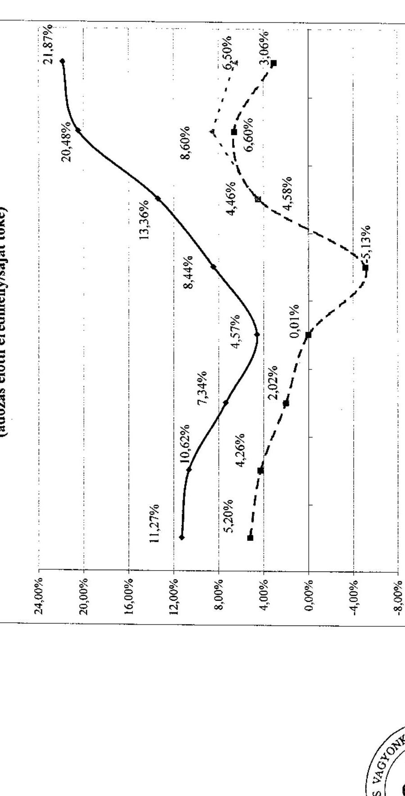