# TÁJÉKOZTATÓ 

az európai uniós támogatások 2005. évi felhasználásának ellenőrzéséről

az európai uniós támogatások 2005. évi felhasználásának ellenőrzéséről

---

# 2. Államháztartás Központi Szintjét Ellenőrző Igazgatóság 2.4. Koordinációs Főcsoport 

Iktatószám: A-124-025/2006

## A tájékoztató elkészítését felügyelte:

Bihary Zsigmond
főigazgató

A tájékoztató összeállításáért felelős:
Dr. Becker Pál
főigazgató-helyettes

A tájékoztató összeállításában részt vettek:

Dr. Báger Gusztáv főigazgató

Bartolák Márta számvevő

Bíró Endre számvevő tanácsos, tanácsadó

Laczkovich Rita számvevő

Szarka Péterné osztályvezető

Dr. Zöldréti Attila mb. osztályvezető

---

# TARTALOMJEGYZÉK 

BEVEZETÉS ..... 5
I. ÖSSZEGZŐ ÉRTÉKELÉS, KÖVETKEZTETÉSEK ..... 9
Magyarország és az EU pénzügyi kapcsolatai 2005-ben ..... 10
Az EU források felhasználásának intézményi, jogszabályi, ellenőrzési és nyilvántartási rendszere ..... 12
Strukturális Alapok ..... 16
Közösségi Kezdeményezések ..... 21
Kohéziós Alap ..... 22
Schengen Alap ..... 27
Előcsatlakozási alapok és Átmeneti Támogatások ..... 28
Phare ..... 28
SAPARD ..... 29
Átmeneti Támogatás ..... 29
Agrártámogatások ..... 30
II. RÉSZLETES ÉRTÉKELÉS ..... 32

1. Magyarország és az EU pénzügyi kapcsolatai 2005-ben ..... 32
1.1. Az uniós tagsággal összefüggő hazai befizetések ..... 32
1.2. Hazánk uniós támogatásai ..... 34
1.3. Az uniós támogatások intézményrendszere és jogszabályi környezete ..... 36
1.4. Az Európai Unióból érkező támogatások hazai ellenőrzési rendszere ..... 38
1.5. Nyilvántartási és monitoring rendszerek ..... 39
1.5.1. Az Egységes Monitoring Információs Rendszer (EMIR) ..... 39
1.5.2. Az Országos Támogatási Monitoring Rendszer (OTMR) ..... 41
1.5.3. Számviteli nyilvántartási rendszer ..... 42
2. Az Európai Uniós források felhasználásával kapcsolatos, a 2005-ös évre vonatkozó ellenőrzések legfontosabb megállapításai, következtetései, javaslatai ..... 43
2.1. Strukturális Alapok ..... 43
2.1.1. A Strukturális Alapok felhasználásának szabályozása és intézményrendszere ..... 46
2.1.2. A Strukturális Alapok ellenőrzési rendszere ..... 47
2.1.3. A Strukturális Alapokat érintő 2005. évre vonatkozó ellenőrzések megállapításai, következtetések ..... 49

---

2.1.3.1. Agrár- és Vidékfejlesztési Operatív Program ..... 52
2.1.3.2. Gazdasági Versenyképességi Operatív Program ..... 55
2.1.3.3. Humánerőforrás-fejlesztési Operatív Program ..... 56
2.1.3.4. Környezetvédelem és Infrastruktúra Operatív Program ..... 59
2.1.3.5. Regionális Fejlesztés Operatív Program ..... 60
2.1.4. Szabálytalanságok kezelése ..... 62
2.1.5. A Közösségi Kezdeményezések ..... 63
2.2. Kohéziós Alap ..... 66
2.2.1. A Kohéziós Alap felhasználásának uniós és hazai szabályozása, intézményrendszere ..... 67
2.2.2. A Kohéziós Alapot érintő 2005. évre vonatkozó ellenőrzések megállapításai, következtetések ..... 69
2.3. Schengen Alap ..... 75
2.4. Előcsatlakozási alapok és átmeneti támogatások ..... 78
2.4.1. Phare ..... 78
2.4.2. SAPARD ..... 79
2.4.3. ISPA ..... 81
2.4.4. Átmeneti Támogatás (Transition Facility) ..... 82
2.5. Agrártámogatások ..... 83
2.5.1. Nemzeti Vidékfejlesztési Terv ..... 85
2.5.2. Integrált Igazgatási és Ellenőrzési Rendszer (IIER) ..... 87
2.5.3. Az agrártámogatásokat érintő uniós ellenőrzések ..... 88
MELLÉKLETEK

1. sz. Út az Európai Unióba
2. sz. A 2005. évi költségvetési törvényben megjelenő EU-támogatások összege
3. sz. EU-s forrásokat kezelő hazai intézményrendszer 2005. évben
4. sz. A közösségi források felhasználását és ellenőrzését szabályozó főbb hazai és uniós jogszabályok
5. sz. A Közösségi Támogatási Keret célrendszere
6. sz. Az Operatív Programok prioritásai szerinti kötelezettségvállalási keretelőirányzatok
7. sz. A Tájékoztató alapjául szolgáló, 2005. évre vonatkozó ellenőrzések

---

# RÖVIDÍTÉSEK JEGYZÉKE 

| APEH | Adó- és Pénzügyi Ellenőrzési Hivatal |
| :--: | :--: |
| ÁSZ | Állami Számvevőszék |
| AVOP | Agrár- és Vidékfejlesztési Operatív Program |
| DIS | Decentralised Implementation System (decentralizált végrehajtási rendszer) |
| EDIS | Extended Decentralisation Implementation System (Kiterjesztett Decentralizációs Végrehajtási Rendszer) |
| EKKE | Európai Uniós Közbeszerzési Koordinációs és Szabályossági Egység |
| EMIR | Egységes Monitoring Információs Rendszer |
| EMOGA | Európai Mezőgazdasági Orientációs és Garanciaalap |
| ERFA | Európai Regionális Fejlesztési Alap |
| ESZA | Európai Szociális Alap |
| EU | Európai Unió |
| FEUVE | folyamatba épített előzetes és utólagos vezetői ellenőrzés |
| FMM | Foglalkoztatáspolitikai és Munkaügyi Minisztérium |
| FVM | Földművelésügyi és Vidékfejlesztési Minisztérium |
| GDP | Gross Domestic Product (Bruttó Hazai Termék) |
| GKM | Gazdasági és Közlekedési Minisztérium |
| GNI | Gross National Income (Bruttó Nemzeti Jövedelem) |
| GNP | Gross National Product (Bruttó Nemzeti Termék) |
| GVOP | Gazdasági Versenyképesség Operatív Program |
| HEFOP | Humánerőforrás-fejlesztési Operatív Program |
| HOPE | Halászati Orientációs Pénzügyi Eszköz |
| IH | Irányító Hatóság |
| IIER | Integrált Igazgatási és Ellenőrzési Rendszer |
| ISPA | Instrument for Structural Policies for Pre-Accession (Strukturális Politikák Csatlakozás Előtti Eszköze) |
| KA IH | Kohéziós Alap Irányító Hatóság |
| KEHI | Kormányzati Ellenőrzési Hivatal |
| KESZ | Kincstári Egységes Számla |
| KH | Kifizető Hatóság |
| KIOP | Környezetvédelmi és Infrastruktúra Operatív Program |
| KMB | Központi Monitoring Bizottság |
| KPSZE | Központi Pénzügyi és Szerződéskötési Egység |
| KSz | Közreműködő Szervezet |
| KTK | Közösségi Támogatási Keret |
| KvVM FI | Környezetvédelmi és Vízügyi Minisztérium Fejlesztési Igazgatósága |
| MÁK | Magyar Államkincstár (Kincstár) |
| MKK | Múködési Kézikönyv |

---

| MTRFH | Magyar Terület- és Regionális Fejlesztési Hivatal (2005.   szeptember 1-jétől OTH) |
| :-- | :-- |
| MVH | Mezőgazdasági és Vidékfejlesztési Hivatal |
| NFH | Nemzeti Fejlesztési Hivatal |
| NFT | Nemzeti Fejlesztési Terv |
| NFÜ | Nemzeti Fejlesztési Ügynökség (a Nemzeti Fejlesztési Hiva-   tal jogutódja) |
| NVT | Nemzeti Vidékfejlesztési Terv |
| OLAF | Office Européen de Lutte Anti-Fraude (Európai Csalásellenes Hivatal) |
| OP | Operatív Program |
| OTH | Országos Területfejlesztési Hivatal |
| OTMR | Országos Támogatás Monitoring Rendszer |
| PKD | Program-kiegészítő Dokumentum |
| PM | Pénzügyminisztérium |
| PMC | Project Management Cost - projekt irányítási / múködtetési költségek |
| RFÜ | Regionális Fejlesztési Ügynökség |
| ROP | Regionális Fejlesztés Operatív Program |
| SAPARD | Special Accession Programme for Agriculture and Rural   Development - Különleges Előcsatlakozási Program a Me-   zőgazdaság és Vidékfejlesztés támogatására |
| SAPS | Single Area Payment Scheme - Egyszerúsített Területalapú   Támogatás |
| TS | Technikai Segítségnyújtás |
| VPOP | Vám- és Pénzügyőrség Országos Parancsnoksága |

---

# BEVEZETÉS 

Az Európai Unióhoz való csatlakozás politikai célként fogalmazódott meg Magyarországon és más rendszerváltó országokban is. Az 1997. decemberi luxemburgi csúcson hat tagország csatlakozási tárgyalásainak elkezdéséről döntött az Európai Unió, de két évvel később, 1999 végén Helsinkiben már újabb hat tagjelölt csatlakozási tárgyalásainak megkezdéséről határozott. Az Európai Unió keleti bővítési folyamatának 1998. március 30-án megkezdődött tárgyalási szakasza 2002. december 13-án ért véget a bővítési tárgyalásokat lezáró koppenhágai csúcson. (1. sz. melléklet)

Az Európai Uniós csatlakozási folyamat - a reálkonvergenciának nevezett hoszszú távú alkalmazkodás és felzárkózás - Magyarországon már jó tizenöt évvel ezelőtt megkezdődött. Az Unióhoz történő csatlakozásunkkal 2004. május 1jétől hazánk fejlődése új minőségű szakaszába lépett, felzárkózásunk feltételei az uniós tagsággal alapvetően más dimenzióba kerültek.

Ebben az átalakulásban az egyik első lépés a külgazdasági kapcsolatrendszer földrajzi szerkezetének gyökeres és robbanásszerű átalakulása volt, az Európai Unió mára már külkereskedelmünkben hetvenöt-nyolcvan százalékot elérő súlyt képvisel. Mind a gazdaság szerkezetében, mind a tulajdonviszonyok és a vállalati versenyképesség alakulásában fontos szerepet játszott a jórészt külföldi múködőtőke megjelenése.

A nemzetközi versenyképességet, a gazdaság fejlődését, a modernizációt, az Európai Uniós forrásokkal kapcsolatos abszorpciós képességet ezek a folyamatok egyértelműen erősítették. Ezzel párhuzamosan azonban elmaradt a magyar kis- és középvállalatok térnyerése, nem csökkentek a vagyoni különbségek, nem, vagy csak alig mérséklődtek a régiók közötti fejlettségbeli eltérések, öszszességében sem - de regionális megoszlásukat tekintve még kevésbé - oldódtak meg a foglalkoztatás problémái.

Az abszorpciós képesség feltételét képező intézményrendszer fejlődésében meghatározó volt, hogy a 24. tárgyalási fejezet (Regionális Politika, Kohéziós Alap és a Strukturális Eszközök Koordinációja) lezárásának érdekében Magyarország vállalta, hogy 2004. január 1-jéig kialakítja a Strukturális Alapok és a Kohéziós Alap forrásainak hatékony, szabályszerű és eredményes felhasználásához szükséges intézményrendszert. Az alapok fogadására alkalmas intézményrendszer végső formáját azonban már 2002 júniusában elnyerte.

Az uniós ellenőrzések mellett a hazai ellenőrző szervezetek is kiemelt figyelmet fordítottak az EU csatlakozást előkészítő feladatok vizsgálatára és az uniós forrásokból juttatott pénzeszközök felhasználásának ellenőrzésére, illetve az intézményrendszer akkreditációjára.

A 2000-2004. évek ellenőrzéseinek tapasztalatai alátámasztották, hogy az előcsatlakozási programok hozzásegítették Magyarországot ahhoz, hogy folyamatosan kiépüljön az EU-támogatások felhasználására vonatkozó szabályozási és

---

intézményrendszer. Az Európai Számvevőszék vizsgálatai arra a következtetésre jutottak, hogy valamennyi előcsatlakozási eszköz esetében a felügyeleti és ellenőrzési rendszerek alapvetően hatékonyan és eredményesen múködtek. (1. sz. melléklet)

Az ellenőrzések tapasztalatai azt mutatták, hogy a csatlakozást követően is szükség van a szabályozási és intézményrendszer végleges és teljes kifejlesztésére, az uniós pénzeszközöket elszámoló szoftverfejlesztés befejezésére és az együttműködési gyakorlat kialakítására a regionalizmus erősítése érdekében.

Az európai integrációhoz való csatlakozás folyamatával egyre nagyobb súlyt kapott az Európai Unióból érkező támogatások felhasználásának ellenőrzése. Ezzel párhuzamosan - a csatlakozási folyamat előrehaladásával, majd sikeres lezárásával - a források növekedésével összhangban nőtt a beérkező támogatásokra vonatkozó ellenőrzések száma.

Az Állami Számvevőszék - mint az államháztartás külső ellenőrző szervezete stratégiájában kiemelt helyet foglal el az európai uniós támogatások és a hazai társfinanszírozás tervezésének, felhasználásának, hasznosulásának vizsgálata. Tudatosan készült fel - a nemzetközi együttmúködés lehetőségeit kihasználva az uniós tagsággal együtt járó új feladatok teljesítésére. A számvevőszéki ellenőrzés szakmai fejlesztésénél e tekintetben is támaszkodott az uniós tagországok legjobb gyakorlatára, az Európai Számvevőszék elvi és gyakorlati segítségére. Tevékenységét az uniós támogatások felhasználásának ellenőrzése során is a nemzetközi standardoknak megfelelően, az uniós követelményeket kielégítő módszerek alkalmazásával végezte. Rendszervizsgálatok keretében szabályszerűségi és teljesítmény-ellenőrzés módszerével vizsgálta a szabályozási környezetet, az intézményrendszert, a monitoring rendszert, illetve a kiválasztott programokat.

Az uniós források hatékony és szabályszerű felhasználása érdekében a csatlakozás időpontjára kialakult az egyes támogatási formák (külső és belső ellenőrzését magában foglaló) ellenőrzési rendszere.

Az Európai Számvevőszék alapvető feladata az Európai Unió pénzeszközei beszedésének és kiadásának független, külső ellenőrzése. Ennek keretében hatásköre kiterjed a Bizottság munkájának és a tagállamok intézményeinek ellenőrzésére. Az Európai Közösséget létrehozó szerződés 248. cikkének megfelelően a tagállamokban az ellenőrzést a nemzeti ellenőrző szervekkel kapcsolatot tartva kell elvégezni. Az Európai Számvevőszék és a nemzeti ellenőrző szervek függetlenségük megőrzése mellett a bizalom szellemében együttműködnek.

Mivel az EU költségvetésének kezelése egyre inkább a nemzeti hatóságok hatókörébe kerül, a Számvevőszék ellenőrzéseinek súlypontja is a tagállamokba tevődött át. Ezért az Európai Számvevőszék és a nemzeti ellenőrző szervezetek együttműködése már nem pusztán jogi kötelesség, sokkal inkább gyakorlati szükségszerűség, amely az EU-szervek és a nemzeti államigazgatási szervek egyre szorosabb együttműködéséből adódik. Az Állami Számvevőszék az Európai Számvevőszéknek a hazánkban lefolytatott vizsgálataihoz támogató segítséget nyújtott.

---

Az Európai Unió költségvetésének hatékony és szabályszerű felhasználása érdekében az Európai Bizottság (illetékes főigazgatóságain keresztül) belső ellenőrzés keretében vizsgálatokat folytat a tagállamokban.

A Bizottságnak az Európai Közösségek fő költségvetése végrehajtásáért való felelőssége sérelme nélkül, elsődlegesen a tagállamok vállalnak felelősséget a támogatások pénzügyi ellenőrzéséért. A közösségi források jogalapját képező uniós jogszabályok a támogatások szabályszerű felhasználása érdekében rend-szer-, illetve mintavételes ellenőrzések lefolytatását és belső ellenőrzés működtetését írják elő. A rendszer- és mintavételes ellenőrzések elvégzésére a hazai jogszabályok 2005. évben a Kormányzati Ellenőrzési Hivatalt jelölték ki.

A támogatásközvetítő intézményrendszer valamennyi szervezete kialakította belső ellenőrzési rendszerét, amelynek feladata többek között kiterjed a szabálytalanságok megelőzésére és felderítésére.

A közösségi támogatások hazai belső ellenőrzési rendszerének összehangolt és egységes elveken alapuló működése érdekében a Pénzügyminisztériumban kialakított szervezet módszertani útmutatókat dolgoz ki, előkészíti és koordinálja a közösségi támogatások pénzügyi ellenőrzési rendszereit, valamint közreműködik a közösségi programok előkészítésével és lebonyolításával kapcsolatos pénzügyi, irányítási és ellenőrzési, illetve belső ellenőrzési feladatok kialakításában.

Az Állami Számvevőszék az Országgyűlés pénzügyi ellenőrző szerveként szabályszerűségi és teljesítmény vizsgálati módszerekkel végzi az uniós és a hozzájuk kapcsolódó hazai társfinanszírozás (közpénzeinek) felhasználásának ellenőrzését.

Az Országgyűlés az Állami Számvevőszék 2004. évi tevékenysége elfogadásáról szóló 43/2005. (V. 26.) OGY határozat 4. pontjában előírta ${ }^{1}$, hogy „...az Állami Számvevőszék a teljes uniós pénzfelhasználás gyakorlatáról átfogó képet adjon, ennek keretében az uniós forrásokkal összefüggő pénzmozgások ellenőrzését végző hazai szervezetek munkáját szakmai szempontból áttekintse és mutassa be az ellenőrzések tapasztalatait".

A felkérésnek megfelelően a jelen Tájékoztató bemutatja az európai uniós támogatásokkal kapcsolatos ellenőrzések 2005-ös hazai intézményi rendszerét. Tartalmazza a 2005-ben érvényben lévő hazai és nemzetközi jogszabályokat, amelyek meghatározták működésüket és ellenőrzési tevékenységüket. Átfogó képet ad a különböző szervezetek feladat- és hatásköréről, az ellenőrzések során betöltött szerepükről. A mellékletekben felsorolt jogszabályok, az intézményi rendszer ismertetése lehetőséget ad arra, hogy a témával mélyebben foglalkozók ezekről teljes körű információhoz jussanak. Az ellenőrzési tapasztalatok árnyaltabb értelmezése érdekében ezen első alkalommal megjelenő Tájékoztatóban szükségesnek láttuk a támogatási formákhoz kapcsolódó általános háttérinformációk szerepeltetését is.

[^0]
[^0]:    ${ }^{1}$ Az Állami Számvevőszékről szóló 1989. évi XXXVIII. törvény 17.§ (4) bekezdése alapján az ÁSZ esetenként ellenőrzést végez az Országgyűlés utasítására

---

Természetesen a 2005-ről szóló Tájékoztató nem lehet teljes körű abban az értelemben, hogy csak az elvégzett vizsgálatokra támaszkodhat. A tárgyévi ellenőrzések az intézmények irányítási és ellenőrzési rendszere előírásoknak megfelelő kiépítésére, illetve a 2004. év folyamán beindított pályázati tevékenység szabályszerű múködésének vizsgálatára irányultak. A kifizetések alacsony aránya nem tette lehetővé az ellenőrzéseket lefolytató szervezetek részére a pénzfelhasználás eredményességének és hatékonyságának vizsgálatát, ennek megfelelően ez évben a Tájékoztató is korlátozottan képes a pénzfelhasználás hasznosulásáról, hazánk abszorpciós képességéről reális képet nyújtani. A mostantól kezdve minden évben kibocsátani tervezett Tájékoztató azonban rövid időn belül lefedi az európai uniós források felhasználásának teljes területét, és alkalmas lesz arra, hogy kimutassa a kialakult trendeket, változásokat.

Ez azért is hasznos, mert az Európai Unió részéről már 2003-ban felmerült az igény, hogy az Európai Számvevőszék és a nemzeti számvevőszékek évenként készítsenek áttekintő értékelést az európai uniós pénzeszközök hasznosításának ellenőrzési tapasztalatairól. Azzal, hogy az Állami Számvevőszék ettől kezdve évente megjelenteti a Tájékoztatót, az elsők között tesz eleget ennek a felkérésnek.

Munkánk során más szervezetek ellenőrzési tapasztalatait is felhasználtuk. A jelentésükben megfogalmazottakat tartalmi változtatás nélkül szerepeltetjük a Tájékoztatóban, és érdemben felhasználtuk véleményünk kialakításához. Együttmúködésükért, segítőkészségükért ezúton mondunk köszönetet a Pénzügyminisztérium, az Operatív Programokat felügyelő minisztériumok, a Kormányzati Ellenőrzési Hivatal, a Nemzeti Fejlesztési Ügynökség vezetőinek és munkatársainak.

---

# I. ÖSSZEGZŐ ÉRTÉKELÉS, KÖVETKEZTETÉSEK 

Az ÁSZ a 2004. évi tevékenységéről szóló jelentésében rámutatott, hogy a csatlakozást követően is szükség van a szabályozási és intézményrendszer végleges és teljes kifejlesztésének korrekcióira, támogatására, az uniós pénzeszközöket elszámoló szoftverfejlesztés befejezésére és az együttmúködési gyakorlat kialakítására a regionalizmus erősítése érdekében. Az ellenőrzési rendszer átfedéseit és hiányosságait fel kell számolni és teljes körűvé kell tenni az EU-standardokra alapozott ellenőrzési követelmény érvényesítését, arányossá kell tenni a rend-szer-, a program- és projektellenőrzéseket, illetve az egyedi tranzakciók vizsgálatát.

A 2005. évi ellenőrzések összességében megállapították, hogy az EU-ból érkező források fogadására, ill. lebonyolítására alkalmas - sokszereplős - intézményrendszert az EU előírásainak megfelelően, a hazai jogszabályokat figyelembe véve hozták létre. A támogatásközvetítő intézményrendszer működésének hatékonyságát jelentősen befolyásolta a szervezeteknél fennálló kapacitáshiány, a fluktuáció szintje és a betanulás időigényessége, s ez hatással volt a határidők betartására a pályáztatási feladatok ellátása során. Az uniós támogatások eredményes felhasználását biztosító jogszabályi környezetet - néhány esetben jelentős késéssel - kialakították. Kiemelkedő kockázatot jelentett azonban a jogszabályi környezet változékonysága, jelentős többletfeladatokat róva az intézményrendszerre, hátráltatva a határidők betartását.

A 2005-re kialakított ellenőrzési rendszer megfelelő alapot biztosított az Európai Unióból érkező közösségi források szabályszerű és hatékony felhasználásához, illetve a hazánk rendelkezésére álló támogatási keretek minél kedvezőbb mértékű lekötéséhez. Az ellenőrzési rendszer továbbfejlesztése során azonban a teljes zártság eléréséhez szükséges az átfedések mérséklése és a vizsgálatok egységes szakmai követelmények alapján történő lefolytatása.

Az európai uniós támogatások felhasználásának átláthatósága érdekében a pályázatok kezelésére, nyomon követésére és az Európai Unióval történő elszámolások biztosítására létrehozott informatikai rendszer (EMIR) bevezetése a 2005. évben folyamatosan valósult meg. Az ellenőrzések rámutattak, hogy az év folyamán elért jelentős előrehaladás ellenére a rendszer mérsékelten tudta kielégíteni az elvárt követelményeket. A vizsgálatok jelezték, hogy szükséges az EMIR további fejlesztése és a felhasználók EMIR ismereteinek bővítése.

A támogatások szabályszerű felhasználására vonatkozóan a vizsgálatok nem tártak fel jelentős hiányosságokat, voltak azonban rendszerjellegú problémák, amelyek lassították a pályáztatás és az értékelés, valamint a kifizetések folyamatát. Az irányítási rendszerek súlyos hiba nélkül a támogatások céljának megfelelően múködtek.

A 2005. évi ellenőrzések eredményeiből néhány következtetés, javaslat egyértelműen megfogalmazható az európai uniós források szabályszerűbb és hatékonyabb felhasználása érdekében:

---

A gyakran változó jogszabályok megnehezítik mind a pályáztatók, mind a pályázók munkáját, és a folytonos változásokhoz alkalmazkodás többletköltségeket okoz. Nem vitatva, hogy a változtatások célja az egyszerúbb, gyorsabb eljárási rend kialakítása volt, a kiszámítható és állandó jogszabályi környezet szükséges feltétele a hatékonyabb munkának.

A nyilvántartási és monitoring rendszereket tovább kell fejleszteni annak érdekében, hogy azok teljes funkcionalitásukban biztosítani tudják a gyors, megbízható adatáramlást és az ellenőrizhetőséget. Szükség esetén megfelelő képzéssel biztosítani kell, hogy mind az NFÜ-nél, mind a források felhasználásban szerepet játszó szervezeteknél megfelelő létszámban, jól képzett szakemberek dolgozzanak.

Az uniós források teljes körű lekötésének, gyorsabb, hatékonyabb felhasználásának fontos feltétele, hogy a pályázat benyújtásától a szerződéskötésig eltelt idő a jogszabályban előírt szintre csökkenjen. A feldolgozás sebessége javult az előző évhez képest, azonban minden eddigi erőfeszítés ellenére a Strukturális Alapok programjainál a pályázatkezelési folyamat (a benyújtásától a szerződéskötésig eltelt idő) átlagosan kilenc hónapot vett igénybe.

Az uniós források felhasználásának ellenőrzési rendszere ${ }^{1}$ nem mentes az átfedő, esetenként egyidejú ellenőrzésektől. Ez egyrészt szervezési, együttmúködési problémákra utal, másrészt a kötelezően előírt különböző nemzetközi standardok (COSO, IIA, ISA, INTOSAI ${ }^{2}$ ) egyidejú alkalmazásából is adódnak, mivel a különböző ellenőrzések a saját szakmai követelményrendszerüket érvényesítik. Ez elsősorban a külső és belső ellenőrzések vonatkozásában jelent gondot. A megoldást az egységes szakmai követelményeken, elveken - INTOSAI Standardokon - alapuló ellenőrzési rend kialakítása jelenti.

Minderre figyelemmel az Állami Számvevőszék következetesen szorgalmazza, hogy a közszférában egységesen az INTOSAI standardok, illetve a belső kontroll standardokhoz kidolgozott INTOSAI Irányelvek képezzék az ellenőrzési tevékenység szakmai alapjait. (Az Európai Unió 1998-ban fogadta el útmutatóját az INTOSAI Ellenőrzési Standardok uniós alkalmazásáról.)

# Magyarország és az EU pénzügyi kapcsolatai 2005-ben 

A közösségi és hazai jogszabályokkal összhangban az Uniót 2005. évben összesen 214 388,6 M Ft illette meg Magyarországról, ebből a tradicionális saját forrás 28118,5 M Ft, a nemzeti hozzájárulás összege 186644,5 M Ft volt. Ezen felül a Szén és Acél Kutatási Alaphoz való hozzájárulás 374,4 M Ft összeget tett ki. Magyarország a fizetési kötelezettségét havonta teljesítette.

[^0]
[^0]:    ${ }^{1}$ Az Európai Bizottság vizsgálatai, rendszer- ill. mintavételes ellenőrzések, a támogatásközvetítő intézményrendszer által működtetett belső ellenőrzés, a Kifizető Hatóság vizsgálatai; az uniós és tagállami számvevőszéki ellenőrzések, valamint a megbízás alapján végzett értékelések.
    ${ }^{2}$ COSO: belső kontroll standardok, IIA: belső ellenőrzési standardok, ISA: könyvvizsgálati standardok; INTOSAI: külső ellenőrzési standardok

---

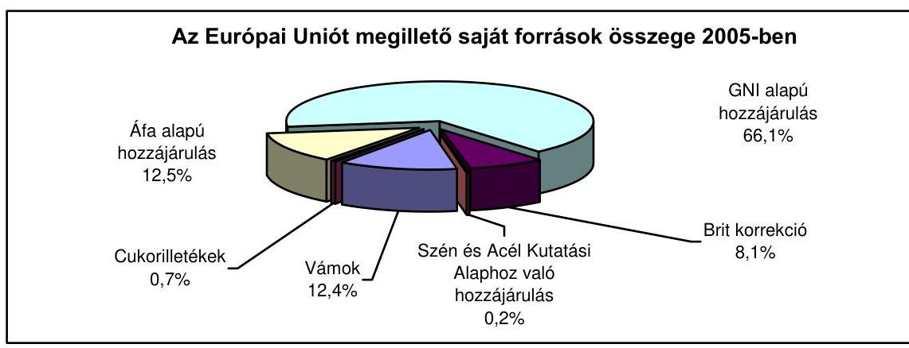

A 2005. évi befizetési kötelezettségek hazai kiszámításában, ill. lebonyolításában a kiemelt szerepet játszó Pénzügyminisztérium mellett a Vám- és Pénzügyőrség Országos Parancsnoksága, a Mezőgazdasági és Vidékfejlesztési Hivatal, az Adóés Pénzügyi Ellenőrzési Hivatal, a Magyar Államkincstár, valamint a Központi Statisztikai Hivatal vettek részt.

A Magyar Köztársaság 2005. évi költségvetésében az EU támogatások (Strukturális Alapok, Kohéziós Alap, Schengen Alap, Nemzeti Vidékfejlesztési Terv, SAPARD, Phare/Átmeneti támogatás, egyéb európai uniós támogatások) és a hozzájuk kapcsolódó hazai társfinanszírozás, valamint a visszatérítés összege 293 142,7 M Ft összegben jelent meg. (2. sz. melléklet)

A központi költségvetésbe a tervezetthez képest 10,3\%-kal több uniós forrás érkezett, ugyanakkor az ezekhez kapcsolódó hazai társfinanszírozás mértéke alig haladta meg az eredeti támogatási előirányzatot. Ennek oka a nagyobb mértékű uniós forrásból történő előleg kifizetés.
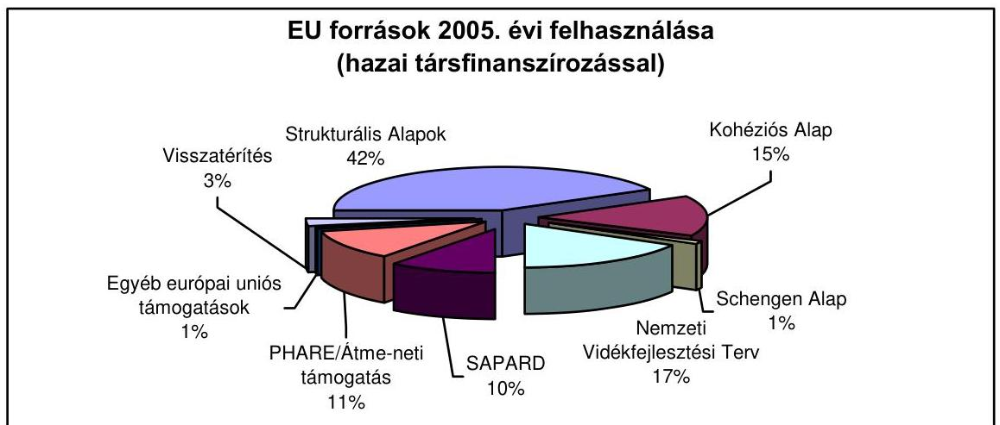

---

Az ÁSZ megállapította, hogy a költségvetés végrehajtásáról szóló törvénytervezet nem elkülönítetten tartalmazta a Top-up ${ }^{3}$ címén 2005-ben kifizetett 85 458,3 M Ft-ot.

A költségvetésen kívüli támogatási formák (agrárpiaci támogatások, közvetlen termelői támogatások) összege 2005. évre vonatkozóan meghaladta a 307 Mrd Ft-ot (agrárpiaci támogatásként 159 133,3 M Ft, közvetlen termelői támogatásként 148 022,9 M Ft), amelyet a Kifizető Úgynökség a KESZ-ről megelőlegezett, és az Unió utólag téríti meg az államháztartás számára.

A költségvetés végrehajtására vonatkozó ellenőrzés rámutatott, hogy az intervenciós felvásárlás (agrárpiaci támogatás) megelőlegezése évről-évre visszatérő pótlólagos finanszírozási terhet jelent az államháztartás számára.

A 2005. évben 142 215,4 M Ft-ot fordítottak a felvásárlás és az értékesítéshez kapcsolódó költségek megelőlegezésére, ezzel szemben a gabona értékesítéséből befolyt összeg csupán 11275,2 M Ft volt. A fennmaradt 117 316,9 M Ft visszatérülésének időpontja bizonytalan. Ez az összeg növelte az államháztartás forrásszükségletét, illetve az emiatti kamatkülönbözet által annak hiányát.

A 2005. év végén a Kincstár számláinak egyenlege az Uniótól már beérkezett, de a fejezetekhez még át nem utalt támogatásokat mutatta. Ennek összege 36 465,2 M Ft volt.

# Az EU források felhasználásának intézményi, jogszabályi, ellenőrzési és nyilvántartási rendszere 

Az intézményrendszerre vonatkozóan (3. sz. melléklet) megállapítható, hogy EU-ból érkező források fogadásához, ill. lebonyolításához Magyarország az EU előírásainak megfelelően, a hazai jogszabályokat figyelembe véve alakította ki (4. sz. melléklet).

Az európai ügyekért felelős tárca nélküli miniszter felügyelete alatt a Kormány 2004-től létrehozta a Nemzeti Fejlesztési Hivatalt (NFH), amely ellátta a Strukturális Alapok Közösségi Támogatási Keret és a Kohéziós Alap Irányító Hatóság feladatait, gondoskodott a Közösségi Támogatási Keret Monitoring Bizottság és a Kohéziós Alap Monitoring Bizottság múködéséről, valamint biztosította a Phare és az ISPA programokkal kapcsolatos előkészítési, szervezési és koordinációs feladatok ellátását is. Az egyes operatív programokhoz kapcsolódó monitoring bizottságokat az OP IH állította fel.

Az Irányító Hatóság (IH) - a Strukturális Alapok operatív programjai, a Közösségi Kezdeményezések és a Kohéziós Alap támogatásai esetében - az adott program megvalósítására, és a program jogszabályoknak megfelelő adminisztratív, pénzügyi és szakmai irányítására kijelölt szervezeti egység. A folyamat lebonyolításában az Irányító Hatóságok munkáját Közremúködő Szervezetek (KSz) és (a Kohéziós Alap vonatkozásában) lebonyolító testületek segítették. A

[^0]
[^0]:    ${ }^{3}$ A területalapú agrártámogatás rendszerében igényelhető kiegészítő nemzeti támogatás.

---

pályázatokról való érdemi döntések a Strukturális Alapokból igénybe vehető támogatások esetében az Irányító Hatóságoknál, a Kohéziós Alap által támogatott projekteknél az Európai Bizottságnál születtek. A Schengen Alapból érkező támogatásoknak az egyes fejezetekhez történő eljuttatásáért a Központi Pénzügyi Szerződéskötő Egység volt a felelős, amely szervezet a Nemzeti Fejlesztési Hivatal felügyelete alatt múködött. Az uniós agrártámogatások lebonyolítását a Földművelésügyi és Vidékfejlesztési Minisztérium, mint Irányító Hatóság, és a Mezőgazdasági és Vidékfejlesztési Hivatal, mint Kifizető Ügynökség és Közreműködő Szervezet látta el.

A Pénzügyminisztérium szervezetében kialakított Nemzeti Programengedélyező Iroda látta el a Kifizető Hatóság feladatait a Strukturális Alapok és a Kohéziós Alap támogatásainak folyósításakor, valamint a Nemzeti Alap feladatait az előcsatlakozási támogatások esetében.

A jogszabályi környezetet az uniós támogatások eredményes felhasználása érdekében, az EU előírásainak megfelelően - néhány esetben jelentős késéssel kialakították. (4. sz. melléklet) Kiemelkedő kockázatot jelentett azonban a jogszabályi környezet változékonysága, jelentős többletfeladatokat rótt az intézményrendszerre, hátráltatva a határidők betartását.

Számos vonatkozó jogszabályt - az uniós támogatásokat érintő rendelkezéseik tekintetében - a tárgyévben több alkalommal módosították. A változtatások célja, hogy a támogatások minél hamarabb, ugyanakkor minél pontosabban körülhatárolt feltételek mellett jussanak el a kedvezményezettekhez.

Az államháztartás múködési rendjéről szóló (korábban már többször módosított) kormányrendelet tárgyévben hatályos szabályait az uniós támogatásokra vonatkozó előírásokra vonatkozóan négy alkalommal módosították.

A Strukturális Alapok és a Kohéziós Alap lebonyolítási folyamatainak egységes kialakításának lehetőségét akadályozta a közös miniszteri rendelet nyolc hónapos szabályozási késedelme. A rendeletet 2005. évben két alkalommal is módosították.

Az agrártámogatásokkal kapcsolatos joganyag részletes szabályainak módosítására a földművelésügyi és vidékfejlesztési miniszter 10 rendeletet módosított, illetve 6 új rendeletet adott ki.

A támogatások pénzügyi ellenőrzéséért az Európai Bizottságnak az Európai Közösségek főköltségvetése végrehajtásáért való felelőssége sérelme nélkül, elsődlegesen a tagállamok vállalnak felelősséget.

A Bizottság az Európai Közösségek főköltségvetésének végrehajtásáért való hatáskörében biztosítja, hogy a tagállamok zavartalanul múködő irányítási és ellenőrzési rendszerekkel rendelkezzenek a közösségi alapok hatékony és szabályszerű felhasználása érdekében. Az EU támogatások ellenőrzési rendszerét az EU előírásoknak megfelelően, hazai jogszabályokkal összhangban alakították ki. Valamennyi támogatási forma - az uniós szabályokkal összhangban - eltérő jogszabályi háttérrel rendelkezik.

---

Az előcsatlakozási alapok programjait az esetek többségében decentralizált irányítás segítségével hajtották végre, amely során vagy előzetesen ellenőrizték a közbeszerzéshez és a szerződések odaítéléséhez kapcsolódó döntéseket (DIS), vagy csupán utólagos ellenőrzéseket hajtották végre (EDIS). A Phare programok esetében a Bizottság 2004-ben tovább javította a belső irányítási környezetét, továbbá az EDIS csatlakozás utáni megvalósítása jelentős lépés volt az új tagállamok irányítási kapacitásának és ellenőrző rendszereinek fejlesztése felé.

A hazai és az uniós jogszabályok alapján az Európai Unió Strukturális Alapjainak és a Kohéziós Alap mintavételes ellenőrzését, az irányítási és ellenőrzési rendszerek múködésének ellenőrzését (rendszerellenőrzés), ill. a zárónyilatkozathoz szükséges ellenőrzést a Kormányzati Ellenőrzési Hivatal (KEHI) végezte. A KEHI évente június 30 -ig megküldi az Európai Bizottság részére az előző év ellenőrzési tapasztalatai alapján - támogatási formánként - elkészített éves öszszegző jelentésből, valamint a Közösségi Támogatási Keret és Kohéziós Alap Irányító Hatóság által az intézményrendszerben bekövetkezett főbb változásokról szóló éves jelentésből összeállított éves összefoglaló jelentését.

Az ellenőrzött szervezetek a KEHI részére tájékoztatást adnak minden év január 15-ei határidővel az előző évi ellenőrzésekhez kapcsolódó intézkedési tervek időarányos végrehajtásáról. A KEHI a tájékoztatások alapján értékelést készít, amelynek eredményéről minden év február 28-ig a Kormány részére beszámol. A KEHI által végzett rendszerellenőrzések, illetve a mintavételes ellenőrzések alapján készített intézkedési tervekben foglaltak megvalósulásának nyomon követéséről az Irányító Hatóság gondoskodik.

A Strukturális Alapok operatív programjai, az Equal és Interreg közösségi kezdeményezések és a Kohéziós Alap irányító hatóságai évente jelentést készítenek a programok megvalósításáról, amelyet megküldenek az Európai Bizottság részére az előírt határidőig.

A hazai jogszabályokban előírtak alapján a Kifizető Hatóság a kiadások megfelelő igazolása érdekében a pénzügyi lebonyolítás tekintetében a támogatásközvetítő rendszer valamennyi szereplőjére kiterjedően (a kedvezményezettek kivételével) tényfeltáró látogatások keretében vizsgálatokat végez.

Az egyes Irányító Hatóságokat múködtető minisztériumok belső ellenőrzési egységei biztosították a szervezetek feladatellátásának rendszerellenőrzését.

A hazai jogrendszer előírja az ellenőrzések által feltárt hiányosságok megszüntetésére vonatkozó intézkedési terv összeállítását, az intézkedések megvalósulásának nyomon követését. Az ellenőrzött szerv (Irányító Hatóság, Kifizető Hatóság, Közremúködő Szervezet), vezetője intézkedési tervet készít és gondoskodik az intézkedések megvalósulásának nyomon követéséről.

A nyilvántartási és monitoring rendszerek múködtetése elengedhetetlenül szükséges az Európai Unióval történő elszámolások megbízhatósága és a források hatékony felhasználása érdekében a gazdálkodásra vonatkozó naprakész, pontos adatszolgáltatáson keresztül.

A 2005-ben lefolytatott ellenőrzések kiemelt területként kezelték a Strukturális Alapok és a Kohéziós Alap elszámolásait támogató Egységes Monitoring

---

Információs Rendszer (EMIR) múködését. Az ÁSZ a zárszámadáshoz kapcsolódó ellenőrzése, a KEHI rendszerellenőrzései, a támogatások felhasználásáért felelős intézményrendszer belső ellenőrzései, ill. az Európai Bizottság által lefolytatott vizsgálatok egyaránt kiemelkedő megállapításokat tettek a rendszer hasznosulására vonatkozóan.

Az EMIR bevezetésére a 124/2003. (VIII. 15.) Korm. rendelet alapján került sor. A nyilvántartási rendszer célja a Strukturális Alapok és a Kohéziós Alap támogatásával megvalósuló projektek részben hazai információs célú adminisztrációja, részben az Unióval történő elszámolások biztosítása volt.

Az Európai Bizottság az EMIR felépítését jónak ítélte, azonban a rendszer a vizsgált időszakban még nem készült el teljesen, így csak mérsékelten tudta kielégíteni a Strukturális Alapok és a magyar hatóságok jelentési igényeit. Az EMIR pénzügyi modulja még mindig változásokon ment keresztül. A számviteli modul még nem volt múködőképes, ennek következtében a rendszer szereplőinek egymás közötti pénzmozgásait az informatikai rendszeren kívül tartották nyilván. Az EMIR még nem múködő szabálytalansági modulja miatt a szabálytalanságok nyilvántartása manuálisan történt.

Szinte valamennyi, a Strukturális Alapok intézményrendszerére kiterjedő vizsgálat jelezte, hogy szükséges az EMIR további fejlesztése és a felhasználók EMIR ismereteinek bővítése, valamint az eljárásrendekben az EMIR jogosultságok kiadásának és visszavonásának szabályozása. Az ellenőrzések kiemelték, hogy nem állt rendelkezésre fejlesztési stratégia, valamint az EMIR fejlesztése és bevezetése elhúzódott. Hiányosság volt tapasztalható a szakmai felkészültség vonatkozásában is: egyrészt a felhasználók képzése sem volt kielégítő, másrészt az üzemeltető NFH sem rendelkezett megfelelő IT szakember állománnyal.

Jelentős hiányosság volt az EMIR számviteli modul bevezetésének késedelme. A modul bevezetése 2005 végére történt meg. A szabálytalanság-kezelő, a helyszíni ellenőrzési és a nyomonkövetési modulok 2005 folyamán még nem múködtek, fejlesztésük és bevezetésük 2006-ban valósult meg.

Az ellenőrzések szükségesnek ítélték az EMIR további fejlesztését és az NFH megfelelő hatáskörének biztosítását.

Az Országos Támogatási Monitoring Rendszer (OTMR) létrehozásával a Kormányzat célja olyan monitoring rendszer kialakítása volt, amely nyomon követi a vállalkozások részére a központi költségvetésből és az elkülönített állami pénzalapokból nyújtott támogatásokat és emellett biztosítja, hogy a köztartozással rendelkezők ne tudjanak állami támogatásokat igénybe venni.

Az OTMR és az EMIR közötti adatkapcsolat fenntartása, a két nyilvántartási rendszer kommunikációjának biztosítása a rendszerek fejlesztése során fontos követelmény volt. Ennek elérésében már 2004-ben is fennakadások voltak, és az OTMR-be történő adatbevitelt pótlólagos kézi feldolgozással, papíralapú bizonylatok előállításával kellett megoldani. A két nyilvántartási rendszer közötti folyamatos adatkapcsolat megteremtéséig nem érvényesülhet teljes körűen az OTMR köztartozás figyelési funkciója. Ezért az NFH kialakította a köztartozási adatokra vonatkozó közvetlen adatkapcsolatot a VPOP és az APEH felé.

---

Kormányrendelet ${ }^{4}$ írta elő, hogy a számviteli nyilvántartás részletes szabályait a Kifizető Hatóság a pénzügyminiszter külön tájékoztatójában jelenteti meg, amelynek alapján a Kifizető Hatóságnak, az Irányító Hatóságoknak és a Közremúködő Szervezeteknek a maguk számviteli eljárásrendjeit és az azok részét képező számlarendet, számlatükröt és bizonylati albumot kellett elkészíteni. A jogszabály szerint elkülönítetten vezetett, eredményszemléletű kettős könyvviteli nyilvántartásokkal kell eleget tenni az Európai Bizottság, az Irányító Hatóságok és az ellenőrzést végző szervezetekkel szemben fennálló beszámolási és adatszolgáltatási kötelezettségnek.

A számviteli eljárásrendeket és a szabályzatokat az intézmények a 2005. év hátralévő részében elkészítették. A számviteli eljárás részét képező számlatükröt és számlarendet a Kifizető Hatóság - az onnan kapott tájékoztatás szerint - felülvizsgálta, ugyanakkor azok jóváhagyása nem volt dokumentált, holott a jóváhagyást a hivatkozott kormányrendelet előírta. A számviteli nyilvántartási rendszer 2005. év végén még nem tudta biztosítani a számvitel zárt rendszerétől elvárható követelményeket. Egyes Közreműködő Szervezetek az EMIR-től független nyilvántartás vezetésére kényszerültek annak érdekében, hogy adatszolgáltatási kötelezettségeiknek eleget tegyenek.

# Strukturális Alapok 

Az Európai Unió az elmaradott régiók felzárkóztatására pénzügyi alapokat állított fel (a Strukturális Alapokat), melyek ezen régiók infrastruktúráját, a helyi gazdaság diverzifikálását, a munkaerő képzettségét, valamint a különböző gazdasági ágazatok termelékenységének fejlesztését tűzték ki célul. Hazánk az ún. 1. célkitűzésből részesült, amelynek feladata a fejlődésben lemaradó régiók fejlődésének és strukturális átalakulásának elősegítése. Az Európai Unió 2004ben elfogadta a Strukturális Alapokból folyósított támogatások felhasználásának stratégiai tervét, a Nemzeti Fejlesztési Tervet (NFT) és annak pénzügyi kereteit, a Közösségi Támogatási Keretet (KTK).

Az NFT keretében hazánk az életminőség javítását és az Unióhoz viszonyított, illetve az országon belüli területi fejlettségi különbségek csökkentését tűzte ki célul. E célok megvalósítására az NFT négy ágazati és egy regionális operatív programot (OP) alakított ki: Agrár- és Vidékfejlesztési Operatív Program, Gazdasági Versenyképesség Operatív program, Humánerőforrás-fejlesztési Operatív Program, Környezetvédelem és Infrastruktúra Operatív Program és a Regionális Fejlesztés Operatív Program.

Az Agrár- és Vidékfejlesztési Operatív Program (AVOP) célja a mezőgazdasági termelés és élelmiszer-feldolgozás versenyképességének javítása és a vidék felzárkóztatásának elősegítése. A Gazdasági Versenyképesség Operatív Program (GVOP) célja a gazdasági versenyképesség növelése az Európai Unió forrásainak

[^0]
[^0]:    ${ }^{4}$ 360/2004. (XII. 26.) Korm. rendelet a Nemzeti Fejlesztési Terv operatív programjai, az EQUAL Közösségi Kezdeményezés program és a Kohéziós Alap projektek támogatásainak fogadásához kapcsolódó pénzügyi lebonyolítási, számviteli és ellenőrzési rendszerek kialakításáról, ill. a Tanács 1999. június 21-i 1260/1999/EK rendelete, a Bizottság 2001. március 2-i 438/2001/EK rendelete.

---

felhasználásával. A program a gazdasági szférát, elsősorban a kutatás-fejlesztést, innovációt, illetve az információs gazdaság, társadalom területét támogatja. A Humánerőforrás-fejlesztési Operatív Program (HEFOP) a foglalkoztatás, az oktatás és képzés, a szociális szolgáltatások, valamint az egészségügyi ellátórendszer területén megvalósítandó fejlesztéseket támogatja az Európai Foglalkoztatási Stratégia és a Közös Foglalkoztatáspolitikai Értékelés által meghatározott szakmapolitikai keretekbe illeszkedve. A Környezetvédelem és Infrastruktúra Operatív Program (KIOP) specifikus céljai a környezet állapotának javítása a fenntartható fejlődés elősegítésével a környezet- és természetvédelmi fejlesztések által, valamint a környezetkímélő közlekedési infrastruktúra fejlesztése és az elérhetőségi mutatók javítása. A Regionális Fejlesztés Operatív Program (ROP) célja a kiegyensúlyozott területi fejlődés elősegítése.

Az öt operatív programra a 2004-2006 közötti időszakra összesen 670 150,7 M Ft keret állt rendelkezésre, amelynek feléből a HEFOP (27\%) és a GVOP (23\%) részesedett:
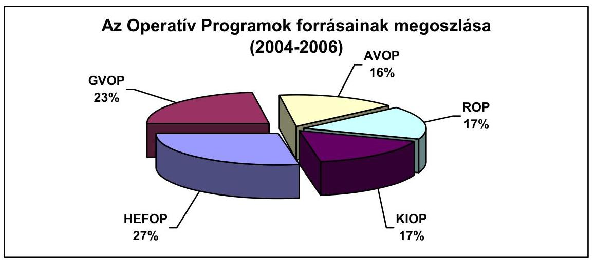

A Nemzeti Fejlesztési Terv vonatkozásában a Strukturális Alapok támogatás 66,6\%-a nyilvános pályázat keretében kiválasztott projekteket finanszírozott, 29,4\%-a pályázat nélkül kiválasztott, közvetlenül az állami szervek által végrehajtott központi intézkedések (programok vagy projektek) megvalósítását szolgálta, 4\%-át a programok hatékony megvalósítását elősegítő szakmai támogatási (technical assistance, TA) projektekre különítettek el.

A Nemzeti Fejlesztési Terv pályázati kiírásaira a 2004. januári megjelenéstől 2005. év végéig összesen 30103 db pályamű érkezett be. A kötelezettségvállalások értéke elérte az 562,1 Mrd forintot (a három éves keret 84\%-át). A kifizetett támogatás meghaladta a 126 Mrd forintot, amelynek 53\%-a tényleges teljesítésen alapuló, számlaalapú kifizetés volt.

Az Unió egészét érintő problémák kezelésére az Unió a Strukturális Alapokat kiegészítő segélyt, vagy cselekvési programokat, ún. Közösségi Kezdeményezéseket hozott létre, amelyből hazánkban önállóan csak az Equal és Interreg programok indultak el.

A Strukturális Alapok felhasználásának uniós szabályozása meghatározta a felhasználás főbb elveit, szervezeti kereteit, a lebonyolítás pénzügyi rendszerét,

---

illetve az ellenőrzés és irányítás rendszerét. A tagállam feladata és felelőssége kiterjedt a menedzsment és ellenőrzési rendszerek folyamatos vizsgálatára, a kiadások jogosságának igazolására, a szabálytalanságok megelőzésére, feltárására és korrekciójára, valamint a jelentési és tájékoztatási kötelezettségre. Ezen feladatok ellátásának módját a végrehajtási rendeletek részletesen szabályozták.

Az Operatív Programok megvalósításáért az Irányító Hatóságok - melyek tevékenységét a szakterületért felelős miniszterek felügyelték - feleltek, és a Közösségi Támogatási Keret Irányító Hatóság koordinálta. Az átutalási igények öszszeállítását, a költségnyilatkozatok igazolását és azoknak az EU felé benyújtását a Pénzügyminisztérium szervezetén belül kialakított Kifizető Hatóság végezte.

Az Európai Bizottság illetékes főigazgatóságai 2005 folyamán több ízben is vizsgálták a Strukturális Alapok irányítási és ellenőrzési rendszerét, az egyes Operatív Programokra, illetve alapokra lebontva. A vizsgálatok során megállapított következtetések az átadott dokumentumok elemzésén, valamint az azt követő tényfeltáró látogatások alatt kapott magyarázaton alapultak, nem értékelték a rendszerek működési hatékonyságát.

A KEHI a Strukturális Alapokkal kapcsolatos ellenőrzéseit (5\%-os, ill. rendszerellenőrzés) a nemzeti ellenőrzési stratégia alapján, azzal összhangban végezte el. A vizsgálatok a jogszabályi követelmények alapulvételével, az EU Bizottság rendszerellenőrzési módszertanában is kiemelt területekre koncentrálva tárták fel a még a rendszerben lévő hiányosságokat, valamint azokat a kockázatokat - a rendszerjellegú és szervezet-specifikus kockázati tényezőket egyaránt -, amelyek az irányítási és ellenőrzési rendszer hatékony működését veszélyeztethetik.

A költségigazoló nyilatkozat kiadása érdekében 2005 első félévében a Kifizető Hatóság összesen húsz tényfeltáró látogatást végzett a pénzügyi lebonyolításban résztvevő szervezeteknél. A tényfeltáró látogatások alkalmával a Kifizető Hatóság az Irányító Hatóságok és a Közremúködő Szervezetek múködését, az eljárásrendek és a tényleges gyakorlat összhangját elemezte, amelynek eredményeképpen a feltárt hiányosságok elhárítása érdekében ajánlásokat fogalmazott meg az érintett szervezetek részére.

Az egyes Irányító Hatóságokat múködtető minisztériumok belső ellenőrzési egységei biztosították a szervezetek feladatellátásának rendszerellenőrzését.

A Nemzeti Fejlesztési Hivatal megbízásából - tekintettel az ellenőrzési feladat informatikai jellegére - a KÜRT Computer Rendszerház Rt. végzett rendszerellenőrzést.

Az ÁSZ szabályszerűségi ellenőrzést folytatott az EU-támogatásokra és az uniós tagsággal összefüggő befizetésekre vonatkozóan. A vizsgálat kiterjedt a Strukturális Alapok, illetve a Közösségi Kezdeményezések igénybevételére. A Nemzeti Fejlesztési Terv végrehajtására és az uniós támogatások hazai monitoring és ellenőrzési rendszere múködésére vonatkozó ellenőrzések a Tájékoztató időpontjában folyamatban voltak.

---

Az ellenőrzési tapasztalatok mind az öt Operatív Program, valamint az Equal közösségi kezdeményezés tekintetében azt mutatták, hogy mutatkoztak olyan rendszerjellegú problémák, amelyek lassították a pályáztatás és az értékelés, valamint a kifizetések folyamatát, azonban az ellenőrzési tevékenység eredményei nem mutattak lényeges hiányosságot az irányítási és ellenőrzési rendszer tényleges múködésében. A lefolytatott ellenőrzések pénzügyi korrekció szükségességét nem állapították meg.

Az AVOP-nál a folyamatba épített ellenőrzés már az utólagos ellenőrzéseket megelőzően kiszűrte azokat a hibákat, amelyek pénzügyi korrekciót vontak volna maguk után, így ezekben az esetekben a támogatás kifizetésére már nem került sor. A HEFOP esetében az első szintű ellenőrzések során feltárt szabálytalanságok vonatkozásában a szükséges, visszafizetési kötelezettséggel is járó intézkedések végrehajtásáról gondoskodtak. A GVOP és a ROP ellenőrzési tapasztalatok azt mutatták, hogy a FEUVE rendszer, valamint az értékelések és az uniós jogszabály irányítási és ellenőrzési rendszerekre vonatkozó bizottsági rendeletben előírt (4. cikk szerinti) ellenőrzések hiányosságai olyan szabálytalanságokat eredményeztek, amelyek esetenként pénzügyi korrekciót is szükségessé tettek. Ugyanakkor a pénzügyi korrekciót szükségessé tett feltárt hibák az ellenőrzött pályázatoknál eseti jelleggel fordultak elő, az ellenőrzött szervezetek intézkedtek a feltárt hibák, illetve visszafizetést eredményező szabálytalanságok megszüntetése érdekében.

Az Európai Bizottság összességében megállapította, hogy a vizsgált rendszerleírások, az irányítási és ellenőrzési rendszerek leírása megfelelő bizonyosságot nyújtott arról, hogy a rendszerek megfelelnek az 1260/1999/EK és a 438/2001/EK rendeletek által meghatározott szabványoknak. A feladatok szétválasztása és elosztása világos volt; a funkciókat átfogó írásos eljárások támogatták. AZ EU pénzeszközök irányítását és ellenőrzését támogató jogi háttér biztosított. Az irányítási rendszer intézményeiben dolgozó munkatársak jól képzettek, jól értik a vonatkozó operatív program, ill. strukturális alap követelményeit és megfelelően hajtották végre a szabályozásokat. A KH, IH-k és a vizsgált KSz-ek jól szervezettek, világosan el voltak választva a feladatok és megfelelőek voltak az átfogó Múködési Kézikönyvek. A Bizottság javaslatokat fogalmazott meg többek között a hitelesítési ellenőrzések szabályozottságára, az IH-k és KSz-ek közötti kapcsolatok formalizálására és az eljárásrendek kialakítására, a még nem működő EMIR modulok fejlesztésének felgyorsítására.

Mivel a Strukturális Alapok Operatív Programjai tekintetében az ellenőrzött időszakban korlátozott számú kifizetés valósult meg, ezek pedig főleg előlegfizetések voltak, továbbá egyes fenntartások miatt az Európai Bizottság vizsgálatai során az ellenőrök a második szintű (jelentős, számottevő) bizonyosságúra minősítették a vizsgált magyarországi Operatív Programok irányítási és ellenőrzési rendszerét ${ }^{5}$.

[^0]
[^0]:    ${ }^{5}$ Elfogadható (második szintű) bizonyosság: az irányítási és ellenőrzési rendszerek az elvártnak megfelelően működnek és összhangban vannak az 1260/1999/EK Tanácsi rendelet és a 438/2001/EK Bizottsági rendelet előírásaival, de néhány fő eleme nem a jogszabályok által előírt következetességgel, gyakorisággal és részletezettséggel múködik.

---

A rendszerellenőrzések, ill. a HEFOP és Equal belső ellenőrzési egységének vizsgálatai megállapították, hogy a rendszer fő folyamatainak szabályozottsága megfelelt az EU előírásainak, de a tevékenységek részletes szabályozottsága a hazai jogszabályi előírásokat nem minden esetben tükrözte. A jogi környezet belső szabályzatok, eljárásrendek, kézikönyvek - és a szervezeti felépítés folyamatosan változott, a lefektetett eljárások helyenként túl bonyolultak voltak, illetve nem volt összhang a tényleges gyakorlat és a szabályozás között.

Az áfa-törvény (arányosításra vonatkozó) módosítása, valamint a PM által kiadott áfa-útmutató alkalmazási nehézségei jelentősen lassították a beérkezett pályázatok feldolgozását. Az áfa kérdés különösen az AVOP esetében jelentett problémát, mivel emiatt korrigálni kellett a kiírt pályázatokat.

A jogszabályokban előírt határidők be nem tartása, a támogatások odaítéléséről való értesítés, valamint a szerződéskötések elhúzódása növelte a pályázók bizonytalanságát.

Az ÁSZ zárszámadáshoz kapcsolódó vizsgálata is rámutatott arra, hogy a feldolgozás sebessége javult az előző évhez képest, bár még mindig nem érte el az eljárásrendek által szabályozott két és fél, három hónapos időhatárt. Az átlagos feldolgozási idő 2005-ben meghaladta az öt hónapot. Tekintettel arra, hogy a támogató IH döntés után még további átlagosan négy hónapra volt szükség a szerződéskötésig, a Strukturális Alapok programjainál a pályázat benyújtásától a szerződés hatályba lépéséig szükséges idő átlagosan kilenc hónapot vett igénybe. Ez a helyzet a múködtetésben részt vevő szervezetek megítélése szerint is veszélyezteti a támogatási rendszer hitelességét, és bizonytalan helyzetet teremt a kedvezményezettek számára. Ennek gyorsítása elengedhetetlen követelménye egy sikeresen múködő operatív programnak.

A fennálló - státuszhiányból adódó - létszámhiány, a fluktuáció szintje és a betanulás időigényessége lényeges kockázati tényezője volt a határidők betartásának a pályáztatási feladatok teljesítése során. Több esetben kapacitáshiány mutatkozott az intézményeknél.

Az AVOP-nál a SAPARD és az AVOP végrehajtásával kapcsolatos párhuzamos feladatok munkacsúcsokat okoztak a kirendeltségeknél. Az AVOP Közremúködő Szervezet, ill. a HEFOP ellenőreinek munkaköri leírásaival kapcsolatosan hiányosságokat, pontatlanságokat állapítottak meg az elvégzett rendszervizsgálatok. Az AVOP és GVOP IH esetében nem teljes mértékben voltak tisztázottak a feladatok és felelősségek. A KIOP-on belül nem volt elegendő számú hozzáértő munkatárs az igazoló ellenőrzések elvégzésére, a ROP-nál a „négy szem elve" nem minden esetben volt biztosított, valamint a nyilvántartások vezetése több esetben nem volt megfelelő.

A rendszervizsgálatok megállapításai szerint a pénzügyi lebonyolítás folyamata nehezen volt áttekinthető, valamint a technikai eszközök sem álltak teljes körűen mindenhol rendelkezésre.

Az értékelési szempontrendszer a közösségi politikáknak való megfelelést, a horizontális célokat nem építette be integránsan a többi szempont közé, amelynek következtében veszélybe kerülhet a közösségi célok megvalósítása az OP-k végrehajtása során (GVOP, KIOP). A közösségi politikák és horizontális célok megvalósulásának ellenőrzése a helyszíni ellenőrzések keretében, illetve a hite-

---

lesítési jelentések összeállítása során sem kapott kellő hangsúlyt. Ezért a KEHI szükségesnek látta a szempontrendszer felülvizsgálatát az Irányító Hatóság és a Közremúködő Szervezetek együttműködésével a jövőben hasznosítható tapasztalatok megállapítása érdekében, illetve, hogy az IH-k és KSz-ek nagyobb hangsúlyt helyezzenek a közbeszerzéssel, környezetvédelemmel, esélyegyenlőséggel stb. kapcsolatban előírt kötelezettségek teljesülésének vizsgálatára (GVOP, KIOP, ROP).

Valamennyi ellenőrzés rámutatott az IH-k, KSz-ek, ill. a Kifizető Hatóság Múködési Kézikönyvei és a belső eljárásrendek terén tapasztalható hiányosságokra (pl. a folyamatok nem teljes körű szabályozottsága, jóváhagyás késedelme, ellenőrzési nyomvonalak hiányosságai stb.). Annak ellenére, hogy a Múködési Kézikönyveket többször módosították, a hiányosságokat nem teljes körűen szüntették meg.

A KEHI rendszerellenőrzéseire hozott intézkedéseinek nyomon követése kapcsán megállapította, hogy az ellenőrzött szervek a jogszabályoknak megfelelően az ellenőrzési jelentések alapján elkészítették az intézkedési terveket. Az intézkedési tervek, ill. az időarányos megvalósulásáról szóló beszámoló alapján az intézkedések nagy részben megvalósultak, esetenként azonban nem teljes körűen, s így további intézkedések voltak szükségesek. Az ellenőrzési jelentésekben tett megállapítások alapján a Múködési Kézikönyvek átdolgozásra kerültek.

# Közösségi Kezdeményezések 

Az Unió egészét érintő problémák kezelésére az Unió a Strukturális Alapokat kiegészítő segélyt, vagy cselekvési programokat, ún. Közösségi Kezdeményezéseket (Interreg, Equal, Leader+ és Urban) hozott létre. Az uniós jogszabály meghatározta a Közösségi Kezdeményezések célkitűzéseit és az egyes alapok bizonyos százalékát rendelte hozzájuk. Az Európai Tanács döntött arról, hogy a 2006-ig tartó rövid programozási időszakban az új tagországokban nem hajtják végre a Leader+ és az Urban programot, hanem azokat beépítik az 1. célkitúzés programozási feladataiba, így önállóan csak az Equal és az Interreg programok indultak el.

Az Interreg közösségi kezdeményezés az Európai Regionális Fejlesztési Alap által finanszírozott határon átnyúló, nemzetek közötti és interregionális együttműködés, amelynek célja az egész közösségi terület harmonikus, kiegyensúlyozott és fenntartható fejlesztése. Az Interreg előirányzatai a központi költségvetés XVII. Területfejlesztés fejezeti kezelésű előirányzataiként szerepeltek. A végrehajtás részletes szabályait kormányrendeletben rögzítették ${ }^{6}$.

Az Interreg IIIA Közösségi Kezdeményezés programok szabályszerű és hatékony végrehajtásáért az Országos Területfejlesztési Hivatal Irányító Hatóságként, ill. Nemzeti Hatóságként felelt, Közreműködő Szervezetként a Váti Kht. játszott sze-

[^0]
[^0]:    ${ }^{6}$ 359/2004. (XII. 26.) Korm. Rendelet az INTERREG III Közösségi Kezdeményezés programok végrehajtásának részletes szabályairól

---

repet. A kifizető hatósági feladatokat a Nemzeti Programengedélyező Iroda látta el.

A 2005-ben lefolytatott rendszerellenőrzések nem tártak fel lényeges hiányosságokat az irányítási és ellenőrzési rendszer tényleges múködésében, azonban szabályozási hiányosságokat állapítottak meg (ellenőrzési nyomvonalak hiánya, számviteli politika és számlarend aktualizálásának, ill. a bizonylati rend elkészítésének szükségessége).

Az Equal közösségi kezdeményezés az Európai Szociális Alap által finanszírozott program, amelynek célja a munkaerőpiacon az egyenlő esélyek megteremtése és a hátrányos megkülönböztetés különböző formáinak felszámolására irányuló kísérleti, innovatív projektek nemzetközi együttmúködésben történő megvalósításának támogatása. Az Equal előirányzata a központi költségvetés XXVI. Foglalkoztatáspolitikai és Munkaügyi Minisztérium (FMM) fejezeti kezelésű előirányzataként szerepelt.

A kiadási előirányzat 2005. évi, a tervezetthez képest jelentős elmaradását a pályáztatás és ennek következtében a szerződéskötések elhúzódása okozta.

Az Equal program szabályszerű és hatékony végrehajtásáért az uniós jogszabállyal összhangban az FMM szervezetében kialakított Equal Irányító Hatóság felelős, mely feladatainak egy részét két Közremúködő Szervezetnek delegálta. A Kifizető Hatóság feladatait a Pénzügyminisztériumon belül múködő Nemzeti Programengedélyező Iroda látta el.

Az IH-ra és a KSz-ekre kiterjedő év eleji vizsgálat úgy ítélte meg, hogy az akkor feltárt hibák általános rendszerhibára utaltak. Az Equal Program végrehajtása során a pályázatokkal, pályázókkal kapcsolatos adat-nyilvántartási, rögzítési folyamat, az értékelés folyamatai nem kapcsolódnak egymáshoz, nem kellően szabályozottak. A folyamatba épített ellenőrzés nem múködött, nem volt szabályozott az ellenőrzési pontok meghatározása.

A belső ellenőrzés megállapította, hogy annak ellenére, hogy a pályázati kiírásban megfogalmazott előírásokat a pályázók nem tartották be, a pályázatokat elfogadták. A formailag nem megfelelő pályázatokat nem utasították el, tartalmi értékelésük megtörtént. A folyamatok nem épültek egymásra, a szakmai értékelés megtörtént a formai értékelés befejeződése előtt. A szakmai és pénzügyi előértékelők nem tettek konkrét javaslatot a támogatás összegére. Az Értékelő Bizottság titkársági feladatait ellátó Nemzeti Programiroda ennek hiányában az összefoglaló pályázati lista adatait az általa nyilvántartott pályázati anyagokból állította össze. Az értékelési eljárás folyamatában a technikai, személyi, tárgyi feltételek hiánya a hibalehetőségeket nagymértékben növelte.

# Kohéziós Alap 

A Kohéziós Alap létrehozásáról az 1993-ban hatályba lépett Maastrichtti Szerződés rendelkezett. Célja szerint a Közösség legszegényebb tagállamai reálszféráinak konvergenciáját támogatja a monetáris unióra való felkészülés időszakában. A támogatott országokban erősíteni kell a gazdasági és társadalmi kohéziót, valamint csökkenteni a különböző régiók fejlettségi szintjében észlelhető különbségeket. A maastrichti konvergencia kritériumok kizárólag a pénzügyi

---

feltételek teljesítését írják elő, amelyeknek a teljesítése, elsősorban a költségvetési hiányra vonatkozó előírásé, a hosszú megtérülési idejű projektek elhalasztására ösztönöz. A Kohéziós Alap célja éppen az, hogy ezen dilemmákat a költségvetési deficit növekedése nélkül, de a környezet további romlását elkerülve oldja meg. A fejlesztési projektek átlagos megtérülési ideje a két kiválasztott célterületnél, a közlekedésnél és a környezetvédelemnél a legnagyobb. Az országok jogosultsága két feltételhez kötődik, egyrészt a Kohéziós Alap azon EU tagállamok számára érhető el, ahol az 1 főre eső vásárlóerő-paritáson számított Bruttó Nemzeti Termék (GNP) nem éri el a közösségi átlag 90\%-át, másrészt a támogatott országnak részletes tervet kell készítenie a Gazdasági és Monetáris Unióhoz történő csatlakozás elérésére.

Az általános uniós szabályozás mellett a Kohéziós Alap végrehajtási rendelete szabályozza az alapból nyújtott támogatások irányítási és ellenőrzési rendszerérének kialakítását és a pénzügyi korrekcióra vonatkozó eljárásrendet. A Kohéziós Alap felhasználásának hazai szabályozó rendszerének elemei - az uniós források felhasználásának egységes szerkezeti rendben történő szabályozási elvéből való kiindulásból fakadóan - a Strukturális Alapok felhasználását szabályozó közös rendeletekben jelentek meg.

A Kohéziós Alap forrásai felhasználásának stratégiai terve, a vonatkozó közösségi politikákkal és a nemzeti környezetvédelmi és közlekedési stratégiákkal összhangban álló keretdokumentum a Kohéziós Alap Keretstratégia, amelynek végrehajtása az intézményrendszer és a támogatás végső kedvezményezettjeinek a feladata.

A Kohéziós Alapból származó támogatások felhasználásának irányítására kijelölt szervezet a Kohéziós Alap Irányító Hatóság (KAIH). Feladata a Kohéziós Alap Keretstratégia megvalósításának koordinálása, amely kiterjed a stratégia kidolgozására és az NFT egyes Operatív Programjaival való összhang biztosítására. A Kohéziós Alap Irányító Hatóság a keretstratégia megvalósításába a közlekedési és a környezetvédelmi projektek tekintetében egy-egy Közremúködő Szervezetet vonhat be.

Az EU-ból érkező források fogadását, az átutalási igények összeállítását, a költségnyilatkozatok igazolását és azoknak az EU felé benyújtását végző intézmény a Kifizető Hatóság, amely feladatokat az Európai Unió Strukturális Alapjai és a Kohéziós Alap fogadása tekintetében a Pénzügyminisztérium szervezetén belül alakították ki.

A vonatkozó jogszabály ${ }^{7}$ a Kohéziós Alap rendszerellenőrzését, 15\%-os (mintavételes) ellenőrzését, továbbá a Kohéziós Alap forrásaiból megvalósított projektjei zárónyilatkozatának kiadását a Kormányzati Ellenőrzési Hivatal feladataként határozta meg.

[^0]
[^0]:    ${ }^{7}$ 360/2004. (XII. 26.) Korm. rendelet a Nemzeti Fejlesztési Terv operatív programjai, az EQUAL Közösségi Kezdeményezés program és a Kohéziós Alap projektek támogatásainak fogadásához kapcsolódó pénzügyi lebonyolítási, számviteli és ellenőrzési rendszerek kialakításáról.

---

2005-ben az Európai Bizottság 4 projektet hagyott jóvá: áprilisban a radarfejlesztési, augusztusban az észak-alföldi ivóvíz-ellátási, decemberben a Szabolcs-Szatmár-Bereg megyei hulladékgazdálkodási beruházást, valamint a vasúti projekt előkészítéséhez kapcsolódó szakmai segítségnyújtási projektet. Magyarország így a rendelkezésére álló teljes támogatási keretet lekötötte. Ezzel elhárult annak a közvetlen veszélye, hogy hazánk elveszíti a támogatási keret egy részét.

A Kohéziós Alap összesen 24 környezetvédelmi és 9 közlekedési beruházás megvalósulását támogatatta. Ezen felül a forrás kb. 1\%-a projekt-előkészítési és más szakmai segítségnyújtási feladatokat szolgált. A pénzügyi teljesítést 20002005 között az alábbi ábra mutatja be.
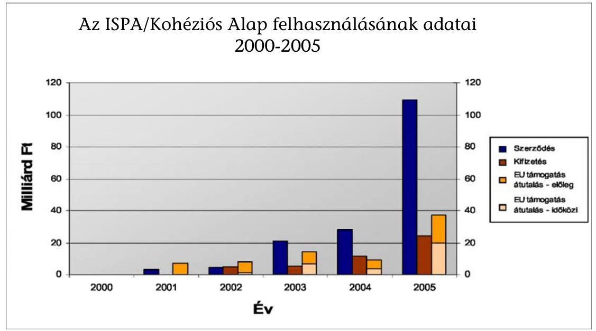

A Kormány 2005-ben áttekintette a Kohéziós Alap múködését befolyásoló legfontosabb jogszabályokat, és a támogatások hatékonyabb felhasználása érdekében több rendelkezést módosított (építési beruházások közbeszerzési eljárásai, államháztartás múködési rendje, engedélyezés).

A környezetvédelem területén egységes szabályozás alá került és összevonhatóvá vált a környezetvédelmi hatásvizsgálati és az egységes környezethasználati engedélyezési eljárás (ezáltal pl. csak egy alkalommal kerül sor a szakhatóságok bevonására, a nyilvánosság részvételére, az esetleges jogorvoslatokra, ami számottevő gyorsítást tesz lehetővé). A közlekedés területén az ún. autópálya-törvény (a Magyar Köztársaság gyorsforgalmi közúthálózatának közérdekűségéről és fejlesztéséről szóló 2003. évi CXXVIII. törvény - Aptv.) biztosította a közúti beruházások eljárásai gyors lebonyolításának feltételeit; a vasúti törvény módosításával a vasúti beruházások engedélyezése is jelentősen rövidül.

Az Európai Bizottság vizsgálta, hogy a Kohéziós Alap Magyarország által bevezetett rendszerei összhangban vannak-e a Közösségi szabályozással, hatékonyan múködnek-e és a szabálytalanságokat megfelelően kezelik-e. A KEHI a Kohéziós Alappal kapcsolatos ellenőrzéseit ( $15 \%$-os ill. rendszerellenőrzés) a nemzeti ellenőrzési stratégia alapján, azzal összhangban elvégezte. A költségigazoló nyilatkozat kiadása érdekében 2005 első félévében a Kifizető Hatóság

---

tényfeltáró látogatást tett az Irányító Hatóságnál és a Közreműködő Szervezeteknél. Az ÁSZ szabályszerűségi ellenőrzést folytatott a Kohéziós Alapra vonatkozóan.

A Kohéziós Alap projektjeinek kiadási előirányzata 79 520,6 M Ft volt (eredeti kiadási előirányzat $43583,3 \mathrm{M} \mathrm{Ft}$ ), amely $44410,6 \mathrm{M} \mathrm{Ft}$ értékben valósult meg. A tényleges előirányzatoknak a költségvetésben eredetileg megtervezett szinten történt megvalósulását számos pozitív fejlemény idézte elő, ugyanakkor a gazdálkodásban jelen voltak azok a folyamatok is, amelyek a pénzeszközök jövőbeni felhasználásakor való fokozottabb körültekintésre hívják fel a figyelmet.

Az ellenőrzési jelentésekben megfogalmazottak, valamint a megállapítások és a javaslatok alapján megtett, illetve tervezett intézkedések arra engednek következtetni, hogy a Kohéziós Alap irányítási rendszere 2005-ben kisebb adminisztratív és eljárási hibákkal ugyan, de súlyos, rendszerbeli hiba nélkül a támogatások céljának megfelelően múködött. Az ellenőrzési tevékenység eredményei nem mutatnak lényeges hiányosságot az irányítási és ellenőrzési rendszer tényleges múködésében. Egyes projektek zárónyilatkozatának kiadása előtt azonban az ellenőrzések indokoltnak tartják egyeztetések lefolytatását az EU Bizottsággal a költségek elszámolhatóságát illetően.

Növekedés volt tapasztalható az év során meghirdetett tenderek megkötött kivitelezési szerződéseinek a projektek összköltségéhez viszonyított arányában, ami az év végére elérte az $52 \%$-ot. Ennek elérésében szerepe volt annak, hogy több jogszabály egyszerűsödött 2005-ben. Ez az arány ugyan pozitív változást mutat az előző évhez képest, de egyúttal felhívja a figyelmet a tenderek meghirdetése, lebonyolítása, illetve a szerződéskötések folyamata felgyorsításának szükségességére. Az ISPA, illetve Kohéziós Alap támogatások megnyílása óta ugyanis a megkötött szerződések értéke az összes projekt várható összköltségének mindössze $19 \%$-a volt 2005. január 1-jén. A tényleges kiadási előirányzat alakulására elsősorban a megkötött szerződések alapján lehívott előlegek növekedése hatott, emellett a projektek tényleges megvalósulását jelző rész-számlák alapján történő kifizetések aránya alacsony.

Az ISPA, illetve a csatlakozást követően a Kohéziós Alap forrásait és azok felhasználását (tender meghirdetések, kifizetések, támogatás, ill. előleg átutalások, projektjóváhagyások, szerződéskötések összege) a 2000-2006 évek között az alábbi ábra mutatja:

---

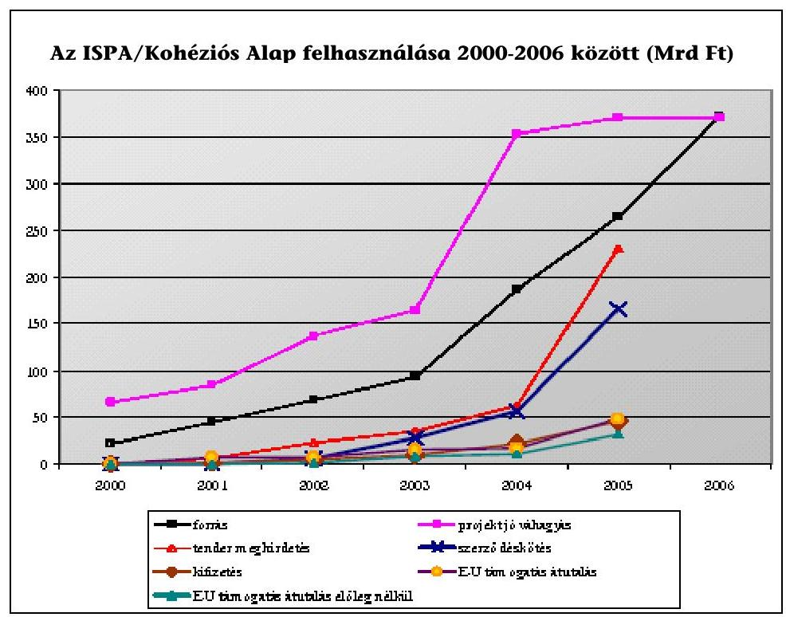

Az IH és a KSz szinten a kiadások támogathatóságának tekintetében a Bizottságnak fenntartásai voltak, hogy a területet megfelelően ellenőrzik-e a számla kifizetési stádiumában. A végső kedvezményezettek áfa (levonhatósági jogosultság szerinti) besorolására vonatkozóan - amely a Bizottság részére bevallott kiadások támogathatósága szempontjából fontos - nem alakítottak ki írásos eljárást (az NFH honlapján a vizsgált időszakban az egységes áfa-útmutató megtalálható volt). Egyes szektorok előrehaladási jelentéseinek minősége és időszerűsége nem megfelelő, a projekteket a felelős minisztérium nem tudja megfelelően felügyelni.

A közbeszerzéssel kapcsolatban általános problémának mutatkozott a kiválasztási kritériumok szigorú alkalmazása, amelynek eredményeképpen már a kiválasztás szakaszában a pályázat elutasításához vezetett, így nagyon alacsony a szerződéskötési fázist elérő ajánlatok száma. Ugyanakkor 2005 második felében számos közbeszerzést sikerült úgy kiírni, hogy az a versenyt és az ajánlattevők számát növelte.

Általános jellegű probléma, hogy a beszállítói számlák kifizetésére többkevesebb késedelemmel került sor, illetve, hogy a szerződések előkészítése során a jogszabályi környezet változásait nem vették mindig figyelembe. Több esetben előfordult, hogy a Pénzügyi Megállapodás előírásait alapul véve nem volt egyértelműen azonosítható a költségek elszámolhatósága

A KSz-nél, valamint a Lebonyolító Testületnél fennálló létszámhiány és a betanulás időigényessége lényeges kockázati tényezője a határidők betartásának a pályáztatási feladatok teljesítése során.

A pályázók pénzügyi stabilitásának értékelésére alkalmazott kiválasztási kritériumok a vizsgált projektek esetében nem voltak elég tárgyilagosak. A Bizottság

---

objektív értékelési kritériumok alkalmazását javasolta. A szerződésekre vonatkozóan kifogásolta, hogy a beadandó ajánlatok minimum és maximum árának előre meghatározása korlátozhatja a versenyt az alacsonyabb árstruktúrával rendelkező cégek között. A maximum és minimum árak meghatározására összesen 5 esetben került sor, de a negatív tapasztaltok miatt ezt a gyakorlatot az ajánlatkérők önként megszüntették. A pályázatok értékelése során a Bizottság javasolta, hogy a KSz ösztönözze a bíráló bizottságokat a pályázatok elbírálásánál alkalmazott pontszámok indoklásának feljegyzésére.

A 2005-ben a KEHI által végzett ellenőrzések során tapasztalt általános jellegű megállapítás a Múködési Kézikönyvek, belső eljárásrendek hiányosságai, pontatlansága volt. A jogszabályi környezet változása, módosulása a szabályzatok folyamatos módosítását tette szükségessé.

2007-től megtöbbszöröződnek a rendelkezésre álló források, miközben szigorodnak az ezek felhasználására vonatkozó szabályok (pl. n+2, illetve $\mathrm{n}+3$ szabály bevezetése). A felkészülés legfontosabb teendői az alábbiak:

- A legjobban előkészített projekteket szükséges a Kohéziós Alap támogatásából megvalósítani. (Meg kell vizsgálni, hogy a megvalósításra kész projekteket be lehet-e emelni a közlekedési operatív programba, pl. 4. metró, M6 egyes szakaszai.)
- Folytatni kell a projektek megfelelő előkészítésének támogatását. A Kormány 38 nagyprojekt előkészítését támogatta összesen 18 Mrd Ft-tal, ezek közül 23 nagyprojekt előkészítése 2005-ben megkezdődött. További projektek előkészítése már a 2007-2013-as közlekedési, illetve környezetvédelmi operatív program keretében, EU-forrásból támogatható. A Magyar Köztársaság 2006. évi költségvetéséről szóló 2005. évi CLIII. törvény 50. § (11) bekezdése értelmében a Miniszterelnöki Hivatalt vezető miniszter (korábban az európai ügyekért felelős tárca nélküli miniszter) a 2007-től induló (részben a Kohéziós Alapból finanszírozható) nagyprojektek, komplex programok előkészítésére 20 milliárd forint értékben vállalhat olyan fizetési kötelezettséget, amely teljesítése legkorábban 2007-ben esedékes.
- A megfelelően előkészített projektek esetében a legnagyobb kockázatot az engedélyezés elhúzódása okozhatja (különösen a jogorvoslatok miatt). Tovább szükséges javítani a tárcák engedélyezési eljárásainak hatékonyságát, valamint az érintett hatóságok tevékenységét.

# Schengen Alap 

A Schengen Alapot a Csatlakozási Okmány 35. cikke hozta létre ideiglenes eszközként. Célja a kedvezményezett tagállamok segítése a csatlakozás időpontja és 2006 vége között az Unió új külső határain a schengeni vívmányok és a külső határellenőrzés végrehajtásának finanszírozásában.

A megvalósítandó hároméves célkitűzéseket és intézkedéseket, a részletes fejlesztési feladatokat és azok hazai, illetve közösségi pénzügyi forrásait a Magyar Köztársaság által kidolgozott indikatív program (164,3 M euró jóváhagyott keretösszeg) tartalmazta.

---

Az NFH mint Felelős Hatóság volt felelős a Schengen Alap támogatásból finanszírozott fejlesztési feladatok teljes körű megvalósításáért. A Központi Pénzügyi és Szerződéskötő Egység (KPSZE) a szakmai Közremúködő Szervezetekkel együttműködve ellátta a támogatások felhasználásával összefüggő közbeszerzési eljárások lebonyolítását, továbbá a szerződéskötési, nyilvántartási és egyéb pénzügyi adminisztrációs feladatokat.

A Schengen Alap kiadási előirányzata 19 773,2 M Ft volt (eredeti előirányzata 16 942,7 M Ft), amely 3248,9 M Ft összegben teljesült. 2005. évben a kifizetések volumene nem érte el a költségvetés tervezésekor várt szintet, mivel az Indikatív Programot az Európai Bizottság csak 2004 decemberében hagyta jóvá, ebből következően a közbeszerzési eljárások lebonyolítása csak 2005-ben indulhatott el. A közbeszerzési törvényhez kapcsolódó végrehajtási rendeletek megjelenésének késedelme is indokolta az eljárások megindításának elhúzódását.

A 2005. évi alacsony teljesítési adatok ellenére a Közreműködő Szervezetek biztosítottnak látták a rendelkezésre álló források lekötését és azok felhasználását 2007. év végéig.

A Felelős Hatóságra, a KPSZE-re és a szakmai közreműködő szervezetek intézményi felkészültségére vonatkozó rendszerellenőrzés, ill. a mintavételes ellenőrzés megállapította, hogy az intézményrendszer kiépült, az ellenőrzött időszakban nem került sor szabálytalanságra, a jelentések nem tártak fel olyan hiányosságot, mely pénzügyi korrekciós intézkedést igényel. A Schengen Alap rendszer múködtetésének beindítása azonban nehezen és jelentős késedelemmel indult meg, a Szakmai Közreműködő Szervezetek nem rendelkeztek az intézményrendszer kiépítéséhez szükséges tapasztalattal, a lebonyolítást szabályzó megállapodások késedelemmel és ellentmondásos tartalommal kerültek aláírásra.

# Előcsatlakozási alapok és Átmeneti Támogatások 

## Phare

Magyarország 1990 óta kap vissza nem térítendő támogatást az Európai Uniótól pénzügyi, ill. technikai segítségnyújtás formájában. A támogatás célja kezdetben a piacgazdasági átmenet és a politikai demokrácia kiépítésének elősegítése, később az EU-tagságra való felkészülés, az integrációs folyamat társfinanszírozása volt. A Phare (Poland Hungary Assistance for Reconstructing the Economy) forrásokat az Uniós belépést szolgáló intézményfejlesztési feladatokra, illetve beruházások finanszírozására kell fordítani.

A csatlakozást követően egyrészt átalakult a Phare irányítási rendszere (EDIS), amelynek következtében a magyar kormányzati szervek több funkciót is átvettek az Európai Bizottságtól, másrészt a Phare keretében történő beszerzésekre az eddigi speciális szabályok helyett a magyar közbeszerzési törvény rendelkezéseit kell alkalmazni.

Magyarország csatlakozásával megszűnt a jogosultsága további Phare források pályázására, azonban a még futó projekteket be lehet fejezni és a már rendelkezésre álló források felhasználhatóak. Ez azt jelenti, hogy az utolsó, 2003. év-

---

ben meghirdetett pályázatok kifutására csak 2006-ban kerül sor. Az egyes tagállamoknak juttatott Phare forrás nagyságát a Bizottság a teljes rendelkezésre álló összeg $50 \%$ erejéig a kedvezményezettek között egyenlő arányban, a másik $50 \%$ esetében pedig GDP- és lakosság-arányosan határozta meg.

A 2002-es Phare Nemzeti Program 2005. május 31-én befejeződött. A teljes allokáció $96,3 \%$-át kötötték le, $3,4 \%$ a támogatás azon összege, amit nem sikerült felhasználni a közbeszerzések során kialakult, a tervezettnél alacsonyabb árak miatt. A 2005. év során (november 30-ával) befejeződtek a 2003. évi Nemzeti Program, az utolsó Phare program szerződéskötései is. A kifizetési határidő 2006. november 30-a lesz.

A Phare program lezárásával egyidejűleg a Bizottság megkezdte megvalósult projekteket lezáró programzáró auditok végrehajtását. A KEHI az EU Bizottság záróauditjaira való felkészülés érdekében 2006-tól megkezdte az összes lezárt Phare projekt ellenőrzését.

# SAPARD 

A SAPARD (Special Accession Programme for Agriculture and Rural Development - Különleges Előcsatlakozási Program a Mezőgazdaság és Vidékfejlesztés támogatására) program főbb céljait a csatlakozást követően a Strukturális Alapok Agrár és Vidékfejlesztési Operatív Programja (AVOP) vette át. Az intézményrendszer főbb szereplői a csatlakozást követően is a végrehajtási és kifizetési funkciókat ellátó Mezőgazdasági és Vidékfejlesztési Hivatal (MVH), a Nemzeti Alap, mint Illetékes Hatóság, illetve az FVM keretein belül működő Irányító Hatóság. A SAPARD Program külső ellenőrzését ellátó Igazoló Szervi funkciót - megbízás alapján - 2005-ben az ÁSZ látta el.

A SAPARD intézkedésekre a 2005. évi eredeti előirányzat 20000,0 M Ft volt, amely 48 045,6 M Ft-ra növekedett és 29 712,0 M Ft-ra teljesült. Az emelés döntő forrása uniós támogatás volt. A 2002-2006 közötti teljes időszakra rendelkezésre álló keret 59 400,0 M Ft, mely a 2212/2004. (VIII. 27.) Korm. határozatban engedélyezett 10\%-os túllépéssel 65 340,0 M Ft-ra módosult.
2005. december 31-én 2682 hatályos támogatási szerződéssel rendelkezett az MVH 63,9 Mrd Ft támogatási összeggel. 2005. december 31-éig 2192 projekt megvalósítását fejezték be, ami az összes hatályos szerződés több mint 80\%-a, 490 projekt folyamatban volt, amelynek a befejezése 2006. év végéig várható.

## Átmeneti Támogatás

Az Európai Unió új támogatási formákat dolgozott ki a csatlakozó tagállamok számára a belépést közvetlenül követő időszak problémáinak elhárítása érdekében. Átmeneti Támogatás mind célkitűzései, mind eljárásrendje és intézményrendszere tekintetében a Phare program intézményfejlesztési fejezet továbbélésének tekinthető.

---

# Agrártámogatások 

A Közös Agrárpolitika finanszírozása 2005-ben az EMOGA-n keresztül történt. Az EMOGA két részlegből áll: Orientációs Részleg és Garancia Részleg, amelyek közül az előbbi a Strukturális Alapok része (AVOP). A Garancia Részleg keretében a következő, normatív jellegű intézkedéseket finanszírozták:

- közvetlen (területalapú) támogatások,
- agrárpiaci támogatások (intervenció, belpiac, külpiac),
- vidékfejlesztési (program alapú) támogatások (NVT)

Az EMOGA Garancia Részlegből finanszírozott támogatásokra a számlaelszámolási eljárás vonatkozik. A támogatásokat a Kifizető Ügynökség az EMOGA év során (október 16-tól következő év október 15-ig) teljesíti, a pénzügyi év során teljesített összes kifizetésről a pénzügyi évet következő év február 10-ig éves elszámolást küld az Európai Bizottságnak.

A támogatások jogosságának megítélését, a benyújtott támogatási kérelmek elbírálását a tagállam által akkreditált kifizető ügynökség végzi, mivel csak rajta keresztül történő kifizetés képezheti közösségi finanszírozás tárgyát. Ezen feladatokat Magyarországon a Mezőgazdasági és Vidékfejlesztési Hivatal (MVH) látja el mint akkreditált kifizető ügynökség.

Az MVH-t a Kormány 2003. július 1-jei hatállyal a földművelési és vidékfejlesztési miniszter irányítása alatt álló, önálló jogi személyiséggel rendelkező, országos hatáskörű központi hivatalként (központi költségvetési szervként) hozta létre (a SAPARD Hivatal és az Agrárintervenciós Központ összevonásával). A 19 megyei kirendeltségéből 7 regionális illetékességgel rendelkezik, és részt vesz a SAPARD és az AVOP feladatok ellátásában is.

Az MVH 2005-ben normatív támogatásra 127,5 Mrd Ft-ot (502,8 M euró), a Nemzeti Vidékfejlesztési Tervet kísérő intézkedések finanszírozására 46,6 M eurót (beleértve a Top-up módosítása miatti részt is), SAPARD támogatásra 58 M eurót és az AVOP keretében 36,7 M euró támogatás lebonyolítását végezte.

A Bizottság a tagállam adott pénzügyi évre vonatkozó elszámolásairól szóló döntését (számla-elszámolási döntés, „clearance decision") a pénzügyi évet követő év április 30 -ig hozza meg az éves elszámolások teljes vagy részleges elfogadásáról, amelyet az Európai Unió Hivatalos Lapjában jelentet meg.

Az FVM és az MVH együttmúködése, számlák egyeztetése 2005. évben nem volt problémamentes, illetve az EU-s támogatások és hazai források felhasználását tartalmazó MVH által készített feladások, év végi elszámolások számszaki eltéréseket mutattak a finanszírozásra átvett összegekhez képest. Az előforduló hibák - gyakoriságát és mennyiségét tekintve - nehezítették a fejezet év végi beszámolójának határidőre történő és megbízható elkészítését.

A támogatások kezelését - a beépített kontrollok segítségével - az EMOGA Garancia Részlegéből részben vagy egészben finanszírozott támogatásoknál és

---

egyéb intézkedéseknél az IIER informatikai rendszer ellátja, de a számviteli modul kifejlesztésének lemaradása következtében a pénzügyi információ szolgáltatását az adatok naprakészségét és megbízhatóságát nem mindig tudja biztosítani.

A Nemzeti Vidékfejlesztési Terv (NVT) elkészítéséhez a jogi alapot a 1257/1999 EK Tanácsi Rendelet EMOGA Garanciarészlegéből támogatott kísérő intézkedésekre vonatkozó része jelenti. Az NVT nem része az AVOP-nak, de azzal összhangban dolgozták ki, egyes intézkedések szervesen kiegészíthetik egymást. Az NVT a következő már bevezetett intézkedéseket tartalmazza: agrárkörnyezetgazdálkodás támogatása; az EU környezetvédelmi, állatjóléti és állathigiéniai előírásainak való megfelelés támogatása; félig önellátó mezőgazdasági üzemek szerkezetének átalakításához nyújtott támogatás; kedvezőtlen adottságú területek támogatása; termelői csoportok létrehozásához és múködéséhez nyújtott támogatás; mezőgazdasági területek erdősítése; technikai segítségnyújtás.

Az NVT késedelmes elfogadása és a jogcímekhez kapcsolódó jogszabályok késői meghirdetése miatt a 2004. EMOGA GR pénzügyi évben a 21 399,80 M Ft kiadási előirányzatból (bevételi és támogatási oszlop összege, tehát EU támogatás plusz nemzeti társfinanszírozás) nem történt kifizetés. 2005-ben az eredeti 43728 M Ft előirányzat 49 681,8 M Ft-ra teljesült.

Az EU Bizottság Főigazgatóságai és az Európai Számvevőszék a csatlakozó országok esetében folyamatosan figyelemmel kísérték az agártámogatások felhasználását. Az ellenőrzések során kiemelten vizsgálták a kifizetések rendszerét, illetve az elszámolásokat támogató informatikai rendszereket. Az ellenőrzések során a rendszer-alapú megközelítést előzetesen kiválasztott tételek vizsgálatával és helyszíni látogatásokkal egészítették ki.

Az Európai Számvevőszék az egységes területalapú támogatási rendszerrel (SAPS) és az integrált igazgatási és ellenőrzési rendszerrel (IIER) kapcsolatos ellenőrzése javaslatokat fogalmazott a Mezőgazdasági Parcella Azonosító Rendszer továbbfejlesztésére, valamint a támogatási kérelmek kezelésben tapasztalt hiányosságok megszüntetésére.

Az Európai Bizottság Mezőgazdasági Vidékfejlesztési Főigazgatósága és az Európai Számvevőszék által lefolytatott ellenőrzések kiemelték a hatóságok a csatlakozás óta eltelt időszakban tett erőfeszítéseit, az IT rendszerek kifejlesztése terén elért eredményeit és rámutattak a tapasztalt hiányosságok megszüntetésének szükségességére.

---

# II. RÉSZLETES ÉRTÉKELÉS 

## 1. MAGYARORSZÁG ÉS AZ EU PÉNZÜGYI KAPCSOLATAI 2005-BEN

Az Állami Számvevőszék a zárszámadás keretében vizsgálta Magyarország 2005. évi befizetéseit az Európai Unió költségvetésébe.

### 1.1. Az uniós tagsággal összefüggő hazai befizetések

Az Európai Közösségek saját forrásainak rendszeréről rendelkező közösségi jogszabály alapján ${ }^{1}$ befizetési kötelezettség a tradicionális saját források (külső vámok és cukorilletékek) és nemzeti hozzájárulás (áfa alapú hozzájárulás, GNI alapú hozzájárulás és brit korrekció) jogcímén keletkezett. A nemzeti hozzájárulás pontos összegét minden esetben az Európai Unió határozta meg.

A hazai lebonyolítás eljárás- és intézményrendszere kormányrendeletben szabályozott ${ }^{2}$. A közösségi és hazai jogszabályokkal összhangban az Uniót 2005. évben összesen 214 388,6 M Ft illette meg Magyarországról, ebből a tradicionális saját forrás $28118,5 \mathrm{MFt}$, a nemzeti hozzájárulás összege 186644,5 M Ft volt.

Az érintett előirányzatok tervezett összege a 2004. évben keletkezett EU költségvetési többlet tagállamok közötti elosztása, a tervezés és az elszámolás időpontjában érvényes árfolyam közötti eltérés, illetve az alapadatok év közbeni felülvizsgálata következtében módosult.
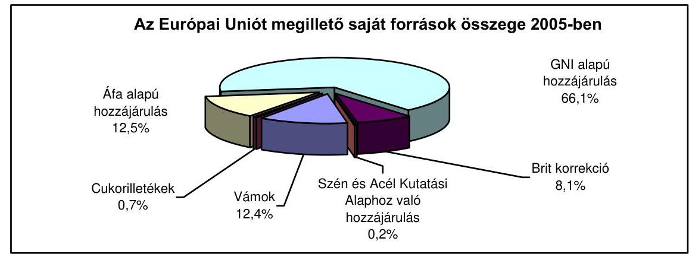

[^0]
[^0]:    ${ }^{1}$ Az Európai Közösségek saját forrásainak rendszeréről szóló 2000/597/EK, Euratom tanácsi határozat
    ${ }^{2}$ 84/2004. (IV. 19.) Korm. rendelet az Európai Unió saját forrásaival kapcsolatos kötelezettségek teljesítésében részt vevő intézmények feladat- és hatásköréről, valamint a kapcsolódó eljárásrendről

---

- A csatlakozást követően Magyarországnak az unión kívüli országokkal folytatott kereskedelméből származó vámbevételek, valamint a Magyarország területén beszedett cukorilletékek az uniót tradicionális saját forrás címen illetik meg. Ugyanakkor Magyarország jogosult a vámbevételek valamint a cukorilletékek $25 \%$-ának a beszedési költségek fedezésének címén való viszszatartására. A tradicionális saját források összege 2005. évben 28 118,5 M Ft volt.
- A nemzeti hozzájárulások közül az áfa alapú hozzájárulás minden tagállamra azonosan vonatkozó egységes kulcs alkalmazásával történik, amelyet az uniós szabályozásnak megfelelően kiszámított, harmonizált tagországi áfaalapra kell vetíteni. A 2005. évben Magyarország 26 820,8 M Ft-ot fizetett be áfa alapú hozzájárulás címén az Európai Unió költségvetésébe.
- A GNI alapú hozzájárulást az összes tagállam nemzeti jövedelmének összegére vonatkoztatott egységes kulcs alkalmazásával számolják ki. A tagállamok bruttó nemzeti jövedelmét (Gross National Income - GNI) az uniós szabályok alapján kell kiszámítani. Magyarország 2005 évre vonatkozó GNI alapú befizetése 141 696,5 M Ft-ot tett ki. Ezen felül 274,2 M Ft felhasználásra került sor a GNI tartalék terhére.

A GNI tartalék felhasználására akkor kerül sor, ha a kiadások azt indokolják. GNI tartalékot a kölcsönökre és kölcsöngaranciákra, valamint sürgős segélyekre képez az Unió.

- A 2005. évben brit korrekció jogcímen 17 478,6 M Ft került befizetésre. A brit korrekció a költségvetési egyensúlytalanságok elkerülését célzó korrekciós mechanizmus részét képezi a saját források rendszerében.
- A fenti befizetési kötelezettségek mellett a Szén és Acél Kutatási Alaphoz történt 374,4 M Ft hozzájárulással együtt Magyarország a 2005. évben összesen 214763 M Ft befizetést teljesített az EU költségvetésébe.

Magyarország a fizetési kötelezettségét havonta a Magyar Nemzeti Banknál „Európai Bizottság - Saját források" elnevezésű forintszámlára teljesítette.

A 2005. évi befizetési kötelezettségek hazai kiszámításában, ill. lebonyolításában a kiemelt szerepet játszó Pénzügyminisztérium mellett a Vám- és Pénzügyőrség Országos Parancsnoksága (vám), a Mezőgazdasági és Vidékfejlesztési Hivatal (cukorilleték), Adó- és Pénzügyi Ellenőrzési Hivatal (áfa alapú hozzájárulás), a Magyar Államkincstár (áfa alapú hozzájárulás), valamint a Központi Statisztikai Hivatal (áfa, ill. GNI alapú hozzájárulás) vettek részt.

Az Európai Számvevőszéknek a Közösségi árutovábbítási rendszer témakörben lefolytatott ellenőrzése a belső ellenőrzéseket és a felügyeleti eljárásokat rendben találta, bár számos beszedési eljárás esetében nem múködtek kifogástalanul. Az ellenőrzés megállapította, hogy az Új Számítógépesített Árutovábbítási Rendszer nem tartalmazta az automatizált kockázatelemzést a kimenő árutovábbítási nyilatkozatok esetében. Kifogásolták, hogy a keresési eljárásokat általában későn kezdték el. A főkötelezettnek kiállított értesítések és a keresési értesítések emlékeztetői során további késések történtek, amelyek magukban hordozták a vámtar-

---

tozások kései felderítésének kockázatát. A beszedési eljárások vizsgálatai rámutattak, hogy a le nem zárt árutovábbítási műveletek utáni beszedéseket rendszeresen késve kezdték; számos értesítést azelőtt küldtek el a főkötelezettnek, hogy további beszedési műveletekre került volna sor, ami késleltette a vámtartozások feltüntetését az elszámolásokban; továbbá hogy a kezesnek nem küldtek értesítést, ezzel kockáztatva a hagyományos saját forrásokat.

# 1.2. Hazánk uniós támogatásai 

A Magyar Köztársaság 2005. évi költségvetésében az EU támogatások (Strukturális Alapok, Kohéziós Alap, Schengen Alap, Nemzeti Vidékfejlesztési Terv, SAPARD, Phare/Átmeneti támogatás, Egyéb európai uniós támogatások) és a hozzájuk kapcsolódó hazai társfinanszírozás, valamint a visszatérítés összege 293 142,7 M Ft összegben jelent meg. (2. sz. melléklet)
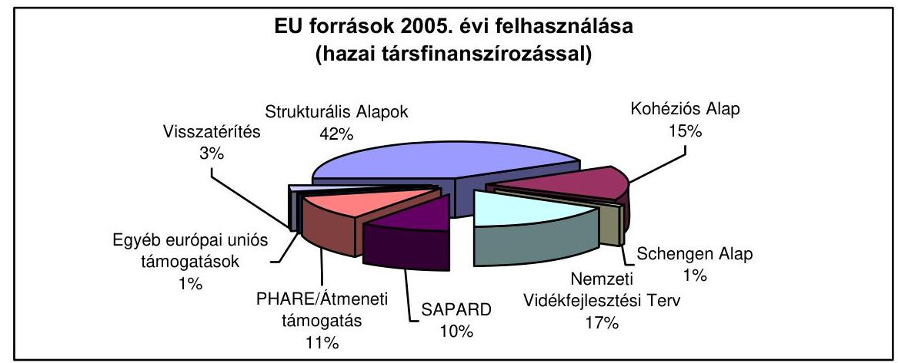

A központi költségvetésbe a tervezetthez képest 10,3\%-kal több uniós forrás érkezett, ugyanakkor az ezekhez kapcsolódó hazai társfinanszírozás mértéke alig haladta meg az eredeti támogatási előirányzatot. Ennek oka a nagyobb mértékű uniós forrásból történő előleg kifizetés. A támogatások eltérő teljesülést mutatnak: amíg a Strukturális Alapok, a Nemzeti Vidékfejlesztési Terv és a SAPARD program támogatásai a tervezett értékek felett realizálódtak, addig a Schengen Alap támogatásainál jelentős mértékű, a Phare támogatásoknál nagyobb mértékű elmaradás volt tapasztalható a tervezetthez képest. A Kohéziós Alap támogatásai a tervezettet megközelítő mértékben teljesültek.

A visszatérítés összegének 6,8\%-os növekedését részben a forint árfolyamnak a tervezettől eltérő alakulása, ill. a 2006. januárban esedékes részlet 2005. decemberében történt átutalása okozta.

---

A költségvetés végrehajtásáról szóló törvénytervezet nem elkülönítetten tartalmazta a Top-up ${ }^{3}$ címén 2005-ben kifizetett $85458,3 \mathrm{M}$ Ft-ot.

A 2005. évben a központi költségvetésben a tervezetthez képest több uniós forrás jelent meg, ugyanakkor az ezekhez kapcsolódó $89393,1 \mathrm{M}$ Ft hazai társfinanszírozás mértéke alig maradt el az eredeti támogatási előirányzattól $(90515,9 \mathrm{M} F \mathrm{Ft})$.

A költségvetésen kívüli támogatási formának minősül az agrárpiaci támogatások (exporttámogatások, belpiaci támogatások és intervenciós felvásárlások) valamint a közvetlen termelői támogatások (egységes terület alapú támogatás). Ennek értéke a 2005. évre vonatkozóan meghaladta a 307 Mrd Ft-ot (agrárpiaci támogatásként 159 133,3 M Ft, közvetlen termelői támogatásként 148 022,9 M Ft), amelyet a kifizető ügynökség a KESZ-ről megelőlegezett, és az Unió utólag téríti meg az államháztartás számára.

Az ellenőrzés megállapította, hogy az intervenciós felvásárlás megelőlegezése évről-évre visszatérő pótlólagos finanszírozási terhet jelent az államháztartás számára, amely egyúttal a hiány növekedésével járhat. A felvásárlás és az értékesítéshez kapcsolódó költségek megelőlegezésére a 2005. évben 142 215,4 M Ft-ot fordítottak, ezzel szemben a gabona értékesítéséből befolyt összeg csupán 11275,2 M Ft volt. Az Unió által megtérítésre kerülő további 13 623,3 M Ft figyelembe vétele után a fennmaradó 117 316,9 M Ft visszatérülésének időpontja bizonytalan. Ez az összeg növelte az államháztartás forrásszükségletét, illetve az emiatti kamatkülönbözet által annak hiányát.

Az intervenciós felvásárlás esetében, a Kormányzat a KESZ-ről megelőlegezi és kifizeti a termelők számára a felvásárolt gabona értékét.

A közvetlen termelői támogatások címén felmerült 148 022,9 M Ft tartalmazta a 2004. évi jogalap után a 2005. évben kifizetett 66 388,0 M Ft-ot, valamint a 2005. évi jogalap után 2005. december 1. és december 31. között kifizetett 81 634,9 M Ft-ot. Ezek a KESZ által megelőlegezett összegek az EU-val történő elszámolást követő 2 hónap után térülnek vissza.

Az Uniótól érkező támogatások, a Bizottság rendelkezése alapján a Magyar Nemzeti Bankon keresztül, a Magyar Államkincstárnál vezetett megfelelő számlákon kerülnek jóváírásra. A Kincstár a Kifizető Hatóság rendelkezése alapján teljesít átutalást a vonatkozó fejezet előirányzat felhasználási keretszámlájára. A 2005. év végén a Kincstár számláinak egyenlege az Uniótól már beérkezett, de a fejezetekhez még át nem utalt támogatásokat mutatta. Ennek összege 36 465,2 M Ft volt. Ez az összeg a fejezetek 2005. évre vonatkozó pénzügyi beszámolóiban bevételként még nem jelenik meg, mert felhasználásukra vonatkozóan az adott fejezetek még nem intézkedtek, ezért átutalásukra sem került sor. Ez az egyenleg 25 932,0 M Ft csökkenést mutat az egy évvel korábbihoz.

[^0]
[^0]:    ${ }^{3}$ A területalapú agrártámogatás rendszerében igényelhető kiegészítő nemzeti támogatás

---

# 1.3. Az uniós támogatások intézményrendszere és jogszabályi környezete 

Az EU-ból érkező források fogadásához, ill. lebonyolításához szükséges intézményrendszert (3. sz. melléklet) Magyarország az EU elöírásainak megfelelően, a hazai jogszabályokat figyelembe véve alakította ki (4. sz. melléklet).

Az európai ügyekért felelős tárca nélküli miniszter felügyelete alatt a Kormány 2004-től létrehozta a Nemzeti Fejlesztési Hivatalt ${ }^{4}$, amely ellátta a Strukturális Alapok Közösségi Támogatási Keret és a Kohéziós Alap Irányító Hatóságainak feladatait, gondoskodott a monitoring bizottságok múködéséről, valamint biztosította a Phare és az ISPA programokkal kapcsolatos előkészítési, szervezési és koordinációs feladatok ellátását is. Az egyes operatív programokhoz kapcsolódó monitoring bizottságokat az Operatív Program Irányító Hatóság állította fel.

A megítélt támogatások - az Operatív Programok, a Közösségi Kezdeményezések és a Kohéziós Alap támogatásai esetében - az egyes Irányító Hatóságok rendelkezése alapján kerülhettek a kedvezményezettekhez. Az Irányító Hatóságokat jogszabályban ${ }^{5}$ meghatározott minisztériumok szervezetén belül alakították ki. Az Irányító Hatóság az adott program megvalósítására, és a program jogszabályoknak megfelelő adminisztratív, pénzügyi és szakmai irányítására kijelölt szervezeti egység. A folyamat lebonyolításában az Irányító Hatóságok munkáját Közremúködő Szervezetek és (a Kohéziós Alap vonatkozásában) lebonyolító testületek segítették. Ez utóbbiakat azok a közhasznú szervezetek és gazdasági társaságok alkották, amelyek az adott minisztérium tevékenységéhez kapcsolódóan a megfelelő szakmai kapacitás birtokában a projektek adminisztrációját, valamint a támogatások pénzügyi lebonyolítását végezték. A pályázatokról való érdemi döntések a Strukturális Alapokból igénybe vehető támogatások esetében az Irányító Hatóságoknál, a Kohéziós Alap által támogatott projekteknél az Európai Bizottságnál születtek.

A Pénzügyminisztérium szervezetében kialakított Nemzeti Programengedélyező Iroda látta el a Kifizető Hatóság feladatait a Strukturális Alapok és a Kohéziós Alap támogatásainak folyósításakor, valamint a Nemzeti Alap feladatait az előcsatlakozási támogatásoknál (Phare, SAPARD).

A Schengen Alapból érkező támogatásoknak az egyes fejezetekhez történő eljuttatásáért a Központi Pénzügyi Szerződéskötő Egység volt a felelős, amely szervezet a Nemzeti Fejlesztési Hivatal felügyelete alatt múködött.

Az uniós agrártámogatások lebonyolítását a Földmúvelésügyi és Vidékfejlesztési Minisztérium, mint Irányító Hatóság, és a Mezőgazdasági és Vidékfejlesztési Hivatal, mint Kifizető Ügynökség illetve Közreműködő Szervezet látta el.

[^0]
[^0]:    ${ }^{4}$ 196/2003. (XI. 28.) Korm. rendelet a Nemzeti Fejlesztési Hivatalról
    ${ }^{5}$ Az Európai Unió strukturális alapjaiból és Kohéziós Alapjából származó támogatások hazai felhasználásáért felelős intézményekről szóló 1/2004. (I. 5.) Korm. rendelet

---

Az egyes támogatási formák intézményrendszerét a vonatkozó fejezetek mutatják be.

Az uniós támogatások felhasználását érintő ellenőrzések hangsúlyozták, hogy a szabályozottság tekintetében kiemelkedő kockázatot jelentett a jogszabályi környezet változékonysága, jelentős többletfeladatokat rótt az intézményrendszerre, hátráltatva a határidők betartását.

A vonatkozó jogszabályokat - az uniós támogatásokat érintő rendelkezéseik tekintetében - a tárgyévben több alkalommal módosították. A változtatások célja, hogy a támogatások minél hamarabb, ugyanakkor minél pontosabban körülhatárolt feltételek mellett jussanak el a kedvezményezettekhez.

Az államháztartás múködési rendjéről szóló (korábban is már többször módosított) kormányrendelet tárgyévben hatályos szabályait az uniós támogatásokra vonatkozó előírásokra vonatkozóan négy alkalommal módosították.

A Nemzeti Fejlesztési Terv operatív programjai, az Equal Közösségi Kezdeményezés program és a Kohéziós Alap projektek támogatásainak fogadásához kapcsolódó pénzügyi lebonyolítási, számviteli és ellenőrzési rendszerek kialakításáról új jogszabály lépett hatályba.

Módosult az Európai Unió Strukturális Alapjaiból és Kohéziós Alapjából származó támogatások hazai felhasználásáért felelő intézményekről szóló 1/2004. (I. 5.) Korm. rendelet. Ebben újraszabályozták az egyes Irányító Hatóságok és a Közreműködő Szervezetek múködésére vonatkozó előírásokat, illetve a tevékenységükről való beszámolás rendjét.

Új rendeletet alkotott a Kormány a Nemzeti Fejlesztési Terv Operatív Programjai és az Equal Közösségi Kezdeményezés program esetében alkalmazandó biztosítékokkal kapcsolatos szabályokról [54/2005. (III. 26.) Korm. rendelet], valamint a jogszabálysértő, nem rendeltetésszerú vagy szerződésellenes módon felhasznált európai uniós forrásokból származó és a kapcsolódó állami támogatások behajtásának eljárási rendjéről [55/2005. (III. 26.) Korm. rendelet].

A részletes szabályokat illetően az érintett tárcák vezetői 2005-ben kétszer is módosították a Strukturális Alapok és a Kohéziós Alap felhasználásának általános eljárási szabályairól szóló együttes rendeletet [14/2004. (VIII. 13.) TNM-GKM-FMM-FVM-PM együttes rendelet].

Az agrártámogatásokkal kapcsolatos joganyag is jelentősen változott 2005 során. Az Európai Bizottság több rendeletben módosította az EMOGA támogatásáról szóló eljárási szabályokat. Az agrártámogatási rendszerben érintett ügyfelekkel összefüggő ügyfélregiszter létrehozásáról és az ezzel összefüggő nyilvántartásba vételről szóló kormányrendelet is módosult. A részletes szabályok módosítására a földművelésügyi és vidékfejlesztési miniszter 10 rendeletet módosított, illetve 6 új rendeletet adott ki.

---

# 1.4. Az Európai Unióból érkező támogatások hazai ellenőrzési rendszere 

A támogatások pénzügyi ellenőrzéséért az Európai Bizottságnak az Európai Közösségek főköltségvetése végrehajtásáért való felelőssége sérelme nélkül, elsődlegesen a tagállamok vállalnak felelősséget.

A Bizottság az Európai Közösségek főköltségvetésének végrehajtásáért való hatáskörében biztosítja, hogy a tagállamok zavartalanul múködő irányítási és ellenőrzési rendszerekkel rendelkezzenek a közösségi alapok hatékony és szabályszerű felhasználása érdekében. Az EU támogatások ellenőrzési rendszerét az EU elöírásoknak megfelelően, hazai jogszabályokkal összhangban alakították ki. Valamennyi támogatási forma - az uniós szabályokkal összhangban - eltérő jogszabályi háttérrel rendelkezik.

Az előcsatlakozási alapok programjait az esetek többségében decentralizált irányítás segítségével hajtották végre, amely során vagy előzetesen ellenőrizték a közbeszerzéshez és a szerződések odaítéléséhez kapcsolódó döntéseket (DIS), vagy csupán utólagos ellenőrzéseket hajtották végre (EDIS). A Phare programok esetében a Bizottság 2004-ben tovább javította a belső irányítási környezetét, továbbá az EDIS csatlakozás utáni megvalósítása jelentős lépés volt az új tagállamok irányítási kapacitásának és ellenőrző rendszereinek fejlesztése felé.

A hazai és az uniós jogszabályok alapján az Európai Unió Strukturális Alapjainak és a Kohéziós Alap mintavételes ellenőrzését, az irányítási és ellenőrzési rendszerek múködésének ellenőrzését (rendszerellenőrzés), ill. a zárónyilatkozathoz szükséges ellenőrzést a Kormányzati Ellenőrzési Hivatal (KEHI) végezte. A Kormányzati Ellenőrzési Hivatal évente június 30-ig megküldi az Európai Bizottság részére az előző év ellenőrzési tapasztalatai alapján - támogatási formánként - elkészített éves összegző jelentésből, valamint a Közösségi Támogatási Keret és Kohéziós Alap Irányító Hatóság által az intézményrendszerben bekövetkezett főbb változásokról szóló éves jelentésből összeállított éves összefoglaló jelentését.

A Strukturális Alapok operatív programjai, az EQUAL és INTERREG Közösségi Kezdeményezések és a Kohéziós Alap irányító hatóságai évente jelentést készítenek a programok megvalósításáról, amelyet megküldenek az Európai Bizottság részére az előírt határidőig. A Közösségi Támogatási Keret megvalósításáról negyedévente beszámoló készül a Kormány részére a jogszabályban meghatározottak alapján.

A hazai jogszabályokban előírtak alapján a Kifizető Hatóság a kiadások megfelelő igazolása érdekében a pénzügyi lebonyolítás tekintetében a támogatásközvetítő rendszer valamennyi szereplőjére kiterjedően (a kedvezményezettek kivételével) tényfeltáró látogatások keretében vizsgálatokat végez.

Az egyes Irányító Hatóságokat múködtető minisztériumok belső ellenőrzési egységei biztosították a szervezetek feladatellátásának rendszerellenőrzését.

---

A hazai jogrendszer biztosítja az ellenőrzések hasznosulását, az intézkedések megvalósulásának nyomon követését. Az ellenőrzött szerv (Irányító Hatóság, Kifizető Hatóság, Közreműködő Szervezet), vezetője intézkedési tervet készít és gondoskodik az intézkedések megvalósulásának nyomon követéséről.

Az ellenőrzött szervezetek a KEHI részére tájékoztatást adnak minden év január 15-ei határidővel az előző évi ellenőrzésekhez kapcsolódó intézkedési tervek időarányos végrehajtásáról. A KEHI a tájékoztatások alapján értékelést készít, amelynek eredményéről minden év február 28-ig a Kormány részére beszámol. A KEHI által végzett rendszerellenőrzések, illetve a mintavételes ellenőrzések alapján készített intézkedési tervekben foglaltak megvalósulásának nyomon követéséről az Irányító Hatóság gondoskodik.

# 1.5. Nyilvántartási és monitoring rendszerek 

A 2005-ben lefolytatott ellenőrzések kiemelt területként kezelték a Strukturális Alapok és a Kohéziós Alap elszámolásait támogató Egységes Monitoring és Információs Rendszer (EMIR) múködését. Tekintettel arra, hogy az Európai Unióval történő elszámolások megbízhatósága és a források hatékony felhasználása érdekében a gazdálkodásról naprakész, pontos adatokat szolgáltató nyilvántartási és monitoring rendszerek fenntartása elengedhetetlen, azt az ÁSZ a zárszámadás, a KEHI rendszerellenőrzések keretében, ill. a támogatások belső ellenőrzését végző egységek kiemelten kezelték. A Bizottság által lefolytatott vizsgálatok szintén javaslatokat tettek a rendszer hasznosulására vonatkozóan. Az NFH megbízásából 2005 első felében került sor az EMIR használatának rendszerellenőrzésére a Strukturális Alapok felhasználása terén, valamint az EMIR jogszabályi megfelelőségének vizsgálatára. Az ellenőrzést független szakértő cég végezte. A KEHI informatikai rendszerellenőrzését 2005. második felében hajtotta végre.

### 1.5.1. Az Egységes Monitoring Információs Rendszer (EMIR)

Az EMIR bevezetésére a 124/2003. (VIII. 15.) Korm. rendelet alapján került sor. A nyilvántartási rendszer célja a Strukturális Alapok és a Kohéziós Alap támogatásával megvalósuló projektek részben hazai információs célú adminisztrációja, részben az Unióval történő elszámolások biztosítása volt. A számítástechnikai alapú rendszer kifejlesztésére a WELT 2000 Kft. kapott megbízást az NFH-tól. A moduláris felépítésű nyilvántartási rendszer alapszoftverből, a Strukturális Alapok, a Kohéziós Alap és az Equal alrendszerekből áll. Ezeket egészíti ki az egyes intézkedésekhez és munkafázisokhoz tartozó modulok, amelyeket az egyes Irányító Hatóságok és Közreműködő Szervezetek igényei szerint egyedileg lehet kialakítani, és amelyek nélkül a teljes rendszer rendeltetésszerűen nem működtethető.

A kilenc modul fokozatos bevezetése, a szükséges részletes jogszabályi előírások alkalmazása (beépítése), az Irányító Hatóságok és a Közreműködő Szervezetek különböző eljárásrendjeinek összehangolása következtében további fejlesztői munka vált szükségessé már a rendszer éles üzemelése során. A felhasználói igények, fejlesztési javaslatok folyamatos nyomon követése, összegyűjtése, va-

---

lamint a fejlesztővel való együttműködés rendszeres koordinációs feladatot jelentett az NFH számára még 2005-ben is.

A Bizottság az EMIR felépítését jónak ítélte, azonban a rendszer a vizsgált időszakban még nem készült el teljesen, így csak mérsékelten tudta kielégíteni a Strukturális Alapok és a magyar hatóságok jelentési igényeit. Az EMIR pénzügyi modulja még mindig változásokon ment keresztül. A számviteli modul még nem volt működőképes, ennek következtében a rendszer szereplőinek egymás közötti pénzmozgásait az informatikai rendszeren kívül tartották nyilván. Az EMIR még nem működő szabálytalansági modulja miatt a szabálytalanságok nyilvántartása manuálisan történt.

A vizsgálatok során hiányosságként merült fel az üzemeltetővel kötött szerződéssel kapcsolatban, hogy nem volt megállapodás a rendszer rendelkezésre állásával kapcsolatos szolgáltatási szintekre vonatkozóan. Hiányolták az üzemeltető érdekeltté tételét a zavarmentes múködés biztosításában. A jogszabályi megfelelőség vizsgálata kapcsán az ellenőrzés az Equal programhoz specifikusan kapcsolódó funkcionalitást, valamint az Európai Bizottsággal való elektronikus adatcsere funkcióját ítélte kockázatosnak.

Szinte valamennyi, a Strukturális Alapok intézményrendszerére kiterjedő vizsgálat jelezte, hogy szükséges az EMIR további fejlesztése és a felhasználók EMIR ismereteinek bővítése, valamint az eljárásrendekben az EMIR jogosultságok kiadásának és visszavonásának szabályozása. Problémát jelentett, hogy a rendszer folyamatos rendelkezésre állása nem volt megfelelő, valamint a rendszer lassúsága, illetve a gyakori rendszerlefagyás, s ezek az üzemeltetési hibák ismétlődés, illetve megoldatlanság esetén veszélyeztethetik a pályázatkezelést és akár a kifizetéseket is. A nyomon követés, a finanszírozási modul ügyviteli funkciói, a szabálytalanság kezelő és az ellenőrzés modulok még továbbfejlesztés alatt álltak.

Az ellenőrzések kiemelték, hogy nem állt rendelkezésre fejlesztési stratégia, az EMIR fejlesztése és bevezetése elhúzódott. A tervezett 9 modulból négy modul (Iktatás, Döntéselőkészítés, Szerződéskötés, Finanszírozás) működött, melyek funkcionalitása a pályázatkezeléssel kapcsolatos feladatok túlnyomó részét lefedte. A monitoring modul az EMIR-ben 2005. október 17-től múködik, a felhasználók részére 2005 második negyedévétől a hozzáférés biztosított volt. A számviteli modul csak 2005 novemberétől múködött, s ez a feladatok halmozódását, az adatok visszamenőleges könyvelésének kötelezettségét eredményezte. A szabálytalanság-kezelő, a helyszíni ellenőrzési és a nyomonkövetési modul 2005 folyamán még nem múködött, azonban fejlesztésük 2006-ban befejeződött és bevezetésre kerültek.

Az informatikai biztonság további megerősítésre szorult, kockázatosnak bizonyult a jogosultságok rendszere, amely túl komplex, s ezért nehezen átlátható és hibalehetőséget rejt magában. Hiányosság volt tapasztalható a szakmai felkészültség vonatkozásában is: egyrészt a felhasználók képzése sem volt kielégítő, másrészt az üzemeltető NFH sem rendelkezett megfelelő hatáskörrel és IT szakember állománnyal. A vizsgálatok kiemelték, hogy a lebonyolításban résztvevő intézmények felhasználói számára nem ismeretes, hogy melyek a rendszertől elvárt legfontosabb funkciók. Az ellenőrzések szükségesnek ítélték

---

az EMIR további fejlesztését és az NFH megfelelő hatáskörének biztosítását jogszabályi szinten.

A változáskezelési folyamatra vonatkozóan megállapítást nyert, hogy túlságosan összetett múködése miatt nem hatékony, továbbá hogy a finanszírozási modul nem kezeli az áfa arányosítást. A vizsgálatok javaslatainak többsége már végrehajtásra került.

# 1.5.2. Az Országos Támogatási Monitoring Rendszer (OTMR) 

Az OTMR-t a fejezeti kezelésú előirányzatok és az elkülönített állami pénzalapok egymáshoz kapcsolódó célú, rendeltetésszerú előirányzatainak összehangolt felhasználásának szabályairól szóló 263/1997. (XII. 21.) Korm. rendelettel hozták létre kincstári (MÁK) múködtetés mellett. A nyilvántartási rendszer létrehozásával a Kormányzat célja olyan monitoring rendszer kialakítása volt, amely nyomon követi a vállalkozások részére a központi költségvetésből és az elkülönített állami pénzalapokból nyújtott támogatásokat, és emellett biztosítja, hogy a köztartozással rendelkezők ne tudjanak állami támogatásokat igénybe venni. Az Európai Unióhoz történt csatlakozást követően az OTMR által nyomon követett támogatások köre bővült az Unió által finanszírozott és pályázati úton odaítélt támogatásokkal. Az a cél is megfogalmazódott, hogy a támogatások esetleges halmozódását programonként is figyelemmel kell kísérni a szükséges intézkedések megtétele érdekében. Figyelembe véve, hogy az uniós támogatások több mint negyed része pályázati rendszerben jut el a kedvezményezettekhez, az OTMR feladatai e téren nem elhanyagolhatóak.

Az OTMR és az EMIR közötti adatkapcsolat fenntartása, a két nyilvántartási rendszer kommunikációjának biztosítása a rendszerek fejlesztése során fontos követelmény volt. Ennek elérésben már 2004-ben is fennakadások voltak, és az OTMR-be történő adatbevitelt pótlólagos kézi feldolgozással, papíralapú bizonylatok előállításával kellett megoldani. A két nyilvántartási rendszer közötti folyamatos adatkapcsolat megteremtéséig nem érvényesülhet teljes körűen az OTMR köztartozás figyelési funkciója. Ezért az NFH kialakította a köztartozási adatokra vonatkozó közvetlen adatkapcsolatot a VPOP és az APEH felé.

Az Országos Támogatási Monitoring Rendszer 2004. évi és a 2005. első félévi múködésére kiterjedő ellenőrzés vizsgálta, hogy az OTMR hogyan tud hozzájárulni az európai uniós források hatékonyabb felhasználásához, és milyen módon képes a folyamatok támogatására. A vizsgálat megállapításai alapján a javaslatok a szabályozás pontosítására, a rendszer értékelésére, valamint a hatékonyság javítására irányultak. További javaslatokat fogalmaztak meg az OTMR adatbázisa megbízhatóságának növelésére, az adatállományok megbízhatóságának javítására, a hiányzó adatok pótlására, az elektronikus úton történő adatszolgáltatás teljes körűségére, a nyílt kommunikáció egy nagyobb adatbiztonságot garantáló kommunikációs formára történő kiváltására, az adatbázishoz szükséges hozzáférések, adatszolgáltatások rendjének kidolgozására, a köztartozás figyelés eljárásrendjének az OTMR rendszerkörnyezetben történő elkészítésére, az EMIR adatbeviteli és az OTMR adatszolgáltatási kontrolljainak következetes alkalmazására.

---

# 1.5.3. Számviteli nyilvántartási rendszer 

A 2005. évben hatályos, a Nemzeti Fejlesztési Terv operatív programjai, az Equal Közösségi Kezdeményezés program és a Kohéziós Alap projektek támogatásainak fogadásához kapcsolódó pénzügyi lebonyolítási, számviteli és ellenőrzési rendszerek kialakításáról szóló 360/2004. (XII. 26.) Korm. rendelet hatályon kívül helyezte az e tárgyban 2004-ben hatályos 233/2003. (XII. 16.) Korm. rendelet előírásait a számviteli nyilvántartás, valamint az adatszolgáltatás rendjének vonatkozásában.

A jogszabály szerint elkülönítetten vezetett, eredményszemléletű kettős könyvviteli nyilvántartásokkal kell eleget tenni az Európai Bizottság, az Irányító Hatóságok és az ellenőrzést végző szervezetekkel szemben fennálló beszámolási és adatszolgáltatási kötelezettségnek. Az előírás indokoltságát az az igény teszi megalapozottá, hogy az Európai Uniótól igényelt és lehívott támogatások, valamint az ezekből a hazai kedvezményezettek számára kifizetett, illetve járó összegek egy adott naptári év vonatkozásában is megállapíthatóak legyenek, függetlenül attól, hogy azok a költségvetési szervezetek pénzfogalmi szemléletű nyilvántartásaiban melyik évben jelennek meg.

Kormányrendelet ${ }^{6}$ írta elő, hogy a számviteli nyilvántartás részletes szabályait a Kifizető Hatóság a pénzügyminiszter külön tájékoztatójában jelenteti meg, amelynek alapján a Kifizető Hatóságnak, az Irányító Hatóságoknak és a Közremúködő Szervezeteknek a maguk számviteli eljárásrendjeit és az azok részét képező számlarendet, számlatükröt és bizonylati albumot kellett elkészíteni. A PM tájékoztató 2005 szeptemberétől volt elérhető a PM honlapján. A számviteli eljárásrendeket és a szabályzatokat az intézmények a 2005. év hátralevő részében elkészítették. A számviteli eljárás részét képező számlatükröt és számlarendet a Kifizető Hatóság - az onnan kapott tájékoztatás szerint - felülvizsgálta, ugyanakkor azok jóváhagyása nem volt dokumentált, holott a jóváhagyást a hivatkozott kormányrendelet előírta.

Az eredményszemléletű számviteli nyilvántartási rendszert az érintett szervezeteknek az EMIR keretében kellett alkalmazniuk. A Közremúködő Szervezetektől és a Kifizető Hatóságtól származó információk szerint a számviteli nyilvántartási rendszer 2005. év végén még nem tudta biztosítani a számvitel zárt rendszerétől elvárható követelményeket (pl. az analitikus nyilvántartások egyeztethetősége a főkönyvi nyilvántartásokkal, az EMIR finanszírozási modulja és a számviteli modulja közötti egyeztethetőség). Egyes Közreműködő Szervezetek többek között emiatt is - az EMIR-től független nyilvántartás vezetésére kényszerültek annak érdekében, hogy adatszolgáltatási kötelezettségeiknek eleget tegyenek.

[^0]
[^0]:    ${ }^{6}$ 360/2004. (XII. 26.) Korm. rendelet a Nemzeti Fejlesztési Terv operatív programjai, az EQUAL Közösségi Kezdeményezés program és a Kohéziós Alap projektek támogatásainak fogadásához kapcsolódó pénzügyi lebonyolítási, számviteli és ellenőrzési rendszerek kialakításáról; a Tanács 1999. június 21-i 1260/1999/EK rendelete, a Bizottság 2001. március 2-i 438/2001/EK rendelete

---

# 2. Az Európai Uniós forRÁsok felhasZNÁlÁsÁval KAPCSOLATOS, A 2005-ÖS ÉVRE VONATKOZÓ ELLENŐRZÉSEK LEGFONTOSABB MEGÁLLAPÍTÁSAI, KÖVETKEZTETÉSEI, JAVASLATAI 

### 2.1. Strukturális Alapok

Az Európai Unió az elmaradott régiók felzárkóztatására pénzügyi alapokat állított fel (a Strukturális Alapokat), amelyek ezen régiók infrastruktúráját, a helyi gazdaság diverzifikálását, a munkaerő képzettségét, valamint a különböző gazdasági ágazatok termelékenységének fejlesztését tűzték ki célul. Az Európai Regionális Alapot (ERFA), az Európai Szociális Alap (ESZA), az Európai Mezőgazdasági Orientációs és Garancia Alap Orientációs Része (EMOGA) és a Halászati Orientáció Pénzügyi Eszközei (HOPE) és a Közösségi Kezdeményezések együttesen alkotják a Strukturális Alapokat.

A Strukturális Alapokra vonatkozó uniós jogszabály ${ }^{7}$ meghatározza azt a három kiemelt célkitűzést, amelyek megvalósításához az unió közösségi pénzügyi forrás biztosításával járul hozzá. Magyarország az 1. célkitűzésből részesült, amelynek feladata a fejlődésben lemaradó régiók fejlődésének és strukturális átalakulásának elősegítése (mind a négy alap finanszírozza).

A csatlakozási tárgyalások eredményei alapján, és a 21. fejezet szerint elfogadott EU közös állásponttal összhangban a Bizottság megerősítette, hogy 2006 végéig Magyarország mind a hét régiója - hasonlóan a többi új tagállamhoz jogosult lesz a Strukturális Alapok 1. célkitűzés szerinti finanszírozásra, s Magyarország az Európai Unióval kötött Csatlakozási Szerződés alapján jogosulttá vált az EU Strukturális Alapjai támogatásainak igénybevételére.

Az uniós eljárásoknak megfelelően a 2004-2006-os jogosultsági időszakra hazánk is elkészítette a Strukturális Alapokból folyósított támogatások felhasználásának stratégiai tervét a Nemzeti Fejlesztési Tervet (NFT), amelynek elfogadott fő célkitűzéseit és pénzügyi kereteit a Közösségi Támogatási Keretben (KTK) igazolta vissza az Európai Unió Bizottsága.

Az NFT egy olyan egységes koncepció, amely Magyarország a számára megnyíló Strukturális Alapok forrásainak célzott felhasználására vonatkozó szándékait foglalja össze: az életminőség javítását, illetve az adott periódushoz kapcsolódó fő célt, az Unióhoz viszonyított, illetve az országon belüli területi fejlettségi különbségek csökkentését.

Magyarország vonatkozásában az általános cél alátámasztására és megvalósításának előmozdítására négy specifikus cél került kidolgozásra: a versenyképesebb gazdaság, a humán erőforrások jobb kihasználása, a jobb minőségű környezet és alapinfrastruktúra, valamint a kiegyensúlyozottabb regionális fejlődés elősegítése. Az NFT négy ágazati és egy regionális Operatív Programot (OP) tartalmazott: Agrár- és Vidékfejlesztési Operatív Program, Gazdasági Verseny-

[^0]
[^0]:    ${ }^{7}$ A Tanács 1999. június 21-i 1260/1999/EK rendelete a strukturális alapokra vonatkozó általános rendelkezések megállapításáról

---

képesség Operatív program, Humánerőforrás-fejlesztési Operatív Program, Környezetvédelem és Infrastruktúra Operatív Program és a Regionális Fejlesztés Operatív Program. Az Operatív Programok belső szerkezetüket tekintve prioritásokra, a prioritások pedig intézkedésekre - pályázatokra vagy központi programokra, projektekre - tagozódtak (5. sz. melléklet).

Az Agrár- és Vidékfejlesztési Operatív Program (AVOP) - tekintettel az agrár- és vidékfejlesztés céljaira, a megvalósításukat szolgáló intézkedések és támogatható tevékenységek kapcsolatrendszerére - három prioritást határozott meg: versenyképes alapanyag-termelés megalapozása a mezőgazdaságban, az élel-miszer-feldolgozás modernizálása, valamint a vidéki térségek fejlesztése.

A Gazdasági Versenyképesség Operatív program (GVOP) négy fejlesztési prioritást tartalmazott: a beruházás ösztönzési célokat, a kis- és középvállalkozások fejlesztését, a kutatás-fejlesztést és innovációt, valamint az információs társadalom és gazdaságfejlesztés célirányokban benyújtott pályázatokat támogatták. Ezek mellett a technikai segítségnyújtás előirányzat szolgált az Irányító Hatóság és a Közremúködő Szervezetek munkájának elősegítésére.

A Humánerőforrás-fejlesztési Operatív Program (HEFOP) a foglalkoztatás, az oktatás és képzés, a szociális szolgáltatások, valamint az egészségügyi ellátórendszer területén megvalósítandó fejlesztéseket támogatja az Európai Foglalkoztatási Stratégia és a Közös Foglalkoztatáspolitikai Értékelés által meghatározott szakmapolitikai keretekbe illeszkedve. A HEFOP négy prioritásra helyezi a hangsúlyt: Aktív munkaerő-piaci politikák támogatása, társadalmi kirekesztés elleni küzdelem támogatása a munkaerő-piacra történő belépés elősegítésével, az egész életen át tartó tanulás támogatása és az alkalmazkodóképesség javítása, valamint az oktatási, szociális és egészségügyi infrastruktúra fejlesztése.

A Környezetvédelem és Infrastruktúra Operatív Program (KIOP) specifikus céljai a környezet állapotának javítása a fenntartható fejlődés elősegítésével a kör-nyezet- és természetvédelmi fejlesztések által, valamint a környezetkímélő közlekedési infrastruktúra fejlesztése és az elérhetőségi mutatók javítása. A KIOP három prioritást tartalmaz: környezetvédelem, közlekedés, technikai segítségnyújtás.

A Regionális Fejlesztés Operatív Program (ROP) keretében a turisztikai potenciál erősítése prioritáson belül a turisztikai vonzerők fejlesztése, a turisztikai fogadóképesség javítása, a térségi infrastruktúra és települési környezet fejlesztése prioritás keretében a hátrányos helyzetű kistérségek és régiók elérhetőségének javítása, a városi területek rehabilitációja és az óvodai és alapfokú nevelésioktatási intézmények infrastrukturális fejlesztése szerepelt a támogatott tevékenységek között. Ezen kívül a humánerőforrás-fejlesztés regionális dimenziójának erősítése prioritáson belül a helyi közigazgatás és a civil szervezetek kapacitásépítésére, a helyi foglalkoztatási kezdeményezések támogatására, a felsőoktatási intézmények és helyi szereplők együttműködésének erősítésére, valamint régióspecifikus szakmai képzések támogatására lehetett pályázatokat benyújtani.

---

Az öt operatív programra a 2004-2006 közötti időszakra összesen 670 150,7 M Ft keret állt rendelkezésre (6. sz. melléklet), melyet az Országgyúlés a Magyar Köztársaság 2005. évi költségvetéséről szóló törvény 14. sz. mellékletében rögzített.

Az NFT-ből a források felével a HEFOP (27\%) és a GVOP (23\%) részesedett. A további három operatív program (AVOP, KIOP, ROP) közel egyenlő arányban (16 ill. 17\%) részesültek a forrásokból. A Nemzeti Fejlesztési Terv vonatkozásában a Strukturális Alapok támogatás 66,6\%-a nyilvános pályázat keretében kiválasztott projekteket finanszírozta, 29,4\%-a pályázat nélkül kiválasztott, közvetlenül az állami szervek által végrehajtott központi intézkedések (programok vagy projektek) megvalósítását szolgálta, 4\%-a a programok hatékony megvalósítását elősegítő szakmai támogatási (technical assistance, TA) projektekre került elkülönítésre.

A Nemzeti Fejlesztési Terv pályázati kiírásaira a 2004. januári megjelenéstől 2005. év végéig összesen 30103 db pályamú érkezett be, ebből 14038 db 2005ben. A kötelezettségvállalások értéke az év végére elérte az 562,1 Mrd forintot, a három éves keret 84\%-át. Ebből 357 Mrd forint kötelezettségvállalásra 2005ben került sor. A hatályba lépett támogatási szerződések értéke 488,2 Mrd forint volt, a hároméves keret 72,7\%-a. A 2005-ben megkötött szerződések összértéke 427 Mrd Ft. A kifizetett támogatás meghaladta a 126 Mrd forintot, amelynek 53\%-a tényleges teljesítésen alapuló, számlaalapú kifizetés volt. Az Európai Unió által átutalt források értéke két év alatt elérte a 111,7 Mrd Ft-t (450 M euró), amelyből mintegy 62 Mrd Ft 2005-ben került lehívásra.

Az Unió egészét érintő problémák kezelésére az Unió a Strukturális Alapokat kiegészítő segélyt, vagy cselekvési programokat, ún. Közösségi Kezdeményezéseket (Interreg, Equal, Leader+ és Urban) hozott létre. Az uniós jogszabály meghatározta Közösségi Kezdeményezések célkitúzéseit és az egyes alapok bizonyos százalékát rendelte hozzájuk. Az Európai Tanács döntött arról, hogy a 2006-ig tartó rövid programozási időszakban az új tagországokban nem hajtják végre a Leader+ és az Urban programot, hanem azokat beépítik az 1. célkitúzés programozási feladataiba, így önállóan csak az Equal és az Interreg programok indultak el.

---

Az Interreg programok a határokon átnyúló, nemzetek közötti és interregionális együttműködést és tervezést támogatták.

- Határmenti projektek támogatása: közös tervezés, pl. határmenti kis- és középvállalkozások hálózatainak kialakítása, a közszállítás akadályainak megszüntetése;
- Olyan nagy méretű, transznacionális „európai régiók" területrendezési stratégiáinak kidolgozását támogatja, amelyek az adott területeken több szomszédos EU tagállamot lefednek.

Az Equal kezdeményezés célja a munkaerőpiacon kialakult hátrányos helyzet és mindennemú egyenlőtlenség leküzdése. Az Equal program keretében támogatható témakörök az Európai Foglalkoztatási Stratégia alapján kerültek kidolgozásra. Fő prioritásai:

- munkavállalási képesség, foglalkoztathatóság javítása,
- vállalkozások és vállalkozói készségek fejlesztése,
- alkalmazkodóképesség növelése, ill.
- egyenlő esélyek férfiak és nők számára.

A Leader+ program célja a vidéki térségek fejlesztése a helyi szintek aktív közreműködésével, a partnerség elve alapján. A Földművelésügyi és Vidékfejlesztési Minisztériumban 2001-től folynak ún. kísérleti jellegű Leader+ típusú programok. A 2004-2006-os időszakban a Leader+ az Agrár- és Vidékfejlesztési Operatív Programból kerül finanszírozásra.

Az Urban program a válságban lévő városok és városias területek fejlődését igyekszik elősegíteni. Olyan városi fejlesztési stratégiákat támogat, amelyet a helyi irányítók dolgoznak ki szociális partnerek, privát szervezetek, lakossági csoportok, egyéb partnerek bevonásával.

# 2.1.1. A Strukturális Alapok felhasználásának szabályozása és intézményrendszere 

A Strukturális Alapok felhasználásának uniós szabályozása meghatározta a felhasználás főbb elveit, szervezeti kereteit, a lebonyolítás pénzügyi rendszerét, illetve az ellenőrzés és irányítás rendszerét ${ }^{8}$. A tagállam feladata és felelőssége kiterjedt a management és ellenőrzési rendszerek folyamatos vizsgálatára, a kiadások jogosságának igazolására, a szabálytalanságok megelőzésére, feltárására és korrekciójára, valamint jelentési és tájékoztatási kötelezettségre. Ezen feladatok ellátásának módját a végrehajtási rendeletek részletesen szabályozták.

[^0]
[^0]:    ${ }^{8}$ A Tanács 1999. június 21-i 1260/1999/EK rendelete a strukturális alapokra vonatkozó általános rendelkezések megállapításáról, a Bizottság 2001. március 2-i 438/2001/EK rendelete a strukturális alapok keretében nyújtott támogatások irányítási és ellenőrzési rendszerei tekintetében az 1260/1999/EK tanácsi rendelet végrehajtásának részletes szabályairól

---

A hazai szabályozás egyik legfontosabb eleme az 1/2004. (I. 5.) Korm. rendelet, amely meghatározta az Európai Unió Strukturális Alapjaiból és Kohéziós Alapjából származó támogatások hazai felhasználásáért felelős intézményrendszert. További alapszabálynak tekinthető a 14/2004. (VIII.13.) TNM-GKM-FMM-FVMPM együttes rendelet, amely a Strukturális Alapok és a Kohéziós Alap felhasználásának általános eljárási szabályait tartalmazta, valamint a 360/2004. (XII.26.) Korm. rendelet, amely a Nemzeti Fejlesztési Terv programjai, az Equal Közösségi Kezdeményezés program és a Kohéziós Alap projektek támogatásainak fogadásához kapcsolódó pénzügyi lebonyolítási, számviteli és ellenőrzési rendszerek kialakítását és múködtetését írta elő.

A Strukturális Alapokból felhasználható források uniós és hazai szabályozása az Irányító Hatóságokat tette felelőssé az Operatív Programok megvalósításáért (Operatív Program Irányító Hatóságok, Közösségi Támogatási Keret - KTK Irányító Hatóság, Equal Irányító Hatóság). Az egyes Irányító Hatóságok tevékenységét a szakterületért felelős miniszterek felügyelték. Az egyes OP-kért felelős Irányító Hatóságok tevékenységét a Közösségi Támogatási Keret Irányító Hatóság koordinálta, amely felelős volt a monitoring rendszer múködtetéséért is. Az Irányító Hatóságok az OP-k végrehajtásába Közremúködő Szervezeteket vontak be, amelyek a pályáztatással, illetve a projektek végrehajtásával kapcsolatos feladatokat az IH-nak alárendelten, annak nevében, és annak utasításai szerint végezték. Az NFT Irányító Hatóságainak munkáját 21 Közremúködő Szervezet segítette, amelyekhez 22-ikként az Equal Közösségi Kezdeményezés Közreműködő Szervezete csatlakozott. Az EU-ból érkező források fogadását, az átutalási igények összeállítását, a költségnyilatkozatok igazolását és azoknak az EU felé benyújtását végző intézmény a Kifizető Hatóság volt, amely feladatokat az Európai Unió Strukturális Alapjai és a Kohéziós Alap fogadása tekintetében a Pénzügyminisztérium szervezetén belül alakították ki.

A Közösségi Támogatási Keret Irányító Bizottság a KTK és a Kohéziós Alap megvalósítása során felmerülő operatív szintű, a monitorig bizottságok hatáskörébe nem tartozó kérdésekkel kapcsolatos koordinációs feladatokat látta el.

A programok végrehajtásának hatékonyságát és minőségét felügyelő, a program megvalósításában részt vevő partnerek képviselőiből álló szervezetek a Monitoring Bizottságok. A Központi Monitoring Bizottság (KMB) az országban rendelkezésre álló nemzetközi és nemzeti támogatással megvalósuló programok végrehajtásával kapcsolatos figyelemmel kísérő, koordináló, értékelő szervezet. A Közösségi Támogatási Keret Monitoring Bizottság a Közösségi Támogatási Keret, az Operatív Program Monitoring Bizottságok az egyes Operatív Programok végrehajtását felügyelő szervezetek. Partnereik az Irányító Hatóságok, a támogatást nyújtó állami szervek képviselői, valamint a program megvalósításában részt vevő nem kormányzati (NGO) - társadalmi, szakmai, érdekképviseleti - szervezetek. Az Európai Unió által nyújtott támogatások felhasználásában résztvevő minisztériumoknál monitoring egységek működtek az Operatív Program Irányító Hatóság vagy a Közreműködő Szervezetek keretein belül.

# 2.1.2. A Strukturális Alapok ellenőrzési rendszere 

Az Európai Bizottság illetékes főigazgatóságai 2005 folyamán több ízben is vizsgálták a Strukturális Alapok irányítási és ellenőrzési rendszerét, az egyes Operatív Programokra, illetve alapokra lebontva. A vizsgálatok során megál-

---

lapított következtetések az átadott dokumentumok elemzésén, valamint az azt követő tényfeltáró látogatások alatt kapott magyarázaton alapultak, nem értékelték a rendszerek múködési hatékonyságát.

A hazai és az uniós jogszabályok ${ }^{9}$ alapján az Európai Unió Strukturális Alapjainak 5\%-os és rendszerellenőrzését a Kormányzati Ellenőrzési Hivatal látja el. A 438/2001/EK Rendelet 10. cikk 1. (a) pontja szerinti rendszerellenőrzés célja a Strukturális Alapok támogatásaihoz kapcsolódó ellenőrzési és irányítási rendszer céloknak megfelelő és szabályszerű múködésének vizsgálata volt. A KEHI az Európai Bizottság, valamint a pénzügyminiszter által közzétett módszertani iránymutatásoknak megfelelően a nemzeti stratégia alapján, azzal összhangban - elvégezte a Strukturális Alapok esetében a teljes támogatható kiadások legalább 5\%-át érintő ellenőrzéseket, valamint a rendszerellenőrzéseket. A vizsgálat a jogszabályi követelmények alapulvételével, az EU Bizottság rendszerellenőrzési módszertanában is kiemelt területekre koncentrálva tárta fel a még a rendszerben lévő hiányosságokat, valamint azokat a kockázatokat - a rendszerjellegú és szervezet-specifikus kockázati tényezőket egyaránt -, amelyek az irányítási és ellenőrzési rendszer hatékony múködését veszélyeztethetik. A 2005. év során az AVOP-nál 16, a GVOP-nál 10, a HEFOP-nál 6, a KIOP-nál 2, valamint a ROP-nál 5 projekt ellenőrzésére került sor, valamint a ROP esetében az OTH Ellenőrzési Főosztálya elvégezte 8 további projekt ellenőrzését.

A Nemzeti Fejlesztési Terv Operatív Programjai, az Equal és Interreg Közösségi Kezdeményezések, és a Kohéziós Alap projektek kifizető hatósági feladatait a Pénzügyminisztérium Nemzeti Programengedélyező Iroda látja el. A hazai jogszabályokban előírtak alapján a Kifizető Hatóság a kiadások megfelelő igazolása érdekében a pénzügyi lebonyolítás tekintetében a rendszer egészére folytat vizsgálatot. A támogatások lehívásához szükséges előfeltételek teljesülését igazoló (költségigazoló) nyilatkozat kiállítása érdekében a Kifizető Hatóság tényfeltáró látogatást tesz a pénzügyi lebonyolításban résztvevő szervezeteknél (az Irányító Hatóságoknál és a Közremúködő Szervezeteknél) annak érdekében, hogy az Európai Bizottság felé megfelelő megalapozottsággal tudja tanúsítani az Irányító Hatóságok és a Közremúködő Szervezetek irányítási és ellenőrzési rendszereinek hatékony múködését, továbbá a jogszabályi előírásokkal, valamint a közösségi politikákkal való összhangját. A Kifizető Hatóság vizsgálatai a kedvezményezettre közvetlenül nem terjednek ki.

A költségigazoló nyilatkozat kiadása érdekében 2005 első félévében a Kifizető Hatóság összesen húsz tényfeltáró látogatást végzett a pénzügyi lebonyolításban résztvevő szervezeteknél. A tényfeltáró látogatások alkalmával az Irányító Hatóságok és a Közremúködő Szervezetek múködését, az eljárásrendek és a tényleges gyakorlat összhangját elemezte a Kifizető Hatóság, amelynek eredményeképpen a feltárt hiányosságok elhárítása érdekében ajánlásokat fogalmazott meg az érintett szervezetek részére.

[^0]
[^0]:    ${ }^{9}$ 360/2004. (XII. 26.) Korm. rendelet a Nemzeti Fejlesztési Terv operatív programjai, az EQUAL Közösségi Kezdeményezés program és a Kohéziós Alap projektek támogatásainak fogadásához kapcsolódó pénzügyi lebonyolítási, számviteli és ellenőrzési rendszerek kialakításáról; a Tanács 1999. június 21-i 1260/1999/EK rendelete, a Bizottság 2001. március 2-i 438/2001/EK rendelete

---

Az egyes Irányító Hatóságokat múködtető minisztériumok belső ellenőrzési egységei biztosították a szervezetek feladatellátásának rendszerellenőrzését.

A Nemzeti Fejlesztési Hivatal megbízásából - tekintettel az ellenőrzési feladat informatikai jellegére - a KÜRT Computer Rendszerház Rt. végzett rendszerellenőrzést.

Az ÁSZ szabályszerűségi ellenőrzést folytatott az EU-támogatásokra és az uniós tagsággal összefüggő befizetésekre vonatkozóan. A vizsgálat kiterjedt a Strukturális Alapok, illetve a Közösségi kezdeményezések igénybevételére. A Nemzeti Fejlesztési Terv végrehajtására és az uniós támogatások hazai monitoring és ellenőrzési rendszere működésére vonatkozó ellenőrzések a Tájékoztató időpontjában folyamatban voltak.

A hazai jogrendszer előírja az ellenőrzések által feltárt hiányosságok megszüntetésére vonatkozó intézkedési terv összeállítását, az intézkedések megvalósulásának nyomon követését ${ }^{10}$. Az ellenőrzött szerv (Irányító Hatóság, Kifizető Hatóság, Közreműködő Szervezet), vezetője intézkedési tervet készít és gondoskodik az intézkedések megvalósulásának nyomon követéséről.

Az ellenőrző szervek a hazai és a közösségi követelményeknek megfelelően folytatták le vizsgálataikat, figyelembe véve a nemzeti és a közösségi jogszabályokat, előírásokat, útmutatókat. A 2005. évi rendszerellenőrzésekre és mintavételes ellenőrzésekre a nemzeti stratégiának és (az NFH-t kivéve) a 2005. évi nemzeti ellenőrzési tervnek megfelelően került sor.

# 2.1.3. A Strukturális Alapokat érintő 2005. évre vonatkozó ellenőrzések megállapításai, következtetések 

Az ellenőrzési tapasztalatok mind az öt Operatív Program, valamint az Equal Közösségi Kezdeményezés tekintetében azt mutatták, hogy voltak olyan rendszerjellegú problémák, amelyek lassították a pályáztatás és az értékelés, valamint a kifizetések folyamatát, azonban az ellenőrzési tevékenység eredményei nem mutattak lényeges hiányosságot az irányítási és ellenőrzési rendszer tényleges múködésében. A lefolytatott rendszerellenőrzések pénzügyi korrekció szükségességét nem állapították meg.

Az AVOP-nál a folyamatba épített ellenőrzés már az utólagos ellenőrzéseket megelőzően kiszűrte azokat a hibákat, amelyek pénzügyi korrekciót vontak volna maguk után, így ezekben az esetekben a támogatás kifizetésére már nem került sor. A HEFOP esetében az első szintű ellenőrzések során feltárt szabálytalanságok vonatkozásában a szükséges, visszafizetési kötelezettséggel is járó intézkedések végrehajtásáról gondoskodtak. A GVOP és a ROP ellenőrzési tapasztalatok azt mutatták, hogy a FEUVE rendszer, valamint az értékelések és az uniós jogsza-

[^0]
[^0]:    ${ }^{10}$ 193/2003. (XI. 26.) Korm. rendelet a költségvetési szervek belső ellenőrzéséről; 70/2004. (IV. 15.) Korm. rendelet a Kormányzati Ellenőrzési Hivatalról; 360/2004. (XII. 26.) Korm. rendelet a Nemzeti Fejlesztési Terv operatív programjai, az EQUAL Közösségi Kezdeményezés program és a Kohéziós Alap projektek támogatásainak fogadásához kapcsolódó pénzügyi lebonyolítási, számviteli és ellenőrzési rendszerek kialakításáról

---

bály irányítási és ellenőrzési rendszerekre vonatkozó bizottsági rendeletben előírt (4. cikk szerinti) ellenőrzések hiányosságai olyan szabálytalanságokat eredményeztek, amelyek esetenként pénzügyi korrekciót is szükségessé tettek. Ugyanakkor a pénzügyi korrekciót szükségessé tett feltárt hibák az ellenőrzött pályázatoknál eseti jelleggel fordultak elő, az ellenőrzött szervezetek intézkedtek a feltárt hibák, illetve visszafizetést eredményező szabálytalanságok megszüntetése érdekében.

Az Európai Bizottság 2005 folyamán több ízben is vizsgálta a Strukturális Alapok irányítási és ellenőrzési rendszerét, az egyes Operatív Programokra, illetve alapokra lebontva. A vizsgálatok során megállapított következtetések az átadott dokumentumok elemzésén, valamint az azt követő tényfeltáró látogatások alatt kapott magyarázaton alapultak, nem értékelték a rendszerek múködési hatékonyságát.

A Bizottság összességében megállapította, hogy a vizsgált rendszerleírások, az irányítási és ellenőrzési rendszerek leírása megfelelő bizonyosságot nyújtott arról, hogy a rendszerek megfelelnek az 1260/1999/EK Tanácsi és a 438/2001/EK Bizottsági rendeletek által meghatározott szabványoknak. A feladatok szétválasztása és elosztása világos volt; a funkciókat átfogó írásos eljárások támogatták. AZ EU pénzeszközök irányítását és ellenőrzését támogató jogi háttér biztosított. Az irányítási rendszer intézményeiben dolgozó munkatársak jól képzettek, jól értik a vonatkozó operatív program, ill. a Strukturális Alap követelményeit és megfelelően hajtották végre a szabályozásokat. A KH, IH-k és a vizsgált KSz-ek jól szervezettek, világosan el voltak választva a feladatok és megfelelőek voltak az átfogó működési kézikönyvek.

Több esetben kapacitáshiány mutatkozott az intézményeknél. A KIOP-on belül például nem volt elegendő számú hozzáértő munkatárs az igazoló ellenőrzések elvégzésére, a ROP IH-nak nem volt elég emberi erőforrása a központi programok monitoringjának végrehajtására.

Fennakadások mutatkoztak az ESZA-támogatások fizetési kérelmeinek feldolgozásában.

A Bizottság javaslatokat fogalmazott meg többek között a hitelesítési ellenőrzések szabályozottságára, az IH-k és KSz-ek közötti kapcsolatok formalizálására és az eljárásrendek kialakítására, a még nem működő EMIR modulok fejlesztésének felgyorsítására.

Mivel a Strukturális Alapok operatív programjai tekintetében az ellenőrzött időszakban korlátozott számú kifizetés valósult meg, ezek pedig főleg előlegfizetések voltak, továbbá egyes fenntartások miatt az Európai Bizottság vizsgálatai során az ellenőrök a második szintű (elfogadható) bizonyosságot adták ki a vizsgált magyarországi Operatív Programok irányítási és ellenőrzési rendszeréröl ${ }^{11}$.

[^0]
[^0]:    ${ }^{11}$ Elfogadható (második szintű) bizonyosság: az irányítási és ellenőrzési rendszerek az elvártnak megfelelően múködnek és összhangban vannak az 1260/1999/EK Tanácsi rendelet és a 438/2001/EK Bizottsági rendelet előírásaival, de néhány fő eleme nem a

---

A rendszerellenőrzések, ill. a HEFOP és Equal belső ellenőrzési egységének vizsgálatai megállapították, hogy a rendszer fő folyamatainak szabályozottsága megfelelt az EU előírásainak, de a tevékenységek részletes szabályozottsága a hazai jogszabályi előírásokat nem minden esetben tükrözte. A jogi környezet belső szabályzatok, eljárásrendek, kézikönyvek - és a szervezeti felépítés folyamatosan változott, a lefektetett eljárások helyenként túl bonyolultak voltak, illetve nem volt összhang a tényleges gyakorlat és a szabályozás között.

Az áfa-törvény (arányosításra vonatkozó) módosítása, valamint a PM által kiadott áfa-útmutató alkalmazási nehézségei jelentősen lassították a beérkezett pályázatok feldolgozását. Az áfa kérdés különösen az AVOP esetében jelentett problémát, mivel emiatt korrigálni kellett a kiírt pályázatokat.

A jogszabályokban előírt határidők be nem tartása, a támogatások odaítéléséről való értesítés, valamint a szerződéskötések elhúzódása növelte a pályázók bizonytalanságát.

Az ÁSZ zárszámadáshoz kapcsolódó vizsgálata is rámutatott arra, hogy a feldolgozás sebessége javult az előző évhez képest, bár még mindig nem érte el az eljárásrendek által szabályozott két és fél, három hónapos időhatárt. Az átlagos feldolgozási idő 2005-ben meghaladta az öt hónapot. Tekintettel arra, hogy a támogató IH döntés után még további átlagosan négy hónapra volt szükség a szerződéskötésig, a Strukturális Alapok programjainál a pályázat benyújtásától a szerződés hatályba lépéséig szükséges idő átlagosan kilenc hónapot vett igénybe. Ez a helyzet a múködtetésben résztvevő szervezetek megítélése szerint is veszélyezteti a támogatási rendszer hitelességét, és bizonytalan helyzetet teremt a kedvezményezettek számára. Ennek gyorsítása elengedhetetlen követelménye egy sikeresen múködő operatív programnak.

A fennálló - státuszhiányból adódó - létszámhiány, a fluktuáció szintje és a betanulás időigényessége lényeges kockázati tényezője volt a határidők betartásának a pályáztatási feladatok teljesítése során.

Az AVOP-nál a SAPARD és az AVOP végrehajtásával kapcsolatos párhuzamos feladatok munkacsúcsokat okoztak a kirendeltségeknél. Az AVOP Közremüködő Szervezet, ill. a HEFOP ellenőreinek munkaköri leírásaival kapcsolatosan hiányosságokat, pontatlanságokat állapítottak meg az elvégzett rendszervizsgálatok. Az AVOP és GVOP IH esetében nem teljes mértékben voltak tisztázottak a feladatok és felelősségek. A ROP-nál a „négy szem elve" nem minden esetben volt biztosított, valamint a nyilvántartások vezetése több esetben nem volt megfelelő.

A rendszervizsgálatok megállapításai szerint a pénzügyi lebonyolítás folyamata nehezen volt áttekinthető, valamint a technikai eszközök sem álltak teljes körűen mindenhol rendelkezésre.

Az értékelési szempontrendszer a közösségi politikáknak való megfelelést, a horizontális célokat nem építette be integránsan a többi szempont közé, amelynek következtében veszélybe kerülhet a közösségi célok megvalósítása az OP végrehajtása során (GVOP, KIOP). A közösségi politikák és horizontális célok
jogszabályok által előírt következetességgel, gyakorisággal és részletezettséggel múködik.

---

megvalósulásának ellenőrzése a helyszíni ellenőrzések keretében, illetve a hitelesítési jelentések összeállítása során sem kapott kellő hangsúlyt. Ezért a KEHI szükségesnek látta a szempontrendszer felülvizsgálatát az Irányító Hatóság és a Közreműködő Szervezetek együttműködésével a jövőben hasznosítható tapasztalatok megállapítása érdekében, illetve, hogy az IH-k és KSz-ek nagyobb hangsúlyt helyezzenek a közbeszerzéssel, környezetvédelemmel, esélyegyenlőséggel stb. kapcsolatban előírt kötelezettségek teljesülésének vizsgálatára (GVOP, KIOP, ROP).

Valamennyi ellenőrzés rámutatott az IH-k, KSz-ek, ill. a Kifizető Hatóság Múködési Kézikönyvei és a belső eljárásrendek terén tapasztalható hiányosságokra (pl. a folyamatok nem teljes körű szabályozottsága, jóváhagyás késedelme, ellenőrzési nyomvonalak hiányosságai stb.). Annak ellenére, hogy a Működési Kézikönyveket többször módosították, a hiányosságokat nem teljes körűen szüntették meg.

A KEHI a rendszerellenőrzéseire hozott intézkedéseinek nyomon követése kapcsán megállapította, hogy az ellenőrzött szervek a jogszabályoknak megfelelően az ellenőrzési jelentések alapján elkészítették az intézkedési terveket. Az intézkedési tervek, ill. az időarányos megvalósulásukról szóló beszámoló alapján az intézkedések nagy részben megvalósultak, esetenként azonban nem teljes körűen, s így további intézkedések váltak szükségessé. Az ellenőrzési jelentésekben tett megállapítások alapján a Múködési Kézikönyvek átdolgozásra kerültek.

Megkezdődött az APEH és Strukturális Alapok kezelésében résztvevő intézmények közötti együttműködési megállapodás egyeztetési folyamata annak érdekében, hogy részletesen szabályozzák az APEH ellenőrzési feladatait az OP-k által támogatott kedvezményezettek esetében, beleértve az intézmények felé történő visszacsatolást. Az adatkapcsolat célja annak kizárása, hogy egy pályázó duplán igényelhesse a támogatásra eső áfa összeget.

# 2.1.3.1. Agrár- és Vidékfejlesztési Operatív Program 

Az AVOP forrása az EMOGA Orientációs részlege és a HOPE kiegészítve a nemzeti társfinanszírozással.

Az AVOP 2004-2006-os kötelezettségvállalási kerete 106 071,8 M Ft volt, ebből a 2005. évi keret 35 404,4 M FT. Az OP 2005. évi kiadási előirányzata 22 739,3 M Ft (eredeti előirányzat $13241,4 \mathrm{M}$ Ft), az év végéig 18 379,6 M Ft kifizetés történt.

---

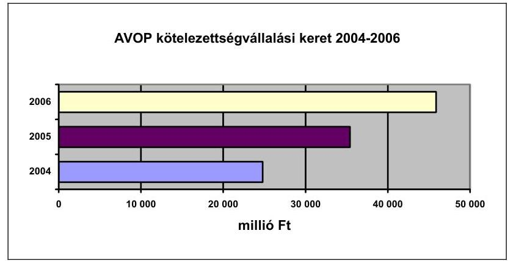

A program keretében meghirdetett pályázatokat a SAPARD pályázatok 2004. évi lezárása után 2004. május 3 -ától lehetett benyújtani. A SAPARD program lezárása 2004. szeptember 30-a volt, emiatt az AVOP pályázatok kezelését csak ezen időpontot követően lehetett megkezdeni, így a pályázatok feldolgozása 2005. évre tolódott. 2005. december 31-éig 6054 db pályázatot regisztráltak 170 306,0 M Ft támogatási igénnyel. 2005 végéig az Irányító Hatóság 3469 pályázat esetében hozott támogató döntést, szerződéskötésre 3092 pályázat esetében került sor 81896 M Ft értékben. Kifizetés - részben vagy egészben - 1418 pályázat esetében történt.

Az EU Bizottság Mezőgazdasági Főigazgatósága által 2005. június 20-24. között folytatott AVOP rendszerellenőrzés a nemzeti ellenőrzési megállapításokhoz hasonlóan kifogásolta, hogy a pályázók részére nem volt hatékony a pályáztatási eljárás, valamint, hogy az EMIR nem minden modulja múködött. A vizsgálat során fenntartásukat fejezték ki az áfa elszámolhatóságával kapcsolatban, valamint a kétszeres áfa visszaigénylés esetleges kockázatára vonatkozóan.

Az áfa kérdéskörökre vonatkozó 2005. évi gyakorlat szerint annak érdekében, hogy a nemzeti és EMOGA társfinanszírozott áfa-összegek visszaigénylésére ne kerülhessen sor, a pályázathoz kötelezően csatolt áfa-nyilatkozatban szereplő adatok alapján a pályázatkezelő - ellenőrzési lista alkalmazásával - ellenőrzi a támogatás jogosultságát és kiszámításának helyességét. A pályázó köteles bejelenteni az áfa státusz megváltozását, amelyet kizárólag az adószám megváltozása eredményezhet. A bejelentés elmulasztása esetén szabálytalansági eljárásra kerül sor. Az áfa visszaigénylésekor az APEH ellenőrzi a jogosultságot - a hatályos törvények alapján - saját hatáskörben és eljárásrenddel. Az a pályázó, aki a támogatásra eső áfát visszaigényli, jogszabálysértést követ el.

A KEHI rendszerellenőrzése jelentős kockázatnak tekintette, hogy a pályázatok meghirdetése a támogatási intenzitás mértékének nem megfelelő meghatározásával történt ${ }^{12}$, és ezért a pályázati kiírásokban az ellenőrzések ideje alatt jelentős pályázói körnek módosítania kellett a pályázatát. A kiírásokba épített záradékok miatt jogilag biztosított volt az utólagos korrekció lehetősége, azon-

[^0]
[^0]:    ${ }^{12}$ Az AVOP Monitoring Bizottság 2004. július 6-i ülésén felvetődött, hogy a PKD-ban szereplő támogatási intenzitásokat és a társfinanszírozási arányt figyelembe véve egyes intézkedések esetében a támogatáson belül az uniós forrás aránya (támogatási intenzitás) meghaladja az előírt limitet (35\%).

---

ban a probléma 2004. júniusi felismerését követően az azonnali intézkedések elmulasztása jelentősen lassította a pályázatkezelést.

Az elszámolható költségek (támogatásra jutó áfa értéke) kiszámításához meglehetősen bonyolult képlet állt rendelkezésre, emiatt a pályázók egy része eleve lemondott a támogatás egy részéről és a nettó költségek alapján kérte a támogatás megállapítását.

A KEHI mintavételes ellenőrzése a pályáztatás folyamatára vonatkozóan kifogásolta, hogy a pályázati felhívást több esetben nem megfelelően dolgozták ki, az IH elmulasztotta a kapcsolódó közzétételeket, a hiánypótlási felhívásokban több hónapos késés mutatkozott, valamint több esetben a kedvezményezettek nem vezették teljes körűen a részükre előírt nyilvántartásokat. A lebonyolításba bevont intézményeknél az ellenőrzés létszámhiányt tapasztalt, valamint hiányosságokat, pontatlanságokat az ellenőrök munkaköri leírásaival kapcsolatosan.

Az AVOP belső ellenőrzés (Földművelésügyi és Vidékfejlesztési Minisztérium Ellenőrzési Főosztálya) helyszíni ellenőrzése megállapította, hogy a SAPARD és az AVOP végrehajtásával kapcsolatos párhuzamos feladatokból adódó munkacsúcsokat a kirendeltségi létszámmal nem lehetett kezelni. A munkatársak átcsoportosítása a szűk kapacitással rendelkező területre azzal a veszéllyel járt, hogy összeférhetetlenségi esetek keletkezhetnek. Az ellenőrzés kiemelte, hogy a Kirendeltségek által a számlakezelési szabályzathoz csatolt mellékletek (folyamatábrák, dokumentum térképek) a szabályzatot még áttekinthetőbbé és kezelhetőbbé tették.

A belső ellenőrzés javasolta a döntés előkészítő bizottságok működésének (megfelelőség, hatékonyság, átláthatóság) felülvizsgálatát, különös tekintettel a döntéshozatali mechanizmusra, ügyrendjükre, bírálati szempontrendszerükre, múködési dokumentáltságukra.

A Kifizető Hatóságnak az IH-nál tett tényfeltáró látogatása során megállapítást nyert - a belső ellenőrzéssel összhangban -, hogy a kézikönyv pénzügyi lebonyolításra vonatkozó fejezete valamennyi részfeladatot szabályozott, valamint a kiválasztott elszámolásokhoz kapcsolódó Irányító Hatósági feladatok megfelelően kerültek ellátásra. A KEHI vizsgálatához hasonlóan a KH és az AVOP IH belső ellenőrzése az IH Múködési Kézikönyvének pontosítására, kiegészítésére vonatkozóan fogalmazott meg ajánlásokat.

Az AVOP Közreműködő Szervezeténél, a Mezőgazdasági és Vidékfejlesztési Hivatalnál tett tényfeltáró látogatás során a Kifizető Hatóság megállapította, hogy a Múködési Kézikönyv kifizetésre vonatkozó fejezete alapján követendő eljárásrend részletes, pontosan meghatározta a folyamatok lépéseihez rendelhető felelős munkakört, tevékenységet, a vezetői ellenőrzési pontok teljes körűen meghatározásra kerültek, a négy szem elvét következetesen és valamennyi munkafázisban előírták, az EMIR használatára vonatkozó hivatkozások rendkívül részletesek voltak, azonban a technikai segítségnyújtásra vonatkozó speciális rendelkezések teljes mértékben hiányoztak, a szabálytalanságkezelésére vonatkozó fejezet kiegészítésre szorult.

---

# 2.1.3.2. Gazdasági Versenyképességi Operatív Program 

A GVOP 2004-2006-os kerete 151 872,6 M Ft volt, ebből a 2005. évi keret 50 691,6 M Ft. Az OP 2005. évi kiadási előirányzata 33 682,3 M Ft volt (eredeti előirányzat $22720,2 \mathrm{M} \mathrm{Ft}$ ), az év végéig $29103,5 \mathrm{M}$ Ft kifizetés történt.
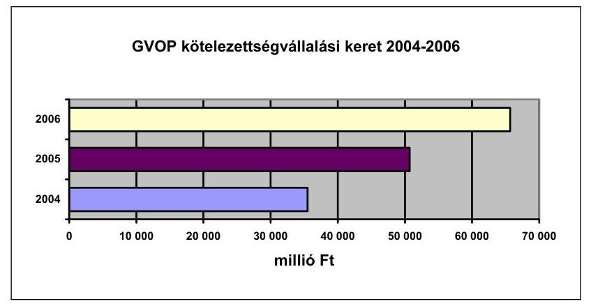

A GVOP IH adatai szerint a hároméves keret 75\%-ára vállaltak kötelezettséget (megítélt támogatások), ugyanakkor a szerződésekkel lefedett rész 60\%-ot tett ki.

A GVOP-ra vonatkozó, KEHI által végzett mintavételes ellenőrzések általános jellegű hibaként megállapították, hogy az ellenőrzött folyamatok többségénél adminisztratív jellegű hiányosságok, határidő túllépések fordultak elő. A pénzügyi elszámolás vonatkozásában általános hiányosságnak bizonyult, hogy az IH nem nyújtotta be határidőben a KH felé a közösségi hozzájárulás rendezésére vonatkozó igényét (holott erre a vonatkozó hazai jogszabály a kifizetést követő 10 munkanapos határidőt ír elő).

A szabályozottság vonatkozásában a mintavételes ellenőrzések feltárták, hogy az IH ellenőrzési nyomvonalában található folyamatábra alapján nem határozható meg a TS lebonyolításának folyamata. Az ellenőrzések több esetben szabálytalansági gyanúkra hívták fel az IH figyelmét.

Az ellenőrzések arra a következtetésre jutottak, hogy a GVOP intézményrendszere kiépült, a szabályzatok nagy része rendelkezésre állt, azonban az 5\%-os ellenőrzések során feltárt visszafizetési kötelezettséggel járó szabálytalanságok a FEUVE rendszer erősítését indokolták, valamint az értékelések és a 4. cikk szerinti dokumentum alapú és helyszíni ellenőrzések színvonalának javítását.

Az ellenőrzési javaslatok eredményeként a 2006. évi pályázatok kiírása előtt a pályázat elbírálásának szempontrendszere ismételten áttekintésre került, azonban a GVOP IH feladatát ellátó GVOP Főosztály létszáma még továbbra sem növekedett az ellenőrzött időszakhoz képest. A horizontális célok ellenőrzésének elősegítése érdekében az IH a KSz értékelők, helyszíni ellenőrök részére horizontális és esélyegyenlőségi képzést szervezett.

A GVOP IH-nál történt kifizető hatósági tényfeltáró látogatás - kifizetés hiányában - az alkalmazott gyakorlat vizsgálatára nem terjedhetett ki. A Múkö-

---

dési Kézikönyv módosítására, ill. a TS-hez kapcsolódó lebonyolítási bankszámlák elkülönítésére fogalmaztak meg javaslatot.

A Magyar Vállalkozásfejlesztési Kht.-nál (KSz) lefolytatott tényfeltáró látogatás alapján a KH javaslatot tett a Múködési Kézikönyv kiegészítésére, illetve egyéb adminisztratív hiányosságok pótlására.

A Magyar Fejlesztési Banknál (KSz) végzett tényfeltáró látogatása során a Kifizető Hatóság megállapította, hogy a projektméret nagysága következtében egy projekthez kapcsolódóan legalább négy helyszíni ellenőrzésre kerül sor. Javasolták a Múködési Kézikönyv kiegészítését, ill. a pályázatos támogatások és a központi projektek kézikönyvben történő elkülönített kezelését. A pénzügyi gyakorlattal kapcsolatban ajánlást fogalmaztak meg az első szintű ellenőrzés megfelelő dokumentálására, és az elektronikusan kitöltött ellenőrzési listák kinyomtatására és elszámolásokkal együtt történő lefúzésére. Az ellenőrzésre kiválasztott számla vizsgálata eredményeképpen a KH kérte a támogatási aránynak a támogatási szerződésekben nem kerekített módon, hanem az EMIR-ben rögzített pontosabb aránnyal összhangban lévő meghatározását.

Az Információs Társadalom Kht.-nál és a Kutatás-fejlesztési Pályázati és Kutatáshasznosítási Irodánál tett tényfeltáró látogatás alapján mindkét KSz-nél javasolták a Múködési Kézikönyvek továbbfejlesztését, aktualizálását.

A GVOP IH-t múködtető szakminisztérium (GKM) Belső Ellenőrzési Főosztálya a GVOP IH-ra és a KSz-ekre kiterjedő rendszerellenőrzései a pályáztatások rendszerének kialakítását megfelelőnek találta, egyes prioritások esetén némi eltéréssel. A folyamatba épített ellenőrzések kontroll pontjait az eljárásrendek, kézikönyvek megfelelően előírták. Ezen kontroll-pontok kialakítása során érvényesítették a funkcionális függetlenséget. A vizsgálatok megállapították, hogy az ellenőrzési rendszer szabályozottsága, kiépítettsége és múködése nem volt egységes a különböző Közremúködő Szervezeteknél. A kontroll-folyamatok szabályozottságának, az ellenőrzési rendszer kiépítettségének és múködésének alapvetően egységesnek kell lennie minden GVOP közreműködő szervezetnél annak érdekében, hogy biztosítani lehessen minden prioritási cél megvalósulását és a támogatások hatékony és szabályszerű felhasználását. A különbségek csak minimális részben voltak indokolhatók azzal, hogy a támogatás lebonyolításának folyamatában eltérések mutatkozhatnak a prioritási céltól ill. a pályázók körétől, a pályázatok minőségétől, mennyiségétől függően.

Kiemelt jelentőségű probléma volt, hogy a GVOP lebonyolítását szolgáló EMIR nem támogatta kellőképpen a folyamatok kontrolljait, ezért sok manuális ellenőrzési pontot kellett beépíteniük a Közreműködő Szervezeteknek.

# 2.1.3.3. Humánerőforrás-fejlesztési Operatív Program 

Az Operatív Programok közül a Strukturális Alapok forrásaiból a HEFOP részesedik a legnagyobb mértékben. A 2004-2006 közötti időszakra vonatkozóan a HEFOP teljes költségvetése összesen 750 M euró ( 183 Mrd Ft). Ebből mintegy 562 M euró közösségi támogatás, amit a hazai - elsősorban központi - források további 187 M euróval egészítenek ki.

---

A HEFOP 2004-2006-os kerete 186 919,3 M Ft volt, ebből a 2005. évi keret 62 389,30 M Ft. Az OP 2005. évi kiadási előirányzata 36 312,3 M Ft volt, az év végéig 30 864,8 M Ft kifizetés történt.
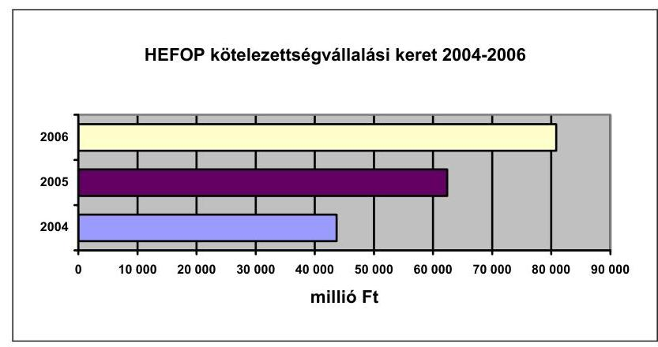

Az Irányító Hatóság döntései alapján összességében 589,87 M euró támogatási összegre vállalt kötelezettséget 2005. december 31-ig, s ebből 305,05 M euróra 2005-ben. Szerződéskötéssel leszerződött támogatás értéke 2005 végén 514,5 M euró volt. A kifizetések (30 858,7 M Ft) elmaradtak az Irányító Hatóság által tervezettől, amelynek fő okát a szerződéskötések elhúzódásában kell keresni. Emellett a közbeszerzési eljárások lefolytatásának időigénye, a megtámadott közbeszerzési eljárásokból fakadó késedelmes teljesítés a projektek végrehajtása során a pénzügyi teljesítés csúszását okozta. A pályázatok feldolgozása során nem sikerült tartani a jogszabályban előírt határidőket, melynek oka az volt, hogy a pályázatok sok esetben több intézmény együttműködését kívánták meg, valamint a pályázatokhoz sok kifizetés tartozott.

A lefolytatott ellenőrzések arra a következtetésre jutottak, hogy a pályázatok végrehajtása és a kifizetések hosszú időt vettek igénybe, esetenként pedig előfordultak adminisztratív vagy jogosultsági feltételeket sértő szabálytalanságok, de ezek a hibák a rendszer szabályszerű működését nem veszélyeztették. A szabálytalanságok megfelelő kezelésére sor került.

A nemzeti ellenőrzések megállapításaival összhangban az EU Bizottság Munkaügyi, Szociális és Esélyegyenlőségi Főigazgatósága is kiemelte a 2005. május 30 - június 3. között folytatott HEFOP rendszerellenőrzése során, hogy ugyan meggyőzőek, de időigényesek voltak az első szintű ellenőrzési eljárások. Továbbá az EMIR rendszer - készültségi fokát és megbízhatóságát érintő - hiányosságait hangsúlyozták. A megállapításokkal összhangban javasolták egyrészt az első szintű ellenőrzési eljárás felülvizsgálatát, hogy az ellenőrzés hatékonysága növekedjen a bizonyossági szint csökkenése nélkül, másrészt az informatikai rendszer továbbfejlesztését és megbízhatóságának növelését eredményező intézkedések végrehajtását.

A HEFOP-ra irányuló rendszerellenőrzések kifogásolták, hogy a 2004. évi TS költségvetést tartalmazó szerződéseket csak 2004. október és 2005. február között írták alá a szervezetek, a hozzájárulások átutalására csak késve kerülhetett sor. Mindennek következtében a 2004. évi költségeket a KSz-eknek saját költségvetésükből kellett megelőlegezniük, ami a programtervben szereplő ütemezés csúszásához, egyes feladatok következő évre való átcsoportosításához veze-

---

tett, mivel a múködtető szervezet nem tudta vállalni az előfinanszírozást, illetve túlzottan kockázatosnak ítélte meg a kifizetéseket szerződés hiányában. A KEHI által összeállított éves összefoglaló jelentés már előrelépésként rögzíti, hogy a 2005. évi TS felhasználására vonatkozó programtervek előkészítése megtörtént, illetve a folyamatok felgyorsítása és az eddig széttagolt intézményrendszer egységesebbé tétele érdekében a HEFOP intézményrendszerének átszervezése megkezdődött.

A támogatási szerződések előkészítésének és a szerződéskötés gyakorlatának vizsgálata során az ellenőrzések rámutattak arra, hogy az IH által kért hiánypótlások több esetben a szerződések előkészítésének, illetve a folyamatba épített ellenőrzésnek a hiányosságaira utalnak.

A KEHI által 2005. évben lefolytatott mintavételes ellenőrzések hangsúlyozták, hogy a jogszabályi előírás ellenére a szervezetek nem tudták alkalmazni az EMIR-t a számviteli nyilvántartás vezetéséhez. A rendszervizsgálatokhoz hasonlóan a projektellenőrzések is kifogásolták, hogy az IH ellenőrzési nyomvonala helyenként hiányos, pontatlan volt. Az intézkedési terv alapján a teljes körű ellenőrzési nyomvonal még 2005 folyamán a HEFOP Múködési Kézikönyvbe beépítésre került.

Általános megállapításként hangsúlyozták az ellenőrzések, hogy a HEFOP rendszere sokszereplős, ami tovább lassította a kifizetéseket. A pályázatok pénzügyi teljesítése több esetben elmaradt a tervezettől (támogatási szerződés késedelmes aláírása, közbeszerzési eljárások elhúzódása miatt).

A projektellenőrzések több esetben rámutattak arra, hogy a kifizetéskor hatályban lévő jogszabállyal ellentétben az előleg uniós hányadának átutalása közösségi forrásból történt, illetve hogy az IH nem tartotta a 60 napos határidőt a támogatás kifizetésére vonatkozóan.

A Kifizető Hatóság tényfeltáró látogatása alkalmával megállapította, hogy a Múködési Kézikönyv felülvizsgálata volt szükséges. Az IH-nál a funkciók megfelelő elhatárolása biztosított volt, a HEFOP lebonyolításának minden folyamata az IH jóváhagyásával és ellenőrzésével történt.

A Magyar Államkincstár Finanszírozási Igazgatóságánál tett tényfeltáró látogatás kiemelte, hogy az eljárásrendekben meghatározott feladatok megfelelően szabályozottak voltak. A feladatok ellátására rendelkezésre álló humán kapacitás a „négy szem elvének" érvényesülését biztosította, a feladatok várható megnövekedése miatt azonban a biztonságos feladatellátás érdekében a Kifizető Hatóság szükségesnek látta a létszám bővítését. Megállapítást nyert továbbá, hogy a MÁK, mint a HEFOP Közremúködő Szervezete egyben a HEFOP Technikai Segítségnyújtás intézkedés egyik kedvezményezettje, a megismert eljárásrendek erre vonatkozólag azonban nem tartalmaznak rendelkezéseket.

A Magyar Államkincstár Budapesti és Pest Megyei Regionális Igazgatóság Állampénztári Irodájánál (KSz) elvégzett tényfeltáró látogatás az EMIR alkalmazására koncentrált. A vizsgálat alapján a Kifizető Hatóság megállapította, hogy a szervezet nem rendelkezett organigrammal, a munkamegosztást az éppen aktuális munkamennyiség határozta meg, az ellenőrzési listák és a kincs-

---

tári hitelesítési jelentés kitöltése az EMIR-ben nem volt megoldott, így ez a látogatás időpontjában papír alapon történt.

A HEFOP IH-t működtető szakminisztérium (FMM) Ellenőrzési Irodája által Technikai Segítségnyújtás felhasználására irányuló ellenőrzése javasolta a TS eljárásrendjének módosítását, beleértve a programtervek értékelését, a programtervekről való döntés menetével, a határidőkkel, a szakmai monitoring lépésekkel kapcsolatosan. A támogatási szerződések előkészítésére, a szerződéskötés gyakorlatára vonatkozó, az IH-ra és négy KSz-re kiterjedő vizsgálat a rendszert korlátozottan megfelelőnek minősítette. Jelentős hibákat tárt fel a szabályozottság és a gyakorlati lebonyolítás területén (pl. informális kommunikáció a folyamat szereplői között, eljárásrendek hiánya, hiányosságai).

# 2.1.3.4. Környezetvédelem és Infrastruktúra Operatív Program 

A 2004-2006. években a KIOP rendelkezésére álló keretösszeg 111 Mrd Ft, amelyből a környezetvédelmi prioritás 43,6 Mrd Ft-tal részesül, a fennmaradó összegből 64,2 Mrd Ft-ból közlekedési beruházások valósulnak meg. Az OP kiadási előirányzata 2005-ben 14234,7 M volt. A tárgyév során jelentős összegű kifizetések történtek ( $28523,6 \mathrm{M} \mathrm{Ft}$ ), amelyek a program teljes költségvetésének $25,67 \%$-át tették ki.
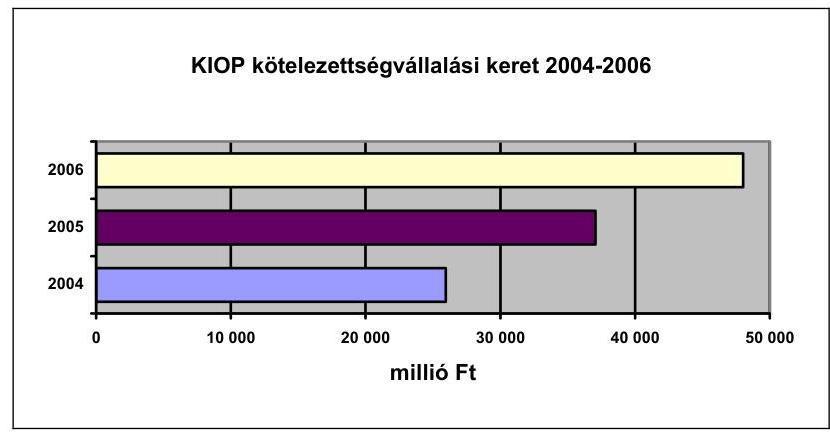

A KIOP - az n+2 szabálynak való megfelelés tekintetében - a legjobban teljesítő operatív programnak tekinthető, hiszen a három éves keretnek 89,2\%-a már szerződéssel lekötött forrás. Ez egyrészt köszönhető a kedvezményezetti kör öszszetételének, másrészt az egyes beruházások magas értékének.

Az átlagos feldolgozási idő 2005 negyedik negyedévben is magas volt, a KIOP esetében is meghaladta a 100 napot. Az elhúzódó elbírálási folyamat a támogatási rendszer hitelességét veszélyezteti és bizonytalan gazdasági helyzetet teremt a kedvezményezettek számára. A 2005. év második félévében megtett egyszerűsítési lépések hatása még nem érzékelhető. A kifizetések időigénye a 2005. évben szintén 100 nap körül mozgott, beleértve a hiánypótlások idejét is.

A KIOP-ra irányuló rendszervizsgálatok megállapították, hogy a FEUVE nem mindenütt megfelelően szabályozott, s a KIOP IH nem rendelkezett teljes körű ellenőrzési nyomvonallal. A KIOP IH-nál a pénzforgalmi és könyvelési funkciók erőforráshiányból fakadóan nem különültek el megfelelően. A Kifizető Hatóság tényfeltáró látogatása során megállapította, hogy a könyvelési feladatokat

---

egyetlen munkatárs sem látta el. A KIOP IH által könyvelendő két prioritás intézkedéseinek könyvelése a látogatás elkészítésének időpontjáig sem kezdődött meg.

A KIOP projektellenőrzések súlyos szabálytalanságot vagy közvetlen pénzügyi kockázattal járó hiányosságot nem tártak fel, felhívták azonban figyelmet néhány adminisztratív hiányosságra (aláírási jogosultságok szabályozása, papíralapú dokumentumokon szereplő kifizetési, átutalási dátumok és az EMIR összhangjának hiánya, IH ellenőrzési nyomvonal hiányosságaira).

A Kifizető Hatóságnak a KIOP IH-nál tett tényfeltáró látogatása során megfogalmazott megállapításai főként az egyes feladatok elvégzéséhez szükséges határidők rögzítésének hiányára, valamint a gyakorlatban alkalmazott és az eljárásrendben lefektetett eljárások összhangjára koncentráltak.

A Környezetvédelmi és Vízügyi Minisztérium Fejlesztési Igazgatóságán mint Közreműködő Szervezetnél tett tényfeltáró látogatás során a Kifizető Hatóság megállapította, hogy támogatási szerződésekhez, forráslehívási dokumentációkhoz kapcsolódó folyamatok a jóváhagyás alatt lévő kézikönyv alapján zajlottak. A dokumentum alapú ill. a helyszíni ellenőrzések szabályozása hiányos volt, de a gyakorlatban az ellenőrzéseket megfelelően folytatták le. Az Energiaközpont Kht.-nál mint Közreműködő Szervezetnél tett tényfeltáró látogatás során a megállapítások - kifizetés hiányában - főként az egyes feladatok elvégzéséhez szükséges határidők rögzítésének hiányára vonatkoztak.

# 2.1.3.5. Regionális Fejlesztés Operatív Program 

A ROP 2004-2006-os kerete 114264,2 M Ft volt, ebből a 2005. évi keret 38 138,8 M Ft. Az OP 2005. évi kiadási előirányzata 22842,4 M volt (eredeti előirányzat: 13798,5 M Ft), az év végéig 14 508,8 M Ft kifizetés történt.
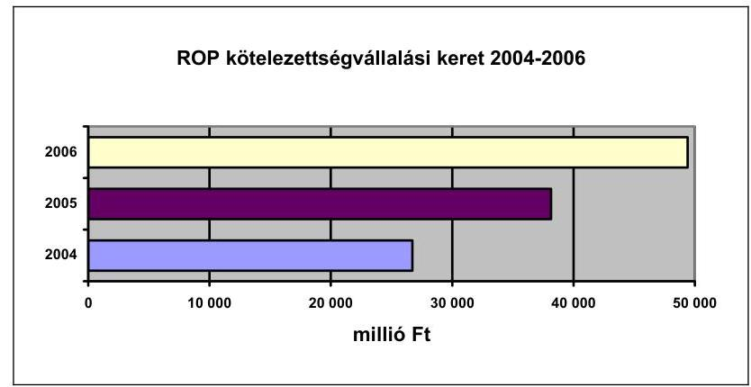

A pályázatok feldolgozásának üteme javult, de még mindig nem érte el a jogszabály által előírt mértéket. Az ellenőrzések több esetben utaltak a KSz-eknél tapasztalható személyi összeférhetetlenségi aggályokra, amelyek korlátozhatják az objektivitást a pályázatok elbírálásánál. Az Irányító Hatóság megítélése szerint is a létszámhelyzet mellett a pályázók felkészültsége és az információrendszerek összehangoltsága terén szükségesek lépések a feldolgozás gyorsítása érdekében.

---

Az ellenőrzések arra a következtetésre jutottak, hogy voltak olyan végrehajtásbeli rendszerjellegű problémák, amelyek lassították a pályáztatás és az értékelés, valamint a kifizetések folyamatát, és a FEUVE rendszer, az értékelések és a 4. cikk szerinti ellenőrzések hiányosságai, elsősorban a Technikai Segítségnyújtás felhasználásánál olyan szabálytalanságokat eredményeztek, amelyek pénzügyi korrekciót is szükségessé tettek. Ugyanakkor - a FEUVE hiányosságai ellenére - több esetben már a kifizetéseket megelőző ellenőrzések során megállapításra került a szabálytalanság, aminek eredményeként a támogatások jogosulatlan kifizetésére nem került sor. A felmerült szabálytalanságok, hibák kezelése megfelelő módon megtörtént vagy folyamatban volt.

Az Európai Bizottság Munkaügyi, Szociális és Esélyegyenlőségi Főigazgatósága által 2005. október 10-13. között folytatott ROP rendszerellenőrzés a nemzeti ellenőrzési megállapításokhoz hasonlóan rámutatott, hogy az Irányító Hatóság nem végez 4. cikk szerinti helyszíni ellenőrzést a központi programok esetében. Továbbá megállapítást fogalmaztak meg a nyilvánossági követelmény teljesülésének hiányosságaira vonatkozóan és az általános üzemeltetési költségek arányosításának a végső kedvezményezett által alkalmazott módszerét illetően. Javasolták, hogy az érintett intézmények tegyenek intézkedéseket a hiányosságok kiküszöbölése érdekében. Az Európai Bizottság jó gyakorlatként emelte ki, hogy a pályázatok bírálatának rendszerében két KSz vesz részt a döntéselőkészítésben, ez ugyanis a pályázatok jobb szakmai ellenőrzését biztosítja.

A KEHI rendszerellenőrzése a Kézikönyv késedelmes elfogadását kockázatosnak ítélte az egységes értékelés szempontjából, ami adott esetben veszélyeztethette a feladatok megfelelő ellátásának számonkérhetőségét.

A ROP-ra vonatkozó mintavételes ellenőrzések a rendszerellenőrzésekkel összhangban kifogásolták, hogy egyes projektek esetén a teljesítésigazolások nem kerültek aláírásra, a kifizetéseket megelőzően pedig nem került sor az utalványozásra. Más esetben megsértették a közbeszerzési törvény előírásait a Közbeszerzési Döntőbizottság álláspontja szerint. Előfordult, hogy nem elismerhető költségek kerültek elszámolásra.

A Kifizető Hatóság ROP IH-nál tett tényfeltáró látogatása alapján javaslatokat fogalmazott meg az Irányító Hatóság Múködési Kézikönyvének pénzügyi, ellenőrzési és szabálytalanság-kezelési fejezetei továbbfejlesztésével kapcsolatban. A technikai segítségnyújtás elszámolásának dokumentáltsága, illetve elszámolhatósági hiányosságai alapján a KH ajánlást fogalmazott meg az IH részére a VÁTI Kht.-nál (KSz) felmerült, és a technikai segítségnyújtás terhére elszámolt működési költségek bizonylatokkal való alátámasztottságára, illetve az arányosítás megfelelőségének és átláthatóságának ellenőrzésére.

A KH-nak a VÁTI Kht. Magyarországi Regionális Képviseleténél (KSz) tett tényfeltáró látogatásának alapján megállapításra került, hogy az első szintű ellenőrzést illetően a „négy szem elve" érvényesült. A KH a helyszíni ellenőrzési eljárásrendet megfelelőnek találta, a kiválasztott elszámolás ellenőrzéséhez és kifizetéséhez kapcsolódó dokumentumok kapcsán hiányosságot nem tárt fel.

A KTK IH-nál (mint a ROP 4.1 intézkedését jelentő KTK Technikai Segítségnyújtás projektszintű lebonyolításáért felelős szervezetnél) tett tényfeltáró látogatás

---

rámutatott, hogy a ROP IH semmilyen ellenőrzést nem végez a KTK TS intézkedés vonatkozásában a KTK IH-nál, ami következésképpen azt jelenti, hogy a ROP IH a KTK TS tekintetében kizárólag a KTK IH által kiállított hitelesítési jelentésben foglaltak alapján hitelesíti az adott elszámolási időszakban a vonatkozó intézkedés keretében felmerült költségeket. A látogatást követően a KH továbbfejlesztési javaslatokat fogalmazott meg a Működési Kézikönyvvel kapcsolatban, illetve felhívta a figyelmet az első szintű ellenőrzés megfelelő dokumentálásának szükségességére. Az ellenőrzésre kiválasztott elszámolás vizsgálata eredményeképpen általános ajánlást fogalmazott meg arra vonatkozóan, hogy a számlával kapcsolatos pénzügyi feladatok csak a számla teljesítésigazolását és ellenőrzését követően kezdődjenek meg mind papíron, mind pedig az EMIRben.

A ROP belső ellenőrzése (OTH Ellenőrzési Főosztálya) az operatív program pályáztatási rendszerének vizsgálata során javasolta a szabályzatok összhangjának megteremtését, hiányosságainak pótlását, a nem támogatható tevékenységek kiemelését a támogatási szerződésekből.

A ROP belső ellenőrzése az érintett Regionális Fejlesztési Ügynökség részére javasolta humánerőforrás-felmérés készítését, mivel a projektmenedzserek száma nem minden régióban volt elegendő az elvégzett feladatokra, az értékelési feladatok során a rotáció nem volt biztosított, valamint az alacsony létszám miatt a „négy szem elve" nem minden esetben érvényesült. A vizsgálat kifogásolta a helyszíni szemlék hiányát, valamint javasolta az SZMSZ kiegészítését. A Kedvezményezetteknél lefolytatott projektellenőrzések kifogásolták a Kedvezményezettek által elkövetett és a Közremúködő Szervezet által feltárt hibák kezelésére vonatkozó szabályozás, pénzforgalmi szemléletű könyvelést alkalmazó Kedvezményezetteknél az analitikus szállítói számlák nyilvántartásának hiányát.

# 2.1.4. Szabálytalanságok kezelése 

A szabálytalanságokkal kapcsolatos irányítási és ellenőrzési rendszernek - az IH-kon és a KSz-eken túlmenően - további fontos résztvevője az OLAF Koordinációs Iroda (a továbbiakban: OLAF KI), amely az OLAF-fal tartja a kapcsolatot, és a csalásokról és szabálytalanságokról szóló jelentéseket kezeli.

Az ÁSZ-nak a Strukturális Alapokból nyújtott támogatásokkal kapcsolatos csalások és szabálytalanságok kezelése rendszerének és gyakorlatának ellenőrzésről lefolytatott vizsgálata feltárta, hogy Magyarországon a SA-ból nyújtott támogatásokkal kapcsolatos szabálytalanságok kezelése az EU jogszabályain alapul és azoknak alapvetően megfelel. Jó gyakorlat, hogy valamennyi IH és KSz rendelkezik múködési kézikönyvvel, melyek a szabálytalanság fogalmait és kezelésének fő lépéseit egységesen fogalmazzák meg. A jogszabályok általános megfogalmazásai, a kezdeti tapasztalatlanság, valamint annak következtében, hogy 22 KSz végzi a szabálytalanság-kezelési tevékenységet, a hazai gyakorlat már nem olyan egységes, mint a szabályozás. A felvetett általános jogértelmezési, illetve a hozzájuk intézett konkrét kérdésekben az IH-k állást foglalnak és a KH és/vagy az OLAF KI is segítséget nyújt a hozzájuk fordulóknak. Ez azonban még nem volt elegendő ahhoz, hogy a Strukturális Alapok teljes spektrumában egységes szabálytalanság-kezelési gyakorlat alakuljon ki. Pozitív, hogy

---

a Strukturális Alapok kezelésében részt vevő szervezetek belső ellenőrzése jól felkészült e feladataira, de kedvezőtlen, hogy ezek az egységek nem rendelkeznek elegendő létszámmal.

A Kifizető Hatóság által megküldött, a 2005. évre szóló szabálytalansági jelentések összefoglalója alapján az AVOP tekintetében 21 esetben indult szabálytalansági eljárás szabálytalanság gyanúja miatt. A szabálytalansággal érintett támogatási összeg visszatartásra került, így visszafizetési kötelezettség nem keletkezett. A GVOP esetében 2 alkalommal jelentettek be szabálytalanságot, amely hibás árfolyam-kalkulációból származott. A HEFOP esetében 13 alkalommal merült fel szabálytalanság gyanúja. A szabálytalansággal érintett támogatási összeg itt is visszatartásra került.

2005-ben a KIOP IH nem jelentett szabálytalanságot a KH felé, illetve a lefolytatott ellenőrzések sem állapítottak meg az EU vagy a hazai költségvetés érdekeit sértő szabálytalanságot. A kisebb súlyú hibák, adminisztratív jellegű hiányosságok megszüntetése érdekében megtörténtek a szükséges intézkedések.

A ROP esetében 7 alkalommal jelentettek be szabálytalanságot, amelyből kettőt a mintavételes ellenőrzések alkalmával állapították meg. A mintavételes ellenőrzéseket nem érintő vizsgálatokhoz kapcsolódó szabálytalansági jelentésekben főként a támogatási szerződés megkötése előtt történő kivitelezéssel, hirdetmény nélküli tárgyalásos eljárás lefolytatásával kapcsolatos szabálytalanságokat állapítottak meg, valamint a felmerült költségek nem megfelelően arányosított elszámolására került sor. Egy esetben bűncselekmény gyanúja merült fel a pályázattal kapcsolatos eszközbeszerzés során.

Az AVOP-ra vonatkozó szabálytalansági jelentések főként a kedvezményezettek részéről az alátámasztó dokumentáció hiányosságaira vonatkozóan tartalmaztak utalást, illetve néhány esetben a kedvezményezettek a hiánypótlási kötelezettségüknek nem tettek eleget, eltértek a szerződéstől, az elszámolást késedelmesen nyújtották be, vagy a pályázat befogadása előtt elkezdték a beruházást. Előfordult, hogy a kedvezményezett egyes jogosultsági feltételeknek nem tett eleget (pl. közbeszerzési kötelesség elmulasztása, jelzálogjog fennállása).

# 2.1.5. A Közösségi Kezdeményezések 

Az Interreg közösségi kezdeményezés az Európai Regionális Fejlesztési Alap által finanszírozott határon átnyúló, nemzetek közötti és interregionális együttműködés, amelynek célja az egész közösségi terület harmonikus, kiegyensúlyozott és fenntartható fejlesztése.

Az együttműködés három formája különböztethető meg: határmenti, transznacionális és Interreg regionális együttműködés. Az elsőben két (bizonyos esetekben három) ország határ menti megyéi, a másodikban Európa 13 makro-térsége közül Magyarország a Közép-Európát és a Balkánt átfogó térség tagjaként vesz részt az együttmúködésben. A harmadik forma az ország egész területére kiterjedően Európa teljes területéről származó partnerekkel való együttmúködésre biztosít lehetőséget. Az Interreg programok előkészítésére, valamint a magyar intézményi háttér, Közreműködő Szervezetek és végső kedvezményezettek felkészítésére a 2002. és a 2003. évi Nemzeti Phare program keretében biztosítottak forrást.

---

Magyarország összesen 8 Interreg programban vesz részt 2004-2006 között, amelyből négy Interreg IIIA típusú, határmenti együttműködést célzó kezdeményezés. A Magyarország-Szlovákia-Ukrajna Szomszédsági Programban és a Magyarország-Románia és Magyarország-Szerbia Montenegró Határ menti Együttmúködési Programban hazánkat bízták meg Irányító Hatósági feladatokkal, az Ausztria-Magyarország Program és a Szlovénia-MagyarországHorvátország Program esetében pedig az EU-s partner lett az Irányító Hatóság. Az Interreg előirányzatai a központi költségvetés XVII. Területfejlesztés fejezeti kezelésű előirányzataiként szerepeltek.

Az Interreg IIIA Közösségi Kezdeményezés programok szabályszerű és hatékony végrehajtásáért az Országos Területfejlesztési Hivatal (2005 szeptemberéig a Magyar Terület- és Regionális Fejlesztési Hivatal - MTRFH) Irányító Hatóságként ill. Nemzeti Hatóságként felel, Közremúködő Szervezetként a Váti Kht. Játszik szerepet. A Kifizető Hatóság, ill. Al-kifizető Hatóság feladatait a Pénzügyminisztériumon belül múködő Nemzeti Programengedélyező Iroda látta el.

Az OTH Nemzeti Hatóságként az olyan programokért felelős, amelyekben nem Magyarország látja el az Irányító Hatósági feladatokat. Az Irányító Hatóságnak szoros együttmúködésben kell dolgoznia a felelős Nemzeti Hatósággal, illetve a Közremúködő Szervezetekkel. A Közremúködő Szervezet az Irányító Hatóság, illetve a Nemzeti Hatóság nevében jár el, feladatait másra nem ruházhatja át.

A kiadási előirányzat 2609,8 M Ft (eredeti előirányzat 2259,9 M Ft) volt, amely a pályáztatás és ennek következtében a szerződéskötések elhúzódása miatt a tervezettől jelentősen elmaradva 219,9 M Ft összegben teljesült.

Az Interreg IIIA vonatkozásában a programok rendszerellenőrzését, mintavételes (5\%-os) ellenőrzését, valamint a zárónyilatkozat kiadását a Kormányzati Ellenőrzési Hivatal végzi ${ }^{13}$; az ÁSZ mint külső ellenőr jogosult vizsgálatok lefolytatására.

A KEHI a rendszerellenőrzéseket a nemzeti ellenőrzési stratégiával összhangban lefolytatta. Az ellenőrzési munkaterve ütemezett ugyan mintavételes ellenőrzést, azonban ez igazolt kifizetés hiányában még nem volt végrehajtható.

A KEHI rendszervizsgálatai - összhangban az Interreg-re vonatkozó belső ellenőrzés megállapításaival - szabályozási hiányosságokat tártak fel (ellenőrzési nyomvonalak hiánya, számviteli politika és számlarend aktualizálásának ill. a bizonylati rend elkészítésének szükségessége). A Közremúködő Szervezet nem rendelkezett pénzügyi eljárásrenddel. A feladatok egyértelmú szabályozása és a

[^0]
[^0]:    ${ }^{13}$ A Tanács 1999. június 21-i 1260/1999/EK rendelete a strukturális alapokra vonatkozó általános rendelkezések megállapításáról; a Bizottság 2001. március 2-i 438/2001/EK rendelete a strukturális alapok keretében nyújtott támogatások irányítási és ellenőrzési rendszerei tekintetében az 1260/1999/EK tanácsi rendelet végrehajtásának részletes szabályairól; 359/2004. (XII. 26.) Korm. rendelet az INTERREG III Közösségi Kezdeményezés programok végrehajtásának részletes szabályairól; 360/2004. (XII. 26.) Korm. rendelet a Nemzeti Fejlesztési Terv operatív programjai, az EQUAL Közösségi Kezdeményezés program és a Kohéziós Alap projektek támogatásainak fogadásához kapcsolódó pénzügyi lebonyolítási, számviteli és ellenőrzési rendszerek kialakításáról

---

hatáskörök elkülönítése nem volt teljes mértékben biztosított. Az Irányító/Nemzeti Hatóság és a Közremúködő Szervezet között nem volt érvényes megállapodás a feladatok delegálásáról.

Az ellenőrzött szervezetek a feltárt hiányosságokat megszüntették, illetve intézkedtek a megszüntetésükről. Az ellenőrzések nem tártak fel lényeges hiányosságokat az irányítási és ellenőrzési rendszer tényleges múködésében. A lefolytatott vizsgálatok pénzügyi konzekvenciákat nem állapítottak meg.

Az Equal közösségi kezdeményezés az Európai Szociális Alap által finanszírozott program, amelynek célja a munkaerőpiacon az egyenlő esélyek megteremtése és a hátrányos megkülönböztetés különböző formáinak felszámolására irányuló kísérleti, innovatív projektek nemzetközi együttmúködésben történő megvalósításának támogatása.

Az Equal előirányzata a központi költségvetés XXVI. Foglalkoztatáspolitikai és Munkaügyi Minisztérium fejezeti kezelésű előirányzataként szerepelt. A kiadási előirányzat 3035,4 M Ft (eredeti előirányzat 2307,3 M Ft) volt, amely a pályáztatás, és ennek következtében a szerződéskötések elhúzódása miatt a tervezettől jelentősen elmaradva 748,8 M Ft összegben teljesült.

Az Operatív Programokhoz hasonlóan a koordinációs feladatokat az Equal esetében is a Közösségi Támogatási Keret Irányító Hatóság látta el. Az Equal program szabályszerű és hatékony végrehajtásáért az uniós jogszabállyal ${ }^{14}$ összhangban az FMM szervezetében kialakított Equal Irányító Hatóság felelős, amely feladatainak egy részét két Közremúködő Szervezetnek delegálta. A Kifizető Hatóság feladatait a Pénzügyminisztériumon belül múködő Nemzeti Programengedélyező Iroda látta el.

A 2005. évi rendszerellenőrzési vizsgálatokra a nemzeti stratégiának és a KEHI 2005. évi ellenőrzési tervének megfelelően került sor. Equal mintavételes projektellenőrzés ugyan tervezésre került, azonban tekintettel a pályázatok végrehajtásában bekövetkezett elmaradásra, költségnyilatkozat hiányában az ellenőrzés nem volt végrehajtható. Az FMM Ellenőrzési Iroda az Equal Közösségi Kezdeményezés vonatkozásában nem tervezett rendszerellenőrzést 2006. évre, azonban egy ellenőrzés végrehajtásra került. A KEHI 2005-ben elvégezte az EMIR informatikai rendszerellenőrzését, ami kiterjedt az Equal IH ellenőrzésére is.

A 2005-re vonatkozó ellenőrzések több hiányosságot állapítottak meg:

- A pályáztatási lebonyolítási folyamatban - a rendszer indulásából fakadóan - nehézségek jelentkeztek, amik a folyamatok elhúzódását eredményezték.
- Az előkészítési szakaszra vonatkozó szerződéseket és a projekt-végrehajtási fázisra vonatkozó szerződések többségét 2005 decemberéig megkötötték. Az

[^0]
[^0]:    ${ }^{14}$ A Tanács 1999. június 21-i 1260/1999/EK rendelete a strukturális alapokra vonatkozó általános rendelkezések megállapításáról

---

előlegeket mindkét szakaszra vonatkozóan kifizették, azonban számla alapú kifizetésre csak az előkészítési fázisban került sor.

- A KEHI EMIR ellenőrzése kockázati tényezőként állapította meg, hogy az Equal speciális igényeihez való igazítása csak 2005 decemberére történt meg. Addig az időpontig az EMIR Equal modulja az eljárások tisztázatlansága okán nem kerülhetett kifejlesztésre, így nem volt biztosított a Bizottsággal való pénzügyi elszámolás. Az IH az első költségnyilatkozatot 2005 decemberében hagyta jóvá.

A hazai jogszabály ${ }^{15}$ értelmében az Európai Unióval történő elszámolások benyújtása az EMIR-ben teljes körűen rögzített számlák vagy egyéb bizonylatok, a rendszerben elkészített költségnyilatkozat és hitelesítési jelentés alapján történhet.

- Az IH-ra és a KSz-ekre kiterjedő év eleji vizsgálat úgy ítélte meg, hogy az akkor feltárt hibák általános rendszerhibára utaltak. Az Equal Program végrehajtása során a pályázatokkal, pályázókkal kapcsolatos adat-nyilvántartási, rögzítési folyamat, az értékelés folyamatai nem kapcsolódnak egymáshoz, nem kellően szabályozottak. A folyamatba épített ellenőrzés nem működött, nem volt szabályozott az ellenőrzési pontok meghatározása.

Az ellenőrzés megállapította, hogy annak ellenére, hogy a pályázati kiírásban megfogalmazott előírásokat a pályázók nem tartották be, a pályázatokat elfogadták. A formailag nem megfelelő pályázatokat nem utasították el, tartalmi értékelésük megtörtént. A folyamatok nem épültek egymásra, a szakmai értékelés megtörtént a formai értékelés befejeződése előtt. A szakmai és pénzügyi előértékelők nem tettek konkrét javaslatot a támogatás összegére. Az Értékelő Bizottság titkársági feladatait ellátó Nemzeti Programiroda, ennek hiányában az összefoglaló pályázati lista adatait az általa nyilvántartott pályázati anyagokból állította össze.

# 2.2. Kohéziós Alap 

A Kohéziós Alap létrehozásáról az 1993-ban hatályba lépett Maastrichtti Szerződés rendelkezett. Célja szerint a Közösség legszegényebb tagállamai reálszféráinak konvergenciáját támogatja a monetáris unióra való felkészülés időszakában. A támogatott országokban erősíteni kell a gazdasági és társadalmi kohéziót, valamint csökkenteni a különböző régiók fejlettségi szintjében észlelhető különbségeket. A maastrichti konvergencia kritériumok kizárólag a pénzügyi feltételek teljesítését írják elő, amelyeknek a teljesítése, elsősorban a költségvetési hiányra vonatkozó előírásé, a hosszú megtérülési idejű projektek elhalasztására ösztönöz. A Kohéziós Alap célja éppen az, hogy ezen dilemmákat a költségvetési deficit növekedése nélkül, de a környezet további romlását elkerülve oldja meg. A fejlesztési projektek átlagos megtérülési ideje a két kiválasztott célterületnél, a közlekedésnél és a környezetvédelemnél a legnagyobb. A környe-

[^0]
[^0]:    ${ }^{15}$ 360/2004. (XII. 26.) Korm. Rendelet a Nemzeti Fejlesztési Terv operatív programjai, az EQUAL Közösségi Kezdeményezés program és a Kohéziós Alap projektek támogatásainak fogadásához kapcsolódó pénzügyi lebonyolítási, számviteli és ellenőrzési rendszerek kialakításáról

---

zetvédelmi és a közlekedési infrastruktúra beruházások között, ugyanúgy ahogy az ISPA-nál, szigorú előírás a források 50-50\%-os megosztása.

A Kohéziós Alap azon EU tagállamok számára érhető el, ahol az egy főre eső vásárlóerő-paritáson számított Bruttó Nemzeti Termék (Gross National Product - GNP) nem éri el a közösségi átlag 90\%-át. Ez a feltétel az új tagállamok mindegyikére teljesül. A támogatás mértéke az állami, illetve hasonló kiadások 80-85\%-a, a minimális projekt méret 10 M euró. A támogatott országnak részletes tervet kell készítenie a Gazdasági és Monetáris Unióhoz történő csatlakozás elérésére. Ez azt jelenti, hogy a kedvezményezett országok mindegyikének be kell nyújtania a Tanácshoz egy konvergencia kritériumok teljesítésére irányuló, és a túlzott államháztartási deficit elkerülése céljából tervezett ún. konvergenciaprogramot. Ha egy adott tagállam az államháztartási deficitkorlát betartását szolgáló feltételeket nem teljesítette, a Kohéziós Alap finanszírozását felfüggeszthetik.

A kedvezményezett tagállamoknak ezen kívül egy ún. Kohéziós Alap Keretstratégiát is el kell készíteniük, amely meghatározza a támogatások felhasználásának tervezett kereteit, ügyelve az összhang biztosítására a Nemzeti Fejlesztési Tervvel. A konkrét finanszírozási döntések azonban nem a stratégiához, hanem az ahhoz illeszkedő, de külön-külön benyújtott projektekhez kötődnek. Magáról a Kohéziós alap Stratégiáról az EU nem is hoz formális befogadó döntést.

# 2.2.1. A Kohéziós Alap felhasználásának uniós és hazai szabályozása, intézményrendszere 

Az általános uniós szabályozás mellett ${ }^{16}$ a Kohéziós Alap végrehajtási rendelet ${ }^{17}$ szabályozza az alapból nyújtott támogatások irányítási és ellenőrzési rendszerérének kialakítását és a pénzügyi korrekcióra vonatkozó eljárásrendet.

A végrehajtási rendelet értelmében a támogatásra jogosult tagállamok feladata az Alap hatékony irányításához és ellenőrzéséhez szükséges rendszer biztosítása, a kiadások hitelességének igazolása, az irányítási és számviteli rendszerek megfelelő nyomon követhetőségének biztosítása, a szúrópróbaszerű ellenőrzések lefolytatása ( $15 \%$-os ellenőrzés, a mintavétel szabályai) és a zárónyilatkozat készítése.

A végrehajtási rendelet mellett további fontos szabályozást jelent a Bizottság 16/2003/EK számú rendelete a Kohéziós Alapnál elszámolható jogosult költségek szabályozására vonatkozóan.

A Kohéziós Alap felhasználásának hazai szabályozó rendszerének elemei - az uniós források felhasználásának egységes szerkezeti rendben történő szabályo-

[^0]
[^0]:    ${ }^{16}$ A Tanács 1994. május 16-i 1164/1994/EK rendelete a Kohéziós Alap létrehozásáról
    ${ }^{17}$ A Bizottság 2002. július 29-i 1386/2002/EK rendelete a Kohéziós Alapból nyújtott támogatások irányítási és ellenőrzési rendszere, valamint a pénzügyi korrekciós eljárás tekintetében az 1164/94/EK tanácsi rendelet végrehajtására vonatkozó részletes szabályok megállapításáról

---

zási elvéből való kiindulásból fakadóan - a Strukturális Alap felhasználását szabályozó közös rendeletekben jelentek meg. Így az 1/2004. (I. 5.) Korm. rendelet mellett, amely meghatározza az Európai Unió Strukturális Alapjaiból és Kohéziós Alapjából származó támogatások hazai felhasználásáért felelős intézményrendszert, további közös szabályozás az 14/2004. (VIII.13.) TNM-GKM-FMM-FVM-PM együttes rendelet, amely a Strukturális Alapok és a Kohéziós Alap felhasználásának általános eljárási szabályait tartalmazza. Szintén közös jogszabályban, a 360/2004. (XII.26.) Korm. rendeletben található meg a Nemzeti Fejlesztési Terv programjai, az Equal Közösségi Kezdeményezés program és a Kohéziós Alap projektek támogatásainak fogadásához kapcsolódó pénzügyi lebonyolítási, számviteli és ellenőrzési rendszerek kialakítását és múködtetését előíró szabályozás.

A Kohéziós Alap felhasználásának stratégiai terve a vonatkozó közösségi politikákkal és a nemzeti környezetvédelmi és közlekedési stratégiákkal összhangban álló keretdokumentum, a Kohéziós Alap Keretstratégia, amelynek végrehajtása az intézményrendszer és a támogatás végső kedvezményezettjeinek a feladata.

A Kohéziós Alapból származó támogatások felhasználásának irányítására kijelölt szervezet a Kohéziós Alap Irányító Hatóság (KAIH). Feladata a Kohéziós Alap Keretstratégia megvalósításának koordinálása, amely kiterjed a stratégia kidolgozására és a Nemzeti Fejlesztési Terv egyes Operatív Programjaival való összhang biztosítására. A Kohéziós Alapból a támogatásra javasolt projekteket a Kohéziós Alap Irányító Hatóság javaslatára az európai integrációs ügyek koordinációjáért felelős tárca nélküli miniszter a Kormány elé terjeszti.

A Kohéziós Alap Irányító Hatóság a keretstratégia megvalósításába a közlekedési és a környezetvédelmi projektek tekintetében egy-egy Közremúködő Szervezetet vont be (Gazdasági és Közlekedési Minisztérium Segélykoordinációs és Finanszírozási Főosztálya, a Környezetvédelmi és Vízügyi Minisztérium Fejlesztési Igazgatósága). A Közreműködő Szervezetek feladata, hogy a Kohéziós Alapból megvalósuló projektek előkészítését, pályáztatását és lebonyolítását a projekt teljes életciklusára kiterjedően menedzselje. A Kohéziós Alap Közreműködő Szervezet feladatait korlátozott mértékben lebonyolító testületre vagy a projekt kedvezményezettjére átruházhatja. E feladatok tekintetében a lebonyolító testület vagy a projekt kedvezményezettje a Közreműködő Szervezet nevében jár el.

A Kohéziós Alap felhasználásának monitoring tevékenységében a Strukturális Alapok monitoring tevékenységéhez hasonló tevékenységet tölt be a Központi Monitoring Bizottság. A Kohéziós Alap vonatkozásában önálló Kohéziós Alap Monitoring Bizottság múködik, amely felállításáért a Kohéziós Alap Irányító Hatóság a felelős. A Monitoring Bizottságok az országban rendelkezésre álló nemzetközi és nemzeti támogatással megvalósuló programok végrehajtásával kapcsolatos figyelemmel kísérő, koordináló, értékelő szervezetek, amelyek fel-

---

adatait, intézményi rendszerének összefüggéseit kormányrendelet szabályozta ${ }^{18}$.

Az EU-ból érkező források fogadását, az átutalási igények összeállítását, a költségnyilatkozatok igazolását és azoknak az EU felé benyújtását végző intézmény a Kifizető Hatóság, amely feladatokat az Európai Unió Strukturális Alapjai és a Kohéziós Alap fogadása tekintetében a Pénzügyminisztérium szervezetén belül alakította ki.

A vonatkozó jogszabály ${ }^{19}$ a Kohéziós Alap rendszerellenőrzését, 15\%-os (mintavételes) ellenőrzését, továbbá a Kohéziós Alap forrásaiból megvalósított projektek zárónyilatkozatának kiadását a Kormányzati Ellenőrzési Hivatal feladataként határozta meg.

# 2.2.2. A Kohéziós Alapot érintő 2005. évre vonatkozó ellenőrzések megállapításai, következtetések 

2005-ben az Európai Bizottság négy projektet hagyott jóvá: áprilisban a radarfejlesztési, augusztusban az észak-alföldi ivóvíz-ellátási, decemberben a Sza-bolcs-Szatmár-Bereg megyei hulladékgazdálkodási beruházást, valamint a vasúti projekt előkészítéséhez kapcsolódó szakmai segítségnyújtási projektet. Magyarország így a rendelkezésére álló teljes támogatási keretet lekötötte.

A Kohéziós Alap támogatásával összesen 24 környezetvédelmi beruházás 184 Mrd Ft EU-támogatással és 9 közlekedési beruházás 182 Mrd EU-támogatással valósulhat meg. Ezen felül a forrás kb. 1\%-a (5 Mrd Ft) projekt-előkészítési és más szakmai segítségnyújtási feladatokat szolgál.

A Kormány 2005-ben áttekintette a Kohéziós Alap működését befolyásoló legfontosabb jogszabályokat, és a támogatások hatékonyabb felhasználása érdekében több rendelkezést módosított (építési beruházások közbeszerzési eljárásai, államháztartás múködési rendje, engedélyezés).

A környezetvédelem területén egységes szabályozás alá került és összevonhatóvá vált a környezetvédelmi hatásvizsgálati és az egységes környezethasználati engedélyezési eljárás (ezáltal pl. csak egy alkalommal kerül sor a szakhatóságok bevonására, a nyilvánosság részvételére, az esetleges jogorvoslatokra, ami számottevő gyorsítást tesz lehetővé). A közlekedés területén az ún. autópálya-törvény (a Magyar Köztársaság gyorsforgalmi közúthálózatának közérdekúségéről és fejlesztéséről szóló 2003. évi CXXVIII. törvény - Aptv.) biztosította a közúti beruházások

[^0]
[^0]:    ${ }^{18}$ 124/2003. (VIII. 15.) Korm. rendelet az Európai Unió által nyújtott egyes pénzügyi támogatások felhasználásával megvalósuló programok monitoring rendszerének kialakításáról
    ${ }^{19}$ 360/2004. (XII. 26.) Korm. rendelet a Nemzeti Fejlesztési Terv operatív programjai, az EQUAL Közösségi Kezdeményezés program és a Kohéziós Alap projektek támogatásainak fogadásához kapcsolódó pénzügyi lebonyolítási, számviteli és ellenőrzési rendszerek kialakításáról

---

eljárásai gyors lebonyolításának feltételeit; a vasúti törvény módosításával a vasúti beruházások engedélyezése is jelentősen rövidül.

Az Európai Bizottság vizsgálta, hogy a Kohéziós Alap Magyarország által bevezetett rendszerei összhangban vannak-e a közösségi szabályozással, hatékonyan működnek-e és a szabálytalanságokat megfelelően kezelik-e. A KEHI a Kohéziós Alappal kapcsolatos ellenőrzéseit ( $15 \%$-os, ill. rendszerellenőrzés) a nemzeti ellenőrzési stratégia alapján, azzal összhangban elvégezte. A költségigazoló nyilatkozat kiadása érdekében 2005 első félévében a Kifizető Hatóság tényfeltáró látogatást tett az Irányító Hatóságnál és a Közremúködő Szervezeteknél. Az ÁSZ szabályszerűségi ellenőrzést folytatott a Kohéziós Alapra vonatkozóan.

A Kohéziós Alap projektjeinek 2005. évi kiadási előirányzata 79 520,6 M Ft volt (eredeti kiadási előirányzat $43583,3 \mathrm{M}$ Ft), mely $44410,6 \mathrm{M}$ Ft értékben valósult meg.

A Kohéziós Alap által támogatott projektek finanszírozása terén a 2005. év számos változást hozott. A központi költségvetésbe befolyt uniós támogatások, valamint a hazai források tényleges kiadásként való megjelenése növekedést mutatott az uniós tagság első, 2004. évi adataival való összehasonlításkor.

A tényleges előirányzatoknak a költségvetésben eredetileg megtervezett szinten történt megvalósulását számos pozitív fejlemény idézte elő, ugyanakkor a gazdálkodásban jelen voltak azok a folyamatok is, amelyek a pénzeszközök jövőbeni felhasználásakor való fokozottabb körültekintésre hívják fel a figyelmet.

Jelentős eredmény volt a 2005. évben az Európai Unió által Magyarország számára a 2006 végéig terjedő költségvetési időszakra jóváhagyott Kohéziós Alap támogatási keretének teljes lekötése. Ezzel elhárult annak a közvetlen veszélye, hogy hazánk elveszíti a támogatási keret egy részét.

Ezzel együtt növekedés volt tapasztalható az év során meghirdetett tenderek megkötött kivitelezési szerződéseinek a projektek összköltségéhez viszonyított arányában, ami az év végére elérte az $52 \%$-ot. Ennek elérésében szerepe volt annak, hogy több jogszabály egyszerúsödött 2005-ben. Ez az arány ugyan pozitív változást mutat az előző évhez képest, de egyúttal felhívja a figyelmet a tenderek meghirdetése, lebonyolítása, illetve a szerződéskötések folyamata felgyorsításának szükségességére. Az ISPA, illetve Kohéziós Alap támogatások megnyílása óta ugyanis a megkötött szerződések értéke az összes projekt várható összköltségének mindössze $19 \%$-a volt 2005. január 1jén. A tényleges kiadási előirányzat alakulására elsősorban a megkötött szerződések alapján lehívott előlegek növekedése hatott, emellett a projektek tényleges megvalósulását jelző rész-számlák alapján történő kifizetések aránya alacsony maradt.

---

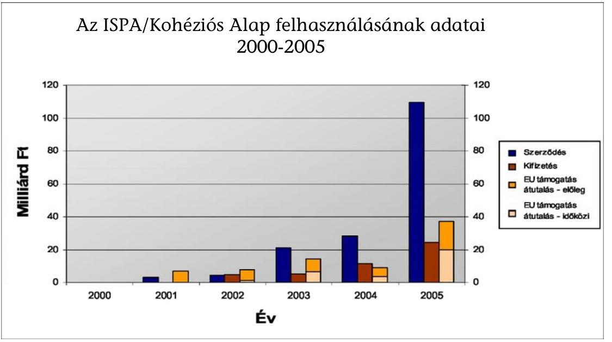

Az ellenőrzési tapasztalatok azt mutatták, hogy voltak ugyan rendszerjellegú problémák (el nem ismerhető költségek nem egységes módon történő kezelése, hitelesítési folyamatok nem megfelelő szabályozottsága, EMIR rendszer hiányosságai), azonban ezek a tényezők az ellenőrzések megállapításai alapján olyan súlyos szabálytalanságot nem eredményeztek, amelynek következtében pénzügyi korrekció válhatott volna szükségessé, vagy a rendszer megfelelő múködésében okozott volna kezelhetetlen akadályokat, hibákat. Egyes projektek zárónyilatkozatának kiadása előtt azonban az ellenőrzések indokoltnak tartják egyeztetések lefolytatását az EU Bizottsággal a költségek elszámolhatóságát illetően.

Az Európai Bizottság külön ellenőrzés keretében vizsgálta a környezetvédelmi szektor pályáztatási, közbeszerzési gyakorlatát. Az ellenőrzés a Kohéziós Alap által társfinanszírozott vállalkozási, szolgáltatási vagy szállítási szerződésekre irányult. Az ellenőrzés megelőző természetű volt, valamint hasznos tanácsokkal kívánta ellátni Magyarországot egy olyan területen, amely nem volt problémamentes az ISPA, illetve a Kohéziós Alapra eddig jogosult négy ország tekintetében.

Az Európai Bizottság rámutatott, hogy a közbeszerzéssel kapcsolatban általános problémának mutatkozott a kiválasztási kritériumok szerződő hatóságok általi alkalmazása, amelynek eredményeképpen nagyon alacsony volt a szerződéskötési fázist elérő ajánlatok száma. Ugyanakkor 2005 második felében számos közbeszerzést sikerült úgy kiírni, hogy az a versenyt és az ajánlattevők számát növelte. A pályázók pénzügyi stabilitásának értékelésére alkalmazott kiválasztási kritériumok a vizsgált projektek esetében nem voltak elég tárgyilagosak. A vizsgálat objektív értékelési kritériumok alkalmazását javasolta.

A Bizottság kifogásolta azt a gyakorlatot, hogy a vizsgált 10 szerződésből négy esetben az ajánlati árra limitet határoztak meg, ami ellentmond a 92/50/EKG irányelvnek. A szerződéskötés kritériumaival kapcsolatban a Bizottság aláhúzta, hogy a beadandó ajánlatok minimum és maximum árának előre meghatá-

---

rozása korlátozhatja a versenyt az alacsonyabb árstruktúrával rendelkező cégek között. A negatív tapasztaltok miatt ezt a gyakorlatot az ajánlatkérők önként megszüntették. A pályázatok értékelésére vonatkozóan javasolta, hogy a Fejlesztési Igazgatóság ösztönözze a bíráló bizottságokat a pályázatok elbírálásánál alkalmazott pontszámok indoklásának rögzítésére, a pontszámok számtani ellenőrzésére.

A pályázatfelbontási eljárással kapcsolatos szabályozásokat a Bizottság megfelelőnek találta. A pályázatok elbírálásánál és a szerződéskötésnél alkalmazott kiválasztási és odaítélési kritériumokkal kapcsolatos fenti megállapítások azt mutatják, hogy a közbeszerzés sok esetben nem megfelelő pályázati kiírás alapján történt. A KSz szinten az IH által végrehajtott irányítási ellenőrzések nem elegendők, mivel a közbeszerzés ellenőrzését jelenleg nem tartalmazza az ellenőrzési feladat. Az Európai Uniós Közbeszerzési Koordinációs és Szabályossági Egység (EKKE) pályázatértékelő jelentései nem elég részletesek, és jelenleg csak a KSz-ek és a Végső Kedvezményezettek részére küldik meg, az IH részére nem.

Az Európai Bizottság vizsgálta, hogy a Kohéziós Alap Magyarország által bevezetett rendszerei összhangban vannak-e a Közösségi szabályozással, hatékonyan múködnek-e és a szabálytalanságokat megfelelően kezelik-e.

Az IH és a KSz szinten a kiadások támogathatóságának tekintetében a Bizottságnak fenntartásai voltak, hogy a területet megfelelően ellenőrzik-e a számla kifizetési stádiumában. A végső kedvezményezettek áfa (levonhatósági jogosultság szerinti) besorolására vonatkozóan - amely a Bizottság részére bevallott kiadások támogathatósága szempontjából fontos - nem alakítottak ki írásos eljárást (megjegyezzük, hogy az NFH honlapján a vizsgált időszakban az egységes áfa-útmutató megtalálható volt). Egyes szektorok előrehaladási jelentéseinek minőségét és időszerűségét nem ítélték megfelelőnek, a felelős minisztérium a projekteket nem tudta megfelelően felügyelni. A Bizottság javasolta, hogy rendeljenek elegendő munkatársat a feladathoz a minőség javítása és a határidők betartása céljából, és a kapacitáshiány megoldásának érdekében az üresedéseket minél hamarabb töltsék be.

A Regionális Fejlesztéspolitikai Főigazgatóság 2005. április 11-15-e között lefolytatott Kohéziós Alap 5. cikk szerinti rendszerellenőrzés keretében a nemzeti ellenőrzési megállapításokhoz hasonlóan megállapította, hogy az EKKE szerepe tisztázásra szorul a közbeszerzési eljárással összefüggő 4. cikk szerinti feladatok végrehajtásában, továbbá felhívta a figyelmet az EMIR rendszer kapcsán az adatbevitellel és a helyszíni ellenőrzési jelentés formátumával kapcsolatos hiányosságokra, s ezzel összhangban javasolta a formátum felülvizsgálatát. Nem volt egyértelmű számukra, hogy melyik szervezet felelős az 1386/2002/EK rendelet 9. cikkében foglaltak szerinti rendszerellenőrzések elvégzéséért.

A 2005-ben elvégzett rendszerellenőrzések során tapasztalt általános jellegű megállapítás a Múködési Kézikönyvek, belső eljárásrendek hiányosságai, pontatlansága volt. A jogszabályi környezet változása, módosulása a szabályzatok folyamatos módosítását tette szükségessé. Az ellenőrzési nyomvonal nem töltötte be teljes mértékben funkcióját, többek között azért sem, mert a folyamatosan változó rendszer az ellenőrzési nyomvonal folyamatos frissítését követelte meg, amely csak elvétve valósult meg. A hitelesítési folyamatok szabályozott-

---

sága nem volt kielégítő, az eljárásrendek nem, vagy csak felületesen tartalmazták az ezzel kapcsolatos tevékenységet. Jellemző volt a dokumentáltság hiánya, amely megnehezítette a folyamat kontrolljainak a hatékony működését is. Általánosan jellemző hiányosságok mutatkoztak a hitelesítési jelentések tárolásával, megőrzésével és adminisztrációjával kapcsolatban is.

Az EU által el nem ismerhető költségek elszámolása a vizsgálatok lefolytatása idejében nem volt szabályozva a GKM-ben. A költségek elszámolhatóságának ellenőrzése nem egységes módon történt, az erre vonatkozó szabályozás nem volt teljes körű. Az ellenőrzések felhívták továbbá a figyelmet a 4. cikk szerinti ellenőrzések gyenge pontjaira.

A Nemzeti Autópálya Rt.-nél végzett vizsgálat megállapította, hogy az Rt. belső ellenőrének tevékenysége nem terjedt ki az EU-s ellenőrzésekre, ezt sem az éves munkaterv, sem az ellenőr munkaköri leírása nem tartalmazta.

A KEHI vizsgálatok több esetben tapasztalták, hogy az ellenőrzési nyomvonal nem teljes körűen került elkészítésre. A Támogatási Szerződés tekintetében egy vizsgálat során az ellenőrzés rámutatott, hogy a Támogatási Szerződést nem módosították a Pénzügyi Megállapodás és a Konzorciumi Szerződés módosításainak megfelelően a befejezési határidő, az elismerhető költségek összege, valamint a kedvezményezettek köre tekintetében, egy másik esetben pedig, a Pénzügyi Megállapodásban megjelölt és a Támogatási Szerződésben szereplő kedvezményezetti kör nem volt azonos. Mindezekre tekintettel az ellenőrzések több esetben úgy ítélték meg, hogy a létesítmények tulajdoni viszonyai nem tisztázottak, ezért az EU Bizottság előzetes jóváhagyására, illetve állásfoglalásának kérésére lenne szükség. Egy vizsgálat során az ellenőrzés megállapította, hogy a Pénzügyi Megállapodás módosításait nem hirdették ki magyar jogszabályban.

Megállapításra került egy projekt ellenőrzése során, hogy a projekt megvalósításának jelentős költségtúllépése a vizsgálat időpontjában meghaladta az eredeti állami kötelezettségvállalás mértékét, így a finanszírozása csak akkor biztosítható, ha a 2006. évi költségvetésben erre a tervezés során fedezetet biztosítanak.

A nyilvántartás vonatkozásában a KEHI ellenőrzései megállapították, hogy egy projekt esetében az eredményeként létrejövő szellemi termék nem szerepel a KSz nyilvántartásában, míg más projektnél a végső kedvezményezett nyilvántartása nem felelt meg a hazai számviteli előírásoknak, mivel az euróban vezetett nyilvántartás nem volt alkalmas a forintban vezetett főkönyvi nyilvántartás alátámasztására. Hiányosságokat tapasztalt az ellenőrzés az érintett önkormányzatok könyvelési rendszerében is, mivel az elismerhető költségek és a nem elismerhető költségeket nem különítették el.

A Kifizető Hatóság 2005 első félévében tényfeltáró látogatást tett a Kohéziós Alap Irányító Hatóságánál, valamint a Gazdasági és Közlekedési Minisztériumnál és a Környezetvédelmi és Vízügyi Minisztérium Fejlesztési Igazgatóságánál mint Közreműködő Szervezeteknél.

Több esetben előfordult, hogy a Pénzügyi Megállapodás előírásait alapul véve nem volt egyértelműen azonosítható a költségek elszámolhatósága (egy eset-

---

ben 798 247,33 euró, másik esetben 10686,83 euró (hazai forrás) és 92690,71 euró (EU-s forrás) értékben. Az említett elszámolhatóság kérdésében az EU Bizottsággal történő egyeztetést javasolta a vizsgálatot, annak érdekében, hogy az elszámolhatóság egyértelmúen megállapítható legyen.

Általános jellegű probléma, hogy a beszállítói számlák kifizetésére többkevesebb késedelemmel került sor, illetve, hogy a szerződések előkészítése során a jogszabályi környezet változásait nem vették mindig figyelembe.

A KSz-nél, valamint a Lebonyolító Testületnél fennálló létszámhiány és a betanulás időigényessége lényeges kockázati tényezőnek mutatkozott a határidők betartásának a pályáztatási feladatok teljesítése során.

Az ellenőrzés egy vizsgálat során azt tapasztalta, hogy a Támogatási Szerződés nem felelt meg a hatályos jogszabályoknak, illetve a szervezeti struktúrának, amelynek módosítása szükséges.

A GKM Kohéziós Alap Közremúködő Szervezeténél 2005. március 30-án végzett a Kifizető Hatóság tényfeltáró látogatást. Egy kiválasztott projekt példáján keresztül az írásos pénzügyi eljárásrend, valamint a tényleges gyakorlat összhangjának vizsgálatára került sor egy-egy kiemelt kérdéskörben (pénzügyi lebonyolítás és ellenőrzés). A vizsgált projekt az egyik legelsőként jóváhagyott ISPA projekt volt. Megállapításra került, hogy a hitelesítési eljárásrend még nem volt teljes, és számos ponton kiegészítésre szorult. A négy szem elvének használata a Múködési Kézikönyvben hiányos volt, valamint a delegált feladatok ellenőrzése nem szerepel az eljárásrendben.

A KvVM Kohéziós Alap Közremúködő Szervezeténél a Kifizető Hatóság 2005. április 6-án tett tényfeltáró látogatást a GKM-mel azonos témakörben. A vizsgált projektek még a csatlakozást megelőzően jóváhagyott ISPA projektek voltak. A KH megállapította, hogy a hitelesítési eljárásrend nem elég részletes, nem írja elő megfelelően az EMIR használatát (az EMIR használata mint kiegészítő tevékenység jelent meg a kézikönyvben.) A KH hiányolta továbbá a projekt menedzser és a pénzügyi menedzser közötti együttmúködést mind az eljárásrendben, mind a gyakorlatban.

A Kifizető Hatóság az NFH Kohéziós Alap Irányító Hatóságánál 2006. május 26án folytatott vizsgálatot. A tényfeltáró látogatás alkalmával a kiválasztott, megvalósítás szakaszában lévő projektek példáján keresztül az írásos pénzügyi eljárásrend, valamint a tényleges gyakorlat összhangját vizsgálta. Megállapította, hogy a hitelesítési eljárásrend kisebb módosítása szükséges. Az eljárásrendben rögzíteni kell a pénzügyi menedzser és a projekt menedzser hitelesítési folyamatban való együttmúködését. A pénzügyi eljárásrend nem volt megfelelően részletes, nem tartalmazta a feladatokat szervezeti egységre, munkatársra lebontva.

A Kifizető Hatóság a 2005. évre szóló szabálytalansági jelentések összefoglalójában a környezetvédelmi szektorra vonatkozóan 2 szabálytalanságot állapított meg - egy projekthez kapcsolódóan - egyik esetben 330720,0 euró, a másik esetben 13914,0 euró értékben.

A KH által kapott információk szerint az első összegre vonatkozóan a vállalkozói szerződés hibás módosítása után a második módosítás folyamatban van. Eszerint az el nem számolható 330720 euró-s összeget az önkormányzat saját forrásból tervezte kifizetni a vállalkozónak. A másik összeg vonatkozásában a vállalkozói

---

szerződés módosításra került, melyben a 13914 euró-s összeg el nem számolható tételként jelent meg, és a számla az önkormányzat által kifizetésre került. Így ezen szabálytalansági eljárást az IH lezártnak tekintette.

Az ellenőrzött szervezetek minden esetben készítettek intézkedési tervet, amelyet az ellenőrző szervvel egyeztettek. Az összegző jelentés elkészítésének időpontjában az intézkedésekhez rendelt határidők csak részben jártak le.

A beszámolók alapján megállapítható, hogy a hiányosságként meghatározott szellemi terméket a KSz nyilvántartásba vette, a teljességi nyilatkozat pedig pótlásra került. Az érintett projekt költségeinek a 2006. évi költségvetésben a költségtúllépés összegével növelt értéken történő betervezése megtörtént. A számlák befogadásáról az érintett szervezet gondoskodott, a projektfelelős nyilvántartást vezet a számlák érkeztetésének nyomon követhetősége érdekében.

Az ÁSZ megállapításai szerint 2005. évben a megvalósulás eddigi adatai alapján egyes projekteknél költségtúllépés, másoknál költségmegtakarítás mutatkozott. Mivel a projektek közötti átcsoportosítás lehetősége korlátozott, szükség lehet állami többletforrás bevonására. Mivel projektzárásra az elmúlt évben még nem került sor, a végleges helyzet értékelésére legkorábban a 2006. év végén záruló projekteknél lesz lehetőség.

# 2.3. Schengen Alap 

A Schengen Alapot a Csatlakozási Okmány 35. cikke hozta létre ideiglenes eszközként. Célja a kedvezményezett tagállamok segítése a csatlakozás időpontja és 2006 vége között az Unió új külső határain a schengeni vívmányok és a külső határellenőrzés végrehajtásának finanszírozásában.

A Schengeni Támogatás keretében a kedvezményezett államok, köztük Magyarország is, egyösszegű vissza nem térítendő támogatásra jogosultak. A kedvezményezett tagállamok felelnek az egyes intézkedések megválasztásáért és végrehajtásáért, valamint a támogatás egyéb közösségi eszközökből származó támogatásokkal történő összehangolt felhasználásáért, biztosítva a közösségi politikákkal és intézkedésekkel, valamint az Európai Közösségek általános költségvetésére alkalmazandó költségvetési rendelettel való összeegyeztethetőséget. A támogatásokat az első kifizetéstől számított három éven belül kell felhasználni, a felhasználásra nem kerülő, illetve jogosulatlanul vagy szabálytalanul elköltött pénzeszközt a Bizottság részére vissza kell fizetni. A megvalósítandó hároméves célkitűzéseket és intézkedéseket, a részletes fejlesztési feladatokat és azok hazai, illetve közösségi pénzügyi forrásait a Magyar Köztársaság által kidolgozott indikatív program tartalmazta. A források elosztása centralizált, csak az indikatív programban jóváhagyott kedvezményezett intézmények részesültek belőle.

A Kormány 2004. év májusában elfogadta a Schengen Alap felhasználásának pénzügyi tervezési, lebonyolítási és ellenőrzési rendjét rögzítő 179/2004. (V. 26.) Kormányrendeletet, amely meghatározta a támogatás felhasználásához szükséges intézményi keretet, a program költségvetési tervezésének folyamatát, a Schengen Alapból származó források felhasználásának végrehajtási szabályait,

---

az Európai Bizottsággal történő elszámolás szabályait, valamint az ellenőrzésre és a szabálytalanságok kezelésére vonatkozó előírásokat.

A Felelős Hatóság feladatait a Nemzeti Fejlesztési Hivatal látta el, amely felelős volt a Schengen Alap támogatásból finanszírozott fejlesztési feladatok teljes körű megvalósításáért. A Schengen Alap támogatásból finanszírozott fejlesztési feladatok pénzügyi és adminisztratív lebonyolítására kijelölt szervezeti egység, a Központi Pénzügyi és Szerződéskötő Egység (KPSZE) a szakmai Közremúködő Szervezetekkel együttmúködve ellátta a támogatások felhasználásával összefüggő közbeszerzési eljárások lebonyolítását, továbbá a szerződéskötési, nyilvántartási és egyéb pénzügyi adminisztrációs feladatokat. A Schengen Alap Tárcaközi Bizottság feladata a Schengen Alap fejlesztési (indikatív) programjainak kidolgozása, összehangolása, az ezzel összefüggő kormányzati és miniszteri hatáskörbe tartozó döntések előkészítése volt.

A Schengen Alap tekintetében a szakmai Közremúködő Szervezetek feladatait a Belügyminisztérium EU Együttmúködési Hivatala, a GKM Kohéziós Alap Ten-T és Intézményfejlesztési EU Források Főosztálya és a VPOP Integrációs Hivatala látta el, amelyek felelősek voltak a Schengen Alap támogatásból finanszírozott fejlesztési feladatok tervezéséért, előkészítésért, szakmai és a technikai megvalósításáért, nyomon követéséért és ezen feladatokkal kapcsolatos szervezeten belüli belső koordináció végzéséért.

A kormányrendelet értelmében a Kormányzati Ellenőrzési Hivatal a végső elszámoláskor igazolja a költségnyilatkozat pontosságát és megfelelőségét, a fejlesztési feladatok lebonyolításában részt vevő szervek irányítási és ellenőrzési rendszereinek hatékony működését, jogszabályi előírásokkal és közösségi politikákkal való összhangját, továbbá elvégzi a mintavételen alapuló 10\%-os ellenőrzéseket. A Felelős Hatóság, a KPSZE és a Szakmai Közreműködő Szervezetek feladata a belső ellenőrzés múködtetése.

A szabálytalanságokkal kapcsolatos jelentéstételi rendszer összehangolása a Felelős Hatóság feladatkörébe tartozik. Amennyiben szabálytalanságok történnek, a KPSZE és a szakmai Közreműködő Szervezetek kötelesek haladéktalanul tájékoztatni a Felelős Hatóság vezetőjét és az OLAF Koordinációs Irodát, és intézkedni a projekt felfüggesztésére, a személyi felelősség megállapítására és a szabálytalanul felhasznált összeg visszaszerzésére.

Az OLAF Koordinációs Iroda, a VPOP szervezeti keretein belül található meg, amely struktúra aggályokat vethet fel, arra való tekintettel, hogy a VPOP maga is részesül a Schengen Alap forrásaiból.

A Schengen Alap rendelkezésére álló források 5\%-a - ebből 3,5\% a Közreműködő Szervezeteknél, 1,5\% a KPSZE-nél - PMC-ként (Project Managment Cost) került elszámolásra a 2004. évben. 2005-ben a háromoldalú megállapodások módosításával megnövelték a PMC keretet. A Belügyminisztérium esetében a Közreműködő Szervezetnek jutó részt 3,9\%-ra, míg a GKM esetében 5\%-ra növelték. Ennek indokaként a növekvő szerződéskötések számát és az ehhez igénybevett szakértőkkel kapcsolatos költségek növekedését jelölték meg a Közreműködő Szervezetek.

---

A Schengen Alap kiadási előirányzata 19 773,2 M Ft volt (eredeti előirányzata 16 942,7 M Ft volt), amely 3248,9 M Ft összegben teljesült.

Az ÁSZ vizsgálata alapján megállapítható, hogy 2005. évben a kifizetések volumene nem érte el a költségvetés tervezésekor várt szintet. A kifizetések jelentős elmaradásának magyarázataként a Felelős Hatóság valamint a Közremúködő Szervezetek a következő okokat jelölték meg:

- Az Európai Bizottság csak 2004 decemberében hagyta jóvá az Indikatív Programot, így a végrehajtás megtervezése csak ekkor kezdődhetett meg;
- A közbeszerzési eljárások lebonyolítása csak 2005-ben indulhatott el;
- A közbeszerzési törvényhez kapcsolódó végrehajtási rendeletek megjelenésének késedelme is indokolta az eljárások megindításának elhúzódását.

A 2005. évi alacsony teljesítési adatok ellenére a Közreműködő Szervezetek biztosítottnak látták a rendelkezésre álló források lekötését és azok felhasználását a 2007. év végéig.

2005-ben jogértelmezési probléma merült fel a Bizottság és a Felelős Hatóság között a Schengen Alap által biztosított források felhasználásának határidejéről. A Bizottság megfontolva a Felelős Hatóság érveit módosította a határidőket, így a szakmai teljesítések végső határideje 2007. szeptember 30-ra tolódott.

A Felelős Hatóságra, a KPSZE-re és a szakmai közreműködő szervezetek intézményi felkészültségére vonatkozó rendszerellenőrzés megállapította, hogy az intézményrendszer kiépült, a felhasználás jogi szabályozása megtörtént, a kezelésbe bevont szervezetek közötti együttműködési, illetve delegálási megállapodások megkötötték. Az intézményrendszer tekintetében azonban jelentős hiányosság volt, hogy a szereplők közti feladat- és hatáskörmegosztás részletezését szabályozó kétoldalú intézményközi (delegálási és együttműködési) megállapodások megkötésére jelentős - közel egy éves - késéssel, 2005. márciusban és áprilisban került sor. A megállapodások tartalma több szempontból nem volt megfelelő. A KPSZE által megkötött megállapodásokban foglalt végrehajtási rendszer eltért a kormányrendelet előírásaitól. Kockázatos a volt végrehajtás rendszerében, hogy a Felelős Hatóságnak ezen megállapodásokat nem kellett jóváhagynia/ellenjegyeznie, továbbá az is, hogy nem gondoskodott a kézikönyvek egységesítéséről, nem hagyta azokat jóvá véglegesítésük előtt. A funkcionálisan független belső ellenőrzés a KPSZE kivételével mindenhol biztosított volt, 2005-ben azonban egyetlen belső ellenőrzési szerv sem folytatott le a Schengen Alappal kapcsolatos rendszerellenőrzést. Az ellenőrzés javasolta a lebonyolítás kereteit meghatározó kormányrendelet módosítását is.

A 2004-2006. időszakra rendelkezésre álló mintegy 164,3 M euró jóváhagyott keretösszeget a Bizottság évenként egyenlő részletekben utalja át az indikatív program adott évi felülvizsgálata és elfogadása után. A 2005. évi indikatív program elfogadására 2005. november 24-én, az első kifizetésre 2005. március 31-én került sor. A kifizetett összeg 3,1 M euró volt, amelyet a Belügyminisztérium kapott a külső határszakaszokon dolgozó határőrök felkészítésének finanszírozására.

---

A Felelős Hatóság célul tűzte ki az EMIR rendszer működtetését a Schengen Alap vonatkozásában, 2005. december 31-ei határidővel. Ennek célja, hogy az NFH pontos és naprakész információkkal rendelkezzen a Schengen Alap projektjeinek állásáról. A vizsgálat megállapította, hogy az EMIR 2006. június elején még nem múködött, addig csupán az adatstruktúra készült el. A Közreműködő Szervezetek időközben kiépítették saját monitoring rendszerüket, ami nincs összhangban a Felelős Hatóság célkitűzéseivel.

# 2.4. Elöcsatlakozási alapok és átmeneti támogatások 

### 2.4.1. $\quad$ Phare $^{20}$

2004-ben a csatlakozásunk következményeként a Phare programok végrehajtásában két igen jelentős változás történt. Egyrészt átalakult a Phare irányítási rendszere (Extended Decentralisation Implementation System - Kiterjesztett Decentralizált Végrehajtó Rendszer - EDIS), melynek következtében a magyar kormányzati szervek több funkciót is átvettek az Európai Bizottságtól. Az EDIS rendszer akkreditációjára 2004. június 21-én került sor. Másrészt a csatlakozást követően a Phare keretében történő beszerzésekre - az eddigi speciális szabályok helyett - a magyar közbeszerzési törvény rendelkezéseit kell alkalmazni. Mindez szükségessé tette a vonatkozó dokumentumok átalakítását, valamint többletfeladatokat jelentett a nemzeti hatóságok számára.

Az Átmeneti Támogatást is tartalmazó 2005. évi kiadási előirányzat 101 475,7 M Ft volt (eredeti előirányzat $35418,6 \mathrm{MFt}$ ), amelyből $43975,2 \mathrm{MFt}$ került felhasználásra.

A Phare források felhasználása tekintetében a szerződéskötésre két év áll rendelkezésre, és további egy év a kifizetésre. Magyarország csatlakozásával megszűnt a jogosultsága további Phare források pályázására, azonban a még futó projekteket be lehet fejezni és a már rendelkezésre álló források felhasználhatóak. Ez azt jelenti, hogy az utolsó 2003. évben meghirdetett pályázatok kifutására csak 2006-ban kerül sor. Az egyes tagállamoknak juttatott Phare forrás nagyságát a Bizottság a teljes rendelkezésre álló összeg 50\% erejéig a kedvezményezettek között egyenlő arányban, a másik 50\% esetében pedig GDP- és la-kosság-arányosan határozta meg.

A 2002-es Phare Nemzeti Program 2005. május 31-én befejeződött. A teljes allokáció $96,3 \%$-át kötötték le, $3,6 \%$ a támogatás azon összege, amit nem sikerült felhasználni a közbeszerzések során kialakult, a tervezettnél alacsonyabb árak miatt. A 2005. év során (november 30-ával) befejeződtek a 2003. évi Nemzeti Program, az utolsó Phare program szerződéskötései is. A kifizetési határidő 2006. november 30. lesz.

A Phare program lezárásával egyidejúleg elkezdődtek a megvalósult projektek programzáró auditjai, melyeket a Bizottság végzett el. Az ellenőrzés a 2000. év

[^0]
[^0]:    ${ }^{20}$ Az előcsatlakozási alapokról, ill. felhasználásukról a csatlakozást megelőzően az 1. sz. melléklet ad tájékoztatást.

---

utáni projektekre terjedt ki és azt vizsgálta, hogy történt-e szabálytalanság az adott projekt megvalósítása során.

A 119/2004. (IV. 29.) Korm. rendelet szerint amennyiben a szabálytalanságban érintett összeg 2 hónapon belüli behajtása sikertelennek bizonyul, az összeget a program szakmai lebonyolításáért felelős fejezet költségvetésének terhére kell elszámolni.

A 2005-ben lefolytatott rendszer- és mintavételes ellenőrzések összességében megállapították, hogy Magyarországon a Phare támogatási rendszer szabályozott mind a jogszabályi környezet, mind a végrehajtó szerveztek belső folyamatai vonatkozásában, bár az utóbbiak tekintetében szükség van aktualizálásra, kisebb korrekcióra. Az ellenőrzési tapasztalatok azt mutatják, hogy voltak ugyan rendszerjellegú problémák, amelyek lassították a projekt megvalósítást, valamint a kifizetések folyamatát, azonban ezek a tényezők az ellenőrzések megállapításai alapján olyan súlyos szabálytalanságot nem eredményeztek, ami alapján pénzügyi korrekció válhatott volna szükségessé, vagy a rendszer megfelelő múködésében okozott volna kezelhetetlen akadályokat, hibákat. A megállapítások elsősorban a gyakorlati megvalósítás eseti hibáira vonatkoztak.

Általános jellegű megállapítás volt, hogy a múködési kézikönyvek, belső eljárásrendek elkészültek, bár nem minden esetben teljes körűek és a gyakorlatban nem mindig tartják be az abban foglaltakat, nem megfelelő a folyamatba épített ellenőrzés.

Gyakoriak voltak az adminisztratív, dokumentálási hiányosságok. A szerződések tekintetében a vizsgálatok többségében nem állapítottak meg nagyobb hibákat.

A KEHI az EU Bizottság záróauditjaira való felkészülés érdekében 2006-tól megkezdte az összes lezárt Phare projekt ellenőrzését.

# 2.4.2. SAPARD 

A SAPARD program céljait a csatlakozást követően a Strukturális Alapok Ag-rár- és Vidékfejlesztési Operatív Programja (AVOP) vette át.

A Program konkrét célja az agrárgazdaság versenyképességének növelése, a mezőgazdasági tevékenységből származó káros környezeti hatások csökkentése, a vidéki térségek adaptációs képességének elősegítése, a munkahelyteremtés és munkahelymegtartás, és a tagjelölt országok felkészítése az Strukturális Alapok fogadására. A SAPARD keretében folyósított támogatásokhoz történő hozzájutás alapfeltétele volt egy hét évre (2000-től 2006-ig) szóló mezőgazdasági és vidékfejlesztési terv készítése.

Magyarország esetében a SAPARD-dal kapcsolatos végrehajtási és kifizetési funkciókat a SAPARD Hivatal látta el 2003. június 30-ig. A Magyar Kormány a Mezőgazdasági és Vidékfejlesztési Hivatalról szóló 81/2003. (VI. 7.) Korm. rendelettel 2003. július1-jei hatállyal létrehozta a Mezőgazdasági és Vidékfejlesztési Hivatalt (MVH), ami a földművelésügyi és vidékfejlesztési miniszter felügyelete és irányítása alatt álló, önálló jogi személyiséggel rendelkező, országos hatáskörű központi hivatal, önállóan gazdálkodó központi költségvetési szerv, a SAPARD Hivatal és az Agrár Intervenciós Központ összevonásával jött létre és

---

azok általános jogutódja. Az MVH a SAPARD Programra vonatkozó feladatait egy központi és hét regionális szervezeti egységgel kezdte ellátni. Ma már az MVH megyei kirendeltségei látják el a regionális és a megyei feladatokat.

Az illetékes hatósági feladatokat is ellátó szerv a Magyar Köztársaság által kijelölt és a Nemzeti Programengedélyező felügyelete alá helyezett Nemzeti Alap. Az Illetékes Hatóság kiállítja, folyamatosan ellenőrzi, és indokolt esetben viszszavonja a MVH akkreditációját, illetve kijelöli az Igazoló Szervet. Az Illetékes Hatóság gondoskodik arról, hogy a SAPARD Hivatal/MVH számviteli rendszere megfeleljen a nemzetközileg elfogadott számviteli szabványoknak.

Az FVM keretein belül múködő Irányító Hatóság felelős a koordináció hatékonyságáért és pontosságáért, jelentéseket készít a Program monitoringjáról és értékeléséről, és ezen jelentéseket megküldi a Monitoring Bizottság és az Európai Unió Bizottsága részére. Az Irányító Hatóság a SAPARD Hivatallal/MVHval konzultál a Program végrehajtásával kapcsolatos kérdésekről.

A SAPARD Program külső ellenőrzését az Igazoló Szerv végzi. Az Igazoló Szerv független külső ellenőrzési intézményként a nemzetközi audit szabványoknak megfelelően évente igazolja, hogy a SAPARD/MVH Kifizető Ügynökség elszámolásai valósak, teljes körűek és pontosak, valamint, hogy a Program végrehajtása és a támogatások kifizetése a SAPARD Többéves Pénzügyi Megállapodással összhangban történik.

Az Állami Számvevőszék elnöke eleget tett a Kormány 2349/1999. (XII. 21.) Korm. határozata 4. pontjában megfogalmazott felkérésnek azzal, hogy az Illetékes Hatóság nevében eljáró Nemzeti Programengedélyezővel a SAPARD igazoló szervi feladatok ellátására 2002. október 8-án munka-megállapodást kötött. Az Állami Számvevőszék a Nemzeti Programengedélyező 2003. január 15-i levelében érkezett felkérés óta végzi az igazoló szervi munkát.

A SAPARD intézkedésekre a 2005. évi eredeti előirányzat 20000,0 M Ft volt, amely 48 045,6 M Ft-ra növekedett és 29 712,0 M Ft-ra teljesült. Az emelés döntő forrása uniós támogatás volt. A 2002-2006 közötti teljes időszakra rendelkezésre álló keret 59 400,0 M Ft, mely a 2212/2004. (VIII. 27.) Korm. határozatban engedélyezett 10\%-os túllépéssel 65 340,0 M Ft-ra módosult.
2005. december 31-én 2682 hatályos támogatási szerződéssel rendelkezett az MVH 63,9 Mrd Ft támogatási összeggel. 2005. december 31-éig 2192 projekt megvalósítását fejezték be, ami az összes hatályos szerződés több mint 80\%-a, 490 projekt folyamatban volt, melynek a befejezése 2006. év végéig várható.

A pályázók körében legnépszerűbb intézkedés a mezőgazdasági vállalkozások beruházásainak támogatása, mely projektek 90\%-a már megvalósult. A vártnál kisebb érdeklődés mutatkozott a falufejlesztés és felújítás, a vidék tárgyi és szellemi örökségének védelme és megőrzése címú intézkedések, valamint a tevékenységek diverzifikálása iránt. Az alternatív jövedelemszerzést biztosító gazdasági tevékenységek fejlesztése intézkedésekhez tartozó projektek 50\%-a valósult meg.

---

# 2.4.3. ISPA 

Az ISPA létrehozásának jogi alapja a Római Szerződés 253. cikkelye, formailag pedig a Kohéziós Alap analógiája alapján került kidolgozásra. Az ISPA (Instrument for Structural Policies for Pre-accession) a csatlakozást előkészítő strukturális politikai eszköz.

Az ISPA előcsatlakozási alapot az 1267/1999/EK Tanácsi Rendelet hozta létre. A támogatásból 2000-2006 között a 10 tagjelölt közép- és kelet-európai társult állam részesül: Bulgária, Csehország, Észtország, Lengyelország, Lettországra, Litvánia, Magyarország, Románia, Szlovénia és Szlovákia. A Rendelet értelmében az ISPA keretében a közösségi támogatás hozzájárul az egyes kedvezményezett országokkal kapcsolatban a csatlakozási társulásban megállapított célkitűzésekhez, valamint a környezetvédelem és a közlekedési infrastruktúrahálózatok fejlesztésére vonatkozó nemzeti programokhoz.

Az ISPA támogatásból 2000-2004 közötti időszakban lekötött ISPA keretek a csatlakozás időpontjától a Kohéziós Alap részét képezik, így felhasználásukra ettől az időponttól a Kohéziós Alapra vonatkozó előírások vonatkoznak.

Az ISPA két fő célkitűzése a csatlakozásra váró országok felkészítése a Kohéziós Alap és a Strukturális Alapok támogatásának fogadására, valamint a közlekedési és környezetvédelmi infrastruktúra területén a csatlakozást hátráltató konkrét problémák megoldása. További célként jelent meg egy decentralizált végrehajtó ügynökségi rendszer bevezetése, amely a tagjelölt országok közigazgatási intézményrendszerét volt hivatott felkészíteni a Kohéziós Alap és a Strukturális Alapok múködésére.

Az ISPA programmal olyan, 5 M eurónál nem kevesebb összköltségű projekteket támogatnak, amelyek illeszkednek az Európai Közösség környezetvédelmi politikájához, illetve segítik a Közösség környezetvédelmi jogszabályainak az átvételét és azok gyakorlati alkalmazását. A környezetvédelem területén az ISPA támogatás fő területei: az ivóvízellátás, szennyvízkezelés, szilárd hulladékkezelés, légszennyezés csökkentése. A közlekedés területén az elsődleges támogatási szempont az emberek és áruk szabad mozgását elősegítő infrastrukturális beruházások fejlesztése, a közlekedési infrastruktúra minőségének javítása és bővítése, a transzeurópai közlekedési folyosók finanszírozásra. Az ISPA költségvetésének kis hányada technikai segítségnyújtás keretében fedezi az előértékelések, az alkalmazhatósági tanulmányok, illetve egyéb technikai előkészítő munkálatok költségeit.

Az ISPA 2000 óta évi 88 M euró támogatási keretet jelentett Magyarország számára, 50-50\%-ban megosztva a környezetvédelmi és a közlekedési fejlesztési célok között. Magyarország a 2000-2003. évi környezetvédelmi célokra rendelkezésre álló ISPA keretet 332,7 M euró értékben kötötte le. A projektek megvalósítása többéves késedelemmel indult el, így az elsőként támogatott ISPA beruházások 2006-2008. évek között fejezik be. A közlekedési infrastruktúra fejlesztése területén tizenegy ( 6 db beruházási és 5 db technikai segítségnyújtási) közlekedésfejlesztési - vasút, közút) projektet fogadtatott el az Európai Bizottsággal, amelyek tervezett összértéke az aláírt pénzügyi megállapodásokban foglaltak szerint 634,3 M euró. A rendelkezésre álló ISPA keretek lekötésével a

---

projektek megvalósításához az Európai Unió 322,9 M euró összegben nyújt támogatást 2010. év végéig.
Az ÁSZ által az ISPA támogatásból megvalósított közlekedésfejlesztési programok tárgyban 2005-ben lefolytatott ellenőrzés az intézményrendszer hatékony múködésének hiányát arra vezette vissza, hogy EU Bizottság által elfogadott pályázatok végrehajtásának előkészítésében a műszaki tervezés és engedélyezés ütemtervét nem tartották be, nem gondoskodtak azonnal a projektjavaslatok teljes körű jogi, műszaki és környezetvédelmi előkészítéséről, valamint a szükséges engedélyek beszerzéséről. A beruházási projektek megvalósításában az így kialakult késedelmek veszélyeztették a pénzügyi megállapodásokban vállalt végső teljesítési határidőket. A projektek végrehajtásának másfél-két éves késedelme miatt a támogatások tényleges lehívása, illetve felhasználása csúszott a tervezett ütemtervekhez képest.
Az ÁSZ által az ISPA támogatásból megvalósított környezetvédelmi programok tárgyban 2004-ben lefolytatott ellenőrzés rámutatott, hogy a környezetvédelmi fejlesztési források prioritásai részben érvényesültek az ISPA program esetében. Az uniós és a hazai számviteli szabályozás eltéréséből adódóan az ISPA intézményeknek, felelősöknek egyidejűleg két különböző irányú és típusú jelentéstételi, beszámolási kötelezettségnek kellett megfelelni és ehhez megfelelő nyilvántartási rendszert kialakítani.

A 19 db építési projekt közül az ÁSZ négyet vizsgált: a Győr város szennyvíztisztító telep és Szeged város szennyvíztisztító telep és csatornahálózat fejlesztését, valamint a Hajdú-Bihar megyei és a Miskolc városi regionális hulladékgazdálkodási projekteket. Ezek teljes értéke 113 M euró, amely az összes 2006-ig jóváhagyott beruházási projekt $21 \%$-a. Az ellenőrzés alatt, a kialakított adatszolgáltatási mód miatt, a műszaki tartalom-változások és költséghatásai nem voltak követhetők, ill. átláthatók.

A projektek költségtervezésénél nem számoltak a projektek csúszásából adódó másfél-két éves késedelmekkel és az abból adódó átütemezésekkel, építőipari áremelkedésekkel.

Az ÁSZ javasolta az európai ügyekért felelős tárca nélküli miniszternek, hogy fejlessze tovább a projekttervezés és előkészítés finanszírozásának szabályozását, valamint a támogatások felhasználásának irányítását. Gondoskodjon az EMIR teljes körű beüzemeléséről.

# 2.4.4. Átmeneti Támogatás (Transition Facility) 

A csatlakozás küszöbén az Európai Unió új támogatási formákat dolgozott ki a csatlakozó tagállamok számára a belépést közvetlenül követő időszak problémáinak elhárítása érdekében. Ilyen új támogatási forma a 2004-2006 évre tervezett Átmeneti Támogatás is, amely mind célkitűzései, mind eljárásrendje tekintetében a Phare program intézményfejlesztési fejezet továbbélésének tekinthető. Az Átmeneti Támogatás célja az adminisztratív és intézményi kapacitás megerősítése azokon a területeken, amelyek felkészültsége elmarad a jelenlegi tagállamokétól. Elvben, a Csatlakozási Okmányban meghatározott alábbi területek mindegyikén felhasználható, de mindenekelőtt azon hiányosságok gyors és célzott fölszámolásához kíván segítséget nyújtani, amelyeket

---

2003 novemberében az Európai Bizottság által elkészített Átfogó Monitoring Jelentés tárt fel.

Az Átmeneti Támogatásból finanszírozott intézkedések nem részesülhetnek más támogatásban sem az előcsatlakozási, sem a Strukturális és Kohéziós Alapokból, továbbá a Schengen Alapból sem.

A Csatlakozási Okmány 34. Cikkének értelmében:
"(1) A csatlakozás időpontja és 2006 vége közötti időszakban az Unió ideiglenes pénzügyi támogatást (a továbbiakban: Átmeneti Támogatás) nyújt az új tagállamoknak a közösségi jogszabályok végrehajtása és érvényesitése terén igazgatási kapacitásaik fejlesztésére és megerősitésére, valamint a bevált gyakorlatok kölcsönös cseréjének előmozdítása érdekében."

A Phare szabályokhoz hasonlóan a beruházási projektek esetében kötelező a nemzeti társfinanszírozás. A közösségi hozzájárulás a beruházási projektek esetében a program egészében nem haladhatja meg a $75 \%$-ot.

A Phare évenkénti programozását az Átmeneti Támogatás teljes élettartamára szóló programozás váltja fel, azaz 2004-ben meg kellett határozni a 3 év során támogatandó projektek körét. A programozás rugalmasságát biztosítja ugyanakkor, hogy a Pénzügyi Javaslatok évenként születnek, és az egyes évek elején lehetőség van a korábbi indikatív tervezés módosítására.

Az Átmeneti Támogatás esetében a Phare-hoz hasonló feladatokkal és felelősséggel rendelkezik a Nemzeti Programengedélyező és a PM Nemzeti Programengedélyező Iroda, a Nemzeti Koordinátor és a Programengedélyező.

# 2.5. Agrártámogatások 

Hazánk Európai Unióhoz történő csatlakozásával a hagyományos nemzeti támogatási rendszer fokozatos leépítésével (a nemzeti támogatások a tagság 3. évéig fizethetők ki) párhuzamosan megkezdődött a Közös Agrárpolitika bevezetése, melynek 100\%-os támogatási szintjét lépcsőzetesen 2013-ra érjük el.

A Közös Agrárpolitika finanszírozása 2005-ben az EMOGA-n keresztül történt. Az EMOGA két részlegből állt: Orientációs Részleg és Garancia Részleg, melyek közül az előbbi a Strukturális Alapok része (AVOP). A Garancia Részleg keretében a következő, normatív jellegű intézkedéseket finanszírozták:

- közvetlen (területalapú) támogatások,
- agrárpiaci támogatások (intervenció, belpiac, külpiac),
- vidékfejlesztési (program alapú) támogatások (NVT)

Az Uniós agrártámogatások a finanszírozás forrását tekintve három csoportra oszthatók, melyből az első kettő nem szerepel a magyar költségvetésben, ezekre a hazai terminológiában „vonal alatti", vagy „költségvetésen kívüli tétel"-ként hivatkoznak.

---

- finanszírozása kizárólagosan uniós forrásból (Garancia Részleg) származik, ezeket jellemzően nem egészíti ki nemzeti költségvetési forrás: ilyenek a gabona és egyéb termékek (szőlő, bor, zöldség, gyümölcs, cukor stb.) intervenciós támogatása, exporttámogatás, bizonyos belpiaci támogatások.

Az Uniós támogatást az érdekeltek részére a kifizető ügynökség határozata alapján a Kincstár teljesíti, megelőlegezi, és az EU később visszatéríti. Az esetleges árfolyamveszteségek, szállítási, rakodási, tárolási költségkülönbözetek a nemzeti költségvetést terhelik.

Magyarország éves átlagos gabona termése 12-14 M tonna, ennek az eddigiek során, évente közel egyharmadát ajánlották fel intervencióra. A felajánlott gabonamennyiségből az MVH kb. 4 millió tonnát vásárolt fel évente, mely az össztermés több mint $25 \%$-a. Az intervenciós készlet tárolása a felmerülő tárolási költségek mellett jelentős kockázati tényezőket is hordoz. A felvásárolt készletek mennyiségi és minőségi megóvására továbbra is nagy figyelmet kell fordítani, mert az - a finanszírozás szabályai szerint - a nemzeti költségvetés forrásait köti le, és az csak akkor térül vissza, amikor a készletek eladása megtörténik.

- finanszírozása Uniós forrásból (Garancia Részleg) származik, de átmenetileg nemzeti forrás kiegészítheti, ilyen az Egyszerűsített Területalapú Támogatás, (Single Area Payment Scheme) SAPS ${ }^{21}$, amelyet ugyancsak nem tartalmaz a nemzeti költségvetés. A SAPS-ot 2012-ig évenként csökkenő arányú hazai támogatás kiegészíti (Top-up). A támogatás kifizetésére évente egy alkalommal, a közösségi jogszabály által meghatározott időintervallumban kerülhet sor. Ez a 2005. évi támogatási évben december 1. és 2006. június 30. között lehetséges. A SAPS támogatást a tagállamnak meg kell előlegeznie, mert a Bizottság a részletes elszámolás benyújtását követő két hónapon belül utalja csak át a támogatást. A Koppenhágai Megállapodás szerint a SAPS mértéke a 2013-ig terjedő időszakban évente fokozatosan növekszik, és 2013-ban fogja elérni a többi tagország támogatásának mértékét, egyidejűleg a Top-up aránya ekkor fog nullára csökkenni.

Az ÁSZ a zárszámadási ellenőrzésében kifogásolta, hogy a 2005. évi központi költségvetésben a Földművelésügyi és Vidékfejlesztési Minisztérium fejezet Folyó kiadások és jövedelem támogatás törvényi soron 107 582,2 M Ft eredeti előirányzat szerepelt, amely nem biztosított elégséges forrást a Top-up kifizetésére. Erről az előirányzatról azonban - a Top-up mellett - még 23-féle agrártámogatást finanszíroz az FVM. A Top-up előirányzatot külön törvényi soron nem tervezte meg a fejezet, annak ellenére, hogy azt az ÁSZ az előző évi ellenőrzésében is javasolta. A 2005. évben 164250 db kérelem tartalmazott területalapon kifizethető top-up támogatási igényt, melyből 163655 dbot elfogadott az MVH.

[^0]
[^0]:    ${ }^{21}$ A támogatást a földhasználó jogi, illetve természetes személy veheti igénybe, amenynyiben a jogszabályi feltételeknek megfelel. 2005-ben a támogatást (a régi uniós tagországok támogatási átlagának) 30\%-pontnyi arányban kellett biztosítani. Célja a gazdák jövedelmének biztosítása.

---

- finanszírozásában domináns az Uniós forrás, de ezt különböző arányú nemzeti rész kiegészíti az EU által jóváhagyott tervek alapján. Ilyenek a SAPARD intézkedések, a Nemzeti és Vidékfejlesztési Terv intézkedései, bizonyos belpiaci támogatások (méz, zöldség-gyümölcs és az Agrár- és Vidékfejlesztési Operatív Program intézkedései).

Ezeknek a programoknak az esetében az éves kifizetési előirányzatok keretösszegei (FVM fejezet) a hazai költségvetésben előre tervezhetők, mivel azok az Európai Bizottság által jóváhagyott Programokban szerepelnek. A magyar költségvetésben szereplő összegek a kifizetésekhez kötődnek. Az Európai Bizottság előlegfizetéseket teljesít a tagállamoknak, a támogatásokat utófinanszírozási rendszerben folyósítja, a pénzügyi zárás a program zárásakor történik.

A támogatások jogosságának megítélését, a benyújtott támogatási kérelmek elbírálását a tagállam által akkreditált kifizető ügynökség végzi, mivel csak rajta keresztül történő kifizetés képezheti közösségi finanszírozás tárgyát. Ezen feladatokat Magyarországon a Mezőgazdasági és Vidékfejlesztési Hivatal (MVH) látja el mint akkreditált kifizető ügynökség.

Az MVH-t a Kormány 2003. július1-jei hatállyal a földművelési és vidékfejlesztési miniszter irányítása alatt álló, önálló jogi személyiséggel rendelkező, országos hatáskörű központi hivatalként (központi költségvetési szervként) hozta létre (a SAPARD Hivatal és az Agrárintervenciós Központ összevonásával). A 19 megyei kirendeltségéből 7 regionális illetékességgel rendelkezik, és részt vesz a SAPARD és az AVOP feladatok ellátásában is.

Az EMOGA Garancia Részből finanszírozott támogatásokra jelenleg a számlaelszámolási eljárás („Clearance of accounts procedure") vonatkozik. A Kifizető Ügynökség az év során teljesített kifizetésekről évente egyszer elszámolást küld az Európai Bizottságnak. A tagállami Illetékes Hatóság által kijelölt független külső ellenőrző szervezet, az ún. Igazoló Szerv vizsgálja az EU-nak megküldött elszámolások pontosságát, valódiságát és teljességét, ellenőrzési megállapításairól jelentést készít az Európai Bizottság részére. A Bizottság a tagállam adott pénzügyi évre vonatkozó elszámolásairól szóló döntést hoz (számla-elszámolási döntés, „clearance decision") az éves elszámolások teljes vagy részleges elfogadásáról.

Az MVH 2005-ben normatív támogatás esetében 127,5 Mrd Ft (502,8 M euró), az NVT-t kísérő intézkedések finanszírozása esetében 46,6 M eurót (beleértve a Topup módosítása miatti részt is), SAPARD támogatásra vonatkozóan 58 M euró és az AVOP keretében 36,7 M euró támogatás lebonyolítását végezte. Az MVH belső ellenőrzési részlege az EU előirások szerint ellenőrizte a közösségi támogatásokat.

# 2.5.1. Nemzeti Vidékfejlesztési Terv 

A vidékfejlesztési politika célja a vidéki térségekben élő emberek életminőségének javítása, a vidéki térségek további lemaradásának megakadályozása, felzárkózásuk esélyeinek biztosítása. A beavatkozás fókuszában az áll, hogy a vidéki társadalom és gazdaság szereplői számára megfelelő életkörülményeket és múködési lehetőségeket lehessen biztosítani. Az egymással belső koherenciában lévő fejlesztési dokumentumokban (Nemzeti Fejlesztési Terv, AVOP, NVT) megjelölt stratégiák és a megvalósítás tervezett tevékenységei ezt célozzák. A

---

„Nemzeti Vidékfejlesztési Terv az EMOGA Garanciarészleg intézkedéseire" (NVT) célja, hogy egységes keretbe foglalja az EMOGA Garanciarészlegéből finanszírozandó vidékfejlesztési intézkedések hazai végrehajtásának rendszerét.
Az NVT független az AVOP-tól, de azzal összhangban dolgozták ki, egyes intézkedések szervesen kiegészítik egymást. A Nemzeti Vidékfejlesztési Terv a következő már bevezetett intézkedéseket tartalmazza: agrár- környezetgazdálkodás támogatása; az EU környezetvédelmi, állatjóléti és állathigiéniai előírásainak való megfelelés támogatása; félig önellátó mezőgazdasági üzemek szerkezetének átalakításához nyújtott támogatás; kedvezőtlen adottságú területek támogatása; termelői csoportok létrehozásához és múködéséhez nyújtott támogatás; mezőgazdasági területek erdősítése; technikai segítségnyújtás.
Az MVH az NVT intézkedéseinek végrehajtásában kifizető ügynökségként jár el.
Az NVT eredeti előirányzata 43728,0 M Ft volt, a módosított előirányzat 54 433,2 M Ft-ra növekedett, és a kiadás 49 681,8 M Ft-ra teljesült.

Az FVM kezdeményezésére az Európai Közösségek Bizottsága 2005. szeptember 2-ai határozatában elfogadta a Magyar Köztársaság 2004-2006 programozási időszakra szóló B(2004) 3235 bizottsági határozat módosítását, amelyben 2004. évre lehetővé tette, hogy az NVT intézkedéseinek jogcímeként a közvetlen kifizetésekre 31,37 M eurót felhasználhassanak. Ezen felhatalmazás alapján az MVH az NVT forrásai terhére 8006,3 M Ft-ot a Top-up céljaira kifizetett.

Az NVT kötelezettség-vállalási keret-előirányzatok a 2004-2006. évi időszakra 192 305,7 M Ft. Ebből 2004. évben 20 M eurót ( 5100 M Ft) a SAPARD Program intézkedéseire allokáltak.

A Közösségi támogatások felhasználásának, kifizetésének előfeltétele a költségvetésben előirányzott nemzeti társfinanszírozás megléte. Ahhoz, hogy a 2004-2006 költségvetési periódusban a 153 586,5 M forintnak megfelelő EU-támogatás felhasználható legyen, az FVM fejezeti költségvetésében 38 719,2 M forintot kell biztosítani nemzeti társfinanszírozásként. Ez összesen 192 305,7 M forint. Az egyes évekre allokált Közösségi támogatási összegek n+2 évig használhatók fel. Az NVT költségvetése meghatározza az egyes jogcímek, intézkedések vonatkozásában a kifizethető összegek arányát az éves költségvetésen belül.

Az NVT módosításának jóváhagyásával a „Top-up" támogatások NVT forrásból való finanszírozására is az EMOGA Garancia Részleg kifizetéseire hatályos eljárási szabályok érvényesek, és fennáll a 20\%-os nemzeti társfinanszírozási kötelezettség.

Az NVT késedelmes elfogadása és a jogcímekhez kapcsolódó jogszabályok késői meghirdetése miatt a 2004. EMOGA GR pénzügyi évben a 21 399,80 M forint kiadási előirányzatból (EU támogatás plusz nemzeti társfinanszírozás) nem történt kifizetés. 2005-ben az eredeti 43728 M Ft előirányzat 49 681,8 M Ft-ra teljesült.

Figyelembe véve, hogy az NVT egyes éveire allokált közösségi támogatás még a rákövetkező 2 évben felhasználható, a 2004. évi közösségi támogatás teljes öszszegét a 2005. évben a 2005. évi támogatással együtt fel lehet használni, így összesen 122 433,150 M Ft fizethető ki az NVT intézkedéseire a 2005. évben, amelynek $80 \%$-a Közösségi támogatás, $20 \%$-a hazai társfinanszírozás.

---

A ténylegesen teljesítendő kifizetések egy része a 2006. év utáni időszakra átnyúlik, mely kifizetésének jogi alapját az Európai Mezőgazdasági és Vidékfejlesztési Alap (EMVA) rendelet, az ún. átmeneti rendelkezés teremti meg.

# 2.5.2. Integrált Igazgatási és Ellenőrzési Rendszer (IIER) 

Az integrált rendszer az általa átfogott közösségi támogatási intézkedések végrehajtásának kötelezően előírt rendszere. A rendszer fokozatos bővítése azt eredményezte, hogy az EMOGA Garancia részlegből folyósított kifizetések fő ellenőrzési eszköze lett, a kifizetések több mint $60 \%$-át az integrált rendszeren keresztül dolgozzák fel.

A támogatási kérelmek nyilvántartási rendszere elektronikus formában tartalmazza a gazdálkodók által benyújtott támogatási kérelmek adatait olyan struktúrában, hogy az integrált rendszer egyéb nyilvántartásaival az adatcsere problémamentesen megvalósítható legyen.

A támogatási kérelmek nyilvántartási rendszere segítségével, valamint a kérelemben szereplő adatok tartalmi vizsgálatával és azok más adatbázisokkal való összevetésével a kérelmek 100\%-ára kiterjedő adminisztratív ellenőrzést lehet végezni (tartalmi ellenőrzés, keresztellenőrzés).

Az Ügyfél-nyilvántartási rendszernek biztosítania kell az ügyfelek egyértelmű azonosítását és a különböző szerepekben történő kezelését (termelő, feldolgozó).

A területalapú támogatási rendszer keretében az uniós (SAPS), és az azt kiegészítő nemzeti támogatást (top-up), valamint egyes NVT intézkedések keretében (kedvezőtlen adottságú területek támogatása, agrár- környezetgazdálkodás támogatása) nyújtható támogatásokat a mezőgazdasági parcella alapján lehet igényelni. A parcellaazonosítást 2005-től térinformatikai rendszerben oldják meg, a rendszer kialakításához az EU a légi és úrfelvételezést ajánlotta.

A támogatás alapját képező földterület és a gazdálkodók összerendelése a támogatási kérelem kitöltésével valósul meg, ebben jelölik meg a konkrét földterületet, amelyet múvelnek. A gazdálkodóhoz tartozó földterület nyilvántartását az eljárások technikai lebonyolítása teszi szükségessé. Ahhoz, hogy az MVH a gazdálkodót személyre szabott térképpel lássa el, szükség van ennek a kapcsolatnak a kérelem-benyújtást megelőző naprakész nyilvántartására.

Az állatok azonosítási és nyilvántartási rendszeréhez kapcsolódóan a helyszíni ellenőrzés során a támogatások kifizetésével megbízott hatóság a fülszám alapján ellenőrizte, hogy a kérelemben szereplő állatok valóban a helyszínen talál-hatók-e, és elvégezte az állomány nyilvántartásával kapcsolatos jogszabályban előírt feladatok (jelölés, nyilvántartás, változás jelentése stb.) teljesítését.

MVH az integrált rendszer keretében benyújtott támogatási kérelmek teljes körén adminisztratív ellenőrzést hajt végre. A közvetlen kifizetések ellenőrzése során a különböző adatbázisok összevetésével ellenőrzik a termelő által benyújtott támogatási kérelemben szereplő adatok helyességét. A teljes körű adminisztratív ellenőrzések mellett ún. „fizikai ellenőrzések" végrehajtására is sor

---

került, melyeket a kifizető ügynökség (vagy az általa megbízott hatóság) a gazdák egy - mintavétellel meghatározott - szűkebb körére végeztek el.

A minimális mintanagyság a területalapú támogatást igénylő gazdák esetében $7 \%$, a szarvasmarha ágazatban 5 , illetve $10 \%$, attól függően, hogy az azonosítási és nyilvántartási rendszer központi kezelése céljából felállított számítógépes adatbázis üzemel-e, vagy sem. A juh és kecske ágazatban a minta minimális nagysága a gazdák számának 10\%-a. A minta 75-80\%-át kockázatelemzéssel, 20-25\%át pedig véletlenszerűen választják ki.

Az EMOGA Garancia Részlegből finanszírozott intézkedésekkel kapcsolatos pénzügyi, számlavezetési, átutalási és könyvvezetési feladatok lebonyolítását a jogszabályban ${ }^{22}$ foglaltak alapján a Földművelésügyi és Vidékfejlesztési Minisztérium, a Mezőgazdasági és Vidékfejlesztési Hivatal és a Magyar Államkincstár együttműködési megállapodást írt alá. Az Európai Unós támogatások könyvelését, amely alapja az EU Bizottság felé történő elszámolásnak, az MVH végzi.

Az FVM és MVH együttműködése, számlák egyeztetése 2005. évben nem volt problémamentes, illetve az EU-s támogatások és hazai források felhasználását tartalmazó MVH által készített feladások, év végi elszámolások számszaki eltéréseket mutattak a finanszírozásra átvett összegekhez képest. Az előforduló hibák - gyakoriságát és mennyiségét tekintve - nehezítették a fejezet év végi beszámolójának határidőre történő és megbízható elkészítését.

A támogatások kezelését - a beépített kontrollok segítségével - az EMOGA Garancia Részlegéből részben vagy egészben finanszírozott támogatásoknál és egyéb intézkedéseknél az IIER informatikai rendszer ellátja de, a számviteli modul kifejlesztésének lemaradása következtében a pénzügyi információ szolgáltatását az adatok naprakészségét és megbízhatóságát nem mindig tudta biztosítani.

# 2.5.3. Az agrártámogatásokat érintő uniós ellenőrzések 

Az EU Bizottság Főigazgatóságai és az Európai Számvevőszék a csatlakozó országok esetében folyamatosan figyelemmel kísérték az agártámogatások felhasználását. Az ellenőrzések során kiemelten vizsgálták a kifizetések rendszerét, illetve az elszámolásokat támogató informatikai rendszereket. Az ellenőrzések során a rendszer-alapú megközelítést előzetesen kiválasztott tételek vizsgálatával és helyszíni látogatásokkal egészítették ki.

Az Európai Bizottság Mezőgazdasági és Vidékfejlesztési Főigazgatósága és az Európai Számvevőszék által lefolytatott ellenőrzések kiemelték a hatóságok által a csatlakozás óta eltelt időszakban tett erőfeszítéseket, az IT rendszerek kifejlesztése terén elért eredményeit és rámutattak a tapasztalt hiányosságok megszüntetésének szükségességére.

Az Európai Bizottság Mezőgazdasági Vidékfejlesztési Főigazgatósága a borágazatban kialakított kezelési és ellenőrzési rendszerek 2005 áprilisában lefolytatott

[^0]
[^0]:    ${ }^{22}$ Az EMOGA Garancia Részlegéből finanszírozott intézkedések pénzügyi, számviteli és ellenőrzési lebonyolítás rendjéről szóló 92/2004.(IV. 27.) Korm. rendelet

---

vizsgálata során kiemelte a magyar hatóságok jelenős erőfeszítéseit, azonban felhívta a figyelmet a tapasztalt hiányosságok megszüntetésének szükségességére, valamint az informatikai rendszer fontosságára, mivel a kérelmek manuális kezelése azzal a kockázattal jár, hogy csökken az ellenőrzések hatékonysága, pontossága.

A Főigazgatóság és az Európai Számvevőszék Magyarországon végzett fizikai és kicserélési ellenőrzések irányítására és végrehajtására vonatkozó ellenőrzése javaslatokat fogalmazott meg a fizikai és kicserélési statisztikák pontosítására, a fizikai ellenőrzések eljárási gyakorlatának javítására.

A Főigazgatóság az MVH akkreditálásának felülvizsgálatára vonatkozó ellenőrzése arra a következtetésre jutott, hogy az MVH által az EMOGA kiadásainak kezelésére felállított infrastruktúra - az adatbiztonság kivételével - általában kielégítő volt (a vizsgálat időpontjában az MVH még csak ideiglenesen volt akkreditálva). A vizsgálat is felhívta a figyelmet a kirendeltségeken tapasztalt viszonylagos (csúcsidőszakokban jelentkező) létszámhiányra.

A Főigazgatóság az EMOGA Garancia Részleg vidékfejlesztési kiadásainak elszámolása kapcsán lefolytatott ellenőrzése rámutatott, hogy a hatóságok nem tettek mindenben eleget a vonatkozó rendelkezéseknek, így korrekciós intézkedéseket tartottak szükségesnek.

Az Európai Számvevőszék az egységes területalapú támogatási rendszerrel (SAPS) és az integrált igazgatási és ellenőrzési rendszerrel (IIER) kapcsolatos ellenőrzése javaslatokat fogalmazott a Mezőgazdasági Parcella Azonosító Rendszer továbbfejlesztésére, valamint a támogatási kérelmek kezelésben tapasztalt hiányosságok megszüntetésére.

A Tájékoztató összeállításához felhasznált ellenőrzési jelentéseket a 7. sz. melléklet tartalmazza.

Melléklet: $\quad 7 \mathrm{db} \quad 34$ lap

---

.

---

# MELLÉKLETEK 

1. sz. Út az Európai Unióba
2. sz. A 2005. évi költségvetési törvényben megjelenő EU-támogatások összege
3. sz. EU-s forrásokat kezelő hazai intézményrendszer 2005. évben
4. sz. A közösségi források felhasználását és ellenőrzését szabályozó főbb hazai és uniós jogszabályok
5. sz. A Közösségi Támogatási Keret célrendszere
6. sz. Az Operatív Programok prioritásai szerinti kötelezettségvállalási keretelőirányzatok
7. sz. A Tájékoztató alapjául szolgáló, 2005. évre vonatkozó ellenőrzések

---

.

---

# 1. ÚT AZ EURÓPAI UNIÓBA 

## A csatlakozás politikai folyamata

Az Európai Unióhoz való csatlakozást alapvetően politikai folyamatnak tekintik és elsősorban politikai célként fogalmazódott meg Magyarországon és más rendszerváltó országokban is. E megközelítés alapja és magyarázata, hogy a második világháborút követően a közép-kelet-európai országok - lényegében a 2004-ben bekövetkezett keleti bővítés nyolc tagországa - a nagyhatalmak döntése következtében elszakadtak Nyugat-Európától, az egész fejlett nyugattól.

A második világháborút követő közép-kelet-európai országokat - éppen az egyes országokban nagyon különböző gazdaságtörténeti folyamatok következtében - egymástól eltérő fejlődés jellemezte. A kilencvenes évek elejének erősen differenciált bővítési elképzelése után alapvetően e politikai megfontolásból az 1997. decemberi luxemburgi csúcson hat tagország csatlakozási tárgyalásainak elkezdéséről döntött az Európai Unió, de két évvel később, 1999 végén Helsinkiben már újabb hat tagjelölt csatlakozási tárgyalásainak megkezdéséről határozott.

Az Európai Unió keleti kibővülési folyamatának 1998. március 30-án megkezdődött tárgyalási szakasza 2002. december 13-án ért véget, a második félévi dán EU-elnökséget - és az alkalmas tagjelöltekkel a bővítési tárgyalásokat - lezáró koppenhágai csúcson. Ekkor dőlt el, hogy tíz ország 2004. május 1-jével csatlakozhat az Európai Unióhoz.

Az integrációs szervezet eddigi legnagyobb bővítése azonban olyan belső múködési problémákat hozott a felszínre, amelyekkel az Európai Unió, illetve a munkáját 2002. február 8-án kezdő alkotmányozó Európai Konvent sem számolt.

A tagállami érdekek minden korábbit meghaladó differenciálódása felveti az integrációs szervezet centralizációjának, illetve decentralizációjának kérdését. 2004 folyamán az érdeklődés homlokterébe került három válságfolyamat: a mind nagyobbra növekedő Európai Unió kormányozhatósága, a finanszírozása és a további bővítés lehetősége.

## A csatlakozás gazdasági folyamata

Az európai uniós csatlakozási folyamat egészét tekintve - a reálkonvergenciának nevezett hosszú távú alkalmazkodás és felzárkózás - Magyarországon már jó tizenöt évvel ezelőtt megkezdődött és még legalább ugyanennyi, vagy hoszszabb ideig el fog tartani. 2004. május elsejével azonban merőben új minőségű szakasz kezdődött: felzárkózásunk feltételei az uniós tagsággal alapvetően más dimenzióba kerültek.

---

A felzárkózás, az utolérés ideje, mértéke nehezen számszerűsíthető, eligazítást a külföldi példák, más tagországok korábban bejárt útjai is alig adnak. A Kohéziós Alap forrásaira jogosult négy ország - Görögország, Portugália, Spanyolország és Írország - példája is eltérő. A négy ország közül a három déli ország egy főre jutó GDP-je 2004-ben a 12 900-19 600 eurós sávban volt az EU tizenötök 25400 euró/fő átlagával szemben. Az Európai Unió sikerországa, Írország már a második legmagasabb fejlettségű tagország lett 36600 euró/fő mutatójával, ám e kiugró növekedés csak a több mint három évtizedes tagság utolsó harmadának eredménye. Mindemellett az Európai Unió tagországai, de különösen az említett négy kohéziós ország fejlődési pályájánál közgazdaságilag is nehezen eldönthető, kimutatható a támogatások közvetlen hatása és az azon kívüli, az adott országra jellemző sajátos tényezők szerepe: a gazdaságpolitika sikere, vagy éppen gyengesége, a belső és a külső múködőtőke szerepe, a nemzetközi kapcsolódások, a gazdasági és a gazdaságon túli (szociális, társadalmi) tényezők hatása.

Ebben az átalakulásban az egyik első lépés a külgazdasági kapcsolatrendszer földrajzi szerkezetének gyökeres és robbanásszerű átalakulása volt: a KGST több mint 60 százalékos részarányát az Európai Unió mára már a 75-80\%-ot elérő súlya váltotta fel a külkereskedelmünkben. Mind a gazdaság szerkezetében, mind a tulajdonviszonyok alakulásában, de a vállalati versenyképesség növekedésében is még fontosabb szerepet játszott a külföldi múködőtőke megjelenése, kialakult nagy súlya. A rendszerváltás előtti néhány tízezer vállalattal szemben az EU-tagság idejére már a négyszázezres számot meghaladta a magyarországi vállalatok száma ${ }^{1}$, az egyéni vállalkozásokkal együtt pedig a belső piac gazdasági szereplőinek száma ${ }^{2}$ jóval egymillió fölé emelkedett.

A nemzetközi versenyképességet, a gazdaság fejlődését, a modernizációt, az európai uniós forrásokkal kapcsolatos abszorpciós képességet e folyamatok egyértelmúen erősítették. Magyarország ma e vonatkozásokban minden megközelítés szerint fejlettebb, erősebb, mint azt a puszta egy főre jutó bruttó hazai termék számai mutatják. Mindez jó és erős alapokat ad az Európai Uniós felzárkózás sikeréhez, a strukturális, kohéziós valamint a mezőgazdasági támogatások ésszerú és hatékony felhasználásához. Amit e folyamat önmagában nem oldott meg: a külföldi tőke térnyerésével párhuzamosan nem erősödtek meg a magyar kis- és középvállalatok, nem csökkentek a vagyoni különbségek, nem vagy csak alig mérséklődtek a régiók közötti fejlettségbeli eltérések, összességében sem - de regionális megoszlásukat tekintve még kevésbé - oldódtak meg a foglalkoztatás problémái.

[^0]
[^0]:    ${ }^{1}$ KSH: A regisztrált társas vállalkozások száma 2004-ben: 481305
    ${ }^{2}$ KSH: A regisztrált vállalkozások száma 2004-ben: 1198628

---

# Az intézményrendszer kiépítése 

Az intézményi harmonizáció valójában már 1989-ben megkezdődött, amikor döntés született a Phare előcsatlakozási támogatás, illetve program megvalósítására.

Az intézményrendszer fejlődésében meghatározó volt, hogy a 24. tárgyalási fejezet (Regionális Politika, Kohéziós Alap és a Strukturális Eszközök Koordinációja) lezárásának érdekében Magyarország vállalta, hogy 2004. január 1-jéig kialakítja a Strukturális Alapok és a Kohéziós Alap forrásainak hatékony, szabályszerű és eredményes felhasználásához szükséges intézményrendszert.

Az alapok fogadására alkalmas intézményrendszer végső formáját azonban már 2002 júniusában elnyerte, amikor kormányhatározat jelölte ki azokat az intézményeket, ahol a következőkben a Nemzeti Fejlesztési Tervet, a kapcsolódó Operatív Programokat, illetve a Kohéziós Alap projektjeit végrehajtó Irányító Hatóságok múködnek. Az operatív Irányító Hatóságok mellett szükség volt az egész Közösségi Támogatási Keretterv végrehajtását koordináló szervre, a Közösségi Támogatási Keret Irányító Hatóságra, egy másik kormányhatározat pedig kijelölte a Strukturális Alapok és a Kohéziós Alap Kifizető Hatóságát is.

Az Operatív Programok végrehajtásában fontos helyet kaptak a pályázatkezelési feladatokat ellátó Közremúködő Szervezetek, a támogatások megvalósításának, végrehajtásának egész folyamatának ellenőrzésében alapvető lett a Monitoring Bizottságok szerepe.

## 2. AZ EURÓPAI UNIÓs FORRÁSOK A CSATLAKOZÁS IDŐPONTJÁIG

Az Európai Uniótól érkező források az egyes időszakokban folyamatosan növekvő mértékűek. A Phare támogatás 1990 óta biztosítja hazánk részére az Európai Unió, a további előcsatlakozási alapokból (ISPA, SAPARD) 2000. évtől részesülünk. Ezek a csatlakozás évétől a Strukturális Alapokból és a Kohéziós Alapból érkező, valamint egyéb EU forrásokból érkező támogatásokkal (Schengen Alap, Norvég Alap) egészültek ki. A 2007-2013 közötti programozási időszakban a korábbi támogatási szint várhatóan jelentősen növekedni fog. A pénzügyi források trendjének 1990-2013 közötti alakulását - az agrártámogatások nélkül - az alábbi ábra tartalmazza.

---

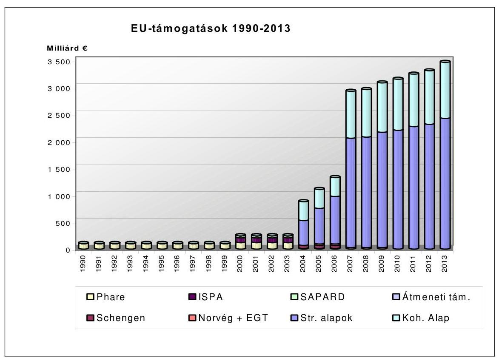

Az Európai Unióba belépni kívánó országok számára három előcsatlakozási program állt rendelkezésre: a Phare, az ISPA és a SAPARD.

# Phare 

Magyarország 1990 óta kap vissza nem térítendő támogatást az Európai Uniótól pénzügyi, ill. technikai segítségnyújtás formájában. A támogatás célja kezdetben a piacgazdasági átmenet és a politikai demokrácia kiépítésének elősegítése, később az EU-tagságra való felkészülés, az integrációs folyamat társfinanszírozása volt. A Phare (Poland Hungary Assistance for Reconstructing the Economy) forrásokat az Uniós belépést szolgáló intézményfejlesztési feladatokra, illetve beruházások finanszírozására kell fordítani.

Az intézményfejlesztési programok a közösségi joganyag átvételét segítik, illetve az intézményrendszer kiépítését és megerősítését támogatják, amelyek a harmonizált magyar jogszabályoknak, és a közvetlenül alkalmazandó uniós normáknak az alkalmazásáért, betartásáért, és ellenőrzéséért felelősek.

A beruházási Phare programok keretében az Unió az EU joganyag alkalmazásához szükséges technikai hátteret, berendezéseket, épületeket - pl. határátkelőket - finanszírozza. A legtöbb beruházási program számítógépes hálózatok, speciális laboratóriumi és mérőberendezések, kommunikációs eszközök beszerzését támogatja. Az építési projektek között 1998 óta a határellenőrzéshez kapcsolódó fejlesztések - vám, állat, és növényegészségügyi létesítmények - szerepeltek kiemelt helyen. A beruházási programok - az intézményfejlesztéshez kapcsolódó beruházásokon kívül - általában kifejezetten a Strukturális Alapok-

---

ra való felkészülést szolgálták. Ezek az ún. gazdasági és szociális kohézió erősítését célzó programok, amelyek, hasonlóan az EU regionális politikájához, a régiók közötti fejlettségbeli különbségek csökkentését tűzték célul.

A nemzetközi (multi-beneficiary) Phare programok minden tagjelölt ország számára elérhetőek; a támogatást az Európai Unió pályázati alapon, vagy előre meghatározott kvóták alapján osztja el az egyes országok között.

A Phare program kezeléséért felelős intézményrendszerüket a kedvezményezett államoknak, így Magyarországnak is az előírásokkal összhangban magának kellett kialakítania. A Phare program kezeléséért felelős intézményrendszerben hazánk fő képviselője a Nemzeti Koordinátor, akinek tisztjét a Miniszterelnöki Hivatal politikai államtitkára látta el. A Nemzeti Koordinátor volt felelős a program koordinációjával kapcsolatos napi teendők megszervezéséért, az éves pénzügyi megállapodások összeállításáért, illetve a Bizottsággal való egyeztetések lefolytatásáért.

A pénzügyi megállapodásokban szereplő ágazati és regionális programok szakmai előkészítése az illetékes minisztériumok feladata. A projektek végrehajtása, s ezáltal a Phare források terhére közbeszerzések lebonyolítása, szerződések megkötése, illetve kifizetések lebonyolítása a kijelölt Phare Végrehajtó Ügynökségek feladata. A Phare lebonyolításában pályáztató intézmények is részt vesznek.

A Phare-programokat az esetek többségében decentralizált irányítás segítségével hajtották végre, amely során vagy előzetesen ellenőrizték a közbeszerzéshez és a szerződések odaítéléséhez kapcsolódó döntéseket (DIS) ${ }^{3}$, vagy csak utólagos ellenőrzéseket hajtottak végre (EDIS) ${ }^{4}$. Decentralizált irányítás mellett a kifizetéseket a nemzeti hatóságok végezték a szerződők és kedvezményezettek számára, a Bizottság utólagos ellenőrzésével.

# ISPA 

Az ISPA (Instrument for Structural Policies for Pre-Accession) program jogi hátterét az 1267/1999. számú, 1999. június 21-i Európai Tanácsi Rendelet adja. A Rendelet értelmében az ISPA fő célja a csatlakozásra váró országok felkészítése a Kohéziós Alap támogatásának fogadására, valamint a környezetvédelmi és közlekedési infrastruktúra területén a csatlakozást hátráltató konkrét problémák megoldása.

A tagjelölt országoknak - így Magyarországnak is - 2002. január 1-ig ki kellett építeniük egy megfelelő irányítási és ellenőrzési rendszert. ${ }^{5}$

[^0]
[^0]:    ${ }^{3}$ Decentralizált Végrehajtási Rendszer (DIS).
    ${ }^{4}$ Kiterjesztett decentralizált végrehajtási rendszer (EDIS), amely során a Bizottság lemond a pályáztatási és szerződéskötési eljárások előzetes ellenőrzéséről.
    ${ }^{5}$ Az EU Számvevőszéke megállapította, hogy bár az ISPA követelményeivel összhangban levő rendszerek kiépítése a tagjelölt országok felelőssége, a Bizottság nem tett kellő

---

A Program 2000. január 1-jén lépett életbe, de tényleges indulása - a Bizottság által előkészítendő végrehajtási rendelet késedelme miatt, illetve a bonyolult nemzeti adminisztráció követelménye miatt - jelentős csúszást szenvedett.

# SAPARD 

A SAPARD program célja, hogy segítséget nyújtson a közösségi jogszabályok átvételében, különös tekintettel az EMOGA által finanszírozott agrárstruktúraés vidékfejlesztési intézkedésekre, továbbá hozzájáruljon egy fenntartható és versenyképes agrárgazdaság kialakításához, a vidék életképességének növeléséhez.

Az Unió a SAPARD segély felhasználási céljainak meghatározását egy általa megjelölt, 15 elemből álló "menü" alapján a tagjelölt országokra bízta. Magyarország a 15 intézkedésből 9-et választott - öt agrárstruktúra-fejlesztési, három vidékfejlesztési intézkedést, valamint technikai segítségnyújtást, amelyeket kormányhatározat hagyott jóvá.

A SAPARD az első olyan előcsatlakozási eszköz, amelynek esetében az EU eltekint a kiadások EU Bizottság által végzett előzetes (ex-ante) ellenőrzésétől, lehetővé téve a tagjelölt országok számára, hogy maguk ellenőrizzék és kezeljék a támogatásokat. A SAPARD Programot a Bizottság csak utólag (ex-post) ellenőrzi, így a kedvezményezettek önállósága, és persze felelőssége is jóval nagyobb.

## 3. Az Európai UniÓs FORRÁsOK FELHASZNÁLÁsÁra VONATKOZÓ ELLENŐRZÉSEK TAPASZTALATAI A CSATLAKOZÁST MEGELŐZŐEN

### 3.1. Az Európai Számvevőszék által végzett ellenőrzések tapasztalatai az uniós források felhasználásáról

Az Európai Számvevőszék megállapította, hogy a Phare Programok esetében a Bizottság 2004-ben tovább javította belső irányítási környezetét. Az EDIS - igaz késedelmes - megvalósítása jelentős lépés volt az új tagállamok irányítási kapacitásának és ellenőrző rendszereinek fejlesztése felé.

Az Európai Számvevőszék a Bizottságnál vizsgálta az ISPA előcsatlakozási eszköz végrehajtását. A Bizottság által folyósított kifizetések irányításának vizsgálata a Bizottság által végzett ellenőrzések értékelése és a felvételt kérő országok által benyújtott kiadásigazoló nyilatkozatok felülvizsgálata alapján történt, nyolc kiválasztott, 2004-ben folyósított kifizetésre vonatkozóan. A Számvevőszék vizsgálata nem eredményezett különleges észrevételeket.
intézkedéseket annak biztosítására, hogy a tagjelölt országok ezeknek a követelményeknek a határidőkön belül eleget tegyenek.

---

Az Európai Számvevőszék két SAPARD támogatásban részesülő országot keresett fel, Magyarországot és Szlovéniát, ahol mintavétel alapján 20 projekt kifizetéseit ellenőrizte, és felülvizsgálta a SAPARD kifizető ügynökségek által alkalmazott eljárást, leírásokat és ellenőrző listákat. Az Európai Számvevőszék által feltárt hibák ellenére a SAPARD-rendszerek figyelemmel voltak a főbb alapfogalmakra (felelősségi körök elválasztása, belső ellenőrzés stb.); az eljárásokat jól dokumentálták, és a rendszerek a gyakorlatban a leírásnak és az akkreditálásnak megfelelően múködnek.

A SAPARD ellenőrzés alapján az Európai Számvevőszék 2004-ben is - hasonlóan a 2003-as évhez - arra a véleményre jutott, hogy a felügyeleti és ellenőrzési rendszerek megfelelően múködtek a gyakorlatban.

Az Európai Számvevőszék vizsgálatai alapján arra a következtetésre jutott, hogy valamennyi előcsatlakozási eszköz esetében a Bizottság központi szolgálatai, a küldöttségek és az igazoló hatóságok szintjein a felügyeleti és ellenőrzési rendszerek alapvetően hatékonyak és eredményesek voltak, és ekképpen múködtek a gyakorlatban. A Számvevőszék ellenőrzése nem állapított meg lényeges hibákat az alapul szolgáló ügyletekben.

Az Európai Számvevőszék a 2004-es pénzügyi évről szóló jelentése megállapította, hogy a Strukturális Alapok és a Kohéziós Alap Irányító Hatóságai, valamint a Közremúködő Szervezetek intézményi-szakmai felkészültsége előre rögzített, objektív szempontrendszer alapján mérő, úgynevezett akkreditációs rendszer keretében került felmérésre.

# 3.2. Az Állami Számvevőszék által végzett ellenőrzések tapasztalatai az uniós források felhasználásáról 

Az előcsatlakozási folyamat utolsó éveit átívelő 2000-2004. években, illetve a csatlakozást követően eltelt időszakban a csatlakozást előkészítő feladatok, illetve végrehajtásuk vizsgálata, az uniós forrásokból - így a Phare, az ISPA, a SAPARD előcsatlakozási alapok, illetve 2004-től a Strukturális Alapokból és a Kohéziós Alapból - juttatott pénzeszközök felhasználásának ellenőrzése kiemelt feladata volt az Állami Számvevőszéknek.

A 2000-2004. években ISPA és Phare projektek, valamint a monitoring rendszert érintő ellenőrzései alátámasztották, hogy az előcsatlakozási programok hozzásegítették Magyarországot ahhoz, hogy folyamatosan kiépüljön az EUtámogatások felhasználására vonatkozó szabályozási és intézmény-rendszer. Az EDIS-folyamatot csak a közlekedési infrastruktúra-fejlesztési programok esetében sikerült eredményesen lezárni a csatlakozás időpontjára. Egyéb területeken az EDIS folyamat a csatlakozás időpontjával befejezetlen maradt, további folytatása okafogyottá vált a Strukturális Alapok és a Kohéziós Alap kezelésének eltérő sajátosságai miatt. Hátráltatták a hatékony „tanulási", felkészülési folyamatot a magyar államháztartás szervezeti és intézményi rendszerének gyakori változásai, a feladatok és hatáskörök módosításai. A Phare programhoz kapcsolódó EDIS akkreditáció 2004. június 21-én megtörtént, ami a Phare programok forrásainak csatlakozás utáni - a Csatlakozási Szerződésben előírt felhasználhatóságának előfeltétele volt.

---

Korlátozta a gördülékeny felkészülést és átállást, hogy elkülönített és független folyamatokat/követelményeket kellett érvényesíteni az előcsatlakozási alapok és a csatlakozás utáni támogatások kezelésére. A nyelvtudással és megfelelő szakismeretekkel rendelkező szakemberek alacsony száma miatt a felkészülés a gyakorlatban akadozott. Ez alátámasztja az Európai Számvevőszék azon megállapítását, hogy a kohéziós és strukturális célkitűzésekkel nehezen volt összeegyeztethető az előcsatlakozási támogatások folyamata. Kevés előrehaladás volt tapasztalható a többéves programozás bevezetésében.

A felkészítést szolgáló programok jellemzően a pályázati követelmények EUkívánalmaknak megfelelő kielégítésére, az előcsatlakozási támogatások elnyerésére irányultak, kevésbé volt meghatározó a strukturális, kohéziós források lekötésére való képesség fejlesztése. Ezzel is összefügg, hogy a Kohéziós Alapból és a Strukturális Alapokból származó források felhasználására szolgáló intézményrendszer teljes kifejlesztésében és gördülékeny működtetésében voltak elmaradások, a regionális és ágazati országos irányítás közötti harmónia még nem alakult ki. Bizonytalanság volt az Irányító Hatóságok, Kifizető Hatóság kijelölésében, így a regionális intézményfejlesztés háttérbe szorult.

Az egészségügy területén megvalósult Phare programokra vonatkozó, 2003ban lefolytatott ÁSZ vizsgálat megállapította, hogy a közreműködő intézmények közötti adatszolgáltatás, a tájékoztatási kötelezettség teljesítése nem volt kielégítő. A Phare projektek hazai ráfordításainak pontos elszámolásához szükséges a felhasználások pénzügyi folyamatainak nyilvántartásában érintett szervezetek és a minisztériumok adatainak kölcsönös és rendszeres egyeztetése, továbbá a vizsgálat idején tapasztalt eltérések rendezése. Az ÁSZ javasolta a Kormánynak, hogy vizsgálja felül a meglévő informatikai rendszereket és koordinálja, hogy az EU támogatások felhasználásáért felelős minisztériumok egységes informatikai támogatással alakítsák ki az EU támogatások és a magyar társfinanszírozás átlátható nyilvántartási, elszámolási rendjét, amely alkalmas a projektek pénzügyi, szakmai előrehaladásának követésére.

Az előcsatlakozási alapok teljes kifutásáig hátralévő feladatokat a költségvetési szerkezet EU-konform, projektszemléletű átalakításában, a több évre szóló, megalapozott költségvetési tervezés során az EU-források és a hazai költségvetési lehetőségek, valamint a gazdasági kohéziós igények összhangjának biztosításában, a támogatható programok műszaki előkészítéséhez szükséges források elkülönített tervezésében, a regionális és helyi önkormányzati rendszer összhangjának megteremtésében, a pontosság és a szubszidiaritás elvének gyakorlati érvényesítésében látja az ÁSZ.

---

# A 2005. évi költségvetési törvényben megjelenő EU-támogatások összege

|   | EU forrás
terv | EU forrás
tény | Központi költségvetési forrás terv | Központi költségvetési forrás tény | Összesen
terv | Összesen
tény  |
| --- | --- | --- | --- | --- | --- | --- |
|  Támogatások összesen | 177 117,7 | 195 291,9 | 90 515,9 | 89 393,1 | 267 633,6 | 284 685,0  |
|  Strukturális Alapok | 67 138,9 | 85 633,8 | 38 444,2 | 37 169,1 | 105 583,1 | 122 802,9  |
|  Kohéziós Alap | 23 533,3 | 23 425,0 | 20 050,0 | 20 985,6 | 43 583,3 | 44 410,6  |
|  Schengen Alap | 13 473,3 | 2 509,6 | 3 469,4 | 739,3 | 16 942,7 | 3 248,9  |
|  Nemzeti Vidékfejlesztési Terv | 34 982,4 | 43 000,0 | 8 745,6 | 6 681,8 | 43 728,0 | 49 681,8  |
|  SAPARD | 15 000,0 | 21 440,4 | 5 000,0 | 8 271,6 | 20 000,0 | 29 712,0  |
|  PHARE/Átmeneti támogatás programjai | 21 651,9 | 19 068,2 | 13 766,8 | 13 733,3 | 35 418,7 | 32 801,5  |
|  Egyéb európai uniós támogatások | 1 337,9 | 214,9 | 1 039,9 | 1 812,4 | 2 377,8 | 2 027,3  |
|  Visszatérítés | 7 915,7 | 8 457,7 | - | - | 7 915,7 | 8 457,7  |
|  Költségvetésben megjelenő EU források ill. társfinanszírozás összesen | 185 033,4 | 203 749,6 | 90 515,9 | 89 393,1 | 275 549,3 | 293 142,7  |

---

.

---

# EU-s forrásokat kezelő hazai intézményrendszer a 2005. évben 

| Elöcsatlakozási Alapok |  |
| :--: | :--: |
| Phare/Átmeneti támogatások |  |
| Támogatási rendszerben betöltött szerep | A feladatot ellátó intézmény (személy) |
| Nemzeti Programengedélyező Iroda | Pénzügyminisztérium |
| Nemzeti Programengedélyező | A Pénzügyminisztérium legalább helyettes államtitkár beosztású vezető tisztségviselője. Általános felelősséggel tartozik a Phare pénzeszközökkel kapcsolatos pénzgazdálkodási feladatok ellátásáért. Gondoskodik a beszerzésre, a jelentésekre és a pénzgazdálkodásra vonatkozó szabályok, rendeletek és eljárások tiszteletben tartásáról, valamint egy megfelelő jelentési és projektinformációs rendszer múködéséről. |
| Nemzeti Alap | A Pénzügymisztériumon belül, a Nemzeti Programengedélyező Iroda kereteiben múködik. Feladata az előcsatlakozási eszközök támogatásai igénybevételéhez szükséges átutalási igénylések ellenőrzése és továbbítása az Európai Bizottság részére. |
| Nemzeti Phare Koordinátor | A Kormány által kinevezett, legalább helyettes államtitkár beosztású vezető tisztviselő. Feladata a Phare programok koordinációja és monitoringja. |
| Segélykoordinációs Intézőbizottság | A Nemzeti Phare Koordinátor vezetésével múködik. A Phare programmal kapcsolatos tervező és végrehajtó munkát felügyeli, javaslatot tesz a Kormány számára a program prioritásaira vonatkozóan. |
| Központi Pénzügyi és Szerződéskötő Egység | A Phare programmal kapcsolatos adminisztratív feladatokat látja el. |
| Programengedélyező | Az adott program lebonyolításáért felelős minisztérium javaslata alapján a Nemzeti Programengedélyező nevezi ki. Feladata a Phare Végrehajtó Szervezet múködtetése és a projektek megfelelő adminisztratív, szakmai és pénzügyi végrehajtása. |
| Phare Végrehajtó Szervezetek | A Pénzügyi Megállapodásokban meghatározott szervezetek. Feladatuk a támogatások befogadása, kezelése, valamint a kifizetések lebonyolítása. PI. Phare programok esetén: Európai Szociális Alap Nemzeti Programirányító Iroda Társadalmi Szolgáltató Kht (ESZA), VÁTI Magyar Regionális Fejlesztési és Urbanisztikai Kht., Központi Pénzügyi és Szerződéskötő |

---

|  | Egység, Átmeneti Támogatás esetén a Központi Pénzügyi és Szerződéskötő Egység |
| :--: | :--: |
| A program lebonyolításáért felelős fejezetek, Phare irodák | Bíróságok, Belügyminisztérium, Gazdasági és Közlekedési Minisztérium, Környezetvédelmi és Vízügyi Minisztérium, Területfejlesztés, Oktatási Minisztérium, Egészségügyi Minisztérium, Pénzügyminisztérium, Ifjúsági, Családügyi, Szociális és Esélyegyenlőségi Minisztérium, Foglalkoztatáspolitikai és Munkaügyi Minisztérium |
| Monitoring Vegyes Bizottság | Társelnökei: a Nemzeti Segélykoordinátor és az Európai Unió Bővítési Főigazgatóságának a képviselője.   Tagjai: az Európai Bizottság budapesti delegációjának képviselői, a Nemzeti Programengedélyező Tisztviselő, a Pénzügyminisztérium és a Külügyminisztérium képviselői, valamint a KMB titkára. Állandó meghívottak: a területpolitika kormányzati koordinációjáért felelős politikai államtitkár képviselője, az OLAF Koordinációs Iroda képviselője, a Magyar Államkincstár képviselője. Megfigyelők: Állami Számvevőszék, a Kormányzati Ellenőrzési Hivatal, valamint az időközi értékelést végző szervezet képviselője.   Titkársági feladatok: a Nemzeti Segélykoordinátor hivatala látja el, a titkár személyét a Nemzeti Segélykoordinátor jelöli ki. |
| Szektor Monitoring Albizottságok | Tagjai: a jelentéstevő, a végrehajtó szervezet, a szektorban projekt-végrehajtási feladatot ellátó minisztérium képviselői, a végső kedvezményezettek, a Nemzeti Alap igazgatója, a Nemzeti Programengedélyező Tisztviselő és a szakmai programfelelősök. Megfigyelőként részt vesz az időközi értékelést végző szervezet és az OLAF Koordinációs Iroda képviselője.   Titkársági feladatok: a Nemzeti Segélykoordinátor hivatala látja el.   Szektor Monitoring Albizottságok:   - Politikai Kritériumok   - Bel- és Igazságügyi Együttmúködés   - Belső Piac   - Környezetvédelem és Vízgazdálkodás   - Közlekedés   - Mezőgazdaság   - Pénzügy és Vámügy   - Egészségügy és Szociális Gondoskodás   - Regionális Fejlesztés   - Határon Átnyúló Együttmúködés   - Szociális Kohézió (ESZA típusú projektek)   - Kis- és Középvállalkozások Fejlesztése |
| Központi Monitoring Bizottság | Elnöke: az európai integrációs ügyek koordinációjáért felelős tárca nélküli miniszter által megbízott személy. Tagjai: a Miniszterelnöki Hivatal és a minisztériumok közigazgatási államtitkárai, a Nemzeti Phare és ISPA |

---

|  | Koordinátor, a Külügyminisztérium Integrációs és   Külgazdasági Államtitkárságának vezetője, a végre-   hajtó szervezetek, végrehajtó ügynökségek, irányító   hatóságok vezetői, a Nemzeti Programengedélyező   Tisztviselő, a Nemzeti Alap igazgatója, valamint a   KMB titkára. Állandó meghívottként vesz részt az   Állami Számvevőszék elnöke, a területpolitika kor-   mányzati koordinációjáért felelős politikai államtit-   kár, a Kormányzati Ellenőrzési Hivatal elnöke, az   OLAF Koordinációs Iroda vezetője és a Magyar Ál-   lamkincstár képviselője. Az Európai Bizottság illetékes   főigazgatósága, illetve az Európai Bizottság budapesti   delegációjának képviselője tanácskozási joggal részt   vehet az üléseken.   Titkársági feladatok: a Miniszterelnöki Hivatal Nem-   zeti Fejlesztési Terv és EU Támogatások Hivatala látja   el. A KMB titkárát az elnök bízza meg. |
| :-- | :-- |
| Fejezetek monitoring egységei | Ld.: A program lebonyolításáért felelős fejezetek |
| ISPA | Az ISPA projektek finanszírozása a belépést követően   a Kohéziós Alap forrásaiból történik az ott előírt sza-   bályozás szerint. (Ld.: Kohéziós Alap) |
| SAPARD |  |
| Támogatási rendszerben   betöltött szerep | A feladatot ellátó intézmény (személy) |
| Nemzeti Programengedélyező | Pénzügyminisztérium |
| Nemzeti Alap | A Pénzügymisztériumon belül, a Nemzeti Program-   engedélyező Iroda kereteiben múködik. Feladata az   előcsatlakozási eszközök támogatásai igénybevétel-   éhez szükséges átutalási igénylések ellenőrzése és to-   vábbítása az Európai Bizottság részére. |
| Illetékes Hatóság | A Pénzügymisztériumon belül, a Nemzeti Program-   engedélyező Iroda kereteiben múködik. Az Igazoló   Szerv ajánlásának figyelembe vételével kiállítja, el-   lenőrzi szükség esetén visszavonja a SAPARD Hivatal   akkreditációját. |
| Irányító Hatóság | Földművelésügyi és Vidékfejlesztési Minisztérium. |
| Igazoló Szerv | Állami Számvevőszék |
| Kifizető Ügynökség | Mezőgazdasági és Vidékfejlesztési Hivatal és megyei   kirendeltségei (19 db) |
| SAPARD Hivatal | Mezőgazdasági és Vidékfejlesztési Hivatal (Regionális   irodák: Budapest, Miskolc, Nyíregyháza, Szeged, Ka-   posvár, Veszprém, Zalaegerszeg) |

---

| SAPARD Monitoring Bizottság | Elnökét a földművelésügyi és vidékfejlesztési miniszter   jelöli ki.   Alelnöke a SAPARD irányító hatóságának a vezetője.   Tagjai: a szervezeti és múködési szabályzatban megha tározott tagok.   Titkársági feladatok: a SAPARD irányító hatóság látja   el. |
| :--: | :--: |
| Együttmúködő szervezetek | Növény és Talajvédelmi Szolgálat   Környezetvédelmi és Vízügyi Minisztérium Természet-   védelmi Hivatala   Állategészségügyi és Élelmiszer Ellenőrző Állomások   Magyar Tejgazdasági Kísérleti Intézet Kft.   FVM Mezőgazdasági Gépesítési Intézet   Országos Mezőgazdasági Minősítő Intézet   Állattenyésztési Teljesítményvizsgáló Kft.   Hegyközségek Nemzeti Tanácsa   Adó- és Pénzügyi Ellenőrzései Hivatal   Magyar Államkincstár   Pénzügyminisztérium   FVM Agrár környezetgazdálkodási Főosztály   FVM - NVT Program Menedzsment Egysége   GAFTA minősitéssel rendelkező laboratóriumok   Magyar Agrárkamara   Magyar Kereskedelmi Engedélyezési Hivatal   Vám és Pénzügyőrség Országos Parancsnoksága |
| Strukturális Alapok |  |
| Támogatási rendszerben   betöltött szerep | A feladatot ellátó intézmény (személy) |
| KTK Irányító Hatóság | Nemzeti Fejlesztési Hivatal |
| Irányító Hatóság | Gazdasági és Közlekedési Minisztérium, Földmúvelés-   ügyi és Vidékfejlesztési Minisztérium, Foglalkoztatáspolitikai és Munkaügyi Minisztérium, Országos Területfejlesztési Hivatal (és regionális ügynökségei) |
| Közremúködő Szervezet | 22 szervezet, különböző szervezeti formák: pl.: Magyar Fejlesztési Bank Rt, Magyar Vállalkozásfejlesztési Kht., Környezetvédelmi és Vízügyi Minisztérium Fejlesztési Igazgatóság stb. |
| Kifizető Hatóság | Pénzügyminisztérium |
| Rendszerellenőrzés | Kormányzati Ellenőrzési Hivatal |
| 5\%-os ellenőrzés | Kormányzati Ellenőrzési Hivatal |
| Irányítási és ellenőrzési rend-   szerek múködésnek ellenőrzé-   se | Kormányzati Ellenőrzési Hivatal |
| Zárónyilatkozathoz szükséges   ellenőrzés | Kormányzati Ellenőrzési Hivatal |

---

| Közösségi Támogatási Keret irányító bizottság | Operatív, monitoring bizottság hatáskörébe nem tartozó kérdésekkel kapcsolatos koordinációs feladatokat lát el.   A Közösségi Támogatási Keret Irányító Bizottság állandó, szavazati joggal rendelkező tagjai: a Közösségi Támogatási Keret Irányító Hatóság, valamint a Kohéziós Alap irányító hatóság vezetője, az operatív program irányító hatóságok vezetői, a Kifizető Hatóság vezetője, a Pénzügyminisztérium képviselője. Tanácskozási joggal rendelkező tagjai - a Kohéziós Alapot érintő napirendi pontokban - a Kohéziós Alap közremúködő szervezetek vezetői. A Közösségi Támogatási Keret Irányító Bizottság elnöke az ülésre jogosult más szervezetek képviselőit is meghívni. |
| :--: | :--: |
| Központi Monitoring Bizottság (KMB) | Elnöke: az európai integrációs ügyek koordinációjáért felelős tárca nélküli miniszter által megbízott személy. Tagjai: a Miniszterelnöki Hivatal és a minisztériumok közigazgatási államtitkárai, a Nemzeti Phare és ISPA Koordinátor, a Külügyminisztérium Integrációs és Külgazdasági Államtitkárságának vezetője, a végrehajtó szervezetek, végrehajtó ügynökségek, irányító hatóságok vezetői, a Nemzeti Programengedélyező Tisztviselő, a Nemzeti Alap igazgatója, valamint a KMB titkára. Állandó meghívottként vesz részt az Állami Számvevőszék elnöke, a területpolitika kormányzati koordinációjáért felelős politikai államtitkár, a Kormányzati Ellenőrzési Hivatal elnöke, az OLAF Koordinációs Iroda vezetője és a Magyar Államkincstár képviselője. Az Európai Bizottság illetékes főigazgatósága, illetve az Európai Bizottság budapesti delegációjának képviselője tanácskozási joggal részt vehet az üléseken.   Titkársági feladatok: a Miniszterelnöki Hivatal Nemzeti Fejlesztési Terv és EU Támogatások Hivatala látja el. A KMB titkárát az elnök bízza meg. |
| Közösségi Támogatási Keret Monitoring bizottság | Tagjai: a végrehajtásért felelős hatóságok, a regionális, a helyi közigazgatási szervek és a területpolitika kormányzati koordinációjáért felelős politikai államtitkár képviselője, a gazdasági és a szociális partnerek. Az Európai Unió Bizottságának és az Európai Beruházási Bank képviselője tanácskozási joggal részt vesz a monitoring bizottság munkájában. |
| Operatív Program monitoring bizottság | Az OP monitoring bizottság elnöki és titkársági feladatait az irányító hatóság vezetője látja el. |
| Minisztériumok monitorig egységei | Az Európai Unió által nyújtott támogatások felhasználásában résztvevő minisztériumoknál monitoring egységek múködnek az Operatív Program Irányító Hatóság vagy a közremúködő szervezetek keretein belül. |

---

| Equal Közösségi kezdeményezés |  |
| :--: | :--: |
| Támogatási rendszerben betöltött szerep | A feladatot ellátó intézmény (személy) |
| Irányító Hatóság | Foglalkoztatáspolitikai és Munkaügyi Minisztérium (Humán-erőforrás Operatív Program Irányító Hatóság) |
| Közremúködő szervezet | Országos Foglalkozási Közalapítvány |
| Kifizető Hatóság | Pénzügyminisztérium |
| 5 \%-os ellenőrzés | Kormányzati Ellenőrzési Hivatal |
| Irányítási és ellenőrzési rendszerek múködésnek ellenőrzése | Kormányzati Ellenőrzési Hivatal |
| Zárónyilatkozathoz szükséges ellenőrzés | Kormányzati Ellenőrzési Hivatal |
| Központi Monitoring Bizottság | Ld.: Strukturális Alapok |
| EQUAL Közösségi Kezdeményezés Monitoring Bizottság | Irányító Hatóság múködteti, titkársági feladatokat ellátja |
| Interreg Közösségi kezdeményezés |  |
| Támogatási rendszerben betöltött szerep | A feladatot ellátó intézmény (személy) |
| Irányító/Nemzeti Hatóság | Regionális Fejlesztés Operatív Program Irányító Hatóság és Interreg Közösségi Kezdeményezés Irányító Hatóság |
| Kifizető Hatóság | Pénzügyminisztérium |
| Al-kifizető Hatóság | VÁTI Magyar Regionális Fejlesztési és Urbanisztikai Közhasznú Társaság |
| Közremúködő szervezet / Közös Titkárság / Info Pontok | VÁTI Magyar Regionális Fejlesztési és Urbanisztikai Közhasznú Társaság |
| 5\%-os ellenőrzés | Kormányzati Ellenőrzési Hivatal |
| Rendszerellenőrzés | Kormányzati Ellenőrzési Hivatal |
| Zárónyilatkozathoz szükséges ellenőrzés | Kormányzati Ellenőrzési Hivatal |
| Központi Monitoring Bizottság | Ld.: Strukturális Alapok |
| Közös Monitoring Bizottság | Az Interreg Irányító hatóság a Közös Monitoring Bizottság és a Közös Irányító Bizottság iránymutatása alapján múködik. |

---

| Kohéziós Alap |  |
| :--: | :--: |
| Támogatási rendszerben betöltött szerep | A feladatot ellátó intézmény (személy) |
| Irányító Hatóság | Nemzeti Fejlesztési Hivatal |
| Közremúködő Szervezetek | Gazdasági és Közlekedési Minisztérium, Környezetvédelmi és Vízügyi Minisztérium |
| Lebonyolító testület / kedvezményezett szervezetek | Útgazdálkodási és Közútfejlesztési Igazgatóság, Magyar Államvasutak Rt. Nemzeti Autópálya Rt., Hungarocontroll Rt., |
| Kifizető Hatóság | Pénzügyminisztérium |
| Rendszerellenőrzés | Kormányzati Ellenőrzési Hivatal |
| 15\%-os ellenőrzés | Kormányzati Ellenőrzési Hivatal |
| Irányítási és ellenőrzési rendszerek múködésnek ellenőrzése | Kormányzati Ellenőrzési Hivatal |
| Zárónyilatkozathoz szükséges ellenőrzés | Kormányzati Ellenőrzési Hivatal |
| Központi Monitoring Bizottság | Ld.: Strukturális Alapok |
| Kohéziós Alap Monitoring Bizottság (KAMB) | A KAMB elnöki feladatait a Kohéziós Alap irányító hatóságának a vezetője látja el.   A monitoring bizottság titkársági feladatait a Kohéziós Alap Irányító Hatóság látja el. |
| Schengen Alap |  |
| Támogatási rendszerben betöltött szerep | A feladatot ellátó intézmény (személy) |
| Felelős Hatóság | Nemzeti Fejlesztési Hivatal |
| Schengen Alap Tárcaközi Bizottság | A Belügyminisztérium vezetésével múködő, egyeztető és jóváhagyó szakmai tárcaközi bizottság |
| Szakmai közremúködő szervezetek | Belügyminisztérium, Vám és Pénzügyőrség Országos Parancsnoksága, Gazdasági és Közlekedési Minisztérium |
| Központi Pénzügyi és Szerződéskötési Egység (KPSZE) | A Schengen Alapból finanszírozott fejlesztési feladatok pénzügyi és adminisztratív lebonyolítására kijelölt szervezeti egység |
| Végső költségigazolás | Kormányzati Ellenőrzési Hivatal |
| 10 \%-os ellenőrzés | Kormányzati Ellenőrzési Hivatal |

---

| Nemzeti Vidékfejlesztési Terv |  |
| :--: | :--: |
| Támogatási rendszerben betöltött szerep | A feladatot ellátó intézmény (személy) |
| Illetékes Hatóság | Földmúvelésügyi és Vidékfejlesztési Minisztérium |
| Program Menedzsment Egység | FVM Illetékes Hatóságtól elkülönült szervezeti egysége |
| Menedzsment Bizottság | Tagjai: az NVT Program Menedzsment Egysége, a Kifizető Ügynökség, az FVM Állami Erdészeti Szolgálat, Növény- és Talajvédelmi Szolgálatának és az Állat-egészségügyi és Élelmiszer-ellenőrző Állomások képviselői, a Nemzeti Park Igazgatóságok, FVM illetékes főosztályai, |
| Kifizető Ügynökség | Mezőgazdasági és Vidékfejlesztési Hivatal (MVH)(Regionális és megyei irodák) |
| Nemzeti Vidékfejlesztési Terv Monitoring Bizottság | A Földművelésügyi és Vidékfejlesztési Minisztérium monitoring egysége koordinálásával múködő bizottság |
| FVM Vidékfejlesztési Bizottság | FVM illetékes helyettes államtitkárai és érintett főosztályai, MVH |
| Végrehajtásért felelős intézmények | Mezőgazdasági és Vidékfejlesztési Hivatal, FVM Állami Erdészeti Szolgálat, Növény- és Talajvédelmi Szolgálatának és az Állat-egészségügyi és Élelmiszerellenőrző Állomások képviselői, a Nemzeti Park Igazgatóságok, |
| Agrártámogatások (EMOGA Garancia Részleg) |  |
| Támogatási rendszerben betöltött szerep | A feladatot ellátó intézmény (személy) |
| Illetékes Hatóság | Földművelésügyi és Vidékfejlesztési Minisztérium |
| Kifizető Ügynökség | Mezőgazdasági és Vidékfejlesztési Hivatal (mint Kifizető Ügynökség; Regionális és megyei irodák: Budapest, Miskolc, Nyíregyháza, Szeged, Kaposvár, Veszprém, Zalaegerszeg stb.) |
| Együttmúködő szervezetek | Állategészségügyi és Élelmiszerellenőrző Állomások, FVM Mezőgazdasági Gépesítési Intézet, Magyar Teigazdasági Kísérleti Intézet Kft., Növény- és Talajvédelmi Szolgálat, Állattenyésztési Teljesítményvizsgáló Kft., Környezetvédelmi és Vízügyi Minisztérium Természetvédelmi Hivatala, Magyar Teigazdasági Kísérleti Intézet, Országos Mezőgazdasági Minősitő Intézet, Hegyközségek Nemzeti Tanácsa, Magyar Agrárkamara, GAFTA laboratóriumok, APEH, VPOP |
| Igazoló Szerv | Állami Számvevőszék, Igazoló Osztály |

---

| Export visszatérítésekkel kapcsolatos fizikai és kicseréléses ellenőrzést végző szerv (386/90/EK rendelet) | Vám- és Pénzügyőrség Országos Parancsnoksága (indító és kiléptető vámhivatalok) |
| :--: | :--: |
| A 4045/89/EGK rendelet szerinti Utólagos vállalatellenőrzéseket végző szerv | Vám- és Pénzügyőrség Központi Ellenőrzési Parancsnokságán múködő |
|  | Különleges Szolgálat |
| OLAF Koordinációs Iroda (Európai Unió Csalás Elleni Hivatala) | Vám- és Pénzügyőrség Országos Parancsnoksága |
| Delegált feladatokat ellátó szervezetek | Országos Mezőgazdasági Minősítő Intézet Állami Erdészeti Szolgálat Országos Borminősitő Intézet Földmérési és Távérzékelési Intézet |

| Központi harmonizációs egység | a Pénzügyminisztériumnak az államháztartási belső pénzügyi ellenőrzési rendszer központi harmonizációjáért, szabályozásának előkészitéséért és koordinációjáért, valamint fejlesztéséért felelős szervezeti egysége. A központi harmonizációs egység feladata a Phare és Átmeneti támogatások, a SAPARD, a Nemzeti Fejlesztési Terv operatív programjai, az EQUAL Közösségi Kezdeményezés program, a Kohéziós Alap projektek, az INTERRÉG Közösségi kezdeményezés és a Schengen Alap támogatásaival kapcsolatos belső kontroll rendszerek (ideértve a folyamatba épített, előzetes és utólagos vezetői ellenőrzési rendszereket, valamint a belső ellenőrzési rendszereket) fejlesztése, szabályozásának előkészitése, koordinációja és harmonizációja. |

---

.

---

# A közösségi források felhasználását és ellenőrzését szabályozó főbb hazai és uniós jogszabályok 

## Törvények

1992. évi XXXVIII. törvény
1997. évi CXIV. törvény
1989. évi XXXVIII. törvény
2000. évi C. törvény
2003. évi XVI. törvény
2003. évi XXIV. törvény

2003. évi CXVI. törvény

2003. évi CXXIX. törvény
2004. évi XXIX. törvény

2004. évi CXXXV. törvény
2004. évi XXX. törvény

Az államháztartásról
Az agrárgazdaság fejlesztéséről
Az Állami Számvevőszékről
A számvitelről
Az agrárpiaci rendtartásról
A közpénzek felhasználásával, a köztulajdon használatának nyilvánosságával, átláthatóbbá tételével és ellenőrzésének bővítésével összefüggő egyes törvények módosításáról

A Magyar Köztársaság 2004. évi költségvetéséről és az államháztartás hároméves kereteiről

A közbeszerzésekről
Az európai uniós csatlakozással összefüggő egyes törvénymódosításokról, törvényi rendelkezések hatályon kívül helyezéséről, valamint egyes törvényi rendelkezések megállapításáról

A Magyar Köztársaság 2005. évi költségvetéséről
A Belga Királyság, a Dán Királyság, a Németországi Szövetségi Köztársaság, a Görög Köztársaság, a Spanyol Királyság, a Francia Köztársaság, Írország, az Olasz Köztársaság, a Luxemburgi Nagyhercegség, a Holland Királyság, az Osztrák Köztársaság, a Portugál Köztársaság, a Finn Köztársaság, a Svéd Királyság, Nagy-Britannia és Észak-Írország Egyesült Királysága (az Európai Unió tagállamai) és a Cseh Köztársaság, az Észt Köztársaság, a Ciprusi Köztársaság, a Lett Köztársaság, a Litván Köztársaság, a Magyar Köztársaság, a Máltai Köztársaság, a Lengyel Köztársaság, a Szlovén Köztársaság és a Szlovák Köztársaság között, a Cseh Köztársaságnak, az Észt Köztársaságnak, a Ciprusi Köztársaságnak, a Lett Köztársaságnak, a Litván Köztársaságnak, a Magyar Köztársaságnak, a Máltai Köztársaságnak, a Lengyel Köztársaságnak, a Szlovén Köztársaságnak és a Szlovák Köztársaságnak az Európai Unióhoz történő csatlakozásáról szóló szerződés kihirdetéséről

---

# Rendeletek 

217/1998. (XII. 30.) Korm. rendelet Az államháztartás múködési rendjéről
249/2000. (XII. 24.) Korm. rendelet Az államháztartás szervezetei beszámolási és könyvvezetési kötelezettségének sajátosságairól
83/2002. (IV. 19.) Korm. rendelet A Központi Pénzügyi és Szerződéskötő Egység felállításáról szóló Megállapodás kihirdetéséről
85/2002. (IV. 19.) Korm. rendelet A PHARE segélyprogram igénybevételéről szóló Keretmegállapodás kihirdetéséről
89/2002. (IV. 20.) Korm. rendelet A Nemzeti Alapnak az ISPA keretében történő igénybevételéről szóló Együttmúködési Megállapodás, valamint a 2000. évi ISPA projektek pénzügyi megállapodásainak kihirdetéséről
81/2003. (VI. 7.) Korm. rendelet A Mezőgazdasági és Vidékfejlesztési Hivatalról
124/2003. (VIII. 15.) Korm. rendelet Az Európai Unió által nyújtott egyes pénzügyi támogatások felhasználásával megvalósuló programok monitoring rendszerének kialakításáról
141/2003. (IX. 9.) Korm. rendelet Az Európai Unió Közös Agrárpolitikája magyarországi végrehajtásában, illetve a nemzeti agrártámogatási rendszerben érintett ügyfelekkel összefüggő ügyfélregiszter létrehozásáról és az ezzel kapcsolatos nyilvántartásba vételről
193/2003. (XI. 26.) Korm. rendelet A költségvetési szervek belső ellenőrzéséről
195/2003. (XI. 28.) Korm. rendelet A Magyar Terület- és Regionális Fejlesztési Hivatalról
196/2003. (XI. 28.) Korm. rendelet A Nemzeti Fejlesztési Hivatalról
1/2004. (I. 5.) Korm. rendelet Az Európai Unió strukturális alapjaiból és Kohéziós Alapjából származó támogatások hazai felhasználásáért felelős intézményekről
6/2004. (I. 22.) Korm. rendelet Az Európai Unió közös forrásaiból származó agrártámogatások, az azokhoz kapcsolódó, nemzeti költségvetésből nyújtott kiegészítő támogatások, valamint a nemzeti hatáskörben nyújtott agrártámogatások igénybevételének általános feltételeiről
70/2004. (IV. 15.) Korm. rendelet A Kormányzati Ellenőrzési Hivatalról
84/2004. (IV. 19.) Korm. rendelet Az Európai Unió saját forrásaival kapcsolatos kötelezettségek teljesítésében részt vevő intézmények feladat- és hatásköréről, valamint a kapcsolódó eljárásrendről

---

85/2004. (IV. 19.) Korm. rendelet Az Európai Közösséget létrehozó Szerződés 87. cikkének (1) bekezdése szerinti állami támogatásokkal kapcsolatos eljárásról és a regionális támogatási térképről

89/2004. (IV. 20.) Korm. rendelet Egyes ISPA projektek pénzügyi megállapodásainak kihirdetéséről

92/2004.(IV. 27.) Korm. rendelet Az EMOGA Garancia Részlegéből finanszírozott intézkedések pénzügyi, számviteli és ellenőrzési lebonyolítási rendjéről
119/2004. (IV. 29.) Korm. rendelet Az Európai Uniós előcsatlakozási eszközök és az Átmeneti Támogatás felhasználásának pénzügyi tervezési, lebonyolítási, számviteli és ellenőrzési rendjéről
168/2004. (V. 25.) Korm. rendelet A központosított közbeszerzési rendszerről, valamint a központi beszerző szervezet feladat- és hatásköréről
179/2004. (V. 26.) Korm. rendelet A Schengen Alap felhasználásának pénzügyi tervezési, lebonyolítási és ellenőrzési rendjének kialakításáról
202/2004. (VI. 25.) Korm. rendelet A 2000. évi ISPA projektek pénzügyi megállapodásainak módosításáról szóló nemzetközi szerződések kihirdetéséről
359/2004. (XII. 26.) Korm. rendelet Az INTERREG III Közösségi Kezdeményezés programok végrehajtásának részletes szabályairól
360/2004. (XII. 26.) Korm. rendelet A Nemzeti Fejlesztési Terv operatív programjai, az EQUAL Közösségi Kezdeményezés program és a Kohéziós Alap projektek támogatásainak fogadásához kapcsolódó pénzügyi lebonyolítási, számviteli és ellenőrzési rendszerek kialakításáról
54/2005. (III. 26.) Korm. rendelet A Nemzeti Fejlesztési Terv operatív programjai és az EQUAL Közösségi Kezdeményezés Program esetében alkalmazandó biztosítékokkal kapcsolatos szabályokról
55/2005. (III. 26.) Korm. rendelet A jogszabálysértő, nem rendeltetésszerű vagy szerződésellenes módon felhasznált európai uniós forrásokból származó és a kapcsolódó állami támogatások behajtásának eljárási rendjéről
108/2005. (VI. 23.) Korm. rendelet A 2005. évi ISPA projektek pénzügyi megállapodásainak módosításairól szóló levélváltás kihirdetéséről

---

9/2004. (IV. 7.) FMM rendelet

10/2004. (IV. 7.) FMM-ESzCsM együttes rendelet

11/2004. (IV. 7.) FMM-PM együttes rendelet

22/2004. (VI. 8.) FMM-OM együttes rendelet

53/2001. (VIII. 17.) FVM rendelet

172/2004. (XII. 23.) FVM rendelet

110/2004. (VI. 21.) FVM rendelet

15/2004. (II. 16.) GKM-IHM-OM-PM-TNM együttes rendelet

18/2004. (II. 24.) GKM-KvVM-PM rendelet

4/2004. (IV. 23.) TNM rendelet

A Foglalkoztatási Hivatalnak a 2004-2006. évi Humánerőforrás-fejlesztési Operatív Program végrehajtása során ellátandó feladatairól és közremúködő szervezetté történő kijelöléséről, valamint az Országos Foglalkoztatási Közalapítványnak a 2004-2006. évi EQUAL Közösségi Kezdeményezés végrehajtásába közremúködőként történő bevonásáról

Az Egészségügyi, Szociális és Családügyi Minisztérium szervezeti egységének a 2004-2006. évi Hu-mánerőforrás-fejlesztési Operatív Program egészségügyi és szociális intézkedései végrehajtásában közremúködő szervezetté történő kijelöléséről és feladatairól

A 2004-2006. évi Humánerőforrás-fejlesztési Operatív Program, valamint az EQUAL Közösségi Kezdeményezés pénzügyi végrehajtásáról

Az Oktatási Minisztérium Alapkezelési Igazgatósága és az Európai Szociális Alap Nemzeti Programiroda Társadalmi Szolgáltató Közhasznú Társaság közremúködő szervezetté történő kijelöléséről, valamint a 2004-2006. évi Humánerőforrás-fejlesztési Operatív Program közoktatási, szakképzési és felsőoktatási intézkedéseinek végrehajtásáról
„Magyarország SAPARD Terve 2000-2006" kihirdetéséről

Az Agrár- és Vidékfejlesztési Operatív Program kihirdetéséről

Az Agrár- és Vidékfejlesztési Operatív Program végrehajtásában közremúködő szervezetként eljáró Mezőgazdasági és Vidékfejlesztési Hivatal által végzett feladatokról

A Gazdasági Versenyképesség Operatív Program végrehajtásában közremúködő szervezetek kijelöléséről

A Környezetvédelem és Infrastruktúra Operatív Program végrehajtásában közremúködő szervezetek kijelöléséről

A Gazdasági Versenyképesség Operatív Program Kutatás-fejlesztés, innováció fejezeti kezelésű előirányzata felhasználásával kapcsolatos szabályokról

---

9/2004. (VI. 4.) TNM rendelet

10/2004. (VI. 12.) TNM rendelet

2/2004. (IV. 21.) TNM-KvVM együttes rendelet

3/2004. (IV. 21.) TNM-GKM együttes rendelet

14/2004. (VIII. 13.) TNM-GKM-FMM-FVM-PM együttes rendelet

1/2004. (II. 16.) TNM-FMM-FVM-GKM-KvVM-PM együttes rendelet

6/2005. (III. 23.) TNM-FMM-FVM-GKM-KvVM-PM-TNM együttes rendelet

Az európai integrációs ügyek koordinációjáért felelős tárca nélküli miniszter felügyelete alá tartozó egyes, a Nemzeti Fejlesztési Hivatal által kezelt fejezeti kezelésű előirányzatokkal kapcsolatos eljárási rendről és hatáskörökről

A Regionális Fejlesztés Operatív Program végrehajtásában közremúködő szervezetek kijelöléséről
Kohéziós Alap közreműködő szervezet kijelöléséről
Kohéziós Alap közreműködő szervezet kijelöléséről

A strukturális alapok és a Kohéziós Alap felhasználásának általános eljárási szabályairól

Az Európai Unió strukturális alapjaiból, valamint az ISPA/Kohéziós Alapjából származó támogatásokhoz kapcsolódó költségvetési előirányzatok felhasználásának egyes szabályairól

Az Európai Unió strukturális alapjaiból, valamint Kohéziós Alapjából származó támogatásokhoz kapcsolódó költségvetési előirányzatok felhasználásának részletes szabályairól

# Határozatok 

2171/1999. (VII. 8.) Korm. határozat Fejlesztéspolitikai Koordinációs Tárcaközi Bizottság létrehozásáról

2349/1999 (XII. 21.) Korm. határozat A SAPARD Program keretében nyújtott közösségi agrár- és vidékfejlesztési támogatások igénybevétele érdekében tett intézkedésekről, az intézményi háttér megteremtéséről

1061/2000. (VII. 11.) Korm. határozat Az ISPA program koordinációjával kapcsolatos egyes feladatokról

1082/2001. (VII. 20.) Korm. határozat Az ISPA támogatással megvalósuló vasúti projektek társfinanszírozását célzó hitelfelvételről

1038/2002. (IV. 19.) Korm. határozat A PHARE 2002-2003. évi „Gazdasági és Szociális Kohéziós" célú programjainak előkészítéséről

2017/2001. (I. 26.) Korm. határozat Az Európai Unió ISPA programja keretében 2000-ben támogatásra elfogadott projektek hazai társfinanszírozásának a biztosításáról

2123/2001. (V. 30.) Korm. határozat Az Európai Unió által az ISPA program keretében 2000-ben elfogadott vasúti beruházási projektek hazai társfinanszírozásának forrásairól

---

1198/2002. (XII. 6.) Korm. határozat Az Európai Uniós csatlakozás társadalmi kommunikációjáról
2246/2002. (VIII. 15.) Korm. határo- A Nemzeti Fejlesztési Terv kialakításának előfeltételeiről és kidolgozásának ütemezéséről zat
2162/2002. (V. 17.) Korm. határozat

A Nemzeti Alapnak az ISPA keretében történő igénybevételéről szóló Együttmúködési Megállapodás, a 2000. évi ISPA projektek pénzügyi megállapodásainak, a PHARE segélyprogram igénybevételéről szóló Keretmegállapodás, a Központi Pénzügyi és Szerződéskötő Egység felállításáról szóló Megállapodás és a Nemzeti Alap felállításáról szóló Megállapodás jóváhagyásáról és kihirdetéséről
1030/2003. (IV. 9.) Korm. határozat

A Nemzeti Fejlesztési Terv elfogadásáról és a Kohéziós Alap Stratégiáról
2090/2003. (V. 15.) Korm. határozat

A Nemzeti Fejlesztési Tervhez kapcsolódó operatív programok, valamint a Kohéziós Alap Stratégia elfogadásáról és a további intézkedésekről
2136/2003. (VI. 27.) Korm. határozat

A Magyar Államkincstár szerepéről a strukturális alapok támogatásai igénybevételét lebonyolító intézményrendszerben
2303/2003. (XII. 9.) Korm. határozat

A Schengen Alap felhasználásához szükséges intézményi felkészülésről
1044/2004. (V. 14.) Korm. határozat

A Strukturális Alapok és Kohéziós Alap Képzőközpont (SAKK) feladatainak a Nemzeti Fejlesztési Hivatal keretei között történő ellátásáról
1076/2004. (VII. 22.) Korm. határozat Az Európa Terv (2007-2013.) kidolgozásának tartalmi és szervezeti kereteiről
2004/2004. (I. 8.) Korm. határozat

A közösségi támogatási kerettervről, az átdolgozott operatív programokról és a Kohéziós Alap Keretstratégiáról
2212/2004 (VIII. 27.) Korm. határozat Az Európai Unióval kötött Többéves Pénzügyi Megállapodás szerint megnövelt SAPARD támogatási keret tényleges felhasználásához szükséges intézkedésekről
2250/2004. (X. 1.) Korm. határozat

A Kohéziós Alap intézményrendszerének utóvizsgálatáról
2040/2005. (III. 23.) Korm. határozat Az EMOGA Garancia részlegéből fizetendő 2005. évi közvetlen termelői támogatáshoz (SAPS) nyújtandó nemzeti kiegészítő támogatásról (top-up)
2049/2005. (III. 26.) Korm. határozat A Nemzeti Fejlesztési Terv operatív programjait irányító hatóságok vezetőinek kinevezéséről

---

2164/2005. (VIII. 2.) Korm. határozat A Kohéziós Alap felhasználásának gyorsításáról és hatékonyabbá tételéről

2192/2005. (IX. 21.) Korm. határozat A „Kohéziós Alapból 2007 és 2013 között megvalósuló közlekedési projektek előkészítése" elnevezésű technikai segítségnyújtás projekt támogatási kérelmének az Európai Bizottsághoz történő benyújtásáról

2296/2005. (XII. 23.) Korm. határozat ISPA/KA vasúti projektek költségnövekedésének finanszírozásáról

2109/2006. (VI. 26.) Korm. határozat Az EMOGA Garancia részlegéből fizetendő 2006. évi közvetlen termelői támogatáshoz (SAPS) nyújtandó nemzeti kiegészítő támogatásról (top up)

# Európai Uniós Jogszabályok 

A Tanács 2186/96/EURATOM, EK rendelete

2000/597/EK, Euratom tanácsi határozat

A Tanács 1164/1994/EK rendelete
A Tanács 1257/1999/EK rendelete

A Tanács 1260/1999 EK rendelete

A Tanács 1268/1999/EK rendelet
A Bizottság 1386/2002/EK rendelete

Az Európai Parlament és a Tanács 1073/1999/EK rendelete

Az Európai Parlament és a Tanács 1783/1999/EK rendelete

Az Európai Parlament és a Tanács 1784/1999/EK rendelete

Az Európai Közösségek pénzügyi érdekeinek csalással és egyéb szabálytalanságokkal szembeni védelmében a Bizottság által végzett helyszíni ellenőrzésekről és vizsgálatokról

A Kohéziós Alap létrehozásáról
Az Európai Mezőgazdasági Orientációs és Garanciaalapból (EMOGA) nyújtandó vidékfejlesztési támogatásról, valamint egyes rendeletek módosításáról, illetve hatályon kívül helyezéséről

A strukturális alapokra vonatkozó általános rendelkezések megállapításáról

A SAPARD létrehozásáról
A Kohéziós Alapból nyújtott támogatások irányítási és ellenőrzési rendszere, valamint a pénzügyi korrekciós eljárás tekintetében az 1164/94/EK tanácsi rendelet végrehajtására vonatkozó részletes szabályok megállapításáról

Az Európai Csaláselleni Hivatal (OLAF) által lefolytatott vizsgálatokról

Az Európai Regionális Fejlesztési Alapról

Az Európai Szociális Alapról

---

| A Bizottság 1994. július 11-i 1681/94/EK rendelete | A strukturális politikák finanszírozása keretében történt szabálytalanságokról és tévesen kifizetett összegek behajtásáról, valamint egy információs rendszer e téren történő létrehozásáról |
| :--: | :--: |
| A Bizottság 1994. július 26-i 1831/94/EK rendelete | A Kohéziós Alap finanszírozása keretében történt szabálytalanságokról és tévesen kifizetett összegek behajtásáról, valamint egy információs rendszer e téren történő létrehozásáról |
| A Bizottság 1995. július 7-i 1663/95 EK rendelete | A 729/70/EGK tanácsi rendeletnek az EMOGA Garanciarészlege számlaelszámolási eljárása tekintetében történő alkalmazására vonatkozó részletes szabályok megállapításáról |
| A Bizottság 643/2000/EK rendelete | A strukturális alapok költségvetési gazdálkodásában az euró használatára vonatkozó szabályokról |
| A Bizottság 1159/2000/EK rendelete | A strukturális alapok által nyújtott támogatásokra vonatkozóan a tagállamok által végrehajtandó, a tájékoztatásra és a nyilvánosságra vonatkozó intézkedésekről |
| A Bizottság 1685/2000/EK rendelete | A strukturális alapok által társfinanszírozott tevékenységek kiadásainak támogathatósága tekintetében az 1260/1999/EK tanácsi rendelet alkalmazása részletes szabályainak megállapításáról |
| A Bizottság 69/2001 rendelete | Az EK-Szerződés 87. és 88 cikkének a csekély összegű (de minimis) támogatásokra való alkalmazásáról |
| A Bizottság 438/2001EK rendelete | A strukturális alapok keretében nyújtott támogatások irányítási és ellenőrzési rendszerei tekintetében az 1260/1999 EK tanácsi rendelet végrehajtása részletes szabályainak megállapításáról |
| A Bizottság 448/2001/EK rendelete | A strukturális alapok keretében nyújtott támogatások pénzügyi korrekciós eljárásai tekintetében az 1260/1999/EK tanácsi rendelet végrehajtása részletes szabályainak megállapításáról |
| A Bizottság 448/2004/EK rendelete | A strukturális alapok által társfinanszírozott tevékenységek kiadásainak támogathatósága tekintetében az 1260/1999/EK tanácsi rendelet alkalmazása részletes szabályainak megállapításáról szóló 1685/200/EK rendelet módosításáról és az 1145/2003/EK rendelet hatályon kívül helyezéséről. |

---

# A Közösségi Támogatási Keret célrendszere 

## A KTK célkitűzései

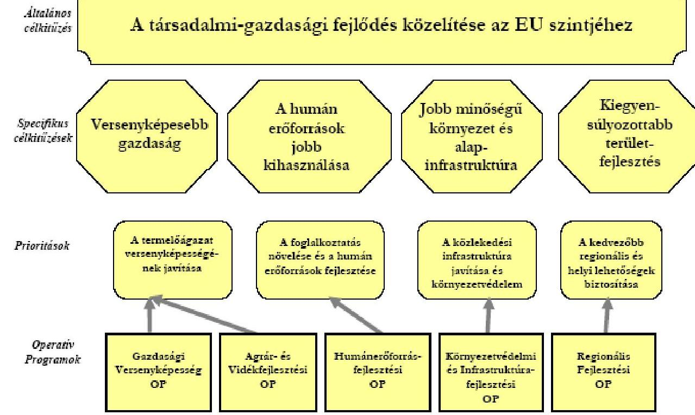

---

.

---

# Az Operatív Programok prioritásai szerinti kötelezettségvállalási keret-előirányzatok ${ }^{1}$

|  Operatív Program | 2004 |  |  | 2005 |  |  | 2006 |  |   |
| --- | --- | --- | --- | --- | --- | --- | --- | --- | --- |
|   | EU forrás | Központi költségvetési forrás | Összesen | EU forrás | Központi költségvetési forrás | Összesen | EU forrás | Központi költségvetési forrás | Összesen  |
|  Humán Erőforrás-fejlesztési Operatív Program | 33488,20 | 10212,30 | 43700,50 | 47809,70 | 14579,60 | 62389,30 | 61940,70 | 18888,80 | 80829,50  |
|  Gazdasági Versenyképesség Operatív Program | 25526,20 | 9980,50 | 35506,70 | 36442,80 | 14248,80 | 50691,60 | 47214,00 | 18460,30 | 65674,30  |
|  Agrár és Vidékfejlesztési Operatív Program | 18874,70 | 5924,10 | 24798,80 | 26946,50 | 8457,90 | 35404,40 | 34911,00 | 10957,60 | 45868,60  |
|  Regionális Operatív Program | 21385,60 | 5328,50 | 26714,10 | 30531,50 | 7607,30 | 38138,80 | 39555,60 | 9855,70 | 49411,30  |
|  Környezetvédelem és Infrastruktúra Operatív Program | 19471,20 | 6485,10 | 25956,30 | 27798,30 | 9258,60 | 37056,90 | 36014,50 | 11995,10 | 48009,60  |
|  Összesen | 118745,90 | 37930,50 | 156676,40 | 169528,80 | 54152,20 | 223681,00 | 219635,80 | 70157,50 | 289793,30  |

${ }^{1}$ 14. számú melléklet a 2004. évi CXXXV. törvényhez

---

.

---

# A Tájékoztató alapjául szolgáló, 2005. évre vonatkozó ellenőrzések 

## Az ÁSZ által lefolytatott ellenőrzések

## Ellenőrzés címe

Jelentés a Területfejlesztés fejezet múködésének ellenőrzéséről
Jelentés az Európai Unió strukturális alapjaiból nyújtott támogatásokkal kapcsolatos csalások és szabálytalanságok kezelése rendszerének és gyakorlatának ellenőrzéséről Magyarországon (A Contact Committee által létrehozott Strukturális Alapok munkacsoport szervezésében végzett párhuzamos ellenőrzés)

## A KEHI által lefolytatott ellenőrzések

## Ellenőrzés címe

2005. évi összefoglaló jelentés a 438/2001/EK Rendelet 13. cikke alapján Agrár- és Vidékfejlesztési Operatív Programról
2005. évi összefoglaló jelentés a 438/2001/EK Rendelet 13. cikke alapján az EQUAL Közösségi Kezdeményezésről
2005. évi összefoglaló jelentés a 438/2001/EK Rendelet 13. cikke alapján a Gazdasági Versenyképesség Operatív Programról
2005. évi összefoglaló jelentés a 438/2001/EK Rendelet 13. cikke alapján a Humánerőforrás-fejlesztési Operatív Programról
2005. évi összefoglaló jelentés a 438/2001/EK Rendelet 13. cikke alapján a Környezetvédelem és Infrastruktúra Operatív Programról
2005. ÉVI összefoglaló jelentés az 1386/2002/EK Rendelet 12. cikke alapján a Kohéziós Alapról
2005. évi összefoglaló jelentés a 438/2001/EK Rendelet 13. cikke alapján a Regionális Fejlesztés Operatív Programról

Magyarország - Románia - Szerbia és Montenegró INTERREG IIIA Program 2005. évi összefoglaló jelentés magyar része a 438/2001/EK Rendelet 13. cikke alapján

Ausztria - Magyarország INTERREG IIIA Program 2005. évi összefoglaló jelentés magyar része a 438/2001/EK Rendelet 13. cikke alapján

Hivatkozási szám
0603
V-19-82/2004-05

Hivatkozási szám
21-16/43/2006
21-16/46/2006.
21-16/42/2006
21-16/45/2006
21-16/44/2006
21-16/40/2006
21-16/41/2006
21-83/20/2006

---

# Ellenőrzés címe 

Szlovénia - Magyarország - Horvátország INTERREG IIIA Program 2005. évi összefoglaló jelentés magyar része a 438/2001/EK Rendelet 13. cikke alapján

Magyarország - Szlovákia - Ukrajna INTERREG IIIA Program 2005. évi összefoglaló jelentés magyar része a 438/2001/EK Rendelet 13. cikke alapján

## Kifizető Hatóság vizsgálatai

## Ellenőrzés címe

Hivatkozási szám

Összefoglaló a kifizető hatóság által végzett 2005. évi vizsgálatokról

## Operatív Programok belső ellenőrzése

## Ellenőrzés címe

Hivatkozási szám

A Földművelésügyi és Vidékfejlesztési Minisztérium Ellenőrzési Főosztálya által készített „Az Agrár- és Vidékfejlesztési Operatív Program pénzügyi lebonyolításának rendszervizsgálata az AVOP Irányító Hatósága (FVM Irányító Hatósági Főosztály) és az AVOP Közremúködő Szervezete (MVH) pénzügyi lebonyolítási rendszerének szabályozottságáról"

A Földművelésügyi és Vidékfejlesztési Minisztérium Ellenőrzési Főosztálya által készített „Az Agrár és Vidékfejlesztési Operatív Program pályáztatási lebonyolítási rendszerellenőrzésének utóvizsgálata az AVOP Irányító Hatósága (FVM Irányító Hatósági Főosztály) és az AVOP Közremúködő Szervezete (MVH) vonatkozó intézkedési tervében foglalt feladatok végrehajtásáról"

Belső ellenőrzési jelentés - A GVOP pénzügyi, lebonyolítási, számviteli és ellenőrzési rendszerének vizsgálata

Belső ellenőrzési jelentés - Az ellenőrzési rendszer múködése a GVOP két Közremúködő Szervezeténél (a Kutatás-fejlesztési Pályázati és Kutatáshasznosítási Irodánál és a Magyar Fejlesztési Bank Rt. Támogatásközvetítési Igazgatóságán)

Belső ellenőrzési jelentés - A GVOP-2004-2.3.2 együttműködő vállalakozások közös célú beruházása, fejlesztése címú pályázati felhívásra az „ART VITAL" Tervező, Építő és Kereskedelmi Kft által beadott pályázat szabályszerű lebonyolítása

A GVOP IH hitelesítési tevékenységének alátámasztásául szolgáló látogatás az MVF Kht.-nál (szúrópróba szerú projektellenőrzés)

## Hivatkozási szám

$40.203 / 2005$

III/6/136/10/2004
III/6/78/7/2005

III/6/118/8/2005

---

# Ellenőrzés címe 

A GVOP IH hitelesítési tevékenységének alátámasztásául szolgáló tényfeltáró látogatás.GVOP 5. 1. 1-2004-07- 0002/6. 0 (IT Kht. KSZ feladatok ellátása)
2005. évre vonatkozó ellenőrzések a Regionális Fejlesztés Operatív Programban

Foglalkoztatáspolitikai és Munkaügyi Minisztérium Ellenőrzési Iroda jelentése az EQUAL Közösségi Kezdeményezés értékelési folyamatának ellenőrzéséről (Országos Foglalkoztatási Alap)

Foglalkoztatáspolitikai és Munkaügyi Minisztérium Ellenőrzési Iroda jelentése a HEFOP pénzügyi lebonyolítási rendszer múködésének vizsgálatáról különös tekintettel a bizonylatok, dokumentumok nyilvántartására, tárolására, őrzésére, valamint a folyamatok EMIR-ben történő rögzítésére

Foglalkoztatáspolitikai és Munkaügyi Minisztérium Ellenőrzési Iroda jelentése a Technikai Segítségnyújtás felhasználására vonatkozó szabályozásról, a programtervek, a szerződéskötés és az elszámolás folyamatáról a HEFOP/EQUAL IH-nál

Foglalkoztatáspolitikai és Munkaügyi Minisztérium Ellenőrzési Iroda jelentése az előlegfizetés szabályozásáról, az előlegigénylés és folyósítás folyamatáról

Foglalkoztatáspolitikai és Munkaügyi Minisztérium Ellenőrzési Iroda jelentése a támogatási szerződések előkészítéséről, a szerződéskötés gyakorlatáról

## Hivatkozási szám

$1329-14 / 2005$
$2164-6 / 2005$

4941-38/2005

6642-42/2005

334-7/2006