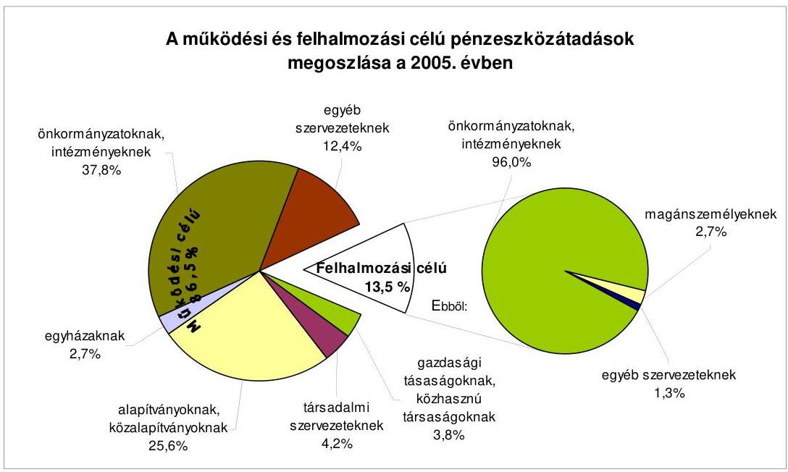
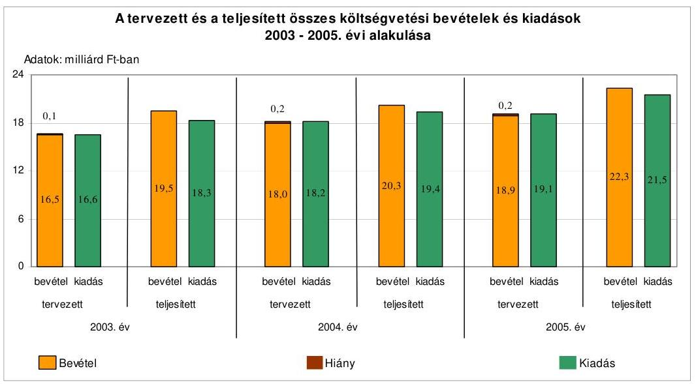
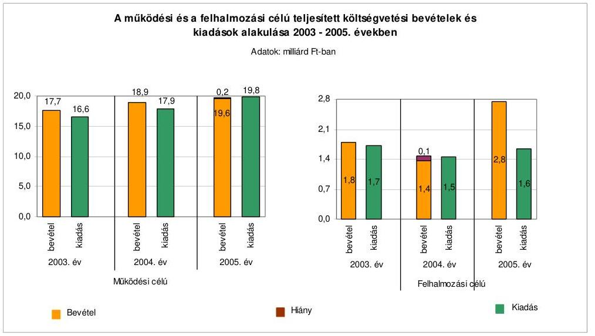
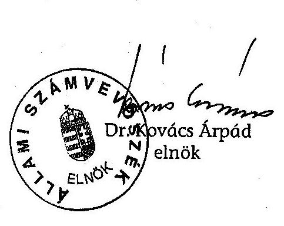
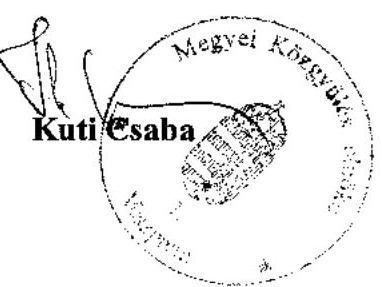

# ÁLLAMI   SZÁMVEVŐSZÉK 

## JELENTÉS

a Veszprém Megyei Önkormányzat gazdálkodási rendszerének 2006. évi átfogó ellenőrzéséről

---

# 3. Önkormányzati és Területi Ellenőrzési Igazgatóság 

3.3. Átfogó Ellenőrzések Főcsoport

Iktatószám: V-1003-5/25/16/2006.
Témaszám: 803
Vizsgálat-azonosító szám: V0271

## Az ellenőrzést felügyelte:

Dr. Lóránt Zoltán
főigazgató
Az ellenőrzés végrehajtásáért felelős:
Dr. Sepsey Tamás
főigazgató-helyettes
Az ellenőrzést vezette:
Csecserits Imréné
főcsoportfőnök-helyettes
Az ellenőrzést végezték:
Komlósiné Bogár Éva Csényi István Iszakné Dóczé Katalin
számvevő tanácsos számvevő számvevő

## A témához kapcsolódó - elmúlt három évben - készített számvevőszéki jelentések:

## címe

Jelentés a helyi önkormányzatok tartós szociális ellátási feladatainak ellenőrzéséről az idősek otthonainál
Jelentés a helyi és a helyi kisebbségi önkormányzatok gazdálkodásának átfogó ellenőrzéséről
Jelentés a helyi önkormányzatok gyermekvédelmi szakellátási tevékenységének ellenőrzéséről
Jelentés a címzett támogatásból finanszírozott egészségügyi beruházások, rekonstrukciók ellenőrzéséről
Jelentés a Magyar Köztársaság 2004. évi költségvetése végrehajtásának ellenőrzéséről
Függelék:

- a helyi önkormányzatok beruházásaihoz és rekonstrukcióihoz nyújtott 2004. évi felhalmozási célú támogatások;
- a helyi önkormányzatokat a 2004. évben megillető normatív állami hozzájárulás elszámolása.

---

# TARTALOMJEGYZÉK 

BEVEZETÉS ..... 5
I. ÖSSZEGZŐ MEGÁLLAPÍTÁSOK, KÖVETKEZTETÉSEK, JAVASLATOK ..... 7
II. RÉSZLETES MEGÁLLAPÍTÁSOK ..... 15

1. A költségvetés tervezésének, végrehajtásának, az Önkormányzat vagyongazdálkodásának és a zárszámadás elkészítésének szabályszerűsége ..... 15
1.1. A költségvetési rendelet jóváhagyásának, módosításának, az előirányzatok nyilvántartásának szabályszerűsége ..... 15
1.2. A gazdálkodás szabályozottsága, a bizonylati rend és fegyelem szabályszerűsége ..... 20
1.3. A pénzügyi-számviteli feladatok ellátásának informatikai támogatottsága ..... 28
1.4. Az önkormányzati vagyon nyilvántartása, számbavétele ..... 29
1.5. A vagyonnal való gazdálkodás szabályszerűsége, célszerűsége, nyilvánossága ..... 32
1.6. A céljelleggel nyújtott támogatások szabályszerűsége ..... 41
1.7. A közbeszerzési eljárások szabályszerűsége ..... 45
1.8. A zárszámadási kötelezettség teljesítésének szabályszerűsége ..... 50
2. Az önkormányzati feladatok és a rendelkezésre álló források összhangja ..... 52
2.1. A feladatok meghatározása és szervezeti keretei ..... 52
2.2. A költségvetés egyensúlyának helyzete ..... 56
2.3. A feladatok finanszírozása ..... 62
3. A belső ellenőrzési rendszer működésének értékelése ..... 65
3.1. Az ellenőrzési rendszer kialakítása, működése ..... 65
3.2. A könyvvizsgálati kötelezettség teljesítése ..... 68
3.3. A korábbi számvevőszéki ellenőrzések javaslatainak hasznosulása ..... 68

---

# MELLÉKLETEK 

1. számú Az Önkormányzat gazdálkodását meghatározó adatok, mutatószámok (1 oldal)
2. számú Az önkormányzati vagyon nagyságának alakulása (1 oldal)
3. számú Az Önkormányzat 2005. évi bevételeinek és kiadásainak alakulása (1 oldal)
4. számú Egyes önkormányzati feladatok finanszírozása (1 oldal)
5. számú Helyszíni ellenőrzési jegyzőkönyv (3 oldal)
6. számú Kuti Csaba úr, a Veszprém Megyei Önkormányzat Közgyűlésének elnöke által adott észrevétel (1 oldal)

---

# RÖVIDÍTÉSEK JEGYZÉKE 

## Törvények

Áfa tv.
Az általános forgalmi adóról szóló 1992. évi LXXIV. törvény
Áht.
Az államháztartásról szóló 1992. évi XXXVIII. törvény
Art.
Az adózás rendjéről szóló 2003. évi XCII. törvény
Htv. a helyi önkormányzatok és szerveik, a köztársasági megbízottak, valamint egyes centrális alárendeltségű szervek feladat- és hatásköreiről szóló 1991. évi XX. törvény
Kbt. a közbeszerzésekről szóló 2003. évi CXXIX. törvény
Ksztv. a közhasznú szervezetekről szóló 1997. évi CLVI. törvény
Kt. a közoktatásról szóló 1993. évi LXXIX. törvény
Ktv. a köztisztviselők jogállásáról szóló 1992. évi XXIII. törvény
Ötv. a helyi önkormányzatokról szóló 1990. évi LXV. törvény
Számv. tv. a számvitelről szóló 2000. évi C. törvény
Szoc. tv. a szociális igazgatásról és a szociális ellátásokról szóló 1993. évi III. törvény

## Rendeletek

Ámr. az államháztartás működési rendjéről szóló 217/1998. (XII. 30.) Korm. rendelet
Ber. a költségvetési szervek belső ellenőrzéséről szóló 193/2003. (XI. 26.) Korm. rendelet
vagyongazdálkodási rendelet ${ }_{1}$
vagyongazdálkodási rendelet ${ }_{2}$

Veszprém Megyei Önkormányzat 8/2002. (IX. 20.) számú rendelete a vagyonáról és a vagyonkezelés, gazdálkodás szabályairól
Veszprém Megyei Önkormányzat 12/2005. (X. 21.) számú rendelettel módosított 8/2002. (IX. 20.) számú rendelete a vagyonáról és a vagyonkezelés, gazdálkodás szabályairól
Vhr. az államháztartás szervezetei beszámolási és könyvvezetési kötelezettségének sajátosságairól szóló 249/2000. (XII. 24.) Korm. rendelet

## Szórövidítések

aljegyző
ÁSZ
ESzCsM
FEUVE
főjegyző
FVM
Gazdasági bizottság

Veszprém Megyei Önkormányzat aljegyzője
Állami Számvevőszék
Egészségügyi, Szociális és Családügyi Minisztérium
folyamatba épített, előzetes és utólagos vezetői ellenőrzés
Veszprém Megyei Önkormányzat főjegyzője
Földművelésügyi és Vidékfejlesztési Minisztérium
Veszprém Megyei Önkormányzat Gazdasági és Közbeszerzési Bizottsága

---

| Gazdasági iroda | Veszprém Megyei Önkormányzat Közgyűlési Hivatal Gazdasági Irodája |
| :--: | :--: |
| Hivatal | Veszprém Megyei Önkormányzat Hivatala |
| Illetékhivatal | Veszprém Megyei Illetékhivatal |
| KDB | Közbeszerzések Tanácsa Közbeszerzési Döntőbizottsága |
| Kórház | Veszprém Megyei Önkormányzat Csolnoky Ferenc Kórház Rendelőintézete |
| Közgyűlés | Veszprém Megyei Önkormányzat Közgyűlése |
| Közgyűlés elnöke | Veszprém Megyei Önkormányzat Közgyűlésének elnöke |
| KSH | Központi Statisztikai Hivatal |
| OEP | Országos Egészségbiztosítási Pénztár |
| Önkormányzat | Veszprém Megyei Önkormányzat |
| Pénzügyi bizottság | Veszprém Megyei Önkormányzat Közgyűlésének Pénzügyi és Ellenőrzési Bizottsága |
| SzCsM | Szociális és Családügyi Minisztérium |
| $\mathrm{SzMSz}_{1}$ | Veszprém Megyei Önkormányzat Szervezeti és Működési Szabályzata |
| $\mathrm{SzMSz}_{2}$ | Veszprém Megyei Önkormányzat Hivatalának Szervezeti és Működési Szabályzata |
| Szociális bizottság | Veszprém Megyei Önkormányzat Közgyűlésének Szociális és Gyermekvédelmi Bizottság |

---

# JELENTÉS   a Veszprém Megyei Önkormányzat gazdálkodási rendszerének 2006. évi átfogó ellenőrzéséről 

## BEVEZETÉS

Az Ötv. 92. § (1) bekezdése, az Állami Számvevőszékről szóló 1989. évi XXXVIII. törvény 2. § (3) bekezdése, valamint az Áht. 120/A. § (1) bekezdése alapján az önkormányzatok gazdálkodását az Állami Számvevőszék ellenőrzi. Az ellenőrzést az Országgyűlés illetékes bizottságai részére is átadott, országosan egységes ellenőrzési program alapján végeztük.

## Az ellenőrzés célja annak értékelése volt, hogy:

- az önkormányzati gazdálkodás törvényességét ${ }^{1}$, szabályszerűségét biztosították-e a tervezés, a költségvetés végrehajtása, a vagyongazdálkodás és a zárszámadás során;
- az Önkormányzat által ellátott feladatok és az azokhoz rendelkezésre álló források összhangja biztosított volt-e, különös tekintettel az egyes kiemelt feladatokra;
- a gazdálkodás szabályszerűségét biztosító kontrollok ${ }^{2}$ megfelelően segítették-e a végrehajtást.

Az ellenőrzött időszak: a 2005. év és a 2006. I. negyedév; az 1.5, 2.1-2.3 és a 3.3 ellenőrzési programpontok esetében a 2003-2004. évek is.

Veszprém megye lakosainak száma 2006. január 1-jén 370028 fő volt. A megye 217 településének $6,4 \%$-a város, a 14 városban a lakosság $59,4 \%$-a élt. A megye településeinek $46 \%$-a 500 fő alatti lakosságszámmal rendelkező község volt, ahol a lakosság $7,8 \%$-a élt.

[^0]
[^0]:    ${ }^{1}$ A törvényi előírások betartásának elmulasztásakor a részletes megállapítások fejezetében egységesen a törvénysértő megjelölést alkalmazzuk, mivel az ÁSZ nem tehet különbséget a törvényi előírások között.
    ${ }^{2}$ A gazdálkodás szabályszerűségét biztosító kontroll alatt értjük a kiépített és működő belső irányítási és szabályozási rendszert, valamint a belső ellenőrzési funkciók ellátását.

---

Az Önkormányzat 40 tagú Közgyűlésének munkáját 10 állandó bizottság segítette. A főjegyző 1997. április 1-jétől, a Közgyűlés elnöke az 1998. évi önkormányzati választások óta látja el feladatát.

Az Önkormányzat által fenntartott költségvetési intézmények száma a 2005. évben 46 (ebből öt részben önállóan gazdálkodó) volt. Az Önkormányzatnak 2005. január 1-jén nyolc gazdasági társaságban volt 1252,8 millió Ft könyvszerinti értékű részesedése, amely 2005. december 31-re, értékesítések következtében 29,4 millió Ft-ra csökkent.

A 2005. évben az Önkormányzat 22342 millió $\mathrm{Ft}^{3}$ költségvetési bevételből gazdálkodott, a 2006. évre 22533 millió Ft bevételt terveztek. A teljesített költségvetési kiadás a 2005. évben 21472 millió $\mathrm{Ft}^{4}$, a könyvviteli mérlegben kimutatott önkormányzati vagyon értéke 2005. december 31-én 19679 millió Ft volt. A 2005. december 31-én a Hivatalban foglalkoztatott köztisztviselők száma 120 fő volt, az Önkormányzat által fenntartott költségvetési intézményekben 4388 fő közalkalmazott látta el a különböző közszolgáltatási feladatokat.

Az Önkormányzat gazdálkodását meghatározó adatokat, mutatószámokat a jelentés 1-3. számú mellékletei tartalmazzák.

A jelentés megállapításainak, javaslatainak egyeztetése során a Közgyűlés elnöke arról adott tájékoztatást, hogy az időközben megtett intézkedésekkel a javaslatok egy részét megvalósították. Ezekben az esetekben a jelentés II. Részletes megállapítások fejezetében az adott témához kapcsolt lábjegyzetben a megtett intézkedést feltüntettük és a kapcsolódó javaslatot elhagytuk.

A jelentést az ÁSZ-ról szóló 1989. évi XXXVIII. tv. 25. § (1) bekezdése alapján észrevétel közlése céljából megküldtük a Veszprém Megyei Önkormányzat Közgyűlése elnökének. A kapott észrevételt a jelentés 6. számú melléklete tartalmazza.
${ }^{3}$ A 2005. évi költségvetési bevétel elemi beszámolóban szerepeltetett adata tartalmazza az intézmények egymás közötti pénzeszköz átadását-átvételét, valamint az intézmények előző évi alul és túl finanszírozásának összegét, (amelyek együttes összege 155 millió Ft).
${ }^{4}$ A 2005. évi költségvetési kiadás elemi beszámolóban szerepeltetett adata is tartalmazott halmozódást, amely egyenlegében 565 ezer Ft-ot jelentett (a bevételnél jelzett adatokon túl a kiadás összegét növelte a 700 ezer Ft összegben vásárolt forgatási célú értékpapír).

---

# I. ÖSSZEGZŐ MEGÁLLAPÍTÁSOK, KÖVETKEZTETÉSEK, JAVASLATOK 

A Közgyűlés az Ötv. előírása alapján a 2003. évben fogadta el az önkormányzati képviselő-választási ciklus idejére vonatkozó gazdasági programját, amely alkalmas volt az évenkénti tervezőmunka megalapozásához.

A Közgyűlés elnöke az Áht-ban előírt határidőket betartva terjesztette a Közgyűlés elé a 2005. és a 2006. évi költségvetési koncepciókat, valamint a 2005. és a 2006. évi költségvetési rendelettervezeteket. Az Ámr. előírásaival ellentétben azonban nem csatolta a költségvetési koncepciók előterjesztéséhez és a 2005. évi költségvetési rendelettervezethez a Pénzügyi bizottság véleményét. A költségvetési koncepciók az Ámr-ben előírtaknak megfelelő tartalommal készültek, amelyek alapján a Közgyűlés döntött a költségvetés készítéssel kapcsolatos további feladatokról. A főjegyző a költségvetési rendelettervezetek beterjesztése előtt azokat a költségvetési szervek vezetőivel az Ámr-ben foglaltaknak megfelelően egyeztette.

A 2005. és a 2006. évi költségvetési rendelettervezeteket a Közgyűlés elnöke az Áht-ban és az Ámr-ben az előirányzatok meghatározására és az előterjesztés benyújtásának határidejére vonatkozóan előírt követelményeket betartva terjesztette a Közgyűlés elé. A költségvetési rendelettervezetekben az Áht-ban előírtakat megsértve a tervezett hiányt a költségvetési bevételek és kiadások különbségeként nem állapították meg, valamint finanszírozási célú pénzügyi műveleteket vettek figyelembe költségvetési bevételként. A Közgyűlés elnöke a költségvetési rendelettervezetek benyújtásakor előterjesztette azokat a rendelettervezeteket, amelyek a javasolt előirányzatokat megalapozták. A többéves kihatással járó fejlesztési feladatok későbbi évekre vonatkozó kihatásait a 2005. évben nem mutatták be, a 2006. évben ez már megtörtént. A költségvetési rendeletekben meghatározták a végrehajtásra vonatkozó szabályokat, azonban az Ámr-ben előírtak ellenére a vállalkozási tartalék felhasználásáról nem rendelkezett a Közgyűlés. A költségvetés főösszege a 2005. évi költségvetési rendelet módosításai során 19,4%-kal növekedett. A Közgyűlés elnöke által - a 2005. évi utolsó költségvetési rendeletmódosítást követően - engedélyezett központi költségvetésből kapott pótelőirányzatokkal az Ámr. előírásai ellenére elmaradt a költségvetési rendelet Közgyűlés által történő módosítása.

A Hivatal rendelkezett az Ámr-ben előírtaknak megfelelő SzMSz-szel. A gazdálkodási feladatokat és azok felelőseit a gazdasági szervezet ügyrendjében, valamint a Közgyűlés elnöke és főjegyző által kiadott szabályzatokban rögzítették. Az Ámr-ben foglalt előírásoknak megfelelően a Közgyűlés elnöke és a főjegyző a távollétekre és az összeférhetetlenségre tekintettel elkészítette a kötelezettségvállalásra, utalványozásra és ellenjegyzésre vonatkozó személyre szóló felhatalmazásokat. A főjegyző írásban megbízta az érvényesítést végzőket, meghatározta a szakmai teljesítés igazolásának módját és kijelölte a szakmai teljesítést igazoló személyeket. Az érvényesítéssel megbízottak rendelkeztek az

---

előírt iskolai végzettséggel és szakmai képzettséggel. A gazdálkodási jogkörök gyakorlása során betartották az összeférhetetlenségi követelményeket.

A főjegyző kialakította a költségvetési szervek egységes számviteli rendjét, valamint jóváhagyta a Hivatal számviteli
 politikáját, amely összhangban volt a Vhr. előírásaival. A számviteli politika részeként elkészítették az eszközök és források leltározási és leltárkészítési szabályzatát. A leltározási szabályzatban előírták az évenkénti leltározási kötelezettséget, az tartalmazta a leltározás módját, a leltározás munkaszakaszait, a leltározásban résztvevők feladatait, felelősségét. Az eszközök és források értékelési szabályzata a Vhr. előírásai szerint eszközcsoportonkénti részletezettségben írta elő az értékelés szabályait, az értékvesztés elszámolásának és visszaírásának rendjét, a terven felül értékcsökkenés elszámolásának feltételeit. Meghatározták a követelésekre és ezen belül 2006. május 15-től az illetékkövetelésekre vonatkozó értékelési eljárásokat. A pénzkezelési szabályzatban rögzítették a bankszámlaforgalommal és az ügyfélterminál kezelésével, valamint a készpénzforgalommal kapcsolatos szabályokat. Elkészítették a felesleges vagyontárgyak feltárásáról, hasznosításáról és a selejtezésről szóló szabályzatot, mely előírta az eljárási rendet, annak bizonylatait, meghatározta a minősítésre, döntésre jogosultakat.

A Hivatal számlarendje tartalmazta az alkalmazandó könyvviteli számlák számát, megnevezését, valamint a számlaosztályokra, a főkönyvi számlák tartalmára, kapcsolatára, értékváltozására vonatkozó előírásokat. A számlarendben meghatározták az analitikus nyilvántartások tartalmát, formáját, az analitikus nyilvántartások adataiból készített összesítő kimutatások, feladások elkészítésének határidejét, továbbá a főkönyvi könyveléssel való egyeztetésének módját, gyakoriságát, az egyeztetés dokumentálásának formáját. A Hivatal pénzügyi-gazdasági tevékenységének szabályzatai egymással és a jogszabályi előírásokkal összhangban voltak, a gazdálkodási feladatokat ellátók munkaköri leírásai tartalmazták a feladat- és hatásköröket. A főjegyző – az Áht. előírásainak megfelelően – gondoskodott a FEUVE megszervezéséről és működtetéséről, az Ámr. előírásaira figyelemmel a Hivatal tervezési, pénzügyi lebonyolítási és ellenőrzési folyamatait leíró ellenőrzési nyomvonal elkészítéséről és az Ámr. előírásainak megfelelő kockázatkezelési rendszer kialakításáról és működtetéséről.

A pénzforgalommal járó gazdasági események számviteli bizonylatainak 17%-a a Számv. tv. előírásait megsértve nem felelt meg az alaki és tartalmi követelményeknek, mivel az érvényesítésre is alkalmazott utalványrendeleteken az „érvényesítve” megjelölést és a könyvviteli elszámolásra utaló főkönyvi számlaszámot a 2005. évben és a 2006. év I. negyedévében nem tüntették fel, továbbá a bizonylatok 5%-án nem rögzítették a kötelezettségvállalás nyilvántartásba vételének sorszámát, valamint a szakmai teljesítés igazolása a bevételek beszedését megelőzően nem történt meg. A bevételeknél a szakmai teljesítés igazolását végzők, az érvényesítők és az utalvány ellenjegyzői nem tettek eleget a munkafolyamatba épített ellenőrzési feladataiknak. Az Önkormányzatnál a gazdasági események főkönyvi elszámolása a költségvetés szerkezeti rendjének megfelelően történt, azonban a Vhr. előírása ellenére négy felhalmozási célú pénzeszköz átadást működési célú pénzeszköz átadásként számoltak el, valamint a bérbeadással hasznosított eszközöket az üzemeltetésre, kezelésre átadott eszközök között mutatták ki. A kötelezettségvállalások nyilvántartása megfelelt

---

az Ámr. előírásainak. A 2005. évi gazdálkodás során a kiemelt előirányzatokat önkormányzati szinten betartották, de az intézmények 39%-a a részére meghatározott kiemelt kiadási előirányzatokat túllépte. Az előirányzat túllépések okait nem vizsgálták, felelősségre vonást nem kezdeményeztek.

Az analitikus nyilvántartások, a főkönyvi könyvelés és a költségvetési beszámoló elkészítésének informatikai támogatottsága biztosított volt. A Hivatal informatikai stratégiáját elkészítették, melyet figyelembe véve történt a számítástechnikai felkészültség fejlesztése. Az informatikai rendszer biztonságos üzemeltetésének feltételeit biztosították, az adatvédelem, az adattárolás, és a jogosulatlan hozzáférés megakadályozásának rendszerét a főjegyző által kiadott üzemeltetési és adatvédelmi szabályzatban rögzítették. Az informatika területére vonatkozó katasztrófa elhárítási tervvel, s a gazdálkodási, számviteli feladatok ellátásához használt szoftverekhez üzemeltetési dokumentációval, felhasználói leírásokkal rendelkeztek. A pénzügyi és számviteli területen dolgozó felhasználók munkaköri leírásai tartalmazták az informatikai rendszer használatát, feladataik leírását.

Az Önkormányzat gondoskodott számviteli – analitikus és főkönyvi – nyilvántartásaiban a törzsvagyonhoz tartozó vagyontárgyak elkülönített nyilvántartásáról. A Hivatal az üzemeltetésre, kezelésre átadott eszközök között a Vhr. előírásai ellenére bérbeadás útján hasznosított eszközöket is nyilván tartott. A leltározási kötelezettséget a leltárkészítési és leltározási szabályzat előírásai alapján teljesítették, leltáreltérést nem állapítottak meg. Az értékelési feladatokat a követelések, részesedések és értékpapírok esetében elvégezték, azonban a követelések értékelése során nem alkalmazták az eszközök és források értékelési szabályzatában az illetékkövetelésekre és a kisösszegű követelésekre vonatkozó rendelkezéseket. Az Önkormányzatnál a kötvénykibocsátásból származó, 1993. év óta változatlan összegben az évenkénti könyvviteli mérlegben nyilvántartott 500 ezer Ft kötelezettség rendezése érdekében nem intézkedtek, az év végi értékelését a Vhr. előírása ellenére nem végezték el.

Az Önkormányzat a vagyongazdálkodás és a vagyonnyilvántartás szabályait rendeletekben rögzítette. A vagyongazdálkodási rendelet$_{1,2}$ a teljes vagyoni körre kiterjedt, rendelkezett a vagyon forgalomképesség szerinti besorolás megváltoztatásának módjáról. A tulajdonnal való rendelkezési hatásköröket értékhatárhoz kötötten – megosztották a Közgyűlés, a bizottságok, illetve a Közgyűlés elnöke között. A vagyongazdálkodási rendelet$_{2}$ az Áht. előírásait megsértve meghatározott esetekben lehetővé tette a versenyeztetés mellőzését. A szabályozás nem segítette a közvagyonnal történő gazdálkodás nyilvánosságát, átláthatóságát. A vagyon ingyenes átadásának módját és eseteit az Áht. előírásának megfelelően rendeletekben szabályozta az Önkormányzat, valamint előírta, hogy követelésről lemondani nem lehet. Az Önkormányzat az 5 millió Ft feletti szerződéseinek, illetve 200 ezer Ft-ot meghaladó fejlesztési célú támogatások szerződéseinek adatait az Áht. előírásainak megfelelően honlapján közzétette.

Az Önkormányzat vagyona a 2003. évről a 2005. évre 4627 millió Ft-tal nőtt, amelyet több mint 90%-ban az értékpapírok és a gazdasági társasági részesedés részletre történt eladása miatt a követelések év végi állományának ötszörösére történt emelkedése eredményezett. Az Önkormányzat vagyongazdálko-

---

dási célkitűzéseivel összhangban hozták meg a vagyonnal kapcsolatos döntéseiket a hatáskörrel rendelkezők. Az Önkormányzat a vizsgált ingatlanértékesítések esetén a vagyongazdálkodási rendelet$_{1,2}$ nyilvános versenytárgyalásra vonatkozó előírásait betartotta. Egy ingatlan értékesítésénél nem a nyertes ajánlattevővel kötöttek szerződést, továbbá a szerződés módosítása során eltértek a versenykiírásban rögzített feltételektől. Az Önkormányzat az átmenetileg szabad pénzeszközeinek befektetéseinél kettő (2003. és 2005.) év alatt 42 millió Ft többletforrást ért el. Az állampapír vásárlások során nem kérték az értékpapír forgalom KELER Rt-nél megnyitott, az Önkormányzat nevére szóló, együttes rendelkezésű értékpapír alszámlán történő vezetését, amellyel a pénzügyi befektetések kockázata mérsékelhető, biztonsága növelhető. Az értékpapírok vétele-eladása, valamint a kapcsolódó szerződések során követendő eljárási rendet nem szabályozták. A bérbeadási tevékenységet, a selejtezéseket a döntéshozatali hatáskörökkel rendelkezők döntései alapján végezték.

Az Önkormányzat költségvetési rendeletében a központilag kezelt kiadásai között felhalmozási és működési célú támogatásokra szolgáló előirányzati keretet alakított ki. A támogatások 67%-a közgyűlési döntésen alapult, 28%-ánál a támogatott szervezetről a kijelölt bizottságok, 5%-ról a Közgyűlés elnöke döntött. Összesen 1036 esetben nyújtottak támogatást 446 millió Ft összegben. Az Ötv. előírásait megsértve 2005. március 31-ig a Közgyűlés elnöke és a Szociális bizottság 1,3 millió Ft összegben döntött alapítványok támogatásáról. Ezt követően alapítványok támogatásáról a Közgyűlés döntött. A támogatásban részesített szervezetekkel a Közgyűlés elnöke támogatási szerződést kötött, amelyben meghatározták a támogatás célját és a számadási kötelezettséget. A számadási kötelezettséget határidő után teljesítette 254 szervezet, 22 szervezet elmulasztotta. A számadási kötelezettséget nem teljesítők esetében a támogatás visszafizettetésének elmulasztásával, és a további támogatás felfüggesztésével megsértették az Áht-ban előírtakat. Helyszíni ellenőrzést 108 esetben tartottak, céltól eltérő felhasználást nem állapítottak meg. A számadások felülvizsgálatát a Hivatalban elvégezték. A határidőn túli elszámolásokat elkerülendő, 2006. január 1-jétől a Közgyűlés a támogatások utófinanszírozásáról döntött.

A Közgyűlés a 2004. évben hagyta jóvá az Önkormányzat közbeszerzési szabályzatát, amelyben a Kbt. előírásai alapján meghatározták a közbeszerzésekkel kapcsolatos feladatokat, felelősségi köröket. Rendelkeztek az eljárásokban közreműködők szakértelmének biztosításáról és az összeférhetetlenség szabályairól. A Hivatalnál a 2005. évben 48 közbeszerzési eljárást indítottak, amelyek az Önkormányzat és intézményei feladatellátásához (beszerzésekhez, fejlesztésekhez, hitel felvételekhez) kapcsolódtak. A közbeszerzési eljárásokban a Kbt. előírásainak megfelelő eljárási rendet alkalmaztak. A Kbt. hatálya alá tartozó beszerzések közül három esetben (árubeszerzésnél, ingatlan bérleti jogának megszerzésénél, önkormányzati biztos kiválasztásánál) a Kbt. értékhatárra vonatkozó előírásai ellenére nem folytatták le a közbeszerzési eljárást. Az Önkormányzatnál a lefolytatott közbeszerzési eljárásokat a Hivatalban és az intézményeknél a belső ellenőrzés keretében vizsgálták. Az Önkormányzat 2005. évi közbeszerzési eljárásaival kapcsolatban nem volt jogorvoslati eljárás.

A költségvetéssel összehasonlítható módon összeállított zárszámadási rendelettervezetet a Közgyűlés elnöke az előírt határidőn belül terjesztette a Köz-

---

gyűlés elé. A működési-fenntartási előirányzatokat és teljesítésüket a zárszámadási rendelettervezetben az Ámr-nek megfelelően részletezték. A zárszámadás előterjesztésekor az Áht-ban előírtak ellenére nem történt meg a többéves kihatással járó fejlesztési döntések számszerű bemutatása évenkénti bontásban, valamint összesítve, szöveges indokolással együtt. A Hivatal költségvetési beszámolójában szerepeltetett pénzmaradvány nem egyezett meg a Közgyűlés által jóváhagyott pénzmaradvánnyal. A Hivatal pénzmaradványa a Vhr. előírásaival ellentétben tartalmazta a tárgyévet megelőző években képzett, a tárgyév végéig fel nem használt tartalékok összegét, valamint a forgatási célú, hitelviszonyt megtestesítő értékpapírokba fektetett összeget. A pénzmaradvány költségvetési szervenként történő jóváhagyásával egyidejűleg a Közgyűlés döntött annak felosztásáról. A Hivatal az intézmények elemi beszámolóit felülvizsgálta. A főjegyző az Ámr-ben foglaltak alapján az intézményvezetőket írásban értesítette az éves számszaki beszámoló és a működés elbírálásáról, jóváhagyásáról.

Az Önkormányzat a kötelező és az önként vállalt feladatait az SzMSz$_{1}$-ben rögzítette. A Közgyűlés az önkormányzati feladatok ellátásáról költségvetési intézményeivel, feladatellátási szerződés alapján más önkormányzatok intézményében (szociális ellátás területén) és közoktatási közalapítványával gondoskodott. A vizsgált időszakban az Önkormányzat által ellátott feladatok és az azokhoz rendelkezésre álló források összhangja biztosított volt. Az Ötv. és a Szoc. tv. előírásai ellenére, a hajléktalanok otthoni és rehabilitációs intézményi ellátását nem biztosították. A gyermek- és ifjúságvédelem, illetve az egészségügyi szakellátás területén szakmai és gazdaságossági szempontok alapján négy intézményt integráltak már működő önálló gazdálkodási jogkörű intézmények irányítása alá. Az Önkormányzat az Ötv-ben előírt kötelezettsége alapján közoktatási feladatokat ellátó intézményeket vett át működtetésre. Az átvett közoktatási feladatokat ellátó intézmények jelentős létszám- és kiadástöbblettel jártak, amely miatt intézmények átszervezéséről döntött a Közgyűlés. A közoktatás és a közművelődés területén hat intézményfenntartó társulásban vett részt az Önkormányzat. Önként vállalt feladatként kettő színházat működtetett, hét közalapítvány tevékenységét támogatta, a kultúra, az idegenforgalom, a vállalkozásfejlesztés, a tűzvédelem területén.

A 2003-2005 években az Önkormányzat költségvetési rendeleteiben a jóváhagyott bevételek nem nyújtottak fedezetet a jóváhagyott kiadásokra, így a pénzügyi egyensúly biztosítása céljából hitelfelvétellel számoltak. A költségvetések végrehajtása során nem volt szükség a működési és a fejlesztési célú kiadásokhoz hitel felvételére. Hiányt a 2003. évben a működési célú kiadásoknál, a 2004. évben csak a felhalmozási célú kiadásoknál, illetve a 2005. évben a működési célú és a felhalmozási célú kiadásoknál is terveztek. A tervezett hiány oka alultervezés volt, az illetékbevételekből, az intézményi bevételekből, az előző évi pénzmaradvány igénybevételekből és a kamatbevételekből minden évben a tervezettnél többletet realizáltak. A kiadások-bevételek egyensúlyának javítása érdekében éltek a bevételnövekedést eredményező vagyonértékesítés lehetőségével. A pénzügyi egyensúlyt javította, az átmenetileg szabad pénzeszközök befektetési hozama. Az ebből származó hozamok meghaladták az intézményi (Kórház) forráshiány pótlására felvett rövid lejáratú folyószámlahitelek után felszámított kamatokat. A Kórház évek óta pénzügyi forráshiánnyal küzd, a folyamatosan fennálló fizetési nehézségek kezelését az Önkormányzat

---

minden
 évben likvidhitel felvételével segítette. A Kórház működésében jelentkező zavarokat a folyószámlahitel nem oldotta meg, az adósságállományon belül a 30 napon túli szállítói állomány közel 100 millió Ft-os nagyságrendje miatt önkormányzati biztos kirendeléséről döntött a Közgyűlés. Az Önkormányzat ezen túlmenően kezességet vállalt az intézményi folyószámla- és fejlesztési hitelekkel kapcsolatosan, melyek során betartották az adósságot keletkeztető kötelezettségvállalásra vonatkozó, az Ötv-ben meghatározott felső határt. A felhalmozási, felújítási célkitűzések megvalósítását a kiépített pályázatfigyelési rendszer segítségével elért külső források - célcímzett és CÉDE támogatások - igénybevétele elősegítette.

A naturális mutatókkal mérhető oktatási és szociális feladatok fajlagos kiadásai 2003-2005 között az általános iskolai oktatás esetén 2%-kal, a középiskolai oktatás esetén 11%-kal, a nappali szociális ellátásnál 22%-kal, míg a bentlakásos szociális ellátás esetében 17%-kal növekedtek. A feladatok finanszírozásában az állami hozzájárulások, támogatások részaránya volt meghatározó, az oktatási ágazatban az aránya növekedő tendenciát mutatott, a szociális ellátásoknál csökkent. Az Önkormányzat az átlagosnál nagyobb arányban az általános iskolai oktatást és a nappali szociális intézményi ellátást finanszírozta. A középiskolai oktatáshoz és a bentlakásos szociális ellátáshoz a magasabb intézményi saját bevételek miatt az Önkormányzat hozzájárulásának mértéke alacsonyabb volt. Az önként vállalt feladatokra a 2003-2005 években az éves költségvetési kiadások 4,5-5%-át fordították, azok a gazdálkodás pénzügyi egyensúlyát és a kötelező feladatok ellátását nem veszélyeztették.

Az Önkormányzat a középületek akadálymentesítése érdekében a szükséges felméréseket elvégezte, amely szerint a tulajdonában lévő középületek 52%-a volt akadálymentes a 2005. évben. A felmérés szerint a középületek akadálymentessé tételéhez 360 millió Ft-ra lenne szükség. Az Önkormányzat a fogyatékos személyek jogairól és esélyegyenlőségük biztosításáról szóló törvényi előírások érvényesülését 2005. január 1-jéig a középületek 48%-ánál nem biztosította.

Az Önkormányzatnál a 2004. évben kialakították a belső ellenőrzési feladatok végrehajtásának szervezeti kereteit, gondoskodtak annak működtetéséhez szükséges források biztosításáról. A belső ellenőrzési kézikönyvet elkészítették, azt a főjegyző jóváhagyta, tartalma megfelelt a Ber. előírásainak. A Berben előírt tartalommal elkészítették és elfogadták a stratégiai és az éves ellenőrzési terveket. Az ellenőrzési tervet a 2005. évre a főjegyző, a 2006. évre a Közgyűlés - az Ötv-ben előírt határidőn belül - hagyta jóvá. A 2005. évi ellenőrzési tervben rögzített feladatokat az ütemezésnek megfelelően végrehajtották, az ellenőrzésekről készített jelentésekben értékelték az ellenőrzött szervek működését, gazdálkodását. Az ellenőrzöttek az intézkedési terveket elkészítették, a hiányosságok megszüntetéséről az ellenőrzést végzők az intézkedési tervek végrehajtásáról készített beszámolók, valamint utóellenőrzés keretében győződtek meg. A főjegyző az Áht-ben előírtak alapján elkészítette a Hivatal és az intézmények 2005. évi belső ellenőrzésének tapasztalatairól a beszámolót. A Közgyűlés elnöke az Ötv-ben foglaltak alapján a zárszámadási rendelettervezettel egyidejűleg a Közgyűlés elé terjesztette a tárgyévre vonatkozó éves ellenőrzési jelentést, valamint az Önkormányzat felügyelete alá tartozó költségvetési intézmények éves ellenőrzési jelentései alapján készített éves összefoglaló ellenőrzési jelentést. A Közgyűlés a Htv-ben foglaltak alapján áttekintette az általa alapított és fenntartott költségvetési szervek ellenőrzésének tapasztalatait, az ellenőrzési munka színvonalának további javítása érdekében követelményeket, elvárásokat nem fogalmazott meg.

Az Önkormányzat az Ötv-ben előírt könyvvizsgálati kötelezettségének eleget tett. A könyvvizsgáló a Hivatal és az intézmények összevont adatait tartalmazó éves beszámolónál auditálási eltérést nem állapított meg, a beszámolót korlátozás nélküli hitelesítő záradékkal látta el.

Az Önkormányzatnál az előző négy évben végzett számvevőszéki ellenőrzések 29 szabályszerűségi javaslatát - kettő kivételével, amelyeket csak részben teljesítettek - végrehajtották. A gazdálkodás 2002. évi átfogó ellenőrzése kapcsán tett tíz szabályszerűségi javaslat közül nyolc megvalósult, melynek következtében javult a gazdálkodás szabályozottsága és szabályossága. Részben teljesítették a gazdasági események számviteli elszámolására vonatkozó kettő szabályszerűségi javaslatot. A helyi önkormányzatok tartós szociális ellátási feladatainak ellenőrzéséről a 2002. évben készített jelentés nyolc, a gyermekvédelmi szakellátások végrehajtásának ellenőrzése tárgyában a 2003. évben készített jelentés egy szabályszerűségi javaslatot tartalmazott. A két ellenőrzés során tett kilenc szabályszerűségi javaslatot megvalósították, ezáltal javult a szociális és a gyermekvédelmi intézmények működésének színvonala. A címzett támogatásból finanszírozott egészségügyi beruházások, rekonstrukciók ellenőrzése tapasztalatairól készített jelentés hét, a helyi önkormányzatok beruházásaihoz és rekonstrukcióihoz nyújtott 2004. évi felhalmozási célú támogatások ellenőrzéséről készített jelentés három szabályszerűségi javaslatot tartalmazott. A javaslatok megvalósításával a címzett támogatásra benyújtott pályázatok megfeleltek a jogszabályi előírásoknak, a támogatással való elszámolások az előírt határidőn belül megtörténtek. A célszerűségi javaslatok megvalósítási lehetőségét minden esetben megvizsgálták, s azok 91%-át végrehajtották.

A helyszíni ellenőrzés megállapításainak hasznosítása mellett javasoljuk:

# a közgyűlés elnökének 

a jogszabályi előírások maradéktalan betartása érdekében:

1. csatolja a Pénzügyi bizottság véleményét a költségvetési koncepció előterjesztéséhez az Ámr. 28. § (3) bekezdésének megfelelően, valamint a költségvetési rendelettervezet előterjesztéséhez az Ámr. 29. § (9) bekezdése alapján;
2. gondoskodjon a középületek akadálymentessé tételéről, tekintettel a fogyatékos személyek jogairól és esélyegyenlőségük biztosításáról szóló 1998. évi XXVI. törvény 29. § (6) bekezdésében előírtakra;
a munka színvonalának javítása érdekében:
3. kezdeményezze a szociális szolgáltatástervezési koncepció felülvizsgálatát és kiegészítését annak érdekében, hogy az a hajléktalanok otthoni és rehabilitációs intézményi feladatok ellátását tartalmazza;

---

4. terjessze a számvevőszéki jelentést a Közgyűlés elé, a feltárt hiányosságok megszüntetésére készíttessen intézkedési tervet a határidők és a felelősök megjelölésével.

---

# II. RÉSZLETES MEGÁLLAPÍTÁSOK 

## 1. A KÖLTSÉGVETÉS TERVEZÉSÉNEK, VÉGREHAJTÁSÁNAK, AZ ÖNKORMÁNYZAT VAGYONGAZDÁLKODÁSÁNAK ÉS A ZÁRSZÁMADÁS ELKÉSZÍTÉSÉNEK SZABÁLYSZERŰSÉGE

### 1.1. A költségvetési rendelet jóváhagyásának, módosításának, az előirányzatok nyilvántartásának szabályszerűsége

A Közgyűlés elnökének előterjesztése alapján a 2003. évben ${ }^{5}$ a Közgyűlés elfogadta az Önkormányzat 2003-2006 évekre szóló gazdasági programját az Ötv. 91. § (1) bekezdésében előírt kötelezettségének megfelelően. A gazdasági programban megfogalmazottak szerint az Önkormányzatnál első helyen a kötelezően ellátandó feladatok álltak, az önként vállalt feladatok pedig elsősorban a hátrányos helyzetű kistérségek, települések felzárkóztatását szolgálták. Az Önkormányzat feladatellátásával kapcsolatban a gazdasági program konkrét célkitűzéseket tartalmazott, amelynek alapján alkalmas volt arra, hogy részét képezze az éves gazdálkodást megalapozó költségvetési tervező munkának.

A gazdasági program Önkormányzatra és intézményeire vonatkozó része tartalmazta az egészségügyi és szociális szakellátások, a gyermekvédelem, az oktatás és képzés, a közművelődés, a kultúra, a sport, a turizmus, a vagyongazdálkodás területére vonatkozó célkitűzéseket, valamint a nemzeti és etnikai kisebbségekkel összefüggő feladatokat. A programban meghatározták az Önkormányzat pénzügyi helyzetével kapcsolatos feladatokat, a bevételek növelésére, illetve a kiadások racionalizálására tervezett intézkedéseket.

A 2005. és a 2006. évi költségvetési koncepciókat a gazdasági programban meghatározott feladatok mellett az Ámr. 28. § (1) bekezdésében foglaltakat betartva a helyben képződő bevételek és az ismert kötelezettségek alapján állították össze, figyelembe véve a központi szabályozás változásából eredő, illetve az Önkormányzat által vállalt kötelezettségeket. A koncepciókban bemutatott kiadási igények mindkét évben meghaladták a várhatóan rendelkezésre álló forrásokat.

A költségvetési koncepciók tervezetét az Önkormányzatnál működő bizottságok - köztük a Pénzügyi bizottság - megtárgyalták, azokról véleményt az elfogadott bizottsági határozatokban nyilvánítottak. A Közgyűlés elnöke az Ámr. 28. § (3) bekezdésében foglaltak ellenére a Pénzügyi bizottság írásos véleményét a költségvetési koncepció előterjesztéséhez egyik évben sem csatolta. A bizottsági vélemény a Közgyűlés napján a napirend előtt ke-

[^0]
[^0]:    ${ }^{5}$ A Közgyűlés 177/2003. (VI. 12.) számú határozata az Önkormányzat gazdasági programjáról.

---

rült kiosztásra, majd a Közgyűlésen szóban is ismertette a Pénzügyi bizottság elnöke.

A Közgyűlés elnöke a 2005. és a 2006. évekre szóló költségvetési koncepciókat az Áht. 70. §-ában előírt határidőt ${ }^{6}$ betartva (2004. november 29-én, illetve 2005. november 28-án) nyújtotta be a Közgyűlésnek. A koncepciók elfogadásáról hozott közgyűlési határozatokban ${ }^{7}$ az Ámr. 28. § (4) bekezdésében foglaltaknak megfelelően rendelkeztek a költségvetés-készítéssel kapcsolatos elvárásokról.

Az Önkormányzat - előterjesztés hiányában - a 2005. évi költségvetés előterjesztésekor tájékoztatásul bemutatandó mérlegek, kimutatások tartalmi követelményeit ${ }^{8}$ az Áht. 118. §-ában előírtakat megsértve rendeletben nem határozta meg.

A főjegyző a 2005. és a 2006. évi költségvetési rendelettervezeteket egyeztette a költségvetési szervek vezetőivel, amelynek eredményét az Ámr. 29. § (4) bekezdésében foglaltak alapján mindkét évben írásban is rögzítették. A Közgyűlés elnöke az Áht. 71. § (2) bekezdésében előírtaknak eleget téve a költségvetési rendelettervezet benyújtásakor előterjesztette azokat a rendelettervezeteket, amelyek a költségvetési rendelettervezetben javasolt előirányzatokat megalapozták ${ }^{9}$.

A 2005. és a 2006. évi költségvetési rendelettervezeteket a Közgyűlés elnöke az Áht. 71. § (1) bekezdésében előírt határidőn belül ${ }^{10}$, 2005. február 7-én, illetve 2006. február 6-án nyújtotta be a Közgyűlésnek. A Közgyűlés elnöke az Ámr. 29. § (9) bekezdésének előírása ellenére a Pénzügyi bizottság

[^0]
[^0]:    ${ }^{6}$ Az Áht. 70. §-a szerint a következő évre vonatkozó költségvetési koncepciót november 30-ig - a helyi önkormányzati képviselő-testület tagjai általános választásának évében legkésőbb december 15-ig - kell a Közgyűlésnek benyújtani.
    ${ }^{7}$ A Közgyűlés 148/2004. (XII. 9.) és 136/2005. (XII. 8.) számú határozatai.
    ${ }^{8}$ Az Önkormányzat az Áht. 118. §-a szerinti felhatalmazás alapján az Áht. 116. § 6., 9., 10., pontjaiban meghatározott mérlegek és kimutatások, valamint a 9., 10., pontokban foglalt kimutatások szöveges indokolásának tartalmát és követelményeit a 2005. évi költségvetés elfogadását követően rendeletben meghatározta.
    ${ }^{9}$ A közbenső egyeztetés során a Közgyűlés elnöke és a főjegyző által adott észrevétel szerint a 8/2005. (VI. 24.) számú rendelettel módosított közoktatási intézmények térítési- és tandíjáról szóló 2/2004. (II. 24.) rendelet keretjelleggel határozta meg az egyes közoktatási szolgáltatásokért fizetendő térítési díjat. A rendeletben foglaltak alapján az Önkormányzatnál a közoktatási intézmények állapítják meg minden évben a térítési díjat, amelynek alapja az egy tanulóra jutó kiadás. A feladatmutatóra jutó kiadásokat intézményenként az Önkormányzat 2006. évről szóló költségvetési rendelete tartalmazta.
    ${ }^{10}$ Az Áht. 71. § (1) bekezdés szerinti határidő a tárgyév február 15-e.

---

írásos véleményét nem csatolta ${ }^{11}$ az előterjesztésekhez, azt a Közgyűlés ülésein szóban ismertette. A Közgyűlés elnöke a 2005. és a 2006. évi költségvetési rendelettervezetek előterjesztéseihez az Ötv. 92/C. § (2) bekezdése alapján elkészített könyvvizsgálói jelentést csatolta.

Az Önkormányzat a Közgyűlés elnökének előterjesztését elfogadva alkotta meg a 1/2005. (II. 23.) számú, illetve 1/2006. (II. 23.) számú rendeletét a 2005. és a 2006. évi költségvetésekről. A Közgyűlés a 2005. évi költségvetési rendeletben a bevételeket és kiadásokat is 19317 millió Ft-ban, a 2006. évi költségvetési rendeletben a bevételeket és a kiadásokat 22533 millió Ft-ban hagyta jóvá. A 2005. és a 2006. évi költségvetési rendeletekben a költségvetési hiányt a költségvetési bevételek és költségvetési kiadások különbözeteként nem mutatták be ${ }^{12}$, amellyel megsértették az Áht. 8. § (1) bekezdésében előírtakat. A bevételek előirányzatában, megsértve az Áht. 8/A. § (7) bekezdésében foglaltakat mindkét évben finanszírozási célú pénzügyi műveletet (hitel felvételt) vettek figyelembe. A 2005. évben 200 millió
 $\mathrm{Ft}^{13}$, a 2006. évben 1370 millió $\mathrm{Ft}^{14}$ hitel felvételét tervezték meg a bevételek között.

Az Önkormányzat 2005. és 2006. évi költségvetési rendeletei tartalmazták a címrend meghatározását az Áht. 67. § (3) bekezdésében foglalt előírásoknak megfelelően. Meghatározták a költségvetésekben az Áht. 69. § (1) bekezdésében foglaltak alapján a működési és felhalmozási célú bevételeket és kiadásokat Önkormányzatra összesítve, ezen belül a személyi jellegű juttatásokat, munkaadókat terhelő járulékokat, dologi jellegű kiadásokat, az ellátottak pénzbeli juttatásait, a speciális célú támogatásokat, valamint 2005. évtől új kiemelt előirányzatként a természetben nyújtott egyéb támogatásokat ${ }^{15}$. A többéves kihatással járó fejlesztési feladatok éves előirányzatait szerepeltették, amelyek esetében az Áht. 71. § (2) bekezdésében előírtakat megsértve a kiadási tételek későbbi évekre vonatkozó kihatásait a 2005. évben nem mutatták be, a 2006. évben ez már megtörtént.

[^0]
[^0]:    ${ }^{11}$ A Pénzügyi bizottság 2005. évi költségvetésről kialakított véleményét a 3/2005. (II. 16.) számú, a 2006. éviről a 2/2006. (II. 3.) számú, és a 4/2006. (II. 16.) számú határozat tartalmazta.
    ${ }^{12}$ A közbenső egyeztetés során a Közgyűlés elnöke és a főjegyző által adott észrevétel keretében tájékoztatást adtak arról, hogy az Önkormányzat módosította a 2006. évi költségvetéséről szóló rendeletet a 8/2006. (VI. 20.) számú rendelettel, amelyben bemutatták a 2006. évi hiány összegét.
    ${ }^{13}$ A 2005. évben a költségvetési hiány fedezetére tervezett hitel összegéből 100 millió Ft felhalmozási célú, 100 millió Ft működési célú volt.
    ${ }^{14}$ A 2006. évben a költségvetési hiány fedezetére tervezett hitel összegéből 1220 millió Ft felhalmozási célú, 150 millió Ft működési célú volt.
    ${ }^{15}$ A természetben nyújtott egyéb támogatások között az iskolatej vásárlásával (bonyolításával) kapcsolatos kiadásokat tervezték.

---

A 2005. és a 2006. évi költségvetési rendelet-tervezetek benyújtásakor az Áht. 71. § (3) bekezdésében foglaltak szerint bemutatták a 2005. és a 2006. évet követő két év várható bevételi és kiadási előirányzatait.

Bemutatták az Önkormányzat és az önállóan, illetve a részben önállóan gazdálkodó intézmények bevételeit forrásonként, - a pénzügyminiszter elemi költségvetés összeállítására vonatkozó tájékoztatójában rögzített - főbb jogcím-csoportonkénti részletezettségben, a működési-fenntartási előirányzatokat önállóan és részben önállóan gazdálkodó költségvetési szervenként, azon belül kiemelt előirányzatonként, a felújítási előirányzatokat célonként, a felhalmozási kiadásokat feladatonként részletezve az Ámr. 29. § (1) bekezdés a)-d) pontjaiban foglaltaknak megfelelően.

A költségvetések az Ámr. 29. § (1) bekezdés e)-h) és j) pontjaiban előírtak alapján tartalmazták a Hivatal költségvetését feladatonként, külön tételben az általános és a céltartalékot, az éves létszámkeretet önállóan és részben önállóan gazdálkodó költségvetési szervenként, a működési és felhalmozási célú bevételi és kiadási előirányzatokat mérlegszerűen, az előirányzat-felhasználási tervet az év várható bevételi és kiadási előirányzatainak teljesüléséről. A költségvetési rendeletekben a költségvetés végrehajtására vonatkozó helyi szabályokat meghatározták:

- a Közgyűlés az Áht. 74. § (2) bekezdésében foglaltak alapján felhatalmazta a Közgyűlés elnökét a központi költségvetésből kapott évközi pótelőirányzatok és a pályázat útján elnyert összegek miatti előirányzat módosításra, amelyekről a soron következő költségvetési rendelet módosításakor köteles volt a Közgyűlést tájékoztatni;
- a Közgyűlés rendelkezett az önállóan gazdálkodó költségvetési szervek előirányzat-módosítási jogosultságáról az Ámr. 53. § (4) bekezdése alapján, a saját bevételi többleteik terhére a költségvetésük módosítását, a kiemelt előirányzataik között átcsoportosítást kezdeményezhettek;
- a vállalkozási-tartalék felhasználásának szabályairól az Ámr. 69. § (3) bekezdésében előírtak ellenére nem rendelkezett a Közgyűlés ${ }^{16}$;
- a Közgyűlés az általános tartalékból való átcsoportosításra 500 ezer Ft értékhatárig, beszámolási kötelezettség mellett felhatalmazta a Közgyűlés elnökét az Áht. 73. § (3) bekezdésében foglaltak alapján;
- rendelkezett a Közgyűlés az egyéb működési bevételek és többletek felhasználásáról, amelyekről a 2005. évben az intézmények teljes egészében dönthettek, a 2006. évben a többletbevételek eléréséhez szükséges kiadások figyelembevétele után fennmaradó összeg 30%-a illeti meg az intézményeket;

[^0]
[^0]:    ${ }^{16}$ A közbenső egyeztetés során a Közgyűlés elnöke és a főjegyző által adott észrevételben tájékoztatást adtak arról, hogy az Önkormányzat módosította a 2006. évi költségvetéséről szóló rendeletet a 8/2006. (VI. 20.) számú rendelettel, amelyben meghatározták a vállalkozási tartalék felhasználásának szabályait.

---

- a Közgyűlés a hiány finanszírozásának módjaként mindkét évben a működési és felhalmozási célú hitelt határozta meg. A 2005. évben tervezett hitelek felvételére vonatkozó intézkedések megtételével megbízta a Közgyűlés elnökét, a 2006. évi hitel igénybevétele közgyűlési hatáskörben maradt. A 2005. évben a Közgyűlés rendelkezett a Kórház likviditásának biztosításához folyószámlahitel felvételéről;
- az átmenetileg szabad pénzeszközök hasznosításának módjaként államilag garantált értékpapír vásárlást határozta meg a Közgyűlés, amelynek lebonyolításával a főjegyző ellenjegyzése mellett a Közgyűlés elnökét bízta meg;
- meghatározta a Közgyűlés az intézmények pénzellátásának szabályait, amely önkormányzati „kiskincstári" finanszírozási formában az intézmények által havonta készített, a Hivatal részére megküldött, majd az intézménynek visszaigazolt likviditási terv alapján, napi pénzellátással történt.

A 2005. évi költségvetés előterjesztésekor az Áht. 118. §-ában előírtakat megsértve a Közgyűlés részére nem mutatták be tájékoztatásul a többéves kihatással járó fejlesztési döntések számszerűsítését évenkénti bontásban, összesítve, szöveges indokolással, valamint a közvetett támogatásokat szöveges indokolással. A 2006. évi költségvetésben megtörtént a többéves kihatással járó fejlesztési döntések, és a közvetett támogatások bemutatása, amelynek során az Önkormányzat költségvetési és zárszámadási rendeletei egyes mellékletei tartalmának meghatározásáról szóló 10/2005. (IX. 16.) számú rendeletben előírtak szerint jártak el.

A költségvetési előirányzatokat nyilvántartották, az évközi előirányzat változásokat hitelt érdemlően dokumentálták és a nyilvántartáson átvezették. A nyilvántartás alkalmas volt az előirányzatok alakulásának folyamatos nyomon követésére, a különböző információs igények kielégítésére.

Az Önkormányzat a 2005. évi költségvetését hét alkalommal ${ }^{17}$ módosította. A módosítások következtében a költségvetés bevételi és kiadási főösszege 3740 millió Ft-tal (19,4%-kal) nőtt. A rendelet-módosításokat a költségvetéssel összehasonlító módon terjesztették elő és hagyta jóvá a Közgyűlés.

A 2005. évi költségvetési rendeletet az Önkormányzat nem módosította az Ámr. 53. § (2) bekezdésében ${ }^{18}$ foglaltak ellenére az 52 millió Ft összegben kapott központi pótelőirányzatokkal.

[^0]
[^0]:    ${ }^{17}$ Az Önkormányzat 2005. évi költségvetésének módosításáról szóló 3/2005. (IV. 21.) számú, 4/2005. (V. 27.) számú, 6/2005. (VI. 24.) számú, 9/2005. (IX. 16.) számú, 11/2005. (X. 21.) számú, 21/2005. (XI. 15.) számú, 22/2005. (XII. 14.) számú rendeletek.
    ${ }^{18}$ Az Ámr. 53. (2) bekezdése alapján a kapott pótelőirányzatok miatt a Közgyűlésnek negyedévenként, de legkésőbb a költségvetési beszámoló felügyeleti szervhez történő megküldésének határidejéig, december 31-i hatállyal kell dönteni a költségvetési rendelet módosításáról.

---

A 2005. évre vonatkozó utolsó költségvetési rendeletmódosítás során jóváhagyott 23005 millió Ft költségvetési főösszeggel szemben - a 2006. március 24-én a MÁK-hoz megküldött - az Önkormányzat 2005. évi költségvetési gazdálkodásáról készített elemi beszámolóban szerepeltetett adatok szerint a 2005. évi költségvetés bevételének és kiadásának módosított előirányzata 23057 millió Ft volt. A Közgyűlés által elfogadott költségvetési rendelet szerinti módosított előirányzathoz képest az eltérés 52 millió Ft, amely megegyezett az utolsó 2005. december 31-éig a központi költségvetésből kapott pótelőirányzatok összegével. Az előirányzatok módosítását az Önkormányzat 2005. évi költségvetéséről szóló rendelet 7. § (2) bekezdése alapján a Közgyűlés elnöke engedélyezte, amelyről az Önkormányzat 2005. évi zárszámadása keretében, 2006. április 10-én tájékoztatta a Közgyűlést ${ }^{19}$.

# 1.2. A gazdálkodás szabályozottsága, a bizonylati rend és fegyelem szabályszerűsége 

Az SzMSz 1. 9. számú mellékletét képezte az $\mathrm{SzMSz}_{2}$, amelyben az Ámr. 17. § (4) bekezdésében foglalt követelményeknek megfelelően rögzítették a Hivatal gazdasági szervezetének felépítését és feladatát. Az SzMSz2 az Ámr. 10. § (4) bekezdés a) pontjában foglaltaknak megfelelően a Hivatalra vonatkozóan tartalmazta az alapító okirat keltét, számát, az f) pont alapján a szervezeti felépítését és működésének rendszerét, a szervezeti egységek megnevezését, a g) pont alapján a költségvetés végrehajtására szolgáló számlaszámot, továbbá a h) pontnak megfelelően a hozzá rendelt részben önállóan gazdálkodó költségvetési szervek felsorolását, valamint ezen szerveknél, illetve saját szervezeti egységeinél a pénzügyi-gazdasági tevékenységet ellátó személyek feladatkörének, munkakörének meghatározását.

A Hivatal Gazdasági Ügyrendjének ${ }^{20}$ 6. számú mellékletét képezte a Gazdasági iroda - mint a Hivatal gazdasági szervezetének - ügyrendje. A Gazdasági iroda ügyrendjében az Ámr. 17. § (5) bekezdés előírásainak megfelelően meghatározták a Hivatal gazdasági szervezetében pénzügyi-gazdasági feladatok ellátásáért felelős személyek által, továbbá a hozzá rendelt részben önállóan gazdálkodó költségvetési szervek tekintetében ellátandó feladatokat, a vezetők és más dolgozók feladat-, hatás- és jogkörét.

Az operatív gazdálkodással összefüggő jogkörök és feladatok szabályozását a Hivatal Gazdasági Ügyrendjének 7. pontja, a kötelezettségvállalás, utalványozás, ellenjegyzés és érvényesítés rendjének szabályzata, valamint a szakmai teljesítés igazolásának szabályzata ${ }^{21}$ tartalmazta. A szabályozások értelmében:

[^0]
[^0]:    ${ }^{19}$ A főjegyző a 05/170/2006. szám alatt, 2006. május 22-én intézkedett a kapott pótelőirányzattal a költségvetési rendeletet negyedévenként, de legkésőbb december 31-i hatállyal történő módosításáról.
    ${ }^{20}$ A vizsgált időszakban hatályos ügyrendet a főjegyző a 05/490-1/2005. számú intézkedésében hagyta jóvá.
    ${ }^{21}$ A vizsgált időszakra vonatkozó szabályzatokat a Közgyűlés elnöke és a főjegyző 2005. április 1-jén helyezte hatályba.

---

- kötelezettségvállalásra - általános szabályként - 50 millió Ft értékhatár felett a Közgyűlés elnöke (távolléte esetén felhatalmazás alapján a Közgyűlés alelnöke) volt jogosult. A Közgyűlés elnöke 20-50 millió Ft értékhatárok között a főjegyzőt (távolléte estére az aljegyzőt), 5-20 millió Ft értékhatárok között a Gazdasági iroda vezetőjét és a pénzügyi csoportvezetőt, 5 millió Ft értékhatár alatt a pénzügyi csoportvezetőt (távolléte esetére a költségvetési csoportvezetőt) hatalmazta fel kötelezettségvállalásra.
- Utalványozásra - általános szabályként - 50 millió Ft értékhatár felett a Közgyűlés elnöke (távolléte esetén felhatalmazás alapján a Közgyűlés alelnöke) volt jogosult. A Közgyűlés elnöke 20-50 millió Ft értékhatárok között a főjegyzőt (távolléte estére az aljegyzőt), 5-20 millió Ft értékhatárok között a Gazdasági Iroda vezetőjét és a pénzügyi csoportvezetőt, 5 millió Ft értékhatár alatt a pénzügyi csoportvezetőt (távolléte esetére a költségvetési csoportvezetőt) hatalmazta fel utalványozásra.
- Ellenjegyzésre - általános szabályként - 50 millió Ft értékhatár felett a főjegyző (távolléte esetén felhatalmazás alapján az aljegyző) volt jogosult. A főjegyző 20-50 millió Ft értékhatárok között a Gazdasági Iroda vezetőjét (távolléte estére a pénzügyi csoportvezetőt), 5-20 millió Ft értékhatárok között a pénzügyi csoportvezetőt (távolléte esetére három fő pénzügyi referenst), ötmillió Ft értékhatár alatt három fő pénzügyi referenst hatalmazott fel ellenjegyzésre.

A kötelezettségvállalásra, utalványozásra és ellenjegyzésre - az általános szabályok figyelembevételével - különös szabályokat is megállapítottak, amelyek bevételi és kiadási jogcímenként rögzítették az egyes gazdálkodási jogköröket gyakorló személyek nevét, munkakörét.

- A szakmai teljesítés igazolására jogosult személyek nevét, munkakörét, az egyes személyek által igazolandó kifizetési jogcímek felsorolását a szabályozás részletesen tartalmazta,
 azonban a 2005. évben - az Ámr. 135. § (1) és (3) bekezdésben foglaltakat figyelmen kívül hagyva - a bevételek szakmai teljesítés igazolására jogosultak kijelölése elmaradt. A Hivatal Gazdasági Ügyrendjének 2006. május 15-ei módosítása során a bevételek szakmai teljesítés igazolására jogosult személyek kijelölése megtörtént. A szabályozásban a szakmai teljesítés igazolásának módját úgy határozták meg, hogy az a kiadásokat-bevételeket illetően egységesen „a beszerzés (szolgáltatás) igénybevételének szükségességét igazolom" bélyegző lenyomattal és az igazolásra jogosult aláírásával történik.
- Az érvényesítés írásos megbízás alapján a pénzügyi csoportvezető, öt fő pénzügyi referens, továbbá az Illetékhivatal osztályvezetője és főelőadója feladata volt. Megbízásuk során betartották az Ámr. 135. § (2) bekezdésének - az iskolai végzettségre és szakmai képzettségre vonatkozó - előírásait.

A Hivatalnál a gazdálkodási jogkörökkel kapcsolatos felhatalmazásoknál, kijelöléseknél betartották és biztosították az Ámr. 135. § (5) és 138. § (1)-(3) bekezdéseiben foglalt összeférhetetlenségi követelmények érvényesülését.

A kötelezettségvállalásra, utalványozásra és azok ellenjegyzésére felhatalmazottaknak az elvégzett feladatokról történő beszámoltatását, a beszámoló tartalmi követelményeit, szabályzatban ${ }^{22}$ rögzítették. A gazdálkodási jogkörök gyakorlásával kapcsolatos 2005. évi beszámoltatás megtörtént.

A főjegyző a Htv. 140. § (1) bekezdés c) pontjában foglaltak alapján kialakította a Hivatal és az Önkormányzat felügyelete alatt álló intézmények számviteli rendjét. Elkészítette a Hivatal számviteli politikáját, és ahhoz kapcsolódóan a leltárkészítési és leltározási szabályzatot, az eszközök és források értékelési szabályzatát, a pénzkezelési szabályzatot, valamint a felesleges vagyontárgyak hasznosításának és selejtezésének szabályzatát. Önköltség-számítás rendjére vonatkozó szabályzat készítésére a Vhr. 8. § (4) bekezdés c) pontja alapján nem voltak kötelezettek, rendszeres termékértékesítést, szolgáltatásnyújtást nem végeztek. A Hivatal számviteli politikájának rendelkezései és a kapcsolódó szabályzatok előírásai - a Vhr. 8. § (13) bekezdésben előírtaknak megfelelően a Közgyűlés egyetértésével ${ }^{23}$ - kiterjedtek a hozzá tartozó részben önállóan gazdálkodó költségvetési szervekre is.

A számviteli politikában rögzítették, hogy a számviteli elszámolás és értékelés szempontjából mit tekintenek lényegesnek és nem lényegesnek, jelentős összegnek és nem jelentős összegnek. Jelentős összegűnek tekintették a hibát, ha a hiba megállapításának évében, a különböző ellenőrzések során, az adott költségvetési évet érintően feltárt hibák és hibahatások értékének együttes (előjeltől független) összege meghaladta a 100 millió Ft-ot. A megbízható valós összkép kialakítását befolyásoló lényeges információk tekintetében a pénzforgalmi adatok kerekítésénél és a mérlegtételek értékelésénél jelentős összegnek tekintették, ha az eltérés meghaladta az 1000 Ft-ot. A megbízható valós képet lényegesen befolyásolónak tekintették a hibát, ha a jelentős összegű hibák és hibahatások összevont értéke a saját tőke és a tartalékok együttes értékét legalább 10%-kal megváltoztatta. Rögzítették a terven felüli értékcsökkenés és az értékvesztés elszámolásának, illetve azok visszaírásának szabályait. A számviteli politikában a tárgyévet követő február 10-én határozták meg azt az időpontot, ameddig az értékelési feladatokat - a tárgyévet követően - el lehet végezni, a költségvetési évre vonatkozóan a számvitelben helyesbítések végezhetők. A piaci értékelés lehetőségével nem éltek.

A leltározási szabályzatban meghatározták a leltározási módokat, a leltározásban közreműködők feladatait, felelősségét, a leltározás előkészítésének és végrehajtásának feladatait, a leltárértékelés szabályait, a leltározás és az értékelés ellenőrzésének, illetve az eltérések rendezésének, valamint a könyvviteli mérlegben értékkel nem szereplő, használt és használatban lévő készletek, kis értékű immateriális javak, tárgyi eszközök leltározásának módját. A szabályzatban rögzítették, hogy a Hivatalnál a tulajdon védelme megfelelően biztosított és ellenőrzött, valamint az eszközökről és azok állományában bekövetkezett változásokról folyamatosan részletező nyilvántartást vezetnek, ezért - a Vhr. 37. § (7) bekezdésében foglaltak figyelembe vételével - az Önkormányzat

[^0]
[^0]:    ${ }^{22}$ A Közgyűlés elnöke és a főjegyző által 2005. január 4-én közösen kiadott „Szabályzat az átruházott gazdálkodási jogkörök gyakorlásával kapcsolatos beszámolásról".
    ${ }^{23}$ A Közgyűlés 17/2006. (II. 22.) számú határozata.

---

rendeletben történt szabályozása ${ }^{24}$ alapján a leltározást kétévenként hajtják végre (az ingatlanok, gépek, berendezések, felszerelések, járművek, készletek, munkahelyre kiadott eszközök, személyi használatra kiadott eszközök leltározását 2006. november 2-december 31. között fogják elvégezni). Meghatározták a leltározás során alkalmazott bizonylatok körét, azok feldolgozási módját, valamint a leltár és a könyvvitel adatainak egyeztetési módját. A leltározandó kört, a leltározásban résztvevő személyeket, a leltározási körzeteket, a leltározással összefüggő határidőket, a különböző eszközök leltározási módját leltározási utasításban határozták meg (az üzemeltetésre, kezelésre átadott eszközök leltározására nem határoztak meg speciális szabályokat, azokra is az általános - helyszíni leltárfelvétellel történő - leltározási szabályok vonatkoztak).

Az eszközök és források értékelési szabályzatában meghatározták a jogszabályon alapuló követelések értékelésének elveit, valamint követelés típusonként a kisösszegű követelések év végi meghatározásának elveit, dokumentálásának szabályait, azonban az értékelés elveit, az értékvesztés, az értékvesztés visszaírásának rendjét - a 2005. évben - nem szabályozták az illetékhátralékokra. A Vhr. 8. § (17) bekezdés b), illetve c) pontjaiban foglaltakat figyelmen kívül hagyva, az áruszállításból és szolgáltatásnyújtásból származó követelések vevő általi elismerése igazolásának módját, a számlázás és a követelésekkel kapcsolatos adatok nyilvántartási rendjét, illetve a Hivatal adós minősítési szempontjait a 2005. évben hatályos ${ }^{25}$ szabályzatban nem, de a 2006. évben történt módosításakor rögzítették. Az értékelési szabályzat - a főjegyző által 2006. március 30-án jóváhagyott - módosításában ${ }^{26}$ az értékelés elveit, az értékvesztés, az értékvesztés visszaírásának rendjét az illetékhátralékokra vonatkozóan is meghatározták, továbbá rögzítették az adósminősítés elveit. A szabályzat tartalmazta az eszközök bekerülési (beszerzési) és előállítási értékébe beszámítandó kifizetések konkrét tartalmát, megnevezését, eszközcsoportonkénti részletezettségben, a terven felüli értékcsökkenés elszámolásának, az értékvesztés elszámolásának és az értékvesztés visszaírásának eszközcsoportonként részletezett rendjét.

A pénzkezelési szabályzatban rögzítették a megnyitott bankszámlák körét, rendeltetését, az azok felett rendelkezésre jogosultakat, megnevezték azt a bankszámlát, amelyről készpénz vehető fel. Szabályozták a készpénz felvételének, továbbá az értékpapírok, értéktárgyak, letétek és a készpénz kezelésének, nyilvántartásának, szállításának, őrzésének, a bankkártyával történő készpénz felvétel és az ügyfélterminál használatának rendjét. A szabályzatban 500 ezer Ft-ban határozták meg a házipénztári keret összegét, rögzítették a házipénztár és a bankszámlák kapcsolódási és elszámolási szabályait, a pénztáros helyettesítésének rendjét, a pénztár átadásának, átvételének szabályait. Rendelkeztek a pénztár ellenőrzésével kapcsolatos teendőkről, azok gyakoriságáról, megjelölve a pénztárellenőrzésért felelős munkaköröket. A szabályzat tartalmazta továbbá a házipénztáron kívüli pénzkezelés szabályait, a kapcsolódási és elszámolási

[^0]
[^0]:    ${ }^{24}$ Az Önkormányzat 1/2005 (II. 23.) számú rendelete.
    ${ }^{25}$ A főjegyző 05/490-4/2005. számú rendelkezésével hatályba léptetett szabályzat.
    ${ }^{26}$ A főjegyző 05/67-8/2006. számú rendelkezése.

---

szabályokat, az előlegek, utólagos elszámolásra átadott összegek nyilvántartásának, elszámolásának rendjét, a szigorú számadás alá vont bizonylatok kezelésével, elszámolásával kapcsolatos teendőket.

A felesleges vagyontárgyak hasznosítási és selejtezési szabályzatában meghatározták a felesleges vagyontárgyak feltárásának rendjét, a feleslegessé válás ismérveit, a hasznosítás során követendő eljárási rendet, az ármegállapítás szabályait. Rendelkeztek a selejtezési bizottság tagjainak kijelöléséről, meghatározták feladatukat és a selejtezés bizonylati rendjét. Meghatározták a hasznosításban és a selejtezésben közreműködők, továbbá az ellenőrzéssel megbízott személyek jogait és kötelezettségeit, a feleslegessé vált és a kiselejtezett eszközökkel, illetve a vonatkozó nyilvántartásokkal kapcsolatos feladatokat. A felesleges vagyontárgyak hasznosításával és selejtezésével kapcsolatos minősítési és döntési jogok a főjegyző hatáskörébe tartoztak.

A főjegyző - a Vhr. 49. § (1) bekezdés előírásainak eleget téve - elkészítette a Hivatal számlarendjét, amely tartalmazta az alkalmazni kívánt főkönyvi számlák, alszámlák számát, megnevezését és tartalmát, a számlákat érintő gazdasági eseményeket, valamint a főkönyvi számlák más főkönyvi számlákkal való kapcsolatának bemutatását. Tartalmazta továbbá a főkönyvi számlák értéke növekedésének és csökkenésének jogcímeit, alapbizonylatait. Meghatározták az analitikus nyilvántartások tartalmát, formáját, az analitikus nyilvántartások adataiból készített összesítő kimutatások, feladások elkészítésének határidejét, továbbá a főkönyvi könyveléssel való egyeztetésének módját, gyakoriságát, az egyeztetés dokumentálásának formáját. Rögzítették a zárlati teendők rendszerességét, meghatározva azok módszereit. A számlarendben - a Vhr. 9. számú melléklet 1. k) pontjában foglaltaknak eleget téve - kialakították a nyilvántartás olyan rendjét, amely alapján megállapítható a törzsvagyon (ezen belül a forgalomképtelen, illetve korlátozottan forgalomképes) részét képező eszközök értéke. Az 50 ezer Ft-ot el nem érő - előzetes írásbeliséget nem igénylő - kötelezettségvállalások nyilvántartásának rendjét, valamint a számlarendben foglaltakat alátámasztó bizonylati rendet külön szabályzatok ${ }^{27}$ tartalmazták.

Az operatív gazdálkodás, illetve a számviteli politika különböző területeinek rendjét meghatározó szabályzatok megalkotása során a helyi sajátosságokat figyelembe vették. A különböző szabályzatok előírásai a Gazdasági iroda ügyrendjével és egymással összhangban voltak.

A Hivatal pénzügyi, gazdálkodási és számviteli feladatokat ellátó köztisztviselőinek kinevezési okmányához elkészítették és csatolták a munkaköri leírásokat, betartva a Ktv. 1. § (7) bekezdés a) pontjának és 11. § (6) bekezdésének előírásait. A munkaköri leírások tartalmazták a munkavállalók feladatait, hatáskörét és felelősségét, rögzítették a belső szabályzatokban meghatározott, munkafolyamatba épített ellenőrzési és egyeztetési teendőket.

[^0]
[^0]:    ${ }^{27}$ A Közgyűlés elnöke és a főjegyző által 2005. március 31-én közösen kiadott „szabályzat az 50000 Ft-ot el nem érő kifizetésekkel összefüggő szóbeli kötelezettségvállalásokról", valamint a főjegyző által 2005. március 30-án, 05/490-3/2005 szám alatt jóváhagyott „Bizonylati Rend".

---

A főjegyző - az Áht. 97. § (1) bekezdésének megfelelően - gondoskodott a folyamatba épített, előzetes és utólagos vezető ellenőrzés megszervezéséről és működtetéséről, az Ámr. 145/B. § (1)-(2) bekezdés előírásaira figyelemmel a Hivatal tervezési, pénzügyi lebonyolítási és ellenőrzési folyamatait leíró ellenőrzési nyomvonal elkészítéséről, az Ámr. 145/C. § (1)-(3) bekezdéseinek megfelelő kockázatkezelési rendszer kialakításáról és működtetéséről. Az ellenőrzési nyomvonal - amely a főjegyző által 2005. november 30-án jóváhagyott FEUVE kézikönyv része - az SzMSz ${ }_{2}$ mellékletét képezte.

A Hivatalnál a költségvetést terhelő kötelezettségvállalásokat - figyelemmel az Ámr. 134. § (8) bekezdésében foglaltakra - írásba foglalták. A könyvviteli nyilvántartásokban elszámolt gazdasági műveletekről, eseményekről, a számviteli törvényben előírt bizonylatokat kiállították.

A gazdasági eseményeket magukba foglaló pénzforgalmi bizonylatok - a Számv. tv. 167. § (1) bekezdésében és a Hivatal számlarendjében foglalt előírásokat megsértve - nem feleltek meg az alaki és tartalmi követelményeknek, mivel a külön írásbeli rendelkezésként elkészített, az érvényesítésre is alkalmazott utalványrendeleteken - az Ámr. 135. § (4) bekezdés előírásait figyelmen kívül hagyva - az „érvényesítve" megjelölést és a könyvviteli elszámolásra utaló főkönyvi számlaszámot nem tüntették fel ${ }^{28}$, továbbá az Ámr. 136. § (4) bekezdés h) pontja előírásai ellenére az utalványok 5,1%-án nem tüntették fel a kötelezettségvállalás nyilvántartásba vételének sorszámát ${ }^{29}$.

A bankszámla és a pénztári pénzmozgások bizonylatain és az utalványrendeleteken az arra jogosultak, illetve felhatalmazottak végezték el a kötelezettségvállalást, a kötelezettségvállalás ellenjegyzését, a szakmai teljesítés igazolását, az érvényesítést, az utalványozást és annak ellenjegyzését. A szakmai teljesítés igazolása, az Ámr. 135. § (1) bekezdésében foglaltakat figyelmen kívül hagyva, a bizonylatok 17,4%-a esetében (a bevételi bizonylatoknál) nem történt meg ${ }^{30}$.

A
 kiadások teljesítésénél és a bevételek beszedésénél a munkafolyamatba épített ellenőrzési feladatoknak és a gazdálkodással kapcsolatos előírásoknak a kötelezettségvállalások ellenjegyzői eleget tettek, a kötelezettségvállalásokhoz kapcsolódó analitikus nyilvántartás, valamint az előirányzat-fel-

[^0]
[^0]:    ${ }^{28}$ A főjegyző 2006. május 15-én kiegészíttette a Hivatal által érvényesítésre is használt utalványrendeletet az „érvényesítve" megjelölés és a könyvviteli elszámolásra utaló főkönyvi számlaszám rögzítésével.
    ${ }^{29}$ A közbenső egyeztetés során a Közgyűlés elnöke és a főjegyző által adott észrevétel szerint a főjegyző a 01/21-3/2006. számú rendelkezésével utasította a Gazdasági iroda vezetőjét, hogy az utalványokon a kötelezettségvállalás nyilvántartásba vételének sorszámát minden esetben tüntessék fel.
    ${ }^{30}$ A közbenső egyeztetés során a Közgyűlés elnöke és a főjegyző által adott észrevétel szerint a főjegyző a 01/21-3/2006. számú rendelkezésével utasította a Gazdasági iroda vezetőjét, hogy a bevételek esetében is történjen meg a szakmai teljesítés igazolása.

---

használási terv alapján ellenőrizték, hogy a vállalt kötelezettség teljesítéséhez a költségvetési előirányzat és a pénzügyi fedezet biztosított volt-e.

A szakmai teljesítés-igazolások - a bevételi bizonylatok kivételével - szabályszerűen megtörténtek, a feladatot végzők a kiadások teljesítése előtt okmányok alapján ellenőrizték azok jogosultságát, összegszerűségét, a szerződésben, megállapodásban vagy megrendelésben foglaltak teljesülését.

Az érvényesítési feladattal megbízottak nem tettek eleget a munkafolyamatba épített ellenőrzési kötelezettségüknek, mivel az Ámr. 135. § (4) bekezdésében előírtak ellenére - 2006. május 15-ig - nem végezték el a könyvviteli elszámolásra utaló főkönyvi számlaszámok kijelölését, valamint nem rögzítették a bizonylatokon az „érvényesítve" megjelölést, továbbá a bevételek esetében az Ámr. 135. § (1) bekezdésében foglalt előírás ellenére nem ellenőrizték a szakmai teljesítés-igazolás megtörténtét, az összegszerűséget, az előírt alaki követelmények betartását.

Az utalvány ellenjegyzői nem tettek eleget az Ámr. 137. § (3) bekezdésben meghatározott munkafolyamatba épített ellenőrzési kötelezettségüknek, mivel nem észrevételezték a szakmai teljesítés igazolás elmaradását, a bevételek esetében az utalványokon - az Ámr. 136. § (4) bekezdés h) pontjának előírásait figyelmen kívül hagyva - a kötelezettségvállalás-nyilvántartásba vétel sorszámát a bizonylatok 5,1 %-a esetében nem tüntették fel.31

A pénzkezelési szabályzatban foglaltaknak megfelelően a pénztárellenőri feladatokat a pénzügyi ügyintéző I. és a pénzügyi ügyintéző II. látták el. Munkafolyamatba épített ellenőrzési feladataik elvégzését a bevételi és kiadási pénztárbizonylaton, valamint a napi pénztárjelentésen aláírásukkal igazolták.

A gazdálkodási, ellenőrzési jogkörök gyakorlása során betartották az Ámr. 135. § (5) bekezdésében és a 138. § (1)-(3) bekezdéseiben rögzített összeférhetetlenségi követelményeket. Kötelezettségvállalás ellenjegyzése és utalványozás ellenjegyzése utasításra nem történt.

Az Önkormányzat költségvetési pénzforgalmát érintő gazdasági események bizonylatainak adatait - a Vhr. 51. § (1) bekezdés a) pontja előírásait figyelembe véve - készpénzforgalom esetében a pénzmozgással egy időben, bankszámlák esetében a pénzintézeti értesítés megérkezésekor rögzítették a könyvviteli nyilvántartásokban.

Az egyéb gazdasági műveletek bizonylatainak adatait, illetve az analitikus nyilvántartásokból készített feladásokat - a gazdasági események megtörténte után - a tárgy negyedévet követő hónap 15. napjáig a könyvekben rögzítették. Az Önkormányzatnál a gazdasági események főkönyvi elszámolása négy (összesen 1,5 millió Ft összegű) fejlesztési célú pénzeszköz átadás esetében - a Vhr. 9. számú mellékletének 3. e) és 3. f) pontjaiban foglaltakat figyelmen kívül

[^0]
[^0]:    ${ }^{31}$ A közbenső egyeztetés során a Közgyűlés elnöke és a főjegyző által adott észrevétel szerint a főjegyző a 01/21-3/2006. számon intézkedett, hogy az érvényesítők és az utalvány ellenjegyzői végezzék el folyamatba épített ellenőrzési feladataikat.

---

hagyva - nem a tényleges gazdasági tartalmuknak megfelelően történt, mivel azokat működési célú pénzeszköz átadásként számolták el.32 A bérbeadással hasznosított ingatlanokat (melyek nettó értéke 2005. december 31-én 222,2 millió Ft volt), a számviteli nyilvántartásban - a Vhr. 20. § (1) bekezdésben foglaltakat figyelmen kívül hagyva - az üzemeltetésre, kezelésre átadott eszközök között mutatták ki.33 Annak ellenére, hogy a bérbe adott ingatlanokat a Vhr. 18. § (1) bekezdésében előírtak szerint a tárgyi eszközökön belül az ingatlanok között kell nyilvántartani. A főkönyvi és analitikus nyilvántartások - a Vhr. 49. § (2) bekezdésében, illetve a számlarendben meghatározott időpontokban (havonta, illetve negyedévenként) és módon való - egyeztetésének elvégzését igazolták.

A 2005. évi beszámoló összeállítását megelőzően a könyvviteli mérleget és a pénzforgalmi kimutatást a Vhr. 17. számú melléklete szerinti főkönyvi kivonattal támasztották alá.

A Hivatalnál az Önkormányzat költségvetési előirányzatait terhelő kötelezettségvállalások összegeinek megállapításához - az Ámr. 134. § (13) bekezdés előírásainak eleget téve - analitikus nyilvántartást vezettek, amelyből megállapítható volt az évenkénti - kiemelt előirányzatonkénti - kötelezettségvállalás összege. A kötelezettségvállalásokhoz kapcsolódó analitikus nyilvántartás vezetésével - az Áht. 12/A. § (1) bekezdésben foglaltaknak eleget téve biztosították annak feltételét, hogy a költségvetés végrehajtása során tárgyévi fizetési kötelezettségvállalás és utalványozás csak a jóváhagyott kiadási előirányzatok mértékéig teljesüljön.

Az Önkormányzatnál a 2005. évben 23057 millió Ft módosított előirányzathoz viszonyítva 21472 millió Ft (93,1 %) kiadást teljesítettek. A jóváhagyott kiemelt előirányzatokat önkormányzati szinten nem lépték túl. Az Önkormányzat három intézménye a részükre meghatározott költségvetési előirányzatok főösszegét meghaladóan teljesített kiadásokat, az intézmények 39%-a pedig a részére meghatározott kiemelt kiadási előirányzatokat túllépte a 2005. évben, mellyel megsértették az Áht. 93. § (1) bekezdésében foglalt, a jóváhagyott előirányzatokon belüli gazdálkodásra vonatkozó kötelezettséget, valamint az Áht. 12/A. § (1) bekezdésének előírását, amely szerint tárgyévi fizetési kötelezettség a jóváhagyott kiadási előirányzatok mértékéig vállalható és kifizetés is ezen összeghatárig rendelhető el.

[^0]
[^0]:    ${ }^{32}$ A közbenső egyeztetés során a Közgyűlés elnöke és a főjegyző által adott észrevétel szerint a főjegyző a 01/21-3/2006. számon rendelkezett, hogy a Gazdasági iroda a gazdasági eseményeket a főkönyvi nyilvántartásban a tényleges tartalmuknak megfelelően szerepeltesse.
    ${ }^{33}$ A közbenső egyeztetés során a Közgyűlés elnöke és a főjegyző által adott észrevétel szerint a főjegyző a 01/21-3/2006. számon rendelkezett, hogy a Gazdasági iroda a bérbeadás útján hasznosított eszközöket vezesse ki az üzemeltetésre, kezelésre átadott eszközök állományából. A számviteli nyilvántartás módosítása 2006. június 30-ig megtörtént.

---

A Bánki Donát Szakképző Iskola és Kollégium 1845 ezer Ft-tal (0,5%), az Acsády Ignác Szakképző Iskola és Kollégium 14870 Ft-tal (2,9%), a Csolnoky Ferenc Megyei Kórház-Rendelőintézet pedig 140859 ezer Ft-tal (1,9%) több kiadást teljesített, mint a részére meghatározott kiadási előirányzatok főösszege.

A személyi jellegű kiadások engedélyezett előirányzatát két intézmény lépte túl 820 ezer Ft-tal (0,8 %), illetve 2402 ezer Ft-tal (2,5 %). A munkaadókat terhelő járulékok előirányzata esetében kilenc intézménynél 45 ezer Ft és 1636 ezer Ft közötti összegekben (0,1 % és 3,6 % között) történt túllépés. A dologi jellegű kiadások előirányzatát nyolc intézmény lépte túl 361 ezer Ft és 165306 ezer Ft közötti összegekkel (0,4 %-tól, 9%-ig). Az ellátottak pénzbeli juttatásai előirányzatát hét intézmény lépte túl 3 ezer Ft-tól, 1155 ezer Ft-ig terjedő összeghatárok között (0,3 %-tól, 37,2%-ig). A speciális célú támogatások előirányzatát a Csolnoky Ferenc Megyei Kórház-Rendelőintézet 10089 ezer Ft-tal (9,9 %) lépte túl. A beruházások engedélyezett előirányzatát tíz intézmény lépte túl 27 ezer Ft és 12218 ezer Ft közötti összegekkel (0,2 %-tól, 492,4%-ig), a felújítási kiadások előirányzatát pedig három intézmény (1 ezer Ft-tal (0,3 %), 62 ezer Ft-tal (5,9 %), illetve 577 ezer Ft-tal (488,8 %).

Az előirányzat túllépések okait nem vizsgálták, felelősségre vonást nem kezdeményeztek.34

# 1.3. A pénzügyi-számviteli feladatok ellátásának informatikai támogatottsága 

A Hivatalban a pénzügyi-számviteli feladatok ellátásának informatikai támogatottsága biztosított volt. A főkönyvi könyvelést a folyamatosan karbantartott számítógépes programmal végezték, az elkészített költségvetési beszámoló adatainak ellenőrzésére a MÁK által biztosított egységes programot használták. A költségvetés tervezése, az előirányzatok módosítása, a végrehajtás és a féléves beszámoló készítése számítástechnikai támogatottsággal történt. Az analitikus nyilvántartásokat számítógépen vezették. A főkönyvi könyveléshez közvetlenül kapcsolódó analitikus nyilvántartásoknál a közvetlen adatátadás nem volt biztosított, azokban az adatok egyeztethetőségét biztosították.

A Hivatalnál 2006. január 1-jétől a főkönyvi könyvelés számítógépes feldolgozása és az analitikus nyilvántartások vezetése új program segítségével történt, a főkönyvi és az analitikus nyilvántartások programjai egymáshoz illeszkedtek.

A pénzügyi-számviteli területen dolgozó munkatársak mindegyike rendelkezett számítógéppel, így a fejlesztések során nem a géppark bővítése, hanem az elavult gépek cseréje volt a meghatározó. A 2005. évben és a 2006. év I. negyedévében összesen 11 számítógép cseréjére és hat számítógép memóriájának bővítése történt meg, az új integrált gazdálkodási rendszer működtetésé-

[^0]
[^0]:    ${ }^{34}$ A közbenső egyeztetés során a Közgyűlés elnöke és a főjegyző által adott észrevétel szerint a Közgyűlés elnökének 01/21-4/2006. számú, valamint a Közgyűlés elnöke és a főjegyző a 01/21-5/2006. számú együttes körlevélben intézkedtek a költségvetési előirányzatok túllépésének elkerülésére és indokolt esetben a személyi felelősségre vonás alkalmazására.

---

hez pedig egy új szervert szereztek be. A gépberuházások 2211 ezer Ft-ba kerültek, új szoftver beszerzésére 2461 ezer Ft-ot, az érintett dolgozók informatikai továbbképzésére 648 ezer Ft-ot fordítottak.

A Hivatalban az informatikai rendszer működésének feltételeit meghatározó szabályzatokat elkészítették. Az informatikai stratégiát a 2003. évben készítették el, amelyben bemutatták az informatikai rendszer helyzetét, továbbá meghatározták az informatikai berendezések és a szoftverek fejlesztési irányát. A célkitűzéseket a 2006. év végéig fogalmazták meg. A váratlan események bekövetkezésekor teendő intézkedéseket (katasztrófa elhárítási terv), a számítógépekhez, illetve a programokhoz való illetéktelen hozzáférés kizárásához a hozzáférési jogosultsági rendszert, az informatikai rendszer üzemeltetési leírását, valamint az adatbiztonsági eljárásokat a Hivatal számítógépes hálózatának üzemeltetési és adatvédelmi szabályzatában35 és a közszolgálati adatvédelmi szabályzatban határozták meg. Az informatikai rendszer biztonságos és a feladatellátást segítő üzemeltetésének feltételeit biztosították.

A Hivatalban a gazdálkodási és számviteli feladatok ellátásához használt szoftverek üzemeltetési dokumentációja és felhasználói leírása rendelkezésre állt.

A pénzügyi-számviteli informatikai rendszert alkalmazó személyek a számítógépes feladatellátáshoz rendelkeztek alapfokú informatikai képzettséggel, végeztek számítógép-kezelői alaptanfolyamot. A pénzügyi-számviteli területen dolgozók 73%-a rendelkezett ECDL vizsgával. Az alkalmazott programok használatához szükséges tanfolyamokat a programok alkalmazásának beindítása során megtartották, ezeken a programokat használók részt vettek.

A pénzügyi-számviteli területen dolgozók munkaköri leírásai - a felhasználók esetében - tartalmazták az informatikai rendszer használatát, szerepelt bennük az általuk végzendő feladat leírása.

# 1.4. Az önkormányzati vagyon nyilvántartása, számbavétele 

Az Önkormányzatnál a vagyongazdálkodási rendelet1,2-ben rögzítették a vagyonnal történő gazdálkodás szabályait, meghatározták a vagyonkimutatás részletes tartalmát, elkészítésének rendjét, határidejét és felelősét. A törzsvagyon és a törzsvagyonon kívüli egyéb vagyon elkülönített nyilvántartását a Vhr. 9. számú melléklet 1. k) pontjának előírása alapján a Hivatalban a tárgyi eszközök esetén a főkönyvi számlák további alábontásával, a részletező analitikus nyilvántartás vezetésével oldották meg.

Az ingatlanok, részesedések, értékpapírok, üzemeltetésre, kezelésre átadott eszközök, a rövid- és hosszú
 lejáratú követelések, kötelezettségek és pénzeszközök főkönyvi számláihoz a számlarendben meghatározott analitikus nyilvántartásokat vezették. Az analitikus nyilvántartás adatai 2005. december 31-én

[^0]
[^0]:    ${ }^{35}$ A főjegyző 4/2005.(XI. 10.) számú utasítása: a Veszprém Megyei Önkormányzat Hivatala számítógépes hálózatának üzemeltetési és adatvédelmi szabályzata.

---

# számszerűen megegyeztek a főkönyvi könyvelésben nyilvántartott adatokkal. 

Az Önkormányzat tulajdonában lévő üzemeltetésre, kezelésre átadott eszközök értéke 2005. december 31-én 445 millió Ft volt a könyvviteli mérleg szerint. Ebből a Hivatalban 318 millió Ft könyvviteli mérleg szerinti értékű ( $71,5 \%$ ) vagyont tartottak nyilván, melynek $29,1 \%$-át államigazgatási feladatokat ellátó szervezeteknek ${ }^{36}$ jogszabályi előírások ${ }^{37}$ alapján ingyenesen használatba adták. A Vhr. 20. § (1) bekezdésében foglaltak ellenére az üzemeltetésre átadott eszközként nyilvántartott eszközök 69,8\%-a nem üzemeltetési szerződéssel, hanem bérbeadás útján hasznosított eszköz volt.

A Vhr. 20. § (1) bekezdésében előírtak ellenére az Önkormányzat és a Révfülöp Nagyközség Önkormányzat közös tulajdonában lévő, bérbeadás útján hasznosított révfülöpi kemping a Hivatal 2003-2005 évi könyvviteli mérlegeiben az üzemeltetésre, kezelésre átadott eszközök között szerepelt, annak ellenére, hogy a bérbe adott ingatlant a Vhr. 18. § (1) bekezdésében előírtak szerint a tárgyi eszközökön belül az ingatlanok között kell nyilvántartani.

A Közgyűlés engedélye és a leltárkészítési és leltározási szabályzat alapján a 2004. évben végeztek mennyiségi leltározást az ingatlanok esetében. Az ingatlanok leltározása a 2005. évben az analitikus nyilvántartások és a főkönyvi nyilvántartások, valamint a vagyonkataszteri nyilvántartás egyeztetésével történt.

Az üzemeltetésre, kezelésre átadott eszközöket a 2004. évben a Hivatal mennyiségi felvétellel leltározta az üzemeltető közreműködésével, a 2005. évben a leltározás az analitikus nyilvántartások és a főkönyvi nyilvántartások, valamint a vagyonkataszteri nyilvántartás egyeztetésével történt.

A részesedések, értékpapírok, rövid- és hosszú lejáratú követelések és kötelezettségek leltározását egyeztetéssel végezték el a Vhr. 37. § (3) bekezdésében előírtaknak és a leltárkészítési és leltározási szabályzatnak megfelelően. Az egyeztetés alapjául a részesedések esetében a részvényeket kezelő letéti igazolások, a tulajdoni részesedést igazoló dokumentumok, értékpapírok esetében azok vásárlását és letétbe helyezését igazoló dokumentumok, a vevő állománynál a vevőknek megküldött alapbizonylatok, illetve egyenlegközlő levelek, a hosszú és rövid lejáratú követeléseknél a hitelintézeti igazolások és a kiegyenlítetlen szállítói alapbizonylatok szolgáltak. Az alapbizonylatokat az analitikus nyilvántartások és a főkönyvi nyilvántartások adataival egyeztették. A leltárak kiértékelése és ellenőrzése során leltáreltérést nem állapítottak meg.

[^0]
[^0]:    ${ }^{36}$ Munkaügyi központ, ÁNTSZ, Közlekedés Felügyelet, Katasztrófavédelmi Igazgatóság, Tűzoltó parancsnokság, Vérellátó állomás, MÁK.
    ${ }^{37}$ Az egyes állami tulajdonban lévő vagyontárgyak önkormányzatok tulajdonba adásáról szóló 1991. évi XXXIII. törvény 40. §, illetve a helyi önkormányzatok és szerveik, a köztársasági megbízottak, valamint az egyes centrális alárendeltségű szervek feladat-és hatásköréről szóló 1991. évi XX. tv. 145. § alapján.

---

A Hivatalban a követelések értékelését a 2005. évben az alábbiak szerint végezték:

A tartósan adott kölcsönök állományából 399 millió Ft részletfizetésre előírt, illetve halasztott illetékkövetelés volt. A forgóeszközök között kimutatott adósok állományában szerepelt az illetékkövetelések éven belül esedékes hátraléka 1455 millió Ft értékkel. Az illetékkövetelés értékelése alapján 194 millió Ft értékvesztést állapítottak meg.

Az Illetékhivatalban 1989. óta alkalmazott analitikus nyilvántartást biztosító, Pénzügyminisztérium által kibocsátott illeték-nyilvántartó számítógépes program nem alkalmas a számviteli jogszabályoknak megfelelő szempontok szerinti követelés minősítésére, az egyedi, illetve az egyszerűsített értékelési eljárás alkalmazását nem teszi lehetővé.

Az illetékek analitikus nyilvántartásából figyelési kódok alapján meghatározott felszámolás alatt lévő adósokhoz kötődő követelések után, egyedi minősítés alapján 100\% értékvesztést állapítottak meg, 78 millió Ft értékben. A behajtás, végrehajtás alatt lévő követelések esetében tapasztalati adatokra épülő értékelést hajtottak végre. A behajtás, végrehajtás alatt lévő teljes állománynak 10\%-át biztos behajthatatlannak minősítették, amire 33 millió Ft értékvesztést állapítottak meg, kétes „behajthatónak" az állomány további 25\%-át minősítették, ami után 83 millió Ft volt a megállapított értékvesztés.

Az alkalmazott értékelési eljárással, illetve az értékvesztés megállapításával és elszámolásával az illetékkövetelések 2005. év végi értékelése során nem tartották be az eszközök és források értékelési szabályzatában foglaltakat.

A Hivatal könyvviteli mérlegében szereplő munkáltatói kölcsön tartozások év végi egyedi értékelése, minősítése alapján 0,4 millió Ft értékvesztés elszámolása történt.

A Hivatal számviteli nyilvántartásában szereplő vevőállomány 99,9\%-át a Balatontourist Rt. részvényeinek részletre történt értékesítéséhez kötődő vevő követelés jelentette, melyeknél az értékelést követően értékvesztést nem állapítottak meg. A követelés megtérülésének biztosítékát a részvény adásvételi szerződésben kikötött garanciális elemek jelentették (bánatpénz, meghiúsulási kötbér, a díjfizetésre és a fejlesztés megvalósítására vonatkozó feltétel nélküli bankgarancia). A vevőkövetelések további 0,1\%-os (2,7 millió Ft) állományának $22,9 \%$-a ( 614 ezer Ft) volt a 90 napon túli vevőkövetelés, amely után nem az eszközök és források értékelési szabályzata alapján történt az értékvesztés elszámolása.

A Hivatalnál kimutatott követelésállomány (munkáltatói kölcsön, illetékkövetelés, vevő és egyéb rövid lejáratú követelések) a Vhr. 5. § (2) pontja szerinti kisösszegű követeléseket is tartalmazott, melyeket nem különítettek el, és nem a rájuk vonatkozó eszközök és források értékelési szabályzatában

---

meghatározott értékelési eljárást alkalmazták ${ }^{38}$. A gyakorlattal nem a Számv. tv. 55. § (2) előírására és a Vhr. 31. § (3) bekezdésének előírására épülő eszközök és források értékelési szabályzat rendelkezéseit alkalmazták.

A 2005. év végén a Hivatalban nyilvántartott társasági részesedések ${ }^{39}$ esetében a Gazdasági iroda vagyonkezelő csoportja a társaságok éves beszámolói alapján a Számv. tv. 54. § (1) bekezdése, a Vhr. 34. § (14) bekezdése és az eszközök és források értékelési szabályzata alapján elvégezte az értékelés feladatot, ez alapján értékvesztés elszámolása, visszaírása nem volt indokolt.

Az Önkormányzat a 2005. év végén 700 millió Ft névértékű értékpapír állománnyal rendelkezett. Az Önkormányzat tulajdonában lévő MÁK 2006/E nevű értékpapír három hónapi időtartamra szólt, államilag garantált volt, ezért értékvesztés elszámolási kötelezettsége nem volt az Önkormányzatnak.

A Hivatal 2005. évi könyvviteli mérlegében, rövid lejáratú kötelezettségként kimutatott kötvénykibocsátásból származó 500 ezer Ft kötelezettség állomány 1993. év óta ${ }^{40}$ változatlan összegben szerepel, rendezésére intézkedés nem történt. A kötelezettség év végi értékelését 1993. óta, a Vhr. 36. § (2) bekezdés a) pontjában foglalt előírás ellenére nem végezték el ${ }^{41}$.

# 1.5. A vagyonnal való gazdálkodás szabályszerűsége, célszerűsége, nyilvánossága 

Az Önkormányzat a vagyongazdálkodási rendelet ${ }_{1,2}$-ben rögzítette a vagyonnal történő gazdálkodás szabályait. A vagyongazdálkodási rendelet ${ }_{1,2}$ hatálya a teljes vagyoni körre kiterjedt. A vagyongazdálkodási rendelet ${ }_{1}$-ben a forgalomképesség szerinti besorolás módosítására nem határoz-

[^0]
[^0]:    ${ }^{38}$ A közbenső egyeztetés során a Közgyűlés elnöke és a főjegyző által adott észrevétel szerint a főjegyző a 01/21-3/2006. számon rendelkezett, hogy a Gazdasági iroda a kisösszegű követelések értékelése során alkalmazza a Vhr. 31. § (3) bekezdésében, illetve az eszközök és források értékelési szabályzatában foglalt előírásokat.
    ${ }^{39}$ A Hivatal számviteli nyilvántartásában a 2005. év végén az Önkormányzatnak egy gazdasági társaságban (Bakonykarszt Rt.) és három kht-ban (Veszprémi Regionális Innovációs Centrum Kht., Kittenberg Kálmán Növény és Vadaspark Kht. és a Veszprém Megyei Európai Információs Pont Kht.) volt tulajdonrésze. Ebből egy kht-nak 100\%-ban tulajdonosa volt, a többi társaságokban tulajdonrésze nem érte el a $25 \%$-ot.
    ${ }^{40}$ A Kórház új szárnyának építéséhez 1987. évben történt 100 millió Ft értékben (100 ezer Ft címletekben) bemutatóra szóló kötvénykibocsátás, amelyből 500 ezer Ft értékű kötvényt nem váltottak vissza. A kötvényforgalmazást végző Duna Befektetési és Forgalmi Bank Rt-vel a kötvényforgalmazás végelszámolása 1993. szeptember 30-án megtörtént, ezt követően a kötvényforgalmazást végző pénzintézet az Önkormányzatnak átadta a kötelezettséget.
    ${ }^{41}$ A közbenső egyeztetés során a Közgyűlés elnöke és a főjegyző által adott észrevétel szerint a főjegyző a 01/21-3/2006. számon rendelkezett, hogy a Gazdasági iroda a kötvénykibocsátásból származó kötelezettség év végi értékelését végezze el a Vhr. 36. § (2) bekezdésében foglaltak szerint.

---

tak meg szabályokat. A vagyongazdálkodási rendelet ${ }_{2}$-ben rögzítették, hogy 20 millió Ft felett a Közgyűlés, ez alatt a Gazdasági bizottság jogosult a forgalomképesség szerinti besorolást módosítani.

A vagyongazdálkodási rendelet ${ }_{1,2}$ szerint a tulajdonnal való rendelkezési jog alapvetően a Közgyűlést illette meg, de azt értékhatárhoz kötötten - célszerűen - megosztották a Gazdasági bizottság, a Közgyűlés elnöke és a költségvetési szervek vezetői között.

A Közgyűlés döntési hatáskörébe tartozott:

- a korlátozottan forgalomképes vagyon elidegenítésével, megterhelésével, bérlet formában történő hasznosításával kapcsolatos rendelkezési jog a bruttó 10 millió Ft (vagyongazdálkodási rendelet ${ }_{2}$ szerint a 20 millió Ft) értékhatárt meghaladó vagyon esetében, illetve az e feletti értékű vagyon esetén a forgalomképességről szóló döntési jogkör;
- a költségvetésben nem szereplő ingatlan és ingó vagyontárgy megvásárlásáról, hitel felvételéről, kötvény, váltó kibocsátásáról és elfogadásáról, kezességvállalásról szóló döntés joga, továbbá az értékpapír vásárlásról szóló döntés joga, a költségvetési rendeletben meghatározottak nélkül, amely az átmenetileg szabadon felhasználható költségvetési pénzeszközök terhére történő államilag garantált értékpapír vásárlásra vonatkozott.

# A Gazdasági bizottságot a Pénzügyi bizottsággal együtt jogosították fel: 

- a korlátozottan forgalomképes vagyon elidegenítésével, megterhelésével, bérlet formában történő hasznosításával kapcsolatos rendelkezési jog gyakorlására, a bruttó 10 millió Ft (vagyongazdálkodási rendelet ${ }_{2}$ 20 millió Ft) alatti értékű vagyon esetében, illetve ez alatti értékű vagyon esetén a forgalomképességről szóló döntési jogkörrel;
- a bizottságok együttesen voltak jogosultak a behajthatatlan követelések törlésének engedélyezésére, a vagyontárgyak selejtezéséről szóló döntés meghozatalára 2 millió Ft (egyedi) értékhatár felett, illetve a vagyongazdálkodási rendelet ${ }_{1}$ előírásai szerint a 2-10 millió Ft értékű ingó vagyontárgyak elidegenítésére és 2005. október 31-ig az Önkormányzat javára ingyenesen felajánlott vagyon elfogadására 10 millió Ft értékhatárig.

## A Közgyűlés elnökére ruházták át:

- az Önkormányzat tulajdonában lévő lakások bérlőinek kijelölési jogát, a behajthatatlan követelések törlését, a vagyontárgyak selejtezéséről szóló döntést 2 millió Ft (egyedi) értékhatárig, a vagyongazdálkodási rendelet ${ }_{1}$ meghatározása szerint a 2 millió Ft értékig az ingó vagyontárgyak elidegenítéséről szóló döntés meghozatalát;
- a Közgyűlés elnöke kapott döntési hatáskört a vagyongazdálkodási rendelet ${ }_{2}$-ben kapott felhatalmazás értelmében az értékhatártól függetlenül a forgalomképes ingatlan egy évet meg nem haladó bérbe adásáról, ha a hasznosításra irányuló versenytárgyalás eredménytelenül zárult, a bérleti díj értékének meghatározásáról a Gazdasági bizottság által évente megadott keretek alapján;
- a költségvetési rendelet alapján az átmenetileg szabadon felhasználható költségvetési pénzeszközök terhére történő államilag garantált értékpapír vásárlás döntési jogköre a Közgyűlés elnökét illette, a főjegyző ellenjegyzése mellett.

---

# Az Önkormányzati intézmény vezető döntési hatáskörébe sorolták: 

- az intézmény kezelésében lévő ingatlan, ingatlan rész legfeljebb 5 év időtartamra szóló bérbeadásáról (a termőföld haszonbérletbe adása kivételével), az 500 ezer Ft értéket meg nem haladó értékű ingó vagyontárgyak elidegenítéséről szóló döntés meghozatalát.
- A vagyongazdálkodási rendelet ${ }_{2}$ alapján az intézmény vezető dönt
 a behajthatatlan követelések mérsékléséről, illetve elengedéséről, a vagyontárgy selejtezéséről 100 ezer Ft egyedi értékig.

A forgalomképes vagyoni körbe tartozó gazdasági és közhasznú társaságokkal kapcsolatos tulajdonosi jogokat (alapító okirat megállapítása, jóváhagyása, alaptőke felemelése és leszállítása, társasági forma átalakulása, részvényfajtákhoz fűződő jogok megváltoztatása) gyakorlásának jogát a Közgyűlés fenntartotta magának.

A vagyongazdálkodási rendelet ${ }_{1,2}$ a vagyon ingyenes vagy kedvezményes átadását - melyekről a Közgyűlés határoz - az alábbi esetekben tette lehetővé:

Ajándékozás, közérdekű kötelezettségvállalásnál, közalapítvány alapítására és alapítványi hozzájáruláskor, társadalmi szervezetek részére átadáskor, illetve más önkormányzatoknak, amennyiben ez feladat- és hatáskör átadással jár, továbbá ingatlan tulajdoni helyzetének rendezése kapcsán.

Az önkormányzati vagyon értékesítésére, egyéb módon történő hasznosítására és megterhelésére irányuló döntést megelőzően a vagyongazdálkodási rendelet ${ }_{1,2}$ alapján a vagyontárgy értékét hat hónapnál nem régebbi értékbecslés alapján kell meghatározni.

A vagyongazdálkodási rendelet ${ }_{1}$ alapján az 5 millió Ft forgalmi érték feletti, majd a rendelet módosítás kapcsán 2005. november 1-jétől a 20 millió Ft forgalmi értéket meghaladó, - illetve egy évi használati díjnak megfelelő összeg felett a vagyontárgyak elidegenítése, használata, használati jogának átengedése esetére előírták a versenytárgyalás lefolytatását. A vagyongazdálkodási rendelet ${ }_{2}$ a zártkörű versenytárgyalás eseteit is meghatározta.

Az Áht. 108. § (1) bekezdésében foglaltakat megsértve a főszabálytól eltérő versenytárgyalás nélküli elidegenítésnek, használatba adásnak, használati jog átengedésnek esetében biztosított lehetőséget a vagyongazdálkodási rendelet ${ }_{2}$ előírása a bírósági nyilvántartásba bejegyzett non-profit szervezet elhelyezése, illetve az önkormányzati ingatlan csere útján történő értékesítése esetén. A versenyeztetés nélküli elidegenítés, használatba adás, használati jog átenge-

---

dés lehetőségének biztosítása nem segítette a köztulajdonnal való gazdálkodás nyilvánosságát és áttekinthetőségét ${ }^{42}$.

Az Önkormányzat a vagyongazdálkodási rendelet ${ }_{1,2}$-ben meghatározta, hogy az Önkormányzatot megillető követelésről lemondani nem lehet. A követelés behajthatatlanságának - a hatályos számviteli törvényi szabályozás szerint minősített, bizonylatokkal alátámasztott -megállapítására jogosultak körét a vagyongazdálkodási rendelet ${ }_{2}$-ben és az $\mathrm{SzMSz}_{2}$-ben értékhatárhoz kötötten kijelölték.

Az Önkormányzat vagyonával történő gazdálkodással összefüggő - nettó ötmillió Ft-ot elérő, vagy azt meghaladó értékű - szerződések ${ }^{43}$ adatait az Áht. 15/B. § (1) bekezdés előírásai alapján a szerződés aláírásától számított 60 napon belül az Önkormányzat internetes honlapján közzé kell tenni. Az Önkormányzat és intézményei a 2005. évben 27 közzétételre kötelezett szerződést kötöttek, összesen 5048 millió Ft értékben, amely szerződések típusa, tárgya, a szerződést kötő felek neve, a szerződés összege, időtartama közzétételre került az Önkormányzat honlapján.

Az Önkormányzat a 2005. évi költségvetéséről szóló rendelet 11. § (8) bekezdésének rendelkezése értelmében a pénzeszközei felhasználásával összefüggő, az Önkormányzat által nyújtott, 200 ezer Ft feletti összegű, céljellegű, fejlesztési támogatások esetében a támogatási szerződést meghatározott tartalommal közzé teszi. Az Önkormányzat a 2005. évben 45 millió Ft összértékű fejlesztési célú támogatást nyújtott 47 szervezet részére, amelyek esetében a kedvezményezettek neve, a támogatás célja, összege, a megvalósítás helye a honlapon közzétételre került az Áht. 15/A. § (1) bekezdésében előírtaknak megfelelően.

Az Önkormányzat vagyona a 2003-2005 között 15052 millió Ft-ról 19679 millió Ft-ra, 4627 millió Ft-tal nőtt. Az összes vagyon 31\%-os növekedése mellett a befektetett eszközök nettó értéke 7\%-kal, míg a forgóeszközök könyvviteli mérleg szerinti értéke 109\%-kal emelkedett. Az Önkormányzat vagyonának 2003-2005 évi alakulását és összetételét a jelentés 2. számú mellékletének adatai szemléltetik.

A 2004. évben befejeződött a Tüdőgyógyintézet 622 millió Ft-os rekonstrukciója. Két Idősek Otthonánál (Szőc, Pápakovácsi) 60 millió Ft értékű felújítást valósítottak meg. A Múzeumi igazgatóság restaurátor műhelyének kialakítására 82 millió Ft-ot költöttek. Új - gyermekvédelmi elhelyezést biztosító - lakásotthonok

[^0]
[^0]:    ${ }^{42}$ A közbenső egyeztetés során a Közgyűlés elnöke a megküldött észrevételben tájékoztatást adott arról, hogy elkészítette a 2006. szeptember 14-i Közgyűlés ülésére a 2/2002 (IX. 20.) számú az önkormányzat vagyonáról és a vagyonkezelés-gazdálkodás szabályairól szóló rendelet módosításának előterjesztését. A vagyongazdálkodási rendelet tervezetben foglaltak szerint, a nyilvános pályázati felhívás nélküli elidegenítés, használati, illetve hasznosítási jog átengedést a 20 millió Ft forgalmi érték alatti vagyon esetében biztosítják.
    ${ }^{43}$ Árubeszerzés, építési beruházás, szolgáltatás megrendelés, vagyonértékesítés, vagyonhasznosítás, vagyon vagy vagyoni értékű jog átadás.

---

(Papkeszi, Bakonynána, Pápa) építésére 50 millió Ft-ot fordítottak. A Peremartoni Idős Mozgásfogyatékosok Otthonának kialakítására 140 millió Ft-ot költöttek. A egészségügyi gép-, műszerek beszerzésére 118 millió Ft kiadás teljesült. Az Önkormányzat intézményei 320 millió Ft értékű beruházást valósítottak meg.

A 2005. évben az eszközök 57,8\%-át kitevő tárgyi eszközök értéke az előző évihez viszonyítva 10\%-kal növekedett. A címzett támogatással többéves ütemben megvalósuló Megyei Levéltár épületeinek átalakítására, felújítására a 2004. és a 2005. évben 823 millió Ft-ot fordítottak. A Kórház traumatológiai műtőblokkjának felújítására a tárgyévben 220 millió Ft-ot fordítottak. A Bakonyi Természettudományi Múzeum és a Közművelődési intézmények új épületekben való elhelyezésére irányuló beruházásra 2005. év végéig 87 millió Ft-ot költött az Önkormányzat. Az egészségügyi gép-, műszer beszerzésre 120 millió Ft kiadás teljesült, továbbá az Önkormányzat intézményei 409 millió Ft értékű beruházást valósítottak meg.

Az Önkormányzat vagyonának növekedését a 2003-2005. évek között 82,5\%-ban a forgóeszközök növekedése, ezen belül 93,4\%-ban a követelések és az értékpapírok év végi állományának ötszörösére történt emelkedése okozta. ${ }^{44}$

Az Önkormányzat vagyonának forrásaiban a saját tőke és a tartalékok részaránya a 2003. évi 82,5\%-ról a 2005. évre 83,9\%-ra emelkedett, a kötelezettségek részarányának 2,1\%-os növekedése mellett. A kötelezettségek közül a rövid lejáratú kötelezettségek év végi állománya mutatott emelkedő tendenciát, mivel a 2003. évi 823 millió Ft-os érték, 1256 millió Ft-ra emelkedett a 2005. év végére a megosztott illetékfizetési kötelezettségek növekedése következtében.

Az Önkormányzat a 2003-2005 években a gazdasági programjában megfogalmazott vagyongazdálkodási célkitűzéseivel összhangban, a Közgyűlés az éves költségvetési koncepciókban meghatározta az adott évre vonatkozó vagyongazdálkodási koncepcióját, melyben kijelölték a forgalomképes vagyoni körből a vagyonelemek tervezett hasznosítási formáit. Ez alapján, illetve a vagyongazdálkodási rendeletben előírtaknak megfelelő vagyongazdálkodási döntéseket hoztak.

A 2003-2005 években tárgyi eszközök értékesítéséből származó 150 millió Ft bevételből 52 millió Ft (35\%) ingatlanok értékesítéséből származott.

Az Önkormányzat a vizsgált vagyonértékesítések esetében a vagyongazdálkodási rendelet ${ }_{1,2}$ előírásainak megfelelően a nyilvános versenytárgyalásra vonatkozó felhívást kettő napilapban közzétette az előírt tartalommal, a licit induló árát megalapozta az Illetékhivatal által elvégzett, hat hónapnál nem régebbi értékbecslés, illetve a megkötött adásvételi szerződések tartalmazták az Önkormányzatot védő garanciális elemeket (tulajdonjog fenntartás tényének ingatlan nyilvántartásba való bejegyzése, bánatpénz, foglaló).

[^0]
[^0]:    ${ }^{44}$ Az Önkormányzat 2005. évben értékesítette 1209 millió Ft névértékű a Balatontours Rt. részvényeit 4040 millió Ft-ért. Ebből a szerződés értelmében 1010 millió Ft-ot kapott meg a 2005. évben, amiből 700 millió Ft-ot értékpapírt vásárolt. A vételárból a 2005. év végén hátralévő 3030 millió Ft-ot vevőkövetelésként mutatta ki.

---

A Veszprém megyében, Lókút községben lévő, lakásotthonnak használt korlátozottan forgalomképes ingatlant a vagyongazdálkodási rendeletben biztosított döntési jogkörében a Gazdasági bizottság a 60/2003.(IX. 8.) határozatával, illetve a Pénzügyi bizottság a 18/2003. (IX. 11.) számú határozatával jelölte ki elidegenítésre. A Közgyűlés a 226/2003. (IX. 11.) számú határozatában döntött az ingatlan forgalomképes egyéb vagyoni körbe való átsorolásáról. A versenytárgyalási felhívás tájékoztatójában a licit induló ára 6 millió Ft volt (az értékbecslés az ingatlan forgalmi értékét 5,5 millió Ft-ban határozta meg). A versenytárgyaláson egy pályázó jelent meg, aki a pályázati kiírásban szereplő 6 millió Ft vételárat elfogadta. Az adásvételi szerződést 2003. december 9-én a főjegyző ellenjegyzésével kötötték meg, de nem a versenytárgyalás nyertesével ${ }^{45}$. Az adásvételi szerződést 2003. december 19-én módosították közös megegyezéssel annak ellenére, hogy ennek lehetőségét a versenykiírás nem tartalmazta. A versenytárgyalási kiírás és az eredeti szerződés is 2003. december 31-ig 2,4 millió Ft megfizetését írta elő, míg a szerződésmódosítás értelmében eddig az időpontig csak 1,8 millió Ft volt a megfizetendő összeg. Az eredeti és a módosított szerződés tartalma nem felelt meg a versenykiírás feltételeinek ${ }^{46}$. A vevő a vételárat a módosított határidőben megfizette.

Az Ajka Fő u. 3-ban lévő üzlethelyiség céljára szolgáló, forgalomképes egyéb vagyoni körbe tartozó ingatlant a Közgyűlés a 251/2003. (XI. 13.) számú határozatával jelölte ki elidegenítésre. A versenytárgyalási felhívásban (a 2004. február 5-én készített) értékbecslésben szereplő értékkel - 11,3 millió Ft - egyezett a licit induló ára. A versenytárgyaláson egy pályázó jelent meg, aki a pályázati kiírásban szereplő vételárat elfogadta. Az adásvételi szerződést 2004. március 31-én kötötték meg a versenytárgyalás nyertesével. A vevő a vételárat szerződésben foglalt határidőben (2004. június 17-én) megfizette.

A Tihany Halász köz 2-9. számú lakóház, udvar megnevezésű, korlátozottan forgalomképes vagyoni körbe tartozó ingatlan esetében a Közgyűlés a 10/2005. (II. 17.) számú határozatával a Megyei Múzeumi Igazgatóság használati jogát visszavonta, majd az ingatlant a forgalomképes egyéb vagyoni körbe átsorolta és kijelölte elidegenítésre. A versenytárgyalási felhívásban (a 2005. március 3-án készített) értékbecslésben szereplővel megegyező licit induló ár 35 millió Ft volt. A versenytárgyaláson egy pályázó jelent meg, aki a pályázati kiírásban szereplő vételárat elfogadta. Az adásvételi szerződést 2005. április 19-én a versenytárgyalás nyertesével kötötte meg az Önkormányzat. A vevő a vételárat a szerződésben meghatározott időpontig (2005. augusztus 23-án) megfizette.

Az Önkormányzatnál a vizsgált ingatlanértékesítések esetében betartották az ingatlanok elidegenítésére vonatkozó döntési hatásköri előírásokat. A versenytárgyalásra történt kiírásnál a hat hónapnál nem régebbi értékbecs-
${ }^{45}$ A nyertes pályázó 2003. december 9-én egyoldalú „vételi jog átengedési nyilatkozatában" átengedte a versenytárgyaláson nyert vételi jogát egyenes ágbeli leszármazottjának. Az ajánlati kiírásban nem szerepelt az engedményezés lehetősége és az egyoldalú jognyilatkozat nem minősül a Ptk. 328. §, a 331. §, valamint a 375. §-a alapján vételi jog engedményezésnek.
${ }^{46}$ A közbenső egyeztetés során a Közgyűlés elnöke és a főjegyző tájékoztatást adott arról, hogy a 01/21-3/2006. számú együttes intézkedésben hívták fel az irodavezetőket, hogy a vagyonértékesítések során a versenytárgyalási kiírásban meghatározott feltételek maradéktalan betartásáról gondoskodjanak.

---

lés szerinti árat vették figyelembe és az értékesítések is ezen, vagy ennél magasabb értéken történtek.

Az Önkormányzatnak részvényértékesítésből a 2005. évben 1026 millió Ft bevétele (a 2003-2005 évek vagyonhasznosításából keletkező összes bevétel 49,8\%-a) származott.

A Közgyűlés a 133/2004. (XI. 18.) számú határozatban, a tulajdonában lévő 1209 millió Ft névértékű Balatontourist Rt. részvényeit értékesítésre kijelölte. A határozat alapján a részvények értékelését könyvvizsgáló társaság, a pályázat lebonyolítását ügyvédi iroda végezte. A lebonyolításban résztvevők kiválasztása közbeszerzési eljárás keretében történt. Az Önkormányzat tulajdonában lévő 97,03\%-os részarányt megtestesítő részvények üzleti értékét 3377 millió Ft-ban (279,3\%-os árfolyamon) állapította meg a könyvvizsgáló társaság. A lefolytatott pályázati eljárás eredményeként annak nyertesét a Közgyűlés a 74/2005. (VI. 16.) számú határozatában elfogadta és megbízta a Közgyűlés elnökét a részvény adásvételi szerződés megkötésével, amely
 2005. június 20-án megtörtént. A szerződésben a vevő járulékos kötelezettségként vállalta, hogy a szerződéshez csatolt Fejlesztési Program alapján az első nyolc évben 9686 millió Ft értékű beruházást valósít meg 2013. június 16-ig, továbbá ehhez kapcsolódóan a szerződés hatálybalépését követő 60 napon belül 4100 millió Ft-os alaptőke-emelést hajt végre a társaságnál, valamint, hogy a szerződés hatálybalépésétől számított legalább öt évig biztosítja a megvásárolt vagyon turisztikai célnak megfelelő hasznosítását. A szerződés a vételár (4040 millió Ft) megfizetésére négy egyenlő részletet írt elő. A szerződésnek megfelelően az első 1010 millió Ft befizetését, a szerződés hatálybalépését követő 3 napon belül teljesítette a vevő. A fennmaradó vételárat három egyenlő részletben minden év január 31-én (az utolsó részlet 2008. január 31.) kell megfizetnie. A szerződésben az Önkormányzatot védő garanciális elemeket (bánatpénz, vállalt beruházási értékkel egyenértékű kötbér, alaptőke-emelés meghiúsulása esetén a bánatpénz összegének megfelelő meghiúsulási kötbér, illetve a díjfizetésre és a fejlesztés megvalósítására vonatkozó feltétel nélküli bankgarancia) szerepeltettek. A vevő a szerződésben előírt fizetési ütemezésnek megfelelően az első két részletet megfizette, illetve teljesítette az alaptőke-emelésre vonatkozó előírást.

A vizsgált időszakban apportálás nem történt, a Közgyűlés ingyenes vagyonátadásról nem döntött.

Az Önkormányzat az intézményi célra nem hasznosított önkormányzati ingatlanokat bérbe adta.

A Balatonalmádiban lévő 716/6 hrsz. Kolostor Hotel ${ }^{47}$ forgalomképes ingatlant 1999. évtől bérbeadás útján hasznosították. A 2003. évben bérlet útján történő hasznosításra vonatkozóan versenytárgyalást hirdetett az Önkormányzat a vagyongazdálkodási rendelet előírásai alapján, az abban megfogalmazott tartalommal és módon. A versenytárgyalási jegyzőkönyv szerint az ajánlati felhívásnak megfelelő egyetlen ajánlattevővel kötöttek bérleti szerződést, amelyben meghatározták a bérlő jogait és kötelességeit, a fizetési feltételeket, a bérleti díj emelésének rendszerét. Rögzítették, hogy a bérlő részéről történő felmondás esetén három hónap a felmondási idő és a bérlő nem tarthat igényt csereingatlanra, anyagi kártérítésre. A Közgyűlés a bérleti díjat havi 0,5 millió Ft-ban határozta meg. A bérlet határozott időre szólt 2012. április 30-ig, idegenforgalmi célú hasznosítást írt elő. A bérleti szerződés esetében betartották a döntéshozatal vagyongazdálkodási rendeletben meghatározott hatásköri szabályait. A bérleti szerződés bérlő általi rendkívüli felmondását ${ }^{48}$ a Közgyűlés a 31/2005. (IV. 21.) határozattal elfogadta, valamint hozzájárult ahhoz, hogy a bérlő 2005. december 31-ig használja az ingatlant úgy, hogy a használatért bérleti díjat nem fizet, de viseli a felmerült költségeket.

Az Önkormányzat és Révfülöp Nagyközség Önkormányzata a közös tulajdonukban lévő 1178/5 és 1178/7. hrsz. kemping forgalomképes ingatlan bérleti szerződését a 2001. évben módosította a bérleti szerződés határidejére (2013. november 1-jéig meghosszabbította) vonatkozóan. A szerződés módosításával a Gazdasági bizottság a 61/2001. (IX. 13.) határozatával egyetértett. A szerződésben az éves bérleti díjat 15 millió Ft-ban határozták meg, továbbá rögzítették a bérlő jogait és kötelességeit, a fizetési feltételeket, a bérleti díj emelésének rendszerét és a számítási módszerét, a fizetési ütemezést, a bérlő által végzett műszaki munkák szabályozását, valamint azt, hogy a közüzemi díjak a bérlőt terhelik. Meghatározták a bérbeadó jogát, illetve a szerződés azonnali felmondásának eseteit, valamint azt, hogy a bérlő részéről történő felmondás esetén hat hónap a felmondási idő, illetve ezen belül is felmondható a bérlet, ha a bérbeadónak felróható magatartás miatt akadályozott az üzemeltetés. A bérleti szerződés az ÁSZ vizsgálat idején is hatályban volt. Az Önkormányzatnál a bérleti szerződés módosításánál a vagyongazdálkodási rendelet előírásainak megfelelően jártak el.

Az Önkormányzatnál a vizsgált, bérlet útján hasznosított ingatlanok esetén a bérleti díjak összegét a döntési hatáskörrel rendelkező Közgyűlés elnöke állapította meg, a Gazdasági bizottság által évente meghatározott bérleti díjkeretek alapján ${ }^{49}$. A megkötött bérleti szerződésekben az önkormányzati érdekek figyelembevételével szabályozták a bérlők jogait és kötelezettségeit.

A Hivatalnál végzett selejtezésre évente a már használhatatlannak minősített, valamint nullára leírt eszközök esetében került sor. A selejtezés lebonyolítása megfelelt a selejtezési szabályzatban rögzítetteknek, megelőzte a leltározás folyamatát. A selejtezendő eszközök javíthatatlanságát szakértő véleménye, illetve számítástechnikai eszközök esetében a rendszergazda, ezek hiányában az adott intézmény vezetőjének nyilatkozata támasztotta alá. A selejtezési bizottság javaslata alapján a selejtezést a Hivatal esetében a főjegyző engedélyezte.

Az Önkormányzatnál a vagyongazdálkodási rendelet alapján az értékpapír vásárlásról értékhatártól függetlenül a Közgyűlés jogosult döntésre. A 2005. évi költségvetésről szóló rendelet 11. § (6) bekezdése alapján egy esetben került átadásra az értékpapír vásárlási döntési jogkör. Az „átmenetileg szabadon felhasználható költségvetési pénzeszközök terhére történő államilag garantált értékpapír vásárlással kapcsolatos jogügyletekre a Közgyűlés elnöke volt jogosult a főjegyző ellenjegyzése mellett”. Az értékpapír vásárlásokat megelőzően a Gazdasági iroda vezetője írásban kért ajánlatot (két pénzintézettől). Az ajánlatkérés szabályait, a szerződéskötés rendjét nem szabályozták ${ }^{50}$.

A Hivatal az Önkormányzat átmenetileg szabad pénzeszközeit államilag garantált értékpapírokban kamatoztatta. A 2003. évben öt alkalommal, a 2005. évben pedig három alkalommal vásárolt (a Közgyűlés elnöke) értékpapírt. A 2004. évben az Önkormányzat nem rendelkezett rövid lejáratú értékpapírral. A 2003. és a 2005. években az éves átlagos lekötési idő évente 35,6 nap, és 81,7 nap volt. Az egy napra jutó átlagos befektetési állomány éves szinten a 2003. évben 130 millió Ft, a 2005. évben 483 millió Ft volt. Az értékpapírok hozama a kettő év alatt 42 millió Ft többletforrást biztosított az Önkormányzatnak. A befektetéseknél körültekintően jártak el, a legmagasabb nettó hozamot biztosító befektetési szolgáltatót választották.

A 2005. évi értékpapír vásárlást megelőzően kettő befektetési szolgáltató ajánlatát írásban kérte meg a Gazdasági iroda vezetője, 700 millió Ft három hónapra, állampapír formájában történő befektetésére. Az első ajánlat egy-három hónapra 6,77% hozamot kínált, 360 napos bázison számítva. A második ajánlat diszkont kincstárjegy esetén 6,55%, államkötvény esetén 6,5%-6,45%, illetve 2,5 évre, 3 évre vonatkozó fix kamatozású kamatszelvény esetén 9,25% és 7,25% hozamot ajánlott. Ez az ajánlat 1 milliárd Ft összegre szóló egyedi befektetési ajánlatot is tartalmazott, amely 3 hónapi lekötés esetén 6,96% hozamot kínált. A számlavezetési díj, kezelési költség összegét egyik ajánlat sem tartalmazta. Az első befektetési szolgáltató ajánlatát fogadták el.

Az állampapírok adás-vétele során az Önkormányzat által elért hozamok a 2003. évben átlagosan 0,20 százalékponttal, a 2005. évben átlagosan 0,11 százalékponttal meghaladták az Államadósság Kezelő Központ Rt. által jegyzett az egyes befektetések időszakára vonatkozó magyar állampapír-piaci referenciahozamokat.

A számlavezető pénzintézet által a rövid lejáratú betétekre biztosított kamattal elérhető bevétel nagyságát vizsgálták. Az értékpapír vételre irányuló szerződés megkötése során a Közgyűlés elnöke a befektetési kockázat fokozottabb csökkentését elősegítő lehetőséggel élt. Az értékpapír adásvételi szerződésekben az Önkormányzat által történő állampapír vásárlások feltételeinek rögzítésével egyidejűleg kikötötték ugyanazon állampapírok későbbi időpontban történő eladásának feltételeit, így azok árfolyamát és értéknapját is. Az értékpapír adásvételi szerződésekben előírták, hogy a befektetési szolgáltató az Önkormányzat által megvásárolt értékpapírokat annak eladásáig az Önkormányzat javára a KELER Rt-nél vezetett értékpapír számlán zárolja. Azonban nem rendelkeztek az Önkormányzat nevére szóló értékpapír alszámla nyitásról ${ }^{51}$ és arra vonatkozóan az együttes rendelkezési jog kikötéséről, mellyel befektetés kockázata mérsékelhető, biztonsága növelhető. ${ }^{52}$

Az Önkormányzatnál a 2005. évben nem történt ingyenes vagyonátadás.
Az Önkormányzat a 2005. évben pártoknak nem adott bérbe helyiségeket, részükre nem nyújtott sem közvetlenül, sem közvetett módon támogatást.

Az Önkormányzatnál követelés elengedésére nem került sor a 2003-2005 években.

# 1.6. A céljelleggel nyújtott támogatások szabályszerűsége 

Az Önkormányzat 2005. évi költségvetési rendelete az Áht. 69. § (1) bekezdésének megfelelően tartalmazta a speciális célú támogatásokat. A Közgyűlés az eredeti költségvetésben működési célra 359,8 millió Ft, felhalmozási célra 28,6 millió Ft speciális célú támogatási előirányzatot hagyott jóvá.

A működési célú támogatásból 283,5 millió Ft központilag kezelt előirányzat, amelyből 102,6 millió Ft-ot hagyott jóvá a Közgyűlés alapítványok támogatására, a támogatott közalapítvány, illetve alapítvány megnevezésével, valamint a támogatás összegének meghatározásával. A nem saját fenntartású intézmények működéséhez 74,6 millió Ft-ot, a területrendezési feladatokra 3,4 millió Ft-ot, a sport, ifjúsági, etnikai, nemzeti kisebbségi feladatok támogatására 53 millió Ft-ot, az egyéb feladatokra 49,9 millió Ft-ot terveztek, a döntésre jogosultak (Közgyűlés elnöke, bizottságok) meghatározásával. A Közgyűlés előirányzatai között a támogatásra tervezett összeg 37,5 millió Ft, amelyből 0,5 millió Ft-ot díjakra, 3,5 millió Ft-ot megállapodáson alapuló nemzetközi kapcsolatokra, 18,5 millió Ft volt az a támogatási keret, amelyre képviselői javaslat alapján a Közgyűlés elnöke vállalt kötelezettséget, további 15 millió Ft-ot szülőföld program támogatására irányoztak elő. Az intézményi költségvetésekben további 38,8 millió Ft működési célú pénzeszköz átadást terveztek, amelyből a legnagyobb tétel az OEP-től átvett és az irányított betegellátással kapcsolatosan egészségügyi ellátást biztosító szolgáltatóknak tervezett 36 millió Ft pénzeszköz átadás volt.

A felhalmozási támogatásból 19,9 millió Ft-ot területrendezési célra terveztek, amelynek felosztására a Területrendezési és Kommunális Bizottság kapott felhatalmazást. A fennmaradó 8,7 millió Ft előirányzat vonatkozásában a 2005. évi költségvetési rendeletben, a feladatok mellett megjelölték a támogatott szervezetet.

A speciális célú támogatások előirányzata az előző évi maradványával együtt és a további évközi módosítások következtében 598,7 millió Ft-ra növekedett, amelynek 87,8%-át működési célra, 12,2%-át fejlesztési célra hagyta jóvá a Közgyűlés. Az Önkormányzat a 2005. évben költségvetéséből működési célú pénzeszköz átadásokra 385,8 millió Ft-ot, felhalmozási célú pénzeszköz átadásokra 60,2 millió Ft-ot biztosított a következő jogcímeken és összegekben. ${ }^{53}$

| Megnevezés | millió Ft |
|

 :-- | :--: |
| Működési célú pénzeszköz átadások | $\mathbf{3 8 5 , 8}$ |
| - gazdasági társaságoknak, közhasznú társaságoknak | 16,7 |
| | 18,8 |
| - társadalmi szervezeteknek | 114,1 |
| - alapítványoknak, közalapítványoknak | 12,2 |
| - egyházaknak | 55,3 |
| - egyéb szervezeteknek ${ }^{54}$ | 168,7 |
| - önkormányzatoknak, intézményeknek, minisztériumnak | $\mathbf{6 0 , 2}$ |
|  | 0,8 |
| Felhalmozási célú pénzeszköz átadások | 57,8 |
| - egyéb szervezeteknek | 1,6 |
| - önkormányzatoknak, intézményeknek | $\mathbf{4 4 6 , 0}$ |

A céljellegű támogatásokról szóló döntéseket a támogatási összeg 66,7%-ában a Közgyűlés, 28,3%-ában az erre hatáskörrel rendelkező bizottságok, 5,0%-ában a Közgyűlés elnöke hagyta jóvá. A döntések a 2005. évi költségvetési rendeletben meghatározott hatáskörben történtek. ${ }^{55}$ Kivételt képez ez alól alapítványoknak megítélt összegből 1,3 millió Ft, amelyről a Közgyűlés helyett az Ötv. 10. § (1) bekezdés d.) pontjában ${ }^{56}$ meghatározott hatásköri előírást megsértve a Közgyűlés elnöke, valamint a Szociális bizottság döntött. A Közgyűlés elnöke hét alapítványnak összesen 1,1 millió Ft, a Szociális bizottság három alapítvány részére összesen 0,2 millió Ft támogatásról döntött. Az alapítványok támogatásáról 2005. április 1-jétől a korábbi gyakorlatot megszüntetve a Közgyűlés dönt.

[^0]
[^0]:    ${ }^{53}$ A működési célú pénzeszközátadások nem tartalmazzák az intézményi pénzeszköz átadások 124,2 millió Ft összegét, (amelyből a legnagyobb tétel 111 millió Ft-tal a Kórház részéről az irányított betegellátással kapcsolatos kifizetés), valamint a magánszemélyeknek történt 5,2 millió Ft-os (az Idősek Otthonába felvett gondozottak - ellátás megszűnése esetén - az egyszeri belépési díjának visszafizetéséhez kapcsolódó) kifizetést. A Kórház az irányított betegellátási modell kísérletben a 2003. évtől vesz részt, amelyhez a Közgyűlés a 83/2003. (II. 13.) számú határozatában járult hozzá.
    ${ }^{54}$ Kulturális-művészeti egyesületek, sporttanács, és egyéb, más-más feladatokat ellátó egyesületek.
    ${ }^{55}$ A térségi feladatot is ellátó városi intézmények működésének támogatásáról a Közgyűlés, a megyei műemlékek felújításának és az építészeti örökség helyi védelmének, a hátrányos helyzetű települések, a környezetvédelmi feladatok támogatásáról a Területrendezési és Kommunális Bizottság, a Szülőföld programok támogatásáról az Európai Integrációs Bizottság, a közszolgálati médiák, a kiemelt rendezvények, a folyóiratok, a kiállítások, a művészeti alkotások, a roma felzárkóztató programok, a nemzeti-etnikai kisebbségekkel kapcsolatos feladatok támogatásáról a Kulturális, Kisebbségi és Egyházügyi Bizottság, az ifjúsági közösségek programjainak, a sportfeladatok támogatásáról az Oktatási, Ifjúsági és Sport Bizottság, a szociális feladatok támogatásáról a Szociális és Gyermekvédelmi Bizottság, a civil szervezetek támogatásáról pedig az Ügyrendi és Igazgatási Bizottság döntött.

---

ványoknak megítélt összegből 1,3 millió Ft, amelyről a Közgyűlés helyett az Ötv. 10. § (1) bekezdés d) pontjában ${ }^{56}$ meghatározott hatásköri előírást megsértve a Közgyűlés elnöke, valamint a Szociális bizottság döntött. A Közgyűlés elnöke hét alapítványnak összesen 1,1 millió Ft, a Szociális bizottság három alapítvány részére összesen 0,2 millió Ft támogatásról döntött. Az alapítványok támogatásáról 2005. április 1-jétől a korábbi gyakorlatot megszüntetve a Közgyűlés dönt.

A működési és felhalmozási célú pénzeszköz-átadások összetételét a 2005. évben a következő ábra szemlélteti:

Az Önkormányzat által nyújtott céljellegű támogatások 86,5%-a működési, 13,5%-a felhalmozási (felújítás, beruházás) célokat szolgált.

Az Önkormányzat költségvetési szervei társadalmi szervezeteket nem támogattak. A speciális célú támogatások előirányzatának felhasználása során az Önkormányzatnál betartották az Áht. 12/A. § (1) és az Áht. 93. § (1) bekezdésében előírtaknak megfelelően a 2005. évi költségvetésben meghatározott előirányzatokat.

A Hivatal a támogatott szervezetekkel támogatási szerződést, valamint megállapodást kötött, amelyekben meghatározták a támogatás célját, összegét, a pénz átutalásának határidejét. A támogatási szerződésekben, megállapodásokban az Áht. 13/A. § (2) bekezdésében foglaltak figyelembevételével előírták a számadási kötelezettséget, meghatározták a támogatás felhasználásáról való elszámolás időpontját, az elszámoláshoz bizonylatként hitelesített számlamásolatokat, a támogatás céljától függően szakmai beszámolót kértek be. Az elszámolás időpontját a támogatott szervezetek 5,6%-ánál

[^0]
[^0]:    ${ }^{56}$ Az Ötv. 10. § (1) bekezdés d) pontja szerint a Közgyűlés át nem ruházható hatáskörébe tartozik a közösségi célú alapítvány és alapítványi forrás átvétele és átadása.

---

(58 szervezet) célszerűtlenül, a program megvalósulását követő 30 napban határozták meg, mert a támogatási szerződések nem tartalmazták a program megvalósulásának idejét. Volt olyan támogatási szerződés is, amelyben a támogatás céljaként a szervezet működésének támogatását jelölték meg, így nem biztosították a támogatás célszerű felhasználásának ellenőrzési lehetőségét.

A közhasznú szervezeteknek nyújtott támogatások esetében a Ksztv. 14. § (2) bekezdésében foglaltaknak megfelelően támogatási szerződésben rögzítették a támogatások elszámolásának feltételeit és módját.

A 2005. év során a Közgyűlés, a Közgyűlés elnöke, valamint a bizottságok 1036 esetben nyújtottak támogatást összesen 446 millió Ft összegben, a nyújtott támogatás átlagos összege 0,43 millió Ft volt. A támogatások elszámolásának határidejét a támogatottak 48%-ánál 2005. november 30-ában határozták meg, 7,3%-ánál 2006. január 31-e, illetve azt követő időpont (legkésőbb 2006. március 31-ével bezárólag) volt megjelölve, 55,3%-ánál az előzőektől eltérő időpontokban állapították meg. A támogatásban részesült szervezetek 2,1%-a (22 szervezet) határidőben nem teljesítette számadási kötelezettségét, míg a 24,5%-a (254 szervezet) határidőn túl számolt el a kapott támogatással. Két szervezet az átutalt támogatást visszafizette, egy a célszerű felhasználást követően a támogatás maradványát utalta vissza ${ }^{57}$.

A Hivatalban a támogatott szervezetekről, a támogatás összegéről - a támogatás átutalását igazoló bankszámla kivonat számának megjelölésével -, az elszámolás határidejéről, a támogatás tényleges elszámolásáról nyilvántartást vezettek. Az Önkormányzat a számadási kötelezettséget határidőre nem teljesítők esetében a támogatás visszafizetését és a további támogatás felfüggesztését az Áht. 13/A. § (2) bekezdésében előírtakat megsértve nem kezdeményezte. A Hivatal a számadási kötelezettség teljesítésére a támogatottaknak 2006. május hónapban küldött felszólító levelet. Három esetben a Közgyűlés elnöke, illetve a bizottságok engedélyezték a határidő meghosszabbítását. A határidőn túli elszámolások megelőzése céljából a Közgyűlés 2006. január 1-jétől a támogatás utófinanszírozását (a támogatás összegének utólag történő átutalását) írta elő a költségvetési rendeletben. A 2006. évi támogatások döntés előkészítéséhez a döntésre jogosultakat a Hivatal tájékoztatta a számadást késedelmesen teljesítő szervezetekről, annak érdekében, hogy erre figyelemmel legyenek a további támogatások nyújtása során.

A támogatott szervezetek által beküldött számadásokat szakmai és pénzügyi szempontból felülvizsgálták, az ellenőrzést végzők megállapítása szerint az adott támogatásokat a támogatási célnak megfelelően használták fel. A támogatás cél szerinti felhasználását 108 esetben helyszíni ellenőrzés keretében is vizsgálták, amelyek során a támogatott céltól eltérő felhasználást nem állapítottak meg. A Hivatalban a számadások felülvizsgálatát a feladattal megbízottak (a teljesítésigazolást ellátó munkatársak és a pénzügyi csoportvezető) végezték el, amit a munkaköri leírások is tartalmaztak.

[^0]
[^0]:    ${ }^{57}$ A közbenső egyeztetés során a Közgyűlés elnöke és a főjegyző által adott észrevétel szerint 2006. június 30-ig további 19 szervezet elszámolt. A számadási kötelezettséget nem teljesítő három szervezetnek 2006. június 27-én küldtek felszólítást.

---

Az ÁSZ vizsgálathoz kapcsolódóan az ÁSZ-ról szóló 1989. évi XXXVIII. törvény 21. § (3) bekezdésében foglalt felhatalmazás alapján ellenőriztük a Sümegi Cigány Kisebbségi Önkormányzata (továbbiakban kisebbségi önkormányzat) részére a 2005. évben nyújtott 550 ezer Ft támogatás felhasználását ${ }^{58}$.

A kisebbségi önkormányzat 60 fő szociálisan hátrányos helyzetű cigány és nem cigány gyermekek táboroztatásához kért és kapott támogatást, amelyről határidőben elszámolt. A számadást a Hivatalban az ezzel megbízott kisebbségi szakértő vizsgálta felül és a megküldött dokumentumok (a táborozásra kifizetett számlamásolatok) alapján a támogatás felhasználását célszerűtinek minősítette.

A kisebbségi önkormányzat elszámolását a helyszínen az eredeti bizonylatok alapján is ellenőriztük, amelynek során megállapítottuk, hogy a támogatást a szerződésben meghatározott célnak megfelelően használta fel.

# 1.7. A közbeszerzési eljárások szabályszerűsége 

Az Önkormányzat a Kbt. 22. § (1) bekezdésének d) pontja alapján a törvény alanyi hatálya alá tartozik, amelyről a Közgyűlés elnöke a Kbt. 18. §-ban előírt kötelezettségének eleget téve határidőn belül ${ }^{59}$, 2004. május 18-i levelében tájékoztatta a Közbeszerzések Tanácsát.

A Kbt. 6. § (1) bekezdésében foglaltakat végrehajtva a 2004. június 17-i ülésén hagyta jóvá a Közgyűlés az Önkormányzat közbeszerzési szabályzatát. A korábban hatályban lévő közbeszerzési rendeletet az Önkormányzat a 4/2004. (IV. 29.) számú rendeletével helyezte hatályon kívül.

A Kbt. 5. § (1) bekezdésében előírtaknak megfelelve az Önkormányzat elkészítette a 2005. évi közbeszerzési tervét ${ }^{60}$, amelyet az év során három alkalommal módosított. Az eredeti közbeszerzési terv szerint a 2005. évben 45 esetben tervezték közbeszerzési eljárás indítását, amely az év végére 55-re módosult. Az Önkormányzat a 2005. évi eredeti költségvetése szerint nem tervezett olyan közbeszerzést, amelyet a Kbt. 43. § (1) bekezdésében előírtaknak megfelelően előzetes hirdetmény útján kell közzétenni. A módosított közbeszer-

[^0]
[^0]:    ${ }^{58}$ A helyszíni ellenőrzésről készített jegyzőkönyvet a jelentés 5. számú melléklete tartalmazza.
    ${ }^{59}$ A Kbt. 2004. május 1-i hatálybalépését követő 30 nap.
    ${ }^{60}$ Az Önkormányzat 2005. évi közbeszerzési tervét a Közgyűlés elnöke 2005. április 14-én, a 2006. évit 2006. április 6-án hagyta jóvá.

---

zési terv szerint a 2005. év folyamán a Kbt. 42. § (1) bekezdés a) pontja alapján kettő tervezett fejlesztés kapcsán tettek közzé előzetes tájékoztatót ${ }^{61}$.

Az Önkormányzat közbeszerzési eljárásaiban az SzMSz-ben meghatározottak szerint a Közgyűlés elnöke kapott felhatalmazást az ajánlatkérő nevében az eljárásokkal kapcsolatos feladat- és hatáskörök gyakorlására, a döntések meghozatalára. A közösségi és a nemzeti értékhatárokat elérő vagy meghaladó értékű közbeszerzések esetén a Gazdasági bizottságnak véleménynyilvánítási jogot biztosított a Közgyűlés. A közbeszerzési eljárás előkészítésére közbeszerzési munkacsoportot, a döntések megalapozása érdekében bíráló bizottságot ${ }^{62}$ hoztak létre a Kbt. 8. § (3) bekezdésében előírtaknak megfelelően. A közbeszerzési szabályzatban a Kbt. 6. § (1) bekezdésében foglaltaknak megfelelő tartalommal rögzítették a közbeszerzési eljárások előkészítésének, lefolytatásának, belső ellenőrzésének felelősségi rendjét, az ajánlatkérő nevében eljáró, illetve az eljárásokba bevont személyek felelősségi körét és az eljárások dokumentálásának rendjét.

A közbeszerzési eljárásban résztvevők esetében a Kbt. 8. § (1) bekezdése szerinti szakértelemre vonatkozó előírást biztosították, mivel a közbeszerzési eljáráshoz meghívták az adott közbeszerzés tárgya szerint illetékes költségvetési szerv vezetőjét, vagy az általa kijelölt személyt. A szabályzat és az alkalmazott gyakorlat szerint a közbeszerzési munkacsoport vezetője és egyben állandó tagja a vagyonkezelői csoportvezető, tagjait pedig eljárásonként a Hivatal különböző - pénzügyi, jogi, műszaki - szakismeretekkel rendelkező munkatársaiból választotta ki a Közgyűlés elnöke. Szükség esetén a közbeszerzési munkacsoport feladatát külső szakértő is segítette.

A szabályzatban a Kbt. 10. § (7) bekezdésében foglaltaknak megfelelően előírták az ajánlatkérő nevében eljáró személyek részére írásbeli összeférhetetlenségi és titoktartási nyilatkozat megtételének kötelezettségét, amelynek az Önkormányzatnál a közbeszerzési eljárásban résztvevők eleget tettek.

Az Önkormányzat nem szabályozta a felügyelete alá tartozó intézmények közbeszerzési ajánlatkérői minőségét, a közbeszerzési szabályzatát nem terjesztette ki az önállóan és részben önállóan gazdálkodó költségvetési intézményekre, azok a Kbt. 22. § d) pontja alapján voltak jogosultak önálló ajánlatkérésre.

[^0]
[^0]:    ${ }^{61}$ Előzetes tájékoztatót tettek közzé egészségügyi gép-műszerek vásárlására, valamint az onkológiai centrum kialakítására. A tájékoztató 2005. április 22-én 263 db orvostechnológiai eszköz beszerzésére 0,4 milliárd Ft becsült értékben, 2005. október 27-én

 a Kórházban onkológiai centrum építésére, valamint az orvos-technológiai eszközök beszerzésére, összesen 2,5 milliárd Ft becsült értékben, 2005. november 25-én 1 milliárd Ft fejlesztési hitel felvételére, továbbá 2005. december 20-án orvos-technológiai eszközök beszerzésére vonatkozott, az eszközök konkrét meghatározásával.
    ${ }^{62}$ Közbeszerzési eljárásonként a - legalább háromtagú - bíráló bizottság a közbeszerzési munkacsoportból, a közbeszerzéssel érintett önkormányzati költségvetési szerv vezetőjéből, valamint a közösségi értékhatárt elérő, vagy meghaladó közbeszerzés esetén a közbeszerzési tanácsadóból áll. A bizottság írásban készít szakvéleményt és javaslatot a Gazdasági bizottság véleményezéséhez és a Közgyűlés elnökének a döntés meghozatalához.

---

A Hivatal a 2005. évben 48 közbeszerzési eljárást indított, melyből kilenc építésre, 15 árubeszerzésre, 24 szolgáltatásra - ezen belül kettő építési terv készítésére - irányult. Az eljárások eredményeként az építési beruházásokra összesen 425 millió Ft, az árubeszerzésekre összesen 586 millió Ft, míg szolgáltatások nyújtására összesen 146 millió Ft értékben kötöttek szerződést.

Az összes szerződésből:

- 34 szerződés megkötésére egyszerű közbeszerzési eljárásban került sor, melynek során a Kbt. 299. § (1) bekezdés b) pontjában foglaltak szerint jártak el;
- közösségi értékhatárt elérő értékű nyílt közbeszerzési eljárás keretében négy beszerzésre kötöttek szerződést a Kbt. 30. § b) pontja alapján;
- hét esetben nemzeti értékhatárt elérő nyílt közbeszerzési eljárást folytattak le, melyek során a Kbt. 402. § (2) bekezdés b) pontjában a nemzeti értékhatárra vonatkozó szabályok szerint, és
- három esetben pedig a központosított közbeszerzési rendszer ${ }^{63}$ keretében a Kbt. 17. §-a alapján jártak el.

Az Önkormányzat a 2005. évi beszerzései becsült értékének megállapításakor a Kbt. 36-40. §-ai szerint járt el, s az egybeszámításra vonatkozó szabályt betartották. A módosított közbeszerzési tervben szerepeltetett 55 tervezett (amelyből elmaradt hét) eljárással szemben a 2005. évben 48-at folytattak le. Az Önkormányzatnál a 2005. évben a Kbt-ben meghatározott értékhatár feletti beszerzések, építési beruházások, illetve szolgáltatások száma ténylegesen 50 volt. A Kbt. hatálya alá tartozó beszerzések közül három esetben (árubeszerzésnél, ingatlan bérleti jogának megszerzésénél, önkormányzati biztos kiválasztásánál) - megsértve a Kbt. 402. §-ában az értékhatárra vonatkozó előírást - nem folytattak le közbeszerzési eljárást ${ }^{64}$. A lefolytatott közbeszerzési eljárásokat a Kbt. 7. §-ában és a közbeszerzési szabályzatban rögzítetteknek megfelelően dokumentálták.

A közbeszerzési gyakorlat szabályszerűségének ellenőrzését az Önkormányzati Infrastruktúra Fejlesztési Hitelprogram keretében 200 millió Ft hitel felvételére irányuló eljárás lebonyolításának tételes vizsgálatával végeztük.

Az Önkormányzat közbeszerzési szabályzatában foglaltak szerint a Közgyűlés elnöke (2005. augusztus 9-én) kijelölte a közbeszerzési eljárás előkészítésére a közbeszerzés tárgya szerinti közbeszerzési és pénzügyi szakértelemmel rendelkező személyekből álló - közbeszerzési munkacsoportot. Az eljárásban bíráló bizottságként a Közgyűlés elnöke a közbeszerzési munkacsoportot jelölte meg. Az eljárásra kijelölt tagok eleget tettek a Kbt. 10. § (7) bekezdésében előírtaknak, az összeférhetetlenségről, valamint a Kbt. 73. §-ára figyelemmel a titoktartásról (2005. augusztus 9-én) írásban nyilatkoztak. A közbeszerzési munkacsoport vezetője ütemtervet készített a közbeszerzési eljárás lebonyolítására.

A választott - nemzeti értékhatárt elérő nyílt közbeszerzési - eljárás a Kbt. 244. § (1) bekezdésében foglaltaknak megfelelt, mivel a szolgáltatás becsült értéke a nemzeti értékhatár feletti ${ }^{65}, 48$ millió Ft volt.

A közbeszerzési eljárás a Kbt. 48-54. §-aiban foglaltaknak megfelelően az ajánlati felhívás és ajánlati dokumentáció elfogadásával, 2005. augusztus 10-én indult. Az ajánlati felhívás 2005. augusztus 31-én jelent meg a Közbeszerzési Értesítőben ${ }^{66}$ a Kbt. 48. § (1) bekezdésében foglaltaknak megfelelően. A szolgáltatás megrendelés fejlesztési hitel felvételére vonatkozott. A felhívásban bírálati szempontként az összességében legelőnyösebb ajánlatot jelölték meg, amelyet három (az ellenszolgáltatás, az egyéb költség, valamint a hitel és járulékai visszafizetésére elvárt biztosíték) rész szempont alapján a közzétett súlyszámok alkalmazásával terveztek elvégezni. Az ajánlattételi határidő ${ }^{67}$ lejártáig egy pénzintézet nyújtott be ajánlatot. Az ajánlattételi határidő meghatározásakor a Kbt. 74. § (1) bekezdésében előírt minimális időtartamot ${ }^{68}$ betartották. Az ajánlat felbontásakor ismertették a Kbt. 80. § (3) bekezdésében meghatározottak szerinti adatokat, a bontásról jegyzőkönyv készült, amit a bontáson jelen lévő ajánlattevőnek a Kbt. 80. § (4) bekezdésében foglaltak alapján öt napon belül postán is megküldtek. A bíráló bizottság az elvégzett értékelés alapján 2005. október 17-én tette meg javaslatát. A nyertesnek javasolt ajánlat bírálati szempontja a Kbt. 57. § (2) bekezdés b) pontja szerint az összességében legelőnyösebb ajánlat volt.

A bíráló bizottság döntési javaslatát a közbeszerzési szabályzatban előírtak alapján a Gazdasági bizottság is véleményezte. A bíráló bizottság írásbeli értékelése és a Gazdasági bizottság véleménye alapján hozta meg döntését a Közgyűlés elnöke, amelyet követő eredményhirdetésre az ajánlati felhívásban rögzített időpontban került sor, ami megfelelt a Kbt. 94. § (1) bekezdésében foglaltaknak. Az eredményhirdetésen az ajánlatkérő ismertette a Kbt. 96. § (1) bekezdésében foglaltak alapján, a Kbt. 93. § (2) bekezdése szerint elkészített összegezést az eljárásról, amit az ajánlattevőnek átadtak, illetve postán is megküldték. A kölcsönszerződés megkötésére a Kbt. 99. § (2) bekezdésében meghatározott időtartamon ${ }^{69}$ túl 2005. december 9-én került sor, amely tartalmát tekintve egyező volt az ajánlati
${ }^{65}$ A nemzeti értékhatár a 2005. évben 20 millió Ft volt.
${ }^{66}$ A Közbeszerzési Értesítő 100/2005. számában közölték a 14306/2005. számú felhívást.
${ }^{67}$ Az ajánlattételi határidő 2005. október 17-e volt.
${ }^{68}$ A Kbt. 74. § (1) bekezdése szerint az ajánlatkérő az ajánlatok benyújtására vonatkozó határidőt nem határozhatja meg az ajánlati felhívást tartalmazó hirdetmény feladásának napjától számított 52 napnál rövidebb időtartamban.
${ }^{69}$ Az eredményhirdetést követő 8-30 nap között kell a szerződést megkötni a Kbt. 99. § (2) bekezdése alapján.

---

felhívásban, a dokumentációban és az ajánlatban rögzítettekkel. Az Önkormányzat a kölcsönszerződés szerint rendelkezésére álló hitelt 2006. áprilisától tervezte igénybe venni, visszafizetésének időpontjaként 2025. szeptember 5-ét határozták meg.

Közbeszerzési eljárás alapján kötött szerződést egy esetben - 2005. november 3-án - módosítottak, amely megfelelt a Kbt. 303. §-ában előírtaknak.

Az Önkormányzat a Zirc városban (nevelőszülős) családi ház építésének kivitelezésére a közbeszerzési eljárás nyertesével 2005. július 21-én kötött szerződést. Az építési munkák megkezdésekor jutott az ajánlatkérő Önkormányzat és a nyertes kivitelező tudomására, hogy az engedélyezett tervek alapján a családi ház nem kivitelezhető, mivel a terveken szereplő méretekkel ellentétben a valóságban a ház egy villamos távvezeték védőtávolságába nyúlt volna. Emiatt a házat át kellett tervezni, a módosított tervek alapján meg kellett kérni az építési engedély módosítását. Mindezek időigénye miatt módosították a kivitelezővel kötött szerződést is, mivel az eredeti befejezési határidőre a teljesítés lehetetlenné vált. A szerződés egyéb pontjai nem változtak. A szerződésmódosításról a Kbt. 307. § (1) bekezdésében meghatározott határidőn belül, 2005. november 9-én feladott hirdetményben tájékoztatták a Közbeszerzések Tanácsát, a tájékoztatás 2006. január 20-án a Közbeszerzési Értesítőben megjelent.

Az egy évnél hosszabb időre szóló szerződés esetében a Kbt. 307. § (1) bekezdésében előírtak szerint megtörtént az évenkénti tájékoztató elkészítése, az abban foglaltak elfogadásáról az ajánlattevő írásban nyilatkozott.

Az Önkormányzatnál a 2005. évben egy (az Önkormányzat és intézményei vagyon és felelősségbiztosítására a 2004. évben kötött szerződés) esetben volt szükség tájékoztató közzétételére. Az erre vonatkozó hirdetményt 2005. december 12-én adták fel, amely a Közbeszerzési Értesítő 9. számában 2006. január 20-án a 24566/2005. szám alatt jelent meg.

A Kbt. 16. § (1) bekezdésében előírt kötelezettségének megfelelően a Közgyűlés elnöke az előírt határidőt ${ }^{70}$ betartva, 2006. május 8-án küldte meg a 2005. évi statisztikai összegezést a lefolytatott közbeszerzésekről a Közbeszerzések Tanácsának.

Az Önkormányzatnál a Hivatalban belső ellenőrzés keretében egy alkalommal, 2006. január hónapban vizsgálták a közbeszerzési tevékenységet, amelynek során megállapították, hogy a Kbt. előírásait betartották, a tevékenység szabályozása összhangban van a törvényben előírt követelményekkel. A Kbt. 308. § (2) bekezdésében előírtak alapján a költségvetési szervek felügyeleti ellenőrzése keretében a 2005. évben öt intézménynél vizsgálták a közbeszerzéseket. További feladatként határozták meg az intézmények részére, hogy a lefolytatott közbeszerzési eljárásokról a Közgyűlésnek minden évben kötelesek beszámolni.

Az Önkormányzat által indított közbeszerzési eljárásokkal kapcsolatban az ajánlattevők nem indítottak jogorvoslati eljárást, a KDB részéről nem történt intézkedés.

[^0]
[^0]:    ${ }^{70}$ A Kbt. 16. § (1) bekezdésében előírt határidő a tárgyévet követő év május 31.

---

# 1.8. A zárszámadási kötelezettség teljesítésének szabályszerűsége 

Az Önkormányzat 2005. évi gazdálkodásáról szóló zárszámadási rendelettervezetet, valamint az egyszerűsített tartalmú pénzforgalmi jelentést, mérleget, pénzmaradvány kimutatást a Közgyűlés elnöke határidőn belül ${ }^{71}$ 2006. április 10-én terjesztette a Közgyűlés elé. Az Önkormányzat április 20-i ülésén döntött a zárszámadás elfogadásáról az 5/2006. (IV. 25.) számú rendeletével.

A zárszámadásról szóló rendelettervezetet és az egyszerűsített éves beszámolót a könyvvizsgáló az Ötv. 92/A. § (1) bekezdésében és a 92/C. § (2) bekezdésében előírtak alapján felülvizsgálta, amelyről 2005. április 4-én kelt jelentésében adott számot. A jelentést a Közgyűlés elnöke a zárszámadási rendelettervezettel együtt a Közgyűlés elé terjesztette.

A zárszámadási rendeletben szerepeltetett eredeti előirányzatok fő és részösszegei megegyeztek a költségvetési rendelet vonatkozó adataival. Módosított előirányzatként nem a legutolsó költségvetési rendeletmódosítás alkalmával elfogadott módosított előirányzatot szerepeltették a zárszámadásban, mivel a költségvetési rendeletben a módosított előirányzat nem tartalmazta a központi költségvetésből 2005. évben utolsó alkalommal kapott pótelőirányzatot.

A zárszámadás az Áht. 18. §-ában foglaltaknak megfelelően az elfogadott költségvetéssel összehasonlítható módon készült. Tartalmi szempontból megfelelt az Áht. 69. § (1) bekezdésében és az Ámr. 29. § (1) bekezdés a)-e) pontjaiban a működési-fenntartási előirányzatok és teljesítésük részletezésére vonatkozó előírásoknak.

Az Ámr. 29. § (1) bekezdésének f) pontjában előírt éves létszámkeretet intézményenkénti bontásban, a h) pontjában előírt működési-felhalmozási célú bevételek és kiadások alakulását mérlegszerűen, egymástól elkülönítetten bemutatták, amelyben a teljesítési adatokat a módosított előirányzathoz viszonyították.

A zárszámadás előterjesztésekor a Közgyűlés részére tájékoztatás céljából bemutatták az Áht. 116. § 6. pontja szerinti önkormányzati összevont mérleget, 8. pontja szerinti vagyonkimutatást, valamint a 10. pontja szerint a közvetett támogatásokat szöveges indokolással együtt. Az Önkormányzat vagyonát a Vhr. 44/A. §-ában, valamint a vagyongazdálkodási rendelet előírásai alapján mutatták ki, az egyes vagyoncsoportoknál megjelölték a forgalomképesség szerinti besorolást, azonban az önkormányzati
 törzsvagyon, valamint a forgalomképes vagyont összesítetten, a kimutatás nem tartalmazta.

Nem történt meg az Áht. 116. § 9. pontjában foglaltak alapján a többéves kihatással járó fejlesztési döntések számszerűsítése évenkénti bontásban, valamint összesítve, szöveges indokolással együtt.

[^0]
[^0]:    ${ }^{71}$ Az Áht. 82. §-a alapján a költségvetési évet követő négy hónapon belül kell a Közgyűlés elé terjeszteni.

---

A Hivatal költségvetési beszámolójában kimutatott 2005. évi pénzmaradványának megállapítása során az alábbiak szerint jártak el:

A záró pénzkészletet a főkönyvi számlákon szereplő összeggel megegyező értékű rendezetlen tételekkel, valamint az előző években képzett tartalékok maradványával korrigálva állapították meg a helyesbített pénzmaradványt. A pénzmaradvány kimutatás, a könyvviteli mérleg, valamint a főkönyvi nyilvántartás közötti egyezőséget biztosították. A helyesbített pénzmaradványt az előírásoknak megfelelve korrigálták az intézmények kiutalatlan támogatásával, a költségvetési többlettámogatással, valamint a pénzmaradványt terhelő elvonással.

A Hivatal költségvetési beszámolójában megállapított költségvetési pénzmaradvány nem egyezett meg a Hivatal részére a Közgyűlés által 1128 millió Ft-ban jóváhagyott pénzmaradvánnyal. A Vhr. 39. § (4) bekezdésében foglaltak ellenére a Közgyűlés által jóváhagyott pénzmaradvány tartalmazta az előző években képzett, a tárgyév végéig fel nem használt tartalékok összegét 101 millió Ft-ban ${ }^{72}$. A zárszámadás keretében jóváhagyott pénzmaradvány tartalmazott még 700 millió Ft-ot, amely a Hivatalban 2005. december 31-én nem pénzeszközként állt rendelkezésre, ennek ellenére a pénzmaradvány részeként vették figyelembe. A 700 millió Ft-ot értékpapírok vásárlására fordították, amelyet a Vhr. 21. § (1) bekezdése alapján a Hivatal számviteli nyilvántartásában 2005. december 31-én forgóeszközök csoportjában forgatási célú, hitelviszonyt megtestesítő értékpapírok között mutatták ki. A Hivatal zárszámadásban kimutatott pénzmaradványa és a költségvetési beszámolóban szereplő pénzmaradványának összege egymástól 801 millió Ft-tal eltér.

A Közgyűlés a zárszámadási rendeletben az Ámr. 66. § (4) bekezdésében előírtaknak megfelelően a pénzmaradványt költségvetési szervenkénti részletezésben hagyta jóvá. A pénzmaradvány jóváhagyásával egyidejűleg döntött annak önállóan és részben önállóan gazdálkodó költségvetési szervenként történő elvonásáról, felosztásáról, illetve felhasználásáról.

A Hivatal az intézmények elemi beszámolóit az Ámr. 149. § (3) bekezdésében foglalt időpontig ${ }^{73}$ felülvizsgálta. Az éves számszaki beszámoló és a működés elbírálásáról, jóváhagyásáról az intézményeket a főjegyző az Ámr. 149. § (5) bekezdésében foglaltaknak megfelelően írásban értesítette.

A könyvvizsgáló az Önkormányzat pénzmaradványát előzetesen felülvizsgálta, auditálási eltérést nem állapított meg.

[^0]
[^0]:    ${ }^{72}$ A közbenső egyeztetés során a Közgyűlés elnöke és a főjegyző által adott észrevétel szerint a Gazdasági iroda vezetője írásban kapott utasítást, hogy a Hivatal pénzmaradványa megállapításának előkészítésénél a vonatkozó jogszabályoknak megfelelően járjon el. Az előző évek fel nem használt maradványa, az értékpapírokban elhelyezett összeg ne képezze részét a pénzmaradványnak.
    ${ }^{73}$ A tárgyévet követő év április 30-ig kell a felügyeleti szervnek a felülvizsgálatot elvégeznie.

---

# 2. Az ÖNKORMÁNYZATI FELADATOK ÉS A RENDELKEZÉSRE ÁLLÓ FORRÁSOK ÖSSZHANGJA 

### 2.1. A feladatok meghatározása és szervezeti keretei

Az Önkormányzat kötelező és önként vállalható feladatait a Közgyűlés az Ötv. 69. § (1) bekezdésében és a 70. § (1) és (4) bekezdéseiben rögzítettekkel azonosan határozta meg.

Az SzMSz ${ }_{1}$ 2. számú melléklete - tételesen, részletező jogszabályi hivatkozással - tartalmazta az Önkormányzat működésével összefüggő feladat- és hatásköröket, valamint a Közgyűlés feladat- és hatásköreit. Az önként vállalt feladatokat az $\mathrm{SzMSz}_{1}$ 3. számú mellékletében rögzítették. Az $\mathrm{SzMSz}_{1}$ 6. §-a alapján, az önként vállalt közfeladatokat az Önkormányzat gazdasági programjában és az éves költségvetésekben meghatározták.

Az önkormányzati feladatok szervezeti rendszerét az Önkormányzat 2003-2005 évekre vonatkozó gazdasági programja és az ágazati programok, koncepciók tartalmazták ${ }^{74}$ részletesen.

A kötelezően ellátandó feladatokat a Hivatal valamint a 2003. év végén 53, 2005. év végén $46^{75}$ költségvetési intézmény látta el. Az Önkormányzat egyes feladatainak ellátásáról a következők szerint gondoskodott:

- a szociális ellátásokat az Önkormányzat kilenc önállóan gazdálkodó intézményben biztosította. Az intézmények 2003. január 1-jén az időskorúak, fogyatékos személyek, pszichiátriai betegek és értelmi fogyatékosok rehabilitációs ellátását biztosították. Az Önkormányzat egyik intézménye - kötelezően ellátandó feladatként - teljesítette a megyei módszertani feladatokat. A feladatellátást a 2003-2005 között nem bővítették. Szenvedélybetegek otthonát és a rehabilitációs intézményi feladatot 2004. április 15-től, 2006. április 15-ig a Veszprémi székhelyű Alkohol-Drogsegély Ambulanciával (egyesület) kötött ellátási szerződés segítségével biztosította öt férőhelyen. A Közgyűlés az elfogadott szociális szolgáltatástervezési koncepció szerint a szenvedélybetegek ápoló- és gondozóotthoni ellátását a Kamond Községben működő Pszichiátriai Betegek Otthonának rekonstrukció keretében történő átalakítás során ilyen részleg kialakításával kívánja biztosítani. Az Ötv. 70. § (1) bekezdés b.) pontjában, illetve Szoc. tv. 66. § és a 88. § (1) bekezdés a.) pontjában előírtak ellenére nem megoldott a hajléktalanok otthoni és rehabilitációs intézményi ellátása. A Szoc. tv. 66. § (1) bekezdése előírja, hogy ha

[^0]
[^0]:    ${ }^{74}$ A Veszprém Megyei Önkormányzat Gyermek és Ifjúságvédelmi koncepciója és Operatív Programja, a Szociális Szolgáltatástervezési koncepció és az ehhez kapcsolt végrehajtási tervet tartalmazó Operatív Program, a Veszprém megye közoktatási feladat ellátási, intézményhálózat-működtetési és fejlesztési terv, a Kulturális Intézmények fejlesztési terve, továbbá a Turisztikai koncepció és a Sportfejlesztési koncepció.
    ${ }^{75}$ Az Önkormányzatnak a 2003. év végére 42 önálló gazdálkodási jogkörű intézménye és 11 részben önálló gazdálkodási intézménye volt. A 2005. év végén 41 önálló és öt részben önálló gazdálkodási jogkörű intézménnyel rendelkezett.

---

az életkoruk, egészségügyi állapotuk, valamint szociális helyzetük miatt a rászorult személyekről az alapszolgáltatások keretében nem lehet gondoskodni, a rászorultakat állapotuknak és helyzetüknek megfelelő szakosított ellátási formában kell gondozni. A szakosított ellátási formák megszervezéséről legkésőbb 2008. december 31-ig kell gondoskodni. A Szoc. tv. a 88. § (1) bekezdés a) pontja a megyei önkormányzatok feladatai közé sorolja azoknak a szakosított ellátásoknak a megszervezését, amelyek biztosítására e törvény alapján a települési önkormányzat nem köteles. A Szoc. tv. 134. §-a alapján azoknak a helyi önkormányzatoknak, amelyek az e törvényben meghatározott egyéb ellátási formák működési feltételeit még nem teljesítették, a személyi és szakképzési feltételek biztosításáról folyamatosan, de legkésőbb 2007. december 31-ig, a tárgyi feltételek biztosításáról folyamatosan, de legkésőbb 2008. december 31-ig kell gondoskodniuk. ${ }^{76}$

Az Önkormányzat szociális szolgáltatástervezési koncepciójában meghatározták a jelenleg nem megoldott feladatokat, de azok megszervezésére a koncepció célkitűzéseket nem tartalmaz.
A csecsemő és értelmileg akadályozott gyermekek, valamint fogyatékos kiskorú rászoruló személyek nappali szociális ellátását és bentlakásos szociális intézményi ellátását egy részben önálló gazdálkodási jogkörrel rendelkező többcélú, közoktatási intézményben biztosították.
Az Önkormányzat együttműködési megállapodást kötött - a szociális szolgáltatástervezési koncepciójának elfogadó határozatában adott felhatalmazás alapján - a Budapest fővárosi önkormányzattal, annak érdekében, hogy a Veszprém megyében Darvastó településen működő Foglalkoztató Intézetében 12 férőhelyet biztosítson a megyei fogyatékos személyek rehabilitációjához.

- A gyermek- és ifjúságvédelmi feladatok ellátását 2005. december 31-ig négy, majd átszervezés után 2006. január 1-jétől kettő önálló gazdálkodási jogkörű intézményben biztosították. A szakellátás keretében gondoskodtak az otthont nyújtó ellátási formákról, az utógondozói ellátásról, valamint a területi gyermekvédelmi szakszolgálat működtetéséről. A Területi Gyermekvédelmi Szakszolgálat gondoskodott a Megyei Gyermekvédelmi Szakértői Bizottság működtetéséről. A szakosított ellátás keretében az Önkormányzat a 17/2003. (II. 13.) határozatában döntött a Pápa Környéki Gyermekvédelmi Igazgatóság alapításáról. A gyermek- és ifjúságvédelmi koncepció felülvizsgálata ${ }^{77}$ során a szakmai és gazdasági szempontokat figyelembe véve az addig három területi központtal - Zircen, Pápán és Veszprémben - működő gyermekvédelmi igazgatóságot megszüntette és a feladatokat 2006. január 1-jétől az önálló gazdálkodási jogkörrel rendelkező Veszprém Megyei Lakásotthonok Igazgatósága (Veszprém) központtal látja el.

[^0]
[^0]:    ${ }^{76}$ Tekintettel arra, hogy az Önkormányzat fenntartásában működő tíz szociális szakosított ellátást biztosító intézményéből nyolcnak ideiglenes működési engedélye van a tárgyi (zsúfoltság), személyi (előírt létszámnorma nem teljesült) feltételek, illetve esetenként a szakképzés hiánya miatt.
    ${ }^{77}$ A Közgyűlés a 116/2005. (XI. 10.) sz. határozatával jóváhagyta a felülvizsgált Gyermek- és Ifjúságvédelmi koncepciót.

---

A Közgyűlés a 116/2005. (XI. 10.) számú határozatában döntött a Szeged megyei jogú várossal kötendő feladatellátási szerződés elfogadásáról, melynek alapján 2005. december 1-je és 2006. november 30-a között kettő fő speciális igényű gyermek gondozását biztosítja a Szeged Város Gyermekvédelmi Intézménye Fiú Speciális Otthonában.

- Az egészségügyi ellátás keretében az Önkormányzat által fenntartott önálló gazdálkodási jogkörű Kórház az aktív és krónikus fekvőbeteg ellátás mellett a járóbetegek orvosi ellátását is biztosította, továbbá egyéb humán egészségügyi tevékenységet is végzett. Feladatellátási szerződés (melyet a Közgyűlés a 120/2004. (IX. 16.) számú határozatával hagyott jóvá) alapján a járóbeteg ellátás laboratóriumi feladatait gazdasági társaság 46 szak- és 135 nem szakorvosi órában biztosította. A fogászati szakellátás területi ellátási kötelezettségét ${ }^{78}$ 2009. július 1-jéig kettő vállalkozó orvos teljesíti. A Kórház teljeskörű jogutódja 2004. január 1-jétől a Veszprém megyei Doba községben önálló gazdálkodási jogkörrel működött Szocioterápiás Pszichiátriai kórháznak ${ }^{79}$. A fekvőbeteg szakellátás mellett a megye lakosságának pulmonológiai- és pulmokardiális diagnosztikai és ambuláns szakellátását biztosítja az Önkormányzat a Veszprém megyei Farkasgyepűn lévő Tüdőgyógyintézetben.
- A közoktatási feladatokat a 2003. évben az Önkormányzat 18 önállóan és hét részben önállóan gazdálkodó intézményében biztosította. Az Önkormányzat ezen intézmények útján gondoskodott a középiskolai oktatásról, a felnőttoktatásról, a kollégiumi ellátásról, zeneiskolai képzésről, a sajátos nevelési igényű gyermekek, tanulók óvodai, általános iskolai, szakiskolai, kollégiumi neveléséről, oktatásáról, a pedagógiai szakszolgálati feladatok, valamint a pedagógiai szakmai szolgáltatások ellátásáról. Az intézmények számában a 2003-2005 között változás történt, a települési önkormányzatok átvételre, illetve közös fenntartásra kötelező megyei önkormányzati feladatokat ellátó intézményeket ajánlottak fel, amelyeket az Önkormányzat az Ötv. 69-70. § alapján átvett fenntartásra a következők szerint.

A Közgyűlés a 174/2003. (VI. 12.) határozatával a Balatonfüredi Nevelési Tanácsadót, a 171/2003. (VI. 12.) határozatával a tapolcai Járdány P. Alapfokú Művészeti oktatási Intézményt és a Nevelési Tanácsadót, továbbá a sümegi Kisfaludy-Ramasetter iskola középfokú oktatási, gyógypedagógiai oktatási feladatát és a Nevelési Tanácsadót, a 175/2003. (VI. 12.) határozatával a zirci Reguly általános iskola gyógypedagógiai tagozatát intézmény fenntartó társulás keretében, 2003. július 1-jétől megújított megállapodások alapján működtette.
A Közgyűlés a 173/2003. (VI. 12.) határozatával 2003. augusztus 1-jétől átvette fenntartásra a települési önkormányzatoktól - Ajka, Balatonalmádi, Zirc, Várpalota - az ott működő Nevelési Tanácsadókat.
A Közgyűlés a 172/2003. (VI. 12.) határozatával átvett Pápa Város Önkormányzatától 2003. szeptember 1-jei hatállyal fenntartásra egy általános is-

[^0]
[^0]:    ${ }^{78}$ A Közgyűlés a 68/2004. (VI. 27.) határozata alapján.
    ${ }^{79}$ A Közgyűlés 261/2003. (XI. 13.) határozata értelmében.

---

kolát, egy zeneiskolát, kettő középfokú oktatási intézményt és a Nevelési Tanácsadót.

A Közgyűlés 152/2004. (XII. 9.) határozata alapján 2005. január 1-jei hatállyal megszűntek a városokban - Ajka, Balatonalmádi, Pápa, Zirc - működő Nevelési Tanácsadók, amelyek feladatait a Veszprémben működő Megyei

 Pedagógiai Intézet és Szakszolgálat vette át, az ő szervezeti keretei között biztosította tagintézményi formában a további területi működésüket. Várpalota Város kezdeményezésére a Közgyűlés 152/2004. (XII. 9.) határozata alapján a várpalotai Nevelési Tanácsadó fenntartói jogát a Várpalota Város Önkormányzatának átadta az Önkormányzat.
Az átadások - átvételek, illetve a közös fenntartások pénzügyi és működtetési feltételeit megállapodásokban rögzítették. Az Önkormányzat tulajdont (ingatlan, ingó) nem, csak feladatot vett és adott át, illetve vagyonhasznosítási jogot kapott. Az átvételek és átszervezések után a 2005. évben 18 önállóan és - a korábbi hét helyett - kettő részben önállóan gazdálkodó intézményben biztosították a közoktatási feladatokat.

- A közművelődési feladatok kötelező feladatok tekintetében az Önkormányzat öt önálló gazdálkodási jogkörrel rendelkező intézményben megszervezte a könyvtári, múzeumi, levéltári szolgáltatásokat, a közművelődési tanácsadást és szolgáltatást. A részben önálló gazdálkodási jogkörű devecseri könyvtár működtetési jogát 2004. április 1-jétől a Közgyűlés 8/2004. (II. 19.) számú határozata alapján átadták Devecser Város Önkormányzatának, a megállapodás szerint a kettő önkormányzat a továbbiakban közösen tartotta fenn az intézményt. A közművelődési feladatok közül az Önkormányzat, önként vállalt feladatként fenntartotta a Petőfi Színházat, a Kabóca Bábszínházat, mint önálló gazdálkodási jogkörű intézményeket. A Megyei Közművelődési Intézet önkormányzati kötelező és önként vállalt közművelődési feladatokat látott el.
- A megyei sportigazgatási feladatokat egy önállóan gazdálkodó költségvetési szerv biztosította. Az iskolai, diák- és szabadidősport tevékenységet elősegítő feladatok, területi amatőr versenyrendszer működtetésével kapcsolatos feladatok, sportszakmai továbbképzések, sportinformatika és a fogyatékosok helyi diák és szabadidősport tevékenységének elősegítése, ellátása érdekében együttműködési megállapodást kötöttek a Nemzeti Sporthivatallal.
- Az önkormányzati feladatok ellátásában a 2003 év elején kilenc, a 2005. év végén nyolc közalapítvány működött közre, amelyek egy kivétellel nem kötelező feladatok ellátásához kapcsolódtak. Az Önkormányzat a Kt. 119. § (1) bekezdésében meghatározott közoktatási feladatok támogatására Veszprém Megyei Jogú Város Önkormányzatával alapította meg Veszprém Megye Közoktatási Közalapítványát, amely kötelező megyei önkormányzati feladatokat végzett. Az Önkormányzat közalapítványokat alapított a kulturális, a kistérségi gazdaságfejlesztési, a műemlékvédelmi, az idegenforgalmi, a gyermek- és ifjúságvédelmi, a tűzvédelmi, közbiztonsági, és az európai uniós tájékoztatási célkitűzések megvalósításának elősegítése érdekében. Az Önkormányzat a 71/2003 (II. 13.) határozatban az 1992 évben alakult „Veszprémi Egyetem a lakosság sugárterhelésének felmérésért" Közalapítvány megszüntetéséről döntött.

---

- Az Önkormányzat önkormányzati társulások tagja volt, amelyek intézmény fenntartásra alakultak a közoktatás (négy település hét közoktatási feladata), illetve a közművelődés (kettő település kettő feladat) területén.
- Az Önkormányzat minden évben megállapodott a Veszprém Megyei Jogú Város Önkormányzattal a megyei feladatokat is ellátó intézmények közös finanszírozásáról. A megállapodás, illetve a közös működtetés hat megyei, kettő városi intézményt és egy kht-t ${ }^{80}$ érintett.
- Az Önkormányzat 2003-2005 években az Illetékhivatallal kapcsolatos kiadások bevételarányos finanszírozásáról megállapodást kötött Veszprém Megyei Jogú Város Önkormányzatával. A megállapodás évente az előző évi tényleges bevételi és működési kiadási arányok változásának megfelelően módosult. (A 2004. évi tényleges bevételi tényszámok alapján az Önkormányzatra a 2005. évi működési- és felhalmozási célú kiadásainak 76,3\%-a jutott a kötött megállapodás alapján.)

Az Önkormányzat - a hajléktalanok otthoni és rehabilitációs intézményi ellátása kivételével - biztosította a vizsgált időszakban az Ötv-ben és az ágazati törvényekben előírt kötelező feladatok ellátását. A feladatokat illetően a vizsgált időszakban a közoktatás területén struktúra átalakítás valósult meg az Ötv. 69-70. §-ai alapján történt feladatátvételek miatt, valamint a gyermek és ifjúság védelem területén. Az Önkormányzat kötelezően ellátandó közoktatási feladatokat vett át települési önkormányzatoktól, amelyeket szakmai és gazdaságossági szempontok alapján átszervezett. A Közgyűlés elnöke az ágazati koncepciók végrehajtásáról rendszeresen tájékoztatta a Közgyűlést. A végrehajtott intézményi változások szakmai és gazdasági előnyeit bemutató számítások, összehasonlító elemzések csak a gyermek és ifjúság védelem területén megvalósított átszervezésre készültek.

# 2.2. A költségvetés egyensúlyának helyzete 

Az Önkormányzat költségvetési egyensúlya a 2003-2005 években nem volt biztosított, mivel az elfogadott költségvetési rendeletek szerint a tervezett költségvetési bevételek egyik évben sem nyújtottak fedezetet a költségvetési kiadásokra.

A költségvetések szerint a hiány mértéke a 2003. évben 150 millió Ft, a 2004. és a 2005. évben egyaránt 200-200 millió Ft volt, ami a tervezett költségvetési kiadásnak a 0,9-1,1-1,0\%-a volt ezekben az években. A költségvetési egyensúly biztosítására a Közgyűlés a vizsgált években hitel felvételét hagyta jóvá a költségvetési rendeletekben.

[^0]
[^0]:    ${ }^{80}$ A Veszprém Megyei Önkormányzat intézményei - Megyei Könyvtár, Megyei Múzeum, Petőfi Színház, Medgyaszay Szakképző Iskola, Megyei Pedagógiai Intézet, és a Levéltár, a Városi Önkormányzat intézményei - Dohnányi Zeneművészeti Szakközépiskola, Táncsics Táncsics Szakközépiskola és Szakmunkásképző Intézet, Növény és Vadaspark Kht.

---

A 2003. évben tervezett 150 millió Ft hitel működési célú, a 2004. évi 200 millió Ft felhalmozási célú volt, míg a 2005. évben 100 millió Ft-ot terveztek működési és 100 millió Ft-ot felhalmozási célra. Ezek mellett egy önkormányzati intézmény, a Kórház nehéz pénzügyi helyzete miatt a fizetőképességének biztosítása érdekében 140 millió Ft folyószámlahitel felvételének engedélyezéséről is döntött a 2005. évi költségvetésben a Közgyűlés.

Az Önkormányzat költségvetésében tervezettel szemben a költségvetés teljesítése során az egyensúly biztosított volt.

A teljesített költségvetési bevételek mindhárom évben meghaladták a költségvetési kiadásokat, nem volt szükség a tervezett működési és felhalmozási célú hitelek felvételére. A teljesített költségvetési bevételek a 2003. évben 1168 millió Ft-tal, a 2004. évben 886 millió Ft-tal, a 2005. évben 870 millió Ft-tal haladták meg a teljesített költségvetési kiadásokat, ami 6,4-4,6-4,1\%-os többletnek felelt meg.

Az Önkormányzatnál a költségvetési egyensúly a 2004. év kivételével a teljesített működési és felhalmozási célú bevételek-kiadások vonatkozásában is biztosított volt.

A 2004. évben a felhalmozási célú kiadások 89 millió Ft-tal haladták meg a teljesített felhalmozási célú bevételeket. A felhalmozási és tőkejellegű bevételek teljesülése 68,4\%-kal - közel 220 millió Ft-tal - maradt el az eredetileg tervezettől, az értékesítésre kijelölt és több alkalommal meghirdetett ingatlanok eladásának elmaradása miatt. A felhalmozási célú bevétellel nem fedezett felhalmozási célú kiadásokat a működési célú bevételek 975 millió Ft-os többletéből finanszírozták.

A teljesített költségvetési bevételek-kiadások alakulását ${ }^{81}$ a következő táblázat szemlélteti.

[^0]
[^0]:    ${ }^{81}$ A táblázat adatai nem tartalmazzák az Áht. 8/A. § (3) bekezdése szerinti finanszírozási célú pénzügyi műveleteket, a hitel felvételét és visszafizetését.

---

| Megnevezés | 2003. év   tény | 2004.   tény | 2005. év   tény |
| :-- | --: | --: | --: |
| Működési bevételek | 17679 | 18885 | 19592 |
| Felhalmozási bevételek | 1792 | 1370 | 2750 |
| Összes költségvetési bevétel | $\mathbf{1 9 4 7 1}$ | $\mathbf{2 0 2 5 5}$ | $\mathbf{2 2 3 4 2}$ |
| Működési bevételek az összes költség-   vetési bevétel %-ában | 90,8 | 93,2 | 87,7 |
| Felhalmozási bevételek az összes költs-   égvetési bevétel %-ában | 9,2 | 6,8 | 12,3 |
| Működési kiadások | 16589 | 17910 | 19831 |
| Felhalmozási kiadások | 1714 | 1459 | 1641 |
| Összes költségvetési kiadás | $\mathbf{1 8 3 0 3}$ | $\mathbf{1 9 3 6 9}$ | $\mathbf{2 1 4 7 2}$ |
| Működési kiadások az összes költség-   vetési kiadás %-ában | 90,6 | 92,5 | 92,4 |
| Felhalmozási kiadások az összes költs-   égvetési kiadás %-ában | 9,4 | 7,5 | 7,6 |

Működési célú bevételt a 2005. évben nem fordítottak felhalmozási célú kiadásokra. A 2005. évben ellenben működési célú kiadásokat finanszíroztak felhalmozási célú bevételekből 239 millió Ft értékben.

Az Önkormányzat pénzügyi egyensúlyát a vizsgált időszakban megőrizte. A költségvetési bevételek 4\%-kal és 10,3\%-kal, a három év tekintetében 14,7\% kal emelkedtek. A teljesített költségvetési kiadások 5,8\%-kal, illetve 10,9\%-kal, a három év tekintetében 17,3\%-kal emelkedtek. A kiadások gyorsabb növekedési üteme miatt csökkent a bevételi többlet.

---

A 2003. évben a települési önkormányzatoktól fenntartásra átvett az Önkormányzat kilenc intézményt. Az átvett intézményekkel 166 fővel (3,7\%kal) nőtt az Önkormányzat költségvetési szerveiben foglalkoztatottak éves létszámkerete, az 54 intézményben 4599 főt foglalkoztattak a 2004. év végén. A létszámnövekedés mellett az Önkormányzat 4\%-os bérfejlesztés fedezetét biztosította az intézmények saját forrásból megvalósított bérfejlesztés mellett 2004. évben, amelynek hatására személyi kiadások és járulékaik összes költségvetési kiadáshoz viszonyított részaránya 2 százalékponttal emelkedett (58,3\% volt). A 2005. évben összesen 64 fővel (1,4\%-kal) - a szociális ellátásban közreműködő intézmények létszámát 6 fővel, az oktatási, gyermekvédelmi intézmények létszámát 26 fővel, a kulturális, közművelődési intézmények létszámát 14 fővel, az egészségügyi intézmények létszámát 21 fővel csökkentette a Közgyűlés, a Hivatal esetében 3 fő létszámfejlesztés történt. A költségvetési kiadásokon belül a személyi kiadások és járulékaik részaránya két százalékponttal csökkent, összege 6,5\%-kal emelkedett az előző évhez viszonyítva. A dologi kiadások 3,4\%-os, illetve 5,5\%-os növekedési üteme infláció körüli volt, az átlag 30\%-os kiadáson belüli részaránya mellett. A költségvetési kiadáson belül 10,5\%-os, illetve 32,4\%-os kiadás növekedés mellett a speciális célú támogatásokra fordított összegek részaránya 0,5 százalékpontos növekedést mutatott kettő év tekintetében (2005. évben 2,4\% volt a részaránya).

A felhalmozási célú kiadások összes költségvetési kiadáson belüli részaránya 9,4\%-ról, 7,6\%-ra csökkent, a 2005. évben nem érte el a 2003. évben ilyen címen felhasznált összeget.

A költségvetés és a pénzügyi helyzet tervezettnél kedvezőbb alakulásában, mindhárom évben szerepe volt annak, hogy a bevételek eredeti előirányzatait alul tervezték. A teljesített összes költségvetési bevétel átlagosan és összességében 25,7\%-át jelentő realizált intézményi bevételek (átlagosan 21\%-kal), illetékbevételek (átlagosan 18\%-kal), a kamat bevételek és az előző évi pénzmaradvány igénybevétele többszörösen meghaladták az eredetileg tervezett előirányzatot, ténylegesen 9\%-os növekedést mutattak a 2003. évről a 2005. évre. A működésre és felhalmozásra nyújtott központi költségvetési támogatások az összes költségvetési bevétel átlagosan 32\%-át képviselve, 1-2\%-os tényleges bevételi többletet mutattak az eredetileg tervezett előirányzathoz képest. A működési célú pénzeszközátvételek között döntően az OEP-től a Kórház finanszírozására átvett pénzeszközök szerepeltek, az átlagos 35\%-os bevételi részarányuk mellett 6\%-kal meghaladta az eredeti előirányzati szintet a teljesítés szerinti összegük. Az egyéb pénzeszköz-átvételek a tényleges működési kiadások 1,5\%-át sem érték el a 2003-2005 években. A felhalmozási célú pénzeszközátvételek (döntően szakképzési támogatás oktatási intézményeket illető hányada és a pályázatokon elnyert források) a tervezett előirányzati értéke megközelítőleg duplájára emelkedett a teljesítés során a vizsgált időszak mindhárom évében. A tárgyi eszköz értékesítés bevétele mindhárom évben jelentősen a tervezett szint alatt teljesült (átlagosan 83\%-os volt a bevétel lemaradás). A részarányában nem jelentős (2003. évben 0,8\%, 2004. évben 0,5\%) bevételi jogcím a 2005. évben történt vagyonértékesítésből befolyt (1010 millió Ft) első részlete miatt hozzájárult a felhalmozási bevételi többlethez és a működési hiány finanszírozásához.

---

A főjegyző eleget tett az Ámr. 139.
 § (1) bekezdésében előírtaknak és elkészítette az Önkormányzat pénzállományának alakulásáról a likviditási tervet, amit havonta aktualizáltak. Az Önkormányzatnál „kiskincstári rendszert” működtettek, amely az intézményfinanszírozásra vonatkozott, mivel a Hivatal akkor utalta át az önkormányzati támogatást, ha az intézmények kiadásaira a saját bevételeik már nem nyújtottak fedezetet. Az intézmények gazdálkodásának önállósága továbbra is megmaradt. A vizsgált időszakban a Közgyűlés az Önkormányzat két intézményének pénzügyi nehézségei miatt döntött likvidhitel felvételéről.

Az Önkormányzat a 2003. évben a Kórház átmeneti - éven belüli - forráshiányának pótlására 140 millió Ft összegű, rollírozó hitelkeretet nyitott a számlavezető pénzintézeténél, melyet a 2004. évben megújított. A hitel visszafizetésére az Önkormányzat vállalt kötelezettséget ${ }^{82}$. Az ügyleti kamat szerződéskötéskor 6,64% volt, amelyhez 0,1% rendelkezésre tartási jutalék kapcsolódott. Az igénybevett hitel célszerinti felhasználásának és a visszafizetésének kötelezettségét az Önkormányzat és az intézmény közötti megállapodásban rögzítették. Az intézmény minden évben az év végéig visszafizette a felvett hitelt. A Kórház 2003. év végén 377 millió Ft, 2005. szeptember 30-án 553 millió Ft nettó adósságállománnyal rendelkezett. A nettó adósságállományból a 30 napon túli adósságállomány 2005. szeptember 30-án megközelítette a 100 millió Ft-ot, amely miatt a Közgyűlés önkormányzati biztos kijelöléséről döntött. Az önkormányzati biztos a feladatellátásra 2005. november 1-jétől egy éves időtartamra kapott megbízást.

Az Önkormányzat egyéves időtartamra 2004. december 1-jén 20 millió Ft összegű hitelkeretet nyitott ${ }^{83}$ a Petőfi Színház forráshiányának pótlására. (Az ügyleti kamat szerződéskötéskor 9,91% volt, melyhez 0,1% rendelkezésre tartási jutalék kapcsolódott.) A hitelszerződéshez kapcsolódóan az Önkormányzat az intézménnyel megállapodást kötött, amelyben rendelkeztek a 20 millió Ft igénybevételéről és visszafizetéséről 2005. november 29-ig.

A Közgyűlés 111/2003. (IV. 17.) számú határozata alapján a 2003. évi költségvetési gazdálkodás egyensúlyi helyzetének megalapozása érdekében egy éves időtartamra (2004. május 11-ig), 100 millió Ft összegű folyószámla hitelkeretet nyitott a számlavezető pénzintézetnél. A 2004. évben likvid hitelkerete nem volt az Önkormányzatnak. A Közgyűlés 34/2005. (IV. 21.) számú határozata alapján a 2005. évben megkötött folyószámla hitelkeret szerződés szerint rendelkezésére állt a számlavezető pénzintézeténél 300 millió Ft 2006. június 26-ig. Az ügyleti kamat szerződéskötéskor 7,1% volt. A hitelkeretet az Önkormányzat a 2005. évben nem vette igénybe.

Az Ötv. 92. § (13) bekezdés c) pontja alapján a Pénzügyi bizottság vizsgálta a hitelfelvételek indokait és gazdasági megalapozottságukat.

Az Önkormányzat pénzügyi kondícióit javította az átmenetileg szabad pénzeszközök lekötéséből származó hozam, annak ellenére, hogy annak összege a 2003-2005 évek között - az elhelyezhető források és a pénzpiaci változások miatt - erősen ingadozott.

[^0]
[^0]:    ${ }^{82}$ A kötelezettségvállalásról a Közgyűlés a 112/2003. (IV. 17.) számú és a 27/2004. (IV. 22.) számú határozatában döntött.
    ${ }^{83}$ A Közgyűlés 138/2004. (XI. 18.) számú határozatában hozta meg a döntést.

---

Az Önkormányzatnál a kiskincstári rendszer működésének eredményeként a 2003. évi 85 millió Ft-os kamatbevétel után a 2004. évben 127 millió Ft-ot, majd a 2005. évben 65 millió Ft kamatbevételt realizáltak. A kamatbevétel a 2003-2005 években a költségvetési bevétel 0,4-0,6-0,3%-át jelentette.

A Kórház forráshiányának pótlására biztosított 140 millió Ft hitelt a 2005. évben 12 alkalommal, átlagosan 26 napra vették igénybe. A hitelállomány a 2005. évben 311 napon keresztül fennállt, amelyre a 2003-2004. években 11-10,6 millió Ft, a 2005. évben 9,5 millió Ft volt a felszámított kamat.

Az Önkormányzat költségvetési szerveinek elemi beszámolói szerint a 2003-2004. években adósságot keletkeztető kötelezettségvállalásokról (kezességvállalás) döntött, mivel az intézmények részére a rövid lejáratú hitelfelvétel a Közgyűlés hozzájárulásával, és kezességvállalásával történhetett. A 2005. évben a Közgyűlés 200 millió Ft fejlesztési célú hitel felvételét engedélyezte az intézményi mosodák korszerűsítéséhez.

A Sikeres Magyarországért Önkormányzati Fejlesztési Hitelprogram keretében az számlavezető bank a 2005. december 9-én aláírt kölcsönszerződés alapján 200 millió Ft-os hitelkeretet biztosított az Önkormányzat fenntartásában működő 12 egészségügyi, szociális és oktatási intézményben tervezett energia- és költségmegtakarítást eredményező fejlesztésekhez. A pénzintézet a kölcsön összeget 2007. március 31-ig tartja rendelkezésre (az ügyleti kamat szerződéskötéskor 3,456% volt, melyhez 0,41%-os projektvizsgálati díj tartozott). A 2005. évben az Önkormányzat a hitelkeretet nem vette igénybe.

Az Önkormányzatnál vizsgálták az adósságot keletkeztető kötelezettségvállalások felső határát. Az Ötv. 88. §-a előírásai alapján a korrigált saját bevétel értéke, a rövid lejáratú kötelezettségek (tőke- és kamattörlesztés, lízingdíj) adott évre eső részével csökkentett saját folyó bevétel éves előirányzatának 70%-a, a 2005. évben, a költségvetés adatai alapján, 1480 millió Ft, a zárszámadáskor 1624 millió Ft volt. Az adósságot keletkeztető kötelezettségvállalás (az 1987. évi kötvénykibocsátás következtében a 2005. év végén még 0,5 millió Ft nyilvántartott kötelezettség volt) nem veszélyeztette az Önkormányzat fizetőképességét és működését.

Az Önkormányzatnál a külső források bevonásának elősegítése céljából a pályázatfigyelés, a tájékoztatás, valamint a pályázatok koordinálása, az előkészítése minden iroda feladata volt. A felhalmozási feladatokhoz a 2003-2005 években 1627 millió Ft központi - címzett, cél, CÉDE - támogatásokat kaptak, amelyek nélkül a tervezett intézményi fejlesztéseket, rekonstrukciókat nem tudták volna megvalósítani. A felhalmozási célú pályázati döntéseknél a hatásköri előírásokat betartották.

A Tüdőgyógyintézet rekonstrukciójához a 2003-2004. években 518 millió Ft címzett támogatást vett igénybe, amely a teljesített kiadások 94,7%-ára nyújtott fedezetet. A Kórház traumatológiai műtőblokkjának rekonstrukciójához kapott 644 millió Ft (a támogatási szerződés szerinti műszaki tartalom 97,7%-nak megfelelő) címzett támogatásból a 2005. évben 208 millió Ft-ot használtak fel. A Levéltár új elhelyezésére alkalmas épület átalakítására a 2004. és a 2005. években 811 millió Ft-ot fordítottak az elnyert 1012 millió Ft (amely a támogatási szerződés szerinti műszaki tartalom 98,1%-ra nyújt fedezetet) címzett támogatási összegből. A 2003. évben 54 millió Ft céltámogatást egészségügyi gép-műszer beszerzésre fordítottak. A Badacsonytomaji Emlékmúzeum újjáépítésére a 2003. év-

---

ben 7 millió Ft, a Múzeumi Igazgatóság restaurátor központ telephelyének kialakítására a 2003. a 2004. években 17 millió Ft CÉDE támogatás felhasználás történt. A 2005. évben a dákai Pszichiátriai Otthon rekonstrukciójához öt millió Ft címzett támogatást, a Faller J. Szakképző Iskola vasipari tanműhelyének korszerűsítésére 7 millió Ft CÉDE támogatást használtak fel.

A 2003-2005 között ténylegesen igénybe vett cél- és címzett, valamint CÉDE támogatás összege 508-369-800 millió Ft volt, ezen összegek ugyanezen évek összes felhalmozási célú kiadásainak 29,6-25,3-48,8%-át biztosították.

# 2.3. A feladatok finanszírozása 

Az Önkormányzat által biztosított naturális mutatókkal mérhető feladatok fajlagos kiadásait és ezek forrásainak alakulását az általános iskolai oktatásnál, a középfokú iskolai oktatásnál, a nappali és a bentlakásos szociális intézményi ellátásnál elemeztük. Az egyes ellátásoknál a fajlagos mutatók alakulását és a feladatok finanszírozásának forrásösszetételét a jelentés 4. számú melléklete mutatja be. Az Önkormányzat zárszámadási rendelete mellékleteként (8/a. számú) minden évben bemutatta a feladatmutatók tervezett és tényleges alakulását.

A források és kiadások alakulását befolyásolták a központi bérintézkedések. A 2003. és a 2005. év összehasonlításában a személyi juttatások és járulékai 35,2%-kal emelkedtek az oktatási ágazatban és 9%-kal a szociális ágazatban. Az Önkormányzatnál a kötelező feladatátvételek miatt a 2003. évben 3,7%-os éves létszámkeret növekedés volt, míg az átszervezések során a 2005. évben 1,4%-os létszámcsökkentést hajtott végre. A egyéb működési és fenntartási kiadások növekedése 25,6%-os volt az oktatási, 12%-os a szociális ágazatban. Az időszakban feladatátvállalások (öt oktatási intézmény, nevelési tanácsadók), átszervezések (nevelési tanácsadók összevonása, gyermekvédelmi igazgatóságok megszüntetése, lakásotthonok igazgatósága létrehozása) történtek.

Az általános iskolai oktatás a vizsgált időszakban döntően a gyógypedagógiai ellátás keretében folyt az intézményekben. Emiatt az egy tanulócsoportra jutó tanulók száma a 2003. évben kilenc, a 2004-2005. években tizenegy fő volt. A tanulók számának közel 24,6%-os növekedésével párhuzamosan a tanulócsoportok száma csupán 1,3%-kal növekedett. Az egy tanulóra jutó kiadás, a működési kiadások 27,3%-os növekedése mellett a 2003. évi 913545 Ft/főről a 2004. évben 923688 Ft/főre, a 2005. évben 933395 Ft/főre növekedett. A fajlagos kiadások növekedését e területen a közüzemi díjak 2004. évi áfa-kulcs mértékének változása, a 2005. évben a központi bérintézkedések hatása indokolta. A feladat finanszírozásában a 2003-2005 között az állami források részaránya volt a meghatározó, a 2003. évi 54,5%-ról a 2004. évre 0,4 százalékponttal nőtt, míg a 2005. évre már 4,1 százalékponttal emelkedett. Az intézményi saját bevételek részaránya a finanszírozásban jelentéktelen volt, az a 2003. évhez viszonyítva a 2005. évben 1,8 százalékponttal csökkent, a forrásokon belüli részaránya 4,1% volt. Az Önkormányzat ezen a területen biztosította a legnagyobb arányú (a 2003. évben 39,6%, a 2004. évben 40,3% és a 2005 évben 36,9% volt) és összegű hozzájárulást.

---

A középiskolai oktatásban az egy tanulócsoportra jutó tanulók száma a 2003. évben 23 fő, a 2004. évben 26 fő, a 2005. évben 25 fő volt. Az egy oktatottra jutó működési kiadás a 2003. évi $359800 \mathrm{Ft} /$ főről a 2005. évben $398184 \mathrm{Ft} /$ főre emelkedett. A működési kiadások 31,9%-os növekedése mellett a tanulólétszám 19,2%-kal nőtt két év tekintetében. A finanszírozás forrásösszetételében minimális változások következtek be. Az itt is meghatározó szerepet jelentő állami hozzájárulás és támogatás a 2003. évi 81,1%-ról a 2004. évben 83,6%-ra növekedett, a 2005. évben - az előző évhez viszonyítva - további 4,1 százalékponttal emelkedett. Az önkormányzati támogatás aránya a 2003. évi 6%-ról a 2004. évben 2,1 százalékponttal csökkent, a 2005. évben még további 3,1 százalékponttal mérséklődött. Az intézményi saját bevételek átlagos részaránya 2003-2005 évek vonatkozásában 12,3% volt, lassú csökkenő tendenciát mutatott (a 2003. évi 12,9%-os részarányról a 2005. évre 11,5%-os részarányra csökkent) értékének változatlansága mellett.

A nappali szociális intézményi ellátás kapacitáskihasználtsága a 2003. évben 27,8%, a 2004. és a 2005. években 30,6% volt ${ }^{84}$. Az engedélyezett férőhelyek száma a vizsgált években 36 fő volt. Az ellátottak számában 1 fő növekedés történt, a 2003. évi 10 főről a 2005. évben 11 főre emelkedett. Az egy ellátottra jutó kiadás a 2003. évi 479600 Ft/főről a 2004. évben 470000 Ft/főre csökkent, a 2005. évre ellenben 583818 Ft/főre (24,2%-kal) növekedett. Két év tekintetében az egy férőhelyre jutó kiadás 21,7%-kal nőtt a férőhelyek számának változatlansága mellett. A feladat finanszírozásában itt is az állami hozzájárulások, támogatások aránya volt a meghatározó, a 2003. évi 69,4%-ról a 2004. évben 5,1 százalékponttal nőtt, majd a 2005. évben 60,7%-ra csökkent. Az intézményi saját bevételek részaránya a térítési díjak évenkénti emelésének hatására a 2003. évi 6,2%-ról a 2004. évben 0,6 százalékponttal nőtt, a 2005. évben több mint kétszeresére 14,4%-ra emelkedett. Az önkormányzati támogatás aránya a 2003. évhez viszonyítva a 2004. évben 5,7 százalékponttal csökkent, a 2005. évben 6,2 százalékponttal
 emelkedett.

A bentlakásos szociális intézményi ellátás kapacitáskihasználtsága a 2003. évben 100%, a 2004. évben és a 2005. évben is 99% volt. Az ellátottak számában kis mértékű változás volt: a 2003. évi 1439 főről a 2005. évben 1435 főre csökkent. Az egy ellátottra jutó kiadások a 2003. évi 1 251 701 Ft/főről a 2004. évben 5,6%-kal, a 2005. évre további 10,5%-kal növekedtek és 1 460 588 Ft/fő lett. Az egy férőhelyre jutó kiadás két év tekintetében 16%-kal nőtt a férőhelyek számának 4 fővel való növekedése mellett. A feladat finanszírozásában az állami hozzájárulások, támogatások aránya volt a meghatározó, de csökkenő részarányt mutatott. A 2003. évi 61,5%-ról a 2004. évre 2,1 százalékponttal csökkent, ellenben nőtt az abszolút értéke, továbbá a 2005. évben 57,6%-ra csökkent. Az intézményi saját bevételek részaránya a térítési díjak évenkénti emelése mellett a 2003. évi 31,5%-ról a 2004. évben 1,4 százalékponttal, a 2005. évben további 1,8 százalékponttal nőtt. Emiatt az önkormányzati támogatás aránya a 2003. évhez viszonyítva a 2004. évben 0,7 százalékponttal nőtt, a 2005. évben nem változott, 7,7% volt.

[^0]
[^0]:    ${ }^{84}$ Nappali szociális intézményi ellátási tevékenységet két intézmény: a Csecsemő és Fogyatékos Személyek Otthona, valamint az Idősek Otthona és Módszertani Intézménye Külsővat végzett.

---

Az Önkormányzat kötelező feladatai mellett a települési önkormányzatok által kötelezően ellátandó feladatot nem látott el. Az önként vállalt feladatok finanszírozása a kötelező feladatok ellátását nem veszélyeztette.

Önként vállalt feladatként biztosították a színházi feladatok ellátását (Petőfi Színház, Kabóca Bábszínház), az önkormányzati feladatokhoz és hatáskörökhöz kapcsolódó, azok megvalósítását segítő közalapítványok létrehozását. A megyei közművelődési, tudományos, művészeti tevékenységek támogatását, segítségnyújtást a nemzeti és etnikai kisebbségek jogainak érvényesítéséhez, a „Bursa Hungarica" felsőoktatási önkormányzati ösztöndíjrendszer megyei támogatását, a megyei ismeretterjesztő és művészeti kiadványok kiadását, amatőr művészeti együttesek nemzetközi programjainak támogatását. Biztosították a Közigazgatási Informatikai Szolgáltató Iroda működtetését, több létrehozott alap, keret - például a műemlék alap, pályázati önerő kiegészítő keret, szülőföld program, szociális feladatok, turizmustámogató keret, környezetvédelmi feladatok keret, hátrányos helyzetű önkormányzatok támogatását szolgáló keret - támogatását a források felhasználására vonatkozó döntéshozó feladatok ellátása mellett.

A feladatok megvalósítására a 2003-2005 között az éves költségvetési kiadások 5,3%-át, 5,3%-át és 4,5%-át fordították, összegük a 2003. évben 963 millió Ft-ot, a 2004. évben 1021 millió Ft-ot, a 2005. évben 960 millió Ft-ot tett ki. Az összes önként vállalt feladatra fordított kiadás 58-60%-át a színházi tevékenység finanszírozása tette ki. Társadalmi szervezetek támogatására további 9-15%-ot fordított. Továbbá a központilag kezelt működési kiadásokra - zárszámadási rendelet 5/b. melléklete ${ }^{85}$ szerint - az összes kiadás 10-16%-át fordították.

Az Önkormányzat a fogyatékos személyek mozgásának segítése érdekében a 2004. évben és 2005. évben is a Közigazgatási Hivatal részére jelentést készített a kezelésében lévő középületek akadálymentesítésének helyzetéről. Eszerint 2004. évben a 61 db középület átlag 31%-a volt akadálymentes, míg 2005. évben a 85 középület átlag 52%. A középületek akadálymentesítésére a vizsgált évek költségvetésében döntően a létesítmények teljes felújításával, rekonstrukciójával számoltak, melyből külön nem került kibontásra a fenti kiemelt cél megvalósítására fordítandó kiadás. A 2003. évi költségvetésben nem terveztek ilyen célra előirányzatot, a 2004. évi költségvetésben a peremartoni Idősek Otthonának teljes rekonstrukciója kapcsán kiemelt feladatként 142 millió Ft-tal számoltak, a 2005. évben 5,6 millió Ft-ot különítettek el erre a célra. Az Önkormányzat akadálymentesítésre a 2003. évben nagyberuházásaihoz, felújításaihoz kapcsoltan 20,8 millió Ft-ot, a 2004. évben a kiemelt (peremartoni Idősek Otthonának teljes rekonstrukciója miatt), illetve a többi beruházás keretében 146,5 millió Ft-ot, a 2005. évben szintén a nagyberuházásaihoz, felújításaihoz kapcsoltan 22,5 millió Ft-ot fordított. Az Önkormányzat a fogyatékos személyek jogairól és esélyegyenlőségük biztosításáról szóló 1998. évi XXVI. törvény 29. § (6) bekezdés előírásait megsértve, az akadálymentesítésre meghatározott 2005. január 1-jei határidőre 41 épület esetén a középületek akadálymentes megközelíthetőségét nem biztosította. A 2005. december 31-ére vonatkozó jelentés szerint a középületek teljes akadálymentesítésének biztosítására további 360 millió Ft-ra lenne szükség. Az Önkormányzat 2006. április 20-i ülésén kiemelt prioritási célként tárgyalta a szociális intézmények akadálymentesítését, illetve a többi intézményei akadálymentesítési terveinek az elkészítését. A 44 intézményéből 20 esetében számolt 2006. évre 52 millió Ft, 2007. évre 63 millió Ft tervezett költséggel a cél megvalósítása érdekében.

[^0]
[^0]:    ${ }^{85}$ A 2005. évben önként vállalt területrendezési feladatokra 41 millió Ft-ot, sport, ifjúsági, etnikai, nemzeti kisebbségek támogatására 58 millió Ft-ot fordítottak különböző jogcímeken.

---

# 3. A BELSŐ ELLENŐRZÉSI RENDSZER MŰKÖDÉSÉNEK ÉRTÉKELÉSE 

### 3.1. Az ellenőrzési rendszer kialakítása, működése

Az Önkormányzat - az SzMSz 2004. július 1-jei hatállyal történt módosításával ${ }^{86}$ - létrehozta a Hivatal Belső Ellenőrzési Egységét, amely a Közgyűlés által jóváhagyott SzMSz-ben meghatározott módon, közvetlen főjegyzői irányítás mellett látta el a Hivatal gazdálkodásának belső ellenőrzését, az intézmények pénzügyi-gazdasági ellenőrzését. Az SzMSz-ben előírták a belső ellenőrzési kötelezettséget, meghatározták a belső ellenőrzési szervezet jogállását, feladatait.

A belső ellenőrök számát - kapacitás felmérés alapján, az ellátott feladatokkal arányban - három főben határozták meg. A belső ellenőrzést végző köztisztviselők a Ber. 11. §-ában előírt iskolai végzettségi és szakmai képzettségi követelményeknek megfeleltek, a feladatköri függetlenségük az éves ellenőrzési terv összeállításakor, az ellenőrzési program elkészítése és végrehajtása során, az ellenőrzési módszer kiválasztásakor, a jelentés elkészítésekor, az ajánlások kidolgozásakor érvényesült.

A belső ellenőrzési vezető - a Ber. 12. § a) pontjában foglalt feladatának eleget téve - elkészítette a Ber. 5. § (2) bekezdésében előírt tartalmú ellenőrzési kézikönyvet, melyet a főjegyző hagyott jóvá, és 2004. július 19-én léptetett hatályba. Az ellenőrzési kézikönyvet a jogszabályi változásoknak megfelelően - 2005. szeptemberétől - aktualizálták.

A belső ellenőrzési vezető - a Ber. 18. § előírásainak megfelelően - elkészítette, a főjegyző pedig 2004. július 19-i hatállyal jóváhagyta az Önkormányzat kockázatelemzésen alapuló, a Ber. 19. § előírásának megfelelő stratégiai tervet. A kockázatelemzésen alapuló, a 2005. évre vonatkozó éves ellenőrzési tervet a belső ellenőrzési vezető 2005. február 1-jén készítette el, a főjegyző azon a napon jóváhagyta. Az Önkormányzatra vonatkozó 2006. évi ellenőrzési tervet a Közgyűlés - az Ötv. 92. § (6) bekezdésében rögzítetteknek megfelelően - az előírt határidőben ${ }^{87}$ a 124/2005. (XI. 10.) számú határozatával fogadta el. Az ellenőrzési terv a Ber. 21. § (3) bekezdésében elő-

[^0]
[^0]:    ${ }^{86}$ A Közgyűlés 4/2004. (VI. 28.) számú rendelete
    ${ }^{87}$ Az Ötv. 92. § (6) bekezdése szerint a helyi önkormányzatra vonatkozó éves belső ellenőrzési tervet a Közgyűlésnek az előző év november 15-ig kell jóváhagyni. Az Önkormányzat 2006. évi belső ellenőrzési tervét a Közgyűlés 2005. november 10-én hagyta jóvá.

---

írtak szerint tartalmazta a kockázatelemzést, a tervezett ellenőrzések tárgyát, célját, az ellenőrzendő időszakot, a szükséges kapacitást, az ellenőrzések típusát, módszerét, valamint az ellenőrzött szervezeti egységek megnevezését és az ellenőrzés ütemezését. A Ber. 21. § (4) bekezdés előírásait figyelembe véve, az esetleges soron kívüli ellenőrzési feladatok végrehajtására 15% tartalék kapacitást biztosítottak.

A 2006. évi ellenőrzési terv a Hivatal belső ellenőrzése vonatkozásában öt szabályszerűségi, egy megbízhatósági, egy informatikai rendszer-ellenőrzését és kettő rendszerellenőrzést (a Hivatalhoz rendelt két részben önállóan gazdálkodó költségvetési szervnél) tartalmazott. Az Önkormányzat intézményei vonatkozásában tíz intézménynél rendszerellenőrzést és három intézménynél pénzügyi ellenőrzést terveztek a 2006. évre.

A főjegyző - a Htv. 140. § (1) bekezdés e) pontjában, valamint az Ötv. 92. § (5) bekezdésében foglalt előírásoknak eleget téve - az éves ellenőrzési tervnek megfelelően gondoskodott a költségvetési szervek ellenőrzésének végrehajtásáról. Az ellenőrzésekhez ellenőrzési programokat készítettek, a belső ellenőrzést végzőket megbízó levéllel látták el. Az ellenőrzések végrehajtása során a Ber. 25. § (5) bekezdésében foglaltaknak megfelelően a vizsgálatvezető gondoskodott az ellenőrzések összehangolt, az ütemezés szerinti egyeztetett időpontban történő végrehajtásáról.

A Hivatalban a 2005. évben - az éves ellenőrzési tervben foglaltaknak megfelelően - öt szabályszerűségi ellenőrzést, három pénzügyi és kettő teljesítmény-ellenőrzést végeztek, emellett soron kívül négy szabályszerűségi ellenőrzést folytattak le.

Szabályszerűségi ellenőrzés keretében vizsgálták az Önkormányzat 2005. évi közbeszerzési tevékenységét, a 05/597/2002. számú intézkedési terv végrehajtását, a Hivatal gazdálkodási tevékenységének szabályozottságát, a hivatali gépkocsi használat rendjét, a 2004. évi selejtezési eljárások lefolytatását. Pénzügyi ellenőrzés keretében vizsgálták a kifizetett személyi juttatások elszámolását, a képernyő előtti munkavégzéshez szükséges szemüvegekkel kapcsolatos támogatások elszámolását, a Petőfi színház gazdálkodásának havi elemzéséhez szolgáltatott adatokat. Teljesítmény-ellenőrzést folytattak le a pálkövei vendégház működésével, valamint a TeIR rendszer működésével kapcsolatban. Soron kívül négy szabályszerűségi ellenőrzést végeztek (a külföldi kiküldetések elszámolásai, a munkáltatói kölcsönre való jogosultság megállapítása, a munkaköri leírások, valamint a munkaidő nyilvántartások, szabadság engedélyek vonatkozásában).

A 2005. évi ellenőrzési tervben meghatározott ütemezésnek megfelelően az Önkormányzat 14 intézményénél folytattak le rendszerellenőrzést és soron kívüli ellenőrzések keretében nyolc intézménynél végeztek vizsgálatot, melyből hét pénzügyi, egy szabályszerűségi volt.

A rendszerellenőrzések során az intézmények irányítási, végrehajtási, pénzügyileg bonyolítási, beszámolási és ellenőrzési rendszerei működésének átfogó vizsgálatára került sor. A vizsgálatok keretében - egységesen alkalmazott ellenőrzési program alapján - ellenőrizték az intézmények működésének szabályozottságát, a hatályos jogszabályok, belső szabályzatok és vezetői rendelkezések érvényesülését, az intézmények működésének, illetve forrásfelhasználásának gazdaságosságát és eredményességét. Vizsgálták a FEUVE rendszer kialakítását, működtetését, a költségvetési gazdálkodás szabályszerűségét, az éves elemi beszámolók megbízhatóságát.

Soron kívüli pénzügyi ellenőrzés keretében három intézménynél vizsgálták a pótelőirányzat igények megalapozottságát, három intézménynél az intézményben lakók által az ellátásokért fizetett térítési díjak megállapítását, beszedését és kezelését. Egy intézményben a kapacitás kihasználtságot vizsgálták, egy intézményben az előírt számviteli nyilvántartás-helyesbítés végrehajtásának szabályszerűségét ellenőrizték.

A 2005. évi ellenőrzésekről készített jelentések - a Ber. 27. § (2) és (6) bekezdésében előírtaknak megfelelően - tartalmazták az ellenőrzést végző és az ellenőrzött szerv megnevezését, az ellenőrzésre vonatkozó jogszabályi felhatalmazást, az ellenőrzés tárgyát, az ellenőrzött időszakot, a helyszíni ellenőrzés kezdetét és befejezését, az ellenőrzés célját, feladatait, az ellenőrzés módszerét. A jelentések tartalmazták továbbá az ellenőrzési programnak megfelelően az ellenőrzési megállapításokat, következtetéseket és javaslatokat, a jelentés dátumát, az ellenőrök aláírását. Az ellenőrzött időszakban hivatalban lévő vezetők nevét, beosztását az intézmények ellenőrzéséről készített jelentések tartalmazták, de a Hivatalnál lefolytatott belső ellenőrzésekről készített jelentésekben a vizsgált szervezeti egység ellenőrzött időszakban hivatalban levő vezetőjének nevét, beosztását - a Ber. 27. § (2) bekezdés k) pontjában foglaltakat figyelmen kívül hagyva - nem rögzítették ${ }^{88}$. A jelentésekben értékelték az ellenőrzött szervek működését, gazdálkodását.

A 2005. évi ellenőrzések során a belső ellenőrzést végzők büntető, kártérítési, illetve fegyelmi eljárás megindítására okot adó cselekményt nem tártak fel, a főjegyző és a Közgyűlés elnöke részére megállapításokat és ajánlásokat nem fogalmaztak meg.

A belső ellenőrzést végzők által az ellenőrzöttek részére tett megállapításokat
 és ajánlásokat az ellenőrzésről készített jelentésekben rögzítették. Az ellenőrzöttek a jelentésben foglaltakra észrevételt nem tettek. Az elvégzett vizsgálatok során 13 intézménynél állapítottak meg olyan hiányosságokat, amelyek alapján kérték a Ber. 29. § (1) bekezdésében meghatározott intézkedési terv elkészítését, melyet az érintettek megtettek. A Hivatalnál az ellenőrzések megállapításainak kiértékelése és hasznosítása céljából, a vizsgálatokkal érintett szervezeti egységek vezetői, a belső ellenőrök, a főjegyző és az aljegyző részvételével 2006. január 26-án „záró megbeszélést” tartottak, amelyen a főjegyző a megállapított hiányosságok megszüntetése érdekében intézkedési tervet határozott meg.

Az intézményekben és a Hivatalban feltárt hiányosságok megszüntetéséről, az intézkedési tervek végrehajtásáról készített beszámolók és - három intézmény esetében - utóellenőrzés keretében győződtek meg. A beszámolók és az utóellenőrzések szerint a feltárt hiányosságokat megszüntették.

[^0]
[^0]:    ${ }^{88}$ A főjegyző a 01/46/2006. számú, 2006. június 16-i utasításában rendelkezett a hiányosság megszüntetéséről.

---

A főjegyző az Áht. 97. § (2) bekezdésében előírtak alapján elkészítette a Hivatal és az intézmények 2005. évi belső ellenőrzésének tapasztalatairól a beszámolót. A Közgyűlés elnöke az Ötv. 92. § (10) bekezdésében foglaltak alapján a zárszámadási rendelettervezettel egyidejűleg a Közgyűlés elé terjesztette a tárgyévre vonatkozó éves ellenőrzési jelentést, valamint az Önkormányzat felügyelete alá tartozó költségvetési intézmények éves ellenőrzési jelentései alapján készített éves összefoglaló ellenőrzési jelentést. A Közgyűlés a Htv. 138. § (1) bekezdés g) pontjában foglaltak alapján áttekintette az általa alapított és fenntartott költségvetési szervek ellenőrzésének tapasztalatait, a beszámolót a 34/2006. (IV. 20.) számú határozatával elfogadta, az ellenőrzési munka színvonalának további javítása érdekében követelményeket, elvárásokat nem fogalmazott meg.

# 3.2. A könyvvizsgálati kötelezettség teljesítése 

Az Önkormányzat az Ötv. 92/A. § (1) bekezdésében előírt könyvvizsgálati kötelezettségének eleget tett. A könyvvizsgálót a Közgyűlés a 107/2003. (IV. 17.) számú határozata alapján pályáztatással választotta ki. A pályázaton nyertes könyvvizsgálóval a megbízási szerződést a Közgyűlés 167/2003. (VI. 12.) számú határozata szerint határozott időre - 2003. július 1-jétől 2007. június 30-ig - kötötték meg. A könyvvizsgáló megbízásakor figyelemmel voltak az Ötv. 92/B. §-ában előírt szakmai és összeférhetetlenségi követelményekre. A megbízott könyvvizsgáló a Magyar Könyvvizsgálói Kamara bejegyzett, regisztrált, költségvetési minősítéssel rendelkező tagja.

A könyvvizsgáló az Ötv. 92/C. § (2) bekezdése alapján vizsgálta és írásban véleményezte a 2005. és a 2006. évi költségvetési rendelettervezeteket és a 2005. évi zárszámadási rendelettervezetet. A könyvvizsgálat kiterjedt az egyszerűsített mérleg, pénzforgalmi jelentés, pénzmaradvány kimutatás, eredmény kimutatás felülvizsgálatára, továbbá a beszámoló záradékkal történő ellátására.

A könyvvizsgáló az Önkormányzat 2005. évi költségvetési beszámolóját hitelesítő záradékkal látta el, auditálási eltérést nem állapított meg.

### 3.3. A korábbi számvevőszéki ellenőrzések javaslatainak hasznosulása

Az ÁSZ az Önkormányzat gazdálkodását a 2002. évben ellenőrizte átfogó jelleggel és az elmúlt négy évben öt témában tartott vizsgálatokat. Az összesen hat vizsgálat mindegyikénél tett az ÁSZ szabályszerűségi, illetve célszerűségi javaslatokat, melyek végrehajtására három esetben intézkedési tervet készítettek, előírva a felelősöket és a határidőket is. Az intézkedési tervek végrehajtásáról belső ellenőrzés keretében meggyőződtek.

A gazdálkodás 2002. évi átfogó ellenőrzése kapcsán tíz szabályszerűségi és kilenc célszerűségi javaslatot tartalmazott a jelentés.

A szabályszerűségi javaslatok közül nyolc megvalósult, kettő részben valósult meg.

---

Megvalósult javaslatok voltak:

- az önkormányzat által nyújtott támogatások esetében is szabályszerű számlákkal alátámasztva, azok tartalmának megfelelően, az Ámr. 136. §-ában foglaltak szerint utalványoztak kifizetéseket;
- az egyes feladatokhoz biztosított előlegek elszámolását a szabályozásnak megfelelően engedélyezték;
- a belső szabályzatokkal és a munkaköri leírásokkal kapcsolatban megállapított hiányosságokat a szabályzatok felülvizsgálata, illetve a munkaköri leírások kiegészítése során megszüntették;
- a rendezetlen tulajdonú vagyon helyzetét rendezték, a számviteli nyilvántartások valós helyzetnek megfelelő módosítását elvégezték;
- a költségvetésben a Hivatal előirányzatait az Ámr. 29. § (1) bekezdés előírásainak megfelelő formában szerepeltették;
- az eszközök és források leltározása megtörtént, azokról leltár, vagy a leltározási szabályzatnak megfelelő, az analitikus nyilvántartásokból készített és tételesen ellenőrzött listák készültek;
- az értékesített ingatlant a számviteli nyilvántartásból kivezették, a Török Ignác u. 2. szám alatti ingatlan kétszeres nyilvántartását megszüntették;
- a 2003-2005 évi önkormányzati zárszámadások keretében intézményenként mutatták be a kiemelt előirányzatok eredeti, módosított, valamint teljesítési adatait.

Részben teljesült javaslatok voltak:

- a gazdasági eseményeket a számviteli alapelveknek megfelelően számolták el, az eszközök bérbeadása és az illetékkövetelések értékvesztése elszámolásának kivételével;
- az analitikus és főkönyvi nyilvántartásokban a bekövetkezett eseményeket - a négy fejlesztési célú támogatás kivételével, amelyeket működési célú pénzeszköz átadásként rögzítettek a főkönyvi nyilvántartásban - a jogszabályi előírásoknak megfelelően könyvelték.

A célszerűségi javaslatok alapján:

- a Közgyűlés elnöke a számvevői jelentést a Közgyűlés elé terjesztette;
- a megállapított hiányosságok felszámolására intézkedési tervet készítettek, melyet az ÁSZ részére is megküldtek;
- felülvizsgálták az önként vállalt feladatok keretében, az adott támogatások rendszerét, a nyújtott támogatásokat a beszámolóban bemutatták;
- a belső ellenőrzés rendszerét felülvizsgálták, a függetlenített belső ellenőri álláshelyet betöltötték, a Hivatalban átfogó jellegű vizsgálatok segítették a szabályszerű munkavégzést;
- a letéti számla felülvizsgálata során rendezték az ajánlati biztosítékként és egyéb célra átvett pénzeszközöket;
- a költségvetési rendeletek módosításait az eredeti költségvetési rendelet szerkezetének megfelelő formában készítették el;
- a kórház szállítói állományának felülvizsgálatát a vizsgált években folyamatosan végezték;

---

- a zárszámadásokhoz a költségvetés szerkezeti rendjének megfelelő táblákat csatolták;
- a Hivatal kiadásainak alakulásáról elemzést készítettek és annak folyamatos figyelemmel kísérésével biztosították a gazdaságosabb működést.

# A helyi önkormányzatok tartós szociális ellátási feladatainak ellenőrzéséről a 2002. évben készített jelentés nyolc szabályszerűségi és kettő célszerűségi javaslatot tartalmazott. 

Mind a nyolc szabályszerűségi javaslatot megvalósították:

- gondoskodtak a szociális szolgáltatások területi összehangolásáról;
- a jogszabályban meghatározott létszámnormára is figyelemmel, a folyamatos és zavartalan feladatellátás biztosítása érdekében az idősek otthonában felülvizsgálták és bővítették a szakmai létszámot;
- éves szakmai-törvényességi ellenőrzések keretében az intézményekben felülvizsgálták az átlagot meghaladó minőségű elhelyezés az 1/2000.(I. 7.) SzCsM. rendeletben meghatározott feltételeinek teljesítését;
- az intézményekben az 1/2000.(I. 7.) SzCsM. rendelet által előírt ruházatot, textíliát biztosították;
- bekérték az intézmények szakmai programját, a felülvizsgálatot követően gondoskodtak azok jóváhagyásáról, folyamatos karbantartásáról;
- az Önkormányzat rendeletében az intézmények térítési díjait ellátási napra állapították meg, emellett határozták meg a havi térítési díjat;
- a Szoc. tv. előírásainak megfelelően elkészítették a szolgáltatás-tervezési koncepciót;
- az Önkormányzat költségvetésében és zárszámadásában bemutatták az intézmények által tervezett és megvalósított felújításokat célonként, a felhalmozási kiadásokat feladatonként.

A kettő célszerűségi javaslatot részben teljesítették:

- a szakosított szociális intézmények fejlesztésére készített rekonstrukciós program felülvizsgálatát nem tartották indokoltnak, mivel a program megvalósításához a központi költségvetés a 2004. évtől nem biztosított támogatást. A program elemeit beépítették a megyei szolgáltatás-tervezési koncepcióba;
- az intézményi felügyeleti jellegű ellenőrzésekhez igazodva, - a lehetőségeket figyelembe véve - a szociális intézmények szakmai tevékenységének vizsgálatát is elvégezték.

A gyermekvédelmi szakellátások végrehajtásának ellenőrzése tárgyában a 2003. évben készített jelentés egy szabályszerűségi és hat célszerűségi javaslatot tartalmazott.

A szabályszerűségi javaslatot megvalósították:

- a Közgyűlés - a törvényi előírásoknak megfelelő tartalommal - elfogadta az Önkormányzat 2002-2006. évi gyermekvédelmi koncepcióját.

---

A célszerűségi javaslatok alapján:

- a gyermekvédelmi szakellátásban működő gyermekintézmények végleges működési engedélyei megszerzésének érdekében biztosították a személyi és tárgyi feltételeket, a csecsemőotthont kivéve - melynek új épületben, a vonatkozó előírások szerinti kialakítása a vizsgálat idején folyamatban volt - valamennyi intézmény végleges működési engedéllyel rendelkezik;
- a gyermekvédelmi koncepcióban kiemelt hangsúlyt kaptak a gyermekvédelmi szakellátás különböző formái, a feladatok ellátásának költségvetési igénye megjelent az éves költségvetési koncepciókban és rendeletekben;
- az intézményi költségvetésekben biztosították a fedezetet a szakmai létszámfejlesztésekre;
- a pénzügyi lehetőségek függvényében - a szakmailag indokoltnál kisebb mértékben - biztosították a dolgozók kifáradás elleni tréningjének fedezetét;
- az Önkormányzat éves költségvetéseiben lehetőséget teremtett az intézményi pályázatok saját forrásainak biztosításához, elkülönített egységes pályázati alap létrehozásával;
- a gyermekvédelem területein megvizsgálták - és folyamatosan vizsgálják - a más formában történő feladatellátás lehetőségeit ${ }^{89}$.

# A címzett támogatásból finanszírozott egészségügyi beruházások, rekonstrukciók ellenőrzése tapasztalatairól készített jelentés hét szabályszerűségi és öt célszerűségi javaslatot tartalmazott. 

A szabályszerűségi javaslatokat teljesítették:

- a címzett támogatásra benyújtott pályázatok megfeleltek a jogszabályi előírásoknak;
- a címzett támogatási igénybejelentésekben megjelölt beruházási célokat ténylegesen megvalósították;
- a számviteli politika részeként a tárgyi eszközök üzembe helyezésének és dokumentálásának részletes szabályait kialakították;
- a beruházások befejezését követően az értesítést a MÁK Területi Igazgatósága részére 15 napon belül megküldték;
- a címzett támogatással való elszámolások a jogszabályban előírt határidőn (a befejezést követő hat hónapon) belül megtörténtek;
- belső ellenőrzés keretében meggyőződtek arról, hogy a Kórháznál a téves értéken nyilvántartásba vett eszközök értékhelyesbítése megtörtént;
- az intézmény pénzügyi-gazdasági ellenőrzése keretében vizsgálták, hogy a Kórház elkészítette-e a gazdálkodására vonatkozó belső szabályzatokat és azok megfeleltek-e az előírásoknak.

A célszerűségi javaslatokat figyelembe véve:

- a Közgyűlés elnöke a számvevői jelentést a Közgyűlés elé terjesztette;

[^0]
[^0]:    ${ }^{89}$ Az Önkormányzat kettő fő speciális szükségletű gyermek teljes ellátása vonatkozásában - a 2005. december 1-től, 2006. november 30-ig terjedő időszakra - feladat-ellátási szerződést kötött Szeged Megyei Jogú Város Önkormányzatával.

---

- a jogszabályi előírásoknak és a belső szabályzatok előírásainak való megfelelés szempontjából belső ellenőrzés keretében vizsgálták a címzett támogatásokkal megvalósuló beruházásokat;
- a beruházások hatékony lebonyolítása érdekében konkrétan meghatározták a beruházói és a lebonyolítói feladatokat;
- szabályozták a beruházások tervezésének, engedélyezésének, lebonyolításának és elszámolásának rendjét, ennek keretében kialakították a kockázatelemzés módszerét;
- intézkedtek, hogy a beruházások szakmai, műszaki és pénzügyi szempontból megalapozottak legyenek, a kivitelezés során a központi támogatással jóváhagyott műszaki tartalom ne változzon.

A helyi önkormányzatok 2004. évi normatív állami hozzájárulás igénylésének és elszámolásának ellenőrzése tárgyában készített jelentésben rögzített egy célszerűségi javaslatot - miszerint a főjegyző követelje meg, hogy a normatív állami hozzájárulások igénylése során tartsák be a törvényi rendelkezéseket és a kapcsolódó ágazati jogszabályok előírásait - teljesítették.

A helyi önkormányzatok beruházásaihoz és rekonstrukcióihoz nyújtott 2004. évi felhalmozási célú támogatások ellenőrzéséről készített jelentés három szabályszerűségi javaslatot tartalmazott.

Mindhárom javaslatot megvalósították:

- a címzett támogatásra benyújtott pályázatok megfeleltek a jogszabályi előírásoknak, a beszerzésre tervezett egészségügyi gép-műszereket tételesen is felsorolták a létesítmény-jegyzéken;
- a beruházások befejezését követően az értesítést a MÁK Területi Igazgatósága részére 15 napon belül megküldték;
- a címzett támogatással való elszámolások a jogszabályban előírt határidőn (a befejezést követő hat hónapon) belül megtörténtek;

A számvevőszéki ellenőrzések során tett összesen 29 szabályszerűségi javaslatot - kettő kivételével, amelyek csak részben teljesültek - végrehajtották. A 23 célszerűségi javaslatból 21-et (91%) végrehajtottak, kettőt - szakmai célszerűségi szempontokat figyelembe véve - csak részben valósítottak meg.

Budapest, 2006. szeptember 1.

Melléklet:  6 db 8 lap

---

Veszprém Megyei Önkormányzat

# Az Önkormányzat gazdálkodását meghatározó adatok, mutatószámok 

| Megnevezés | 2005. év |
| :--: | :--: |
| A megye állandó lakosainak száma (fő) 2006. év január 1-jén | 370028 |
| A Közgyűlés tagjainak a száma (fő) | 40 |
| A Közgyűlés munkáját segítő állandó bizottságok száma (db)

 | 10 |
| A Polgármesteri hivatalban foglalkoztatott köztisztviselők száma (fő) | 97 |
| Az összes vagyon értéke, a 2005. december 31-i számviteli mérleg szerint (millió Ft) | 19679 |
| Az adósságállomány értéke 2005. december 31-én (millió Ft) | 0 |
| Az összes költségvetési bevétel (millió Ft) | 22342 |
| Ebből: saját bevétel (millió Ft), melyből | 16210 |
| Az egy lakosra jutó összes költségvetési bevétel (Ft) | 60379 |
| Az egy lakosra jutó saját bevétel (Ft) | 43807 |
| Saját bevétel/Összes költségvetési bevétel (\%) | 72,5 |
| Az összes teljesített költségvetési kiadás (millió Ft) | 21472 |
| Ebből: felhalmozási célú kiadás (millió Ft) | 1641 |
| Az összes költségvetési kiadásból a felhalmozási kiadás részaránya (\%) | 7,6 |
| Az egy lakosra jutó költségvetési kiadás (Ft) | 58028 |
| Az egy lakosra jutó felhalmozási kiadás (Ft) | 4434 |
| Az Önkormányzat által fenntartott költségvetési intézmények száma (db) | 46 |
| Ebből: részben önállóan gazdálkodó (db) | 5 |
| Az Önkormányzat által fenntartott költségvetési intézményekben foglalkoztatott közalkalmazottak száma (fő) | 4388 |

---

Veszprém Megyei Önkormányzat

# Az önkormányzati vagyon nagyságának alakulása

|  Mérlegsor
megnevezése | 2003.év
(ezer Ft) | 2004. év
(ezer Ft) | 2005. év
(ezer Ft) | Változás %-a |  |   |
| --- | --- | --- | --- | --- | --- | --- |
|   |  |  |  | 2004/2003. | 2005/2004. | 2005/2003.  |
|  Immateriális javak | 53360 | 59953 | 51109 | 112,4 | 85,2 | 95,8  |
|  Tárgyi eszközök | 9573219 | 10349480 | 11381861 | 108,1 | 110,0 | 118,9  |
|  ebből: ingatlanok | 7867300 | 8669531 | 9515015 | 110,2 | 109,8 | 120,9  |
|  beruházások | 615949 | 433592 | 383303 | 70,4 | 88,4 | 62,2  |
|  Befektetett pénzügyi eszközök | 1539961 | 1581328 | 470939 | 102,7 | 29,8 | 30,6  |
|  Üzemeltetésre átadott eszközök | 374145 | 344177 | 445445 | 92,0 | - | 119,1  |
|  Befektetett eszközök összesen | 11540685 | 12334938 | 12349354 | 106,9 | 100,1 | 107,0  |
|  Forgóeszközök összesen | 3511785 | 3336360 | 7329958 | 95,0 | 219,7 | 208,7  |
|  ebből: követelések | 1002841 | 1266522 | 4569349 | 126,3 | 360,8 | 455,6  |
|  pénzeszközök | 1605543 | 1725022 | 1731003 | 107,4 | 100,3 | 107,8  |
|  Eszközök összesen | 15052470 | 15671298 | 19679312 | 104,1 | 125,6 | 130,7  |
|  Saját tőke összesen | 11463199 | 12181597 | 15705050 | 106,3 | 128,9 | 137,0  |
|  Tartalék összesen | 951535 | 740406 | 803167 | 77,8 | 108,5 | 84,4  |
|  Kötelezettségek összesen | 2637736 | 2749295 | 3171095 | 104,2 | 115,3 | 120,2  |
|  ebből: rövid lejáratú kötelezettségek | 1320730 | 1649063 | 2139495 | 124,9 | 129,7 | 162,0  |
|  hosszú lejáratú kötelezettségek | 31085 | 38803 | 44393 | 124,8 | 114,4 | 142,8  |
|  Források összesen: | 15052470 | 15671298 | 19679312 | 104,1 | 125,6 | 130,7  |

Forrás: Magyar Államkincstár Fejlesztési Igazgatóság éves költségvetési beszámoló "01" számú űrlap adatai

---

Az Önkormányzat 2005. évi bevételeinek és kiadásainak alakulása

| Mérlegsor megnevezése | Eredeti | Módosított | Teljesítés |
| :--: | :--: | :--: | :--: |
|  | előirányzat |  |  |
| Bevételek |  |  |  |
| Intézményi működési bevételek | 1792448 | 2332968 | 2353163 |
| Kamatbevételek | 64555 | 71476 | 64888 |
| Gépjárműadó | - | - | - |
| Helyi adók és kapcsolódó pótlékok, bírságok | - | - | - |
| Illetékek | 2000000 | 2000000 | 2210683 |
| Személyi jövedelemadó | 2540762 | 2532931 | 2447913 |
| Egyéb átengedett adók, adójellegű bevételek | - | - | - |
| Önkorm. megillető bírságok és egyéb sajátos bevételek | - | - | - |
| Működési célra átvett pénzeszközök | 6933063 | 7267708 | 7488463 |
| Költségvetési kiegészítések, visszatérülések | - | - | 130706 |
| Felhalmozási és tőkejellegű bevételek | 489000 | 1555131 | 1154499 |
| ebből: |  |  |  |
| Tárgyi eszköz, immateriális javak értékesítése | 412000 | 467381 | 46973 |
| Önkorm. lakások, egyéb helyiségek ért., cseréje | - | - | - |
| Részesedések értékesítése | - | 1010000 | 1026500 |
| Felhalmozási célra átvett pénzeszközök | 109150 | 341196 | 325181 |
| Kölcsönök visszatérülése | - | - | 34937 |
| Kölcsönök igénybevétele | - | - | - |
| Saját bevételek összesen | 13928978 | 16101410 | 16210433 |
| Önkormányzat költségvetési támogatása | 5143841 | 5699817 | 5445919 |
| Előző évi pénzmaradvány igénybevétele | 44279 | 856237 | 840272 |
| Hitelek bevételei | 200000 | 400000 | - |
| Értékpapírok bevételei | - | - | - |
| Egyéb finanszírozás bevételei | - | - | 91343 |
| BEVÉTELEK MINDÖSSZESEN | 19317098 | 23057464 | 22405281 |
| Kiadások |  |  |  |
| Személyi juttatások | 8991112 | 9252626 | 9079913 |
| Munkaadókat terhelő járulékok | 2922914 | 3015425 | 2955073 |
| Dologi kiadások | 4923838 | 6088188 | 6072951 |
| Egyéb folyó kiadások | 134110 | 166746 | 291210 |
| Ellátottak pénzbeli juttatása | 313370 | 302144 | 293830 |
| Működési célú pénzeszköz átadás | 359775 | 524175 | 515374 |
| Társadalom- és szociálpolitikai juttatások | 3783 | 5340 | 4466 |
| Tervezett maradvány, eredmény, tartalék | 352996 | 622693 | 32980 |
| Felújítás | 32550 | 92818 | 76417 |
| Intézményi beruházási kiadások | 1254070 | 2887663 | 1477278 |
| Részesedések vásárlása | - | - | - |
| Felhalmozási célú pénzeszköz átadások | 28580 | 72985 | 62874 |
| Kölcsönök nyújtása | - | 26661 | 24205 |
| Kölcsönök törlesztése | - | - | 20000 |
| Hitelek törlesztése | - | - | 20000 |
| Értékpapírok kiadásai | - | - | 700000 |
| Egyéb finanszírozás kiadásai | - | - | 17439 |
| KIADÁSOK MINDÖSSZESEN | 19317098 | 23057464 | 21609132 |

Forrás: Magyar Államkincstár Fejlesztési Igazgatóság éves költségvetési beszámoló "80" számú űrlap adatai

---

Veszprém Megyei Önkormányzat

# Egyes önkormányzati feladatok finanszírozása 

| Megnevezés | 2003. év | 2004. év | 2005. év | A finanszírozási források megoszlásának változása (+/- százalékpont) |  |
| :--: | :--: | :--: | :--: | :--: | :--: |
|  |  |  |  | $\begin{gathered} 2004-2003 . \\ \text { év } \end{gathered}$ | $\begin{gathered} 2005-2004 . \\ \text { év } \end{gathered}$ |
| Általános Iskolai oktatás:   Egy csoportra jutó tanulók száma (fő) | 9 | 11 | 11 |  |  |
| Egy oktatottra jutó kiadás (Ft/fő) | 913545 | 923688 | 933395 |  |  |
| Egy oktatottra jutó kiadás változása (előző év = 100\%) |  | 1,1 | 1,1 |  |  |
| A kiadások forrásának megoszlása (\%) |  |  |  |  |  |
| - állami hozzájárulás, támogatás | 54,5 | 54,9 | 59,0 | 0,4 | 4,1 |
| - önkormányzati támogatás | 39,6 | 40,3 | 36,9 | 0,7 | 3,4 |
| - intézményi saját bevétel | 5,9 | 4,8 | 4,1 | 1,1 | 0,7 |
| Középiskolai oktatás:   Egy csoportra jutó tanulók száma (fő) | 23 | 26 | 25 |  |  |
| Egy oktatott jutó kiadás (Ft/fő) | 359800 | 378955 | 398184 |  |  |
| Egy oktatottra jutó kiadás változása (előző év = 100\%) |  | 5,3 | 5,1 |  |  |
| A kiadások forrásának megoszlása (\%) |  |  |  |  |  |
| - állami hozzájárulás, támogatás | 81,1 | 83,6 | 87,7 | 2,5 | 4,1 |
| - önkormányzati támogatás | 6,0 | 3,9 | 0,8 | 2,1 | 3,1 |
| - intézményi saját bevétel | 12,9 | 12,5 | 11,5 | 0,4 | 1,0 |
| Nappali szociális intézményi ellátás: Kapacitás kihasználtsága (\%) | 28 | 31 | 31 |  |  |
| Egy ellátottra jutó kiadás (Ft/fő) | 479600 | 470000 | 583818 |  |  |
| Egy ellátottra jutó kiadás változása (előző év = 100\%) |  | 2,0 | 24,2 |  |  |
| A kiadások forrásának megoszlása (\%) |  |  |  |  |  |
| - állami hozzájárulás, támogatás | 69,4 | 74,5 | 60,7 | 5,1 | 13,8 |
| - önkormányzati támogatás | 24,4 | 18,7 | 24,9 | 5,7 | 6,2 |
| - intézményi saját bevétel | 6,2 | 6,8 | 14,4 | 0,6 | 7,6 |
| Bentlakásos szociális intézményi ellátás:   Kapacitás kihasználtsága (\%) | 100 | 99 | 99 |  |  |
| Egy ellátottra jutó kiadás (Ft/fő) | 1251701 | 1321206 | 1460588 |  |  |
| Egy ellátottra jutó kiadás változása (előző év = 100\%) |  | 5,5 | 10,6 |  |  |
| A kiadások forrásának megoszlása (\%) |  |  |  |  |  |
| - állami hozzájárulás, támogatás | 61,5 | 59,4 | 57,6 | 2,1 | 1,8 |
| - önkormányzati támogatás | 7,0 | 7,7 | 7,7 | 0,7 | - |
| - intézményi saját bevétel | 31,5 | 32,9 | 34,7 | 1,4 | 1,8 |

---

# Helyszíni ellenőrzési jegyzőkönyv 

| Készült: | a Sümegi Cigány Kisebbségi Önkormányzat hivatalos helyiségében (8330 Sümeg, Béke tér 7.) 2006. május 25-én. |
| :--: | :--: |
| Jelen vannak: | Komlósiné Bogár Éva számvevő-tanácsos, az Állami Számvevőszék Önkormányzati és Területi Ellenőrzési Igazgatóság Veszprém Megyei Ellenőrzési Irodája részéről;   Holdosiné Bánhegyi Ildikó |

 kisebbségi szakértő, a Veszprém Megyei Önkormányzat részéről;   Kaposi Györgyné elnök, a Sümegi Cigány Kisebbségi Önkormányzat részéről. |
| Tárgy: | A Sümegi Cigány Kisebbségi Önkormányzat részére a 2005. évben a Veszprém Megyei Önkormányzat által céljelleggel nyújtott támogatás felhasználásának ellenőrzése az Állami Számvevőszékről szóló 1989. évi XXXVIII. törvény 21. § (3) bekezdésében foglalt felhatalmazás alapján. |

Sümeg városban az 1994. évi önkormányzati választások óta működik a Cigány Kisebbségi Önkormányzat (a továbbiakban CKÖ). A működéséhez a települési önkormányzat a szükséges tárgyi feltételeket biztosította. Konkrét önkormányzati feladat átvállalását a CKÖ nem kérte. Feladatkörében meghatározta a saját kultúra, a néphagyomány ápolását. Ezt figyelembe véve szervezte és bonyolította már több év óta a cigány és nem cigány gyermekek részvételével a népismereti és integrációs tábort. A táborozás lebonyolításához, valamint a CKÖ egyéb (kisebbségi nap) rendezvényeihez a helyi vállalkozások minden évben nyújtottak adományt.

- A CKÖ a Veszprém Megyei Önkormányzat pályázati felhívása alapján 2005. május 18-án pályázatot nyújtott be a roma felzárkóztatási programokra elkülönített keretből adható támogatásra. A támogatást 60 fő cigány és nem cigány gyermek (2005. július 20-27-e közötti) táboroztatására kérték. A balatonberényi táborozás tervezett költsége 1596 ezer Ft volt, amelynek fedezetére a pályázat szerint a CKÖ saját forrásából 150 ezer Ft állt rendelkezésre. A kért támogatás összege 1446 ezer Ft volt.

---

- A Veszprém Megyei Önkormányzathoz benyújtott pályázatot megelőzően 2005. április 25-én - a táborozás megvalósításához a CKÖ a Magyarországi Nemzeti és Etnikai Kisebbségekért Közalapítványhoz is nyújtott be pályázatot támogatás igénylésére. Ebben a pályázatban a program (táborozás) költsége 1540 ezer Ft volt, amelyhez 400 ezer Ft támogatást kért.
- A Veszprém Megyei Önkormányzathoz benyújtott pályázatban annak ellenére nem szerepeltették a Magyarországi Nemzeti és Etnikai Kisebbségekért Közalapítványtól igényelt támogatás összegét, hogy az erre vonatkozó pályázatot a CKÖ korábbi időpontban adta be. A két pályázatban eltért a program tervezett költségének összege, a különbség 56 ezer Ft volt.
- A CKÖ mindkét pályázata alapján részesült támogatásban, bár a kapott támogatás összege az igényelthez képest alacsonyabb volt. A Magyarországi Nemzeti és Etnikai Kisebbségekért Közalapítványtól 250 ezer Ft támogatásban részesült a CKÖ. Ezen kívül vállalkozások és magánszemélyek is támogatták a népismereti és integrációs tábor megvalósítását, amelynek lebonyolításához 251 ezer Ft-tal járultak hozzá. A szociális rászorultságtól függően a táborozáshoz a résztvevő tanulók közül 34 fő fizetett térítési díjat összesen 430 ezer Ft összegben.
- A CKÖ pályázata alapján a Veszprém Megyei Önkormányzat Kulturális, Kisebbségi és Egyházügyi Bizottsága a 28/2005. (IV. 18.) számú határozatával a táborozásra 550 ezer Ft támogatást biztosított. Az 550 ezer Ft támogatás felhasználására vonatkozó szerződést a bizottsági döntés alapján a főjegyző ellenjegyzése mellett a Közgyűlés elnöke 2005. június 17-én kötötte meg a CKÖ elnökével. A támogatási szerződésben a támogatás célját, összegét, (a bizottsági döntéssel egyezően 550 ezer Ft-ban) a támogatás felhasználásáról való számadási kötelezettséget, határidejét a Közgyűlés elnöke meghatározta. A szerződés szerint a CKÖ a támogatás felhasználásáról számla másolattal a program megvalósulását követő 30 napon belül köteles volt elszámolni. A számadást a Veszprém Megyei Önkormányzat kisebbségi szakértőjére kellett megküldeni.
- A táborozáshoz a Veszprém Megyei Önkormányzat az 550 ezer Ft támogatást 2005. július 19-én utalta át. A CKÖ-nél a 60 fő cigány és nem cigány gyermek Balatonberényben történő táboroztatására a pályázatban vállalt saját forrásával együtt 1631 ezer Ft állt rendelkezésre.
- A CKÖ 2005. évi költségvetésének eredeti bevételi-kiadási főösszege 1422 ezer Ft volt, amely az évközi módosítások következtében 3373 ezer Ft-ra módosult. A CKÖ a táborozás megszervezéséről és lebonyolításáról a 2005. áprilisi testületi ülésen tárgyalt. A táborozás bevételeiről és kiadásairól nem vezettek elkülönített nyilvántartást, azokat a CKÖ költségvetésében és számviteli nyilvántartásában nem különítették el. A 2005. évi gazdálkodásról készített beszámoló szerint a CKÖ összes bevétele 3465 ezer Ft-ban (a módosított előirányzathoz képest 2,7%-al nőtt), az összes kiadása 3184 ezer Ft-ban teljesült, amely a módosított előirányzattól 5,6%-kal maradt el.
- A 2005. évi táboroztatásra (üdültetésre) vonatkozó szolgáltatási szerződést 1353 ezer Ft összegben, 2005. március 23-án kötötte meg a CKÖ elnöke a Vas Megyei Önkormányzat Gyermek, Ifjúsági és Családi Üdülőközpontjával.

---

A szolgáltatási szerződés 60 fő tanuló és három pedagógus nyolc napi teljes ellátását (szállást és négyszeri étkezést) tartalmazta. A táborozást az üdülőközponttal kötött szolgáltatási szerződésben rögzített időpontban 2005. július 20-27-e között bonyolították le. A tanulók a részvételt a táborozásról készített beszámoló mellékletét képező névszerinti kimutatáson aláírásukkal igazolták. A támogatott CKÖ a kapott támogatás felhasználásáról a támogatási szerződésben foglaltak szerint - számlamásolatokkal - határidőben, 2005. augusztus 1-jén elszámolt.

- A szolgáltatási szerződésben foglaltak teljesítéséről kibocsátott eredeti számlák szerint a támogatást a CKÖ a jóváhagyott támogatási célnak megfelelően használta fel. A 60 fő gyermek táboroztatására ténylegesen fordított kiadás meghaladta a számadásban kimutatott kiadást. A Veszprém Megyei Önkormányzatnak megküldött számadásban a CKÖ a balatonberényi üdülőközpontnak két számla alapján 1353360 Ft-ban megfizetett táborozási (üdültetési) szolgáltatási díjat szerepeltette, amelyen túlmenően a számviteli nyilvántartás szerint a táborozás lebonyolításával kapcsolatban (a táborozás időtartama alatt kifizetett számlák szerint) az alábbi kiadások merültek fel:
utazási költség (két számlában az oda-vissza út) 43440 Ft
élelmiszer költség (három számla alapján) 13752 Ft
gyermekek részére előadás (2005. július 25-én) 4000 Ft
táborozásról képek 5927 Ft
mobil kártya 3500 Ft
összesen : 70619 Ft
A jegyzőkönyvben foglaltakkal a jelenlévők egyetértenek, amelyet aláírásukkal igazolnak.

Kmf.

Komlósiné Bogár Eva számvevő tanácsos

Kaposi Györgyné
CKÖ elnöke

Holdosiné Bánhegyi Ildikó kisebbségi szakértő

---

# Dr. Kovács Árpád úrnak, Az Állami Számvevőszék Elnöke 

Budapest

## Tisztelt Elnök Úr!

A Veszprém Megyei Önkormányzatnál végzett és V-1003-5/25/14/2006. szám alatt megküldött - a Veszprém Megyei Önkormányzat gazdálkodási rendszerének 2006. évi átfogó ellenőrzéséről szóló - jelentést köszönettel megkaptuk.

A javaslati pontok között a 3. pontban szereplő javaslattal kapcsolatban a következő észrevételt tesszük:
2006. július 20-án kezdeményeztük az értékpapír számlát vezető Raiffeisen Bank Zrt-nél a Veszprém Megyei Önkormányzat javára vezetett számlán lévő befektetés együttes zárolása lehetőségének a megvizsgálását az Állami Számvevőszék javaslatának megfelelően.

Tekintettel arra, hogy az 1 milliárd forint befektetés 2006. augusztus 2-án lejárt, ezért annak zárolását - a banki költségekre és a rövid időre tekintettel - nem kértük.
2006. augusztus 2-án az 1 milliárd forintot ismét befektettük 3 hónap időtartamra, és egyúttal kértük az értékpapír számlán lévő és a KELER Zrt-nél nyilvántartott 1 milliárd forint együttes zárolását és a letéti igazolás eredeti példányának megküldését.

Kérem, hogy intézkedésünket szíveskedjék elfogadni.
A további javaslati pontokkal kapcsolatban észrevételünk nincs.
Ezúttal is köszönöm a korrekt ellenőrzést, az időközben tett észrevételeket és javaslatokat. Munkánk során hasznosítani fogjuk.

Veszprém, 2006. augusztus 2.

Tisztelettel:

