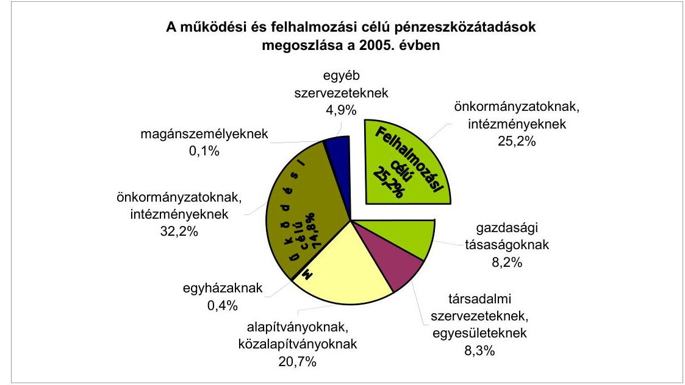
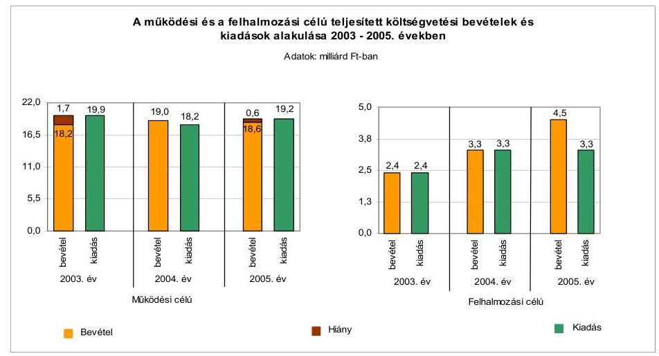
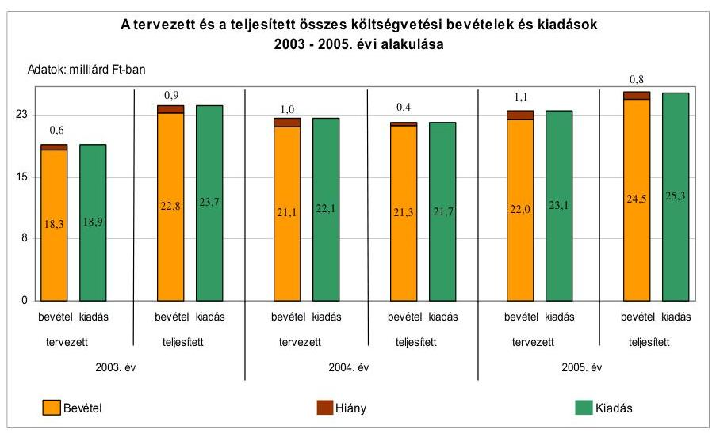
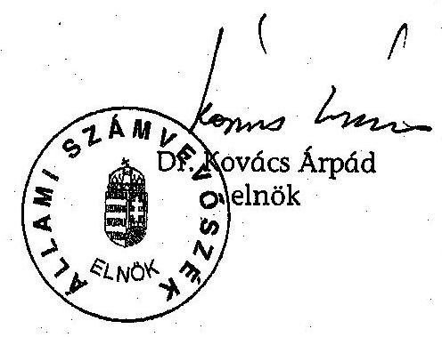
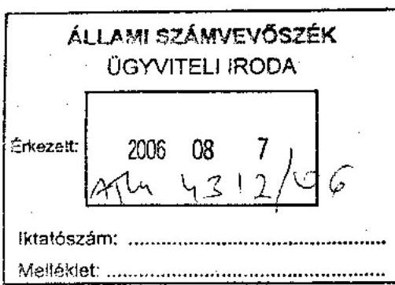
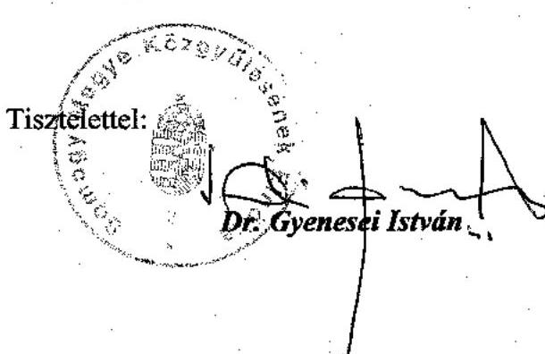

# JELENTÉS 

a Somogy Megyei Önkormányzat gazdálkodási rendszerének 2006. évi átfogó ellenőrzéséről

---

3. Önkormányzati és Területi Ellenőrzési Igazgatóság Somogy Megyei Ellenőrzési Iroda
Iktatószám: V-1003-5/24/19/2006.
Témaszám: 803
Vizsgálat-azonosító szám: V0270
Az ellenőrzést felügyelte:
Dr. Lóránt Zoltán
főigazgató
Az ellenőrzés végrehajtásáért felelős:
Dr. Sepsey Tamás
főigazgató-helyettes
Az ellenőrzést vezette:
Csecserits Imréné
főcsoportfőnök-helyettes
Az ellenőrzést végezték:
Csepreginé Tancsik Erzsébet
számvevő tanácsos
Groholy Andrásné Hangyál Márta
számvevő
Tormáné Ivánfi Irén
számvevő tanácsos
A témához kapcsolódó eddig készített számvevőszéki jelentések: címe
sorszáma
Jelentés a helyi önkormányzatok tartós szociális ellátási feladatai- 0317 nak ellenőrzéséről az idősek otthonainál
Jelentés a helyi önkormányzatok egyes pénzügyi befektetésekkel 0318 történő gazdálkodásának ellenőrzéséről
Jelentés a helyi és a helyi kisebbségi önkormányzatok gazdálkodá- 0319 sának átfogó ellenőrzéséről
Jelentés a szakképzési struktúra szerepéről a munkaerőpiaci igé- 0321 nyek kielégítésében
Jelentés a helyi önkormányzatok közművelődési és könyvtári fel- 0521 adatellátásáról és finanszírozásáról
Jelentés a Magyar Köztársaság 2004. évi költségvetése végrehajtá- 0540 sának ellenőrzéséről
Függelék:

- a helyi önkormányzatokat a 2004. évben megillető normatív állami hozzájárulás elszámolása;
- a helyi önkormányzatok beruházásaihoz és rekonstrukcióihoz nyújtott 2004. évi felhalmozási célú támogatások;
- normatív kötött felhasználású támogatások.

Jelentés a középiskolai kollégiumok fenntartásának és fejlesztésé- 0614 nek feltételeiről

---

# TARTALOMJEGYZÉK 

BEVEZETÉS ..... 5
I. ÖSSZEGZŐ MEGÁLLAPÍTÁSOK, KÖVETKEZTETÉSEK, JAVASLATOK ..... 7
II. RÉSZLETES MEGÁLLAPÍTÁSOK ..... 17

1. A költségvetés tervezésének, végrehajtásának, az Önkormányzat vagyongazdálkodásának és a zárszámadás elkészítésének szabályszerűsége ..... 17
1.1. A költségvetési rendelet jóváhagyásának, módosításának, az előirányzatok nyilvántartásának szabályszerűsége ..... 17
1.2. A gazdálkodás szabályozottsága, a bizonylati rend és fegyelem szabályszerűsége ..... 22
1.3. A pénzügyi-számviteli feladatok ellátásának informatikai támogatottsága ..... 30
1.4. Az önkormányzati vagyon nyilvántartása, számbavétele ..... 31
1.5. A vagyonnal való gazdálkodás szabályszerűsége, célszerűsége, nyilvánossága ..... 34
1.6. A céljelleggel nyújtott támogatások szabályszerűsége ..... 43
1.7. A közbeszerzési eljárások szabályszerűsége ..... 49
1.8. A zárszámadási kötelezettség teljesítésének szabályszerűsége ..... 51
2. Az önkormányzati feladatok és a rendelkezésre álló források összhangja ..... 53
2.1. A feladatok meghatározása és szervezeti keretei ..... 53
2.2. A költségvetés egyensúlyának helyzete ..... 56
2.3. A feladatok finanszírozása ..... 63
3. A belső ellenőrzési rendszer működésének értékelése ..... 65
3.1. Az ellenőrzési rendszer kialakítása, működése ..... 65
3.2. A könyvvizsgálati kötelezettség teljesítése ..... 69
3.3. A korábbi számvevőszéki ellenőrzések javaslatainak hasznosulása ..... 70

---

# MELLÉKLETEK 

1. számú Az Önkormányzat gazdálkodását meghatározó adatok, mutatószámok (1 oldal)
2. számú Az önkormányzati vagyon nagyságának alakulása (1 oldal)
3. számú Az Önkormányzat 2005. évi bevételeinek és kiadásainak alakulása (1 oldal)
4. számú Egyes önkormányzati feladatok finanszírozása (1 oldal)
5. számú Helyszíni ellenőrzési jegyzőkönyv (2 oldal)
6. számú Dr. Gyenesei István úr, a Somogy Megye Önkormányzat Közgyűlésének elnöke által adott észrevétel (1 oldal)

---

# RÖVIDÍTÉSEK JEGYZÉKE 

## Törvények

Áht.
Htv.

Kbt.
Ksztv.
Ötv.
Számv. tv.
Szoc. Tv.
Sport tv.

## Rendeletek

Ámr.
Ber.
2005. évi költségvetési rendelet
2006. évi költségvetési rendelet
SzMSz
térítési dí rendelet
ügyrend $_{1}$
ügyrend $_{2}$
vagyongazdálkodási rendelet $_{1}$
vagyongazdálkodási rendelet $_{2}$

Vhr.

## Szórövidítések

4/2006. számú utasítás
az államháztartásról szóló 1992. évi XXXVIII. törvény a helyi önkormányzatok és szerveik, a köztársasági megbízottak, valamint egyes centrális alárendeltségű szervek feladat- és hatásköreiről szóló 1991. évi XX. törvény
a közbeszerzésekről szóló 2003. évi CXXIX. törvény a közhasznú szervezetekről szóló 1997. évi CLVI. törvény a helyi önkormányzatokról szóló 1990. évi LXV. törvény a számvitelről szóló 2000. évi C. törvény a szociális igazgatásról és a szociális ellátásokról szóló 1993. évi III. törvény
2004. évi I. törvény a sportról
az államháztartás múködési rendjéről szóló 217/1998. (XII. 30.) Korm. rendelet
a költségvetési szervek belső ellenőrzéséről szóló 193/2003. (XI. 26.) Korm. rendelet
A Somogy Megyei Önkormányzat 2/2005. (III. 28.) számú rendelete az önkormányzat 2005. évi költségvetéséről A Somogy Megyei Önkormányzat 1/2006. (III. 6.) számú rendelete az önkormányzat 2006. évi költségvetéséről A Somogy Megyei Önkormányzat 8/2003. (V. 5.) számú rendelete a Szervezeti és Múködési Szabályzatáról A Somogy Megyei Önkormányzat 12/2002. (XII. 31.) számú rendelete a szakosított szociális intézményi ellátásokról és az intézményekben fizetendő térítési díjakról A Somogy Megyei Önkormányzat Szervezeti és Múködési Szabályzatáról szóló 8/2003. (V. 5.) számú rendelet 7. számú függeléke a Somogy Megyei Önkormányzat Hivatalának ügyrendi szabályzatáról A gazdasági szervezet ügyrendje A Somogy Megyei Önkormányzat 16/1991. (XII. 23.) számú rendelete az Önkormányzat tulajdon- és vagyongazdálkodási szabályairól
A Somogy Megyei Önkormányzat 16/2005. (XII. 26.) számú rendelete az Önkormányzat tulajdon- és vagyongazdálkodási szabályairól
az államháztartás szervezetei beszámolási és könyvvezetési kötelezettségének sajátosságairól szóló 249/2000. (XII. 24.) Korm. rendelet

Somogy Megye Főjegyzőjének 4/2006. számú utasítása a közpénzek felhasználásával, a köztulajdon használatá-

---

5/2004. számú utasítás

ÁSZ
EU
FEUVE
főjegyzö
Humánszolgáltatási főosztály
Illetékhivatal
KDB
Kórház
Közgyűlés
Közgyűlés alelnöke
Közgyűlés elnöke
ÖNHIKI
Önkormányzat
Önkormányzati hivatal
Pénzügyi bizottság
Pénzügyi főosztály
SIOTOUR Rt.
Somszolg
Területfejlesztési főosztály

nak nyilvánosságával, átláthatóbbá tételével és ellenőrzésének bővítésével összefüggő egyes törvények módosításáról szóló 2003. évi XXIV. törvény végrehajtására
Somogy Megye Főjegyzöjének 5/2004. számú utasítása a közpénzek felhasználásával, a köztulajdon használatának nyilvánosságával, átláthatóbbá tételével és ellenőrzésének bővítésével összefüggő egyes törvények módosításáról szóló 2003. évi XXIV. törvény közzétételi kötelezettséget előíró önkormányzati feladatok végrehajtására
Állami Számvevőszék
Európai Unió
folyamatba épített, előzetes és utólagos vezetői ellenőrzés
Somogy Megyei Önkormányzat címzetes főjegyzője
Somogy Megyei Önkormányzati Hivatal Humánszolgáltatási főosztálya
Somogy Megyei Illetékhivatal
Közbeszerzések Tanácsa Közbeszerzési Döntőbizottsága
„Kaposi Mór" Oktató Kórház
Somogy Megyei Önkormányzat Közgyűlése
Somogy Megyei Önkormányzat Közgyűlésének alelnöke
Somogy Megyei Önkormányzat Közgyűlésének elnöke
Önhibáján kívül hátrányos helyzetű önkormányzatok
Somogy Megyei Önkormányzat
Somogy Megyei Önkormányzat Közgyűlésének Hivatala
Somogy Megyei Önkormányzat Közgyűlésének Pénzügyi bizottsága
Somogy Megyei Önkormányzati Hivatal Pénzügyi főosztálya
SIOTOUR Idegenforgalmi és Kereskedelmi Rt.
Somogy Megyei Önkormányzat Szolgáltató Szervezete (önálló gazdálkodási jogkörű költségvetési intézmény)
Somogy Megyei Önkormányzati Hivatal Területfejlesztési főosztálya

---

# JELENTÉS 

## a Somogy Megyei Önkormányzat gazdálkodási rendszerének 2006. évi átfogó ellenőrzéséről

## BEVEZETÉS

Az Ötv. 92. § (1) bekezdése, az Állami Számvevőszékről szóló 1989. évi XXXVIII. törvény 2. § (3) bekezdése, valamint az Áht. 120/A. § (1) bekezdése alapján az önkormányzatok gazdálkodását az Állami Számvevőszék ellenőrzi. Az ellenőrzésre az Országgyűlés illetékes bizottságai részére is átadott, országosan egységes ellenőrzési program alapján került sor.

## Az ellenőrzés célja annak értékelése volt, hogy:

- az önkormányzati gazdálkodás törvényességét ${ }^{1}$, szabályszerűségét biztosítot-ták-e a tervezés, a költségvetés végrehajtása, a vagyongazdálkodás és a zárszámadás során;
- az Önkormányzat által ellátott feladatok és az azokhoz rendelkezésre álló források összhangja biztosított volt-e, különös tekintettel egyes kiemelt feladatokra;
- a gazdálkodás szabályszerűségét biztosító kontrollok ${ }^{2}$ megfelelően segítettéke a végrehajtást.

Az ellenőrzött időszak: a 2005. év és 2006. I. negyedév, valamint az 1.5., 2.1-2.3. és 3.3. ellenőrzési programpontok esetében a 2003-2004. évek is.

Somogy megye népesség száma 2006. január 1-jén 336284 fő volt. A megye 246 településéből 14 város, ahol az összlakosság 50\%-a él.

Az Önkormányzat 40 tagú Közgyűlésének munkáját 11 állandó bizottság segítette. A Közgyűlés elnökének személye az 1998. évi önkormányzati képviselő választás óta nem változott, a főjegyző e munkakörét 1999. óta tölti be.

[^0]
[^0]:    ${ }^{1}$ A törvényi előírások betartásának elmulasztásakor a részletes megállapítások fejezetben egységesen a törvénysértés megjelölést alkalmazzuk, mivel az ÁSZ nem tehet különbséget a törvényi előírások között.
    ${ }^{2}$ A gazdálkodás szabályszerűségét biztosító kontroll alatt értjük a kiépített és működő belső irányítási és szabályozási rendszert, valamint a belső ellenőrzési funkciók ellátását.

---

Az Önkormányzat 2005. december 31-én 43 önállóan gazdálkodó költségvetési intézményt tartott fenn. Az Önkormányzat által fenntartott költségvetési intézményekben foglalkoztatott közalkalmazottak száma 4214 fő volt, az Önkormányzati hivatalban 176 fő köztisztviselő dolgozott.

Az Önkormányzat a 2005. évben a zárszámadási rendelet szerint 23101 millió Ft költségvetési bevételt és 22424 millió Ft költségvetési kiadást teljesített, a 2005. év végén a könyvviteli mérleg szerint 24321 millió Ft értékű vagyonnal rendelkezett. A Közgyűlés az Önkormányzat 2006. évi költségvetésének bevételi és kiadási főösszegét 21475 millió Ft-tal hagyta jóvá. Az Önkormányzat gazdálkodását meghatározó 2005. évi adatokat, mutatószámokat a jelentés 1-3. számú mellékletei részletezik.

A jelentés megállapításainak, javaslatainak egyeztetése során a Közgyűlés elnöke arról adott tájékoztatást, hogy az időközben megtett intézkedésekkel a javaslatok egy részét megvalósították. Ezekben az esetekben a jelentés II. Részletes megállapítások fejezetében az adott témához kapcsolt lábjegyzetben a megtett intézkedést feltüntettük és a kapcsolódó javaslatot elhagytuk.

A jelentést az ÁSZ-ról szóló 1989. évi XXXVIII. tv. 25. § (1) bekezdése alapján észrevétel közlése céljából megküldtük a Somogy Megyei Önkormányzat Közgyűlése elnökének. A kapott észrevételt a jelentés 6. számú melléklete tartalmazza.

---

# I. ÖSSZEGZŐ MEGÁLLAPÍTÁSOK, KÖVETKEZTETÉSEK, JAVASLATOK 

Az Önkormányzat 2003-2006 évekre vonatkozó gazdasági programját a Közgyűlés elfogadta, meghatározta a megvalósítandó feladatokat és azok forrásait. A 2005. és a 2006. évi költségvetési koncepciót a Közgyűlés elnöke az Áht-ban előírt határidőn belül a Közgyűlés elé terjesztette. A költségvetési koncepciókat a bizottságok - köztük a Pénzügyi bizottság - megtárgyalták, írásos véleményüket az Ámr-ben előírtaknak megfelelően a Közgyűlés elnöke az előterjesztéshez csatolta. A költségvetési koncepciót az Ámr. előírásának megfelelően a helyben képződő bevételek és az ismert kötelezettségek figyelembe vételével állították össze.

A 2005. és a 2006. évi költségvetési rendelettervezet összeállításánál a költségvetési koncepciókban meghatározottakat érvényesítették. A költségvetési rendelettervezetek előkészítése, egyeztetése, előterjesztése az Áht-ban és az Ámrben előírtaknak megfelelően történt. A Közgyűlés a költségvetési rendeletek elfogadását megelőzően jóváhagyta az előirányzatok megalapozását szolgáló rendeleteket. Az intézményi előirányzatokat a főjegyző az intézményvezetőkkel egyeztette. A Közgyűlés elnöke a költségvetési rendelettervezethez a könyvvizsgálói jelentést és a Pénzügyi bizottság írásos véleményét csatolta. A címrendet és a költségvetés végrehajtásával összefüggő szabályokat a költségvetési rendeletben meghatározták. A Közgyűlés előterjesztés hiányában - az Áht. előírása ellenére - nem határozta meg a költségvetés és zárszámadás előterjesztésekor a közvetett támogatásokról bemutatandó adatok tartalmi követelményeit. A 2005. és a 2006. évi költségvetési rendelettervezetek az Áht. és az Ámr. előírásainak megfelelően tartalmazták a működési és felhalmozási célú bevételeket és kiadásokat, Önkormányzatra összesítetten és költségvetési szervenként elkülönítetten a kiemelt előirányzatokat, az Önkormányzati hivatal költségvetését feladatonként, az év várható bevételi és kiadási előirányzatairól az előirányzat felhasználási ütemtervet. Az Ámr. előírásai ellenére az intézményi felújítási, fejlesztési kiadásokat célonként, illetve feladatonként nem bemutatták be. Az Áht. előírásaival szemben a közvetett támogatásokat és a többéves kihatással járó döntések szöveges indoklását nem készítették el. A 2005. és a 2006. évi költségvetési rendeletekben az Áht. előírásait megsértve nem mutatták be a tervezett hiány összegét, valamint a költségvetési bevételek és kiadások között finanszírozási célú pénzügyi műveleteket szerepeltettek. A 2005. és a 2006. évi költségvetési rendeletekben meghatározták a költségvetés végrehajtásának szabályait. A költségvetésen belül a különböző feladatok támogatására alap elnevezéssel keretösszegeket alakítottak ki, amely elnevezés az Áht-ben az alapokra vonatkozóan meghatározott feltételeknek nem felelt meg, a kifejezés félreérthető.

Az Önkormányzat a költségvetési rendeletét 9\%-kal módosította, a költségvetési rendeletmódosításokat az Ámr. előírásainak megfelelően hajtotta végre.

---

Az Önkormányzati hivatal múködésének részletes szabályait az ügyrend ${ }_{1}$-ben határozták meg. Az ügyrend ${ }_{1}$ az Ámr. előírásainak megfelelően tartalmazta az alapító okirat keltét, számát, az Önkormányzati hivatal szervezeti felépítését és múködésének rendszerét, a költségvetési szerv költségvetésének végrehajtására szolgáló számlaszámot. Az ügyrend ${ }_{1}$ az Ámr. előírása ellenére nem tartalmazta a Somszolg 2005. április 1-i megszüntetését követő szervezeti felépítést. Az Ámr. előírása alapján elkészítették az Önkormányzati hivatal gazdasági szervezetének az ügyrendjét. A gazdálkodási és ellenőrzési jogkörök gyakorlásának szabályait a Közgyűlés elnöke és a főjegyző együttes utasításban az Ámr. előírásainak megfelelően rögzítette.

A főjegyző kialakította az Önkormányzati hivatal és az intézmények egységes számviteli rendjét. Az Önkormányzati hivatal számviteli politikával és a kapcsolódó szabályzatokkal, valamint számlarenddel rendelkezett. Az eszközök és források leltározási és leltárkészítési szabályzatában meghatározták az eszközök és források leltározási kötelezettségét, előírták, hogy az ingatlanok leltározását mennyiségi felvétellel kell végrehajtani. A Vhr. előírása ellenére nem rendelkeztek az üzemeltetésre, kezelésre átadott eszközök leltározásának sajátos feltételeiről. Az eszközök és források értékelési szabályzatában rögzítették az értékvesztés elszámolásának, illetve visszaírásának rendjét, a tulajdoni részesedést jelentő befektetéseknél a piaci értékelés elveit és módszerét, az illetékkövetelések esetén a Vhr. előírása ellenére nem rögzítették az értékvesztés összegének negyedévenkénti megállapítását. A pénz- és értékkezelési szabályzatban előírták a megnyitható bankszámlák körét, rendeltetését, az azok feletti rendelkezésre jogosultak megnevezését, a házipénztár keretösszegét, az ellenőrzéssel kapcsolatos felelős munkaköröket. A pénztár ellenőrzési feladatok elvégzésére az Áht. feladatköri függetlenségre vonatkozó előírása ellenére - az Önkormányzati hivatal belső ellenőrzési egységének vezetője kapott megbízást.

A számlarend tartalmazta a kijelölt főkönyvi számlák számát, megnevezését, azok tartalmát, értéknövekedésének, csökkenésének jogcímeit, a gazdasági eseményeket, más számlákkal való kapcsolatát, a főkönyvi számlák és az analitikus nyilvántartások kapcsolatát. A Vhr. előírásával ellentétben nem történt meg az illetékkövetelésekre vonatkozó analitikus nyilvántartások formájának, tartalmának, vezetése módjának, a főkönyvi nyilvántartással való egyeztetésnek és annak dokumentálásának, valamint az analitikus nyilvántartás adataiból készült összesítő bizonylatok elkészítési határidejének meghatározása. A munkaköri leírásokban rögzítették a belső ellenőrzési kötelezettséget, az egyeztetési feladatok elvégzését. A főjegyző az Áht. előírása alapján gondoskodott a FEUVE rendszer kialakításáról és múködtetéséről. Meghatározta a szabálytalanságok kezelésének eljárásrendjét, valamint az Önkormányzati hivatal tervezési, pénzügyi lebonyolítási és ellenőrzési tevékenységének folyamatábrákkal szemléltetett ellenőrzési nyomvonalát, a kockázatkezelés érdekében elkészítette az Önkormányzati hivatal pénzügyi, gazdasági területének kockázati térképét. Az Ámr. előírásaival ellentétesen a szabálytalanságok kezelésének eljárásrendje és az ellenőrzési nyomvonal nem képezi az ügyrend ${ }_{1}$ mellékletét.

A könyvviteli nyilvántartásokban az elszámolt gazdasági műveletekről, eseményekről a Számv. tv-ben előírt számviteli bizonylatokat kiállították. A számviteli bizonylatok $11 \%$-a nem felelt meg a Számv. tv-ben előírt alaki és tartalmi követelményeknek, mert az utalványozás és annak ellenjegyzése a

---

pénztárbizonylatok esetén a készpénzfelvételeknél, továbbá az elszámolásra kiadott előlegeknél elmaradt. A kötelezettségvállalás ellenjegyző̉e és az érvényesítő a kiemelt előirányzatok közül a személyi juttatásoknál, a dologi előirányzatoknál, a kölcsönök nyújtásánál az Ámr. előirásaiban foglaltakkal ellentétben, nem tett eleget munkafolyamatba épített ellenőrzési kötelezettségének, mert a kötelezettségvállalás ellenjegyzője nem győződött meg arról, hogy a jóváhagyott költségvetésben a fel nem használt, illetve a le nem kötött, a kötelezettségvállalás tárgyával összefüggő kiadási előirányzat rendelkezésre áll-e, az érvényesítő nem ellenőrizte a fedezet meglétét, az előírt alaki követelmények betartását. Az utalvány ellenjegyző́e a készpénzfelvételek és az elszámolásra kiadott előlegek esetén nem teljesítette a munkafolyamatba épített ellenőrzési kötelezettségét, mert az Ámr. előírásával ellentétben nem győződött meg arról, hogy a kötelezettségvállalás nem sérti-e a gazdálkodásra vonatkozó szabályokat. A munkafolyamatba épített ellenőrzési kötelezettségnek a szakmai teljesítés igazolója és a pénztárellenőr eleget tett.

A kötelezettségvállalásokról számítógépes nyilvántartást naprakészen, kiemelt előirányzatonként vezették. A nyilvántartásból megállapítható volt, hogy a kötelezettségvállalás és az utalványozás a jóváhagyott kiadási előirányzatok mértékéig történjen. Az Áht. előírásait megsértve az Önkormányzati hivatal és 32 önállóan gazdálkodó intézmény, az intézmények 74\%-a kiemelt előirányzatait túllépte, illetve fizetési kötelezettséget a jóváhagyott kiadási előirányzaton felül is vállalt. Az előirányzat túllépések okait nem vizsgálták, felelősségre vonás nem történt.

A főkönyvi könyvelés és a költségvetési beszámoló elkészítésének informatikai támogatottsága biztosított volt, az analitikus nyilvántartások - az értékpapírok kivételével - számítógépes feldolgozással készültek. Az informatikaikommunikációs stratégiát elkészítették, az adat- és titokvédelemmel, valamint a katasztrófa elhárításával kapcsolatos szabályokat főjegyzői utasítás tartalmazta. A gazdálkodási és számviteli feladatok ellátásához használt szoftverekhez rendelkeztek az üzemeltetési dokumentációval és a felhasználói leírással. Az informatikai rendszer használatával kapcsolatos szabályokat főjegyzői utasítás tartalmazta. A pénzügyi és számviteli területen dolgozók rendelkeztek számítógéppel, munkaköri leírásuk tartalmazta az informatikai rendszer használatát, az általuk elvégzendő feladatok leírását.

Az Önkormányzati vagyon nyilvántartásáról, ezen belül a törzsvagyon elkülönített nyilvántartásáról a Vhr-ben előírtaknak megfelelően gondoskodtak. A 2005. évi leltározást a Számv. tv., a Vhr., valamint a leltározási és leltárkészítési szabályzat szerint az üzemeltetésre átadott eszközök kivételével elvégezték. Az üzemeltetésre, kezelésre átadott eszközök leltározása a 2005. évre vonatkozóan nem történt meg. A Számv. tv. és a Vhr. előírásai ellenére az értékpapírok, a követelések, a kölcsönök, a vevők és az illeték követelések esetében nem végezték el az értékelést, nem vizsgálták az értékvesztés elszámolásának szükségességét. Az illetékkövetelés kimutatáskor - a Számv. tv. előírását megsértve nem tartották be a bruttó elszámolás elvét. A gazdasági társaságban lévő részesedés után négy gazdasági társaság esetében vizsgálták az értékvesztés elszámolásának indokoltságát, három gazdasági társaságban lévő részesedés esetén a - Számv. tv. előírásai ellenére - nem történt meg az értékvesztés elszámolása.

---

A vagyonnal való gazdálkodás szabályait, a döntési hatásköröket az Önkormányzat rendeletben szabályozta, a rendelkezési, döntési hatásköröket megosztotta a Közgyűlés, a Közgyűlés elnöke, a Pénzügyi bizottság és az intézmények között. A vagyongazdálkodás nyilvánosságának biztosítása érdekében - értékhatár meghatározásával - előírták, hogy önkormányzati vagyon elidegenítése és hasznosítása versenytárgyalás útján történik, azonban - az Áht. előírását megsértve - lehetővé tettek kivételeket is. A szabályozás nem segítette a közvagyonnal való gazdálkodás nyilvánosságát, átláthatóságát. A vagyongazdálkodási rendeletben előírták, hogy ingatlant értékesíteni forgalmi értékbecslés alapján lehet, azonban nem határozták meg azt az időszakot, ameddig az értékbecslésben megállapított érték figyelembe vehető a döntésnél. Az Önkormányzat által nyújtott céljellegú, fejlesztési támogatások, illetve a nettó ötmillió Ft-ot meghaladó szerződések adatainak közzétételi kötelezettségét szabályozták. Az Áht. előírásait megsértve a szabályozás nem terjedt ki a szolgáltatás megrendelésére, a vagyonhasznosításra, a vagyon, vagy vagyoni értékú jog átadására vonatkozó szerződések közzétételére. Az Áht. előírásainak megfelelően - a szabályozás hiányosságai ellenére - az Önkormányzat közzétételi kötelezettségének eleget tett.

Az önkormányzati vagyon könyvviteli mérleg szerinti értéke 2003-2005 között 17614 millió Ft-ról 24321 millió Ft-ra, 38,1\%-kal nőtt, a beruházások, fejlesztések következtében. A vizsgált időszakban vagyonértékesítés, apportálás, bérbeadás, selejtezés, követelés elengedés történt. A vagyonhasznosítás során, a szerződésekben az Önkormányzatot védő garanciális elemeket beépítették. A SIOTOUR részvények 2000. évi értékesítése során keletkezett bevételből diszkont kincstárjegyet, befektetési jegyet vásároltak, valamint a bevétel hasznosítása céljából - az Ötv. előírását megsértve - portfolió-kezelési szerződést kötöttek. A befektetési döntéseket megelőzően ajánlatokat kértek a befektetési szolgáltatóktól. A diszkont kincstárjegy és a befektetési jegy vásárlásnál azonban nem gondoskodtak a befektetési kockázat csökkentése érdekében a KELER Rtnél az Önkormányzat nevére szóló értékpapír alszámla nyitásáról, és az együttes rendelkezési jog kikötéséről. A portfolió-kezelési szerződés kötésével az Önkormányzat megsértette az Ötv. előírását, mivel a Közgyűlés a portfolióban szereplő összegre tulajdonosi jogokat ruházott át a portfoliókezelőre.

Az Önkormányzat a 2005. évi költségvetéséből 865 esetben, 305,8 millió Ft működési és 102,9 millió Ft fejlesztési célú támogatást nyújtott különböző szervezetek és magánszemélyek részére. A céljellegú támogatások kifizetésére vonatkozó döntéseket a helyi szabályozásnak megfelelően hozták meg, az alelnök részére biztosított hatáskörrel megsértették az Ötv. hatáskör átruházásra vonatkozó előírását. Az Ötv. előírásait megsértve három intézmény alapítvány támogatásáról döntött. Az Önkormányzat intézményeinek 19\%-a az - Áht. előírását megsértve - a Közgyűlés hozzájárulása nélkül nyújtott támogatást társadalmi szervezeteknek. A főjegyzői utasítással ellentétesen a működési célú támogatásban részesültekkel a 2005. évben támogatási szerződést nem kötöttek. A támogatottak által aláírt nyilatkozatok, illetve a fejlesztési célú támogatásban részesültekkel megkötött támogatási szerződések tartalmazták a támogatás célját, összegét, a számadási kötelezettség módját, határidejét, melyet a 2005. évi költségvetési rendeletben meghatározott 30 napos elszámolási határidőnél hosszabb időszakban állapítottak meg. A 2006. évtől kezdődően valamennyi támogatottal támogatási szerződést kötöttek, amely tartalmazta a

---

számadási kötelezettség módját, határidejét, a támogatás célját, összegét. A főjegyző utasításokban határozta meg a támogatások döntés-előkészítésével, nyilvántartásával, közzétételével, ellenőrzésével kapcsolatos feladatokat. A támogatások számítógépes nyilvántartási rendszerét kialakították, azonban a program nem rögzítette a támogatottak szervezeti formáját, egyéni azonosítóját, nem készített összesítéseket, illetve kimutatást a számadási kötelezettségüket nem teljesítő támogatottakról. Az Önkormányzati hivatal ellenőrzése szerint a támogatottak 96\%-a számadási kötelezettségének eleget tett, a kapott támogatást a célnak megfelelően használta fel. Két esetben a támogatás visszafizetésére szólították fel a támogatottakat, a támogatás visszafizetése a helyszíni vizsgálat idejéig nem történt meg. A számadást elmulasztókat az elszámolás benyújtására felszólították, azonban ezt követően az Áht. előírást megsértve nem kezdeményezték a támogatás visszafizettetését. A több forrásból, keretből történő támogatás megállapítása érdekében nem készítettek egységes nyilvántartást a kötelezettségüket nem teljesítőkről.

Az Önkormányzat a közbeszerzési rendeletének hatályon kívül helyezését követően közbeszerzési szabályzatot alkotott a közbeszerzési eljárások lefolytatásának szabályairól. Az Önkormányzati hivatal a 2005. évben és a 2006. I. negyedévben az értékhatárt elérő öt szolgáltatás, három építési beruházás és 12 értékhatár feletti árubeszerzéssel kapcsolatban folytatta le a közbeszerzési eljárásokat. Az egybeszámítás követelményét öt esetben érvényesítették, azonban az Önkormányzati hivatal költségvetésében tervezett és végrehajtott, intézményi épületek érintő, nettó 25525 ezer Ft-os építési feladatoknál és nettó 4762 ezer Ft értékű szolgáltatás megrendelésnél megsértették a Kbt. becsült érték megállapítására vonatkozó szabályait. ${ }^{3}$ Az ellenőrzött nyílt közbeszerzési eljárás szabályszerű volt. A vizsgált időszakban a lefolytatott közbeszerzési eljárásoknál jogorvoslati eljárást nem kezdeményeztek és a KDB hivatalból sem indított. A közbeszerzési eljárások szabályszerűségét a Kbt. előírását megsértve a felügyeleti és a belső ellenőrzés rendszerében nem ellenőrizték.

A Közgyűlés elnöke a zárszámadási rendelettervezetet határidőn belül a Közgyűlés elé terjesztette. A zárszámadási rendelet előterjesztésekor tájékoztatásul bemutatták az Áht-ben előírt mérlegeket és kimutatásokat, az Önkormányzat összevont mérlegeit, a Vhr. szerint elkészített vagyonkimutatást, a közvetett támogatásokat és a többéves kihatással járó döntések számszerűsítését tartalmazó kimutatásokat. Az Áht. előírásai ellenére a többéves kihatással járó döntések és a közvetett támogatások szöveges indoklását nem készítették el. Az Ámr. előírásai ellenére nem mutatták be az Önkormányzati hivatal előirányzatai feladatonkénti teljesülését. Az intézményi előirányzatok között tervezett felújítási, felhalmozási kiadásokat - az Ámr. előírásai ellenére - célonként, illetve feladatonként nem határozták meg. A Közgyűlés költségvetési szervenként jóváhagyta a pénzmaradvány összegét. Az intézményi beszámolókat az Ámrnek megfelelően felülvizsgálták, az intézményvezetőket írásban értesítették az éves beszámolójuk és múködésük elbírálásáról, elfogadásáról, valamint a jóváhagyott pénzmaradvány összegéről.

[^0]
[^0]:    ${ }^{3}$ A közbeszerzési eljárások jogtalan mellőzése miatt a Kbt. 327. § (1) bekezdésének b) pontja alapján jogorvoslati eljárás kezdeményezésére került sor.

---

Az Önkormányzat kötelező és önként vállalt feladatait és a feladatok ellátásának módját az SzMSz-ben meghatározta. A Közgyűlés az önkormányzati feladatok ellátásáról költségvetési intézményeivel, társulásokkal, közalapítványokkal, társadalmi szervezettel kötött feladat ellátási szerződéssel gondoskodott. Az Önkormányzat által ellátott kötelező feladatok és az ehhez rendelkezésre álló források összhangja azonban nem biztosított, mivel a meghozott takarékossági intézkedések ellenére a teljesített múködési célú költségvetési bevételek nem nyújtottak fedezetet a múködési célú költségvetési kiadásokra. A vizsgált időszakban a közoktatási, a sportigazgatási és az önkormányzati tulajdonú hivatali épületek üzemeltetésével kapcsolatos feladatoknál hajtottak végre szervezeti változtatást. A marcali és a fonyódi közoktatási intézménynél végrehajtott változás a párhuzamos feladatellátás megszüntetését szolgálta. A Somogy Megyei Sportiroda és a Somszolg megszüntetésére a múködési forráshiány csökkentése érdekében kidolgozott takarékossági intézkedések részeként került sor.

Az Önkormányzat a 2003-2005 évi költségvetési rendeleteit a múködési kiadásoknál forráshiánnyal hagyta jóvá, melynek fedezetéül hitelfelvételt és ÖNHIKI előleg igénybevételét terveztek. A költségvetések forráshiányának megszüntetésére a végrehajtások során, az elnyert ÖNHIKI támogatások és a folyamatos takarékossági intézkedések ellenére sem került sor. A múködési hiány mellett az Önkormányzat - a következő évek felhalmozási feladataira tartalékolt - felhalmozási célú pénzeszközökkel rendelkezett. Az átmenetileg szabad pénzeszközök lekötéséből és befektetéseiből származó bevétele a 2003-2005 években növekedett Az Önkormányzat fizetőképességét folyamatos likvid hitelfelvétellel tudta megőrizni. A 2003-2005 évek közötti időszakban az Önkormányzat négy alkalommal döntött hitelfelvétellel adósságot keletkeztető kötelezettségvállalásról. A kötelezettségvállalás felső határát betartották, a hitelfelvételek az Önkormányzat fizetőképességét a kötelezettségvállalás évében és a futamidő további éveiben - az előzetes számítások szerint - nem veszélyeztették. Az Önkormányzat a pályázatok benyújtásához szükséges személyi, szakmai és szervezeti feltételeket - a pályázatok adta lehetőségek jobb kihasználása érdelében - az Önkormányzati hivatalon belül kialakította.

A naturális mutatókkal mérhető nevelési, oktatási és szociális feladatok fajlagos kiadásait a 2003-2005 években a központi bérintézkedések hatása és az energia árak emelkedése, valamint a szakképző intézményeknél az elmaradt saját bevételek befolyásolták. A feladatok finanszírozásában a központi költségvetési támogatások aránya a vizsgált időszakban az általános iskolai, középiskolai oktatásnál és a bentlakásos szociális intézményi ellátásnál is csökkent. A középiskolai oktatásnál az önkormányzati támogatás részaránya a kiadások finanszírozásában növekedett. Ennek oka, hogy az oktatás-nevelés intézményi struktúráján az Önkormányzat (párhuzamos feladatellátások felszámolása) jelentősen nem változtatott, így az ellátott feladatok és a rendelkezésre álló források összhangját nem tudta megteremteni.

Az Önkormányzat az önként vállalt feladatokra 2003-2005 között az éves költségvetési kiadásainak 2,2-1,7\%-át fordította. Az Önkormányzatnál az önként vállalt feladatok finanszírozása nem veszélyeztette a kötelező feladatok ellátását.

---

Az Önkormányzat a közintézmények akadálymentesítése érdekében szükséges felméréseket elvégezte, amely szerint a 141 önkormányzati tulajdonú középület $51 \%$-ánál nem, vagy csak részben biztosított az akadálymentes megközelítési lehetőség. A felmérés szerint a középületek akadálymentessé tételéhez 292 millió Ft szükséges. Az Önkormányzat a fogyatékos személyek jogairól és esélyegyenlőségük biztosításáról szóló törvényben előírtak ellenére 69 középületnél az akadálymentessé tételt 2005. január 1-ig nem biztosította.

Az Önkormányzat kialakította a belső ellenőrzéshez szükséges szervezeti kereteket, biztosította a belső ellenőrzési feladatok megszervezését, végrehajtását és a működéshez szükséges forrásokat. Az Önkormányzat belső ellenőrzéséről az Önkormányzati hivatal keretében működő Költségvetési Ellenőrzési Társulás útján, belső ellenőrök alkalmazásával, a belső ellenőrzési kézikönyvben meghatározottak szerint gondoskodott. A belső ellenőrzési feladatokat négy fő köztisztviselő látta el, ebből három fő az Önkormányzati hivatal és az intézmények, egy fő a 11 társult önkormányzat ellenőrzését végezte. A Költségvetési Ellenőrző Társulás - az Áht-ban előírt szervezeti függetlenséget megsértve - az SzMSz 10. számú melléklete, valamint a belső ellenőrzési kézikönyv alapján nem közvetlenül a főjegyzőhöz, hanem a Főjegyzői titkársághoz rendelve végezte tevékenységét. A belső ellenőrzési vezető munkakört betöltő közvetlen felettese - a munkaköri leírás szerint - nem a főjegyző hanem a Főjegyzői titkárságvezető volt. A belső ellenőrzési egység jogállását az ügyrend,-ben az Áht. előírása ellenére nem módosították. A Költségvetési Ellenőrzési Társulás, illetve a belső ellenőrök feladatköri függetlenségét az éves ellenőrzési terv, a kockázatelemzési módszerek kidolgozása, az ellenőrzési program elkészítése és végrehajtása, az ellenőrzési módszerek kiválasztása, a következtések, ajánlások kidolgozása, az ellenőrzési jelentések elkészítése során biztosították.

A belső ellenőrzési vezető elkészítette a belső ellenőrzési kézikönyvet, a stratégiai tervet, valamint a 2005. és 2006. évi éves ellenőrzési terveket. A 2006. évi ellenőrzési terv intézményi ellenőrzésekre vonatkozó részét az SzMSz-ben biztosított jogkörében a Pénzügyi bizottság az Ötv. által meghatározott határidőhöz, november 15-höz viszonyítva késve fogadta el. Az ellenőrzési éves terv Önkormányzati hivatal ellenőrzésére vonatkozó részét a Pénzügyi bizottság helyett a főjegyző hagyta jóvá, ezzel megsértették az Ötv. előírásait. A 2005. évben az Önkormányzati hivatalban hét, az intézményeknél 33 ellenőrzést a Ber. előírásainak megfelelően végezték. Az ellenőrök a hiányosságok kiküszöbölése érdekében javaslatot tettek. Az ellenőrzöttek a jelentésekben foglalt megállapításokra intézkedési tervet készítettek, észrevételt nem tettek. A Közgyűlés elnöke a 2005. évi ellenőrzések intézményi és önkormányzati hivatali tapasztalatairól szóló összefoglaló jelentést a zárszámadási rendelettervezettel együtt terjesztette a Pénzügyi bizottság elé. A beszámolót a Pénzügyi bizottság - az SzMSz-ben kapott felhatalmazás alapján - elfogadta, követelményeket, elvárásokat nem fogalmazott meg.

Az Önkormányzat a törvényben előírt könyvvizsgálati kötelezettségét költségvetési minősítésű könyvvizsgálóval teljesítette. A könyvvizsgáló a 2005. évi egyszerűsített tartalmú költségvetési beszámolót hitelesítő záradékkal látta el, auditálási eltérést nem állapított meg.

---

0Az Önkormányzatnál az ÁSZ a 2002-2005. években kilenc alkalommal folytatott vizsgálatot, melyek a gazdálkodás átfogó ellenőrzésére, az egyes pénzügyi befektetésekre, az idősek szociális otthonainak feladat ellátására, a szakképzési struktúrára, a közművelődési és könyvtári feladatellátásra, a 2004. évi normatív állami hozzájárulásra, a kötött felhasználású támogatásokra és a felhalmozási célú támogatásokra, valamint a középiskolai kollégiumok fenntartására, fejlesztésére vonatkoztak. Az ellenőrzések 33 szabályszerűségi és 15 célszerűségi javaslatot tartalmaztak, melynek háromnegyed részét teljes mértékben, ötödét részben hajtották végre. A megvalósult javaslatok hozzájárultak a költségvetési és zárszámadási rendeletek törvényességének, az operatív gazdálkodási-pénzügyi munka ellátásának, a vagyongazdálkodás szabályszerűségének, a vagyongazdálkodási feladatok ellátásának javításához. A javaslatokat figyelembe véve elkészült a szociális szolgáltatástervezési koncepció, megtörtént a közoktatási intézményhálózat működtetési és fejlesztési terve végrehajtásának felülvizsgálata. A kiemelt előirányzatok túllépése esetén nem valósult meg a túllépések okainak feltárása, a személyes felelősség megállapítása, továbbá nem történt meg az eszközök és források értékelési szabályzata alapján az értékpapírok értékelése.

A helyszíni ellenőrzés megállapításainak hasznosítása mellett javasoljuk:

# a Közgyülés elnökének 

a jogszabályi előírások maradéktalan betartása érdekében
1. intézkedjen, hogy az intézmények az Áht. 93. § (1) bekezdése alapján a jóváhagyott előirányzatokon belül gazdálkodjanak, tartsák be az Áht. 12/A. § (1) bekezdésében foglaltakat, amely szerint a tárgyévi fizetési kötelezettség a jóváhagyott előirányzat mértékéig vállalható, az előirányzat túllépések esetén vizsgálja ki annak okait és indokolt esetben kezdeményezzen felelősségre vonást;
2. rendelkezzen az Áht. 13/A. § (2) bekezdésében foglaltak alapján a számadási kötelezettséget elmulasztók esetében a támogatás visszafizetéséről;
3. gondoskodjon a középületek akadálymentessé tételéről, tekintettel a fogyatékos személyek jogairól és esélyegyenlőségük biztosításáról szóló 1998. évi XXVI. törvény 29. § (6) bekezdésében meghatározott lejárt határidőre;
a munka színvonalának javítása érdekében
4. terjessze a számvevőszéki jelentést a Közgyűlés elé, a feltárt hiányosságok megszüntetésére készíttessen intézkedési tervet, a határidők és a felelősök megjelölésével;

---

# a föjegyzönek 

a jogszabályi előírások maradéktalan betartása érdekében
1. a költségvetési és a zárszámadási rendelettervezet előkészítésekor
a) gondoskodjon arról, hogy a költségvetési rendelettervezet előterjesztésekor a közvetett támogatásokról szóló kimutatást elkészítsék, valamint a többéves kihatással járó döntések és a közvetett támogatások szöveges indoklását az Áht. 118. §-ában előírtak alapján bemutassák;
b) gondoskodjon arról, hogy a költségvetési és a zárszámadási rendeletben bemutassák az Ámr. 29. § (1) bekezdés c)-e) pontjának megfelelően az intézmények felújítási, felhalmozási kiadásait felhalmozási feladatonként, illetve felújítási célonként, továbbá az Önkormányzati hivatal költségvetésének teljesítését a költségvetési rendeletben jóváhagyott feladatonkénti tagolásban;
c) mutassa be a költségvetési rendelet tervezetben a költségvetési bevételek és a költségvetési kiadások különbözeteként keletkező hiányt az Áht. 8. § (1) bekezdésében előírtaknak megfelelően, valamint gondoskodjon arról, hogy az Áht. 8/A. § (7) bekezdésében foglaltaknak megfelelően a költségvetési rendelettervezetben szereplő költségvetési bevételek és költségvetési kiadások között finanszírozási célú pénzügyi múveletet ne mutassanak ki;
2. gondoskodjon a Vhr. 37. § (1) bekezdés alapján az üzemeltetésre, kezelésre átadott eszközök leltározásának végrehajtásáról;
3. a szabályszerű operatív gazdálkodás érdekében
a) intézkedjen annak érdekében, hogy az Önkormányzati hivatal az Áht. 93. § (1) bekezdése alapján a jóváhagyott előirányzatokon belül gazdálkodjon, tartsa be az Áht. 12/A. § (1) bekezdésében foglaltakat, amely szerint a tárgyévi fizetési kötelezettség a jóváhagyott előirányzat mértékéig vállalható, az előirányzat túllépések esetén vizsgálja ki annak okait és indokolt esetben kezdeményezzen felelősségre vonást;
b) biztosítsa, hogy a kötelezettségvállalás ellenjegyzője és az érvényesítő az Ámr. 134. § (9) bekezdés a) pontja, illetve az Ámr. 135. § (1) bekezdés előírása alapján a munkafolyamatba épített ellenőrzési kötelezettségét a kiemelt előirányzatok közül a személyi juttatásoknál, a dologi előirányzatoknál, a kölcsönök nyújtásánál, az utalvány ellenjegyzője az Ámr. 137. § (3) bekezdése és a 134. § (9) bekezdés c) pontja alapján a készpénzfelvételeknél és az elszámolásra kiadott előlegeknél teljesítse;
4. a szabályszerű vagyongazdálkodás érdekében
a) intézkedjen, hogy a követelések, köztük az illetékkövetelések, valamint a részesedések és értékpapírok értékelését a Vhr. 31. § (2) bekezdése, a Vhr. 31/A. § (2) bekezdése, a Számv. tv. 54. §. (2) és (4) bekezdésének, valamint a számviteli politika értékelési elveinek megfelelően elvégezzék;

---

b) gondoskodjon arról, hogy az illetékkövetelések könyvviteli mérlegben történő bemutatásakor a Számv. tv. 15. § (9) bekezdésének megfelelően a bruttó elszámolását elvét betartsák;
c) intézkedjen arról, hogy a felszámolt gazdasági társaságban lévő részesedés utáni értékvesztést a Számv. tv. 54. § (1) bekezdése előírása szerint számolják el;
5. kezdeményezze megfelelő időben elkészített előterjesztéssel az intézmények és az Önkormányzati hivatal éves ellenőrzési tervének az Ötv. 92. § (6) bekezdésében foglalt határidőn belüli jóváhagyását;

---

# II. RÉSZLETES MEGÁLLAPÍTÁSOK 

## 1. A KÖLTSÉGVEtÉs TERVEZÉSÉNEK, VÉGREHAJTÁSÁNAK, AZ ÖNKORMÁNYZAT VAGYONGAZDÁLKODÁSÁNAK ÉS A ZÁRSZÁMADÁS ELKÉSZÍTÉSÉNEK SZABÁLYSZERŰSÉGE

### 1.1. A költségvetési rendelet jóváhagyásának, módosításának, az előirányzatok nyilvántartásának szabályszerűsége

Az Önkormányzat rendelkezett a Közgyűlés 54/2003. (VI. 12.) számú határozatával elfogadott, 2003-2006 évekre vonatkozó gazdasági programmal.

#### Abstract

Az Önkormányzat „A folyamatosság, a megújulás és a törvényesség útján az Európai Unióba" című négyéves ciklusprogramja tartalmát tekintve megfelelt az Önkormányzat gazdasági programjának. A feladat ellátást, a közszolgáltatások fejlesztésével kapcsolatos feladatokat ágazatonként határozták meg. A fejlesztési elképzeléseket a gazdaságfejlesztés, a területfejlesztés, a turizmus, a közlekedés, az infrastruktúra fejlesztés, a területrendezés és a környezetvédelem területén fogalmazták meg, melynek forrásául a saját bevételeket, a SIOTOUR részvények eladásából származó tőke részt és a pályázati támogatásokat jelölték meg.

A 2005. évi és a 2006. évi költségvetési koncepciót a bizottságok - köztük a Pénzügyi bizottság - megtárgyalták, írásos véleményüket az Ámr. 28. § (3) bekezdésében előírtaknak megfelelően a Közgyűlés elnöke az előterjesztéshez csatolta.

A főjegyző által elkészített, a 2005. és a 2006. évre szóló, költségvetési koncepciót a Közgyűlés elnöke az Áht. 70. §-ában előírt határidőn ${ }^{4}$ belül 2004. november 6-án, illetve 2005. november 14-én - a Közgyűlés elé terjesztette. A 2005. és a 2006. évi költségvetési koncepciót az Ámr. 28. § (1) bekezdésének megfelelően a helyben képződő bevételek és az ismert kötelezettségek, valamint a gazdasági program figyelembevételével állították össze. A Közgyűlés az Önkormányzat 2005. és a 2006. évi koncepciójában az Ámr. 28. § (4) bekezdésében foglaltak figyelembevételével meghatározta a költségvetés-készítés további munkálatait.

Az Önkormányzat a 14/2005. (XII. 26.) számú rendeletben meghatározta a költségvetésének előterjesztésekor, illetve a zárszámadáskor bemutatandó mérlegek és kimutatások tartalmi követelményeit. Ezen rendelet 1. számú mellékletében az Ámr. 29. §-ában előírtakkal ellentétesen a bevételeket nem a pénzügyminiszter elemi költségvetés összeállítására vonatkozó tájékoztatójában

[^0]
[^0]:    ${ }^{4}$ Az Áht. 70. § előírásai szerint a költségvetési koncepciót november 30-ig, a Közgyűlés tagjai általános választásának évében december 15-ig kell benyújtani a Közgyűlésnek.

---

rögzített főbb jogcím-csoportonkénti részletezettségben határozták meg ${ }^{5}$. A vizsgálat ideje alatt az Ámr. 29. § (1) bekezdés a) pontja alapján, a pénzügyminiszter tájékoztatójának megfelelően határozták meg a bevételek főbb jogcím-csoportonkénti részletezésének követelményeit.

Az Áht. 118. §-át megsértve, az ÁSZ jelen ellenőrzését megelőzően rendeletben nem határozták meg az Áht. 116. § 10. pontjában előírt, közvetett támogatásokra vonatkozó kimutatás tartalmi követelményeit. A mulasztást pótolva a helyszíni vizsgálat ideje alatt, az Önkormányzat a 14/2005. (XII. 26.) számú rendeletét módosítva meghatározták - a költségvetés és a zárszámadás előterjesztésekor tájékoztatásul bemutatandó - a többéves kihatással járó döntésekre vonatkozó kimutatás tartalmi követelményeit.

A költségvetési rendelettervezetben szereplő intézményi bevételi és kiadási előirányzatokat az Ámr. 29. § (4) bekezdésében előírtakkal összhangban a főjegyző a költségvetési szervek vezetőivel egyeztette. Az egyeztetések tartalmát, eredményét jegyzőkönyvekben rögzítették.

A Közgyúlés elnöke a bizottságok által megtárgyalt és a Pénzügyi bizottság által véleményezett költségvetési rendelettervezetet az Áht. 71. § (1) bekezdésében rögzített határidőn belül ${ }^{6}$ 2005. február 14-én és 2006. január 25-én a Közgyúlés elé terjesztette.

A könyvvizsgáló a költségvetési rendelettervezetet megvizsgálta, és az Ötv. 92/C. § (4) bekezdésének előírását betartva, véleményéről írásban tájékoztatta a Közgyűlést, azt elfogadásra javasolta. Az Ámr. 29. § (9) bekezdésének megfelelően a könyvvizsgálói jelentést és a Pénzügyi bizottság írásos véleményét a Közgyűlés elnöke az előterjesztéshez csatolta.

A Közgyűlés elnöke a költségvetési rendelettervezettekkel együtt, és azt megelőzően az Áht. 71. § (2) bekezdésében előírtaknak megfelelően előterjesztette

[^0]
[^0]:    ${ }^{5}$ Az Ámr. 29. §. (1) bekezdés a) pontja értelmében a költségvetési rendelettervezetben az önkormányzat és az önállóan gazdálkodó költségvetési szervek bevételeit forrásonként a pénzügyminiszter elemi költségvetés összeállítására vonatkozó tájékoztatójában rögzített főbb jogcímcsoportonként kell részletezni. I. Működési bevételek, II. Támogatások, III. Felhalmozási és tőke jellegű bevételek, IV. Támogatás értékű bevételek, V. Véglegesen átvett pénzeszközök, VI. Támogatási kölcsönök visszatérülése, VII. Hitelek, VIII. Pénzforgalom nélküli bevételek. Az Önkormányzat főbb bevételi jogcímeit a következők szerint csoportosította: A. Saját bevételek, B. Átvett pénzeszközök, D. Átengedett bevételek, E. Állami hozzájárulás, támogatás, F. Hitel.
    ${ }^{6}$ Az Áht. 71. § (1) bekezdése szerint a költségvetés beterjesztésének határideje a tárgyév február 15 .

---

azokat a rendelettervezeteket ${ }^{7}$, amelyek a javasolt előirányzatokat megalapozták, továbbá az Áht. 71. § (3) bekezdésének megfelelően bemutatta a költségvetési évet követő két év várható előirányzatait.

A Közgyűlés a 2005. és a 2006. költségvetési rendeletben az Áht. 67. § (3) bekezdés előírásának eleget téve meghatározta a költségvetés címrendjét.

A 2005. és a 2006. évi költségvetési rendelettervezetek - az Áht. 69. § (1) bekezdésében előírtakra figyelemmel - tartalmazták a múködési és felhalmozási célú bevételeket és kiadásokat, ezen belül - az Önkormányzatra összesítetten és költségvetési szervenként elkülönítetten - a személyi jellegű kiadásokat, a munkaadókat terhelő járulékokat, a dologi jellegű kiadásokat, az ellátottak pénzbeli juttatásait, a költségvetési létszámkeretet, valamint a felhalmozási célú előirányzatokat. Az Ámr. 29. § (1) bekezdés b) pontjának megfelelően a múködési és a fenntartási előirányzatokat költségvetési szervenként, intézményen belül kiemelt előirányzatonként bemutatták. A 2005. és a 2006. évi költségvetési rendelettervezetben az Önkormányzat bevételeit nem a pénzügyminiszter tájékoztatójában meghatározott főbb jogcím-csoportonkénti részletezettséggel mutatták be. A 2006. évi költségvetési rendeletet módosító 13/2006. (V. 22.) számú rendeletben a bevételi jogcímeket az Ámr. 29. §. (1) bekezdés a) pontjának megfelelően, a pénzügyminiszter tájékoztatójában meghatározottak szerint alakították ki.

A költségvetési rendelettervezetekben, az Ámr. 29. § (1) bekezdés c-d) pontjában előírtak ellenére nem mutatták be az intézményi előirányzatok között tervezett felújítási, felhalmozási kiadásokat ${ }^{8}$ célonként, illetve feladatonként. Az Önkormányzat nem intézményi költségvetésben tervezett felújítási előirányzatait az Ámr. 29. § (1) bekezdés c) pontjának megfelelően célonként, a felhalmozási célú kiadásait az Ámr. 29. §. (1) bekezdés d) pontjának megfelelően feladatonként határozták meg.

Az Ámr. 29. § (1) bekezdés e) pontjának megfelelően az Önkormányzati hivatal költségvetését feladatonként tervezték meg, elkülönítették a múködési és a felhalmozási célú tartalékot, ezen belül elkülönítetten az államháztartási tartalékot. Általános tartalékot a 2005. évi költségvetésben nem terveztek. Az Ámr. 29. § (1) bekezdés g) pontjában előírtak ellenére a 2005. évi költségvetési rendelettervezetben nem történt meg a több éves kihatással járó feladatok előirány-

[^0]
[^0]:    ${ }^{7}$ Az Önkormányzat 16/2004. (XII. 27.) és 20/2005. (XII. 26.) számú rendelete a személyes gondoskodást nyújtó gyermekvédelmi alap- és szakellátások formáiról, azok igénybevételéről és a fizetendő térítési díjakról szóló rendelet módosításáról, a 17/2004. (XII. 27.) és a 21/2005. (XII. 26.) számú rendelete a szakosított szociális intézményi ellátásokról és az intézményekben fizetendő térítési díjakról szóló rendelet módosításáról, a 18/2004. (XII. 27.) és a 22/2005. (XII. 26.) számú rendelete a Somogy Megyei Önkormányzat intézményeinél folyó étkeztetés egyes szabályairól szóló rendelet módosításáról.
    ${ }^{8}$ Intézményi felújításra, felhalmozásra a 2005. évi költségvetési rendelettervezetben 747 millió Ft-ot, a 2006. évi költségvetési rendelettervezetben 586 millió Ft-ot irányoztak elő.

---

zatainak bemutatása. A 2006. évi költségvetési rendelettervezetben bemutatták a többéves kihatással járó döntések számszerúsítését évenkénti bontásban, valamint összesítve. A 2005. évi és a 2006. évi költségvetési rendelettervezetekben tájékoztató jelleggel bemutatták a múködési és felhalmozási célú bevételi és kiadási előirányzatokat, egymástól elkülönítetten és a finanszírozási múveleteket is figyelembe véve együttesen egyensúlyban, az Ámr. 29. § (1) bekezdés h) pontjának megfelelően.

A 2005. és a 2006. év várható bevételi és kiadási előirányzatairól, az Ámr. 29. § (1) bekezdés j) pontjának megfelelően, előirányzat felhasználási ütemtervet készítettek. Az EU előcsatlakozási pénzeszközök támogatásával megvalósuló projektek bevételeit és kiadásait a 2005. évi költségvetési rendelettervezetben, az Ámr. 29. § (1) bekezdés k) pontjával ellentétesen elkülönítetten nem mutatták be. A 2006. évi költségvetési rendelettervezetben az EU-s támogatásból megvalósuló programokat elkülönítve bemutatták.

Az Önkormányzat a 2005. és a 2006. évi költségvetésről a Közgyűlés elnökének előterjesztését elfogadva alkotta meg a 2/2005. (III. 28.) számú, illetve az 1/2006. (III. 6.) számú költségvetési rendeletét. A bevételeket és a kiadásokat a 2005. évi költségvetési rendeletben 23153 millió Ft-ban, a 2006. évi költségvetési rendeletben 21475 millió Ft-ban hagyta jóvá az Önkormányzat. A bevételek között a 2005. évben 948 millió Ft működési, a 2006. évben 767,8 millió Ft múködési és 100 millió Ft fejlesztési célú hitel felvételét tervezték. A kiadási oldalon a 2005. évben 501,2 millió Ft, a 2006. évben 436,2 millió Ft hiteltörlesztést szerepeltettek. A költségvetési rendelettervezetek elöterjesztésekor mindkét évben az Áht. 8/A. § (7) bekezdésében foglalt előírást megsértve a költségvetési bevételek és a költségvetési kiadások között mutattak ki finanszírozási célú pénzügyi múveleteket, ugyanakkor a költségvetési bevételek-kiadások különbözetét jelentő hiány összegét az Áht. 8. § (1) bekezdésében előírtak megsértve nem mutatták be.

A 2005. és a 2006. évi költségvetési rendeletben meghatározták a költségvetés végrehajtásával összefüggő szabályokat:

- a Közgyűlés megtartotta az előirányzatok átcsoportosítási jogát, a tartalékkal való rendelkezés jogát, a költségvetési többlet felhasználásának a jogát;
- a Közgyűlés nem engedélyezte, hogy az intézmények év közben saját hatáskörú előirányzat módosítást hajtsanak végre, a 2005. évi, illetve a 2006. évi kiemelt előirányzataikat a Közgyűlés elnökének előzetes engedélyével módosíthatták;
- az Áht. 93. § (4) bekezdése alapján meghatározták az intézményvezetők intézményi többletbevételek feletti rendelkezési jogosultságát9;

[^0]
[^0]:    ${ }^{9}$ Az Önkormányzat mindkét évben a költségvetési rendeletben meghatározta, hogy az intézmények évközben folyó bevételi többleteiket kizárólag dologi többlet kiadásaikra fordíthatják.

---

- az Áht. 75. §-ának megfelelően szabályozták a hiány fedezetének módját, valamint az Önkormányzat felhatalmazta a Közgyűlés elnökét, hogy döntsön és szerződést kössön a hitel felvételéről.

A költségvetésen belül különböző feladatok támogatására elkülönített pénzügyi keretösszegeket határoztak meg, melyek alapként ${ }^{10}$ történő elnevezése megtévesztő, ugyanis az Áht. az elkülönített állami pénzalapokra használja röviden az alap kifejezést, amelyre az Áht. meghatározza azok létrehozásának, gazdálkodásának feltételeit. Az Áht. 54. §-ában meghatározott feltételeknek az Önkormányzat által létrehozott alapok nem feleltek meg, a kifejezés félreérthető. Az államháztartás rendszerében a meghatározott feltételekhez kötött fogalomnak eltérő tartalmú alkalmazása bizonytalanságot, az egyértelműség hiányát okozza ${ }^{11}$.

A 2005. évi költségvetési rendelet előterjesztésekor az Áht. 118. §-ában előírtakat megsértve nem mutatták be az Áht. 116. § 9. pontjában előírt többéves kihatással járó döntések számszerűsítését évenkénti bontásban, valamint összesítve, továbbá az Áht. 116. § 10. pontban előírt közvetett támogatások kimutatását. Az Áht. 118. §-át megsértve nem mutatták be az Áht. 116. § 9-10. pontjában előírt kimutatások szöveges indoklását. A 2006. évi költségvetési rendelet előterjesztésekor bemutatták az Áht. 116. § 9. pontjában előírtaknak megfelelően a többéves kihatással járó feladatokat. Az Áht. 118 §-át megsértve nem mutatták be az Áht. 116. § 9. pontjában előírt többéves kihatással járó döntések szöveges indoklását, az Áht. 10. pontjában előírt közvetett támogatásokat és annak szöveges indoklását. Mindét év költségvetési rendeletének előterjesztésekor, az Áht. 116. § 6. pontja szerinti önkormányzati összevont mérleget bemutatták.

Az Önkormányzat a 2005. évi költségvetési rendeletét öt alkalommal ${ }^{12}$ módosította, melyek összegszerűségükben 2079 millió Ft-ot jelentettek, és az eredeti elöirányzathoz képest 9\%-os növekedésnek feleltek meg. Az előirányzatok évközi módosítását a központi költségvetési támogatások növekedése, a saját bevételekben bekövetkezett változások, az előző évi pénzmaradvány igénybevétele, a céltartalék felhasználása, valamint a kiadási jogcímek közötti átcsoportosítások indokolták.

A költségvetési előirányzatok módosítására irányuló előterjesztések részletes információt nyújtottak a Közgyűlés számára a pótelőirányzatok forrásairól, az előirányzat módosítások okairól.

[^0]
[^0]:    ${ }^{10}$ Térségi Alap, Kistelepülési Alap, Intézmény felújítási Alap, Ifjúsági Alap, MegyeVáros Közös Alap.
    ${ }^{11}$ A közbenső egyeztetés során a közgyűlés elnöke által adott észrevétel szerint a 2007. évi költségvetés készítése során az alap elnevezés helyett a pénzkeret kifejezést fogják alkalmazni.
    ${ }^{12}$ Az Önkormányzat 2005. évi költségvetésének módosításáról szóló 5/2005. (V. 9.), 8/2005. (VII. 17.), 10/2005. (X. 24.), 13/2005. (XII. 26.), 2/2006. (III. 6.) számú rendeletei.

---

A 2005. évi költségvetési rendeletet első alkalommal a 2004. évi zárszámadás elfogadásával együtt, egy előterjesztésben, egy rendeletben módosították. A költségvetés módosítására vonatkozó előterjesztés ennek következtében nehezen volt áttekinthető ${ }^{13}$. A 2006. évi költségvetési rendelet módosítására vonatkozó előterjesztést a 2005. évi zárszámadástól elkülönítve, külön terjesztették a Közgyűlés elé, és önálló rendeletben döntöttek az előirányzatok módosításáról.

Az előirányzat-változtatások hitelt érdemlően dokumentáltak, az azokról vezetett nyilvántartások teljes körűek, áttekinthetőek voltak. A költségvetési rendeletek módosítására előterjesztett rendelettervezetek a költségvetéssel összehasonlítható módon tartalmazták a módosítási javaslatokat.

A költségvetési rendeletmódosítások megfeleltek az Ámr. 53. § (2) bekezdésében foglaltaknak, mivel a kapott pótelőirányzatok esetében negyedéven belül megtörtént a költségvetési rendeletek módosítása.

Az önállóan gazdálkodó költségvetési szervek - a költségvetési rendeletnek megfelelően - a Közgyűlési elnökének hozzájárulását követően hajtották végre az előirányzataik saját hatáskörben történő módosítását. A végrehajtott előirányzat változtatásokról a főjegyző előkészítésében a Közgyűlés elnöke - az Ámr. 53. § (2) és (6) bekezdésének megfelelően - 30 napon belül tájékoztatta a Közgyűlést.

A 2005. évre vonatkozó költségvetési rendelet utolsó módosítása az Ámr. 53. § (2) és (6) bekezdésében előírt, február 28-i határidőt betartva, 2006. február 8án történt.

# 1.2. A gazdálkodás szabályozottsága, a bizonylati rend és fegyelem szabályszerúsége 

Az Ügyrend ${ }_{1}$ az Ámr. 10. (4) bekezdés a), f), g) pontjának megfelelően tartalmazta az Önkormányzati hivatal alapító okiratának keltét, számát, a szervezeti felépítését és múködésének rendszerét, a költségvetés végrehajtására szolgáló számlaszámot. Az ügyrend ${ }_{1}$ az Ámr. 17. § (4) bekezdés előírása ellenére nem tartalmazta a Somszolg 2005. április 1-i megszüntetését követő szervezeti felépítést ${ }^{14}$. Az Ámr. 17. § (5) bekezdés előírása alapján a gazdasági szervezet feladatait ellátó Pénzügyi főosztály az ügyrend $_{2}$-ben meghatározta a pénzügyi-gazdasági feladatok ellátásáért felelős személyek feladatait, a vezetők és más dolgozók feladat-, hatás-, és jogkörét.

[^0]
[^0]:    ${ }^{13}$ Az Önkormányzatnál a 2002. évben, a helyi és a helyi kisebbségei önkormányzatok 2001. évi átfogó vizsgálatáról készített számvevői jelentésben már javasoltuk, hogy a költségvetési rendelet módosításáról, az áttekinthetőség érdekében ne a zárszámadást elfogadó rendeletben, hanem külön rendeletben döntsenek.
    ${ }^{14}$ A közbenső egyeztetés során a Közgyűlés elnöke által adott észrevétel szerint az Ügyrendben átvezetésre került a Somszolg megszűnése.

---

A Közgyűlés elnöke és a főjegyző együttes utasításban ${ }^{15}$ - a személyek kijelölésével - határozták meg a költségvetési gazdálkodással kapcsolatos feladotés hatásköröket. Ennek keretében:

- A Közgyűlés elnöke az Ámr. 134. § (2) bekezdésében foglaltak alapján felhatalmazást adott a Közgyűlés főállású alelnökének távolléte, akadályoztatása esetén a kötelezettségvállalási jog gyakorlására. Kötelezettségvállalással, valamint az Ámr. 136. § (2) bekezdés előírása alapján utalványozási joggal az Önkormányzati hivatalt érintő működéssel összefüggő kiadások, továbbá a költségvetési intézmények támogatásának kiutalása tekintetében a főjegyzőt, az Illetékhivatal múködésével kapcsolatos kiadások esetén az Illetékhivatal vezetőjét, valamint helyettesét hatalmazta fel. Utalványozási jogot biztosított az Önkormányzati hivatal működésével összefüggő dologi kiadások tekintetében 100 ezer Ft összeghatárig az aljegyző, a kiküldetési kiadások esetén a főosztályvezetők, a bizottsági keretek felhasználására a bizottságok titkárai részére.
- A főjegyző az Ámr. 134. § (2) bekezdése és a 137. § (1) bekezdése alapján a kötelezettségvállalás és az utalványozás ellenjegyzésével a Pénzügyi főosztályvezetőt és helyettesét, továbbá az Ámr. 137. § (2) bekezdése alapján az utalványozás ellenjegyzésével az Önkormányzati hivatal és az Illetékhivatal múködésével kapcsolatos dologi kiadásokra - a kiküldetéssel kapcsolatos kiadások kivételével - két költségvetési ügyintézőt hatalmazott fel.

A felhatalmazottak az írásos felhatalmazással biztosított gazdálkodási, ellenőrzési jogkörökben végzett tevékenységekről szóló beszámolási kötelezettséget minden hónap első vezetői értekezletén teljesítették.

A főjegyzö az Ámr. 135. § (3) bekezdés előírásának megfelelően gondoskodott a szakmai teljesítés igazolásának módjáról és az azt végző személyek kijelöléséről.

A szakmai teljesítést a következők szerint igazolják a működési kiadásoknál: „A számlázott teljesités szakmai igazolása: - a szolgáltatás teljesitését igazolom, az árut átvettem. Az áru, szolgáltatás vásárlása a ......keret terhére történt.", a felhalmozási kiadásoknál: „, a munka elvégzését a számla jogosságát igazolom, a bevételeknél: a bevételek jogszerüségét igazolom." A főjegyző a szakmai teljesítések igazolására a főosztályvezetőket, helyetteseiket, a társulások vezetőit, az Illetékhivatal helyettes vezetőit, továbbá a fejlesztésekkel, felújításokkal, a személyzeti munkával kapcsolatos feladatköröket ellátó köztisztviselőket hatalmazott fel.

Az érvényesítési feladatok ellátását - az Ámr. 135. § (2) bekezdés előírásának megfelelően - a főjegyző négy, az előírt iskolai végzettséggel és szakmai képesítéssel rendelkező költségvetési ügyintéző írásbeli felhatalmazásával biztosította.

[^0]
[^0]:    ${ }^{15}$ A Közgyűlés elnökének és a főjegyzőnek PÜ/145/2005. számú rendelkezése. Hatályos 2005. április 1-jétől, ezt megelőzően a PÜ/143/2003. szám alatt szabályozták a feladat-, és hatásköröket.

---

A felhatalmazásoknál, megbízásoknál és kijelöléseknél az Ámr. 135. § (5) bekezdésében, valamint az Ámr. 138. § (1)-(3) bekezdések előírásaiban foglalt összeférhetetlenségi követelményeket betartották.

A főjegyző - a Htv. 140. § (1) bekezdés c) pontja alapján - kialakította ${ }^{16}$ az Önkormányzati hivatal és az intézmények egységes számviteli rendjét, a végrehajtáshoz irányelveket, intézkedéseket adott ki.

A számviteli politikát, a pénzügyi gazdálkodási szabályzatokat a Vhr. 8. § (3)-(4) bekezdések előírásai alapján a szakmai feladatok és a helyi sajátosságok figyelembevételével alakították ${ }^{17}$ ki. A számviteli politikában - a Vhr. 8. § (5) bekezdés előírása alapján - rögzítették, hogy a számviteli elszámolás és értékelés szempontjából mit tekintenek jelentős, illetve nem jelentős összegnek lényeges, illetve nem lényeges információnak. A költségvetési évet érintően a jelentős összegű hiba határát a mérleg főösszeg 2\%-ában, illetve 100 millió Ftban határozták meg. Előírták, hogy mit tekintenek figyelembe veendő szempontnak a megbízható és valós összkép kialakítását befolyásoló lényeges információk tekintetében a kis értékű tárgyi eszközök, vagyoni értékű jogok és szellemi termékek minősítésénél, a terven felüli értékcsökkenés elszámolásánál. A Vhr. 33. § (1) bekezdés előírása alapján szabályozták a számviteli elszámolás szempontjából jelentősnek minősített árfolyamváltozást.

A könyvviteli mérlegben a valutapénztárban lévő valutakészletet, a devizaszámlán levő devizát, a külföldi pénzértékre szóló minden követelést, befektetett pénzügyi eszközt, értékpapírt, illetve kötelezettséget a költségvetési év mérleg fordulónapjára vonatkozó devizaárfolyamon átszámított forintértéken kell kimutatni, amennyiben az értékeléséből adódódó árfolyam különbözetnek a külföldi pénzértékre szóló eszközre, kötelezettségekre gyakorolt hatása eléri, vagy meghaladja a valutában, devizában levő eszközök, források könyv szerinti értékének $5 \%$-át.

A számviteli politikában rögzítették, hogy az Önkormányzati hivatal a piaci értékelés lehetőségével az immateriális javaknál, tárgyi eszközöknél nem él, vállalkozási tevékenységet nem végez. A Vhr. 8. § (8) bekezdés alapján a mérlegkészítés időpontját, illetve a költségvetési évre vonatkozó értékelési feladatok, helyesbítések elvégzését február 25 -ében határozták meg.

# Az eszközök és források leltározási és leltárkészítési szabályzatában meghatározták az eszközök és források évenkénti leltározási kötelezettségét, a leltározás módjára, bizonylataira, a könyvviteli egyeztetésekre, az értékelésekre, a leltárkülönbözetek megállapítására és rendezésének módjára vonatkozó szabályokat. A Vhr. 37. § (1) bekezdésben foglaltak ellenére nem rendelkeztek az üzemeltetésre, kezelésre átadott eszközök (Mosdósi Tüdő és Szívkórház) 

[^0]
[^0]:    ${ }^{16}$ A 2002. évi július 1-jével hatályos intézkedésével.
    ${ }^{17}$ A számviteli politikát, valamint a Vhr. 8. § (4) bekezdésében és a 37. § (5) bekezdésében meghatározott szabályzatokat a főjegyző 2005. április 1-jétől léptette hatályba, ezt megelőzően a számlarend 2002. január 1-jétől, a számviteli politika, az eszközök és források értékelésének szabályzata 2002. április 1-jétől, a pénz-és értékkezelési szabályzat 2001. augusztus 10-től, az egyéb gazdálkodási szabályzatok 2002. január 1-jétől voltak hatályosak.

---

leltározásának sajátos feltételeiről ${ }^{18}$. A leltározási szabályzatban rögzítették a könyvviteli mérlegben nem szereplő, használt és használatban levő készletek, kis értékű immateriális javak, tárgyi eszközök leltározásának idejét és módját. Előírták, hogy az eszközök leltározását évenként mennyiségi felvétellel kell végrehajtani.

Az eszközök és források értékelési szabályzatát a Vhr. 8. § (4) bekezdés b) pontja alapján elkészítették. Meghatározták az eszközök bekerülési értékébe beszámítandó kifizetések tartalmát, megnevezését eszközcsoportonkénti részletezettségben, rendelkeztek a terven felüli értékcsökkenés elszámolásának módjáról. Rögzítették a befektetések, értékpapírok, készletek, követelések esetén az értékvesztés elszámolásának, illetve visszaírásának rendjét, a tulajdoni részesedést jelentő befektetéseknél a piaci értékelés elveit és módszerét. Az Önkormányzat nem élt a Vhr. 31/A. § (1) bekezdés előírásában előírt az illetékkövetelések esetén alkalmazható egyszerűsített értékelési eljárás lehetőségével. Az illetékkövetelések esetén a Vhr. 31/A. § (2) bekezdés előírása ellenére nem rögzítették az értékvesztés összegének negyedévenkénti megállapításának kötelezettségét ${ }^{19}$.

Az Önkormányzati hivatal „B" épületének bérbeadásával rendszeres szolgáltatást nyújtottak, ezért a Vhr. 8. § (15) bekezdés előírása alapján elkészítették az önköltségszámítási szabályzatot. A szabályzatban rögzítették a szolgáltatás bekerülési értékébe beszámítandó adatok dokumentálásának rendjét, az adatok főkönyvi számlákkal, részletező nyilvántartásokkal, beszámolóval való kapcsolatát, az önköltségszámítás készítésének időpontját, a kalkulációs időszakot, az elkészítésért felelős személyek megnevezését.

A pénz- és értékkezelési szabályzatban az Ámr. 103. § (2), (6) és (7) bekezdése alapján előírták a megnyitható bankszámlák körét, rendeltetését, az azok feletti rendelkezésre jogosultak megnevezését. Rögzítették a bankszámlák és készpénzforgalom kapcsolatrendszerét, a készpénzfelvétel, a bankkártya és az ügyfélterminál használatának, az előlegek, az utólagos elszámolásra átadott összegek nyilvántartásának, elszámolásának rendjét. Az Önkormányzati hivatal házipénztárának keretösszegét a 2005. és 2006. évben 200 ezer Ft-ban határozták meg. További pénzkezelési helyként jelölték meg az Illetékhivatal kaposvári székhelyét, valamint fonyódi kirendeltségét 250 ezer Ft, illetve 150 ezer Ft keretösszegekkel.

[^0]
[^0]:    ${ }^{18}$ A közbenső egyeztetés során a Közgyűlés elnöke által adott észrevétel szerint: „A Somogy Megyei Önkormányzat Főjegyzője a PÜ/168/3/2006 számú ügyiratában (kelt 2006. június 23.) rendelkezett a leltározási és leltárkészítési szabályzat kiegészítéséről, amely szerint a szabályzat 4.3. pontja tartalmazza az üzemeltetésre, kezelésre átadott eszközök leltározásának sajátosságait."
    ${ }^{19}$ A közbenső egyeztetés során a Közgyűlés elnöke által adott észrevétel szerint „A Somogy Megyei Önkormányzat Főjegyzője a PÜ/168/4/2006 számú ügyiratában (kelt 2006. június 23.) rendelkezett az önkormányzati eszközök és források értékelési szabályzatának kiegészítéséről, melynek 6. pontja tartalmazza az illetékkövetelések értékelésére vonatkozó szabályokat."

---

A pénzkezelési helyek részére a pénztárkeretet az Önkormányzati hivatal 2005. december 31-ig az előlegekre vonatkozó szabályok szerint folyósította és számolta el. Az Illetékhivatal kaposvári székhelyén 2006. év január 1-jétől önálló pénztárat múködtetnek 100 ezer Ft készpénzkerettel. A fonyódi kirendeltség pénztára az Illetékhivatal pénzkezelési helyeként funkcionál.

A pénz- és értékkezelési szabályzatban rögzítették továbbá a pénztárzárás gyakoriságát, a pénztáros helyesítésének rendjét, a pénztár átadása, átvétele, a házipénztáron kívüli pénzkezelés szabályait, az értékkezelés, a szigorú számadású nyomtatványok használatának rendjét, a pénztárellenőrzések módját, feladatait, az ellenőrzéssel kapcsolatos felelős munkaköröket. A pénztár ellenőrzési feladatok elvégzésére az Áht. 121/A. (4) bekezdés e) pontjában a feladatköri függetlenségi követelményre vonatkozó előírást megsértve az Önkormányzati hivatal belső ellenőrzési egységének vezetőjét jelölték ki ${ }^{20}$.

A felesleges vagyontárgyak hasznosításának és selejtezésének szabályzata tartalmazta a minősítési jogokat gyakorló személyek megnevezését, a feleslegessé vált vagyontárgyak jellemzőit, a hasznosítás során követendő eljárási rendet, az ármegállapítás szabályait, a selejtezés végrehajtási rendjét, a használandó dokumentumokat, a döntési hatásköröket. A vagyontárgyak rendeltetésszerű használatra alkalmatlannak történő minősítésére a leltárfelelősök, az eszközöket használó dolgozók tehettek javaslatot. A selejtezés elrendelése, az értékesítésre javasolt eszközök eladási árának jóváhagyása, a megsemmisítés végrehajtásának engedélyezése a főjegyző hatáskörébe tartozott.

Az Önkormányzati hivatal számlarendjében a Számv. tv.161. § (1)-(2) bekezdések előírásainak megfelelően előírták az alkalmazásra kijelölt főkönyvi számlák számát, megnevezését, a számlák tartalmát, értéknövekedésének, csökkenésének jogcímeit, a gazdasági eseményeket, más számlákkal való kapcsolatát, a főkönyvi számlák és az analitikus nyilvántartások kapcsolatát. Kialakították az analitikus nyilvántartások formáját, tartalmát, azok vezetésének módját, a főkönyvi könyveléssel való egyeztetés gyakoriságát, a zárlati (havi, negyedéves, éves) feladatok rendszerességét, dokumentálását. A nyilvántartások vezetésének olyan rendjét írták elő, amely alapján megállapítható a törzsvagyon (ezen belül a forgalomképtelen és a korlátozottan forgalomképes) részét képező eszközök értéke. A Vhr. 49. § (2) és (4) bekezdés előírásával ellentétben nem történt meg az illetékkövetelésekre vonatkozó analitikus nyilvántartások formájának, tartalmának, vezetése módjának, a főkönyvi nyilvántartással való egyeztetésnek és annak dokumentálásának, valamint az analitikus

[^0]
[^0]:    ${ }^{20}$ A közbenső egyeztetés során a Közgyűlés elnöke által adott észrevétel szerint: „A Somogy Megyei Önkormányzat Főjegyző́je 2006. 06. 26-án módosította a Költségvetési Ellenőrzési Társulás vezetőjének munkaköri leírását, amelyből kikerültek a házipénztár ellenőrzésével kapcsolatos feladatok."

---

nyilvántartás adataiból készült összesítő bizonylatok elkészítési határidejének meghatározása ${ }^{21}$.

A pénzügyi gazdálkodás, illetve a számviteli politika különböző területeinek rendjét meghatározó pénzügyi-gazdálkodási szabályzatok egymással és az ügyrend ${ }_{2}$-vel összhangban voltak. A harmonizáció megteremtése nem történt meg az ügyrend ${ }_{1}$-el, mivel a Somszolg 2005. április 1-i megszüntetését, valamint a belső ellenőrzési egység Önkormányzati hivatalon belüli szervezeti változtatását abban nem vezették át.

A munkaköri leírásokban a munkafolyamatokba épített ellenőrzési, egyeztetési feladatokat rögzítették. Előírták az érvényesítéssel, a szakmai teljesítés igazolása meglétének ellenőrzésével, az ellenjegyzési jogkör gyakorlásával kapcsolatos feladat- és hatásköröket. A munkaköri leírások a pénzügyigazdálkodási szabályokkal összhangban készültek. A szabályzatokban kijelölték az ellenőrzési pontokat, meghatározták az ellenőrzéskor elvégezendő műveleteket, az ellenőrzés gyakoriságát, viszonyítási alapját, az eltérés megállapításának, dokumentálásának módját, az eltérések esetén szükséges jelzési kötelezettséget.

A főjegyző az Áht. 97. § (1) bekezdés és az Áht. 121. § (1) bekezdés előírása alapján gondoskodott a FEUVE rendszer kialakításáról és múködtetéséről ${ }^{22}$. Meghatározta az Ámr. 145/A. § (5) bekezdés alapján a szabálytalanságok kezelésének eljárásrendjét, valamint a 145/B. § (1) bekezdés előírása alapján az Önkormányzati hivatal tervezési, pénzügyi lebonyolítási és ellenőrzési tevékenységének folyamatábrákkal szemléltetett ellenőrzési nyomvonalát. Az Ámr. 145/A. § (5) és a 145/B. § (2) bekezdések előírásával ellentétesen a szabálytalanságok kezelésének eljárásrendje és az ellenőrzési nyomvonal nem képezi az ügyrend ${ }_{1}$ mellékletét ${ }^{23}$. A főjegyző az Ámr. 145/C. § (1)-(3) bekezdés előírása alapján a kockázatkezelési rendszer működtetése érdekében elkészítette az Önkormányzati hivatal pénzügyi, gazdasági területének kockázati térképét, továbbá kockázatkezelési szabályzatot hagyott jóvá, melyben meghatározta azon intézkedéseket és megtételük módját, amelyek csökkentik, illetve megszüntetik a kockázatokat.

[^0]
[^0]:    ${ }^{21}$ A közbenső egyeztetés során a Közgyűlés elnöke által adott észrevétel szerint az illetékkövetelések analitikus nyilvántartásának kidolgozása a fenti szempontok alapján megkezdődött, elkészítési határideje - figyelemmel a féléves illetékkövetelés értékelési kötelezettségre - június 30.
    ${ }^{22}$ A FEUVE rendszer elemeinek működtetéséről szóló főjegyzői utasítás 2005. október 11-én lépett hatályba.
    ${ }^{23}$ A közbenső egyeztetés során a Közgyűlés Elnöke által adott észrevétel szerint: „A Somogy Megyei Közgyűlés június 22-i ülésén a 21/2006. (VII. 17.). sz. rendeletével módosította Szervezeti és Működési Szabályzatát. A szabálytalanságok kezelésének eljárásrendje, és az ellenőrzési nyomvonal kidolgozásra került, és az Ügyrendhez mellékletként csatoltuk."

---

A gazdálkodási hatásköröket megállapító együttes utasításban ${ }^{24}$ az Ámr. 134. § (3) bekezdés alapján rögzítették, hogy nem szükséges előzetes írásbeli kötelezettségvállalás az 50 ezer Ft -ot el nem érő kifizetések esetében, amelynek rendjét és nyilvántartási formáját szabályozták.

A könyvviteli nyilvántartásokban az elszámolt gazdasági múveletekről, eseményekről a Számv. tv. 165. § (1)-(2) bekezdésében előírt számviteli bizonylatokat kiállították. A számviteli bizonylatok tartalmazták a Számv. tv. 167. § (1) bekezdésében előírtak és a számlarendben foglaltak alapján a bizonylat sorszámát, egyéb azonosítóját, a bizonylatot kiállító megjelölését, a kötelezettségvállalást tartalmazó bizonylatoknál a kötelezettségvállalás ellenjegyzőjének aláírását, a szakmai teljesítést igazoló és az érvényesítő aláírását. A számviteli bizonylatokon feltüntették a gazdasági esemény tartalmának leírását, értékadatait, az összesítés alapjául szolgáló bizonylatoknál annak az időszaknak a megjelölését, amire az összesítés vonatkozott, az érintett könyvviteli számlákra történő hivatkozást, a rögzítés időpontját és igazolását. Az utalványrendeleteken az Ámr. 136. § (4) bekezdés h) pontja alapján rögzítették a kötelezettségvállalás nyilvántartásba vételének sorszámát. A számviteli bizonylatok 10,8\%-a - megsértve a Számv. tv. 167. § (1) bekezdés c) pontjában előírtakat - nem felelt meg az alaki és tartalmi követelményeknek, mert az utalványozás és annak ellenjegyzése a készpénzfelvételre vonatkozó pénztárbizonylatok esetén, továbbá az elszámolásra kiadott előlegeknél elmaradt ${ }^{25}$.

Az Önkormányzati hivatal bank- és pénztármozgások bizonylatain, az utalványrendeleteken, az egyéb bizonylatokon a kötelezettségvállalást, a kötelezettségvállalás ellenjegyzését, a szakmai teljesítés igazolását, az érvényesítést, az utalvány ellenjegyzését és az utalványozást az arra jogosultak végezték.

A munkafolyamatba épített ellenőrzési kötelezettségnek a szakmai teljesítés igazolója eleget tett. A kötelezettségvállalás ellenjegyzője és az érvényesítő a kiemelt előirányzatok közül a személyi juttatásoknál, a dologi előirányzatoknál, a kölcsönök nyújtásánál az Ámr. 134. § (9) bekezdés a) pontjában foglaltak ellenére nem tett eleget munkafolyamatba épített ellenőrzési kötelezettségének, mert a kötelezettségvállalás ellenjegyzője nem győződött meg arról, hogy a jóváhagyott költségvetésben a fel nem használt, illetve a le nem kötött, a kötelezettségvállalás tárgyával összefüggő kiadási előirányzat rendelkezésre áll-e, az érvényesítő az Ámr. 135. § (1) bekezdés előírása ellenére nem ellenőrizte a fedezet meglétét, az előírt alaki követelmények betartását. Az utalvány ellenjegyzője a készpénzfelvételek és az elszámolásra kiadott előlegek esetén nem teljesítette a munkafolyamatba épített ellenőrzési kötelezettségét, mert az Ámr. a 134. § (9) bekezdés c) pontjában előírtak ellenére nem győződött meg arról, hogy a kötelezettségvállalás nem sérti-e a gazdálkodásra vonatkozó szabályokat. A pénztárellenőr az előzetes pénztárellenőrzés tényét a

[^0]
[^0]:    ${ }^{24}$ A Közgyűlés elnökének és a főjegyzőnek Pü/145/2005. számú utasítása.
    ${ }^{25}$ A közbenső egyeztetés során a Közgyűlés elnöke által adott észrevétel szerint: „A számvevőszéki ellenőrzés során tett észrevételek alapján azonnali intézkedés történt a fenti hiányosságok pótlására, így a jelenlegi gyakorlat eleget tesz a számviteli törvény előírásainak."

---

pénztárbevételi és kiadási bizonylatokon, az utólagos pénztárellenőrzést a pénztárjelentéseken aláírásával igazolta. A pénzkezelési szabályzatban meghatározott készpénzkeret összegét betartották.

Az Önkormányzati hivatalban az összeférhetetlenségi követelmények betartását az Ámr. 138. § (1)-(3) és a 135. § (5) bekezdésének megfelelően a gazdálkodási és ellenőrzési jogkörök gyakorlása során biztosították. Utasításra kötelezettségvállalás ellenjegyzése, utalvány ellenjegyzése nem történt.

A költségvetési pénzforgalmat érintő gazdasági események bizonylatainak adatait a bankszámlák esetén a pénzintézeti értesítés megérkezésekor, a készpénzforgalom esetében- a Vhr. 51.§ (1) bekezdés a) pontja alapján - a pénzmozgással egyidejúleg rögzítették a könyvviteli nyilvántartásokban. Az egyéb gazdasági eseményeket (értékcsökkenés elszámolása, követelés, kötelezettség változások) a számítógépes analitikus nyilvántartásokból készített öszszesítő bizonylatok (feladások) alapján a tárgynegyedévet követő hó 15. napjáig elszámolták. A bevételek és kiadások előirányzatait, azok teljesítését a főkönyvi könyvelésben közgazdasági osztályozás szerint költségnemenként, funkcionális osztályozás szerint tevékenységenként, szakfeladatonként a költségvetés szerkezeti rendjének megfelelően, a Vhr. 9. számú mellékletében előírtak szerint könyvelték. A főkönyvi és az analitikus nyilvántartások egyeztetése a számlarendben foglaltaknak megfelelően negyedévente megtörtént. Az éves beszámoló összeállítását megelőzően a könyvviteli mérleget és pénzforgalmi kimutatást a Vhr. 17. számú melléklete szerinti főkönyvi kivonattal alátámasztották.

A kötelezettségvállalásokról az Ámr. 134. § (13) bekezdés előírása és a kötelezettségvállalások szabályzata alapján számítógépes nyilvántartást folyamatosan naprakészen, kiemelt előirányzatonként vezették, melyből megállapítható volt az évenkénti kötelezettségvállalás összege. Az 50 ezer Ft alatti kötelezettségvállalások nyilvántartásáról a szabályozásnak megfelelően számítógépes nyilvántartást vezettek, ennek halmozott összegét a főkönyvi könyvelési program segítségével negyedévente a kötelezettségvállalás nyilvántartásában rögzítették. A kötelezettségvállasról vezetett nyilvántartás az Áht. 12/A. § (1) bekezdés előírásának megfelelően biztosította annak lehetőségét, hogy a kötelezettségvállalás és az utalványozás a jóváhagyott kiadási előirányzatok mértékéig teljesüljön, azonban a nyilvántartás adatait az ellenjegyzés során nem vették figyelembe.

A 2005. évi kiemelt előirányzatok közül önkormányzati szinten túllépték az ellátottak pénzbeli juttatásai módosított előirányzatát, 1,6 millió Ft-tal, $0,5 \%$-kal, valamint a kölcsönök nyújtása előirányzatát 6,3 millió Ft-tal, 21,2\%kal. Az Áht. 93. § (1) bekezdésében, valamint az Áht. 12/A. § (1) bekezdésében foglalt előírást megsértve az Önkormányzati hivatal és 32 intézmény, az intézmények $74 \%$-a lépte túl a kiemelt előirányzatait, illetve vállalt fizetési kötelezettséget a jóváhagyott kiadási előirányzaton felül. Az Önkormányzati hivatal a személyi juttatások módosított előirányzatát 11,9 millió Ft-tal, 1,4\%-kal, a dologi kiadási előirányzatát 20,4 millió Ft-tal, 5,7\%-kal, a kölcsönök nyújtása előirányzatot 3 millió Ft-tal, 10,1\%-kal lépte túl.

---

Az intézmények közül a személyi juttatások módosított előirányzatát négy intézmény ( $0,7 \%$ és $2,0 \%$ között), a társadalombiztosítási járulék módosított előirányzatát hat intézmény ( $0,3 \%$ és $4,8 \%$ között), a munkaadói járulék előirányzatát két intézmény ( $0,2 \%$ és $3,2 \%$ között), a dologi kiadások előirányzatát 27 intézmény ( $0,2 \%$ és $44,7 \%$ között), az ellátottak pénzbeli juttatásait kilenc intézmény ( $0,3 \%$ és $46,6 \%$ között) a múködési célú pénzeszközátadások előirányzatát két intézmény ( $2,4 \%$ és $4,8 \%$ között), a felújítási és felhalmozási kiadások módosított előirányzatát nyolc intézmény ( $1,9 \%$ és $844,7 \%$ között ${ }^{26}$ ) lépte túl.

Az előirányzatok túllépésének okait nem vizsgálták, felelősségre vonás nem történt.

# 1.3. A pénzügyi-számviteli feladatok ellátásának informatikai támogatottsága 

Az Önkormányzati hivatal informatikai rendszere biztosította a pénzügyiszámviteli feladatok számítógépes feldolgozásának technikai feltételeit. A fökönyvi könyvelést teljes mértékben számítógépes program segítségével végezték. A kapcsolódó analitikus nyilvántartások - a tárgyi eszközök, a követelések és kötelezettségek, valamint a munkaügyi és bérszámfejtéssel kapcsolatos nyilvántartások - a fökönyvi könyvelési programhoz szorosan illeszkedtek, az adatok átadás-átvételének lehetőségét megteremtették. A kísértékú tárgyi eszközök nyilvántartásának vezetésére vásárolt számítógépes program nem illeszkedett a főkönyvi könyveléshez, az adatok közvetlen átadás - átvétele nem volt biztosított. A főkönyvi nyilvántartáshoz kapcsolódó analitikus nyilvántartások közül manuálisan vezettek nyilvántartást az értékpapírokról és a számítógépes nyilvántartással párhuzamosan a szállítói kötelezettségekről.

Az Önkormányzati hivatalban a 2005. évben és a 2006. I. negyedévben összesen 924 ezer Ft kiadással négy munkaállomás és egy számítógépes szerver beszerzésére került sor. A Pénzügyi főosztályhoz ebből 71 ezer Ft értékben egy számítógépes munkaállomást telepítettek.

Az Önkormányzati hivatal informatikai-kommunikációs stratégiáját a 2001. évben készítették el, amiben - a helyzetértékelésen, a külső és belső kapcsolatokon túl - összegezték azokat a középtávú célokat, irányokat és fejlesztendő alkalmazásokat, amelyek lehetőséget biztosítanak a korszerű informatikai rendszerek, alkalmazási technológiák fokozatos és előrelátó kialakításához. A Közgyűlés a terv jóváhagyásával egyidejúleg rögzítette, hogy annak fokozatos és következetes végrehajtása biztosítja az Önkormányzat döntéshozatali, irányítási tevékenységének korszerűsítését, az Önkormányzati hivatal és az intézmények hatékony irányítását és múködését, továbbá a megyei korszerú információáramlást és az e-közigazgatás kifejlesztését.

Az informatikai eszközök használatával kapcsolatos szabályokat a főjegyző 12/2000. számú utasítása tartalmazta. Ebben meghatározta az in-

[^0]
[^0]:    ${ }^{26}$ A Duránczky József Pedagógiai Fejlesztő és Módszertani Központ a 2005. évi beszámolója szerint a 0,6 millió Ft felújítási, felhalmozási módosított előirányzatát 5,5 millió Ft-ra teljesítette.

---

formatikai iroda vezetőjének (rendszergazda) és a felhasználóknak a jogait és kötelezettségeit, a jogosultsági szinteket, az adatok elérésének módját. Az utasításban rögzítette, részletezte a felelősségi szabályokat az eszközökben bekövetkezett károsodás esetén, illetve a tiltott tevékenységek, illetve titoksértés esetén követendő eljárás rendjét. Az adat és titokvédelemmel kapcsolatos szabályok aktualizálására a főjegyző 11/2005. számú utasításában került sor, mely tartalmazta a hálózati biztonsági előírásokat, a szoftveres adatvédelmet és a kialakított biztonsági szinteket. A folyamatos és biztonságos munkavégzés érdekében a katasztrófa elhárítására vonatkozó szabályokat is a főjegyzői utasítás tartalmazta. Az Önkormányzatnál az informatikai rendszer múködésének feltételeit meghatározó szabályzatok tartalmazták a biztonságos és a feladatellátást segitő üzemeltetés feltételeit.

A Pénzügyi főosztályon 2006. március 31-én 23 számítógépet használtak, az ellátottság 100\%-os volt, a gazdálkodási és számviteli feladatok ellátásához használt szoftverek mindegyike rendelkezett üzemeltetési dokumentációval és felhasználói leírással.

A Pénzügyi főosztályon a számvitel-gazdálkodással foglalkozó 17 fő közül egy fő tett ECDL vizsgát, a többi dolgozó informatikai alapképzettséggel nem rendelkezett és számítógép-kezelői alaptanfolyamot sem végzett. A főosztályon alkalmazott programok használatához szükséges betanítást a program alkalmazásának beindítása során megtartották, a program fejlesztői folyamatosan az alkalmazók rendelkezésére álltak, az esetleges üzemeltetői problémák megoldása érdekében.

A Pénzügyi főosztályon a számítógéppel dolgozók munkaköri leírása tartalmazta az informatikai rendszer használatát, az általuk elvégzendő feladatok leírását.

# 1.4. Az önkormányzati vagyon nyilvántartása, számbavétele 

A számviteli nyilvántartásokban a Vhr. 9. számú melléklet 1/k pontjában foglaltaknak megfelelően a törzsvagyon (ezen belül a forgalomképtelen, illetve a korlátozottan forgalomképes) valamint az egyéb vagyon részét képező eszközök elkülönítéséről a főkönyvi számlák további bontásával és az analitikus nyilvántartásokban is gondoskodtak.

Az ingatlanok, részesedések, értékpapírok, üzemeltetésre, kezelésre átadott eszközök, rövid- és hosszú lejáratú követelések, kötelezettségek, pénzeszközök főkönyvi számláihoz analitikus nyilvántartás kapcsolódott, amelyek értékadatai 2005. december 31-én megegyeztek a főkönyvi könyvelés adataival.

Az értékpapírok analitikus nyilvántartásában a portfolió-kezelésbe adott eszközök értékében bekövetkezett változások folyamatos, naprakész vezetését nem biztosították.

Az Önkormányzat tulajdonában lévő üzemeltetésre, kezelésre átadott eszközök értéke 2005. december 31-én 405,1 millió Ft volt, amelyből 367,6 millió Ft-ot az Önkormányzati hivatal, 37,5 millió Ft-ot az Önkormányzat felügyelete alá tartozó intézmények könyvviteli mérlegében mutattak ki. Az üze-

---

meltetésre, kezelése átadott eszközök az Önkormányzat összes vagyonértékének 1,7\%-át tették ki. Az üzemeltetésre átadott eszközöket a Vhr. 20. § (1) bekezdésének megfelelően szerepeltették a számviteli nyilvántartásokban. Az Önkormányzatnak más önkormányzattal közös tulajdonban lévő üzemeltetésre, kezelésre átadott eszköze nem volt.

Az Önkormányzati hivatalban az ingatlanoknál a Vhr. 37. § (3) bekezdésében foglaltaknak megfelelve 2005. december 30-i fordulónappal mennyiségi felvétellel történő leltározást hajtottak végre. A részesedéseknél és az értékpapíroknál a leltározást a bizonylatok és az analitikus nyilvántartások főkönyvi könyveléssel történő egyeztetésével végezték, amelyről az egyezőség megállapítását tartalmazó jegyzőkönyv készült. Az üzemeltetésre, kezelésre átadott eszközök leltározását a Vhr. 37. § (3) bekezdésében foglaltak ellenére a 2005. évre vonatkozóan nem végezték el. A vevői követelések, az adósok és egyéb követelések, a rövid- és hosszú lejáratú kötelezettségek év végi leltározását az analitikus nyilvántartások és főkönyvi kivonat, valamint a vevőkkel, adósokkal, szállítókkal történő egyeztetéssel hajtották végre. A követelések leltára az adósok által elismert követeléseket tartalmazta, a követelések adós által történő elfogadását egyenlegközlő levéllel dokumentálták. A leltárak kiértékelése megtörtént, leltáreltérést nem állapítottak meg.

Az Önkormányzati hivatal a 2005. évi könyvviteli mérlegében a befektetett pénzügyi eszközök között szereplő, 42,7 millió Ft adott kölcsönnel együtt 2800,4 millió Ft követelést mutatott $\mathbf{k i}^{27}$, melyből 2743,6 millió Ft az adósokkal szembeni követelés, 50,6 millió Ft a kölcsönnyújtásból származó követelés, és 6,2 millió Ft a vevőkkel szembeni követelés.

Az adósokkal szembeni követelésként az Illetékhivatal által kimutatott illetékhátralékot szerepeltették. A kimutatott 2743,6 millió Ft illetékkövetelésből 20,2 millió Ft a túlfizetés, 2763,8 millió Ft a hátralék összege, a kintlévőség összegéből 1268,4 millió Ft volt a behajtható hátralék, melyből végrehajtás alatt volt 842,6 millió Ft, behajtás alatt volt 263 millió Ft, a beszámolás időpontjában még elintézetlen volt 162, 8 millió Ft. Az illetékkövetelések és túlfizetések összevont összegének bemutatásával megsértették a Számv. tv. 15. § (9) bekezdésében meghatározott bruttó elszámolás elvét.

Az Illetékhivatalnál az illetékkövetelések negyedéves és év végi értékelését a Vhr. 31./A § (2) bekezdésében foglaltakkal ellentétesen nem végezték el, az értékvesztés elszámolásának szükségességét a Vhr. 31. § (2) bekezdése előírása ellenére nem vizsgálták.

A kölcsönök nyújtásából és a vevőkkel szembeni követelés értékeléséhez rendelkezésre álltak a szükséges információk, azonban nem vizsgálták az értékvesztés elszámolásának szükségességét. A számviteli politikában meghatározott értékelési elvekkel ellentétesen a nyújtott kölcsönök között a Somogyi Média Kft. részére adott kölcsön után 0,5 millió Ft, a vevőkkel szemben fennálló követelések után - a számviteli politikában meghatározott értékelési elvek alapján -

[^0]
[^0]:    ${ }^{27}$ A kimutatott követelés összege nem tartalmazta az intézmények könyvviteli mérlegében szereplő 40,6 millió Ft követelést.

---

1,03 millió Ft értékvesztést a Vhr. 31. § (2) bekezdésében foglaltak ellenére nem számolták el.

Az Önkormányzat a 2005. évben nyolc gazdasági társaságban ${ }^{28}$ összesen 31,2 millió Ft részesedéssel rendelkezett, ez a könyvviteli mérleg főösszegének $0,1 \%$-át képviselte. Négy társaság esetében vizsgálták az értékvesztés elszámolásának, illetve a korábban elszámolt értékvesztés visszaírásának szükségességét. Az ehhez szükséges információk rendelkezésre álltak. A Számv. tv. 54. § (2) bekezdés a) pontjában foglaltak alapján a gazdasági társaságok tartós piaci megítélése és a 2004. évi saját tőke és jegyzett tőke aránya nem indokolta az értékvesztés elszámolását, illetve a 2004. évben elszámolt értékvesztés visszaírását.

A felszámolás alatt álló gazdasági társaságban lévő hárommillió Ft nyilvántartási értékű részesedés 2005. évi értékeléséhez nem szerezték be a szükséges információkat, nem vizsgálták az értékvesztés elszámolásának szükségességét, az értékvesztést a Számv. tv. 54. § (1) bekezdésének előírásait megsértve nem számolták el.

A céginformációs adatok szerint a Déli Autópálya Rt. felszámolása 2003. július 21-én megtörtént, a hárommillió Ft névértékű részesedés értékvesztésként történő elszámolása a felszámolás következtében indokolt lett volna.

Két társaság esetében az értékeléshez szükséges adatokkal nem rendelkeztek, a Számv. tv. 54. § (1) bekezdését megsértve az értékvesztés elszámolásának szükségességét nem vizsgálták, további egy társaság esetében a 2005. évi alapítás miatt értékvesztés elszámolása nem volt indokolt.

Az Önkormányzat a 2005. évi könyvviteli mérlegében 302,5 millió Ft tartós hitelviszonyt megtestesítő értékpapírt - melyből 230,1 millió Ft portfoliókezelésbe adott értékpapír, 72,4 millió Ft pedig diszkont kincstárjegy - mutatott ki. A Számv. tv. 54. § (4) bekezdését megsértve nem vizsgálták az értékvesztés elszámolásának szükségességét. A diszkont kincstárjegyek esetében a Számv. tv. 54. § (4) bekezdése szerinti értékvesztés nem következett be. A portfo-lió-kezelésbe adott eszközök várható megtérülésének figyelembevételével az értékvesztés elszámolása nem volt indokolt.

A 2005. évben a követelések és részesedések után el nem számolt 4,53 millió Ft értékvesztés a számviteli politika előírásai szerint nem minősült jelentős öszszegnek.

A Számv. tv. 54. § (3) bekezdésére figyelemmel a korábbi években elszámolt értékvesztés visszaírására nem volt szükség.

[^0]
[^0]:    ${ }^{28}$ Déli Autópálya Rt., Taszár Airport Kht., Koppány-Völgyi Kht., Rinyamenti Térségfejlesztési és Informatikai Kht., Somogyi Média Kft., Somogy Televízió és Multimédia Kommunkációs, Oktatási és Tájékoztatási Kht., Siófoki Nyomda Kft., Kéményseprő Kft.

---

# 1.5. A vagyonnal való gazdálkodás szabályszerűsége, célszerúsége, nyilvánossága 

Az Önkormányzat a Htv. 138. § (1) bekezdés j) pontjának megfelelően a vagyongazdálkodási rendelet ${ }_{1,2}$-ben, az SzMSz-ben, és a térítési dí rendeletben szabályozta az önkormányzati vagyon hasznosításával, a vagyongazdálkodással kapcsolatos feladatokat, hatásköröket.

Az Ötv. 79. § (2) bekezdésének megfelelően a vagyongazdálkodási rendelet ${ }_{1,2}$ mellékletében nevesítették a törzsvagyont, meghatározták a forgalomképtelen és korlátozottan forgalomképes törzsvagyonhoz, illetve a törzsvagyonon kívüli egyéb vagyoni körbe tartozó eszközöket.

A vagyongazdálkodási rendelet ${ }_{1,2}$-ben a vagyonnal való rendelkezési, döntési hatáskörök kiterjedtek az értékesítésre, apportálásra, bérbeadásra, a követelés elengedés módjára, eseteire. Az Önkormányzat a vagyongazdálkodási rende-let ${ }_{2}$-ben határozta meg az ingyenes (térítésmentes) átadás módját, eseteit. A forgalomképesség szerinti besorolás megváltozatása a Közgyűlés hatáskörébe tartozott ${ }^{29}$.

A vagyongazdálkodási rendelet ${ }_{2}$ 11. § (1) bekezdése szerint a korlátozottan forgalomképes vagyont értékesíteni lehet, ha az önkormányzati feladatok ellátásához már nem szükséges.

A vagyongazdálkodási rendelet ${ }_{1,2}$-ben, az SzMSz-ben és a térítési dí rendeletben meghatározták a vagyon használatának, illetve a vagyon feletti tulajdonosi jogok gyakorlásának szabályait, melyre a Közgyűlés, a Pénzügyi bizottság, a Közgyűlés elnöke, a főjegyző és a költségvetési intézmények vezetői voltak jogosultak. A vagyonnal való gazdálkodási hatásköröket az önkormányzati rendeletekben célszerűen szabályozták.

## A Közgyűlés kizárólagos hatáskörébe tartozott:

- a Közgyűlés által értékesítésre kijelölt ingatlanra vonatkozó adásvételi szerződés jóváhagyása 10 millió Ft értékhatár felett;
- a korlátozottan forgalomképes vagyoni körbe tartozó ingatlanok elidegenítése, ingyenes és határozatlan idejű használatba adása, gazdasági társaságba apportálása, alapítvány részére történő átadása, valamint ezen vagyoni kör terhére 10 millió Ft értékhatár felett jelzálogjog alapítása;
- intézményi vagyon - a vagyongazdálkodási rendelet ${ }_{1}$-ben a 10 évet meghaladó, a vagyongazdálkodási rendelet ${ }_{2}$-ben az öt évet meghaladó - bérbeadásához való hozzájárulás;
- a vállalkozói vagyoni körbe tartozó ingatlanok elidegenítése ingyenes és határozatlan idejű használatba adása, gazdasági társaságba apportálása vagy alapítvány részére történő átadása, valamint ezen vagyoni kör terhére 10

[^0]
[^0]:    ${ }^{29}$ SzMSz 1. számú melléklet III/83. pontja szerint.

---

millió Ft értékhatár felett jelzálogjog alapítása, tíz évet meghaladó vagy határozatlan időtartamú bérbeadása;

- egymillió Ft feletti önkormányzati vagy intézményi követelés elengedése;
- az önkormányzati vagyon tulajdonjogának, illetve használati jogának térítésmentes vagy kedvezményes átruházása ${ }^{30}$.

# A Pénzügyi bizottság hatáskörébe utalta 

- a korlátozottan forgalomképes vagyoni körbe tartozó ingatlanok tekintetében egyéb tulajdonosi és társtulajdonosi nyilatkozatok tételét, különösen elővásárlási jog gyakorlását, építés, társasház alapítást, telekmegosztást, 10 millió Ft értékhatárig jelzálogjog-alapítását;
- a vállalkozói vagyoni körbe tartozó ingatlanok tekintetében tulajdonosi és társtulajdonosi nyilatkozatok megtételét, különösen elővásárlási jog gyakorlása, építés, társasház alapítás, telekmegosztás esetében, 10 millió Ft értékhatárig jelzálogjog-alapítását, 10 éven belüli bérbeadását;
- önkormányzati és intézményi követelés elengedését 0,3 millió Ft és egymillió Ft közötti összegben;
- a intézményi feleslegessé vált vagyontárgyak ötmillió Ft egyedi könyvszerinti bruttó értékhatárt elérő, vagy meghaladó értékesítésének, selejtezésének engedélyezését;
- haszonbérbeadás előzetes engedélyezését.

## A Közgyűlés elnökének hatáskörébe utalta

- a Közgyűlés által értékesítésre kijelölt ingatlanra vonatkozó adásvételi szerződés megkötését 10 millió Ft értékhatárig;
- a Közgyűlés, valamint az Önkormányzati hivatal használatában lévő vagyontárgyak bérbe- illetve használatába adását, a Közgyűlés tájékoztatása mellett;
- a 0,3 millió Ft-ot meg nem haladó önkormányzati vagy intézményi követelés elengedését;
- az intézményi feleslegessé vált vagyontárgyak 0,5 millió Ft és ötmillió Ft egyedi könyvszerinti bruttó értékhatár közötti értékesítésének vagy selejtezésének engedélyezését;
- a mezőgazdasági művelési ágú ingatlan haszonbérbe adását ${ }^{31}$;

[^0]
[^0]:    ${ }^{30}$ A vagyongazdálkodási rendelet ${ }_{2}$-ben állapították meg.
    ${ }^{31}$ A vagyongazdálkodási rendelet ${ }_{2}$-ben állapították meg.

---

- az Önkormányzat tulajdonában lévő, korlátozottan forgalomképes törzsvagyonhoz tartozó lakások és helyiségek tekintetében a bérleti szerződések megkötését.

További felhatalmazást kaptak az intézmények a korlátozottan forgalomképes vagyontárgyak tulajdonjog átruházásával nem járó hasznosítására, valamint a korlátozottan forgalomképes törzsvagyonba tartozó lakások és helyiségek bérbeadására vonatkozó szerződések megkötésére, a költségvetési törvényben megállapított értékhatárt el nem érő kisösszegű követelés elengedésére. Az Önkormányzat a térítési díj rendeletben az intézményeknél fennálló, behajthatatlan személyi térítési díj hátralék törlésének engedélyezését a Közgyűlés elnökének hatáskörébe utalta, az SzMSz-ben a főjegyző hatáskörébe utalta a behajthatatlan vagy elévült intézményi hátralékos követelések törlésének engedélyezését.

Eljárási szabályként a vagyongazdálkodási rendeletben rögzítették, hogy önkormányzati vagyont értékesíteni nyilvános (indokolt esetben zártkörű) versenytárgyalás útján, a legjobb ajánlatot tevő részére lehet. A vagyongazdálkodási rendelet ${ }_{1}$-ben 20 millió Ft-ban, a vagyongazdálkodási rende-let ${ }_{2}$-ben 10 millió Ft-ban határozták meg azt az értékhatárt, amely felett versenytárgyalást kell tartani. Az értékhatárt el nem érő értékesítések esetében is legalább három ajánlattevő részére kell ajánlati felhívást küldeni. A szabályozásban kivételeket is lehetővé tettek. A vagyongazdálkodási rendelet ${ }_{1,2}$ szerint nem kell versenytárgyalást tartani a vagyonhasználat körében történő bérbeadásra és cserére ${ }^{32}$. A vagyongazdálkodási rendelet ${ }_{1,2}$-ben ezzel a szabályozással megsértették az Áht. 108. § (1) bekezdésében foglaltakat, mivel lehetőséget biztosítottak versenyeztetési eljárás mellőzésére. A szabályozás nem segítette a közvagyonnal való gazdálkodás nyilvánosságát, átláthatóságát.

A közbenső egyeztetés során a Közgyűlés elnöke által adott észrevétel szerint: „Az ÁSZ javaslatával ellentétben nem történt az Áht. 108. § (1) bekezdésében előírtaktól eltérő, a versenyeztetési kötelezettség alól felmentést lehetővé tevő szabályozás. Az Áht. 108. § (1) bek. az alábbiakat írja elő: „108. § (1) Az államháztartás alrendszeréhez kapcsolódó - a költségvetési törvényben, a kincstári vagyon kezelésére vonatkozó kormányrendeletben, illetőleg a helyi önkormányzatoknál a helyi önkormányzat rendeletében, valamint a helyi kisebbségi önkormányzat határozatában meghatározott értékhatár feletti - vagyont értékesíteni, a vagyon feletti vagyonkezelés jogát, a vagyon használatát, illetve a hasznosítás jogát átengedni - ha törvény vagy kincstári vagyon esetében törvény felhatalmazása alapján kiadott jogszabály kivételt nem tesz - csak nyilvános (indokolt esetben zártkörű) versenytárgyalás útján, a legjobb ajánlatot tevő részére lehet. Nem vonatkozik ez a rendelkezés:
a) az értékesítési célt szolgáló dolgokra,
b) a szokásos kereskedelmi kapcsolatokra,

[^0]
[^0]:    ${ }^{32}$ A Közgyűlés elnöke által adott, mellékelt tájékoztatás szerint: „A vagyongazdálkodási rendelet módosítására tett javaslat alapján - még az önkormányzati törvény 80/A §ának 2007. január 1-i hatályba lépése előtt - a Közgyűlés soron következő ülésére előterjesztjük a 16/2005. (XII. 26.) sz. önkormányzati rendelet 7. § (1) bekezdésének módosítását a versenytárgyalás előírásának bérbeadás és csere esetére való mellőzését lehetővé tevő rendelkezés törlése vonatkozásában."

---

c) kincstári vagyon bérbeadására, használatba adására, KVI általi vagyonkezelésbe adására, amennyiben az az államháztartás alrendszereihez tartozó szerv számára vagy bármely személy számára közérdekből történik,
d) kincstári vagyon cseréjére,
e) a kincstári vagyon 109/D. § (6) bekezdésében megjelölt értékesítésére,
f) a helyi önkormányzat korlátozottan forgalomképes és forgalomképes vagyonának az Ötv. 80/A. § (5) bekezdés szerinti vagyonkezelésbe adására,
g) az üvegházhatású gázok kibocsátási egységeinek kereskedelméről szóló törvényben meghatározott kibocsátási egységre."
Az Áht.-nek az ónkormányzati vagyonrendeletet kővető módosítása a kivételek közzé beillesztette az f./ pontot az önkormányzati törzsvagyonra vonatkozóan. Az Ötv. 80/A. §-a ugyan csak 2007.I.01-jétől hatályos, de a vagyonrendelet 7. § (1) bek. „a vagyonhasználat körében történő" megfogalmazása már erre kívánt utalni. Az Ötv. 80/A. hatálybalépéséig terveztük és elvégezzük a vagyonrendelet erre vonatkozó kiegészítését is.
A vagyonrendelet 7. § (1) bekezdésének kifogásolt utolsó mondata általános magasabb jogforrásban szabályozott - jogelvekkel sem lehet ellentétes, mert a törvény (Áht.) az állami tulajdonban lévő vagyon esetében a kincstári vagyon (tulajdonképpen állami törzsvagyon) tekintetében is kivételt tesz a bérbeadás, használatba adás, csere eseteiben. Ezért a vagyonrendelet 7. fa is alapvetően az Ötv. 79-80. §-ain alapul."

Az észrevétel nem megalapozott, mivel az Önkormányzat a 16/1991. (XII. 23.) számú vagyongazdálkodási rendelet 2. § (1) bekezdésében, illetve a 16/2005. (XII. 26.) számú vagyongazdálkodási rendelet 7. § (1) bekezdésében a vagyonhasználat körében történő bérbeadás és csere eseteire nem írta elő a versenytárgyalás tartási kötelezettséget.
Az Áht. 108. § (1) bekezdése előírásai szerint:
„Az államháztartás alrendszeréhez kapcsolódó - a költségvetési törvényben, a kincstári vagyon kezelésére vonatkozó kormányrendeletben, illetőleg a helyi önkormányzatoknál a helyi önkormányzat rendeletében, valamint a helyi kisebbségi önkormányzat határozatában meghatározott értékhatár feletti - vagyont értékesíteni, a vagyon feletti rendelkezés jogát, a vagyon használatát, illetve a hasznosítás jogát átengedni - ha törvény vagy kincstári vagyon esetében törvény felhatalmazása alapján kiadott jogszabály kivételt nem tesz - csak nyilvános (indokolt esetben zártkörű) versenytárgyalás útján, a legjobb ajánlatot tevő részére lehet."
Az Önkormányzat a 16/1991. (XII. 23.) számú vagyongazdálkodási rendelet 2. § (1) bekezdésében húszmillió forintban, a 16/2005. (XII. 26.) számú vagyongazdálkodási rendeletének 7. § (1) bekezdésében tízmillió forintba határozta meg azt az értékhatárt, amely felett versenytárgyalást kell tartani.
Az Áht. nem teszi lehetővé az önkormányzati rendeletben meghatározott értékhatár felett a vagyon értékesítését (a csere is ennek minősül), illetve a vagyon használatának (a bérbeadás is az) átengedését. versenytárgyalás mellőzésével.

A vagyongazdálkodási rendelet ${ }_{1,2}$-ben előírták, hogy az ingatlan értékesítési árának megállapításánál figyelemmel kell lenni a forgalmi értékbecslésre, azonban nem határozták meg, hogy a döntés meghozatalánál az ingatlan értékbecslését milyen időn belül tekintik érvényesnek ${ }^{33}$.

[^0]
[^0]:    ${ }^{33}$ A közbenső egyeztetés során a Közgyűlés elnöke által adott észrevétel szerint „Az önkormányzat vagyonrendeletének módosítását a közgyűlés a június 22-i ülésén megtár-

---

Az Önkormányzat által nyújtott céljellegű, fejlesztési támogatások, illetve az Önkormányzat befektetett eszközeit érintő, nettó ötmillió Ft-ot meghaladó szerződések - árubeszerzés, építési beruházás, vagyonértékesítés - a döntést követő 60 napon belüli, az Önkormányzat hivatalos lapjában ${ }^{34}$ történő közzétételi kötelezettségét a vagyongazdálkodási rendelet ${ }_{2}$-ben, a költségvetési rendeletben, valamint az 5/2004. számú utasításban szabályozták ${ }^{35}$. Az Áht. 15/B. § (1) bekezdését megsértve a szabályozások nem terjedtek ki a szolgáltatás megrendelésére, vagyonhasznosításra, vagyon vagy vagyoni értékű jog átadására vonatkozó szerződések közzétételére.

Az Áht. 15/A. § (1) és a 15/B. § (2) bekezdésének megfelelően az Önkormányzat hivatalos lapjában a vagyonnal kapcsolatos döntéseket, a nettó ötmillió Ft feletti, árubeszerzésre, építési beruházásra, szolgáltatás megrendelésre, vagyonértékesítésre, vagyonhasznosításra, vagyon vagy vagyoni értékű jog átadására vonatkozó szerződések adatait, valamint a nem normatív, céljellegű, fejlesztési támogatásokra vonatkozó adatokat közzétették.

Az Önkormányzat vagyonának könyvviteli mérleg szerinti értéke a 2003. évben 17614 millió Ft, a 2004. évben 21005 millió Ft, a 2005. évben 24321 millió Ft volt. A vagyon könyvviteli mérleg szerinti értéke a 2003. és 2005. évek között 38,1\%-kal nőtt. (Az önkormányzati vagyon alakulását a jelentés 2. számú melléklete tartalmazza.)

A saját vagyon értéke ${ }^{36}$ a 2003. évről a 2005. évre 5123,1 millió Ft-tal, 35,0\%kal növekedett.

A befektetett eszközök értéke a 2003. évi 14480,4 millió Ft-ról a 2005. évre 32,5\%-kal növekedett, ezen belül a tárgyi eszközök értéke a 2003-2005 között 5151,4 millió Ft-tal, $40,1 \%$-kal nőtt. A vizsgált időszakban megvalósított és folyamatban lévő fejlesztések közül a Kórház fejlesztésének I. üteme 1540 millió Fttal, a II. üteme 3600 millió Ft-tal, a Duránczky József Pedagógiai Fejlesztő és Módszertani központ felújítása 1414 millió Ft-tal járult hozzá a tárgyi eszközök állományának növekedéséhez. A befektetett pénzügyi eszközök értéke a 2005. év végén a 2003. év végi érték, 65,3\%-ára csökkent, a SIOTOUR részvények 2000. évi eladásból származó bevétel felhasználása következtében.
gyalta, és a 20/2006. (VII. 17.) sz. önkormányzati rendeletével hat hónapos érvényességet állapított meg."
${ }^{34}$ Az Önkormányzat hivatalos lapja a Somogyi Közlöny.
${ }^{35}$ A tárgyévi költségvetési rendeletben az Áht. 15/A. § szerinti fejlesztési célú támogatások közzétételi kötelezettségéről, a vagyongazdálkodási rendelet ${ }_{2}$-ben az Áht. 15/B. § szerinti nettó ötmillió Ft-ot elérő vagy meghaladó értékesítések közzétételéről, a főjegyzői utasításokban a nettó ötmillió Ft-ot meghaladó szállítói számlák, beruházás jellegű szerződések közzétételéről rendelkeztek. A közbenső egyeztetés során a Közgyűlés elnöke által adott észrevétel szerint: a közzétételre vonatkozó szabályozást a 4/2006. számú főjegyzői utasításban az Áht. előírását figyelembe véve kiegészítették.
${ }^{36}$ Saját vagyon = saját tőke és a tartalékok együttes összege.

---

A forgóeszközök értéke a 2003. évről a 2005. év végére 1994,2 millió Ft-tal, 63,6\%-kal nőtt, melyen belül a követelések 64,8\%-kal, a pénzeszközök 112,8\%kal növekedtek. A 2005. december 31-én fennálló 2841 millió Ft-os követelésen belül a 2744 millió Ft illetékkövetelés a 2003. évről a 2005. évre 69,5\%-kal, 1125 millió Ft-tal növekedett. A kötelezettség növekedésén belül a szállítók állománya 0,4 millió Ft-ról 0,6 millió Ft-ra, 46,3\%-kal nőtt. A hitelállomány 735,9 millió Ftról, 1303,9 millió Ft-ra, 77,2\%-kal nőtt, melyből a felhalmozási célú hitelek állománya 215,6 millió Ft-tal, a múködési célú hitelek állománya 500 millió Ft-tal növekedett, a likvidhitel állománya 147,5 millió Ft-tal csökkent. Az Önkormányzat 2005. december 31-én az 1303,9 millió Ft összegű hitelállomány mellett 702,5 millió Ft értékpapírban meglévő megtakarítással rendelkezett.

Az Önkormányzatnál a vagyongazdálkodás keretében a 2003-2005 években vagyonértékesítés, apportálás, bérbeadás, selejtezés, követelés elengedés történt. Az Önkormányzat vagyongazdálkodási döntései a gazdasági programban és az éves költségvetésekben megfogalmazott célokkal összhangban voltak. A vagyongazdálkodás során nem lakás céljára szolgáló helyiségeket, beépítetlen földingatlanokat, telkeket értékesítettek. Az Önkormányzatnak a 2003. évben ingatlan értékesítésből 133,7 millió Ft, a 2004. évben 37 millió Ft, a 2005. évben 81,4 millió Ft bevétele származott.

Az ingatlanok értékesítése során betartották a vagyongazdálkodási rendelet ${ }_{1,2}$-ben meghatározott döntéshozatali szabályokat, hatásköröket, az előírt nyilvános pályáztatási kötelezettségnek eleget tettek. Az értékesítést megelőzően értékbecslést végeztettek.

Az Önkormányzati hivatal 2005. február 21-én pályázati felhívást tett közzé a megyei napilapban és egy országos napilapban a Budapest, VII kerület, Klauzál tér 2-3. szám alatt lévő ingatlan (üzlethelyiség) értékesítésre. Az értékbecslő, a 2004. december 15-én kelt értékbecslésében az ingatlan forgalmi értékét 60 millió Ft-ban állapította meg. A pályázati felhívásra egyetlen ajánlat érkezett 50 millió Ft összegben. A tárgyalásokat követően 54 millió Ft-os árban állapodtak meg. A Közgyűlés 82/2005. (IX. 29.) számú határozata alapján a Közgyűlés elnöke 2005. október 6-án megkötötte az adásvételi szerződést a vevővel. A szerződés szerint a vevő 5,4 millió Ft-ot a szerződés aláírásakor, a fennmaradó összeget 45 napon belül volt köteles megfizetni az eladónak. A szerződésben - garanciális elemként - a jegybanki alapkamat kétszeresének megfelelő késedelmi kamatfizetési kötelezettséget írtak elő. A vételár kiegyenlítése 159791 Ft késedelmi kamattal ${ }^{37}$ együtt 2005. december 1-én megtörtént.

A Közgyűlés a 81/2005. (IX. 29.) számú határozatával értékesítésre kijelölte a Kaposvár Fő u. 37-39. szám alatt található irodaépület földszinti részét, s egyidejűleg döntött az épület földszinti részének forgalomképes vagyoni körbe történő átsorolásáról. Az Önkormányzat által megállapított forgalomképességi korlátozás indokoltsága az ingatlan földszinti részére megszűnt annak következtében, hogy az addigi bérlő - a Somogy Megyei Munkaügyi Központ - a helyiségeket a továbbiakban nem kívánta bérbe venni, s a városban irodákénti hasznosítására nem volt igény. Az értékesítésre vonatkozó pályázati felhívást 2005. november 10-én tették közzé a megyei napilapban. Az értékbecslő az ingatlan forgalmi értékét

[^0]
[^0]:    ${ }^{37}$ A vevő a vételárat - a szerződésben vállalt határidőt követően - tíz nappal később egyenlítette ki.

---

2005. május 4-én, 71,2 millió Ft-ban állapította meg. A pályázati felhívásra egy ajánlat érkezett, 70 millió Ft összegben. A tárgyalásokat követően 75 millió Ft-os vételárban állapodtak meg. A Közgyűlés 113/2005. (XII. 1.) számú határozata alapján 2005. december 6-án a Közgyűlés elnöke aláírta az előszerződést, amely szerint 10 millió Ft-ot az előszerződés aláírásakor, a fennmaradó 65 millió Ft-ot 2006. január 31-ig kellett a vevőnek megfizetni. A szerződést - a társasház megalakítását követően - 2006. március 31-én kötötte meg az Önkormányzat a vevővel. A vevő fizetési kötelezettségének határidőben, 2006. január 31-én eleget tett.

A Közgyűlés a beérkezett ajánlatok elfogadásakor az előterjesztésekhez mellékelt adásvételi szerződés-tervezetek jóváhagyásáról döntött. A megkötött szerződések és a közgyűlési határozatok összhangban voltak.

Az Önkormányzat érdekeit védő garanciális elemeket - késedelmi kamat, tulajdonjog fenntartás - az aláírt szerződések tartalmazták.

Az apportálás a vagyongazdálkodási rendeletben foglalt hatásköri előírások betartásával a Közgyűlés döntése alapján történt.

A Közgyűlés a 61/2005. (VI. 22.) számú határozatával megalapította a Somogy Televízió és Multimédia Kommunikációs, Oktatási és Tájékoztatási Kht-t, elfogadta a társaság alapító okiratát, melyben az önkormányzati törzsbetét összegét hárommillió Ft összegben határozta meg.

A nem lakás céljára szolgáló helyiségek bérleti jogviszony keretében történő hasznosítása során a 2003. évben 20,1 millió Ft, a 2004. évben 16,9 millió Ft, a 2005. évben 25,4 millió Ft bevételt realizáltak.

A 2005. évben és a 2006. év I. negyedévében a felesleges vagyontárgyak feltárását követően a nullára leírt, gazdaságosan már nem felújítható számítás- és irodatechnikai eszközöket, irodabútorokat selejteztek 12,6 millió Ft nyilvántartási értékben, a nyilvántartásokból történő kivezetésükről gondoskodtak. A selejtezésről a selejtezési szabályzatban foglaltaknak megfelelően a főjegyző döntött. A selejtezés végrehajtásáról jegyzőkönyvet készítettek, melyben rögzítették a selejtezés helyét, idejét, a selejtezett eszközök azonosító adatait, megnevezését, továbbá a selejtezési bizottság döntését - a selejtezett eszközök minősítését követően - azok hasznosítási módjáról. A még használható eszközöket értékesítésre, térítés nélküli átadásra, a használhatatlanná vált eszközöket megsemmisítésre jelölte ki a selejtezési bizottság.

A Közgyűlés a 86/2000. (V. 30.) számú határozatával döntött a SIOTOUR részvények 180\%-os árfolyamon történő értékesítéséről, s egyben előírta, hogy a realizált 1530 millió Ft-ot az Önkormányzat a fejlesztési feladatok megvalósítására hasznosíthatja. A Közgyűlés a 34/2001. (IV. 24.) számú határozatában meghatározta a részvény értékesítésének bevételéből támogatandó fejlesztési célokat, és a 68/2001. (V. 29.) számú határozatában rendelkezett a feladatok megvalósításáig a részvény értékesítésből befolyt bevétel befektetéséről.

---

Az Önkormányzat a vizsgált időszakban egy pénzintézetnél diszkont kincstárjegyet és befektetési jegyet vásárolt ${ }^{38}$, valamint ugyanezen pénzintézetnél óvadéki betétben helyezett el 400 millió Ft-ot, amely a későbbiekben az Önkormányzat által felvett fejlesztési és múködési célú hitelek fedezetéül szolgált. Az értékpapír számla szerződések megkötése során a Közgyűlés elnöke a befektetési kockázat csökkentését elősegítő lehetőséggel nem élt, nem nyittatott a befektetési szolgáltatóval a KELER Rt-nél ${ }^{39}$ az Önkormányzat nevére szóló értékpapír alszámlát. Nem kérte annak biztosítását, hogy kizárólag az Önkormányzat és a befektetési szolgáltató együttes rendelkezése alapján kerülhessen sor a számlán terhelés jóváírására.

A 2003-2005 években az állampapírok - diszkontkincstárjegyek - adás-vétele során az Önkormányzat által elért hozamok kismértékben, átlagosan 0,09 százalékponttal maradtak el az Államadóság Kezelő Központ Rt által jegyzett - az egyes befektetések időszakára vonatkozó - magyar állampapír piaci referenciahozamoktól. A 2004-2005. években a befektetési jegyek adás-vételével az Önkormányzat átlagosan 0,2 százalékponttal jobb eredményt ért el, mint amit az állampapírpiacon a referenciahozamok alapján elérhetett volna.

A diszkont kincstárjegyek és befektetési jegyek vételéről és eladásáról az $\mathrm{SzMSz}^{40}$-ben biztosított hatáskör alapján a Közgyűlés elnöke döntött.

Az Önkormányzat egy pénzintézettel 2001. június 14-én portfolió-kezelési szerződést kötött, ennek során 2004. május 31-i lejáratra portfolió kialakítás és kezelés céljára 500 millió Ft-ot adott át. A lejáratot követően 2004. június 28-án, 2006. január 31-ig tartó határozott időre 200 millió Ft-ot helyezett portfoliókezelésbe, ezt követően 2006. február 1-től, 2006. december 31-ig tartó határozott időtartamra portfolió-kezelésbe adta a hozammal növelt korábbi befektetés összegét, 231,5 millió Ft-ot.

A portfolió-kezelés során a befektetési szolgáltató által elért éves hozam a 2003. évben 0,44 százalékponttal, a 2004. évben 0,25 százalékponttal meghaladta a befektetési tevékenység értékelésére alkalmas refenciahozamot ${ }^{41}$, a 2005. évben ugyanakkor 0,33 százalékponttal maradt el ezen referenciahozamtól.

A portfolió-kezelési szerződésben foglaltak alapján az Önkormányzat tulajdonában lévő értékpapírok adás-vételéről az Önkormányzat erre vonatkozó előzetes, egyedi egyetértése nélkül a portfolió-kezelő döntött. Az önkormányzati vagyonnal kapcsolatos tulajdonosi jogok (értékpapír vételről és eladásról döntés)

[^0]
[^0]:    ${ }^{38}$ A helyszíni vizsgálat ideje alatt az Önkormányzat diszkont kincstárjeggyel, illetve befektetési jeggyel nem rendelkezett.
    ${ }^{39}$ Központi Elszámolóház és Értéktár Rt. (Budapest).
    ${ }^{40}$ Az SzMSz 7. számú melléklet I. 7 pontjában.
    ${ }^{41}$ A portfolió-kezelési szerződésben az RMAX állampapírpiaci index hozamát rögzítették referenciahozamként, amely a portfoliókezelő által végrehajtott rövid távú állam-papír-befektetések értékelésére alkalmas volt.

---

portfoliókezelő részére történő átadására vonatkozó döntéssel a Közgyűlés megsértette az Ötv. 80. § (1) bekezdésében a tulajdonosi joggal rendelkezésre vonatkozó előírást és ezt a mulasztást az Ötv. 36. § (3) bekezdésben foglaltakat megsértve a főjegyző a döntésnél nem jelezte ${ }^{42}$.

A kedvezőbb befektetés érdekében - portfolió-kezelési szerződés 2004. évi lejár-tát megelőzően - a Pénzügyi főosztály két pénzintézettől kért ajánlatot. Az ajánlatok alapján a Közgyűlés elnöke a nagyobb hozamot prognosztizáló port-folió-kezelési szerződést kötötte meg.

Az Önkormányzat 2003-2005 között a diszkont kincstárjegyekből 33,1 millió Ft, a befektetési jegyekből 0,7 millió Ft, a portfolió-kezelésből 82,2 millió Ft hozamot realizált.

Az Önkormányzat pártok részére helyiséget nem biztosított, részükre közvetett támogatást nem nyújtott.

A közgyűlés a vagyongazdálkodási rendelet ${ }_{1,2}$-ben meghatározta a követelés elengedésének eseteit. Az Önkormányzati hivatalban és az intézményekben 2003-2005 között kilenc alkalommal, összesen 2,9 millió Ft összegü követelést engedtek el.

A követelések elengedésével kapcsolatos hatáskörök szabályozása az Áht. 108. § (2) bekezdésében foglaltak alapján a vagyongazdálkodási rendelet ${ }_{1,2}$-ben, az SzMSz-ben és a térítési dí rendeletben történt. Az SzMSz 8. számú melléklete 73. pontja alapján a főjegyző engedélyezte a behajthatatlan vagy elévült intézményi hátralékos követelések törlését. A térítési dí rendelet 10. § 4) pontja alapján az intézményeknél fennálló behajthatatlan személyi térítési dí hátralék törlését a Közgyűlés elnöke engedélyezte. A Közgyűlés a vagyongazdálkodási rende-let ${ }_{1,2}$-ben meghatározta a követelésről való lemondás eseteit ${ }^{43}$. A követelések elengedését az intézményvezetők, a Közgyűlés elnöke, a főjegyző és Pénzügyi bi-

[^0]
[^0]:    ${ }^{42}$ A közbenső egyeztetés során a Közgyűlés elnöke által adott észrevétel szerint „A Somogy Megyei Önkormányzat 2006. január 9-én - a korábban érvényben lévő szerződés lejárta miatt - szerződést kötött a Raiffeisen Bank Rt-vel 200.000 eFt vagyonkezelésbe adásáról a 2006. február 1-től 2006. december 31-ig terjedő időszakra. A szerződés felbontását - annak jelentős hátránya miatt - nem tartjuk indokoltnak, viszont a portfolió kezelési szerződés módosítását - 2006. július 1-i határidővel kezdeményezzük a banknál. E szerint a pénzintézet bármilyen tranzakció (értékpapír értékesítést vagy vásárlást) csak a közgyűlés elnökének egyetértésével hajthat végre. Az előzetes egyeztetéssel az Ötv. 2. § (2) és 9. § (3) bekezdésében előírtak érvényesülnek.
    ${ }^{43}$ Követésekről a következő esetekben lehet lemondani: csődegyezségi megállapodásban; bírói egyezség keretében; felszámolási eljárásban, a felszámoló írásbeli nyilatkozata szerint a követelés várhatóan nem térül meg; ha a követelés bizonyítottan csak veszteséggel vagy aránytalanul nagy költségráfordítással hajtható be; ha a követelés érvényesítése a kötelezett életvitelét bizonyítottan és számottevően megnehezítené vagy ellehetetlenítené; a kötelezett bizonyíthatóan nem lelhető fel; az Ötv. és más jogszabályok által megfogalmazott közérdekú cél érdekében, ha a lemondás a közérdekú cél megvalósítását szolgálja.

---

zottság a szabályozásnak megfelelően, a vagyongazdálkodási rendelet ${ }_{1,2}$-ben szabályozott esetekben engedélyezte.

A főjegyző az SzMSz 8. számú melléklete 73. pontja alapján, 2003. decemberében a Kórház részére 442 ezer Ft összegű behajthatatlan követelés törlését engedélyezte, melyből három követelés - 148 ezer Ft, 164 ezer Ft és 124 ezer Ft - a külföldi állampolgárok részére végzett gyógykezelések meg nem fizetéséből keletkezett.

A Közgyűlés elnöke a térítési díj rendelet 10. §-a alapján, 2004. július hónapban a Park Szociális Otthon részére engedélyezte 584 ezer Ft egyéni térítési dí hátralék törlését.

A Pénzügyi bizottság a vagyongazdálkodási rendelet ${ }_{1}$ 5/C. § 3) pontban biztosított hatásköre alapján a 87/2005. (IX. 29.) számú határozatával a Drávakastély Szociális Otthon részére 879 ezer Ft követelés elengedését engedélyezte, a 79/2005. (IX. 16.) számú határozatával a Takács Imre Szociális Otthon részére 397 ezer Ft összegű intézményi térítési díj követelés törlését engedélyezte. A követelések mindkét esetben egy-egy magánszeméllyel szemben álltak fenn. Az intézményvezetők a vagyongazdálkodási rendelet ${ }_{1,2}$ előírásai alapján saját hatáskörben engedélyezték a kisösszegű - 100 ezer Ft alatti - térítési dí hátralékok törlését.

Az Önkormányzatnál az elengedett, törölt követelések az adott év január 1-jén fennálló követelés állománynak a 2003. évben 0,04 \%-át, a 2004. évben $0,05 \%$-át, a 2005 . évben $0,05 \%$-át tették ki.

Az Önkormányzatnál 2003-2005 között térítésmentes vagyonátadás nem történt.

# 1.6. A céljelleggel nyújtott támogatások szabályszerűsége 

Az Önkormányzat 2005. évi költségvetési rendelete a költségvetési kiadások között tartalmazott elkülönített előirányzatokat a céljellegú (nem szociális) támogatásokra. A Közgyűlés, a bizottságok, a Közgyűlés elnöke és - az Ötv. 9. §. (3) bekezdését megsértve ${ }^{44}$. - a Közgyűlés alelnöke ${ }^{45}$ a 2005. évben összesen 851 alkalommal döntöttek különböző szervezetek részére nem szociális jellegű működési célú támogatások folyósításáról. Az Önkormányzat által nyújtott múködési célú pénzeszközátadások a 2005. évben költségvetési kiadások 1,3\%-át tették ki, összegük 305,8 millió Ft volt.

Gazdasági társaságot 13, közhasznú társaságot hét, társadalmi szervezetet 293, alapítványt, közalapítványt 65, egyházat 51, egyéb szervezetet 157, önkormányzatokat és intézményeket 247, magánszemélyeket 18 esetben támogattak.
${ }^{44}$ Az Ötv. 9. § (3) bekezdése előírja, hogy a képviselő-testület egyes hatásköreit a polgármesterre, a bizottságaira, a részönkormányzat testületére, a helyi kisebbségi önkormányzat testületeire átruházhatja. A törvény nem ad felhatalmazást az alelnök részére történő hatáskör átruházásra.
${ }^{45}$ A helyszíni vizsgálat ideje alatt az Önkormányzat az Ötv. előírását sértő hatáskör átruházást megszüntette. Az alelnöki keretből nyújtott támogatásokról, az alelnök javaslatára a Közgyűlés elnöke döntött.

---

Felhalmozási célú támogatást a Közgyúlés hét önkormányzat részére, 14 alkalommal, összesen 102,9 millió Ft összegben biztosított.

A céljelleggel - nem szociális ellátásként - nyújtott önkormányzati támogatásokat a 2005. évben a következő jogcímeken és összegben ${ }^{46}$ biztosították:

Adatok: millió Ft-ban

| Megnevezés | millió Ft |
| :-- | --: |
| Müködési célú pénzeszköz átadások | $\mathbf{3 0 5 , 8}$ |
| - gazdasági társaságoknak | 33,4 |
| - társadalmi szervezeteknek, egyesületeknek | 34,1 |
| - alapítványoknak, közalapítványoknak | 84,5 |
| - egyházaknak | 1,8 |
| - egyéb civil szervezeteknek | 20,1 |
| - önkormányzatoknak, intézményeknek | 131,4 |
| - magánszemélyeknek | 0,5 |
| Felhalmozási célú pénzeszköz átadások | $\mathbf{1 0 2 , 9}$ |
| - önkormányzatoknak, intézményeknek | 102,9 |
| Mindösszesen: | $\mathbf{4 0 8 , 7}$ |

A múködési és felhalmozási célú pénzeszközátadások összetételét a 2005. évben a következő ábra szemlélteti:

[^0]
[^0]:    ${ }^{46}$ A táblázat nem tartalmazza az Önkormányzat saját alapítású intézményei részére nyújtott 11 millió Ft összegű fejlesztési célú támogatást.

---

A támogatási keretösszegek felett rendelkezésre jogosultak körét, a rendelkezés feltételeit, a számadási és közzétételi kötelezettséget a 2005. évi költségvetési rendeletben, az 5/2004 és a 4/2006. számú főjegyzői utasításokban szabályozták, mely szerint:

- a bizottságok a rendelkezésükre álló keretösszeget kizárólag a hatáskörükbe tartozó feladatokra használhatják fel;
- az alapítványok részére történő pénzeszköz átadásra csak előzetes közgyűlési döntést követően kerülhet sor;
- a Megyei Városi Közös Alapban jóváhagyott megyei támogatás felhasználásra Kaposvár Megyei Jogú Város Önkormányzatának azonos összegű támogatást tartalmazó döntését követően kerülhet sor;
- minden céljellegű támogatás felhasználásáról a támogatásban részesülőnek 30 napon belül számadást kell adnia;
- az Áht. 15/A. § (1) bekezdésének megfelelően a fejlesztési célú támogatásokra vonatkozó döntés adatait közzé kell tenni, azzal, hogy a kettőszázezer forint alatti támogatási összegre vonatkozóan nem szükséges a közzététel.

A működési célú támogatásokról szóló döntéseket a támogatási összeg 91,9\%ában a Közgyűlés, 2,1\%-ban a költségvetési rendeletben hatáskörrel felhatalmazott bizottságok, 5,6\%-ban a Közgyűlés elnöke, 0,4\%-ban a Közgyűlés alelnöke hozta meg. A múködési célú támogatások 27,6\%-át (84,5 millió Ftot) közalapítványok, alapítványok részére nyújtották. Ezen támogatások 90,9\%-át a Somogy Megyei Közoktatási Közalapítvány működését biztosító központi költségvetési hozzájárulás ( 76,8 millió Ft) képezte. A Közgyűlés további 7,7 millió Ft támogatásról döntött a különböző alapítványok részére, melyből 0,7 millió Ft a bizottsági keretek terhére, a bizottságok javaslatára történt.

Az Önkormányzat három intézménye támogatott a 2005. évben alapítványt, összesen 0,8 millió Ft összegben. Az intézmények megsértették az Ötv. 10. § (1) bekezdése d) pontjában foglaltakat, amely szerint a Közgyűlés át nem ruházható hatáskörébe tartozik az alapítványok részére történő forrásátadás ${ }^{47}$.

A Fekete István Szakiskola a Szántóverseny Alapítvány részére 300 ezer Ft, a Mátyás Király Gimnázium a Mentő Alapítvány részére ötezer Ft, a Kórház a Kaposi Mór Megyei Kórházért Alapítvány részére 40 ezer Ft, illetve 500 ezer Ft támogatást nyújtott.

Az Önkormányzat intézményeinek 18,6\%-a (nyolc intézmény) az Áht. 94. § (1) bekezdésében előírtakat megsértve a Közgyülés egyetértése

[^0]
[^0]:    ${ }^{47}$ A közbenső egyeztetés során a Közgyűlés elnöke által adott észrevétel szerint intézkedet, hogy a megyei fenntartású intézmények alapítványok részére nem nyújthatnak támogatást, alapítványi támogatásról minden esetben a közgyűlés dönthet.

---

nélkül nyújtott támogatást társadalmi szervezeteknek ${ }^{48}$, a költségvetési szervek további 46,5\%-ánál ( 20 intézmény esetében) a pénzátadások előirányzatát a Közgyűlés a költségvetési rendeletben eredeti, illetve módosított előirányzatként jóváhagyta.

A céljelleggel nyújtott felhalmozási célú támogatások odaítéléséről minden esetben a Közgyúlés döntött.

Az Önkormányzati hivatalban a speciális célú támogatások felhasználásakor betartották az Áht. 12/A. § (1) és az Áht. 93. § (1) bekezdésének megfelelően az éves költségvetésben meghatározott előirányzatokat.

A főjegyző az 5/2004. és 4/2006. számú utasításában ${ }^{49}$ meghatározta a közpénzek felhasználásával, a köztulajdon használatának nyilvánosságával, átláthatóbbá tételével és ellenőrzésével kapcsolatos önkormányzati feladatokat. Az utasításban a főjegyző meghatározta a céljellegú támogatásokkal kapcsolatban a döntés előkészítéssel, a szerződések, megállapodások nyilvántartásával, a közzététellel és az ellenőrzéssel kapcsolatos feladatokat. Kialakították a nyilvántartások egységes rendszerét, amelyben rögzítették a támogatásról szóló döntés dátumát, a támogatott szervezet megnevezését, a támogatást biztosító keret megnevezését, a támogatás célját, összegét, a felhasználás felelősét, az elszámolási határidőt, a pénzügyi teljesítés dátumát.

A nyilvántartás folyamatos vezetéséről gondoskodtak, azonban a program hiányosságai miatt a nyilvántartás gyakorlati haszna nem érvényesült ${ }^{50}$. A program nem biztosított lehetőséget a támogatásban részesülők szervezeti formájának - gazdasági társaság, alapítvány, közhasznú szervezet, önkormányzat, egyház, egyesület, egyéb szervezet, magánszemély - nyilvántartására. A támogatott szervezetek nevei nem kerültek törzsadattárba, ennek következtében egy szervezet, az egyéni azonosító adatok hiányában több néven is a nyilvántartási rendszerbe kerülhetett, valamint a nyilvántartásban rögzített adatok összesítési lehetőségét nem biztosították. A program a számadási kötelezettséget elmulasztókról a lekérdezést, összesített kimutatás készítését nem tette lehetővé.

A 2005. évben múködési célú támogatásban részesültekkel a főjegyzői utasítással ellentétesen szerződést nem kötöttek. A támogatottak nyilatkozatot írtak alá, amely tartalmazta a támogatás célját, összegét, a felhasználásról való számadási kötelezettség módját, határidejét, feltüntették a támogatásban részesülő nevét, a támogatást nyújtó bizottságot, a támogatás forrását. A nyilatkozatokban - az Áht. 13/A. § (2) bekezdésének megfelelően - szerepelt a számadási kötelezettség előirása.

[^0]
[^0]:    ${ }^{48}$ A közbenső egyeztetés során a Közgyűlés elnöke által adott észrevétel szerint intézkedett annak érdekében, hogy az intézmények társadalmi szervezeteket csak a Közgyűlés előzetes hozzájárulásával támogathatnak.
    ${ }^{49}$ A 4/2006. számú főjegyzői utasítás 2006. március 30-ától hatályos.
    ${ }^{50}$ A közbenső egyeztetés során a Közgyűlés elnöke által adott észrevétel szerint „A támogatottak nyilvántartására szolgáló számítógépes program bővítésére intézkedünk."

---

A közhasznú szervezetek esetében - a szerződéskötés elmulasztásával - megsértették a Ksztv. 14. § (2) bekezdésének azon előírását, hogy a közhasznú szervezet az államháztartás alrendszereitől csak írásbeli szerződés alapján részesülhet támogatásban.

A 2006. évtől valamennyi támogatottal támogatási szerződést kötöttek, melyben az Áht. 13/§ (2) bekezdésében előírtaknak megfelelően előírták a számadási kötelezettséget, meghatározták a támogatás célját, összegét, az elszámolás határidejét.

A felhalmozási célú támogatásban részesített önkormányzatokkal a 2005. évben támogatási szerződést kötöttek, melyben meghatározták a támogatás célját, összegét, a támogatás felhasználásának határidejét, a számadási kötelezettséget, a támogatás folyósításának ütemezését, ellenőrzését, a kifizetés módját - utólag a benyújtott számlák alapján -, a szerződésszegés jogkövetkezményeit.

A nyilatkozatokban a 2005. évi költségvetési rendelet 23. § (5) bekezdésében meghatározott 30 napos elszámolási határidővel ellentétesen hosszabb határidőt írtak elő a számadások teljesítésére ${ }^{51}$. A 2005. évben kötött fejlesztési célú támogatási szerződésekben a felhasználás és a számadás végső határidejét 2006. december 31-ében határozták meg.

A támogatásban részesített szervezetek számadási kötelezettségének teljesítését az egyes keretek felelősei figyelemmel kisérték. Az előírt számadási kötelezettségnek a támogattak 96,3\%-a eleget tett, az előírt tartalmú számadást - a cél szerinti felhasználást számla másolatokkal igazolva - az Önkormányzat részére határidőben megküldte.

Az Önkormányzati hivatalban, a támogatottak által benyújtott dokumentumok alapján az Áht. 13/A. § (2) bekezdésének megfelelően elvégezték a számadások formai és tartalmi felülvizsgálatát. A támogatottak által beküldött számadások alapján ellenőrizték, hogy a támogatás felhasználása a meghatározott célokra történt-e, a jóváhagyott összeget tartalmazta-e, csatol-ták-e az elszámolás jogszerűségét igazoló bizonylatokat, számlákat. Az Önkormányzat nyilvántartása szerint a számadást készítők a célnak megfelelően használták fel a támogatási összeget.

A számadási kötelezettségének a támogatottak 3,7\%-a nem tett eleget, s a felszólítást követően sem készítettek számadást. Az Önkormányzatnál a felszólítást követően - két eset kivételével - nem kezdeményezték a támogatás visszafizetését, ezzel megsértették az Áht. 13/A. § (2) bekezdésében előírtakat ${ }^{52}$.

[^0]
[^0]:    ${ }^{51}$ A közbenső egyeztetés során a Közgyűlés elnöke által adott észrevétel szerint a 2006. évi költségvetési rendelet módosítása során a támogatások elszámolási határidejét módosították.
    ${ }^{52}$ A közbenső egyeztetés során a Közgyűlés elnöke által adott észrevétel szerint a két szervezetet ismételten felszólították az elszámolásra. Az észrevétel azonban nem tér ki a számadást nem nyújtó támogatottak 3,7\%-át kitevő szervezettel kapcsolatos intézkedésre, ezért a javaslatot fenntartjuk.

---

A számadást nem teljesítőkről - a különböző forrásból, keretből történő többszörös támogatás kiszűrése érdekében - központi nyilvántartást nem készítettek.

A 2005. évre vonatkozóan két esetben kezdeményezték a támogatás visszafizetését, amely azonban az ÁSZ ellenőrzés időpontjáig nem történt meg.

Az Ifjúsági és Sport bizottság a Somogyi Rendőr SE részére 2005. december 31-i elszámolásra 15 ezer Ft támogatást biztosított, melyről a támogatott nem számolt el, a Nagyatádi Cigány Kisebbségi Önkormányzat részére nyújtott 10 ezer Ft-os támogatásról nem a támogatás kedvezményezettje számolt el, ezért mindkét esetben a támogatás visszafizetését rendelte el a bizottság.

Az Önkormányzati hivatal belső ellenőrzési szervezete a 2005. évben négy támogatottnál végzett helyszíni ellenőrzést, mely soron kívül, főjegyzői utasításra történt. A belső ellenőri jelentés kettő szervezet (a Berzsenyi Irodalmi és Művészeti Társaság, és a Somogy Megyei Vadászok Szövetsége) elszámolását megfelelőnek minősítette, két támogatottnál hiányosságokat állapított meg.

A Nyugdíjasok Szervezeteinek Somogy Megyei Szövetsége 200 ezer Ft támogatásban részesült „Tavaszváró Gunaras" rendezvény megrendezéséhez, 2005. június 31-i számadási határidővel. A rendezvényt 2005. május 7-én megtartották, azonban a kapott támogatásról számadást nem készítettek az előírt határidőre. Az ellenőrzést végző belső ellenőr a javaslatában 2005. december 15-re kérte a 200 ezer Ft összegű támogatás felhasználásáról a számadást.

A Táncsics Mihály Gimnázium az Ifjúsági Alapból 200 ezer Ft támogatásban részesült a „Táncsics Mihály Gimnázium Képekben 1806-2004" című kiadvány megjelentetéséhez, 2005. június 30-i számadási határidővel. A kiadvány elkészítését a nyomda 2005. március 31-re vállalta, majd a határidőt 2005. október 30ra módosították. Az önkormányzati ellenőrzés időpontjában (2005. november 3.) a kiadvány nem készült el, a támogatott a nyomda késedelme miatt nem tudta igazolni a 200 ezer Ft támogatás felhasználását, a belső ellenőrzés javasolta, hogy szerezzen érvényt a nyomdai megbízásban foglaltaknak, és a kiadvány elkészülte után tegyen eleget számadási kötelezettségének.

# A belső ellenőri jelentés az Önkormányzati hivatal részére javasolta a nyilvántartások pontosítását, a nyilatkozatok adattartamának 

bővítését, arra vonatkozóan, hogy tartalmazza a támogatott program megvalósítási helyét. A belső ellenőrzés nem kifogásolta, hogy a főjegyző utasításban foglaltak ellenére a támogatottakkal nem kötöttek megállapodást, szerződést, hanem nyilatkozatot írattak alá velük, továbbá nem kifogásolta, hogy a Nyugdíjasok Szervezeteinek Somogy Megyei Szövetségével, mint közhasznú szervezettel - a Ksztv. 14. § (2) bekezdése előírásai ellenére - nem kötöttek szerződést. A számvevőszéki ellenőrzés idejéig a fenti két szervezet a számadási kötelezettségének nem tett eleget ${ }^{53}$.

[^0]
[^0]:    ${ }^{53}$ A Közgyűlés elnöke által adott, mellékelt tájékoztatás szerint: „A belső ellenőrzés megállapításaiban kifogásolt kettő szervezet (Nyugdíjasok Szervezeteinek Somogy Megyei Szövetsége, Táncsics Mihály Gimnázium) a számvevőszéki ellenőrzést követően írásban, bizonylatokkal elszámolt a részükre nyújtott támogatás összegéről."

---

Az Önkormányzat ellenőrzésével egyidejúleg a helyszínen számvevőszéki ellenőrzés történt az Axel Springer - Magyarország Kft. Somogy Megyei Irodájánál (a továbbiakban: Somogyi Hírlap). Az Önkormányzat a 2005. évben három forrásból - az Önkormányzat a költségvetési rendeletben 400 ezer Ft, a Közgyűlés elnöke a kiadványi keretből 500 ezer Ft, az Ifjúsági és Sportbizottságtól 100 ezer Ft- összesen egymillió Ft támogatást biztosított a Somogyi Hírlap részére a Somogyi Sport Könyve 2004. című kiadványhoz. (Az ellenőrzésről készült jegyzőkönyvet a jelentés 5. számú melléklete tartalmazza.) Az ellenőrzés megállapítása szerint a Somogyi Hírlap az évkönyvet elkészítette, a támogatás felhasználása a támogatott célnak megfelelően történt.

# 1.7. A közbeszerzési eljárások szabályszerűsége 

Az Önkormányzat a Kbt. 22. § (1) bekezdés d) pontja szerint a törvény alanyi hatálya alá tartozik és erről a Kbt. 18. §-ban foglaltak szerint a Közbeszerzések Tanácsát értesítette. A Kbt. 5. § (1) bekezdésében meghatározott éves összesített közbeszerzési tervet az Önkormányzati hivatal 2005. április 15 -én elkészítette. A közbeszerzési rendelet hatályon kívül helyezését követően, a Közgyűlés az 55/2004. (VI. 24.) számú határozatával fogadta el a „közbeszerzési szabályzatát", amely tartalmazta a közbeszerzési eljárás előkészítésének és lefolytatásának, a belső ellenőrzés felelősségének és a közbeszerzési eljárás dokumentálásának rendjét. Ebben meghatározták, hogy az eljárások során hozott döntésekért felelős személy a Közgyűlés elnöke, valamint kijelölték az előkészítő munkákat végző „munkacsoport"-ot és annak tagjait. A közbeszerzési szabályzat alanyi hatálya az Önkormányzat önállóan gazdálkodó költségvetési szerveire nem terjedt ki.

Az Önkormányzatnál a 2005. évben és 2006. I. negyedévben a közbeszerzési értékhatárokat elérő öt szolgáltatás, három építési beruházás és 12 értékhatár feletti árubeszerzéssel kapcsolatban (összesen 20) folytattak le közbeszerzési eljárást. Az egybeszámítás követelményét érvényesítették az intézményi dolgozók étkezési utalványának, az összevont irodaszer, összevont élelmiszer, az iskolatej beszerzés, valamint a biztosítások esetében. Az Önkormányzati hivatal költségvetésében tervezett és teljesített, intézményi épületeket érintő építési beruházások és szolgáltatások megrendelésére vonatkozóan az Önkormányzati hivatal megsértette a Kbt. 40. § (2) bekezdésében foglaltakat. ${ }^{54}$

[^0]
[^0]:    ${ }^{54}$ A közbeszerzési eljárások jogtalan mellőzése miatt a Kbt. 327. § (1) bekezdésének b) pontja alapján az ÁSZ jogorvoslati eljárást kezdeményezett. A közbenső egyeztetés során a Közgyűlés elnöke által adott észrevétel szerint: „A Somogy Megyei Önkormányzat beszerzéseinek megvalósítása során minden esetben figyelemmel leszünk a Kbt. 40. § (2) bekezdésében szabályozott egybeszámítási rendelkezésekre. Ennek megfelelően minden olyan beszerzést, amelynek tekintetében fennáll a hivatkozott rendelkezés a-c. pontjában felsorolt valamennyi feltétel, közbeszerzés útján fogunk megvalósítani. 2006. évben az előzőek figyelembe vételével több egyszerű meghívásos közbeszerzési eljárást folytattunk, illetve folytatunk le.
    Mindezek ellenére továbbra is fenntartjuk azt az álláspontunkat, hogy a közbeszerzés 40. § (2) bekezdés „c" pontjában szabályozott összeszámítási feltétel a vizsgálat által kifogásolt esetekben nem állt fenn."

---

A 2005. évi zárszámadási rendelet 4. számú mellékletében szereplő felújítások esetében, a becsült érték megállapításánál egybe kellett volna számítani az intézményi nyílászáró csere, faljavítás, vakolat felújítás, lakás felújítás, kazánház belső felújítása, tetőfelújítás, tetőcserép csere, tetőtér beépítés, tető helyreállítás, vizesblokk felújítás, műhely felújítás, épület felújítás, térburkolat felújítás elvégzését. A nettó 25525 ezer Ft együttes értékű feladatot az Önkormányzati hivatal költségvetésében tervezték és hajtották végre, a felújításokra egy ajánlattevővel is lehetett volna szerződést kötni, a felújítási munkák rendeltetése hasonló volt. Elmaradt az egybeszámítás követelményének érvényesítése és a közbeszerzési eljárás lefolytatása az Önkormányzati hivatal költségvetésében tervezett és teljesített nettó 4762 ezer Ft értékű festés-mázolás szolgáltatási munkáinál is.

A közbeszerzési eljárások szabályszerűségének ellenőrzését az Önkormányzati hivatal 150 millió Ft-os fejlesztési hitel felvételére kiírt nyílt közbeszerzési eljárás lebonyolításának vizsgálatával végeztük el.

Az ajánlatkérő nevében eljáró személy a PÜ/234/2005. számú ügyiratban határozta meg az eljárás során felmerülő feladatok elvégzésének és dokumentálásának belső felelősségi rendjét. A közbeszerzési eljárásokban résztvevők (öttagú bíráló bizottságok, illetve a Közgyűlés elnöke és a főjegyző által kijelölt és felkért személyek) a közbeszerzés tárgya szerinti szakértelemmel rendelkeztek, a Kbt. 10. §-ában meghatározott összeférhetetlenség esetükben nem állt fenn, erről írásban nyilatkoztak. A 2005. évben lefolytatott közbeszerzési eljárás dokumentáltsága a Kbt. 7. §-ában és a közbeszerzési szabályzatban rögzítetteknek megfelelt.

Az Önkormányzati hivatal 2005. augusztus 3-án (a Közbeszerzési Értesítő 88. számában KÉ 13312/2005. iktatószám alatt) megjelent nyílt közbeszerzési eljárás ajánlati felhívására két ajánlat érkezett, a bontásukra 2005. szeptember 20-án került sor. A 2005. szeptember 22-ei bírálóbizottsági ülésen az elkészített bírálati adatlap áttekintését követően, a bizottság a Kbt. 83. § (1) bekezdése alapján az egyik ajánlattevőt hiánypótlásra szólította fel arra kérve egyértelmű igazolást, hogy a nemzetközi hitelminősítő ügynökségek valamelyikénél, legalább „A" vagy ennek megfelelő - jó pénzügyi biztonságot, illetve hitelképességet kifejező érvényes, hosszú lejáratú minősítéssel rendelkezik, valamint a nyilatkozatban megjelölt szakember végzettséget igazoló okiratának másolatát kérték. Az ajánlattevő a hiánypótlást teljesítette. A 2005. szeptember 27-én összeült döntés előkészítő bizottsági ülésen a bizottság megállapította, hogy mindkét ajánlat érvényes, a bírálati szempontként megjelölt „összességében legelőnyösebb ajánlatot" tevő pénzintézetet javasolták a döntéshozónak, hogy nyertes ajánlattevőnek fogadja el. Az ajánlatok elbírálása során a Kbt. 57. § alapján meghatározott bírálati szempontokat betartották, a Kbt. 60-64. § alapján a kizáró okok fennállását megvizsgálták, a Kbt. 65. §-a alapján az ajánlattevők alkalmasságának igazolására vonatkozó előírások betartását ellenőrizték. A közbeszerzési eljárás 2005. szeptember 28-i eredményhirdetése és a Közbeszerzési Értesítőben történt közzététele során az ajánlattevők meghívásának és az írásbeli összegzés átadási kötelezettségüknek eleget tettek. Az Ö-4300-2005-0107 számú hitelszerződés az ajánlati felhívás, a dokumentáció és az ajánlat tartalmának megfelelően került megkötésre. A fejlesztési hitel felvételére kötött szerződés módosítására a vizsgálat idejéig nem került sor.

Az Önkormányzati hivatal az éves beszerzéseiről a Kbt. 16. § (1) bekezdésében előírt statisztikai összegzést elkészítette, amit a Közbeszerzések Tanácsának 2005. május 5-én, határidőben megküldött.

---

A közbeszerzési eljárások szabályszerűségét a felügyeleti és a belső ellenőrzés rendszerében nem ellenőrizték ezzel megsértették a Kbt. 308. § (2) bekezdésének előírását, mely szerint a költségvetési szervek belső ellenőrzési rendszerében a közbeszerzéseket, illetőleg a közbeszerzési eljárásokat ellenőrizni kell. ${ }^{55}$,

A 2005. évben lefolytatott közbeszerzési eljárásokkal kapcsolatosan a KDB egy esetben sem indított eljárást.

# 1.8. A zárszámadási kötelezettség teljesítésének szabályszerúsége 

A bizottságok által véleményezett zárszámadási rendelettervezetet és a könyvvizsgáló által felülvizsgált és jóváhagyott egyszerűsített tartalmú beszámolót a Közgyűlés elnöke az Áht. 82. §-ában előírt határidőn belül ${ }^{56}$ 2006. április 13-án a Közgyűlés elé terjesztette. Az Önkormányzat zárszámadásában a költségvetés teljesítését 24489 millió Ft bevétellel és 23089 millió Ft kiadással fogadta el.

A zárszámadási rendelet az Áht. 18. §-ában előírtaknak megfelelően az elfogadott költségvetéssel összehasonlítható módon készült. A zárszámadási rendelet az Áht. 69. § (1) és az Ámr. 29. § (1) bekezdés előírásának megfelelően tartalmazta az Önkormányzatra összesen és költségvetési szervenként a működési és felhalmozási célú bevételek és kiadások, a személyi jellegű kiadások, a munkaadókat terhelő járulékok, a dologi kiadások, az ellátottak pénzbeli juttatása előirányzatok teljesülését, a tényleges létszámkeretet.

A zárszámadási rendeletben - a költségvetési rendelethez hasonlóan - az Önkormányzat bevételeit, az Ámr. 29. § (1) bekezdés a) pontjában leírtak ellenére nem a pénzügyminiszter tájékoztatójában meghatározott főbb jogcímcsoportonkénti részletezettségben mutatták be, 527 millió Ft összegű felújítási, felhalmozási kiadás feladatonként illetve célonkénti bemutatása az Ámr. 29. § (1) bekezdés c) és d) pontjában foglaltak ellenére a költségvetési szervek előirányzatai esetében nem történt meg, valamint az Ámr. 29. § (1) bekezdés e) pontjának előirása ellenére nem mutatták be az Önkormányzati hivatal költségvetésének teljesülését feladatonként.

A Közgyűlés tájékoztatása céljából a zárszámadás előterjesztésekor bemutatták az Áht. 118. §-a alapján az Önkormányzat összes bevételét és kiadását, finan-

[^0]
[^0]:    ${ }^{55}$ A közbenső egyeztetés során a Közgyűlés elnöke által adott észrevétel szerint „Az intézmények által bonyolított közbeszerzési eljárások felügyeleti ellenőrzésrendszerében való vizsgálata folyamatosan történik az ellenőrzési munkaterv keretében. Somogy megye főjegyzője a 2006. 06. 26.-án kelt FJT/439/2006 számú ügyiratában módosította az Önkormányzati hivatal belső ellenőrzési munkatervét, kiegészítve az önkormányzati közbeszerzések ellenőrzésének feladataival. Így ettől kezdve teljes körű az Önkormányzat közbeszerzési tevékenységének ellenőrzése."
    ${ }^{56}$ A zárszámadási rendelet Közgyűlés elé terjesztésének határideje az Áht. 82. §-a alapján április 30.

---

szírozását és pénzeszközének változását, valamint az Áht. 118. §-ában előírtak alapján az Önkormányzat összevont mérlegeit, a vagyonkimutatást ${ }^{57}$, a többéves kihatással járó döntések számszerúsítését évenkénti bontásban és összesítve, valamint a közvetett támogatásokat. Az Áht. 118. §-ában foglaltakat megsértve a többéves kihatással járó döntések, valamint a közvetett támogatások szöveges indoklását nem készítették el, nem mutatták be. ${ }^{58}$

A Közgyűlés a 2005. évi zárszámadási rendeletben jóváhagyta - a Vhr. 3839. §-aiban és az Ámr. 65-67. §-aiban foglaltaknak megfelelően - az önállóan gazdálkodó intézmények és az Önkormányzati hivatal tárgyévi helyesbített pénzmaradványát 1532,6 millió Ft-ban, valamint a Fonyódi Gyermektábor 4,6 millió Ft összegű vállalkozási tevékenységből származó eredményét. A zárszámadási rendeletben jóváhagyott tárgyévi helyesbített pénzmaradvány és a beszámolóban szereplő pénzmaradvány egyezőségét biztosították.

A Közgyűlés a zárszámadási rendelet elfogadása során az intézmények 2005. évi pénzmaradványát a beszámolóban kimutatott tárgyévi helyesbített pénzmaradvánnyal azonos összegben, az Ámr. 66. § (4) bekezdésében foglaltaknak megfelelően költségvetési szervenként hagyta jóvá. Az Önkormányzati hivatal vállalkozási tevékenységet nem végzett.

A főjegyző az Ámr. 149. § (3) bekezdésében foglaltaknak megfelelően meghatározta az intézmények elemi beszámolója felülvizsgálatnak rendjét és tartalmát. Az intézmények 2005. évi beszámolóit a felügyeleti szerv hatáskörében eljárva, a Pénzügyi főosztály az Ámr. 149. § (3) bekezdésében foglaltak alapján felülvizsgálta. A felülvizsgálat határidőn belül - a tárgyévet követő április 30-ig - megtörtént. Az Ámr. 149. § (5) bekezdésének megfelelően az intézmények vezetőit írásban értesítették az éves beszámolójuk és működésük elbírálásáról és jóváhagyásáról, valamint a felülvizsgálat során megállapított módosított pénzmaradvány összegéről.

A zárszámadási rendeletben jóváhagyott bevételi-kiadási főösszegek az Önkormányzat költségvetési szervei által készített elemi költségvetési beszámolók önkormányzati szintre összesített, nettósított főösszegével megegyeztek.

[^0]
[^0]:    ${ }^{57}$ Az Önkormányzat vagyonkimutatása a Vhr. 44/A. § (1) bekezdésének megfelelően tartalmazta az Önkormányzat és intézményei saját vagyonának adatait, eszközeit és kötelezettségeit, Vhr. 44/A. § (3) bekezdésében előírtaknak megfelelően tartalmazta a „0"-ra leírt, de használatban lévő, illetve használaton kívüli eszközök, valamint az érték nélkül nyilvántartott képzőművészeti alkotások állományát.
    ${ }^{58}$ A közbenső egyeztetés során a Közgyűlés elnöke által adott észrevétel szerint: „A Somogy Megyei Közgyűlés június 22-i ülésén a 22/2006. (VII. 17.) sz. rendeletével módosította a megyei önkormányzat költségvetési és zárszámadási rendeleteinek tartalmi követelményeiről szóló önkormányzati rendeletét, melyben előírásra került a többéves kihatással járó döntések és a közvetett támogatások szöveges indoklással történő bemutatása."

---

# 2. Az ÖNKORMÁNYZATI FELADATOK ÉS A RENDELKEZÉSRE Álló FORRÁSOK ÖSSZHANGJA 

### 2.1. A feladatok meghatározása és szervezeti keretei

Az Önkormányzat feladatait a Közgyűlés az Ötv. 69. - 70. §-aiban foglaltak figyelembevételével az SzMSz-ben határozta meg. Az SzMSz 4. § (1) bekezdésében rögzítette a kötelezően ellátandó feladatokat. Az önként vállalt feladatok körét az SzMSz 5. § (3) bekezdésében rögzítették. Ellátásának mértékéről - az SzMSz 5. § (2) bekezdésében előírtaknak megfelelően - az éves költségvetési rendeletben döntött az Önkormányzat.

Az Önkormányzat a kötelezően ellátandó feladatait döntően az általa fenntartott költségvetési szervein keresztül látta el. Az egyes feladatainak ellátásáról a következők szerint gondoskodott:

- az egészségügyi feladatok ellátását az Önkormányzat által fenntartott Kórházzal, mint önállóan gazdálkodó intézményével biztosította. A Kórház az aktív és a krónikus fekvőbeteg ellátás mellett a járóbetegek szakorvosi ellátását is biztosította. Az intézmény a 2002. év végére olyan mértékű adósságot halmozott fel, hogy - az adósságrendezés céljából - az egészségügyi intézményhálózat komplex konszolidációs és reorganizációs programja keretében, 2002. december 17-én háromoldalú szerződést kötött az Egészségügyi, Szociális és Családügyi Minisztérium, a Kórház és az Önkormányzat. Ennek alapján a Kórház 25,3 millió Ft-os Önkormányzati önrész biztosítása mellett, 101,4 millió Ft visszatérítendő támogatásban részesült, ami 2002. december 28-án az intézmény számlájára került. A szaktárca kezdeményezésére, az intézmény sajátos problémáira és az elfogadott végleges intézkedési tervben foglaltakra tekintettel a 2004. január hónapban kezdődő visszafizetésre öt hónap haladékot kapott. A Kórház az intézkedési terv következetes és eredményes végrehajtásával a szállítói tartozások felszámolásával teljesítette a szerződéses feltételeket, ezért a 2004. április 8-án jóváhagyott szerződésmódosítás szerint a központi támogatás visszafizetését elengedték, a teljesítmény növekedésének követelményeit bővítették.
- Az Önkormányzat a Szoc. tv.-ben előírt kötelező szociális feladatait az önállóan gazdálkodó intézményeiben ellátta. A szakosított szociális ellátásról nyolc intézményben gondoskodott. Az intézmények az időskorúak, fogyatékos személyek, pszichiátriai betegek, szenvedélybetegek ápolását, gondozását, a szenvedélybetegek rehabilitációját, a fogyatékos személyek lakóotthoni ellátását biztosították. Az átmeneti szállásról kikerülő hajléktalan személyek részére az Önkormányzat által fenntartott „Magas Cédrus Szociális Otthon Kőkút-Gyöngyöspuszta" intézményben biztosított a szakosított ellátásba való bekerülés. Az intézmény alaptevékenysége az alapító okirata szerint az időskorúak ápolása, gondozása, illetve a szenvedélybetegek ápolása, gondozása és rehabilitációja, valamint a hajléktalan személyek gondozása és rehabilitációja. A hajléktalanok részére az intézményben 10 férőhelyet tartanak fenn az ápolást-gondozást igénylő ellátottak részére, valamint 10 fő hajléktalan számára biztosított a rehabilitációs intézményi férőhely.

---

- A gyermek- és ifjúságvédelmi feladatok ellátását az Önkormányzat saját fenntartású intézményhálózat múködtetésével biztosította. A 2005. évben az Önkormányzat fenntartásában négy önálló gyermekotthon (Marcali, Nagybajom, Nágocs és a Zita gyermekotthonok), szintén négy többcélú (ok-tatási-nevelési-gyermekvédelmi) intézmény (Kaposvár, Nagyszakácsi, Öreglak, Somogyvár) volt, melyek a szakellátás keretében gondoskodtak az otthont nyújtó ellátási formákról, az utógondozói ellátásról, valamint a területi gyermekvédelmi szakszolgálat működtetéséről. A területi gyermekvédelmi szakszolgálat fenntartásában három gyermekotthoni egység (ifjúsági, befogadó és különleges) és a gyermekotthonokhoz kapcsoltan 19 lakásotthon múködött. Az Önkormányzat a személyes gondoskodáson belül valamennyi törvényben előírt szakellátási formát múködtette. Az ellátottak közel felét a nevelőszülői hálózatban gondozták, ahol az Önkormányzat kezdeményezésére készített szakértői vélemények szerint a hálózat összetétele a gondozás, nevelés hatékonyságának folyamatos növekedését biztosította. A Közgyűlés a 767/2003. ügyiratszámú előterjesztésben tárgyalta a 2003-2006 közötti gyermekvédelmi szakmai fejlesztési programját és a szakellátó rendszer korszerűsítését, ennek során a koncepcióban megfogalmazott szakmai célkitűzésekkel, a gyermekvédelmi szakellátó intézményhálózat szervezeti, irányítási rendszerének átalakításával egyetértett. Elrendelte ugyanakkor, hogy a különböző megoldási lehetőségek körültekintő szakmai vizsgálatával, a párhuzamos feladatellátás elkerülése érdekében készüljön javaslat az intézmények összevonására. Ennek részeként kapott megbízást egy tanácsadással foglalkozó társaság 2004. év augusztusában a gyermekvédelmi szakellátás intézményrendszerének átalakítási alternatíváit megvizsgáló hatástanulmány elkészítésére. A szakértői összefoglaló az intézményhálózat működtetésével kapcsolatban kiemelte, hogy a gyermekvédelmi szakellátó rendszer országos viszonylatban is színvonalasan múködik, a férőhelyek kihasználtsága 100\%-os, a nevelőszülői férőhelyek aránya meghaladja az országos átlagot. A tárgyi feltételek - a gyógypedagógiai intézmények diákotthonai kivételével - színvonalas ellátást tesznek lehetővé, a jelenlegi intézményi struktúra területi és funkcionális szerveződése megfelelő, számos előnnyel jár. A Közgyűlés 2005. februári ülésén a tanulmány javaslatait elfogadta, az intézményi struktúra keretein nem változtatott.
- A közoktatási feladatok ellátásáról a 2003. évben 23 saját fenntartású intézményében, a sajátos nevelési igényű gyermekek iskolai és kollégiumi ellátásáról, a középiskolai és szakiskolai oktatásról, valamint az ehhez kapcsolódó kollégiumi ellátásról gondoskodott. A Közgyűlés 8 évfolyamos általános iskolát csak a sajátos nevelési igényű, a többi gyermekkel együtt nem oktatható tanulók számára múködtetett. A Humánszolgáltatási főosztály a 2004. évben végzett felmérése alapján, a megyében élő tanulásban akadályozott (enyhe és középsúlyos értelmi fogyatékosok) tankötelesek 50\%-a az öt megyei fenntartású intézmény diákja, míg a „Siketek Iskolája" az egész DélDunántúli Régió hallássérült tanulóinak speciális oktatását fejlesztését biztosítja. A középfokú oktatás városi önkormányzatoktól történő átvétele 2000. június 30 -ig megtörtént, a négyéves ciklus kezdetén 15 önállóan gazdálkodó oktatási nevelési intézmény múködött az Önkormányzat fenntartásában. A költségvetési rendelettervezetek előkészítése során a 2004. és a 2005. években is vizsgálták az intézményhálózat korszerűsítésének lehetőségét, és a közoktatási feladatokat érintően is racionalizálási döntések hoztak.

---

A Közgyűlés 51/2004. (VI. 24.) számú határozata alapján a fejlesztési tervben foglaltakkal összhangban a „Marcali Szakképzö Iskola" kollégiumát a párhuzamos feladatellátás megszüntetése és az Önkormányzat költségvetési hiányának csökkentése érdekében tett intézkedések keretében, a feladat teljeskörű ellátását a Marcali Város Önkormányzata által működtetett „Berzsenyi Dániel Gimnázium és Szakközépiskolának" adta át. A Közgyűlés a 57/2005. (VI. 22.) számú határozatban a fonyódi „Bacsák György Szakképzö Iskola és Kollégium" kollégiumi részét megszüntették, a feladat ellátását a fonyódi „Balaton Kollégiumba" helyezték át, a döntéssel a párhuzamos feladatellátást számolták fel.

- A közmúvelődési feladatok tekintetében, az Önkormányzat a levéltári, múzeumi, közművelődési feladatok ellátását költségvetési szervek működtetésével biztosította, az 1992. évtől Kaposvár Megyei Jogú Város Önkormányzatával közös fenntartású intézményként működtette a Megyei és Városi Könyvtárt. A Kaposvár Megyei Jogú Város Önkormányzatának tulajdonában lévő, de térségi feladatot ellátó Csiky Gergely Színház fenntartásához az Önkormányzat az 1995-ben kötött együttmúködési megállapodás alapján 2004-2005 között évente 11-11 millió Ft-tal járult hozzá.
- A megyei sportigazgatási feladatokat a Somogy Megyei Sportiroda, mint részben önállóan gazdálkodó költségvetési szerv látta el. A Közgyűlés 5/2003. (II. 27.) számú határozatával, 2003. március 31-i hatállyal a térségi sportfeladatok gazdaságosabb megvalósítása érdekében az intézményét megszüntette, és a feladatok egy részét a térség társadalmi szervezeteinek (Somogy Megyei Sportszövetség, Somogy Megyei Diáksport szövetség) feladatátadási megállapodás keretében átadta. Az Önkormányzat számára az Ötv. és a Sport tv. által előírt, fennmaradó ifjúsági- és sportfeladatok elvégzését az Önkormányzati hivatal Humánszolgáltatási Főosztályának Ifjúsági és Sportirodája látta el.
- Az önkormányzati tulajdonban lévő hivatali épületek üzemeltetéssel kapcsolatos feladatait 2005. április 1-ig az önállóan gazdálkodó Somszolg. intézménye útján látta el. Az Önkormányzat múködési kiadásainak csökkentése érdekében megszüntetett intézmény által ellátott feladatok egy részét vállalkozásba adta, az addig ellátott számviteli és gazdálkodási feladatokat az Önkormányzati hivatal Pénzügyi főosztálya vette át.
- Az önkormányzati gyermekvédelmi, egészségügyi, kulturális, művelődési, közoktatási, sport és területfejlesztési feladatok ellátásában az Önkormányzat által alapított 10 közalapítvány, alapítvány is szerepet vállalt.

A 2003-2005 években az alapítványok működésében változás nem következett be. Az „Együtt a Holnapért" közalapítvány a Somogy megyei gyermekotthonokban elhelyezett, önhibájukon kívül hátrányos helyzetbe került gyermekek életminőségének javításával foglalkozott. A „Kaposi Mór Megyei Kórházért" közalapítvány a gyógyító munka színvonalának emelése, a szakember továbbképzések segítése érdekében múködött. A „Mártírok és Hösök Közalapítvány" a somogyi temetőkben lévő katonasírok ápolását, gondozását, a katonai emlékművek felújítását tűzte ki célul. A „Nagy Ferenc Közalapítvány" és a „Rippl-Rónai Ödön Művészeti Közalapítvány" fiatal kortárs művészek alkotásainak megismertetésén munkálkodott. A „Somogy Megyei Közoktatási Közalapítvány" a megyei közoktatási fejlesztési tervben megfogalmazott körzeti, térségi feladatok megoldását segítette. A „Somogy

---

Megye Sportjáért Közalapítvány" és a „Vizi sportért Alapítvány" a megye diák- és tömegsportját, illetve utánpótlás nevelési tevékenységét segíti. A „Tudományos Életért Közalapítvány" megalakulása óta támogatja a megye és Kaposvár Megyei Jogú Város tudományos életét. A „Somogy Megyei Vállalkozói Központ Közalapítvány" a térségi méretű gazdaságfejlesztő programok támogatását szolgálta.

- Az Önkormányzat társulásokban való részvétele a 2003-2005 között nem változott. A társulási megállapodások alapján az Önkormányzati hivatal főosztályainak szervezeti keretén belül működtek - így az Önkormányzat önállóan gazdálkodó intézményeinél is ellátva a feladatot - hat társulás (erdészeti és vadgazdálkodási, beruházás szervező, költségvetési ellenőrző, munka- tűzvédelmi és adótanácsadói, területrendezési, vízügyi- és kommunális társulás) segítette a csatlakozott településeket. A 2005. évben az Önkormányzat a társulásokkal a megye települési önkormányzataiból 102 önkormányzattal közösen látta el a feladatokat.
- Az Önkormányzat az Illetékhivatallal kapcsolatos kiadások finanszírozásáról évente, a 2005. évre vonatkozóan 2005. április 7 -én kötött megállapodást Kaposvár Megyei Jogú Város Önkormányzatával. A megállapodások alapján az Önkormányzati hivatal a tárgyévet követő év február 28-ig elszámolt az Illetékhivatal tényleges bevételeivel és kiadásaival, és a következő évi tervezett múködési kiadások megosztása az előző évi tényleges bevételek arányában történt. A beruházási, felújítási kiadásokhoz a megállapodás alapján Kaposvár Megyei Jogú Város Önkormányzata hozzájárulást nem vállalt.

A vizsgált időszakban a közoktatási, sportigazgatási és az önkormányzati tulajdonban lévő hivatali épületek üzemeltetésével kapcsolatos feladatoknál hajtottak végre szervezeti változtatást. Az intézményeknél végrehajtott szervezeti változások a párhuzamos feladatellátás megszüntetését és az Önkormányzat múködési kiadásainak csökkentését szolgálták. A két közoktatási intézménynél a megszüntetés, illetve a feladat átszervezése előtt a szolgáltatást igénybe vevők véleményét kikérték, azt jegyzőkönyvben rögzítették.

Az Önkormányzat kimutatása szerint a 2005. évben a kötelezően ellátott feladatainak intézményi finanszírozásához, a központi költségvetés által biztosított támogatáson felül 1244 millió Ft-ot saját forrásból biztosított. Az Önkormányzat által ellátott kötelező feladatok és az ehhez rendelkezésre álló források összhangjának megteremtése továbbra sem biztosított. A Somogy Megyei Sportiroda és a Somszolg megszüntetése, a feladatok ellátásának átszervezése, valamint a 2005. évben az Önkormányzati hivatalnál végrehajtott 17,5 fő létszámleépítés, illetve a közbeszerzési eljárás keretében meghirdetett épületüzemeltetési feladatok vállalkozásba adása következtében összességében évi mintegy 10 millió Ft megtakarítást ért el az Önkormányzat.

# 2.2. A költségvetés egyensúlyának helyzete 

Az Önkormányzatnál a 2003-2005 között megvalósítani kívánt feladatok forrás igénye és a rendelkezésre álló források összhangja a költségvetések tervezése során nem volt biztosított. A 2003-2005 évi költségvetésekben tervezett forráshiány összege a 2003. évben 645 millió Ft, a 2004. évben 954 millió Ft, a 2005. évben 1136 millió Ft volt. A tervezett hiány az éves költségvetési föösszegnek 3,5\%-4,5\%-4,9\%-át tette ki. A hiányt a 2003-2005 években

---

a múködési célú bevételeknél tervezték. Ennek következtében a 20032005 évek költségvetésében a Közgyűlés a hiány fedezetéül a 2003. évben 645 millió Ft, a 2004. évben 661 millió Ft folyószámlahitelt, 38 millió Ft fejlesztési hitelt és 255 millió Ft ÖNHIKI előleget, a 2005. évben 948 millió folyószámlahitelt és 187 millió Ft ÖNHIKI előleg felvételt tervezett.

A tényleges forráshiány, a beszámolók adatai szerint, a 2003. évben 907 millió Ft, a 2004. évben 405 millió Ft, a 2005. évben 807 millió Ft lett. Ebből a 2003. évben 364 millió Ft-ot, a 2004. évben 267 millió Ft-ot, a 2005. évben 157 millió Ft-ot fedezett az ÖNHIKI támogatás.

A múködési és a felhalmozási célú költségvetési bevételek és kiadások 20032005 közötti alakulását (működési és felhalmozási célú hitelfelvétel és visszafizetés, finanszírozási célú értékpapír műveletek, illetve függő, átfutó, kiegyenlítő tételek nélkül) a következő táblázat részletezi:

Adatok millió Ft-ban

| Megnevezés | 2003. év   tény | 2004. év   tény | 2005. év   tény |
| :-- | :--: | :--: | :--: |
| Múködési célú költségvetési bevételek | 18249 | 18992 | 18648 |
| Felhalmozási célú költségvetési bevételek | 2447 | 3295 | 4453 |
| Összes költségvetési bevétel | $\mathbf{2 0 6 9 6}$ | $\mathbf{2 2 2 8 7}$ | $\mathbf{2 3 1 0 1}$ |
| Múködési célú költségvetési bevétel az   összes költségvetési bevétel \%-ában | 88,2 | 85,2 | 80,7 |
| Felhalmozási célú költségvetési bevétel az   összes költségvetési bevétel \%-ában | 11,8 | 14,8 | 19,3 |
| Múködési célú költségvetési kiadások | 19866 | 18180 | 19167 |
| Felhalmozási célú költségvetési kiadások | 2429 | 3228 | 3257 |
| Összes költségvetési kiadás | $\mathbf{2 2 2 9 5}$ | $\mathbf{2 1 4 0 8}$ | $\mathbf{2 2 4 2 4}$ |
| Múködési célú költségvetési kiadás az   összes költségvetési kiadás \%-ában | 89,1 | 84,9 | 85,5 |
| Felhalmozási célú költségvetési kiadás az   összes költségvetési kiadás \%-ában | 10,9 | 15,1 | 14,5 |

A múködési és a felhalmozási célú teljesített költségvetési bevételek és kiadások alakulását az alábbi diagramm szemlélteti:

---

A múködési célú költségvetési bevételek részaránya a 2003-2005 években 88,2\%-ról 80,7\%-ra csökkent, a múködési célú költségvetési kiadásoké a 2003. évben 0,9 százalékponttal, a 2005. évben 4,8 százalékponttal haladta meg a működési célú költségvetési bevételeket. A múködési célú költségvetési bevételek a 2003. évi 18249 millió Ft-ról 2005-re 2,2\%-kal növekedtek, miközben a felhalmozási célú költségvetési bevételek 2003. évhez viszonyítva 82,0\%kal emelkedtek. A felhalmozási célú költségvetési bevételek növekedésével egyidejűleg a felhalmozási célú költségvetési kiadások is emelkedtek. Ennek mértéke a 2003. évi 2429 millió Ft-hoz viszonyítva 34,1\%-os volt. A felhalmozási célú költségvetési bevételek és kiadások növekedésének oka, hogy az Önkormányzatnál a 2003-2005 közötti években címzett támogatási forrás segítségével valósult meg három nagyberuházás. A Kórház IMS rendszerú mútéti tömb rekonstrukciójának I. üteme összesen 1540 millió Ft bekerülési kiadással, a II. ütem 3600 millió Ft összes bekerülési kiadással, a „Siketek Iskolájának" teljes felújítása, átépítése, ami 1414 millió Ft kiadással járt.

A tervezett és a teljesített összes költségvetési bevételek és kiadások alakulását az alábbi diagramm szemlélteti:

A 2003-2005 között az összes költségvetési bevételek 11,6\%-os, míg a költségvetési kiadásoknál 0,6\%-os volt a növekedés.

---

A költségvetésben a 2003. évet követően a 2004-2005. években hozott szigorú takarékossági intézkedések ellenére, a teljesített múködési célú költségvetési bevételek nem nyújtottak fedezetet a múködési célú költségvetési kiadásokra. A 2005. évben a tartósan fennálló folyószámlahitelt 500 millió Ft működési hitel felvételével csökkentették, ami a hitelösszeg visszafizetési határidejének négy évre egyenlő arányban történt elosztásával - a folyószámlahitel azonnali visszafizetési kötelezettségével szemben - haladékot jelentett a törlesztésben az Önkormányzatnak. A tervezettel ellentétben a felhalmozási célú költségvetési bevételek a 2003. évben 38 milliót Ft, a 2004. évben 100 millió Ft, a 2005. évben 150 millió Ft fejlesztési hitel felvétele mellett fedezték ezeket a felhalmozási célú költségvetési kiadásokat. Ennek oka, hogy az Önkormányzatnál a címzett támogatással megvalósuló beruházásoknál a kiadások és az utólagos finanszírozással lehívott támogatások időben eltolódtak ${ }^{59}$. Az Önkormányzat a 2005. évi diszkont kincstárjegy és befektetési jegy ${ }^{60}$ értékesítéséből származó felhalmozási célú bevételéből 224 millió Ft-ot a 2005. évben a múködési célú kiadások finanszírozására fordítottak.

Az Önkormányzat a 2003-2005 közötti időszakban a hiány csökkentése érdekében több alkalommal hozott költségcsökkentő intézkedéseket, valamint a költségvetésben a saját bevételek növelését - az illetékbevételek előirányzatának a 2004. évről a 2005 évre 15\%-al történt megemelésével - biztosította. Az intézmények pénzfelhasználását a monitoring keretében folyamatosan figyelemmel kísérték, így a kiskincstári rendszer múködtetésének is köszönhetően folyamatosan csökkent az intézmények időarányostól eltérő túlfinanszírozása.

A 2003-2005 évi költségvetési rendeletekben az Önkormányzat a következő takarékossági intézkedések bevezetéséről döntött:

- a Somogy Megyei Sportirodát 2003. április 1-től, a Somszolg-ot 2005. április 1től megszüntették;
- a 2005. évben az intézményi körben 45 fős, az Önkormányzati hivatalnál 17,5 fős létszámleépítésről született határozat. A 2005. évben ezen döntések végleges hatása még nem volt kimutatható. A végkielégítések kifizetésének teljes összegét, a felmentési időre járó bérek 50\%-át központi költségvetési támogatásból fedezték;
- a 2005. évtől bevezetésre került az élelmiszerek, tisztítószerek, vegyiáruk és üzemanyagok központosított beszerzése, ezzel kapcsolatban megtakarításként 12 millió Ft-tal számoltak a 2005. évi költségvetésben;
- csökkentették, egyes esetekben megszüntették a különféle személyi kiadások (megbízási díjak, üdülési hozzájárulás, hivatali jutalomkeret) tervezett összegeit. A 2004. évben üdülési hozzájárulásra 5650 ezer Ft-ot terveztek, a 2005. évben erre a célra kiadási előirányzatot nem terveztek. A jutalomkeret terve-

[^0]
[^0]:    ${ }^{59}$ A V-1009-04/14/1/2005. számú számvevői jelentés „a helyi önkormányzatok beruházásaihoz és rekonstrukcióihoz nyújtott 2004. évi felhalmozási célú támogatások ellenőrzése a Somogy Megyei Önkormányzatnál" alapján.
    ${ }^{60}$ A SIOTOUR Rt. eladásából vásárolt.

---

zett összege a 2004. évi 25263 ezer Ft-ról, a 2005. évre 14866 ezer Ft-ra csökkent;

- a különféle támogatási kereteket a 2004. évi 264396 ezer Ft-ról (elnöki, alelnöki, bizottsági keretek) a 2005. évre 248088 ezer Ft-ra csökkentették. A nemzetközi feladatokon belül takarékosságot vezettek be, a kiutazások számának, az utazók létszámának csökkentésével, ennek eredményeképpen a 2004. évi 24500 ezer Ft-ról a 2005. évre 18517 ezer Ft-ra csökkent az ezzel kapcsolatos kiadás;
- az Önkormányzati hivatalon belül a 2005. év január hónapban módosították a távközlési szolgáltatókkal a korábbi megállapodásokat, ennek eredményeképpen a 2005. évben tervezett megtakarítás vezetékes telefonnál hárommillió, a mobiltelefonok költségeinél 15-20\%-os;
- valamennyi intézménynél a 2004. és a 2005. évek során a vízfogyasztás csökkentése érdekében energiatakarékos fogyasztáscsökkentő (nyomáscsökkentő) berendezéseket szereltek fel, a beruházás a tapasztalatok alapján a víz- és csatornadíj megtakarításokból három hónap alatt megtérült;
- az intézményekben megvizsgálták az energiaracionalizálási lehetőségeket, a fenntartó koordinálásával a 2004. és a 2005. években 11 intézménynél energia megtakarítást eredményező világításkorszerűsítésre, négy intézménynél fűtésrekonstrukcióra került sor.

A 2005. évben az I. ütemben 156,4 millió Ft pályázati kérelmet nyújtottak be ÖNHIKI támogatásra. A Pénzügyminisztériumi felülvizsgálat és a korrekciók elvégzését követően az Önkormányzat az I. ütemben támogatásban nem részesült. A II. ütemben benyújtott 240,9 millió Ft-os támogatási igényt az államkincstári felülvizsgálatot követően 157 millió Ft-ra módosították, így az Önkormányzat ÖNHIKI támogatása a költségvetésben tervezett 1136 millió Ft öszszegű forráshiány 13,8\%-ára nyújtott fedezetet. Az ÖNHIKI támogatás a teljesített költségvetési bevételekhez viszonyítva 0,6\%-os arányt jelentett. Az Önkormányzat a kapott támogatás felhasználásáról az év végi beszámolóban szabályszerűen elszámolt.

A forráshiány kialakulásának tartós és általános, központi szabályozást igénylő oka nem merült fel. Az önkormányzati fejlesztési tartalék és az intézményhálózat működtetésének növekvő forrásigénye miatt, az Önkormányzat teljesített működési célú költségvetési bevételei a 2003. és a 2005. évben nem nyújtottak fedezetet a működési célú költségvetési kiadásokra. A múködési hiány mellett az Önkormányzat - a következő évek felhalmozási feladataira tartalékolt - felhalmozási pénzeszközökkel rendelkezett. A Közgyűlés 1998-ban döntött a SIOTOUR Rt-ben lévő többségi részvénycsomag értékesítéséről, amely a 2000. évben realizálódott. A Közgyűlés kiemelt szempontként kezelte a részvényértékesítés bevételének felhalmozási célú (vagyongyarapodást eredményező) felhasználását, a vagyonfelélés elkerülését, ennek érdekében ezen forrás működési célra történő felhasználását nem engedélyezte. Ezt felülbírálva a 2005. évben hozzájárultak, hogy a részesedés értékesítéséből származó 224 millió Ft a működési kiadások fedezetéül szolgáljon. Az Önkormányzat a közoktatási, sportigazgatási és az önkormányzati tulajdonban lévő hivatali épületek üzemeltetésével kapcsolatos feladatoknál végrehajtott szervezeti változtatások ellenére nem számolta fel az oktatási intézmények párhuzamos feladatellátását, így az önállóan gazdálkodó intézményei útján ellátott kötelező fel-

---

# adatok kiadásai és az ehhez rendelkezésre álló források összhangját sem tudták megteremteni. 

A pénzállomány várható alakulásáról a főjegyzó az Ámr. 139. § (1) bekezdésben előírtaknak megfelelően 2003-2005 között évente likviditási tervet készített, annak folyamatos aktualizálását a költségvetési rendeletek módosításakor elvégezték. A likviditási tervben az ÖNHIKI támogatás és az Önkormányzat egyéb sajátos bevételeinek időütemezése a rendelkezésre álló információknak megfelelően történt. A pénzügyi helyzet alakulásáról a Pénzügyi főosztály havonta tájékoztatta a vezető tisztségviselőket az esetlegesen szükséges intézkedések megtétele céljából.

Az Önkormányzat fizetőképességét megőrizte, de ennek biztosításához folyamatosan növekvő folyószámlahitelre, munkabérhitelre, és e mellett - a 2005. évben négyéves lejáratra - 500 millió Ft-os múködési célú hitelt vett fel. A likvid hitelek (folyószámlahitel és munkabérhitel) legkisebb és legnagyobb összege a 2004. évben egymillió és 1048 millió Ft között mozgott, átlagos nagysága 986 millió Ft/nap volt. A 2005. évben az Önkormányzat költségvetési elszámolási számláját az év minden napján likvid hitel terhelte, melynek legkisebb napi összege 202 millió Ft, a legmagasabb összege napi 1298 millió Ft volt. A likvid hitelek napi átlagos összege, így a 2005. évre 1196 millió Ft-ra emelkedett. A 2005. év december 31-én az Önkormányzatnak 395,5 millió Ft folyószámla hitele volt, ami az előző év december 31-i 543 millió Ft-os folyószámla hitelállománynál, a december 21-én felvett 500 millió Ft működési célú hitelfelvétel miatt alakult kedvezőbben. Az Önkormányzat a 2004. évben felvett likvid hiteleire 127 millió Ft, a 2005. évben felvettekre 95 millió Ft kamatot fizetett ki. Az év végén fennálló likvid hitel az Önkormányzat következő évi költségvetési hiányát tovább növelte.

Az Önkormányzatnak likvid pénzeszköze a SIOTOUR Rt. részvényeinek a 2000. évi értékesítéséből származott. Az 1530 millió Ft-os bevételből a 2003. január hónap és 2004. júniusa között 500 millió Ft-ot, a 2004. július hónap és a 2006. január hónap közötti időszakban 200 millió Ft-ot az Önkormányzat port-folió-kezelésbe adott. Az Önkormányzat által felvett fejlesztési és múködési célú hitelek fedezetéül a vizsgált időszakban 400 millió Ft-ot óvadéki betétben helyeztek el. A fennmaradó összeget, melynek a 2004. év végi állománya 572 millió Ft-ról, a 2005. év végére 303 millió Ft-ra csökkent, diszkont kincstárjegyben és befektetési jegyekben helyeztek el. Az Önkormányzat szabad pénzeszközeinek lekötéséből és befektetéseiből származó bevétele a 2003-2005 években növekedett. A 2003. évben 41,1 millió Ft-ról, a 2004. évben 101,3 millió Ft-ra, a 2005. évben 60,6 millió Ft-ra, 47,4\%-kal növekedett.

Az Önkormányzat a 2003-2005 évek közötti időszakban négy alkalommal döntött adósságot keletkeztető kötelezettségvállalásról:

- a Közgyűlés 38/2003. (IV. 10.) számú határozata alapján a „XXI. századi iskola" program keretében 38 millió Ft fejlesztési célú, valamint a 14/2004. (XII. 27.) számú határozata alapján a 2004. évi költségvetésben jóváhagyott fejlesztési feladatok megvalósításához 100 millió Ft hitel felvételére került sor;

---

- a 2005. évi költségvetésben jóváhagyott fejlesztési feladatok megvalósításához a Közgyűlés 45/2005. (VI. 22.) számú határozata alapján 150 millió Ft fejlesztési célú, a 80/2005. (IX. 29.) számú határozata alapján négy éves lejáratra 500 millió Ft múködési célú hitel felvételére került sor.

A Pénzügyi bizottság a hitelek felvételének indokait és gazdasági megalapozottságát az Ötv. 92. § (3) bekezdés c) pontjában foglalt előírás alapján vizsgálta.

Az adósságot keletkeztető kötelezettségvállalás felső határát - ami az Ötv 88. § (2)-(4) bekezdésében meghatározott tartalommal számított korrigált saját folyó bevétel - évente, a költségvetést, illetve a hitelfelvételt tárgyaló Közgyűlésen ismertették. Az Önkormányzat a 2003-2005 években az adósságot keletkeztető kötelezettségvállalás felső határát - ami a 2005. évben 1146 millió Ft volt - betartotta, ehhez viszonyítva a 2005. évi adósságszolgálat $54 \%$-os részarányú volt.

Az Önkormányzat 2005. december 31-én fennálló - a 2006-2020. évek között lejáró - hitelállománya 908 millió Ft volt. Az adósságot keletkeztető kötelezettségvállalások nem veszélyeztették az Önkormányzat fizetőképességét, a kötelezettségvállalás évében és a hiteltörlesztés éveiben a működőképesség likvid hitel igénybevételével biztosított volt.

Az Önkormányzat a vizsgált időszakban kötvényt nem bocsátott ki, garancia-, illetve kezességvállalást nem tett, líingszerződést nem kötött.

A felhalmozási és felújítási feladatokhoz központi költségvetési támogatásokban (címzett támogatás, céltámogatás, TEKI támogatás, CÉDE támogatás) is részesült az Önkormányzat. A támogatások együttes összege a 2003. évben 550,5 millió Ft, a 2004. évben 1328 millió Ft, a 2005. évben 2414,3 millió Ft volt. Az Önkormányzat összes költségvetési bevételeihez viszonyítva a vizsgált időszakban az összes felhalmozási célú támogatás $2,7 \%-6,2 \%-10,5 \%$-os, ezen belül a felhalmozási célú költségvetési bevételekhez viszonyítva $22,5 \%-40,3 \%-54,2 \%$-os részarányt képviselt. A központi költségvetési támogatások az egyes feladatok finanszírozásában a 2003. évben átlag $96,8 \%$ részarányt képviseltek, majd a következő két évben ez az arány 97,5\%-97,3\%-ra módosult. A központi költségvetési támogatásokon belül a vizsgált években $86,2 \%-97,1 \%-95,7 \%$-ot jelentett a címzett támogatások aránya. A címzett támogatások a Kórház IMS szerkezetű műtéti tömb statikai megerősítésének I. üteméhez, a Kórház műtéti tömbjének rekonstrukciója II. üteméhez, valamint a Kaposvár, Somssich P. u. 8. szám alatti „Siketek Iskolájának" rekonstrukciója és gyógypedagógiai központ kialakításához kapcsolódtak.

A támogatott beruházások közül a legnagyobbak között a Kórház IMS műtéti tömbjének rekonstrukciós munkái (I-II. ütem), valamint a „Siketek Iskolájának" teljes rekonstrukciója szerepelt. Az 5140 millió Ft-os összes bekerülési kiadással megvalósult Kórház rekonstrukciónál a címzett támogatás aránya 97,2\%-os, a „Siketek Iskolájánál" a 1414 millió Ft-os összes bekerülési kiadásból a címzett támogatási arány $96,8 \%$-os volt. Az orvosi gép-műszer beszerzéshez nyert CÉDE támogatás a 32 millió Ft-os összes kiadás $46,3 \%$-át fedezte. A szociális intézmények felújításához elnyert 41 millió Ft-os TEKI támogatásból 59 millió Ft értékű munkát végeztek el, a támogatási arány $70 \%$-os volt. A Somogytúri Kunffy em-

---

lékmúzeum 55 millió Ft-os felújítási munkáihoz a NKÖM-től 44 millió Ft, a területfejlesztési céle1őirányzatból 4 millió Ft-ot nyertek, ami 87,3\%-os támogatási arányt jelentett.

# Az Önkormányzat megteremtette a pályázatok benyújtásához szükséges személyi, szakmai és szervezeti feltételeket. 

Az Önkormányzati hivatalnál kialakították a pályázati lehetőségek figyelemmel kísérésének szervezeti rendjét. Az EU-s, valamint a megyei, illetve regionális területfejlesztési tanács által kiírásra került pályázatok figyelése a Területfejlesztési főosztály és az Alelnöki iroda feladata volt. A főosztály és az iroda elektronikus úton tájékoztatta az Önkormányzati hivatal téma szerint érintett szervezeti egységeit. Az Önkormányzati hivatalon belüli tájékoztatáson kívül a Területfejlesztési főosztály a települési önkormányzatok, kistérségek részére is segítséget nyújtott a pályázati lehetőségek felkutatásában, illetve a pályázatok elkészítésében. A minisztériumok, közalapítványok és alapítványok valamint más szervezetek által kiírt pályázatokat a Pénzügyi főosztály kijelölt munkatársa kísérte figyelemmel. Az érintett osztályok között az információ-átadás kölcsönösen megtörtént. Az Önkormányzati hivatal munkatársai közül öt fő végzett olyan akkreditált tanulmányokat, amelyek az európai uniós, továbbá a pályázatok írását elősegítő projekt menedzseléséről szóló ismeretek megszerzését biztosították.

Az Önkormányzat a felügyelete alatt működő intézmények pályázatokon való részvételét pénzügyileg is támogatta. Az intézmények szakmai pályázataihoz a költségvetési rendeletben szabályozottak szerint az önrész 50\%-át, maximum egymillió Ft-ot biztosítottak. Kivételt képeztek ezen szabály alól a bentlakásos szociális otthonok és lakóotthonok, ahol a pályázati önrészt az Önkormányzat 100\%-ban finanszírozta.

Az Önkormányzat nagy súlyt fektetett a pályázati lehetőségek minél jobb kihasználására. Az Önkormányzati hivatal által a 2003. évben benyújtott hét pályázat mindegyike sikeres volt. Az intézményeknél a 300 beadott pályázat 78,3\%-a eredményes volt. A 2004. évben az önkormányzati intézmények 263 pályázatot nyújtottak be, melyből 188 nyert támogatást. Az Önkormányzati hivatal 2004. évben benyújtott kilenc pályázata eredményes volt, valamint a 2005. évben benyújtott tíz pályázata alapján is kapott támogatást. A 2005. évben az intézmények által beadott 219 pályázat $79 \%$-a volt nyertes. Az Önkormányzat pályázati tevékenysége összhangban volt a gazdasági programban és az éves költségvetésben megfogalmazott célkitűzésekkel. A felhalmozási célú pályázati döntéseknél a központi és az önkormányzati hatásköri elöírásokat betartották. A pályázatok beadásáról, illetve az önerő biztosításáról a döntést minden esetben a Közgyűlés hozta meg.

### 2.3. A feladatok finanszírozása

Az Önkormányzat által ellátott naturális mutatókkal mérhető feladatok fajlagos kiadásainak vizsgálata az általános iskolai oktatás, a középiskolai oktatás, a bentlakásos szociális intézményi ellátás tevékenységeknél a 2003-2005 évi költségvetési beszámolók adatainak felhasználásával történt. A feladatok finanszírozásának alakulását számszerűen a 4. számú melléklet tartalmazza.

---

Az általános iskolai oktatás a vizsgált időszakban gyógypedagógiai oktatás, nevelés keretében és a „Nagyszakácsi Általános Iskola és Gyermekotthon" intézményekben folyt. A tanulócsoportok és a tanulók létszáma (nyolc csoportban 156 fő) a 2003. és a 2005. években nem változott. A személyi és a dologi kiadások folyamatos növekedése miatt az egy általános iskolai tanulóra jutó fajlagos kiadás a 2003. évi 311603 Ft/főről a 2005. évre 20,6\%-kal 375923 Ft/főre emelkedett. A kiadások finanszírozásában az állami hozzájárulás szerepe a 2003. évi $73 \%$-os részarányról, a 2005. évre $60,1 \%$-ra csökkent. Ezzel párhuzamosan nőtt az önkormányzati forrás és az intézményi saját bevételek szerepe, az utóbbi a múködéshez elnyert pályázati támogatások miatt a 2003. évi $0,5 \%$-ról a 2005. évre $13,3 \%$-ra emelkedett.

A középiskolai oktatásban az egy tanulócsoportra jutó tanulók száma a 2003. évben 32 fő, a következő évben egy fővel csökkent, a 2005. évben ismét 32 fő volt. Az egy tanulóra jutó múködési kiadás a 2003. évi 375257 Ft/főről a 2005. évre 423524 Ft/főre növekedett, mivel a múködési kiadások 15,9\%-os növekedése mellett a tanulólétszám 2,7\%-kal nőtt. A múködési kiadásokon belül a személyi juttatások és járulékainak növekedését a 2005. szeptember 1-jei központi közalkalmazotti bérfejlesztés hatása, a dologi kiadások növekedését az energia áremelések okozták. A finanszírozás forrásösszetételében bekövetkezett változás a vizsgált időszakban egyrészt a központi költségvetési támogatások részarányának 1,2 százalékpontos, az intézményi saját bevételek részarányának 1,5 százalékpontos csökkenéséből adódott. A saját bevételek csökkenését a szakképzési hozzájárulás 30\%-os elmaradása okozta. Az Önkormányzat az oktatás-nevelés intézményi struktúráján (párhuzamos feladatellátások felszámolása) jelentősen nem változtatott, az ellátott feladatok és a rendelkezésre álló források összhangját nem tudta megteremteni, ezért az önkormányzati támogatás részaránya a kiadások finanszírozásában 2,7százalékponttal növekedett.

A bentlakásos szociális intézményi ellátás kihasználtsága a 2003-2004 évben 99\%, a 2005. évben 98\% volt. Az egy ellátottra jutó kiadások a 2003. évi 1227107 Ft/főről a 2004. évre 3,3\%-kal, a 2003-2005 között 11,6\%-kal növekedtek, mivel az ellátottak számának 1176 fơről három fővel ( $0,3 \%$-kal) történt növekedése mellett, a múködési kiadások elsősorban a személyi juttatások és járulékai $11,9 \%$-kal növekedtek. A feladat finanszírozásában az állami hozzájárulások, támogatások részaránya folyamatosan csökkent, a 2003. évi 61,5\%ről a 2005. évre 59,1\%-re, az intézményi saját bevételek részaránya a térítési díjak évenkénti emelésének és a múködésre elnyert pályázati összegek hatására folyamatosan növekedett a 2003. évi 27,0\%-ról a 2005. évre 32,2\%-ra. Az önkormányzati támogatás részaránya ezzel párhuzamosan 2,8 százalékponttal csökkent a 2003-2005 években.

Az Önkormányzat kötelező feladatai mellett olyan feladatokat is ellátott, amelyek a jogszabályi előírások szerint számára nem voltak kötelezőek. Az önként vállalt feladatainak megvalósítására a 2003-2005 között az éves költségvetési kiadások 2,2\%, 1,2\%, 1,7\%-át fordították, összegük a 2003. évben 459 millió Ft, a 2004. évben 267 millió Ft, a 2005. évben 398 millió Ft volt.

Az Önkormányzat önként vállalt feladatként a 2003-2005 között egy - vállalkozási tevékenységet folytató (Fonyódi Gyermektábor) - intézményt múködtetett. Az

---

Autóközlekedési Tanintézet Kaposvár, a Jogar Hotel Balatonföldvár és a Somszolg intézményeiben az Önkormányzat önként vállalt feladatot látott el, a Somszolg 2005. április 1-jével, az ATI 2006. február 28-ával került megszüntetésre. A fennmaradó intézmények önfenntartók, múködésükhöz az Önkormányzat támogatást nem biztosított. A taszári repülőtér fejlesztésére 2003-2005 között az önként vállalt feladatok kiadásaiból 77,7 millió Ft-ot fordítottak. Az Önkormányzat önként vállalt feladatként a megyében folyó kiemelt rendezvényekhez, kiadványok megjelentetéséhez, közalapítványok, alapítványok, civil szervezetek múködéséhez nyújtott támogatást. A gazdasági társaságoknak, társadalmi szervezeteknek, egyesületeknek, alapítványoknak, egyházaknak, civil szervezeteknek és magánszemélyeknek folyósított támogatások összege a 2005. évben 97,6 millió Ft volt.

Az Önkormányzatnál az önként vállalt feladatok finanszírozása nem veszélyeztette a kötelező feladatok ellátását.

Az Önkormányzat a fogyatékos személyek közlekedésének segítése érdekében a 2004. évben állapotfelmérést hajtott végre. A felmérés szerint az Önkormányzat fenntartásában, tulajdonában álló 141 középület 51\%-ánál nem, vagy csak részben biztosított az akadálymentes közlekedés. A felmérés az akadálymentesítésre vonatkozó műszaki munkák forrásigényét 292 millió Ft-ban határozta meg.

Az Önkormányzat e feladatra a 2003-2005 évek költségvetéseiben költségvetési előirányzatot nem különített el, az akadálymentesítéssel kapcsolatos feladatok előirányzatai a felújítási, beruházási előirányzatok között szerepeltek. Akadálymentesítésre az Önkormányzat a 2003. évben 30 millió Ft-ot, a 2004. évben 3 millió Ft-ot, a 2005. évben 2,5 millió Ft-ot fordított. Az állapotfelmérést követően a 2004. és 2005. években az 5,5 millió Ft kiadással három intézményben valósították meg az akadálymentes közlekedés lehetőségét.

Az Önkormányzat a fogyatékos személyek jogairól és esélyegyenlőségük biztosításáról szóló 1998. évi XXVI. törvény 29. § (6) bekezdés előírását megsértve, az akadálymentesítésre meghatározott 2005. január 1-jei határidőre a középületek akadálymentes megközelíthetőségét 69 középület esetében nem biztosította.

# 3. A BELSŐ ELLENŐRZÉSI RENDSZER MŰKÖDÉSÉNEK ÉRTÉKELÉSE 

### 3.1. Az ellenőrzési rendszer kialakítása, múködése

Az Önkormányzat belső ellenőrzési feladatait társulás keretében látta el, és gondoskodott a működtetéshez szükséges források biztosításáról. Az 1992. évben alakult Költségvetési Ellenőrzési Társulás az Önkormányzati hivatal szervezeti egységeként múködött, és a jelenleg is hatályos ${ }^{61}$ társulási megállapodás alapján - az Önkormányzati hivatal és a megyei intézmények belső el-

[^0]
[^0]:    ${ }^{61}$ A Közgyűlés a társulási megállapodást az Ötv., a helyi önkormányzatok társulásairól és együttműködéséről szóló 1997.évi CXXXV. törvény, valamint Ber. alapján a 107/2005. (XII. 1.) számú határozatával módosította.

---

lenőrzése mellett - ellátta a 11 társult települési önkormányzat belső ellenőrzési feladatait. Az ellenőrzési szervezet átszervezése és múködtetése a Pénzügyi Főosztálytól 2004. október 18-i hatállyal ${ }^{62}$ a Főjegyzői Titkársághoz került.

Az Önkormányzati hivatal és az intézmények belső ellenőrzésének szervezeti kereteit az SzMSz-ben, valamint az ügyrend,-ben meghatározták. Az SzMSz-ben előírták, hogy az Önkormányzat belső pénzügyi ellenőrzéséről az Önkormányzati hivatal keretében múködő Költségvetési Ellenőrzési Társulás útján, a jogszabályban meghatározott képesítésű belső ellenőrök alkalmazásával, a belső ellenőrzési kézkönyvben meghatározottak szerint gondoskodnak. A belső ellenőrzési kézikönyvben rögzítették a belső ellenőrzési egység jogállását, feladatait, kialakították a belső ellenőrzési eljárás helyi rendjét. A főjegyző belső ellenőrzési vezetőként a Költségvetési Ellenőrző Társulás vezetőjét jelölte ki.

A Költségvetési Ellenőrző Társulás - az Áht. 121/A. § (3) bekezdésében előírtakat megsértve - az SzMSz 10. számú melléklete ${ }^{63}$, valamint a belső ellenőrzési kézikönyv alapján közvetlenül nem a főjegyzőhöz, hanem a Főjegyzői titkársághoz rendelve végezte tevékenységét. A munkaköri leírás szerint a belső ellenőrzési vezető közvetlen felettese nem a főjegyző, hanem a Főjegyzői titkárságvezető ${ }^{64}$. Az ügyrend,-et a Ber. 6. § (2) bekezdés előírása ellenére a belső ellenőrzési egység jogállásának megváltozatásával nem módosították. ${ }^{65}$

Az Önkormányzat a foglalkoztatott belső ellenőrök számának meghatározásához, az ellátandó feladatok figyelembevételével kapacitás felmérést végzett, melynek eredményeként 6,5 fő ellenőri szükségletet állapított meg. A Költségvetési Ellenőrzési Társulásban 2005. július 1-ig öt fő, ezt követően négy fő köztisztviselőt foglalkoztattak, ebből három fő az Önkormányzati hivatal és az intézmények, egy fő a társult önkormányzatok ellenőrzését végezte. A foglalkoztatott belső ellenőrök közül kettő a Ber. 11. § (1) bekezdés előírásában foglalt iskolai végzettséggel és szakmai képesítéssel rendelkezett, két ellenőr részére pedig a főjegyző az iskolai végzettség teljesítésére halasztást adott ${ }^{66}$.

A Költségvetési Ellenőrzési Társulás, illetve a belső ellenőrök feladatköri függetlenségét az éves ellenőrzési terv, a kockázatelemzési módszerek kidolgozása, az ellenőrzési program elkészítése és végrehajtása, az ellenőrzési mód-

[^0]
[^0]:    ${ }^{62}$ Az Önkormányzat a 13/2004. (X. 18.) számú rendeletben döntött a módosításról.
    ${ }^{63}$ Az Önkormányzat 6/2005. (V. 9.) számú rendelet módosítása.
    ${ }^{64}$ A közbenső egyeztetés során a Közgyűlés elnöke által adott észrevétel szerint a munkaköri leírás pontosítása megtörtént.
    ${ }^{65}$ A közbenső egyeztetés során a Közgyűlés elnöke által adott észrevétel szerint a Somogy Megyei Közgyűlés 2006. június 22-i ülésén tárgyalta az SzMSz módosítását és 21/2006. (VII. 17.) számú önkormányzati rendeletével módosította az önkormányzati hivatal szervezeti felépítését a Költségvetési Ellenőrzési Társulás közvetlen főjegyzőhöz történő rendelésével, valamint megtörtént a szervezeti besorolás változásának átvezetése a Belső Ellenőrzési Kézikönyvben és az Ügyrendben is.
    ${ }^{66}$ 2008. december 31-ig.

---

szerek kiválasztása, a következtetések, ajánlások kidolgozása, az ellenőrzési jelentések elkészítése során biztosították.

A belső ellenőrzési egység vezetője a Ber. 5. § (1) bekezdés előírásának megfelelően a PM módszertani útmutatója alapján elkészítette a belső ellenőrzési kézikönyvet, melyet a főjegyző 2005. január 11-én léptetett hatályba. A belső ellenőrzési kézikönyvet a 2005. évi Ber. és Ötv. változtatásokkal összhangban 2005. október 1-i hatállyal módosították. A főjegyző a Ber. 18-19. § előírásainak megfelelő stratégiai tervet jóváhagyta. A belső ellenőrzési vezető a 2005. és 2006. évre vonatkozó éves ellenőrzési terveket a Ber. 21. § előírásai alapján - a soron kívüli ellenőrzési feladatok elvégzésére tekintettel állította össze.

Az éves ellenőrzési tervek kockázatelemzéseken alapultak. Kockázati tényezőként vették figyelembe az utolsó vizsgálat óta eltelt időt, a korábbi vizsgálatok során feltárt hiányosságokat, a költségvetés nagyságát, a normatív állami hozzájárulások igénylésének és elszámolásának szabályosságát. A kockázati tényezők összesítése alapján döntöttek az ellenőrzések gyakoriságáról.

A Költségvetési Ellenőrzési Társulás éves munkaterve és az Önkormányzat éves ellenőrzési igénye közti összhangot megteremtették. A társult önkormányzatok ellenőrzési igényeiket és az éves ellenőrzési terv összeállításához szükséges adatokat a tárgyévet megelőző év novemberéig megküldték a Költségvetési Ellenőrzési Társulásnak, amely az éves ellenőrzési tervet a beküldött javaslatok figyelembevételével állította össze.

A 2005. évi ellenőrzési tervet a főjegyző hagyta jóvá. A 2006. évi ellenőrzési terv intézményi ellenőrzésekre vonatkozó részét a Pénzügyi bizottság - a Közgyűlés által biztosított hatáskörében ${ }^{67}$ - az előírt határidőn túl ${ }^{68}$, 2006. február 2-án - hagyta jóvá. A 2006. évi ellenőrzési terv Önkormányzati hivatal belső ellenőrzésére vonatkozó részét, az Ötv. 92. § (6) bekezdés előírását megsértve, a Pénzügyi bizottság helyett a főjegyző hagyta jóvá.

A 2005. évi ellenőrzések a Htv. 140. § (1) bekezdés e) pontja alapján és az Ötv. 92. § (5) bekezdés előírásai figyelembevételével az éves ellenőrzési terv alapján, de a tervtől eltérően valósultak meg. A tervezett ellenőrzési feladatoktól a Költségvetési Ellenőrzési Társulás létszámában bekövetkezett változás (egy fő nyugdíjba vonulása) és a soron kívül elrendelt vizsgálatok miatt tértek el.

Az Önkormányzati hivatalnál a 2005. évben a tervezett hat vizsgálatból öt megvalósult. Elvégezték a pénztár működésének, a leltározási és selejtezési tevékenységnek, a támogatások felhasználásának, a 2002. évi ÁSZ vizsgálatok javaslatai megvalósításának, a kötelezettségvállalások nyilvántartási rendszerének vizsgálatát. Nem valósult meg a belső szabályzatok, a munkaköri

[^0]
[^0]:    ${ }^{67}$ Az Önkormányzat SzMSz módosításról szóló 15/2005. (XII. 26.) számú rendeletének 6. számú melléklete B II. 1/a. 1.2. pontja alapján a Pénzügyi bizottság a 16/2006. (II. 2.) számú határozatban döntött a jóváhagyásról.
    ${ }^{68}$ Az Ötv. 92. § (6) bekezdésében megjelölt határidő: előző év november 15.

---

leírások ellenőrzése. A 2005. évben két témában soron kívüli ellenőrzést rendelt el a főjegyző, amelyek megvalósultak. Elvégezték a banki bizonylatok szabályszerűségének és a 200 ezer Ft feletti céljellegú támogatások ${ }^{69}$ helyszíni vizsgálatát.

Az intézményeknél az éves ellenőrzési terv keretében tervezett 44 helyszíni vizsgálatból 28 vizsgálatot folyattak le, az alapító okiratok, a normatív állami hozzájárulások igénylésének és elszámolásának alapdokumentumai, a közalkalmazottak fizetési besorolása, a pénzügyi-gazdálkodási szabályzatok, a gazdálkodási jogkörök, a munkaköri leírások felülvizsgálata, a kötelezettségvállalások analitikus nyilvántartása, a pénz- és értékkezelés, az élelmezési tevékenység, készletgazdálkodás, a gépjármúhasználat, a selejtezés és leltározás végrehajtása, a térítési díjak nyilvántartása, beszedése vonatkozásában. Három vizsgálatnál egyidejúleg utóellenőrzést is tartottak.

Soron kívüli ellenőrzés öt intézménynél történt. Az intézmények közül három mezőgazdasági jellegű szakközépiskola volt, ahol az intézményi struktúrát, az azonos jellegű feladatokat, az esetleges megszüntetés érdekében tekintették át. A Somogy Megyei Autóközlekedési Tanintézet ellenőrzése az intézmény fizetésképtelensége miatt történt, a Zita Gyermekotthon soron kívüli ellenőrzését országgyűlési biztosi vizsgálat-kezdeményezés indokolta.

A 2006. évi ellenőrzési terv 10 hivatali és 25 intézményi ellenőrzést tartalmazott, az ellenőrzések az időarányos ütemezés szerint folytak. Az ellenőrzéseket a Ber. 23-24. § előírásaiban foglaltak alapján ellenőrzési program és megbízólevél alapján végezték. Az ellenőrzött intézmény vezetőjétől - a Ber. 26. § (2) bekezdés alapján - az ellenőrzések során teljességi nyilatkozatot kértek.

Az Önkormányzati hivatalnál és az intézményeknél végrehajtott belső ellenőrzések szabályszerűségi, pénzügyi, rendszer vizsgálatok voltak. A jelentéseket a Ber. 27. § (2) bekezdésben foglalt tartalommal készítették el. Az eredményeket és hiányosságokat a Ber. 27. § (6) bekezdés előírásának megfelelően - a jelentések végén - rövid, tömör értékelésbe is foglalták, javaslatokat fogalmaztak meg az ellenőrzött intézmények, és a Pénzügyi főosztály vezetője, dolgozói részére. A javaslatok a gazdálkodás szabályszerűségének javítására, gazdaságossági, hatékonysági követelmények érvényesítésére irányultak. Az ellenőrzöttek a jelentésekben foglalt megállapításokra - a Ber. 29. § előírása alapján intézkedési tervet készítettek, észrevételt nem tettek. A feltárt hibák, hiányosságok kiküszöbölése érdekében a belső ellenőrzési vezető két témában a főjegyző részére ajánlásokat fogalmazott meg. A főjegyző az ajánlások alapján az Önkormányzati hivatal főosztályvezetői, valamint az intézmények vezetői részére intézkedést adott ki.

A főosztályvezetők részére kiadott intézkedésében a kiküldetési rendelvények szabályszerű utalványozására hívta fel a figyelmet, az intézményvezetőknek meg-

[^0]
[^0]:    ${ }^{69}$ A belső ellenőrzés négy támogatott szervezetnél végzett helyszíni ellenőrzést a támogatások felhasználásról, valamint a számadási kötelezettség teljesítéséről.

---

küldött figyelemfelhívás a munkahelyi étkeztetés szabályszerű igénybevételére vonatkozott.

A főjegyző részére megfogalmazott ajánlások nem indokolták a Pénzügyi bizottság soron kívüli tájékoztatását. A belső ellenőrök nem tártak fel büntetető, kártérítési, illetve fegyelmi eljárás megindítatásra okot adó cselekményt.

A feltárt hiányosságok megszüntetésről utóellenőrzés keretében, valamint az intézkedési tervben megjelölt határidők letelte után az intézményvezetők írásos beszámoltatása útján győződtek meg. A Ber. 32. § alapján felfektetett ellenőrzési nyilvántartásokból - amelybe felvezették a jelentősebb megállapításokat, javaslatokat, a határidőket, valamint a megtett intézkedéseket - megállapítható volt az intézkedési tervben foglaltak végrehajtása. Az Önkormányzati hivatal belső ellenőrzése során feltárt hiányosságok közül nem történt intézkedés a 2002. évi ÁSZ jelentések felülvizsgálata kapcsán végrehajtott belső ellenőrzési jelentés megállapításával azonosan - a kiemelt előirányzatok betartására.

A főjegyző a 2005. évi költségvetési beszámoló keretében az Áht. 97. § (2) bekezdés előírásának megfelelően elkészítette a belső ellenőrzés múködésének tapasztalatairól szóló beszámolót. A Közgyűlés elnöke - a zárszámadási rendelettervezettel együtt - a Pénzügyi bizottság elé terjesztette az Önkormányzati hivatal és az intézmények ellenőrzéseiről készült 2005. évi összefoglaló ellenőrzési jelentést. A Közgyűlés a Pénzügyi bizottságot az SzMSz-ben hatalmazta fel ${ }^{70}$ az éves ellenőrzési jelentés jóváhagyására. A Pénzügyi bizottság a jelentést elfogadta ${ }^{71}$, további követelményeket, elvárásokat nem fogalmazott meg az ellenőrzöttek számára.

# 3.2. A könyvvizsgálati kötelezettség teljesítése 

Az Önkormányzat az Ötv. 92/A. § (1) bekezdésben foglaltak alapján folyamatos könyvvizsgálati kötelezettségének eleget tett. A választott könyvvizsgálót az 1996. évtől kezdődően foglalkoztatták megbízási szerződéssel. A könyvvizsgáló megbízásakor figyelemmel voltak az Ötv. 92/B. §előírásában előírt szakmai összeférhetetlenségi követelményekre, a könyvvizsgáló a Magyar Könyvvizsgáló Kamara bejegyzett, regisztrált, költségvetési minősítéssel rendelkező tagja.

A könyvvizsgáló az Önkormányzati hivatal és intézmények adatait összevontan tartalmazó 2005. évi egyszerúsített éves beszámolóját hitelesítő záradékkal látta el, auditálási eltérést nem állapított meg, intézkedést igénylő javaslatot nem tett.

A könyvvizsgáló záradékban rögzítette, hogy az egyszerúsített éves beszámolót, annak könyvelési és bizonylati alátámasztását az érvényes Nemzetközi Könyvvizsgálati Standardokban foglaltak szerint vizsgálták felül. Megállapította, hogy

[^0]
[^0]:    ${ }^{70}$ Az SzMSz 6. számú mellékletének B.II. 1/a 1.7. pontjában.
    ${ }^{71}$ A Pénzügyi bizottság 31/2006. (IV. 13) számú határozatában.

---

az egyszerűsített éves beszámolót a Számv. tv. és a Vhr. előírásai alapján készítették el, amely a költségvetés teljesítéséről, az Önkormányzat és intézményei 2005. december 31-én fennálló vagyoni, pénzügyi és jövedelmi helyzetéről, valamint a működés eredményéről megbízható és valós képet ad.

# 3.3. A korábbi számvevőszéki ellenőrzések javaslatainak hasznosulása 

Az ÁSZ a 2002-2005. években kilenc alkalommal ellenőrizte az Önkormányzat működését, gazdálkodását. Az ellenőrzések 33 szabályszerűségi és 15 célszerűségi javaslatot tartalmaztak. A javaslatok háromnegyed részét teljes mértékben, ötödét részben hajtották végre. Nem valósult meg kettő szabályszerűségi és egy célszerűségi javaslat.

A helyi és a helyi kisebbségi önkormányzatok 2001. évi átfogó ellenőrzése során 17 szabályszerűségi és hét célszerűségi javaslatot fogalmaztunk meg. A javaslatok végrehajtására a felelősök és határidők megjelölésével intézkedési tervet készítettek, az abban foglaltak megvalósulását a 2005. évben a belső ellenőrzés keretében vizsgálták.

A megvalósult szabályszerűségi javaslatok:

- a zárszámadási rendeletben bemutatták a költségvetési rendeletben foglaltakkal egyezően az eredeti előirányzatokat, továbbá mérlegszerűen a működési és fejlesztési célú bevételeket-kiadásokat;
- a zárszámadásban bemutatták az Ötv. 78. (2) bekezdés előírása szerinti vagyonkimutatást;
- a folyószámlahitelt folyó kiadásként megtervezték;
- szabályozták a kötelezettségvállalások rendjét, az Ámr. 134. § (13) bekezdés előírása alapján gondoskodtak a kötelezettségvállalások analitikus nyilvántartásának folyamatos, naprakész vezetéséről;
- a gazdálkodási jogköröket a Közgyűlés elnöke és a főjegyző együttes utasításban szabályozta;
- megtörtént a törzsvagyon (azon belül forgalomképtelen, illetve korlátozottan forgalomképes) elkülönítése a Vhr. 9. számú melléklet 1. k) pontja szerint;
- a gazdálkodással kapcsolatos hatáskörök gyakorlása során betartották a helyi előírásokat;
- az érvényesítést végző dolgozók írásos megbízása megtörtént;
- a szakmai teljesítés igazolására jogosult személyeket a főjegyző kijelölte;
- a munkaköri leírásokban és a belső szabályzatokban meghatározták a munkafolyamatok ellenőrzésre kijelölt műveleteit, a követelményeket, az ellenőrzés viszonyítási alapját, a követelményektől való eltérés megállapításának módját, dokumentálását;
- a munkaköri leírásokban a szabályzatokkal összhangban rögzítették a felelősséget;
- a belső ellenőrzés az Önkormányzati hivatalon belül megvalósult;
- a hitelfelvétel, illetve a kötvénykibocsátás feltételeinek szabályozásánál figyelembe vették az Ötv. 88. (1) bekezdés b) előírását.

---

Részben megvalósult szabályszerűségi javaslatok:

- a költségvetési és zárszámadási rendelet-tervezetekhez mellékelték az Áht. 118. §-a szerinti mérlegeket és kimutatásokat, viszont a több éves kihatással járó döntések, a közvetett támogatások szöveges indokolását nem készítették el;
- a részesedések értékelése nem történt meg valamennyi üzletrészre vonatkozóan;
- az SzMSz és ügyrend, közötti harmonizáció nem valósult meg.

Nem történt meg az erre vonatkozó javaslat ellenére a kiemelt előirányzatok túllépése esetén a túllépés okainak feltárása, a személyes felelősség megállapítása.

A célszerúségi javaslatként megfogalmazottakat végrehajtották: az előirányzatokat rögzítették a főkönyvi könyvelésben, az Illetékhivatal pénztárait a főkönyvi könyvelésben elkülönítették, megtörtént az intézményi struktúra korszerűsítése, a zárszámadás és a tárgyévi költségvetés utolsó módosításának külön rendelettel történő elfogadása, az informatikai katasztrófavédelmi tervet elkészítették, a vagyongazdálkodás szabályait egységes rendeletben fogadták el.

A 2002. évben, a helyi önkormányzatok egyes pénzügyi befektetésekkel való gazdálkodásának ellenőrzésekor a vizsgálat öt szabályszerűségi javaslatot tett, melyből három megvalósult, kettő részben valósult meg.

A megvalósult javaslatok:

- a vagyongazdálkodás szabályait valamennyi vagyonelemre és vagyongazdálkodási feladatra kiterjesztették;
- szabályozták az analitikus nyilvántartások formáját, tartalmát, vezetésének módját, az összesítő bizonylatok elkészítésének határidejét;
- a portfolio-kezelésbe adott befektetés értékét a vagyonkezelő jelentései alapján a számviteli nyilvántartásokban módosították.

Részben megvalósult javaslatok:

- a pénzügyi befektetések értékelése, az értékvesztések elszámolása, mivel a részesedések értékelése nem történt meg valamennyi üzletrészre vonatkozóan;
- a befektetett pénzügyi eszközök közül a portfolio-kezelésbe adott eszközökről megfelelő tartalmú analitikus nyilvántartást nem vezettek.

# A helyi önkormányzatok tartós szociális ellátási feladatainak ellenőrzése az idősek szociális otthonainál 2002. évi vizsgálat során az ÁSZ négy szabályszerűségi javaslatot tett, amelyekből három megvalósult, egy javaslat részben valósult meg. 

Megvalósult javaslatok:

- az emeltszintű ellátásért fizetett egyszeri hozzájárulás 10\%-a a Szoc. tv 117/B. § (2) bekezdése alapján a fenntartó kezelésébe került;
- az Önkormányzat a szociális intézményi dolgozók szakképzésére, továbbképzésére vonatkozó koordinációt megvalósította;
- a szociális szolgáltatástervezési koncepciót elkészítették.

---

Javaslatunkat is figyelembe véve előrelépés történt az idősek szociális otthoni ellátásra vonatkozó jogszabályban előírt minimum feltételek biztosítása területén.

A szakképzési struktúra szerepe a munkaerő-piaci igények kielégítésének 2003. évi vizsgálatában az ÁSZ négy célszerűségi javaslatot fogalmazott meg, amelyekből három megvalósult, egy nem.

Megvalósult javaslatok:

- megtörtént a közoktatási intézményhálózat múködtetési és fejlesztési terve végrehajtásának felülvizsgálata, értékelése;
- az információáramlás helyi csatornáit kialakították a tanulók létszámára, az oktatott szakmákra, a szakmákat elsajátítókra, a pedagógusok iskolai és szakmai végzettségére vonatkozóan.
- a párhuzamos képzések csökkentése.

Nem valósult meg a 2001. évi költségvetési rendeletben előírt érdekeltségi rendszer kidolgozása.

A helyi önkormányzatok közmúvelődési és könyvtári feladatellátásáról és finanszírozásáról szóló 2004. évi vizsgálat egy célszerűségi javaslatot tartalmazott, amely megvalósult: a pályázatokhoz szükséges önrész biztosításával, rendezvényi támogatásokkal az Önkormányzat hozzájárult a színvonalasabb feladatellátáshoz.

A helyi önkormányzatokat 2004. évben megillető normatív állami hozzájárulás ellenőrzése keretében három szabályszerűségi javaslatot fogalmaztunk meg.

Megvalósult javaslatok:

- a normatív állami hozzájárulások igénylése és eljárása során fokozott figyelmet fordítottak a költségvetési törvény és az ágazati jogszabályok betartására;
- az Önkormányzat gondoskodott az intézmények alapító okiratainak folyamatos felülvizsgálatáról;
- biztosították az intézményi adatszolgáltatás dokumentált ellenőrzését.

A helyi önkormányzatok beruházásaihoz, rekonstrukcióihoz nyújtott 2004. évi felhalmozási célú támogatások ellenőrzésekor javaslatot nem tettünk.

A kötött felhasználású támogatások 2004. évi ellenőrzése során a számvevői jelentés két szabályszerűségi javaslatot tartalmazott, amely alapján elvégezték a Költségvetési Ellenőrzési Társulás megállapodásának felülvizsgálatát, a Ber-nek megfelelő módosítását, valamint az intézményi támogatási igények dokumentált ellenőrzését.

A középiskolai kollégiumok fenntartásának és fejlesztési feltételeinek 2005. évi vizsgálata keretében egy szabályszerűségi és három célszerűségi javaslatot tettünk.

---

A szabályszerűségi javaslatként megfogalmazott szakmai ellenőrzés rendjének szabályozása az Önkormányzat Fejlesztési tervében megvalósult.

Részben valósultak meg a célszerűségi javaslatok:

- az Önkormányzat a középiskolai kollégiumok kötelező eszközjegyzékben előírt felszerelések beszerzését folyamatosan támogatta;
- a tulajdonosi és az üzemeltetői jogkör szétválásakor a tulajdonos önkormányzat a megállapodásban foglalt felújítási, állagmegóvási feladatoknak - pénzeszköz hiányában - részben eleget tett;
- a kollégiumok pályázatait az Önkormányzat támogatta.

Budapest, 2006. szeptember " 6 "

Melléklet: $\quad 6 \mathrm{db} \quad 7$ lap

---

Somogy Megyei Önkormányzat

# Az Önkormányzat gazdálkodását meghatározó adatok, mutatószámok 

| Megnevezés | 2005. év |
| :--: | :--: |
| A megye állandó lakosainak száma (fő) 2006. év január 1-jén | 336284 |
| A Közgyűlés tagjainak a száma (fő) | 40 |
| A Közgyűlés munkáját segítő állandó bizottságok száma (db) | 11 |
| A Önkormányzati hivatalban foglalkoztatott köztisztviselők száma (fő) | 176 |
| Az összes vagyon értéke, a 2005. december 31-i számviteli mérleg szerint (millió Ft) | 24321 |
| Az adósságállomány értéke 2005. december 31-én (millió Ft) | 1345 |
| Az egy lakosra jutó adósságállomány ( Ft$)$ | 3996 |
| Az összes költségvetési bevétel (millió Ft) | 23101 |
| Ebből: saját bevétel (millió Ft), melyből | 15318 |
| helyi adóbevétel (millió Ft) |  |
| Az egy lakosra jutó összes költségvetési bevétel (Ft) | 68695 |
| Az egy lakosra jutó saját bevétel (Ft) | 45551 |
| Az egy lakosra jutó helyi adóbevétel (Ft) |  |
| Saját bevétel/Összes költségvetési bevétel (\%) | 66,3 |
| Helyi adó bevétel/Összes költségvetési bevétel (\%) |  |
| Az összes teljesített költségvetési kiadás (millió Ft) | 22424 |
| Ebből: felhalmozási célú kiadás (millió Ft) | 3257 |
| Az összes költségvetési kiadásból a felhalmozási kiadás részaránya (\%) | 14,5 |
| Az egy lakosra jutó költségvetési kiadás (Ft) | 66682 |
| Az egy lakosra jutó felhalmozási kiadás (Ft) | 9685 |
| Az Önkormányzat által fenntartott költségvetési intézmények száma (db) | 43 |
| Ebből: részben önállóan gazdálkodó (db) |  |
| Az Önkormányzat által fenntartott költségvetési intézményekben foglalkoztatott közalkalmazottak száma (fő) | 4214 |

---

# Az önkormányzati vagyon nagyságának alakulása

|  Mérlegsor
megnevezése | 2003.év
(ezer Ft) | 2004. év
(ezer Ft) | 2005. év
(ezer Ft) | Változás \%-a |  |   |
| --- | --- | --- | --- | --- | --- | --- |
|   |  |  |  | 2004/2003. | 2005/2004. | 2005/2003.  |
|  Immateriális javak | 31292 | 23924 | 18653 | 76,5 | 78,0 | 59,6  |
|  Tárgyi eszközök | 12857938 | 15098390 | 18009303 | 117,4 | 119,3 | 140,1  |
|  ebből: ingatlanok | 9779526 | 9976147 | 11401047 | 102,0 | 114,3 | 116,6  |
|  beruházások | 1685313 | 3022327 | 4029101 | 179,3 | 133,3 | 239,1  |
|  Befektetett pénzügyi eszközök | 1164082 | 1000083 | 760337 | 85,9 | 76,0 | 65,3  |
|  Üzemeltetésre átadott eszközök | 427071 | 414507 | 405146 | 97,1 | - | 94,9  |
|  Befektetett eszközök összesen | 14480383 | 16536904 | 19193439 | 114,2 | 116,1 | 132,5  |
|  Forgóeszközök összesen | 3133822 | 4468246 | 5127991 | 142,6 | 114,8 | 163,6  |
|  ebből: követelések | 1724249 | 2855541 | 2840958 | 165,6 | 99,5 | 164,8  |
|  pénzeszközök | 780977 | 1161827 | 1661838 | 148,8 | 143,0 | 212,8  |
|  Eszközök összesen | 17614205 | 21005150 | 24321430 | 119,3 | 115,8 | 138,1  |
|  Saját tőke összesen | 14000371 | 16234084 | 18249562 | 116,0 | 112,4 | 130,4  |
|  Tartalék összesen | 653388 | 878994 | 1527260 | 134,5 | 173,8 | 233,7  |
|  Kötelezettségek összesen | 2960446 | 3892072 | 4544608 | 131,5 | 116,8 | 153,5  |
|  ebből: rövid lejáratú kötelezettségek | 1815811 | 2360490 | 2446600 | 130,0 | 103,6 | 134,7  |
|  hosszú lejáratú kötelezettségek | 272223 | 644600 | 1182067 | 236,8 | 183,4 | 434,2  |
|  Források összesen: | 17614205 | 21005150 | 24321430 | 119,3 | 115,8 | 138,1  |

Forrás: Magyar Államkincstár Fejlesztési Igazgatóság éves költségvetési beszámoló "01" számú űrlap adatai

---

Az Önkormányzat 2005. évi bevételeinek és kiadásainak alakulása

|  |  |  | Adatok: ezer Ft-ban |
| :--: | :--: | :--: | :--: |
| Mérlegsor megnevezése | Eredeti | Módosított | Teljesítés |
|  | elöirányzat |  |  |
| Bevételek |  |  |  |
| Intézményi müködési bevételek | 1618879 | 2051608 | 2091976 |
| Kamatbevételek | 83302 | 93991 | 104496 |
| Gépjármüadó | - | - | - |
| Helyi adók és kapcsolódó pótlékok, bírságok | - | - | - |
| Illetékek | 2190000 | 2190000 | 2221570 |
| Személyi jövedelemadó | 2913843 | 2914756 | 2830460 |
| Egyéb átengedett adók, adójellegü bevételek | - | - | - |
| Önkorm. megillető bírságok és egyéb sajátos bevételek | 8000 | - | 920 |
| Müködési célra átvett pénzeszközök | 6327874 | 7518133 | 7723726 |
| Költségvetési kiegészítések, visszatérülések | - | - | - |
| Felhalmozási és tőkejellegü bevételek | 49450 | 76472 | 63548 |
| ebböl: |  |  |  |
| Tárgyi eszköz, immateriális javak értékesítése | 49450 | 76472 | 63548 |
| Önkorm. lakások, egyéb helyiségek ért., cseréje | - | - | - |
| Részesedések értékesítése | - | - | - |
| Felhalmozási célra átvett pénzeszközök | 2292199 | 248610 | 273882 |
| Kölcsönök visszatérülése | 2500 | - | 7671 |
| Kölcsönök igénybevétele | - | - | - |
| Saját bevételek összesen | 15486047 | 15093570 | 15318249 |
| Önkormányzat költségvetési támogatása | 6144507 | 7873455 | 6868222 |
| Előző évi pénzmaradvány igénybevétele | - | 903750 | 914829 |
| Hitelek bevételei | 1135571 | 717153 | 650000 |
| Értékpapírok bevételei | 387222 | 644422 | 712732 |
| Egyéb finanszírozás bevételei | - | - | 25195 |
| BEVÉTELEK MINDÖSSZESEN | 23153347 | 25232350 | 24489227 |
| Kiadások |  |  |  |
| Személyi juttatások | 8753380 | 9084354 | 8972845 |
| Munkaadókat terhelő járulékok | 2923514 | 3017179 | 2939875 |
| Dologi kiadások | 4751453 | 6361325 | 6097945 |
| Egyéb folyó kiadások | 222116 | 237008 | 328894 |
| Ellátottak pénzbeli juttatása | 338113 | 347750 | 349399 |
| Müködési célú pénzeszköz átadás | 403166 | 705288 | 424452 |
| Társadalom- és szociálpolitikai juttatások | 5000 | 7500 | 6258 |
| Tervezett maradvány, eredmény, tartalék | 568875 | 154053 | 11079 |
| Felújítás | 124443 | 233374 | 146362 |
| Intézményi beruházási kiadások | 4293894 | 4230451 | 2970522 |
| Részesedések vásárlása | - | 3000 | 1000 |
| Felhalmozási célú pénzeszköz átadások | 268240 | 319915 | 138972 |
| Kölcsönök nyújtása | - | 30000 | 36350 |
| Kölcsönök törlesztése | - | - | - |
| Hitelek törlesztése | 501153 | 501153 | 105643 |
| Értékpapírok kiadásai | - | - | 382420 |
| Egyéb finanszírozás kiadásai | - | - | 177214 |
| KIADÁSOK MINDÖSSZESEN | 23153347 | 25232350 | 23089230 |

Forrás: Magyar Államkincstár Fejlesztési Igazgatóság éves költségvetési beszámoló "80" számú űrlap adatai

---

# Egyes önkormányzati feladatok finanszírozása 

| Megnevezés | 2003. év | 2004. év | 2005. év | A finanszírozási források megoszlásának változása (+/- százalékpont) |  |
| :--: | :--: | :--: | :--: | :--: | :--: |
|  |  |  |  | 2004-2003.   év | 2005-2004.   év |
| Általános Iskolai oktatás:   Egy csoportra jutó tanulók száma (fő) | 20 | 19 | 20 |  |  |
| Egy oktatottra jutó kiadás (Ft/fő) | 311603 | 310786 | 375923 |  |  |
| Egy oktatottra jutó kiadás változása (előző év $=100 \%$ ) | 100,0 | 99,7 | 120,9 |  |  |
| A kiadások forrásának megoszlása (\%) | 100,0 | 100,0 | 100,0 |  |  |
| - állami hozzájárulás, támogatás | 73,0 | 68,7 | 60,1 | $-4,3$ | $-8,6$ |
| - önkormányzati támogatás | 26,5 | 30,6 | 26,6 | 4,1 | $-4,0$ |
| - intézményi saját bevétel | 0,5 | 0,7 | 13,3 | 0,2 | 12,6 |
| Középiskolai oktatás:   Egy csoportra jutó tanulók száma (fő) | 32 | 31 | 32 |  |  |
| Egy oktatott jutó kiadás (Ft/fő) | 375257 | 397364 | 423524 |  |  |
| Egy oktatottra jutó kiadás változása (előző év $=100 \%$ ) | 100,0 | 105,9 | 106,6 |  |  |
| A kiadások forrásának megoszlása (\%) |  |  |  |  |  |
| - állami hozzájárulás, támogatás | 68,5 | 68,9 | 67,3 | 0,4 | $-1,6$ |
| - önkormányzati támogatás | 27,4 | 29,2 | 30,1 | 1,8 | 0,9 |
| - intézményi saját bevétel | 4,1 | 1,9 | 2,6 | $-2,2$ | 0,7 |
| Bentlakásos szociális intézményi ellátás: Kapacitás kihasználtsága (\%) | 99 | 99 | 98 |  |  |
| Egy ellátottra jutó kiadás (Ft/fő) | 1227107 | 1267392 | 1369327 |  |  |
| Egy ellátottra jutó kiadás változása (előző év $=100 \%$ ) | 100,0 | 103,3 | 108,0 |  |  |
| A kiadások forrásának megoszlása (\%) |  |  |  |  |  |
| - állami hozzájárulás, támogatás | 61,5 | 60,7 | 59,1 | - 0,8 | - 1,6 |
| - önkormányzati támogatás | 11,5 | 8,0 | 8,7 | - 3,5 | 0,7 |
| - intézményi saját bevétel | 27,0 | 31,3 | 32,2 | 4,3 | 0,9 |

---

# HELYSZÍNI ELLENŐRZÉSI JEGYZŐKÖNYV 

Készült: az Axel Springer - Magyarország Kft. Somogy Megyei Irodája (a továbbiakban: Somogyi Hírlap), Kaposvár, Kontrássy u. 2/a szám alatti helyiségében 2006. június 23-án.
Jelen vannak: Csepreginé Tancsik Erzsébet számvevö tanácsos: az Állami Számvevőszék Önkormányzati és Területi Ellenőrzési Igazgatósága részéről,

Vargáné Móricz Klára fökönyvelő: a Somogyi Hírlap részéről, mint támogatott

Szentgróti József főosztályvezető: az Önkormányzati hivatal Pénzügyi Főosztálya részéről, mint támogató.

Tárgy: A Somogy Megyei Önkormányzat (továbbiakban: Önkormányzat) által a Somogyi Hírlapnak céljelieggel juttatott 2005. évi támogatása ellenőrzése, az Állami Számvevőszékről szóló 1989. évi XXXVIII. törvény 2. § (5) bekezdésében kapott felhatalmazás alapján.

## MEGÁLLAPÍTÁSOK

A Somogyi Hírlap szerkesztősége a 2005. évben - a Somogy megyei sportolók 2004. évben elért sikereit megörökítendő - elhatározta, hogy megjelenteti a Somogyi Sport évkönyvét. Az évkönyvhöz rendelkezésre álltak a sportolókkal az év folyamán készített riportok, az eseményeket megörökítő fotók és beszámolók.

1. A Somogyi Hírlap föszerkesztője 2005. február 22-én azonos tartalmú támogatási kérelmet nyújtott be a Közgyűlés elnökéhez, alelnökéhez és az Ifjúsági és Sportbizottsághoz, melyben a Sportévkönyv kiadásához kérte az Önkormányzat és a Bizottság támogatását.
2. A kérelem alapján:

- az Önkormányzat a 2005. évi költségvetésről szóló 2/2005. (III. 28.) számú rendeletének 5. számú kimutatásában, a támogatott megnevezésével 400 ezer Ft támogatást engedélyezett;
- az Ifjúsági és Sportbizottság, 2005. március 31-i ülésén 13/2005. (III. 31.) számú határozatával 100 ezer Ft támogatásról döntött;

---

- a Közgyűlés elnöke, a Kiadványi keret terhére, 2005. május 12 -én 500 ezer Ft támogatás biztosításáról döntött.

3. A Somogyi Hírlappal a főjegyzői utasításban előírtak ellenére megállapodást, szerződést nem kötöttek. A támogatott a 2005. évi önkormányzati gyakorlatnak megfelelően támogatónként és támogatási összegenként külön-külön nyilatkozatot írt alá, amelyben az Áht. 13/A. § (2) bekezdésének megfelelően szerepelt a számadási kötelezettség, a támogatás célja, összega, az elszámolás határideje.
4. A Somogyi Hírlap számviteli nyilvántartása szerint a Sport évkönyv kiadásával kapcsolatban - a nyomda által 2005. február 08 -án kiállított számlája alapján - 1342616 Ft költség keletkezett. A Sportévkönyv kiadásával, szerkesztésével kapcsolatban a Somogyi Hírlap nyilvántartása szerint egyéb - szerkesztési, lektorálási, fotó, stb. - költség nem merült fel.
5. Az Ifjúsági és Sportbizottság által biztosított 100 ezer Ft támogatás elszámolási határidejét 2005. december 31-ben határozták meg. A számadás az Ifjúsági és Sportbizottság felé, a nyomdai számla becsatolásával 2005. december 13-án megtörtént. A 2005. évi költségvetési rendeletben biztosított 400 ezer Ft támogatás elszámolási határideje 2005. június 30. volt, a Kiadványi keretből biztosított 500 ezer Ft elszámolási határidejét 2005. július 31-ben határozták meg. Az utóbbi két támogatással való elszámolási kötelezettségnek a Közgyűlés elnökének címzett levélben, a becsatolt nyomdai számla alapján 2005. július 27 -én tettek eleget. Az elszámolásokkor becsatolt számlán nem tüntették fel, hogy melyik támogatási összeg elszámolásához kívánják felhasználni.
6. A Somogyi Hírlapnál a kettős könyvvitel rendszerében történik a számviteli nyilvántartás. Az Önkormányzattól kapott támogatásokat 9671035 főkönyvi számlán elkülönítetten, idősorosan tartották nyilván.
7. A Somogyi Hírlap, a számvitelei nyilvántartás adatai alapján az Önkormányzat támogatásán kívül a Sportévkönyv megjelenítéséhez, más forrásból támogatásban nem részesült. Az Önkormányzat támogatásán felüli 342616 Ft-ot a Somogyi Hírlap, a nyomdai számla kiegylítésekor saját forrásból biztosította.

A jelenlevők a jegyzőkönyvben rögzített megállapításokat egyeztették, egyetértésüket alárásukkal igazolták.
K.m.f.
Vargáné Móricz Klára
főkönyvelő

Csepreginé Táncsík Erzsébet
számvevő tanácsos

Szentgróti Jó́zsef
főosztályvezető

---

# SOMOGY MEGYE KÖZGYÜLÉSÉNEK ELNÖKE 

7400 KAPOSVÁR, Megyeháza, Csokonai u. 3. Telefon: 508-101, Fax: 82/312-634

Ügyiratszám: PÜ/168/6/2006
Ügyintéző: Szentgróti József (82/508-130)

Állami Számvevőszék 3. Önkormányzati és Területi Ellenőrzési Igazgatóság 3.3.2. Átfogó Ellenőrzések Főcsoport Csecserits Imréné vizsgálatvezető

## Budapest

## Tisztelt Vizsgálatvezető Asszony!

A július 20-án kelt levelére válaszolva ismételten megköszönöm segitőkész munkájukat. A megküldött jelentésben foglaltakat elfogadjuk, észrevételt az alábbiakra kívánunk tenni.

## 14. oldal 2. pont:

A vagyongazdálkodási rendelet módosítására tett javaslat alapján - még az önkormányzati törvény 80/A §-ának 2007. január 1-i hatályba lépése elött - a közgyülés soron következő ülésére előterjesztjük a 16/2005. (XII. 26.) sz. önkormányzati rendelet 7. § (1) bekezdésének módosítását a versenytárgyalás előírásának bérbeadás és csere esetére való mellőzését lehetővé tevő rendelkezés törlése vonatkozásában.

## 48. oldalhoz:

A belső ellenőrzés megállapításaiban kifogásolt kettő szervezet (Nyugdijasok Szervezeteinek Somogy Megyei Szövetsége, Táncsics Mihály Gimnázium) a számvevőszéki ellenőrzést követően írásban, bizonylatokkal elszámolt a részükre nyújtott támogatás összegéről.

Kérem a fentiek figyelembevételét.
Kaposvár, 2006. augusztus 3.
