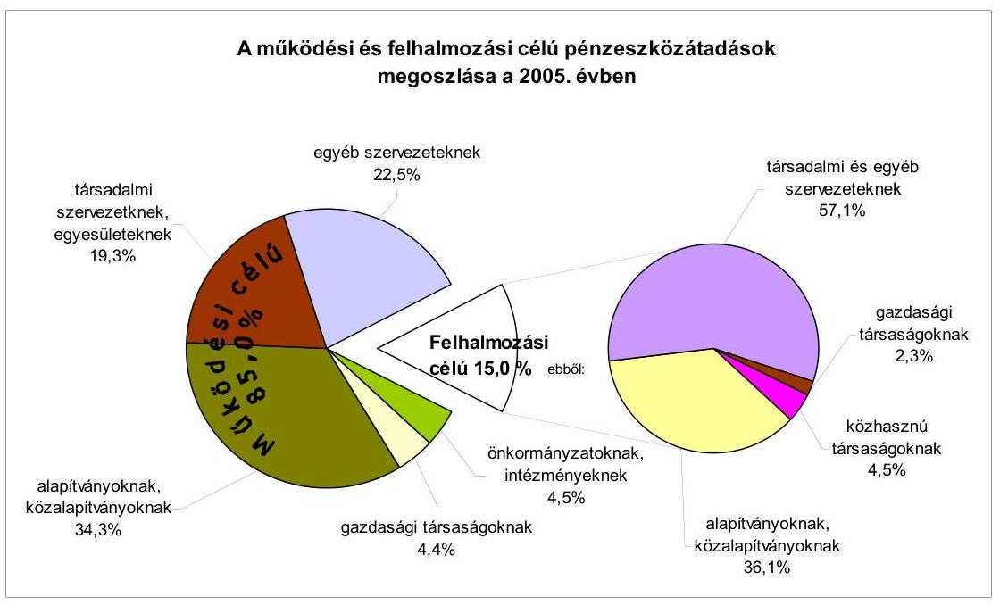
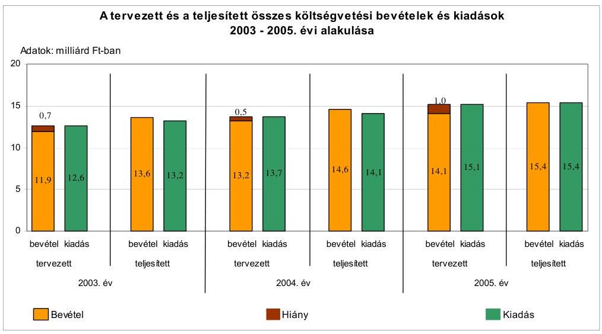
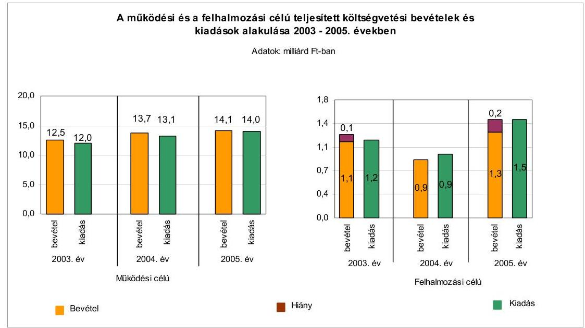
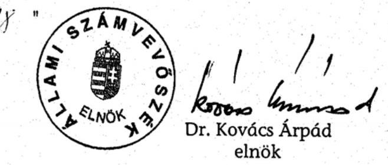
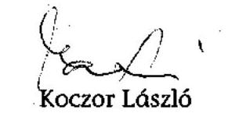
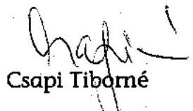
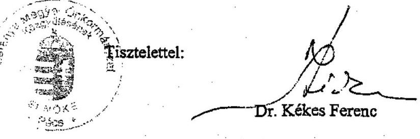

# JELENTÉS 

a Baranya Megyei Önkormányzat gazdálkodási rendszerének 2006. évi átfogó ellenőrzéséről

---

3. Önkormányzati és Területi Ellenőrzési Igazgatóság
3.2 Átfogó Ellenőrzések Főcsoport

Iktatószám: V-1003-5/23/16/2006.
Témaszám: 803
Vizsgálat-azonosító szám: V0269

# Az ellenőrzést felügyelte: 

Dr. Lóránt Zoltán
főigazgató
Az ellenőrzés végrehajtásáért felelős:
Dr. Sepsey Tamás
főigazgató-helyettes
Az ellenőrzést vezette:
Csecserits Imréné
főcsoportfőnök-helyettes
Az ellenőrzést végezték:
Alexovics Ágota
Koczor László
Pappné dr. Szamosi Éva
számvevő tanácsos
számvevő tanácsos

## A témához kapcsolódó eddig készített számvevőszéki jelentések:

## címe

Jelentés a helyi önkormányzatok tartós szociális ellátási feladatainak ellenőrzéséről az idősek otthonainál
Jelentés a helyi és a helyi kisebbségi önkormányzatok gazdálkodásának átfogó ellenőrzéséről
Jelentés a szakképzési struktúra szerepéről a munkaerő-piaci igények kielégítésében
Jelentés a 2003. április 12-én megtartott országos népszavazás lebonyolításához felhasznált pénzeszközök elszámolásának ellenőrzéséről
Jelentés a Magyar Köztársaság 2003. évi költségvetése végrehajtásának ellenőrzéséről
Függelék: A helyi önkormányzatok beruházásaihoz és rekonstrukcióihoz nyújtott 2003. évi felhalmozási célú támogatások
Jelentés a címzett támogatásból finanszírozott egészségügyi beruházások, rekonstrukciók ellenőrzéséről
Jelentés a helyi önkormányzati fürdők - kiemelten a gyógyfürdők helyzete, fejlesztésének lehetőségei az idegenforgalomra és a turizmusra

---

# TARTALOMJEGYZÉK 

BEVEZETÉS ..... 5
I. ÖSSZEGZŐ MEGÁLLAPÍTÁSOK, KÖVETKEZTETÉSEK, JAVASLATOK ..... 7
II. RÉSZLETES MEGÁLLAPÍTÁSOK ..... 16

1. A költségvetés tervezésének, végrehajtásának, az Önkormányzat vagyongazdálkodásának és a zárszámadás elkészítésének szabályszerűsége ..... 16
1.1. A költségvetési rendelet jóváhagyásának, módosításának, az előirányzatok nyilvántartásának szabályszerűsége ..... 16
1.2. A gazdálkodás szabályozottsága, a bizonylati rend és fegyelem szabályszerűsége ..... 16
1.3. A pénzügyi-számviteli feladatok ellátásának informatikai támogatottsága ..... 27
1.4. Az önkormányzati vagyon nyilvántartása, számbavétele ..... 28
1.5. A vagyonnal való gazdálkodás szabályszerűsége, célszerűsége, nyilvánossága ..... 28
1.6. A céljelleggel nyújtott támogatások szabályszerűsége ..... 30
1.7. A közbeszerzési eljárások szabályszerűsége ..... 44
1.8. A zárszámadási kötelezettség teljesítésének szabályszerűsége ..... 47
2. Az önkormányzati feladatok és a rendelkezésre álló források összhangja ..... 49
2.1. A feladatok meghatározása és szervezeti keretei ..... 49
2.2. A költségvetés egyensúlyának helyzete ..... 53
2.3. A feladatok finanszírozása ..... 59
3. A belső ellenőrzési rendszer működésének értékelése ..... 63
3.1. Az ellenőrzési rendszer kialakítása, működése ..... 63
3.2. A könyvvizsgálati kötelezettség teljesítése ..... 66
3.3. A korábbi számvevőszéki ellenőrzések javaslatainak hasznosulása ..... 66

---

# MELLÉKLETEK 

1. számú Az Önkormányzat gazdálkodását meghatározó adatok, mutatószámok (1 oldal)
2. számú Az önkormányzati vagyon nagyságának alakulása (1 oldal)
3. számú Az Önkormányzat 2005. évi bevételeinek és kiadásainak alakulása (1 oldal)
4. számú Egyes önkormányzati feladatok finanszírozása (1 oldal)
5. számú Helyszíni ellenőrzési jegyzőkönyv (3 oldal)
6. számú Dr. Kékes Ferenc úr, a Baranya Megyei Önkormányzat Közgyűlésének elnöke által adott észrevétel (1 oldal)

---

# RÖVIDÍTÉSEK JEGYZÉKE 

## Törvények

Áht.
Art. ${ }_{1}$
Art. ${ }_{2}$
Gytv.
Htv.

Jog. tv.
Kbt.
Költségvetési tv.
Közokt. tv.
Ksztv.
Ötv.
Számv. tv.
Szoc. tv.

## Rendeletek

Ámr.
Ber.
Vhr.

## Szórövidítések

ÁSZ
értékelési szabályzat ${ }_{1}$
értékelési szabályzat ${ }_{2}$
FEUVE
föjegyző
Gazdasági bizottság
Gazdasági bizottság
gazdasági szervezet ügyrendje
GESZ
Gyermekkórház
az államháztartásról szóló 1992. évi XXXVIII. törvény
az adózás rendjéről szóló 1990. évi XCI. törvény
az adózás rendjéről szóló 2003. évi XCII. törvény
a gyermekek védelméről és a gyámügyi igazgatásról szóló 1997. évi XXXI. törvény
a helyi önkormányzatok és szerveik, a köztársasági megbízottak, valamint egyes centrális alárendeltségű szervek fel-adat- és hatásköreiről szóló 1991. évi XX. törvény
a jogalkotásról szóló 1987. évi XI. törvény
a közbeszerzésekről szóló 2003. évi CXXIX. törvény
a Magyar Köztársaság 2006. évi költségvetéséről szóló 2005. évi CLIII. törvény
a közoktatásról szóló 1993. évi LXXIX. törvény
a közhasznú szervezetekről szóló 1997. évi CLVI. törvény
a helyi önkormányzatokról szóló 1990. évi LXV. törvény
a számvitelről szóló 2000. évi C. törvény
a szociális igazgatásról és szociális ellátásokról szóló 1993. évi III. törvény
az államháztartás múködési rendjéről szóló 217/1998. (XII. 30.) Korm. rendelet
a költségvetési szervek belső ellenőrzéséről szóló 193/2003. (XI. 26.) Korm. rendelet
az államháztartás szervezetei beszámolási és könyvvezetési kötelezettségének sajátosságairól szóló 249/2000. (XII. 24.) Korm. rendelet

Állami Számvevőszék
a főjegyző által kiadott, 2002. július 1-től 2005. december 22-ig hatályos eszközök és források értékelési szabályzata
a főjegyző által kiadott, 2005. december 22-től hatályos eszközök és források értékelési szabályzata
folyamatba épített, előzetes és utólagos vezetői ellenőrzési rendszer
Baranya Megyei Önkormányzat főjegyzője
Baranya Megyei Közgyűlés Gazdasági Bizottsága
Baranya Megyei Közgyűlés Költségvetési és Gazdasági Bizottsága 2005. február 17-től
a főjegyző által kiadott, 2006. május 1-től hatályos a gazdasági szervezet ügyrendje
Baranya Megyei Önkormányzat Gazdasági Ellátó Szervezete
Baranya Megyei „Kerpel-Fronius" Gyermekkórház

---

Gyógyfürdőkórház
HEFOP
Hivatal
hivatali ügyrend
Igazgatási és Ügyrendi bizottság
Illetékhivatal
közbeszerzési szabályzat
Közgazdasági osztály
Közgyűlés
Közgyűlés elnöke
lakásgazdálkodási rendelet
leltározási szabályzat ${ }_{1}$
leltározási szabályzat ${ }_{2}$
OEP
Önkormányzat
pénzkezelési szabályzat ${ }_{1}$
pénzkezelési szabályzat ${ }_{2}$
pénzkezelési szabályzat ${ }_{2}$
a 2003. augusztus 1-től 2005. december 22-ig hatályos pénzkezelési szabályzat, mely a Baranya Megyei Önkormányzat Hivatala Ügyrendjének 2. számú függeléke, 2003. november 15-én, 2003. december 1-jén, 2004. május 1-jén és 2004. november 8-án módosították
a 2005. december 22-től hatályos pénzkezelési szabályzat, mely a Baranya Megyei Önkormányzat Hivatala Ügyrendjének 2. számú függeléke
Baranya Megyei Közgyűlés Pénzügyi Bizottsága
a főjegyző által kiadott, 2001. november 1-től 2005. december 22-ig hatályos számviteli politikája
a főjegyző által kiadott, 2005. december 22-től hatályos számviteli politikája
Baranya Megyei Önkormányzatának 15/1990. (VI. 1.) számú rendelete a Baranya Megyei Önkormányzat és Szervei Szervezeti és Müködési Szabályzatáról
Baranya Megyei Önkormányzatának 6/2003. (VI. 16.) számú rendelete a Baranya Megyei Önkormányzat és Szervei Szervezeti és Müködési Szabályzatáról
a Baranya Megyei Önkormányzat 26/1999. (XII. 30.) számú rendelete a vagyonáról és vagyongazdálkodásáról rendelet

---

# JELENTÉS   a Baranya Megyei Önkormányzat gazdálkodási rendszerének 2006. évi átfogó ellenőrzéséről 

## BEVEZETÉS

Az Ötv. 92. § (1) bekezdése, az Állami Számvevőszékről szóló 1989. évi XXXVIII. törvény 2. § (3) bekezdése, valamint az Áht. 120/A. § (1) bekezdése alapján az önkormányzatok gazdálkodását az Állami Számvevőszék ellenőrzi. Az ellenőrzésre az Országgyúlés illetékes bizottságai részére is átadott, országosan egységes ellenőrzési program alapján került sor.

## Az ellenőrzés célja annak értékelése volt, hogy:

- az önkormányzati gazdálkodás törvényességét ${ }^{1}$. szabályszerűségét biztosított-ták-e a tervezés, a költségvetés végrehajtása, a vagyongazdálkodás és a zárszámadás során;
- az Önkormányzat által ellátott feladatok és az azokhoz rendelkezésre álló források összhangja biztosított volt-e, különös tekintettel egyes kiemelt feladatokra;
- a gazdálkodás szabályszerűségét biztosító kontrollok ${ }^{2}$ megfelelően segitettéke a végrehajtást.

Az ellenőrzött időszak: a 2005. év, valamint az 1.5., 2.1-2.3. és 3.3. ellenőrzési programpontok esetében a 2003-2004 évek is.

Baranya megye lakosainak száma 2006. január 1-jén 405427 fő volt. A megye területén 302 települési önkormányzat múködik.

Az Önkormányzatot 40 tagú Közgyűlés irányítja, amelynek munkáját nyolc állandó bizottság segíti. A Közgyűlés elnöke a 1998. évi önkormányzati képviselő választástól, míg a főjegyző 1998. július 1-től tölti be funkcióját.

[^0]
[^0]:    ${ }^{1}$ A törvényi előírások betartásának elmulasztásakor a részletes megállapítások fejezetben egységesen a törvénysértés megjelölést alkalmazzuk, mivel az ÁSZ nem tehet különbséget a törvényi előírások között.
    ${ }^{2}$ A gazdálkodás szabályszerűségét biztosító kontroll alatt értjük a kiépített és működő belső irányítási és szabályozási rendszert, valamint a belső ellenőrzési funkciók ellátását.

---

Az Önkormányzat a 2005. évben 15375 millió Ft költségvetési bevételből gazdálkodott, s a 2006. évre 15132 millió Ft költségvetési bevételt irányoztak elő. A teljesített költségvetési kiadás a 2005. évben 15410 millió Ft, a 2006. évre tervezett költségvetési kiadás 16608 millió Ft volt.

Az Önkormányzat vagyona a 2005. december 31-i könyvviteli mérleg szerint 14853 millió Ft, az adósságállomány értéke 2920 millió Ft volt.

Az Önkormányzat által fenntartott intézmények száma 2005. december 31-én 26 volt, melyből négy rendelkezett részben önálló gazdálkodási jogkörrel. Az Önkormányzatnak a 2005. év végén tizenkettő gazdasági társaságban volt egyben $100 \%$-os, egyben $76 \%$-os, kettőben $50 \%$-os, a többiben kisebbségi - tulajdoni részesedése.

A Hivatalban dolgozó köztisztviselők száma a 2005. év elején 139 fő volt, ami a 2005. év végére 142 fớre emelkedett, a költségvetési intézményekben foglalkoztatott közalkalmazottak száma ugyanezen időszakban 3144 fơről 3028 fốre csökkent. (Az Önkormányzat gazdálkodását meghatározó főbb adatokat, mutatószámokat a jelentés 1-3. számú mellékletei tartalmazzák.) A Hivatal rendelkezik a MSZ EN ISO 9001:2001 szabvány szerinti minőségirányítási rendszerrel.

A jelentés megállapításainak, javaslatainak egyeztetése során a Közgyűlés elnöke arról adott tájékoztatást, hogy az időközben megtett intézkedésekkel a javaslatok egy részét megvalósították. Ezekben az esetekben a jelentés II. Részletes megállapítások fejezetében az adott témához kapcsolt lábjegyzetben a megtett intézkedést feltüntettük és a kapcsolódó javaslatot elhagytuk.

A jelentést az ÁSZ-ról szóló 1989. évi XXXVIII. tv. 25. § (1) bekezdése alapján észrevétel közlése céljából megküldtük a Baranya Megyei Önkormányzat Közgyűlése elnökének. A kapott észrevételt a jelentés 6 . számú mellékleti tartalmazza.

---

# I. ÖSSZEGZŐ MEGÁLLAPÍTÁSOK, KÖVETKEZTETÉSEK, JAVASLATOK 

Az Önkormányzat a 2003-2006 évekre rendelkezett a feladatokat hosszabb távra kijelölő gazdasági programmal, amely alapját képezte az éves gazdálkodást meghatározó költségvetési tervező munkának. A 2005. és a 2006 évekre vonatkozó költségvetési koncepciókat az Ámr. előírásainak megfelelően, a helyben képződő bevételek és az ismert kötelezettségek figyelembe vételével készítették el, és azok tartalmazták a költségvetés készítésének további feladatait is. A Közgyűlés elnöke az Ámr. előírása szerint a költségvetési koncepciók előterjesztéséhez csatolta a Pénzügyi bizottság adott évi költségvetési koncepcióról alkotott véleményét.

A Közgyűlés meghatározta az Áht. alapján a költségvetés és a zárszámadás előterjesztésekor bemutatandó mérlegek, kimutatások tartalmi követelményeit. A Közgyűlés elnöke a 2005. és a 2006. évi költségvetési rendelettervezeteket az Áht-ban előírt határidőn belül terjesztette jóváhagyásra a Közgyűlés elé. A költségvetési rendeletek szerkezete megfelelt az Ámr-ben foglalt követelményeknek, azonban a költségvetési rendeletekben az Áht. előírását megsértve a költségvetési hiány összegének megállapításakor finanszírozási célú kiadást is figyelembe vettek, valamint a közvetett támogatások szöveges indoklását nem mutatták be. A Közgyűlés a 2005. évi költségvetés főösszegét évközben 11,6\%-kal növelte. Az előirányzat-módosításokat nyilvántartották és hitelt érdemlően dokumentálták.

A szervezeti és múködési szabályzatban meghatározták a Hivatal szervezeti felépítését és működési rendjét, szervezeti egységeinek megnevezését, feladatait. A hivatali ügyrendből az Ámr. előírása ellenére hiányzik a Hivatal alapító okiratának kelte, száma. A gazdasági szervezetnek az Ámr-ben foglalt előírása ellenére nem volt ügyrendje, azt a helyszíni vizsgálat ideje alatt készítették el. A gazdálkodási és ellenőrzési jogkörök gyakorlásának szabályait a Közgyűlés elnöke és a főjegyző a pénzkezelési szabályzatban határozta meg. A főjegyző az érvényesítési feladatokra adott megbízásoknál az iskolai végzettségre és a szakmai képesítésre vonatkozó követelményeket betartotta, azonban az Ámr. előírása ellenére belső szabályzatban nem jelölte ki a szakmai teljesítés igazolására jogosultakat. A gazdálkodási és ellenőrzési feladatokra felhatalmazottak beszámoltatása megtörtént. Az SzMSz ${ }_{2}$-ben a Htv-ben és az Ámr-ben előírtak ellenére kötelezettségvállalási jogkör gyakorlására a Közgyűlés elnökének hatáskörét elvonva a Közgyűlés adott felhatalmazást öt bizottság részére.

A főjegyző 2006. január 1-től alakította ki az Önkormányzat intézményeinek egységes számviteli rendjét a Htv. előírásainak megfelelően. A főjegyző a Hivatalra vonatkozóan elkészítette a számviteli politikát és a kapcsolódó szabályzatokat, valamint a számlarendet. A számviteli politikában a Vhr-ben előírtak ellenére nem határozták meg az immateriális javak és a tárgyi eszközök üzembe helyezésének dokumentálási szabályait, a leltározási szabályzatban nem a Vhr-ben előírtaknak megfelelően határozták meg az üzemeltetésre, kezelésre átadott eszközök leltározásának módját. A Hivatal a Vhr. előírása elle-

---

nére nem rendelkezett selejtezési szabályzattal, azt az ellenőrzés során készítették el. A számlarendben rögzítették az alkalmazandó főkönyvi számlák megnevezését, tartalmát, azok könyvvezetésének, illetve a beszámoló alátámasztásának sajátos módját, feladatait, a kapcsolódó analitikus nyilvántartások formáját, tartalmát, vezetésének módját. A munkaköri leírásokban az érvényesítésre és a pénztárellenőrzésre vonatkozóan rögzítették az elvégzendő tevékenységet megelőző művelet ellenőrzési kötelezettségét. Az ellenőrzésre, egyeztetésre vonatkozó előírások összhangját a szabályzatokban és a munkaköri leírásokban nem biztosították. A főjegyző az Ámr. előírásainak eleget téve a 2005. évben elkészítette a Hivatal ellenőrzési nyomvonalát, amely a hivatali ügyrend melléklete. A főkönyvi számlákhoz analitikus nyilvántartást vezettek, azok főkönyvi könyveléssel való egyeztetését elvégezték.

# A gazdálkodási és ellenőrzési jogkörök meghatározása és gyakorlása során az Ámr. összeférhetetlenségre vonatkozó szabályait betartották. Az Áht. előírását megsértve és az Ámr-ben foglaltak ellenére nem történt meg a kötelezettségvállalások írásba foglalása és ennek ellenjegyzése a bizonylatok 2\%-ánál. Az Ámr-ben előírtak ellenére a kiadási bizonylatok 38\%-ánál nem tüntették fel a kötelezettségvállalás nyilvántartásba vételének a sorszámát. A kötelezettségvállalást, utalványozást, azok ellenjegyzését és az érvényesítést az arra belső szabályzatokban felhatalmazottak végezték. A szakmai teljesítés igazolását a bizonylatok 45\%-ánál teljesítették, de a kijelölés hiánya miatt ezek nem feleltek meg az Ámr-ben előírtaknak. Az érvényesítés és az utalványozás ellenjegyzésének elvégzése a bizonylatok 2\%-ánál az Ámr-ben előírtak ellenére elmaradt. Az érvényesítők és az utalványozást ellenjegyzők a szakmai teljesítés igazolását az arra jogosultak kijelölése nélkül elfogadták, így az Ámr-ben előírt ellenőrzési feladatukat nem végezték el. Az utalványozási feladatok elvégzése az Ámr-ben előírtak ellenére a bizonylatok 2\%-ánál elmaradt. A pénztárellenőr a munkafolyamatba épített ellenőrzési feladatait a pénztári bizonylatok 3\%-a esetében nem látta el. A gazdasági eseményeket rögzítő bizonylatok 3\%-ánál a Számv. tv. előírását megsértve hiányzott a bizonylat azonosítója, kiállítójának megjelölése, a gazdasági esemény tartalmának leírása, illetve a gazdasági esemény értékbeni adata. A könyvviteli nyilvántartásban a bizonylatok 13\%-át nem a Vhr-ben előírt határidőn belül rögzítették. A Hivatalban 2005-ben vezették be a kötelezettségvállalások előirányzatonkénti nyilvántartási rendszerét. Az intézményeknél a költségvetés kiemelt előirányzatait a 2005. évben betartották, a Hivatalnál az Áht. előírását megsértve a kölcsönök nyújtása előirányzatát túllépték. A túllépés okait nem vizsgálták, felelősségre vonás nem történt.

A Hivatalban a pénzügyi és számviteli feladatellátásban manuális és számítógépes megoldásokat egyaránt alkalmaztak. A 2004. évtől bevezették az integrált számítógépes rendszert, melynek moduljai egymásra épülve kezelik az analitikus nyilvántartások, a pénzügyi és a főkönyvi könyvelés adatait. Az informatikai biztonsági szabályzatban a folyamatokat szabályozták, azonban a Hivatal informatikai stratégiával, valamint az informatikai rendszer üzemeltetési leírásával nem rendelkezett. Az informatikai rendszer program részletezésű hozzáférési jogosultsági rendszerét kialakították, de írásban nem rögzítették. A Közgazdasági irodán dolgozók felének a munkaköri leírásában nem szerepelt a munkakörhöz szükséges informatikai rendszer használatának feladata.

---

A Hivatalnál a Vhr-ben előírtaknak megfelelően a számviteli nyilvántartásokban gondoskodtak a törzsvagyon, ezen belül a forgalomképtelen és a korlátozottan forgalomképes törzsvagyon elkülönített nyilvántartásáról. Az Önkormányzatnál a leltározást az ingatlanok esetében mennyiségi felvétellel elvégezték, ez azonban a Vhr. előírása ellenére elmaradt az üzemeltetésre, kezelésre átadott eszközöknél. A részesedések, értékpapírok, a követelések és a kötelezettségek esetében a leltározást elvégezték. A 2005. évi leltár kiértékelések megtörténtek. Az analitikus nyilvántartást a leltározás során kimutatott többlettel korrigálták. A Hivatalban a 2005. évi könyvviteli mérleg készítésekor elvégezték a részesedések, követelések értékekését. Az Önkormányzatnál a Vhrben és az értékelési szabályzatában előírt módon csoportos eljárással végezték el az illetékkövetelés értékelését.

A vagyongazdálkodással kapcsolatos feladatokat az Önkormányzat szabályozta. A vagyonnal való rendelkezési, döntési hatásköröket célszerűen osztották meg a Közgyűlés, a Gazdasági bizottság, és a Közgyűlés elnöke között. A vagyonhasználat, hasznosítás jogának átadása esetén alkalmazandó versenyeztetési eljárás rendjét nem határozták meg. Az ingatlanok értékesítésére kiírt öt pályázati felhívást az értékesítési szabályzatban foglaltak ellenére nem tették közzé egy megyei napilapban és szükség szerint legalább egy országos napilapban, hanem azokat csak az Önkormányzat honlapján jelentették meg. Az Áht-t megsértve a nem normatív, céljellegú, fejlesztési támogatások közül kilenc támogatás szerződésének és a nettó ötmillió Ft-ot elérő, vagy azt meghaladó értékű öt szerződésnek az Áht. szerinti adatait az Önkormányzat honlapján nem tették közzé. A vagyongazdálkodási rendeletben előírtaknak megfelelve a Közgyűlés döntött az ingatlanok értékesítésre történő kijelöléséről, ennek alapján az értékesítés részletes feltételeit a Gazdasági bizottság határozta meg. Két esetben a Gazdasági bizottság vevő kiválasztásakor az értékesítés kijelölésénél figyelembe vett értékbecslés már nem volt hatályos, egy esetben pedig a Gazdasági bizottság tájékoztatása, egyetértése nélkül a Hivatal jogtanácsosa a visszalépett vevő helyett jelentkezőt szerepeltette az adásvételi szerződésben. A Közgyűlés 2006-ban a Gyógyfürdőkórház kht-vá történő átalakításáról döntött, azonban a döntést megelőzően részletes gazdaságossági számításokat nem végeztetett. A társaságba apportált eszközök értékét az Áht. előírását betartva, könyvvizsgáló állapította meg. A 2003-2005 közötti időszakban három térítésmentes ingatlanátadás az Áht. előírását megsértve, a vagyongazdálkodási rendeletben meghatározottaktól eltérő esetekben történt.

Az Önkormányzat a 2005. évben 325,2 millió Ft céljellegú támogatást nyújtott. Hét közhasznú társaság részére nyújtott támogatásnál a Ksztv-ben foglaltak ellenére szerződésben nem írták elő a támogatással való elszámolás feltételeit és módját. Az alapítványok részére nyújtott támogatások 2\%-áról az Ötv. előírását megsértve nem a Közgyűlés döntött. A támogatások rendjét szabályozták, melyben rögzítették a támogatásokra vonatkozó megállapodások főbb tartalmi követelményeit. A szabályozás alapján a Pénzügyi bizottság jogosult ellenőrizni a számadási kötelezettség teljesítését és a támogatás rendeltetés szerinti felhasználását. Nem szabályozták az elszámolások ellenőrzésének módját, feltételeit. Nem alakították ki a céljellegű támogatások nyilvántartásának olyan rendszerét, amely tartalmazza az elszámolás előírt határidejét, valamint annak tényleges teljesítését. A támogatási döntésekben meghatározták a támogatás célját, összegét és a támogatásban részesülők részére számadási

---

kötelezettséget, határidőt írtak elő. A Hivatalban a határidőre nem teljesített elszámolások miatt a támogatottak részére felszólító leveleket küldtek. Az elnöki és a bizottsági keretek terhére adott támogatások felhasználásáról kapott elszámolások felülvizsgálatát a szakirodák ügyintézői az ellenőrzés eredményének dokumentálása nélkül végezték. A bizottsági és Közgyűlés elnöki keretekből adott támogatásokra vonatkozó számadásokról készített tájékoztatást a Pénzügyi bizottság félévente megtárgyalta és határozatban döntött azok elfogadásáról. A Közgyűlés által adott támogatásokról szóló számadásokat a szakirodák ügyintézői ellenőrizték, azonban a számadási kötelezettségüket teljesítők elszámolásainak ellenőrzésénél a támogatások 3\%-ánál az előírt számlamásolatok helyett szállítólevelet, illetve megrendelést is elfogadtak. Támogatási céltól eltérő, jogsértő felhasználást nem állapítottak meg. A támogatások rendeltetésszerű felhasználását az Áht. előírását megsértve, és a helyi szabályozás ellenére a Pénzügyi bizottság nem ellenőrizte. Az ÁSZ egy kedvezményezettnél ellenőrizte a támogatás rendeltetésszerinti felhasználását, melynek során megállapítottuk, hogy a támogatott számadásában 20 ezer Ft rendeltetésszerinti felhasználásáról tájékoztatást a finanszírozónak nem adott. A számadások ellenőrzése során az eltérést nem állapították meg a Hivatalban, a Közgyűlés elnöke az Áht. előírását megsértve a támogatás el nem számolt részének visszafizetésére intézkedést nem tett.

A Hivatal elkészítette a 2005. és a 2006. évi közbeszerzési tervét és közbeszerzési szabályzatát. A Hivatalnál az ajánlatkérők nevében eljáró és az eljárásba bevont személyek megfelelő közbeszerzési és pénzügyi szakértelemmel rendelkeztek. A beszerzések becsült értékének meghatározásánál és az ellenőrzött közbeszerzési eljárás lebonyolításánál betartották a Kbt-ben előírtakat. A felügyeleti és a belső ellenőrzés rendszerében ellenőrizték a közbeszerzési eljárások lefolytatását. Az Önkormányzattal szemben a Közbeszerzési Döntőbizottság előtt a 2005. év folyamán nem indult eljárás.

A Közgyűlés elnöke a 2005. évi zárszámadási rendelettervezetet az Áht-ban előírt határidőn belül nyújtotta be a Közgyűlésnek. A zárszámadási rendelet megfelelt az Áht-ban és az Ámr-ben a zárszámadásra vonatkozóan előírt tartalmi, szerkezeti követelményeinek. A Közgyűlés az Ámr. alapján az intézmények pénzmaradványát a zárszámadás keretében jóváhagyta. A költségvetési szerveket az éves számszaki beszámolójuk és múködésük elbírálásáról, jóváhagyásáról értesítették.

Az Önkormányzat a kötelező és az önként vállalt feladatok körét az SzMSz ${ }_{1,2}{ }^{-}$ ben rögzítette. Az Önkormányzat feladatait intézményeivel, az általa alapított, vagy résztulajdonában álló közhasznú és gazdasági társaságokkal, a települési önkormányzatokkal közösen alapított társulásaival, alapítványokkal, egyesülettel, valamint társadalmi szervezetekkel oldotta meg. Az intézmények száma 2003-2006. I. negyedéve közötti időszakban 26-ről 23-ra csökkent. Ugyanezen időszakban az önkormányzati feladatot ellátók száma nyolc társasággal, egy alapítvánnyal, két társadalmi szervezettel, valamint tíz társulással bővült. Az Önkormányzat 2003-2005 között a kötelező és az önként vállalt feladatok ellátásához a forrásokat biztosította. A Közgyűlés a feladatellátás szervezeti megoldásában történt változásokat az ágazati fejlesztési koncepciók, valamint az intézményi beszámolók tárgyalása keretében áttekintette, megállapította, hogy a

---

szervezeti megoldások módosítása eredményeként a gazdálkodás hatékonyabb, szabályszerűbb.

Az Önkormányzat a 2003-2005 években költségvetésében hiányt tervezett. A tervezett hiány a költségvetési főösszeghez viszonyítva 3,9-6,6\% közötti, változó arányú volt. Az Önkormányzatnál 2003-2005 között a felhalmozási kiadásokat nem fedezték felhalmozási bevételek. A 2003-2004 években tervszinten mutatkozó hiányt megszüntette a tervezettnél magasabb összegű intézményi működési bevétel, az illeték-bevételi többlet, a működési célra átvett pénzeszköz, valamint az intézményeknél történt létszámleépítések miatti személyi juttatások csökkenése. A 2005. évben a múködési bevételi többlet már nem ellensúlyozta a felhalmozási célú kiadások hiányát, melyet fejlesztési célú, hoszszú lejáratú hitelfelvétellel pótoltak. Az Önkormányzat a rövid távú pénzügyi egyensúly fenntartására 2003-2004-2005. évben folyószámlahitelt vett fel. Kedvezőtlen tendencia, hogy folyószámla-hitelt év végén sem tudták visszafizetni, annak összege évről-évre nőtt. A hitelfelvételek során az adósságot keletkező kötelezettségvállalás felső korlátját nem lépték túl. Az Önkormányzat eredményesen pályázott az európai uniós támogatásokra, melynek eredményeként a 2005. évben nyolc európai uniós támogatásokból megvalósuló projektje volt.

A naturális mutatókkal mérhető oktatási és szociális feladatok ellátásánál a források és kiadások alakulását befolyásolták a közüzemi díjak emelkedése, a 2003-2005 között a központi bérintézkedések, valamint az intézményrendszerben történt szervezeti változások. A feladatok finanszírozásában az állami hozzájárulások, támogatások aránya a 2003. évihez képest a 2005. évre a középfokú oktatásnál növekedett, az óvodai nevelésnél, az általános iskolai oktatásnál és a bentlakásos szociális intézményi ellátásnál csökkent, melyet az önkormányzati támogatások arányának növekedése ellensúlyozott. A bentlakásos szociális intézményi ellátásnál közel egyharmad volt a feladatfinanszírozásban az intézményi saját bevételek részaránya. Az Önkormányzat a kötelező feladatai mellett az önként vállalt feladataira az éves költségvetési kiadása $2,4 \%-2,1 \%-1,5 \%$-át fordította. Az önként vállalt feladatok nem veszélyeztették a kötelező feladatai teljesítését.

A fogyatékos személyek jogairól és esélyegyenlőségéről szóló törvény végrehajtásához szükséges akadálymentesítési feladatokat felmérték. A 2005. december 31-i felmérés szerint a középületek 54\%-ánál az akadálymentesítést megoldották. Az Önkormányzat a fogyatékos személyek jogiról és esélyegyenlőségének biztosításáról szóló törvényben előírtakat megsértve 50 középület akadálymentes megközelíthetőségét még nem biztosította.

A Közgyűlés döntése alapján a Hivatal belső ellenőrzését és az intézmények felügyeleti, pénzügyi ellenőrzését az Ellenőrzési csoport látja el, amely a főjegyző közvetlen irányítása alá tartozik és a feladatát a hivatali ügyrend határozta meg. A belső ellenőrök iskolai végzettsége és szakmai képesítése megfelelt a Ber-ben előírtaknak. A belső ellenőrök Áht-ban előírt funkcionális függetlensége érvényesült, de az Áht-ban előírtak ellenére a feladatköri függetlenség nem érvényesült, mivel a belső ellenőrzést végzők az ellenőrzési tevékenységen kívül más feladatot is elláttak.

---

Az ellenőrzési vezető elkészítette, a főjegyző jóváhagyta a belső ellenőrzési kézikönyvet, kockázatelemzés alapján a 2005. és a 2006. évi ellenőrzési terveket, valamint a stratégiai tervet. A 2005. évi ellenőrzési terv szerint az ellenőrzési csoport hat pénzügyi-, egy teljesítmény-, hét szabályszerűségi ellenőrzést tervezett, az ellenőrzések közül két szabályszerűségi ellenőrzést terveztek a Hivatalban. A tervezett ellenőrzéseket elvégezték. Az ellenőrzések lefolytatásához ellenőrzési program és megbízólevél készült. Az elvégzett ellenőrzésekről a Berben foglaltaknak megfelelő tartalmú ellenőrzési jelentések készültek. Az Önkormányzat főjegyző́je az Áht-ban előírt belső ellenőrzési feladatnak a 2005. évben eleget tett. A főjegyző 2005. évre vonatkozóan a Hivatal és az intézmények belső ellenőrzésre előírt beszámolót elkészítette. A jelentést a Közgyűlés elnökének előterjesztése alapján a Közgyűlés elfogadta, elvárásokat nem fogalmazott meg.

Az Önkormányzat az Ötv-nek megfelelve könyvvizsgálati kötelezettségének eleget tett. A könyvvizsgáló az Önkormányzat 2005. évi költségvetési beszámolóját hitelesítő záradékkal látta el, auditálási eltérést nem állapított meg.

Az ÁSZ 2003-2005 között az Önkormányzatnál hét vizsgálatot végzett, melyek megállapításairól tájékoztatták a Közgyűlést. A számvevői jelentések szabályszerűségi és célszerűségi javaslatainak több mint kilenctizedét teljes mértékben, vagy részben végrehajtották, amelyek eredményeként javult a feladatellátás törvényessége és szabályozottsága. A helyi önkormányzatok tartós szociális feladatainak ellátását az idősek otthonainál vizsgáltuk, melynek során megfogalmazott javaslatok hatására az Önkormányzat szolgáltatástervezési koncepciót készített, felülvizsgálta és elkészítette az intézmény működésére vonatkozó szakmai programot és gondozási csoportokat alakított ki. Az Önkormányzat gazdálkodását átfogó jelleggel a 2002. évben vizsgáltuk. Az ellenőrzés hét szabályszerűségi és 15 célszerűségi javaslatot fogalmazott meg, melynek négyötödét az Önkormányzat megvalósította. A szakképzési struktúra szerepéről a munkaerő-piaci igények kielégítése témában végrehajtott ellenőrzés javaslatot nem fogalmazott meg. A 2003. április 12-én megtartott országos népszavazás lebonyolításához felhasznált pénzeszközök elszámolásának ellenőrzése témában végrehajtott ellenőrzés során tett javaslatot követően a 2005. évben helyszíni ellenőrzést végeztek a 2005. évi népszavazással kapcsolatban felmerült pénzeszközök elszámolásáról. A 2003. évi felhalmozási célú támogatások ellenőrzése hatására az Önkormányzat elfogadta a közbeszerzési értékhatár alatti árubeszerzések és szolgáltatások beszerzésének helyi szabályait. A címzett támogatásból finanszírozott egészségügyi beruházások, rekonstrukciók ellenőrzése témában végrehajtott ellenőrzés hatására a 2005. évben az éves közbeszerzési tervben ütemtervet készítettek. A helyi önkormányzati fürdők helyzete, fejlesztésének lehetőségei az idegenforgalomra és a turizmusra témában végrehajtott ellenőrzés során szabályszerűségi javaslatot nem tett a vizsgálat.

---

A helyszíni ellenőrzés megállapításainak hasznosítása mellett javasoljuk:

# a Közgyülés elnökének 

a jogszabályi előírások maradéktalan betartása érdekében:

1. kezdeményezze az $\mathrm{SzMSz}_{2}$ módosítását annak érdekében, hogy kötelezettségvállalási jogkörrel a Htv. 139. § (1) bekezdésének d) pontjában és az Ámr. 134.§ (2) bekezdésében előírtaknak megfelelően csak a Közgyűlés elnöke által felhatalmazott személyek rendelkezzenek;
2. biztosítsa, hogy az Áht. 98. § (2) bekezdésében és az Ámr. 134. § (8) bekezdésében előírtaknak megfelelően megtörténjen a kötelezettségvállalások írásba foglalása;
3. gondoskodjon az utalványozási feladatok Ámr. 136. § (2) bekezdésében előírtaknak megfelelő ellátásáról;
4. gondoskodjon arról, hogy az ingatlanok térítésmentes átadása az Áht. 108. § (2) bekezdésében előírtak alapján csak a vagyongazdálkodási rendeletben meghatározott esetekben történjen;
5. biztosítsa, hogy az Ötv. 10. § (1) bekezdés d) pontjában foglaltak betartatása érdekében az alapítványok és a közalapítványok támogatásáról a Közgyűlés döntsön;
6. kezdeményezze, az Áht. 13/A. § (2) bekezdésben foglalt ellenőrzési feladat végrehajtása érdekében, hogy a Pénzügyi bizottság tegyen eleget a céljellegú támogatások esetében a költségvetési rendeletben meghatározott ellenőrzési feladatainak;
7. gondoskodjon arról, hogy a rendeltetési céltól eltérően felhasznált összeget az Áht. 13/A. § (2) bekezdésében előírtak alapján a támogatott visszafizesse;
8. gondoskodjon a Ksztv. 14. § (2) bekezdésében előírtak betartása érdekében arról, hogy a közhasznú szervezetek céljellegú támogatása esetén szerződésben írják elő a támogatással való elszámolás feltételeit és módját;
9. gondoskodjon a középületek akadálymentessé tételéről, tekintettel a fogyatékos személyek jogiról és esélyegyenlőségének biztosításáról szóló 1998. évi XXVI. törvény 29. § (6) bekezdésében előírtakra;
a munka színvonalának javítása érdekében:
10. terjessze a számvevőszéki jelentést a Közgyűlés elé, és a feltárt hiányosságok megszüntetése érdekében készíttessen intézkedési tervet határidők és felelősök megjelölésével;
11. gondoskodjon arról, hogy a - főjegyző által elkészített előterjesztés alapján - a Közgyűlés határozza meg a vagyonhasználat és a vagyonhasznosítás jogának átadása esetén alkalmazandó versenyeztetési eljárási rendet;

---

12. kezdeményezze, hogy a mindenkori költségvetési törvényben foglaltak figyelembevételével az Önkormányzat a Pécs Megyei Jogú Város Önkormányzatával az illetékbevétellel kapcsolatos kiadások megosztásáról megállapodást kössön;
13. kezdeményezze, hogy társaság alapítását megelőzően készüljön részletes gazdaságossági számítás;

# a föjegyzönek 

a jogszabályi előírások maradéktalan betartása érdekében:

1. gondoskodjon arról, hogy a költségvetési rendelettervezet előterjesztésekor mutassák be az Áht. 118. §-a alapján a közvetett támogatások szöveges indoklását;
2. gondoskodjon arról, hogy a hivatali ügyrend tartalmazza az Ámr. 10. § (4) bekezdés a) pontjának megfelelően a Hivatal alapító okiratának keltét, számát;
3. jelölje ki az Ámr. 135. § (3) bekezdés alapján a szakmai teljesítés igazolására jogosult személyeket;
4. biztosítsa, hogy a Hivatal gazdálkodásában
a) a gazdasági eseményeket rögzítő bizonylatok a bizonylat azonosítóját, a kiállítójának megjelölését, a gazdasági esemény tartalmának leírását, valamint a gazdasági esemény értékadatait tartalmazzák a Számv. tv. 167. § (1) bekezdés c), d), j) pontokban foglalt követelményeknek megfelelően;
b) végezzék el az Ámr. 134. § (8) bekezdése alapján a kötelezettségvállalás ellenjegyzését;
c) az érvényesítő és az utalvány ellenjegyzője végezze el az Ámr. 135. § (1) bekezdés, illetve az Ámr. 137. § (3) bekezdésében előírt ellenőrzési feladatát;
d) a pénzmozgással járó gazdasági események bizonylatainak adatait a Vhr. 51. § (1) bekezdés a) pontjában előírtaknak megfelelő időben rögzítsék a számviteli nyilvántartásokban;
5. intézkedjen annak érdekében, hogy a Hivatal az Áht. 93. § (1) bekezdésében foglaltaknak megfelelően a jóváhagyott előirányzatokon belül gazdálkodjon;
6. biztosítsa, hogy az Áht. 15/A. § (1) bekezdésében előírtak alapján a nem normatív, céljellegű, fejlesztési támogatások és az Áht. 15/B. § (1) bekezdésében előírtak alapján a nettó ötmillió Ft-ot elérő, vagy azt meghaladó értékű építési beruházások, szolgáltatás megrendelések, árubeszerzések adatait az Önkormányzat honlapján közzé tegyék;
7. biztosítsa, hogy az értékesítési szabályzat II. fejezet 6.2. pontjában előírtak alapján a meghatározott értékhatár feletti ingatlanok pályáztatási eljárása során a pályázati felhívást egy megyei napilapban és szükség szerint legalább egy országos napilapban tegyék közzé;

---

8. gondoskodjon arról, hogy pénztárellenőr tegyen eleget a pénzkezelési szabályzatban foglalt a munkafolyamatba épített ellenőrzési feladatainak;
9. biztosítsa, hogy a belső ellenőröket az Áht. 121/A. § (4) bekezdés e) pontjában előírtnak megfelelően az ellenőrzési tevékenységen kívül más tevékenység végrehajtásába ne vonják be;
a munka színvonalának javítása érdekében:
10. intézkedjen a Hivatal informatikai stratégiai tervének elkészítésére, az informatikai rendszer üzemeltetési leírásának és hozzáférési jogosultsági rendszerének írásba foglalására, valamint a Közgazdasági irodán dolgozók munkaköri leírásában a munkakörhöz szükséges informatikai rendszer használatának szerepeltetésére;
11. intézkedjen a szabályzatok és a munkaköri leírások ellenőrzésre, egyeztetésre vonatkozó előírásainak összehangolásáról;
12. vizsgálja meg, hogy a Komló külterület 0172/11 hrsz. alatti gyermekotthon értékesítési szerződésében a vevő megjelölése indokoltan tér-e el a Gazdasági bizottság ezen ingatlan értékesítésére vonatkozó döntésében foglaltaktól és amennyiben indokolt kezdeményezzen felelősségre vonást;
13. alakítsa ki a céljellegú támogatások elszámolása ellenőrzésének módját és feltételeit, valamint alakítsa ki a céljellegú támogatások nyilvántartásának olyan egységes rendszerét, amely tartalmazza a számadási kötelezettség teljesítésének határidejét, és annak teljesítését.

---

# II. RÉSZLETES MEGÁLLAPÍTÁSOK 

## 1. A KÖLTSÉGVETÉS TERVEZÉSÉNEK, VÉGREHAJTÁSÁNAK, AZ ÖNKORMÁNYZAT VAGYONGAZDÁLKODÁSÁNAK ÉS A ZÁRSZÁMADÁS ELKÉSZÍTÉSÉNEK SZABÁLYSZERŰSÉGE

### 1.1. A költségvetési rendelet jóváhagyásának, módosításának, az előirányzatok nyilvántartásának szabályszerűsége

A Közgyűlés az Ötv. 91. § (1) bekezdése alapján a 2003. évben az 53/2003. (IV. 17.) számú határozatával fogadta el az Önkormányzat 2003-2006 évekre vonatkozó gazdasági programját. A programban az országos, régiós, megyei helyzet elemzését követően meghatározták a stratégiai irányokat, ezen belül a prioritási célokat, feladatokat az Önkormányzat gazdálkodása, ágazati feladatai, nemzetközi kapcsolatai, önként vállalt feladatai területén. A program alkalmas volt arra, hogy alapját képezze az éves gazdálkodást megalapozó költségvetési tervező munkának.

Az Ámr. 28. § (1) bekezdése alapján a főjegyzö elkészítette a 2005. és a 2006. évekre vonatkozó költségvetési koncepciókat, amelyekben figyelembe vette a ciklusprogram célkitűzéseit, a törvény által előírt következő évi kötelezettségeket, a szerződéssel, a megállapodással, a közgyűlési határozattal alátámasztott feladatokat, a szerkezeti változásokat, szintre hozásokat, valamint a költségvetési szervek új célkitűzéseit és forrásigényét. Számba vette a központi költségvetésből származó bevételeket, a saját bevételeket, és meghatározta a számított költségvetési hiány összegeit. A 2005. és a 2006. évi költségvetési koncepciókat a Közgyűlés elnöke az Áht. 70. §-ában előírt határidőn ${ }^{3}$ belül - 2004. november 18-án, illetve 2005. november 17-én - nyújtotta be a Közgyűlésnek. A Közgyűlés elnöke az Ámr. 28. § (3) bekezdésében foglaltakat figyelembe véve a 2005. és a 2006. évi költségvetési koncepciók előterjesztéséhez csatolta a Pénzügyi bizottságnak az adott évi költségvetési koncepcióról alkotott véleményét. A Közgyűlés a koncepciók elfogadására hozott határozataiban ${ }^{4}$ az Ámr. 28. § (4) bekezdésében előírtak alapján rendelkezett a költségvetés készítésének további munkálatairól.

A Közgyűlés az Áht. 118. §-ában előírtakat megsértve, előterjesztés hiányában nem határozta meg rendeletben a költségvetés és a zárszámadás előterjesztésekor tájékoztatásul bemutatandó önkormányzati összevont mérleg, valamint a többéves kihatással járó döntésekről és a közvetett támogatásokról készítendő

[^0]
[^0]:    ${ }^{3}$ Az Áht. 70. §-a szerint a következő évre vonatkozó költségvetési koncepciót november 30-ig, a helyi önkormányzati képviselő-testület tagjai általános választásának évében legkésőbb december 15-ig kell a Közgyűlésnek benyújtani.
    ${ }^{4}$ A Közgyűlés 151/2004. (XI. 18.) számú és a 148/2005. (XI. 17.) számú határozatai.

---

kimutatások tartalmi követelményeit a 2005. évi költségvetési rendelettervezet előterjesztését megelőzően, azokat a 2005. és a 2006. évi költségvetési rendelettervezetek elfogadásakor határozta meg. A vagyonkimutatás tartalmi követelményeit a vagyongazdálkodási rendeletben határozta meg.

A 2005. és a 2006. évben a költségvetési rendelettervezetek összeállítását megelőzően az Ámr. 29. § (4) bekezdése alapján az intézményekkel történt egyeztetések eredményét írásban rögzítették.

A költségvetési rendelettervezeteket a Közgyűlés elnöke az Áht. 71. § (1) bekezdésében előírt határidőn ${ }^{5}$ belül - 2005. február 2-án és 2006. február 2-án - terjesztette jóváhagyásra a Közgyűlés elé. A képviselők tájékoztatása céljából a költségvetési rendelettervezetről kialakított bizottsági véleményeket és a könyvvizsgáló véleményét, valamint a módosító indítványokat a 2005. évben február 13-ig, a 2006. évben február 15-ig tették fel az Önkormányzat honlapjára ${ }^{6}$. Az előterjesztésekhez az Ámr. 29. § (9) bekezdésében foglalt kötelezettségnek megfelelően a Közgyűlés elnöke csatolta a Pénzügyi bizottság, valamint a könyvvizsgáló véleményét. A Közgyűlés a rendelettervezeteket a 2005. év február 17-i, valamint a 2006. év február 16- i ülésén fogadta el.

A Közgyűlés elnöke a 2005. és a 2006. évi költségvetési rendelettervezetek benyújtásakor, illetve azt megelőzően a Közgyűlés elé terjesztette azokat a rendelettervezeteket, amelyek a javasolt előirányzatokat megalapozták ${ }^{7}$. A 2005. és a 2006. évi költségvetési rendelettervezetek benyújtásakor a Közgyűlés elnöke az Áht. 71. § (2) bekezdésében foglaltakra tekintettel bemutatta a többéves elkötelezettségekkel járó kiadási tételek későbbi évekre vonatkozó kihatásait és ezen belül a tárgyévet követő két év várható előirányzatait is.

Az Önkormányzat a Közgyűlés elnökének előterjesztését elfogadva alkotta meg az 5/2005. (II. 25.) számú, valamint a 2/2006. (II. 22.) számú rendeleteit a 2005. és a 2006. évi költségvetésekről. A 2005. évi költségvetési rendeletben a költségvetési bevételt 14133,7 millió Ft-ban, a költségvetési kiadásokat

[^0]
[^0]:    ${ }^{5}$ Az Áht. 71. § (1) bekezdés szerinti határidő a tárgyév február 15-e.
    ${ }^{6}$ Az Önkormányzat honlapja jelszóval védett adatbázisban tartalmazta a képviselők részére megküldött dokumentumokat. Az állandó meghívottak postán kapták meg a költségvetési rendelettervezeteket. A postakönyv szerint az előterjesztéseket papíralapon a 2005. évben február 10-én, a 2006. évben február 2-án postázták.
    ${ }^{7}$ Az Önkormányzatnak a 18/2004. (XI. 24.) számú rendelet a Baranya Megyei Önkormányzat fenntartásában múködő nevelési-oktatási intézményekben a térítési díjak és a tandíj összegének megállapításáról és fizetésének szabályozásáról, a 19/2005. (XII. 20.) számú rendelet a megyei fenntartású nevelési-oktatási intézmények 2006. évi gyermekétkeztetési intézményi térítési díjairól, a 2/2005. (II. 24.) számú rendelet a személyes gondoskodást nyújtó gyermekvédelmi szakellátások formáiról, azok igénybevételéről és a fizetendő térítési díjakról, a 21/2005. (XI. 20.) számú rendelet a személyes gondoskodást nyújtó gyermekvédelmi szakellátások formáiról, azok igénybevételéről és a fizetendő térítési díjakról, a 4/2005. (II. 24.) számú rendelet a megyei fenntartású szociális intézmények 2005. évi térítési díjairól, a 20/2005. (XII. 20.) számú rendelet a megyei fenntartású szociális intézmények 2006. évi intézményi térítési díjairól.

---

15 329,8 millió Ft-ban, a költségvetési bevételek és kiadások különbözeteként a hiányt 1196,1 millió Ft-ban, a 2006. évi költségvetési rendeletben a költségvetési bevételeket 15 131,8 millió Ft-ban, a költségvetési kiadásokat 16608 millió Ft-ban, valamint a költségvetési bevételek és kiadások különbözeteként a hiányt 1476,2 millió Ft-ban hagyta jóvá ${ }^{8}$. A 2005. és a 2006. évi költségvetési rendeletekben 8/A. § (7) és az Áht. 8. § (1) bekezdésében foglaltakat megsértve, költségvetési kiadások előirányzatában, és a hiány megállapításánál finanszírozási célú pénzügyi műveletet, (hiteltörlesztést) is figyelembe vettek ${ }^{9}$.

Az Önkormányzat 2005. és 2006. évi költségvetési rendeletei az Áht. 67. § (3) bekezdésében foglalt előírásoknak megfelelően tartalmazták a címrend meghatározását. A költségvetési rendeletekben rögzítették az Áht. 69. § (1) bekezdésében foglaltaknak megfelelően a működési és a felhalmozási célú bevételeket és kiadásokat Önkormányzatra összesítve, ezen belül költségvetési szervenként a személyi jellegű kiadásokat, az ellátottak pénzbeni juttatásait, a speciális célú támogatásokat, a költségvetési létszámkeretet, valamint a felhalmozások előirányzatait. Bemutatták az Önkormányzat és a költségvetési szervek bevételeit főbb jogcím-csoportonkénti részletezettségben, a müködési, és a fenntartási előirányzatokat önállóan és részben önállóan gazdálkodó költségvetési szervenként, azon belül kiemelt előirányzatonként, a felújítási előirányzatokat célonként, a felhalmozási kiadásokat feladatonként részletezve az Ámr. 29. § (1) bekezdés a)-d) pontjaiban foglaltaknak megfelelően.

Az Ámr. 29. § (1) bekezdés e)-h), j)-k) pontjaiban előírtak alapján mutatták be:

- a Hivatal költségvetését feladatonként és külön tételben az általános és céltartalékot;
- az önállóan és részben önállóan gazdálkodó költségvetési szervenként az éves létszámkeretet;
- a többéves kihatással járó feladatok előirányzatait éves bontásban;
- a működési és a felhalmozási célú bevételi és kiadási előirányzatokat mérlegszerűen és együttesen egyensúlyban;
- az év várható bevételi és kiadási előirányzatainak teljesüléséről az előirány-zat-felhasználási ütemtervet, valamint
- elkülönítetten az európai uniós támogatással megvalósuló programok, projektek bevételeit, kiadásait és az Önkormányzaton kívüli ilyen projektekhez történő hozzájárulásokat.

A 2005. évi költségvetési rendeletben meghatározott Turizmusfejlesztési Támogatási Alap és Pályázati Alap elnevezések, mint elkülönített pénzügyi keretöszszegek, nem voltak összhangban az Áht-ban foglaltakkal, mert az Áht. 54. §-a

[^0]
[^0]:    ${ }^{8}$ A költségvetési bevételek és kiadások főösszegének eltérését a hiány, valamint a költségvetési kiadásokban figyelembe vett finanszírozási célú pénzügyi műveletek okozták.
    ${ }^{9}$ A Közgyűlés elnöke által adott mellékelt tájékoztatás szerint: „A költségvetési kiadások számbavételénél feltárt hibát a 2006. évi költségvetési rendelet módosítása során megszüntettük, így a módosított költségvetési rendeletben finanszírozási célú pénzügyi művelet már nem szerepel a költségvetési kiadások között."

---

az elkülönített állami pénzalapokra röviden az „alap" kifejezést használja, amelyekre meghatározza azok létrehozásának, gazdálkodásának feltételeit. E feltételeknek az Önkormányzat által létrehozott és nevesített alapok nem feleltek meg, a kifejezés félreérthető. Az államháztartás rendszerében a meghatározott feltételekhez kötött fogalom eltérő tartalmú alkalmazása bizonytalanságot okoz. A 2006. évi költségvetési rendeletben alapokat nem képeztek.

A 2005. és 2006. évi költségvetések végrehajtásának szabályait a Közgyűlés a következők szerint határozta meg:

- a Közgyűlés működésének nyári szünetében, az Áht. 74. § (2) bekezdése lehetőségével élve, az általa jóváhagyott előirányzatok közötti átcsoportosítás jogát az Igazgatási és Úgyrendi bizottságra ruházta át
- az Ámr. 53. § (4) bekezdésében, valamint az Áht. 93. § (4) bekezdésében foglaltakat figyelembe véve a 2005. és a 2006. évi költségvetési rendeletben meghatározták, hogy a költségvetési szervek többletbevételeikkel a Közgyűlés egyidejű tájékoztatása mellett a kiemelt előirányzataikat módosíthatják;
- az Áht. 73. § (3) bekezdése alapján a Közgyűlés elnöke részére rendelkezési jogot biztosított az általános tartalék terhére. Az Önkormányzat a 145/2005. (XI. 17.) számú határozatával a Közgyűlés elnökének hatáskörét szűkítve döntött arról, hogy az általános tartalék terhére kötelezettséget csak a feladatellátás során jelentkező vis major helyzetben vállalhat, valamint felkérte, hogy erre vonatkozó döntésénél a Gazdasági Bizottság állásfoglalását vegye figyelembe. A 2005-2006. évi költségvetési rendeletekben felhatalmazták a Közgyűlés elnökét az intézmények létszám csökkentésének várható egyszeri terhei jogcímen a céltartalékon belül elkülönített összeg felhasználására;
- az Áht. 75. §-ában foglaltak alapján meghatározták a hitelmúveleti hatáskört, amelyet a Közgyűlés saját döntési hatáskörében megtartott;
- az Áht. 8/A. § (1) bekezdésében foglaltak alapján a 2005. és 2006. évi költségvetési rendeletekben rendelkeztek a költségvetési bevételi többlet felhasználásáról.

A költségvetési rendeletek előterjesztésekor bemutatták az Áht. 118. §-a alapján az Önkormányzat összevont mérlegeit, a többéves kihatással járó döntések számszerűsítését évenkénti bontásban, összesítve, szöveges indoklással. A költségvetési rendeletek előterjesztésekor az Áht. 118. §-ában előírtakat megsértve a közvetett támogatások szöveges indoklását nem mutatták be.

Az Önkormányzat a 2005. évi költségvetését öt alkalommal módosította ${ }^{10}$. A végrehajtott módosítások következtében az Önkormányzat költségvetésének bevételi főösszege - hitelfelvétel nélkül - 1736,5 millió Ft-tal (12,3\%-kal), a hiteltörlesztés nélküli kiadási főösszeg 1750,4 millió Ft-tal (11,6\%-kal) nőtt. A költségvetési előirányzatok módosítására előterjesztett rendelettervezetek a költségvetéssel összehasonlíthatóan tartalmazták a módosítási javaslatokat. Az előterjesztésekben részletes számadatokkal indokolták a módosítások okait és megfelelő információt biztosítottak a Közgyűlés számára a rendeletek módosításához. Az előirányzat-változásokat hitelt érdemlően dokumentálták. Az Ön-

[^0]
[^0]:    ${ }^{10}$ Az Önkormányzat 8/2005. (IV. 29.), a 10/2005. (VI. 21.), a 12/2005. (IX. 19.), a 14/2005. (XI. 18.) számú, valamint az 1/2006. (II. 22.) számú rendeletei.

---

kormányzat az Ámr. 53. § (2) bekezdésében előírtak alapján a 2005-2006. február hó közötti időszakban a - Kormány és az Országgyűlés által biztosított pótelőirányzatokkal negyedéven belül módosította a költségvetési rendeletét. A költségvetési szervek saját hatáskörű előirányzat változtatásról a Közgyűlés elnöke a Közgyűlést tájékoztatta, amely miatt a Közgyűlés negyedévente módosította a költségvetési rendeletet.

# 1.2. A gazdálkodás szabályozottsága, a bizonylati rend és fegyelem szabályszerúsége 

Az SzMSz ${ }_{2}$ tartalmazta az Önkormányzat feladatainak, a Közgyűlés, a bizottságok múködésének, a Közgyűlés elnöke és az alelnökök feladatainak, valamint a Hivatal belső szervezeti egységeinek meghatározását. A hivatali ügyrendben ${ }^{11}$ rögzítették a Hivatal felépítését, feladatait, szakfeladatainak számát és megnevezését. A szervezeti szabályzattal szemben támasztott követelmények közül a hivatali ügyrend az Ámr. 10. § (4) bekezdés a) pontjában előírtak ellenére nem tartalmazta a Hivatal alapító okiratának keltét, számát. A hivatali ügyrend 1. számú függeléke tartalmazta az Ámr. 10. § (4) bekezdés f) pontjában előírt szervezeti felépítés bemutatását, a gazdasági szervezet felépítését. Az Ámr. 10. § (4) bekezdés g) pontjának megfelelően a hivatali ügyrend 2/C. számú függeléke tartalmazta a költségvetés végrehajtása érdekében vezetett bankszámlák számát. A gazdasági szervezethez részben önállóan gazdálkodó költségvetési szerv nem kapcsolódott.

A gazdasági szervezet (Közgazdasági iroda) ügyrendje a helyszíni vizsgálat alatt, 2006. május 1-től lépett hatályba. A gazdasági szervezet ügyrendje tartalmazta az Ámr. 17. § (5) bekezdésében előírtak alapján a vezetők és más dolgozók feladat-, hatás- és jogkörét.

Az operatív gazdálkodás rendjére vonatkozó előírásokat a pénzkezelési szabályzat ${ }_{1,2} 1$. számú melléklete tartalmazta. Szabályozták mind az 50 ezer Ft alatti és feletti kötelezettségvállalások módját és nyilvántartási kötelezettségét.

A gazdálkodási hatás- és jogköröket az alábbiak szerint szabályozták:

- a kötelezettségvállalási jogkör gyakorlására a pénzkezelési szabályzat ${ }_{1}$-ben az Ámr. 134. § (2) bekezdése alapján a Közgyűlés elnöke összeghatártól függetlenül felhatalmazta a Közgyűlés alelnökét távolléte esetére a kötelezettségvállalásra. A munkáltatói jogok gyakorlásával összefüggő kötelezettségvállalásra a főjegyzőt hatalmazta fel, távolléte esetére az aljegyzőt és az Önkormányzati és társadalmi kapcsolatok iroda vezetőjét. A pénzkezelési szabályzat ${ }_{2}$-ban a Közgyűlés elnöke a jogi és választási csoportvezetőt is felhatalmazta a munkáltatói jogok gyakorlásával összefüggő kötelezettségvállalási jogkör gyakorlására;
- a kötelezettségvállalás ellenjegyzésére a főjegyző a távolléte esetére a pénzkezelési szabályzat ${ }_{1,2}$-ben - az Ámr. 134. § (2) bekezdése alapján - az aljegyzőt, az Önkormányzati és társadalmi kapcsolatok iroda vezetőjét és négy csoportvezetőt hatalmazott fel;

[^0]
[^0]:    ${ }^{11}$ A hivatali ügyrend az SzMSz VIII. számú melléklete.

---

- az érvényesítési jogkörrel a főjegyző a Közgazdasági iroda köztisztviselőit bízta meg írásban. A megbízásoknál betartotta az Ámr. 135. § (2) bekezdésében megfogalmazott iskolai végzettségre és a szakmai képzettségre vonatkozó előírásokat;
- az utalványozási jogkör gyakorlására a Közgyűlés elnöke távolléte esetére öszszeghatártól függetlenül felhatalmazta a Közgyűlés alelnökét. A jogcímenként 10 millió Ft összeghatárt el nem érő kiadások és bevételek utalványozására a Közgyűlés elnöke a Közgazdasági iroda vezetőjét, távolléte esetére négy csoportvezetőt hatalmazott fel;
- az utalványozás ellenjegyzésére a főjegyzó a távolléte esetére a pénzkezelési szabályzat ${ }_{1,2}$-ben összeghatártól függetlenül az aljegyzőt, a Közgazdasági iroda vezetőjét, az Önkormányzati és társadalmi kapcsolatok iroda vezetőjét és egy csoportvezetőt hatalmazott fel.

A felhatalmazásoknál, megbízásoknál az Ámr. 135. § (5), 138. § (3) bekezdésében, és a 138. § (1)-(2) bekezdésekben az összeférhetetlenségre vonatkozó előírásokat betartották.

A szakmai igazolás módját a pénzkezelési szabályzat ${ }_{2} 1 /$ E. számú mellékletében előre nyomott bélyegző lenyomat kitöltésével szabályozták. A főjegyzö a belső szabályzatokban, az Ámr. 135. § (3) bekezdésében foglaltakkal szemben, nem jelölte ki a szakmai teljesítés igazolására jogosult személyeket.

A pénzkezelési szabályzat ${ }_{2} 1 /$ E. mellékletében megfogalmazottak szerint „az SzMSz,-ben meghatározott, feladatkör szerinti szervezeti egység kötelezettségvállalást előkészitő ügyintézője jogosult" szakmai teljesítés igazolására. A kötelezettségvállalás előkészítői ugyanakkor nincsenek kijelölve, ez a feladat a munkaköri leírásokban sem szerepel.

A felhatalmazások a jogkörök gyakorlásával kapcsolatban utólagos beszámolási kötelezettséget nem írtak elő, beszámoltatásra a vezetői értekezleteken került sor.

A Közgyűlés az $\mathrm{SzMSz}_{2}$ 4. számú mellékletében öt bizottságot ${ }^{12}$ hatalmazott fel kötelezettségvállalási jogkörrel. A felhatalmazásnál a Közgyűlés a Htv. 139. § (1) bekezdés d) pontjában előírtakat megsértve, és az Ámr. 134. § (2) bekezdésében előírtak ellenére - a polgármester hatáskörét elvonva - döntött a kötelezettségvállalásra jogosultakról.

A főjegyzö a Hivatalra vonatkozóan elkészítette, hatályba helyezte a számviteli politikát és a kapcsolódó szabályzatokat, valamint a számlarendet, azonban az Önkormányzat intézményeire érvényes egységes számviteli rendet, megsértve a Htv. 140. § (1) bekezdésének c) pontját csak 2006. január 1-től alakította ki. A főjegyző a számviteli politika ${ }_{1}$-ben a költségvetési évet követő február 15-ében, illetve a számviteli politika ${ }_{2}$-ben a költségvetési

[^0]
[^0]:    ${ }^{12}$ Az Egészségügyi, szociális és gyermekvédelmi bizottságot, a Költségvetési és gazdasági bizottságot, a Nemzeti és etnikai kisebbségi bizottságot, az Oktatási, kulturális, ifjúsági és sport bizottságot és a Területfejlesztési, idegenforgalmi, informatikai és foglalkoztatási bizottságot.

---

évet követő február 20-ában határozta meg a mérlegkészítés időpontját, azt az időpontot, ameddig helyesbítések végezhetők a könyvekben a tárgyévre vonatkozóan. Rögzítette a figyelembe veendő szempontokat a megbízható valós összkép kialakításánál, a kis értékű tárgyi eszközök, a vagyoni értékű jogok és a szellemi termékek minősítésénél, a terven felüli értékcsökkenés elszámolásánál. A számviteli politikában meghatározta a zárlati feladatok (havi, féléves, éves) elvégzésének időpontját, módját.

A főjegyző a jelentős összegű hiba nagyságát a mérleg főösszeg 2\%-ában, illetve 500 millió Ft-ban határozta meg, melyet a számviteli politika ${ }_{2}$-ben a mérleg főösszeg $2 \%$-ára, illetve 100 millió Ft-ra módosított. A Vhr. 8. § (5) bekezdés g) pontban megfogalmazottak ellenére a számviteli politika ${ }_{1}$-ben nem szabályozta, hogy mit tekint figyelembe veendő szempontnak a jelentős összeg tekintetében a terven felüli értékcsökkenés és a Vhr. 8. § (4) bekezdés b) pontban megfogalmazottak ellenére az értékvesztés elszámolásánál. Ezt a hiányosságot pótolta a számviteli politika ${ }_{2}$-ben, ahol a jelentős összeg értékét eszközönként 100 ezer Ft-ban határozta meg. A számviteli politika ${ }_{2}$ rendelkezik arról, hogy terven felüli értékcsökkenést kell elszámolni, ha az önkormányzati forgalomképes ingatlanok könyv szerinti értéke tartósan és jelentősen magasabb, mint az eszköz piaci értéke. A jelentős összegű árfolyamváltozás értékét a számviteli politika ${ }_{1}$-ben a mérleg főösszeg 5\%-ában határozta meg, melyet a számviteli politika $_{2}$-ben 10 ezer Ft-ra csökkentette. Nem rögzítette a Vhr. 8. § (7) bekezdés előírásai ellenére a beszerzett, illetve előállított immateriális javak, tárgyi eszközök üzembe helyezése dokumentálásának szabályait ${ }^{13}$. A főjegyző a számviteli politikában szabályozta, hogy nem élnek a befektetett eszközök esetén a piaci értékelés lehetőségével.

A főjegyző a számviteli politika részeként kiadta a leltározási szabályzat ${ }_{1,2}{ }^{-}$ ot. A leltározási szabályzat ${ }_{1,2}$ tartalmazta a leltározás célját, a leltározással kapcsolatos fogalmakat, a leltár felvétel módját, a leltározásban résztvevők feladatait, felelősségük meghatározását. A szabályozás szerint a könyvviteli mérlegben kimutatott eszközök és források december 31-i értékét a Vhr. 37. § (1) bekezdésében előírtaknak megfelelően minden évben leltárral kell alátámasztani. Meghatározták a leltárkülönbözetek számviteli elszámolásának, valamint a hiányok és többletek rendezésének módját. Az ingatlanok leltározására évenkénti mennyiségi felvételt, míg az üzemeltetésre, kezelésre átadott eszközök leltározására a Vhr. 37. § (3) bekezdésében előírtak ellenére a nyilvántartások egyeztetési kötelezettségét írták elő ${ }^{14}$.

Az értékelési szabályzat ${ }_{1,2}$ tartalmazta az eszközök értékelésének eszközcsoportonkénti szabályait, amely megfelel a Vhr. 32-36. §-ában foglaltaknak. Meghatározták az eszközök bekerülési és előállítási értékébe be-

[^0]
[^0]:    ${ }^{13}$ A Közgyűlés elnöke által adott, mellékelt tájékoztatás szerint: „A számviteli politika kiegészítésre került az immateriális javak és tárgyi eszközök üzembe helyezése dokumentálásának szabályozásával."
    ${ }^{14}$ A Közgyűlés elnöke által adott, mellékelt tájékoztatás szerint: „Az üzemeltetésre átadott eszközök leltározási módjának szabályozása helyesbítésre került a 249/2000. (XII. 24.) Korm. rendelet 37. § (3) bekezdésében foglaltaknak megfelelően."

---

számítandó kiadásokat. A szabályzatok ${ }_{1,2}$-ban szerepel a terven felüli értékcsökkenés és az értékvesztés, annak visszaírása elszámolásának rendje. Rögzítették az értékpapírok forgóeszközként, illetve pénzügyi befektetésként minősítésének követelményeit. Az értékelési szabályzat ${ }_{2}$ 7.2.3. pontja tartalmazta a követelések értékelésének elveit, az áruszállításból és szolgáltatásnyújtásból származó követelések értékelése meghatározásának módját, az adós minősítési szempontjait és a kisösszegű követelések értékelésének szabályait a Vhr. 8. § (17) bekezdés a)-d) pontjaival összhangban. Rögzítették a piaci érték meghatározásának módszerét. A szabályzat ${ }_{1,2}$ szerint a piaci érték és nyilvántartási érték közötti különbözet jelentősnek minősül, ha a piaci érték legalább 20\%-kal, vagy 100 ezer Ft-tal eltér a nyilvántartási értéktől. A főjegyző a Hivatal értékelési szabályzatában az illetékkövetelés értékelésének módjára csoportos eljárással végzett értékelési kötelezettséget írt elő.

Az adósokat folyamatos múködésükben korlátozott és folyamatosan múködő adósokra bontották. A végrehajtható adósok tartozását lejáratuk szerint megbontották. A követeléseket az értékvesztés százalékos nagyságrendjét az előző év tapasztalati adatai alapján állapították meg. Az értékvesztés megállapítása tapasztalati adatok alapján történt.

A Hivatalban nem végeztek olyan tevékenységet, amely miatt önköltségszámítási szabályzatot kellett volna készíteni. Vállalkozási tevékenységet nem végeztek.

A Vhr. 8. § (4) bekezdés d) pontjában előírt pénzkezelési szabályzat ${ }_{1,2}$ tartalmazta az Ámr. 103. § (6) bekezdése alapján megnyitható bankszámlák körét, rendeltetését, az ügyfélterminál és az Önkormányzat által bérelt banki széf használatának a rendjét. Meghatározták a készpénz felvételének és a pénz szállításának, őrzésének rendjét, a bankszámlák és a pénztár kapcsolatrendszerét, a házipénztári záró keretösszeget, a pénztáros helyettesítésének rendjét, a pénztár átadásának és átvételének szabályait, az előlegek, utólagos elszámolásra átadott összegek nyilvántartásának és elszámolásának szabályait. A szabályzatokban rögzítették a pénztárellenőrzésért felelős munkaköröket ${ }^{15}$, a pénztárellenőrzés módját, feladatait, az ellenőrzésért felelős munkaköröket, a pénztár ellenőrzéssel kapcsolatos teendőket és az ellenőrzés gyakoriságát ${ }^{16}$. A szigorú számadású nyomtatványok nyilvántartásainak tartalmát szabályozták. Részletesen rögzítették a házipénztáron kívüli pénzkezelés szabályait.

A Hivatal a Vhr. 37. § (5) bekezdésében megfogalmazottak ellenére a selejtezést nem szabályozta, ezt a főjegyzö a vizsgálat alatt, 2006. május 15-én pótolta. A selejtezési szabályzat rendelkezett a vagyontárgyak hasznosításának - selejtezésének - jogköréről. Tartalmazta a feleslegessé válás ismérveit, a minősítési jogokat gyakorló munkaköröket, a hasznosítás formáit (értékesítés,

[^0]
[^0]:    ${ }^{15}$ A házipénztár ellenőri feladatokat a Közgazdasági iroda Pénzügyi-informatikai, vagyonkezelési és monitoring csoport köztisztviselője látja el a munkaköri leírás szerint.
    ${ }^{16}$ A szabályzatok heti pénztárzárást és ellenőrzést írtak elő.

---

térítés nélküli átadás) a hasznosítás és selejtezés eljárási rendjét, bizonylatolásuk szabályait, a selejtezési bizottság kijelölését, feladatait.

A főjegyző 2001. november 1-jén hagyta jóvá a Hivatal számlarendjét, amely tartalmazta a Vhr. 48. § (2) bekezdésének megfelelően a számlakeretet, az alkalmazandó könyvviteli számlák számát, megnevezését, valamint a számlaosztályok, főkönyvi számlák tartalmára vonatkozó előírásokat. A számlarend tartalmazta, a főkönyvi számlák egymás közötti kapcsolatát, az értékváltozás jogcímeit és alapbizonylatait. Meghatározták az analitikus nyilvántartások formáját, tartalmát, annak dokumentálását, az analitikus nyilvántartások főkönyvi könyveléssel való egyeztetésének módját. Nem tettek eleget a Vhr. 49. § (4) bekezdésében foglaltaknak, mert nem szabályozták az egyes főkönyvi számlákhoz kapcsolódó analitikus nyilvántartások adataiból készült összesítő bizonylatok elkészítésének határidejét. Nem határozták meg a Vhr. 9. számú melléklet 1. k) pontja ellenére a nyilvántartás olyan rendjét, amely segítségével megállapítható lenne a törzsvagyon részét képező eszközök értéke ${ }^{17}$.

A gazdálkodási jogkörök gyakorlásával, a bankszámla és készpénzforgalommal kapcsolatos pénzkezelési szabályzat ${ }_{1,2}$-ban előirták az előző munkafázis elvégzésének ellenőrzését, kijelölték az ellenőrzési pontokat, és meghatározták az elvégzendő műveleteket. Az eltérés megállapításának módját, dokumentálását, a szükséges teendőket az ellenjegyző és a pénztárellenőr tevékenységével kapcsolatban szabályozták.

A Közgazdasági iroda munkatársai rendelkeztek munkaköri leírásokkal, amelyekben meghatározták az ellátandó tevékenységekkel kapcsolatos feladat-, hatás- és felelősségi köröket, a helyettesítés rendjét. Az irodavezető és a csoportvezető munkaköri leírása a Közgazdasági iroda, illetve a csoport által végzett feladatok teljes körű ellenőrzését tartalmazta. A munkatársaik munkaköri leírásai tartalmazták a munkafolyamatba épített ellenőrzésre vonatkozóan az érvényesítés, az analitikus nyilvántartások egyeztetése és a pénztár ellenőrzése feladatait. A szabályzatokban és a munkaköri leírásokban az ellenőrzésre, egyeztetésre vonatkozó előírások nem álltak egymással összhangban.

A Közgazdasági osztály pénzügyi, informatikai, vagyonkezelési és monitoring csoport vezetőjének a munkaköri leírása nem tartalmazta az érvényesítési feladatokat, annak ellenére, hogy ezt a feladatot részére a pénzkezelési szabályzatban a főjegyző előírta.

A főjegyzö 2005. november 17-én elkészítette a Hivatal folyamatba épített előzetes és utólagos vezetői ellenőrzési rendszerét, melynek része a Hivatal táblázatos és szöveges ellenőrzési nyomvonala, mely a hivatali ügyrend 2. számú melléklete. Az Önkormányzat az ellenőrzési nyomvonalat az $\mathrm{SzMSz}_{2}$ mellékleteként a 18/2005. (XII. 20.) számú rendeletével hagyta

[^0]
[^0]:    ${ }^{17}$ A helyszíni vizsgálat ideje alatt a főjegyző 2006. április 18-án, a 20-10./2006 számú Főjegyzői intézkedésében utasítást adott jogszabálynak megfelelő számlarend elkészítésére 2006. július 16-ai határidővel.

---

jóvá ${ }^{18}$. Az ellenőrzési nyomvonal az Önkormányzat tervezési, pénzügyi lebonyolítási és ellenőrzési folyamatait a Hivatal szervezeti felépítése alapján bontja meg. Az ellátandó tevékenységek felsorolása, jogszabályi hivatkozásokkal, a hozzájuk tartozó határidőkkel és a tevékenységek gyakoriságával szerepel. Ezzel egy időben a főjegyző elkészítette a szabálytalanságok kezelésének eljárás rendjét és a kockázatkezelés rendjét.

A gazdasági eseményekről a Számv. tv. 165. § (1) bekezdésében előírt számviteli bizonylatokat, valamint a negyedéves és év végi feladások öszszesítő bizonylatait kiállították. A gazdasági eseményeket rögzítő bizonylatok 3\%-ánál megsértették a Számv. tv. 167. § (1) bekezdése c), d), j) pontokban foglalt alaki követelményeket, mivel a bizonylatok 3\%-nál hiányzott a bizonylat azonosítója, a kiállító megjelölése, $1 \%$-nál a gazdasági esemény tartalmának leírása, értékbeni adatai.

A költségvetést terhelő kötelezettségvállalás a bizonylatok 2\%-ánál az Áht. 98. § (2) bekezdésének előírását megsértve és az Ámr. 134. § (8) bekezdésben megfogalmazottak ellenére elmaradt. Az utalványrendeletek 38\%-a az Ámr. 136. § (4) bekezdés h) pontjában előírtak ellenére nem tartalmazta a kötelezettségvállalás nyilvántartásba vételének sorszámát ${ }^{19}$.

A pénzforgalmi bizonylatok esetében:

- a szakmai teljesítés igazolását a bizonylatok 55\%-nál nem végezték el, 45\%ánál személyre vonatkozó kijelölés hiányában arra nem jogosultak végezték el;
- az érvényesítés és az utalványozás ellenjegyzésének elvégzését az arra jogosultak a bizonylatok 98\%-ánál aláírásukkal igazolták, de a szakmai teljesítés igazolását annak ellenére nem kifogásolták, hogy azt arra a főjegyző által nem kijelöltek végezték el, így folyamatba épített ellenőrzési feladatukat az Ámr. 135. § (1), illetve az Ámr. 137. § (3) bekezdésében előírtak szerint végezték;
- az érvényesítés az Ámr. 135. § (4) bekezdés előírásainak megfelelően tartalmazta a könyvviteli elszámolásra utaló főkönyvi számlaszámot;
- az utalványozási feladatok az Ámr. 136. § (2) bekezdésével ellentétben a bizonylatok $2 \%$-nál elmaradtak;

[^0]
[^0]:    ${ }^{18}$ A rendelet 2005. december 20-án lépett hatályba.
    ${ }^{19}$ A Közgyűlés elnöke által adott, mellékelt tájékoztatás szerint: „A kötelezettségvállalás nyilvántartásba vételi száma utalványrendeleten történő feltüntetésének hiánya a Hivatalnál alkalmazott integrált pénzügyi rendszer hibájából ered. Az alkalmazott szoftver elvileg biztosítja - és korábban folyamatosan biztosította is - a kötelezettségvállalás nyilvántartási számának automatikus feltüntetését. A rendszergazda felé már többször jeleztük a rendszerhibát. Ígéretük szerint a szeptemberi rendszerkarbantartásnál a hibát kijavítják."

---

- a munkafolyamatba épített ellenőrzési feladatok elvégzését a pénztárellenőr nem igazolta a pénztári bizonylatok $3 \%$-a esetében.

A kötelezettségvállalást, az utalványozást és azok ellenjegyzését, valamint az érvényesítést a pénzkezelési szabályzat ${ }_{1,2}$-ban, illetve a munkaköri leírásokban feljogosítottak végezték. A szakmai teljesítés igazolása az arra jogosultak kijelölésének hiánya miatt nem teljesült a munkafolyamatba épített ellenőrzés a szakmai teljesítés igazolásakor, az érvényesítés, az utalványozás ellenjegyzése és a pénztár ellenőrzésekor.

A gazdálkodási jogkörök gyakorlása során betartották az Ámr. 135. § (5) bekezdésében és az Ámr. 138. § (1)-(3) bekezdésében rögzített összeférhetetlenségi követelményeket. Utasításra végzett ellenjegyzés nem történt.

A gazdasági események bizonylatai adatainak 13\%-át a Vhr. 51. § (1) bekezdése a) pontjában előírtakkal ellentétben nem a megfelelő időben rögzítették a számviteli nyilvántartásban. A házipénztárban a pénzmozgással egyidőben, az egyéb gazdasági eseményeket a tárgynegyedévet követő 15. napjáig könyvelték, de a bankbizonylatok 19\%-a esetében a Vhr. 51. § (1) bekezdése a) pontban megfogalmazottakkal szemben nem a bankkivonat megérkezésekor rögzítik a bizonylatokat, hanem egy-két héttel később.

A mérlegtételeket alátámasztó főkönyvi számlákhoz kapcsolódóan a számviteli politikában megfogalmazottaknak megfelelően analitikus nyilvántartást vezettek. A főkönyvi és analitikus nyilvántartások, valamint a bizonylatok adatai között az egyeztetési pontokat kialakították. A fókönyvi könyvelés és az analitikus nyilvántartás dokumentált módon történő negyedévenkénti egyeztetése Vhr. 49. § (2) bekezdésében foglaltaknak megfelelően megtörtént. Az éves beszámoló összeállítását megelőzően a könyvviteli mérleget és a pénzforgalmi kimutatást a Vhr. 17. számú melléklete szerinti főkönyvi kivonattal alátámasztották.

A Hivatal a működési és felhalmozási kiadásokat és bevételeket a főkönyvi könyvelésben a közgazdasági és funkcionális osztályozási mód szerint számolta el. A könyvelés a számviteli alapbizonylatok tartalmával megegyező adatokkal történt, amelyeket a költségvetés szerkezeti rendjében meghatározottak vették figyelembe és a belső szervezeti kódok szerint alábontott főkönyvi számlákon könyveltek.

A Hivatalban 2005. és 2006 között a kötelezettségvállalásokról előirányzatonkénti részletezettségben folyamatosan, naprakészen nyilvántartást vezettek, amely a 2005. évben tesztelés alatt állt, teljes körű, önálló használatát a 2006. évtől kezdték meg. A 2005. évben az adatok nem voltak teljes körűek ${ }^{20}$. Az Önkormányzatnál a 2005. évi zárszámadás adatai szerint az önkormányzati szinten és az intézményeknél a kiemelt előirányzatokat betartották, a Hivatalban az Áht. 93. § (1) bekezdésében foglalt előírást megsértve, a köl-

[^0]
[^0]:    ${ }^{20}$ Ezt a hiányosságot a 2006. költségvetési évre vonatkozóan a helyszíni ellenőrzés végére pótolták.

---

csönök nyújtása kiadási előirányzatot 63,4\%-kal túllépték. A túllépés okait nem vizsgálták, felelősségre vonás nem történt.

# 1.3. A pénzügyi-számviteli feladatok ellátásának informatikai támogatottsága 

A Hivatal Közgazdasági irodáján 2004. október 1-jén telepítették a költségvetési integrált gazdálkodási rendszert, melyet 2005. december 31-ig párhuzamosan üzemeltettek a korábban használt analitikus nyilvántartásokkal. Önálló, teljes értékű használatát 2006. január 1-jén kezdték meg.

Manuális analitikus nyilvántartása volt: a befejezetlen beruházásoknak, az adott kölcsönöknek, a részesedéseknek, az adósoknak, az egyéb követeléseknek, az értékpapíroknak, a pénzeszközöknek, az időbeli elhatárolásoknak, a saját tőkének és a kötelezettségeknek. A többi számlához tartozó analitikus nyilvántartást számítógépen vezették.

Az integrált rendszerben rögzítették a fökönyvi könyvelést, a pénztári pénzmozgásokat és a számítógépes analitikus nyilvántartási programokat, melyek között közvetlen (moduláris) kapcsolat volt. Az egyes nyilvántartások között biztosított volt az elektronikus adatátvitel lehetősége, közös adatbázisokat alakítottak ki. A főkönyvi könyvelési program biztosította az elektronikus adatátvitel lehetőségét a központi információs rendszer kötelező adatszolgáltatásainak elkészítéséhez alkalmazott számítógépes programokhoz, így a negyedévi költségvetési és a mérlegjelentés, továbbá a költségvetés, a félévi és az év végi beszámoló elkészítéséhez. A 2005. évi költségvetési beszámolót számítógépes támogatással készítették. A Hivatal Közgazdasági irodáján 2005. év elején 18 db számítógép volt. A 2005. évben négy új számítógép beszerzése történt, összesen 457 ezer Ft értékben, három számítógépet pedig más irodáknak adtak át. A 2005. év végén meglévő 19 db számítógép 47\%-a három évnél idősebb volt. Szoftver beszerzésére, fejlesztésére a 2005. évben nem került sor. A Közgazdasági iroda négy munkatársa vett részt a 2005. évben informatikai oktatáson.

A Hivatal informatikai stratégiával nem rendelkezett. A Hivatal informatikai biztonsági szabályzatát a főjegyző 2006. április 1-jén léptette életbe, amely tartalmazta a katasztrófa elhárítási tervet is. Az informatikai rendszer program részletezésű hozzáférési jogosultsági rendszerét kialakították, de írásban nem rögzítették. Az informatikai biztonsági szabályzat tartalmazta az informatikai rendszerre vonatkozó adatbiztonsági eljárásokat, melyek magukba foglalták a biztonságos és a feladatellátást segítő üzemeltetés feltételeit. A Hivatalban az informatikai rendszer üzemeltetési leírásával nem rendelkeztek. A pénzügyi-számviteli területen alkalmazott programok leírása és a programok üzemeltetési dokumentációja rendelkezésre állt.

A Közgazdasági irodán dolgozók 80\%-a alapfokú számítástechnikai tanfolyamot végzett. A Közgazdasági iroda munkatársai az általuk használt programok

---

alkalmazásához szükséges alapvető informatikai ismeretekkel rendelkeztek ${ }^{21}$. A Közgazdasági irodán dolgozó köztisztviselők ${ }^{22}$ felének a munkaköri leírása nem tartalmazta a munkakörhöz szükséges informatikai rendszer használatával és az informatikai rendszer múködtetésével kapcsolatos feladatokat.

# 1.4. Az önkormányzati vagyon nyilvántartása, számbavétele 

Az Önkormányzat vagyongazdálkodási rendeletében meghatározták a vagyon forgalomképessége szerinti nyilvántartásának tartalmát, felépítését.

A Hivatalnál a Vhr. 9. számú melléklet 1. k) pontjában előírtaknak megfelelően a számviteli nyilvántartásokban gondoskodtak a törzsvagyon elkülönített, azon belül a forgalomképtelen és korlátozottan forgalomképes törzsvagyon nyilvántartásáról, a főkönyvi számlák tovább bontásával, az analitikus nyilvántartó lapokon történő jelöléssel és az ingatlan kataszteri nyilvántartásokban.

A Hivatalban az ingatlanok, értékpapírok, részesedések, hosszú és rövid lejáratú követelések, hosszú és rövid lejáratú kötelezettségek, pénzeszközök fökönyvi számláihoz analitikus nyilvántartások kapcsolódtak, és azok adatai megegyeztek 2005. december 31-én.

Az üzemeltetésre, kezelésre átadott eszközök között tartották nyilván az Orfú Pécsi-tó Regionális Fejlesztő és Üzemeltető Kht. által üzemeltetett nettó 889,2 millió Ft nyilvántartási értékű vagyont.

Az Önkormányzat az Orfú Pécsi-tó Regionális Fejlesztő és Üzemeltető Kht-val az üzemeltetési szerződést 1999. december 31-én kötötték. Az ingatlan használatra vonatkozó megállapodás 10 éves időtartamra került megkötésre. A megállapodás szerint az abaligeti és orfúi halastavak, kemping és strand, valamint egyéb ingatlanok (gát, árok, stb.) kerültek átadásra, üzemeltetésre. Az üzemeltetési szerződést 2004. április 22-én módosították. A módosítás szerint a 2000. január 1jén hatályba lépett szerződést 2017. december 31-ig meghosszabbították.

Az Önkormányzat főjegyző́je a leltározási szabályzat ${ }_{2}$ előírásainak megfelelően jóváhagyta a 2005. évre vonatkozó leltározási ütemtervet, adta ki a leltározási utasítást és megbízóleveleket a leltárvezetőnek, a leltárban résztvevőknek és a leltárellenőrnek. A leltározást az ingatlanok esetében mennyiségi felvétellel végezték. Az üzemeltetésre, kezelésre átadott eszközök leltározását a Hivatal a Vhr. 37. §. (2) bekezdésében előírtak ellenére nem végezte el.

A részesedések, értékpapírok, a tartósan adott kölcsönök, rövid lejáratú követelések esetében a leltározást a Vhr. 37. §. (3) bekezdésében fog-

[^0]
[^0]:    ${ }^{21}$ Az integrált rendszer használatára a 2003. és 2004. években belső képzéseket tartottak.
    ${ }^{22} 19$ fő dolgozik a Közgazdasági irodán.

---

laltak alapján elvégezték. A tartósan adott kölcsönök, rövid lejáratú követelések kimutatását egyenlegközlő levelek kiküldésével alátámasztották. Az egyeztetés alapjául szolgáltak az analitikus nyilvántartások alátámasztását szolgáló bizonylatok, dokumentumok, a részesedések esetében az alapító okiratok, cégbírósági végzések, az értékpapír, rövid lejáratú követelések esetében hitelintézeti igazolások, vevők esetében kiegyenlítetlen számlák.

A 2005. évi leltár kiértékelések megtörténtek. Az ingatlanok esetében a leltárkiértékelés megállapította, hogy az analitikus nyilvántartás három ingatlan esetében eltérést mutat, a főkönyvi nyilvántartás és leltár adataitól. Az eltérést az okozta, hogy 2005. évtől az analitikus nyilvántartást számítógépen vezetik, és a programot nem jól alkalmazták. Az analitikus nyilvántartásban a többletet az okozta, hogy értékesített és átadott ingatlanok kivezetését az analitikus nyilvántartásból az értékcsökkenés elszámolását követően nem tudták elvégezni. Az analitikus nyilvántartásból a leltározás során kimutatott 94,3 millió Ft többlet elszámolását rendezték.

A Hivatal a forgatási céllal vett értékpapírjainak leltár jegyzőkönyve tartalmazta a névértéket és az év végi piaci értéket. Az Önkormányzat hosszú és rövid lejáratú kötelezettségei, aktív és passzív pénzügyi elszámolásai leltározását, öszszesítő kimutatással az analitikus nyilvántartásból történő egyeztetéssel készítették el.

A Hivatal könyvviteli mérlegében 2005. december 31-én a tartós részesedések összege 511950 ezer Ft volt. Az Önkormányzat egy részvénytársaságban, egy kft-ben és tíz kht-ban rendelkezett részesedéssel ${ }^{23}$. A Hivatalban a 2005. évi mérlegkészítésekor a részesedéseket értékelték. Az értékelésnél a 2004. évi könyvviteli mérleg adatait és a 2005. évi várható adatokat vették figyelembe, melyek alapján az egy társaság kivételével az indokolt értékvesztéseket elszámolták.

Az „Európa Centrum" Regionális és Oktatási Központ Kht. tartósan, a 2003. évtől veszteséges volt. A 2004. évi beszámoló alapján a saját tőke/jegyzett tőke aránya 83,1\% volt. Az Önkormányzat az „Európa Centrum" Regionális és Oktatási Központ Kht-ban kétmillió Ft részesedéssel rendelkezett, a társaság jegyzett tőkéje tízmillió Ft volt. A 2005. évre vonatkozóan értékvesztést nem számolt el a Hivatal, így megsértették a Számv. tv. 54. § (1) bekezdésének előírásait és nem tartották be az értékelési szabályzat ${ }_{2}$-ben előírtakat. A Hivatalnak a rendelkezésre álló adatok alapján a 2005. évre vonatkozóan 338 ezer Ft értékvesztést kellett volna elszámolnia.

A Hivatal a forgalomképes ingatlanok esetében a terven felüli értékcsökkentés szükségességét a mérlegkészítés időpontjában megvizsgálta. A Hivatal főjegyzőjének utasítására az Illetékhivatal vezetője elkészítette a forgalomképes ingat-

[^0]
[^0]:    ${ }^{23}$ Harkányi Gyógyfürdő Rt., Pécs-Pogányi Repülőteret Múködtető Kft., Baranya Ifjúságáért Kht., Baranya Alkotótelepek Kht., Dunántúl Autópálya Kht., EUNet 2000 Regionális Informatikai Kht., „Európa Centrum" Kht., „Ezer színű Baranya" Kht., Innovációs és Technológia Fejlesztési Központ Kht., Munka Pécs-Baranyáért Tranzit Foglalkoztatási Kht., Orfü Pécsi-tó Kht., Pécs/Sopianae Örökség Kht.

---

lanok értékelését. Az ingatlan értékelés szerint az Önkormányzat forgalomképes ingatlanainál terven felüli értékcsökkenés leírására nem volt szükség.

A Hivatal 2005. évi könyvviteli mérlegében 1174,5 millió Ft követelést mutattak ki. A követelésállományból 989,2 millió Ft összeg volt az adósok között kimutatott illetékkövetelés összege. Az Önkormányzat a Vhr. 9. számú melléklet 2. c) pontjában és az értékelési szabályzatában előírt módon csoportos eljárással végezte el az illetékkövetelés értékelését.

A Hivatalban vizsgálták az értékvesztés elszámolásának és a korábban elszámolt értékvesztés visszaírásának szükségességét a rövid lejáratú követelések esetében, értékvesztés elszámolása és visszaírása nem volt indokolt a Számv. tv. 55. § (1) bekezdés és az értékelési szabályzat alapján.

A Hivatal a forgóeszközök között kimutatott értékpapírjainak év végi értékelését elvégezte, ennek során értékvesztést nem állapított meg.

# 1.5. A vagyonnal való gazdálkodás szabályszerűsége, célszerúsége, nyilvánossága 

Az Önkormányzat vagyongazdálkodási rendeletének hatálya a lakásgazdálkodási rendelettel együtt a teljes vagyoni körre kiterjedt és szabályozta a vagyongazdálkodással kapcsolatos feladatokat, eljárási rendet. A vagyongazdálkodási rendeletben nevesítették az Önkormányzat összes vagyonát, meghatározva a törzsvagyon, ezen belül a forgalomképtelen, a korlátozottan forgalomképes, valamint a törzsvagyonon kívüli egyéb vagyon körét. Az Ötv. 79. § (2) bekezdés b) pontjában foglalt lehetőség alapján a forgalomképesség szerinti besorolás megváltoztatásának módja a Közgyűlés kizárólagos döntési hatáskörébe tartozott.

A vagyonnal való rendelkezési, döntési jogköröket - a selejtezés kivételével - célszerúen osztották meg a Közgyűlés, a Gazdasági bizottság, és a Közgyűlés elnöke között. A szabályozás kiterjedt az értékesítésre, az apportálásra, a bérbeadásra, az értékpapírok vételére, eladására, a pénzügyi befektetésekre, az ingyenes, térítésmentes átadás esetére és módjára, valamint a követelésekről való lemondás esetére és módjára. A Hivatalban történő selejtezés munkafolyamatát, a selejtezéssel összefüggő döntési jogköröket 2006. május 15 -ig nem szabályozták ${ }^{24}$. A Pénzügyi bizottság a költségvetési szervek, a gazdasági társaságok alapítása, átszervezése, megszüntetése kapcsán véleményezési jogkört kapott.

A vagyonnal való rendelkezési, döntési hatásköröket a következők szerint osztották meg:

[^0]
[^0]:    ${ }^{24}$ A selejtezés döntési jogkörének szabályozását 2006. május 15-ét követően pótolták.

---

# A Közgyűlés hatáskörébe tartozott: 

- ingatlan vétele, eladása, 10 millió Ft értékhatár felett vagyoni értékű joggal történő rendelkezés;
- 10 millió Ft értékhatár felett üzletrész tulajdonjogának megszerzése, elidegenítése;
- vagyon térítésmentes átadása, használatba adása, valamint követelés elengedése.

A vagyongazdálkodási rendelet 7. § (2) bekezdése alapján követelésről lemondani testületi határozat alapján lehet. Az Áht. 108. § (2) bekezdésében foglaltak alapján a Közgyűlés a követelések elengedésének két esetét - az illetéktartozások és a személyi térítési díjak méltányosságból történő elengedését - határozta meg. Az Áht. 108. § (2) bekezdése alapján a Közgyűlés meghatározta, hogy vagyont ingyenesen átruházni abban az esetben lehet, ha a vagyonátadás fel-adat-átadáshoz kapcsolódik.

## A Gazdasági Bizottság hatáskörébe tartozott:

- 10 millió Ft értékhatárig vagyoni értékű joggal történő rendelkezés;
- 10 millió Ft értékhatárig üzletrész tulajdonjogának megszerzése és elidegenítése;
- egyetértési jog gyakorlása az intézményi hatáskört meghaladó bérleti szerződések ügyében;
- a lakás bérbeadási jog, ha a lakás bérlője az intézmény vezetője volt;
- egyetértési jogot gyakorolt a három évnél hosszabb időtartamra, vagy határozatlan időre szóló, nem lakásra vonatkozó bérbeadási, bérbevételi szerződések kötésénél;
- egyetértési jogot gyakorolt az intézményekben történő - az egészségügyi intézmények kivételével - 300 ezer Ft könyvszerinti nettó érték feletti ingó vagyon selejtezésénél, piaci értéken megállapított $1000 \mathrm{Ft}^{25}$ feletti ingó vagyon értékesítésénél;
- a Közgyűlésnek az ügylet lényegi elemeit is meghatározó eseti döntése alapján az ingatlan értékesítésekor a legjobb ajánlattevő kiválasztása közgyűlési döntés lényegi elemeinek tartalmaznia kellett az értékesítés módját, valamint az eladási, a pályázati kikiáltási árat és az eladással megbízott szerv megnevezését.

[^0]
[^0]:    ${ }^{25}$ A selejtezési és az értékesítési értékhatárokat a 2006. évi költségvetési rendelet tartalmazta, mely módosította a 2003-2005 években érvényes összegeket.

---

# A Közgyűlés elnökének hatáskörébe tartozott: 

- 10 millió Ft értékhatárt ${ }^{26}$ meg nem haladóan mindazon tulajdonosi jogok gyakorlása, melyet a Közgyűlés nem utalt más szervének hatáskörébe és nem ellentétes a Közgyűlés egyéb döntésével;
- a Gazdasági bizottság véleményének megismerése után döntés a halasztást nem tűrő esetekben az önkormányzati tulajdonú 10 millió Ft értékhatárt meg nem haladó értékű gazdasági társasági részesedések értékesítéséről, hasznosításáról;
- a Gazdasági bizottság véleménye megismerése után döntés értékhatárra tekintet nélkül az értékpapírok értékesítéséről;
- 10 millió Ft értékhatárt meg nem haladó polgárjogi szerződések kötése, egyéb kötelezettségek vállalása;
- az átmenetileg, vagy tartósan szabad pénzeszközök betétként történő elhelyezése és egyéb banki szolgáltatások igénybevétele, az állam által garantált értékpapírok vásárlása, valamint
- az $\mathrm{SzMSz}_{2}$ II. fejezet 27. pontja alapján a személyi térítési díjak összegét a Közgyűlés elnöke elengedhette.

A vagyongazdálkodási rendeletben az ingatlan értékesítésekor rendelkeztek a döntést megelőző forgalmi érték meghatározásáról. Ingatlant értékesíteni csak három hónapnál nem régebbi, ingatlan forgalmi szakértő által készített értékbecslés birtokában lehetett. A vagyongazdálkodási rendelet 6. számú mellékletében - az értékesítési szabályzatban - árverés esetében a forgalmi érték meghatározását hat hónapnál nem régebbi értékbecsléshez kötötték. Az Áht. 108. § (1) bekezdése alapján a vagyon értékesítésére fő szabályként határozták meg, hogy a 2003-2004 években ingatlant 150 millió Ft forgalmi érték felett, ingóságot kétmillió Ft forgalmi érték felett értékesíteni pályáztatással, árveréssel lehet. A 2005. év január 1-től az ingatlan értékesítés versenyeztetési eljárásának értékhatárát 20 millió Ft-ra módosították.

Az Önkormányzat a 2003-2004 években az Áht. 108. § (1) bekezdésében előírtakat megsértve rendeletben nem határozta meg azt az értékhatárt, amely felett csak nyilvános (indokolt esetben zártkörű) versenytárgyalás útján a legjobb ajánlatot tevő részére lehet a vagyon használatát, a hasznosítás jogát átengedi. Ez utóbbi körben a törvény erejénél fogva a 2005. évtől 20 millió Ft az értékhatár. A vagyonhasználat, hasznosítás jogának átadása esetén alkalmazandó versenyeztetési eljárás rendjét nem határozták meg.

A meghatározott értékhatár feletti ingatlanok, ingóságok értékesítési előírásait, követelményeit az értékesítési szabályzat ${ }^{27}$ rögzítette, mely lehetőséget adott ar-

[^0]
[^0]:    ${ }^{26}$ Az értékhatár 2004. december 16-ig ötmillió Ft volt.
    ${ }^{27}$ A szabályzat a vagyongazdálkodási rendelet 6. számú melléklete volt, beiktatta az Önkormányzat 11/2001. (IV. 28.) számú rendelete, hatályba lépett 2001. április 28-án.

---

ra, hogy előírásait, szabályait a vagyontárgy értékesítésében hatáskörrel rendelkező szerv döntése alapján az értékhatár alatti értékesítésnél is alkalmazni lehet. Az értékesítési szabályzatban részletesen meghatározták a nyilvános egy fordulós pályáztatás, a nyilvános kétfordulós pályáztatás, valamint a zártkörű pályáztatás eljárási rendjét, illetve a nyilvános eljárás alkalmazásának lehetőségeit.

Az Önkormányzatnál a vagyongazdálkodás keretében a 2003-2006. I negyedéve közötti időszakban vagyonértékesítésre, bérbeadásra, selejtezésre, apportálásra, értékpapírok cseréjére, követelés elengedésére, valamint térítésmentes vagyonátadásra került sor. Az Önkormányzat vagyongazdálkodási döntései a gazdasági programban megfogalmazott célkitűzésekkel összhangban voltak.

Az eladásra kijelölt ingatlanok értékesítése értékhatártól függetlenül versenyeztetési eljárás indításával történt. A 2003-2006. évi I. negyed év közötti időszakban az értékesítésre kijelölt, de el nem adott ingatlanok új forgalmi értékének megállapítása után a Közgyűlés a módosított forgalmi érték ismeretében az értékesítésre történő kijelölésről és a minimum eladási árról új határozattal döntött, melyben előírta, hogy az ingatlanokat pályázat útján a legjobb ajánlattevő részére értékesítsék ${ }^{28}$ és a Gazdasági bizottság a beérkező ajánlatokat a Közgyűlés elnöke egyetértésével bírálja el. A versenyeztetési eljárás az értékesítési szabályzat szerint a 2003-2006. évi I. negyed év közötti időszakban kilenc értékesítésre történő kijelölésnél volt kötelező, amelyekből öt nyilvános pályázati felhívás nem a versenyeztetési eljárási rend szerint történt. A pályázati felhívást öt ${ }^{29}$ alkalommal az értékesítési szabályzat II. fejezet 6.2. pontjában foglaltak ellenére nem jelentették meg egy megyei napilapban és legalább egy országos napilapban, azok kizárólag az Önkormányzat honlapján jelentek meg. A 2003-2006. évi I. negyed éve közötti időszakban versenyeztetési eljárással értékesítésre kijelölt kilenc ingatlan értékesítése nem történt meg ugyanezen időszakon belül.

Az Önkormányzat által nyújtott évi 200 ezer Ft feletti céljellegú, fejlesztési támogatások egyes adatainak, valamint a nettó ötmillió Ft-ot elérő, vagy azt meghaladó értékű árubeszerzésre, építési beruházásra, szolgáltatás megrendelésre, vagyonértékesítésre, vagyonhasznosításra, vagyon vagy vagyoni értékű jog átadására vonatkozó szerződések adatainak honlapon történő közzétételének szabályait a 13-2/2004. számú „Elnöki és Főjegyzői Együttes Utasítás" meghatározta. A Hivatalban 2005. január 1-től 2006. I. negyedév között az Áht. 15/A. § (1) bekezdésében foglaltakat megsértve kilenc céljellegü, fejlesztési támogatás közzététele maradt el. Az Áht. 15/B. § (1) bekezdésé-

[^0]
[^0]:    ${ }^{28}$ A vizsgált időszakban nyilvános kétfordulós, zártkörű pályáztatás és nyilvános árverés nem volt.
    ${ }^{29}$ A 2004. évben: Balatonberény üdülő, a 2005. évben Pécsbányai ingatlan, a 2006. évben: Balatonberény üdülő, Orfú, Dollár u-i üdülő, Pécsbányai ingatlan.

---

ben előírtakat megsértve a közzétételi kötelezettséget $\mathbf{o ́ t}^{30}$ szerződés esetében nem teljesítették.

A vagyongazdálkodási rendelet előírásainak betartását részletesen az alábbi ingatlan értékesítéseknél vizsgáltuk:

#### Abstract

A Közgyűlés a Komló-Mecsekjánosi volt gyermekotthon ingatlanjainak nyílt pályázati felhívás útján történő értékesítéséről a vagyongazdálkodási rendelet 3. § (2) bekezdés g) pontjában előírt hatásköri előírást valamint a vagyongazdálkodási rendelet 2. § (7) bekezdésében a korlátozottan forgalomképes ingatlan elidegenítésére vonatkozó szabályokat betartva minősített többséggel hozott 121/2000. (VIII. 29.) számú határozatban döntött. A Komló-Mecsekjánosi 0172/11 hrsz-ú és a 0134/1 hrsz-ú ingatlanok (épület, udvar), valamint a 0303/4 hrsz-ú (legelő) külterületi ingatlan minimális eladási árát (a 0172/11 hrsz-ú ingatlannak 79825 ezer Ft, a 0134/1 hrsz-ú ingatlannak 2678 ezer Ft, valamint a 0303/4 hrsz-ú ingatlannak 20,6 ezer Ft) az Illetékhivatal értékbecslésével egyezően, illetve az ingatlanközvetítő díjával növelten állapította meg a Közgyűlés. A Hivatal az ingatlanok értékesítésére 2000-2002 között pályázati felhívásokat tett közzé a 2003. évben a Dunántúli Napló március 18-i, június 10-i, és a Magyar Hirlap június 12-i számában, valamint a 2003-2004. I. negyedéve közötti időszakban folyamatosan megjelentette az Önkormányzat honlapján. A felhívásban rögzítették, hogy a pályázati felhívásra beérkező pályázatokat a kiíró 30 naponként, minden hónap utolsó napjáig értékeli.

A pályázati felhívásban szereplő három ingatlanra, összesen 80000 ezer Ft vételi összegben - az ingatlanok értékesítésre történő kijelölését követően első ízben 2004. március 8 -án faxon érkezett vételi ajánlat. Az ajánlattevő magánszemély még aznap faxon módosította ajánlatát, melyben már 82530 ezer Ft-ot ajánlott ${ }^{31}$ fel az ingatlanokért, mely 6,4 ezer Ft-tal volt magasabb, mint a három ingatlan ingatlanközvetítői díjjal növelt minimális pályázati árának összege. A Gazdasági bizottság a vagyongazdálkodási rendeletet 3. § (3) bekezdés a) pontja alapján eljárva, a 36/2004. (III. 10.) számú határozatában döntött a beérkezett ajánlatról, melynek során a magánszemély ajánlatát a három ingatlanra 82530 ezer Ft összegben elfogadta. A Gazdasági bizottság döntését megelőzően az értékbecslést 2004. március 3 -án az Illetékhivatal aktualizálta, megállapítása szerint azok értéke a korábbi értékbecslésében szereplőhöz viszonyítva nem változott. A Gazdasági bizottság döntése után, a 2004. március 11-én faxon ${ }^{32}$ küldte meg ajánlatát a három ingatlan közül a legnagyobb értékűre (a 0172/11 hrsz-ú ingatlanra) egy kft., amely az ingatlanért a minimális pályázati árral egyezően 79825 ezer Ft-ot ajánlott. A magánszemély 2004. március 11 -én ${ }^{33}$ újabb ajánlatot tett faxon, melyben a két kisebb értékú ingatlanra (a 0134/1. hrsz-ú és a 0303/4 hrsz-ú ingatlanokra) és jelezte, hogy a nagyobb értékú ingatlan (a

[^0]
[^0]:    ${ }^{30}$ Egy épület felújításra, egy szolgáltatás megrendelésre, és három árubeszerzésre vonatkozó szerződés esetében.
    ${ }^{31}$ A magánszemély ebben az ajánlatában ingatlanonként nem részletezte az ajánlott vételi árakat.
    ${ }^{32}$ Az azonos tartalmú levelet 2004. március 17-én kapta meg az Önkormányzat, a levél dátuma 2004. március 8 -a volt.
    ${ }^{33}$ A levél dátuma 2004. március 8 -a volt.

---

0172/11 hrsz-ú ingatlan) esetében a vételi szándékától eláll. (A 2004. év március 9-én kelt cégkivonat alapján az ingatlanokra ajánlatot tevő magánszemély a nagyobb értékű ingatlanra vételi ajánlatot tevő kft. ügyvezetője volt.) Az előszerződéseket majd az elővételi joggal rendelkező lemondó nyilatkozatát követően a szerződéseket a kft-vel (a 0172/11 hrsz-ú ingatlanra 79825 ezer Ft vételáron) és a magánszeméllyel (a 134/1 hrsz-ú ingatlanra 2684,4 ezer Ft, a 0303/4 hrsz-ú ingatlanra 20,6 ezer Ft eladási áron) 2004. március 25 -én a Közgyűlés elnöke megkötötte. A szerződés aláírásakor tett kötelezettségvállalás, az Ámr. 134. § (8) bekezdésében előírtak ellenére, előzetes ellenjegyzés nélkül történt.

A nagyobb értékű ingatlan adás-vételi szerződésében megnevezett vevő személye eltért a Gazdasági bizottság határozatában foglaltól, mivel a Gazdasági bizottság a kft. ajánlatáról előterjesztés hiányában nem döntött. A Hivatal jogtanácsosa nem tájékoztatta a Gazdasági bizottságot, hogy a határozatában kijelölt magánszemély vevő elállt a 0172/11 hrsz-ú ingatlan megvásárlásától és arról, hogy ugyanezen ingatlanra a kft. ajánlatot tett. A Hivatal jogtanácsosa a Gazdasági bizottság módosító határozata nélkül a 0172/11 hrsz-ú ingatlan adás-vételi szerződését a kft. nevére készítette el, figyelmen kívül hagyta a vagyongazdálkodási rendelet 3. § (3) bekezdés a) pontjában foglaltakat, mely szerint a Gazdasági bizottság hatáskörébe tartozik a vevő kijelölése. A főjegyző az adásvételi szerződést az Ámr. 134. § (2) bekezdésében előírtak ellenére nem ellenjegyezte. Az ingatlanok eladási árának befizetését követően a Közgyűlés elnöke rendelkezett arról, hogy a vevők tulajdonjoga az ingatlan nyilvántartásban adásvétel jogcímén bejegyzésre kerüljön.

A Harkány 2438 hrsz-ú forgalomképes ingatlant értékesítésére vonatkozó döntést a hatáskörrel rendelkező Közgyűlés hozta meg a 43/2005. (III. 24.) számú határozatával. A pályázati felhívásban meghatározott minimális eladási ár (14 000 ezer Ft) megegyezett az Illetékhivatal által - egy hónapnál nem régebbi becsült forgalmi érték áfával növelt összegével. A Közgyűlés a határozatában az értékesítés módját pályáztatással határozta meg. A pályázati felhívásban rögzítették, hogy a pályázatra folyamatosan lehet ajánlatot benyújtani, amelyeket a kiíró 30 naponként, minden hónap utolsó napjáig értékel. A pályázati felhívásra, mely az Önkormányzat honlapján jelent meg, 2005. december 12-én érkezett vé-teli-ajánlat egy kft-től 9000 ezer Ft + áfa összegben, amelyet még ugyanaznap módosított 11200 ezer Ft + áfa, összesen 14000 ezer Ft vételárra. A Gazdasági bizottság a vagyongazdálkodási rendeletben kapott hatáskörében eljárva a 252/2005. (XII. 14.) számú határozatában döntött a vevő ajánlatának elfogadásáról. A döntésnél figyelmen kívül hagyta, hogy az eladási ár megállapításánál figyelembe vett értékbecslés 2005. augusztus 23 -ig volt hatályos. Az adásvételi szerződést - az elővételi joggal rendelkező lemondó nyilatkozatát követően 2005. december 21-én a vevő és az Önkormányzat megkötötte. A vételár az Önkormányzat költségvetési elszámolási számlájára 2005. december 23-án megérkezett. A Közgyűlés elnöke a 2006. január 3-án kelt nyilatkozatában rendelkezett arról, hogy a vevő tulajdonjoga bejegyzésre kerüljön.

A Révfülöp 629 hrsz-ú üdülő forgalomképes ingatlan pályázat útján történő értékesítéséről a vagyongazdálkodási rendelet 3. § (2) bekezdés g) pontjában előírtaknak megfelelve a Közgyűlés döntött a 65/2004. (IV. 22.) számú határozatában. A Közgyűlés 59250 ezer Ft összegben határozta meg a minimális eladási árat, amelynél figyelembe vette az Illetékhivatal által a helyszíni szemle és öszszehasonlító adatok elemzése alapján megállapított - két hónapnál nem régebbi - becsült forgalmi értéket. A pályázati felhívás a Közgyűlés döntését követően az Önkormányzat honlapján megjelent, melyben rögzítették, hogy a pályázati felhívásra beadott ajánlatokat a kiíró folyamatosan, 30 naponként, minden hónap utolsó napjáig értékeli. Egy ügyvédi iroda 2005. év január 31-én egy gazda-

---

sági társaság képviseletében és megbízásából eljárva bejelentette a vételi szándékot a Révfülöp 629 hrsz-ú üdülőre. Az ajánlat bruttó 60000 ezer Ft vételárat tartalmazott, melyet a vevő négy részletben ${ }^{34}$ kívánt megfizetni, és a két utolsó részletre 2006. január 1-től vállalta a kamatfizetési kötelezettséget. A Gazdasági bizottság a vagyongazdálkodási rendeletet 3. § (3) bekezdés a) pontja alapján eljárva döntött a beérkezett ajánlatról. A részletfizetést tartalmazó módosított vételi ajánlatot a 2005. április 20-i ülésén elfogadta és felkérte a Közgyűlés elnökét, hogy a közokiratba foglalt adásvételi előszerződést írják alá. A Gazdasági bizottság döntését megelőzően az értékbecslést 2005. február 23-án felülvizsgálták, megállapították, hogy az ingatlan értéke nem változott.

Az adásvételi előszerződés 2005. április 23-án készített közjegyzői okiratában rögzítették, hogy a végleges adásvételi szerződés megkötésére a 2005. szeptember 30ig megfizetett 12000 ezer Ft átutalásakor kerül sor. A vevő és a Közgyűlés elnöke 2005. október 3-án megállapodásban rögzítette, hogy a 2005. szeptember 30-ig esedékes 12000 ezer Ft fizetési összeget 11412,5 ezer Ft-ra módosítják, tekintettel arra, hogy az Önkormányzat helyett a vevő fizeti meg az 587,5 ezer Ft földgázellátási hálózatfejlesztési hozzájárulást. A megállapodásban rögzítették, hogy az eladó az ingatlan földgázellátási hálózatfejlesztési hozzájárulását nem fizette meg. A 11412,5 ezer Ft-ot a vevő 2005.október 4-én a Hivatal költségvetési elszámolási számlájára átutalta. Révfülöp Nagyközségi Önkormányzatának Képvi-selő-testülete levélben jelezte, hogy a 125/2005. (XII. 19.) számú határozatával lemondott elővásárlási jogáról. A lemondó határozat birtokában az adásvételi szerződést a felek 2006. január 13-án írták alá, mely szerint a vevő négy részletben 2007. szeptember 30-ig fizeti meg a vételárat. Az adásvételi szerződés garanciaként tartalmazta, hogy késedelmes fizetés esetén $20 \%$ késedelmi kamatot fizet a vevő, valamint a vevő tulajdonjogának földhivatali bejegyzéséhez a teljes vételár kifizetését követően járul hozzá az Önkormányzat.

# A Zsigmondy Vilmos Rehabilitációs és Gyógyfürdőkórház Közhasznú 

Társaság (továbbiakban: Gyógyfürdőkórház Kht.) létrehozásáról a Közgyűlés döntési hatáskörével élve, a 11/2006. (II. 16.) számú határozatában döntött és ennek során rögzítette, hogy a Gyógyfürdőkórház Kht. működéséhez közvetetten kapcsolódó ingatlanokat (nővérszálló, nővérszálló kerítés, vendégház, gépkocsi tároló, nővérszálló telek, vendégház telek) és ingóságokat törzstőkeként, a Gyógyfürdőkórház használatában lévő többi ingó és ingatlan vagyont, valamint a vagyoni jogokat és kötelezettségeket törzstőkén felüli vagyonként apportálja a megalakuló társaság tulajdonába. Az apport értékét - az Áht. 108. § (3) bekezdését figyelembe véve - könyvvizsgáló állapította meg. Az apportálásról hozott határozatot megelőzően a Közgyűlés a 2006. február 16-i ülésén a vagyongazdálkodási rendelet módosításával az apportálni tervezett vagyont forgalomképes ingatlannak átminősítette. A társaság alapítását megelőzően az Önkormányzat külső szakértők megbízásával a várható többletkiadások-bevételek elemzését elvégeztette, azonban részletes gazdaságossági számításokat - amely a beruházás várható megtérülését is bemutatná - nem végeztetett.

[^0]
[^0]:    ${ }^{34}$ A vevő a szerződés aláírását követően 8 napon belül 6000 ezer Ft-ot készpénzben fizet, valamint 2005. szeptember 30-ig 12000 ezer Ft-ot, 2005. december 31-ig 6000 ezer Ft-ot, 2006. szeptember 30-ig 18000 ezer Ft-ot, valamint 2007. szeptember 30-ig 18000 ezer Ft-ot utal át.

---

Nem lakás céljára szolgáló helyiség bérbeadásáról 2003-2005 között egy alkalommal döntött a Közgyűlés elnöke a vagyongazdálkodási rendelet 6. § (3) bekezdés b) pontjában foglalt hatásköri leírást betartva a Gazdasági bizottság véleménye alapján. A határozott idejű bérleti szerződés lejáratát megelőző hónapban az üzlethelyiség bérbevételére jelentkező gazdasági társasággal a korábbi bérlővel azonos feltételekkel (három éves időtartamra, ugyanakkora bérleti dijjal) került sor a bérleti szerződés megkötésére. A szerződés garanciális elemként tartalmazta, hogy a bérlő késedelmes fizetés esetén a mindenkori jegybanki alapkamat kétszeresének megfelelő késedelmi kamatot fizet. A vagyongazdálkodás nyilvánosságát, átláthatóságát nem segítette, hogy nyilvános pályázati eljárás nélkül történt a nem lakás céljára szolgáló helyiség új bérlőjének meghatározása.

A 2003-2005 közötti időszakban a 2005. évben volt selejtezés. A 2005. év január 19-én felvett selejtezési jegyzőkönyv szerint „0"-ra leírt immateriális javakat - szoftvereket - selejteztek ki. A selejtezés döntési hatáskörét nem szabályozták. A selejtezésről a főjegyző döntött, annak ellenére, hogy erre hatáskörrel nem rendelkezett. Döntése szakmailag megalapozott és célszerű volt, tekintettel arra, hogy a selejtezésre került szoftvereket már nem alkalmazták.

A Közgyűlés a 2003-2006. I. negyedév között 36 ingatlan értékesítésre történő kijelöléséről rendelkezett, ezen túlmenően két alkalommal az ingatlan eladás és egy alkalommal az ingatlan cseréjének a részletes feltételeiről is döntött. A döntést megelőző előterjesztések tartalmazták a három hónapnál nem régebbi értékbecslés alapján megállapított ingatlanforgalmi értékeket. A Közgyűlés határozataiban ennek figyelembe vételével döntött az értékesítésről, vagy állapította meg a minimális eladási árakat, melyek a becsült forgalmi értéken, vagy az felett kerültek meghatározásra.

A 2003-2006. I. negyedév között kötött két adás-vételi szerződésnél az értékbecslés szerinti értéknél alacsonyabb összegben történt az értékesítés, amelyek így az Önkormányzat számára vagyonvesztést eredményeztek.

Az Önkormányzat és a Szigetvár Város Önkormányzata közös tulajdonában állt $1 / 2-1 / 2$-ed arányban a Szigetvár belterület 230/1 hrsz. alatt nyilvántartott „szálloda" megnevezésű $363 \mathrm{~m}^{2}$ területű ingatlan. A két önkormányzat közötti megállapodás szerint az Önkormányzat rendelkeztetett az ingatlan emeleti részének hasznosításáról, amely egybeépült a MEXBÉ Kft. tulajdonában álló szigetvári 230/2/A/2 hrsz. alatti ingatlannal. A két ingatlan összes közműve, fűtése egy rendszert alkotott, az Önkormányzat által használt ingatlanrésznek nem volt önálló bejárata. Az Önkormányzat és a MEXBÉ Kft. 2000. október 3-án tizenöt évre szóló együttműködési megállapodást kötött, mely tartalmában az emeleti részre vonatkozó bérleti szerződés volt. A 2003. évben a MEXBÉ Kft. vételi ajánlatában ${ }^{35}$ az ingatlanrész megvételére 8675 ezer Ft-ot jelölt meg, mely az általános forgalmi adót is tartalmazta. Az ingatlanrésznek az Illetékhivatal által becsült értéke a 2003. évi vételi szándék benyújtása időpontjában 11300 ezer Ft volt. A Gazdasági bizottság a 2003. év április 2-i ülésén javasolta a Közgyűlésnek a véte-

[^0]
[^0]:    ${ }^{35}$ Az ingatlanrészre az együttműködési megállapodásban a kft-nek elővásárlási jogot biztosított az Önkormányzat azzal a kitétellel, ha Szigetvár Város Önkormányzata, mint tulajdonostárs nem él elővásárlási jogával.

---

li ajánlat elfogadását. A javaslat indoklásában szerepelt, hogy a megajánlott vételár ugyan kisebb, mint az értékbecslésben meghatározott forgalmi érték, de amennyiben az értékesítés meghiúsul, számítani lehet egy elhúzódó jogvitára, mivel az ajánlattevő meg kívánta szüntetni a 2000. évben kötött, és tizenöt évre szóló együttműködést és ebben az esetben az önállóan nem működtethető ingatlanrészt más módon nem tudja hasznosítani az Önkormányzat. A Közgyűlés az 51/2003. (IV. 17.) számú határozatával elfogadta a Gazdasági bizottság javaslatát, tekintettel arra, hogy már a 2000. évben értékesítésre kijelölte az ingatlanrészt, valamint a vételi ajánlat elfogadásával a 2003. évben nettó hétmillió Ft bevételhez jut. Az értékbecslés szerinti értékhez viszonyítva a vagyonvesztés 2100 ezer Ft volt. A Közgyűlés felhatalmazta a Közgyűlés elnökét a szerződés aláírására.

A Közgyűlés a 125/1996. (V. 28.) számú határozatával jelölte ki értékesítésre a Bicsérd községben lévö, 071 hrsz. alatt nyilvántartott, egy hektár területű autóközlekedési tanpályáját 2150 ezer Ft eladási áron. Az ingatlant az ezt követő többszöri meghirdetés ellenére sem sikerült eladni. Vételi ajánlat 2003. május 22 -én érkezett az ingatlanra, amely 3000 ezer Ft vételárat tartalmazott. A Gazdasági bizottság a 2003. június 11-i ülésén a vételár elfogadását és az ingatlan eladását javasolta a Közgyűlés elnökének. A Gazdasági bizottság részére benyújtott előterjesztésben az 1996-ban készített értékbecslés szerinti 2150 ezer Ft-os ár szerepelt. Az előterjesztés nem tartalmazta, hogy az ingatlan-vagyonkataszterben a tanpálya becsült nyilvántartási értéke, valamint a számviteli nyilvántartás szerinti nettó értéke 2002. december 31-én 4279 ezer Ft volt. Az adásvételi szerződést 2003. június 30 -án aláírták. A vagyonvesztés a számviteli nyilvántartás szerinti értékhez viszonyítva 1279 ezer Ft volt.

A 2003. évben az Önkormányzat a 1181 ezer Ft névértékű kárpótlási jegyét a Forrás Befektetési Rt. „B" sorozatú, osztalék elsőbbségi részvényeire cserélte át. A Gazdasági bizottság a 2003. június 17-i ülésén tárgyalta a tulajdonában lévő kárpótlási jegyek cseréjéről szóló előterjesztést, amely rögzítette, hogy a kárpótlási jegyek árfolyama 922 Ft-on áll ${ }^{36}$ és a Forrás-Befektetési Rt-nél a becserélési határidő 2003. július 20-a. A Gazdasági bizottság a 112/2003. (VII. 17.) határozatában az 1181 ezer Ft névértékű kárpótlási jegy „B" sorozatú, osztalék elsőbbségi részvényeire történő cseréjével értett egyet, tekintettel arra, hogy a „B" sorozatú részvények a kibocsátó minden más részvény sorozatát megelőzően, minimálisan a névértékre vetített 5\%-os osztalékra jogosítottak. Javasolta a Közgyűlés elnökének, hogy az ügyletet a cserére kijelölt pénzintézetnél bonyolítsa le. A Közgyűlés elnöke a hatáskörével élve az értékpapír cseréről a Gazdasági bizottság véleménye alapján döntött. A kárpótlási jegynek a részvényekre történő cseréje 92 ezer Ft árfolyamnyereséget biztosított és osztalékalap képződése esetén minimum a névértékre vetítetten 5\%-os évi osztalékot garantált.

A vizsgált időszakban az Önkormányzat pártoknak közvetett támogatást nem nyújtott.

Illetékkövetelés elengedés történt 2003-2005 között, összesen 55965 ezer Ft-ban az illetékekről szóló 1990. évi XCIII. törvény 88. § (1) bekezdésében kapott felhatalmazás alapján, az Art. ${ }_{1}$ 82. § (5) bekezdés és az Art. ${ }_{2}$ 134. § (4) bekezdés

[^0]
[^0]:    ${ }^{36}$ A kárpótlási jegyek tőzsdei záró árfolyama 2003. július 15-én 922 Ft, 2003. június 17én 779 Ft volt.

---

előírását, valamint az $\mathrm{SzMSz}_{1}$-ben és a hivatali ügyrendben szabályozott döntési hatáskört figyelembe véve. Az Illetékhivatal vezetője döntési hatáskörében eljárva a követelés elengedéséről az illetékfizetésre kötelezett jövedelmi, vagyoni és szociális körülményeire tekintettel döntött.

A Közgyűlés elnöke a Közgyűlés által az $\mathrm{SzMSz}_{2}$-ben átruházott hatáskörével élve, méltányossági alapon a 2004. évben 376 ezer Ft, a 2005. évben 64 ezer Ft térítési díjat engedett el.

A követelések elengedésekor az Áht. 108. § (2) bekezdése és az SzMSz ${ }_{1,2}{ }^{-}$ ben, valamint a hivatali ügyrendben foglaltak alapján jártak el. Az elengedett követelések aránya az elengedés évének január 1-i összes követeléséhez viszonyítva a vizsgált időszakban a 2003. évben 0,8\%, 2004-2005 között 1,2\% volt.

A 2003-2005 közötti időszakban a vagyongazdálkodási rendelet 3. § c) pontja alapján a Közgyűlés három esetben döntött ingatlan térítésmentes átadásáról:

- a Közgyűlés a 121/2004. (IX. 6.) számú határozatában a Bükkösd 105 hrszú, Bükkösd, Kossuth L. u. 36. szám alatti ,,általános iskola" megnevezésű, forgalomképes ingatlanát ${ }^{37}$ Bükkösd Község Önkormányzata tulajdonába adta. A döntést az előterjesztés szerint az indokolta, hogy az ingatlanban Bükkösd Község Önkormányzata általános iskolát működtetett, és az ingatlan felújításra szorult. Bükkösd Község Önkormányzata pályázati forrásokból tervezte megvalósítani a korszerűsítést és a pályázati lehetőséget akadályozta, hogy az ingatlannak nem a települési önkormányzat volt a tulajdonosa. Az ajándékozási szerződést a 2004. év november 12-én írták alá. Az átadott ingatlan számviteli nyilvántartás szerinti nettó értéke 2023 ezer Ft volt;
- a Közgyűlés a 129/2005. (IX. 15.) számú határozatában a 20960 hrsz-ú Pécs, Berek u. 9. szám alatti forgalomképes ingatlan térítésmentes átadásáról döntött. Az ingatlan térítésmentes átadásával a Közgyűlés a Pécsi Tudományegyetem Egészségügyi Főiskolai Kar fejlesztését támogatta. Az előterjesztés rögzítette, hogy a fejlesztés a régió érdeke amellett, hogy országos igényeket is kielégít. Az átadásra a 2006. év január 19-én került sor. Az átadott ingatlan számviteli nyilvántartás szerinti nettó értéke 22462 ezer Ft volt;
- a Közgyűlés a 2006. február 16-i ülésén a Szigetvár belterület 970/6. hrsz-ú ingatlant korlátozottan forgalomképes besorolására tekintettel - a vagyongazdálkodási rendelet 2. § (7) bekezdésében előírtaknak megfelelve minősített többséggel hozott határozatával forgalomképesnek átminősítve adta át térítésmentesen az ingatlant ingyenesen használó Szigetvár Város

[^0]
[^0]:    ${ }^{37}$ Az ingatlan, mint nevelő otthon a Baranya Megyei Tanács kezelésében volt, és az Ötv. 107. § (1) bekezdés d) pontja alapján a jogutód Baranya Megyei Önkormányzat tulajdonába került. A tulajdonba adást követően a nevelő otthont az Önkormányzat megszüntette és ingatlanát a forgalomképes ingatlanok közé sorolta.

---

Önkormányzata Hivatásos Tűzoltósága részére. Szigetvár Város Önkormányzatának Képviselő-testülete a tűz elleni védekezésről, a műszaki mentésről és a tűzoltóságról szóló 1996. évi XXXI. törvény 46. § (4) bekezdésében ${ }^{38}$ biztosított lehetőségre tekintettel kérte az ingatlan és az ingóságok térítésmentes tulajdonba adását. Az átadott ingatlan számviteli nyilvántartás szerinti nettó értéke 19116 ezer Ft volt.

A térítésmentes átadásoknál megsértették az Áht. 108. § (2) bekezdésében foglaltakat, mivel a vagyongazdálkodási rendeletben szabályozott esettől eltérő esetekben történtek a térítésmentes átadások.

# 1.6. A céljelleggel nyújtott támogatások szabályszerűsége 

Az Önkormányzat a 2005. és a 2006. évi költségvetési rendeletében meghatározta a céljelleggel adható támogatások rendjét, összegét, a döntési ellenőrzési jogköröket. Rögzítették a támogatásokra vonatkozó megállapodások főbb tartalmi követelményeit, a támogatott szervezetek elszámolásának rendjét és határidőit. Kötelezően előírták a támogatott szerv részére a lejárt határidejű köztartozás mentességének igazolását ${ }^{39}$. A szabályozás alapján a Pénzügyi bizottság jogosult ellenőrizni a számadási kötelezettség teljesítését és a támogatás rendeltetés szerinti felhasználását. Nem rögzítették a számadások ellenőrzésének módját és feltételeit.

A Közgyűlés a 2005. évi költségvetési rendeletben konkrétan megnevezett támogatásokon túl hagyott jóvá a pénzeszköz átadások között keretösszegeket, amelyek felosztására a Közgyűlés elnöke és öt bizottság kapott hatáskört. A szabályozásban megsértették az Ötv. 10. § (1) bekezdés d) pontjában előírtakat, mert nem rögzítették, hogy alapítványoknak támogatást csak az Önkormányzat adhat. A tárgyévi költségvetési rendelet minden támogatottnak elszámolási kötelezettséget írt elő. A támogatási megállapodásokban meghatározták a támogatás célját, összegét. A támogatásban részesülők részére a támogatási megállapodásokban, illetve a támogatásról szóló értesítő levelekben számadási kötelezettséget, határidőt, írásos szakmai beszámoló mellett a számla- és szerződésmásolatokkal történő pénzügyi elszámolás követelményét határozták meg.

Az Önkormányzat 2005. évi költségvetése speciális célú támogatásokra elkülönített összegeket tartalmazott (ezen belül múködési és felhalmozási célra átadott pénzeszközöket is). A múködési célú pénzeszköz átadásokra 467,2 millió Ft, a felhalmozási célú pénzeszköz átadásokra 65,3 millió Ft előirányzatot (összesen: 532,5 millió Ft-ot) hagyott jóvá a Közgyűlés.

[^0]
[^0]:    ${ }^{38}$ A megyei önkormányzatok tulajdonában lévő ingatlanok és ingóságok - megegyezés esetén - térítésmentesen a hivatásos önkormányzati tűzoltóságot fenntartó települési önkormányzatok tulajdonába adhatók.
    ${ }^{39}$ Amennyiben a támogatás összege nem éri el az 500 ezer Ft-ot a köztartozások megfizetésének igazolását a kedvezményezett nyilatkozattal is teljesítheti.

---

A 2005. évi költségvetési beszámoló szerint a költségvetési kiadások 3,2\%-át kitevő, összesen 497,2 millió Ft pénzeszköz átadást teljesítettek, melynek 87,4\%-a működési célokat, míg 12,6\%-a felhalmozási célokat szolgált. A múködési és felhalmozási célú pénzeszköz átadásból, a céljelleggel nyújtott támogatások összege 325,2 millió Ft volt ${ }^{40}$.

A teljesített céljellegú támogatások összetételét a következő táblázat mutatja be:

| Megnevezés | millió Ft |
| :-- | --: |
| Múködési célú pénzeszközátadások | 276,5 |
| - társadalmi szervezeteknek, egyesületeknek | 62,6 |
| - alapítványoknak, közalapítványoknak | 111,5 |
| - gazdasági társaságoknak | 14,2 |
| -önkormányzatoknak, intézményeknek | 14,5 |
| - egyéb szervezeteknek ${ }^{41}$ | 73,7 |
| Felhalmozási célú pénzeszközátadások | 48,7 |
| - gazdasági társaságoknak | 1,1 |
| - közhasznú társaságoknak | 2,2 |
| - alapítványoknak, közalapítványoknak | 17,6 |
| - társadalmi és egyéb szervezeteknek | 27,8 |
| Összesen | $\mathbf{3 2 5 , 2}$ |

[^0]
[^0]:    ${ }^{40}$ Az összeg nem tartalmazza a 2005. évi költségvetési beszámoló 80. űrlapján elszámolt múködési és felhalmozási célú pénzeszközátadások (497,2 millió Ft) közül az Önkormányzat által a Pécs megye jogú városnak megállapodás alapján átadott pénzeszközöket, valamint az állami gondozottaknak adott lakáshoz jutási támogatásokat.
    ${ }^{41}$ Az összeg magában foglalja a közhasznú társaságoknak (50,8 millió Ft), a magánszemélyeknek ( 5,1 millió Ft), az egyházaknak ( 0,2 millió Ft), a központi költségvetési szervek ( 14,1 millió Ft) és az egyéb szervezetek ( 3,5 millió Ft) részére adott támogatásokat.

---

A múködési és felhalmozási célú pénzeszközátadások támogatottak közötti megoszlását az alábbi ábra szemlélteti:

A 2005. évben céljellegú, nem szociális támogatások 95,1\%-áról a Közgyűlés, 2,4\%-áról bizottságok, 2,5\%-ról a Közgyűlés elnöke döntött. Közalapítványok, alapítványok részére nyújtották a múködési támogatások 45,0\%-át és a felhalmozási célú támogatások 46,8\%-át. A bizottságok 1,2 millió Ft, a Közgyűlés elnöke 1,3 millió Ft, valamint egy intézmény ${ }^{42}$ vezetője 5 ezer Ft értékben alapítványi támogatásról döntött az Ötv. 10. § (1) bekezdés d) pontjában szereplő hatásköri előírást megsértve. A Közgyűlés által biztosított céltámogatások esetében szerződést kötöttek a támogatott szervezetekkel, de a bizottságok és a Közgyűlés elnöke részére biztosított keretekből adott támogatásokról a támogatottakat a döntésről hozott határozat megküldésével tájékoztatták. A közhasznú szervezetek esetében a Közgyűlés elnöke és a bizottságok elnökei megsértették a Ksztv. 14. § (2) bekezdésében foglalt előírást, mivel a 2005. évben hét közhasznú szervezetnek adott támogatás esetében a támogatással való elszámolás feltételeit és módját szerződésben nem írták elő.

A Közgyűlés által a 2005. évi költségvetési rendeletben megnevezett támogatásokon túl jóváhagyott pénzeszköz átadások közötti keretösszegek felhasználása az Önkormányzathoz beérkező kérelmek, illetve az Önkormányzat által kiírt pályázatok elbírálása alapján lett szétosztva. A támogatási döntéseket a költségvetési rendeletben rögzítetteknek megfelelően hozták meg.

A 2005. évben kialakították a céljellegú támogatások nyilvántartásának rendszerét, melyből megállapítható, hogy a támogatottak milyen szervezet (személy) döntése alapján, mikor, milyen forrásból részesültek támogatásban. Az

[^0]
[^0]:    ${ }^{42}$ Baranya Megyei Önkormányzat Általános Iskola, Szakiskola, Kollégium és Gyermekotthona.

---

elszámolás módja azonban nem egységes és nem készült egységes nyilvántartás, amely tartalmazza az elszámolás előírt határidejét, valamint annak tényleges teljesítését.

A Közgyűlések között elnöki keretből történt kifizetésekről a Közgyűlés elnöke minden Közgyűlésen beszámolt. A Közgyűlés elnöke a költségvetési rendeletben megfogalmazott jogával élve a támogatottak kérelmére öt alkalommal ${ }^{43}$ adott határidő módosítást az elszámolásokra. A határidőre nem teljesülő elszámolások miatt a szakirodák ügyintézői a támogatottak részére felszólító leveleket küldtek.

A bizottságok, illetve a bizottságok munkáját segítő szakirodák ügyintézői önállóan jártak el az általuk kezelt keretek terhére nyújtott támogatások folyósításának elszámolásában és a támogatás elszámolásának ellenőrzésében. A Pénzügyi bizottság a számadások ellenőrzését végzők munkáját nem vizsgálta, a kapott tájékoztatás alapján az elnöki és a bizottsági keretek felhasználásáról és ellenőrzéséről a Pénzügyi bizottság elnöke félévente tájékoztatást adott a bizottságnak, amely határozatban döntött azok elfogadásáról ${ }^{44}$.

A támogatások ellenőrzésekor nyolc esetben (a támogatások 3,0\%-nál) az ellenőrzés során a számadási kötelezettség módját meghatározó határozatban előírtak ellenére számlamásolatok helyett árajánlatot, illetve szállítólevelet fogadtak el a számadási kötelezettség teljesítésének.

A Közgyűlés által adott támogatások felhasználásáról adott számadásokat a szakirodák ügyintézői ellenőrizték. Az önkormányzati résztulajdonban lévő társaságoknak a 2005. évben nyújtott támogatások felhasználásáról adott tájékoztatását a Gazdasági bizottság a 2006. május 19-i, illetve 2006. május 24-i ülésén a társaságok 2005. évi beszámolójának megtárgyalásakor ${ }^{45}$ elfogadta.

A céljellegú támogatási elöirányzatok felhasználása során az Áht. 12/A. (1) és az Áht. 93. § (1) bekezdésében előírtaknak megfelelően betartották az éves költségvetésben meghatározott előirányzatokat. Az Önkormányzat intézményei társadalmi szervezeteket nem támogattak.

Támogatás céltól eltérő, jogsértő felhasználását nem állapítottak meg, az Áht. 13/A. § 2) bekezdés szerinti, támogatás visszakövetelésére irányuló eljárást nem kezdeményeztek. A támogatás rendeltetésszerű felhasználásának ellenőrzéséről

[^0]
[^0]:    ${ }^{43}$ A Magzatvédő Társaság Baranya Megyei Csoportjának, Egyházaskozár Község Önkormányzatának, a Csorba Győző Megyei Könyvtárnak, a Noé Bárkája Egyesületnek, illetve a Mecseki Bányászok Szakszervezetének.
    ${ }^{44}$ A Pénzügyi bizottság 63/2005. (IX. 6.) számú, illetve 8/2006. (II. 7.) számú határozatában.
    ${ }^{45}$ A Gazdasági bizottság 95/2006. (V. 24.) számú, 91/2006. (V. 19.) számú, 88/2006. (V. 19.) számú, 93/2006. (V. 19.) számú, 89/2006. (V. 19.) számú határozataiban.

---

az Áht. 13/A. § (2) bekezdésében foglalt előírást megsértve a Pénzügyi bizottság nem gondoskodott.

A vizsgálat során az Állami Számvevőszékről szóló 1989. évi XXXVIII. törvény 21. § (3) bekezdésében foglalt felhatalmazás alapján ellenőriztük a Mérföldkő Egyesület részére - az Egyesület által működtetett Szenvedélybetegek Rehabilitációs Otthonának működtetésére - az Egészségügyi, Szociális és Gyermekvédelmi Bizottság által bizottsági keretből egy alkalommal nyújtott, összesen 200 ezer Ft támogatás cél szerinti felhasználását és a benyújtott számadását. (Az ellenőrzés részletes megállapításait a jelentés 5 . számú mellékletét képező jegyzőkönyv tartalmazza.)

Az Egyesület az előírt határidőre nem számolt el a támogatás felhasználásáról. A Bizottság elnöke 2005. november 30 -án kelt írt levelében hívta fel az Egyesület intézményvezetőjének a figyelmét az elszámolási kötelezettségre. Az Egyesület 2006. április 5-én küldött levelében 180 ezer Ft támogatás felhasználásáról számolt el. Csatolta a kifizetések számlamásolatait, valamint a számlákhoz tartozó kiadási pénztárbizonylatok másolatait. A finanszírozó a számadást a számlamásolatok alapján nem ellenőrizte, a támogatási összeg és az elszámolt érték közötti, 20 ezer Ft különbözetet nem állapította meg. Megsértve az Áht. 13/A. § (2) bekezdésében megfogalmazottakat az el nem számolt támogatás visszafizetését a Közgyűlés elnöke nem kezdeményezte. A támogatás rendeltetésszerű felhasználását az Önkormányzat nem ellenőrizte.

A helyszíni ellenőrzés során jeleztük az Egyesület részére a számadás hiányosságát. Az elszámolás hiányosságának és késedelmességének okáról az Egyesület elnöke írásban nyilatkozott, amelyben a késve és hiányosan teljesített számadás okának az Egyesület figyelmetlenségét nevezte meg. A támogatott szervezet a számadásában szereplő összeget a pályázatban, valamint a támogatási szerződésben rögzítetteknek megfelelő célra használta fel. A támogatás összegét és az ezzel összefüggő kiadásokat az Egyesület a számviteli elszámolásaiban rögzítette.

# 1.7. A közbeszerzési eljárások szabályszerűsége 

Az Önkormányzat a Kbt. 22. § (1) bekezdés d) pontja szerint a törvény hatálya alá tartozó ajánlatkérőnek minősül. Az ajánlatkérői regisztráció kéréséről az Önkormányzat a Közbeszerzések Tanácsát a Kbt. 18. §-ban megállapított határidőn belül értesítette ${ }^{46}$. A Hivatal a Kbt. 5. § (1) bekezdésében meghatározottak alapján elkészítette a 2005. évi és a 2006. évi közbeszerzési tervét. A 2005. évi közbeszerzési tervet 2005. június 2 -án módosították, kiegészítették az új közbeszerzési igényekkel.

Az Önkormányzat a Kbt. 6. § (1) bekezdésében előírt közbeszerzési szabályzatát elkészítette, 2004. december 1-jével lépette hatályba. A szabályzat rendelkezett a közbeszerzési eljárás előkészítésének, lefolytatásának, belső ellenőrzésének rendjéről, és az eljárásba bevont személyek és az eljárás során döntést hozó személyek és testületek felelősségi köréről. A Hivatalnál az aján-

[^0]
[^0]:    ${ }^{46}$ Az értesítésről szóló tájékoztató levelet a Közgyűlés elnöke 2004. május 28 -án küldte meg a Közbeszerzési Tanács elnöke részére.

---

latkérők nevében eljáró és az eljárásba bevont személyek megfelelő közbeszerzési és pénzügyi szakértelemmel rendelkeztek.

A közbeszerzési eljárások lefolytatásának ellenőrzésére a szabályzat a Hivatal Ellenőrzési csoportját jelölte ki. A közbeszerzési szabályzat a Kbt. 7. § (1) bekezdésében előírtaknak megfelelően rendelkezett a közbeszerzési eljárások dokumentálásának rendjéről, tartalma összhangban van az $\mathrm{SzMSz}_{2}$ és vagyongazdálkodási rendelet közbeszerzési feladatokra és hatáskörökre vonatkozó megállapításával.

A Hivatalban lefolytatott tizenhét közbeszerzési eljárás közül kettő közösségi nyílt eljárás, három nemzeti értékhatárt elérő nyílt, három esetben a nemzeti értékhatár felét elérő egyszerú, nyolc esetben hirdetményi nélküli egyszerú, egy esetben tárgyalásos eljárás volt. A Hivatal a 2005. évben nyolc esetben csatlakozott központosított eljáráshoz. A lefolytatott közbeszerzési eljárások alapján az Önkormányzatnál árubeszerzésre, építési beruházásra, szolgáltatásra összesen nettó 512,1 millió Ft-ban kötöttek szerződést. ${ }^{47}$

A közbeszerzési eljárásokban a becsült érték meghatározásánál betartották a Kbt. 36-40. §-ában előírtakat.

A Hivatal költségvetésében tervezett felújítások és beruházások közül a 2005. évben lefolytatott közbeszerzési eljárásokból a Pécs, József Attila út 10. számú irodaház homlokzat-felújítás és akadály-mentesítés eljárásra terjedt ki az ellenőrzés.

A Hivatal a Kbt. 292. § (1) bekezdés a) pontja előírásának megfelelően egyszerűsített eljárásrendben folytatta le a közbeszerzést. Az ajánlattételi felhívás és az ajánlatkérési dokumentáció előkészítésében résztvevő három fő rendelkezett a közbeszerzések tárgya szerinti szakértelemmel. ${ }^{48}$ A bizottság tagjai írásban nyilatkoztak arról, hogy a Kbt. 10. § (1)-(3) bekezdésében meghatározott összeférhetetlenségi okok nem állnak fenn.

Az ajánlati felhívás tartalmazta a bírálati szempontokat, meghatározta az ajánlatkérő esetében az alkalmassági feltételeket, annak igazolására vonatkozó előírásokat és az ajánlattevők kizárását, amennyiben a jogszabályban meghatározott kizáró okok fennállnak. Az ajánlatkérő Önkormányzat az ajánlattételi felhívásban meghatározta a minimális szerződéses feltételeket is. ${ }^{49}$ A bíráló bizottság az ajánlattételi felhívást 2005. november 15-én küldte el, az ajánlattételi határidő december 1-jével megjelölésével. A bíráló bizottság négy ajánlattevőnek küldte el az ajánlattételi felhívást. Az ajánlattételi dokumentációk bontása 2005. december 1-jén megtörtént, az erről készült jegyzőkönyvet a bíráló bizottság az

[^0]
[^0]:    ${ }^{47}$ Az összeg nem tartalmazza a fejlesztési célú hitelre és a számlavezetés, folyósámlahitelre kiírt közbeszerzési eljárás értékét.
    ${ }^{48}$ Egy fő közbeszerzési szakértő, egy fő műszaki, és egy fő gazdasági végzettségű tagja volt a bíráló bizottságnak.
    ${ }^{49}$ Meghatározta a maximum vállalási árat, határidőt, minimum késedelmi kötbért, minimum garanciális fedezet nagyságát, minimum garanciális idő hosszát és a maximum pótmunka rezsióra díját.

---

ajánlattevőknek még aznap faxon megküldte. Az ajánlatok bontásakor készített jegyzőkönyv szerint a négy ajánlattevő közül egy levélben közölte, hogy nem tud ajánlatot tenni a kivitelezői kapacitásának leterheltsége miatt.

A további három ajánlat elbírálása az ajánlattételi kiírás szerint 2005. december 7-én megtörtént. A bíráló bizottság egy ajánlattevő ajánlatát érvénytelennek minősítette. Az alkalmatlannak minősített ajánlattevő az ajánlattételi felhívás pénzügyi, gazdasági alkalmassági követelményének nem megfelelő ajánlatot nyújtott be. A kiírás szerint az ajánlattevők 2004. évi mérleg eredménye nem lehetett negatív, az alkalmatlannak minősített ajánlattevő gazdálkodása 2004. évben veszteséges volt. Az elbírálás szempontja az összességében legelőnyösebb ajánlat volt, a nyertes ajánlattevő kiválasztása az ajánlattételi felhívásban meghatározott bírálati szempontok alapján történt. A bíráló bizottság az elbírálás során betartotta a Kbt. 57. §-ban meghatározott bírálati szempontokat, vizsgálta a Kbt. 60-64. §-aiban foglaltak alapján a kizáró okok fennállását és vizsgálta a Kbt. 65. §-ban előírt az ajánlattevők alkalmasságára, annak igazolására vonatkozó előírások betartását.

A Gazdasági bizottság döntött a nyertes ajánlattevő cégről és egyben felkérte a Közgyűlés elnökét, hogy a nyertes vállalkozóval a szerződést írja alá ${ }^{50}$. Az írásbeli összegzést a közbeszerzési eljárás eredményhirdetéséről a résztvevőknek 2005. december 8-án faxon megküldték. A nyertes ajánlattevővel a Kbt. 99. § (2) bekezdésében előírt határidőt betartva 2005. december 19-én kötötte meg a Közgyűlés elnöke a szerződést. A szerződést a Kbt. 99. § (1) bekezdésében foglaltak alapján az ajánlati felhívás, a dokumentáció és az ajánlat tartalmának megfelelően kötötték meg. A Közgyűlés elnöke a vállalkozóval megkötött szerződést két ízben módosította, a szerződésmódosítások indokoltak voltak, a Kbt. 303. §-ában meghatározott feltételek fennálltak.

Az első szerződésmódosítást az indokolta, hogy elengedhetetlenül szükséges, műszakilag indokolt, időálló szellőző vakolat készítésére, korrodált vízvezeték cseréjére pótmunka igényt jelentett be a műszaki ellenőr. A kiírásban a tervdokumentáció szerint, - amely az előzetes feltárások alapján készült - a tervező nemes vakolatot írt elő. Az eredeti homlokzati vakolat leverésekor felmerült, hogy a kiálló működábazat feletti 40 cm -es részt, amely az időjárás viszontagságainak a legjobban kitett a hosszabb időállóság biztosítása érdekében szellőző vakolattal célszerű ellátni. Az épület akadálymentesítésével egyidejűleg mozgáskorlátozottak részére mosdó kialakítására is sor került az épület földszinti részén. Az átalakítási, bontási munkák során, az eredeti csővezeték korrodálása miatt annak cseréje vált szükségessé, ez további pótmunka igényként jelentkezett. A pótmunkák díja összesen 1190880 Ft volt. ${ }^{51}$

A második vállalkozói szerződésmódosítást is előre nem látható munkák okozták, a homlokzathoz szorosan kapcsolódó tetőbádogozási pótmunkák. A homlokzati bádogozás bontás során az összeeresztésnél a tetőzeti bádogozás (az eredeti bádogozás közel 50 éves) az anyag elfáradás miatt megsérült, ezért szükségessé vált 48 db horganyfoltozás, 26 db fekvőeresz kibélelése, 22,5 fm-en forrasztás javítása. A vállalkozói szerződést a pótmunka igénnyel módosították. Az el-
${ }^{50}$ Döntés Költségvetési és gazdasági bizottság 231/2005. (XII. 7.) számú határozattal történt.
${ }^{51}$ Jóváhagyta a Költségvetési és gazdasági bizottság a 19/2006. (II. 8.) számú határozatával.

---

végzendő bádogos javítások díja 168511 Ft volt. A pótmunka igényt az Önkormányzat elfogadta és a vállalkozási szerződést módosították. ${ }^{52}$ A pótmunkák elvégzése az eredeti határidőt nem módosította.

A vállalkozó a szerződésben meghatározott teljesítési határidőt betartotta. A munka átadás-átvételére 2006. május 2-án került sor. A bíráló bizottság a közbeszerzési eljárást a Kbt. 7. § (1) bekezdésében és a közbeszerzési szabályzatában előírtaknak megfelelően dokumentálta.

Az Önkormányzat az éves beszerzéseiből a Kbt. 16. § (1) bekezdésben előírt éves statisztikai összegzést határidőre megküldte a Közbeszerzések Tanácsának.

Az Önkormányzat belső ellenőrzés keretében a Hivatal közbeszerzéseit a 2005. évben nem ellenőrizte. A főjegyző által 2006. márciusában jóváhagyott ellenőrzési programok keretében a Hivatalban két szabályszerűségi ellenőrzést folytattak le ${ }^{53}$ a 2006. évben.

Az Önkormányzat a Kbt. 308. § (2) bekezdésben előírt költségvetési szervek felügyeleti és belső ellenőrzési rendszerében ellenőrizte a közbeszerzési eljárásokat. A 2005. év folyamán kilenc intézménynél végeztek ellenőrzést a közbeszerzési eljárásokkal kapcsolatban. Az ellenőrzött intézmények a feltárt hiányosságok alapján intézkedési tervet készítettek. Az intézkedési tervben meghatározott feladatokat, hiányosságokat a 2005-2006. év folyamán megszüntették.

Az Önkormányzattal szemben a Közbeszerzési Döntőbizottság előtt a 2005. év folyamán nem indítottak eljárást.

# 1.8. A zárszámadási kötelezettség teljesítésének szabályszerűsége 

A Közgyúlés elnöke a 2005. évi zárszámadási rendelettervezetet az Áht. 82. §-ában előírt határidőn ${ }^{54}$ belül - a 2006. év április 26-án benyújtotta a Közgyűlésnek. A Közgyűlés a zárszámadást a 2006. év május 11-i ülésén a 6/2006. (V. 16.) számú rendeletével fogadta el. Az Áht. 18. §-ában előírtaknak megfelelve a zárszámadási rendelettervezetet a költségvetési rendelettel összehasonlítható módon készítették el. A zárszámadási rendelettervezetben szereplő eredeti előirányzatok fő- és részösszegei megegyeztek a költségvetési rendelet vonatkozó adataival. A zárszámadásban módosított előirányzatként a legutolsó költségvetési rendelet módosítás alkalmával elfogadott módosított előirányzatot szerepeltették. A zárszámadási rendelet tartalmazta az

[^0]
[^0]:    ${ }^{52}$ Költségvetési és gazdasági bizottság 72/2006. (IV. 26.) számú határozatával.
    ${ }^{53}$ A Hivatal közbeszerzési terve, annak adattartalma, szerkezet és információ tartalma. A Hivatal által kötött megbízási szerződések és bonyolítások dokumentumai.
    ${ }^{54}$ Az Áht. 82. §-a alapján a költségvetési évet követő négy hónapon belül terjeszti a Közgyűlés elnöke a Közgyűlés elé a zárszámadási rendelettervezetet.

---

Áht. 69. § (1) bekezdésében előírtaknak megfelelően a múködési és fenntartási előirányzatok teljesítését Önkormányzatra összesítve, ezen belül a személyi jellegű kiadásokat, a munkaadókat terhelő járulékokat, a dologi jellegű kiadásokat, az ellátottak pénzbeni juttatásait, a speciális célú támogatásokat, a tényleges költségvetési létszámkeretet. Az Ámr. 29. § (1) bekezdés a)-e) pontjaiban meghatározott követelményeket a múködési és fenntartási előirányzatok és teljesítésük részletes bemutatásával betartották. Az Ámr. 29. § (1) bekezdésének f) pontjában előírt intézményenkénti létszámalakulást, a g) pontjában előírt többéves kihatással járó döntések számszerúsítését, a h) pontjában előírt mú-ködési-felhalmozási célú bevételek és kiadások alakulását mérlegszerűen, egymástól elkülönítetten bemutatták.

Az Áht. 118. §-ban foglaltakat betartva a Közgyűlés részére tájékoztatás céljából bemutatták a 118. § alapján az Önkormányzat összevont mérlegét, vagyonkimutatását - amely a Vhr. 44/A. §-ában előírtak alapján tartalmazta eszköz-, illetve forráscsoportonkénti tagolásban az Önkormányzat vagyonát törzsvagyon (forgalom képtelen és korlátozottan forgalomképes), illetve törzsvagyonon kívüli egyéb vagyon bontásban, valamint a „0"-ra leírt, de használatban lévő, illetve használaton kívüli eszközök állományát, az érték nélkül nyilvántartott, önkormányzati tulajdonban lévő eszközök állományát, továbbá a könyvviteli mérlegben értékkel nem szereplő kötelezettségeket - a többéves kihatással járó döntések számszerúsítését évenkénti bontásban, összesítve és szöveges indoklással és a közvetett támogatásokat tartalmazó kimutatásokat szöveges indoklással.

A Hivatal 2005. évi helyesbített pénzmaradványának megállapítása a jogszabályi előírásoknak megfelelően, a Hivatal bankszámláinak, pénztárának december 31-i záró egyenlegéből kiindulva, a korrekciós tételek figyelembevételével történt. A tárgyévi helyesbített pénzmaradvány módosításra került az intézményfinanszírozási többlettámogatással, és az intézmények részére ki nem utalt támogatási összeggel, valamint a központi költségvetés felé történő elszámolás összegével. Tartalmazta továbbá az Önkormányzat 2005. évi költségvetési rendeletében meghatározottak szerint az intézményi pénzmaradványokat terhelő elvonások összegét. A Hivatal 2005. évi a zárszámadásban kimutatott és jóváhagyott módosított pénzmaradványának megállapításánál a Vhr. 39. § (1)-(5) bekezdéseiben foglaltakat figyelembe vették. A Közgyűlés a Hivatal pénzmaradványát a zárszámadás elfogadásával 71021 ezer Ft összegben hagyta jóvá.

A 2005. évi zárszámadási előterjesztés tartalmazta az intézmények pénzmaradvány elszámolását, amelyből a Közgyűlés az Ámr. 66. § (6) bekezdés g) pontjában biztosított jogkörében eljárva 7441 ezer Ft-ot elvont. A Közgyűlés az Ámr. 66. § (4) bekezdése alapján az intézmények pénzmaradványát intézményenként és összesen a zárszámadás keretében hagyta jóvá 348699 ezer Ft összegben. A zárszámadás megbízhatóságának céljából a Hivatal Közgazdasági irodájának költségvetési csoportja - a Közgyűlés hatáskörében eljárva - a zárszámadási rendelettervezet összeállítása előtt az Ámr. 149. § (3) ${ }^{55}$ bekezdé-

[^0]
[^0]:    ${ }^{55}$ A tárgyévet követő év április 30-ig kell a felügyeleti szervnek a felülvizsgálatot elvégeznie.

---

sében foglaltak alapján felülvizsgálta az intézmények költségvetési beszámolóit. A költségvetési szerveket az éves számszaki beszámolójuk és múködésük elbírálásáról, jóváhagyásáról 2006. április 26-án levélben értesítette a Közgyűlés elnöke, figyelembe véve az Ámr. 149. § (5) bekezdésében foglaltakat. Az intézményeket a zárszámadás keretében jóváhagyott pénzmaradványaikról a zárszámadási rendelet hatályba lépésével egy időben írásban tájékozatták. A 2005. évi zárszámadás és az elemi beszámolók számszaki adatainak összhangját biztosították.

# 2. AZ ÖNKORMÁNYZATI FELADATOK ÉS A RENDELKEZÉSRE Álló FORRÁSOK ÖSSZHANGJA 

### 2.1. A feladatok meghatározása és szervezeti keretei

Az Önkormányzat az SzMSz ${ }_{1,2}$-ben a kötelező közszolgáltatási feladatokat, azok ellátásának szervezeti keretét egyrészt általános jelleggel az Ötv. 69. § (1) és a 70. § (4) bekezdésében foglaltak megismétlésével jelölte meg, másrészt rögzítette, hogy a kötelezöen ellátandó feladat- és hatásköröket „a helyi önkormányzatok és szerveik feladat-, és hatásköri jegyzéke tartalmazza", amelyet az $\mathrm{SzMSz}_{1,2} 3$. számú mellékletének kell tekinteni. Az Önkormányzat által önként vállalt feladatokat az $\mathrm{SzMSz}_{1,2} 4 . \S$-a sorolta fel.

Az Önkormányzat feladatait intézményeivel, az általa alapított, vagy résztulajdonban álló közhasznú társaságokkal, gazdasági társaságokkal, a települési önkormányzatokkal közösen alapított társulásaival, alapítványokkal, egyesülettel, valamint társadalmi szervezetek közremúködésével oldotta meg. Az Önkormányzat biztosította az Ötv-ben és az ágazati törvényekben előírt kötelező feladatok ellátását.

A feladatok szervezeti megoldásának felülvizsgálatát a 2003-2006. évi költségvetési koncepciók, a költségvetési rendeletek végrehajtásáról szóló határozatok, az ágazati feladatok értékelése után hozott közgyűlési döntések, intézkedési tervek írták elő. A részterületeket érintő döntések kiemelten intézmények összevonására, intézmény kht-vá történő átalakítására, az Önkormányzat társulásokban történő részvételére, valamint az intézmények által ellátott feladatok átadására irányultak. Az önkormányzati feladatot ellátó szervezetek száma 2003-2005 között nyolc társasággal, egy alapítvánnyal, két társadalmi szervezettel, valamint tíz társulással bővült.

A 2003-2006. I. negyedév közötti időszakban a szervezeti változásokat figyelembe véve az Önkormányzat feladatait az alábbi szervezetekkel teljesítette.

Az egészségügyi szakellátást 2003. január 1-jén az Önkormányzat fenntartásában múködő három kórház biztosította. A 2003. évben a Közgyűlés hozzájárult ahhoz, hogy a Baranya Megyei Kórházban két ellátási körzet fogászati alapellátását önálló orvosi tevékenység keretében vállalkozóként biztosítsák. A Közgyűlés figyelembe vette, hogy a vibráció-fiziotherápia, a rheuma, a fiziotherápia és a für-orr-gégészeti szakrendelések működtetése a 2002. évben a

---

Baranya Megyei Kórháznál nem volt gazdaságos, a szakrendeléseket átadta ${ }^{56}$ a Dél-Dunántúli Regionális Foglalkozás-Egészségügyi Központ Kft. részére. A 2004. évben a Közgyűlés hozzájárult ${ }^{57}$ ahhoz, hogy a Baranya Megyei Kórház a gyógyszertári tevékenységét vállalkozóval oldja meg, tekintettel arra, hogy a vállalkozóval történő feladatellátás az intézmény által végzett pénzügyi hatásvizsgálat alapján a gyógyszertári tevékenységnél kb. 25 millió Ft éves kiadási megtakarítást eredményez. Ugyancsak a 2004. évben döntött ${ }^{58}$ arról a Közgyűlés, hogy a Gyermekkórházat, mint önállóan gazdálkodó költségvetési intézményét megszünteti és jogutódjaként 2004. november 1-gyel a Baranya Megyei Kórházat jelölte ki. Az intézmények integrációját indokolta, hogy 2004. I. félévére a Gyermekkórház adósságállománya közel 24 millió Ft-ra emelkedett, likviditási helyzete kedvezőtlenül alakult, és önerőből nem tudta gazdasági helyzetét megszilárdítani. Az integráció 2004. november 1-gyel létrejött. A 2005. évben a Közgyűlés a 119/2005. (XI. 15.) számú határozatával döntött arról, hogy a Gyógyfürdőkórház által ellátott egészségügyi szolgáltatási feladatokat közhasznú társaság lássa el, tekintettel arra, hogy a HEFOP támogatással megvalósuló rekonstrukcióval nem érintett épületek, kiszolgáló helyiségek felújítására további többletforrást a társaságba belépő tagok segítségével kívánt biztosítani. A kht. 2006. február 16-án megalakult. A Közgyűlés határozatai alapján a feladatellátási szerződéseket megkötötték.

A gyermekvédelmi szakellátást az Önkormányzat 2003. január 1-jén két intézmény működtetésével biztosította, melyeket a Közgyűlés 2003. augusztus 1-i hatállyal megszüntetett és jogutódjuknak egy új intézményt hozott létre. A szervezeti változás előnyeként elvárták, hogy az otthont nyújtó ellátás egy intézmény által történő irányítása révén a férőhely-gazdálkodás feleljen meg a szakmai gazdaságossági követelményeknek és váljon hatékonyabbá a rendszer működése. Az Önkormányzat a Gytv. 53. § (2) bekezdésében előírt speciális gyermekotthon feladatának biztosítása érdekében a pszichoaktív szerekkel küzdő gyermekek ellátására a Bezerédj Kastélyterápia Alapítvánnyal szerződést kötött ${ }^{59}$, valamint aláírta a Dél-Dunántúli Önkormányzati Társulás társulási megállapodását, mely tartalmazta a speciális gyermekotthon múködtetésének feladatát.

Az Önkormányzat 2003-2005 között két intézményben a sajátos nevelési igényű gyermekek óvodai nevelését, négy intézményben az alapfokú közoktatási feladatok ellátását biztosította. Ugyanezen időszakban a középiskolai és a szakiskolai ellátást az Önkormányzat két középfokú oktatási intézmény fenntartásával, valamint 2003/2004-es tanévtől kezdve három városi középfokú oktatási intézmény átvételével és ezek összevonásával oldotta meg. A pedagógiai szakszolgálat-, a pedagógiai szakmai szolgáltatás-, az otthoni ellátás keretében biztosított különleges gondozás feladatai a Baranya Megyei Pedagógiai Szak-

[^0]
[^0]:    ${ }^{56}$ A Közgyűlés 114/2003. (VI. 26.) számú határozatában.
    ${ }^{57}$ A Közgyűlés 159/2004. (XI. 18.) számú határozatában.
    ${ }^{58}$ A Közgyűlés 115/2004. (IX. 16.) számú határozata.
    ${ }^{59}$ A 2005. április 1-től öt év időtartamra.

---

szolgálatok és Szakmai Szolgáltatások Központja tevékenységén keresztül valósultak meg.

Komló Város Önkormányzata forráshiányos költségvetési helyzetére tekintettel 2003. július 1-től határozatlan időre, de legalább 10 évre adta át a speciális óvodai, alapfokú iskolai, kollégiumi, szakiskolai feladatokat és az ellátásukat biztosító ingatlan és ingó vagyont az Önkormányzatnak. Az átvett három intézmény közoktatási feladatellátásának gazdasági szempontok alapján történő átvilágítására került sor és az átszervezési lehetőségekről véleményt kértek a Közokt. tv. 102. § (3) bekezdésében meghatározott szervezetektől és az iskolák igazgatóitól. Az átszervezés lehetséges módjainak áttekintése után a Közgyűlés az intézmények egy intézménybe történő összevonásáról döntött ${ }^{60}$, mely a 2003. év augusztus 1-jével megtörtént. A Közokt. tv 89/A. § (4) bekezdése alapján a 2005. évben kistérségi társulások kezdeményezték az Önkormányzatnál egyes közoktatási feladatok átvételét. A kezdeményezést követően a 2005. évben két alkalommal döntött ${ }^{61}$ a Közgyűlés többcélú kistérségi társulások részére történő feladatátadásról. A döntéseket követően kilenc többcélú kistérségi társulás vett át két-két közoktatási, szakszolgálati feladatot.

A szociális ellátás feladatait az Önkormányzat a 2003-2005 években hét intézmény fenntartásával teljesítette. Az intézmények az időskorúak, a fogyatékos személyek, a pszichiátriai betegek, valamint a szenvedélybetegek ápolást, gondozást nyújtó intézményi ellátását, rehabilitációs intézményi ellátását biztosították. A szociális ellátás területén 2003-2005 között intézményi szervezeti változás nem történt. A hajléktalanok otthona és hajléktalanok rehabilitációs intézménye ellátási feladat megoldására az Önkormányzat a TÁMASZ Alapítvánnyal közösen pályázatot nyújtott be a HEFOP/2004. 4.2. intézkedéshez kapcsolódó „a társadalmi befogadást támogató szolgáltatások infrastrukturális fejlesztése" pályázati kiírásra, melynek eredményeként a 2006. év márciusában megkezdték a „Támaszpont" hajléktalan személyek ellátórendszerének fejlesztése projekt megvalósítását. Az Önkormányzat a 2001. évben kötött feladatellátási szerződést a Komlói Szociális Ellátó Centrum Kht-val, a társaság által fenntartott idősek otthona ápolást-gondozást nyújtó intézményben 30 férőhely erejéig időskorúak gondozására, ápolására. Az Önkormányzat a részére biztosított férőhelyek számának növelése érdekében a 2005. év decemberében hozott közgyűlési határozat alapján 20 millió Ft törzstőke emeléssel történő tulajdonrész vásárlásával belépett a kht-ba.

A kulturális, a közmúvelődési feladatok tekintetében az Önkormányzat öt intézmény múködtetésével biztosította a levéltári, múzeumi, könyvtári feladat ellátást, valamint a közművelődési szakmai tanácsadás és szolgáltatás ellátását. Az intézmények szervezeti átalakítására a vizsgált időszakban nem ke-

[^0]
[^0]:    ${ }^{60}$ A Közgyűlés a 99/2003. (VI. 26.) számú határozatával két intézményt megszüntetett és jogutódjának 2003. augusztus 1-jével a Baranya Megyei Önkormányzat Nagy László Gimnáziuma, Szakközépiskolája, Szakképző Iskolája és Kollégiuma (a feladat átadást megelőzően Komló Város Önkormányzatának intézményeként működött) intézményt jelölte ki.
    ${ }^{61}$ A Közgyűlés 9/2005. (II. 17.) számú és a 147/2005. (XI. 17.) számú határozatai.

---

rült sor. A 2004. év áprilisáig a Kulturális és Idegenforgalmi Központ tevékenységén keresztül látta el az Önkormányzat az Ötv. 70. § (1) bekezdés c) pontjában és a Htv. 66. §-ában előírt idegenforgalommal kapcsolatos feladatait. A tu-rizmus-marketing irányítása és a tourinform információs rendszer kht. formában való hatékonyabban múködtetése érdekében a 2004. évben alakította meg az Önkormányzat az „Ezerszinú Baranya" Turisztikai, Információs és Szolgáltató Kht-t ${ }^{62}$ 34,45\%-os önkormányzati részesedéssel. A 2004. évben döntött úgy a Közgyűlés, hogy a Pécs Megyei Jogú Város Önkormányzata által alapított Pécs/Sopianae Örökség Kht-ba 3500 ezer Ft törzstőkével (25,9\%) tagként belép, mivel a Kht. munkáján keresztül segítette az Önkormányzat kulturális, közgyűjteményi ágazati feladatainak megvalósítását is.

A megyei testnevelési és sport feladatokat az Önkormányzat a 20032004 között Hivatalának szervezetén belül két fővel oldotta meg. A Közgyűlés a feladatellátást értékelve megállapította, hogy a Hivatalon belüli feladatellátás módja e feladatok mennyisége és jellege szempontjából nem megfelelő. A sportfeladatok ellátását az Önkormányzat a 2005. év január 1-től a Baranya Megyei Sportszövetségek Szövetségének és a Baranya Megyei Diáksport Tanácsnak adta át, melyekkel a feladatellátási szerződést megkötötte. A szerződésben rögzített feladatok ellentételezésére a 2005. évre az Önkormányzat 23700 ezer Ft kötelezettséget vállalt. A Hivatal a közgyűlési döntést megelőzően elemzéseket végzett a feladatellátás módjai és forrásigényei tekintetében. A forrásigény egy évre költségvetési szerv alapításával 28410 ezer Ft-ot, a Hivatal létszámának bővítése során 25545 ezer Ft-ot, non profi szervezet létrehozásával 26953 ezer Ft-ot tett ki.

Az Önkormányzat a Pécs Megyei Jogú Város Önkormányzatával a 2003-2006 évekre az Illetékhivatallal kapcsolatos kiadások viselésére megállapodást nem kötött. Megállapodás hiányában a felmerült kiadásokat az illeték bevételeik arányában viselték.

Az Önkormányzat 2003-2005 között két társulásnak volt a tagja, melyek közül egy társulást a társulási tagok 2005. december 31-i hatállyal, egy társulást pedig 2006. április 1-jével megszüntettek. Az Önkormányzat további három önkormányzattal a 2005. évben társulást hozott létre.

Az 1998. októberében alakult Baranya Megyei Önkormányzat Társulás 215 települési önkormányzat részére látta el a belső ellenőrzési, műszaki ellenőrzési, érintés- és tűzvédelmi, valamint a munkabiztonsági feladatokat. A többcélú kistérségi társulások 2004-2005. évi létrehozása után az önkormányzatok a társulás által teljesített belső ellenőrzési feladatok elvégzésére a kistérségi társulásokat bízták meg, ezért a Baranya Megyei Önkormányzati Társulást megszüntették. A társulás az Önkormányzat számára nem látott el feladatokat. Az 1999. évtől tagja az Önkormányzat az Európai Fejlesztési Iroda Társulásnak, melynek elsődleges feladata volt a városi és megyei közös érdekek alapján a térség fejlesztése, az európai integrációs feladatok meg-

[^0]
[^0]:    ${ }^{62}$ Kilenc alapító taggal (két önkormányzat, két társulás, két kamara, két civil szervezet, egy társaság) alakult meg.

---

oldása. Tekintettel arra, hogy az Európai Unióhoz valós csatlakozással a társulás feladatai megszűntek, és a pályázati kiírások figyelését, a pályázatírás feladatát Pécs Megyei Jogú Város Önkormányzata polgármesteri hivatali szervezeti egységén keresztül oldotta meg, megállapodás született a két alapító - az Önkormányzat és Pécs Megyei Jogú Város Önkormányzata - között, hogy a társulást megszüntetik, a Közgyűlés a társulás megszüntetését a 31/2006. (III. 16.) számú határozatában jóváhagyta. Az Önkormányzat 2005. június 19én együttműködési megállapodást írt alá kilenc többcélú kistérségi társulással közös szerepvállalásra a területfejlesztés, a gazdaságélénkítés, az infrastruktúra fejlesztés és az ágazati feladatok ellátása körében. A 2005. évben az Önkormányzat a Somogy Megyei Önkormányzattal, a Tolna Megyei Önkormányzattal, valamint Pécs Megyei Jogú Város Önkormányzatával megalakította a Dél-Dunántúli Önkormányzati Regionális Társulást ${ }^{63}$, melynek feladatkörébe tartozott a közszolgálati feladatok (szociális, gyermekvédelmi, közoktatási, egészségügyi, idegenforgalmi, környezetvédelmi, sport, hulladékgazdálkodási) közös ellátása, koordinálása, megvalósulásának segítése.

A 2003-2005 években számát tekintve csökkent az Önkormányzat társulásokban való részvétele, viszont az újonnan létrehozott társulás feladatait és a többcélú kistérségi társulásokkal kötött megállapodást tekintve az Önkormányzat társulásban való részvétele nagyobb súlyt kapott.

A Közgyűlés az önkormányzati feladatot teljesítő nem költségvetési szervek tevékenységét külön napirendi pontok keretében, az önkormányzati feladatok áttekintése során, illetve az ágazat fejlesztési koncepciók tárgyalásának keretében értékelte. Az értékelések elsősorban a feladatellátás teljesítésére, és a teljesítés minőségére irányultak, a pénzügyi előnyöket nem nevesítették. A feladat ellátókkal szemben elmarasztaló megállapítást nem fogalmaztak meg. Az intézmények szervezeti rendszerében történő változások szakmai, pénzügyi előnyeinek értékelését az intézményi beszámolók, az ágazati feladatok áttekintése során tette meg a Közgyűlés. Megállapította, hogy az integrációk végrehajtása során a feladatokat zökkenőmentesen, folyamatosan biztosították, a gazdálkodás hatékonyabbá, szakszerűbbé vált.

# 2.2. A költségvetés egyensúlyának helyzete 

Az Önkormányzat a 2003-2005. évi költségvetésében hiányt tervezett. A tervezett hiány a költségvetési főösszeghez viszonyítva változó arányú volt 5,7-3,9-6,6\% volt. Az Önkormányzat mind három évben múködési és felhalmozási hiányt is tervezett. A tervezett hiányból a 2003. évben 78,9\% működési, 2004-ben 81,6\% felhalmozási, 2005. évben 55,7\% működési hiány volt. A tervezett hiány összegének kialakulásához a 2003-2004 években az intézmények saját múködési bevételeinek, a 2003-2005 években az illetékbevétel alultervezése, valamint a múködési célra átvett pénzeszközök, ezen belül az OEP-től átvett pénzeszközök alultervezése vezetett.

[^0]
[^0]:    ${ }^{63}$ Az Ötv. 70. § (2), 71. § (1) bekezdése, valamint a helyi önkormányzatok társulásairól és együttműködéséről szóló 1997. CXXXV. törvény 16. §-a alapján létrehozott társulás.

---

A tervezett adatokkal ellentétben az Önkormányzat költségvetési végrehajtása során a bevételek fedezetet nyújtottak a kiadásokra a 2003-2004 években, költségvetési hiány nem keletkezett. Az Önkormányzatnak a 2003-2005 években felhalmozási hiánya volt, a 2005. évben a múködési célú bevétel már nem fedezte a felhalmozási hiányt. A 2005. évi önkormányzati hiány 34 millió Ft volt, a költségvetési főösszeg 0,2\%-át tette ki. Az Önkormányzat teljesített költségvetési bevételeit és költségvetési kiadásait az alábbi táblázat mutatja. ${ }^{64}$

Adatok millió Ft-ban

| Megnevezés | 2003. év   tény | 2004. év   tény | 2005. év   tény |
| :-- | :--: | :--: | :--: |
| Múködési bevételek | 12509 | 13728 | 14108 |
| Felhalmozási bevételek | 1131 | 861 | 1268 |
| Összes költségvetési bevétel | $\mathbf{1 3 6 4 0}$ | $\mathbf{1 4 5 8 9}$ | $\mathbf{1 5 3 7 6}$ |
| Múködési bevételek az összes költségvetési   bevétel \%-ában | 91,7 | 94,1 | 91,8 |
| Felhalmozási bevételek az összes költségve-   tési bevétel \%-ában | 8,3 | 5,9 | 8,2 |
| Múködési kiadások | 12047 | 13141 | 13957 |
| Felhalmozási kiadások | 1158 | 945 | 1453 |
| Összes költségvetési kiadás | $\mathbf{1 3 2 0 5}$ | $\mathbf{1 4 0 8 6}$ | $\mathbf{1 5 4 1 0}$ |
| Múködési kiadások az összes költségvetési   kiadás \%-ában | 91,2 | 93,3 | 90,6 |
| Felhalmozási kiadások az összes költségve-   tési kiadás \%-ában | 8,8 | 6,7 | 9,4 |

[^0]
[^0]:    ${ }^{64}$ A táblázat adatai nem tartalmazzák az Áht. 8/A. § (3) bekezdés szerinti finanszírozási célú pénzügyi múveleteket: a hitelek felvételét és törlesztését.

---

A tervszinten mutatkozó hiányt az Önkormányzat az intézmény működési bevételi és illeték-bevételi többletével, illetve az intézményeknél létszámleépítésekkel, személyi juttatások csökkentésével szüntette meg a 2003-2004 években. A 2005. évben a hozott intézkedések, létszámleépítések és a személyi juttatások csökkentése, valamint a 2003-2004. évihez képest kisebb illeték bevételi többlet nem ellensúlyozta a tervezett hiányt.

Az illeték bevétel a 2003. évben 295 millió Ft-tal, a 2004. évben 296 millió Ft-tal, a 2005. évben 154 millió Ft-tal haladta meg a tervezetett.

Az Önkormányzat 2003. december 31-i fejlesztési hitel állománya 321,3 millió Ft, a felvett folyószámlahitel 230 millió Ft volt. A 2003. évben visszafizetett fejlesztési hitel 36 millió Ft volt.

Az Önkormányzat 2004. áprilisában a folyószámlahitelt visszafizette és a kedvezőbb feltételű folyószámlahitellel váltotta ki, ennek december 31-i állománya 65,6 millió Ft volt. Az Önkormányzat fejlesztési hitelállománya tovább emelkedett, 2004. év végi állománya 560,5 millió Ft volt. A visszafizetett fejlesztési hitel 67,9 millió Ft volt.

Az Önkormányzat folyószámlahitele 2005. december 31-én 266,8 millió Ft, fejlesztési célú hitelek állománya 833,9 millió Ft volt. A visszafizetett fejlesztési hitel 123 millió Ft volt. A kifizetett kamat összege a 2003. évben 27,2 millió Ft, a 2004. évben 81,1 millió Ft, a 2005. évben 72,9 millió Ft volt.

A felhalmozási célú kiadások 2003-2005 között a költségvetési kiadásokon belül 8,8\%-ról 9,4\%-ra nőttek, miközben a felhalmozási célú bevétel az összes költségvetési bevételhez viszonyítva lényegében nem változott, 0,1 százalékponttal csökkent.

Az Önkormányzat a felhalmozási célú bevételeinek növelése érdekében jelentős összegű 647,3 millió Ft összegű ingatlanértékesítéseket tervezett a 2003-2005 években. Az Önkormányzat a tervezett ingatlan értékesítés 51,4\%-át

---

tudta teljesíteni, mivel a többszöri pályáztatás ellenére sem jelentkezett vevő az ingatlanokra. Az Önkormányzat a 2003-2005 években ingatlan értékesítésből összesen 332,8 millió Ft bevételt realizált.

A felhalmozási célú bevételeknél jelentkezett hiányt az Önkormányzat fejlesztési célú hitelekkel pótolta, ez okozta a fejlesztési hitelállomány 259,5\%-os növekedését a 2005. évre a 2003. évhez viszonyítva.

Az Önkormányzat a 2003. évben felvett fejlesztési hiteléből fedezte három intézmény felújítását 65,5 millió Ft értékben, egészségügyi gép-műszer lízinget 37,2 millió Ft értékben, valamint Harkányi Gyógyfürdő Rt. 100 millió Ft összegű törzstőke emelését.

A 2004. évi felvett fejlesztési hitelből fedezték a 2003. évi beruházási, fejlesztési feladatokat 168,6 millió Ft összegben, a Harkányi Gyógyfürdő Rt. törzstőke emelésére felvett hitel vissza nem fizetett részét 70 millió Ft-ot, és a 2004. évi felújítások és beruházásokat, melynek összege 307 millió Ft, ebből egészségügyi célú beruházás 121 millió Ft volt.
2005. évi felhalmozási feladatokra felvett hitel 396 millió Ft volt, ebből a Hivatal költségvetésében szereplő felújítások és beruházások összege 132,8 millió Ft volt.

Az Önkormányzat fejlesztési hitelből megvalósult beruházásai az Önkormányzatra többéves fizetési terhet jelentenek, mely az eladósodás mértékének növekedésében jelenik meg.

Az Önkormányzat a 2003. évi költségvetésének végrehajtásához a költségvetési egyensúly biztosítása érdekében intézkedési tervet készített. A megvalósítást két ütemben tervezték. Az első ütemben az intézmények esetében a személyi juttatás és járulék kettő vagy négytized százalékának csökkenést irányoztak elő. Az Önkormányzat meghatározta az intézmények körét, amelyeknél kettő vagy négytized százalékos csökkenést kell végrehajtani. A dologi kiadásoknál az infláció $50 \%$-ának megfelelő összegű működési kiadás csökkenést irányoztak elő. A második ütemben az intézményi és hivatali feladat struktúrát tekintették át az intézkedési terv keretében. Az intézkedések eredményeként 15 fő (11 fő intézményeknél és négy fő a Hivatalban) létszámcsökkentést hajtottak végre.

Az Önkormányzat a Baranya Megyei Gyermekvédelmi Szakszolgálat és Lakásotthon Igazgatósága intézményeket megszüntette, és a két intézmény integrációjaként megalapította a Baranya Megyei Gyermekvédelmi Központot. Az intézkedés a 2003. évben megtakarítást nem eredményezett, mivel személyi és járulék kiadás megtakarítás 7129 ezer Ft, a felmentés és végkielégítés kifizetett összege 9502 ezer Ft volt. A 2004. évi megtakarítás 17481 ezer Ft volt. A 2003. évi költségmegtakarításként az Önkormányzat zárolta 40 db laptop beszerzésére előirányzott 22 millió Ft összeget és azt általános tartalékba helyezte. Az öszszeg az eredeti célra év végén felhasználásra került.

A 2004. évben tovább folytatódtak az intézményi létszámleépítések, melynek keretében összesen 42 fő létszámleépítésére került sor. A Gyermekkórház 2004. július hóra 24 millió Ft adósságállományt halmozott fel. A kórház múködésére, az adósságállomány kialakulására vonatkozóan szakértői vélemény készült. A szakértői anyag a kórház 2004. év végi adósságállományának mértékét közel 80 millió Ft-ra prognosztizálta. Ennek okaként a várható bevé-

---

telcsökkenést a 2003 évhez viszonyítva, jelölte meg. A bevételcsökkenést a beteg szám csökkenése és a teljesítmény finanszírozás változása okozta. A szakértő szerint a hiány megszüntetéséhez havi 10000 ezer Ft-tal kellett csökkenteni a kiadásokat, ez a személyi jellegű kiadások mérséklésével volt elérhető. A kialakult helyzet miatt az intézményt 2004. november 1-jével integrálták a Baranya Megyei Kórházba. Az integráció eredményeként a 2004. évben 35 fő, majd 2005. év folyamán további négy fő létszámleépítésére került sor. A 2005. évben az Önkormányzat intézményeiben és Hivatalában összesen 97 foglalkoztatott álláshelye került megszüntetésre.

A vizsgált időszakban végrehajtott létszámleépítések finanszírozására az Önkormányzat költségvetési hozzájárulásban részesült. Ezen a címen a 2003. évben 21,6 millió Ft, a 2004. évben 57,9 millió Ft, a 2005. évben 78,8 millió Ft központi költségvetési támogatást kapott az Önkormányzat.

A főjegyzö az Ámr. 139. §-ában foglalt előírás alapján elkészítette az éves likviditási tervet. A likviditási terv az előirányzat felhasználási ütemterven alapult, figyelembe vette a tapasztalati adatokon alapuló a megyében keletkező illeték és az egyéb sajátos bevételek beérkezésének ütemezését. A likviditási tervet a 2005. évben havonta, a IV. negyedévben már kéthetente aktualizálta a Közgazdasági iroda.

A likviditási terv aktualizálása az operatív gazdálkodás megszervezése miatt napi bontásban készült. A terv a folyószámla egyenlegből kiindulva figyelembe vette a napi várható bevételeket és várható kiadásokat.

Az Önkormányzat a Hivatala és intézményei likviditási egyensúlyának biztosítása és az Önkormányzat likviditási helyzetének javítása érdekében un. kiskincstári rendszert múködtet.

Az Önkormányzat a rövid távú pénzügyi egyensúly fenntartására a 2003. évben likviditási hitelt vett fel. Az Önkormányzatnak 2003. január 1-jén nem volt likvid hitele, a folyószámlahitel összege 2003. december 31-én 230 millió Ft volt, 2004. évben az Önkormányzat 600 millió Ft folyószámla hitelre kötött szerződést. Az új folyószámlahitelt először a 2004. április 8-án vették fel, összege 30,5 millió Ft volt. A legmagasabb mértékű folyószámlahitel igénybevételére december 18-án került sor, ennek összege 288,8 millió Ft, a december 31-i forduló napi hitel összege 65,6 millió Ft volt.

A 2005. évben az Önkormányzat 240 napon keresztül rendelkezett folyószámlahitellel. A hitel legkisebb összege 5,5 millió Ft volt január 31-én, a hitel legnagyobb összege december 8-án 616,4 millió Ft volt. Az átlagos hitelállomány összege az I. félévben 243,9 millió Ft, a II. félévben 437,8 millió Ft, éves szinten 304,8 millió Ft volt. A folyószámlahitel 2005. december 31-én 276,8 millió Ft volt. A folyószámlahitel kamat terhe a 2003. évben 635 ezer Ft, a 2004. évben 13124 ezer Ft, a 2005. évben 22485 ezer Ft volt. Az Önkormányzat pénzügyi helyzete a takarékossági intézkedésekkel és a likvid hitelekkel kezelhető volt, de kedvezőtlen a tendencia, hogy a likvid hitelt egyik évben sem fizették vissza az év végéig és a likvidhitel összege évről-évre nőtt.

Az Önkormányzat 2003-2005 között kötvényt nem bocsátott ki, garanciavállalást nem tett. Az Önkormányzat lízingszerződést orvosi gép-műszerek beszerzés-

---

re és a GESZ intézménynél két Ford Mondeo személygépkocsi vásárlásra kötött. A két személygépkocsi lízingszerződését a 2002. évben kötötték 36 hónapra 6221 ezer Ft összegre. Az orvosi gép-műszer lízingszerződéseket a 2003 évben 37,2 millió Ft, a 2004. évben 23,2 millió Ft és 58,6 millió Ft összegre kötötték a 2005. évben, a szerződések a 2006. évben járnak le. A 2005. évben kifizetett lízingtőke törlesztés 26,9 millió Ft volt, kifizetett kamat 8,9 millió Ft volt.

Az Önkormányzat a 2003-2004-2005. évben is kötött fejlesztési hitelszerződést. A felvett fejlesztési hitel a 2003. évben 268,6 millió Ft, a 2004. évben 307,1 millió Ft, a 2005. évben 396,4 millió Ft volt. A 2005. december 31-i felhalmozású hitel állománya 834 millió Ft volt, ebből a 2006. évben esedékes törlesztő részlet 168 millió Ft, a 2007. évben esedékes törlesztő részlet 94 millió Ft, a 2008. évben esedékes törlesztő részlet 76 millió Ft, a 2009-2015. évben esedékes törlesztő részlet 496 millió Ft volt.

Az Önkormányzat a 2003. évben kezességet vállalt 100 millió Ft összegig a Harkányi Gyógyfürdő Rt. Széchenyi terv keretében benyújtott pályázat banki fedezetére. A 2004. évben a kezességvállalás összege lecsökkent 50 millió Ft-ra, mivel a Harkányi Gyógyfürdő Rt. 50 millió Ft-ot visszafizetett a banknak. A 2005. évben ismét 100 millió összeget tett ki a kezességvállalás összege, mivel az Önkormányzat még 50 millió Ft összegig kezességet vállalt az Air Horizont Pécs-Pogányi Repülőtér Fejlesztéséért Kht. által üzemanyagtöltő állomás létesítésére benyújtott pályázathoz a Dél-dunántúli Regionális Fejlesztési Tanácsnál.

A hitelfelvételek során vizsgálták az adósságot keletkező kötelezettségvállalások felső határát. A Pénzügyi bizottság a költségvetési rendelet tervezet megvitatásakor és a költségvetési rendelet módosításakor megvizsgálta az adósságot keletkező kötelezettségvállalások felső határát. A Közgyűlés a költségvetési rendeleteinek mellékleteként hagyta jóvá az Önkormányzat felhalmozási és működési célra tervezett hitelfelvételi összegét. Az éves hitelkeret a Közgyűlés általi elfogadását az Önkormányzat adósságot keletkeztető éves kö-telezettség-vállalás felső határának számítása, megállapítása előzte meg. A számításokat a Közgyűlés tagjai a döntéshozatal előtt kézhez kapták.

Az adósságot keletkeztető éves kötelezettség-vállalás felső határának megállapításakor figyelembe vették a többéves kihatással járó kötelezettség-vállalások alakulását és aktualizálták a kötelezettség-vállalás felső határát. A kötelezett-ség-vállalás felső határa a 2003. évi költségvetés szerint 994764 ezer Ft, a 2004. évben 908886 ezer Ft, a 2005. évben 1185456 ezer Ft volt. Az Önkormányzat a hitelfelvételi határt egyik évben sem lépte túl, az adósságot keletkeztető kötelezettségvállalásoknál betartották az Ötv. 92. § (3) bekezdés c) pontjában előírtakat. A tárgyévi adósságot keletkeztető kötelezettség-vállalás felső határához viszonyítva a 2003. évben 89,6\%, a 2004. évben 92\%, a 2005. évben $87,5 \%$ volt az adósságot keletkeztető kötelezettségvállalás.

A 2003. és 2005 közötti időszakban a felhalmozási célú bevételek évi összege 1131 millió Ft-ról, - a 2004. évi csökkenés után - 1268 millió Ft-ra emelkedett. A növekedést a beruházásokhoz, rekonstrukciókhoz kapott címzett támogatások eredményezték.

---

A Baranya Megyei Kórház „A" épület rekonstrukciójához a címzett támogatás összege 700 millió Ft volt, a tervezett beruházási összköltség 100\%-a. Az Önkormányzat a beruházáshoz a gép-műszer beszerzésekre a 2004. és a 2005 években további 48,4 millió Ft összeget biztosított.

A Radnóti M. Szakközépiskola és Szakiskola, Mohács intézményben a tornaterem építése, a tanműhely kialakítása és a malomépület átalakítása beruházás tervezett 2004-2006. évi összköltsége 368,8 millió Ft. Az Önkormányzat a beruházáshoz 328,8 millió Ft címzett támogatást, a beruházási összköltség 89\%-át megkapta.

Az adott célkitúzés összes kiadásának (55,2-55,6-42,7\%-a) államháztartáson belülről, a központi költségvetésből, valamint pályázat alapján kerültek az Önkormányzathoz.

Az átvett összegek 62,6-67,8-63,7\%-a különböző pályázatokból - területfejlesztési és fejezeti támogatásokból - származott.

Az Önkormányzat eredményesen pályázott az Európai Uniós támogatásokra, melynek köszönhetően az Önkormányzatnak a 2005. évben nyolc Európai Uniós támogatásokból megvalósuló projektje volt.

Az Önkormányzat a Gyógyfürdő Kórház Rehabilitációs Központ kialakítására a 2004. év augusztusában HEFOP pályázatot nyújtott be. A benyújtott pályázat sikeres volt és az intézmény az 1030 millió Ft összköltségű beruházásához 963 millió Ft támogatást nyert el. A támogatás az összköltség 93,6\%-át fedezi. A beruházás megvalósításának határideje a 2006. év.

Az Önkormányzat „Kastélypark" Módszertani Otthona Görcsöny a 2005. évben sikeres HEFOP pályázat eredményeként 18909 ezer Ft összegű támogatást nyert el „a társadalmi befogadás elősegítése a szociális területen dolgozó szakemberek képzésével" pályázaton. A projekt tervezett költségvetése 20801 ezer Ft volt. Az önrészt 2096 ezer Ft-ot az intézmény biztosít természetbeni hozzájárulás címén (előadó termek biztosítása).

Az eredményes pályázati munkához az Önkormányzat megteremtette a személyi, szakmai feltételeket. Az Önkormányzat a pályázati munkához külön szervezeti egységet nem hozott létre. A Hivatal minden ágazati irodája folytat pályázat figyelési tevékenységet, a feladatellátás fő felelőse az Európai fejlesztési Iroda és a Gazdaság-, Terület- és Vidékfejlesztési Iroda. Az Önkormányzat minden elnyert pályázat esetében külön szakmai csoportot állít fel, amely a projekt kidolgozásáért, megvalósításáért, monitoring feladatainak ellátásáért felelős. A projektek számviteli-, pénzügyi feladatait a Közgazdasági iroda látja el.

A felhalmozási pályázatok benyújtásához kapcsolódó döntések meghozatalakor a külső források igénybevételekor a központi és a helyi szabályozás szerinti hatásköri előírásokat betartották.

# 2.3. A feladatok finanszírozása 

Az Önkormányzat által biztosított, naturális mutatókkal mérhető feladatok fajlagos kiadásait és ezek forrásai alakulását 2003-2005 között a sajátos nevelési

---

igényű gyermekek óvodai nevelése, a sajátos nevelési igényű tanulók nappali rendszerú általános iskolai oktatása, a középiskolai oktatás, valamint a bentlakásos szociális intézményi ellátás vonatkozásában tekintette át az ellenőrzés. Az ellenőrzés alapjául szolgáló mutatószámok alakulását a jelentés 4. számú melléklete tartalmazza.

A források és kiadások alakulását befolyásolták a 2004. és a 2005. évi központi bérintézkedések, a közüzemi díjak emelkedése, valamint az intézményrendszerben történő szervezeti változások. A 2003. és a 2005. év összehasonlításában a személyi juttatások és járulékai $14,9 \%$-kal emelkedtek a szociális ágazatban és $17,2 \%$-kal növekedtek az óvodai nevelést, alapfokú oktatást nyújtó intézményeknél. A középfokú oktatási intézmények körében a személyi juttatások és járulékai a 2003. évről a 2005. évre a 3,2 szeresére emelkedtek, melyből az intézmények számában bekövetkezett növekedés hatása 1,8 -szoros növekedést képviselt. A dologi kiadások növekedése a szociális ágazatban 11,7\%-os, az óvodai nevelést, alapfokú oktatást nyújtó intézményeknél 4,8\%-os volt. A középfokú oktatási intézményeknél a dologi kiadások 1,4 szeresére emelkedtek.

A sajátos nevelési igényú gyermekek óvodai ellátását a 2003. évben 15, a 2004. évben 25 , a 2005 . évben 18 férőhelyen biztosították. A férőhely kihasználtság a 2003. évi 100\%-ról a 2004. évre 76\%-ra, a 2005. évre 72,2\%-ra csökkent. A férőhely kihasználtság csökkenését vizsgálva a Mohácson múködő intézmény megállapította, hogy a szülők a sajátos nevelési igényű gyermekeket nem speciális óvodába íratták be. Az egy gyermekre jutó kiadás a 2003. évi 853333 Ft-ról a 2005. évben 971462 Ft-ra, 13,8\%-kal emelkedett. A fajlagos kiadás emelkedését a közüzemi díjak emelkedése és a központi bérintézkedések okozták. A forrásokon belül az állami hozzájárulások, támogatások aránya a 2003. évről a 2005. évre két százalékponttal csökkent, melynek ellentételezése miatt az önkormányzati támogatás aránya két százalékponttal nőtt.

A sajátos nevelési igényú tanulók általános iskolai oktatását az Önkormányzat négy intézményében biztosította a 2003. évben 427 fő részére, mely a 2005. évre 354 főre csökkent. A kapacitás kihasználtság csökkenése egyrészt az általános iskoláskorú gyermeklétszám csökkenésére vezethető vissza, másrészt arra, hogy olyan általános iskolák is felvették a fogyatékos gyermekeket, ahol a gyermekek oktatása integráltan történik, mivel a szegregált oktatás feltételeit nem alakították ki. Az Önkormányzat intézményei a feladat ellátására a 2005. évben $8 \%$-kal, 23533 ezer Ft-tal fordítottak többet, mint a 2003. évben. Az egy gyermek oktatására fordított kiadások átlagos összege a 2003. évi 692712 Ft/főről a 2005. évre 209325 Ft/fő összeggel emelkedett és a 2005. évben 902037 Ft/fő összegben realizálódott. A fajlagos kiadások növekedését ebben a körben is a közüzemi díjak változása, valamint a 2004-2005. évi központi bérintézkedések hatása okozta. A normatív állami hozzájárulások, támogatások az általános iskolai oktatás egységnyi kiadásainak a 2003. évben 67,8\%át, a 2004. évben 63,3\%-át, a 2005. évben 59,4\%-át fedezték. A feladat finanszírozásában a saját bevételek részaránya jelentéktelen arányú volt, és a 2003. évről a 2005. évre 2,3 százalékponttal csökkent. Az állami hozzájárulások, támogatások és a saját bevételek részarány-csökkenése miatt az önkormányzati támogatások részaránya a feladat finanszírozásban 10,7 százalékponttal emelkedett.

---

Az Önkormányzat három középiskolai oktatási intézményében a 2003. évben 703, a 2004. évben 1936, valamint a 2005. évben 1780 tanuló általános és szakmai képzését biztosította. A tanulói létszám 2,5-szeresére növekedését eredményezte, hogy a Komló Város Önkormányzatától átvett intézmények tanuló létszámadatai a 2004. és a 2005. évi adatokban megjelentek. További következménye volt, hogy a vizsgált időszakban a tanulócsoportok száma 32-vel emelkedett és az egy csoportba jutó tanulók száma a 2003. évi tizenhatról, huszonnégy főre nőtt. Az egy tanulóra jutó működési kiadás a 2003. évben 265777 Ft/fő, a 2004. évben 288403 Ft/fő és a 2005. évben 301058 Ft/fő öszszegben teljesült, amelyeket $83,3 \%-95,6 \%-86,4 \%$-ban az állami hozzájárulások, támogatások fedeztek. A feladat finanszírozásában az állami hozzájárulások, támogatások voltak a meghatározók, az Önkormányzati támogatás részaránya a 2003. évről a 2005. évre 1,9 százalékponttal mérséklődött.

A bentlakásos szociális intézményi ellátást az Önkormányzat a 2003. évben 285, a 2004-2005 években 290 férőhelyen biztosította. A kapacitás kihasználás $100 \%-99,3 \%-99 \%$-os volt. A feladatellátásra fordított kiadások egy főre jutó összege 1441993 Ft-ról 1612794 Ft-ra emelkedett. A tevékenység finanszírozásában az állami hozzájárulások, támogatások súlya $51,9 \%-51,8 \%$ $49,8 \%$-ot képviselt, az intézményi saját bevétel finanszírozási részaránya a térítési díjak évenkénti emelése hatására $27,9 \%-29,6 \%$ volt. A feladat finanszírozásában az állami hozzájárulások, támogatások és az intézményi saját bevételek voltak a meghatározók, annak ellenére, hogy az önkormányzati támogatás részaránya a 2003. évről a 2005. évre 0,4 százalékponttal nőtt.

A finanszírozási források növelése érdekében a Közgyűlés a pályázati keretből az önrész biztosításával támogatta az intézmények pályázati tevékenységét. A vizsgált időszakban a Közgyűlés félévente értékelte az intézmények pályázati munkáját és nettó ötmillió Ft feletti elnyert pályázati támogatásnál az adott intézmény részére a pályázati támogatás $2 \%$-ának megfelelő jutalmat - a járulékaival együtt - biztosított.

Az Önkormányzat az önként vállalt feladatait az $\mathrm{SzMSz}_{1,2}$-ben rögzítette. A jelentős kiadást igénylő önként vállalt feladatok ellátásának pénzügyi feltételeit, a szükséges forrásokat a 2003-2005 években az Önkormányzat biztosította. Az önként vállalt feladatok kiadásaira az éves költségvetési kiadások 2,4\%-2,1\%-1,5\%-át fordították. Összegük a 2003. évben 318,4 millió Ft-ot, a 2004. évben 296,1 millió Ft-ot és a 2005. évben 231,5 millió Ft-ot tett ki. Az önként vállalt feladatok kiadásainak 2003-2005 között 57,2\%-át, 75,1\%-át, valamint $92,6 \%$-át fordították múködési célokra.

A 2003. évben a nem kötelező feladatok 38,5\%-át, 122,8 millió Ft-ot a nem kötelező intézményi feladatok fenntartási kiadásai jelentették, amelyek a 2004. évre 16,9 millió Ft-tal, a 2005. évhez viszonyítva pedig 25 millió Ft-tal csökkentek. Ez utóbbi területen az önként vállalt feladatok legnagyobb tételeit a Baranya Megyei Önkormányzati Társulás, valamint a Művészetek Háza tevékenységéhez biztosított önkormányzati támogatás jelentette, amelyek az önként vállalt feladatok összes költségvetési kiadásaiból a 2003. évben 35,6\%-os, a 2004. évben 32,2\%-os, valamint a 2005. évben $41,0 \%$-os részarányt képviseltek. Az államháztartáson kívülre alapítványoknak, társadalmi szervezeteknek, vállalkozásoknak a 2003. évben összesen 45,8 millió Ft, a 2004. évben 87,1 millió Ft, míg a 2005. évben 43,8 millió Ft támogatást nyújtott az Önkormányzat. Az államháztartáson belül-

---

re a települési önkormányzatoknak nyújtott támogatások összegei 13,5-28,8-27,3 millió Ft-ra alakultak.

Az önként vállalt feladatok kiadásainak 2003-2005 között 42,8-24,9-7,4\%-át fordította az Önkormányzat felhalmozási célú, céljellegű támogatásra.

Legnagyobb összeget képviseltek a 2003. évben a Területfejlesztési Alapból nyújtott pályázati támogatások (17 924 ezer Ft), a Pécs-Pogány repülőtér fejlesztésére (100 000 ezer Ft) átadott pénzeszközök. A 2004. évben pályázati úton nyert fejlesztési források önrészéhez nyújtott támogatást ${ }^{65}$ az Önkormányzat összesen 18000 ezer Ft összegben. A 2005. évben a felhalmozási támogatásokon belül 10637 ezer Ft-ot tettek ki a Területfejlesztési Alapból odaítélt támogatások összegei.

Az önként vállalt feladatokra fordított kiadások nagyságrendjükből adódóan nem játszottak szerepet a költségvetési, pénzügyi egyensúly, a hiány alakulásában. Az önként vállalt feladatok teljesítése nem veszélyeztette az Önkormányzat kötelező feladatainak ellátását.

Az Önkormányzat a középületek akadálymentesítése céljából első ízben minden épületre kiterjedően a 2003. évben végzett felmérést. A felmérés alapján az akadálymentesítés forrásigénye 227131 ezer Ft volt. A 2004. év június 30-i felmérés során a középületek $50 \%-a(57 \mathrm{db})$ volt akadálymentes, míg a további 56 db középület akadálymentesítésének várható költségét 106600 ezer Ft-ban állapították meg. A 2005. december 31-i felmérés szerint a középületek 54\%át akadálymentesítették és további forrásigény jelentkezett 297850 ezer Ft összegben. Az Önkormányzat az akadálymentesítésre a 2003-2005. évi költségvetéseiben - az intézményi rekonstrukciók kivételével - intézményenként különített el előirányzatot. A középületek akadálymentesítésére eredeti előirányzatként a 2003. évben 6000 ezer Ft-ot, a 2004. évben 17315 ezer Ft-ot, valamint a 2005. évben 15320 ezer Ft-ot határoztak meg. Akadálymentesítésre a 2003. évben 3845 ezer Ft-ot (64,1\%), a 2004. évben 8310 ezer Ft-ot (48\%), a 2005. évben 9875 ezer Ft-ot (64,5\%) fordítottak. Az alapfokú oktatásra szolgáló épületek $75 \%$-a, a szakosított szociális ellátást biztosító középületek $44 \%$-a, az egészségügyi szakellátáshoz tartozó épületek $78 \%$-a, valamint a kulturális feladatot ellátó középületek 19\%-a 2005. december 31-ig akadálymentesítésre került. A 2006. évi költségvetési rendeletben két intézménynél terveztek akadálymentesítést, összesen 1787 ezer kiadási előirányzattal.

Az Önkormányzat a fogyatékos személyek jogairól és esélyegyenlőségének biztosításáról szóló 1998. évi XXVI. törvény 29. § (6) bekezdés előírásait megsértve az akadálymentesítésre meghatározott 2005. január 1-i határidőre 50 középület akadálymentes megközelíthetőségét a forrásaiból nem biztosította.

[^0]
[^0]:    ${ }^{65}$ A támogatásban részesültek: Ormánság Fejlesztő Társulás, Dél-Dunántúli Regionális Forrásközpont Kht., Cigány Kisebbségi Önkormányzatok Baranya Megyei Szövetsége, Siklós és Vidéke Cigányokért Érdekvédelmi Szervezet, Orfű Pécsi-tó Regionális Fejlesztő és Üzemeltető Kht.

---

# 3. A BELSŐ ELLENŐRZÉSI RENDSZER MÜKÖDÉSÉNEK ÉRTÉKELÉSE 

### 3.1. Az ellenőrzési rendszer kialakítása, múködése

A Közgyűlés döntése alapján a Hivatal belső ellenőrzését és az intézmények ellenőrzését a Hivatal Ellenőrzési csoportja látja el. Az Önkormányzat $\mathrm{SzMSz}_{2}$-ének 7. számú melléklete a Hivatal szervezeti felépítését határozta meg, mely szerint az Ellenőrzési csoport a főjegyző közvetlen irányítása alá tartozik. A belső ellenőrzési kötelezettséget, az Ellenőrzési csoport feladatát a hivatali ügyrend határozta meg.
„A Hivatal belső ellenőrzését, az Önkormányzat felügyelete alá tartozó intézmények felügyeleti, pénzügyi ellenőrzését, az intézmények folyamatba épített előzetes és utólagos ellenőrzésének felülvizsgálatát, a kijelölt intézmények belső ellenőrzését, az intézményi normatív elszámolások, adatszolgáltatások megbízhatósági ellenőrzését, az önkormányzati közbeszerzési eljárások lefolytatásának szabályszerüségi ellenőrzését, a vezetői döntések alátámasztása érdekében kijelölt egyedi célvizsgálatokat."

A 2004. december 1-től hatályos belső ellenőrzési kézikönyv szabályozta a Ber. 18-32. §-aiban előírtakat, a kockázatelemzést, a belső ellenőrzés tervezését, a megbízólevél, az ellenőrzési program készítését, az ellenőrzés végrehajtását, módszereit, az ellenőrzési jelentés tartalmát, az intézkedési terv és az éves ellenőrzési jelentés készítését, az ellenőrzések nyilvántartását.

Az ellenőrzési csoportvezető nem tartotta be a Ber. 21. § (2) bekezdésében előírtakat, a 2005. évre nem végzett kapacitás felmérést. A 2006. évre kapacitás felmérés készült. A meghatározott éves kapacitás négy fő belső ellenőrre, 704 ellenőrzési nap volt. Az ellenőrzési csoport létszáma 2005-2006 között nem változott, négy fő volt.

A belső ellenőrök iskolai végzettsége és szakmai képesítése megfelel a Ber. 11. § (1) bekezdésben elöírtaknak. A belső ellenőrök Áht. 121/A. § (4) bekezdés a)-d) pontjában előírt funkcionális szervezeti függetlensége érvényesült az éves ellenőrzési terv kidolgozása, az ellenőrzési program elkészítése és végrehajtása az ellenőrzési módszerek kiválasztása, a következtetések és ajánlások kidolgozása, az ellenőrzési jelentések elkészítése esetében. A feladatköri függetlenség nem érvényesült, mivel a belső ellenőrzést végzők az ellenőrzési tevékenységen kívül más feladatot is elláttak, ezzel megsértették az Áht. 121/A. § (4) bekezdés e) pontját.

A munkaköri leírások szerint az ellenőrzési csoportvezető a Minőségügyi Tanács tagja, helyettese az Önkormányzat minőségügyi vezetője.

A közbenső egyeztetés során a Közgyűlés elnöke által adott észrevétel szerint: „A hivatal belső ellenőrei az ellenőrzési tevékenységen kívül az ISO minőségügyi rendszerrel összefüggő, nem állami, nem önkormányzati feladat- és hatáskörbe tartozó munkát végeznek. Ezáltal nem sérül a feladatköri függetlenségüket meghatározó Áht. rendelkezés, mivel a rájuk bízott további, önkormányzati feladatkörön kívülálló feladatellátás, nevezetesen az önként vállalt minőségügyi rendszer müködtetése nem lehet belső ellenőrzési vizsgálat tárgya. Erre tekintettel a jelentésben foglalt megállapítást felülvizsgálni javasoljuk és kérjük mellózni annak megállapítását, hogy a belső ellenőrök munkakörében nem érvényesült a feladatköri függetlenség."

---

#### Abstract

Az észrevétel nem megalapozott, ezért a belső ellenőrök ISO minőségi rendszerrel összefüggő feladataival kapcsolatos megállapítást továbbra is fenntartjuk, mivel a belső ellenőrök az Áht. 121/A § (4) bekezdés e) pontjában előírtakat megsértve, az ellenőrzési tevékenységen kívül más feladatot is elláttak. A munkaköri leírások szerint az Ellenőrzési csoportvezető a Minőségügyi Tanács tagja, helyettese az Önkormányzat Minőségügyi vezetője. A már hivatkozott jogszabályi előírás nem tesz különbséget azzal kapcsolatban, hogy a belső ellenőrök az állami-, önkormányzati, vagy nem állami, nem önkormányzati feladatot, jelen esetben az ISO minőségügyi rendszerrel összefüggő feladatot látnak el. Az Önkormányzat önként vállalt feladatainak, ennek keretében a minőségügyi rendszer múködtetésének ellenőrzése is képezheti az Áht. 121/A. § (1) bekezdés alapján a belső ellenőrzés feladatát.

Az ellenőrzési csoportvezető elkészítette a belső ellenőrzési kézikönyvét, az Önkormányzat 2005. évi ellenőrzési tervét és stratégiai ellenőrzési tervét. A főjegyző 2005. január 31-én jóváhagyta a 2005. évi ellenőrzési tervet és stratégiai ellenőrzési tervet. A 2006. évi belső ellenőrzési tervet a Közgyűlés a 149/2005. (XI. 17.) határozata, a 2006. évi munkatervének 2. számú mellékleteként hagyta jóvá. A 2005. és 2006. évi belső ellenőrzési terveket a belső ellenőrzési vezető kockázat elemzés alapján állította össze.

A főjegyző gondoskodott a Htv. 140. § (1) bekezdés e) pontjában előírt, költségvetési szervek ellenőrzésének végrehajtásáról. A 2005. évi ellenőrzési terv szerint az ellenőrzési csoport hat pénzügyi-, egy teljesítmény-, és öt szabályszerűségi ellenőrzést végez az intézményeknél, és két szabályszerűségi ellenőrzést terveztek a Hivatalban (a szervezeti egységek munkafolyamatainak végrehajtását és nyilvántartását, valamint a népszavazás szabályszerűségének ellenőrzését). A szabályszerűségi ellenőrzések közül a normatív hozzájárulás elszámolásának ellenőrzését 14 intézményben, a közbeszerzési eljárások ellenőrzését négy intézményben, a FEUVE rendszer ellenőrzését 24 intézményben, ezen kívül két intézményben a szabályzatok belső utasítások ellenőrzését tervezték. A vizsgálati tervben az előre nem várható vizsgálatokra kapacitást terveztek. A 2005. évi ellenőrzési terv tartalmazta az ellenőrzések célját, az ellenőrizendő időszakot, a szükséges kapacitás meghatározását, az ellenőrzések ütemezését is. A 2005. évi tervezett ellenőrzések közül a pénzügyi és teljesítmény ellenőrzéseket elvégezték A tervezett szabályszerűségi ellenőrzések esetében a kijelölt intézményeken kívül további intézményekben is végeztek ellenőrzést. A normatív hozzájárulások elszámolásának ellenőrzését a tervezett 14 intézmény helyett 16 intézménynél végezték el, a közbeszerzési eljárások ellenőrzését 10 költségvetési szervnél végezték el a tervezett négy helyett. A tervezési tartalék keretében végezték el a közpénzek felhasználásával, a köztulajdon használatának nyilvánosságával, átláthatóbbá tételével és ellenőrzésének bővítésével összefüggő 2003. évi XXIV. törvény és ennek végrehajtására kiadott főjegyzői utasítás betartását az Önkormányzat intézményeiben.

A 2006. évi ellenőrzési terv szerint az ellenőrzési csoport négy pénzügyi és hét szabályszerűségi ellenőrzést végez az intézményeknél, és három szabályszerűségi ellenőrzést terveztek a Hivatalban. A szabályszerűségi ellenőrzések közül a normatív hozzájárulás elszámolásának ellenőrzését 16 intézményben, a közbeszerzési eljárások ellenőrzését azokban az intézményekben, ahol 2005. évben közbeszerzési eljárást indítottak, a FEUVE rendszer ellenőrzését 24 intézményben, ezen kívül négy intézményben a szabályzatok, belső utasítások ellenőrzé-

---

sét tervezték. A Hivatalban a tervezési tartalék terhére „egyedi aktuális témamegjelöléssel" terveztek szabályszerűségi ellenőrzést, ezen kívül a Hivatali közbeszerzési eljárásokra terveztek két szabályszerűségi ellenőrzést.

Az ellenőrzések szabályszerű lefolytatása érdekében ellenőrzési program és megbízólevél készült, amelyekről a Ber. 27. § (2)-(6) bekezdésében foglaltaknak megfelelő tartalmú ellenőrzési jelentések készültek. Az ellenőrzési jelentések tartalmaztak az előírt formai követelmények mellett minden olyan lényeges tényt, megállapítást, értékelést, amely biztosította a jelentés teljességét, valamint ajánlásokat és javaslatokat fogalmaztak meg a hiányosságok megszüntetésére. A 2005. évben a belső ellenőrök az ellenőrzés során nem tártak fel büntető, kártérítési és fegyelmi eljárás megindítására okot adó cselekményt. Az ellenőrzési csoportvezető belső ellenőrzési jelentéseket a Közgyűlés elnöke és a főjegyző részére megküldte.

Az ellenőrzöttek a jelentés záradékában nyilatkoztak arról, hogy a megállapításokkal kapcsolatosan tesznek-e észrevételt. Az ellenőrzött költségvetési szervek közül a célvizsgálat keretében ellenőrzött három intézmény tett észrevételeket a jelentéssel kapcsolatosan. Az észrevételek az ellenőrzés megállapításait elfogadták, az ellenőrzés által feltárt hiányosságok, hibák kialakulásának okait magyarázták. A közbeszerzési eljárásokkal és a 2003. évi XXIV. törvény és ennek végrehajtására kiadott főjegyzői utasítás előírásainak betartásával kapcsolatos ellenőrzések megállapításával kapcsolatosan a feltárt hibák miatt az ellenőrzési jelentésben intézkedési terv készítésére tett javaslatot a belső ellenőrzés. Az intézkedési terveket a költségvetési szervek elkészítették.

A 2005. évi ellenőrzési terv szerint az intézmények FEUVE rendszere kialakításának ellenőrzésére a 2005. évben 10 intézmény volt kijelölve. A helyszíni ellenőrzés indításakor az ellenőrök megállapították, hogy az intézmények a FEUVE rendszerüket nem építették ki, így az ellenőrzési programot nem tudják végrehajtani. A megállapításokról jelentések nem készültek, ezért az ellenőrzési csoportvezető 2005. december 30-án javasolta a főjegyzőnek az ellenőrzések ismételt elvégzését a 2006. év második félévében. A főjegyző az ellenőrzések ismételt elvégzését engedélyezte, az ellenőrzések a 2006. évi ellenőrzési tervben szerepelnek.

A főjegyzö az Áht. 120/A. (2) bekezdés b) pontjában előírt belső ellenőrzési feladatnak a 2005. évben eleget tett. Az ellenőrzési terv szerint a Hivatalnál 2005. évben elvégzett belső ellenőrzések közül a népszavazás szabályszerűségi ellenőrzése megállapította, hogy a Hivatal kötelezettségvállalási nyilvántartással a 2004 év folyamán nem rendelkezett. A szükséges intézkedést megtették, a kötelezettségvállalás nyilvántartási program a 2005. évtől múködik. A 2005 évi ellenőrzési tervben nem szerepelt, de a 2005. decemberében a közpénzek felhasználásával, a köztulajdon használatának nyilvánosságával, átláthatóbbá tételével és ellenőrzésének bővítésével összefüggő főjegyzői utasítás végrehajtását ellenőrizték a Hivatalnál. Az ellenőrzés nem volt teljes körű „szúrópróbaszerú bizonylatellenőrzés"-t hajtottak végre, a 2002-2005 évekre vonatkozóan. A jelentés megállapította, hogy az Áht. 15/A-ban előírt támogatásokra vonatkozóan „az adatszolgáltatás messze nem teljes körü", az Áht. 15/B §-aiban előírtakkal kapcsolatosan „A Hivatal - az augusztus 7-ig beérkezett adatokat tekintve - nem minden esetben felelt meg a 30 napos közzétételi határidőnek." A jelentés

---

megállapította, hogy a vizsgált időszakban szerver hiba miatt adatok vesztek el, az adat-közzétételt meg kellett ismételni. A jelentésben megfogalmazott informatikai javaslatokat a Hivatal Informatikai csoportja elvégezte. A Hivatalnál a 2005. évi ellenőrzési tervben szereplő ellenőrzések közül a szabályzatok ellenőrzésére kiterjedő vizsgálat a 2006. évre áthúzódott.

A főjegyző 2005. évre vonatkozóan az Áht. 97. § (2) bekezdésében előírt beszámolót elkészítette. A Hivatal és az intézmények belső ellenőrzésre vonatkozó 2005. évi jelentést a Közgyűlés elnöke a Közgyűlés elé terjesztette, azt a Közgyűlés az 55/2006. (V. 11.) számú határozattal elfogadta. A határozatban elvárásokat nem fogalmaztak meg az ellenőrzésekkel kapcsolatban.

# 3.2. A könyvvizsgálati kötelezettség teljesítése 

Az Önkormányzat az Ötv. 92/A. § (1) bekezdésében előírt könyvvizsgálati kötelezettségének eleget tett. A feladattal kft-t bízott meg, amely költségvetési minősítéssel rendelkező könyvvizsgálói névjegyzékben szereplő könyvvizsgálóval végeztette el a feladatát. A könyvvizsgálati feladatot végző nyilatkozott, hogy összeférhetetlenség és kizáró ok társaságával és személyével szemben nem áll fenn.

A könyvvizsgáló az Önkormányzat költségvetési szervei adatait összevontan tartalmazó 2005. évi egyszerűsített költségvetési beszámoló (mérleg, pénzforgalmi jelentés, pénzmaradvány kimutatás) felülvizsgálatáról részletes jelentésben számolt be. Megállapította, hogy a költségvetési beszámolót a Számv. tvben foglaltak és az általános számviteli elvek figyelembe vételével állították össze, és az Önkormányzat vagyoni, pénzügyi és jövedelmi helyzetéről megbízható, valós képet ad. A könyvvizsgáló az Önkormányzat 2005. évi költségvetési beszámolóját korlátozás nélküli hitelesítő záradékkal látta el, auditálási eltérést nem állapított meg.

### 3.3. A korábbi számvevőszéki ellenőrzések javaslatainak hasznosulása

A helyi önkormányzatok tartós szociális ellátási feladatainak ellenőrzéséről az idősek otthonainál témában az ellenőrzés során öt szabályszerűségi javaslatot fogalmazott meg a vizsgálat.

Megvalósult szabályszerűségi javaslatok:

- a Szoc. tv. 88. § (1) bekezdés b) pontjában megfogalmazottaknak megfelelően a szakosított szociális szolgáltatások területeit összehangolták;
- az Önkormányzat külön számla létrehozásával gondoskodott az intézményi ellátásért fizetett egyszeri hozzájárulások 10\%-ának elkülönített számlán történő kezeléséről;
- az Önkormányzat szolgáltatástervezési koncepciót készített, melyet az Önkormányzat honlapján megjelentettek;
- az Önkormányzat „Kastélypark" Otthonának intézményvezetője felülvizsgálta és elkészítette az intézmény múködésére vonatkozó szakmai programot, me-

---

lyet a Szociális, gyermekvédelmi és ifjúsági bizottság 74/2003. (XI. 11.) számú határozatával elfogadtak;

- az intézményvezető a gondozási csoportokat kialakította.

# A 2002. évben vizsgálta az ÁSZ átfogó jelleggel az Önkormányzat gazdálkodását. Az ellenőrzés hét szabályszerűségi és 15 célszerűségi javaslatot fogalmazott meg. 

Megvalósult szabályszerűségi javaslatok:

- az Önkormányzat a 6/2003. (VI. 16.) számú rendeletében elfogadta az SzMSz módosítását, melyben megfogalmazták az önként vállalt feladatokat;
- a főjegyző egységes irányelvet adott ki minden évben az intézmények beszámolóinak elkészítéséhez;
- a Közgyűlés elnöke az éves költségvetési rendelettervezeteket a vizsgált időszakban február 15-e előtt előterjesztette a Közgyűlésnek;
- a Közgyűlés elnöke a zárszámadási rendeletet az Áht. 18. §-ának megfelelően, a költségvetési rendelettel összehasonlítható módon terjesztette a Közgyűlés elé, valamint tájékoztatásul bemutatta az Áht. 118. §-ában előírt mérlegeket, kimutatásokat;
- a főjegyző gondoskodott a Ber. előírásainak megfelelő belső ellenőrzési szabályzat elkészítéséről.

Megvalósult célszerűségi javaslatok:

- a Közgyűlés elnöke és a főjegyző gondoskodott az Önkormányzat által bérbe adott helyiségek bérleti díjainak piaci viszonyokhoz való igazításáról;
- a főjegyző intézkedett az Illetékhivatal múködésével kapcsolatos és a Hivatalra is alkalmazott érdekeltségi szabályzat felülvizsgálatáról;
- a főjegyző intézkedett az értékpapírok kezelési rendjének szabályozásáról;
- a főjegyző gondoskodott a kötelező és önként vállalt feladatok ellátásának naturális mutatók alapján történő folyamatos ellenőrzéséről;
- a főjegyző megvizsgálta a feladatfinanszírozásra való áttérés esetleges kiadáscsökkentő hatásait;
- a Hivatal informatikai biztonsági szabályzatában megfogalmazták a Hivatal katasztrófa elhárítási tervét;
- a főjegyző a költségvetés összeállítása során az intézmények dologi előirányzatainak tervezésénél teljesíthető értékeket szerepeltetett;
- a bizottságok részt vettek az intézmények összevonásainak előkészítő döntéseiben;
- a főjegyző a Hivatal dolgozóinak továbbképzési tervének összeállításánál figyelembe vette az általuk ellátott feladatköröket;
- a főjegyző felülvizsgálta a Hivatal létszámkeretét;
- a főjegyző felülvizsgálta és módosította a pénzkezelési szabályzatot;
- felülvizsgálták és módosították a hivatali ügyrendet;
- a munkaköri leírásokban ellenőrzésre vonatkozóan az érvényesítés, az analitikus nyilvántartás egyeztetése és a pénztár ellenőrzése feladatait meghatározták.

---

Nem realizált javaslatok:

- a főjegyző csak a 2006. évtől biztosította a kötelezettségvállalások folyamatos, teljes körű nyilvántartását;
- a főjegyző egységes Informatikai biztonsági szabályzatot csak 2006. április 1jén léptetett életbe;
- az Önkormányzat az intézményeknél nem biztosította az előírt felszerelési eszközöket;
- a számviteli politikát felülvizsgálták, de nem rögzítették a Vhr. 8. § (7) bekezdés előírásai ellenére a tárgyi eszközök üzembe helyezésének dokumentálási szabályait.

A szakképzési struktúra szerepéről a munkaerő-piaci igények kielégítése témában végrehajtott ellenőrzés javaslatot nem fogalmazott meg.

A 2003. április 12-én megtartott országos népszavazás lebonyolításához felhasznált pénzeszközök elszámolásának ellenőrzése témában végrehajtott ellenőrzés során egy szabályszerűségi és három célszerűségi javaslatot tett a vizsgálat.

Megvalósult szabályszerűségi javaslatok:

- a 2005. évben helyszíni ellenőrzést végeztek a népszavazással kapcsolatban felmerült pénzeszközök elszámolásáról.

Megvalósult célszerűségi javaslatok:

- a Hivatal a választások lebonyolítására felhasznált pénzeszközöket külön szakfeladaton, elkülönítetten számolja el;
- a választással összefüggő általános költségek elszámolását előzetes számítások alapján a Hivatal számviteli politikájában megjelenítették;
- a 2005. évben az ellenőrzési terv tartalmazta a kiadások elszámolás előtti felülvizsgálatát.

A 2004. évben a helyi önkormányzatok beruházásaihoz és rekonstrukcióihoz nyújtott 2003. évi felhalmozási célú támogatások ellenőrzése egy szabályszerűségi javaslatot tartalmazott, melyet figyelembe véve az Önkormányzat az önkormányzati pénzeszközökből megvalósuló beruházások rendjéről szóló 11/2004. (IV. 26.) rendelettel elfogadta a közbeszerzési értékhatár alatti árubeszerzések és szolgáltatások beszerzésének helyi szabályait.

A címzett támogatásból finanszírozott egészségügyi beruházások, rekonstrukciók ellenőrzése témában végrehajtott ellenőrzés során egy szabályszerűségi és három célszerűségi javaslatot tett a vizsgálat.

Megvalósult szabályszerűségi javaslat:

- a 2005. évben folyamatban lévő címzett támogatásból megvalósuló beruházásnál az építésre és a hozzákapcsolódó beszerzésekre és szolgáltatásokra fordított kiadások a keretek között maradtak.

Megvalósult célszerűségi javaslatok:

- a 2005. évben az éves közbeszerzési tervben ütemtervet készítettek;

---

- az Önkormányzat a közbeszerzések során az ajánlati felhívásokban megfelelőségi tanúsítványok meghatározására és kérésére továbbra is hangsúlyt fektet.

A javaslat ellenére a 2005. évben a belső ellenőrzés nem ellenőrizte a címzett támogatásból megvalósuló beruházásokat.

A helyi önkormányzati fürdők - kiemelten a gyógyfürdők - helyzete, fejlesztésének lehetőségei az idegenforgalomra és a turizmusra témában végrehajtott ellenőrzés során kettő célszerűségi javaslatot fogalmazott meg a vizsgálat. A javaslatot is figyelembe véve a Közgyűlés rendszeresen foglalkozott a fürdőberuházással kapcsolatban a tulajdonosi célkitűzések megvalósításával, azonban javaslatunk ellenére a 2005. évben történt fejlesztéseket megelőzően nem készültek gazdaságossági számítások.

Budapest, 2006. szeptember " / / "

Melléklet: $\quad 6 \mathrm{db} \quad 8$ lap

---

Baranya Megyei Önkormányzat

# Az Önkormányzat gazdálkodását meghatározó adatok, mutatószámok 

| Megnevezés | 2005. év |
| :--: | :--: |
| A megye állandó lakosainak száma (fő) 2006. év január 1-jén | 405427 |
| A Közgyűlés tagjainak a száma (fő) | 40 |
| A Közgyűlés munkáját segítő állandó bizottságok száma (db) | 8 |
| A Hivatalban foglalkoztatott köztisztviselők száma (fő) | 142 |
| Az összes vagyon értéke, a 2005. december 31-i számviteli mérleg szerint (millió Ft) | 14853 |
| Az adósságállomány értéke 2005. december 31-én (millió Ft) | 2920 |
| Az egy lakosra jutó adósságállomány ( Ft ) | 7203 |
| Az összes költségvetési bevétel (millió Ft) | 15375 |
| Ebből: saját bevétel (millió Ft), melyből | 11798 |
| Az egy lakosra jutó összes költségvetési bevétel (Ft) | 37914 |
| Az egy lakosra jutó saját bevétel (Ft) | 29100 |
| Az egy lakosra jutó helyi adóbevétel (Ft) | 0 |
| Saját bevétel/Összes költségvetési bevétel (\%) | 76,7 |
| Az összes teljesített költségvetési kiadás (millió Ft) | 15410 |
| Ebből: felhalmozási célú kiadás (millió Ft) | 1571 |
| Az összes költségvetési kiadásból a felhalmozási kiadás részaránya (\%) | 10,2 |
| Az egy lakosra jutó költségvetési kiadás (Ft) | 38009 |
| Az egy lakosra jutó felhalmozási kiadás (Ft) | 3887 |
| Az Önkormányzat által fenntartott költségvetési intézmények száma (db) | 26 |
| Ebből: részben önállóan gazdálkodó (db) | 4 |
| Az Önkormányzat által fenntartott költségvetési intézményekben foglalkoztatott közalkalmazottak száma (fő) | 3207 |

---

# Az önkormányzati vagyon nagyságának alakulása

|  Mérlegsor
megnevezése | 2003.év
(ezer Ft) | 2004. év
(ezer Ft) | 2005. év
(ezer Ft) | Változás \%-a |  |   |
| --- | --- | --- | --- | --- | --- | --- |
|   |  |  |  | 2004/2003. | 2005/2004. | 2005/2003.  |
|  Immateriális javak | 52399 | 62014 | 56346 | 118,3 | 90,9 | 107,5  |
|  Tárgyi eszközök | 7673257 | 7905879 | 8711233 | 103,0 | 110,2 | 113,5  |
|  ebből: ingatlanok | 6435303 | 6515196 | 6715006 | 101,2 | 103,1 | 104,3  |
|  beruházások | 60657 | 145517 | 751330 | 239,9 | 516,3 | 1238,7  |
|  Befektetett pénzügyi eszközök | 482456 | 520748 | 532080 | 107,9 | 102,2 | 110,3  |
|  Üzemeltetésre átadott eszközök | 2920905 | 2907407 | 2889231 | 99,5 | 99,4 | 98,9  |
|  Befektetett eszközök összesen | 11129017 | 11396048 | 12188890 | 102,4 | 107,0 | 109,5  |
|  Forgóeszközök összesen | 3813814 | 3480326 | 2663874 | 91,3 | 76,5 | 69,8  |
|  ebből: követelések | 1769887 | 1962095 | 1174525 | 110,9 | 59,9 | 66,4  |
|  pénzeszközök | 1148251 | 799796 | 696131 | 69,7 | 87,0 | 60,6  |
|  Eszközök összesen | 14942831 | 14876374 | 14852764 | 99,6 | 99,8 | 99,4  |
|  Saját tőke összesen | 11851805 | 12176777 | 11522519 | 102,7 | 94,6 | 97,2  |
|  Tartalék összesen | 853992 | 453544 | 410203 | 53,1 | 90,4 | 48,0  |
|  Kötelezettségek összesen | 2237034 | 2246053 | 2920042 | 100,4 | 130,0 | 130,5  |
|  ebből: rövid lejáratú kötelezettségek | 972021 | 987495 | 1475758 | 101,6 | 149,4 | 151,8  |
|  hosszú lejáratú kötelezettségek | 328162 | 435134 | 642709 | 132,6 | 147,7 | 195,9  |
|  Források összesen: | 14942831 | 14876374 | 14852764 | 99,6 | 99,8 | 99,4  |

Forrás: Magyar Államkincstár Fejlesztési Igazgatóság éves költségvetési beszámoló "01" számú űrlap adatai

---

# Az Önkormányzat 2005. évi bevételeinek és kiadásainak alakulása 

|  |  |  | Adatok: ezer Ft-ban |
| :--: | :--: | :--: | :--: |
| Mérlegsor megnevezése | Eredeti | Módosított | Teljesítés |
|  | elöirányzat |  |  |
| Bevételek |  |  |  |
| Intézményi müködési bevételek | 1450605 | 1359598 | 1322878 |
| Kamatbevételek | 11412 | 8108 | 24286 |
| Gépjármüadó |  |  |  |
| Helyi adók és kapcsolódó pótlékok, bírságok |  |  |  |
| Illetékek | 1991614 | 1995914 | 2146413 |
| Személyi jövedelemadó | 2315304 | 2315473 | 2229717 |
| Egyéb átengedett adók, adójellegü bevételek |  |  |  |
| Önkorm. megillető bírságok és egyéb sajátos bevételek |  | 56792 | 69381 |
| Müködési célra átvett pénzeszközök | 4995134 | 5856481 | 5666964 |
| Költségvetési kiegészítések, visszatérülések |  | 600 | 38953 |
| Felhalmozási és tőkejellegü bevételek | 209800 | 227981 | 99588 |
| ebböl: |  |  |  |
| Tárgyi eszköz, immateriális javak értékesítése Önkorm. lakások, egyéb helyiségek ért., cseréje | 201160 | 219341 | 89146 |
| Részesedések értékesítése |  |  |  |
| Felhalmozási célra átvett pénzeszközök | 113126 | 238227 | 190173 |
| Kölcsönök visszatérülése | 147720 | 8020 | 9644 |
| Kölcsönök igénybevétele |  |  |  |
| Saját bevételek összesen | 11234715 | 12067194 | 11797997 |
| Önkormányzat költségvetési támogatása | 2757186 | 3309035 | 3079802 |
| Előző évi pénzmaradvány igénybevétele | 141846 | 494059 | 496811 |
| Hitelek bevételei | 1196080 | 1209931 | 673232 |
| Értékpapírok bevételei |  |  | 1510 |
| Egyéb finanszírozás bevételei |  |  | 22350 |
| BEVÉTELEK MINDÖSSZESEN | 15329827 | 17080219 | 16027002 |
| Kiadások |  |  |  |
| Személyi juttatások | 6918588 | 7104414 | 6937556 |
| Munkaadókat terhelő járulékok | 2148843 | 2211167 | 2162270 |
| Dologi kiadások | 3168877 | 4397677 | 4178064 |
| Egyéb folyó kiadások | 225909 | 267241 | 219762 |
| Ellátottak pénzbeli juttatása | 91869 | 89269 | 89171 |
| Müködési célú pénzeszköz átadás | 477235 | 570177 | 434505 |
| Társadalom- és szociálpolitikai juttatások |  | 3583 | 3582 |
| Tervezett maradvány, eredmény, tartalék | 685985 | 372586 | 3089 |
| Felújítás | 99425 | 173428 | 141415 |
| Intézményi beruházási kiadások | 1265839 | 1604876 | 1155230 |
| Részesedések vásárlása | 1000 | 11000 | 11000 |
| Felhalmozási célú pénzeszköz átadások | 55339 | 76583 | 62721 |
| Kölcsönök nyújtása |  | 7300 | 12000 |
| Kölcsönök törlesztése |  |  |  |
| Hitelek törlesztése | 190918 | 190918 | 188606 |
| Értékpapírok kiadásai |  |  |  |
| Egyéb finanszírozás kiadásai |  |  | 61526 |
| KIADÁSOK MINDÖSSZESEN | 15329827 | 17080219 | 15660497 |

Forrás: Magyar Államkincstár Fejlesztési Igazgatóság éves költségvetési beszámoló "80" számú űrlap adatai

---

# Egyes önkormányzati feladatok finanszírozása

|  Megnevezés | 2003. év | 2004. év | 2005. év | A finanszírozási források megoszlásának változása (+/- százalékpont) |   |
| --- | --- | --- | --- | --- | --- |
|   |  |  |  | $\begin{gathered} 2004-2003 . \ \text { év } \end{gathered}$ | $\begin{gathered} 2005-2004 . \ \text { év } \end{gathered}$  |
|  Övodai nevelés:
Kapacitás kihasználtsága (\%) | 100,0 | 76,0 | 72,2 | - | -  |
|  Egy neveltre jutó kiadás (Ft/fő) | 853333 | 993158 | 971462 | - | -  |
|  Egy neveltre jutó kiadás változása (előző év $=100 \%$ ) | 100,0 | 116,4 | 97,8 | 16,4 | $-18,6$  |
|  A kiadások forrásának megoszlása (\%) |  |  |  |  |   |
|  - állami hozzájárulás, támogatás | 53,2 | 47,1 | 51,2 | - 6,1 | 4,1  |
|  - önkormányzati támogatás | 46,8 | 52,9 | 48,8 | 6,1 | - 4,1  |
|  - intézményi saját bevétel | - | - | - | - | -  |
|  Általános Iskolai oktatás:
Egy csoportra jutó tanulók száma (fő) | 10 | 10 | 10 | - | -  |
|  Egy oktatottra jutó kiadás (Ft/fő) | 692712 | 800645 | 902037 | - | -  |
|  Egy oktatottra jutó kiadás változása (előző év $=100 \%$ ) | 100,0 | 115,6 | 112,7 | 19,4 | 12,7  |
|  A kiadások forrásának megoszlása (\%) |  |  |  |  |   |
|  - állami hozzájárulás, támogatás | 67,8 | 63,3 | 59,4 | - 4,5 | - 3,9  |
|  - önkormányzati támogatás | 29,6 | 36,5 | 40,3 | 6,9 | 3,8  |
|  - intézményi saját bevétel | 2,6 | 0,2 | 0,3 | - 2,4 | 0,1  |
|  Középiskolai oktatás:
Egy csoportra jutó tanulók száma (fő) | 16 | 23 | 24 | - | -  |
|  Egy oktatott jutó kiadás (Ft/fő) | 265777 | 288403 | 301058 | - | -  |
|  Egy oktatottra jutó kiadás változása (előző év $=100 \%$ ) | 100,0 | 108,5 | 104,4 | 8,5 | 4,4  |
|  A kiadások forrásának megoszlása (\%) |  |  |  |  |   |
|  - állami hozzájárulás, támogatás | 83,3 | 95,6 | 86,4 | 12,3 | - 9,2  |
|  - önkormányzati támogatás | 15,0 | 3,1 | 13,1 | - 11,9 | 10,0  |
|  - intézményi saját bevétel | 1,7 | 1,3 | 0,5 | - 0,4 | - 0,8  |
|  Bentlakásos szociális intézményi ellátás:
Kapacitás kihasználtsága (\%) | 100,0 | 99,3 | 99,0 |  |   |
|  Egy ellátottra jutó kiadás (Ft/fő) | 1441993 | 1469413 | 1612794 |  |   |
|  Egy ellátottra jutó kiadás változása (előző év $=100 \%$ ) | 100,0 | 101,9 | 109,8 | 8,0 | 5,8  |
|  A kiadások forrásának megoszlása (\%) |  |  |  |  |   |
|  - állami hozzájárulás, támogatás | 51,9 | 51,8 | 49,8 | - 0,1 | - 2,0  |
|  - önkormányzati támogatás | 20,2 | 18,6 | 20,6 | - 1,6 | 2,0  |
|  - intézményi saját bevétel | 27,9 | 29,6 | 29,6 | 1,7 | -  |

---

# HELYSZÍNI ELLENŐRZÉSI JEGYZŐKÖNYV 

Készült: a Mérföldkő Egyesület hivatalos helyiségében (Pécs, Szendrey J. utca 6.) 2006. május 4-én.

Jelen vannak: Koczor László számvevő, az Állami Számvevőszék Baranya Megyei Ellenőrzési Iroda részéről

Dr. Farkas Anett, a Baranya Megyei Önkormányzat, mint finanszírozó részéről

Dr. Szemelyácz János elnök, a Mérföldkő̉ Egyesület részéről

Csapi Tiborné gazdasági vezető, a Mérföldkő̉ Egyesület részéről

Tárgy: a Mérföldkő Egyesület részére az egyesület által múködtetett Rehabilitációs Otthon támogatására 2005. évben nyújtott 200 ezer Ft összegű, önkormányzati támogatás felhasználásának ellenőrzése, az államháztartásról szóló 1992. évi XXXVIII. törvény 13/A. §-ában előírtak alapján.

## MEGÁLLAPÍTÁSOK

1. A Mérföldkő Egyesület (továbbiakban: Egyesület) intézményvezetője 2005. március 10 -én kelt levelében a Baranya Megyei Önkormányzat (továbbiakban: Önkormányzat) alelnökétől az Egyesület Szenvedélybetegek Rehabilitációs Otthonának (továbbiakban: Otthon) rossz anyagi helyzetére hivatkozva, az intézményben folyó szakmai munka hatékonyabbá tétele érdekében kért támogatást. Az intézmény 2003. év márciusa óta múködik. Tevékenysége a szenvedélybetegek (kábítószer, alkohol és játékfüggők) rehabilitálása, reintegrálása. Az Egyesület és az Önkormányzat ezen feladatokra vonatkozóan szolgáltatási megállapodást nem kötöttek egymással.
2. Az Önkormányzat alelnöke a 988/2005. számú, 2005. április 5-én kelt előterjesztésében javasolta a Baranya Megyei Önkormányzat Közgyűlése Egészségügyi, Szociális és Gyermekvédelmi Bizottságának (továbbiakban: Bizottság), hogy a 2005. évi költségvetésben biztosított támogatási keret terhére - az intézmény tevékenységének jellegére tekintettel - az Otthonban folyó tevékenységet 200 ezer Ft összeggel támogassa.

---

3. A Bizottság 2005. április 19-i ülésén a 23/2005. (IV. 19.) számú ESZGYB határozatában arról döntött, hogy bizottsági keretéből 200 ezer Ft-tal támogatja az Egyesület által Kovácsszénáján múködtetett Otthonát. A támogatást az Otthon múködtetésének támogatására nyújtották.
4. A támogatás nyújtásáról a finanszírozó és a támogatott szerződést nem kötöttek. A 23/2005. (IV. 19.) számú ESZGYB határozatban rögzítették az elszámolás határidejét, az Egyesület számlaszámát, adószámát és címét. Az elszámolás határidejét 2005. szeptember 30-ban határozták meg. A támogatás odaítéléséről a Bizottság elnöke 2005. április 22 -én írt levelében tájékoztatta az Egyesület Otthon vezetöjét, mely tartalmazta a támogatás mértékét és a számadási kötelezettség betartására hívta fel a figyelmét. A levélhez mellékelték a 23/2005. (IV. 19.) számú ESZGYB határozatot. A támogatást az Önkormányzat 2005. május 9-én utalta át az Egyesület számlájára.
5. Az Egyesület az előírt határidőre nem számolt el a támogatás felhasználásáról. A Bizottság elnöke 2005. november 30-i levelében hívta fel az Egyesület intézményvezetőjének a figyelmét a 200 ezer Ft értékű támogatás 2005. szeptember 30-i számadási kötelezettség elmulasztására. Az Egyesület 2006. április 5-én a Bizottságnak küldött levelében 180 ezer Ft támogatás felhasználásáról adott számot, melyhez csatolta a kifizetések számlamásolatait, valamint a számlákhoz tartozó kiadási pénztárbizonylatok másolatait. A számadáshoz az alábbi számlamásolatokat csatolta:

- az AU 637400 számú, 2005. március 4-én kelt, 100 ezer Ft értékű számlát, mely pályakezdést érintő munkajogi oktatási tevékenységet tartalmaz;
- az AL 194426 számú, 2005. április 21 -én kelt 50 ezer Ft értékủ számlát, mely pszichodráma oktatási tevékenységet tartalmaz;
- az SZA 0284376 számú, 2005. május 18 -án kelt 30 ezer Ft értékủ számlát, mely a KAB-RE-04-F-0004 számú pályázat írására kifizetett titkári tevékenységet tartalmaz.

A számlák tartalma összhangban van a támogatás céljával, az Otthon múködtetésének támogatásával. A finanszírozó a számadást nem ellenőrizte, a támogatási összeg és az elszámolt érték közötti különbözetet nem állapította meg. A támogatás cél szerinti felhasználását a helyszínen az Önkormányzat nem vizsgálta.
6. A helyszíni ellenőrzés folyamán az Egyesület az AL 194433 sorszámú, 2005. május 30 -án kelt, 50 ezer Ft értékủ pszichodráma oktatásra kifizetett számlát mutatta be az ellenőrzés számára.
7. Az elvégzett ellenőrzés során megállapítottuk, hogy az eredeti bizonylatok a helyszínen megtalálhatók, a számadásban szereplő kiadások összhangban vannak a Bizottság által a 23/2005. (IV. 19.) számú ESZGYB határozatban rögzített céllal.

---

8. Az Egyesület 2005. évi bevétele 51009 ezer Ft volt. Ennek megoszlása:

- állami normatív támogatás 25898 ezer Ft,
- pályázati támogatások 24015 ezer Ft,
- gazdasági társaságtól kapott támogatás 300 ezer Ft,
- magánszemélytől 500 ezer Ft,
- az Önkormányzattól 200 ezer Ft,
- egyéb bevétel 96 ezer Ft.

9. Az Egyesület 2005. évi kiadása 59391 ezer Ft volt, melynek megoszlása:

- bérjellegű kiadások 31156 ezer Ft,
- anyag jellegű ráfordítások 10348 ezer Ft,
- igénybevett szolgáltatások 14962 ezer Ft,
- értékcsökkenési leírás 2925 ezer Ft.

10. A pénzügyi-számviteli nyilvántartásokban a 2005. évben a kapott támogatásokat és annak felhasználását rögzítették. Az Egyesület a 2005. évben támogatás elszámolást csak a Gyermek, Ifjúsági és Sportminisztérium által „A szenvedélybetegek reszocializációját és reintegrációját elősegítő fejlesztések támogatására" kiírt KAB-RE-04-F-0004 számú pályázat során „A védett munkahelyhez szükséges eszközökre és szolgáltatásokra" elnyert 1500 ezer Ft támogatásról készített. Az Egyesület nyilvántartásai és a 2005. március 3-án benyújtott pályázati elszámolás dokumentumai alapján megállapítottuk, hogy az Onkormányzat felé benyújtott bizonylatokat a minisztériumtól kapott támogatásról készített számadásban nem vették figyelembe.
11. A helyszíni ellenőrzés során az Egyesület elnöke írásban nyilatkozott, melyben az elszámolás 20 ezer Ft-os hiányossága és a 2005. szeptember 30-i határidő helyett 2006. április 5-i késve teljesítés okának az Egyesület figyelmetlenségét nevezte meg.

A jelenlévők a jegyzőkönyvben rögzített megállapításokat egyeztették, egyetértésüket aláírásukkal igazolták.

Kmf.

Dr. Farkas Anett

Dr. Szemelyácz János

---

# Baranya Megyei Önkormányzat 

Szám: $1611-4 / 2006$.

## Dr. Kovács Árpád úr,   az Állami Számvevőszék elnöke

## Budapest

## Tisztelt Elnök Úr!

A Baranya Megyei Önkormányzat gazdálkodási rendszerének 2006. évi átfogó ellenőrzéséről készült jelentést megkaptam. A jelentésben foglaltakat megismertem, annak tartalmával egyetértek, ezért azzal kapcsolatban észrevételt nem teszek. A számvevőszéki jelentést a szeptember 21-i ülésen terjesztem a Közgyűlés elé.

Az ellenőrzés megállapításai és javaslatai alapján a szükséges intézkedéseket megtesszük, illetve az alábbi területeken már megtettük:

- A költségvetési kiadások számbavételénél feltárt hibát a 2006. évi költségvetési rendelet módosítása során megszüntettük, így a módosított költségvetési rendeletben finanszírozási célú pénzügyi múvelet már nem szerepel a költségvetési kiadások között.
- A számviteli politika kiegészítésre került az immateriális javak és tárgyi eszközök üzembe helyezése dokumentálásának szabályozásával.
- Az üzemeltetésre átadott eszközök leltározási módjának szabályozása helyesbítésre került a 249/2000. (XII.24.) Korm. rendelet 37. § (3) bekezdésében foglaltaknak megfelelően.
- A kötelezettségvállalás nyilvántartásba vételi száma utalványrendeleten történő feltüntetésének hiánya a Hivatalnál alkalmazott integrált pénzügyi rendszer hibájából ered. Az alkalmazott rendszer elvileg biztosítja - és korábban folyamatosan biztosította is - a kötelezettségvállalás nyilvántartási számának automatikusan feltüntetését. A rendszergazda felé már többször jeleztük a rendszerhibát. Ígéretük szerint a szeptemberi rendszerkarbantartásnál a hibát kijavítják.

Végezetül szeretnék köszönetet mondani az Állami Számvevőszék ellenőrzésben résztvevő munkatársainak segitőkész, szakszerű munkájukért, konstruktív javaslataikért. Munkájuknak köszönhetően a számvevőszéki vizsgálat hozzájárul ahhoz, hogy az önkormányzat feladatellátása a szabályszerűséget és hatékonyságot tekintve egyaránt javuljon.

Pécs, 2006. augusztus 31.

7621 Pécs, Széchenyi tér 9.
Postacím: 7602 Pécs, Pf. 121. - Telefon: (72) 500-401 - Fax: (72) 210-600