# ÁLLAMI   SZÁMVEVŐSZÉK 

## JELENTÉS

a helyi és a helyi kisebbségi önkormányzatok gazdálkodási rendszerének átfogó és egyéb szabályszerűségi ellenőrzéséről

---

# 3. Önkormányzati és Területi Ellenőrzési Igazgatóság 

3.3. Átfogó Ellenőrzések Főcsoport

Iktatószám: V-1001-71/2005.
Témaszám: 749
Vizsgálat-azonosító szám: V0237

## Az ellenőrzést felügyelte:

Dr. Lóránt Zoltán
főigazgató
Az ellenőrzés végrehajtásáért felelős:
Dr. Sepsey Tamás
főigazgató-helyettes
Az ellenőrzést vezette:
Csecserits Imréné
főcsoportfőnök-helyettes

A számvevői jelentések feldolgozásában és a jelentés összeállításában közremüködtek:

Castro Hurtadoné Juhász Erika
számvevő tanácsos
Kántor Ilona
tanácsadó
Klinga László
számvevő tanácsos
Koltayné Szepesi Zsuzsanna
főtanácsadó
Köcse Istvánné
főtanácsadó
Puchy Márta
főtanácsadó
Renkó Zsuzsanna
számvevő tanácsos

Az ellenőrzést végezték:

| Alexovics Ágota | Ambrus Lajos | Balogné Dakó Eszter |
| :-- | :-- | :-- |
| számvevő tanácsos | tanácsadó | számvevő tanácsos |
| Batkiné Vas Anna | Bauer Lajosné | Bencsik Árpád |
| számvevő | főtanácsadó | számvevő |
| Benczik Lászlóné | Benkéné dr. Lavner | Benn Imréné |
| számvevő tanácsos | Klára | számvevő tanácsos |

Jelentéseink az Országgyűlés számítógépes hálózatán és az Interneten a www.asz.hu címen is olvashatóak.

---

| Berényi Magdolna főtanácsadó | Bialkó Zsolt Gyula számvevő tanácsos | Bíró Zsolt számvevő |
| :--: | :--: | :--: |
| Bocsi Sándor főtanácsadó | Dr. Boda Sándor számvevő tanácsos | Dr. Botta Tibor számvevő tanácsos |
| Böröcz Imre tanácsadó | Buús Zoltánné Hütter Erzsébet számvevő | Castro Hurtadoné Juhász Erika számvevő tanácsos |
| Dr. Csapó Anna tanácsadó | Csényi István számvevő | Csepreginé Tancsik Erzsébet számvevő tanácsos |
| Dr. Csikai Zsolt   főtanácsadó | Csiszárné dr. Kosik Mária számvevő tanácsos | Csomán Mihály   főtanácsadó |
| Dr. Csonka Ernő számvevő | Csuti Lajos számvevő tanácsos | Csutora Erzsébet külső szakértő |
| Czifra Erzsébet tanácsadó | Dér Géza számvevő | Dér Lívia számvevő tanácsos |
| Ébner Vilmosné főtanácsadó | Eigner György Zoltán számvevő | Endrődy Péterné számvevő tanácsos |
| Dr. Ernst László   főtanácsadó | Dr. Fátrainé Zsebedics Katalin tanácsadó | Fejszák Tamás számvevő |
| Fercsik Gyula   főtanácsadó | Fodor Tivadarné számvevő tanácsos | Dr. Fónagy Diána számvevő |
| Fórián Erika számvevő tanácsos | Gaál László számvevő | Gelencsér Zoltán számvevő |
| Groholy Andrásné Hanygál Márta számvevő | György Árpád számvevő tanácsos | Gyüre Lajosné számvevő tanácsos |
| Hadházy Sándor György számvevő tanácsos | Dr. Hegedűs György   főtanácsadó | Hegyes Mária számvevő |
| Hirka Mihály   főtanácsadó | Holman Magdolna Julianna   főtanácsos | Dr. Horváth Klára számvevő |
| Horváth Mária számvevő | Huberné Kuncsik Zsuzsanna   főtanácsadó | Humli Tamásné számvevő |
| Huszár Sándorné számvevő tanácsos | Iszakné Dóczé Katalin számvevő | Jakubcsák Jenő számvevő tanácsos |
| Kalmár István számvevő tanácsos | Kántor Ilona tanácsadó | Kányáné Murvai Tünde számvevő |

---

| Dr. Karáné Kőszegi Zsuzsanna számvevő tanácsos | Kenéz Sándor főtanácsadó | Kerezsi Pál számvevő tanácsos |
| :--: | :--: | :--: |
| Kéri Péter   számvevő tanácsos | Kersmájer Ágota számvevő tanácsos | Keszthelyi Zoltán számvevő tanácsos |
| Kisgergely István számvevő | Kispálné Wiedemann Györgyi tanácsadó | Dr. Kiss Károly számvevő tanácsos |
| Kiss Rita Teréz számvevő | Dr. Klapcsik László főtanácsadó | Klinga László számvevő tanácsos |
| Koczor László számvevő | Koltay Zsoltné számvevő | Koltayné Szepesi Zsuzsanna   főtanácsadó |
| Komlósiné Bogár Éva számvevő tanácsos | Kopaczné Horváth Zsuzsanna számvevő tanácsos | Koronczai Sándorné külső szakértő |
| Dr. Koronics Károlyné külső szakértő | Kozák György   főtanácsadó | Kozma Gábor számvevő |
| Köcse Istvánné   főtanácsadó | Dr. Kőrös István külső szakértő | Laki Dóra számvevő tanácsos |
| Lingné Rajz Borbála számvevő | Luhály Matild számvevő | Major Lászlóné számvevő tanácsos |
| Dr. Marosi Gyöngyi tanácsadó | Maróti Sándor számvevő tanácsos | Dr. Mezei Imréné főtanácsadó |
| Mohl Anna számvevő | Mokánszkiné Mengyi Andrea számvevő | Molnár Gyula Mihály főtanácsos |
| Molnár Istvánné számvevő | Nagy Attila számvevő tanácsos | Nagy Ervin Barnabás számvevő |
| Nagy Istvánné dr. számvevő tanácsos | Nagy János számvevő tanácsos | Nagy László Csaba számvevő tanácsos |
| Nagy Sándorné számvevő tanácsos | Nyikon Zsigmondné számvevő tanácsos | Dr. Pál Lehelné főtanácsadó |
| Pálfi András számvevő tanácsos | Pálfiné Pusztai Magdolna számvevő | Papp József számvevő tanácsos |
| Pappné dr. Szamosi   Éva   számvevő tanácsos | Péntek László   főtanácsadó | Preller Zsuzsanna tanácsadó |
| Puchy Márta   főtanácsadó | Puskás Balázs számvevő | Reichert Margit számvevő |
| Renkó Zsuzsanna számvevő tanácsos | Ritecz Tibor számvevő | Schósz Attila Ferencné számvevő tanácsos |

---

| Somodiné Fehér Julia | Szabó Leonóra Ildikó | Szabó Tamás |
| :--: | :--: | :--: |
| anna   számvevő tanácsos | számvevő | számvevő tanácsos |
| Szabó Zoltán   számvevő tanácsos | Szalontai Miklós   számvevő tanácsos | Szenténé Tubak Klára   számvevő tanácsos |
| Szihalminé Kovács   Zsuzsanna   számvevő | Dr. Szikszai Bertalan   számvevő tanácsos | Szikszainé Király Má-   ria   tanácsadó |
| Szücs Zoltán   számvevő tanácsos | Dr. Telkes Imre   számvevő tanácsos | Tormáné Ivánfi Irén   számvevő tanácsos |
| Tótfalusi Zoltán   számvevő | Dr. Tóth András   külső szakértő | Tóth László   számvevő gyakornok |
| Tóth Péter   számvevő | Tóth Tamás   számvevő | Tóthné Salamon Ildi-   kó   számvevő tanácsos |
| Ujvári Józsefné   számvevő | Valu Tibor   tanácsadó | Dr. Vasváriné dr. Ró-   zsa Anikó   főtanácsadó |
| Vécsey László   főtanácsadó | Veres Jánosné   számvevő | Vida László   számvevő tanácsos |
| Vojcsekné Szabó Ág-   nes   számvevő tanácsos | Zeke József   számvevő tanácsos |  |

# A témához kapcsolódó eddig készített számvevőszéki jelentések: 

## címe

Jelentés az egyes települési és helyi kisebbségi önkormányzatok pénzügyi-gazdasági tevékenységének 1998. évi ellenőrzési tapasztalatairól
Jelentés a helyi és a helyi kisebbségi önkormányzatok pénzügyigazdasági tevékenységének 1999. évi ellenőrzési tapasztalatairól
Jelentés a helyi és a helyi kisebbségi önkormányzatok átfogó ellenőrzéséről
Jelentés a helyi és a helyi kisebbségi önkormányzatok gazdálkodásának átfogó ellenőrzéséről
Jelentés a helyi és a helyi kisebbségi önkormányzatok gazdálkodásának átfogó ellenőrzéséről
Jelentés a helyi és a helyi kisebbségi önkormányzatok gazdálkodásának átfogó ellenőrzéséről
Jelentés a helyi és a helyi kisebbségi önkormányzatok gazdálkodásának átfogó ellenőrzéséről

---

.

---

# TARTALOMJEGYZÉK 

BEVEZETÉS ..... 5
I. ÖSSZEGZŐ MEGÁLLAPÍTÁSOK, KÖVETKEZTETÉSEK, JAVASLATOK ..... 8
II. RÉSZLETES MEGÁLLAPÍTÁSOK ..... 30

1. A költségvetés tervezésének, végrehajtásának és a zárszámadás elkészítésének szabályszerűsége ..... 30
1.1. A költségvetési rendelet jóváhagyásának, módosításának szabályszerűsége ..... 30
1.2. A gazdálkodás szabályozottsága, a bizonylati rend és fegyelem szabályszerűsége, a folyamatba épített ellenőrzés működése ..... 34
1.3. A könyvviteli mérlegben kimutatott vagyon alakulása, a vagyonnal való gazdálkodás szabályszerűsége, nyilvánossága ..... 45
1.4. Az önkormányzati vagyon nyilvántartásának, számbavételének szabályszerűsége ..... 54
1.5. A közbeszerzési eljárások szabályszerűsége ..... 58
1.6. A céljelleggel nyújtott támogatások szabályszerűsége ..... 61
1.7. A költségvetés egyensúlyi helyzete ..... 65
1.8. A zárszámadás szabályszerűsége ..... 71
1.9. A pénzügyi-számviteli feladatok ellátásának informatikai támogatottsága ..... 74
2. Az önkormányzati feladatok és a rendelkezésre álló források összhangja ..... 76
2.1. Az önkormányzati feladatok meghatározása és szervezeti keretei ..... 76
2.2. A kötelező és az önként vállalt önkormányzati feladatok finanszírozása ..... 82
3. A belső ellenőrzési rendszer működésének értékelése ..... 93
3.1. Az ellenőrzési rendszer kialakítása, működése ..... 93
3.2. A könyvvizsgálati kötelezettség teljesítése ..... 99
3.3. A korábbi számvevőszéki ellenőrzések javaslatainak hasznosulása ..... 100
4. A helyi kisebbségi önkormányzatok gazdálkodása ..... 102

---

# MELLÉKLETEK 

1. számú Az ellenőrzött önkormányzatok jegyzéke (15 oldal)
2. számú Az ellenőrzött helyi kisebbségi önkormányzatok jegyzéke (2 oldal)
3. számú A helyi önkormányzatok eszközeiről és azok forrásairól (1 oldal)
4. számú Az ellenőrzött helyi önkormányzatok eszközeiről és azok forrásairól (1 oldal)
5. számú Az ellenőrzött helyi önkormányzatok 2004. évi teljesített kiadásai (1 oldal)
6. számú Az ellenőrzött helyi önkormányzatok 2004. évi bruttó bevételi és kiadási előirányzatai és azok teljesítésének alakulása önkormányzat-típusonként (1 oldal)
7. számú A helyi önkormányzatok 2004. évi bruttó és konszolidált bevételeinek és kiadásainak alakulása (1 oldal)
8. számú Az ellenőrzött helyi önkormányzatok 2004. évi bruttó és konszolidált bevételeinek és kiadásainak alakulása (1 oldal)
9. számú A helyi önkormányzatok felhalmozási és tőke jellegű bevételei (1 oldal)
10. számú A helyi önkormányzatok felhalmozási kiadásai és pénzügyi befektetései (1 oldal)
11. számú Tájékoztató a helyi kisebbségi önkormányzatok 2003-2005. évi bevételeinek és kiadásainak alakulásáról (teljesítési adatok) (1 oldal)
12. számú Tájékoztató az ellenőrzött helyi kisebbségi önkormányzatok 2003-2005. évi bevételeinek és kiadásainak alakulásáról (teljesítési adatok) (1 oldal)
13. számú Tájékoztató a helyi kisebbségi önkormányzatok gazdálkodásával kapcsolatos ellenőrzési megállapításokról (12 oldal)
14. számú A helyszíni ellenőrzésekről a 2005. évben készített számvevői jelentésekben a helyi és a helyi kisebbségi önkormányzatok szabályszerű és célszerű múködése érdekében tett javaslatok (11 oldal)
15. számú Dr. Veres János pénzügyminiszter úr észrevétele (1 oldal)
16. számú Gilyán György úrnak, a Miniszterelnöki Hivatal államtitkárának észrevétele (2 oldal)
17. számú Gráf József földművelésügyi és vidékfejlesztési miniszter úr észrevétele (1 oldal)
18. számú Dr. Lamperth Mónika önkormányzati és területfejlesztési miniszter úrhölgy észrevétele (3 oldal)
19. számú Dr. Petrétei József igazságügyi és rendészeti miniszter úr 2006. augusztus 22-én kelt észrevétele (2 oldal)
20. számú Dr. Petrétei József igazságügyi és rendészeti miniszter úr 2006. szeptember 5-én kelt tájékoztatása és jogi véleménye (5 oldal)
21. számú Dr. Lamperth Mónika önkormányzati és területfejlesztési miniszter úrhölgy észrevételére adott válasz (2 oldal)
22. számú Dr. Petrétei József igazságügyi és rendészeti miniszter úr észrevételére adott válasz (1 oldal)

---

# RÖVIDÍTÉSEK JEGYZÉKE 

## Törvények

Alkotmány
Art.
Áht.
Fot.
Gyvt.
Hatv.
Htv.

Kbt. $_{1}$
Kbt. $_{2}$
Ksztv.
Nek. tv
Ötv.
Ptk.
Számv. tv.
Szoc. tv.
Társ. tv.
vagyonátadásról szóló tv.
vízgazdálkodásról szóló tv.

## Rendeletek

Ámr.
Ber.
Vhr.

## Szórövidítések

ÁSZ
MÁK
ÖNHIKI
a Magyar Köztársaság Alkotmányáról szóló 1949. évi XX. törvény
az adózás rendjéről szóló 2003. évi XCII. törvény
az államháztartásról szóló 1992. évi XXXVIII. törvény
fogyatékos személyek jogairól és esélyegyenlőségük biztosításáról szóló 1998. évi XXVI. törvény
a gyermekek védelméről és a gyámügyi igazgatásról szóló 1997. évi XXXI. törvény
a helyi adókról szóló 1990. évi C. törvény
a helyi önkormányzatok és szerveik, a köztársasági megbízottak, valamint egyes centrális alárendeltségű szervek feladat- és hatásköreiről szóló 1991. évi XX. törvény
a közbeszerzésekről szóló 1995. évi XL. törvény
a közbeszerzésekről szóló 2003. évi CXXIX. törvény
a közhasznú szervezetekről szóló 1997. évi CLVI. törvény
a nemzeti és etnikai kisebbségek jogairól szóló 1993. évi LXXVII. törvény
a helyi önkormányzatokról szóló 1990. évi LXV. törvény
a Polgári Törvénykönyvről szóló 1959. évi IV. törvény
a számvitelről szóló 2000. évi C. törvény
a szociális igazgatásról és a szociális ellátásokról szóló 1993. évi III. törvény
a helyi önkormányzatok társulásairól és együttmúködéséről szóló 1997. évi CXXXV. törvény
az egyes állami tulajdonban lévő vagyontárgyak önkormányzatok tulajdonába adásáról szóló 1991. évi XXXIII. törvény
a vízgazdálkodásról szóló 1995. évi LVII. törvény
az államháztartás múködési rendjéről szóló 217/1998. (XII. 30.) Korm. rendelet
a költségvetési szervek belső ellenőrzéséről szóló 193/2003. (XI. 26.) Korm. rendelet
az államháztartás szervezetei beszámolási és könyvvezetési kötelezettségének sajátosságairól szóló 249/2000. (XII. 24.) Korm. rendelet

Állami Számvevőszék
Magyar Államkincstár
az önhibájukon kívül hátrányos helyzetbe került önkormányzatok kiegészítő támogatása

---

képviselő-testület polgármester
jegyző
önkormányzati hivatal
SzMSz
közgyűlés, képviselő-testület
polgármester, közgyűlés elnöke, főpolgármester
főjegyző, jegyző, körjegyző
önkormányzati hivatal, főpolgármesteri hivatal, polgármesteri hivatal, körjegyzőségi hivatal
szervezeti és múködési szabályzat

---

# JELENTÉS 

## a helyi és a helyi kisebbségi önkormányzatok gazdálkodási rendszerének átfogó és egyéb szabályszerűségi ellenőrzéséről

## BEVEZETÉS

Az államháztartás önkormányzati alrendszerét a 2005. évben 3187 helyi önkormányzat és 1825 helyi kisebbségi önkormányzat alkotta. A helyi önkormányzatok könyvviteli mérlegben kimutatott vagyona a 2004. évben 9618 milliárd Ft volt, ami a 2005. évben 9861 milliárd Ft-ra nőtt ${ }^{1}$. Az önkormányzatok a 2004. évben 3061 milliárd Ft, a 2005. évben 9,9\%-kal magasabb összegű, 3364 milliárd Ft konszolidált ${ }^{2}$ költségvetési bevétellel gazdálkodtak. Az önkormányzati feladatok ellátásában 43 ezer, az előző évinél 2,4\%-kal több köztisztviselő és 404 ezer, $2 \%$-kal kevesebb teljes munkaidőben foglalkoztatott közalkalmazott vett részt.

A helyi önkormányzatok gazdálkodását az ÁSZ az Ötv. 92. § (1) bekezdése, valamint az Áht. 120/A. § (1) bekezdése alapján ellenőrzi, kiemelt figyelmet fordítva - az Országgyűlés 35/2003. (IV. 9.) számú határozatában kifejezett egyetértésével - a jelentősebb anyagi eszközökkel rendelkező Budapest fővárosi, megyei, megyei jogú városi és Budapest fővárosi kerületi önkormányzatok gazdálkodására. Ezen kiemelt önkormányzati kör ellenőrzéséről készült számvevőszéki jelentéseket az ÁSZ a 2003. évtől kezdődően nyilvánosságra hozta.

Az önkormányzati gazdálkodás átfogó ellenőrzésének célja - a korábbi évekhez hasonlóan - annak értékelése volt, hogy:

- az önkormányzatok a gazdálkodás törvényességét, szabályszerűségét biztosították-e a tervezés, a költségvetés végrehajtása, a vagyongazdálkodás és a zárszámadás során;

[^0]
[^0]:    ${ }^{1}$ A jelentésben szereplő 2005. évre vonatkozó önkormányzati adatok forrása a Magyar Államkincstár Fejlesztési Igazgatósága által készített összegzés az önkormányzatok 2005. évi költségvetési beszámolójáról.
    ${ }^{2}$ A konszolidáció tartalma: a konszolidáció során megtörténik a polgármesteri hivatalok és az intézmények közötti, valamint az önkormányzatok közötti pénzeszközátadások miatti halmozódások kiszűrése, a rövid lejáratú hitelfélvételek, visszafizetések, a rövid lejáratú értékpapírok vétele-eladása, a pénzforgalom nélküli kiadások-bevételek miatti halmozódások kiszűrése, továbbá a függő, átfutó és kiegyenlítő tételek figyelmen kívül hagyása.

---

- az önkormányzatok által ellátott feladatok és az azokhoz rendelkezésre álló források összhangja biztosított volt-e, különös tekintettel egyes kiemelt feladatokra;
- a gazdálkodás szabályszerűségét biztosító kontrollok ${ }^{3}$ megfelelően segitettéke a végrehajtást;
- a helyi kisebbségi önkormányzatok gazdálkodása során érvényesítették-e az Áht. és a vonatkozó kormányrendeletek előírásait.

Az önkormányzati gazdálkodás átfogó ellenőrzéséhez kapcsolódva a nagyközségi, községi önkormányzatoknál végzett egyéb szabályszerűségi ellenőrzés célja a gazdálkodás szabályszerűségét biztosító belső kontrollok kialakításának, működésének vizsgálata volt. Ezért ezen önkormányzatoknál a gazdálkodás szabályozottságát, a bizonylati rend és fegyelem szabályszerűségét, a belső ellenőrzési rendszer kialakítását, múködését, valamint a korábbi számvevőszéki ellenőrzések javaslatainak hasznosulását ellenőriztük.

Az ÁSZ a 2005. évben 817 helyi önkormányzat (az önkormányzatok 25,6\%-a) és 71 helyi kisebbségi önkormányzat (a kisebbségi önkormányzatok 3,9\%-a) gazdálkodási rendszerének átfogó és egyéb szabályszerűségi ellenőrzését végezte el. Ennek keretében a 2005. évben a Budapest Fővárosi Önkormányzat mellett négy megyei, hat megyei jogú városi, öt Budapest fővárosi kerületi - a továbbiakban: kiemelt önkormányzati kör -, 65 városi, 21 nagyközségi és 715 községi önkormányzatot ellenőriztünk. Az ellenőrzött helyi és helyi kisebbségi önkormányzatok jegyzékét és az általuk teljesített 1030,3 milliárd Ft 2004. évi bruttó kiadás összegét a jelentés 1. és 2. számú mellékletei tartalmazzák. A települési önkormányzatok által a helyi kisebbségi önkormányzatok múködéséhez nyújtott segítséget, azok gazdálkodásának végrehajtásával kapcsolatos feladatok ellátásának szabályszerűségét az ellenőrzött kiemelt körbe tartozó és városi önkormányzatok mellett múködő valamennyi (összesen 165) helyi kisebbségi önkormányzatra kiterjedően vizsgáltuk.

Az ellenőrzött önkormányzatoknál tapasztaltak összegzése mellett - amely statisztikai jellegű adatfeldolgozáson is alapul - az önkormányzatok gazdálkodásának országosan jellemző tendenciáit és főbb adatait, gazdálkodási mutatószámait is szemléltetjük. Az önkormányzatok gazdálkodását több éve egységes program alapján ellenőrizzük, ezáltal az átfogó ellenőrzések megállapításai lehetőséget adtak arra, hogy a korábbi évekkel összehasonlítható elemzésükre vállalkozhassunk, valamint az arányokat, a trendeket és a tendenciákat is bemutassuk.

A helyszíni ellenőrzéseket 2005. január 12. és december 22. közötti időszakban folyamatosan végeztük, ezért a vizsgált időszak - az ellenőrzési programban foglaltaknak megfelelően - a 2005. év folyamán bővült a helyszíni ellenőrzés

[^0]
[^0]:    ${ }^{3}$ A gazdálkodás szabályszerűségét biztosító kontroll alatt értjük a kiépített és működő belső irányítási és szabályozási rendszert, valamint a belső ellenőrzési funkciók ellátását.

---

befejezését megelőző negyedév végéig terjedő időszakkal. Az ellenőrzés során alapvetően a 2004. évi gazdálkodásra koncentráltunk, de a helyszíni vizsgálat befejezéséig figyelemmel kísértük a pénzügyi-gazdasági folyamatokat és egyes gazdálkodási tendenciák megítélésénél a 2002-2003 közötti időszak gazdasági eseményeit, adatait is értékeltük.

Az önkormányzatok gazdálkodásának a 2003. év óta elvégzett átfogó ellenőrzései, valamint a nyilvánosságra hozott jelentéseink, továbbá a Kormánynak és az egyes minisztereknek tett javaslataink hatására érezhető javulás figyelhető meg az önkormányzati gazdálkodás végrehajtását meghatározó szabályozásoknál, valamint az önkormányzatok belső kontrollrendszerének kiépítésében és múködtetésében. Az államháztartási belső pénzügyi ellenőrzési rendszer kialakítása és valamennyi költségvetési szervre történő kiterjesztése jelentős előrelépést jelentett.

A jelentést egyeztettük a Miniszterelnöki Hivatal, a Pénzügyminisztérium, az Igazságügyi és Rendészeti Minisztérium, az Önkormányzati és Területfejlesztési Minisztérium, a Szociális és Munkaügyi Minisztérium, valamint a Földművelésügyi és Vidékfejlesztési Minisztérium miniszterével. Az észrevételeket és az azokra adott válaszokat a jelentéshez mellékletként csatoljuk.

---

# I. ÖSSZEGZŐ MEGÁLLAPÍTÁSOK, KÖVETKEZTETÉSEK, JAVASLATOK 

Az összesen 3187 helyi önkormányzat és 1825 helyi kisebbségi önkormányzat 2005. évi konszolidált bevétele-kiadása az előző évinél mintegy 10\%-kal magasabb, meghaladja a 3000 milliárd Ft-ot. Az évi növekedés mértéke meghaladta a 2003-2004 közötti 6\% feletti emelkedési ütemet. A növekedésen belül azonban kiemelkedő a hitelfelvételek emelkedése. A hitelfelvételből származó bevétel az előző évhez viszonyítva a 2004. és a 2005. évben mintegy harmadával nőtt. Az önkormányzatok hitel- és kölcsönfelvétel miatti összes adóssága a 2005. év végén 385 milliárd Ft volt, amely az előző évinél 18,4\%-kal több. Az általános tendencián belül továbbra is jelentős különbségeket tapasztaltunk még a hasonló adottságú önkormányzatok között is, amely csak részben magyarázható az eltérő földrajzi, történelmi meghatározottsággal.

| Konszolidált bevételek és kiadások alakulása   (országos összesen) |  |  |
| :-- | :--: | :--: |
| Megnevezés | 2004. év | 2005. év |
| bevételek (millió Ft) | 3061 | 3365 |
| kiadások (millió Ft) | 2726 | 3036 |

Az önkormányzatok bevételeinek megoszlása
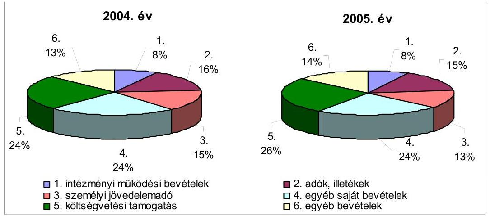

A helyi önkormányzatok könyvviteli mérleg szerinti vagyona a 2004. év végén 9618 milliárd Ft, a 2005. év végén 9861 milliárd Ft volt. A vagyon könyvviteli mérleg szerinti értékének nagyarányú növekedése a 2003. évtől - az azt megelőző három évtől eltérően - már nem tapasztalható, mivel a korábban érték nélkül nyilvántartott ingatlanok érték-megállapítása általában befejeződött. Jelentősebb változás az értékpapírok állományában és a kötelezettségek mértékénél következett be 2003-2005 között. Az önkormányzatok tulajdonában lévő értékpapírok állománya csökkent, melyet jellemzően a gázközművek privatizá-

---

ciójához kapcsolódóan ellentételezésként kapott állampapírok értékesítése eredményezett. A kötelezettségek növekedését az emelkedő összegű hitelfelvételek miatti visszafizetési kötelezettség okozta. A hitelfelvételeken belül emelkedett a rövid lejáratú likvid hitelek aránya, amelyet - az ellenőrzési tapasztalataink szerint - az önkormányzatok közel fele az év végén nem fizetett vissza, így ezek is a következő év gazdálkodását terhelték. A pénzeszközök a rövid lejáratú kötelezettségeket egyre kevésbé fedezték, a fedezeti arányt mutató likviditási gyorsráta a 2005. év végén 0,8 volt ${ }^{4}$.

Adatok :milliárd Ft-ban
A helyi önkormányzatok könyvviteli mérleg szerinti saját vagyona

| Eszközök | 2002. | 2003. | 2004. | 2005. |
| :-- | --: | --: | --: | --: |
|  | XII. 31-én |  |  |  |
| Immateriális javak | 9 | 11 | 16 | 21 |
| Tárgyi eszközök | 4350 | 6832 | 7021 | 7238 |
| Befektetett pénzügyi eszközök | 565 | 566 | 575 | 556 |
| Üzemeltetésre, kezelésre átadott eszkö-   zök | 930 | 1254 | 1396 | 1482 |
| FORGÓESZKÖZÖK | 569 | 571 | 610 | 564 |
| ESZKÖZÖK ÖSSZESEN | $\mathbf{6 4 2 3}$ | $\mathbf{9 2 3 4}$ | $\mathbf{9 6 1 8}$ | $\mathbf{9 8 6 1}$ |
| KÖTELEZETTSÉGEK | 490 | 518 | 589 | 697 |
| SAJÁT VAGYON | $\mathbf{5 9 3 3}$ | $\mathbf{8 7 1 6}$ | $\mathbf{9 0 2 9}$ | $\mathbf{9 1 6 4}$ |

# A gazdálkodás tervezése 

A kiemelt körbe tartozó és a városi önkormányzatok körében a gazdasági programmal rendelkező önkormányzatok aránya - az előző évekhez viszonyítva - pozitív irányban változott ${ }^{5}$. Az ellenőrzött megyei, megyei jogú városi önkormányzatok mindegyike, a Budapest főváros kerületi és a városi önkormányzatok háromnegyed része rendelkezett a képviselő-testület által elfogadott, hosszabb távra szóló, ágazati célkitűzéseket, feladatokat meghatározó gazdasági programmal.

A korábbi évek országosan alacsony átlagát elsősorban az okozta, hogy a községi önkormányzatoknak a 2003. évben negyede, a 2004. évben harmada nem tett eleget gazdasági programkészítési kötelezettségének.

[^0]
[^0]:    ${ }^{4}$ A likviditási gyorsráta, amely a pénzeszközök és a rövid lejáratú kötelezettségek arányát jelzi, a 2004. évben 1,0 volt.
    ${ }^{5}$ Javaslatunkra a 2005. évben az Országgyűlés meghatározta a gazdasági program tartalmi követelményeit.

---

Az elfogadott gazdasági programok megfelelően segítették az egyes évek gazdálkodását megalapozó költségvetési tervező munkát. A célkitűzések között szerepelt a gazdasági stabilitás biztosítása, a pénzügyi helyzet javítása, az intézményi struktúra átalakítása, a forrásbővítési lehetőségek feltárása.

A költségvetési koncepció tervezetét - az előző évekhez hasonlóan - az ellenőrzött önkormányzatok mindegyikénél elkészítették és a polgármester határidőn belül benyújtotta a képviselő-testületnek. Ezen önkormányzatok 85\%-ánál a 2004. és a 2005. évi költségvetési koncepciókat a gazdasági program, valamint a helyben képződő bevételek és az ismert kötelezettségek figyelembevételével állították össze. A polgármesterek az önkormányzatok felénél az Ámr. előírása ellenére nem csatolták a költségvetési koncepciótervezet előterjesztéséhez a pénzügyi bizottság, háromnegyed részénél a kisebbségi önkormányzatok véleményét ${ }^{6}$.

A 2004. és a 2005. évi költségvetési rendelettervezetek költségvetési szervek vezetőivel történt egyeztetésének megállapításait az Ámr. előírása ellenére minden negyedik önkormányzatnál a jegyző írásban nem rögzítette. Az önkormányzatok 96\%-ánál a polgármester a törvényben rögzített határidőn belül terjesztette elő a költségvetési rendelettervezeteket, amelyekkel együtt, illetve azt megelőzően a képviselő-testület elé terjesztette azokat a rendelettervezeteket is, amelyek a tervezett előirányzatokat megalapozták. Az előterjesztésekhez az Ámr. előírása ellenére a pénzügyi bizottságok véleményét az önkormányzatok felénél nem csatolták, azt a képviselő-testületi üléseken ismertették ${ }^{7}$. Az önkormányzatok közel felénél az Áht. előírását megsértve a 2004. és a 2005. évi költségvetési rendeletekben a tervezett hiány összegét nem mutatták be, valamint finanszírozási célú pénzügyi műveleteket is vettek figyelembe költségvetési bevételként és kiadásként. Az Áht. előírása alapján a költségvetésben nem lehet a finanszírozás célú pénzügyi műveleteket a költségvetési hiányt módosító költségvetési bevételként, illetve költségvetési kiadásként elszámolni, így a hosszú és rövid lejáratú hitelfelvételek és hitel-visszafizetési kötelezettségek öszszege sem a költségvetési bevételben, sem a költségvetési kiadásban nem szerepelhet. Az előírt számítási mód az önkormányzatoknál nem biztosítja a tárgyévi hitel-visszafizetési kötelezettség összegének a költségvetési kiadások közötti figyelembevételi lehetőségét annak ellenére, hogy a tartalmát tekintve szerződésen alapuló kiadási kötelezettség befolyásolja a költségvetési hiány, vagy többlet összegét, megítélését.

Az elfogadott költségvetések az előző évieknél magasabb arányban feleltek meg a szerkezetre, tartalomra vonatkozó jogszabályi előírásoknak.

Az ellenőrözött önkormányzatok közül minden tizedik az Ámr. előírása ellenére elmulasztotta a múködési előirányzatok költségvetési szervenkénti részletezését,

[^0]
[^0]:    ${ }^{6}$ Előző évben az önkormányzatok 76\%-a nem csatolta a pénzügyi bizottság és 84\%-a a kisebbségi önkormányzatok véleményét a költségvetési koncepció előterjesztéséhez.
    ${ }^{7}$ A pénzügyi bizottság költségvetésről alkotott véleményének időben történő megismerése a képviselők részére nyújt segítséget az előzetes felkészülésnél és a megalapozott álláspont kialakításánál.

---

minden hatodik a többéves elkötelezettséggel járó feladatok előirányzatainak éves bontásban történő bemutatását.

A költségvetési rendeletekben a korábbi évekhez hasonlóan a költségvetés végrehajtásával kapcsolatos helyi szabályokat nem, vagy hiányosan határozták meg az önkormányzatok. Az előirányzat-átcsoportosítás, módosítás rendjét, a költségvetési többlet felhasználásának szabályait, a költségvetési hiány finanszírozásával összefüggő hitelmúveleti hatásköröket az önkormányzatok közel egyharmada nem szabályozta.

A költségvetés és a zárszámadás előterjesztésekor tájékoztatásul bemutatandó mérlegek és kimutatások tartalmi követelményeit az önkormányzatok kilenctizedénél nem határozták meg az Áht. előírásait megsértve.

A közvetett támogatásokról készítendő kimutatás tartalmi követelményeinek önkormányzati meghatározásai között egymáshoz képest indokolatlan eltéréseket tapasztaltunk, mivel az önkormányzatok egyes helyi adó mentességeket, elengedéseket, térítési díj elengedéseket gyakran nem tekintettek idetartozónak.

A költségvetési rendelet előterjesztések közel negyedénél tájékoztatásul nem mutatták be a többéves kihatással járó döntések számszerúsítését évenkénti bontásban szöveges indoklással, valamint több mint felénél a közvetett támogatások kimutatását szöveges indoklással. A tartalmi követelmények országosan egységes meghatározását évek óta javasoljuk a pénzügyminiszternek, tekintettel arra, hogy a közvetett támogatásokat ellenőrzési tapasztalataink szerint eltérő tartalommal mutatják be a képviselő-testületeknek. Az eltérő tartalom miatt ezek a kimutatások egymással nem hasonlíthatók össze és nem adnak valós képet az önkormányzatok által nyújtott közvetett támogatások (adó, térítési díj-, illeték-, bírság-, pótlékfizetési kötelezettség elengedése) mértékéről.

Az ellenőrzött önkormányzatok mintegy tizedével növelve módosították az eredeti költségvetési előirányzatok főösszegét a 2004. évben az előző évekhez hasonlóan. A költségvetési előirányzatok évközi módosításakor - a korábbi évekhez hasonlóan - az önkormányzatok több mint felénél nem tartották be az Ámr. előirányzat módosítások határidejére vonatkozó előírásait.

# A gazdálkodás és a számviteli nyilvántartás szabályozottsága 

A tapasztalatokat összehasonlítva a korábbi ellenőrzésekről készített jelentések ${ }^{8}$ összegző megállapításaiban szereplő adatokkal megállapítható, hogy a gazdálkodás szabályozottsága javult, melyet jelez, hogy a 2005. évben nőtt a kötelezően előírt szabályzatokkal rendelkező önkormányzatok aránya, nem javult azonban a nagyközségi és községi önkormányzatoknál a szabályozások minősége.

[^0]
[^0]:    ${ }^{8}$ A helyi és a helyi kisebbségi önkormányzatok gazdálkodásának átfogó ellenőrzéséről készített 0544., 0436. és 0319. sorszámú jelentések.

---

A gazdálkodás szabályozottságának alacsony színvonalát mutatja, hogy a szervezeti és múködési szabályzatok, a pénzkezelési szabályzatok mintegy fele nem felelt meg az előírásoknak. A korábbi években tapasztaltaktól lényegesen kedvezőtlenebb a leltározási szabályozatok és a számlarendek színvonala, melyet a Vhr. 2004. évi módosítása miatti változások figyelembe vételének hiánya okozott jellemzően. A leltározási szabályzatok nem tartalmazták az ingatlanok évenkénti mennyiségi leltár felvétellel történő leltározási feladatainak meghatározását.
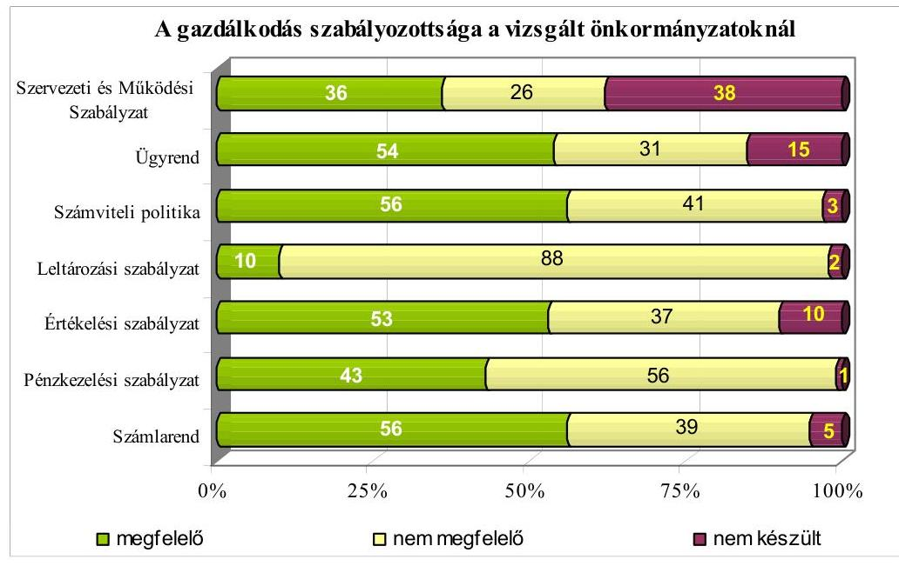

A jegyzők kétharmada a számviteli politika és a kapcsolódó szabályzatok előírásait az önkormányzati hivatalhoz tartozó részben önállóan gazdálkodó költségvetési szervekre is kiterjesztették, ehhez azonban - a Vhr. előírása ellenére nem kérték a felügyeleti szerv (közgyűlés, képviselő-testület) egyetértését. A Vhr. előírásához viszonyított mulasztást meg kellett állapítanunk, annak ellenére, hogy a Htv. szerint a jegyző feladata és hatásköre a költségvetési szervek számviteli rendjének a kialakítása. A gazdálkodási szabályzatokban a pénzügyiszámviteli feladatok elvégzésének, ellenőrzésének folyamatát az önkormányzati hivatalok negyedénél szabályozták a Számv. tv-ben, a Vhr-ben, és az Ámrben előírt követelményeknek megfelelően.

A pénzügyi-számviteli dolgozók munkaköri leírásai az önkormányzatok közel felénél nem tartalmazták a munkafolyamatba épített ellenőrzési, egyeztetési feladatokat. A jegyzők a pénzügyi-számviteli feladatok elvégzésének ellenőrzési nyomvonalát az Ámr. előírása ellenére az ellenőrzött önkormányzatok több mint felénél, ezen belül azonban a községi, és a nagyközségi önkormányzatok mintegy kétharmadánál nem határozták meg. Ezek a szabályozási hiányosságok hátráltatták a gazdálkodás szabályszerű végrehajtását.

A főkönyvi számlákhoz kapcsolódó analitikus nyilvántartások Vhr. előírásainak megfelelő vezetését az önkormányzati hivatalok több mint felénél - az előző évekkel közel azonos arányban - biztosították.

A nyilvántartások egyeztetése az előző évinél rendszeresebb volt a megyei jogú városi, a városi, a nagyközségi és a községi önkormányzatok hivatalainál. Csök-

---

kent a feladatokat hiánytalanul végrehajtók aránya a megyei és a Budapest főváros kerületi önkormányzatoknál.

Az önkormányzatok könyvviteli nyilvántartásaiban a Számv. tv-ben előírt bizonylatok alapján számolták el az előző évhez hasonlóan a gazdasági események döntő többségét az önkormányzati hivatalok. A Budapest fővárosi kerületek kivételével minden önkormányzati típusnál előfordult, hogy az összes bizonylaton volt alaki, tartalmi hiba, és valamennyi önkormányzati típusnál a hibás bizonylatok aránya meghaladta az 50\%-ot. A bizonylatok mintegy negyedének adatait a Vhr-ben foglalt határidő után rögzítették a könyvviteli nyilvántartásokban. A késedelmes elszámolások okai között szerepelt, hogy az évente aktualizált számítógépes főkönyvi programot évek óta több hónapos késéssel kapták meg a MÁK-tól az önkormányzati hivatalok.

# A gazdálkodási folyamatba épített kontrollok végrehajtása 

A szabályozási hiányosságok is hozzájárultak ahhoz, hogy a munkafolyamatba épített ellenőrzés színvonala nem javult a korábbi évekhez viszonyítva. A gazdálkodási és a folyamatba épített ellenőrzési feladatok elvégzését a bizonylatok több mint tizedénél a hatáskörrel nem rendelkezők igazolták. Elmaradt az Ámr. előírásai ellenére a kötelezettségvállalás ellenjegyzése, valamint az igazolt ellenjegyzés ellenére előirányzat nélkül is megtörtént a kötelezettségvállalás. A gazdasági eseményenként 50 ezer Ft-ot el nem érő kifizetéseknél a nyilvántartás rendjének és formájának szabályozási hiánya ellenére nem végezték el a kötelezettségvállalás előzetes írásba foglalását. Az utalványok ellenjegyzésére jogosultak a bizonylatok felénél nem látták el az Ámr-ben és a helyi szabályozásban foglalt ellenőrzési feladataikat, nem észrevételezték a folyamatba épített ellenőrzés ellenjegyzést megelőző feladatainak - szakmai teljesítés igazolás, érvényesítés - elmulasztását. Ennek is következménye, hogy az önkormányzatok egyharmadánál az Áht. előírását megsértve előfordult utalványozás jóváhagyott előirányzat hiányában. A kiadások teljesítésének és a bevételek beszedésének elrendelése előtt közel 50\%-ban elmaradt, vagy jogosulatlanul végezték a szakmai teljesítés igazolását, mert a jegyzők nem határozták meg annak módját, valamint nem jelölték ki az azt végző személyeket. A mulasztásokhoz hozzájárult, hogy jogszabályi előírás hiányában nem voltak egyértelmúek a helyi szabályozás és végrehajtás folyamatában a szakmai teljesítés igazolás módjának tartalmi követelményei.

Az érvényesítést az előző évihez hasonlóan a bizonylatok háromnegyede tartalmazta, de az ennek során elvégzendő feladatokat az érvényesítések közel felénél hiányosan teljesítették, így az igazolt érvényesítés nem töltötte be a hibák megelőzésére, kijavítására vonatkozó funkcióját, mert alaki és tartalmi szempontból hibás bizonylaton szerepelt, nem alapult a szakmai teljesítés igazolásán. Az érvényesítési feladatok elvégzésénél tapasztalt magas arányú hiányossághoz hozzájárult a nagyközségi és községi önkormányzati hivataloknál a feladatot ellátók iskolai végzettségére és a szakmai képesítésére vonatkozó követelmények hiánya is.

---

# A vagyongazdálkodás szabályszerűsége, nyilvánossága 

A helyi önkormányzatok vagyona a 2004. év végén 9618 milliárd Ft, a 2005. évben 9861 milliárd Ft volt, az előző évhez képest 4\%-kal növekedett, melyet az átvett pénzeszközök segítségével megvalósult beruházások eredményeztek. A vagyongazdálkodással kapcsolatos hatásköröket szinte mindegyik önkormányzat szabályozta a vagyongazdálkodási rendeletében. Az ellenőrzött önkormányzatok közel felénél nem rendelkeztek azonban a korlátozottan forgalomképes vagyon vagyongazdálkodási rendeletben rögzített korlátozott forgalomképességének megváltoztatási feltételeiről, illetve a törzsvagyonon kívüli egyéb vagyoni körbe történő átsorolási feltételeiről. Az önkormányzatok egyharmada nem határozta meg azt az értékhatárt, amely felett csak versenytárgyalás útján, a legjobb ajánlattevő részére lehet a vagyont értékesíteni, kezelésbe adni, a használat, illetve hasznosítás jogát átengedni. Az értékhatárt meghatározó önkormányzatok felénél a vagyongazdálkodási rendeletben lehetővé tették a versenytárgyalás mellőzését, 13\%-ánál pedig a versenytárgyalás megtartására a 2003-2004 években megállapított értékhatárok ${ }^{9}$ indokolatlanul magasak voltak. Az elidegenítések során a versenytárgyalási kötelezettségre vonatkozó előírást az önkormányzatok több mint harmada nem vette figyelembe. A nem lakás céljára szolgáló helyiségek esetében, amennyiben a bérlő gazdálkodó szervezet volt, a Ptk-ban biztosított lehetőséggel élve kijelölte a részére biztosított elővételi jog gyakorlására jogosult személyt, ezáltal ezen helyiségek értékesítése versenyeztetés nélkül történt. A vagyongazdálkodás szabályozási hiányosságai és a versenytárgyalás nélkül történt elidegenítések nem segítették az önkormányzati vagyonnal történő gazdálkodás nyilvánosságát, átláthatóságát. Az önkormányzatok törzsvagyonába tartozó forgalomképtelen ingatlan értékesítése, illetve ingyenes átadása, és ezen elidegenítések földhivatali bejegyzése is megtörtént a Ptk. forgalomképtelen ingatlanok elidegenítésére vonatkozó semmisségi előírását megsértve két önkormányzatnál. Ingyenes, vagy kedvezményes helyiségbérlet biztosításával - az Ötv. és az Alkotmány előírásait megsértve - közvetetten támogatott politikai pártokat az önkormányzatok közel harmada.

Az ellenőrzött önkormányzatok több mint egyharmada vásárolt, kétharmada értékesített értékpapírokat, az adás-vételek mintegy ötöde az önkormányzat költségvetésében, vagyongazdálkodási rendeletében előírtaktól eltérő módon történt. Az értékpapírok adásvétele az önkormányzatok többségénél a pénzpiaci lehetőségeknek megfelelő eredményt biztosított, azonban mintegy tizedük az értékpapírok forgatásával járó kockázatot az önkormányzat nevére szóló együttes rendelkezésű alszámla nyitás kezdeményezésével nem csökkentette.

Az önkormányzatok kilenctizede nyújtott nem normatív, céljellegü, fejlesztési támogatásokat, illetve kötött nettó ötmillió Ft-ot elérő vagy azt meghaladó értékű - árubeszerzésre, építési beruházásra, szolgáltatás megrendelésre,

[^0]
[^0]:    ${ }^{9}$ A helyi és a helyi kisebbségek gazdálkodásának átfogó ellenőrzéséről a 2004. évben készített jelentésben javasoltuk, hogy az Áht. módosítása során minden önkormányzatra egységesen állapítsák meg a versenyeztetés értékhatárát. Javaslatunkat is figyelembe véve az Országgyúlés a 2005. év óta az évenkénti költségvetési törvényben meghatározza ezt az értékhatárt.

---

vagyonértékesítésre, vagyonhasznosításra, vagyon vagy vagyoni értékű jog átadására vonatkozó - szerződéseket. Ezen támogatásokkal és szerződésekkel kapcsolatos Áht-ban előírt közzétételi kötelezettségének az önkormányzatok negyede nem, vagy csak részben tett eleget. Az önkormányzatok által nyújtott támogatások közel kétharmada nem fejlesztési célú volt, hanem különböző szervezetek múködéséhez biztosított forrást. A közpénzek felhasználásának átláthatóságát, nyilvánosságát nem segítette, hogy ezen múködési célú támogatásokra jogszabály nem írja elő a közzétételi kötelezettséget.

Az önkormányzatok mintegy harmadánál történt követelés elengedés, közel felénél ingyenes vagyonátruházás. A követelést elengedő önkormányzatok ötöde nem határozta meg rendeletben a követelés elengedés módját és eseteit, valamint a térítésmentes vagyonátruházás eseteit ${ }^{10}$.

# A vagyon számviteli nyilvántartása 

A számviteli nyilvántartásokban a törzsvagyon és a nem törzsvagyon részét képező eszközök értékének elkülönített nyilvántartásáról - a tapasztalatokat összehasonlítva a korábbi ellenőrzésekről készült jelentések ${ }^{11}$ összegző megállapításainak adataival - megállapítható, hogy a korábbiaknál nagyobb arányban, az ellenőrzött önkormányzati hivatalok közel 90\%-ánál gondoskodtak. Az önkormányzati hivatalok egyötöde az analitikus nyilvántartások vezetési kötelezettségének részleges vagy teljes elmulasztása miatt számviteli nyilvántartásában nem mutatott ki minden vagyonelemet. Az önkormányzatok a 2004. évben országosan 1396 milliárd Ft összegben mutattak ki üzemeltetésre, kezelésre átadott eszközöket, melyek aránya az önkormányzati vagyonon belül 2002 óta növekedik. Az üzemeltetésre, kezelésre átadott eszközöket az ellenőrzött önkormányzatok egyötöde nem a Vhr-ben előírtak szerinti főkönyvi számlán szerepeltette a számviteli nyilvántartásokban.

A könyvviteli mérlegben kimutatott vagyon helyi szabályozásokban rögzítetteknek megfelelő leltározási kötelezettségének teljesítése az előző évekhez viszonyítva javult, de annak kiértékelése az ellenőrzött önkormányzati hivatalok közel egyötödénél elmaradt. Az önkormányzatok országosan a befektetett eszközök, készletek, követelések és értékpapírok év végi értékelésekor a 2004. évben 14 milliárd Ft, a 2005. évben 63 milliárd Ft összegben számoltak el tárgyévi értékvesztést valamint a 2004. évben 5 milliárd Ft, a 2005. évben 11 milliárd Ft összegben korábban elszámolt értékvesztést írtak vissza, amelyek hatására az értékelt eszközök nyilvántartás szerinti értéke a 2004. évben 1\%kal, a 2005. évben 3,5\%-kal csökkent. Az értékvesztés elszámolásának szükségességét az önkormányzati hivatalok több mint fele a követelések, a részesedések, az értékpapírok esetében vizsgálta, de az értékvesztés elszámolását azok $15 \%$-a a követelések, harmada a részesedések esetében nem végezte el a

[^0]
[^0]:    ${ }^{10}$ Az előző évben a vagyongazdálkodási rendeletek több mint harmada nem tartalmazta, hogy milyen esetekben és módon lehet önkormányzati vagyont térítésmentesen átadni, illetve követelésről lemondani.
    ${ }^{11}$ A helyi és a helyi kisebbségi önkormányzatok gazdálkodásának átfogó ellenőrzéséről készített 0544., 0436. és 0319. sorszámú jelentések.

---

Számv. tv. előírásai ellenére. Az értékelési hiányosságok következtében nem állapítható meg pontosan az önkormányzati vagyon számviteli előírások szerinti értéke.
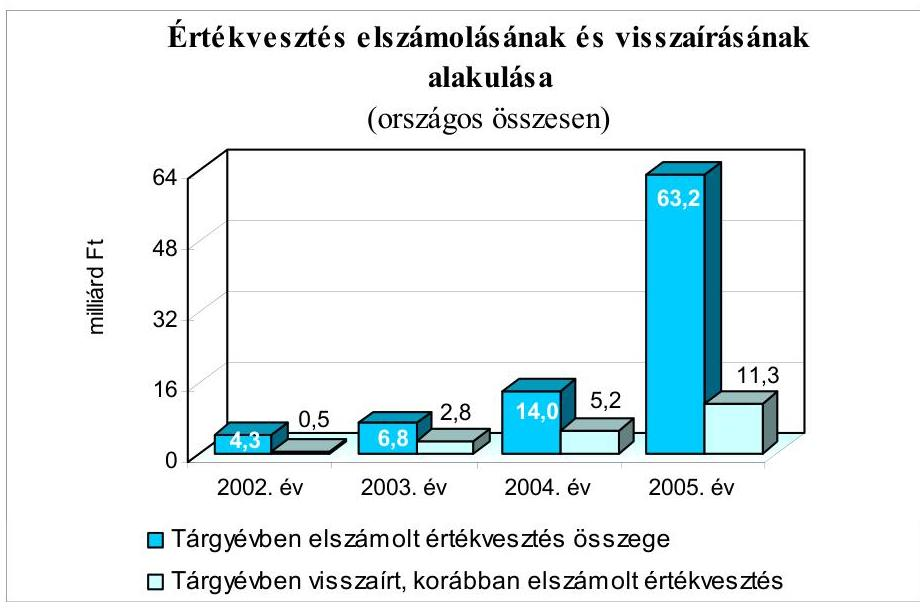

# A közbeszerzések szabályszerűsége 

Az ellenőrzött kiemelt körbe tartozó, valamint városi önkormányzatok háromnegyede a Kbt. ${ }_{1}$-ben kapott felhatalmazással élve a közbeszerzési eljárások ${ }^{12}$ előkészítésének és lefolytatásának helyi szabályairól rendeletet alkotott. Az ellenőrzött önkormányzatok közel háromnegyede a Kbt. ${ }_{1}$-ben foglaltakat a becsült érték számításakor betartotta. A Kbt. ${ }_{1}$-ben előírtakat figyelmen kívül hagyva a közbeszerzési eljárást nem folytatta le az ellenőrzött önkormányzatok közel egyharmada.

Az egy önkormányzathoz tartozó költségvetési szervek költségvetésében előirányzott azonos, vagy hasonló rendeltetésű árubeszerzések, szolgáltatás megrendelések, beruházások, felújítások becsült értékének önkormányzati szinten történő egybeszámításának kötelezettségét a Kbt. ${ }_{1,2}$. nem írja elő, így ezen intézményenkénti külön-külön beszerzések értéke a Kbt. ${ }_{1,2}$. előírásai szerinti - közbeszerzési eljárás lefolytatására vonatkozó - értékhatárt nem érte el. Az önkormányzatok képviselő testületei az azonos, vagy hasonló rendeltetésű árubeszerzések, szolgáltatás megrendelések, beruházások, felújítások költségvetési kiadási előirányzatainak meghatározásakor dönthettek, hogy ezen beszerzésekhez a fedezetet több költségvetési szerv költségvetésében vagy az ezen beszerzések lebonyolítására kijelölt egy költségvetési szerv költségvetésében biztosítják. Az ilyen jellegű beszerzések kiadási előirányzatainak intézmények közötti megosztásával a képviselő-testületek lehetőséget biztosítottak a nyilvános pályáztatás, a közbeszerzési eljárás elkerülésére. A szabályozás nem segíti a köz-

[^0]
[^0]:    ${ }^{12}$ A Közbeszerzések Tanácsa tájékoztatója szerint a 2004. évben a közbeszerzési eljárások összértéke 1129,7 milliárd Ft, míg a 2005. évben 1291,3 milliárd Ft volt, amelyből az önkormányzatok 22\%-kal részesedtek.(Forrás: www.kozbeszerzes.hu)

---

pénzekkel történő gazdálkodás nyilvánosságát, a közpénzek felhasználásánál a takarékossági szemlélet érvényesülését.

A közbeszerzési eljárást követően kötött szerződések kétötödét a Kbt.,-ben foglaltak érvényre jutása mellett módosították. A Közbeszerzési Döntőbizottság az ellenőrzött, közbeszerzési eljárást lefolytató önkormányzatok ötödét a Kbt.,-ben előírtak megsértése miatt elmarasztalta, valamint bírság megfizetésére kötelezte ${ }^{13}$. A közbeszerzési szabályok betartása az önkormányzati gazdálkodásban magas kockázatú területnek minősül.

# Az önkormányzatok által adott támogatások 

A helyi önkormányzatok céljellegú támogatásként - nem szociális ellátásként ${ }^{14}$ - a 2004. évben 180,4 milliárd Ft, a 2005. évben 186,1 milliárd Ft pénzeszközt adtak át működési és felhalmozási célra alapítványoknak, közalapítványoknak, egyéb non-profit szervezeteknek, vállalkozásoknak, háztartásoknak, az önkormányzatok saját intézményein kívüli költségvetési szerveknek, valamint külföldi közösségeknek.

A 2004. évi támogatások összege 18 milliárd Ft-tal haladta meg a 2003. évben céljelleggel átadott pénzeszközök összegét. Az önkormányzatok a céljellegú támogatások közel kétharmadát múködési, egyharmadát fejlesztési célra nyújtották. Az országosan múködési célra a 2004. évben átadott 112 milliárd Ft egyötödét, a felhalmozási célra átadott 68 milliárd Ft harmadát a Budapest Fővárosi Önkormányzat teljesítette.

Az önkormányzatok a juttatott támogatások összegét, a támogatott célt, a felhasználásáról a számadási kötelezettség teljesítésének módját, határidejét az előző évhez viszonyítva növekvő arányban előírták ${ }^{15}$.

A támogatást nyújtó önkormányzatok felénél az alapítványok, közalapítványok támogatásáról az Ötv. hatásköri előírását megsértve nem a képviselő-testület döntött. Önkormányzati költségvetési intézmény az önkormányzatok egynegyede esetében támogatott társadalmi szervezeteket a képviselő-testület engedélye nélkül, megsértve ezzel az Áht-ban előírtakat. A közhasznú szervezeteket támogató önkormányzatok negyedénél szerződésben nem határozták meg a támogatással való elszámolás feltételeit és módját,

[^0]
[^0]:    ${ }^{13}$ Az ÁSZ kérésére a Közbeszerzések Tanácsa Közbeszerzési Döntőbizottsága által elvégzett kigyűjtés szerint a 2004. évben összesen 148 közbeszerzési eljárásban marasztalta el a Közbeszerzési Döntőbizottság az önkormányzatokat, melyek alapján 137 millió Ft bírság megfizetését írta elő. A 2005. évben az önkormányzati beszerzésekkel kapcsolatban 502 jogorvoslati eljárást kezdeményeztek, amelyből 195 esetben a jogsértést megállapította, valamint 142 millió Ft bírságot szabott ki a Közbeszerzési Döntőbizottság.
    ${ }^{14}$ Különböző szervezetek és magánszemélyek számára múködésük, célkitúzésük megvalósításának elősegítése érdekében, általában pályázat alapján nyújtott támogatás.
    ${ }^{15}$ A 2003. év óta folytatott átfogó ellenőrzések egyik súlypontja a támogatások nyújtása és a felhasználás ellenőrzésére vonatkozó szabályok betartatása. A következetes számonkérés eredménye e téren a javulás.

---

megsértve a Ksztv. előírását. A támogatásban részesült szervezetek közel harmada az előírt tartalommal, határidőre eleget tett számadási kötelezettségének. A számadások ellenőrzését az Áht. előírását megsértve az önkormányzatok egyötödénél nem végezték el, további egynegyednél nem minden számadást ellenőriztek. Az önkormányzatok közel 90\%-ánál a támogatások célszerinti felhasználására vonatkozóan a helyszínen ellenőrzést nem végeztek ${ }^{16}$. A mulasztásokhoz hozzájárult, hogy az Áht. a céljelleggel nyújtott támogatások esetében a számadások és a rendeltetésszerű felhasználás ellenőrzési követelményeit nem határozza meg. Jogszabály nem írja elő a támogatások helyszíni ellenőrzésének eseteit, módját, a támogatási célok meghatározásának a részletezettségét és a számadásban hivatkozott bizonylatok hitelességének, a nyújtott támogatásból történt felhasználás igazolásának szabályait.

Az előző évben tett javaslatunk ellenére elmaradt az egységes szabályozás a számadás, valamint a rendeltetésszerű felhasználás ellenőrzése tekintetében. Nincsenek az államháztartás önkormányzati alrendszerének tagoltsága ellenére egységes szabályok az évi 180-190 milliárd Ft szabályszerű és rendeltetésszerű felhasználásának hatékony ellenőrzéséhez.

# A gazdálkodás költségvetési-pénzügyi egyensúlya 

A tapasztalatokat összehasonlítva a korábbi jelentések ${ }^{17}$ hasonló összegző adataival, megállapítható, hogy az önkormányzatok költségvetési egyensúlyi helyzete az előző évekhez viszonyítva nem javult. Az ellenőrzött önkormányzatok mintegy kétharmada tervezett - az elmúlt években tapasztaltakhoz hasonlóan - költségvetésében mind a múködési célú, mind a felhalmozási célú kiadásoknál hiányt. A költségvetési hiányok kialakulásában a feladatellátás módjának célszerűtlen megszervezése, az intézményi kapacitások alacsony kihasználtsága, a teherbíró képességet meghaladó önként vállalt feladatok felvállalása, valamint a tervezési hibák is szerepet játszottak.

Az egyensúly javítására tett önkormányzati intézkedések hatására az év végére az ellenőrzött önkormányzatok egyharmadánál volt csak költségvetési hiány. A múködési célú bevételek-kiadások egyensúlyhiánya a tervezettnél alacsonyabban teljesült, az év végén az ellenőrzött önkormányzatok egyötödénél állt fenn. A felhalmozási célú bevételeknél a hiány a tervezett szinten teljesült annak ellenére, hogy az ellenőrzött önkormányzatok harmada a múködési célú bevételek egy részét is felhalmozási célú kiadásokra fordította. A tervezett hiányt a költségvetés végrehajtása során csökkentették a pályázatok révén megszerzett források, a saját bevételek többletei, a vagyonértékesítésből szár-

[^0]
[^0]:    ${ }^{16}$ Az ÁSZ a kiemelt körbe tartozó önkormányzatok ellenőrzéséhez kapcsoltan 15 támogatott szervezetnél ellenőrizte a helyszínen a támogatás felhasználását, melynek során két esetben állapítottunk meg jogosulatlan felhasználást.
    ${ }^{17}$ A helyi és a helyi kisebbségi önkormányzatok gazdálkodásának átfogó ellenőrzéséről készített 0544, 0436 és 0319 sorszámú jelentések.

---

mazó többletbevételek, valamint a nem megalapozott tervezés miatt jelentkező többletbevételek. Az ellenőrzött önkormányzatok a hiány finanszírozásához a pénzmaradvány tervezett igénybevételi összegének több mint háromszorosát vették igénybe a költségvetés teljesítése során. A kiadások csökkentése érdekében az ellenőrzött önkormányzatok kétharmada különféle intézkedéseket kezdeményezett, egyes tervezett feladatainak megvalósítását átütemezte, későbbre halasztotta. A feladatok kötelező és önként vállalt jellegét nem tekintették át, azokat nem különítették el, és a kiadások csökkentése érdekében tett intézkedések hatását nem számszerúsítették. A saját bevételek között jelentős egyensúlyjavító tényező volt a helyi adóbevétel, amelynek költségvetési bevételen belüli aránya az ellenőrzött önkormányzatoknál a 2002. évi 9\%-ról, a 2004. évben 13\%-ra növekedett. A megállapított adómértékek a törvényben meghatározott adómaximumok átlag háromnegyedét érték el. A helyi adóbevételek között változatlanul a legjelentősebb, a 2004. és a 2005. évben az adóbevétel $84 \%$-át képviseli az iparúzési adó, melynek összege a 2004. évben 310,5 milliárd Ft, a 2005. évben 334,1 milliárd Ft volt. A helyi adókból az önkormányzatok különböző jogcímen a helyi adótörvényben biztosítottakon túlmenően további kedvezményeket, mentességeket is biztosítottak ${ }^{18}$.

Az önkormányzatok helyi adó bevételeinek megoszlása (országos összesen)
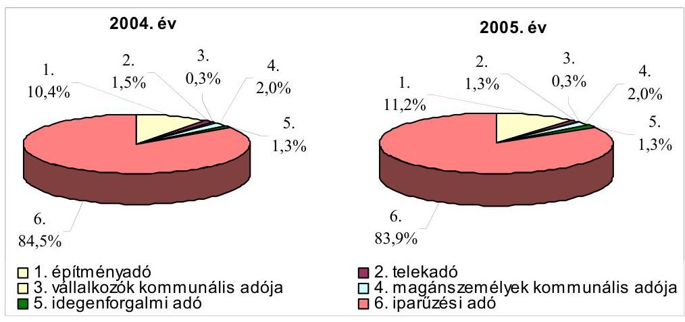

Az ellenőrzött önkormányzatoknál a tárgyévi hitel visszafizetési kötelezettséget részben újabb hitelek segítségével teljesítették, amely a pénzügyi egyensúlyi helyzetet tovább rontotta. Adósságot keletkeztető kötelezettségvállalásról az ellenőrzött önkormányzatok kétharmada döntött, melynek módja leggyakrabban hitelfelvétel volt. A hitelfelvételt megelőzően az összeg meghatározása során mintegy kilenctizedük vizsgálta és betartotta az Ötv-ben előírt felső határt. A folyószámlahitel keretének növekedése és folyamatosan történt igénybevételének gyakorlata nem befolyásolta az adósságot keletkeztető kötelezettségvállalás felső határának a számítását.

[^0]
[^0]:    ${ }^{18}$ Az ÁSZ a települési önkormányzatok adóztatási tevékenységét a 2001. évben ellenőrizte, a jelentés sorszáma 0121.

---

Az adósságot keletkeztető kötelezettségvállalás éves felső határának megállapításakor a jogszabály alapján figyelembe nem vett, de fizetési kötelezettségként jelentkező, jellemzően a működési célú kiadásokhoz kapcsolódó, éven túl nyúlóan folyamatosan megújított (éven belül visszafizetett és újra felvett) folyószámla hitelek összege az önkormányzatok költségvetéseit éveken át megterheli, a fizetőképességet a jogszabályban felsorolt, a kötelezettségvállalás felső határának számításánál figyelembe vettekhez hasonlóan befolyásolja, a tényleges adósságállományt növeli. Az ellenőrzött önkormányzatok több mint kétharmada a folyamatos fizetőképességet, a múködési kiadások teljesítését a folyószámlahitel keret megemelésével, az előző évhez képest növekvő összegű likvid hitel igénybevételével biztosította.
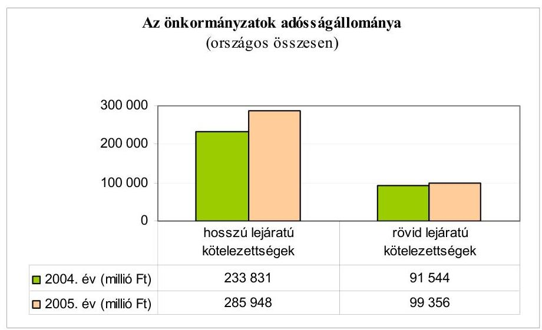

Az év közben felvett likvid hiteleket a hitelt felvevő önkormányzatok közel fele az év végéig nem fizette vissza, ezért az a következő év gazdálkodását terhelte, mintegy tovább görgetve, növelve ezzel a következő évi hiányt. Az önkormányzatok a likviditási terv készítését még mindig formalitásnak tartották, mindösszse harmaduk rendelkezett olyan likviditási tervvel, amely jó alapul szolgált és segítette az évközi likviditási gondok megoldását. ${ }^{19}$

# A zárszámadás szabályszerűsége 

Az éves gazdálkodásról szóló zárszámadási rendelettervezetet az ellenőrzött önkormányzatoknál a polgármester az Áht-ban előírt határidőn belül benyújtotta a képviselő-testület részére. A zárszámadási rendelettervezetek több mint negyedét azonban az Áht. rendelkezései ellenére nem a költségvetéssel összehasonlítható módon készítették el, mivel közel tizedüknél az eredeti előirányzatok fő- és részösszegei, ötödüknél a módosított előirányzatok egyezősége nem volt biztosított. A zárszámadási rendelettervezetek közel negyedénél az előző évekhez hasonló arányban nem tartották be az ellenőrzött önkormányzatoknál az Áht-ban és az Ámr-ben a szerkezetre, tartalomra vonatkozó előírásokat. A zárszámadási rendelettervezet előterjesztésekor az önkormányzatok több mint felénél tájékoztatásul nem mutatták be az Áht-ban előírt mérlegeket,

[^0]
[^0]:    ${ }^{19}$ Likviditási tervet elsősorban a városi önkormányzatok jegyzői nem készítettek.

---

kimutatásokat. A pénzmaradvány összegét a zárszámadás jóváhagyásakor az önkormányzatok több mint negyedénél az Ámr. előírása ellenére nem költségvetési szervenkénti részletezésben hagyták jóvá ${ }^{20}$. A képviselő-testületek által jóváhagyott pénzmaradványok összegének megállapításánál az önkormányzatok több mint négyötöde a Vhr. előírásai szerint járt el. Az Ámr-ben előírtak ellenére az intézményeket az éves számszaki beszámolóik és múködésük elbírálásáról, jóváhagyásáról az önkormányzatok több mint felénél nem értesítették.

A helyi önkormányzatok központi költségvetési támogatásokkal, hozzájárulásokkal történő elszámolását - mely a költségvetési beszámolásuk részét képezi az ÁSZ a központi költségvetés végrehajtását tartalmazó zárszámadás ellenőrzéséhez kapcsolódóan mintavételekkel ellenőrzi. Ezen vizsgálatok a helyi önkormányzatok részére nyújtott hozzájárulások, támogatások jogszabályi előírásoknak megfelelő igénylésére, felhasználására és elszámolására terjedtek ki. A 2005. évben 884,1 milliárd Ft központi költségvetési hozzájárulás, támogatás, valamint 456,6 milliárd Ft személyi jövedelemadó részesedése együttesen 1349,8 milliárd Ft illette meg az önkormányzatokat. A zárszámadáshoz kapcsolódó ellenőrzés során évek óta a jogszabályi előírások közötti összhang kialakítására, a támogatási követelmények, feltételek pontosítására, valamint az ellenőrzött önkormányzatok által jogtalanul igénybe vett hozzájárulások, támogatások visszafizetésére, illetve a részükre jogosan járó összegnek pótlólagos kiutalására tettünk javaslatot ${ }^{21}$.

# A pénzügyi-számviteli tevékenység informatikai támogatottsága, szabályozottsága 

Az önkormányzati hivataloknál a pénzügyi-számviteli tevékenység informatikai támogatottsága egyre elterjedtebb, de még csak néhány önkormányzati hivatalban épült ki integrált, rendszerezett elveken nyugvó, komplex információs rendszer. Az integrált informatikai rendszer hiányában a pénzügyiszámviteli feladatok ellátásához számítógépes programokat és manuális analitikus nyilvántartásokat egyaránt használtak. A főkönyvi könyvelés és a költségvetési beszámolók elkészítése az önkormányzatoknál számítógépes program segítségével történt. Az egyéb alkalmazói rendszerek száma növekedett, önkormányzatonként eltérő mennyiségi és minőségi jellemzőkkel, fokozatosan csökkentve a manuálisan végzett nyilvántartási tevékenységet. Az ellenőrzött időszakban az informatikai fejlesztések során a pénzügyi-számviteli területen az elsődleges cél nem a géppark bővítése, hanem az elavult gépek cseréje volt. Az önkormányzati hivatalok több mint fele azonban nem rendelkezett hosszú távú célkitűzéseket tartalmazó informatikai stratégiával, háromnegyede nem készített katasztrófa elhárítási tervet. Az önkormányzatok több mint fele kialakította az adatbiztonsági rendszert, rendelkezett az informatikai rendszer üze-

[^0]
[^0]:    ${ }^{20}$ A feltárt hiányosságok egyes esetekben megnehezítik, illetve gátolják, hogy a képvi-selő-testület a zárszámadás jóváhagyásakor megfelelő és hiteles információk birtokában döntsön.
    ${ }^{21}$ A Magyar Köztársaság 2004. évi költségvetése végrehajtásának ellenőrzéséről készített 0540 . sorszámú jelentés.

---

meltetési leírásával. A pénzügyi-számviteli területen számítógépet használó dolgozók informatikai képzettségét az önkormányzatok közel 90\%-ban biztosították, azonban a felhasználók felénél nem tartalmazta a munkaköri leírás az informatikai feladatokat.

# A feladatok meghatározottsága, finanszírozási forrása 

Az ellenőrzött önkormányzatok a vizsgált időszakban a költségvetési koncepció meghatározása során tapasztalt forráshiány mérséklése érdekében a kötelező és az önként vállalt feladatok gazdaságosabb és hatékonyabb ellátásáról, intézményracionalizálásokról döntöttek. A szervezési intézkedések közel fele költségvetési szervek alapítására, átszervezésére, megszüntetésére irányult. A költségvetési intézmények gazdasági szervezeteinek összevonásával csökkent az önálló gazdálkodási jogkörrel rendelkező intézmények száma és ezzel összhangban növekedett a részben önálló gazdálkodási jogkörrel rendelkező intézmények száma. Az átszervezések, intézmény összevonások, megszüntetések hatására csökkent a foglalkoztatott közalkalmazottak létszáma is, ugyanakkor a közszolgálati feladatok ellátásában közremúködő közhasznú szervezetek száma 2002-2004 között 29-cel bővült, valamint az önkormányzati kötelező feladatok ellátásában 33-mal több gazdasági társaság vett részt ${ }^{22}$. Az ellenőrzött önkormányzatok a 2003. évtől az előző évhez viszonyítva 136-tal több társulásban vettek részt. A társulások elsősorban szociális-, egészségügyi- és közoktatási feladatokat láttak el, valamint társulási célkitúzésként szerepelt még a terület- és térségfejlesztési programok összehangolásának megoldása.

Az ellenőrzött önkormányzatok oktatási-nevelési és szociális intézményeiben az egy tanulóra, illetve az egy ellátottra jutó kiadás az elmúlt években emelkedett, a múködési kiadások növekedése, valamint a - bölcsődei ellátás kivételével - az ellátást igénybe vevők számának csökkenése eredményeképpen.

Az oktatási-nevelési intézményekben az egy főre jutó kiadások a vizsgált időszakban több mint egyharmaddal emelkedtek, ebben szerepet játszottak a közalkalmazottak körében végrehajtott központi bérintézkedések mellett a szakmaitárgyi feltételeket biztosító egyszeri beszerzések, az álláshely megszüntetésekkel együtt járó végkielégítések egyszeri kiadásai, a középfokú oktatásban az új képzési formák és szakok bevezetésének kiadásai.

Az óvodai és az általános iskolai oktatási, nevelési feladatok kiadásainak finanszírozásában az állami hozzájárulások, támogatások aránya a vizsgált időszakban csökkent, amit - a feladatellátás megoldása érdekében - a magasabb önkormányzati forrás biztosítása ellensúlyozott.

[^0]
[^0]:    ${ }^{22}$ A 2001-2003 években ellenőrzött önkormányzatok körében is jellemző volt az intézmények racionalizálására való törekvés, a közszolgáltatási feladatok ellátásában a közhasznú és gazdasági társaságok szerepvállalásának bővülése, a költségvetési intézmények meghatározó szerepének megmaradása mellett. (0544. sorszámú jelentés 5456. oldal)

---

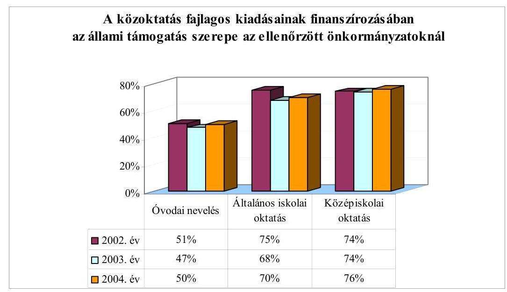

A szociális feladatokat ellátó intézményekben egy ellátottra jutó kiadás a vizsgált időszakban közel egyharmaddal emelkedett, a növekedésben meghatározó volt a tárgyi feltételek biztosításának egyszeri kiadása, valamint a közalkalmazotti béremelés hatásaként a személyi juttatások növekedése. A szociális kiadások finanszírozásában az állami támogatás aránya csökkent, ami szükségességé tette az önkormányzati források növelését.
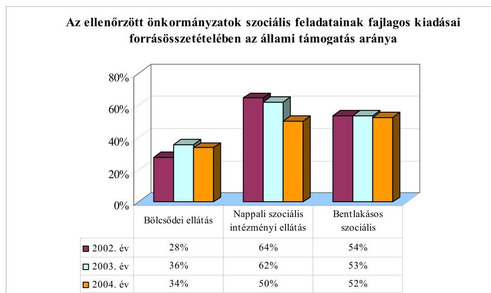

Az önként vállalt feladatok ellátására az ellenőrzött önkormányzatok költségvetési kiadásaiknak 1-23\% közötti részarányát fordították a vizsgált időszakban. Budapest főváros kerületi önkormányzatai, valamint a városi önkormányzatok több mint egyharmada önként vállalt feladatként középfokú oktatási és bentlakásos szociális intézmény fenntartásáról gondoskodott, valamint a városi önkormányzatok közel fele járóbeteg, közel egyharmada fekvőbeteg szakellátást nyújtó intézményeket is müködtetett. Az önkormányzatok a

---

nonprofit szervezetek, gazdasági társaságok és az egyéb szervezetek céljellegú támogatásával is az önként vállalt feladatok körét bővítették.
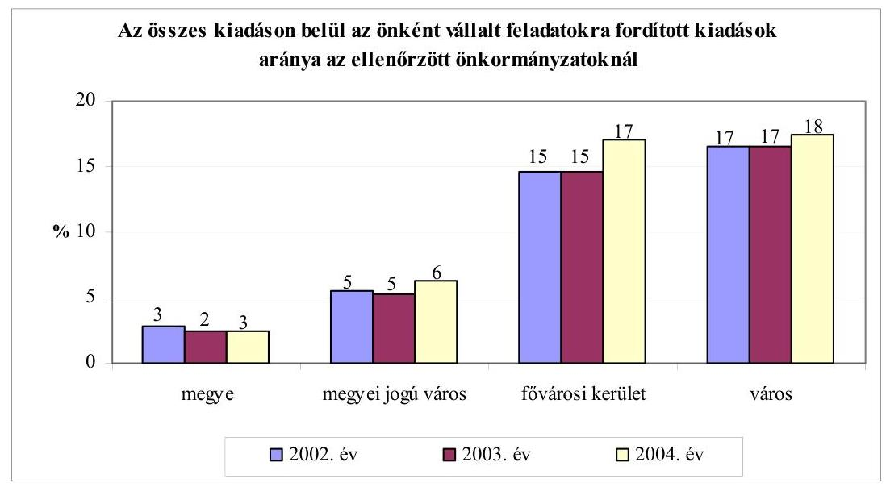

Az ellenőrzött önkormányzatoknál a kötelező feladatok végrehajtását az önként vállalt feladatok ${ }^{23}$ finanszírozása, annak mértéke miatt nem veszélyeztette.

A kötelező és önként vállalt feladatait, valamint azok ellátásának módját, mértékét az Ötv. előírása ellenére az ellenőrzött önkormányzatok fele nem határozta meg. Ezen mulasztáshoz hozzájárult, hogy az önkormányzatok kötelező feladatainak egyértelmú megnevezése, megjelölése a központi (különböző ágazati) jogszabályokban nem történt meg ${ }^{24}$. A különböző ágazati jogszabályokban meghatározott önkormányzati feladatok közül a városi önkormányzatok több mint fele nem gondoskodott a vizsgált időszakban a bölcsődei, valamint közel tizede az idősek nappali szociális, továbbá a megyei önkormányzatok közül kettő a hajléktalanok otthona és a hajléktalanok rehabilitációs intézményi ellátásáról. Ez utóbbi mulasztásban közrejátszott, hogy a Szoc. tv. nem tartalmazza, nem határozza meg egyértelmúen, nevesítetten a megyei önkormányzatok kötelező szociális feladatait, csupán utal arra, hogy a megyei önkormányzat gondoskodik azon szakosított szociális ellátásokról, melyek biztosítására a Szoc. tv. alapján a települési önkormányzatok nem kötelesek.

A középületek akadálymentesítéséhez szükséges feladatokat az elmúlt években az ellenőrzött önkormányzatok kétharmada mérette fel. A feladatok

[^0]
[^0]:    ${ }^{23}$ Az önként vállalt feladatokra fordított kiadásokat a helyszíni ellenőrzések során a számviteli nyilvántartásokból az önkormányzati hivatalok munkatársaival közösen végzett kigyújtésekkel határoztuk meg.
    ${ }^{24}$ A helyi és a helyi kisebbségi önkormányzatok gazdálkodásának átfogó ellenőrzéséről készült 0436 és a 0544 sorszámú jelentéseinkben is javasoltuk a belügyminiszternek, hogy kezdeményezze az önkormányzatok kötelező feladatainak egyértelmú meghatározását.

---

végrehajtására a költségvetésekben az elmúlt három évben 1,3 milliárd Ft-ot terveztek, amelynek közel kétharmadát fordították a költségvetés végrehajtása során az akadálymentes közlekedés feltételeinek kialakítására. Az épület felújítások során jellemzően külön költségvetési előirányzat nélkül, a felújítás kiadásaiba beépítetten végezték el az akadálymentesítési feladatokat. A középületekben az akadálymentes közlekedés kialakítását a törvényben (Fot-ban) meghatározott 2005. január 1-i határidőre az ellenőrzött önkormányzatok nem oldották meg ${ }^{25}$.

# A helyi kisebbségi önkormányzatok gazdálkodásának szabályszerűsége 

Az ellenőrzött helyi kisebbségi önkormányzatok nem vettek át feladatot a települési önkormányzatoktól, intézményt nem múködtettek. Feladatellátásukban, az előző években ellenőrzöttekhez hasonlóan, döntően az önkormányzati testületi múködés feltételeinek biztosítása, valamint a településeken élő kisebbségek érdekeinek képviselete és a nemzetiségi hagyományápolás szerepelt. Az ellenőrzött kisebbségi önkormányzatok a 2005. évi múködésükhöz a 2003. évinél $23 \%$-kal több, 605 millió Ft bevétellel rendelkeztek. A bevételek tizedét fordították felhalmozási kiadásokra, a többit közel fele-fele arányban dologi és személyi jellegú kiadásokra. A települési és a kisebbségi önkormányzatok évente növekvő arányban szabályozták megállapodásban az együttmúködés feltételeit. A megállapodások mintegy harmada azonban a hiányosságai miatt nem volt alkalmas arra, hogy a jogszabályoknak és a helyi körülményeknek megfelelően elősegítse az együttmúködést.

Nem tartalmazták a megállapodások a kötelezettségvállalás, az utalványozás és ezek ellenjegyzésének, valamint a szakmai teljesítésigazolás és az érvényesítés ellátásának rendjét, valamint a kijelölések, megbízások alapján a feladatok jogosultjait, illetve kötelezettjeit.

A kisebbségi önkormányzatok gazdálkodásának szabályszerűsége az előző évekhez viszonyítva javult, azonban a mulasztásokhoz hozzájárult, hogy az együttműködési megállapodásnak nem kötelező tartalmi elemei a gazdálkodás végrehajtásának feladatai, illetve a folyamatba épített ellenőrzési feladatok ellátásának rendje és a kijelölések, megbízások alapján a feladatok jogosultjainak, illetve kötelezettjeinek meghatározása.

## Ellenőrzések

A belső ellenőrzési feladatok ellátása az előző évinél kedvezőbb, mivel előrelépés történt a belső ellenőrzési szervezet kialakítása és a múködéshez szükséges források biztosítása, a belső ellenőrzési kézikönyvek készítése és jóváhagyása területén, valamint a foglalkoztatott belső ellenőrök számát és szakmai fel-

[^0]
[^0]:    ${ }^{25}$ A 2004. és a 2005. évben a helyi önkormányzatok gazdálkodásának átfogó ellenőrzéséről készült 0436 és 0544 sorszámú jelentéseinkben már jeleztük, hogy az ellenőrzött önkormányzatoknál nem biztosított a feladat 2005. január 1-i határidőre történő elvégzése.

---

készültségét illetően. Az ellenőrzött önkormányzatok háromnegyede kialakította a belső ellenőrzés szervezeti kereteit, melyet az önkormányzatok háromnegyede belső ellenőrzési társulás keretében biztosított. Az ellenőrzött önkormányzatok kétharmada gondoskodott a belső ellenőrzési feladatok végrehajtásáról, azonban az ellenőrzött önkormányzatoknak kevesebb, mint egyötöde biztosította, hogy kockázatfelmérés alapján, a ténylegesen ellátandó feladatokkal arányosan határozza meg a belső ellenőrök számát, a belső ellenőrzési tevékenység végrehajtásához szükséges kapacitást.

Előrelépés történt a belső ellenőrzést ellátók feladatköri és szervezeti függetlenségének biztosítása terén, mivel a belső ellenőrök mintegy háromnegyede közvetlenül a jegyző alárendeltségében, ötöde pedig a belső ellenőrzést is végző önkormányzati társulás szervezetéhez tartozóan végezte munkáját. Az ellenőrzött önkormányzatok közül a kiemelt körbe tartozó önkormányzatok mindegyike, a városi önkormányzatok harmada, a községi önkormányzatok ötöde rendelkezett az ellenőrzési célkitűzéseket tartalmazó stratégiai tervvel. Éves ellenőrzési tervet az ellenőrzött önkormányzatok felénél készítettek és hagytak jóvá. Az ellenőrzött önkormányzatok kétharmada rendelkezett belső ellenőrzési kézikönyvvel. Változatlanul nem kielégítő a belső ellenőrzések végrehajtásának színvonala, az ellenőrzések hasznosíthatósága, hasznosulása. A képviselőtestületek részéről még nem merült fel elemi igényként a belső ellenőrzési tevékenység eredményének megismerése, az ellenőrzést biztosító önkormányzatok közel felénél a képviselő-testület nem tekintette át az általa alapított és fenntartott költségvetési szervek ellenőrzési tapasztalatait.

A könyvvizsgálatra kötelezett önkormányzatok eleget tettek az Ötv. előírásának, és könyvvizsgálót bíztak meg az egyszerűsített tartalmú éves pénzforgalmi jelentés, könyvviteli mérleg, pénzmaradvány és eredmény kimutatás felülvizsgálatával. A könyvvizsgáló kiválasztásakor a jogszabályban előírt szakmai és összeférhetetlenségi követelményekre vonatkozó előírásokat betartották. A költségvetési beszámolót négy önkormányzatnál leltározási, értékelési hiányosságok miatt korlátozott záradékkal, a többinél korlátozás nélküli hitelesítő záradékkal látták el.

ÁSZ ellenőrzés az ellenőrzött kiemelt körbe tartozó, valamint városi önkormányzatok több mint háromnegyedénél volt az elmúlt években. Az önkormányzatok gazdálkodási rendszerének átfogó ellenőrzésekor, a zárszámadáshoz kapcsolódó állami hozzájárulás, támogatás igénylésének és felhasználásának ellenőrzésekor, valamint a témavizsgálatoknál összesen közel háromezer javaslatot fogalmaztunk meg. A javaslataink háromnegyedét az önkormányzatok hasznosították, ennek eredményeként javult a költségvetési gazdálkodás szabályozottsága, a végrehajtás során előrelépés történt a helyi és központi előírások betartása tekintetében, a munkafolyamatba épített ellenőrzési feladatok ellátását a korábbiaknál szélesebb körben biztosították. Számos esetben nem történt meg a költségvetés módosításának rendjére, határidejére, az önkormányzati hivatal szervezeti és múködési szabályzatának megalkotására, a szakmai teljesítés igazolására jogosult kijelölésére, a számviteli szabályzatokban a helyi sajátosságok figyelembevételére, a leltározási szabályzat aktualizálására, az önkormányzat kötelező és önként vállalt feladatai mértékének és módjának meghatározására, a helyi kisebbségi

---

önkormányzatokkal kötött megállapodások kiegészítésére vonatkozó javaslatainknak a realizálása.

Az ellenőrzési tapasztalataink alapján a minisztereknek tett javaslataink közül nem történt intézkedés az önkormányzatok kötelező feladatainak egyértelmű meghatározására, az önkormányzatokra vonatkozóan a költségvetési hiány megállapítási módjának az előírására, valamint a céljellegú támogatások számadásának, célszerinti felhasználásának az ellenőrzéséhez a követelményrendszer kialakítására, meghatározására vonatkozó javaslataink megvalósítására.

A helyszíni ellenőrzés megállapításainak hasznosítása mellett javasoljuk:

# a Kormánynak: 

kezdeményezze az önkormányzatok ágazati jogszabályokban előírt kötelező feladatainak egyértelmű meghatározását;

## a pénzügyminiszternek:

1. kezdeményezze, hogy az Áht. 124. § (2) bekezdés b) pontjában foglalt felhatalmazás alapján a Kormány határozza meg az Áht. 116. § 10. pontjában előírt közvetett támogatásról készítendő kimutatás részletes tartalmi követelményeit;
2. kezdeményezze, hogy a helyi önkormányzatok gazdálkodásában érvényesítési feladatot az Ámr. 135. § (2) bekezdésében meghatározott szakmai képesítéssel rendelkező köztisztviselő végezhessen, ennek érdekében helyezze hatályon kívül az Ámr. 168. § települési önkormányzatok hivatalaira vonatkozó előírását;
3. kezdeményezze a szakmai teljesítés igazolás tartalmi követelményeinek meghatározását annak érdekében, hogy jogszabályi előírások segítsék az Ámr. 135. § (3) bekezdésében előírt helyi szabályozást, valamint az Ámr. 135. § (1) bekezdésében foglalt előírás gyakorlati végrehajtását és ellenőrzését;
4. kezdeményezze az Áht. és az Ámr. kiegészítését annak érdekében, hogy a helyi és a helyi kisebbségi önkormányzatok Áht. 66. § előírásai alapján kötendő megállapodása terjedjen ki a gazdálkodás végrehajtásának feladataira, tartalmazza részletesen a kötelezettségvállalás, az utalványozás és ezek ellenjegyzésének az Áht. 74/A. § (1)-(3) bekezdés előírásai alapján, valamint a szakmai teljesítés igazolás és az érvényesítés Ámr. 135. § (1)-(5) bekezdésében előírtak alapján történő ellátásának rendjét és a kijelölések, megbízások alapján a feladatok jogosultjait, illetve kötelezettjeit;
5. adjon útmutatást a helyi önkormányzatokra vonatkozó speciális ellenőrzési szabályokat tartalmazó, a 2006. évben kiadásra tervezett Önkormányzati Belső Ellenőrzési Kézikönyvben az önkormányzatok által céljelleggel nyújtott támogatások esetében a számadás és a rendeltetésszerú felhasználás ellenőrzéséhez;
6. kezdeményezze az Áht. módosítását annak érdekében, hogy az önkormányzatokra vonatkozóan meghatározásra kerüljön a hiány számításánál a hitel figyelembevételének módja;

---

7. kezdeményezze a Vhr. 8. § (13) bekezdésének módosítását, hogy a számviteli politikának és a kapcsolódó szabályzatok előírásainak az önkormányzati hivatalhoz tartozó részben önállóan gazdálkodó költségvetési szervekre, részjogkörű költségvetési szervekre történő kiterjesztéséről a jegyző döntsön;
8. kezdeményezze a közpénzek felhasználásának átláthatósága, nyilvánosságának fokozása érdekében a szervezeteknek, illetve magánszemélyeknek céljelleggel - nem szociális ellátásként - nyújtott valamennyi támogatás kedvezményezetteinek nevére, a támogatás céljára, összegére vonatkozó adatok közzétételi kötelezettségének előírását;

# az önkormányzati és területfejlesztési miniszternek: 

1. kezdeményezze az Ötv. 79. § (2) bekezdés b) pontjában előírtak módosítását annak érdekében, hogy a korlátozottan forgalomképes törzsvagyonként meghatározott vagyon törzsvagyonon kívüli egyéb forgalomképes vagyonkategóriába történő átsorolás rendelettel történő módosítási kötelezettsége előírásra kerüljön;
2. kezdeményezze az önkormányzati gazdálkodás nyilvánosságának, átláthatóságának elősegítése érdekében a Ptk. 373. § (4) bekezdés kivételre vonatkozó szabályának olymódon történő módosítását, hogy megszűnjön az önkormányzati tulajdonú nem lakás céljára szolgáló helyiség esetében a gazdálkodó szervezet bérlője részére biztosított lehetőség, miszerint kijelölheti a részére biztosított elővásárlási jog gyakorlására jogosult személyt;
3. kezdeményezze az Ötv. 88. § (2) bekezdésének módosítását, hogy a folyamatosan megújított (éven belül visszafizetett és újra felvett) folyószámla hitelek is figyelembe vételre kerüljenek az adósságot keletkeztető kötelezettségvállalások felső határának a megállapításánál;

## a szociális és munkaügyi miniszternek:

kezdeményezze, hogy a Szoc. tv. egyértelműen, nevesítetten határozza meg a megyei önkormányzatok kötelező szociális feladatait;

## az igazságügyi és rendészeti miniszternek:

segítse elő a beszerzések átláthatóságát és széles körű nyilvános ellenőrizhetőségét a jogszabályi feltételek áttekintésével és szükség szerinti módosításának szorgalmazásával. Fontolja meg annak kezdeményezését, hogy az egy önkormányzathoz tartozó költségvetési szervek közbeszerzési igényének megállapításához az azonos, vagy hasonló jellegű, illetve egymással közvetlenül összefüggő felhasználási célra történő árubeszerzések, építési beruházások és szolgáltatás megrendelések becsült értékét számítsák egybe és ehhez az önkormányzatok ezen beszerzések fedezetét biztosító költségvetési előirányzatokat megfelelően összevontan állapítsák meg;

---

# a földmüvelésügyi és vidékfejlesztési miniszternek: 

hívja fel az ingatlan-nyilvántartásról szóló 1997. évi CXLI. törvény 90. § (1) bekezdésében biztosított felhatalmazása, valamint a földművelésügyi és vidékfejlesztési miniszter feladatairól és hatásköréről szóló 155/1998. (IX. 30.) Korm. rendelet 6. § (2) bekezdés I) pontjában meghatározott feladatához kapcsolódóan a földhivatalok figyelmét arra, hogy az Ötv. 79. § (2) bekezdés a) pontja alapján forgalomképtelen ingatlanok esetében - figyelemmel a Ptk. 173. § (2) bekezdésében foglalt elidegenítési tilalomra - ne jegyezzék be a tulajdonosváltozást.

---

# II. RÉSZLETES MEGÁLLAPÍTÁSOK 

## 1. A KÖLTSÉGVETÉS TERVEZÉSÉNEK, VÉGREHAJTÁSÁNAK ÉS A ZÁRSZÁMADÁS ELKÉSZÍTÉSÉNEK SZABÁLYSZERŰSÉGE

### 1.1. A költségvetési rendelet jóváhagyásának, módosításának szabályszerúsége

Az önkormányzatoknál a 2002-2006. évi választási ciklusban fokozatosan, egyre szélesebb körben elfogadottá vált a célkitűzéseket hosszabb távon kijelölő, az évenkénti költségvetési tervezési feladatokat megalapozó gazdasági program készítésének, meghatározásának igénye. A 2005. évben a kiemelt körbe tartozó, valamint városi ellenőrzött önkormányzatok 82\%-a rendelkezett gazdasági programmal.

Az önkormányzatok a gazdasági programjaikban - a helyi társadalmi, környezeti, gazdasági adottságok figyelembevételével - meghatározták a képviselő-testület megbízatásának időtartama alatt megvalósítani kívánt főbb stratégiai céljaikat, fejlesztési elképzeléseiket, a munkahelyteremtés feltételeinek elősegítésével kapcsolatos, valamint a településfejlesztési és településüzemeltetési célkitűzéseket, az egyes közszolgáltatások biztosítására, színvonalának javítására vonatkozó megoldásokat, az azok eléréséhez szükséges intézkedéseket. A célkitűzések között szerepelt a gazdasági stabilitás biztosítása, a pénzügyi helyzet javítása, az intézményi struktúra átalakítása a forrásbővítési lehetőségek feltárása.

A gazdasági programmal rendelkező, kiemelt körbe tartozó és városi önkormányzatok aránya a 2003-2005 között pozitív irányban változott, melyet a következő grafikon szemléltet:
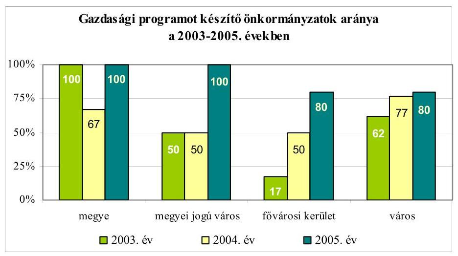

A gazdasági programot nem helyettesítették, de a hosszabb távra szóló tervezés alapját biztosították a helyi gazdasági, társadalmi adottságok figyelembevételével készített, több évre szóló különböző ágazati koncepciók, ciklusprogramok.

---

Az ellenőrzött önkormányzatok közül, az Ötv. 91. § (1) bekezdésében előírtakat megsértve, jegyzői előkészítés hiánya miatt, Budapest főváros egyik kerületi önkormányzata és a városi önkormányzatok ötöde (13 önkormányzat) nem rendelkezett gazdasági programmal. A gazdasági program készítésének elmulasztása összefüggött azzal, hogy annak tartalmára, elkészítési határidejére, időtartamára nem volt jogszabályi előírás ${ }^{26}$.

Az ellenőrzött önkormányzatok mindegyike - az előző évekhez hasonlóan - az Ámr. 21. § (2) bekezdés b) pontja alapján elkészítette, és a polgármester az Áht. 70. §-ában előírt határidőn ${ }^{27}$ belül a képviselő-testületnek benyújtotta a költségvetési koncepciót. A költségvetési koncepciót - az Ámr. 28. § (1) bekezdésében foglaltakat betartva - az önkormányzatok 85\%-a a helyben képződő bevételek és az ismert kötelezettségek alapján, számításokkal megalapozva állította össze. A költségvetési koncepciók tervezetét a pénzügyi bizottságok megtárgyalták, azonban az önkormányzatok 50\%-ánál a polgármester az Ámr. 28. § (3) bekezdésében foglaltak ellenére a bizottságok írásos véleményét az előterjesztésekhez nem csatolta, azt a pénzügyi bizottságok elnökei a képviselő-testületi ülésen szóban ismertették.

A 2004. és a 2005. évi költségvetési rendelettervezeteket az ellenőrzött önkormányzatok 96\%-ánál a polgármester az Áht. 71. § (1) bekezdésében előírt határidőn belül ${ }^{28}$ terjesztette a képviselő-testület elé.

A polgármester nem csatolta az előterjesztett költségvetési rendelettervezethez az Ámr. 29. § (9) bekezdésének előírása ellenére - az önkormányzatok 54\%ánál a pénzügyi bizottság írásos véleményét - azt a pénzügyi bizottságok elnökei a képviselő-testületi üléseken ismertették -, valamint az önkormányzatok 16\%-ánál az Ötv. 92/C. § (2) bekezdése alapján a költségvetési rendelettervezetről könyvvizsgálói véleményt tartalmazó írásos tájékoztatást.

Az önkormányzatok döntő többségénél (96\%-ánál) a polgármester a költségvetési rendelettervezetekkel együtt, illetve azt megelőzően - az Áht. 71. § (2) bekezdésében előírtaknak megfelelően - a képviselő-testület elé terjesztette azokat a rendelettervezeteket ${ }^{29}$, amelyek a tervezett előirányzatokat megalapozták.

[^0]
[^0]:    ${ }^{26}$ Ennek meghatározása megtörtént az ÁSZ 0436 sorszámú, a helyi és a helyi kisebbségi önkormányzatok gazdálkodásának átfogó ellenőrzéséről készült jelentésben tett javaslatot is figyelembe véve az Ötv. 2005. évi módosításakor.
    ${ }^{27}$ Az Áht. 70. §-a szerint a költségvetési koncepciót november 30-ig, az önkormányzati képviselő-testület tagjai általános választásának évében december 15-ig kell benyújtani a képviselő-testületnek.
    ${ }^{28}$ Az Áht. 71. § (1) bekezdés szerinti határidő a tárgyév február 15-e.
    ${ }^{29}$ Az önkormányzatoknak a helyi adókról, a személyes gondoskodást nyújtó ellátások intézményi térítési és az ellátottak személyi térítési díjának, valamint a bérleti díjak és az ivóvíz, valamint csatornadíjak megállapításáról, az élelmezési nyersanyagnormák meghatározásáról szóló rendeletei.

---

A költségvetési rendelettervezetekben az önkormányzatok 82\%-ánál az Áht. 71. § (2) bekezdésének megfelelően bemutatták a többéves elkötelezettségekkel járó kiadási tételek későbbi évekre vonatkozó kihatásait, valamint az önkormányzatok 91\%-ánál az Áht. 71. § (3) bekezdése alapján a tárgyévet követő két év várható előirányzatait is.

A költségvetési rendelettervezetek előterjesztésekor az önkormányzatok 43\%ánál az Áht. 8. § (1) és a 8/A. § (7) bekezdésében foglaltakat megsértve a költségvetési bevételek és a költségvetési kiadások is tartalmaztak finanszírozási célú pénzügyi műveleteket, valamint amennyiben a költségvetési kiadások meghaladták a költségvetési bevételeket, a két összeg különbségeként a hiány öszszegét nem mutatták be, ezáltal az államháztartás pénzügyi információs rendszer részére készített költségvetés és a képviselő-testületek által elfogadott költségvetés tervadatainak egyezőségét nem biztosították.

Az Áht. 8/A. § (7) bekezdés alapján a költségvetésben nem lehet a finanszírozási célú pénzügyi műveleteket a költségvetési hiányt módosító költségvetési bevételként, illetve költségvetési kiadásként elszámolni, így a hosszú és rövid lejáratú hitelfelvételek és hitel-visszafizetési kötelezettségek összege sem a költségvetési bevételben, sem a költségvetési kiadásban nem szerepelhet. Az így számított bevételek-kiadások különbsége jelenti az Áht. 8. § (1) bekezdése alapján a költségvetési hiányt, vagy többletet. Az előírt számítási mód az önkormányzatoknál nem biztosítja a tárgyévi hitel-visszafizetési kötelezettség összegének a költségvetési kiadások közötti figyelembevételi lehetőségét annak ellenére, hogy a tartalmát tekintve szerződésen alapuló kiadási kötelezettség befolyásolja a költségvetési hiány vagy többlet megítélését (az Áht. 8. § (1) bekezdés alapján kimutatásra kerülő hiány összegét növeli).

Az ellenőrzött önkormányzatok 91\%-ánál a 2004. és a 2005. évi költségvetési rendeletekben a képviselő-testületek - az Áht. 67. § (3) bekezdésében foglaltaknak megfelelően - meghatározták a címrendet és a címrend felépítési elveit ${ }^{30}$.

Az önkormányzatok négyötödénél a költségvetési rendelettervezetek az Áht. 69. § (1) bekezdésében előírt tartalommal készültek, a költségvetés összeállítása során az Ámr. 29. § (1) bekezdésében meghatározott, a költségvetés szerkezetére vonatkozó előírásokat figyelembe vették.

A költségvetési rendelettervezetek az Áht. 69. § (1) bekezdésében foglalt előirásokat megsértve önkormányzati szinten ezen belül költségvetési szervenként nem tartalmazták a kiemelt működési célú kiadási előirányzatok közül 3, illetve 6\%-nál a személyi- és dologi jellegű kiadásokat és a munkaadókat terhelő járulékokat, 7\%-nál az ellátottak pénzbeli juttatásait, 14\%-nál a speciális célú önkormányzati támogatások összesítését. Nem határozták meg a működési célú kiadási előirányzatokat költségvetési szervenként az önkormányzatok 11\%-ánál, ezen belül a személyi és dologi jellegű kiadásokat kiemelt előirányzatonként az önkormányzatok 6\%, illetve 8\%-a, az ellátottak pénzbeli jutatásait 12\%-ánál, a speciális célú támogatásokat 14\%-ánál, az éves létszámkeretet 5\%-ánál nem részletezték.

[^0]
[^0]:    ${ }^{30}$ Ez az arány az előző években $70 \%$, illetve $73 \%$ volt.

---

# A költségvetési rendelet az Ámr. 29. § (1) bekezdésében meghatározott előírások ellenére: 

- nem tartalmazta a felújítási előirányzatokat célonként, és a felhalmozási kiadásokat feladatonként az önkormányzatok 6, illetve 8\%-ánál;
- nem részletezte az önkormányzati hivatal költségvetését feladatonként az önkormányzatok 6\%-ánál, 15\%-ánál külön tételben az általános és 12\%ánál a céltartalékot;
- nem adott tájékoztatást a többéves kihatással járó feladatok előirányzatairól éves bontásban az önkormányzatok 16\%-ánál, a múködési és felhalmozási célú bevételi és kiadási előirányzatokról mérlegszerűen az önkormányzatok $10 \%$-ánál;
- nem tartalmazta elkülönítetten a helyi kisebbségi önkormányzatok költségvetését az érintett önkormányzatok 6\%-ánál, nem készítették el az év várható bevételi és kiadási előirányzatainak teljesüléséről az előirányzatfelhasználási ütemtervet az önkormányzatok 18\%-ánál;
- nem tartalmazta elkülönítetten az önkormányzatok 7\%-ánál az európai uniós támogatással megvalósuló projektek bevételeit és kiadásait, mivel azt Ámr. 29. § (1) bekezdés k) pontban foglaltak ellenére az önkormányzati hivatal igazgatási kiadásai között szerepeltették.

A költségvetési többlet felhasználásának szabályairól - az Áht. 8/A. § (1) bekezdésében előírtakat megsértve - az önkormányzatok 29\%-ánál, a költségvetési hiány finanszírozásával összefüggő hitelműveleti hatáskörökről az Áht. 75. §-ában előírtakat megsértve az önkormányzatok 26\%-ánál nem rendelkeztek.

A költségvetési rendeletekben az önkormányzatok 23\%-ánál a különböző feladatok támogatására elkülönített keretösszegeket határoztak meg „alap" elnevezéssel. Az „alap" elnevezés nincs összhangban az Áht-ban foglaltakkal, mert az elkülönített állami pénzalapokra, mint az államháztartási rendszer egyik alrendszerének elemére az Áht. szóhasználatával röviden az „alap" kifejezést használja, amelyekre az Áht. 54. §-a meghatározza azok létrehozásának, gazdálkodásának feltételeit is. Ezen feltételeknek az önkormányzatok költségvetésében szereplő alapok - a környezetvédelmi alap kivételével nem feleltek meg, ezért a kifejezés félreérthető. Az államháztartás rendszerében a meghatározott feltételekhez kötött fogalmak eltérő tartalmú alkalmazása bizonytalanságot, az egyértelműség hiányát okozza.

Az ellenőrzött önkormányzatok 88\%-ánál az Áht. 118. §-ában előírtakat megsértve - előterjesztés hiányában - nem határozták meg önkormányzati rendeletben a költségvetés és zárszámadás előterjesztésekor tájékoztatásul bemutatandó - az Áht. 116. § 6.; 8.; 9.; 10. pontja szerinti - mérlegek és kimutatások tartalmi követelményeit. A közvetett támogatásokról készítendő kimutatás tartalmi követelményeit meghatározó önkormányzatok egymáshoz képest eltérően határozták meg, hogy mit tekintenek közvetett támogatásnak. Az önkormányzatok többsége az iparűzési adóból nyújtott kedvezményeket, mentességeket, a lakosság részére lakásépítéshez, lakásfelújítás-

---

hoz nyújtott kölcsönök elengedését tekintette közvetett támogatásnak, de indokoltsága ellenére nem tekintette idetartozónak a térítési díjak, illetékek méltányossági alapon történő elengedését, a más helyi adónál (építmény adónál, telekadónál, kommunális adónál), biztosított kedvezményeket, mentességeket. A költségvetési rendelettervezet előterjesztésekor az önkormányzatok 4\%-ánál nem mutatták be tájékoztatásul az önkormányzatok összevont mérlegét, az önkormányzatok 22\%-ánál a többéves kihatással járó döntések számszerúsítését évenkénti bontásban, továbbá az önkormányzatok 53\%-ánál a közvetett támogatásokat tartalmazó kimutatást.

Az ellenőrzött önkormányzatok a költségvetési rendeletükben jóváhagyott bevételi és kiadási előirányzataikat összességében a 2004. évben 11,8\%-kal, (60,7 milliárd Ft-tal), a 2005. évben 10,7\%-kal (118,3 milliárd Ft-tal) növelve módosították.

A költségvetési előirányzatok módosításának szabályszerűsége az előző évekhez viszonyítva javuló tendenciát mutatott. A jóváhagyott előirányzat változtatásokat hitelt érdemlően dokumentálta az önkormányzatok 90\%-a (az előző évi $84 \%$-kal szemben).

# A költségvetési rendeletmódosítás határidejére, éven belüli rendjére az Ámr-ben meghatározott előírásokat a 2004. évben az önkormányzatok 54\%-a (az előző évben 51\%-a) nem tartotta be: 

- az önkormányzatok 46\%-a (az előző évben 52\%-a) az Ámr. 53. § (2) bekezdésében előírt időn belül nem tett eleget - a Kormány által biztosított - pótelöirányzatok miatt indokolt költségvetési rendeletmódosítási kötelezettségének, hanem csupán félévente, vagy évente egyszer módosították azt;
- az önkormányzatok 27\%-ánál (az előző évben 59\%-ánál) a jegyzők az Ámr. 53. § (6) bekezdésében foglaltakat figyelmen kívül hagyva nem készítették elő 30 napon belül a költségvetési szervek saját hatáskörben végrehajtott előirányzat változtatásáról szóló tájékoztatót, ezért erről a polgármesterek a képviselő-testületeket az Ámr. 53. § (6) bekezdésében előírt határidőn belül nem tájékoztatták;
- az önkormányzatok több mint fele (54\%-a) az adott évi költségvetési rendeletét utolsó alkalommal - az Ámr. 53. § (2) és (6) bekezdésben előírtak ellenére - nem a költségvetési beszámoló megküldésének a Vhr. 10. § (1) bekezdésében előírt időpontjáig (február 28.), hanem azt követően módosította.

### 1.2. A gazdálkodás szabályozottsága, a bizonylati rend és fegyelem szabályszerúsége, a folyamatba épített ellenőrzés múködése

Az önkormányzati hivatalok 38\%-a (a 2003. évben 41\%-a) nem rendelkezett a képviselő-testület által jóváhagyott SzMSz-szel az Ámr. 10. § (4) bekezdésének előírása ellenére. Az önkormányzati hivatalok 82\%-ánál (a 2003. évben 74\%-ánál) szabályozták a gazdasági szervezetek feladatát ügyrendben. Ezen ügyrendek 59\%-a tartalmazta az Ámr. 17. § (5) bekezdésében foglaltaknak megfelelően a gazdasági szervezet és szervezeti egységei, valamint

---

a pénzügyi-gazdasági feladatok ellátásáért felelős személyek feladatait, 54\%-a a vezetők és más dolgozók feladat-, hatás- és jogkörét.

Az önkormányzati hivatalok 80\%-ánál - az előző évivel azonos arányban - határozták meg szabályzatban az operatív gazdálkodással kapcsolatos hatásköröket. Ezen szabályzatokban az Ámr. 134. § (2) bekezdésében ${ }^{31}$ biztosított lehetőség alapján kötelezettségvállalási és utalványozási jogkörrel a polgármesterek 66\%-a, illetve 71\%-a, a kötelezettségvállalás és az utalványozás ellenjegyzésének jogával a jegyzők 67\%-a, illetve 66\%-a hatalmazott fel másokat is. Az önkormányzatok 81\%-ánál a felhatalmazásoknál biztosították az összeférhetetlenségi követelmények betartását az Ámr. 135. § (5) bekezdésében és a 138. § (1)-(3) bekezdésében foglaltaknak megfelelően. Az érvényesítési feladatok elvégzésére a jegyzők az önkormányzati hivatalok 79\%-ánál adtak írásbeli megbízást. Az érvényesítésre történő megbízásoknál a jegyzők nem tartották be az Ámr. 135. § (2) bekezdésének az iskolai végzettségre és szakmai képesítésre, valamint az Ámr. 135. § (5) bekezdésének az összeférhetetlenségre vonatkozó előírásait az önkormányzati hivatalok 4\%-ánál, illetve 14\%-ánál.

A szakmai teljesítés igazolásának módjáról az Ámr. 135. § (3) bekezdésében foglaltak ellenére az önkormányzati hivatalok 54\%-ánál a jegyzök nem rendelkeztek, további 6\%-ánál nem egyértelműen intézkedtek. A szakmai teljesítésigazolást végző személyek kijelölése elmaradt az önkormányzati hivatalok 41\%-ánál.

A jegyzők az önállóan gazdálkodó költségvetési szervekkel rendelkező önkormányzatok 73\%-ánál kialakították az intézmények egységes számviteli rendjét, a Htv. 140. § (1) bekezdés c) pontjában előírtaknak megfelelően.

Az ellenőrzött önkormányzatoknál a gazdálkodás szabályozottságát mutatja az alábbi grafikon:
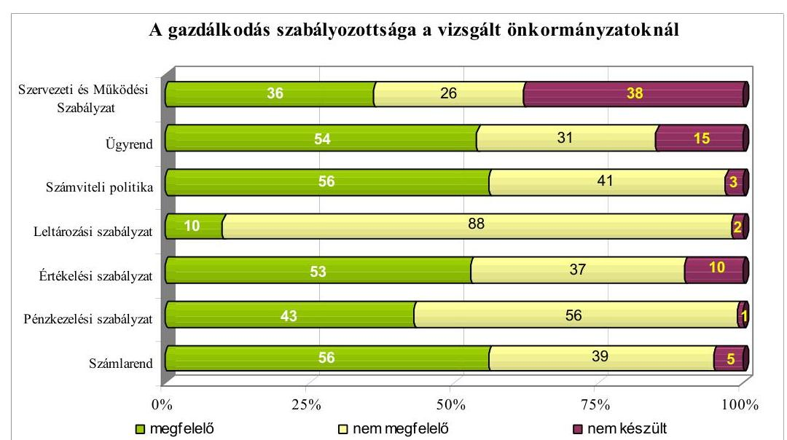

[^0]
[^0]:    ${ }^{31}$ A bekezdés számozása a 2004. évben (3) volt.

---

A jegyzők a számviteli politikát az önkormányzati hivatalok 97\%ánál (a 2003. évben $87 \%$-ánál) készítették el. A számviteli politikával rendelkező önkormányzati hivatalok 80\%-ánál (a 2003. évben 71\%-ánál) a Vhr. 8. § (5) bekezdésében foglaltak szerint rögzítették, hogy a számviteli elszámolás és értékelés szempontjából mit tekintenek lényeges és nem lényeges információnak, továbbá jelentős és nem jelentős összegnek. Meghatározták a megbízható valós összkép kialakításánál, a kis értékű tárgyi eszközök, a vagyoni értékű jogok és a szellemi termékek minősítésénél figyelembe veendő szempontokat. A jegyzők az ellenőrzött önkormányzatok 69\%-ánál a Vhr. 8. § (5) bekezdésének g) pontjában foglaltak alapján szabályozták a terven felüli értékcsökkenés elszámolásánál figyelembe veendő szempontokat.

A vállalkozási tevékenységet végző öt önkormányzati hivatal közül, az előző évivel azonosan, négynél a jegyző nem határozta meg a Vhr. 8. § (5) bekezdésének c)-e) pontjában előírtak ellenére az értékcsökkenés és a tevékenységet terhelő előzetesen felszámított általános forgalmi adó összegének alap- és vállalkozási tevékenység közötti megosztásánál, valamint az általános kiadások megosztási módszerének kiválasztásánál figyelembe veendő szempontokat.

Nem jelölték ki, illetve tévesen rögzítették az önkormányzatok 18\%ánál - a Vhr. 8. § (8) bekezdésében előírtak ellenére - a mérlegkészítés idópontját, ameddig a tárgyévet követően az értékelési feladatokat és a számviteli helyesbítéseket el kell végezni.

A jegyzők a számviteli politika és a kapcsolódó szabályzatok előírásait az érintett önkormányzatok 65\%-ánál az önkormányzati hivatalhoz tartózó részben önállóan gazdálkodó költségvetési szervekre is kiterjesztették, ehhez azonban a jegyzők kétharmada nem kérte a Vhr. 8. § (13) bekezdésben foglaltak ellenére a felügyeleti szerv (közgyűlés, képviselő-testület) egyetértését. A Vhr. előírásához viszonyított mulasztást meg kellett állapítanunk, annak ellenére, hogy a Htv. 140. § (1) bekezdés c) pontja szerint a jegyzők feladata és hatásköre az önkormányzati költségvetési szervek számviteli rendjének a kialakítása.

A számviteli politika részeként elkészítendő szabályzatok a következő hiányosságok miatt nem biztosították a szabályszerű gazdálkodás feltételeit:

- az eszközök és források leltározási és leltárkészítési szabályzatában az önkormányzati hivatalok 90\%-ánál (az előző évben 56\%-ánál) a leltározás szabályai nem terjedtek ki a források és az üzemeltetésre, kezelésre átadott eszközök leltározásának sajátos szabályaira, valamint egy-két kivételtől eltekintve nem aktualizálták a leltározás módját és gyakoriságát 2004. január 1-től hatályosan módosító Vhr. 37. § (3)-(4) bekezdéseinek ${ }^{32}$ változásával;

[^0]
[^0]:    ${ }^{32}$ Vhr. 37.§ (3) bekezdésében foglaltak alapján az eszközök - kivéve az immateriális javakat, a követeléseket - leltározását mennyiségi felvétellel, csak értékben kimutatott eszközök - immateriális javak, a követelések - és a források leltározását egyeztetéssel kell végrehajtani, a (4) bekezdést hatályon kívül helyezték, így megszűnt a leltározás elvégzésének részletező nyilvántartások alapján készíthető összesítő kimutatással - felügyeleti szerv egyetértésével - történő helyettesítési lehetősége.

---

- az eszközök és források értékelési szabályzatában az önkormányzati hivatalok közel fele ( $47 \%$-a, az előző évben 57\%-a) nem határozta meg a mérlegtételek értékelésének általános szabályait, az eszközök bekerülési értékének és a források értékelésének szabályait. Nem, vagy nem a Vhr. 8. § (5) bekezdés g) pontjában, valamint (4) bekezdés b) pontjában foglaltaknak megfelelően szabályozták az önkormányzati hivatalok 37\%-ánál, illetve 27\%-ánál a terven felüli értékcsökkentés és az értékvesztés visszaírásának eszközcsoportonként részletezett rendjét;
- az önköltségszámítás rendjére vonatkozó szabályzatot a Vhr. 8. § (4) bekezdés c) pontja előírása ellenére a jegyzők az érintett önkormányzati hivatalok $41 \%$-ánál nem készítették el;
- a pénzkezelési szabályzatok 56\%-ánál nem, vagy hiányosan rögzítették az Ámr. 103. § (2), (6) és (7) bekezdése alapján megnyitható bankszámlák körét, rendeltetését, a bankszámlák és a pénztár kapcsolatrendszerét, a pénztári ellenőrzés módját, az ellenőrzésért felelős személyek megnevezését, a banki terminálon keresztül történő pénzügyi műveletek végzésére vonatkozó speciális szabályokat, a bankkártya használatára vonatkozó előírásokat. Nem, vagy nem a szükséges mértékben szabályozták a házipénztáron kívüli pénzkezelés feltételeit, a részben önállóan gazdálkodó költségvetési szervek készpénzellátásának rendjét, valamint az értékpapírok nyilvántartásainak, őrzésének feladatait;
- a felesleges vagyontárgyak hasznosításának, selejtezésének feladatait, az erre vonatkozó döntési hatásköröket az önkormányzati hivatalok döntő többségében ( $95 \%$-nál) meghatározták.

A számlarendet az önkormányzati hivatalok 96\%-ánál (az előző évben 87\%-ánál) a jegyzők elkészítették, a Vhr. 49. §-ban előírtakkal az összhangot a számlarendek 56\%-ánál biztosították. A többinél a számlarend nem, vagy hiányosan tartalmazta a következőket:

- a Számv. tv. 161. § (2) bekezdésében foglaltakat megsértve az alkalmazásra kijelölt főkönyvi számlák megnevezését, tartalmát, a főkönyvi számla értéke növekedésének és csökkenésének jogcímeit, alapbizonylatait;
- a Vhr. 49. § (2) és (4) bekezdésében előírtak ellenére az analitikus nyilvántartások formáját, tartalmát, azok vezetésének módját, a főkönyvi könyveléssel való egyeztetés módját, dokumentálási formáját, a zárlati feladatok elvégzésének időpontjait és módját, az összesítő kimutatások (feladások) elkészítésének rendjét.

A gazdálkodási szabályzatokban a pénzügyi-számviteli feladatok elvégzésének folyamatát az önkormányzati hivatalok 25\%-ánál (a 2003. évben 34\%-ánál) szabályozták a Számv. tv., a Vhr. és az Ámr-ben előírt követelményeknek és a helyi sajátosságoknak megfelelően.

---

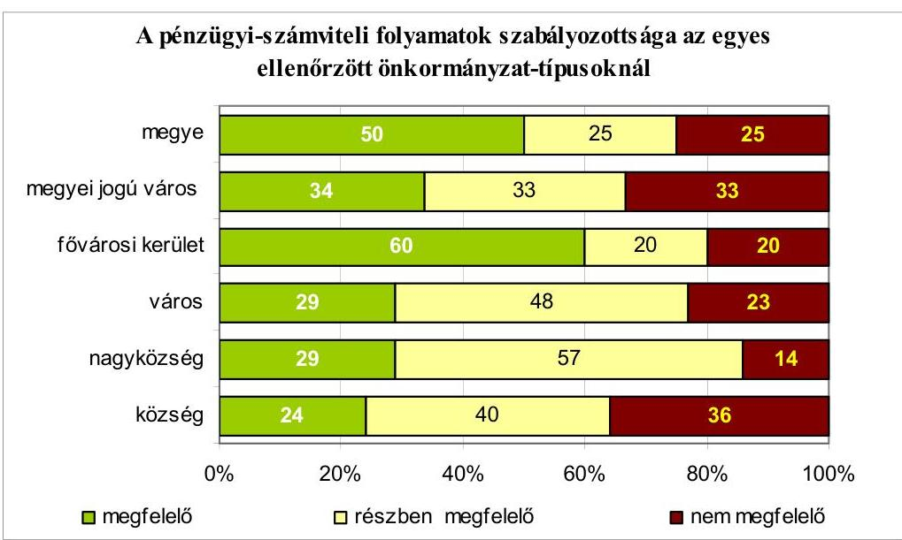

A pénzügyi-számviteli folyamatok szabályzatai az önkormányzati hivatalok 44-65\%-ánál nem tartalmazták az ellenőrzési, egyeztetési pontokat, az ellenőrzések során elvégzendő műveleteket, az ellenőrzések viszonyítási alapját a követelményektől való eltérések megállapítási és dokumentálási módjának, valamint az eltérések esetén szükséges jelzési kötelezettségeknek a meghatározását.

A pénzügyi-számviteli dolgozók munkaköri leírásai az önkormányzatok 47\%-ánál (az előző évben 51\%-ánál) nem tartalmazták a munkafolyamatba épített ellenőrzési, egyeztetési feladatokat. A pénzügyiszámviteli munkafolyamatok ellenőrzési nyomvonalát az Ámr. 145/B. § (1) bekezdésében foglaltak ellenére a jegyzök az önkormányzati hivatalok 59\%-ánál nem határozták meg, a tervezési, pénzügyi, lebonyolítási és ellenőrzési folyamatokat nem szabályozták. Elmaradt a szabályozás a községi, nagyközségi önkormányzatok 38-38\%-ánál, valamint a városi önkormányzatok $46 \%$-ánál.

Az önkormányzatok 51\%-ánál (az előző évben 53\%-nál) biztosították a hivatalban a könyvviteli elszámolásokhoz kapcsolódó analitikus nyilvántartások vezetését a Vhr. 49. § (1) bekezdés előírásainak megfelelően. Az analitikus nyilvántartásokat elmulasztó, vagy hiányosan vezető önkormányzati hivatalok nem biztosították a negyedéves mérlegjelentések és az éves beszámoló adatainak alátámasztását.

A fökönyvi könyvelés, az analitikus nyilvántartások és a bizonylatok közötti egyeztetési, ellenőrzési pontokat az előző évhez hasonlóan, az önkormányzati hivatalok 37\%-ánál nem alakították ki, így az analitikus nyilvántartásokkal rendelkező önkormányzatok 73\%-ánál biztosították mindkét évben a könyvviteli nyilvántartások és a bizonylatok adatai közötti egyeztetés és ellenőrzés lehetőségét a Számv. tv. 165. § (4) bekezdés előírásainak megfelelő, logikailag zárt rendszerrel.

---

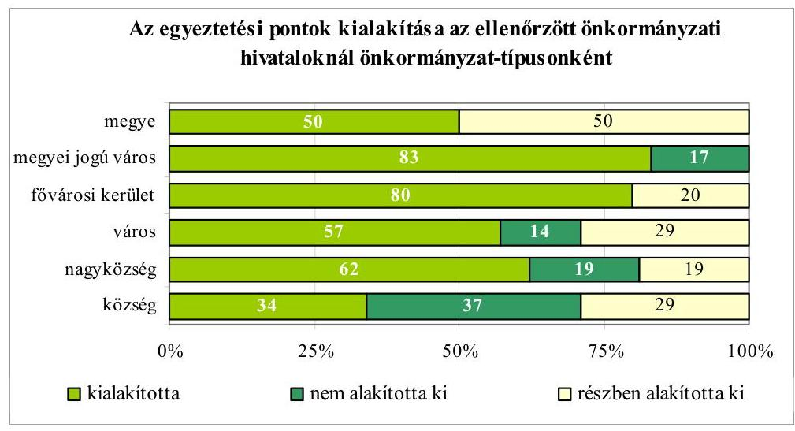

Az önkormányzati hivatalok a Vhr. 17. számú mellékletében meghatározott tartalmú főkönyvi kivonatot az előző évivel azonos arányban (az önkormányzatok 10\%-ánál) nem készítették el a negyedéves mérlegjelentés és az éves beszámoló összeállítása előtt. A zárlati munkák keretében a saját számlarendjükben foglaltaknak megfelelően, negyedévente rendszeresen elvégezték és dokumentálták a főkönyvi könyvelés és az analitikus nyilvántartások adatainak egyeztetését az önkormányzati hivatalok 47\%-nál (az előző évben 42\%-ánál). Az egyeztetések elvégzését csak félévente, év végén igazolták, illetve részlegesen végezték el annak feladatait az önkormányzati hivatalok 21\%-ánál (az előző évben 27\%-ánál), nem tettek eleget egyeztetési kötelezettségüknek 32\%-ánál (az előző évben 31\%-ánál). Az egyeztetések elmaradása, részleges végrehajtása esetén nem győződtek meg a könyvviteli elszámolások helyességéről, adatainak megbízhatóságáról.
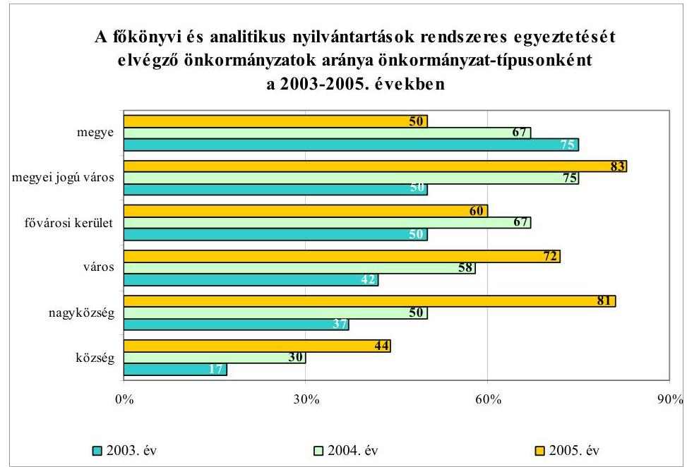

Az előző évinél rendszeresebbek voltak a nyilvántartások közötti egyeztetések a megyei jogú városi, a városi, a nagyközségi és a községi önkormányzatok hiva-

---

talainál. Csökkent a feladatokat negyedévente és hiánytalanul végrehajtó önkormányzati hivatalok aránya a megyei és a Budapest főváros kerületi önkormányzatainál.

Az önkormányzatok könyvviteli nyilvántartásaiban a Számv. tv. 165. § (1) bekezdésében előírt bizonylat nélkül számolták el a gazdasági események 6\%-át (az előző évben 4\%-át).

Bizonylat hiányában rögzítettek a számviteli nyilvántartásokban jellemzően számlák közötti átvezetéseket, készpénzfelvételeket a költségvetési számláról, azok házipénztári bevételezését, intézményi térítési díjakat, önkormányzati ingatlanok bérleti díjának befizetését, önkormányzat által nyújtott kölcsönök törlesztését, előleg kifizetéseket a pénztárból, intézményfinanszírozási kiadásokat, tárgyi eszközök, követelések, kötelezettségek állományváltozását, az eszközök értékcsökkenésének változását.

A pénzforgalmi bizonylatok, feladások tartalmi hiányosságai a Számv. tv. 167. § (1) bekezdés a)-j) pontjainak az alaki és tartalmi követelményekre vonatkozó előírásait megsértve - a Budapest fővárosi kerületek kivételével - valamennyi ellenőrzött bizonylatot érintettek az önkormányzatok 22\%-nál, (az előző évben 23\%-nál), és 50\%-ot meghaladó arányban fordultak elő az önkormányzatok 14\%-ánál, (az előző évben 11\%-nál). A gazdasági események elszámolásához kiállított bizonylatok:

- nem tartalmazták a bizonylat sorszámát, vagy más azonosító adatát, a gazdasági művelet leírását, a bizonylat kiállításának keltét, a kiállító gazdálkodó szerv megnevezését, a gazdasági eseményt elrendelő (utalványozó) aláírását, hivatkozást a könyvelés módjára és az érintett könyvviteli számlákra, a könyvviteli nyilvántartásban történt rögzítés időpontját;
- nem az önkormányzati hivatal nevére, illetve nem annak nevében, nem magyar nyelven és nem forintban kiállított számla alapján számoltak el bevételi és kiadási pénzforgalmat;
- nem szerepeltek az utalványon az Ámr 136. § (4) bekezdés c), d), g) pontjaiban előírtak ellenére a költségvetési év megjelölése, a befizető és a kedvezményezett adatai, az utalványozó és az utalvány ellenjegyzőjének aláírása;
- nem tartalmazta a bizonylatok 81\%-a (az előző évben 79\%) a kötelezettségvállalás nyilvántartási sorszámát a kötelezettségvállalási rend és nyilvántartási forma kialakításának, a nyilvántartás vezetésének elmaradása miatt.

Az önkormányzati hivatalokban a gazdálkodás pénzforgalmát - az előző két évhez hasonlóan - 55\%-45\% arányban bonyolították és számolták el bankszámla, illetve pénztári tételként. A bizonylatok feldolgozási rendje a pénztári bizonylatoknál a jogszabályi előírásoknak jobban megfelelt, mint a bankszámlához kapcsolódó bizonylatok esetében, ugyanakkor a folyamatba épített ellenőrzés a bankszámlához kapcsolódó bizonylatoknál jobban működött, mint a pénztári bizonylatoknál. Az előző évben a hiányosságok hasonló arányban fordultak elő a pénztári feladatokban és a bankszámlához kapcsolódó tevékenységben.

---

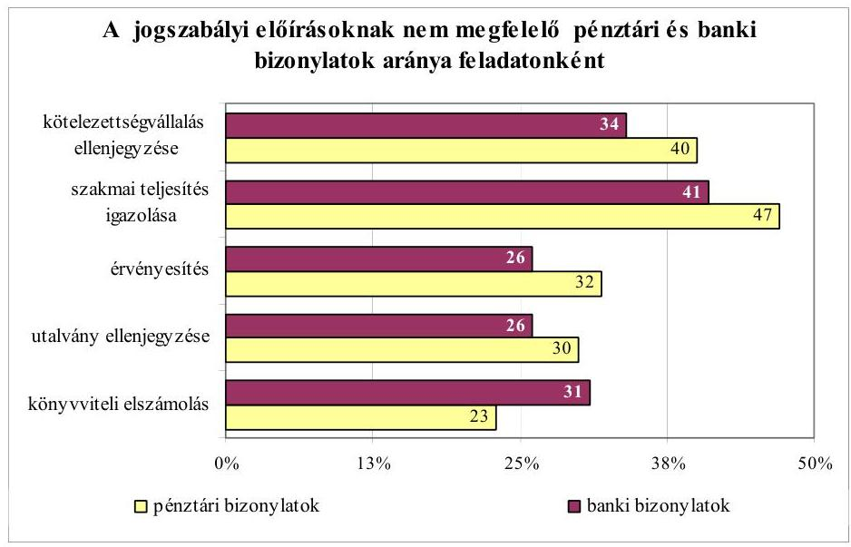

Az önkormányzati hivatalok a gazdasági eseményekről, múveletekről kiállított bizonylatok 74\%-ának (az előző évben 80\%-ának) adatait a Vhr. 51. § (1) bekezdés a)-b) pontjaiban foglaltaknak megfelelő időben rögzítették a könyvviteli nyilvántartásokban.

Nem rögzítették a pénzmozgással egyidejúleg a készpénzforgalmi bizonylatokat $23 \%$-nál (a 2003-ben $21 \%$-nál), a bankszámla forgalmát a hitelintézeti értesítés megérkezésekor $31 \%$-nál (a 2003-ben $23 \%$-nál), az egyéb gazdasági múveletek, események, illetve az analitikus nyilvántartásokból készített összesítő bizonylatok adatait a tárgynegyedévet követő hó 15 -ig 20\%-nál (a 2003-ben 10\%-nál). Ezekben az esetekben a pénztári és a banki pénzforgalom könyvelését utólag, 5-30 napos késedelemmel, illetve csak a havi zárlati időszakban végezték el, az egyéb gazdasági eseményeket pedig a félév, vagy az év végén rögzítették.

A késedelmes elszámolások okai között szerepelt, hogy az első negyedévben az önkormányzati hivatalok nem kapták meg a tárgyévi számítógépes főkönyvi programot a program megyei felügyeletét ellátó szervezettől (MÁK-tól).

A kötelezettségvállalásokat a 2004. évi 91\%-kal szemben csak 87\%nál végezték az arra felhatalmazottak, a továbbiaknál az Ámr. 134. § (2) bekezdés ${ }^{33}$ előírása ellenére írásos polgármesteri felhatalmazás hiányában vállalt kötelezettséget bizottság elnöke, jegyző, hivatali alkalmazott, megyei önkormányzatoknál az illetékhivatal vezetője, illetve munkatársa.

A bevételek beszedésének és a kiadások teljesítésének elrendelését (az utalványozást) a bizonylatok 7\%-án (az előző évben 6\%-án) az Ámr. 136. § (2) bekezdés előírásai ellenére nem az arra jogosult polgármester, hanem annak felhatalmazása nélkül képviselő-testületi tag, jegyző, hivatali dolgozó végezte, valamint a polgármesterek intézményi és helyi kisebbségi önkormányzati költségvetés terhére, az intézményvezető, illetve a kisebbségi önkormányzat elnökének hatáskörét elvonva is utalványoztak.

[^0]
[^0]:    ${ }^{33}$ A bekezdés számozása a 2004. évben (3) volt.

---

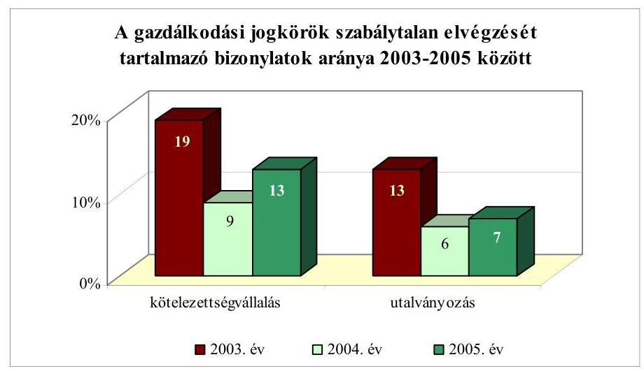

A kötelezettségvállalás ellenjegyzöje az Ámr. 134. § (9) bekezdés ${ }^{34}$ a)-c) pontjaiban foglalt ellenőrzési feladatokat nem végezte el a bizonylatok 37\%ánál (az előző évben 24\%-ánál).

Elmaradt az ellenjegyzés a kötelezettségvállalás nélküli kiadásoknál, a kötelezettségvállalás az igazolt ellenjegyzés ellenére nem alapult jóváhagyott költségvetési előirányzaton, illetve előirányzat-felhasználási terven. A hiányosságot a gazdasági eseményenként 50 ezer Ft-ot el nem érő kifizetéseknél az okozta, hogy az Ámr. 134. § (3) bekezdésében ${ }^{35}$ előírtak ellenére a nyilvántartási rendszert nem alakították ki, így nem volt egyértelmű a kötelezettségvállalások rendje, illetve a szabályozás elmulasztása ellenére nem történt meg az írásbeli kötelezettségvállalás és az ellenjegyzés.

Az önkormányzatok 61\%-ánál az Ámr. 134. § (13) bekezdésében ${ }^{36}$ előírtak ellenére a hivatalokban a kötelezettségvállalásokról nem vezették az előírt nyilvántartást, illetve $21 \%$-ánál a nyilvántartásban nem folyamatosan, vagy nem kiemelt előirányzatonként rögzítették a kötelezettségvállalásokat. A nyilvántartás hiánya miatt az önkormányzatok 82\%-ánál nem volt megállapítható a kötelezettségvállalás 2004. évi összege, továbbá a költségvetés végrehajtásának folyamatában nem álltak a gazdálkodási és ellenőrzési jogköröket gyakorlók rendelkezésére azok az adatok, amelyek alapján biztosítható az ellenjegyzök ellenőrzési feladatainak ellátása, illetve a kifizetések jogszerűségének, megalapozottságának, előirányzaton belüli teljesítésének ellenőrzése.

Az utalvány ellenjegyzését a bizonylatok az előző évi 82\%-kal szemben 72\%-nál tartalmazták a bizonylatok. Az ellenjegyzési feladatok elvégzését igazolók azonban a bizonylatok 44\%-án nem látták el az Ámr. 137. § (3) bekezdésében és a helyi szabályozásban foglalt ellenőrzési feladataikat.

[^0]
[^0]:    ${ }^{34}$ A bekezdés számozása a 2004. évben (7) volt.
    ${ }^{35}$ A bekezdés számozása a 2004. évben (4) volt.
    ${ }^{36}$ A bekezdés számozása a 2004. évben (6) volt.

---

Az utalványozás szabálytalanságát is okozta, hogy elmaradt az ellenjegyzés igazolása a bizonylatokon, illetve jogosulatlanul, a jegyző írásos felhatalmazásával nem rendelkező személy végzett ellenjegyzést. Emellett a szakmai teljesítés igazolása és az érvényesítés szabályszerű végrehajtása hiányában is történt utalvány ellenjegyzés. Nem észrevételezték az ellenjegyzők az utalványozás elmaradását, jogosulatlan személy általi végzését, az utalványozást, illetve ellenjegyzést megelőző, folyamatba épített ellenőrzési feladatok elmulasztását.

# Az ellenjegyzés jogszabályi előírásnak nem megfelelő elvégzésének is 

következménye, hogy az önkormányzatok egyharmadánál - az Áht. 12/A. § (1) bekezdésének előírásait megsértve - előfordult a hivatalokban utalványozás jóváhagyott előirányzat hiányában is. Az előirányzat-túllépések okait nem vizsgálták, a mulasztás miatt felelősségre vonást nem kezdeményeztek.

A költségvetésben jóváhagyott előirányzatok túllépése az ellenőrzött kiemelt körbe tartozó, valamint a városi önkormányzatok 2004. évi beszámolója alapján két megyei és három kerületi önkormányzatnál egy-egy, két megyei jogú városnál kettő, valamint 35 városi önkormányzatnál egy-négy kiemelt előirányzatot. A legtöbb esetben ( $25 \%$-nál) a felhalmozási célú pénzeszköz átadás, a legkevesebb esetben ( $1,3 \%-1,3 \%$-nál) a személyi juttatás és a munkaadókat terhelő járulékok előirányzatát lépték túl.

Az előirányzatot meghaladó felhasználás módosított előirányzathoz viszonyított mértéke széles határok ( $0,04 \%-2658 \%$ ) között alakult, a legkisebb arányú a személyi juttatások és a munkaadókat terhelő járulékoknál, míg a legnagyobb a felhalmozási célú pénzeszköz átadásoknál volt. A módosított előirányzatot legnagyobb arányban az ellátottak pénzbeli juttatásainál Nagykőrös városnál ( $416,3 \%$-kal), a felhalmozási célú pénzeszközátadásoknál Lábatlan városnál ( $2658 \%$-kal) lépték túl.

A szakmai teljesítés igazolás a kiadások teljesítésének és a bevételek beszedésének elrendelése előtt az utalványok 44\%-ánál (Az előző évben a 32\%-ánál) nem történt meg, nem ellenőrizték, szakmailag nem igazolták a kiadás-bevétel jogosultságát, összegszerűségét, a szerződés, a megrendelés, a megállapodás teljesítését. Szabálytalan volt a bizonylatokon szereplő igazolás azokban az esetekben, ahol a jegyzők nem határozták meg a szakmai teljesítés igazolásának módját és/vagy nem jelölték ki az azt végző személyeket. A mulasztásokhoz hozzájárult, hogy jogszabályi előírás nem segítette a szakmai teljesítés igazolás módjának meghatározását, a bizonylaton történő rögzítés tartalmi követelményeinek kialakítását, meghatározását.

A közbenső egyeztetés során a Pénzügyminisztérium államtitkára által adott észrevétel szerint: „Nem tartom megvalósíthatónak a pénzügyi folyamatban a szakmai teljesités igazolása tartalmi követelményeinek jogszabályi meghatározását. Megítélésem szerint a gazdálkodási feladatok sokfélesége, sajátosságai miatt ezt az Áht. vonatkozó általános érvényú szabályozása alapján az egyes költségvetési szervek belső szabályzatban tudják konkretizálni."

Az észrevétel nem megalapozott, mivel a szakmai teljesítés igazolás a költségvetési szerveknél a folyamatba épített ellenőrzés részeként a bevétel-kiadás jogszerüségének, összegszerűségének első meghatározó jelentőségű feladata. A szakmai teljesítés igazolási feladat elvégzésénél a helyszíni ellenőrzés során a folyamatba épített ellenőrzési feladatok közül a legtöbb hiányosságot tapasztaltuk, ezért to-

---

vábbra is indokoltnak tartjuk a javaslatunk alapján e feladathoz a segítségnyújtást.

Az érvényesítést a bizonylatok 71\%-a (az előző évben 82\%-a) tartalmazta, de annak feladatait az Ámr. 135. § (1) és (4) bekezdésében előírtak ellenére - az előző évi 32\%-kal szemben - 44\%-nál nem végezték el az önkormányzati hivatalokban.

Hiányzott az érvényesítés, illetve az igazolt érvényesítés nem alapult a teljesítés szakmai igazolásán, nem tartalmazta az „érvényesítve" kifejezést, a megállapított összeget és a könyvviteli elszámolásra utaló főkönyvi számlaszámot. Az elvégzett főkönyvi számlakijelölés nem biztosította a bevételek és a kiadások szabályszerű főkönyvi elszámolását, nem felelt meg a Vhr. 9. számú mellékletben foglalt, illetve a szakfeladat rend ${ }^{37}$ előírásainak. Nem végezte el a munkafolyamatba épített ellenőrzési feladatait az érvényesítő az alaki és tartalmi szempontból hibás bizonylaton szereplő érvényesítési záradék esetén sem.

Az igazolt érvényesítés a megállapított mulasztások miatt nem töltötte be a hibák megelőzésére, kijavítására vonatkozó funkcióját a pénzgazdálkodásban és a számviteli elszámolásokban. A hiányosságokhoz hozzájárult az iskolai végzettség és a szakmai képesítés hiánya is a nagyközségi, községi önkormányzatok hivatalainál és a körjegyzőségeknél, ahol az érvényesítők megbízásánál a jegyzők (körjegyzők) az Ámr. 168. §-ában biztosított lehetőség alapján eltekintettek az iskolai végzettségre és szakmai képesítésre vonatkozó követelményektől.

A pénztár ellenőrzésének rendszerét az önkormányzati hivatalok az elmúlt három évben évente növekvő arányban (46-59-63\%-ánál) alakították ki. A pénztárellenőrök a pénzkezelési szabályzatban előírt ellenőrzési feladataikat azonban az előző évi 19\%-kal szemben a bizonylatok 33\%-ánál nem végezték el.
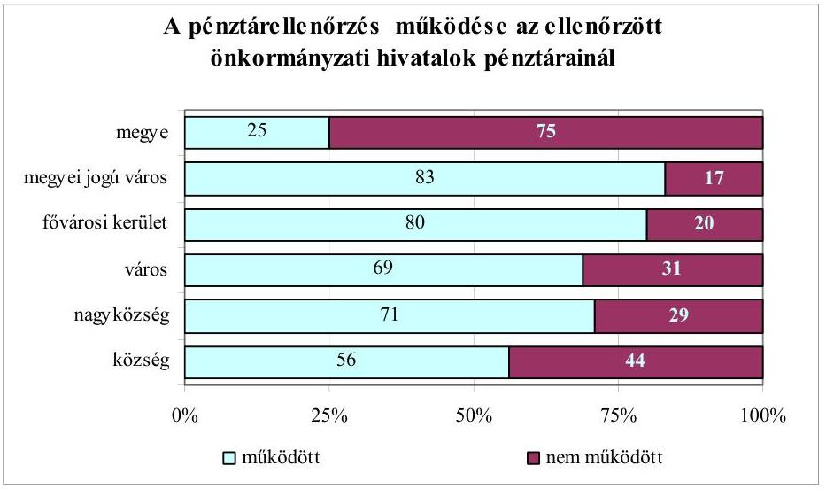

[^0]
[^0]:    ${ }^{37}$ A szakfeladatrendet a költségvetési szervek 2005. évi részletes költségvetési előirányzatainak összeállítását szolgáló nyomtatvány-garnitúrák kitöltéséhez készített PM tájékoztató rögzítette.

---

Az Ámr. 138. § (1)-(3) bekezdéseiben előírt összeférhetetlenségi követelményeket az előző évi 99\%-nál kisebb arányban, a bizonylatok 97\%-nál tartották be a gazdálkodási jogkörök gyakorlásakor és a munkafolyamatba épített ellenőrzési feladatok ellátásakor.

A munkafolyamatba épített ellenőrzés hiányát az alábbi táblázat szemlélteti:
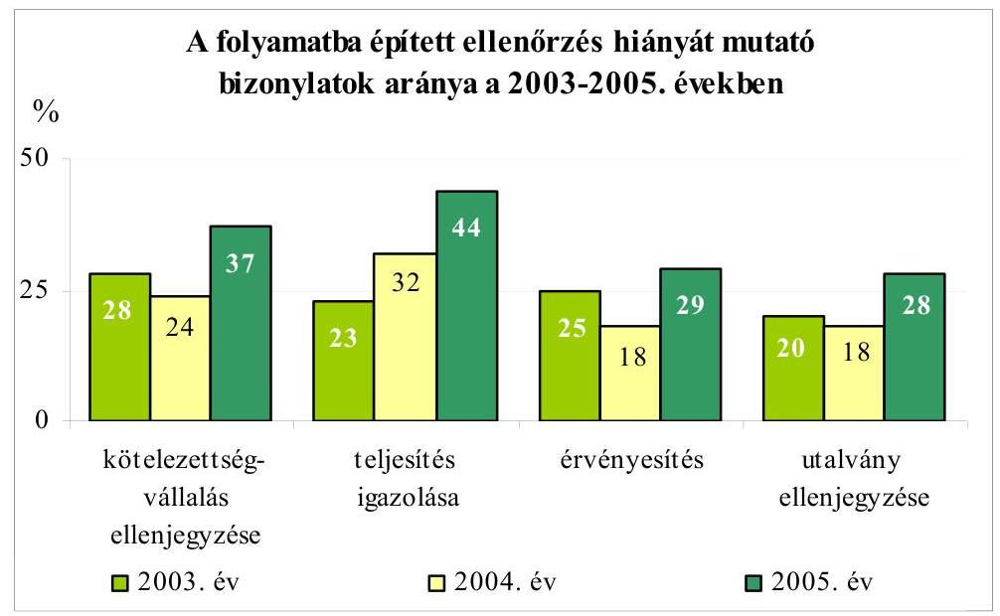

# 1.3. A könyvviteli mérlegben kimutatott vagyon alakulása, a vagyonnal való gazdálkodás szabályszerűsége, nyilvánossága 

A helyi önkormányzatok vagyona a 2004. évi és a 2005. évi könyvviteli mérleg szerint 9617,9 milliárd Ft, illetve 9860,9 milliárd Ft volt. A 2005. évben a növekedés az előző évhez képest 2,5\%-os, a 2004. évben az előző évhez képest $4,2 \%$-os, a 2002. évhez viszonyítva $53,5 \%$-os volt. A vagyon könyvviteli mérleg szerinti értékének nagyarányú növekedése a 2003. évtől - az azt megelőző három évtől eltérően - már nem tapasztalható, mivel a korábban érték nélkül nyilvántartott ingatlanok érték-megállapításának folyamata a 2003. év végére befejeződött.

Az ellenőrzött önkormányzatok tulajdonában volt a 2005. év végén az összes önkormányzati vagyon $36,6 \%$-a, melynek könyvviteli mérleg szerinti értéke 3611,6 milliárd Ft volt.

A helyi önkormányzatok - országosan összesen és az ellenőrzöttek - eszközeinek és forrásainak adatait a jelentés 3 . és 4 . számú mellékletei tartalmazzák. Az összes önkormányzat számviteli nyilvántartás szerinti vagyonának 2004. és 2005. év végi önkormányzat-típusonkénti megoszlását a következő ábrák szemléltetik:

---

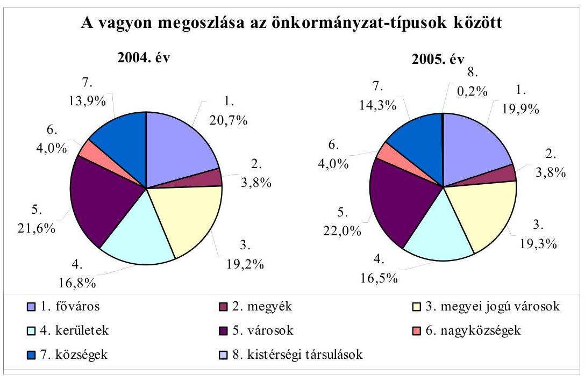

Az eszközök között 91,1\%-ról 94,3\%-ra növekedett 2002-2005 között a befektetett eszközök aránya, ezen belül is jelentősen 67,7\%-ról 73,4\%-ra emelkedett a tárgyi eszközök állománya. A 2004. év és a 2005. év végén az összes eszköz 93,7\%-át, illetve 94,3\%-át a befektetett eszközök, 6,3\%-át illetve 5,7\%-át a forgóeszközök jelentették. Az összes forráson belül egy százalékponttal nőtt a kötelezettségek aránya.

Az ellenőrzött kiemelt körbe tartozó, valamint városi önkormányzatoknál számolták el az összes önkormányzati beruházás és felújítás közel háromnegyedét. A legaktívabb fejlesztési tevékenységet a városi önkormányzatok végezték, itt realizálódott az önkormányzati alrendszerben elszámolt összes beruházás és felújítás közel egyharmada.

Az összes önkormányzat kintlévőségeinek év végi állománya a 2002. évtől a 2004. évig fokozatosan emelkedett (összesen 18,2\%-kal), majd a 2005. évben 16,7\%-kal visszaesett. A követelések állományának háromnegyedét 2002-2004 között az adósok jelentették, a 2005. évben ez az arány mintegy kétharmadra csökkent.

Az adósok állományának 92,1-88,2\%-át 2002-2004 között a kiemelt önkormányzati körben és a városoknál tartották nyilván, ezen belül ennek egyre csökkenő aránya (40,1-40-35,6-27\%-a) a Budapest Fővárosi Önkormányzatnál, egyre növekvő aránya (24,3-28,3-29,5-32,1\%-a) a megyei önkormányzatoknál keletkezett.

Az összes önkormányzatnál lévő hitelviszonyt megtestesítő értékpapírok állománya a 2002. évről a 2004. évre 9,4 milliárd Ft-tal, a 2004. évről a 2005. évre további 15,3 milliárd Ft-tal csökkent. A befektetett pénzügyi eszközök között nyilvántartott értékpapírok állománya 2002. és 2005. között 39\%-kal (10,4 milliárd Ft-tal), a forgatási célú hitelviszonyt megtestesítő értékpapírok állománya 18,3\%-kal (14,3 milliárd Ft-tal) csökkent, elsősorban a gázközmű beruházások ellentételezéseként kapott állampapírok értékesítése következtében.

---

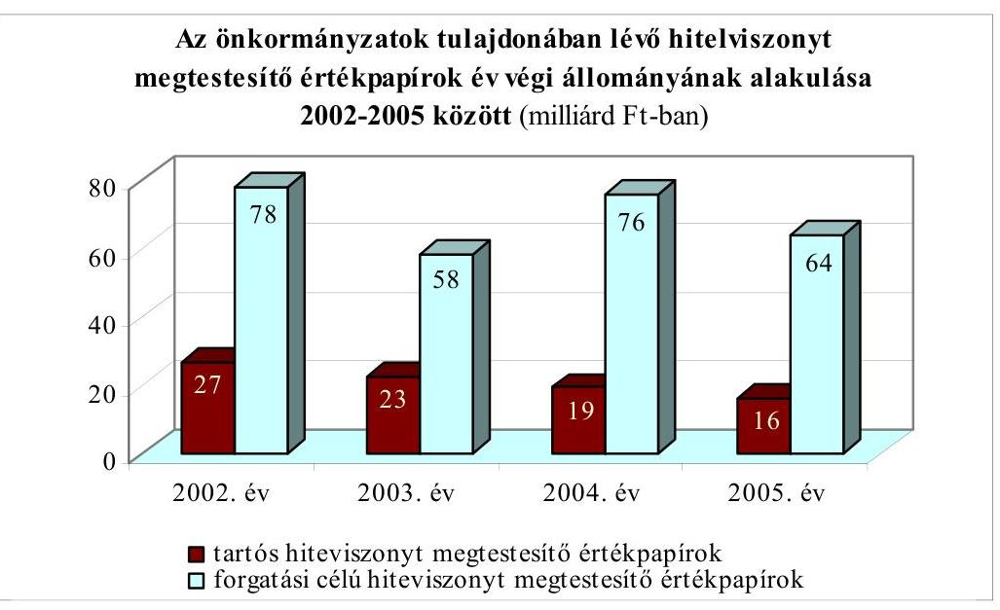

A 2005. év végén az összes kiemelt körbe tartozó, valamint városi önkormányzatok tulajdonában volt a tartós részesedések 96,6\%-a, az egyéb részesedések 97,6\%-a, a tartós hitelviszonyt megtestesítő értékpapírok 62,6\%-a, és a forgatási célú hitelviszonyt megtestesítő értékpapírok 80,5\%-a.

Az összes önkormányzat kötelezettségének összege a 2002. év végéről a 2005. év végére 206,9 milliárd Ft-tal, 42,2\%-kal emelkedett. A hosszú lejáratú kötelezettségek ez időszak alatti 63,6\%-os növekedése kis mértékben meghaladta a rövid lejáratú kötelezettségek 62,5\%-os növekedését. A 2004. évben a hosszú lejáratú kötelezettségek összes kötelezettségen belüli aránya 39,7\% volt. A kötelezettségek közül legjelentősebb arányban - több mint kétszeresére - a beruházási és fejlesztési célú hitelek növekedtek, a 2005. év végére állományuk a 2002. évi végi érték mintegy háromszorosa volt.

Az államháztartás önkormányzati alrendszerében a felhalmozási és tőke jellegü bevétel a 2002. évben 135,9 milliárd Ft, a 2005. évben 144,1 milliárd Ft volt. (A helyi önkormányzatok felhalmozási és tőke jellegű bevételeit a jelentés 9. számú melléklete részletezi.) A tárgyi eszközök, immateriális javak értékesítéséből befolyt bevétel 37,6\%-kal, a sajátos felhalmozási és tőkejellegű bevételek (önkormányzati lakások és lakótelkek értékesítése, privatizációból származó bevételek, vagyoni értékű jog értékesítése, bérbeadásból, üzemeltetésre átadásból származó bevételek) 5,6\%-kal növekedtek, a pénzügyi befektetések bevételei 27,5\%-kal csökkentek 2002-2005. között. A felhalmozási bevételeken belül az ingatlanok értékesítési bevétele egyre jelentősebb arányú, a 2002. évben 18,5\%, a 2003. évben 18,2\%, a 2004. évben 24,4\%, a 2005. évben 22,6\% volt. A legnagyobb csökkenés ( $78,7 \%$-os) az államkötvényeknél és egyéb értékpapírok értékesítéséből származó bevételeknél történt.

---

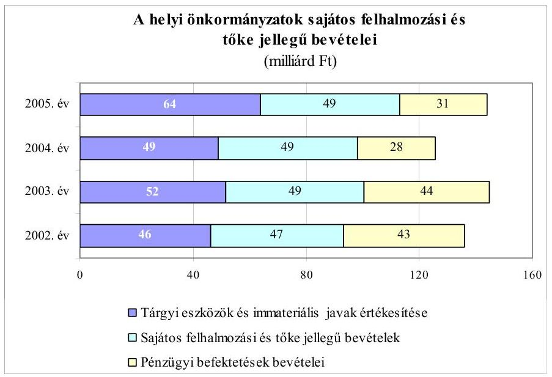

Felújításra az önkormányzatok a 2004. évben közel ugyanannyit fordítottak, mint a 2002. évben. A 2005. évben az előző évhez viszonyítva jelentősen, 51,0\%-kal, 33,4 milliárd Ft-tal növekedett a felújításra fordított kiadások összege. (A helyi önkormányzatok felhalmozási kiadásainak és pénzügyi befektetéseinek adatait a jelentés 10. számú melléklete tartalmazza.) A felhalmozási célú kiadások és a pénzügyi befektetések összege a 2002. évről a 2004. évre 9,6\%-kal, 35,2 milliárd Ft-tal csökkent, majd a 2004. évről a 2005. évre 17,0\%-kal, 56,2 milliárd Ft-tal növekedett. A pénzügyi befektetések kiadásain belül 2002-2004 között a legjelentősebb tétel a részvények és a részesedések vásárlása volt (60,7-60,3\%).

Az államkötvények és egyéb értékpapírok vásárlására fordított kiadások - akárcsak az ebből elszámolt bevételek - számottevően, 47,8\%-kal csökkentek. A 2005. évben változás következett be, a pénzügyi befektetéseken belül a részvények és részesedések vásárlása $39,6 \%$ volt, amíg az államkötvények és egyéb értékpapírok vásárlása $56,8 \%$-ra megemelkedett.
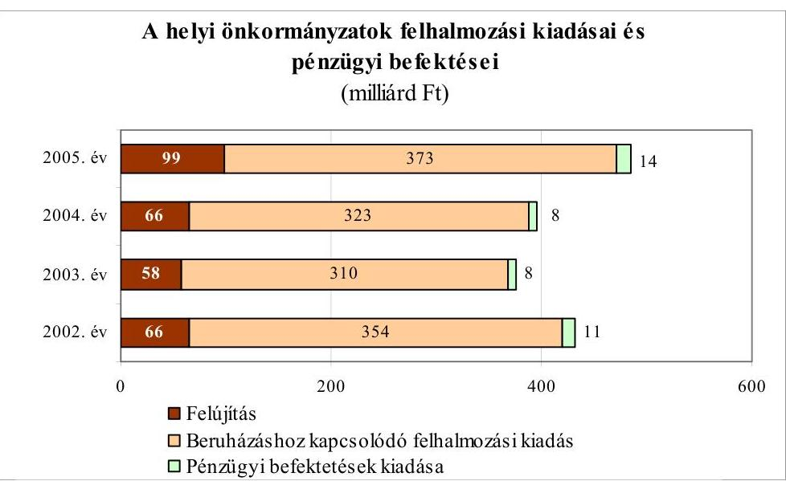

---

Az államháztartás önkormányzati alrendszerének likviditási mutatói a pénzügyi egyensúlyi helyzet folyamatos romlását tükrözik. A likviditási gyorsráta ${ }^{38}$ a 2005. évben az 1999. évinek 42,1\%-a volt, a likviditási II. mutató ${ }^{39}$ az időszak alatt $71,4 \%$-kal csökkent. A likviditási gyorsráta $100 \%$ alá csökkenése azt mutatja, hogy az önkormányzatok rövid lejáratú kötelezettségeit már nem fedezi a pénzeszközök állománya. A 2005. évben az értékpapírok és a pénzeszközök a rövid lejáratú kötelezettségeknek 103,8\%-ára nyújtottak fedezetet. A mutatószámok további csökkenése jelzi az önkormányzati alrendszer fizetőképességének romlását.
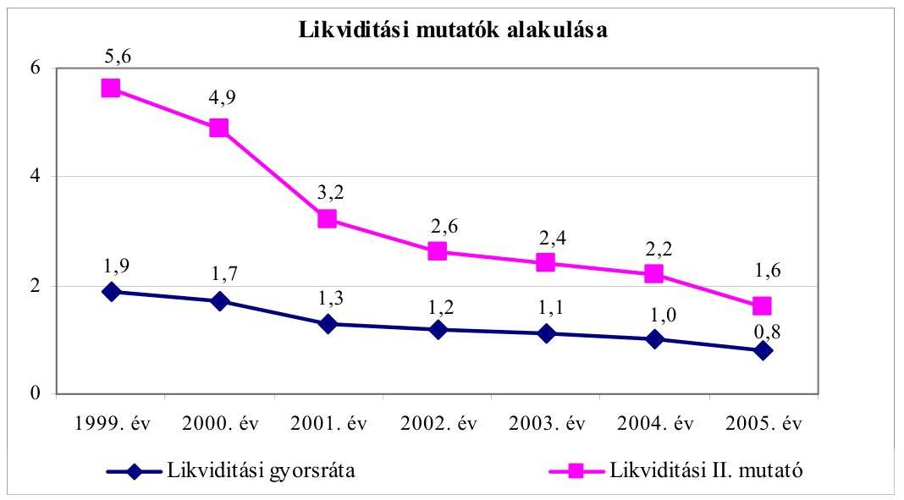

Az ellenőrzött önkormányzatoknál a 2005. évi likviditási mutatók az országos adatoknál alacsonyabbak értékeket mutatnak, a likviditási gyorsráta 0,6 , a likviditási II. mutató 1,49 volt.

Az ellenőrzött önkormányzatok - Ráckeve Város Önkormányzata kivételével - a Htv. 138. § (1) bekezdés j) pontjában előírtak alapján megalkották vagyongazdálkodási rendeletüket. A vagyongazdálkodási rendeletek közel felében ( $43 \%$-nál) nem rendelkeztek a vagyonelemek forgalomképesség szerinti besorolásának megváltoztatási módjáról. Nem volt egyértelmú központi szabályozás arra, hogy a korlátozottan forgalomképes törzsvagyonból milyen feltételekkel idegeníthető el eszköz, illetve szükséges-e az elidegenítést megelőzően az eszközre vonatkozóan a vagyongazdálkodási rendeletben rögzített korlátozottan forgalomképes törzsvagyoni körbe besorolás vagyongazdálkodási rendeletben történő módosításával az eszközt a törzsvagyonon kívüli egyéb eszközök közé átsorolni. Amely önkormányzatok nem rendelkeztek a forgalomképesség szerinti besorolás megváltoztatásai módjáról, azok a vagyongazdálkodási rendelet módosítása nélkül, a képviselő-testület egyszerú szótöbbséggel hozott határozatában döntöttek a korlátozottan forgalomképes törzsvagyon

[^0]
[^0]:    ${ }^{38}$ Likviditási gyorsráta = pénzeszközök / rövid lejáratú kötelezettségek
    ${ }^{39}$ Likviditási II. mutató = (követelések + értékpapírok + pénzeszközök) / rövid lejáratú kötelezettségek

---

elidegenítéséről. Az eljárás nem segítette a korlátozottan forgalomképes törzsvagyonnak a törzsvagyonon kívüli forgalomképes egyéb vagyonhoz viszonyított fokozottabb védelmét.

A közbenső egyeztetés során az Önkormányzati és Területfejlesztési Minisztérium államtitkára által adott észrevétel szerint: „E javaslati pont elhagyását javasoljuk. Az Ötv. hivatkozott pontja meghatározza a korlátozottan forgalomképes vagyon körét, valamint azt, hogy azokról törvény, vagy helyi önkormányzat rendeletében meghatározott feltételek szerint lehet rendelkezni. Ennek megfelelően a tulajdonosi rendelkezésre vonatkozó szabályokat ágazati törvény, vagy helyi önkormányzati rendelet rögzítheti. Példa erre - többek között -, hogy a közoktatási törvény, vagy a vízgazdálkodásról szóló 1995. évi LVII. törvény, amelynek 9-10. §-a egyértelmüen meghatározza, hogy az önkormányzati törzsvagyonba tartozó vízi-közmúvek müködtetéséről milyen formában lehet gondoskodni."

A korlátozottan forgalomképes törzsvagyonnal való rendelkezési lehetőség módjára, tartalmára vonatkozó feltételeik előírására vonatkozó javaslatunkat továbbra is fenntartjuk. Ellenőrzési tapasztalataink szerint az önkormányzatok több mint fele nem rendelkezett önkormányzati rendeletben a korlátozottan forgalomképes vagyon elidegenítési feltételeiről, annak ellenére, hogy értékesített e körbe tartozó vagyont. Ezen önkormányzatok a vagyongazdálkodási rendeletükben korlátozottan forgalomképes kategóriába sorolt vagyon elidegenítéséről a besorolás módosítása nélkül, a képviselő-testület egyszerü szótöbbséggel hozott határozatában döntöttek. A kialakult gyakorlat szerint korlátozottan forgalomképes törzsvagyonnal és a törzsvagyonon kívüli egyéb vagyonnal való gazdálkodásnál - a törvényekben meghatározott kivételektől, korlátoktól eltekintve - a helyi önkormányzatok szintjén nincs különbség.

Az ellenőrzött önkormányzatok 98\%-a szabályozta a vagyongazdálkodásával kapcsolatos hatásköröket. Az önkormányzatok mindenhol meghatározták az értékesítésre vonatkozó, 94\%-nál a bérbeadásra vonatkozó, 91\%-nál az apportálásra vonatkozó döntési hatásköröket. Az értékpapírok adásvételére és a pénzügyi befektetésekre vonatkozó hatáskörökről az önkormányzatok 73\%-ánál rendelkeztek. Az ellenőrözött önkormányzatok 83\%-a meghatározott értékhatár alatt és esetekben a döntési hatáskört a bizottságainak és a polgármesternek biztosította. Az ellenőrzött önkormányzatok 34\%-a az Áht. 108. § (1) bekezdésében foglalt előírásokat megsértve nem határozta meg azt az értékhatárt, amely felett csak nyilvános, (indokolt esetben zártkörű) versenytárgyalás útján, a legjobb ajánlatot tevő részére lehet a vagyont értékesíteni, kezelésbe adni, a használatát, illetve a hasznosítás jogát átengedni, ezért versenytárgyalás indításáról, vagy mellőzéséről nem előzetesen kialakított egységes szempontok alapján, hanem egyedileg kialakított feltételek figyelembevételével döntött.

Az értékhatárt meghatározó önkormányzatok 53\%-a az Áht. 108. § (1) bekezdésében előírtakat megsértve a vagyongazdálkodási rendeletében meghatározott esetekben lehetővé tette a versenytárgyalási eljárás mellőzését. A szabályozás nem segítette a vagyonnal való gazdálkodás nyilvánosságát, átláthatóságát. A versenytárgyalás mellőzésére legtöbbször várospolitikai, önkormányzati érdekhez kapcsolódóan biztosítottak lehetőséget.

A képviselő-testület dönthetett a versenytárgyalási eljárás mellőzéséről, ha az ajánlat az ingatlan tulajdoni, használati viszonyainak rendezését szolgálta, vagy az ajánlattevőt a dologgal kapcsolatban egyéb jogosultság illette meg, illetve ha

---

a képviselő-testület az önkormányzat érdekeinek érvényesítése miatt így döntött, vagy a vagyontárgyak önkormányzati alapítású társaság részére történő átadásakor, állami feladatot ellátó állami szervek elhelyezésekor, a versenytárgyalás kétszeri eredménytelenségekor, az önkormányzat számára különösen előnyös értékesítéskor.

A vagyongazdálkodási rendeletben értékhatárt meghatározó önkormányzatok 13\%-a a 20 millió Ft felett meghatározott értékhatárral 2005. január 1-től megsértette a Magyar Köztársaság 2005. évi költségvetéséről szóló 2004. évi CXXXV. törvény 7. § (1) bekezdésében előírtakat.

Az értékhatárt meghatározó önkormányzatok 64\%-a az elidegenítések során lefolytatta az előírt versenytárgyalást. Az önkormányzatok 31\%-a nem minden esetben, $5 \%$-a pedig egy esetben sem tett eleget a vagyongazdálkodási rendeletében előírt versenytárgyalási kötelezettségnek. A versenytárgyalás mellőzésével megsértették az Áht. 108. § (1) bekezdésében foglaltakat. A nem lakás céljára szolgáló helyiségek esetében amennyiben a bérlő gazdálkodó szervezet volt, élt a Ptk. 373. § (4) bekezdésében biztosított lehetőségével, kijelölte a részére biztosított elővásárlási jog gyakorlására jogosult személyt. Az önkormányzatok az így kijelölt vevő részére értékesítették a nem lakás céljára szolgáló helyiséget, ezáltal a versenytárgyalás nélkül történő elidegenítések nem segítették az önkormányzati vagyonnal való gazdálkodás nyilvánosságát, átláthatóságát.

A közbenső egyeztetés során az Önkormányzati és Területfejlesztési Minisztérium államtitkára által adott észrevétel szerint: „A Ptk. 373. (4) bekezdése alapján az elővásárlási jog átruházása - a Ptk. szerinti elővásárlási jog esetén is - semmis, hiszen az elővásárlási jog személyhez kötött jog. Emellett egyértelmú a Ptk. szerint, hogy elővásárlási jogot kizárólag és csak a tulajdonos engedhet más részére, hiszen az elővásárlási jog nem sértheti a tulajdonos alapvető rendelkezési jogait.

A Ptk. 373. § (6) bekezdése értelmében az elővásárlási jogot nem csak a Ptk., hanem a Ptk. 685.§ a) pontja szerinti más jogszabályok is létrehozhatnak. Ennek megfelelően a lakások és helyiségek bérletére, valamint az elidegenítésükre vonatkozó egyes szabályokról szóló 1993. évi LXXVIII. törvény (továbbiakban: Lakástörvény) 58. § (1) bekezdése rögzíti, hogy az önkormányzati (volt tanácsi) helyiségre az elővásárlási jog kizárólag a bérlőt (bérlőtársakat) illeti meg.

Véleményünk szerint a javaslatban hivatkozott gazdasági társaság - mint elővásárlásra jogosult - nem magát az elővásárlási jogot ruházhatja át más részére, hanem - mivel társaságról van szó - csupán kijelölheti azt a természetes személyt, aki az elővásárlási jogot gyakorolhatja."

Az észrevétel nem megalapozott, mivel az észrevételben foglaltaktól eltérően ezen helyiségekre elővásárlási joggal nem csupán a bérlő rendelkezik, hanem a Ptk. 373. § (4) bekezdés alapján a gazdálkodó szerv - mint bérlő - a részére biztosított elővásárlási jog gyakorlására jogosult személyt kijelölheti. Ez az észrevételben foglaltaktól eltérően nem a gazdálkodó szerv nevében eljáró természetes személy kijelölését jelenti, ezért a vonatkozó javaslatunkat fenntartjuk.

Az ellenőrzött önkormányzatok mindegyikénél történt 2002-2005 között vagyonértékesítés, 91\%-nál bérbeadás, 25\%-nál apportálás. A döntések során az önkormányzatok $16 \%$-ánál nem tartották be a vagyongazdálkodási rendeletben meghatározott hatásköröket.

---

Az önkormányzatok törzsvagyonába tartozó forgalomképtelen ingatlan értékesítése, illetve ingyenes átadása, és ezen elidegenítések földhivatali bejegyzése a Ptk. előírását megsértve kettő önkormányzatnál fordult elő ${ }^{40}$. Az Ötv. 79. § (2) bekezdés a) pontja alapján az önkormányzati forgalomképtelen törzsvagyonhoz tartozó ingatlanok elidegenítéséről a Ptk. 173. § (2) bekezdésében foglalt korlátozó előírást megsértve döntött két önkormányzat közgyűlése/képviselő-testülete.

Felsőzsolca Város Önkormányzata a számviteli nyilvántartás szerint 12784 millió Ft értékű utat adott át ingyenesen az ipari zóna területét kialakító, az önkormányzat többségi tulajdonában lévő kft-nek; Veszprém Megyei Jogú Város Önkormányzatánál a 2002. évben négy esetben, a 2003. évben hat esetben, a 2004. évben egy esetben adtak el forgalomképtelen vagyontárgyat (közterületet, utat).

A korlátozottan forgalomképes törzsvagyon részét képező víziközművek tulajdonjogának átadásával az önkormányzatok 6\%-a megsértette az Ötv. 79. § (2) bekezdésének a) pontja, valamint a vízgazdálkodásról szóló 1995. évi LVII. törvény 6. § (3) bekezdésének előírásait.

A vagyon tulajdonjogának átadásakor a vagyongazdálkodási rendelet előírásai ellenére az önkormányzatok $17 \%$-a egy esetben sem, $24 \%$-a nem minden indokolt esetben végeztetett értékbecslést a forgalmi érték megállapítására.

Az önkormányzat számára garanciális elemként az adásvételi és a bérbeadási szerződések többsége (93, illetve 90\%-a) tartalmazta a vagyontárgy vevő tulajdonába kerülésének feltételeit, halasztott fizetés esetén a rögzített fizetési határidő elmulasztásának szankcióit, továbbá a szerződés felmondásának eseteit. A bérleti szerződésekben rögzítették a bérleti díj meg nem fizetésének következményeit, a bérlő díjfizetésen kívüli kötelezettségeit, illetve a szerződés felmondásának feltételeit.

Az önkormányzatok 36\%-a vásárolt, 69\%-a értékesített értékpapírt. A vásárlások $17 \%$-a, az eladások $14 \%$-a a központi és helyi előírásokat figyelmen kívül hagyva, szabálytalanul történt.

Szeged megyei jogú város és Balatonfüred város önkormányzatainak közgyűlése, illetve képviselő-testülete a portfolió kezelési szerződés kötésével megsértették az Ötv. 80. § (1) bekezdésében előírtakat, mivel az átadott értékpapírokra vonatkozó tulajdonosi döntési jogokat (vételi, eladási) is átadták a portfoliókezelő társaságoknak.

Az önkormányzatok 4\%-a az értékpapírok forgatásával járó kockázat csökkentése érdekében nem kellő gondossággal járt el, mivel nem nyittatott a befektetési szolgáltatókkal a KELER Rt-nél ${ }^{41}$ az önkormányzat nevére szóló értékpapír alszámlát. Nem kérte annak biztosítását, hogy kizárólag az önkormányzat és a

[^0]
[^0]:    ${ }^{40}$ A Ptk. 173. § (1) és (2) bekezdései valamint 200. § (2) bekezdése alapján az Ötv. 79. § (2) bekezdés a) pontjában meghatározott forgalomképtelen ingatlanok elidegenítése, illetve ingyenes átadása semmis.
    ${ }^{41}$ Központi Elszámolóház és Értéktár (Budapest) Rt.

---

befektetési szolgáltatók együttes rendelkezése alapján kerülhessen sor az önkormányzat nevére szóló értékpapír alszámlán terhelésre és jóváírásra. Ezen önkormányzatok elmulasztották a pénzügyi befektetés kockázatának mérsékléséhez, biztonságának növeléséhez szükséges erre vonatkozó rendelkezés szerződésben történő rögzítését.

Az értékpapírszámla szerződések megkötése során nem éltek a befektetési kockázat csökkentését elősegítő lehetőségekkel Budapest főváros, Békés megye, Vas megye, Budapest főváros VIII., és XV. kerületi önkormányzatok.

Az önkormányzatok 31\%-a közvetetten támogatott politikai pártokat azáltal, hogy a pártszervezetek részére ingyenesen, vagy kedvezményes bérleti díj ellenében irodahelyiségeket biztosított, illetve az üzemeltetési költséget teljesen vagy részben átvállalta. A pártok részére kedvezményesen vagy ingyenesen nyújtott ingatlan használattal megsértették az Ötv. 78. § (1) bekezdésének előírásait, mivel az önkormányzatok vagyonának az önkormányzati célok megvalósulását kell szolgálnia. A pártok támogatása nem tartozik a helyi közügyek körébe, ezért a közvetett támogatás nem szolgálta az önkormányzati feladatellátással kapcsolatos célokat. Az Alkotmány 70/A. §-ában szereplő, a jogegyenlőség alkotmányos elvét megfogalmazó követelményekbe, illetve az Ötv. 1. § (2) bekezdésében meghatározott helyi közügyekre vonatkozó előírásba ütközik a helyi önkormányzatok részéről a pártoknak adott támogatás.

Az önkormányzatok 89\%-a nyújtott nem normatív, céljellegű, fejlesztési támogatásokat, illetve kötött nettó ötmillió Ft-ot elérő vagy azt meghaladó értékű - árubeszerzésre, építési beruházásra, szolgáltatás megrendelésre, vagyonértékesítésre, vagyonhasznosításra, vagyon vagy vagyoni értékű jog átadására, valamint koncesszióba adásra vonatkozó - szerződéseket. Ezen támogatások és szerződések adatainak közzétételét az Áht. 15/A. § (1) bekezdésében és 15/B. §. (1) bekezdésében előírtakat megsértve az ellenőrzött önkormányzatok 24\%-a egyáltalán nem, 21\%-a nem mindegyik szerződésre, valamint a szerződések nem minden - az Áht. 15/A. § (1) bekezdésében és 15/B. §. (1) bekezdésében előírt - adatára vonatkozóan biztosította, 7\%-a pedig közzétételi kötelezettségének az előírt 60 napon túl tett eleget. Az önkormányzatok által nyújtott támogatások 62\%-a nem fejlesztési célú volt, hanem különböző szervezetek múködéséhez nyújtott forrást. A közpénzek felhasználásának átláthatóságát, nyilvánosságát nem segítette, hogy ezen, nem normatív, céljellegű, működési támogatások kedvezményezettjeinek nevére, a támogatás céljára, összegére - függetlenül annak mértékétől - jogszabály nem írja elő az önkormányzatok közzétételi kötelezettségét.

Az önkormányzatokat az Áht. 108. § (2) bekezdése felhatalmazta és kötelezte is arra, hogy a vagyon tulajdonjogának illetve használati jogának ingyenes átruházása, valamint a követelésekről történő lemondás módját és eseteit rendeletben határozzák meg. Ezen előírást megsértve a vagyon tulajdonjogának, az ingyenes átruházásának módjáról az ellenőrzött önkormányzatok 69\%a, eseteiről 67\%-a nem rendelkezett, valamint a követelésekről történő lemondás módját az ellenőrzött önkormányzatok 56\%-a, eseteit 51\%-a nem határozta meg rendeletében.

---

Az ellenőrzött önkormányzatok 37\%-ánál történt követelés elengedés 2003-2005 között. A követelést elengedő önkormányzatok 20\%-a megsértette az Áht. 108. § (2) bekezdésének előírásait, mert nem rendelkezett rendeletben a követelés elengedés módjáról (10\%), és eseteiről (20\%). Követelés elengedésre leggyakrabban helyi adó, bérleti díj, lakbér, térítési dí hátralék esetében került sor. Nem az önkormányzati rendeletben meghatározott módon és esetekben engedett el követelést az önkormányzatok 13\%-a, részben vette figyelembe a saját maga által meghatározott követelés elengedési módot az önkormányzatok $13 \%-a$, az eseteket $10 \%-a$.

Az ellenőrzött önkormányzatok 46\%-ánál történt ingyenes vagyonátruházás 2003-2005 között. Az Áht. 108. § (2) bekezdésének előírását megsértve döntött ingyenes vagyonátruházásról az önkormányzatok 19\%-a, mivel nem határozta meg rendeletben ennek eseteit, $8 \%$-a pedig annak módját. Az ingyenes vagyonátruházás az önkormányzatok 11\%-ánál az önkormányzati rendeletben meghatározottól eltérő módon, 19\%-ánál pedig az abban előírtaktól eltérő esetekben történt.

A vagyongazdálkodási rendeletben meghatározottak nem tették lehetővé a következő ingyenes vagyonátruházásokat: Budapest Főváros XX. Kerületi Önkormányzat sportlétesítményeket adott használatba egy gazdasági társaságnak. Budapest Főváros XI. Kerületi Önkormányzat tárgyi eszközöket és készleteket adott át kht-nek, képviselő-testületi döntés nélkül víziközművet rt-nek, közvilágítási hálózatot és berendezéseket kft-nek. Balatonfüred Város Önkormányzata a közvilágítás korszerűsítése keretében létesített rendszert képviselő-testületi döntés nélkül rt-nek adta át. Szécsény Város Önkormányzata az alapfokú művészetoktatási feladat megyei önkormányzatnak történő átadásához kapcsolódóan a feladat ellátását szolgáló ingatlan használatát a feladat ellátásáig ingyenesen biztosította, az ingó vagyont ingyenesen átadta.

# 1.4. Az önkormányzati vagyon nyilvántartásának, számbavételének szabályszerúsége 

Az ellenőrzött önkormányzati hivatalok 86\%-a a számviteli nyilvántartásokban a törzsvagyon (forgalomképtelen, illetve korlátozottan forgalomképes) és a törzsvagyonon kívüli eszközök értékének elkülönített nyilvántartásáról - főkönyvi számlák alábontásával vagy részletező analitikus nyilvántartások vezetésével - a Vhr. 9. számú melléklet 1. k) pontjában előírtaknak megfelelően gondoskodott. Az elkülönített nyilvántartási kötelezettség teljesítése javuló tendenciát mutat, mivel azt a 2002. évben az ellenőrzött önkormányzatok 44\%-a, a 2003. évben $69 \%$-a teljesítette.

Az önkormányzati hivatalok 2-10\%-a az ingatlanok, a részesedések, az értékpapírok, az üzemeltetésre, kezelésre átadott eszközök, a rövid és a hosszú lejáratú követelések, kötelezettségek és a pénzeszközök esetében a főkönyvi számlák értékadataival egyező tartalmú analitikus nyilvántartásokat egyáltalán nem vagy hiányosan vezette. A nyilvántartási hiányosságok következtében - a Számv. tv. 15. § (2) és (3) bekezdéseiben előírtakat megsértve - a költségvetési beszámoló részét képező könyvviteli mérlegben nem az önkormányzat tényleges vagyonát mutatták ki.

---

A helyi önkormányzatok a 2004. évben országosan összesen 1396,4 milliárd Ft összegben mutattak ki olyan eszközöket, amelyet nem saját maguk, vagy a felügyeletük alá tartozó költségvetési szervük üzemeltetett, hanem azok üzemeltetését, müködtetését más gazdálkodó szervezetre bízták. Az üzemeltetésre, kezelésre átadott eszközök aránya az önkormányzati döntések hatására ${ }^{42}$ az előző évhez viszonyítva a 2003. évben 34,8\%-kal, a 2004. évben 11,4\%-kal nőtt.
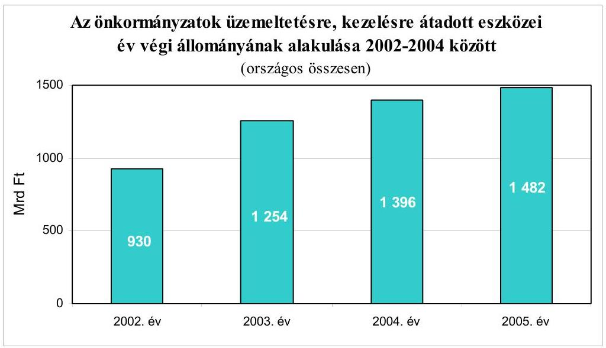

Üzemeltetésre, kezelésre átadott eszközzel - Nagybajom Város Önkormányzata kivételével - az ellenőrzött önkormányzatok mindegyike rendelkezett, melynek értéke azok könyvviteli mérleg főösszegének egyötöde volt ${ }^{43}$. Az üzemeltetésre átadott eszközöket az önkormányzatok 4\%-a hiányosan, 20\%-a (az előző évben 30\%-a) nem a Vhr. 20. § (1) bekezdésének előírása szerinti főkönyvi számlán szerepeltette a számviteli nyilvántartásokban.

A több önkormányzattal közös tulajdonban lévő üzemeltetésre, kezelésre átadott eszközzel az ellenőrzött önkormányzatok 29\%-a rendelkezett, melynek értékét azok 4\%-a nem vagy hiányosan mutatta ki a könyvviteli mérlegben.

Az ellenőrzött önkormányzati hivatalok 15\%-a az ingatlanok, 16\%-a az üzemeltetésre, kezelésre átadott eszközök mennyiségi felvétellel történő leltározását a Vhr. 37. § (3) bekezdésében előírtak ellenére nem végezte el, valamint 7\%-a elmulasztotta a rövid- és hosszú lejáratú követelések, 7,5\%-a a részesedések, 2,5\%-a az értékpapírok, 5\%-a a kötelezettségek egyeztetéssel történő leltározását.

[^0]
[^0]:    ${ }^{42}$ A helyi önkormányzatok a víziközművek (szennyvíz-csatorna hálózat, szennyvíztisztító telep, ivóvízhálózat), távfütési rendszer, szilárd hulladék lerakók, épületek, építmények, gépek, berendezések, járművek üzemeltetését, kezelését bízták más gazdálkodó (gazdasági társaság, vállalkozók, másik önkormányzat) szervezetre.
    ${ }^{43}$ Az ellenőrzött önkormányzatoknál az üzemeltetésre kezelésre átadott eszközök értéke a könyvviteli mérleg főösszegéhez viszonyítottan a 2002. évben 17,8\%, a 2003. évben $18,8 \%$ volt.

---

Az ellenőrzött önkormányzati hivatalok a 2004. évi könyvviteli mérlegben 509328 millió Ft összegben mutattak ki olyan vagyont, amit a Vhr. 37. § (1) bekezdésében előírtak ellenére nem leltároztak. A 2004. évi könyvviteli mérlegben szereplő 483289 millió Ft értékű ingatlan, 12447 millió Ft értékű üzemeltetésre, kezelésre átadott eszköz mennyiségi felvétellel történő leltározása, 5143 millió Ft értékű részesedés, 6,9 millió Ft nyilvántartási értékű értékpapír, 5385 millió Ft összegű kötelezettség és 3057 millió Ft követelés egyeztetéssel történő leltározása nem történt meg.

A leltározási kötelezettség teljesítése az előző évhez viszonyítva javult, a helyi szabályozások hiányosságai ellenére a kötelezettségének az előző évi $74 \%$-kal szemben a 2004. évben az ellenőrzött önkormányzati hivatalok $89 \%$-a tett eleget. A leltár kiértékelése az önkormányzati hivatalok 17\%-ánál (az előző évben 35\%-nál) elmaradt, 10\%-ánál nem minden leltározott vagyonelem vonatkozásában történt meg. A számviteli nyilvántartások értékadatai és a leltározási dokumentumokban - a tényleges helyzetnek megfelelően - rögzített adatok között az önkormányzati hivatalok egynegyedénél állapítottak meg eltérést, amelynek számviteli rendezését végrehajtották. A leltár kiértékelése után, jelentős összegűnek minősített hiányt két önkormányzati hivatalnál (Szeged és Szolnok megyei jogú városi önkormányzatoknál) állapítottak meg, azok tisztázására az egyiknél büntetőeljárás megindítását kezdeményezték. A Vhr. 32. § (7) bekezdésében rögzített piaci értékelés lehetőségével élő három (Budapest főváros III. kerületi, Tolna és Visegrád városi önkormányzatok) önkormányzati hivatalnál a leltározás során figyelembe vették az egyedi eszköz mérleg fordulónapi piaci értékét, a könyv szerinti nettó értéket és a két érték közötti különbözetet.

A helyi önkormányzatok a 2004. évben országosan tárgyévi értékvesztést a befektetett eszközök, készletek, követelések és értékpapírok év végi értékelésekor 14,0 milliárd Ft összegben számoltak el és 5,2 milliárd Ft összegben korábban elszámolt értékvesztést írtak vissza. Az előző évhez viszonyítva a 2003. évben az elszámolt értékvesztések összege 57,2\%-kal, az elszámolt értékvesztések visszaírásának összege 407,6\%-kal, a 2004. évben az elszámolt értékvesztések összege 105,1\%-kal az elszámolt értékvesztések visszaírásának összege 86,7\%-kal nőtt. Ezek hatására ezen eszközök számviteli nyilvántartás szerinti értéke a 2003. évben 0,5\%-kal, a 2004. évben 1\%-kal csökkent.

---

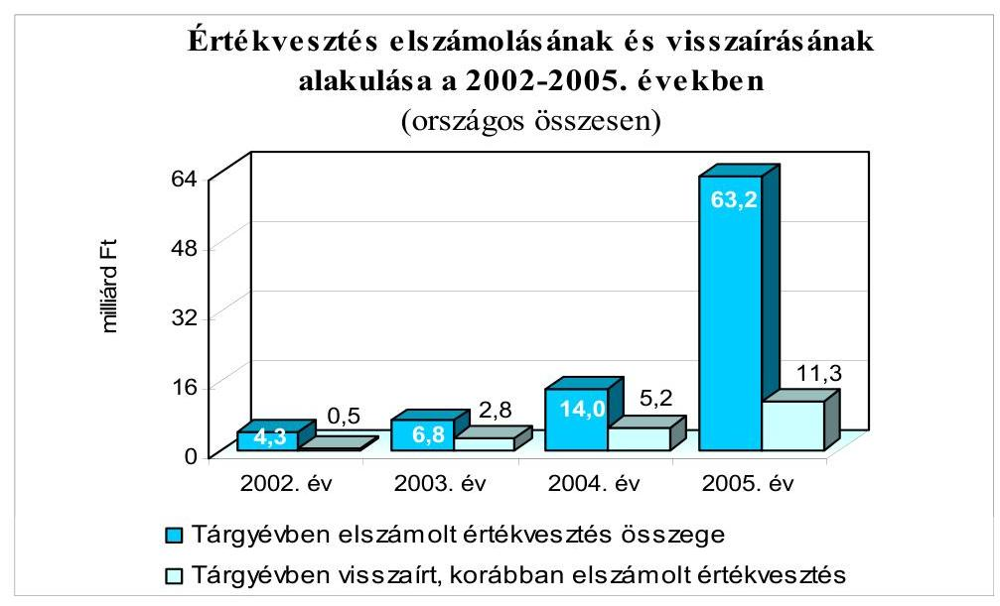

Az ellenőrzött önkormányzati hivatalok 71\%-ánál a követelések, 66\%-ánál a részesedések, 54\%-ánál az értékpapírok esetében az értékeléshez szükséges dokumentumok, információk rendelkezésre álltak ${ }^{44}$. Az értékvesztés elszámolásának szükségességét ezek alapján az önkormányzati hivatalok 52\%-a a követelések, 59\%-a a részesedések, 40\%-a az értékpapírok esetében vizsgálta. Indokolt volt az értékvesztés elszámolása az önkormányzati hivatalok 41,2\%-ánál a követelések, 26,2\%-ánál a részesedések és 2,5\%-ánál az értékpapírok esetében, annak tényleges elszámolását - a Számv. tv. 54. § (1), és az 55. § (1) bekezdéseiben foglaltakat megsértve - azok 15\%-a a követelések, 29\%-a a részesedések esetében nem végezte el.

A korábbi években értékvesztést az ellenőrzött önkormányzati hivatalok közel fele számolt el, de a visszaírás szükségességét, azok 16,6\%-a a követeléseknél és az értékpapíroknál, 11,1\%-a a részesedéseknél a Számv. tv. 55. § (3), az 54. § (3) és az 54. § (6) bekezdéseiben előírtakat megsértve nem vizsgálta. A számviteli nyilvántartásokban rögzített értékvesztések visszaírása indokolt volt, melynek az arra kötelezett önkormányzati hivatalok eleget tettek. Az elszámolt értékvesztést és annak visszaírását az analitikus és főkönyvi nyilvántartásokban a számlarendben előírtaknak megfelelően rögzítették.

A Számv. tv. 57. § (3) bekezdésében biztosított piaci értékelés lehetőségével élő három ellenőrzött önkormányzati hivatalnál a 2004. évben az értékelést elvégezték, annak szabályszerűségét könyvvizsgálóval felülvizsgáltatták. Az értékhelyesbítések következményeként a piaci érték és a könyv szerinti érték közötti különbözetet a könyvviteli mérlegben az eszközök között értékhelyesbítésként, a források között értékelési tartalékként kimutatták.

[^0]
[^0]:    ${ }^{44}$ Az előző évben az önkormányzati hivatalok 66\%-a, 39\%-a és 22\%-a esetében álltak rendelkezésre az értékeléshez szükséges információk.

---

# 1.5. A közbeszerzési eljárások szabályszerűsége 

Az ellenőrzött önkormányzatok - Veszprém, Kisbér, Nagyecseg városi önkormányzatok kivételével - a Kbt., 96. § (2) bekezdésének felhatalmazása alapján közbeszerzési rendeletben meghatározták a közbeszerzési eljárások előkészítésnek és lefolytatásának helyi szabályait. Az ellenőrzött önkormányzatok tíz százalékánál azonban a 2004. évben a közbeszerzési rendeletben nem rögzítették a közbeszerzési eljárásba bevont személyek felelősségi körét, a közbeszerzési eljárások belső felelősségi rendjét.

Az ellenőrzött önkormányzatok a Kbt. 2 2004. május 1-i hatályba lépése után a közbeszerzési rendeletet hatályon kívül helyezték, ezt követően a Kbt. 26 . §-ában foglaltakat megsértve az önkormányzatok $50 \%$-a közbeszerzési szabályzatban nem határozta meg a közbeszerzési eljárás előkészítésének, lefolytatásának, belső ellenőrzésének felelőségi körét, az eljárásba bevont személyek, szervezetek felelősségi körét és a közbeszerzési eljárás dokumentálási rendjét.

A 2004. évi árubeszerzés, szolgáltatás vásárlás, építési beruházás becsült értékének számításakor az ellenőrzött önkormányzati hivatalok 74\%-a a Kbt. ${ }_{1}$ 5. §-a alapján ${ }^{45}$ egybeszámította mindazon költségvetésében tervezett beszerzések értékét, amelyek beszerzésére egy költségvetési éven belül került sor, a beszerzésre egy ajánlattevővel lehetett szerződést kötni, továbbá rendeltetése azonos, vagy hasonló volt, illetve felhasználásuk egymással közvetlenül összefüggött.

A közbeszerzés értékének meghatározásakor az egy önkormányzat által alapított több költségvetési szerv egy költségvetési éven belül tervezett, azonos vagy hasonló tárgyú, illetve felhasználási célját tekintve egymással közvetlenül öszszefüggő árubeszerzéseinek és szolgáltatás megrendeléseinek becsült értékét önkormányzati szinten nem számították egybe.

Az ellenőrzött önkormányzatok költségvetési szervei körében jellemzően közbeszerzési eljárás lefolytatása nélkül, költségvetési szervenként külön-külön történt az élelmiszer beszerzés, az épület felújítási munkák megrendelése, mivel az önkormányzati szintű egybeszámítási kötelezettséget a Kbt. nem írta elő és ezen kiadásokat a költségvetés előkészítése során nem egy költségvetési szerv költségvetésében, hanem megosztva az intézmények költségvetéseiben szerepeltették a költségvetés előkészítése során, valamint hagyták jóvá a költségvetés elfogadásakor.

Az egy önkormányzathoz tartozó költségvetési szervek költségvetésében előirányzott azonos, vagy hasonló rendeltetésű árubeszerzések, szolgáltatás megrendelések, beruházások, felújítások becsült értékének önkormányzati szinten történő egybeszámításának kötelezettségét a Kbt. ${ }_{1,2}$. nem írta, illetve nem írja elő, így az intézményenként külön-külön tervezett, már hivatkozott tartamú beszerzések értéke a Kbt. ${ }_{1,2}$. előírásai szerinti - közbeszerzési eljárás lefolytatására vonatkozó - értékhatárt nem érte el. A képviselő-testületek az azonos, vagy

[^0]
[^0]:    ${ }^{45}$ A becsült érték megállapításakor a 2003. évben ellenőrzött önkormányzatok 74\%-a, a 2002. évben $48 \%$-a a Kbt., 5. §-ában foglaltak alapján az egybeszámítás követelményét érvényesítette.

---

hasonló rendeltetésű árubeszerzések, szolgáltatás megrendelések, beruházások, felújítások költségvetési kiadási előirányzatainak a meghatározásakor, jóváhagyásakor dönthettek, hogy ezen beszerzésekhez a fedezetet meghatározó előirányzatot több költségvetési szerv költségvetése között szétosztva, az egyedi, közbeszerzési eljárások nélküli beszerzések lehetőségének feltételét költségvetési szervenként biztosítva, vagy a beszerzések lebonyolítására kijelölt egy költségvetési szerv költségvetésében biztosítják. Az ilyen jellegű beszerzések kiadási előirányzatainak intézmények közötti megosztásával a képviselő-testületek lehetőséget biztosítottak a nyilvános pályáztatás, a közbeszerzési eljárás elkerülésére. A szabályozás nem segíti a közpénzekkel történő gazdálkodás nyilvánosságát, a közpénzek felhasználásánál a takarékossági szemlélet érvényesülését.

A beszerzések tartalma alapján azok besorolása - árubeszerzés, építési beruházás, szolgáltatás meghatározása - az ellenőrzött önkormányzatok 85\%-ánál ${ }^{46}$ a 2004. évben a Kbt., 7-9. §-aiban foglaltak figyelembevételével történt.

A Kbt. ${ }_{1}$ tárgyi hatálya alá tartozó árubeszerzés, szolgáltatás, építési beruházás megrendelésekor az ellenőrzött önkormányzatok 30\%-a a 2004. évben nem folytatta le a közbeszerzési eljárást, ezzel megsértette ${ }^{47}$ a Kbt., 2. § (1) bekezdésében foglalt rendelkezést.

A Kbt. ${ }_{1} 4 . \S$ (5) bekezdésében foglaltak ellenére egy megyei jogú város, egy fővárosi kerület, egy városi önkormányzat a határozatlan idejű, egy évnél hosszabb időre kötött szerződéseknél - parkfenntartás, ingatlan őrzés-védelem, hirdetmények megjelentetése - elmulasztotta a közbeszerzési eljárás lefolytatását.

Az ellenőrzött önkormányzatok a Kbt. 5. § (2) bekezdésében foglaltakat megsértve az árubeszerzések, szolgáltatások becsült értékét nem számították egybe 19 esetben (élelmezési anyag, gyógyászati eszköz, informatikai eszközök, fütési rendszerkarbantartás, gyermekétkeztetés, kézi és gépi takarítás, út és járda felújítás, csapadékvíz elvezetés, intézményi felújítási munkálatok megrendelésekor).

A Kbt. 9. § (1) bekezdésében előírtakat megsértve öt városi önkormányzat az útfelújításokat, külső homlokzat, tető felújítási munkákat nem szolgáltatási tevékenységnek, hanem építési beruházásnak minősítette, ezért nem folytatta le a közbeszerzési eljárást.

A közbeszerzési eljárások szabályszerűségét 119 közbeszerzési eljárás ellenőrzése alapján értékeltük. Az ellenőrzött közbeszerzési eljárások 6\%-a meghívásos, $8 \%$-a tárgyalásos és $86 \%$-a nyílt eljárás volt. Az ellenőrzési megállapításokat a következő folyamatábrákon szemléltetjük:

[^0]
[^0]:    ${ }^{46}$ A beszerzések besorolásakor a 2003. évben a Kbt. ${ }_{1}$ 7-9. §-ainak előírása szerint járt el az ellenőrzött önkormányzatok $75 \%$-a.
    ${ }^{47}$ A kifogásolt esetekben az ÁSZ a Kbt ${ }_{1}$. 79. § (4) bekezdés d) pontja szerinti jogorvoslati eljárást a Közbeszerzési Döntőbizottságnál nem kezdeményezett, mivel a Kbt., 79. § (7) bekezdésében szabályozott jogorvoslati eljárásra vonatkozó jogvesztő határidő, - a jogsértő esemény bekövetkezésétől számított 90 nap - valamennyi ellenőrzött beszerzés vonatkozásában eltelt.

---

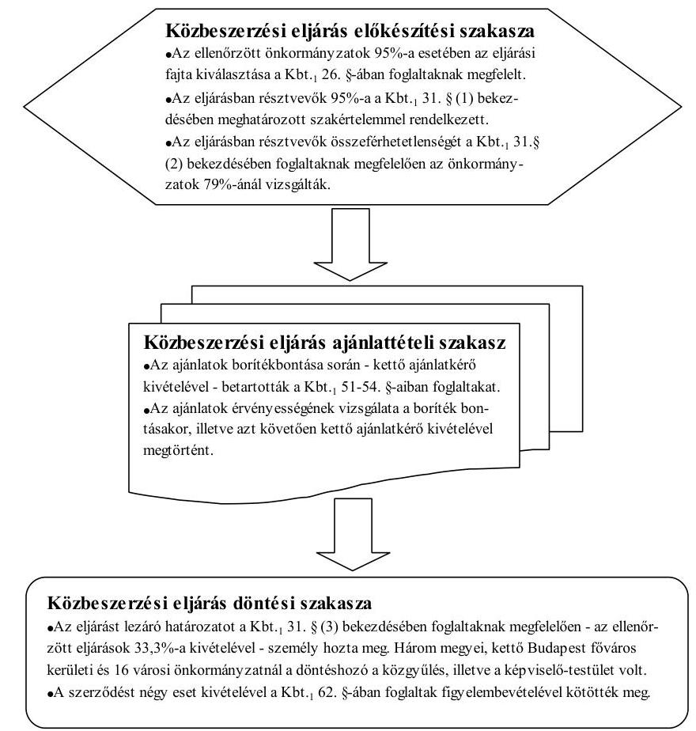

A Kbt. 1 73. § (1) bekezdésében meghatározott feltételek megléte mellett a közbeszerzési eljárás alapján kötött szerződéseket az ellenőrzött önkormányzatok $40 \%$-a módosította.

A 2004. évben a közbeszerzési eljárást lefolytató ellenőrzött önkormányzatok 19\%-át a Közbeszerzési Tanács mellett müködő Közbeszerzési Döntőbizottság elmarasztalta, valamint egy és ötmillió Ft közötti bírság megfizetésére kötelezte az ajánlatkérőket ${ }^{48}$.

A Közbeszerzési Döntőbizottság elmarasztalásának indokai voltak: a nyertes ajánlattevő ajánlata nem felelt meg az ajánlati felhívásban meghatározott feltételeknek, az ajánlati felhívásban meghatározott tartalmi elemektől eltértek az értékelés során, a Kbt., 44. §-ában foglaltak figyelmen kívül hagyásával határozták meg az ajánlati felhívásban a teljesítésre való alkalmasság igazolásának módját és a szerződéskötés időpontját, olyan hiányok pótlására adtak lehetőséget melyek a Kbt., 43. § (4) és (5) bekezdése szerint nem pótolhatóak, az ajánlati felhívásban az ajánlatkérő nem biztosította az ajánlattevők esélyegyenlőségét, nem a legkedvezőbb ajánlattevőt hirdették ki a közbeszerzési eljárás nyertesének. A Közbeszer-

[^0]
[^0]:    ${ }^{48}$ Az ÁSZ a Kbt., 79. § (4) bekezdés d) pontja alapján hatásköre ellátása során tudomására jutott eseményekkel kapcsolatban a 2004. évben kettő, a 2005. évben egy esetben a közbeszerzési eljárás mellőzése miatt, a 2003. évben egy közbeszerzési eljárásban a verseny tisztaságát sértő döntés miatt kezdeményezett jogorvoslati eljárást, amelyek során a Közbeszerzési Döntőbizottság összesen hárommillió Ft bírságot szabott ki.

---

zési Döntőbizottság az ellenőrzött önkormányzatoknál három alkalommal hivatalból kezdeményezett jogorvoslatot mivel kettő eljárás esetében a tárgyalásos eljárás alkalmazásának indoka nem állt fent, egy eljárás során pedig ugyanazon feltétel kétszeri figyelembevétele történt.

A 2005. évben a Közbeszerzési Döntőbizottság előtti 1091 jogorvoslati eljárás közel fele az önkormányzati közbeszerzési eljárásokkal volt kapcsolatos. A 2005. évben összesen 502 jogorvoslati eljárás ${ }^{49}$ - melyből a közösségi értékhatárt elérő 154, a nemzeti értékhatárt elérő 214, a nemzeti értékhatár alatti 110 és a közbeszerzési eljárás mellőzése miatt 24 - indult. A jogorvoslati eljárások kezdeményezésére $51 \%$-ban a nyílt, $16 \%$-ban a tárgyalásos, $3 \%$-ban meghívásos, $27 \%$-ban egyszerű eljárási fajták esetében került sor. A Közbeszerzések Tanácsa Közbeszerzési Döntőbizottsága 195 esetben - 62 közösségi értékhatárt elérő, 88 nemzeti értékhatárt elérő, 40 nemzeti értékhatár alatti és 5 közbeszerzési eljárás mellőzése miatt - $46 \%$-ban nyílt, $25 \%$-ban tárgyalásos, $6 \%$-ban meghívásos, és $23 \%$-ban egyszerű eljárási fajta esetében állapított meg jogsértést.

# 1.6. A céljelleggel nyújtott támogatások szabályszerűsége 

A helyi önkormányzatok a 2004. évben 180,4 milliárd $\mathrm{Ft}^{50}$ támogatást adtak működési és felhalmozási célra vállalkozásoknak, non-profit szervezeteknek, saját intézményeken kívüli költségvetési szerveknek, külföldi szervezeteknek (önkormányzatoknak, civil szervezeteknek), és a háztartásoknak. A céljelleggel átadott pénzeszközök aránya a 2004. évi önkormányzati költségvetési kiadások 6,3\%-át tette ki, a 2002. évi 7,0\%-kal és a 2003. évi 6,0\%-kal szemben.

Az átadott pénzeszközök támogatott szervezetek közötti megoszlása (országosan összesen)
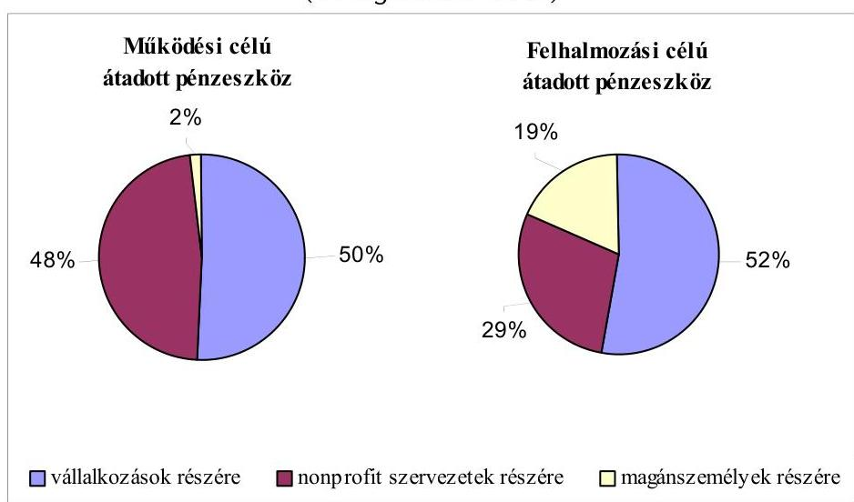

[^0]
[^0]:    ${ }^{49}$ A Közbeszerzések Tanácsa Közbeszerzési Döntőbizottság elnökének 2006. május 9-én az önkormányzati közbeszerzéseket érintő jogorvoslati eljárásokról küldött tájékoztatása szerint.
    ${ }^{50}$ A helyi önkormányzatok a 2005. évben országosan összesen 186,1 milliárd Ft támogatást adtak céljelleggel - nem szociális ellátásként - szervezetek és magánszemélyek számára.

---

Az összes önkormányzat által adott támogatások megoszlási arányának - ezen belül a vállalkozásoknak adott támogatások arányának - alakulását jelentősen befolyásolta, hogy a Budapest Fővárosi Önkormányzat az általa nyújtott 21,9 milliárd Ft múködési célú támogatás 62,5\%-át (2003-ban 68,2\%-át) és a 22,3 milliárd Ft felhalmozási célú támogatás $74,7 \%$-át (2003-ban $96,7 \%$-át) vállalkozásoknak adta. A múködési célra átadott 112,2 milliárd Ft egyötödét, a felhalmozási célra átadott 68,2 milliárd Ft egyharmadát a Budapest Fővárosi Önkormányzat teljesítette.

A 2004. évben az ellenőrzött önkormányzatok - Budapest Fővárosi Önkormányzat nélkül - 19 , 1 milliárd Ft múködési célú és 8,0 milliárd Ft felhalmozási célú pénzeszközátadást teljesítettek ${ }^{51}$. Az ellenőrzött önkormányzatok az összes költségvetési kiadásaik 5,5\%-át (az előző évben 5,2\%át) fordították céljellegú támogatásra. A költségvetésben tervezett eredeti előirányzatokhoz viszonyítva a múködési célú pénzeszközátadások 37,6\%-kal, a felhalmozási célú pénzeszközátadások 15,7\%-kal magasabb összegben teljesültek.
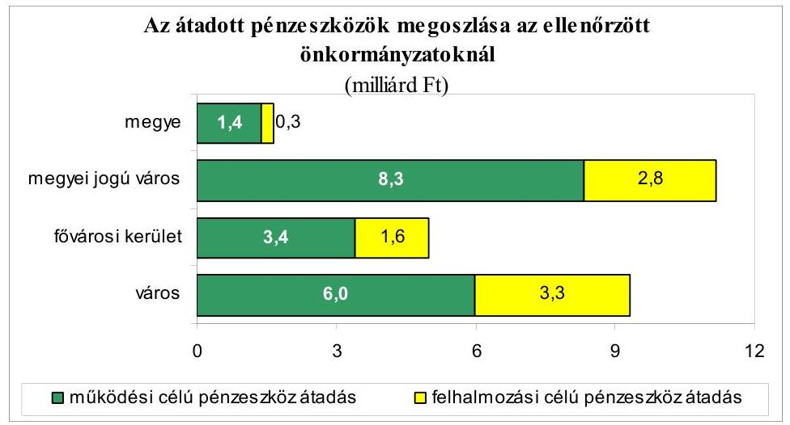

A múködési és a felhalmozási célú pénzeszköz átadások 41,2\%-át a megyei jogú városi, $34,4 \%$-át a városi, $18,3 \%$-át a kerületi, $6,1 \%$-át a megyei önkormányzatok teljesítették. Az ellenőrzött önkormányzatok 91,3\%-a tervezett a 2004. évi költségvetésében speciális célú támogatásokra elkülönített összegeket. Az ellenőrzött önkormányzatok 66\%-a gazdasági társaságoknak, $45 \%$-a közhasznú társaságoknak, $94 \%$-a társadalmi szervezeteknek, $97 \%$-a alapítványnak, közalapítványnak, $74 \%$-a egyházaknak, $90 \%$-a egyéb szervezeteknek, $62 \%$-a magánszemélyeknek adott céljelleggel - nem szociális ellátásként - támogatást.

[^0]
[^0]:    ${ }^{51}$ Az ÁSZ a 2004. évben céljellegú támogatásként átadott pénzeszközök 15\%-át ellenőrizte az önkormányzatoknál.

---

# Az átadott pénzeszközök támogatott szervezetek közötti az ellenőrzött önkormányzatoknál (Budapest Fővárosi Önkormányzat nélkül) 

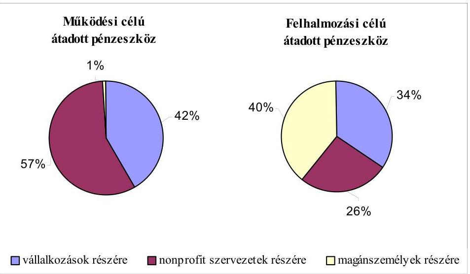

Az ellenőrzött önkormányzatoknál a költségvetési rendeletekben jóváhagyott pénzügyi támogatási keretek felett rendelkezési jogosultsággal a képviselő-testületek, a bizottságok, és a polgármesterek rendelkeztek a helyi szabályok alapján. Az ellenőrzött önkormányzatoknál a céljelleggel adott támogatásokról a hatásköri szabályok figyelem kívül hagyásával is döntöttek:

- az önkormányzatok 55\%-ánál a bizottságok és a polgármesterek - az Ötv. 10. § (1) bekezdés d) pontjában előírt hatásköri előírást megsértve - a képvi-selő-testület helyett alapítványok, közalapítványok támogatásáról döntöttek;
- a társadalmi szervezeteket támogató önkormányzati költségvetési intézmények 20\%-a az Áht. 94. § (1) bekezdésében előírtakat megsértve, felügyeleti szerv engedélye nélkül nyújtott támogatást;
- az Ötv. 9. § (3) bekezdésében rögzített hatásköri szabályokat megsértve egyegy önkormányzatnál a költségvetési rendeletben meghatározott keretösszeg felett rendelkezési hatáskört biztosítottak alpolgármester, önkormányzati képviselő részére is.

Az ellenőrzött önkormányzatok 15\%-ánál a speciális célú támogatások előirányzatának felhasználásakor az Áht. 93. § (1) bekezdésében a jóváhagyott előirányzatokon belüli gazdálkodásra vonatkozó előírást megsértve a költségvetési rendeletben az e célra meghatározott előirányzatokat túllépték.

A céljelleggel - nem szociális ellátásként - nyújtott támogatásoknál az Áht. 13/A. § (2) bekezdésének előírását megsértve az ellenőrzött önkormányzatok 20\%-ánál nem írtak elő̉ számadási kötelezettséget. Ezen önkormányzatok 10\%-ánál a támogatás összegét, 14\%-ánál (az előző évben 40\%ánál) a támogatott célt, 24\%-ánál (az előző évben 63\%-ánál) a felhasználásról

---

való számadási kötelezettség teljesítésének módját, továbbá 19\%-ánál (az előző évben $60 \%$-ánál) a számadás határidejét nem írták elő.

A Ksztv. 14. § (2) bekezdésében foglalt előírást megsértve az önkormányzatok 20\%-ánál nem, 17\%-ánál nem minden támogatott közhasznú szervezet esetében határozták meg szerződésben a támogatással való elszámolás feltételeit és módját.

A támogatásban részesült szervezetek 31\%-a a meghatározott tartalommal, 26\%-a határidőre teljesítette számadási kötelezettségét. A számadások ellenőrzését az önkormányzati hivatalok 20\%-ánál nem végezték el, további 28\%-nál az Áht. 13/A. § (2) bekezdésében foglalt előírást megsértve nem ellenőrizték az abban foglaltakat.

Az ellenőrzött önkormányzatok egyharmadánál elmulasztották a támogatottak a számadási kötelezettség határidőre történő teljesítését, valamint a támogatottak egyötödénél az Áht. 13/A. § (2) bekezdésében előírtakat megsértve a támogatás felfüggesztéséről nem intézkedtek.

A támogatások célszerinti felhasználását az önkormányzati hivatalok 87\%-a (2003-ban 91\%-a) a támogatott szervezeteknél a helyszínen nem ellenőrizte ${ }^{52}$.

Kunhegyes Város Önkormányzatánál az egymillió Ft feletti támogatásokat a helyszínen ellenőrizték. Pécs Megyei Jogú Város Önkormányzatánál és Budapest Főváros XI. Kerületi Önkormányzatnál a felhalmozási célú támogatások helyszíni ellenőrzését a műszaki ellenőr bevonásával (a műszaki ellenőrzés keretein belül) oldották meg. Komló Város Önkormányzatánál a megküldött szakmai beszámolók mellett a támogatottak közül évente 8-10 szervezetet a képviselőtestületi ülésen szóban is beszámoltattak, továbbá a bizottságok kihelyezett ülésen egyes támogatások célszerinti felhasználását ellenőrizték.

A mulasztásokhoz hozzájárult, hogy az Áht. a céljelleggel nyújtott támogatásokról készített számadás, valamint a rendeltetésszerű felhasználás ellenőrzési követelményeit nem határozza meg. A támogatások helyszíni ellenőrzésének eseteit, módját, a támogatási célok meghatározásának a részletezettségét és a számadásban hivatkozott bizonylatok hitelességének, a nyújtott támogatásból történt felhasználás igazolásának szabályait jogszabály nem írja elő.

Az Állami Számvevőszékről szóló 1989. évi XXXVIII. törvény 21. § (3) bekezdésében kapott felhatalmazás alapján 15 szervezet részére nyújtott, összesen 79,6 millió Ft céljellegú támogatás felhasználását az érintett önkormányzat képviselőjével közösen a támogatottaknál a helyszínen ellenőriztük.

A helyszíni ellenőrzés során összesen 0,3 millió Ft jogosulatlan, támogatási céltól eltérő felhasználást állapítottunk meg két támogatott szervezetnél. A céltól eltérő

[^0]
[^0]:    ${ }^{52}$ Az ÁSZ 2005. évben készített 0544 sorszámú jelentésében a pénzügyminiszternek címzett javaslat nem hasznosult, mivel az önkormányzatok által céljelleggel nyújtott támogatások ellenőrzési szabályainak meghatározását a Pénzügyminisztérium nem kezdeményezte.

---

felhasználás ellenére, a támogatás összeg visszafizetéséről - az Áht. 13/A. § (2) bekezdésében foglalt előírást megsértve - a helyszíni ellenőrzést megelőzően a támogatást nyújtó Budapest Főváros XX. Kerületi Önkormányzatnál és Veszprém Megyei Jogú Város Önkormányzatánál nem intézkedtek, mivel a helyszíni ellenőrzést megelőzően a számadás önkormányzati ellenőrzése nem állapította meg a támogatási céltól eltérő felhasználást.

A támogatási céltól eltérő, jogsértő felhasználást - az önkormányzati hivatalok által végzett ellenőrzések során - egy megyei, két megyei jogú városi, két kerületi és öt városi önkormányzat által támogatott szervezetnél állapítottak meg, melynek visszafizettetésére - az Áht. 13/A. § (2) bekezdésében előírtakat megsértve - az ellenőrzött önkormányzatok felénél nem intézkedtek. A többieknél intézkedtek a támogatás visszafizettetéséről, melynek a támogatottak eleget tettek.

# 1.7. A költségvetés egyensúlyi helyzete 

Az ellenőrzött önkormányzatok kétharmadánál 2002-2004 között az évenkénti költségvetésekben a pénzügyi egyensúly nem volt biztosított. A 2002. évben az ellenőrzött önkormányzatok 64\%-a, a 2003. évben 70\%-a, a 2004. évben $73 \%$-a tervezte hiánnyal költségvetését.

Az ellenőrzött önkormányzatok 2004. évben tervezett összes kiadásának átlagosan 5,7\%-ára nem nyújtottak fedezetet a tervezett bevételek. (Három Budapest főváros kerületi és tíz városi önkormányzatnál - az ellenőrzött önkormányzatok 16\%-ánál - az összes tervezett kiadás 10\%-át meghaladta a hiány összege.)

A 2004. évi költségvetésben az ellenőrzött Budapest főváros kerületi önkormányzatoknál az összes kiadás 8,1\%-ára, a városi önkormányzatoknál 6,3\%ára, a megyei jogú városok önkormányzatainál 4,7\%-ára, a megyei önkormányzatoknál 3,1\%-ára nem volt biztosított a forrás.

A hiány aránya meghaladta Bicske Város Önkormányzatánál a tervezett összes kiadás egynegyedét, Máriapócs Város Önkormányzatánál egyötödét.

A 2004. évi költségvetésben tervezett hiány önkormányzat típusonkénti átlagos összege a Budapest főváros kerületi önkormányzatoknál 1278,6 millió Ft, a megyei jogú városi önkormányzatoknál 1267,9 millió Ft, a megyei önkormányzatoknál 470,5 millió Ft, a városoknál 216 millió Ft volt.

A Budapest főváros kerületi önkormányzatok közül legnagyobb összegű hiányt, 2974 millió Ft-ot - a költségvetési főösszeg 14,3\%-át - a Budapest Főváros XI. Kerületi Önkormányzatnál terveztek. A megyei jogú városi önkormányzatok között a költségvetésben szereplő hiány összege legmagasabb - 2977 millió Ft - Szeged Megyei Jogú Város Önkormányzatánál volt, melyből a felhalmozási célú bevéte-lek-kiadások különbségeként tervezett hiány 2076 millió Ft volt.

A múködési célú bevételek az ellenőrzött önkormányzatok 57\%-ánál nem nyújtottak fedezetet a múködési célú kiadásokra, a felhalmozási célú bevételek pedig az önkormányzatok 50\%-ánál nem fedezték a felhalmozási célú kiadásokat. A 2004. évi tervezéskor fennállt belső egyensúlyhiányt az

---

önkormányzatok 15\%-a a felhalmozási célú bevételek múködési célú kiadásokra történő bevonásával (vagyonfeléléssel) tervezte feloldani, további $27 \%$ a múködési célú bevételeinek egy részét a felhalmozási kiadások hiányának csökkentésére tervezte fordítani.

A költségvetésben hiányt tervezö önkormányzatok 38\%-ánál a hiány a múködési, 17\%-ánál a felhalmozási célú bevételek hiányából fakadt.

A múködési célú bevételi hiány a legmagasabb - az összes kiadás 4,8\%-a - Pécs Megyei Jogú Város Önkormányzatánál volt a 2004. évben. A kizárólag felhalmozási célú bevételeknél tervezett forráshiány a városi önkormányzatokat jellemezte.

A költségvetési hiányok kialakulására döntő befolyást jelentett - a hiányt az önkormányzatok 59\%-ánál befolyásolta - a feladatellátás módjának gazdaságtalan megszervezése, az intézményi kapacitások alacsony kihasználtsága. A tervezéskor elkövetett hibák - a kiadások túltervezése, a bevételek alultervezése - az önkormányzatok 29\%-ánál járultak hozzá a költségvetési egyensúly romlásához.

Az önkormányzatok 52\%-ánál a hiány kialakulásának a társadalmi, központi költségvetési szabályozásbeli változásokra visszavezethető okai is voltak, csökkent a helyi adóbevétel, a központi bérintézkedések kiadási többletet jelentettek, megnövekedtek a szociális terhek.

A felhalmozási célú bevételeket meghaladó mértékú beruházási kötelezettségvállalás miatti fizetési kötelezettség az önkormányzatok 42\%ánál, a felhalmozási célú bevételeket meghaladó mértékű felújítási kötelezettségvállalásból eredő fizetési kötelezettség az önkormányzatok 15\%-nál okozott forráshiányt, növelte tervszinten az eladósodást.

A 2004. évi teljesítési adatok szerint ${ }^{53}$ a tervezéshez viszonyítottan javult az önkormányzatok pénzügyi egyensúlyi helyzete, különösen a múködési célú bevé-teleket-kiadásokat illetően. Az ellenőrzött önkormányzatok a költségvetési rendeletekben tervezett hiányt bevételi többletekkel és kiadási megtakarításokkal mérsékelték, a teljesítési adatok alapján tényleges hiány a 2002. évben az önkormányzatok 29\%-ánál, 2003-2004 között 25-25\%-ánál keletkezett.

A költségvetési hiány mértékének önkormányzat-típus szerinti - tervezett és tényleges - alakulását a következő diagram szemlélteti.

[^0]
[^0]:    ${ }^{53}$ Az ellenőrzött helyi önkormányzatok - Budapest Fővárosi Önkormányzat nélküli 2004. évi teljesített bruttó és nettó múködési és felhalmozási kiadásait az 5-ös, bruttó és nettó bevételeit-kiadásait a 8 -as, önkormányzat típusonkénti bevételét-kiadását a 6-os számú melléklet, az összes önkormányzat 2004. évi bruttó és konszolidált bevételeinek és kiadásainak alakulását a 7. számú melléklet ismerteti.

---

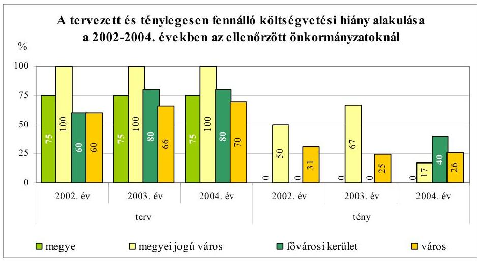

A 2004. évben tervezett hiányt csökkentette az ellenőrzött önkormányzatoknál a bevételeknek a kiadásokhoz viszonyított $6,4 \%$-kal nagyobb arányú teljesítése, az intézményi múködési bevételek 10,5\%-kal, a kamatbevételek 136,6\%-kal, a gépjármúadó bevételek $23,0 \%$-kal, a múködési célra átvett pénzeszközök 4,1\%kal nagyobb összegben történt teljesítése. Az önkormányzatok 44\%-ánál az átmenetileg szabad pénzeszközök lekötéséből származó bevétel az előző évhez viszonyítva növekedett. A költségvetési egyensúlyt javító tényező volt az előző évi pénzmaradványok tervezettet 226,0\%-kal meghaladó igénybevétele 18,1 milliárd Ft -, amely az ellenőrzött önkormányzatok tervezéskor kimutatott összesen 26,7 milliárd Ft-os hiányának 67,8\%-át biztosította.

A bevételeket növelő intézkedésként évente felülvizsgálták és szükség esetén döntöttek, a hatósági-, engedélyezési-, és bérleti díjak, valamint az intézményi térítési díjak emeléséről. Az ellenőrzött települési önkormányzatok mindegyike bevételi forrásai gyarapítása érdekében élt a helyi adó megállapításának lehetőségével. Az önkormányzatok 36\%-a gazdasági programjában az adópolitika egyik céljaként az önkormányzat pénzügyi helyzetének stabilizálását, a lakosság és a vállalkozók érdekei figyelembevételével történő adómértékek megállapítását határozta meg.

Az adóbehajtási tevékenység fokozása is hozzájárult ahhoz, hogy az önkormányzatok 78\%-ánál a helyi adóbevételek meghaladták a tervezettet, Dunaújváros Megyei Jogú Város Önkormányzatánál és Jászfényszaru Város Önkormányzatánál a tervezett összeg másfélszeresét.

A helyi adók mértékét, fizetési feltételeit évente felülvizsgálták és állapították meg a mértékek, kedvezmények és mentességek körét. Budapest főváros területén - a Hatv. 1. § (2), (3) bekezdése, illetve a 7. § d) pontja alapján - az iparűzési, illetve idegenforgalmi adót a Budapest Fővárosi Önkormányzat állapította meg, amely bevételből a forrásmegosztás keretében jutatott vissza forrást a Budapest főváros kerületi önkormányzatoknak.

A helyi adók közül az iparűzési adót a települési önkormányzatok 93\%-a, kommunális jellegű adót $80 \%$-a, vagyontípusú adót $66 \%$-a állapított meg. A vagyontípusú adók közül az önkormányzatok 76\%-a építményadót, 24\%-a telekadót állapított meg. A kommunális jellegú adók közül a magánszemélyek

---

kommunális adóját az önkormányzatok 42\%-a, a vállalkozók kommunális adóját és az idegenforgalmi adót 29-29\%-a állapított meg.

A Budapest főváros kerületi önkormányzatok mindegyike bevezette az építmény és a telekadót. A városi önkormányzatok átlagosan 3,2 féle helyi adót vezettek be.

A megállapított adómértékek az adómaximumok 75\%-át érték el. A települési önkormányzatok 17\%-a minden adónemben a maximális adó mértéket alkalmazta. Az iparűzési adónál az érintett önkormányzatok 73\%-a, a kommunális jellegű adóknál $42 \%$-a, a vagyontípusú adóknál $35 \%$-a ${ }^{54}$ állapította meg a törvény szerinti maximális összeget.

Az ellenőrzött önkormányzatok 72\%-a az adóalanyok részére a Hatv-ben meghatározottakon túlmenően is biztosított mentességeket, adott kedvezményeket.

Az önkormányzatok 69\%-a az iparűzési, 78\%-a a vagyontípusú, 71\%-a a kommunális jellegű adó esetében biztosított mentességet, kedvezményt:

- az önkormányzatok az iparűzési adó tekintetében mentességet adtak a befektetőknek, működő és jelentős létszámbővítéssel járó fejlesztéseket végrehajtóknak, új munkahelyeket létrehozóknak, egészségügyi vállalkozásoknak;
- a magánszemélyek kommunális adójának fizetésére kötelezettek kedvezményt, mentességet kaptak szociális helyzetüktől, életkoruktól, lakásuk állapotától függően, valamint akkor, ha valamilyen közmú beruházásban részt vettek. A vállalkozók kommunális adójából kedvezményt nyújtottak azon vállalkozóknak, amelyek ipari parkban végezték tevékenységüket, az adott településen lakókat foglalkoztatottak, a foglalkoztatottak létszámát bővítették;
- az építményadó fizetési kötelezettséget az önkormányzatok a lakás, családi ház területétől, hasznosítási módjától, valamint a benne lakók egészségügyi, szociális helyzetétől tették függővé. Adómentességet biztosítottak a külterületi és zárkerti üdülőkre, hétvégi házakra, garázsokra. A telekadó tekintetében gyakran nyújtottak meghatározott ideig mentességet az építési engedéllyel rendelkezők részére.

A helyi adó bevételek összege 2002-2004 között 22\%-kal növekedett, miközben a saját bevételeken belüli részaránya nem változott, és az összes bevételen belüli 9,3\%-os aránya 12,5\%-ra emelkedett. A 2004. évben a helyi adóbevételen belül az iparűzési adó $83,6 \%$-ot, az építményadó $12,0 \%$-ot, a telekadó $1,4 \%$-ot, a vállalkozók kommunális adója $0,3 \%$-ot, a magánszemélyek kommunális adója $1,9 \%$-ot, és az idegenforgalmi adó pedig $0,8 \%$-ot képviselt.

Az iparűzési adóbevételeket 2002-2004 között a vállalkozások helyzetének romlása, az adó alapjának jogszabályi változása folyamatosan csökkentette, ugyanakkor a mentességek, kedvezmények mérséklése növelte.

A források bővítése érdekében a 2004. évben a költségvetési hiánnyal tervező önkormányzatok 92\%-a (az előző évben 88\%-a) vagyonértékesítést hajtott vég-

[^0]
[^0]:    ${ }^{54}$ Előző évben ezek a mértékek 44-32-13\% voltak.

---

re, $60 \%$-a (az előző évben 59\%-a) további bevételi lehetőségeket tárt fel, valamennyien pályázati pénzeszközökkel bővítették forrásaikat. Az önkormányzatok $76 \%$-az önkormányzati hivatalon belül alakította ki a pályázatok benyújtásának szervezeti, valamint 93\%-a a személyi feltételeit. A felhalmozási célú pályázati döntéseknél az önkormányzatok betartották a központi, 92\%-ban pedig a saját szabályzataikban foglalt hatásköri előírásokat.

A pályázatok szervezeti kereteit kialakító önkormányzatok közül leggyakrabban ( $47 \%$-nál) a pályázatok figyelését, előkészítését, megvalósításának koordinálását az önkormányzati hivatalok szervezetén belül, a pályázati téma szerinti tevékenységet ellátó szervezeti egységre, személyekre bízták. Az önkormányzatok 31\%-ánál - elsősorban a városi és a Budapest főváros kerületi önkormányzatoknál - pályázati referenseket alkalmaztak. Az önkormányzatok 22\%-ánál - elsősorban a megyei jogú városi és a megyei önkormányzatoknál - a pályázati feladatok ellátására elkülönült szervezeti egységeket, csoportokat hoztak létre, amelyek feladataként határozták meg a forrásszerző pályázatok kidolgozásában és megvalósításában való részvételt, a pályázatok gondozását a teljes megvalósítási ciklusban, az érintettek tájékoztatását a pályázati lehetőségekről, valamint a pályázatot kiírókkal és a lebonyolítókkal történő kapcsolattartást. A pályázatkezelő szervezetek feladatán túl a többi szervezeti egység számára is határoztak meg feladatokat a pályázati lehetőségek felkutatásában és az előkészítésben. A pályázati lehetőségek felkutatásában és koordinálásában Dunaföldvár és Visegrád városok önkormányzatainál külső szakértők is részt vettek.

A költségvetés végrehajtása során az ellenőrzött önkormányzatok a tervezettnél kevesebb hitelt vettek fel és kevesebb értékpapírt értékesítettek, így a finanszírozási célú pénzügyi műveletek bevétele az eredeti előirányzat 71,2\%-ára teljesült, ugyanakkor a tervezettet 18,9\%-kal meghaladta a tényleges hiteltörlesztés összege.

A működési célú forráshiány rendezésére az ellenőrzött forráshiányos önkormányzatok 40\%-a kapott ÖNHIKI támogatást. A kapott támogatás a múködési forráshiányok 25,0\%-ára ${ }^{55}$ nyújtott fedezetet. ÖNHIKI támogatást az ellenőrzött városi önkormányzatok 50\%-a, megyei önkormányzatok $33 \%$-a, a megyei jogú városi önkormányzatok $17 \%$-a igényelt. Az ellenőrzött forráshiányos önkormányzatok 37\%-a a működésképtelen önkormányzatok egyéb támogatási előirányzatból is részesült.

A pénzügyi egyensúly, a folyamatos fizetőképesség biztosításához szükséges likviditási tervet a jegyzők az ellenőrzött önkormányzatok 38\%-ánál az Ámr 139. § (1) bekezdésében előírtak ellenére nem készítettek. A likviditási tervet készítők 92\%-ánál figyelemmel voltak a helyi adók beérkezésére, 62\%ánál megalapozottan történt az egyes sajátos bevételek ütemezése. A likviditási tervek 38\%-ának aktualizálása annak indokoltsága ellenére nem történt meg.

A működési célú bevételek hiánya miatt az ellenőrzött önkormányzatok 70\%-a 2002-2004 között rövid lejáratú hitelt, ezen belül a folyószámla hitelkeretet nö-

[^0]
[^0]:    ${ }^{55}$ A 2002. évben 72\%-ra, a 2003. évben 42\%-ára nyújtott fedezetet.

---

velve, egyre nagyobb összegben likvid hitelt vett fel. Az év közben felvett hiteleket az önkormányzatok 46\%-a az év végéig nem fizette vissza, ezek a következő év gazdálkodását terhelték.

Likvid hitelt valamennyi ellenőrzött megyei jogú városi önkormányzat, a megyei önkormányzatok 75\%-a, a városi önkormányzatok 69\%-a, a Budapest fővárosi kerületek 40\%-a vett igénybe 2002-2004 között.

Az ellenőrzött önkormányzatok nem kerültek csődhelyzetbe, nem kezdeményeztek adósságrendezési eljárást.

Adósságot keletkeztető kötelezettségvállalásról döntött az ellenőrzött önkormányzatok 66\%-a (az előző évben 30\%-a), melyek 74\%-a hitelfelvétel volt. A pénzügyi bizottságok az adósságot keletkeztető kötelezettségvállalások 92\%-ánál vizsgálták meg annak indokoltságát. Az adósságot keletkeztető éves kötelezettségvállalások Ötv. 88. § (2) bekezdésében meghatározott felső határát a kötelezettségvállalást megelőzően az ellenőrzött önkormányzatok 92\%-a vizsgálta, azonban ezek 13\%-a ezen előírást megsértve túllépte a felső határt. Az adósságot keletkeztető kötelezettségvállalás felső határát a városi önkormányzatok 3\%-a nem tartotta be, ezáltal veszélybe került a működőképessége és a fizetőképessége. Az adósságot keletkeztető kötelezettségvállalás éves felső határának meghatározásakor a jogszabály alapján figyelembe nem vett, de fizetési kötelezettségként jelentkező, jellemzően a működési célú kiadásoknál jelentkező folyószámla hitel igénybevétel több éven át fennálló összege az önkormányzatok költségvetéseit éveken át megterheli, a fizetőképességet a jogszabályban felsorolt, a kötelezettségvállalási határ számításánál figyelembe vettekhez hasonlóan befolyásolja, a tényleges adósságállományt növeli ${ }^{56}$.

A kiadások csökkentése érdekében 2002-2004 között a költségvetésben hiányt tervező önkormányzatok 61-68-75\%-a a költségvetési szervek gazdálkodását, feladatait érintő intézkedéseket kezdeményezett. Az önkormányzatok a költségvetési egyensúly javítása érdekében tett intézkedések hatásait nem számszerúsítették.

A költségvetési egyensúly megtartására vonatkozó intézkedési tervet fogadtak el, amely a múködési kiadások csökkentésére és a bevételek növelésére irányuló elhatározásokat tartalmazott. A nevelési-oktatási intézményeknél az önkormányzati feladatellátás hatékonyságát, az egyes intézmények kapacitás kihasználtságát vizsgálták, melyek függvényében átszervezéseket hajtottak végre. Áttekintették az önként vállalt feladatok ellátásának szükségességét, a kisegítő gazdasági tevékenységek vállalkozásba adásának lehetőségét. A múködési és a felhalmozási célú kiadásokat az adható juttatások szűkítésével, a kiadások halasztásával, il-

[^0]
[^0]:    ${ }^{56}$ A folyószámlahitelek folyamatos megújításának és éven túli igénybevételének kedvezőtlen tendenciája logikai kapcsolatba hozható a vonatkozó jogszabályi rendelkezés értelmezési problémáival. A helyi önkormányzatokról szóló törvény a likvid hiteleket kivette az önkormányzatok kötelezettségvállalási felső határának számításából. Ezáltal a felhalmozódó, illetve az éven belül visszafizetett, de 365 napot meghaladóan - esetleg több éven keresztül - igénybevett folyószámlahitelek nem terhelték (szűkítették) a törvény szerinti adósságot keletkeztető kötelezettségvállalások lehetséges mértékét, az önkormányzatok ilyen típusú eladósodása nem ütközött jogszabályi korlátba.

---

letve átütemezésével is csökkentették. A hiány összegét mérsékelte a tervezett beruházási kiadások visszafogása, $77 \%$-os teljesítése.

A 2004. évi költségvetés teljesítési adatai szerint az év közben tett intézkedések hatására az ellenőrzött önkormányzatoknál a tervezéskori 57\%-kal szemben 20\%-nál nem nyújtottak fedezetet a működési célú bevételek a működési célú kiadásokra. A felhalmozási célú bevételek az ellenőrzött önkormányzatoknál a tervezéskori 50\%-tól eltérően 42\%-nál nem fedezték a felhalmozási célú kiadásokat. Az ellenőrzött önkormányzatok 12\%-a a felhalmozási célú bevételeket a működési célú kiadások teljesítésére fordította, 35\%-a a működési célú bevételekből felhalmozási célú kiadásokat teljesített.
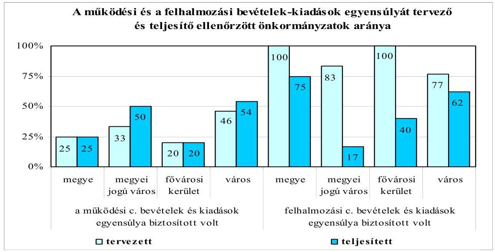

# 1.8. A zárszámadás szabályszerűsége 

Az ellenőrzött önkormányzatok a Vhr. 7. § (1) bekezdés, valamint a 10. § (1) és (5) bekezdései alapján teljesítették a 2004. évről szóló beszámolási és adatszolgáltatási kötelezettségüket. A polgármesterek az önkormányzat éves gazdálkodásáról szóló 2004. évi zárszámadási rendelettervezetet - az előző évekhez hasonlóan - az Áht. 82. §-ában előírt határidőn belül ${ }^{57}$ terjesztették a képviselő-testület elé.

Az Áht. 18. §-ában foglaltakat megsértve a 2004. évben a zárszámadási előterjesztések 26\%-át (a 2003. évben 20\%-át) nem a költségvetési rendelettel összehasonlítható módon készítették el.

Az önkormányzatok 8\%-ánál (a 2003. évben 12,5\%-ánál) a zárszámadási rendeletben szereplő eredeti előirányzatok fő- és részösszegei nem egyeztek meg a költségvetési rendelet vonatkozó adataival, 3\%-ánál pedig nem tartalmazták az eredeti előirányzatokat.

[^0]
[^0]:    ${ }^{57}$ A zárszámadási rendelettervezet képviselő-testület elé terjesztésének határideje az Áht. 82. §-a szerint a költségvetési évet követő 4 hónapon belüli időpont.

---

A zárszámadásban szereplő módosított előirányzatok az ellenőrzött önkormányzatok 16\%-ánál (a 2003. évben 15\%-ánál) nem egyeztek meg a költségvetési rendelet utolsó módosításában szereplő adatokkal.

A zárszámadási rendeletek szerkezetére, tartalmára vonatkozó - az Áht. 69. § (1) bekezdésében, illetve az Ámr. 29. § (1) bekezdésében rögzített - előírások ellenére évek óta típushibaként a zárszámadási elő́terjesztések nem, vagy hiányosan tartalmazták:

- a múködési-fenntartási előirányzatok önkormányzati szintű teljesítését az önkormányzatok 6\%-ánál, ezen belül a kiemelt előirányzatok közül a legnagyobb arányban 16\%-ánál elmaradt az ellátottak pénzbeli juttatásainak, 20\%-ánál a speciális célú támogatásoknak és 25\%-ánál a tényleges költségvetési létszámkereteknek a bemutatása;
- a múködési, fenntartási előirányzatok költségvetési szervenkénti teljesítését az önkormányzatok 15\%-ánál, ezen belül a kiemelt előirányzatok közül nem mutatta be az önkormányzatok 25\%-a az ellátottak pénzbeli juttatásait, $33 \%$-a a speciális célú támogatásokat és $31 \%$-a a tényleges létszámkeretek alakulását;
- a felújítási előirányzatok teljesítését célonként az önkormányzatok 19\%-ánál a felhalmozási kiadásokat feladatonként és az önkormányzati hivatalok kiadásainak teljesítését $17 \%$-a, illetve $12 \%$-a nem részletezte;
- a múködési és felhalmozási bevételek és kiadások mérlegszerű bemutatását az önkormányzatok 20\%-ánál.

A zárszámadás előterjesztésekor csökkent azon önkormányzatok száma, amelyek az Áht. 118. §-ának előírását megsértve, a képviselő-testület részére tájékoztatásul nem mutatták be az Áht. 116. § 6., 8. pontjaiban előírt mérlegeket és kimutatásokat, valamint a 9., 10. pontjaiban előírt kimutatásokat szöveges indoklással.

A zárszámadási rendelettervezet előterjesztésekor elmaradt az önkormányzatok

- 2\%-ánál a helyi önkormányzatok összevont mérlegeinek és 17\%-ánál elkülönítetten a helyi kisebbségi önkormányzatok mérlegeinek a bemutatása (a 2003. évben 10\%-nál, illetve 20\%-nál);
- 14\%-ánál a vagyonkimutatás elkészítése és bemutatása;
- 44\%-ánál a többéves kihatással járó döntések számszerűsített, évenkénti bontásban történő bemutatása és indokolása (a 2003. évben 54\%-ánál);
- 41\%-ánál a közvetett támogatások (adókedvezmények, adóelengedések) bemutatása és annak szöveges indoklása 66\%-nál (a 2003. évben 57\%-nál, illetve $73 \%$-nál).

A képviselő-testületek az önkormányzatok 22\%-ánál (a 2003. évben 13\%ánál) a 2004. évi zárszámadási rendeletben - az Ámr. 66. § (4) bekezdésében előírtak ellenére - a pénzmaradványt nem költségvetési szervenkénti részletezésben hagyták jóvá. A költségvetési szervek pénzmaradványának

---

megállapításánál az önkormányzatok 45\%-a (a 2003. évben 55\%-a) élt az Ámr. 66. § (4) bekezdés g) pontjában biztosított jogkörével, az intézményeknél keletkezett pénzmaradvány egy részét, vagy egészét elvonta.

Az önkormányzati hivatalok pénzmaradványát a 2004. évben az önkormányzatok 16\%-a (a 2003. évben 10\%-a) a Vhr. 38-39. §- ai és az Ámr. 65-67. §-aiban foglaltaktól eltérően állapította meg. Az eltérések okai a következők voltak: az önkormányzatok a módosított pénzmaradvány összegének megállapításánál az intézmények alulfinanszírozásából eredő korrekciós tételeket nem vették figyelembe; az előző évekből származó tartalékot nem vonták le, azt tárgyévi pénzmaradványként, egyúttal kötelezettségvállalással terhelt pénzmaradványként állapították meg; előfordult, hogy az egy hónapra lekötött bankbetét összegét tévesen az értékpapírok és nem a pénzeszközök között mutatták ki a könyvviteli mérlegben, ami csökkentette a tényleges pénzmaradvány összegét.

Vállalkozási tevékenységet az ellenőrzött önkormányzatok közül öt önkormányzati hivatalnál (Kaposvár megyei jogú, Dunakeszi, Jászfényszaru, Nagyhalász, Visegrád városi önkormányzatok) végeztek. A vállalkozási tevékenység szabályozatlansága, a számlarendek hiányosságai, valamint az önköltségszámítási szabályzatok hiánya miatt a vállalkozási tevékenység eredményének megállapítása és felhasználása Jászfényszaru Város Önkormányzata kivételével a többi önkormányzati hivatalnál nem volt szabályszerű.

A jegyzők a költségvetési szervek elemi beszámolója felülvizsgálatának rendjét, tartalmát - az Ámr. 149. § (2) bekezdésének előírása ellenére - az önkormányzatok 53\%-ánál (a 2003. évben 66\%-ánál) nem határozták meg. Ennek ellenére az intézmények 2004. évi beszámolóit - a felügyeleti szerv hatáskörében eljárva - az önkormányzati hivatalok 89\%-a (a 2003. évben 84\%-a) az Ámr. 149. § (3) bekezdésében foglaltak alapján felülvizsgálta. Az Ámr. 149. § (5) bekezdésének megfelelően az intézmények vezetőit a jegyzők 51\%-a (a 2003. évben 54\%-a) írásban értesítette az éves beszámolójuk és múködésük elbírálásáról és jóváhagyásáról.

A Vhr. 10. § (1) és (5) bekezdésében meghatározott határidőben elkészített és adatszolgáltatásra megküldött költségvetési beszámoló és a zárszámadási rendelet (eredeti és módosított előirányzatok, teljesítések) adatainak összhangját indokoltsága ellenére az önkormányzatok 10\%-ánál (a 2003. évben 19\%-ánál) nem biztosították.

A helyi önkormányzatok központi költségvetési támogatásokkal, hozzájárulásokkal történő elszámolását - mely a költségvetési beszámolásuk részét képezi az ÁSZ a központi költségvetés végrehajtását tartalmazó zárszámadás ellenőrzéséhez kapcsolódóan mintavételekkel ellenőrzi. Ezen vizsgálatok a helyi önkormányzatok részére nyújtott hozzájárulások, támogatások jogszabályi előírásoknak megfelelő igénylésére, felhasználására és elszámolására terjedtek ki. A 2005. évben 884,1 milliárd Ft központi költségvetési hozzájárulás, támogatás, valamint 456,6 milliárd Ft személyi jövedelemadó részesedése együttesen 1349,8 milliárd Ft illette meg az önkormányzatokat. A zárszámadáshoz kapcsolódó ellenőrzés során évek óta a jogszabályi előírások közötti összhang kialakítására, a támogatási követelmények, feltételek pontosítására, valamint az

---

ellenőrzött önkormányzatok által jogtalanul igénybe vett hozzájárulások, támogatások visszafizetésére, illetve a részükre jogosan járó összegnek pótlólagos kiutalására tettünk javaslatot.

# 1.9. A pénzügyi-számviteli feladatok ellátásának informatikai támogatottsága 

Az önkormányzatoknál a pénzügyi-számviteli tevékenység informatikai támogatottsága egyre elterjedtebb, azonban még nem épült ki integrált, rendszerezett elveken nyugvó, komplex információs rendszer. Az integrált informatikai rendszer hiányában a pénzügy-számviteli feladatok ellátásához az önkormányzati hivatalokban számítógépes programokat és manuális analitikus nyilvántartást egyaránt használtak ${ }^{58}$. Az önkormányzati hivatalok 5\%-nál tapasztaltuk valamennyi pénzügyi-számviteli analitikus nyilvántartás számítógépen történő vezetését, valamint másik 5\%-nál ugyanezen nyilvántartások manuális módon történő vezetését. A többi önkormányzati hivatalnál a MÁK által térítésmentesen biztosított analitikus nyilvántartást végző programokat és vásárolt vagy saját maguk által készített szoftvert használtak. Ezek a szoftver termékek követték a jogszabályokban bekövetkezett változásokat, a változások átvezetésről, az alkalmazott szoftverek frissítéséről és oktatásáról is gondoskodtak a programok fejlesztői.

A főkönyvi könyvelés minden ellenőrzött önkormányzati hivatalban számítógépen történt, melyhez a szoftvert a MÁK Területi Igazgatóságai telepítették, és szükség esetén gondoskodtak a szoftverrel kapcsolatos rendszergazdai teendőkről.

Az analitikus nyilvántartó programok nem alkotnak zárt rendszert a fókönyvi programmal, a főkönyvi és analitikus nyilvántartások önálló programjai az ellenőrzött önkormányzati hivatalok 27\%-ánál egymással kompatibilisek voltak, illeszkedtek egymáshoz. Az egyéb alkalmazói rendszerek száma az előző évhez viszonyítva, önkormányzatonként eltérő mennyiségi és minőségi jellemzőkkel bővült, fokozatosan háttérbe szorítva a manuálisan végzett analitikus nyilvántartási feladatokat.

Az analitikus nyilvántartások közül az önkormányzati hivatalok 20-31\%-ánál manuálisan vezették a részesedések (24\%), a kölcsönök (27\%), a hitelek (26\%), az előlegek (31\%) és az értékpapírok (20\%) nyilvántartását.

Az önkormányzati hivatalok informatikai eszköz ellátottsága eltérő, s az egy ügyintézőre jutó számítógépek aránya is változó. Az önkormányzati hivatalok 97\%-ánál számítógépes hálózati rendszert alakítottak ki. Az informatikai rendszert (IT) a 2004. évben az ellenőrzött önkormányzatok 81\%ánál fejlesztették. Az IT fejlesztések során az elsődleges cél nem a géppark bővítése, hanem az elavult gépek cseréje volt. A fejlesztés az önkormányzati hivatalok 75\%-ánál a hardver területen, új, korszerűbb számítás-

[^0]
[^0]:    ${ }^{58}$ Az analitikus nyilvántartások közül az önkormányzati hivatalok harmadánál manuálisan vezették a részesedések, a kölcsönök, a hitelek, az előlegek és az értékpapírok nyilvántartását.

---

technikai eszközök beszerzésével történt. Az önkormányzatok felismerték, hogy a manuális munkát az analitikus nyilvántartások számítógépes vezetésével hatékonyan lehet csökkenteni. A számítógépes feldolgozások területének bővítéséhez a szoftverfejlesztés az önkormányzatok 62\%-ánál a szoftverek beszerzésével, 17\%-ánál pedig saját fejlesztéssel történt. A vásárolt és saját maguk által készített programok közvetlen kapcsolatát azonban ritkán biztosították a MÁKtól kapott fökönyvi programmal. A pénzügyi-számviteli területen dolgozók informatikai eszköz ellátottsága eltérő, az önkormányzati hivatalok 19\%-nál minden ügyintéző rendelkezett számítógéppel, azonban a többieknél átlagosan minden második dolgozó részére biztosítottak számítógépet.
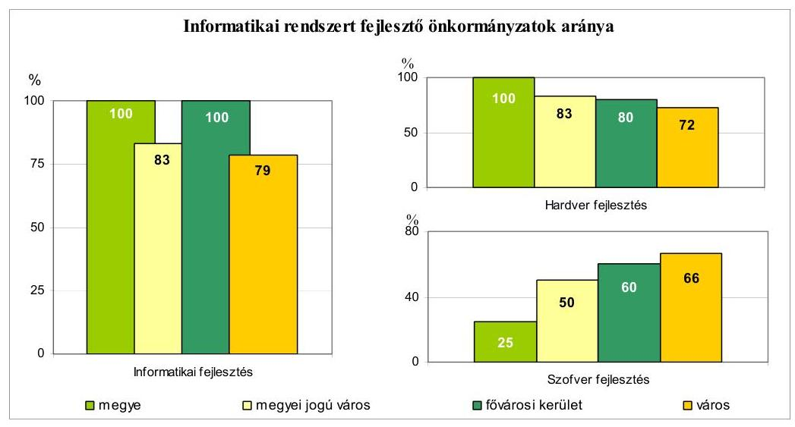

Az informatikai környezettel kapcsolatos legfontosabb szabályzatok az önkormányzati hivatalokban:

- a hosszú távú célkitűzéseket tartalmazó informatikai stratégiával 61\% nem rendelkezett, melynek következménye, hogy a számítógépek számának növelésekor a spontán jellegű fejlesztések váltak jellemzővé;
- katasztrófa elhárítási tervet indokoltsága ellenére 76\% nem készített, nem készült fel a váratlan események bekövetkezésekor történő intézkedésekre, a mulasztás veszélyezteti a folyamatos munkavégzést és az adatok megbízhatóságát, sértetlenségét;
- a hozzáférési jogosultsági rendszer szabályozása maradt el 54\%nál, azonban a gyakorlatban a hálózatos rendszer adminisztrációjában az erre vonatkozó adatok szerepeltek;
- az adatbiztonsági rendszert 61\%-nál kialakították, azonban annak követelményeit 48\%-nál szabályzatban nem határozták meg;
- a működő informatikai rendszer üzemeltetési leírásával 51\% nem rendelkezett.

A biztonságos feladatellátást segítő üzemeltetés szabályozási feltételeit az ellenőrzött önkormányzatok 6\%-a alakította ki és dokumentálta (Kaposvár Me-

---

gye Jogú Város Önkormányzata, Kalocsa, Gyula, Mezőberény és Kazincbarcika városok önkormányzatai).
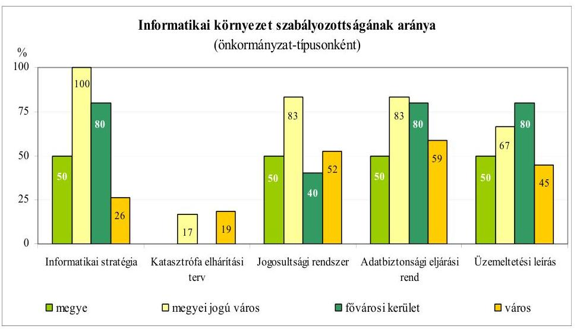

A pénzügy-számviteli felhasználói programok üzemeltetési leírásával az önkormányzati hivatalok 70\%-a, a felhasználói leírással 80\%-a rendelkezett, az önkormányzatok több mint fele nem biztosította a biztonságos és a feladatellátást segítő üzemeltetést.

A pénzügyi-számvitel területén számítógépet használó dolgozók informatikai képzettségét az önkormányzatok részben biztosították (89\%), az Európai számítógép-használói jogosítvány (angol rövidítése ECDL) megszerzését az önkormányzatok egyre nagyobb száma támogatta (40\%).

Az önkormányzati hivatalokban, a pénzügy-számviteli területen, a felhasználók 39\%-ánál az informatikai rendszer használatát, az informatikai képzettséggel kapcsolatos elvárásokat nem tartalmazta a munkaköri leírás.

# 2. AZ ÖNKORMÁNYZATI FELADATOK ÉS A RENDELKEZÉSRE ÁLLÓ FORRÁSOK ÖSSZHANGJA 

### 2.1. Az önkormányzati feladatok meghatározása és szervezeti keretei

Az ellenőrzött önkormányzatok 48\%-a a kötelező és önként vállalt feladatait és azok ellátásának módját, valamint mértékét rögzítette ${ }^{59}$.

A 2003. és a 2004. évben a helyi és helyi kisebbségi önkormányzatok gazdálkodásának átfogó ellenőrzése keretében javasoltuk a belügyminiszternek, hogy kezdeményezze az Ötv. felülvizsgálata kapcsán az önkormányzatok kötelező fe-

[^0]
[^0]:    ${ }^{59}$ Az ellenőrzött önkormányzatok szervezeti múködési szabályzatban, szakmai koncepciókban határozták meg a kötelező és önként vállalt feladataikat.

---

ladatainak egyértelmú meghatározását, mivel ellenőrzési tapasztalataink alapján az önkormányzatok számára gondot okoz a különböző ágazati jogszabályokban előírt kötelező feladatok megállapítása és azok elhatárolása az önként vállalt feladatoktól. A feladatok és a források összhangjának vizsgálatához, értékeléséhez a kötelező feladatokat meghatározó egyértelmú jogszabályi előírás jelenleg sem biztosított.

A közbenső egyeztetés során az Önkormányzati és Területfejlesztési Minisztérium államtitkára által adott észrevétel szerint: „Ezt a javaslatot az Állami Számvevőszék 2003. és 2004. évi jelentései már tartalmazták, valamint ezen jelentés is többször említi, hogy a kérdésben nem történt intézkedés. A helyi önkormányzatok feladat- és hatáskörének meghatározásával összefüggésben korábban tett észrevételeinkkel megegyezően most sem látunk lehetőséget a javaslat magvalósítására.

Az Ötv. a helyi önkormányzás intézményének alapjait fekteti le. Az önkormányzati törvény keretjogszabály lévén - kizárólag azokat a feladatokat határozza meg, amelyek minden települési önkormányzatnak azonos színvonalon kell ellátnia. Ilyen kötelezően biztosítandó ellátás az Ötv. alapján az egészséges ivóvizellátás, az óvodai nevelés, az általános iskolai oktatás és nevelés, az egészségügyi és a szociális alapellátás, a közvilágitás, a helyi közutak és a köztemető fenntartása és a nemzeti és az etnikai kisebbségek jogainak érvényesülésének biztositása.
„A községnek, városnak, fővárosnak és kerületeinek (települési önkormányzat). önkormányzatnak egymástól eltérd feladat- és hatáskörei lehetnek" az Ötv. 6. §-a szerint. Egyrészről azért, mert a helyi önkormányzatok szabadon dönthetnek arról, hogy igényektől és teljesitőképességtől függően - bizonyos feladatokat ellátnak-e, vagy sem. Másrészről az ágazati törvények a települési önkormányzatokat kötelezhetik arra, hogy egyes közszolgáltatásokról és közhatalmi helyi feladatok ellátásáról gondoskodjanak.

Ez a feladat ellátási kötelezettség az egyes településtípusoknál - tekintettel a teljesitőképességre, lakosságszámra - eltérően alakulhat.

Figyelemmel arra, hogy a társadalmi, gazdasági és egyéb tényezők folytán az egyes ellátások iránti igények változnak, a jogszabályoknak ezeket az igényeket követnie kell. Elsősorban az egyes ágazatokért felelős miniszterek gondoskodhatnak a jogszabályok módosítása iránt. E törvények módosításával hatékonyabban követhető a társadalmi viszonyok változása, mint a kétharmados szavazati arányt igénylő Ötv. módosítása."

Az észrevétel nem megalapozott, mivel az önkormányzatok számára a kötelező feladatok egyértelmú meghatározása mind a követelmények, mind a finanszírozási feltételek kialakításához szükséges. Egyetértünk azzal, hogy az Ötv-ben előírtakon túlmenően a különböző ágazati feladatokat rögzítő törvények is előírnak az önkormányzatok számára kötelező feladatokat, azonban mint azt az észrevétel is tartalmazza, szükséges és indokolt, hogy az önkormányzatok feladat- és hatásköre "tisztuljon" és ehhez az ágazati tárcákkal együttmúködve kell az ellátandó feladatok körét és az ellátási feltételeket egyértelmúen meghatározni.

A különböző ágazati jogszabályokban meghatározott kötelező feladatainak ellátásáról 2002-2004 között nem gondoskodott:

- a városi önkormányzatok 54\%-a a Gyvt. 41. § (1) bekezdésében foglaltakat megsértve, mivel a családban nevelkedő 3 év alatti gyermekek napközbeni, szakszerű gondozását és nevelését nyújtó ellátást nem biztosították;

---

- a kötelező szociális feladatok közül a szakosított ellátások körébe tartozó hajléktalanok otthona ellátásról ${ }^{60}$ és a hajléktalanok rehabilitációs intézményi ellátásáról kettő megyei önkormányzat (Békés és Zala megyei) a Szoc. tv. 71/B. § és a 74/A. §-aiban foglaltakat megsértve, és ezt szolgáltatás-ellátási szerződés megkötésével sem biztosította. A mulasztásban közrejátszott, hogy a Szoc. tv. nem tartalmazza, nem határozza meg egyértelmúen, nevesítetten a megyei önkormányzatok kötelező szociális feladatait, csupán utal arra, hogy az önkormányzat gondoskodik azon szakosított szociális ellátásokról, melyek biztosítására a Szoc. tv. alapján a települési önkormányzatok nem kötelesek;
- négy városi önkormányzat (Záhony, Nagyhalász, Mezőcsát, Hajdúhatház városi önkormányzatok) az idősek nappali szociális ellátását a Szoc. tv. 87. § a) pontjában előírtakat ${ }^{61}$ megsértve nem biztosította.

Az önkormányzatok feladatainak ellátásában meghatározó szerepe volt az általuk alapított önálló vagy részben önálló gazdálkodási jogkörrel rendelkező költségvetési intézményeknek, emellett közhasznú szervezetekkel, gazdasági társaságokkal, egyéb szervezetekkel kötött ellátási szerződések segítségével biztosították az Ötv-ben ${ }^{62}$ előírt kötelezettségeik teljesítését.

Az ellenőrzött önkormányzatok 61\%-a - a gazdaságosabb és hatékonyabb feladatellátás érdekében - a 2002-2004 közötti időszakban több száz (538) racionalizálási intézkedést hozott, amelyek különböző arányban érintették az önkormányzati feladatokat ellátó szervezeteket (alkalmazotti létszámcsökkentés, önálló gazdálkodási jogkör elvonása, szervezet megszüntetése, alapítása, átszervezése, csatlakozás, vagy kilépés társulásból). A megtett intézkedések önkormányzati feladatellátásban résztvevő szervezetek közötti megoszlását szemlélteti a következő grafikon:
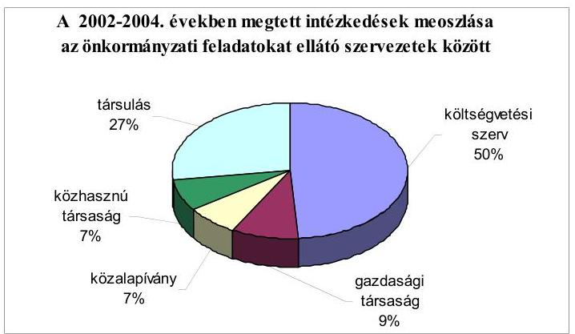

[^0]
[^0]:    ${ }^{60}$ A hajléktalanok otthonban történő ellátását 1999. október 1-i, a hajléktalanok rehabilitációs intézményi ellátását 2004. december 31-i határidőig kellett a megyei önkormányzatoknak megszervezniük a Szoc. tv. 71/B. és 74/A. §-aiban foglaltak alapján.
    ${ }^{61}$ A Szoc. tv. 87. § a) pontja 2005. január 1-ig volt hatályban, ezt követően a 86. § (2) bekezdés b) pontja írta elő ezt a feladatot azon települési önkormányzatoknak, ahol 3000 főnél több állandó lakos él.
    ${ }^{62}$ Az Ötv. 8. § (1), (4), 63. § (1), (2) bekezdései és a 63/A. §, 69-70. §-ai.

---

A szervezési intézkedések közel fele költségvetési intézmények alapítására, átszervezésére, összevonására, megszüntetésére irányult, melyek céljait valamint a megvalósulás eredményességét a következő folyamatábra szemlélteti:

A költségvetési intézményekben a 2002-2004. években végrehajtott szervezési intézkedések célja, eredménye
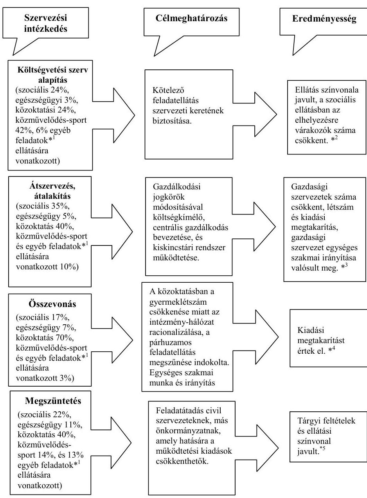

# Megjegyzés: 

* ${ }^{1}$ Az útkezelési és köztisztasági feladatok ellátását tartalmazza.
* ${ }^{2}$ A Vas Megyei Önkormányzat gazdálkodási rendszerének átfogó ellenőrzéséről készült 0545. számú jelentés 51. oldal.
* ${ }^{3}$ Az ellenőrzött egy megyei, négy megyei jogú városi, kettő Budapest Főváros kerületi, 19 városi önkormányzat esetében.
* ${ }^{4} \mathrm{Az}$ ellenőrzött négy megyei jogú városi, egy Budapest Főváros kerületi és hat városi önkormányzat esetében.
* ${ }^{5}$ Ehhez kapcsolódnak a 0317. számú „helyi önkormányzatok tartós szociális ellátás feladatainak ellenőrzéséről az idősek otthonairól" jelentés 36, 52. oldalán tett megállapítások.

---

Az önkormányzati feladatok ellátásában közreműködő közhasznú szervezetek száma 2002-2004 között 29-cel bővült, melyek 14\%-át az egészségügyi alap és szakellátás, $14 \%$-át a közművelődés, $10 \%$-át a sport és $62 \%$-át településüzemeltetés feladatainak gazdaságosabb és célszerűbb működtetése érdekében hozták létre az önkormányzatok.

A kötelező feladatok ellátásában az ellenőrzött önkormányzatok körében 20022004 között 33-mal több gazdasági társaság kapott szerepet. A gazdasági társaságok létrehozása $88 \%$-ban az ivóvíz szolgáltatás, szennyvíztisztítás, településüzemeltetési feladatok, $9 \%$-ban a közművelődési és sportfeladatok ellátására, valamint egy városban a járóbeteg-szakellátás biztosítására irányult az elmúlt három évben. A gazdasági társaságok létrehozásakor az önkormányzatok az Ötv. 80. § (3) bekezdésében előírt korlátot betartották, mivel a társaságokban viselt anyagi felelőségük nem haladta meg a vagyoni hozzájárulásuk mértékét.

Az Ötv. 41-43. §-aiban, valamint a Társ. tv. által biztosított lehetőséggel élve 2002-2004 között az ellenőrzött önkormányzatok társulásban való részvétele 136-tal bővült ${ }^{63}$, melyek $14 \%$-a a szociális alap és szakosított, $14 \%$-a az egészségügyi ügyeleti alapellátás, $19 \%$-a a közoktatás hatékonyabb és magasabb szintű biztosítását célozta. A 2004. évben megalakult többcélú kistérségi társulások célja az oktatás-nevelés, szociális és gyermekjóléti, terület-, és térségfejlesztési, belső ellenőrzési, közszolgáltatási feladatok gazdaságosabb, hatékonyabb biztosítása volt.

Az ellenőrzött önkormányzatok körében feladatátadásokra és átvételekre is sor került 2002-2004 között, amelyek feltételeit megállapodásban rögzítették az érintettek.

A feladatellátáshoz szükséges ingó vagyontárgyak térítésmentesen, az ingatlanok tulajdonjog fenntartása mellett - egy önkormányzat kivételével ${ }^{64}$ - használatra, kezelésre átadásra kerültek:

- az Ötv. 63. § (3) és (5) bekezdéseiben foglaltak figyelembevételével a járóbeteg-szakellátás és gondozói feladatok ellátását Budapest Fővárosi Önkormányzattól megállapodás alapján a Budapest Főváros XI. Kerületi Önkormányzat átvette;
- az Ötv. 69. § (3) bekezdésében foglaltak alapján Esztergom Város Önkormányzata a fekvő- és a járóbeteg-szakellátást, és a középfokú és közművelődési, valamint Bicske Város Önkormányzata a járóbeteg-szakellátást nyújtó intézmények működtetését vállalta át a megyei önkormányzattól. A Budapest

[^0]
[^0]:    ${ }^{63}$ Az önkormányzatok társulásban való részvételének bővülését a 0544. sorszámú jelentésünkben is megállapítottuk, (55. oldalon) melyek célja, feladata a gazdaságosabb, hatékonyabb intézmény-működtetés elérése volt. A 2004. évben az ÁSZ 0436. sorszámú jelentésében (63. oldal) közigazgatási kategóriánként, ágazati feladatonként és célonként bemutattuk, hogy az ellenőrzött önkormányzatok 65\%-a élt a társulás lehetőségével.
    ${ }^{64}$ Budapest Főváros V. Kerületi Önkormányzat.

---

Főváros VIII. Kerületi Önkormányzat a Budapest Főváros V. Kerületi Önkormányzatától egy általános iskola átvételéről döntött ${ }^{65}$;

- a megyei önkormányzatok az Ötv. 70. § (1) bekezdése alapján hét települési önkormányzat kezdeményezésére körzeti közszolgáltatást nyújtó középfokú oktatási intézmények működtetését vették át;
- Zalaegerszeg Város Önkormányzata közművelődési intézmény - színház működtetését vette át;
- a Magyarországi Németek Országos Önkormányzatának kezdeményezésére Pécs Megyei Jogú Város Önkormányzata egy-egy óvodai, általános és középfokú, Pilisvörösvár Város Önkormányzata középfokú oktatási intézmény működtetését, Szeged Megyei Jogú Város Önkormányzata a gyermekkórház működtetését adta át 2005. január l-től az egyetemnek ${ }^{66}$, amit a vonatkozó közgyűlési előterjesztés szerint a kiadási megtakarításon túl az egészségügyi ellátási kapacitás hatékonyabb működtetése, a betegellátás feltételeinek és minőségének javítása, a komplex szakmai struktúra kialakítása tett szükségessé;
- Zala és Vas megyei önkormányzatok a szakosított szociális ellátási feladatot biztosító intézményt adtak át egyháznak, a tárgyi és személyi feltételek fejlesztése és a szélesebb körű ellátás biztosítása, az elhelyezésre várakozók számának csökkentése érdekében. Budapest Főváros XI. Kerületi Önkormányzat az alapfokú oktatás területén kötött megállapodást két egyházi szervezettel;
- Budapest Főváros XI. Kerületi Önkormányzat a szociális feladatok körében a hajléktalanok nappali, a családok átmeneti ellátására, valamint a közművelődési programok szélesítésére kötött civil szervezettekkel feladatellátásra vonatkozó szerződéseket.

Az Ötv. 39-40. §-ában foglaltak alapján az önkormányzatok múködésével, valamint az államigazgatási ügyek döntésre való előkészítésével kapcsolatos feladatok ellátása érdekében 15 városi önkormányzat vállalta a körjegyzőségi feladatok ellátást. A társult önkormányzatok gazdálkodási folyamatában a jegyzők részt vettek, azonban az ellenőrzött önkormányzatok közel felénél a kötelezettségvállalások és az utalványozások ellenjegyzését az Ámr. 134. § (8) bekezdésében ${ }^{67}$ foglaltak előírás ellenére nem végezték el. Az ellenjegyző az ellenjegyzést megelőzően nem győződött meg a fedezet rendelkezésre állásáról, valamint arról, hogy a kötelezettségvállalás nem sérti-e a gazdálkodásra vonatkozó szabályokat. A vezetői ellenőrzési jogosítványait a jegyzők $60 \%$-a gyakorolta.

[^0]
[^0]:    ${ }^{65}$ A 2004. augusztus 1-jétől történő oktatási intézmény átvétele indokolt volt, mivel az iskola tanulóinak 70\%-a Budapest főváros VIII. kerületi lakos volt.
    ${ }^{66}$ A gyermekkórház fenntartása a Szegedi Tudományegyetem Szent-Györgyi Albert Orvos és Gyógyszerésztudományi Centrumához került át.
    ${ }^{67}$ A bekezdés számozása a 2004. évben (2) volt.

---

# 2.2. A kötelező és az önként vállalt önkormányzati feladatok finanszírozása 

Az önkormányzatok által ellátott kötelező feladatok közül az előző évekkel egyezően a szociális ellátás és a közoktatás egyes feladataira fordított kiadásokat és azok forrásait tekintettük át önkormányzat-típusonként, az államháztartás pénzügyi információs rendszerének 2002-2004. évi adatai alapján.

A szociális és a közoktatási feladatok naturális mutatókkal mérhető ellátására fordított kiadások az ellenőrzött önkormányzatoknál 2002-2004 között 23,1\%-kal nőttek ${ }^{68}$. Valamennyi feladat esetében a 2002. évhez képest a 2003. évben a múködtetési kiadások emelkedésében meghatározó volt a végrehajtott közalkalmazotti bérintézkedés ${ }^{69}$ éves szintű hatása. A fajlagos kiadások finanszírozásának forrás összetétele is módosult 2002-2004 között. A költségvetési hozzájárulások, támogatások növekedése ellenére a feladatellátó intézmények működtetése, fenntartása érdekében az önkormányzatok szerepvállalása eltérő mértékben bővült.

Az ellenőrzött időszakban az egyes szociális feladatok fajlagos kiadásait és azok finanszírozási forrását az alábbi diagram szemlélteti:
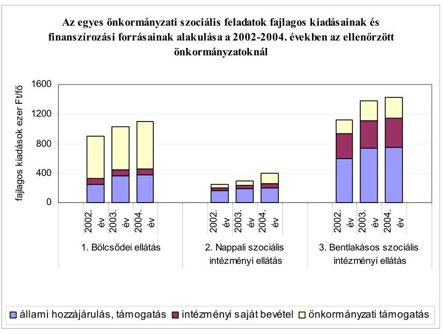

A következő grafikon bemutatja az ellenőrzött önkormányzatok egyes oktatási és nevelési feladatainak egy ellátottra jutó kiadását, valamint azok fedezetének forrásmegoszlását a 2002-2004 között:

[^0]
[^0]:    ${ }^{68}$ A működtetési kiadások növekedési üteme alatta maradt a 2001-2003 évek 32\%-os emelkedési mértéknek.
    ${ }^{69}$ Megállapította a Magyar Köztársaság 2001. és 2002. évi költségvetéséről szóló 2000. évi CXXXIII. törvény módosításáról szóló 2002. évi XXIII. törvény 17. § (4) bekezdése.

---

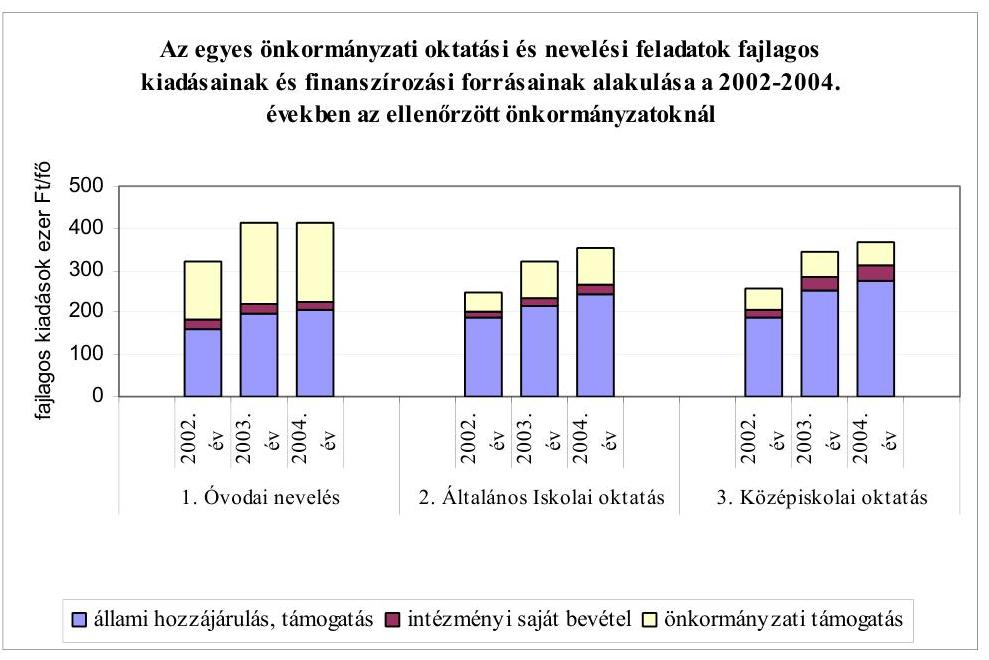

A három évesnél fiatalabb gyermekek napközbeni bölcsődei gondozását a 2002. évben 4730 fő, a 2004. évben 8,7\%-kal több, 5143 fő ellátott részére biztosították az ellenőrzött önkormányzatok. Az egy bölcsődés korú ellátására a 2002. évben átlag 964469 Ft/fő összeget fordítottak, amely a 2004. évre 14\%-kal 1099850 Ft/főre emelkedett. Az egy főre jutó kiadások növekedését a müködtetés kiadásainak $24 \%$-os, valamint az ellátottak számának $8,7 \%$-os emelkedése eredményezte. A kiadások forrását a 2002. évben $64 \%$-os, a 2004. évben $58 \%$-os arányban az önkormányzatok biztosították. A költségvetési hozzájárulás összege a 2002-2004 között 49,8\%-kal emelkedett, a forrás összetételében a szerepe 27,6\%-ról 33,6\%-ra módosult.

A Budapest főváros kerületi önkormányzatai fordították a legmagasabb összeget az egy bölcsődei ellátottra. A kiadás a 2002. évben 18,7\%-kal, a 2004. évben 19,5\%-kal haladta meg a megyei jogú városi, illetve a városi önkormányzatok átlagát. Az ellenőrzött időszakban az egy bölcsődés korú ellátására fordított kiadások átlagát önkormányzati típusonként, valamint az ettől való jelentős mértékű eltéréseket a következő grafikon szemlélteti:
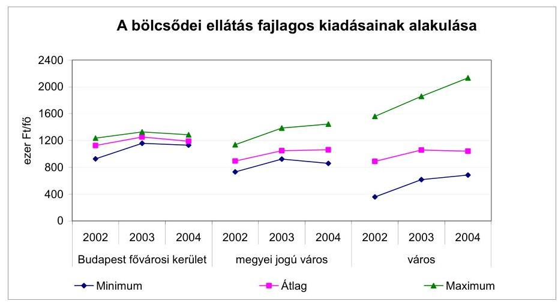

---

A legmagasabb egységnyi kiadás mellett - 1235542 Ft/fő illetve 1286788 Ft/fő - müködtette ezen ellátást Budapest Főváros VIII. Kerületi Önkormányzat ${ }^{70}$, ahol az ellenőrzött időszakban a kiadások 29,6\%-kal, az ellátottak száma 24,4\%kal bővült. A múködtetési kiadások növekedését befolyásolta a személyi juttatások és járulékainak emelkedése, mivel az ellenőrzött időszakban a közalkalmazottak körében bevezetésre került a „Józsefvárosi bérpótlék", amelynek összege az iskolai végzettség függvényében 3000-7000 Ft/fő/hó között változott. Az ellátottak számának emelkedését a kerületi lakosok részére 2003. március 1-től az ingyenes bölcsődei ellátás bevezetése eredményezte, amely hatására az intézmények kapacitáskihasználtsága közel húsz százalékkal javult. A múködtetési kiadások finanszírozásában az állami támogatás részaránya - az ellátotti létszámmal összefüggésben - emelkedett, az intézményi saját bevételek és az önkormányzati támogatás csökkenése mellett.

Az ellenőrzött városi önkormányzatok közül legmagasabb ${ }^{71}$ (2 135200 Ft/fő) egy ellátottra jutó kiadással biztosította Tab Város Önkormányzata a bölcsődei ellátást. Az egy ellátottra jutó kiadás 2002-2004 között 36,9\%-kal növekedett, a múködésre fordított kiadások $24,5 \%$-os emelkedése, valamint az ellátottak számának közel $10 \%$-os csökkenése hatására.

Az ellenőrzött városi önkormányzatok átlagánál közel 50\%-kal alacsonyabb egy főre jutó kiadás mellett múködtette Mindszent Város Önkormányzata a tíz férőhelyes bölcsődéjét, amelyben 2002-2004 között évente hét fő ellátásáról gondoskodtak. A fajlagos kiadások alacsony összegét befolyásolta, hogy dologi kiadásként a bölcsődei szakfeladaton csak az élelmezés, valamint a játékok beszerzésének kiadása jelent meg, az épület üzemeltetésével kapcsolatos múködési kiadásokat az intézményi vagyon múködtetése körében számolták el.

A nappali szociális ellátást nyújtó intézményekben az egy ellátottra jutó kiadás a 2002. évben $294888 \mathrm{Ft} /$ fő volt, ami a 2004. évben $\mathbf{3 4 , 9 \% - k a l}$ magasabb összegben, 397908 Ft/fő összegben teljesült. Az emelkedéshez a kiadások $24,8 \%$-os növelése, valamint az ellátottak számának $7,5 \%$-os csökkenése járult hozzá. Az ellenőrzött önkormányzatok országos átlagánál a megyei önkormányzatok $36 \%$-kal, a megyei jogú városi önkormányzatok $4 \%$-kal, Budapest főváros kerületi önkormányzatok 13,2\%-kal magasabb, a városi önkormányzatok $21 \%$-kal alacsonyabb összegű egységnyi kiadással gondoskodtak a nappali szociális intézmények fenntartásáról. A múködtetés kiadásának forrásösszetételében a normatív állami hozzájárulás 2002-2004 között 64,3\%$61,7 \%-50,2 \%$ részarányt képviselt ${ }^{72}$, az önkormányzatok $20,3 \%-21,6 \%-35,2 \%$ os arányú forrás biztosítása mellett. Az intézményi saját bevételek forrásképző szerepe csökkent, $15,4 \%-16,6 \%-14,6 \%$ volt az elmúlt három évben. Önkormányzati típusonként 2002-2004 között az egy ellátottra jutó kiadások átlagá-

[^0]
[^0]:    ${ }^{70}$ A Budapest főváros kerületeinek átlagához képest közel tíz százalékkal magasabb összegű működtetési kiadást fordított egy fő ellátása a 2002-2004 években.
    ${ }^{71}$ A 2002-2003 években $75 \%$-kal, a 2004. évben 105\%-kal magasabb volt az egy ellátottra jutó kiadás, mint az ellenőrzött városi önkormányzatok átlaga.
    ${ }^{72}$ A 2005. évben kiadott 0544. sorszámú ÁSZ jelentés 57. oldalán a nappali ellátás finanszírozásának forrásösszetételét elemezve bemutattuk, hogy a 2001-2003 években ezen ellátásra fordított állami támogatás részaránya növekedett, 56,3\%-64,4\%-62,1\% volt.

---

nak alakulása, valamint az ettől való eltérések szélső értékeit a következő ábra szemlélteti:
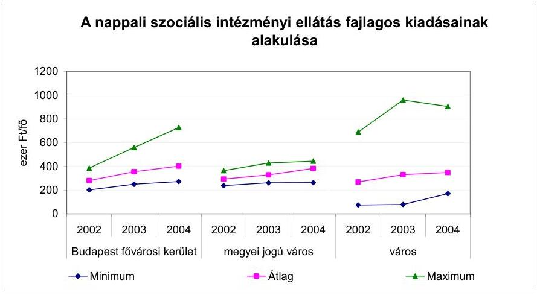

Az egy főre jutó kiadások legmagasabb összege a 2004. évben a Budapest Főváros XV. Kerületi Önkormányzatnál - 727561 Ft/fő - volt, amely a 2002. évhez viszonyítva megkétszereződött, az ellátottak számának 6,1\%-os csökkenése, valamint a működési kiadások $85 \%$-os emelkedésének hatására. A múködési kiadások növekedését az értelmi fogyatékosok napközi otthonának új épületbe való költözéséhez kapcsolódó egyszeri beszerzések befolyásolták. Az ellátottak számának alakulására hatást gyakorolt az ezen a szakfeladaton elszámolt nappali melegedő létszámának ingadozása, amely időjárásfüggően változó volt.

A legalacsonyabb egy főre jutó kiadással - a 2004. évben 170217 Ft/fővel - Kalocsa Város Önkormányzata múködtette az intézményt, amely az ellenőrzött városi önkormányzatok átlagának $46 \%$-a volt. Az öt fő ellátott részére nyújtott ellátás feltételeit - 2004. októberiól három fő részére fogyatékos nappali intézményi ellátást is biztosítottak - a bentlakásos szociális intézményhez integráltan biztosította az önkormányzat, a szakfeladati elszámolásban - téves számviteli elszámolás következtében - az üzemeltetéssel összefüggő kiadások nem jelentek meg az egy főre jutó múködési kiadásban.

Az ellenőrzött önkormányzatok által fenntartott bentlakásos szociális intézmények a 2004. évben 10115 fő ellátottról gondoskodtak, az egy fôre jutó múködtetési kiadás a 2002-2004 között 1111009 Ft/fő és 1426062 Ft/fő volt. A fajlagos kiadások 28,4\%-os növekedését az intézmény fenntartásra fordított kiadások 21,4\%-os emelkedése és az ellátottak számának 5,4\%-os csökkenése eredményezte. A fajlagos kiadások a 2004. évi forrásösszetételében a normatív állami támogatás részaránya - a 2002. évhez viszonyítva - 1,3 százalékponttal 53,6\%-ról 52,3\%-ra, az intézményi saját bevételek 2,4 százalékponttal csökkentek, ezáltal a múködés zavartalan biztosítása érdekében az önkormányzatok támogatása 16,1\%-ról 19,8\%-ra emelkedett.

A bentlakásos szociális ellátás egy főre jutó kiadása a 2002. évben Budapest főváros ellenőrzött kerületeiben közel 50\%-kal magasabb összegű volt, mint a megyei és városi önkormányzatoknál, amely eltérés a 2004. évre 30\%-ra csökkent. Az egy gondozottra jutó kiadás átlagos összegének önkormányzati típusonkénti alakulását az ellenőrzött időszakban, valamint az ettől való eltéréseket az alábbi diagram szemlélteti:

---

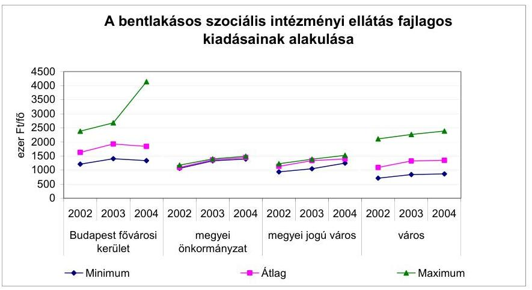

A legmagasabb egy főre jutó kiadást Budapest Főváros VIII. Kerületi Önkormányzat ${ }^{73}$ teljesítette az ellenőrzött időszakban. A múködési kiadások a 2002. évhez viszonyítva a 2004. évre ${ }^{74}$ kétszeresére emelkedtek, a gyermekek átmeneti otthoni ellátás bevezetéséhez szükséges tárgyi feltételek beszerzésének egyszeri kiadásai, valamint az új feladat bevezetéséhez kapcsolódó létszámfejlesztések miatti személyi juttatások és járulékainak kiadásai növekedésének hatására. Az egy ellátottra jutó kiadás az ellenőrzött városi önkormányzatok átlagánál egymillió Ft-tal volt magasabb a 2004. évben Mátészalka Város Önkormányzatánál, mivel az ellátás 2003. közepétől indult, és a tárgyi feltételek biztosítása egyszeri kiadásokat jelentett. Az ellenőrzött városi önkormányzatok átlagánál több mint 30\%kal alacsonyabb fajlagos kiadással biztosította az ellátást Csepreg Város Önkormányzata, melyet befolyásolt, hogy egy épületegyüttesben múködött a nappali szociális ellátással, és az üzemeltetési, fenntartási kiadások elkülönített nyilvántartását nem alakították ki.

A közoktatás feladatcsoportból az óvodai nevelés, iskolai életmódra való felkészítés, valamint a nappali rendszerú, általános iskolai oktatásra terjedt ki az ellenőrzés. A közoktatási feladatok bevételeit és kiadásait a „nappali rendszerú, általános múveltséget megalapozó iskolai oktatás, ${ }^{75}$, míg az intézményi vagyon (épület vagyon) múködtetésének bevételeit és kiadásait az oktatási intézmé-
${ }^{73}$ A Budapest főváros kerületei átlagához viszonyítva a 2002-2004 években 46\%,-39\%,125\%-kal több kiadást fordított egy ellátottra a Budapest Főváros VIII. Kerületi Önkormányzat.
${ }^{74}$ A Budapest Főváros VIII. Kerületi Önkormányzatnál a 2002. évihez viszonyítva a 2004. évre a múködési kiadásai $117 \%$-kal emelkedtek.
${ }^{75}$ Egy szakfeladat tartalmazta: az általános iskolai, a gimnáziumi oktatásban, továbbá a közoktatási törvény szerinti nappali rendszerú iskolai oktatás általános múveltséget megalapozó pedagógiai szakaszának évfolyamain a tanórai és tanórán kívüli foglalkozásokkal, az iskola pedagógiai irányításával, vezetésével, a szakmai feladat ellátásához kapcsolódó további tevékenységekkel, valamint a tanulókkal kapcsolatos bevételeket és kiadásokat.

---

nyek országosan egységes, az „intézményi vagyon müködtetése" elnevezésű szakfeladaton tervezték meg és számolták el az önkormányzatok ${ }^{76}$.

Az egy óvodai ellátottra a 2002. évben átlagosan $318260 \mathrm{Ft} /$ fő, a 2004. évben $412692 \mathrm{Ft} /$ fő kiadást fordítottak az ellenőrzött önkormányzatok. Az egy főre jutó kiadás $34,4 \%$-os növekedését a múködési-fenntartási kiadások 18,9\%-os emelkedése és az ellátottak számának 11,5\%-os csökkenése befolyásolta. Az óvodai nevelés kiadásait a 2002. évben 52,3\%-ban az állami hozzájárulás, támogatás finanszírozta, amelyet az ellenőrzött önkormányzatok 40,7\%-os arányban egészítettek ki, az intézményi saját bevételek $7 \%$-os aránya mellett. A kiadások forrásain belül a 2002. évhez viszonyítva a 2004. évre a normatív állami hozzájárulás aránya $49,7 \%$-ra csökkent, az önkormányzati források részaránya $45,9 \%$-ra emelkedett. Az egy főre jutó kiadások növekedési üteme 2002-2004 között több mint 30\%-os volt, amelyhez az állami hozzájárulás 27,6\%-os és az önkormányzati támogatás $50,8 \%$-os emelkedése biztosított forrást.

Az ellenőrzött önkormányzatok átlagánál 8,3\%-kal magasabb egy főre jutó kiadás mellett biztosították Budapest főváros kerületei az óvodai nevelést, míg a megyei jogú városi önkormányzatok 2,7\%-kal, a városi önkormányzatok 13,3\%kal alacsonyabb összeget fordítottak a feladatra. A következő grafikon 2003-2004 között ábrázolja önkormányzati típusonként az egy óvodai neveltre fordított kiadások átlagát önkormányzati típusonként, valamint az átlagtól való jelentős összegben eltérő önkormányzatok kiadásait.
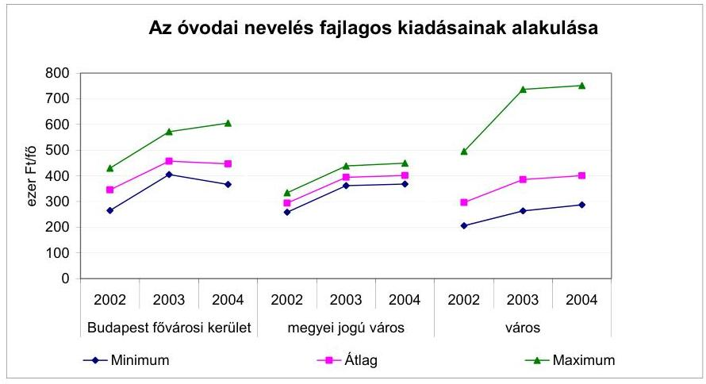

Az ellenőrzött Budapest főváros kerületi önkormányzatok átlagát 35,5\%-kal haladta meg a Budapest Főváros VIII. Kerületi Önkormányzatnál az egy óvodás ellátására fordított kiadás, amely 2002-2004 között 40,6\%-kal emelkedett, a múködtetés kiadásának $35,7 \%$-os növekedése, valamint az ellátottak számának

[^0]
[^0]:    ${ }^{76}$ Az elszámolás független volt attól, hogy az intézmény milyen és mennyi szakmai feladatot, szolgáltatást látott el. A számviteli elszámolásokra vonatkozó szabályok közül azok a mutatók nem kerültek rögzítésre, amelyek a közös ellátással kapcsolatos kiadások egységes, - oktatást jellemző - megosztási szempontjai lehetnek, ezáltal a feladatra fordított kiadások összehasonlításának eredményét jelentősen befolyásolta az egyedileg kialakított - pl. a tanulólétszám alapján történő megosztás - elszámolási rendszer.

---

3,5\%-os csökkenésének hatására ${ }^{77}$. A 2004. évben Badacsonytomaj Város Önkormányzatánál volt a legmagasabb az egy ellátottra jutó kiadás, ami a 2002. évihez viszonyítva a 2004. évre megkétszereződött, az ellátotti létszám 17,9\%-os csökkenése és a működtetési kiadások 72,7\%-os emelkedése következtében. A működtetési kiadások emelkedését a központi bérintézkedés kiadásainak hatásán túl a két fő közalkalmazotti létszámfejlesztéssel összefüggő személyi juttatások és járulékának többletkiadása befolyásolta. Az ellenőrzött városi önkormányzatok átlagánál közel egyharmaddal alacsonyabb kiadás mellett biztosította Mezőcsát Város Önkormányzata 2002-2003 között az óvodai nevelést, önálló épületben, vásárolt élelmezéssel.

Az általános iskolai oktatásban részesülő tanulók egy főre jutó átlagos kiadása a 2002. évben 249215 Ft/fő, a 2004. évben $350490 \mathrm{Ft} /$ fő volt, a vizsgált időszakban 40,6\%-kal emelkedett a múködési kiadások 21,0\%-os növekedése és a tanulók számának $14 \%$-os csökkenése hatására. A működtetésre fordított kiadások finanszírozásában a normatív állami hozzájárulás aránya a 2002. évi $75 \%$-ról a 2004. évre $69,7 \%$-ra csökkent, a támogatások összegének 30,4\%-os növekedése ellenére. Az önkormányzatok növekvő arányban - a 2002. évben 18,6\%, a 2004. évben 24,7\% - járultak hozzá az alapfokú oktatás személyi és tárgyi feltételeinek biztosításához. Az intézményi saját bevételek a működtetés forrásához a 2002. évben 6,4\%-kal a 2004. évben 5,6\%-kal járultak hozzá.

Az ellenőrzött Budapest főváros kerületi önkormányzatok 2002-2004 között a megyei jogú városi önkormányzatoknál $22 \%-7,7 \%$-kal, a városi önkormányzatoknál $24 \%-15 \%$-kal többet fordítottak egy általános iskolai tanuló nevelésére. Önkormányzati típusonként az egy tanulóra jutó kiadások átlagát, valamint az ettől való eltérések jellemző mutatóit a következő grafikon szemlélteti a 20022004 között:
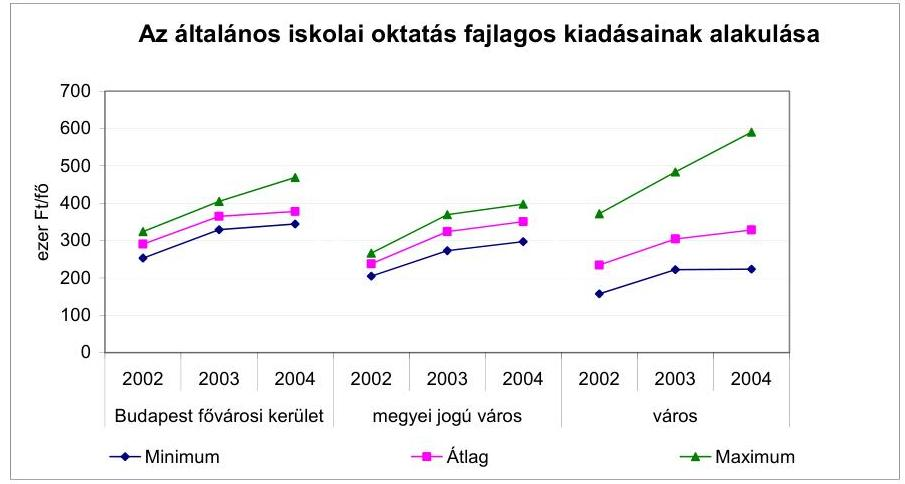

[^0]
[^0]:    ${ }^{77}$ A múködési kiadások növekedésére hatást gyakorolt a közalkalmazottak körében megállapított „Józsefvárosi bérpótlék" személyi juttatás és járulékának kiadása, a minimum feltételek biztosítása érdekében elvégzett egyszeri beszerzések kiadásai - bútor, felszerelés, orvosi szoba kialakítása - valamint az energia kiadások emelkedése.

---

Budapest Főváros VIII. Kerületi Önkormányzatnál múködtették a legmagasabb ${ }^{78}$ fajlagos kiadás mellett az oktatást az ellenőrzött időszakban. A 2004. évben a 2002. évhez viszonyítva közel $40 \%$-kal emelkedtek a múködtetés kiadásai, melyre hatást gyakorolt, hogy egy általános iskola megszűnésével összefüggésben a személyi juttatások és járulékai körében egyszeri jellegű kifizetések történtek - álláshely megszüntetések miatti végkielégítések - valamint egy általános iskola működtetésének feladatait átvették a Budapest Főváros V. Kerületi Önkormányzattól.

A középfokú oktatásban részesülők száma a 2004. évben 78993 fő volt, amely $6,3 \%$-kal kevesebb a 2002. évinél. Az egy középiskolai tanuló ellátására átlagosan $365612 \mathrm{Ft} /$ fő kiadást fordítottak az önkormányzatok a 2004. évben, mely a múködési kiadások 30,5\% emelkedése és az oktattak számának csökkenése miatt 39,3\%-kal haladta meg a 2002. évit. A középiskolai tanulók oktatásának kiadásait a 2004. évben 75,5\%-ban normatív állami hozzájárulás, 14,9\%-ban önkormányzati forrás és 9,6\%-ban intézményi saját bevétel fedezte. A kiadások finanszírozásának forrásösszetételében a 2002. évhez képest jelentős változás nem történt, az állami hozzájárulás részaránya 3,5 százalékponttal emelkedett, az önkormányzati forrás 5,9 százalékponttal volt alacsonyabb, a saját bevételek 1,6 százalékponttal magasabb részarányt képviseltek.

Az ellenőrzött Budapest főváros kerületi önkormányzatok 2002-2004 között több mint 10\%-kal többet fordítottak a középfokú oktatási feladatokra, mint a megyei jogú városi és a városi önkormányzatok ${ }^{79}$. Az alábbi diagramból látható, az egy tanulóra fordított kiadások átlagos összegének alakulása az ellenőrzött időszak éveiben önkormányzati típusonként, valamint az ettől való eltérései:
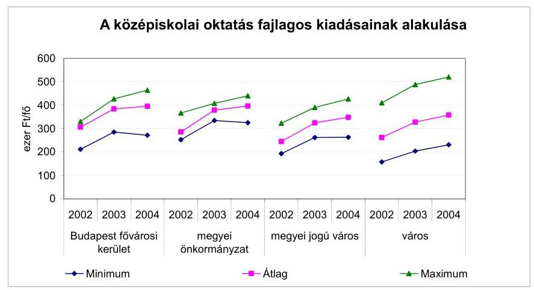

Az ellenőrzött fővárosi kerületek átlagánál a 2003. évben mintegy tíz százalékkal magasabb egy főre jutó kiadás mellett múködtette a Budapest Főváros XI. Kerüle-

[^0]
[^0]:    ${ }^{78}$ Budapest főváros ellenőrzött kerületi önkormányzatai átlagánál a Budapest Főváros VIII. Kerületi Önkormányzat 2002-2003 között több mint 10\%-kal, a 2004. évben több mint $20 \%$-kal többet fordított egy általános iskolai tanuló oktatására, nevelésére.
    ${ }^{79}$ Budapest főváros ellenőrzött kerületi önkormányzatainál az egy főre jutó kiadás átlaga 2002-2004 között 25,3\%-13,5\%-kal haladta meg a megyei jogú városok, 17,2\%$10 \%$-kal a városi önkormányzatok átlagát.

---

ti Önkormányzat a középfokú ellátást, amelyre hatást gyakorolt, hogy a 2003. évre a tanulólétszám 6,5\%-kal bővült az új tagozatok indításával összefüggésben. A 2004. évben Budapest Főváros VIII. Kerületi Önkormányzatnál volt az ellenőrzött kerületek vonatkozásában a legmagasabb ( $17,6 \%$-kal) az egy főre jutó múködési kiadás, melyet a dologi kiadások növekedése mellett a közalkalmazottak részére bevezetett bérpótlék befolyásolt. Az ellenőrzött fővárosi kerületek átlagánál közel egyharmaddal alacsonyabb egy főre jutó kiadás mellett biztosította Budapest Főváros XX. Kerületi Önkormányzata a középfokú oktatást 2002-2004 között, mivel megszűnt a gimnáziumi oktatás és egy tanulócsoporttal bővült a gyors-gépíró szakmai képzés. Az ellenőrzött városi önkormányzatok átlagának másfélszereséből látta el közoktatási feladatát Barcs Város Önkormányzata, melyet az új képzési rendszerek bevezetéséhez ${ }^{80}$ kapcsolódó személyi és tárgyi feltételek biztosításának múködési kiadásai eredményeztek. Az ellenőrzött városok átlagánál közel negyven százalékkal kevesebbet fordított egy tanuló középfokú oktatására Hajdúnánás Város Önkormányzata.

Az egyes kötelező feladatok ellátásának fajlagos kiadásait befolyásoló tényezők ${ }^{81}$ az alábbiak voltak:

Az intézmények működtetési kiadásainál meghatározó volt a személyi ellátottsággal - ezen belül a szakképzettséggel és kor szerinti összetétellel - összefüggő személyi juttatások és azok járulékainak aránya, amely (a központi bérintézkedések eredményeképpen) 2002-2004 között jelentősen (30-40\% közötti mértékben) emelkedett. Ezen túlmenően az átszervezések, év közbeni feladatcsökkené-sek-növekedések, és az ezzel együtt járó létszámleépítések (végkielégítés), illetve bővítések gyakoroltak hatást az intézmények működési kiadásaira. A dologi kiadásokat a közoktatási feladatoknál elsősorban a szakmai eszközökkel való ellátottság, a szociális ellátás esetében pedig az ellátottak összetételétől függően változó ápolási igény, gondozásuk eszközeinek eltérő szakmai követelményrendszere befolyásolt. A közoktatás alaptevékenységének ellátásához kapcsolódó intézményi vagyon múködtetésének kiadásait külön szakfeladaton számolták el. (A szakfeladatnál meghatározott létesítmény szolgáltatásait igénybevevők létszáma alapján történő felosztás nem tükrözi az egyes tevékenységek ellátása érdekében felmerült kiadásokat. A karbantartási igényt és kiadást az épület átlag életkora és állaga, a takarítás kiadását az eltérő nagyságú alapterület nagysága befolyásolja.) A költségfelosztás helyileg kialakított rendszere befolyásolta az egyes feladatokhoz kapcsolódó múködési kiadások alakulását. A többféle oktatást végző iskolák esetében - pl. alapfokú és középfokú iskolai oktatást - a kiadások reális megosztását lehetővé tevő vetítési kulcsok meghatározása hiányzott. Az intézményi kapacitáskihasználtság is hatást gyakorolt a múködési kiadásokra, mivel pl. alacsonyabb kihasználtság mellett is foglalkoztatni kell a jogszabályokban meghatározott pedagógusi létszámot, és az intézményüzemeltetés kiadásai (víz, villany, fűtés) is változatlanok.

Az ellátottak számának az egyes ellátási típusok közötti megoszlása szintén hatást gyakorolt az adott szakfeladaton elszámolt kiadásokra. A szociális ellátásban az ágazati miniszter által meghatározott személyi és tárgyi feltételek az egyes el-

[^0]
[^0]:    ${ }^{80}$ A gimnáziumi oktatás mellett a szakiskolai oktatásban az érettségi bevezetése, az akkreditált felsőfokú képzések bevezetése, gyógypedagógiai ellátás biztosítása.
    ${ }^{81}$ A kialakított szakfeladat-rend a szakmai jogszabályokban előírt, egyre differenciáltabbá váló ellátási formákkal nem volt összhangban, ezért nem tette lehetővé a feladatok, ellátások kiadásainak részletesebb megfigyelését.

---

látási típusoknál az ellátottak számától függően eltérők, a közoktatásban a tanulólétszám összetétele - alapfok, középfok -, a pedagógus ellátottság és az ezzel együtt járó személyi juttatás kiadása a meghatározó.

Az egyes feladatoknál a fajlagos kiadások jelentősen eltértek egymástól, mivel a közel azonos lakosságszámú települések esetében is az azonos szakfeladatokon elszámolt kiadások adataiban eltérő feladatstruktúra (iskolai oktatásban általános iskolai, gimnáziumi, szakközépiskolai oktatás, ezen belül elméleti és gyakorlati képzés, szakiskolai oktatás) miatt különböző volt a személyi- dologi jellegű kiadások aránya. Elsősorban ezen okok miatt a feladatokra fordított kiadások és az elért bevételek pénzügyi-számviteli nyilvántartási rendszeréből nem nyerhetők olyan információk, amelyek mélyebb elemzésre, a feladatellátások megoldásának összehasonlító értékelésére és a reális következtetések levonására alkalmasak lennének.

A pénzügyminiszternek a 2003. és a 2004. évben javaslatot tettünk a hatályos szakfeladat-rend módosítására, annak érdekében, hogy a főbb alapellátási formák kiadásai-bevételei, feladatmutatói, a különböző szintű tervezéshez, a költségarányos finanszírozási rend és a teljesítmény követelmények kialakításához, valamint ezek teljesítésének ellenőrzéséhez rendelkezésre álljanak. Javaslataink alapján a 2005. évi elemi költségvetés készítését megalapozó szak-feladat-rend tartalma részben megváltozott. ${ }^{82}$

Az ellenőrzött önkormányzatok 2002-2004 között jelentős ráfordítást igénylő önként vállalt feladatokat is elláttak, melyek köréből jellemzőek voltak az államháztartáson kívülre nyújtott működési és felhalmozási célú támogatások segítségével megvalósított célkitűzések.

A nem kötelező feladatok ellátása 2002-2004 között a költségvetési kiadásokból a megyei önkormányzatoknál $0,7 \%-5,3 \%$, a megyei jogú városoknál $3,2 \%$ $8,7 \%$, a Budapest főváros kerületeinél $12,1 \%-23,4 \%$ közötti részarányt képviseltek.

Pécs, Szolnok, Kaposvár megyei jogú városok önkormányzatai színházakat, Budapest főváros ellenőrzött kerületi önkormányzatai középfokú oktatási intézményeket múködtettek, a Budapest főváros VIII. és XV. kerületi önkormányzatok járóbeteg-szakellátást nyújtottak a lakosság részére. Az ellenőrzött városi önkormányzatok több mint egyharmada középfokú oktatási, valamint szakosított szociális ellátást biztosító intézmény fenntartásáról gondoskodott. A kiadások fedezetét a központi költségvetés normatív állami támogatása, pályázati úton elnyert átvett pénzeszközök, továbbá az önkormányzatok saját bevételei biztosították. Az ellenőrzött városi önkormányzatok 18,5\%-a fekvőbeteg, 29\%-a járóbeteg-

[^0]
[^0]:    ${ }^{82}$ A Pénzügyminisztérium módosította a költségvetési szervek 2005. évi költségvetési előirányzatainak összeállítására szolgáló nyomtatványok tartalmi követelményeit meghatározó tájékoztató 5 . számú mellékletének előírásait. Megtörtént az általános iskolai nappali rendszerú nevelés, oktatás, a nappali rendszerú gimnáziumi nevelés, oktatás, valamint a szakközépiskolai nevelés oktatás szakfeladatainak elkülönítése. Továbbra is egy szakfeladaton (a 75176-8 számú) kell azonban szerepeltetni az intézményi vagyon múködésével kapcsolatos bevételeket és kiadásokat, amelyek intézmények közötti megosztási módjára vonatkozóan központi szabályozás nem készült.

---

szakellátás intézményhálózatot múködtettek, melyek kiadásait a TB finanszírozás mellett önkormányzati források egészítették ki.

Az önként vállalt feladatok ellátására fordított kiadások egy megyei, és 17 városi önkormányzat esetében hozzájárultak a költségvetési és pénzügyi egyensúly hiányának kialakulásához. Az önként vállalt feladatok ellátása 2002-2004 között nem veszélyeztette az előírt kötelező feladatok ellátását.

A középületekben az akadálymentes közlekedés feltételeinek biztosítása ${ }^{83}$ érdekében szükséges feladatokat 2002-2004 között az ellenőrzött önkormányzatok Budapest Főváros VIII. Kerületi Önkormányzat, valamint a városi önkormányzatok 28\%-a kivételével - felmérték.

A feladatok végrehajtására az ellenőrzött önkormányzatok 57\%-a 20022004 között összesen 1275 millió Ft kiadást tervezett, amelyet 40\%-kal alacsonyabb összegben - 765 millió Ft-ban - teljesítettek.

A Nógrád Megyei Önkormányzat és a városi önkormányzatok közel fele az akadálymentes közlekedés feltételeinek kialakításához az éves költségvetéseiben nem tervezett előirányzatot és kiadást sem teljesített.

Az épület felújítások során jellemzően külön költségvetési előirányzat nélkül, a felújítás kiadásaiba beépítetten végezték el az akadálymentesítési feladatokat.

Az ellenőrzött időszak egyes éveiben a feladat elvégzésére tervezett és tényleges kiadásokat az alábbi grafikonok szemléltetik:
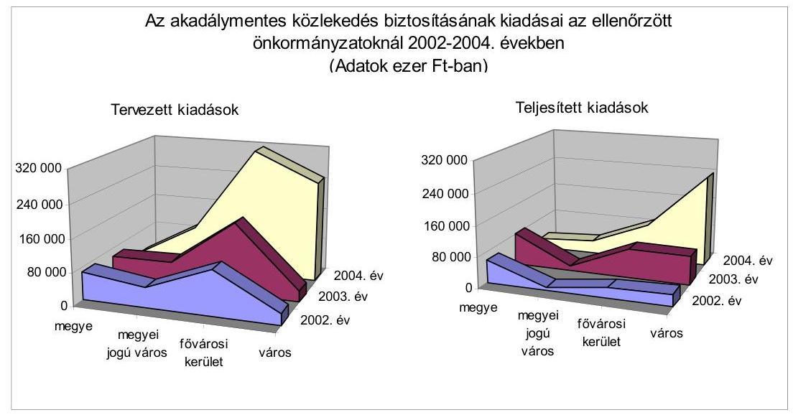

[^0]
[^0]:    ${ }^{83}$ A Fot. 29. § (6) bekezdésében foglaltak alapján a meglévő középületek akadálymentessé tételét fokozatosan, de legkésőbb 2005. január 1-ig el kellett végezni.

---

Az ellenőrzött önkormányzatok a törvényi kötelezettség teljesítésére ${ }^{84}$ a tervezett pénzügyi forrásaiknak 2002-2004 között 50-75-56,4\%-át fordították. A feladat végrehajtásához rendelkezésre álló források, valamint erre a célra fordított kiadások időarányos összhangja nem állt fent. A Fot. 29. § (6) bekezdésében meghatározott 2005. január 1-i határidőre nem oldották meg valamennyi középület akadálymentes megközelíthetőségét.

# 3. A BELSŐ ELLENŐRZÉSI RENDSZER MÜKÖDÉSÉNEK ÉRTÉKELÉSE 

### 3.1. Az ellenőrzési rendszer kialakítása, múködése

Az ellenőrzött önkormányzatok 73\%-a (a 2003. évben a 34\%-a) kialakította a belső ellenőrzési feladatok végrehajtásához szükséges szervezeti kereteket, egyúttal a Ber. 4. § (1) bekezdésének megfelelően gondoskodott a belső ellenőrzési rendszer múködéséhez szükséges források biztosításáról. A szervezeti és múködési szabályzatban az önkormányzati hivatalok 46\%-ánál (a 2003. évben 38\%-nál) rögzítették a belső ellenőrzési kötelezettséget, 29\%ánál (a 2003. évben 24\%-nál) jelölték meg az ellenőrzést végző személy, vagy egység jogállását, 27\%-ánál (a 2003. évben 21\%-nál) határozták meg az ellenőrzést végzők feladatait.
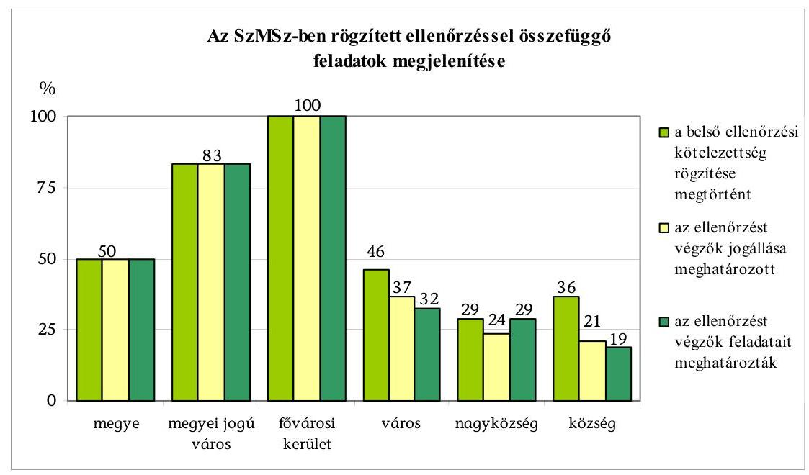

Az ellenőrzött önkormányzatok 67\%-a (a 2003. évben 11\%-a) rendelkezett belső ellenőrzési kézikönyvvel.

[^0]
[^0]:    ${ }^{84}$ Az önkormányzatok gazdálkodásának a 2004-2005. évi ellenőrzései során számvevői jelentésekben javasoltuk az önkormányzatok polgármesterei részére, hogy a jogszabályi előírás betartása érdekében gondoskodjanak a középületek akadálymentessé tételéről, tekintettel a Fot. 29. § (6) bekezdésében foglaltakra.

---

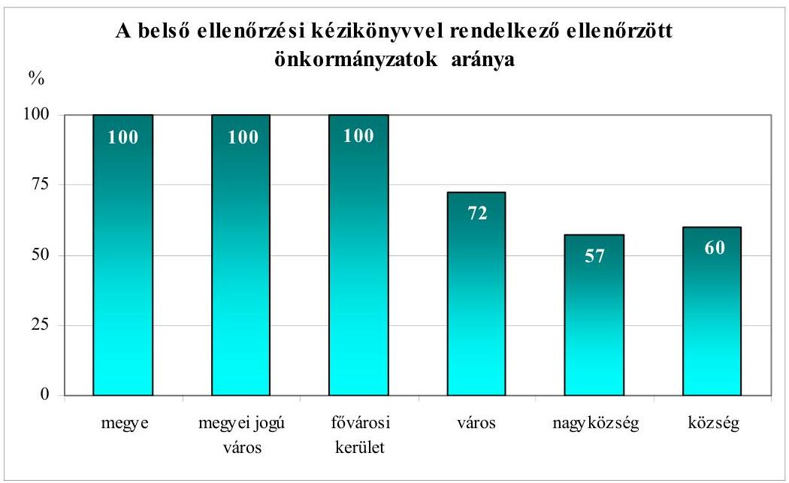

A jegyzők 69\%-a a Htv. 140. § (1) bekezdésének e) pontjában foglaltak alapján - az ellenőrzött megyei, megyei jogú városi és Budapest főváros kerületi önkormányzatok 69\%-ánál, valamint városok 89\%-ánál, nagyközségek 81\%ánál, községek 66\%-ánál - gondoskodott az önkormányzat által alapított költségvetési szervek ellenőrzési feladatainak megoldásáról. Az ellenőrzött önkormányzatok 9\%-a köztisztviselők foglalkoztatása mellett társulás vagy vállalkozó megbízása útján is növelte ellenőrzési kapacitását.

Az ellenőrzött önkormányzatok 55\%-a hozott létre belső ellenőrzési társulást, vagy csatlakozott belső ellenőrzési feladatokat is ellátó többcélú kistérségi társuláshoz.
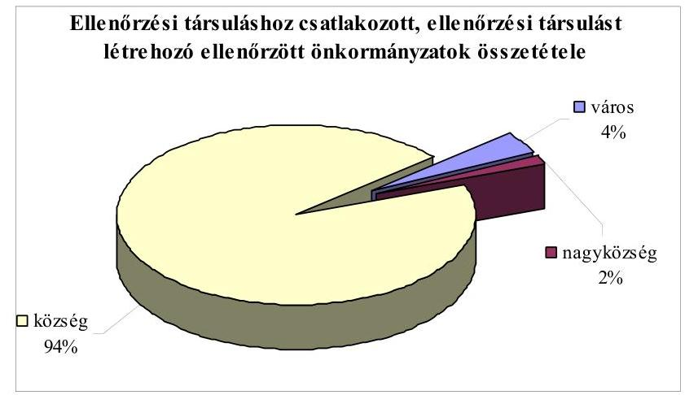

---

A társulási megállapodások több mint fele általánosságokban tartalmazta a belső ellenőrök feladatait ${ }^{85}$, az ellenőrzés megszervezésére, az éves munkaterv összeállításának, a múködés értékelésének rendjére vonatkozó szabályokat. A társulásokban részt vevő önkormányzatok részére a tervezett belső ellenőrzések 44\%-át megfelelő színvonalon hajtották végre. A társulások a belső ellenőrzési feladatok ellátására létrehozott ellenőri kapacitását nem az önkormányzatok kockázatbecslésen alapuló kapacitásigénye alapján határozták meg.

Az ellenőrzött megyei, a megyei jogú városi és a kerületi önkormányzatok mindegyike, a városi önkormányzatok 65\%-a önkormányzati hivatalban foglalkoztatott köztisztviselőkkel gondoskodott a belső ellenőrzési feladatok ellátásáról. A nagyközségi önkormányzatok 53\%-a vállalkozást bízott meg, a községi önkormányzatok 54\%-a társuláshoz csatlakozva szervezte meg a belső ellenőrzési feladatokat.

Az ellenőrzött önkormányzati hivatalban foglalkoztatott belső ellenőrök 72\%-a tartozott közvetlenül a jegyzőhöz, társulás esetében a belső ellenőrök a társulás munkaszervezetéhez tartoztak, illetve mint a társulás által megbízott külső szervezet tagjai látták el feladatukat.

Az ellenőrzött önkormányzati hivatalok 91\%-ánál érvényesült a belső ellenőrök funkcionális függetlensége az éves ellenőrzési terv összeállításakor, $94 \%$-ánál az ellenőrzési módszer kiválasztásakor, $96 \%$-ánál az ellenőrzési jelentés készítésekor és az ajánlások kidolgozásakor. A belső ellenőrzést végzők 11\%-át (a 2003. évben 19\%-át) azonban az Áht. 121/A. § (4) bekezdés e) pontjában előírtakat megsértve más irányítási, végrehajtási tevékenység ellátásával is megbízták.

A belső ellenőrzést végző ellenőrzött önkormányzati hivatalok 37\%-ánál ${ }^{86}$ (a 2003. évben $23 \%$-ánál) a foglalkoztatott belső ellenőrök létszámát - figyelemmel a Ber. 4. § (6) bekezdésében előírtakra - kapacitás felmérés alapján határozták meg. A foglalkoztatott belső ellenőrök 87\%-a felelt meg a Ber. 11. §ában előírt iskolai végzettségre és képesítési követelményekre vonatkozó követelményeknek.

Az ellenőrzés tervszerűbbé, hatékonyabbá tétele érdekében a Ber 12. § b) pontjában és a Ber. 18. §-ában foglaltaknak eleget téve az ellenőrzött önkormányzatok 24\%-ánál rendelkeztek az ellenőrzésre vonatkozóan a belső ellenőrzési vezető által készített és a jegyző részéről jóváhagyott stratégiai tervvel.

[^0]
[^0]:    ${ }^{85}$ A belső ellenőrök végzik a társult önkormányzatok intézményeinél a pénzügyigazdasági ellenőrzést, a cél-, téma és utóvizsgálatot, továbbá az önkormányzati hivataloknál a függetlenített belső ellenőrzési feladatokat; előkészítik a vizsgálati programot és a megbízólevelet; írásba foglalják az ellenőrzés megállapításait, indokolt esetben felvetik a felelősség kérdését; ellátják az ellenőrzés realizálásával kapcsolatos feladatokat; elkészítik az ellenőrzés tapasztalatairól szóló tájékoztatót.
    ${ }^{86}$ A ellenőrzött önkormányzatok 18\%-ánál.

---

Az éves ellenőrzési tervet az ellenőrzött önkormányzatok 54\%-ára vonatkozóan készítettek, melyek 84\%-a tartalmában megfelelt a Ber. 21. 8ában foglalt előírásoknak. Az éves ellenőrzési tervek hiányossága volt, hogy nem tartalmazták a Ber. 21. § (3) bekezdésében előírtak közül az ellenőrzési tervet megalapozó elemzéseket, az ellenőrzés célját, nem rögzítették az ellenőrzések módszereit, nem ütemezték az ellenőrzéseket.
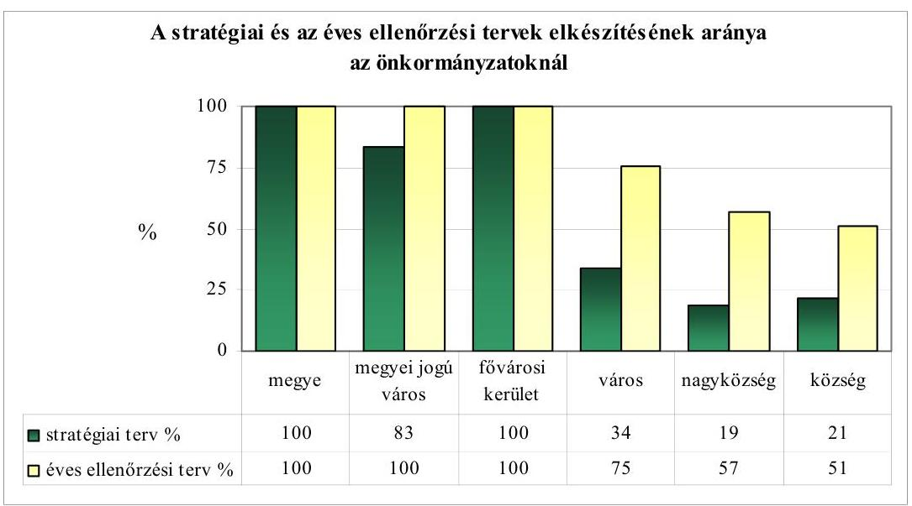

Az ellenőrzést végző vizsgált önkormányzati hivatalok 20\%-ánál a Ber. 23. § (1) bekezdésében foglaltak ellenére nem készült ellenőrzési program, valamint a Ber. 24. § (1) bekezdésében előírtak ellenére megbízólevél.
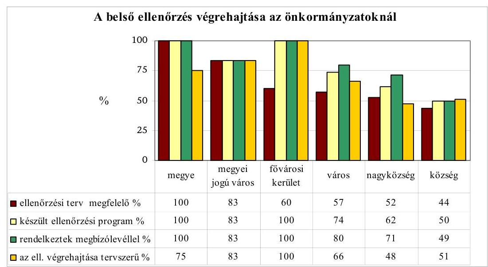

Az ellenőrzések - a szervezeti felépítés, a belső szabályozottság, a költségvetési tervezés megalapozottsága, az eszköz és készletgazdálkodás, a számviteli elszámolások, a pénzforgalom, a pénz- és értékkezelés, a vagyongazdálkodás területeit érintették - a jogszabályoknak és a belső szabályzatoknak való megfelelésre terjedtek ki. Az Áht. 121/A. § (2) bekezdésében meghatározott

---

feladatok közül a belső ellenőröket a gazdaságosság, a hatékonyság, az eredményesség ellenőrzésével rendszerint nem bízták meg.

Az ellenőrzési rendszer működésének változatlanul, évek óta meglévő jelentős hiányossága, hogy sem az ellenőrzöttek, sem az önkormányzatok nem fordítanak kellő figyelmet az ellenőrzési javaslatok realizálására ${ }^{87}$.

Az ellenőrzési jelentések kétharmada nem tartalmazott a Ber. 28. § (2) bekezdése szerinti záradékot, ezért az ellenőrzötteknek nem volt szabályozott keretek között lehetősége nyilatkozattételre, vagy észrevételre. Az ellenőrzöttek 10\%-a (az előző évben 14\%-a) a belső ellenőrzés megállapításait vitatta, észrevételt tett, a Ber. 28. § (3) bekezdés szerint eljárva az érintettek megbeszélést tartottak, a jegyzők a megállapítások és javaslatok fenntartása mellett, a hibák mielőbbi kijavítására hívták fel az ellenőrzöttek figyelmét.

Az ellenőrzött megyei jogú városi önkormányzatok mindegyikében, a fővárosi kerületek 40\%-ánál, a városi önkormányzatok 3\%-ánál, a községi önkormányzatok 1\%-ánál a feltárt szabálytalanságok súlya miatt az ellenőrök büntető, fegyelmi, kártérítési eljárás kezdeményezésére tettek javaslatot.

Az ellenőrzések során feltárt hiányosságok 51\%-át megszüntették, további 43\%-nál részben történt meg a szabálytalanságok kijavítása, az ellenőrzött önkormányzatok 6\%-ánál intézkedés nem történt.
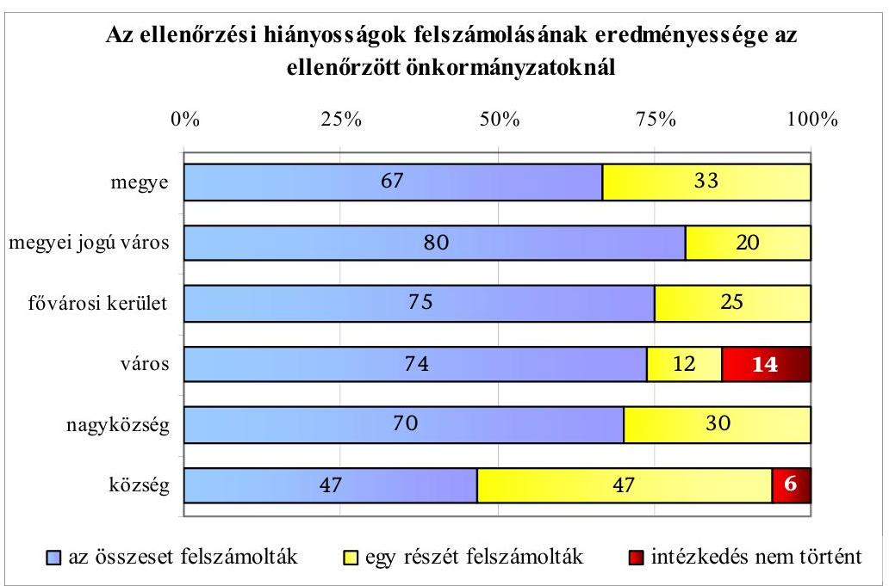

Az ellenőrzött önkormányzatok 24\%-ánál készült éves ellenőrzési jelentés, melyek 63\%-a megfelelt, 37\%-a részben felelt meg a Ber. 31. § (3) bekezdésben foglalt tartalmi követelményeknek.

[^0]
[^0]:    ${ }^{87}$ Az ÁSZ 0544 sorszámú jelentés 64. oldalán, a 0436 sorszámú jelentés 75. oldalán tett megállapításai is tartalmazták.

---

Az ellenőrzött önkormányzatok közül a belsó ellenőrzést végző önkormányzatok képviselő-testületeinek 48\%-a (a 2003. évben 42\%-a) - a Htv. 138. § (1) bekezdés g) pontjában előírtakat megsértve - nem tekintette át az általa alapított és fenntartott költségvetési szervek ellenőrzésének tapasztalatait. Az ellenőrzési tapasztalatokat tárgyaló képviselő-testületek a beszámolókat elfogadták, tudomásul vették. Az előterjesztéseket megvitató testületek nem fogalmaztak meg az ellenőrzések továbbfejlesztésével, a munka színvonalával összefüggő követelményeket, elvárásokat.

Az alábbi ábra mutatja be az ellenőrzött önkormányzatoknál a belső ellenőrzés kialakítását, múködését:
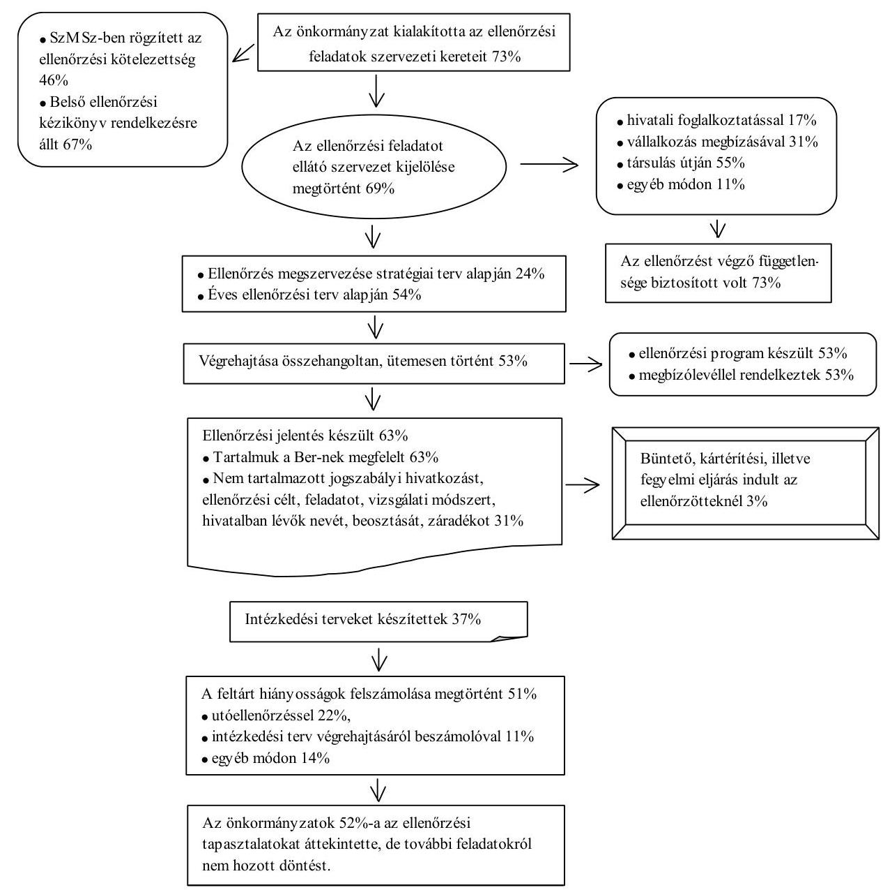

---

# 3.2. A könyvvizsgálati kötelezettség teljesítése 

A megyei, a megyei jogú városi, a Budapest fővárosi és a főváros kerületi önkormányzatok az Ötv. 92/A. § (1) bekezdésében előírtaknak eleget téve könyvvizsgálót bíztak meg folyamatos könyvvizsgálói feladattal az egyszerúsített tartalmú éves pénzforgalmi jelentés, könyvviteli mérleg, pénzmaradvány és eredmény kimutatás felülvizsgálatával. Az Ötv. 92/A. § (2) bekezdése (hitel felvétel és 300 millió Ft-ot meghaladó költségvetési kiadás) alapján fennálló könyvvizsgálati kötelezettségének az ellenőrzött önkormányzatok eleget tettek. Két önkormányzat (Ráckeve és Nagybajom város önkormányzatai) ugyan nem volt kötelezett, de megbízott könyvvizsgálót ezen feladatok ellátására.
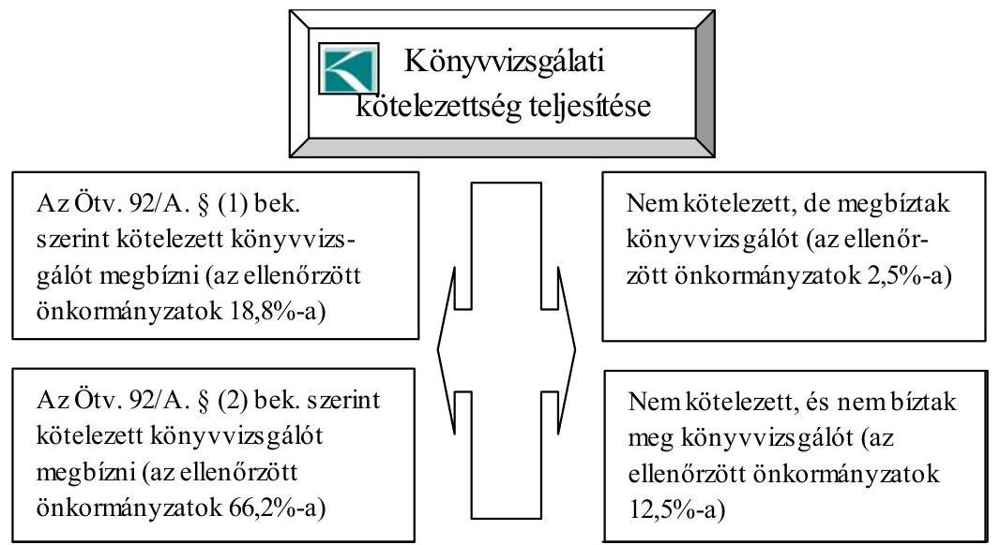

Az önkormányzatok a könyvvizsgáló kiválasztásakor az Ötv. 92/B. § (1) bekezdésében előírt a szakmai követelményekre vonatkozó előírásokat betartották. A megbízásakor figyelemmel voltak - Pétervására Város Önkormányzata kivételével - az Ötv. 92/B. § (2) bekezdésében előírt könyvvizsgálóval kapcsolatos öszszeférhetetlenségi követelményekre.

A költségvetési beszámolókat - négy önkormányzat kivételével - a könyvvizsgálók korlátozás nélküli hitelesítő záradékkal látták el, mert azok megítélésük szerint „valós, megbizható képet mutattak az önkormányzatok vagyoni, pénzügyi és jövedelmi helyzetéről".

A könyvvizsgáló az ellenőrzött önkormányzatok közül korlátozott záradékkal látta el a költségvetési beszámolót a következő indokok miatt:

- Szolnok Megyei Jogú Város Önkormányzata hivatalánál a könyvvizsgáló a leltározás és kiértékelés zártságáról, teljességéről a vizsgálata lezárásáig nem tudott meggyőződni.
- Hajdúhadház Város Önkormányzata hivatalánál nem tartották be a Számv. tv. készletek értékelésére vonatkozó előírásait, valamint a szállítói kötelezettségek leltározása során megsértették a valódiság elvét.
- Örkény és Visegrád városok önkormányzati hivatalainál a könyvvizsgáló jelentős összegű auditálási eltérést állapított meg.

---

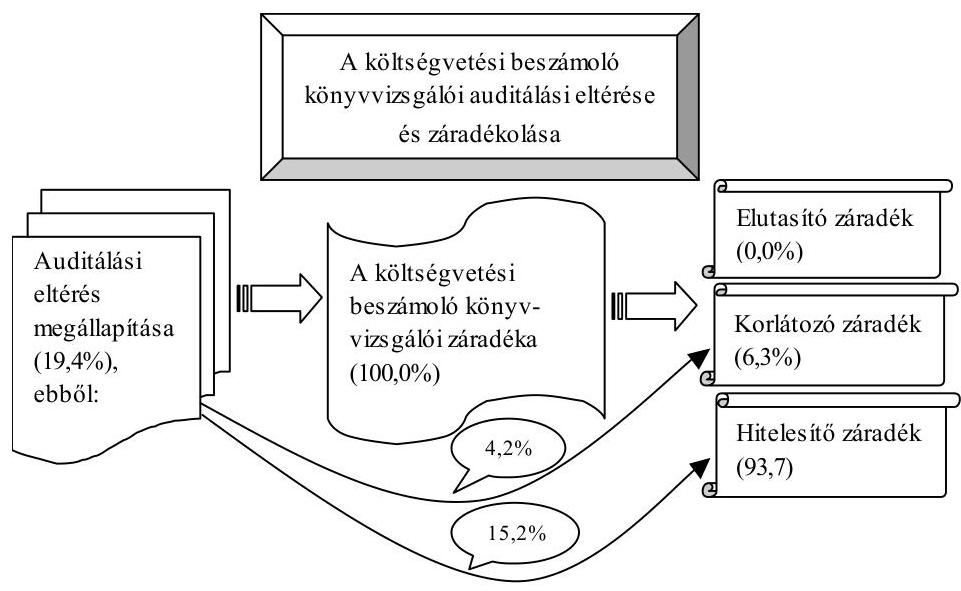

A könyvvizsgálók 14 önkormányzatnál auditálási eltérést állapítottak meg, amelynek összegét - egy kivételével - nem minősítették jelentősnek.

# 3.3. A korábbi számvevőszéki ellenőrzések javaslatainak hasznosulása 

Az ellenőrzött megyei, megyei jogú városi, Budapest főváros kerületi önkormányzatoknál, a városi önkormányzatok 78,5\%-ánál, a nagyközségi és a községi önkormányzatok 27\%-ánál volt 2002-2004 között ÁSZ vizsgálat.

Az ellenőrzéseink 32\%-a a zárszámadáshoz kapcsolódó állami támogatás igénylésére és felhasználására ${ }^{88}$, 38\%-a témavizsgálatokra, 30\%-a a helyi és a helyi kisebbségi önkormányzatok gazdálkodásának átfogó ellenőrzésére irányult.

Az ellenőrzött önkormányzatoknál a 2002-2004 között feltárt szabálytalanságok, hiányosságok megszüntetésére, a feladatellátás célszerűségét és hatékonyságát szolgáló intézkedések megtételére az ellenőrzésekről készült jelentések 2926 javaslatot tartalmaztak, melyből a gazdálkodás szabályszerűségének biztosítását $71 \%$-a, célszerűségének javítását $29 \%$-a célozta.

Az ellenőrzéseink eredményeképpen az önkormányzati gazdálkodás szabályozottsága és végrehajtásának szabályszerűsége javult, a feladatellátás során a munka színvonala emelkedett.

A zárszámadáshoz kapcsolódó vizsgálatoknál tett 560 javaslat 76\%-át hasznosították. A jogosulatlanul igénybevett támogatásokat az önkormányzatok visszafizették, a szociális rendeletüket kiegészítették, a rendszeres szociális segélyben részesülők jogosultsági feltételeit felülvizsgálták, az intézmények alapí-

[^0]
[^0]:    ${ }^{88}$ A 2002-2004 években normatív, kötött és a központosított állami hozzájárulás igénylésének és elszámolásának, a helyi önkormányzatok beruházásaihoz nyújtott cél és címzett támogatások felhasználásának jogszerűségének ellenőrzése.

---

tó okiratát módosították, a közműfejlesztési támogatások elkülönített analitikus nyilvántartását vezették, az igényelt támogatás - két ellenőrzött önkormányzat kivételével - 15 napon belüli kifizetéséről intézkedtek.

A 15 témaellenőrzés kapcsán 612 javaslat született, amelyek 69\%-ára intézkedtek az önkormányzatok. Elfogadták a közoktatás minőségirányítási programját, összehangolták a középtávú megyei és városi intézményfejlesztési tervet, áttekintették a középfokú oktatási intézmények képzési struktúráját, párhuzamos képzések megszüntetésére törekedtek, elfogadták a településfejlesztési koncepciót, a szennyvízközmű hálózatra történő lakossági rákötések számát növelték. Kettő városi önkormányzatnál a lakásértékesítésből származó bevételek elszámolására elkülönített számlát nem nyitották meg, Budapest főváros három kerületi önkormányzata nem intézkedett az önkormányzati lakóépületek elidegenítéséből származó bevételek 50\%-át a Budapest Fővárosi Önkormányzat elkülönített számlájára nem utalta át ${ }^{89}$.

A helyi és helyi kisebbségi önkormányzatok gazdálkodásának szabályszerűségének, célszerűségének biztosítását 1754 javaslat szolgálta, amelyek 67\%-a hasznosult. Elkészítették az önkormányzat gazdasági programját, az önkormányzati hivatal gazdasági szervezetének ügyrendjét, a vagyongazdálkodási rendeletet, a számviteli politikát és keretében meghatározott szabályzatokat, a számlarendet, operatív gazdálkodási jogkörök gyakorlására szóló szabályozásokat felülvizsgálták, aktualizálták, az ingatlankataszter és a számviteli nyilvántartások egyezőségét biztosították, kiegészítették az önkormányzati hivatal szervezeti és múködési szabályzatát. Elmaradt a zárszámadási rendeletben a közvetett támogatásokról szóló tájékoztatás, nem határozták meg az Áht. 118. §-ában foglaltak ellenére a költségvetés, illetőleg a zárszámadás előterjesztésekor a képviselő-testület tájékoztatása céljából bemutatandó mérlegek tartalmi követelményeit, valamint a pártok részére a helyiségeket kedvezményesen biztosították. Részben valósult meg a munkaköri leírásokban az egyeztetési, a munkafolyamatba épített ellenőrzési kötelezettségek meghatározása.

A helyi és a helyi kisebbségi önkormányzatok gazdálkodásának a 2004. évi átfogó ellenőrzéséről készült összefoglaló jelentésben szereplő - belügyminiszternek, pénzügyminiszternek címzett - javaslataink kettő kivétellel nem teljesültek:

Az Ámr. 168. §-a módosításra került, az önkormányzati körben az érvényesítéssel foglalkozó számviteli feladatot ellátók képesítési feltétele szigorodott, megszűnt a községi, nagyközségi önkormányzatok által fenntartott intézményekben a képesítési előírás alóli mentesség. A 2005. augusztus 30-tól hatályos Ötv. módosítás a pénzügyi ellenőrzési rendszer szabályait tette teljessé. E jogszabály módosítása összhangot teremtett az Áht. előírásaival az önkormányzatok külső és belső ellenőrzése tekintetében. Nem történt intézkedés a belügyminiszter által az Ötv. felülvizsgálata kapcsán az önkormányzatok kötelező feladatainak egyértelmű meghatározására. A pénzügyminiszter javaslataink ellenére nem kezdeményezte, az önkormányzatokra vonatkozóan a hiány megállapításának módjának meghatározását, amelyre az Áht. módosításkor lát lehetőséget, nem állapította meg az önkormányzatok céljelleggel nyújtott támogatásának ellenőrzési szabályait. A Pénzügyminisztérium véleménye szerint az önkormányzatok belső ellenőrzési

[^0]
[^0]:    ${ }^{89}$ A lakások és helyiségek bérletére, valamint elidegenítésére vonatkozó egységes szabályokról szóló 1993. évi LXXVII. törvény 63. § (1) bekezdésében foglalt kötelezettségüket nem teljesítették.

---

feladatellátására vonatkozóan a Ktv. 1. § (8) bekezdésének és a Ber. 2. § m) pontjának összhangba hozatalára a 2006. évben a Ktv. módosításakor nyílik lehetőség.

A 2005. évben a helyi és a helyi kisebbségi önkormányzatok gazdálkodási rendszerének szabályszerű és célszerű működése érdekében tett javaslatainkat a jelentés 14. számú melléklete foglalja össze.

# 4. A HELYI KISEBBSÉGI ÖNKORMÁNYZATOK GAZDÁLKODÁSA 

Az ellenőrzött települési önkormányzatok mellett működő helyi kisebbségi önkormányzatok közül egynek a gazdálkodását, valamint az önkormányzati hivatalok kisebbségi önkormányzatok munkáját segítő tevékenységének szabályszerűségét vizsgáltuk.

A helyi kisebbségi önkormányzatok nem vettek át feladatot az ellenőrzött települési önkormányzatoktól, intézményt nem létesítettek és nem vettek át ${ }^{90}$. Feladatellátásukban, az előző években ellenőrzöttekhez hasonlóan, döntően az önkormányzati testületi működés feltételeinek biztosítása, valamint a településeken élő kisebbségek érdekeinek képviselete szerepelt. Így költségvetésükben a múködési kiadások döntő súlyt (a 2003. évben 90\%-ot, a 2003-ban 89,9\%-ot, a 2004-ben 93,6\%-ot), és azon belül a dologi kiadások jelentős (átlag 46\%-os) részarányt képviseltek. ${ }^{91}$ Költségvetésükből a 2003. évi 10\%-kal szemben $\mathbf{1 6 \%}$-nál adtak támogatást különféle - költségvetési és egyéb non profit - szervezetek részére céljelleggel, nem szociális ellátásként. A támogatást nyújtók több mint a fele (55\%-a), megsértve az Áht. 13/A. § (2) bekezdésének előírásait, nem írt elő̉ számadási kötelezettséget a támogatott szervezeteknek az átadott pénzeszközök felhasználásáról, nem ellenőrizte a támogatások rendeltetésszerú felhasználását.

Az együttmúködés szabályait évente növekvő arányban (a 2002. évben 79\%, a 2003. évben 87\%, a 2004. évben 93\%) foglalták megállapodásba az ellenőrzött települési és a kisebbségi önkormányzatok. Nem szabályozták a megállapodások 23\%-ában (2003-ban 28\%-ában, 2002-ben 26\%-ában) az Áht. 68. § (3) bekezdésében foglaltakat megsértve a költségvetés tervezésének feladatait. Az együttmúködési megállapodások nem tartalmazták a kötelezettségvállalás, az utalványozás és ezek ellenjegyzésének, valamint a szakmai teljesítés igazolás és az érvényesítés ellátásának rendjét és a kijelölések, megbízások alapján a feladatok jogosultjait, illetve kötelezettjeit. Nem, vagy nem egyértelmúen tartalmazták a megállapodások az Ámr. 29. § (10) bekezdésében előírtak ellenére a testület által jóváhagyott kisebbségi önkormányzati határozatok települési önkormányzathoz történő átadásának határidejét a költségvetés esetében 34\%-nál, az előirányzatok évközi módosításainál 40\%, a zárszámadás tekintetében $44 \%$ esetében. Az önkormányzati hivatalok ki-

[^0]
[^0]:    ${ }^{90}$ A helyi kisebbségi önkormányzatok gazdálkodásával kapcsolatos részletes ellenőrzési megállapításokat a jelentés 13. számú melléklete tartalmazza.
    ${ }^{91}$ Az összes és az ellenőrzött helyi kisebbségi önkormányzatok 2003-2005. évi bevétel-ének-kiadásainak adatait a 11-12. számú mellékletek ismertetik.

---

sebbségi önkormányzati gazdálkodás segítésével kapcsolatos feladatait az előző évi 40\%-kal szemben 61\%-nál szabályozták a Nek. tv. 28. §-ában ${ }^{92}$ előírtaknak megfelelően, részben végezték el a szabályozást 4\%-nál (a 2003. évben $7,7 \%$-nál).
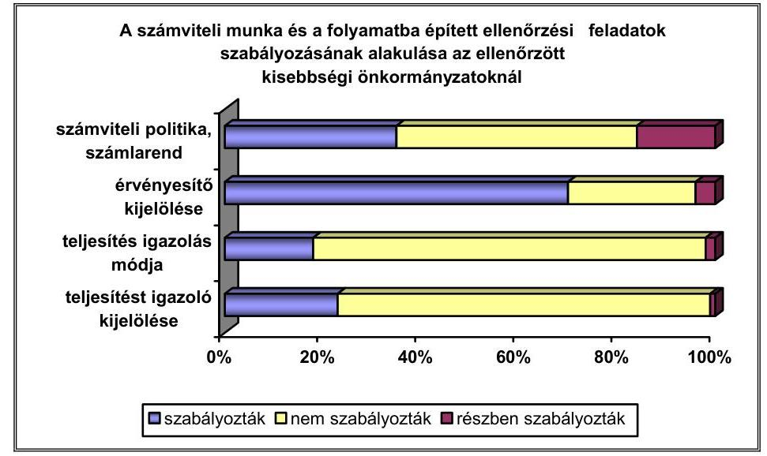

Az ellenőrzött települési önkormányzatok mellett múködő kisebbségi önkormányzatok 97\%-a állapította meg a 2004. évi költségvetését (a 2003. évit $97 \%$, a 2002. évit $93 \%$ ) önkormányzati testületi határozattal az Áht. 65. § (2) bekezdésében előírtaknak megfelelően. A határozatoknak csak 70\%-a (a 2003. évben 64\%-a) felelt meg az Áht. 69. § (2) bekezdésében, illetve az Ámr. 29. § (2) bekezdésében foglalt előírásoknak. A költségvetés előirányzatainak évközi módosításáról az Ámr. 53. § (7) bekezdésében előírtaknak megfelelően határozattal döntöttek az önkormányzati testületek $\mathbf{5 1 \%}$-nál (a 2003. évben 35\%-nál).

A gazdálkodásra bankszámlát egyáltalán nem használó kisebbségi önkormányzatok aránya az előző évi 26\%-ról 10\%-ra csökkent. A gazdálkodási gyakorlatban alapvető változás nem történt a 2002-2003-ban tapasztaltakhoz képest, és változatlanok voltak a gazdálkodási hiányosságok okai is. A hibás bizonylatok aránya továbbra is $25 \%$ felett volt, és meghaladta a 2003. évit az érvényesítés és az utalvány ellenjegyzése kivételével. Az önkormányzati hivatalok 30\%-ánál (a 2003. évben 49\%-nál) nem vezették az Áht. 103. § (1) bekezdésében rögzített nyilvántartást az előirányzatokról, valamint 72\%-ánál (a 2003. évben 83\%-nál) az Ámr. 134. § (13) bekezdésében ${ }^{93}$ előírt nyilvántartást a kötelezettségvállalásokról ez is közrejátszott abban, hogy a bizonylatok 7\%-ánál az előirányzatot meghaladóan történt a kötelezettségvállalás és az utalványozás. A kötelezettségvállalásokat az Ámr. 134. § (8) bekezdésében ${ }^{94}$ foglalt előírás ellenére szabálytalanul végezték a bizonylatok 29\%-ánál (a 2003. évben 27\%-

[^0]
[^0]:    ${ }^{92}$ A 2005. november 25 -től a Nek. tv. 27. § (1) bekezdésében.
    ${ }^{93}$ A bekezdés számozása a 2004. évben (6) volt.
    ${ }^{94}$ A bekezdés számozása a 2004. évben (2) volt.

---

nál), ellenjegyzés elvégzése nélkül történt kötelezettségvállalás a bizonylatok $39 \%$-ánál (a 2003. évben $40 \%$-nál).

Az utalványozás során nem tartották be az Áht. 74/A. § (1) bekezdés, valamint az Ámr. 136. § (1)-(4) bekezdés és a belső szabályozás előírásait a bizonylatok $43 \%$-ánál (a 2003. évben 29\%-ánál). Az ellenőrzött települési önkormányzatok mellett múködő kisebbségi önkormányzatok 16\%-ánál a polgármester, a jegyző, illetve az önkormányzati hivatal alkalmazottja utalványozott, továbbá a kisebbségi önkormányzat elnökének felhatalmazása nélkül gyakorolta az utalványozást a kisebbségi önkormányzat képviselő-testületi tagja, 9\%-ánál az elnökök saját maguk javára is utalványoztak kifizetést. A 2003. évi $44 \%$-kal szemben a bizonylatok 42\%-án az Ámr. 137. § (3) bekezdésében előírtak ellenére az utalvány ellenjegyzését nem végezték el.

Az érvényesítés hiányzott, illetve nem az Ámr. 135. § (1)-(2) és (4) bekezdés előírásainak megfelelően végezték a bizonylatok 37\%-ánál (a 2003. évben $38 \%$-nál). Az Ámr. 135. § (2) bekezdésében előírt jegyzői megbízás, illetve szakmai képesítés hiányában is végeztek érvényesítést. Az Ámr. 135. § (1) bekezdés előírásai ellenére az okmányok alapján nem ellenőrizték, szakmailag nem igazolták a teljesítést 47\%-ban (a 2003. évben 33\%-ban) a pénztári és $52 \%$-ban (a 2003. évben $30 \%$-ban) a bankszámlához kapcsolódó tevékenységben. A számviteli nyilvántartásokban rögzített gazdasági események 75\%áról (a 2003. évben 74\%-áról) állítottak ki Számv. tv. 167. § (1) bekezdés a)-j) pontjaiban előírt alaki és tartalmi követelményeknek megfelelő bizonylatot, amelyek 19\%-ának (a 2003. évben 17\%-ának) főkönyvi elszámolását az önkormányzati hivatalok az előírt határidő után végezték el. A mulasztásokhoz hozzájárult, hogy az Áht. 66. § előírásai alapján kötendő együttműködési megállapodásnak nem kötelező tartalmi elemei a gazdálkodás végrehajtásának feladatai, ezen belül a kötelezettségvállalás és az utalványozás, illetve azok ellenjegyzésének, valamint a szakmai teljesítés igazolás és az érvényesítés ellátásának rendje és a kijelölések, megbízások alapján a feladatok jogosultjai, illetve kötelezettjei.

Az ellenőrzött települési önkormányzatok mellett működő kisebbségi önkormányzatok 79\%-a (az előző két évben 75\%, illetve 76\%) jóváhagyta határozattal az éves gazdálkodásról szóló zárszámadását. A határozatok tervezetét a megállapodásban foglaltak szerint a jegyzők 52\%-a (2003-ban 56\%-a) készítette el. A zárszámadási határozatok tartalma a 2003. évivel azonos arányban 63\%-nál volt összehasonlítható a költségvetéssel. A zárszámadási határozatot a kisebbségi önkormányzatok 70\%-ánál (az előző évben 57\%-nál) továbbította az elnök a települési önkormányzat polgármesteréhez olyan időben, hogy az a zárszámadási rendeletbe beépíthető legyen.
Budapest, 2006. szeptember " 19 "

---

# Az ellenőrzött önkormányzatok jegyzéke 

| sor-   szám | megye / főváros | Önkormányzat / település neve | megye/   főváros | megyei   jogú   város | város /   fővárosi   kerület | nagy-   község | község | Az önkormányzatok 2004. évi bruttó kiadásai (millió Ft) |
| :--: | :--: | :--: | :--: | :--: | :--: | :--: | :--: | :--: |
| 1 | Bács-Kiskun | BÁTMONOSTOR |  |  |  |  | x | 180 |
| 2 |  | BOROTA |  |  |  |  | x | 207 |
| 3 |  | CSÁTALJA |  |  |  |  | x | 210 |
| 4 |  | FELSŐSZENTIVÁN |  |  |  |  | x | 259 |
| 5 |  | JÁNOSHALMA |  |  | x |  |  | 1332 |
| 6 |  | KALOCSA |  |  | x |  |  | 7354 |
| 7 |  | KASKANTYÚ |  |  |  |  | x | 110 |
| 8 |  | KISKÖRÖS |  |  | x |  |  | 4152 |
| 9 |  | KISKUNFÉLEGYHÁZA |  |  | x |  |  | 8773 |
| 10 |  | KISSZÁLLÁS |  |  |  |  | x | 366 |
| 11 |  | KUNADACS |  |  |  |  | x | 262 |
| 12 |  | KUNBAJA |  |  |  |  | x | 442 |
| 13 |  | KUNSZÁLLÁS |  |  |  |  | x | 213 |
| 14 |  | MÁTÉTELKE |  |  |  |  | x | 61 |
| 15 |  | SOLTVADKERT |  |  | x |  |  | 1057 |
| 16 |  | TATAHÁZA |  |  |  |  | x | 275 |
| 17 |  | TÁZLÁR |  |  |  |  | x | 236 |
| 1 | Baranya | ADORJÁS |  |  |  |  | x | 32 |
| 2 |  | ÁG |  |  |  |  | x | 31 |
| 3 |  | ALMÁSKERESZTÚR |  |  |  |  | x | 13 |
| 4 |  | ARANYOSGADÁNY |  |  |  |  | x | 56 |
| 5 |  | ÁTA |  |  |  |  | x | 25 |
| 6 |  | BAKÓCA |  |  |  |  | x | 50 |
| 7 |  | BARANYAHIDVÉG |  |  |  |  | x | 32 |
| 8 |  | BASAL |  |  |  |  | x | 17 |
| 9 |  | BELVÁRDGYULA |  |  |  |  | x | 55 |
| 10 |  | BERKESD |  |  |  |  | x | 174 |
| 11 |  | BICSÉRD |  |  |  |  | x | 192 |
| 12 |  | BIRJÁN |  |  |  |  | x | 38 |
| 13 |  | BORJÁD |  |  |  |  | x | 130 |
| 14 |  | BÜRÜS |  |  |  |  | x | 20 |
| 15 |  | CÚN |  |  |  |  | x | 40 |
| 16 |  | DRÁVACSEHI |  |  |  |  | x | 41 |
| 17 |  | DRÁVACSEPELY |  |  |  |  | x | 65 |
| 18 |  | DRÁVAPALKONYA |  |  |  |  | x | 39 |
| 19 |  | DRÁVAPISKI |  |  |  |  | x | 17 |
| 20 |  | DRÁVASZABOLCS |  |  |  |  | x | 191 |
| 21 |  | DRÁVASZERDAHELY |  |  |  |  | x | 33 |
| 22 |  | EGERÁG |  |  |  |  | x | 168 |
| 23 |  | ELLEND |  |  |  |  | x | 19 |
| 24 |  | FAZEKASBODA |  |  |  |  | x | 25 |
| 25 |  | GERÉNYES |  |  |  |  | x | 49 |
| 26 |  | GILVÁNFA |  |  |  |  | x | 76 |
| 27 |  | GORDISA |  |  |  |  | x | 39 |
| 28 |  | GÖDRE |  |  |  |  | x | 165 |
| 29 |  | GYÖNGYÖSMELLÉK |  |  |  |  | x | 45 |
| 30 |  | HARKÁNY |  |  | x |  |  | 1408 |
| 31 |  | HIRICS |  |  |  |  | x | 63 |
| 32 |  | HOSSZÚHETÉNY |  |  |  |  | x | 390 |
| 33 |  | ILLOCSKA |  |  |  |  | x | 27 |

---

| $\begin{gathered} \text { sor- } \\ \text { szám } \end{gathered}$ | megye / föváros | Önkormányzat / település neve | megye/   föváros | megyei   jogú   város | város /   fövárosi   kerület | nagy-   község | község | Az önkormányzatok 2004. évi bruttó kiadásai (milliá Ft) |
| :--: | :--: | :--: | :--: | :--: | :--: | :--: | :--: | :--: |
| 34 |  | IPACSFA |  |  |  |  | x | 34 |
| 35 |  | KÉMES |  |  |  |  | x | 152 |
| 36 |  | KÉTÚJFALU |  |  |  |  | x | 297 |
| 37 |  | KISASSZONYFA |  |  |  |  | x | 65 |
| 38 |  | KISBESZTERCE |  |  |  |  | x | 17 |
| 39 |  | KISBUDMÉR |  |  |  |  | x | 20 |
| 40 |  | KISHAJMÁS |  |  |  |  | x | 44 |
| 41 |  | KISHARSÁNY |  |  |  |  | x | 48 |
| 42 |  | KISHEREND |  |  |  |  | x | 29 |
| 43 |  | KISKASSA |  |  |  |  | x | 29 |
| 44 |  | KISLIPPÓ |  |  |  |  | x | 51 |
| 45 |  | KISSZENTMÁRTON |  |  |  |  | x | 44 |
| 46 |  | KISTAMÁSI |  |  |  |  | x | 23 |
| 47 |  | KISTAPOLCA |  |  |  |  | x | 47 |
| 48 |  | KISVASZAR |  |  |  |  | x | 101 |
| 49 |  | KOMLÓ |  |  | $x$ |  |  | 5539 |
| 50 |  | KÓRÓS |  |  |  |  | x | 36 |
| 51 |  | KOVÁCSHIDA |  |  |  |  | x | 95 |
| 52 |  | KÖKÉNY |  |  |  |  | x | 33 |
| 53 |  | KÖLKED |  |  |  |  | x | 162 |
| 54 |  | LAPÁNCSA |  |  |  |  | x | 25 |
| 55 |  | LIGET |  |  |  |  | x | 63 |
| 56 |  | LOTHÁRD |  |  |  |  | x | 30 |
| 57 |  | LÚZSOK |  |  |  |  | x | 49 |
| 58 |  | MAGYARBÓLY |  |  |  |  | x | 324 |
| 59 |  | MAGYARMECSKE |  |  |  |  | x | 209 |
| 60 |  | MAGYARSZÉK |  |  |  |  | x | 182 |
| 61 |  | MAGYARTELEK |  |  |  |  | x | 66 |
| 62 |  | MÁZA |  |  |  |  | x | 127 |
| 63 |  | MECSEKPÖLÖSKE |  |  |  |  | x | 65 |
| 64 |  | MINDSZENTGODISA |  |  |  |  | x | 208 |
| 65 |  | MOLVÁNY |  |  |  |  | x | 73 |
| 66 |  | MONYORÓD |  |  |  |  | x | 21 |
| 67 |  | MOZSGÓ |  |  |  |  | x | 176 |
| 68 |  | NAGYBUDMÉR |  |  |  |  | x | 29 |
| 69 |  | NAGYHARSÁNY |  |  |  |  | x | 273 |
| 70 |  | NAGYTÓTFALU |  |  |  |  | x | 38 |
| 71 |  | NEMESKE |  |  |  |  | x | 74 |
| 72 |  | PÁPRÁD |  |  |  |  | x | 28 |
| 73 |  | PATAPOKLOSI |  |  |  |  | x | 57 |
| 74 |  | PÉCS |  | $x$ |  |  |  | 34449 |
| 75 |  | PÉCSDEVECSER |  |  |  |  | x | 14 |
| 76 |  | PÉCSUDVARD |  |  |  |  | x | 142 |
| 77 |  | PETERD |  |  |  |  | x | 20 |
| 78 |  | PETTEND |  |  |  |  | x | 27 |
| 79 |  | PÓCSA |  |  |  |  | x | 24 |
| 80 |  | POGÁNY |  |  |  |  | x | 138 |
| 81 |  | SÁMOD |  |  |  |  | x | 56 |
| 82 |  | SIKLÓSNAGYFALU |  |  |  |  | x | 83 |
| 83 |  | SOMOGYAPÁTI |  |  |  |  | x | 243 |
| 84 |  | SOMOGYHATVAN |  |  |  |  | x | 53 |
| 85 |  | SOMOGYVISZLÓ |  |  |  |  | x | 38 |
| 86 |  | SZAPORCA |  |  |  |  | x | 38 |
| 87 |  | SZEDERKÉNY |  |  |  |  | x | 262 |
| 88 |  | SZEMELY |  |  |  |  | x | 39 |

---

| $\begin{gathered} \text { sor- } \\ \text { szám } \end{gathered}$ | megye / föváros | Önkormányzat / település neve | megye/   föváros | megyei   jogú   város | város /   fövárosi   kerület | nagy-   község | község | Az önkormányzatok 2004. évi bruttó kiadásai (millió Ft) |
| :--: | :--: | :--: | :--: | :--: | :--: | :--: | :--: | :--: |
| 89 |  | SZILÁGY |  |  |  |  | x | 33 |
| 90 |  | SZÖKÉD |  |  |  |  | x | 45 |
| 91 |  | SZÖRÉNY |  |  |  |  | x | 12 |
| 92 |  | SZULIMÁN |  |  |  |  | x | 34 |
| 93 |  | TARRÓS |  |  |  |  | x | 16 |
| 94 |  | TÉKES |  |  |  |  | x | 50 |
| 95 |  | TÉSENFA |  |  |  |  | x | 32 |
| 96 |  | TÓTSZENTGYÖRGY |  |  |  |  | x | 27 |
| 97 |  | ÚJPETRE |  |  |  |  | x | 222 |
| 98 |  | VÁRAD |  |  |  |  | x | 23 |
| 99 |  | VÁSÁROSDOMBÓ |  |  |  |  | x | 396 |
| 100 |  | VEJTI |  |  |  |  | x | 29 |
| 101 |  | ZÁDOR |  |  |  |  | x | 43 |
| 102 |  | ZÖK |  |  |  |  | x | 31 |
| 1 | Békés | BÉKÉS | $\mathbf{x}$ |  |  |  |  | 22045 |
| 2 |  | BÉLMEGYER |  |  |  |  | x | 268 |
| 3 |  | GYULA |  |  | x |  |  | 5909 |
| 4 |  | MEZÖBERÉNY |  |  | x |  |  | 3078 |
| 5 |  | MEZÖHEGYES |  |  | x |  |  | 989 |
| 6 |  | TELEKGERENDÁS |  |  |  |  | x | 220 |
| 1 | Borsod-Abaúj-Zemplén | ALSÓVADÁSZ |  |  |  |  | x | 279 |
| 2 |  | BASKÓ |  |  |  |  | x | 50 |
| 3 |  | BODROGOLASZI |  |  |  |  | x | 207 |
| 4 |  | BORSODBÓTA |  |  |  |  | x | 311 |
| 5 |  | BORSODNÁDASD |  |  | x |  |  | 640 |
| 6 |  | BÖCS |  |  |  |  | x | 752 |
| 7 |  | BÜKKÁBRÁNY |  |  |  |  | x | 255 |
| 8 |  | BÜKKMOGYORÓSD |  |  |  |  | x | 21 |
| 9 |  | BÜKKSZENTKERESZT |  |  |  |  | x | 221 |
| 10 |  | BÜKKZSÉRC |  |  |  |  | x | 120 |
| 11 |  | CSERNELY |  |  |  |  | x | 207 |
| 12 |  | DOMAHÁZA |  |  |  |  | x | 186 |
| 13 |  | DUBICSÁNY |  |  |  |  | x | 128 |
| 14 |  | ÉGERSZÖG |  |  |  |  | x | 19 |
| 15 |  | FELSÖTELEKES |  |  |  |  | x | 167 |
| 16 |  | FELSÖZSOLCA |  |  | x |  |  | 1287 |
| 17 |  | GIRINCS |  |  |  |  | x | 223 |
| 18 |  | HEJÖKERESZTÚR |  |  |  |  | x | 224 |
| 19 |  | HEJÖKÜRT |  |  |  |  | x | 40 |
| 20 |  | HEJÖSZALONTA |  |  |  |  | x | 96 |
| 21 |  | HERNÁDCÉCE |  |  |  |  | x | 41 |
| 22 |  | HERNÁDSZENTANDRÁS |  |  |  |  | x | 83 |
| 23 |  | HERNÁDSZURDOK |  |  |  |  | x | 46 |
| 24 |  | HIDASNÉMETI |  |  |  |  | x | 306 |
| 25 |  | HOMROGD |  |  |  |  | x | 227 |
| 26 |  | IGRICI |  |  |  |  | x | 185 |
| 27 |  | JÁRDÁNHÁZA |  |  |  |  | x | 421 |
| 28 |  | KAZINCBARCIKA |  |  | x |  |  | 9792 |
| 29 |  | KONDÓ |  |  |  |  | x | 67 |
| 30 |  | KORLÁT |  |  |  |  | x | 52 |
| 31 |  | MEGYASZÓ |  |  |  |  | x | 3209 |
| 32 |  | MESZES |  |  |  |  | x | 30 |
| 33 |  | MEZÖCSÁT |  |  | x |  |  | 1112 |
| 34 |  | MEZÖKERESZTES |  |  |  | x |  | 544 |
| 35 |  | MONAJ |  |  |  |  | x | 44 |

---

| $\begin{gathered} \text { sor- } \\ \text { szám } \end{gathered}$ | megye / föváros | Önkormányzat / település neve | megye/   föváros | megyei   jogú   város | város /   fövárosi   kerület | nagy-   község | község | Az önkormányzatok 2004. évi bruttó kiadásai (millió Ft) |
| :--: | :--: | :--: | :--: | :--: | :--: | :--: | :--: | :--: |
| 36 |  | MONOK |  |  |  |  | x | 302 |
| 37 |  | MUHI |  |  |  |  | x | 63 |
| 38 |  | NEKÉZSENY |  |  |  |  | x | 139 |
| 39 |  | NEMESBIKK |  |  |  |  | x | 197 |
| 40 |  | NYÉSTA |  |  |  |  | x | 15 |
| 41 |  | ONGA |  |  |  |  | x | 794 |
| 42 |  | ORMOSBÁNYA |  |  |  |  | x | 339 |
| 43 |  | ÖZD |  |  | x |  |  | 9651 |
| 44 |  | PARASZNYA |  |  |  |  | x | 689 |
| 45 |  | PUTNOK |  |  | x |  |  | 1895 |
| 46 |  | RADOSTYÁN |  |  |  |  | x | 67 |
| 47 |  | RÉPÁSHUTA |  |  |  |  | x | 74 |
| 48 |  | RUDOLFTELEP |  |  |  |  | x | 136 |
| 49 |  | SÁRAZSADÁNY |  |  |  |  | x | 56 |
| 50 |  | SÁTA |  |  |  |  | x | 250 |
| 51 |  | SIMA |  |  |  |  | x | 8 |
| 52 |  | SZAKÁLD |  |  |  |  | x | 83 |
| 53 |  | SZALASZEND |  |  |  |  | x | 224 |
| 54 |  | SZALONNA |  |  |  |  | x | 252 |
| 55 |  | SZEMERE |  |  |  |  | x | 158 |
| 56 |  | SZŐLŐSARDÓ |  |  |  |  | x | 37 |
| 57 |  | SZUHAKÁLLÓ |  |  |  |  | x | 165 |
| 58 |  | SZUHOGY |  |  |  |  | x | 203 |
| 59 |  | TAKTAKENÉZ |  |  |  |  | x | 260 |
| 60 |  | TAKTASZADA |  |  |  |  | x | 346 |
| 61 |  | TISZABÁBOLNA |  |  |  |  | x | 115 |
| 62 |  | TISZADOROGMA |  |  |  |  | x | 95 |
| 63 |  | TISZAKARÁD |  |  |  |  | x | 759 |
| 64 |  | TISZALADÁNY |  |  |  |  | x | 143 |
| 65 |  | TISZATARDOS |  |  |  |  | x | 69 |
| 66 |  | TISZAVALK |  |  |  |  | x | 71 |
| 67 |  | UPPONY |  |  |  |  | x | 55 |
| 68 |  | VARBÓ |  |  |  |  | x | 121 |
| 69 |  | VATTA |  |  |  |  | x | 153 |
| 70 |  | VIZSOLY |  |  |  |  | x | 332 |
| 71 |  | ZALKOD |  |  |  |  | x | 42 |
| 72 |  | ZUBOGY |  |  |  |  | x | 94 |
| 1 | Csongrád | ÁSOTTHALOM |  |  |  |  | x | 951 |
| 2 |  | BORDÁNY |  |  |  |  | x | 394 |
| 3 |  | CSANYTELEK |  |  |  |  | x | 375 |
| 4 |  | DESZK |  |  |  |  | x | 399 |
| 5 |  | FORRÁSKÚT |  |  |  |  | x | 304 |
| 6 |  | KÜBEKHÁZA |  |  |  |  | x | 154 |
| 7 |  | MÁRTÉLY |  |  |  |  | x | 230 |
| 8 |  | MINDSZENT |  |  | x |  |  | 1001 |
| 9 |  | NAGYÉR |  |  |  |  | x | 130 |
| 10 |  | NAGYLAK |  |  |  |  | x | 82 |
| 11 |  | PUSZTASZER |  |  |  |  | x | 167 |
| 12 |  | RÖSZKE |  |  |  |  | x | 444 |
| 13 |  | SZEGED |  | x |  |  |  | 49138 |
| 14 |  | SZÉKKUTAS |  |  |  |  | x | 304 |
| 15 |  | TÖMÖRKÉNY |  |  |  |  | x | 325 |
| 16 |  | ÜLLÉS |  |  |  |  | x | 494 |
| 17 |  | ZÁKÁNYSZÉK |  |  |  |  | x | 381 |
| 18 |  | ZSOMBÓ |  |  |  |  | x | 378 |

---

| $\begin{gathered} \text { sor- } \\ \text { szám } \end{gathered}$ | megye / főváros | Önkormányzat / település neve | megye/   főváros | megyei   jogú   város | város /   fővárosi   kerület | nagy-   község | község | Az önkormányzatok 2004. évi bruttó kiadásai (millió Ft) |
| :--: | :--: | :--: | :--: | :--: | :--: | :--: | :--: | :--: |
| 1 | Fejér | ALSÓSZENTIVÁN |  |  |  |  | x | 105 |
| 2 |  | BAKONYKÜTI |  |  |  |  | x | 12 |
| 3 |  | BALINKA |  |  |  |  | x | 97 |
| 4 |  | BELOIANNISZ |  |  |  |  | x | 156 |
| 5 |  | BESNYŐ |  |  |  |  | x | 185 |
| 6 |  | BICSKE |  |  | x |  |  | 1909 |
| 7 |  | CSÁKBERÉNY |  |  |  |  | x | 139 |
| 8 |  | CSÓKAKÓ |  |  |  |  | x | 339 |
| 9 |  | CSÓR |  |  |  |  | x | 194 |
| 10 |  | DARUSZENTMIKLÓS |  |  |  |  | x | 137 |
| 11 |  | DUNAÚJVÁROS |  | x |  |  |  | 16293 |
| 12 |  | ELŐSZÁLLÁS |  |  |  | x |  | 302 |
| 13 |  | FÜLE |  |  |  |  | x | 122 |
| 14 |  | GÁNT |  |  |  |  | x | 92 |
| 15 |  | ISZTIMÉR |  |  |  |  | x | 113 |
| 16 |  | IVÁNCSA |  |  |  |  | x | 310 |
| 17 |  | JENÖ |  |  |  |  | x | 152 |
| 18 |  | KULCS |  |  |  |  | x | 236 |
| 19 |  | MEZŐSZENTGYŐRGY |  |  |  |  | x | 217 |
| 20 |  | MEZŐSZILAS |  |  |  |  | x | 401 |
| 21 |  | MOHA |  |  |  |  | x | 74 |
| 22 |  | NÁDASDLADÁNY |  |  |  |  | x | 202 |
| 23 |  | NAGYVENYIM |  |  |  |  | x | 322 |
| 24 |  | PÁKOZD |  |  |  |  | x | 424 |
| 25 |  | PÁTKA |  |  |  |  | x | 265 |
| 26 |  | SÁREGRES |  |  |  |  | x | 131 |
| 27 |  | SÁRKERESZTES |  |  |  |  | x | 285 |
| 28 |  | SÁRKERESZTÚR |  |  |  |  | x | 332 |
| 29 |  | SÁRKESZI |  |  |  |  | x | 36 |
| 30 |  | SÖRÉD |  |  |  |  | x | 65 |
| 31 |  | TABAJD |  |  |  |  | x | 133 |
| 32 |  | TORDAS |  |  |  |  | x | 1337 |
| 33 |  | ÚJBAROK |  |  |  |  | x | 28 |
| 34 |  | ÚRHIDA |  |  |  |  | x | 140 |
| 35 |  | VAJTA |  |  |  |  | x | 199 |
| 1 | Főváros | BUDAPEST FÖVÁROS | $x$ |  |  |  |  | 398990 |
| 2 |  | BUDAPEST III. KERÜLET |  |  | x |  |  | 16264 |
| 3 |  | BUDAPEST VIII. KERÜLET |  |  | x |  |  | 17229 |
| 4 |  | BUDAPEST XI. KERÜLET |  |  | x |  |  | 17752 |
| 5 |  | BUDAPEST XV. KERÜLET |  |  | x |  |  | 12510 |
| 6 |  | BUDAPEST XX. KERÜLET |  |  | x |  |  | 9166 |
| 1 | Győr-Moson-Sopron | ABDA |  |  |  |  | x | 358 |
| 2 |  | BABÓT |  |  |  |  | x | 119 |
| 3 |  | BÁGYOGSZOVÁT |  |  |  |  | x | 178 |
| 4 |  | BAKONYGYIRÓT |  |  |  |  | x | 20 |
| 5 |  | BAKONYSZENTLÁSZLÓ |  |  |  |  | x | 323 |
| 6 |  | BODONHELY |  |  |  |  | x | 42 |
| 7 |  | BÖRCS |  |  |  |  | x | 108 |
| 8 |  | BŐSÁRKÁNY |  |  |  | x |  | 319 |
| 9 |  | CAKÓHÁZA |  |  |  |  | x | 9 |
| 10 |  | CSORNA |  |  | x |  |  | 3481 |
| 11 |  | ÉCS |  |  |  |  | x | 180 |
| 12 |  | ENESE |  |  |  |  | x | 223 |
| 13 |  | FENYŐFŐ |  |  |  |  | x | 21 |
| 14 |  | FERTŐHOMOK |  |  |  |  | x | 63 |

---

| $\begin{gathered} \text { sor- } \\ \text { szám } \end{gathered}$ | megye / föváros | Önkormányzat / település neve | megye/   föváros   föváros | megyei   jogú   város | város /   fövárosi   kerület | nagy-   község | község | Az önkormányzatok 2004. évi bruttó kiadásai (miltió Ft) |
| :--: | :--: | :--: | :--: | :--: | :--: | :--: | :--: | :--: |
| 15 |  | GYŐRLADAMER |  |  |  |  | x | 149 |
| 16 |  | GYŐRSÁG |  |  |  |  | x | 148 |
| 17 |  | GYŐRSZEMERE |  |  |  |  | x | 266 |
| 18 |  | HÉDERVÁR |  |  |  |  | x | 161 |
| 19 |  | HEGYESHALOM |  |  |  | x |  | 354 |
| 20 |  | HEGYKÖ |  |  |  |  | x | 206 |
| 21 |  | IKRÉNY |  |  |  |  | x | 251 |
| 22 |  | JÁNOSSOMORJA |  |  | x |  |  | 791 |
| 23 |  | KÁROLYHÁZA |  |  |  |  | x | 32 |
| 24 |  | KIMLE |  |  |  |  | x | 334 |
| 25 |  | KÓPHÁZA |  |  |  |  | x | 188 |
| 26 |  | KUNSZIGET |  |  |  |  | x | 187 |
| 27 |  | LIPÓT |  |  |  |  | x | 69 |
| 28 |  | MAGLÓCA |  |  |  |  | x | 11 |
| 29 |  | MÁRIAKÁLNOK |  |  |  |  | x | 179 |
| 30 |  | MARKOTABÖDÖGE |  |  |  |  | x | 64 |
| 31 |  | MECSÉR |  |  |  |  | x | 81 |
| 32 |  | MEZÖÖRS |  |  |  |  | x | 150 |
| 33 |  | MOSONMAGYARÓVÁR |  |  | x |  |  | 9739 |
| 34 |  | NAGYCENK |  |  |  |  | x | 281 |
| 35 |  | NAGYSZENTJÁNOS |  |  |  |  | x | 158 |
| 36 |  | NYÚL |  |  |  |  | x | 349 |
| 37 |  | ÖTTEVÉNY |  |  |  |  | x | 280 |
| 38 |  | PERESZTEG |  |  |  |  | x | 169 |
| 39 |  | RÁBAKECÓL |  |  |  |  | x | 121 |
| 40 |  | RÁBAPATONA |  |  |  |  | x | 222 |
| 41 |  | RÁBCAKAPI |  |  |  |  | x | 26 |
| 42 |  | RAVAZD |  |  |  |  | x | 149 |
| 43 |  | RÉPCEVIS |  |  |  |  | x | 43 |
| 44 |  | RÉTALAP |  |  |  |  | x | 57 |
| 45 |  | SOKORÓPÁTKA |  |  |  |  | x | 183 |
| 46 |  | SZÁRFÖLD |  |  |  |  | x | 110 |
| 47 |  | TÁRNOKRÉTI |  |  |  |  | x | 27 |
| 48 |  | VITNYÉD |  |  |  |  | x | 132 |
| 49 |  | ZSIRA |  |  |  |  | x | 256 |
| 1 | Hajdú-Bihar | BIHARDANCSHÁZA |  |  |  |  | x | 54 |
| 2 |  | BIHARNAGYBAJOM |  |  |  |  | x | 486 |
| 3 |  | BIHARTORDA |  |  |  |  | x | 182 |
| 4 |  | CSÖKMÖ |  |  |  | x |  | 391 |
| 5 |  | DARVAS |  |  |  |  | x | 118 |
| 6 |  | FÜLÖP |  |  |  |  | x | 316 |
| 7 |  | HAJDÚBÖSZÖRMÉNY |  |  | x |  |  | 8537 |
| 8 |  | HAJDÚDOROG |  |  | x |  |  | 1185 |
| 9 |  | HAJDÚHADHÁZ |  |  | x |  |  | 2886 |
| 10 |  | HAJDÚNÁNÁS |  |  | x |  |  | 3781 |
| 11 |  | HORTOBÁGY |  |  |  |  | x | 273 |
| 12 |  | KABA |  |  | x |  |  | 1127 |
| 13 |  | KOKAD |  |  |  |  | x | 142 |
| 14 |  | KONYÁR |  |  |  |  | x | 322 |
| 15 |  | MAGYARHOMOROG |  |  |  |  | x | 252 |
| 16 |  | NAGYRÁBÉ |  |  |  | x |  | 418 |
| 17 |  | SÁRRÉTUDVARI |  |  |  | x |  | 504 |
| 1 | Heves | APC |  |  |  |  | x | 307 |
| 2 |  | ÁTÁNY |  |  |  |  | x | 296 |
| 3 |  | BOCONÁD |  |  |  |  | x | 214 |

---

| $\begin{gathered} \text { sor- } \\ \text { szám } \end{gathered}$ | megye / föváros | Önkormányzat / település neve | megye/   föváros   föváros | megyei   jogú   város | város /   fövárosi   kerület | nagy-   község | község | Az önkormányzatok 2004. évi bruttó kiadásai (millió Ft) |
| :--: | :--: | :--: | :--: | :--: | :--: | :--: | :--: | :--: |
| 4 |  | BODONY |  |  |  |  | x | 388 |
| 5 |  | BOLDOG |  |  |  |  | x | 320 |
| 6 |  | DOMOSZLÓ |  |  |  |  | x | 290 |
| 7 |  | ERDÖKÖVESD |  |  |  |  | x | 89 |
| 8 |  | ERDÖTELEK |  |  |  |  | x | 395 |
| 9 |  | GYÖNGYÖS |  |  | x |  |  | 11209 |
| 10 |  | GYÖNGYÖSSOLYMOS |  |  |  |  | x | 289 |
| 11 |  | GYÖNGYÖSTARJÁN |  |  |  |  | x | 244 |
| 12 |  | IVÁD |  |  |  |  | x | 57 |
| 13 |  | KÁPOLNA |  |  |  |  | x | 218 |
| 14 |  | KISFÜZES |  |  |  |  | x | 24 |
| 15 |  | KÖMLÖ |  |  |  |  | x | 382 |
| 16 |  | MARKAZ |  |  |  |  | x | 318 |
| 17 |  | MEZÖSZEMERE |  |  |  |  | x | 204 |
| 18 |  | NAGYVISNYÓ |  |  |  |  | x | 174 |
| 19 |  | PÉLY |  |  |  |  | x | 237 |
| 20 |  | PÉTERVÁSÁRA |  |  | x |  |  | 2236 |
| 21 |  | PETÖFIBÁNYA |  |  |  |  | x | 378 |
| 22 |  | RÓZSASZENTMÁRTON |  |  |  |  | x | 250 |
| 23 |  | SZILVÁSVÁRAD |  |  |  |  | x | 322 |
| 24 |  | SZÚCS |  |  |  |  | x | 76 |
| 25 |  | TARNASZENTMÁRIA |  |  |  |  | x | 35 |
| 26 |  | VÁMOSGYÖRK |  |  |  |  | x | 805 |
| 27 |  | VÁRASZÓ |  |  |  |  | x | 117 |
| 28 |  | ZAGYVASZÁNTÓ |  |  |  |  | x | 287 |
| 1 | Jász-Nagykun-Szolnok | FEGYVERNEK |  |  |  | x |  | 1394 |
| 2 |  | JÁSZFÉNYSZARU |  |  | x |  |  | 824 |
| 3 |  | KISÚJSZÁLLÁS |  |  | x |  |  | 2679 |
| 4 |  | KUNHEGYES |  |  | x |  |  | 1601 |
| 5 |  | NAGYRÉV |  |  |  |  | x | 217 |
| 6 |  | RÁKÓCZIÚJFALU |  |  |  |  | x | 234 |
| 7 |  | SZAJOL |  |  |  |  | x | 917 |
| 8 |  | SZÁSZBEREK |  |  |  |  | x | 204 |
| 9 |  | SZOLNOK |  | x |  |  |  | 19988 |
| 10 |  | TISZABÓ |  |  |  |  | x | 535 |
| 11 |  | TISZABURA |  |  |  |  | x | 659 |
| 12 |  | TISZADERZS |  |  |  |  | x | 256 |
| 13 |  | TISZAGYENDA |  |  |  |  | x | 189 |
| 14 |  | TISZAKÜRT |  |  |  |  | x | 299 |
| 15 |  | TISZAPÜSPÖKI |  |  |  |  | x | 310 |
| 16 |  | TISZAVÁRKONY |  |  |  |  | x | 324 |
| 17 |  | VEZSENY |  |  |  |  | x | 96 |
| 18 |  | ZAGYVARÉKAS |  |  |  |  | x | 470 |
| 1 | Komárom-Esztergom | BAJÓT |  |  |  |  | x | 207 |
| 2 |  | ESZTERGOM |  |  | x |  |  | 11651 |
| 3 |  | KESZTÖLC |  |  |  |  | x | 304 |
| 4 |  | KISBÉR |  |  | x |  |  | 3047 |
| 5 |  | LÁBATLAN |  |  | x |  |  | 934 |
| 6 |  | LEÁNYVÁR |  |  |  |  | x | 203 |
| 7 |  | MOGYORÓSBÁNYA |  |  |  |  | x | 90 |
| 8 |  | NESZMÉLY |  |  |  |  | x | 213 |
| 9 |  | SÁRISÁP |  |  |  |  | x | 330 |
| 10 |  | SÚR |  |  |  |  | x | 183 |
| 11 |  | SZÁKSZEND |  |  |  |  | x | 176 |
| 12 |  | SZOMOR |  |  |  |  | x | 162 |

---

| $\begin{gathered} \text { sor- } \\ \text { szám } \end{gathered}$ | megye / föváros | Önkormányzat / település neve | megye/   föváros | megyei   jogú   város | város /   fövárosi   kerület | nagy-   község | község | Az önkormányzatok 2004. évi bruttó kiadásai (millió Ft) |
| :--: | :--: | :--: | :--: | :--: | :--: | :--: | :--: | :--: |
| 1 | Nógrád | ALSÓTOLD |  |  |  |  | x | 123 |
| 2 |  | BOKOR |  |  |  |  | x | 56 |
| 3 |  | CSÉCSE |  |  |  |  | x | 115 |
| 4 |  | CSERHÁTSURÁNY |  |  |  |  | x | 199 |
| 5 |  | CSESZTVE |  |  |  |  | x | 37 |
| 6 |  | CSITÁR |  |  |  |  | x | 53 |
| 7 |  | DRÉGELYPALÁNK |  |  |  |  | x | 191 |
| 8 |  | ENDREFALVA |  |  |  |  | x | 208 |
| 9 |  | ERDÖKÜRT |  |  |  |  | x | 74 |
| 10 |  | ERDÖTARCSA |  |  |  |  | x | 68 |
| 11 |  | FELSÓTOLD |  |  |  |  | x | 29 |
| 12 |  | GARÁB |  |  |  |  | x | 16 |
| 13 |  | HÉHALOM |  |  |  |  | x | 146 |
| 14 |  | HERENCSÉNY |  |  |  |  | x | 93 |
| 15 |  | HONT |  |  |  |  | x | 55 |
| 16 |  | ILINY |  |  |  |  | x | 25 |
| 17 |  | IPOLYVECE |  |  |  |  | x | 80 |
| 18 |  | KÁLLÓ |  |  |  |  | x | 550 |
| 19 |  | KARANCSBERÉNY |  |  |  |  | x | 89 |
| 20 |  | KARANCSSÁG |  |  |  |  | x | 259 |
| 21 |  | KESZEG |  |  |  |  | x | 62 |
| 22 |  | KISBÁGYON |  |  |  |  | x | 33 |
| 23 |  | KISBÁRKÁNY |  |  |  |  | x | 32 |
| 24 |  | KUTASÓ |  |  |  |  | x | 24 |
| 25 |  | LEGÉND |  |  |  |  | x | 55 |
| 26 |  | LITKE |  |  |  |  | x | 206 |
| 27 |  | MÁRKHÁZA |  |  |  |  | x | 60 |
| 28 |  | MÁTRANOVÁK |  |  |  |  | x | 285 |
| 29 |  | MOHORA |  |  |  |  | x | 126 |
| 30 |  | NAGYKERESZTÚR |  |  |  |  | x | 41 |
| 31 |  | NÓGRÁD | $x$ |  |  |  |  | 12345 |
| 32 |  | NÓGRÁDMARCAL |  |  |  |  | x | 99 |
| 33 |  | ÖRHALOM |  |  |  |  | x | 199 |
| 34 |  | PALOTÁS |  |  |  |  | x | 199 |
| 35 |  | PATAK |  |  |  |  | x | 136 |
| 36 |  | SÁGÚJFALU |  |  |  |  | x | 175 |
| 37 |  | SZALMATERCS |  |  |  |  | x | 58 |
| 38 |  | SZARVASGEDE |  |  |  |  | x | 45 |
| 39 |  | SZÁTOK |  |  |  |  | x | 47 |
| 40 |  | SZÉCSÉNY |  |  | $x$ |  |  | 1147 |
| 41 |  | SZÉCSÉNYFELFALU |  |  |  |  | x | 63 |
| 42 |  | SZENDEHELY |  |  |  |  | x | 207 |
| 43 |  | SZIRÁK |  |  |  |  | x | 160 |
| 44 |  | SZÜGY |  |  |  |  | x | 348 |
| 45 |  | TERESKE |  |  |  |  | x | 139 |
| 46 |  | VANYARC |  |  |  |  | x | 175 |
| 1 | Pest | ALSÓNÉMEDI |  |  |  | $x$ |  | 661 |
| 2 |  | APAJ |  |  |  |  | x | 161 |
| 3 |  | CSEMÓ |  |  |  |  | x | 442 |
| 4 |  | CSÉVHARASZT |  |  |  |  | x | 283 |
| 5 |  | CSOMÁD |  |  |  |  | x | 243 |
| 6 |  | DUNAKESZI |  |  | $x$ |  |  | 4558 |
| 7 |  | DUNAVARSÁNY |  |  | x |  |  | 1276 |
| 8 |  | ECSER |  |  |  |  | x | 369 |
| 9 |  | GALGAGYÖRK |  |  |  |  | x | 140 |

---

| $\begin{gathered} \text { sor- } \\ \text { szám } \end{gathered}$ | megye / föváros | Önkormányzat / település neve | megye/   föváros   föváros   város | megyei   jogú   város | város /   fövárosi   kerület | nagy-   község | község | Az önkormányzatok 2004. évi bruttó kiadásai (millió Ft) |
| :--: | :--: | :--: | :--: | :--: | :--: | :--: | :--: | :--: |
| 10 |  | GYÖMRÖ |  |  | x |  |  | 1807 |
| 11 |  | HÉVÍZGYÖRK |  |  |  |  | x | 324 |
| 12 |  | IKLAD |  |  |  |  | x | 304 |
| 13 |  | INÁRCS |  |  |  |  | x | 468 |
| 14 |  | ISASZEG |  |  |  | x |  | 1099 |
| 15 |  | KAKUCS |  |  |  |  | x | 273 |
| 16 |  | KEMENCE |  |  |  |  | x | 224 |
| 17 |  | KOSD |  |  |  |  | x | 260 |
| 18 |  | LEÁNYFALU |  |  |  | x |  | 511 |
| 19 |  | LETKÉS |  |  |  |  | x | 303 |
| 20 |  | MAJOSHÁZA |  |  |  |  | x | 128 |
| 21 |  | MIKEBUDA |  |  |  |  | x | 113 |
| 22 |  | MONOR |  |  | x |  |  | 3165 |
| 23 |  | NAGYKÖRÖS |  |  | x |  |  | 4928 |
| 24 |  | ÖCSA |  |  |  | x |  | 1011 |
| 25 |  | ÖRKÉNY |  |  | x |  |  | 1569 |
| 26 |  | PERBÁL |  |  |  |  | x | 292 |
| 27 |  | PILISBOROSJENÖ |  |  |  |  | x | 346 |
| 28 |  | PILISCSABA |  |  |  | x |  | 713 |
| 29 |  | PILISVÖRÖSVÁR |  |  | x |  |  | 2282 |
| 30 |  | RÁCKEVE |  |  | x |  |  | 1589 |
| 31 |  | SÓSKÚT |  |  |  |  | x | 363 |
| 32 |  | SZIGETCSÉP |  |  |  |  | x | 757 |
| 33 |  | SZIGETHALOM |  |  | x |  |  | 1613 |
| 34 |  | TÁPIÓGYÖRGYE |  |  |  |  | x | 567 |
| 35 |  | TÁPIÓSZENTMÁRTON |  |  |  | x |  | 720 |
| 36 |  | TÁRNOK |  |  |  | x |  | 815 |
| 37 |  | TINNYE |  |  |  |  | x | 301 |
| 38 |  | TÖK |  |  |  |  | x | 123 |
| 39 |  | TÖRÖKBÁLINT |  |  |  | x |  | 3619 |
| 40 |  | ÚRÖM |  |  |  |  | x | 804 |
| 41 |  | VÁC |  |  | x |  |  | 12011 |
| 42 |  | VALKÓ |  |  |  | x |  | 256 |
| 43 |  | VERÖCE |  |  |  |  | x | 262 |
| 44 |  | VISEGRÁD |  |  | x |  |  | 462 |
| 45 |  | ZEBEGÉNY |  |  |  |  | x | 266 |
| 1 | Somogy | ALSÓBOGÁT |  |  |  |  | x | 65 |
| 2 |  | BARCS |  |  | x |  |  | 3919 |
| 3 |  | BŐSZÉNFA |  |  |  |  | x | 64 |
| 4 |  | CSÖMEND |  |  |  |  | x | 37 |
| 5 |  | CSURGÓ |  |  | x |  |  | 3836 |
| 6 |  | CSURGÓNAGYMARTON |  |  |  |  | x | 26 |
| 7 |  | ECSENY |  |  |  |  | x | 46 |
| 8 |  | EDDE |  |  |  |  | x | 41 |
| 9 |  | FÖNYED |  |  |  |  | x | 17 |
| 10 |  | KAPOLY |  |  |  |  | x | 86 |
| 11 |  | KAPOSFŐ |  |  |  |  | x | 280 |
| 12 |  | KAPOSVÁR |  | x |  |  |  | 16796 |
| 13 |  | KÁRA |  |  |  |  | x | 12 |
| 14 |  | KISASSZOND |  |  |  |  | x | 22 |
| 15 |  | KÖTCSE |  |  |  |  | x | 143 |
| 16 |  | LÁBOD |  |  |  |  | x | 403 |
| 17 |  | LULLA |  |  |  |  | x | 22 |
| 18 |  | NAGYBAJOM |  |  | x |  |  | 658 |
| 19 |  | NAGYCSEPELY |  |  |  |  | x | 49 |

---

| $\begin{gathered} \text { sor- } \\ \text { szám } \end{gathered}$ | megye / föváros | Önkormányzat / település neve | megye/   föváros | megyei   jogú   város | város /   fövárosi   kerület | nagy-   község | község | Az önkormányzatok 2004. évi bruttó kiadásai (millió Ft) |
| :--: | :--: | :--: | :--: | :--: | :--: | :--: | :--: | :--: |
| 20 |  | NIKLA |  |  |  |  | x | 179 |
| 21 |  | NYIM |  |  |  |  | x | 31 |
| 22 |  | ÖRTILOS |  |  |  |  | x | 80 |
| 23 |  | PÁLMAJOR |  |  |  |  | x | 64 |
| 24 |  | POLÁNY |  |  |  |  | x | 37 |
| 25 |  | PORROG |  |  |  |  | x | 60 |
| 26 |  | PORROGSZENTKIRÁLY |  |  |  |  | x | 84 |
| 27 |  | PORROGSZENTPÁL |  |  |  |  | x | 11 |
| 28 |  | RINYABESENYŐ |  |  |  |  | x | 53 |
| 29 |  | SÁGVÁR |  |  |  |  | x | 324 |
| 30 |  | SÁVOLY |  |  |  |  | x | 165 |
| 31 |  | SÉRSEKSZŐLŐS |  |  |  |  | x | 15 |
| 32 |  | SIMONFA |  |  |  |  | x | 90 |
| 33 |  | SOM |  |  |  |  | x | 69 |
| 34 |  | SOMOGYACSA |  |  |  |  | x | 33 |
| 35 |  | SOMOGYBÜKKÖSD |  |  |  |  | x | 13 |
| 36 |  | SOMOGYCSICSÓ |  |  |  |  | x | 43 |
| 37 |  | SOMOGYDÖRÖCSKE |  |  |  |  | x | 51 |
| 38 |  | SOMOGYJÁD |  |  |  |  | x | 457 |
| 39 |  | SOMOGYMEGGYES |  |  |  |  | x | 75 |
| 40 |  | SZOROSAD |  |  |  |  | x | 17 |
| 41 |  | SZÖKEDENCS |  |  |  |  | x | 55 |
| 42 |  | TAB |  |  | x |  |  | 1457 |
| 43 |  | TELEKI |  |  |  |  | x | 27 |
| 44 |  | TORVAJ |  |  |  |  | x | 33 |
| 45 |  | TÖRÖKKOPPÁNY |  |  |  |  | x | 178 |
| 46 |  | ZÁKÁNYFALU |  |  |  |  | x | 97 |
| 47 |  | ZALA |  |  |  |  | x | 24 |
| 48 |  | ZSELICKISLAK |  |  |  |  | x | 36 |
| 49 |  | ZSELICSZENTPÁL |  |  |  |  | x | 38 |
| 1 | Szabolcs-Szatmár-Bereg | ARANYOSAPÁTI |  |  |  |  | x | 565 |
| 2 |  | BERKESZ |  |  |  |  | x | 142 |
| 3 |  | BESZTEREC |  |  |  |  | x | 243 |
| 4 |  | BIRI |  |  |  |  | x | 203 |
| 5 |  | CSENGERÚJFALU |  |  |  |  | x | 189 |
| 6 |  | ÉRPATAK |  |  |  |  | x | 210 |
| 7 |  | FÁBIÁNHÁZA |  |  |  |  | x | 304 |
| 8 |  | GEMZSE |  |  |  |  | x | 152 |
| 9 |  | GYÖRÖCSKE |  |  |  |  | x | 15 |
| 10 |  | GYÖRTELEK |  |  |  |  | x | 299 |
| 11 |  | GYULAHÁZA |  |  |  |  | x | 382 |
| 12 |  | JÁRMI |  |  |  |  | x | 226 |
| 13 |  | JÉKE |  |  |  |  | x | 92 |
| 14 |  | KÁLLÓSEMJÉN |  |  |  | x |  | 521 |
| 15 |  | KÁLMÁNHÁZA |  |  |  |  | x | 214 |
| 16 |  | KÁNTORJÁNOSI |  |  |  |  | x | 409 |
| 17 |  | KÉK |  |  |  |  | x | 545 |
| 18 |  | KÉKCSE |  |  |  |  | x | 242 |
| 19 |  | KISLÉTA |  |  |  |  | x | 395 |
| 20 |  | KOMORÓ |  |  |  |  | x | 221 |
| 21 |  | KÖMÖRÖ |  |  |  |  | x | 108 |
| 22 |  | LASKOD |  |  |  |  | x | 171 |
| 23 |  | LÖVÖPETRI |  |  |  |  | x | 78 |
| 24 |  | MÁRIAPÓCS |  |  | x |  |  | 860 |
| 25 |  | MÁTÉSZALKA |  |  | x |  |  | 7739 |

---

| $\begin{gathered} \text { sor- } \\ \text { szám } \end{gathered}$ | megye / föváros | Önkormányzat / település neve | megye/   föváros | megyei   jogú   város | város /   fövárosi   kerület | nagy-   község | község | Az önkormányzatok 2004. évi bruttó kiadásai (millió Ft) |
| :--: | :--: | :--: | :--: | :--: | :--: | :--: | :--: | :--: |
| 26 |  | MÉRK |  |  |  | x |  | 319 |
| 27 |  | NAGYECSED |  |  | x |  |  | 1102 |
| 28 |  | NAGYHALÁSZ |  |  | x |  |  | 972 |
| 29 |  | NAGYVARSÁNY |  |  |  |  | x | 227 |
| 30 |  | NYÍRDERZS |  |  |  |  | x | 85 |
| 31 |  | NYÍRGELSE |  |  |  |  | x | 191 |
| 32 |  | NYÍRIBRONY |  |  |  |  | x | 264 |
| 33 |  | NYÍRKARÁSZ |  |  |  |  | x | 546 |
| 34 |  | NYÍRKÁTA |  |  |  |  | x | 344 |
| 35 |  | NYÍRPILIS |  |  |  |  | x | 187 |
| 36 |  | NYÍRTURA |  |  |  |  | x | 275 |
| 37 |  | NYÍRVASVÁRI |  |  |  |  | x | 297 |
| 38 |  | OLCSVAAPÁTI |  |  |  |  | x | 38 |
| 39 |  | ÖPÁLYI |  |  |  |  | x | 462 |
| 40 |  | ÖR |  |  |  |  | x | 235 |
| 41 |  | PANYOLA |  |  |  |  | x | 87 |
| 42 |  | PAPOS |  |  |  |  | x | 121 |
| 43 |  | PASZAB |  |  |  |  | x | 223 |
| 44 |  | PÁTROHA |  |  |  |  | x | 440 |
| 45 |  | PENÉSZLEK |  |  |  |  | x | 179 |
| 46 |  | PIRICSE |  |  |  |  | x | 389 |
| 47 |  | ROHOD |  |  |  |  | x | 260 |
| 48 |  | SÉNYŐ |  |  |  |  | x | 304 |
| 49 |  | SZABOLCSVERESMART |  |  |  |  | x | 284 |
| 50 |  | TIBORSZÁLLÁS |  |  |  |  | x | 177 |
| 51 |  | TISZABEZDÉD |  |  |  |  | x | 342 |
| 52 |  | TISZAKANYÁR |  |  |  |  | x | 255 |
| 53 |  | TISZAMOGYORÓS |  |  |  |  | x | 89 |
| 54 |  | TISZANAGYFALU |  |  |  |  | x | 347 |
| 55 |  | TISZASZENTMÁRTON |  |  |  |  | x | 217 |
| 56 |  | TISZATELEK |  |  |  |  | x | 234 |
| 57 |  | TÜRRICSE |  |  |  |  | x | 172 |
| 58 |  | ÚJDOMBRÁD |  |  |  |  | x | 107 |
| 59 |  | VÁMOSOROSZI |  |  |  |  | x | 117 |
| 60 |  | ZÁHONY |  |  | x |  |  | 954 |
| 61 |  | ZSURK |  |  |  |  | x | 71 |
| 1 | Tolna | BELECSKA |  |  |  |  | x | 45 |
| 2 |  | BIKÁCS |  |  |  |  | x | 44 |
| 3 |  | BONYHÁD |  |  | x |  |  | 5405 |
| 4 |  | DALMAND |  |  |  |  | x | 223 |
| 5 |  | DUNAFÖLDVÁR |  |  | x |  |  | 1401 |
| 6 |  | DÚZS |  |  |  |  | x | 30 |
| 7 |  | GRÁBÓC |  |  |  |  | x | 25 |
| 8 |  | GYÖRE |  |  |  |  | x | 150 |
| 9 |  | GYÖRKÖNY |  |  |  |  | x | 191 |
| 10 |  | JÁGÓNAK |  |  |  |  | x | 27 |
| 11 |  | KAJDACS |  |  |  |  | x | 197 |
| 12 |  | KALAZNÓ |  |  |  |  | x | 37 |
| 13 |  | KESZÖHIDEGKÜT |  |  |  |  | x | 29 |
| 14 |  | MAGYARKESZI |  |  |  |  | x | 218 |
| 15 |  | MÖCSÉNY |  |  |  |  | x | 91 |
| 16 |  | MUCSFA |  |  |  |  | x | 45 |
| 17 |  | MUCSI |  |  |  |  | x | 92 |
| 18 |  | NAGYDOROG |  |  |  | x |  | 443 |
| 19 |  | NAGYKÖNYI |  |  |  |  | x | 264 |

---

| $\begin{gathered} \text { sor- } \\ \text { szám } \end{gathered}$ | megye / föváros | Önkormányzat / település neve | megye/   föváros   föváros   föváros   lezió | megye   jogú   város | város /   fövárosi   kerület | nagy-   község | község | Az önkormányzatok 2004. évi bruttó kiadásai (millió Ft) |
| :--: | :--: | :--: | :--: | :--: | :--: | :--: | :--: | :--: |
| 20 |  | PÁLFA |  |  |  |  | x | 234 |
| 21 |  | PÖRBÖLY |  |  |  |  | x | 64 |
| 22 |  | PUSZTAHENCSE |  |  |  |  | x | 171 |
| 23 |  | REGÖLY |  |  |  |  | x | 417 |
| 24 |  | SZAKADÁT |  |  |  |  | x | 81 |
| 25 |  | SZÁRAZD |  |  |  |  | x | 48 |
| 26 |  | TOLNA |  |  | x |  |  | 1563 |
| 27 |  | VÁRDOMB |  |  |  |  | x | 458 |
| 28 |  | ZOMBA |  |  |  |  | x | 352 |
| 1 | Vas | ANDRÁSFA |  |  |  |  | x | 29 |
| 2 |  | BÉRBALTAVÁR |  |  |  |  | x | 89 |
| 3 |  | BOZSOK |  |  |  |  | x | 50 |
| 4 |  | BÖ |  |  |  |  | x | 153 |
| 5 |  | BÖGÖTE |  |  |  |  | x | 52 |
| 6 |  | CHERNELHÁZADAMONYA |  |  |  |  | x | 28 |
| 7 |  | CSÁKÁNYDOROSZLÓ |  |  |  |  | x | 226 |
| 8 |  | CSÁNIG |  |  |  |  | x | 36 |
| 9 |  | CSEMPESZKOPÁCS |  |  |  |  | x | 136 |
| 10 |  | CSEPREG |  |  | x |  |  | 621 |
| 11 |  | CSÖNGE |  |  |  |  | x | 38 |
| 12 |  | DÖBÖRHEGY |  |  |  |  | x | 17 |
| 13 |  | DÖRÖSKE |  |  |  |  | x | 10 |
| 14 |  | DUKA |  |  |  |  | x | 25 |
| 15 |  | GASZTONY |  |  |  |  | x | 40 |
| 16 |  | GÖR |  |  |  |  | x | 22 |
| 17 |  | GYÖRVÁR |  |  |  |  | x | 153 |
| 18 |  | HALASTÓ |  |  |  |  | x | 10 |
| 19 |  | HEGYHÁTSZENTPÉTER |  |  |  |  | x | 16 |
| 20 |  | HORVÁTLÖVÖ |  |  |  |  | x | 21 |
| 21 |  | IKERVÁR |  |  |  |  | x | 197 |
| 22 |  | JÁK |  |  |  |  | x | 405 |
| 23 |  | JÁNOSHÁZA |  |  |  | x |  | 416 |
| 24 |  | KÁLD |  |  |  |  | x | 154 |
| 25 |  | KARAKÓ |  |  |  |  | x | 32 |
| 26 |  | KELÉD |  |  |  |  | x | 12 |
| 27 |  | KEMENESKÁPOLNA |  |  |  |  | x | 18 |
| 28 |  | KEMENESMAGASI |  |  |  |  | x | 140 |
| 29 |  | KEMENESSÖMJÉN |  |  |  |  | x | 53 |
| 30 |  | KEMESTARÓDFA |  |  |  |  | x | 28 |
| 31 |  | KISSOMLYÓ |  |  |  |  | x | 29 |
| 32 |  | MAGYARNÁDALJA |  |  |  |  | x | 18 |
| 33 |  | MAGYARSZOMBATFA |  |  |  |  | x | 51 |
| 34 |  | MESTERHÁZA |  |  |  |  | x | 18 |
| 35 |  | MESTERI |  |  |  |  | x | 40 |
| 36 |  | MOLNASZECSÓD |  |  |  |  | x | 45 |
| 37 |  | NAGYGERESD |  |  |  |  | x | 35 |
| 38 |  | NAGYMIZDÓ |  |  |  |  | x | 10 |
| 39 |  | NAGYSIMONYI |  |  |  |  | x | 147 |
| 40 |  | NAGYTILAJ |  |  |  |  | x | 16 |
| 41 |  | NEMESBÖD |  |  |  |  | x | 57 |
| 42 |  | NEMESKERESZTÚR |  |  |  |  | x | 24 |
| 43 |  | OLASZFA |  |  |  |  | x | 75 |
| 44 |  | OSTFFYASSZONYFA |  |  |  |  | x | 135 |
| 45 |  | PÁCSONY |  |  |  |  | x | 33 |
| 46 |  | PETÖMIHÁLYFA |  |  |  |  | x | 36 |

---

| $\begin{gathered} \text { sor- } \\ \text { szám } \end{gathered}$ | megye / föváros | Önkormányzat / település neve | megye/   föváros | megyei   jogú   város | város /   fövárosi   kerület | nagy-   község | község | Az önkormányzatok 2004. évi bruttó kiadásai (millió Ft) |
| :--: | :--: | :--: | :--: | :--: | :--: | :--: | :--: | :--: |
| 47 |  | PINKAMINDSZENT |  |  |  |  | x | 17 |
| 48 |  | PORNÓAPÁTI |  |  |  |  | x | 52 |
| 49 |  | PÓSFA |  |  |  |  | x | 24 |
| 50 |  | RÁBAPATY |  |  |  |  | x | 189 |
| 51 |  | RÉPCELAK |  |  | x |  |  | 691 |
| 52 |  | RÉPCESZENTGYÖRGY |  |  |  |  | x | 14 |
| 53 |  | SALKÖVESKÜT |  |  |  |  | x | 36 |
| 54 |  | SÖPTE |  |  |  |  | x | 91 |
| 55 |  | SZARVASKEND |  |  |  |  | x | 50 |
| 56 |  | SZELESTE |  |  |  |  | x | 141 |
| 57 |  | SZERGÉNY |  |  |  |  | x | 37 |
| 58 |  | TANAKAJD |  |  |  |  | x | 47 |
| 59 |  | TOKORCS |  |  |  |  | x | 30 |
| 60 |  | TORMÁSLIGET |  |  |  |  | x | 28 |
| 61 |  | TÖMÖRD |  |  |  |  | x | 20 |
| 62 |  | VAS | x |  |  |  |  | 17138 |
| 63 |  | VASALJA |  |  |  |  | x | 57 |
| 64 |  | VASASSZONYFA |  |  |  |  | x | 34 |
| 65 |  | VASEGERSZEG |  |  |  |  | x | 49 |
| 66 |  | VASHOSSZÚFALU |  |  |  |  | x | 61 |
| 67 |  | VASKERESZTES |  |  |  |  | x | 67 |
| 68 |  | VASSURÁNY |  |  |  |  | x | 74 |
| 69 |  | VASSZÉCSENY |  |  |  |  | x | 338 |
| 70 |  | VELEM |  |  |  |  | x | 53 |
| 71 |  | VELEMÉR |  |  |  |  | x | 14 |
| 1 | Veszprém | ADORJÁNHÁZA |  |  |  |  | x | 43 |
| 2 |  | ASZÓFÖ |  |  |  |  | x | 42 |
| 3 |  | BADACSONYTOMAJ |  |  | x |  |  | 944 |
| 4 |  | BAKONYOSZLOP |  |  |  |  | x | 100 |
| 5 |  | BAKONYSZENTKIRÁLY |  |  |  |  | x | 310 |
| 6 |  | BALATONAKALI |  |  |  |  | x | 230 |
| 7 |  | BALATONCSICSÓ |  |  |  |  | x | 103 |
| 8 |  | BALATONFÜRED |  |  | x |  |  | 3139 |
| 9 |  | BALATONSZEPEZD |  |  |  |  | x | 349 |
| 10 |  | BALATONSZÖLÖS |  |  |  |  | x | 36 |
| 11 |  | BALATONUDVARI |  |  |  |  | x | 121 |
| 12 |  | BÉKÁS |  |  |  |  | x | 23 |
| 13 |  | CSABRENDEK |  |  |  |  | x | 590 |
| 14 |  | CSEHBÁNYA |  |  |  |  | x | 26 |
| 15 |  | CSESZNEK |  |  |  |  | x | 114 |
| 16 |  | CSETÉNY |  |  |  |  | x | 263 |
| 17 |  | CSÖGLE |  |  |  |  | x | 181 |
| 18 |  | EGERALJA |  |  |  |  | x | 21 |
| 19 |  | GECSE |  |  |  |  | x | 45 |
| 20 |  | GÖGÁNFA |  |  |  |  | x | 210 |
| 21 |  | GYULAKESZI |  |  |  |  | x | 113 |
| 22 |  | HEREND |  |  | x |  |  | 579 |
| 23 |  | HIDEGKÜT |  |  |  |  | x | 41 |
| 24 |  | HOSZTÓT |  |  |  |  | x | 16 |
| 25 |  | KAMOND |  |  |  |  | x | 34 |
| 26 |  | KAPOLCS |  |  |  |  | x | 116 |
| 27 |  | KARAKÓSZÖRCSÖK |  |  |  |  | x | 26 |
| 28 |  | KÉKKÜT |  |  |  |  | x | 157 |
| 29 |  | KERTA |  |  |  |  | x | 163 |
| 30 |  | KISAPÁTI |  |  |  |  | x | 38 |

---

| $\begin{gathered} \text { sor- } \\ \text { szám } \end{gathered}$ | megye / föváros | Önkormányzat / település neve | megye/   föváros | megyei   jogú   város | város /   fövárosi   kerület | nagy-   község | község | Az önkormányzatok 2004. évi bruttó kiadásai (millió Fi) |
| :--: | :--: | :--: | :--: | :--: | :--: | :--: | :--: | :--: |
| 31 |  | KISLÓD |  |  |  |  | x | 160 |
| 32 |  | KISPIRIT |  |  |  |  | x | 11 |
| 33 |  | KÖVÁGÓÖRS |  |  |  |  | x | 245 |
| 34 |  | MAGYARPOLÁNY |  |  |  |  | x | 227 |
| 35 |  | MEZÖLAK |  |  |  |  | x | 133 |
| 36 |  | MONOSZLÓ |  |  |  |  | x | 17 |
| 37 |  | NAGYPIRIT |  |  |  |  | x | 36 |
| 38 |  | NEMESGÖRZSÖNY |  |  |  |  | x | 101 |
| 39 |  | ÖBUDAVÁR |  |  |  |  | x | 10 |
| 40 |  | ÖRVÉNYES |  |  |  |  | x | 76 |
| 41 |  | ÖSKÜ |  |  |  |  | x | 285 |
| 42 |  | RAPOSKA |  |  |  |  | x | 24 |
| 43 |  | SZÁPÁR |  |  |  |  | x | 32 |
| 44 |  | SZENTANTALFA |  |  |  |  | x | 107 |
| 45 |  | SZENTGÁL |  |  |  |  | x | 329 |
| 46 |  | SZENTIMREFALVA |  |  |  |  | x | 29 |
| 47 |  | SZENTJAKABFA |  |  |  |  | x | 21 |
| 48 |  | TAGYON |  |  |  |  | x | 16 |
| 49 |  | TALIÁNDÖRÖGD |  |  |  |  | x | 105 |
| 50 |  | TIHANY |  |  |  |  | x | 572 |
| 51 |  | TÓTVÁZSONY |  |  |  |  | x | 232 |
| 52 |  | ÚRKÚT |  |  |  |  | x | 224 |
| 53 |  | VÁROSLÓD |  |  |  |  | x | 185 |
| 54 |  | VASZAR |  |  |  |  | x | 189 |
| 55 |  | VESZPRÉM |  | X |  |  |  | 14961 |
| 56 |  | VESZPRÉMGALSA |  |  |  |  | x | 56 |
| 57 |  | VIGÁNTPETEND |  |  |  |  | x | 33 |
| 58 |  | ZALAGYÖMÖRÖ |  |  |  |  | x | 54 |
| 59 |  | ZALASZEGVÁR |  |  |  |  | x | 21 |
| 60 |  | ZÁNKA |  |  |  |  | x | 305 |
| 1 | Zala | ALSÓPÁHOK |  |  |  |  | x | 336 |
| 2 |  | BAKTÜTTÖS |  |  |  |  | x | 37 |
| 3 |  | BARLAHIDA |  |  |  |  | x | 62 |
| 4 |  | BEZERÉD |  |  |  |  | x | 53 |
| 5 |  | BOCFÖLDE |  |  |  |  | x | 164 |
| 6 |  | BUCSUSZENTLÁSZLÓ |  |  |  |  | x | 412 |
| 7 |  | CSATÁR |  |  |  |  | x | 55 |
| 8 |  | CSESZTREG |  |  |  |  | x | 177 |
| 9 |  | CSONKAHEGYHÁT |  |  |  |  | x | 143 |
| 10 |  | CSÖDE |  |  |  |  | x | 11 |
| 11 |  | DIÓSKÁL |  |  |  |  | x | 118 |
| 12 |  | DOBRONHEGY |  |  |  |  | x | 16 |
| 13 |  | DÖTK |  |  |  |  | x | 44 |
| 14 |  | EGERARACSA |  |  |  |  | x | 34 |
| 15 |  | EGERVÁR |  |  |  |  | x | 231 |
| 16 |  | FITYEHÁZ |  |  |  |  | x | 93 |
| 17 |  | GALAMBOK |  |  |  |  | x | 303 |
| 18 |  | GELLÉNHÁZA |  |  |  |  | x | 945 |
| 19 |  | GOMBOSSZEG |  |  |  |  | x | 5 |
| 20 |  | GÖSFA |  |  |  |  | x | 41 |
| 21 |  | GYÚRÚS |  |  |  |  | x | 13 |
| 22 |  | IBORFIA |  |  |  |  | x | 12 |
| 23 |  | KALLÓSD |  |  |  |  | x | 11 |
| 24 |  | KEHIDAKUSTÁNY |  |  |  |  | x | 199 |
| 25 |  | KEMENDOLLÁR |  |  |  |  | x | 44 |

---

| $\begin{gathered} \text { sor- } \\ \text { szám } \end{gathered}$ | megye / föváros | Önkormányzat / település neve | megye/   föváros | megyei   jogú   város | város /   fövárosi   kerület | nagy-   község | község | Az önkormányzatok 2004. évi bruttó kiadásai (milliá Ft) |
| :--: | :--: | :--: | :--: | :--: | :--: | :--: | :--: | :--: |
| 26 |  | KERKATESKÁND |  |  |  |  | x | 31 |
| 27 |  | KISBUCSA |  |  |  |  | x | 44 |
| 28 |  | KUSTÁNSZEG |  |  |  |  | x | 55 |
| 29 |  | LAKHEGY |  |  |  |  | x | 42 |
| 30 |  | LENTI |  |  | x |  |  | 2215 |
| 31 |  | LICKÓVADAMOS |  |  |  |  | x | 20 |
| 32 |  | LOVÁSZI |  |  |  |  | x | 299 |
| 33 |  | MAGYARSZENTMIKLÓS |  |  |  |  | x | 27 |
| 34 |  | MAGYARSZERDAHELY |  |  |  |  | x | 53 |
| 35 |  | MIHÁLD |  |  |  |  | x | 133 |
| 36 |  | MIKEKARÁCSONYFA |  |  |  |  | x | 31 |
| 37 |  | MILEJSZEG |  |  |  |  | x | 34 |
| 38 |  | MISEFA |  |  |  |  | x | 25 |
| 39 |  | MURAKERESZTÚR |  |  |  |  | x | 258 |
| 40 |  | NAGYKAPORNAK |  |  |  |  | x | 1046 |
| 41 |  | NAGYLENGYEL |  |  |  |  | x | 64 |
| 42 |  | NEMESHETÉS |  |  |  |  | x | 25 |
| 43 |  | NEMESNÉP |  |  |  |  | x | 16 |
| 44 |  | NEMESPÁTRÓ |  |  |  |  | x | 51 |
| 45 |  | NEMESSÁNDORHÁZA |  |  |  |  | x | 30 |
| 46 |  | NEMESSZENTANDRÁS |  |  |  |  | x | 24 |
| 47 |  | NÉMETFALU |  |  |  |  | x | 22 |
| 48 |  | ORBÁNYOSFA |  |  |  |  | x | 13 |
| 49 |  | ORMÁNDLAK |  |  |  |  | x | 50 |
| 50 |  | OROSZTONY |  |  |  |  | x | 65 |
| 51 |  | PADÁR |  |  |  |  | x | 12 |
| 52 |  | PAKOD |  |  |  |  | x | 124 |
| 53 |  | PÁLFISZEG |  |  |  |  | x | 19 |
| 54 |  | PAT |  |  |  |  | x | 26 |
| 55 |  | PETRIKERESZTÚR |  |  |  |  | x | 29 |
| 56 |  | PÓKASZEPETK |  |  |  |  | x | 194 |
| 57 |  | PUSZTAEDERICS |  |  |  |  | x | 74 |
| 58 |  | PUSZTASZENTLÁSZLÓ |  |  |  |  | x | 94 |
| 59 |  | SÉNYE |  |  |  |  | x | 8 |
| 60 |  | SURD |  |  |  |  | x | 105 |
| 61 |  | SZÉCSISZIGET |  |  |  |  | x | 31 |
| 62 |  | SZENTPÉTERÚR |  |  |  |  | x | 159 |
| 63 |  | SZEPETNEK |  |  |  |  | x | 239 |
| 64 |  | TÖFEJ |  |  |  |  | x | 177 |
| 65 |  | TORMAFÖLDE |  |  |  |  | x | 54 |
| 66 |  | ÚJUDVAR |  |  |  |  | x | 221 |
| 67 |  | VÁRVÖLGY |  |  |  |  | x | 140 |
| 68 |  | VASBOLDOGASSZONY |  |  |  |  | x | 37 |
| 69 |  | VÖCKÖND |  |  |  |  | x | 11 |
| 70 |  | ZALA | x |  |  |  |  | 16427 |
| 71 |  | ZALAISTVÁND |  |  |  |  | x | 71 |
| 72 |  | ZALAKOMÁR |  |  |  |  | x | 446 |
| 73 |  | ZALALÖVÖ |  |  | x |  |  | 999 |
| 74 |  | ZALASZABAR |  |  |  |  | x | 184 |
| 75 |  | ZALASZENTJAKAB |  |  |  |  | x | 64 |
| 76 |  | ZALASZENTLÁSZLÓ |  |  |  |  | x | 226 |
| 77 |  | ZALASZENTMÁRTON |  |  |  |  | x | 14 |
| Összesen |  | 817 | 5 | 6 | 70 | 21 | 715 | 1030301 |

---

1. számú melléklet a V-1001/2005. számú jelentéshez

Az ellenőrzött helyi kisebbségi önkormányzatok jegyzéke

|  Sor-
szám | Megye/főváros | Település neve | Nemzetiség / etnikai kisebbség megnevezése |  |  |  |  |  |  |  |  |  |  |  |   |
| --- | --- | --- | --- | --- | --- | --- | --- | --- | --- | --- | --- | --- | --- | --- | --- |
|   |  |  | bolgár | cigány | görög | horvát | lengyel | német | örmény | román | ruszin | szerb | szlovén | szlovák | ukrán  |
|  1 | Főváros | III. KERÜLET | x |  |  |  |  |  |  |  |  |  |  |  |   |
|  2 |  | VIII. KERÜLET |  |  |  |  |  |  |  |  |  |  |  |  |   |
|  3 |  | XI. KERÜLET | x |  |  |  |  |  |  |  |  |  |  |  |   |
|  4 |  | XV. KERÜLET |  |  | x |  |  |  |  |  |  |  |  |  |   |
|  5 |  | XX. KERÜLET |  |  |  |  |  |  |  | x |  |  |  |  |   |
|  6 | Baranya | HARKÁNY |  |  |  | x |  |  |  |  |  |  |  |  |   |
|  7 |  | KOMLÓ |  |  |  |  |  |  |  |  |  |  |  |  |   |
|  8 |  | PÉCS |  |  | x |  |  |  |  |  |  |  |  |  | x  |
|  9 | Bács-Kiskun | JÁNOSHALMA |  | x |  |  |  |  |  |  |  |  |  |  |   |
|  10 |  | KALOCSA |  | x |  |  |  |  |  |  |  |  |  |  |   |
|  11 |  | KISKÖRÖS |  |  |  |  |  |  |  |  |  |  |  |  |   |
|  12 |  | KISKUNFÉLEGYHÁZA |  | x |  |  |  |  |  |  |  |  |  |  |   |
|  13 |  | SOLTVADKERT |  |  |  |  |  |  |  |  |  |  |  |  |   |
|  14 | Békés | GYULA |  |  |  |  |  |  |  | x |  |  |  |  |   |
|  15 |  | MEZÖBERÉNY |  |  |  |  |  |  |  |  |  |  |  | x |   |
|  16 | Borsod-Abaúj-Zemplén | BORSODNÁDASD |  | x |  |  |  |  |  |  |  |  |  |  |   |
|  17 |  | FELSŐZSOLCA |  |  |  |  |  |  |  |  |  |  |  |  |   |
|  18 |  | KAZINCBARCIKA |  | x |  |  |  |  |  |  |  |  |  |  |   |
|  19 |  | MEZÖCSÁT |  |  |  |  |  |  |  |  |  |  |  |  |   |
|  20 |  | ÖZD |  | x |  |  |  |  |  |  |  |  |  |  |   |
|  21 |  | PUTNOK |  |  |  |  |  |  |  |  |  |  |  | x |   |
|  22 | Csongrád | MINDSZENT |  | x |  |  |  |  |  |  |  |  |  |  |   |
|  23 |  | SZEGED |  |  |  |  |  |  |  | x |  |  |  |  |   |
|  24 | Fejér | BICSKE |  | x |  |  |  |  |  |  |  |  |  |  |   |
|  25 |  | DUNAÜJVÁROS |  |  |  |  |  |  |  |  |  | x |  |  |   |
|  26 | Győr-Moson-Sopron | CSORNA |  | x |  |  |  |  |  |  |  |  |  |  |   |
|  27 |  | JÁNOSSOMORJA |  |  |  |  |  |  |  |  |  |  |  |  |   |
|  28 |  | MOSONMAGYARÓVÁR |  |  |  |  |  |  |  |  |  |  | x |  |   |
|  29 | Hajdú-Bihar | HAJDÚBŐSZÖRMÉNY |  | x |  |  |  |  |  |  |  |  |  |  |   |
|  30 |  | HAJDÚDOROG |  | x |  |  |  |  |  |  |  |  |  |  |   |
|  31 |  | HAJDÚHADHÁZ |  | x |  |  |  |  |  |  |  |  |  |  |   |
|  32 |  | HAJDÚNÁNÁS |  |  |  |  |  |  |  |  |  | x |  |  |   |
|  33 | Heves | GYÖNGYÖS |  | x |  |  |  |  |  |  |  |  |  |  |   |
|  34 |  | PÉTERVÁSÁRA |  | x |  |  |  |  |  |  |  |  |  |  |   |

1. oldal

---

|  Sorszám | Megye/főváros | Település neve | Nemzetiség / etnikai kisebbség megnevezése |  |  |  |  |  |  |  |  |  |  |  |   |
| --- | --- | --- | --- | --- | --- | --- | --- | --- | --- | --- | --- | --- | --- | --- | --- |
|   |  |  | bolgár | cigány | görög | horvát | lengyel | német | örmény | román | ruszin | szerb | szlovén | szlovák | ukrán  |
|  35 | Jász-Nagykun-Szolnok | KISÚJSZÁLLÁS |  | x |  |  |  |  |  |  |  |  |  |  |   |
|  36 |  | KUNHEGYES |  | x |  |  |  |  |  |  |  |  |  |  |   |
|  37 |  | SZOLNOK |  |  |  |  | x |  |  |  |  |  |  |  |   |
|  38 | Komárom-Esztergom | ESZTERGOM |  |  |  |  |  |  |  |  |  |  |  | x |   |
|  39 |  | KISBÉR |  | x |  |  |  |  |  |  |  |  |  |  |   |
|  40 |  | LÁBATLAN |  | x |  |  |  |  |  |  |  |  |  |  |   |
|  41 | Nógrád | SZÉCSÉNY |  | x |  |  |  |  |  |  |  |  |  |  |   |
|  42 | Pest | DUNAKESZI |  |  |  |  | x |  |  |  |  |  |  |  |   |
|  43 |  | DUNAVARSÁNY |  |  |  |  |  | x |  |  |  |  |  |  |   |
|  44 |  | GYÖMRÓ |  |  |  |  |  |  |  |  | x |  |  |  |   |
|  45 |  | MONOR |  | x |  |  |  |  |  |  |  |  |  |  |   |
|  46 |  | NAGYKÖRÖS |  | x |  |  |  |  |  |  |  |  |  |  |   |
|  47 |  | ÖRKÉNY |  | x |  |  |  |  |  |  |  |  |  |  |   |
|  48 |  | PILISVÖRÖSVÁR |  |  |  |  |  | x |  |  |  |  |  |  |   |
|  49 |  | RÁCKEVE |  |  |  |  |  | x |  |  |  |  |  |  |   |
|  50 |  | SZIGETHALOM |  |  |  |  |  |  |  |  |  |  |  |  |   |
|  51 |  | VÁC |  |  |  |  |  |  | x |  |  |  |  |  |   |
|  52 |  | VISEGRÁD |  |  |  |  |  | x |  |  |  |  |  |  |   |
|  53 | Somogy | BARCS |  |  |  | x |  |  |  |  |  |  |  |  |   |
|  54 |  | CSURGÓ |  | x |  |  |  |  |  |  |  |  |  |  |   |
|  55 |  | KAPOSVÁR |  |  |  |  | x |  |  |  |  |  |  |  |   |
|  56 |  | NAGYBAJOM |  | x |  |  |  |  |  |  |  |  |  |  |   |
|  57 |  | TAB |  | x |  |  |  |  |  |  |  |  |  |  |   |
|  58 | Szabolcs-Szatmár-Bereg | MÁRIAPÖCS |  | x |  |  |  | x |  |  |  |  |  |  |   |
|  59 |  | MÁTÉSZALKA |  |  |  |  |  |  |  |  |  |  |  |  |   |
|  60 |  | NAGYECSED |  | x |  |  |  |  |  |  |  |  |  |  |   |
|  61 |  | NAGYHALÁSZ |  | x |  |  |  |  |  |  |  |  |  |  |   |
|  62 |  | ZÁHONY |  | x |  |  |  |  |  |  |  |  |  |  |   |
|  63 | Tolna | BONYHÁD |  |  |  |  |  | x |  |  |  |  |  |  |   |
|  64 |  | DUNAFÖLDVÁR |  |  |  |  |  |  |  |  |  |  |  |  |   |
|  65 |  | TOLNA |  |  |  |  |  | x |  |  |  |  |  |  |   |
|  66 | Vas | CSEPREG |  |  |  | x |  |  |  |  |  |  |  |  |   |
|  67 | Veszprém | BALATONFÜRED |  |  |  |  | x |  |  |  |  |  |  |  |   |
|  68 |  | HEREND |  |  |  |  |  | x |  |  |  |  |  |  |   |
|  69 |  | VESZPRÉM |  |  |  |  |  |  | x |  |  |  |  |  |   |
|  70 | Zala | LENTI |  | x |  |  |  |  |  |  |  |  |  |  |   |
|  71 |  | ZALALÖVŐ |  | x |  |  |  |  |  |  |  |  |  |  |   |
|   | Összesen: | 71 | 3 | 34 | 2 | 3 | 4 | 10 | 2 | 3 | 2 | 2 | 1 | 4 | 1  |

---

# A helyi önkormányzatok eszközeiről és azok forrásairól 

| ESZKÖZÖK | 2002. év | 2003. év | 2004. év | 2005. év | Változás   2003/2002 | Változás 2004/2003 | Változás 2005/2004 | Változás 2005/2002 |
| :--: | :--: | :--: | :--: | :--: | :--: | :--: | :--: | :--: |
|  | milliárd Ft |  |  |  | \% |  |  |  |
| I. Immateriális javak | 8,9 | 11,3 | 15,8 | 21,0 | 127,0 | 139,8 | 132,9 | 236,0 |
| II. Tárgyi eszközök | 4350,3 | 6832,4 | 7021,3 | 7238,3 | 157,1 | 102,8 | 103,1 | 166,4 |
| Ebböl: |  |  |  |  |  |  |  |  |
| Ingatlanok és a kapcsolódó vagyoni értékü jogok | 3925,8 | 6326,9 | 6502,9 | 6623,7 | 161,2 | 102,8 | 101,9 | 168,7 |
| Beruházások, felújitások | 250,6 | 244,7 | 249,1 | 310,6 | 97,6 | 101,8 | 124,7 | 123,9 |
| Beruházásra adott előlegek | 2,2 | 2,4 | 3,1 | 3,3 | 109,1 | 129,2 | 106,5 | 150,0 |
| III. Befektetett pénzügyi eszközök | 564,7 | 566,5 | 574,8 | 555,8 | 100,3 | 101,5 | 96,7 | 98,4 |
| Ebböl: |  |  |  |  |  |  |  |  |
| Egyéb tartós részesedés | 486,2 | 491,8 | 490,9 | 477,0 | 101,2 | 99,8 | 97,2 | 98,1 |
| Tartós hitelviszonyt megtestesítő értékpapír | 26,6 | 22,6 | 19,3 | 16,2 | 85,0 | 85,4 | 83,9 | 60,9 |
| IV. Üzemeltetésre, kezelésre átadott, koncesszióba adott, vagyonkezelésbe vett eszközök | 929,8 | 1253,7 | 1396,4 | 1482,3 | 134,8 | 111,4 | 106,2 | 159,4 |
| A) BEFEKTETETT ESZKÖZÖK | 5853,7 | 8663,9 | 9008,3 | 9297,4 | 148,0 | 104,0 | 103,2 | 158,8 |
| I. Készletek | 15,8 | 14,3 | 13,1 | 12,4 | 90,5 | 91,6 | 94,7 | 78,5 |
| II. Követelések | 172,1 | 193,4 | 203,5 | 169,5 | 112,4 | 105,2 | 83,3 | 98,5 |
| Ebböl: |  |  |  |  |  |  |  |  |
| Adósok | 124,7 | 143,7 | 155,0 | 115,6 | 115,2 | 107,9 | 74,6 | 92,7 |
| III. Értékpapírok | 84,2 | 63,0 | 81,5 | 69,6 | 74,8 | 129,4 | 85,4 | 82,7 |
| Ebböl: |  |  |  |  |  |  |  |  |
| Egyéb részesedés | 6,2 | 4,7 | 5,6 | 5,8 | 75,8 | 119,1 | 103,6 | 93,5 |
| Forgatási célú hitelviszonyt megtestesítő értékpapírok | 78,1 | 58,4 | 76,0 | 63,8 | 74,8 | 130,1 | 83,9 | 81,7 |
| IV. Pénzeszközök | 218,2 | 210,4 | 236,4 | 237,2 | 96,4 | 112,4 | 100,3 | 108,7 |
| V. Egyéb aktív pénzügyi | 79,3 | 89,4 | 75,1 | 74,8 | 112,7 | 84,0 | 99,6 | 94,3 |
| B) FORGÓESZKÖZÖK | 569,6 | 570,5 | 609,6 | 563,5 | 100,2 | 106,9 | 92,4 | 98,9 |
| ESZKÖZÖK ÖSSZESEN | 6423,3 | 9234,4 | 9617,9 | 9860,9 | 143,8 | 104,2 | 102,5 | 153,5 |
| D) SAJÁT TÖKE | 5770,2 | 8540,9 | 8832,2 | 8967,0 | 148,0 | 103,4 | 101,5 | 155,4 |
| E) TARTALÉKOK | 163,1 | 175,8 | 197,0 | 197,0 | 107,8 | 112,1 | 100,0 | 120,8 |
| I. Hosszú lejáratú kötelezettségek | 174,8 | 201,4 | 233,8 | 286,0 | 115,2 | 116,1 | 122,3 | 163,6 |
| II. Rövid lejáratú kötelezettségek | 181,9 | 191,2 | 234,9 | 295,6 | 105,1 | 122,9 | 125,8 | 162,5 |
| III. Egyéb passzív pénzügyi elszámolások | 133,3 | 125,1 | 120,0 | 115,3 | 93,8 | 95,9 | 96,1 | 86,5 |
| F) KÖTELEZETTSÉGEK | 490,0 | 517,7 | 588,7 | 696,9 | 105,7 | 113,7 | 118,4 | 142,2 |
| FORRÁSOK ÖSSZESEN | 6423,3 | 9234,4 | 9617,9 | 9860,9 | 143,8 | 104,2 | 102,5 | 153,5 |

Forrás: Magyar Államkincstár Fejlesztési Igazgatóság éves költségvetési beszámoló "01" számú űrlap

---

# Az ellenőrzött helyi önkormányzatok eszközeiről és azok forrásairól 

| ESZKÖZÖK | $\begin{gathered} 2002 . \\ \text { év } \end{gathered}$ | $\begin{gathered} 2003 . \\ \text { év } \end{gathered}$ | $\begin{gathered} 2004 . \\ \text { év } \end{gathered}$ | $\begin{gathered} 2005 . \\ \text { év } \end{gathered}$ | $\begin{aligned} & \text { Változás } \\ & 2003 / 2002 \end{aligned}$ | Változás 2004/2003 | Változás 2005/2004 | Változás 2005/2002 |
| :--: | :--: | :--: | :--: | :--: | :--: | :--: | :--: | :--: |
|  |  |  |  |  |  | \% |  |  |
| I. Immateriális javak | 2,3 | 3,1 | 3,5 | 4,2 | 134,5 | 113,3 | 121,0 | 184,4 |
| II. Tárgyi eszközök | 1495,2 | 2186,9 | 2260,3 | 2352,4 | 146,3 | 103,4 | 104,1 | 157,3 |
| Ebböl: |  |  |  |  |  |  |  |  |
| Ingatlanok és a kapcsolódó vagyoni értékü jogok | 1381,9 | 2008,3 | 2077,9 | 2117,0 | 145,3 | 103,5 | 101,9 | 153,2 |
| Beruházások, felújítások | 72,0 | 74,5 | 69,4 | 88,8 | 103,5 | 93,2 | 128,1 | 123,5 |
| Beruházásra adott előlegek | 0,6 | 0,6 | 0,4 | 0,5 | 95,4 | 61,2 | 125,8 | 73,5 |
| III. Befektetett pénzügyi eszközök | 366,2 | 362,8 | 368,0 | 356,7 | 99,1 | 101,5 | 96,9 | 97,4 |
| Ebböl: |  |  |  |  |  |  |  |  |
| Egyéb tartós részesedés | 348,8 | 349,8 | 349,6 | 335,2 | 100,3 | 99,9 | 95,9 | 96,1 |
| Tartós hitelviszonyt megtestesítő értékpapír | 6,8 | 2,8 | 2,5 | 2,6 | 41,0 | 88,6 | 106,2 | 38,5 |
| IV. Üzemeltetésre, kezelésre átadott, koncesszióba adott, vagyonkezelésbe vett eszközök | 528,9 | 679,9 | 715,7 | 703,2 | 128,5 | 105,3 | 98,3 | 132,9 |
| A) BEFEKTETETT ESZKÖZÖK | 2392,6 | 3232,6 | 3347,5 | 3416,5 | 135,1 | 103,6 | 102,1 | 142,8 |
| I. Készletek | 7,3 | 5,3 | 4,7 | 4,4 | 72,2 | 90,1 | 92,4 | 60,1 |
| II. Követelések | 72,2 | 80,2 | 79,8 | 52,8 | 111,0 | 99,5 | 66,2 | 73,2 |
| Ebböl: |  |  |  |  |  |  |  |  |
| Adások | 63,5 | 71,6 | 69,8 | 43,5 | 112,8 | 97,6 | 62,3 | 68,5 |
| III. Értékpapírok | 52,5 | 36,0 | 53,1 | 38,2 | 68,6 | 147,6 | 71,9 | 72,9 |
| Ebböl: |  |  |  |  |  |  |  |  |
| Egyéb részesedés | 6,1 | 4,5 | 5,2 | 5,3 | 73,5 | 117,3 | 102,3 | 88,2 |
| Forgatási célú hitelviszonyt megtestesítő értékpapírok | 46,4 | 31,5 | 47,9 | 32,9 | 68,0 | 151,9 | 68,6 | 70,8 |
| IV. Pénzeszközök | 91,5 | 79,5 | 84,8 | 76,3 | 86,9 | 106,7 | 90,0 | 83,4 |
| V. Egyéb aktív pénzügyi elszámolások | 25,9 | 26,6 | 23,8 | 23,3 | 102,9 | 89,5 | 98,0 | 90,2 |
| B) FORGÓESZKÖZÖK | 249,3 | 227,5 | 246,3 | 195,1 | 91,3 | 108,2 | 79,2 | 78,2 |
| ESZKÖZÖK ÖSSZESEN | 2641,9 | 3460,1 | 3593,8 | 3611,6 | 131,0 | 103,9 | 100,5 | 136,7 |
| D) SAJÁT TÖKE | 2350,9 | 3177,8 | 3265,8 | 3252,2 | 135,2 | 102,8 | 99,6 | 138,3 |
| E) TARTALÉKOK | 77,3 | 67,9 | 72,7 | 65,9 | 87,8 | 107,1 | 90,6 | 85,2 |
| I. Hosszú lejáratú kötelezettségek | 101,2 | 108,7 | 126,7 | 147,4 | 107,4 | 116,6 | 116,4 | 145,7 |
| II. Rövid lejáratú kötelezettségek | 72,9 | 67,3 | 92,5 | 112,1 | 92,4 | 137,4 | 121,2 | 153,9 |
| III. Egyéb passzív pénzügyi elszámolások | 39,7 | 38,4 | 36,1 | 33,9 | 96,8 | 93,9 | 94,0 | 85,4 |
| F) KÖTELEZETTSÉGEK | 213,7 | 214,4 | 255,3 | 293,5 | 100,3 | 119,0 | 115,0 | 137,3 |
| FORRÁSOK ÖSSZESEN | 2641,9 | 3460,1 | 3593,8 | 3611,6 | 131,0 | 103,9 | 100,5 | 136,7 |

Forrás: Magyar Államkincstár Fejlesztési Igazgatóság éves költségvetési beszámoló "01" számú űrlap

---

# Az ellenőrzött helyi önkormányzatok 2004. évi teljesített kiadásai* 

| Megnevezés | Bruttó teljesítés |  | Nettó teljesítés |  |
| :-- | --: | --: | --: | --: |
|  | (millió Ft) | $\%$ | (millió Ft) | $\%$ |
| Kiadások összesen: | $\mathbf{5 0 0 5 5 1}$ | $\mathbf{1 0 0}$ | $\mathbf{4 8 9 6 8 5}$ | $\mathbf{1 0 0}$ |
| Ebböl: |  |  |  |  |
| Müködési kiadások | 360875 | 72,1 | 360875 | 73,0 |
| Személyi juttatások | 181698 | 36,3 | 181698 | 37,1 |
| Munkaadókat tehelő járulékok | 59903 | 12,0 | 59903 | 12,2 |
| Dologi kiadások | 119274 | 23,8 | 119274 | 24,4 |
| Támogatások, elvonások és egyéb folyó kiadások | 49849 | 10,0 | 42130 | 8,6 |
| Felhalmozási kiadások | 78098 | 15,6 | 76626 | 15,7 |
| Egyéb | 11729 | 2,3 | 10055 | 2,1 |
| Kölesönnyújtás | 2795 | 0,6 | 2795 | 0,6 |
| Hitel visszafizetés | 10969 | 2,2 | 6305 | 1,3 |
| Értékpapírok kiadásai | 955 | 0,2 | 955 | 0,2 |

* Megjegyzés: Budapest Fővárosi Önkormányzat adatai nélkül
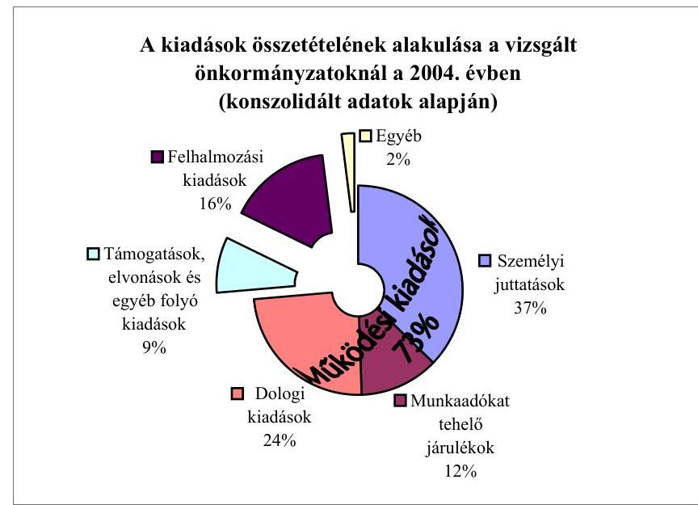

---

# Az ellenőrzött helyi önkormányzatok 2004. évi bruttó bevételi és kiadási előirányzatai és azok teljesítésének alakulása önkormányzat-típusonként* 

| Önkormányzat típusa | Előirányzat |  | Bevétel összesen |  | Kiadás összesen |  | Bevétel   megoszlás   $(\%)$ | Kiadás   megoszlás   (\%) |
| :-- | :--: | :--: | :--: | :--: | :--: | :--: | :--: | :--: |
|  | eredeti   millió Ft | módosított   millió Ft | teljesítés |  | teljesítés |  |  |  |
| Megyei önkormányzatok | 66409 | 74596 | 73641 | 99 | 67956 | 91 | 13,8 | 13,6 |
| Megyei jogú városok | 157929 | 178302 | 159578 | 90 | 151624 | 85 | 30,0 | 30,2 |
| Fővárosi kerületek | 78759 | 86056 | 81096 | 94 | 72921 | 85 | 15,2 | 14,6 |
| Városok | 210079 | 234937 | 218326 | 93 | 208050 | 89 | 41,0 | 41,6 |
| Összesen: | 513176 | 573891 | 532641 | 93 | 500551 | 87 | 100 | 100 |

* Megjegyzés: Budapest Fővárosi Önkormányzat adatai nélkül
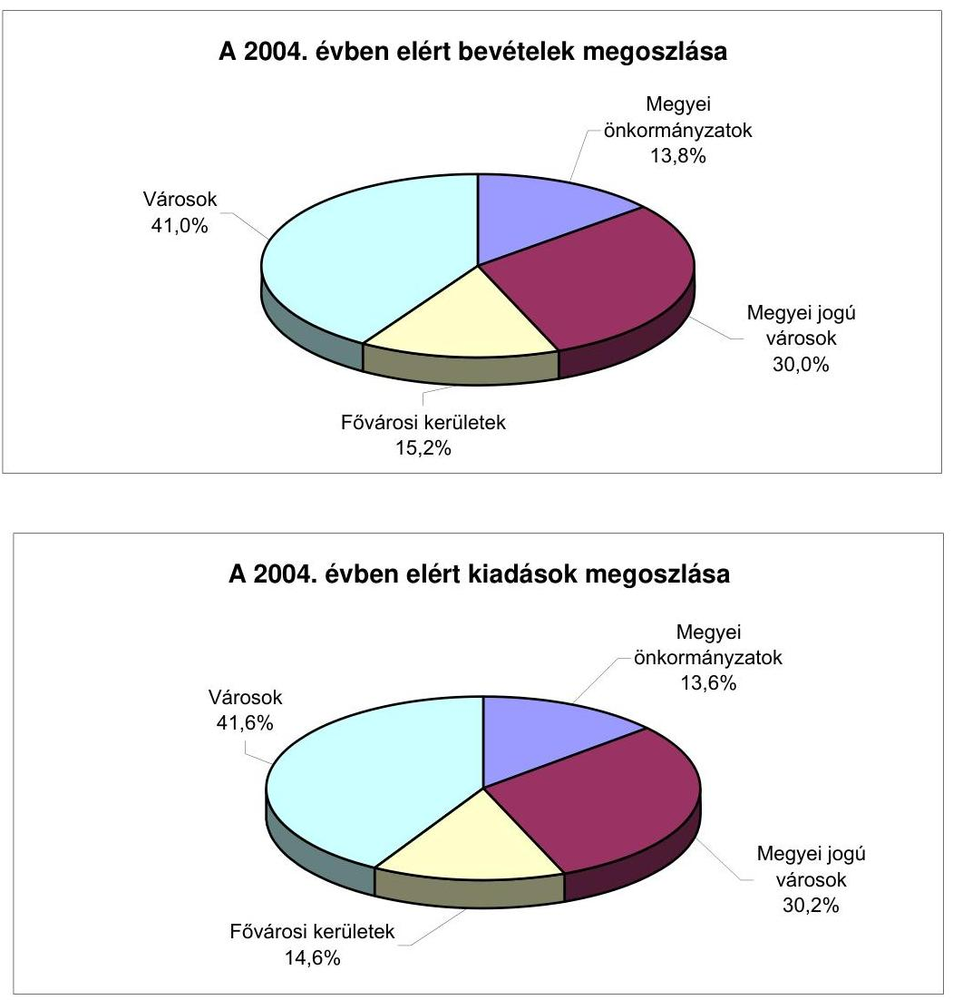

---

A helyi önkormányzatok 2004. évi bruttó és konszolidált bevételeinek és kiadásainak alakulása adatok: millió Ft-ban

|  Mérlegsor megnevezése | Eredeti | Módosított | Teljesítés bruttó összege | Teljesítés nettó összege  |
| --- | --- | --- | --- | --- |
|   | elöirányzat |  |  |   |
|  Bevételek |  |  |  |   |
|  Intézményi müködési bevételek | 215964 | 256841 | 250065 | 250065  |
|  Kamatbevételek | 10689 | 16537 | 24050 | 24050  |
|  Gépjármüadó | 37425 | 41761 | 45941 | 45941  |
|  Helyi adók és kapcsolódó pótlékok, bírságok | 345493 | 357299 | 367184 | 367184  |
|  Illetékek | 54855 | 58127 | 63169 | 63169  |
|  Személyi jövedelemadó | 457822 | 455765 | 455765 | 455765  |
|  Egyéb átengedett adók, adójellegủ bevételek | 495 | 476 | 289 | 289  |
|  Önkorm. megillető bírságok és egyéb sajátos bevételek | 30101 | 32128 | 32583 | 32583  |
|  Müködési célra átvett pénzeszközök | 415104 | 450604 | 447234 | 301044  |
|  Költségvetési kiegészítések, visszatérülések | - | - | 122906 | 122906  |
|  Felhalmozási és tőkejellegủ bevételek | 138801 | 151329 | 113530 | 113530  |
|  ebből: |  |  |  |   |
|  Tárgyi eszköz, immateriális javak értékesítése | 69970 | 76824 | 48926 | 48926  |
|  Önkorm. lakások, egyéb helyiségek ért., cseréje | 32237 | 28592 | 23375 | 23375  |
|  Részesedések értékesítése | 11043 | 13320 | 8658 | 8658  |
|  Felhalmozási célra átvett pénzeszközök | 192605 | 204322 | 129457 | 117230  |
|  Kölcsönök visszatérülése | 8723 | 11819 | 11413 | 11413  |
|  Saját bevételek összesen | 1908077 | 2037008 | 2063586 | 1905169  |
|  Önkormányzat költségvetési támogatása | 664186 | 800316 | 768672 | 768672  |
|  Előző évi pénzmaradvány igénybevétele | 67879 | 190076 | 278386 | 277311  |
|  Költségvetési bevételek | 2640142 | 3027400 | 3110644 | 2951152  |
|  Hitelek bevételei | 193339 | 177110 | 114162 | 82641  |
|  Értékpapírok bevételei | 52469 | 62566 | 27197 | 27197  |
|  Egyéb finanszírozás bevételei | - | - | 6535 | -  |
|  BEVÉTELEK MINDÖSSZESEN | 2885950 | 3267076 | 3245468 | 3060990  |
|  Kiadások |  |  |  |   |
|  Személyi juttatások | 983006 | 1020137 | 986085 | 986085  |
|  Munkaadókat terhelő járulékok | 325053 | 335675 | 324015 | 324015  |
|  Dologi kiadások | 610926 | 721114 | 667960 | 667960  |
|  Egyéb folyó kiadások | 29175 | 55551 | 162663 | 40086  |
|  Ellátottak pénzbeli juttatása | 7354 | 9003 | 8541 | 8541  |
|  Müködési célú pénzeszköz átadás | 82673 | 118515 | 112244 | 88632  |
|  Társadalom- és szociálpolitikai juttatások | 100923 | 121727 | 114097 | 114097  |
|  Tervezett maradvány, eredmény, tartalék | 147260 | 75088 | 1075 | -  |
|  Felújítás | 61092 | 92103 | 65535 | 65535  |
|  Intézményi beruházási kiadások | 388219 | 493698 | 322507 | 322507  |
|  Részesedések vásárlása | 1930 | 4746 | 4710 | 4710  |
|  Felhalmozási célú pénzeszköz átadások | 83327 | 115823 | 68213 | 55986  |
|  Kölcsönök nyújtása, törlesztése | 7329 | 11746 | 11810 | 11810  |
|  Költségvetési kiadások | 2828267 | 3174926 | 2849455 | 2689964  |
|  Hitelek törlesztése | 47572 | 61981 | 62349 | 30828  |
|  Értékpapírok kiadásai | 10111 | 30168 | 41521 | 41521  |
|  Egyéb finanszírozás kiadásai | - | - | 14240 | -  |
|  KIADÁSOK MINDÖSSZESEN | 2885950 | 3267075 | 2939085 | 2762313  |

---

# Az ellenőrzött helyi önkormányzatok 2004. évi bruttó és konszolidált bevételeinek és kiadásainak alakulása*

|  |  |  | adatok: millió Ft-ban |  |
| :--: | :--: | :--: | :--: | :--: |
| Mérlegsor megnevezése | Eredeti | Módosított | Teljesítés bruttó összege | Teljesítés nettó összege |
|  | elöirányzat |  |  |  |
| BEVÉTELEK |  |  |  |  |
| Intézményi müködési bevételek | 38685 | 44563 | 42766 | 42766 |
| Kamatbevételek | 1265 | 2176 | 2993 | 2993 |
| Gépjárműadó | 7149 | 8048 | 8795 | 8795 |
| Helyi adók és kapcsolódó pótlékok, bírságok | 63378 | 64107 | 66486 | 66486 |
| Illetékek | 8623 | 9612 | 10297 | 10297 |
| Személyi jövedelemadó | 74113 | 73790 | 73790 | 73790 |
| Egyéb átengedett adók, adójellegủ bevételek | 50 | 44 | 18 | 18 |
| Önkorm. megillető bírságok és egyéb sajátos bevételek | 7402 | 7609 | 7525 | 7525 |
| Müködési célra átvett pénzeszközök | 79442 | 83724 | 82680 | 79975 |
| Költségvetési kiegészítések, visszatérülések | - | - | 5215 | 200 |
| Felhalmozási és tőkejellegủ bevételek | 23006 | 23740 | 16405 | 16405 |
| ebből: |  |  |  |  |
| Tárgyi eszköz, immateriális javak értékesítése | 12919 | 12795 | 5921 | 5921 |
| Önkorm. lakások, egyéb helyiségek ért., cseréje | 5616 | 5836 | 5423 | 5423 |
| Részesedések értékesítése | 1261 | 1372 | 661 | 661 |
| Felhalmozási célra átvett pénzeszközök | 37170 | 36984 | 21786 | 20313 |
| Kölcsönök visszatérülése | 1882 | 3202 | 3726 | 3726 |
| Saját bevételek összesen | 342165 | 357599 | 342482 | 333289 |
| Önkormányzat költségvetési támogatása | 125211 | 144820 | 138783 | 138783 |
| Előző évi pénzmaradvány igénybevétele | 7995 | 24628 | 26062 | 25998 |
| Költségvetési bevételek | 475371 | 527047 | 507327 | 498070 |
| Hitelek bevételei | 30935 | 34855 | 22847 | 18183 |
| Értékpapírok bevételei | 6870 | 11989 | 4053 | 4053 |
| Egyéb finanszírozás bevételei | - | - | 1586 | - |
| BEVÉTELEK MINDÖSSZESEN | 513176 | 573891 | 532641 | 520306 |
| KIADÁSOK |  |  |  |  |
| Személyi juttatások | 182084 | 187505 | 181698 | 181698 |
| Munkaadókat terhelő járulékok | 60277 | 61888 | 59903 | 59903 |
| Dologi kiadások | 110521 | 128857 | 119274 | 119274 |
| Egyéb folyó kiadások | 5810 | 9760 | 12209 | 7194 |
| Ellátottak pénzbeli juttatása | 1029 | 1308 | 1225 | 1225 |
| Müködési célú pénzeszköz átadás | 13907 | 19729 | 19131 | 16427 |
| Társadalom- és szociálpolitikai juttatások | 14694 | 18375 | 17283 | 17284 |
| Tervezett maradvány, eredmény, tartalék | 16773 | 6910 | 65 | - |
| Felújítás | 10117 | 13628 | 9492 | 9492 |
| Intézményi beruházási kiadások | 76704 | 92085 | 58877 | 58877 |
| Részesedések vásárlása | 969 | 1819 | 1719 | 1719 |
| Felhalmozási célú pénzeszköz átadások | 6920 | 11285 | 8011 | 6538 |
| Kölcsönök nyújtása, törlesztése | 1494 | 2695 | 2795 | 2794 |
| Költségvetési kiadások | 501299 | 555844 | 491682 | 482425 |
| Hitelek törlesztése | 9223 | 13064 | 10969 | 6305 |
| Értékpapírok kiadásai | 2654 | 4983 | 955 | 955 |
| Egyéb finanszírozás kiadásai | - | - | 3055 | - |
| KIADÁSOK MINDÖSSZESEN | 513176 | 573891 | 500551 | 489685 |

---

# A helyi önkormányzatok felhalmozási és tőke jellegű bevételei

|  Sorszám | Megnevezés | 2002. év | 2003. év | 2004. év | 2005. év | Változás 2003/2002 | Változás 2004/2003 | Változás 2005/2004 | Változás 2005/2002  |
| --- | --- | --- | --- | --- | --- | --- | --- | --- | --- |
|   |  | milliárd Ft |  |  |  | $\%$ |  |  |   |
|  01 | Ingatlanok értékesítése (föld kivételével) | 25,1 | 26,4 | 30,6 | 32,6 | 105,5 | 115,8 | 106,6 | 130,2  |
|  02 | Földterület értékesítése | 20,0 | 23,5 | 16,7 | 26,1 | 117,4 | 71,2 | 156,1 | 130,5  |
|  03 | Gépek, berendezések és felszerelések értékesítése | 0,4 | 0,4 | 0,8 | 2,8 | 88,0 | 216,5 | 333,5 | 635,2  |
|  04 | Járművek értékesítése | 0,5 | 0,6 | 0,5 | 0,7 | 113,0 | 83,0 | 137,9 | 129,3  |
|  05 | Immateriális javak értékesítése | 0,3 | 0,7 | 0,3 | 1,5 | 240,0 | 38,8 | 557,7 | 519,3  |
|  06 | Tárgyi eszközök, immateriális javak értékesítése ( $01+\ldots+05$ ) | 46,3 | 51,6 | 48,9 | 63,7 | 111,4 | 94,9 | 130,2 | 137,5  |
|  07 | Önkormányzatok sajátos felhalmozási és tőkebevételei | 46,7 | 48,9 | 49,1 | 49,3 | 104,8 | 100,3 | 100,4 | 105,7  |
|  08 | Osztalék- és hozambevétel | 5,9 | 6,3 | 6,9 | 8,3 | 106,5 | 108,9 | 121,7 | 141,2  |
|  09 | Részvények, részesedések értékesítése | 7,0 | 4,6 | 8,7 | 15,6 | 65,1 | 189,1 | 179,8 | 221,2  |
|  10 | Kárpótlási jegyek értékesítése | 0,4 | 0,1 | 0,0 | 0,0 | 26,9 | 1,2 | 6,4 | 0,0  |
|  11 | Államkötvények, egyéb értékpapírok értékesítése | 28,7 | 32,2 | 10,6 | 6,1 | 112,0 | 33,0 | 57,2 | 21,2  |
|  12 | Egyéb pénzügyi befektetések bevételei | 0,8 | 1,2 | 1,4 | 1,1 | 145,3 | 122,8 | 77,2 | 137,8  |
|  13 | Pénzügyi befektetések bevételei ( $08+\ldots+12$ ) | 42,9 | 44,3 | 27,6 | 31,1 | 103,3 | 62,2 | 112,8 | 72,5  |
|  14 | Állami készletek, tartalékok értékesítése | - | - | - | - |  |  |  |   |
|  15 | Felhalmozási és tőke jellegű bevételek ( $06+07+13+14$ ) | 135,9 | 144,8 | 125,6 | 144,1 | 106,6 | 86,7 | 114,7 | 106,0  |

Megjegyzés: az adatokban a finanszírozási célú pénzügyi műveletek bevételei is szerepelnek. Forrás: Magyar Államkincstár Fejlesztési Igazgatóság éves költségvetési beszámoló "08" számú űrlap adatai

---

# A helyi önkormányzatok felhalmozási kiadásai és pénzügyi befektetései

|  Sorszám | Megnevezés | 2002. év | 2003. év | 2004. év | 2005. év | Változás
2003/2002 | Változás
2004/2003 | Változás
2005/2004 | Változás
2005/2002  |
| --- | --- | --- | --- | --- | --- | --- | --- | --- | --- |
|   |  |  |  |  | milliárd Ft |  |  | \% |   |
|  01 | Ingatlanok felújítása | 52,1 | 45,8 | 51,8 | 78,8 | 87,8 | 113,2 | 152,1 | 151,2  |
|  02 | Gépek, berendezések és felszerelések felújítása | 0,9 | 1,0 | 0,9 | 1,0 | 109,5 | 86,8 | 111,1 | 111,1  |
|  03 | Járművek felújítása | 0,2 | 0,1 | 0,1 | 0,1 | 53,0 | 100,1 | 100,0 | 50,0  |
|  04 | Felújítás előzetesen felszámított általános forgalmi adója | 12,7 | 11,1 | 12,7 | 19,0 | 87,2 | 114,9 | 149,6 | 149,6  |
|  05 | Felújítás összesen (01+...+04) | 65,9 | 58,0 | 65,5 | 98,9 | 87,9 | 113,1 | 151,0 | 150,1  |
|  06 | Immateriális javak vásárlása | 5,0 | 5,7 | 7,5 | 10,8 | 113,4 | 131,4 | 144,0 | 216,0  |
|  07 | Ingatlanok vásárlása, létesítése (föld kivételével) | 239,5 | 205,9 | 214,0 | 247,6 | 86,0 | 104,0 | 115,7 | 103,4  |
|  08 | Földterület vásárlás | 4,0 | 3,7 | 5,3 | 4,5 | 91,1 | 143,8 | 84,9 | 112,5  |
|  09 | Gépek, berendezések és felszerelések vásárlása, létesítése | 34,6 | 31,3 | 32,9 | 33,8 | 90,7 | 104,9 | 102,7 | 97,7  |
|  10 | Járművek vásárlása, létesítése | 5,0 | 5,3 | 5,1 | 8,6 | 106,2 | 95,4 | 168,6 | 172,0  |
|  11 | Intézményi beruházási kiadások (06+...+10) | 288,1 | 251,9 | 264,8 | 305,3 | 87,4 | 105,1 | 115,3 | 106,0  |
|  12 | Intézményi beruházások általános forgalmi adója | 65,7 | 57,2 | 57,7 | 67,1 | 87,1 | 100,9 | 116,3 | 102,1  |
|  13 | Beruházásokhoz kapcsolódó általános forgalmi adó befizetés | 0,5 | 0,6 | - | 0,2 | 115,3 | 6,9 | - | 40,0  |
|  14 | Beruházások általános forgalmi adója (12+13) | 66,2 | 57,8 | 57,7 | 67,3 | 87,3 | 100,0 | 116,6 | 101,7  |
|  15 | Felhalmozási kiadások összesen (11+14) | 354,3 | 309,7 | 322,5 | 372,6 | 87,4 | 104,2 | 115,5 | 105,2  |
|  16 | Részvények és részesedések vásárlása | 6,8 | 4,6 | 4,7 | 5,5 | 67,4 | 103,3 | 117,0 | 80,9  |
|  17 | Államkötvények, egyéb értékpapírok vásárlása | 4,3 | 2,8 | 2,3 | 7,9 | 64,9 | 80,5 | 343,5 | 183,7  |
|  18 | Egyéb pénzügyi befektetések | 0,1 | 1,0 | 0,8 | 0,5 | 967,8 | 82,9 | 62,5 | 500,0  |
|  19 | Pénzügyi befektetések kiadásai (16+17+18) | 11,2 | 8,4 | 7,8 | 13,9 | 75,0 | 93,2 | 178,2 | 124,1  |
|  20 | Felhalmozási kiadások és pénzügyi befektetések összesen (15+19) | 365,5 | 318,1 | 330,3 | 386,5 | 87,0 | 103,9 | 117,0 | 105,7  |

Megjegyzés: az adatokban a finanszírozási célú pénzügyi műveletek kiadásai is szerepelnek. Forrás: Magyar Államkincstár Fejlesztési Igazgatóság éves költségvetési beszámoló "08" számú űrlap adatai

---

# Tájékoztató 

## a helyi kisebbségi önkormányzatok 2003-2005. évi bevételeinek és kiadásainak alakulásáról (teljesítési adatok)

| Megnevezés | 2003. év |  | 2004. év |  | 2005. év |  | 2005/2003.   \% |
| :--: | :--: | :--: | :--: | :--: | :--: | :--: | :--: |
|  | millió Ft | arány \% | millió Ft | arány \% | millió Ft | arány \% |  |
| Kiadások |  |  |  |  |  |  |  |
| Müködési kiadások | 7625,8 | 80,8 | 8543,9 | 84,6 | 9277,2 | 79,0 | 121,7 |
| Ebböl: |  |  |  |  |  |  |  |
| - személyi juttatások | 2745,2 | 29,1 | 3128,0 | 31,0 | 3526,2 | 30,0 | 128,4 |
| - munkaadókat terhelö járulékok | 871,3 | 9,2 | 971,2 | 9,6 | 1087,5 | 9,3 | 124,8 |
| - dologi kiadások | 2804,7 | 29,7 | 3230,9 | 32,0 | 3187,8 | 27,2 | 113,7 |
| - végleges pénzeszközátadások | 1192,1 | 12,6 | 1200,8 | 11,9 | 1466,6 | 12,5 | 123,0 |
| Felhalmozási kiadások | 832,6 | 8,8 | 1029,2 | 10,2 | 1479,3 | 12,6 | 177,7 |
| Felújítások | 286,3 | 3,0 | 320,5 | 3,2 | 676,3 | 5,8 | 236,2 |
| Hitelek, értékpapírok, kölcsönök, pénzforgalom nélküli kiadások | 696,8 | 7,4 | 199,7 | 2,0 | 306,5 | 2,6 | 44,0 |
| Tárgyévi kiadások összesen | 9441,5 | 100,0 | 10093,3 | 100,0 | 11739,4 | 100,0 | 124,3 |
| Bevételek |  |  |  |  |  |  |  |
| Müködési bevételek | 2652,5 | 26,0 | 3019,7 | 27,3 | 3012,1 | 24,0 | 113,6 |
| Ebböl: |  |  |  |  |  |  |  |
| - intézmények müködési bevételei | 602,5 | 5,9 | 689,6 | 6,2 | 722,4 | 5,8 | 119,9 |
| - sajátos müködési bevételek | 2050,0 | 20,1 | 2330,1 | 21,1 | 2289,7 | 18,2 | 111,7 |
| Felhalmozási és tökejellegú bevételek | 281,0 | 2,8 | 182,3 | 1,7 | 196,6 | 1,6 | 70,0 |
| Állami támogatások és hozzájárulások | 3384,7 | 33,2 | 3808,5 | 34,5 | 4223,5 | 33,6 | 124,8 |
| Egyéb támogatások, kiegészitések, átvett pénzeszközök | 2674,2 | 26,2 | 2739,8 | 24,8 | 3544,0 | 28,2 | 132,5 |
| Hitelek, értékpapírok, kölcsönök, pénzforgalom nélküli bevételek | 1212,5 | 11,9 | 1294,8 | 11,7 | 1582,3 | 12,6 | 130,5 |
| Tárgyévi bevételek összesen | 10204,9 | 100,0 | 11045,1 | 100,0 | 12558,5 | 100,0 | 123,1 |

---

# Tájékoztató

## az ellenőrzőtt helyi kisebbségi önkormányzatok 2003-2005. évi bevételeinek és kiadásainak alakulásáról (teljesítési adatok)

|  Megnevezés | 2003. év |  | 2004. év |  | 2005. év |  | 2005/2003.  |
| --- | --- | --- | --- | --- | --- | --- | --- |
|   | millió Ft | arány \% | millió Ft | arány \% | millió Ft | arány \% | \%  |
|  Kiadások |  |  |  |  |  |  |   |
|  Müködési kiadások | 374,2 | 90,0 | 514,3 | 89,9 | 515,2 | 93,6 | 137,7  |
|  Ebből: |  |  |  |  |  |  |   |
|  - személyi juttatások | 107,1 | 25,8 | 154,2 | 26,9 | 152,4 | 27,7 | 142,3  |
|  - munkaadókat terhelő járulékok | 29,2 | 7,0 | 46,4 | 8,1 | 43,4 | 7,9 | 148,6  |
|  - dologi kiadások | 190,4 | 45,8 | 263,0 | 46,0 | 266,0 | 48,4 | 139,7  |
|  - végleges pénzeszközátadások | 47,4 | 11,4 | 50,4 | 8,8 | 53,4 | 9,7 | 112,7  |
|  Felhalmozási kiadások | 30,5 | 7,4 | 29,1 | 5,1 | 15,6 | 2,8 | 51,1  |
|  Felújítások | 0,6 | 0,1 | 14,1 | 2,5 | 2,7 | 0,5 | 450,0  |
|  Hitelek, értékpapírok, kölcsönök, pénzforgalom nélküli kiadások | 10,5 | 2,5 | 14,8 | 2,6 | 16,7 | 3,1 | 159,0  |
|  Tárgyévi kiadások összesen | 415,8 | 100,0 | 572,3 | 100,0 | 550,2 | 100,0 | 132,3  |
|  Bevételek |  |  |  |  |  |  |   |
|  Müködési bevételek | 14,6 | 3,0 | 47,0 | 7,3 | 55,9 | 9,2 | 382,9  |
|  Ebből: |  |  |  |  |  |  |   |
|  - intézmények müködési bevételei | 13,1 | 2,7 | 46,7 | 7,3 | 55,1 | 9,1 | 420,6  |
|  - sajátos müködési bevételek | 1,5 | 0,3 | 0,3 | 0,0 | 0,8 | 0,1 | 53,3  |
|  Felhalmozási és tőkejellegú bevételek | 0,4 | 0,1 | 0,7 | 0,1 | 0,0 | 0,0 | 0,0  |
|  Állami támogatások és hozzájárulások | 108,7 | 22,2 | 132,7 | 20,7 | 132,1 | 21,8 | 121,5  |
|  Egyéb támogatások, kiegészítések, átvett pénzeszközök | 313,5 | 64,0 | 344,0 | 53,7 | 293,0 | 48,5 | 93,5  |
|  Hitelek, értékpapírok, kölcsönök, pénzforgalom nélküli bevételek | 52,7 | 10,8 | 115,9 | 18,1 | 123,7 | 20,5 | 234,7  |
|  Tárgyévi bevételek összesen | 489,9 | 100,0 | 640,3 | 100,0 | 604,7 | 100,0 | 123,4  |

---

# Tájékoztató   a helyi kisebbségi önkormányzatok gazdálkodásával kapcsolatos ellenőrzési megállapításokról 

## 1. A HELYI KISEBBSÉGI ÖNKORMÁNYZATOK GAZDÁLKODÁSA

A települési és a helyi kisebbségi önkormányzatok együttmúködését, valamint az önkormányzati hivatalok kisebbségi önkormányzatok munkáját segítő tevékenységét az elmúlt három évben összesen 634 esetben vizsgáltuk, az országban működő kisebbségi önkormányzatoknak a 2005. évben 10\%-át, az előző évben 14,7\%-át, a 2003. évben 10,3\%-át érintően. A feladatellátást és a gazdálkodást részletesesen településenként egyegy kisebbségi önkormányzatnál ellenőriztük mindhárom évben.

A helyi kisebbségi önkormányzatok a települési önkormányzatoktól fel-adat-és hatáskört nem vettek át, az Ötv. 102/C. § (2) bekezdésébe ${ }^{1}$ foglalt felhatalmazás alapján. Intézményt nem létesítettek és nem vették át más kisebbségi önkormányzat által létesített intézmény fenntartói jogát a Nek. tv. 47. § (2)-(3) bekezdésében, illetve a Nek tv. 27. § (3) bekezdés a)-d) pontjaiban ${ }^{2}$ foglalt lehetőség alapján. Feladatellátásukban, az előző években ellenőrzöttekhez hasonlóan, döntően az önkormányzati, illetve testületi múködés feltételeinek biztosítása, valamint a nemzetiségi, kulturális, nyelvi hagyományok őrzése, fejlesztése, a településeken élő kisebbségek érdekeinek képviselete szerepelt.

Az ellenőrzött kisebbségi önkormányzatok 2003-2005. évi költségvetésének bevételeit, az ellátott feladatokkal összhangban a múködést szolgáló pénzeszközök képezték. Ezen belül meghatározó volt az állami költségvetésből nyújtott központosított és egyéb támogatás, valamint a helyi önkormányzatok támogatása. Az állami támogatások, hozzájárulások részaránya az országban működő helyi kisebbségi önkormányzatok 2003-2005. évi költségvetésében 33-35\%, míg az ellenőrzötteknél 22-24\% között alakult.

[^0]
[^0]:    ${ }^{1}$ A 2005. november 25-től Nek. tv. 30/B. § (1) bekezdése
    ${ }^{2}$ A 2005. november 25 -től Nek. tv. 30/A. § (4) bekezdése.

---

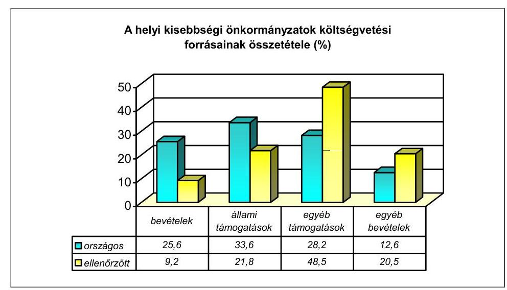

Az ellenőrzött kisebbségi önkormányzatok kisebb arányú támogatásának legfőbb oka, hogy intézményt nem tartottak fenn, így feladatmutatóhoz kötött normatív állami hozzájárulásban nem részesültek. Ennek hatását mutatta a saját bevételek alakulása is, amelynek a költségvetésen belüli részaránya országos szinten 26-29\%, az ellenőrzötteknél 3-9\% volt a források között.

Valamennyi helyi kisebbségi önkormányzat múködésének bevételi forrása a központosított állami támogatás, amely országos szinten a 2001. évi 829,3 millió forintról 1306,6 millió forintra (57,6\%-kal) nőtt a 2004. évre, a 2001. évi támogatás összegét a 2005. évre tervezett támogatás 57,5\%-kal, a 2006. évre tervezett összeg $41 \%$-kal haladta meg. A támogatás alakulását a következő grafikon mutatja (2001-2004. év tény, 2005-2006. év terv adatai alapján):
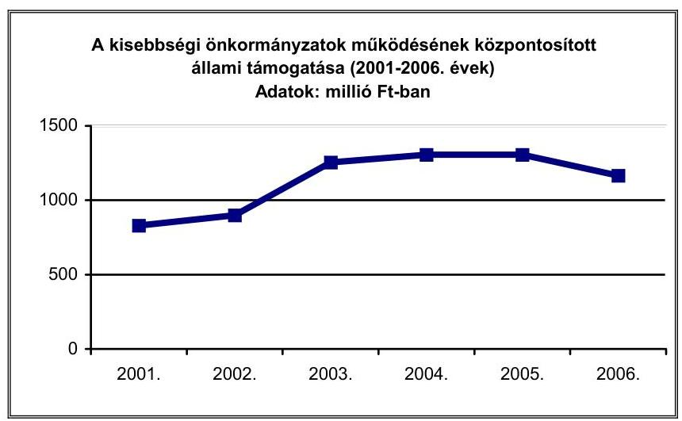

Az ellenőrzött kisebbségi önkormányzatok a 2005. évi gazdálkodáshoz 604,7 millió Ft bevétellel rendelkeztek, amely 23,4\%-kal volt több a 2003. évinél. A költségvetési forrásokból finanszírozták a testületi múködéssel kapcsolatos, illetve a település kisebbségét érintő feladatokat. Költségvetésükben a múködési kiadások évek óta döntő súlyt (a 2003. évben $90 \%$-ot, a 2004-ben

---

89,9\%-ot, a 2005-ben 93,6\%-ot), és azon belül a dologi kiadások (45,8\%-46\%$48,4 \%$-ot) képviseltek.

Az ellenőrzött kisebbségi önkormányzatok a feladataik ellátásához a 20022004 között felhasználták a tárgyévi bevételek 84,9\%-89,4\%-91\%-át, míg az ország összes kisebbségi önkormányzata ennél magasabb arányát ( $92,5 \%-91,4 \%$ -$93,5 \%$-át). A teljesített 2005. évi múködési kiadások az ellenőrzötteknél 37,7\%kal, országos szinten $21,7 \%$-kal voltak magasabbak a 2003. évinél. A költségvetés kiemelt előirányzatai közül a személyi juttatások az ellenőrzötteknél $42,3 \%$-kal, országos szinten $28,4 \%$-kal, a dologi kiadások $39,7 \%$-kal, illetve $13,7 \%$-kal haladták meg a 2003. évit.
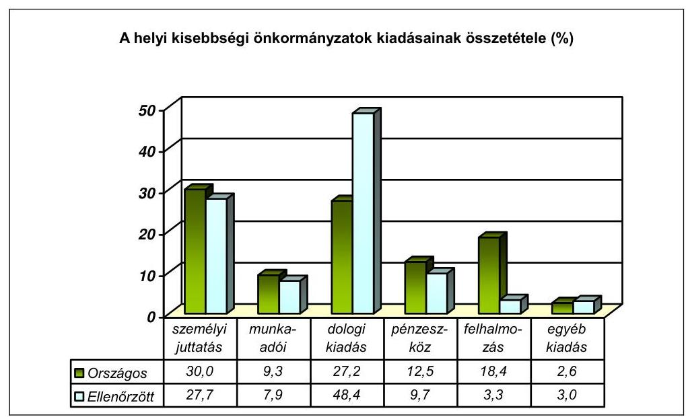

Az ellenőrzött kisebbségi önkormányzatok költségvetésükből az előző évi 10\%-kal szemben 16\%-nál adtak támogatást különféle - költségvetési- és egyéb non profit - szervezetek részére céljelleggel, nem szociális ellátásként. A támogatást nyújtók több mint a fele ( $55 \%$-a) megsértve az Áht. 13/A. § (2) bekezdésének előírásait, nem írt elő számadási kötelezettséget a támogatott szervezetek számára az átadott pénzeszközök felhasználásáról, a finanszírozók nem ellenőrizték a támogatások rendeltetésszerű felhasználását.

A települési önkormányzatok a kisebbségi önkormányzatok használatába adták a feladataik ellátásához szükséges vagyont a Nek tv. 59. § (1) bekezdés ${ }^{3}$ előírásainak megfelelően. Többségében térítés nélkül biztosították a testületeik tevékenységéhez az irodai helyiséget és az eszközhasználatot. A polgármesteri hivatalok - néhány kivételtől eltekintve - az Ámr. 57. § (6) bekezdés ${ }^{4}$ előírásaival összhangban, ingyenesen biztosították a kisebbségi önkor-

[^0]
[^0]:    ${ }^{3}$ 2005. november 25 -től a Nek. tv. 59. § (3) bekezdése.
    ${ }^{4}$ 2005. november 25 -től a Nek. tv. 27. § (1)-(2) bekezdése.

---

mányzati testületek működésének feltételeit és elvégezték az ahhoz szükséges irodai - gépelési, sokszorosítási, postai, kézbesítési - feladatokat.

Az együttmúködés helyi szabályait évente növekvő arányban (a 2002. évben 79\%, a 2003. évben 87\%, a 2004. évben 93\%) foglalták megállapodásba a települési és a kisebbségi önkormányzatok. A továbbiaknál nem történt meg a gazdálkodás végrehajtásának az Áht. 66. §-ában, valamint a költségvetési tervezés Áht. 68. § (3) bekezdésében előírt feladatainak rögzítése. Az egynél több kisebbségi önkormányzattal érintett települések 9\%-nál nem kötöttek megállapodást mindegyik ott múködő kisebbségi önkormányzattal.

A kisebbségi önkormányzatok 27\%-a (a 2003. évben 37\%, a 2002. évben 9\%) az Ámr. 29. § (11) bekezdésében előírt határidőt követően kötötte meg a megállapodást a település önkormányzatával. Az Ötv. 9. § (1), illetve 102/C. § (1) bekezdésében ${ }^{5}$ foglalt előírások szerint a helyi önkormányzat, illetve a helyi kisebbségi önkormányzat testületét illetik meg az önkormányzati feladat-és hatáskörök, ezen belül döntés a más önkormányzattal való együttműködésről. Ennek ellenére - az előterjesztés erre vonatkozó hiánya miatt - a 2003. évben tapasztaltakkal azonos arányban (13\%-ban) nem történt meg a megállapodások kisebbségi és települési önkormányzati testületi jóváhagyása. Emiatt ezen megállapodások érvényességét nem biztosították.

Az együttmúködési megállapodások Ámr. 29. § (11) bekezdésében lehetővé tett, illetve a megkötését követően megváltozott jogszabályi előírások és gazdálkodási feltételek által indokolt felülvizsgálatát nem végezték el a kisebbségi önkormányzatok 59\%-nál, részben végezték el a több kisebbségi önkormányzattal érintett települések 15\%-ánál. Mindezek következtében, a megállapodások egyharmada nem volt alkalmas arra, hogy megalapozza a települési és a kisebbségi önkormányzatok együttműködését, biztosítsa, hogy az a jogszabályi elírásoknak és helyi sajátosságainak minden tekintetben megfelelő legyen.

Korábbi ÁSZ vizsgálat javaslatai alapján megkötötte az együttmúködési megállapodást a települési önkormányzattal Bicske városban egy, módosította a meglévő megállapodást a Gyula város területén múködő három kisebbségi önkormányzat; nem végezte el a megállapodás javasolt felülvizsgálatát, módosítását a Csepreg Város Horvát Kisebbségi Önkormányzata.

Nem tartalmazták az együttmúködési megállapodások a kisebbségi önkormányzatok 20\%-ánál (az előző évben 16\%-nál) az Áht. 66. §. előírásait megsértve, hogy a kisebbségi önkormányzat gazdálkodásának végrehajtó szerve a polgármesteri hivatal.

Szolnok Megyei Jogú Város Önkormányzatánál, az Áht. 66. §-ában foglaltakat megsértve, nem a polgármesteri hivatalt, hanem annak ellátó és szolgáltató szervezetét jelölték meg a megállapodásokban két kisebbségi önkormányzati gazdálkodás végrehajtására.

[^0]
[^0]:    ${ }^{5}$ A 2005. november 25-től Nek. tv. 30. § (1) bekezdésében.

---

Nem rögzítették a megállapodások:

- 34\%-ában (a 2003 évben 23\%-nál) a jegyző felkérését a költségvetési, elői-rányzat-módosítási és zárszámadási határozat-tervezetek előkészítésére az Ámr. 29. § (3) bekezdés előírásai ellenére;
- 23\%-ában (2003-ban 28\%-ában, 2002-ben 26\%-ában) az Áht. 68. § (3) bekezdés előírásait megsértve az éves költségvetés tervezésének feladatait;
- 16\%-nál (2003. évben 17\%-nál, 2002-ben 13\%-nál), az ellenjegyzési jogosultságot;

Az ellenjegyzésre az Áht. 74/A. § (2)-(3) bekezdésének előírásait megsértve nem a jegyző, illetve a kisebbségi önkormányzati testületi tag, hanem települési önkormányzati intézményvezető, hivatali köztisztviselő felhatalmazását rögzítették a megállapodások 6\%-ában.

- 39\%-nál a zárszámadási határozat benyújtási határidejét (2003. évben 35\%nál, 2002-ben 33\%-nál);
- 40\%-nál az Ámr. 29. § (10) bekezdésében előírtak ellenére a testület által jóváhagyott, a költségvetésre, előirányzat-módosításra, zárszámadásra vonatkozó kisebbségi önkormányzati határozatok települési önkormányzathoz történő átadásának határidejét.

A gazdálkodás feltételeinek meghatározottságát a kisebbségi önkormányzatoknál a következő grafikon szemlélteti:
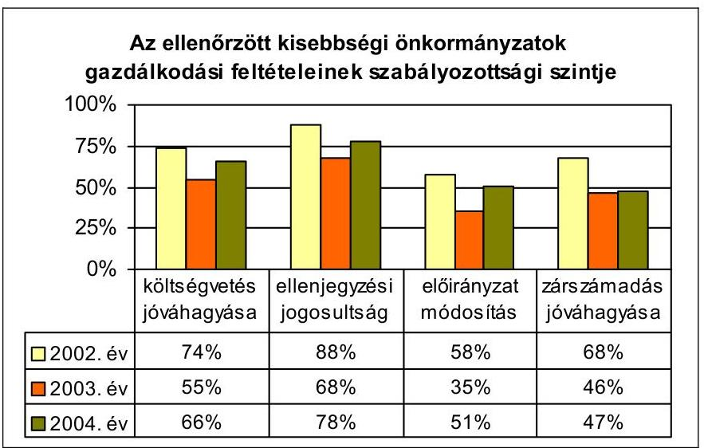

A megállapodások elmulasztásából, a jogszabályi előírásoktól eltérő tartalmú megállapodásokból, illetve a feladatok és konkrét határidők rögzítésének elmaradásából következtek hiányosságok a gazdálkodási feladatok ellátásban, főként a testületek gazdasági döntéseinek előkészítésében, a hozott határozatok tartalmában, illetve azok települési önkormányzati rendeletalkotáshoz történő továbbításában.

---

A gazdálkodás végrehajtásának feladatait az együttműködési megállapodások és a Nek. tv. 28. $\S^{6}$, illetve az Áht. 66. § előírásainak megfelelően végezték az önkormányzati hivatalok a településen múködő kisebbségi önkormányzatok számára. Fokozódott a hivatali közreműködés a kisebbségi önkormányzati készpénzkezelésben, így azt az előző évi 5\%-kal szemben mindössze kettő esetben látták el a polgármesteri hivatalon kívül (Pécs megyei jogú város görög és Csepreg város horvát kisebbségi önkormányzatoknál).

A városi önkormányzatok a polgármesteri hivatalok szakmai tevékenységének biztosítása mellett szakbizottság múködtetésével, valamint pénzeszközökkel is támogatták a településükön működő kisebbségi önkormányzat(ok) tevékenységét.

Az önkormányzati hivatalok kisebbségi önkormányzati gazdálkodás segítésével kapcsolatos feladatait a 2003. évi $40 \%$-kal szemben $61 \%$-nál szabályozták a Nek. tv. 28. §-ában ${ }^{7}$ előírtaknak megfelelően, részben végezték el a szabályozást 4\%-nál (a 2003. évben 7,7\%-nál). A szabályozottság növekedése annak eredménye, hogy a polgármesteri hivatalok szervezeti és múködési szabályzattal nagyobb arányban rendelkeztek, annak hiánya esetén a feladatokat a gazdasági szervezet ügyrendjében rögzítették.

A kisebbségi önkormányzatok operatív gazdálkodásának és számviteli feladatainak helyi szintü szabályozása a 2003. évinél minden területen kedvezőbb arányban megtörtént az önkormányzati hivataloknál, de egy kivételével (érvényesítés) - továbbra is $\mathbf{5 0 \%}$ alatti volt. Így kisebb arányban, a 2003. évi $62 \%$-kal szemben $49 \%$-nál hiányoztak a kisebbségi önkormányzatokkal kapcsolatos feladatok az önkormányzati hivatalok számviteli politikájából, illetve számlarendjéből.

A hivatali belső szabályozás az együttmúködési megállapodástól eltérően tartalmazta a kötelezettségvállalást, az ellenjegyzést és az érvényesítést végző munkakör megjelölését Bonyhád város német és cigány kisebbségi önkormányzatok, az utalványozásra és az ellenjegyzésre jogosult személy meghatározását Pétervására Város Cigány Kisebbségi Önkormányzata, a kötelezettségvállalás és utalvány ellenjegyzésére szóló felhatalmazást Esztergom Város Szlovák Kisebbségi Önkormányzata esetében.

Az érvényesítést végzők Ámr. 135. § (2) bekezdésének megfelelő megbízását a jegyzők a 2003. évinél 14\%-kal nagyobb arányban elvégezték. Ezáltal $44 \%$-ról $25 \%$-ra csökkent a feladat ellátására írásbeli megbízással nem rendelkező kisebbségi önkormányzatok száma. A 2003. évhez képest kevesebb, de továbbra is a legnagyobb arányban ( $\mathbf{8 0 \%}$ ) mulasztották el a jegyzők a szakmai teljesítés igazolás módjának Ámr. 135. § (3) bekezdésében előírt szabályozását, valamint az azt végző személyek kijelölését. Mindezek hiányában a gazdálkodás folyamatában nem müködhetett szabálysze-

[^0]
[^0]:    ${ }^{6}$ 2005. november 25 -ig.
    ${ }^{7}$ 2005. november 25 -től a Nek. tv. 27. § (1) bekezdésében.

---

rüen a belső ellenőrzés két fontos eleme, a szakmai teljesítés igazolása és az érvényesítés, továbbá nem voltak biztosítottak az utalvány Ámr-ben előírtaknak megfelelő ellenjegyzésének feltételei sem.

A szabályozások elmaradásának, illetve a feladatok hiányos, a jogszabályi előírásoktól eltérő szabályozásának negatív hatásai megmutatkoztak a kisebbségi önkormányzati gazdálkodás végrehajtásában. A mulasztásokhoz hozzájárult, hogy az Áht. 66. § előírásai alapján kötendő együttmúködési megállapodásnak nem kötelező tartalmi elemei a gazdálkodás végrehajtásának feladatai, ezen belül a kötelezettségvállalás és az utalványozás, illetve azok ellenjegyzésének az Áht. 74/A. § (1)-(3) bekezdés előírásai alapján, valamint a szakmai teljesítés igazolás és az érvényesítés Ámr. 135. § (1)-(5) bekezdésében előírtak alapján történő ellátásának rendje és a kijelölések, megbízások alapján a feladatok jogosultjai, illetve kötelezettjei.
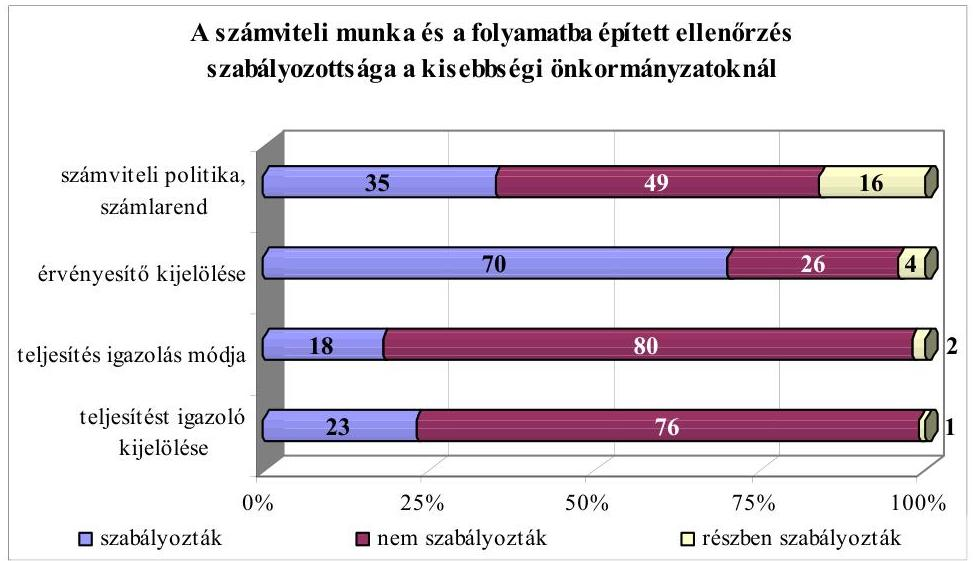

A kisebbségi önkormányzatok 97\%-a állapította meg a 2004. évi költségvetését (a 2003. évit 97\%,a 2002. évit 93\%) önkormányzati testületi határozattal az Áht. 65. § (2) bekezdésében előírtaknak megfelelően. A költségvetési határozatok testületi jóváhagyásával évente növekvő mértékben, a 2003. évihez képest $4 \%$-kal nagyobb arányban biztosítottak jóváhagyott előirányzatot a gazdálkodás végrehajtásához, a kötelezettségvállalások és az utalványozások szabályszerű végzéséhez. A jóváhagyott költségvetési határozatoknak csak 70\%-a (az előző években $69 \%$, illetve $64 \%$-a) felelt meg az Áht. 69. § (2) bekezdésében, illetve az Ámr. 29. § (2) bekezdésében foglalt előírásoknak. Tartalmi, szerkezeti hiányosság volt 13\%-nál a kiadások kiemelt előirányzatonkénti részletezésének, a továbbiaknál a bevételek és kiadások teljes számba vételének, az éves létszámkeret tervezésének, és a végrehajtási feladatok szabályozásának elmaradása, a költségvetési egyensúly hiánya.

A költségvetés jóváhagyott előirányzatainak évközi módosításáról az Ámr. 53. § (7) bekezdésében előírtaknak megfelelően határozattal döntöttek az önkormányzati testületek 51\%-nál (a 2003. évben 35\%-nál). A módosítások jóváhagyása $42 \%$-nál (a 2003. évben $27 \%$-nál) elmaradt, mert a jegyzők arra vonatkozó igény, illetve jegyzői felkérés hiányában nem készítettek, az el-

---

nökök nem nyújtottak be előterjesztést a testületeknek. Az előirányzatmódosítások elmulasztása miatt kimaradtak az előirányzatokból év közben elnyert pályázati támogatások, pótlólag megállapított önkormányzati támogatások, előző évi pénzmaradványok, átvett pénzeszközök, illetve kiadások kiemelt előirányzatainak változásai. A költségvetési előirányzatok módosításáról hozott testületi határozatok 94\%-át (2002. évben 92\%-át, illetve 2003. évben $98 \%$-át) továbbították a kisebbségi önkormányzatok elnökei olyan időben a települési önkormányzat polgármesteréhez, hogy a költségvetési rendeleten átvezethetők voltak az Ámr. 53. § (8) bekezdés előírásainak megfelelően. Az előirányzat módosítások elmaradása következtében előfordultak előirányzatot meghaladó kötelezettségvállalások és utalványozások a pénzgazdálkodás folyamatában. A jóváhagyott határozatok továbbításának elmaradása azzal a következménnyel járt, hogy az előirányzatok módosításait a települési önkormányzatok nem vezették át, illetve szabályszerűen nem vezethették át a költségvetési rendeleten.

A pénzgazdálkodás folytatásához a kisebbségi önkormányzatok 94\%-a (a 2003. évben 83\%-a) rendelkezett bankszámlával. A kisebbségi önkormányzatok számláján kezelt pénzforgalomról negyedével kisebb arányban ( $13 \%$-ban) rendelkeztek szabálytalanul (a kisebbségi önkormányzatok elnöke helyett) a települési önkormányzatok tisztségviselői, illetve hivatalának dolgozói.

A gazdálkodásra bankszámlát egyáltalán nem használó kisebbségi önkormányzatok aránya a 2003. évi $26 \%$-ról $10 \%$-ra csökkent. A gazdálkodási pénzforgalmat külön számlán bonyolító kisebbségi önkormányzatok egy költségvetési elszámolási számlával rendelkeztek az Ámr. 103. § (2) bekezdésének előírásaival összhangban. A kisebbségi önkormányzatok számlája feletti rendelkezési jogosultságot a számlát vezető kisebbségi önkormányzatok $85 \%$-ánál szabályozták.

A kisebbségi önkormányzatok pénztári bevételeit és kiadásait évente növekvő arányban ( $39 \%-46 \%-61 \%$-ban) kezelték a települési önkormányzatétól elkülönítetten az önkormányzati hivatalokban, amellyel áttekinthetőbbé tették a kisebbségi önkormányzati pénzgazdálkodást. Ugyanakkor bővült (2002-ben 8\%, 2003-ban 10\%, 2004-ben 13\%) azon kisebbségi önkormányzatok köre, amelyek készpénzes kiadásaira rendszeresen előleget/ellátmányt nyújtottak az önkormányzati hivatalok.

A kisebbségi önkormányzatok vagyoni és számviteli nyilvántartásait az önkormányzati hivatalok a Kisebbségi rendelet ${ }^{8} 15$. § (1) bekezdés előírásai alapján vezették. Ennek keretében a pénzforgalom elkülönített rögzítését $83 \%$-nál megvalósították a kisebbségi önkormányzatok részére önálló bankszámla és házipénztár kezeléssel. Ezzel összhangban a 2003. évben ellenőrzöttekhez képest nőtt a kisebbségi önkormányzati gazdálkodás részletes adatainak települési önkormányzatokétól elkülönített főkönyvi és analitikus

[^0]
[^0]:    ${ }^{8}$ A kisebbségi önkormányzatok költségvetésének, gazdálkodásának, vagyonjuttatásának egyes kérdéseiről szóló a 20/1995. (III. 3.) Korm. rendelet.

---

nyilvántartása, illetve a több kisebbségi önkormányzattal érintett településeken a kisebbségenkénti nyilvántartása. Az elkülönített számviteli elszámolást a szakfeladat, azon belül a szervezeti egységkódon történő elszámolások jelentették. A kisebbségi önkormányzatok múködéséhez nyújtott központi és települési önkormányzati támogatást a korábbiaknál nagyobb arányban, az adott kisebbségi önkormányzat bevételeként ( $90 \%$-nál), a teljesített kiadásokat ( $99 \%$-nál) elszámolták és kimutatták. A vagyoni nyilvántartásaik elkülönített vezetését 73\%-nál (a 2003. évben 44\%-nál) biztosították az önkormányzati hivatalok.

A számviteli nyilvántartások bővítésének, pontosabb vezetésének eredménye, hogy a kisebbségi önkormányzati költségvetésről, illetve annak végrehajtásáról megbízhatóbb adatok álltak rendelkezésre az éves beszámolók és a zárszámadási határozatok összeállításához, jóváhagyásához. Javult, de nem volt kielégítő az operatív gazdálkodás szabályszerű ellátásának, az előirányzatokon belüli kötelezettségvállalásnak és utalványozásnak a feltételrendszere is. A feltételek javulása ellenére a kisebbségi önkormányzatok gazdálkodási gyakorlatában alapvető változás nem történt az előző évekhez képest és változatlanok voltak a gazdálkodási hiányosságok okai is. Továbbra is a bizonylatok negyede nem felelt meg a bizonylatokkal szemben támasztott alaki, tartalmi követelményeknek.

Az önkormányzati hivatalok 30\%-nál (a 2003. évben 49\%-nál) nem vezették az Áht. 103. § (1) bekezdésében rögzített nyilvántartást az előirányzatokról, valamint 72\%-nál (a 2003. évben 83\%-nál) az Ámr. 134. § (13) bekezdésében ${ }^{9}$ előírt nyilvántartást a kötelezettségvállalásokról. Ezáltal hiányoztak az operatív gazdálkodás folyamatában azok az információk, amelyek a kötelezettségvállalási és az utalványozási intézkedéseket, továbbá mindezek ellenjegyzését megalapozzák és a bizonylatok 7\%-ában a költségvetésben nem szereplő feladatra, illetve előirányzatot meghaladóan történt a kötelezettségvállalás és utalványozás. Számottevő volt azon önkormányzatok aránya, amelyeknél a gazdálkodás szabályszerűséget is biztosító, kötelező elemeinek írásba foglalását, elvégzésének igazolását elmulasztották a bizonylatokon (a kötelezettségvállalás ellenjegyzését 23\%-nál, a szakmai teljesítés igazolását 25\%-nál, az érvényesítést $9 \%$-nál, az utalvány ellenjegyzését $18 \%$-nál, az utalványozást $7 \%$-nál).

Ráckeve Város Cigány Kisebbségi Önkormányzata jóváhagyott költségvetéssel nem rendelkezett a 2003. és a 2004. évben, ennek ellenére fizetési kötelezettséget vállalt a kisebbségi önkormányzat elnöke a 2003. évben 544,1 ezer Ft, a 2004ben 528,8 ezer Ft összegben, megsértve az Áht 12/A. § (1) bekezdésében foglalt előírást.

A kötelezettségvállalások ellenjegyzését az Áht. 74/A. § (2)-(3) bekezdésében foglalt előírást megsértve a korábbi években tapasztaltakhoz hasonló arányban ( $39 \%$-nál) nem végezték el a bizonylatokon, ennek ellenére a kifizetés megtörtént, a folyamatba épített ellenőrzési feladattal megbízottak a mu-

[^0]
[^0]:    ${ }^{9}$ A bekezdés számozása a 2004. évben (6) volt.

---

lasztást nem állapították meg. Az elvégzett ellenjegyzések szabálytalansága volt, hogy a testület felhatalmazása nélkül végezték azt kisebbségi önkormányzati testületi tagok és jogosulatlanul polgármesteri hivatali dolgozók. Nem vették figyelembe azt az előírást mely szerint az ellenjegyzést a helyi kisebbségi önkormányzat testületének tagja a kisebbségi önkormányzat testületének megbízása alapján végezheti, illetve nem gyakorolhatja az ellenjegyzési jogkört az arra felkért jegyző felhatalmazásával nem rendelkező hivatali dolgozó. A kötelezettségvállalás ellenjegyzésére jogosultak nem végezték el hiánytalanul az Ámr. 134. § (9) bekezdésében ${ }^{10}$ meghatározott ellenőrzési feladataikat. Az ellenjegyzést megelőzően nem győződtek meg arról, hogy a jóváhagyott költségvetés kiadási előirányzata biztosítja-e a fedezetet és a kötelezettségvállalás nem sérti-e a gazdálkodásra vonatkozó szabályokat. Feladatuk ellátását nehezítette, hogy nem álltak rendelkezésre a polgármesteri hivatalokban az előírt nyilvántartások a kötelezettségvállalásokról és az előirányzatok alakulásáról.

Az utalványozás során nem tartották be az Áht. 74/A. § (1) bekezdés, valamint az Ámr. 136. § (1)-(4) bekezdés és a belső szabályozás előírásait a bizonylatok 43\%-ánál (az előzőévben 29\%-ánál). A kisebbségi önkormányzatok 16\%-ánál részben vagy teljes egészében a polgármester, a jegyző, illetve hivatali alkalmazott utalványozott, továbbá a kisebbségi önkormányzat elnökének felhatalmazása nélkül gyakorolta az utalványozást testületi tag. A személyes érintettség esetére szóló belső szabályozás hiányára vezethető vissza, hogy a kisebbségi önkormányzatok 9\%-ánál az elnökök saját maguk javára is utalványoztak kifizetést. A továbbiaknál az utalványozás nem előzte meg a kiadás teljesítését, nem szabályszerűen érvényesített okmányon, illetve ellenjegyzés nélkül is történt, valamint az utalványozás - a legtöbbször a kötelezettségvállalás nyilvántartás elmulasztása miatt - nem felelt meg az Ámr. 136. § (4)-(5) bekezdésében előírt tartalmi követelményeknek. Az utalvány ellenjegyzés feladatait az előző évi 44\%-al szemben a bizonylatok 42\%-án nem látták el az Áht. 74/A. § (3) bekezdésében és az Ámr. 137. § (3) bekezdésében előírtaknak megfelelően. Szakmai teljesítés igazolás és érvényesítés hiányában, illetve az adott feladatra szóló kijelölés nélkül, jogosulatlanul végzett ellenjegyzések történtek, amelyek nem észrevételezték a szabálytalanságokat, nem kezdeményezték azok megszüntetését.

Az érvényesítés hiányzott, illetve nem az Ámr. 135. § (1)-(2) és (4) bekezdés előírásainak megfelelően végezték a 2003. évben tapasztaltakhoz hasonlóan a bizonylatok 37\%-ánál. Elmaradt az érvényesítés az elszámolt bevételek bizonylatain, illetve nem tartalmazta az „Érvényesitve" megjelölést, a megállapított összeget, a főkönyvi elszámolásra utaló számla számát. Az érvényesítők nem ellenőrizték az összegszerűséget, a fedezet meglétét és azt, hogy az előírt alaki követelményeket betartották-e. Érvényesítést végeztek az Ámr. 135. § (2) bekezdésében előírt jegyzői megbízás, illetve szakmai képesítés, munkaköri leírásban rögzített feladat meghatározás hiányában is. Szabálytalan volt a formailag megfelelő, igazolt érvényesítés azokon a bizonylatokon, amelyek

[^0]
[^0]:    ${ }^{10}$ A bekezdés számozása a 2004. évben (7) volt.

---

nem, vagy nem a helyi szabályozásnak megfelelően tartalmazták a szakmai teljesítés igazolását.

A bevételek beszedésének és a kiadások teljesítésének elrendelése előtt az Ámr. 135. § (1) bekezdés előírásai ellenére az okmányok alapján nem ellenőrizték, szakmailag nem igazolták a teljesítést 47\%-ban (a 2003. évben 33\%ban) a pénztári és $52 \%$-ban (a 2003. évben 30\%-ban) a bankszámlához kapcsolódó tevékenységben. Szabálytalan volt, hogy hiányzott az igazolás a bizonylatokról, valamint belső szabályozás, illetve jegyzői kijelölés hiányában - jogosulatlanul - végezték azt, továbbá nem győződött meg a teljesítést igazoló a szerződés, a megrendelés, megállapodás szabályszerűségéről. A szakmai teljesítés igazolás elmaradása, szabálytalan gyakorlása következtében az érvényesítő, utalványt ellenjegyző az ellenőrzési feladatait hiányosan teljesítette.

Az operatív gazdálkodás fenti hiányosságai a folyamatba épített belső ellenőrzés múködésének hiányát és zavarait jelzik a kisebbségi önkormányzati gazdálkodásban.

A kisebbségi önkormányzatoknál a számviteli nyilvántartásokban rögzített gazdasági események 75\%-áról (a 2003. évben 74\%) állítottak ki a Számv. tv. 167. § (1) bekezdés a)-j) pontjaiban előírt alaki és tartalmi követelményeknek megfelelő bizonylatokat. A továbbiaknál a Számv. tv. 165. § (1) bekezdés előírásait megsértve hiányzott a könyvviteli elszámolást alátámasztó bizonylat, az alapbizonylatot az elszámolásokhoz nem csatolták, illetve nem hivatkoztak annak fellelhetőségére, nem alakítottak ki zárt rendszert a bizonylatok kezelésére. Az elszámolás alapját képező bizonylatok nem a kisebbségi önkormányzat nevére szóltak, adataik hiányosak voltak a gazdasági események pontatlan leírása, illetve a szükséges aláírások elmulasztása miatt. Nem tartalmazták a bizonylatok jellemzően a könyvviteli nyilvántartásokban történt rögzítés időpontját, az utalványozó és a rendelkezés végrehajtását igazoló személy, valamint az ellenőrzés elvégzésének igazolását.

A bizonylatok feldolgozási rendjében 19\%-nál (a 2003. évben 17\%-nál) az önkormányzati hivatalok nem tartották be a Vhr. 51. § (1) bekezdés a)b) pontjaiban szereplő előírásokat, mivel késedelmesen végezték el a gazdasági eseményekről, műveletekről kiállított bizonylatok adatainak főkönyvi elszámolását, illetve az előlegek felhasználásának elszámolását. Nem biztosították a könyvviteli elszámolást a készpénzforgalom esetén (a bizonylatok $15 \%$-ánál) a pénzmozgással egyidejűleg, a bankszámlaforgalomban (a bizonylatok $27 \%$-ánál) a hitelintézeti értesítés megérkezéskor, az egyéb gazdasági műveleteknél ( $23 \%$-nál) legkésőbb a tárgynegyedévet követő hónap 15-ig.

Az éves gazdálkodásról szóló zárszámadását határozattal jóváhagyta a kisebbségi önkormányzatok 79\%-a (a 2002-2003. évben 75\%, illetve 76\%). A határozatok tervezetét a megállapodásban foglaltak szerint a jegyzők mintegy fele készítette el a 2003. évben tapasztaltakhoz hasonlóan. A testületi döntés előkészítésében a jegyzői közreműködés hiányának legfőbb oka volt, hogy a megállapodások nem tartalmazták a jegyző felkérését a zárszámadási határo-zat-tervezetek előkészítésére. A zárszámadási határozat testületi jóváha-

---

gyását az előterjesztések elmaradása miatt elmulasztó kisebbségi önkormányzatoknál megsértették a Nek. tv. 27. § (1) bekezdés b) pontjában ${ }^{11}$ előírt kötelezettséget, amely szerint a helyi kisebbségi önkormányzat saját hatáskörében határozza meg zárszámadását. Nem biztosították, hogy a helyi önkormányzatok szabályszerűen eleget tudjanak tenni a saját zárszámadásuk jóváhagyásával kapcsolatos kötelezettségnek, illetve, hogy a kisebbségi önkormányzatok zárszámadásának adatait a testületi határozatok alapján építsék be a zárszámadási rendeletükbe.

A zárszámadási határozatok tartalma 63\%-nál (2003-ban 64\%-nál volt összehasonlítható a költségvetéssel, mivel a jóváhagyott határozatok 20\%-a nem, vagy csak részben tartalmazta az összehasonlíthatóságot biztosító eredeti és módosított előirányzatokat. A nem megfelelőnek minősített zárszámadási határozatokból hiányzott, illetve pontatlanul szerepelt a kiadások kiemelt előirányzatonkénti és a bevételek forrásonkénti részletezése, az állami és az önkormányzati támogatások adatai, az előző évi pénzmaradványok összegei.

A jóváhagyott zárszámadási határozatot a kisebbségi önkormányzatok 70\%-ánál (az előző évben 57\%-nál) továbbította az elnök a települési önkormányzat polgármesteréhez olyan időben, hogy az a zárszámadási rendeletbe beépíthető legyen.
${ }^{11}$ 2005. november 25 -től a Nek. tv. 25. § (1) bekezdés k) pontja.

---

# A helyszíni ellenőrzésekről a 2005. évben készített számvevői jelentésekben a helyi és a helyi kisebbségi önkormányzatok szabályszerű és célszerű múködése érdekében tett javaslatok 

A helyi önkormányzatok gazdálkodásának átfogó ellenőrzéséről készült számvevői jelentések megállapításainak hasznosítása mellett a hiányosságok megszüntetése érdekében 15558 javaslatot ${ }^{1}$ tettünk. A javaslatok közül 82,6\% a törvényekben, kormányrendeletekben és a helyi önkormányzatok rendeleteiben, a polgármesteri hivatalok szabályzataiban előírtak maradéktalan betartására, a szabályszerű működésre hívta fel a figyelmet. A javaslatok 17,4\% az önkormányzati feladatok hatékonyabb ellátásának elősegítése, az intézményrendszer és a polgármesteri hivatalok munkájának célszerűbb megszervezése, szabályozottságának javítása érdekében született.

## 1. A jogszabályi előírások maradéktalan betartása érdekében a helyi önkormányzatok ellenőrzéséről készített számvevői jelentésekben tett szabályszerűségi javaslatok

1.1. A költségvetési rendelet jóváhagyásának, módosításának, az előirányzatok nyilvántartásának és betartásának szabályszerűségére 549 javaslat, a szabályszerűségi javaslatok 3,5\% a hívta fel az önkormányzatok figyelmét. A gazdasági program elkészítését 11 önkormányzat - egy Budapest főváros kerületi, és 10 városi önkormányzat -, a mérlegek és kimutatások tartalmának rendeletben történő meghatározását 60 önkormányzat részére javasoltuk. A költségvetés tervezése és a költségvetési rendelet alkotása során, a jóváhagyás rendjére, valamint az éves költségvetés tartalmára, szerkezetére, összeállítására a törvényekben, kormányrendeletben vonatkozó előírások betartása érdekében 295 javaslattal éltünk. A jóváhagyott költségvetési előirányzatok módosítása, nyilvántartása során a központi és az önkormányzati rendelkezések érvényre jutását 122 javaslat szolgálta, míg a kiemelt előirányzatok betartására 63 javaslat irányult:

- a Htv. 138. § (1) bekezdés a) pontja alapján az önkormányzat több évre szóló gazdasági programját fogadják el a képviselő-testületek az Ötv. 91. § (1) bekezdésében előírtak betartása érdekében;

[^0]
[^0]:    ${ }^{1}$ A javaslataink 0,4\%-át a megyei, 0,9\%-át a megyei jogú városi, 1,0\%-át a Budapest főváros kerületei, $15,1 \%$-át a városi és $82,2 \%$-át nagyközségi és községi önkormányzatok polgármesterei, jegyzői részére tettük.

---

- az Áht. 118. §-ában előírt mérlegek, kimutatások tartalmáról önkormányzati rendeletben döntsenek a képviselő-testületek;
- az Ámr. 28. §-a alapján a költségvetési koncepciót a helyben képződő bevételek, valamint az ismert kötelezettséget figyelembevételével állítsák össze, az előterjesztéséhez csatolják a helyi önkormányzatoknál működő bizottságok és a kisebbségi önkormányzatok véleményét;
- a költségvetési rendeletben az Áht. 67. § (3) bekezdése alapján határozzák meg a címrendet;
- a költségvetési rendelettervezetet az Áht. 71. §-ában előírt határidőben, a javasolt előirányzatok megalapozottságát biztosító rendelettervezetekkel, valamint a többéves elkötelezettséggel járó kiadási tételek későbbi évekre vonatkozó kihatásainak bemutatásával terjesszék a képvi-selő-testület elé;
- a költségvetési rendelet az Áht. 69. § (1) bekezdésében foglaltak alapján tartalmazza a múködési és felhalmozási célú bevételeket és kiadásokat, ezen belül költségvetési szervenként a személyi jellegű kiadásokat, a munkaadókat terhelő járulékokat, a dologi jellegű kiadásokat, az ellátottak pénzbeli juttatásait, a speciális célú támogatásokat, a költségvetési létszámkeretet, illetve a helyi önkormányzat által kijelölt felhalmozások előirányzatait;
- az Ámr. 29. § (1) bekezdésében előírt szerkezetben készüljön a költségvetési rendelettervezet, amelyben legalább az Ötv-ben előírt részletezettséggel mutassák be a bevételeket, az önálló és részben önállóan gazdálkodó költségvetési szervek bevételeit, kiemelt előirányzatonként részletezve kiadásait, felújítási előirányzatokat célonként, felhalmozási kiadásokat feladatonként, az önkormányzati hivatal költségvetését feladatonként, valamint külön tételben az általános és céltartalékot, a létszámkeretet, az év várható bevételi és kiadási előirányzatainak teljesüléséről előirányzat-felhasználási ütemtervet;
- az Áht. 8. § (1) bekezdésében foglaltak betartása érdekében a költségvetési bevételek és kiadások különbségeként a tervezett hiányt a költségvetési rendelettervezetben mutassák be;
- a költségvetési rendelettervezetben szereplő költségvetési bevételek és kiadások között az Áht. 8/A. § (7) bekezdés alapján ne szerepeltessenek finanszírozási célú bevételeket és kiadásokat;
- a költségvetési és zárszámadási rendeletek előterjesztésekor az Áht. 118. §-a alapján a képviselő-testületek részére tájékoztatásul mutassák be az önkormányzat összevont mérlegét és elkülönítetten a helyi kisebbségi önkormányzatok mérlegét, a többéves kihatással járó döntések számszerúsítését évenkénti bontásban, valamint összesítve szöveges indoklással, valamint a közvetett támogatásokat szöveges indoklással;
- a költségvetési rendeletben rögzítsék a költségvetés végrehajtásának szabályait, az előirányzatok évközi módosításának eljárási rendjét, a tartalékkal való rendelkezés jogosultjait, a költségvetés hiányának fi-

---

nanszírozásával összefüggő hitelműveleti hatásköröket, a költségvetési többletbevételek felhasználásának szabályait, a vagyonnal kapcsolatos tárgyévi teendők végrehajtásának jogosultjait és felelőseit.;

- az önkormányzatok a költségvetési rendeletet az Ámr. 53. § (2) bekezdésében foglalt határidőn belül (negyedévente) módosítsák, az utolsó rendeletmódosításra a költségvetési beszámoló felügyeleti szervhez történő megküldésére a Vhr. 10. § (1) bekezdésében meghatározott (a tárgyévet követő év február 28.) határidőn belül kerüljön sor;
- az önkormányzat önállóan gazdálkodó költségvetési szervei saját hatáskörében végrehajtott előirányzat-változtatásáról a jegyző előkészítésében 30 napon belül kapjon tájékoztatást a képviselő-testület az Ámr. 53. § (6) bekezdése alapján;
- az Áht. 103. § (1) bekezdésének megfelelően a költségvetés végrehajtása során a jóváhagyott előirányzatokat és azok teljesülésének alakulását folyamatosan tartsák nyilván, a (2) bekezdés előírása alapján a rendeletben szabályozott módon történő nyilvántartás terjedjen ki a bevételi előirányzatok teljesítését előrejelző - a teljesülés várható időpontja szerint rögzített - bevételi előírások folyamatos nyilvántartási kötelezettségére;
- a költségvetés végrehajtása során a polgármesteri hivatalok és az intézmények az Áht. 93. § (1) bekezdésében foglaltaknak megfelelően a jóváhagyott előirányzatokon belüli gazdálkodjanak, valamint az Áht. 12/A. § (1) bekezdésében foglaltakat betartva tárgyévi fizetési kötelezettséget a jóváhagyott kiadási előirányzatok mértékéig vállaljanak.
1.2. A gazdálkodás szervezeti rendjének kialakítására, a gazdálkodás szabályozottsága, a bizonylati rend és fegyelem szabályszerűségének javítása érdekében 10168 javaslat ${ }^{2}$ született, amely $93,8 \%$-a a nagyközségi és községi önkormányzatok gazdálkodásának szabályszerűségének javítását segítette elő.

# A gazdálkodás és a pénzügyi-számviteli feladatok szabályozása tekintetében: 

- a polgármesteri hivatalok szervezeti és múködési szabályzatait egészítsék ki az Ámr. 10. § (4) bekezdésében foglalt tartalmi előírásoknak megfelelően;
- a gazdasági szervezetek ügyrendjét vizsgálják felül, az Ámr. 17. § (5) bekezdésében előírtaknak megfelelően tartalmazza a szervezet és egységei, a pénz-ügyi-gazdasági feladatok ellátásáért felelős személyek által, valamint a hozzájuk rendelt részben önállóan gazdálkodó költségvetési szervek ellátandó feladatait, a vezetők és más dolgozók feladat-, hatás- és jogkörét;
- a gazdálkodás szabályszerű lebonyolítása érdekében a kötelezettségvállalás, utalványozás gazdálkodási, valamint az ellenjegyzés, érvényesítés, teljesítés

[^0]
[^0]:    ${ }^{2}$ A szabályszerűségi javaslataink 79\%-a a gazdálkodás szervezeti rendjének kialakítására, a gazdálkodás szabályozottságára irányult, valamint a bizonylati rend és fegyelem javítását szolgálta.

---

szakmai igazolás ellenőrzésének jogosultjai meghatározásánál érvényesítsék az Ámr. 134-138. §-aiban foglaltakat;

- a Htv. 140. § (1) bekezdés c) pontja alapján a jegyzők alakítsák ki a költségvetési szervek egységes számviteli rendjét;
- a számviteli politikát aktualizálják és egészítsék ki, hogy a számviteli elszámolás és a terven felüli értékcsökkenés elszámolásánál mit tekintenek jelentős összegnek, illetve lényeges szempontnak a Vhr. 8. § (5) bekezdés a) és g) pontjában foglaltak betartása érdekében, valamint a Vhr. 8. § (8) bekezdés alapján határozzák meg a mérlegkészítés időpontját;
- a számlarendben a Vhr. 49. §-ában előírtaknak megfelelően rendelkezzenek a 9. számú melléklet szerinti könyvviteli számlák további tagolásáról, a könyvviteli számlákhoz kapcsolódó analitikus nyilvántartások vezetésének módjáról, formájáról, tartalmáról, a kapcsolódó főkönyvi nyilvántartásokkal való egyeztetésről és annak dokumentálásáról. A főkönyvi számla és az analitikus nyilvántartás kapcsolatának szabályozása keretében határozzák meg az adataiból készült feladások határidejét;
- az eszközök és források leltározási és leltárkészítési szabályzatában a leltározás módjának és gyakoriságának meghatározásánál a Vhr. 37. §-ban foglaltakat vegyék figyelembe, amely alapján végezzék el a könyvviteli mérlegben kimutatott eszközök és források leltározását;
- az előzetes írásbeli kötelezettségvállalást nem igénylő, 50000 Ft-ot el nem érő kifizetések nyilvántartási rendjét és formáját az Ámr. 134. § (3) bekezdésében foglaltak alapján belső szabályzatban rögzítsék, az Ámr. 134. § (13) bekezdésében foglaltak figyelembevételével a kötelezettségvállaláshoz kapcsolódóan olyan analitikus nyilvántartást vezessenek, amelyből az évenkénti kötelezettségvállalás összege megállapítható legyen;
- az Ámr. 135. § (3) bekezdésében foglaltakat figyelembe véve a szakmai teljesítés igazolásának módját határozzák meg és az azt végző személyek kijelöléséről belső szabályzatban rendelkezzenek;
- a pénzügyi-számviteli munkakört betöltő dolgozók munkaköri leírását egészítsék ki az egyeztetési kötelezettségek, a munkafolyamatba épített ellenőrzési teendők meghatározásával a Ktv. 11. § (6) bekezdésében foglalt előírások szerint.

# A költségvetési gazdálkodás és az ellenőrzési jogkörök gyakorlása szabályszerűségének biztosítása érdekében: 

- minden gazdasági műveletről, eseményről, amely az eszközök, illetve az eszközök forrásainak állományát vagy összetételét megváltoztatja a Számv. tv. 165. § (1)-(2) bekezdése alapján a bizonylatokat állítsák ki;
- a könyvviteli elszámolást közvetlenül alátámasztó bizonylatok feleljenek meg a Számv. tv. 167. § (1) bekezdésében előírt alaki és tartalmi követelményeinek;
- a költségvetési pénzforgalmat érintő gazdasági események bizonylatainak adatait késedelem nélkül, a készpénzforgalom esetén a pénzmozgással egyidejűleg, bankszámla forgalomnál a hitelintézeti értesítés megérkezésekor, az egyéb gazdasági műveletek, események bizonylatainak adatait a gazdasági események megtörténte után, de legkésőbb a tárgynegyedév utolsó hónapjának végéig rögzítsék a könyvekben, a Vhr. 51. § (1) bekezdés a) és b) pontjában foglaltak betartása érdekében;

---

- az Ámr. 134. § (2) bekezdésében foglaltak érvényre jutása érdekében biztosítsák, hogy kötelezettségvállalás a jegyző vagy az általa felhatalmazott személy ellenjegyzése után, írásban történjen meg;
- az Ámr. 135. § (1) bekezdésében előírtakat tartsák be, a kiadások teljesítésének és a bevételek beszedésének elrendelése előtt az okmányok alapján ellenőrizzék, szakmailag igazolják azok jogosultságát, összegszerűségét, a szerződés, megrendelés, megállapodás teljesítését, valamint az érvényesítő tegyen eleget a munkafolyamatba épített ellenőrzési feladatainak, a szakmai teljesítés igazolás alapján ellenőrizze az összegszerűséget, a fedezet meglétét és az előírt alaki követelmények betartását;
- a munkafolyamatba épített ellenőrzési feladatokat az ellenjegyzők az Ámr. 134. § (9) bekezdésében meghatározottak szerint végezzék el, az ellenjegyzést megelőzően győződjenek meg arról, hogy a jóváhagyott költségvetés fel nem használt, illetve le nem kötött, a kötelezettségvállalás tárgyával összefüggő kiadási előirányzat biztosítja-e a fedezetet, az előirányzat-felhasználási terv szerint a kifizetés időpontjában a fedezet rendelkezésre áll-e, a kötelezettségvállalás nem sérti-e a gazdálkodásra vonatkozó szabályokat, a kötelezettségvállalás célszerűségét megalapozó eljárás megtörtént-e;
- az önkormányzat pénzállományának alakulásáról készítsenek likviditási tervet, amely folyamatos aktualizálásáról gondoskodjanak az Ámr. 139. §-ában foglaltak alapján.
1.3. A szabályszerűségi javaslatok 1,7\%-a az önkormányzati vagyon nyilvántartása, a vagyonnal való gazdálkodás szabályszerűsége, célszerűsége, nyilvánossága biztosítását segítette elő:
- a számviteli nyilvántartásokban gondoskodjanak a főkönyvi számlák további bontásával, vagy részletező analitikus nyilvántartás vezetésével a Vhr. 9. számú melléklet 1. k) pontja alapján arról, hogy abból kitűnjön a törzsvagyon (ezen belül a forgalomképtelen, illetve korlátozottan forgalomképes) nem törzsvagyon részét képező eszközök értéke;
- a mérleg fordulónapján fennálló követelések, értékpapírok és meglévő részesedések év végi értékelési feladataihoz intézkedjenek, hogy az adatok rendelkezésre álljanak, vizsgálják meg az értékvesztés elszámolásának szükségességét a Számv. tv. 54. § (1) bekezdése és a (2) bekezdés c) pontjában és (4) bekezdésében, valamint a Számv. tv. 55. § (1) bekezdésében előírtaknak megfelelően;
- az Ötv. 79. § (2) bekezdése és a vízgazdálkodásról szóló 1995. évi LVII. törvény 6. § (3) bekezdése előírásának megfelelően a térítésmentesen átadott víziközművek önkormányzati tulajdonba kerüljenek és a térítésmentes átadásokra a vagyongazdálkodási rendeletben rögzített esetekben kerüljön sor az Áht. 108. § (2) bekezdésében foglaltak betartása érdekében;
- az államháztartás alrendszereiből nyújtott céljellegű, fejlesztési támogatások kedvezményezettjeinek nevére, a támogatás céljára, összegére, továbbá a támogatási program megvalósítási helyére vonatkozóan az Áht. 15/A. §-a, a vagyonnal történő gazdálkodással összefüggő - nettó ötmillió Ft-ot elérő vagy azt meghaladó - árubeszerzésre, építési beruházásra, szolgáltatás megrendelésre, vagyonértékesítésre, vagyonhasz-

---

nosításra, vagyon vagy vagyon kezelői jog átadásra az Áht. 15/B. §-a hatálya alá tartozó szerződések folyamatos közzétételéről gondoskodjanak;

- az önkormányzati ingatlanok pártszervezetek részére történő bérbeadásánál a kedvezményeket szüntessék meg, az Ötv. 78. § (6) bekezdésében foglaltak végrehajtása érdekében.

# A vagyongazdálkodási rendelet módosítását végezzék el, annak érde- 

kében:

- az Áht. 108. § (1) bekezdésében foglaltakra figyelemmel az értékhatár feletti vagyon értékesítésénél, használatának, hasznosítási jogának átengedésénél a versenyeztetési szabályok mellőzését lehetővé tevő előírások módosítását kezdeményezzék, valamint azt, hogy a versenyeztetéssel történő vagyonértékesítés értékhatárát - figyelemmel a Magyar Köztársaság költségvetéséről szóló 2004. évi CXXXV. törvény 7. § (1) bekezdésére - az érintett vagyontárgy forgalmi értékében állapítsák meg;
- az Áht. 108. § (2) bekezdésében foglaltaknak megfelelően határozzák meg a vagyon tulajdonjoga és a vagyonkezelési joga ingyenes átruházásának, továbbá a követelésről való lemondás módját és eseteit;
- a rendelet hatályát terjesszék ki a teljes vagyoni körre, rendelkezzenek a forgalomképesség szerinti besorolás megváltoztatásának módjáról, határozzák meg a vagyonnal való gazdálkodás képviselő-testület felé történő beszámolás rendjét.
1.4. Az önkormányzatok céljelleggel - nem szociális ellátásként - szervezetek, magánszemélyek számára támogatást nyújtottak, mely szabályszerűségének javítását kívánta javaslataink 0,9\%-a elősegíteni:
- az Áht. 13/A. § (2) bekezdése alapján juttatott összegek rendeltetésszerű felhasználásáról írjanak elő számadási kötelezettséget, múködtessék a számadások, felhasználások ellenőrzési rendszerét, intézkedjenek a cáltól eltérő, nem rendeltetésszerú felhasználás esetén a visszafizetésre, illetve a számadási kötelezettség elmulasztása esetén a kötelezettség teljesítéséig a további támogatás felfüggesztésére;
- a közhasznú szervezetek részére megállapított támogatások folyósítására szerződés alapján kerüljön sor, melyben határozzák meg az elszámolás feltételeit és módját, a Kszt. tv. 14. § (2) bekezdésének megfelelően;
- az Ötv. 10. § (1) bekezdés d) pontjában foglaltak alapján a képviselőtestület döntsön a közösségi célú alapítványok támogatásáról.
1.5. A közbeszerzési eljárások lebonyolításának szabályai betartására tettük a szabályszerűségi javaslataink 0,4\%-át:
- a Kbt. 2 2. § (2) bekezdésében előírtak alapján a közbeszerzési értékhatárt elérő vagy meghaladó értékű beszerzések, megrendelések esetében gondoskodjanak a közbeszerzési eljárás lefolytatásáról;

---

- a közbeszerzési eljárás előkészítésének, lefolytatásának, belső ellenőrzésének felelősségi rendjét, az ajánlatkérő nevében eljáró, illetőleg az eljárásba bevont személyek, szervezetek felelősségi körét és a közbeszerzés dokumentálási rendjét a Kbt. 2 6. §-ában foglaltak alapján határozzák meg;
- a Kbt. 2 10. § (1) bekezdésében előírtaknak megfelelően a közbeszerzési eljárásban az önkormányzat nevében eljáró személyek írásban nyilatkozzanak, hogy velük szemben nem áll fenn összeférhetetlenség;
- a Kbt. 2 35-40. §-aiban foglaltakat vegyék figyelembe a közbeszerzés becsült értékének kiszámításánál;
- a Kbt. 2 99. § (1) (2) bekezdésében előírása szerint a szerződéskötésre a közbeszerzés ajánlati felhívásában meghatározott időpontban, az ajánlati dokumentáció és az ajánlat tartalmának megfelelően kerüljön sor.
1.6. A zárszámadási kötelezettség teljesítésére, a pénzmaradvány elszámolás és felülvizsgálat rendjére, tartalmára vonatkozó jogszabályi előírások betartásával függött össze a szabályszerűségi javaslataink 1,0\%-a:
- a költségvetés végrehajtásáról szóló zárszámadást az elfogadott költségvetéssel összehasonlító módon, - az eredeti és módosított költségvetési előirányzatokkal együtt -, az Áht. 18. §-ában foglaltaknak megfelelően készítsék el;
- a zárszámadási rendeletet az Áht. 69. §-ában és az Ámr. 29. § (1) bekezdésében meghatározott szerkezeti rendben és tartalommal terjesszék a képviselő-testület elé, melyhez tájékoztatásul csatolják az Áht. 118. §ában előírtaknak megfelelően az önkormányzat összes bevételét, kiadását, finanszírozását és pénzeszközének változását, vagyonkimutatását, valamint szöveges indoklással a többéves kihatással járó kiadások számszerúségét és a közvetett támogatásokat tartalmazó kimutatást;
- az önállóan gazdálkodó költségvetési szerv pénzmaradványát az Ámr. 66. § (4) bekezdésében foglaltak szerint a felügyeleti szerv vizsgálja felül és hagyja jóvá;
- a költségvetési szervek beszámolóját az Ámr. 149. § (3) bekezdésében foglalt tartalommal és határidőig vizsgálják felül, továbbá az (5) bekezdés alapján a költségvetési beszámoló számszaki felülvizsgálatának eredményéről a költségvetési intézmények vezetőit írásban értesítsék.
1.7. A polgármesteri hivatalok kisebbségi önkormányzatok gazdálkodását elősegítő tevékenységét a szabályszerűségi javaslataink 1,4\%-ával segítettük:
- a Nek. tv. 28. §-a alapján a polgármesteri hivatal szervezeti múködési szabályzatában határozzák meg, hogy a kisebbségi önkormányzat munkáját milyen módon köteles segíteni;

---

- az önkormányzattal kötött megállapodásokat, illetve a hatályban lévők felülvizsgálatát, módosítását az Ámr. 29. § (11) bekezdésben foglaltak alapján január 15-ig végezzék el;
- az Áht. 68. § (3) bekezdése és az Ámr. 29. § (10) bekezdésében foglaltak alapján a megállapodásokat egészítsék ki a költségvetési és zárszámadási határozatok benyújtási határidejével, valamint a költségvetési előirányzat-módosítások rendjével;
- az Áht. 74/A. § (2)-(3) bekezdésében foglaltak alapján a kötelezettségvállalás, valamint az utalvány ellenjegyzését a helyi kisebbségi önkormányzat gazdálkodását végrehajtó szervének vezetője, illetve a helyi kisebbségi önkormányzat megbízása alapján a helyi kisebbségi önkormányzat testületének tagja végezze;
- a gazdálkodást végrehajtó hivatal belső szabályzatában a kisebbségi önkormányzatok gazdálkodása tekintetében az Ámr. 135. § (3) bekezdése alapján rendelkezzenek a teljesítés szakmai igazolásának módjáról, és az azt végző személyekről;
- a helyi kisebbségi önkormányzatok jóváhagyott előirányzatának és azok teljesülésének alakulását, valamint a kiadási előirányzatokat terhelő kötelezettségvállalásokat az Áht. 103. § (1)(2) bekezdésében foglaltak alapján folyamatosan tartsák nyilván.
1.8. Az önkormányzati ellenőrzési rendszer kialakítását és működését érintette a javaslatok $11,8 \%$-a:
- az Áht. 120/A. § (2) bekezdés b) pontjában előírt belső ellenőrzési tevékenység a polgármesteri hivataloknál is kerüljön végrehajtásra, gondoskodjanak az Áht. 121/A. § (3) bekezdése alapján a polgármesteri hivatal belső ellenőrzésének szervezeten belüli kialakításáról, annak keretében intézkedjenek az ellenőrök funkcionális függetlenségét biztosító feltételek megteremtésére az Áht. 121/A. (4) bekezdésében részletezetteknek megfelelően;
- a Ber. 4. § (2) bekezdése alapján a polgármesteri hivatalok SzMSz-ében határozzák meg a belső ellenőrzést végző szervezet jogállását és feladatait;
- a Ber. 8. §-a alapján határozzák meg a belső ellenőrzés feladatait, a 18. §-ában foglaltak szerint készítsék el a stratégiai és éves ellenőrzési tervet;
- az ellenőrzés lefolytatásához a Ber. 23. §-ában előírt tartalmú ellenőrzési programot készítsenek, a 24. § szerinti megbízólevéllel lássák el a belső ellenőröket, az ellenőrzés végrehajtása során a 25. §-ban foglaltakat érvényesítsék, valamint a 27. §-ban meghatározott tartalmú ellenőrzési jelentést készítsenek;
- a képviselő-testületek a Htv. 138. § (1) bekezdés g) pontjában előírt gazdálkodási feladat és hatáskörében meghatározott időszakonként

---

tekintsék át az általuk alapított és fenntartott költségvetési szervek ellenőrzésének tapasztalatait;

- a jegyzők a Htv. 140. § (1) bekezdés e) pontjában meghatározott gazdálkodási feladat- és hatáskörük keretében lássák el az önkormányzat által alapított és fenntartott költségvetési szervek pénzügyi és gazdasági ellenőrzését;
- a belső ellenőrzést végző által a jegyző és/vagy polgármester számára megfogalmazott megállapításokat és ajánlásokat a polgármester az Ötv. 92. § (9) bekezdése alapján terjessze a képviselő-testület elé.
1.9. A költségvetési és vagyongazdálkodás, az intézményi szervezeti rendszer kialakítása és múködtetése, a költségvetés egyensúlyi helyzete áttekintése alapján tettük a szabályszerűségi javaslatok 1,0\%-át:
- az Ötv. 8. § (2) bekezdésében foglaltak alapján az önkormányzatok határozzák meg - a lakosság igényei alapján, anyagi lehetőségeiktől függően -, mely feladatokat, milyen mértékben és módon látnak el;
- az adósságot keletkeztető éves kötelezettségvállalások (hosszú lejáratú hitelfelvételeknél) során tartsák szem előtt az Ötv. 88. § (2) bekezdésében előírt felső határt;
- a középületek akadálymentessé tételéről gondoskodjanak, a Fot. 29. § (6) bekezdésében előírtak végrehajtása érdekében.

# 2. A munka színvonalának javítása érdekében a helyi önkormányzatoknál készített számvevői jelentésekben tett célszerűségi javaslatok 

A gazdálkodás egyes területeire vonatkozó szabályozási kérdésekkel, a pénzügyi-számviteli feladatok informatikai támogatottságával, a polgármesteri hivatalok működésével, az önkormányzati feladatellátással és egyéb kérdésekkel összefüggésben 2712 javaslatot tettünk:

- a pénzügyi-számviteli területen dolgozó köztisztviselők munkaköri leírásaiban határozzák meg a hatás és jogköröket, valamint egészítsék ki az informatikai rendszerek használatához kapcsolódó feladatokkal;
- a gazdálkodási és ellenőrzési jogkörök gyakorlásáról a felhatalmazottakat számoltassák be;
- a polgármesteri hivatalok informatikai rendszereivel történő biztonságos munkavégzés érdekében a váratlan események esetére dolgozzanak ki katasztrófa elhárítási tervet, továbbá készítsék el az informatikai fejlesztésekhez kapcsolódó informatikai stratégiát;
- a céljelleggel nyújtott támogatások egységes nyilvántartási feladatait, a számadások ellenőrzésének módját, feltételeit, feladatait, hatásköri és felelőségi rendjét határozzák meg;

---

- az Ász ellenőrzés tapasztalatait testületi ülésen tárgyalják meg, a feltárt hiányosságok megszüntetése érdekében készítsenek intézkedési tervet.

# 3. A helyi kisebbségi önkormányzatoknak tett javaslatok: 

- alkossák meg szervezeti és múködési szabályzatukat, határozzák meg abban az ellátandó feladataikat a Nek. tv. 27. § (2) és az Ötv. 102/C. § (6) bekezdésének megfelelően;
- kössék meg a települési önkormányzatokkal a hiányzó együttmúködési megállapodásokat az Áht. 66. § és a 68. § (3) bekezdés előírásai alapján; vizsgálják felül és aktualizálják, a jogszabályi előírások, illetve a helyi sajátosságok tekintetében elavult megállapodásokat;
- tartsák be az Ötv. 102/C. § (2) bekezdésének előírásait, és ne lássanak el a települési önkormányzat hatáskörébe utalt hatósági feladatokat; költségvetési forrásaikat az Áht. 62. § (2) bekezdésében és a hatályos költségvetési törvényben foglaltak szerint, az önkormányzat múködésére és a kisebbségük érdekeinek érvényesítésére használják fel;
- teljesítsék a költségvetés határozatban történő megállapításával kapcsolatos, az Áht. 65. § (2) bekezdésében előírt kötelezettségeiket és ennek során tartsák be az együttműködési megállapodásban, illetve az Ámr. 36. § (5) bekezdésében rögzített határidőket, érvényesítsék Áht. 69. § (2) és az Ámr. 29. § (2) bekezdésében előírt tartalmi követelményeket;
- végezzék el a költségvetési előirányzatok évközi módosítását, és arról tájékoztassák a települési önkormányzat polgármesterét az Ámr. 53. § (1)-(8) bekezdésében foglaltaknak megfelelően; biztosítsák ezzel, hogy az előirányzat-módosító határozatokat az Áht. 74. § (3) bekezdésének megfelelően átvezethessék a költségvetési rendeleten a települési önkormányzatok;
- tegyenek eleget az operatív gazdálkodás folyamatában a bankszámla nyitásával, a banki és a készpénzes forgalom elkülönített kezelésével, az Ámr. 103. § (2) bekezdésében foglalt előírásoknak;
- biztosítsák, hogy a polgármesteri hivatalok a kisebbségi önkormányzatok bevételeinek és kiadásainak elkülönített elszámolását, számviteli adatainak a települési önkormányzaton belül elkülönített nyilvántartását a 20/1995. (III. 3.) Korm. rendelet 15. § (1) bekezdésében foglaltak szerint végezzék el,
- tartsák be a kötelezettségvállalás, a teljesítés szakmai igazolás, az érvényesítés, az utalványozás és az ellenjegyzés Áht. 74/A. § (1)-(3) bekezdésében, valamint az Ámr. 134-137. §-aiban rögzített előírásait; a pénzgazdálkodásban szüntessék meg az összeférhetetlenségeket;
- érvényesítsék a gazdálkodás folyamatában a bizonylati rend- és fegyelem Számv. tv. 165-167. §-aiban foglalt, valamint a számviteli elszá-

---

molások Vhr. 49. § (1) bekezdésében és 51. § (1) bekezdés a)-b) pontjaiban rögzített előírásait;

- teljesítsék a Nek. tv. 27. § (1) bekezdés b) pontjában foglalt, a zárszámadás határozattal történő elfogadásának kötelezettségét az együttmúködési megállapodásban és az Ámr. 36. § (5) bekezdésében előírtaknak megfelelő határidőre, az Áht. 18. §-ában előírt tartalmi és szerkezeti követelmények betartásával;
- igényeljék a polgármesteri hivatalok hatékonyabb segítségét a kisebbségi önkormányzat gazdálkodási feladatainak szakszerűbb ellátásához a Nek. tv. 28. § előírásai alapján;
- végezzék el, illetve kezdeményezzék a szabályszerű gazdálkodáshoz szükséges belső szabályozás jogszabályi előírásoknak és helyi adottságoknak megfelelő kidolgozását, biztosítsák a meglévő szabályozások rendelkezéseinek betartását a költségvetési tervezés, gazdálkodás, számlavezetés, számviteli tevékenység és beszámolás területén egyaránt az Áht. 121. § (1) bekezdésében foglaltak alapján.

---

H-1051 BUDAPEST V., JÓZSEF NÁDOR TÉR 2-4. POSTACIM: 1369 BUDAPEST, POSTAFIÓK 481.

TELEFON: (36-1) 327-2159, (36-1) 327-2141
E-MAIL: janos.veres@pm.gov.hu
FAX: (36-1) 318-0738

PÉNZÜGYMINISZTER
$V-1001-6412005$
Dr. Kovács Árpád úr
Ikt.sz.: 10.804/7/2006.
elnök

Állami Számvevőszék

Budapest

Tisztelt Elnök Úr!

A helyi és a helyi kisebbségi önkormányzatok gazdálkodásának átfogó ellenőrzéséről szóló jelentést köszönettel megkaptam.

Örömmel vettem, hogy észrevételeink egy része elfogadásra került. A jelentésben - a pénzügyminiszter részére - megfogalmazott jobbító szándékú javaslatokkal alapvetően egyetértek.

A javaslatokhoz kapcsolódóan tájékoztatom Elnök urat, hogy az Önkormányzati Belső Ellenőrzési Kézikönyv elkészítése, egyeztetése folyamatban van. Az államháztartási törvényre és végrehajtási rendeletére, valamint az államháztartás szervezetei beszámolási és könyvvezetési kötelezettségének sajátosságairól szóló kormányrendeletre vonatkozó javaslatokat a jogszabályok módosítása során figyelembe vesszük.

Kérem Elnök urat, hogy tájékoztatásomat elfogadni szíveskedjen.

Budapest, 2006. augusztus 10.
Üdvözlettel:
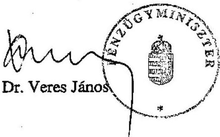

---

# 16. számú melléklet 

a V-1001/2005. számú jelentéshez

## MINISZTERELNÖKI HIVATAL

## ÁLLAMTITKÁr

Ikt.szám: XXXV/78/3/2006 (1)
Hiv. szám: V-1001-61/2005.
Úgyintéző: Herrády Balázs
Tárgy: A helyi és a helyi kisebbségi
önkormányzatok gazdálkodási
rendszerének átfogó és egyéb
szabályszerüségi ellenőrzéséről
készült ÁSZ jelentés

## Dr. Kovács Árpád úr részére

elnök

## Állami Számvevőszék

## Budapest

## Tisztelt Elnök Úr!

A dr. Szilvásy György miniszter úrnak megküldött, a helyi és a helyi kisebbségi önkormányzatok gazdálkodási rendszerének átfogó és egyéb szabályszerűségi ellenőrzéséről szóló jelentés tervezetét köszönettel megkaptam. A jelentéssel kapcsolatban a következőkről tájékoztatom.

A jelentés - a korábbi éves összefoglaló jelentésekhez hasonlóan - a tárgyévi önkormányzati ellenőrzések tapasztalatait és megállapításait alaposan összegző, magas szakmai színvonalú dokumentum. A jelentésben szereplő megállapításokkal kapcsolatban észrevételt nem teszek.

A Kormánynak megfogalmazott javaslat nem tekinthető új kezdeményezésnek, hiszen hasonló tartalommal, és ugyanezen indokok miatt már a korábbi jelentések is tartalmazták. A céljával egyetértek, de álláspontom szerint az ágazati jogszabályok alapvetően egyértelműen rögzítik a helyi önkormányzatok kötelező feladatait. A jogalkalmazás során felmerült tapasztalatok, illetve a változó társadalmi igények és szakmai követelmények miatt a feltételrendszer áttekintése és korrekciója emellett folyamatos kormányzati feladatot jelent.

Tágabb összefüggésben arra is szükségesnek tartom felhívni a figyelmet, hogy az új Kormány megalakulását követően kezdeményezte az önkormányzati rendszer átfogó reformját. A helyi önkormányzatok feladatellátási rendszerét alapjaiban érintette az Országgyűlésnek benyújtott reformcsomag. A javaslat az önkormányzati középszint átalakításával, és egyes önkormányzati feladatok esetében a kötelező társulási feladatellátás törvényi feltételeinek megteremtésével lényegi strukturális változásokat tartalmazott,

---

amelyek kiemelt célja volt a feladatok racionálisabb és differenciált telepítése, továbbá a hatékonyabb, magasabb színvonalú feladatellátás feltételrendszerének biztosítása. Mindez összhangban volt a 0544 sz. jelentés azon fontos megállapításával, amely szerint elkerülhetetlen az állami és az önkormányzati feladatok újragondolása, pontosabb meghatározása, az önkormányzati finanszírozási rendszer korszerűsítése.

A kormányprogram emellett az ágazati szabályok felülvizsgálatát abból a szempontból is indokoltnak tartja, hogy a felesleges előírások deregulációjával növekedjen az önkormányzatok mozgástere. Mindezekkel összefüggésben az államreform keretében jelenleg is érdemi kormányzati előkészítő munka van folyamatban, amely célját tekintve összhangban van a számvevőszéki javaslattal.

Budapest, 2006. augusztus „18. „.

Üdvözlettel:
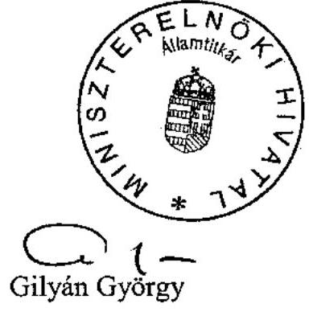

---

# Dr. Kovács Árpád úr részére   elnök 

## Állami Számvevőszék

Budapest 4.
Pf. 54.
1364

## Tisztelt Elnök Úr!

Köszönettel vettem kézhez a helyi és a helyi kisebbségi önkormányzatok gazdálkodási rendszerének átfogó és egyéb szabályszerűségi ellenőrzéséről készített jelentésüket, amellyel kapcsolatban - tárcánkat érintően - a következőkről tájékoztatom:

Ingatlanokra vonatkozó jogok bejegyzésére és tények feljegyzésére, illetve az ingatlan adataiban bekövetkezett változások átvezetésére irányuló ingatlannyilvántartási eljárás során a földhivatalok az ingatlan-nyilvántartási eljárásról szóló 1997. CXLI. törvény (a továbbiakban Inytv.) rendelkezései szerint járnak el.

Az Inytv. 51. § (1) bekezdése értelmében a földhivataloknak el kell utasítaniuk a bejegyzési kérelmet, amennyiben a bejegyzés alapjául szolgáló okirat, annak alaki vagy tartalmi hiányossága miatt nyilvánvalóan érvénytelen.
Miután a Polgári Törvénykönyvről szóló 1959. évi IV. törvény 173. § (2) bekezdése értelmében a forgalomképtelen dolgok elidegenítése semmis, az ilyen tartalmú okirat - jogszabályba ütköző volta miatt - nyilvánvalóan érvénytelen, így bejegyzés alapjául nem szolgálhat.
Fentiekre tekintettel a földhivatalok jelenleg is egységes gyakorlata e téren az, hogy a forgalomképtelen ingatlanokra vonatkozó tulajdonjog bejegyzési kérelmek az Inytv. 51. § (1) bekezdése alapján elutasításra kerülnek.

Tájékoztatom Elnök Urat arról is, hogy tárcánk - mint a megyei földhivatalok szakmai irányítását és felügyeletet ellátó szerv - folyamatosan figyelemmel kíséri a szakterületünket érintő jogalkalmazási gyakorlatot. A szakmai felügyelet részeként rendszeres ellenőrzésre is sor kerül, amelyet az első fokon eljáró körzeti földhivatalok tekintetében a megyei földhivatalok folytatnak le.

Mindezek mellett a jelentésben foglaltakra felhívuk a földhivatalok figyelmét. Budapest, 2006. augusztus „22.

Tisztelettel:
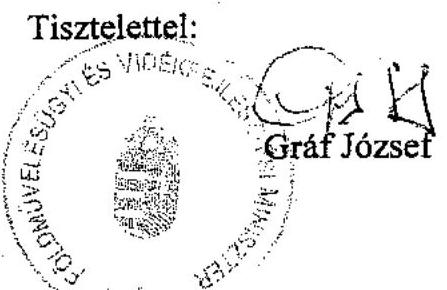

---

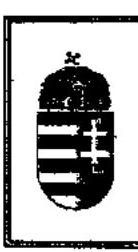

ÁLLAMI SZÁMVEVŐSZÉK
ÜGYVÍTELI BÓDA
ATM- 4524/06
Érkezer: 2006 AUG 13.

Iktatószám: V-1001-2005-05

Melléklet: ..................................................................................................................................................................................................................................................................................................................................................................................................................................................................................................................................................................................................................................................................................................................................................................................................................................................................................................................................................................................................................................................................................................................................................................................................................................................................................................................................................................................................................................................................................................................................................................................................................................................................................................................................................................................................................................................................................................................................................................................................................................................................................................................................................................................................................................................................................................................................................................................................................................................................................................................................................................................................................................................................................................................................................................................................................................................................................................................................................................................................................................................................................................................................................................................................................................................................................................................................................................................

---

egyensúlyhiánya is a tervezettnél alacsonyabban teljesült. A hiány kialakulásához többek között hozzájárult, hogy a helyi önkormányzatok a kötelező és önként vállalt feladataikat nem vették számba. Az Önkormányzati és Területfejlesztési Minisztérium egyik fő célkitűzése, hogy a következő években az önkormányzatok feladat-és hatásköre „tisztuljon", az ellátandó feladatok köre és az ellátás feltételei minél egyértelműbben meghatározásra kerüljenek. Ehhez azonban elengedhetetlen az ágazati tárcák együttmúködése.
A hiány mérséklése és a gazdálkodás szabályszerűségének elősegítése érdekében a Kormány a jövőben is ösztönözni fogja a társult feladat-ellátást. Ehhez azonban az is szükséges, hogy az önkormányzatok is felismerjék az együttmúködésben rejlő lehetőségeket.
A Jelentésben az önkormányzati és területfejlesztési miniszternek tett javaslatokhoz az alábbi észrevételt teszem:

1. pont: „kezdeményezze az Ötv. 79. § (2) bekezdés b) pontjában elöirtak módosítását annak érdekében, hogy a korlátozottan forgalomképes törzsvagyonként meghatározott vagyon törzsvagyonon kívüli egyéb forgalomképes vagyonkategóriába történő átsorolás rendelettel történő módosítási kötelezettsége elöírásra kerüljön."
Álláspontom szerint az Ötv. hivatkozott pontja ennek a követelménynek jelenlegi formájában is megfelel, ugyanis egyértelműen rögzíti, hogy „a törzsvagyon korlátozottan forgalomképes tárgyairól törvény vagy a helyi önkormányzat rendeletében meghatározott feltételek szerint lehet rendelkezni." Ennek megfelelően a korlátozottan forgalomképes vagyontárgyakat már most is csak önkormányzati rendelettel lehet forgalomképessé átsorolni.
A Jelentés szerint az önkormányzatok több mint fele azonban nem rendelkezett önkormányzati rendeletben a korlátozottan forgalomképes vagyontárgyak elidegenítési feltételeiről. Erre azonban nem a már most is egyértelmú szabályokat tartalmazó Ötv. módosítása a megoldás (hiszen a szabályok figyelmen kívül hagyását ez nem oldaná meg), hanem ezeket a problémákat a törvényességi ellenőrzéseknek kell kezelniük. Ennek elősegítése érdekében a Jelentés véglegezését követően a közigazgatási hivatalok figyelmét felhívjuk az abban foglaltakra.
2. pont: „kezdeményezze az önkormányzati gazdálkodás nyilvánosságának, átláthatóságának elösegítése érdekében a Ptk. 373. § (4) bekezdés kivételre vonatkozó szabályának oly módon történő módosítását, hogy megszünjön az önkormányzati tulajdonú, nem lakás céljára szolgáló helyiség esetében a gazdálkodó szervezet bérlője részére biztosított lehetőség, miszerint kijelölheti a részére biztosított elővásárlási jog gyakorlására jogosult személyt."
A Ptk. 373. § (4) bekezdése nem vonatkozik az önkormányzati helyiségekre. A Ptk. 373. § (6) bekezdése értelmében az elővásárlási jogot nem csak a Ptk., hanem a Ptk 685.§ a) pontja szerinti más jogszabályok is létrehozhatnak. A Ptk. 434. § -a értelmében külön törvény - jelen esetben a Lakástörvény - rendelkezik a lakásbérlet, és a 434. § (4) bekezdésben nevesített elidegenítés kérdéseiről. A 434.§ (4) bekezdés azért nem törvényt, hanem jogszabályt említ, mert az önkormányzatoknak a bérbeadás és az elidegenítés feltételeit is a rendeletükben kell szabályozni.
A Ptk. és egyébként a Lakástörvény alapján egyértelmű, hogy elővásárlási jogot kizárólag és csak a tulajdonos engedhet más részére. A bérlő a Lakástörvény alapján őt megillető elővásárlási jogot nem ruházhatja át más természetes személy vagy jogi személy, vagy jogi személyiség nélküli gazdasági társaság - tehát senki - részére, függetlenül attól, hogy a bérlő gazdasági társaság, vagy természetes személy. A Lakástörvény erre egyszerűen nem ad - nem is adhat - módot, hiszen az elővásárlási jog alapján a tulajdonjog száll át másra, amely tulajdonjoggal a bérlő soha nem rendelkezhetett, és nem rendelkezhet.
Mindemellett a Ptk. 373. § (1) bekezdése is egyértelmű abban, hogy elővásárlási jogot - mely „Az adásvétel egyes különös nemei" címszó alatt szerepel - a tulajdonos jogosult létrehozni, ugyanakkor a jogszabályon alapuló elővásárlási jog sem sértheti ezt az alapvető tulajdonosi rendelkezési jogot. A

---

Lakástörvény által létrehozott elővásárlási jognak is az a lényege, hogy amennyiben a helyiséget a tulajdonos önkormányzat el kívánja adni, azt először a bérlőnek kell vételre felajánlania.
A fentieken túlmenően, a Ptk. 373. § (4) bekezdése egyértelmű abban, hogy az elővásárlási jog átruházása a Ptk. szerinti elővásárlási jog esetén is, semmis, hiszen az elővásárlási jog személyhez kötött jog. Nem véletlenül nevesíti a Lakástörvény 58. § (1) bekezdése is, hogy az önkormányzati (volt tanácsi) helyiségre az elővásárlási kizárólag a bérlőt (bérlőtársakat) illeti meg.
Véleményünk szerint a Ptk. 373.§ (4) bekezdésében hivatkozott gazdasági társaság - mint elővásárlásra jogosult - nem magát az elővásárlási jogot ruházhatja át más részére, hanem - mivel társaságról van szó - kijelölheti azt a természetes személyt - amennyiben a tulajdonos él az elővásárlási jog lehetőségével -, aki az elővásárlási jogot gyakorolhatja.
Megjegyzem továbbá, hogy az Állami Számvevőszék a 2006. július 20-án kelt szakmai állásfoglalásának 3. pontjában, és a Jelentés 51. oldalán elővételi jogot említ, ami valószínűleg tévesen került az elővásárlási jog helyett megállapításra.
3. pont: „kezdeményezze az Ötv. 88. § (2) bekezdésének módosítását, hogy a folyamatosan megújított (éven belül visszafizetett és újra felvett) folyószámla hitelek is figyelembe vételre kerüljenek az adósságot keletkeztető kötelezettségvállalások felső határának a megállapításánál."
A javaslatban foglalt módosítás kezdeményezésével nem értek egyet. Az Ötv. 2005. évi módosítása során okkal javasoltuk, hogy a likvid hitelek ne számítsanak bele a rövid lejáratú kötelezettségekbe. E hitelek - köztük elsősorban a folyószámla hitelek - ugyanis jellegüknél fogva csak átmeneti finanszírozási problémák pénzügyi kezelésére szolgálnak, és nem testesítenek meg az önkormányzat tekintetében tartós hosszú, illetve rövid lejáratú kötelezettséget (ezt nem befolyásolja az sem, ha egy önkormányzat esetleg újabb likvid hitelt vesz fel). Ezeket a hiteleket az önkormányzatok a közszolgáltatási feladatok folyamatos müködtetéséhez veszik igénybe. (Ezt támasztja alá az államháztartás szervezetei beszámolási és könyvvezetési kötelezettségének sajátosságairól szóló 249/2000. (XII. 24.) Korm. rendelet is, amelynek 9. számú melléklete szerint: „az Áht. 8/A. §-ában foglaltak alapján a költségvetési hiány finanszírozásával, illetve a likviditás biztosításával kapcsolatos pénzügyi müveleteket a finanszírozási célú pénzügyi müveletek között kell kimutatni. A forgatási célú finanszírozási müveletek közé tartoznak: a forgatási célú értékpapírok értékesítésével (beváltásával), vásárlásával, a rövid lejáratú müködési (likviditási) célú hitelek felvételével és visszafizetésével, valamint a müködési célú rövid lejáratú kötvény kibocsátásával és beváltásával kapcsolatos pénzügyi müveletek bevételei és kiadásai. A forgatási célú finanszírozási pénzügyi müveletek az Áht. és az Ámr. alapján költségvetési elöirányzatként, illetve annak teljesitéseként el nem számolható és meg nem jeleníthető bevételek és finanszírozási kiadások teljesitésével járnak együtt, a pénzeszközök változását eredményezik.")
A módosítással azért sem értek egyet, mert - és ez a Jelentésből is kiderül - a rövid lejáratú kötelezettségek közel sem képviselnek akkora nagyságrendet, mint a hosszú lejáratú, fejlesztési hitelek. Amennyiben a folyószámla hiteleket figyelembe kellene venni a „hitelkorlát" számítása során, az a felvehető fejlesztési hitelek összegét is befolyásolná.
Kérem Elnök Urat, hogy a Jelentés véglegezése során az észrevételeimet szíveskedjenek figyelembe venni. Bízva további eredményes együttmüködésünkben munkájukhoz sok sikert kívánok.

Budapest, 2006. augusztus „ $f G$."
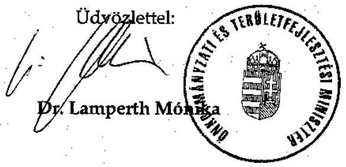

---

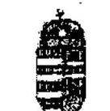

A Magyar Kizetársaság igazságügyi és rendkizetési minisztere

ÁLLAMI SZÁMVEVÖSZÉK
GOVVITELSZÁSZÁ
A 74 - 4578/2006
Érészett: 2008 AUG 23
Iltatószám: V-1001-61/2005
Melléklet:

14.10.2005.

Ikt. szám: IM/KGF/2006/ELL/1111/C
Hiv. szám: V-1001-61/2005

19. számú melléklet
a V-1001/2005. számú jelentéshez

Dr. Kovács Árpád úr részére
elnök

Állami Számvevőszék

Budapest

Tisztelt Elnök Úr!

A helyi és a helyi kisebbségi önkormányzatok gazdálkodási rendszerének átfogó és egyéb
szabályszerüségi ellenőrzéséről készített jelentésüket köszönettel megkaptam.

Dr. Kondorosi Ferenc államtitkár úr részére 2006. júniusában e témában megküldött jelentés
tervezetben foglaltakra tett észrevételeinket a 2006. július 28-án kelt
IM/KGF/2006/ELL/1111/2 iktató számú levelünkben jeleztük.

Ennek eredményeképpen a jelentésből kikerült a közbeszerzésekről szóló 2003. évi CXXIX.
törvény (Kbt.) módosítására irányuló konkrét javaslat, azonban a jelen megküldött
Jelentésben az igazságügyi és rendészeti miniszter részére tett javaslat tartalmában nem
változott, az továbbra is a Kbt. módosítása útján látja a felvetett problémára a megoldást. Erre
utalnak egyrészt a jelentés I. része „A közbeszerzések szabályszerűsége" c. fejezetének
megállapításai, valamint az is, hogy a javaslat címzettje kizárólag az igazságügyi és rendészeti
miniszter.

A hivatkozott javaslattal kapcsolatos aggályaim - a fentebb leírtakon túlmenően - a
következők:

1. A Kbt.-ben megnyilvánuló szabályozás - az egyes ajánlatkérők meghatározása, és
az egybeszámítási szabályok vonatkozásában is - csupán következménye az állambáztartási
törvényben (és Ámr.-ben) megfogalmazott rendelkezéseknek, így amennyiben e kérdésben
bármilyen változást tart szükségesnek az Állami Számvevőszék a Kbt. módosítása helyett az
állambáztartási jogszabályok módosítása lenne indokolt. Ezek vonatkozásában a jogszabályok
kodifikálása nem az Igazságügyi és Rendészeti Minisztérium, hanem a Pénzügyminisztérium
feladatkörébe tartozik.

---

2. A helyi és a helyi kisebbségi önkormányzatok által létrehozott költségvetési szervek vonatkozásában a javaslat szerinti „egybeszámítási", vagy „egységes közbeszerzési" rendszer létrehozásának megfontolása logikusan felveti azt a kérdést is, hogy a Kbt. szerint szintén önálló ajánlatkérőnek minősülő egyéb költségvetési szervek (központi, társadalombiztosítási, és országos kisebbségi önkormányzati költségvetési szervek; lásd: Kbt. 22. § (1) bek. b) és c) pont) esetében miért nem szükséges hasonló rendszer kialakítása. E vonatkozásban ugyanis a helyi valamint helyi kisebbségi önkormányzati és egyéb költségvetési szervek gazdálkodása, beszerzései, közbeszerzései semmiben sem különböznek egymástól, hiszen a jelenlegi jogszabályi környezetben mindegyik esetben önállóan gazdálkodó szervezetekről, ajánlatkérőkről van szó.

Ez a gondolatmenet pedig közbeszerzési jogi szempontból oda vezetne, hogy a jelenlegi közbeszerzési rendszer alapvető újragondolása válna szükségessé, hiszen egy ilyen jellegű módosítási javaslat a közbeszerzések jelenlegi rendszerét - amely tehát az önállóan gazdálkodó ajánlatkérő szervezetek közbeszerzéseit szabályozza - teljesen felborítaná, és egy új, valamiféle „központosított rendszer" logikája felé mutatna.

A jelenlegi közbeszerzési rendszer ilyen mértékủ felülvizsgálata nélkül azonban a helyi és helyi kisebbségi önkormányzati költségvetési szervek közbeszerzéseinek az Állami Számvevőszék javaslata szerinti „befolyásolására" álláspontom szerint csak az államháztartásra vonatkozó szabályok felülvizsgálatával van mód, ami pedig a Pénzügyminisztérium feladatkörébe tartozik.
3. Amennyiben az Állami Számvevőszék továbbra is ragaszkodik jelentésében a vonatkozó jogszabályi környezet felülvizsgálatára vonatkozó javaslatához, javaslom, hogy annak címzettie vagy a pénzügyminiszter, vagy pedig a pénzügyminiszter és az igazságügyi és rendészeti miniszter közösen legyen, hiszen a jelentésben felvetett kérdések olyan mélyen érintik az államháztartásra vonatkozó jelenlegi szabályok rendszcrét is, hogy az e vonatkozásban illetékes tárca munkájára mindenképpen szükség van. Kizárólag a közbeszerzési törvény módosításával ugyanis - mint ez a fentiekben kifejtett érvelésünkből is következik - a probléma nem kezelhető.

Kérem Elnök Urat észrevételeim figyelembevételére.

Budapest, 2006. augusztus 2.2. ${ }^{2}$."

Üdvözlettel:
Dr. Peffelei József

---

# 2006 STEPI 14 

20. számú melléklet
a V-1001/2005. számú jelentéshez

A Magyar Kïketársaság
igazságügy és rendészeti minisztere
IM/CIV/2006.PÜJCK/1157. 1.5
Hiv. sz.: V-1001-61/2006.

## Dr. Kovács Árpád Úr részére, az Állami Számvevőszék elnöke

## Budapest

## Tisztelt Elnök Úr!

A helyi és helyi kisebbségi önkormányzatok gazdálkodási rendszerének átfogó és szabályszerűségi ellenőrzéséről szóló jelentésben az igazságügyi és rendészeti miniszter feladat- és hatáskörébe tartozó intézkedésekről a következőkben tájékoztatom:

1. ) A jelentés a helyszíni ellenőrzés megállapításainak hasznosítása érdekében javaslatot tesz az igazságügyi és rendészeti miniszternek, hogy segítse elő a beszerzések átláthatóságát és széles körű nyilvános ellenőrizhetőségét a jogszabályi feltételek áttekintésével és szükség szerinti módosításának szorgalmazásával. A jelentés megfontolásra javasolja annak kezdeményezését, hogy az egy önkormányzathoz tartozó költségvetési szervek közbeszerzési igényének megállapításához az azonos, vagy hasonló jellegű, illetve egymással közvetlenül összefüggő felhasználási célra történő árubeszerzések, építési beruházások és szolgáltatás-megrendelések becsült értékét számítsák egybe és ehhez az önkormányzatok ezen beszerzések fedezetét biztosító költségvetési előirányzatokat megfelelően összevontan állapítsák meg.
(A jelentés tervezete korábban e vonatkozásban kifejezetten a közbeszerzésekről szóló 2003. évi CXXIX. törvény (a továbbiakban: Kbt.) 36-40. §-ai által szabályozott egybeszámítási szabályok kiegészítését javasolta az igazságügyi és rendészeti miniszternek.)

A jogszabály-módosításra irányuló javaslatot megvizsgáltam, azonban annak indokoltságát a következők miatt nem tekintem megalapozottnak:

A Kbt. értelmében az egybeszámítási szabályok alkalmazására egy adott ajánlatkérő szervezet vonatkozásában kerülhet sor, vagyis az ajánlatkérőnek minősülő szervezet beszerzéseinek értékét kell egybeszámítani, de nem kell több különböző és önálló ajánlatkérő szervezet beszerzéseinek értékét egybeszámítani. A Kbt. 22. §-a (1) bekezdésének d) pontja szerint ajánlatkérőnek minősülnek - többek között - a helyi önkormányzatok, és a helyi önkormányzati költségvetési szervek. Ebből is következöen egy helyi önkormányzati költségvetési szerv „saját jogán" minősül ajánlatkérőnek, és így a Kbt.ből folyó jogok és kötelezettségek közvetlenül e szervet illetik, illetve terhelik. A Kbt. 36-40. §-ai szerinti egybeszámítási szabályok alkalmazása során is a saját beszerzéseinek értékét kell figyelembe vennie.

---

A költségvetési szerv fogalmát az államháztartásról szóló 1992. évi XXXVIII. törvény (a továbbiakban: Áht.) 87. §-a határozza meg, illetve a Polgári Törvénykönyvröl szóló 1959. évi IV. törvény (a továbbiakban: Ptk.) 36-37. §-a, valamint az államháztartás müködési rendjéről szóló 217/1998. (XII. 30.) Korm. rendelet (a továbbiakban: Ámr.) 8-18. §-ai rendelkeznek róla. Az előzőeken túl a Kbt. 4. §-ának 10. pontja rögzíti, hogy a Kbt. alkalmazásában mely szervek, intézmények minősülnek helyi önkormányzati költségvetési szervnek.

Az Ámr. 14. §-ának (1) bekezdése szerint - a költségvetési szerv gazdálkodása megszervezésének módjára tekintettel - önállóan gazdálkodó, vagy részben önállóan gazdálkodó költségvetési szerv lehet. Az önállóan gazdálkodó költségvetési szerv az önkormányzati hivatal, illetőleg az, amelyet az alapító vagy a felügyeleti szerv annak sorol be [Ámr. 14. § (2) bekezdés b)-c) pontja]. A besorolás feltételeit az Ámr. 14. §-ának (3)-(4) bekezdései tartalmazzák. Amennyiben az önkormányzat valamely intézményét részben önálló költségvetési szervként hozza létre, meg kell jelölnie azt az önálló költségvetési szervet, amelyik a részben önálló költségvetési szerv meghatározott gazdasági és pénzügyi feladatait ellátja.

Az Ámr. 15. §-ának (1) bekezdése szerint a költségvetési szervek, azok szervezeti egységei - az előirányzatok feletti rendelkezési jogosultság szempontjából - lehetnek teljes jogkörrel, vagy részjogkörrel rendelkező költségvetési szervek, illetve az önállóan gazdálkodó költségvetési szerv részjogkörű költségvetési egységei (jogszabály, illetve a felügyeleti szerv döntése alapján). A (3) bekezdés szerint teljes jogkörrel rendelkezik az az önállóan gazdálkodó költségvetési szerv, amely a saját előirányzatai, valamint a hozzá rendelt, részjogkörrel rendelkező, részben önállóan gazdálkodó költségvetési szerv - felügyeleti szerv által - meghatározott előirányzatai felett rendelkezni jogosult, illetőleg az a részben önállóan gazdálkodó költségvetési szerv, amely valamennyi előirányzata felett rendelkezési jogosultsággal bír.

Ugyanezen § (4) bekezdése szerint részjogkörrel rendelkezik az a költségvetési szerv, amelynek egyes - felügyeleti szerv által megállapított - működési kiadásai és bevételei előirányzatát más önállóan gazdálkodó költségvetési szerv költségvetése tartalmazza, vagy előirányzatai felett más önállóan gazdálkodó költségvetési szerv rendelkezik. A (6) bekezdés szerint a részjogkörű költségvetési egység egyes előirányzatai feletti rendelkezési jogosultsággal az önállóan gazdálkodó költségvetési szerv, míg meghatározott más előirányzatok felett a költségvetési egység rendelkezik.

A Kbt. 305. §-ának (1) bekezdése szerint az ajánlatkérőként szerződő fél köteles teljesíteni az ellenszolgáltatást az ajánlattevőnek. Az ellenszolgáltatást csak az a szervezet képes teljesíteni, amely az ehhez szükséges anyagi fedezet felett rendelkezési jogosultsággal bír. A Kbt. és az Áht. (Ámr.) rendelkezéseinek egybevetéséböl megállapítható, hogy az a szervezet minősül ajánlatkérőnek, amely a fedezet felett rendelkezési jogosultsággal bír, és a fedezetböl az ellenszolgáltatást teljesíti.

Amennyiben tehát a fentiek alapján az önálló, illetőleg a részben önállóan gazdálkodó költségvetési szervek (valamennyi, vagy egyes) saját előirányzataik felett rendelkezési jogosultsággal bírnak, ezen előirányzatok keretei között önállóan vállalhatnak kötelezettséget és köthetnek szerződést, az e fedezet terhére megvalósított beszerzések tekintetében az önállóan, illetőleg a részben önállóan gazdálkodó költségvetési szervek a Kbt. szerinti ajánlatkérőnek minősülnek.

A beszerzések becsült értékének megállapításával, illetőleg az egybeszámítási szabályok alkalmazásával kapcsolatban pedig hangsúlyozni szükséges, hogy azokat minden esetben adott ajánlatkérő vonatkozásában, az általa megvalósított beszerzések tekintetében kell megvizsgálni. Amennyiben tehát a részben önállóan gazdálkodó költségvetési szerv

---

ajánlatkérőnek minősül, az általa megvalósított beszerzések vonatkozásában kell az egybeszámítási feltételek teljesülését megvizsgálni.

A fentieken túlmenően a következők is figyelmet érdemelnek:
A Kbt. szabályozása - az egyes ajánlatkérők meghatározása, és az egybeszámítási szabályok vonatkozásában is - csupán következménye az államháztartási törvényben (és Ámr.-ben) megfogalmazott rendelkezéseknek, így amennyiben e kérdésben bármilyen változást lenne indokolt, a Kbt. módosítása helyett az államháztartási jogszabályok (azaz a költségvetési szervek gazdálkodásra vonatkozó rendelkezések) felülvizsgálata tüzhető ki célként. Ezek vonatkozásában a jogszabály-előkészítés első helyi kormányzati felelőse a Pénzügyminisztérium. Tudomásom szerint a Pénzügyminisztériumban már készültek szakmai tervezetek a költségvetési gazdálkodási szabályok korszerűsítésére, ennek kapcsán célszerű az ÁSZ javaslat megfontolása is.

A helyi és helyi kisebbségi önkormányzati költségvetési szervek közbeszerzéseire vonatkozóan a szabályozás tehát nem valósítható meg önállóan, hanem azt a költségvetési gazdálkodási szabályok korszerűsítésével együtt, annak részeként, és az államháztartási szabályok módosítását követően lehet megvalósítani.

Összefoglalva tehát a tárgybeli ÁSZ Jelentésben a közbeszerzéssel összefüggésbeni felvetett problémákat, az állapítható meg, hogy a javaslatok egyedül az igazságügyi és rendészeti miniszter feladat- és hatáskörébe eső jogszabályok módosításával, kiegészítésével nem valósíthatók meg, azok az államháztartási gazdálkodási jogszabályok átfogó módosítása részeként fontolhatók meg, melynek első lépése a pénzügyi jogszabályok megalkotása, majd ahhoz igazodva a közbeszerzési szabályoknak a költségvetési gazdálkodási jogosítványokhoz igazítása.
2.) A Jelentés az önkormányzati és területfejlesztési miniszternek javasolja a „Ptk. 373. § (4) bekezdés kivételre vonatkozó szabályának oly módon történő módosítását, hogy megszűnjön az önkormányzati tulajdonú nem lakás céljára szolgáló helyiség esetében a gazdálkodó szervezet bérlője részére biztosított lehetőség, miszerint kijelölheti a részére biztosított elővásárlási jog gyakorlására jogosult személyt". Az ÁSZ javaslat célja „az önkormányzati gazdálkodás nyilvánosságának és átláthatóságának elősegítése", az 51. oldalon irt részletes megállapítások szerint továbbá annak elkerülése, hogy az önkormányzatok versenyeztetés nélkül válasszák ki a vevőt. A jelentés 51. oldala ismerteti az ÓTM érvelését is, amely a jogszabály-módosítás indokoltságát vitatja.

A fenti szövegrészek tanulmányozását követően a következő álláspontot alakítottam ki:
Az Állami Számvevőszék és az Önkormányzati és Területfejlesztési Minisztérium (ÖTM) érvelése nem ugyanarra vonatkozik, az ÖTM pedig nem az ÁSZ aggályának és céljának szempontjából vizsgálja a hatályos rendelkezéseket. A hivatkozott jogszabályhelyek a következők:

Ptk. „373. § (1) Ha a tulajdonos meghatározott dologra nézve írásbeli megállapodással elővásárlási jogot enged, és a dolgot el akarja adni, a kapott ajánlatot a szerződés megkötése elött köteles az elövásárlásra jogosulttal közölni. Nem terheli e kötelezettség a tulajdonost, ha annak teljesítése a jogosult tartózkodási helye vagy más körülményei miatt rendkívüli nehézséggel vagy számottevő késedelemmel járna.
(2) Ha az elövásárlásra jogosult a tulajdonoshoz intézett nyilatkozatában az ajánlat tartalmát magáévá teszi, a szerződés közöttük létrejön. Ha a jogosult a szerződési ajánlat elfogadására általában megszabott határidő alatt ilyen nyilatkozatot nem tesz, a tulajdonos a dolgot az ajánlatnak megfelelően vagy annál kedvezőbb feltételek mellett eladhatja.

---

(4) Az elövásárlási jog átruházása - ha törvény eltérően nem rendelkezik - semmis, gazdálkodó szervezet azonban kijelölheti azt a személyt, aki e jog gyakorlására jogosult.
(6) Az elövásárlási jogra vonatkozó rendelkezéseket a jogszabályon alapuló elövásárlási jogra is alkalmazni kell. A jogszabályon alapuló elövásárlási jog a szerződéses elövásárlási jogot megelőzi."

# A lakások és helyiségek bérletére, valamint az elidegenítésükre vonatkozó egyes szabályokról szóló 1993. évi LXXVIII. törvény (Ltv.) 

„58. § (1) Ha a törvény másként nem rendelkezik, az állam tulajdonából az önkormányzat tulajdonába került helyiségre a bérlőt (bérlőtársat) elövásárlási jog illeti meg.
(2) Az önkormányzat rendeletében határozza meg az (1) bekezdésben említett helyiségek vételárának mértékét, megfizetésének (részletfizetés, vételárengedmény stb.) módját és feltételeit.
(3) Az önkormányzat rendeletében határozza meg az (1) bekezdésben nem említett egyéb helyiségei eladásának feltételeit."

Álláspontom szerint a jogszabályokból nem vonható le olyan következtetés, hogy az önkormányzatok a helyiségek elidegenítésénél mellőzhetnék a versenyeztetést. A legjobb ajánlat kiválasztásához a versenyeztetés a megfelelő eljárás. Álláspontunk szerint az ilymódon kapott legjobb ajánlatot kell az önkormányzatnak - a Ptk. 373. § (1) bekezdés alkalmazásával - eljuttatnia a bérlöhöz, aki élhet a Ptk. 373. §-a szerinti lehetőséggel, és az ajánlatot a magáévá teheti. Véleményünk szerint ez az eljárás jogszabály-módosítás nélkül is azt eredményezi, hogy nem sérül a közpénzügyek átláthatóságát célzó versenyeztetés szabálya, ugyanakkor a bérlő is élhet a jogszabályban biztosított elövásárlási jogával. Ehhez képest másodlagos kérdés, hogy az elövásárlási jogot a versenytárgyaláson elért legjobb ajánlatnak megfelelően maga az elövásárlásra jogosult vagy az általa kijelölt személy fogja-e majd gyakorolni, mindez ugyanis a versenytárgyaláshoz kapcsolódóan nyilvánosan és átláthatóan történhet. Egyfelől tehát az önkormányzati vagyon a legkedvezőbb ajánlat szerint, illetve a legkedvezőbb feltételek mellett kelhet el, másfelől pedig ha annak vevője esetleg nem is a bérlő lesz, akkor is olyan személy, akit a jog gyakorlására maga a bérlő jelölt ki az önkormányzathoz eljuttatott nyilatkozatában, és aki ebből, de nyilvánvalóan a megkötött szerződésből is, bárki által megismerhető. Ekként sem a legjobb vételár elérése, sem pedig a nyilvánosság nem szenved csorbát akkor sem, ha a Ptk. említett szabálya kerül alkalmazásra, és azt nem módosítják.

Természetesen a Ptk. és a lakástörvény rendelkezései változhatnak majd az új Ptk-ban, azonban - véleményem szerint - az Állami Számvevőszék által lényegesnek tartott közpénzügyi céloknak a fentebb ismertetett hatályos jogszabályok is megfelelnek.

Az Állami Számvevőszék és az ÖTM között vita van arról, hogy mit jelent valójában a Ptk. 373. § (4) bekezdésében az a jogcselekmény, mely szerint „gazdálkodó szervezet kijelölheti azt a személyt, aki e jog gyakorlására jogosult". Az ÖTM-nek igaza van abban, hogy ez a kijelölés nem az elövásárlási jog átruházása. Abban viszont az ÁSZ álláspontját lehet támogatni, hogy a kijelölés nem a gazdálkodó szervezet képviseletében, az ő javára történő eljárást jelenti, hanem azt, hogy az adásvételi szerződésben a kijelölt személy lehet a vevőként szerződő fél, nem pedig az a gazdálkodó szervezet, amely az elövásárlási jog jogosultja volt. Figyelmet érdemel azonban, hogy ez a körülmény önmagában szintén nem vezet a legjobb vételi ajánlat kiválasztását célzó versenyeztetési eljárás sérelméhez, mert a versenyeztetést ezt megelőzően kell lefolytatni, és az annak eredményeként kapott legjobb ajánlatot kell az elövásárlási jog jogosultjának (illetve az általa kijelölt személynek) elfogadásra felajánlani.

---

A jelentésben ugyan nem szerepel, de elképzelhető, hogy az ÁSZ a szabályozás átláthatóbbá tételét azért tartja szükségesnek, mert a gazdálkodó szervezet fent említett kijelölési jogának rendeltetésszerü gyakorlását az eladó (pl. az önkormányzat) már nem tudja befolyásolni. Álláspontom szerint azonban a Ptk. 373. §-ának (6) bekezdése nem korlátozza a törvényalkotót abban, hogy az elövásárlási jogot olyan feltételekhez kösse, vagy annak gyakorlását olyan feltételek esetén engedje meg, amilyet az érintett jogosult kör törvényes érdekeire és a vagyontárgy jellegére tekintettel szükségesnek ítél. Ezt szem elött tartva nem látom akadályát annak (ha ezzel az ÖTM is egyetért, és az ÁSZ is támogathatónak tartja) hogy az Ltv. megtiltsa, illetőleg meghatározott nyilvánossági feltételekhez kösse azt, hogy a gazdálkodó szervezetnek minősülő bérlő az őt megillető elövásárlási jog gyakorlására más személyt jelöljön ki. (Ebben az esetben a speciális törvényl rendelkezés nyilvánvalóan "lerontja" a Ptk. szóban forgó - e vonatkozásban általánosnak tekinthető - szabályát. A szabályozásnak ez a módja egyáltalán nem lenne egyedül álló, hiszen van már más példa is arra, hogy törvény a Ptk-tól részben eltérő feltételek mellett biztosít elövásárlási jogot meghatározott személyek számára.) Ha tehát az ÁSZ ellenőrzéseinek tapasztalatai alapján kellően megindokolható, hogy a Ptk. vonatkozó szabálya az önkormányzatok helytálló jogalkalmazása mellett is transzparenclális gondokat okoz a gyakorlatban, akkor nem a Ptk. hanem az Ltv. (mint lex speciális) módosítására kellene javaslatot tenni. Ezt a javaslatot ugyanakkor az ÖTM-nek kell megfontolás tárgyává tennie a rendelkezésére álló gyakorlati tapasztalatok alapján és arra figyelemmel, hogy ő az Ltv. első helyi kormányzati felelőse.

Kérem Elnök Urat, hogy a fenti tájékoztatást és jogi véleményt elfogadni szíveskedjék.

Budapest, 2006. szeptember ....

Tisztelettel:
dr. Petretel József

---

# Állami Számvevőszék 

## Dr. Petrétei József úr

miniszter

## Igazságügyi és rendészeti Minisztérium

## Budapest

## Tisztelt Miniszter Úr!

Köszönettel vettem a helyi és a helyi kisebbségi önkormányzatok gazdálkodási rendszerének átfogó és egyéb szabályszerűségi ellenőrzéséről szóló jelentésünkre adott válaszait, melyekben a Kbt. módosításának megfontolását kezdeményező javaslatunkhoz tett részletes észrevételt, valamint tájékoztatott a nem lakás céljára szolgáló helyiségek értékesítési feltételeivel kapcsolatos javaslatunkban foglaltakkal kapcsolatos jogi véleményéről.

A Kbt. egybeszámításra vonatkozó előírásainak nem az államháztartás egészére, hanem csak az önkormányzati alrendszerre, az önkormányzati költségvetési szervekre történő speciális szabályozási lehetőségnek a megfontolása szerepelt a javaslatunkban. A közbeszerzési törvény gyakorlati alkalmazási tapasztalatainak folyamatos figyelemmel kísérése mellett, továbbra is indokoltnak tartom az ÁSZ jelentésében szereplő szempont megfontolását. Mivel a minisztérium hatásköre a közbeszerzési törvény alkalmazása során tapasztalt rendellenességek kiküszöbölése, ezért nem a Pénzügyminisztérium felé fogalmaztuk meg javaslatainkat, azonban az Ön által leírt részletes érveket is figyelembe véve a pénzügyminiszter úrnál is szorgalmazni fogom, hogy az államháztartási törvény felülvizsgálata kapcsán tekintse át az Állami Számvevőszék ellenőrzései által feltárt problémát.

A fentiek szíves figyelembevételét kérem.
Budapest, 2006. szeptember , 19 ,

Tisztelettel:
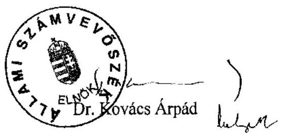

---

# Állami Számvevőszék 

## Élnök

V-1001-67/2005.

## Dr. Lamperth Mónika úrhölgy

miniszter

## Önkormányzati és Területfejlesztési Minisztérium

Budapest

## Tisztelt Miniszter Úrhölgy!

Köszönettel vettem a helyi és a helyi kisebbségi önkormányzatok gazdálkodási rendszerének átfogó és egyéb szabályszerűségi ellenőrzéséről szóló jelentésünkre adott válaszát, melyben egyrészt több megállapításunkkal, következtetésünkkel, javaslatunkkal összhangban tett és tervezett intézkedésekről tájékoztat, másrészt az önkormányzati és területfejlesztési miniszternek tett javaslatokhoz füz észrevételeket.

Az észrevételekkel kapcsolatos véleményemről a következőkben tájékoztatom:

1) Örömmel vettem, hogy az önkormányzatok korlátozottan forgalomképes törzsvagyonnal történő gazdálkodására vonatkozó Ötv-ben foglalt előírások betartásának ellenőrzésére a közigazgatási hivatalok figyelmét fel kívánja hívni. Az Ötv. 79. § (2) bekezdés b) pontjában foglalt előírás azonban az észrevételben foglaltaktól eltérően nem az átsorolásra, hanem közvetetten a rendelkezési feltételek meghatározására ír elő önkormányzati rendeletalkotási kötelezettséget. Az erre vonatkozó önkormányzati rendeletben foglaltak betartása az ellenőrzési tapasztalatok szerint nem jelenti automatikusan azt is, hogy az észrevételében leírtaknak megfelelően csak önkormányzati rendelettel lehessen forgalomképessé átsorolni a korlátozottan forgalomképes törzsvagyont. Ezért a vonatkozó javaslatot továbbra is fenntartjuk.
2) Az önkormányzati tulajdonú, nem lakás céljára szolgáló helyiségekre vonatkozóan a Ptk.373. § (4) bekezdésében a gazdálkodó szervezeti bérlő részére biztosított vevőkijelölési lehetőség esetében az önkormányzatok a gazdasági társaság által kijelölt személyt elfogadták akkor is, ha a kijelölt nem a gazdasági társaság nevében eljárni jogosult természetes személy volt. A kialakult gyakorlat szerinti jogszabály értelmezés nem egyezik az észrevételében leírt véleményével, valamint attól eltér az igazságügyi és rendészeti miniszter ezen jelentéséhez mellékelt IM/CIV/2006. PÚJOG/1157 számú levelében foglalt álláspontja. Az észrevételben rögzített értelmezés szerinti cél és az ÁSZ jelentésben szereplő javaslat célja egymással összhangban van, ezért a javaslatot továbbra is fenntartjuk.
3) A hitelfelvétel jellege és tényleges tartalma alapján is likvid hitel esetében az észrevételében foglaltakkal egyetértek, azonban a javaslatunkban is rögzítettek szerint a folyamatosan megújított (éven belül visszafizetett és azonnal újra felvett) folyószámla hitelek figyelembe vételét az adósságot keletkeztető kötelezettségvállalások felső határának a megállapításánál továbbra is indokoltnak tartom. A folyamatos

---

megújítás, ugyanis nem átmeneti finanszírozási gond megoldását jelenti, tartalmában azonos a hosszúlejáratú hitellel, csupán nevében és a felvétel-visszafizetés adminisztratív módjában tér el attól, mivel a folyamatos megújítás esetén a hitel viszszafizetés és hitelfelvétel napja jellemzően azonos. Továbbra is indokolt javaslatunk célja - az észrevételben foglaltaktól eltérően - az önkormányzati cladósodás jogszabályban biztosított lehetőségének mérséklése, a hitelfelvételi felső határnál valamennyi, tartalma alapján ténylegesen tárgyéven túlnyúló adósságot keletkeztető kötelezettségvállalás figyelembevételi kötelezettségének biztosítása.

Budapest, 2006. szeptember , 11 ,

Tisztelettel:
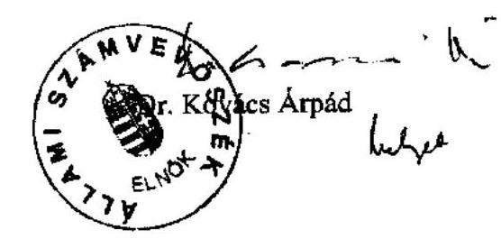