# ÁLLAMI   SZÁMVEVŐSZÉK 

## JELENTÉS

a Nemzeti Civil Alapprogramból civil szervezeteknek juttatott költségvetési támogatások ellenőrzéséről

---

# 3. Önkormányzati és Területi Ellenőrzési Igazgatóság 

3.1. Szabályszerüségi Ellenőrzési Föcsoport

Iktatószám: V-1012-183/2005.
Témaszám: 765
Vizsgálat-azonosító szám: V-0249

## Az ellenőrzést felügyelte:

Dr. Lóránt Zoltán
föigazgató
Az ellenőrzés végrehajtásáért felelős:
Dr. Elek János
általános föigazgató-helyettes
Az ellenőrzést vezette:
Horváth Balázs
főcsoportfőnök-helyettes
Az összefoglaló jelentést készítette:
Solymár Ágnes
osztályvezető főtanácsos
A számvevői jelentések feldolgozásában és a jelentés összeállításában közremüködtek:

Dr. Dotterweich Antal Benesné Baracsi Szilvia
számvevő főtanácsadó
Szappanos Júlia
számvevő tanácsos
Dr. Méry Sándorné
számvevő
Az ellenőrzést végezték:

| Benesné Baracsi | Dr. Dotterweich Antal | Dr. Faragóné Tóth |
| :-- | :-- | :-- |
| Szilvia |  | Mária |
| számvevő | számvevő főtanácsadó | számvevő tanácsos |
| Dr. Méry Sándorné | Pásztor Katalin | Sas Imréné |
| számvevő | számvevő tanácsos | számvevő tanácsos |
| Szakmányné Bilik | Szappanos Júlia | Szendrey Lajos |
| Mária |  |  |
| számvevő | számvevő tanácsos | számvevő |
| Tóth István |  |  |
| számvevő tanácsadó |  |  |

---

# TARTALOMJEGYZÉK 

BEVEZETÉS ..... 7
I. ÖSSZEGZŐ MEGÁLLAPÍTÁSOK, KÖVETKEZTETÉSEK, JAVASLATOK ..... 10
II. RÉSZLETES MEGÁLLAPÍTÁSOK ..... 17

1. Az NCA küldetése és feltételrendszere ..... 17
1.1. Az alapprogram jogszabályi keretei ..... 17
1.2. Az alapprogram pénzügyi feltételei ..... 18
1.3. Az alapprogram döntéshozó testületei és működésük ..... 20
1.3.1. A Tanács múködése, elvi irányító szerepének érvényesülése ..... 20
1.3.2. A kollégiumok múködése és pályáztatási gyakorlata ..... 23
2. Az NCA támogatások rendszere és felhasználása ..... 24
2.1. A támogatások kezelése, rendszere és felhasználása ..... 24
2.2. A pályázati rendszer múködése ..... 24
2.2.1. A múködési és szakmai támogatások ..... 27
2.2.2. A pályáztatás folyamata ..... 28
2.3. A támogatási szerződések ..... 30
2.4. A támogatásból megvalósított program összhangja a vizsgált szervezetek cél szerinti feladataival ..... 31
3. A támogatások felhasználásának szabályossága ..... 32
3.1. A pályázati feltételek érvényesülése ..... 32
3.2. Az elszámoláshoz csatolt dokumentumok szabályossága ..... 34
3.3. A támogatások költségvetése ..... 36
3.4. A támogatások felhasználásának számviteli nyilvántartása ..... 36
3.5. A támogatások felhasználása során megállapított személyes felelősség ..... 38
4. Az ellenőrzött szervezetek részére folyósított támogatások társadalmi hasznossága ..... 42
4.1. A múködési támogatás hatása ..... 42
4.2. A szakmai támogatás hatása ..... 45
5. A támogatások felhasználásának ellenőrzési rendszere ..... 47
5.1. A felhasználás dokumentális és helyszíni ellenőrzése ..... 47
5.2. A visszafizetési kötelezettségek teljesítése ..... 49

---

# MELLÉKLETEK 

| 1. számú | Az NCA Tanácsának 2004. évi támogatási elvei |
| :-- | :-- |
| 1/a. számú | Az NCA Tanácsának 2005. évi támogatási elvei |
| 2. számú | A Tanács elvi irányító szerepe értelmezéséről |
| 3. számú | Az NCA Kollégiumok pályázati tevékenysége |
| 4. számú | A 2004-2005. évi pályázati elszámolások és a helyszíni ellenőrzések |
| 5. számú | Az NCA bevétele és a MÁK múködtetési költsége |
| 6. számú | Kérdőívvel ellenőrzött 2004. évi NCA pályázatok jellemző mutatói |
| 7. számú | A helyszínen ellenőrzött civil szervezetek adatai |
| 8. számú | Dokumentálisan ellenőrzött civil szervezetek listája |
| 9. számú | Helyszínen ellenőrzött civil szervezetek listája |
| 10. számú | MÁK elnökének észrevétele és az arra adott válasz |
| 11. számú | NCA Tanács elnökének észrevétele és az arra adott válasz |
| 12. számú | SZMM miniszterének észrevétele és az arra adott válasz |
| 13. számú | MeH államtitkárának észrevétele és az arra adott válasz |

---

# RÖVIDÍTÉSEK JEGYZÉKE 

| Áht. | 1992. évi XXXVIII. törvény az államháztartásról |
| :--: | :--: |
| Ámr. | 217/1998. (XII. 30.) Korm. rendelet az államháztartás működési rendjéről |
| ÁSZ | Állami Számvevőszék |
| Áfa. tv | 1992. évi LXXIV. törvény az általános forgalmi adóról |
| Art. | 2003. évi XCII. törvény az adózás rendjéről |
| Civil tv. | 2003. évi L. törvény a Nemzeti Civil Alapprogramról |
| ICSSZEM | Ifjúsági, Családügyi, Szociális és Esélyegyenlőségi Minisztérium |
| KEHI | Kormányzati Ellenőrzési Hivatal |
| Kh. tv. | 1997. évi CLVI. törvény a közhasznú szervezetekről |
| MÁK | Magyar Államkincstár |
| MEH | Miniszterelnöki Hivatal |
| NCA | Nemzeti Civil Alapprogram |
| NKÖM | Nemzeti Kulturális Örökség Minisztériuma |
| PM | Pénzügyminisztérium |
| Ptk. | 1959. évi IV. törvény a Polgári Törvénykönyvről |
| Szja | Személyi jövedelemadó |
| SZMM | Szociális és Munkaügyi Minisztérium |
| Sztv. | 2000. évi C. törvény a számvitelről |
| Sztv. Vhr. | 224/2000. (XII. 19.) Korm. rendelet a számviteli törvény szerinti egyes egyéb szervezetek beszámoló-készítési és könyvvezetési kötelezettségének sajátosságairól |
| Tanács | Nemzeti Civil Alapprogram Tanácsa |
| Vhr. | 160/2003. (X. 7.) Korm. rendelet a civil tv. végrehajtásáról |

---

.

---

# ÉRTELMEZŐ SZÓTÁR 

Az alapítány/társadalmi A vállalkozási tevékenység bevétele, valamint a cél szerintszervezet bevételei ti tevékenység bevételei (minden olyan bevétel, amely nem a vállalkozási tevékenységhez kapcsolódó befizetés, ideértve a céltámogatást is) [115/1992. (VII. 23.) Korm. rendelet 3. § (1) bekezdésének a)-b) pontja és a 114/1992. (VII. 23.) Korm. rendelet 3. § (1) bekezdésének a)-b) pontja].
Az alapítány/társadalmi A vállalkozási tevékenység közvetlen költségei, a cél szerzzervezet költségei (kiadásai) rinti tevékenység közvetlen költségei, az alapítvány kezelő szervének költségei (kiadásai) és az egyéb közvetett költségek (kiadások) [115/1992. (VII. 23.) Korm. rendelet 3. § (2) bekezdésének a)-b)-c) pontja és a 114/1992. (VII. 23.) Korm. rendelet 3. § (2) bekezdésének a)-b)-c) pontja].
Az alapítvány kezelő
Az alapítvány kezelő szervének üzemeltetési, fenntartási szervének költségei (kiadásai) költségei, kiadásai az alapító okiratok szerint a kuratórium és a munkaszervezet múködésével összefüggésben.
Befektetési tevékenység A közhasznú szervezet saját eszközeiből történő értékpapír, társasági tagsági jogviszonyból eredő vagyonértékű jog, ingatlan és más egyéb hosszú távú befektetést szolgáló vagyontárgy szerzésére irányuló tevékenység \{Kh. tv. 26. § k) pontja].

Beszámoló

Cél szerinti tevékenység

Civil delegált

Civil szervezet

A beszámoló lehet:
a) egyszeres könyvvitel esetén:
aa) egyszerúsített beszámoló,
ab) közhasznú egyszerúsített beszámoló;
b) kettős könyvvitel esetén:
ba) egyszerúsített éves beszámoló,
bb) közhasznú egyszerúsített éves beszámoló;
c) az egyéb szervezet, valamint a közhasznú egyéb szervezet választása alapján az Sztv. szerinti éves beszámoló, és az Sztv. szerinti egyszerúsített éves beszámoló.[224/2000. (XII. 19.) Korm. rendelet 6. § (4) bekezdése].

Minden olyan tevékenység, amely a létesítő okiratban megjelölt célkitúzés elérését közvetlenül szolgálja [Kh. tv. 26. § b) pontja].

A Tanács, illetve a Kollégium azon tagja, akit a civil jelöltállítási rendszerben a civil szervezetek a Nemzeti Civil alapprogramról szóló 2003. évi L. törvény 12-13. §-ának rendelkezései szerint választottak meg.
Az egyesülési jogról szóló 1989. évi II. törvény alapján létrejött, jogi személyiséggel bíró társadalmi szervezet, szövetség (kivéve a pártot, a munkaadói és munkavállalói érdek-képviseleti szervezetet, a biztosító egyesületet, valamint az egyházat), és a Polgári Törvénykönyvről szóló 1959. évi IV. törvény alapján létrejött, jogi személyiséggel bíró alapítvány (ide nem értve a közalapítványt).

---

Éves korrigált ráfordítás

Közhasznú tevékenység

Közhasznúsági jelentés

Közérdekú kötelezettségvállalás

Közhasznú
Nem civil szervezet
Országos hatókörú civil szervezet

Pályázat

Régió

Regionális hatókörú civil szervezet

A civil szervezetek előző évi számviteli beszámolója szerinti alaptevékenység összes ráfordítása csökkentve az adott évben más szervezeteknek vagy személyeknek nyújtott támogatással.
A társadalom és az egyén közös érdekeinek kielégítésére irányuló, a közhasznú közalapítvány alapító okiratában szereplő cél szerinti tevékenység a törvényben meghatározott körben [Kh. tv. 26. § c) pontja].
Tartalmazza a számviteli beszámolót; a költségvetési támogatás felhasználását; a vagyon felhasználásával kapcsolatos kimutatást; a cél szerinti juttatások kimutatását; a központi költségvetési szervtől, az elkülönített állami pénzalaptól, a helyi önkormányzattól, a kisebbségi települési önkormányzattól, a települési önkormányzatok társulásától és mindezek szerveitől kapott támogatás mértékét; a közhasznú szervezet vezető tisztségviselőinek nyújtott juttatások értékét, illetve összegét; a közhasznú tevékenységről szóló rövid tartalmi beszámolót [Kh. tv. 19. § (3) bekezdése].
A Polgári Törvénykönyvről szóló 1959. évi IV. törvény 593-596. §-aiban meghatározottak szerinti kötelezettségvállalás.
A közhasznú szervezetekről szóló 1997. évi CLVI. törvényben meghatározottak.
A párt, a munkaadói és munkavállalói érdek-képviseleti szervezet, az egyház és a közalapítvány.
Az a civil szervezet, mely a civil törvény végrehajtásáról szóló rendeletben meghatározott módon, hitelt érdemlően bizonyítja, hogy a létesítő okirata szerinti tevékenységét legalább hét megyére kiterjedő hatókörrel végzi.
Az a nyilvános vagy előre meghatározott körben közzétett felhívás, amely a pályázók összevetésére alkalmas feltételeket és a pályázattal elnyerhető cél szerinti juttatást, a pályázat értékelésének lényeges feltételeit (beleértve a benyújtási és értékelési határidőket, valamint a pályázat elbírálására hivatottak körét) megjelöli [Kh. tv. 26. § i) pontja].
A területfejlesztésről és területrendezésről szóló 1996. évi XXI. törvény 5. § e) pontjának megfelelő tervezésistatisztikai (nagy) régió az Országos Területfejlesztési Koncepcióról szóló 35/1998. (III. 20.) OGY határozat 5.2. pontjában meghatározottak szerint.

Az a civil szervezet, mely az NCA törvény végrehajtásáról szóló 160/2003. (X. 7.) Korm. rendeletben meghatározott módon, hitelt érdemlően bizonyítja, hogy a létesítő okirata szerinti tevékenységét legalább egy megyére kiterjedő hatókörrel végzi.

---

# JELENTÉS 

## a Nemzeti Civil Alapprogramból civil szervezeteknek juttatott költségvetési támogatások ellenőrzéséről

## BEVEZETÉS

Az Országgyűlés a társadalmi szervezetek és alapítványok működési feltételeinek állami garanciákkal való biztosítása érdekében, a civil szervezetek részére átlátható, költségvetési forrásautomatizmusra épülő, pártpolitikától mentes források biztosítása érdekében alkotta meg a Nemzeti Civil Alapprogramról szóló 2003. évi L. törvényt (továbbiakban: civil tv.). Az NCA célja a mintegy 47 ezer $^{1}$ támogatásra jogosult civil szervezet társadalmi szerepvállalásának segítése, a kormányzat és a civil társadalom közötti partneri viszony és munkamegosztás előmozdítása az állami, önkormányzati közfeladatok hatékonyabb ellátása érdekében.

Az alapprogram múködését, forrásainak képzését és felhasználását a civil tv. és a civil tv. végrehajtásáról szóló 160/2003. (X. 7.) Korm. rendelet (továbbiakban: Vhr.) valamint a fejezeti kezelésű előirányzatok felhasználásáról szóló jogszabályok határozták meg.

Az NCA rendszerének lényege az állami befolyástól mentes, civil szervezetek általi döntéshozatal volt. Az NCA támogatási rendszerének döntésmechanizmusa kétszintű, létrejöttekor kétéves, azt követően hároméves időtartamra választott, civil többségű testületekkel funkcionált. A civil tv. céljainak megvalósítását szolgáló döntések meghozatalára jogosult elvi, irányító 17 tagú Tanács, amelynek törvényben biztosított hatásköre, hogy meghatározza az alapprogram támogatási rendszere múködésének alapvető szabályait, az alapprogramból nyújtható támogatások rendező elveit, élén a miniszter által felkért elnök áll. A miniszter a Tanács egyetértésével hozta létre a kollégiumokat az alapprogram regionális és szakmai szempontok alapján szerveződő operatív döntéshozó szerveit, tagságát egy-egy fő kivételével civil delegáltak alkották. A kollégiumok a Tanács által meghatározott támogatási elvek, módok, arányok szerint hivatottak dönteni a támogatásokról, a pályázatok kiírásáról, és azok elbírálásáról. A 2004-2005. években 11 kollégium ( 3 szakmai, 7 regionális, valamint az országos kollégium) múködött. Az NCA pénzeszközeit - szerződés és jogszabály alapján - a Magyar Államkincstár (továbbiakban: MÁK) kezeli.

[^0]
[^0]:    ${ }^{1}$ Forrás: KSH adat, a működő non-profit szervezetek (53 ezer) közül - a civil tv. 3. § (1) bekezdésének a) és b) pontjai, továbbá (3) és (4) bekezdése alapján - NCA támogatásra nem volt jogosult mintegy 6 ezer szervezet.

---

Az alapprogram céljainak megvalósítását 2004-ben a központi költségvetés Miniszterelnökség, 2005-ben az ICSSZEM fejezetének „Nemzeti Civil Alapprogram" elnevezésű fejezeti kezelésű előirányzata biztosította. A Magyar Köztársaság 2004. évi költségvetéséről és az államháztartás hároméves kereteiről szóló 2003. évi CXVI. törvény 6108 millió Ft központi költségvetési forrást irányozott elő, amely 6978 millió Ft-ra teljesült, a tényleges bevétel 870 millió Ft-tal növekedett a tervezetthez képest a 2003. évi Szja bevallások feldolgozása után. A Magyar Köztársaság 2005. évi költségvetéséről szóló 2004. évi CXXXV. törvény 7000 millió Ft-ot irányozott elő. A 2005. évi költségvetés végrehajtásáról összeállított törvényjavaslat szerint az NCA forrása az előző évi maradvány igénybevételével, illetve 619 millió Ft múködtetési kiadás átcsoportosításával, 8177 millió Ft-ra teljesült.

Az alapprogramból kifizetések a civil tv-ben meghatározott célokra, valamint az alapprogram múködtetési költségeinek fedezésére teljesíthetők. A civil tv. 3. § (1) bekezdés a) és b) pontja alapján az Alapprogramból igényelhetnek támogatást: „azon társadalmi szervezetek (kivéve a pártokat, a munkaadói és munkavállalói érdek-képviseleti szervezeteket, a biztositó egyesületeket, valamint az egyházakat), amelyeket a bíróság a pályázat kiírása vagy az egységes elvek mentén meghatározott támogatási feltételeknek történő megfelelés megállapítása évének első napja előtt legalább egy évvel nyilvántartásba vett, és az alapszabályuknak megfelelő tevékenységüket ténylegesen folytatják; valamint azon alapítványok (ide nem értve a közalapítványokat), amelyeket a bíróság a pályázat kiírása, vagy az egységes elvek mentén meghatározott támogatási feltételeknek történő megfelelés megállapítása évének első napja előtt legalább egy évvel nyilvántartásba vett, és az alapító okiratuknak megfelelő tevékenységüket ténylegesen folytatják."

A civil tv. 3. § (3) és (4) bekezdése alapján „nem jogosult az Alapprogram müködési támogatására az a civil szervezet, amely a tárgyévben a költségvetési törvény alapján közvetlenül, nevesítve részesül müködési támogatásban az állami költségvetésből, továbbá az a civil szervezet, amely a közhasznú szervezetekről szóló 1997. évi CLVI. törvény 26. § d) pontja szerinti közvetlen politikai tevékenységet folytat."

Az ellenőrzés végrehajtására az Állami Számvevőszékről szóló 1989. évi XXXVIII. törvény 2. § (5) bekezdésében foglaltak adtak jogszabályi alapot.

Az ellenőrzés célja annak értékelése volt, hogy

- az NCA-ból nyújtott támogatás törvényes volt-e;
- a támogatások lebonyolításának rendszere szabályos volt-e;
- az NCA-ból támogatott civil szervezetek a kapott támogatásokat szabályszerűen használták-e fel;
- a támogatott civil szervezeteknél rendeltetésszerú és társadalmilag hasznos volt-e az NCA-ból kapott támogatások felhasználása.

Az ellenőrzés az NCA 2004-2005. éves működésére és az ebben az időszakban beadott pályázatok ellenőrzésére terjedt ki.

---

Az NCA-ból a civil szervezeteknek juttatott költségvetési támogatások ellenőrzését két lépcsős mintavétellel végeztük. Első lépcsőként - a MÁK nyilvántartásában szereplő - az NCA által nyújtott 2004. évi szakmai és múködési tárgyú lezárt pályázatokból vettünk mintát, amelyek pályázati dokumentációját ellenőrző lista alapján ellenőriztük. Az ellenőrzési véleményünk megbízhatóságának növelése céljából:

- az alapsokaságból kiemeltük a 10 millió Ft feletti támogatásban részesült szervezetek pályázatai $50 \%$-át ( 113 db ), valamint azon szervezetek múködési pályázatait, amelyek az éves költségvetési törvény alapján közvetlenül, nevesítve kaptak múködési támogatást és az NCA honlapja szerint az alapprogramból múködési támogatásban részesültek ( 20 db );
- a szakmai támogatások ellenőrzésére a 2004. évi kiírásra beérkezett és lezárt támogatásokat három kollégium (Civil Szolgáltató, Fejlesztő és Információs Kollégium, Nemzetközi Civil Kapcsolatok és Európai Integráció Kollégium, Civil Önszerveződés, Szakmai és Területi Együttmúködés Kollégium) öt pályázati kiírása vonatkozásában választottuk ki, amelyekre az összes szakmai támogatás $73 \%$-át fordították. A 3,5 millió Ft feletti támogatásokat tételesen, a többit véletlen szám generáló függvénnyel választottuk ki. Így 50 db pályázat került a mintába, amely a 2004. évi összes szakmai pályázat 5\%-a volt;
- a múködési támogatásoknál a pályázati értékösszegek alapján a legjelentősebb négy régiót (Országos Hatókörű Civil Szervezetek Támogatásának Kollégiuma, Észak-magyarországi regionális, Közép-magyarországi regionális, Dél-dunántúli regionális kollégiumok) választottuk, amelyek az összes múködési támogatás $67 \%$-át ítélték oda. A múködési pályázatokból támogatási sávonként és pályázatok száma alapján súlyozva 272 db pályázat került be a mintába, amely a 2004. évi összes múködési pályázat 5\%-a volt,
- a mintaválasztásnál figyelembe vettük a támogatások szervezettípusonkénti közel 1/3-2/3-os megoszlását ( $62 \%$ társadalmi szervezet és $38 \%$ alapítvány).

Így összesen 455 db pályázat dokumentációját ellenőriztük (8. számú melléklet). A jelentés 4. számú melléklete alapján a 2004. évben összesen kifizetett támogatás 6279 millió Ft volt, ennek 19\%-át tette ki a dokumentálisan ellenőrzött pályázatokra kifizetett támogatási összeg (1192 millió Ft). Második lépcsőként a dokumentális ellenőrzés tapasztalatai, valamint a szervezeteknek nyújtott támogatások összetétele, nagysága, területi és időhorizontja (2005. évben is támogatást nyert szervezetek) figyelembevételével választottuk ki a helyszínen ellenőrzött 101 civil szervezetet ( 61 társadalmi szervezet, 40 alapítvány), amelyeknél összesen 389 db pályázatot ellenőriztünk (9. számú melléklet).

---

# I. ÖSSZEGZŐ MEGÁLLAPÍTÁSOK, KÖVETKEZTETÉSEK, JAVASLATOK 

A Nemzeti Civil Alapprogramot az Országgyúlés 2003 júniusában hozta létre. Fő célja a civil szervezetek múködésének megerősítése, a civil szektor fejlődésének előmozdítása egy átlátható, költségvetési forrásautomatizmusra épülő, pártpolitika-mentes finanszírozási rendszeren keresztül. Ennek keretében a civil szervezetek múködési és szakmai támogatásra jogosultak.

Az NCA jogszabályi kereteit a civil tv. és a végrehajtására kiadott kormányrendelet szabályozta. A civil tv. meghatározta az alapprogram céljaira teljesíthető kifizetések jogcímeit, a támogatásból kizártak körét. Az állami finanszírozás átfedésének elkerülését célozta, hogy a költségvetési törvény alapján közvetlenül nevesített múködési támogatásban részesülő civil szervezeteket is kivonta a múködési támogatásban részesíthetők köréből. E törvényi kitétel nem biztosította az átfedések megszüntetését, mivel a szervezetek az éves költségvetési törvényekben összevontan kaptak múködési támogatást. A Vhr. előírta a támogatási pályázatok és szerződések tartalmi követelményeit, hiányossága azonban, hogy az Ámr-rel nem konzisztens, annál enyhébb követelményeket támaszt: a szerződéskötésre és folyósításra vonatkozóan nem írja elő a civil szervezet saját forrásának figyelembevételét a finanszírozás során, valamint a beszerzett tárgyi eszközök elidegenítési és bérbeadási tilalmát. Ennek következtében nem nyújt kellő garanciát a közpénzek rendeltetésszerú felhasználásához, a támogatásból megvalósuló közvagyon védelméhez. A szabályozásban ésszerűtlen korlátozásnak bizonyult, hogy a 2004. évi pályázatoknál nem adott lehetőséget a hiánypótlásra. A Vhr. 2005. évi módosítása megszüntette az ellentmondásos helyzetet. Ennek folytán a támogatásra jogosult 47 ezer civil szervezetből támogatáshoz jutottak aránya 6\%-ról 8,4\%-ra módosult.

Az alapprogram pénzügyi forrása - a civil tv-ben megjelölt kiegészítő bevételek hiányában - a ténylegesen befizetett, előző évi személyi jövedelemadó hányadra korlátozódott. A 2004-2005. évi együttes teljesítés 13978 millió Ft volt, amelyből 12953 millió Ft a civil szervezetek támogatását szolgálta. A keretösszegből - 2006. május 30-ig - 12339 millió Ft támogatásban részesültek a civil szervezetek. A felosztható támogatási keret az induló évhez képest $14 \%$-kal emelkedett. A pályázati lehetőségek szélesebb körben való megismertetése, az egyéves múködés alatt szerzett tapasztalatok hasznosítása és a hiánypótlási lehetőség jogszabályi biztosítása együttesen eredményezték a támogatásban részesített szervezetek számának $42 \%$-os növekedését. Az NCA támogatások egy pályázatra jutó átlagos mértéke 0,71,1 millió Ft között szóródott. A támogatási mutatókban egyöntetűen kifejeződött az NCA pénzügyileg értékálló, szervezetileg kiszélesedő és mértékében jelentős hatása. Ezzel szemben kedvezőtlenül hatott a 2005. évi költségvetési tartalékolási előírások betartása, amelyek következtében a forrás $41,7 \%$-a csak a következő évben kerülhetett felhasználásra.

---

A 2004. évi pályázati kiírásokra 21947 millió Ft, 2005-ben 31128 millió Ft támogatásigény érkezett be, amely a ténylegesen felosztható források mintegy háromszorosa, illetve több mint négyszerese volt.

A Vhr. szerint az NCA összes múködési költsége - beleértve a MÁK díjazását is - nem haladhatta meg a tárgyévben ténylegesen kiutalt személyi jövedelemadó hányad 2004-ben 10\%-át, 2005-ben 9\%-át. Az NCA tényleges múködtetési költsége 2004-ben 273,4 millió Ft-tal az előírt költségkorláton belül teljesült.

A 2005. évi teljesítés 752,1 millió Ft volt, az előírt 630,0 millió Ft-tal szemben, mivel a MÁK kezelőszervi költsége 420,0 millió Ft előirányzattal szemben 544,0 millió Ft-tal realizálódott. A kerettúllépést az eredményezte, hogy a 6\%os mértékű előirányzat átcsoportosítása a 2005. évre áthúzódó szolgáltatási költség figyelmen kívül hagyásával történt.

A kialakított támogatási rendszer csak részben tette lehetővé a civil tv-ben meghatározott célok és feladatok teljesítését. Bár a Tanács által meghatározott működési támogatások sávos rendszere a normativitás kialakítása irányába hat, de nem alkalmas valóságos teljesítmény mérésére, mivel a szervezetek egy évre vonatkozó ráfordítási struktúrája önmagában nem tükrözi a feladat ellátásának minőségét. Továbbá hátrányos helyzetet teremtett a kisebb szervezetek számára, mivel azon szervezetek, amelyek éves továbbadott támogatással csökkentett, korrigált ráfordítása alacsony volt, kisebb összegű NCA támogatásra voltak jogosultak.

A támogatási elvben meghatározott minimális összeg 2004. évben 300 ezer Ft, 2005. évben 500 ezer Ft nem biztosította a szervezetek megerősítését, logikájával a kisebb szervezetek számára nem tette lehetővé az adott helyzetből való kitörést, minőségi fejlődést.

A Tanács a civil tv-vel összhangban álló ügyrendje előírásának megfelelően működött. Meghatározta a támogatási elveket, döntött a rendelkezésre álló támogatási keret kollégiumok közötti felosztásáról. A Tanács múködésének hiányossága volt, hogy késedelemmel határozott a jogorvoslati eljárások rendjéről, az összeférhetetlenség szabályozásáról, az ellenőrzés és vizsgálat rendjéről, így ez hozzájárult a támogatások lebonyolításának kezdeti nehézségeihez. A Tanács a pályázatok elbírálásához kizárólag formai követelményeket határozott meg.

Elvi irányító szerepéből adódóan feladata lett volna a tartalmi bírálati szempontok kialakítása, amelyet elmulasztott. A múködési költségek értelmezése eltérő volt mind az NCA testületei és kezelőszerve, mind a támogatottak részéről. A támogatott civil szervezetek a múködési támogatást cél szerinti feladataik finanszírozására is felhasználták, amelyet 2005-től már a Tanács vonatkozó támogatási elve is engedélyezett. Így a múködési és szakmai pályázatok között átfedések voltak a múködési költség kiterjesztő értelmezése következtében.

A kollégiumok törvényesen múködtek, betartották a nyilvánosság követelményét. Jogkörükben a civil tv. rendelkezésének megfelelően meghatározták és közzétették a pályázati kiírásokat, döntöttek a konkrét múködési és szakmai támogatásokról. A támogatási döntések meghozatala során érvényesültek az

---

összeférhetetlenségi szabályok. A kollégiumok egyrészt nem írtak ki pályázatot a civil tv-ben előírt közhasznú tevékenységek, a pályázati önrész, valamint az adományosztó szervezetek céljai megvalósításának támogatására. Másrészt a szakmai kollégiumok pályázati kiírásai lehetővé tették azonos cél több kollégium általi támogatását, illetve a múködés finanszírozását is.

Az alapprogram finanszírozási rendszere vegyes finanszírozással múködött, mivel előfinanszírozással kötött szerződéseknél utólagos elszámolásra, visszamenőleges hatályú felhasználást engedélyezett. A támogatás 12-17 hónapos - ésszerűtlenül hosszú - felhasználási időszakra történő engedélyezése a szervezeteknek részben utólagos forrást jelentett az elszámolható költségek megtérítésére. A szerződéseket a felhasználási időszak utolsó harmadában kötötték meg, ebből adódóan az érintett szervezetek nem tudtak biztonsággal számolni az adott évi támogatásokkal. Továbbá indokolatlan volt a pályázatok benyújtása és lezárása közötti hosszú, mintegy 14 hónapos időtartam.

Az NCA támogatások lebonyolítására kiválasztott kezelő szervezet (MÁK) a program beindításakor nem volt teljes mértékben felkészült a feladatok ellátására. A 2004. évre vonatkozóan még nem készített részletes eljárási rendet, amelyet csak 2005. évtől pótolt. A 2004. évben vállalkozási szerződés alapján látta el feladatait. A MÁK a benyújtott pályázatokra vonatkozóan a támogatásra való jogosultságot nyilatkozatok bekérésével ellenőrizte, amely nem jelentett kellő garanciát a jogosulatlan pályázók kiszűrésére.

A MÁK folyamatba épített ellenőrzése a Vhr. előírásától eltérően nem szűrte ki a támogatásra nem jogosult szervezeteket. Három szervezet jogosulatlanul igénybe vett támogatása 2004-ben 7,5 millió Ft, 2005-ben 4,2 millió Ft volt. Ebből két civil szervezet, amely az éves költségvetési törvény által közvetlenül, nevesítve múködési célú támogatásban részesült, egy szervezetnek pedig a pályázat benyújtásakor és a támogatás folyósításakor lejárt határidejú köztartozása volt.

A támogatási szerződések a vonatkozó jogszabályokkal összhangban tartalmazták a támogatás célját, a folyósítás feltételeit és ütemezését, a támogatás felhasználás szabályait, mindkét fél jogait és kötelezettségeit, a támogatás rendeltetésszerű felhasználásának ellenőrzését, a szerződésszegések eseteit és következményeit, továbbá a kötelező mellékleteket. A 2005. évi szerződésekben, a két részletben történő finanszírozás esetében nem határozták meg pontosan a kifizetés időpontját, mivel az előre nem volt ismert.

A szervezetek egyharmada az NCA támogatásról és felhasználásáról a támogatási szerződésben előírt, elkülönített nyilvántartást nem vezetett. A kedvezményezettek a támogatásokból beszerzett immateriális javakat és tárgyi eszközöket - két szervezet kivételével - a jogszabályi előírásoknak megfelelően nyilvántartásba vették és üzembe helyezték.

A támogatás felhasználásáról készített pénzügyi beszámoló és az adott évi számviteli beszámoló adatai a könyvviteli nyilvántartással a szervezetek 2\%ánál nem egyeztek. A civil szervezetek 14\%-ánál a benyújtott pénzügyi beszámolók adatai nem feleltek meg az Sztv. könyvvezetésre és beszámoló készítésre vonatkozó alapelveinek, valamint a Kh. tv. előírásainak.

---

A szervezetek a pályázataik mindössze 16\%-ával számoltak el elsőre a támogatási szerződés előírásának megfelelően. Az engedélyezett kétszeri hiánypótlási intézkedések eredményeként 96,5\%-a lezárásra került. A pályázatok elszámolására meghatározott június 30-i határidő nem volt összhangban, a civil tv-ben megjelölt, a miniszter részére, az alapprogram előző évi múködéséről előírt beszámolási kötelezettség június 30-i határidejével, mivel ezen időpontra teljes körű, lezárt pályázati adatok nem álltak rendelkezésre.

A pénzügyi elszámoltatást a MÁK területi irodái végezték. A MÁK a szervezetek 4\%-ánál olyan elszámolást is elfogadott, amely nem, vagy nem megfelelő módon tartalmazta a kötelezően előírt szerződéseket, megrendeléseket, illetve amelyben a támogatott a pályázati kiírástól eltérő költséggel számolt el. A szervezetek 2\%-ánál elfogadott olyan számlát is, amely a szerződés szerinti felhasználási időszakon kívül esett.

Két szervezetnél személyes felelősséget állapítottunk meg, a „Nebántsvirág" Nemzetközi Gyermek- és Ifjúságvédő Közhasznú Egyesületnél a számviteli rend megsértése, a Civil Foglalkoztatási Szervezetek Szövetségénél az ellenőrzés akadályoztatása miatt. A „Nebántsvirág" Nemzetközi Gyermek- és Ifjúságvédő Közhasznú Egyesületnél a 8622720 Ft összegű támogatás rendeltetésszerú felhasználása dokumentumok hiányában nem volt megállapítható.

Az NCA döntéshozó testületei által kidolgozott beszámoltatási rendszer nem tette lehetővé a támogatás hatásának számszerúsítését, a kollégiumok nem fogalmaztak meg teljesítményi követelményként mutatókat a pályázati döntések hatáselemzéséhez, csupán a cél megvalósítását és ennek teljesítéséről szóló elszámolási és beszámolási kötelezettséget írtak elő.

A támogatások társadalmi hasznosságának megítélését az ellenőrzés során nehezítette, hogy a miniszter nem gondoskodott a közpénzek felhasználásáról, a köztulajdon használatának nyilvánosságáról, átláthatóbbá tételéről és ellenőrzésének bővítéséről szóló „Üvegzseb" törvényből eredő, és az államháztartási információs és működési rendszer korszerűsítését szolgáló egyes feladatokról szóló kormányhatározat előírásának betartásáról. A kétéves múködés alatt nem alakított ki a határozat előírásának megfelelően teljesítménymutatókat, normatívák alapján múködő támogatási rendszert. Így nem gyűltek össze azok a tapasztalatok, amelyekre a Tanács és a Kollégiumok jövőbeni döntéseit és a következő pályázati kiírásokat alapozni lehet.

Az alapprogramból 2004. évben a múködési célra kifizetett támogatások aránya 73\%, 2005. évben 70\% volt, ezzel teljesült a törvényben előírt 60\%-os minimális mérték. Az elnyert múködési támogatások felhasználása öszszességében rendeltetésszerú volt, de nem eredményezte a civil szervezetek változást generáló szerepének kibontakoztatását. A szakmai támogatást a kedvezményezettek a támogatási cél érdekében, a szerződésben meghatározott programokra használták fel, céltól eltérő felhasználás miatti visszafizettetésre nem került sor. A támogatási szerződésekben meghatározott feladatok megfeleltek az alapítványok alapító okiratában, a társadalmi szervezetek alapszabályában foglalt céloknak.

---

A támogatott szervezetek múködéséhez és tevékenységéhez az NCA forrás a 2004. évben átlagosan $11 \%$, a 2005. évben $10 \%$ részaránnyal járult hozzá. A közhasznú szervezetek bevételi forrásain belül az NCA támogatások aránya átlagosan $12 \%$, míg ugyanez az arány a nem közhasznú szervezetek esetében $7 \%$ volt. A támogatás részaránya a közhasznú szervezeteknél átlag felett alakult, mivel múködési és szakmai támogatást egyaránt kaphattak.

A múködési támogatást nyújtó kollégiumok 2004. évben 5149 pályázatot 4625 millió Ft-tal, 2005. évben 9548 pályázatot 4682 millió Ft-tal támogatattak. Valamennyi dokumentálisan ellenőrzött szervezet esetében a támogatás a fenntartást, a folyamatos múködést biztosította.

Ellenőrzési tapasztalataink szerint a szervezetek 58\%-ánál a támogatásból megvalósult eszközbeszerzések révén a tevékenység végzésének tárgyi és infrastrukturális feltételei javultak. A szervezetek 31\%-ánál a támogatás személyi kiadásokat finanszírozott, 37\%-ánál stabilizációs hozzájárulást jelentett a székhely, múködési hely fenntartásához. A támogatás a kedvezményezettek 27\%-ánál járult hozzá a kommunikációs költségekhez, amely által nőtt az Internetet használó és a saját honlappal rendelkező civil szervezetek száma.

A szakmai támogatást nyújtó kollégiumok 2004. évben 1111 pályázatot 1696 millió Ft-tal, 2005. évben 1909 pályázatot 1899 millió Ft-tal támogattak. A szakmai támogatások a civil tv-ben megfogalmazott céllal összhangban elsősorban a támogatott szervezetek fejlődését, társadalmi szerepvállalását és kapcsolatrendszerét segítették elő azáltal, hogy lehetővé tették kutatások, felmérések, vizsgálatok lefolytatását; a helyi és kistérségi civil társadalom erősítését; oktatási tevékenység támogatását; információs és informatikai szolgáltatások fejlesztését; kiadványok média megjelenését, országos és regionális rendezvények megtartását, nemzetközi és határmenti kapcsolatok erősítését.

A MÁK a pályázó szervezetek dokumentális ellenőrzését az elszámolás szakaszában teljesítette, az éves szinten előírt 8\%-os helyszíni ellenőrzési kötelezettségét azonban a 2004. évi pályázatok esetében 2006. júniusáig nem teljesítette. A 2004. évi lezárt pályázatok 4,6\%-át ellenőrizte a helyszínen, amely nem terjedt ki a legnagyobb támogatási kerettel rendelkező Országos Hatókörú Civil Szervezetek Támogatása Kollégium által nyújtott támogatásokra. A helyszíni ellenőrzésekkel kapcsolatban a 2005. évi MÁK és ICSSZEM közötti megállapodás a kezelő szerv számára folyamatos határidőt jelölt meg. Az ICSSZEM által tervezett monitoring rendszer a helyszíni ellenőrzés lezárásáig még nem múködött.

A kollégiumok döntése alapján az ellenőrzött időszakban az összes támogatott pályázat 2,6\%-ánál keletkezett 49 millió Ft visszafizetési kötelezettség, amelyből 15 millió Ft teljesült. A kollégiumok a helyszínen ellenőrzött, 2004. évben támogatott szervezetek 3\%-ánál 2005. novemberében a teljes támogatás visszavonásáról határoztak, a miniszter azonban a szükséges helybenhagyó döntést 2006 májusáig nem hozta meg, így a kollégiumok a határozataiknak nem tudtak érvényt szerezni. Egy szervezet részére a MÁK annak ellenére folyósította a 2005. évi múködési támogatás első részletét, hogy az előző évi elszámolását még a Kollégium nem fogadta el, ezzel megsértette a Tanács 6. számú támogatási elvét.

---

A helyszíni ellenőrzés megállapításainak hasznosítása mellett javasoljuk:

# a Kormánynak 

1. Vizsgálja felül a Nemzeti Civil Alapprogramról szóló 2003. évi L. törvény módosítását annak érdekében, hogy a civil szervezetek múködésének támogatásában a szakmailag indokolatlan átfedések megszűnjenek.
2. Teremtse meg az összhangot a 18/2005. (II. 10.) Korm. rendelettel módosított, a Nemzeti Civil Alapprogramról szóló 2003. évi L. törvény végrehajtásáról szóló 160/2003. (X. 7.) Korm. rendelet és az államháztartás múködési rendjéről szóló 217/1998. (XII. 30.) Korm. rendelet között.

## a szociális és munkaügyi miniszternek

1. Vizsgálja felül az NCA Tanácsával együttműködve a múködési és szakmai pályázatok benyújtása és a támogatásokkal való elszámolást követő lezárása közötti időtartam lecsökkentésének lehetőségét, figyelemmel a civil tv. 9 §. (5) bekezdésére.
2. Gondoskodjon a közpénzek felhasználásáról, a köztulajdon használatának nyilvánosságáról, átláthatóbbá tételéről és ellenőrzésének bővítéséről szóló „Úvegzseb" törvényből eredő és az államháztartási információs és múködési rendszer korszerűsítését szolgáló egyes feladatokról szóló 1096/2003. (IX. 11.) Korm. határozat 5. pontjának megfelelően az NCA finanszírozási rendszerét megalapozó teljesítménymutatók kidolgozásáról.
3. Döntsön a kollégiumok által visszafizetésre javasolt 2004. évi, még nem lezárt támogatásokról, továbbá kezdeményezze a jelentés 3.1. és 3.2 és 3.5. pontjában felsorolt szervezeteknél az általuk jogosulatlanul, illetve nem rendeltetésszerűen felhasznált múködési és szakmai támogatás visszafizetését, figyelemmel a civil tv. 3. § (3) bekezdésében foglaltakra és a szerződésszegés előírt jogkövetkezményeire.

## az NCA Tanácsának

1. Határozza meg egyértelműen a pályázati kiírásokban a múködési támogatás terhére elszámolható költségek és kiadások körét, szüntesse meg az átfedéseket a múködési és szakmai támogatásból megvalósítható célok között.
2. Vizsgálja felül, a hátrányos helyzet megszüntetése érdekében, a múködési támogatások összeghatáráról szóló 3. számú támogatási elvét, amely szerint a múködési támogatás mértékének alapja a civil szervezet előző éves korrigált ráfordítása.
3. Dolgozzon ki egységes tartalmi bírálati szempontokat a múködési illetve a szakmai pályázatok egységes kollégiumi elbírálásához.

---

# az NCA kollégiumoknak 

1. Érvényesítsék a Tanács elszámolható működési költségekről szóló támogatási elvét a benyújtott pályázatok elbírálásakor és az elszámolások elfogadásakor.
2. Vegyék figyelembe a pályázatok kiírásakor a civil tv. 1. § (2) bekezdése b), h), i) pontjaiban foglalt közhasznú tevékenységek, pályázati önrész, adományosztó szervezetek támogatásának lehetőségét.

## a Magyar Államkincstár elnökének

1. Érvényesítse következetesen a pályázati elszámolások felülvizsgálatakor a Tanácsnak az elszámolható működési költségekről szóló támogatási elvét.
2. Szigorítsa meg az eljárási rend belső ellenőrzési követelményeit oly módon, hogy
a) kizárólag olyan elszámolásokat fogadjon el, amelyek tartalmazzák a kötelezően előírt dokumentumokat (megrendelést, szerződést),
b) követelje meg a pályázati kiírásnak és a támogatási szerződésnek megfelelő költségekkel való elszámolást,
c) ellenőrizze az elszámoláshoz benyújtott számlák a szerződés szerinti felhasználási időszakra vonatkoznak-e.
3. Tegyen eleget a 160/2003. (X. 7.) Korm. rendelet 12. § (2) bekezdés g) pontjában, valamint az ICSSZEM és a MÁK között létrejött megállapodás mellékletét képező feladatleírás IV. fejezet a) pontjában megfogalmazott feladatoknak, ennek keretében biztosítsa, hogy a civil tv. előírása értelmében támogatásra nem jogosult szervezetek ne kaphassanak támogatást.
4. Teljesítse az ICSSZEM-mel kötött megállapodásban előírt, éves 8\%-os helyszíni ellenőrzési kötelezettségét, amelynek keretében vizsgálja meg a támogatások felhasználásának a 224/2000. (XII. 19.) Korm. rendelet 17. §-ának megfelelő elkülönítési kötelezettségnek való megfelelést.

---

# II. RÉSZLETES MEGÁLLAPÍTÁSOK 

## 1. Az NCA küldetése és feltételrendSzere

### 1.1. Az alapprogram jogszabályi keretei

A Nemzeti Civil Alapprogramról szóló 2003. évi L. törvényt annak érdekében alkotta az Országgyúlés, hogy a mintegy 47 ezer civil szervezet múködését központi költségvetési forrásból támogassa, biztosítva ezzel a civil szervezetek fokozottabb társadalmi szerepvállalását az országos és a helyi feladatok megvalósításában.

Az NCA múködési kereteit a civil tv. és a végrehajtására kiadott kormányrendelet határozta meg. Bevételi kereteit alapvetően a személyi jövedelemadó meghatározott részének az adózó rendelkezése szerinti felhasználásáról szóló 1996. évi CXXVI. törvény és az éves költségvetési törvények határozzák meg. A Vhr. rögzítette a civil jelölt állítási rendszer múködését, az NCA bevételei kezelésének és felhasználásának szabályait, a kezelő szervezet kijelölését, továbbá az ellenőrzés és beszámolás rendjét. A Vhr. hiányossága volt, hogy nem tette lehetővé a benyújtott pályázatok esetén a hiánypótlást. Az ellenőrzött időszakra vonatkozó szervezeti változások és a múködés során szerzett tapasztalatok tették indokolttá az NCA múködésére vonatkozó jogszabályok módosítását. A civil tv. módosítására kizárólag a miniszter változása következtében került sor.

A civil tv. 1. §. (2) bekezdése oly módon rögzítette az alapprogram céljaira teljesíthető kifizetések jogcímeit, hogy azok egyrészt lefedték a civil szervezetek múködését és a közhasznú szervezetek kiemelt szakmai feladatait, másrészt rögzítette, hogy az NCA múködési költségeit is fedeznie kell.

A támogatásból kizártak körét a civil tv. 3. § (1) bekezdésének a) és b) pontjai, továbbá (3) és (4) bekezdése rögzíti. A (3) bekezdés azt mondja ki, hogy „Nem jogosult az alapprogram müködési támogatására az a civil szervezet, amely a tárgyévben a költségvetési törvény alapján közvetlenül, nevesítve részesül müködési támogatásban az állami költségvetésböl". E törvényi rendelkezés ellenére az átfedések lehetősége megmaradt, mivel azok a szervezetek is jogosultak voltak NCA múködési támogatásra, amelyek a 2004-2005. évek költségvetési törvényeiben nem nevesítve, hanem összevontan kaptak múködési támogatást, így ugyanazt a célt a költségvetés két előirányzatból finanszírozta. A civil tv. hatályba lépését követően csökkent a nevesített költségvetési támogatásban részesülők köre, a 2004. évi költségvetésben közvetlenül nevesítve 69, a 2005. évi költségvetésben mindössze 21 olyan civil szervezet részesült támogatásban, amely más, a civil tv. 3. § (1) bekezdés a) és b) pontjai és a (4) bekezdése szerinti okok miatt az alapprogramból való támogatásból nem voltak kizárva.

A Vhr-t a 18/2005. (II. 10.) Korm. rendelet módosította. Legfontosabb változás a MÁK kezelőszervként történő kiemelése, valamint a támogatási kérelem benyújtását követően a hiánypótlás lehetőségének bevezetése volt. Hiány-

---

pótlási lehetőség kizárása hozzájárult ahhoz, hogy 2004-ben a benyújtott 13375 db pályázat több mint fele (53,2\%-a) került elutasításra. A 2005. évben az elutasítások aránya 39,5\%-ra mérséklődött.

A Vhr. meghatározta a pályázatok és a szerződések tartalmi követelményeit, esetenként ellentétesen az Ámr. szigorúbb követelményeket rögzítő előírásaival, pl. az Ámr. 89. § (1) kimondja, hogy „Az elöirányzatból támogatott beruházással létrehozott vagyon - amennyiben az a kedvezményezett tulajdonába kerül - a támogatási szerződésben meghatározott időpontig csak a támogatási döntést hozó előzetes jóváhagyásával és a foglalkoztatási, illetve a szolgáltatási és az egyéb kötelezettségek átvállalásával, átruházásával idegeníthető el, adható bérbe, illetve terhelhető meg". Az ellenőrzött időszakban ezt a feltételt az NCA szerződések előírás hiányában nem rögzítették. Így nem nyújtott kellő garanciát a közpénzek rendeltetésszerú felhasználásához, a támogatásból megvalósuló közvagyon védelméhez. A 2006. évi támogatási szerződések már tartalmazzák ezt a jogszabályi kitételt.

# 1.2. Az alapprogram pénzügyi feltételei 

A Nemzeti Civil Alapprogram 2004-2005. évi módosított előirányzatainak és teljesítéseinek adatai a következők szerint alakultak:

Adatok: millió Ft-ban, egy tizedessel

| Időszak megnevezése | Törvényi |  | Index \% |  |
| :-- | --: | --: | --: | --: |
|  | Módosított   előirányzat | Teljesítés | Teljesítési | Megoszlási |
| 2004. évi |  |  |  |  |
| Múködési költségvetése | 6108,4 | 6978,2 | 114,2 | 100,0 |
| Múködtetési kiadása | 600,0 | 273,4 | 45,6 | 3,9 |
| Civil szervezetek támogatása | 5508,4 | 4901,4 | 89,0 | 70,2 |
| Előirányzat-maradvány |  | 1803,4 |  | 25,9 |
| 2005. évi* |  |  |  |  |
| Múködési költségvetése | 7000,0 | 8176,5 | 116,8 | 100,0 |
| Múködtetési kiadása | 700,0 | 149,3 | 21,3 | 1,8 |
| Civil szervezetek támogatása | 6300,0 | 4615,7 | 73,3 | 56,5 |
| Előirányzat-maradvány |  | 3411,5 |  | 41,7 |

*A 2005. évi teljesítés a zárszámadási törvényjavaslat szerinti fejezeti beszámoló adatokat mutatja (ÁSZ felülvizsgálata a 2005. évi zárszámadás keretében folyamatban van).

A Magyar Köztársaság 2004. évi költségvetéséről és az államháztartás hároméves kereteiről szóló 2003. évi CXVI. törvény 6108,4 millió Ft központi költségvetési forrást irányozott elő az NCA feladataira. A Magyar Köztársaság 2004. évi költségvetéséről és az államháztartás hároméves kereteiről szóló törvény végrehajtásáról szóló 2005. évi CXVIII. törvény szerint a fejezeti kezelésű elői-

---

rányzat működési költségvetése a tárgyévben ténylegesen kiutalt jövedelemadó hányaddal megegyező 6978,2 millió Ft-ra emelkedett. Az NCA-ból az államháztartási körön kívülre előirányzott támogatás 89,0\%-ra, 4901,4 millió Ft-ra teljesült.

A Magyar Köztársaság 2005. évi költségvetéséről szóló 2004. évi CXXXV. törvény 7000 millió Ft-ot irányozott elő, azonban az 51. § (1) bekezdése b) pontja 700 millió Ft tartalékképzési kötelezettséget, a (6) bekezdése a fejezeti kezelésű előirányzatoknál a 2004. évivel azonos összegű előirányzat-maradvány képzését írta elő. A 10\%-os fejezeti tartalékképzési kötelezettség feloldásáról a kormány csak 2005. november 25 -én, 2261/2005. (XI. 25.) határozatával döntött. A 2005. évi költségvetés végrehajtásáról összeállított törvényjavaslat szerint az NCA forrása az előző évi maradvány igénybevételével, illetve 619 millió Ft müködtetési kiadás átcsoportosításával, 116,8\%-kal teljesült. A kötelező tartalékolás folytán a civil szervezetek 6300 millió Ft-tal tervezett támogatási kerete 73,3\%-ban nyert felhasználást. Az NCA-nak 2004-2005 között a törvényben engedélyezett jogi személyek, jogi személyiség nélküli szervezetek és természetes személyek önkéntes befizetései, adományai, valamint költségvetési céltámogatások jogcímeken nem származott bevétele.

Az alapprogram múködtetési költségeit 2004-ben 600 millió Ft-tal, 2005-ben 700 millió Ft-tal tervezték. A 2005. évi előirányzatból - figyelemmel a civil tv. 2. § (2) bekezdése a) pontjában meghatározott forrásra - 420 millió Ft átcsoportosítás történt a MÁK kezelőszervi feladataira. Az NCA összes múködési költsége - beleértve a MÁK díjazását is - nem haladhatta meg a megelőző költségvetési évben magánszemélyek jövedelemadójaként ténylegesen befizetett összeg 1\%-ából a kedvezményezetteknek a tárgyévben ténylegesen kiutalt jövedelem-adó-hányaddal megegyező összeg 10, illetve 9\%-át. A felsőhatáros költséglimit betartását a következő összeállítás szemlélteti:

Adatok: millió Ft-ban, egy tizedessel

| Megnevezés | 2004. év |  |  | 2005. év |  |  |
| :-- | :--: | :--: | :--: | :--: | :--: | :--: |
|  | mérték | összeg | teljesítés | mérték | összeg | teljesítés |
| ICSSZEM |  |  | 81,0 | $3 \%$ | 210,0 | $208,1^{*}$ |
| MÁK |  |  | 192,4 | $6 \%$ | 420,0 | 544,0 |
| Összesen: | $\mathbf{1 0 \%}$ | $\mathbf{6 9 7 , 8}$ | $\mathbf{2 7 3 , 4}$ | $\mathbf{9 \%}$ | $\mathbf{6 3 0 , 0}$ | $\mathbf{7 5 2 , 1}$ |

*Az ICSSZEM 2005. évi teljesítési adata fejezeti elszámoláson alapul, amely a zárszámadási jelentés alapján módosulhat.

A Vhr. 12. § (4) bekezdése és a megállapodás értelmében a MÁK díjazása 2005. évben nem haladhatta meg a civil tv. 2. § (2) bekezdése a) pontjában meghatározott forrás $6 \%$-át. Kerettúllépést eredményezett, hogy az előirányzat átcsoportosítása ennek figyelmen kívül hagyásával történt (5. számú melléklet). Ennek mértékére a 2005. évi költségvetés végrehajtásának ellenőrzéséről szóló jelentés tartalmaz majd megállapítást.

Az NCA 2004-2005. évi költségvetésében képződött 25,9, illetve 41,7\% forrás részarányt képviselő előirányzat-maradvány a második ütemű pályázati kiírásokkal összefüggésben, a civil szervezetek támogatására lekötöttnek minősült.

---

# 1.3. Az alapprogram döntéshozó testületei és múködésük 

Az alapprogram múködésével kapcsolatos döntések két szinten születtek. A Tanácsban az NCA átfogó szabályozása történt, ennek keretében általános és szervezeti kérdéseket érintő, valamint stratégiai jellegú döntéseket hozott. A kollégiumokban történt a rendelkezésre álló források felhasználásának meghatározása, így ezen testületek hatáskörébe tartozott a támogatások egységes elvi szempontjainak a meghatározása, a konkrét pályázatok tárgyainak meghatározása és kiírása, a támogatási döntések meghozatala. Az NCA támogatási rendszert a következő folyamatábra mutatja be:
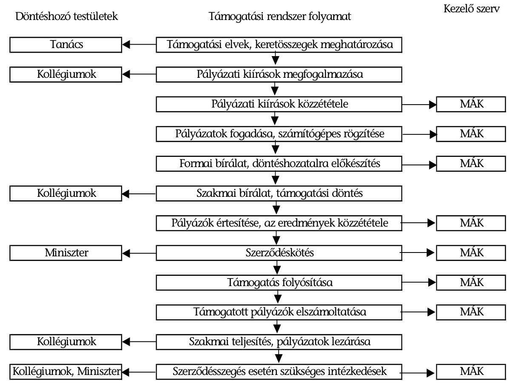

### 1.3.1. A Tanács múködése, elvi irányító szerepének érvényesülése

A 17 fős, több mint 70\%-os civil részvételi arányú Tanács elfogadott ügyrendje előírásainak megfelelően múködött, amely összhangban volt a törvényben, Vhr-ben és az egyéb jogszabályokban megfogalmazott követelményekkel.

A Tanács az alapprogram elvi irányító testülete, hatáskörébe tartozott különösen a nyújtható támogatások rendező elvei, a kollégiumok közötti forrásmegosztás arányai, a kollégiumok által meghirdethető pályázatok felhívásainak közös tartalmi kellékei, a több kollégium által alkalmazandó közös elbírálási kritériumok meghatározása.

---

A Tanács csak az első kifogás beérkeztét követően, az egységes eljárási rend kialakítása érdekében adta ki a jogorvoslati (kifogásolási) eljárások rendjéről szóló határozatát.

Az összeférhetetlenség szabályozására csak az első két pályázati fordulót követően került sor, ez összefoglalta a civil tv-ben meghatározott esetköröket és magatartási követelményeket. A határozat módosításai szigorították a követelményeket, meghatározták az összeférhetetlenségi nyilatkozat tartalmát, előírták azok internetes honlapon történő nyilvánosságra hozatalát.

A Tanács az éves költségvetési törvények keretein belül döntött a támogatások kollégiumok közötti elosztási elveiről, és a támogatási keretek kollégiumok közötti megosztásáról. A Tanács úgy határozott, hogy a civil szerveknek nyújtandó működési támogatáson túl kizárólag az egész civil szektor fejlődését segítő civil-szakmai tevékenységeket fogja támogatni.

A Tanács 2004 márciusában, és 2005 januárjában meghatározta a szakmai és regionális kollégiumok részére a támogatások forrásmegosztási arányát. A civil tv-ben megjelölt legalább 60\%-os múködési támogatás részarány helyett 2004ben $65 \%$-ot, 2005-ben $66,2 \%$-ot tervezett a civil szektor gyorsabb ütemű felzárkóztatása érdekében. A pályáztatás folyamata során ténylegesen 2004. évben $73 \%, 2005$. évben $70 \%$ volt a múködési támogatások aránya, ezzel teljesült a törvényben előírt $60 \%$-os minimális mérték. A három szakmai kollégium 2004ben $25 \%$-os, 2005-ben $23,8 \%$-os arányban részesedett. Az egy szervezetnek nyújtható támogatás felső határát 18 millió Ft-ban, a múködési támogatást pedig 7 millió Ft-ban maximálta. A múködési támogatás alapjaként az előző évi korrigált összes ráfordítást vette alapul, amelyhez kapcsolódóan a támogatás lépcsős mértékét határozta meg.

A forrásmegosztási döntésnél a Tanács a szervezetszám és a folyó kiadás kombinációján alapuló megosztást alkalmazta, egy szolidaritás alapú korrekcióval. Az országos szervezetek támogatási kerete rovására növelte a támogatások lehetőségét abban a három régióban (Észak-Magyarország, Észak-Alföld, Dél-Dunántúl), ahol a gazdasági fejlettség alacsonyabb, a munkanélküliség magasabb és/vagy a civil szféra kevésbé fejlett, mint az ország egyéb területein.

A Tanács a 2004. évi forrásmegosztással kapcsolatban úgy határozott, hogy első fordulós pályázati döntésekre 5490 millió Ft-ot, a második fordulóra 840 millió Ft támogatási keretet különít el, az NCA múködési keretére pedig 610 millió Ft-ot. A két forrásmegosztási döntés alapján a nyolc területi kollégium 4636 millió Ft, a három szakmai kollégium 1694 millió Ft támogatási keret fölött rendelkezett.

A Tanács a 2005. évi forrásmegosztásra vonatkozó döntését a költségvetési törvény megszorító intézkedéseire tekintettel hozta meg. Kötelezte a kollégiumokat, hogy a 2005. évi támogatási döntéseikben a rendelkezésükre álló pályázati forrást úgy használják fel, hogy a 2005. december 31. napjára 2300 millió Ft összegben, kötelezettségvállalással terhelt maradványt képezzenek.

A kötelezettségvállalással terhelt maradványt úgy kellett képezni a kollégiumoknak, hogy az odaítélt támogatás egy részét vagy egészét csak 2006. évben lehes-

---

sen folyósítani. Továbbá a fenti kötelezettségek miatt a tanács a 2006. évre áthúzódó múködési támogatások esetében a felhasználási határidőt 2006. május 31., az elszámolási határidőt pedig egységesen 2006. június 30. napjában határozta meg. Az NCA támogatások kifizetés ütemezéséről külön közleményben is tájékoztatta az érintett kollégiumokat és civil szervezeteket.

A Tanács 2005 júniusi határozatával a területi kollégiumok részére 2005. évre összesen 4215,5 millió Ft, a szakmai kollégiumoknak 1517,5 millió Ft csökkentett támogatási keretet határozott meg, az NCA éves múködési keretét 567 millió Ft-ra módosította, maradványképzési kötelezettség előírása mellett. A Tanács döntött az államháztartási tartalékképzési kötelezettség feloldásából adódó többletforrás felhasználásáról, az összeget a Civil Szolgáltató, Fejlesztő és Információs Kollégiumra bízta a civil szervezetek Internet-elérésének, illetve honlapjaik létrehozásának, fejlesztésének támogatására.

A Tanács 2004. április 13-án döntött a támogatási elvekről. A határozat összesen kilenc támogatási elvet sorolt fel (1. számú melléklet). A támogatási elvekkel kapcsolatos hiányosságok:

- A múködési támogatások körében elszámolható költségek, pl. Internet, CD jogtár, honlap szerkesztése és fenntartása a Civil Szolgáltató, Fejlesztő és In-formációs- és a Civil önszerveződés, szakmai és területi együttmúködés Kollégiuma támogatási céljai között is megtalálhatók voltak.
- Az évenkénti támogatási elvekben kijelölték, hogy melyik szakmai kollégiumhoz melyik NCA cél megvalósítása, támogatása tartozik. A Civil önszerveződés, szakmai és területi együttmúködés Kollégium, a Nemzetközi civil kapcsolatok és európai integrációs Kollégium, a Civil Szolgáltató Fejlesztő és Információs Kollégium céljai között átfedések voltak.

A kollégiumok által meghirdethető pályázatok felhívásainak közös tartalmi kellékei témakörben a Tanács első ízben, 2004 áprilisában döntött a részletes országos és regionális múködési pályázati kiírások közös tartalmi kellékeiről, a pályázati adatlapról és a rövidített pályázati kiírásról. A 2005. évi múködési pályázati kiírásban múködési költségnek minősítették a Tanács 1. számú támogatási elvének megfelelően a civil szervezet létesítő okirata szerinti alaptevékenységre fordított kiadást, ráfordítást is (1/a. számú melléklet). A Tanács a múködési költségeket kiterjesztette, mivel a kisebb civil szerveknél nem vált szét a szervezet múködtetési költsége az alaptevékenység költségétől, így csak az önálló irodával, külön alkalmazottal és nagy költségvetéssel rendelkező, fejlett civil szervezetek juthattak volna múködési támogatáshoz. A múködési költségek kiterjesztése következtében a szakmai és a múködési pályázatok között átfedések voltak.

Az egységes, minden kollégiumra és a kezelőszervezetre vonatkozó formai bírálati szempontrendszert csak jelentős késedelemmel, 2005. február 1-jén adta ki a Tanács. A határozat meghozatalára a hiánypótlás lehetőségének megnyílta miatt volt szükség.

A Tanács az ellenőrzés és vizsgálat rendjét 2004. július 6-án határozta meg. A határozat rögzítette az ellenőrzés célját, az ellenőrzési szinteket, az ellenőrzés módszereit és szempontjait, amelyek ellenőrzési szintenként különbözőek vol-

---

tak. A 2005. évi márciusi módosító határozat lényeges rendelkezése volt, hogy a helyszíni ellenőrzést nem az összes támogatott szervezet, hanem a pályázatok legalább 8\%-ának erejéig kell elvégezni az adott évi forrásmegosztás arányában.

A Tanács elnöke minden évben eleget tett a civil tv. 9. § (4) bekezdése szerinti tájékoztatási kötelezettségének. Az „Elnöki Tájékoztató a Nemzeti Civil alapprogram 2004. évi tevékenységéről és múködéséről" című 2005. április 30-i keltű dokumentum felsorolása szerint értelmezte az elvi irányító szerepkört (2. számú melléklet). Az áttekintett dokumentumok alapján a hatáskörök a fenti tájékoztatóban leírtak szerint érvényesültek.

# 1.3.2. A kollégiumok múködése és pályáztatási gyakorlata 

A civil delegáltak többségi részvételével felálló kollégiumok működésük szabályait ügyrendben határozták meg. A kollégiumok múködése törvényes volt, betartották a nyilvánosság követelményét. A támogatási döntéseket valamennyi kollégium saját maga által kidolgozott tartalmi bírálati szempontrendszer alapján hozta meg. A kiírt pályázatok összhangban voltak a civil tv. előírásaival és a Tanács támogatási elveivel.

A civil tv. 7. § (2) bekezdése szabályozta a döntéshozatalból való kizárást. A kollégiumi jegyzőkönyvek és határozatok alapján a kollégiumi tagok a támogatási döntések meghozatala során nem vettek részt annak a pályázatnak a bírálatában, amelyre összeférhetetlenségi nyilatkozatot tettek. Az érintett pályázatokról a kollégiumok külön határozatban döntöttek, és a szavazásban a nyilatkozó kollégiumi tag nem vett részt.

2004-ben a regionális kollégiumok a 23 pályázati kiírásra beérkezett mintegy 9307 pályázatból 5149 nyertes pályázatot 4625,4 millió Ft múködési támogatásban részesítettek, míg a szakmai kollégiumok az általuk kiírt 14 pályázatra a beérkezett 4068 pályázatból összesen 1111 pályázatra 1695,8 millió Ft támogatást nyújtottak. A törvény szerint támogatásra jogosult civil szervezeteknek mindössze 13\%-a nyújtott be pályázatot. A 2004. évi pályázati kiírásokra több mint 21 947,4 millió Ft támogatásigény érkezett be, amely a ténylegesen felosztható források, mintegy háromszorosa volt. Ezen belül a szakmai támogatási igények az e célra szánt összegeknek átlagosan három és félszeresét, a múködési támogatási kérelmek a két és félszeresét tették ki.

2005-ben a civil szervezetek a két fordulóban összesen 31128 millió Ft támogatási igényt nyújtottak be a kollégiumokhoz, ennek 34,63\%-át szakmai pályázaton, míg 65,37\%-át működési témájú támogatásra igényelték. A 2005. évben beérkezett összes NCA támogatási igény a pályáztatásra fordítható teljes keretösszeghez képest közel ötszörös volt, az arra jogosult civil szervezeteknek 22-25\%-a nyújtott be pályázatot. A regionális kollégiumok a 2005-ben 16 pályázati kiírásra beérkezett mintegy 13443 db pályázatból 9548 nyertes pályázatra 4681,6 millió Ft múködési támogatást ítéltek oda, míg a szakmai kollégiumok az általuk kiírt 11 pályázatra a beérkezett 5504 pályázatból összesen 1909 db pályázatot részesítettek 1898,7 millió Ft támogatásban. A második fordulóban beérkezett pályázatokról a kollégiumok 2005. december 31-ig még nem döntöttek, mivel a pályázatok kiírására 2005. december 27-én és 29-én került sor.

---

A szakmai kollégiumoknál a civil szervezetek pályázati önrészeinek támogatására és az adományosztó szervezeteknek szóló juttatásokra egyik évben sem írtak ki pályázatot. A Kh. tv-ben felsorolt tevékenységek közül a civil kollégiumok pályázati kiírásai csak szűk körben tették lehetővé a közhasznú tevékenységek támogatását. A múködési pályázatok költségkalkulációjában a pályázók feltüntették, hogy milyen összegű saját forrást biztosítanak a múködési és felhalmozási kiadások fedezéséhez, ennek ellenére a saját forrás meglétének igazolását, majd költségvetésbe és elszámolásba történő beépítését a támogató nem kérte. A kialakított kollégiumi gyakorlat nem tette lehetővé, hogy a támogatási programokat forrásarányosan finanszírozzák az NCA-ból.

# 2. Az NCA TÁmogatÁsOK RENDSZERE És FelHASZNÁlása 

### 2.1. A támogatások kezelése, rendszere és felhasználása

Az NCA kezelő szerve a MÁK, amely az egyes megyeszékhelyeken lévő Területi Igazgatóság Állampénztári Irodái útján látja el feladatait. A Miniszterelnöki Hivatal 2004. március 9-én vállalkozási szerződést kötött a MÁK-kal.

A vállalkozási szerződést 2004-ben, a MEH által, az NCA fejezeti kezelésű célelőirányzatával kapcsolatos kezelői tevékenység ellátása tárgyban kiírt, nyílt közbeszerzési eljárás eredménye alapján kötötték.

Az ICSSZEM és a MÁK között - a Vhr. módosítása következtében - 2005. december 12-én megállapodás jött létre.

A 18/2005. (II.10.) Korm. rendelettel módosított Vhr. rögzítette, hogy az NCA kezelésével kapcsolatos feladatokat a MÁK látja el.

Mind a vállalkozási szerződés, mind a megállapodás részletesen meghatározta a MÁK feladatait. A megállapodás a szerződéshez képest bővített feladatokat tartalmazott, valamint újakat is rögzített, mint pl. az NCA honlap karbantartása, a követeléskezeléssel összefüggő feladatok ellátása, a feladatokról negyedévente összefoglaló jelentés készítése.

A vállalkozási szerződés VI. pontja tartalmazta a vállalkozói feladatok és tranzakciók szerinti bontását, a költségek kifizetése a teljesítés igazolását követően havonta történt.

A MÁK elnöke 44/2004. és 15/2005 számú belső elnöki utasítást adott ki a Nemzeti Civil Alapprogram támogatások kezelésének eljárási rendjéről. Az utasítások rögzítették a MÁK szerződésben és megállapodásban vállalt kötelezettségei részletezését, valamint ezek felelősét.

### 2.2. A pályázati rendszer múködése

A 2004. évi kiírások keretében a kollégiumok 6260 db pályázatra 6321,2 millió Ft-ot ítéltek oda, amelyből 2005. év végéig 6278,8 millió Ft-ot fizettek ki.

Múködési támogatást nyújtó kollégiumok 2004-ben 4625,4 millió Ft-ot, szakmai támogatást nyújtó kollégiumok 1695,8 millió Ft-ot ítéltek oda.

---

A 2004. évi lezárt pályázatok alapján az egy pályázatra jutó támogatási összegeket kollégiumonként és országos átlagban az alábbi diagram szemlélteti:
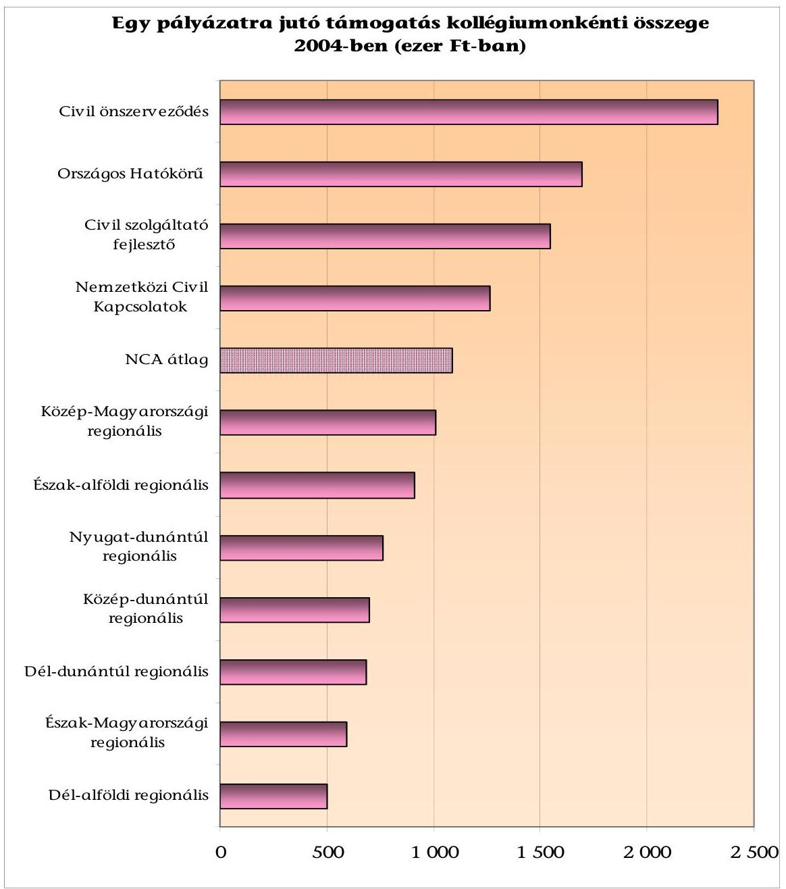

2005-ben az 1 pályázatra jutó támogatási összeg kollégiumonként átlagosan $10 \%$-kal csökkent.

A múködési támogatást nyújtó kollégiumok a beérkezett pályázatok 44-64\%át, a szakmai támogatást nyújtó kollégiumok a benyújtott pályázatok 19-35\%át támogatták.

A támogatást nyújtó kollégiumok a 2004. évben az igényelt támogatások (21 947 millió Ft) átlagosan $28,8 \%$-át ( 6321 millió Ft ) ítélték oda a pályázóknak. A 2005. évben az igényelt támogatás ( 31128 millió Ft) átlagosan $21,4 \%$ át tette ki a megítélt támogatás ( 6580 millió Ft ). (Az igényelt támogatás tartalmazza az elutasított pályázatokban kért összegeket is).

---

A 2004. évben a Vhr. a pályázatok hiánypótlására még nem biztosított lehetőséget, 2005-ben már engedélyezte azt. A kollégiumok a 2004. évben a beérkezett pályázatok $46,8 \%$-át támogatták, a 2005 . évben ez a mutatószám $60,5 \%$ volt.

Az igényelt és odaítélt támogatás alakulását kollégiumonként a következő diagram mutatja be:
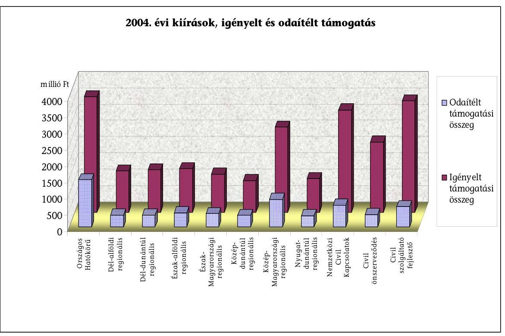

Az NCA kollégiumainak pályázati tevékenységének főbb adatait az 1. számú tanúsítvány (3. számú melléklet) mutatja be.

A pályázati rendszer múködését - a 2004. éves pályázati kiírásra benyújtott 353 szervezet (127 alapítvány, 226 társadalmi szervezet) 455 pályázatát a kezelő szervezetnél dokumentálisan ellenőriztük (7-8. számú melléklet). Az ellenőrzött szervezetek 1192 millió Ft támogatásban részesültek, amely a kifizetett összes támogatás ( 6278,8 millió Ft) 19\%-át tette ki.

A szervezetek 33\%-a kiemelkedően közhasznú, 51\%-a közhasznú volt, 16\%-a nem rendelkezett közhasznú minősítéssel.

Az ellenőrzött pályázatok 72\%-a múködési, 28\%-a szakmai célú támogatás volt. A pályázatokra folyósított 2004. évi múködési támogatások összege 849,6 millió Ft-ot tett ki, amely az összesen kifizetett múködési támogatás (4597,6 millió Ft) 18,5\%-a volt. A szakmai támogatásra 324,4 millió Ft-ot, az öszszes támogatás ( 1681,2 millió Ft) 19,3\%-át fordították.

A kedvezményezettek által - 455 pályázatban - igényelt 1687,8 millió Ft öszszegből a kollégiumok 1192 millió Ft támogatást hagytak jóvá és fizettek ki, így a szervezetek átlagosan a kért támogatás $71 \%$-át kapták meg. A kollégiumok a támogatott pályázatok egynegyedénél ítélték meg a kért támogatási összeg teljes egészét. Az igényelt támogatási összeg felénél kevesebbet a támogatott pályázatok $22 \%$-ánál ítéltek meg, ez a gyakorlat legnagyobb mértékben a DélDunántúli Regionális, a Közép-Magyarországi Regionális, valamint a Nemzet-

---

közi Civil Kapcsolatok és Európai Integráció kollégiumra volt jellemző. Ez utóbbi kollégium az igényelt összeghez mért fele összegű támogatásra vonatkozó döntéshozatala a társadalmi szervezetek 19\%-át, az alapítványok 11\%-át érintette.

# 2.2.1. A múködési és szakmai támogatások 

Múködési támogatásra - a civil tv-ben felsorolt kizáró okok figyelembevételével - az összes civil szervezet $89 \%{ }^{2}$-a volt jogosult.

A civil tv. 3 § (3) bekezdése értelmében nem jogosult az alapprogram múködési támogatására az a civil szervezet, amely a tárgyévben a költségvetési törvény alapján közvetlenül, nevesítve részesül múködési támogatásban az állami költségvetésből, valamint a (4) bekezdése szerint az a civil szervezet, amely a Kh. tv. 26. § d) pontja szerinti közvetlen politikai tevékenységet folytat.

A kollégiumok a 2004. évi összesen kifizetett 6278,8 millió Ft-ból 73\%-ot (4597,6 millió Ft) múködési támogatásra fordítottak. A 2005. évben ugyanez az arány $70 \%$ volt.

Az alapprogram rendelkezésére álló forrásokat a törvényi előírásoknak megfelelően legalább 60\%-ban múködési támogatásokra kellett fordítani.

A múködési támogatások összeghatáráról szóló támogatási elv nem biztosította a támogatás mértékére vonatkozóan az esélyegyenlőséget, mivel nem a civil szervezetek sajátos múködési jellegét, hanem az előző évi ráfordításait vette csak alapul, ezért hátrányosan érintette a kisebb civil szervezeteket. Így azon szervezetek, amelyek éves „korrigált ráfordítása" magas volt, nagyobb összegű NCA támogatásra voltak jogosultak.

Egy szervezet egy naptári évben maximum 7 millió Ft múködési támogatást igényelhetett, az ellenőrzött pályázatoknál egy támogatásra jutó, ténylegesen kifizetett összeg átlagosan 2,6 millió Ft (37,1\%) volt.

A szakmai támogatást kizárólag a közhasznú szervezetek, így a civil szervezetek $48 \%$-a vehette igénybe. A támogatott szervezetek az előírásoknak megfelelően rendelkeztek közhasznúsági fokozattal.

A közhasznú és kiemelkedően közhasznú szervezeteknek a gazdálkodásban, a számviteli rendben, a vezető tisztségviselők összeférhetetlenségi szabályaiban, a nyilvánosság rendszeres tájékoztatásában szigorúbb követelményeknek kell megfelelni, mint a nem közhasznú szervezeteknek. Közvetlen politikai tevékenységet nem folytathatnak, a pártoktól függetlenek és azoknak anyagi támogatást nem nyújthatnak.

A szakmai kollégiumok által kiírt pályázatok alapvetően a civil szervezetek társadalmi szerepvállalásának segítését, valamint a kormányzat és a civil társa-

[^0]
[^0]:    ${ }^{2}$ Forrás: Szakértői háttéranyag az NCA-ból nyújtott támogatások ellenőrzésének előkészítéséhez (Baranyi Éva - Kuti Éva, 2005. június)

---

dalom közötti partneri viszony és munkamegosztás előmozdítását szolgálták, így a pályázatokra - a szervezetek által ellátott közhasznú tevékenységek jellegéből adódóan - az NCA támogatásra jogosult közhasznú civil szervezeteknek csak a 23\%-a pályázott. A szakmai kiírások esetében az egy pályázaton elnyerhető támogatás felső határa 5 millió Ft volt, esetenként egy szervezet több pályázatot is benyújthatott. A kollégiumok által egy támogatásra átlagosan kifizetett összeg az ellenőrzött alapítványoknál 2,9 millió Ft, társadalmi szervezeteknél 2,6 millió Ft volt.

A szakmai támogatásban részesült alapítványok az alapító okiratok alapján a legnagyobb arányban az oktatási (23\%), szociális (17\%), kulturális (10\%) és egészségügyi (7\%) feladatokat láttak el. A társadalmi szervezetek a benyújtott alapszabály szerint 20\%-ban sport, 19\%-ban kulturális, 14\%-ban környezetvédelmi, 13\%-ban szociális tevékenységet jelöltek meg főtevékenységnek. Az alapítványi kedvezményezettek alacsony aránya látta el a sporttal ( $0,3 \%$ ), a polgári védelemmel $(0,6 \%)$, és egyik sem a településfejlesztéssel kapcsolatos feladatokat, a civil szervezetek jogvédő segítsége, polgári védelem, településfejlesztési tevékenysége, szabadidős és hobbisport, nemzetközi tevékenysége mindösszsze $1 \%$ arányt képviselt. A szociális és egészségügyi tevékenységet ellátó szervezetek elsősorban az SZJA 1\%-os kampány szakmai kiírásra tudtak pályázni, az egyéb szakmai kiírásokra feladataik jellegéből adódóan nem tudtak pályázatot benyújtani.

# 2.2.2. A pályáztatás folyamata 

A kollégiumok a pályázati kiírásokat az NCA és a MÁK internetes honlapján, a MÁK megyeszékhelyeken lévő Területi Igazgatóság Állampénztári Irodáiban, valamint országos és megyei sajtó útján is közzétették. Az alapítványok és társadalmi szervezetek környezeti és múködési feltételei igen eltérőek voltak, emiatt az információkhoz (pályázati kiírások, támogatási elvek, kollégiumi döntések, második körös kiírások, stb.) is eltérő módon jutottak hozzá. Számos szervezetnek nem volt internet, email hozzáférési lehetősége, amely megnehezítette a tájékozódást, a felvilágosítás kérést.

A benyújtott pályázatokat a MÁK budapesti és megyei szervezetei ellenőrizték a formai követelmények tekintetében. Azokat a pályázatokat is továbbították a kollégium felé bírálatra, amelyeket elsődlegesen formailag hibásnak minősítettek és elutasításra javasoltak, mivel a támogatásról való döntés a civil tv. alapján a kollégium joga volt. A MÁK, illetve a kollégiumok által eltérően megítélt pályázatokról készült jegyzőkönyveket minden esetben megküldték a miniszter részére.

A kollégiumi döntést és a minisztériumi jóváhagyást követően a pályázókat a pályázat elfogadásáról, vagy elutasításáról írásban értesítették.

Az értesítésben - amennyiben a megítélt támogatás lényegesen eltért az igényelttől - felhívták a támogatott figyelmét, hogy a támogatási összeg figyelembevételével módosítsa programját és annak költségvetését is. Az értesítésben felhívták a támogatottak figyelmét a szerződéskötéshez szükséges igazolások, nyilatkozatok beküldésére is.

---

A támogatási szerződések megkötését követően lehetőség volt a szerződések módosítására.

A szerződésmódosításra a kedvezményezetteknek lehetőségük volt mindaddig, amíg az elszámoláshoz nem nyújtották be pénzügyi és szakmai beszámolójukat. Az esetleges szerződésmódosítást minden alkalommal az illetékes kollégium bírálta el.

A támogatás folyósítását a MÁK a szerződéskötést követő 15 napon belül megkezdte, 2004-ben a támogatások 93-95\%-át egy összegben, 5-7\%-át két egyenlő, vagy két eltérő részletben folyósította a nyertes alapítványok/társadalmi szervezetek részére. Az egyösszegű kifizetés a támogató részéről utólagos elszámolás melletti előfinanszírozást, a két részletben történt folyósítás részben előfinanszírozást, részben utófinanszírozást jelentett. Az NCA kizárólag utófinanszírozással nem folyósított támogatást. A kedvezményezett szervezetek szemszögéből azonban - elsősorban a múködési támogatásoknál - a folyósított összeg rendszerint utólagosan fedezte a szerződésben indokolatlanul hosszúra meghatározott - 17 hónapos - felhasználási időszakban felmerült kiadásokat.

Az elszámoláshoz 2004. január 1-jétől 2004. december 31-ig, valamint a második fordulós múködési kiírások esetében 2004. január 1. és 2005. május 31 közötti időszak költségeiről és ráfordításairól nyújthattak be számlákat, miközben a pályázat benyújtásának határideje 2004. június 30. volt, a szerződéseket pedig 2004. szeptember-november időszakban kötötték meg.

A 2004. évi pályázatok benyújtása és lezárása közötti időtartam indokolatlanul magas, mintegy 14 hónap volt. A pályáztatás folyamatának időbeni elhúzódását az egy, illetve kétszeri alkalommal történt hiánypótlás, a felhasználási időszakot követő mintegy 6 hónapos elszámolási határidő engedélyezése, stb. eredményezte.

A pályázatok benyújtása és a kollégiumi döntést követő kiértesítés között mintegy három hónap telt el, azt követően a szerződéskötésig közel egy hónap telt el, a szerződéskötéstől az elszámolás benyújtásáig általában hét hónap, a pályázati anyagok az elszámolás benyújtási határidejét követő harmadik hónapban pedig lezárásra kerültek.

Az ellenőrzött szervezetek a pályázataik mindössze 16\%-áról készítették el az elszámolást a támogatási szerződés előírásának megfelelően. A kezelő szerv a benyújtott elszámolások $84 \%$-át küldte vissza a szervezetek részére, legalább egyszeri hiánypótlásra, amelyet követően ezen pályázatok 96,5\%-ban lezárásra kerültek. A pályázatok elszámolására meghatározott június 30-i határidő nem volt összhangban a civil tv. 9 §. (5) bekezdésében megjelölt, a miniszter részére, az alapprogram előző évi múködéséről előírt beszámolási kötelezettségének június 30-i határidejével, mivel ezen időpontra teljes körű adatok nem álltak rendelkezésre.

A kedvezményezettek által beküldött beszámolókat formai és tartalmi szempontok szerint minősítették. A beszámolók elkészítésekor és a beadandó számlák hitelesítéskor a szervezetek nem teljes körűen vették figyelembe a támogatási szerződés, valamint a pályázati kiírás vonatkozó rendelkezéseit. Amennyiben a támo-

---

gatott elszámolása nem felelt meg, úgy határidő kiszabásával felszólították a beszámolás szabályszerű teljesítésére.

A Tanács határozata alapján a szakmai beszámoló és a pénzügyi elszámolás elfogadására a döntéshozó kollégium volt jogosult, amelyet követően a szabályoknak megfelelően a MÁK értesítette a kedvezményezetteket a szerződés lezárásáról.

A civil szervezetek a kapott támogatással bizonylatok hiteles másolatainak benyújtásával, összesítő jegyzék alapján, valamint pénzügyi és szakmai beszámoló készítésével számoltak el.

# 2.3. A támogatási szerződések 

A támogatási szerződések tartalmára vonatkozóan az Áht., a Vhr. 9. § előírásai voltak irányadóak. A MÁK az egyes támogatási ügycsoportokra vonatkozóan a fejezetgazdával kötött szerződéses kötelezettségének megfelelően mintaszerződéseket készített, amelyeket a Miniszteri Titkárság ellenjegyzett. A MÁK ezen felül a 2004. évben összesen 9,3 millió Ft értékben ( 13 db ) egyedi szerződést készített elő ICSSZEM-mel kötött megállapodás alapján. Egyedi szerződéskötésre pályázat nélküli támogatásra - abban az esetben került sor, ha az NCA választott testületek elnökei, tagjai a civil szervezetük javára lemondtak a tiszteletdíjról. Ez a lehetőség 2005-ben megszűnt.

A támogatási szerződések a vonatkozó jogszabályokkal összhangban tartalmazták a támogatás célját, a folyósítás feltételeit és ütemezését, a támogatás felhasználásnak szabályait, mindkét fél jogait és kötelezettségeit, a támogatás rendeltetésszerű felhasználásának ellenőrzését, a szerződésszegések eseteit és következményeit, továbbá a kötelező mellékleteket. A 2004. évi támogatási szerződések a folyósítás időpontját, több részletben történt kiutalásnál az összegeket is tartalmazták, a támogatás kifizetésének megkezdését, a szerződéskötést követő 15 napon belül írták elő. A 2005. évi szerződések azonban a kifizetés időpontját nem határozták meg pontosan, két részletben történt finanszírozás esetén rendszeres volt a „2006. évben" megjelölés, így a kedvezményezettek bizonytalan időpontban jutottak hozzá a megítélt támogatás második részéhez. A 2005. évi múködési támogatási szerződésekben a második részlet folyósításának feltételeként rögzítették az első részlettel történt elszámolást. A MÁK a miniszter útmutatása szerint eljárva a felhasználási időszakban szerződésmódosítás kezdeményezése helyett levélben értesítette a kedvezményezetteket e feltétel módosításáról, amely szerint a második részlet kiutalásához az első részlettel való elszámolás nem volt szükséges.

Az NCA ténylegesen fel nem merült kiadásokat is finanszírozott, mivel a 2004. évi támogatási szerződésekben a bér- és bérjellegú kiadások között szerepelt az önkéntesek foglalkoztatása költségei elszámolása, amely a támogatottak részére nem kiadást, hanem természetben igénybevett, ingyenes szolgáltatást jelentett. A 2005. év támogatási szerződéseiben nem szerepelt már ez a jogcím.

A támogatás rendeltetésszerű felhasználásának elkülönítése, további támogatáshoz történt elszámolás kizárása, valamint az ellenőrzés céljából a szerződés előírta az eredeti bizonylatokon az „NCA támogatáshoz felhasználva" szöveg

---

feltüntetését. A támogató azonban a 2004. évi szerződésben nem írta elő a bizonylatokon a szerződésszám, valamint az összeg rögzítését, így ha egy szervezet több NCA támogatásban részesült illetve részösszeget számolt el, nem volt megállapítható, hogy a számviteli okmányt mely támogatási szerződéshez, milyen összeggel használta fel. A 2005. évtől kezdődően a szerződések már előírták az elszámolásokban a szerződésszám és a felhasznált összeg feltüntetését. A szerződések tartalmazták az ellenőrzésre jogosult szervek megnevezését, de az Áht. 122. § (1) bekezdés előírásától eltérően nem rögzítették a kedvezményezettnek a külső ellenőrző szervek munkájának segítésére vonatkozó kötelezettségét. A támogatási szerződés V. 5.3. pontjában rögzített, a bizonylatok megőrzésére vonatkozó 5 év nem felelt meg a Sztv. 169. § (2) bekezdésben előírt - 8 éves - megőrzési határidőnek.

# 2.4. A támogatásból megvalósított program összhangja a vizsgált szervezetek cél szerinti feladataival 

A szerződésben meghatározott - működési és szakmai támogatásból megvalósított - feladatok megfeleltek az alapítványok alapító okiratában, a társadalmi szervezetek alapszabályában foglalt céloknak. A múködési támogatásokkal az NCA döntően (alapítványoknál 41\%, társadalmi szervezeteknél 44\%) személyi jellegú kifizetéseket finanszírozott, jelentős mértékben (31\%) támogatta a dologi jellegú költségeket, amelyeken belül elsősorban a kommunikációs, a propaganda és marketing költségeket, valamint a szervezet székhelyének, múködési helyének fenntartási költségeit. A támogatott múködési költségek megoszlását jogcímenként a következő diagram mutatja be:
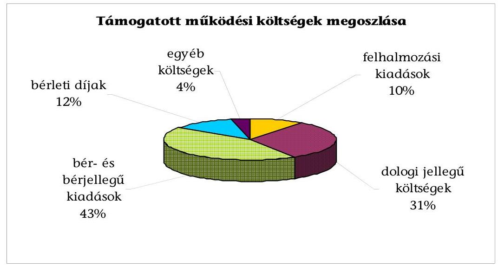

A támogatott költségek alakulását a 6. számú melléklet mutatja be.
A szakmai célú programok keretében a szervezetek elsősorban dologi típusú kiadásokra (alapítványok 82\%, társadalmi szervezetek 75\%), személyi juttatások fedezésre (alapítványok 12\%, társadalmi szervezetek 21\%), továbbá kisebb mértékben felhalmozási célú kiadásokra kértek és kaptak támogatást.

A támogató a civil szervezeteknek nyújtott támogatásokra vonatkozóan a szerződés szerinti célok megvalósításának szakmai teljesítés és hatékonyság szem-

---

pontjából történő ellenőrzési rendszerét nem alakította ki. A támogatások felhasználásának ellenőrzése gyakorlatilag a pénzügyi elszámoltatásra korlátozódott. A Tanács ellenőrzésről szóló határozata szerint a dokumentum alapú ellenőrzéshez az adott kollégiumnak kellett a szakmai szempontrendszert meghatározni. A Kollégiumok azonos bírálati követelményrendszere nem alakult ki. A 2004. évben csak a Civil Szolgáltató Fejlesztő és Információ Kollégium adott meg szakmai szempontokat.

A dokumentálisan ellenőrzött kedvezményezettek szakmai beszámolói alapján a támogatási szerződésekben vállalt célok megvalósultak, de a feladatok megvalósításának civil szektort érintő hatása - a támogató által megkövetelt teljesítménymutatók hiányában - nem volt mérhető.

# 3. A TÁMOGATÁSOK FELHASZNÁLÁSÁNAK SZABÁLYOSSÁGA 

A helyszíni ellenőrzés keretében 101 szervezetet (40 alapítvány és 61 társadalmi szervezet) 389 pályázatát ellenőriztük. Az ellenőrzött pályázatokra megítélt támogatás ( 2855 millió Ft) a 2004-2005. években odaítélt összes támogatás (12 902 millió Ft) $22 \%$-át tette ki. A helyszíni ellenőrzésbe vont szervezetek a következők szerint kerültek kiválasztásra:

- a 2004-2005. években az adott évi költségvetési törvényben nevesítetten támogatott alapítványok és társadalmi szervezetek (11 szervezet);
- 2004. évben az NCA-ból 10-18 millió Ft támogatásban részesült alapítványok és társadalmi szervezetek 50\%-a (26 szervezet);
- A mintavétellel kiválasztott, dokumentális ellenőrzés alapján feldolgozott szervezetek közül 2/3 - 1/3 arányban fővárosi és regionális elhelyezkedésű alapítványok és társadalmi szervezetek (43 budapesti, 22 vidéki).

Egy egyesület kikerült a helyszíni ellenőrzöttek köréből, mivel a Közép Magyarország Regionális Kollégium a múködési támogatás teljes összege visszafizetéséről hozott határozatot.

A helyszínen ellenőrzött szervezetek legfontosabb adatait a 7. számú melléklet mutatja be.

### 3.1. A pályázati feltételek érvényesülése

A pályázati feltételek teljesítésének ellenőrzése során a kedvezményezett civil szervezetek mintegy tizedénél a költségvetésből közvetlenül kapott támogatások, 3\%-ánál az áfa visszaigénylés, 1\%-ánál a 60 napon túli köztartozás vizsgálata alapján állapítottunk meg hiányosságokat.

Tizenegy szervezet az éves költségvetési törvény által közvetlenül, nevesítve múködési célú támogatásban részesült.

A költségvetési törvény alapján nevesesítve múködési támogatásban részesült egy társadalmi szervezet (Magyar Vöröskereszt), amelynek hat - jogi személyként működő - szervezeti egysége jogosultan vette igénybe az NCA működési támogatást. A Magyar Vöröskereszt budapesti és 5 megyei szervezete

---

származtatott jogi személyként 2005. évben 14,7 millió Ft NCA működési támogatást kapott. Az NCA Országos Tanács 32/2005. (2005. február 14.) számú határozata értelmében megfelelt a pályázati feltételeknek, mivel olyan ún. származtatott jogi személy nyújtott be pályázatot, amelynek az anyaszervezetét a bíróság 2004. január 1-jét megelőzően nyilvántartásba vette, a származtatott jogi személy szervezet a rá irányadó szabályok szerint 2004. január 1-jét megelőzően jött létre.
„A 2000. december 1-jétől hatályos alapszabály szerint a Vöröskereszt OT és 20 megyei, budapesti szervezeti egysége jogi személyként múködött." ${ }^{3}$

A helyszíni ellenőrzés során megállapítottuk, hogy három szervezet a központi költségvetési támogatást ténylegesen, teljes mértékben az alapító okirat/alapszabály szerinti célfeladatai finanszírozására használta fel.

# Kettő szervezet a civil tv. 3. § (3) bekezdése értelmében nem részesülhetett volna NCA támogatásban. 

Az Informatikai Érdekegyeztető Fórum a 2004. évben a költségvetési törvény alapján közvetlenül, nevesítve részesült múködési támogatásban, ezért az NCA-ból 7 millió Ft múködési támogatást jogosulatlanul vett igénybe.

A Budapesti Fesztiválzenekar Alapítvány a 2004. és 2005. évi költségvetési tv. alapján a NKÖM fejezettől, közvetlenül, nevesítve „egyéb működési célú" támogatást kapott, amelyet cél szerinti feladataira és múködési költségei fedezésére fordított. A civil tv. 3. § (3) bekezdése értelmében az alapítvány a 2004. évi 0,5 millió Ft és a 2005. évi 0,2 millió Ft NCA múködési támogatásra nem volt jogosult.

A Budapesti Fesztiválzenekar a jogosulatlanul kapott támogatást ( 0,7 millió Ft) a helyszíni ellenőrzést követően, 2006. június 14-én visszafizette.

Az Infonia Alapítvány, a C3 Kulturális és Kommunikációs Központ Alapítvány és az Üllői Mozgáskorlátozottak Egyesülete a támogatási szerződés megkötésekor úgy nyilatkozott, hogy a pályázati cél megvalósulása során áfa visszaigénylésre nem jogosult. Az elszámoláshoz benyújtott számlák alapján az egyesületnél nem történt áfa visszaigénylés, a két alapítvány azonban áfát igényelt vissza. Az Infonia Alapítvány a visszaigényelt áfa teljes összegét a helyszíni ellenőrzés időpontjáig önellenőrzéssel helyesbítette. A C3 Kulturális és Kommunikációs Központ Alapítvány támogatását a MÁK a helyszíni ellenőrzés időpontjáig még nem zárta le, az Országos Kollégium 1354/2005. XI. 23. határozata alapján a támogatás teljes összegét vissza kell fizetnie, mivel a hiánypótlást felszólításra sem teljesítette.

Az áfa körbe tartozó szervezetnek beszámoláskor - az Ámr. előírása és a pénzügyi kalauz útmutatása alapján - a támogatási összeg felhasználását a bizony-

[^0]
[^0]:    ${ }^{3}$ Forrás: A Magyar Vöröskereszt 2003-2004. évi gazdálkodásáról szóló 0605. számú jelentés.

---

latok nettó, áfa nélküli értékének elszámolásával kellett volna szerepeltetni, ugyanakkor mindkét alapítvány a bizonylatok bruttó összegével számolt el.

Az Ámr. 91. § (1) bekezdése alapján a támogatás csak abban az esetben igényelhető az áfát is tartalmazó összköltségnek a saját résszel csökkentett összege után, ha a kedvezményezettnek - külön jogszabály szerint - a támogatásból finanszírozott beszerzése kapcsán áfa levonási joga nincs. Amennyiben a támogatott áfa levonási joggal rendelkezik, akkor csak az áfával csökkentett nettó összeg után veheti igénybe a támogatást.

Az Üllői Mozgáskorlátozottak Egyesületének 2005. évi 4 millió Ft-os múködési pályázata benyújtásakor lejárt határidejú köztartozása volt, így a Vhr. 8. § (3) bekezdése e) pontjai értelmében nem részesülhetett volna támogatásban. A 2005. évi múködési pályázat benyújtásának időpontjában, az APEH által kiadott igazolás alapján 2,1 millió Ft, a támogatás kiutalása időpontjában a helyszínen ellenőrzött könyvvezetés adatai szerint 12,1 millió Ft meg nem fizetett adó- és járuléktartozása állt fenn.

# 3.2. Az elszámoláshoz csatolt dokumentumok szabályossága 

A civil tv., a Vhr. és a támogatási szerződésekben foglaltaknak megfelelően a kedvezményezettek a kapott támogatás felhasználásáról pénzügyi elszámolást és szakmai beszámolót készítettek.

A kedvezményezettek számára az elszámolás elősegítése érdekében 2004. és 2005. évben az ICSSZEM pénzügyi kalauzt készített, amelyet a támogatottak részére megküldött.

A 2004. évi támogatások felhasználásáról a kedvezményezetteknek a költségvetés teljesüléséről készített pénzügyi elszámolást és számlaösszesítő jegyzéket kellett benyújtani. Az összesítő jegyzék azonban nem tartalmazta a bizonylatokhoz kapcsolódó gazdasági esemény rövid megnevezését, emiatt a kiadások jogcímek szerinti ellenőrizhetőségét nem biztosította.

A 2004. évi elszámolások felülvizsgálatának tapasztalatai alapján a 2005. évi pályázatok számlaösszesítő jegyzékét kiegészítették a gazdasági esemény megnevezése és a bizonylat kiállítója kitöltendő oszlopokkal.

A MÁK területi irodái végezték a pénzügyi elszámolás ellenőrzését, amely során a beszámolók tartalmi és formai megfelelőségét, a szerződésben meghatározott költségvetés szerinti felhasználást, a benyújtott számlamásolatok formai és tartalmi szabályszerűségét, valamint a támogatás cél szerinti felhasználását vizsgálták felül. Amennyiben az elszámolás nem volt teljes körű, a MÁK 2005-től hiánypótlásra kérte a kedvezményezetteket, nem megfelelően felhasznált támogatás esetén pedig visszafizettette.

A támogatási szerződés III/3. 3. pontja előírásainak - valamint a pénzügyi kalauz útmutatásának - megfelelően bizonyos típusú költségeknél a kedvezményezettnek a számlamásolaton túl egyéb dokumentumokat is be kellett nyújtani az elszámoláshoz. Ezeket szintén a MÁK ellenőrizte, azonban a kezelő̉ szerv a szervezetek 4\%-ánál elfogadott olyan számlát, amelyhez a kedvezményezett nem, vagy nem megfelelő módon csatolta a kötele-

---

# zően elöírt dokumentumot, illetve nem a pályázati kiírás szerinti költséggel számolt el. 

Az Infonia Alapítványnál 0,3 millió Ft-os asztalos munkákról szóló számlához nem csatoltak sem megrendelést, sem szerződést, terembérleti dijról szóló két számlát a szervezet testületi üléseivel kapcsolatos kiadások között számoltak el, de a rendezvények megtartását igazoló dokumentumokat (pl. jegyzőkönyv, jelenléti ív) nem csatoltak, angol nyelvi képzésre 0,2 millió Ft-ot használtak fel, és a képzés megvalósulásáról nem csatoltak dokumentumot.

Az Örök Sziget Alapítvány 0,4 millió Ft-ot számolt el kommunikációs kiadások címen, az elszámoláshoz benyújtott szerződés és számla nem tartalmazta az igénybevett szolgáltatás megnevezését és besorolási számát, így a szolgáltatás igénybevétele nem volt bizonyított.

Az Európa Ház Egyesület 2004. évi múködési támogatásból 0,4 millió Ft értékben repülőjegyet számolt el, az országos hatókörű civil szervezetek részére kiírt 2004. évi múködési célú pályázati feltételek, valamint a támogatási szerződésben a III/3.2. pont előírása ellenére. A pályázati kiírás szerint múködési költségként munkatársak, segítők, vezetők alkalmazottak kapcsolattartását szolgáló belföldi utazások útiköltségét számolhatták el.

Az Üllői Mozgáskorlátozottak Egyesülete a szerződés és számla valós tartalmától eltérően 1 millió Ft fenntartási költséget számolt el, amely ténylegesen felújítás volt.

A támogatási szerződések rögzítették a támogatások felhasználásának időszakát, amelyet az elszámoláskor a kezelő szerv ellenőrzött, azonban két esetben a MÁK felhasználási időszakon túli számlát is elfogadott.

Az Infonia Alapítványnál elszámolt 35000 Ft repülőjegy számlán a feltüntetett utazás időpontja (2005. 06. 03.) a támogatási szerződésben megjelölt felhasználási időszakot (2005. 05. 15.) meghaladta, így annak elszámolása szabálytalan volt, azonban a MÁK azt elfogadta.

Az Epilepsziás Gyermekekért Alapítvány az NCA Civil Szolgáltató Fejlesztő és Információs Kollégiumtól internetes hozzáférés támogatására 0,4 millió Ft támogatást nyert egy alapítvány. A benyújtott számlán a teljesítés és pénzügyi kifizetés dátuma 2005. 06. 15-e volt, amely határidőn túli (2005. 05. 31) kifizetés volt. A MÁK a kifizetés jogosságát emiatt nem kifogásolta.

## A támogatások felhasználásának dokumentálása, elszámolása során minden nyolcadik szervezet nem tartotta be a támogatási szerzödések elöírásait.

- A benyújtott számlák és bankkivonatok eredeti dokumentumaira a támogatottak nem vezették rá, hogy azok felhasználása az NCA támogatás terhére történt.

A Mozgáskorlátozottak Egymást Segítők Egyesülete, Magyar Triatlon Szövetség, Üllői Mozgáskorlátozottak Egyesülete, Pest Megyei Diáksport Szövetség, Egészséges Szívért Alapítvány, Közhasznú Alapítvány a Dadogókért, Együtt a Parlagfű Ellen Alapítvány, Jövő Iskolája Magyarországi Alapítványa szervezetek nem tüntették fel.

---

- Az elszámolásra benyújtott számlákon a teljesítést az arra jogosultak nem igazolták.

A Mozgáskorlátozottak Egymást Segítők Egyesülete, Múegyetemi Atlétikai Football Club, Magyar Vöröskereszt Somogy Megyei Szervezete, Pest Megyei Diáksport Szövetség, Ókológiai Intézet a Fenntartható Fejlődésért Alapítvány, Nógrád Megyei Vállalkozásfejlesztési Alapítvány a benyújtott számlák teljesítését nem igazolta.

A szakmai beszámolók tartalma nagyon eltérő volt, egyes szervezetek több oldalas, részletes, míg más szervezetek rövid, egyszerú beszámolót nyújtottak be, amelyek a pénzügyi elszámolásokkal kiegészítve lehetővé tették a szerződében foglaltak megvalósulásának megítélését. A beszámolók azonban nem tették lehetővé a civil tv. célkitűzései elérésének teljes körű értékelését, mivel a beszámolók készítéséhez nem határoztak meg egységes szakmai szempontrendszert. A kollégium és a MÁK a szakmai beszámolókat nem kifogásolta.

# 3.3. A támogatások költségvetése 

A támogatási szerződések rögzítették, hogy a kedvezményezett a pénzügyi elszámolás keretében a támogatási összeg erejéig elkészített részletes költségvetési terv egyes költségvetési sorai között a támogatási szerződésben jóváhagyottakhoz képest legfeljebb 20\%-kal eltérhet.

A Tanács határozata alapján a költségvetési sor alatt a pályázati adatlapban meghatározott fő sorokat kell érteni, a 20\%-os eltérési határ pedig csak a túllépésre vonatkozik.

A fő jogcímektől, a szerződésben engedélyezett 20\%-os mértéket meghaladó eltérés a szervezetek 4\%-ánál fordult elő. Az eltérések rendezése érdekében a szervezetek - két kivétellel - a támogatási szerződés alapján szerződésmódosítást kértek és kaptak. Egy szervezet az eltérés miatt nem kért szerződésmódosítást, ennek ellenére a MÁK az elszámolást elfogadta. Egy szervezet támogatási szerződés módosítási kérelmét a MÁK nem igazolta vissza, az elszámolása szabálytalan volt, emiatt a kollégium a teljes támogatási összeg visszafizettetéséről döntött.

Az Ócsai Természetvédelmi és Idegenforgalmi Egyesület 2004. évi múködési támogatási szerződése esetében nem történt szerződésmódosítás annak ellenére, hogy a dologi kiadások 41\%-kal meghaladták a tervezettet.

A Jövő Iskolája Magyarországi Alapítvány szerződésmódosítására a szabálytalan elszámolás miatt nem került sor.

### 3.4. A támogatások felhasználásának számviteli nyilvántartása

A szervezetek mintegy harmada az NCA támogatás és azok felhasználásról a vonatkozó számviteli, és a támogatási szerződés előírásától eltérően nem vezetett elkülönített nyilvántartást.

---

A támogatásokat és azok felhasználását a támogatási szerződés V/5.3. pontja előírása, valamint a számviteli törvény szerinti egyes egyéb szervezetek beszámoló készítési és könyvvezetési kötelezettségeinek sajátosságairól szóló 224/2000. (XII. 19.) Korm. rendelet 17. § (8) bekezdés értelmében köteles olyan nyilvántartási rendszert kialakítani, hogy abból a közpénzek felhasználásával, a köztulajdon használatának nyilvánosságával, átláthatóbbá tételével kapcsolatos adatok rendelkezésre álljanak.

A kedvezményezettek 70\%-a különböző, de az előírásoknak megfelelő módon biztosította az elkülönítést. Így pl. a főkönyvi könyvelés keretében munkaszámos elkülönítéssel, analitikus nyilvántartással, főkönyvi számlák alábontásával, pályázat nyilvántartó rendszer vezetésével.

A szervezetek 58\%-a vásárolt az NCA támogatásból immateriális javakat, és tárgyi eszközöket. Az immateriális javak között szoftvert, a tárgyi eszközök között számítástechnikai eszközöket (számítógép, laptop, nyomtató, scanner), irodai berendezéseket, gépeket (fénymásoló, fax, irodabútor, kávéfőző, mosógép, fotelágy, stb.) számoltak el. A helyszíni ellenőrzés minden alkalommal tételesen ellenőrizte ezek fellelhetőségét, valamint a tárgyi eszközök nyilvántartásba vételét. A kedvezményezettek az NCA támogatásokból beszerzett immateriális javakat és tárgyi eszközöket - két szervezet kivétellel - a jogszabályi előírásoknak megfelelően nyilvántartásba vették és üzembe helyezték.

A Nyugdíjasok Egyesülete Pécs a támogatásból vásárolt irodai berendezést az egyedi tárgyi eszköznyilvántartó lapon nem szerepeltette.

Az Örök Sziget Alapítvány a múködési támogatás terhére beszerzett 0,8 millió Ft értékű tárgyi eszközt nem mutatta ki a 2004. évi közhasznúsági beszámolójában.

A támogatás felhasználásáról készített pénzügyi beszámoló és az adott évi számviteli beszámoló adatai a könyvviteli nyilvántartással a szervezetek 2\%-ánál nem egyeztek.

A Szekszárdi Szabadidős Kerékpáros Egyesület 2004. évi beszámolója adatai számviteli nyilvántartás hiányában nem voltak egyeztethetők a támogatás felhasználásáról készített beszámoló adataival, mivel a 2004. és 2005. évre nem teljesítette könyvvezetési kötelezettségét, ezzel megsértette az Sztv. vonatkozó előírását. Az NCA támogatás felhasználás szabályszerűsége - a könyvvezetés hiánya ellenére - az alapbizonylatokból ellenőrizhető volt.

Az Sztv. 12. § (4) bekezdése előírja, hogy egyszeres könyvvitelt köteles vezetni az egyszerűsített beszámolót készítő gazdálkodó.

A Civil Foglalkoztatási Szervezetek Szövetségénél a 3.5. pontban részletezettek miatt személyi felelősségre vonást állapítottunk meg.

A támogatott szervezetek 6\%-a az NCA-ból származó bevételeket, illetve a kiadásokat az Sztv. könyvvezetésre vonatkozó a következetesség és valódiság elve - számviteli törvény 15 §. (3) és (5) bekezdése - követelményeitől eltérően mutatta ki.

---

A Múegyetemi Atlétikai Football Club az NCA támogatást a könyvviteli nyilvántartásában, egyik évben közalapítványok támogatása főkönyvi számlán, a következő évben az államháztartási támogatás főkönyvi számlán könyvelte.

Az Örök Sziget Alapítvány a múködési támogatásból vásárolt irodabútorokat tárgyi eszköz helyett költségként mutatta ki.

A Magyar Triatlon Szövetség a 2004. évi múködési támogatásból vásárolt borítékokat anyagköltség helyett postai szolgáltatásként számolta el.

A Pest Megyei Diáksport Szövetség a könyvviteli nyilvántartásában a pénzügyi, gazdasági tevékenység költségét egy adott gazdasági évben egyéb igénybevett szolgáltatás főkönyvi számla mellett az egyéb anyagköltség és szállítási, fuvarköltség főkönyvi számlákra is könyvelte.

A Tolna Megyei Népmúvészeti Egyesület naplófőkönyvében, két esetben a költség megnevezése nem a számviteli bizonylaton feltüntetett gazdasági eseményt jelölte. A számviteli bizonylaton internet szolgáltatás szerepelt, helyette a naplófőkönyvben újság, könyv költség jogcímén mutatta ki. Egy tagdijfizetésről szóló bizonylat könyvekbe való rögzítése helytelenül az egyéb szolgáltatás, posta, telefon költség jogcímen történt.

A Nyugdíjasok Egyesülete Pécs az NCA programból kapott támogatás főkönyvi számlán tévesen, egy másik egyesülettől kapott 20 ezer Ft támogatást is nyilvántartott.

Kilenc közhasznú szervezet a Kh. tv. 19. § (3) bekezdés b) pontjában előírt adatok közlése során a támogatást támogatónként, célonként nem mutatta be. A hivatkozott törvény 19.§ (3) bekezdés e) pontjában szabályozott államháztartás alrendszereiből kapott támogatás felhasználás bemutatása hiányzott a közhasznúsági jelentésből.

Nyolc társadalmi szervezet az adott gazdasági évben kiutalt, de fel nem használt támogatást illetve a tárgyévben megkötött szerződések esetében a következő évben folyósítandó támogatást kettős könyvvitel esetén időbeli elhatárolásként, egyszeres könyvvezetésben kötelezettségként illetve követelésként nem mutattak ki. A kettős könyvvitelt vezető társadalmi szervezetek megsértették a könyvvezetés és beszámoló készítése során a Sztv. 16.§ (2) bekezdésben rögzített időbeli elhatárolás elvét, ezen túlmenően az egyszeres könyvviteli nyilvántartást vezető kedvezményezettek is a hivatkozott törvény 15.§ (2) bekezdésében szabályozott teljesség elvét.

A támogatási szerződések előírták, hogy a kedvezményezett a támogatás felhasználása során a közbeszerzésekről szóló 2003. évi CXXIX. törvény rendelkezéseire figyelemmel köteles eljárni. A hivatkozott törvény 402. §-ában 2004. és 2005. évre meghatározott értékhatárokat nem érték el a beszerzések.

# 3.5. A támogatások felhasználása során megállapított személyes felelősség 

Az NCA-ból kapott támogatások felhasználásának ellenőrzése során két szervezetnél állapítottunk meg személyes felelősséget.

---

# A „Nebántsvirág" Nemzetközi Gyermek- és Ifjúságvédő Közhasznú 

Egyesületnél a következők miatt:

- A 2004. évi múködési és szakmai NCA támogatások felhasználásáról készített beszámolók adatai nem egyeztek meg a 2004. évi közhasznúsági jelentésében szerepeltetett adatokkal. A bevételeket és ráfordításokat egy összesített soron mutatta be. A közhasznú egyszerúsített beszámoló eredmény levezetésében nem mutatta be az NCA támogatást a pályázati úton elnyert támogatás soron, valamint hiányzott a szöveges beszámolóból is. Ezzel sérült a könyvvezetésben és a beszámoló készítésben az Sztv. 15. § (3) bekezdésben szabályozott valódiság számviteli alapelve. A Kh. tv. 19. § (2) bekezdés előírása ellenére a 2004. évi közhasznúsági jelentést a „NEBÁNTSVIRÁG" Egyesület legfőbb szerve - a közgyűlés - nem fogadta el, a hivatkozott törvény 19. § (3). b. és e) pont előírását megsértve nem mutatta be a költségvetési támogatás felhasználását, illetve a központi költségvetési szervtől kapott támogatás mértékét. A hivatkozott törvény 19. § (5) bekezdés előírása ellenére a „NEBÁNTSVIRÁG" Egyesület a 2004. évi közhasznúsági jelentését a tárgyévet követő év június 30 -ig nem tette közzé.

A 2004. évi közhasznúsági jelentés számviteli beszámolóból és szöveges beszámolóból állt, a Kh. tv. 19.§ (3) bekezdés b), d) c) f) pontját megsértve nem tartalmazta a kapott költségvetési támogatásokat és azok felhasználását, a cél szerinti, továbbá a vezető tisztségviselők juttatásait, annak ellenére, hogy a tagok oktatásban részesültek, valamint külföldi utazáson vettek részt. Az Sztv. Vhr. 20. § (6) előírása ellenére a közhasznúsági jelentésen nem tüntette fel: „A beszámoló könyvvizsgálattal nincs alátámasztva".

A naplófőkönyv vezetést az elnök nyilatkozata szerint saját maga végezte. Az Sztv. 162. § (3) bekezdés előírása szerint a könyvvezetés folyamatosságáért és helyességéért a gazdálkodó képviseletére jogosult személy a felelős.

- A 2004. évi NCA támogatások felhasználása teljes körűen készpénzfizetéssel történt. A készpénzforgalomról kiállított bizonylatokat a Sztv. 168. § (1) bekezdés előírását megsértve nem vonta szigorú számadási kötelezettség alá, valamint azokról a hivatkozott törvény 168. § (3) bekezdés szabályozása ellenére nem vezetett nyilvántartást. A készpénzforgalomról és a felvett előlegekről analitikus nyilvántartást nem vezetett, az Sztv. 165. § (3) bekezdés a) pont előírását megsértve a készpénzforgalmat a pénzmozgással egyidejúleg a könyvekben nem rögzítette.

A 2004. évi múködési támogatásból „Esélyegyenlőségi képzés civil szerveztek és gyermekvédelmi területen dolgozó szakemberek részére" címú továbbképzést a megbízási szerződésben szerepeltett 22 alkalom helyett - az ellenőrzés részére bemutatott jelenléti ívek, valamit 2006. április 25 -én kelt nyilatkozat szerint - a képzés 20 alkalommal valósult meg. A kifizetett 1900 ezer Ft-ból a támogatott rész 1800 ezer Ft volt, így a két alkalomra jutó 72720 Ft NCA támogatást jogosulatlanul vették igénybe.
A 2004. évi múködési támogatásból iroda bérleti díjra 1950 ezer Ft támogatást használt fel. A csatolt szerződés magánszeméllyel köttetett egy iroda bérlése céljából. A bérlés indokát dokumentumok nem igazolták. Az szervezet által rendelkezésre bocsátott dokumentumok (alapszabály, bírósági végzés, APEH bejelentés) a bérelt iroda használatát nem igazolták. A bérelt ingat-

---

lanban folytatott tevékenységről információ nem áll rendelkezésre. Ennek megfelelően az 1950 ezer Ft támogatás rendeltetésszerú felhasználását a bérleti szerződés nem bizonyította.
A múködési támogatásból finanszírozott reklám, marketing, propaganda kiadások összegszerűségének jogosságát - az ellenőrzés nyilatkozat kérését követően - utólagosan bemutatott póló, bögre és tollak nem bizonyították. Egy kft. által kibocsátott számlán az Sztv. 167. § (1) bekezdés e) pont előírása ellenére a mennyiség, egységár nem szerepelt. A megrendelt mennyiség és a kifizetett összeg jogossága megrendelő, illetve szerződés hiányában nem volt ellenőrizhető. A 800 ezer Ft propaganda és marketing kiadás rendeltetésszerú felhasználása dokumentumok hiányában nem volt megállapítható.
A Nemzetközi Civil Kapcsolatok és Európai Integráció Kollégiuma által kiírt a magyarországi civil szervezetek nemzetközi jelenlétének segítése program megvalósítására 4200 ezer Ft támogatásban részesült, amelyből 2100 ezer Ft-ot repülőjegy vásárlásra használt fel. Az ellenőrzés nem tudta megfelelő dokumentumok hiánya miatt megállapítani (megrendelések, szerződések, kiküldetés elrendelésének, utazásról készült beszámolók) a támogatás külföldi tanulmányúttal kapcsolatos 2100 ezer Ft cél szerinti felhasználását. Az utólagosan benyújtott dokumentumokból (utazási irodák 4 db igazolása) a tanulmányút célállomása, az utazásban résztvevők személye bizonyítható volt, ez nem volt összhangban az elnökség 2004. szeptember 10-én hozott I. és II. számú határozatával. A tanulmányút konkrét célja és teljesülése továbbra sem volt megállapítható. A „NEBÁNTSVIRÁG" Egyesület a támogatásból tanulmánykötetet jelentetett meg. A tanulmánykötet szerzői nem voltak azonosak az utazásban résztvevő személyekkel.

A hátrányos helyzetű gyermekek esélyegyenlőségének biztosítása témakörében rendezett konferencia résztvevőinek szállásbiztosításához, utaztatásához és ellátásához kapcsolódó 3100 ezer Ft összegű számlákhoz azonosítható és a megrendelés kellékeit tartalmazó dokumentumok nem kapcsolódtak. A számlákból a résztvevők száma, így a kifizetés jogossága utólag nem volt ellenőrizhető. Egy reklámügynökség által kibocsátott 360 ezer Ft-ról kiállított számla 2005. május 25-29-e közötti autóbuszbérlésről szólt. Az ellenőrzés részére utólag bemutatott megrendelőn - a meghívón szereplő helyszínnel ellentétben - Dunakeszi, Ártánd, Fadd-Dombori, Budapest útvonal szerepelt. A programhoz kapcsolódó szállítási feladat és annak teljesítése az átadott dokumentumok alapján nem volt megállapítható. A reklámügynökség számlája kéthavi autóbuszbérlés szolgáltatásról szólt 340 ezer Ft összegben. A szakmai programhoz kapcsolódó 3700 ezer Ft összegű szolgáltatás igénybevételét, az NCA támogatás rendeltetésszerú felhasználását dokumentumok nem támasztották alá. A 2004. évi támogatási szerződések 5.3. pontja előírása ellenére az elszámolás, illetve beszámoló dokumentációit a beszámolás elfogadását követő ötödik év végéig - a számlák kivételével nem őrizte meg.

A 8622720 Ft összegű támogatás rendeltetésszerú felhasználása dokumentumok hiányában nem volt megállapítható, így ezen összeg visszafizettetése indokolt.

---

A „NEBÁNTSVIRÁG" Egyesület elmulasztotta a számviteli bizonylatokon rögzíteni az Sztv. 167. §.(1) bekezdés c), h), i) pontjában előírt adattartalmat.
Jelezni szükséges, hogy a szervezet elnöke által 2006. április 24-én adott teljességi nyilatkozat szerint a vizsgálatra átadott dokumentumok, adatok megbízható, teljes körű információt tartalmaztak. Az ellenőrzés megállapításai ezt nem támasztották alá, így a felmerült szabálytalanságok vonatkozásában nyilatkozat kérésre került sor.

- Az alapszabály szerint a tagok kötelesek tagdíjat fizetni. A tagokról és a tagdijfizetésről nyilvántartást 2003-2005. években - a 2004. január és február havi kivételével - nem vezetett. A naplófőkönyvben tagdíjbevételt 2004. évben nem könyvelt, a 2004. évi közhasznúsági jelentés eredménylevezetésében tagdíjat nem mutatott be.

A 2002. június 21-én kelt alapszabály 5.2.8. pontja szerint az Egyesület bankszámlája felett az elnök és bármely vezetőségi tag együttesen jogosult rendelkezni. Ez a rendelkezés az alapszabály 2005. december 11-i módosításáig volt érvényben. Ennek ellenére a „NEBÁNTSVIRÁG" Egyesület a számlavezető bankjánál az elnököt jelölte meg önállóan a bankszámla feletti rendelkezésre jogosult személynek a 2002. április 5-i aláírás bejelentő kartonon, amely a helyszíni ellenőrzés időpontjában is érvényben volt.
A „NEBÁNTSVIRÁG" Egyesület elnöke az Sztv. 14. § (9) bekezdésében előírt felelősségi körében nem gondoskodott a számviteli politika és ehhez kapcsolódó számviteli szabályzatok elkészítéséről.

A „NEBÁNTSVIRÁG" Egyesület elnöke a felelősségi záradékkal átadott számvevői jelentésre nyilatkozatot tett, amely a felelősségével kapcsolatos megállapításaira nem adott magyarázatot és ahhoz további dokumentumokat sem csatolt. Így a fenti törvénysértések és szabálytalanságok miatt az egyesület elnökét terheli a felelősség.

# A Civil Foglalkoztatási Szervezetek Szövetségénél a következők miatt: 

- A Civil Foglalkoztatási Szervezetek Szövetsége az ellenőrzéshez előzetesen kért 2004-2005. évi naplófőkönyvet és a kapcsolódó analitikus nyilvántartásokat nem bocsátotta az ellenőrzés rendelkezésére.

A helyszíni ellenőrzés időszakában a támogatás felhasználásáról készített, MÁK-nak megküldött beszámolót a könyvelés és a Szövetség közhasznúsági beszámolójának adataival könyvelési dokumentumok hiánya miatt nem volt egyeztethető. Ennek következtében a helyszíni ellenőrzés (az ellenőrzési program végrehajtása) csak részben, korlátozottan valósulhatott meg.

- A helyszíni ellenőrzés lezárását követően az ügyvezető 2004-2005. évi naplófőkönyvet az ellenőrzés rendelkezésére bocsátotta, ez nem felelt meg az Sztv. 162. § és a 164. § (3) bekezdése előírásainak. Hiányosságai miatt nem érvényesült a valódiság alapelve. A Szövetség elnöke a számvevői jelentés személyi felelősséggel kapcsolatos megállapításaira válaszlevelében nem adott magyarázatot, így az ellenőrzés akadályoztatása miatt az elnököt személyes felelősség terheli.

---

# 4. Az ELLENŐRZÖTT SZERVEZETEK RÉSZÉRE FOLYÓsÍTOTT TÁMOGATÁSOK TÁRSADALMI HASZNOSSÁGA 

A szervezetek múködéséhez és fejlődéséhez az NCA-ból kapott támogatás átlagosan a 2004. évben 11\%-kal, a 2005. évben 10\%-kal járult hozzá. A közhasznú szervezetek bevételi forrásain belül az NCA támogatások aránya átlagosan $12 \%$, míg ugyanez az arány a nem közhasznú szervezetek esetében $7 \%$ volt.

A támogatások felhasználásának jellemzését és hasznosságának megítélését nehezítette, hogy a támogató nem volt figyelemmel a közpénzek felhasználásáról, a köztulajdon használatának nyilvánosságáról, átláthatóbbá tételéről és ellenőrzésének bővítéséről szóló „Üvegzseb" törvényből eredő és az államháztartási információs és múködési rendszer korszerűsítését szolgáló egyes feladatokról szóló 1096/2003. (IX. 11.) Korm. határozat 5. pontja előírására. Az alapprogram kétéves múködése során a támogatást nem teljesítmény mérésére alkalmas mutatók, normatívák alapján folyósította, hanem a Tanács által meghatározott, a civil szervezetek kiadási struktúrájához kötött sávos rendszer alapján. E miatt a civil szervezet számára a támogatás bizonytalan volt és a költségvetésük tervezése során nem tekinthették biztos bevételi forrásnak.

A szervezetek 90-95\%-ánál az NCA támogatásoknak pozitív hatása volt a szervezetek tevékenységére, a fennmaradó hányadnál a hatás nem volt kimutatható, mivel ezek a szervezetek vagy alaptevékenységük ellátásához nem tudtak további forrást szerezni, vagy a támogatásból beszerzett tárgyi eszközt nem vették használatba, vagy a bérelt irodát felmondták.

Az ellenőrzött szervezetek 53\%-a múködési és szakmai, míg 48\%-a csak múködési támogatást vett igénybe.

### 4.1. A múködési támogatás hatása

A 2004. évben kapott múködési támogatás a szervezetek összes bevételének 6,4\%-át tette ki. (A 2005. évi támogatások elszámolása a helyszíni ellenőrzés idején folyamatban volt).

A múködési költségek értelmezése eltérő volt mind az NCA testületei és a kezelő́ szerv, mind a támogatottak részéről. A múködési költség fogalmát egyetlen jogszabály sem határozza meg konkrétan. Az NCA Tanácsa meghatározta a múködési kiadásként támogatható jogcímeket. A Tanács múködési kiadások körét meghatározó elve olyan kiadásokat rögzített, amelyek a támogatottak, mint szervezetek megerősödését, intézményesülését, múködésük személyi és infrastrukturális feltételeinek javulását, ismertségük és társadalmi támogatottságuk növelését szolgálják.

A múködési és szakmai támogatások között átfedések voltak, mind az elszámolható, mind pedig a támogatott szervezetek által elszámolt költségek tekintetében.

---

A Tanács múködési költségnek minősítette 2005-től a civil szervezet létesítő okirata szerinti alaptevékenységre fordított, az általa meghatározott jogcímeknek megfelelő kiadást, ráfordítást is. A múködési költségek között szerepelt a szervezet bemutatását és tevékenységének megismertetését célzó általános tájékoztatási kiadás, marketing költség (benne például az SZJA 1\%-os kampány költsége). Ezzel párhuzamosan a Civil szolgáltató, fejlesztő és információs kollégium által támogatható célokat rögzítő pontja is tartalmazta - kizárólag közhasznú szervezetek számára - ezt a támogatható célt (az 1\%-os kampány országos támogatása).

A támogatott civil szervezetek elszámolásai alapján a múködési támogatást cél szerinti feladataik finanszírozására is felhasználták, amelyet 2005-től már a Tanács vonatkozó támogatási elve engedélyezett.

Az Infonia Információs Társadalomért, Információs Kultúráért Közhasznú Alapítvány esetén a múködési támogatás $94 \%$-ban a cél szerinti kiadói tevékenységet segítette. Az Anyaoltalmazó Alapítvány 90\%-ban közhasznú feladatokra, átmeneti anya- és gyermekotthonnal kapcsolatos személyi és fenntartási kiadásokra fordította. A Nemzetközi Gyermekmentő Szolgálat Alapítvány a múködési támogatás $55,3 \%$-ából a közhasznú tevékenységeit finanszírozta.

Az elnyert múködési támogatások felhasználása - a kedvezményezettek beszámolói és a helyszíni ellenőrzés tapasztalatai alapján - összességében eredményes volt.

A támogatásból megvalósult immateriális javak és tárgyi eszköz beszerzések a szervezetek infrastruktúrájának fejlesztését eredményezték. A támogatottak 58\%-ánál a beszerzések (számítástechnikai szoftver, számítógép, laptop, monitor, scanner, nyomtató, projektor, fénymásoló, faxkészülék, iratmegsemmisítő, irodabútorok, stb.) révén a tevékenység végzésének tárgyi feltételei javultak, lehetőség nyílt a korábban manuálisan végzett munkafolyamatok gépesítésére, az eszközállomány bővülésével, illetve az elavult gépek korszerú berendezésekkel történő felváltásával.

A Magyar Honvédség Szociálpolitikai Alapítvány a múködési támogatásból könyvelőprogramot vásárolt, amely gyorsabbá és áttekinthetőbbé tette a könyvvezetést. A Veszprémi Egyetem Hallgatói Alapítvány egy laptop megvásárlásával beszerezte első nagy értékú tárgyi eszközét, így önállóan tudta ellátni mindennapi feladatait, amelyeket korábban partner szervezetek által biztosított számítógépen végzett. A Pécsi Ritmikus Gimnasztikai Egyesület a beszerzett eszközzel az adminisztrációs feladatokat (levelezések, nevezések, verseny eredmények nyilvántartása) gépesítette. A Magyar Vöröskereszt Somogy megyei szervezete oktatótermének felszereltségét javította a bútorzatcserével.

A múködési támogatás a szervezetek esetében a szervezetek fenntartását, folyamatos múködését biztosította.

A Kézenfogva Összefogás a Fogyatékosokért alapítvány 2004. évi múködési kiadásainak 96,6\%-át, a 2005. évi kiadásainak 100\%-át a támogatás finanszírozta. A Havasi Gyopár Szociális, Egészségügyi, Kulturális Segítő Alapítvány múködési költségeit 64,4\%-ban fedezte a támogatás. A Magyar Technikai és Tömegsportklubok Országos Szövetségénél a támogatás a Szövetség anyagi helyzetét konszolidálta, az NCA támogatás hiányában a múködés ellehetetlenült volna. (A ko-

---

rábbi években a sporttörvény alapján kapott támogatás összege mintegy 20 millió Ft-tal csökkent).

A szervezetek közel harmada az alkalmazottak létszámának bővítésével és a bér- és bérjellegú kifizetések támogatásával javította a személyi feltételeket.

A Generation Europe Magyarország Alapítvány támogatása hozzájárult a szerződéssel foglalkoztatott két fő munkavállaló alkalmazásához. A Kisebbségekért Pro Minoritate Alapítványnál az éves bér- és megbízási díjak 80\%-át az NCA támogatásból fizették. A Sapientia Hungariae Alapítványnál a támogatás lehetőséget teremtett a munkaszervezet bővítésére egy 1 főállású és egy részmunkaidős foglalkoztatásával. Az Ökológiai Intézet a Fenntartható Fejlődésért Alapítvány öt főfoglalkozású alkalmazott bérét és a kapcsolódó járulékokat tudta a támogatásból fedezni. A Léthatáron Alapítvány a támogatásból fizette az ügyviteli munkatárs 2004. évi teljes munkabérét és a járulékokat, továbbá egy részidőben foglalkoztatott szociális ügyintéző 6 havi bérét és a járulékokat. A Műegyetemi Atlétikai és Football Club a 2004. évi támogatásból egy főállású alkalmazott bérét, két fő adminisztrációs feladatot ellátó személy megbízási díját és ezekhez kapcsolódó járulékot tudta fizetni. A Magyar Ökumenikus Segélyszervezet esetében a támogatás létszámbővítést tett lehetővé.

Székhely, múködési hely fenntartásával és múködtetésével kapcsolatos költségeket (bérleti díj, közüzemi díj, fenntartási költség) 37 szervezet (37,4\%) finanszírozott a múködési támogatásból.

Az Ökológiai Intézet a Fenntartható Fejlődésért Alapítvány a támogatásból tudta megoldani az iroda elavult vízvezeték, ház és központi fűtés javítását, a beázott tető javítását, az irodák festését, az Üllői Mozgáskorlátozottak Egyesülete megfelelő elhelyezést tudott biztosítani múködéséhez, a támogatás hozzájárult a szervezetek által fizetett irodabérleti díjak részbeni finanszírozásához.

Kommunikációs költségekre a kedvezményezettek 27\%-a fordított különböző nagyságú összegeket a támogatásból (pl. posta, telefon, internet, honlap szerkesztése, kiadványok beszerzése). A támogatás révén nőtt az internetet használó és a saját honlappal rendelkező szervezetek száma és elérhetőségük.

A múködési támogatásból belföldi utazási költséget a szervezetek 10\%-a számolt el.

A Jövőbarát Alapítványnál önkéntes segítők az éjszakai és hétvégi ügyeletet láttak el, részükre fizetett az alapítvány útiköltség térítést. A MIMOSZ Alapítvány a támogatást 97\%-ban gyermek- és ifjúsági színházi előadások szervezésével kapcsolatos utazási költségre használta fel. A Magyar Triatlon Szövetség versenybirók, koordinátorok utazási költségeit fizette.

# A szervezet bemutatására és tevékenységének megismertetésére, propagálására a szervezetek 5\%-a költött a múködési támogatásból. 

A Közhasznú Alapítvány a Dadogókért a támogatást fennállásának 10. évfordulója alkalmából szervezett rendezvényhez, kiállításhoz használta fel. A rendezvényre megjelentetett kiadványban az alapítvány önkéntese összefoglalta a dadogók kezelésében szerzett több évtizedes tapasztalatait. A Sportolók a Drog Ellen Egyesület a 2005. évi támogatást a saját honlap tartalomszolgáltatására és üze-

---

meltetésére fordította, amely az SDE szervezetét és az alapszabályban meghatározott céljának népszerűsítését segítette elő.

A támogatásból a szervezetek testületi üléseivel kapcsolatos kiadásokra és közjegyzői és egyéb eljárási díjak, bankköltség, hazai szövetségi tagsági díjakra az ellenőrzött szervezetek 5-5\%-a használt fel.

A működési támogatás azon szervezeteknél, amelyek egyéb, az NCA-n kívüli forrásokkal is rendelkeztek, e források szakmai feladatokra történő átcsoportosítását tette lehetővé.

# 4.2. A szakmai támogatás hatása 

A 2004. évben kapott szakmai támogatás a szervezetek összes bevételének 5,4\%-át tette ki. A szakmai támogatást a kedvezményezettek a támogatási cél érdekében, a szerződésben meghatározott programokra használták fel. A szakmai támogatások a civil tv-ben megfogalmazott céllal összhangban elsősorban a civil szférát erősítették, a támogatott szervezetek a megvalósított programok révén a megerősödést, a fejlődést segítették elő, saját szervezetükre gyakorolt hatása másodlagos volt.

A szakmai támogatások lehetővé tették:

- A civil szektor fejlődését elősegítő kutatások, felmérések, vizsgálatok lefolytatását.

A Veszprémi Egyetem Hallgatói Alapítvány a civil szervezetek érvényesülési esélyeiről egy elemző tanulmányt készített. A kiadványt civil szervezetek széles körének küldték meg. A Tocqueville Kutatóközpont Alapítvány két fontos civil szférát érintő kutatásban -tanulmányban vett részt. Az Infonia Alapítvány a civil szférával kapcsolatos országos kutatások, felmérések, vizsgálatok alapján összegző jelentést készített.

- A helyi civil társadalom erősítését, az állampolgári kezdeményezéseket, cselekvéseket.

Az Echo Innovációs Műhely tanulmánya a helyi önkormányzati múködéssel szembeni civil ellensúlyt erősítette.

- A települési, kistérségi regionális rendszerek kiépítésének ösztönzését, erősítését.

Az Ökológiai Intézet a Fenntartható Fejlődésért Alapítvány programja az Észak Magyarországi régióban a szektorok közötti kommunikációs hiány megszüntetését, és a partner szervezetek együttmúködését fejlesztette. Az Echo Innovációs Múhely,, A mentálhigiénés programok komplexitásáért" programja a mentálhigiénével foglalkozó szervezetek számára összeköttetést teremtett. A Nevelők Háza Egyesület egy szakmai támogatásból kistérségi tanácsadó fórumot hozott létre.

- A civil szférával kapcsolatos szolgáltató, tanácsadó, oktatási, fejlesztő, segítő tevékenység támogatását.

A Generation Europe Magyarország Alapítvány diáknaptárt állított össze. A Veszprémi Egyetem Hallgatói Alapítvány kiadványai a régióban hiánypótló sze-

---

repet töltöttek be, információt szolgáltattak alapítványok, egyesületek létrehozásáról, működtetéséről, pályázatíráshoz kapcsolódó szakmai és pénzügyi tanácsokról. A Demokratikus Ifjúságért Alapítvány Szociális és életviteli kompetenciák fejlesztése c. módszertani kiadványa a helyi szervezetekkel való együttműködés kialakítását és kapcsolattartását dolgozta ki. A Civil Foglalkoztatási Szervezetek Szövetsége 2004. második felében civil társadalom-, foglalkoztatási-és szociálpolitikai folyóiratot indított. A Nevelők Háza Egyesület pályázati tanácsadó szolgáltatást nyújtott, amely hatással volt az érdeklődő civil szervezetek pályázati sikerességére.

# - Képzések, tréningek továbbképzések és ezekhez kapcsolódó segédletek támogatását. 

A Kézenfogva Összefogás a Fogyatékosokért Alapítvány az értelmi és halmozottan fogyatékos emberek számára szolgáltatást nyújtó szervezetek szakmai továbbképzését szervezte meg. Az Örök Sziget Alapítvány tréninget szervezett a kommunikáció, empátia, gyermeklélektan tolerancia és módszertani témákban. Az Impulzus Pályakezdők Munkaszociológiájával Foglalkozó Szakemberek Egyesülete tréninggel lehetőséget biztosított a dolgozók együttműködési készségének fejlesztésére és a konfliktus kezelési módszerek kidolgozására.

- Tanácsadások, információs szolgáltatások megvalósítását.

A Nevelők Háza Egyesület bővítette tevékenységét az NCA-val kapcsolatos pályázati tanácsadás és fórumok lebonyolításával. A Szülők Fóruma Egyesület kiadványt jelentetett meg. A Kistérségi Szociális Klub kiadványa szülők és szakemberek részére közölt információkat.

- Az informatikai szolgáltatások fejlesztését.

A Diákközéletért Alapítvány létrehozta és működteti a Civil(i)deák tudásportált. Az Epilepsziás Gyermekekért Alapítvány honlapjával tevékenysége jobb megismerhetőségét és elérhetőségét biztosítja.

- A civil szektor nyilvánosságát segítő kiadványok média megjelenését.

A Magyar Természetbarát Szövetség folyóiratot jelentetett meg, a Kézenfogva Összefogás a Fogyatékosokért Alapítvány televíziós filmek és rádiós hanganyagokat készített. A Sapientia Hungariae Alapítvány két filmet készített.

- A civil szektor múködésének kérdéseit érintő országos, regionális rendezvények, fórumok tapasztalatcserék konferenciák megrendezését.

Az INFONIA Alapítvány által szervezett rendezvénye az információs társadalom hazai elterjesztését volt hivatott támogatni. Az Ökológiai Intézet a Fenntartható Fejlődésért Alapítvány Civil szervezeti adatbázist hozott létre. Az Európa Ház Egyesület 2004-ben kilencedik alkalommal rendezte meg a Civiliádát.

- A magyarországi civil szervezetek nemzetközi jelenlétét, nemzetközi szervezetekben való jelenlétét, együttmüködését, tapasztalatok hazai elterjesztésének segítését.

Az Ökológiai Intézet a Fenntartható Fejlődésért Alapítvány által megszervezett egy természetvédelmi nemzetközi szemináriumot. A Magyar Egyetemi Főiskolai

---

Sportszövetség tanácskozást szervezett lengyel, szerb, horvát, szlovén, szlovák résztvevőkkel.

# - A határmenti és határon átnyúló civil kapcsolatok erősítését. 

A Kisebbségekért Pro Minoritate Alapítvány Erdélyben és Kárpátalján Szabadegyetemet rendezett. A Sapientia Hungariae Alapítvány az erdélyi és magyarországi egyetemi hallgatók (64 fő) részére szervezett környezettudományi nyári egyetemet.

- Az EU és más nemzetközi együttmúködési és pályázati lehetőségek megismertetését, pályázati tanácsadást és segítségnyújtást.

A Civil Foglalkoztatási Szervezetek Szövetsége pályázásra és projekttervezésre felkészítő tréninget szervezett. Az Európa Ház Egyesület létrehozta 2005. évben a Brüsszeli Civil Irodát.

A szakmai támogatások az elérendő közvetlen célokon túl, közvetett, a kedvezményezett civil szervezeteken kívüli eredményeket és hatásokat is biztosítottak.

A Veszprémi Egyetem Hallgatói Alapítvány rendezvényén résztvevők (ifjúsági civil szervezetek vezetői és munkatársai) munkájuk során a képzés eredményeit folyamatosan hasznosítják. Az Európai Párbeszéd Alapítvány konferenciát szervezett az emelt szintű szolgáltatásokban rejlő lehetőségekről. A rendezvényre Magyarországról, Ausztriából, Szlovákiából, Ukrajnából, Romániából és Szerbiából érkeztek civil szervezetek. A rendezvény következtében egy információs hálózat alakult ki mintegy 30 taggal, akik az óta is tartják a kapcsolatot. Az Európa Ház Egyesület által felhasznált támogatás eredményeként 2005. február 1-jétől kezdte meg múködését a Brüsszeli Civil Iroda, ezáltal naprakész információkhoz jutottak a magyarországi civil szervezetek a különböző európai uniós programokról, pályázatokról.

## 5. A TÁMOGATÁSOK FELHASZNÁLÁSÁNAK ELLENŐRZÉSI RENDSZERE

### 5.1. A felhasználás dokumentális és helyszíni ellenőrzése

A támogatások felhasználása jogszerűségének, szakszerűségének ellenőrzési feladata - a Vhr. 12 §. (2) bekezdése g) pontjában foglaltak alapján - a MÁK hatáskörébe tartozik.

A feladatok részletes leírását a 2004. évi MEH és a MÁK közötti szerződés 1. számú melléklete, valamint a MÁK által összeállított 2004. november 4-én hatályba lépett NCA támogatások kezelésének eljárási rendje V. pontja tartalmazta. Továbbá a kedvezményezettek ellenőrzési módszerét és szempontrendszerét tanácsi határozatok tartalmazták. A 2005. évben az ICSSZEM-mel kötött megállapodás VII. pontja rögzítette a MÁK ellenőrzési feladatait.

A MÁK a pályázó szervezetek dokumentális ellenőrzését az előkészítés és elszámolás szakaszában teljesítette. Az előzetes ellenőrzés keretében a benyújtott pályázatokat, valamint az előírt mellékletek meglétét ellenőrizte. Erről minden beérkezett pályázat esetében bírálólapot készített, amelyeket az illetékes kollégiumok felé döntéshozatalra továbbított.

---

A MÁK az ICSSZEM-mel kötött megállapodással ellentétben a támogatásra való jogosultságot nem ellenőrizte. A civil tv-ben és Vhr-ben rögzített jogosultsági kritériumokat a 2004-2005. években az ÁSZ által ellenőrzött szervezetek közül három szervezetnél figyelmen kívül hagyta, ezáltal ezek a szervezetek annak ellenére kaptak támogatást, hogy az érvényes szabályozás szerint arra nem voltak jogosultak. Ugyanis egy szervezetnek pályázata benyújtásakor lejárt határidejú köztartozása volt, két szervezet pedig az éves költségvetési törvény által közvetlenül nevesítve, múködési célú támogatásban részesült. (részletesen a 3.1. pontban kifejtve).

A MÁK és a MEH/ICSSZEM közötti szerződés/megállapodás egyaránt előírta az összes támogatott pályázat 8\%-ának helyszíni utóellenőrzését, valamint ezen belül azon kedvezményezettek teljes körű ellenőrzését, amelyek 10 millió Ft-nál nagyobb összegű támogatásban részesültek.

# A MÁK a szerződésben előírt 8\%-os helyszíni ellenőrzési kötelezettségét a 2004. évi pályázatok esetében az ÁSZ 2006. évi helyszíni ellenőrzésének lezárásáig nem teljesítette. 

A helyszínen ellenőrzendők körét a Tanács a 23/2004. számú határozatában az összes támogatott szervezet (2005-től pályázat) 8\%-ában jelölte meg az adott évi forrásmegosztás arányában.

A 2004. évi lezárt pályázatok 4,6\%-át (190 szervezet 275 db pályázata) ellenőrizte a helyszínen, amely nem terjedt ki az Országos Hatókörű Civil Szervezetek Támogatása Kollégium által nyújtott támogatásokra.

A MÁK által helyszínen ellenőrzött 2004. évi pályázatok támogatási összege 406 millió Ft volt, amely az összesen kifizetett támogatás 6,5\%-át tette ki (4. számú melléklet).

A helyszíni ellenőrzésekkel kapcsolatban a 2005. évi megállapodás VII/1. 2. d) pontja a fent hivatkozott tanácsi határozaton túl a kezelő szerv számára folyamatos határidőt jelölt meg.

Az ÁSZ által dokumentálisan ellenőrzött pályázatok közül a MÁK 50 támogatás felhasználását ellenőrizte a helyszínen. Az ellenőrzést végzők a MÁK eljárási rend 10.-13. számú függelékében előírt egységes séma szerinti jegyzőkönyvet vettek fel az ellenőrzésről. A jegyzökönyvek 96\%-a ellenőrzési megállapításokat nem tartalmazott, a problémásnak ítélt bizonylatok sorszámát rögzítették, azokat mellékletként csatolták. Négy jegyzőkönyvben az ellenőrzés helye és időpontja is hiányzott, aláírás hiány is előfordult.

Az Ökológiai Intézet a Fenntartható Fejlődésért Alapítványnál két helyszíni utóellenőrzés is volt, mivel a szervezet támogatási összegéből 1,5 millió Ft-ról szóló számlát nem fogadtak el. Az alapítvány hiánypótlási lehetőséget kapott, így a második utóellenőrzéskor a számlát bemutatták, s azt követően a pályázati dokumentációt lezárták.

Az ÁSZ által helyszínen ellenőrzött szervezetek (101 szervezet) közül a MÁK 12 szervezetnél ( 9 társadalmi szervezetnél és 3 alapítványnál) végzett helyszíni ellenőrzést, ezen belül a 10 millió Ft feletti támogatásban részesült 25 szervezet

---

közül 7 szervezetet ellenőrzött. Az ellenőrzésről felvett jegyzőkönyvek a támogatási céltól eltérő felhasználást alig, vagy egyáltalán nem állapítottak meg, és a pályázatok lezárását javasolták a kollégiumok felé.

Az ICSSZEM a KEHI jelentés megállapításaira készített intézkedési tervben az NCA monitoring rendszerének kidolgozását, vezető monitor szakember alkalmazását rendelte el az NCA céljai megvalósulásának, funkcionális eredményességének nyomon követése érdekében. Az ICSSZEM a támogatások rendeltetésszerú felhasználását a helyszínen nem ellenőrizte, a számvevőszéki ellenőrzés időpontjáig a monitoring rendszert 2004-2005. években nem állította fel, ezért az Áht. 13/A. § (2) bekezdés ellenőrzésre vonatkozó kötelezettségének előírását megszegte.

Az Áht. 13/A. § (2) bekezdése előírja, hogy a finanszírozó köteles ellenőrizni az államháztartás alrendszereiből juttatott támogatás felhasználását és a számadást.

# 5.2. A visszafizetési kötelezettségek teljesítése 

A kollégiumok a 2004. évben támogatott pályázatok 2,6\%-ánál (162 db) állapítottak meg visszafizetési kötelezettséget, ezek együttes összege 49 millió Ft volt, amely a 2004. évi kiírások keretében kifizetett támogatások $0,8 \%$-át tette ki. A szervezetek 15 millió Ft-ot fizettek vissza. Az alapprogramnak 2006. május 31-ig 34 millió Ft kintlévősége volt. Ehhez kapcsolódóan az ellenőrzés 8,8 millió Ft tartozásról megállapította, hogy a visszafizetést miniszteri döntés hiányában nem teljesítették a civil szervezetek (Egészséges Szívért Alapítvány 0,9 millió Ft; C3 Kulturális és Kommunikációs Központ Alapítvány 6,3 millió Ft; Jövő Iskolája Magyarországi Alapítvány 1,6 millió Ft) .

Egy szervezet részére a MÁK annak ellenére folyósította a 2005. évi múködési támogatás első részletét, hogy az előző évi elszámolását még a Kollégium nem fogadta el, ezzel megsértette a Tanács 6. számú támogatási elvét.

C3 Kulturális és Kommunikációs Központ Alapítvány a 2005. évi múködéséhez megítélt támogatás ( 1 millió Ft) első részletét 2005. december 22-én mégis megkapta.

Budapest, 2006. szeptember 22.
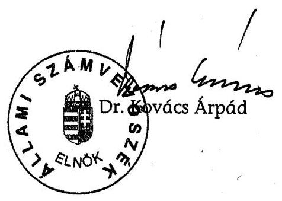

Melléklet: 13 db

---

9/2004. Határozat a 2004. évi támogatási elvekről (2004. április 13.)

# A NEMZETI CIVIL ALAPPROGRAM TANÁCSÁNAK 

## 2004. évi támogatási elvei

Az NCA Tanács törvénybe foglalt feladata az Alapprogram múködésének elvi irányítása. A támogatási elvek kiadásával a Tanács e szabályozási felhatalmazásnak tesz eleget. A támogatási elveknek megfelelő gyakorlat kialakítása a Kollégiumok törvénybe foglalt kötelezettsége.

## O. számú támogatási elv:

Múködési támogatást kaphat bármely, a 2003. évi L. törvény 3. § feltételeinek megfelelő civil szervezet.

A tevékenységét legalább 7 megyére kiterjedő hatókörrel végző civil szervezet csak az országos hatókörű szervezetek támogatási kollégiumától kaphat múködési támogatást, ennél kisebb hatókörű szervezet pedig csak a székhelye szerint illetékes regionális kollégiumtól.

A három civil szakmai kollégiumtól támogatást a törvény 3. § feltételeinek megfelelő közhasznú vagy kiemelkedően közhasznú civil szervezetek kaphatnak.

## 1. számú támogatási elv:

Múködési költségként a regionális kollégiumok és az országos hatókörű szervezetek kollégiuma az alábbi kiadásokat, ráfordításokat támogatják:

1. a szervezet működéséhez szükséges adminisztrációs, ügyintézési és egyéb bérek és bérjellegű kifizetések, ezek járulékai, valamint ilyen tevékenységekről számlák, munkavédelmi kiadások stb.;
2. székhely, múködési hely fenntartásával és múködtetésével kapcsolatos költségek (ingatlan bérleti és fenntartási díja, ezzel kapcsolatos közmúdíjak, irodaszer stb.);
3. irodai gépek (számítógép, monitor, nyomtató, scanner, szoftver, másoló, írógép, telefon, faxkészülék stb.), eszközök és tartozékaik beszerzése, bérlése, karbantartása;
4. kommunikációs költségek (posta, telefon, internet, CD jogtár, honlap szerkesztése és fenntartása stb.), kiadványok beszerzése;
5. a szervezet testületi üléseivel (közgyűlés, vezető és ellenőrző szervek, bizottságok) kapcsolatos kiadások (pl. terembér, műszaki infrastruktúra, útiköltség);
6. tagsági és partner-kiadványok (pl. hírlevél, tagkártya) előállítási költsége (előkészítés, nyomdaköltség);

---

7. közjegyzői és egyéb eljárási díjak, bankköltség;
8. tagság, önkéntesek, partnerek, munkatársak, segítők és a vezetők, alkalmazottak kapcsolattartását szolgáló belföldi utazások útiköltsége;
9. hazai szövetségi tagsági díjak;
10. a szervezet bemutatását és tevékenységének megismertetését célzó általános propaganda (hazai bemutatkozási fórumokon való részvételt is beleértve), marketing költségek (benne például az SZJA 1\%-os kampány költsége);
11. kizárólag a szervezet munkatársait, önkénteseit, tagjait, vezetőit érintő - a létesítő okiratba foglalt cél szerinti tevékenység eredményesebb folytatásához szükséges képzés költsége;
12. önkéntesek fogadásának és foglalkoztatásának költségei.

# 2. számú támogatási elv: 

Az NCA által nyújtott támogatás nem áll összefüggésben a civil szervezetek egyéb forrásaival, sem pozitív, sem negatív irányban.

## 3. számú támogatási elv:

Egy szervezet egy évben összesen maximum 18 millió Ft támogatást kaphat a NCA-ból, ebből maximum 7 millió Ft lehet működési költség. Az 500 ezer Ft-ot nem meghaladó támogatást egy összegben kell kifizetni.

A támogatás mértékének alapja a civil szervezet előző éves összes ráfordításának (költségének) a szervezet által nyújtott támogatások összegével csökkentett összege.

Összes ráfordítás(költség) = A 2003. évi eredmény kimutatás (levezetés) összes ráfordítás (költség) sora.

Összes ráfordítás (költség) - szervezet által nyújtott támogatás= korrigált ráfordítás (költség)

Működési támogatási összeghatárok megállapításának sávjai:
adatok ezer Ft-ban

| Éves korrigált ráfordítás (költség) | Támogatás maximuma |
| :-- | :-- |
| -500 | 300 |
| $500-3000$ | $300+$ az 500 fölötti rész 36\%-a |
| $3000-10000$ | $1200+$ a 3000 fölötti rész 25\%-a |
| $10000-$ | $3000+10000$ fölötti rész 20\%-a |

---

# 4. számú támogatási elv: 

Szövetségek, ernyőszervezetek, érdekképviseletek, civil társulások és szakmai gyűjtőszervezetek jogi személyiséggel rendelkező tagszervezetei a saját működési területük szerint lehetnek az NCA kedvezményezettjei. A szövetség, ernyőszervezet, érdekképviselet, társulás és gyűjtőszervezet csak saját működéséhez, saját dolgozói létszámához, saját költségeihez mérten jogosult a székhelye szerinti kollégiumnál múködési támogatásra. Ha a tagszervezet nem jogi személy, akkor múködési NCA támogatása szempontjából ahhoz a legközelebbi területi szervezeti egységhez (városi, megyei, régiós, országos) tartozik, amely rendelkezik jogi személyiséggel. Ha egy, a fentiekben felsorolt jellegű szervezet múködési költségre pályázik, akkor pályázatához mellékelnie kell a tagszervezetei listáját, mindegyiküknél feltüntetve, hogy jogi személy-e.

## 5. számú támogatási elv:

A múködési támogatások iránti pályázatok meghirdetésénél és elbírálásánál a kollégiumok által nem érvényesíthető szempontok:
a) az ágazati-szakmai tevékenységek egymáshoz viszonyított, vagy szakmacsoportokon belüli értékelése, rangsorolása;
b) a civil szervezeti forma szerinti megkülönböztetés;
c) a megyék szerinti keretek, arányok, sorrendek meghatározása vagy megyék szerinti külön eljárások kialakítása.

## 6. számú támogatási elv:

Adott évre szóló múködési támogatásból a naptári év folyamán bármikor teljesített kifizetések elszámolhatók, a szerződéskötés időpontjától függetlenül.

Múködési és múködéshez kapcsolódó kiadásokra lehet pályázni akkor is, ha a szervezet az előző évi múködési támogatással még nem számolt el, de annak elszámolási határidején belül van; a pályázat alapján megítélt támogatás viszont csak akkor folyósítható, ha a szervezet az előző évi múködési támogatással elszámolt.

Amennyiben egy szervezet az elszámolását beadta és a kezelő szervezet az elszámolás ellen a beadástól számított 30 napon belül nem emelt kifogást, akkor az újabb támogatás kifizetését nem lehet visszatartani.

## 7. számú támogatási elv

Az NCA szakmai kollégiumai elsősorban a civil szektor egészének fejlődését szolgáló alábbi (nem ágazati jellegű) civil tevékenységeket támogatják:

1. Civil szolgáltató, fejlesztő és információs kollégium (NCA tv. 1. § (2) bekezdés b., c., e., f., g., h., és i. pontjaiban foglalt támogatási célok)

- A szektor fejlődését elősegítő helyi, regionális és országos kutatások, felmérések, vizsgálatok
- A helyi társadalom erősítése az állampolgári kezdeményezések, cselekvések támogatásával

---

- Szervezetfejlesztés
- Települési, kistérségi, regionális és országos szolgáltató rendszerek kiépítésének ösztönzése, erősítése (szolgáltatás-fejlesztés a tanácsadásban, informá-ció-közvetítésben, adatbázis építésben, stb.)
- Konkrét helyi, regionális és országos szolgáltatások nyújtása
- Képzések, tréningek, továbbképzések, s az ehhez kapcsolódó kiadványok, segédletek támogatása
- Tanácsadások, információs szolgáltatások
- Informatikai szolgáltatások, fejlesztések
- A civil szektor nyilvánosságát segítő kiadványok, média megjelenések
- A szektor múködésének általános kérdéseit érintő regionális és országos rendezvények, fórumok, tapasztalatcserék, konferenciák
- Civil szervezeti adatbázisok létrehozása és folyamatos karbantartása
- Az 1\%-os kampány országos támogatása
- Hazai pályázatok önrészéhez támogatás

2. Civil önszerveződés, szakmai és területi együttmúködés kollégiuma (az NCA tv. 1. § (2) bekezdés b. és k. pontjaiban foglalt célok és hazai együttmúködés)

- A települési, kistérségi, regionális, valamint a szakmai együttműködés szervezeti kereteinek és fórumainak létrehozása és múködtetése
- A már meglévő hálózati rendszerek együttműködésének elősegítése, új hálózati rendszerek kiépítésének ösztönzése
- A civil szervezetek közös cselekvését elősegítő tevékenységi formák (például kistérségi fórumok) kialakulásának támogatása
- A szektorok közötti együttmúködés fejlesztése
- Érdekképviseleti célú civil együttmúködés támogatása
- Információs és kommunikációs hálózatépítés
- Önkormányzati és civil együttmúködés fejlesztése
- Több szervezet közös hazai pályázatának önrészéhez támogatás
- Önkéntes tevékenység fejlesztésének támogatása

3. Nemzetközi civil kapcsolatok és európai integrációs kollégium

- A magyarországi civil szervezetek nemzetközi jelenlétének segítése

---

- Nemzetközi szervezetekben való jelenlét, együttműködés és cserekapcsolatok támogatása
- Nemzetközi tapasztalatok hazai elterjesztésének, átadásának segítése, tapasztalatcsere
- Határmenti és határokon átnyúló civil kapcsolatok támogatása
- EU döntéshozatali folyamatában való civil részvétel elősegítése
- Nemzetközi tevékenységet segítő ismeretbővítés és képzés támogatása
- EU és más nemzetközi együttműködési és pályázati lehetőségek megismertetése, pályázati tanácsadás és segítségnyújtás (beleértve EU pályázatok önrészéhez és (a program lezárását követő utófinanszírozásának megelőlegezéséhez nyújtott támogatás)
- EU és nagyobb nemzetközi pályázatok előkészítésének támogatása
- Nemzetközi szervezetek tagdíjához való hozzájárulás.

# 8. számú támogatási elv: 

Az NCA minden kollégiumának pályázat-elbírálási gyakorlatában érvényesíteni kell az esélyegyenlőség segítésének támogatási elvét, megkülönböztetett módon támogatva mindazon civil szervezetek múködését és programját, amelyek a saját források bővítésében akadályozottak vagy korlátozottak. Ilyen hátránnyal küzdő szervezetek különösen a romákat, fogyatékosokat, egészségkárosodottakat, gyermekeket, gyermeket nevelőket és más, szociálisan hátrányos helyzetű rétegeket segítő szervezetek.

---

# A NEMZETI CIVIL ALAPPROGRAM TANÁCSÁNAK 

## 2005. évi támogatási elvei

Az NCA Tanács törvényben foglalt feladata az Alapprogram múködésének elvi irányítása. A támogatási elvek kiadásával a Tanács e szabályozási felhatalmazásnak tesz eleget. A támogatási elveknek megfelelő gyakorlat kialakítása a Kollégiumok törvényben foglalt kötelezettsége.

## 0. számú támogatási elv:

Múködési támogatást kaphat bármely, a 2003. évi L. törvény 3.§ feltételeinek megfelelő civil szervezet.

A tevékenységét legalább 7 megyére kiterjedő hatókörrel végző civil szervezet csak az országos hatókörű szervezetek támogatási kollégiumától kaphat múködési támogatást, ennél kisebb hatókörű szervezet pedig csak a székhelye szerint illetékes regionális kollégiumtól.

A három civil szakmai kollégiumtól támogatást a törvény 3.§ feltételeinek megfelelő közhasznú vagy kiemelkedően közhasznú civil szervezetek kaphatnak.

## 1. számú támogatási elv:

Múködési költségként, illetve a civil szervezet múködéséhez kapcsolódó tárgyi eszköz beszerzésként a regionális kollégiumok és az országos hatókörű szervezetek kollégiuma az alábbi kiadásokat, ráfordításokat támogatják:

1. a szervezet múködéséhez szükséges adminisztrációs, ügyintézési és egyéb bérek és bérjellegú kifizetések, ezek járulékai, valamint ilyen tevékenységekről számlák, munkavédelmi kiadások stb.
2. székhely, múködési hely fenntartásával és múködtetésével kapcsolatos költségek (ingatlan bérleti és fenntartási díja, ezzel kapcsolatos közmúdíjak, irodaszer stb.)
3. irodai gépek (számítógép, monitor, nyomtató, szkenner, szoftver, másoló, írógép, telefon, faxkészülék stb.), eszközök és tartozékaik beszerzése, bérlése, karbantartása
4. kommunikációs költségek (posta, telefon, telefonkártya, Internet, CD jogtár, honlap szerkesztése és fenntartása stb.), folyóiratok, kiadványok beszerzése
5. a szervezet testületi üléseivel (közgyűlés, kuratórium, vezető és ellenőrző szervek, bizottságok stb.) kapcsolatos kiadások (pl. terembér, múszaki infrastruktúra, útiköltség)
6. tagsági és partner-kiadványok (pl. hírlevél, tagkártya) előállítási költsége (előkészítés, nyomdaköltség)
7. közjegyzői és egyéb eljárási díjak, bankköltség
8. tagság, önkéntesek, partnerek, munkatársak, segítők és a vezetők, alkalmazottak kapcsolattartását szolgáló belföldi utazások útiköltsége
9. hazai szövetségi tagsági díjak
10. a szervezet bemutatását és tevékenységének megismertetését célzó általános tájékoztatás (hazai bemutatkozási fórumokon való részvételt is beleértve), marketing költségek (benne például az SZJA 1\%-os kampány költsége)
11. kizárólag a szervezet munkatársait, önkénteseit, tagjait, vezetőit érintő - a létesítő okiratba foglalt cél szerinti tevékenység eredményesebb folytatásához szükséges képzés költsége
12. önkéntesek fogadásának és foglalkoztatásának költségei.

---

Múködési költségnek minősül a civil szervezet létesítő okirata szerinti alaptevékenységre fordított, az 1. számú támogatási elvnek (a jelen támogatási elvnek) megfelelő kiadása, ráfordítása is.

# 2. számú támogatási elv: 

Az NCA által nyújtott múködési támogatás nem áll összefüggésben a civil szervezetek egyéb forrásaival, sem pozitív, sem negatív irányban.

## 3. számú támogatási elv:

Egy szervezet egy évben összesen maximum 18 millió Ft támogatást kaphat az adott naptári évben kiírt NCA pályázatok forrásaiból, ebből maximum 7 millió Ft lehet múködési költség. A kifizetés ütemezéséről a Kollégium dönt.

## A múködési támogatások összeghatára:

| Éves korrigált ráfordítás (költség)* | Támogatás maximuma |
| :--: | :--: |
| - 500 eFt | 500 eFt |
| 500 eFt - 3 mFt | 500 eFt + az 500 eFt fölötti rész $28 \%-\mathrm{a}$ |
| 3 mFt - 10 mFt | 1.200 eFt + a 3 mFt fölötti rész $25 \%-\mathrm{a}$ |
| 10 mFt - | $3 \mathrm{mFt}+\mathrm{a} 10 \mathrm{mFt}$ fölötti rész $20 \%-\mathrm{a}$ |

*Az éves korrigált ráfordítás (költség) a szervezet előző évi teljes ráfordításának (költségének) az általa nyújtott támogatások összegével csökkentett adata.

Előző évnek azt kell tekinteni, amelyre nézve számviteli beszámoló jogszabály szerint rendelkezésre áll, illetve rendelkezésre kellene állnia.

## 4. számú támogatási elv:

Szövetségek, ernyőszervezetek, érdekképviseletek, civil társulások és szakmai gyűjtőszervezetek jogi személyiséggel rendelkező tagszervezetei a saját múködési területük szerint lehetnek az NCA kedvezményezettjei. A szövetség, ernyőszervezet, érdekképviselet, társulás és gyűjtőszervezet csak saját működéséhez, saját dolgozói létszámához, saját költségeihez mérten jogosult a székhelye szerinti kollégiumnál múködési támogatásra. Ha a tagszervezet nem jogi személy, akkor múködési támogatása szempontjából ahhoz a legközelebbi területi szervezeti egységhez (városi, megyei, régiós, országos) tartozik, amely rendelkezik jogi személyiséggel. Ha egy, a fentiekben felsorolt jellegű szervezet múködési költségre pályázik, akkor pályázatához mellékelnie kell a tagszervezetei listáját, mindegyiküknél feltüntetve, hogy jogi személy-e.

## 5. számú támogatási elv:

A pályázatok meghirdetésénél és elbírálásánál a kollégiumok által nem érvényesíthető szempontok:
a.) az ágazati-szakmai tevékenységek egymáshoz viszonyított vagy szakmacsoportokon belüli értékelése, rangsorolása;
b.) a civil szervezeti forma szerinti megkülönböztetés;

---

c.) a megyék szerinti keretek, arányok, sorrendek meghatározása vagy megyék szerinti külön eljárások kialakítása.

# 6. számú támogatási elv: 

Múködési támogatás a pályázati kiírásban meghatározott feltételekkel, az ott megjelölt kezdési és befejezési határidő között keletkezett fizetési kötelezettség kiegyenlítésére használható fel a támogatási szerződésben szabályozott módon, a támogatási szerződés megkötésének időpontjától függetlenül. Fizetési kötelezettség keletkezése alatt a gazdasági esemény tényleges bekövetkeztének időpontja, azaz a teljesítés időpontja értendő.

Működési támogatásra lehet pályázni akkor is, ha a szervezet az előző évi múködési támogatással még nem számolt el, de annak elszámolási határidején belül van; a pályázat alapján megítélt támogatás viszont csak akkor folyósítható, ha a szervezet az előző évi múködési támogatással elszámolt és azt az illetékes Kollégium elfogadta. A beszámoló elfogadásáról a Kezelő szervezet a hiánytalan beszámoló benyújtását követő 60 napon belül értesíti a Kedvezményezettet.

Azonos támogatási céllal kiírt szakmai pályázati kiírásokon több ízben is támogatásban részesülhet a pályázó szervezet, de a pályázat alapján megítélt támogatás csak abban az esetben folyósítható, ha a szervezet az előző, azonos célú támogatásra megkötött szerződésének elszámolási határideje lejárt és azzal szabályszerűen elszámolt, és elszámolását az illetékes Kollégium elfogadta.

Amennyiben egy szervezet az elszámolását beadta, és a kezelő szervezet az elszámolás ellen a beadástól számított 30 napon belül nem emelt kifogást, akkor az újabb támogatás kifizetését nem lehet visszatartani.

A Kezelő szervezet a benyújtott elszámolást a beérkezését követő 30 napon belül megvizsgálja. Szabályszerű elszámolás esetén javaslatot tesz az illetékes Kollégium felé annak elfogadására vagy - hibás vagy hiányos elszámolás esetén - saját hatáskörben legfeljebb két alkalommal 15-15 napos határidővel hiánypótlásra szólítja fel a pályázót. A Kezelő szervezet a hiánypótlás beérkezésétől számított 15 napon belül terjeszti az illetékes Kollégium elé az elszámolást és a beszámolót, amelynek elfogadásáról vagy elutasításáról a Kollégium dönt. További hiánypótlásnak nincs helye.

## 7. számú támogatási elv:

Az NCA szakmai kollégiumai elsősorban a civil szektor egészének fejlődését szolgáló alábbi (nem ágazati jellegű) civil tevékenységeket támogatják:

1. Civil szolgáltató, fejlesztő és információs kollégium (NCA tv. 1.§ (2) bek. b., c., e., f., g., h. és i. pontjaiba foglalt támogatási célok)

- A szektor fejlődését elősegítő helyi, regionális és országos kutatások, felmérések, vizsgálatok
- A helyi társadalom erősítése az állampolgári kezdeményezések, cselekvések támogatásával
- Szervezetfejlesztés
- Települési, kistérségi, regionális és országos szolgáltató rendszerek kiépítésének ösztönzése, erősítése (szolgáltatás-fejlesztés a tanácsadásban, információközvetítésben, adatbázis építésben, stb.)
- Konkrét helyi, regionális és országos szolgáltatások nyújtása
- Képzések, tréningek, továbbképzések, s az ehhez kapcsolódó kiadványok, segédletek támogatása
- Tanácsadások, információs szolgáltatások
- Informatikai szolgáltatások, fejlesztések

---

- A civil szektor nyilvánosságát segítő kiadványok, média megjelenések
- A szektor múködésének általános kérdéseit érintő regionális és országos rendezvények, fórumok, tapasztalatcserék, konferenciák
- Civil szervezeti adatbázisok létrehozása és folyamatos karbantartása
- Az 1\%-os kampány országos támogatása
- Hazai pályázatok önrészéhez támogatás

2. Civil önszerveződés, szakmai és területi együttmúködés kollégiuma (NCA tv. 1.§ (2) bek. b. és k. pontjaiba foglalt célok és hazai együttmúködés)

- A települési, kistérségi, regionális, valamint a szakmai együttműködés szervezeti kereteinek és fórumainak létrehozása és múködtetése
- A már meglévő hálózati rendszerek együttműködésének elősegítése, új hálózati rendszerek kiépítésének ösztönzése
- A civil szervezetek közös cselekvését elősegítő tevékenységi formák (például kistérségi fórumok) kialakulásának támogatása
- A szektorok közötti együttműködés fejlesztése
- Érdekképviseleti célú civil együttműködések támogatása
- Információs és kommunikációs hálózatépítés
- Önkormányzati és civil együttműködések fejlesztése
- Több szervezet közös hazai pályázatának önrészéhez támogatás
- Önkéntes tevékenység fejlesztésének támogatása

3. Nemzetközi civil kapcsolatok és európai integrációs kollégium (NCA tv. 1.§ (2) bek. b., c., d., h. és i. pontjaiba foglalt célok)

- A magyarországi civil mozgalmak nemzetközi jelenlétének segítése (külföldi konferenciákon, rendezvényeken való részvételt beleértve)
- Nemzetközi szervezetekben való jelenlét, együttmúködés és cserekapcsolatok támogatása
- Nemzetközi tapasztalatok hazai elterjesztésének, átadásának segítése, tapasztalatcsere
- Határmenti és határokon átnyúló civil kapcsolatok támogatása
- Magyar civil részvétel elősegítése az EU döntéshozatali folyamatában
- Nemzetközi tevékenységet segítő ismeretbővítés és képzés biztosítása
- EU-s és más nemzetközi együttműködési és pályázati lehetőségek megismertetése, pályázati tanácsadás és segítségnyújtás
- EU-s és nagyobb nemzetközi pályázatok előkészítésének támogatása
- EU-s pályázatok önrészéhez és a program lezárását követő utófinanszírozás megelőlegezéséhez nyújtott támogatás
- Nemzetközi szervezetek tagdíjához való hozzájárulás

# 8. számú támogatási elv: 

Az NCA minden kollégiumának pályázat-elbírálási gyakorlatában érvényesíteni kell az esélyegyenlőség segítésének elvét, megkülönböztetett módon támogatva mindazon civil szervezetek múködését és programjait, amelyek a saját források bővítésében akadályozottak vagy korlátozottak. Ilyen hátránnyal küzdő szervezetek különösen a romákat, fogyatékosokat, egészségkárosodottakat, gyermekeket, gyermekeket nevelőket és más, szociálisan hátrányos helyzetű rétegeket segítő szervezetek.

## 9. számú támogatási elv

A civil szervezetek foglalkoztatáshoz kapcsolódó múködési költségeinek célzott -, és más költségvetési forrásokkal koordinációban történő támogatásáról:

---

Ha a jogszabályok és a Tanács támogatási elvei szerint támogatható múködési költségtámogatás iránti pályázathoz csatolják az Országos Foglalkoztatási Közalapítvány (OFA) tárgyévi igazolásának eredeti példányát arról, hogy a pályázó a „Civil szervezetek foglalkoztatási kapacitásának tartós növelése" című (azonosító: OFA/CSZFKN/2006/6125) programban nyertesként részt vesz, s a pályázati tárgyévben az OFA a civil szervezet új alkalmazottjának foglalkoztatását támogatja, vagy az előző évben ilyen programot eredményesen befejezett, akkor a Nemzeti Civil Alapprogram múködési pályázatain a Kollégium a pályázónak legalább az előző évi múködési költség-támogatást biztosítja. Abban az esetben, ha az előző évben a civil szervezet az NCA-tól múködési költség-támogatásban nem részesült, vagy amiben részesült, az alacsonyabb a pályázó adott pályázati évi, az éves korrigált ráfordítás adata szerinti támogatási sávban az előző évben a Kollégium által nyújtott támogatási átlagösszegtől, akkor a Kollégium legalább ez utóbbi összegű működési költség-támogatást nyújtja.

# 10. számú támogatási elv 

A Nemzeti Civil Alapprogram regionális kollégiumai a múködési költség-támogatásra kiírt pályázataik során a következő tartalmi szempontok szerint bírálják el a beérkezett pályázatokat, s e tartalmi bírálati szempontokra vonatkozóan a pályázati dokumentációban kérdést, rovatot kell elhelyezni.

1. A pályázó szervezet tevékenységének társadalmi hasznosulása

Milyen társadalmi aktivitása és hatása van a szervezetnek? Milyen közösségi szolgáltatást végez? Mekkora a pályázó szervezet tevékenységében közvetlenül részt vevő civilek nagyságrendje? A múködés során bevont tagok, önkéntesek száma.
2. A pályázó szervezet előző évi aktivitása és 2006. évi tervei.

Sikeres programok, szolgáltatások megvalósítása. (tevékenységi referenciák)
3. Az esélyegyenlőség segítésének elve.
(Előnyben kell részesíteni a támogatás során mindazon civil szervezetek múködésének támogatását, amelyek a saját források megteremtésében illetve bővítésében akadályozottak vagy korlátozottak. (Ilyen hátránnyal küzdő szervezetek a különösen romákat, fogyatékosokat, egészségkárosodottakat, gyermekeket nevelőket és más, szociálisan hátrányos helyzetű rétegeket segítő szervezeteket.)
4. A kollégium speciális bírálati szempontjai.
(Például a költségfelhasználás céljai - első alkalmazott, Internet, jogvédett szoftverek, együttműködésben bérelt helyiség, könyvelő megbízása, stb. - vagy/és a pályázati anyag kidolgozottsági követelményei, a pályázó szervezet együttmúködése közvetlen környezetével (más civil szervezetekkel, önkormányzatokkal, piaci szereplőkkel); a szervezet fejlődésének fenntarthatósága, stb.)

---

# A TANÁCS ELVI IRÁNYÍTÓ SZEREPE ÉRTELMEZÉSÉRŐL 

Az Alapprogram támogatási rendszere múködésének alapvető szabályai körébe tartoznak az alábbi kérdések: (Zárójelben a Tanács jogszabályok és határozatok szerinti döntési vagy javaslattételi, véleményezési jogának feltüntetése.)

1. az Alapprogramból nyújtható támogatások rendező elvei (támogatási elvek) DÖNTÉS;
2. az egy civil szervezet számára egy költségvetési évben nyújtható támogatás maximális összege - DÖNTÉS;
3. a Kollégiumok közötti forrásmegosztás (a támogatások elvi kérdései és arányok) - DÖNTÉS;
4. a Kollégiumok által meghirdethető pályázatok felhívásainak közös tartalmi kellékei (a támogatási módok) - DÖNTÉS;
5. a több Kollégium által alkalmazandó közös elbírálási kritériumok (elbírálás elvei és módjai) - DÖNTÉS;
6. az Alapprogram támogatási rendszeréhez kapcsolódó tájékoztatás, nyilvánosság, információkezelés, adatszolgáltatás elvi és általános tartalmi kérdéseiben EGYETÉRTÉSI JOG;
7. az Alapprogram külső kommunikációs megjelenésének elvi és általános tartalmi kérdéseiben - EGYETÉRTÉSI JOG.
8. az Alapprogram támogatási rendszerében döntéshozó testületek határozataival kapcsolatos jogorvoslati rendszer és a tevékenységükhöz kapcsolódó panaszkezelés szabályainak meghatározása - DÖNTÉS;
9. az Alapprogram támogatási rendszerének múködési körében alkalmazandó ellenőrzés, monitoring és kontrolling tevékenység elvi és általános tartalmi kérdéseiben - EGYETÉRTÉSI JOG;
10. az Alapprogram támogatási rendszerében döntéshozó testületek tagjaira vonatkozó - a törvényben foglaltakon túli - összeférhetetlenségi és etikai szabályok, eljárás meghatározása - DÖNTÉS;
11. az Alapprogram támogatási rendszerének múködtetéséhez szükséges költségkeret (támogatásokon kívüli fejezeti kezelésű előirányzat-rész) felhasználásának fő irányai és arányai - JAVASLATTÉTEL, VÉLEMÉNYEZÉS;
12. az Alapprogram támogatási rendszerében döntéshozó testületek múködési feltételeinek általános kérdései - JAVASLATTÉTEL, VÉLEMÉNYEZÉS;
13. a kezelő szerv tevékenységét meghatározó szabályozók (szabályzatok és szerződések) elvi kérdései - JAVASLATTÉTEL, VÉLEMÉNYEZÉS.

---

V-1012-183/2005. 3 számú melléklet

Az NCA kollégiumok pályázati tevékenysége

1. számú tanúsítvány

|  Támogatást nyújtó kollégium | 2004. évi klírások | 2005. évi klírások  |
| --- | --- | --- |
|  Országos Hatékőrű Civil Szervezetek Támogatásának Kollégiuma |  |   |
|  Pályázati kiírások száma (db) | 2 | 2  |
|  Beérkezett pályázatok száma (db) | 1473 | 2500  |
|  Elutasított pályázatok száma (db) | 608 | 735  |
|  Támogatott pályázatok száma (db) | 865 | 1755  |
|  Igényelt támogatási összeg (millió Ft) | 3 545,0 | 6 493,1  |
|  Odaltélt támogatási összeg (millió Ft) | 1 464,0 | 1 465,1  |
|  2004.december 31-ig kifizetett támogatások összege (millió Ft) | 1 347,4 | 0,0  |
|  2005.december 31-ig kifizetett támogatások összege (millió Ft) | 114,3 | 747,7  |
|  2006.május 31-ig kifizetett támogatások összege (millió Ft) | 0,0 | 544,7  |
|  Felhasználás alatt lévő pályázatok száma (db) | 0 | 821  |
|  Elszámolás alatt lévő pályázatok (db)* | 0 | 167  |
|  Vitatott pályázatok száma (db)** | 79 | 0  |
|  Lezárt pályázatok száma (db) | 785 | 184  |
|  Visszafizetésre kötelezett pályázatok száma (db) | 50 | 0  |
|  Visszafizetési kötelezettségek összege (millió Ft) | 12,9 | 0,0  |
|  Visszafizetett támogatások összege (millió Ft) | 4,5 | 0,0  |
|  Bírósági eljárás alá vont támogatások száma (db) | 0 | 0  |
|  Bírósági eljárás alá vont támogatások összege (millió Ft) | 0,0 | 0,0  |
|  Dél-alföldi regionális |  |   |
|  Pályázati kiírások száma (db) | 3 | 2  |
|  Beérkezett pályázatok száma (db) | 1328 | 1963  |
|  Elutasított pályázatok száma (db) | 588 | 699  |
|  Támogatott pályázatok száma (db) | 740 | 1284  |
|  Igényelt támogatási összeg (millió Ft) | 1 267,0 | 2 024,1  |
|  Odaltélt támogatási összeg (millió Ft) | 371,6 | 442,7  |
|  2004.december 31-ig kifizetett támogatások összege (millió Ft) | 291,6 | 0,0  |
|  2005.december 31-ig kifizetett támogatások összege (millió Ft) | 79,0 | 236,1  |
|  2006.május 31-ig kifizetett támogatások összege (millió Ft) | 0,0 | 176,4  |
|  Felhasználás alatt lévő pályázatok száma (db) | 0 | 539  |
|  Elszámolás alatt lévő pályázatok (db)* | 3 | 87  |
|  Vitatott pályázatok száma (db)** | 1 | 0  |
|  Lezárt pályázatok száma (db) | 736 | 126  |
|  Visszafizetésre kötelezett pályázatok száma (db) | 3 | 0  |
|  Visszafizetési kötelezettségek összege (millió Ft) | 0,9 | 0,0  |
|  Visszafizetett támogatások összege (millió Ft) | 0,0 | 0,0  |
|  Bírósági eljárás alá vont támogatások száma (db) | 0 | 0  |
|  Bírósági eljárás alá vont támogatások összege (millió Ft) | 0,0 | 0,0  |
|  Dél-dunántúl regionális |  |   |
|  Pályázati kiírások száma (db) | 3 | 2  |
|  Beérkezett pályázatok száma (db) | 1106 | 1526  |
|  Elutasított pályázatok száma (db) | 568 | 443  |
|  Támogatott pályázatok száma (db) | 538 | 1083  |
|  Igényelt támogatási összeg (millió Ft) | 1 295,8 | 1 729,8  |
|  Odaltélt támogatási összeg (millió Ft) | 370,0 | 371,4  |
|  2004.december 31-ig kifizetett támogatások összege (millió Ft) | 202,0 | 0,0  |
|  2005.december 31-ig kifizetett támogatások összege (millió Ft) | 160,1 | 199,0  |
|  2006.május 31-ig kifizetett támogatások összege (millió Ft) | 0,0 | 161,3  |
|  Felhasználás alatt lévő pályázatok száma (db) | 0 | 500  |
|  Elszámolás alatt lévő pályázatok (db)* | 0 | 394  |
|  Vitatott pályázatok száma (db)** | 1 | 0  |
|  Lezárt pályázatok száma (db) | 537 | 162  |
|  Visszafizetésre kötelezett pályázatok száma (db) | 1 | 0  |
|  Visszafizetési kötelezettségek összege (millió Ft) | 0,2 | 0,0  |
|  Visszafizetett támogatások összege (millió Ft) | 0,2 | 0,0  |
|  Bírósági eljárás alá vont támogatások száma (db) | 0 | 0  |
|  Bírósági eljárás alá vont támogatások összege (millió Ft) | 0,0 | 0,0  |

1/5

---

|  Támogatást nyújtó kollégium | 2004. évi klíráso | 2005. évi klíráso  |
| --- | --- | --- |
|  Észak-alföldi regionális |  |   |
|  Pályázati klírások száma (db) | 3 | 2  |
|  Beérkezett pályázatok száma (db) | 1114 | 1514  |
|  Elutasított pályázatok száma (db) | 625 | 363  |
|  Támogatott pályázatok száma (db) | 489 | 1151  |
|  Igényelt támogatási összeg (millió Ft) | 1 343,6 | 1 649,0  |
|  Odaltélt támogatási összeg (millió Ft) | 444,0 | 426,8  |
|  2004. december 31-ig kifizetett támogatások összege (millió Ft) | 326,6 | 0,0  |
|  2005. december 31-ig kifizetett támogatások összege (millió Ft) | 117,0 | 227,2  |
|  2006. május 31-ig kifizetett támogatások összege (millió Ft) | 0,0 | 190,0  |
|  Felhasználás alatt lévő pályázatok száma (db) | 0 | 827  |
|  Elszámolás alatt lévő pályázatok (db)* | 0 | 145  |
|  Vitatott pályázatok száma (db)** | 1 | 0  |
|  Lezárt pályázatok száma (db) | 488 | 147  |
|  Visszafizetésre kötelezett pályázatok száma (db) | 1 | 0  |
|  Visszafizetési kötelezettségek összege (millió Ft) | 0,3 | 0,0  |
|  Visszafizetett támogatások összege (millió Ft) | 0,0 | 0,0  |
|  Bírósági eljárás alá vont támogatások száma (db) | 0 | 0  |
|  Bírósági eljárás alá vont támogatások összege (millió Ft) | 0,0 | 0,0  |
|  Észak-Magyarországi regionális |  |   |
|  Pályázati klírások száma (db) | 3 | 2  |
|  Beérkezett pályázatok száma (db) | 1097 | 1492  |
|  Elutasított pályázatok száma (db) | 398 | 536  |
|  Támogatott pályázatok száma (db) | 699 | 956  |
|  Igényelt támogatási összeg (millió Ft) | 1 168,5 | 1 728,6  |
|  Odaltélt támogatási összeg (millió Ft) | 412,2 | 412,8  |
|  2004. december 31-ig kifizetett támogatások összege (millió Ft) | 311,4 | 0,0  |
|  2005. december 31-ig kifizetett támogatások összege (millió Ft) | 80,6 | 220,7  |
|  2006. május 31-ig kifizetett támogatások összege (millió Ft) | 0,0 | 181,2  |
|  Felhasználás alatt lévő pályázatok száma (db) | 0 | 825  |
|  Elszámolás alatt lévő pályázatok (db)* | 0 | 37  |
|  Vitatott pályázatok száma (db)** | 1 | 0  |
|  Lezárt pályázatok száma (db) | 698 | 66  |
|  Visszafizetésre kötelezett pályázatok száma (db) | 2 | 0  |
|  Visszafizetési kötelezettségek összege (millió Ft) | 0,4 | 0,0  |
|  Visszafizetett támogatások összege (millió Ft) | 0,0 | 0,0  |
|  Bírósági eljárás alá vont támogatások száma (db) | 0 | 0  |
|  Bírósági eljárás alá vont támogatások összege (millió Ft) | 0,0 | 0,0  |
|  Közép-dunántúl regionális |  |   |
|  Pályázati klírások száma (db) | 3 | 2  |
|  Beérkezett pályázatok száma (db) | 692 | 1061  |
|  Elutasított pályázatok száma (db) | 381 | 187  |
|  Támogatott pályázatok száma (db) | 511 | 874  |
|  Igényelt támogatási összeg (millió Ft) | 971,5 | 1 073,3  |
|  Odaltélt támogatási összeg (millió Ft) | 357,2 | 355,0  |
|  2004. december 31-ig kifizetett támogatások összege (millió Ft) | 225,9 | 0,0  |
|  2005. december 31-ig kifizetett támogatások összege (millió Ft) | 130,5 | 189,6  |
|  2006. május 31-ig kifizetett támogatások összege (millió Ft) | 0,0 | 150,5  |
|  Felhasználás alatt lévő pályázatok száma (db) | 0 | 586  |
|  Elszámolás alatt lévő pályázatok (db)* | 0 | 128  |
|  Vitatott pályázatok száma (db)** | 0 | 0  |
|  Lezárt pályázatok száma (db) | 511 | 105  |
|  Visszafizetésre kötelezett pályázatok száma (db) | 0 | 0  |
|  Visszafizetési kötelezettségek összege (millió Ft) | 0,0 | 0,0  |
|  Visszafizetett támogatások összege (millió Ft) | 0,0 | 0,0  |
|  Bírósági eljárás alá vont támogatások száma (db) | 0 | 0  |
|  Bírósági eljárás alá vont támogatások összege (millió Ft) | 0,0 | 0,0  |

---

|  Támogatást nyújtó kollégium | 2004. évi klírások | 2005. évi
klírások  |
| --- | --- | --- |
|  Közép-Magyarországi regionális |  |   |
|  Pályázati klírások száma (db) | 3 | 2  |
|  Beérkezett pályázatok száma (db) | 1394 | 2194  |
|  Elutasított pályázatok száma (db) | 550 | 611  |
|  Támogatott pályázatok száma (db) | 644 | 1583  |
|  Igényelt támogatási összeg (millió Ft) | 2 608,6 | 4 189,9  |
|  Odaltélt támogatási összeg (millió Ft) | 853,8 | 854,5  |
|  2004 december 31-ig kifizetett támogatások összege (millió Ft) | 697,1 | 0,0  |
|  2005 december 31-ig kifizetett támogatások összege (millió Ft) | 155,1 | 383,3  |
|  2006 május 31-ig kifizetett támogatások összege (millió Ft) | 0,0 | 285,7  |
|  Felhasználás alatt lévő pályázatok száma (db) | 0 | 880  |
|  Elszámolás alatt lévő pályázatok (db)* | 0,0 | 240  |
|  Vitatott pályázatok száma (db)** | 120 | 0  |
|  Lezárt pályázatok száma (db) | 720 | 88  |
|  Visszafizetésre kötelezett pályázatok száma (db) | 96 | 0  |
|  Visszafizetési kötelezettségek összege (millió Ft) | 25,8 | 0,0  |
|  Visszafizetett támogatások összege (millió Ft) | 10,0 | 0,0  |
|  Bírósági eljárás alá vont támogatások száma (db) | 0 | 0  |
|  Bírósági eljárás alá vont támogatások összege (millió Ft) | 0,0 | 0,0  |
|  Nyugat-dunántúi regionális |  |   |
|  Pályázati klírások száma (db) | 3 | 2  |
|  Beérkezett pályázatok száma (db) | 903 | 1173  |
|  Elutasított pályázatok száma (db) | 440 | 321  |
|  Támogatott pályázatok száma (db) | 463 | 852  |
|  Igényelt támogatási összeg (millió Ft) | 1 032,6 | 1 461,5  |
|  Odaltélt támogatási összeg (millió Ft) | 352,6 | 352,3  |
|  2004 december 31-ig kifizetett támogatások összege (millió Ft) | 273,5 | 0,0  |
|  2005 december 31-ig kifizetett támogatások összege (millió Ft) | 79,1 | 189,3  |
|  2006 május 31-ig kifizetett támogatások összege (millió Ft) | 0,0 | 145,5  |
|  Felhasználás alatt lévő pályázatok száma (db) | 0 | 625  |
|  Elszámolás alatt lévő pályázatok (db)* | 0 | 52  |
|  Vitatott pályázatok száma (db)** | 0 | 0  |
|  Lezárt pályázatok száma (db) | 453 | 129  |
|  Visszafizetésre kötelezett pályázatok száma (db) | 2 | 0  |
|  Visszafizetési kötelezettségek összege (millió Ft) | 0,0 | 0,0  |
|  Visszafizetett támogatások összege (millió Ft) | 0,0 | 0,0  |
|  Bírósági eljárás alá vont támogatások száma (db) | 0 | 0  |
|  Bírósági eljárás alá vont támogatások összege (millió Ft) | 0,0 | 0,0  |
|  MÜKÖDÉSI TÁMOGATÁST NYÚJTÓ KÖLLEGIUMOK (MINDÖSSZESEN) |  |   |
|  Pályázati klírások száma (db) | 23 | 16  |
|  Beérkezett pályázatok száma (db) | 9307 | 13443  |
|  Elutasított pályázatok száma (db) | 4158 | 3895  |
|  Támogatott pályázatok száma (db) | 5146 | 9548  |
|  Igényelt támogatási összeg (millió Ft) | 13232,4 | 20349,3  |
|  Odaltélt támogatási összeg (millió Ft) | 4 625,4 | 4 691,9  |
|  2004 december 31-ig kifizetett támogatások összege (millió Ft) | 3 675,5 | 0,0  |
|  2005 december 31-ig kifizetett támogatások összege (millió Ft) | 922,1 | 2 392,9  |
|  2006 május 31-ig kifizetett támogatások összege (millió Ft) | 0,0 | 1 837,3  |
|  Felhasználás alatt lévő pályázatok száma (db) | 0 | 6 003  |
|  Elszámolás alatt lévő pályázatok (db)* | 0,0 | 1 250  |
|  Vitatott pályázatok száma (db)** | 203 | 0  |
|  Lezárt pályázatok száma (db) | 4 938 | 1 007  |
|  Visszafizetésre kötelezett pályázatok száma (db) | 155 | 0  |
|  Visszafizetési kötelezettségek összege (millió Ft) | 41,1 | 0,0  |
|  Visszafizetett támogatások összege (millió Ft) | 14,7 | 0,0  |
|  Bírósági eljárás alá vont támogatások száma (db) | 0 | 0  |
|  Bírósági eljárás alá vont támogatások összege (millió Ft) | 0,0 | 0,0  |

---

|  Támogatást nyújtó kollégium | 2004. évi kiírások | 2005. évi kiírások  |
| --- | --- | --- |
|  Nemzetközi Civil Kapcsolatok és Európai Integráció |  |   |
|  Pályázati kiírások száma (db) | 3 | 2  |
|  Beérkezett pályázatok száma (db) | 1515 | 1926  |
|  Elutasított pályázatok száma (db) | 980 | 1021  |
|  Támogatott pályázatok száma (db) | 535 | 905  |
|  Igényelt támogatási összeg (millió Ft) | 3 144,9 | 4 553,2  |
|  Odaltét támogatási összeg (millió Ft) | 675,3 | 700,9  |
|  2004. december 31-ig kifizetett támogatások összege (millió Ft) | 543,4 | 0,0  |
|  2005. december 31-ig kifizetett támogatások összege (millió Ft) | 125,3 | 336,3  |
|  2006. május 31-ig kifizetett támogatások összege (millió Ft) | 0,0 | 339,3  |
|  Felhasználás alatt lévő pályázatok száma (db) | 0 | 701  |
|  Elszámolás alatt lévő pályázatok (db)* | 0 | 51  |
|  Vitatott pályázatok száma (db)** | 4 | 0  |
|  Lezárt pályázatok száma (db) | 531 | 114  |
|  Visszafizetésre kötelezett pályázatok száma (db) | 2 | 0  |
|  Visszafizetési kötelezettségek összege (millió Ft) | 1,2 | 0,0  |
|  Visszafizetett támogatások összege (millió Ft) | 0,2 | 0,0  |
|  Bírósági eljárás alá vont támogatások száma (db) | 0 | 0  |
|  Bírósági eljárás alá vont támogatások összege (millió Ft) | 0,0 | 0,0  |
|  Civil összerveződés, szakmai és területi együttműködés |  |   |
|  Pályázati kiírások száma (db) | 2 | 1  |
|  Beérkezett pályázatok száma (db) | 879 | 476  |
|  Elutasított pályázatok száma (db) | 713 | 302  |
|  Támogatott pályázatok száma (db) | 166 | 174  |
|  Igényelt támogatási összeg (millió Ft) | 2 153,3 | 1 086,6  |
|  Odaltét támogatási összeg (millió Ft) | 386,3 | 363,5  |
|  2004. december 31-ig kifizetett támogatások összege (millió Ft) | 264,8 | 0,0  |
|  2005. december 31-ig kifizetett támogatások összege (millió Ft) | 121,5 | 208,1  |
|  2006. május 31-ig kifizetett támogatások összege (millió Ft) | 0,0 | 152,4  |
|  Felhasználás alatt lévő pályázatok száma (db) | 0 | 170  |
|  Elszámolás alatt lévő pályázatok (db)* | 0 | 3  |
|  Vitatott pályázatok száma (db)** | 3 | 0  |
|  Lezárt pályázatok száma (db) | 162 | 1  |
|  Visszafizetésre kötelezett pályázatok száma (db) | 3 | 0  |
|  Visszafizetési kötelezettségek összege (millió Ft) | 4,6 | 0,0  |
|  Visszafizetett támogatások összege (millió Ft) | 0,0 | 0,0  |
|  Bírósági eljárás alá vont támogatások száma (db) | 0 | 0  |
|  Bírósági eljárás alá vont támogatások összege (millió Ft) | 0,0 | 0,0  |
|  Civil szolgáltató fejlesztő és információs |  |   |
|  Pályázati kiírások száma (db) | 9 | 8  |
|  Beérkezett pályázatok száma (db) | 1674 | 3102  |
|  Elutasított pályázatok száma (db) | 1264 | 2272  |
|  Támogatott pályázatok száma (db) | 410 | 830  |
|  Igényelt támogatási összeg (millió Ft) | 3 416,8 | 5 139,2  |
|  Odaltét támogatási összeg (millió Ft) | 634,2 | 834,3  |
|  2004. december 31-ig kifizetett támogatások összege (millió Ft) | 394,8 | 0,0  |
|  2005. december 31-ig kifizetett támogatások összege (millió Ft) | 231,4 | 310,0  |
|  2006. május 31-ig kifizetett támogatások összege (millió Ft) | 0,0 | 484,3  |
|  Felhasználás alatt lévő pályázatok száma (db) | 0 | 732  |
|  Elszámolás alatt lévő pályázatok (db)* | 0 | 55  |
|  Vitatott pályázatok száma (db)** | 0 | 0  |
|  Lezárt pályázatok száma (db) | 410 | 40  |
|  Visszafizetésre kötelezett pályázatok száma (db) | 2 | 0  |
|  Visszafizetési kötelezettségek összege (millió Ft) | 2,3 | 0,0  |
|  Visszafizetett támogatások összege (millió Ft) | 0,0 | 0,0  |
|  Bírósági eljárás alá vont támogatások száma (db) | 0 | 0  |
|  Bírósági eljárás alá vont támogatások összege (millió Ft) | 0,0 | 0,0  |

---

Az NCA kollégiumok pályázati tevékenysége

|  Támogatást nyújtó kollégium | 2004. évi klírások | 2005. évi klírások  |
| --- | --- | --- |
|  SZAKMAI TÁMOGATÁST NYÚJTÓ KOLLÉGIUMOK (MINDÖSSZESEN) |  |   |
|  Pályázati klírások száma (db) | 14 | 11  |
|  Beérkezett pályázatok száma (db) | 4068 | 5504  |
|  Elutasított pályázatok száma (db) | 2957 | 3595  |
|  Támogatott pályázatok száma (db) | 1111 | 1909  |
|  Igényelt támogatási összeg (millió Ft) | 6 715,6 | 10 779,5  |
|  Odaltélt támogatási összeg (millió Ft) | 1 695,8 | 1 898,7  |
|  2004. december 31-ig kifizetett támogatások összege (millió Ft) | 1 203,0 | 0,0  |
|  2005. december 31-ig kifizetett támogatások összege (millió Ft) | 478,2 | 854,4  |
|  2006. május 31-ig kifizetett támogatások összege (millió Ft) | 0,0 | 976,0  |
|  Felhasználás alatt lévő pályázatok száma (db) | 3 | 1603  |
|  Elszámolás alatt lévő pályázatok (db)* | 3 | 109  |
|  Vitatott pályázatok száma (db)** | 7 | 0  |
|  Lezárt pályázatok száma (db) | 1103 | 155  |
|  Visszafizetésre kötelezzett pályázatok száma (db) | 7 | 0  |
|  Visszafizetési kötelezettségek összege (millió Ft) | 8,1 | 0,0  |
|  Visszafizetett támogatások összege (millió Ft) | 0,2 | 0,0  |
|  Bírósági eljárás alá vont támogatások száma (db) | 0 | 0  |
|  Bírósági eljárás alá vont támogatások összege (millió Ft) | 0,0 | 0,0  |

- Azok a pályázatok amelyek elszámolása esedékes és még a kollégium nem zárta le.

* Azok a pályázatok, amelyek elszámolását a kollégium nem fogadta el és részleges, vagy teljes visszafizetésről döntött, de még a Minisztériumi Titkárság nem határozott róla

Alulírott az Állami Számvevőszékről szóló 1986. évi XXXVIII. törvény 24. § c) pontja alapján aláírásommal kijelentem, hogy a feltüntetett adatok teljesek és a MÁK nyilvántartásaival, okmányaival mindenben egyeznek.

Budapest, 2006. június hó "j" nap

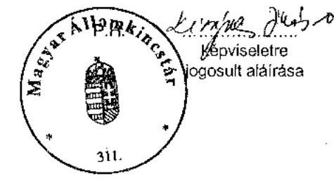

---

V-1012-183/2005. 4. számú melléklet

|  Pályázati adatok mindösszesen | 2004. évi klírások | 2005. évi klírások  |
| --- | --- | --- |
|  Benyújtott pályázatok száma (db) | 13 375 | 18 947  |
|  Támogatott pályázatok száma (db) | 6 260 | 11 457  |
|  Lezárt pályázatok száma (db) | 6 041 | 1 162  |
|  Lezárt pályázatok aránya az összesen támogatottból (%) | 96,50% | 10,14%  |
|  A kollégium felé elutasításra javasolt pályázatok száma (db) | 5 989 | 3 318  |
|  Hiánypótlásra visszaküldött pályázatok száma (db) | 0 | 11 963  |
|  Nem lezárt pályázatok száma (db) | 219 | 10 295  |
|  ebből jogi úton lévő pályázatok száma (db) | 0 | 0  |
|  elszámolás alatt lévő pályázatok száma (db) | 9 | 1 359  |
|  felhasználás alatt lévő pályázatok száma (db) | 0 | 7 606  |
|  kollégium által visszafizetésre javasolt pályázatok száma (db) | 210 | 0  |
|  Szervezetek által visszafizetett, fel nem használt támogatás (millió Ft) | 77,5 | 5,7  |
|  2004. december 31-ig | 0,2 | 0,0  |
|  2005. december 31-ig | 58,0 | 0,1  |
|  2006. május 31-ig | 19,3 | 5,6  |
|  MÁK által helyszínen ellenőrzött pályázó szervezetek száma (db) | 150 | 0  |
|  pályázatok száma (db) | 275 | 0  |
|  helyszínen ellenőrzött pályázatok aránya a lezárt pályázatokban (%) | 4,55% | 0,00%  |
|  Kifizetett támogatás összege (millió Ft) | 6278,8 | 6060,6  |
|  Helyszínen ellenőrzött pályázatok támogatási összege (millió Ft) | 406,0 | 0,0  |
|  Helyszínen ellenőrzött támogatási összeg aránya a kifizetett támogatásokban (%) | 6,47% | 0,00%  |

A 2005. évi klírások esetén az elszámolás alatt lévő pályázatok és felhasználás alatt lévő pályázatok darabszámának összege, valamint a Nem lezárt pályázatok száma közötti különbséget (1330 db) a szerződéskötés alatti pályázatok adják.

Alulírott az Állami Számvevőszékről szóló 1989. évi XXXVIII. törvény 24. § c) pontja alapján aláírásommal kijelentem, hogy a feltüntetett adatok teljesek és a MÁK nyilvántartásaival, okmányaival mindenben egyeznek.

Budapest, 2006. június hó "K" nap

képviseletre jogosult aláírása

---

# Az NCA bevétele és a MÁK működési költsége

1. számú tanúsítvány

|  Megnevezés | 2004 | 2005  |
| --- | --- | --- |
|  NCA tv. 2 § (2) bekezdés a) pontja szerinti tervezett bevétel (millió Ft) | 6 108,4 | 7 000,0  |
|  NCA tv. 2 § (2) bekezdés a) pontja szerinti tényleges bevétel (millió Ft) | 6 978,2* | 7 000,0  |
|  NCA tv. 2 § (2) bekezdés b) pontja szerinti bevétel (millió Ft) | 0 | 0  |
|  NCA tv. 2 § (2) bekezdés c) pontja szerinti bevétel (millió Ft) | 0 | 0  |
|  NCA tv. 2 § (2) bekezdés d) pontja szerinti bevétel (millió Ft) | 0 | 0  |
|  Zárolás összege (millió Ft) | 0 | 700,0  |
|  MÁK működési költsége (millió Ft) |  |   |
|  Tervezett |  | 420,0  |
|  Tényleges | 192,4 | 544,0**  |

- 2004. évben a tényleges bevétel 869,8 millió Ft-tal növekedett a tervezetthez képest, a 2003. évi SZJA bevallások feldolgozása után ** 2005. évben 420 millió Ft előirányzat leadás keretében történt a Kezelőszervnek fizetett összeg rendezése, 124,0 millió Ft a 2004. évi maradvány terhére - számla alapján - teljesített kifizetés.

Alulírott az Állami Számvevőszékről szóló 1989. évi XXXVIII. törvény 24. § c) pontja alapján aláírásommal kijelentem, hogy a feltüntetett adatok teljesek és a MÁK nyilvántartásával, okmányalva mindenben egyeknek.

Budapest, 2006. június hó 6. nap

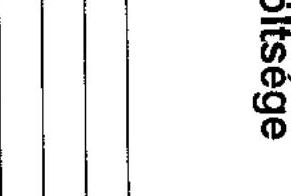

---

Kérdőívvel ellenőrzött 2004.évi NCA pályázatok jellemző mutatói

| Jellemző mutatók megnevezése | Mértékegység | Társadalmi szervezet | Alapítvány |
| :--: | :--: | :--: | :--: |
| Kiválasztott szervezetek száma | db | 295 | 160 |
| Szervezeték megoszlása közhasznúsági besorolás szerinti |  |  |  |
| kiemelkedően közhasznú | \% | 33 | 32 |
| közhasznú | \% | 45 | 62 |
| nem közhasznú | \% | 22 | 6 |
| összesen | \% | 100 | 100 |
| A pályázatok megoszlása a támogatás formája szerint |  |  |  |
| müködési | \% | 74 | 68 |
| szakmai | \% | 26 | 32 |
| összesen | \% | 100 | 100 |
| A müködési támogatások összetétele főbb kiadási jogcímek szerint |  |  |  |
| felhalmozási | \% | 11 | 10 |
| dologi jellegú költség | \% | 31 | 31 |
| bér és bérjellegú kiadások | \% | 44 | 41 |
| bérleti költség | \% | 11 | 14 |
| egyéb költség | \% | 3 | 4 |
| összesen | \% | 100 | 100 |
| felhalmozási | millió Ft | 59 | 29 |
| dologi jellegú költség | millió Ft | 178 | 86 |
| bér és bérjellegú kiadások | millió Ft | 251 | 115 |
| bérleti költség | millió Ft | 61 | 40 |
| egyéb költség | millió Ft | 20 | 10 |
| összesen | millió Ft | 569 | 280 |
| 1 pályázatra jutó átlagos müködési támogatás | Ft/ pályázat | 2588407 | 2596204 |
| A szakmai támogatások összetétele főbb kiadási jogcímek szerint |  |  |  |
| Személyi jutattások | \% | 21 | 12 |
| Dologi kiadások | \% | 75 | 82 |
| Felhalmozási kiadások (szakmai- önszerv.) | \% | 2 | 2 |
| Térítésmentes hozzájárulás | \% | 2 | 4 |
| összesen | \% | 100 | 100 |
| Személyi jutattások | millió Ft | 41 | 17 |
| Dologi kiadások | millió Ft | 148 | 121 |
| Felhalmozási kiadások (szakmai- önszerv.) | millió Ft | 2 | 3 |
| Térítésmentes hozzájárulás | millió Ft | 3 | 7 |
| összesen | millió Ft | 194 | 148 |
|  |  |  |  |

---

# 6. számú melléklet

Kérdőívvel ellenőrzött 2004.évi NCA pályázatok jellemző mutatói

|  Jellemző mutatók megnevezése | Mértékegység | Társadalmi szervezet | Alapítvány  |
| --- | --- | --- | --- |
|  I pályázatra jutó átlagos szakmai támogatás | Ft/ pályázat | 2618960 | 2870235  |
|  A megítélt támogatási összeg aránya a kért támogatáshoz viszonyítva | $\%$ | 73 | 67  |
|  A kért támogatás 100\%-át támogatott pályázatok aránya | $\%$ | 26 | 23  |
|  Akért támogatás kevesebb mint 50\%-át megkapott pályázatok aránya | $\%$ | 18 | 28  |
|  ennek a legjellemzőbb döntéshozó kollégium szerinti megoszlása |  |  |   |
|  Dél-dunántúl regionális | $\%$ | 65 | 60  |
|  Közép-magyarországi regionális | $\%$ | 17 | 47  |
|  Országos Hatókörű Civil Szervezetek Támogatása | $\%$ | 13 | 18  |
|  Eszak-Magyarországi regionális | $\%$ | 24 | 25  |
|  Nemzetközi Civil Kapcsolatok és Európai Integráció | $\%$ | 19 | 44  |
|  Civil szolgáltató fejlesztő és információs | $\%$ | 10 | 4  |
|  A folyósított támogatás aránya ütemezés szerint |  |  |   |
|  Egyösszegben | $\%$ | 95 | 93  |
|  Egyenlő részletekben | $\%$ | 2 | 4  |
|  Több eltérő részletben | $\%$ | 3 | 3  |
|  összesen | $\%$ | 100 | 100  |
|  A finanszírozás ütemezésének megoszlása |  |  |   |
|  előfinanszírozással | $\%$ | 97 | 93  |
|  részben előfinanszírozással, részben utólagosan | $\%$ | 3 | 7  |
|  összesen | $\%$ | 100 | 100  |
|  Atlagos időtartam |  |  |   |
|  benyújtástól kiértesítésig | hónap | 2,9 | 2,9  |
|  kiértesítéstől szerződéskötésig | hónap | 0,8 | 0,8  |
|  szerződéskötéstől elszámolás benyújtásáig | hónap | 6,6 | 6,8  |
|  elszámolás benyújtásától lezárásig | hónap | 3,4 | 3,3  |
|  pályázat teljes életciklusára | hónap | 13,8 | 13,9  |
|  szerződéskötéstől lezárásig | hónap | 10 | 10,1  |
|  |   |   |   |

---

Kérdőívvel ellenőrzött 2004.évi NCA pályázatok jellemző mutatói

|  Jellemző mutatók megnevezése | Mértékegység | Társadalmi szervezet | Alapítvány  |
| --- | --- | --- | --- |
|  Határidőben elszámolt pályázatok aránya | $\%$ | 84 | 84  |
|  Határidőben el nem számolt pályázatok aránya | $\%$ | 16 | 16  |
|  összesen | $\%$ | 100 | 100  |
|  Hiánypótlás nélkül elfogadott elszámolás aránya | $\%$ | 16 | 16  |
|  A hiánypótlást határidőn belül teljesített szervezetek aránya | $\%$ | 97 | 90  |
|  A hiánypótlást határidőn túl teljesített szervezetek aránya | $\%$ | 3 | 10  |
|  A beszámoló pénzügyi elszámolásában a megítélt támogatás és felhasznált (számlával igazolt) összeg között eltérés a vizsgált pályázatok \%-ában. | $\%$ | 48 | 16  |
|  Keletkezett maradvány összege | Ft | 4781985 | 151510  |
|  A pályázatok helyszíni ellenőrzésének aránya | $\%$ | 11 | 11  |
|  A helyszínen nem vizsgált pályázatok aránya | $\%$ | 89 | 89  |
|  összesen |  | 100 | 100  |
|  A páláyzatok megoszlása a döntéshozó kollégiumok szerint |  |  |   |
|  Civil önszerveződés, szakmai és területi együttmúködés | $\%$ | 3 | 6  |
|  Civil szolgáltató fejlesztő és információs | $\%$ | 10 | 16  |
|  Dél-alföldi regionális | $\%$ | 1 | 0  |
|  Dél-dunántúl regionális | $\%$ | 8 | 6  |
|  Eszak-alföldi regionális | $\%$ | 1 | 0  |
|  Eszak-Magyarországi regionális | $\%$ | 19 | 10  |
|  Közép-dunántúl regionális | $\%$ | 0 | 1  |
|  Közép-Magyarországi regionális | $\%$ | 16 | 21  |
|  Nemzetközi Civil Kapcsolatok és Európai Integráció | $\%$ | 9 | 11  |
|  Nyugat-dunántúl regionális | $\%$ | 0 | 1  |
|  Országos Hatókörü Civil Szervezetek Támogatása | $\%$ | 33 | 28  |
|  Összesen | $\%$ | 100 | 100  |
|  |   |   |   |

---

Kérdőívvel ellenőrzött 2004.évi NCA pályázatok jellemző mutatói

| Jellemző mutatók megnevezése | Mértékegység | Társadalmi szervezet | Alapítvány |
| :--: | :--: | :--: | :--: |
| A szervezetek föbb tevékenységinek meoszlása |  |  |  |
| kulturális tevékenység | \% | 19 | 11 |
| sporttevékenység | \% | 20 | 0 |
| szabadidős és hobbi tevékenység | \% | 1 | 2 |
| oktatási tevékenység | \% | 7 | 20 |
| kutatási tevékenység | \% | 2 | 7 |
| egészségügyi tevékenység | \% | 5 | 12 |
| szociális tevékenység | \% | 13 | 17 |
| polgári védelem, tüzoltási tevékenység | \% | 1 | 1 |
| környezetvédelmi tevékenység | \% | 14 | 4 |
| településfejlesztési tevékenység | \% | 1 | 0 |
| jogvédő tevékenység | \% | 1 | 4 |
| nemzetközi tevékenység | \% | 1 | 1 |
| szakmai, gazdasági érdekképviselet | \% | 8 | 3 |
| vallás | \% | 1 | 1 |
| egyéb tevékenység | \% | 3 | 5 |
| társadalom-tudomány | \% | 1 | 5 |
| civil szervezetek segítsége | \% | 1 |  |
| foglalkozási csoportot tömörítő szervezet | \% | 1 |  |
| gyermek és ifjúságvédelem | \% |  | 5 |
| kiadói, könyvkiadói tevékenység | \% |  | 2 |
| összesen | \% | 100 | 100 |

---

# A helyszínen ellenőrzött civil szervezetek adatai

|  Helyszínen ellenőrzött civil szervezetek adatai | Alapítvány | Társadalmi szervezet | Összesen  |
| --- | --- | --- | --- |
|  Szervezetek száma | 40 | 61 | 101  |
|  kiemelkedően közhasznú szervezet | 9 | 25 | 34  |
|  közhasznú | 26 | 26 | 52  |
|  nem közhasznú | 5 | 10 | 15  |
|  Ellenőrzött pályázatok (db) | 143 | 246 | 389  |
|  Kapott támogatások adatai (millió Ft) |  |  |   |
|  2004.évben kapott NCA működési támogatás összesen | 100 | 219 | 318  |
|  2004.évben kapott NCA szakmai támogatás összesen | 104 | 166 | 270  |
|  2004. évi összesen (millió Ft) | 203 | 385 | 588  |
|  2005.évben kapott NCA működési támogatás összesen | 58 | 141 | 199  |
|  2005.évben kapott NCA szakmai támogatás összesen | 58 | 120 | 178  |
|  2005. évi összesen | 116 | 261 | 377  |
|  Tervezett és tényleges saját/egyéb források alakulása (millió Ft) |  |  |   |
|  2004.év tervezett saját forrás | 444 | 881 | 1326  |
|  2004.év tervezett más támogatótól kapott támogatás | 228 | 457 | 685  |
|  2004.év tervezett egyéb államháztartási forrás | 892 | 892 | 1783  |
|  2004.év tervezett NCA támogatás | 252 | 417 | 669  |
|  2004.év tervezett források összesen (millió Ft) | 1816 | 2647 | 4463  |
|  2004.év tényleges saját forrás | 895 | 954 | 1850  |
|  2004.év tényleges más támogatótól kapott támogatás | 261 | 515 | 776  |
|  2004.év tényleges egyéb államháztartási forrás | 942 | 835 | 1777  |
|  2004.év tényleges NCA támogatás | 199 | 370 | 569  |
|  2004.év tényleges források összesen (millió Ft) | 2297 | 2674 | 4971  |
|  2004.év NCA támogatás/tényleges források összesen (\%) | $9 \%$ | $14 \%$ | $11 \%$  |
|  2005.év tervezett saját forrás | 93 | 652 | 746  |
|  2005.év tervezett más támogatótól kapott támogatás | 24 | 147 | 171  |
|  2005.év tervezett egyéb államháztartási forrás | 1 | 872 | 873  |
|  2005.év tervezett NCA támogatás | 59 | 154 | 214  |
|  2005.év tervezett források összesen (millió Ft) | 177 | 1826 | 2004  |
|  2005.év tényleges saját forrás | 41 | 442 | 483  |
|  2005.év tényleges más támogatótól kapott támogatás | 7 | 121 | 128  |
|  2005.év tényleges egyéb államháztartási forrás | 2 | 834 | 836  |
|  2005.év tényleges NCA támogatás | 33 | 124 | 158  |
|  2005.év tényleges források összesen | 83 | 1521 | 1604  |
|  2004.év NCA támogatás/tényleges források összesen (\%) | $40 \%$ | $8 \%$ | $10 \%$  |

---

# Dokumentálisan ellenőrzött civil szervezetek listája 

| A | Társadalmi szervezetek |
| :--: | :--: |
| Ssz. | Pályázó megnevezése |
| 1. | 4*4 Off-Road Club SE |
| 2. | Abonyi Horgász Egyesület |
| 3. | ADRIA-SZIGO Kulturális Táncsport Egyesület |
| 4. | Általános Művelődési Központok Országos Egyesülete |
| 5. | Árpád Sportlövő és Ijjász Egylet |
| 6. | Árpád-házi Szent Erzsébet Történelmi Társaság |
| 7. | ARTTÉKA Művészet Határok Nélkül Egyesület |
| 8. | Árvácska Állatbarát Egyesület |
| 9 . | Asztmás és Allergiás Gyermekek Magyarországi Egyesülete |
| 10. | Baglas Néptánc Egyesület |
| 11. | Baranya Megyei Falusi Turizmus Közhasznú Szövetség |
| 12. | Baranya Megyei Repülő és Ejtőernyős Klub |
| 13. | Bartina Néptánc Egyesület |
| 14. | B-A-Z Megyei Környezeti Nevelők Egyesülete |
| 15. | B-A-Z Megyei Sportszövetségek Képviselete |
| 16. | Bernáth Aurél Társaság |
| 17. | Beszédes József Vizitúra Sportklub |
| 18. | BROADWAY Egyesület |
| 19. | Budapest Környéki Népfőiskolai Szövetség |
| 20. | Budapesti Darts Szövetség |
| 21. | Budapesti Diáksport Szövetség |
| 22. | Budapesti Egyetemi Atlétikai Club |
| 23. | Budapesti Ótlabda SE |
| 24. | Budapesti Románok Kulturális Társasága |
| 25. | Bükki Emlőstani Kutatócsoport Egyesülete |
| 26. | Cantus Agriensis Kulturális Egyesület |
| 27. | Cigány Népmúvészek Országos Egyesülete |
| 28. | Civil Foglalkoztatási Szervezetek Szövetsége |
| 29. | Civitan Club Budapest Help Egyesület |
| 30. | Család, Gyermek, Ifjúság Kiemelten Közhasznú Egyesület |
| 31. | Csecsemőket és Kisgyermekeket befogadó otthonok Országos Szövetsége |
| 32. | Csereháti Településszövetség |
| 33. | Dabasi Röplabda Club |
| 34. | Démoszthenész Beszédhibások és Segítőik Országos Érdekvédelmi Egyesülete |
| 35. | Disputa Kör Egyesület |
| 36. | DROG-STOP BUDAPEST EGYESÜLETE |
| 37. | Dunántúli Mezőgazdasági Szaktanácsadók Szövetsége |
| 38. | Echo Oktatáskutató Műhely |
| 39. | Egészségesebb Munkahelyekért Egyesület |
| 40. | Egészségügyi Szakdolgozók Együttmúködési Fórum |
| 41. | Egri Szimfónikus Zenekar Fúvós Kulturális Egyesület |
| 42. | Egymást Segítő Egyesület |
| 43. | Életért Lelki Segélyszolgálat Egyesület |
| 44. | Életfa Környezetvédő Szövetség |
| 45. | E-misszió Természet-és Környezetvédelmi Egyesület |

---

# Dokumentálisan ellenőrzött civil szervezetek listája 

| A | Társadalmi szervezetek |
| :--: | :--: |
| Ssz. | Pályázó megnevezése |
| 46. | EMLA-Környezeti Managment és Jog Egyesület |
| 47. | Épületszigetelők, Tetőfedők és Bádogosok Magyarországi Szövetsége |
| 48. | Erdélyi Örmény Gyökerek Kulturális Egyesület |
| 49. | Európa Ház Egyesület |
| 50. | Európa Jövője Egyesület |
| 51. | Európai Fejlesztési és Tájékoztatási Egyesület |
| 52. | Félúton Sportegyesület |
| 53. | FIKSZ Egyesület |
| 54. | Fonyódi Múzeumi és Helytörténeti Egyesület |
| 55. | Földes Ferenc Gimnázium Diáksport Egyesület |
| 56. | Görömbölyi Kulturális Egyesület |
| 57. | Hajdú -Bihar Megyei TIT |
| 58. | "Háló" Zámoly Fejlődéséért Egyesület |
| 59. | Hegyek Vándorai Turista Egyesület |
| 60. | Helios Mozgásakadémia Egyesület |
| 61. | Heves Megyei Életreform Népfőiskola |
| 62. | Holdvilág Kamaraszínház Kulturális Egyesület |
| 63. | Horgász Egyesületek Budapesti Szövetsége |
| 64. | Hort Sport Egyesület |
| 65. | Hulladék Munkaszövetség |
| 66. | Ifjú Közgazdászok Közhasznú Egyesülete |
| 67. | "Igaz Szó" Magyarországi Romák Független Érdekszövetsége |
| 68. | "Impulzus Pályakezdők Munkaszocializációjával Foglalkozó Szakemberek Egyesülete |
| 69. | Informatikai Egyeztető Fórum (INFORUM) |
| 70. | Inspi-Ráció Egyesület |
| 71. | Ipoly Unió Környezetvédelmi és Kulturális Egyesület |
| 72. | Istenkúti Közösségért Egyesület |
| 73. | József-hegyi Amatőr Montis Sport Egyesület |
| 74. | Kalamajka Bábszínház Egyesület |
| 75. | Kaposvári Vízilabda Klub |
| 76. | Katolikus Ifjúsági és Felnőttképzési Szövetség /KIFE/ |
| 77. | Katolikus Ifjúsági Mozgalom |
| 78. | Kecsketenyésztők és Nemesítők Országos Egyesülete |
| 79. | Keresztény Értelmiségiek Szövetsége |
| 80. | "Kiskanizsa" Kulturális Egyesület |
| 81. | KISPEST-SE |
| 82. | Komplex Póló Suli Sportegyesület |
| 83. | KÖRLÁNC Országos Egyesület a Környezeti Nevelésért |
| 84. | Közbiztonsági Egyesület Pécs |
| 85. | Közbiztonsági és Bűnmegelőzési Polgárőr Kiemelkedően Közhasznú Egyesület |
| 86. | Közép és Kelet-Európai Munkacsoport a Biodiverzitás Megőrzéséért |
| 87. | Központi Sport- és Ifjúsági Egyesület |
| 88. | Levegő Munkacsoport Országos Környezetvédő Szövetség |
| 89. | Linux-felhasználók Magyarországi Egyesülete |
| 90. | Lovasakadémia Sport Club |

---

# Dokumentálisan ellenőrzött civil szervezetek listája

|  A | Társadalmi szervezetek  |
| --- | --- |
|  Ssz. | Pályázó megnevezése  |
|  91. | Magyar Asztalitenisz Szövetség  |
|  92. | Magyar Asztma Növérek Országos Egyesülete  |
|  93. | Magyar Bírószó Szövetség  |
|  94. | Magyar Brídzs Szövetség  |
|  95. | Magyar Család-és Nővédelmi Tudományos Társaság /Pro Familia Hungariae/  |
|  96. | Magyar Egyetemi Főiskolai Sportszövetség  |
|  97. | Magyar Értelmi Fogyatékosok Sportszövetsége (MÉS)  |
|  98. | Magyar Fallabda (Squash) Szövetség  |
|  99. | Magyar Fesztivál Szövetség  |
|  100. | Magyar Gyógyszerésztörténeti Társaság  |
|  101. | Magyar Hidrológiai Társaság  |
|  102. | Magyar Jogász Egylet  |
|  103. | Magyar Karate Szakszövetség  |
|  104. | Magyar Katolikus Orvosok Szent Lukács Egyesülete  |
|  105. | Magyar Kékkereszt Egyesület  |
|  106. | Magyar Kollégium Kulturális Egyesület  |
|  107. | Magyar Könyvtárosok Egyesülete  |
|  108. | Magyar Lovassport Szövetség  |
|  109. | Magyar Madártani Természetvédelmi Egyesület  |
|  110. | Magyar Mérnökhallgatók Egyesülete  |
|  111. | Magyar Mozgáskorlátozottak Sportszövetsége  |
|  112. | Magyar Népfőiskolai Társaság  |
|  113. | Magyar Országos Korcsolyázó Szövetség  |
|  114. | Magyar Ökumenikus Segélyszervezet  |
|  115. | Magyar Röplabda Szövetség  |
|  116. | Magyar Sakkszövetség  |
|  117. | Magyar Speciális Művészeti Műhely Egyesület  |
|  118. | Magyar Szabadidősport Szövetség  |
|  119. | Magyar SzabadidőTársaság  |
|  120. | Magyar Technikai és Tömegsportklubok Országos Szövetsége  |
|  121. | Magyar Természetbarát Szövetség  |
|  122. | Magyar Természetvédők Szövetsége  |
|  123. | Magyar Torna Szövetség  |
|  124. | Magyar Triatlon Szövetség  |
|  125. | Magyar Újságírók Országos Szövetsége  |
|  126. | Magyar Vakok és Gyengénlátó Országos Szövetsége B-A-Z. megyei Szerv. Denevér SE  |
|  127. | Magyar Vállalkozói Szalon  |
|  128. | Magyar Védőnők Egyesülete  |
|  129. | Magyar Veterán Repülők Szövetsége  |
|  130. | Magyar Waldorf Szövetség Egyesület  |
|  131. | Magyarok Világszövetsége  |
|  132. | Magyarországí Éjféli Sportbajnokságok Egyesülete (MÉSE)  |
|  133. | Magyarországí Krizis Intervenciós Központ Egyesület  |
|  134. | Magyarországí Lengyel Katolikusok Szent Adalbert Egyesülete  |
|  135. | Magyartarka Tenyésztők Egyesülete  |

---

# Dokumentálisan ellenőrzött civil szervezetek listája 

| A | Társadalmi szervezetek |
| :--: | :--: |
| Ssz. | Pályázó megnevezése |
| 136. | Mahatma Gandhi Egyesület |
| 137. | Matyó Népmúvészeti Egyesület |
| 138. | MÁVAG Horgász Egyesület |
| 139. | Misina Természet- és Állatvédő Egyesület |
| 140. | MOM Tömegsport Klub |
| 141. | MOSOLY Nővérszolgálat és Egészségvédő Egyesület |
| 142. | Mozgáskorlátozottak Egyesületeinek Országos Szövetsége |
| 143. | Mozgáskorlátozottak Egymást Segítők Egyesülete |
| 144. | Mozgáskorlátozottak Közép-Magyarországi Regionális Egyesülete |
| 145. | Mozgáskorlátozottak Ózd Városi Egyesülete |
| 146. | Mozgáskorlátozottak Somogy Megyei Egyesülete |
| 147. | Mozgássérültek Heves Megyei Egyesülete |
| 148. | Musica Aulica Régizene Együttes Kulturális Egyesület |
| 149. | Múegyetemi Atlétikai és Football Club |
| 150. | Műszaki és Természettudományi Egyesületek Szövetsége |
| 151. | MVK Baranya Megyei Szervezet |
| 152. | MVK BAZ Megyei Szervezet |
| 153. | MVK Somogy Megyei Szervezet |
| 154. | MVK Szabolcs-Szatmár-Bereg MSZ |
| 155. | MVK Tolna Megyei Szervezet |
| 156. | Nagycsaládosok Országos Egyesülete Soproni Tagegyesülete |
| 157. | "NEBÁNTSVIRÁG" Nemzetközi Gyermek-és Ifjúságvédő Közhasznú Egyesület |
| 158. | Nem Állami Felsőoktatási Intézmények Országos Régiójának Egyesülete |
| 159. | Nemzetközi Gyermekmentő Szolgálat Magyar Egyesület |
| 160. | Nemzetközi Segítség és Barátság Egyesület |
| 161. | Népmúvészeti Egyesületek Szövetsége |
| 162. | Nevelők Húza Egyesület |
| 163. | NIMFEA Természetvédelmi Egyesület |
| 164. | Nógrád Megyei Gyermekbarát Egyesület |
| 165. | Nógrád Megyei Polgárőr Szervezetek Szövetsége |
| 166. | Nógrád Megyei Regionális Vállalkozásfejlesztési Alapitvány |
| 167. | Nógrád Megyei Sportági Szakszövetségek Sportbizottságok Szövetsége |
| 168. | Nonprofit Humán Szolgáltatók Országos Szövetsége |
| 169. | Nonprofit Kutatócsoport Egyesület |
| 170. | Nyugdíjasklubok és Idősek "Életet az éveknek" Országos Szövetsége |
| 171. | Nyugdíjasok Egyesülete Pécs |
| 172. | Óbudai Sportegyesület |
| 173. | Ócsai Természetvédelmi és Idegenforgalmi Egyesület |
| 174. | Oltalom Karitatív Egyesület |
| 175. | Óperencia Regionális Kulturális Egyesület |
| 176. | Országos Fogyasztóvédelmi Egyesület |
| 177. | Országos Magyar Bányászati és Kohászati Egyesület |
| 178. | Országos Polgárőr Szövetség |
| 179. | Óvó- és Tanítóképzők Egyesülete |
| 180. | Ózdi Football Club |

---

# Dokumentálisan ellenőrzött civil szervezetek listája 

| A | Társadalmi szervezetek |
| :-- | :-- |
| Ssz. | Pályázó megnevezése |
| 181. | Patak Képzőművészeti Egyesület |
| 182. | Pécs-Baranyai TIT |
| 183. | Pécsi Mecsek Futball Club |
| 184. | Pécsi Ritmikus Gimnasztika Egyesület |
| 185. | Perényi Nemzetközi Fodrász Egyesület |
| 186. | Pest Megyei Diáksport Szövetség |
| 187. | Petőfi Sporthorgász Egyesület |
| 188. | Pisztráng Kör Waldorf Természetvédő és Természetjáró Egyesület |
| 189. | Ráckevei Dunaági Horgász Szövetség |
| 190. | Reflex Környezetvédő Egyesület |
| 191. | Regnum Marianum Katolikus Közösség Egyesület |
| 192. | Regnum Marianum Sport Egyesület |
| 193. | Rokkantnyugdijasok Országos Egyesülete |
| 194. | Somogy Megyei Diáksport Szövetség |
| 195. | Somogy Megyei Sportszövetség |
| 196. | Soroksári Svábok Független Egyesülete |
| 197. | Sportolók a Drog Ellen Egyesület |
| 198. | Szalamandra Sport, Turisztikai, Természet- és Környezetvédelmi Egyesület |
| 199. | Szárazdi Horgász Egyesület |
| 200. | Szekszárdi Szabadidős Kerékpáros Egyesület |
| 201. | SZIKE Környezet-és Egészségvédelmi Egyesület |
| 202. | Szociális Szakmai Szövetség |
| 203. | Szülők Fóruma Egyesület |
| 204. | Társadalmi Egyesülések Országos szövetsége |
| 205. | Társadalmi Egyesülések Zala Megyei Szövetsége |
| 206. | Tiszaújvárosi Fitness Sportklub |
| 207. | TIT Bácskai Egyesülete |
| 208. | TIT Bács-Kiskun Megyei Egyesülete |
| 209. | TIT Bugát Pál Egyesülete |
| 210. | TIT Jurányi Lajos Egyesület |
| 211. | TIT Komárom-Esztergom Megyei Egyesület |
| 212. | TIT Pásztó Városi Egyesület |
| 213. | TIT Stúdió Egyesület |
| 214. | Tolna Megyei Népművészeti Egyesület |
| 215. | Tolna Megyei Polgárőr Szervezetek Szövetsége |
| 216. | Tolna Megyei Sportszövetségek Szövetsége |
| 217. | Tolna Megyei Tudományos Ismeretterjesztő Egyesület |
| 218. | Trianon Társaság |
| 219. | Tudatos Vásárlók Közhasznú Egyesülete |
| 220. | Tulajdonos Munkavállalók és Társaik Országos Szövetsége |
| 221. | Újpesti Torna Egylet |
| 222. | Üllői Mozgáskorlátozottak Egyesülete |
| 223. | Varangy Akciócsoport Egyesület |
| 224. | Városmajori Parkbarátok |
| 225. | Vitalitás Sportegyesület |
| 226. | Zene-Tánc-Mozgás Kultúrális Egyesület |

---

# B Alapítványok 

|  | Pályázó megnevezése |
| :--: | :--: |
| 1. | A jövő Iskolája Magyarországi Alapítványa |
| 2. | A nyilvánosságért és a civil társadalomért alapítvány |
| 3. | Agócsy László Zeneiskola Alapítvány |
| 4. | Állatmenhely Nyílt Alapítvány |
| 5. | Állatokat Védjük Együtt Alapítvány |
| 6. | Anyaoltalmazó Alapítvány |
| 7. | Ars Topia Alapítvány |
| 8. | Assisi Szent FerencCserkész Alapítvány |
| 9. | AUT-PONT Autista Gyermekekért és Fiatalokért Alapítvány |
| 10. | Az Epilepsziás Gyermekekért Alapítvány |
| 11. | Batthyány Lajos Alapítvány |
| 12. | B-A-Z. Megyei Bűnmegelőzési Alapítvány |
| 13. | Berkenyei Szent Kereszt Alapítvány |
| 14. | Bliss Alapítvány |
| 15. | BOCS-BOKOR ÖKO CSOPORT ALAPÍTVÁNY |
| 16. | Boldog Gizella Alapítvány |
| 17. | Budapesti Vonósok Kamarazenekar Alapítványa |
| 18. | C3 Kulturális és Kommunikációs Központ Alapítvány |
| 19. | Civil Kollégium Alapítvány |
| 20. | Családi Szolgálatok Ligája Alapítvány |
| 21. | Csend Hangja Alapítvány |
| 22. | Csillaghegyi Evangélikus Gyülekezet és Templomépítő Alapítvány |
| 23. | Dél-magyarországi Gyermek és Ifjúsági Alapítvány |
| 24. | Demokratikus Ifjúságért Alapítvány |
| 25. | Demokratikus Jogok Fejlesztéséért Alapítvány |
| 26. | Diákközéletért Alapítvány |
| 27. | Diótörés Alapítvány |
| 28. | Dyscalculiás, Dyslexiás Gyermekekért Alapítvány |
| 29. | E.SZ.T.E.R. Közhasznú Alapítvány az Erőszakos Szexuális Támadást   Elszenvedettek Rehabilitációjára |
| 30. | Ec-Pec Alapítvány |
| 31. | Egészséges és Erkölcsös Ifjúságért Alapítvány |
| 32. | Egészséges Szívért Alapítvány |
| 33. | Egészségfejlesztési - Oktatási Alapítvány |
| 34. | Együtt a Leukémiás Gyermekekért Alapítvány |
| 35. | "Együtt a parlagfű ellen" Alapítvány |
| 36. | Élettér Alapítvány |
| 37. | Élő Reménység Alapítvány |
| 38. | Első Magyar Látványtár Alapítvány |
| 39. | Ember Barát Misszió Alapítvány |
| 40. | Emberi Jogi Információs és Dokumentációs Központ Alapítvány - INDOK/ |
| 41. | Esztétikum Kulturális, Művészeti és Oktatási Alapítvány |
| 42. | Európai Párbeszéd Alapítvány |
| 43. | Fehérkereszt Állatvédő Liga Állatotthon Alapítvány |
| 44. | Felzárkózunk Regionális Fejlesztési-Tanácsadó-Továbbképző Alapítvány |
| 45. | Független Ökológiai Központ Alapítvány |

---

B Alapítványok

|  | Pályázó megnevezése |
| :--: | :--: |
| 46. | Generation Europe Magyarország Alapítvány |
| 47. | Gyermekeinkért '91 Alapítvány |
| 48. | Gyermekvasútasokért Alapítvány |
| 49. | Harmadik Évezred Alapítvány |
| 50. | Határok Nélkül Soproni Művészeti és Kulturális Alapítvány |
| 51. | Havasi Gyopár Szociális, Egészségügyi, Kulturális Segítő Alapítvány |
| 52. | Humán Integra Társadalmi Beilleszkedést Segítő Regionális Alapítvány |
| 53. | Ifjú Tehetségekért Alapítvány |
| 54. | "INFONIA" Információs Társadalomért, Információs Kultúráért Közhasznú Alapítvány |
| 55. | Írók Alapítványa -- Széphalom Könyvmühely |
| 56. | Jövőbarát Alapítvány |
| 57. | Kapaszkodó Alapítvány |
| 58. | Kapcsolat Alapítvány |
| 59. | Kardiovaszkuláris Védelem Alapítvány |
| 60. | Károlyi Clarisse Alapítvány |
| 61. | Kárpátaljai Ferences Misszió Alapítvány |
| 62. | Kaszap István Alapítvány |
| 63. | Kék Delfin Vízioport Alapítvány |
| 64. | Kék Iskola-Kék Alapítvány |
| 65. | "Kézenfogva" Összefogás a Fogyatékosokért Alapítvány |
| 66. | Kisebbségekért-Pro Minoritate Alapítvány |
| 67. | Konszenzus Alapítvány Heves Megyei Szervezete |
| 68. | KONTAKT Alapítvány |
| 69. | Közhasznú Alapítvány a Dadogókért |
| 70. | Kurt Lewin Kulturális Alapítvány - Az előítéletek csökkentéséért |
| 71. | Kürt Alapítvány |
| 72. | Lélegzet Alapítvány |
| 73. | Léthatáron Alapítvány |
| 74. | Magyar Emberi Jogok Alapítvány (Hungarian Human Rights Foundation) |
| 75. | Magyar Honvédség Szociálpolitikai Alapítvány |
| 76. | Magyar Sclerosis Multiplexes Betegekért Alapítvány |
| 77. | Magyarok Öröksége Alapítvány |
| 78. | Magyarországí Mindszenty Alapítvány |
| 79. | Másság Alapítvány |
| 80. | MEDIA UNIVERSALIS Alapítvány |
| 81. | Menedék Alapítvány |
| 82. | MIMOSZ ALAPÍTVÁNY Múvelődési,Irodalmi,Művészeti,Oktatási és Színházi Alapítvány |
| 83. | Napfényt az Életnek Alapítvány |
| 84. | Nemzetközi Gyermekmentő Szolgálat Alapítvány |
| 85. | Néptánccal a Gyermekekért Alapítvány |
| 86. | Nógrád Megyei Regionális Vállalkozásfejlesztési Alapítvány |
| 87. | Nonprofit Alapítvány |
| 88. | Nonprofit Információs és Oktató Központ Alapítvány |
| 89. | Non-Profit Szektorért Közhasznú Alapítvány |
| 90. | Nonprofit Vállalkozásokért a Népjóléti Szférában Alapítvány |

---

# B Alapítványok 

|  | Pályázó megnevezése |
| :--: | :--: |
| 91. | Nyitott Kapu Mobil Art Galéria Alapítvány |
| 92. | Nyitott Világ Alapítvány |
| 93. | Orbán Balázs Alapítvány |
| 94. | Otthon Segítünk Alapítvány |
| 95. | Ökológiai Intézet a Fenntartható Fejlődésért Alapítvány |
| 96. | Örangyalok Alapítvány a beteg gyermekekért |
| 97. | Örök Sziget Alapítvány |
| 98. | Paraklisz Drogellenes Alapítvány |
| 99. | Pasaréti Ferences Alapítvány |
| 100. | Pécsi Napközi Otthon Alapítvány |
| 101. | Quirites Alapítvány |
| 102. | Regionális Civil Központ Alapítvány |
| 103. | Sapientia Hungariae Alapítvány |
| 104. | "Segíts rajtam" Hátrányos Helyzetűekért Alapítvány |
| 105. | Somogyi Munkanélküliekért Alapítvány |
| 106. | Sorsunk és Jövőnk Alapítvány |
| 107. | Stencil Kulturális Alapítvány |
| 108. | Summa Vitae Alapítvány |
| 109. | Szellemi Sérült Testvéreinkért Alapítvány |
| 110. | Szent Adalbert Misszió Alapítvány |
| 111. | Szent Márton Gyermekmentőszolgálat Közhasznú Alapítvány |
| 112. | Szimbiózis A Harmónikus Együtt-Létért Alapítvány |
| 113. | Szívbeteg Csecsemőkért Közhasznú Alapítvány |
| 114. | Taverna Oktatási Alapítvány |
| 115. | TermészetBŰVÁR Alapítvány |
| 116. | Természetes Életmód Alapítvány |
| 117. | Tiszalúci Mesevár Alapítvány |
| 118. | Tiszta Forrás Alapítvány |
| 119. | Tizennyolc Körül Alapítvány |
| 120. | Tocqueville Kutatóközpont Alapítvány |
| 121. | Tumor Leukémiás Gyermekekért Alapítvány |
| 122. | Tunyogi Erzsébet Gyógyító Játszóháza Alapítvány |
| 123. | Tüskevár Alapítvány |
| 124. | Új Előadóművészeti Alapítvány |
| 125. | United Way Kisalföld Alapítvány |
| 126. | Veszprémi Egyetem Hallgatói Alapítvány |
| 127. | VIZUS Alapítvány a látássérültekért |

---

|  Ssz. | Pályázó megnevezése  |
| --- | --- |
|  Társadalmi szervezetek |   |
|  1. | $4 \times 4$ Off Road Club SE  |
|  2. | Bartina Néptánc Egyesület  |
|  3. | Civil Foglalkoztatási Szervezetek Szövetsége  |
|  4. | Család,Gyermek,Ifjúság Kielemkedő Közhasznú Egyesület  |
|  5. | Drog Stop Budapest Egyesület  |
|  6. | Echo Oktatáskutató Műhely  |
|  7. | E-Misszió Természet és Környezetvédelmi Egyesület  |
|  8. | EMLA-Környezeti Managment és Jog Egyesület  |
|  9. | Európa Ház Egyesület  |
|  10. | Európa Jövője Egyesület  |
|  11. | Hegyek Vándorai Turista Egyesület  |
|  12. | Hulladék Munkaszövetség  |
|  13. | Impulzus Pályakezdők Munkaszocializációjával Foglalkozó Szakemberek Egyesülete  |
|  14. | Informatikai Egyeztető Fórom  |
|  15. | Kispest SE  |
|  16. | Közép és kelet-Európai Munkacsoport a Biodiverzitás Megörzéséért  |
|  17. | Levegő Munkacsoport  |
|  18. | Magyar Asztalitenisz Szövetség  |
|  19. | Magyar Egyetemi Főiskolai Sportszövetség  |
|  20. | Magyar Értelmi Fogyatékosok Sportszövetsége (MÉS)  |
|  21. | Magyar Mozgáskorlátozottak Sportszövetsége  |
|  22. | Magyar Ökumenikus Segélyszervezet  |
|  23. | Magyar Technikai és Tömegsportklubok Országos Szövetsége  |
|  24. | Magyar Természervédők Szövetsége  |
|  25. | Magyar Természetbarát Szövetség  |
|  26. | Magyar Triatlon Szövetség  |
|  27. | Magyar Waldorf Szövetség Egyesület  |
|  28. | MÁVAG Horgász Egyesület  |
|  29. | Mozgáskorlátozottak Egymást Segítők Egyesülete  |
|  30. | Műegyetemi Atlétikai és Football Club  |
|  31. | MVK Baranya megyei Szervezete  |
|  32. | MVK Borsod-Abaúj-Zemplén Megyei Szervezete  |
|  33. | MVK Budapesti Szervezete  |
|  34. | MVK Jász- Nagykun-Szolnok Megyei Szervezete  |
|  35. | MVK Somogy Megyei Szervezete  |
|  36. | MVK Szabolcs-Szatmár Bereg Megyei Szervezete  |
|  37. | MVK Tolna Megyei Szervezete  |
|  38. | NEBÁNTSVIRÁG Nemzetközi Gyermek-és Ifjúságvédő Közhasznú Egyesület  |
|  39. | Nevelők Háza  |
|  40. | Nonprofit Kutatócsoport Egyesület  |
|  41. | Nyugdíjasok Egyesülete Pécs  |
|  42. | Nyugdíjklubosok és Idősek "Életet az éveknek" Országos Szövetsége  |
|  43. | Öcsai Természetvédelmi és Idegenforgalmi Egyesület  |
|  44. | Oltalom Karitatív Egyesület  |
|  45. | Országos Polgárőr Szövetség  |
|  46. | Övő és Tanítóképzők Egyesülete  |
|  47. | Putak Képzőművészeti Egyesület  |

---

# Helyszínen ellenőrzött civil szervezetek listája

|  Ssz. | Pályázó megnevezése  |
| --- | --- |
|  48. | Pécsi Ritmikus Sportgimnasztika Egyesület  |
|  49. | Pest Megyei Diáksport Szövetség  |
|  50. | Rokkantnyugdíjasok Országos Egyesülete  |
|  51. | Sportolók a Drog Ellen  |
|  52. | Szekszárdi Szabadidős Kerékpáros Egyesület  |
|  53. | Szülők Fóruma Egyesület  |
|  54. | Társadalmi Egyesülések Zala Megyei Szövetsége  |
|  55. | Társadalmiegyesületek Országos Szövetsége  |
|  56. | Tolna Megyei Népművészeti Egyesület  |
|  57. | Trianon Társaság  |
|  58. | Újpesti Torna Egylet (UTE)  |
|  59. | Üllői Mozgáskorlátozottak Egyesülete  |
|  60. | Varangy Akciócsop.Egyesület  |
|  61. | Városmajori Parkharátok Egyesület  |
|  62. | Zene-Tánc-Mozgás Kulturális Egyesület*  |

- Az Egyesület kikerült a helyszíni ellenőrzöttek köréből

---

|  Ssz. | Pályázó megnevezése  |
| --- | --- |
|  Alapítványok |   |
|  63. | A jövő Iskolája Magyarország Alapítványa  |
|  64. | Anyaoltalmazó Alapítvány  |
|  65. | Assisi Szent Ferenc Cserkész Alapítvány  |
|  66. | Az Epilepsziás Gyermekekért Alapítvány  |
|  67. | Batthyány Lajos Alapítvány  |
|  68. | Budapesti Fesztiválzenekar Alapítvány  |
|  69. | C3 Kulturális és Kommunikációs Központ Alapítvány  |
|  70. | Civil Kollégium Alapítvány  |
|  71. | Családi Szolgálatok Ligája Alapítvány  |
|  72. | Demokratikus Ifjúságért Alapítvány  |
|  73. | Diákközéletért Alapítvány  |
|  74. | Egészséges Szívért Alapítvány  |
|  75. | Egészségfejlesztési - Oktatási Alapítvány  |
|  76. | Együtt a parlagfü ellen Alapítvány  |
|  77. | Európai Párbeszéd Alapítvány  |
|  78. | Felzárkózunk Regionális Fejlesztési-Tanácsadó-Továbbképző Alapítvány  |
|  79. | Generation Europe Magyarország Alapítvány  |
|  80. | Havasi Gyopár Szociális, Egészségügyi, Kulturális Segítő Alapítvány  |
|  81. | Humán Integra Társadalmi Beilleszkedést Segítő Regionális Alapítvány  |
|  82. | INFONIA - Információs Társadalomért, Információs Kultúráért Közhasznú Alapítvány  |
|  83. | Írók Alapítványa  |
|  84. | Jövőbarát Alapítvány  |
|  85. | Károlyi Clarisse Alapítvány  |
|  86. | Kék Delfin Vízioport Alapítvány  |
|  87. | Kék Iskola - Kék Alapítvány  |
|  88. | Kézenfogva Összefogás a Fogyatékosokért Alapítvány  |
|  89. | Kisebbségekért-Pro Minoritate Alapítvány  |
|  90. | Közhasznú Alapítvány a Dadogókért  |
|  91. | Léthatáron Alapítvány  |
|  92. | Magyar Honvédség Szociálpolitikai Alapítvány  |
|  93. | MIMOSZ ALAPÍTVÁNY Müvelődési,Irodalmi,Művészeti,Oktatási és Színházi Alapítvány  |
|  94. | Nemzedékek Biztonságáért Alapítvány  |
|  95. | Nemzetközi Gyermekmentő Szolgálat Alapítvány  |
|  96. | Nógrád Megyei Regionális Vállalkozásfejlesztési Alapítvány  |
|  97. | Orbán Balázs Alapítvány  |
|  98. | Ökológiai Intézet a Fenntartható Fejlődésért Alapítvány  |
|  99. | Örök Sziget Alapítvány  |
|  100. | Sapientia Hungariae Alapítvány  |
|  101. | Tocqueville Kutatóközpont Alapítvány  |
|  102. | Veszprémi Egyetem Hallgatói Alapítvány  |

---

V-1012-183/2005. 10. számú melléklet
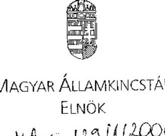

MAGYAR ÁLLAMKINCSTÁR ELNÖK
$H A-G-1231112006$

## Dr. Kovács Árpád úr elnök

Állami Számvevőszék

## Budapest

## Tisztelt Elnök Úr!

Köszönettel vettem az Állami Számvevőszék által elkészített „Jelentés a Nemzeti Civil Alapprogamból civil szervezeteknek juttatott költségvetési támogatások ellenôrzéséről" cimủ jelentést. Örömömre szolgál, hogy dr. Lóránt Zoltán föigazgató úr a jelentés tervezetére tett számos észrevételünket elfogadta.

Elnök úr által eljuttatott Jelentés ellenőrzési megállapításaival kapcsolatban az alábbi észrevételeket teszem:

1. 12. oldal 2. bekezdés: Kérem pontosítani a csak formai vizsgálatra vonatkozó megállapítást, mert a Kincstárnak ezt kellett elvégeznie a benyújtott pályázatra vonatkozóan, a támogatásra való jogosultságról a nyilatkozatot pedig a pályázati kiírás írta elő a pályázók számára.
2. 12. oldal 4. bekezdés: Ahogy ezt már a tervezet véleményezése során jeleztük, a 2005. évi támogatási szerződésben azért nem volt meghatározva pontosan a kifizetés idôpontja, mert az nem volt ismert.
3. 12. oldal 3. bekezdés: Az észrevételeket a következõ pont tartalmazza részletesen.
4. 16. oldal Magyar Államkincstár elnökének tett javaslatokhoz:
5. pont: Csak abban az esetben áll módjában a Kincstárnak következetesen érvényesíteni a Tanácsnak az elszámolható müködési költségekről szóló támogatási elvét, ha ezen költségek köre egyértelmüen meghatározott, illetve nem kerül sor különbözô, egymásnak ellentmondó állásfoglalások kiadására. Mivel a pályázatban nem kell tételes költségvetést bemutatni, nem ismert, hogy a kollégium döntése milyen jellegủ költségekre vonatkozik. Ez gondot okoz a szerzôdéskötéskor, vagy az elszámoláskor, amikor is már dokumentált az adott költség.

---

2. a) pont: Az elszámolási bizonylatok nem tartalmazzák a kötelezően előirt dokumentumokat, azok becsatolására kerülhet sor. A benyújtást az elszámolási bizonylatokhoz kapcsolódóan kizárólag akkor lehet megkövetelni, ha azt a támogatási szerződés és a beszámoló nyomtatvány valóban kötelezően előirta. Ennek hiányában a Kincstár nem kérhet megrendelést, szerződést.
3. b) pont: Rendkívül nehéz ellenőrizni, hogy a szervezet a pályázati kiírásnak, illetve a támogatási szerződésnek megfelelő elszámolást nyújtott-e be, ugyanis a kiírás nem „zárt költségkategória-rendszerü" az életszerüség érdekében, és ez már okozhat értelmezési problémákat. Ezen túlmenően a támogatási szerződésben rögzített költségeknél a $20 \%$-os eltérés megengedése ugyancsak tág teret ad arra, hogy a fösorokon belül az alsorokba új tételek kerüljenek be, amelynek értelmezése szintén gyakori probléma forrása.
4. c) pont: Az elszámolásokhoz benyújtott számlák szerződés szerinti felhasználási időpontját illetően is volt olyan kollégium, amely úgy értelmezte, hogy az elfogadható- és el is fogadta -, amennyiben az idöcsúszás minimális volt. Konkrét rendezvény esetében, ha csak a számlakibocsátás esett határidőn kívülre, de a rendezvény azon belül megvalósult, akkor a számla szintén elfogadásra került.

A fent leírtak alapján, megítélésem szerint csak akkor tudja a Kincstár betartani a számára az 1. és 2. pontban előírtakat, ha a Tanács is következetes, továbbá a kollégiumok is egységes elveket alkalmaznak, ebből adódóan számukra is fontosnak tartom a javaslatok megfogalmazását.
3. pont: Mint már a tervezethez tett észrevételünkben is jeleztük, nagyon nehéz, és nem kezelhető biztonsággal azon szervezetek figyelése, amelyek a költségvetési törvényben nevesítetten kapnak támogatást, mivel a szervezetek semmilyen azonosító adata nem jelenik meg, és sok esetben a költségvetési törvényben nem ugyanazon a néven vannak a szervezetek, mint a pályázatokon. Ezt az információt - név, adószám, támogatás típusa tartalommal - véleményem szerint kizárólag a Szociális és Munkaügyi Minisztérium kérheti meg az érintett minisztériumtól. Konkrét példaként említem, hogy az Országos Polgárőr Szövetség esetében, amely szervezet a Belügyminisztériumtól Müködési költségvetés címen kapott támogatást, az Állami Számvevőszék ellenőrzése azt állapította meg, hogy az nem müködési célra került felhasználásra.
4. pont: A megfogalmazott javaslatot kérem pontosítani, ugyanis nem derül ki, hogy a $8 \%$ esetében kell a 224/2000. (XII. 19.) Korm. rendelet 17. §-a szerinti elkülönítési kötelezettségnek való megfelelésre vonatkozó vizsgálatot elvégezni, vagy minden esetben. Mivel az ellenőrzési szempontokat a Tanács, illetve kollégiumok határozzák meg, így ennek kötelezővé tételére is nekik kell intézkedni.
Az elkülönített nyilvántartást kizárólag a helyszínen lehet ellenőrizni, az azonban sehol nincs szabályozva, hogy be nem tartása milyen következményekkel jár.
5. 17. oldal 4. bekezdése szerint a 2005. évi költségvetésben 21 civil szervezet részesült támogatásban, a mi kigyűjtésünk alapján pedig 48. Nagy segítséget jelentene további munkánk során, ha az ÁSZ átadná a rendelkezésére álló adatokat, vagy megosztaná velünk, hogy milyen módon jutott azokhoz.

---

6. 19. oldal 3. bekezdésében leírt kerettúllépés megfogalmazás nem helytálló. 2004-ben vállalkozói szerződés volt érvényben, amely 2005. június 30-i hatállyal került felmondásra a Minisztérium részéről. 2005-ben e szerződésben foglalt, 2004. évi pályáztatáshoz kapcsolódó, 2005-re áthúzódó feladatok teljesítését számlázta le tételes elszámolás alapján -a 2004. évi maradvány terhére - a Kincstár. Ebben az elszámolási rendszerben az elvégzett és teljesítéssel igazolt munkák alapján történt meg a számlák pénzügyi rendezése. A 2005. évben az elszámolás rendszere megváltozott, a Kincstár 2005. évi dijazása előirányzat-átcsoportosítással történt. A dijazással kapcsolatos 6\%os megkötés a 2005. évi előirányzatra vonatkozott, és igaz csak decemberben, de egy összegben történt meg az előirányzat átadása. A két év dijazása konstrukciójából adódóan nem összehasonlítható.
7. 20. oldal táblázatához:

- szerződéskötésnél a miniszternek nincs feladata
- szakmai teljesítés, pályázatok lezárásánál a MÁK-ot kérem feltüntetni, ugyanis jelentős feladatot lát el.

8. 34. oldal 2. bekezdéséhez: A Jelentés szerint az Üllői Mozgáskorlátozottak Egyesületének a 2005. évi pályázata benyújtásakor köztartozása volt, így a Vhr. 8. § (3) bekezdése e) pontja értelmében nem részesülhetett volna támogatásban. A hivatkozott jogszabályhely szerint „nem részesülhet támogatásban az a civil szervezet, amely ... lejárt esedékességủ köztartozása van. ...A köztartozás megfizetésének igazolása az e) pontban foglalt támogatási akadályt megszünteti." A pályázónak a pályázatában nyilatkoznia kellett arra vonatkozóan, hogy esedékessé vált és meg nem fizetett köztartozása nincs. A szervezetre vonatkozó döntés 2005.08.22-én született meg, a támogatás folyósítására két részletben, 2005. 11.29-én és 2006.01.19-én került sor. Az OTMR-ben a szervezet 2006. június 16. óta szerepel. A nyilvántartás szerint 2005. június 20 -tól az Egyesületről az adóhatóságok (APEH, VPOP) nem küldtek 60 napon túli lejárt köztartozásra vonatkozó értesítést.
A köztartozásokkal kapcsolatban a jogszabályok alapján

- támogatás nem folyósítható, amíg a támogatás kedvezményezettjének bármilyen köztartozása van,
- nem köthető vele támogatási szerződés mindaddig, amíg nem csatolta mellékletként nyilatkozatát vagy igazolást a köztartozás-mentességről.
A jogszabályok áttekintése felhívta a figyelmet egyes rendelkezések ellentmondásosságára (Áht. 13/A § (5) és (6)-(7) bekezdése), melynek feloldására vonatkozóan kérem az Állami Számvevőszék segítő közreműködését.

9. A Jelentésben több helyen szerepel a szervezetek bizonyos \%-ára való hivatkozás, melyekkel kapcsolatban kérem pontosítani, hogy a megállapítás a vizsgált szervezetek X\%-ára vonatkozik: 13. oldal 2. bekezdés, 34. oldal utolsó bekezdését.
10. 35. oldal 1. bekezdéséhez: Továbbra is fenntartom az Infonia Alapítvány esetében a tervezethez tett észrevételt, mely szerint a támogatási szerződés a kifogásolt dokumentumok benyújtását nem írta elő, így a Kincstár ezek becsatolását nem kérhette.
11. 49. oldal: Kérem elhagyni az 5.2. pont második bekezdését. A Tanács 6. számú támogatási elve kimondja: „Amennyiben egy szervezet az elszámolását beadta, és a

---

kezelő szervezet az elszámolás ellen a beadástól számított 30 napon belül nem emelt kifogást, akkor az újabb támogatás kifizetését nem lehet visszatartani." A Kincstár a Tanács 6. számú elvével összhangban folyósította a támogatást.

Kérem észrevételeim szíves figyelembevételét a véglegesités során.

Budapest, 2006. augusztus 31.

Tisztelettel:
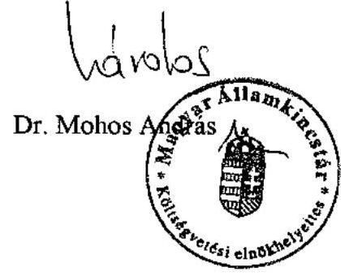

---

# Dr. Mohos András úr 

elnök
Magyar Államkincstár
Budapest

## Tisztelt Elnök úr!

A Nemzeti Civil Alapprogramból civil szervezeteknek juttatott költségvetési támogatások ellenőrzéséről készült jelentésre adott észrevételeit köszönöm. Az észrevételekkel kapcsolatban a következőkről tájékoztatom:

A 12. oldal 2. bekezdésben foglalt megállapítást pontosítottuk: „A MÁK a benyújtott pályázatokra vonatkozóan a támogatásra való jogosultságot nyilatkozatok bekérésével ellenőrizte, amely nem jelentett kellő garanciát a jogosulatlan pályázók kiszűrésére."

A támogatás jogosultságának vizsgálatára vonatkozó megállapításunkat fenntartjuk, mivel a MÁK feladata az ICSSZEM-mel kötött megállapodás alapján a pályázati felhívásnak, jogszabályoknak, tanácsi határozatoknak való megfelelés vizsgálata. Az ellenőrzés megállapította, hogy két szervezet a civil tv. 3. § (3) bekezdése értelmében nem részesülhetett volna NCA támogatásban.

A 12. oldal 4. bekezdését módosítottuk: „A 2005. évi szerződésekben, a két részletben történő finanszírozás esetében nem határozták meg pontosan a kifizetés időpontját, mivel az előre nem volt ismert."
A 16. oldal a Magyar Államkincstár elnökének tett javaslatokra vonatkozó észrevételek
Az 1. pontjához tett észrevételt nem áll módunkban elfogadni, mivel a Tanács 1. számú támogatási elve egyértelműen meghatározza az elszámolható működési költségek körét, valamint a pályázatok részeként tételes költségvetést is be kellett nyújtani. Az elszámoláskor a kezelő szervnek a fent említett ICSSZEM megállapodás alapján feladata a tanácsi határozatoknak való megfelelés.
A 2. a. ponthoz tett észrevételt beépítve a javaslatot pontosítottuk: „Kizárólag olyan elszámolásokat fogadjon el, amelyek tartalmazzák a kötelezően előírt dokumentumokat (megrendelést, szerződést).
A 2. b. pontban megfogalmazott javaslatunkat változatlan tartalommal fenntartjuk, mivel helyszíni ellenőrzésünk az Önök irodáihoz elszámolásra benyújtott dokumentumok alapján tárta fel a jelentés 35. oldalán leírt, az Európa Ház Egyesület, illetve az Üllői Mozgáskorlátozottak Egyesületénél, pályázati kiírástól eltérő költséggel történt elszámolást. Véleményünk szerint mindkét esetben egyértelműen megállapítható volt, hogy nem a pályázati kiírás, illetve a támogatási szerződés szerinti költséggel számolt el a támogatott (első esetben belföldi utazás helyett külföldi utazási költség, a második esetben fenntartási költség helyett felújítási költség).

---

A 2. c. pontra vonatkozó észrevételét nem tudtuk figyelembe venni, mivel a támogatási szerződések pontosan rögzítik, hogy a kedvezményezettek milyen időintervallumban keletkezett fizetési kötelezettséget, illetőleg annak kiegyenlítését igazoló dokumentumot nyújthatnak be az elszámoláskor, ettől való eltérést semmilyen jogszabály, határozat, elv vagy szerződés nem engedélyez. A helyszíni ellenőrzésünk során, a jelentés 35. oldal közepén leírt, feltárt hibák pedig még az Ön által említett minimális időcsúszásnak és határidőknek sem feleltek meg.
A 3. pontra tett észrevételét nem tudtuk elfogadni, javaslatunkat továbbra is fenntartjuk. A pályázatok bírálatra történő előkészítésének szakaszában szükséges annak vizsgálata, hogy a pályázó szervezet jogosult-e a civil tv. értelmében az alapprogram támogatására. Ellenőrzésünk során az éves költségvetési törvényekben nevesítve szereplő alapítványokat és társadalmi szervezeteket nevük alapján hasonlítottuk össze az NCA honlapon található adatbázissal. Így tártunk fel két szervezet esetében jogosulatlanul igénybevett támogatást.
A 4. ponthoz kapcsolódó észrevételét figyelembe véve a javaslatot a következők szerint pontositottuk: „Teljesítse az ICSSZEM-mel kötött megállapodásban elôírt, éves $8 \%$-os helyszíni ellenőrzési kötelezettségét, amelynek keretében vizsgálja meg a támogatások felhasználásának a 224/2000. (XII. 19.) Korm. rendelet 17. §-ának megfelelő elkülönítési kötelezettségnek való megfelelést."
A 17. oldal 4. bekezdésében az adatok nem tartalmazzák az NCA-ból nem támogatható szervezeteket, a kigyűjtés az éves költségvetési törvények alapján készült. A jelzett mondatot az egyértelmú értelmezés érdekében módosítottuk: „A civil tv. hatályba lépését követően csökkent a nevesített költségvetési támogatásban részesülők köre, a 2004. évi költségvetésben közvetlenül nevesítve 69, a 2005. évi költségvetésben mindössze 21 olyan civil szervezet részesült támogatásban, amely más, a civil tv. 3. § (1) bekezdés a) és b) pontjai és (4) bekezdése szerinti okok miatt az alapprogramból való támogatásból nem voltak kizárva."
19. oldal 3. bekezdésében foglalt, a kerettúllépésre vonatkozó megállapításunkat fenntartjuk. Az ÁSZ a 2005. évi költségvetés végrehajtásának ellenőrzéséről szóló jelentésében e tárgyban a következő megállapítást tette:
„Az ICSSZEM és a MÁK Között 2005. december 12-én megkötött megállapodás IV. pontja szerint a MÁK-ot megillető díjazás a 2005. évben éves szinten nem haladhatja meg a Vhr. 12. § (4) bekezdése szerinti 6\%-os mértéket. A fedezet biztosítása a Pénzügyminisztériummal kötött 420 millió Ft-os előirányzat- átcsoportosítással történt. A MÁK részére az általa 2005. I. félévben benyújtott kezelési költséget tartalmazó számlákra közvetlen átutalással 124 millió Ft kifizetést teljesítettek. Ebből egy számla teljesítési időpontja 2004. december 31-e, összege 28,9 millió Ft volt. A többi számlán a teljesítés időpontjaként 2005. év szerepel. A MÁK részére tehát 2005. évben az előirányzat átcsoportosítással együtt 544 millió Ft állt rendelkezésre. Ez a jogszabályban előírtakkal (6\%) szemben $7,77 \%$-ot tett ki."
A 20. oldalon a folyamatábrát kiegészítettük.
A 34. oldal 2. bekezdéséhez leírtak nem vitatják a feltárt hiányosságot, így módosítást nem igényel. Az Áht.-vel kapcsolatosan megfogalmazott ellentmondásosság a támogatottakat a Vhr.-ben szabályozottak tekintetében nem érinti. Álláspontunk szerint a Vhr. 8. § (3) bekezdés e) pont rendelkezésének betartása érdekében szabályozni szükséges mind a pályázatok benyújtásakor, mind a támogatások folyósításakor a pályázó szervezetek köztartozása fennállásának ellenőrzési módját. A támogatás folyamatában a szabályozás szerint kell eljárni.

---

A 13. oldal 2. bekezdésének és a 34. oldal utolsó bekezdésének megállapításait a jelentés 3. pontjának első bekezdésében reprezentatív módon kiválasztott, 101 támogatott szervezet helyszíni ellenőrzésének tapasztalatai alapján tettük, mint azt a jelentés bevezető része is tartalmazza.
A 35. oldalon az INFONIA-val kapcsolatos észrevételét továbbra sem tudtuk elfogadni, mivel a támogatási szerződés III/3.3. pontja előírásainak - valamint a pénzügyi kalauz útmutatásának - megfelelően bizonyos típusú költségeknél a kedvezményezettnek a számlamásolaton túl egyéb dokumentumokat is be kellett volna nyújtani az elszámoláshoz.
A 49. oldal 5.2. pontjában foglaltakat változatlanul fenntartottuk, mivel a benyújtott elszámolással kapcsolatosan a MÁK egy alkalommal (2005.08.24. kelt levélben) hiánypótlást kért, egy alkalommal (2005.10.19-én kelt levélben) pedig felszólította az alapítványt a hiánypótlásra (7. számú melléklet benyújtása, záradékolás, eredeti számlák képviselő általi aláírása). Így tehát a Tanács 6. számú elve alapján nem lehetett volna a következő évi müködési támogatás folyósítását megkezdeni.

Budapest, 2006. szeptember " 18 "
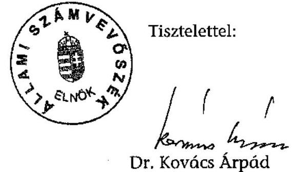

---

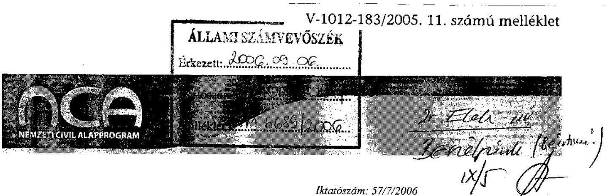

Dr. Kovács Árpád
Elnök Úr
részére

Állami Számvevőszék
Budapest
Pf.: 54.
1364

Tisztelt Elnök Úr!
Először is köszönöm, hogy a 2006. augusztus 2-án kelt levelemben foglalt észrevételek közül néhány átvezetésre került az újabb véleményezésre megküldött jelentéstervezetben. Tájékoztatom, hogy a Nemzeti Civil Alapprogram Tanácsa 2006. augusztus 23-án tartott ülésén megvitatta a jelentéstervezetet, s tagjaiból munkacsoportot jelölt ki a véleményezésre, illetve a végleges jelentés nyilvánosságra hozatalakor szükséges intézkedési terv kidolgozására. Az alábbiakban ismertetem a munkacsoport által összegyüjtött észrevételeket, kérem, hogy vegye figyelembe a végleges jelentés elkészítésekor:
Elsőként is szeretném felhívni a figyelmét arra a szempontra, hogy az NCA törvény 2003. évi megalkotásával a civil szektornak szóló kormányzati támogatáspolitika óriási változáson ment keresztül. Az addigi, országgyűlési bizottság által kiosztott, 400 millió Ft nagyságrendủ pályázati forrás helyébe egy koncentrált, átlátható, költségvetési forrásautomatizmusra épülő, civil túlsúlyos testületekkel müködő rendszer lépett életbe, s diszponál közel 7 milliárd Ft nagyságrendủ forrás fölött. Úgy vélem, hogy a négy szereplő (Tanács, Kollégiumok, Miniszteri Titkárság, Kezelőszervezet) közel három éves együttmüködése - a kormányzati és civil cselekvési és gondolkodási stílus együttműködési kényszerével - egy hosszú közös tanulási folyamat. Az elmúlt évek müködési tapasztalatainak összegzéséhez, a rendszer hatásainak vizsgálatához, a szükséges változtatási irányok megjelöléséhez fontos segítséget kaptunk az Állami Számvevőszék vizsgálatától. A jelentés utal számtalan olyan kérdéskörre, amely messze túlmutat a Nemzeti Civil Alapprogram müködésén, támogatáspolitikáján - az egész civil szektort és a pályázati rendszert meghatározó jogszabályokra vonatkozóan tár föl ellentmondásokat, hiányosságukat és következetlenségeket. Tájékoztatom, hogy a kormányzati szereplőkkel együttműködve még 2006-ban készülünk az NCA törvény módosítására, vagyis lehetőségünk nyílik a mostani ellenőrzési tapasztalatok gyors megjelenítésére a támogatási rendszerben.
Részletes észrevételek jelentéstervezet szövegének sorrendjében:
Az „Összegző megállapítások, következtetések, javaslatok" fejezetben szerepel, s a Kormánynak szóló javaslatok 2. pontjában konkrét intézkedést is javasolnak az NCA-t szabályozó jogszabályok és az államháztartás működési rendjéről szóló 217/1998. (XII. 30.) Kormányrendelet összehangolására. Abban a tekintetben nem értek egyet a javaslattal, amely szerint a finanszírozás során a müködési támogatások esetén is figyelembe kellene venni a civil szervezetek saját forrását. Az NCA törvényben

---

megfogalmazott célok ugyanis a civil szervezetek megerősitését tủzik ki, s igy ellentmondásossá válhat éppen a kisebb szervezetek kárára - a saját forrás vizsgálata. Ezt szolgálja a Tanács 2. számú támogatási elve is, amely szerint "az NCA által nyújtott müködési támogatás nem áll összefüggésben a civil szervezetek egyéb forrásaival, sem pozitív, sem negatív irányban". Kizárólag a szakmai, azaz a programjellegủ támogatásoknál tartom megfontolandónak javaslatát, a többi müködő pályázati rendszerhez hasonlóan, amelyek bizonyos önrész meglétét írják elő, s zárják igy ki a $100 \%$-os támogatást. (A fentiek miatt javaslom a 24. oldal 1. bekezdésében leírtak pontosítását is, amely a kollégiumi gyakorlatra hivatkozik.)
Az „Összegző megállapítások, következtetések, javaslatok" fejezetbe bekerült a 2005. évi költségvetési tartalékolási előírások kedvezőtlen hatására vonatkozó megállapítás, ugyanakkor jogosan hibaként rója föl a jelentés a finanszírozási rendszerre vonatkozóan a gyakorlatilag utólagos forrás biztosítását az ésszerütlenül hosszú átfutási idő miatt. Segitségét szeretném kérni abban, hogy a maradványképzési kötelezettség előírása miatt keletkező rendkívül súlyos finanszírozási problémát a Kormánynak tett javaslatai között szerepeltesse, megoldást kérve ennek állambáztartási kezelésére. A Tanács a 2007. pályázati év megkezdése előtt pedig foglalkozni fog a keresztéves (június 30.-június 30 . közötti időszak) finanszírozás bevezetésének konkrét megvalósítási lehetőségeivel.
Ugyanakkor vitatom, hogy müködési támogatások esetén ez az átfutási idő okozná a szervezetek számára a legnagyobb problémát, hiszen számukra kedvező módon a pályázat benyújtása, vagy a támogatási döntés megszületése előtt keletkezett költségeket is el tudnak számolni. A felülvizsgálat során - melyet a szociális és munkaügyi miniszternek szóló 1 . számú javaslatában tesz - az átfutási idő lecsökkentése helyett sokkal inkább a költségvetési előirányzat-képzés, a maradványképzési kötelezettség hatásaira, az ütemezhetőség megteremtésre, a szervezetek számára biztosított tervezés, elöregondolkodás, ezzel a hatékony felhasználás feltételeire kellene a hangsúlyt helyezni.
${ }^{1 G E R}$, ex is?
Korábbi levelemben már jeleztem, ezúttal csak megerősíteni kívánom, hogy nem értek egyet azzal a kijelentéssel, amely szerint a „Tanács által meghatározott müködési támogatások sávos rendszere nem vette figyelembe a civil szervezetek sajátos müködési jellegét, ezáltal hátrányos helyzetet teremtett a kisebb szervezetek számára". A jelentés egyrészt nem tér ki a hivatkozott „sajátos müködési jelleg"bemutatására, másrészt fontos célnak tartom a jelentés 4. pontjának (42. oldal) 2. bekezdésében foglaltakat, a normativitás felé mutató törekvéseket, melyet a jelentés jelenleg még hiányol az NCA rendszeréből. Ugyanakkor megitélésem szerint a Tanács által kialakított sávos támogatási rendszer éppen ebbe az irányba mutat, ezért nem egyértelmủ a jelentésből, hogy pontosan mit is kifogásol az Állami-1 Számvevőszék.
A Tanács a sávos támogatási rendszer kialakításakor éppen a fokozatos fejlődés elvét tartotta szem előtt, biztositva a kis szervezeteknek is a forrásbevonást. Nem értek egyet azzal a következtetéssel, hogy a kisebb szervezeteknél a nagy(obb) NCA támogatás fejlesztő, erősítő hatású - inkább letéríti a fokozatos fejlődési pályáról, nem biztosítja a több lábon állást, s az állami forrásokra való nagyarányú támaszkodást, függést alakít ki. Felelős döntéshozó testület nem ítél meg milliós nagyságrendủ állami támogatást eredményeket fel nem mutató szervezeteknek, illetve a pár százezer forint éves bevétellel rendelkező szervezeteknek, ez indokolatlan, következetlen támogatási rendszert eredményezne, elszámolási nehézséget okoz a szervezeteknél, s kizárólag egyszeri segélyt biztosított volna. A jelentés 14. oldal 2. bekezdésében le is írja, hogy ,,valamennyi dokumentálisan ellenőrzött szervezet esetében a támogatás a fenntartást, a folyamatos müködést biztosította", valamint részletesen alátámasztják ezt a 42-45. oldalakon leírtak, ezért kérem, hogy a Tanácsnak szóló 2. javaslatot töröljék a jelentésből, illetve korrigálják a 27. oldalon vastag betűvel szerepeltetett megállapítást. A sávos rendszer mellett a minimum és maximum támogatási összeg meghatározása a fentieken túl azt is megakadályozta, hogy a nagy(obb) költségvetésủ szervezetek „túlnyerjék" magukat.

---

A Tanáccsal szemben nevesített (11. oldal 6. bekezdés, illetve a 21. oldal 1-2. bekezdés) késedelmes, határozathozatalok szóvá tétele esetén kérem, hogy a jelentésben jelezzék a konkrét időintervallumokat ${ }^{4}$ is. Korábbi levelemben már jeleztem, hogy ezek a döntési időpontok semmilyen késedelemmel nem jártak a támogatási rendszerre vonatkozóan, s figyelemmel kell lenni arra is, hogy a Tanácsnak megalakulása után rendkívül rövid idő állt rendelkezésére ahhoz, hogy a 2004. évi pályázati ciklust meg tudja indítani. Munkáját emellett nem segítették a szférát érintő kutatások, hatásvizsgálatok, megfelelő adminisztrációs háttér (pl. titkár, aki csak 2004. szeptember 1-jén kapott megbízást) a határozatok előkészitéséhez, azok végrehajtásához.
Jelzem, hogy az összeférhetetlenség kérdését a törvény és a végrehajtási rendelet szabályozza, s éppen az első év tapasztalata alapján válhattak csak világossá a jogszabályi rendezés hiányosságai, ennek szükségességét ismerte föl gyorsan a Tanács, s hozott a jogszabályinál szigorúbb szabályozási rendelkezést.
A jelentés továbbra is a Tanács mulasztásának rója föl azt, hogy nem alakította ki a tartalmi bírálati szempontokat. A Kollégiumok, mint az operatív döntéshozó testületek feladata, hatásköre a tartalmi bírálati szempontok kialakítása, az azoknak való megfelelés számonkérése. A kollégiumi testületek munkájába, önállóságába való beavatkozás lett volna egy ilyen tartalmú döntés, s az NCA egyik legfőbb értékét, a szubszidiaritást csorbította volna, hiszen csak így alakulhattak ki a helyi sajátosságokat figyelembe vevő szempontrendszerek. Ezeket használta föl a Tanács, amikor 2005-ben a müködési kollégiumok számára meghatározta a legfontosabb elbírálási szempontokat. A jövőben a több évre szóló, a kollégiumok által meghatározott támogatási stratégiák kialakítását tartom elérendő célnak. A jelentés Tanácsnak szóló 3. számú javaslata pedig a müködési és szakmai pályázatok egységes bírálati, szempontjainak kialakításáról szól. Ez a korábban már említett önállóság megsértése mellett megítélésem szerint tartalmi okok miatt is kivitelezhetetlen, a müködési és szakmai támogatások fogalma, tartalmi eltérése miatt ez gyakorlatilag végrehajthatatlan, valószínűleg elíráson vagy téves következtetésen alapszik. (A fentiek miatt javaslom a jelentés 20. oldalának utolsó bekezdésében a Tanács feladatait felsoroló rész jogszabályoknak megfelelő pontosítását is, valamint a 22. oldal 5. bekezdéséből kiolvasható ellentmondás javítását is.)
A jelentés 12. oldal 2. bekezdése félreérthető módon tünteti föl azt, hogy a „benyújtott pályázatokat a MÁK csak formailag vizsgálta". A jogszabályok és a tanácsi határozatok értelmében tartalmi bírálatra a Kezelőszervezet nem is jogosult, javaslom pontosan megjelölni a konkrét vizsgálati hiányosságot.
A jelentés 13. oldalának első mondatából nem derül ki, hogy ez a megállapítás az első benyújtásra, azaz a hiánypótlás nélküli beszámolásra vonatkozik. Javaslom az első és a második mondatban szereplő százalékos arányok szövegkörnyezetének pontosítását.
Vitatható a jelentés 13. oldalának 4. bekezdésében szereplő megállapítás is, amennyiben beszámoláskor számszerúsíthető mutatókat vár el a döntően müködési támogatásokat nyújtó támogatási rendszerben. Éppen a szervezetek sokszínűsége, a tevékenységek rendkívüli eltérősége, változatos volta miatt nehezen kivitelezhető, vagy éppen olyan indikátorok beépítését jelentené, amelynek tényleges információtartalma erősen megkérdőjelezhető. Egyetértek azonban azzal, hogy szakmai pályázatok esetében a beszámoltatási rendszer jobban kidolgozható a kiírásban, a pályázó által megírt pályázatban, majd a bírálatban és a beszámolóban megjelölt indikátorok, szakmai teljesítménymutatók alapján.
Az NCA rendszer és a szektor szempontjából azonban relevánsabb a társadalmi hasznosság kimutatása, mely nem egyezik meg a pályázati szakmai teljesítménymutatókkal. Egy átfogó, társadalmi hasznosulási indikátorrendszer kidolgozása mérföldkő lehetne, mely mutató bizonyos közvetett statisztikai adatok gyűjtésével, a szervezeteken túli környezet vizsgálata alapján lehetővé tenné, hogy a támogatások hasznosulását társadalmi szinten elemezzük. (Példával bemutatva: ha egy szervezet támogatást nyer arra, hogy 1000 példány jogi segédletet készítsen és küldje szét, ezt teljesítménymutatókkal lehet bizonyítani,

---

kiment a szervezetekhez az 1000 példány, de azt, hogy a mű milyen színvonalú volt, mennyi segítséget nyújtott a szervezetek fejlődéséhez, magyarán megtérült-e a befektetés, azt csak olyan vizsgálatokkal lehet kimutatni, ami a társadalmi hasznosulási indikátorrendszer részét képezné).
Jelzem egyúttal, hogy a jelentés 13. oldalának 5. bekezdésében tévesen a szociális és munkaügyi miniszternek rója föl hiányosságként a teljesítménymutatók és a normatívák alapján müködő rendszer kialakítását, holott az NCA törvény értelmében a támogatási rendszer elveinek meghatározása egyértelműen a Tanács feladata. Javaslom e tekintetben a szociális és munkaügyi miniszternek szóló 2 . számú javaslatot is megfontolni.
A Részletes megállapítások fejezet 42-47. oldalán szereplő megállapítások és példák jól mutatják, hogy az NCA támogatásai pozitív hatással voltak a támogatást elnyert szervezetek fejlődésére, hozzájárult működési stabilitásuk megteremtéséhez. A magyarországi civil szektortól - elsősorban történelmi lemaradása okán - kizárólag a müködés stabilizálása után lehet joggal számon kérni a „változást generáló szerepet", s ugyanezt a fejlesztési célt két-három éves müködés után az NCA rendszer hatásai között keresni megítélésem szerint szintén az NCA eszközrendszerének túlértékelése.
Az NCA rendszer felülvizsgálata tekintetében - melyet a jelentés a Kormánynak szóló 1. számú javaslatában tesz - sokkal inkább az NCA stabilizálására, megbízható és kiszámítható müködtetésére javaslom a hangsúlyt helyezni, s megfontolni a bevételi oldal átalakításával az alappá szervezés lehetőségét is. Fontos azonban - a jogszabály érintett célcsoportja miatt - az elözetes széles körű társadalmi vita lefolytatása is. - $1050 \quad 000 \quad 0$ estesletel hetyelatel fúg a szelder.
A Tanácsnak szóló 1. számú javaslat szerint kifogásolják a müködési költségek körének meghatározását és kérik a müködési és szakmai támogatásokból megvalósítható célok közötti átfedések megszüntetését. Továbbra sem értek egyet azzal, hogy ki kell zárni az „átfedéseket", hiszen működési költségek szakmai jellegű projektek megvalósítása esetén/közben is jelentkeznek, ezeket az esetleges pályázati elszámolásokban elkülöníteni a szervezet felelőssége. Jogszabályi alapja, háttere (pl. számviteli törvény) sincsen az ilyen irányú megkülönböztetésnek. A pályázati rendszernek a kettős finanszírozás lehetőségét kell kizárni, s következetesen ellenőrizni. Ezért ellentmondásos ez a javaslat és a jelentés 22. oldalán szereplő megállapítás, amely szerint a müködési költségek körét leíró tanácsi támogatási elv módosítása kedvezően hatott éppen a kisebb szervezetekre.
Reagálva az NCA kollégiumainak tett 2. számú javaslatra, jelzem, az NCA forrásának nagysága nem teszi lehetővé minden, a törvényben megfogalmazott támogatási cél kiírását a müködés első éveiben. Mind a Tanácsnak, mind a Kollégiumoknak figyelemmel kell lenniük a civil szektor valós igényeire, illetve a támogatási rendszerböl adódó sajátosságokra (mely utóbbi például gyakorlatilag kizárja az EU-t pályázatok önrészének finanszírozását, mely pedig a szektor valós igénye lenne).
Félreérthető a jelentés 17. oldalának utolsó mondata, hiszen az elutasítási döntések nem kizárólag forma okok miatt következtek be a 2005. évben, hanem forráshiány és tartalmi kifogás miatt is döntöttek így a Kollégiumok. A jelentésben így meg kell különböztetni a formai és a tartalmi okok miatt bekövetkezeti elutasítást is, amennyiben a hiánypótlás bevezetésének szükségessége mellett kívánnak érvelni. - ?
Korrigálást javaslok a jelentés 22. oldal 6. bekezdésében is: A Tanács először hozott 2005. február 1-jén a formai követelményekről szóló határozatot, éppen a Kormányrendelet módosítása következtében, amely 2005. február 14-ei hatályba lépésével megengedte a hiánypótlást. Először vált tehát szükségessé szabályozni a hiánypótolható formai kellékek sorát, s nem módosító határozatról volt ebben az esetben szó Javaslom a jelentésben feltüntetni, hogy mely pályázati fordulóra, s milyen forrásból származik a jelentés 28. oldal 2. bekezdésében szereplő tevékenység szerinti megoszlási adatsor (a 2004. évi adatlapok ugyanis ilyen jellegű kérdést nem tartalmaztak).

---

Pontosítani javaslom 28. oldal 2. bekezdésében szereplő szöveget, hiszen a 2005. évi felhívások a megyei lapokban is megjelentek, valamint a 3. bekezdésben lévő mondatot, amely szerint a „kollégium döntését követően" értesítették a pályázókat, mert csak a minisztériumi jóváhagyás után, mely sok esetben jelentős késedelmet okozott. Továbbá a 29. oldal 2. bekezdésében szereplő „engedélyezte" szót is kérem „elbírálásra" cserélni.

Remélem, hogy észrevételeimmel segítettem a jelentés véglegesítését!

Budapest, 2006. szeptember 1.
Üdvözlettel,
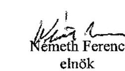

---

# Németh Ferenc úr 

elnök
Nemzeti Civil Alapprogram Tanácsa
Budapest

## Tisztelt Elnök úr!

A Nemzeti Civil Alapprogramból civil szervezeteknek juttatott költségvetési támogatások ellenőrzéséről készült jelentésre adott észrevételeit köszönöm.

Sajnálattal tapasztaltam, hogy a jelentéstervezet korábbi egyeztetése során felvetett észrevételekre - munkatársaim által - írásban adott, tényszerủ indokolások nem késztették Elnök urat álláspontja felülvizsgálatára, ezek egy részét továbbra is fenntartja. Elnök úr észrevételében megfogalmazottakat ismételten áttekintettük és annak sorrendjében az alábbi tájékoztatást adjuk:

A Kormánynak szóló 2. számú javaslatára vonatkozóan:
Megállapításunkat és az arra alapozott javaslatunkat továbbra is fenntartjuk, mivel álláspontunk szerint a civil szervezetek támogatásánál célszerú figyelembe venni a saját forrást, tekintettel arra, hogy a kizárólag NCA forrásra épülő támaszkodás kiszolgáltatottá és bizonytalanná teszi a szervezetek müködését és szakmai tevékenységét. A civil törvény értelmében az NCA fő célja a támogatásra jogosult civil szervezetek müködésének megerősítése, a civil szektor fejlődésének előmozdítása. Véleményünk szerint a szervezetek tényleges és hosszú távú megerősítése csak akkor valósítható meg, ha a támogatási rendszer az NCA támogatáson kívül további forrás megszerzésére is ösztönöz.

A finanszírozási rendszerrel kapcsolatos álláspontunk továbbra is az, hogy indokolatlanul hosszú a pályázatok benyújtása és lezárása közötti időtartam, ennek következtében a felhasználási időszak utolsó harmadában megkötött támogatási szerződés és az azt követő folyósítás a szervezeteknek azért okozhat problémát, mert a kollégiumi döntésig sem a támogatással, sem annak nagyságával nem tudnak tervezni, így a felhasználási időszakban felmerült költségek döntő részét saját illetve egyéb forrásból kell fedezniük. A szociális és munkaügyi miniszternek megfogalmazott 1. számú javaslatunkat erre alapoztuk, ezért továbbra is fenntartjuk. Az észrevételében jelzett maradványképzési kötelezettséget a Magyar Köztársaság 2005. évi költségvetéséről szóló 2004. évi CXXXV. tv. 51. § (6) bekezdése valamennyi fejezeti kezelésű előirányzatra vonatkozóan írta elő a gazdasági növekedés és az államháztartás egyensúlyi helyzetének biztosítása érdekében.

A müködési támogatások sávos rendszerével kapcsolatban tett észrevételeit továbbra sem áll módunkban elfogadni. Álláspontunk szerint az előző évi korrigált ráfordítás nem a megfelelő viszonyítási alap a támogatás mértékének meghatározásához, ezért a jelentés 11. oldal 4. bekezdését kiegészítettük: „Bár a Tanács által meghatározott müködési támogatások sávos rendszere a normativitás kialakítása irányába hat, de nem alkalmas valóságos teljesítmény mérésére, mivel a szervezetek egy évre vonatkozó ráfordítási struktúrája önmagában nem tükrözi a feladat ellátásának minőségét."

---

A határozathozatalhoz kapcsolódó észrevételében hiányolt időpontokat a jelentés 1.3.1. pontja egyes pályázati cselekményekhez viszonyítva tartalmazza.

Az ÁSZ jelentés Tanácsnak szóló 3. számú javaslatára tett észrevételének figyelembe vételével módosítottuk. „Dolgozzon ki tartalmi bírálati szempontokat a működési illetve a szakmai pályázatok egységes kollégiumi elbírásához." A jelentés továbbra is a Tanácsnak fogalmazza meg a javaslatot, biztosítva ezzel az egységes kritériumnak való megfelelést. Javaslatunkban nem a működési és a szakmai pályázatok elbírálásának egységesítését fogalmaztuk meg, hanem egy olyan tartalmi bírálati szempontrendszer kialakítását, amely a kollégiumok között egységes, biztosítva ezzel a pályázók esélyegyenlőségét.

A MÁK által bírált pályázatokhoz kapcsolatos megállapításunkat pontosítottuk: „A MÁK a benyújtott pályázatokra vonatkozóan a támogatásra való jogosultságot nyilatkozatok bekérésével ellenőrizte, amely nem jelentett kellő garanciát a jogosulatlan pályázók kiszűrésére."

A pályázatok elszámolásával kapcsolatos észrevételét a következő módon elfogadtuk: „A szervezetek a pályázataik mindössze 16\%-ával számoltak el elsőre a támogatási szerződés előírásának megfelelően. Az engedélyezett kétszeri hiánypótlási intézkedések eredményeként 96,5\%-a lezárásra került."

A beszámoltatási rendszerrel kapcsolatos észrevételét nem tudtuk elfogadni, mivel álláspontunk szerint a jelenleg múködő rendszer nem teszi lehetővé a támogatás hatásának számszerúsítését. Az elszámolható múködési költségek mérhetősége nem függ a szervezetek sokszínűségétől, tevékenységének eltérésétől.

A szociális és munkaügyi miniszternek tett 2. számú javaslatunkat továbbra is fenntartottuk, mivel a hivatkozott kormányhatározat a miniszter feladataként jelölte meg a teljesítménymutatók és normatívák kidolgozását.

Álláspontunk szerint a civil szervezetek múködésének stabilizálása mellett össztársadalmi szinten a szervezetek feladat ellátását, valamint a gazdasági és társadalmi folyamatokra vonatkozó, változást generáló szerepét jogos elvárásként lehet és kell megfogalmazni.

A Tanácsnak tett 1. számú javaslatunkra tett észrevételét nem tudtuk figyelembe venni. Továbbra is fontosnak tartjuk a múködési és a szakmai támogatásokból megvalósítható célok közötti átfedések megszüntetését, mivel a civil tv. az alapprogram céljaira teljesíthető kifizetések jogcímei között külön nevesítette a civil szervezetek múködési támogatását és annak mértékét legalább 60\%-ban írta elő. Ennek megfelelően hozták létre az alapprogram regionális és szakmai szempontok alapján szerveződő döntéshozó szerveit, a kollégiumokat, amelyek ezzel összhangban írták ki külön a múködési és szakmai pályázataikat. Az észrevételében jelzett ellentmondás kiküszöbölése érdekében a jelentés 22. oldal 5. bekezdését az alábbiakkal egészítettük ki: „A múködési költségek kiterjesztése következtében a szakmai és a múködési pályázatok között átfedések voltak."

A kollégiumoknak megfogalmazott 2. számú javaslatunkat fenntartjuk, mivel a kollégiumok annak ellenére nem írtak ki pályázatot három, a civil tv-ben meghatározott feladatra, hogy a civil tv. nem hatalmazta fel a döntéshozó testületeket az alapprogramból támogatható célok közötti rangsorolásra.

---

A 10. oldal 2. bekezdés megállapítását módosítottuk: „A szabályozásban ésszerütlen korlátozásnak bizonyult, hogy a 2004. évi pályázatoknál nem adott lehetőséget a hiánypótlásra."
17. oldal utolsó mondatát helyesbítettük: „A hiánypótlási lehetőség kizárása hozzájárult ahhoz, hogy 2004-ben a benyújtott 13375 db pályázat több mint fele $(53,2 \%)$ került elutasításra. A 2005. évben az elutasítások aránya 39,5\%-ra mérséklődött."

A 22. oldal 6. bekezdést javaslata alapján a módosító jelzőt elhagytuk.
A 28. oldal 2. bekezdésében szereplő tevékenység szerinti megoszlási adatsort a 2004. évi támogatott pályázatokból vett minta alapján történő ellenőrzés összesítéséből nyertük.

A 28. oldal 2. és 4. bekezdését az észrevételében jelzett szöveggel kiegészítettük. Továbbá a 29. oldal első részbekezdésben az engedélyezést bírálatra helyesbítettük.

Budapest, 2006. szeptember " 18"
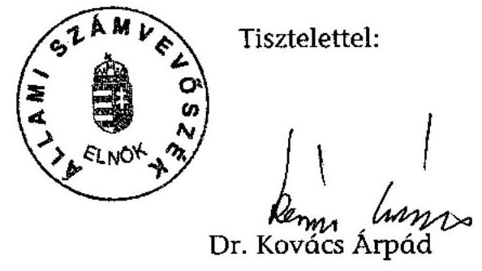

---

# Dr. Kovács Árpád úr részére 

elnök

## Állami Számvevőszék

Budapest
Budapest 4. Pf. 54
1364

Tisztelt Elnök Úr!

A „Nemzeti Civil Alapprogramból civil szervezeteknek juttatott költségvetési támogatások ellenőrzéséről" címủ jelentést megkaptam, és köszönettel vettem tudomásul, hogy a jelentéstervezet véglegesítése során a Szociális és Munkaügyi Minisztérium szakmai észrevételeinek, érveinek jelentős részét hasznosították.
Köszönetet mondok az Állami Számvevőszék munkatársainak a korrekt, átfogó vizsgálatért, amely a Nemzeti Civil Alapprogram történetében eddig a legreprezentatívabb.
A Jelentés megállapításai - melyek közül számos az NCA-n túlmutató - jó szakmai alapul szolgálnak a kormányzat civil stratégiája (2006-2010), és civil törvény módosításának előkészítése során. Mindkét téma a Kormány II. félévi munkatervében szerepel. A Jelentés az NCA kapcsán is rávilágít az állami pályázati rendszer egyes hibáira, ellentmondásaira, mellyel kapcsolatos szabályozás felülvizsgálata is megkezdődött.

A Nemzeti Civil Alapprogram társadalmi hasznosságának megítélésével összefüggésben nélkülözhetetlen hangsúlyozni, hogy az NCA az Országgyűlés 2003. évet megelőző pártpolitikától sem mentes - támogatási gyakorlatát váltotta ki az Európai Unióban szinte egyedülálló formában, átlátható, civilszakmai felelősséget érvényesítő módon.
Az NCA rövid tanulási idő alatt egyesíteni tudta az állami és a civil szektor tudását, pályázati tapasztalatait.
A Jelentés néhány pontja esetében azonban az SZMM továbbra is úgy ítéli meg, hogy a Nemzeti Civil Alapprogram valós megítélését pozitív irányban befolyásolhatja az alábbi észrevételek figyelembe vétele:

---

# A Jelentés összegző megállapításaihoz kapcsolódó megjegyzések: 

1. A 10. oldal 2. bekezdése fenntartja a párhuzamos finanszírozás kiküszöbölésének szükségességét. Tekintettel az egységes pályázati adatbázis hiányára, - a költségvetési törvény alapján összevontan müködési támogatásban részesülő szervezetek kiszürésére - a civil törvény módosítása esetén sem nyílik reális lehetöség. A helyzet megoldásával kapcsolatban azonban köszönettel vesszük jobbító szándékú technikai javaslataikat.
Szintén ez a bekezdés utal a Vhr. Ámr-rel nem konzisztens rendelkezéseire. Itt kivánom felhivni a figyelmet arra, hogy az NCA nem tartozik a VIII. fejezet hatálya alá, igy nem indokolja semmi a szigorúbb szabályozás foganatosítását. Az SZMM álláspontja szerint a saját forrás figyelembevételének hiánya nem mulasztás, hanem a Tanács tudatos támogatáspolitikai stratégiája, amelyre korábbi észrevételeink között utaltunk.
Tekintettel arra, hogy a Jelentés több helyen átvette a 2006-ra - a hibák időközbeni kijavítására - vonatkozó megjegyzéseinket, kérem, hogy az elidegenitési és bérbeadási tilalommal kapcsolatban is kerüljön feltüntetésre, hogy a 2006. évi szerződés már tartalmazza ezt a jogszabályi kitételt.
A Jelentés ésszerütlen korlátozásként aposztrofálja a 2004. évi pályázatok esetében a hiánypótlás hiányát. Ezzel kapcsolatban megjegyezem, hogy a jogalkotó a Vhr. elfogadásakor az európai uniós pályázatok feltételeit kívánta a szabályozásban rögzíteni díszpozitív módon - a civil szervezetek tanulási folyamatának segítése érdekében. A pályázatok benyújtását követően azonban nyilvánvalóvá vált, hogy a szektor még nem érett a hazai gyakorlatnál szigorúbb feltételeket alkalmazó pályázati kiírások befogadására. A 2004. évi tapasztalatok alapján ezért került sor a Vhr. vonatkozó szabályainak „oldására". A támogatható szervezetek körének a hiánypótlás hiánya miatti $53,2 \%$-os csökkenésével kapcsolatban megjegyezem, hogy a Nemzeti Civil Alapprogram a szektor éves összbevételének csupán $1 \%$-t, - a költségvetési források mértékéhez viszonyítva $2,5 \%$-t biztosítja, így a nyújtott forrás nagysága sem bír meghatározó erővel.
2. A 13. oldal 6. bekezdése szerint az elnyert müködési támogatások felhasználása nem eredményezte a civil szervezetek változást generáló szerepének kibontakoztatását. Az SZMM álláspontja szerint egyrészt a vizsgált minta nagysága és egyéb jellemzői alapján ez nem állítható teljes biztonsággal, másrészt a civil szervezetek szerepei közül sem indokolt a változást generáló szerepet a többi elé helyezni.

## A szociális és munkaügyi miniszternek tett javaslatokkal kapcsolatos észrevételek:

1. Az 1. javaslatot köszönöm, a támogatási rendszer szereplőivel együtt megvizsgáljuk a pályázati folyamat egyszerüsitésének, időigénye lecsökkentésének lehetséges módozatait, és megtesszük a szükséges intézkedéseket annak érdekében, hogy a kedvezményezettek minél hamarabb juthassanak a számukra megitélt támogatáshoz.

---

2. Mint azt korábban jeleztük, a teljesítménymutatók kidolgozását a civil törvény a Tanácsnak, illetve a kollégiumoknak delegálta, ezért az NCA Miniszteri Titkársága felhívja az említett testületek figyelmét az indikátorok kidolgozásának fontosságára.
3. Tájékoztatatom Elnök Urat, hogy a minisztérium a 3. pontban foglalt javaslatoknak maradéktalanul eleget tett: döntött a 2004. évi, visszafizetésre javasolt, még le nem zárt támogatásokról, és kezdeményezte a Jelentés 3.1, 3.2 és 3.5 pontjában felsorolt szervezeteknél a támogatás visszafizetését.

# A Jelentés részletes megállapításaival kapcsolatos észrevételek: 

1. A 19. oldal 4. bekezdése szerint a kezelő szerv díjazása 2005-ben meghaladta a jogszabály által előírt mértéket. A megállapításhoz kapcsolódóan megjegyezem, hogy a MÁK 2004. március 9 -étől közbeszerzési eljárás eredményeként megkötött vállalkozási szerződés alapján látta az NCA kezelésének feladatait. A felmondott szerződés alapján a 2004. évi pályázatokkal kapcsolatos - 2005-re áthúzódó - feladatok miatt 2005. június 30 -áig számlázott a minisztériumnak. A 2005. évi pályázatokkal kapcsolatos kiadásait jogszabályban kijelölt feladatellátóként - a 2005. évi forrás $6 \%$-a szolgálta.
2. A 20. oldalon található folyamatábra pontosításra szorul, hiszen a kedvezményezettel való szerződést a miniszter nevében a jóváhagyott támogatási döntésekről szóló engedélyező okirat birtokában a kezelő szerv megbízott képviselője írja alá. A minisztériumnak, mint Támogatónak a támogatási döntések jóváhagyásakor van szerepe, ezért a „Szakmai bírálat, támogatási döntések" felirat alatt indokolt a „Támogatási döntés jóváhagyása" felirat feltüntetése, amelyből egy balra mutató nyíl az „SZMM"-re mutat. Ezzel egyidejúleg javaslom a „Szerződéskötés" melletti „Miniszter" felirat megszüntetését.
3. A 29. oldal 7. bekezdése foglalkozik a beszámolási határidők összhangjának hiányával. A civil törvény 9. § (5) bekezdése szerint a miniszter a Bizottság előtt az Alapprogram előző évi tevékenységéről és működéséről, a törvény alkalmazásának tapasztalatairól számol be, amely a minisztérium álláspontja szerint nem tartalmazza az előző évi pályázatok tárgyévi lezárásának áttekintését. Erre a következő évi miniszteri beszámoló lesz hivatott kitémi, ezért véleményem szerint nem szükséges az összhang megteremtése. Megállapításukkal összhangban a civil törvény módosításának előkészítése során az SZMM megvizsgálja a miniszteri beszámoló határideje módosításának szükségességét is.
4. A 36. oldal utolsó bekezdésében és a 42. oldal 1. bekezdésében az SZMM szempontjából fontos az eredeti szövegtervezetben szereplő megfogalmazás (,a helyszínen ellenőrzött

---

szervezetek") visszaállítása, hiszen a Jelentés jelen állapotában azt sugallja, hogy a megállapítások jelentős köre a hazai civil szektor egészére vonatkozik.

Bízom benne, hogy fenti észrevételekkel sikerül hozzájárulni a Nemzeti Civil Alapprogramról alkotott kép egzaktabbá tételéhez, a Jelentés véglegesítéséhez, illetve annak nyilvánosságra hozását követően az NCA reális társadalmi-szakmai megítéléséhez.

Budapest, 2006. szeptember „ 4. „

Üdvözlettel
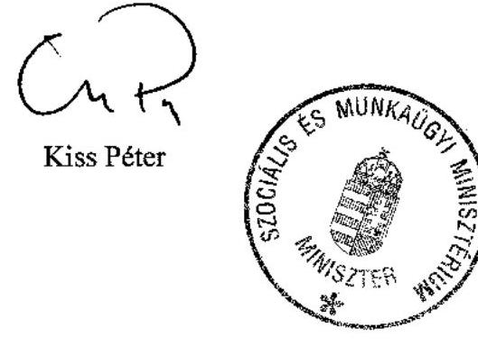

---

# Kiss Péter úr 

miniszter
Szociális és Munkaügyi Minisztérium
Budapest

## Tisztelt Miniszter úr!

A Nemzeti Civil Alapprogramból civil szervezeteknek juttatott költségvetési támogatások ellenőrzéséről készült jelentésre adott észrevételeit köszönöm.

Örömmel tapasztaltam, hogy a jelentés megállapításait hasznos segítségként értékelik a civil törvény módosításához. A minisztérium részéről megtett és foganatosítani kívánt intézkedésekről adott tájékoztatását tudomásul vettem.

Miniszter úr egyes konkrét észrevételeivel kapcsolatban, azok sorrendjében az alábbi tájékoztatást adom:

Az észrevétel a jelentés összegző megállapításait érintő 1. pontjában

- A párhuzamos finanszírozás kiküszöbölésére technikai javaslatunk, hogy a támogatást igénylő szervezetek a pályázati adatlaphoz mellékletként kötelezően csatolják a költségvetési törvényekben működési támogatásra vonatkozó szerződéseket.
- Álláspontunk szerint a civil szervezetek támogatásánál célszerű figyelembe venni a saját forrást, tekintettel arra, hogy a kizárólag NCA forrásra épülő támaszkodás kiszolgáltatottá és bizonytalanná teszi a szervezetek múködését és szakmai tevékenységét. A civil törvény értelmében az NCA fő célja a támogatásra jogosult civil szervezetek müködésének megerősítése, a civil szektor fejlődésének előmozdítása. Véleményünk szerint a szervezetek tényleges és hosszú távú megerősítése csak akkor valósítható meg, ha a támogatási rendszer az NCA támogatáson kívül további forrás megszerzésére is ösztönöz.
- Tekintettel arra, hogy a támogatási szerződéseket a 2004-2005. évi pályázatokra vonatkozóan ellenőriztük, megállapításainkat - köztük a támogatásból beszerzett tárgyi eszközök bérbeadási és elidegenítési tilalmára vonatkozót is - erre az időszakra tettük. Észrevétele alapján a jelzett szövegrészt az alábbiakkal kiegészítettük: „Az ellenőrzött időszakban ezt a feltételt a szerződések előírás hiányában nem rögzítették. Így nem nyújtott kellő garanciát a közpénzek rendeltetésszerű felhasználásához, a támogatásból megvalósuló közvagyon védelméhez. A 2006. évi támogatási szerződések már tartalmazzák ezt a jogszabályi kitételt."
- Álláspontunk szerint a civil szervezetek müködésének stabilizálása mellett össztársadalmi szinten a szervezetek feladat ellátását, valamint a gazdasági és társadalmi folyamatokra vonatkozó, változást generáló szerepét jogos elvárásként lehet és kell megfogalmazni.

---

Az észrevétel a jelentés részletes megállapításait érintő 1. pontjában
A 19. oldal 4. bekezdésében a kezelőszerv 2005. évi dijazásának kerettúllépésre vonatkozó megállapításunkat fenntartjuk. Az Állami Számvevőszék a 2005. évi költségvetés végrehajtásának ellenőrzéséről szóló jelentésében e tárgyban a következő megállapítást tette:
„Az ICSSZEM és a MÁK Között 2005. december 12-én megkötött megállapodás IV. pontja szerint a MÁK-ot megillető dijazás a 2005. évben éves szinten nem haladhatja meg a Vhr. 12. § (4) bekezdése szerinti 6\%-os mértéket. A fedezet biztosítása a Pénzügyminisztériummal kötött 420 millió Ft-os előirányzat- átcsoportosítással történt. A MÁK részére az általa 2005. I. félévben benyújtott kezelési költséget tartalmazó számlákra közvetlen átutalással 124 millió Ft kifizetést teljesítettek. Ebből egy számla teljesítési időpontja 2004. december 31-e, összege 28,9 millió Ft volt. A többi számlán a teljesítés időpontjaként 2005. év szerepel. A MÁK részére tehát 2005. évben az előirányzat átcsoportosítással együtt 544 millió Ft állt rendelkezésre. Ez a jogszabályban előírtakkal (6\%) szemben 7,77\%ot tett ki."

Az észrevétel 2. pontjában felvetettek alapján a folyamatábrát pontositottuk.
A 36. oldal utolsó bekezdésében és a 42. oldal első bekezdésében említettekkel kapcsolatban figyelembe kell venni, hogy a jelentés bevezetője rögzíti a reprezentatív mintavételen alapuló ellenőrzést, amelynek során megállapításainkat 101 támogatott szervezet helyszíni ellenőrzése alapján tettük.

Budapest, 2006. szeptember " 18 "

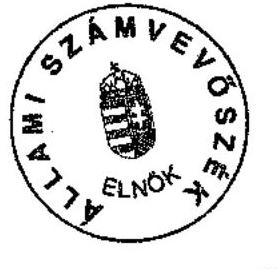

Tisztelettel:

Dr. Kovács Arpád

---

V-1012-183/2005. 13. számú melléklet
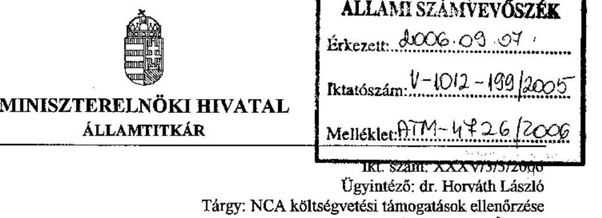

Dr. Kovács Árpád úr részére
elnök

# Állami Számvevőszék 

Budapest

## Tisztelt Elnök Úr!

Szilvásy György miniszter úr számára a Nemzeti Civil Alapprogramból civil szervezeteknek jutatott költségvetési támogatások ellenőrzéséről készített jelentésüket megkaptuk, köszönjük.

A jelentés korábbi változatához füzött észrevételünk alapján a kormány számára címzett hasznosítási javaslatok közül az 1. pontban foglalt javaslatot a jelenlegi szövegezés szerint el tudjuk fogadni. Elnök Urat tájékoztatom arról, hogy a kormány 2006. évi II. félévi munkaterve szerint a Szociális és Munkaügyi Minisztérium ez év decemberében nyújtja be a kormánynak a Nemzeti Civil Alapprogramról szóló 2003. évi L. tv. módosítását, s ennek keretében mód nyílik annak vizsgálatára, hogy a törvényi szabályozás által meghatározott módon, a civil szervezetek müködésének támogatásában a szakmailag indokolatlan átfedések megszünjenek.

Az 1. szövegének módosításaként azt a megszorító feltételt kérném érvényesíteni, hogy a müködési támogatásban „a szakmailag indokolatlan átfedések" szünjenek meg.

A 2. pontban ajánlott feladatot, miszerint az NCA-ról szóló törvény végrehajtásáról rendelkező 160/2003. (10. 7.) Korm. rendelet és az államháztartás müködési rendjéről szóló 217/1998. (12. 30) Korm. rendelet közötti összhangot a szabályozás módosításával a kormány teremtse meg, önmagában nem vitatjuk. Előző észrevételünknek megfelelően azonban e tekintetben végleges álláspontot csak a Szociális és Munkaügyi Minisztérium, valamint a Pénzügyminisztérium egyeztetett álláspontja alapján tudunk kialakítani.

---

Jelezzük, hogy egyetértünk a civil szervezetek pályáztatási feltételeinek és pénzügyi elszámoltatási rendjének szigoritásával, azonban a javaslat szerint ezért a Nemzeti Civil Alapprogramot, a szigorúbb követelményeket elöíró Áht. végrehajtási rendeletének 7. mellékletébe beiktatni, csak e döntésnek a civil szervezetek pályázási hajlandóságára, kapacitására való kihatásának, valamint a számviteli szakszerüség megteremtésére való képességük mérlegelése alapján lehet meghozni.

Budapest, 2006. szeptember , 0 R,,
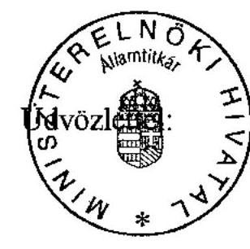

Gilyán György

---

# Állami Számvevőszék 

## Gilyán György úr

államtitkár
Miniszterelnöki Hivatal

## Budapest

## Tisztelt Elnök úr!

A Nemzeti Civil Alapprogramból civil szervezeteknek juttatott költségvetési támogatások ellenőrzéséről készült jelentésre adott észrevételeit köszönöm.

Tájékoztatom, hogy a javaslatok 1. pontja szövegét észrevételének megfelelően módosítottuk.

Budapest, 2006. szeptember 79 .

Tisztelettel:
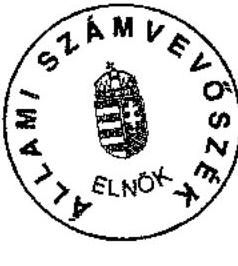

Dr. Kovács Arpád