# ÁLLAMI   SZÁMVEVŐSZÉK 

## JELENTÉS

a Nemzeti Fejlesztési Terv végrehajtásának ellenőrzéséről

---

2. Államháztartás Központi Szintjét Ellenőrző Igazgatóság
2.1. Teljesítmény Ellenőrzési Főcsoport
Iktatószám: V-26-140/2005-2006.
Témaszám: 796
Vizsgálat-azonosító szám: V0242
Az ellenőrzést felügyelte:
Bihary Zsigmond
főigazgató
Az ellenőrzés végrehajtásáért felelős:
Kemény Emil
főcsoportfőnök
Az ellenőrzést vezette:
Dr. Zöldréti Attila
mb. osztályvezető
Az ellenőrzést végezték:

| Bank Lajos tanácsadó | Bartolák Márta számvevő | Dankó Géza főtanácsadó |
| :--: | :--: | :--: |
| Fekete Gábor számvevő tanácsos | Gaál László számvevő | Iszakné Dóczé Katalin számvevő |
| Kenéz Sándor főtanácsadó | Dr. Klapcsik László főtanácsadó | Koczor László számvevő |
| Koltay Zsoltné számvevő | Kökény László számvevő tanácsos | Szabó Balázs számvevő |
| Szepes Béla számvevő | Tóth Péter számvevő | Tóthné Kiss Katalin tanácsadó |
| Tukacs Éva számvevő tanácsos | Komáromy Attila külső munkatárs |  |

# A témához kapcsolódó eddig készített számvevőszéki jelentések: 

címe
Jelentés a Területfejlesztés fejezet működésének ellenőrzéséről 0603
Vélemény a Magyar Köztársaság 2006. évi költségvetési törvény 0550
javaslatáról
Jelentés a Foglalkoztatáspolitikai és Munkaügyi Minisztérium feje- 0543
zet működésének ellenőrzéséről
Jelentés az Oktatási Minisztérium fejezet működésének ellenőrzéséről
Jelentés az Informatikai és Hírközlési Minisztérium fejezet működésének ellenőrzéséről

---

# TARTALOMJEGYZÉK 

BEVEZETÉS ..... 11
I. ÖSSZEGZŐ MEGÁLLAPÍTÁSOK, KÖVETKEZTETÉSEK, JAVASLATOK ..... 17
II. RÉSZLETES MEGÁLLAPÍTÁSOK ..... 27

1. Az NFT feltételrendszerének kialakítása ..... 27
1.1. Az NFT többszintű dokumentációjának kidolgozása ..... 27
1.2. Az NFT végrehajtására kialakított szabályozási és intézményrendszer ..... 28
1.3. A NFT célrendszerének illeszkedése a hazai stratégiákhoz, a támogatási források tervezése ..... 31
2. A hazai abszorpciós képesség fejlesztése, az NFT előkészítése és a pályázók felkészítése ..... 34
3. A projektek kiválasztása és lebonyolítása, az elért eredmények és a felhasznált források összhangja ..... 37
3.1. Az Agrár- és Vidékfejlesztési Operatív Program megvalósítása ..... 37
3.1.1. A támogatásra kiválasztott, illetve leszerződött projektek hozzájárulása a célrendszer időarányos teljesítéséhez ..... 37
3.1.2. A támogatás odaítélési folyamatban a hatékonyság és eredményesség elvének alkalmazása ..... 40
3.1.3. A projekt előrehaladásának hatékonysága a célok időarányos teljesülésének figyelembevételével ..... 41
3.1.4. A projektek pénzügyi lebonyolítása a célrendszer időarányos teljesítése figyelembevételével ..... 42
3.2. A Gazdasági Versenyképesség Operatív Program megvalósítása ..... 43
3.2.1. A támogatásra kiválasztott, illetve leszerződött projektek hozzájárulása a célrendszer időarányos teljesítéséhez ..... 43
3.2.2. A támogatás odaítélési folyamatában a hatékonyság és eredményesség elvének alkalmazása ..... 46
3.2.3. A projekt előrehaladásának hatékonysága a célok időarányos teljesülésének figyelembevételével ..... 48
3.2.4. A projektek pénzügyi lebonyolítása a célrendszer időarányos teljesítése figyelembevételével ..... 50
3.3. A Humánerőforrás-fejlesztési Operatív Program megvalósítása ..... 51
3.3.1. A támogatásra kiválasztott, illetve leszerződött projektek hozzájárulása a célrendszer időarányos teljesítéséhez ..... 51
3.3.2. A támogatás odaítélési folyamatban a hatékonyság és eredményesség elvének alkalmazása ..... 54

---

3.3.3. A projekt előrehaladásának hatékonysága a célok időarányos teljesülésének figyelembevételével ..... 56
3.3.4. A projektek pénzügyi lebonyolítása a célrendszer időarányos teljesítése figyelembevételével ..... 57
3.4. A Környezetvédelem és Infrastruktúra Operatív Program megvalósítása ..... 59
3.4.1. A támogatásra kiválasztott, illetve leszerződött projektek hozzájárulása a célrendszer időarányos teljesítéséhez ..... 59
3.4.2. A támogatás odaítélési folyamatában a hatékonyság és eredményesség elvének alkalmazása ..... 60
3.4.3. A projekt előrehaladásának hatékonysága a célok időarányos teljesülésének figyelembevételével ..... 61
3.4.4. A projektek pénzügyi lebonyolítása a célrendszer időarányos teljesítése figyelembevételével ..... 63
3.5. A Regionális Fejlesztés Operatív Program megvalósítása ..... 64
3.5.1. A támogatásra kiválasztott, illetve leszerződött projektek hozzájárulása a célrendszer időarányos teljesítéséhez ..... 64
3.5.2. A támogatás odaítélési folyamatban a hatékonyság és eredményesség elvének alkalmazása ..... 66
3.5.3. A projekt előrehaladásának hatékonysága a célok időarányos teljesülésének figyelembevételével ..... 67
3.5.4. A projektek pénzügyi lebonyolítása a célrendszer időarányos teljesítése figyelembevételével ..... 67
4. Az Operatív Programok végrehajtásának koordinációja, a lebonyolításban résztvevő intézmények együttműködése ..... 69
5. A Nemzeti Fejlesztési Terv pályázói körében végzett elégedettségi felmérés ..... 72
MELLÉKLETEK
1.a. sz. Miniszterelnöki Hivatalt vezető miniszter észrevétele
1.b. sz. Pénzügyminiszter észrevétele
1.c. sz. Földművelésügyi és vidékfejlesztési miniszter észrevétele
2. sz. A KTK célkitűzései
3. sz. EU Támogatási keretek (euró-ban)
4. sz. A Nemzeti Fejlesztési Terv intézményrendszerének sémája
5. sz. Teljesítménymutatók és a hozzá tartozó kritériumok a Nemzeti Fejlesztési Terv végrehajtásának értékeléséhez
6.a. sz. Kimutatás a GVOP indikátorairól
6.b. sz. Kimutatás a HEFOP indikátorairól
6.c. sz. A KIOP környezetvédelmi projektek összesített output és eredmény mutatói
6.d. sz. A közlekedési prioritáshoz tartozó projektek és gazdaságossági mutatói
6.e. sz. A ROP indikátorainak alakulása

---

6.f. sz. Az AVOP indikátorainak alakulása

# FÜGGELÉKEK 

1. sz. A Nemzeti Fejlesztési Terv pályázói körében végzett elégedettségi felmérés eredményei

---

.

---

# RÖVIDÍTÉSEK JEGYZÉKE 

| 3e | Hatékonyság, eredményesség, gazdaságosság (angol) |
| :--: | :--: |
| AVOP | Agrár- és Vidékfejlesztési Operatív Program |
| EMIR | Egységes Monitoring Információs Rendszer |
| EMIR | Egységes Monitoring Információs Rendszer |
| EMOGA | Európai Mezőgazdasági Orientációs és Garanciaalap |
| ERFA | Európai Regionális Fejlesztési Alap |
| ESZA | Európai Szociális Alap |
| EU | Európai Unió |
| FH | Foglalkoztatási Hivatal |
| FIDIC | Tanácsadó Mérnökök Szövetsége |
| FMM | Foglalkoztatáspolitikai és Munkaügyi Minisztérium |
| FVM | Földművelésügyi és Vidékfejlesztési Minisztérium |
| GKM | Gazdasági és Közlekedési Minisztérium |
| GVOP | Gazdasági Versenyképesség Operatív Program |
| HEFOP | Humánerőforrás-fejlesztési Operatív Program |
| HOPE | Halászati Orientációs Pénzügyi Eszköz |
| IH | irányító hatóság |
| KA | Kohéziós Alap |
| KEHI | Kormányzati Ellenőrzési Hivatal |
| KH | kifizető hatóság |
| KIOP | Környezetvédelmi és Infrastruktúra-fejlesztési Operatív   Program |
| KMB | Központi Monitoring Bizottság |
| KSZ | közreműködő szervezetek |
| KTK | Közösségi Támogatási Keret |
| KvVM | Környezetvédelmi és Vízügyi Minisztérium |
| KvVM FI | Környezetvédelmi és Vízügyi Minisztérium Fejlesztési   Igazgatóság |
| MÁK | Magyar Államkincstár |
| NFH | Nemzeti Fejlesztési Hivatal |
| NFÜ | Nemzeti Fejlesztési Ügynökség |
| NFT | Nemzeti Fejlesztési Terv |
| NKP-I-II. | Nemzeti Környezetvédelmi Program |
| OÉT | Országos Érdekegyeztető Tanács |
| OFK | Országos Fejlesztéspolitikai Koncepció |
| OP | Operatív Program |
| OTK | Országos Területfejlesztési Koncepció |
| OTNR | Országos Támogatási Monitoring Rendszer |
| PEA | Pályázat Előkészítő Alap |
| PEJ | Program Előrehaladási Jelentés |
| PkD | program-kiegészítő dokumentum |
| RFÜ | Regionális Fejlesztési Ügynökség |

---

| ROP | Regionális Operatív Program |
| :-- | :-- |
| SA | strukturális alapok |
| TA | Technikai Segítségnyújtás (angol) |
| UKIG | Útgazdálkodási és Koordinációs Igazgatóság |

---

# ÉRTELMEZŐ SZÓTÁR 

bírálat
bizottsági döntés
döntéshozatal
egységes monitoring
informatikai rendszer
értékelés
folyamatos elbírálás
forrásgazda
intézkedés
irányító hatóság
kedvezményezett

Az értékelésen alapuló, a pályázat, technikai segítségnyújtási projektjavaslat vagy központi programtervezet (a továbbiakban együtt pályázat) támogatására vagy elutasítására vonatkozó döntési javaslat megfogalmazása.
Az Európai Bizottságnak a Kohéziós Alaphoz benyújtott támogatási kérelem elfogadásáról hozott határozata, amely tartalmazza a támogatás arányát, a pénzügyi tervet, valamint a végrehajtáshoz szükséges rendelkezéseket és feltételeket.
A támogatás megítélésére vagy elutasítására vonatkozó döntés meghozatala.

Az Európai Unió által nyújtott egyes pénzügyi támogatások felhasználásával megvalósuló programok monitoring rendszerének kialakításáról szóló 124/2003. (VIII. 15.) Korm. rendelet 15. §-ában meghatározott, a nemzeti költségvetési, illetve nemzetközi támogatással megvalósuló programok figyelemmel kísérése céljából létrehozott egységes számítógépes rendszer, amely kizárólagosan jogosult a programok monitoring adatainak gyűjtésére és rendszerezésére.
A strukturális és kohéziós alapokból történő támogatás igénylése céljából benyújtott pályázatnak az értékelési szempontrendszer alapján történő vizsgálata, a pályázatra vonatkozó részletes szakmai vélemény megfogalmazása.
A pályázatok olyan eljárás szerinti elbírálása, amikor a bírálat és a döntéshozatal a beérkezés sorrendjében történik, amíg a rendelkezésre álló forrás ki nem merül. Folyamatos elbírálás esetén csak egy végső benyújtási határidő kerül meghatározásra, de a forrás kimerülése esetén a pályázatok benyújtásának lehetősége ezt megelőzően is lezárható.
Adott program központi költségvetési finanszírozását biztosító fejezet a strukturális alapok esetében, adott projekt központi költségvetési finanszírozását biztosító fejezet a Kohéziós Alap esetében.
Olyan eszköz, amelynek segítségével egy prioritás több éven keresztül megvalósul, és amely lehetővé teszi a műveletek finanszírozását.
Az operatív program irányító hatóság, az EQUAL program irányító hatóság, a Közösségi Támogatási Keret (a továbbiakban KTK) irányító hatóság és a Kohéziós Alap irányító hatóság.
A projektet, illetve a központi programot végrehajtó, a támogatási szerződést kedvezményezettként aláíró szervezet vagy magánszemély.

---

kifizető hatóság
közösségi kezdeményezés programdokumentuma

Közösségi Támogatási Keret
központi program
közreműködő szervezetek
monitoring
monitoring bizottság
„négy szem elve"

Nemzeti Fejlesztési Terv

Nemzeti, regionális vagy helyi hatóság vagy szervezet a fizetési kérelmek összeállítására és benyújtására, valamint a kifizetések fogadására az Európai Unió Bizottságától; az Európai Unió strukturális alapjai és a Kohéziós Alap fogadására alkalmas kifizető hatósági feladatok ellátása tekintetében a Pénzügyminisztérium.
Az Európai Bizottság által jóváhagyott dokumentum, amely valamely közösségi kezdeményezés tagállami szintű végrehajtására vonatkozóan a több évre szóló prioritásokhoz kapcsolódó intézkedések egységes rendszerét tartalmazza.
A Magyar Köztársaság által benyújtott Nemzeti Fejlesztési Terv alapján kidolgozott és az Európai Bizottság által jóváhagyott dokumentum, amely tartalmazza a strukturális alapok és a Magyar Köztársaság által megvalósítandó tervet és prioritásokat, azok céljait és a hazai, illetve európai uniós pénzügyi forrásait.
Olyan program, amelynél a támogatott programok, illetve projektek kiválasztása pályáztatás nélkül, előre meghatározott feltételrendszer szerint történik, amely feltételrendszer közzététele a program-kiegészítő dokumentumban megnevezett végső kedvezményezettek közvetlen megkeresésével valósul meg.
Az irányító hatóság által átruházott feladatkörben a strukturális alapok kezelése során eljáró szervezet.
A források, az eredmények és a teljesítmények mindenre kiterjedő és rendszeres vizsgálata, amely a központi költségvetésből, nemzetközi segélyből vagy támogatásból, illetve az Európai Unió által nyújtott támogatásokkal végrehajtandó programok eredményes, tervszerű és hatékony megvalósítása érdekében történik. A monitoring kiterjed annak vizsgálatára is, hogy a programok megvalósítása megfelelt-e azoknak a célkitűzéseknek, amelyek a támogatás elnyerését lehetővé tették.
A program végrehajtását koordináló, hatékonyságát és minőségét felügyelő, a program megvalósításában részt vevő partnerek képviselőiből álló szervezet. Partnerek az irányító hatóság, a támogatást nyújtó állami szervek képviselői, valamint a program megvalósításában részt vevő nem kormányzati (társadalmi, szakmai, érdek-képviseleti) szervezetek.
A monitoring tevékenység folytatása céljából létrehozott intézmények, szervezetek és eszközök, valamint az ezek működtetése érdekében foganatosított intézkedések összessége.
Minden végrehajtási és pénzügyi tranzakció engedélyezését megelőzően az adott feladatot ellátó személy munkáját egy másik személy teljes körűen felülvizsgálja, beleértve az ellenőrzési listák és a kitöltési útmutatók alkalmazását is.
Helyzetelemzést, stratégiát a tervezett fejlesztési területek prioritásait, azok konkrét céljait és a hozzájuk kapcsolódó

---

nemzeti támogatás
operatív program
pénzügyi források megjelölését tartalmazó dokumentum, melyet a Magyar Köztársaság készít az Európai Unió programozási irányelveinek, célkitűzéseinek megfelelően a fejlődésben lemaradó régiók fejlődésének és strukturális átalakulásának elősegítésére a kiemelt szükségletekre figyelemmel.
nemzeti támogatás
Kiemelt feladatok megvalósítására szolgáló célzott magyar központi költségvetésből származó támogatás, melynek elnyerése pályázathoz kötött.
A KTK-ban elfogadott stratégiai irányvonal, melyhez a strukturális alapokból és a tagállam kapcsolódó pénzügyi forrásaiból származó hozzájárulás, illetve meghatározott célok rendszere van hozzárendelve.
program
Meghatározott célrendszer érdekében végrehajtandó feladatok és azok végrehajtására kidolgozott keretfeltételek egysége.
program kiegészítő dokumentum
programok végrehajtásáért felelős szervezeti egységek
A támogatási stratégia és prioritások megvalósításáról szóló dokumentum, mely intézkedésekre bontva részletezi azok elemeit.
strukturális alapok
A Phare irodák, a végrehajtó szervezetek, az irányító hatóságok és a lebonyolító szervezet, valamint a közreműködő szervezetek.
Európai Regionális Fejlesztési Alap ERFA,
 Európai Szociális Alap ESZA,
Európai Mezőgazdasági Orientációs és Garanciaalap orientációs részlege EMOGA,
Halászati Orientációs Pénzügyi Eszköz HOPE
technikai segítségnyújtás
Elkülönített keret, amelynek célja a Közösségi Támogatási Keret, az operatív program, valamint a Kohéziós Alap projekt szabályszerű, gazdaságos, hatékony és eredményes megvalósításának segítése.
végső kedvezményezett
Olyan szervezetek, állami vagy magáncégek, amelyek a műveletek megbízóiként szerepelnek; állami támogatás és a tagállam által kijelölt szervezetek által nyújtott támogatás esetében a támogatást nyújtó szervezet
zárónyilatkozat
a Kormányzati Ellenőrzési Hivatal által készített nyilatkozat, amely összegzi a korábbi években végzett ellenőrzések során tett megállapításokat, elbírálja a záró kifizetés iránti kérelem megalapozottságát, valamint a kiadásokról szóló záró igazolás tárgyát képező ügyletek jogszerűségét és szabályszerűségét, az Európai Bizottság és a pénzügyminiszter által kiadott módszertani útmutatások alapján.

---

.

---

# JELENTÉS 

## a Nemzeti Fejlesztési Terv végrehajtásának ellenőrzéséről

## BEVEZETÉS

Magyarország teljes jogú csatlakozása az Európai Unióhoz (továbbiakban: EU) a tagsággal járó kötelezettségvállalás mellett az unió társadalmi és gazdasági kohéziót segítő támogatásainak megnyílását is jelentette az ország számára. Az EU-val kötött Csatlakozási Szerződés - az ország és a régiók gazdasági helyzetének figyelembevétele alapján - Magyarország számára lehetővé tette az EU strukturális alapjai támogatásainak teljes körű igénybevételét. A felhasználás feltételeként, a 2000-2006-os programozási időszakon belül a belépést követő 2004-2006-os jogosultsági időszakra, el kellett készíteni és az EU-val el kellett fogadtatni a támogatások felhasználásának stratégiai tervét. A strukturális alapokból ${ }^{1}$ folyósított támogatások felhasználásának stratégiai terve a Nemzeti Fejlesztési Terv (továbbiakban: NFT) ${ }^{2}$, amely az EU Tanácsának a strukturális alapok általános szabályozásáról szóló 1260/1999/EK rendelete, valamint a strukturális alapok tervezéséhez és programozásához kiadott Útmutató figyelembevételével készült. A Terv igazodik az Európai Bizottság 2000-2006-os időszakra vonatkozó programozási irányelveihez, amelyek a gazdasági versenyképesség javítását és a foglalkoztatottság növelését leginkább elősegítő fejlesztési politikákról adnak útmutatást. Emellett figyelembe vette a releváns közösségi és nemzeti szakpolitikákat, stratégiákat is, valamint támaszkodik a 2001-2004-es időszakra szóló, de hosszabb távú hatásokkal járó „Magyarország középtávú gazdasági programja" című dokumentumra is.

Az NFT céljainak megvalósítására a strukturális alapokból a 2004-2006. évekre 1995,7 millió euró (507,9 Mrd Ft) ${ }^{3}$ és a központi költségvetésből 700,3 millió euró (178,2 Mrd Ft) keret állt rendelkezésre. Az éves keretekkel a rendelkezésre állástól számított két éven belül kell elszámolni.

[^0]
[^0]:    ${ }^{1}$ A Tanács 1999. június 21-i 1260/1999/EK rendelete tartalmazza a strukturális alaphoz tartozó források felhasználására vonatkozó általános rendelkezéseket.
    ${ }^{2}$ A Nemzeti Fejlesztési Terv, nevével ellentétben, nem Magyarország - egyetlen tervben összefoglalt - fejlesztési stratégiája, hanem az EU strukturális alapjaiból hazánkat megillető támogatások felhasználásának terve. A strukturális alapokon túl hazánkat megillető egyéb uniós támogatások, pl.: SAPARD, Kohéziós Alap, stb. támogatások felhasználása önálló stratégiákra épül, amelyekkel az összhangot az NFT tervezése során figyelembe vették.
    ${ }^{3}$ 254,5 Ft/euró átlag árfolyamon számítva, a 2005-2007. évi költségvetési tervezési körirat devizaárfolyam prognózisa alapján.

---

Mivel az NFT a strukturális alapok forrásaira épít, ennek megfelelően céljainak, prioritási területeinek és a megvalósítandó intézkedéseknek összhangban kellett állniuk az Európai Parlamentnek és a Tanácsnak az alapokra vonatkozó rendeleteivel ${ }^{4}$.

A Magyarország által kidolgozott NFT-ben az életminőség javítására vonatkozó hosszú távú cél mellett általános célkitűzésként határozták meg, hogy a hazai társadalmi-gazdasági fejlettség minél inkább megközelítse az EU szintjét.

Az NFT-ben megfogalmazott általános cél alátámasztására és megvalósításának előmozdítására négy specifikus cél került elfogadásra, amelyek a következők: a versenyképesebb gazdaság, a humán erőforrások jobb kihasználása, a jobb minőségű környezet és alapinfrastruktúra, valamint a kiegyensúlyozottabb regionális fejlődés elősegítése. A specifikus célokhoz igazodva határozták meg a támogatási prioritásokat. A célrendszer szerves részét képezték a horizontális célok, amelyek az NFT esetében a környezetvédelem és az esélyegyenlőség. Az NFT-ben kidolgozott célrendszert és pénzügyi kereteket a Közösségi Támogatási Keretben (továbbiakban: KTK) igazolta vissza az EU.
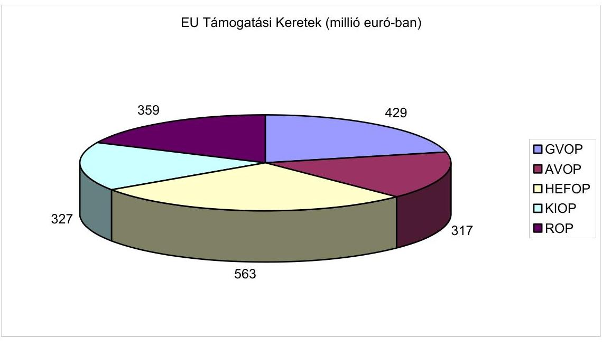

A stratégiai terv dokumentum-hierarchiáját és tartalmát az uniós előírások határozták meg. Ennek keretében az NFT négy ágazati és egy regionális operatív programot (továbbiakban: OP) tartalmazott, amelyek konkrét végrehajtásának tervezési és dokumentációs alapját jelenti a minden egyes OP-hez kötelezően

[^0]
[^0]:    ${ }^{4}$ Az Európai Regionális Fejlesztési Alap (ERFA) tekintetében az 1783/1999/EK, az Európai Szociális Alap (ESZA) tekintetében az 1784/1999/EK, az Európai Mezőgazdasági Orientációs és Garanciaalap esetében az 1257/1999/EK, míg a Halászati és Orientációs Pénzügyi Eszköz esetében az 1263/1999/EK rendelet szabályozza a felhasználást.

---

elkészített program-kiegészítő dokumentum ${ }^{5}$ (továbbiakban: PkD). Az NFT-ben meghatározott célrendszer összefüggéseit a 2. sz. melléklet, az egyes OP-kra felhasználható források éves kereteit a 3. sz. melléklet szemlélteti. Az NFT-hez kapcsolódóan kidolgozott öt OP a következő: Agrár- és Vidékfejlesztési Operatív Program (továbbiakban: AVOP), Gazdasági Versenyképesség Operatív Program (továbbiakban: GVOP), Humánerőforrás-fejlesztési Operatív Program (továbbiakban: HEFOP), Környezetvédelmi és Infrastruktúra-fejlesztési Operatív Program (továbbiakban: KIOP) és a Regionális Fejlesztés Operatív Program (továbbiakban: ROP).

Az NFT keretein belül a források 66,6%-a nyilvános pályázat keretében kiválasztott projekteket finanszíroz, 29,4%-a pályázat nélkül kiválasztott, közvetlenül az állami szervek által végrehajtott központi intézkedések (programok vagy projektek) megvalósítását szolgálja és 4%-a a programok hatékony megvalósítását elősegítő szakmai támogatási (technical assistance, TA) projektekre került elkülönítésre.

Az NFT-nek a hazai fejlesztésben betöltött súlyát mutatta, hogy a Magyar Köztársaság 2005. évi költségvetéséről szóló 2004. évi CXXXV. törvényben, az NFT operatív programjainak előirányzott kiadásai az államháztartás főbb fejlesztési célokat szolgáló - uniós forrást nem tartalmazó - előirányzott kiadásaihoz viszonyítva, annak 25%-át tették ki.

A tervezési feladatokon túl a támogatás igénylésének további feltételét jelentette a hazai társfinanszírozás biztosítása és a támogatásközvetítő intézményrendszer EU normáknak megfelelő kialakítása és működtetése. Az intézményi feltételek tekintetében az uniós és az ahhoz igazodó hazai szabályozás az ún. irányító hatóságokat (továbbiakban: IH) tette felelőssé az OP-k megvalósításáért és a források felhasználásáért, hasznosításáért. A hazai szabályozás az egyes IH-k tevékenységének felügyeletét a szakterületért felelős miniszterekhez rendelte. Az NFT-ben elfogadott öt OP végrehajtásának és az azokért felelős IH-k intézményi együttműködésének koordinálására a Közösségi Támogatási Keret Irányító Hatóságot (továbbiakban: KTK IH) jelölték ki, amely többek között felelős a monitoring rendszer működtetéséért és annak információs rendszeréért is. Ennek keretében fejlesztették ki az Egységes Monitoring Információs Rendszert (továbbiakban: EMIR). Az IH-k feladataik ellátására, jogszabályban meghatározott körű feladatok körében, közreműködő szervezeteket (továbbiakban: KSZ) vontak be. Az öt IH munkáját 21 KSZ segítette az NFT végrehajtásában. A Magyar Államkincstár (továbbiakban: MÁK), a kincstári alapfeladatokon túl (pl.: számlavezetés) KSZ-ként, valamint a köztartozások és a támogatások összehangolását felügyelő Országos Támogatás-monitoring Rendszer (továbbiakban: OTMR) működtetésével is része a rendszernek. A strukturális alapok végrehajtási rendeletében előírt 5%-os mintavételes ellenőrzések elvégzésére a Kormányzati Ellenőrzési Hivatalt (továbbiakban: KEHI) jelölték ki. Az EU-ból érke-

[^0]
[^0]:    ${ }^{5}$ Az EU Bizottság által elfogadott stratégia lebontását tartalmazó OP-kat és programkiegészítő dokumentumokat is el kellett fogadtatni az EU Bizottsággal. A Csatlakozási Szerződés és az OP-k elfogadásáról szóló EU Bizottsági határozatok a támogatások felhasználásának kezdő időpontját 2004. január 1-jében határozták meg.

---

ző források fogadását, az átutalási igények összeállítását, a költségnyilatkozatok igazolását és azoknak az EU felé benyújtását a kifizető hatóság (továbbiakban: KH) látta el, amely szervezetet a PM keretein belül alakították ki.

A programok hatékonyságát és minőségét felügyelték a monitoring bizottságok, amelyek a program megvalósításában részt vevő partnerek képviselőiből álló szervezetek. A Központi Monitoring Bizottság (KMB) az országban rendelkezésre álló nemzetközi és nemzeti támogatással megvalósuló programok végrehajtását figyelemmel kísérő, koordináló, értékelő szervezet. A KTK Monitoring Bizottság a közösségi támogatási keret, az OP monitoring bizottságok az egyes programok végrehajtását felügyelő szervezetek. Partnereik az IH-k, a támogatást nyújtó állami szervek képviselői, valamint a program megvalósításában részt vevő nem kormányzati (társadalmi, szakmai, érdek-képviseleti) szervezetek. Az EU által nyújtott támogatások felhasználásában részt vevő minisztériumoknál monitoring egységek működtek az egyes IH-kon, vagy a KSZ-k keretein belül. Az intézményrendszer sematikus összefüggéseit a 4. sz. melléklet szemlélteti.

Az ÁSZ - egyes fejezetekre ${ }^{6}$ irányuló - korábbi ellenőrzései szabályszerűségi szempontból érintették az operatív programokat, de a teljes NFT megvalósításának teljesítmény-ellenőrzésére jelen ellenőrzést megelőzően nem került sor.

A jelenlegi ellenőrzés célja: annak értékelése volt, hogy a Nemzeti Fejlesztési Terv végrehajtása eredményesen és hatékonyan szolgálta-e a célrendszer időarányos teljesítését és a rendelkezésre álló források hasznosulását. Ennek során értékelni kellett, hogy:

- az NFT végrehajtásához kialakított feltételrendszer alkalmas volt-e a hatékony lebonyolításra;
- eredményesen járult-e hozzá az NFT előkészítése az abszorpciós képesség fejlesztéséhez;
- biztosították-e az NFT végrehajtásában a projektek kiválasztásának és lebonyolításának eredményességét a célrendszer időarányos teljesítésében, a felhasznált források és az elért eredmények összhangját, valamint a források várható kihasználását, tekintettel a támogatások N+2 éves felhasználására vonatkozó uniós szabályozásra;
- az intézményi együttműködés és koordinációs tevékenység hatékony volt-e az NFT végrehajtásában, továbbá a monitoringra és értékelésére kialakított

[^0]
[^0]:    ${ }^{6}$ Az ÁSZ a 2005. évi ellenőrzési tervének végrehajtása keretében fejezeti ellenőrzést végzett az Informatikai Minisztériumnál, az Oktatási Minisztériumnál és a Foglalkoztatási és Munkaügyi Minisztériumnál. A 2006-ra áthúzódó ellenőrzések közül az NFT végrehajtásának intézményrendszerét érinti Területfejlesztés, a Miniszterelnökség és a KvVM fejezetek, valamint az MFB Rt. működésének ellenőrzése. Kapcsolódó további ellenőrzéseket jelentenek a 2005. évi költségvetés végrehajtásáról szóló zárszámadási és a 2006. évi költségvetési törvény javaslatáról készített ÁSZ jelentések is.

---

rendszer hozzájárult-e a támogatási rendszer hatékonyságának javításához és elégedett volt-e az ügyfélkör a végrehajtással kapcsolatban ${ }^{7}$.

Az NFT végrehajtásának ellenőrzését a teljesítmény-ellenőrzés módszerével hajtottuk végre az ellenőrzés előkészítése során kidolgozott kritériumok alapján. Az NFT több szintű dokumentumrendszerében rögzített célrendszer időarányos célkitűzéseit, azok fizikai és pénzügyi mutatóit összevetettük a ténylegesen elért eredményekkel. A rendszeralapú és a közvetlen, részletes megközelítési módok kombinációjával alakítottuk ki az ellenőrzési megközelítési módot. Ennek keretében meghatároztuk az ellenőrzési szempontok azon körét, amelyeket közvetlenül a pályázatok és projektek értékelése alapján válaszoltunk meg. Az NFT pályázati felhívásaira beadott összes pályázat - azaz a vizsgált alapsokaság mintegy 30 ezer darabos körét kockázatértékelésen alapuló mintával reprezentáltuk. Az alkalmazott modell alapján meghatározott minta nagyságát 147 pályázatban határoztuk meg. A minta kiválasztását a beadott pályázatok darabszámán alapuló több lépcsős rétegezett mintavétel módszer alkalmazásával végeztük el. A különböző rétegeket és a megoszlási arányokat - OP-nként - az előre haladási folyamat főbb fázisai és az azokhoz tartozó pályázatok megoszlása képezték, valamint további rétegezés keretében ABC elemzés ${ }^{8}$ alapján a pályázatok értékét is figyelembe vettük. A teljesítés minősítését az 5. sz. mellékletben felsorolt értékelési kritériumok és adatforrások alapján végeztük. Az ügyfél elégedettség felmérése az e-mail címmel rendelkező pályázók teljes körére kiterjedt. A megkérdezést zárt, többváltozós, direkt kérdéseket tartalmazó önkitöltő kérdőívvel végeztük.
 A válaszadás önkéntes volt. A felmérés részletes eredményeit az 1. sz. függelék tartalmazza.

Az ellenőrzés az NFT célrendszerének teljesítésére terjedt ki, így az ellenőrzés középpontjában a teljesítmény-ellenőrzés módszertana alapján megfogalmazott kritériumok álltak, tehát a vizsgálat nem a szabályossági kérdésekre fókuszált.

Az ellenőrzés az NFT előkészítésétől, illetve végrehajtásának 2004. január 1-ei indulásától a helyszíni ellenőrzés befejezéséig (2006. IV. 21.) terjedő időszakát öleli fel, és kiterjedt az irányító hatóságokra, a kifizető hatóságra, a lebonyolításában résztvevő közreműködő szervezetekre, valamint a kiválasztott mintába eső kedvezményezettekre.

Az ellenőrzés jogalapját az Állami Számvevőszékről szóló 1989. évi XXXVIII. törvény 2. § (5) és (9) és az államháztartásról szóló 1992. évi XXXVIII. törvény 120/A. § (1) bekezdései képezik.

7 Az ellenőrzés nem terjedt ki az NFT és a korábbi Konvergencia Program változatok viszonyának vizsgálatára.
${ }^{8} \mathrm{Az}$ ABC elemzés halmazok elemzésére alkalmazott módszer. Azt mutatja meg, melyek azok a halmaz elemek, amelyekre egy meghatározott szempont szerint figyelni kell, amelyből következtetéseket lehet levonni a halmaz elemeinek fontossági eloszlását illetően.

---

A jelentést 8 napos egyeztetésre megküldtük a Miniszterelnöki Hivatalt vezető miniszternek, a pénzügyminiszternek és a földművelésügyi és vidékfejlesztési miniszternek. Válaszleveleik másolatát az 1.a., 1.b. és 1.c. sz. mellékeltek tartalmazzák.

---

# I. ÖSSZEGZŐ MEGÁLLAPÍTÁSOK, KÖVETKEZTETÉSEK, JAVASLATOK 

A 2004-2006 tervezési időszakra vonatkozó, és az Európai Unió strukturális alapjai, valamint a hazai társfinanszírozás forrásaira épülő NFT operatív programjainak végrehajtása - a célrendszerükbe tartozó területeken - segítette és felgyorsította a nemzeti fejlesztési folyamatokat. A végrehajtás során a rendelkezésre álló keretek 97,82%-át odaítélték ${ }^{9}$, ebből 83,64%-ra szerződéses kötelezettséget vállaltak és a források 28,93%-át fizették ki ${ }^{10}$, amelynek 37,5%-a volt az előleg. A javuló tendencia ellenére ez elmaradást jelentett az éves költségvetési törvényekben rögzített, időarányos pénzügyi felhasználási célokhoz képest.

A költségvetési törvények alapján tervezett és a tényleges kifizetések alakulása
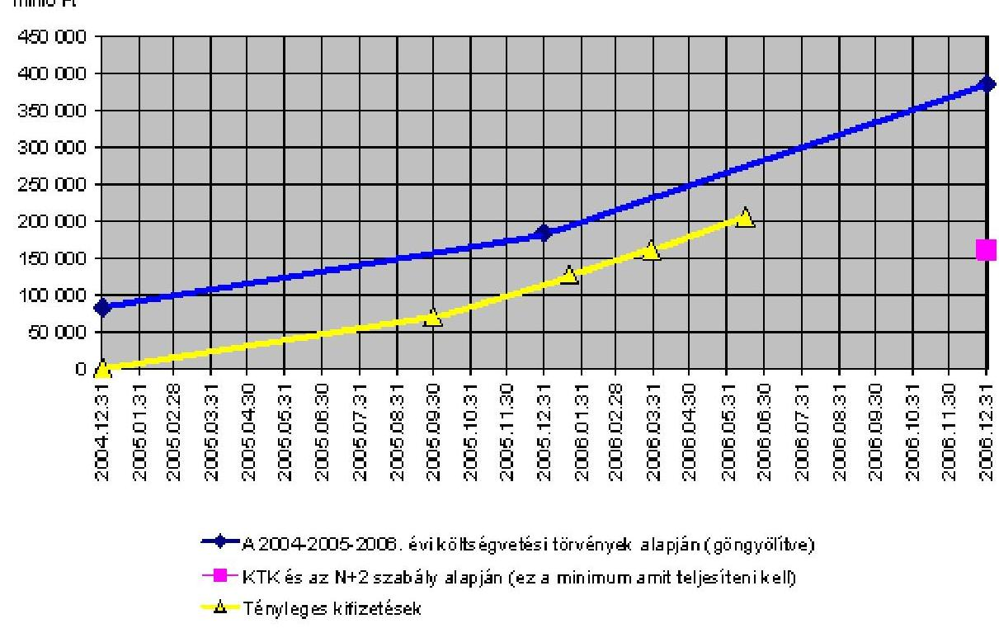

[^0]
[^0]:    ${ }^{9}$ A megadott értékek az EMIR rendszer 2006. 06. 07-i nyilvántartási adataira épülnek.
    ${ }^{10}$ Az EU Bizottság által a strukturális alapok 2004. évi felhasználásáról készített 16. éves jelentés megállapítása szerint - a 10 új tagország tekintetében - 2004-ben a programszintű előlegeken felül Lettország és Magyarország volt képes kötelezettségvállalással igazolt forrást lehívni. Ez a megállapítás azt támasztja alá, hogy valamennyi új tagállamban késlekedés mutatkozott a fejlesztési programok tényleges végrehajtásában. A 2005. évi adatokat várhatóan 2006 szeptemberében publikálja a Bizottság.

---

Az NFT operatív programjainak végrehajtása intenzív pályázói aktivitás mellett folyt. Ezt a beadott pályázatok száma és a kereteket meghaladó támogatási igény mutatta. A végrehajtási gyakorlatban a pénzügyi teljesítés felgyorsítására tett intézkedések mellett a támogatások felhasználásának hatékonysági szempontjai háttérbe szorultak. A közvetlen, program szintű naturális célok esetében az irányító hatóságok - a ROP IH kivételével - nem követték folyamatosan nyomon a támogatott projektek hozzájárulását a fizikai célok teljesítéséhez, nem vizsgálták a támogatott projektek hatékonysági illeszkedését a tervezett forrásfelhasználáshoz. Ennek eredményeként egyes programoknál nem alakították ki a támogatott projektek olyan portfolióját ${ }^{11}$, amely a kitűzött célokat a tervezettnek megfelelően teljesítette. Nem teremtődött meg a teljes összhang a célrendszer és a lekötött támogatási források között. Egyes területek túl-, más területek alulteljesítést mutattak ${ }^{12}$ a helyszíni ellenőrzés időszakában elvégzett ellenőrző számítások alapján (6.a., 6.b., 6.c., 6.d., 6.e. és 6.f. sz. mellékletek).

Az operatív programok adatai 2006.06.07-én
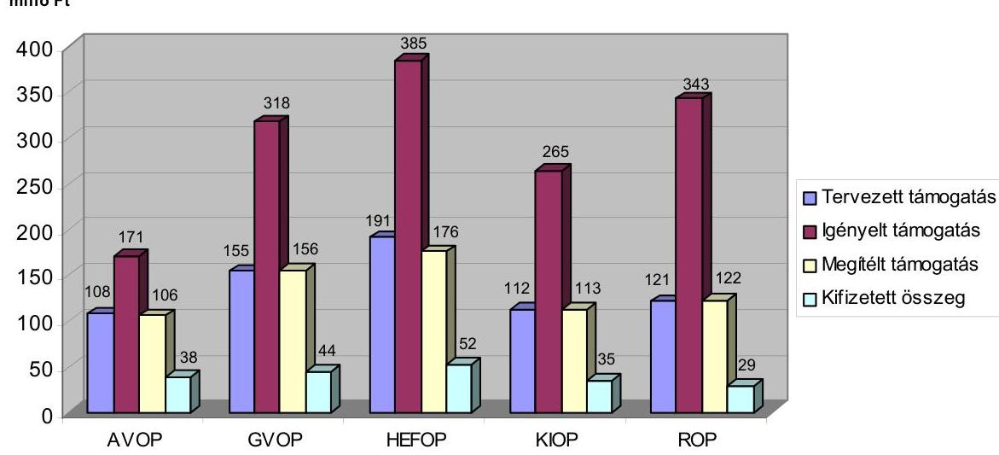

[^0]
[^0]:    ${ }^{11}$ A következményeket a KIOP közlekedési ágazat portfoliójának elemzése mutatta a leginkább, ahol annak ellenére, hogy minden támogatott projekt külön-külön teljesítette a támogathatóság kritériumát, mivel nem vizsgálták az egyes projektek illeszkedését a tervezett forrásfelhasználáshoz, az elfogadott támogatási projektek portfoliójának forrás felhasználási hatékonysága 32%-kal elmaradt az eredetileg tervezett értéktől (részletesen a 3.4.2. pont alatt).
    ${ }^{12}$ Az egyes IH-k a monitoring mutatók és az információs rendszer feltöltöttségének hiányosságai miatt különböző módon, és eltérő pontossággal végezték a megkötött szerződések alapján várható outputok és eredmények értékelését. Az IH-k a bekért tanúsítványokban is különböző módon tettek eleget az OP-k értékelésének, mivel tevékenységük is eltérő képet mutatott a monitoring mutatók rögzítésével, nyomon követésével és teljesítésével kapcsolatban.

---

Az operatív programok végrehajtásának a közvetett célokhoz (specifikus és általános) kapcsolódó makrogazdasági hatásai a helyszíni ellenőrzés ideje alatt még nem mutatkoztak az NFT végrehajtásának időarányos lemaradása, az előlegek aránya ${ }^{13}$ és a befejezett projektek számának a következő két évre esedékes felfutása miatt ${ }^{14}$.

Az NFT végrehajtási feltételrendszerének kialakítása a végrehajtás megindításával párhuzamosan haladt, amely nem akadályozta ugyan meg a program indítását, de a végrehajtás hatékonyságát hátrányosan befolyásolta. Az NFT dokumentumrendszerét az EU a végrehajtás megindulását követően hagyta jóvá ${ }^{15}$. A támogatásközvetítő intézményrendszer hazai szabályozása ${ }^{16}$ a program indításával egy időben lépett hatályba, ennek következtében a lebonyolítás munkamegosztásra vonatkozó együttműködési megállapodásokat az IH-k és KSZ-k 2004 nyarán kötötték meg. A lebonyolítási folyamatok egységes kialakításának lehetőségét akadályozta meg az a szabályozási késedelem, amely abban nyilvánult meg, hogy a források felhasználásának eljárási szabályairól szóló rendelet csak nyolc ${ }^{17}$ hónappal a program megindítása után jelent meg. A szabályozási késedelem miatt a támogatásközvetítő rendszerben kialakult eltérő folyamatok nehezítették az egységes nyilvántartási rendszer kialakítását is. A feltételrendszer tárgyi eszközei tekintetében az indulásnál adminisztratív többletmunkát eredményezett, hogy a nyilvántartási feladatokat is ellátó EMIR rendszer a program indulásakor még fejlesztés alatt állt.

Az NFT stratégiai célrendszerének kialakítását a felhasználás uniós szabályozása és a nemzeti stratégiákra való támaszkodás együttesen jellemezte, amelyben a homogenitást befolyásolta, hogy a négy ágazati és egy regionális program területein nem mindenhol állt rendelkezésre előzetesen kidolgozott és elfogadott hazai stratégia (AVOP, HEFOP, GVOP). Az NFT tervezési dokumentumrendszere nem volt egységes színvonalú. A pénzügyi tervezés mellett a célrendszer fizikai mutatóinak és az azok teljesülését nyomon követő output, eredmény és hatás mutatók egységes rendszerének kialakítása annak ellenére nem kapott megfelelő hangsúlyt, hogy az EU a támogatások felhasználásának hatékonysági elemzéséhez ezeknek a mutatóknak (indikátoroknak) a használatát

[^0]
[^0]:    ${ }^{13}$ A kifizetett összegen belül az előleg aránya a befejezetlen projektek arányát is mutatja.
    ${ }^{14}$ A helyszíni ellenőrzést követően, a KTK végrehajtásáról a 2006. évben az Európai Bizottságnak készülő éves jelentés tervezet még nem tartalmazott adatot a KTK hatásának tulajdonítható egy főre jutó GDP-növekedés és az újonnan teremtett, vagy biztosított munkahelyek száma tekintetében.
    ${ }^{15}$ A késedelem általános volt valamennyi új tagállam tekintetében az EU Bizottság 16. éves jelentése szerint.
    ${ }^{16}$ Az EU strukturális alapjaiból és Kohéziós Alapjából származó támogatások hazai felhasználásáért felelős intézményrendszert az 1/2004. (I. 5.) Korm. rendelet szabályozza.
    ${ }^{17}$ A strukturális alapok és a Kohéziós Alap felhasználásának általános eljárási szabályait a 14/2004. (VIII. 13.) TNM-GKM-FMM-FVM-PM együttes rendelet szabályozza.

---

és értékelését írta elő ${ }^{18}$. A tervezés során tett erőfeszítések ellenére az elfogadott mutatók nem alkottak egy alulról - a támogatással megvalósuló projektek szintjéről - felépíthető egységes, konzisztens mutatórendszert. A hiányosságok miatt a mutatók felülvizsgálata és áttervezése volt szükséges több esetben (AVOP, HEFOP). További tervezési hiányosság volt, hogy ott, ahol az egyes intézkedések között forrásátcsoportosítást hajtottak végre, nem végezték el a fizikai célértékek és azok mutatóinak illesztését a megnövelt, illetve csökkentett forrásokhoz (ROP).

A mutatórendszer tervezési hiányosságai, a nyilvántartó rendszer fejlesztési késedelme, illetve adatfeltöltési hiányosságok, mint együttes feltételhiányok, miatt az EMIR nem tartalmazta teljes körűen a célrendszer fizikai, output, eredmény és hatás mutatóinak a támogatási szerződéseken alapuló tervezett és a projektek végrehajtásával kialakuló tényleges értékeinek alakulását. A szerződésekkel alátámasztott tervezett értékek ${ }^{19}$ várható alakulásáról a 2004-es és a 2005-ös kormánybeszámolóban sem tettek említést.

Az éves költségvetési törvényekben a hazai társfinanszírozás szükséges forrásait megtervezték és azok az igénylés ütemének megfelelően álltak rendelkezésre. Az NFT végrehajtásában az uniós és hazai források felhasználásának tervszerű összehangolását ott hajtották végre, ahol az NFT stratégiáját illeszteni tudták a már kidolgozott hazai stratégiákhoz (környezetvédelem és infrastruktúra fejlesztése).

# Az NFT forrásfelhasználásának előkészítése és a pályázók abszorp-

ciós képességének fejlesztése érdekében, Phare projekt keretében létrehozott, Európai Pályázat Előkészítő Alap (továbbiakban: PEA) program részben tekinthető eredményesnek. A PEA pénzügyi kereteit a Phare projekt 27 M euró értékben határozta meg, amelyből 12 M euró a hazai társfinanszírozás volt. A PEA pályázatos rendszerben támogatta az NFT - meghatározott fejlesztési céljaihoz - illeszkedő és támogatható projektek megfelelő mennyiségű és minőségű kidolgozását.

A PEA megvalósításában közreműködő konzorciumokat, az EU Bizottság delegációjának együttműködésével, kétfordulós közbeszerzési eljárás keretében választották ki. A négy nyertes cégcsoporttal szolgáltatási szerződéseket kötöttek. A konzorciumok kiválasztására kiírt Phare tender előminősítési eljárása meghirdetésének módját és tartalmát az Építész Kamara vitatta és kérte a pályázati eljárás érvénytelenítését. Az ellenőrzés időszakában az ügy bírósági szakaszban volt. Ez nem befolyásolta a PEA végrehajtását.

[^0]
[^0]:    ${ }^{18}$ Az 1260/1999 EK rendelet, a IV. cím 34. és 36. cikke alatt írja elő a mutatók használatát.
    ${ }^{19}$ Az ellenőrzési időszakban a nyertes pályázatokhoz tartozó projektek többsége realizálás alatt állt, így a támogatási szerződésekben foglalt tervezett értékek elemzésére irányult az ellenőrzés, amelynek alakulását az EMIR nyilvántartási hiányosságai miatt a helyszíni ellenőrzés során szerzett információkra és az előzetesen bekért tanúsítványok alapján volt lehetőség megítélni.

---

A PEA program eredményei tekintetében, a támogatással megvalósult projektek összértéke 132554 M Ft volt, ami több mint kétszerese a tervezett összegnek. A tervezettnél nagyobb projektek nagyobb értékű támogatást kaptak, így a forráskorlátok miatt, a kidolgozott projektek számát tekintve a PEA teljesítménye elmaradt a tervezett értéktől. A nyertes PEA projektekre megítélt támogatás az érintett NFT intézkedések hároméves keretének 33,8%-át tette ki. A benyújtott projektek 62%-a nyert támogatást, mely meghaladja az NFT 40%-os átlagát. A benyújtott projektek 55 ezer eurót el nem érő költsége alatta marad a tervben meghatározott 50-150 ezer euró/projekt elvárásnak.

A PEA keretében, a források hatékony hasznosulását, illetve az átláthatóság követelményének teljesülését rontotta, hogy a projekt indításakor az NFT véglegesített dokumentumai, a tervezési csúszások miatt, nem álltak rendelkezésre. Ennek következtében a program megvalósítás során folyamatos beavatkozás, módosítás, a projektötletek átdolgozása vált szükségessé, ami a beadott pályázatok tervezett értékelésének öt hónapos időcsúszását eredményezte.

Az NFT végrehajtásában a projektek kiválasztása - a fizikai célkitűzések teljesülésére tett megállapítással korlátozva - biztosította a támogatási keretek lekötését. A pályázati felhívásokra beadott 35238 db pályázatból 16434 db-ot ítéltek támogatásra jogosultnak ${ }^{20}$.

A pályáztató szervezetek az átláthatóság és nyilvánosság
 követelményeinek megfelelően ${ }^{21}$ tájékoztatták a potenciális pályázókat az NFT-hez kapcsolódó pályázati lehetőségekről. Bizonytalanságot és többletmunkát okoztak ugyanakkor a jogi szabályozás változásai, amelyek miatt a pályázati felhívásokat és a már beadott pályázatokat módosítani kellett (AVOP, GVOP).

A pályázatok feldolgozására és kiválasztására kialakított gyakorlat biztosította, hogy támogatási javaslatot azon pályázatok kaphassanak, amelyek céljai egybe estek a pályázati kiírásban meghatározott célokkal. A PkD-kban és a pályázati kiírásokban a pályázatok értékelésére kidolgozott szempontrendszer kiterjedt a pályázat célokhoz való illeszkedésére, a megvalósíthatóságra, eredményességre, hatásra, addicionalitásra és fenntarthatóságra, a horizontális célokra, de a sokféle szempont ugyanazon pályázat eltérő megítéléséhez vezetett az értékelésben és a minőségbiztosításban részt vevő szervezetek között (ROP).

Az esélyegyenlőséget korlátozta az a ROP-nál alkalmazott gyakorlat, hogy az éves pénzügyi keretek tervezett ütemét meghaladó lekötéssel gyakorlatilag 2005-ben a teljes keretet lekötötték, ezzel a későn pályázóknak már csak a visszalépett projektekből felszabaduló forrásokra volt esélyük. Ezekben az esetekben - a hosszú várakoztatás miatt - a pályázatok bírálatát nem a jogszabályban előírt határidők, hanem a „tartaléklistán" elfoglalt helyük határozták meg.

[^0]
[^0]:    ${ }^{20}$ Az EMIR 2006. 06. 07-i nyilvántartási adatai alapján.
    ${ }^{21}$ A megállapítást visszaigazolják az ügyfél elégedettségi felmérés eredményei, amelyek szerint ezek a folyamatok kapták a legmagasabb megelégedettségi értéket.

---

A kiválasztási folyamatban a projekt kiválasztási kritériumok mellett nem vizsgálták a támogatott projekteknek a program és a KTK szintű célok teljesülésére gyakorolt hatását. Ennek eredményeként a megítélt támogatási összeg regionális megoszlása tekintetében az eddig is a legfejlettebb Közép-Magyarországi régió részesült a legnagyobb arányban, amely rontotta a területi kiegyenlítődés céljának teljesülését ${ }^{22}$.

Operatív Programok megítélt támogatásainak regionális megosztása 2006. június 15-én
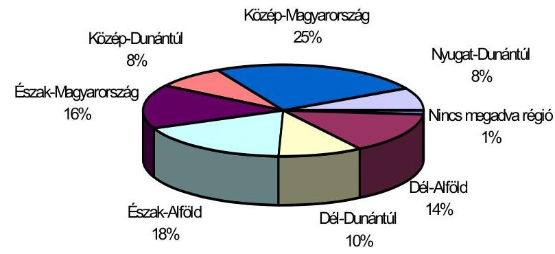

A pályázatok értékelésében a 3e (gazdaságosság, hatékonyság, eredményesség) elvét az eljárási szabályozásban kialakított értékelési rendszereknek megfelelően végezték, ugyanakkor magában szabályozásban ez a kérdéskör általánosan alacsony súllyal szerepelt. A különböző OP-knál nem volt egységes ${ }^{23}$ a költséghatékonyság követelményének érvényesítése. A gazdaságosság szempontjainak érvényesülését csökkentette a pályázatok - erre a területre vonatkozó - nem kellő részletességű kidolgozottsága, és az értékeléshez szükséges költség- és áratbázisok hiánya. A pályázatban vállalt célok (indikátorok) teljesítésének számon kérhetőségét rontja, hogy van olyan terület, ahol a támogatási szerződésben ettől eltérő indikátorok teljesítését írták elő (részletesen a GVOP 3.2.2. pont alatt). A horizontális célok a pályázatok értékelésekor megfelelő hangsúlyt kaptak, de a pályázati „ígéretek" - amelyek az értékelési pontok 15%-át tették ki - számon kérése általános megfogalmazásuk következtében nem volt megoldott. A pályázatok a projekt megvalósulásával elérhető elvi lehetőségeket mutatták be.

A pályázatok kiválasztásának hatékonysága az időszükséglet tekintetében nem volt megfelelő, mivel a kiválasztási folyamat tényleges időszükséglete valamennyi OP esetében meghaladta a jogi szabályozásban a támogatási dönté-

[^0]
[^0]:    ${ }^{22}$ A pályázatok versenyeztetése mellett a program szintű monitoring erősítése szükséges a területi kiegyenlítődés érdekében.
    ${ }^{23}$ Az AVOP gyakorlatában a beruházások költségvetésének értékeléséhez építési normatívákat, ill. gépkatalógust alkalmaznak, ugyanakkor a GVOP 3. prioritás esetében (kutatásfejlesztés, innováció) a pályázatot üzleti tervvel nem kellett megalapozni.

---

sig előírt 60 napos időintervallumot. Vizsgálatunk alapján kiugróan magas volt a ROP esetében a pályázatok befogadásától a döntésig eltelt idő, naptári napokban a legkevesebb 124 nap, a legtöbb 539 nap volt, bár a statisztikák az ún. tartaléklisták miatt nem adtak reális képet a döntéshozatalhoz szükséges időről. A folyamatok hatékonyságvizsgálatát nehezítette, hogy az EMIR-ben kialakított lekérdezés a bírálati, szerződéskötési és kifizetési folyamatoknál a hiánypótlással bővített időintervallumokat mutatja ki, elfedve és összekeverve ezzel a jogszabályban előírt határidők betartásáért az intézményi és a pályázói felelősséget.

A kiválasztási folyamat hatékonyságát rontotta, hogy a csúszások az adminisztratív terhek spirálját indították be. A pályázat beadásakor mellékelt dokumentumok érvényessége korlátozott időtartamú, így azok érvényessége többször lejárt a bírálati döntés előtt. Az elbírálást és a kifizetéseket lassította a 60 napnál nem régebbi adótartozás igazolása, amelyet annak ellenére kellett a pályázónak benyújtania, hogy fentiekről az OTMR hetente szolgáltatott adatokat, ez az igazolások költségigényén túl általában több héttel meghosszabbította az eljárást.

# A projektek lebonyolításának, fizikai megvalósításának hatékonyságát rontotta, hogy a bírálati rendszer csúszásai miatt a projektek végrehajtása a pályázatokban vállalt ütemezésekhez képest valamennyi ${ }^{24}$ OP esetében több hónapos késedelemmel indult. A késedelmek miatt a vállalt ütemtervek és így a szerződések módosítása vált szükségessé. A folyamatok időigénye nem mutatott egységesen javulást a begyakorlási időszakot követően sem (KIOP). Az EMIR rendszerben nem követhetőek a szerződésmódosítás rögzítése után a szerződés eredeti feltételei, ezért a módosítások hatása összességében nem volt értékelhető.

Az elbírált kifizetési kérelem esetén a források rendelkezésre álltak a kifizetési igényeknek megfelelően. A pénzügyi terület munkája az EMIR rendszer működésének minőségétől ${ }^{25}$ kiemelten függött. A kifizetések időbeli csúszásaiban az adminisztráció és monitoring alkalmazott gyakorlata is szerepet játszott. A 2005 tavaszán bevezetett előlegfizetési rendszer javította a nyertes pályázók forráshelyzetét, segítette a támogatott projektek végrehajtásának indítását és felgyorsította a pénzügyi végrehajtást, de magas a kockázati tartalma a biztosítéknyújtási kötelezettség alól felmentést kapott területeken.

[^0]
[^0]:    ${ }^{24}$ A KIOP esetében a közlekedés prioritás területén átlagosan fél éves, a környezetvédelem prioritás területén átlagosan egy éves késedelem alakult ki. A ROP esetében a projektek szerződés szerinti kezdésének ideje 4-14 hónappal, átlagosan 8 hónappal tolódott el a pályázatokban tervezetthez képest. A HEFOP-nál az egyes központi programokra épülő pályázatok ütemezés szerinti megvalósításának kockázatát jelenti a központi programok késedelme.
    ${ }^{25}$ A GVOP esetében az egyik forráslehívást azért utasították el, mert kerekítési hiba miatt a „saját forrás" oszlopban az EMIR-ben 50 fillér negatív előjelű (nem valós) hiány keletkezett a 17 M Ft összegű lehíváshoz képest. Emiatt a forráslehívást újra kellett kezdeményezni, amely következtében a támogatás jóváhagyása 1 hónapot csúszott.

---

Az NFT-ben felhasználható források várható kihasználása OP-onként és alaponként eltérő kockázatú az N+2 éves felhasználásra vonatkozó uniós szabályozás miatt. Az Európai Unió a források ütemezett felhasználása érdekében előírta, hogy a számlával igazolt elszámolásra az éves támogatási keret éve (N)+2 évig van lehetőség. Általános kockázatot jelentett, hogy a források várható kifizetésének tervezésére nem egységes módszertant használtak. Volt, ahol a szerződések adataira, volt, ahol a projektrealizálás elvi modelljére épült a tervezés. Súlyosbítja a helyzetet, hogy a strukturális alapok és a Kohéziós Alap felhasználásának általános eljárási szabályairól szóló együttes rendelet csak éves és nem negyedéves pénzügyi ütemtervet tesz kötelezővé a szerződés mellékleteként, így a végrehajtás kifizetési értékeinek tervezése nagyvonalú. Az ebből származó forrás felhasználási kockázat a projektnagysággal együtt növekszik, ezért a jobb tervezhetőség érdekében - kockázatelemzéssel meghatározott projektnagyságtól - indokolt a negyedéves pénzügyi ütemterv alkalmazása. Az OP-k eseti kockázatát a tényleges (előleggel csökkentett) kifizetések értéke, a megkötött szerződések tervezett kifizetési üteme és a szerződésmódosítások kifizetésre gyakorolt hatása határozza meg. A helyszíni ellenőrzés időszaka alatt az OP-knél alkalmazott N+2-es modellek nem vették figyelembe a szerződésmódosítások tényleges hatásait a kifizetési folyamatokra. A szerződések pénzügyi ütemtervére épülő N+2-es tervezés elvi lehetőségét az EMIR biztosítja, de feltöltési hiányosságok miatt az IH-k excel táblák segítségével végezték a tervezést. Az eseti kockázatok kezelése érdekében a szerződésmódosítások nyomon követése szükséges. Az N+2 szabály miatt 2006-ra minimálisan az év végéig kifizetni szükséges 8%-ot az operatív programok várhatóan teljesíteni fogják ${ }^{26}$, ugyanakkor a végrehajtás lemaradása ${ }^{27}$ és az előleg aránya a következő években teljesítési kockázatot jelent mivel 2007-ben már 42%-ot, a hátralévő időszakban pedig 50%-ot kell tényleges kötelezettségvállalással kifizetni és az EU felé elszámolni. A kockázat mérséklése érdekében a támogatott projektek megvalósításának és befejezésének gyorsítása szükséges.

Az intézményi együttműködés és a koordinációs tevékenység hatékonyságát rontotta, hogy a KTK IH koordinálási tevékenysége korlátozottan érvényesült, ehhez jogszabály sem biztosított megfelelő hatáskört ${ }^{28}$. Ennek következtében az egyeztetések időigénye nagy volt és ez, pl. az egységes eljárásrend kialakítását hátráltatta. Az intézmények működésének félidei értékelését 2005-ben a KTK IH elvégezte, de a teljesítmények folyamatos nyomon követéséhez, méréséhez, a szervezetek teljesítményének összehasonlítását biztosító értékeléshez módszertan nem állt rendelkezésre 2005 végéig. A módszertan elkészítéséhez az alapvető kereteket jogszabály rögzítette, és ugyanazon jogszabály a KTK

[^0]
[^0]:    ${ }^{26}$ Teljesítési problémák mutatkoztak 2006-ra a Strukturális Alapokra való elszámolás tekintetében a HEFOP-nak az ERFA, a ROP-nak az ESZA, az AVOP-nak a HOPE és a KIOP-nak az ERFA-ra vonatkozóan.
    ${ }^{27}$ A lemaradások mértéke a 2008-as befejezés és elszámolás kockázatát mutatta, pl. a KIOP környezetvédelmi prioritásánál (részletesen a 3.4.4. pont alatt).
    ${ }^{28}$ A helyszíni ellenőrzés lezárását követően a 130/2006. (VI. 15.) Korm. rendelet a Nemzeti Fejlesztési Ügynökségről megerősítette a KTK IH szerepét. Az AVOP IH kivételével a többi program irányító hatósága átkerült az NFH bázisán kialakított NFÜ-höz.

---

IH számára módszertani útmutató készítését is előírta 2004 elejétől, amelyet a KTK IH csak 2 éves késedelemmel, 2006 elején teljesített. A KH 2006-tól már bevezetett egy teljesítménymenedzsment-rendszert a saját intézményi működése hatékonyságának figyelésére és értékelésére.
Az NFT végrehajtásában közreműködő intézmények működési költséghatékonyságának értékeléséhez az intézményrendszer tényleges költségeire vonatkozó információk nem álltak rendelkezésre. Ennek oka részben az, hogy a tervezés során nem tértek ki ennek várható meghatározására, részben pedig az, hogy a működés időszakában sem alakították ki a költségek kimutathatóságának rendszerét. Ezek hiányában az intézményrendszer átfogó költséghatékonysági vizsgálata elmaradt, annak ellenére, hogy az a jogszabályban előírt teljesítményértékelés részét képezte ${ }^{29}$.

Az ügyfél elégedettség felmérésére irányuló elektronikus körkérdésre ${ }^{30}$ 1397 feldolgozható válasz érkezett. A feldolgozás eredményei felhívják a figyelmet a működési folyamatok gyengeségeire. Ezek közül kiemelkednek az időbeli csúszások hatékonysággal összefüggő problémái, valamint az elutasítások szakmai indoklásának gyengesége mögött meghúzódó, a szakmai felkészültséggel összefüggő humánerőforrás problémák.

# A működés részterületei elégedettség értékei 

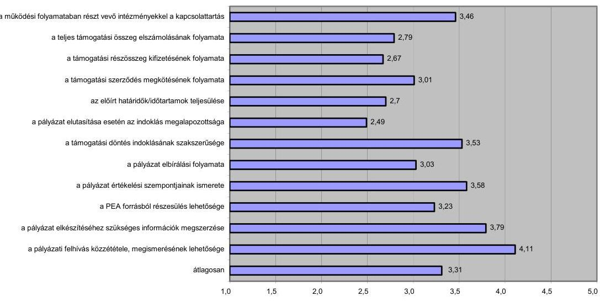

Az elégedettséget a válaszadók 1-5 terjedő skálán értékelték a teljes mértékben elégedetlentől a teljes mértékben elégedettig.

A statisztikai elemzés alapján a működési folyamatoknál a legkedvezőbb megítélést a pályázati felhívás közzétételének ismertsége, megismerési lehetősége

[^0]
[^0]:    ${ }^{29}$ A jelentéstervezet egyeztetési fázisában kapott tájékoztatás alapján a KTK IH - külső tanácsadó cég bevonásával - megkezdte az intézményrendszer működési kapacitás és költségelemzését.
    ${ }^{30}$ A kiküldött kérdőívre - amelynek kitöltése önkéntes volt - a visszaküldési arány 8,8\% volt. Valamennyi válaszoló köszönőlevelet kapott.

---

kapta. Kedvezőtlenek a vélemények a határidők nem teljesülése miatt, amelyek elsősorban a működési folyamat kulcsfontosságú szakaszain, mint a támogatási döntéssel kapcsolatos tájékoztatás, a támogatási szerződés megkötése, a támogatás (rész)összegének kifizetése jelennek meg a
 válaszadók szerint. A késedelmek miatt túlságosan - esetenként irreálisan - hosszú a pályázat benyújtásától a teljes támogatási összeg elszámolásáig eltelt idő, ugyanakkor a rendeletben előírt, de nem teljesült határidők/időtartamok csökkentése a válaszadók túlnyomó többsége (88%) szerint megalapozott igény. Vagyis a jogszabályban rögzített határidőket is hosszúnak tartják, így a kedvezőtlen vélemények kettőzött hatásként jelentkeznek, amely rontotta az elégedettség alakulását.

A helyszíni ellenőrzés megállapításainak hasznosítása mellett javasoljuk:

# a Miniszterelnöki Hivatalt vezető miniszternek 

1. Biztosítsa az NFT II. tervezésénél a pénzügyi tervezésnek és a célrendszer fizikai, naturális tervezésének, valamint a teljesítést nyomon követő mutatórendszer tervezésének egyensúlyát és összhangját.
2. Alakítsa ki a támogatásközvetítési folyamatok olyan rendszerét, amely lehetővé teszi a jogszabályban előírt feldolgozási határidők betartását. Az EMIR fejlesztésével tegye lehetővé a jogszabályban előírt határidők teljesítésének kimutatását.
3. Írja elő, a jogi szabályozás módosításával, a támogatási szerződések kötelező mellékletét képező pénzügyi ütemezés - kockázatelemzéssel meghatározott projektnagyságtól függő - negyedéves bontását, a megvalósítás nyomon követésének és a forrásfelhasználás tervezésének megalapozása érdekében.
4. Gondoskodjon a forrásfelhasználás tervezésének a támogatási szerződések pénzügyi mellékleteire épülő egységes gyakorlatának kialakításáról, ez alapján tegyen intézkedéseket a források felhasználásának felgyorsítására, tekintettel az uniós források felhasználásának $\mathrm{N}+2$ éves korlátozására.
5. Vizsgáltassa felül a források és célok összhangját azon támogatási intézkedések esetében, ahol forrásátcsoportosításokat hajtottak végre és biztosítsa azok illesztését.
6. Végezze el a strukturális alapok intézményrendszerének költséghatékonysági elemzését, segítve ezzel az NFT II. intézményrendszerének tervezett kialakítását.

---

# II. RÉSZLETES MEGÁLLAPÍTÁSOK 

## 1. Az NFT feltételrendszerének kialakítása

### 1.1. Az NFT többszintű dokumentációjának kidolgozása

A Nemzeti Fejlesztési terv kidolgozása az előzetesen meghatározott ütemhez képest késett. Az operatív programok végső, EU Bizottság általi elfogadása 2004. júniusában történt, ami ugyan nem akadályozta a pályáztatás megindítását, de bizonytalanságot jelentett a pályázati szempontok véglegessége tekintetében.

A Nemzeti Fejlesztési Terv kialakításának előfeltételeiről és kidolgozásának ütemezéséről szóló 2246/2002. (VIII. 15.) Korm. határozat meghatározta az NFT elkészítésének határidejét és a tervező munka legfontosabb részhatáridőit. Bár az NFT melléklete szerint (218.o.) az NFT társadalmi egyeztetése 2002. szeptember 23-án kezdődött, a Kormány 2002. október 10-én tárgyalta meg és az 1168/2002. (X. 10.) Korm. határozatban fogadta el első olvasatban a Nemzeti Fejlesztési Terv Stratégiáját, valamint egyetértett annak azonnali társadalmi vitára bocsátásával. Emellett elfogadta az öt operatív program által lefedendő támogatási területeket. Az NFT társadalmi egyeztetésének első szakasza - melyben mintegy 600 országos hatáskörű társadalmi és gazdasági szervezet, 2000 civil szervezet vett részt - 2002. december 13-án az OET plenáris ülésével ért véget.

Az NFT társadalmi egyeztetésének 2002. decemberi lezárása után a dokumentumot a Kormány az Európai Bizottsággal egyeztette 2003. január-február során. Az Bizottsággal egyeztetett dokumentumot 2003. márciusában megtárgyalta az Országos Területfejlesztési Tanács, az Országos Környezetvédelmi Tanács és az Országos Érdekegyeztető Tanács, és megkapták a korábbi egyeztetésben részt vevő társadalmi partnerek. A teljes egyeztetési folyamat eredményeként a 2246/2002 (VIII. 15.) Korm. határozatban meghatározott 2002. december 13-i határidőhöz képest legalább három és fél hónapos késéssel készült el az NFT végső változata.

A KTK Tanulmány 2002. szeptember végére elkészült, így azt 2002. október 14-én adták át véleményezésre az Európai Bizottságnak. Az OP Tanulmányok elkészültének eredeti határideje 2002. november 30. volt. Az Európai Bizottságtól érkezett írásbeli észrevételek alapján felülvizsgált és korrigált KTK Tanulmány és az OP Tanulmányok 2003. januárjára készültek el, így a 2123/2002. (IV. 26.) Korm. határozatban meghatározott határidőhöz képest a KTK és OP tanulmányok 5, illetve 8 hónap késéssel készültek el.

Az elfogadásra beadott OP-k és a PkD-k brüsszeli jóváhagyását többkörös egyeztetés előzte meg, amelynek eredményeként - a többi új tagállam dokumentációjához hasonlóan - a dokumentumok hivatalos elfogadásra a pályáztatás megindítását követően került sor.

---

# 1.2. Az NFT végrehajtására kialakított szabályozási és intézményrendszer 

A KTK Tanulmány 2002. decemberében elfogadásra előterjesztendő kormányhatározat alapjaként szolgált. Az 1218/2002. (XII. 29.) Korm. határozat szerint a Kormány az Európai Bizottsággal való egyeztetésre alkalmas munkaanyagként megtárgyalta és jóváhagyta Nemzeti Fejlesztési Terv végrehajtásának intézményrendszerét leíró Közösségi Támogatási Keret Tanulmányt, és jóváhagyta, hogy az operatív programok végrehajtásában e határozat mellékletében felsorolt közreműködő szervezetek vehetnek részt.

A támogatásközvetítő intézményrendszer hazai szabályozása ${ }^{31}$ a program indításával egy időben lépett hatályba, ennek következtében a lebonyolítás munkamegosztásra vonatkozó együttműködési megállapodásokat az IH-ok és KSZ-k 2004 nyarán kötötték meg.

A lebonyolítási folyamatok egységes kialakításának lehetőségét akadályozta meg az a szabályozási késedelem, amely abban nyilvánult meg, hogy a források felhasználásának eljárási szabályairól szóló rendelet csak nyolc ${ }^{32}$ hónappal a program megindítása után jelent meg. A szabályozási késedelem miatt a támogatásközvetítő rendszerben kialakult eltérő folyamatok nehezítették az egységes nyilvántartási rendszer kialakítását is. A feltételrendszer támogatási eszközök oldala tekintetében az indulásnál adminisztratív többletmunkát eredményezett, hogy a nyilvántartási feladatokat is ellátó EMIR rendszer a program indulásakor még fejlesztés alatt állt.

A 1218/2002. (XII.29.) Korm. határozat elrendelte, hogy a KTK keret és az OP-k végrehajtásában részt vevő intézmények mindegyikénél átfogó auditot kell lefolytatni a KTK IH és a KH által előzetesen meghatározott kritériumok alapján. A határozat szerint a Nemzeti Fejlesztési Terv végrehajtásában csak az auditot sikerrel teljesítő intézmények vehetnek részt. Ennek érdekében az intézményrendszer tagjainak 2003. január 31-ig önértékelés keretében fel kellett mérniük, hogy az akkreditációs kritériumoknak milyen mértékben felelnek meg.

A Kormányzati Ellenőrzési Hivatal 2003-ban elvégezte az irányító hatóságok és a javasolt közreműködő szervezetek hiánypótló értékelését és meghatározta azokat az intézményfejlesztési feladatokat, amelyeket utóbbiaknak még meg kellett oldaniuk ahhoz, hogy közreműködő szervezetekként végleges elfogadást nyerhessenek.

Az AVOP IH az FVM szervezetében jött létre az 1/2004.(I.5.) Korm. rendelet alapján. A Kormány közreműködő szervezetnek a Mezőgazdasági és Vidékfejlesztési Hivatalt jelölte ki. Ehhez a 1218/2002 (XII. 29.) Korm. határozat eredeti határozatát módosítani kellett 2003. 09. 09-i hatállyal. Az MVH KSZ által végzett feladatokról a 110/2004. (VI.21.) FVM rendelet határozott.

Az AVOP IH és a KSZ együttműködési megállapodása delegált feladatokról 2004. 07. 15-én lépett hatályba. Az AVOP IH és a KH együttműködési megállapodása 2004. 08. 03-án lépett hatályba.

A GVOP IH a GKM szervezetében alakult meg. Vezetője az EU Fejlesztési Alapokért Felelős Helyettes Államtitkár, aki a GVOP-val kapcsolatos feladatait a GKM GVOP Főosztályán keresztül látta el. Az Operatív Program végrehajtása az IH felelőssége volt, ugyanakkor számos, a végrehajtáshoz kapcsolódó feladatot delegált a megvalósításban részt vevő KSZ-ek számára. A közreműködő szervezetekkel történő együttműködés írásba foglalására, a KSZ-k kijelöléséről szóló rendelet ${ }^{33}$ megjelenésére csak később került sor.

A kiválasztott és akkreditált GVOP KSZ-kel a GVOP IH 2004. során - már a pályázati időszak alatt - kötötte meg az együttműködési megállapodásokat ${ }^{34}$ a következők szerint:

| Közreműködő   szervezet | Megállapodás formá-   ja | Megállapodás meg-   kötése | Megállapodás hatá-   lya |
| :-- | :-- | :-- | :-- |
| MVF Kht | közhasznú szerződés | 2004. március | határozatlan időre |
| IT Kht | Megállapodás | 2004. június 22. | határozatlan időre |
| MFB | Megbízási Szerződés | 2004. 05. 19. | határozatlan időre |
| RTK | Megbízási Szerződés | 2004. 05. 28. | határozatlan időre |
| KPI, NKTH | 3 oldalú Megállapo-   dás | 2004. 07. 23. | határozatlan időre |

A HEFOP végrehajtásáért a Foglalkoztatáspolitikai és Munkaügyi Minisztériumban létrehozott Irányító Hatóság felelős. Az egyes intézkedések végrehajtásával kapcsolatos bizonyos feladatokat az IH a KSZ-khez delegált. A program végrehajtásában a Foglalkoztatási Hivatal, az ESZA Kht., az Oktatási Minisztérium Alapkezelő Igazgatósága, valamint az Egészségügyi, Szociális és Családügyi Minisztérium Strukturális Alap Programirodája (illetve jogutódja, az Egészségügyi Minisztérium Strukturális Alap Programiroda) látott el közreműködői feladatokat. A Magyar Államkincstár a pénzügyi közreműködő szervezet.

A HEFOP IH Működési Kézikönyvét az FMM közigazgatási államtitkára 2003. szeptember 26-án, módosítását az FMM miniszter 2004. júniusában hagyta jóvá. A KSZ-ek Működési Kézikönyvének jóváhagyására a helyszíni vizsgálat lezárásáig nem került sor annak ellenére, hogy a kijelölésükről és működésükről

[^0]
[^0]:    ${ }^{33}$ 15/2004. (II.16.) GKM-IHM-OM-PM-TNM együttes rendelet
    ${ }^{34}$ Az együttműködési szerződések aláírásáig a kijelölő rendelet és a GVOP IH Működési Könyve szerint működtek a KSZ-ek.

---

szóló miniszteri rendeletek ${ }^{35}$ ezt előírták, és a KSZ-ek jóváhagyásra ${ }^{36}$ azokat megküldték az IH vezetőjének. Az IH Működési Kézikönyve átdolgozás alatt volt. A KSZ-ek eljárásainak alapját az IH Működési Kézikönyve, és az IH utasításai jelentették a helyszíni vizsgálat végéig.

Az alábbi dátumokkal hagyta jóvá pl. az ESZA Kht. ügyvezető igazgatója a szervezet Működési Kézikönyvét, és ugyanezekben az időpontokban nyújtotta be az IH-ba jóváhagyásra: 2003. 09. 30; 2004. 10. 14; 2005. 10. 12.

A HEFOP-ban, a szabályozási késedelmek ellenére a támogatási rendszer működtetéséhez az IH és a KSZ-ek munkájukat 2003. év folyamán megkezdték, a program-előkészítési, pályáztatási munka elindult. A Monitoring Bizottsági üléseken az ülések jegyzőkönyvei szerint az IH képviselőin kívül a - jogszabályban csak 2004. IV. 7. és VI. 8. között nevesített - közreműködő szervezetek képviselői jelen voltak már a kijelölésüket megelőzően is.

A KIOP esetében a Környezetvédelem és Infrastruktúra Operatív Program IH a Gazdasági és Közlekedési Minisztériumban került felállításra. Vezetője az EU Fejlesztési Alapokért Felelős Helyettes Államtitkár, aki a KIOP-pal kapcsolatos feladatait a GKM Környezetvédelem és Infrastruktúra Operatív Program Főosztályán keresztül látta el. Az Operatív Program végrehajtása az IH felelőssége volt, ugyanakkor számos, a végrehajtáshoz kapcsolódó feladatot delegált a megvalósításban részt vevő KSZ-ek számára. A KIOP esetében a KSZ-ek az alábbiak: Környezetvédelmi és Vízügyi Minisztérium, Fejlesztési Igazgatóság, Energia Központ Kht.

A ROP esetében az IH feladatait az Országos Területfejlesztési Hivatalban látták el, amely az NTRFH-ból jött létre. A feladatok megosztása az IH és a közreműködő szervezetek ${ }^{37}$ között a vonatkozó szabályoknak megfelelt. A IH-nak a

[^0]
[^0]:    ${ }^{35}$ Az Oktatási Minisztérium Alapkezelési Igazgatósága és az Európai Szociális Alap Nemzeti Programiroda Társadalmi Szolgáltató Közhasznú Társaság közreműködő szervezetté történő kijelöléséről, valamint a 2004-2006. évi Humánerőforrás-fejlesztési Operatív Program közoktatási, szakképzési és felsőoktatási intézkedéseinek végrehajtásáról szóló 22/2004. (VI. 8.) FMM-OM együttes rendelet. Az Egészségügyi, Szociális és Családügyi Minisztérium szervezeti egységének a 2004-2006. évi Humánerőforrás-fejlesztési Operatív Program egészségügyi és szociális intézkedései végrehajtásában közreműködő szervezetté történő kijelöléséről és feladatairól szóló 10/2004. (IV. 7.) FMM-ESzCsM együttes rendelet. A Foglalkoztatási Hivatalnak a 2004-2006. évi Humánerőforrásfejlesztési Operatív Program végrehajtása során ellátandó feladatairól és közreműködő szervezetté történő kijelöléséről, valamint az Országos Foglalkoztatási Közalapítványnak a

 2004-2006. évi EQUAL Közösségi Kezdeményezés végrehajtásába közreműködőként történő bevonásáról szóló 9/2004. (IV. 7.) FMM rendelet. A 2136/2003. (VI. 27.) Korm. határozat a Magyar Államkincstár szerepéről a strukturális alapok támogatásai igénybevételét lebonyolító intézményrendszerben.
    ${ }^{36}$ A MÁK rendelkezik IH által jóváhagyott kézikönyvvel (2004. 12. hó), csak a jogszabályi változások alapján átdolgozott Működési Kézikönyvet nem hagyta jóvá az IH.
    ${ }^{37}$ Az 1/2004. (I. 5.) Korm. rendelet melléklete és a Regionális Fejlesztés Operatív Program végrehajtásában részt vevő közreműködő szervezetek kijelöléséről szóló 10/2004. (VI. 12.) TNM rendelet rendelkezései alapján

---

közreműködő szervezetekre delegált feladatairól közhasznú keretmegállapodást kellett kötnie, amelyeket 2004. június 1-én írtak alá. Az éves feladatok vonatkozásában az IH a Regionális Fejlesztési Ügynökségekkel (a továbbiakban: RFÜ-k) szakaszosan szerződött. Ez elősegítette a feladatok mielőbbi szerződés szerinti ellátását, de tervezési és finanszírozási bizonytalanságot jelentett az RFÜ-k számára.

A szabályozás oldaláról a program végrehajtásának gyorsítására tett lépés volt a 2005 tavaszán bevezetett előlegrendszer, amely javította a nyertes pályázók forráshelyzetét, segítette a támogatott projektek megkezdését és a pénzügyi célok teljesülését, ugyanakkor magas a kockázata a biztosítéknyújtási kötelezettség alól felmentést kapott területeken.

Túlzott adminisztrációs terheket jelent a hazai gyakorlatban, hogy nem volt lehetőség - szemben az EU rendelet adta lehetőséggel - a könyvelési adatok elektronikus továbbítására, valamint az, hogy pályáztatók és a támogatottak között lévő költségvetési szervek aláírásra jogosult megbízottjai nem rendelkeztek elektronikus aláírási jogosultsággal. 2006. április 1-től csökkentette a papír alapú adminisztrációt, hogy a teljes irathalmazból a közbeszerzési dokumentációt elég elektronikusan megküldeni az IH/KSZ részére.

További előrelépést jelentett, hogy az Ámr. 91.§ (5) b) alpont 2006. január 1-től hatályos módosítása lehetővé tette a számlaösszesítő alkalmazását, amelyet a HEFOP 1.1. intézkedés BAZ megyei projektjében 2006. januárjától kísérleti jelleggel, április 1-től pedig a teljes OP-ra alkalmaztak.

A támogatások odaítélési feltételeinek egyszerűsítésével ellentétes folyamatok is zajlottak a szabályozás terén, amelyeknek az értékelési rendszerben való átvezetésére és érvényesítésére a támogatásközvetítő intézményrendszer nem egységesen készült fel, pl.: „rendezett munkaügyi kapcsolatok" ${ }^{38}$.

# 1.3. A NFT célrendszerének illeszkedése a hazai stratégiákhoz, a támogatási források tervezése 

A 2004-2006-os időszakra készített NFT, amely Magyarország számára megnyíló európai uniós fejlesztési források felhasználási irányait foglalta össze, az uniós felhasználási iránymutatás mellett, nem tudott egységesen a hazai stratégiákra is épülni, azok különböző szintű kidolgozottsága miatt. Az egész országra érvényes, átfogó társadalmi, gazdasági, környezeti célok kijelölése hosszú távra az NFT tervezését megelőzően nem történt meg, csak 2005 végén az Országos Fejlesztéspolitikai Koncepció (a továbbiakban: OFK) keretében.

Az NFT stratégia a 2246/2002. (VIII. 15.) Korm. határozat szerint egyfelől illeszkedett a költségvetési politika négyéves stratégiájához, másfelől keretbe foglalta az egyes tárcák által kidolgozandó fejlesztési stratégiákat. A határozat szerint biztosítani kellett az NFT illeszkedését az általános kormányzati fejlesztéspolitikai elképzelésekhez is.

Az NFT illeszkedett a 2001-2004. évekre vonatkozó, Magyarország Középtávú Gazdaságpolitikai Programhoz, valamint kapcsolódott a különböző szinten elkészült ágazati politikákhoz is. Rontotta a homogenitást, hogy léteztek ugyan hatályos vagy elfogadás alatt lévő nemzeti szintű stratégiai dokumentumok, területfejlesztési programok (Országos Területfejlesztési Koncepció), Nemzeti Környezetvédelmi Program, amelyeket figyelembe kellett venni a tervezés folyamán, e dokumentumoknak azonban nem volt hatásuk a tervezési időszakra.

Az NFT stratégiájának és forrásainak összehangolása a hazai célokkal és forrásokkal, azokon a területeken valósult meg leginkább, ahol a hazai források koordinációjára már korábban is lépéseket tettek. Ilyen terület a környezetvédelem és az infrastruktúrafejlesztés ${ }^{39}$.

A KIOP program környezetvédelmi prioritásában foglalt célok a nemzetközi környezetvédelmi kötelezettségek teljesítése érdekében, az EU környezetvédelmi politikájának alapulvételével, az NFT környezeti céljainak érvényesítésével, a Nemzeti Környezetvédelmi Program II.-ban (továbbiakban: NKP II.) tervezett célokkal összehangoltan valósultak meg. A programozás keretében az EU támogatási források és központi költségvetési források felhasználását (KVVM és más tárcák) összehangolták annak érdekében, hogy azok az NKP II.ben meghatározott célok időarányos teljesülését elősegítsék. Az intézkedéseknél kialakult finanszírozási arányok mutatták az EU támogatások (NFT KIOP, Kohéziós Alap, ISPA) és azon belül a KIOP kiemelt szerepét.

Például a 2004-2006 közötti időszakban a KIOP intézkedési célterületein az NFT KIOP támogatása 43,7 milliárd forint, amely 4,5 milliárd Ft-tal több volt a KvVM ugyanezen fejlesztési területre és időszakra előirányzott 39,2 milliárd Ft fejlesztési támogatási lehetőségeinél.

A közlekedési szektorok fejlesztéspolitikai céljainak elérését a KIOP az ISPA, a ROP és a Kohéziós Alappal együtt támogatta. A KIOP közlekedési prioritási része folytatatta a korábban megkezdett nemzeti szakmai programok végrehajtását, épült az előcsatlakozási programok (Phare, ISPA) eredményeire és fejlesztési projektjeire.

[^0]
[^0]:    ${ }^{39}$ A területfejlesztés területén az ÁSZ 0603 témaszámú 2006. márciusi jelentésének megállapítása szerint az EU és hazai fejlesztési források felhasználása nem került összehangolásra.

---

Az AVOP, a HEFOP és a GVOP esetében a Nemzeti Fejlesztési Tervben, az operatív programokban megfogalmazott célokat nem alapozta meg nemzeti átfogó koncepció, stratégia. Az NFT tervezési dokumentum rendszere hiányosságot mutat abban a tekintetben, hogy kidolgozásakor elsősorban a pénzügyi tervezésére fókuszáltak és elhanyagolták a célrendszer output, eredmény és hatás mutatóinak egymásra épülő tervezését, amely eredményeként a stratégiai célok teljesülését a projektek szintjéről kiindulva a kitűzött célok teljesítéséig következetesen vizsgálni lehet. A monitoring indikátorokat át kellett tervezni (AVOP, HEFOP) és az átmeneti időszak alatt nem rögzítették a monitoring indikátorok adatait az EMIR rendszerben. A helyszíni vizsgálat alatt érzékelve ezt a hiányosságot az érintett szervezetek visszamenőlegesen is elkezdték az indikátorok értékeinek feltöltését a nyilvántartási rendszerbe, de ez a munka a vizsgálat lezárásáig nem fejeződött be. A tervezett naturális mutatók alakulásáról a 2004. évi és a 2005. évi Kormány beszámolók nem tartalmaztak információt.

Az éves költségvetési törvényekben a hazai társfinanszírozás szükséges forrásait megtervezték és azok az igénylés ütemének megfelelően álltak rendelkezésre. Kifizetési csúszás nem származott a hazai források esetleges késedelme miatt.

Az Európai Unió forrás felhasználási korlátozását jelentő N+2 szabály miatt szükséges forrásfelhasználás tervezésében a helyszíni ellenőrzés időszaka alatt általános kockázatot jelentett, hogy a források várható kifizetésének tervezésére nem egységes módszertant használtak. Volt, ahol a szerződések adataira, volt, ahol a projektrealizálás elvi modelljére épült a tervezés. Súlyosbítja a helyzetet, hogy a strukturális alapok és a Kohéziós Alap felhasználásának általános eljárási szabályairól szóló együttes rendelet csak éves és nem negyedéves pénzügyi ütemtervet tesz kötelezővé a szerződés mellékleteként, így a végrehajtás kifizetési értékeinek tervezése nagyvonalú. Az ebből származó forrás felhasználási kockázat a projektnagysággal együtt növekszik, ezért a jobb tervezhetőség érdekében - kockázatelemzéssel meghatározott projektnagyságtól - indokolt a negyedéves pénzügyi ütemterv alkalmazása. Az OP-k eseti kockázatát a tényleges (előleggel csökkentett) kifizetések értéke, a megkötött szerződések tervezett kifizetési üteme és a szerződésmódosítások kifizetésre gyakorolt hatása határozza meg. A helyszíni ellenőrzés időszaka alatt az OP-knél alkalmazott N+2-es modellek nem vették figyelembe a szerződésmódosítások tényleges hatásait a kifizetési folyamatokra. A szerződések pénzügyi ütemtervére épülő N+2-es tervezés elvi lehetőségét az EMIR biztosítja, de feltöltési hiányosságok miatt az IH-k excel táblák segítségével végezték a tervezést. Az eseti kockázatok kezelése érdekében a szerződésmódosítások nyomon követése szükséges. Az N+2 szabály miatt 2006-ra minimálisan az év végéig kifizetni szükséges 8%-ot az operatív programok várhatóan teljesíteni fogják ${ }^{40}$, ugyanakkor a végrehajtás lemaradása és az előleg aránya a következő években teljesítési kockázatot jelent mivel 2007-ben már 42%-ot, a hátralévő időszakban pedig 50%-ot kell tényleges kötelezettségvállalással kifizetni és az EU felé elszámolni. A kockázat mérséklése

[^0]
[^0]:    ${ }^{40}$ Teljesítési problémák mutatkoztak 2006-ra a strukturális alapokra való elszámolás tekintetében a HEFOP-nak az ERFA, a ROP-nak az ESZA, az AVOP-nak a HOPE és a KIOP-nak az ERFA-ra vonatkozóan.

---

érdekében a támogatott projektek megvalósításának és befejezésének gyorsítása szükséges.

# 2. A hazai abszorpciós képesség fejlesztése, az NFT előkészítése és a pályázók felkészítése 

A jó hazai abszorpciós képességet mutatta a kiírt pályázatokra beadott és befogadott pályázatok nagy száma és a kereteket meghaladó igénylés.

Az EU csatlakozásra való felkészülés során Magyarország számára kiemelt feladat volt a csatlakozás után érkező támogatások minél sikeresebb felhasználása érdekében a fejlesztési célokhoz illeszkedő, megfelelő mennyiségű és minőségű projekt kidolgozásának támogatása. Ennek érdekében a 2002. évi Nemzeti Phare Program keretében elfogadták az Európa Pályázat Előkészítő Alap (későbbiekben PEA) projekt (Project Generation Facility) támogatást, melynek célja szakmai segítségnyújtáson keresztül olyan színvonalas projektek teljes körű előkészítése volt, amelyek megvalósítása az ERFA, illetve ESZA támogatásának elnyerése esetén a 2004-2006 közötti (költségvetési) időszakban megkezdődhet.

A PEA keretében rendelkezésre álló 27 M euró forrás (mely 12 M euró társfinanszírozást tartalmazott) a projektötlet pályázaton nyertes projektek továbbfejlesztését, teljes kidolgozását és ezek minőségbiztosítását támogatta szakmai segítségnyújtás formájában.

A megvalósítás menetét, a projekt ötlet és a közreműködő konzorciumok kiválasztásának módját, a feladatokhoz kapcsolódó felelősségi köröket, a megvalósítás ütemezését, illetve a programtól elvárt eredményeket a szerződésben részletesen rögzítették, nem határozták meg azonban az elvárt hatékonysági követelményeket, illetve a kockázatkezelés módját, mely a megvalósítása során időcsúszásokhoz, az erőforrások nem gazdaságos felhasználásához vezetett.

A Nemzeti Fejlesztési Terv és az Operatív Programok, valamint azok Programkiegészítő Dokumentumai a program indításakor (2003 májusában) csak tervkoncepció formájában álltak rendelkezésre. Ennek kockázatát a jelezték, a probléma kezelésére alternatív koncepció azonban nem készült.

A projekt ötlet pályázatra a négy OP várható intézkedéseihez igazodó 22 pályázati ablakra összesen 2792 pályázati ötlet érkezett be.

Projekt ötlet kiválasztás szempontrendszerében az OP-khoz való illeszkedést, illetve a regionális és horizontális szempontokat figyelembe vették, az eredményesség követelményeit csak korlátozottan (a projekt hosszú távú fenntarthatósága, hatása értékelésén keresztül), a hatékonysági kritériumokat nem érvényesítették.

Az OP-k és Program-kiegészítő dokumentumok késői véglegesítése és jelentős módosulásuk az értékelés elhúzódásához, és - a projekt ötletek OP-n belül más területhez, illetve három ablaknál OP-k közötti átcsoportosítási szükséglete és projektötletek (illeszkedés hiányából fakadó) formai elutasítása következtében - az átláthatóság követelményének sérüléséhez és a közvélemény általi kedvezőtlen megítéléshez vezetett.

---

A ROP település-rehabilitációs akciók PEA pályázati ablakra beérkezett 315 pályázatból a 175 formailag megfelelt pályázat pénzügyi és szakmai kiértékelését követően az intézkedéshez kapcsolódó pályázat feltételrendszerében bekövetkező szakmai-tartalmi változások és
 a szűk pénzügyi keretek következtében a támogatás törlésre került.

Az értékelés a tervezett 2003. augusztusi határidő helyett 2004. januárra zárult le.

Az értékelési eljárás eredményeként 585 projektjavaslat kidolgozásáról döntöttek a pontszámok alapján kialakított rangsor, a regionális, illetve egyéb szakmaspecifikus szempontok, valamint a rendelkezésre álló PEA keretet figyelembe véve.

A PEA megvalósításában közreműködő konzorciumok a Phare eljárás szabályai szerint, az EU Bizottság delegációjának ellenőrzése mellett – kétfordulós eljárás keretében – eredményesen megtörtént a négy nemzetközi tapasztalatokkal rendelkező cégcsoport kiválasztása, akikkel 2003. december 22-én, illetve 2004. január 12-én megkötötték a szolgáltatási szerződéseket.

A Phare tender előminősítési eljárása meghirdetésének módját és tartalmát az Építész Kamara vitatta és kérte a pályázati eljárás érvénytelenítését. A vizsgálat időpontjában az ügy bírósági szakaszban volt.

Az előminősítési ajánlati felhívás csak a Phare eljárási szabályzatban meghatározott módon (az EU Hivatalos Lapjában, az Europaid hivatalos honlapján és a CFCU honlapján) került meghirdetésre.

Az értékelés során felmerült, tisztázást igénylő kérdések kivizsgálása az értékelés és szerződéskötés elhúzódásához vezetett.

Az eljárás során az EU Delegáció részéről felmerült a kérdés az egyik konzorcium tagjaként megjelenő K&H Euroconsulting HitesyBartuczHollai Kft. jogi státuszát illetően. Az értékelő bizottság megvizsgálta – a társaság társasági szerződése alapján – a kérdést és arra az álláspontra jutott, hogy a pályázó nem érintett a K&H ügyben.

A PEA megvalósítása, a projektötletek pályázattá fejlesztése a projektötlet pályázat lezárását és a – kidolgozó, illetve minőségellenőrző – konzorciumokkal történt szerződéskötést követően 2004. januárjától kezdődhetett meg. Az egységes megvalósítást, a folyamatok felgyorsítását és az átláthatóság növelését a KTK IH egységes eljárásrend és jelentésminták kiadásával támogatta.

A program megvalósítása a tervezetnek és az eljárásrendnek megfelelően történt.

Az ESZA típusú projektek esetén a hasonló projekteket csoportokba (klaszterekbe) rendezték és a feladat-meghatározás és kidolgozás klaszterekre történt. A segítségnyújtás fő eszköze a műhelymunka (workshop) és értékelő szeminárium, de ezen felül egyéni tanácsadást is nyújtanak a projektgazdáknak a kidolgozással kapcsolatban. Az ERFA projektek szakértői segítségnyújtása egyedileg valósult meg.

---

A minőségellenőrző konzorcium által készített feladat-meghatározás fázisában derült ki valójában, hogy a projekt milyen erőforrással, milyen határidővel, milyen munkaszakaszokkal valósítható meg, a projektötlet mennyire volt megalapozott (az engedélyek érvényesek-e még, a megjelölt terület alkalmas-e a feladatra, tulajdonviszonyai rendezettek-e, igényel-e kármentesítést).

A kidolgozó konzorcium által a feladat-meghatározás alapján elkészített ajánlat a vizsgált esetekben – mind ütemezésben mind költségvetésben – eltért a feladat-meghatározásban megadottaktól, mivel a program gyorsítása miatt a projekt mélyreható vizsgálatára csak az ajánlat elkészítéséhez kapcsolódóan került sor. Az ajánlatokban foglalt költségek megalapozottságának biztosítása érdekében nagy árkülönbségek esetében a KTK IH független árszakértő szakvéleménye alapján dolgoztatta át az árajánlatot.

A kidolgozás lezárását (záró beszámolót) követően a minőségellenőrző konzorcium elvégezte a minőségellenőrzési eljárást, melynek eredményeként kiállította az ajánlását a SA pályázatra való benyújtásra.

A források hatékony felhasználása érdekében a kidolgozást szakaszolták. A szerződéskötéshez és közbeszerzéshez szükséges dokumentumokat csak a nyertes és azt igénylő pályázatok esetében dolgozták ki (ún. 2. és 3. fázis).

A második és harmadik fázishoz kiadott eljárásrendben rögzítették az ajánlat díjszámítása során figyelembe veendő díjnorma-rendszert és a szempontrendszert a tervezési díjkalkulációhoz.

A kidolgozás szakaszában a hatékonyságot és átláthatóságot kedvezőtlenül befolyásolta, hogy a véglegesített OP-k és pályázati kiírásoknak a támogatott projektötletek csak további átdolgozást követően voltak illeszthetőek. Kirívó esetekben a pályázati kiírások jelentős eltérést mutattak a pályázati ablakhoz viszonyítva. Ilyenkor a pályázat más ablak keretében került kidolgozásra, illetve a pályázók visszalépéséhez vezetett.

A projektötlet kiválasztás során a ROP-ból HEFOP-ba átsorolt 3.3. a felsőoktatási és szakképző intézmények kínálatának bővítése tárgyában támogatásra javasoltak 75 pályázatot. A pályázati kiírást 3 komponensre írták ki azzal a kikötéssel, hogy egy intézmény csak egy pályázatot nyújthat be. Így a pályázóknak dönteniük kellett az összevonásokról. Majd a beadási határidő előtt a fenti kitételt törölték, ennek következtében a pályázatokat háromszor kellett átdolgozni.

Az eredményesség javítása érdekében a KIOP IH rendszeresen tájékoztatta a KSZ-t a projektek kidolgozásának állásáról és a várható benyújtás idejéről. A ROP PEA keretet különített el, melynek terhére a késve elkészült ROP projektek beadhatóak és támogathatóak voltak.

A programot a támogatással megvalósult projekt értékét tekintve eredményesnek tekintjük, mivel a PEA támogatásával megvalósult projekt értéke 132 554 M Ft (a tervezett 200 M euró értéket meghaladva). A nyertes PEA projektekre megítélt támogatás az érintett NFT intézkedések hároméves keretének 33,8%-át tette ki. A benyújtott projektek 62%-a nyert támogatást, az NFT átlag nem éri el a 40%-ot. A legkiemelkedőbb eredményeket a KIOP érte el, ahol kevés jól kidolgozott pályázat érkezett be és a PEA támogatásával kidolgozott pályázatokat megfelelő minőségben határidőre be tudták nyújtani. A ROP esetében rontotta a PEA pályázatok eredményét a források kimerülése és a ROP-ra beadott nagyszámú benyújtott nem PEA-s pályázat. A kidolgozandó projektek számát tekintve a PEA teljesítménye elmarad a tervek alapján elvárttól, mert a tervezettnél nagyobb projektek kidolgozására került sor.

Az eredményesség javítása érdekében a HEFOP és KIOP IH hatékonyságot javító intézkedéseket hozott, amivel bővítette a kiválasztott projektötletek számát.

A KIOP állati eredetű hulladék kezelése intézkedésre vonatkozó gyér érdeklődésből fakadóan a pályázati kiírás módosításával párhuzamosan 2005. májusában PEA ötletpályázat került kiírásra. A beérkezett 10 pályázatból 2 pályázat kidolgozása történt meg, melyek beadásra kerültek, a vizsgálat idején értékelés alatt voltak. A HEFOP IH két intézkedése esetében a 2004-ben ROP-ban a keret kimerülése miatt elutasított pályázatokat vonták be (9, illetve 3 darabot) és a PEA támogatásával HEFOP pályázattá alakították őket. Két másik ablak esetében a 2004. évi nem nyertes pályázatokból válogattak kidolgozásra alkalmas projekteket (14, illetve 10 darabot).

A költséghatékonyság szempontjából vizsgálva a benyújtott projektekre vetítve a költségek nem érik el az 55 ezer eurót, amely a meghatározott 50-150 ezer euró/projekt érték alatt maradtak.

A projektgenerálás támogatás hazai forrásból történő támogatására létrehozott ún. Projekt Generation facility (PGF) PEA II. célélőirányzat 2,490 Mrd Forint forrásából – a MTRFH és a regionális fejlesztési tanácsok (RFT) közötti szerződés alapján – projektek előkészítését és kidolgozását, valamint a 2007-2013 fejlesztési időszakra vonatkozó NFT részeként megvalósítandó kiemelt jelentőségű projektek előkészítését támogatták a támogatásra kijelölt kedvezményezett és az RFT között kötött vissza nem térítendő támogatási szerződés alapján.

# 3. A PROJEKTEK KIVÁLASZTÁSA ÉS LEBONYOLÍTÁSA, AZ ELÉRT EREDMÉNYEK ÉS A FELHASZNÁLT FORRÁSOK ÖSSZHANGJA 

### 3.1. Az Agrár- és Vidékfejlesztési Operatív Program megvalósítása

### 3.1.1. A támogatásra kiválasztott, illetve leszerződött projektek hozzájárulása a célrendszer időarányos teljesítéséhez

Annak érdekében, hogy a támogatási szerződéseket még 2004. évben meg lehessen kötni, a támogatás felhasználását meg lehessen kezdeni a program intézkedéseire vonatkozó „előzetes” pályázati felhívások közzétételére 2004. március 31-én került sor az FVM és az MVH honlapján. A pályázatok benyújtására pedig – a pályázati csomagok véglegesítése és jóváhagyása után – 2004. május 3-tól volt lehetőség ${ }^{41}$. A pályázatok benyújtása folyamatosan történt, folyamatos feldolgozásuk 2004. október 1-jén kezdődött el. Az AVOP pályázatfeldolgozás csúszásában az alább felsoroltak is szerepet játszottak.

- A 447/2004/EK rendelet 2. cikkének (2) bekezdése, miszerint az AVOP keretén belül a szerződéskötés és kötelezettségvállalás attól az időponttól lehetséges, amikor a SAPARD program szerződéskötései és kötelezettség-vállalásai lezárultak a két program hasonló intézkedései közötti átfedések elkerülése érdekében. Ez a kötelezettség az AVOP feldolgozói kapacitást terhelte és 2004.09.30-ig tartott.
- A földművelésügyi és vidékfejlesztési miniszter az AVOP-ot a 172/2004.(XII. 23.) FVM sz. rendelettel hirdette ki, ami szerint az „előzetes” (2004. március 31-én kihirdetett) pályázati felhívásokat meg kellett változtatni, az értékelt pályázatokat újra kellett értékelni.
- Az AVOP MB 2004. 07. 06-ai ülésén felvetődött, hogy az 1260/1999/EK rendelet alapján a PkD-ban módosítani szükséges a támogatásintenzitásokat ${ }^{42}$. A 2004.11.04-én kelt MVH igazgatói iránymutatás alapján ${ }^{43}$ a pályázatok feldolgozása során az új pályázati felhívás III. fejezete szerint az 5%, a 10%, a 15%-os pályázattal elnyerhető plusztámogatásra nem nyílott lehetőség. A szabályozás érintette a korábban beadott pályázatokat is.

Az AVOP működtetéséhez szükséges jogszabályok, állásfoglalások az eseményeket követve jelentek meg.

Az AVOP specifikus céljai: a mezőgazdasági termelés és élelmiszer-feldolgozás versenyképességének javítása, valamint a vidék felzárkóztatásának elősegítése, amelyekhez 8 intézkedésben 28 alintézkedés és a megvalósításukat segítő technikai segítségnyújtás társul. A céloktól eltérő felhasználást nem találtunk.

A 2004-2006. évekre a vonatkozó költségvetési törvény azonos adatokkal határozta meg az AVOP éves leköthető forrásait, amely az AVOP esetében 80 890,7 millió forint EU forrást jelent.

A különböző forint/euró árfolyam alkalmazása okozott eltérést a költségvetési törvények megfelelő mellékletei között ${ }^{44}$.

Az IH a program végrehajtása során, a végrehajtásukat tekintve egyszerűbb, népszerűbb intézkedésekre koncentrált (mezőgazdasági, élelmiszeripari, infrastruktúra beruházások), szemben az összehangolást igénylő vidékfejlesztési intézkedésekkel. Ennek eredményeként az ellenőrzés időszakában a versenyképes alapanyag-termelés megalapozása a mezőgazdaságban címú prioritás 57%-os tervezett aránya már 67% fölé növekedett, ugyanakkor a vidéki térségek fejlesztése prioritás 26,5%-os tervezett aránya a 18,2%-os mértéket érte el. A hangsúlyeltolódásra utalt az AVOP 2004. évi megvalósításáról szóló EU Jelentés is. A mezőgazdasági területek 6,3%-át jelentő kedvezőtlen adottságú területekre a projekteknek csak 5%-a jutott.
2006. 01. 01-ig a pályázati kiírás is tartalmazta – az operatív programok közül egyedüliként – az IH döntéssel kapcsolatos kifogás benyújtásának lehetőségét, amely lehetőség javította az esélyegyenlőséget és a partnerség elvének érvényesülését. A 2006.04.04-ig beérkezett mintegy 230 kifogás 7,8%-ának adtak helyt. 2006. január 1-től a pályázati kiírás a kifogás lehetőségét már nem tartalmazta.

A pályázati felhívások feltételeinek változása nehezítette a pályázók munkáját.
A pályázatok között meghatározó „1.1. Mezőgazdasági beruházások” intézkedés 2004. március 31-ei kiírása 2004. július 30-val hatályát vesztette, feltételeit módosították, de a pályázati felhívás is előre vetítette a várható további módosítást.

Az IH a pályáztatás alkalmazott gyakorlatában a szabad források szűküléséről a pályázatok lezárásának előre közlésével kívánta a pályázókat tájékoztatni. Eredményeként a beadás utolsó napjaiban megemelkedett a beadott, ugyanakkor nem kellően átgondolt és kidolgozott pályázatok száma. A 2004-2006-os időszakra vonatkozó pályázatok közül hármat már 2004-ben felfüggesztett az IH, amelynek oka minden esetben a túligénylés volt. Mindezek kockáztatták az AVOP pályáztatásban rejlő

[^0]
[^0]:    ${ }^{41}$ Az AVOP végleges változatát Magyarország jelentős késéssel 2004. május 5-én adta át az Európai Bizottságnak. Az AVOP-ot az Európai Bizottság 2004. június 21-én a C(2004)2322 számú határozatában hagyta jóvá.
    ${ }^{42}$ Votum 2004.07.14.
    ${ }^{43}$ 2/2004.sz. MVH Igazgatói iránymutatás (2004. november 4.)
    ${ }^{44}$ 16. számú melléklet a 2003. évi CXVI. törvényhez; 14. számú melléklet a 2004. évi CXXXV. törvényhez; 15. számú melléklet a 2005. évi CLIII. törvényhez : Az Operatív Programok prioritásai szerinti kötelezettségvállalási keret-előirányzatok.

---
 források hatékony felhasználásának esélyét. Ez a gyakorlat nem biztosította, hogy a pályázatok közül a legalkalmasabb előnyt élvezzen a még megfelelő színvonalúval szemben. A szabad források szűkülése azt eredményezte, hogy a később pályázók csak magasabb pontszámot elért pályázattal nyerhettek.

A pályázat-értékelések csúszásának több oka volt. A SAPARD pályázatok elsőbbsége mellett, kisebb mértékben az EMIR használatával kapcsolatos problémák, a feltorlódott pályázati anyag, valamint egyes pályázatok újraértékelése, a 172/2004. (XII. 23.) FVM rendeletében foglaltak és a támogatásintenzitások ${ }^{45}$ újragondolása, és a pályázók nem megfelelő adatszolgáltatása is szerepet játszott a támogatás-odaítélési folyamat elhúzódásában. A pályázatkezelés rugalmassága a hiánypótlást követő adatpontosítások gyakorlatában a folyamat idejét több héttel meghosszabbította, de érdemben segítette annak sikerességét.

A benyújtástól a befogadásig átlagosan 118 nap telt el a rendeletileg elégségesnek tartott 15 nap helyett, a befogadástól a szerződéskötésig 167 nap kellett a 90 nappal szemben. (2006. 02. 28-i EMIR adatok alapján). Az elhúzódó befogadási és döntési fázis miatt (összesen 285 nap) alapjaiban változ-

[^0]
[^0]:    ${ }^{45}$ Votum 2004.07.14.

---

hatott meg a gazdasági környezet és a vállalkozás helyzete, céljai. A pályázatok között volt olyan, ahol az elhúzódó értékelés miatt a pályázó a pályázat tárgyának módosítására adott be kérelmet. A pályáztatás eljárási rendje az ilyen helyzetek megoldására nem tért ki. Az ellenőrzés a szerződéskötést megelőző pályázatmódosítási szándék életszerűségét, gazdasági racionalitását nem vitatta, de az alkalmazott gyakorlat - a célok megtartása mellett is - a pályáztatás elvei ellen hatnak.

A támogatás odaítélési folyamat időigényének csökkentése érdekében 2005 januárjától az MVH létszámát mintegy 100 fővel megerősítették, valamint anyagi motivációval is segítették. Ezt a 2005. év elejétől új lendületet vett pályázói kedv is indokolta. A feltorlódott pályázatmennyiség növekedését mérsékelték a pénzügyi keretek kimerülése miatti felfüggesztések. A folyamatokat gyorsította az EMIR színvonalának javulása 2005. év elejére, ekkorra a működés alapvető feltételeit jelentő szabályozás is viszonylagosan stabilizálódott. Mindezek hatására 2005. évben közel 30 nappal rövidült a beérkezéstől a szerződéskötésig eltelt napok száma. A 2004. december 31-ig összesen 3957 db benyújtott pályázatból 352 db pályázat értékelése történt meg, ezzel szemben 2005. 05. 02-ig 3097 db pályázatot értékelt az MVH.

# 3.1.2. A támogatás odaítélési folyamatban a hatékonyság és eredményesség elvének alkalmazása 

Az egyes intézkedések pályázati felhívásai megfelelően tartalmazták a pályázatok elbírálásának szakmai és pénzügyi szempontjait, az adható maximális pontszámokat. A pályázati felhívások alapján elkészültek az értékelést magyarázatokkal segítő kézikönyvek és a bírálati útmutatók. A szakmai és pénzügyi szempontokra kiterjedő értékelés során a PkD-ban és a pályázati kiírásban meghatározott módon vették figyelembe a 3e elveinek érvényesítését, ugyanakkor a szabályozás szerint ez a témakör a bírálatban az adható pontszámok 15\%-át teszi ki, amely beruházás típusú támogatások esetében alacsony érték. A pályázati dokumentációk értékelése során érvényesültek a horizontális célok az eljárásrendben meghatározottak szerint.

A gazdaságos megvalósítás érvényesülésének eleme volt, hogy az építési beruházások költségvetéseit az érvényes építési normagyűjtemények alapján kellett elkészíteni, a beszerzési árszínvonal egységes megítéléséhez az FVM Mezőgazdasági Gépesítési Intézete által kiadott szakvéleményt is megkövetelték.

Az $\mathbf{N}+\mathbf{2}$ szabályt a szerződésben megállapított mérföldkövek alapján vették figyelembe.

A támogatási szerződések 57\%-a módosult legalább egy alkalommal, amely együtt járt a pályázatokban vállalt megvalósítási ütemek kitolódásával.
2006. 04. 04-ig az EU Bizottságnak ténylegesen benyújtott igénylés összege (az EMOGA esetében 61,65 M euró, a HOPE esetében 0,18 M euró), összesen 61,83 M euró volt. Ez az érték a 2006. évi OP szintű 50,75 millió eurós kifizetési kötelezettségünk 121,8\%-os teljesítését jelenti. Az AVOP már 2005. végéig 103\%-ra teljesítette azt a kifizetési minimumot, amely alapja a 2006. 12. 31-ig benyúj-

---

tandó igénylés teljes összegének ${ }^{46}$. Az alapokra történő elszámolás tekintetében nem ilyen kedvező a helyzet. A HOPE 2006. évi teljesítése kockázatot mutatott az ellenőrzés időszakában.

Kockázatot jelentett a rendelkezésre álló keretek lekötésében és az N+2 szabály betartásában, hogy a pályázók visszalépése miatt a támogatási szerződésekben már lekötött összeg nem került ismét felhasználásra. Ezért a 2005. évi CLIII. törvény a Magyar Köztársaság 2006. évi költségvetéséről 55.§ (1) és (2) bekezdése lehetőséget biztosított többlet-kötelezettségvállalásra. Az FVM minisztere kezdeményezésére három alkalommal, összesen 112\%-os mértékű kötelezettségvállalásra került sor a helyszíni ellenőrzés befejezéséig. Az AVOP költségvetéséből legnagyobb arányban ( $57 \%$-kal) részesülő 1. prioritás ${ }^{47}$ kiegészítő forrást is kapott a Kormány 2005. 06. 15-i ülésén jóváhagyott többlet kötelezettségvállalással, 6100 millió forint értékben.

Kettős kockázatot jelentett, hogy a többlet kötelezettségvállalások intézkedések közti felosztása kapcsán a 3.4. „LEADER+" intézkedés kapott 2006 márciusában összesen több, mint 3000 millió forint többlet kötelezettségvállalási lehetőséget, amely 2006. 04. 03-án 4,3\%-os lekötöttségű, a lekötött összeg mintegy 212 millió forint. A „LEADER+" intézkedés kétlépcsős, összetett akciókból épül fel. Az első lépcsőben 68 Helyi Akciócsoport (HA) jött létre, amelyeknek helyi pályáztatási lehetőségeket kell az EU követelményeinek megfelelően meghirdetni, elbírálni, menedzselni Helyi Akciócsoportonként mintegy 90-100 millió forintos keretösszeggel, melyből 15\% a HA működési költsége. Kockázatot jelent, hogy a HA felkészültségének a jelenlegi szintjén nem kerülhettek kiírásra pályázatok, így azok utólagos elszámolására - az EU - lehívással együtt - 2008. december végéig rövid idő áll rendelkezésre. További kockázatot a pályázatok minősége jelenti, amelyet befolyásol a támogatás feltételeinek kidolgozottsága és a pályázati idő rövidsége is.

# 3.1.3. A projekt előrehaladásának hatékonysága a célok időarányos teljesülésének figyelembevételével 

Az AVOP esetében az operatív program és a PkD-ban meghatározott indikátorok áttervezésére volt szükség.
2006. április 3-án az MVH elnöke körlevelében az indikátornyilatkozatot hatályon kívül helyezte és új indikátorok bekérését rendelte el. 2006. április 19-ig az indikátorok feltöltése a vizsgált 29 mintaprojekt esetében nem történt meg ${ }^{48}$.

Folyamatban volt az EMIR nyomon-követési moduljának újra paraméterezése, illetve a bekérendő adatok módosítása az AVOP eljárásrendjében. Az NFH álláspontja szerint: az újra-paraméterezés a 2005. júliusi, módosult IH/KSZ követel-

[^0]
[^0]:    ${ }^{46}$ Jelentés a Kormány részére a strukturális alapok felhasználásáról, 2005.december 31. (2006. március)
    ${ }^{47}$ 1. prioritás: A versenyképes alapanyag-termelés megalapozása a mezőgazdaságban
    ${ }^{48}$ A jelentéstervezet egyeztetési fázisában az AVOP IH az indikátorok folyamatos felügyeletéről adott tájékoztatást.

---

mények miatt azonnal megkezdődött, azonban az NFH által megszabott határidőt az IH-k egy része tájékoztatásként és nem határidőként tekintette.

Az IH, a monitoring tevékenysége során, nem felügyelte az indikátorok és a horizontális célok teljesítését, a pénz kifizetésének ez nem volt feltétele, a projekt előrehaladási jelentéseknek nem volt része, a helyszínen azokat nem ellenőrizte.

Az AVOP fizikai mutatóinak alakulása - elégséges berögzített adat hiányában - az EMIR-ből, valamint az IH erre vonatkozó tanúsítványából sem állapítható meg, így a forrásfelhasználás hatékonyságának elemzését nem lehetett elvégezni a helyszíni ellenőrzés időszakában ${ }^{49}$.

# 3.1.4. A projektek pénzügyi lebonyolítása a célrendszer időarányos teljesítése figyelembevételével 

Az uniós és a hazai források a szükséges mértékben rendelkezésre álltak, az ütemes kifizetéseknek forráshiány nem volt oka, az egyéb központi költségvetési előirányzatok megszorításai nem érintették az AVOP forrásokat. A mielőbbi forráslehívást célozták 2005. évben bevezetett előlegfizetési szabályok.

Az áfa törvény 2006. január 1-jei módosítását követően értelmezési probléma merült az áfa arányosításra vonatkozóan, amelyet a PM - NFH által 2006. 02. 24-én tartott egyeztetésen sikeresen tisztáztak.

A kifizetési folyamat időszükséglete, a Kirendeltség nyilvántartása szerint a helyszíni ellenőrzésünk időszakában, a beérkezéstől a kifizetésig átlagosan hiánypótlás nélkül - 88 nap volt a 14/2004. (VIII. 13.) TNM-GKM-FMM-FVM PM együttes rendelet 33. § (5) bekezdése alapján előírt 60 nap helyett.

A helyszíni tapasztalatok szerint az újonnan benyújtott kifizetési igények teljesítésének átlagos időszükséglete csökkent az EMIR jobb használhatósága és létszámbővítés (a hét kirendeltségen 1-6 fő) következtében.

A kifizetéseket lassította a 60 napnál nem régebbi adótartozás igazolása. Az AVOP IH vezetője által jóváhagyott pályázatok között - 2006. 03. 30-án az EMIR-ben - több mint 110 db projekt APEH és/vagy VPOP adata 2005. évi adatokat tartalmazott. Az OTMR - EMIR adatszolgáltatási nehézségek miatt az ügyféltől elfogadták az APEH és VPOP igazolásokat, ami az igazolás költségigényét jelentette és általában 3 héttel meghosszabbította az eljárást.

A kedvezményezettre nem terhelhetőek olyan igazolások, dokumentumok beszerzésének költségei, amelyekhez az MVH költségtérítés-mentesen hozzájuthat ${ }^{50}$.

[^0]
[^0]:    ${ }^{49}$ Az 6.f. sz. mellékletben található elemzést az IH helyszíni ellenőrzést követően megküldött, részinformációt tartalmazó, tanúsítványa alapján végeztük el.
    ${ }^{50}$ Áht.13./A § (5) szerint a támogatási kérelem benyújtója a támogató által meghatározott határidőig nyilatkozik, hogy adó, járulék, illeték, vagy vámtartozása nincs és

---

A vizsgált projektek pénzügyi adatai a szúrópróbaszerű ellenőrzés megállapítása szerint alapvetően megegyeztek az EMIR-ben nyilvántartott adatokkal. Eltérések az áfa arányosítás kerekítési szabályainak az EMIR használata során követett kerekítési gyakorlata, valamint adatrögzítési gondok miatt mutatkoztak.

Kockázati tényezőt jelenthet a tévesen rögzített és helyesbítő számlák vezetésének gyakorlata az EMIR-ben.

# 3.2. A Gazdasági Versenyképesség Operatív Program megvalósítása 

### 3.2.1. A támogatásra kiválasztott, illetve leszerződött projektek hozzájárulása a célrendszer időarányos teljesítéséhez

A Gazdasági Versenyképesség Operatív Program (GVOP) pályázati kiírásai 2004. januárban jelentek meg ${ }^{51}$, de azokat a tapasztalatok alapján módosítani kellett. A jogszabályi háttér és a szerződéses kapcsolaton alapuló intézményrendszer kiépítése a pályáztatással párhuzamosan valósult meg.

A GVOP tervezetét a GKM Tervezési Főosztálya készítette el. A GVOP elfogadását (2004. 06.24.) megelőzően kijelölték a program végrehajtásában közreműködő szervezeteket ${ }^{52}$ (KSZ-eket) és a GKM Irányító Hatóság (GKM IH) - a Kutatásfejlesztési Pályázati és Kutatáshasznosítási Irodával kötött megállapodás kivételével - megkötötte az együttműködésről szóló megállapodásokat. ${ }^{53}$ A pályázatokat a szerződések megkötését megelőzően is az együttes rendeletben kijelölt KSZ-k kezelték. A GVOP Működési Kézikönyvét 2004. 02. 19-én fogadták el, majd ezt követően készítették el az egyes KSZ-k Működési Kézikönyveiket ${ }^{54}$.
hozzájárul, hogy a támogatás folyósítója a nyilatkozat valódiságának igazolását kérje az illetékes hatóságtól.
${ }^{51}$ 2.1.1. alintézkedés: Kis- és középvállalkozások műszaki-technológiai hátterének fejlesztése (pályázati kiírás: 2004. február), 4.3.1. alintézkedés: Az önkormányzatok in-formáció-szolgáltató tevékenységének fejlesztése (pályázati kiírás: 2004. január)
${ }^{52}$ 15/2004. (II.16.) GKM-IHM-OM-PM-TNM együttes rendelet
${ }^{53}$ MVF Kht-val (Magyar Vállalkozásfejlesztési Kht.) közhasznú szerződés 2004 március, IT KHt-val (IT Információs Társadalom Informatikai és Távközlési Szolgáltató Kht.) Megállapodás 2004. június 22.
MFB Rt-vel (Magyar Fejlesztési Bank Rt.) Megbízási szerződés 2004.05.19.
RTK Kht-val (Regionális Támogatás Közvetítő Kht.)Megbízási szerződés 2004. 05. 28.
KPI-vel (Kutatásfejlesztési Pályázati és Kutatáshasznosítási Iroda) Kutatásfejlesztési Pályázati és Kutatáshasznosítási Iroda,és az NKTH-val háromoldalú megállapodás 2004. 07. 23.
${ }^{54}$ MFB Rt 2004. 07. 09., RTK Rt. 2004. 09. 20., MVF Kht. 2004. 10. 12., KPI 2004. 10. 11. és az IT Kht 2005. 01. 11.

---

Az első pályázati kiírásokat ${ }^{55}$ a GVOP EU elfogadását és a

 KSZ-ek működési kézikönyvek elkészítését megelőzően írták ki.
A táblázat 1-8. sorai az EMIR-ből, a 9. sor a PkD-ból, a 12. sor a GVOP IH által kitöltött (a 2006. 03. 31-ére vonatkozó) tanúsítványból származnak. A megítélt és az igényelt pályázatok aránya szerint volt elégséges pályázat az OP-ben (PkD-ban) kitűzött cél megvalósításához. A megítélt támogatások aránya a tervezett kifizetésekhez képest közelít a 100%-hoz, amely azt jelenti, hogy a pályáztatás már lezárult.

Az Operatív Programhoz tartozó pályázatok alakulása (2006. 05. 18-i állapot):

| $\begin{aligned} & \text { Sor- } \\ & \text { sz. } \end{aligned}$ | Megnevezés   (Közreműködő szervezetek) | A GVOP prioritásai |  |  |  |
| :--: | :--: | :--: | :--: | :--: | :--: |
|  |  | 1. Beruházás ösztönzés (MFB Rt., RTK Kht.) | 2. Kis- és középvállalkozások fejlesztése (MVF Kht.) | 3.   Kutatásfejlesztés és innováció (KPI) | 4. Információs társadalom és gazdaságfejlesztés (IT Kht.) |
| 1. | Beérkezett pályázatok (db) | 572 | 15406 | 2046 | 1526 |
| 2. | Igényelt támogatás (M Ft) | 58337 | 100292 | 73452 | 68820 |
| 3. | IH által támogatott (db) | 275 | 8105 | 938 | 423 |
| 4. | Megítélt támogatás (M Ft) | 33502 | 45327 | 38213 | 30407 |
| 5. | Hatályos szerződések (db) | 225 | 5342 | 801 | 181 |
| 6. | Hatályos szerződések összege (M Ft) | 26560 | 30927 | 33674 | 16455 |
| 7. | Kifizettett összeg (M Ft) | 12072 | 13064 | 9160 | 5732 |
| 8. | Kifizetéssel érintett projektek száma (db) | 156 | 2357 | 679 | 125 |
| 9. | Igényelt/Megítélt támogatások aránya (%) | 174,13 | 221,26 | 192,22 | 226,33 |
| 10. | Tervezett kifizetések PkD szerint (M Ft) | 35850 | 43418 | 34524 | 35005 |
| 11. | Kifizetés aránya (%) | 33,67 | 30,09 | 26,53 | 16,37 |
| 12. | A megítélt támogatás aránya a tervezett kifizetéshez képest (%) | 93,45 | 104,40 | 110,69 | 86,86 |
| 13. | Indikátorok átlagos időarányos teljesítése a 2006. 03. 31-i tanúsítványban (%) | 95,69 | 98,58 | 100,00 | 100,00 |
| 14. | Indikátorok feltöltése az EMIR-ben a minta projekteknél | nincs | nincs |  | csak célrendszer |

[^0]
[^0]:    ${ }^{55}$ 2.1.1. alintézkedés: Kis- és középvállalkozások műszaki-technológiai hátterének fejlesztése (pályázati kiírás 2004. 02.),
    4.3.1. alintézkedés: Az önkormányzatok információ-szolgáltató tevékenységének fejlesztése (pályázati kiírás 2004. 01)

---

Az 1.3. intézkedés esetében viszont - amely nem pályázatos, hanem központi projekteket tartalmaz - a megítélt támogatás összege jelentősen (70%-kal) meghaladja a PkD-ban meghatározott keretet. ${ }^{56}$ A fentiek alapján az 1-3. prioritások esetében a kifizetések aránya lehetővé teszi a projektek megvalósítását. A 4. prioritás viszont elmaradt a többi prioritástól, illetve az N+2 szabály szerinti (2006. évben 23,38%) küszöbtől, bár a 2006. évnek még nincs vége, illetve a szabály teljesülését valamennyi operatív programot figyelembe véve alaponként kell figyelni. A GVOP IH álláspontja szerint ${ }^{57}$ a 4. prioritás esetében „az előírt 2 éves megvalósítást a jelenlegi állapot szerint a projektek túlnyomó többsége teljesíteni fogja".

Az 1. és 2. prioritásra vonatkozóan átfogó hazai stratégia, amelyre az NFT támaszkodni tudott volna, nem készült. A 3. prioritás: „Kutatás-fejlesztés, innováció" keretében támogatták a Kutatás-fejlesztés innovációs tevékenységet. A versenyképesség erősítése és az életminőség további javítása érdekében az EU vezetői 2000-ben a Lisszaboni csúcstalálkozón megfogalmazták, hogy az EU 2010-re legyen a világ legversenyképesebb, legdinamikusabb, tudás-vezérelt gazdasága, álljon fenntartható gazdasági növekedési pályára, legyen képes több és jobb munkahely teremtésre és erőteljesebb társadalmi kohézióra. 2002-ben az Európai Tanács barcelonai ülésén újabb, a lisszaboni folyamat megvalósítását szolgáló döntést hoztak: az EU országok átlagában a GDP arányos kutatás-fejlesztési kiadások 2010-re érjék el a 3%-os arányt, s a ráfordítások kétharmada a vállalatoktól származzon. A KSH adatai szerint Magyarországon nemzeti szinten a K+F tevékenységre 2004-ben a GDP 0,88%-át (179,2 Mrd Ft) költöttek, mely az EU átlag fele. A K+F ráfordítások belső szerkezetét tekintve az állami ráfordítások területén alig van elmaradás (a ráfordítások 50%-át teszik ki állami források), az üzleti szféra GDP arányos ráfordításai (37%) azonban lényegesen elmaradnak az EU átlagtól.

A 4. prioritáshoz („Információs társadalom- és gazdaságfejlesztés") tartozó 4.3. intézkedés: az E-közigazgatás fejlesztése, célja a helyi önkormányzatok szintjén a szolgáltató önkormányzat kialakítása, azaz ügyfélbarát ügyintézés rendszerének kiépítése volt. A 4.3. intézkedés esetében a kifizetések aránya nem veszélyeztette a projektek sikeres lebonyolítását, bár van olyan projekt (Esztergom), ahol jelentős a lemaradás a tervezetthez képest és még csak előleg kifizetés történt meg. A másik három intézkedés esetében ${ }^{58}$ a projektek sikeres befejezését és megvalósítását a kifizetés alacsony százaléka miatt kockázatos tartjuk, de a GVOP IH álláspontja szerint „az előírt 2 éves megvalósítást a jelenlegi állapot szerint a projektek túlnyomó többsége teljesíteni fogja"59.

[^0]
[^0]:    ${ }^{56}$ Tervezett keret a PkD szerint: 1526 millió Ft, megítélt támogatás 2590 millió Ft.
    ${ }^{57}$ GVOP IH észrevétele a V-26-051/2005-2006. sz. számvevői jelentésre (2006. 05. 11.)
    ${ }^{58}$ 4.1. intézkedés: E-gazdaság fejlesztése, E-kereskedelem ösztönzése,
    4.2. intézkedés: Információs (digitális tartalom) iparág fejlesztése,
    4.4. intézkedés: A szélessávú távközlési infrastruktúra bővítése.
    ${ }^{59}$ A GVOP IH V-26-051/2005-2006. sz. számvevői jelentésre adott észrevétele szerint (2006. május 16.).

---

Veszprém, Baja, Eger és Esztergom városok támogatási szerződéseiben a III/1. és a IV/4. pontok között ellentmondás volt, mert a III/1. pontban az összköltség (ÁFA-val növelt bruttó összeg) számszerűen megegyezett a IV/4. pontban a különböző évekre felosztott „támogatás" összegével. A III/1. pontban szereplő összegnek csak egy része a támogatás (és annak egy további része a Közösségi Támogatás). A támogatási szerződéseket ezért módosítani szükséges.

Esztergom város „E-sztergom" nevű projektjének megvalósítása jelentősen elhúzódott, mivel a pályázat befogadása 2004. 08. 25-én megtörtént, de a 2006. március 13-án megtartott helyszíni ellenőrzésig a projekt megvalósítása még nem kezdődött el. A helyszíni ellenőrzés során Esztergom város részéről azt a tájékoztatást adták, ${ }^{60}$ hogy 2005. októberéig a kapcsolattartás és a kommunikáció lassú és nehézkes volt az IT Kht. és az önkormányzat között. Például a támogatási szerződést 2005. 03. 24-én írta alá Esztergom város önkormányzata, de az érvényes, az IT Kht. által is aláírt példányt csak 2005. júniusában kapták vissza. Az önkormányzat részéről a kötelezettségvállalással megvárták az előleg tényleges átutalását. 2005. októbere óta a projekt megvalósítása felgyorsult, a kommunikáció rendszeressé vált és kezdeményezték a támogatási szerződés módosítását abban a tekintetben, hogy a projekt tervezett befejezését 2006. 03. 31-ről 2007. 01. 31-re módosítsák.

# 3.2.2. A támogatás odaítélési folyamatában a hatékonyság és eredményesség elvének alkalmazása 

A GVOP 1. prioritás: „Beruházás-ösztönzés" esetében a gazdaságosság, hatékonyság és eredményesség kérdését az értékelés során úgy vették figyelembe, hogy csak azokat a pályázatokat támogatták, amelyeknél a beruházási költség általában öt év alatt megtérült. A GVOP 2. prioritás: „Kis- és középvállalkozások fejlesztése" esetében a gazdaságosság, hatékonyság és eredményesség kérdését úgy vizsgálták, hogy a projekt költségvetésének reális voltára, a takarékosságra, a projekt koncepciójának kidolgozottságára és az ütemezésre kérdeztek rá az értékelő lapon, illetve a pályázatnak az 1., 2. és 4. prioritásnál része volt az üzleti terv. A GVOP 2.1.1 alintézkedés (Kis- és középvállalkozások műszaki-technológiai hátterének fejlesztése) keretében 4 alkalommal került sor pályázat kiírására. 2004 során folyamatos elbírálás keretében, 2005 során két szakaszos elbírálás keretében. A pályázat szakmai feltételei a három esetben nem különböztek, de az értékelés feltételei és a támogatás mértéke változott. Az alintézkedés iránt - előzetesen nem látható - kiugróan magas pályázói érdeklődés mutatkozott 2004-ben, mely a többi alintézkedéshez képesti aránytalanul magasabb forráslekötést vetített előre. Ezért 2005-ben egyrészt a támogatási arány csökkentésére, másrészt az értékelés során alkalmazott ponthatár (változatlan értékelési szempontok és arányok fenntartása melletti) felemelésére (40-ről 60%-ra) került sor. Ezáltal a 2004 és 2005 év során pályázók nem azonos feltételekkel szerepeltek két egymást követő évben. A 3. prioritásnál (Kutatásfejlesztés, innováció) az értékelés szempontrendszerét vizsgálva kedvezőtlen, hogy a szakmai kérdések és társadalmi kritériumok aránytalanul nagyobb súlyt képviseltek, mint a gazdaságossági és hatékonysági, illetve az eredményességi kritériumok. Így a kiválasztási rendszer nem biztosította a teljesítménykövetelmények (3e) érvényesülését, azaz a gazdasági versenyképesség

[^0]
[^0]:    ${ }^{60}$ 2006. 03. 13-án Esztergomban készült emlékeztető.

---

szempontjából a legkedvezőbb eredményeket, hatásokat indukáló pályázatok kiemelt támogatását. Az értékelés gazdasági megközelítésként kizárólag a költségek megalapozottságának és a projekt gazdasági jelentőségének, illetve a kért támogatás és a várt eredmény arányosságának vizsgálatára terjedt ki és e szempontok relatíve alacsony pontszámot jelentettek (a 150 pontból 20 pontot tettek ki). A pályázatokat a 3. prioritás esetében üzleti tervvel nem alapozták meg.

A GVOP 4. prioritás: „Információs társadalom és gazdaságfejlesztés" projektjeinek értékelésekor a projekt célja egybeesett a támogatás célrendszerével, a pályázat értékelése során szakmai és pénzügyi szempontokat egyaránt figyelembe vettek, de a gazdaságosság, hatékonyság és eredményesség kérdését kifejezetten nem vizsgálták.

A GVOP 1. és 2. prioritás (Beruházás-ösztönzés, Kis- és középvállalkozások fejlesztése) esetében a helyszíni vizsgálat során kiválasztott projektek indikátorai nem voltak feltöltve, a 4. prioritásnál (Információs társadalom- és gazdaságfejlesztés) pedig csak a célértéket vitték fel az EMIR rendszerben. Az indikátorok aktuális teljesítésének hiányában nem lehetett megállapítani, hogy a kifizetésekhez képest, hogyan áll a fizikai teljesítés. A GVOP IH által kitöltött 2006. 03. 31-ére vonatkozó adatok szerint az időarányos teljesítés nem marad el a tervezettől. Bizonyos indikátorok (a GVOP esetében 73 db-ból 12 db) nem nyerhetők ki az EMIR-ből, vagy csak online kérdezhetők le projekt szinten és így külön kellene összegezni. Vannak továbbá olyan indikátorok is, amelyek nem konkrét projektekhez kötődnek, hanem a GKI vagy a KSH kimutatásaiból, vagy felmérésekből származtathatók, de ezeket a nyilvántartási rendszer a helyszíni vizsgálat végéig nem tartalmazta. A fizikai teljesítés így nem állapítható meg teljes bizonyossággal, amely nem felel meg a Tanács 1260/1999/EK Rendelete 36. cikk (2) bekezdésében foglaltaknak. A GVOP IH tájékoztatása szerint ${ }^{61}$ „az EMIR-ben a helyszíni vizsgálat alatt a fejlesztés alatt állt az indikátorok lekérdezésére vonatkozó statisztika. A statisztikához a KSH, illetve a felmérésekből származó adatok is feltöltésre kerülnek, amint rendelkezésre állnak".

A
 3. prioritás: „Kutatás-fejlesztés, innováció" esetében a pályázati felhívásban program szintű indikátorokat határoztak meg, amelyek alakulásáról a pályázók a támogatási szerződés mellékletében megtalálható Projekt Előrehaladási és Projekt Fenntartási Jelentésekben számoltak be, mindamellett, hogy a pályázók minimum 3, maximum 6 specifikus mutatószámot is kötelesek voltak megadni projektenként. A helyszíni vizsgálat tapasztalatai alapján a gyakorlatban a kedvezményezettek által vállalt indikátorok köre és célértéke jelentős eltérést mutatott a pályázatban bemutatott és a pályázati kiírásban megadott (többek között az intézkedés eredmény- és hatásindikátorát jelentő) indikátoroktól. Ennek következtében az intézkedés eredmény- és hatásindikátorának teljesülése nem biztosított az alábbi esetekben.

[^0]
[^0]:    ${ }^{61}$ GVOP IH észrevétele a V-26-051/2005-2006. sz. számvevői jelentésre (2006. 05. 11.)

---

Az ELTE IKKK ${ }^{62}$ pályázatában a pályázati útmutatóban megadott indikátorok alapján dolgozta ki pályázatát (kiegészítve a projektre jellemző mutatókkal). Ennek alapján 2008-ra 50 műszaki eredmény (eredménymutató) és 1,1 Mrd Ft projekthez kapcsolódó innovációs ráfordítás (hatásmutató) teljesítését prognosztizálta. A szerződésében azonban a két mutató nem jelent meg, egyebek mellett a publikációk számára, a gazdasági partnerek részvételével készülő dolgozatok számára és érintett oktatási programok számára vállalt kötelezettséget.

A DEFI KKK ${ }^{63}$ Debrecen pályázatában a 2008-ra várható szabadalmak (eredménymutató) számát 50 darabban, a törzskönyvezett új gyógyszerek számát 2 darabban határozta meg. A szerződésben azonban ezek a mutatók nem jelentek meg, helyette az ipari farmakológus oklevéllel rendelkezők számát, a klinikai vizsgálat alatt álló gyógyszerjelölt készítmények darabszámát és a forgalomba hozatali engedélyek számát adta meg teljesítendő mutatókként.

Jelen vizsgálat és a KSZ közbenső ellenőrzése is megállapította a KKK Szeged ${ }^{64}$ esetében, hogy a pályázat 5.6.1 pontjában vállalt indikátorok közül kettő a támogatási szerződés 5. mellékletében nem szerepel. A KSZ ellenőrzése azokat nem tudta vizsgálni, a vállalt indikátorok megvalósulási helyzetéről nem tudott megbizonyosodni.

A Szent István Egyetem a szerződésben a témákon dolgozó kutatók számára, a referált szakcikkek és a kifejlesztett termékek számára vállalt kötelezettséget.

A projektek pályázatainak értékelése során a horizontális célok teljesülését vizsgálták és értékelték. Ez a környezetvédelmi szempontok és az esélyegyenlőségi szempontok (elsősorban a nők munkahelyi alkalmazásának elősegítését) jelentette.

# 3.2.3. A projekt előrehaladásának hatékonysága a célok időarányos teljesülésének figyelembevételével 

A GVOP 1., 2. és 4. prioritásainál (Beruházás-ösztönzés, Kis- és középvállalkozások fejlesztése, Információs társadalom és gazdaságfejlesztés) a mintavételes eljárással kiválasztott projekteknél 47 db projektből 9 esetben - átlagosan 19 nappal - haladták meg a strukturális alapok és a Kohéziós Alap felhasználásának általános eljárási szabályairól szóló 14/2004. (VIII. 13.) TNM-GKM-FMM-FVM-PM együttes rendelet (továbbiakban: együttes rendelet) 13. §. (4) bekezdésében előírt 15 napos határidőt, amely a pályázat benyújtásától, hiánypótlás esetén a hiánypótlás benyújtásától a befogadó nyilatkozat megküldéséig eltelt időt szabályozza. Az együttes rendelet 26. § (1) bekezdésében előírt a hiánytalan pályázat benyújtásától a döntésig előírt 60 napot 25 db projekt közül 13 esetben - átlagosan 17 nappal - lépték túl. Ugyancsak az együttes rendelet 33. § (5) bekezdésében a támogatás kifizetésére vonatkozóan a dokumentumok át-

[^0]
[^0]:    ${ }^{62}$ ELTE Informatikai Kooperációs Kutatási és Oktatási Központ létrehozása és működtetése projekt
    ${ }^{63}$ Debreceni Farmainnovációs Kooperációs Kutató Központ létrehozása projekt
    ${ }^{64}$ Dél-alföldi Élet és Anyagtudományi Kooperációs Kutató Központ létrehozása projekt

---

vételétől a tényleges kifizetésig előírt 60 napot a vizsgált valamennyi projektnél túllépték (amelyek eljutottak a kifizetésig) átlagosan 175 nappal. A benyújtástól, illetve a hiánypótlás benyújtásától számított 15 napon túli befogadás, a hiánytalanul benyújtott pályázat beadásától a 60 napon túli döntés, valamint a kifizetések esetében a hiánytalanul benyújtott dokumentumok átvételétől a 60 napon túli kifizetés nem felel meg az együttes rendelet 13. § (4), 26. § (1), illetve a 33. § (5) bekezdéseiben foglaltaknak, de csak azon esetekben, ahol a pályázat 2004. 08. 16-a után nyújtották be, mivel a hivatkozott rendelet csak a kihirdetést követő 3. napon lépett hatályba ${ }^{65}$ és a strukturális alapok esetében nem volt visszamenőleges hatályú. Ennek figyelembevételével a 15 napos határidőt 7 esetben, a pályázat benyújtásától a döntésig előírt a 60 napot 11 esetben, a kifizetésre előírt 60 napot pedig 1 esetben lépték túl. A vizsgált projektek esetében az EMIR-ben a szerződéskezelési modulban a számszerűsíthető eredmények (indikátorok) ablak 2006. 04. 05-éig nem voltak feltöltve.

A 3. prioritás (Kutatás-fejlesztés, innováció) esetében a KSZ az együttes rendelet 13 § (4) bekezdésében megjelölt 15 napos határidőt túllépve, 17 és 40 napon belül fogadta be a formai feltételeknek megfelelő pályázatokat. A döntési folyamat 118 napos időszükséglete jelentősen túllépte az Együttes rendelet 26. § (1) bekezdésben foglalt határidőt (60 nap), melyet a KSZ költözése miatt - további közel egy hónappal - növelt a nyertes pályázók kiértesítési ideje.

A 3. prioritásnál a szerződéskötések elhúzódásának (a támogatási döntést követő 180-272 nap) legfőbb oka a szerződés részét képező (az Egyetem és a partner vállalatok közötti) többoldalú Együttműködési Megállapodás egyeztetésének időszükséglete (különösen sok partner esetén), illetve a szerződéskötésekhez szükséges igazolások, nyomtatványok beszerzése, formailag megfelelő kiállítása (valamennyi vizsgált projektnél szükséges volt a szerződés előtti hiánypótlás).

Az Együttműködési Megállapodásban kellett rögzíteni a partnerek projektben betöltött szerepét és a partneri hozzájárulás módját a KKK finanszírozási és elszámolási konstrukció szabályrendszere alapján. Amennyiben a partner vállalatok a felhasznált saját forrásaikkal arányosan fejlesztési forráshoz is kívántak jutni, a problémák a megvalósulás során a partneri hozzájárulások elmaradásaként jelentkeztek. A Szent István Egyetem KKK-ja a partneri kapcsolatok tisztázatlansága miatt az ellenőrzés időszakában felmondta a szerződést.

A szerződéskötési és előleg átutalási folyamat elhúzódásának következményeként a projektek megvalósulása nem kezdődhetett meg a tervezett időben teljes mértékben, növelve ezzel a projektek határidőre való megvalósulásának kockázatát. Valamennyi minta projekt a 2005. évi költségek felhasználásában jelentős elmaradást mutatott, mely a szerződések módosítását és a megvalósításban való elmaradásokat vonta maga után.

Bár a projekt megvalósítása a pályázat beadása után - a pályázó felelősségére - megkezdhető, e pályázat típusnál a kedvezményezettek központi költségvetésből, előirányzatokkal gazdálkodó intézmények, így a projekteknek a támogatási szer-

[^0]
[^0]:    ${ }^{65}$ 14/2004. (VIII.13.) TNM-GKM-FMM-FVM-PM együttes rendelet 40. §.

---

ződések életbelépését megelőző megkezdése ellentétes a költségvetési gazdálkodással.

A 4. prioritáshoz („Információs társadalom- és gazdaságfejlesztés") tartozó 4.3.1. „Az önkormányzatok információ szolgáltató tevékenységének fejlesztése" című alintézkedés esetében a pályázatkezelés (elsősorban az értékelés) elhúzódása a projektek csúszásához vezetett (Szombathely: 4-5 hónap, Békéscsaba: 10 hónap).

# 3.2.4. A projektek pénzügyi lebonyolítása a célrendszer időarányos teljesítése figyelembevételével 

Az 1.3.1. alintézkedés: „Pro-aktív beruházás-ösztönzés" esetében a helyszíni vizsgálat tapasztalatai alapján a GVOP-1.3.1.-2005-06-0006/.6.0. „Egyablakos ügyintézés informatikai háttere" projekt finanszírozása során az 501. számú forráslehívást azért utasították el, mert kerekítési hiba miatt a „saját forrás" oszlopban az EMIR-ben 50 fillér negatív előjelű (nem valós) hiány keletkezett a 171117710 Ft összegű lehíváshoz képest. Emiatt a forráslehívást újra kellett kezdeményezni, amely következtében a támogatás jóváhagyása 1 hónapot csúszott.

Az ÁSZ által végzett helyszíni vizsgálatok során a pályázók iratai, nyilvántartásai rendben voltak és a kedvezményezettek gondoskodtak a támogatásból megvalósult projektek nyilvánosságáról, miszerint kívülállók számára is láthatóvá tették, hogy a projektek EU támogatásával valósultak meg.

A GVOP esetében előleget a projektek indulásakor még nem lehetett igényelni, de a jogszabály ${ }^{66}$ 2005. 03. 29-i módosítását követően az MVf Kht. az előlegigénylés új lehetőségét levélben minden pályázónak felajánlotta.

Az N+2 szabály teljesítését a GVOP IH-nál nyomon követték, de nem a támogatási szerződésekből kigyűjtött fizetési ütemtervek összesítésével, hanem egy erre a célra kidolgozott modell segítségével. Ez 2007-2008. években azért válhat kockázatossá, mert nem veszi figyelembe a támogatási szerződések fizetési ütemterveihez képest történt fizetési késedelmek összesített hatását.

Az NFH-nál a teljes intézményrendszer működési költségeinek felmérésére az IFUA Horváth&Partners végez átfogó vizsgálatot „A KTK intézményrendszer gazdálkodásának felmérése" projekt keretében. A GVOP-nál az ÁSZ helyszíni vizsgálattal párhuzamosan folyamatban van „A GVOP intézményrendszer működésének, erőforrás-gazdálkodásának és folyamatainak átvilágítása; javaslattétel a hatékonyság növelésére" elnevezésű vizsgálat.

A GVOP-nél a KSZ-ek működési költségeit fedező „Technikai segítségnyújtás" (TA) projektek EMIR rendszerben való kezelése és elbírálása formailag a többi projektre vonatkozó eljárásrendet követi (értékelés, bírálat, döntés). Az egyes projektlapokon vállalt indikátorok (elbírált szerződések, megválaszolt kérdések száma) az EMIR rendszer (szerződés-monitoring) moduljában nem kerültek

[^0]
[^0]:    ${ }^{66}$ Az államháztartás működési rendjéről szóló 217/1998. Kormány rendelet 90-92. §-ai.

---

rögzítésre (célértékek sem), így ezek alakulását az EMIR-en keresztül nem lehet nyomon követni.

A támogatások kifizethetőségéhez kötődő ún. „rendezett munkaügyi kapcsolatok"-kal kapcsolatos jogszabályi változás 2006. évi bevezetését a GVOP IH-nál figyelemmel kísérték és az új pályázati útmutatókban szerepeltették. Az államháztartásról szóló 1992. évi XXXVIII. törvény módosításáról szóló 2005. évi CLXXVII. törvény 1. §-a 2006. 01. 01-i hatállyal bevezette, hogy „akkor nyújtható támogatás, ha a támogatás iránti kérelem benyújtója megfelel a rendezett munkaügyi kapcsolatok e törvényben meghatározott" követelményeinek. Ez a szabályozás a meglévő pályázatokra (pályázókra) is vonatkozik, mivel az új kifizetési igényekre is értelmezhető. A szabályozás nehezíti az EU forrásokból finanszírozott projektek sikeres befejezését, mert újabb további igazolások beszerzésére kötelezi a pályázókat, növelve az adminisztrációs terheket.

# 3.3. A Humánerőforrás-fejlesztési Operatív Program megvalósítása 

### 3.3.1. A támogatásra kiválasztott, illetve leszerződött projektek hozzájárulása a célrendszer időarányos teljesítéséhez

A HEFOP PkD-ban meghatározott 15 db alintézkedés (és 2 db TA alintézkedés) céljai megfelelően illeszkedtek az OP négy prioritásához. A PkD megfelelően határozta meg az alintézkedések keretében a célok elérése érdekében elvégzendő feladatokat, az előrehaladást mérő főbb indikátorokat, valamint a központi programok végső kedvezményezettjeit és a pályázatok célcsoportjait.

A HEFOP négy célja az aktív munkaerő-piaci politikák támogatása; a társadalmi kirekesztés elleni küzdelem; az egész életen át tartó tanulás támogatása és az alkalmazkodóképesség javítása; valamint az oktatási, szociális és egészségügyi infrastruktúra fejlesztése.

A 2004-2006 közötti időszakra vonatkozóan a HEFOP teljes költségvetése összesen 750 M euró (187 milliárd forint). Ebből 562 M euró közösségi támogatás, amit a hazai - elsősorban központi - források további 187 M euróval egészítenek ki. A teljes HEFOP keret lekötése $134674,34 \mathrm{M}$ Ft volt.

A szabályozási késedelmek ellenére a támogatási rendszer működtetéséhez az IH és a KSZ-ek munkájukat 2003. év folyamán megkezdték, a programelőkészítési, pályáztatási munka elindult. A Monitoring Bizottsági üléseken az IH képviselőin kívül a - jogszabályilag csak 2004. IV. 7. és VI. 8. között nevesített - közreműködő szervezetek képviselői jelen voltak a kijelölésüket megelőzően is.

A horizontális célok megfelelően beépültek a támogatott projektek célrendszerébe a pályázatok és a központi programok kidolgozásakor. A helyszíni ellenőrzések tapasztalatai alapján a horizontális célok minden intézkedés esetére vonatkozó egységesítése a módszerek és az eszközök megfelelő differenciálásával együtt érhetnek csak el megfelelő
 eredményét.

---

A képzési projektek (pl. az 1.1. intézkedés: A munkanélküliség megelőzése és kezelése) esetében a foglalkoztatottság növelése, a munkaerő-piaci reintegrációt elősegítő tevékenységek egy része célzottan hozzájárul a környezeti fenntarthatósághoz és a környezettudatos munkavégzés előmozdításához.

Az Operatív Program végrehajtása pályázati rendszeren keresztül - illetve számos ESZA, illetve egy ERFA által támogatott program esetében - közvetlenül kijelölt állami szervezetek révén valósult meg. Ezekben az esetekben az Irányító Hatóság egy ún. központi program-tervet hagyott jóvá, amelyet a kiválasztott végrehajtó szervezet (végső kedvezményezett) dolgozott ki.

A támogatás elnyeréséhez alkalmazott pályáztatási eljárás megfelelte az Európai Unió strukturális alapjaiból és Kohéziós Alapjából származó támogatások hazai felhasználásáért felelős intézményekről szóló 1/2004. (I. 5.) Korm. rendeletének, valamint a 14/2004. (VIII. 13.) TNM-GKM-FMM-FVM-PM együttes rendeletének, a fellelt dokumentumokból az értékelés folyamata, az elutasítások indoklása jól követhető. Az intézményrendszer (IH, KSZ) a támogatások odaítélésében, a támogatások felhasználásának figyelemmel követésében, a fizetési igények kezelésében a jogszabályokban előírt feladatokat ellátta, bár a rendeletben meghatározott határidők betartásában esetenként több hónapos késések is előfordultak.

Mivel a HEFOP IH a pályáztatásokat már a 2004. év elején megkezdte, gondot jelentett az IH és a KSZ-ek munkájában, hogy csak Phare és hazai pályáztatási tapasztalat állt rendelkezésre, valamint az, hogy a korábban leírt szabályozási hiányosságok csak az év végére rendeződtek. Mindezek ellenére 2004. évben sikerült 35 db támogatási szerződést megkötni, és ezek alapján 4,4 Mrd Ft-ot kifizetni.

A jogszabályban és a Működési Kézikönyvben meghatározott időintervallumot a pályáztatási folyamat első másfél évében nem tartotta be az IH/KSZ, illetve a végső kedvezményezettek egy része.

Az ellenőrzés alapját képező adatbázis szerint a HEFOP-ra vonatkozóan 818 db pályázat esetében született IH döntés. A 454 db támogatási szerződés megkötésének átlagos ideje 223 nap volt. 232 db szerződés esetén került sor hiánypótlásra, amelynek átlagos ideje 111 nap volt. Ennek figyelembe vételével 112 nap az átlagos szerződéskötés időtartama a 60 nappal szemben.

Az FMM Ellenőrzési Iroda 2006. február 9-i jelentése szerint a szerződések IH általi ellenőrzésére tervezett 5-6 nappal szemben a felmérés szerint ez 15 nap. Tapasztalataik szerint ez az időtartam nem csökkenthető 5 napra. Átlagosan 47,5 nap telt el a beérkezéstől a szerződés aláírásáig a hiánypótlások időszükségletét is beleértve. Az általuk vizsgált 3.4.2. alintézkedés: Vállalkozói készségek fejlesztését célzó képzések támogatása projektek esetében ez 279-290 nap is volt.

A központi programoktól eltekintve az összes támogatási szerződés a támogató döntést követő 80 napon túl lépett hatályba az előírt 30 nap helyett.

A pályázatok elbírálásának időigénye függött az egyszerre elbírált pályázatok számától, a hiánypótlások mennyiségétől, valamint az elbírálásban résztvevő szervezetek együttműködésétől.

---

Az ESZA Kht. értékelése alapján a 3.4.1. alintézkedés: A GVOP keretében megpályázott beruházásokhoz és egyéb fejlesztésekhez kapcsolódó képzések megvalósítása pályázatokra a helyszíni vizsgálatig közel 900 pályázat érkezett. Az értékelés a június-október folyamán beérkezett közel 400 db formailag befogadott pályázatra vonatkozott. A formai értékelésre adott 15 napos határidőt a 4 fős programcsoport megközelítőleg havi 80 pályázatig tudja tartani. A vizsgált hónapok átlagában a formai értékelés 17 nap volt. A hiánytalan beérkezéstől számítva kevesebb, mint 50 nap alatt jutott el egy pályázat a Bíráló Bizottság ülésére, mely magában foglalta a szakmai értékelést és a BB előterjesztés elkészítését. A Bíráló Bizottsági üléseken átlagban legfeljebb 30 pályázatot lehet egy nap alatt megtárgyalni.
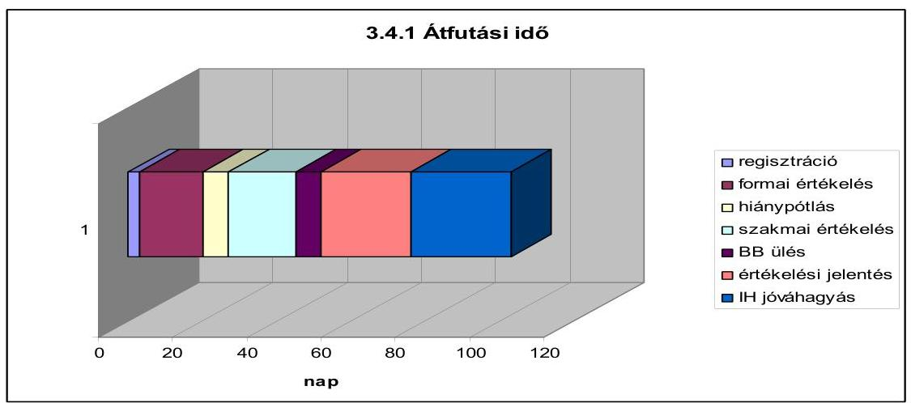

Az értékelési jelentés elkészítése átlagban 24 napot vett igénybe. Az értékelő jelentés IH általi jóváhagyása átlagosan 27 napot vett igénybe. A hiánytalan beadástól a döntés honlapon történő megjelenéséig átlagban 103 nap telt el a 60 nappal szemben. 2006. január 1-jétől a programcsoport létszámát 2 fővel növelték, és a későbbi pályázatoknál már az IH beleegyezésével egyszerűsítették a jegyzőkönyveket, és így sikerült leszorítani az értékelő jelentés elkészítéséhez szükséges időt.

Másik három pályázat (3.5.4. alintézkedés: A felnőttképzés hozzáférésének javítása a rendelkezésre álló közművelődési intézményrendszer rendszerszerű bevonásával, 2.3. intézkedés: Hátrányos helyzetű emberek foglalkoztathatóságának javítása, különös tekintettel a roma népességre és az 1.3.1. alintézkedés: A nők munkaerő piacra történő visszatérésének ösztönzése pályázatok) értékelése is elkészült. A 3.5.4. pályázat esetében a beadástól a döntés honlapon történő megjelenéséig 61 nap, a 2.3. pályázat esetében 94 nap, az 1.3.1. pályázatok esetében pedig 126 nap telt el. Ez kiugróan magas érték, de 206 pályázat érkezett be, amelynek 79%-ánál volt szükség hiánypótlásra. A pályázatok mennyisége miatt az értékelési jelentés elkészítése 30 napot, a jelentés IH általi jóváhagyása pedig 34 napot vett igénybe.

# Adminisztratív terhet jelentett mind a pályázó, mind pedig a befogadó KSZ részére, hogy a pályázat beadásakor korlátozott ideig érvényes dokumentumokat kell benyújtani és ellenőrizni.

---

#### Abstract

Az ilyen iratok (pl. tulajdoni lap, cégkivonat) érvényessége már az IH döntésekor lejár. Mivel nem elég a pályázathoz a pályázó nyilatkozata a fenti adatok igazolásáról, ezért az eddigi gyakorlat hiánypótlásokat eredményezett, növelve a pályázók költségeit, meghosszabbítva a támogatási szerződések előkészítésének időtartamát.

Tovább növelte a pályázatok formai ellenőrzésének időszükségletét a „rendezett munkaügyi kapcsolatok" feltételeinek igazolására alkalmas iratokról szóló 1/2006. (II. 2.) FMM rendelete, amely szerint az Országos Munkabiztonsági és Munkaügyi Főfelügyelőség kiállított hatósági bizonyítványt, az Egyenlő Bánásmód Hatóság által kiállított hatósági bizonyítványt, és a munkáltató nyilatkozatát kell a pályázónak benyújtania. Mindezt a hatálybalépést követően bejelentett támogatási igények jóváhagyása előtt kell alkalmazni.

Az elbírálási folyamat gyorsítására hozott intézkedések (létszámbővítés, az értékelési jelentés összeállításának adminisztratív egyszerűsítés) a résztvevők szerint segíteni fogják munkájukat.

A pályázatok megvalósításának szakaszában gondot jelentett, hogy a PEJ-ek beadásának ütemezése (adott intézkedés összes kedvezményezettje egy napon adta be a PEJ-t) egyenetlen leterheltséget jelentett a MÁK és az FH kihelyezett megyei egységei részére, mivel a projektek regionális megoszlása is egyenetlen volt.

A 14/2004. (VIII. 13.) TNM-GKM-FMM-FVM-PM együttes rendelet késői megjelenése előtt meg kellett kezdeni a központi programok programterveinek kidolgozását. A jóváhagyásokra 2004. június-november hónapokban sor került, a támogatási szerződéseket 2004. augusztusától írták alá a kijelölt szervezetekkel.

A központi programok befogadásának, elbírálásának, a támogatási szerződés megkötésének időtartamát nem korlátozta a 14/2004. (VIII. 13.) TNM-GKM-FMM-FVM-PM együttes rendelet. A projektek folyamatos egyeztetés során, közel egy év alatt alakultak ki, tartalmazva a megvalósítás szakmai és pénzügyi szempontjait.

A központi programokat a támogatási szerződések megkötésének elhúzódása miatt át kellett ütemezni, a szerződéseket módosították. A 1.1.1. alintézkedés: A munkanélküliség megelőzése és kezelése projektek és a 4.3.1. alintézkedés: Regionális Egészségcentrum modell-intézmény létrehozása projektek módosításuknak megfelelően haladtak. Két projekt ütemezésnek megfelelő haladása kockázatos volt. (2.1.1. alintézkedés: hátrányos helyzetű oktatásban érintett szakemberek képzése; az integrációs oktatással kapcsolatos programok kifejlesztése, 3.1.1. alintézkedés: Pedagógusok és oktatási szakértők felkészítése kompetencia alapú képzés és oktatás feladataira).

# 3.3.2. A támogatás odaítélési folyamatban a hatékonyság és eredményesség elvének alkalmazása 

A pályázatok értékelésénél szempont volt a gazdaságos megvalósítás. A központi projektek esetében a Minősítő Testületi döntések idején nem minden projekt esetében álltak rendelkezésre az egyes projektelemekhez hozzárendelhető költségek. (2.1.1. alintézkedés: Hátrányos helyzetű oktatásban érintett szakemberek képzése; az integrációs oktatással kapcsolatos programok kifejlesztése, 3.1.1. alintézkedés: Pedagógusok és oktatási szakértők felkészítése kompetencia alapú képzés és oktatás feladataira).

A 3.1.1. alintézkedéshez (Pedagógusok és oktatási szakértők felkészítése kompetencia alapú képzés és oktatás feladataira) tartozó projekt esetében a jóváhagyó Minősítő Testület ülése 2004. 06. 23-án volt, a TSZ megkötését megalapozó projekttervet a kedvezményezett Kht 2004. 09. 21-én nyújtotta be, a TSZ megkötésére 2004. 09. 22-én került sor.

Az egyes központi projektek gazdaságosságát - a pályázatok gazdaságosságának megítélésével szemben - csak önmagában lehetett értékelni. Nem összemérhető pl. az oktatási programok kidolgozására fordított 11,9 Mrd Ft a debreceni klinikán 10,8 Mrd Ft támogatásból és 1,3 Mrd Ft saját forrásból megvalósuló beruházási programmal.

Az ESZA alapból megvalósított, általunk vizsgált központi projektek esetében a megvalósítás gazdaságosságának értékeléséhez nem minden esetben állt rendelkezésre összehasonlító alapadat, egységköltség. A programtervek és a megvalósítás során a pénzügyi ellenőrzésben azonban fontos szempont volt a gazdaságosság.

Az 1.1.1. alintézkedés (a munkanélküliség megelőzése és kezelése) 20 megyei munkaügyi központra lebontottan valósul meg. Ezek a központok több éves gyakorlattal, előzetes költségek ismeretével rendelkeztek. Ennek ellenére a közbeszerzési, pályáztatási eljárások bevezetésével költségcsökkentést tudtak elérni, ami a célként megjelölt indikátorok túlteljesítését eredményezheti. A támogatási szerződéseket csak 2004. augusztusában, és azt követően lehetett megkötni, ami a 2004. évre tervezett munkát késleltette.

A 2.1.1. és a 3.1.1. alintézkedéseknél (2.1.1. alintézkedés: Hátrányos helyzetű oktatásban érintett szakemberek képzése; az integrációs oktatással kapcsolatos programok kifejlesztése, 3.1.1. alintézkedés: Pedagógusok és oktatási szakértők felkészítése kompetencia alapú képzés és oktatás feladataira) a programokat kidolgozó Kht. projekttervében nem tartotta fontosnak a gazdaságos megvalósítást. Mivel a kutatás, fejlesztés egyes esetekben -és ide tartoznak a két projekt egyes szerződései is - mentesül a közbeszerzés törvényi hatálya alól, ezért annak esetleges költségcsökkentő hatása nem tudott érvényesülni. A költségek csökkentésére pályázatok alapján választották ki egyes közreműködő partnerüket. Az ellenőrzés idején a támogatási szerződések módosítása folyamatban volt, amely szerint feladat alapú költségvetéssel egészül ki a programterv.

A projektek gazdaságos lebonyolításának egyik eszköze a közbeszerzések lefolytatása. A vizsgált végső kedvezményezettek a szükséges közbeszerzéseket - a közreműködő szervezetek helyszíni ellenőrzési jegyzőkönyvei szerint - szabályosan lebonyolították.

A vizsgált központi programok támogatási szerződésének aláírása az előre tervezettnél később, 2004. év utolsó harmadában történt. A PkD-ban megjelölt végső kedvezményezettek, az IH és az illetékes minisztériumok szakmai vezetésének együttműködése alapján elkészített projekttervekben ütemezett feladatok megkezdése ezért csúszást szenvedett. Azon pályázatok megvalósítását

---

ütemezési gondok nehezítették, amelyeket központi programokban (2.1.1. alintézkedés: hátrányos helyzetű oktatásban érintett szakemberek képzése; az integrációs oktatással kapcsolatos programok kifejlesztése, 3.1.1. alintézkedés: Pedagógusok és oktatási szakértők felkészítése kompetencia alapú képzés és oktatás feladataira, 3.2.1. alintézkedés: Új szakképzési szerkezet kialakítása) kidolgozott oktatási csomagok megvalósítására írtak ki.

A 3.1.1. alintézkedés (Pedagógusok és oktatási szakértők felkészítése kompetencia alapú képzés és oktatás feladataira) központi programhoz kapcsolódóan kidolgozandó 3.1.2. alintézkedés (Térségi Iskola- és Óvodafejlesztő Központok megalakítása a kompetencia-alapú tanítási-tanulási programok elterjesztéséért) pályázaton nyertesek munkáját kockáztatta a monitoring szakértő véleménye szerint a nyertesekkel a támogatási szerződések megkötésének csúszása, valamint az átadott tananyagok váltakozó minősége.

A 3.2.1. alintézkedés (Új szakképzési szerkezet kialakítása) központi program alapján pályázaton támogatást nyertek esetében gondot jelentett, hogy a központi programban az OKJ új szakmai és vizsgakövetelményeit a támogatott határidőre kidolgozta ugyan, de az ellenőrzés idején még jogszabályokban nem jelentek meg, ami hátráltathatja a pályázatok megvalósítását.

# 3.3.3. A projekt előrehaladásának hatékonysága a célok időarányos teljesülésének figyelembevételével 

A HEFOP időarányos teljesülésének értékeléséhez az EMIR-ben rögzített adatok nem nyújtottak elég segítséget, annak ellenére, hogy a modul 2005. második negyedévében adatrögzítésre elérhető volt, de a lekérdezési funkciók a vizsgálatunk végéig nem működtek az indikátorok nyomon követéséhez OP szinten. Az indikátorok
 EMIR-ben rögzítése csak a modul beindulása után lett folyamatos, a korábbi időszak monitoring adatainak (több száz PEJ) EMIR-be felvitele részben kezdődött meg.

A Foglalkoztatási Hivatal már megkezdte a korábbi monitoring adatok EMIR-ben rögzítését is.

Ez a gyakorlat nem felelt meg a Tanács 1999. június 21-i 1260/1999/EK rendelet 36. cikkének, amely szerint az irányító hatóságnak a felügyeletet az operatív programban, illetve a program-kiegészítő dokumentumban meghatározott fizikai és pénzügyi mutatók alapján kell végeznie. Az alkalmazott mutatóknak kellene jelezniük, hogy milyen szakaszban van a támogatás fizikai kivitelezése és finanszírozása.

Bizonyos programok cél-elérésének mérését értelmezési gondok nehezítették, kiemelten a programokba bevont roma népesség mérésére vonatkozóan.

A 2.1. intézkedés operatív programban megfogalmazott célja: a hátrányos helyzetű, különösen a roma, illetve fogyatékos diákok továbbtanulási lehetőségeinek, ezáltal munkaerő-piaci és társadalmi beilleszkedési esélyeinek javítása. Az alkalmazott indikátorok nem tértek ki a roma, illetve a fogyatékos diákok programba vonására.

A HEFOP-4.3.1 (Regionális Egészségcentrum modell-intézmény létrehozása) Központi programban megfogalmazott, és a támogatási szerződésben támogatott cél - a „szakprevenciós" ambuláns ellátás működtetése - nem felelt meg a jogszabályi előírásoknak. A fenti feladat nem támogatható a Hajdú-Bihar Megyei Egészségbiztosítási Pénztár II. fokú határozata szerint. A helyzet megoldására az Országos Egészségbiztosítási Pénztár elfogadta a meglévő szakorvosi órák számának kapacitás-átcsoportosítással történő növelését (a meglévő szakambuláns órák keretén belül történne a prevenciós tevékenység).

A projektek finanszírozása nem közvetlenül az indikátorok teljesüléséhez kapcsolódott, hanem a benyújtott PEJ-ek alapján a szakmai előrehaladás és a pénzügyi teljesítés számla alapú ellenőrzéséhez. Két központi projekt esetében (2.1.1. alintézkedés: Hátrányos helyzetű oktatásban érintett szakemberek képzése; az integrációs oktatással kapcsolatos programok kifejlesztése, 3.1.1. alintézkedés: Pedagógusok és oktatási szakértők felkészítése kompetencia alapú képzés és oktatás feladataira) az időarányos teljesítés ÁSZ általi értékelését lehetetlenné tette, hogy a projektek pénzügyi és szakmai teljesítésének összhangját a részfeladat alapú szerződések fogják csak megteremteni, amelyre vonatkozó szerződésmódosítások aláírása a vizsgálat végéig folyamatban volt.

A projektek előrehaladásának mérésére a kedvezményezetteknek kellett meghatároznia a szerződés mellékletét képező projekttervben vállalt indikátorok ütemezését, aminek a kedvezményezettek eleget tettek.

A 2.1.1 (Hátrányos helyzetű oktatásban érintett szakemberek képzése; az integrációs oktatással kapcsolatos programok kifejlesztése) központi projekt esetében a projekttervben szereplő 20 db monitoring mutató helyett csak a PkD-ban és a támogatási szerződés fő szövegében rögzített főindikátorok (kimenet és eredmény indikátorok) ütemezése történt meg, az is csak feltételesen, a - központi programmal párhuzamosan, attól elkülönülő - pályázatok teljesüléséhez kötötten. A szakmai KSZ a fennmaradó 18 mutató teljesülését is vizsgálja szakmai hitelesítés során az ütemezés pótlásával.

Vizsgálatunk idején az indikátorok és az EMIR lekérdező funkciójának programértékelésre vonatkozó korlátozott alkalmazhatóságát támasztja alá a 2006. február végén készült, a HEFOP indikátorainak elemzését tartalmazó Időközi Értékelés is.

# 3.3.4. A projektek pénzügyi lebonyolítása a célrendszer időarányos teljesítése figyelembevételével 

Az EMIR és a végső kedvezményezettek számviteli, pénzügyi nyilvántartási rendje alkalmas volt a projekt tranzakcióinak egyértelmű beazonosítására. Ezt megerősítette több, a témában lefolytatott FMM és MÁK ellenőrzés jegyzőkönyve is.

A végső kedvezményezettek fizetési igényeit az IH hagyta jóvá a KSZ-ek által végzett szakmai, pénzügyi és közbeszerzés szempontú ellenőrzés után, a jogszabályoknak megfelelően.

Mind a számla alapú, mind pedig az előleg kifizetésével gondok voltak a HEFOP esetében 2004. év végén, 2005. év elején. Az IH szerint a kifizetési késedelem okait a gyakorlati tapasztalat, rutin hiánya, adminisztrációs (iktatás) problémák, valamint az előirányzatok év elejei megnyitásának elhúzódása jelentette. További okot jelentett az, hogy a PEJ-ek ellenőrzése egyes MÁK irodák leterheltsége miatt elhúzódott, mivel nagy számú számlát kellett egyedileg ellenőrizni és az EMIR-be felvinni.

Az egyes kifizetési folyamatok időszükséglete a helyszíni vizsgálat idején tapasztaltak szerint változó volt. A 2.1.4 (Tanoda programok támogatása) pályázatos projektje esetében a kifizetés átlagos ideje 64 nap volt. A központi programok nagy összegű átutalásai rendre több időt vettek igénybe, min 60 nap.

Az 1.1.1 (A munkanélküliség megelőzése és kezelése) projekt - BAZ megye - esetében az átlagos kifizetési időtartam a hiánypótlások után 95 nap volt. A beküldött PEJ-ek közel 4-6 ezer oldalasak voltak, amelyek PEJ-enként több száz kis összegű utazási számlát tartalmaztak, amelyet a MÁK tételesen ellenőrzött, és rögzített az EMIR-ben. A kifizetés csak ezek után történhetett meg. A Szabolcs Megyei MK kifizetései is hasonlóan alakultak.

A helyszíni ellenőrzés tapasztalata szerint az EMIR működésére a vizsgálat végére kevesebb lett a panasz.

A Foglalkoztatási Hivatal 2005. november 24-i ellenőrzési jelentése szerint nem rendelkezett valamennyi Megyei Kihelyezett Egység EMIR on-line hozzáféréssel. A kapcsolat a helyszíni vizsgálat idején már rendeződött.

A tapasztalatok szerint a 2.1.1, 3.1.1 (2.1.1. alintézkedés: Hátrányos helyzetű oktatásban érintett szakemberek képzése; az integrációs oktatással kapcsolatos programok kifejlesztése, 3.1.1. alintézkedés: Pedagógusok és oktatási szakértők felkészítése kompetencia alapú képzés és oktatás feladataira) központi projekt vezetősége jelezte, hogy a kifizetések elhúzódása miatt a megvalósítás késedelmet szenvedhet. Az állítást megalapozott értékelés nem támasztotta alá az indikátorok, a mérföldkövek és a kifizetések ütemezési összhangjának hiányában. A vizsgált pályázatos projektek esetében ilyen jelzés nem volt.

Az ESZA projektek elszámolásai esetében jellemző a kisösszegű számlák kimagaslóan magas száma az ERFA elszámolásokkal összehasonlítva. Az Ámr. 91.§ (5) b) alpontja írta elő a kedvezményezettnek a számlamásolatok benyújtását. Az Ámr. ezen jogszabályi helyének 2006. január 1-től hatályos módosítása tette lehetővé a számlaösszesítő alkalmazását, amelyet az érintett 1.1. intézkedés BAZ megyei projektjében 2006. januárjától kísérleti jelleggel, április 1-től a teljes OP-ra alkalmaz. A HEFOP IH 2006. április 1.-től a papír alapú adminisztráció csökkentésére az új PEJ formátum bevezetésével lehetővé tette a közbeszerzési dokumentáció mellett a szakmai teljesítési igazoló mellékletek elektronikus megküldését, valamint bevezette a számlaösszesítők alkalmazását kimagaslóan nagyszámú, kis összegű bizonylatot eredményező költségkategóriák esetében.

# 3.4. A Környezetvédelem és Infrastruktúra Operatív Program megvalósítása 

### 3.4.1. A támogatásra kiválasztott, illetve leszerződött projektek hozzájárulása a célrendszer időarányos teljesítéséhez

A KIOP-ban megvalósított projektek támogatása közvetlenül hozzájárult a KTK harmadik specifikus céljának eléréséhez és főként a 3. sz. fő prioritásnak a megvalósításához, azaz a közlekedési infrastruktúra fejlesztéséhez és a környezet védelméhez. A KIOP által támogatott beruházások összetételének és regionális elhelyezkedésének vizsgálata azt mutatta, hogy az ellenőrzött projektek céljai összhangban voltak a KTK első és negyedik specifikus céljával, elősegítették a fejlettebb és regionálisan kiegyensúlyozottabb gazdasági versenyképesség létrejöttét, amelyet például a közlekedési projekteknek a földrajzi elhelyezkedése igazolt. A KIOP célja alapvetően az volt, hogy mind mennyiségi, mind minőségi szempontból szűkítse az EU és Magyarország között fennálló infrastrukturális rést.

A KIOP programdokumentumok elkészítésének üteme nem késleltette a KIOP végrehajtását. Az időközben végrehajtott módosítások a PkD-ban hozzájárultak a közlekedési és a környezetvédelmi prioritások céljainak N+2 éven belüli megvalósításához. Például a KIOP Program-kiegészítő Dokumentum 2005. évi környezetvédelem prioritással kapcsolatos módosításai kiterjedtek forrásátcsoportosításra és a beadott pályázatok és a potenciális pályázók felmérése alapján a pályázati lehetőségek kiszélesítésére a célrendszerben foglaltak hatékonyabb teljesítése érdekében.

Az intézményrendszert az jellemezte, hogy a létszám megtakarítások érdekében a KIOP IH látja el a Közlekedés prioritás esetében a Közreműködő Szervezet szerepét. A létszám megtakarítás a feladatok egyre növekvő kiszervezését eredményezte, amellyel a feladatok teljes körű elláthatóságát megoldották, ugyanakkor ez együtt járt a működtetés kockázatainak növekedésével. A KIOP környezetvédelmi prioritását tekintve - elsősorban a második Környezetvédelmi Programban szereplő fejlesztéspolitikai célokra alapozódott. Az NKP II. szakmai irányítása viszont a KvVM-hez, annak szakmai főosztályaihoz tartoztak.

A KIOP pályáztatási rendszere sikeres volt abból a szempontból, hogy a 2004-2005-2006. évi költségvetési törvények szerint rendelkezésre álló 3 éves keret 99%-ára az IH megítélte a támogatást 2006. 04. 19-ig.

A KIOP környezetvédelmi prioritáshoz rendelt források - a pályázati felhívások feltételeivel erősen szűkített pályázati lehetőségek mellett is - kevésnek bizonyultak a köz- és lakossági alapellátottságot szolgáló kommunális beruházások megvalósításának elősegítéséhez. Például a környezetvédelemmel kapcsolatos pályáztatási rendszerben 251-en pályáztak. A 2006. április 19. állapot szerint az Irányító Hatóság által támogatott pályázatok darabszáma 65 volt.

A támogatási odaítélési folyamatok ciklusidői a jogszabályban rögzített 60 napos korlátot meghaladóan alakultak. Összességében a támogatási odaítélési folyamatok ciklusidőinek alakulásában javuló tendencia nem volt kimutatható.

# 3.4. A Környezetvédelem és Infrastruktúra Operatív Program megvalósítása 

#### Abstract

Például a KIOP környezetvédelmi prioritás területén a támogatási odaítélési eljárások átlagos időszükséglete - 2006 I. negyedévig az összes projektet vizsgálva 2004 évben 102 nap, 2005 évben 116 nap volt. A pályázatok benyújtásától az IH támogatási döntés meghozataláig eltelt idő a minimum 55 nap és a maximum 212 nap szélső értékek között alakult. A Pályázat Kiválasztó Bizottság javaslatától az IH döntésig eltelt idő ennek az időtartamnak a felét elérte (2005-ben átlagosan 65 nap volt), így gyakorlatilag önmagában kimerítette a jogszabály által rendelkezésre álló időkereteket. Indokolatlanul elhúzódott az IH döntéstől a támogatási szerződéskötésig tartó folyamat végrehajtása, mivel 2004-ben átlagosan 91 napot, 2005-ben átlagosan 106 napot vett igénybe.

A KIOP-ban kialakult késedelmek egy része az intézményrendszeren kívüli okokra volt visszavezethető. Az IH és KSZ-ek hatótávolságán kívülre került a pályáztatás sikerességét meghatározó műszaki-gazdasági előkészítő tevékenység koordinálása, továbbá a pályázati dokumentációk minőségbiztosításának végrehajtása.

# 3.4.2. A támogatás odaítélési folyamatában a hatékonyság és eredményesség elvének alkalmazása 

A pénzügyi, gazdaságossági szempontok érvényesítésekor nem értékelték programszinten a támogatásban részesült projekteknél a vállalt teljesítmények (outputok), eredmények és a tervezett támogatási forrásfelhasználás összhangjának alakulását. Az indikátorok nem feleltek meg teljes körűen a mérhetőség, elérhetőség, megbízhatóság és időszerűség elveinek, amelyet az EU és KTK IH is ajánlott a PkD elkészítése során. A KIOP PkD előzetes értékelése nem segítette elő kellő mértékben az indikátorokkal kapcsolatos hiányosságok pótlását a megfelelő időben. A pályázatokban vállalt célállapotok teljes életciklusra kiterjedő követésének, értékelésének módszerét és a monitoring rendszerben történő kezelésének technikáját teljes körűen nem alakították ki. Az ÁSZ helyszíni ellenőrzése során az indikátorrendszer és az adatgyűjtés felülvizsgálata folyamatban volt, ezt követően vált a célok és támogatási források tekintetében átláthatóan dokumentálttá a célrendszer időarányos teljesítésének helyzete a támogatási szerződések és a pályázatokban vállalt indikátorok alapján.

A környezetvédelmi prioritás esetében a szennyvíztisztító kapacitás fejlesztését célzó támogatási források elosztása a PkD-ban lévő lehetőséget meghaladóan alakul 131%-os mértékben. A költségarányosság elvét alkalmazva, az output mutatót tekintve összehasonlítási alapul, az output mutatóban a teljesítmény eltérés mértéke mindössze -1%. Ugyanakkor az eredménymutatóként használt kiszolgált háztartások számát elemezve az volt tapasztalható, hogy nem sikerült elérni a projektkiválasztások során a PkD-ban tervezett költséghatékonyságot (input-eredmény viszonyt tekintve), mivel az eredménymutató 28%-kal alacsonyabban alakul a támogatási forrásfelhasználáshoz képest. Az ivóvíz intézkedésnél a PkD-ban előirányzott output cél teljesítése a projektkiválasztások során elmaradt a tervezettől, mivel csak 28%-át érte el a kitűzött célnak, miközben az intézkedés keretlekötése 48%-os. Ennek következtében 20%-kal kedvezőtlenebbül alakult a forrásallokáció a PkD-nál figyelembevett költségnormatívákhoz képest. Ugyanakkor az
 elért eredmény összhangban volt a támogatási források időarányos felhasználásával.

---

Az állati hulladék intézkedésnél lévő „darab" outputmutató elemzése kimutatta, hogy a hulladékkezelő egységek darabszámmal kifejezett követése nem alkalmas az előrehaladás korrekt megítélésére 15%-os lekötöttség mellett. A közvetve és közvetlenül érintett háztartások számának értelmezési problémái, a pályázatokban szereplő adathiány miatt a költséghatékonyságot sem lehetséges megítélni. Az egészségügyi és építési hulladék kezelése intézkedés elemzése szerint az output és eredménymutatók kedvezően alakulnak. Ugyanakkor a kórházi komponenssel kapcsolatos teljesítések nem érik el a tervezett értéket.

A környezeti kármentesítés intézkedésnél elért eredmények 26%-os forrásallokáció mellett elérték a 78%-os szintet. A természetvédelem és fenntartható árvízvédelem intézkedés vonatkozásában a 87%-os támogatási forrás lekötés mellett az eredménymutató szerint a túlteljesítés mértéke 152%-os.

A levegőszennyezés és zajterhelés mérése intézkedés indikátorai fenntartással értékelhetők, mivel az eredménymutató szerinti 3795%-os túlteljesítés a kiindulási feltételek változásából következett be és mutatja a szükséges programkiigazítás, indikátorok felülvizsgálatának késedelmét.

A közlekedési prioritás keretében a PkD-ban meghatározott egyik kiemelt cél az volt, hogy összességében 260 km hosszúságban kell fejleszteni Magyarországon az EU támogatási források felhasználásával a közúthálózatot. A közlekedés harmadik pályázati kiírása ennek érdekében biztosította az útrehabilitációs PEA pályázatok benyújtását. A teljesítés mértéke 83 km-el elmarad a tervezettől, miközben a jóváhagyott támogatások értéke elérte a források 100%-át. A KIOP - a teljes támogatási keretre megkötött támogatási szerződések alapján - közlekedési prioritása output és eredményességi mutatóinak összhangja nem valósult meg.

A PkD-ban foglaltak szerint 204 millió Ft jutott volna átlagosan km-enként, ugyanakkor, ez a kiválasztott projektek esetében 301 millió Ft/km lett. Ez 147%-os forrástöbblet igényt és 32%-al rosszabb forrás felhasználási hatékonyságot jelent az eredetileg tervezett értékekhez képest. Az egyes komponensekhez tartozó projektek költségigényessége ugyanakkor igen eltérő volt. A minimum érték 68 millió Ft/km, a maximum érték 1952 millió Ft/km lett. Az UKIG által benyújtott pályázatok összetétele a költségigényesebb, elkerülő út projektek felé tolódott el.

# 3.4.3. A projekt előrehaladásának hatékonysága a célok időarányos teljesülésének figyelembevételével 

A közlekedési prioritás területén a helyszíni ellenőrzésre kiválasztott 3 projekt értékelést végeztünk. Ez összesen közel 20 milliárd Ft beruházási összköltségű - közúti projekt költségvetésének és a kapcsolódó műszaki dokumentumoknak az áttekintését jelentette.

A Salgótarján, tehermentesítő út III. ütem projektnél, egy esetben, 92 millió Ft értékű munka kétszer szerepelt. Ezt a tényt a támogatási szerződés megkötését

[^0]
[^0]:    ${ }^{67}$ A jelentés egyeztetési fázisában KIOP IH tájékoztatása szerint, az indikátor célérték nagyobb arányú elérése érdekében egy 4. pályázati kiírást adtak ki, amelyre 2 pályázat érkezett (egy út rehabilitációs és egy kapacitásnövelést célzó projekt).

---

követően, de a közbeszerzési eljárást megelőzően tárták fel, amelyet a támogatási szerződés korrekciójával rendeztek.

A környezetvédelmi projektek esetében a környezetvédelmi horizontális cél érvényesülése biztosított volt, ez a prioritás jellegéből közvetlenül következett. A KvVM FI KSZ és KIOP IH szervezeteiben horizontális referensek koordinálták a horizontális célokkal, így az esélyegyenlőséggel kapcsolatos feladatok ellátását. A kiválasztott projektek hozzájárulását a horizontális célokhoz elősegítette a pályázókat felkészítő útmutatók (esélyegyenlőség és fenntartható fejlődés tárgykörben) kidolgozása, és az a pályázási követelmény, hogy a pályázónak igazolnia kellett a projekt hozzájárulását a horizontális célhoz. Ugyanakkor a horizontális részcélok teljesítésének aktuális mértékében feszültségforrások is kialakultak az IH és a civil szervezetek között, például az egészségügyi hulladék és az építési hulladék ártalmatlanításával kapcsolatos támogatási arányokat tekintve (a monitoring bizottsági jegyzőkönyvek szerint). Az esélyegyenlőségi cél megvalósulásának igazolása csak közvetetten volt megvalósítható, amely a környezetvédelmi, és közlekedési projektek jellegéből (természetvédelem, állati hulladéklerakó) következett. Elsősorban a regionális fejlesztési politika keretében, a hátrányos helyzetű kistérségekben megvalósult fejlesztések keretében érvényesült az esélyegyenlőségi cél.

A horizontális célkitűzések teljesítésének teljes körű értékelési és ellenőrzési rendszere nem épült ki. Az IH a feladatok kiszervezését megkezdte. A horizontális célokkal kapcsolatos főbb tapasztalatok azt mutatták, hogy a horizontális célok teljesülésének hosszú távú méréséhez szükséges szakmai erőforrásokat nem tervezték meg. A fenntartható fejlődés mutatóinak kialakítása és a követésükre szolgáló informatikai rendszer kifejlesztése nem kezdődött el.

A projektek fizikai megvalósítása során a közlekedés prioritás területén átlagosan fél éves, a környezetvédelem prioritás területén átlagosan egy éves késedelem alakult ki a pályázatokban vállalt ütemezésekhez képest. A pályázatokban tervezett kifizetésekhez képest a környezetvédelem prioritás 18%-os, a közlekedési prioritás 59%-os teljesítést ért el. A tervezett és tényleges kifizetések közti legnagyobb 47%-os lemaradás a szennyvízkezelés és tisztítás intézkedésnél volt tapasztalható. A kifizetési ütem csúszása hátterében a projektek végrehajtásának késedelme állt.

Az útépítési projektek részletes értékelése azt mutatta, hogy a pályázati dokumentumokban előírányzott időpontokhoz képest az ajánlati felhívások kibocsátása átlagosan 192 napos késedelemmel realizálódott. A késedelmek elsősorban a közbeszerzésekhez szükséges ajánlati dokumentációk elkészítésének elhúzódásából eredtek. Az átvizsgált dokumentumok azt bizonyították, hogy a támogatási szerződést követő időszakban az IH feltárta a késedelmeket és erőteljesen szorgalmazta azoknak a kiküszöbölését az UKIG-nál. Sikerült a fizikai megvalósítási projektciklusban az UKIG-nak a késedelmeket csökkenteni a következő projekteknél.

A 44. sz. főút Békéscsaba elkerülő útnál az UKIG olyan szerződést kötött a kivitelezővel, hogy a projekt a 224 napos késedelem helyett 90 nappal korábban fejeződhet be a tervezettnél. A Salgótarjáni projektnél a késedelmes teljesítés csökkentésében hasonló pozitív tendencia volt tapasztalható, amely 1 hónapra csökkent. A 442. és 44. sz. főút egyes szakaszainak rehabilitációja projektnél ugyan 5

---

hónappal később történt a szerződéskötés, viszont az eredeti befejezési határidőre sikerült szerződést kötni a kivitelezővel.

# 3.4.4. A projektek pénzügyi lebonyolítása a célrendszer időarányos teljesítése figyelembevételével 

A támogatás kifizetési folyamat időigényének alakulása nem volt meghatározó hatással a projektek realizálására a több éves beruházási folyamatok miatt. A KIOP-ban 2005. évben átlagosan 69 naptári napot vett igénybe a kifizetés, amely magában foglalta a kifizetés alapját képező dokumentumok hiánypótlásának idejét is.

A KvVM FI KSZ-nél a számla esedékességétől a kedvezményezettnek történő kifizetésig eltelt idő átlagosan 73 nap volt 2005-ben. A minimum érték 25 nap, a maximum 148 nap volt. Számításba kell azt is venni, hogy a kifizetési igénylés jogosultsági vizsgálatok a KIOP egyes intézkedéseinél különösen munkaigényesek voltak, az építési beruházási számlákban szereplő és a projekteken megvalósított szerkezeti mennyiségek összevetésének, helyszíni ellenőrzésének időigényessége miatt.

A helyszíni vizsgálat lezárásáig az IH aktualizált megvalósítási ütemterveken alapuló, megfelelő pontosságú és időtávú, N+2 tervvel nem rendelkezett, a KSZeknél ilyen dokumentum nem volt fellelhető. A helyszíni ellenőrzés tapasztalatai szerint nem épült be elegendő gyakorisággal a KIOP vezetési információs rendszerébe, és a Monitoring Bizottság tevékenységébe a kifizetések előrejelzése. Nem volt átlátható a KIOP intézményrendszerében az N+2 szabály érvényesülésével kapcsolatos kockázatok alakulása. Az IH intézkedéseket kezdeményezett az N+2 terv magalapozottabb adatokon alapuló elkészítésére 2006 áprilisáig bezárólag, amely a vizsgálat lezárását követően vált hasznosíthatóvá.

Az ÁSZ helyszíni vizsgálat keretében elkészíttettük és értékeltük az ún. aktualizált N+2 tervet, amelyen belül figyelembe vettük a közlekedési prioritás, és energia intézkedés esetében a módosított támogatási szerződésekben elfogadott kifizetési ütemterveket, a környezetvédelmi prioritáshoz tartózó többi projektnél a kivitelezői szerződésekben előirányzott kifizetési, illetve pénzfelhasználási ütemterveket. A kapott eredmény rámutatott a kivitelezői szerződések teljesítésétől való függés magas kockázatára és az éves pénzügyi teljesítések kiemelt jelentőségére. A reálfolyamatok előrehaladását tükröző 2005. és 2006. évi számla alapú kifizetések alakulása azt mutatta, hogy a késedelmek miatt a környezetvédelmi prioritás projektjeinek végrehajthatósága kockázatot jelent. A pályázatokban szereplő tervezett és a tényleges kifizetések között kialakult különbségek mértéke miatt időszerűvé vált a Támogatási Szerződések felülvizsgálata és módosítása az N+2 szabály figyelembe vételével.

A támogatási szerződésekben rögzített ütemtervek tartása során nem érvényesülhetett teljes körűen a projektmenedzsment szemlélet, mivel az egyes projektciklusok megvalósításának feladatai a kedvezményezettek - KSZ - IH között megosztottak, ugyanakkor a kapcsolódási pontokban a határidők, felelősségi körök nem rögzítettek megfelelő mértékben. A Kedvezményezetteknél a támogatási Szerződésektől eltérő, késedelmes teljesítések szankcionálására jogszabályi lehetőségek nincsenek. A Támogatási Szerződések felmondása, mint végső állapot, a KIOP megvalósítása során általában veszélyeztetné magának a cél-

---

rendszernek a teljesítését. Ennek következtében a támogatási szerződések aktualizálása vált gyakorlattá szankcionáló következmények nélkül. Ez a körülmény veszélyforrást jelent 2008-ig az N+2 terv tarthatósága szempontjából.

# 3.5. A Regionális Fejlesztés Operatív Program megvalósítása 

### 3.5.1. A támogatásra kiválasztott, illetve leszerződött projektek hozzájárulása a célrendszer időarányos teljesítéséhez

A regionális fejlesztések célrendszere (az NFT, az Országos Területfejlesztési Koncepció) az átfogó célokat tekintve összhangban volt. A kiválasztott projektek céljai a Regionális Akció Tervekben meghatározott fejlesztendő területekkel szintén összhangban voltak, és ez támogatási feltétel is volt, azonban az országos és a regionális tervek hiányosságai (országos szintű, hosszú távú tervekhez való illeszkedés hiánya, régiókon átívelő és regionális prioritások hiánya) miatt a kiegyensúlyozottabb, a régiók adottságainak legmegfelelőbb fejlődés csak korlátozottan érvényesülhetett.

Tervezési hiányosság volt, hogy az országos szintű, átfogó társadalmi, gazdasági, környezeti célok kijelölése hosszú távra csak 2005 végén az Országos Fejlesztéspolitikai Koncepció (a továbbiakban: OFK) elkészítésével történt meg. A 2004-2005-ben rendelkezésre álló területfejlesztési politikát tartalmazó - még a csatlakozás előtt, 1998-ban elfogadott - Országos Területfejlesztési Koncepció (a továbbiakban: OTK) az ország egésze szempontjából meghatározó, az egyes régiókon átívelő területi célokat, a régiók saját koncepcionális céljait, valamint a célkitűzések prioritás rendszerét nem tartalmazta. E hiányosságok megszüntetésére az Országgyűlés 2005 végén fogadta el a megújított OTK-t. Az ország hét régiója elkészítette Regionális Akció Tervét a 2004-2006 közötti időszakra, de az országos szintű tervezés hiányosságai miatt a régiók terve sem tartalmazta a régiókon átívelő területi célokat, valamint a régiók saját céljaikat nem priorizálták.

A ROP pályázatok elbírálási rendszerében alkalmazott gyakorlata nem biztosította, hogy a szakmailag legjobbnak ítélt pályázatok kerüljenek kiválasztásra. A később beérkező és a támogatási feltételeknek megfelelő, de pénzügyi keret hiányában már nem támogatható pályázatok között, nagyobb pontszámúak voltak, mint a korábban támogatott pályázatok. Az esélyegyenlőséget korlátozta az a gyakorlat, hogy az éves pénzügyi keretek tervezett ütemét meghaladó lekötéssel gyakorlatilag 2005-ben a teljes keretet lekötötték, ezzel a későn pályázóknak már csak a visszalépett projektekből felszabaduló forrásokra volt esélyük, őket „tartaléklistán" szerepeltették ${ }^{68}$.

A ROP pályáztatás sajátossága, az ún. „Tartaléklista" képzése ${ }^{69}$ a pályázók bizonytalanságához vezetett. A támogatás megállapításáról, vagy elutasításáról

[^0]
[^0]:    ${ }^{68}$ 2006-ban két pályázati ablak (2.2. és 3.3.) volt nyitva.
    ${ }^{69}$ A „Tartaléklista" a pályázatok elbírálása során szakmailag megfelelő, de az elbíráláskor pénzügyi keret hiányában nem támogatható, majd a későbbiekben meghiúsuló

---

szóló végleges döntés hónapokkal, vagy több mint egy évvel a jóváhagyó döntés után született meg.

Továbbá az alkalmazott pályázat kiválasztási rendszer hátránya volt, hogy olyan intézkedés esetében is pályáztatással választották ki a támogatásra kerülő projekteket, ahol a versenyeztetésnek nem volt
 szerepe, mert döntően állami feladatellátást finanszíroztak az intézkedés kerete terhére (Például a 2.1. „Hátrányos helyzetű régiók és kistérségek elérhetőségének javítása" intézkedésből, az útépítési és felújítási projektek finanszírozása).

A ROP általunk vizsgált támogatási döntéseinek időszükséglete több mint 60 nappal meghaladta az általános eljárási szabályokról szóló 14/2004. (VIII. 13.) TNM-GKM-FMM-FVM PM együttes rendeletben foglalt határidőt, tehát jogszabálysértést követett el az IH.

Az ellenőrzött pályázatok alapján a pályázatok befogadásától (tehát hiánypótlás nélkül) a döntésig eltelt idő naptári napokban legkevesebb 124 nap, a legtöbb 539 nap volt. A kiugróan magas döntési időigény a ROP-2.3.1.-2004-060034/37. számú (a Kántorjánosi Óvoda felújítása, a korszerű pedagógiai-nevelési igényeknek megfelelő eszközök beszerzése), „tartaléklistás" pályázat esetében fordult elő. A ROP-ról megjelent statisztikák ún. tartaléklistáról támogatott pályázatok miatt nem adnak reális képet a döntéshozatalhoz szükséges időről.

A ROP-ban az OP-k átlagosnál nagyobb döntési időszükségletéhez hozzájárult továbbá a ROP projektjeinek összetettsége, a vártnál nagyobb pályázati tömeg, a 2005. évben jelentkező pályázati dömping, az elbírálás folyamán a döntéshozatalban résztvevő szervezetek véleménykülönbsége miatti többletidőigény.

A ROP szerződéskötések időszükséglete, szemben a döntés időszükségletével, a legkedvezőbb az OP-k közül, ugyanakkor a szerződéskötések időszükséglete is jellemzően meghaladta az általános eljárási szabályokról szóló 14/2004. (VIII. 13.) TNM-GKM-FMM-FVM-PM együttes rendeletben foglalt határidőt.

Az ellenőrzött projektek szerződéskötésének időszükséglete (hiánypótlás nélkül) naptári napokban 15 és 162 naptári nap között mozgott.

A szerződéskötések, módosítások gyorsítására, a felmerülő problémák megszüntetésére hozott intézkedések voltak:

- a jogi szabályozásban egységesítésre és egyszerűsítésre kerültek a kedvezményezettektől igényelt biztosítékok;
- Szerződésmódosító Bizottság alakult az IH és a VÁTI Kht., mint KSZ közötti együttműködés hatékonyságának javítása céljából;
- az IH a pályázatok kiegészítését, pontosítását a szerződéskötési eljárással összekötve, azzal egy időben végeztette.
szerződés, visszalépő pályázó miatt felszabaduló keret, vagy az egyes régiókban megmaradó „töredékösszeg" terhére esetlegesen támogatható pályázatok listáját jelentette.

---

A támogatás odaítélési folyamatának időigénye, szükségessé tette a pályázatokban foglalt cselekvési- és ütemtervek aktualizálását a szerződéskötéskor.

Az ellenőrzött projektek esetében a projektek szerződés szerinti kezdésének ideje 4-14 hónappal, átlagosan 8 hónappal tolódott el a pályázatokban tervezetthez képest.

# 3.5.2. A támogatás odaítélési folyamatban a hatékonyság és eredményesség elvének alkalmazása 

A ROP értékelési szempontrendszere a fő szempontokra, mint a pályázat célokhoz való illeszkedésére, a megvalósíthatóságra, eredményességre, hatásra, addicionalitásra és fenntarthatóságra kiterjedt, ugyanakkor a sokféle szempont szerinti, az értékelő megítélésétől is függő szempontok szerinti értékelés, ugyanazon pályázat eltérő megítéléséhez vezetett az értékelésben, minőségbiztosításban résztvevő szervezetek között.

A projekt költségek reális voltának megítélése komplex feladatot jelentett mivel a legkülönfélébb építési és felújítási (út, épület, sírkamra, város rehabilitáció) jellegű projektek költséghatékonyságát kellett megállapítani. Ilyen jellegű speciális ismeretekkel a költségbecslést, a költségek megfelelőségének értékelését végző munkatársak nem mindegyike rendelkezett.

Az IH törekedett az outputok és az eredmények, és a tervezett forrásfelhasználás összhangjának betartására, ennek érdekében a várható eredményeket és a felhasznált források alakulását folyamatosan figyelemmel kísérték, értékelték, a program indikátorainak teljesítése érdekében az intézkedések között átcsoportosításokat hajtottak végre. Az indikátorokat a pontos mérhetőség és az egységes értelmezés szerint újra és újra felülvizsgálták. A projekt célok és eredmények számbavételéhez, és az előrehaladási jelentések megfelelőségéhez a kedvezményezettekkel is folyamatosan egyeztettek. Ugyanakkor a forrás átcsoportosítások miatt az indikátorokat a helyszíni ellenőrzés idején még nem korrigálták.

A Program-kiegészítő Dokumentumban meghatározott output indikátorok várható értéke - a 2005. december 31-ig megkötött szerződések alapján elvégzett, 2006. március végi értékelés szerint - az indikátorok kétharmadánál eltér a tervezettől, pozitív vagy negatív irányban. (6.e. sz. melléklet, A Regionális Fejlesztés Operatív Program indikátorainak alakulása)

Az indikátorok tervezettől eltérő alakulása tervezési okokra, és a lehetséges projektek kidolgozottságának hiányára vezethetők vissza ${ }^{70}$.

Az 1.2. intézkedésnél (Turisztikai fogadóképesség javítása) ugyanakkora összegből kevesebb pályázat valósul meg, mert a nyertes pályázók magas, az igényelhető támogatási összeg felső határához közelítő forrást igényeltek, eltérően a tervezés során figyelembe vett átlagos projekt mérettől.

[^0]
[^0]:    ${ }^{70}$ A ROP Monitoring Bizottság 2006 májusában módosította a PkD indikátortáblájának értékeit.

---

A 2.1. intézkedésnél (Hátrányos helyzetű régiók és kistérségek elérhetőségének javítása) „az ipari területekhez vagy turisztikai vonzerőkhöz vezető megépített vagy felújított utak hossza" is várhatóan alatta marad a célértéknek, mert a helyi önkormányzatok az ipari területekhez vezető utak fejlesztéséhez nem rendelkeztek kész tervekkel, és csak későn tudtak volna pályázni.

A 2.1. intézkedés 3-as komponensénél, „a támogatott tömegközlekedési projektek száma" kisebb lesz, mint a célérték, mivel a tömegközlekedésben érintett Volán Rt-k köre nem pályázhatott.

# 3.5.3. A projekt előrehaladásának hatékonysága a célok időarányos teljesülésének figyelembevételével 

A projektek megvalósítása során, a szerződéskötést követően jellemzően minden kedvezményezett aktualizálta a cselekvési- és ütemtervében a belső határidőket minimálisan egyszer, vagy annál többször, jellemzően a közbeszerzési eljárást igénylő (ERFA-ból támogatott) projekteknél.

A ROP IH az NFT ún. „Mid-term Update" - azaz, a 2004-2006 közötti időszakban, az időközi értékelés felülvizsgálatának időhorizontján belüli - értékeléséhez átadta az indikátorok alakulásáról szóló kimutatást az NFH számára. Az indikátorok feldolgozását, az IH megbízásából a ROP legtöbb intézkedése esetében a VÁTI Kht. az EMIR-en kívül, excel táblában rögzített adatok alapján tudta elvégezni, az EMIR-ben az indikátorok összesítése még nem megoldható, még akkor sem, ha az indikátorok rögzítésre kerültek.

A horizontális célok és amennyiben azok számszerűsíthetők voltak, akkor azon indikátorok teljesítése (pl. akadálymentesítés) és a teljesítés ellenőrzése megtörtént. A női-férfi esélyegyenlőség mellett, a romák és a fogyatékkal élők szempontjai is horizontális szintű témává emelkedtek. A képzési programok megszervezése során szem előtt tartották a horizontális célokat, noha, ez megnehezítette a projektek beindítását, mert a projektek beindításakor sok esetben változott az adott célcsoport (speciális tanulási igényű tanulók / hallgatók létszáma), az arányt a projektek során is nehéz tartani a lemorzsolódások miatt.

### 3.5.4. A projektek pénzügyi lebonyolítása a célrendszer időarányos teljesítése figyelembevételével

Az európai uniós, és a hazai költségvetési források a tényleges kifizetési igényeknek megfelelően rendelkezésre álltak.

A ROP egyes kifizetéseinek teljes időszükséglete (a kedvezményezett hiánypótlásával együtt számított) 2005. évben átlagosan 49 nap volt, az általános eljárási szabályokról szóló 14/2004. (VIII. 13.) TNM-GKM-FMM-FVM PM együttes rendelet szerinti határidőn belül maradt. Ez az időszükséglet a legkedvezőbb volt az egyes OP-k időszükséglete között.

Az ellenőrzött projektek esetében a kifizetés időszükséglete a számla befogadásától számítva 28, illetve 22 naptári nap volt, elektronikus átutalási rendszeren keresztül történő utalással.

---

A kifizetések időigénye nem akadályozta a projektek időbeni megvalósítását, mivel azok jellemzően a jogszabály szerinti határidőn belül maradtak. Az előleg igénybevételének minden (ESZA, ERFA projekt) kedvezményezettre kiterjesztett lehetősége pedig éppen a projektek zökkenőmentes megvalósítását szolgálta.

Az éves költségvetési tervezésen túlmenően a KTK IH, valamint az OP IH-ok ütemtervet, ún. $\mathbf{N + 2}$ modell szerinti tervet készítettek a keretlekötések és kifizetések alakulásának figyelemmel kísérésére, a 3 éves keret teljes mértékű felhasználásához.

A KTK IH és a ROP IH első alkalommal 2005. április végén - a szerződéskötések előrehaladásával - készített $\mathrm{N}+2$ tervet, amelynek alakulását folyamatosan nyomon követték, szükségszerűen, jellemzően negyedévente aktualizálták. Az IH a 2005. évi éves végrehajtási jelentésben a 2006. évre vonatkozó előrejelzését aktualizálta.

Az elkészített N+2 terv a támogatási szerződések kötelező mellékletét képező éves pénzügyi ütemterven, illetve azok módosításán alapult, de jelenleg ennek lekérdezését az EMIR rendszer még nem biztosította. Az indikátorok feldolgozásához hasonlóan az IH Excel-ben végezte el a feldolgozást.

Az N+2 szabálynak való megfelelés érdekében

- minimálisan szükséges forrás lehívás 2006 végéig (2004+2 év) a ROP 3 éves keretének $8 \%$-a, azaz 9,2 Mrd Ft az, amit tényleges teljesítményen alapuló számlákra ki kell fizetni, és az Európai Bizottság felé el kell számolni (az uniós forrást le kell hívni). Az ERFA tekintetében ez a minimális követelmény már a 2006. márciusi elszámolással teljesült (Tényleges kifizetés a minimumhoz 114,1\% volt.) Az ESZA esetében a minimális értéket a márciusi elszámolással csak $54 \%$-ig tudta teljesíteni az IH.
- az IH terve szerint a 2006. április és decemberi időszakra jelzett kifizetési kérelmekből az Európai Bizottsággal való elszámolásra nagy valószínűséggel csak az október végéig kifizetett tételek kerülhetnek. A jelenlegi tényleges és tervezett adatok alapján az ERFA esetében az N+2 szabály betartható.
Az ESZA esetében figyelembe véve az Európai Bizottsággal való elszámolás elkészítésének időigényét, valószínűsíthető, hogy a minimális felhasználás teljesül, de a 2004-re allokált keret teljes felhasználása jelenleg még bizonytalan. Ezen a területen a központi projektek kifizetéseinek, ehhez a programok fizikai megvalósításának felgyorsítása jelenthet megoldást.

Az ellenőrzött projektek alapján látható, hogy kockázati tényezőt jelentenek azok az esetek, amelyekben a kedvezményezett a projekt megvalósításának belső határidejét többször, jelentősen módosítja, ez várhatóan a befejezési határidő meghosszabbításához vezet majd. Erre példa a ROP-1.1.2.-2004-070010/33. számú projekt, amelynek esetében a fizikai megvalósítással összhangban a 2004. évre tervezett költségek jelentős része 2005-re, majd 2005-ről 2006-ra került átcsoportosításra. A szerződések tervezett ütemének tarthatósága határozza meg a 2007. és 2008. évi teljesítési kockázatot.

---

Az IH a kifizetések, illetve a támogatások felhasználásának gyorsítására az alábbi intézkedéseket hozta:

- felülvizsgálja a kifizetéseket megelőző ellenőrzéseket, van-e lehetőség az egyes folyamatok összevonására.
- a pályázók a kötelezően beadandó elszámolást az elektronikus számlakitöltő program segítségével is megtehetik (2005-ben I. verzió, 2006 második félévében kötelezően használandó);
- az előrehaladási jelentések és kifizetési kérelmekkel kapcsolatos problémák kiküszöbölésére a szabad kapacitással rendelkező RFÜ-ket vonták be, szakértői segítségnyújtás rendszerének kialakítására. A visszajelzések alapján az intézkedés fogadtatása vegyes a pályázók részéről, az intézkedés hatása még nem érzékelhető;
- 2006. április 18-20. között a VÁTI Kht.-val együttműködve ún. road show keretében tájékoztatta az érintett Kedvezményezetteket az „N+2 szabály" jelentőségéről és érvényesítéséről, a fizetési kérelmek benyújtásával kapcsolatos teendőkről, valamint azok késedelmes benyújtásának következményeiről.

A projektek pénzügyi nyilvántartása az EMIR keretében valósul meg. A rögzített tételek a kiválasztott projektek esetében egyértelműen beazonosíthatóak, visszakereshetőek voltak.

# 4. Az OPERATÍV Programok VÉGREHAJTÁSÁNAK KOORDINÁCIÓJA, A LEBONYOLÍTÁSBAN RÉSZTVEVŐ INTÉZMÉNYEK EGYÜTTMŰKÖDÉ-

SE
A strukturális alapok intézményeinek szerepe hazai jogszabályi szinten $^{71}$ alapvetően szabályozott, de az intézményrendszer működésének hatékonyságát rontotta, hogy a KTK IH koordinálási tevékenységéhez jogszabály nem biztosított megfelelő hatáskört.

Az OP-k megvalósítását jogszabályok teljes körűen és osztatlanul az OP IH-ok feladat és felelősségi körében határozták meg. A KTK IH az SA intézményrendszerében az OP IH-okkal egyenrangú szervezeti egységként jelent meg, koordinációs feladatai (így például a KTK egészére vonatkozó szakmai irányelvek elkészítése, módszertan, eljárási szabályokra javaslat kidolgozása) hatékony ellátásához szükséges irányító szerepe nem érvényesült. Az uniós jogszabály, a strukturális alapokra vonatkozó általános rendelkezések megállapításáról szóló 1260/1999/EK Rendelet $34 \S$-a nem kezeli elkülönülten az OP és a KTK IH-ot.

A KTK IH jogszabályban meghatározott feladatköre nem volt összhangban a szervezeti struktúrájával, ami a feladatok maradéktalan és hatékony ellátására kockázatot jelentett. A KTK IH a vizsgálat idején az NFH
 (mely 2004. január 1-jétől a Miniszterelnöki Hivatal keretében működő Nemzeti Fej-

[^0]
[^0]:    ${ }^{71}$ Az Európai Unió strukturális alapjaiból és Kohéziós Alapjából származó támogatások hazai felhasználásáért felelős intézményekről szóló 1/2004. (I. 5.) Korm. rendelet.

---

lesztési Terv és EU-támogatások Hivatalának általános jogutódja) szerves részeként önálló főosztályként működött. A jogszabályban a KTK IH felelősségi körében meghatározott feladatok egy részét az NFH más szervezeti egységei látták el. A feladatellátást végző szervezeti egységek irányítása nem azonos elnökhelyettesek hatáskörében valósult meg.

A hatékonyságot rontotta továbbá, hogy a MÁK által kezelt monitoring információs rendszer (OTMR) és az NFH által kezelt monitoring információs rendszer (EMIR) közötti adatátadás-átvétel, adatszolgáltatás során nem volt elégséges a vonatkozó kormányrendelet ${ }^{72}$ a felmerülő feladatok végrehajtásához, a MÁK és az NFH felelősségének megállapításához ${ }^{73}$.

A KTK intézmények erőteljes koordinációjának hiányában az öt operatív program, azokon belül az intézkedések egységes eljárásrenden alapuló működtetése nem valósult meg, a támogatáskezelő szervezetek saját szabályzatokat készítettek, eltérő eljárásrendeket dolgoztak ki, amely nagyban akadályozta az EMIR hasznosulását és az elektronikus ügyintézés széleskörű bevezetését.

Az NFH 2003-ban elkészítette a közös strukturális alapok - Kohéziós Alap működési kézikönyvet, melynek továbbfejlesztése nem valósult meg. Az EU strukturális alapjaiból és Kohéziós Alapjából származó támogatások hazai felhasználásáért felelős intézményekről szóló 1/2004. (I. 5.) Korm. rendelet időközben életbe lépett és az IH-ok saját kézikönyvet dolgoztak ki.

Az IH-ok, illetve a KSZ-ek külön-külön eljárásrendet, ill. működési kézikönyvet készítettek, az egyedi, sajátos szempontok mind teljesebb körű érvényesítése mellett, esetenként eltérő fogalomhasználattal. Ebből következően az öt IH egyedileg adta meg számítógépes rendszerfejlesztési és lekérdezési igényét is. Ez halmozottan kötötte le a számítógépes rendszerfejlesztési erőforrást, ami rontotta a rendszerfejlesztés hatékonyságát.

Az ellenőrzött időszakban - a programok végrehajtásához kialakított eljárásrend és az alkalmazott projekt kiválasztási rendszer mellett -, a vonatkozó jogszabály ${ }^{74}$ szerinti pályázat elbírálási, szerződéskötési és kifizetési határidő elvi kívánalom maradt. Az egyes szervezetek a végrehajtási, lebonyolítási részfolyamatokhoz szükséges időigényüket felmérték, de ez az időigény különösen a pályázatok elbírálása esetében nagyobb volt, mint amit a vonatkozó jogszabály meghatározott. Az intézmények - bár európai uniós jog-

[^0]
[^0]:    ${ }^{72}$ Az államháztartás működési rendjéről szóló 217/1998. (XII. 30.) Korm. rendelet.
    ${ }^{73}$ A jelentéstervezet egyeztetési fázisában a MÁK azt a tájékoztatást adta, hogy az NFH és a MÁK között 2006.05.23-án létrejött az adatszolgáltatásra vonatkozó Együttműködési megállapodás, melyben mindkét fél jogai és kötelezettségei rögzítésre kerültek. Az EMIR - OTMR kapcsolatban fennakadást csak az adatrögzítési hibák jelenthetnek, amelyek javítása azonban már megoldott.
    ${ }^{74}$ A strukturális alapok és a Kohéziós Alap felhasználásának általános eljárási szabályairól szóló 14/2004. (VIII. 13.) TNM-GKM-FMM-FVM-PM együttes rendelet.

---

szabály nem írta elő - a kifizetések bizonylatait, kifizetés előtt teljes körűen (százszázalékosan) ellenőrizték, ami fokozott biztonságot adott, de a szervezet teljesítőképességét, hatékonyságát szintén rontotta.

Az intézmények működésének félidei értékelését 2005-ben a KTK IH elvégezte. Az intézményi működésre vonatkozóan további megállapításokat tartalmaztak a különböző ellenőrzési-, és monitoring jelentések is, de a teljesítmények folyamatos nyomon követéséhez, méréséhez, a szervezetek teljesítményének összehasonlítását biztosító értékeléshez módszertan nem állt rendelkezésre 2005. végéig. A módszertan elkészítéséhez az alapvető kereteket az EU strukturális alapjaiból és Kohéziós Alapjából származó támogatások hazai felhasználásáért felelős intézményekről szóló 1/2004. (I. 5.) Korm. rendelet rögzítette. Ez a jogszabály a KTK IH számára módszertani útmutató készítését is előírta 2004. elejétől, amelyet a KTK IH csak 2 éves késedelemmel 2006. elején teljesített. A KH szintén 2006-tól vezetett be egy teljesítménymenedzsment-rendszert a saját intézményi működése hatékonyságának figyelésére és értékelésére.

A strukturális alapok működtetésének tényleges költsége, az intézményrendszer egészére nem ismert, a különböző ellenőrzések és az intézményrendszer félidei értékelése sem tudta megállapítani, hogy mennyibe került az intézményrendszer működtetése. Az intézményrendszer kialakításakor nem tervezték meg a várható költségeket és a működtetés során sem határozták meg azt. Nehezítette a költségek meghatározását, hogy nem alakították ki ennek módszertani alapjait. Ez szükséges, mert a különböző forrásból (fejezeti kezelési előirányzat, OP Technikai segítségnyújtás keretéből) származó források nem kerültek összesítésre, másrészt a kiadások IH-ra történő kimutatását nem segítette elő a minisztériumok elszámolás technikája sem. A KSZ-ek elláttak a strukturális alapok mellett egyéb feladatokat is, ami tovább bonyolította az egyes tevékenységekre eső kiadások kimutatását. A feladat-, erőforrás- és teljesítmény terv a pénzügyi keretekkel, kiadásokkal - a hivatkozott módszertan alkalmazásával - elkészítése az ellenőrzés befejezéséig nem történt meg.

Jelen ellenőrzéshez megkértük az intézmények működési kiadásainak adatait, de az intézményi működési kiadások tényleges értékét - egy adott OP működtetéséhez kapcsolódóan - egyetlen szervezet sem tudta megadni. A szervezetek egy része (KTK IH, AVOP, GVOP, MÁK) a minisztérium teljes egészére vonatkozó kiadási adatok arányosításával, az OP-okkal foglalkozók létszámarányában, becsléssel állapította meg az intézményi működési kiadásokat, az ÁSZ által készített kitöltési útmutató szerint. A szervezetek másik része (HEFOP, KH, KIOP, ROP IH) tanúsítványban adott nyilatkozata szerint a kiadások aránytalanul nagy munkaráfordítással mutathatók csak ki, így az intézményi kiadások adatait a kért határidőre nem tudták megadni.

Az intézményrendszer egészére jellemző volt, hogy a humánerőforrás szükségletet felmérték, de a rendelkezésre álló létszámkeretet befolyásolták a takarékossági, létszámgazdálkodási szempontok. Bizonyos kapacitás hiányt az egyes intézmények a TA keret terhére történő foglalkoztatással pótoltak.

A KTK IH az intézményrendszer félidei értékelése alapján feltárt problémák megoldására, a hatékonyság javítására rendszer szemlé-

---

letű javaslatokat fogalmazott meg úgy, mint a szervezetek közötti hatékony munkamegosztás megvalósítása, teljesítmény és kontrolling rendszer kialakítása, pályázati rendszer egyszerűsítése és egységesítése, a kifizetések rendjének újraszervezése, pályáztatási határidők újragondolása. Az előterjesztés elfogadására ellenőrzésünk végéig nem került sor.

# 5. A Nemzeti Fejlesztési Terv Pályázói Köreben Végzett Elégedettségi Felmérés 

Az elektronikus e-mail keretében kiküldött kérdőívre beérkezett válaszok értékelését operatív programonként, illetve a működési folyamat teljesülési szakaszai szerinti csoportosítású számítógépes táblázatok adatai alapján végeztük. Összesen 1397 db olyan kitöltött kérdőív érkezett, amelyek teljes körűen besorolhatóak voltak az osztályozási csoportokba.

A működés részterületeinek összesített értéke, illetve összességében az elégedettségi érték kismértékű eltérései és azonos trendje mutatják, hogy a részterületi kérdések jól lefedték az összevont elégedettséget, a következetes válaszadások folytán az összességében jelzett elégedettségnek a kedvező kontrollját jelentik a részterületi elégedettségek és fordítva.

Az előbbiek alapján a vélemények legjellemzőbb irányai, az egyes válaszadói csoportok, illetve a működési folyamat egyes szakaszai közötti eltérések alapján kellő megalapozottsággal tehetők meg a következő főbb megállapítások:

- a vélemény-felmérés egyöntetűen legkedvezőbb megítélésű területe a pályázati felhívás közzétételének ismertsége (megismerési lehetősége);
- a pályázati szakasz tevékenységeinek válaszai kedvezőbb véleményt, illetve az átlagos értéknél magasabb elégedettséget mutatnak, ugyanakkor a projekt megvalósítás támogatási összegek kifizetési szakaszainak véleményei, illetve elégedettségi értékei kedvezőtlenek, az átlagosnál alacsonyabbak;
- kedvezőtlenek a vélemények a határidők nem teljesülése miatt, amelyek elsősorban a működési folyamat kulcsfontosságú szakaszain
- a támogatási döntéssel kapcsolatos tájékoztatás,
- a támogatási szerződés megkötése,
- a támogatás (rész)összegének kifizetése
tapasztalhatók a válaszadók szerint;
- a késedelmek miatt - esetenként irreálisan - hosszú a pályázat benyújtásától a teljes támogatási összeg elszámolásáig eltelt időtartam;
- a rendeletben előírt, de nem teljesült határidők/időtartamok csökkentése a válaszadók túlnyomó többsége (88%) szerint megalapozott igény, vagyis a jogszabályban rögzített határidőket is hosszúnak tartják, így a kedvezőtlen vélemények kettőzött hatásként jelentkeznek, növelve a kedvezőtlen véleményalkotást;

---

- a támogatási összegek kifizetésével összefüggő vélemények a legkedvezőtlenebbek az érintett csoportoknál (akik „várnak a pénzükre"), főként a GVOP és a HEFOP esetében, vagyis a válaszadók 80%-át képviselő két operatív programnál jelennek meg legnagyobb arányban a kedvezőtlen vélemények;
- a teljes támogatási összeget elszámolták csoport (akik már „megkapták a pénzüket") válaszai összességében az átlagosnál kedvezőbbek, az elégedettségének értékei a legmagasabbak (3,56 és 3,58), a kifizetések egyértelműen jelzik az elégedettség mértékének számottevő növekedését az előző - akik a kifizetési igénylést benyújtották, illetve a részösszeget kapták meg - csoportok elégedettségéhez képest (növekedés +1,07 érték);
- a „pályázatot elutasították" csoport a vélemény-felmérés számszerűsített adatai alapján külön kategóriát képvisel, mivel a kérdésekre adott válaszok többsége az átlagosnál kedvezőtlenebb és az elégedettségi értékei az összes teljesülési szakasz közül a legalacsonyabbak (2.64 és 2.43, míg az átlag 3.31 és 3,25);
- a „pályázatot elutasították" csoport esetében kiugróan alacsony (1.89) az elégedettség értéke a pályázat elutasítás esetén az indoklás megalapozottságának, ami azt jelzi, hogy az érintettek többsége nem veszi tudomásul az elutasítás szakmai indoklását (az 1,89 érték az összességében elégedetlen tartomány teljes mértékben elégedetlen oldalán van, az egyedüli 2 alatti érték);
(Mindez mutatja, hogy kedvezően befolyásolja a véleményeket és emeli az elégedettség értékét, ha az elutasítások indoklása minden esetben teljes körűen szakmailag megalapozott, mivel ebben az esetben az érintettek inkább tudomásul veszik a számukra kedvezőtlen döntést.)
- a támogatási szerződés megkötéséig az elégedettségek az összességében elégedett tartományban, illetve a se nem elégedetlen, se nem elégedett tartomány elégedett oldalán vannak. Szintén itt találhatók az összes válasz átlagos és az összevont elégedettség értéke, valamint a működési folyamatban résztvevő intézményekkel a kapcsolattartás értéke. A projekt megvalósítással összefüggő elégedettségek a se nem elégedetlen, se nem elégedett tartomány elégedetlen oldalán vannak;
- összességében kedvező a projekt megvalósítása során a kötelezettségek teljesítésének ellenőrzési módjára vonatkozó vélemény, azonban a megítélés szempontjából kedvezőtlen hatású az ellenőrzések elhúzódása.

A válaszadók több mint kétharmada igényli, hogy az Operatív Program végrehajtásában közreműködő intézmények kérjék ki a működési tapasztalatokra vonatkozó véleményüket.

Budapest, 2006. szeptember 22.

Melléklet:  12 db 17 lap
Függelék:  1 db 15 lap
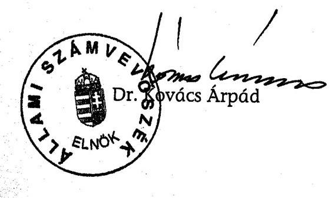

---

MELLÉKLETEK

---

# 207106 

Miniszterelnöki Hivatalt Vezető Miniszter

Ikt: I-2/2354/2/2006.
Hiv.sz: V-26-143/2005-2006.

Dr. Kovács Árpád elnök úr részére
Állami Számvevőszék

Budapest

Tisztelt Elnök Úr!
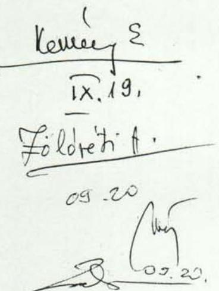

A szeptember 5-én kelt levelével megküldött fenti számú jelentés-tervezetre, mely a Nemzeti Fejlesztési Terv végrehajtásának ellenőrzéséről készült, további észrevételt nem teszek.

Az intézkedési terv elkészítése érdekében munkatársaim felé eljártam.

Budapest, 2006. szeptember 13.

Tisztelettel:
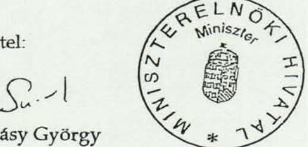

---

H-1051 BUDAPEST V., JÓZSEF NÁDOR TÉR 2-4. POSTACIM: 1369 BUDAPEST, POSTAFIÓK 481.

TELEFON: (36-1) 327-2159, (36-1) 327-2141
FAX: (36-1) 318-0758

E-MAIL: janos.veres@pm.gov.hu

PÉNZÜGYMINISZTÉRIUM

Iktatószám: 9989/21/2006.
Hiv. szám: V-26-143/2005-2006.
Ügyintéző: dr. Selmeczi-Kovács
Zsolt 327-5619
Tárgy: a Nemzeti Fejlesztési Terv
végrehajtásának ellenőrzéséről
készített jelentés

Dr. Kovács Árpád úr részére
elnök

Állami Számvevőszék

Budapest

Tisztelt Elnök Úr!

Köszönettel megkaptam a Nemzeti Fejlesztési Terv végrehajtásának ellenőrzéséről készített
jelentésüket. A jelentést áttekintettem és ahhoz további észrevételt nem kívánok tenni.

Budapest, 2006. szeptember 15.

Üdvözlettel:

Dr. Veres János

Www.penzugyminiszterium.hu

---

Ügyiratszám: 94020/1/2006.

# Dr. Kovács Árpád 

elnök úr részére

## Állami Számvevőszék

Budapest
Apáczai Csere János u. 10.
1052

## Tisztelt Elnök Úr!

Hivatkozva a 2006. szeptember 5-én kelt V-26-143/2005-2006. sz. levelére ezúton tájékoztatom, hogy az Állami Számvevőszék által készített „Nemzeti Fejlesztési Terv végrehajtásának ellenőrzéséről" szóló jelentéssel kapcsolatban további észrevételt nem teszek.

Budapest, 2006. szeptember 13.

Tisztelettel:
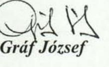

---

# A KTK célkitűzései 

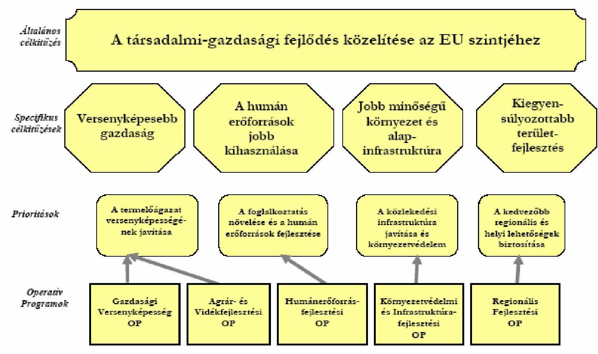

---

# EU Támogatási keretek (euró-ban)

|   | Összesen |

 ERFA | ESZA | EMOGA | HOPE | Arány  |
| --- | --- | --- | --- | --- | --- | --- |
|  GVOP | 429009213 | 429009213 |  |  |  | 21,50\%  |
|  AVOP | 317218750 |  |  | 312828868 | 4389882 | 15,89\%  |
|  HEFOP | 562822687 | 177381752 | 385440935 |  |  | 28,20\%  |
|  KIOP | 327245758 | 327245758 |  |  |  | 16,40\%  |
|  ROP | 359420752 | 305744465 | 53676287 |  |  | 18,01\%  |
|  Összesen: | 1995717160 | 1239381188 | 439117222 | 312828868 | 4389882 | 100,00\%  |
|  Arány |  | 62,10\% | 22,00\% | 15,68\% | 0,22\% |   |

Forrás: Közösségi Támogatási Keret (KTK) 2004-2006. (120. Oldal)

---

# A Nemzeti Fejlesztési Terv intézményrendszerének sémája 

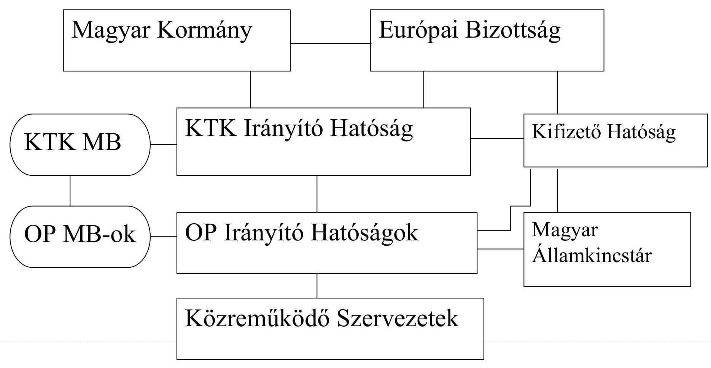

---

# Teljesítménymutatók és a hozzá tartozó kritériumok a Nemzeti Fejlesztési Terv végrehajtásának értékeléséhez 

| Vizsgálati kérdések | Kritériumok és teljesítménymutatók | Adatforrások |
| :-- | :-- | :-- |

A Nemzeti Fejlesztési Terv végrehajtása eredményesen és hatékonyan szolgálta-e a célrendszer időarányos teljesítését és a rendelkezésre álló források hasznosulását?

## 1. A feltételrendszer kialakítása lehetővé tette-e a célrendszer időarányos teljesítését?

| 1.1. Időben elkészítették-e és fogadták-e el az NFT többszintű dokumentációját? | A Strukturális Alapok Magyarország számára való megnyílása időpontja és az NFT dokumentumai végső kialakítása (elkészítés, elfogadás) közötti időintervallum. | NFT kialakítási ütemterv, 1218/2002. (XII.29) Korm. határozat, az elfogadást igazoló dokumentumok. |
| :--: | :--: | :--: |
| 1.2 Időben kialakították-e az NFT végrehajtása szabályozási és intézményi rendszerét? | A Strukturális Alapok Magyarország számára való megnyílása időpontja és a teljes hazai jogszabályi környezet és intézményrendszer kialakítása közötti időintervallum kimutatása. | Jogszabályok, az intézmények alapító okiratai és módosításai. |
| 1.3. A program végrehajtásához a tervezett (finanszírozási) ütem szerint biztosították-e a hazai és uniós forrásokat? (költségvetési, előirányzati szinten) | Az NFT tervezett éves pénzfelhasználási ütemterveinek és a költségvetési források összhangja, esetleges eltérések aránya és időbelisége.   A források a terveknek megfelelően álltak-e rendelkezésre? Kifizetési igénylések, átutalási megbízások/ a rendelkezésre álló keret (OP-nként, intézkedésenként). | Zárszámadási és költségvetési törvények.   Átutalási megbízások, a kifizetési bizonylatok, egyéb dokumentumok. |

## 2. Az NFT előkészítése, a pályázók felkészítése hozzájárult-e a hazai abszorpciós kapacitások fejlesztéséhez?

| 2.1. A PEA előkészítő, projekt-generáló tevékenysége célszerűen, eredményesen és hatékonyan szolgálta-e az NFT céljainak megvalósulását? | FM és Projekt Fiche és PEA eredmények összhangja, az esetleges eltérés tartalma és mértéke.   Támogatott PEA projektek összege /PEA-ban felhasznált költségek összege. | Financing Memorandum, Projekt Fiche.   PEA eredmények.   EMIR, projektek. |
| :--: | :--: | :--: |
| 2.2. Az információs, kommunikációs tevékenység segítette-e a pályázók felkészülését az NFT pályázataira? | A kommunikációs stratégiák terv/tény állapotának összhangja. | Kommunikációs stratégiák, honlapok. |

---

# 3. A projektek kiválasztása és lebonyolítása lehetővé tette-e a célrendszer időarányos teljesítését, az elért eredmények összhangban vannak-e a forrásfelhasználással? 

| 3.1. A támogatásra kiválasztott illetve leszerződött projektek hozzájárultak-e a célrendszer időarányos megvalósításához? | A kiválasztott és a szerződéses állomány tervezett kifizetési és fizikai teljesítési ütemtervének összhangja a Nemzeti Fejlesztési Terv időarányos ütemterveivel. Ezt az összhangot az alábbi mutatókkal vizsgáljuk:   A kiválasztott és a szerződéses állomány alapján tervezett kifizetések és az OP intézkedésenként tervezett időarányos kifizetéseinek a viszonya.   A szerződéssel lefedett tervezett kifizetések kifizetés-intenzitása és a felhasználható forrás-keretösszeg viszonya az $\mathrm{N}+2$-re tekintettel (OP-ként, intézkedésenként).   A szerződéssel lekötött állomány tervezett output, eredmény és hatásmutatóinak összhangja az NFT időarányos output, eredmény és hatásmutatóival.   A szerződéses állományon belül a pályázathoz kötött kifizetések összege/kijelölt kedvezményezettekkel lekötött összegek, ezek összhangja a tervezett értékekkel (OP-ként és intézkedésenként) | Tanúsítványok.   OP-k és PkD-ok, a kiválasztott állomány és a szerződéssel lefedett állomány pénzügyi kifizetései és azok trendje, a fizikai teljesítések trendje, projektek.   EMIR és egyéb nyilvántartások, projektek.   EMIR és egyéb nyilvántartások, pályázatok, projektek.   Tanúsítványok, pályázatok, projektek.   A szerződésekben szereplő indikátorok és a KTK, OP, PkD indikátorok.   EMIR és egyéb nyilvántartások. |
| :--: | :--: | :--: |
| 3.1.1. A kiválasztott projektek céljai egybe esnek-e a támogatás célrendszerével? | A támogatásra kiválasztott projektek céljainak összhang az NFT, OP-k és PkD-k célrendszerével. | Pályázatok, EMIR. |
| 3.1.2. Az pályáztatás gyakorlatban alkalmazott módja milyen hatással volt az NFT időarányos és eredményes megvalósítására? | Időegységenként a benyújtott és támogatott pályázatok száma, értéke, az értékelés gyakorisága, az igények változása.   A szerződéssel lekötött állomány tervezett output, eredmény és hatásmutatóinak viszonya az NFT tervezett forrásfelhasználásához. | Pályázatok nyilvántartási rendszere, EMIR, programozásnál alkalmazott SWOT analízis   Tanúsítványok, projektek. |
| 3.1.3. Kialakították-e a támogatás odaítélési eljárásának (pályázat elbírálás, támogatási döntés, szerződéskötés) időszükségletét és biztosítják-e annak érvényesülését? Tettek-e intézkedéseket a támogatás odaítélési folyamata időigényének csökkentésére? | A támogatás odaítélési ciklusidejének alakulása (havi, negyedéves bontásban OP-nként és intézkedésenként).   A támogatás odaítélési részfolyamatainak (pályázat elbírálás, támogatási döntés, szerződéskötés) ciklusidejének alakulása havi, negyedéves bontásban (OP-nként és intézkedésenként)   A támogatásigénylési ciklusidők trendje (OP-nként és intézkedésenként) | EMIR és egyéb nyilvántartások, pályázatok, projektek.   EMIR és egyéb nyilvántartások, pályázatok.   EMIR és egyéb nyilvántartások, pályázatok. |

---

| 3.1.4. Hogyan befolyásolta és milyen hatása volt a támogatás odaítélési folyamat időigényének a pályázatokban vállalt megvalósítási ütemek tarthatóságára? | A pályázathoz beadott kifizetési és fizikai teljesítési ütemtervek és a szerződésben aláírt kifizetési és fizikai teljesítési ütemtervek módosításainak mértéke és hatása.
A késedelmes kezdések, a terv és tényadatok eltérésének trendje | EMIR statisztikai kimutatások a pályázat benyújtása időpontja szerinti csoportosításban, projektenként a szerződéskötési, valamint a pályázatokban előirányzott, a szerződéskötéskor vállalt és a tényleges kezdési időpontokról.
Pályázatok, szerződések, projektek.  |
| --- | --- | --- |
|  3.2. A támogatás odaítélési folyamatban érvényesítették-e a 3e (VFM) elv alkalmazását? | A PkD-kban lefektetett támogatás odaítélési összhangja az alkalmazott gyakorlattal. (Költség-haszon mutatók) | PkD-k és értékelési jegyzőkönyvek, pályázatok.  |
|  3.2.1. Kiterjedt-e az értékelés szakmai és pénzügyi szempontokra? | A PkD-kban lefektetett támogatás odaítélési összhangja az alkalmazott gyakorlattal. (Költség-haszon mutatók) | PkD-k és értékelési jegyzőkönyvek, pályázatok.  |
|  3.2.2 A kiválasztási folyamatban biztosították-e a támogatásra elfogadott projektek tervezett eredményeinek és a tervezett forrásfelhasználás összhangját az eredeti célkitűzésekkel?
Vizsgálták-e a megítélt támogatások alapján várható forrás felhasználás megfelelőségét az $\mathrm{N}+2$ szabályozásnak? | A PkD-kban lefektetett támogatás odaítélési összhangja az alkalmazott gyakorlattal. (Költség-haszon mutatók)
Az NFT dokumentációiban lefektetett kifizetési ütemtervek. | EMIR, pályázatok, szerződések.
EMIR, pályázatok, szerződések.
EMIR, pályázatok, szerződések.  |
|  3.2.3. A horizontális célok (környezetvédelem és esélyegyenlőség) érvényesültek-e a projekt kiválasztási folyamatokban? | OP, PKD-kban meghatározott horizontális célok időarányos teljesítése a tervhez képest. | Tanúsítványok.
KSH, EMIR, pályázatok, szerződések.  |
|  3.3. A projektek előrehaladása hatékonyan szolgálta-e a célok időarányos teljesülését? | A projektek előrehaladási ütemének és a szerződésben rögzített ütemek összhangja. | Szerződések, kifizetési ütemek, EMIR.  |
|  3.3.1. A támogatott projektek megvalósulása megfelelt-e a támogatási szerződésben foglalt ütemezésnek? | A projektekben elkészült létesítmények, és befejezett szolgáltatások aránya az eredeti és módosított határidők szerint.
A projektek állása.
A tervezett és a tényleges átadási határidők viszonya, a túllépések nagysága.
A megvalósítás készültségi fokának követése, az előrehaladás fázisonkénti alakulása az előrejelzésekhez és az aktualizált állapothoz képest.
Módosított/összes szerződés aránya
A késedelmek mértéke, időbeli aránya és térbeli megoszlása a projektek legutolsó, módosított ütemtervéhez képest. | Viszonyítási alap:
- támogatási szerződések,
- szerződésmódosítások;
- jelentések,
- aktualizált ütemtervek.
EMIR.  |

---

| 3.3.2.A megvalósítás folyamán az IH és a KSZ figyelemmel kíséri-e a támogatási szerződésben meghatározott célok és indikátorok várható teljesítését? | Az EMIR szolgáltatta-e az IH számára a szükséges információkat a szerződéses kötelezettségek teljesítésének következőhez, a gazdaságosság, hatékonyság figyelemmel kíséréséhez és kontrolljához?
A Kedvezményezett, a KSZ és az IH időben megtette-e azokat az intézkedéseket, amelyekre a monitoring rendszer jelzései hívták fel a figyelmet?
A folyamatosan fenntartandó jogosultsági kritériumok ellenőrzése (IH/KSZ) | Támogatási szerződés, mellékletei, értékelések, jegyzőkönyvek, projektek. |
| :--: | :--: | :--: |
| 3.3.3. A horizontális szempontok indikátorainak teljesítését ellenőrizték-e a projektek realizálási folyamatában? | A tervezett és a támogatott projektek összesített hatásainak viszonya az egyes horizontális szempontok esetében. | A projektek, intézkedések értékelései, jelentések, jegyzőkönyvek. |
| 3.4. Támogatta-e a célrendszer időarányos teljesítését a projektek pénzügyi lebonyolítása? | A tényleges kifizetések összege/a pénzügyi kifizetési terv tervezett időarányos összege (OP-ként és intézkedésenként), ezek negyedéves alakulása, a kifizetés-intenzitás negyedéves és havi értékei.   Kifizetett előlegek/összes kifizetés (OPként és intézkedésenként), ezek negyedéves alakulása, a kifizetés intenzitás negyedéves és havi meghatározása. | Tanúsítványok, projektek.   EMIR, az N+2 szabály betartásához készített szerződéskötési és kifizetési ütemtervek, egyéb nyilvántartások.   Tanúsítványok, projektek. |
| 3.4.1. A tényleges kifizetési igényeknek megfelelően biztosították-e a támogatási forrásokat? | Igényelt források üteme/rendelkezésre álló támogatási források. | Szerződések, támogatásigénylések, tényleges kifizetések. |
| 3.4.2. Kialakították-e a támogatás igénylési folyamatok (kifizetés-igénylés jogosultságvizsgálata, kifizetési döntés, átutalás) eljárásainak olyan időszükségletét, amely biztosítja a jogszabályi előírásokban rögzített pénzügyi teljesítési határidők betartását és szerződéses projektek tervezett ütem szerinti végrehajtását? | A jogszabályi előírásokban rögzített teljesítési határidők.   A támogatás igénylés ciklusidejének alakulása (havi, negyedéves bontásban OP-nként és intézkedésenként)   A támogatásigénylés részfolyamatainak ciklusidejének alakulása havi, negyedéves bontásban (OP-nként és intézkedésenként)   A támogatásigénylési ciklusidők trendje (OP-nként és intézkedésenként) | Jogszabályok.   EMIR és egyéb nyilvántartások, szerződések, támogatás igénylések, tényleges kifizetések.   EMIR és egyéb nyilvántartások, szerződések, támogatás igénylések, tényleges kifizetések. |
| 3.4.3. Hogyan befolyásolta és milyen hatása volt a támogatás kifizetési folyamat időigényének a tényleges kifizetésekre és a projektek realizálására? | A késedelmes kifizetés aránya az összes kifizetés tekintetében.   Késedelmes kifizetésre visszavezethető átütemezési kérelmek száma. | A támogatásigénylések és az átutalások dátuma. |

---

| 3.4.4. Nyomon követték-e a szerződésekben foglalt pénzügyi ütemtervek teljesülését és vizsgálják-e az indikátorok teljesítését a kifizetések előtt?   Vizsgálták-e a tervezett pénzügyi ütemtervek és a tényleges kifizetések ütemének megfelelőségét az $\mathrm{N}+2$ szabályozásnak? Hányszor módosították és hogyan alakult az $\mathrm{N}+2$ érvényesítésére vonatkozó forrás felhasználási terv? | A tényleges kifizetések és az elért indikátorok összhangja a szerződésben foglaltakkal.   A tényleges kifizetés-intenzitás trendje és a felhasználható forrás-keretösszeg viszonya az $\mathrm{N}+2$-re tekintettel (OPként és intézkedésenként). | Szerződések, EMIR, egyéb nyilvántartások.   EMIR és egyéb nyilvántartások, szerződések, támogatás igénylések, tényleges kifizetések. |
| :--: | :--: |

 | :--: |
| 3.4.5. Alkalmas-e a kialakított pénzügyi nyilvántartási rendszer a kiválasztott projektek esetében a tranzakciók egyértelmű nyomon követésére? | A kiválasztott projekt pénzügyi adatainak lekérdezhetősége az EMIR rendszerből.   A számlák egyértelmű beazonosíthatósága. | EMIR.   Projekt dossziék. |
| 4. Az Operatív Tervek végrehajtásának koordinációja, a lebonyolításban résztvevő intézmények együttműködése hozzájárult-e a célrendszer időarányos teljesítéséhez? |  |  |
| 4.1. Az NFT lebonyolítására létrehozott intézményrendszer eredményesen, hatékonyan és gazdaságosan segíti-e elő a célrendszerben foglaltak elérését? | Az NFT végrehajtásában elért eredmények összhangja az lebonyolító intézményrendszer erőforrás és költség jellemzőivel. | Tanúsítványok.   EMIR. |
| 4.1.1. Kialakították-e a támogatásigénylési rendszer egészére a teljes lebonyolítási folyamat ciklusidejét és meghatároztak-e ezen belül az együttműködő intézmények rendelkezésére álló időintervallumokat? A kialakított együttműködés kiterjedt-e az eltérések kezelésének módjára? | A jogszabályokban lefektetett feldolgozási idők.   Tényleges ciklusidők/jogszabályban meghatározott ciklusidők. | Jogszabályok, EMIR.   EMIR |
| 4.1.2. Kialakították-e és a gyakorlatban alkalmazták-e az intézményrendszer működésének értékelési rendszerét? | Az értékelés alapján hozott intézkedések és azok hatásai. | NFT, OP-k, EU jogszabályok, célvizsgálatok, összehasonlító elemzések. |
| 4.1.3. Végeztek-e költséghatékonysági vizsgálatokat az intézményrendszer működése tekintetében? | A költséghatékonyság-vizsgálatok száma, a hasznosult javaslatok aránya. | Időközi beszámolók, időközi felmérések (belső és külső). |
| 4.2. Hasznosították-e a monitoring és értékelési tevékenység tapasztalatait? | Összhang az EU értékelési szempontjaival.   A rendszerek működésének hatásai a forrásfelhasználásra, javaslatok hasznosulása. | EMIR, MB jegyzőkönyvek, jelentések, összehasonlító elemzések. |
| 4.3. A működési tapasztalatok értékelése mellett feldolgozták-e a pályázók és más külső partnerek véleményét? | Az ügyfél-elégedettség színvonala. | Kommunikációs stratégiák, kérdőívek. |

---

# a Gazdasági Versenyképesség Operatív Program indikátorairól

Az adatszolgáltatás időpontja: 2006. 03. 31-i állapot

|  OP
szint | Prioritás | Intézkedés | Az indikátor |  |  |  | Alap-
adatok | Szám-szerű-
sített cél
(2004-2008) | Időarányos
teljesülés a
megkötött
szerződések
alapján
(\%-os
teljesülés a
2008-as
célokhoz) | Célok
tényleges
teljesülése
(2006.03.31
ig) | Értékelés |   |
| --- | --- | --- | --- | --- | --- | --- | --- | --- | --- | --- | --- | --- |
|   |  |  | szintje
(OP/grózis
önt) | típusa | Megnevezése | Mé-
ték-
egy-
ség |  |  |  |  |  |   |
|   |  |  | OP | hatás | Bruttó Hozzáadott Érték növekedése a
támogatott vállalkozásoknál | mrd
Ft | 0 | 80 |  | ** |  |   |
|   |  |  | OP | hatás | Létrehozott és megőrzött munkahelyek | db | 0 | 21500 |  | ** |  |   |
|   |  |  | OP | output | A projekt-kiválasztás során környezeti
szempontból pozitív minősítést kapott
projektek száma | db | 0 | n.a. |  | 1533 |  |   |
|   |  |  | OP | eredmény | Közvetlen környezeti magánbefektetés
a támogatott vállalkozásokban | mrd
Ft | 0 | n.a. |  | 45,6 |  |   |
|   |  |  | OP | output | A projekt-kiválasztás során
esélyegyenlőségi szempontból pozitív
minősítést kapott projektek száma | db | 0 | n.a. |  | 1750 |  |   |
|   |  |  | OP | eredmény | A létrehozott és megőrzött nők által
betöltött munkahelyek száma | mrd
Ft | 0 | n.a. |  | ** |  |   |
|   | 1 |  | prioritás | output | Támogatott vállalkozások száma | db | 0 | 330 | 41,82 | 138 | 41,82% | 0,00%  |
|   | 1 |  | prioritás | output | Támogatott ipari és logisztikai parkok,
inkubátorházak, technológiai
transzferközpontok száma | db | 0 | 35-45 | 85,71 | 30 | 75,00% | -10,71%  |
|   | 1 |  | prioritás | eredmény | Közvetlen magánbefektetés a
támogatott vállalkozásban | mrd
Ft | 0 | 76 |  | ** |  |   |
|   | 1 |  | prioritás | eredmény | Támogatott ipari és logisztikai
parkokban, inkubátorházakban és
technológiai transzfer-központokban
lévő vállalkozások számának
növekedése | db | 0 | 400 |  | ** |  |   |
|   | 1 |  | prioritás | hatás | 1 foglalkoztatottra eső BHE növekedés
a támogatott vállalkozásoknál | % | 0 | 3 |  | ** |  |   |
|   | 1 | 1 | intézkedés | output | Támogatott vállalkozások száma | db | 0 | 150 - 200 | 70,00 | 105 | 60,00% | -10,00%  |
|   | 1 | 1 | intézkedés | output | Támogatott regionális központok
száma | db | 0 | 10-12 | 20,00 | 2 | 18,18% | -1,82%  |
|   | 1 | 1 | intézkedés | output | Támogatott integrátor vállalatok száma | db | 0 | 80 | 70,00 | 56 | 70,00% | 0,00%  |
|   | 1 | 1 | intézkedés | output | Támogatott klaszterek száma | db | 0 | 18 - 20 | 0,00 | 0 | 0,00% | 0,00%  |
|   | 1 | 1 | intézkedés | eredmény | Közvetlen magánbefektetés a
támogatott vállalkozásban | mrd
Ft | 0 | 66 |  | ** |  |   |
|   | 1 | 2 | intézkedés | output | Támogatott ipari parkok,
inkubátorházak és technológiai
transzferközpontok száma | db | 0 | 15 - 20 | 33,33 | 5 | 27,78% | -5,56%  |
|   | 1 | 2 | intézkedés | output | Támogatott logisztikai központok
száma | db | 0 | 25 - 30 | 100,00 | 25 | 89,29% | -10,71%  |
|   | 1 | 2 | intézkedés | eredmény | A betelepült cégek számának
növekedése a támogatott ipari és
logisztikai parkokban,
inkubátorházakban és technológiai
transzferközpontokban | db | 0 | 400 |  | ** |  |   |
|   | 1 | 3 | intézkedés | output | Tanácsadásban részesült
vállalkozások száma | db | 0 | 400 | 209,00 | 836 | 209,00% | 0,00%  |
|   | 1 | 3 | intézkedés | eredmény | Szolgáltatásokkal elégedett vállalatok
száma | % | 0 | 70 |  | *** |  | 0,00%  |
|   | 2 |  | prioritás | output | Közvetlen pénzügyi támogatásban
részesült KKV-k száma | db | 0 | 8000 - 8300 | 58,04 | 4643 | 56,97% | -1,07%  |
|   | 2 |  | prioritás | output | Tanácsadásban részesült KKV-k
száma | db | 0 | 31600-33800 | 84,46 | 26688 | 81,61% | -2,84%  |
|   | 2 |  | prioritás | output | Támogatott együttműködések száma | db | 0 | 450 - 480 | 8,89 | 40 | 8,60% | -0,29%  |
|   | 2 |  | prioritás | eredmény | Közvetlen magánbefektetés a
támogatott vállalkozásban | mrd
Ft | 0 | 56 |  | ** |  |   |
|   | 2 |  | prioritás | eredmény | A támogatás után 2 évvel működő KKV
k száma | db | 0 | 28500-30500 |  | ** |  |   |
|   | 2 |  | prioritás | eredmény | Együttműködés tevékenységet végző
vállalkozások száma | db | 0 | 1600 - 1700 |  | ** |  |   |
|   | 2 |  | prioritás | hatás | 1 foglalkoztatottra eső BHE növekedés
a támogatott KKV-knál | % | 0 | 2,5 |  | ** |  |   |
|   | 2 | 1 | intézkedés | output | Támogatott KKV-k száma | db | 0 | 3000 - 3100 | 69,03 | 2071 | 67,90% | -1,13%  |
|   | 2 | 1 | intézkedés | output | Támogatott KKV-k által elnyert
tanúsítványok száma | db | 0 | 3400 - 3500 | 68,71 | 2336 | 67,71% | -1,00%  |
|   | 2 | 1 | intézkedés | eredmény | Közvetlen magánbefektetés a
támogatott vállalkozásban | mrd
Ft | 0 | 55 |  | ** |  |   |

---

|  OP
sztró
(számmal jelölve) |  | Intézkedés | Szem
(OP)prózis
sztróhat |  | Az indikátor |  |  | Alap
adatok | Szám-szerű
adott cél
(2004-2008) |  |  |  |   |
| --- | --- | --- | --- | --- | --- | --- | --- | --- | --- | --- | --- | --- | --- |
|   |  |  |  |  |  | Mérték |  |  |  |  |  |  |   |
|   | 2 | 2 | intézkedés | output | Alapszintű tanácsadásban részesült
KKV-k száma | db | 0 | 31500 - 33000 | 83,89 | 26426 |  | 81,94% | -1,95%  |
|   | 2 | 2 | intézkedés | output | Emelt szintű tanácsadásban részesült
KKV-k száma | db | 0 | 800 - 900 | 32,75 | 262 |  | 30,82% | -1,93%  |
|   | 2 | 2 | intézkedés | eredmény | Szolgáltatásokkal elégedett vállalatok
száma | % | 0 | 70 |  | *** |  |  |   |
|   | 2 | 3 | intézkedés | output | Új támogatott együttműködések száma

 | db | 0 | 140 - 150 | 5,71 | 8 |  | 5,52% | -0,20%  |
|   | 2 | 3 | intézk. | output | Közös célú beruházások száma | db | 0 | 80 - 90 | 40,00 | 32 |  | 37,65% | -2,35%  |
|   | 2 | 3 | intézkedés | eredmény | Közvetlen magánbefektetés a támogatott vállalkozásban | mrd FI | 0 | 2,5 |  | ** |  |  |   |
|   | 3 |  | prioritás | output | Bevont vállalkozások száma | db | 214 (2002) | 580 | 96,38 | 559 |  | 96,38% | 0,00%  |
|   | 3 |  | prioritás | output | Közös K+F projektek száma (vállalatok és kutatóhelyek támogatott kooperatív projektjei) | db | 59 (2002) | 100 | 650,00 | 650 |  | 650,00% | 0,00%  |
|   | 3 |  | prioritás | eredmény | A támogatott projektekhez kapcsolódó további közvetlen K+F innovációs ráfordítás | mrd FI | n.a. | 13 |  | ** |  |  |   |
|   | 3 |  | prioritás | eredmény | Közfinanszírozású és non-profit kutatási intézményekben nyújtott innovatív szolgáltatások száma a támogatás után két éven belül | db | n.a. | 1400 |  | ** |  |  |   |
|   | 3 |  | prioritás | hatás | A kedvezményezettek regisztrált szabadalmi bejelentéseinek száma | db | n.a. | 14 |  | ** |  |  |   |
|   | 3 | 1 | intézkedés | output | Támogatott projektek száma | db | 177 (2002) | 300 | 89,67 | 269 |  | 89,67% | 0,00%  |
|   | 3 | 1 | intézkedés | eredmény | A támogatott projektekhez kapcsolódó további közvetlen K+F innovációs ráfordítás | mrd FI | n.a. | 3 |  | ** |  |  |   |
|   | 3 | 2 | intézkedés | output | Támogatott kutatási infrastruktúra projektek száma | db | 110 (2002) | 230 | 105,65 | 243 |  | 105,65% | 0,00%  |
|   | 3 | 2 | intézkedés | output | Támogatott Kooperációs Kutatóközpontok száma | db | 5 (1999) | 15 | 93,33 | 14 |  | 93,33% | 0,00%  |
|   | 3 | 2 | intézkedés | eredmény | A támogatott projektekhez kapcsolódó további közvetlen K+F innovációs ráfordítás | mrd FI | n.a. | 1 |  | ** |  |  |   |
|   | 3 | 3 | intézkedés | output | Támogatott innovációs projektek száma a támogatott induló vállalkozásokban | db | 34 (2002) | 150 | 98,00 | 147 |  | 98,00% | 0,00%  |
|   | 3 | 3 | intézkedés | output | Támogatott kutatási infrastruktúra projektek száma | db | 5 (2001) | 20 | 115,00 | 23 |  | 115,00% | 0,00%  |
|   | 3 | 3 | intézkedés | output | Támogatott üzleti innovációs projektek száma | db | n.a. | 150 | 68,00 | 102 |  | 68,00% | 0,00%  |
|   | 3 | 3 | intézkedés | eredmény | A támogatott projektekhez kapcsolódó további közvetlen K+F innovációs ráfordítás | mrd FI | n.a. | 9 |  | ** |  |  |   |
|   | 4 |  | prioritás | output | Támogatott KKV-k száma | db | 0 | 1 050 | 9,90 | 104 |  | 9,90% | 0,00%  |
|   | 4 |  | prioritás | output | Támogatott helyi önkormányzatok száma | db | 0 | 400 | 11,00 | 44 |  | 11,00% | 0,00%  |
|   | 4 |  | prioritás | eredmény | Bevezetett információs rendszerek száma | db | 0 | 700 |  | * |  |  |   |
|   | 4 |  | prioritás | eredmény | Létrejött on-line szolgáltatások száma | db | 0 | 160 |  | ** |  |  |   |
|   | 4 |  | prioritás | eredmény | E-közigazgatási szolgáltatásokat elérő felhasználók száma | db | 0 | 1 200 |  | ** |  |  |   |
|   | 4 |  | prioritás | eredmény | Szélessávú hálózatot elérő felhasználók száma | db | 0 | 512 000 |  | *** |  |  |   |
|   | 4 |  | prioritás | hatás | Új IT felhasználók száma a támogatott csoportokban | db | 0 | 140 000 |  | ** |  |  |   |
|   | 4 |  | prioritás | hatás | Elektronikus forgalom növekedése a támogatott vállalkozásoknál | mrd FI | 0 | 130 |  | ** |  |  |   |
|   | 4 | 1 | alintézkedés | output | Támogatott projektek száma | db | 0 | 400 | 22,75 | 91 |  | 22,75% | 0,00%  |
|   | 4 | 1 | alintézkedés | output | Támogatott projektek száma | db | 0 | 80 | 21,67 | 13 |  | 21,67% | 0,00%  |
|   | 4 | 1 | alintézkedés | eredmény | Új integrált vállalati információs rendszerek száma | db | 0 | 400 | 22,75 | 91 |  | 22,75% | 0,00%  |
|   | 4 | 1 | alintézkedés | eredmény | Bevezetett elektronikus értékesítési rendszerek száma | db | 0 | 60 | 21,67 | 13 |  | 21,67% | 0,00%  |
|   | 4 | 2 | alintézkedés | output | Támogatott projektek száma | db | 0 | 100 | 17,00 | 17 |  | 17,00% | 0,00%  |
|   | 4 | 2 | alintézkedés | eredmény | Létrejött on-line szolgáltatások száma | db | 0 | 100 |  | * |  |  | 0,00%  |
|   | 4 | 3 | alintézkedés | output | Támogatott projektek száma | db | 0 | 20 | 145,00 | 29 |  | 145,00% | 0,00%  |
|   | 4 | 3 | alintézkedés | output | Támogatott projektek száma | db | 0 | 10 | 170,00 | 17 |  | 170,00% | 0,00%  |
|   | 4 | 3 | alintézkedés | eredmény | Legalább 2. szintű szolgáltatást elérő lakosság száma | tő | 0 | 1 700 000 |  | *** |  |  |   |
|   | 4 | 3 | alintézkedés | eredmény | E-közigazgatási szolgáltatásokat elérő vállalkozások száma | db | 0 | 1 200 |  | ** |  |  |   |
|   | 4 | 3 | alintézkedés | eredmény | Létrejött on-line szolgáltatások száma | db | 0 | 10 |  | * |  |  |   |
|   | 4 | 4 | alintézkedés | output | Támogatott projektek száma | db | 0 | 60 | 11,67 | 7 |  | 11,67% | 0,00%  |
|   | 4 | 4 | alintézkedés | output | Támogatott projektek száma | db | 0 | 40 | 0,00 | 0 |  | 0,00% | 0,00%  |

---

|  | 4 | 4 | alintézkedés | eredmény | Szélessávú hálózatba kapcsolt települések száma | db | 0 | 500 |  |  |  |
| :-- | :-- | :-- | :-- | :-- | :-- | :-- | :-- | :-- | :-- | :-- | :-- |

Készült: a GVOP IH 2006.03.31-ére vonatkozó 7. sz. tanúsítványa alapján.
Megjegyzések: lásd a következő oldalon!

# Megjegyzések: 

Az indikátorok 3 adatforrásból származhatnak: monitoring rendszer, kedvezményezett, illetve felmérés (GKI vagy KSH). E táblázat kizárólag a monitoring rendszerből rendelkezésre álló adatok alapján került összeállításra.
*-gal jelöltük azokat az adatokat, melyek egyáltalán nem nyerhetők ki az Egységes Monitoring Információs Rendszerből, vagy csak online kérdezhetők le projekt szinten. Az EMR nem alkalmas bizonyos lekérdezésekre, illetve ezeket a lekérdezéseket a Fejlesztőtől külön kérjük be, mivel tekintettel a GVOP projektek nagy számára összegzésük igen sok időt venne igénybe. Ilyen pl. az „A projekt-kiválasztás során esélyegyenlőségi szempontból pozitív minősítést kapott projektek száma" indikátor. Az indikátorokra vonatkozó kimutatások programozása - a Fejlesztőnél - még mindig folyamatban van, várhatóan legkésőbb június elején rendelkezésre állnak az adatok.
**-gal jelöltük azokat az adatokat, melyek a kedvezményezettektől érkeznek be. A GVOP esetén a kedvezményezettek az indikátorokról évente egyszer jelentenek, még pedig olyan formában, hogy egy ún. Indikátorjelentést küldenek meg a Közreműködő Szervezetek részére minden év április 15-ig az elő ***-gal jelöltük azokat az adatokat, melyeket a GKI vagy a KSH kimutatásaiból, illetve felmérés eredményeképpen állnak majd rendelkezésre. Piros betűvel: a 2005. december 31-re vonatkozó tényleges adat, mivel a 2006. március 31-i adatokat jelenleg a Fejlesztő (Welt) csak külön megállapodás.

Készült: a GVOP IH 2006.03.31-ére vonatkozó 7. sz. tanúsítványa alapján.

---

# Kimutatás 

## a HEFOP indikátorairól

Az operatív program megnevezése: HEFOP
Az adatszolgáltatás 2006. március 31-i állapot
Az EMIR továbbra sem rendelkezik olyan működő lekérdezési funkcióval, amelynek

| $\begin{aligned} & \text { Prioritás } \end{aligned}$ | Intézkedés | Az indikátor |  |  | Alapadatok | Számszerűsített cél (2004-2008)

 | Időarányos teljesítés a megkötött szerződések alapján | Célok tényleges teljesülése (2006.03.31ig) | Értékelés |  |
| :--: | :--: | :--: | :--: | :--: | :--: | :--: | :--: | :--: | :--: | :--: |
|  |  | típusa | Megnevezése | Mértékegy-   ség |  |  |  |  | teljesülés $\%$-ban | Eltérés |
| 1 | 1 | output | Az aktív programokban részt vettek összes létszáma | fő |  | 25000 | 76,74\% | 19184 | 76,74\% | 0,00\% |
| 1 | 1 | eredmény | A programokat sikeresen befejezettek száma | fő |  | 20000 | 17,67\% | 3533 | 17,67\% | 0,00\% |
| 1 | 1 | hatás | A programokat befejezett személyek elhelyezkedési aránya vagy egyéb pozitív kimenet 6 hónappal a befejezés után | \% | 45 | 50 | 3,26\% |  | 0,00\% | $-3,26 \%$ |
| 1 | 2 | output | Az új szolgáltatási modell szerint működő és felszerelt kirendeltségek száma | db | 0 | 80 |  | 40 | 50,00\% | 50,00\% |
| 1 | 2 | eredmény | Havonta bejelentett új álláshelyek átlagos száma | db | 38600 | 50000 |  | 37353 | 74,71\% | 74,71\% |
| 1 | 2 | hatás | Bejelentett üres álláshelyek átlagos élettartama | nap | 37 | 30 |  | 33,7 | 112,33\% | 112,33\% |
| 1 | 3 | output | A programokba bevont nők száma | fő | 0 | 3200 | Tanácsadás: 92,75\% Képzés: 63,56\% | Tanácsadás: 1007 Képzés: 689 | Tanácsadás: 31,47\% Képzés: 21,53\% | Tanácsadás: 61,28 Képzés: 42,03\% |
| 1 | 3 | eredmény | A programokat sikeresen elvégzett nők száma | fő | 0 | 2880 | Tanácsadás: 92,33\% Képzés: 79,84\% | Tanácsadás:   735   Képzés: 689 | Tanácsadás: 25,52\% Képzés: 23,92\% | Tanácsadás: 66,81 Képzés: 13,03\% |

---

| $\begin{gathered} \text { Prioritás } \end{gathered}$ | $\begin{gathered} \text { Intéz- } \\ \text { kedés } \end{gathered}$ | Az indikátor |  |  | Alap-   adatok | Szám-szerúsített cél   (2004-2008) | Időarányos teljesítés a megkötött szerződések alapján | Célok tényleges teljesülése (2006.03.31ig) | Értékelés |  |
| :--: | :--: | :--: | :--: | :--: | :--: | :--: | :--: | :--: | :--: | :--: |
|  |  | típusa | Megnevezése | Mértékegy-   ség |  |  |  |  | teljesülés $\%$-ban | Eltérés |
| 2 | 1 | output | Integrált nevelésre felkészítő továbbképzéseken részt vett pedagógusok és pedagógiai munkát segítők száma | fő | 0 | 11500 | $87,20 \%$ | 2399 | $20,86 \%$ | $-66,34 \%$ |
| 2 | 1 | eredmény | Képzettséget szerzett személyek száma | fő | 0 | 11500 | $94,78 \%$ | 1726 | $15,01 \%$ | $-79,77 \%$ |
| 2 | 1 | hatás | A lemorzsolódás mértéke az intézkedésben érintett intézményekben | fő |  | $-3 \%$ |  | Az egyes alintézkedésekben belül eltér, a teljes intézkedésre kalkulált adattal nem rendelkezünk. |  |  |
| 2 | 2 | output | Képzésen / tanácsadáson / felkészítésen résztvevők száma | fő | 0 | 15000 | $26,95 \%$ | 2695 | $17,97 \%$ | $-8,98 \%$ |
| 2 | 2 | eredmény | Képzettséget szerzett személyek száma | fő | 0 | 10000 | $12,19 \%$ | 1219 | $12,19 \%$ | $0,00 \%$ |
| 2 | 2 | hatás | A munkához vagy más pozitív eredményhez jutott személyek száma | fő | 0 | 2000 | nincs adat | nincs adat |  |  |
| 2 | 3 | output | A programban részvevők száma (célcsoportba tartozó személyek közül) | fő | 0 | 8000 | $117,94 \%$ | Két komponensben belül összesen: 19508 |  |  |
| 2 | 3 | eredmény | Képzettséget szerzett személyek száma | fő | 0 | 4000 | $18,17 \%$ | Két komponensben belül összesen: 702 |  |  |
| 2 | 3 | hatás | A munkához vagy más pozitív eredményhez jutott személyek száma | fő | 0 | 2500 | $48,74 \%$ | Két komponensben belül összesen: 4890 |  |  |

---

|  $\begin{gathered} \text { Prioritás } \end{gathered}$ | $\begin{gathered} \text { Intéz- } \\ \text { kedés } \end{gathered}$ | Az indikátor |  |  | Alap-   adatok | Szám-szerúsített cél (2004-2008) | Időarányos teljesítés a megkötött szerződések alapján | Célok tényleges teljesülése (2006.03.31ig) | Értékelés |  |   |
| --- | --- | --- | --- | --- | --- | --- | --- | --- | --- | --- | --- |
|   |  | típusa | Megnevezése | Mértékegy-   ség |  |  |  |  | teljesülés $\%$-ban |  | Eltérés  |
|  3 | 1 | output | A képzésben, továbbképzésben, átképzésben részt vevő pedagógusok száma | fő |  | 4520 |  |  | $0,00 \%$ |  |   |
|  3 | 1 | eredmény | Képzettséget szerzett személyek száma | fő |  | 4520 |  |  | $0,00 \%$ |  |   |
|  3 | 2 | output | Továbbképzésben résztvevő szakemberek száma | fő | 0 | 4286 | 47,09\% | 1926 | $44,94 \%$ |  |   |
|  3 | 2 | eredmény | Tanulószerződések aránya | \% | 10 | 40 |  |  | $0,00 \%$ |  |   |
|  3 | 2 | hatás | A munkához vagy más pozitív eredményhez jutott személyek száma | fő | 0 | 17500 |  |  | $0,00 \%$ |  |   |
|  3 | 3 | output | Új felsőfokú szakképzésben, Bachelor és Master képzésben részt vevők száma | fő | 0 | 24000 | 2,25\% | 2404 | $10,02 \%$ |  | 7,77\%  |
|  3 | 3 | eredmény | Képzettséget szerzett személyek száma | fő | 0 | 9200 | 3,80\% | 876 | $9,52 \%$ |  | 5,73\%  |
|  3 | 3 | hatás | A munkához vagy más pozitív eredményhez jutott személyek száma | fő | 0 | 8800 | 1,97\% | 951 | $10,81 \%$ |  | 8,84\%  |
|  3 | 4 | output | A képzési programokban részt vettek száma | fő | 0 | 112000 | 29,20\% | 1913 | $1,71 \%$ |  | $-27,49 \%$  |
|  3 | 4 | eredmény | Képzettséget szerzett személyek száma | fő | 0 | 100000 | 21,30\% | 1152 | $1,15 \%$ |  | $-20,15 \%$  |
|  3 | 5 | output | Kifejlesztett új programok száma | db | 0 | 128 | 13,90\% | 41 | $32,03 \%$ |  | 18,13\%  |
|  3 | 5 | eredmény | Képzettséget szerzett személyek száma | fő | 0 | 50000 | 6,62\% | 239 | $0,48 \%$ |  | $-6,14 \%$  |
|  3 | 5 | hatás | Munkához vagy más pozitív eredményhez jutott személyek száma | fő | 0 | 50000 | 1,87\% | 274 | $0,55 \%$ |  | $-1,32 \%$  |
|  4 | 1 | output | Felújított vagy épített alapterület | m² | 0 | 9600 |  | A célérték a projektek zárásakor, vagy annak közelében értelmezhető. |  |  |   |
|  4 | 1 | eredmény | Az infrastruktúrális fejlesztésekből részesülő tanulók száma | fő | 0 | 80000 |  |  |  |  |   |
|  4 | 2 | output | Felújított vagy újjáépített alapterület | m² | 0 | 8000 | 200 | A célérték a projektek zárásakor értelmezhető. |  |  |   |
|  4 | 2 | eredmény | A létrehozott vagy fejlesztett szociális szolgáltatásokkal kiszolgált háztartások száma | db | 0 | 4000 | 20 |  |  |  |   |

---

| $\begin{aligned} & \text { Prioritás } \end{aligned}$ | Intézkedés | Az indikátor |  | Alapadatok | Szám-szerúsített cél (2004-2008) | Időarányos teljesítés a megkötött szerződések alapján | Célok tényleges teljesülése (2006.03.31ig) | Értékelés |  |
| :--: | :--: | :--: | :--: | :--: | :--: | :--: | :--: | :--: | :--: |
|  |  | típusa | Megnevezése | Mértékegy- |  |  |  | teljesülés $\%$-ban | Eltérés |
| 4 | 3 | output | Felújított vagy újjáépített alapterület | m² | 0 | 28400 | 3865 |  |  |
| 4 | 3 | eredmény | Betegforgalom | esetszám |  | $+8 \%$ |  | Céérték   csak a   projektek   zárásakor |  |
| 4 | 3 | eredmény | Átalakult kapacitás a 3 régióban | ágy | 0 | 300 |  |  |  |
| 4 | 3 | hatás

 | Korai halálozások száma a 3 régióban | fő | 5843 | 5259 |  | vagy annak közelében mérhető. |  |
| 4 | 4 | output | Létrehozott számítógépes munkaállomások száma | db | 0 | 750 | Mivel a projektben kitűzött információrendszer-fejlesztés megvalósítása 2007-ben történik meg, így a fenti táblázat a HEFOP 4.4.1 esetében nem értelmezhető. |  |  |
| 4 | 4 | output | Fejlesztett számítógépes munkaállomások száma | db | 0 | 1800 |  |  |  |
| 4 | 4 | eredmény | Intézményközi IT   szolgáltatásokat elérő   felhasználók száma | fő | 0 | 3000 |  |  |  |
| 4 | 4 | hatás | Átlagos ápolási napszám | nap/eset |  | -5% |  |  |  |

Készült: a HEFOP IH 2006.03.31-ére vonatkozó 7. sz. tanúsítványa alapján.

---

# A KIOP környezetvédelmi projektek összesített output és eredmény mutatói

(A KIOP környezetvédelmi célrendszer megvalósulásának időarányos értékelése az intézkedések szintjén) 2006. I. negyedévi állapotnak megfelelően

|  Mutatók típusa | INTÉZKEDÉSEK | PkD
keret
Mrd Forint | Támogatási szerződések Forint | Keret felhasználás % | PkD
célérték
indikátor | Projektek célértéke indikátor | output
várható
% | eredmény teljesítése | teljesítmény output | eltérések
eredmény  |
| --- | --- | --- | --- | --- | --- | --- | --- | --- | --- | --- |
|  1.1. | Vízminőség javítás |  |  |  |  |  |  |  |  |   |
|  output | Új, ill. továbbfejlesztett tisztítókapacitás növekedése (m3/nap szennyvíz) | 12,7 | 16714039000 | 131% | 7500 | 9750 | 130% |  | -1% |   |
|   | Új, ill. továbbfejlesztett tisztítókapacitás növekedése (m3/nap ivóvíz) | 3,2 | 1516336000 | 48% | 31750 | 8898 | 28% |  | -20% |   |
|  eredmény | Új vagy felújított vízközművekkel (szennyvíz tisztító művekkel) kiszolgált háztartások száma (db) |  |  | 131% | 25000 | 25927 |  | 104% |  | -28%  |
|   | Új vagy felújított vízközművekkel (ivóvíz tisztító művekkel) kiszolgált háztartások száma (db) |  |  | 48% | 27000 | 14008 |  | 52% |  | 4%  |
|  1.2. | Állati hulladék kezelése |  |  |  |  |  |  |  | 0% |   |
|  output | Az új illetve felújított hulladék kezelő egységek száma (db) | 2,2 | 333344000 |  | 6 | 5 | 83% |  | 68% |   |
|  eredmény | Az intézkedés által közvetve érintett háztartások száma (egy háztartást átlagosan 3 fővel számolva) |  |  |  | 800000 | 78680 |  | 10% |  | -5%  |
|  eredmény | Az intézkedés által közvetlenül érintett háztartások száma (egy háztartást átlagosan 3 fővel számolva) |  |  | 15% | n.a. | 1200555 |  | n.a. |  |   |
|  1.3. | Egészségügyi és építési-bontási hulladék kezelése |  |  |  |  |  |  |  |  |   |
|  output | Az új illetve felújított hulladék kezelők száma (kórházi hulladékkezelő (db)) | 3,7 | 3308505000 |  | 14 | 1 | 7% |  | -82% |   |
|   | Az új illetve felújított hulladék kezelők száma (építési-bontási hulladékkezelő egység kialakítása) |  |  |  | 4 | 6 | 150% |  | 61% |   |
|  eredmény | Az intézkedés által közvetve érintett lakosok száma |  |  | 89% | 816000 | 722713 |  | 89% |  | -1%  |

---

|  Mutatók típusa | INTÉZKEDÉSEK | PkD keret Mrd Forint | Támogatási szerződések Forint | Keret felhasználás % | PkD célérték indikátor | Projektek célértéke indikátor | output várható % | eredmény teljesítése % | teljesítmény output | eltérések eredmény  |
| --- | --- | --- | --- | --- | --- | --- | --- | --- | --- | --- |
|  1.4. | Környezeti kármentesítés a felszín alatti vizek és az ivóvízbázisok védelme érdekében |  |  |  |  |  |  |  | 0% |   |
|  output | Kármentesítéssel megtisztított terület nagysága (m²) | 6,5 | 1 689 050 000 |  | 144 000 | 294 291 | 204% |  | 178% |   |
|  eredmény | Érintett háztartások száma:közvetve |  |  |  | 84 000 | 19 336 |  | 23% |  | -3%  |
|   | Érintett háztartások száma:közvetlenül |  |  | 26% | 2 600 | 2 015 |  | 78% |  | 78%  |
|  1.5. | Természetvédelem és fenntartható árvízvédelem |  |  |  |  |  |  |  |  |   |
|  output | Természetvédelem erősítés - az intézkedés által érintett területek nagysága (ha) | 5,4 | 7 931 155 000 |  | 8 000 | n.a. | n.a. | n.a. | n.a. |   |
|  output | Tiszavölgyi árvízvédelem -az intézkedés által érintett területek nagysága (ha) | 3,7 |  |  | n.a. | 152 678 | n.a. |  | n.a. |   |
|  eredmény | A megerősített árvízvédelemből adódó kockázatcsökkenéssel közvetlenül érintett háztartások száma |  |  | 87% | 7 200 | 17 200 |  | 239% |  | 152%  |
|  1.6. | A levegőszennyezés és a zajterhelés mérése |  |  |  |  |  |  |  |  |   |
|  output | Újonnan felszerelt mérőegységek és berendezések száma ( új, levegőszennyezettséget mérő műszer/berendezés) (db) | 0,3 | 430 250 000 |  | 23 | 0 | 0% |  | -39% |   |
|   | Újonnan felszerelt mérőegységek és berendezések száma ( új, zajszennyezést mérő állomás) (db) | 0,8 |  |  | 4 | 4 | 100% |  | 61% |   |
|  eredmény | Közvetve érintett háztartások száma (db) (egy háztartást átlagosan 3 fővel számolva) |  |  | 39% | 17 000 | 651 800 |  | 3834% |  | 3795%  |
|   |  | 38,5 | 31 922 679 000 | 83% |  |  |  |  |  |   |

Készítette Bank Lajos tanácsadó - az NFT-KIOP helyszíni ellenőrzése során - a KvVM FI Monitoring Osztály által szolgáltatott adatok felhasználásával 2006. április 3-án

A táblázatban szereplő adatok hitelességét igazolom:

Kiss Dávid KSZ Monitoring osztályvezető 2006.04.06 Kiss Pál KSZ igazgató

---

# A közlekedési prioritáshoz tartozó projektek és gazdaságossági mutatói 

2006. március 8.-i állapot

| Projekt megnevezése | Proj ktg Millió Ft | Km | Proj ktg/km | NPV | BCR | IRR |
| :--: | :--: | :--: | :--: | :--: | :--: | :--: |
|  |  |  |  | MFT | % | % |
| 8. sz. főút 11,5 t egységtengely-terhelésre való megerősítése a 110,5-127,8 szelvények között | 2358 | 17,30 | 136 | 1022 |  | 46,6% |
| 4. sz. főút burkolat-megerősítése 99+770-171+640 km szelvények között |  |  |  | 70 | 1,70 | 26,8% |
|  |  |  |  | 111 | 1,70 | 26,8% |
|  |  |  |  | 335 | 1,68 | 28,3% |
|  |  |  |  | 144 | 1,34 | 13,9% |
| 4. sz. főút összesen | 1180 | 17,42 | 68 | 660 |  |  |
| 4. sz. főút 171+677-175+000 kmsz. és 175+000-180+400 kmsz. közötti szakaszok 11,5 tonnás tengelyterhelésre történő megerősítése | 1110 | 8,72 | 127 | 1370 | 2,48 | 18,6% |
| A 442. és a 44. sz. főút egyes szakaszainak 11,5 t egységtengely-terhelésre való megerősítése (44. SZ..) | 5147 | 42,15 | 122 | 664 | 1,70 | 9,9% |
| 44. sz. Kecskemét-Gyula főközlekedési út útrehabilitációs program a 11,5 t-ás tengelyterhelés elérése érdekében, a 100+000-119+132 km szelvények között | 2803 | 19,13 | 147 | 307 | 1,13 | 7,4% |
| 86. sz. főút útrehabilitációs program 11,5 t egységtengely-terhelés elérése érdekében a 105+200-115+200 szelvények között | 1139 | 10,00 | 114 | 323 | 1,32 | 12,2% |
| (442 . SZ.) |  |  |  | 1561 | 1,36 | 7,7% |
| KIOP-2.1.1. Útrehabilitáció összesen: | 13737 | 114,72 | 120 |  |  |  |
| Pécs DNY-i elkerülő út építése III. ütem | 2625 | 2,90 | 905 | 10243 | 5,44 | 30,0% |
| 44. sz. főút Békéscsaba város elkerülő szakasz II. ütemének (119+081-123+585 km sz. közötti) építése. | 4915 | 8,08 | 608 | 25200 | 6,10 | 34,0% |
| 4. sz. főút 294+700-299+500 km között Székely elkerülő szakasz építése | 1730 | 4,80 | 360 | 464 | 1,33 | 7,5% |
| 4. sz. főút 299+500-304+500 km között Berkesz elkerülő szakasz építése | 2190 | 5,00 | 438 | 895 | 1,46 | 8,1% |
| Salgótarján, tehermentesítő út III. ütem | 5895 | 3,02 | 1952 | 4907 | 1,97 | 10,0% |
| 37.

 sz. főút Sátoraljaújhely tehermentesítő út | 1901 | 3,14 | 605 | 1737 | 2,14 | 11,2\% |
| 4. sz. főút 289+540-294+440 km között Nyírbogdány elkerülő szakasz építése | 1856 | 4,90 | 379 | 661 | 1,37 | 7,2\% |
| 5. sz. főút Kiskunfélegyháza ÉNy-i tehermentesítő főútja | 1813 | 7,40 | 245 | n.a. | n.a | n.a |
| 47. sz. Debrecen-szegedi II. rendű főút Orosháza várost elkerülő szakasza III.-IV. ütemének építése (167+320-174+500 km szelvények között) | 6228 | 7,18 | 867 | 8037 | 2,50 | 15,0\% |
| KIOP-2.1.2. Elkerülő, tehermentesítő út össz.: | 29153 | 46,42 | 628 |  |  |  |
| 21. sz. főúti előzési sávok építése (négynyomúsítás III-VI) | 3450 | 7,30 | 473 | 220 | 1,07 | 5,4\% |
| 37. sz. főút négynyomúsítása a 0+000-8+444 km sz. között | 6872 | 8,44 | 814 | 5274 | 1,93 | 9,9\% |
| KIOP-2.1.3 Négynyomúsítás összesen: | 10322 | 15,74 | 656 |  |  |  |
| Mindösszesen: | 53212 | 176,88 | 301 |  |  |  |
| KIOP output célérték 1154 km kiindulási érték 894 km | 53091 | 260,00 | 204 |  |  |  |
| Az output cél teljesítésének mértéke | 100\% | 68\% | 147\% |  |  |  |

---

# A Regionális Fejlesztés Operatív Program indikátorainak alakulása 2005. december 31-én

|  Pri-
pri-
tás | In-
téz-
ke-
dés | Az indikátor |  |  | Cél
(2004-
2008) | Cél
átlaga
(2004-
2008) | Időará-
nyos
teljesítés | Output
teljesíté-
sének
aránya | Pénzügyi
keret
lekötöttsé
gének
aránya | Eltérés |   |
| --- | --- | --- | --- | --- | --- | --- | --- | --- | --- | --- | --- |
|   |  | Típusa | Megnevezése | ME |  |  |  |  |  | output | ered-
mény  |
|   |  |  |  |  |  | a megkötött szerződések alapján |  |  |  |  |   |
|   |  |  |  |  | (1) | (2) | (3) | (4) | (7)=(6) /
(5) |  | (8)=(4) -
(7)  |
|  1 | 1 | A turisztikai vonzerők fejlesztése |  |  |  |  |  |  |  |  |   |
|  1 | 1 | eredmény | A támogatott turisztikai
vonzerő kapcsán létrejött
új munkahelyek száma | db | 50-200 | 125 | 251 | 200,8% | 63,10% |  | 137,7%  |
|  1 | 1 | output | Támogatott turisztikai
vonzerők száma | db | 42-55 | 49 | 30 | 61,2% | 63,10% | -1,88% |   |
|  1 | 2 | Turisztikai fogadóképesség javítása |  |  |  |  |  |  |  |  |   |
|  1 | 2 | eredmény | A támogatott turisztikai
vonzerő kapcsán létrejött
új munkahelyek száma | db | 1200-1800 | 1500 | 202 | 13,5% | 28,48% |  | -15,01%  |
|  1 | 2 | eredmény | A támogatás hatására
létrejött munkahelyek
száma a 4 legfejletlenebb
régióban | db | 700-1300 | 1000 | 185 | 18,5% | 28,48% |  | -9,98%  |
|  1 | 2 | output | Támogatott kis- és
középvállalkozások
száma | db | 200-250 | 225 | 18 | 8,0% | 28,48% | -20,48% |   |
|  1 | 2 | output | Támogatott szálláshelyek
és szolgáltatások száma | db | 250-350 | 300 | 235 | 78,3% | 28,48% | 49,85% |   |
|  2 | 1 | Hátrányos helyzetű régiók és kistérségek elérhetőségének javítása |  |  |  |  |  |  |  |  |   |
|  2 | 1 | eredmény | Az útépítéssel/felújítással
vagy tömegközlekedési
fejlesztéssel érintett
népességszám | fő | 300000-
400000 | 350000 | 1397956 | 399,4% | 80,98% |  | 318,4%  |
|  2 | 1 | eredmény | Az elérési idők változása
a támogatott területeken | % | 10 %
csökkenés | 10 %
csökkenés | 26,22 %
csökkenés | 262,2% | 80,98% |  | 181,2%  |
|  2 | 1 | output | A megépített vagy
felújított négy- és
ötszámjegyű állami vagy
az ezekkel azonos
funkciójú önkormányzati
utak hossza | km | 120-160 | 140 | 474,3 | 338,8% | 80,98% | 257,81% |   |
|  2 | 1 | output | Az ipari területekhez vagy
turisztikai vonzerőkhöz
vezető megépített vagy
felújított utak hossza | km | 40-60 | 50 | 9,1 | 18,2% | 80,98% | -62,78% |   |
|  2 | 1 | output | A támogatott
tömegközlekedési
projektek száma | db | 20-30 | 25 | 14 | 56,0% | 80,98% | -24,98% |   |

---

|  $\begin{aligned} & \text { Pri- } \ & \text { ori- } \ & \text { tás } \end{aligned}$ | In- téz- | Az indikátor |  | Cél (2004-2008) | Cél átlaga (2004-2008) | Időará- nyes teljesítés | Output teljesíté- sének aránya | Pénzügyi keret lekötöttsé | Eltérés |  |   |
| --- | --- | --- | --- | --- | --- | --- | --- | --- | --- | --- | --- |
|   |  | Típusa | Megnevezése | ME |  |  |  |  |  |  |   |
|   |  |  |  |  |  | a megkötött szerződések alapján |  |  |  |  |   |
|   |  |  |  | (1) | (2) | (3) | (4) | (7)=(6) /
(5) |  | (8)=(4)-(7) |   |
|  2 | 2 | eredmény | A rehabilitált városi terület lakossága | fő | $\begin{aligned} & 250000- \ & 400000 \end{aligned}$ | 325000 | 215440 | $66,3 \%$ | $91,16 \%$ |  | $-24,87 \%$  |
|  2 | 2 | eredmény | A támogatás hatására létrejött munkahelyek száma | db | 305-500 | 403 | 401 | $99,5 \%$ | $91,16 \%$ |  | $8,34 \%$  |
|  2 | 2 | eredmény | A támogatás hatására létrejött munkahelyek száma a 4 legfejletlenebb régióban | db | 200-350 | 275 | 149 | $54,2 \%$ | $91,16 \%$ |  | $-36,98 \%$  |
|  2 | 2 | output | A rehabilitált városi területek nagysága | $\mathrm{m}^{2}$ | $\begin{aligned} & 10000000- \ & 12000000 \end{aligned}$ | 11000000 | 137242507 | $1247,7 \%$ | $91,16 \%$ | $1156,50 \%$ |   |
|  2 | 2 | output | A rehabilitált barnamezős területek nagysága | $\mathrm{m}^{2}$ | $\begin{aligned} & 3000000- \ & 5000000 \end{aligned}$ | 4000000 | 1247528 | $31,2 \%$ | $91,16 \%$ | $-59,97 \%$ |   |
|  2 | 2 | output | A rehabilitált városi területek száma | db | 35-55 | 45 | 27 | $60,0 \%$ | $91,16 \%$ | $-31,16 \%$ |   |
|  2 | 2 | output | A rehabilitált barnamezős területek száma | db | 5-20 | 12,5 | 3 | $24,0 \%$ | $91,16 \%$ | $-67,16 \%$ |   |
|  2 | 3 | Övodai és alapfokú nevelési-oktatási intézmények infrastrukturális fejlesztése |  |  |  |  |  |  |  |  |   |
|  2 | 3 | eredmény | A támogatott övodai intézmények ellátottainak száma | fő | 2500-3000 | 2750 | 4047 | $147,2 \%$ | $82,43 \%$ |  | $64,7 \%$  |
|  2 | 3 | eredmény | A támogatás hatására létrejött munkahelyek száma a 4 legfejletlenebb régióban | db | 120-200 | 160 | 69 | $43,1 \%$ | $82,43 \%$ |  | $-39,3 \%$  |
|  2 | 3 | eredmény | A támogatott alapfokú nevelési-oktatási intézményik tanulónak száma | fő | 18000-2200 | 20000 | 18771 | $93,9 \%$ | $82,43 \%$ |  | $11,4 \%$  |
|  2 | 3 | output | A támogatott övodai intézmények száma | db | 40-50 | 45 | 50 | $111,1 \%$ | $82,43 \%$ | $28,68 \%$ |   |
|  2 | 3 | output | A támogatott alapfokú nevelési-oktatási intézmények száma | db | 50-60 | 55 | 66 | $120,0 \%$ | $82,43 \%$ | $37,57 \%$ |   |
|  3 | 1 | A helyi közigazgatás és a civil szervezetek kapacitásépítése |  |  |  |  |  |  |  |  |   |
|  3 | 1 | eredmény | A képzést sikeresen befejez | fő | 18000-22000 | 20000 | 59201 | $296,0 \%$ | $96,93 \%$ |  | $199,1 \%$  |
|  3 | 1 | eredmény | A roma származásúak száma a képzést sikeresen befejezetteken belül (aki a hallgatói kérdőívben annak vallotta magát) | fő | 9000-11000 | 1000 | - | - | - |  | -  |
|  3 | 1 | output | Képzettek, résztvevők száma | fő | $\begin{aligned} & 24000- \ & 25000 \end{aligned}$ | 24500 | 73292 | $299,2 \%$ | $96,93 \%$ | $202,22 \%$ |   |
|  3 | 1 | output | A képzett, résztvevő nők száma | fő | $\begin{aligned} & 12000- \ & 15000 \end{aligned}$ | 13500 | 970 | $7,2 \%$ | $96,93 \%$ | $-89,74 \%$ | 

  |
|  3 | 1 | output | A képzett, résztvevő roma származásúak száma | fő | 500-700 | 600 | 203 | $33,8 \%$ | $96,93 \%$ | $-63,10 \%$ |   |

---

|  $\begin{aligned} & \text { Pri- } \ & \text { ori- } \ & \text { tás } \end{aligned}$ | $\begin{aligned} & \text { In- } \ & \text { téz- } \ & \text { ke- } \ & \text { dés } \end{aligned}$ | Az indikátor |  |  | Cél
(2004-
2008) | Cél
átlaga
(2004-
2008) | Időará-
nyos
teljesítés | Output
teljesíté-
sének
aránya | Pénzügyi
keret
lekötöttsé
gének
aránya | Eltérés |   |
| --- | --- | --- | --- | --- | --- | --- | --- | --- | --- | --- | --- |
|   |  | Típusa | Megnevezése | ME |  |  |  |  |  | output | ered-
mény  |
|   |  |  |  |  |  |  | a megkötött szerződések alapján |  |  |  |   |
|   |  |  |  |  | (1) | (2) | (3) | (4) | (7)=(6) /
(5) |  | (8)=(4)-(7)  |
|  3 | 2 | A helyi foglalkoztatási kezdeményezések támogatása |  |  |  |  |  |  |  |  |   |
|  3 | 2 | eredmény | A támogatott
foglalkoztatást elősegítő
projektekben teremtett
munkahelyek száma | db | $300-500$ | 400 | 2218 | $554,5 \%$ | $84,30 \%$ |  | $470,2 \%$  |
|  3 | 2 | eredmény | A támogatás hatására
létrejött munkahelyek
száma a 4 legfejletlenebb
régióban | db | $700-1200$ | 950 | 1995 | $210,0 \%$ | $84,30 \%$ |  | $125,7 \%$  |
|  3 | 2 | eredmény | A projekt zárása után, a
pályázó nonprofit
szervezetnél
továbbfoglalkoztatottak
száma | fő | $150-300$ | 225 | 183 | $81,3 \%$ | $84,30 \%$ |  | $-3,0 \%$  |
|  3 | 2 | output | A helyi/térségi(regionális)
foglalkoztatási stratégiák,
paktumok száma | db | $15-20$ | 17,5 | 86 | $491,4 \%$ | $84,30 \%$ | $407,13 \%$ |   |
|  3 | 2 | output | A projekt keretében
szervezett
rendezvényeken,
képzéseken résztvevők
száma | fő | $1500-2000$ | 1750 | 20415 | $1166,6 \%$ | $84,30 \%$ | $1082,27 \%$ |   |
|  3 | 2 | output | A projekt keretében
szervezett
rendezvényeken,
képzéseken résztvevő
nők száma | fő | $600-800$ | 700 | 8173 | $1167,6 \%$ | $84,30 \%$ | $1083,27 \%$ |   |
|  3 | 2 | output | A projektbe bevont
célcsoportba tartozó
foglalkoztatott roma
származásúak száma | fő | $500-600$ | 550 | 187 | $34,0 \%$ | $84,30 \%$ | $-50,30 \%$ |   |
|  3 | 2 | output | A szociális gazdaságban
támogatott foglalkoztatási
projektek száma | db | $50-60$ | 55 | 28 | $50,9 \%$ | $84,30 \%$ | $-33,39 \%$ |   |
|  3 | 3 | Felsőoktatási intézmények és a helyi szereplők együttműködésének erősítése |  |  |  |  |  |  |  |  |   |
|  3 | 3 | eredmény | A támogatott projektek
által megvalósuló
tevékenységet sikeresen
elvégzők száma | fő | $1300-1800$ | 2200 | 8798 | $399,9 \%$ | $49,73 \%$ |  | $350,18 \%$  |
|  3 | 3 | output | Támogatott projektek
száma | db | $50-100$ | 75 | 33 | $44,0 \%$ | $49,73 \%$ | $-5,73 \%$ |   |
|  3 | 3 | output | A támogatott projektek
által megvalósuló
tevékenységben
résztvevők száma | fő | $4000-6000$ | 5000 | 9130 | $182,6 \%$ | $49,73 \%$ | $132,87 \%$ |   |
|  3 | 3 | output | A támogatott projektek
által megvalósuló
tevékenységben
résztvevő nők száma | fő | $2000-3000$ | 2500 | 5569 | $222,8 \%$ | $49,73 \%$ | $173,03 \%$ |   |

---

|  Prí-
ori-
tás | In-
téz-
ke-
dés | Az indikátor |  |  | Cél
(2004-
2008) | Cél
átlaga
(2004-
2008) | Időará-
nyos
teljesítés | Output
teljesíté-
sének
aránya | Pénzügyi
keret
lekötöttsé
gének
aránya | Eltérés |   |
| --- | --- | --- | --- | --- | --- | --- | --- | --- | --- | --- | --- |
|   |  | Típusa | Megnevezése | ME |  |  |  |  |  | output | ered-
mény  |
|   |  |  |  |  |  |  | a megkötött szerződések alapján |  |  |  |   |
|   |  |  |  |  | (1) | (2) | (3) | (4) | (7)=(6) /
(5) |  | (8)=(4) -
(7)  |
|  3 | 4 | Régió-pecifikus szakmai képzések támogatása |  |  |  |  |  |  |  |  |   |
|  3 | 4 | eredmény | A képzést sikeresen befejező | fő | 4500-6300 | 5400 | 4500 | 83,3\% | 96,96\% |  | $-13,63 \%$  |
|  3 | 4 | eredmény | A képzést sikeresen befejező roma származásúak száma | fő | 350-650 | 500 | 400 | 80,0\% | 96,96\% |  | $-16,96 \%$  |
|  3 | 4 | output | A képzési programokban részesülők száma | fő | 5000-7000 | 6000 | 5000 | 83,3\% | 96,96\% | $-13,63 \%$ |   |
|  3 | 4 | output | A képzési programokban részesülő nők száma | fő | 3000-4000 | 3500 | ** | - | 96,96\% | - |   |
|  3 | 4 | output | A képzési programokban részesülő roma származásúak száma | fő | 400-700 | 550 | 450 | 81,8\% | 96,96\% | $-15,14 \%$ |   |
|  3 | 4 | output | A képzési programokban részesülő kis- és középvállalkozásokból jöttek száma | fő | 3000-4200 | 3600 | 2000 | 55,6\% | 96,96\% | $-41,40 \%$ |   |
|  3 | 4 | output | A képzési programokban részesülő önfoglalkoztatottak száma | fő | 250-700 | 475 | 500 | 105,3\% | 96,96\% | 8,30\% |   |
|  3 | 4 | output | A projekt keretében készült felmérések száma | db | 14 | 14 | 14 | 100,0\% | 96,96\% | 3,04\% |   |
|  3 | 4 | output | A projekt keretében elkészített tananyagok száma | db | 40-70 | 55 | 70 | 127,3\% | 96,96\% | 30,31\% |   |

Adatforrás: ROP Irányító Hatóság

---

Az Agrár és Vidékfejlesztési Operatív Programok indikátorainak alakulása 2006. március 31-i állapot

|  Pri- |  |  |  |  |  |  |  |  |  |   |
| --- | --- | --- | --- | --- | --- | --- | --- | --- | --- | --- |
|  tás | in- | Ali | Az indikátor |  |  | Alapadatok | Számszerűsített | Időarányos | Célok tényleges |   |
|   | téz- |  |  |  |  |  | t célok (2004- | teljesítés a | teljesülése | Értékelés %  |
|   | ke- |  |  |  |  |  | 2008) | megkötött | (2006.03.31-ig) |   |
|   | dès |  | Típus | Megnevezése | ME |  |  | szerződések |  |   |
|   |  |  | a |  |  |  |  | alapján (%-os |  |   |
|   |  |  |  |  |  |  |  | teljesülés a 2008- |  |   |
|   |  |  |  |  |  |  |  | as célokhoz |  |   |
|   |  |  |  |  |  | (1) | (2) | (3) | (4) | (4)/(2)  |
|  1 | 1 | 1 |  | Felújított állatférőhelyek száma összesen | db |  | 134 432 |  | 221 794,00 | 165,00  |
|  1 | 1 | 1 |  | Ebből: baromfi | db |  |  |  | 215 720,00 |   |
|  1 | 1 | 1 |  | Ebből: sertés | db |  |  |  | 5 934,00 |   |
|  1 | 1 | 1 |  | Ebből: egyéb | db |  |  |  | 140,00 |   |
|  1 | 1 | 1 |  | Új állatférőhelyek száma összesen | db |  | 37 481 |  | 5 190,00 | 13,80%  |
|  1 | 1 | 1 |  | Ebből: baromfi | db |  |  |  | 5 000,00 |   |
|  1 | 1 | 1 |  | Ebből: egyéb | db |  |  |  | 190,00 |   |
|  1 | 1 | 2 |  | Gabonatároló kapacitás összesen | m2 |  |  |  | 128 971,00 |   |
|  1 | 1 |

 2 |  | Gabonatároló kapacitás összesen | m3 |  |  |  | 335 313,40 |   |
|  1 | 1 | 2 |  | Gabonatároló kapacitás összesen | t |  |  |  | 335 567,00 |   |
|  1 | 1 | 2 |  | Felújított gabonatároló kapacitás | m2 |  |  |  | 6 733,10 |   |
|  1 | 1 | 2 |  | Felújított gabonatároló kapacitás | m3 |  |  |  | 6 954,40 |   |
|  1 | 1 | 2 |  | Felújított gabonatároló kapacitás | t |  |  |  | 4 829,00 |   |
|  1 | 1 | 2 |  | Új gabonatároló kapacitás | m2 |  |  |  | 122 237,90 |   |
|  1 | 1 | 2 |  | Új gabonatároló kapacitás | m3 |  |  |  | 328 359,00 |   |
|  1 | 1 | 2 |  | Új gabonatároló kapacitás | t |  |  |  | 330 738,00 |   |
|  1 | 1 | 2 |  | Tároló kapacitás összesen | m2 |  |  |  | 49 641,60 |   |
|  1 | 1 | 2 |  | Tároló kapacitás összesen | m3 |  |  |  | 173 707,10 |   |
|  1 | 1 | 2 |  | Tároló kapacitás összesen | t |  |  |  | 195 595,00 |   |
|  1 | 1 | 2 |  | Felújított tároló kapacitás | m2 |  |  |  | 17 787,30 |   |
|  1 | 1 | 2 |  | Felújított tároló kapacitás | m3 |  |  |  | 50 581,00 |   |
|  1 | 1 | 2 |  | Felújított tároló kapacitás | t |  |  |  | 52 090,00 |   |

---

|  1 | 1 | 2 |  | Új tároló kapacitás | m2 |  |  |  | 31 854,30 |   |
| --- | --- | --- | --- | --- | --- | --- | --- | --- | --- | --- |
|  1 | 1 | 2 |  | Új tároló kapacitás | m3 |  |  |  | 123 126,10 |   |
|  1 | 1 | 2 |  | Új tároló kapacitás | t |  |  |  | 143 505,00 |   |
|  1 | 1 | 2 |  | Növényház terület összesen | m2 |  |  |  | 32 768,00 |   |
|  1 | 1 | 2 |  | Felújított növényház terület | m2 |  |  |  | 23 168,00 |   |
|  1 | 1 | 2 |  | Új növényház terület | m2 |  |  |  | 9 600,00 |   |
|  1 | 1 | 3 |  | Új betakarítógépek száma | db |  |  |  | 91,00 |   |
|  1 | 1 | 3 |  | Új erőgépek száma | db |  |  |  | 433,00 |   |
|  1 | 1 | 3 |  | Új erőgépek teljesítménye összesen | kw |  | 490000 |  | 43 809,70 | 8,90  |
|  1 | 1 | 3 |  | Új munkagépek száma | db |  | 8000 |  | 1365,00 | 17,00  |
|  1 | 1 | 5 |  | Új öntözőrendszerrel lefedett terület | ha |  |  |  | 385,60 |   |
|  1 | 1 | 5 |  | Víz- és energiatakarékos öntözőrendszerrel lefedett terület | ha |  |  |  | 46,70 |   |
|  1 | 1 | 6 |  | Meliorációs fejlesztéssel érintett terület | ha |  |  |  | 11,50 |   |
|  1 | 1 | 6 |  | Eróziótól megvédett terület | ha |  |  |  | 11,50 |   |
|  1 | 4 | 1 |  | Fiatal gazdák által művelt terület | ha |  | 2540 |  | 386,25 | 15,20  |
|  1 | 5 | 1 |  | Továbbképzésben részesült szaktanárok száma | fő |  | 230 |  | 8,00 | 1,00  |
|  1 | 5 | 1 |  | Szervezett tanfolyamok száma | db |  | 800 |  | 21,00 | 2,60  |
|  1 | 5 | 1 |  | Tovább- és átképzést elkezdő romák száma | fő |  | 900 |  | 200,00 | 22,20  |
|  1 | 5 | 1 |  | Képzést eredményesen befejezők száma | fő |  | 20000 |  | 565,00 | 2,80  |
|  1 | 5 | 1 |  | Képzést eredményesen befejező nők száma | fő |  |  |  | 45,00 |   |
|  1 | 5 | 1 |  | OKJ szakképzettséget szerzők száma | fő |  | 15000 |  | 70,00 | 0,50  |
|  3 | 1 | 2 |  | Termék népszerűsítő kiadvány | db |  |  |  | 160 066,00 |   |
|  3 | 1 | 2 |  | Belföldi termék népszerűsítő rendezvény | db |  |  |  | 5,00 |   |
|  3 | 1 | 3 |  | Bevezetett szolgáltatások száma összesen | db |  |  |  | 19,00 |   |
|  3 | 1 | 3 |  | Bevezetett borturisztikai szolgáltatások száma | db |  |  |  | 2,00 |   |
|  3 | 1 | 3 |  | Bevezetett gasztronómiai szolgáltatások száma | db |  |  |  | 1,00 |   |
|  3 | 1 | 3 |  | Bevezetett horgászturisztikai szolg. száma | db |  |  |  | 4,00 |   |
|  3 | 1 | 3 |  | Bevezetett lovasturisztikai szolg. száma | db |  |  |  | 6,00 |   |
|  3 | 1 | 3 |  | Bevezetett szabadidő/sport szolg. száma | db |  |  |  | 6,00 |   |
|  3 | 1 | 3 |  | Szálláshegy összesen | db |  |  |  | 106,00 |   |
|  3 | 1 | 3 |  | Felújított szálláshely | db |  |  |  | 24,00 |   |

---

|  3 | 1 | 3 |  | Új szálláshely | db |  |  |  | 82,00  |
| --- | --- | --- | --- | --- | --- | --- | --- | --- | --- |
|  3 | 1 | 4 |  | Kialakított új kézműves bemutató hely | db |  |  |  | 1,00  |
|  3 | 2 | 11 |  | Felújított csatorna hossza | km |  |  |  | 18,70  |
|  3 | 2 | 11 |  | Felújított rendszer által ellátott öntözött terület | ha |  |  |  | 561,00  |
|  3 | 2 | 12 |  | Fejlesztés hatására belvíztől megvédett terület | ha |  |  |  | 1078,00  |
|  3 | 2 | 12 |  | Létesített vízkárelhárítást szolg. tározó kapacitás | m3 |  |  |  | 112523,00  |
|  3 | 2 | 21 |  | Mezőgazdasági utak hossza összesen | km |  |  |  | 7,86  |
|  3 | 2 | 21 |  | Épített mezőgazdasági utak hossza | km |  |  |  | 3,20  |
|  3 | 2 | 21 |  | Felújított mezőgazdasági utak hossza | km |  |  |  | 4,66  |
|  3 | 2 | 22 |  | Helyben előállított éves energia mennyisége | kw/év |  |  |  | 16250,00  |
|  3 | 2 | 23 |  | Piacon, felvásárlóhelyen az eladók száma összesen | fő |  |  |  | 610,00  |
|  3 | 2 | 23 |  | Létrehozott piacon, felvásárlóhelyen az eladók száma | fő |  |  |  | 35,00  |
|  3 | 2 | 23 |  | Felújított piacon, felvásárlóhelyen az eladók száma | fő |  |  |  | 575,00  |
|  3 | 2 | 23 |  | Felújított piacon, felvásárlóhelyen

 a mezőgazdasági termelő eladók száma | fő |  |  |  | 413,00  |
|  3 | 4 | 1 |  | Tájjelemek száma összesen | db |  |  |  | 70,00  |
|  3 | 4 | 1 |  | Felújított tájjelemek száma | db |  |  |  | 10,00  |
|  3 | 4 | 1 |  | Létrehozott tájjelemek száma | db |  |  |  | 60,00  |
|  3 | 4 | 1 |  | Zöldterület nagysága összesen | m2 |  |  |  | 48370,00  |
|  3 | 4 | 1 |  | Felújított zöldterület nagysága | m2 |  |  |  | 20874,00  |
|  3 | 4 | 1 |  | Létrehozott zöldterület nagysága | m2 |  |  |  | 27496,00  |

Adatforrás: AVOP Irányító Hatóság

---

FÜGGELÉK

---

# A Nemzeti Fejlesztési Terv pályázói körében végzett elégedettségi felmérés 

Az NFT pályázók elégedettségének megismerése érdekében, elektronikus úton bonyolított, önkéntes felmérést végeztünk. A 15889 db e-mail címmel rendelkező pályázó részére kiküldött kérdőívre 1397 db kitöltött válasz érkezett. A válaszadók együttműködését megköszöntük. A felmérés módszertani megközelítését és a beérkezett válaszok elemzésének eredményeit az alábbi pontokban foglaltuk össze.

## 1. A VÉLEMÉNYFELMÉRÉS MÓDSZERE ÉS VÉGREHAJTÁSA

### 1.1. A megkérdezés módszere

A megkérdezést zárt, többváltozós, direkt kérdéseket tartalmazó önkitöltő kérdőívre adott, vélemény (preferencia) jellegű válaszadással végeztük. A kitöltéssel kapcsolatos kérdésekre telefonon, illetve e-mailben válaszoltunk.

A megkérdezés az e-mail címmel rendelkező pályázók körére terjedt ki, így külön mintavételt nem alkalmaztunk. A kérdőívet e-mailben küldtük el és a kitöltött kérdőívet a pályázóktól így kaptuk vissza.

A válaszadás önkéntes volt.
A kérdőív összeállításánál abból indultunk ki, hogy a pályázók összessége nem homogén csoport. Ezért a kérdőív elején - mint kiinduló adatok - az értékelési szempontok szerinti csoportosítások

- a pályázó Operatív Programhoz kapcsolódása (A pont), mint horizontális csoportképzés és
- a támogatás odaítélési eljárás és a projekt megvalósítás (továbbiakban a működési folyamat) teljesülési szakasza (B pont), mint vertikális csoportképzés
szerepelnek.
A kérdőív a következő főbb kérdéscsoportokat tartalmazza:
- a pályázati felhívás ismertsége, a dokumentumok teljes körűsége és egyértelmű megfogalmazása (1. és 2. sz. kérdések);
- az irányító hatóság és a közreműködő szervezet honlapján közzétett információk felhasználhatósága, a kérdésekre a válaszadás konkrétsága és időbelisége (3. és 4. sz. kérdések);

---

- a pályázat értékelésében a költséghatékonysági szempontok érvényesülése, a pályázati döntés indokolásának szakmai megalapozottsága (5. és 6. sz. kérdések);
- a határidők/időtartamok teljesülése a 14/2004. (VIII. 13.) TNM-GKM-FMM-FVM-PM együttes rendelet alapján, az elbírálási, teljesítési határidők/időtartamok csökkentési igénye (7. és 8. sz. kérdések);
- a projekt megvalósításakor a kötelezettségek teljesítésének ellenőrzési módja (9. sz. kérdés);
- az elégedettség értéke a működési folyamat részterületei szerint és összességében (10. sz. kérdés);
- a működési tapasztalatokra irányuló (korábbi) véleménykérés (11. sz. kérdés);
- javaslat a működés továbbfejlesztésére (12. sz. kérdés).

A kérdések a működési folyamat idősorrendjét, (a pályázati felhívás közzététele, a pályázat elbírálása, a pályázat elutasítása, a támogatás odaítélése, a támogatási szerződés megkötése, a projekt megvalósítása), illetve a részterületek logikai kapcsolódását követik.

A kérdőívet úgy szerkesztettük, hogy az előre tervezett kombinatív elemzéshez szükséges kérdéseket tartalmazzák és az elérni kívánt cél minimális számú kérdés megválaszolásával legyen elérhető.

A megkérdezések szubjektív minőségi ismérvekre (vagyis nem megszámolható mennyiségi adatokra) vonatkoznak. A skálakérdéseknél - ahol a válasz valamilyen vélemény, tapasztalat vagy tényező intenzitására vonatkozik - a válaszlehetőségek fokozatosan vannak felépítve kétpólusú minősítő skálafokozatok által (pl. teljes körűen, átlagosnál nagyobb mértékben, átlagos mértékben, átlagosnál kisebb mértékben, egyáltalán nem).

Az ügyfél elégedettség színvonalát öt fokozatú - 1, 2, 3, 4, és 5-ös számjegyekkel jelölt - skála (Osgood-skála) által állapítottuk meg, az elégedetlentől az elégedett felé haladva.

A kérdések többségére egy válasz volt adható. Két- vagy több válasz a - nem skálafokozatú - felsorolás jellegű kérdéseknél volt lehetséges. A kérdések zártak, de a javaslatkérésnek (12. sz. kérdés) van nyitott része a javaslat leírására. Ezt a kérdést is zárttá tette a meghatározott válaszlehetőségekbe a besorolás követelménye (amelyre a javaslat elsősorban vonatkozik).

Kiemelt figyelmet fordítottunk a kérdések érthető nyelvezetére, szabatos, egyértelmű megfogalmazására, továbbá, hogy minden lehetséges válasz besorolható legyen a kategóriák valamelyikébe.

A válaszok befolyásolásának elkerülése érdekében döntő fontosságúként kezeltük a válaszok irányultságánál a semlegesség, a pártatlanság és a kiegyensúlyozottság követelményének érvényesítését:

---

- a skála jellegű válaszoknál az adott kérdésen belül egyenértékűek a skálafokozatok, vagyis azonos számban és mértékkel szerepelnek a kedvező megítélésű (pozitív jellegű) és a kedvezőtlen megítélésű (negatív jellegű) válaszlehetőségek, továbbá a nagyságot és/vagy irányt leíró szavak szimmetrikusak (pl. szinte teljes mértékben, nagyobb részt, mintegy felerészben, kisebb részt, szinte egyáltalán nem), ezáltal biztosítva a skála (az alternatívák) kiegyensúlyozottságát;
- a válaszkategóriák sorrendjénél kb. fele-fele arányban vannak azok a válaszok, ahol az adott kérdésen belül az irányultság a pozitívtól a negatív felé, illetve fordítva következik, ezáltal biztosítva a válasz sorrendiség kiegyensúlyozottságát.

# 1.2. A válaszok értékelésének módszere 

Az értékelés elsődlegesen az osztályozási és a válaszkategóriák közötti kapcsolat feltárására és bemutatására irányult. Ezen túlmenően azt is vizsgáltuk, hogy adott válaszadói csoportok preferálnak-e bizonyos válaszkategóriá(ka)t.

A kitöltött kérdőívek feldolgozását informatikus szakértő bevonásával végeztük a következő táblázatoknak megfelelően:

- Operatív Programonként (A) a teljesülési szakaszok (B) alakulása,
- a válaszok Operatív Programok szerint teljesülési szakaszonként,
- a válaszok teljesülési szakaszok szerinti Operatív Programonként,
- a működési folyamat részterületei, illetve összességében az ügyfél elégedettség színvonala teljesülési szakaszonként, valamint Operatív Programonként.

A válaszokat bemutató mátrix formában kinyomtatott táblázatok válaszonként tartalmazzák azok darabszámát, az előbbi részletezések szerint a százalékos értékekkel együtt. A táblázat tetején az osztályozási kategóriák szerepelnek. A százalékos értékek, mint megoszlási viszonyszámok, vízszintesen az adott kérdés válaszait osztályozási kategóriánként, függőlegesen pedig az adott kérdés összes válaszainak arányát az osztályozási kategórián belül mutatják (a vízszintes és a függőleges összes darabszám a 100\%).

Az ügyfél elégedettség értékelését (10. sz. kérdés) azonos skálafokozat különbségek feltételezésével számított súlyozott átlagértékek alapján végeztük.

### 1.3. A vélemény-felmérés és értékelés végrehajtása

A kérdőív összeállítása, a megkérdezés és a válaszok értékelése a feladat teljesítésének elején összeállított ütemterv figyelembe vételével történt, a következő főbb részfeladatok teljesítésével:

- a felmérés módszerének kidolgozása az ellenőrzési előtanulmány és programtervezet, a főcsoportfőnök felügyeletével az ellenőrzés előkészítése során elvégzett jogi- és informatikai egyeztetések eredményei, a vonatkozó jogszabályi előírások, a szakirodalmi információk és az ellenőrzés vezetője által meghatározott szempontok alapul vételével;

---

- a kérdőív és a számítógépes feldolgozáshoz szükséges táblázatok (táblaképek) összeállítása;
- az ellenőrzés vezetőjének és a számvevők észrevételei alapján a változtatások elvégzése;
- a tervezet bemutatása a főcsoportfőnöknek, majd a szükséges korrekciók után a kérdőív és a táblázatok véglegesítése;
- a kérdőívet megküldő levél-tervezet elkészítése, véglegesítése;
- a címlisták összeállítása, véglegesítése, a kérdőív megküldése e-mailben a pályázók részére;
- a kitöltéssel kapcsolatos kérdésekre a válaszadás telefonon, illetve emailben;
- a számítógépes programok és táblázatok elkészítése;
- a válaszok értékelése a táblázatok alapján, valamint a külön kapott szöveges és szóbeli információk (vélemények, javaslatok) feldolgozása;
- a jelentés összeállítása, véglegesítése.

# 2. A VISSZAKÜLDÖTT KÉRDŐÍVEK ÖSSZETÉTELE 

Összesen 1397 db olyan kitöltött kérdőív érkezett, amelyek teljes körűen besorolhatóak voltak az osztályozási csoportokba (ezen túlmenően két válaszadó nem jelölte meg a működési folyamat teljesülési szakaszát, egy pedig az operatív programot sem).

A kérdőív többségét (57\%) a GVOP-hoz, közel egynegyedét (23\%) pedig a HEFOP-hoz kapcsolódó pályázók küldték vissza, vagyis e két operatív program összesen 80% részarányt képviselnek, így a véleményekben a legnagyobb súllyal ezek jelennek meg. Az AVOP (10\%), a ROP (8\%), a KIOP (2\%) részesedése összesen a fennmaradó 20%.

A teljesülési szakaszok közül a legkisebb részarányú (11\%) a pályázat elbírálása folyamatban van, ezt követik a pályázatot elutasították, a támogatási szerződést megkötötték és a teljes támogatási összeget elszámolták csoportok (13-13\%). Átlagos értékű (14\%) a támogatásigénylést benyújtották, átlag feletti a támogatást odaítélték és a támogatás részösszegét kifizették csoportok részaránya (18-18\%). A számadatok mutatják, hogy a működési folyamat teljesülési szakaszok visszaküldési részarányai összességében kiegyensúlyozottabbak, az átlagostól kisebb eltérések jelennek meg. Ugyanakkor az egyes operatív programoknál lényeges eltérések vannak a teljesülési szakaszok arányai között. A pályázatot elutasították csoport részaránya a legnagyobb a ROP (23\%) és a HEFOP (18\%), a legkisebb pedig az AVOP (7\%) esetében (az átlagos érték 13\%). A teljes támogatási összeget elszámolták csoport részaránya az AVOP-nál a legmagasabb (23\%), míg a HEFOP-nál és a KIOP-nál igen alacsony 2, illetve 0\%). A HEFOP-nál magas a támogatást odaítélték (35\%) és a támogatás részösszegét kifizették (25\%) szakaszok aránya.

---

A visszaküldött kérdőívek több mint háromnegyede (76\%) a támogatást odaítélték és az ezeket követő szakaszokhoz tartoznak, így a vélemények meghatározó többségét a sikeres pályázók képviselik, akiknek a pályázata nyertes, a projektet a kitöltés idején valósítják meg, illetve már megvalósították. A működési folyamat elején lévők (akiknek a pályázat elbírálása folyamatban van), illetve akiknek a pályázatát elutasították, a kitöltött kérdőívek alig negyedét (24\%) képviselik.

A beérkezett válaszok megoszlását az operatív programok és a pályázatok teljesülési szakaszai szerint a következő táblázat tartalmazza:

| Teljesülési   szakaszok | AVOP |  |  | GVOP |  |  | HEFOP |  |  | KIOP |  |  | ROP |  |  | Összesen |  |  |
| :--: | :--: | :--: | :--: | :--: | :--: | :--: | :--: | :--: | :--: | :--: | :--: | :--: | :--: | :--: | :--: | :--: | :--: | :--: |
|  | db | \% | \% | db | \% | \% | db | \% | \% | db | \% | \% | db | \% | \% | db | \% | \% |
| B.1. | 15 | 11 | 10 | 102 | 13 | 65 | 24 | 7 | 15 | 5 | 23 | 3 | 10 | 9 | 7 | 156 | 11 | 100 |
| B.2. | 9 | 7 | 5 | 89 | 11 | 48 | 57 | 18 | 31 | 3 | 13 | 2 | 26 | 23 | 14 | 184 | 13 | 100 |
| B.3. | 10 | 7 | 4 | 124 | 16 | 49 |

 114 | 35 | 44 | 2 | 9 | 1 | 4 | 4 | 2 | 254 | 18 | 100 |
| B.4. | 25 | 18 | 14 | 112 | 14 | 63 | 19 | 6 | 11 | 6 | 27 | 3 | 17 | 15 | 9 | 179 | 13 | 100 |
| B.5. | 28 | 21 | 14 | 136 | 17 | 68 | 22 | 7 | 11 | 1 | 5 | 1 | 13 | 12 | 6 | 200 | 14 | 100 |
| B.6. | 18 | 13 | 7 | 108 | 13 | 44 | 82 | 25 | 34 | 5 | 23 | 2 | 31 | 28 | 13 | 244 | 18 | 100 |
| B.7. | 32 | 23 | 18 | 131 | 16 | 73 | 7 | 2 | 4 | 0 | 0 | 0 | 10 | 9 | 5 | 180 | 13 | 100 |
| Össz.: | 137 | 100 | 10 | 802 | 100 | 57 | 325 | 100 | 23 | 22 | 100 | 2 | 111 | 100 | 8 | 1397 | 100 | 100 |

B.1. A pályázat elbírálása folyamatban van
B.2. A pályázatot elutasították
B.3. A támogatást odaítélték
B.4. A támogatási szerződést megkötötték
B.5. A támogatás kifizetés igénylését benyújtották
B.6. A támogatás részösszegét kifizették
B.7. A teljes támogatási összeget elszámolták

Az elküldött kérdőívek összetétele hasonló, mint a visszakapottaké, a GVOP és a HEFOP összesen 81,8%, vagyis az elküldöttek között is e két OP képviseli a meghatározó részarányt:

| Operatív Program | Elküldött % | Visszaküldött % |
| :--: | :--: | :--: |
| AVOP | 9,4 | 10,0 |
| GVOP | 65,7 | 57,0 |
| HEFOP | 16,1 | 23,0 |
| KIOP | 1,1 | 2,0 |

---

| ROP | 7,7 | 8,0 |
| :--: | :--: | :--: |
| Összesen | 100,0 | 100,0 |

Az 1397 db kitöltött kérdőív - mint minta - elegendő nagyságú az értékelés elvégzéséhez.

Az e-mail címmel rendelkező pályázók részére elküldött kérdőívek száma 15 889 db.

A kitöltött kérdőívek visszaküldési aránya 8,8%, amely elfogadható, tekintettel arra, hogy:

- a kitöltés önkéntes volt
- e témakörben a kitöltés előtt már másik kérdőív(ek)et is kaptak a pályázók
- a kérdőívek értékelésének eredményeiről több esetben nem kaptak visszajelzést (a szöveges véleményekben ilyen jellegű jelzések is voltak).

# 3. A VÉLEMÉNYFELMÉRÉS VÁLASZAINAK ÉRTÉKELÉSE 

A válaszokat a különböző elemzési szempontok szerint összeállított számítógépes táblázatok alapján végeztük az értékelést, a megállapításokat elsődlegesen az összes válasz adatainak felhasználásával tettük meg. Amennyiben valamelyik operatív program, illetve teljesülési szakasz esetén számottevő eltérés van, akkor ezt külön is jelezzük. Így bemutatásra kerülnek az átlagostól eltérő kedvező, illetve kedvezőtlen jellegű vélemények is, a főbb értékelési csoportok szerint.

### 3.1. A működés részterületeinek értékelése

3.1.1. A pályázati felhívás ismertsége, a dokumentumok teljes körűsége és egyértelműsége (az 1. és 2. számú kérdésekre adott válaszok alapján).

A pályázati felhívás közzétételének ismertségét (megismerési lehetőségét) a válaszadók kedvezően értékelték, többségük szinte teljesen megfelelőnek, több mint kétötödük inkább megfelelőnek tartotta (1. ábra).

Az összes kérdés közül a pozitív vélemények aránya itt a legmagasabb (94%). Operatív programok közül a legkedvezőbb a KIOP megítélése, egyébként érdemi eltérés nincs. A teljesülési szakaszok közül a legkedvezőbbek a támogatást odaítélték és a teljes támogatási összeget elszámolták csoportok (98%), viszonylag kedvezőtlen a pályázatot elutasították válaszadók véleménye (85%).

---

1. ábra

# A pályázati felhívás ismertsége (megismerési lehetősége) 

A válaszok száma (darab) összesen N=1391
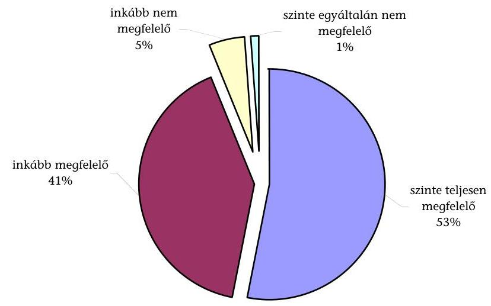

A pályázati felhívás dokumentumainak teljes körűségét és egyértelmű (pontos) megfogalmazását a válaszadók 42%-a jelezte. Hasonló mértékű volt azok aránya, akik a felhívást teljes körűnek, de nem egyértelműnek tartották (43%). A válaszadók közel egytizedének (9%) véleménye szerint a felhívás hiányos és nem egyértelmű volt. A legkedvezőbb megítélésű a KIOP (77%), a legkedvezőtlenebb a ROP, ahol 20% a hiányos és nem egyértelmű válaszok aránya (2. ábra).

A pozitív válaszok aránya a pályázat elbírálása folyamatban van szakasznál (53%), míg a hiányos és nem egyértelmű válaszok aránya a pályázatot elutasították csoportnál a legmagasabb (20%), és egyúttal itt az átlagosnál nagyobb (54%) a felhívás teljes körű, de nem egyértelmű megfogalmazású válaszok aránya is.

---

2. ábra

# A pályázati felhívás dokumentumainak teljes körűsége és egyértelmű megfogalmazása (operatív programonként) 

N=1386
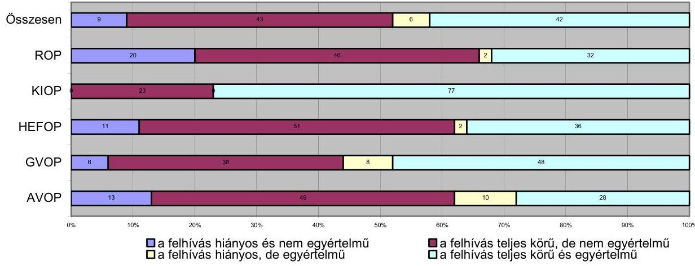

A pályázati felhívás közzétételének ismertsége (megismerésének lehetősége) kedvező, itt a legmagasabb a pozitív válaszok aránya.

A pályázati felhívás dokumentumaival kapcsolatos vélemények összességében kedvezőtlenek, mivel azok a válaszadóknak kevesebb mint fele szerint teljes körűek és egyértelműen (pontosan) megfogalmazottak. Az átlagosnál sokkal kedvezőbb a KIOP, kisebb mértékben kedvezőbb a GVOP megítélése. Az átlagosnál kedvezőtlenebbek az AVOP, a ROP és a HEFOP tevékenységére vonatkozó vélemények. A ROP esetében kiugróan magas (62%) a támogatási igényt benyújtották csoport aránya a felhívás hiányos és nem egyértelmű válasz kategóriánál.

### 3.1.2. A pályázat elkészítésének segítése, a kérdésekre a válaszadás biztosítása (a 3. és 4. sz. kérdésekre adott válaszok alapján)

Az irányító hatóságok és a közreműködő szervezetek honlapjain közzétett információk a válaszadók 43%-a szerint jelentős mértékben (fontos témakörökben) segítették a pályázat elkészítését, kismértékben (rész témakörökben) pedig 42%. Kedvezőtlen a KIOP-nál a nem segítették válaszok 14%-os aránya, ami két-háromszoros a többi operatív programhoz képest. A pályázatot elutasították csoportnál a legmagasabb a nem segítették és a kismértékben segítették aránya, míg a támogatási részösszegét kifizették csoportnál a legnagyobb a jelentős mértékben segítették és a legkisebb a nem segítették válaszok aránya. A válaszadók kevesebb mint egy tizede jelezte, hogy nem volt szüksége a közzétett információkra (3. ábra).

---

# 3. ábra 

## A közzétett információk milyen mértékben segítették a pályázat elkészítését (a működési folyamat teljesülési szakaszaiként)

N=1387
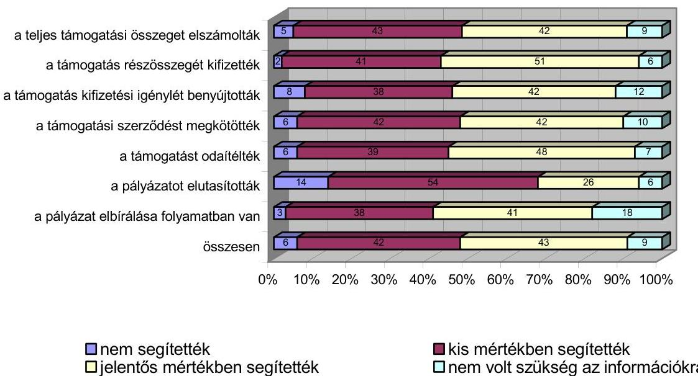

A lebonyolító szervezet a pályázati időszak alatt biztosította-e, hogy a támogatást igénylő kérdéseket tegyen fel és azokra ésszerű határidőn választ kapjon kérdésre a válaszadóknak csak a fele kapott konkrét/érdemi választ. Az átlagos jellegű, késve érkezett, illetve egyáltalán nem kaptak választ arány összesen 30%, a nem volt kérdésük csoport aránya 20%. A konkrét/érdemi választ kapott arány a legmagasabb az AVOP-nál, míg az általános jellegű választ kapott és a késve megválaszolt aránya HEFOP esetében a legmagasabb (4. ábra).

A konkrét/érdemi választ kapott arány a legalacsonyabb a pályázatot elutasították csoportnál, a legmagasabb pedig a támogatás kifizetés igénylését benyújtották és a teljes támogatási összeget kifizették csoportoknál.

---

4. ábra

# A feltett kérdésekre a válaszadás biztosítása (operatív programonként) 

N=1389
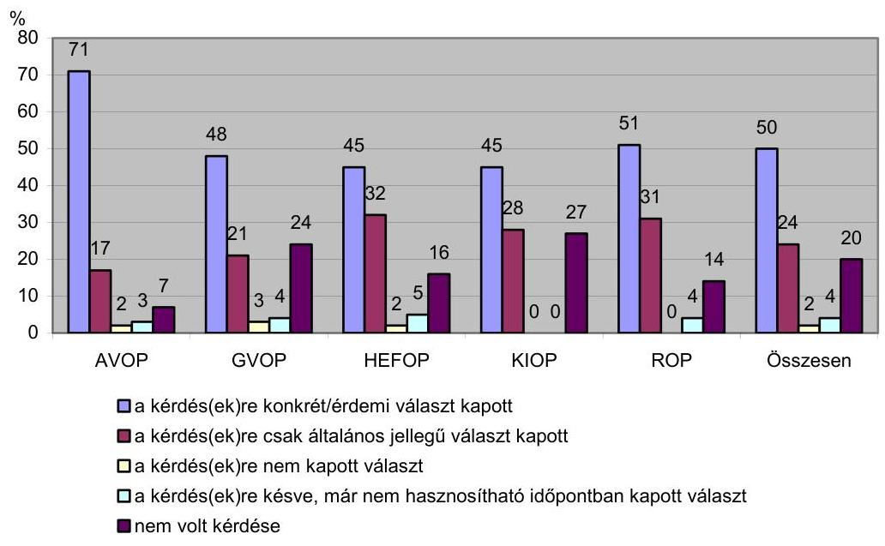

A pályázatok elkészítését az irányító hatóságok és a közreműködő szervezetek honlapjain közzétett információk a válaszadók kevesebb, mint fele szerint segítették jelentős mértékben, így a segítségnyújtás mértékét növelni szükséges. A legkedvezőtlenebb véleményt a pályázatot elutasították csoport, míg a kedvezőbbet a támogatás részösszegét kifizették csoport válaszadói jelezték.

A kérdésekre konkrét/érdemi választ kapott arány csak 50%, és magas a 20%-os általános jellegű választ kapottak aránya. A viszonylag kedvezőbb véleményeket a projekt megvalósítás valamelyik szakaszában lévő válaszadói csoportok jelezték, a legkedvezőtlenebbek pedig a pályázatot elutasították csoport tagjaié.

### 3.1.3. A pályázat értékelésében a költséghatékonysági szempontok érvényesülése, a döntés indoklásának szakmai megalapozottsága (az 5. és 6. sz. kérdésekre adott válaszok alapján)

A pályázat értékelésében milyen mértékben voltak meghatározóak a költséghatékonysági szempontok a válaszadók 8%-a szerint szinte teljes mértékben, 31%-a szerint pedig nagyobb részt voltak meghatározóak a költséghatékonysági szempontok. A szinte egyáltalán válaszok aránya 8%, a kisebb részt meghatározóké 18%. A szinte teljes mértékben és a nagyobb részt voltak meghatározók a válaszok együttes aránya az AVOP és a ROP esetében átlag feletti. A KIOP és a ROP válaszadókánál a legmagasabb (az átlagost jelentősen meghaladó) a szinte egyáltalán nem vélemények aránya. A KIOP esetében a válasz-

---

adóknak csak alig több mint harmada jelezte, hogy a költséghatékonysági szemponti teljes mértékben és nagyobb részt meghatározóak voltak (5. ábra).

Kiugróan magas, az átlagos érték több, mint háromszorosa (26%) a pályázatot elutasították csoportnál azok aránya, akiknek tapasztalata szerint a pályázat értékelésében szinte egyáltalán nem voltak meghatározóak a költséghatékonysági szempontok. Szintén ennél a csoportnál az átlagos érték több, mint másfélszerese (28%) a kisebb részt voltak meghatározóak válaszok aránya. A szinte teljes mértékben és nagyobb részt voltak a költséghatékonysági szempontok meghatározóak vélemények jelentősen meghaladták az átlagost a támogatást odaítélték és a teljes támogatási összeget elszámolták csoportoknál (49-49%), továbbá a támogatás részösszegét kifizették csoportnál (47%).
5. ábra

# A pályázat értékelésében milyen mértékben voltak meghatározóak a költséghatékonysági szempontok (operatív programonként) 

N=1325
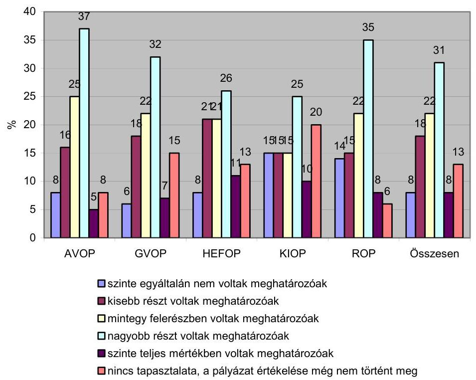

A pályázati döntés teljes mértékben csak a válaszadók 38%-a szerint volt szakmailag megalapozott, 19%-a szerint az átlagosnál (közepesnél) nagyobb mértékben. A teljes mértékben válaszok aránya az AVOP (44%), és a GVOP (41%) esetében az átlagosnál nagyobb. Az egyáltalán nem válaszok 7%-os átlagát a ROP jelentősen (13%),meghaladja (ROP esetében a legmagasabb a pályázatot elutasították csoport részaránya). A pályázatot elutasították csoport 39%-a szerint egyáltalán nem volt a pályázati döntés szakmailag megalapozott (ez az átlag több, mint öt- és félszerese), 20%-a szerint pedig az átlagosnál

---

kisebb mértékben (ez az átlag több, mint háromszorosa). Csak 6% szerint volt teljes mértékben megalapozott, ami azt mutatja, hogy az elutasítottak többsége nem fogadja el a pályázati döntés indoklását szakmai megalapozottság szempontjából. Az átlagosnál kedvezőbbek a projekt megvalósítási szakaszok válaszai, a legkedvezőbb véleményt a teljes támogatási összeget elszámolták válaszadói csoport jelezte, akik 59%-a teljes körűen és 22%-a az átlagosnál (közepesnél) nagyobb mértékben tartotta szakmailag megalapozottnak a pályázati döntés indoklását (6. ábra).
6. ábra

# A pályázati döntés indoklása milyen mértékben volt szakmailag megalapozott (a működési folyamat teljesülési szakaszaiként) 

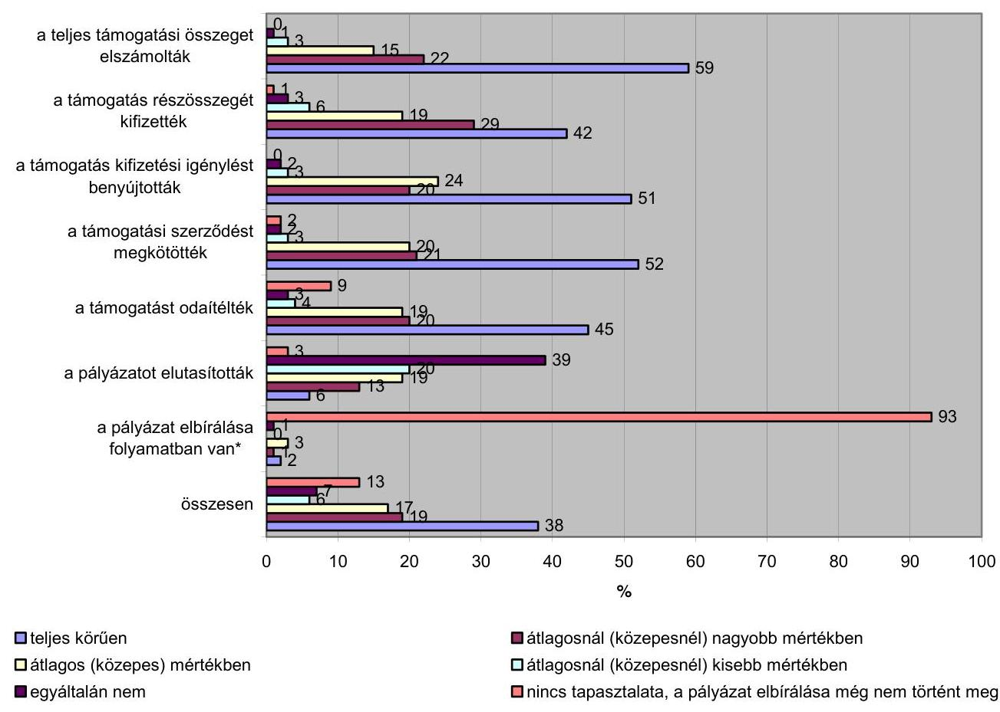
*Ezen számértékek tévesek, mivel akiknek a pályázata az elbírálás szakaszában van, azoknak nincs (nem lehet) saját tapasztalatuk a pályázati döntés indoklásáról, így a helyes érték 100% nincs tapasztalata. Ez az eltérés a válaszok értékelését azonban nem befolyásolja.

---

A pályázatot elutasították válaszadói csoport valamennyi operatív program esetében az átlagosnál (7%) jelentősen nagyobb arányban (27 és 54% között) jelezte, hogy a pályázati döntés indoklása egyáltalán nem volt szakmailag megalapozott (7. ábra).
7. ábra

# A pályázatot elutasították válaszadói csoport véleménye operatív programonként (a pályázati döntés indoklása milyen mértékben volt szakmailag megalapozott) 

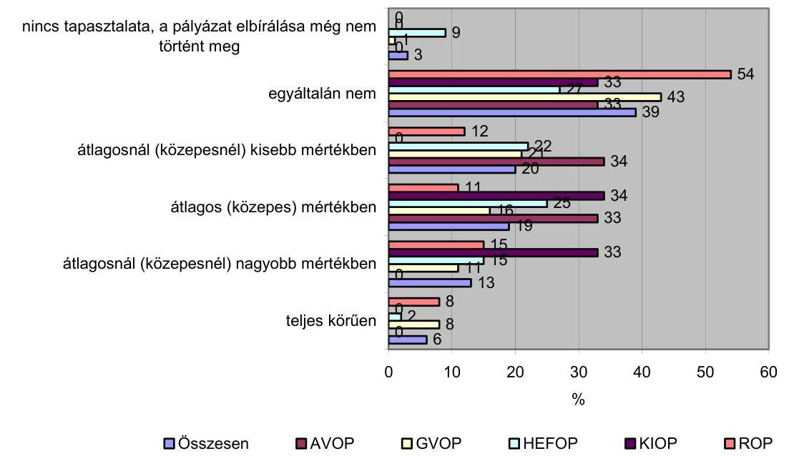

A válaszadók 39%-a szerint teljes mértékben, illetve nagyobb részt voltak meghatározóak a költséghatékonysági szempontok a pályázat értékelésében. Az átlagosnál kedvezőbb az AVOP megítélése, a KIOP és a ROP esetében az átlagost jelentősen meghaladja a szinte egyáltalán nem voltak meghatározóak a költséghatékonysági
 szempontok válaszok aránya.

A válaszadók 38\%-a szerint volt a pályázati döntés indoklása teljes mértékben szakmailag megalapozott. Összességében a legkedvezőbb az AVOP és a legkedvezőtlenebb a ROP megítélése. Az utóbbival összefügg, hogy itt a legmagasabb a pályázatot elutasították csoport részaránya.

Az elemzés alapjául szolgáló számadatok határozottan mutatják, hogy a pályázat értékelésére vonatkozó véleményeknél a pályázatot elutasították csoport jellemzően a kedvezőtlen jellegű válaszokat preferálta a költséghatékonysági szempontok érvényesülése és a pályázati döntés indoklásának szakmai megalapozottsága vonatkozásában. Ugyanakkor azok a válaszadói csoportok, akik már a projekt megvalósítás szakaszában vannak (és a támogatási összeget részükre részben vagy teljesen kifizették) érzékelhetően a kedvezőbb jellegű válaszokat részesítették előnyben. Ez azt mutatja, hogy a pályázat értékelésére vonatkozó válaszok esetében sztochasztikus kapcsolat van a pályázat elutasítása és a kedvezőtlen vélemények, illetve a pályázat elnyerése kapcsán az összegek kifizetése és a kedvezőbb vélemények között.

A pályázatot elutasították csoport többsége nem fogadja el a pályázati döntés indoklását szakmai megalapozottság szempontjából.

# 3.1.4. A pályázat elbírálása és a projekt megvalósítása során a határidők teljesülése, a határidők csökkentésének igénye (a 7. és 8. sz. kérdésekre adott válaszok alapján). 

A 14/2004. (VIII. 13.) TNM-GKM-FMM-FVM-PM együttes rendeletben előírt határidők a válaszok csak alig több, mint egyötöde (22\%) szerint teljesültek. A legnagyobb arányban (27\%) a határidő nem teljesülését a támogatási döntéssel kapcsolatos tájékoztatásnál jelezték (nem történt meg a hiánytalan pályázat benyújtásától számított 60 naptári napon belüli tájékoztatás). A válaszok több, mint egyötöde (22\%) szerint nem teljesült a lebonyolító szervezet által a támogatási szerződés megkötésére előírt határidő. A számlák benyújtása és a támogatás kifizetése közötti 60 naptári nap nem teljesülését a válaszok 14\%-a tartalmazza (8. ábra). Mindezek jelzik, hogy melyek azok a működési folyamat kulcsfontosságú szakaszai, amelyek késedelme kapcsán túlságosan - esetenként irreálisan - hosszú a pályázat benyújtásától (befogadásától) a teljes támogatási összeg elszámolásáig eltelt időtartam.
8. ábra

## Az együttes rendeletben foglalt határidők hogyan teljesültek

$\mathrm{N}=1970$
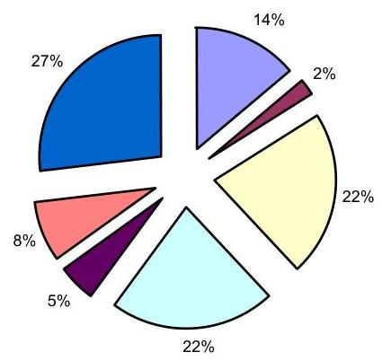

[^0]
[^0]:    I nem teljesült a támogatás kifizetés-igénylés a jogszabályoknak megfelelő számlák benyújtása és a támogatás kifizetése közötti 60 naptári nap alatt
    I nem történt meg határidőre a projekt-előrehaladási jelentések 3 havonkénti benyújtása
    I nem teljesült a lebonyolító szervezet által a támogatási szerződés megkötésére előírt határidő
    I teljesültek a határidők
    I nem teljesült a hiánypótlásra előírt 15 nap
    I nem teljesült a pályázat befogadó nyilatkozat megküldésére előírt 15 nap
    I nem teljesült a támogatás döntéssel kapcsolatos tájékoztatás a hiánytalan pályázat benyújtásától számított 60 naptári napon belül

Az operatív programok közül a legkedvezőtlenebb a HEFOP megítélése (csak 12\% szerint teljesültek a határidők) és viszonylagosan kedvezőbb a KIOP 36\%os teljesülési aránya. A teljesülési szakaszok közül a legalacsonyabb a támogatás kifizetési igénylést benyújtották (13\%) és a támogatás részösszegét kifizették (15\%) csoportoknál a határidők teljesültek válaszok aránya. Ugyanakkor a teljes támogatási összeget elszámolták csoportnál ez az arány viszonylag kedvező (32\%). Az előbbi alacsony teljesülési csoportoknál az átlagot (14\%) jelentősen meghaladja azok aránya, akik szerint nem teljesült a támogatás kifizetés igénylés jogszabályoknak megfelelő számlák benyújtása és a támogatás részösszegeinek kifizetése közötti 60 naptári nap, a támogatás igénylést benyújtották csoportnál 25\%, a támogatás részösszegét kifizették csoportnál 23\% (9. ábra).

A támogatási igénylést benyújtották csoporton belül a legkedvezőtlenebb a vélemény a GVOP esetében (30\%), a támogatás részösszegét kifizették csoportnál a HEFOP (48\%), a KIOP (29\%) és a GVOP (22\%), a teljes támogatási összeget elszámolták csoport esetében szintén a GVOP (23\%). Mindez azt mutatja, hogy az összes válaszadó 80\%-át képviselő GVOP és HEFOP esetében jelennek meg a pályázati összegek kifizetési késedelmére vonatkozó kedvezőtlen vélemények a legnagyobb arányban.
9. ábra

# Az együttes rendeletben foglalt határidők teljesülése (a működési folyamat teljesülési szakaszai szerint) 

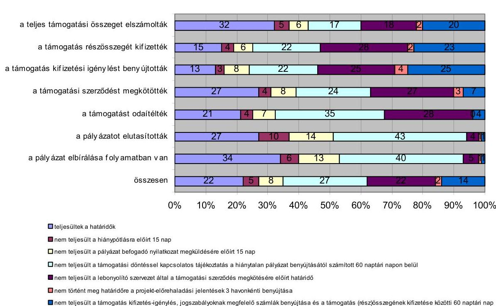

Megalapozott igény lehet-e valamelyik teljesítési/elbírálási határidő/időtartam csökkentése kérdésre a válaszadók túlnyomó többsége (88\%) határidő csökkentés igényét jelölte meg, közel egyharmada (32\%) a számlák benyújtása és a támogatás (rész)összegének kifizetése közötti 60 naptári napot, 28\%-a a támogatási döntés tájékoztatásra vonatkozó 60 naptári napot, 18\%-a a támogatási szerződés megkötésére előírt határidő csökkentési igényét jelezte. Ez a véleménynyilvánítás operatív programonként lényeges eltérést nem mutat, egyedül a KIOP esetében a támogatási szerződés megkötésére előírt határidő arány jelentősen alacsonyabb (7\%), az összegek kifizetésére vonatkozó igény viszont nagyobb (39\%).

A működési folyamat teljesülési szakaszait tekintve a pályázat elbírálása folyamatban van és a pályázatot elutasították csoportoknál az átlagost (28\%) jelentősen meghaladja (38\%) a pályázó tájékoztatására vonatkozó 60 napos határidő csökkentési igény. Ugyanakkor ezen csoportoknál az átlagosnál (12\%) magasabb (16- illetve 19\%) azoknak a válaszoknak az aránya, amelyek a határidők csökkentését nem tartják megalapozottnak. A pályázati összegek kifizetése által érintett csoportoknál a kifizetési határidő csökkentésére vonatkozó igény az átlagosnál (32\%) magasabb (39-, 40- és 36\%), és két csoportnál itt a legalacsonyabb (8\%) az a vélemény, hogy nem megalapozott igény a határidők/időtartamok csökkentése (10. ábra).
10. ábra

# Megalapozott igény lehet-e valamelyik teljesítési/elbírálási határidő/időtartam csökkentése (a működési folyamat teljesülési szakaszai szerint) 

$\mathrm{N}=2242$
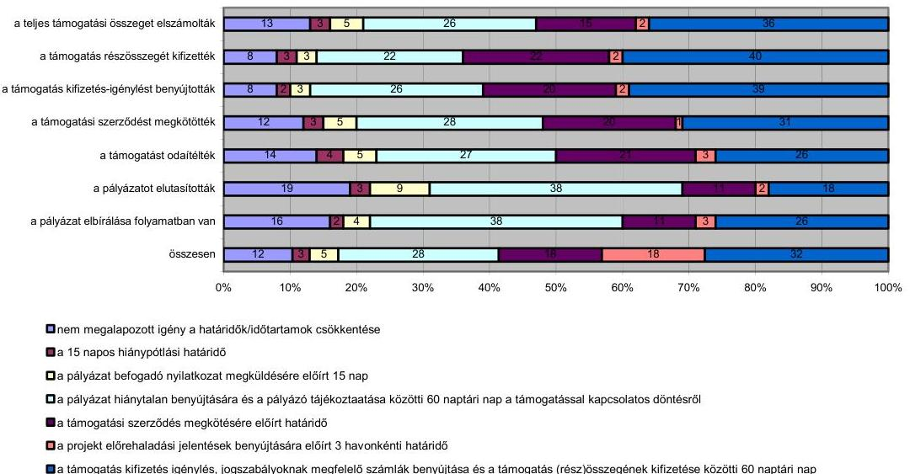

A határidők teljesülésére és azok csökkentési igényére vonatkozó vélemények igen kedvezőtlenek, az összes válasz közül a leginkább negatív jellegűek. A válaszok közel négyötöde (78\%) szerint a határidők nem teljesültek, ezen belül a legnagyobb részarány a támogatási döntéssel kapcsolatos tájékoztatás (27\%), a támogatási szerződés megkötése (22\%) és a támogatás kifizetés (14\%) határidő nem teljesítések jelentik. Ez utóbbival kapcsolatos kedvezőtlen vélemények elsősorban az érintett csoportoknál (akik a támogatás kifizetés igénylést benyújtották, valamint a támogatás részösszegét részükre már kifizették) jelennek meg. Ezeknél a csoportoknál a legkedvezőtlenebb a vélemény a GVOP és a HEFOP esetében, amely együttesen az összes válaszadó négyötödét jelenti.

A határidő csökkentési igényt a válaszok túlnyomó többsége (88\%) jelezte, ezen belül a legnagyobb részarányt a támogatás kifizetés (32\%), a támogatási döntéssel kapcsolatos tájékoztatás (28\%) és a támogatási szerződés megkötésére (18\%) vonatkozó határidő/időtartam csökkentési igénye képviselik. Ez azt jelenti, hogy ezeken a területeken - amelyek azonosak a határidő nem teljesüléseknél és a csökkentési igényeknél - a kedvezőtlen vélemények kettőzötten jelentkeznek:

- nem teljesülnek a működési folyamat legfontosabb szakaszaira vonatkozóan előírt határidők/időtartamok,
- miközben ugyanezen szakaszok jelenlegi hatályos határidőinek csökkentési igényeit megalapozottnak tartják a válaszadók.

Így a kedvezőtlen vélemények összegződnek. Ez jellemzően megmutatkozik a támogatás kifizetésére váró válaszadói csoportoknál.

# 3.1.5. A projekt megvalósítás során a kötelezettségek teljesítésének ellenőrzési módja (a 9. sz. kérdésre adott válaszok alapján) 

A válaszadók több, mint fele (54\%) jelezte, hogy nincs tapasztalata, a projekt még nem valósult meg, illetve nem volt még ellenőrzés a projekt megvalósítás során. A tapasztalattal rendelkezők mintegy kétharmada (66\%) szerint a kötelezettségek teljesítésének ellenőrzési módja segíti a támogatások hatékony felhasználását, mert az alkalmazásuk hozzájárul a szabálytalanságok megelőzéséhez. A válaszok egynegyede szerint nem segíti, mert az ellenőrzések túlságosan elhúzódnak és ezzel lassítják a végrehajtást (11. ábra).

Az operatív programok között érdemi eltérés nincs. A teljesülési szakaszok között annyi az eltérés, hogy a teljes támogatási összeget elszámolták csoportnál magasabb az igen válasz aránya (73\%).

11. ábra

# A projekt megvalósítás során a kötelezettségek teljesítésének ellenőrzési módja segíti-e a támogatások hatékony felhasználását (a tapasztalattal rendelkező válaszadók szerint) 

$\mathrm{N}=649$
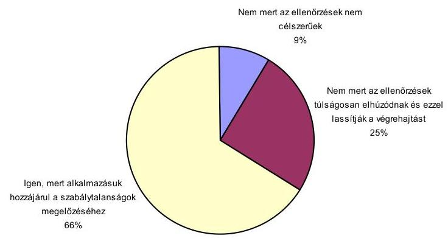

### 3.2. Az ügyfél elégedettség értékelése

Az elégedettséget kifejező értéket az 1, 2, 3, 4 vagy 5-ös számjegy beírásával adták be a válaszadók, ahol az 1-es számjegy a teljes mértékben elégedetlen és az 5-ös számjegy a teljes mértékben elégedett. Válaszkategóriánként számítottuk a súlyozott átlagokat, amelyek alapján az értékelést végeztük.

### 3.2.1. A működés részterületei elégedettségének értékelése

A 10.1-10.12 kérdésekre adott összes válasz alapján számított átlagos értékek a 2,49-4,11 tartományban vannak és az összes válasz átlaga 3,31. A legkisebb az elégedettség értéke a pályázat elutasítása esetén az indoklás megalapozottsága válaszoknál. Átlag alattiak még a támogatási részösszeg kifizetésére, a teljes támogatási összeg elszámolására, a határidők teljesülésére, a támogatási szerződés megkötésére, a pályázat elbírálására és a PEA forrásból részesülésre vonatkozó elégedettségi értékek. A legmagasabb az elégedettség értéke a pályázati felhívás közzététele, a megismerésének lehetősége (ez az egyedüli 4-es érték feletti átlag), ezt követik a pályázat elkészítéséhez szükséges információk megszerzésének lehetősége, a pályázat értékelési szempontjainak ismerete és a támogatási döntés indoklásának szakszerűsége válaszok. Átlag feletti még az elégedettség a működési folyamatban résztvevő intézményekkel a kapcsolattartás válaszok esetében (12. ábra).

# A működés részterületei elégedettség értékei 

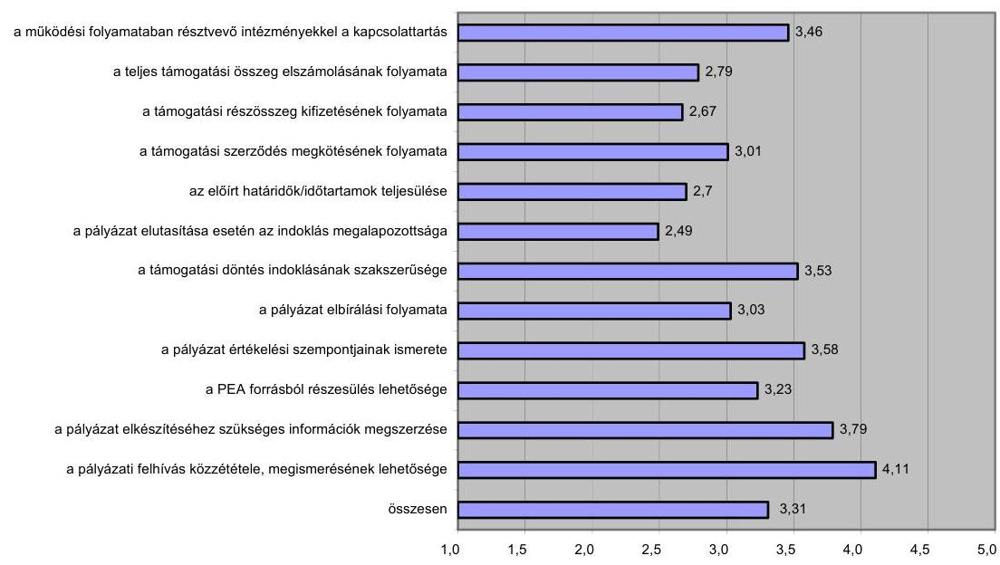

Az elégedettségi értékek tartományai:

| Teljes mértékben elégedetlen | $1,0-1,5$ |
| :-- | :--: |
| Összességében elégedetlen | $1,5-2,5$ |
| Se nem elégedetlen, se nem elégedett | $2,5-3,5$ |
| Összességében elégedett | $3,5-4,5$ |
| Teljes mértékben elégedett | $4.5-5,0$ |

Az ábra alapján a megállapítások a következők:

- A pályázat benyújtása előtti folyamatszakaszok esetében az elégedettség értéke összességében magasabb, ez az összes válasz átlagát megemeli.
- A pályázat elbírálási folyamata (átlag alatti) és a támogatási döntés indoklásának szakszerűsége (átlag feletti) gyakorlatilag kiegyenlíti egymást.
- A pályázat elutasítása esetén az indoklás megalapozottságával a válaszadók összességében elégedetlenek.
- A támogatási szerződés megkötésével, a határidő teljesülésével, a támogatási összegek kifizetésével - amelyek a projekt megvalósítás döntő fontosságú tényezői - kapcsolatos elégedettségek jelentős mértékben átlag alattiak.
- A támogatási szerződés megkötéséig az elégedettségek az összességében elégedett tartományban, illetve a se nem elégedetlen, se nem elégedett tartomány elégedett oldalán vannak. Szintén itt találhatók az összes válasz átlagos elégedettségi értéke, valamint a működési folyamatban résztvevő intézményekkel a kapcsolattartás értéke.

- A projekt megvalósítással összefüggő elégedettségek a se nem elégedetlen, se nem elégedett tartomány elégedetlen oldalán vannak.

Az operatív programok közül a legmagasabb az elégedettség átlagos értéke a KIOP (3.54) és az AVOP (3.53) esetében, őket követi a GVOP (3.34) és a ROP (3.31), a legalacsonyabb pedig a HEFOP (3.14) értéke. Valamennyi OP esetében a legmagasabb értékű (4.04 és 4.20 közötti) a pályázati felhívás közzétételének megítélése. Alacsony értékűek minden OP-nél a pályázat elutasítása esetén az indoklás megalapozottsága válaszok, a legkisebb a HEFOP (2.23) és a ROP (2.27), a legmagasabb a KIOP (3.00). Ezen túlmenően valamennyi kérdés közül a legalacsonyabb értékek a HEFOP-nál vannak: a támogatási szerződés megkötésének folyamata (2.12), az előírt határidők/időtartamok teljesülése (2.25), a támogatási részösszeg kifizetése (2.32). Alacsony értékű a GVOP esetében a támogatási részösszeg kifizetése (2.68) és a teljes támogatási összeg kifizetése (2.70). Az utóbbi a HEFOP-nál még alacsonyabb (2.63). Valamennyi operatív program esetében a támogatási részösszeg kifizetésének, valamint a teljes támogatási összeg elszámolásának folyamata elégedettségi értéke az adott OP összesített átlagánál kisebb úgy, hogy a teljes támogatási összeg elszámolásának folyamata
 minden esetben magasabb mint a részösszeg kifizetésének folyamata. Az intézményekkel a kapcsolattartás elégedettségi értéke a legmagasabb az AVOP-nál (3.97), őt követi a ROP (3.68) és a KIOP (3.62), a legalacsonyabb a GVOP (3.26) és a HEFOP (3,34). A támogatási szerződés megkötésének ismertsége hasonló, azzal az eltéréssel, hogy a ROP és a KIOP helyet cserél.

A működési folyamat teljesülési szakaszok (B1-B7) összes válasz átlagos elégedettségi értékei közül a legmagasabb a teljes támogatási összeget elszámolták csoportnál (3.56), őt követik a támogatási szerződést megkötötték (3.48), az elbírálás folyamatban van (3.47), a támogatást odaítélték, valamint a támogatás részösszegét kifizették (3.35-3.35) és a kifizetés igénylést benyújtották csoportok (3.26). Kiugróan alacsony a pályázatot elutasították csoport elégedettsége (2.64). Az adatsor mutatja, hogy

- a pályázatot elutasították csoport külön kategória,
- azoknak az elégedettsége a legmagasabb, akik a pályázati összeget már teljes egészében megkapták,
- a támogatási szerződés megkötése az elégedettség alakulása szempontjából kedvező momentum, az utána következő folyamatszakaszok elégedettségi értéke alacsonyabb, majd a teljes összeg kifizetésekor érzékelhetően növekszik.

Valamennyi válasz közül kiugróan alacsony (1.89) az elégedettség a pályázatot elutasították csoportnál a pályázat elutasítása esetén az indoklás megalapozottsága válaszok, ami azt jelzi, hogy az érintettek többsége nem veszi tudomásul az elutasítás indoklását (az 1.89 érték az összességében elégedetlen tartomány teljes mértékben elégedetlen oldalán van, az egyedüli 2 alatti érték). Igen alacsony a kifizetés igénylést benyújtották csoportnál a támogatási részösszeg kifizetés elégedettségi értéke (2.08), ami a támogatás részösszegét kifizették csoportnál 2.78-ra emelkedik, majd a teljes összeget elszámolták csoportnál 3.15-re növekszik. Ez mutatja, hogy

- a kifizetésekkel kapcsolatos elégedettségek átlag alattiak,
- az elégedettség a legalacsonyabb azoknál, akik „várják a pénzüket", majd értékelhetően - több, mint egy (1.07) értékkel - növekszik, amikor „megkapták a pénzüket".

A működési folyamatban résztvevő intézményekkel a kapcsolattartás elégedettségi értéke a legmagasabb a támogatási szerződést megkötötték (3,76) és a teljes összeget elszámolták (3.65) csoportoknál. Őket követik az elbírálás folyamatban van és támogatás részösszegét kifizették (egyaránt 3.45), a kifizetés igénylést benyújtották (3.42) és a támogatást odaítélték (3.01) csoportok. Itt is a legalacsonyabb a pályázatot elutasították csoport elégedettségi értéke (2.72). Az adatsor alapján az összes válasz átlagos értékeinél jelzetthez hasonló tendencia figyelhető meg:

- a pályázat elutasítása valószínűsíthetően kedvezőtlenül befolyásolja a kapcsolattartás megítélését is,
- a támogatási szerződés megkötése, illetve a támogatás teljes összegének kifizetése jelentik a pályázat elbírálás, illetve a projekt megvalósítás folyamatszakaszok csúcspontjait a kapcsolattartás elégedettségi értékeinél.

A részletező jellegű (1-9. sz.) kérdések, valamint a működés részterületei elégedettségének értékelései azt mutatják, hogy mindkét megközelítésben a főbb tendenciák, illetve hiányosságok azonosak és/vagy hasonló jellegűek, így a kérdésekre adott vélemények összességében alátámasztják az egyes részterületek elégedettségi (számszerűsített) átlagértékeit.

# 3.2.2. Összességében az elégedettség értékelése 

A 10.1-10.13. sz. kérdés alapján (amely arra vonatkozott, hogy a 10.1-10.12 kérdésekre, valamint a működési folyamat egyéb részeire vonatkozó tapasztalatok alapján összességében mekkora az elégedettség értéke) számított átlagos értékek hasonló nagyságúak és az előzőekben jelzettekkel szinte azonos tendenciákat mutatnak.

Az elégedettség átlagos értéke 3.25. A legmagasabb az AVOP (3.51) és a KIOP (3.50), őket követi a GVOP (3.27) és a ROP (3.20), majd a legalacsonyabb a HEFOP (3.03). A 13. ábra a működés részterületeire számított értékekkel együtt mutatja az előbbi elégedettségi értékeket.

---

13. ábra

# A működés részterületeire vonatkozóan, valamint összességében az elégedettség értéke operatív programonként 

$\mathrm{N}=10388+1397$
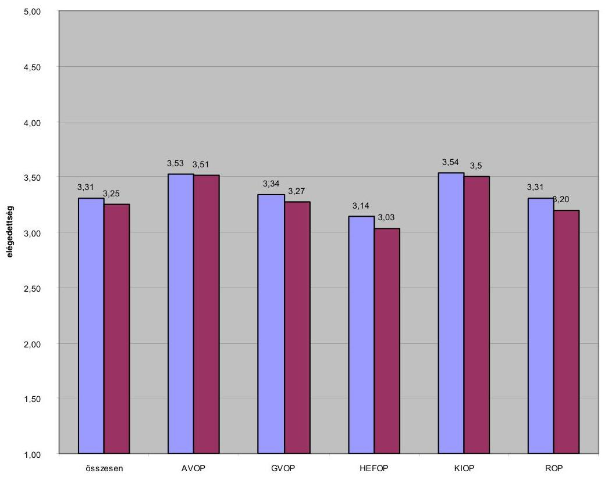

■az elégedettség értéke a működés részterületére adott válaszok (10.1-10.12) alapján ■összességében az elégedettség értéke (10.13 válasz alapján

Az ábra mutatja, hogy a részterületekre adott válaszok nagyobbak, az eltérések minimálisak (gyakorlatilag a kerekítési hibahatárnál vannak) így a következtetések levonásához és a megállapítások megtételéhez együttesen - egymást erősítően - felhasználhatóak.

A működési folyamat teljesülési szakaszai közül a legmagasabbak az elégedettségi értékek a teljes támogatási összeget elszámolták (3.58) és a támogatási szerződést megkötötték (3.55) csoportok esetében. Őket követik a támogatást odaítélték (3.28), a támogatás részösszegét kifizették (3.26), az elbírálás folyamatban van (3.25) és a kifizetési igénylést benyújtották (3.11). Kiugróan alacsony a pályázatot elutasították csoport elégedettségi értéke (2.43). A 14. ábra együttesen mutatja az értékeket.

---

14. ábra

# A működés részterületeire vonatkozóan, valamint összességében az elégedettség értéke (a működési folyamat teljesülési szakaszai szerint) 

$$
N=10388+1397
$$

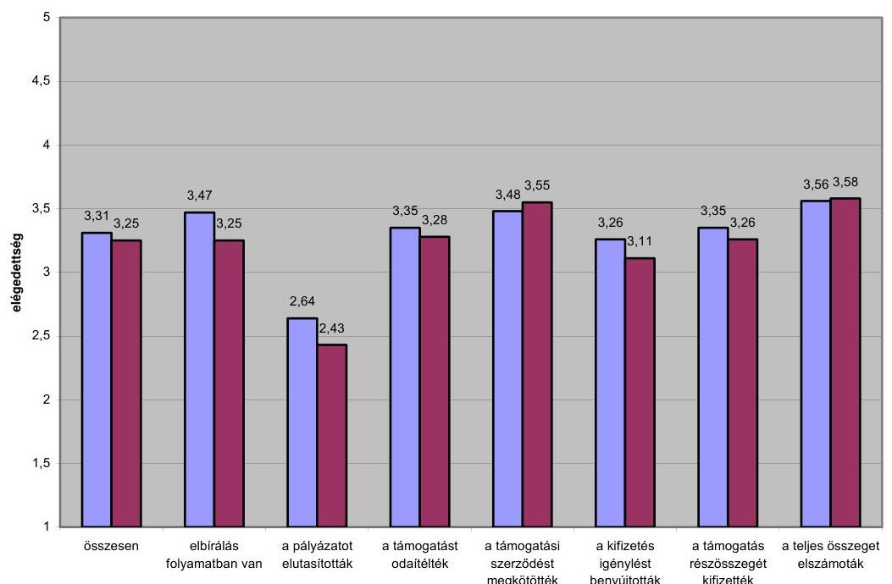

■az elégedettség értéke a működés részterületére adott válaszok (10.1-10.12) alapján ■összességében az elégedettség értéke (10.13 válasz alapján

Az ábra fokozottabban jelzi, hogy összességében az elégedettség

- a pályázatot elutasították csoportnál még alacsonyabb,
- a támogatási szerződést megkötötték és a teljes támogatási összeget elszámolták csoportoknál a csúcspontok még erőteljesebbek.

A működés részterületeire vonatkozó, illetve összességében az elégedettségi értékek kismértékű eltérései és azonos trendje mutatja, hogy

- a részterület kérdései összességében jól lefedték az összevont elégedettséget,
- a válaszadók következetesek voltak, nincsenek ellentmondások a részterületek elégedettségei és összességében az elégedettségek között,
- az összességében jelzett elégedettségnek a kedvező kontrollját jelentik a részterületi elégedettségek és fordítva,
- az elégedettségi értékek így egyöntetűnek tekinthetők és megfelelő - ellenmondásmentes - alapját képezik a megállapításoknak.

---

Az elégedettségi értékek, illetve tendenciák összességében összhangban vannak a részletező jellegű (1-9. számú) kérdésekre adott válaszokkal, mivel azoknál is

- a legkedvezőbb a vélemény a pályázati felhívás közzétételének ismertségére vonatkozóan,
- kiemelten jelentkeznek a határidő nem teljesülések,
- a legkedvezőtlenebb véleményt általában a pályázatot elutasították csoport jelezte,
- a pályázat elutasítás indoklásának szakmai megalapozottsága véleményezése igen kedvezőtlen az elutasítottak részéről,
- a támogatási (rész)összegek kifizetésének késedelme kapcsán a vélemények kedvezőtlenebbek,
- a teljes összeget elszámolták csoport véleménye kedvezőbb az előző szakaszokhoz képest,
- a pályázati szakaszok véleménye összességében kedvezőbb a projekt megvalósítás szakaszaihoz képest.

# 3.3. A működési tapasztalatok véleménykérésének értékelése (a 11. sz. kérdésre adott válaszok alapján) 

A válaszadók több mint kétharmada (68%) igényli, hogy az Operatív Program végrehajtásában közreműködő intézmények kérjék a működési tapasztalatokra vonatkozó véleményét. Mintegy ötödük (21%) nem igényli, és mintegy tizedüknek közömbös, hogy kérik-e a véleményüket.

## 4. A SZÖVEGES VÉLEMÉNYEK, JAVASLATOK KIVONATOS ISMERTETÉSE

Mintegy 450 db szöveges vélemény érkezett, elsősorban a 12. kérdés megválaszolása (javaslatok megtétele) keretében. Kb. 25-en külön e-mailt küldtek és voltak akik a kérdőív kitöltésének időszakában telefonon mondták el - kérdés és kérés nélkül - a véleményüket.

### 4.1. A jellemzőbb vélemények és a fontosabb javaslatok (a 12. kérdés válaszai alapján)

### 4.1.1. A pályázat elkészítése és elbírálása

- A pályázati kiírás ne a beadási határidő előtt pár nappal jelenjen meg;
- Pontosabb kitöltési útmutatók legyenek, minden szükséges információ álljon rendelkezésre, biztosított legyen az előzetes pénzügyi tanácsadás, konkrét példákkal az elszámolásokra vonatkozóan;
- A pályázat benyújtáshoz csökkentsék az igazolások, dokumentumok, táblázatok számát;

---

- Az elbírálási szempontokat menetközben ne változtassák;
- A pályázat értékelése számunkra „fekete doboz", van egy belső elbírálási szempont, amit nem ismerünk, rengeteg a szubjektív tényező;
- Olyan hiánypótlást kértek, ami az eredeti kiírásban, mint követelmény nem szerepelt;
- Az elbíráláskor indoklást nem kaptunk, csak egy gratuláló levelet;
- A bírálat legyen szakmailag helytálló, vagy mondják meg, hogy nincs több pénz és azért nem tudnak támogatást adni;
- A szakreferensek képzésére nagyobb hangsúlyt szükséges fordítani;
- A bírálatok szakmai minősége egyre alacsonyabb;
- A célok és a szakmai szempontok legyenek az elsődlegesek és nem az adminisztratív előírások, egyszerű formai hiba miatt ne utasítsák el a pályázatot.

# 4.1.2. A projekt megvalósítása, elszámolása 

- A projektbeszámolók részletezettségéről, indoklásáról időbeni és részletesen tájékoztatás szükséges;
- Az elszámolás szabályai ne változzanak lépten-nyomon, ne szankcionáljanak utólag módosított, vagy kitalált szabályok miatt;
- Az előre meghatározott eszköz árától nem lehet eltérni, így a rendszer arra ösztönöz, hogy az olcsóbban beszerezhető eszközt mégis a magasabb áron vegye meg a pályázó;
- Az elszámolás során az azonos funkciójú dokumentumok bekérése felesleges (átadás-átvételi jkv., teljesítési jkv., szállítólevél);
- Az előrehaladási jelentések minta anyagát tegyék fel a honlapra;
- A koordinátorok teljes körű információval rendelkezzenek a pénzügyi elszámolási folyamatról;
- A projekt előrehaladási jelentést elegendő legyen félévenként benyújtani. A PEJ-ek merev dátum kiosztása nehézzé teszi a valós gazdasági időhatárokhoz való alkalmazkodást;
- A hiánypótlást ne egyesével másfél havonta, hanem egyszerre kérjék be;
- Nehézséget és hiánypótlásokat okoz az elszámolási szabályok/szükséges dokumentumok folyamatos változása.

### 4.1.3. A pályázat elbírálás és a projekt megvalósítás időtartamának csökkentése

- A 6 hónapja beadott pályázattal nem történt semmi;

---

- Jobb lenne, ha az átfutási idő a beadástól a szerződéskötésig nem 289 napot venne igénybe, mert ezalatt egy jó üzleti ötlet már el és évülhet;
- Mindenki semmibe veszi a határidőket, a pályázókat kivéve;
- A határidőket nem tartják be a közreműködő szervezetek, illetve csak akkor közlik a hiánypótlási felszólításokat;
- Határidőkésés esetén közöljék, hogy mikorra várható döntés, erre alkalmas lehet pl. a Hol tartunk honlap;
- A projekt megvalósítása nem tervezhető a határidők rendszeres túllépése miatt;
- Szükséges lenne a PEJ és a pénzügyi elszámolás elbírálásának és ellenőrzésének lerövidítése és a támogatási összegek gyorsabb kifizetése az alvállalkozók számláinak határidőre történő kifizetése érdekében;
- A kifizetés késedelme miatt jelentős teher a felvett hitel kamata;
- Az odaítélt támogatást a kifizetési dokumentációra 1 éve nem kapjuk meg, az érdeklődő levelet válaszra sem méltatják;
- A szerződéskötés után számtalan formai kifogással éltek, az azonnali reagálásunk után rendszerint két hónap szünettel válaszoltak, így a kifizetéseket trükkös módon rendre késleltették;
- A részelszámolások benyújtása és az esetleges hiánypótlások után a helyszíni ellenőrzést hamarabb lehetne elvégezni.

# 4.1.4. A működési folyamat ésszerűsítése, a színvonal növelése 

- Rugalmasabb, ügyfélbarát ügyintézésre lenne szükség;
- A telefonos kapcsolattartás helyett a szakreferensek elérhetőségét szükséges biztosítani;
- Átláthatóbbá és nyomon követhetőbbé kell tenni a pályáztatás folyamatát;
- A nyilatkozatokat ne kelljen külön kinyomtatni, hanem a pályázat beadásakor elismertetni a pályázóval ezeket a követelményeket;
- Szakszerűbben működő stábra lenne szükség a közreműködő szervezeteknél;
- Az „egyablakos rendszer" lassítja a folyamatokat, a dokumentumok hosszas utaztatás után kerülnek a kompetens szervezethez;
- Sok a közreműködő szervezet, nincsenek tisztázott kompetencia határok. Célszerűbb lenne a szakmai és pénzügyi lebonyolítást egy kézbe adni;
- A döntéshozatali folyamatok átláthatatlanok és a döntések magas szinten (IH) történnek,
- A közreműködő szervezetek szélesebb körű érdemi jogosítványokkal rendelkezzenek,

---

- A 3 havonként benyújtott projekt előrehaladási jelentések jóváhagyásával ez idő alatt az ellenőrző szervezet nem készül el, így az aktuális PEJ benyújtásakor nem tudjuk, hogy az előző jelentést szakmailag és pénzügyileg elfogadták-e,
- A pénzügyi beszámolót „MAK formátumban" kellene beadni, így a MAK munkatársai az érdemi munkával foglalkozhatnának az adatok bevitele helyett;
- Az elszámolások ellenőrzése specifikusabb, max. kétszintű legyen;
- A beszámolókat egy eredeti, egy másolati, a többit pedig elektronikus úton kellene beadni.

# 4.1.5. A fontosabb javaslatok 

- A regionális információs napok legalább 1 hónappal a pályázat beadási határideje előtt legyenek, amelyeken a költségvetéssel és a megvalósítással is foglalkozzanak;
- A pályázatok formai követelményeinek egyszerűsítése, hiánypótlás engedélyezése olyan formai

 hiányosság esetén, amelyek a pályázat érdemi elbírálását nem akadályozzák (pl. minden oldal aláírásának hiánya);
- A dokumentumok beadása egy eredeti és egy másolati példányban történjen papíron, a többi elektronikus úton;
- A pályázathoz benyújtandó dokumentumok és hatósági hozzájárulások meghatározásakor előre egyeztessenek a hatóságokkal, hogy egyáltalán kiadhatóak-e a kért dokumentumok (pl. Nemzeti Földalapkezelő hozzájárulás, Környezetvédelmi hatástanulmány);
- A pályázat kiírója a pénzügyi terv készítéséhez felkészítő workshopokat biztosítson az egyes költséghelyek értelmezéséről;
- A pályázat beadásakor kevesebb költségigényes dokumentumot kérjenek, elég legyen a megfelelőségről nyilatkozni, majd a szerződéskötéskor legyenek szükségesek az igazolások;
- A pályázat benyújtásakor ne kelljen olyan eredeti dokumentumokat mellékelni, amelyeket a hatóság ellenőrizni tud, pl. a nyilvános cégadatokból, illetve a tulajdoni lap internetes földhivatali adatszolgáltatásából;
- A pályázat kiírásakor a pályázó számára ismertek legyenek a megfelelőségi mutatók és legyen nyilvános a pályázók közötti rangsorolás szempontrendszere (azonos pontszám esetén mi dönt). A nyertes pályázók is kapják meg a pályázat részletes értékelését;
- A pályázati kiírásokban célszerű különbséget tenni, hogy a pályázó szervezet profitorientált vagy non-profit-e. Ez utóbbiaknál az önerő ne legyen 25%-nál nagyobb;
- A gyakorló általános és középiskolák az egyetemek alá vannak rendelve, így egy jogi személynek minősülnek. Szükséges lenne ezt a pályázók körének

---

meghatározásánál figyelembe venni (hogy ne legyenek kizárva a pályázatokból);

- Költségvetési intézmények esetében indokolt lenne, hogy a teljes támogatási összeget előlegként megkapják, mivel ezen intézmények hitelfelvételét rendelet tiltja;
- Az első projekt előrehaladási jelentés (PEJ) benyújtása 6 hónap elteltével történjen. A továbbiak 3 vagy 6 havonként legyenek;
- A közreműködő szervezet a benyújtott PEJ-t 30 napon belül bírálja el, illetve ez időn belül kezdeményezze a hiánypótlást;
- Konkrét példákkal alátámasztott útmutató kiadása szükséges az elszámolások könyvviteli megoldásmódjára vonatkozóan;
- A 3 lépcsős ellenőrzési rendszer helyett elegendő lehet a 2 lépcsős;
- A nyilvántartásra (szakmai és pénzügyi) szoftver szükséges, amely által az igényelt adatok lekérdezése biztosított mind a végső kedvezményezettnél, mind a közreműködő és irányító hatóságoknál;
- A pénzügyi beszámolók beadása konkrétan meghatározott formában és tartalommal történhessen meg;
- A pályázónak legyen lehetősége felülbírálati kérelem benyújtására;
- A működési folyamatban résztvevő szervezetek száma csökkentési lehetőségének megvizsgálása, a párhuzamosságok megszüntetése, a regionális szervezetek döntési hatáskörének bővítése, az „egyablakos rendszer" indokoltságának felülvizsgálata;
- A működési folyamat határidő joghezéagainak megszüntetése úgy, hogy teljes körűen meghatározott (jogszabályilag előírt) legyen valamennyi (rész)határidő, kizárva az értelmezési lehetőségeket is;
- A kivitelezők jogosultsági ellenőrzése történjen meg már árajánlati szinten és ne az elszámolás időszakában;
- A szerződésmódosítások csökkentése érdekében a korábbi Phare programok megengedőbb gyakorlatát kellene érvényesíteni pl. költségvetési átcsoportosítások lehetősége, tartalék felhasználás saját hatáskörben;
- A lebonyolító szervezet munkájának értékelési szempontjai között meghatározó legyen a határidők teljesítése, a projekt mielőbbi megvalósítása és pénzügyi elszámolása;
- A működési folyamat során az előírások, követelmények, szabályok menet közbeni változtatásainak csökkentése, megszüntetése;
- A szakreferensek képzésére nagyobb hangsúlyt indokolt helyezni;
- Az új alapítású cégeknél - amelyeknél a megvalósítandó projekt társadalmi, gazdasági hasznossága egyértelműen pozitív - a pályázó korábbi gazdálkodási adatainak értelemszerű hiánya ne jelentsen hátrányt az értékelési pontszámításnál.

# 4.2. A külön e-mailekben és a telefonon közölt vélemények, javaslatok 

A külön levelekben közölt vélemények jelentős része a pályázat elbírálási és a támogatási összegek/számlák kifizetésének nem teljesítését említi, konkrétumok felsorolásával. A vélemények másik fő csoportja az Irányító Hatóság és a Közreműködő Szervezetek munkájával kapcsolatos problémákkal foglalkozik. Ezek közül néhány:

- Az Irányító Hatóság határidő nem teljesítése miatt nincs kiszámíthatóság, nincs biztonság,
- A kiszámíthatatlanság miatt banki hitelek fedezeteként nem tudják elfogadtatni a támogatási szerződéseket,
- a banki előfinanszírozást hátránynak tekintik a pályázat elbírálásánál,
- a Közreműködő Szervezet munkájával kapcsolatban nincs hol panaszt tenni,
- a pályázat közben módosították az eredeti feltételeket.
- Meg kellene vizsgálni egységes pályázatkezelő központ létrehozásának indokoltságát.
- A pályázat eredeti feltételeinek megváltoztatásakor a következményeket az állam vállalja, mint szerződésszegő.
- A hivatalok munkájának javítására etikai kódex kidolgozása szükséges.
- A pályázat kiírásánál jelezzék az útmutatóban az új elemeket, ezzel is megkönnyítve a pályázók eligazodását.
- Az új GVOP szerződésből kivették, hogy 30 napon belül a számlákat ellenőrizni kell.

Budapest, 2006. május 16.
