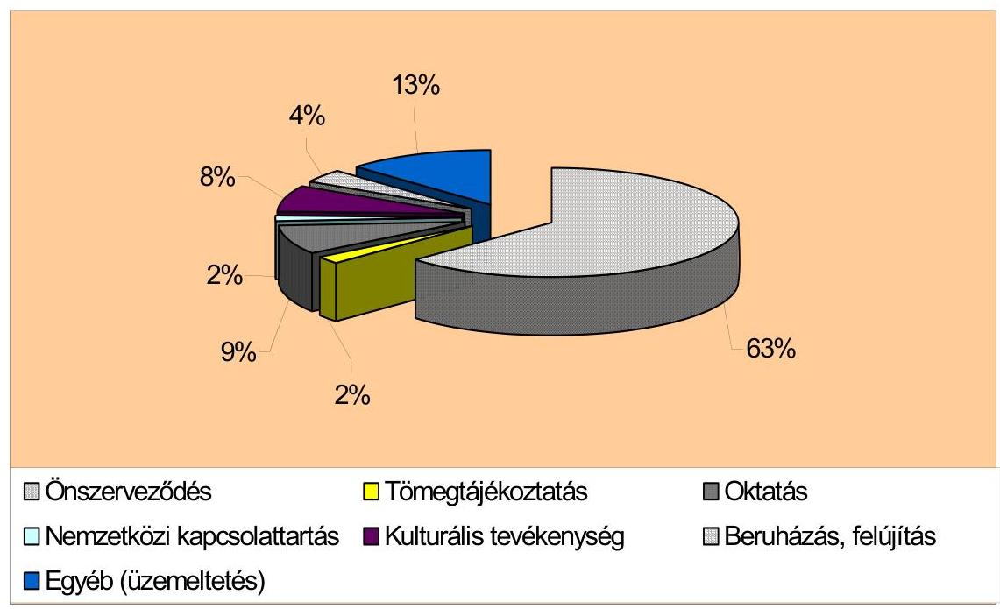
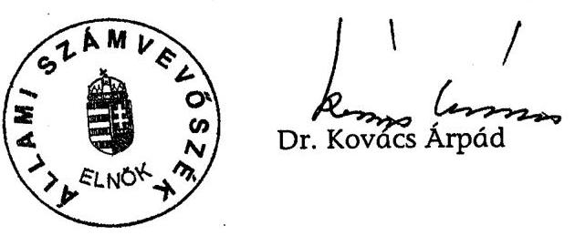
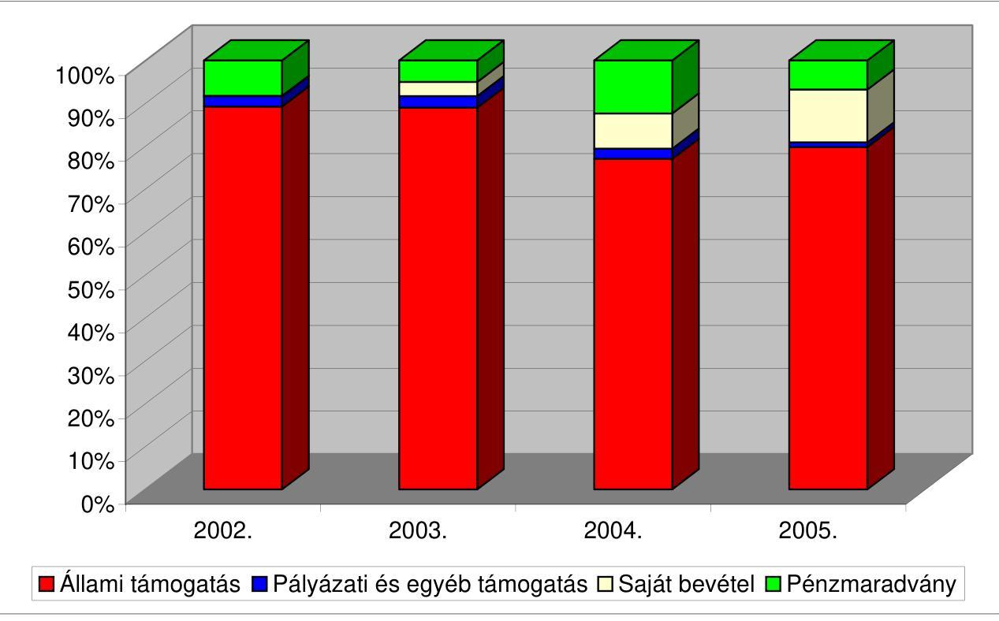
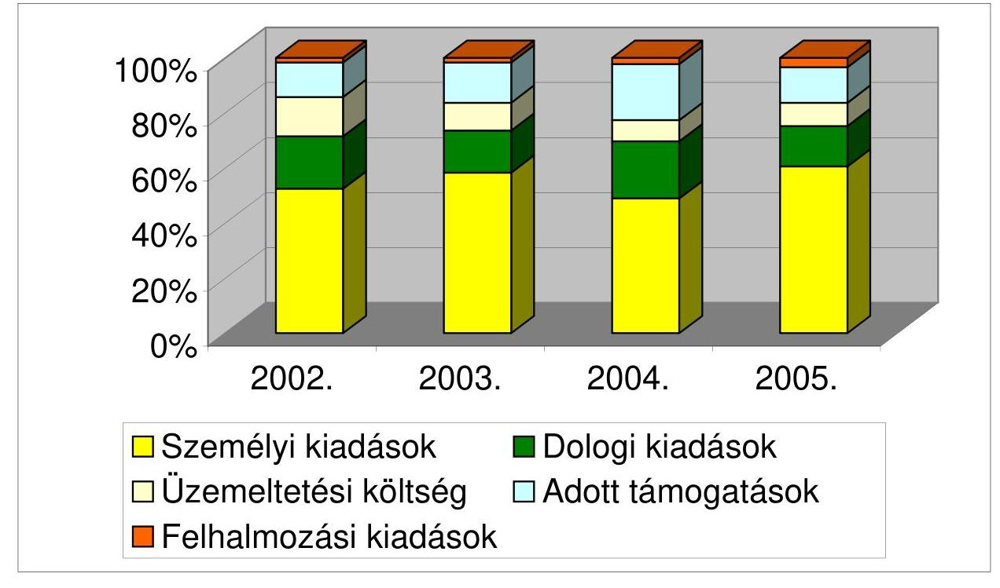

# ÁLLAMI   SZÁMVEVŐSZÉK 

## JELENTÉS

az Országos Szlovén Önkormányzat 2002-2005. évi pénzügyi-gazdasági tevékenységének ellenőrzéséről

---

3. Önkormányzati és Területi Ellenőrzési Igazgatóság
3.1. Szabályszerűségi Ellenőrzési Főcsoport
Iktatószám: V-1004-020/2006.
Témaszám: 804
Vizsgálat-azonosító szám: V-0286
Az ellenőrzést felügyelte:
Dr. Lóránt Zoltán
főigazgató
Az ellenőrzés végrehajtásáért felelős:
Dr. Elek János
általános főigazgató-helyettes
Az ellenőrzést vezette:
Horváth Balázs
főcsoportfőnök-helyettes
Az összefoglaló jelentést készítette:
Szakmányné Bilik Mária
számvevő
Az ellenőrzést végezték:
Szakmányné Bilik Mária Szendrey Lajos
számvevő
A témához kapcsolódó eddig készített számvevőszéki jelentések:
címe
sorszáma
Jelentés az Országos Szlovén Kisebbségi Önkormányzat pénzügyi- 378 gazdasági tevékenységének ellenőrzéséről
Jelentés az Országos Szlovén Kisebbségi Önkormányzat pénzügyi- 0211 gazdasági tevékenységének vizsgálatáról

---

# TARTALOMJEGYZÉK 

BEVEZETÉS ..... 5
I. ÖSSZEGZŐ MEGÁLLAPÍTÁSOK, KÖVETKEZTETÉSEK, JAVASLATOK ..... 6
II. RÉSZLETES MEGÁLLAPÍTÁSOK ..... 11

1. A feladatellátás szervezettsége, szabályozottsága ..... 11
1.1. Az önkormányzat szervezeti és működési rendje ..... 11
1.2. A gazdálkodási feladatok szabályozása ..... 12
1.3. A feladatellátás szervezeti háttere ..... 12
2. Az Önkormányzat gazdálkodásának jellemzői ..... 13
2.1. A gazdálkodási tevékenység feltételei ..... 13
2.2. Vagyongazdálkodás, vagyonvédelem ..... 13
2.3. A gazdálkodás számviteli szabályozása ..... 14
3. A költségvetés jóváhagyása, végrehajtása ..... 14
3.1. A költségvetés elkészítése, jóváhagyása ..... 14
3.2. A költségvetés végrehajtása, zárszámadás jóváhagyása ..... 15
3.3. A költségvetési feladatok teljesítése ..... 16
3.3.1. A költségvetési törvényben megállapított támogatás alakulása ..... 16
3.3.2. A pályázati támogatások felhasználása, elszámolása ..... 17
3.3.3. Kiadások alakulása, összetétele ..... 18
4. Az önkormányzat számviteli tevékenysége ..... 20
4.1. A könyvvezetési kötelezettség teljesítése ..... 20
4.2. Az éves beszámolók összeállítása, jóváhagyása ..... 21
4.3. A bizonylati rend és a bizonylati fegyelem érvényesülése ..... 21
5. Az önkormányzat belső ellenőrzési rendszere ..... 22
6. Az előző ellenőrzés javaslataira tett intézkedések ..... 23
MELLÉKLETEK
7. számú Az OSZÖ 2002-2005. évi bevételei és megoszlása
8. számú Az OSZÖ 2002-2005. évi kiadásai és megoszlása
9. számú Az OSZÖ által nemzeti és etnikai kisebbségi feladatokra teljesített kiadások feladatonkénti bontásban

---

.

---

# RÖVIDÍTÉSEK JEGYZÉKE 

| Ámr. | Az államháztartás működési rendjéről szóló - többször   módosított - 217/1998. (XII. 30.) Korm. rendelet |
| :-- | :-- |
| ÁSZ | Állami Számvevőszék |
| Eho tv. | Az egészségügyi hozzájárulásról szóló - többször módosított - 1998. évi LXVI. törvény |
| ICSSZEM | Ifjúsági, Családügyi, Szociális és Esélyegyenlőségi Minisztérium |
| IHM | Informatikai és Hírközlési Minisztérium |
| MNEKK | Magyarországi Nemzeti Etnikai Kisebbségekért Közalapítvány |
| Nek. tv. | A nemzeti és etnikai kisebbségek jogairól szóló 1993. évi   LXXVII. törvény |
| NEKH | Nemzeti és Etnikai Kisebbségi Hivatal |
| NKÖM | Nemzeti Kulturális Örökség Minisztériuma |
| OSZÖ | Országos Szlovén Önkormányzat |
| PEB | Pénzügyi és Ellenőrzési Bizottság |
| Szja törvény | A személyi jövedelemadóról szóló - többször módosított -   1995. évi CXVII. törvény |
| SZMSZ | Szervezeti és Működési Szabályzat |
| Számv. tv. | A számvitelről szóló - többször módosított - 2000. évi C.   törvény |
| Vhr. | A számviteli törvény szerinti egyes egyéb szervezetek be-   számoló készítési és könyvvezetési kötelezettségének sajá-   tosságairól szóló 224/2000. (XII. 19.) Korm. rendelet |

---

.

---

# JELENTÉS 

## az Országos Szlovén Önkormányzat 2002-2005. évi pénzügyi-gazdasági tevékenységének ellenőrzéséről

## BEVEZETÉS

A magyarországi szlovén közösség létszámáról a 2001. évi népszámlálásnál átfogó felmérés készült. Eszerint 3040 fő szlovén nemzetiségűnek, 3187 fő szlovén anyanyelvűnek vallotta magát, 3442 fő vállalta a szlovén kulturális értékekhez, hagyományokhoz való kötődést. A legutóbbi népszámlálás adatai szerint Vas megyében élt a szlovén kisebbség 56\%-a, Budapesten 21\%-a. A 2002. évi önkormányzati választásokat követően 13 szlovén helyi kisebbségi önkormányzat alakult. Az Országos Szlovén Önkormányzat (továbbiakban OSZÖ) 2002-2005 között kisebbségi feladatainak ellátásához 139 310 ezer Ft központi költségvetési támogatásban részesült.

Az Állami Számvevőszékről szóló - többször módosított - 1989. évi XXXVIII. törvény 2. § (5) bekezdése, valamint a nemzeti és etnikai kisebbségek jogairól szóló 1993. évi LXXVII. törvény (továbbiakban: Nek. tv.) 39/G. § (1) bekezdésében kapott felhatalmazás alapján az Állami Számvevőszék (továbbiakban: ÁSZ) feladata a különböző állami forrásokból juttatott pénzeszközök felhasználása törvényességének ellenőrzése a nemzeti és etnikai kisebbségi szervezeteknél. Az ÁSZ a 2006. évi ellenőrzési terve keretében vizsgálta az OSZÖ 2002-2005. évi pénzügyi-gazdasági tevékenységét.

Az ellenőrzés célja: annak megállapítása volt, hogy az országos szervezet

- a központi költségvetési támogatást a Nek. tv-ben meghatározott feladatokra használta-e fel, a felhasználás, elszámolás során betartotta-e a vonatkozó hatályos jogszabályi előírásokat;
- a gazdálkodás törvényessége, szabályszerűsége biztosított volt-e; a tervezés, az operatív gazdálkodás, a beszámolási kötelezettség és a számviteli bizonylati rend teljesítése során érvényesültek-e a jogszabályokban és a belső szabályzatokban megfogalmazott követelmények;
- a szabályszerű gazdálkodás érdekében kialakított belső kontrollrendszer megfelelően segítette-e a feladatok végrehajtását.

A helyszíni ellenőrzés: 2006. június 6-június 30-a között, az OSZÖ székhelyén történt.

---

# I. ÖSSZEGZŐ MEGÁLLAPÍTÁSOK, KÖVETKEZTETÉSEK, JAVASLATOK 

Az OSZÖ 2002-2005 között nem teremtette meg működésének - ÁSZ által javasolt - szabályszerű feltételeit. A közgyűlés a 2003. június 1-jétől hatályos SZMSZ-ben nem rendelkezett az ellátott nemzeti és etnikai kisebbségi feladatok teljes vertikumáról, a választott tisztségviselőkre és testületekre átruházható feladat- és hatáskörökről. Az SZMSZ előírásait a Nek. tv. 2005. évi módosításával összhangban nem aktualizálták. A közgyűlés a jogszabályi és belső előírásoktól eltérően nem határozta meg hivatali szervezetét, működési rendjét, létszám- és bérkeretét; nem állapította meg vagyonleltárát és törzsvagyonként már értékesített részvényt jelölt meg. Az állandó bizottságok működési rend és az éves ülésezések számának betartása nélkül funkcionáltak. Az elnökség operatív döntéshozó funkcióját - feladat- és hatáskör hiányában - az elnök egy személyben látta el. A közművelődési és tömegtájékoztatási feladatok ellátásához a szentgotthárdi székhelyű, szlovén nyelven sugárzó rádiót közhasznú társaság formájában működtették. A közgyűlés nem alakította ki hivatali szervezetét, működésének személyi feltételeit. Ennek következtében nem valósultak meg intézményi átvételről, alapításról, továbbá alapítvány létrehozásáról szakmai előkészítés nélkül - hozott közgyűlési határozatok.

A gazdálkodási feladatok közül a közgyűlés kizárólagos hatáskörébe tartozott a költségvetés és zárszámadás elfogadása, az éves beszámoló jóváhagyása. Ehhez belső szabályozás nem rögzítette az OSZÖ gazdasági sajátosságait figyelembe vevő szerkezeti, tartalmi és határidő követelményeket. Az SZMSZ hiányosan szabályozta a rádiót működtető közhasznú társasággal kapcsolatos tulajdonosi jogok gyakorlását. A tulajdonosi jogokat a Nek. tv., valamint az SZMSZ szabályozásának megsértésével gyakorolta a közgyűlés. Szabályszerűen nem hagyta jóvá a rádió éves közhasznúsági jelentéseit, nem állapította meg a rádió ügyvezetőjének díjazását. A megválasztott felügyelő bizottságot rendszeresen nem számoltatta be. A gazdálkodási szabályzatban előírták a kötelezettségvállalás, utalványozás és ellenjegyzés rendjét, amelynek előírásai megfeleltek a jogszabályi rendelkezéseknek.

Az OSZÖ működésének tárgyi feltételeit a használatában lévő ingatlanok, az irodák berendezése, számítástechnikai felszereltsége biztosította. A szabályos gazdálkodás személyi feltételei egy pénzügyi és gazdasági ügyintéző alkalmazásával nem álltak fenn. A számviteli, bérszámfejtési és adózási feladatait külső könyvelő cég szolgáltatásainak igénybevételével oldotta meg.

A közgyűlés a vagyongazdálkodással kapcsolatos döntéseit szakmai előkészítés nélkül hozta meg. A befektetési, tőkekivonási és hitelfelvételi intézkedések miatt hozambevételtől estek el, illetve többletköltséget viseltek. Az OSZÖ a számviteli törvény és a belső szabályozását megsértve vagyonelemei leltározását nem végezte el. Az OSZÖ mérlegében kimutatott tárgyi eszközök az egyedi nyilvántartásokkal, a befektetett pénzügyi eszközök állománya a biztosító társaság egyenlegközlő levelével voltak egyeztethetők. A vagyonvédelem érdekében a használatban lévő ingatlanokra és gépkocsira biztosítást kötöttek.

---

Az éves költségvetések bevételi és kiadási jogcímek szerint, évente azonos szerkezetben készültek. A jóváhagyásról a közgyűlés határozatban döntött. A konkrét kisebbségi feladatok forrásigényét és ráfordításait nem tervezték. A személyi kiadásokhoz kapcsolódóan létszámot, a hivatali tevékenység bérkeretét - a belső előírást figyelmen kívül hagyva - az elnök nem terjesztette a közgyűlés elé. A tiszteletdíjak, munkabérek és ösztöndíjak tervezése szabálytalanul, a kifizetendő nettó érték meghatározásával történt, amely nem lehetett reális alapja a járulékfizetési kötelezettségek számításának. A Nek. tv. 2005. év végi módosításával összhangban - a meghatározott határidőig - az ÖSZÖ nem gondoskodott a 2006. évi költségvetés közzétételéről.

Az OSZÖ működtetésének és feladatellátásának finanszírozását alapvetően költségvetési forrásból származó bevételekből biztosították. Az éves költségvetési törvényekben meghatározott működési támogatáson túl, ugyan nem jelentős mértékben, a kisebbségi célok megvalósítását különböző pályázatokon elnyert pénzeszközök egészítették ki. Költségvetési támogatásból a 2002-2005. években 139 310 ezer Ft, minisztériumi, közalapítványi pályázati támogatásokból 2372 ezer Ft bevételre tettek szert, így az ellenőrzött évek átlagában a bevételek 84,4 %-a a központi költségvetésből teljesült. Az egyes évek bevételeinek mindössze 1-3% közötti hányada származott a pályázati és egyéb támogatásokból. Az elégtelen személyi feltételek gátolták az OSZÖ-t a forrás-kiegészítő pályázati lehetőségek kihasználásában. A pályázaton elnyert támogatások felhasználásának szabályait a támogatók szerződésben rögzítették. Az OSZÖ a támogatást rendeltetésszerűen használta fel, az elkülönített nyilvántartás követelményét azonban nem teljesítette.

Az ellenőrzött időszakban az OSZÖ összes kiadása 151 294 ezer Ft volt. Az összes kiadás 55%-át személyi kiadásokra, 17,5%-át dologi kiadásokra, kevesebb, mint 10%-ot üzemeltetésre, átlagosan 15,5%-át támogatásokra, a fennmaradó 2,3%-át felhalmozási kiadásokra fordította. A nemzeti és etnikai feladatokkal összefüggő kiadási szerkezet szerint az ellenőrzött évek összes kiadásának 63%-át önszerveződésre, ezen belül Felsőszölnök és vonzáskörzetében található helyi önkormányzatok és intézményeik, valamint helyi kisebbségi önkormányzatok és civil szervezetek támogatására fordította. A szlovén nyelv oktatására és nemzetiségi kultúra ápolására közel azonos mértékű, a kiadások 9%, illetve 8%-át teljesítette. A rádió támogatására és nemzetközi kapcsolattartásra a kiadások 2-2%-át biztosította.

Az OSZÖ 2002-ben 3564 ezer Ft, 2003-ban 5137 ezer Ft, 2004-ben 9394 ezer Ft, 2005-ben 5296 ezer Ft támogatást adott, melynek forrását az állami támogatás, továbbá a kötvényeladásból származó bevétel fedezte. Az 50 ezer Ft-ot meghaladó támogatási kérelmekről a közgyűlés döntött, a határozatok 97%-nál a támogatási cél megjelölésével. Szabálytalan gyakorlatot jelentett, hogy a nem közgyűlési határozat alapján támogatott szervezetek által igénybe vett szolgáltatást, a szolgáltatást nyújtók az OSZÖ nevére számlázták ki, amelyet az OSZÖ a véglegesen átadott pénzeszközök között tartott nyilván. A támogatás, illetve felhasználása a támogatott szervezetek könyveiben sem bevételként, sem kiadásként nem jelent meg. Az adott támogatásokkal kapcsolatosan az OSZÖ egyik esetben sem írt elő elszámolási kötelezettséget, a rendeltetésszerű felhasználást nem ellenőrizte.

---

A jóváhagyott költségvetéseket az évközi változásokra figyelemmel a közgyűlés nem módosította, így az előirányzatokhoz képest mind a bevételek, mind a kiadások terven felül teljesültek. Az OSZÖ 2002-2005 közötti időszakban fizetőképessége megőrzése érdekében tartalékolással gazdálkodott, ennek eredményeként bevételei minden évben meghaladták kiadásait. Pénzeszközeinek állománya 2668 ezer Ft-tal nőtt. A gazdasági tranzakciók döntő része írásos kötelezettségvállalás nélkül bonyolódott. A kötelezettségvállalások teljes körénél elmaradt az ellenjegyzés, mivel a gazdasági ügyintéző arra nem kapott felhatalmazást munkaköri leírásában. A költségvetések végrehajtásáról szóló zárszámadást a közgyűlés minden évben határozattal elfogadta. A zárszámadások a költségvetésekkel azonos szerkezetben készültek. A szakmai feladatok értékeléséhez a zárszámadás nem tartalmazta a kisebbségi feladatok adott évi ráfordításait.

Az OSZÖ számviteli szabályzatait - a törvényben előírt határidőhöz képest - három éves késedelemmel készítette el. A számviteli politika és
 a hozzárendelt leltározási szabályzat 2004. január 1-jétől hatályos. Az OSZÖ-nál sérült a Számv. tv. előírása az által is, hogy a szabályzatok nem a működési sajátosságokra figyelemmel készültek, elmaradt a házi pénztár kezelési szabályzat aktualizálása, illetve összeférhetetlenségi hibájának megszüntetése.

Könyvvezetési kötelezettségét az OSZÖ 2002-ig egyszeres könyvvezetéssel, ezt követően szabályos áttéréssel a kettős könyvvitel rendszerében teljesítette. Jogszabályi előírásoktól eltérő és téves főkönyvi számla kijelölések miatt sérült a könyvvezetésben és beszámoló készítésben a teljesség, valódiság, következetesség és időbeli elhatárolás elve. Jogszabályi előírás ellenére nem biztosította a közpénzek felhasználásának elkülönített nyilvántartását, továbbá az előlegek, természetbeni juttatások és más kötelező tárgyú analitikus nyilvántartásokat. A zárási feladatok szabályszerűségét a leltározás, valamint a részletező nyilvántartások hiánya miatt nem biztosították.

Az OSZÖ-nál a bizonylati elv és fegyelem előírásait egyes személyi és dologi kiadásoknál megsértették, mivel az elszámolás szabályszerűen kiállított bizonylat hiányában történt. A könyvelés alapjául szolgáló alapbizonylatokról hiányzott a kiállító szervezet megjelölése, a teljesítés igazolása és a kontírozás. A hibák kijavítására az ellenőrzés jelzéseire intézkedés történt. Az útnyilvántartások adattartalma nem felelt meg az Szja tv. előírásának. Nem fizette meg a természetbeni juttatások utáni kifizetői adót és egészségügyi hozzájárulást.

Az OSZÖ 2002. és 2003. évi egyszerűsített beszámoló a jogszabályi előírás szerinti mérlegből és eredménylevezetésből állt. A 2004. és 2005. évi egyszerűsített éves beszámoló tartalma nem felelt meg a beszámoló-készítést szabályozó jogszabályi előírásnak. A beszámolókban a könyvvezetési hibák miatt sérült a teljesség, valódiság, következetesség és időbeli elhatárolás elve. Az éves beszámolókat határidőben elkészítették, azok elfogadásáról a jogszabályi előírás ellenére a közgyűlés nem döntött.

A belső ellenőrzés szabálytalanul és eredménytelenül funkcionált. A PEB feladatkörét a Nek. tv-vel összhangban nem módosították. A testület kontroll tevékenysége formális volt, a költségvetés és zárszámadás véleményezésére korlátozódott. Feladatkörében elmulasztotta az éves beszámolók ellenőrzését, nem 

---

tárta fel a gazdálkodáshoz kapcsolódó szabályozási hiányosságot, könyvvezetési szabálytalanságot, pénzkezelési mulasztást, bizonylatolási hibát. A testület nem hívta fel a közgyűlés figyelmét a leltározás elmulasztására. Az elnök utalványozási jogkörével összeférhetetlennek minősült a pénztár-ellenőrzési feladatok hatáskörébe utalása. A szabályzatokban előírt folyamatba épített ellenőrzéshez hiányoztak a személyi feltételek. A közgyűlés ellenőrző, beszámoltató tevékenységét részben látta el, amely hozzájárult a belső ellenőrzés eredménytelen működéséhez. Mindez kihatott arra is, hogy az ÁSZ előző jelentésének javaslatait intézkedési terv nélkül, hiányosan és ellentmondásosan hajtották végre.

A helyszíni ellenőrzés megállapításai hasznosítása mellett javasoljuk:

# az Országos Szlovén Önkormányzat közgyűlésének: 

1. Módosítsa az SZMSZ-t annak érdekében, hogy
a) a Nek. tv. 37. § (1) bekezdésében foglaltakkal összhangban tartalmazza az ellátott kisebbségi feladatokat;
b) a Nek. tv. 60. § (1) bekezdésének megfelelően a Szlovén Rádió Kht-vel kapcsolatos tulajdonosi jogai és feladatai szabályozottak legyenek;
c) a Nek. tv. 39/B. § (1) bekezdés előírásának megfelelően tartalmazza hivatala működésének részletes szabályait;
d) a törzsvagyon köre a Nek. tv. 60/A. § szabályainak megfeleljen;
e) az átruházható hatásköröket és a hatásköri eljárásrendet tartalmazza;
f) a belső ellenőrzés hierarchikus rendszerét, összehangolt jogosultságait szabályozza és működtesse; a PEB feladatköre összhangban legyen a Nek. tv. 39/G. § (2) bekezdésben előírt feladatokkal.
2. Teremtse meg a hivatali működés és szabályos gazdálkodás személyi feltételeit, működtesse a Nek. tv. 39/A. § (2) bekezdésben és az SZMSZ-ben rögzített hivatalt.
3. Szabályozza az Ámr. 21. és 23. § előírásaival összhangban a költségvetés készítés szakaszait, feladatait, határozza meg a költségvetés tartalmát, felépítését, a módosítás szabályait, valamint a zárszámadás tartalmát a kisebbségi feladatok megjelenítésére figyelemmel.
4. Teljesítse tulajdonosi feladatait a Szlovén Rádió Kht. éves közhasznúsági jelentésének, éves üzleti tervének (költségvetés) elfogadásával.
5. Módosítsa a gazdálkodási szabályzatot az önkormányzat sajátosságaira, valamint a Nek. tv. 60/C. § előírására figyelemmel.

---

# az Országos Szlovén Önkormányzat elnökének: 

1. Gondoskodjon a számviteli szabályozások módosításáról a Számv. tv. 14. § és Vhr. 16. § (6)-(7) bekezdés előírásainak, valamint az OSZÖ sajátosságainak megfelelő szabályzatok kialakításáról.
2. Gondoskodjon a belső szabályozásnak megfelelően írásos kötelezettségvállalásról és azok ellenjegyzéséről, a kötelezettségvállalások nyilvántartásáról, az adott támogatások elszámolási kötelezettségének előírásáról.
3. Teremtse meg a személyi kiadások és járulékok szabályos tervezésének feltételeit a személyi kifizetések bruttó összegének megállapításával.
4. Intézkedjen a jóváhagyott költségvetés közzétételére a Nek. tv. 39/G. § (4) bekezdésében szabályozott időpontig.
5. Biztosítsa a könyvvezetés és beszámoló készítés során:
a) a Számv. tv. 15. § (2)-(3) és (5) bekezdés szerinti teljesség, valódiság, következetesség, valamint a 16. § (2) bekezdésben szabályozott időbeli elhatárolás számviteli elvek érvényesülését;
b) a Vhr. 17. § (8) bekezdés előírása szerint a közpénzek és azok felhasználásának elkülönített nyilvántartását, továbbá a Számv. tv-ben és egyéb jogszabályokban előírt analitikus nyilvántartások vezetését, a Számv tv. 165. § (4) bekezdés szabályozása szerinti egyeztetések elvégzését.
6. Készíttesse el a leltárakat a Számv. tv. 69. § (1)-(2) bekezdésében foglaltakkal, valamint a leltározási szabályzattal összhangban.
7. Gondoskodjon a 2004-2005. évi egyszerűsített éves beszámoló a Vhr. 6. § (7) bekezdésben előírt tartalomnak megfelelő elkészítéséről, és terjessze a közgyűlés elé jóváhagyásra a Vhr. 20. § (6) bekezdés előírásának teljesítése érdekében.
8. Végezzen önellenőrzést a természetbeni juttatások után fizetendő adó és egészségügyi hozzájárulás bevallása és megfizetése céljából az Szja tv. 69. § (3) - (4) bekezdés, valamint az Eho tv. 4. § (1) bekezdés előírása szerint.
9. Szerezzen érvényt a bizonylati elv és fegyelem Számv. tv. 165. § (2) bekezdés, valamint a bizonylatolás alaki és tartalmi követelményei 167. § (1) bekezdés előírásainak.

---

# II. RÉSZLETES MEGÁLLAPÍTÁSOK 

## 1. A feladatELLÁTÁS SZERVEZETTSÉGE, SZABÁLYOZOTTSÁGA

### 1.1. Az önkormányzat szervezeti és működési rendje

Az OSZÖ szervezetét, működésének szabályait a közgyűlés által elfogadott hatályos SZMSZ rögzítette. Az önkormányzati választásokat követően az OSZÖ 2003. januárjában szabályszerűen megválasztotta döntéshozó, irányító testületeit. A 21 taggal választott közgyűlés 2003. június 1-jei hatállyal, a korábbinál szűkebb tartalommal új SZMSZ-t hagyott jóvá, amelyben nem határozták meg az átruházható hatásköröket és a hatáskörök gyakorlásának szabályait. A tulajdonosi jogok előírása az éves beszámoló elfogadására korlátozódott, a szabályozásból a korábbiakhoz képest kihagyták az elnökség feladat- és hatáskörét. Hiányzott a rádióra vonatkozó feladatkör szabályozása összhangban a 2003-évben hatályos Nek. tv. 37. § g) pontjában foglaltakkal. Az SZMSZ módosításáról a 2005. november 25-étől hatályos Nek. tv-vel összhangban nem döntött a közgyűlés.

A közgyűlés döntéseit szabályosan elfogadott határozatokkal hozta meg. A közgyűlés a megválasztott tisztségviselők tiszteletdíját, az elnök díjazását az SZMSZ VIII. fejezet előírása ellenére nem állapította meg, csak a személyi kiadások emelésének százalékos mértékéről döntött. Az OSZÖ éves számviteli beszámolóit továbbá a rádió beszámolóit - a 2004. évi kivételével - nem hagyta jóvá. Így a legfőbb döntéshozó testület a kizárólagos hatáskörébe utalt feladatokat a jogszabályi és SZMSZ előírásoktól eltérően gyakorolta.

Az SZMSZ a közgyűlések közötti időszakban az elnökség folyamatos működését írta elő, feladatként a kisebbségi szervezetekkel, a helyi, megyei önkormányzatokkal való kapcsolattartást, továbbá az átruházható feladat- és hatáskörök ellátását határozta meg. Az elnökség operatív döntéshozó funkcióját feladat- és hatáskör hiányában gyakorlatilag az elnök egy személyben látta el. A ciklusokon át újraválasztott elnök személye az OSZÖ működésében folyamatosságot biztosított. Az elnök feladatkörébe tartozott az önkormányzat képviselete, a közgyűlési döntések végrehajtása, az ülések előkészítése, a hivatal irányítása.

A közgyűlés döntéseinek előkészítésére, azok végrehajtásának szervezésére, ellenőrzésére két állandó bizottságot, oktatási és kulturális, valamint pénzügyi és ellenőrzési bizottságot hozott létre. A bizottságok az SZMSZ előírása ellenére belső működésük rendjét nem határozták meg, az ülésezés gyakoriságát - legalább évi négy ülés - nem tartották be.

A közgyűlés a hivatal működését nem szabályozta, ezzel a Nek. tv. 39/B. § (1) bekezdés előírását megsértette. Az SZMSZ-ben foglaltaktól eltérően a hivatal létszám- és bérkeretét nem határozta meg. A felsőszölnöki hivatal, valamint a

---

budapesti kirendeltség egy-egy teljes munkaidős, továbbá egy fő részmunkaidős alkalmazottal, az elnök irányításával működött.

# 1.2. A gazdálkodási feladatok szabályozása 

A Nek. tv. 37. § b) pont szabályozásával összhangban a közgyűlés kizárólagos hatáskörébe utalták a költségvetés, zárszámadás, vagyonleltár megállapítását. Az SZMSZ XI. fejezetében meghatározták a költségvetés és zárszámadás előterjesztésének és jóváhagyásának formáját, továbbá az elkészítéséért felelős személyt. Belső szabályozás nem rögzítette az önkormányzat sajátosságait figyelembe véve a költségvetés, a zárszámadás felépítését, belső tartalmát, a határidőket.

A közgyűlés kizárólagos hatáskörébe utalt - Rádióval kapcsolatos - tulajdonosi jogokat a vizsgált években egy alkalommal gyakorolta a közgyűlés. A Rádió közhasznúsági jelentése helyett a 2004. évi számviteli beszámolót, továbbá a 2005. évre szóló költségvetést fogadta el a tulajdonosi testület. A Rádió ügyvezető főszerkesztőjének ötéves időtartamra történő kinevezéséről, díjazása megállapítása nélkül határozott. A közgyűlés a Rádió felügyelő bizottságának tagjait csak 2005-ben választotta meg. A Rádió 2005. évi beszámolóját a felügyelő bizottság fogadta el. A tulajdonosi jogokat a 2005. november 25-éig hatályos Nek. tv. 60. § (4) [ezt követően hatályos Nek. tv 60. § (1)] bekezdésének előírása, valamint az SZMSZ szabályozásának megsértésével gyakorolta a közgyűlés.

Az OSZÖ - 1996. január 1-jétől változatlan tartalommal hatályban lévő gazdálkodási, továbbá kiküldetési és költségelszámolás rendje szabályzattal rendelkezett. A kötelezettségvállalás és ellenjegyzése, az érvényesítés, utalványozás és ellenjegyzés feladatait a gazdálkodási szabályzat rögzítette, amelynek előírásai megfeleltek a jogszabályi rendelkezéseknek. A külföldi kiküldetések aktuális szabályozás, valamint közgyűlési döntések nélkül bonyolódtak.

### 1.3. A feladatellátás szervezeti háttere

Az SZMSZ-ben megjelölt hivatali szervezet két fő átlaglétszámmal működött, melyet nem hivatalvezető, hanem az önkormányzat elnöke irányított. A közművelődési és tömegtájékoztatási feladatok ellátásában jelentős szerepe volt a szlovén nyelven sugárzó Radio Monoster-nek. A szentgotthárdi székhelyű rádió 2000 közepe óta sugároz kisebbségi adásokat.

Több döntés született intézmény átvételéről, alapításáról, alapítvány létrehozásáról. A határozatok nem valósultak meg, ennek okairól, valamint az elnök hatáskörében tett intézkedésekről dokumentumok nem álltak rendelkezésre, a határozatok visszavonására nem került sor. Az OSZÖ székhelyeként működtetett hivatal szabályozási, szervezeti és személyi feltételei nem biztosították az OSZÖ döntés előkészítésével, a határozatok végrehajtásával és a gazdálkodással kapcsolatos feladatok szabályos, folyamatos és tervszerű ellátását.

---

# 2. Az ÖNKORMÁNYZAT GAZDÁLKODÁSÁNAK JELLEMZŐI 

### 2.1. A gazdálkodási tevékenység feltételei

Az OSZÖ működése tárgyi feltételeinek egy részét Kincstári Vagyoni Igazgatóság által használatba adott - Felsőszölnökön és Budapesten található - irodaként funkcionáló ingatlanok biztosították. A működés tárgyi feltételeit illetően a kialakított iroda berendezése, számítástechnikai felszereltsége megfelelő kereteket biztosított a folyamatos munkavégzéshez. Feladatai ellátásához az OSZÖ egy hivatali személygépkocsit üzemeltetett.

Hivatali foglalkoztatottként a pénzügyi és gazdasági ügyintéző feladatkörét a gazdálkodási szabályzat tartalmazta, aktualizálására a feladatok változásának megfelelően nem került sor. A budapesti kirendeltség vezetőjének gazdálkodási feladatait belső előírás nem rögzítette annak ellenére, hogy pénzkezelési feladatokat is ellátott.

Az OSZÖ számviteli, adózási, munkaügyi és bérszámfejtéssel kapcsolatos feladatait ugyanaz a külső számviteli szolgáltató kft. végezte a vizsgált időszakban.

### 2.2. Vagyongazdálkodás, vagyonvédelem

Az SZMSZ-ben rögzített vagyongazdálkodással kapcsolatos át nem ruházható hatásköreit - a vagyonleltár és a törzsvagyon meghatározása
 kivételével a közgyűlés gyakorolta. A gazdálkodási szabályzat kitért a vagyonnyilvántartás és vagyonleltár tartalmi elemeire, ennek megállapítására az OSZÖ megalakulása óta nem került sor. Az SZMSZ IV. számú melléklete tévesen tartalmazta a 15000 ezer Ft értékű MOL értékpapírt, mint önkormányzati törzsvagyon egyetlen elemét, mivel az új SZMSZ elfogadásának időpontját megelőzően a MOL részvény már nem volt az OSZÖ tulajdonában. Az OSZÖ a Nek. tv. 63. § 4. bekezdése alapján egyszeri vagyonjuttatásként 15000 ezer Ft juttatáskori árfolyamértékű MOL részvény teljes állományát értékesítette 1998-2000. évek között. A részvény eladásból származó 22000 ezer Ft-ot 2000. évben az ÁB-Aegon Általános Biztosító Rt. „Aranyforint 2000 Élet- és Balesetbiztosítás" konstrukcióba három éves lejárattal fektettek be. A 2003. évi lejáratot követően ismételten ugyanerről a befektetésről határozott a közgyűlés annak ellenére, hogy a 2000. évi befektetés alkalmával a jegyzőkönyvben "ígért" évi 16,5%-os hozam elmaradt. A befektetésből - a tőkekivonás hátrányos következményeinek megtárgyalása nélkül - 2004-ben és 2005-ben 4001 ezer Ft, illetve 5011 ezer Ft értékben - közgyűlési határozat alapján - visszavásárlásra került sor. A 2005. december 31-i záró egyenleg 17554 ezer Ft volt.

Hitelkonstrukciós gépjármű cseréről döntött a közgyűlés 2003-ban, ugyanakkor a költségvetésben a felvett hitel összegét meghaladó pénzmaradványt (tartalékot) terveztek. A döntést nem előzte meg gazdaságossági számítás, nem vizsgálták a magasabb hitelkamatok mértéke és az alacsonyabb folyószámla kamatok közötti különbségből adódó többlet kiadást. Az OSZÖ befektetéssel, tőkekivonással és hitelfelvétellel összefüggő döntései - pénzügyi hatáselemzés nélkül - megalapozatlannak minősültek.

---

Az előző és jelen vizsgált időszak dokumentumai szerint az OSZÖ a leltározási szabályzatban előírt ötévenkénti leltározást nem tartotta be, a vizsgált időszakban leltározásra nem került sor. Ezzel a Számv. tv. 69. § (1)-(2) bekezdés előírását, valamint belső szabályozását megsértette. Az OSZÖ gépkocsijára és a használatban lévő épületére biztosítást kötöttek, amelyeket riasztó berendezéssel is elláttak.

# 2.3. A gazdálkodás számviteli szabályozása 

Az OSZÖ az 1996. január 1-jétől érvényben tartott számlarendet, házipénztár kezelési szabályzatot a Számv. tv. 2001. január 1-jei hatályba lépését követően a jogszabályi változásoknak megfelelően nem módosította, ezzel sérült a törvény 14. § (8) bekezdésének előírása.

A Számv. tv. 14. § (3) és (5) bekezdésében előírt szabályzatok közül a számviteli politikát, az eszközök és források leltárkészítési és leltározási, valamint az értékelési szabályzatot az előírt 90 napos határidővel nem készítette el, azok kiadásáról 2004. január 1-jével intézkedett.

A szabályzatok a Számv. tv. követelményeinek csak részben feleltek meg, nem tükrözték az OSZÖ szervezeti és működési sajátosságait, ezért nem tettek eleget a Számv. tv. 14. § (3) bekezdés előírásának. A 2004. január 1-jétől hatályos számlarend olyan számlákat tartalmazott, melyek nem illettek bele az önkormányzat profiljába (tenyészállatok, eladott áruk beszerzési értéke, export értékesítés árbevétele, befejezetlen termelés, meliorációs és öntözésfejlesztési támogatás stb.), a nemzeti és etnikai kisebbségi feladatok ráfordításait részletező számlákat nem vezettek.

Az 1996. január 1-jétől érvényes házipénztár kezelési szabályzatban - az elnök ellenőrzési feladataira vonatkozó - összeférhetetlenségi szabályozási hibát nem szüntették meg. Nem szabályozta a bankszámla forgalom, a valutapénztár, valamint a budapesti kirendeltség pénzkezelését.

## 3. A KÖLTSÉGVETÉS JÓVÁHAGYÁSA, VÉGREHAJTÁSA

### 3.1. A költségvetés elkészítése, jóváhagyása

A költségvetés bevételi és kiadási jogcímeit a gazdálkodási szabályzat rögzítette. Az elkészítés rendjét, a bevételi és kiadási jogcímek tartalmát, az elfogadás határidejét és a módosításra vonatkozó előírásokat, valamint a központi támogatás felhasználás tervezésének elveit nem szabályozta.

Az OSZÖ az Ámr. 21. és 23. §-ában szabályozott, a költségvetés tervezésének munkaszakaszait, feladatait a költségvetés jóváhagyását kivéve, nem látta el. A kisebbségi feladatoknak megfelelő bevételi és kiadási jogcímeket, költséghelyeket nem alakítottak ki, a központi költségvetési támogatás felhasználásának jogcímeit és a kapcsolódó összegeket nem határozták meg. Az önkormányzati feladatok rangsorolásáról, a rendezvényekről, valamint a költségvetési évben támogatandó célokról, a támogatási igények elbírálásának feltételeiről a közgyűlés nem döntött.

---

A tervezés évente azonos szerkezetben, bevételi és kiadási jogcímenként történt. A jóváhagyott költségvetés kiadási előirányzatai - a várható bevételeket is figyelembe véve - az előző év teljesítési adatain alapultak. A közgyűlés elé írásos előterjesztés formában benyújtott költségvetés tervezetek az előirányzatokat alátámasztó számításokat, szöveges indoklást nem tartalmaztak.

Az OSZÖ az ellenőrzött években a költségvetés bevételi előirányzatait költségvetési támogatás, bankkamat és előző évi pénzmaradvány bontásban tervezte. A bevételi források között előirányzott - zárszámadással jóváhagyott pénzmaradvány az előző évi záró pénzeszközök állományát jelentette. A 2004. és 2005. évben - a költségvetés elfogadásával egyidejűleg meghozott döntés alapján - 4000 ezer Ft, illetve 5000 ezer Ft kötvény visszavásárlásából származó bevétel a bevételi előirányzatokban nem szerepelt.

A kiadásokat működési, fenntartási kiadások, támogatások, valamint tervezett pénzmaradvány jogcímen, a működési, fenntartási kiadásokon belül személyi és dologi kiadások előirányzatok csoportosításban tervezte az OSZÖ. A belső szabályozással ellentétesen a felhalmozási kiadások (tárgyi eszköz beszerzések) a dologi kiadások között szerepeltek.

A személyi kiadásokhoz kapcsolódóan létszámot, a hivatali tevékenység bérkeretét az SZMSZ előírása ellenére az elnök nem terjesztette a közgyűlés elé, a közgyűlés határozatot nem hozott. A tiszteletdíjak, munkabérek és ösztöndíjak tervezése szabálytalanul, a kifizetendő nettó érték meghatározásával történt, amely nem lehetett reális alapja a járulékfizetési kötelezettségek számításának.

A költségvetés előkészítésében és összeállításában a PEB részvételét dokumentumok nem igazolták, a véleményezést a PEB jegyzőkönyvben rögzítette. A tervek változtatására érdemi javaslatot nem tett. A költségvetések elfogadása az SZMSZ előírásának megfelelően minden ellenőrzött évben közgyűlési határozattal történt. A 2006. évi költségvetés közzétételéről a Nek. tv. 39/G. § (4) bekezdésben szabályozott határidőig az OSZÖ nem gondoskodott.

# 3.2. A költségvetés végrehajtása, zárszámadás jóváhagyása 

Az elfogadott költségvetési előirányzatokat az évközi változások ismeretében a közgyűlés egyik évben sem módosította, így a tervezett előirányzatokhoz képest mind a bevételek, mind a kiadások terven felül teljesültek. Az OSZÖ bevételei a vizsgált években meghaladták a pénzforgalmi kiadásokat, a tartalékolás eredményeként 2002-2005 között a pénzeszközök 2668 ezer Ft-tal nőttek.

A költségvetés végrehajtása során a belső előírást figyelmen kívül hagyva, a bér- és járuléki kifizetéseken kívül jelentkező kiadások több mint 80%-ánál írásos kötelezettségvállalásra nem került sor. A kötelezettségvállalások teljes körénél elmaradt az ellenjegyzés, mivel a gazdasági ügyintéző az ellenjegyzésre nem kapott munkaköri leírásában felhatalmazást. A kötelezettségvállalásokról nyilvántartást nem vezettek.

---

Az OSZÖ elnöke az üzemeltetési, valamint a támogatásként elszámolt, de az OSZÖ nevére kiállított számlák esetében nem tartotta be az 50 ezer Ft feletti közgyűlési hatáskörbe tartozó kötelezettségvállalási előírást. A szlovén nyelvet tanulók és oktatók támogatására létrehozott ösztöndíj, illetve elismerés odaítélése hatáskör átadás hiányában a közgyűlés feladata volt, ezzel szemben a döntést - az intézményvezetők javaslata alapján - az elnök hozta meg.

A végrehajtásnál a konkrét feladatok ráfordításait elkülönítetten nem tartották nyilván, a könyvvezetésből a felhasználás kiadási jogcímenként és feladatonként, költséghelyenként nem volt megállapítható.

Belső szabályozás nem írta elő a zárszámadás, illetve vagyonleltár tartalmát, az elkészítés és elfogadás határidejét. A 2002-2005. évi zárszámadások szerkezete megegyezett az adott évre készített költségvetésekkel. A bevételi és kiadási jogcímek teljesítését rövid szöveges beszámolóval kiegészítve terjesztette az elnök a közgyűlés elé. A zárszámadást a közgyűlés minden vizsgált évben határozattal fogadta el.

# 3.3. A költségvetési feladatok teljesítése 

Az OSZÖ az éves költségvetések teljesítése során pénzügyileg kiegyensúlyozott, stabil gazdálkodást folytatott a vizsgált időszakban. A pénzforgalmi bevételek és a pénzmaradvány fedezetet biztosítottak a kiadásokra.

Az OSZÖ 2002-2005. években összesen 167759 ezer Ft-tal gazdálkodott, melyből a költségvetési törvény alapján 139310 ezer Ft, pályázat útján 2372 ezer Ft támogatást kapott a központi költségvetésből. Az összes bevétel 84,4%-át a költségvetési támogatások jelentették. Az anyaországi és magánszemélyek támogatásából 1224 ezer Ft bevétel származott (1. számú melléklet).

### 3.3.1. A költségvetési törvényben megállapított támogatás alakulása

Az OSZÖ évenkénti működéséhez a költségvetési törvény alapján 2002. évben 27400 ezer Ft, 2003. és 2004. évben - azonos összegű - 38000 ezer Ft, 2005. évben 35910 ezer Ft állami támogatást kapott. A működési célú támogatás jelentette évente az összes bevétel 77-89% közötti hányadát, döntően ez a bevételi forrás nyújtott fedezetet az OSZÖ kiadásaira.

Az ellenőrzött években a költségvetési támogatás OSZÖ részére történt átadása eltérő gyakorlat szerint valósult meg. Az OSZÖ támogatási szerződés nélkül kapta 2002. és 2003., továbbá 2006. években a költségvetési támogatást.

A 2003. és 2006. évi szerződések hiánya miatt sérült az államháztartásról szóló 1992. évi XXXVIII. törvény 13/A. § (2) bekezdés előírása, mert a támogató nem írta elő a támogatás célját, annak rendeltetésszerű felhasználásával kapcsolatos számadási kötelezettséget, továbbá a szerződéses feltételek megszegésének jogkövetkezményeit.

A 2004. és 2005. évben megállapodás keretében határozták meg az előirányzatot kezelő fejezetek (Miniszterelnöki Hivatal, ICSSZEM) a támogatás célját és az

---

elszámolási kötelezettséget. Az OSZÖ a jóváhagyott zárszámadás megküldésével teljesítette elszámolási kötelezettségét.

# 3.3.2. A pályázati támogatások felhasználása, elszámolása 

Az OSZÖ részére a központi költségvetésből és az anyaországból - a nemzeti és etnikai kisebbségi feladatokra - pályázati úton juttatott támogatások a vizsgált évekre a következők szerint alakultak:

Adatok ezer Ft-ban

| Sorszám | Megnevezés | $\mathbf{2 0 0 2 .}$ | $\mathbf{2 0 0 3 .}$ | $\mathbf{2 0 0 4 .}$ | $\mathbf{2 0 0 5 .}$ |
| :-- | :-- | --: | --: | --: | --: |
| 1. | Közalapítványi pályázatok | 150 | 240 | 510 | 150 |
| 2. | Egyéb pályázatok belföldi | 90 | 525 | 357 | 350 |
| 3. | Szlovén Köztársaság Kulturális   Minisztériuma | 519 | 305 | - | - |
| 1-3. jogcímből összes bevétel | $\mathbf{7 5 9}$ | $\mathbf{1 0 7 0}$ | $\mathbf{8 6 7}$ | $\mathbf{5 0 0}$ |  |

Az egyes évek bevételeinek mindössze 1-3%-át tették ki a pályázati és egyéb támogatásokból elért bevételek. A számadatokból tükröződik, hogy az ellenőrzött időszakban a költségvetési támogatás kiegészítése, a kisebbségi feladatok szélesebb körű ellátása érdekében az OSZÖ nem használta ki a pályázati lehetőségeket. A pályázatírás elmaradása összefüggésben állt a személyi feltételek hiányával. Az OSZÖ a nemzeti és etnikai kisebbségi feladatok ellátására az ellenőrzött években a MNEKK-tól, NKÖM-tól, IHM-tól, NEKH-tól, valamint a Nemzeti Kulturális Alapprogramból pályázott. A támogatók szerződést kötöttek az Ámr. 87-89. § szabályainak megfelelő tartalmi követelményekkel.

Az OSZÖ a nagyszombati hagyományok ápolására három egymást követő évben, 2003-ban szlovén utónévkönyv lektorálására, 2003-2004. években színházi találkozó, 2004-ben országos szlovén találkozó szervezésére, valamint informatikai fejlesztésre, 2005-ben a templomi énekkarok koncert résztvevőinek megvendégeléséhez kapott támogatást. Az OSZÖ a szerződéses kötelezettség ellenére elkülönített nyilvántartást nem vezetett. Az elszámoláshoz benyújtott bizonylatok más támogatóhoz történő benyújtásának kizárására az eredeti bizonylatokon feltüntette a vonatkozó szerződés számát. A vizsgált években a kapott támogatásokból nemzeti és etnikai kisebbségi feladatokat valósított meg.

Az ellenőrzött időszakban
 11 támogatásból nyolc esetben a felhasználás elszámolása határidőben, szabályszerűen, pénzügyi és szakmai beszámolóval alátámasztva történt. Három elszámolást határidőn túl, ezek közül kettőt szöveges beszámoló nélkül küldött meg a támogató felé, felhívásra ezt pótolta. A 2002-2005. évi támogatások rendeltetésszerű felhasználását a támogatók a helyszínen nem ellenőrizték, az elszámolás elfogadásáról egy pályázat esetén küldött visszaigazolást a NEKH.

---

Az OSZÖ a Rádió működtetéséhez, mint 100%-os tulajdonos a NEKH-tól 2002. évben 5000 ezer Ft, 2003-ban 15000 ezer Ft, 2004-ben 13500 ezer Ft, 2005-ben 16198 ezer Ft támogatásban részesült. A támogatást 2005. év kivételével a NEKH a szerződésben rögzített bankszámla helyett közvetlenül a Rádió bankszámlájára utalta. Téves utalás miatt a 2002-2004. évi támogatások az OSZÖ nyilvántartásaiban nem jelentek meg. Az elszámolásokat minden évben az OSZÖ nyújtotta be, a Szlovén Rádió Kht. nevére szóló számlák és nevében teljesített kiadások alapján. Az OSZÖ, mint tulajdonos és a támogatás elszámolására kötelezett, nem számoltatta be a Rádiót a továbbutalt és az OSZÖ támogatásainak felhasználásáról.

Az ellenőrzés rendelkezésére bocsátott dokumentumok szerint a Rádió nem vezetett elkülönített nyilvántartást a részére továbbutalt támogatásról és annak felhasználásáról. A támogató a 2004. évi elszámoláshoz hiánypótlást kért, amit az OSZÖ teljesített, a 2005. évi támogatás elszámolásának elfogadását visszaigazolta. A NEKH-nak benyújtott elszámolások szerint a 2002-2005. években kapott 49698 ezer Ft támogatást a szerződésekben meghatározott célokra fordították.

# 3.3.3. Kiadások alakulása, összetétele 

Az ellenőrzött időszakban az OSZÖ összes kiadása 151294 ezer Ft volt. Az összes kiadás 55%-át személyi kiadásokra, 17,5%-át dologi kiadásokra, kevesebb, mint 10%-ot üzemeltetésre, átlagosan 15,5%-ot támogatásokra, a fennmaradó 2,3%-ot felhalmozási kiadásokra fordította (2. számú melléklet).

A kiadások megközelítőleg a bevételi források emelkedése függvényében (költségvetési támogatás növekedése, illetve kötvény visszavásárlás) változtak, 2003-ra 23,3%, 2004-re 31,3%-os ütemben nőttek, 2005-re az előző évhez képest 10,9%-kal csökkentek.

Az OSZÖ 2002-ben 3564 ezer Ft, 2003-ban 5137 ezer Ft, 2004-ben 9394 ezer Ft, 2005-ben 5296 ezer Ft támogatást adott a tulajdonában lévő Rádió, települési önkormányzatok, helyi kisebbségi önkormányzatok, kisebbségi nyelvoktatást végző óvodák és iskolák, valamint különféle társadalmi csoportok részére. Az évek sorrendjében a véglegesen átadott pénzeszközök aránya az összes kiadás %-ában: 12,5%, 14,6%, 20,3%, 12,9% volt.

Az 50 ezer Ft-ot meghaladó egyedi támogatási kérelmekről a közgyűlés határozattal döntött, amelyben a határozatok 97%-ánál a támogatási célt előírta. Nem jelölte meg többek között 2003-ban a Rádió részére 1000 ezer Ft, illetve a felsőszölnöki Kossics József Általános Iskola részére 2004. évben nyújtott 500 ezer Ft támogatás célját. Továbbá támogatást nyújtott az elnök döntése alapján önkormányzatok, intézmények, civil szervezetek részére 2004-ben 866 ezer Ft, 2005-ben 787 ezer Ft összegben oly módon, hogy a támogatott által igénybe vett szolgáltatást szabálytalanul az OSZÖ nevére számlázták ki. A kiadást az OSZÖ véglegesen átadott pénzeszközök között tartotta nyilván. A támogatott szervezet könyveiben a támogatás és a teljesített kiadás nem jelent meg.

---

Az adott támogatásokkal kapcsolatosan az OSZÖ egyik esetben sem kötött támogatói szerződést, elszámolási kötelezettséget nem írt elő, a rendeltetésszerű felhasználást nem ellenőrizte.

A nemzeti és etnikai kisebbségi feladatokra kifizetett összegek százalékos megoszlását a következő ábra szemlélteti.

Nemzeti és etnikai feladatokra kifizetett összegek megoszlása 2002-2005. években:

Az OSZÖ 2002-2005. években teljesített kiadásainak 63%-át önszerveződésre, ezen belül Felsőszölnök és vonzáskörzetében található helyi önkormányzatok és intézményeik, valamint helyi kisebbségi önkormányzatok és civil szervezetek nemzetiségi és szabadidős programjainak támogatására fordította.

Az oktatási feladatok között kimutatott 9%-os arány a szlovén nyelvet oktató helyi önkormányzati intézmények pedagógusainak és tanulóinak elismerésére és az intézmények támogatására fordított kiadásokat jelentette.

Kulturális tevékenysége keretében, 8%-os megoszlást képviselve a szlovén nemzetiségi kultúra és hagyományok ápolására, színházi találkozó szervezésére került sor.

Tömegtájékoztatás címén a Szlovén Rádió Kht. részére adott támogatást mutatta ki, a nemzetközi kapcsolattartás a külföldre utazó képviselők, kiutazó egyéb csoportok, valamint az anyaországból érkezett küldöttségek fogadásával kapcsolatos kiadásokat foglalta magába két-két százalékos arányban.

Az üzemeltetési, valamint felhalmozási (beruházási, felújítási) kiadásokra a négy év átlagában 13%, illetve 4%-ot fordított. Ez utóbbi tartalmazta a felhalmozási célú pénzeszköz átadásokat is.

---

A 3. számú melléklet szerinti adatok - a feladatonkénti nyilvántartás hiánya miatt - tételes kigyűjtéssel voltak megállapíthatók.

# 4. AZ ÖNKORMÁNYZAT SZÁMVITELI TEVÉKENYSÉGE 

### 4.1. A könyvvezetési kötelezettség teljesítése

Az OSZÖ könyvvezetésének módja 2002. év január 1. és 2003. év december 31. között egyszeres könyvvitel volt, 2004. január 1-jétől kettős könyvvitel vezetésére tért át. Az egyszeres könyvvitelről a kettős könyvvitelre történő áttérés a Számv. tv. 163. § előírásainak betartásával szabályos volt.

A helyszíni ellenőrzés időszakában is hatályos vállalkozási szerződést a könyvvezetési feladatok változásával egyidejűleg a szerződő felek nem módosították.
A 2004. és 2005. évben megállapított könyvvezetési hibák:

- A jogszabályi követelményeknek nem felelt meg a kontírozás 2005. évben a továbbutalási céllal kapott támogatás esetében. A Vhr. 16. § (6) bekezdés előírása ellenére a támogatást nem egyéb bevétel, valamint a továbbutalt összeget nem egyéb ráfordításként, hanem - a 2004. év előtti szabályok szerint - kötelezettség növekedésként és csökkenésként mutatta ki, ezzel megsértette a Számv. tv. 15. § (2)-(3) bekezdés szerinti teljesség és valódiság számviteli alapelvet.
- Az ellenőrzött főkönyvi számlákon - a költségnem számlaként vezetett országos szlovén találkozó kiadásai, valamint a véglegesen nem fejlesztési célra átadott pénzeszköz kivételével - az elnevezésük alapján megállapítható jogcímen elszámolt tételek voltak megtalálhatók. A költségnem számlát helytelenül alkalmazta az OSZÖ egy feladat költségeinek elkülönítésére. A véglegesen nem fejlesztési célra átadott pénzeszközök főkönyvi számlán 2003-ban 600 ezer Ft, 2004-ben 200 ezer Ft fejlesztési célú támogatást is elszámolt. A fentiek alapján sérült a könyvvezetésben a Számv. tv. 15. § (3) bekezdés szerinti valódiság számviteli alapelv.
- A passzív időbeli elhatárolások közé nem vezette át a Számv. tv. 44. § (2) bekezdés szabályainak megfelelően a pénzügyileg rendezett, egyéb bevételként elszámolt támogatás összegéből az üzleti évben költséggel, ráfordítással nem ellentételezett összeget, ezzel sérült a hivatkozott törvény 16. § (2) bekezdés szabályozása szerinti időbeli elhatárolás elve.
- A Számv. tv. 15. § (5) bekezdésben rögzített következetesség elvét nem érvényesítette 2004-ben, mert a szlovén nyelvet oktató óvónők étkezését számla alapján két hónapban a jóléti és kulturális költségek között, egyébként véglegesen nem fejlesztési célra átadott pénzeszközként tartotta nyilván.
- A számviteli nyilvántartásban a Vhr. 2004. január 1-jétől hatályos 17. § (8) bekezdés előírása ellenére az OSZÖ nem vezetett a közpénzekről és azok felhasználásáról elkülönített nyilvántartást. Nem vezetett továbbá az elszámolásra kiadott előlegekről, a reprezentációról, az adott támogatásokról, a kis értékű tárgyi eszközökről analitikus nyilvántartást. A valutapénztár forgal-

---

mának rögzítése során nem tartotta be a Számv. tv. 165. § (3) bekezdésben szabályozott naprakészséget.

A zárlati munkákat szabálytalanul hajtották végre. A főkönyvi kivonatok elkészültek, a beszámolósorok leltárral nem voltak alátámasztva. A Számv. tv. 165. § (4) bekezdésében előírt analitikus és szintetikus nyilvántartások közti egyeztetést nem végezték el.

# 4.2. Az éves beszámolók összeállítása, jóváhagyása 

A 2002. és 2003. évben az OSZÖ beszámolási kötelezettségének a Vhr. előírásai alapján tett eleget, könyvviteli szolgáltatást végző cég igénybevételével. A beszámoló formája megfelelt a Vhr. 6. § (4) bekezdése aa) pontja szerinti egyszerűsített beszámolónak.

Az OSZÖ a kettős könyvvitelre történt áttérés után a 2004. és 2005. évről a Számv. tv. szerinti egyszerűsített éves beszámolót készítette el, amely az egyszerűsített mérlegből és összköltség eljárással összeállított eredménykimutatásból állt. E két évben sérült a beszámoló készítése során a Vhr. 6. § (7) bekezdésének előírása, mert nem a Vhr. 4-5. számú mellékletében szabályozott tartalmú mérleg és eredménykimutatás készült.

Az OSZÖ a 2002-2005. évről készített beszámolók mérlegeiben az immateriális javak helyett a tárgyi eszközök között mutatta ki 2002-2003-ban a 100 ezer Ft, 2004-2005-ben 150 ezer Ft értékben nyilvántartott festményeket. A könyvvezetésben jelzett hibák miatt sérült a beszámolók készítése során a teljesség, valódiság, következetesség és időbeli elhatárolás számviteli alapelv.

Az éves beszámolók a jogszabályban szabályozott határidőig - május 31-éig elkészültek. A beszámolókat a közgyűlés nem tárgyalta, nem fogadta el, ezzel az OSZÖ megsértette a Vhr. 20. § (6) bekezdés előírását.

### 4.3. A bizonylati rend és a bizonylati fegyelem érvényesülése

A munkabérek, tiszteletdíjak, ösztöndíjak, külföldi kiküldetésekhez kapcsolódó kifizetések, valamint a hivatali gépjármű üzemanyag felhasználása, a parkolási díj elszámolása a Számv. tv. 165. § (2) bekezdés bizonylati elv és bizonylati fegyelemre vonatkozó szabályozását megsértve, szabályszerűen kiállított bizonylat hiányában történt.

A könyvelés alapjául szolgáló bizonylatok nem feleltek meg maradéktalanul a Számv. tv. 167. § (1) bekezdésében meghatározott alaki és tartalmi követelményeknek:

- a pénztárbizonylatokon hiányzott a bizonylatot kiállító szervezet megjelölése (b) pont);
- az alapbizonylatokról hiányzott a teljesítést igazoló személy aláírása, valamint a könyvelés módjára, az érintett könyvviteli számlákra történt hivatkozás, továbbá a banki utalással teljesített kifizetések ellenőrzése (c) és h) pont).

---

Az ellenőrzés jelzéseire a helyszíni ellenőrzés ideje alatt intézkedés történt a fenti hiányosságok pótlására, kijavítására.

Az ellenőrzött időszakban az adóbevallások elkészítése, a költségvetéssel szembeni fizetési kötelezettségek elszámolása a könyvvezetést végző vállalkozás feladata volt. A rendelkezésre bocsátott nyilvántartások, adatszolgáltatások alapján az OSZÖ a természetbeni juttatások (ajándékok, ruházati költségtérítések) kivételével határidőben eleget tett az adózás rendjéről szóló törvényben előírt bejelentési, nyilvántartási, és bevallási kötelezettségeknek. A befizetéseket az év első hónapjaiban 12-16 napos késedelemmel, ezt követően határidőben teljesítette.

A képviselők részére adómentes norma szerinti kifizetést engedélyeztek saját gépjármű hivatali célú használatára. Az úti elszámolások hiányos adattartalommal készültek, az utazás célját, idejét a kiküldetési rendelvényeken elmulasztották kitölteni, ezzel sérült az Szja tv. 5. számú melléklet 7. pont gépjármű használati nyilvántartásra vonatkozó előírása.

Az OSZÖ az alkalmazottak részére az Szja tv-ben szabályozott adómentes étkezési hozzájárulást fizetett. A ruházati költségtérítés, valamint a mobiltelefon juttatás elszámolási szabályait nem határozta meg. A ruházati költségtérítés elszámolása az OSZÖ nevére kiállított számlák alapján történt. A természetbeni juttatás utáni kifizetői adó és egészségügyi hozzájárulás bevallása és megfizetése az Szja tv. 69. § (3)-(4) bekezdés, valamint az Eho tv. 4. § (1) bekezdés előírását megsértve nem teljesült, amely önellenőrzéssel pótolható.

# 5. AZ ÖNKORMÁNYZAT BELSŐ ELLENŐRZÉSI RENDSZERE 

Az SZMSZ a PEB feladatkörébe utalta a gazdasági és pénzügyi döntések, ezen belül a költségvetési és zárszámadás előkészítését, véleményezését; a leltározásban való részvételt, valamint a rádió felügyelő bizottságának éves beszámoltatását.

A PEB feladatkörét a Nek. tv. 39/G. § (2) bekezdés előírásával összhangban nem módosították. A testület tevékenysége a költségvetés és zárszámadás véleményezésére korlátozódott. Az előírt évi négy ülésezési gyakoriságot nem tartotta be, összességében hat alkalommal ülésezett.

Hatáskörében elmulasztotta ellenőrizni az OSZÖ éves beszámolóit. A gazdálkodáshoz kapcsolódóan szabályozási hiányosságot, könyvvezetési szabálytalanságot, pénzkezelési mulasztást, bizonylatolási hibát nem tárt fel. A leltározás hiányára nem hívták fel az
 elnök, illetve a közgyűlés figyelmét. Az OSZÖ által nyújtott támogatások elszámoltatására kezdeményezett javaslata nem valósult meg.

A vezetői és munkafolyamatba épített ellenőrzés követelményeiről a gazdálkodási és pénzkezelési szabályzat, valamint a számviteli szabályozások rendelkeztek. Az OSZÖ elnökének utalványozási joggyakorlással együttes pénztárellenőrzése sértette az összeférhetetlenség elvét.

---

A folyamatba épített kontroll működtetésének rendszerét az OSZÖ nem alakította ki, ezért a bizonylati rend, a könyvvezetés és beszámoló megállapított hibáit az ellenőrzés nem tárhatta fel.

# 6. Az előző ellenőrzés javaslataira tett intézkedések 

Az OSZÖ hiányosan, ellentmondásosan hajtotta végre az ÁSZ előző jelentésének javaslatait. A hivatali szervezet működésének feltételeit nem teremtette meg, a gazdálkodási és pénzkezelési szabályzatot nem aktualizálta, több éves késéssel pótolta hiányzó számviteli szabályozásait. Az SZMSZ továbbra sem határozza meg az OSZÖ sajátosságait, a ténylegesen ellátott feladatait.

Budapest, 2006. október „ 3 "

Melléklet: $\quad 3 \mathrm{db} \quad 3$ lap

---

# Az OSZÖ 2002-2005. évi bevételei és megoszlása 

## A/ A bevételek alakulása

| Bevételi jogcímek | 2002. év | 2003. év |  | 2004. év |  | 2005. év |  | 2002-2005. év |  |
| :--: | :--: | :--: | :--: | :--: | :--: | :--: | :--: | :--: | :--: |
|  | ezer Ft | ezer Ft | Válto-   zás   előző   év $=$   100\% | ezer Ft | Válto-   zás   előző   év $=$   100\% | ezer Ft | Válto-   zás   előző   év $=$   100\% | Összesen   ezer Ft | Meg-   oszlás   $\%$ |
| Állami támogatás | 27400 | 38000 | 138,7 | 38000 | 100,0 | 35910 | 94,5 | 139310 | 83,0 |
| Pályázati és egyéb   támogatás* | 759 | 1165 | 153,5 | 1172 | 100,6 | 500 | 42,7 | 3596 | 2,1 |
| Saját bevétel | 15 | 1417 | 9446,7 | 4060 | 286,5 | 5537 | 136,4 | 11029 | 6,7 |
| Pénzforgalmi   bevétel | 28174 | 40582 | 144,0 | 43259 | 106,6 | 41947 | 97,0 | 153962 | 91,8 |
| Pénzmaradvány | 2539 | 2136 | 84,1 | 6067 | 284,0 | 3055 | 50,4 | 13797 | 8,2 |
| Összes bevétel | 30713 | 42718 | 139,1 | 49326 | 115,5 | 45002 | 91,2 | 167759 | 100,0 |
| Tervezett bevétel | 30069 | 40236 |  | 44121 |  | 38995 |  | 153421 |  |
| Tervteljesítés %-a | 102,1 | 106,2 |  | 111,8 |  | 115,4 |  |  |  |

*A 2003-2004. évi adat 400 ezer Ft magánszemélytől származó támogatást tartalmazott.

## B/ A bevételek forrásonkénti megoszlása

---

# Az OSZÖ 2002-2005. évi kiadásai és megoszlása 

## A/ A kiadások alakulása

| Kiadási jogcímek | 2002. év |  | 2003. év |  | 2004. év |  | 2005. év |  | 2002-2005. év |  |
| :--: | :--: | :--: | :--: | :--: | :--: | :--: | :--: | :--: | :--: | :--: |
|  | ezer Ft |  | Válto-   zás   előző   év $=$   $100 \%$ |  | Válto-   zás   előző   év $=$   $100 \%$ |  | Válto-   zás   előző   év $=$   $100 \%$ |  | Össze-   sen   ezer Ft | Meg-   oszlás   \% |
| Személyi kiadások | 15002 |  | 136,9 | 22632 | 110,2 | 24974 | 110,3 | 83143 | 55,0 |  |
| Dologi kiadások | 5439 |  | 99,4 | 9599 | 177,6 | 6040 | 62,9 | 26483 | 17,5 |  |
| Üzemeltetési költség | 4094 |  | 87,1 | 3580 | 100,4 | 3488 | 97,4 | 14729 | 9,7 |  |
| Adott támogatások | 3564 |  | 144,1 | 9394 | 182,9 | 5296 | 56,4 | 23391 | 15,5 |  |
| Felhalmozási kiadások | 478 |  | 123,4 | 1066 | 180,7 | 1414 | 132,6 | 3548 | 2,3 |  |
| Összes kiadás | 28577 | 35234 | 123,3 | 46271 | 131,3 | 41212 | 89,1 | 151294 | 100,0 |  |
| Tervezett kiadás | 28064 | 35136 |  | 39084 |  | 36899 |  | 139183 |  |  |
| Tervteljesítés %-a | 101,8 |  |  | 118,4 |  | 111,7 |  |  |  |  |

## B/ A kiadások jogcímenkénti megoszlása

---

# Az OSZÖ által nemzeti és etnikai kisebbségi feladatokra teljesített kiadások feladatonkénti bontásban 

| Adatok: ezer Ft-ban |  |  |  |  |  |  |
| :--: | :--: | :--: | :--: | :--: | :--: | :--: |
| Feladatok | 2002. | 2003. | 2004. | 2005. | 2002-2005. évek |  |
|  |  |  |  |  | Összesen   ezer Ft | Megosz-   lás \% |
| Önszerveződés | 19188 | 23325 | 25712 | 27272 | 95497 | 63 |
| Oktatás | 1985 | 578 | 5419 | 5189 | 13171 | 9 |
| Kulturális tevékenység | 2429 | 2380 | 5476 | 1344 | 11629 | 8 |
| Tömegtájékoztatás | 0 | 1127 | 1304 | 736 | 3167 | 2 |
| Nemzetközi kapcsolattartás | 448 | 608 | 735 | 781 | 2572 | 2 |
| Beruházás, felújítás | 478 | 3454 | 1066 | 768 | 5766 | 4 |
| Egyéb (üzemeltetés) | 4049 | 3762 | 6559 | 5122 | 19492 | 13 |
| Összesen: | 28577 | 35234 | 46271 | 41212 | 151294 | 100 |

