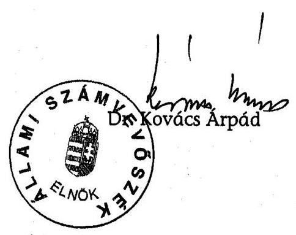
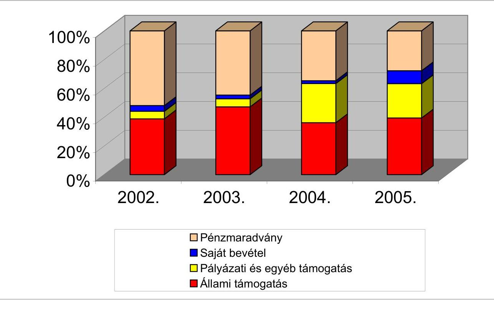
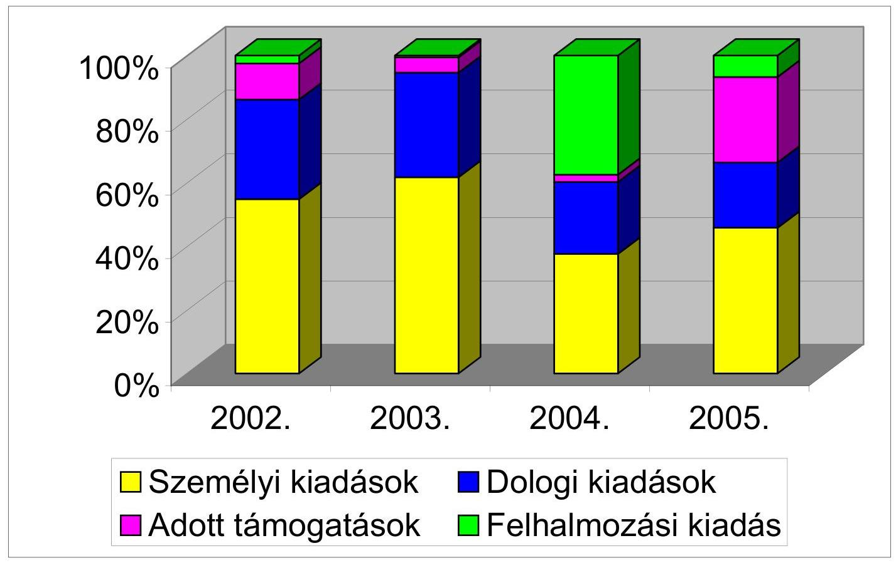
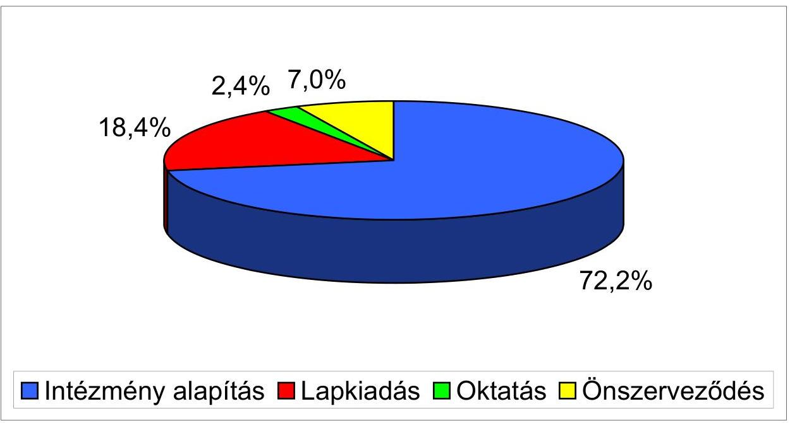

# ÁLLAMI   SZÁMVEVŐSZÉK 

## JELENTÉS

a Magyarországi Románok Országos Önkormányzata 2002-2005. évi pénzügyi-gazdasági tevékenységének ellenőrzéséről

---

3. Önkormányzati és Területi Ellenőrzési Igazgatóság
3.1. Szabályszerüségi Ellenőrzési Főcsoport
Iktatószám: V-1002-021/2006.
Témaszám: 802
Vizsgálat-azonosító szám: V-0285
Az ellenőrzést felügyelte:
Dr. Lóránt Zoltán
föigazgató
Az ellenőrzés végrehajtásáért felelős:
Dr. Elek János
általános föigazgató-helyettes
Az ellenőrzést vezette:
Horváth Balázs
főcsoportfőnök-helyettes
Az összefoglaló jelentést készítette:
Dr. Faragóné Tóth Mária
számvevő tanácsos
Az ellenőrzést végezték:
Dr. Faragóné Tóth Mária Tóth István
számvevő tanácsos számvevő tanácsadó

# A témához kapcsolódó eddig készített számvevőszéki jelentések: 

címe
Jelentés a Magyarországi Románok Országos Önkormányzata 374 pénzügyi-gazdasági tevékenységének ellenőrzéséről
Jelentés az országos kisebbségi önkormányzatok pénzügyi- 0201 gazdasági tevékenységének vizsgálatáról
Jelentés a Magyarországi Románok Országos Önkormányzata 0207 pénzügyi-gazdasági tevékenységének vizsgálatáról

---

# TARTALOMJEGYZÉK 

BEVEZETÉS ..... 5
I. ÖSSZEGZŐ MEGÁLLAPÍTÁSOK, KÖVETKEZTETÉSEK, JAVASLATOK ..... 7
II. RÉSZLETES MEGÁLLAPÍTÁSOK ..... 11

1. A feladatellátás szervezettsége, szabályozottsága ..... 11
1.1. Az Önkormányzat szervezeti és működési rendje ..... 11
1.2. A gazdálkodási feladatok szabályozása ..... 12
1.3. A feladatellátás szervezeti háttere ..... 12
2. Az Önkormányzat gazdálkodásának jellemzői ..... 13
2.1.A gazdálkodási tevékenység feltételei ..... 13
2.2. Vagyongazdálkodás, vagyonvédelem ..... 14
2.3. A gazdálkodás számviteli szabályozása ..... 14
3. Az éves költségvetések elkészítése, elszámolása ..... 15
3.1. Az éves költségvetések elkészítése, elfogadása ..... 15
3.2. A költségvetés végrehajtása, zárszámadása ..... 15
3.3. A költségvetési feladatok teljesítése ..... 16
3.3.1. A költségvetési törvényben megállapított támogatás alakulása ..... 16
3.3.2. Pályázati támogatások elszámolása, felhasználása ..... 16
3.3.3. Kiadások alakulása, összetétele ..... 17
4. Az Önkormányzat számviteli tevékenysége ..... 19
4.1. Éves beszámolók összeállítása, jóváhagyása ..... 19
4.2. A könyvvezetési kötelezettség teljesítése ..... 19
4.3. A bizonylati rend és bizonylati fegyelem érvényesítése ..... 19
5. Az Önkormányzat belső ellenőrzési rendszere ..... 20
6. Utóvizsgálat ..... 21
MELLÉKLETEK
7. számú Az Önkormányzat 2002-2005. évi bevételei és megoszlása
8. számú Az Önkormányzat 2002-2005. évi kiadásai és megoszlása
9. számú A központi költségvetésből kisebbségi feladatokra kapott pályázati támogatások és felhasználásuk részletezése 2002-2005. évekre

---

.

---

# RÖVIDÍTÉSEK JEGYZÉKE 

| Ámr. | Az államháztartás múködési rendjéről szóló - többször   módosított - 217/1998. (XII. 30.) Korm. rendelet |
| :-- | :-- |
| ÁSZ | Állami Számvevőszék |
| Önkormányzat | Magyarországi Románok Országos Önkormányzata |
| MNEKK | Magyarországi Nemzeti Etnikai Kisebbségekért Közalapít-   vány |
| Nek. tv. | A nemzeti és etnikai kisebbségek jogairól szóló - többször   módosított - 1993. évi LXXVII. törvény |
| NEKH | Nemzeti és Etnikai Kisebbségi Hivatal |
| NKÖM | Nemzeti Kulturális Örökség Minisztériuma |
| OM | Oktatási Minisztérium |
| Szja törvény | A személyi jövedelemadóról szóló - többször módosított -   1995. évi CXVII. törvény |
| SZMSZ | Szervezeti és Múködési Szabályzat |
| Szt. | A számvitelről szóló - többször módosított - 2000. évi C.   törvény |

---

.

---

# JELENTÉS 

## a Magyarországi Románok Országos Önkormányzata 2002-2005. évi pénzügyigazdasági tevékenységének ellenőrzéséről

## BEVEZETÉS

A 2001. évi népszámlálás adatai szerint a magyarországi román közösségből 7995 fő́ román anyanyelvünek, 8482 fő a román nemzetiséghez tartozónak, a román kulturális értékekhez, hagyományhoz kötődőnek vallotta magát. A 2002. évi önkormányzati választásokat követően 27 településen 44 román helyi kisebbségi önkormányzat alakult. A Magyarországi Románok Országos Önkormányzata (továbbiakban: Önkormányzat) 2002-2005 között kisebbségi feladatai ellátásához múködési és fejlesztési célra a költségvetési törvény alapján 181530 ezer Ft, továbbá 70160 ezer Ft pályázati támogatásban részesült.

Az Állami Számvevőszékről szóló - többször módosított - 1989. évi XXXVIII. törvény 2. § (5) bekezdése, valamint a nemzeti és etnikai kisebbségek jogairól szóló 1993. évi LXXVII. törvény (továbbiakban: Nek. tv.) 39/G. § (1) bekezdésben kapott felhatalmazás alapján vizsgáltuk, hogy a különböző állami forrásokból juttatott pénzeszközök felhasználása a jogszabályi előírásoknak megfelelően történt-e. Az ellenőrzés a 2002-2005. beszámolóval lezárt gazdálkodási évekre, valamint a 2006. évi költségvetési terv összeállítására terjedt ki.

Az ellenőrzés célja annak megállapítása volt, hogy

- az Önkormányzat a központi költségvetési támogatást a Nek. tv-ben meghatározott feladatokra használta-e fel, a felhasználása és elszámolása során betartotta-e a vonatkozó hatályos jogszabályi előírásokat;
- a gazdálkodás törvényessége, szabályszerűsége biztosított volt-e; a tervezés, az operatív gazdálkodás, a beszámolási kötelezettség és a számviteli bizonylati rend teljesítése során érvényesültek-e a jogszabályokban és a belső szabályzatokban megfogalmazott követelmények;
- a szabályszerű gazdálkodás érdekében kialakított kontrollmechanizmusok megfelelően segítették-e a feladatok végrehajtását.

Az ellenőrzés: 2006. június 12 - június 30-a között az Önkormányzat székhelyén történt.

---

.

---

# I. ÖSSZEGZŐ MEGÁLLAPÍTÁSOK, KÖVETKEZTETÉSEK, JAVASLATOK 

Az Önkormányzat szervezeti és múködési rendjét hatályos SZMSZ rögzítette, melyet a 2005 novemberétől hatályos Nek. tv-nek megfelelően nem aktualizáltak. Meghatározta jogállását, hatáskörét, szervezetét, azonban az ellátott kisebbségi feladatait és a feladatellátás rendszerét nem szabályozta. Az Önkormányzat szabályszerűen megválasztotta testületeit, de az SZMSZ előírása ellenére a közgyűlés feladat- és hatásköri jegyzékét, valamint az átruházható fel-adat- és hatásköröket nem rögzítette. A közgyűlés az SZMSZ előírásainak megfelelően, éves munkaterv alapján gyakorolta hatáskörét, döntéseit szabályszerű határozatokkal hozta. A testület pénzügyi-gazdasági döntései előkészítésére, a határozatok végrehajtására hat bizottságot hozott létre. Az SZMSZ-ben a bizottságok felsorolásán kívül nem határozták meg azok feladatkörét. A megelőző ÁSZ ellenőrzés javaslatainak megfelelően, 2003. évtől ellenőrzési feladatokat is ellátó Pénzügyi Gazdasági és Ellenőrző Bizottság működött.

A közgyűlés hivatalt hozott létre a testületek működésének segítésére, az igazgatási és jogalkotási feladatok elvégzésére, a gazdálkodási feladatok ellátására. Az országos kisebbségi feladatok eredményes ellátásához a magyarországi román kultúra ápolása, fejlesztése céljából 2004-ben létrehozta első intézményét - a Magyarországi Románok Országos Önkormányzata Dokumentációs és Információs Központot - részben önállóan gazdálkodó költségvetési szervként. A közgyűlés az intézmény pénzügyi gazdasági feladatai ellátására az Önkormányzat hivatalát jelölte ki. A hivatal nem önálló költségvetési szervként múködött, ezért nem volt jogalapja az Önkormányzat intézménye gazdálkodási feladatai ellátására. Az Önkormányzat fenntartóként biztosította a múködéshez szükséges feltételeket, de a felügyeleti jogkör gyakorlása keretében - az Ámr. előírása ellenére - nem rendelkezett az intézményi múködés és gazdálkodás szabályairól, az elkülönített intézményi költségvetés, zárszámadás és beszámoló közgyűlési jóváhagyásáról, a felelősségvállalás és munkamegosztás rendjéről, a felügyeleti ellenőrzésről.

A gazdálkodási feladatokat az Önkormányzat hiányosan szabályozta. Meghatározta gazdálkodásának pénzügyi forrásait, a közgyűlés kizárólagos hatáskörébe utalta a költségvetés és zárszámadás elfogadását. Belső előírásban nem rögzítették az éves költségvetés és zárszámadás elkészítési rendjét, felelősét, határidejét, a tervezési és beszámolási dokumentumok összeállításának követelményeit. Az Önkormányzatnál az országos kisebbségi feladatokhoz igazodóan az alkalmazotti létszám a megnövekedett feladatok miatt, a 2002. évi öt főről 2005-re nyolc főre emelkedett. A székhelyként kialakított hivatal felszereltségét folyamatosan fejlesztették, állagmegórzéséről gondoskodtak. Az Önkormányzatnál a rendelkezésre álló személyi és tárgyi feltételek megfelelő hátteret biztosítottak a nemzetiségi célok folyamatos szervezéséhez, teljesítéséhez.

Az Önkormányzat vagyona feletti rendelkezésre vonatkozó döntést - a Nek. tv. és az ÁSZ javaslata ellenére - a közgyűlés helyett törvénysértő módon az el-

---

nökség hatáskörébe utalták. A vagyonról általánosságban rendelkeztek, a törzsvagyon körét nem állapították meg. A gyakorlatban a vagyoni helyzet alakulására kiható intézkedésekről közgyűlési határozat született. Az intézményi feladatok belépésével a szabályozást csak részben aktualizálták, az intézménnyel kapcsolatos gazdálkodási szabályokat nem határozták meg. Az Önkormányzat az egyszeri vagyonjuttatásként kapott MOL részvényt értékesítette, amelyet lekötött betétbe helyezett és ingatlanvásárlásra fordított.

Az Önkormányzat 2002-2005 között minden évben rendelkezett közgyűlési határozattal elfogadott költségvetéssel, zárszámadásṣal. Az éves költségvetéseket a bizottságok közremúködésével bevételi és kiadási jogcímrészletezéssel tervezték. Az alapvető kisebbségi feladatok forrásigényét nem határozták meg, így hiányzott a tervből a központi költségvetési támogatás kisebbségi célra történt felhasználásának megosztása. Mindössze a Cronica újság szerkesztésével kapcsolatos kiadásokat különítették el. A költségvetések évente azonos szerkezetben készültek, amelyekkel a zárszámadások tartalma összhangban volt. A költségvetés és zárszámadás elfogadása minden évben a Pénzügyi Gazdasági és Ellenőrző Bizottság véleményével kiegészítve történt. A költségvetés végrehajtásánál biztosították a kötelezettségvállalások pénzügyi fedezetét, a pénzügyi egyensúly folyamatos megőrzését. Az Önkormányzat stabil pénzügyi helyzetét a tőke ellátottsági mutató $90 \%$ feletti szintje is tükrözte.

Az Önkormányzat a 2002-2005. években összesen 276258 ezer Ft pénzforgalmi bevételből gazdálkodott. A költségvetési törvények alapján 181530 ezer Ft, pályázat eredményeként 70160 ezer Ft központi költségvetési támogatást kapott, amely együttesen a pénzforgalmi bevételek $91,1 \%$-át tette ki. A nevesített múködési célú költségvetési támogatás a 2002. évi bázishoz képest 2003-ra 22,9\%-kal nőtt, 2004. évben szinten tartással teljesült, míg 2005ben az államháztartási egyensúlyi intézkedések miatt csökkent. A pályázati támogatások 72,2\%-át intézményalapításra használták fel. A költségvetési és pályázati támogatások rendeltetésszerú felhasználását a bizonylatok, a pénzügyi és szakmai beszámolók igazolták. A költségvetési támogatás felhasználásának elkülönített nyilvántartását jogszabályi előírás ellenére nem vezették. Az Önkormányzat - a pályázatok kivételével - minden évben határidőre teljesítette a támogatási szerződésben megállapított elszámolási kötelezettségét. A pályázatok közel felénél határidő után számoltak el. Az Önkormányzat összes kiadásának 73,3\%-át múködésre, 15,5\%-át felhalmozásra, 11,2\%-át román kisebbségi szervezetek támogatására fordította. A támogatott szervezetekkel az Ámr. előírása ellenére támogatási szerződést nem kötöttek.

Az Önkormányzat rendelkezett a számviteli törvény által előírt, hatályos számviteli szabályozással. A szabályozás részben felelt meg a számviteli törvény követelményeinek, mivel nem tükrözte az Önkormányzat szervezeti és múködési sajátosságait. Az előző ÁSZ vizsgálat megállapításai ellenére, a szabályzatokat a gazdálkodási sajátosságoknak megfelelően nem módosították, a jogszabályváltozásoknak és az új feladatoknak (intézményalapítás) megfelelően nem aktualizálták. A könyvvezetési kötelezettséget kettős könyvvitellel, könyvelő vállalkozó szolgáltatásainak igénybevételével teljesítette. A könyvelésben nem biztosította a ráfordítások kisebbségi feladatonkénti kimutatását.

---

Az éves beszámolókat a jogszabályban meghatározott formában, határidőre elkészítették. A beszámolók szabályszerűen a főkönyvi könyveléssel egyezően készültek. Az Önkormányzatnál sérült a könyvelés alapjául szolgáló számviteli bizonylatok alaki és tartalmi követelménye, mivel az alapbizonylatokról hiányzott az érintett főkönyvi számlákra való hivatkozás, továbbá a könyvviteli nyilvántartásban történt rögzítés időpontja. Az Önkormányzat a gépkocsihasználat költségelszámolása során megsértette az Szja törvény előirrását, mert a kiküldetési rendelvényekről hiányzott az utazás elrendelése, az útnyilvántartásokról a felkeresett partner megnevezése és az utazás céljának feltüntetése. A tulajdonában álló személyi használatú személygépkocsija után cégautó adót nem fizetett annak ellenére, hogy az autó használatáról vezetett menetlevelek nem feleltek meg az Szja törvény tartalmi követelményeinek, azokból a kizárólagos hivatali használat nem volt megállapítható. A bizonylatolási hiányosságok az éves beszámolók valódiságát lényeges szinten nem befolyásolták.

Az Önkormányzatnál az SZMSZ-ben a belső ellenőrzés hierarchikus rendszeréről, összehangolt jogosultságáról és múködéséről nem rendelkeztek. Az Önkormányzat közgyűlési határozatával az ellenőrzést a Pénzügyi, Gazdasági és Ellenőrző Bizottság feladatkörébe utalta. Az SZMSZ előírásának megfelelően a bizottság éves munkatervben rögzítette feladatait és célkitűzéseit. A gazdálkodást folyamatosan ellenőrizte, a tervezést és zárszámadást véleményezte, vizsgálatairól jegyzőkönyv készült, és azok eredményéről a közgyűlést tájékoztatta. A feltárt hibák kijavítására közgyűlési döntés alapján intézkedés történt. A vezetői ellenőrzés a kötelezettségvállalási és utalványozási jogkör szabályszerű gyakorlásán keresztül érvényesült. A munkafolyamatba épített ellenőrzés számviteli szabályozásokban meghatározott követelményei teljesültek.

A helyszíni ellenőrzés megállapításainak hasznosítása mellett javasoljuk:

# az Önkormányzat közgyűlésének: 

1. Egészítse ki az SZMSZ-t
a) az önkormányzati feladatok meghatározásával;
b) az éves költségvetés, zárszámadás és vagyonleltár összeállításának szabályozásával, törzsvagyonának rögzítésével;
c) a belső ellenőrzés hierarchikus rendszerének, összehangolt jogosultságainak és működésének szabályzásával, a Pénzügyi, Gazdasági és Ellenőrzési Bizottság feladatkörének meghatározásával, figyelemmel a Nek. tv. 39/G. § (2) bekezdés előírására;
d) a Nek. tv. 39/B. (1) bekezdés szabályozása szerint a hivatala müködésének részletes szabályaival.
2. Határozza meg a felügyeleti jogkör gyakorlásának szabályait az Ámr. 13. § (9) bekezdés előírásának érvényesülése érdekében.
3. Intézkedjen a részben önállóan gazdálkodó intézmény pénzügyi-gazdasági feladatainak szabályszerű ellátására, figyelemmel az Ámr. 14. § (5)-(6) bekezdésben foglaltakra.

---

4. Gondoskodjon az intézmény költségvetésének, zárszámadásának és beszámolójának jóváhagyásáról az Ámr. 13. § (4) bekezdés c) pont szabályozásával összhangban.
5. Helyezze az elnökség hatásköréből a közgyűlés kizárólagos hatáskörébe. az önkormányzat vagyona feletti rendelkezés jogosultságát, összhangban a Nek. tv. 60. § (1) bekezdés előírásával.

# az Önkormányzat elnökének: 

1. Rendelkezzen a költségvetés és a zárszámadás összeállításának, jóváhagyásának tartalmi és eljárási szabályairól, szerezzen érvényt a belső előírások betartásának.
2. Gondoskodjon a közgyűlés feladat- és hatásköri jegyzékének elkészítéséről a tárgyban hozott közgyűlési határozat szerint.
3. Módosítsa a számviteli szabályozásokat a gazdálkodási sajátosságoknak, a jogszabályváltozásoknak és új feladatoknak megfelelően.
4. Biztosítsa a közpénzek felhasználásának feladatonként elkülönített nyilvántartását.
5. Intézkedjen az Szt. 167. § (1) bekezdés előírása szerint a bizonylatok alaki és tartalmi követelményeinek érvényesülésére.
6. Gondoskodjon a továbbadott támogatások rendeltetésszerű felhasználásának elszámoltatásáról.
7. Rendeljen el önellenőrzést az Szja törvény 70. § szabályaira figyelemmel a vizsgált évek cégautó adó bevallási és befizetési kötelezettségének teljesítése érdekében.

---

# II. RÉSZLETES MEGÁLLAPÍTÁSOK 

## 1. A feladATELLÁTÁs SZERVEZETTSÉGE, SZABÁLYOZOTTSÁGA

### 1.1. Az Önkormányzat szervezeti és múködési rendje

Az Önkormányzat a 2005. november 25 -ig hatályos Nek. tv. 35-39. § előírásai alapján az SZMSZ-ben meghatározta jogállását, hatáskörét, szervezetét. Nem szabályozta az ellátott kisebbségi feladatait és a feladatellátás rendszerét. Szabályozta a közgyűlés döntéshozatali tevékenységét, a bizottságok működését, az elnökség, elnök, alelnökök és képviselők jogait és kötelességeit. Részben kitért az Önkormányzat gazdálkodására, vagyonára, költségvetésére. Előírta az intézményalapítás feltételeit. A vizsgált időszakban egymást követően két SZMSZ volt érvényben, amelyet a 2005. novemberétől hatályos Nek. tv-nek megfelelően nem aktualizáltak.

Az 1999. évtől hatályos SZMSZ, amelyet a 4/2001. (III. 3.) számú és az ezt megerősítő 6/2002. (IV. 26.) számú közgyűlési határozattal módosítottak és 2003. évig volt érvényben. A módosításban az Önkormányzatot megillető tulajdonosi jogok gyakorlását, a közgyűlés hatásköréből az elnökség hatáskörébe helyezték át. A 2003-ban elfogadott, szabályozásban a közgyűlés múködését, a bizottságok és elnökség létszámát, feladatát módosították. Az új szabályozásban - a megelőző ÁSZ ellenőrzés javaslatainak megfelelően - a Pénzügyi Bizottságot az ellenőrzési feladatokkal is megbízták. A szabályzatot a 2004. április 3.-i közgyűlés az új önkormányzati intézmények fejezettel kiegészítette és a bizottságok elnevezését és tagjainak számát módosították.

Az Önkormányzat választott testületi szervei a közgyűlés, az elnökség, az elnök, az alelnökök, és a bizottságok.

Az Önkormányzat törvényben meghatározott feladat- és hatáskörét 2003. évig 51, majd 53 tagú szabályszerűen választott közgyűlés gyakorolta. Az Önkormányzatnál - a vagyongazdálkodás kivételével - a Nek. tv. előírásaival összhangban határozták meg a közgyűlés hatásköréből át nem ruházható döntési jogköröket. A közgyűlés a feladatait elfogadott éves munkaterv alapján végezte. Az SZMSZ (10., 12. pont) előírása ellenére a közgyűlés feladat- és hatásköri jegyzékét nem készítették el és ebben az átruházható feladat- és hatásköröket nem rögzítették.

Az elnökség az elnökből, három alelnökből, valamint a közgyűlés által megválasztott további 17 illetve 2003. évtől 26 tagból és az üléseken tanácskozási joggal részt vevő hivatalvezetőből állt. Az elnökség a közgyűlések között operatív döntéshozó funkciót látott el. Döntéseiről a közgyűlésnek beszámolt. Az elnök képviselte az Önkormányzatot, összehívta és vezette az elnökség és a közgyűlés üléseit. Az Önkormányzat a 2002. évi választást követően 2003. március 3-án tartotta meg alakuló ülését, a testület élére ugyanazt az elnököt választották.

---

A közgyűlés feladatainak hatékonyabb ellátása és törvényességének biztosítása érdekében, a közgyűlés döntéseinek előkészítésére és végrehajtására hat bizottságot hozott létre. Az SZMSZ-ben a bizottságok felsorolásán kívül nem határozták meg azok feladatkörét. Előírták a 2003. évtől, hogy a bizottságok éves munkatervben határozzák meg feladataikat, célkitűzéseiket. A bizottságok a szabályozás szerint éves munkatervet készítettek, előterjesztésekkel segítették az elnökség és a közgyűlés munkáját.

A közgyűlés szervei közötti munkamegosztás módja, gyakorlata a vizsgált időszakban - a tulajdonosi jogok és kötelezettségek gyakorlása kivételével - megfelelt a Nek. tv-ben szabályozott hatásköri jogosultságoknak. Biztosítottak voltak a folyamatos munkavégzés feltételei, érvényesültek az összeférhetetlenségi szabályok. Az Önkormányzat működését meghatározó alapdokumentumok előírásai összhangban álltak a vonatkozó törvényekkel, jogszabályokkal.

# 1.2. A gazdálkodási feladatok szabályozása 

Az Önkormányzat az SZMSZ IX. fejezetében meghatározta gazdálkodásának pénzügyi forrásait, az önkormányzat vagyonára, gazdálkodására vonatkozó kritériumokat. A közgyűlés kizárólagos hatáskörébe tartozott a költségvetés és zárszámadás elfogadása. Belső előírás nem szabályozta az éves költségvetés és zárszámadás elkészítési rendjét, felelősét, határidejét, a tervezési és beszámolási dokumentumok összeállításának követelményeit. A szabályozási hiányosság összefüggött azzal, hogy a kisebbségi feladatokat nem rögzítették a Nek. tv. 37. § (1) bekezdésében foglaltaknak megfelelően. Az Önkormányzat gazdálkodási feladatait a Gazdálkodás Bonyolításának Szabályozása tartalmazta. A szabályzatban a kötelezettségvállalási, utalványozási és ellenőrzési jogköröket rögzítették. A kötelezettségvállalást és utalványozást az önkormányzat elnöke gyakorolta.

Az SZMSZ (II. fejezet 9. pont) szerint az intézmények alapítása, és fenntartása a közgyűlés hatásköréből nem ruházható át. Az SZMSZ önkormányzati intézmények (X. fejezet 60. pontja) részénél nem pontosan fogalmaztak, félreérthető módon az szerepelt, hogy „az MROÖ elnöksége határozattal intézményeket alapithat, megszüntethet, vagy átszervezhet". A gyakorlatban helyesen intézményalapításról közgyűlési határozattal döntöttek.

A testület pénzügyi gazdasági döntései jegyzőkönyvezett határozatokon alapultak, amelyek végrehajtásáért az elnökség felelt, személy szerinti felelőst nem neveztek meg.

### 1.3. A feladatellátás szervezeti háttere

Az Önkormányzat feladatai ellátásához a magyarországi román kultúra ápolása, fejlesztése céljából 2004. április 3.-i megalakulással létrehozta első intézményét a Magyarországi Románok Országos Önkormányzata Dokumentációs és Információs Központját (továbbiakban: Központ). Az intézmény alapításáról az Ügyrendi és Jogi Bizottság előterjesztésére, az Önkormányzat elnöksége javaslata alapján szabályszerűen a közgyűlés határozott. Az önálló jogi személyként 2004. szeptember 29-én törzskönyvi nyilvántartásba vett Központ országos kisebbségi önkormányzati, részben önállóan gazdálkodó

---

költségvetési szervként múködött. A Központ alapító okiratának hiányossága, hogy az önkormányzati SZMSZ 62. bekezdésében előírtak ellenére nem tartalmazta a felügyeleti joggal rendelkező bizottság megnevezését.

Az Önkormányzat a részben önállóan gazdálkodó Központ pénzügyigazdasági feladatainak ellátására az Önkormányzat hivatalát (továbbiakban: hivatal) jelölte ki annak ellenére, hogy a hivatal nem költségvetési szervként, hanem a kisebbségi önkormányzatok költségvetésének, gazdálkodásának, vagyonjuttatásának egyes kérdéseiről szóló 20/1995. (III. 3.) Korm. rendelet 2. § (1) bekezdésének előirása alapján a társadalmi szervezetek gazdálkodó tevékenységére vonatkozó szabályok szerint múködött. A kijelölés ellentétes volt az Ámr. 14. § (5) bekezdés a) pontjának előírásával, mely szerint a pénzügyigazdasági feladatok ellátására önállóan gazdálkodó költségvetési szervet kell kijelölni. A jogsértő helyzetet nem az Önkormányzat, hanem a Nek. tv. 39. §-t módosító 2005. évi CXIV. tv. 42. §-a rendezte. A 2005. november 25 -étől hatályos Nek. tv. 39/B. § (5) bekezdése szerint „a hivatal országos kisebbségi önkormányzati költségvetési szerv".

A Központ költségvetését, zárszámadását és beszámolóját elkészítette, az Önkormányzat részéről a felügyeleti ellenőrzést nem dokumentálta. A Központ elkülönített költségvetését, zárszámadását és beszámolóját ellentétesen az Ámr. 13. § (4) c) pontja előírásaival az Önkormányzat közgyűlése külön nem fogadta el.

Az Önkormányzat fenntartóként biztosította a múködéshez szükséges feltételeket, de a felügyeleti jogkör gyakorlásához a közgyűlés nem rendelkezett az intézményi múködés és gazdálkodás szabályairól, felelősségvállalás és munkamegosztás rendjéről.

# 2. Az ÖNKORMÁNYZAT GAZDÁLKODÁSÁNAK JELLEMZŐI 

### 2.1. A gazdálkodási tevékenység feltételei

Az Önkormányzat az SZMSZ szabályozása szerint a testületek múködésének segítésére, az igazgatási és jogalkotási feladatok, elvégzésére, a gazdálkodási feladatok ellátására hivatalt hozott létre. Az önkormányzati múködés, döntés előkészítés és végrehajtás operatív feladatait - szabályozásuknak megfelelően a hivatal az elnökség irányításával, hivatalvezető vezetésével külön ügyrendi szabályozás nélkül végezte. A hivatal nem volt önálló költségvetési szerv, ezért - az előző pontban részletezettek szerint - nem volt jogalapja a részben önállóan gazdálkodó intézmény gazdálkodási feladatainak ellátására. Az intézmény gazdálkodásának irányítását, ellenőrzését nem szabályozták. Az országos kisebbségi feladatokhoz igazodóan az alkalmazotti létszám a megnövekedett feladatok miatt, a Cronica önkormányzati havi lap beindításával, oktatási referens, rendszergazda alkalmazásával a vizsgált időszakban öt főről nyolc főre emelkedett. A folyóirat szerkesztési és egyéb feladatokra megbízási szerződéseket kötöttek. Az SZMSZ előirása szerint elnöknek, alelnököknek és képviselőknek a közgyűlés, a bizottsági elnöknek és tagoknak pedig az elnökség tiszteletdíjat állapított meg. A költségvetés tervezet összeállítási, számviteli, pénzügyi és munkaügyi feladatok ellátására külső vállalkozóval kötöttek szerződést. A hi-

---

vatal a dolgozókkal a munkaszerződés megkötésekor minden feladatra kiterjedő munkaköri leírást készített, amit folyamatosan aktualizált. A dolgozók alkalmazásánál, szerződéskötéseknél, személyi jellegű kifizetéseknél a vonatkozó jogszabályi előírásokat betartották.

Az Önkormányzat Budapesten a fővárosi kirendeltség elhelyezésére irodával, a gyulai székhelyen irodaházzal rendelkezett. A magyar állam tulajdonát képező ingatlan tervszerű állagvédelméről gondoskodtak. A megfelelő kialakítású irodák berendezését felszereltségét folyamatosan fejlesztették, számítástechnikai eszközökkel, fénymásolóval, korszerű technikai feltételeket biztosítottak a feladatok teljesítéséhez. A rendelkezésre álló személyi és tárgyi feltételek megfelelő hátteret biztosítottak a nemzetiségi célok folyamatos szervezéséhez, teljesítéséhez.

# 2.2. Vagyongazdálkodás, vagyonvédelem 

A Nek. tv. 37. § előírása és az előző ÁSZ ellenőrzés javaslata ellenére nem döntöttek a törzsvagyon köréről, a vagyonleltár megállapításáról. Az önkormányzati vagyon fogalmát, a tulajdonát képező ingatlan és ingó vagyont az SZMSZ csak általánosságban fogalmazta meg. Az Önkormányzat vagyona feletti rendelkezésre vonatkozó döntést, a közgyűlés helyett törvénysértő módon (Nek. tv. 60. § (4) bekezdés) az elnökség hatáskörébe utalták. A gyakorlatban a vagyoni helyzet alakulására kiható intézkedésekről közgyűlési határozatok születtek. Az Önkormányzat a Nek. tv. 63. § (4) bekezdése alapján egyszeri vagyonjuttatásként kapott, 2001. évben még tulajdonában lévő 16000 ezer Ft MOL névértékű részvényt 67823 ezer Ft-ért értékesítette, amit lekötött betétbe helyezett és ingatlanvásárlásra fordított. Az üzleti tranzakciók eredményeként és a 20042005. évben felhalmozásra kapott 28650 ezer Ft támogatásból az Önkormányzatnál az eszközök összesen értéke a 2001. évi nyitó 27113 ezer Ft-ról, 2005. évre 82274 ezer Ft-ra nőtt. Hasonlóan stabil pénzügyi helyzetre utalt a saját tőke összes forrásra vetített tőke ellátottsági mutatójának 90,3-93,9\% közötti szintje.

A Központ kialakításához az Önkormányzat 2004. évben állami támogatásból és saját forrásból ingatlant vásárolt. Az Önkormányzat 2005. évben a vásárolt ingatlant, a tulajdonában lévő kiállító- és olvasótermet, irodaépületet, garázs, illetve udvar teljes területét, határozatlan időtartamra a Központ működési feltételeinek biztosítására ingyenes használatba adta. A román kormány támogatásából vásárolt számítógéprendszert, irodabútorzatot és kiállítópaneleket szintén átadták a Központnak.

Az önkormányzati vagyon védelme érdekében az éves leltározásokat szabályszerűen végrehajtották és dokumentálták. A kötelezettségvállalásnál érvényesítették az összeférhetetlenségi és hatásköri korlátozásokat, gondoskodtak az elhasználódott vagyontárgyak selejtezéséről. Az épületekre, járművekre és berendezésekre biztosítási szerződést kötöttek. Az önkormányzat székházát riasztóval látták el.

### 2.3. A gazdálkodás számviteli szabályozása

Az Önkormányzat - elnöki hatáskörben kiadott - a számviteli törvény által előírt, hatályos számviteli szabályozással (számviteli politika, számlarend,

---

számlatükör, értékelési szabályzat, leltározási és selejtezési szabályzat) rendelkezett. Az Szt. 14. § (5) bekezdése szerinti külön pénzkezelési szabályzatot nem készítettek. A pénzkezelést az 1999 óta hatályos Gazdálkodás Bonyolításának Szabályozása elnevezésű szabályzatban rögzítették. A szabályozás nem határozta meg a pénzkezelés során használatos bizonylatokat, illetve azok tartalmát. A szabályzatok nem tükrözték az Önkormányzat szervezeti és múködési sajátosságait. Az előző ÁSZ vizsgálat megállapításai ellenére, a szabályzatokat a gazdálkodási sajátosságoknak megfelelően nem dolgozták át, 2002-2004 között nem módosították, a jogszabályváltozásoknak és az új feladatoknak (intézményalapítás) megfelelően nem aktualizálták.

A számlarendet 2004. évben nem módosították a számviteli törvény szerinti egyes egyéb szervezetek beszámoló-készítési és könyvvezetési kötelezettségének sajátosságairól szóló 224/2000. (XII. 19.) Korm. rendeletet módosító 237/2003. (XII. 17.) Korm. rendelet változásával. A kapott támogatások és felhasználásuk elkülönített nyilvántartási rendjét nem szabályozták 17. § (8) bekezdése szerint. A Központ alapítása után 2004. évben, számlarendjükben az egyéb bevételeken belül a továbbutalási céllal kapott támogatást külön számlán nem szerepeltették.

# 3. AZ ÉVES KÖLTSÉGVEtÉSEK ELKészítÉse, ELSZÁmolása 

### 3.1. Az éves költségvetések elkészítése, elfogadása

A költségvetés megállapítása a közgyűlés kizárólagos, át nem ruházható hatáskörébe tartozott. Belső előírás nem rögzítette a költségvetés elkészítéséért felelős személyt, elkészítésének rendjét, tartalmát. A költségvetések az előző év tényadatai, valamint a jóváhagyott költségvetési támogatás figyelembe vételével készültek. A költségvetés készítés alapját szolgálták továbbá az Önkormányzat, a bizottságok, éves szakmai tervei, pénzügyi tervek és a könyvelő vállalkozó által végzett számítások. Az Önkormányzat éves költségvetéseit egymással összehasonlítható szerkezetben készítették el. A bevételeket hat jogcímen; költségvetési támogatás, céltámogatás programokra, kamat bevételek, egyéb bevétel, önkormányzati támogatás, előző évi pénzmaradvány tervezték. A 2002-2006 években az Önkormányzat kiadásait - költség nemenkénti részletezésben - az előző évi pénzmaradványt és a Cronica újság szerkesztésével kapcsolatos kiadásokat tervezték. A költségvetések elfogadása 2002-2006 között az SZMSZ előírásainak megfelelően - a Pénzügyi és Ellenőrző Bizottság által véleményezett javaslattal - közgyűlési határozattal történt.

### 3.2. A költségvetés végrehajtása, zárszámadása

A költségvetés végrehajtásánál a konkrét feladatok forrásigényét és felhasználását nem határozták meg elkülönítetten. Az egyes évek gazdálkodásánál a tömegtájékoztatási kiadások, (szerkesztőség kiadásai) kivételével nem különültek el az oktatásra, kulturális tevékenységre, kutatásra, nemzetközi kapcsolattartásra, társadalmi integrációs feladatokra fordított kiadások, ennek következtében nem állapítható meg, hogy megtörtént-e a feladatok differenciálása és milyen szempontok alapján. Az Önkormányzatnál az SZMSZ és egyéb belső előírás a költségvetéshez hasonlóan nem rögzítette az egyes zárszámadási so-

---

rok bevételi és kiadási jogcímeit, de azok a költségvetéssel, azonos tartalommal és szerkezetben készültek. A zárszámadások tartalmi felépítése azonos volt, így az azonos bevételi és kiadási jogcímek biztosították az évek közötti összehasonlítást.

A költségvetések végrehajtása során szabályozásuknak megfelelően érvényesült a kötelezettségvállalások és utalványozások hatásköri rendje, biztosított volt a kötelezettségvállalások pénzügyi fedezete, a bevételek az ellenőrzött években meghaladták a kiadásokat. Az Önkormányzat a beszámolók tanúsága szerint megőrizte pénzügyi egyensúlyát, hosszúlejáratú kötelezettséget egyik évben sem mutattak ki, a tőkeváltozás pozitív eredményű volt. Az Önkormányzat a vizsgált időszakban még átmeneti jelleggel sem kényszerült hitelfelvételre, bankszámláján 2002. évtől folyamatosan legalább 30000 ezer Ft összeg volt.

Az éves zárszámadások adatai az adott év főkönyvi könyveléséből levezethetők voltak. A vizsgált időszakban az Önkormányzat gazdálkodásáról szóló zárszámadásokat, a következő évi költségvetéssel és az egyszerűsített éves beszámolóval együtt bizottsági ajánlásra gazdasági évet követő áprilisban fogadta el az Önkormányzat közgyűlése.

# 3.3. A költségvetési feladatok teljesítése 

Az Önkormányzat 2002-2005. években összesen 276258 ezer Ft pénzforgalmi bevétellel gazdálkodott, melyből a költségvetési törvény alapján 181530 ezer Ft-ot, pályázat eredményeként a központi költségvetésböl 70160 ezer Ft-ot kapott, amely együttesen a pénzforgalmi bevétel $91,1 \%$ át tette ki. A fennmaradó hányad egyéb jogcímeken külföldi támogatásból $(0,9 \%)$, saját bevételből ( $7,2 \%$ ) és a nemzetiségi feladatok megvalósításához kapott egyéb támogatásból $(0,8 \%)$ teljesült. Az Önkormányzat éves bevételében meghatározó szerepe volt az előző évi pénzmaradványnak ( $27,8 \%$ - $52 \%$ között). Az évenkénti pénzmaradvány elsődlegesen a 2001. évben eladott MOL részvények értékesítéséből és egyéb kiadási megtakarításokból képződött.

### 3.3.1. A költségvetési törvényben megállapított támogatás alakulása

Az Önkormányzat évenkénti múködéséhez a költségvetési törvény alapján 2002. évben 39300 ezer Ft, 2003-2004-ben évente 48300 ezer Ft, 2005. évben 45630 ezer Ft állami támogatást kapott. A múködési célú támogatás 2002. évi bázishoz képest 2003-ra 22,9\%-kal nőtt, 2004. évben a támogatás összege előző évi szinten maradt. A 2005. évi támogatás összege az államháztartási egyensúlyi intézkedések miatt csökkent. Az Önkormányzatnál az összes bevétel 40\%-át tette ki az évenkénti múködési célú központi támogatás(1. számú melléklet).

### 3.3.2. Pályázati támogatások elszámolása, felhasználása

Az Önkormányzat a nemzeti és etnikai kisebbségi feladatokra benyújtott pályázatok eredményeként 2002-2005 között 70160 ezer Ft központi költségvetési támogatást kapott. A vizsgált időszakban a pályázati úton kapott támogatások az összes bevétel $16,5 \%$-át tették ki. A pályázati támogatás $4,7 \%$-a minisztéri-

---

umoktól, 23\%-a közalapítványi támogatásból és 72,3\%-a a NEKH-tól származott.

A pályázati támogatások összege 2002-ről 2003 évre 53,7\%-kal nőtt, 2004-ben intézményalapítási támogatás miatt mintegy ötszöröse volt az előző évinek, 2005. évben az előző évihez viszonyítva 13,3\%-kal csökkent (3. számú melléklet).

- A NEKH a vizsgált időszakban 50750 ezer Ft (72,3\%) támogatást adott 100 ezer Ft kivételével - intézmény alapítására és fenntartására. Az Önkormányzat által alapított Központ működési koncepciója kidolgozásához az Önkormányzat 2003. évben 1500 ezer Ft-ot kapott.
- A 2004. évi kiugróan magas bevétel magyarázata, hogy ebben az évben az Önkormányzat 28000 ezer Ft összegben kapott támogatást a Központ elhelyezéséhez és múködésének beindításához, 2005. évben ugyanezen intézmény múködéséhez és székházának felújításához 21150 ezer Ft támogatást vett igénybe.
- A MNEKK az Önkormányzatnak a vizsgált időszakban összesen 16115 ezer Ft támogatást nyújtott, ebből a Cronica havi lap megjelentetését 12947 ezer Ft-tal támogatta. A többi támogatást perenita fesztiválra, hagyományőrző diákkörök találkozójára, kulturális napokra, népismereti táborra fordították.
- Az OM-tól kapott 1679 ezer Ft támogatás 70\%-a akkreditált továbbképzésre teljesült.

A pályázati támogatások 72,2\%-át intézményalapításra, 18,4\%-át lapkiadásra, 2,4\%-át oktatásra és 7\%-át önszerveződésre használták fel (3. számú melléklet).

A támogatások az Ámr. 87-89. § követelményével kötött szerződések alapján teljesültek. Az Önkormányzat az elnyert 38 pályázatból a feladat elmaradása miatt - 2 pályázat - 460 ezer Ft-támogatást visszautalt. A vizsgált pályázatok elszámolása a pályázatok közel felénél (48,5\%) az elszámolási határidő lejárta után történt. A támogatók az Önkormányzattal szemben az elszámolási határidő elmulasztása miatt szankciót nem alkalmaztak. A vizsgált pályázatok elszámolása bizonylatokkal pénzügyi és szakmai beszámolóval alátámasztva történt. A pályázatban megjelölt támogatási célok megvalósulását a szakmai beszámolók, kiadványok, fényképek, könyvek tanúsították. A támogatások rendeltetésszerú felhasználását a támogatók a helyszínen nem ellenőrizték.

# 3.3.3. Kiadások alakulása, összetétele 

Az ellenőrzött időszakban az összes kiadás 73,3\%-át múködésre (személyi és dologi), 15,5\%-át felhalmozási célra fordították, 11,2\%-át kisebbségi szervezeteknek továbbadták. A kiadások 2003. évi 56142 ezer Ft-ról 2004. évre 101601 ezer Ft-ra nőttek, ez majdnem kétszeres növekedést jelentett (2. számú melléklet). Az Önkormányzat a vizsgált időszakban 32186 ezer Ft és 46438 ezer Ft közötti szabad pénzforrással zárta az egyes gazdasági éveket, vagyis forrásának 24,1 - 45,3\%-át nem használta fel. A személyi kiadások és járulékai, valamint a dologi kiadások összege jelentősen nem ingadozott. A fel-

---

halmozási kiadások részaránya 2004. évi kiugró alakulását (37,5\%) a Központ ingatlanbeszerzése indokolta. Az ingatlanbeszerzéssel és a Központ beindításával magyarázható a tartalék több mint 10000 ezer Ft-os csökkenése. Az Önkormányzat 2002-2005 évek között 32701 ezer Ft támogatást adott tovább a különféle román kisebbségi szervezeteknek.

Az adott támogatások összkiadásokhoz viszonyított aránya 2002-2004. években $4,8 \%-2,3 \%$ között alakult. A 2005. évi 26,9\%-os részesedést a Központja múködéséhez a NEKH-tól elnyert és továbbadott 16500 ezer Ft összegű támogatás eredményezte. A továbbadott támogatást az esetek 70\%-ában helyi kisebbségi önkormányzatok kapták. Az Önkormányzat a támogatásokat egyedi támogatási kérelmek alapján, az elnökség döntésével ítélte oda, a támogatott szervezetekkel támogatási szerződést nem kötött. Az átutalás a támogatásról szóló értesítés alapján történt. Szabálytalan támogatási gyakorlatot jelentett, hogy a támogatások - egy harmadánál - a támogatási érték $10 \%$-ánál, a támogatásokat az Országos Önkormányzat nevére számlázták, és fizetették ki, amelyet az Országos Önkormányzat a támogatások között mutatott ki, így ez a támogatás a támogatottnál bevételként és a felhasználások között nem jelent meg.

Az Önkormányzat feladatellátásának állami támogatása többcsatornás finanszírozási rendszer keretében valósult meg. A költségvetési törvényben nevesített támogatásoknál a támogatást nyújtó a támogatás felhasználhatóságának jogcímeit nem határozta meg. Úgy rendelkezett, hogy a támogatás az Önkormányzat múködésének és a Nek tv. 36-39. §-aiban meghatározott feladatok végrehajtásának finanszírozására használható fel. A költségvetési törvényben meghatározott támogatás felhasználásának elveit az önkormányzatnál belső szabályzat nem rögzítette. Az Önkormányzat a központi költségvetésből címzetten kapott támogatás felhasználási jogcímeit és a kapcsolódó összegeket nem tartotta elkülönítetten nyilván. A költségvetés készítése és végrehajtása során nem határoztak meg kiadási jogcímeket és nem rendeltek összegeket a feladatokhoz.

Az Önkormányzat költségvetésében a költségvetési törvényben meghatározott támogatás felhasználását a többi tervezett bevétellel együtt, a főkönyvi könyvelésben szereplő költségnemek szerinti bontásban tervezte felhasználni, és használta fel. Az Önkormányzat a költségvetési törvény alapján kapott támogatást működési költségeire, a Nek. tv-ben meghatározott feladatokra és nemzetiségi szervezetek, intézmények támogatására használta, így a felhasználás vagyonnövekedést nem eredményezett. Az Önkormányzat minden évben, határidőben elszámolt a költségvetési támogatással, a beszámolókat a támogató elfogadta.

Önkormányzat a pályázati úton elnyert és célszerinti felhasználásra kapott öszszegeket jogcím szerint elkülönítette, azok célszerinti felhasználásáról elkülönített analitikus nyilvántartást vezetett. A nyilvántartások vezetése megfelelt a jogszabályok és a támogatók által támasztott követelményeknek. A cél szerinti felhasználásra kapott támogatásból 2004. évben 24000 ezer Ft-ot, 2005. évben 4650 ezer Ft-ot felhalmozásra kapott az Önkormányzat. Ezen összegek felhasználása teljes egészében ingatlan vagyonnövekedést eredményezett. A pályázati támogatással, valamint az azt kiegészítő saját forrás felhasználásával az Önkormányzat 43500 ezer Ft könyv szerinti értékú ingat-

---

# lanvagyonra tett szert, melyben a 2004. évben alapított Központja került elhelyezésre. 

## 4. Az ÖNKORMÁNYZAT SZÁMVITELI TEVÉKENYSÉGE

### 4.1. Éves beszámolók összeállítása, jóváhagyása

Az ellenőrzött időszakban az Önkormányzat beszámolási kötelezettségének a számviteli törvény szerinti egyes egyéb szervezetek beszámoló-készítési és könyvvezetési kötelezettségének sajátosságairól szóló 224/2000. (XII. 19.) számú Korm. rendelet előírásai alapján tett eleget. A beszámoló formája a Korm. rendelet 6. § (4) bekezdése ba) pontja alapján egyszerűsített éves beszámoló volt, amely a rendelet 4 . számú melléklete szerinti mérlegből és az 5 . számú melléklet szerinti eredmény kimutatásból állt. Az éves beszámolókat minden ellenőrzött évben, a hivatkozott jogszabályban meghatározott formai követelményeknek megfelelően, az előírt május 31-i határidőre elkészítették. A beszámolókat a közgyűlés a zárszámadás elfogadása keretében határozattal fogadta el. A beszámolók adatai a vizsgált években megegyeztek a főkönyvi könyvelés adataival.

### 4.2. A könyvvezetési kötelezettség teljesítése

Az Önkormányzat könyvvezetési kötelezettségének számítógépes rendszerú kettős könyvvitel vezetésével tett eleget. A könyvvezetést a vizsgált időszakban ugyanaz a külső szolgáltató végezte, aki regisztrált mérlegképes könyvelő.

A könyvvezetés során a gazdasági eseményeket megtörténtük sorrendjében könyvelték, a számla kijelölés gyakorlata összhangban volt a jogszabályi előírásokkal és a belső sajátosságokkal. Az ellenőrzött főkönyvi számlákon minden esetben a jogcím szerint ott elszámolható eseményeket könyvelték. A kettős könyvvitelhez a számlarendben előírt analitikus nyilvántartásokat vezették, azok tartalma egyezett a kapcsolódó főkönyvi számlák adatával. A rendelkezésre álló dokumentumok alapján megállapítható, hogy a beszámoló készítést megelőző zárlati munkálatokat határidőben, szabályszerűen végrehajtották. Elvégezték az eszközök és források leltározását. Az alkalmazott könyvelési program megfelel az Szt-ben előírt zárt könyvelési rendszer követelményének. Az önkormányzat és a könyvelési szolgáltató között az operatív információáramlás a vizsgált időszakban megfelelő volt.

### 4.3. A bizonylati rend és bizonylati fegyelem érvényesítése

A kiadások teljesítésére, banki átutalások kezdeményezésére, és azok főkönyvi könyvelésére minden esetben a gazdasági eseményről szabályszerűen kiállított alapbizonylat alapján, az utalványozást követően került sor. A vizsgált időszakban valamennyi bizonylatról hiányzott az érintett főkönyvi számlákra való hivatkozás, és a könyvelés alapjául szolgáló alapbizonylatokon a könyvviteli nyilvántartásban történt rögzítés időpontját nem tüntették fel. A bizonylatolási hibák következtében sérült az Szt. 167. § (1) bekezdésének h) és i) pontjaiban foglalt alaki és tartalmi követelmény.

---

Az Önkormányzat dolgozóinak hivatalos utazás elszámolása céljából kiállított kiküldetési rendelvényekről hiányzott az utazás elrendelése, az útnyilvántartásokról a felkeresett partner megnevezése és az utazás céljának feltüntetése. Ezzel az Önkormányzat a költségelszámolás során megsértette az Szja törvény 70. §-a 5. számú melléklet II/ 7. pontjának előírását. Az Önkormányzat tulajdonában álló személyi használatú személygépkocsija után cégautó adót nem fizetett annak ellenére, hogy az autó használatáról vezetett menetlevelek nem feleltek meg az Szja törvény által előírt tartalmi követelményeknek, azokból a kizárólagos hivatali használat nem volt megállapítható.

Az rendelkezésre bocsátott nyilvántartások, adatszolgáltatások alapján az Önkormányzat minden ellenőrzött évben eleget tett a jogszabályokban előírt bejelentési, nyilvántartási, befizetési és bevallási kötelezettségeknek.

# 5. AZ ÖNKORMÁNYZAT BELSŐ ELLENŐRZÉSI RENDSZERE 

Az Önkormányzat belső ellenőrzési rendszere a Pénzügyi, Gazdasági és Ellenőrző Bizottság működésén, a vezetői és a munkafolyamatba épített ellenőrzésen keresztül valósult meg. Az SZMSZ-ben a belső ellenőrzés hierarchikus rendszeréről, összehangolt jogosultságáról és múködéséről nem rendelkeztek, a bizottság megválasztását előírták, feladatkörét nem határozták meg. Az Önkormányzat közgyűlési határozatával az ellenőrzést Pénzügyi, Gazdasági és Ellenőrző Bizottság feladatkörébe utalta. Az SZMSZ előírásának megfelelően a bizottság éves munkatervben rögzítette feladatait és célkitűzéseit. Az Önkormányzat költségvetését, fél éves, háromnegyed éves gazdálkodását folyamatosan vizsgálták és értékelték, változtatásokat javasoltak.

Az éves költségvetést és zárszámadást a javasolt változtatások elvégzése után az elnökségnek, majd a közgyűlésnek véleményükkel elfogadásra előterjesztették. A bizottság a szükséglet szerint évi 5-6 alkalommal ülésezett. Ellenőrizte az előző ÁSZ vizsgálatai alapján megtett ajánlások hasznosítását. Rendszeresen vizsgálta a házipénztárt (bizonylati fegyelem betartása), a saját személygépkocsi használatot, kiküldetést, a Cronica újság pénztárát és gazdálkodását. Foglalkozott a tiszteletdíj kifizetésekkel, ellenőrizte az elkülönített lekötött betétállományt. A bizottság az ellenőrzés tapasztalatairól minden évben beszámolt a közgyűlésnek. A bizottság jegyzőkönyvezett vizsgálatai elősegítették a feladatok végrehajtását a gazdálkodás szabályszerűségének fokozását.

A vezetői ellenőrzés a kötelezettségvállalási és utalványozási rendnek megfelelően funkcionált. Az ellenőrzést a bizonylatokon és pénztárjelentésen aláírásukkal dokumentálták. A munkafolyamatba épített ellenőrzés számviteli szabályozásokban meghatározott követelményei teljesültek.

Az Önkormányzat az általa alapított intézmény felügyeleti ellenőrzését az Ámr. 13. § (9) bekezdés érvényesülése érdekében nem szabályozta. Az SZMSZ 62. pontjában előírtak ellenére nem határozta meg „a felügyeleti joggal rendelkező bizottság megnevezését". A Központ költségvetésén és beszámolóján a felügyeleti ellenőrzést nem dokumentálták. Az intézmény gazdálkodásának ellenőrzése a Pénzügyi, és Ellenőrző Bizottság munkatervében nem szerepelt.

---

Az önkormányzat intézménye felügyeleti ellenőrzését testületi üléseken beszámoltatással gyakorolta.

# 6. UtÓVIZSGÁLAT 

Az ÁSZ 0207. számú jelentésében javasolt intézkedések hiányosan teljesültek. Az SZMSZ mellékletét képező, hiányzó feladat-és hatásköri jegyzéket nem készítették el. A vagyongazdálkodásra vonatkozó törvénysértő határozatot nem helyezték hatályon kívül. Az Önkormányzat vagyona feletti rendelkezésre vonatkozó döntést, a közgyűlés helyett továbbra is az elnökség hatáskörébe utalták. A belső ellenőrzés rendszerét részben kialakították. A belső ellenőrzés hierarchikus rendszeréről, összehangolt jogosultságáról és múködéséről nem rendelkeztek. A Pénzügyi Bizottságot ellenőrzési feladattal bízták meg.

Budapest, 2006. október „ 5 "

Melléklet: $\quad 3 \mathrm{db}$

---

# Az önkormányzat 2002-2005. évi bevételei és megoszlása 

## A/ A bevételek alakulása

| Bevételi jogcímek | 2002. év | 2003. év |  | 2004. év |  | 2005. év |  | 2002-2005. év |  |
| :--: | :--: | :--: | :--: | :--: | :--: | :--: | :--: | :--: | :--: |
|  | ezer Ft | $\begin{gathered} \text { ezer Ft } \\ \hline \end{gathered}$ | $\begin{gathered} \text { Válto- } \\ \text { zás } \\ \text { elózó } \\ \text { év = } \\ \mathbf{1 0 0 \%} \end{gathered}$ | $\begin{gathered} \text { ezer Ft } \\ \hline \end{gathered}$ | $\begin{gathered} \text { Válto- } \\ \text { zás } \\ \text { elózó } \\ \text { év = } \\ \mathbf{1 0 0 \%} \end{gathered}$ | $\begin{gathered} \text { ezer Ft } \\ \hline \end{gathered}$ | Válto-   zás   elózó   év =   100\% | $\begin{gathered} \text { Ósszesen } \\ \text { ezer Ft } \end{gathered}$ | $\begin{gathered} \text { Meg- } \\ \text { osz- } \\ \text { lás } \\ \% \end{gathered}$ |
| Állami támogatás | 39300 | 48300 | 122,9 | 48300 | 100,0 | 45630 | 94,5 | 181530 | 40,0 |
| Pályázati és egyéb   támogatás | 5272 | 5792 | 109,9 | 36382 | 628,1 | 27490 | 75,6 | 74936 | 16,5 |
| Saját bevétel | 4089 | 2662 | 65,1 | 2667 | 100,2 | 10374 | 389,0 | 19792 | 4,4 |
| Pénzforgalmi bevétel | 48661 | 56754 | 116,6 | 87349 | 153,9 | 83494 | 95,6 | 276258 | 60,9 |
| Pénzmaradvány | 52687 | 45826 | 87,0 | 46438 | 101,3 | 32186 | 69,3 | 177137 | 39,1 |
| Összes bevétel | 101348 | 102580 | 101,2 | 133787 | 130,4 | 115680 | 86,5 | 453395 | 100,0 |
| Tervezett bevétel | 95587 | 97026 |  | 96738 |  | 82849 |  | 372197 |  |
| Tervteljesítés \%-a | 106,0 | 105,7 |  | 138,3 |  | 139,6 |  | 121,8 |  |

## B/ A bevételek forrásonkénti megoszlása

---

# Az önkormányzat 2002-2005. évi kiadásai és megoszlása 

## A/ A kiadások alakulása

| Kiadási jogcímek | 2002. év | 2003. év |  | 2004. év |  | 2005. év |  | 2002-2005. év |  |
| :--: | :--: | :--: | :--: | :--: | :--: | :--: | :--: | :--: | :--: |
|  | ezer Ft | ezer Ft | Válto-   zás   előző év   $=100 \%$ | ezer Ft | Válto-   zás   előző év   $=100 \%$ | ezer Ft | Válto-   zás   előző év   $=100 \%$ | Összesen   ezer Ft | Meg-   osz-lás   $\%$ |
| Személyi kiadások | 30434 | 34648 | 113,80 | 38231 | 110,3 | 36315 | 95,00 | 139628 | 47,7 |
| Dologi kiadások | 17391 | 18447 | 106,10 | 22892 | 124,1 | 16295 | 71,20 | 75025 | 25,6 |
| Adott támogatások | 6334 | 2679 | 42,30 | 2370 | 88,5 | 21318 | 899,50 | 32701 | 11,2 |
| Felhalmozási kiadások | 1363 | 368 | 27,00 | 38108 | 10355,0 | 5398 | 14,20 | 45237 | 15,5 |
| Összes kiadás | 55522 | 56142 | 101,10 | 101601 | 181,0 | 79326 | 78,10 | 292591 | 100,0 |
| Tervezett kiadás | 44530 | 54081 |  | 51294 |  | 54660 |  | 204565 |  |
| Tervteljesítés \%-a | 124,7 | 103,8 |  | 198,1 |  | 145,1 |  | 143,0 |  |

## B/ A kiadások jogcímenkénti megoszlása

---

# A központi költségvetésből kisebbségi feladatokra kapott pályázati támogatások és felhasználásuk részletezése 2002-2005. évekre 

## 1.) Pályázati támogatások alakulása

adatok: ezer Ft-ban

| Támogatást nyújtó   megnevezése | $\mathbf{2 0 0 2}$. | $\mathbf{2 0 0 3}$. | $\mathbf{2 0 0 4}$. | $\mathbf{2 0 0 5}$. | Mindösszesen   $\mathbf{2 0 0 2 - 2 0 0 5 . ~ e ́ v ~}$ |  |
| :-- | :--: | :--: | :--: | :--: | :--: | :--: |
| Nemzeti Etnikai Kisebbségi   Hivatal | 0 | 1600 | 28000 | 21150 | 50750 | $72,3 \%$ |
| Magyar Nemzeti Etnikai   Kisebbségekért Közalapítvány | 3510 | 4363 | 4198 | 4044 | 16115 | $23,0 \%$ |
| Oktatási Minisztérium | 300 | 260 | 0 | 1119 | 1679 | $2,4 \%$ |
| Nemzeti Kulturális Örökség   Minisztériuma | 316 | 120 | 830 | 0 | 1266 | $1,8 \%$ |
| Informatikai és Hírközlési   Minisztérium | 0 | 0 | 0 | 350 | 350 | $0,5 \%$ |
| Mindösszesen: | $\mathbf{4 1 2 6}$ | $\mathbf{6 3 4 3}$ | $\mathbf{3 3 0 2 8}$ | $\mathbf{2 6 6 6 3}$ | $\mathbf{7 0 1 6 0}$ | $\mathbf{1 0 0 , 0 \%}$ |
| Ebből: intézmény alapítás,   múködés | 0 | 1500 | 28000 | 21150 | 50650 | $72,2 \%$ |

2.) Támogatások felhasználása
