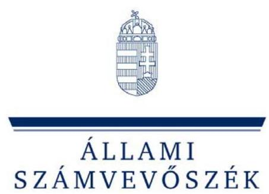

# J e l e n t é s 

az önkormányzati út- és szennyvízcsatorna beruházásokhoz 2002-2005. években igénybe vett közmúfejlesztési támogatások igénylésének és felhasználásának ellenőrzéséről

---

# 3. Önkormányzati és Területi Ellenőrzési Igazgatóság 

3.2. Szabályszerüségi és Teljesítményellenőrzési Föcsoport

Iktatószám: V-1026-149/2005-2006.
Témaszám: 799
Vizsgálat-azonosító szám: V0255

## Az ellenőrzést felügyelte:

## dr. Lóránt Zoltán

főigazgató
Az ellenőrzés végrehajtásáért felelős:
Németh Péterné
főcsoportfőnök
Az ellenőrzést vezette:
Szikszainé Király Mária
tanácsadó
A számvevői jelentések feldolgozásában és a jelentés összeállításában közremüködött:
dr. Marosi Gyöngyi
tanácsadó
Nagy Sándorné
számvevő tanácsos
Tóthné Salamon Ildikó
számvevő tanácsos

Az ellenőrzést végezték:

| Alexovics Ágota   számvevő tanácsos | Ambrus Lajos   tanácsadó | Baloghné Dakó Eszter   számvevő tanácsos |
| :-- | :-- | :-- |
| Batkiné Vas Anna   számvevő | Bialkó Zsolt   számvevő tanácsos | dr. Botta Tibor   számvevő tanácsos |
| Böröcz Imre   tanácsadó | Czifra Erzsébet   tanácsadó | Csepreginé Tancsik   Erzsébet   számvevő tanácsos |
| Csényi István   számvevő | dr. Csikai Zsolt   főtanácsadó | Csiszárné dr. Kosik   Mária   számvevő tanácsos |
| Csuti Lajos   számvevő tanácsos | Eigner György   számvevő | Ébner Vilmosné   főtanácsadó |
| György Árpád   számvevő tanácsos | Hirka Mihály   főtanácsadó | Holman Magdolna   osztályvezető számvevő   főtanácsos |

---

| dr. Horváth Klára | Horváth Mária | Huszár Sándorné |
| :--: | :--: | :--: |
| számvevő | számvevő | számvevő tanácsos |
| Jakubcsák Jenő számvevő tanácsos | Kalmár István számvevő tanácsos | Kányáné Murvai Tünde számvevő |
| Kerezsi Pál számvevő tanácsos | Kisapáti Angéla számvevő | Kisgergely István számvevő |
| dr. Kiss Károly számvevő tanácsos | Komlósiné Bogár Éva számvevő tanácsos | Kopaczné Horváth Zsuzsanna számvevő tanácsos |
| Kozák György   főtanácsadó | dr. Kőrös István   külső szakértő | Laki Dóra   számvevő tanácsos |
| Luhály Matild számvevő | Major Lászlóné számvevő tanácsos | Maróti Sándor számvevő tanácsos |
| Mohl Anna számvevő | Molnár Gyula Mihály osztályvezető főtanácsos | Molnár Istvánné számvevő |
| Nagy Attila számvevő tanácsos | Nagy János számvevő tanácsos | Nagy Sándorné számvevő tanácsos |
| Papp József számvevő tanácsos | Pappné dr. Szamosi Éva számvevő tanácsos | Pálfi András számvevő tanácsos |
| Péntek László   főtanácsadó | Puskás Balázs számvevő | Reichert Margit számvevő |
| Schósz Attiláné számvevő tanácsos | Szabó Leonóra számvevő | Szabó Tamás számvevő tanácsos |
| Szalontai Miklós számvevő tanácsos | Szihalminé Kovács   Zsuzsanna   számvevő | dr. Szikszai Bertalan számvevő tanácsos |
| dr. Takács András külső szakértő | dr. Telkes Imre számvevő tanácsos | Tótfalusi Zoltán számvevő |
| dr. Tóth András külső szakértő | Tóthné Salamon Ildikó számvevő tanácsos | Veres Jánosné számvevő |
| Vida László számvevő tanácsos | Vojcsekné Szabó Ágnes számvevő tanácsos | Zeke József számvevő tanácsos |

---

# A témához kapcsolódó eddig készített számvevőszéki jelentések: 

## címe

Jelentés az önkormányzatok által államháztartáson kívülre át- 0538 adott pénzeszközök felhasználásával megvalósuló víziközmű be- ruházások finanszírozási rendszerének célszerűségéről
Jelentés a települési önkormányzatok szennyvízközmű fejlesztési és 0416 működtetési feladatai ellátásának vizsgálatáról
Jelentés az Állami Számvevőszék 2002. évi tevékenységéről 0306
Jelentés a helyi önkormányzatok beruházásaihoz és rekonstrukció- 0332 ihoz nyújtott 2002. évi címzett és céltámogatások
Jelentés a Magyar Köztársaság 2002. évi költségvetése végrehajtásának ellenőrzéséről
Jelentés a Magyar Köztársaság 2001. évi költségvetése végrehajtásának ellenőrzéséről
Jelentés a helyi önkormányzatok beruházásaihoz és rekonstrukció- 0120 ihoz nyújtott 2000. évi címzett és céltámogatások igénybevételének és felhasználásának vizsgálatáról
Jelentés a helyi önkormányzatok beruházásaihoz és rekonstrukció- 0022 ihoz nyújtott 1999. évi címzett és céltámogatások felhasználásának vizsgálatáról
Jelentés a helyi önkormányzatok beruházásaihoz és rekonstrukció- 9922 hoz nyújtott 1998. évi címzett és céltámogatások vizsgálatáról
Jelentés a helyi önkormányzatok beruházásaihoz és rekonstrukció- 9823 ihoz nyújtott 1997. évi címzett és céltámogatások vizsgálatáról

---

# TARTALOMJEGYZÉK 

BEVEZETÉS ..... 7
I. ÖSSZEGZŐ MEGÁLLAPÍTÁSOK, KÖVETKEZTETÉSEK, JAVASLATOK ..... 11
II. RÉSZLETES MEGÁLLAPÍTÁSOK ..... 30

1. Az önkormányzati közműberuházásokba bevont lakossági pénzeszközök állami támogatásának jogszabályi feltételei ..... 30
1.1. Változások a magánszemélyek közmúfejlesztési támogatásának szabályozásában ..... 31
1.2. A lakás-takarékpénztári megtakarítások szerepe a közmúfejlesztési hozzájárulások megfizetésében ..... 33
1.3. A közmúfejlesztési (érdekeltségi) hozzájárulásokat megelőlegező állami kamattámogatott víziközmú-társulati hitel ..... 36
2. A közmúfejlesztési hozzájárulások megállapítása ..... 37
2.1. Az érdekeltségi (közműfejlesztési) hozzájárulásokat megállapító víziközmú-társulatok tevékenysége ..... 37
2.1.1. Az érdekeltségi hozzájárulások összegének megállapítása és változása ..... 37
2.1.2. A víziközmú-társulatok feladatellátása ..... 43
2.1.3. Az önkormányzatok közmúfejlesztési hozzájárulás megállapítási tevékenysége ..... 46
2.2. Az önkormányzati bevételek hatása a közmúfejlesztési hozzájárulás megfizetésére ..... 49
2.3. Jogszabálysértések a víziközmú-társulati hitelek felvételekor ..... 53
3. A közmúfejlesztési támogatások igénylése és felhasználása ..... 56
3.1. Az igénylések, az igazolások és a nyilvántartás hiányosságai ..... 56
3.2. Az önkormányzati és alapítványi pénzeszközök szerepe a magánszemélyek közmúfejlesztési hozzájárulásának megfizetésében ..... 58
3.3. A MÁK által kiutalt közmúfejlesztési támogatások továbbítása ..... 61
4. A közmúfejlesztési támogatások igénybevétele ..... 66
4.1. A jogtalanul igénybe vett közmúfejlesztési támogatások nagyságrendje és okai ..... 67
4.2. Az állami tehervállalás alakulása ..... 79
5. korrupciós kockázatok és egyéb szabálytalanságok a közmúberuházások kialakult finanszírozási rendszerében ..... 83
5.1. Személyi összefonódások, adóelkerülő módszerek ..... 83
5.2. A bankok szerepe a beruházások finanszírozásában ..... 86

---

5.3. A támogatási céltól eltérő felhasználások, a beruházások túlfinanszírozása ..... 89
5.4. A realizált bevételekkel arányos állami támogatásokról való lemondások elmaradása ..... 89
MELLÉKLETEK

1. számú A közműfejlesztési támogatások alakulása 2001-2005. években
2. számú A kapott és visszafizettetésre javasolt közműfejlesztési támogatások me-
(a. - d.) gyénkénti alakulása
3. számú A visszafizettetésre javasolt közműfejlesztési támogatások okainak részle-
tezése
4. számú Ltp. megtakarítás célját szolgáló befizetésre igénybe vett visszafizettetésre
(a. és b.) javasolt támogatások alapját képező befizetések forrásai
5. számú A 2002-2006. években lejárt lakás-előtakarékossági szerződések alapján, a megtakarítási időszakban jogtalanul igényelt közműfejlesztési támogatások
6. számú A közműberuházásokkal kapcsolatos állami tehervállalás különböző be-ruházás-finanszírozási módozatok esetén
7. számú Az Önkormányzati és Területfejlesztési Miniszter jelentéssel kapcsolatos észrevétele
8. számú A Miniszterelnöki Hivatalt Vezető Miniszter jelentéssel kapcsolatos észrevétele
9. számú Az Környezetvédelmi és Vízügyi Miniszter jelentéssel kapcsolatos észrevétele
10. számú A Pénzügyminiszter jelentéssel kapcsolatos észrevétele
11. számú A Pénzügyminiszternek adott válasz

---

# RÖVIDÍTÉSEK JEGYZÉKE 

| ÁSZ tv. | az Állami Számvevőszékről szóló 1989. évi XXXVIII. törvény |
| :--: | :--: |
| Alkotmány | A Magyar Köztársaság Alkotmányáról szóló 1949. évi XX. törvény |
| Ptk. | a Polgári Törvénykönyvről szóló 1959. évi IV. törvény |
| Ötv. | a helyi önkormányzatokról szóló 1990. évi LXV. törvény |
| Áht. | az államháztartásról szóló 1992. évi XXXVIII. törvény |
| Cct. tv. | a helyi önkormányzatok címzett- és céltámogatási rendszeréről szóló 1992. évi LXXXIX. törvény |
| Szoc. tv. | a szociális igazgatásról és szociális ellátásról szóló 1993.   évi III. törvény |
| Számv. tv. | a számvitelről szóló 2000 . évi C. törvény |
| Szja. tv. | a személyi jövedelemadóról szóló 1995. évi CXVII. törvény |
| Vg. tv. | a vízgazdálkodásról szóló 1995. évi LVII. törvény |
| Ltp. tv. | a lakás-takarékpénztárakról szóló 1996. évi CXIII. törvény |
| 2004. évi zárszámadásról szóló törvény | a Magyar Köztársaság 2004. évi költségvetéséről és az államháztartás három éves kereteiről szóló törvény végrehajtásáról szóló 2005. évi CXVIII. törvény |
| Kktv. | a közúti közlekedésről szóló 1988. évi I. törvény |
| Étv. | az épített környezet alakításáról és védelméről szóló 1997.   évi LXXVIII. törvény |
| Htv. | a helyi önkormányzatok és szerveik, a köztársasági megbízottak, valamint egyes centrális alárendeltségú szervek feladat és hatásköreiről szóló 1991. évi XX. törvény |
| „üvegzseb" törvény | a közpénzek felhasználásával, a köztulajdon használatának nyilvánosságával, átláthatóbbá tételével és ellenőrzésének bővítésével összefüggő egyes törvények módosításáról szóló 2003. évi XXIV. törvény |
| 160/1995. (XII. 26.) | a vízgazdálkodási társulatokról szóló 160/1995. (XII. 26.) |
| Korm. rendelet | Korm. rendelet |
| Ámr. | az államháztartás múködési rendjéről szóló 217/1998. (XII. 30.) Korm. rendelet |
| Vhr. | az államháztartás szervezetei beszámolási és könyvvezetési kötelezettségének sajátosságairól szóló 249/2000. (XII. 24.) Korm. rendelet |
| 215/1996. (XI. 23.) | a lakás-előtakarékosság állami támogatásáról szóló |
| Korm. rendelet | 215/1996. (XI. 23.) Korm. rendelet |
| 73/1999. (V. 21.) Korm. rendelet | a magánszemélyek közmúfejlesztési támogatásáról szóló 73/1999. (V. 21.) Korm.rendelet |
| 262/2004. (IX. 23.) | a magánszemélyek közmúfejlesztési támogatásáról szóló |
| Korm. rendelet | 262/2004. (IX. 23) Korm. rendelet |
| 12/2001. (I. 31.) Korm. rendelet | a lakáscélú állami támogatásokról szóló 12/2001. (I. 31.) Korm. rendelet |

---

109/2002. (V. 14.) Korm. rendelet
110/2002. (V. 14.) Korm. rendelet
111/2002. (V. 14.) Korm. rendelet
50/2006. (III. 14.) Korm. rendelet

19/1994. (V. 31.) KHVM rendelet
MÁK
ÁSZ
PSZÁF
LTP
ltp.
ltp. szerződés
víziközmű-társulati hitel
áfa
KAC
VICE
ÖNHIKI
Nemzeti Szennyvízprogram
ÖKOTÁM Alapítvány
ÖKOTÁM 2000 rendszer
ltp. szerződéses önkormányzatok

TESZI Alapítvány
a vízgazdálkodási társulatokról szóló 160/1995. (XII. 26.) Korm. rendelet módosításáról
a magánszemélyek közmúfejlesztési támogatásáról szóló 73/1999. (V. 21.) Korm. rendelet módosításáról
a lakáscélú állami támogatásokról szóló 12/2001. (I. 31.) Korm. rendelet módosításáról
a helyi önkormányzatok által 2004. évben jogtalanul igénybe vett közmúfejlesztési támogatás visszafizetésének ütemezéséről szóló 50/2006. (III. 14.) Korm. rendelet
A közutak igazgatásáról szóló 19/1994. (V. 31.) KHVM rendelet
Magyar Államkincstár
Állami Számvevőszék
Pénzügyi Szervezetek Állami Felügyelete
Lakás-takarékpénztár Rt.
lakás-takarékpénztári
lakás-előtakarékossági szerződés
a víziközmű-társulatok által felvehető állami kamattámogatott hitel
általános forgalmi adó
Környezetvédelmi Alap célelőirányzat
Vízügyi célelőirányzat
önhibájukon kívül hátrányos helyzetbe került helyi önkormányzatok támogatása
Nemzeti Települési Szennyvíz-elvezetési és -tisztítási Megvalósítási Program
ÖKOTÁM Csatornázást és Szennyvíztisztítást Elősegítő és Támogató Közhasznú Alapítvány
szennyvízcsatorna beruházások bonyolításának, szervezésének és finanszírozásának rendszere
azok az önkormányzatok, amelyek illetékességi területén a közműberuházások kapcsán megállapított közműfejlesztési hozzájárulást a magánszemélyek ltp. megtakarításból fizetik
Települések Európai Színvonalú Infrastruktúrájáért Kiemelten Közhasznú Alapítvány

---

# ÉRTELMEZŐ SZÓTÁR 

Közmúfejlesztési hozzájárulás:

Közmúfejlesztési támogatás:

A 2002. május 22. előtt hatályos 73/1999. (V. 21.) Korm. rendelet 1. § (5) bekezdése, valamint a 2002. május 22. után hatályos 1. § (6) bekezdése szerint „az a befizetési kötelezettségként megállapított pénzösszeg", amelynek nagyságát a beruházás kezdeményezője a várható kivitelezési érték alapján, a közmú által kiszolgálandó ingatlanokért számította ki".

A 2004. október 8 -ától hatályos 262/2004. (IX. 23.) Korm. rendelet 2. § d) pontja szerint „a közmúfejlesztési hozzájárulás: az a közmúfejlesztés céljára befizetési kötelezettségként megállapított pénzösszeg, amelynek nagyságát a magánszemélyek ingatlanait érintő közmúberuházást szervezö", a helyi önkormányzat, a szolgáltató vagy a víziközmú-társulati, mint igazolás kiadására jogosult jogi személy, „az általános forgalmi adó későbbi levonási jogát is figyelembe vevő várható kivitelezési érték alapulvételével, a közmú által kiszolgálandó ingatlanonként előzetesen számította ki, és azt az érintett magánszemélyekkel írásban közölte".
A 73/1999. (V. 21.) Korm. rendelet 1. § (1) bekezdése alapján „ha a magánszemély a közmúhálózat fejlesztéséhez pénzbeli befizetéssel hozzájárul, a központi költségvetés az e célra befizetett összeg 15\%-át közmúfejlesztési támogatásként visszatéríti."

A 2004. október 8 -ától hatályos 262/2004. (IX. 23.) Korm. rendelet 1. §-a alapján „a központi költségvetés a lakossági közmúfejlesztés támogatása célú előirányzatából, a közmúfejlesztési hozzájárulás egészének vagy részleteinek megfizetése időpontjában jogosult magánszemély részére a közmúfejlesztési hozzájárulás megfizetett összegének 25\%-át támogatásként visszatéríti."

Közműfejlesztési támogatás alapja:

A 73/1999. (V. 21.) Korm. rendelet 3. § (1)-(2) bekezdés alapján a magánszemély a közműfejlesztési támogatást a közműfejlesztési hozzájárulás ténylegesen megfizetett öszszege alapján igényelheti. A közmúfejlesztési hozzájárulás részletekben történő megfizetése esetén a közműfejlesztési támogatás ezzel arányosan igényelhető. A közmúfejlesztési hozzájárulás bankkölcsön felvételével történő megfizetése esetén a közműfejlesztési támogatás alapja a törlesztő részletek összege, legfeljebb azonban a közmúfejlesztési hozzájárulás befizetési kötelezettségként megállapított összeg.

A 262/2004. (IX. 23.) Korm rendelet 2. § e) pontja szerint a támogatás alapja a közmúfejlesztési hozzájárulás megfizetett összege, ingatlanonként és közművenként azonban

---

víziközmú-társulati hitel:
lakás-előtakarékosság állami támogatása:
önkormányzati, illetve alapítványi támogatásként feltüntetett bankszámlapénz:

ÖKOTÁM és a hasonló finanszírozási rendszerú közmúberuházások
legfeljebb 150 ezer forint.
A víziközmú-társulat által a lakossági hozzájárulás megelőlegezésére - a teljesítés szakaszos visszafizetésére figyelemmel - a lakáscélú támogatásokról szóló 160/1995. (XII. 26.) Korm. rendelet 13. § (5) bekezdése szerint biztosított, állami kamattámogatással felvehető hitel.
A magánszemélyeknek a lakáscélok saját erőből történő megvalósítást elősegítő előtakarékosságát a központi költségvetés a LTP-kon keresztül a megtakarítás éves összege alapján 30\%-os, de legfeljebb 72 ezer Ft éves összegű állami támogatásban részesíti 2003. április 1-től. Ezt megelőzően kötött szerződések esetén az évente maximálisan adható támogatás 36 ezer Ft volt.
A kereskedelmi bankok által az ÖKOTÁM és a hasonló be-ruházás-finanszírozási rendszerben az önkormányzati bevételek kiszámlázása kapcsán jelentkező beruházási költségnövekedés miatt kihelyezett állami kamattámogatott víziközmú-társulati hitelrész, amelyet óvadéki betétként a kamattámogatott hitel fedezeteként zárolt betétszámlán helyeznek el, és amelyek felett kizárólag a bankok rendelkezhetnek. Az óvadéki betétből, annak folyamatos csökkentésével finanszírozzák a magánszemélyek Itp. megtakarításait, amelyek majd fedezetévé válnak a kihelyezett hitelnek, ha azokra a lakás-előtakarékosság 30\%-os állami támogatását jóváírják. Az óvadéki betét kizárólag a bankszektoron belül - bankszámlapénzként - mozog, a bankok és a LTP-k rendelkezési jogának kikötésével.
A közmúfejlesztési hozzájárulás lakás-takarékpénztári megtakarítással történő megfizetéséhez a magánszemély az önkormányzattól, vagy önkormányzati közpénzként, illetve alapítványi támogatásként feltüntetett bankszámlapénzből támogatást kap. Ezekre a támogatásokra az önkormányzatok a magánszemélyek nevében, azok megbízásából a magánszemélyeket megillető támogatásokat igénybe veszik, amelyről az önkormányzati közmúberuházás megvalósítása érdekében a magánszemélyek lemondanak, illetve azt a közmúberuházás megvalósításában részt vevő szervezetekre (alapítvány, víziközmú-társulat, önkormányzat) engedményezik, vagy annak összegét a kifizetéssel egyidejűleg visszafizetik. A beruházáshoz kapcsolódóan önkormányzati bevételeket realizálnak, amelyek összege növeli a kivitelezési költséget, ezáltal indokolatlan mértékben megemeli a víziközmú-társulati hitelt, amely így maga után vonja az állami támogatások (közmúfejlesztési támogatás, lakás-előtakarékosság állami támogatása, víziközmú-hitel kamattámogatása) alapjának megemelését.

---

# JELENTÉS 

## az önkormányzati út- és szennyvízcsatorna beruházásokhoz 2002-2005. években igénybe vett közmúfejlesztési támogatások igénylésének és felhasználásának ellenőrzéséről

## BEVEZETÉS

A Magyar Köztársaság 2004. évi zárszámadásáról szóló törvény 7. § (17) bekezdésében az Országgyúlés felkérte az Állami Számvevőszéket, hogy vizsgálja meg a központi költségvetés által 2005. év végéig az önkormányzatokhoz út- és szennyvízcsatorna építés címén utalt közmúfejlesztési támogatások igénylésének és felhasználásának jogszerűségét, különös tekintettel az ÖKOTÁM és hasonló rendszerben megvalósuló beruházásokra. Az Országgyúlés a döntését az ÁSZ 2005 augusztusában nyilvánosságra hozott jelentésében foglaltakra figyelemmel hozta meg.

Az ÁSZ a 2005-ben közzétett vizsgálati jelentésében ${ }^{1}$ megállapította, hogy a felhalmozási célra államháztartáson kívülre átadott pénzeszközök alapvetően az önkormányzati szennyvízközmű beruházások megvalósításához kapcsolódtak. Az ÖKOTÁM Alapítvány, amelyet 1999 májusában alapítottak, olyan be-ruházás-szervezési, finanszírozási rendszert terjesztett el az önkormányzatok körében a közcélú szennyvízközmű beruházások megvalósítására, amelyben a beruházási összköltség indokolatlan megemelésére ösztönözte az önkormányzatokat és a víziközmú-társulatokat. Ezáltal megemelték a magánszemélyeket megillető állami támogatások (közműfejlesztési támogatás, lakáselőtakarékosság állami támogatása, víziközmű-társulati hitel állami kamattámogatása) igénybevételének alapját, a lakosságot megillető állami támogatást pedig visszaforgatták az önkormányzati beruházások finanszírozásába, amelyre újabb állami támogatást vettek igénybe. Így önkormányzati forrás nélkül, az állami támogatások halmozott, jogosulatlan és indokolatlan igénybevételével, a piaci verseny kizárásával megvalósuló beruházások miatt az állami költségvetést kár érte.

A beruházási összköltséget úgy emelték meg, hogy az önkormányzat az általa nyújtott szolgáltatással arányban nem álló, indokolatlanul magas szolgáltatá-

[^0]
[^0]:    ${ }^{1}$ Jelentés az önkormányzatok által államháztartáson kívülre átadott pénzeszközök felhasználásával megvalósuló víziközmű-beruházások finanszírozási rendszerének célszerűségéről (0538. számú jelentés)

---

si díjat számlázott ki a kivitelezőnek ${ }^{2}$, ami elérte a beruházási összköltség 66\%át is. A kivitelező ugyanakkor megemelte a kivitelezési költséget az önkormányzat által kiszámlázott szolgáltatási díj összegével. A beruházási költséget indokolatlanul növelő önkormányzati bevételek összegét úgy határozták meg, hogy az így megnövelt érdekeltségi hozzájárulások alapján igényelhető állami támogatások teljes egészében fedezzék a műszaki tartalom megvalósításához szükséges kivitelezési díjat, a víziközmű-társulatok működési költségeit, valamint a kereskedelmi bankok hozamelvárásait. Az önkormányzatok a bevételt alapítványon és a víziközmű-társulatokon keresztül adómentesen juttatták el a magánszemélyek lakás-előtakarékossági egyéni számláira, minek következtében az állam nemcsak a közcélú közműberuházás megvalósításába vont lakossági források meghatározott részét térítette vissza, illetve támogatta, hanem a kivitelezőktől származó, a lakossághoz támogatás formájában eljuttatott önkormányzati pénzeszközökre is támogatást adott. A magánszemélyek nevében az önkormányzatok - a hatályos kormányrendeletek előírásai ellenére - az alapítványi támogatásra is megigényelték a közműfejlesztési támogatást. A magánszemélyek azonban ténylegesen nem kapták meg a támogatásokat, mivel támogatásra vonatkozó igényüket már a víziközmú-társulathoz csatlakozással egy időben, a jogszabályi tiltás ellenére engedményezték az önkormányzatra vagy arra az alapítványra, amelytől támogatásban részesültek.

A víziközmű-társulatok a beruházások forrásainak megteremtése érdekében, a lakossági befizetésekből származó érdekeltségi hozzájárulások megelőlegezésére állami kamattámogatású hitelt vettek fel. A hitelszerződésekben a víziközmútársulatok a hitel tőketörlesztését a futamidő végén egyösszegben vállalták, a hitel futamideje alatt csak a felvett hitel kamatait kellett rendszeresen fizetniük, annak ellenére, hogy a lakáscélú támogatásokról szóló kormányrendelet csak 2004-től engedi meg, hogy a hiteltörlesztést 54 hónapos türelmi időt követően kezdjék meg. A lakosság az ajánlott finanszírozási konstrukcióban szereplő, saját befizetés csökkentését biztosító kedvezőbb feltételeknek megfelelően lakáselőtakarékossági szerződést kötött az állami kamattámogatáshoz igazodó futamidőre és az államilag támogatott legnagyobb ltp. megtakarítási összegre, amelyet a víziközmű-társulatok számlájára fizetett be a lakástakarékpénztárak helyett. Az érdekeltektől havonta folyamatosan érkező bevételeket (amelynek egy része a lakosságtól, más része alapítványtól vagy önkormányzattól származott) a víziközmű-társulatok betétként helyezték el ahelyett, hogy azt a felvett víziközmú-hitel tőke-törlesztési kötelezettségének csökkentésére fordították volna, ami csökkentette volna mind a társulatot, mind pedig a központi költségvetést terhelő kamatokat. A magánszemélyek azonban az ltp. szerződésben szereplő, a közműfejlesztési hozzájárulás későbbi megfizethetősége érdekében a víziközmű-társulat által megállapított, illetve annak öszszegéhez igazodó havi ltp. megtakarításoknak csak 5-25\%-át fizették meg, és a fennmaradó összeget az alapítvány az előzőekben részletezett forrásokból (önkormányzati bevételek, magánszemélyek közműfejlesztési támogatása) fedezte.

A lakás-előtakarékossági szerződéssel rendelkező magánszemélyek által befizetett összeget a jegyzők a magánszemélyeket megillető állami támogatás meg-

[^0]
[^0]:    ${ }^{2}$ Az alapítványtevők a fővállalkozó társaság tulajdonosai is egyben.

---

igénylésénél egyidejúleg tekintették ltp. előtakarékosságnak, valamint érdekeltségi hozzájárulás megfizetésének, aminek következtében ugyanazon személy befizetése alapján igénybe vették mind a lakás-előtakarékosságra járó állami támogatást, mind pedig a magánszemélyek közmúfejlesztési hozzájárulásának meghatározott hányada visszafizetéseként nyújtott állami támogatást. A magánszemély csak a víziközmú-társulati hitel kapcsán fennálló kötelezettségének törlesztése után, azaz a lakás-takarékpénztári megtakarítás lejártával tudna közmúfejlesztési támogatást igényelni.

A magánszemélyeket illető támogatásokkal ily módon - a jogalkotói szándéktól eltérően - nemcsak a közcélú közmúberuházást segitő lakossági megtakarításokat támogatta a Magyar Állam, hanem az önkormányzatok, valamint a kereskedelmi bankok által biztosított pénzeszközökre, (hitelre és kamatra) is támogatást adott. A kereskedelmi bankok indokolatlan nagyságú víziközmú-társulati hitelt nyújtottak a társulatoknak és az így a rendszerbe juttatott, a kivitelező, majd az önkormányzat, azt követően pedig közcélú alapítvány bevételeként, a magánszemély közmúfejlesztési hozzájárulása befizetéseként feltüntetett szükségesnél nagyobb összegú hitelrészt a víziközmú-társulati óvadéki betétszámlán helyezték el. A gazdasági események fedezetét biztosító pénzeszközök ki se kerültek a bankból, mivel azok elszámolása pénzforgalom nélkül történt és a kivitelezési költségek kifizetéséhez erre nem volt szükség.

Az ÖKOTÁM és a hasonló beruházás-szervezési és finanszírozási rendszert alkalmazó önkormányzatok a hiányzó forrásaikat és a lakossági befizetéseket csaknem egészében állami forrásokból pótolták és lényegesen drágábban olyan beruházásokat valósítottak meg, amelyek a Nemzeti Szennyvízprogramban nem, vagy későbbi időpontban szerepeltek. A finanszírozási rendszert múködtető szervezetek ösztönzése és a velük kötött szerződésekben lévő feltételek teljesítése érdekében az önkormányzatok és a víziközmú-társulatok a beruházás folyamatában számos jogszabálysértést (Ötv., Áht., Ámr., vízgazdálkodási törvény, Ltp. törvény, stb.) követtek el, miközben az államot rövid és hosszú távon is kár éri az indokolatlanul megnövelt beruházási összköltséggel megvalósított közművek létrehozásával. A rendszer elterjedésében a pénzintézetek, az önkormányzatok és a magánszemélyek érdekeltsége mellett az ellenőrzési rendszer hiányosságai, a jogszabályok pontatlanságai, valamint a finanszírozási rendszerben szerepet vállaló szervezetek által realizált anyagi előnyök és a központi szervek magatartása is szerepet játszott.

Jelen ellenőrzés célja annak megállapítása volt, hogy

- a helyi önkormányzatok út- és szennyvízberuházásainak megvalósítása milyen szervezési, finanszírozási rendszerben történt. A közmúfejlesztési hozzájárulások után járó közmúfejlesztési támogatások igénylésének és felhasználásának rendje megfelelt-e a jogszabályi előírásoknak;
- a kiadott igazolások alapján történt-e jogtalan támogatás igénybevétel, annak összege mekkora volt.

Az ellenőrzés céljához kapcsolódva vizsgáltuk az ltp. megtakarítások lakáscélú felhasználása önkormányzati igazolásának, az állami kamattámogatott víziközmú-társulati hitelek jogszerú igénybevételének, a víziközmú-társulatok

---

jogszabályoknak megfelelő múködésének, a közmúfejlesztési hozzájárulások nagyságát meghatározó beruházási összköltség növelését okozó önkormányzati bevételek kérdéskörét is.

Az ellenőrzést helyszíni vizsgálattal, és az önkormányzatokat önellenőrzésre felkérve tanúsítványok és adatok bekérésével végeztük. A helyszíni vizsgáltra kijelölt önkormányzatok kiválasztását kérdőíves felmérés előzte meg, amely 1148 önkormányzatra terjedt ki. A kérdőíves felmérésben résztvevőket a MÁKtól, a PSZÁF-tól kapott információk alapján választottuk ki, mivel ezek az önkormányzatok vették igénybe a 2002-2005. években az út- és csatornatámogatásként kifizetett központosított támogatások közel 90\%-át. Az ÖKOTÁM és a hasonló finanszírozási rendszerben beruházó önkormányzatok körének meghatározása érdekében a Vízgazdálkodási Társulatok Országos Szövetségétől is kértünk adatokat, valamint a víziközmú-társulatok elnökeit is nyilatkozattételre kértük fel. A széleskörú adatbekérés tette lehetővé, hogy az adatok egyeztetésével nagy bizonyossággal kiválasztásra kerüljenek az ÖKOTÁM és hasonló finanszírozási rendszerben közműberuházást megvalósító önkormányzatok.

A helyszíni ellenőrzés, valamint a kapcsolódó önkormányzati önellenőrzés keretében összesen 852 önkormányzat (az összes támogatást igénylő önkormányzat $61,1 \%$-a) út- és csatorna beruházáshoz igénybe vett 8820 millió Ft összegű közmúfejlesztési támogatásának felülvizsgálatára került sor. Ezek az önkormányzatok a vizsgálattal érintett 2002-2005. években az összes kifizetett támogatás $97,9 \%$-át használták fel. Helyszíni ellenőrzést 298 önkormányzatnál végeztünk. Azoknál az önkormányzatoknál, amelyeknél a 2002. év előtt igényelt és megkapott közmúfejlesztési támogatásból 2001. december 31-én maradvány mutatkozott, továbbá ahol jogtalan támogatás igénybevételt tapasztaltunk, vizsgálatunkat - a jogtalanul igénybe vett támogatások, mint pénzügyi tartalmú követelések általános öt éves elévülési idejére tekintettel - a 2001. évre is kiterjesztettük. Amennyiben az igénybe vett támogatás nagysága nem volt az önkormányzatnál rendelkezésre álló adatokból egyértelmúen meghatározható, az ÁSZ tv. 21. § (3) bekezdése alapján vizsgálatot folytattunk a közműberuházások szervezésében és finanszírozásában részt vevő szervezeteknél (alapítványoknál, víziközmű-társulatoknál) is. További 554 önkormányzatot kértünk fel, hogy önellenőrzéssel - az általunk adott részletes szempontok figyelembevételével - vizsgálja felül az általa igénybe vett közmúfejlesztési támogatások igénylésének és felhasználásának jogszerúségét. Azokat az önkormányzatokat, amelyeknél a beruházásban érintett magánszemélyek a közmúfejlesztési hozzájárulás megfizetése érdekében lakás-előtakarékossági szerződést kötöttek, tanúsítvány kitöltésére kértük fel. Azokat az önkormányzatokat, amelyek illetékességi területén a közmúfejlesztési hozzájárulás megfizetése érdekében ltp. szerződést nem kötöttek az érintett magánszemélyek, de a 2002-2005. években összesen egymillió Ft feletti összegben igényeltek közmúfejlesztési támogatást, adatszolgáltatásra kértük fel. Az adatszolgáltatás keretében az önkormányzatoknak arról kellett számot adniuk, hogy a kapott támogatásokat kifizették-e a magánszemélyeknek. Az önellenőrzést végző önkormányzatoktól kapott információk a MÁK munkáját fogják segíteni a támogatások kifizetésénél további jogtalan támogatások kiáramlásának a megakadályozása érdekében.

---

# I. ÖSSZEGZŐ MEGÁLLAPÍTÁSOK, KÖVETKEZTETÉSEK, JAVASLATOK 

Az ÁSZ 2005. évi 0538. számú jelentésében részletesen bemutatta az ÖKOTÁM és hasonló rendszerú víziközmű-beruházások finanszírozásának elemeit, a rendszer múködtetésében tapasztalt jogszabálysértéseket, a kialakulását lehetővé tevő jogszabályi hiányosságokat, azok államháztartásra hátrányos következményeit, továbbá a 2004. évre vonatkozóan 620,2 millió Ft közmúfejlesztési támogatás jogtalan igénybevételét állapította meg.

A 2004. évben jogtalanul igénybe vett közmúfejlesztési támogatást az Országgyúlés elvonta, megfizetésére az önkormányzatok kérelmére a Kormány halasztott visszafizetéssel 10 éves részletfizetést engedélyezett ${ }^{3}$. A 2004. évben jogtalanul igénybe vett közmúfejlesztési támogatás visszafizetésének ütemezéséről szóló kormányrendelet szerint az önkormányzatok többsége azt követően kezdi majd meg a jogtalanul igénybevett támogatás visszafizetését, amikor lejárnak az ltp. szerződések és egy összegben lehívhatóvá válik a közmúfejlesztési támogatás jogosan igénybe vehető része. Az alkalmazott megoldás miatt kitolódott az állami pénzeszközök megtérülése, ugyanakkor a jelentkező késedelmi kamat hosszú távon kedvezőtlen lesz az önkormányzatok pénzügyi helyzetére is.

A 2005. évi ellenőrzést követően az ÁSZ javaslatára a Kormány intézkedéseket tett. A lakáscélú állami támogatásokról szóló kormányrendeletben a víziközmú-társulati hitelek felvehető összegét magánszemély érdekeltenként 200 ezer Ft-ban maximalizálták, amely a jövőben megakadályozza a kamattámogatott hitel indokolatlan nagyságú felvételét. Előírták továbbá, hogy a beruházás kapcsán keletkező bevételeket a víziközmú-társulati hitel törlesztésére kell fordítani. A jogszabályváltozások a jövőre vonatkozóan előreláthatóan megakadályozzák az ÖKOTÁM és hasonló rendszerú beruházás-szervezési és finanszírozási módszer további múködtethetőségét.

Nem történtek meg azonban a már korábban indokolatlanul (az óvadéki betét összegére) és szabálytalanul (nem a magánszemélyek befizetéseinek megelőlegezésére) felvett víziközmű-társulati hitelek megállapítása révén az államot ért károk minimalizálását szolgáló intézkedések. A 2004-2005. évi jogszabályváltozásokat megelőzően megállapított közmúfejlesztési hozzájárulások finanszírozási módja még 5-6 évig hatással lesz a közmúfejlesztési támogatások, ezzel párhuzamosan a lakás-előkarékosság állami támogatásának és a víziközmútársulati hitelek állami kamattámogatásának az alakulására, mert a jogszabályváltozások a már folyamatban lévő finanszírozásokat nem érintették. Az államot ért kár enyhítése csak további intézkedések és ellenőrzések hatására történhet meg, az indokolatlanul felvett víziközmú-társulati hitelek visszafizet-

[^0]
[^0]:    ${ }^{3}$ A részletfizetés feltételeit a Kormány a helyi önkormányzatok által 2004. évben jogtalanul igénybe vett közmúfejlesztési támogatás visszafizetésének ütemezéséről szóló 50/2006. (III. 14.) Korm. rendeletben határozta meg.

---

tetésével, valamint a lakás-takarékpénztárakról szóló törvény céljával ellentétesen igényelt lakás-előtakarékossági támogatások megállapításával.

A szabálytalanul igényelt víziközmú-kamattámogatott hitelek felderítésének elmaradása miatt a jogtalanul igénybe vett kamattámogatások összegét az ellenőrzésre jogosult adóhatóság nem állapította meg. A jogszabályi rendelkezések változtatásával nem teremtette meg a KHVM a víziközmútársulatok törvényességi és gazdálkodási szempontból történő rendszeres, hatékony ellenőrzésének lehetőségét sem. Az ÖKOTÁM és a hasonló finanszírozással megvalósított beruházásokban társberuházói szerepkörben eljáró víziközmű-társulatok jogszabályellenes működése továbbra is fennáll, mivel a vízgazdálkodási társulatokról szóló kormányrendelet ellenére a közfeladatok befejezését követően nem szűnnek meg, valamint betéteket összegyűjtő és továbbító, közvetítő tevékenységet látnak el az LTP-knek.

A különböző jogcímeken kapható állami támogatások igénybe vételét összekapcsoló finanszírozási rendszer kialakítását lehetővé tette a szabályozási környezet pontatlansága és összehangolatlansága is. A jogszabályok összehangolása annak ellenére nem történt meg, hogy mindkét támogatási forma a közmúberuházásokba történő lakossági forrásbevonás ösztönzését szolgálja. Egyik támogatás esetében a későbbi beruházás érdekében történő előtakarékosságot, másik esetben a megvalósított beruházáshoz felvett víziközmű-társulati hitel törlesztése kapcsán jelentkező utólagos lakossági takarékosságot, illetve a beruházással egyidőben történő lakossági forrásbevonást támogatja az állam. A lakás-előtakarékosság állami támogatásáról, valamint a magánszemélyek közműfejlesztési támogatásáról szóló kormányrendeletek nem tükrözik a jogalkotói szándékot, nem teszik egyértelművé, hogy a közmúberuházások különböző formában történő megvalósításának támogatásához kapcsolódnak. Nem zárják ki az állami támogatások együttes igénybevételét, ezért hatásuk ellentétes az állam érdekeivel, mivel lehetővé teszik, hogy ugyanarra a befizetésre kétféle jogcímen ${ }^{4}$, eltérő időben, halmozottan és összesen 45\%-os állami támogatást vegyenek igénybe a magánszemélyek. Mindezt az állam a kamattámogatott víziközmű-társulati hitel törlesztéséhez nyújtott öt éves moratórium biztosításával segíti elő.

Javaslatunk ellenére a lakáscélú támogatásokról szóló kormányrendelet továbbra is lehetővé teszi, hogy a hiteltörlesztést a víziközmű-társulat 54 hónap múlva kezdje meg és ltp. megtakarításból történjen a víziközmútársulat hiteltőke törlesztési kötelezettségének megfizetése, miközben az ltp. szerződések lejártának időpontjáig a víziközmű-társulatnak és az államnak a teljes hitel összegére kamatot, illetve kamattámogatást kell fizetnie. Az Ltp. tv. 2005. decemberi módosításakor az Országgyűlés nem szüntette meg az ltp. megtakarítások közcélú közműberuházásokra történő felhasználásának a lehetőségét annak ellenére, hogy a törvénymódosítást előterjesztő PM java-

[^0]
[^0]:    ${ }^{4}$ A lakás-előtakarékosság állami támogatása címen 30\%-os, a magánszemélyek közmúfejlesztési támogatása címen 15\%-os az állami támogatást, azonban 2004. október 8 -át követően csak a szociálisan rászorultaknak nyújt a központi költségvetés $25 \%$-os közmúfejlesztési támogatást.

---

solta és a módosított törvényjavaslat indoklása ${ }^{5}$ is azt rögzíti, hogy a támogatott lakáscélú felhasználások köréből törli a közműberuházások érdekében fizetett közműfejlesztési hozzájárulásokat. A törvénymódosításkor nem zárták ki azt sem, hogy a magánszemélyek helyett különféle szervezetek is befizetéseket teljesíthessenek a magánszemélyek egyéni számláira, így továbbra is lehetőség van arra, hogy önkormányzati, kivitelezői, alapítványi pénzeszközökre is magánszemélyeket megillető lakás-előtakarékossági állami támogatást vegyenek igénybe a LTP-kon keresztül. Elmaradt annak biztosítása is, hogy a MÁK a közműfejlesztési támogatások kiutalása előtt vizsgálja, hogy a jegyzők által továbbított közműfejlesztési támogatásra vonatkozó igények nem ltp. megtakarítás célját szolgáló befizetésekhez kapcsolódnak-e. Emiatt a 2005. évi vizsgálatunkat követően azok az önkormányzatok is részesültek közműfejlesztési támogatásban, amelyeknél korábbi jelentésünkben a visszafizettetési javaslatot az indokolta, hogy a befizetések nem közműfejlesztési hozzájárulás megfizetését, hanem ltp. megtakarítás célját szolgálták. A 2004. évi zárszámadásról szóló törvény alapján csak azt vizsgálták, hogy az önkormányzatok jegyzői a magánszemélyek számára fizették-e ki a támogatásokat, és nem valósult-e meg a közműfejlesztési támogatásról szóló kormányrendelet alapján a 2002. május 22-től tiltott engedményezés.

A közcélú közműberuházások megvalósításakor a jelenlegi szabályozás szerint mindkét támogatási forma megilleti a magánszemélyeket, de az igénybe vehető támogatás alapja a közműfejlesztési támogatás esetében csak a magánszemélyek által ténylegesen megfizetett összeg lehet. A közmúfejlesztési hozzájárulás tényleges megfizetése - az azt ltp. szerződés megkötésével vállaló magánszemélyek esetében - csak a megtakarítási összeg kiutalását követően történik meg, ezért a közmúfejlesztési támogatást is akkor lehet igénybe venni. A szabálytalanul eljáró önkormányzatok az ltp. megtakarítások lejáratát megelőzően, az ltp. szerződések megtakarítási időszakában igényeltek közműfejlesztési támogatást.

A központi költségvetés a 2002-2005. években a magánszemélyek közműfejlesztési támogatásával megvalósuló útberuházásokhoz 354 millió Ft, szennyvízcsatorna beruházásokhoz 8654 millió Ft közműfejlesztési támogatást fizetett ki, ami 60053 millió Ft lakossági forrásbevonást feltételezett az önkormányzati beruházásokba. Ezt a támogatást 1395 önkormányzat vette igénybe, amelyek 21,4 \%-a (298 önkormányzat) kapta meg a kifizetett közműfejlesztési támogatások 62,3 \%-át ( 5614 millió Ft-ot). A helyszínen ellenőrzött önkormányzatok a csatornahálózatra kifizetett közműfejlesztési támogatások 63,7\%-át, 5512 millió Ft-ot, az útfejlesztések kapcsán kifizetett támogatások 28,8\%-át, 102 millió Ft-ot vettek igénybe. A helyszínen ellenőrzött 298 önkormányzat közül 16 önkormányzatnál (5,4\%) a magánszemélyek nem kötöttek ltp. szerződéseket a közműfejlesztési hozzájárulás megfizetésére, amelyek 37,5\%-ánál (6

[^0]
[^0]:    ${ }^{5}$ A lakás-takarékpénztárakról szóló 1996. évi CXIII. törvény módosításáról szóló 2005. évi CLXXXVII. törvénynek nincs hivatalos, az Országgyűlés által elfogadott indoklása. A törvényjavaslat előterjesztői indoklása az általános indoklás körében megfogalmazta, hogy „Tekintettel arra, hogy az önkormányzati, közműfejlesztési társulat útján megvalósított közmű beruházásokhoz számos támogatás kapcsolódik, a törvény törli e felhasználási lehetőséget a támogatott lakás-takarékpénztári lakáscélok közül."

---

önkormányzatnál) állapítottunk meg egyéb jogcímen jogtalan igénybevételt. Az ellenőrzött önkormányzatok 94,6\%-ánál ( 282 db ) kötöttek a magánszemélyek a közműfejlesztési hozzájárulások megfizetése érdekében ltp. szerződéseket. A közműfejlesztési támogatás igénybevételekor az ltp. szerződéses konstrukciót alkalmazó önkormányzatok körében is eltérő volt a gyakorlat.

A vizsgált önkormányzatok eljárása a közmúfejlesztési támogatás igénylés időszakának és összegének alapja tekintetében
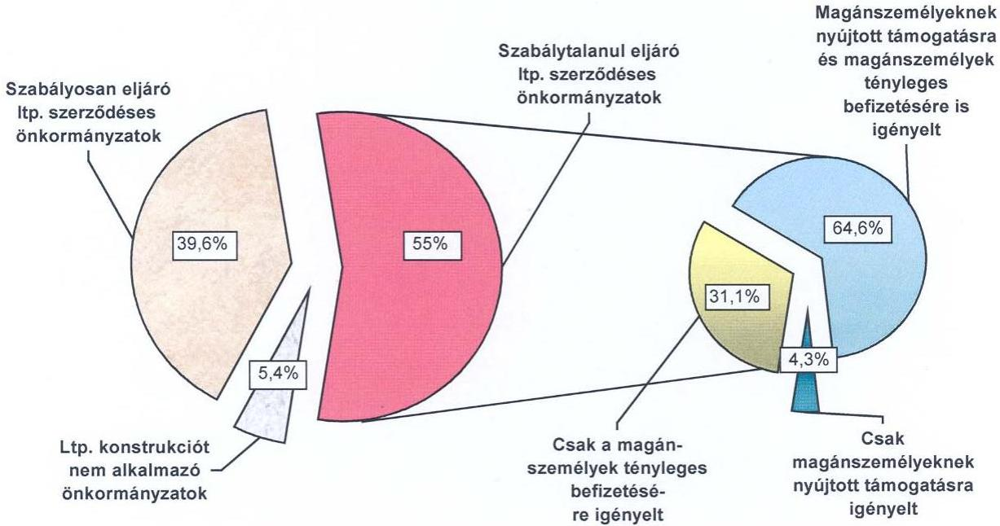

Szabályosan járt el a közműfejlesztési támogatások igénylése során az ltp. szerződéses önkormányzatok 41,8\%-a (118 önkormányzat, a helyszínen ellenőrzött önkormányzatok 39,6\%-a), mivel az ltp. megtakarítások céljára befizetett összegek után az ltp. szerződések megtakarítási ideje alatt, azzal párhuzamosan nem igényelt közmúfejlesztési támogatást. Az ltp. szerződéses önkormányzatok 58,2\%-a (164 önkormányzat, az ellenőrzött önkormányzatok 55,0\%-a) szabálytalanul, az ltp. szerződések megtakarítási ideje alatt igényelt közmúfejlesztési támogatást.

A szabálytalanul eljáró, az ltp. szerződések megtakarítási időszakában közműfejlesztési támogatást igénylő ltp. szerződéses önkormányzatok 31,1\%-a ( 51 db ) csak a magánszemélyek tényleges befizetéseire igényelt közmúfejlesztési támogatást. Ezek a támogatások az ltp. szerződések lejáratát követően megilletik a magánszemélyeket. A szabálytalanul eljáró ltp. szerződéses önkormányzatok 64,6\%-a (106 db) a magánszemélyek ténylegesen teljesített befizetésén túl a magánszemélyek nevében ltp. megtakarítás céljára befizetett önkormányzati és alapítványi pénzeszközökre is - a jogosulttá válás időpontja előtt - a magánszemélyek nevében közmúfejlesztési támogatást igényelt. A szabálytalanul eljáró ltp. szerződéses önkormányzatok 4,3\%ánál (7 önkormányzat) a magánszemélyek saját pénzeszközeikböl egyáltalán nem fizettek közmúfejlesztési hozzájárulást, az LTP-nél vezetett

---

egyéni számlájukra csak jogi személyektől származó befizetések érkeztek, ennek ellenére a magánszemélyek a lakás-előtakarékosság állami támogatásában, valamint magánszemélyek közmúfejlesztési támogatásában is részesültek.

A szabálytalanul eljáró (le nem járt és lejárt ltp. szerződésekkel rendelkező) ltp. szerződéses önkormányzatok az összes ellenőrzött önkormányzat által jogtalanul, illetve a jogosulttá válás időpontja előtt igényelt a 3688,6 millió Ft közmúfejlesztési támogatásból 3615 millió Ft-ot igényeltek, amely jogszerú igénylés esetén 27656 millió Ft lakossági forrásbevonáshoz kapcsolódott volna. Ezzel szemben valójában ennek mindössze 12,9\%a, 3555 millió Ft volt a magánszemélyek tényleges hozzájárulása a beruházások megvalósításához. Az igénybe vett támogatások 87,1\%-át nem a magánszemélyek, hanem más szervezetek befizetéseire igényelték az önkormányzatok.

A közmúfejlesztési támogatások igénylésekor szabálytalanul eljáró önkormányzatok 40,9\%-ánál ( 67 db ) a közmúfejlesztési hozzájárulásokkal összefüggésben megkötött ltp. szerződések lejártak, az ltp. szerződések lejáratát követően a közműfejlesztési hozzájárulás megfizetése megtörtént. A jogosulttá válás időpontja előtt igénybevett közműfejlesztési támogatások a 2006. évben vagy azt megelőző években jogossá váltak, ezért az önkormányzatokat a jogosulttá válás időpontja előtt igényelt állami támogatás miatt kamatfizetési kötelezettség terheli, a támogatás visszafizettetését, majd ismételt kiutalását ugyanakkor nem javasoljuk. A jelentés 5. számú melléklete mutatja be, hogy a rendelkezésre álló adatok alapján végzett számítás szerint mennyi volt a magánszemélyek tényleges befizetéseire, valamint az önkormányzati és alapítványi támogatásokból származó befizetésekre jutó közmúfejlesztési támogatásrész.

A magánszemélyek önkormányzati és alapítványi támogatásának összegére is közműfejlesztési támogatást igénylő, le nem járt ltp. szerződéses 80 önkormányzat (a helyszínen ellenőrzött önkormányzatok 26,8\%-a) esetében az önkormányzatok pénzeszközeire, valamint az önkormányzati, illetve alapítványi támogatásként feltüntetett bankszámlapénzre igénybe vett közmúfejlesztési támogatás összege 2002-2005. években 2729 millió Ft volt (4. a. számú melléklet). A lakossági pénzeszközök bevonása esetén ez a közműfejlesztési támogatás 18200 millió Ft lakossági forrásbevonás ösztönzését biztosíthatta volna. ÖKOTÁM és hasonló rendszerben ugyanakkor a beru-házás-szervező ezt az összeget nem vonta be a lakosságtól, hanem a magánszemélyek támogatásának alapját növelte meg abból a célból, hogy állami támogatást minél magasabb összegben tudjanak igénybe venni.

A közcélú közműberuházások megvalósításában az ÖKOTÁM és a hasonló rendszerú beruházás-szervezési és finanszírozási módszer múködése a magánszemélyeknek biztosított állami támogatások rendszerén keresztül kedvezőtlen hatást gyakorolt a költségvetési deficit alakulására is. Amennyiben az állam önerőből, deficitfinanszírozó hitel felvételével vagy államkötvény kibocsátásával valósította volna meg a közműberuházásokat, akkor is mindössze 75-85\%-ába került volna, mint amekkora támogatást az ÖKOTÁM és a hasonló rendszerek alkalmazói indokolatlanul és szabálytalanul igényeltek a központi költségvetésből (a számszaki adatokat a jelentés 6. számú

---

melléklete részletezi). A rendszer haszonélvezői a LTP-k, a kereskedelmi bankok, az önkormányzatok és nem utolsósorban a magánszemélyek voltak. A hagyományos módon finanszírozott, lakossági forrásbevonással együtt járó be-ruházás-finanszírozáshoz kapcsolódó támogatási rendszerben (6. számú melléklet 4. pontja) biztosított támogatottsági arányhoz képest (az állami támogatás a létrehozott közművagyon értékének 44-60\%-a) az ÖKOTÁM módszerrel megvalósított közműberuházások esetén (6. számú melléklet 1. pontja) ugyanolyan műszaki tartalmú és értékú közmúberuházás megvalósításakor több mint háromszorosára (a kieső lakossági forrás 165-200\%ára) nőtt az állami tehervállalás. A közműberuházások különböző finanszírozási módjától függő állami tehervállalás alakulását a jelentés 6. számú melléklete részletesen bemutatja a 2002. május 22. előtti és utáni jogszabályi feltételek figyelembevételével.

A közmúfejlesztési támogatás feltételeit meghatározó kormányrendeletek előírásait figyelembe véve az ltp. megtakarításból megfizetett, közmúfejlesztési hozzájárulásoknál csak a magánszemélyek tényleges befizetései, legfeljebb azonban a közmúfejlesztési hozzájárulás befizetési kötelezettségként megállapított összege után lehet támogatást igényelni. Az Ltp. tv. deklarált célja, hogy ösztönözze a magánszemélyek előtakarékosságát a lakáscélok saját erőből történő megvalósítása érdekében, így az Ltp. tv. céljával ellentétes, hogy lakás-előtakarékossági támogatást biztosítsanak a magánszemély saját erőből történő megtakarítása helyett a jogi személyek befizetéseire is. Az ltp. megtakarításokból megfizetett közmúfejlesztési hozzájárulások esetében, a lakás-takarékpénztári kiutalásokat követően ugyanakkor a támogatásra való jogosultság vizsgálatának a feltételei nem biztosítottak, mivel a kiutalásból úgy tűnik, mintha az ltp. megtakarítás összege teljes összegében a magánszemély saját befizetéséből származna. A víziközmű-társulati hitel törlesztéseként az LTP. által a hitelt nyújtó kereskedelmi banknak átutalt összegből nem lehet megállapítani, hogy abból mekkora volt a magánszemélyek befizetése, illetve a kapott önkormányzati vagy alapítványi támogatás miatt jelentkező befizetés, valamint azok összegére külön-külön jóváírt hozam és állami támogatás, amely lehetővé tenné a támogatásra való jogosultság feltételei fennállásának vizsgálatát. Így a közmúfejlesztési hozzájárulás lakáselőtakarékossági megtakarításból történő megfizetése „elfedi" azt a magánszemély nevében más által teljesített befizetést. A magánszemélyek közmúfejlesztési támogatásáról szóló kormányrendelet 2002. május 22-től hatályos előírása kifejezetten tiltotta az önkormányzati támogatásból, továbbá önkormányzat harmadik személlyel kötött szerződése alapján átvett pénzeszközből megfizetett közmúfejlesztési hozzájárulás után a visszatérítést. Mindezek miatt a társulati úton megvalósuló közcélú közműberuházásokba történő lakossági forrásbevonásnak az ltp. megtakarításokon keresztül történő ösztönzését (támogatását) a továbbiakban, jelenlegi formájában nem kívánatos fenntartani, amely alátámasztja az Ltp. tv. módosításának a szükségességét. Az államnak lehetősége van arra, hogy a közcélú közműberuházások megvalósítása érdekében a magánszemélyek befizetéseit a víziközmútársulatokon keresztül támogassa annak érdekében, hogy ezzel kiküszöbölje, hogy a magánszemélyek tömeges bevonásával, illetve jogaikkal való visszaélések, jogszabálysértések sorozatával realizáljanak állami támogatást a közcélú közműberuházások megvalósításához.

---

A lakás-előtakarékossági állami támogatás jogszabályoknak megfelelő felhasználásának ellenőrzésére ${ }^{6}$ éppen azok a szervezetek (lakástakarékpénztárak) jogosultak, amelyek maguk is részt vettek a szerződéses konstrukció folyamatos múködtetésében, valamint üzleti érdekük fúződött a minél több ltp. szerződés megkötéséhez. A víziközmú-társulati hiteleket nyújtó bankok hivatottak vizsgálni az igényelt hitel esetében az állami kamattámogatásra való jogosultság feltételeinek fennállását, miközben annak a minél nagyobb összegű kihelyezéséhez üzleti érdekük fűződik. A törvényi előírásoknak megfelelő hitelkihelyezések rendszeres állami ellenőrzése nem megoldott.

Az ÖKOTÁM és a hasonló finanszírozású beruházások esetén a beruházási összköltség alapján fizetendő közmúfejlesztési hozzájárulás összegét aránytalanul magasan határozták meg ${ }^{7}$, amely a magánszemélyek közül sokak számára vállalhatatlan anyagi terhet jelentett volna az önkormányzatok vagy alapítványok hozzájárulása nélkül. Valójában azonban csak töredékét, önkormányzatonként változó mértékben, az önkormányzati támogatás függvényében, 5-25\%-át kellett ténylegesen megfizetniük. A közmúfejlesztési hozzájárulásoknak a magánszemélyek tényleges befizetésén felüli részét az önkormányzatok - elsősorban 2002. május 22. előtt ${ }^{8}$ - adómentes szociális támogatásként, szociális rászorultság vizsgálata nélkül juttatták el a magánszemélyek LTP-knál vezetett egyéni megtakarítási számláira a víziközmű-társulatok közbeiktatásával. 2002. május 22. után pedig pénzforgalom nélküli gazdasági események elszámolásával, szerződések és engedményezések láncolatán keresztül - a víziközmú-társulatok és közcélú alapítványok közbeiktatásával - névlegesen fizettek támogatásokat a magánszemélyek ltp. megtakarításaihoz. A kivitelezési költségekre, valamint a banki hozamelvárásra szükséges források biztosítása érdekében a beruházási összköltséget a hiányzó források 2,22szeresével növelték meg. A magánszemélyek nevében az ekkora összeggel megemelt beruházási összköltség miatt, ugyanilyen mértékben növekvő közműfejlesztési hozzájárulásra kétféle jogcímen igényelt 45\%-os állami támogatás így fedezte a forráshiányt.

A hitelszerződést kötő felek az állami kamattámogatott hitelekről szóló szerződésekben a jogszabályi előírásoknak nem mindenben megfelelő feltételeket is szerepeltettek. Ennek következtében a beruházáshoz kapcsolódó kiadások lebonyolítására a hitelt nyújtó banknál az önkormányzatok számlát nyitottak függetlenül attól, hogy a költségvetési számlájukat másik banknál vezették, megsértve ezzel az Áht. előírását, amely rögzíti, hogy a költségvetési bevételek és kiadások elszámolására az önkormányzatok csak egy pénzintézetnél vezethet-

[^0]
[^0]:    ${ }^{6}$ A lakás-takarékpénztárak ellenőrzik a lakás célú felhasználást a ltp. megtakarítások esetében, a bankok jogosultak az állami kamattámogatott hitelek kihelyezésekor a jogszabályi feltételek vizsgálatára.
    ${ }^{7}$ Abban szerepeltették a jogalap nélkül kiszámlázott önkormányzati bevételek miatt jelentkező beruházási összköltség egy érdekeltségi egységre jutó összegét is.
    ${ }^{8}$ 2002. május 22-ei hatállyal a közmúfejlesztési támogatásról szóló 73/1999. (V. 21.) Korm. rendelet módosításra került, amelyben pontosításokat és szigorításokat fogalmaztak meg. A jogszabály módosításokat részletesen a jelentés 1.1. pontja tartalmazza.

---

nek számlát. A hitelszerződésekben a víziközmú-társulatokkal kapcsolatosan rögzítésre került, hogy a hitel kifizetéséig nem szűnhetnek meg annak ellenére, hogy a vízgazdálkodási társulatokról szóló kormányrendelet értelmében a közfeladat - azaz a közműberuházás - megvalósítását követően a víziközmútársulat megszűntetését kell az intézőbizottság elnökének kezdeményezni.

Az ellenőrzött önkormányzatok 61,7\%-a realizált különböző jogcímeken bevételeket a közmúberuházásokhoz kapcsolódóan, és közel harmada jogalap ${ }^{9}$ nélkül bocsátott ki számlákat. Az önkormányzatok a közúti közlekedésről szóló törvény előírásai ellenére közút nem közlekedési célú igénybevételéért a kivitelezők felé az úttesten kívül végzett közmúépítési munkák esetén is díjat állapítottak meg. Az utak igénybevételére vagy a közterületek hasznosítására vonatkozó díjat a jogszabályi előírások ellenére nem a kivitelezési munkák megkezdése előtt számlázták, hanem a készültségi fokkal arányosan, a kivitelezési díjat tartalmazó számlákkal egyidőben, és mértékét a kivitelezési díj meghatározott \%-ában határozták meg. A bevételt realizáló önkormányzatok $85 \%$-a dokumentumokkal hitelt érdemlő módon nem tudta alátámasztani a számlák alapját képező teljesítések megtörténtét, a teljesítésigazolások valódiságát.

Az ÖKOTÁM Alapítvány támogatásával beruházó önkormányzatok a beruhá-zás-szervezési tevékenység ellátásáról az érdekeltségi egységek számától függően változó összegű, 2-40 millió Ft közötti számlákat bocsátottak ki a fővállalkozónak, amely mögött valós teljesítés szintén nem, vagy csak részben volt. Az ÖKOTÁM Alapítvány támogatásával beruházó 51 önkormányzatnál a beruházás szervezési feladatok kapcsán kiállított számlák összege pontosan megegyezett a magánszemélyek egyéni ltp. számláinak számlanyitási díjával.

A vízgazdálkodásról szóló törvény szerint a vízgazdálkodási társulat tagjai kötelesek a társulat közfeladatai ellátásának költségeihez érdekeltségi egységük arányában hozzájárulni. Az ÖKOTÁM és hasonló rendszerú beruházások megvalósításában közremúködő víziközmú-társulatok megsértették a vízgazdálkodásról szóló törvény, valamint a vízgazdálkodási társulatokról szóló kormányrendeletben foglalt előírásokat, mivel az érdekeltségi egységre eső hozzájárulás összegét nem az érdekeltségi egység alapját jelentő egység - vízfogyasztás, illetve a szennyvízkibocsátás mennyisége - alapján, azzal arányosan állapították meg. Az érdekelteknek azonos vízfogyasztású érdekeltségi egységek után nem azonos mértékű érdekeltségi hozzájárulást kellett fizetniük. A víziközmű-társulatok küldöttgyűlései a differenciált érdekeltségi hozzájárulás elveinek kialakítását - az érdekeltségi hozzájárulás mértékét - a

[^0]
[^0]:    ${ }^{9}$ A Legfelsőbb Bíróság EBH2005.1381 számú elvi bírósági határozata értelmében „úttesten kivül végzett közmúépitési vagy fenntartási munka esetén igénybevételi díjat nem kell fizetni, ilyen díj fizetésére a fél nem kötelezhető", valamint, hogy „útpadkán.....végzett közmúépitési munka után jogszabályi felhatalmazás nélkül díjat szedni nem lehet". Rögzített továbbá, hogy „az önkormányzati rendelet nem lehet ellentétes magasabb szintü jogszabályban szabályozottakkal", illetve „jogszabály sem ad felhatalmazást a díifizetés előírására", ugyanakkor „közterület-használati díjat szerződésre alapozottan nem lehet beszedni, továbbá egy vállalkozási jogviszonnyal össze nem egyeztethető, hogy a vállalkozó legyen a bérlője azon munkaterületnek, amelyen a szerződésből eredő kötelezettségét teljesitenie kell."

---

vízgazdálkodási törvényben és a vízgazdálkodási társulatokról szóló kormányrendeletben rögzített előírásokkal ellentétesen határozták meg, amikor az önkormányzatoknak és intézményeiknek térítésmentes csatlakozási lehetőséget biztosítottak. A magánszemélyek tényleges fizetési kötelezettsége a társulatok alapszabályai szerint attól függött, hogy milyen fizetési módozatot választottak annak megfizetésére. Az ÖKOTÁM és a hasonló rendszerú közmú beruházási konstrukcióban az egységnyi érdekeltségi hozzájárulás összegét a magánszemélyeknek nem kellett valójában megfizetniük, annak töredékét fizették. Az érdekeltségi hozzájárulás összegét azért emelték meg, mert ha csak a magánszemélyek által fizetendő összegben állapították volna meg az érdekeltségi hozzájárulást, annak összegében a más szervezetektől származó befizetéseket nem szerepeltették volna, akkor nem tudták volna igénybe venni a múszaki kivitelezéshez szükséges mértékűnél magasabb víziközmű-társulati hitelt, mivel annak nagyságát az érdekeltségi hozzájárulások alapján számítható beruházási összköltség befolyásolta. Az érdekeltségi hozzájárulás megemelését másrészt azért tették, hogy a közmúfejlesztési támogatásról szóló kormányrendeletbe beépített, az igényelhető közmúfejlesztési támogatás alapjának korlátozását jelentő rendelkezésnek látszólag eleget tegyenek, amely szerint a közmúfejlesztési támogatás alapja legfeljebb a közmúfejlesztési hozzájárulás befizetési kötelezettségként megállapított összeg. A korlátozó rendelkezés kikerülése érdekében az érdekeltségi hozzájárulások egységnyi összegét megemelték az önkormányzati, illetve alapítványi támogatásként feltüntetett bankszámlapénz egy érdekeltre jutó összegével, miközben nem változtatták meg a magánszemélyek által ténylegesen fizetendő összeget.

A víziközmú-társulatok elnökei - az ellenőrzött önkormányzatok 65-70\%-ánál - a vízgazdálkodási társulatokról szóló kormányrendelet előírásai ellenére az érdekelteket a megállapított érdekeltségi hozzájárulásról írásban nem, vagy nem a kormányrendeletben meghatározott tartalommal tájékoztatták. Az önkormányzatok több mint háromnegyede az Áht. és az Étv. előírásait figyelmen kívül hagyva nem alkotott rendeletet a közmúfejlesztési hozzájárulások megállapításának helyi szabályairól, vagy nem tartották be a helyi rendeletben az eljárásrendre, valamint a közmúfejlesztési hozzájárulás mértékének megállapítására vonatkozó szabályokat.

Az állami kamattámogatást két-háromszorosával megnövelve vették fel a víziközmű-társulatok azt az állami kamattámogatott hitelrészt, amely az önkormányzatok által kiszámlázott, a beruházási összköltség 55-75\%-át is elérő bevételek miatt jelentkező kivitelezési díj megfizetését fedezte, amelyeket a víziközmű-társulatok a kereskedelmi bankok által zárolt óvadéki betétszámlákon, a hitel fedezetét biztosító kamatozó betétként helyeztek el. Az óvadéki betétként elhelyezett összegekre a műszaki megvalósításhoz szükséges kivitelezési díjak megfizetéséhez nem volt szükség. Ezek a pénzeszközök képezték alapját a magánszemélyek önkormányzati és alapítványi támogatásának, amelyekre a magánszemélyek nevében állami támogatásokat vettek igénybe. A víziközmú-társulatok zárolt óvadéki számláján elhelyezett betét után kapott betéti kamatok 90-100\%-ban fedezték a víziközmű-társulati hitelek után fizetendő hitelkamatokat. A vízgazdálkodási társulatokról szóló kormányrendelet előírásait figyelmen kívül hagyva szabálytalanul nyújtottak államikamattámogatott víziközmű-társulati hiteleket a bankok a magánszemélyek érdekeltségi hozzájárulásának megelőlegezéséhez szükséges összegen felüli hitel

---

biztosításával is. Két önkormányzatnál előfordult, hogy a közműberuházás megvalósításához hiányzó önkormányzati forrás finanszírozására biztosított szabálytalanul állami kamattámogatott hitelt a kereskedelmi bank.

A magánszemélyeknek a közműfejlesztési hozzájárulás Itp. megtakarításból történő megfizetése esetén három-négy szerződést kellett aláírniuk, amelyek tartalmával nem minden esetben voltak tisztában. A magánszemélyek többek között megbízási szerződésben kérték az önkormányzatot, hogy a részükre járó közműfejlesztési támogatást igényelje meg helyettük, és azt fizesse ki valamely szervezetnek. A megbízások tartalmilag az igény engedményezését jelentették, amelyet a 2002. május 22-e után megállapított közműfejlesztési hozzájárulások esetén tiltottak a magánszemélyek közműfejlesztési támogatásáról szóló kormányrendeletek. Az önkormányzatok és a magánszemélyek által aláírt megbízási szerződések több mint háromnegyede nem tartalmazta a megállapított közműfejlesztési hozzájárulás összegét, amelyhez kapcsolódóan a közműfejlesztési támogatás igénylésére a magánszemélyek felhatalmazták az önkormányzatokat, illetve a víziközmű-társulatokat. A megbízási szerződések alapján igényelt közműfejlesztési támogatások az alapítványi és önkormányzati támogatások nagyságától függően 3-4-szeresen is meghaladták a magánszemélyek által az adott időszakban ténylegesen befizetett közműfejlesztési hozzájárulás összegét, illetve 10-20-szorosan is meghaladták a magánszemélyek tényleges befizetésére igényelhető közműfejlesztési támogatás összegét. A magánszemélyek a nevükben igényelt közműfejlesztési támogatások összegéről utólagos tájékoztatást nem kértek. Az önkormányzatok jegyzői a magánszemélyek által gyakorolt kontroll nélkül igényelték a magánszemélyeket megillető közműfejlesztési támogatást, és teljesítették annak átutalását valójában a magánszemélyek részére történő kifizetés helyett más szervezet javára.

A víziközmű-társulatok - az alapszabályban meghatározott közfeladataik ellátásán túl - Itp. betétgyűjtéshez kapcsolódóan közvetítő tevékenységet láttak el, amikor részt vettek a magánszemélyeknek az LTP felé vállalt befizetéseinek fogadásában, gyűjtésében és továbbításában, ezzel a vízgazdálkodásról szóló törvénybe és alapszabályba ütköző tevékenységet végeztek. A vízgazdálkodási törvény előírásának ellenére az önkormányzatok illetékességi területén működő víziközmű-társulatok 59,4\%-a közcélú feladatának megvalósítását követően annak ellenére nem szűnt meg, hogy a közfeladat megvalósítását követően azt az intézőbizottság elnökének kezdeményeznie kellett volna. A vízgazdálkodási törvény nem határozza meg azonban, hogy mely konkrét időpont tekintendő a közfeladat megvalósításának.

A víziközmű-társulatok jogszabálysértő működésének elterjedésére hatással volt, hogy rendszeres ellenőrzésük sem törvényességi, sem gazdálkodási szempontból nem megoldott. A cégbíróságok által ellátott törvényességi felügyelet nem rendszeres. Az ellenőrzés hiánya hozzájárult ahhoz, hogy a konstrukcióban szerepet vállaló víziközmű-társulatok jogszabályi előírásokat figyelmen kívül hagyó tevékenységet folytattak, valamint a vízgazdálkodási társulatokról szóló kormányrendeletben meghatározott mértéket meghaladóan indokolatlanul vettek fel víziközmű-társulati hitelt az önkormányzati közműberuházások megvalósításához.

---

A beruházás finanszírozásában részt vevő alapítványok azokat a magánszemélyeket támogatták, akiktől egyúttal közcélú adományban is részesültek. A magánszemélyek által az alapítványoknak közcélú adományként felajánlott, a központi költségvetésből érkező közműfejlesztési támogatást az önkormányzat - a magánszemélyek engedményezése alapján - egyösszegben utalta át az alapítványnak, amelyet az alapítványok a könyvvitelben az önkormányzattól, és nem a magánszemélyektől kapott támogatásként számoltak el.

A bevételt is realizáló, fejlesztési célú állami támogatásban ${ }^{10}$ részesült önkormányzat közül 9 önkormányzat nem tett eleget az Áht-ban rögzített kötelezettségének, ugyanis az Áht. szerint, amennyiben az önkormányzat a beruházáshoz kapcsolódóan bevételt realizál, abban az esetben a bevétellel arányos állami támogatásról le kell mondania. A jogszabály azonban nem határozza meg egyértelműen a számítás módjára vonatkozó rendelkezéseket. A visszafizetés konkrét módja, az érintett fejlesztési célú támogatások pontos köre sem tisztázott. A rendelkezések ugyanakkor nem terjednek ki a más szervezet közbeiktatásával, közvetett módon realizált bevételekre, amely lehetővé teszi az előírások kikerülését. Az önkormányzatok a jogszabályi rendelkezés 2003. évi hatályba lépését követően - a lemondás elkerülése érdekében - különböző új módszereket alkalmaztak a kivitelezőtől származó bevételek megszerzésére. Az önkormányzatok szerződéseiben foglaltak alapján jóteljesítési biztosíték vagy garancia jogcímen jutottak pénzeszközökhöz, amelyeket a kivitelezőktől 10-40 éves időtartamra, visszafizetési határidő megjelölésével kaptak. Az önkormányzatok 8\%-a nem közvetlenül a kivitelezőtől, hanem közhasznú alapítvány közbeiktatásával realizált bevételt, vagy a felajánlott összeget a beruházás megvalósításában részt vevő fő- és alvállalkozók nem a beruházáshoz kapcsolódóan, hanem egyéb önkormányzati cél megvalósításához adták át. A pénzeszközátadás érdekében kötött szerződésekben ugyanakkor rögzítették, hogy a vállalkozó által az alapítványnak átadott pénzeszközök nagysága a közműberuházás kivitelezői számláinak meghatározott \%-át képezte.

A fejlesztési célú állami támogatás széttagolt elosztási rendszere, összehangoltságának hiányosságai, valamint az önkormányzati saját erőt biztosító víziközmű-társulati hitelek kihelyezésének ellenőrizetlensége okozta, hogy a helyszínen ellenőrzött önkormányzatok 13,8\%-ánál a közműberuházások - az önkormányzati bevételek nagyságával indokolatlanul megnövelt beruházási összköltségen felül is - túlfinanszírozottak voltak. Ezeknél az önkormányzatoknál a beruházási költségeket meghaladóan álltak rendelkezésre az adott cél megvalósítására kapott források. A beruházás megvalósításához igénybe vett fejlesztési célú állami támogatások, valamint az állami kamattámogatott víziközmú-társulati hitelek együttes összege, esetenként változó mértékben, akár 34,2\%-kal is meghaladta a beruházás kapcsán felmerült költségeket. A túlfinanszírozott beruházások esetében nem volt biztosított, hogy a beruházáshoz kapott pénzeszközök a támogatási és hitel-

[^0]
[^0]:    ${ }^{10}$ Címzett- és céltámogatás, területfejlesztési és területkiegyenlítési támogatások, vízügyi célelőirányzat, Környezetvédelmi Alap célelőirányzat, valamint decentralizált előirányzatai, előcsatlakozási alapok támogatásai, európai uniós fejlesztési célú támogatások.

---

szerződésekben meghatározott célra kerüljenek felhasználásra, azokat az önkormányzatok egyéb feladataik finanszírozására használtak fel. Emiatt a kapott támogatások valamelyikének felhasználásakor a célnak megfelelő felhasználást így nem tudták biztosítani, amely jogtalan támogatás igénybevételt okozott.

A víziközmú-társulati hitel felvételével megvalósított közmúberuházások forrásszerkezetének vizsgálatakor az átláthatóságot és a tisztánlátást nehezítette, hogy a víziközmű-társulatok voltak a hitel felvevői, ugyanakkor a fejlesztési célú támogatások az önkormányzatokat illették meg. Az önkormányzatok viszont nem voltak kötelezve arra, hogy a közvetlen vagy közvetett módon állami támogatásokban részesülő befejezett beruházások forrásszerkezetének alakulásáról a központi információs rendszer keretén belül hitelt érdemlő adatszolgáltatást teljesítsenek. Az állami források felhasználásának monitoringja ebben a tekintetben nem kellően kiépített. Az önkormányzatok beszámolási rendszere nem volt alkalmas arra, hogy abból a beruházáshoz felhasznált állami kamattámogatott víziközmű-társulati hitelek célnak megfelelő felhasználása is ellenőrizhető legyen. Az állami támogatások igénybevételével megvalósított beruházások kialakított elszámolási rendszere nem szolgáltatott megfelelő adatokat ahhoz, hogy abból megállapíthatók legyenek a beruházási költségeket meghaladóan biztosított állami források miatti túlfinanszírozások. Emiatt nem tette lehetővé az állami támogatások jogtalan és indokolatlan kiáramlásának megakadályozását, valamint a realizált bevételekkel arányos állami támogatások lemondási kötelezettségének érvényesítését.

A közmúfejlesztési támogatások igénylésekor a magánszemélyek közmúfejlesztési támogatásáról szóló kormányrendelet előírásait megsértve a magánszemélyek igénybejelentést - kivételektől eltekintve ( 35 önkormányzat, az ellenőrzött önkormányzatok 11,7\%-a) - nem nyújtottak be. Az önkormányzatok 51,7\%-ánál a magánszemélyek a belépési nyilatkozatokban vagy külön szerződésekben az önkormányzatot vagy a víziközmű-társulatot megbízták azzal, hogy a részükre járó állami támogatást igényeljék meg helyettük. Tiltás ellenére a 2002. május 22. után megállapított közmúfejlesztési hozzájárulások esetében az önkormányzatok 39,5\%-ánál a magánszemélyek engedményezték a támogatásra vonatkozó igényüket.

Az igény engedményezését követően nem a magánszemélyek, hanem az általuk megbízott önkormányzatok vagy víziközmű-társulatok kérelme alapján a jegyzők igényelték a közműfejlesztési támogatást a víziközmű-társulattól kapott igazolás alapján, és a kapott támogatást nem a magánszemélyeknek fizették ki. A víziközmű-társulatok megszűnését követően az érdekeltségi hozzájárulás részleteinek megfizetéséről az igazolást az önkormányzatok adták ki, amelyet a magánszemély nevében az önkormányzat igényelt vissza, ugyanakkor a támogatás összegéről a magánszemély az önkormányzat javára mondott le. Az igénylő, az igazolást kiadó, valamint a támogatást ténylegesen megkapó szervezet ezeknél a közműfejlesztési támogatásoknál az önkormányzat volt. Mindez a támogatásra jogosult magánszemélyek kontrolljának hiánya miatt növelte a visszaélések lehetőségét.

Az önkormányzatok 5,7\%-ánál tapasztaltuk, hogy a közmúfejlesztési hozzájárulások befizetéséről szóló igazolások kiadására nem jogosult kereskedelmi

---

bankok igazolásai alapján továbbították a jegyzők a MÁK felé a közmúfejlesztési támogatásokra vonatkozó igényeket. Az önkormányzatok mintegy 55\%ánál fordult elő, hogy a közmúfejlesztési támogatás igénylésének alapjául szolgáló igazolásokban nem sorolták fel név szerint a befizetést teljesítő magánszemélyeket, csak egyösszegben szerepeltették a víziközmű-társulat számlájára befizetett összegeket. A magánszemélyek nevében igényelt közmúfejlesztési támogatásokat 2005 decemberéig ${ }^{11}$ az önkormányzatok jegyzői nem fizették ki a magánszemélyeknek, hanem a magánszemélyek rendelkezése alapján a közcélú alapítványoknak vagy a víziközmű-társulatoknak utalták, illetve az önkormányzatok számláin maradt. A 2004. évi zárszámadásról szóló törvény előírásainak hatására történt ebben változás, mivel a jegyzőknek a MÁK felé a magánszemélyeknek történő kifizetést dokumentumokkal igazolniuk kellett.

Az önkormányzatok 80\%-a nem tett eleget a közmúfejlesztési támogatásról szóló kormányrendelet előírásainak, mivel a MÁK által kiutalt közmúfejlesztési támogatást a magánszemélyeknek 15 napon belül nem fizette ki. Az önkormányzatok 1,7\%-ánál a magánszemélyeket jogosan megillető támogatásokat a likviditási problémák kezelésére, az önkormányzati feladatokkal kapcsolatos kiadások teljesítésére használták fel. Az önkormányzatok 5,7\%-a a magánszemélyek megbízása alapján az önkormányzat által igényelt támogatásokat nem tudta kifizetni a magánszemélyeknek mivel azok magyarországi tartózkodási helyükön nem voltak elérhetők. Emiatt fordult elő, hogy az ellenőrzött önkormányzatok 2,3\%-a az igényelt támogatásokat egy-két éven át sem fizette ki az arra jogosultaknak. A hatályos jogszabályi előírások ugyanakkor nem tartalmaznak arra vonatkozó előírást, hogy a jogosultaknak el nem juttatott támogatásokat mikor, illetve meddig kell visszautalni a központi költségvetésbe.

Az önkormányzatok jegyzőinek 66,5\%-a (198 önkormányzat) a közmúfejlesztési támogatásról szóló új, 2004. október 8-ától hatályos kormányrendelet előírásai ellenére sem tartotta be a közmúfejlesztési támogatások igényléséről és kifizetéséről vezetett nyilvántartásokra vonatkozó jogszabályi követelményeket. Annak ellenére nem tekintették feladatuknak a közmúfejlesztési támogatásra vonatkozó igények törvényességi szempontok szerinti felülvizsgálatát, hogy a közmúfejlesztési támogatásról szóló kormányrendelet értelmében csak a támogatási feltételeknek megfelelő igényeket továbbíthatták a MÁK felé.

A helyszíni ellenőrzésre kijelölt 298 önkormányzat közül 206 önkormányzatnál összesen 3688,6 millió Ft jogtalanul, illetve a jogosulttá válás idöpontja előtt igénybe vett támogatást tártunk fel, amelyből 166 önkormányzatnál (ebből 115 ltp. szerződéses önkormányzatnál) 3112 millió Ft jogtalanul igénybe vett támogatás visszafizettetését javasoljuk. Az idő előtt jogtalanul igénybe vett támogatásokból 576,6 millió Ft közmúfejlesztési támogatás visszavonására nem teszünk javaslatot az időközben lejárt

[^0]
[^0]:    ${ }^{11}$ A 2004. évi zárszámadásról szóló törvény hatálybalépését követően a MÁK 2005. december 19-ét követően utalt ki közmúfejlesztési támogatásokat, amelyek kapcsán a jegyzőknek nyilatkozniuk kellett arról, hogy a magánszemélyeknek kifizették a kapott közmúfejlesztési támogatásokat.

---

ltp. szerződések miatt. (A visszafizettetésre javasolt közmúfejlesztési támogatások önkormányzatonkénti és okonkénti részletezését a jelentés 3. számú melléklete, a lejárt ltp. szerződések megtakarításából megfizetett, visszafizettetésre nem javasolt támogatások önkormányzatonkénti bemutatását a jelentés 5. számú melléklete tartalmazza.) A jogtalanul igényelt támogatások nagyságrendjére tekintettel a visszafizetendő összeg az önkormányzatok likviditásának kedvezőtlen alakulását, esetenként múködésképtelenségét okozhatja, amely indokolt esetben szükségessé teheti a visszafizetés részletekben történő engedélyezését.

A jogtalan igénybevétel okai szerint részletezve az összes visszafizettetésre javasolt támogatásból 31,7 millió Ft közmúfejlesztési támogatást a víziközmú-társulatok betéti kamatára igényeltek. Az önkormányzatok 1,7\%át érintően a bankok a víziközmű-társulatok által elhelyezett óvadéki betét után kapott kamatot is a magánszemélyek közmúfejlesztési hozzájárulásának befizetéseként igazolták. A víziközmú-társulatok gazdálkodása kapcsán képződő bevételek azonban nem képezik részét a magánszemélyek által fizetett közmúfejlesztési hozzájárulásnak, ezért azokról jogszerűen igazolás nem volt kiadható. A közmúfejlesztési támogatás tiltott engedményezése (az igénylés jogának, valamint a követelés átengedése) miatt 5,8 millió Ft, valamint különféle egyéb okok miatt 35,9 millió Ft támogatást igényeltek jogtalanul az önkormányzatok. Az ltp. megtakarítás célját szolgáló befizetésekre a megtakarítás időszakában igénybe vett jogtalan támogatások összege 3038,5 millió Ft volt, amelyből mindössze 309,5 millió Ft-ot (10,2\%-a) vettek igénybe a magánszemélyek tényleges befizetésére. (4. a. számú melléklet).

A magánszemélyek tényleges befizetését meghaladó - más szervezetektől származó - befizetésekre 2002-2005. években 2729 millió Ft közmúfejlesztési támogatást igényeltek az önkormányzatok. A 2002. május 22 -ét követően megállapított közmúfejlesztési hozzájárulások után a közmúfejlesztési támogatásról szóló kormányrendeletben megfogalmazott határozott tiltás ellenére 29 önkormányzat (az ellenőrzött önkormányzatok 9,7\%-a) igényelt a magánszemélyeknek adott alapítványi támogatásokra is 1611,9 millió Ft közmúfejlesztési támogatást. Ezeknél az önkormányzatoknál a jelzett összegű közmúfejlesztési támogatás jogtalan igénybevételét az ltp. szerződések lejáratát megelőző igénybevétel mellett továbbá az is megalapozza, hogy 2002. május 22. után az önkormányzattól, vagy önkormányzat által kötött szerződés alapján harmadik személytől kapott támogatásra nem lehet közmúfejlesztési támogatást igényelni, ezért az az ltp. szerződések lejáratát követően továbbra is jogtalan igénybevételt eredményez. (4. a-b. számú mellékletek) A közmúfejlesztési támogatásról szóló kormányrendeletek alapján a központi költségvetés a közmúhálózat fejlesztéséhez hozzájáruló magánszemélyek pénzbeli befizetésének meghatározott hányadát téríti vissza az Szja. tv. felhatalmazása alapján, adómentesen a magánszemélynek. Az Szja. tv adott felhatalmazást a Kormánynak arra, hogy az adómentes bevételnek számító közmúfejlesztési támogatás feltételeit kormányrendeletben szabályozza. A szociális rászorultság nélküli önkormányzati, illetve az alapítványi támogatások ugyanakkor adókikerüléssel, az adók és járulékok megfizetése nélkül kerültek a magánszemélyekhez és váltak a közmúfejlesztési támogatások alapjává.

---

A 2004. évi zárszámadásról szóló törvény szerint a MÁK a 2002. május 22. után megállapított közműfejlesztési támogatások kiutalását követően köteles felülvizsgálni, hogy a jegyzők kifizették-e a támogatásokat a magánszemélyeknek, mivel ezeknél a támogatásoknál a közműfejlesztési támogatásról szóló kormányrendelet a 2002. május 22 -ét követően megállapított támogatások esetében megtiltotta a közműfejlesztési támogatásra vonatkozó igény engedményezését. Az ÖKOTÁM Alapítvány közremúködésével beruházó önkormányzatok e rendelkezés miatt módosították a finanszírozási konstrukciót, miszerint a magánszemélyek a polgármesteri hivatal pénztárából aláírásuk feltüntetésével felvették a közműfejlesztési támogatást, amelyet ugyanott, ugyanabban az időpontban befizettek a víziközmú-társulat pénztárába annak érdekében, hogy a magánszemélyeknek történő kifizetés igazolható legyen.

Az ellenőrzött önkormányzatoknál többszörös jogszabálysértés miatt 6 polgármester és 9 jegyző felelősségre vonását kezdeményeztük. A polgármesterek a közműberuházásokhoz hiányzó önkormányzati források biztosítása miatt írtak alá az állami kamattámogatott hitel hosszabbításáról szóló szerződést, mivel a hitelt nem tudták törleszteni, valótlan adatokat közöltek a lakáscélú felhasználásokról annak érdekében, hogy az állami támogatások jogos igénybevétele igazolt legyen, a jövedelmi helyzetükről nem nyilatkozó magánszemélyeket kérelem nélkül is szociális támogatásban részesítettek, valamint valótlan teljesítésigazolást írtak alá önkormányzatok által jogalap nélkül kibocsátott számlák esetében. A jegyzők felelősségének felvetését az alapozta meg, hogy a jogszabályi előírásokat figyelmen kívül hagyva, azok ismételt megsértésével az Országgyúlés döntése után 2005. októberét követően is továbbították a MÁK felé a közműfejlesztési támogatásra vonatkozó, a jogszabályi feltételeknek nem megfelelő III. negyedéves igényléseket, miközben a jogszabálysértő igénylésre az ÁSZ korábbi ellenőrzése már felhívta az érintett jegyzők figyelmét. A közműfejlesztési támogatásról szóló kormányrendelet értelmében 2004. október 8-ától egyértelmú volt, hogy a jegyző a támogatási feltételeknek megfelelő igényeket továbbíthatja a MÁK felé.

Az ÖKOTÁM és a hasonló beruházás-szervezési és finanszírozási rendszer úgy volt kialakítva, hogy a bonyolult, egymásra épülő szerződéses és garanciarendszert az önkormányzatok, a társulatok és a magánszemélyek nem, illetőleg részben látták át. A rendszer egyes támogatási elemeinek vizsgálata is különböző állami szervek hatáskörébe tartozott. Emellett megoldatlan volt a víziközmú-társulatok államháztartási ellenőrzése is. Az egyes támogatásokat ellenőrző, illetve értékelő szervezetek, valamint a szerződéseket minősítő bíróságok a rendszer egyes elemeit és a szerződéseket külön-külön törvényesnek értékelhették, mivel a jogszabálysértő múködési folyamatokat a finanszírozási rendszer résztvevői - különféle szerződések megkötésével - igyekeztek törvényesnek feltüntetni. Az állami támogatások jogtalan igényléséhez kapcsolódó finanszírozási és beruházási konstrukciókat kezdeményező, valamint az annak szervezésében, lebonyolításában közremúködő szervezetek (közhasznú szervezetek, alapítványok, beruházás-szervező, kivitelező cégek, pénzintézetek, önkormányzatok és víziközmú-társulatok) közötti szerződéses kapcsolatrendszerek lehetőséget biztosítottak a joggal való visszaélésre.

Az állami támogatások alapjának megemelését lehetővé tevő pénztőke átmenetileg, az állami kamattámogatott hitelből kiegyenlített kivitelezői díjban ke-

---

rült a rendszerbe, ezáltal az állami kamattámogatással kihelyezett hitelek állománya a víziközmű-társulati hitelt nyújtó bank portfoliójában növekedett. Az állami kamattámogatott víziközmű-társulati hitelek biztonságos és jó hozamú tőkekihelyezést tettek lehetővé a közreműködő kereskedelmi bankok számára. A víziközmű-társulati hitelek önkormányzati bevételekre jutó hányada nem került ki a bankból, mivel azt a hitel fedezeteként a víziközmű-társulat hitelfedezeti zárolt óvadéki betétszámlájára kellett elhelyezni, amely felett a bank rendelkezett. Ezt a pénzt utalták tovább - a magánszemélyek befizetéseként feltüntetve - a LTP-knek, hogy arra további állami támogatásokat vegyenek igénybe ( $15 \%$-os közmúfejlesztési támogatás és $30 \%$-os lakáscélú megtakarításokat ösztönző állami támogatás). A magánszemélyek által aláírt szerződéseknek megfelelően az állami támogatások lemondás vagy engedményezés alapján ugyancsak a bankok rendelkezésébe kerültek a kihelyezett hitel fedeze-te-, illetve törlesztéseként. A magánszemélyek már az ltp. szerződések megkötésekor aláírták azokat a nyilatkozatokat, valamint megbízásokat és engedményezéseket, amelyekben az ltp. szerződéssel és megtakarítással, valamint a közmúfejlesztési támogatással kapcsolatos minden jogukról és kontrollálási lehetőségükről lemondtak a víziközmű-társulatok és a pénzintézetek javára annak érdekében, hogy érdekeltségi hozzájárulás fizetési kötelezettségük alacsonyabb legyen. A víziközmú-társulatok pedig, a hitelszerződésekben a magánszemélyektől kapott jogaikat tovább engedményezték a bankokra, így a pénzügyi folyamatok teljes körű működtetése a víziközmű-társulati hitelt finanszírozó kereskedelmi bankhoz, valamint az ahhoz - a beruházás-finanszírozási rendszer pénzügyi folyamatainak irányításában - szorosan kapcsolódó lakástakarékpénztárhoz került.

A közmúfejlesztési támogatások igénylése és felhasználása terén az állami pénzeszközök törvényes és hatékony felhasználása nem volt biztosított, és a rendszer korrupciós kockázatokkal terhelten múködött. Az önkormányzatok vezető tisztségviselői, vagy a képviselő-testületek tagjai, valamint a kivitelezést végző vállalkozások vezetői részt vettek az általunk vizsgált, a beruházások finanszírozásában szerepet vállaló alapítványok megalapításában vagy vezetésében, és a kuratórium elnökeként, illetve tagjaként befolyásolták a támogatásokról hozott döntéseket. A tisztségek összeférhetetlenségének tiltására jogszabályi rendelkezések nincsenek, ezért a finanszírozási rendszerben a korrupciós kockázatok megjelentek. A valós szolgáltatás nélküli önkormányzati számlák kibocsátása és kivitelezők általi befogadása szintén szükséges elemévé vált a rendszernek, ugyanis jogszerűen eljárva nem lehetett volna a tényleges műszaki teljesítéstől elszakadt - indokolatlanul megemelt - beruházási összköltségekhez a forrást megteremteni. A valós teljesítések nélkül realizált bevételek ugyancsak korrupciós kockázatot jelentettek a közmúberuházások finanszírozására kialakult rendszerben. Az önkormányzatok a kivitelezőktől realizált bevételeiket az adókikerülés érdekében a magánszemélyeknek - a rászorultság fogalmát az önkormányzati rendeletekben a személyi jövedelemadó törvénynyel, valamint a szociális törvényben foglaltakkal ellentétesen meghatározva szociális segély formájában adták. Más esetben közcélú alapítványokon keresztül biztosítottak adómentes önkormányzati támogatásokat a magánszemélyeknek. A víziközmű-társulatok intézőbizottságának elnökei az ellenőrzött önkormányzatok 14,4\%-ánál (43 víziközmű-társulat esetében) az önkormányzatok polgármesterei, alpolgármesterei, illetve a képviselő-testületek tagjai voltak. A víziközmű-társulati küldöttek egy része is a képviselő-testületek tagjaiból, va-

---

lamint az önkormányzatnál és intézményeinél alkalmazásban álló köztisztviselők és közalkalmazottak közül került ki. A személyi összefonódások hátrányosan hatottak a társulat tagjainak érdekképviseletére, érdekeinek védelmére. A vízgazdálkodási törvény, valamint a vízgazdálkodási társulatokról szóló kormányrendelet előírásait megsértve tették lehetővé, hogy az önkormányzat és intézményei ne fizessenek közműfejlesztési hozzájárulást, így annak összegét is a többi tagnak kellett viselnie.

Az önkormányzatok érdemi befolyást gyakoroltak a víziközmű-társulatok döntéseire, azokkal szorosan együttműködtek a jogszabálysértő elemeket is tartalmazó beruházás-finanszírozási konstrukció alkalmazásában. Az ÖKOTÁM és a hasonló rendszerú finanszírozási konstrukcióban a személyi összefonódások, valamint az önkormányzati vezetők kezdeményező, irányító szerepe lehetőséget adott arra, hogy az önkormányzatok képviselő-testületei és vezető tisztségviselői saját szabálytalan érdekérvényesítésüket áthelyezték a víziközmútársulatokba. A víziközmű-társulatokon keresztül valósították meg közműberuházásokhoz a magánszemélyeket megillető állami támogatások megszerzését, amelyek ellenőrzése az úgynevezett „üvegzsebtörvény" jóváhagyásáig gyakorlatilag megoldatlan volt. Az „üvegzsebtörvény" jóváhagyását követően az ÁSZ számára lehetővé vált az ellenőrzés, de a folyamatos, rendszeres törvényességi és gazdálkodási ellenőrzés továbbra is megoldatlan.

A helyszíni ellenőrzés megállapításainak hasznosítása mellett javasoljuk:

# a Kormánynak 

1. Egészítse ki a közműfejlesztési támogatásról szóló 262/2004. (IX. 23.) Korm. rendeletet, amelynek keretében szabályozza, hogy amennyiben a jegyző a kormányrendeletben rögzített határidőn belül nem tudja eljuttatni a magánszemélyeknek a támogatást, akkor milyen eljárásrendben és határidővel kell azt a központi költségvetésbe visszajuttatni.
2. Tegyen intézkedést a közcélú közműberuházások megvalósítását szolgáló, a magánszemélyek forrásbevonását ösztönző támogatási rendszer összehangolására, a jogalkotói szándék egyértelmű megjelenítésére.

## a pénzügyminiszternek

1. Gondoskodjon a jogtalanul, illetve a jogosulttá válás időpontja előtt igénybevett 3688,6 millió Ft közműfejlesztési támogatás rendezéséről, továbbá tegyen intézkedést a jogosulatlan igénybevétel megakadályozására.
2. Határozza meg, hogy a lakás-előtakarékossági szerződések lejáratát követően, az Itp. megtakarításból történő közműfejlesztési hozzájárulások megfizetése után igényelt támogatások esetében a MÁK milyen módon győződjön meg - a kifizetések engedélyezését megelőzően - a közműfejlesztési támogatás feltételeit szabályozó 73/1999. (V. 21.) Korm. rendelet, valamint a 262/2004. (IX. 23.) Korm. rendelet betartásáról, amelyek szerint közműfejlesztési támogatás a közműfejlesztési hozzájárulás magánszemély által ténylegesen megfizetett összege után igényelhető.

---

3. Kezdeményezze a lakás-takarékpénztárakról szóló 1996. évi CXIII. törvény módosítását, amely során tegyen javaslatot a magánszemélyek lakáscélú megtakarításait szolgáló ltp. megtakarítások közcélú közműberuházásokra való felhasználása lehetőségének megszüntetésére.
4. Kezdeményezze az Áht. 101. § (10) bekezdés pontosítását, amely határozza meg az érintett fejlesztési és egyéb támogatások pontos körét, az állami támogatás visszafizetési kötelezettség számításának módját, eljárási rendjét és írja elő, hogy a kivitelezőtől, illetve alvállalkozótól más szervezetek útján közvetetten érkező bevételek esetén is érvényesüljön a bevétellel arányos állami támogatás visszafizetési kötelezettség.
5. Alakítsa ki a fejlesztési támogatások elszámolási rendszerében, hogy a MÁK által bekért elszámolás adattartalma alkalmas legyen az Áht. 101. § (10) bekezdésében foglaltak számonkérésére, ellenőrzésére.
6. Vizsgáltassa felül a 12/2001. (I. 31.) Korm. rendelet alapján ellenőrzési joggal rendelkező állami adóhatósággal, hogy az állami kamattámogatás biztosításával igénybe vett víziközmű-társulati hitelek esetében a víziközmű-társulatok rendelkezésére bocsátott hitelek a 160/1995. (XII. 26.) Korm. rendelet előírásainak betartásával csak a magánszemélyek által fizetendő érdekeltségi hozzájárulások megelőlegezésére - a beruházások megvalósításához szükséges mértékben kerültek-e felvételre.
7. Vizsgáltassa felül az állami adóhatósággal az adóigazgatás rendjéről szóló 2003. évi XCII. törvény 72. § (1) a) pontja alapján, hogy a magánszemélyek lakástakarékpénztári megtakarításainak jogi személyektől érkező részére jogszerűen meg-illette-e a költségvetési támogatás a magánszemélyeket.

# a környezetvédelmi és vízügyi miniszternek 

1. Kezdeményezze a vízgazdálkodási társulatokról szóló 160/1995. (XII. 26.) Korm. rendelet módosítását, amelyben:
a) határozza meg a víziközmű-társulatok működése törvényességének és gazdálkodásának megfelelő ellenőrzési rendszerét, amelyen keresztül biztosítható a rendszeres ellenőrzés;
b) szüntesse meg annak lehetőségét, hogy a víziközmű-társulatok által meghatározott érdekeltségi hozzájárulás összege eltérjen az érdekeltek által ténylegesen megfizetendő hozzájárulás összegétől;
c) határozza meg a víziközmű-társulatokban érdekeltségi egységgel rendelkező tagok érdekeinek védelmében a társulat tisztségviselőire vonatkozó összeférhetetlenségi szabályokat, kizárva, hogy az önkormányzatok vezető tisztségviselői, köztisztviselői és közalkalmazottai a vízgazdálkodási társulatokban vezető tisztséget viselhessenek és szabályozza a kizáró feltételeket figyelmen kívül hagyókkal szembeni jogkövetkezményeket;
d) határozza meg, hogy a beruházás befejezését követően konkrétan milyen időpontban (a próbaüzem megkezdésekor vagy az üzemeltetésbe, illetve vagyonke-

---

zelésbe adás időpontjában) kell a társulat megszüntetését kezdeményezni az intézőbizottság elnökének;
e) tegye lehetővé, hogy a víziközmú-társulatok ellenőrzésére jogosult szervezetek, a jogszabályi feltételek teljesülése esetén hivatalból kezdeményezhessék a társulat megszüntetését, és határozzon meg szankciót a tisztségviselőkkel szemben a megszüntetés kezdeményezésének elmulasztása esetén.
2. Kezdeményezze a vízgazdálkodásról szóló 1995. évi LVII. törvény, valamint a 160/1995. (XII. 26.) Korm. rendelet módosítását annak érdekében, hogy a víziközmű-társulatok a számukra jogszabályokban meghatározott konkrét közfeladat ellátáson kívül egyéb tevékenységet ne végezhessenek.

---

# II. RÉSZLETES MEGÁLLAPÍTÁSOK 

## 1. AZ ÖNKORMÁNYZATI KÖZMŰBERUHÁZÁSOKBA BEVONT LAKOSSÁGI PÉNZESZKÖZÖK ÁLLAMI TÁMOGATÁSÁNAK JOGSZABÁLYI FELTÉTELEI

A helyi jelentőségű közcélú közmúlétesítmények megvalósításához a felhalmozási célú állami támogatások ${ }^{12}$ mellett, víziközmű-társulat megalakulása esetén a lakossági érdekeltségi hozzájárulások megelőlegezése céljából a pénzintézetek állami kamattámogatott hitelt nyújtanak a víziközmútársulatok részére. A víziközmű-társulati hitelek felvétele lehetővé teszi a víziközmű-társulatok számára, hogy az alapszabályaikban biztosíthassák azt, hogy a lakosságot terhelő érdekeltségi hozzájárulást a magánszemélyek részletekben is megfizethessék és a közművek finanszírozásába a jövőben megtakarításra kerülő lakossági forrásokat is bevonjanak. A hitel felvételére a víziközmútársulatok jogosultak, a magánszemélyek számára egyénileg e célra államilag támogatott kedvezményes kölcsön nem biztosított.

A Kormány 2004. szeptember 29-ét követően tette lehetővé, hogy a víziközmútársulati kamattámogatott hitelt ne kelljen a befizetés teljesítésére figyelemmel, szakaszosan visszafizetni, hanem az ltp. szerződések alapján az állami támogatásra való jogosultság minimális megtakarítási idejével összhangban 54 hónapon belül kell a törlesztést megkezdeni.

A közmúhálózat fejlesztéséhez pénzbeli befizetéssel hozzájáruló magánszemélyeket a központi költségvetés a közmúfejlesztési hozzájárulásuk meghatározott hányadának - 15\%-os, illetve 2004. október 8 -ától $25 \%$-os - támogatásként történő visszatérítésével ösztönzi. A közmúfejlesztési támogatást a magánszemélyek igényelhetik az önkormányzatok jegyzőin keresztül. Az önkormányzaton belül a Kormány által meghatározottan az Ötv. 7. § (1) bekezdése alapján ${ }^{13}$ a jegyző államigazgatási feladata a központi költségvetésből - a 73/1999. (V. 21.), majd az azt hatályon kívül helyező a 262/2004. (IX. 23.) Korm. rendelet alapján - a lakossági közmúfejlesztési támogatás igénylése a MÁK-on keresztül. Az adott évi költségvetési törvényekben meghatározott, az önkormányzat által ellátandó feladatra a jegyző által igényelt összeget felhasználási kötöttséggel járó állami támogatásként, mint központosított előirányzat kapja meg az önkormányzat. A központosított előirányzatnak az adott célra történő jogszerú felhasználásáról az Áht. 80. §-a és a Vhr. 40. § (2) bekezdés c) pontja és a 44. § (2) bekezdése alapján a tárgyévi beszámolóban kell elszámolnia az önkormányzatnak, és a feladatra fel nem használt összeget, illet-

[^0]
[^0]:    ${ }^{12}$ Címzett- és céltámogatások, céljellegú decentralizált előirányzat, területi kiegyenlítést szolgáló fejlesztési célú támogatások, továbbá az egyéb fejezeti kezelésű előirányzatokból és előcsatlakozási, valamint EU alapokból származó támogatások.
    ${ }^{13}$ Kormányrendelet államigazgatási feladatot állapíthat meg a jegyzőnek.

---

ve a jogtalanul igénybe vett összeget az Áht. 64/B § (1) bekezdése alapján viszsza kell fizetnie a központi költségvetés javára.

A közcélú közműberuházások megvalósítása kapcsán teljesítendő érdekeltségi hozzájárulás megfizetése érdekében az érintett lakosok ltp. szerződést is köthetnek, melyhez az állam szintén támogatást biztosít. Az LTP-k hívják le az állami támogatást a központi költségvetés „lakástámogatások" fejezeti előirányzatából a magánszemélyek ltp. egyéni megtakarítási számláin jóváírt összegekre, ha a magánszemélyek az állami támogatás jóváírását kérik. Amennyiben a magánszemélyek az ltp. szerződést a vállalt megtakarítási időt megelőzően felmondják, akkor a számukra jóváírt állami támogatást vissza kell fizetni a központi költségvetésbe. Az állami támogatásra való jogosultsághoz feltétel az is, hogy a megtakarítási idő a betét felvételekor elérje a négy évet ${ }^{14}$.

A jelenlegi szabályozás szerint a közcélú közműberuházások megvalósításakor mindkét támogatási forma, azaz az ltp. megtakarítások állami támogatása, a magánszemélyek közmúfejlesztési támogatása is megilleti a magánszemélyeket saját befizetéseik alapján. E támogatási formák együttes igénybevétele azt jelenti, hogy ugyanarra a lakossági pénzeszközre kétszeresen lehet állami támogatást igényelni, együttesen 45\%-os mértékben. A közmúfejlesztési hozzájárulás tényleges megfizetése és az ltp. szerződéses betétgyűjtés nem történhet ugyanazon pénzösszeg befizetésével ugyanazon időszakban. Egy befizetés csak egy célra vehető figyelembe, ezért csak az ltp. szerződés alapján megtakarított összeg kiutalását követően kerülhet sor a közmúfejlesztési hozzájárulás tényleges megfizetésére.

# 1.1. Változások a magánszemélyek közmúfejlesztési támogatásának szabályozásában 

A közcélú közmúberuházások finanszírozásába történő lakossági források bevonása érdekében a központi költségvetés a magánszemélyek pénzbeli befizetését 15\%-os közmúfejlesztési támogatással ösztönözte a 73/1999. (V. 21.) Korm. rendelet, majd a 262/2004. (IX. 23.) Korm. rendelet ${ }^{15}$ alapján. A 73/1999. (V. 21.) Korm. rendelet előírásait 2002. május 22-i hatállyal módosították, illetve pontosították, amelyre elsősorban az ÖKOTÁM és hasonló rendszerú beruházás-szervezési és finanszírozási módszerek terjedésének megakadályozása miatt került sor.

A 73/1999. (V. 21.) Korm. rendelet 2002. május 22-től hatályos módosítását követő rendelkezések szerint az azt követően megállapított közműfejlesztési hozzájárulások esetében

- nem jár visszatérítés a közmúfejlesztési hozzájárulás azon része után, melyet a magánszemély önkormányzati támogatásból, továbbá az önkormányzat

[^0]
[^0]:    ${ }^{14}$ Az Ltp. tv. 24. § (1) bekezdésének előírása szerint.
    ${ }^{15}$ Előírásait a 2004. október 8. után megállapított és írásban közölt közmúfejlesztési hozzájárulások után járó támogatások igénybevételénél kell alkalmazni.

---

harmadik személlyel kötött polgári jogi szerződése alapján átvett pénzeszközből fizetett meg (1. § (2) bekezdés);

- a közműfejlesztési támogatásra vonatkozó igény nem engedményezhető (3. § (4) bekezdés).

A 73/1999. (V. 21.) Korm. rendelet helyett hatályba lépő 262/2004. (IX. 23.) Korm. rendelet 2004. október 8-tól korlátozta a jogosultak körét, és tovább pontosította a közmúfejlesztési támogatás igénybevételének feltételeit:

- a közműfejlesztési támogatást csak meghatározott jogosultak ${ }^{16}$ igényelhetik az előírt szociális jogosultsági feltételek fennállása esetén, az 5. §-a alapján előírt igazolások és nyilatkozatok alapján;
- a 2. § e) pontja szerint a közműfejlesztési támogatás alapja ingatlanonként és közművenként legfeljebb 150 ezer Ft lehet;
- a 4. § (1) bekezdés c) pontjában előírtak szerint nem igényelhető közműfejlesztési támogatás a közműfejlesztési hozzájárulás címén megfizetett azon összeg után, amelyet a jogosult önkormányzati támogatásból, a lakáselőtakarékosság állami támogatásából, továbbá az önkormányzatnak vagy a jogosultnak harmadik személlyel kötött szerződése alapján kézhez vett pénzeszközből fizetett meg, vagy azt az említett forrásokból befizetéseként javára jóváírták;
- továbbra is tiltott a közműfejlesztési támogatásra vonatkozó igény engedményezése a 4. § (2) bekezdés alapján.

Mindkét kormányrendelet meghatározta, hogy közműfejlesztési támogatás szempontjából mit kell a közmúhálózat fejlesztésének tekinteni ${ }^{17}$ A 2004. évi szabályozást követően nem tekinthető a közmúhálózat fejlesztésének a közterületi közmúhálózat és az ingatlan közötti csatlakozó vezeték megépítése. Továbbá pontosításra került, hogy új közmú építése esetén csak annak engedéllyel történő építése fogadható el közmúhálózat fejlesztésnek.

A közműfejlesztési támogatás igénybevételét és felhasználását az igénybevétel alapjául szolgáló közműfejlesztési hozzájárulás megállapítása és az érintett magánszemélyekkel történt közlése időpontjában hatályos jogszabályi előírások figyelembe vételével kell értékelni.

A 73/1999. (V. 21.) Korm. rendelet 3. § (1) bekezdése alapján a magánszemély közműfejlesztési támogatást a közműfejlesztési hozzájárulás ténylegesen megfizetett összege alapján igényelheti és az igénybejelentéshez a 3. § (3) bekezdése értelmében csatolni kell az önkormányzattól, a szolgáltatótól vagy a társulattól, társulástól származó, a közműfejlesztési hozzájárulás befizetéséről szóló

[^0]
[^0]:    ${ }^{16}$ A 262/2004. (IX. 23.) Korm. rendelet 2. § a) pontjában meghatározott jogosultak.
    ${ }^{17}$ A 73/1999. (V.21.) Korm. rendelet 1. § (5) bekezdés, illetve a 262/2004. (IX.23.) Korm. rendelet 2. § c) bekezdés.

---

igazolást. A 3. § (2) bekezdése rendelkezik arról, hogy amennyiben bankkölcsön (víziközmű-társulati hitel) felvételével történik a közműfejlesztési hozzájárulás megfizetése, akkor a közműfejlesztési támogatás alapja a törlesztő részletek összege, legfeljebb azonban a közműfejlesztési hozzájárulás befizetési kötelezettségként megállapított összeg. A 262/2004. (IX. 23.) Korm. rendelet a támogatásra jogosult személyt határozta meg, akinél a közvetlen megfizetés az egyik kritérium, továbbá meghatározta, hogy mi nem minősül közműfejlesztési hozzájárulásnak, illetve közműfejlesztési hozzájárulásként megfizetett összeg mely része után nem igényelhető a támogatás.

A közmúfejlesztési támogatás jogosultja a magánszemély, és az állami támogatás szétosztásáról, illetve az érdekeltekhez való eljuttatásáról a jegyzőnek kell gondoskodnia a költségvetési támogatás megérkezésétől számított 15 napon belül a 73/1999. (V. 21.) Korm. rendelet 4. § (4) bekezdésében, illetve a 262/2004. (IX. 23.) Korm. rendelet 6. § (5) bekezdésében foglaltak alapján.

# 1.2. A lakás-takarékpénztári megtakarítások szerepe a közmúfejlesztési hozzájárulások megfizetésében 

Az Ltp. tv. 8. § (1) bekezdés a) pontjának 3. alpontja elismeri lakáscélú felhasználásként a beépítés alatt álló, vagy már beépített terület lakhatóságát javító közművek - köztük az út, szennyvízcsatorna - saját vagy önkormányzati, közműfejlesztési társulat által megvalósított beruházás keretében történő kialakítását (kiépítés, szerelés) és felújítását 2003. január 1-től. Azt megelőzően csak a már beépített terület lakhatóságát javító közműberuházás volt lakáscélú felhasználásként elismerhető, illetve a törvény nem rögzítette, hogy ki által legyen megvalósított a beruházás. A lakás-előtakarékosság állami támogatásának rendszerét a 215/1996. (XII. 23.) Korm. rendelet szabályozza, az ltp. szerződések lejáratát követően a magánszemélynek igazolnia kell az állami támogatással növelt összeg lakáscélú felhasználását ${ }^{18}$ az LTP felé. A 215/1996. (XII. 23.) Korm. rendelet 7. § (4) ${ }^{19}$ bekezdésében lehetővé teszi, hogy az LTP eltekinthessen a lakáscélú felhasználás igazolása során a hiteles tulajdoni lap másolat benyújtásától, amennyiben a közmű társulat igazolja, hogy a lakáselőtakarékoskodó a társulat érdekeltségi területén lakástulajdonnal rendelkezik, illetve nem kell a közművek létesítésével kapcsolatos számlákat sem benyújtani, ha a víziközmű-társulat, illetve az önkormányzat igazolást ad az előtakarékoskodó részére az érdekeltségi hozzájárulás mértékéről és annak megfizetéséről.

[^0]
[^0]:    ${ }^{18}$ Az Ltp. tv. 24. § (5) bekezdésének előírásai szerint, ha a lakás-előtakarékoskodó felvette az állami támogatást, de a kormányrendeletben meghatározott időn belül nem igazolja a támogatással növelt betétösszeg lakáscélú felhasználását, illetve az utólagos ellenőrzés során nem tudja azt bizonyítani, vissza kell fizetnie a kapott állami támogatást a felvétel napjáig jóváírt betéti kamattal, valamint a felvétel napjától számított időszakra jutó mindenkori jegybanki alapkamattal növelt összegben a központi költségvetésnek.
    ${ }^{19}$ 2006. március 15-ig (3) bekezdés.

---

Az Ltp. tv. 7. § (1) bekezdése szerint azonban az ltp. szerződés lényegi eleme, hogy a szerződés betét- és hitelszerződés is egyben, amelyben a la-kás-előtakarékoskodó arra kötelezi magát, hogy egy összegben vagy a megtakarítási idő alatt előre meghatározott rendszerességgel, egyenlő részletekben történő befizetésekkel meghatározott összeget betétként leköt, illetve elhelyez, az LTP pedig arra vállal kötelezettséget, hogy a szerződésben meghatározott lakáscélú kölcsönt nyújtja. A szerződés alapján az LTP-nél elhelyezett betétből a lakás-előtakarékoskodó részösszeget nem vehet ki. Az Ltp. tv. 22. § (1) bekezdése szerint az állami támogatás éves mértéke a lakás-előtakarékoskodó által az adott megtakarítási évben az LTP-nél betétként az egyéni megtakarítási számláján elhelyezett összeg harminc százaléka, legfeljebb azonban megtakarítási évenként Ft 36 ezer volt a 2003. április 1-je előtt, illetve 72 ezer Ft az azt követően megkötött szerződések esetén.

A lakás-előtakarékoskodó által befizetett összegek betétnek minősülnek, amely a megtakarítás lejárata után a felvételt követően válhat lakáscélú felhasználássá az Ltp. tv. 7. § (7) bekezdése, valamint a 215/1996. (XII. 23.) Korm. rendelet 7. § (6) ${ }^{20}$ bekezdése ${ }^{21}$ szerint. A közmúfejlesztési hozzájárulás megfizetését részben vagy egészben ltp. megtakarítás útján vállaló magánszemélyek a közmúfejlesztési hozzájárulás fizetési kötelezettségüknek csak a megtakarítási időszak lejáratát követően - az elhelyezett betét, az állami támogatás, a jóváírt kamatok kiutalását követően - tudnak eleget tenni. A befizetések az ltp. megtakarítások kiutalásáig tehát az ltp. betételhelyezés célját szolgálják, így egyidejúleg nem tekinthetők a közmúfejlesztési hozzájárulás megfizetésének. Az ltp. szerződésben vállalt megtakarítási kötelezettség teljesítése érdekében befizetett összeg mindaddig betétnek minősül, amíg a szerződéses összeg kiutalásra nem kerül az LTP által.

A 73/1999. (V. 21.) Korm. rendelet 3. § (2) bekezdésének előírásai szerint a közmúfejlesztési hozzájárulás bankkölcsön felvételével történő megfizetése esetén a közmúfejlesztési támogatás alapja a törlesztő részletek összege, azonban a közmúfejlesztési hozzájárulás teljes összegének megfizetését ltp. szerződés megkötésével vállalók azért nem fizethetnek részletekben, mert csak az Ltp. szerződésben vállalt megtakarítási időszak végén, az ltp. megtakarítás kiutalást követően tehetnek eleget befizetési kötelezettségüknek. A 262/2004. (IX. 23.) Korm. rendelet 3. § (2) bekezdésében a korábbi szabályozást tovább pontosították, miszerint „Előtakarékosság esetén nem minősül a közmúfejlesztési hozzájárulás megfizetésének a jogosult által a nevére szóló bankszámlára történő befizetés mindaddig, amíg a közmúfejlesztési hozzájárulás megfizetéséről szóló igazolást kiállító, 5. § (2) bekezdés szerinti jogi személyhez a megfizetett összeg meg nem érkezik" ${ }^{22}$.
${ }^{20}$ 2006. március 15 -ig (5) bekezdés.
${ }^{21}$ Az Ltp. tv. két bekezdéséből egyértelműen következik, hogy a megtakarítás mindaddig betétnek minősül, amíg kiutalásra nem kerül, illetve a kormányrendelet szerint a kiutalást követően a lakáscélú felhasználást 90 napon belül kell igazolni.
${ }^{22}$ Az 5 § (2) bekezdés szerinti jogi személyek a helyi önkormányzat, a szolgáltató, a víziközmű-társulat.

---

Az ltp. szerződést kötő és befizető magánszemély helyett és nevében más is teljesíthet befizetést az ltp. szerződés alapján megnyíló egyéni számlára. Az alkalmazott gyakorlat nincs összhangban az Ltp. tv. céljával, amely szerint az állam a lakáscél megvalósítása érdekében a saját erőből történő előtakarékosságot támogatja. Az ltp. megtakarítás szempontjából közömbös, hogy a vállalt havi megtakarítási összeget a magánszemélyek közvetlenül, vagy nevükben a víziközmű-társulat (vagy más) fizeti be az LTP-nél nyitott egyéni megtakarítási számlára, az azonban az ltp. tv. célja miatt lényeges, hogy azt az előtakarékosságot vállaló személyek saját erőből fizessék meg. A magánszemélynek nem kell nyilatkozni arról, hogy csak a saját pénzeszközeiből teljesített befizetéseket és nem tartalmazza a jogszabály ennek ellenőrzését sem. Ezt a lehetőséget használták ki a közcélú közműberuházások ÖKOTÁM és hasonló finanszírozási rendszerben történő megvalósítása során, amikor a magánszemélyek ltp. egyéni számláira a magánszemélyek nevében különböző szervezetek (önkormányzatok, víziközmű-társulatok, közcélú alapítványok) teljesítettek befizetéseket annak érdekében, hogy e befizetésekre is a magánszemélyeket megillető $30 \%$-os állami támogatásban részesüljenek.

A 215/1996. (XII. 23.) Korm rendelet 7. § (4) és (6) ${ }^{23}$ bekezdése szerint az ltp. megtakarítás lejártát követően az összeg felvételét követő 90 napon belül az érdekeltségi hozzájárulás mértékéről és annak megfizetéséről a víziközmútársulat, illetve az önkormányzat által kiadott igazolással igazolható a lakáscélú felhasználást a Vg. tv. 34. § (5) bekezdése értelmében ugyan kötelesek a társulat tagjai a költségekhez az érdekeltségi egység arányában hozzájárulni, amely hozzájárulás mértékét a 160/1995. (XII. 26.) Korm. rendelet 13. § (1)-(2) bekezdései alapján kell meghatározni, azonban a Vg. tv. 41. § (2) bekezdése szerint a taggyúlés az alapszabályban meghatározott feltételek szerint a hozzájárulás mértékét mérsékelheti, illetve a 160/1995. (XII. 26.) Korm. rendelet 7. § (3) bekezdés c) pontja alapján kialakíthatják a differenciált érdekeltségi hozzájárulás elveit. Az ÖKOTÁM és hasonló rendszerú beruházások során az egységnyi érdekeltségi hozzájárulás mértékét egységesen azonos összegben állapítják meg, de nem kell mindenkinek ezt az összeget befizetnie. Az ltp. szerződéses közműfejlesztési hozzájárulás megfizetése esetén az érdekeltségi hozzájárulás mértékének töredékét kell ténylegesen a tagoknak - beleértve a magánszemély tagokat is - saját pénzeszközeik terhére megfizetniük. Az Ltp. megtakarításként kiutalt/kiutalandó összegből befizethetővé, és ezáltal igazolható válik az érdekeltségi hozzájárulás mértékének megfizetése, függetlenül attól, hogy a magánszemély számára tényleges fizetési kötelezettségként mekkora összeget állapítottak meg. A 215/1996. (XII. 23.) Korm. rendelet nem írja elő annak igazolását, hogy a magánszemély a saját pénzeszközéből történt-e az ltp. szerződésben vállalt havi megtakarítási összeg befizetése. Amennyiben a lakáscélú felhasználás igazolásra jogosult szervezet megfizetésként az érdekeltségi hozzájárulás mértékét igazolja, mint az ltp. megtakarításból befizetett összeget, akkor a 215/1996. (XII. 23.) Korm. rendelet 7. § (4) bekezdésében megfogalmazott rendelkezés éppen azt teszi lehetővé, hogy a közmúfejlesztési hozzájárulásnak azt a részét „eltakarja", amelyre jogszerűen közmúfejlesztési támogatást nem lehet

[^0]
[^0]:    ${ }^{23}$ A 2006. március 15-ig hatályos rendeletben az (5) bekezdés tartalmazta a rendelkezéseket.

---

igényelni, az ltp. szerződések lejáratát követően azokra az önkormányzatoktól és egyéb szervezetektől származó pénzeszközökre is közműfejlesztési támogatást igényeljenek, amelyekre tiltják a 73/1999. (V. 21.) és a 262/2004. (IX. 23.) Korm. rendeletek a közmúfejlesztési támogatás igénybe vételét, továbbá nem valósul meg az Ltp. tv.-nek a lakáscélok saját erőből történő megvalósításának ösztönözéseként megfogalmazott célja.

# 1.3. A közmúfejlesztési (érdekeltségi) hozzájárulásokat megelólegező állami kamattámogatott víziközmú-társulati hitel 

A 160/1995 (XII. 26.) Korm. rendelet 13. § (5) bekezdése szerint a víziközmútársulat a lakossági érdekeltségi hozzájárulás megelólegezésére - a teljesítés szakaszos visszafizetésére figyelemmel - külön jogszabály ${ }^{24}$ szerint kedvezményes kamatfeltételek mellett hitelt vehet fel. Ezt a kedvezményes lehetőséget azért biztosítja az állam, hogy a lakossági érdekeltségi hozzájárulás részletekben történő megfizetése ne akadályozza a közmú megvalósítását, illetve a szükséges fedezet átmeneti hiánya miatt ne húzódjon el a közmúberuházás, és a finanszírozáshoz átmenetileg szükséges hitel kamatterheit mérsékelje. Az állami kamattámogatott víziközmű-hitel további célja, hogy a magánszemélyek anyagi helyzetétől függetlenül lehetővé tegye a közmúberuházás megvalósítását, a magánszemélyek részletekben is teljesíthessék a Vg. tv. 34. § (5) bekezdése alapján érdekeltségi egység arányában kötelezően fizetendő érdekeltségi (közműfejlesztési) hozzájárulásukat.

A 12/2001. (I. 31.) Korm. rendelet 16. § (6) bekezdése szerint - 2002. május 22től - a víziközmű-társulat útján megvalósuló helyi jelentőségű közcélú közmúlétesítményeknek építéséhez a lakosság érdekeltségi hozzájárulásból fedezett munkáihoz felvett hitel kamatainak a törlesztés első öt évében 70\%-át, a második öt évében 35\%-át - a kölcsönt igénylő társulat helyett - a költségvetés a hitelintézetnek megtéríti, függetlenül attól, hogy a beruházást a víziközmútársulat vagy társberuházás keretében az önkormányzat végzi. A kedvezményes kamatozású kölcsön összege a közcélú szennyvízközmű beruházás összköltségének legfeljebb 65\%-a. A víziközmű-társulati hitelekhez kapcsolódó állami kamattámogatás a magánszemélyeket érintő közvetett állami támogatás, mivel azt az érdekeltségi (közműfejlesztési) hozzájárulásból nem kell megfizetniük.

A 2002. május 21. előtt megkötött hitelszerződéseknél a kamattámogatás mértéke a teljes futamidőre $70 \%$ volt, valamint a kölcsön mértéke a beruházási költség $100 \%$-áig terjedhetett, mivel arra vonatkozó korlát nem volt a jogszabályban. (A hitel összegének elsődleges korlátja azonban a lakossági érdekeltségi hozzájárulás megelőlegezésének összege.)

A hitel törlesztését a jelenleg - 2004. szeptember 29-től - hatályos előírások szerint az utolsó folyósítást követő ötvennégy hónapon belül kell megkezdeni, amely szabály lehetővé tette, hogy a magánszemélyek ltp. megtakarításból is

[^0]
[^0]:    ${ }^{24}$ A 12/2001. (I.31.) Korm. rendelet a lakáscélú állami támogatásokról.

---

eleget tudjanak tenni törlesztési kötelezettségüknek. A jogszabály módosítását egyrészt az ltp. szerződések minimális megtakarítási idejéhez történő igazítása, másrészt a korábbi évek kedvezőtlen gyakorlata indokolta, mely szerint a kedvezményes kamattámogatási időszakra figyelemmel a hitelt egy összegben a 10. évben fizették vissza. A hitel visszafizetésének meghatározásakor, illetve a tényleges visszafizetés során nem vették figyelembe az érdekeltségi hozzájárulás részletekben - szakaszosan - történő teljesítését, és az ehhez kapcsolódóan a 160/1995 (XII. 26.) Korm. rendelet 13. § (5) bekezdése szerinti, az érdekeltségi hozzájárulás megelőlegezése céljából felvehető hitelre vonatkozó kitételét.

Az ÁSZ 2005. évi 0538 számú jelentését követően 2005. október 6-tól módosították, illetve szigorították a jogszabályi rendelkezéseket. A 12/2001. (I. 31.) Korm. rendelet 16. § (6) bekezdése meghatározta, hogy a kedvezményes kölcsön öszszege legfeljebb a halasztott vagy részletfizetéssel teljesítendő lakossági közműfejlesztési hozzájárulás összege, amely a halasztott vagy részletfizetéssel ${ }^{25}$ érintett ingatlanonként legfeljebb 200 ezer forint lehet. Előírta továbbá, hogy az önkormányzat vagy a társulat által a hitel futamideje alatt a kivitelezést végző szervezettel kötött szerződés alapján - közterület-használati díj, földterület-, épület-, irodatechnikai berendezés-, felvonulási terület bérlet, adásvétel stb. jogcímen, vagy alvállalkozói munkavégzés során - és a lakossági közműfejlesztési hozzájárulásként beszedett bevételeket negyedévenként a kamattámogatott hitel tőketörlesztésére és kamattörlesztésre kell fordítani.

# 2. A KÖZMŰFEJLESZTÉSI HOZZÁJÁRULÁSOK MEGÁLLAPÍTÁSA 

### 2.1. Az érdekeltségi (közműfejlesztési) hozzájárulásokat megállapító víziközmú-társulatok tevékenysége

### 2.1.1. Az érdekeltségi hozzájárulások összegének megállapítása és változása

A Vg. tv. 34. § (5) bekezdése szerint a vízgazdálkodási társulat tagjai kötelesek a társulat közfeladatai ${ }^{26}$ ellátásának költségeihez érdekeltségi egységük arányában hozzájárulni. A víziközmű-társulat a tagok érdekeltségi hozzájárulásából, valamint az érintett helyi önkormányzat és az állam költségvetési és egyéb támogatásaiból látja el közfeladatait. Az érdekeltségi hozzájárulás mértékét a taggyúlés határozza meg. A 73/1999. (V. 21.) Korm. rendelet 1. § (6) bekezdés, illetve a 262/2004. (IX. 23.) Korm. rendelet 2. § d) pontja szerint a magánszemélyeket megillető közműfejlesztési támogatás alapját képező közműfejlesztési hozzájárulást a várható kivitelezési érték és a közmű által kiszolgálandó ingatlanok alapulvételével kell kiszámítani. A közcélú víziközmű-beruházásoknál az

[^0]
[^0]:    ${ }^{25}$ 2005. november 3-tól hatályos módosítással az érintett ingatlanok esetében pontosították a jogszabályi megfogalmazást, a korábbi „halasztott fizetéssel", helyett „a halasztott vagy részletfizetéssel" a hatályos szöveg.
    ${ }^{26}$ Víziközmű-társulat esetében közfeladatnak minősül a vízilétesítmények létrehozása, fejlesztése.

---

érdekeltségi és a közműfejlesztési hozzájárulás tartalmilag azonosnak tekinthető.

Az érdekeltségi hozzájárulás mértékének megállapítása során az ÖKOTÁM és hasonló rendszerú beruházások megvalósításában közreműködő víziközmú-társulatok az érdekeltségi egységre eső hozzájárulásának összegét a 160/1995. (XII. 26.) Korm. rendelet 13. § (1) bekezdésében foglaltakat figyelmen kívül hagyva nem az érdekeltségi egység alapját jelentő egység - vízfogyasztás, illetve a szennyvízkibocsátás mennyisége - alapján azzal arányosan állapították meg. Az érdekelteknek azonos nagyságú érdekeltségi egységek után, ellentétben a Vg. tv. 34. § (5) bekezdésében és 160/1995. (XII. 26.) Korm. rendelet 13. § (2) bekezdésében a foglaltakkal, nem azonos mértékű érdekeltségi hozzájárulást kellett fizetniük, mivel a fizetendő érdekeltségi hozzájárulás nagyságát az határozta meg, hogy az érdekeltek jogi vagy magánszemélyek, illetve magánszemélyek esetében az érdekeltségi hozzájárulás ltp. megtakarítással vagy részletekben, esetleg egyösszegben fizetik meg. Mindezek következtében nem tartották be a 73/1999. (V. 21.) Korm. rendelet 1. § (5) bekezdés, illetve a 2002. május 22-től hatályos (6) bekezdésében a kiszolgálandó ingatlanok alapulvételére vonatkozó előírást. A 160/1995. (XII. 26.) Korm. rendelet 7. § (3) bekezdése c) pontja a közgyűlés, illetőleg a küldöttgyűlés hatáskörében lehetővé teszi a differenciált érdekeltségi hozzájárulás elveinek kialakítását, a differenciáló elvek azonban nem lehetnek ellentétesek a Vg. tv. 34. § (5) bekezdésében rögzített a tagok arányos költségviselésére vonatkozó előírásával.

Az ÖKOTÁM és hasonló rendszerú beruházásoknál jellemző volt, hogy az érdekeltségi egység alapjának az egy ingatlant tekintették ${ }^{27}$. Az érdekeltségi hozzájárulás megfizetését ltp. szerződéssel vállaló magánszemélyek esetében magasabb volt az egy érdekeltségi egységre jutó hozzájárulás összege, mint a befizetési kötelezettségüket egyéb módon teljesítő (egy összegben vagy részletekben fizető) magánszemélyeknek. Ugyanakkor az ltp. szerződést kötő tagok tényleges befizetési kötelezettsége alacsonyabb, az érdekeltségi egységre jutó hozzájárulás összegének mindössze 5-10\%-a volt, mivel befizetéseikhez támogatást kaptak az önkormányzatoktól vagy alapítványoktól, esetleg egyéb gazdálkodó szervezetektől. A beruházás-szervezési és finanszírozási konstrukcióban úgy ösztönözték az érintett magánszemélyeket az ltp. szerződések megkötésére, hogy csak azoknak a lakosoknak adtak alapítványi, illetve önkormányzati támogatást, akik ltp. szerződést kötöttek az érdekeltségi hozzájárulás megfizetése érdekében. Ezen önkormányzatok egy részénél a jogi személyek a magánszemélyeknél kevesebb érdekeltségi hozzájárulást fizettek.

Ellenőrzési tapasztalataink szerint az ÖKOTÁM és a hasonló finanszírozási rendszerú közműberuházási konstrukcióban az egységnyi érdekeltségi

[^0]
[^0]:    ${ }^{27}$ A 160/1995. (XII. 26.) Korm. rendelet 13. § (1) bekezdés a) víziközmú-társulatokra vonatkozó 1. pontja szerint az érdekeltségi hozzájárulás alapját jelentő érdekeltségi egység „az érdekeltségi területen lévő ingatlannak az érdekeltséget megalapozó jogcímen használt részére eső vizfogyasztás vagy szennyvízkibocsátás alapszabályban meghatározott mennyisége".

---

# hozzájárulás összegét a társulatok alapszabályai szerint nem teljes összegében kellett a magánszemélyeknek megfizetni. 

Gyönkön az érdekeltségi hozzájárulás egységnyi összegét 1400 ezer Ft-ban határozták meg azok részére, akik ltp. szerződést kötöttek és szerződés alapján képződő összeget a víziközmű-társulatra engedményezték. A lakosokat terhelő tényleges fizetési kötelezettséget azonban az ltp. szerződést kötő magánszemélyeknél mindössze 120 ezer Ft-ban, az ltp. szerződést nem kötő érdekelteknél 300000 Ftban határozták meg.

Alattyán községben a közmúfejlesztési hozzájárulás egységnyi összege az ltp. szerződéskötést vállaló magánszemélyeknél 2500 ezer Ft volt, amely a magánszemély 138,6 ezer Ft tényleges befizetésével, alapítványi támogatásokkal és a képződő állami támogatásokkal és kamatokkal teljesül. A közmúfejlesztési hozzájárulás egységnyi összege a nem ltp. tagok részére 300 ezer Ft, így ténylegesen azok a magánszemélyek fizetnek kevesebbet - vagyis a megállapított érdekeltségi hozzájárulás $5,5 \%$-át -, akik kötöttek ltp. szerződést, a többit az ÖKOTÁM Alapítvány támogatásként biztosítja. A jogi személyeknek megállapított érdekeltségi hozzájárulás 150000 Ft .

Lengyel, Tevel, Kisdorog, Závod és Kisvejke községekben az érdekeltségi hozzájárulás egységnyi összegét az ltp. szerződést kötő magánszemélyek részére 1440 ezer Ft-ban állapították meg, ténylegesen azonban összesen 144 ezer Ft-ot kell fizetniük. Az ltp. szerződést kötők ezzel teljes érdekeltségi hozzájárulás fizetési kötelezettségüknek eleget tesznek, mert e konstrukcióban a megtakarítási idő végére - a támogatások és kedvezmények elszámolásával - az ltp. egyéni megtakarítási számlán a teljes érdekeltségi hozzájárulás megképződik, melyet a víziközmú-társulatra engedményeztek. Az ltp. szerződést nem kötők, illetve azt nem teljesítők, továbbá a jogi személyek és jogi személyiséggel nem rendelkező gazdasági társaságok, vállalkozások egységnyi érdekeltségi hozzájárulásának összegét 350 ezer Ft-ban állapították meg.

Martonvásáron az érdekeltségi hozzájárulás egységnyi összegét 1400 ezer Ftban állapították meg, de ezt az összeget egy érintettnek sem kell ténylegesen megfizetnie. Az ltp. szerződést kötő magánszemélyek részletekben történő megfizetéssel 65 ezer Ft (egyösszegű befizetés esetén 60 ezer Ft) érdekeltségi hozzájárulás fizetésére kötelezettek, a többi magánszemély és gazdasági társaság 400 ezer Ft hozzájárulást köteles fizetni.

Csertő településen az érdekeltségi hozzájárulás egységnyi összege „legfeljebb 2600 ezer Ft és kamatai", melyet az ltp. szerződést kötő természetes személy tagok 65 hónapon keresztül havi 1200 Ft (összesen 78 ezer Ft) befizetésével teljesítenek. Ezzel jogosulttá válnak arra, hogy az érdekeltségi hozzájárulás további hányadát a részükre biztosított alapítványi támogatásból fedezzék. Azon természetes személyek, akik nem kötnek ltp. szerződést, összesen 150000 Ft érdekeltségi hozzájárulást kötelesek megfizetni. A nem magyar állampolgár tagok, továbbá a jogi személyek és vállalkozók érdekeltségi egységenként 375000 Ft-ot kötelesek megfizetni.

Miske és Drágszél közös beruházása esetében az egy érdekeltségi hozzájárulás összege 2600 ezer Ft, ebből a magánszemély ténylegesen 115500 Ft-ot fizet a víziközmű-társulatnak.

Balmazújvárosban az érdekeltségi hozzájárulás egységnyi összegét 2004. szeptemberében 470000 Ft-ban határozták meg, amelyet azonban az alapszabály további rendelkezései szerint egyetlen érdekeltnek sem kell teljes összegében meg-

---

fizetnie. Az ltp. szerződéssel rendelkező magánszemélyeknek 95904 Ft , az ltp. szerződést nem kötő magánszemélyeknek 100000 Ft , a jogi személyeknek egységesen 200000 ezer Ft érdekeltségi hozzájárulást állapítottak meg.

Noszvaj a szomszédos Szomolya településsel szennyvízberuházást valósított meg, melyhez kapcsolódóan a víziközmű-társulat a 2001. évben az érdekeltségi egységre jutó hozzájárulás összegét 1000 ezer Ft-ban határozta meg. Az ltp. szerződést kötött magánszemélyek - választásuktól függően - kétféle módon tehettek eleget fizetési kötelezettségüknek: 30 napon belül egyösszegű befizetés esetén 100 ezer Ft, vagy 120 hónapon keresztül havi 1000 Ft megfizetésével. A víziközmútársulat 7/2002. (IV. 18.) számú határozatával az érdekeltségi hozzájárulás egységnyi összegét 1400 ezer Ft-ra emelte, kiegészítve azzal, hogy az ltp. szerződést kötött érdekeltek havi befizetési előírása az 1000 Ft -ot nem haladhatja meg. A víziközmű-társulat a 2004. augusztus 16-án megtartott ülésén - a 2003. évben felvett hitelre hivatkozással - az érdekeltségi hozzájárulás egységnyi összegét 1963 ezer Ft-ban állapította meg. A határozat szerint a módosítás nem érintette a lakosok addig meghatározott befizetési kötelezettségét és annak módját, azaz „az ltp. szerződést kötött magánszemély tagok eleget tesznek érdekeltségi hozzájárulási fizetési kötelezettségüknek a 120 hónapon keresztül 1000 Ft (összesen 120 ezer Ft), vagy egyösszegü 100000 Ft befizetésével". Az ltp. szerződést nem kötött, vagy ltp. szerződést kötött, de azt nem teljesítő természetes személy tagoknak, valamint a jogi személyeknek és a jogi személyiséggel nem rendelkező gazdasági társaságoknak és a vállalkozásoknak 600 ezer Ft-ot kell megfizetniük.

Az ellenőrzött önkormányzatok 2,3\%-ánál (7 önkormányzatnál) megállapították ugyan a magánszemélyek érdekeltségi hozzájárulás fizetési kötelezettségét, ténylegesen azonban a magánszemélyeknek egyáltalán nem kellett befizetést teljesíteniük érdekeltségi hozzájárulás megfizetése címén, mivel azt helyettük az önkormányzat vállalta. Annak ellenére, hogy a magánszemélyek saját pénzeszközeikből (saját erőből) nem takarékoskodtak a közműfejlesztési hozzájárulás megfizetése érdekében, mégis igényelték a magánszemélyek közműfejlesztési támogatását, valamint a magánszemélyek ltp. egyéni megtakarítási számláin jóváírásra került az önkormányzattól az alapítványon és a víziközmű-társulaton keresztül érkező támogatásokra a lakáselőtakarékosság állami támogatása is.

Múcsonyban a víziközmű-társulat 2002. március 19-én az egységnyi érdekeltségi hozzájárulás összegét 900 ezer Ft-ban határozta meg. Azok a természetes személyek, akik az érdekeltségi hozzájárulás megfizetésére ltp. szerződést kötöttek és engedményezési nyilatkozatot írtak alá a társulat javára, 120 hónapon keresztül havi 500 Ft-os befizetéssel (összesen 60 ezer Ft megfizetésével) teljesíthették az érdekeltségi hozzájárulás fizetési kötelezettségüket. Azok a természetes személyek, akik ltp. szerződést nem kötnek, vagy kötnek, de azt nem teljesítik, továbbá a jogi személyek és a jogi személyiséggel nem rendelkező gazdasági társaságok és a vállalkozások a rákötéskor 600000 Ft-ot kötelesek egy összegben megfizetni. A víziközmű-társulat alapszabályát nem módosították, ennek ellenére, az ltp. szerződést kötők számára meghatározott érdekeltségi hozzájárulás összege a különböző okmányokban egymástól eltérően szerepelt. A 2003. évben kelt támogatási szerződés szerint 65 hónapon keresztül $964 \mathrm{Ft} /$ hó, a hitelszerződés mellékletét képező óvadéki megállapodásban $1041 \mathrm{Ft} /$ hó a magánszemély fizetési kötelezettsége, amely 65583 Ft-ot jelent. A megkötött ltp. szerződés alapján a szerződéses összeg 3380 ezer Ft, és a megtakarítási idő végére a megtakarítás tervezett összege 1744 ezer Ft volt. A gyakorlatban sem magánszemély, sem jogi személy részéről befizetés nem történt. Az ltp. befizetések fedezetét biztosító óvadéki számlára csak az ÖKOTÁM Alapítványtól érkezett befizetés a magánszemélyek támogatá-

---

sa címén. Az ltp. szerződést kötő magánszemélyre háruló befizetendő összeget az Önkormányzat saját forrásból - a gázközmű vagyon értékesítéséből származó bevételét ( 51000 ezer Ft-ot) - óvadéki számlán elkülönítette, és a befizetést a magánszemélyek helyett onnan teljesítette.

Csépa, Szelevény, Tiszasas önkormányzatok illetékességi területén 2001. decemberében a közmúfejlesztési hozzájárulás egységnyi összegének 250000 Ft-ot állapítottak meg, amelyet a természetes személyeknek négy éven át negyedévenként, a jogi személyek és a jogi személyiséggel nem rendelkező társaságoknak, vállalkozóknak halasztott fizetési lehetőség nélkül kellett megfizetni. A képviselőtestületek 1/2000. (VII. 5.) számú együttes határozatukban kötelezettséget vállaltak arra, hogy a megvalósítandó szennyvízberuházás lakosságot érintő - a megállapított érdekeltségi hozzájárulás megfizetése érdekében az ltp. szerződések alapján teljesítendő befizetéseket - a lakosok helyett, a lakosok nevében megfizetik és a későbbiekben sem hárítják át semmilyen jogcímen a lakosságra. Ennek értelmében az ltp. szerződés alapján fizetendő megtakarításokból az ltp. szerződéssel rendelkező magánszemélyeknek nincs semmilyen befizetési kötelezettsége, mivel azt nevében és helyette az önkormányzat teljesíti.

A közmúfejlesztési (érdekeltségi) hozzájárulás nagyságát alapvetően meghatározó beruházási összköltséget nem a műszaki megvalósításhoz szükséges pénzeszközök, hanem a magánszemélyeket megillető támogatások (ltp. megtakarítások után járó állami támogatás és a közmúfejlesztési támogatás) összege befolyásolta. A víziközmú-társulati hitel folyósítását megelőzően a víziközmútársulatok a megállapított érdekeltségi hozzájárulások egységnyi öszszegét oly módon emelték meg, hogy nem változtatták meg a magánszemélyek által ténylegesen fizetendő összeget, de megemelték az ltp. szerződésekben vállalt havi megtakarítási összegeket, vagy új, magasabb havi megtakarítási összeget tartalmazó ltp. szerződéseket kötöttek a magánszemélyek. Az Ltp. tv. alapján a lakáscélú előtakarékosság összegére adható állami támogatás a 2003. április 1-után kötött szerződések esetén a duplájára, 36 ezer Ft-ról 72 ezer Ft-ra növekedett, de a rendelkezés kizárta, hogy a korábban kötött szerződések esetében is emelkedjen az igénybe vehető állami támogatás. Az érdekeltségi hozzájárulás összegének megemelése a 73/1999. (V. 21.) Korm. rendelet 3. § (2) bekezdésében a közmúfejlesztési támogatás maximális összegére ${ }^{28}$ vonatkozó határ felemelésének célját szolgálta. Amennyiben csak a magánszemélyek által fizetendő összegben állapították volna meg az érdekeltségi hozzájárulást, akkor a más szervezetek befizetéseiből származó összegek után - a kormányrendeletben a közmúfejlesztési támogatás alapjának korlátja miatt - nem tudták volna igénybe venni a közmúfejlesztési támogatást, illetve kisebb összegű ltp. támogatás realizálódna. Az ellenőrzött önkormányzatok 3,7\%-ánál (11 önkormányzatnál) a beruházás időtartama alatt kötötték, illetve szüntették meg, vagy újrakötötték az ltp. szerződéseket.

Nemesbük, Karmacs, Vindornyafok településeken az ltp. szerződésre vonatkozó szándéknyilatkozatok megtétele az ltp. szerződést kötő magánszemélyek ré-

[^0]
[^0]:    ${ }^{28}$ Az előírás szerint a közmúfejlesztési hozzájárulás bankkölcsön felvételével történő megfizetése esetén a közmúfejlesztési támogatás alapja a törlesztő részletek összege, legfeljebb azonban a közmúfejlesztési hozzájárulás befizetési kötelezettségként megállapított összeg.

---

széről az érdekeltségi hozzájárulások egyösszegű befizetésének, illetve részletfizetésének megkezdését követően közel egy év elteltével történt. A magánszemélyek nagy része a megállapított érdekeltségi hozzájárulás fizetési kötelezettségének már teljes egészében eleget tett vagy megkezdte annak részletekben történő befizetését. Az ltp. szerződésekhez kapcsolódóan kötött „engedményezési szerződések" szerint a magánszemélyek érdekeltségi egységenként 120000 Ft érdekeltségi hozzájárulás megfizetésére voltak kötelezettek a szerződéskötés időpontjában, amely azért valótlan, mivel az érintett magánszemélyek részben már az ltp. szerződés megkötését megelőzően 95000 Ft befizetésével eleget tettek fizetési kötelezettségüknek, így az ltp. szerződéskötés időpontjában már nem volt érdekeltségi hozzájárulás fizetési kötelezettségük. A két összeg közötti különbözetként az ltp. szerződés alapján keletkező $30 \%$-os állami támogatás és a megtakarítás banki kamata realizálódik többletbevételként az engedményes (a vízközmű-társulat) számára.

Nick településen az érdekeltségi hozzájárulás 2004. évi megemeléséhez kapcsolódóan, azzal párhuzamosan a magánszemélyek által 2003-ban kötött ltp. szerződéseket újra kötötték, a lakosok által vállalt befizetés az addigi havi 994 Ft-ról 1000 Ft-ra változott, amelyet az ltp. szerződésben vállalt megtakarítás befizetése érdekében az ÖKOTÁM Alapítvány maximum 20000 Ft-ra egészít ki. A magánszemélyek ltp. szerződései felmondásának és az újak megkötésének bonyolítását az ÖKOTÁM Alapítvány vállalta. A víziközmú-társulat az érdekeltségi hozzájárulás 2003. évben megállapított 180 ezer Ft-os összegét 2004. május 24-én 2040 ezer Ft-ra emelte a magánszemélyek, intézmények és egyéb szervek esetén egyaránt. A módosítás szükségességét a beruházási költségek emelkedésével indokolták.

Szerecsenyben a víziközmű-társulat szervezése során a lakosság 98 hónap megtakarítási idejű, 1368 Ft/hó összegű ltp. megtakarítással vállalta az érdekeltségi hozzájárulás megfizetését. A víziközmű-társulat alakuló ülésén elfogadott alapszabály a hozzájárulás mértékét és módját az előzetes nyilatkozatnak megfelelően fogadta el és az ltp. szerződéseket 2002. februárjában megkötötték. Az alapítványi konstrukció (TESZI alapítvány) megjelenésével, még konkrét támogatási szerződés nélkül az ltp szerződések módozatát változtatták 2003. júniusában, ezzel a futamidőt 62 hónapra, összegét 1300 Ft/hóra csökkentették, a korábbi ltp. szerződések szerinti megtakarítási összegeket is átvezetésre kerültek a víziközmútársulaton keresztül a pénzintézet egyik fiókjától a pénzintézet másik fiókjához az új ltp. szerződések megtakarításaként.

Vámosgyörk Önkormányzat Képviselő-testülete a 2003. január 14-i ülésén elfogadta az egyik LTP ajánlatát a lakossági megtakarítás 74 hónapos futamidejét figyelembe véve 1498 Ft/hó megtakarítással. A megkötött ltp. szerződéseket a 2004. évben felmondták, majd más LTP-nél újrakötve folytatták a megtakarításokat. Ugyancsak újrakötötték az ltp. szerződéseket a társberuházásban résztvevő Adács, Atkár, Csány, Gyönk településeken is.

Noszvajon az érdekeltségi hozzájárulás egységnyi összegének 2004. évi 1963 ezer Ft-ban történő meghatározása, illetve jóváhagyása előtt a magánszemélyek 2003. év nyarán 1963 ezer Ft alapulvételével új ltp. szerződéseket kötöttek, és a korábbi 9400 Ft helyett közel a kétszeresére, 18880 Ft-ra növelték a vállalt havi megtakarítási összeget, amelynek teljes összegű befizetését csak az alapítványi támogatás tette/teszi lehetővé. A magánszemélyek tényleges fizetési kötelezettsége havonta továbbra is 1000 Ft maradt 120 hónapon keresztül. A víziközmútársulati jegyzőkönyv szerint ugyanakkor „az LTP szerződés futamideje „10 évról 77 hónapra csökkent".

---

A helyszínen vizsgált önkormányzatoknál a víziközmű-társulatok 73,1\%-a (218 önkormányzat) nem, vagy nem a megfelelő tartalommal tett eleget írásbeli értesítési kötelezettségének, amely az ellenőrzés számára esetenként megnehezítette a támogatás jogszerűségének minősítését. A 160/1995. (XII. 26.) Korm rendelet 7. § (3) bekezdés c) pontja alapján megállapított tagi fizetési kötelezettségről a 13. § (2) bekezdése szerint a víziközmű-társulatok érdekeltségi hozzájárulással kapcsolatos taggyűlési határozatáról a tagot az intézőbizottság elnökének írásban kell értesíteni és a jogszabály konkrétan meghatározta azt is, hogy az értesítésnek mit kell tartalmaznia. A víziközmű-társulatok intézőbizottságának elnökei az érdekeltségi hozzájárulás megállapításakor illetve módosításakor írásban nem, vagy nem a jogszabályban előírt tartalommal tájékoztatták az érdekelteket a megállapított fizetési kötelezettségről (pl.: Cserszegtomajon a szennyvízberuházás II-III. üteméhez kapcsolódóan, Balatonakali, Csépa, Dabrony, Dörgicse, Kercaszomor, Komádi, Noszvaj, Szelevény, Tiszafüred, Tiszasas, stb. önkormányzatoknál). Nem személyre szólóan, vagy hiányosan tájékoztatták az érdekelteket a megállapított fizetési kötelezettségről (pl. Csertő, Olasz, Nick, Szigetvár, Tornyiszentmiklós önkormányzatoknál). A taggyűlés által megállapított érdekeltségi hozzájárulás összegéről nem, csak az abból a magánszemélyeket ténylegesen terhelő, az érdekeltségi hozzájárulás tizedét kitevő fizetési kötelezettséget közölték az érintettekkel, amely a magánszemélyek valós érdekeltségi hozzájárulás fizetési kötelezettségét jelentette (pl.: Kisvejke, Tevel, Závod, Lengyel községek).

# 2.1.2. A víziközmú-társulatok feladatellátása 

A Vg. tv. 37. § (1) bekezdése szerint a víziközmú-társulatnak megalakulásakor az alapszabályában - egyebek mellett - meg kell határoznia feladatát és tevékenységi körét. A víziközmű-társulat jogszerűen csak az alapszabályban meghatározott feladatokra jöhet létre és csak az ott meghatározott tevékenységeket végezheti, ezért nem lehet az alapszabályban ún. „egyéb feladat"-ot, azaz konkrétan meg nem határozott feladatokat megjelölni. A Vg. tv. 35. § (1) bekezdés a) pontja szerint a víziközmű-társulatok közfeladatként a település, az együttesen ellátandó települések belterületi, illetve lakott területi részének közműves vízellátását, szennyvízelvezetését, szennyvíztisztítását, káros vizek elvezetését szolgáló vízilétesítményeket hoz létre, illetve fejleszt. Ez alapján kell meghatározni azt a tevékenységi kört, amelyet a víziközmű-társulat működése során gyakorolhat. Az ellátandó közfeladaton túli vállalkozási tevékenység végzését a Vg. tv. a víziközmű-társulatok részére nem tette lehetővé ${ }^{29}$.

A Vg. tv. 44. § (1) bekezdés c) pontja szerint, a víziközmű-társulatnak meg kell szűnnie, amennyiben az alapszabályában meghatározott közcélú feladatát megvalósította. Az elszámolási eljárás megindításáról a létrehozott közmű tu-

[^0]
[^0]:    ${ }^{29}$ A Vg. tv. 41. § (1) bekezdése alapján, a Vg. tv. csak a vízitársulatnak engedélyezi a vállalkozási tevékenységet. A Vg. tv.35. § (2)-(3) bekezdés, a 37. § (1) bekezdés g) pont, a 41. § (1) bekezdés és a 42. § (2)-(3) bekezdései tartalmaznak előírásokat a vízitársulat vállalkozási tevékenységére vonatkozóan.

---

lajdonos önkormányzat részére történő átadását követő 30 napon belül kell a taggyűlésnek határoznia, és tagjai közül három tagú elszámoló bizottságot választania. A víziközmú-társulat megszűnésére, az elszámolási eljárás lefolytatására vonatkozó részletes szabályokat a 160/1995. (XII. 26.) Korm. rendelet 1722. § előírásai szabályozzák. Ellenőrzési tapasztalataink szerint az önkormányzatok illetékességi területén múködő víziközmű-társulatok 59,4\%-a nem szűnt meg a közcélú feladatának megvalósítását követően. Ennek egyik oka az volt, hogy a hitelt nyújtó bankok - az előzőek szerint meghatározott jogszabályi előírásokkal összhangban nem álló feltételként - a velük kötött szerződésekben kikötötték, hogy a hitel visszafizetéséig a társulat nem szűnhet meg. Az elszámolási eljárások megindításának elmaradása emellett a víziközmű-társulatok utóbbi időben átalakult feladat-ellátására vezethető vissza. A közcélú szennyvízberuházások döntő részben ugyanis önkormányzattal közösen megvalósított társberuházások voltak, és a víziközmű-társulatok társberuházói tevékenysége az érdekeltségi hozzájárulások megállapítására, beszedésére és a kamattámogatott víziközmű-társulati hitel felvételére, a felvett hitel önkormányzatnak történő átadására korlátozódott. A beruházás lebonyolításában, a közvagyon létrehozásában egyéb érdemi feladatot nem vállaltak. A víziközmű-társulati hitelből létrehozott vagyon az önkormányzat nevére szóló kivitelezői számlák alapján közvetlenül önkormányzati tulajdonba kerül, ezért a víziközmútársulat megszüntetésekor a vagyon átadásáról már nem kell gondoskodni. Ennek következtében az elkészült közművet a tulajdonos önkormányzat részére átadniuk nem kellett, és így nem volt konkrétan meghatározott az az időpont, amikor a taggyűlésnek az elszámolási eljárás megindításáról döntenie kellett volna.

A Vg. tv. 44. §-a, illetve a 160/1995. (XII. 26.) Korm. rendelet 15. §-tól a 22. §-ai a víziközmű-társulatok megszűnésével kapcsolatos rendelkezésein belül az egyesülés és a szétválás szabályait határozták meg, a kiválás szabályait nem teljes körűen tartalmazzák. A kiválásra a Vg. tv. 34. § (2) bekezdése a víziközmű-társulatokra vonatkozóan háttérszabályként a gazdasági társaságokról szóló törvény általános rendelkezéseinek alkalmazását írja elő. A gazdasági társaságokról szóló törvény vonatkozó előírásai ugyanakkor nem alkalmazhatók abban az esetben, ha a feladatot egy államháztartás részét képező szerv, az önkormányzat veszi át és nem egy másik víziközmű-társulat, mint egyéb gazdálkodó szervezet. Az ellenőrzés találkozott olyan esettel, amikor több önkormányzat területéhez kapcsolódóan megalakult víziközmű-társulatból egy önkormányzat kivált és az érdekeltségi területhez tartozó beruházás megvalósítására nem jött létre új víziközmű-társulat, mivel a beruházás megvalósítását az önkormányzat magára vállalta, így az érdekeltek tagsági viszonyához főződő jogai elenyésztek.

Tornyiszentmiklóson a szennyvízberuházásban érintett hat település közösen hozott létre víziközmű-társulatot 2001-ben, amelyből 2003-ban a gesztori feladatokat ellátó Tornyiszentmiklós polgármestere a település kiválását kezdeményezte. A kiválást a víziközmű-társulat határozatával jóváhagyta, de az alapszabályt és annak mellékleteit (érdekeltségi terület, tagi nyilvántartás) nem módosították. A változást a Cégbírósághoz nem jelentették be, a cégnyilvántartáson nem vezették át. Ez ellentétes a Vg. tv. 37. § (2)-(4) bekezdése és a 160/1995. (XII. 26.) Korm. rendelet 8. § (8) bekezdés előírásaival. A jogszabályoknak megfelelő eljárás elmaradása ellenére a kiválásról szóló döntést követően az érintett önkormányzatok a gesztort, a közösen létrehozott víziközmű-társulatból kiváltnak tekintették.

---

Egy települési önkormányzatnál, Báta községben előfordult, hogy a víziközmű-társulat érdekeltségi területét - a Vg. tv. 1. számú melléklet 7. pontja előírása ${ }^{30}$ ellenére - nem minden a szennyvízközmú létesítéssel érintett utcára terjesztették ki, mivel a társulat létrehozásához nem lett volna meg - a Vg. tv. 36. § (2) bekezdésében előírt - az érdekeltségi egységre számított kétharmados többség. A víziközmű-társulat érdekeltségi területén kívül eső, a beruházással érintett utcák lakosai ( 137 magánszemély) a társulati tagokkal azonos módon, összegben az önkormányzat költségvetési számlájára, illetve a víziközmútársulat megszűnését követően az önkormányzat víziközmű-számlájára teljesítik (teljesítették) a közmúfejlesztési hozzájárulás befizetési kötelezettségüket.

Az ÖKOTÁM és a hasonló finanszírozási rendszerú beruházások esetén a víziközmű-társulatok - az alapszabályban meghatározott közfeladatok ellátásán túl, a Vg. tv. 35. § (1) bekezdés a) pontja, valamint 37. § (1) bekezdés b) pontja előírásaival ellentétben - ltp. betétgyűjtéshez kapcsolódóan közvetítő tevékenységet láttak el, amikor részt vettek a magánszemélyeknek az LTP felé vállalt befizetéseinek fogadásában, gyűjtésében és továbbításában. A közvetítői tevékenység vállalásával a víziközmú-társulatok jogszabályba és alapszabályba ütköző tevékenységet végeztek. A víziközmű-társulatok a hitelszerződések mellékletei szerint vállalták, hogy a lakosságtól beszedett összeget meghatározott időközönként az LTP részére a magánszemélyek helyett és nevében továbbutalják. Azzal, hogy az LTP egyéni megtakarítási számlákra közvetlenül nem a magánszemélyek fizették be a vállalt havi megtakarítási összegeket, hanem a víziközmű-társulat, a víziközmű-társulatoknak - a jogszabályi előírásokat figyelmen kívül hagyva - lehetőségük nyílt arra, hogy a számlájukra az ltp. megtakarítás célját szolgáló befizetéseket a befizetés pillanatában érdekeltségi hozzájárulás megfizetéseként mutassák ki.

A víziközmű-társulatok működésük során a magán- és jogi személyektől beszedett pénzeszközökből, valamint az érintett helyi önkormányzat és az állam költségvetési és egyéb támogatásából látja el feladatait, vagyis közpénzeket használnak fel, ennek ellenére nem megoldott a víziközmü-társulatok törvényes múködésének és gazdálkodásának rendszeres ellenőrzése. A Vg. tv. 40. § (1) bekezdése mindössze arról rendelkezik, hogy a társulat felett a törvényességi felügyeletet a cégbíróság látja el. A víziközmű-társulatok szerveként működő ellenőrző bizottságok nem megfelelően látták el feladatukat, ugyanis tapasztalataink szerint a jogszabálysértéseket nem akadályozták meg.

[^0]
[^0]:    ${ }^{30}$ A Vg. tv. 1. számú melléklete 7. a.) pontja szerint: az érdekeltségi terület: „víziközmútársulat esetén azok a területek, amelyeken az általuk megvalósított vízilétesítmények szolgáltatása (vízellátás, szennyvízelvezetés, belterületi csapadék- vagy talajvízelvezetés) igénybe vehető.

---

# 2.1.3. Az önkormányzatok közmúfejlesztési hozzájárulás megállapítási tevékenysége 

Az önkormányzati beruházásban - társulatok közreműködése nélkül - létesített közmúvek esetén az Étv. 28. § (2) bekezdése alapján ${ }^{31}$ a létesítés költségét részben vagy egészben az érintett ingatlanok tulajdonosaira átháríthatják, de ez esetben a hozzájárulás mértékét rendeletben kell szabályozniuk. Az Áht. 10. § (3) bekezdése alapján ugyanis fizetési kötelezettséget előírni, a fizetésre kötelezettek körét, a fizetési kötelezettség mértékét, a kedvezmények, mentességek körét és mértékét, továbbá előlegfizetési kötelezettséget megállapítani - a díj és a bírság kivételével - csak törvényben, illetve törvény felhatalmazása alapján önkormányzati rendeletben lehet.

A társulati úton megvalósított víziközmű - köztük a szennyvízközmű - beruházások esetében a víziközmű-társulat közgyűlése vagy küldöttgyűlése a társulat alapszabályában - a Vg. tv. 37. § (1) bekezdés f) pontja felhatalmazása alapján - határozza meg az érdekeltségi hozzájárulás megállapításának szabályait, és a 160/1995. (XII. 26.). Korm. rendelet 7. § (3) bekezdés c) pontja értelmében a közgyűlés, illetőleg a küldöttgyűlés jogosult a differenciált érdekeltségi hozzájárulás elveinek kialakítására és a tagok fizetési kötelezettségének a megállapítására.

Az önkormányzat és a víziközmú-társulat társberuházása esetén az ellenőrzött önkormányzatok az Étv. alapján nem hoztak rendeletet a szennyvízközmű létesítési költségeinek az érintett ingatlanok tulajdonosaira történő áthárításáról, hanem a víziközmú-társulatok állapították meg az érdekeltségi hozzájárulást oly módon, hogy az alapszabályban az érdekeltségi hozzájárulás megállapításának szabályai mellett, illetve helyett annak összegét, illetve megfizetésének differenciált módját és összegét is meghatározták. Két önkormányzatnál függetlenül attól, hogy társulat által megvalósított volt a beruházás, a fizetési kötelezettséget nem a víziközmű-társulatok, hanem helyettük az önkormányzatok határozatban állapították meg, de ennek során nem vették figyelembe sem az Étv. 28. §-ában, sem pedig az Áht. 10. § (3) bekezdésének rendeleti szabályozásra vonatkozó előírásait. (Balassagyarmat Város, Nagyrécse Községek Önkormányzatai.)

A jogszabályok nem tartalmaznak a „társberuházásban" megvalósuló beruházásokra vonatkozó előírásokat. Az önkormányzat helyi rendeletalkotási kötelezettsége az Étv. alapján elvileg társberuházás esetén is fennáll. Ugyanakkor a Vg. tv. 34. § (5) bekezdése értelmében a társulat tagjai kötelesek a közfeladat ellátásának költségeihez az érdekeltségi egység arányában hozzájárulni, amelynek megállapítására vonatkozó szabályokat a társulat alapszabályában kell megállapítani. Az önkormányzatok és a víziközmű-társulatok az általuk kötött társberuházói megállapodásokban a polgári jog szabályainak megfelelően nem állapodtak meg arról, hogy az érdekeltségi hozzájárulás megállapítása az önkormányzat rendelete vagy a víziközmű-társulat alapsza-

[^0]
[^0]:    ${ }^{31}$ A jogszabályi előírás alkalmazásának lehetőségét részletesen az Alkotmánybíróság egy konkrét ügyhöz kapcsolódóan hozott 914/B/2000. AB határozatában fejtette ki.

---

bályában rögzítettek szerint történik. A Vg. tv. előírásai nem mondanak ellent az önkormányzatok Étv. alapján történő rendeletalkotási kötelezettségének, a társulati érdekeltségi hozzájárulás szabályainak meghatározása alapulhat önkormányzati rendeleten akkor is, amennyiben a társberuházásban víziközmútársulat is részt vesz. A társberuházó víziközmű-társulat közgyűlése, illetve küldöttgyűlése - az önkormányzat és a víziközmű-társulat között létrejött együttműködési („társberuházói") megállapodásnak megfelelően - A Vg. tv. 38. § (7) bekezdése, illetve a 160/1995. (XII.26.) Korm. rendelet 7. § (3) bekezdés a) és c) pontjai alapján jogosult az alapszabály módosítására, ezen belül az érdekeltségi hozzájárulás szabályainak változtatására, és a tagok fizetési kötelezettségének a módosítására, összhangba hozva azokat a helyi rendeletben foglaltakkal.

A vizsgált önkormányzatok a közműfejlesztési hozzájárulás megfizetésére vonatkozó, a fentiekben hivatkozott jogszabályi előírásoktól eltérően jártak el, a gyakorlatban különféle - szabálytalan megoldásokat alkalmaztak a közműfejlesztési hozzájárulások megállapítására.

Bajna község önkormányzatánál az utólagos rácsatlakozó ${ }^{32}$ nyolc magánszemély telkét megosztással alakították ki, melyek közül kettő főnél 110 ezer Ft, kettő főnél 130 ezer Ft, egy főnél 170 ezer Ft, három főnél 177 ezer Ft közműfejlesztési hozzájárulást állapított meg a jegyző. Az utólagosan rácsatlakozók közműfejlesztési hozzájárulásának nagyságát, illetve annak megállapításának rendjét helyi rendeletben - a jogszabályi előírások ellenére - nem szabályozták. A jegyző ezt azzal indokolta, hogy a földmunkák telkenként eltérő munkaigénye miatt adtak eltérő engedményt az utólagosan rácsatlakozók részére.

Tornyiszentmiklós önkormányzatának képviselő-testülete a víziközmútársulatból történő nem jogerős - cégbírósági nyilvántartáson át nem vezetett kiválása után testületi határozatokban hozott döntéseket a korábban a víziközmú-társulat által megállapított érdekeltségi hozzájárulás módosítására.

Báta területén a beruházással érintett, víziközmű-társulat érdekeltségi területén kívül eső utcák lakosai a társulati tagokkal azonos összegben teljesítették a közműfejlesztési hozzájárulás befizetési kötelezettségüket. A fizetési kötelezettség megállapításhoz a képviselő-testület - az Étv. 28. § (2) bekezdése és az Áht. 10. § (3) bekezdése előírását is megsértve - rendeletet nem alkotott.

Az útberuházásokhoz fizetendő közműfejlesztési hozzájárulások megállapítása során a helyszínen vizsgált önkormányzatok egymástól eltérő gyakorlatot alkalmaztak. A beruházásokat részben az önkormányzatok, részben útépítő társulások, építőközösségek bonyolították. Az útépítő társulásokat azonban nem hatalmazta fel a jogszabály az érdekeltségi hozzájárulás fizetési kötelezettség megállapításának jogával. A helyi közutak létrehozásához az érintett ingatlantulajdonosok kétféle módon is hozzájárulhatnak, részben az Étv. 28. § (2) bekezdése alapján helyi rendeletben meghatározottak szerinti útépítési hozzájárulással, részben az önkormányzattal történő együttműködés keretében. Az

[^0]
[^0]:    ${ }^{32}$ A közterületi közmúhálózat és az ingatlan közötti csatlakozó vezeték megépítése a 2004. október 8 -át megelőzően történt, ezért magánszemélyek befizetései közmúhálózat fejlesztésnek minősülnek a 73/1999. (V. 21.) Korm. rendelet 1. § (5) bekezdése szerint.

---

utóbbi esetében, amennyiben az érdekeltek több mint a kétharmada részt vesz az útépítési együttműködésben, a Kktv. 31. § (1) bekezdése alapján az együttműködésben részt nem vevő érdekelteket az önkormányzat kötelezheti útépítési érdekeltségi hozzájárulás megfizetésére ${ }^{33}$.

A vizsgált önkormányzatok 14,1\%-a szabályozta rendeletben a közműfejlesztési hozzájárulás megállapítását. Útberuházásokhoz kapcsolódó közműfejlesztési hozzájárulások megállapítására vonatkozó rendelkezéseket mindössze két önkormányzat rendelete tartalmazott. Olyan gyakorlatot is tapasztaltunk, hogy a rendeleti szabályozást az útépítésre igen, de a járdaépítésre már nem alkalmazták.

Dunaföldvár Városi Önkormányzat rendeletben szabályozta az út- és járdaépítésekhez kapcsolódó közműfejlesztési hozzájárulás összegét és a megfizetés módját. A közműfejlesztési hozzájárulás összegét az útépítésekhez kapcsolódóan - a burkolat fajtájától függően - 22 000-44 000 Ft között, a járdaépítésekhez kapcsolódóan három műszaki megoldásra - kiselemes térkő biztosítással, beton biztosítással, sóder, cement biztosítással - 1200-700-450 Ft/m² összegben határozták meg. A közműfejlesztési hozzájárulás kivetése az út építése esetén határozattal történt. A járdaépítésekhez azonban a kivetés nem történt meg, és a helyi rendelettől eltérően, illetve előírásaival ellentétesen, helytelenül az önkormányzat által kiszállított építési anyag értékének 50\%-át fizették be az érintett ingatlantulajdonosok közműfejlesztési hozzájárulás címén.

Harta nagyközségi önkormányzatnál a képviselő-testület határozatban, és nem a helyi önkormányzati rendeletben döntött a Szigeti út felújításáról és az érdekelt ingatlantulajdonosok 10000 Ft-os hozzájárulás fizetési kötelezettségéről, amelyről a polgármester levélben értesítette az ingatlantulajdonosokat.

Csongrád Város Önkormányzata a járdaépítéshez sódert biztosított. A cementet a magánszemélyek vásárolták meg, és a számlával igazolt cementköltséget tekintették közműfejlesztési hozzájárulás megfizetésének az közműfejlesztési támogatás igénylése során. Az önkormányzat az útközmű létesítése kapcsán fizetendő közműfejlesztési hozzájárulás megállapítására vonatkozóan sem helyi rendeletet nem alkotott, sem együttműködési megállapodást nem kötött.

Tabdi községi önkormányzat polgármestere - a jogszabályi előírásokat megsértve - levélben kérte fel az utca lakóit az útberuházáshoz kapcsolódó közműfejlesztési hozzájárulás megfizetésére, amely szerint 2002. január 15-ig „legalább 20 ezer Ft-ot" fizessenek be. Ismételt felkérésében a várt hozzájárulás összegét ingatlanonként 20 ezer Ft-ban határozta meg, amelyet helyi rendelet hiányában rendeleti előírás nem tett lehetővé. A polgármester levelére 57 fő különböző - 3 ezer és 40 ezer Ft között változó, átlagosan 18 ezer Ft - összegeket fizettek be közműfejlesztési hozzájárulásként.

Gyula Város Önkormányzatánál az útberuházások esetében a képviselő-testület 2004. augusztusi - szeptemberi ülésén határozatban állapította meg a közműfej-

[^0]
[^0]:    ${ }^{33}$ Az útberuházások kapcsán az Alkotmánybíróság egy konkrét ügyben hozott 914/B/2000. AB határozatában kifejtette, hogy a közút építése esetén a két jogintézmény - Étv. 28. § (2) bekezdése szerinti önkormányzati rendeletalkotás és a Kktv. 31. §a szerinti együttműködés - egymás mellett él, a gyakorlati megoldásban választási lehetőséget nyújtva az önkormányzatnak, illetve az érintett ingatlantulajdonosnak.

---

lesztési hozzájárulás mértékét, miszerint a lakosok $1200 \mathrm{Ft} /$ hó, az önkormányzat $4800 \mathrm{Ft} /$ hó összeget fizet érdekeltségi egységenként a magánszemélyek egyéni lakás-takarékpénztári számláira annak érdekében, hogy a magánszemélyeket illető $30 \%$-os állami támogatás az önkormányzat által vállalt részre is igénybe vehető legyen. A lakás-takarékpénztári megtakarítások fizetése az ltp. szerződésekhez igazodóan 2004. évben indult és - a szerződések lejáratakor - 2009. évben fejeződik be.

# 2.2. Az önkormányzati bevételek hatása a közmúfejlesztési hozzájárulás megfizetésére 

A közcélú közműberuházásokat az ellenőrzött önkormányzatok 45\%-a, összesen 134 önkormányzat bonyolította ÖKOTÁM és hasonló finanszírozási módszerrel. Az önkormányzatok 10,4\%-a a kivitelezési költség 50\%-át meghaladó, esetenként annak $80 \%$-át is elérő „bevételt" számlázott ki, vagy más módon jutott a kivitelezőtől származó pénzeszközhöz. A beruházásokhoz kapcsolódóan - különféle jogcímen - az ellenőrzött önkormányzatok 61,7\%-a realizált bevételt, amelyek alapítványi támogatások, kivitelező által az önkormányzatnak fizetett szolgáltatási (szervezési díjak, épületvagy kitermelt föld deponálására biztosított területekért kért bérleti díj bevételek), közterület-foglalási díjak, közutak nem közlekedési célú igénybevételéért fizetett díjak, valamint jótállási garancia ellenében átadott összegek voltak.

Azok az önkormányzatok, amelyek szennyvízközmű-beruházásaik megvalósításakor az ÖKOTÁM és a hasonló finanszírozási rendszert alkalmazták, a beruházásokhoz kapcsolódóan realizált, a beruházási összköltséghez képest kiemelkedően magas összegű és arányú bevételeiket az ÖKOTÁM Alapítványnak, vagy az önkormányzat illetékességi területén a beruházás érdekében létrehozott helyi alapítványoknak adományozták.

Gyönk Község Önkormányzata a közterületek nem közlekedés céljára történő felhasználására kötött szerződést a GEOTORR Kft-vel. A szerződés szerint a használati díj $50 \mathrm{Ft} / \mathrm{m}^{2} / \mathrm{nap}$ (+ áfa), amely nem lehet kevesebb 286339 ezer Ft-nál. A közterület-használati díj a nettó kivitelezési költség eredeti összegének a $81,9 \%$ át, a módosított összegének a $74,5 \%$-át tette ki.

Nick Község Önkormányzata a kivitelezést végző GEOTORR Kft-vel kötött szerződés alapján közterület foglalási díj jogcímen 298635 ezer Ft + áfa bevételt realizált. A közterület foglalási díj a szennyvízberuházás összes nettó kiadásának $64,59 \%$-át tette ki.

Ráckeresztúr községi önkormányzat 861337 ezer Ft bevételt közterületek nem közlekedési célú igénybevétele, 21115 ezer Ft-ot beruházás szervezési feladatok, 17032 ezer Ft-ot raktározás és tárolás címén realizált, amely együttes 1336949 ezer Ft összege az önkormányzatot terhelő beruházási költség 65,3\%-a volt.

Martonvásár önkormányzata 1054959 ezer Ft bevételt közterületek nem közlekedési célú igénybevétele, 26568 ezer Ft-ot beruházás szervezési feladatok címén realizált, amelyek 1244268 ezer Ft-os együttes összege az önkormányzatot terhelő beruházási költség $72,9 \%$-át tette ki.

Gyúró Községi Önkormányzata a fővállalkozó GEOTORR Rt-től különféle jogcímeken összességében 458925 ezer Ft bevételt realizált, amely a fővállalkozó ré-

---

szére kifizetett beruházási költség 72,7\%-a volt. A bevételből 390239 ezer Ft-ot közterületek nem közlekedési célú igénybevétele, 9840 ezer Ft-ot beruházás szervezési feladatok jogcímen realizált, amely bevételek a beruházási költség 63,3\%át jelentették.

Tordas Községi Önkormányzat a fővállalkozótól a szennyvízberuházás megvalósítása két évében különféle jogcímeken összességében 605273 ezer Ft-ot vett át, amely a fővállalkozó részére kifizetett beruházási költség 71,9\%-a volt.

Csertő Községi Önkormányzat a beruházás-szervezési megállapodás és a „közterület felhasználási" szerződések alapján nettó 207471 ezer Ft bevételt realizált a fővállalkozó GEOTORR Kft-től, amely az eredeti fővállalkozói szerződésnek a $68,4 \%$-át, a pótmunkákkal módosítottnak a $65,7 \%$-át tette ki.

Olasz és Hásságy ${ }^{34}$ községek közös szennyvízberuházása során Olasz Község Önkormányzata nettó 319175 ezer Ft, Hásságy Község Önkormányzata nettó 140716 ezer Ft bevételt realizált, amely együtt a beruházás nettó összköltségének az $57,5 \%$-át jelentette.

A víziközmű-társulati hitel nagyságát a bankok közel akkora összeggel emelték meg, amekkora a kiszámlázott önkormányzati bevétel volt. Az önkormányzati bevétel biztosította a lakosság támogatásának fedezetét.

Bakonyoszlop, Bakonynána, Bakonyszentkirály, Csesznek, Dudar, Nagyesztergár és Olaszfalu községi önkormányzatok közös beruházásánál a víziközmű-társulat a magánszemélyek által fizetendő érdekeltségi hozzájárulás egységnyi összegét megemelte, mivel az önkormányzatok közterület-foglalási díjat kértek a kivitelezőtől, amely miatt emelkedett a kivitelezési díj. Az emelés a víziközmű-társulathoz tartozó településeken összesen 125180 ezer Ft érdekeltségi hozzájárulás bevételi növekedést jelentett. Ezzel egyidejűleg a beruházás költségei is 124000 ezer Ft-tal megemelkedtek a kivitelezési szerződésbe beépülő ugyanekkora összegű terület igénybevételi díjak miatt, amely összeggel megemelésre került a felvett víziközmű-társulati hitel is. Az önkormányzatok a kivitelezőtől kapott bevételből fedezték az érdekelt magánszemélyek ltp. számláira önkormányzati támogatásként befizetett összegeket.

Ellenőrzési tapasztalataink szerint a bevételeket realizáló önkormányzatok mintegy $85 \%$-ánál nem tudták valós adatokat tartalmazó teljesítésigazolásokkal, valamint dokumentumokkal hitelt érdemlően igazolni a kiszámlázott díjak jogszerűségét, illetve a mögöttük húzódó teljesítések valódiságát. Ezen belül az önkormányzatok által kiszámlázott közterület-igénybevétel - amely ténylegesen speciális közterület, közút volt - összegének valódisága sem volt megfelelően és ellenőrizhető módon alátámasztott. A közterületen belül a közutak igénybevételére speciális törvényi rendelkezések vonatkoznak. Az önkormányzatok a Kktv. 37. § (1) bekezdése értelmében az úttesten kívül végzett közmúépítési vagy fenntartási munka kivételével állapíthatnak meg a közút területének nem közlekedési célú igénybevételéért igénybevételi díjat . Az ellenőrzött és bevételt realizált önkormányzatok általános közterületként kezelve a közutakat és

[^0]
[^0]:    ${ }^{34}$ Hásságy önkormányzatánál helyszíni ellenőrzés nem volt, mivel a közműfejlesztési támogatást mindkét települést érintően Olasz önkormányzata nevében igényelte az önkormányzatok körjegyzője.

---

figyelmen kívül hagyva a speciális törvényi rendelkezést a díjfizetési kötelezettséget az úttesten kívüli területekre is megállapították. A Legfelsőbb Bíróság a Kfv. I. 35.042/2005. számú egy egyedi ügyben hozott ítéletében ${ }^{35}$ is kimondta, hogy „úttesten kívül végzett közmüépitési vagy fenntartási munka esetén igénybevételi dij nem állapítható meg". A közutak nem közlekedési célú igénybevételéért díjat felszámító önkormányzatok közül 98 önkormányzat (az ellenőrzöttek közel harmada) polgármesteri hivatala a számlákhoz csatolt teljesítésigazolásokból az ellenőrzés kérésére nem tudta megbontani, hogy mekkora a kiszámlázott területen és díjon belül az úttesten és az azon kívül végzett munkákhoz kapcsolódó terület nagysága, ami után közterület-használati díj számlázására került sor. A műszaki tervdokumentációk, valamint az építési naplók bejegyzései alapján sem volt utólag ellenőrizhető, hogy a kiszámlázott díjon belül az úttesten és az azon kívül végzett munkákhoz kapcsolódó díj nagysága miként alakult. Az önkormányzatok a számlák kibocsátása során nem vizsgálták, hogy a közterület-foglalás ténylegesen mely területeket érintette, mivel a kiszámlázott díj nem a valós teljesítésekhez.

A helyszíni ellenőrzések során a műszaki tervdokumentációkból megállapítható volt, hogy a megépített csatorna nyomvonala csak abban az esetben járt a közút részét képező úttest megbontásával, ha nem volt műszakilag megoldható, hogy a közút egyéb részei (útpadka, árok, járda, stb.) alatt építsék ki a szennyvízelvezető csatornát. Ennek ellenére közút igénybevételi díjat ott is számítottak, ahol az utat nem kellet felbontani és lezárni a beruházás érdekében. A kibocsátott számlákból ugyanakkor 68 önkormányzatnál az volt megállapítható, hogy az utakat 2-3 hónapos időtartamra teljes hosszukban és szélességükben igénybe vették, amelylyel korlátozták az úttesten és a járdán, illetve a közút egyéb részein a teljes közlekedést. Múcsonyban és Noszvajon minden utcát 12 m szélesként szerepeltettek, ugyanakkor a településen a közutak szélessége nem éri el a jelzett szélességet.

A közutak nem közlekedési célú igénybevételére kötött szerződések esetében két önkormányzat kivételével minden önkormányzatnál figyelmen kívül hagyták, hogy jogszabályban előírt módon és feltételek szerint a közút kezelőjének hozzájárulását kell kérni. ${ }^{36}$ Az eljárási szabályokat az önkormányzatok helyi rendeletükben a közút nem közlekedési célú igénybevételére vonatkozóan a jogszabályi előírások figyelembe vételével szabályozhatták.

[^0]
[^0]:    ${ }^{35}$ Az ítélet indoklása szerint a bíróság egyetértett az APEH megállapításával, amely szerint „a jogügyletet valós tartalma szerint minősítve, és elfogadva azt, hogy a gazdasági esemény olyan értelemben létrejött, hogy megtörtént a kifizetés, a jogügylet végleges pénzeszközátadásnak minősül. Az adott önkormányzatnál azonban a kiállított számlák tartalmukban hiteltelenek, törvényileg tiltott gazdasági esemény kapcsán kerültek kiállításra." A Legfelsőbb Bíróság ítéletét követően a Legfelsőbb Bíróság határozatainak hivatalos gyűjteményének 2005. évi 2. számában, ebben a tárgykörben megjelent az EBH2005.1381. számú elvi határozat, amely az egyedi ítélet megállapításait általánossá tette.
    ${ }^{36}$ Az eljárási szabályokat a szakminiszter határozta meg a 30/1988. (IV.21.) MT rendelet 27. § (1) bekezdésében kapott felhatalmazás alapján. A szabályozási felhatalmazáson egy adott ügyben hozott 28/2003. (VI. 2.) AB határozatot követően sem változtatott a Kormány a Kktv. végrehajtására kiadott 30/1988. (IV.21.) MT rendelet módosításáról szóló 163/2003. (X.16.) Korm. rendeletben.

---

A Kktv. 36. § (1) bekezdése szerint a közút területének nem közlekedési célú igénybevételéhez (a közút felbontásához, annak területén, az alatt vagy felett építmény vagy más létesítmény elhelyezéséhez) a közút kezelőjének a hozzájárulása szükséges. A közút kezelője helyi közutak nem közlekedési célú igénybevétele esetén a Htv. 92. § (10) bekezdés b) pontja értelmében a jegyző. A közút nem közlekedési célú igénybevételéhez - a 19/1994. (V. 31.) KHVM rendelet 6. § (1) bekezdése alapján - a közút kezelőjénél kérelmet kell előterjeszteni 3. számú mellékletében rögzített formában, továbbá a 6. § (5) bekezdése szerint a közút igénybevételéért fizetendő dí előre esedékes, mértékét az igénybevétel tervezett időtartama alapján, de legalább egy napra kell megállapítani. A díj megfizetéséig a közutat érintő munkavégzés vagy egyéb nem közlekedési célú igénybevétel nem kezdhető meg.

Az önkormányzati utak igénybevétele kapcsán - négy település kivételével kérelmek és engedélyek nem álltak rendelkezésre. A közút nem közlekedési célú igénybevételéért számlázott díjat nem a beruházás megkezdése előtt fizették be és nem a jegyző határozata alapján. A kivitelezési számlák meghatározott \%ának megfelelő összegben állapították meg a fizetendő díj nagyságát 68 önkormányzatnál, amely önkormányzatok esetében a díj megfizetésének időpontja megegyezett a kivitelezői számla fizetési határidejével. Az önkormányzatok 61,7\%-a (184 önkormányzat) a közterület-használati, -foglalási díjról szóló helyi rendeletben a közútnak, mint speciális feltételekkel igénybe vehető közterületnek a díjáról nem döntött ${ }^{37}$.

Az ÖKOTÁM Alapítvány támogatásával beruházó önkormányzatok (51 önkormányzat) beruházás szervezési díj címén is számláztak bevételeket a fővállalkozónak. A számla kiállítását azonban az önkormányzati dolgozók által a munkájuk mellett elvégzett többlet feladatokkal ${ }^{38}$ nem tudták alátámasztani.

Az ellenőrzött önkormányzatok 21,8\%-ánál (65 önkormányzatnál) a számlázott bevételek összegét engedményezés alapján a kivitelező közvetlenül az alapítványnak vagy a víziközmű-társulatnak utalta át, így a bevételeket pénzforgalmilag nem realizálták. Damak, Tordas, Csongrád önkormányzatok a pénzforgalom nélküli bevételeiket és kiadásaikat - a Számv. tv. 15. § (2) és (9) bekezdésében előírt teljesség és bruttó elszámolás elvét megsértve - a könyvviteli elszámolásban nem, vagy helytelenül szerepeltette. Alattyán önkormányzatánál a kiszámlázott önkormányzati bevételt azért nem szerepeltették a számviteli nyilvántartásokban, mert annak jogosságát az önkormányzat jegyzője vitatta. A könyvviteli nyilvántartásba vétel elmaradása 2004. évben az önkormányzatnál egyúttal lehetővé tette, hogy az ÖNHIKI támogatással való elszámoláskor az önkormányzatnak visszafizetési kötelezettsége ne keletkezzen.

Alattyán Község Önkormányzata a 2004. évben 32360 ezer Ft + áfa összegben „egyéb üzleti szolgáltatás" megnevezéssel számlát állított ki a fővállalkozó

[^0]
[^0]:    ${ }^{37}$ Országos közút esetében a közút nem közlekedési célú igénybevételéért, ha annak kezelője által vagy megrendelésére végzett építéshez veszik igénybe, a 19/1994. (V. 31.) KHVM rendelet 6. § (4) bekezdése szerint nem kell díjat fizetni.
    ${ }^{38}$ Megjelent PM közleményben, a Magyar Közlöny 2004. évi 101. számában.

---

GEOTORR Rt. részére, amelyet a jegyző törvényességi észrevételét követően előbb sztornóztak, majd - miután a fővállalkozó a stornó számlát visszaküldte, azzal, hogy annak nettó összegét már az önkormányzattól kapott „engedményezési szerződés" értelmében az ÖKOTÁM Alapítványnak továbbutalta - a képviselőtestület hatályon kívül helyezte a számla stornózásáról szóló korábbi határozatát. A számla nettó összegét a számla tartalmának vitatottsága miatt nem könyvelték le, az áfa összegét pedig téves utalásra való hivatkozással a fővállalkozónak visszautalták. Emiatt a számla valós sztornózása nem történt meg, ennek ellenére az önkormányzat könyveiben sem a bevételt, sem a kiadást nem számolták el. Az önkormányzat a 2004. évben 9670 ezer Ft ÖNHIKI támogatásban részesült, amelynek jogos felhasználásának elszámolásakor - a számviteli nyilvántartásokban történt könyvelés hiánya miatt - figyelmen kívül hagyták „egyéb üzleti szolgáltatás" kapcsán keletkező múködési célú bevétel. A 2005. évben beruházás szervezési díj címén újabb nettó 8090 ezer Ft összegű „egyéb üzleti szolgáltatás" megnevezésű szolgáltatásra vonatkozó számlát bocsátottak ki, azt a könyvviteli elszámolásokban is szerepeltették, amely miatt már ÖNHIKI támogatást nem tudtak igénybe venni.

# 2.3. Jogszabálysértések a víziközmú-társulati hitelek felvételekor 

A víziközmű-társulatok a közfeladatuk megvalósítása érdekében a lakossági érdekeltségi hozzájárulás megelőlegezésére a 160/1995. (XII. 26.) Korm. rendelet 13. § (5) bekezdése szerint - a lakáscélú támogatásokról szóló 106/1988. (XII. 26.) MT rendelet, annak hatályon kívül helyezése után a 12/2001. (I. 31.) Korm. rendelet alapján - vehettek fel kedvezményes kamatfeltételek mellett hitelt. A hitelt víziközmú-létesítmények építéséhez lehetett felvenni, amely hitel kamatainak meghatározott részét a költségvetés megtérítette a pénzintézetnek.

A 12/2001. (I. 31.) Korm. rendelet 2003. június 16-tól hatályos 18. § (1) bekezdése szerint a kamattámogatások igénybevételi feltételeinek meglétét a hitelt folyósító hitelintézet köteles ellenőrizni. Az állami kamattámogatott víziközmű-társulati hitelek kihelyezésekor, annak biztosítékaként a pénzintézetek - különböző mértékű - óvadéki betét elhelyezését is előírták. A víziközmútársulatok az óvadékot csak a már befizetett érdekeltségi hozzájárulásokból vagy egyéb forrásokból tudták előteremteni. Az óvadéki betét elhelyezése érdekében annak összegével - indokolatlanul - megemelték a víziközmű-társulati hitel nagyságát, amely a kivitelezőn és az önkormányzaton, valamint alapítványon keresztül visszakerült a bankokba óvadéki betétként. Így a víziközmútársulati hitel összege a kivitelezési költségek mellett, azokon felül az óvadéki betét összegére is fedezetet nyújtott. A nagyobb hitel felvétele érdekében megemelték az érdekeltségi hozzájárulás összegét. A kivitelezési költségek kifizetéséhez nem szükséges pénzeszközöket a víziközmű-társulatok kamatozó betétben helyezték el, melynek hozamából fizették a hitelkamat víziközmútársulatot terhelő összegét. A hitel és kamatok visszafizetését az érdekeltségi hozzájárulásokra történt befizetésekből kellett fedezni. A víziközmű-társulat számlájára befizetett összegeket (melynek egy része a lakosságtól, más része alapítványtól vagy önkormányzattól származott) a társulatok nem fordították a hitel törlesztésére. Ellentétben a 160/1995. (XII. 26.) Korm rendelet 13. § (5)

---

bekezdésében rögzítettekkel ${ }^{39}$ a hitelt nyújtó pénzintézetek nem követelték meg a víziközmű-társulatoktól a lakossági hozzájárulások teljesítésének szakaszos visszafizetésére figyelemmel a szakaszosan törlesztést. A hitel futamideje alatt csak a hitel kamatait kellett fizetni, a tőke törlesztését a futamidő végén egy összegben vállalták megfizetni a víziközmű-társulatok a magánszemélyek lejáró ltp. megtakarításaiból. Erre a 2004. szeptember 29. előtt benyújtott hitelkérelmeknél volt lehetőség. Ezt követően felvett hiteleknél az utolsó hitelfolyósítástól számított ötvennégy hónapon belül kell megkezdeni a hitel törlesztését. A víziközmű-társulatok a számlájukra befizetett összegeket kamatoztatták, majd évenként, illetve meghatározott időközönként a betét összegét folyamatosan csökkentve utaltak tovább pénzeszközt az LTP-nek a magánszemélyek egyéni megtakarítási számláira, annak érdekében, hogy arra a magánszemélyek nevében $30 \%$-os állami támogatáshoz jussanak.

Az ellenőrzött önkormányzatok beruházásaihoz kapcsolódóan 8 víziközmútársulat az önkormányzatnak nyújtott fejlesztési célú állami támogatásokról szóló döntést megelőzően nyújtotta be hiteligényét, majd az önkormányzatot illető támogatás elnyerését követően a hitelt összegét mégsem csökkentették. A víziközmú-társulatok $65 \%$-a nemcsak a megelőlegezendő, hanem a beruházás időszaka alatt a magánszemélyek és jogi személyek által már megfizetett érdekeltségi hozzájárulás összegére is állami kamattámogatott hitelt vett fel.

Csongrád Város és Felgyő Község Önkormányzata közös szennyvízberuházásához céltámogatásban részesültek. A víziközmű-társulati hitel mértékét céltámogatás nélkül állapították meg, és támogatás elnyerését követően a hitelt, s ezzel együtt a lakosság által fizetendő érdekeltségi hozzájárulást nem csökkentették.

Cserszegtomaj községben megvalósított közműberuházás esetében a víziközmű-társulat nem tette lehetővé, hogy a lakosság - az ltp. szerződést kötő magánszemélyek kivételével - az érdekeltségi hozzájárulást részletekben fizethesse meg. Azokat az összegeket, amelyet az érdekelteknek egy összegben a beruházás indításakor, illetve a beruházás időszaka alatt kellett megfizetni, szükségtelen volt megelőlegezni, mivel azok a folyamatosan felmerülő kivitelezési költségek fedezetéül szolgálhattak volna, vagy a 160/1995. (XII. 16.) Korm. rendelet 13. § (5) bekezdésében rögzítetteknek megfelelően a felvett hitel szakaszos törlesztését tették volna lehetővé. A víziközmű-társulat által felvett állami kamattámogatott hitel a szennyvízberuházás II. üteménél 149115 ezer Ft, a III. üteménél (amelyet a 2003. június 16-től hatályos jogszabályváltozást követően vettek fel) 90000 ezer Ft volt, amely 76445 ezer Ft-tal, illetve 36975 ezer Ft-tal haladta meg a magánszemélyek érdekeltségi hozzájárulásának megelőlegezendő összegét. A víziközmű-társulati hitel biztosítékaként a pénzintézet 32805 ezer Ft (22\%-os mértékű), illetve 8867 ezer Ft ( $9,852 \%$-os mértékű) óvadéki betét elhelyezését írta elő. Ezt a víziközmű-társulat a már befizetett érdekeltségi hozzájárulásokból teljesíthette. A szennyvízberuházás befejezését követően, 2005. december 31-én a víziközmű-társulat 107218 ezer Ft elkülönített óvadéki és egyéb betéttel rendelkezett, amelyet nem fordítottak a 2011. és 2012. években lejáró, egy összegben esedékes kamattámogatott hitelek előtörlesztésére.

[^0]
[^0]:    ${ }^{39}$ A 160/1995. (XII. 26.) Korm. rendelet 13. (5) bekezdése szerint „a víziközmü-társulat a lakossági hozzájárulás megelőlegezésére - a teljesités szakaszos visszafizetésére figyelemmel külön jogszabály szerint kedvezményes kamatfeltételek mellett hitelt vehet fel."

---

Nemesbük, Karmacs, Vindornyafok községek közös szennyvízberuházásához a víziközmű-társulat a lakosság érdekeltségi hozzájárulásból fedezett munkáit meghaladó összegben vett igénybe állami kamattámogatott víziközmútársulati hitelt. A víziközmú-társulat által meghatározott, a magánszemélyek és jogi személyek együttes érdekeltségi hozzájárulásának összege 127805 ezer Ft volt, ugyanakkor a magánszemélyek érdekeltségi hozzájárulásának megelőlegezésére 131218 ezer Ft állami kamattámogatott hitelt vettek igénybe. Az érdekeltek által a víziközmű-társulat bejegyzéséig befizetett 42698 ezer Ft érdekeltségi hozzájárulásból 39280 ezer Ft (29,9\%-os mértékű) óvadéki betétet helyeztek el, amelyet a hitelt folyósító bank a hitelfolyósítás feltételeként írt elő. Az állami kamattámogatott víziközmű-társulati hitel kamataira a 2005. december 31-ig terjedő időszakban realizált, a betételhelyezésből származó kamatok 62,36\%-ban fedezetet nyújtottak.

Bajna és Epöl településeken állami kamattámogatott víziközmű-társulati hitelből finanszírozták a vállalt önkormányzati önrészt is. A hitel futamideje öszszességében 10 évet meghaladóan állami kamattámogatott volt, mivel annak összegét, valamint törlesztési idejét sorozatos bankváltással rendszeresen változtatták. Az önkormányzatok szabálytalanul vették fel a megemelt összegű állami kamattámogatásos hitelt, mivel a lakosság fizetési kötelezettsége ténylegesen nem növekedett. A hiteltörlesztés többszöri átütemezése nem a lakossági érdekeltségi hozzájárulások megelőlegezése, illetve annak meg nem fizetése miatt, hanem a társult önkormányzatok által vállalt önrész nem teljesítése miatt vált szükségessé, amelyre jogszerűen nem vehető igénybe állami kamattámogatásos hitel. A hitel visszafizetését, a törlesztési időszak növekedését piaci kamatozású hitel felvételével lehetett volna biztosítani, illetve meghosszabbítani, vagy átütemezni.

A két községi önkormányzat - és a helyszínen nem vizsgált - Nagysáp községek önkormányzatai közös szennyvízberuházást valósítottak meg víziközmú-társulati úton. A víziközmű-társulat az 1997. évben 100000 ezer Ft-ra 70\%-os állami kamattámogatott hitelszerződést kötött, a hitel lejárata a 2006. évben volt. Az önkormányzatok a szennyvízberuházáshoz vállalt saját forrást a beruházás megvalósítása során nem tudták biztosítani, így a számlákat a gesztor önkormányzat sem tudta kifizetni, továbbá a hiteltörlesztést és a kamatfizetést a víziközmútársulat sem tudta teljesíteni. Az önkormányzatok a fizetőképességük helyreállításához a társulati hitel 100000 ezer Ft-ról 180000 ezer Ft-ra való emelését határozták el bankváltással. A víziközmű-társulat az 1998. évben szerződést kötött egy másik pénzintézettel és az ott felvett, ugyancsak állami kamattámogatott hitelből kiegyenlítették a korábbi hitel tartozást ( 94500 ezer Ft hiteltőkét és 1048 ezer Ft kamatot fizetve), a fennmaradó különbözetet a beruházási számlák kiegyenlítésére használták fel. A víziközmű-társulat az új hitel felvételét közvetlenül megelőzően 177 ezer Ft/egységre módosította magánszemélyek érdekeltségi hozzájárulását, amelyet azonban nem vetettek ki csak azon kevesekre, akik a víziközmű-társulat megalakulását követően jelezték fizetési szándékukat. A lakossággal szembeni követelés változatlanul hagyása miatt nem volt megalapozott az állami kamattámogatott hitel megnövelt összegben történő felvétele. A kölcsönszerződést a 2000., a 2004., és a 2005. évben is hiteltörlesztési problémák miatt módosították. A 2005. februári módosítás szerint a hitel visszafizetését 2014. december 30-i lejáratra úgy ütemezték át, hogy a 2006. év utánra 69 674,2 millió Ft törlesztési kötelezettség maradt, holott a lakossági tartozás - ltp. szerződés - a 2006. évben lejár. A felvett hitel 44,4\%-a nem a határozattal megállapított lakossági érdekeltségi hozzájárulás megelőlegezéséhez kapcsolódott, hanem az önkormányzatok által vállalt önrészt pótolta. A társult önkormányzatok a

---

vállalt saját forrást kedvezőtlen pénzügyi helyzetük miatt továbbra sem biztosították.

# 3. A KÖZMÜFEJLESZTÉSI TÁMOGATÁSOK IGÉNYLÉSE ÉS FELHASZNÁLÁSA 

### 3.1. Az igénylések, az igazolások és a nyilvántartás hiányosságai

A jegyző a Kormánytól kapott államigazgatási feladatot, hogy a 73/1999. (V. 21.) Korm. rendelet, illetve a 262/2004. (IX. 23.) Korm. rendelet szerinti közműfejlesztési támogatásra vonatkozó igények alapján az állami támogatás igénylését továbbítsa a MÁK felé. Az állami támogatás az önkormányzatot illeti meg az évenkénti költségvetési törvényben meghatározott központosított előirányzatból, amely állami támogatás adott célra történő jogszerű felhasználásáról az önkormányzatnak elszámolási kötelezettsége van az Áht. 80. §-a és a Vhr. 40. § (2) bekezdés c) pontja és a 44. § (2) bekezdése alapján. Ezért a magánszemélyek igénybejelentésének a kellékeit, formáját a jegyzőknek kellett kialakítania. A Kormány a jegyzői felelősség egyértelművé tétele érdekében a 2004. október 8-i hatállyal életbe léptetett 262/2004. (IX. 23.) Korm. rendeletben mondta ki egyértelműen, hogy a jegyző a támogatási feltételeknek megfelelő igényeket továbbíthatja, illetve ellenőrizhető nyilvántartást köteles vezetni.

A helyszínen vizsgált önkormányzatok 66,5\%-ánál a jegyzők nem alakították ki a közműfejlesztési támogatás MÁK-tól történő igénylése és ellenőrzése helyi rendjét, amely alapján a magánszemélyek igénybejelentéseiben szereplő adatok felülvizsgálatára és a jogszabályi feltételeknek nem megfelelő igénybejelentések kiszűrésére is sor kerülhetett volna. A közműfejlesztési támogatásról és annak jogszerű igényléséhez a nyilvántartás kialakításának szükségességét részben a 2004. október 8-ig hatályos a 73/1999. (V. 21.) Korm. rendelete is indokolta, különös tekintettel arra, hogy a magánszemély számára lehetővé tette a részletekben történő megfizetés esetén is a támogatás igénylését, de ez esetben is legfeljebb a közműfejlesztési hozzájárulás befizetési kötelezettségként megállapított összegig lehetett közműfejlesztési támogatást igényelni, amely előírás betartásának nyomon követése elengedhetetlenné tette egy nyilvántartás kialakítását. Az éves önkormányzati beszámolókban igazolni kell a támogatás jogszerú felhasználását, amelynek megfelelő színvonalú biztosítása megkövetelte az operatív gazdálkodás során, a helyi szinten kialakított nyilvántartási rendszert. A jegyzök 2004. október 8-át követően, a 262/2004. (IX. 23.) Korm. rendelet 6. § (1) bekezdés egyértelmű előírásai ellenére sem alakítottak ki ellenőrizhető nyilvántartást az igazolások adatairól, a kifizetett közmúfejlesztési támogatásról, valamint az esetleg a magánszemély által az önkormányzatnak, illetve az önkormányzat által a MÁK-nak visszafizetett közműfejlesztési hozzájárulásról. Az ÖKOTÁM és hasonló finanszírozási rendszerek esetében nem az érintett magánszemély, hanem az igazolást kiadó víziközmű-társulat - illetve azok megszűnését követően, vagy azok hiányában maga az önkormányzat - igényelte meg a magánszemélyek nevében - a beruházás szervezése során kötött megbízási szerződések és nyilatkozatok alapján a közműfejlesztési támogatást.

---

A jogszabályi előírásokat figyelmen kívül hagyva a jegyzők igazolás kiadására nem jogosult szervezetektől, pénzintézetektől, egyéb szervezetektől is elfogadtak igénybejelentéseket, illetve befizetés igazolásokat.

Pénzintézetek által kiadott igazolásokat fogadta el a jegyző a támogatási feltételként meghatározott igazolásnak Lengyel, Tevel, Závod, Kisdorog és Kisvejke, Tiszasas, Csépa és Szelevény, Berkesz, Tyukod, Magyaregregy, Verseg, Sarud, Tiszanána és Nyírmada Községek Önkormányzatainál.

A jegyzők a víziközmű-társulatok által kiadott - nem a lakossági forrásokból származó tényleges befizetéseket tartalmazó - igazolások alapján igényelték a magánszemélyeknek járó közmúfejlesztési támogatást. Az ÖKOTÁM és hasonló finanszírozási rendszer esetében az igényelt támogatás nagysága ily módon 3-4-szerese volt a magánszemélyek közmúfejlesztési hozzájárulás megfizetéseként teljesített befizetéseknek.

Az ltp. szerződéssel rendelkező magánszemélyek által a víziközmútársulat számlájára befizetett összegeket - annak ellenére, hogy azt továbbutalták az ltp. szerződés teljesítésére - víziközmú-társulatok a befizetés időpontjában közmúfejlesztési hozzájárulás megfizetésének tekintették, és arról kiadták az igazolásokat. Csak az ltp. megtakarítási időszak végén, az ltp. megtakarítások kiutalását követően, a kiutalt összegből teljesíthető az érdekeltségi hozzájárulás megfizetése ${ }^{40}$, és ezt követően igazolható az érdekeltségi hozzájárulás megfizetése az önkormányzat jegyzője felé és a lakáscélú felhasználás is az LTP felé. Az ltp. szerződés szerinti megtakarítási időszakban a részletek befizetésével az ltp. szerződéses kötelezettség teljesítése történik, ezért nem valósul meg az érdekeltségi hozzájárulás megfizetése. Az ltp. tag magánszemélyek által az ltp. szerződés alapján történő befizetések betétgyűjtés célját szolgálják.

Amennyiben a víziközmű-társulatok a beruházások elkészültét követően megszüntetésre kerülnek, akkor a jogutód önkormányzatoknak kell a lakáscélú felhasználásról szóló igazolásokat kiadniuk az LTP felé annak érdekében, hogy az ltp. megtakarítások után járó állami támogatások jogos igénybevétele igazolt legyen.

A lejárt ltp. megtakarításokból megfizetett közmúfejlesztési hozzájárulásoknál az önkormányzatok valótlan tartalmú igazolásokat adtak ki a megtakarítások lakáscélú felhasználásáról. A víziközmű-társulatok, illetve a jogutód önkormányzatok a magánszemélyeknek a közmúfejlesztési hozzájárulás befizetési kötelezettségként megállapított összegről adhattak volna ki a lakáscélú felhasználásról szóló igazolást, de az ÖKOTÁM és hasonló rendszereknél a magánszemély számára előírt befizetés jelentősen eltért az ltp. szerződés alapján megtakarított összegtől. Két önkormányzat az érdekeltségi hozzájárulásnál

[^0]
[^0]:    ${ }^{40}$ A magánszemélynek a 215/1996. (XII. 23.) Korm. rendelet 7. § (11) bekezdése szerint joga van a lakáscél módosítására. Az ÖKOTÁM és hasonló rendszerek esetén a magánszemélyek az ltp. szerződés kötésével egyidőben lemondanak a lakáscél megváltoztatásának a jogáról, biztosítva ezzel azt, hogy csak a közmú-beruházásra, mint lakáscélra történjen a betétgyűjtés, illetve arra fordítsák a kiutaláskori összeget.

---

magasabb összegről adta ki az igazolást, ugyanakkor a magánszemélyek nála maradó pénzeszközét nem a közműfejlesztési hozzájárulás, hanem más önkormányzati kiadások teljesítésére használta fel (Bajna, Epöl). Tornyiszentmiklós önkormányzatnál az érdekeltségi hozzájáruláson felüli részt kifizették a lakosoknak, de a megtakarítás teljes összegét lakáscélú felhasználásként igazolták.

Tornyiszentmiklóson az önkormányzat által kiadott igazolásokon - kettő kivételével - az érdekeltségi hozzájárulások megfizetendő összegét forintban nem rögzítették, helyette a „teljes" szót írták be. Amellyel azt érték el, hogy az LTP a magánszemélyek megtakarításának teljes összegét az Önkormányzat számlájára utalta át. Ezzel - valótlanul - igazolták a teljes összeg felhasználását az érdekeltségi hozzájárulás megfizetése céljára azokban az esetekben is, amikor a magánszemély ltp. megtakarításának összege meghaladta a közmúfejlesztési hozzájárulás befizetési kötelezettségként meghatározott összeget. Az LTP összesen 81 magánszemély ltp. megtakarítását utalta a belföldi víziközmű számlára közmúfejlesztési hozzájárulás megfizetése céljából, amelyből 73 esetben az átutalt összeg meghaladta az érdekeltségi hozzájárulás fizetési kötelezettségként meghatározott 120000 Ft-ot. Az önkormányzat az ltp. megtakarításoknak az érdekeltségi hozzájárulás fizetési kötelezettségként meghatározott 120000 Ft-ot meghaladó részét az érintett magánszemélyeknek kifizette. Kifizette továbbá két magánszemélynek a megtakarítása teljes összegét, mivel a képviselő-testület határozata alapján közmúfejlesztési hozzájárulás megfizetésére nem voltak kötelezettek. Az LTP által kiutalt 9980900 Ft megtakarításból az önkormányzat 660900 Ft-ot kifizetett a magánszemélyeknek, amelynek lakáscélú felhasználását jogtalanul igazolta.

Az ellenőrzött ÖKOTÁM és hasonló finanszírozási rendszerú beruházások esetén a közműfejlesztési hozzájárulás megfizetését ltp. megtakarítással vállaló magánszemélyeknél problémaként jelentkezik, hogy esetükben az érdekeltségi egységre jutó hozzájárulás összegét, mint követelést nem lehet közadók módjára behajtani. A víziközmű-társulatok - élve a differenciált elvek alapján a fizetési mód eltérő meghatározásának lehetőségével - az ltp. szerződést kötők számára az érdekeltségi egységre jutó hozzájárulás összegének a töredékét (5-10\%át) írták elő befizetésként, vagy nem is kell befizetést teljesíteniük, és a tagok felé az érdekeltségi hozzájárulások módosításakor is rögzítették, hogy több befizetést nem kell teljesíteniük. A különbözetet önkormányzati, vagy alapítványi támogatás fedezi. A magánszemélyek az általuk aláírt nyilatkozatokban, szerződésekben is csak az érdekeltségi hozzájárulás 5-10\%-ának megfizetését vállalták, és az ltp. szerződésben vállalt havi megtakarítási összeg különbözetére szintén szerződések (illetve önkormányzati határozatok) alapján támogatásban részesültek, részesülnek (pl. Gyönk, Alattyán, Lengyel, Martonvásár, Csertő, Balmazújváros, Múcsony, Noszvaj, Szomolya, Csépa, Szelevény, Tiszasas).

# 3.2. Az önkormányzati és alapítványi pénzeszközök szerepe a magánszemélyek közmúfejlesztési hozzájárulásának megfizetésében 

A 2002. május 22. előtti időszakban a közmúfejlesztési támogatásról szóló 73/1999. (V. 21.) Korm. rendelet nem tiltotta, hogy nem tekinthető a magánszemély pénzbeli befizetésének az önkormányzattól vagy az önkormányzattal kötött polgárjogi szerződés alapján más szervezettől a magánszemély által átvett pénzeszköz, amelyre nem lehet közmúfejlesztési támogatást igénybe venni.

---

A közműfejlesztési támogatás ugyanakkor már abban az időszakban is a lakossági forrásbevonás ösztönzését szolgálta. A lakás-előtakarékosság 30\%-os állami támogatásának biztosítása ugyancsak a magánszemélyek saját pénzeszközeinek bevonását szolgálta a lakáscélok saját erőből történő megvalósításába. E két lakossági forrásbevonást ösztönző támogatási forma a célját az ÖKOTÁM és hasonló finanszírozási rendszerek esetében nem érte el, mivel ebben a finanszírozási rendszerben vállalkozói, banki pénzeszközöket, illetve önkormányzati közpénzeket magánszemélyek befizetéseként tüntettek fel, és azokra a magánszemélyeket illető állami támogatásokat vettek igénybe oly módon, hogy az állami támogatások nem értek el a magánszemélyekhez, mert arról a közműberuházások finanszírozásában résztvevő önkormányzatok, alapítványoknak vagy víziközmú-társulatok javára lemondtak.

Az alapítványok a magánszemélyek támogatásáról szóló döntéseiket nem személyre szólóan (egyedileg) hozták meg, és a jóváhagyott támogatást sem a magánszemélyeknek fizették ki, hanem a víziközmú-társulatnak, az önkormányzatnak vagy az LTP-nek egy összegben utalták át. Az önkormányzatok polgárjogi szerződéseket kötöttek az alapítványokkal, miszerint az önkormányzat által átadott pénzeszközt kötelezően az önkormányzat illetékességi területén megvalósuló közműberuházásban érintett lakosok közműfejlesztési hozzájárulás fizetési kötelezettségének támogatására kell felhasználnia. Az ÖKOTÁM Alapítvány támogatásával megvalósuló szennyvízberuházásoknál a 2002. május 22-i jogszabályváltozásokat követően a beruházási összköltség mintegy 2-2,2-szeresére nőtt az állami támogatások pályázati rendszerében általánosan elfogadott beruházási összköltséghez képest.

A Miske és Drágszél települések szennyvízberuházásának a 2003. évi céltámogatási igénybejelentésében 914313 ezer Ft beruházási összköltség szerepelt. Az önkormányzatok céltámogatási pályázatainak elutasítását követően az ÖKOTÁM Alapítvánnyal kötött szerződésben 2005-ben a beruházási összköltséget 1950000 ezer Ft-ban határozták meg, ami 2,1-szerese a 2003.évben meghatározott beruházási összköltségnek. A 2005. július 11-i módosított fővállalkozói szerződés összege 1711300 ezer Ft volt.

Az „Aba és térsége szennyvízelvezetés és tisztítás" beruházás nettó 4024124 ezer Ft költségéhez a 2005. évben 2333348 ezer Ft címzett támogatásban részesültek az érintett önkormányzatok. A beruházás megvalósítása érdekében a Képviselő-testület az ÖKOTÁM Alapítvánnyal kötött keretszerződést megelőzően gesztori megállapodást írt alá a társult (Kálóz, Sárkeresztúr, Soponya) önkormányzatokkal. A társberuházói szerződésben a beruházás megvalósításának költségelőirányzatát nettó 8876666 ezer Ft-ban határozták meg.

A helyszínen vizsgált önkormányzatoknál a közműberuházások közműfejlesztési hozzájárulásának megfizetése érdekében kötött ltp. szerződések megtakarításainak átlagosan a $85,2 \%-a^{41}$ nem a magánszemélyek saját pénzeszközeiből

[^0]
[^0]:    ${ }^{41}$ A helyszínen vizsgált 298 önkormányzatnál az ltp. megtakarítási időszakában a la-kás-előtakarékosság céljára befizetett összegek után igénybe vett közműfejlesztési támogatások adatai alapján számítva. Nem tartalmazza a 2002. május 22. előtt megállapított közműfejlesztési hozzájárulások alapján a megtakarítási idő lejártát követően igénybe vett támogatások befizetési adatait.

---

származott. A magánszemélyek nevében befizetett vállalkozói pénzeszközökre és önkormányzati közpénzekre nyújtott támogatásokra az önkormányzatok összesen 3081,9 millió Ft közműfejlesztési támogatást vettek igénybe, ami a jogtalanul igénybe vett közmúfejlesztési támogatás $83,6 \%$-át, a vizsgált összes közmúfejlesztési támogatás $55,3 \%$-át tette ki.

A helyszínen vizsgált 298 közül 15 esetben tapasztaltuk az adó- és járulékfizetési kötelezettség elmulasztását, mert a magánszemélyeknek szociális rászorultságtól függetlenül nyújtott önkormányzati, illetve alapítványi támogatásokkal az ltp. megtakarítások céljára, közvetlenül az LTP-be csoportosan átutalt összegek esetén az adó- és járulékfizetési kötelezettség teljesítése nélkül juttattak el pénzeszközöket.

Az ltp. megtakarításokhoz nyújtott önkormányzati, alapítványi támogatások nagysága jelentős szóródást mutat, a támogatások összege általában a kiszámlázott önkormányzati bevételek összegéhez hasonló volt.

Martonvásáron a lakossági ltp. megtakarítás és az ahhoz kapcsolódó ÖKOTÁM Alapítványi támogatás jogcímen 2004-2005. években 1300056 ezer Ft befizetés történt a víziközmú-társulathoz, melynek 2,6 \%-át magánszemélyek befizetése ( 33234 ezer Ft), és $97,4 \%$-át ( 1266822 ezer Ft) alapítványi támogatás képezte.

Tiszasas, Csépa, Szelevény községek önkormányzatai 365000 ezer Ft támogatás nyújtottak a helyi alapítvány részére annak érdekében, hogy a lakosságot terhelő közmúfejlesztési hozzájárulás teljesítéséhez segítséget adjon.

Tiszafüreden az alapítvány 2002. május hónaptól kezdődően 96 hónapon keresztül havi egyenlő részletekben a víziközmú-társulati tagok részére egységesen $272160 \mathrm{Ft} /$ fő, mindösszesen 553573440 Ft vissza nem térítendő támogatást nyújtott.

Akasztó, Csengőd, Tabdi önkormányzatok közterület-használati díj címén befolyó nettó bevétele 660 135,5 ezer Ft volt, ami a szennyvízberuházás nettó összköltségének 29,3\%-át jelentette. A szennyvízberuházáshoz kapcsolódóan minden magánszemély ltp. szerződést kötött az érdekeltségi hozzájárulás megfizetésére, melynek havi megtakarítási összege 4662 Ft volt. Ebből a magánszemély tényleges befizetése havonta 700 Ft-ot tett, és havi 3962 Ft az önkormányzat támogatása a lakáscélú támogatásokról szóló helyi rendelet szerint szociálisan rászoruló személy részére. A szociálisan nem rászoruló személyeket a CSAT 99 Közmú Közalapítvány támogatta 50 hónapon keresztül havi 3962 Ft-tal. A társult önkormányzatok közösen kezelt (a bank rendelkezési körébe tartozó) fedezetbiztosítási számlájáról a víziközmú-társulat elkülönített számlájára évente egyszer utalták át a szociális támogatásokat, valamint a közalapítvány által támogatott magánszemélyeket illető pénzeszközöket, amelyet az alapítvány utalt tovább a magánszemélyek nevében.

Mezökövesden a képviselő-testület döntése alapján az ltp. szerződést kötött lakosok részére az alapítványon keresztül a költségvetés terhére három év alatt öszszesen 128278 ezer Ft-ot az önkormányzat utalt át támogatásként az alapítványon és a víziközmú-társulaton keresztül ltp. befizetésekre. Az alapítványtól, annak határozata alapján készpénzben megkapott támogatást a támogatott - ltp. szerződést kötött - víziközmú-társulati tagok változatlan összegben, ugyanazon a napon befizették a víziközmú-társulat pénztárába.

---

Damak önkormányzata a szociális rászorultságtól függő pénzbeli és természetbeni ellátásokról szóló rendelete alapján a szennyvízberuházással összefüggésben alakult víziközmű-társulatba belépő tagok részére az érdekeltségi hozzájárulás kiegészítésére. A támogatást az érintettek közvetlenül nem kapták meg, az önkormányzat a közterület használati díjat és ingatlan bérbeadási díjnak a víziközmű-társulathoz átutalásával biztosította a magánszemélyek számára. A önkormányzat a támogatások mértékének megállapításakor a rászorultságot nem vizsgálta.

Harsány és Emőd önkormányzatok a kivitelezőtől 415471 ezer Ft bevételt realizáltak. A gesztor Emőd a bevétel összegét átutalta a Bükkalja Lakosaiért Alapítvány részére, melyből az ltp. szerződést kötött társulati tagok támogatását biztosította.

Halmaj a szennyvízberuházáshoz kapcsolódóan közterület használati díj jogcímen - a teljes szennyvízcsatorna hálózat hossza után - 62783 ezer Ft + áfa öszszegű bevételt realizált. Az Önkormányzat a fővállalkozó - pénzügyi ütemterv szerinti - közterület használati díj utalásait továbbutalta adományként a Tiszta Hernádért Közalapítványnak.

Hajdúszoboszló Városi Önkormányzat három szennyvízberuházáshoz kapcsolódóan vállalt kötelezettséget a beruházás megvalósítása, illetve az érdekeltségi hozzájárulás és ltp. megtakarítás növelése érdekében a lakosság részére történő pénzátadásra. Az 1. számú szennyvízberuházáshoz 4842 ezer Ft, a 2. számú szennyvízberuházáshoz 70083 ezer Ft, a 3. számú szennyvízberuházáshoz 16303 ezer Ft-ot utalt át közvetlenül az LTP-nek.

# 3.3. A MÁK által kiutalt közmúfejlesztési támogatások továbbítása 

A magánszemély által a közműfejlesztéshez történő pénzbeli hozzájárulásának jogszabályban előírt részét a központi költségvetés az önkormányzatnak juttatja el támogatásként, amelynek az érdekeltekhez való eljuttatásáról a központi költségvetési támogatás megérkezésétől számított 15 napon belül kell a jegyzőnek gondoskodnia a 73/1999. (V. 21.) Korm. rendelet 4. § (4) bekezdése, valamint a 262/2004. (IX. 23.) Korm. rendelet 6. § (5) bekezdése szerint. Az ellenőrzött önkormányzatok 39,6 \%-a (118 önkormányzat) a jogszabályban megállapított határidőn túl tett eleget kifizetési kötelezettségének. Az önkormányzatok 52,3\%-ánál a magánszemélyek megbízták az önkormányzatot vagy a víziközmű-társulatot, hogy a részükre járó támogatást igényelje meg helyettük, egyúttal a közmúfejlesztési támogatásra vonatkozó igényüket és a követelést engedményezték valamely - a számukra támogatást adó alapítvány, vagy a közmúfejlesztési támogatás igénylésével megbízott szervezet javára. A 2002-2005. években megkapott közmúfejlesztési támogatásokból 2005. december 31-én 79,7 millió Ft összegű kifizetetlen támogatás volt az önkormányzatok számláján. A jegyzőket felszólítottuk a jogosan igénybe vett központi támogatás kifizetésre, sikertelensége, illetve annak meghiúsulása esetén a központi költségvetésbe történő visszautalására. Az ellenőrzés során tett javasatok alapján 55 önkormányzat jegyzője 25,2 millió Ft közmúfejlesztési támogatás magánszemélyek részére történő eljuttatásáról adott tájékoztatást. A jegyzők a magánszemélyeknek ki nem fizetett támogatásokból 2006. április 30ig 7 millió Ft-ot visszautaltak a központi költségvetésbe, mivel ezeket az összegeket nem tudták a magánszemélyekhez eljuttatni. Ennek fő oka a magánsze-

---

mély lakcímének, tartózkodási helyének ismeretlensége volt, főként a külföldieknél, vagy az ingatlantulajdonos elköltözése miatt.

Az önkormányzatok 3,8\%-ánál a jegyzők a likviditási helyzet kedvezőtlen alakulása miatt nem fizették ki a magánszemélyeknek az önkormányzat által megkapott közműfejlesztési támogatást. Ezek az önkormányzatok 4-5 hónapos, esetenként egy évet is meghaladó késedelembe estek az állami támogatások kifizetésével. A közműfejlesztési támogatások továbbításánál tapasztalt problémák egy része a jogszerű igényléssel, nem egy előre engedményezett igényléssel elkerülhető lett volna, mivel a kifizetés elmaradása azokban az esetekben volt jellemző, amikor a támogatásra vonatkozó igényt a jogosult magánszemélyek helyett a víziközmű-társulatok vagy az önkormányzatok nyújtották be a jegyzőnek és a magánszemély lakcíme, tartózkodási helye a támogatási igény magánszemélyek általi benyújtásakor ismert volt. Egy esetben az önkormányzat jegyző a magánszemélyek kérelme nélkül nyújtotta be a támogatási igényt a MÁK felé, és azt önkormányzati saját forrásnak tekintve a beruházáshoz, nem is fizették ki a magánszemélyek számára.

Nemesszalókon az önkormányzat a magánszemélyeknek több hónapos késéssel tudta csak kifizetni a megkapott támogatásokat, mivel az önkormányzat fizetőképessége folyamatosan kedvezőtlenül alakult.

Dévaványán a kifizetéseket a támogatások folyósítása után 15 napon belül minden esetben megkísérelték, a tényleges kifizetésre azonban többször nem került sor a jelzett határidőn belül, mivel az érintett lakosok felhívás ellenére is gyakran nem jelentkeztek az őket megillető támogatásokért.

Kiskunmajsán a képviselő-testület határozatban döntött arról, hogy nem fizetik ki a magánszemélyeknek az őket megillető közműfejlesztési támogatást, amely döntéshez a képviselő-testületnek nem volt joga, mivel csak meghatározott célra használható fel az állami támogatás. A közműfejlesztési támogatásra a magánszemélyek írásos igénylést nem nyújtottak be a jegyzőhöz, a 2002. május 21-ig megállapított közműfejlesztési hozzájárulásoknál a közműfejlesztési támogatásról a magánszemélyek engedményezési nyilatkozatban nem mondtak le az önkormányzat javára. A képviselő-testület határozata szerint az igényelt közműfejlesztési támogatás a beruházás önkormányzati saját erőt pótolta, így azt a jegyző nem fizette ki a magánszemélyeknek.

A 73/1999. (V. 21.) Korm. rendelet és a 262/2004. (IX. 23.) Korm. rendelet sem tették lehetővé, hogy az önkormányzatok a felmerülő költségeiket a közműfejlesztési támogatásokból levonásba helyezzék. A közműfejlesztési támogatások szétosztásának költségei az önkormányzatokat terhelő igazgatási költségnek minősülnek. Ennek ellenére a jegyzők négy önkormányzatnál a postai átutalás költségeivel csökkentett összegben továbbították a MÁK által kiutalt támogatást, így a magánszemélyek a közműfejlesztési támogatásokat nem kapták meg hiánytalanul.

A jegyző a postaköltséggel csökkentett összegben továbbította a magánszemélyek részére a kifizetési utalványon lakcímre utalt közműfejlesztési támogatásokat Besenyszög, Cserszegtomaj, Nádasladány, Tornyiszentmiklós Községi Önkormányzatoknál.

---

A 73/1999. (V. 21.) Korm. rendelet és a 262/2004. (IX. 23.) Korm. rendelet előírásai nem tartalmaznak előírásokat arra vonatkozóan, hogy mi a jegyző feladata akkor, ha nem tudja a magánszemélyek részére továbbítani az előírt 15 napon belül a megigényelt és megkapott közműfejlesztési támogatásokat. E tekintetben az önkormányzatok kétféle módon jártak el. Az egyik szerint a sikertelen kifizetési kísérletet követően az önkormányzatnál maradt közműfejlesztési támogatást visszautalták a MÁK részére, vagy beszámították a MÁK felé történő követező időszak igényléseibe, esetleg más közműfejlesztési jogcímen (gáz, víz, villany) fizették ki a magánszemélyeknek. A másik szerint a magánszemélyeknek nem továbbított pénzeszközök - esetleg több évig - az önkormányzat számláján maradtak. Különböző módon jártak el a jegyzők az elhunyt magánszemélyek esetében is, miszerint egy részük felvette a hagyatéki leltárba és kifizette az örökösöknek, más esetben visszautalták a központi költségvetésbe az igényelt támogatást.

A 2002. május 22 -ét követően megállapított közműfejlesztési hozzájárulások esetében az igénybe vehető állami támogatásokra vonatkozó igény engedményezését az önkormányzatok 39,5\%-ánál tapasztaltuk, annak ellenére, hogy a 73/1999. (V. 21.) Korm. rendelet 2002. május 22 -től hatályos 3. § (4) bekezdése szerint a közműfejlesztési támogatás jogosultja által a közműfejlesztési támogatásra vonatkozó igény nem engedményezhető. A magánszemélyek megbízási szerződést kötöttek az önkormányzatokkal a közműfejlesztési támogatás más szervezeteknek történő kifizetésére.

A 2004. évi zárszámadásról szóló törvény 7. § (18)-(19) bekezdései szerint a 2002. május 22 -ét követően megállapított közműfejlesztési hozzájárulások után a MÁK csak abban az esetben folyósíthat közműfejlesztési támogatást, ha az önkormányzat jegyzője nyilatkozik arról, hogy e támogatás ténylegesen a jogosult magánszemélynek kerül kifizetésre. A MÁK - az Áht. 64/D. § szerinti eljárás mellett - a 2002. május 22 -ét követően megállapított közműfejlesztési hozzájárulásokhoz kapcsolódó közműfejlesztési támogatás önkormányzatnak való átutalását követő egy hónapon belül szabályszerűségi felülvizsgálat keretében - szükség szerint helyszínen - ellenőrizni köteles a támogatás magánszemélyek részére történő kifizetését. E felülvizsgálatra a közigazgatási hatósági eljárás és szolgáltatás általános szabályairól szóló 2004. évi CXL. törvény szabályait kell alkalmazni. Szabálytalanság esetén a jogtalanul igénybe vett összeg elvonásra kerül a határozat jogerőre emelkedését követő hónap nettó finanszírozása során. A rendelkezés 2005. november 19-én lépett hatályba. A MÁK Megyei Igazgatóságai a 2005. évi harmadik negyedévi igénylést tartalmazó támogatások kifizetése előtt felszólították az igénylést benyújtott önkormányzatok jegyzőit, hogy vizsgálják felül igénybejelentéseiket és amennyiben a 2002. május 22 -ét követően megállapított támogatásokat a jogszabály tiltó rendelkezése ellenére engedményezték, akkor új igényt ne nyújtsanak be. Azon önkormányzatok közül, amelyeknél a magánszemélyek engedményezték a támogatásra vonatkozó igényüket többen nem helyesbítették, vagy ismét a korábbihoz hasonló összegben benyújtották a III. negyedévi igénylésüket. A 2004. évi zárszámadásról szóló törvényben elrendelt várható ellenőrzésre ugyanis az önkormányzatok oly módon változtatták meg korábbi gyakorlatukat, hogy a központi támogatást annak megérkezését követően kifizették ugyan a magánszemélyeknek, de azonnal vissza is fizettették azokat a víziközmú-társulat pénztárába.

---

Gyönk Községi Önkormányzatnál a MÁK által 2005. december 19-én kiutalt - a szennyvízberuházáshoz kapcsolódó - 42951 ezer Ft közműfejlesztési támogatás teljes összegét kifizették a polgármesteri hivatal házipénztárából a magánszemélyek részére december 28-án, azt azonban a magánszemélyek a támogatás átvételének napján - érdekeltségi hozzájárulás címén - befizették a vízközmű-társulat bankszámlájára.

Olasz Községi Önkormányzat az érintett magánszemélyekkel a 2003. évben kötött megbízási szerződést 2005. november 21-én módosította. A módosítás oka az volt, hogy a Szombathelyi Városi Úgyészség kifogásolta az ÖKOTÁM Alapítvány támogatási tevékenységét, miszerint az érdekelt magánszemélyek támogatják az alapítványt és az alapítvány ezzel párhuzamosan támogatja őket. A módosítás lényege, hogy a visszaigényelt közmúfejlesztési támogatást az önkormányzat nem közcélú adományként az ÖKOTÁM Alapítvány számlájára, hanem érdekeltségi hozzájárulásként a víziközmű-társulat számlájára utalja. A 2005. évi változást követően - a megbízási szerződéssel ellentétben - kifizették a magánszemélyeknek a támogatást, amelyet a kifizetés helyén vissza is vételeztek a víziközmútársulat házipénztárába. Előzőekhez hasonlóan, a 2005. decemberben jóváírt közműfejlesztési támogatás összegét kifizették a magánszemélyeknek, amelyet a magánszemélyek a kifizetéssel egyidőben visszafizettek Mártély, Drágszél, Miske, Újlengyel, Pusztavacs Községi Önkormányzatoknál.

A 73/1999. (V. 21.) Korm. rendelet 3. § (4) bekezdése ${ }^{42}$, valamint 2004. október 8-tól a 262/2004. (IX. 23.) Korm. rendelet 4. § (2) bekezdés szerint a közmúfejlesztési támogatás jogosultja által a közmúfejlesztési támogatásra vonatkozó igény nem engedményezhető.

A közműfejlesztési támogatás MÁK általi kiutalásával a pénz nem a magánszemélyhez, hanem az önkormányzat tulajdonába kerül, amelynek a célra történő felhasználásáról - a magánszemélyek számára történő eljuttatásáról, kifizetéséről - az önkormányzat köteles elszámolni a központi költségvetés felé. A magánszemély az önkormányzattól követelheti a számára jogszerűen járó támogatást, amely követelés nem engedményezhető, mivel a Ptk. 328. §-ának (2) bekezdése szerint nem lehet engedményezni a jogosult személyéhez kötött követeléseket.

Az ÖKOTÁM és hasonló finanszírozási rendszerek esetében a magánszemélyek megbízási szerződés keretében azt az önkormányzatot bízták meg az igényléssel, és a támogatás másnak történő átutalásával, amely köteles a támogatás célja szerinti felhasználásáról gondoskodni, és amelytől a magánszemélyek a támogatás kifizetését követelhetik. A támogatás összege a magánszemélyek tulajdonává csak annak átvételével válik, ezért a megbízási szerződés alapján történő igényléssel megvalósult az igény engedményezése, mivel a támogatás összege az önkormányzattól nem került a magánszemélyekhez. A magánszemélyek az általuk aláírt szerződésekben, megállapodásokban, illetőleg egyoldalú nyilatkozatban a részükre járó közműfejlesztési támogatásról már akkor lemondtak, amikor a követelésük meg sem keletkezett, hiszen közmúfejlesztési hozzájárulást nem fizettek.

[^0]
[^0]:    ${ }^{42}$ A 2002. május 22. követően megállapított közműfejlesztési hozzájárulások esetében kell alkalmazni.

---

Amennyiben a magánszemélyeknek sem pénzintézetnél vezetett számlájukra történő utalással, sem másmilyen módon nem került tulajdonukba a közmúfejlesztési támogatás összege, úgy megbízási szerződésekben nem rendelkezhettek a közmúfejlesztési támogatásnak, mint tulajdonuknak más számlájára történő utalásáról. Mivel a közmúfejlesztési támogatások összege a magánszemélyek vonatkozásában mindaddig követelésként jelentkezett, míg az összeg tulajdonukba nem került a megbízási szerződésekkel nem a tulajdonukat képező közmúfejlesztési támogatás összegéről, hanem az összegre vonatkozó követeléseikről mondtak le. Tekintettel arra, hogy a Ptk. 328. §-ának (1) bekezdésében meghatározott engedményezés fogalmi meghatározása szerint a jogosult a követelését szerződéssel másra átruházhatja, a fentiek alapján a magánszemélyek, mint jogosultak a közmúfejlesztési támogatásra vonatkozó igényeik benyújtásának és a támogatás másnak történő kifizetésének megbízás keretében történő átruházásával, az önkormányzat által pedig a fizetési kötelezettség vállalásával valójában engedményezést valósítottak meg.

Az igény engedményezése a kormányrendeletek és a Ptk. együttes értelmezésével, de a Ptk. 328. §-ában meghatározottak alapján levezethető. A 73/1999. (V. 21.) Korm. rendelet 3. § (4) bekezdésében, illetve a 262/2004. (IX. 23.) Korm. rendelet 4. § (2) bekezdésében a magánszemély számára biztosított igénylés másra való átruházásának, illetve más általi igénylésének lehetőségét korlátozta a Kormány. A támogatás iránti igény szerződésben történő engedményezése a Ptk. 328. § (2) bekezdésébe ütközik.

A közmúfejlesztési támogatásra vonatkozó igény magánszemélyek általi engedményezése, vagyis az igénylés jogának és a támogatásra vonatkozó követelésnek az átengedése, engedményezése különböző formákban valósult meg. Előfordult egyoldalú jognyilatkozatban, de többségében az önkormányzat vagy a víziközmú-társulat, illetve a magánszemélyek aláírását tartalmazó szerződésekben, megállapodásokban történt. Ennek következtében a támogatásokat nem a magánszemélyek, hanem azok a szervezetek igényelték, amelyeket a magánszemélyek ezzel megbíztak. A magánszemélyek az igénylés összegéről információval nem rendelkeztek, mivel annak összegét a megbízási szerződésekben, nyilatkozatokban nem rögzítették, illetve az ellenőrzés lehetőségét a szerződések nem szabályozták. Az igénylés benyújtásának más szervezetre történő átruházásáról szóló dokumentumokban az engedményezett összeget nem jelölték meg. Az engedményezésre vonatkozó tilalmat a magánszemélyek az önkormányzatok és víziközmú-társulatok kezdeményezésére és ösztönzésére sértették meg, és ezen szervezetek, vagy a velük polgárjogi szerződést kötött alapítványok javára mondtak le az őket megillető állami támogatásokról.

Szeged Város Önkormányzatánál a 2002. május 22. után csatorna jogcímen kivetett közmúfejlesztési hozzájárulásokhoz kapcsolódóan az ltp. szerződést kötő magánszemélyek nyilatkozataikban felkérték a víziközmú-társulatot, hogy a befizetésre járó $15 \%$ közmúfejlesztési támogatást igényelje vissza, továbbá ezen öszszeget engedményezték a víziközmú-társulat javára. A magánszemélyek még a közmúfejlesztési hozzájárulás befizetése előtt adtak felhatalmazást a víziközmútársulat részére a támogatás igénylésére és a számláján történő jóváírásra, holott a követelés jogalapja a befizetések alapján még meg sem teremtődött. Az önkormányzatnál nemcsak a követelés, hanem az igény engedményezése is megtörtént. Dévaványa Város Önkormányzatánál a 2002. május 22. után alakult útépítő közösségek tagjaival szerződést kötöttek, amelyek szerint az érintett ingat-

---

lan-tulajdonosok kijelentették, hogy számot tartanak az őket megillető 15\%-os támogatások összegére, de felhatalmazták a jegyzőt, hogy az államháztartással szemben érvényesítse ezt az igényt és az őket megillető összeget adja át az önkormányzatnak az útépítési célok megvalósítására. A magánszemélyeket megillető támogatásnak az önkormányzat részére történő felajánlása a szerződés létrejöttének feltétele volt, tehát csak az válhatott az útépítő közösség tagjává, aki felajánlotta az őt megillető $15 \%$-os támogatást az önkormányzat részére útépítés támogatása céljából. Így a felajánlás nem volt önkéntes, emiatt nem tekinthető adománynak sem.

Kizárólag engedményezés miatt jogtalan igénybevételt az önkormányzatoknál csak akkor állapítottunk meg, ha a magánszemély átruházta másra a támogatás igénylésének jogát, és emellett a közműfejlesztési támogatásból származó követeléséről is lemondott, így a közműfejlesztési támogatás igénylésének és követelésének engedményezése, átruházása is megtörtént.

# 4. A KÖZMŰFEJLESZTÉSI TÁMOGATÁSOK IGÉNYBEVÉTELE 

A 2002-2005. években összesen 1395 önkormányzat 9008 millió Ft közműfejlesztési támogatást igényelt az út- és csatorna beruházásokhoz kapcsolódóan. Az ellenőrzött időszakban út- és csatorna jogcímen közműfejlesztési támogatást igényelt 1395 önkormányzatból a helyszíni ellenőrzésbe vont 298 (21,4\%) önkormányzat vette igénybe közműfejlesztési támogatások 62,3\%-át. A helyszíni ellenőrzéssel nem érintett 1097 önkormányzat, az összes támogatást igénylő önkormányzat 78,6\%-a mindössze a kifizetett támogatások 37,7\%-át vette igénybe, amelyet a következő ábra szemléltet:

A 2002-2005. években közműfejlesztési támogatásban részesült önkormányzatok és az út és szennyvízberuházások alapján igénybe vett támogatás megoszlása a helyszínen ellenőrzött és nem ellenőrzött önkormányzatok szerint
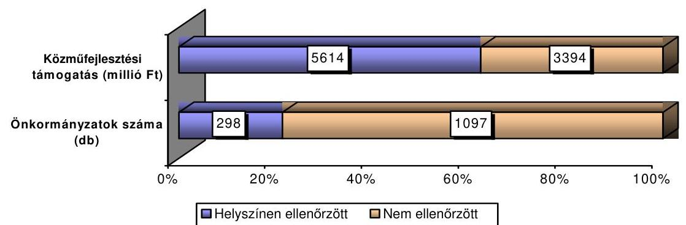

Azoknál az önkormányzatoknál, amelyeknél a 2002. év előtt igényelt és megkapott közműfejlesztési támogatásból 2001. december 31-én maradvány mutatkozott, továbbá ahol jogtalan támogatás igénybevételt tapasztaltunk, vizsgálatunkat - a jogtalanul igénybe vett támogatások, mint pénzügyi tartalmú követelések általános öt éves elévülési idejére tekintettel - a 2001. évre is kiterjesztettük. Vizsgálatunk a helyszíni ellenőrzésbe vont 298 önkormányzatnál a

---

2001 - 2005. évig összesen 5718,1 millió $\mathrm{Ft}^{43}$ közműfejlesztési támogatásra terjedt ki, amelynek $1,8 \%$-a az út és $98,2 \%$-a a csatorna beruházásokhoz kapcsolódott. Az út és csatorna jogcímen igényelt és kiutalt közmúfejlesztési támogatásnak e jogcímekre a 97,4 \%-át, 5571,4 millió Ft-ot használták fel az önkormányzatok. Az eltérést a támogatások igénylésekor helytelenül megjelölt közmú jogcímek ${ }^{44}$, továbbá a saját hatáskörben felülvizsgált, és mint jogtalanul igénybe vett támogatást a tárgyévben a központi költségvetésbe ${ }^{45}$ visszafizetett összeg okozza. A ténylegesen felhasznált közmúfejlesztési támogatásból 103,1 millió Ft 49 önkormányzat útberuházásához, 5468,3 millió Ft 292 önkormányzat csatorna beruházásához kapcsolódott. A 298 ellenőrzött önkormányzatból a 2005. év végéig 295 önkormányzat használt fel út és csatorna jogcímen közmúfejlesztési támogatást. Három önkormányzat a MÁK által kiutalt közmúfejlesztési támogatást - igénylésüket felülvizsgálva - még tárgyévben viszszafizette a központi költségvetésbe (Mezőnagymihály, Mezőnyárád, Szentistván). Az út és csatorna jogcímen felhasznált közmúfejlesztési támogatás közel fele-fele arányban a 2002. május 22 -ét megelőzően, illetve az azt követően megállapított közmúfejlesztési hozzájárulásokhoz kapcsolódott. A közmúfejlesztési támogatások évenkénti alakulását a jelentéshez csatolt 1. számú melléklet mutatja be.

# 4.1. A jogtalanul igénybe vett közmúfejlesztési támogatások nagyságrendje és okai 

A 298 önkormányzat helyszíni ellenőrzése, valamint az 554 önellenőrzésre felkért önkormányzat adatszolgáltatása megerősítette a 2005. évi 0538. számú jelentésünkben szerzett tapasztalatokat, továbbá új információkat nyújtott arról, hogy az önkormányzatok milyen helyi eltérésekkel alkalmazták a közmúfejlesztési támogatások igénybe vételénél az ltp. konstrukciót és módszert. Az 554 önellenőrzésre felkért önkormányzatból $335(60,5 \%)$ önkormányzatnál tanúsítványos adatbekérés történt ${ }^{46}$. Ezeknél az önkormányzatoknál a magánszemélyek részben vagy teljes körűen ltp. szerződések megkötésével tettek eleget közmúfejlesztési hozzájárulás fizetési kötelezettségüknek. Az önellenőrzés során

[^0]
[^0]:    ${ }^{43}$ A 2001. évben igénybe vett támogatásokból 4,1 millió Ft támogatás felülvizsgálatát végeztük el. A 2001. évi adat nem tartalmazza az ellenőrzött önkormányzatok összes közmúfejlesztési támogatását. Tartalmazza a 2001. II. negyedévtől megkapott azon támogatások összegét, amely a 2002-2005. között jogtalanul igénybe vett támogatáshoz kapcsolódóan szintén jogtalan volt; továbbá a 2002. évet megelőzően igényelt közmúfejlesztési támogatások 2001. december 31-i maradványának összegét.
    ${ }^{44}$ Egyenlegében 26,4 millió Ft-tal kevesebb volt az út és csatorna jogcímen igényelt támogatás az e jogcímekre felhasznált összegnél.
    ${ }^{45}$ Saját hatáskörú felülvizsgálat alapján összesen 173,1 millió Ft-ot fizettek vissza az önkormányzatok a központi költségvetésbe, ebből 126,2 millió Ft volt a 2005. évben visszafizetett összeg.
    ${ }^{46}$ Az önellenőrzést Gárdony Városi Önkormányzat - az iratok rendőrségi eljárás miatti hiánya következtében - csak részben teljesítette, adatait az összesített adatok nem tartalmazzák.

---

104 önkormányzat 287,3 millió Ft közműfejlesztési támogatás jogtalan igénybe vételét állapította meg, amelyből 90,5 millió Ft esetében az ltp. szerződések lejártak, illetve a 2006. év végéig lejárnak. Az önkormányzatok által önellenőrzéssel megállapított további 196,8 millió Ft az ltp. szerződések megtakarítási ideje alatt a betétgyűjtés célját szolgáló pénzeszközökre igényelt, továbbá a 2002. május 22. után megállapított közműfejlesztési hozzájárulásokhoz kapcsolódóan a közműfejlesztési támogatásra vonatkozó igény engedményezése, valamint egyéb okok miatti jogtalan támogatás volt. Ebből 2002. május 22. előtt megállapított közműfejlesztési hozzájáruláshoz 161,1 millió Ft, azt követően megállapított közműfejlesztési hozzájáruláshoz 35,7 millió Ft támogatás igénybevétel kapcsolódott. Az önellenőrzésre felkért önkormányzatok 39,5\%ánál (219 önkormányzat) az ellenőrzés adatszolgáltatással történt ${ }^{47}$. Ezek az önkormányzatok a 2002-2005. években egymillió Ft-ot meghaladóan igényeltek közműfejlesztési támogatást. Az adatszolgáltatás során a megkapott közműfejlesztési támogatás magánszemélyekhez történt eljuttatásáról kellett számot adniuk, jogtalan igénybevételt az önellenőrzés keretében nem állapítottak meg. Az önellenőrzés során feldolgozott 552 önkormányzat út jogcímen 226,8 millió Ft, csatorna jogcímen 2 972,3 millió Ft közműfejlesztési támogatás felhasználásáról adott számot. Az önellenőrzéssel érintett önkormányzatok közül 8 önkormányzat tett észrevételt az önellenőrzéshez kapcsolódó kitöltési útmutatóban megfogalmazott, jogtalan igénybevételt megalapozó körülmények értékelésével szemben. Nem értettek egyet azzal, hogy az ltp. szerződéssel rendelkező magánszemélyek esetében csak az ltp. szerződések lejáratát követően, a megfizetett közműfejlesztési hozzájárulás alapján lehet közműfejlesztési támogatást igényelni. Az ltp. szerződések megtakarítási időszakában, a betétgyűjtés célját szolgáló befizetéseket egyben a közműfejlesztési hozzájárulás megfizetésének is tekintették. Az önkormányzatok által önellenőrzéssel megállapított, jogtalanul igénybevett közműfejlesztési támogatások miatti fizetési kötelezettségekről az Országgyűlés döntése alapján, a MÁK bevonásával történik intézkedés. Ennek érdekében a jogtalan támogatás igénybevételt bevalló önkormányzatok listáját, valamint beküldött adatszolgáltatását a vizsgálat befejezését követően a MÁK-nak átadjuk.

A helyszínen ellenőrzöttek közül 16 önkormányzatnál (5,4\%) a magánszemélyek nem kötöttek ltp. szerződést a közműfejlesztési hozzájárulás megfizetésére. Ezeknek az önkormányzatoknak a 37,5\%-ánál (6 önkormányzat) más jogszabálysértések miatt állapítottunk meg jogtalan igénybevételt. Az ellenőrzött önkormányzatok 94,6\%-a (282 db) alkalmazta a közműfejlesztési hozzájárulás ltp. megtakarításból történő megfizetését.

Az ltp. szerződéses önkormányzatok körében a közmúfejlesztési támogatás igénybevételére eltérő gyakorlat alakult ki.

[^0]
[^0]:    ${ }^{47}$ A kért adatszolgáltatást Pilisborosjenő Községi Önkormányzat nem teljesítette, adatait az összesített adatok nem tartalmazzák. Az adatszolgáltatást részben teljesítette három önkormányzat (Nagysáp, Sajólád, Alcsútdoboz Önkormányzat), mivel a hozzá kapcsolódó nyilatkozatokat nem, illetve nem a megfelelő tartalommal írták alá. Az összesítésben adataik szerepelnek.

---

- Az ltp. szerződéses önkormányzatok 41,8\%-a (118 önkormányzat) szabályosan járt el, mivel az ltp. szerződések megtakarítási ideje alatt, a betétgyűjtéssel párhuzamosan nem igényelt közmúfejlesztési támogatást az ltp. megtakarítások céljára befizetett összegek után. Ezek az önkormányzatok csak az ltp. szerződések lejárata után, a megtakarítási összeg kiutalását követően vettek igénybe közmúfejlesztési támogatást, illetve a helyszíni ellenőrzés lezárásáig nem nyújtottak be igénylést. Polgár városi önkormányzat az ltp. megtakarítással megfizetett közmúfejlesztési hozzájárulásra nem igényelt közmúfejlesztési támogatást, mivel ugyanarra a befizetésre két jogcímen nem kívánt állami támogatást igénybe venni.
- Az ltp. szerződéses önkormányzatok 58,2\%-a (164 önkormányzat) szabálytalanul, már az ltp. szerződések megtakarítási ideje alatt, a betétgyűjtéssel párhuzamosan, a betétgyűjtés célját szolgáló pénzeszközökre igénybe vette a közmúfejlesztési támogatást. A közmúfejlesztési hozzájárulás megfizetését ltp. megtakarításból vállaló magánszemélyek, vagy nevükben más szervezetek által az ltp. szerződés megtakarítási időszakában teljesített befizetések valójában lakás-előtakarékossági célokat szolgáltak, ezért azokra jogszerűen nem lehetett közmúfejlesztési támogatást igénybe venni az ltp. szerződések lejártáig, amikor a közmúfejlesztési hozzájárulás megfizetése a megtakarításokból ténylegesen megtörténik. A szabálytalanul eljáró ltp. szerződéses önkormányzatok:
- 31,1\%-a (51 önkormányzat) a közmúfejlesztési támogatás jogossá válásának időpontja előtt, de csak a magánszemélyek tényleges befizetéseire igényelt közmúfejlesztési támogatást;
- 64,6\%-a (106 önkormányzat) a közmúfejlesztési támogatás jogossá válásának időpontja előtt a magánszemélyek ténylegesen befizetésén túl a magánszemélyek nevében ltp. megtakarítás céljára befizetett önkormányzati és alapítványi pénzeszközökre is igényelt közmúfejlesztési támogatást;
- 4,3\%-a (7 önkormányzat) csak a magánszemélyek nevében, ltp. megtakarítás céljára befizetett önkormányzati és alapítványi pénzeszközökre igényelt közmúfejlesztési támogatást. Ezeknél az önkormányzatoknál magánszemélyek nem fizettek közmúfejlesztési hozzájárulást, továbbá egyéni ltp. számláikra is csak jogi személyektől származó befizetések érkeztek, ennek ellenére egyidejúleg igénybe vettek lakás-előtakarékossági állami támogatást, valamint közmúfejlesztési támogatást is.

A helyszínen ellenőrzött 298 önkormányzat által a vizsgált időszakban igényelt 5571,4 millió Ft közmúfejlesztési támogatásból 206 önkormányzat (az ellenőrzött önkormányzatok 69,1\%-a) összesen 4498,3 millió Ft-ot vett igénybe jogtalanul, amely a helyszíni ellenőrzéssel vizsgálat alá vont támogatások 80,7\%-át tette ki.

---

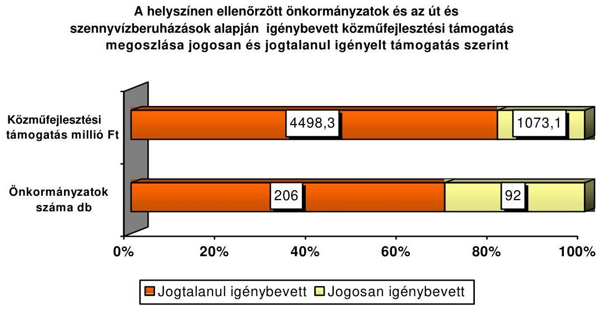

Az öt év alatt jogtalanul igénybe vett támogatásokból jelenlegi ellenőrzésünk során 3688,6 millió Ft jogtalanul, illetve a jogosulttá válás időpontja előtt igényelt közmúfejlesztési támogatást állapítottunk meg, mivel 809,7 millió Ft jogtalan támogatás igénybe vételét 2002-2005. években lefolytatott vizsgálataink, valamint az önkormányzatok saját maguk állapították meg. A 206 önkormányzatnál megállapított 3688,6 millió Ft közmúfejlesztési támogatás a kapott támogatások 66,2\%-át, az összes jogtalanul igénybe vett támogatás $69,2 \%$-át jelentette. A 2001-2005. években út és csatorna jogcímen kapott közmúfejlesztési támogatások 80,3\%-át (4472,0 millió Ft-ot) az ÁSZ ellenőrzései jogtalannak minősítették. A 3688,6 millió Ft jogtalanul igényelt támogatás után büntetőkamat megállapítását, valamint 3112,0 millió Ft visszafizettetését javasoljuk. A jogosulttá válás időpontja előtt jogtalanul igénybe vett támogatásokból 576,6 millió Ft közmúfejlesztési támogatás a lejárt ltp. szerződések közmúberuházásra történő lakáscélú felhasználása volt, ezért visszafizettetésére nem teszünk javaslatot. A visszafizettetésre javasolt közmúfejlesztési támogatások önkormányzatonkénti és okonkénti részletezését a jelentés 3. számú melléklete tartalmazza, a lejárt ltp. szerződések megtakarításából megfizetett, visszafizetésre nem javasolt támogatások önkormányzatonkénti bemutatását a jelentés 5. számú melléklete tartalmazza. A jogtalanul igénybe vett támogatás öszszegéből mindössze $0,6 \%$-ot tett ki az önkormányzatok által saját hatáskörben az éves költségvetési beszámoló keretében elszámolt és visszafizetett összeg. Gyomaendrőd, Etes, Pásztó, Monor, Barcs, Besenyszög önkormányzatai az önkormányzatok számát tekintve az ábrában a jogosan igénybe vettek között szerepelnek, mivel a saját hatáskörükben megállapított eltérésen felül további jogtalan támogatás igénybevétel nem történt. Az ÁSZ 2002-2005. években végzett vizsgálatai alapján - beleértve a 2005. évi 0538 számú ellenőrzést is - a jogtalanul igénybe vett támogatások összege az igénybe vett támogatások 14,1\%-át, az összes jogtalanul igénybe vett támogatás $17,4 \%$-át tette ki.

A vizsgált körben - az elmúlt évek jogszabályi pontosításai és szigorításai ellenére - a 2002. május 22 -ét követően megállapított, az út- és csatorna beruházásokhoz kapcsolódó közmúfejlesztési hozzájárulások után igénybe vett közmúfejlesztési támogatásokon belül - az ltp. szerződéses önkormányzatok körében -

---

növekedett a jogtalanul igénybe vett támogatások aránya, amely nagyságrendjét tekintve is nőtt, azonban mindössze 46 önkormányzat jogtalan támogatás igénybevételét jelentette, amelyből 29 önkormányzat igényelt a magánszemélyeknek nyújtott támogatásokra is közműfejlesztési támogatást. A 2002. május 22. előtt megállapított közműfejlesztési hozzájárulásokhoz kapcsolódó közműfejlesztési támogatásoknál a jogtalanul, illetve a jogosulttá válás időpontja előtt igénybe vett támogatások aránya $74,0 \%$ volt ( 70 önkormányzat jogtalan támogatás igénybevételéhez kapcsolódott), amely a jogszabályváltozást követően megállapított közműfejlesztési hozzájárulások esetében 87,6\%-ra növekedett. Az ÖKOTÁM és a hasonló rendszerú beruházás-finanszírozási módszer alkalmazása miatt jogtalan támogatás igénybevételére a 2002. május 22ét követően megállapított közműfejlesztési hozzájárulások esetében 46 önkormányzatnál került sor. (4. b. számú melléklet) A jogszabályi előírások korlátot szabtak a közműfejlesztési támogatások szabálytalan igénybe vételére irányuló önkormányzati törekvéseknek, amelyet azonban 29 önkormányzat - melyből 27 önkormányzat az ÖKOTÁM Alapítvány támogatásával beruházó önkormányzat volt - nem vett figyelembe.

A jogszabályváltozások hatására a jogtalanul, illetve a jogosulttá válás időpontja előtt igénybe vett támogatások összegének alakulását és megoszlását a helyszínen ellenőrzött önkormányzatok a közműfejlesztési hozzájárulás megállapításának időszaka szerint a következő táblázat szemlélteti:
millió Ft-ban!

| Megnevezés | 2002. május 22. előtt megállapított közmúfejlesztési hozzájáruláshoz kapcsolódó |  | Vizsgált időszak együtt | Megoszlás $\%-a$ |
| :--: | :--: | :--: | :--: | :--: |
| Kapott közmúfejlesztési támogatás | 2812,3 | 2759,1 | 5571,4 |  |
| Önkormányzat által saját hatáskörben a tárgyévet követően visszafizetett | 22,7 | 3,6 | 26,3 | 0,6 |
| ÁSZ korábbi vizsgálatai alapján elvont támogatás | 141,4 | 642,0 | 783,4 | 17,4 |
| Az ltp. szerződések megtakarítási ideje alatt jogtalanul igényelt, a 2002-2006. években lejárt ltp. szerződésekhez kapcsolódó támogatás | 576,6 | 0 | 576,6 | 12,8 |
| ÁSZ által jelenleg visszafizettetésre javasolt támogatás | 1341,4 | 1770,6 | 3112,0 | 69,2 |
| Összes jogtalanul, illetve idő előtt igénybe vett támogatás | 2082,1 | 2416,2 | 4498,3 | 100,0 |
| Jogosan igénybe vett támogatás | 730,1 | 343,0 | 1073,1 | 19,3 |
| Összes jogtalanul igénybe vett támogatás a kapott támogatás \%-ában | 74,0 | 87,6 | 80,7 |  |

---

A kapott, ezen belül a jogtalanul igénybe vett közműfejlesztési támogatások megyék szerinti alakulását (az ÁSZ korábbi vizsgálatai alapján visszafizettetésre javasolt összeggel együtt) a 2. a-d. számú mellékletek mutatják be. A 2. c. és 2. d. mellékletek a közműfejlesztési támogatások meghatározott térségek szerinti koncentrációját mutatják be. A 2002. május 22. előtt megállapított közműfejlesztési hozzájárulásokhoz kapcsolódóan 10 megye ${ }^{48} 157$ önkormányzata vette igénybe a közműfejlesztési támogatások 84,9\%-át, amelyeknél a megállapított jogtalan támogatás az időszakra vonatkozóan megállapított összes jogtalan támogatás $92,4 \%$-át teszi ki. A 2002. évi jogszabályváltozást követően három megyében - Borsod-Abaúj-Zemplén, Fejér, Heves - lévő 26 önkormányzatra koncentrálódott a közműfejlesztési támogatások 70,7\%-a, amelyből 19 önkormányzat vette igénybe az időszakra vonatkozóan megállapított jogtalan közműfejlesztési támogatások 79,6\%-át. A 19 önkormányzatnál megállapított jogtalan közműfejlesztési támogatás e három megyében igénybe vett összes közműfejlesztési támogatásnak a 98,5\%-át jelentette. Összességében e három megye 101 önkormányzata kapta meg az ellenőrzött önkormányzatok által kapott támogatások $48,6 \%$-át, amelyen belül 74 önkormányzat - az ellenőrzött önkormányzatok $24,8 \%$-a - által jogtalanul igénybe vett támogatás tette ki az ÁSZ ellenőrzés által megállapított jogtalanul igényelt támogatások $54,7 \%$-át.

Az ellenőrzés alapján visszafizettetésre javasolunk 166 önkormányzatnál 3112,0 millió Ft-ot, amelynek önkormányzatonként és okonként részletezett összegét a 3. számú melléklet tartalmazza. Az visszafizettetésre javasolt közműfejlesztési támogatások jogtalanná minősítésének okai a következők voltak:

- Visszafizettetésre javasolunk öt önkormányzatnál 31,7 millió Ft közmúfejlesztési támogatást (az összes visszafizettetésre javasolt támogatás $1,0 \%$-át), amelyet megfizetett közműfejlesztési hozzájárulás helyett víziközmú-társulat által realizált betéti kamatokra igényeltek. Jogtalan a központi támogatás igénybevétele, mivel közműfejlesztési hozzájárulásként igazolták a víziközmű-társulatok gazdálkodása körében keletkezett, a társulat által realizált kamatbevételeket. Magyaregregy, Sarud, Tyukod, Verseg és Tiszanána Önkormányzatok igényeltek nem a magánszemélyek pénzeszközeit jelentő víziközmű-társulati pénzeszközök (kamatok) után közműfejlesztési támogatást. Az önkormányzatok jegyzői annak ellenére továbbították a MÁK felé a támogatásra vonatkozó igényeket, hogy az igazolást nem a 73/1999. (V. 21.) Korm. rendelet 3. § (3) bekezdésében arra feljogosított szervezet, hanem a víziközmű-társulati hitelt nyújtó, a kamatozó óvadéki betétet kezelő kereskedelmi bank adta ki. Az igénylés mindegyik esetben jogtalan volt, mivel nem felelt meg a 73/1999. (V. 21.) Korm. rendelet 1. § (1) bekezdésében, a 2. § (1) bekezdésében, továbbá a 3. § (1) bekezdésében foglalt előírásoknak.
- Visszafizettetésre javasolunk öt önkormányzatnál 5,8 millió Ft közmúfejlesztési támogatást (az összes visszafizettetésre javasolt támogatás

[^0]
[^0]:    ${ }^{48}$ Borsod-Abaúj-Zemplén, Szabolcs-Szatmár-Bereg, Nógrád, Csongrád, Pest, BácsKiskun, Heves, Tolna, Baranya, Hajdú-Bihar megyék.

---

0,2\%-át), mivel a 2002. május 22 -ét követően megállapított közműfejlesztési hozzájárulásokhoz kapcsolódóan, a 73/1999. (V. 21.) Korm. rendelet 3. § (4) bekezdésében előírtakat megsértve a támogatás jogosultja a közmúfejlesztési támogatásra vonatkozó igényét engedményezte. Dévaványa, Kőrösladány, Mezőberény, Szeghalom, Cserszegtomaj Önkormányzatoknál a közműfejlesztési támogatásra jogosult magánszemélyek átadták másnak a támogatások igénylésének jogát, így a támogatásokat helyettük valamely szerezet igényelte; a közműfejlesztési támogatásból származó követelésről lemondtak, így azt nem a magánszemélyeknek fizették ki.

- Visszafizettetésre javasolunk - 61 önkormányzatot érintően - 35,9 millió Ft közmúfejlesztési támogatást (az összes visszafizettetésre javasolt támogatás $1,2 \%$-a) - a 73/1999. (V. 21.) és a 262/2004. (IX. 23.) Korm. rendelet előírásaival ellentétes - egyéb okok miatt. A jogtalan támogatás igénybevétel egyéb fő okai az alábbiak voltak:
- A 2004. október 8. előtt megállapított közműfejlesztési hozzájárulásnál a 73/1999. (V. 21.) Korm. rendeletben előírt 15\%-os közműfejlesztési támogatás helyett a 262/2004. (IX. 23.) Korm. rendeletben szereplő $25 \%$-os mértéket alkalmazták, a 262/2004. (IX. 23.) Korm. rendelet 8. § (3) bekezdés előírásai ellenére, amely szerint a 2004. október 8. előtt megállapított közműfejlesztési hozzájárulások után járó közműfejlesztési támogatás igénybevételénél a 73/1999. (V. 21.) Korm. rendelet előírásait kell alkalmazni (Szakmár, Öregcsertő, Röszke, Komádi önkormányzatok);
- Különböző szervezetek (jogi személyek) által az érdekeltségei egységük alapján befizetett érdekeltségi hozzájárulás után is igényelték a közműfejlesztési támogatást, a 73/1999. (V. 21.) Korm. rendelet 1. § (1) bekezdés előírása ellenére (Dunavarsány, Velence, Kisdorog, Bakonynána, Felsőpáhok önkormányzatok);
- Óvadéki betét után igényeltek közműfejlesztési támogatást, amely ellentétes a 73/1999. (V. 21.) Korm. rendelet 1. § (1) bekezdésében, a 2. § (1) bekezdésében, valamint a 3. § (1) bekezdésében foglalt előírásokkal (Verseg);
- A magánszemély igénylése és a közműfejlesztési hozzájárulás megfizetését alátámasztó dokumentumok nélkül igényeltek közműfejlesztési támogatást, a 73/1999. (V. 21.) Korm. rendelet 3. § (1), (3) bekezdések előírásai ellenére (Pécel);
- A közműfejlesztési támogatásra vonatkozó igényt a 73/1999. (V. 21.) Korm. rendelet 3. § (3) bekezdésében előírt, a közműfejlesztési hozzájárulás befizetésétől számított egy éven túl nyújtották be (Magyarnándor, Szombathely, Nagyrécse);
- A közműfejlesztési támogatást az ltp. szerződés lejáratát követően nemcsak a közműfejlesztési hozzájárulás befizetési kötelezettségként megállapított összeg alapján, hanem annál magasabb összegben igényelték, mivel az ltp. megtakarítások kiutaláskori összege meghaladta a közműfejlesztési hozzájárulás befizetési kötelezettségként megállapított összeget. Ezzel az önkormányzatoknál megsértették a 73/1999. (V. 21.) Korm. rendelet 1. § (1) és 1. § (5) bekezdése ${ }^{49}$, illetve a 3. § (2) bekezdés előírásait (Damak, Nyírlugos);

[^0]
[^0]:    ${ }^{49}$ Az előírást 2002. május 22-től a (6) bekezdés tartalmazza.

---

- A 73/1999. (V. 21.) Korm. rendelet 3. § (3) bekezdés előírásai ellenére, a jegyzők nem csak az önkormányzat saját közigazgatási területén létesített közművek után megfizetett közműfejlesztési hozzájárulások után, hanem más település közigazgatási területén, az ott ingatlannal rendelkező magánszemélyek által benyújtott igényeket is befogadták, továbbították a MÁK felé (Olasz, Magyaregregy);
- Az önkormányzatok nem utalták vissza a MÁK részére - a közmú kiépítésének valamilyen ok miatt történt meghiúsulása, vagy egyéb ok miatt - a magánszemélyek részére visszafizetett közmúfejlesztési hozzájárulásokból a magánszemélyek részére ki nem fizetett közmúfejlesztési támogatást, amelyet korábban megigényeltek a központi költségvetésből. E támogatásokat a 73/1999. (V. 21.) Korm. rendelet 5. §. előírásai alapján a MÁK részére a közmúfejlesztési hozzájárulás visszafizetését követő negyedév végéig vissza kellett volna utalni (Cserszegtomaj, Tornyiszentmiklós).
- Visszafizettetésre javasolunk 115 önkormányzatnál 3038,6 millió Ft közmúfejlesztési támogatást (az összes visszafizettetésre javasolt jogtalan közmúfejlesztési támogatás $97,6 \%$-át), amelyet az ltp. megtakarításként befizetett pénzeszközök után, az ltp. szerződések megtakarítási időszakában - a közmúfejlesztési hozzájárulás megfizetése előtt - vettek igénybe. A települések részletezését a jelentés 4. a számú melléklete tartalmazza. A lakás-előtakarékoskodó által befizetett összegek betétnek minősülnek, amely a megtakarítás lejáratot követő felvételével válhat lakáscélú felhasználássá az Ltp. tv. 7. § (4) és (7) bekezdése, valamint a 215/1996. (XII. 23.) Korm. rendelet 7. § (4)-(5) bekezdése szerint. A közmúfejlesztési hozzájárulás megfizetését részben vagy egészben ltp. megtakarítás útján vállaló magánszemélyek a közmúfejlesztési hozzájárulás fizetési kötelezettségüknek csak a megtakarítási időszak lejáratakor - az elhelyezett betét, az állami támogatás, a jóváírt kamatok feletti rendelkezési jog megszerzését követően - tudnak eleget tenni. A vállalt közmúfejlesztési (érdekeltségi) hozzájárulást a magánszemélyek az ltp. egyéni számlájukon képződött megtakarításból ekkor fizetik meg.

A megtakarítási időszakban az ltp. megtakarítások után, a közmúfejlesztési hozzájárulás megfizetése előtt igénybe vett 3038,6 millió Ft-ból:

- 309,6 millió Ft-ot a magánszemélyek nevében az önkormányzatok (az ltp. szerződések megtakarítási időszakában történő igénylés miatt visszafizettetésre javasolt támogatások 10,2\%-át) a magánszemélyek tényleges befizetései után igényeltek. Ezek a támogatások az ltp. szerződések lejáratát követően, a közmúfejlesztési hozzájárulás megfizetésekor jogossá válnak. Ekkor lesz igényelhető a közmúfejlesztési támogatás a közmúfejlesztési hozzájárulás megállapításakor hatályos jogszabályi rendelkezések alapján, legfeljebb azonban a közmúfejlesztési hozzájárulás befizetési kötelezettségként megállapított összeg után a 73/1999. (V. 21.) Korm. rendelet 3. § (2) bekezdése szerint.
- 2729,0 millió Ft közmúfejlesztési támogatást (az ltp. szerződések megtakarítási időszakában történő igénylés miatt visszafizettetésre javasolt támogatások 89,8\%-a) a magánszemélyeket támogató szervezetek (önkormányzatok, alapítványok, víziközmú-társulatok) által teljesített befizetések után igényeltek az önkormányzatok a

---

magánszemélyek nevében. Ezekre a befizetésekre az ltp. szerződések lejártát követően a közműfejlesztési hozzájárulás megállapításakor hatályban lévő 73/1999. (V. 21.) Korm. rendelet 1. § (1) és 3. § (1) és (2) bekezdései alapján igényelhető (a közmúfejlesztési hozzájárulás befizetési kötelezettségként megállapított összeg után) támogatás, melynek felülvizsgálatát a támogatás kiutalását megelőzően a MÁK-nak kell biztosítania.

A magánszemélyeknek adott támogatásból megfizetett közmúfejlesztési hozzájárulások után igényelt 2729,0 millió Ft közműfejlesztési támogatásból 1611,9 millió Ft a 2002. május 22. után megállapított közműfejlesztési hozzájárulásokhoz kapcsolódó közműfejlesztési támogatás volt, amely jogtalan igénybevételét az ltp. szerződések lejárata előtti igénybevétel mellett a harmadik személytől kapott támogatásra vonatkozó, a 73/1999. (V. 21.) Korm. rendelet 1. § (2) bekezdésében megfogalmazott tiltó szabály megsértése is megalapozza. (4. b. számú melléklet).

A 2002. évi jogszabályi pontosításokat követően - amely kapcsán a 73/1999. (V. 21.) Korm. rendeletbe bekerült az 1. § (2) bekezdés - két önkormányzat kivételével (Pusztavacs és Újlengyel) csak az ÖKOTÁM Alapítvány támogatásával beruházó önkormányzatok igényeltek az ltp. megtakarítások időszaka alatt a jogszabályban megfogalmazott egyértelmú tiltás ellenére közmúfejlesztési támogatást a magánszemélyeknek nyújtott alapítványi támogatások után. A 2002. után megállapított közmúfejlesztési hozzájárulások után a magánszemélyek támogatására igénybe vett 1611,9 millió Ft-ot 29 önkormányzat vette igénybe, amelyből 27 (93,1\%) önkormányzat az ÖKOTÁM Alapítvány támogatásával beruházott. A 73/1999. (V. 21.) Korm. rendelet 2002. május 22-i változását követően megállapított közmúfejlesztési hozzájárulások esetében a magánszemélyeknek nyújtott támogatásokra 30 (a vizsgált önkormányzatok 10,1\%-a) igényelt és 29 önkormányzat kapott közmúfejlesztési támogatást. (A jelentés 4. b. számú mellékletéből látható, hogy mely önkormányzatok tartoztak ebbe a körbe.)

Nick (az ÖKOTÁM Alapítvány támogatásával beruházó) önkormányzat esetében a MÁK az igényelt támogatást nem utalta ki, mivel az önkormányzat hitelt érdemlően nem tudta igazolni, hogy a magánszemélyek írásbeli értesítése 2004. október 8-a előtt megtörtént ${ }^{50}$.

Pusztavacs és Újlengyel önkormányzatok saját alapítványt hoztak létre a magánszemélyek közmúfejlesztési hozzájárulása megfizetésének támogatására és az alapítványi támogatásra is közmúfejlesztési támogatást igényeltek.

Az ltp. megtakarítások után a megtakarítási idő lejárta előtt, annak megtakarítási időszakában jogtalanul igénybe vett 3038,6 millió Ft támogatás megoszlását - az alapjául szolgáló összegek megfizetésének forrásai szerint - településenként részletezve a jelentés 4. a. számú melléklete tartalmazza.

[^0]
[^0]:    ${ }^{50}$ A 73/1999. (V. 21.) Korm. rendeletben rögzített feltételek szerinti közmúfejlesztési támogatást a közmúfejlesztési hozzájárulás megállapítása és írásbeli közlése esetében lehet igényelni 262/2004. (IX. 23.) Korm. rendelet hatályba lépését követően.

---

A jelentés 4. a. számú mellékletében felsorolt 115 önkormányzatból 35 csak a magánszemélyek tényleges befizetéseire igényelt 151,8 millió Ft-ot. További 74 önkormányzat a magánszemélyek tényleges befizetéseire igényelt 157,8 millió Ft mellett a magánszemélyeknek adott támogatásokra is igénybe vett 2652,3 millió Ft közmúfejlesztési támogatást. Hat önkormányzat csak a magánszemélyeknek adott támogatások után igényelt 76,7 millió Ft támogatást.

A 166 önkormányzatot érintő visszafizettetési javaslatból 6,3 millió Ft út jogcímen kapott támogatás, amely az e jogcímen kapott támogatásnak a 6,1\%-át tette ki. A további 3105,7 millió Ft visszafizettetésre javasolt támogatás szennyvízberuházásokhoz kapcsolódik és az e jogcímen kapott összes támogatás $56,8 \%$-a.

A közmúfejlesztési támogatás visszafizettetésének okait és arányait a következő ábra szemlélteti:
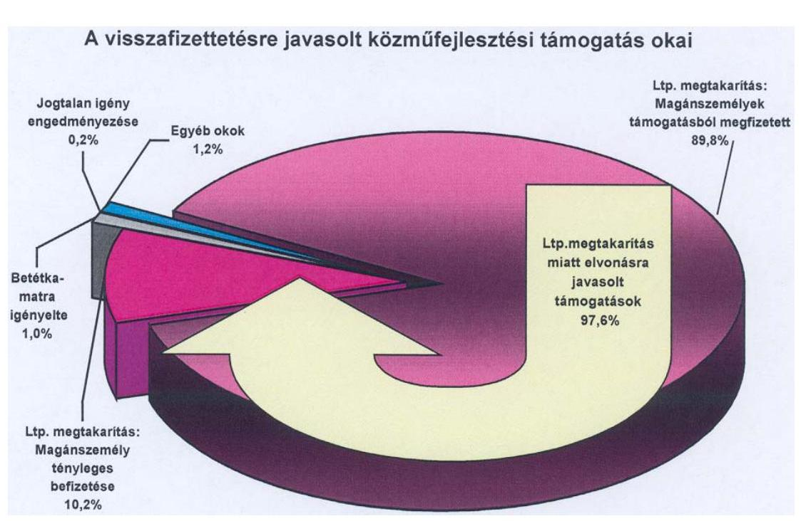

A közmúfejlesztési támogatást szabálytalanul igénylő önkormányzatok 40,9\%ánál (67 önkormányzatnál) - amely az ellenőrzött önkormányzatok 22,5\%-át jelentette - a közmúfejlesztési hozzájárulások megfizetése érdekében kötött ltp. szerződések a helyszíni ellenőrzés időpontjáig lejártak, vagy 2006. december 31-ig lejárnak. Az ltp. megtakarítások kiutalását követően a magánszemélyek eleget tudtak/tudnak tenni közmúfejlesztési hozzájárulás fizetési kötelezettségünknek, és a kiutalt megtakarításokat a 73/1999. (V. 21.) Korm. rendelet 3. § (2) bekezdésében rögzítetteknek megfelelően - a megelőlegezését szolgáló víziközmű-társulati hitel - törlesztésre kerül. A közmúfejlesztési támogatás alapja ez esetben sem lehet azonban magasabb, mint a közmúfejlesztési hozzájárulás befizetési kötelezettségként megállapított összeg. Problémát jelent ugyanakkor a közmúfejlesztési támogatás alapjának nagyságát maximalizáló rendelkezés értelmezése az ÖKOTÁM és a hasonló finanszírozási rendszerú beruházásoknál, mivel ezeknél a közmúfejlesztési hozzájárulásoknál a víziközmútársulatok által megállapított és a magánszemélyek által fizetendő érdekeltségi

---

hozzájárulás összege eltért egymástól. A közmúfejlesztési (érdekeltségi) hozzájárulás összegét az ltp. szerződéssel rendelkező magánszemélyeknél azért állapították meg a többi érdekelt befizetési kötelezettségénél magasabban, hogy abban az a közmúfejlesztési hozzájárulás hányad is szerepeljen, amelyet a la-kás-előtakarékosság állami támogatásából, továbbá a magánszemélyek helyett a nevükben különböző szervezetek teljesítettek. Utóbbiak a 2002. május 22-ét követően megállapított közmúfejlesztési hozzájárulások esetében nem tekinthetők a magánszemély tényleges befizetésének, így nem képezhetik alapját a közmúfejlesztési támogatásnak sem.

Az ellenőrzött önkormányzatok által az ltp. szerződések megtakarítási időszakában igénybe vett, a 2002-2006. években lejárt (vagy lejáró) ltp. szerződésekhez kapcsolódó közmúfejlesztési támogatások összege 576,6 millió Ft volt. A jelentés 5. számú melléklete mutatja, hogy a rendelkezésünkre álló adatok alapján végzett becslés szerint ${ }^{51}$ ebből a magánszemélyek tényleges befizetéseire igényelt közmúfejlesztési támogatás 223,8 millió Ft $(38,8 \%)$, a magánszemélyeknek nyújtott vállalkozói pénzeszközökből és önkormányzati közpénzekből származó befizetésekre igénybe vett közmúfejlesztési támogatás 352,8 millió Ft $(61,2 \%)$ körüli volt.

A rendelkezésünkre álló adatok szerint az 5. számú mellékletben szereplő 67 önkormányzatból 22 csak a magánszemélyek tényleges befizetéseire igényelt 134,6 millió Ft-ot. További 44 önkormányzat a magánszemélyek tényleges befizetéseire igényelt 89,2 millió Ft mellett a magánszemélyeknek adott támogatásokra is igénybe vett 348,7 millió Ft közmúfejlesztési támogatást. Egy önkormányzat csak a magánszemélyeknek adott támogatásokra igényelt 4,1 millió Ft támogatást.

Az ltp. szerződések lejáratát követően, az ltp. megtakarításokból megfizetett közmúfejlesztési hozzájárulások esetében is érvényesíteni kell a közmúfejlesztési támogatás feltételeit - a közmúfejlesztési hozzájárulás megállapításának időpontjában - szabályozó előirásokat. A közmúfejlesztési hozzájárulás ltp. megtakarításokból történő megfizetése ugyanakkor elfedi a befizetés valódi forrásait, mivel a megtakarítási időszak végén a megtakarított összeget teljes egészében a magánszemély megtakarításaként tünteti fel, mintha az a közmúfejlesztési hozzájárulás magánszemély általi tényleges megfizetése lenne. Nem vizsgálja a megtakarításként befizetett pénz eredetét, ezzel megakadályozza a közmúfejlesztési támogatások igénylése feltételeinek vizsgálatát. Ezzel a 2002. május 22. után megálla-

[^0]
[^0]:    ${ }^{51}$ A számítás annak alapján történt, hogy a közmúfejlesztési hozzájárulást megállapító határozatok szerint mekkora volt az önkormányzatok és a magánszemélyek által megfizetett közmúfejlesztési hozzájárulásrész aránya, illetve az önkormányzatok, alapítványok, víziközmú-társulatok milyen összeget utaltak át támogatásként az LTP-be. Nem álltak azonban az ellenőrzéskor rendelkezésünkre magánszemélyenkénti bontásban az egyes magánszemélyek egyéni megtakarítási számláin képződő megtakarítások összegei, amelyek a támogatás jogosságának összegszerű elbírálásához szükségesek voltak. A közmúfejlesztési támogatás jogszerüségét ugyanis egyénenként, egyedileg kell elbírálni. Az ellenőrzött önkormányzatoknál a víziközmú-társulati hitel törlesztésére átutalt ltp. megtakarítás összegének személyenkénti adata nem állt rendelkezésre, ezért a jogtalan támogatás összegének pontos, összegszerű megállapítása jelen ellenőrzés keretében, valamint az ellenőrzésre rendelkezésre álló időben nem volt biztosított.

---

pított közműfejlesztési hozzájárulások esetében leplezi azokat a jogsértő körülményeket, amelyek az érdekeltségi hozzájárulás egy összegben vagy részletekben történő megfizetése esetén, a magánszemélyeknek nyújtott támogatásokra kizárják a közmúfejlesztési támogatások igénybe vételét (2002. május 22ét követően nem a magánszemély tényleges befizetésére, önkormányzati vagy önkormányzat polgárjogi szerződése alapján harmadik személytől kapott támogatásra nem lehet közműfejlesztési támogatást igényelni). Mindezek alátámasztják az Ltp. tv. módosításának a szükségességét.

A víziközmű-társulatoktól, illetve az önkormányzatoktól a magánszemélyek egyéni ltp. számláira a befizetések egy összegben (nem személyenként) történtek. Emiatt az ltp. betéteket gyűjtő és azt továbbító víziközmű-társulatok és/vagy az önkormányzatok rendelkeznek információval az LTP-be teljesített befizetések forrásainak megoszlásáról. Az LTP-k tudnak adatot szolgáltatni arról, hogy mekkora megtakarítási összegek gyűltek össze a magánszemélyek egyéni ltp. számláin, amelyek, valamint a közmúfejlesztési hozzájárulás befizetési kötelezettségként megállapított összeg összevetését követően határozható meg, hogy a 73/1999. (V. 21.) Korm. rendelet 3. § (2) bekezdését figyelembe véve mekkora összeg képezi a közmúfejlesztési támogatás alapját. A magánszemélyek egyéni megtakarításai ismeretének hiányában nem állapítható meg, hogy az LTP által az érdekeltek ltp. megtakarításából egyösszegben megfizetett víziközmű-társulati hitel törlesztésére felhasznált közmúfejlesztési hozzájárulásból személyenként mekkora összegre lehet közmúfejlesztési támogatást igényelni. Amennyiben a közmúfejlesztési hozzájárulás befizetési kötelezettségként megállapított összeg alacsonyabb az ltp. megtakarítás összegénél, akkor csak erre lehet közmúfejlesztési támogatást igényelni és az ltp. megtakarításból is csak ekkora összeget lehet lakáscélú felhasználásként igazolni.

A magánszemélyek egyéni ltp. számlájára a magánszemély helyett más is teljesíthet befizetést a szerződő nevében. Az Ltp. tv. nem tartalmaz kifejezett tiltást arra vonatkozóan, hogy a magánszemély helyett a befizető jogi személy legyen, ugyanakkor azt sem teszi lehetővé, hogy ltp. megtakarítás befizetése címén a jogi személyek adómentesen részesíthessék támogatásban a magánszemélyeket. Az ÖKOTÁM és a hasonló finanszírozási rendszerben az alapítványok bekapcsolásának eredményeként a beruházó önkormányzatok és a kivitelezők a magánszemélyeknek adott támogatások során mentesültek az adófizetési kötelezettség alól. Így végső soron a magánszemélyek saját pénzeszközei mellett vállalkozói pénzeszközökből, önkormányzati közpénzből, vagy a magánszemélyekhez alapítványokon keresztül eljuttatott pénzeszközökből származó ltp. megtakarításokra is a magánszemélyeket megillető állami támogatásokat fizetett az állam. Ez ellentétes az állami pénzeszközök jogszerú és hatékony felhasználásával, azok indokolatlan nagyságú, jogtalan kiáramlását okozza. Az Ltp. tv. céljával ellentétes, hogy jogi személyek befizetéseire is állami támogatást biztosítsanak, mivel az Országgyúlés annak érdekében alkotta az Ltp. tv-t, hogy ösztönözze a magánszemélyek előtakarékosságát a lakáscélok saját erőből történő megvalósítása érdekében.

Az ellenőrzött önkormányzatoknál többszörös jogszabálysértés miatt 9 jegyző és 6 polgármester felelősségét vetettük fel. A polgármesterek felelősségre voná-

---

sát azért javasoltuk, mivel szabálytalanul prolongáltattak ${ }^{52}$ víziközmű-társulati hitelt az önkormányzati forráshiány finanszírozására, valótlan adatokat közöltek a lakáscélú-felhasználások összegéről annak érdekében, hogy az ltp. kiutalásokhoz kapcsolódó állami támogatások jogos igénybevétele igazolt legyen. Továbbá a jövedelmi helyzetükről nem nyilatkozó magánszemélyeket kérelem nélkül részesítettek szociális támogatásban, valamint dokumentumokkal nem alátámasztott, valótlan teljesítésigazolást írtak alá önkormányzatok által jogalap nélkül kibocsátott számlák esetében. A jegyzők felelősségének felvetését az alapozta meg, hogy a jogszabályi előírásokat figyelmen kívül hagyva, azok ismételt megsértésével az Országgyúlés döntése után 2005. októberét követően is továbbították a MÁK felé a közmúfejlesztési támogatásra vonatkozó, a jogszabályi feltételeknek nem megfelelő III. negyedéves igényléseket, miközben a jogszabálysértő igénylésre az ÁSZ korábbi ellenőrzése már felhívta az érintett jegyzők figyelmét. A jegyzői felelősség megállapításának ténye a jogtalanul igénybevett támogatások számát és összegét nem befolyásolta.

# 4.2. Az állami tehervállalás alakulása 

A magánszemélyek önkormányzati és alapítványi támogatásának összegére is közmúfejlesztési támogatást igénylő, le nem járt ltp. szerződéses 80 önkormányzat (a helyszínen ellenőrzött önkormányzatok 26,8\%-a) esetében az önkormányzatok pénzeszközeire, valamint az önkormányzati, illetve alapítványi támogatásként feltüntetett bankszámlapénzre igénybe vett közmúfejlesztési támogatás összege 2002-2005. években közel 2730 millió Ft volt. Ez a közmúfejlesztési támogatás ( $15 \%$-os támogatottsági mérték mellett) 18200 millió Ft lakossági forrásbevonás ösztönzését szolgálta volna, ugyanakkor ezt az összeget nem vonták be a lakosságtól az önkormányzati közműberuházásokba. A 18200 millió Ft a magánszemélyek által igényelhető állami támogatások alapját annak érdekében növelték az ÖKOTÁM és a hasonló beruházási konstrukciót alkalmazó szervezetek, hogy a beruházáshoz a kieső lakossági forrás helyett 8190 millió Ft állami támogatást igényeljenek (a 18200 millió Ft $45 \%$-át, $30 \%$-os ltp. megtakarítások állami támogatást és $15 \%$-os közmúfejlesztési támogatást). A magánszemélyeket megillető támogatásokat pedig a magánszemélyektől „visszaforgatva" (a magánszemélyek a beruházó javára lemondtak, illetve engedményezték az őket illető állami támogatásokat) a beruházás forrásaivá tették, vagy amennyiben a beruházáshoz szükséges források már rendelkezésre álltak, akkor egyéb önkormányzati cél megvalósítására felhasználták. Éppen akkora összegű állami támogatást igényeltek a megnövelt támogatási alapra, amelyek pótolták a hiányzó önkormányzati, illetve lakossági forrásokat. Az ÖKOTÁM és hasonló rendszerú beruházásoknál az állami támogatás igénybevételének alapját oly mértékben (2,22-szeresére) emelték meg, hogy az arra igénybe vehető $45 \%$-os állami támogatás fedezetet nyújtson a beruházással kapcsolatban felmerülő költségekre.

Az ÖKOTÁM és a hasonló rendszerben beruházó önkormányzatoknál a magánszemélyeket illető állami támogatások igénybevételének alapját az önkor-

[^0]
[^0]:    ${ }^{52}$ A felvett hitelszerződés módosítása során változtatták a hitel törlesztésének, lejárati időpontjának, törlesztő részleteinek összegét.

---

mányzatok által kiszámlázott bevétellel emelték meg (2002. május 22-től a beruházási összköltség 55-75\%-a), amellyel egyúttal megemelték a kivitelezői díjat. Ehhez igazították a víziközmú-társulati hitelnek az önkormányzati bevétel összegét fedező indokolatlanul felvett összegét, amelyet különböző gazdasági események végső pontjaként zárolt, kamatozó óvadéki betétben helyeztek el. A kereskedelmi bankoknál a víziközmű-társulati hitelek fedezeteként elhelyezett óvadéki betétek nem voltak szükségesek a víziközmú-beruházások múszaki megvalósításához, azok a magánszemélyek által igényelhető állami támogatások alapjának megemelését szolgálták, mivel annak összegét a kivitelezők vagy az önkormányzatoknak vagy az alapítványoknak különböző jogcímeken visszajuttatták. A 8190 millió Ft kieső lakossági forrásnak megfelelő állami támogatást 18200 millió Ft-tal több víziközmű-társulati hitel felvételével tudták biztosítani, amelynek indokolatlanul megjelenő költségei az állam kamattámogatás kapcsán megjelenő terheit növelték.

A közterület-használati díj vagy közút nem közlekedési célú használata miatt a beruházáshoz kapcsolódóan realizált önkormányzati bevételekből alapítványokon és a víziközmű-társulatokon keresztül a magánszemélyeket névlegesen támogatták, mivel a támogatásokat a magánszemélyek ténylegesen nem kapták meg, hanem azt az ltp. egyéni számláikra utalták, amely megtakarítás a lejáratot követően a felvett víziközmű-társulati hitel fedezetévé válik. A beruházás megvalósítását lehetővé tevő kivitelezési díjra ugyanakkor valójában a 18200 millió Ft-ra jutó 8190 millió Ft állami támogatás, valamint a magánszemélyeknek az állami támogatás mintegy tizedét jelentő tényleges befizetései ${ }^{53}$ nyújtottak fedezetet. ÖKOTÁM módszerben a 2730 millió Ft közműfejlesztési támogatás mindössze 8190 millió Ft műszaki értékű közmű létrehozását eredményezi a 18200 millió Ft-t beruházási összköltséggel szemben.

A lakossági forrásbevonás ösztönzését biztosító állami támogatások nagysága attól függően változó, hogy milyen az alkalmazott finanszírozási konstrukció. A jelentés 6. számú melléklete mutatja be a 2002. május 22. előtti és utáni szabályozást figyelembe véve, hogy miként változnak az állami kiadások a víziközmű-beruházások megvalósítása során, ha ahhoz kapcsolódik, illetve nem kapcsolódik lakossági forrásbevonás. A mellékletben a különböző finanszírozási módszereket különböző, a továbbiakban is használt elnevezéssel különböztettük meg.

Az ÖKOTÁM módszerrel megvalósított beruházásoknál, miközben minimálisra csökkentették a lakossági és önkormányzati forrásbevonást, a lakossági források kiváltását a magánszemélyeknek járó állami támogatásokkal biztosították. Ennek érdekében az állami támogatások igénybevételének alapját 18200 millió Ft-tal megemelték, amelyre a magánszemélyeket megillető állami támogatásokat vettek igénybe. (6. számú melléklet 1. pont) A 2730 millió Ft

[^0]
[^0]:    ${ }^{53}$ A további elemzések során figyelmen kívül hagytuk azt a beruházási hányadot, amely a ténylegesen bevont lakossági forrásokból került megfinanszírozásra, mivel ennek állami támogatása függetlenül a finanszírozási módszertől minden esetben kifizetésre kerül a központi költségvetésből. Ugyanakkor kezelése az összehasonlítást bonyolulttá tenné.

---

közműfejlesztési támogatáshoz kapcsolódó igénybevételi alap növelését biztosító önkormányzati közpénz vagy önkormányzati, illetve alapítványi támogatásként feltüntetett bankszámlapénz után lakás-előtakarékossági állami támogatásként várhatóan mintegy 5460 ezer Ft lakás-előtakarékosság állami támogatást írnak jóvá a magánszemélyek számláin a lakás-takarékpénztárak, amelyet a MÁK-on keresztül igénybe vesznek a központi költségvetés lakáscélú támogatások előirányzatából. A kieső lakossági források pótlására felvett víziközmű-társulati többlethitel összege is az állami támogatások igénylésének alapjával, 18200 millió Ft-tal nő, amelyre öt év alatt ${ }^{54} 5323,5$ millió Ft és a 8190 millió Ft közötti állami kamattámogatást fizet a központi költségvetés, attól függően, hogy milyen a hitelek tényleges megoszlásának aránya a 2002. május 22. előtt, illetve után felvett hitelek tekintetében. ÖKOTÁM és a hasonló rendszerú finanszírozás esetén a 8190 millió Ft-os lakossági forráskiesés bankszektoron keresztüli pótlása így 13 513,5-16 380 millió Ft közötti. Az államnak ebben az esetben öt év alatt a létrehozott közmú értékének másfél-kétszeresét kellett biztosítania a közműberuházás megvalósításához.

Teljes állami szerepvállalással (6. számú melléklet 2.pont), amennyiben az állam - a lakossági források bevonásától eltekintve önkormányzati vagy központi beruházásként - fejlesztési- vagy deficitfinanszírozó hitel felvételével valósította volna meg a közműberuházásokat, akkor öt év alatt 8190 millió Ft közmúépítés, a létrehozott közmú értékének mintegy 140-150\%ának megfelelő államháztartási kiadást jelentett volna ${ }^{55}$, amely csak 75-85\%-a az ÖKOTÁM és hasonló rendszerú beruházások megvalósításához kifizetett állami kiadásoknak.

A lakossági forrásbevonást ösztönző állami támogatásoknak az állami kiadások mérséklése volt a célja. Lakossági forrásbevonással a 8190 millió Ft műszaki értéket képviselő közmúépítés az előző módozatokhoz képest töredékébe kerül az államnak. Ltp. konstrukcióban (6. számú melléklet 3. pontja) a magánszemélyek pénzeszközeinek lakás-takarékpénztárakon keresztüli bevonása esetén a lakosságnak 6300 millió Ft-ot kell megtakarítania annak

[^0]
[^0]:    ${ }^{54}$ A kalkuláció során a 2002. május 22. előtt felvett hiteleknél évi 9\%-os átlagos kamattámogatást feltételeztünk, mivel ellenőrzési tapasztalataink szerint a megállapított hitelkamatok 12,5-13\% közöttiek voltak, amelynek 70\%-át kell az államnak viselnie a társulat helyett. A 2002. május 22. előtt felvett hitelek teljes összegére kedvezményes kamatozású hitelt lehetett igénybe venni, azt követően azonban a beruházási összköltség 65\%-ára lehetett csak kamattámogatott hitelt felvenni. ÖKOTÁM rendszerben a beruházás teljes költségét hitelből finanszírozzák, amelynek csak 65\%-ára jár 70\%-os állami támogatás a 2002. május 22 -ét követően felvett hitelek esetében, a törlesztés első öt évében. Emiatt a 2002. után igénybe vett hitelek esetén a kamattámogatást 5,85\%ban vettük figyelembe a teljes fennálló tőketartozás összegére, mivel törlesztés csak az ötödik évben történik.
    ${ }^{55}$ Attól függően változik az állami kiadások alakulása, hogy a deficitfinanszírozó hitel kamata miként alakul. A jelentésben szereplő kalkuláció során 10-12\%-os kamatkiadást feltételeztünk - az összehasonlítás érdekében - úgy, hogy az ÖKOTÁM modellhez hasonlóan a hitel törlesztése egyösszegben, az ötödik év végén történik.

---

érdekében, hogy 8190 millió Ft közműfejlesztési hozzájárulást megfizessen, amely fedezetet nyújt a közműberuházásokra. Ebben az esetben a közmú fejlesztések kapcsán megjelenő állami tehervállalás öt év alatt 5514,1 millió Ft és 6804 millió Ft közötti, amely a létrehozott közmúvagyon értékének $67-83 \%-\mathbf{a}$.

Hagyományos finanszírozás esetén (6. számú melléklet 4. pontja), amikor a lakás-takarékpénztárak nem kapcsolódnak a rendszerbe, így ugyanannak a célnak a megvalósításához nem nyújt halmozottan (kétszeresen) támogatást az állam, akkor a lakosságnak nagyobb terhet kell vállalnia. Ebben az esetben 8190 millió Ft közmú építését, illetve lakossági forrás bevonását öt év alatt a közmú értékének 44-60\%-ával támogatja az állam attól függően, hogy 2002. előtt vagy után indított beruházásról van szó. A magánszemélyek érdekeltségi hozzájárulásának megelőlegezése érdekében felvett víziközmú-társulati hitelhez 2395,6 millió Ft és 3685,5 millió Ft közötti kamattámogatást, valamint a közmúfejlesztési hozzájárulás megfizetése miatt 1228,5 millió Ft közmúfejlesztési támogatást biztosít a központi költségvetés.

Különböző beruházás-finanszírozási módozatok esetén az állami kiadások alakulását elemezve megállapítható volt, hogy az ÖKOTÁM és a hasonló finanszírozási rendszerú beruházás-szervezési és finanszírozási módszer múködése a Magyar Államnak, a közcélú közmúberuházások megvalósításában a pénz időértékét ${ }^{56}$ meghaladó kiadásokat jelentett. A finanszírozási módszer a magánszemélyeknek biztosított állami támogatások rendszerén keresztül kedvezőtlen hatást gyakorolt a költségvetési deficit alakulására, mivel az állam önerős - deficitfinanszírozó hitel felvételével, vagy kötvénykibocsátással - közmúberuházása esetén a megépített közművek az ÖKOTÁM finanszírozási rendszerben felmerülő kiadások mindössze 75-85\%-ába kerültek volna. A rendszer haszonélvezői a kereskedelmi bankok, a lakás-takarékpénztárak, az önkormányzatok és nem utolsósorban a magánszemélyek voltak. Az ÖKOTÁM módszerben (6. számú melléklet 1. pontja) a hagyományos - lakossági forrásbevonással múködő - támogatási rendszerben biztosított támogatottsági mértékhez (a létrehozott közmúvagyon 44-60\%-a) képest ugyanolyan múszaki tartalmú és értékú közmúberuházás megvalósítása kapcsán több mint háromszorosára (3,33-3,75szeresére, a kieső lakossági forrás 160-200\%-ára) emelkedett az állami tehervállalás.

[^0]
[^0]:    ${ }^{56}$ A pénz jelenlegi értéke nem azonos annak jövőbeni értékével, az elemzésnél a jelenlegi kamatfeltételeket vettük figyelembe.

---

# 5. KORRUPCIÓS KOCKÁZATOK ÉS EGYÉB SZABÁLYTALANSÁGOK A KÖZMŰBERUHÁZÁSOK KIALAKULT FINANSZÍROZÁSI RENDSZERÉBEN 

### 5.1. Személyi összefonódások, adóelkerülő módszerek

Az önkormányzatok vezető tisztségviselői, polgármesterek és alpolgármesterek, valamint az önkormányzatok képviselő-testületének tagja aktívan részt vettek a víziközmű-társulatok működtetésében, valamint a finanszírozási rendszerben szerepet vállaló közcélú alapítványok döntéshozó szervezetében. A víziközmútársulatok elnökei az ellenőrzött önkormányzatok 12,8\%-ánál az önkormányzatok polgármesterei voltak. Öt önkormányzatnál (Tiszafüred, Nick, Berettyóújfalú, Nagymányok, Cserszegtomaj) pedig az alpolgármesterek vagy a képviselő-testületek tagjai irányították a víziközmű-társulatot, illetve az alapítványok kuratóriumának elnökei voltak. Az alapítványok létrehozásában résztvettek a kivitelezők. A személyi összefonódások korrupciós kockázatot jelentettek, mivel a rendszert működtető különböző szervezeteknél a döntést hozók nem egymástól független személyek voltak.

Az ÖKOTÁM Alapítvány alapítványtevői a beruházásokat megvalósító fővállalkozó tulajdonosai voltak. Az ÖKOTÁM Alapítvány támogatásával beruházó önkormányzatoknál a fővállalkozó a Geotorr Rt. ügyvezetője az alapítvány kuratóriumának tagjaként részt vett a támogatási döntések meghozatalában.

Cserszegtomajon az alapítványt létrehozó magánszemély egyben a víziközmútársulat elnöke és a képviselő-testület tagja.

Balassagyarmaton az önkormányzat tulajdonában lévő Balassagyarmati Városüzemeltetési Kft. hozta létre a Balassagyarmat Infrastrukturájáért Alapítványt azzal a céllal, hogy Balassagyarmat és Patvarc közműves vízellátását, szennyvízelvezetési és tisztítási rendszere fejlesztését, bővítését támogassa. A polgármester volt a víziközmű-társulat elnöke Felgyőn, Mártélyon, Miskén, valamint további 35 településen.

A jelenlegi szabályozás a finanszírozási rendszerben részt vevő szervezetek vezető tisztségviselőinek tekintetében nem tartalmaz összeférhetetlenségre vonatkozó szabályokat. A polgármesteri tisztség ellátásának egyes kérdéseiről és az önkormányzati képviselők tiszteletdíjáról szóló 1994. évi LXIV. törvény, valamint az Ötv., illetve a Vg. tv. sem tartalmaznak rendelkezéseket a személyi összefonódások kizárására, amelyek erősíthetnék az objektív döntéshozatal feltételeinek kialakítását.

Ellenőrzési tapasztalataink szerint az ellenőrzött önkormányzatok közel 15\%ánál a személyi összefonódások miatt a víziközmű-társulatokban az önkormányzati vezetők és képviselők befolyásoló szerepet játszottak a döntéshozatalban. A víziközmű-társulatok küldöttgyűlései az önkormányzatok, illetve intézményeik esetében az érdekeltségi hozzájárulást elengedték vagy csökkentették. A döntések hatására az egyéb érdekeltekkel, illetve ÖKOTÁM és a hasonló finanszírozási rendszerben az állammal fizettették meg a térítésmentesen a rendszerhez csatlakozó ingatlanok után fizetendő érdekeltségi hozzájárulás összegét is.

---

Az ÖKOTÁM Alapítvány támogatásával beruházó mintegy félszáz településen a víziközmú-társulat az önkormányzatot $100 \%$ kedvezményben részesítette, ezért az önkormányzati tulajdonú ingatlanok után nem állt fenn érdekeltségi hozzájárulás fizetési kötelezettség. Az önkormányzatoknak és intézményeiknek az érdekeltségi hozzájárulás megfizetése alól mentességet a víziközmú-társulatok küldöttgyülései adták.

Tornyiszentmiklóson az önkormányzat döntését követően a településen érdekeltségi egységgel rendelkező jogi és magánszemélyek a küldöttgyűlés döntése alapján kiléptek a közös beruházás kapcsán létrehozott víziközmű-társulatból, majd ezt követően a víziközmú-társulat döntési kompetenciája körébe tartozó kérdésekben - a differenciált fizetési elvek meghatározásában - a képviselő testület, valamint a polgármester hozta meg a döntéseket. A képviselő-testület döntése alapján az önkormányzati képviselők, valamint az önkormányzati dolgozók mentesültek az érdekeltségi hozzájárulás fizetési kötelezettség alól. A társulat tagjai azonban nem tudták, hogy ezek a magánszemélyek nem fizettek érdekeltségi hozzájárulást, mivel ilyen társulati döntés nem született.

Epöl és Bajna településeken a víziközmú-társulat az önkormányzati intézményekre nem vetett ki érdekeltségi hozzájárulást.

Az ellenőrzött önkormányzatok tizede a településen lakóingatlannal rendelkező, a közműberuházásban érintett valamennyi belföldi magánszemélynek biztosított szociális célú lakásfenntartási vagy lakásfelújítási és -korszerűsítési támogatásokat rászorultságtól függetlenül. Az önkormányzatok a lakosok egyéni ltp. számláira juttatták el az önkormányzati pénzeszközöket. A szociális támogatásokról szóló helyi rendeletükben pedig nem a rászorultság elveinek figyelembe vételével határozták meg a támogatási feltételeket, így nem szociális alapon adták a lakosoknak a juttatásokat. A vizsgálattal érintett 298 önkormányzat közül 31 esetben (10,4\%) tapasztaltuk, hogy az önkormányzatok a magánszemélyeknek adott támogatások után nem fizettek adót és járulékot, holott adókötelezettség állt fenn, mivel a támogatásokat valójában nem szociális rászorultság alapján nyújtották. Az érintett önkormányzatok helyi szociális rendeleteik jóváhagyásakor a szociális rászorultság feltételeit az Szja. tv. 3. § 36. pontjában, valamint a Szoc. tv. 1. § (2) bekezdésében, a 25. és 26. §-okban, a 38. §-ában, valamint az eljárás tekintetében az 5. §, 10. § és 18. §-okban foglalt rendelkezésekkel ellentétesen határozták meg, amikor minden a közműberuházás kapcsán érdekeltségi hozzájárulást fizető magánszemélyt szociálisan rászorultnak tekintettek, vagy a rászorultság tekintetében a jövedelemhatárt olyan magas összegben állapították meg, hogy az ezzel számított éves jövedelem esetén a magánszemélynek a legmagasabb adókulccsal kell személyi jövedelemadót fizetnie.

Tevel, Lengyel, Závod, Kisdorog és Kisvejke Községek a beruházási konstrukció keretében azt vállalták, hogy az ÖKOTÁM Alapítvány által nyújtott támogatásokat a víziközmű-társulatok magánszemély tagjainak lakásfenntartási támogatásként megítélik és folyósítják. A megítélt támogatások forrása a beruházáshoz kapcsolódóan a kivitelezőtől származó bevétel volt, ennek összegét osztották el támogatásként a magánszemély érdekeltek között, miközben nem vontak adóelőleget a nem rászoruló magánszemélyeknek nyújtott támogatásokból. Az önkormányzatok a támogatott magánszemélyek szociális rászorultságát nem vizsgálták.

---

Balmazújváros önkormányzata lakástámogatási rendeletében a lakásfelújításhoz és -korszerűsítéshez nyújtható támogatás esetében a rászorultságot úgy határozta meg, hogy azok kaphattak támogatást a saját tulajdonú lakóház korszerűsítéséhez és felújításához, akiknek az egy főre jutó havi jövedelme az öregségi nyugdíj mindenkori legkisebb összegének ötszörösét nem haladta meg, amely a 2005. évben $123500 \mathrm{Ft} /$ fő volt. Az önkormányzat a rendeleti szabályozásban a „rászorultak" körének meghatározásakor nem vette figyelembe az Szja. tv. 3. $\S^{57}$, a Szoc. tv. 1. § (2) bekezdésében, a 25 . és 26 §-okban, a 38 . §-ban ${ }^{58}$, valamint az eljárás tekintetében az 5. §, 10. § és 18. §-okban, illetve a 12/2001. (I. 31.) Korm. rendelet 18. § (2) bekezdés d) pontjában ${ }^{59}$ szabályozott, a rászorultság megállapítására vonatkozó előírásokat, amely jogszabályi rendelkezések mérvadóak lehettek volna a valós szociális rászorultság helyi rendeleti megfogalmazásában. Az önkormányzat a lakás felújítási támogatásban részesített 4207 fő magánszemély egyéni ltp. számlájára 2005. december 31-ig összesen 101442 ezer Ft -ot utalt át.

Hajdúszoboszló Város Önkormányzata három szennyvízberuházáshoz kapcsolódóan összesen 91228 ezer Ft-ot utalt át az LTP részére a tagokat megillető támogatásként. Az átutalások rendeltetése közvetlenül a magánszemélyek ltp. megtakarításának növelése volt, így azok magánszemélyek jövedelmének minősülnek. Az adóelőleg levonásának mellőzésével megsértették az Szja. tv. 46. § (1) bekezdésében foglaltakat.

Csongrád Város Önkormányzata a közterület-használati díj bevétel terhére a helyi szociális rendelet alapján összesen 1178261 ezer Ft szociális támogatást biztosított a társulati tagok részére. Az Önkormányzat a szociális rászorultságot nem vizsgálta és támogatásban részesített minden ltp. szerződést kötő, magánszemély társulati tagot. Felgyő Község Önkormányzata 73708 ezer Ft-ot adott át a helyi szociális rendelet alapján szociális támogatásként a lakosságnak, amelynek forrása az ÖKOTÁM Alapítvány támogatása volt.

Berkesz, Nyírbogdány, Ziliz, Damak, Onga települési önkormányzatok is szociális rászorultságtól függetlenül biztosítottak szociális támogatást az érdekeltségi egységgel rendelkező magánszemélyeknek.
${ }^{57}$ Az Szja. törvény 3. § 36. pontja szerint „Szociálisan rászoruló: az a magánszemély, akinek (eltartottainak) létfenntartása oly mértékben veszélyeztetett, hogy azt - vagyoni viszonyára is tekintettel - csak külső segítséggel képes biztosítani."
${ }^{58}$ A Szoc. törvény 38. §-a (2) bekezdésében szabályozza Balmazújváros önkormányzatáéhoz hasonló módon biztosítható normatív lakásfenntartási támogatás szabályait, amely szerint „Normatív lakásfenntartási támogatásra jogosult az a személy, akinek a háztartásában az egy före jutó havi jövedelem nem haladja meg az öregségi nyugdij mindenkori legkisebb összegének 150\%-át, feltéve, hogy a lakásfenntartás elismert havi költsége a háztartás havi összjövedelmének 20\%-át meghaladja."
${ }^{59}$ A 12/2001. (I. 31.) Korm. rendelet 18. § (2) bekezdése d) pontjában megfogalmazottak szerint „az építtető (vásárló) eltartottja és a havi rendszeres keresete (jövedelme) a 7. § (2) bekezdésének b) pontjában és a (4) bekezdésében meghatározott összeget nem haladja meg", akiknek a 7. § (2) bekezdés b) pontja szerint „havi rendszeres keresetük, jövedelmük a szerződéskötés időpontjában hatályos külön jogszabályban megállapított öregségi nyugdij mindenkori legkisebb összegét nem haladja meg."

---

Tornyiszentmiklós településen az önkormányzati képviselőknek és dolgozóknak oly módon nyújtottak támogatást, hogy engedélyezték számukra, ne fizessék ki a megállapított közmúfejlesztési hozzájárulást, vagyis a magánszemélyek természetbeni juttatásban részesültek, amely után az önkormányzat személyi jövedelemadót nem fizetett.

A képviselő-testület határozatai alapján hat magánszemély, 17 fő önkormányzati dolgozó (köztük a polgármester), továbbá négy fő önkormányzati képviselő mentesült a közmúfejlesztési hozzájárulás megfizetése alól. A határozatokban eredetileg a hat magánszemélynél 100-100 ezer Ft összegig kötelezettség átvállalása, az önkormányzati alkalmazottak és a képviselők esetében közmúfejlesztési hozzájárulás befizetési kötelezettség átvállalása szerepelt. Ugyanakkor a gyakorlatban az érintettek magánszemélyek közmúfejlesztési hozzájárulást nem fizettek és azt az önkormányzat sem teljesítette helyettük.

A bankok, önkormányzatok, kivitelezők pénzeszközeinek alapítványokon és a víziközmú-társulatokon keresztüli eljuttatása a magánszemélyek LTP-nél vezetett egyéni számláira ugyancsak adókikerülésre alkalmas módszer. Az önkormányzatok, illetve magánszemélyek támogatására közcélú alapítványokon keresztül átadott kivitelezői pénzeszközök ugyanakkor a társasági adó alapját csökkenti, csökkentve egyúttal az állam társasági adóbevételét.

# 5.2. A bankok szerepe a beruházások finanszírozásában 

A finanszírozási rendszerbe azt a tőkét, amely lehetővé tette az állami támogatások alapjának megemelését, a kereskedelmi bankok csak átmenetileg, az állami kamattámogatott víziközmü-társulati hitelek „indokolatlanul növelt összegén" keresztül, a víziközmú-társulati hitelből finanszírozott kivitelezői díjban juttatták a rendszerbe. Így a biztonságosan és jó hozammal kihelyezhető állami kamattámogatásos hitelek állománya a bankok portfoliójában növekedett. Visszaélés lehetőségét hordozza, hogy a 12/2001. (I. 31.) Korm. rendelet 18. § (1) bekezdés alapján a kamattámogatásos hitelek igénybevételi feltételeinek meglétét az a szervezet ellenőrzi, amelynek üzleti érdeke a hitel kihelyezése. Ugyanakkor az államháztartás ellenőrzési rendszerében a víziközmú-társulati hitelek tekintetében - a PM által adott információk alapján - nem volt megoldott a bankok hitelkihelyezésének vizsgálata kapcsán az igénybe vett kamattámogatás jogosságának felülvizsgálata, amely a 12/2001. (I. 31.) Korm. rendelet 1. § (6) bekezdése alapján az adóhatóság feladatát képezi. A 12/2001. (I. 31.) Korm. rendelet 18. § (5) bekezdésében az állami kamattámogatott hiteleket kihelyező pénzintézet felelőssége csak abban a tekintetben szabályozott, ha a jogszabálysértő módon kihelyezett hitellel a bank a Magyar Államnak kárt okoz. A bankok kártérítési felelősségére vonatkozó szabály csak 2003. VI. 16-tól került a hivatkozott kormányrendeletbe.

A bankok a beruházási összköltségnek az önkormányzat által felszámított bérleti és egyéb díjak miatt felmerülő kivitelezési költségrészére is víziközmű-hitelt nyújtottak, miközben annak összegét a hitelt nyújtó bank rendelkezési körében tartották a nyújtott hitel fedezeteként kötelezően elhelyezendő óvadéki betét formájában, amely felett csak a kereskedelmi bank volt jogosult rendelkezni. Az ellenőrzött önkormányzatok beruházásai érdekében felvett hitelek esetében az óvadéki betét összege változó volt, az önkormányzat által a kivitelezőtől ka-

---

pott önkormányzati bevétel nagyságához igazodott. Az önkormányzatok 11,7\%-ánál az elhelyezett óvadéki betét összege meghaladta a 30 millió Ft-ot, $16,4 \%$-ánál pedig alatta határozták meg a bankok a kamatozó betétként zárolt óvadéki számlán elhelyezendő pénzösszeget. Jellemző volt az ellenőrzött önkormányzatok körében, hogy a hitel fedezete a víziközmű-társulat különböző bankszámláin - elsősorban az óvadéki betétszámláin - részben vagy egészben rendelkezésre állt, a 160/1995. (XII. 26.) Korm. rendelet 13. § (5) bekezdésében előírt szakaszos visszafizetési kötelezettség ellenére azonban a víziközmútársulat a felvett hitelt mégsem fizette vissza, mivel azt a magánszemélyek ltp. szerződéseihez kapcsolódó állami támogatások igénybevétele miatt időszakonként utalja tovább az LTP-nek.

A Mátraszôlósi Csatornamú Víziközmú-társulat 2001. évben 78151 ezer Ft társulati hitelt vett fel. A hitelszerződés mellékleteként megkötött óvadéki szerződésben a visszafizetés fedezeteként 20000 ezer Ft értékú Optima befektetési jegyet jelöltek meg, amelyet a folyósított hitelből vásároltak.

Nyírmada önkormányzatánál a szennyvízberuházás utolsó kivitelezői számlájának kiegyenlítését követően, 2003. február 5-én a vízgazdálkodási társulat óvadéki betétszámláján 1020958 ezer Ft volt, amely a társberuházásban résztvevő Nyírmada és Pusztadobos önkormányzatok, ugyancsak a víziközmútársulati hitelt biztosító banknál elhelyezett, zárolt óvadéki számlájának egyenlegével együtt 1027888 ezer Ft a hitel törlesztésére felhasználható szabad pénzeszköz volt. Ez az összeg, valamint a betétként történő lekötéséből jóváírt betéti kamatok együttes összege nyújt fedezetet a magánszemélyek ltp. szerződéseiből származó fizetési kötelezettségek teljesítéséhez, amelyek - 30\%-os állami támogatással növelt - lejárati összegeiből egyenlíti ki a vízgazdálkodási társulat a 2008. február 28-án esedékes 1534402 ezer Ft összegű állami kamattámogatásos kölcsön összegét.

A banki hitelszerződésekben a kereskedelmi bankok, a víziközmű-társulatok, valamint a készfizető kezességet vállaló önkormányzatok olyan szerződési feltételekben állapodtak meg, amelyet csak a jogszabályi rendelkezéseket figyelmen kívül hagyva lehetett teljesíteni. Az önkormányzatok az Áht. 103. § (2) bekezdésében foglaltakat megsértve a számlavezető bankjukon kívül más banknál is nyitottak végleges költségvetési bevételek és kiadások elszámolását biztosító bankszámlát. Röszke önkormányzata lehetővé tette a költségvetési gazdálkodását biztosító számlára a bank azonnali beszedési megbízásának érvényesítési lehetőségét.

Röszkén a víziközmű-társulat az érdekeltségi hozzájárulás megelőlegezésére vett fel 20400 ezer Ft társulati hitelt, amelyből finanszírozta a víz és csatorna beruházás költségeit. A kölcsön futamideje 8 év, végső lejárata 2009. október 30., amelyet a szerződésben foglaltak alapján egyösszegben köteles visszafizetni a víziközmú-társulat. A kölcsön visszafizetésének biztosítékaként a bank kikötése alapján az önkormányzat a kölcsönszerződésből eredő követelésre bármelyik bankszámlájával szemben azonnali beszedési megbízást engedélyezett, amelyre az Ötv. 88. § (1) bekezdés b) pontjának előírása miatt nem volt lehetősége. A víziközmű-társulatnak a kölcsönszerződésből eredő fizetési kötelezettségei biztosítékául óvadékot kellett elhelyezni. A 2003. évben a társulat tagjai által befizetett összeg elérte a felvett kölcsön összegét, így a finanszírozó bank lehetővé tette az önkormányzatot érintő készfizető kezesség és a hozzákapcsolódó inkasszójog törlését 2005. júniusában. A kölcsönt a társulat annak ellenére nem fizette vissza, hogy számláján az óvadékként elhelyezett összeg 20395 ezer Ft volt

---

Az önkormányzatok az Áht. 103. § (2) bekezdésében foglaltakkal ellentétben számlavezető pénzintézetükön kívül a víziközmű-társulati hitelt finanszírozó banknál is számlát nyitottak (Martonvásár, Ráckeresztúr, Tordas, Gyúró, Noszvaj, valamint az ÖKOTÁM Alapítvány támogatásával beruházó további önkormányzatok).

A hitel fedezeteként óvadék formájában elhelyezett betétekből a víziközmútársulatok azért nem fizették vissza a hitelt, mivel ez képezte alapját az ltp. megtakarítási számlákra továbbutalásra kerülő lakossági támogatásoknak. A beruházás készültségi fokával arányosan kibocsátott kivitelezői számlákból az önkormányzati bevételnek megfelelő hányadot ki sem utalták a bankból, hanem azt először az alapítvány, majd azt követően a víziközmútársulat hitelfedezeti zárolt óvadéki betétszámlájára átvezették, amely betét felett csak a bank rendelkezhetett. Ezt a pénzt utalták tovább - a magánszemélyek befizetéseként feltüntetve - a lakás-takarékpénztáraknak, hogy arra további, a magánszemélyeket megillető állami támogatásokat vegyenek igénybe. A magánszemélyek által aláírt nyilatkozatok alapján ezek az állami támogatások ugyancsak a bankok rendelkezésébe kerültek a kihelyezett hitel fedezeteként, illetve törlesztéseként.

A magánszemélyek már az ltp. szerződések megkötésekor aláírták azokat a nyilatkozatokat, valamint megbízásokat és engedményezéseket, amelyekben minden ltp. szerződéshez kapcsolódó jogukról és ezáltal a kontrollálási lehetőségükről is lemondtak a víziközmű-társulatok javára. A magánszemélyeknek az ltp. szerződések feletti rendelkezési jogukról a víziközmű-társulat javára történő lemondásra jogszerűen nem volt lehetőségük, mert a lakástakarék-pénztárral kötött ltp. szerződések felett kizárólag az Ltp. tv. 6. §-ának (1) bekezdésében meghatározott szerződést kötő feleket, illetve bizonyos feltételek fennállása esetén a 9. § (1) bekezdése szerinti kedvezményezettet illeti meg a rendelkezés joga. Az ltp. szerződések egyik lényegi eleméről, a kedvezményes kamatozással igénybe vehető hitel felvételéről már az ltp. szerződés megkötésének pillanatában ugyancsak lemondatták a magánszemélyeket.

A víziközmü-társulatok a hitelszerződésekhez kapcsolódóan a magánszemélyektől kapott jogaikat tovább engedményezték a bankokra.

Az ÖKOTÁM 2000 rendszer szerinti önkormányzati beruházásoknál az érdekeltségi hozzájárulás befizetésére ltp. szerződéseket kötött magánszemélyek a szerződéshez, melyhez kapcsolódóan nyilatkozataikban az ltp. betéteik, valamint az utánuk járó állami támogatás összegeit és a megtakarítás feletti rendelkezési jogukat a társulatra engedményezték, annak gyakorlásáról lemondtak a társulat javára. A víziközmű-társulati hiteleket folyósító bankokra a társulatok tovább engedményezték az ltp. szerződésekhez kapcsolódó rendelkezési jogukat, amelybe beleértették a szerződés módosításának, közte az ltp. megtakarítási összeg módosításnak a jogát is.

---

# 5.3. A támogatási céltól eltérő felhasználások, a beruházások túlfinanszírozása 

Az ellenőrzés a befejezett beruházások esetében a beruházások forrásszerkezetének alakulását is elemezte, amelynek során megállapítottuk, hogy az ellenőrzött önkormányzatok körében a túlfinanszírozott beruházások aránya 13,8\%-os volt. A fejlesztési támogatások állami elosztási rendszer széttagoltsága, összehangoltságának hiányosságai, valamint az önkormányzati saját erőt biztosító víziközmű-társulati hitelek kihelyezésének ellenőrizetlensége okozta, hogy az ellenőrzött körben 41 önkormányzatnál nem volt biztosított a beruházáshoz kapott forrásoknak a támogatásban megjelölt beruházási célra történő felhasználása, mivel arra a beruházás megvalósításakor jelentkező önkormányzati kiadások teljesítéséhez nem volt szükség. Volt olyan önkormányzat is, ahol a beruházási cél megvalósítását lehetővé tevő források $\mathbf{3 0 \% - k a l}$ is meghaladták a kivitelezés kapcsán felmerült kiadásokat.

Nyíradonyban a 2001. és 2002. években megvalósult beruházással kapcsolatban az önkormányzatnak együttesen 118875 ezer Ft forrása keletkezett, miközben a felmerült kiadások fedezéséhez 88599 ezer Ft kellett. A beruházás összes forrása 30276 ezer Ft-tal ( $34,2 \%$-kal) meghaladta a ténylegesen teljesített kiadások összegét. Mezőkövesden a szennyvízközmú beruházás kivitelezése 930200 ezer Ft-ba került, amelyhez különböző jogcímeken 677967 ezer ft vissza nem térítendő támogatást kapott az önkormányzat. A beruházás saját forrásának biztosításához mintegy 300000 ezer Ft víziközmű-társulati hitel felvételére volt szükség, figyelembe véve a felvett hitel kamatát, valamint a társulat múködtetésével kapcsolatos költségeket is. Ezzel szemben az önkormányzat 480000 Ft kölcsön biztosítására szerződött, amelyből ténylegesen 454447 ezer Ft-ot vett fel.

A túlfinanszírozott beruházások esetében nem volt biztosított, hogy a beruházáshoz kapott pénzeszközök a támogatási és hitelszerződésekben meghatározott célra kerüljenek felhasználásra, azokat az önkormányzatok egyéb feladataik finanszírozására használták fel. Emiatt a kapott támogatások valamelyikének felhasználásakor a célnak megfelelő felhasználást nem tudták biztosítani, amely valamelyik támogatás céltól eltérő, jogtalan felhasználását okozta.

### 5.4. A realizált bevételekkel arányos állami támogatásokról való lemondások elmaradása

A Cct. tv.10. § (7) bekezdése előírta 2001. január 1-étől a 2001. évtől új induló céltámogatásban részesülő önkormányzatok cél- és címzett támogatásának felhasználásához kapcsolódóan előírták, hogy amennyiben a fejlesztési támogatásban részesülő helyi önkormányzat a beruházás megvalósítása során a kivitelezést végző szervezettel kötött szerződés alapján - közterület-használati díj, földterület-, épület-, irodatechnikai berendezés-, felvonulási terület bérlet, adásvétel stb. jogcímen, vagy alvállalkozói munkavégzés során - bevételhez jut, úgy az e bevétel összegére jutó arányos egyéb állami támogatást is vissza kell fizetnie a központi költségvetésbe. Az Áht. 101. § (10) bekezdése 2003. január 1-i hatállyal a rendelkezést általánossá tette, kiterjesztette minden fejlesztési támogatásra. Az önkormányzatok e jogszabályi előírásokat figyelmen kívül hagyták. Visszafizetési kötelezettségüknek a bevételt realizáló

---

önkormányzatok nem tettek eleget. (Szeged Megyei Jogú Város, Monor, Tiszafüred városi és Rinyaújlak, Kercaszomor községi önkormányzatok)

A fejlesztési támogatásban részesült önkormányzatok a hivatkozott jogszabályi rendelkezések hatályba lépését követően különböző módszereket alkalmaztak a kivitelezőtől származó bevételek megszerzésére, hogy a bevétellel arányos állami támogatás lemondási kötelezettség ne érvényesüljön. Az önkormányzatok jóteljesítési biztosíték vagy garancia jogcímen jutottak pénzeszközökhöz, illetve nem közvetlenül a kivitelezőtől, hanem egy e célra létrehozott egyéb szervezet közbeiktatásával - jellemzően alapítványon keresztül -, vagy formálisan a közműberuházástól eltérő célra realizálták a bevételt.

Besenyszög Község Önkormányzata a 2004-2005. években 973000 Ft összköltségű szennyvízberuházást valósított meg, amelynek forrását 83,5\%-ban fejlesztési célú állami támogatások biztosították. A kivitelező az első részszámla kiegyenlítését követő napon (2004. november 18-án) jóteljesítési biztosítékként 48000 ezer Ft-ot utalt az önkormányzat beruházásokkal kapcsolatos elkülönített bankszámlájára, amelyről az összeget még aznap a költségvetési elszámolási számlára átvezették. Az erről szóló megállapodásban 40 éves visszatartási időt határoztak meg. Cserszegtomaj Község Önkormányzata az 1998-2005. években három ütemben szennyvízberuházást valósított meg. A 2004. évben 40000 ezer Ft támogatásban részesült egy helyi alapítványtól új polgármesteri hivatal építésére. Az alapítvány 42307,6 ezer Ft adományt kapott a szennyvízberuházás tervezését, valamint a kivitelezését végző fővállalkozótól és alvállalkozóktól, továbbá 2060 ezer Ft-ot az Önkormányzattól, amelyek együtt az alapítvány által realizált összes támogatásnak a $96,3 \%$-át tette ki. Az alapítvány és a finanszírozó bank között a szennyvízberuházás II. üteméhez kapcsolódóan létrejött megállapodás szerint az adományozók az adományokat a Cserszegtomaj illetékességi területén a szennyvízberuházással kapcsolatos számlák kibocsátásának ütemében, a számla nettó összegének hat százalékával megegyező összegben nyújtották az alapítványnak. Az adományozókat a megállapodásban konkrétan nem nevezték meg. Nemesbük, Karmacs, Vindornyafok községek Önkormányzatai a 20022003. években Széchenyi terv, KAC, VICE, CÉDE és a Balatoni Fejlesztési Tanács támogatásával közösen valósítottak meg szennyvízberuházást, a fejlesztési célú állami támogatások $82,8 \%$-ban biztosították a beruházás fedezetét. A kivitelezést végző vállalkozók az e célra létrehozott alapítványon keresztül összesen 22267 ezer Ft támogatást nyújtottak a beruházáshoz, amely a kivitelezési költség 2,7\%át tette ki. A központi fejlesztési támogatásban részesülő Kismaros Község Önkormányzata a beruházás megvalósítása során a kivitelezést végző szervezettől a beruházáshoz kapcsolódóan, szerződés alapján bevételt nem realizált, azonban közvetett módon - a helyi közalapítvány közbeiktatásával - a 2005. évben 20488 ezer Ft bevételhez jutott.

A helyszíni ellenőrzésről készített számvevői jelentésekben az Áht. 101. § (10) bekezdésében rögzített előírásokat be nem tartó önkormányzatok figyelmét felhívtuk a bevétellel arányos állami támogatásokról történő lemondásra. A jogszabály azonban nem határozza meg egyértelműen a számítás módjára vonatkozó rendelkezéseket. A visszafizetés konkrét módja, az érintett fejlesztési és egyéb támogatások pontos köre sem tisztázott. A rendelkezések ugyanakkor nem terjednek ki a más szervezet közbeiktatásával, közvetett módon realizált bevételekre, ezért az „üvegzsebtörvény" alapján végzett ellenőrzések során feltárt, közvetett úton realizált bevételekre nem terjeszthetők ki a rendelkezések, amely a kikerülésre alkalmas megoldások keresésére, az előírás kijátszására

---

ösztönzi az önkormányzatokat. Az előírás visszatartó ereje emiatt nem megfelelő.

Tiszafüred önkormányzata a visszafizetési kötelezettség megállapítása során a visszafizetendő összeget nem tudta egyértelmúen meghatározni, ezért állásfoglalás kéréssel fordult a MÁK-hoz, amelyet továbbítottak a PM-nek, illetve a BMnek, mivel a számítás módjára vonatkozó rendelkezéseket a jogszabály nem tartalmaz.

Budapest, 2006. október " 19 "

Melléklet: $\quad 11 \mathrm{db} \quad 24$ lap
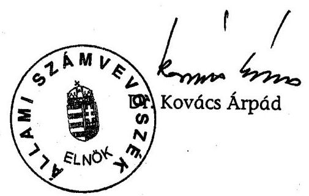

---

A közműfejlesztési támogatások alakulása 2001-2005. években

|  Megnevezés | 2001.* |  | 2002. |  | 2003. |  | 2004. |  | 2005. |  | Összesen |   |
| --- | --- | --- | --- | --- | --- | --- | --- | --- | --- | --- | --- | --- |
|   | ezer Ft | önk. db | ezer Ft | önk. db | ezer Ft | önk. db | ezer Ft | önk. db | ezer Ft | önk. db | ezer Ft | önk. db  |
|  2002. május 22. előtti |  |  |  |  |  |  |  |  |  |  |  |   |
|  1 | Útberuházáshoz kapott támogatás | 1061 | 7 | 7179 | 27 | 14954 | 19 | 6707 | 15 | 1186 | 10 | 31087  |
|  2 | Szennyvízcsatornázáshoz kapott támogatás | 107568 | 62 | 688060 | 169 | 957690 | 206 | 646774 | 204 | 381090 | 188 | 2781182  |
|  3 | Út- és szennyvízberuházáshoz kapott támogatás összesen | 108629 | 63 | 695239 | 173 | 972644 | 209 | 653481 | 208 | 382276 | 189 | 2812269  |
|  4 | ÁSZ által korábban visszafizettetésre javasolt támogatás | 0 |  | 20107 | 9 | 2919 | 1 | 5519 | 5 | 0 | 0 | 28545  |
|  5 | Megállapodás alapján több év alatt visszafizetendő | 0 | 0 | 0 | 0 | 0 | 0 | 112857 | 13 | 0 | 0 | 112857  |
|  6 | Önkormányzat által visszafizetett támogatás | 0 | 0 | 1344 | 5 | 13200 | 12 | 7618 | 7 | 488 | 5 | 22650  |
|  7 | Jogosan igénybe vett támogatás | 18832 | 43 | 120821 | 134 | 136719 | 166 | 216536 | 176 | 237263 | 165 | 730171  |
|  8 | Lejárt ftp.szerződéses,visszafizettetésre nem javasolt támogatás | 74965 | 28 | 196051 | 49 | 186934 | 61 | 61015 | 54 | 57660 | 42 | 576625  |
|  9 | Visszafizettetésre javasolt támogatás (9=3-4-5-6-7-8) | 14832 | 7 | 356916 | 47 | 632872 | 73 | 249936 | 76 | 86865 | 67 | 1341421  |
|  2002. május 22. utáni |  |  |  |  |  |  |  |  |  |  |  |   |
|  1 | Útberuházáshoz kapott támogatás |  |  | 8932 | 13 | 18128 | 23 | 19454 | 24 | 25557 | 22 | 72071  |
|  2 | Szennyvízcsatornázáshoz kapott támogatás |  |  | 42262 | 22 | 82008 | 42 | 1010476 | 72 | 1552368 | 93 | 2687114  |
|  3 | Út- és szennyvízberuházáshoz kapott támogatás összesen |  |  | 51194 | 26 | 100136 | 50 | 1029930 | 84 | 1577925 | 101 | 2759185  |
|  4 | ÁSZ által korábban visszafizettetésre javasolt támogatás |  |  | 0 | 0 | 1259 | 1 | 0 | 0 | 0 | 0 | 1259  |
|  5 | Megállapodás alapján több év alatt visszafizetendő |  |  | 0 | 0 | 0 | 0 | 640714 | 11 | 0 | 0 | 640714  |
|  6 | Önkormányzat által visszafizetett támogatás |  |  |  |  | 259 | 2 | 2021 | 4 | 1378 | 11 | 3658  |
|  7 | Jogosan igénybe vett támogatás |  |  | 50899 | 24 | 81262 | 48 | 100685 | 65 | 110093 | 75 | 342939  |
|  8 | Visszafizettetésre javasolt támogatás (8=3-4-5-6-7) |  |  | 295 | 5 | 17356 | 15 | 286510 | 37 | 1466454 | 55 | 1770615  |
|  Együtt |  |  |  |  |  |  |  |  |  |  |  |   |
|  1 | Útberuházáshoz kapott támogatás | 1061 | 7 | 16111 | 37 | 33082 | 36 | 26161 | 34 | 26743 | 27 | 103158  |
|  2 | Szennyvízcsatornázáshoz kapott támogatás | 107568 | 62 | 730322 | 188 | 1039698 | 237 | 1657250 | 264 | 1933458 | 262 | 5468296  |
|  3 | Út- és szennyvízberuházáshoz kapott támogatás összesen | 108629 | 63 | 746433 | 193 | 1072780 | 241 | 1683411 | 269 | 1960201 | 265 | 5571454  |
|  4 | ÁSZ által korábban visszafizettetésre javasolt támogatás | 0 | 0 | 20107 | 9 | 4178 | 1 | 5519 | 5 | 0 | 0 | 29804  |
|  5 | Megállapodás alapján több év alatt visszafizetendő | 0 | 0 | 0 | 0 | 0 | 0 | 753571 | 24 | 0 | 0 | 753571  |
|  6 | Önkormányzat által visszafizetett támogatás | 0 | 0 | 1344 | 6 | 13459 | 14 | 9639 | 10 | 1866 | 16 | 26308  |
|  7 | Jogosan igénybe vett támogatás | 18832 | 43 | 171720 | 153 | 217981 | 198 | 317221 | 220 | 347356 | 219 | 1073110  |
|  8 | Lejárt ftp.szerződéses,visszafizettetésre nem javasolt támogatás | 74965 | 28 | 196051 | 49 | 186934 | 61 | 61015 | 54 | 57660 | 42 | 576625  |
|  9 | Visszafizettetésre javasolt támogatás (9=3-4-5-6-7-8) | 14832 | 7 | 357211 | 51 | 650228 | 86 | 536446 | 112 | 1553319 | 121 | 3112036  |

[^0] [^0]: *nem teljes éves adat, csak a 2001. évben, illetve azt megelőző években ki nem fizetett támogatások, és a 2001. I. negyedévtől a jogtalanul igényelt támogatások összegei

---

# Kapott és visszafizettetésre javasolt közmüfejlesztési támogatások megyénkénti alakulása a 2002. május 22. előtt kivetett közmüfejlesztési hozzájárulások után

|  megye | Kapott támogatások |  |  |  |  |  | Jogtalanul igényelt támogatások |  |  |  |  |   |
| --- | --- | --- | --- | --- | --- | --- | --- | --- | --- | --- | --- | --- |
|   | út jogcímen | önk. db | csatorna jogcímen | önk. db | támogatások együtt | önk. db | idő előtt igényelt* | önk. db | visszafizettetésre javasolt** | önk. db | ebből út jogcímen | önk. db  |
|  Baranya | 1306948 | 1 | 141060372 | 4 | 142367320 | 4 | 0 | 0 | 122305261 | 2 | 0 | 0  |
|  Bács-Kiskun | 2370253 | 6 | 210793776 | 10 | 213164029 | 11 | 116487984 | 8 | 47725684 | 4 | 66000 | 1  |
|  Békés | 4397275 | 7 | 83708538 | 7 | 88105813 | 8 | 57495313 | 2 | 2919388 | 1 | 0 | 0  |
|  Borsod-Abaúj Zemplén | 0 | 0 | 487564722 | 50 | 487564722 | 50 | 236793429 | 31 | 136535121 | 32 | 0 | 0  |
|  Csongrád | 231042 | 2 | 246481735 | 5 | 246712777 | 5 | 787991 | 1 | 226672464 | 4 | 0 | 0  |
|  Fejér | 0 | 0 | 73020994 | 11 | 73020994 | 11 | 0 | 0 | 38430 | 3 | 0 | 0  |
|  Győr-Moson-Sopron | 0 | 0 | 3187752 | 2 | 3187752 | 2 | 0 | 0 | 0 | 0 | 0 | 0  |
|  Hajdú-Bihar | 0 | 0 | 107228791 | 5 | 107228791 | 5 | 10983470 | 2 | 95022620 | 2 | 0 | 0  |
|  Heves | 198075 | 1 | 194499021 | 13 | 194697096 | 13 | 0 | 0 | 149930202 | 4 | 0 | 0  |
|  Jász-Nagykun-Szolnok | 2743511 | 6 | 55184529 | 10 | 57928040 | 11 | 0 | 0 | 25357281 | 5 | 0 | 0  |
|  Komárom-Esztergom | 0 | 0 | 17332423 | 5 | 17332423 | 5 | 0 | 0 | 0 | 0 | 0 | 0  |
|  Nögrád | 187500 | 1 | 264355208 | 23 | 264542708 | 23 | 13469688 | 3 | 220919933 | 14 | 0 | 0  |
|  Pest | 4256861 | 2 | 226265410 | 17 | 230522271 | 17 | 12358895 | 3 | 72881129 | 9 | 2787165 | 1  |
|  Somogy | 0 | 0 | 26615108 | 7 | 26615108 | 7 | 0 | 0 | 1019159 | 3 | 0 | 0  |
|  Szabolcs-Szatmár-Bereg | 572356 | 1 | 320512540 | 12 | 321084896 | 12 | 69171423 | 6 | 240274317 | 6 | 0 | 0  |
|  Tolna | 215515 | 3 | 180560194 | 16 | 180775709 | 17 | 0 | 0 | 131190509 | 13 | 38400 | 2  |
|  Vas | 14608148 | 2 | 36684048 | 3 | 51292196 | 3 | 0 | 0 | 337569 | 1 | 0 | 0  |
|  Veszprém | 0 | 0 | 85252234 | 15 | 85252234 | 15 | 53383115 | 10 | 8594001 | 7 | 0 | 0  |
|  Zala | 0 | 0 | 20874297 | 6 | 20874297 | 6 | 5693935 | 1 | 1100243 | 3 | 0 | 0  |
|  Összesen | 31087484 | 32 | 2781181692 | 221 | 2812269176 | 225 | 576625243 | 67 | 1482823311 | 109 | 2891565 | 4  |

[^0] [^0]: * Visszafizettetésre nem javasolt, de 2002-2006. években lejárt lip.szerződések megtakarítási időszakában - idő előtt - igénybe vett támogatás ** ÁSZ által korábbi években visszafizettetésre javasolt támogatásokkal együtt

---

# Kapott és visszafizettetésre javasolt közmüfejlesztési támogatások megyénkénti alakulása a 2002. május 22. után kivetett közmüfejlesztési hozzájárulások után

|  |   |   |   |   |   |   |   |   |   |   |   |   |
| --- | --- | --- | --- | --- | --- | --- | --- | --- | --- | --- | --- | --- |
|  megye | Kapott támogatások |  |  |  |  |  |  |  |  |  |  |   |
|   | út jogcímen | önk. db | csatorna jogcímen | önk. db | támogatások együtt | önk. db | idő előtt igényelt* | önk. db |  |  |  |   |
|  Baranya | 0 | 0 | 158854708 | 5 | 158854708 | 5 | 0 | 0 |  | 154390135 | 4 | 0  |
|  Bács-Kiskun | 1765186 | 5 | 70168397 | 4 | 71933583 | 8 | 0 | 0 |  | 69570880 | 4 | 24000  |
|  Békés | 14481609 | 8 | 45453072 | 8 | 59934681 | 9 | 0 | 0 |  | 3518413 | 6 | 2008082  |
|  Borsod-Abaúj Zemplén | 0 | 0 | 639642764 | 9 | 639642764 | 9 | 0 | 0 |  | 639541492 | 9 | 0  |
|  Csongrád | 3563 | 1 | 117925923 | 3 | 117929486 | 4 | 0 | 0 |  | 116846525 | 3 | 0  |
|  Fejér | 0 | 0 | 697176919 | 8 | 697176919 | 8 | 0 | 0 |  | 690880686 | 5 | 0  |
|  Győr-Moson-Sopron | 7149538 | 1 | 44373803 | 3 | 51523341 | 3 | 0 | 0 |  | 2587778 | 1 | 0  |
|  Hajdú-Bihar | 20587408 | 3 | 54793959 | 5 | 75381367 | 5 | 0 | 0 |  | 8092867 | 4 | 225  |
|  Heves | 5916573 | 1 | 608510910 | 9 | 614427483 | 9 | 0 | 0 |  | 591106027 | 5 | 0  |
|  Jász-Nagykun-Szolnok | 4093421 | 5 | 3443563 | 3 | 7536984 | 6 | 0 | 0 |  | 0 | 0 | 0  |
|  Komárom-Esztergom | 0 | 0 | 3098438 | 1 | 3098438 | 1 | 0 | 0 |  | 0 | 0 | 0  |
|  Nögrád | 0 | 0 | 3441577 | 2 | 3441577 | 2 | 0 | 0 |  | 0 | 0 | 0  |
|  Pest | 5566278 | 2 | 101989453 | 6 | 107555731 | 6 | 0 | 0 |  | 83925176 | 5 | 0  |
|  Somogy | 6915 | 1 | 19103646 | 5 | 19110561 | 5 | 0 | 0 |  | 42177 | 1 | 0  |
|  Szabolcs-Szatmár-Bereg | 1670328 | 1 | 1721090 | 2 | 3391418 | 2 | 0 | 0 |  | 0 | 0 | 0  |
|  Tolna | 2002739 | 1 | 61353522 | 5 | 63356261 | 6 | 0 | 0 |  | 43182936 | 4 | 195272  |
|  Vas | 0 | 0 | 7103851 | 4 | 7103851 | 4 | 0 | 0 |  | 749162 | 4 | 0  |
|  Veszprém | 6563799 | 1 | 10095820 | 4 | 16659619 | 4 | 0 | 0 |  | 1137 | 1 | 0  |
|  Zala | 2263077 | 1 | 38862541 | 8 | 41125618 | 8 | 0 | 0 |  | 8152703 | 7 | 1250217  |
|  Végösszeg | 72070434 | 31 | 2687113956 | 94 | 2759184390 | 104 | 0 | 0 |  | 2412588094 | 63 | 3477796  |

[^0] [^0]: * Visszafizettetésre nem javasolt, de 2002-2006. években lejárt tip.szerződések megtakarítási időszakában - idő előtt - igénybe vett támogatás ** ASZ által korábbi években visszafizettetésre javasolt támogatásokkal együtt

---

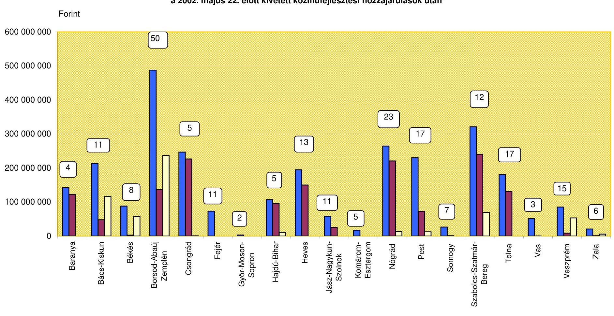

# Kapott és viszafizettetésre javasolt közműfejlesztési támogatások megyénkénti alakulása a 2002. május 22. előtt kivetett közműfejlesztési hozzájárulások után*

*Az oszlopok fölött jelzett számok megyénként mutatják a támogatásban részesült, helyszínen vizsgált önkormányzatok db számát.

---

#### **A kapott és visszafizettetésre javasolt közműfejlesztési támogatások megyénkénti alakulása a 2002. május 22. után kivetett közműfejlesztési hozzájárulások után\***

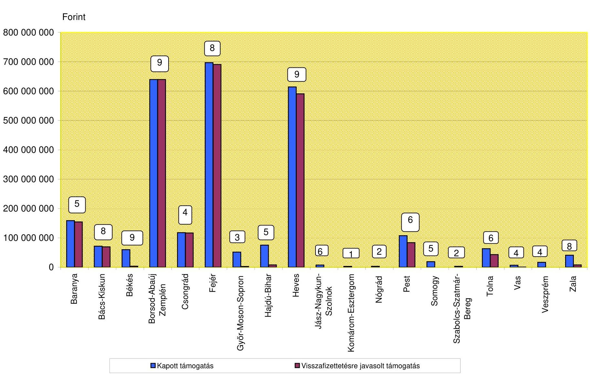

\*Az oszlopok fölött jelzett számok megyénként mutatják a támogatásban részesült, helyszínen vizsgált önkormányzatok db számát.

---

# A visszafizettetésre javasolt közmüfejlesztési támogatások okainak részletezése

|  ㄷ
E
2
0 | Megye | KSH kód | Település neve | Visszafizettetésre javasolt támogatás összege | A jogtalan igénybevétel okai |  |  |   |
| --- | --- | --- | --- | --- | --- | --- | --- | --- |
|   |  |  |  |  | Ltp. megtakarítás célját szolgáló befizetésre igénybe vett támogatás | Víziközmü társulati betét kamatára igénybevett támogatás | $\begin{aligned} & \text { Jogtalan igény } \ & \text { engedmé- } \ & \text { nyezés miatt** } \end{aligned}$ | Egyéb okok miatt  |
|  1 | Baranya megye | 0213851 | Csertó | 42376314 | 42376314 |  |  |   |
|  2 |  | 0229753 | Magyaregregy | 108200357 | 88471865 | 19728492 |  |   |
|  3 |  | 0233756 | Mázá | 54592 |  |  |  | 54592  |
|  4 |  | 0218555 | Olasz | 60403566 | 60403566 |  |  |   |
|  5 |  | 0233613 | Szentegát | 31871335 | 31871335 |  |  |   |
|  6 |  | 0226578 | Szigetvár | 19738920 | 19738920 |  |  |   |
|  7 | Bács-Kiskun megye | 0307524 | Drágszél | 14159007 | 14159007 |  |  |   |
|  8 |  | 0327845 | Homokmégy* | 5000 |  |  |  | 5000  |
|  9 |  | 0309344 | Kiskörös* | 132225 | 132225 |  |  |   |
|  10 |  | 0324396 | Kiskunmajsa | 24317083 | 24227083 |  |  | 90000  |
|   |  | Ebböl: útberuházáshoz kapcsolódó |  | 90000 |  |  |  | 90000  |
|  11 |  | 0330632 | Miske | 55255648 | 55255648 |  |  | 0  |
|  12 |  | 0308679 | Öregcsertó* | 15000 |  |  |  | 15000  |
|  13 |  | 0319530 | Szakmár* | 98092 |  |  |  | 98092  |
|  14 | Békés megye | 0424819 | Dévaványa | 883856 |  |  | 883856 |   |
|   |  | Ebböl: útberuházáshoz kapcsolódó |  | 883856 |  |  | 883856 |   |
|  15 |  | 0411615 | Körösladány | 287700 |  |  | 287700 |   |
|   |  | Ebböl: útberuházáshoz kapcsolódó |  | 287700 |  |  | 287700 |   |
|  16 |  | 0412900 | Köröstarcsa | 205373 | 205373 |  |  |   |
|  17 |  | 0419628 | Mezöberény | 199875 |  |  | 199875 |   |
|   |  | Ebböl: útberuházáshoz kapcsolódó |  | 199875 |  |  | 199875 |   |
|  18 |  | 0421883 | Szeghalom* | 636651 |  |  | 636651 |   |
|   |  | Ebböl: útberuházáshoz kapcsolódó |  | 636651 |  |  | 636651 |   |
|  19 |  | 0429531 | Vésztő* | 46240 | 46240 |  |  |   |
|  20 | Borsod-Abaúj Zemplén megye | 0520482 | Alsóberecki | 62390348 | 62390348 |  |  |   |
|  21 |  | 0519664 | Alsódobsza | 23719034 | 23719034 |  |  |   |
|  22 |  | 0514401 | Bodrogolaszi | 22478 | 22478 |  |  |   |
|  23 |  | 0508396 | Boldva | 850441 | 850441 |  |  |   |
|  24 |  | 0516799 | Borsodszirák | 513988 | 513988 |  |  |   |
|  25 |  | 0511350 | Damak | 127565 |  |  |  | 127565  |
|  26 |  | 0522503 | Erdőhorváti | 16864 | 16864 |  |  |   |
|  27 |  | 0508174 | Felsőberecki | 21554637 | 21554637 |  |  |   |
|  28 |  | 0505069 | Györgytartó | 258130 | 258130 |  |  |   |
|  29 |  | 0512706 | Háromhuta | 54760 | 54760 |  |  |   |
|  30 |  | 0530137 | Hercegkút | 17889 | 17889 |  |  |   |
|  31 |  | 0515680 | Jósvafó | 6481849 | 6481849 |  |  |   |
|  32 |  | 0530508 | Karos | 27675008 | 27675008 |  |  |   |
|  33 |  | 0505458 | Kenéző | 765500 | 765500 |  |  |   |
|  34 |  | 0516559 | Komlóska | 18027 | 18027 |  |  |   |
|  35 |  | 0519600 | Makkoshotyka | 57298 | 57298 |  |  |   |
|  36 |  | 0521768 | Megyászó | 80114886 | 80114886 |  |  |   |
|  37 |  | 0513833 | Mezőcsát | 5716872 | 5716872 |  |  |   |
|  38 |  | 0519433 | Mezőkövesd | 26235081 | 26235081 |  |  |   |

*Az önkormányzat részben vagy egészben visszafizette a visszafizettetésre javasolt támogatást. **A 2002. május 22. után megállapított közmüfejlesztési hozzájárulásoknál.** *Az összeg nagyságrendje miatt visszafizettetésre nem javasolt.

---

|   |  |  |  |  | A jogtalan igénybevétel okai |  |  |   |
| --- | --- | --- | --- | --- | --- | --- | --- | --- |
|  5. | Megye | KSH kód | Település neve | Visszafizettetésre javasolt támogatás összege | Ltp. megtakarítás célját szolgáló befizetésre igénybe vett támogatás | Víziközmű társulatú betét kamatára igénybevett támogatás | Jogtalan igény engedmé- nyezés miatt** | Egyéb okok miatt  |
|  39. |  |  |  |  |  |  |  |   |
|  40. |  | 0503443 | Mezőzombor | 4 857 720 | 4 842 720 |  |  | 15 000  |
|  41. |  | 0521546 | Múcsony | 11 201 175 | 11 201 175 |  |  |   |
|  42. |  | 0531778 | Olaszítszka | 16 050 |  |  |  | 16 050  |
|  43. |  | 0533419 | Perkupa | 8 498 061 | 8 498 061 |  |  |   |
|  44. |  | 0523029 | Rudabánya | 2 175 330 | 2 175 330 |  |  |   |
|  45. |  | 0508970 | Sajósénye | 155 747 |  |  |  | 155 747  |
|  46. |  | 0520738 | Sajóvámos | 742 934 |  |  |  | 742 934  |
|  47. |  | 0520516 | Sárazsadány | 16 810 | 16 810 |  |  |   |
|  48. |  | 0527474 | Sárospatak | 5 709 354 | 5 709 354 |  |  |   |
|  49. |  | 0513268 | Sóstófalva | 16 976 467 | 16 976 467 |  |  |   |
|  50. |  | 0520871 | Szin | 5 316 594 | 5 316 594 |  |  |   |
|  51. |  | 0518892 | Szomolya | 81 429 442 | 81 429 442 |  |  |   |
|  52. |  | 0516179 | Szögliget | 8 875 104 | 8 875 104 |  |  |   |
|  53. |  | 0513888 | Tiszakeszi | 38 898 321 | 38 898 321 |  |  |   |
|  54. |  | 0528051 | Tolcsva | 136 022 | 136 022 |  |  |   |
|  55. |  | 0512487 | Újcsanálos | 39 106 547 | 39 106 547 |  |  |   |
|  56. |  | 0515149 | Vámosújfalu | 46 890 | 46 890 |  |  |   |
|  57. |  | 0505096 | Viss | 378 070 | 378 070 |  |  |   |
|  58. | Csongrád | 0605111 | Csongrád | 186 166 547 | 186 166 547 |  |  |   |
|  59. | megye | 0622646 | Felgyő | 12 170 211 | 12 170 211 |  |  |   |
|  60. |  | 0625733 | Mártély | 37 931 595 | 37 931 595 |  |  |   |
|  61. |  | 0613161 | Részke | 414 471 | 69 836 |  |  | 344 635  |
|  62. |  | 0633367 | Szeged | 76 398 520 | 76 124 131 |  |  | 274 389  |
|  63. |  | 0614456 | Szentes | 22 365 464 | 22 365 464 |  |  |   |
|  64. | Fejér megye | 0715918 | Gyúró | 40 008 368 | 40 008 368 |  |  |   |
|  65. |  | 0704659 | Martonvásár | 100 643 809 | 100 643 809 |  |  |   |
|  66. |  | 0713903 | Nádasdladány | 11 936 |  |  |  | 11 936  |
|  67. |  | 0717774 | Pusztavám | 160 460 533 | 160 460 533 |  |  |   |
|  68. |  | 0702015 | Ráckeresztúr | 85 541 439 | 85 541 439 |  |  |   |
|  69. |  | 0711776 | Sárszentmihály | 22 031 |  |  |  | 22 031  |
|  70. |  | 0721005 | Tordas | 50 477 943 | 50 477 943 |  |  |   |
|  71. |  | 0725016 | Velence | 4 463 |  |  |  | 4 463  |
|  72. | Győr-Moson-Sopron megye | 0803887 | Szerecseny | 2 587 778 | 2 587 778 |  |  |   |
|  73. | Rajdú-Bihar megye | 0902918 | Balmazúváros | 2 014 038 | 2 014 038 |  |  |   |
|  74. |  | 0915130 | Debrecen* | 27 938 | 0 |  |  | 27 938  |
|  75. |  | 0916993 | Furta | 40 725 591 | 40 725 591 |  |  |   |
|  76. |  | 0905175 | Hajdúszoboszló* | 5 555 091 | 5 555 091 |  |  |   |
|  77. |  | 0902167 | Komádi* | 495 800 | 348 075 |  |  | 147 725  |
|   |  | Ebből: útberuházáshoz kapcsolódó |  | 225 |  |  |  | 225  |
|  78. |  | 0904817 | Zsáka | 54 297 029 | 54 297 029 |  |  |   |
|  79. | Neves megye | 1023241 | Adács | 118 582 745 | 118 582 745 |  |  |   |
|  80. |  | 1016090 | Atkár | 81 086 828 | 81 086 828 |  |  |   |
|  81. |  | 1016841 | Csány | 84 083 244 | 84 083 244 |  |  |   |
|  82. |  | 1018810 | Noszvaj | 106 084 993 | 106 084 993 |  |  |   |
|  83. |  | 1022196 | Poroszló | 43 085 112 | 43 085 112 |  |  |   |
|  84. | Neves megye | 1007180 | Sarud | 33 145 887 | 29 567 412 | 3 577 975 |  | 500  |
|  85. |  | 1007083 | Tiszanána | 54 782 843 | 49 871 755 | 4 911 088 |  | 0  |
|  86. |  | 1027623 | Újfőrinchálva | 1 666 224 | 1 666 224 |  |  | 0  |
|   |  | 1014580 | Vámosgyőrk | 89 676 119 | 89 676 119 |  |  | 0  |

*Az önkormányzat részben vagy egészben visszafizette a visszafizettetésre javasolt támogatást.

**A 2002. május 22. után megállapított közműfejlesztési hozzájárulásoknál.

***Az összeg nagyságrendje miatt visszafizettetésre nem javasolt.

---

|  5.   5.   5.   5. | Megye | KSH kód | Település neve | Visszafizettetésre javasolt támogatás összege | A jogtalan igénybevétel okai |  |  |   |
| --- | --- | --- | --- | --- | --- | --- | --- | --- |
|   |  |  |  |  | Ltp. megtakarítás célját szolgáló befizetésre igénybe vett támogatás | Víziközmú-
társulati betét
kamatára
igénybevett
támogatás | Jogtalan igény engedmé- nyezés miatt** | Egyéb okok miatt  |
|  87 | Nögrád | 1213657 | Balassagyarmat* | 337500 | 0 |  |  | 337500  |
|  88 | megye | 1209034 | Berkenye | 21284163 | 21284163 |  |  |   |
|  89 |  | 1209894 | Borosberény* | 45000 | 0 |  |  | 45000  |
|  90 |  | 1220145 | Csesztve | 718830 | 718830 |  |  |   |
|  91 |  | 1206743 | Diósjenő | 81761881 | 81761881 |  |  |   |
|  92 |  | 1228389 | Kazár | 4148373 | 4147398 |  |  | 975  |
|  93 |  | 1232407 | Magyarnándor* | 2744645 | 2740257 |  |  | 4388  |
|  94 |  | 1224332 | Mátraszele | 2897937 | 2896956 |  |  | 981  |
|  95 |  | 1204330 | Mátraszőlős | 2574611 | 2574611 |  |  | 0  |
|  96 |  | 1221102 | Nagylóc | 40500 | 0 |  |  | 40500  |
|  97 |  | 1204358 | Nógrád | 54450657 | 54450657 |  |  |   |
|  98 |  | 1225788 | Salgótarján* | 20828867 | 20828867 |  |  |   |
|  99 |  | 1210320 | Vizslas | 3485378 | 3479474 |  |  | 5904  |
|  100 | Pest megye | 1333118 | Csomád | 4868035 | 2000185 |  |  | 2867850  |
|  101 |  | 1322804 | Csömőr | 919748 | 919748 |  |  |   |
|  102 |  | 1320534 | Dunavarsány* | 38175 |  |  |  | 38175  |
|  103 |  | 1330696 | Kartal | 41851755 | 41851755 |  |  |   |
|  104 |  | 1310755 | Majosháza* | 9426 |  |  |  | 9426  |
|  105 |  | 1304057 | Pécel | 5458680 |  |  |  | 5458680  |
|   |  | Ebből: útberuházáshoz kapcsolódó |  | 2787165 |  |  |  | 2787165  |
|  106 |  | 1309821 | Pilis | 3835971 | 3835971 |  |  |   |
|  107 |  | 1307144 | Piliscsaba | 464092 |  |  |  | 464092  |
|  108 |  | 1334148 | Pilisjászfalu* | 1012500 |  |  |  | 1012500  |
|  109 |  | 1323083 | Pusztavacs | 28960235 | 28960235 |  |  | 0  |
|  110 |  | 1308280 | Telki | 106500 |  |  |  | 106500  |
|  111 |  | 1319682 | Újtengyel | 46154435 | 46154435 |  |  | 0  |
|  112 |  | 1311934 | Úróm | 1438800 | 1438800 |  |  | 0  |
|  113 |  | 1322488 | Verseg | 21687953 | 3202813 | 2472556 |  | 16012584  |
|  114 | Somogy megye | 1430474 | Babócsa* | 16333 |  |  |  | 16333  |
|  115 |  | 1413994 | Bolhás | 24000 |  |  |  | 24000  |
|  116 |  | 1405971 | Csokonyavisonta | 978826 | 978826 |  |  |   |
|  117 |  | 1414632 | Fonyód* | 42177 | 8127 |  |  | 34050  |
|  118 | Szabolcs- | 1505670 | Gégény | 9198000 | 9198000 |  |  |   |
|  119 | Szatmár- | 1511271 | Nyírlagos | 471848 |  |  |  | 471848  |
|  120 | fereg megye | 1512274 | Nyírnada | 176605591 | 176605591 |  |  |   |
|  121 |  | 1512098 | Nyírtura* | 66894 |  |  |  | 66894  |
|  122 |  | 1513860 | Pusztadobos | 52888003 | 52888003 |  |  |   |
|  123 |  | 1531398 | Tyukod | 1043981 | 0 | 1043981 |  |   |
|  124 | Jász-Nagykun Szol | 1613170 | Csépa* | 732814 | 732814 |  |  |   |
|  125 |  | 1604260 | Mezőtúr* | 1916550 | 1916550 |  |  |   |
|  126 |  | 1620428 | Szelevény* | 738176 | 738176 |  |  |   |
|  127 |  | 1629726 | Tiszafüred | 19563493 | 19563493 |  |  |   |
|  128 |  | 1621494 | Tiszasas | 1300248 | 1300248 |  |  |   |
|  129 | Tolna megye | 1706558 | Bölcske* | 357296 |  |  |  | 357296  |
|  130 |  | 1731501 | Dunaföldvár* | 203672 |  |  |  | 203672  |
|   |  | Ebből: útberuházáshoz kapcsolódó |  | 203672 |  |  |  | 203672  |
|  131 |  | 1705731 | Gerjen* | 392729 |  |  |  | 392729  |
|  132 |  | 1730289 | Győnk | 42950914 | 42950914 |  |  |   |
|  133 |  | 1725539 | Györe* | 4650 |  |  |  | 4650  |
|  134 |  | 1727711 | Izmény* | 5100 |  |  |  | 5100  |

*Az önkormányzat részben vagy egészben visszafizette a visszafizettetésre javasolt támogatást. **A 2002. május 22. után megállapított közműfejlesztési hozzájárulásoknál.** *Az összeg nagyságrendje miatt visszafizettetésre nem javasolt.

---

|  5
5
5
0 | Megye | KSH kód | Település neve | Visszafizettetésre javasolt támogatás összege | A jogtalan igénybevétel okai |  |  |   |
| --- | --- | --- | --- | --- | --- | --- | --- | --- |
|   |  |  |  |  | Ltp. megtakarítás célját szolgáló befizetésre igénybe vett támogatás | Víziközmű társulati betét kamatára igénybevett támogatás | Jogtalan igény engedmé- nyezés miatt** | Egyéb okok miatt  |
|  135 | Tolna megye | 1702033 | Kakasd | 30 000 |  |  |  | 30 000  |
|   |  |  | Ebböl: útberuházáshoz kapcsolódó | 30 000 |  |  |  | 30 000  |
|  136 |  |  | 1717710 | Kisdorog | 18 267 121 | 18 240 871 |  | 26 250  |
|  137 |  |  | 1706512 | Kismányok* | 25 500 | 0 |  | 25 500  |
|  138 |  |  | 1731185 | Kisvejke | 10 451 920 | 10 451 920 |  |   |
|  139 |  |  | 1724411 | Lengyel | 19 986 334 | 19 986 334 |  |   |
|  140 |  |  | 1714030 | Nagymányok* | 11 250 |  |  | 11 250  |
|  141 |  |  | 1706901 | Tengelic* | 22 725 |  |  | 22 725  |
|  142 |  |  | 1731459 | Tavel | 41 457 786 | 40 546 091 |  | 911 695  |
|  143 |  |  | 1714304 | Závod | 10 907 058 | 10 907 058 |  |   |
|  144 | Vas megye |  | 1817020 | Bajánsenye* | 21 750 |  |  | 21 750  |
|  145 |  |  | 1826596 | Kercaszomor* | 49 500 |  |  | 49 500  |
|  146 |  |  | 1810843 | Nick | 507 207 | 507 207 |  |   |
|  147 |  |  | 1803009 | Szombathely* | 294 455 | 170 705 |  | 123 750  |
|  148 | Veszprém megye |  | 1925991 | Bakonynána | 935 283 | 0 |  | 935 283  |
|  149 |  |  | 1925308 | Balatonakali | 1 372 500 | 1 372 500 |  |   |
|  150 |  |  | 1928237 | Dabrony | 1 176 332 | 1 176 332 |  |   |
|  151 |  |  | 1906363 | Dörgicse | 786 900 | 786 900 |  |   |
|  152 |  |  | 1927979 | Nagysilásony | 1 690 165 | 1 690 165 |  |   |
|  153 |  |  | 1921759 | Nemesszalók | 2 134 804 | 2 134 804 |  |   |
|  154 |  |  | 1924004 | Nyirád | 1 137 |  |  | 1 137  |
|  155 |  |  | 1916656 | Vászoly | 498 017 | 494 100 |  | 3 917  |
|  156 | Zala megye |  | 2007135 | Cserszegtomaj | 3 846 750 |  | 3 794 250 | 52 500  |
|  157 |  |  | 2011642 | Felsőpáhok* | 336 913 |  |  | 336 913  |
|  158 |  |  | 2018041 | Karmacs* | 1 134 825 | 1 134 825 |  |   |
|  159 |  |  | 2014979 | Nagyrécse* | 2 423 306 |  |  | 2 423 306  |
|   |  |  | Ebböl: útberuházáshoz kapcsolódó | 1 250 217 |  |  |  | 1 250 217  |
|  160 |  |  | 2032948 | Nemesbük* | 449 854 | 444 454 |  | 5 400  |
|  161 |  |  | 2023898 | Rezi* | 8 700 |  |  | 8 700  |
|  162 |  |  | 2032638 | Tornyiszentmiklós* | 815 080 |  |  | 815 080  |
|  163 |  |  | 2032142 | Vindornyafok | 237 518 | 237 518 |  |   |
|   | Összesen |  |  |  | 3 112 035 349 | 3 038 559 045 | 31 734 092 | 5 802 332  |
|   | Ebből: útberuházáshoz kapcsolódó |  |  |  | 6 369 361 | 0 | 0 | 2 008 082  |
|  164 | Borsod-Aba-bi-Zemplén megye |  | 0503531 | Léh*** | 235 |  |  | 235  |
|  165 |  |  | 0531909 | Rásonysápberencs*** | 27 |  |  | 27  |
|  166 |  |  | 0518537 | Sajópáflala*** | 248 |  |  | 248  |

*Az önkormányzat részben vagy egészben visszafizette a visszafizettetésre javasolt támogatást.* *A 2002. május 22. után megállapított közműfejlesztési hozzájárulásoknál.* **Az összeg nagyságrendje miatt visszafizettetésre nem javasolt.

---

# Ltp. megtakarítás célját szolgáló befizetésre igénybe vett visszafizettetésre javasolt támogatások alapját képező befizetések forrásai 

|  |   |   |   |   |   |
| --- | --- | --- | --- | --- | --- |
|  $\begin{aligned} & \text { E } \ & \text { S } \ & \text { S } \ & \text { S } \end{aligned}$ | Megye | KSH kód | Település neve | Magánszemélynek adott támogatásból megfizetett | $\begin{gathered} \text { Magánszemély } \\ \text { tényleges } \\ \text { befizetése } \end{gathered}$  |
|   |  |  |  | alapján igényelt támogatás |   |
|  1 | Baranya megye | 0213851 | Csertó | 41731794 | 644520  |
|  2 |  | 0229753 | Magyaregregy | 87247415 | 1224450  |
|  3 |  | 0218555 | Olasz | 59869566 | 534000  |
|  4 |  | 0233613 | Szentegát | 31666135 | 205200  |
|  5 |  | 0226578 | Szigetvár | 19738920 | 0  |
|  6 | Bács-Kiskun megye | 0307524 | Drágszél | 13933632 | 225375  |
|  7 |  | 0309344 | Kiskőrös | 0 | 132225  |
|  8 |  | 0324396 | Kiskunmajsa | 7927215 | 16299868  |
|  9 |  | 0330632 | Miske | 54206323 | 1049325  |
|  10 | Békés megye | 0412900 | Köröstarcsa | 0 | 205373  |
|  11 |  | 0429531 | Vésztő | 0 | 46240  |
|  12 | Borsod-AbaújZemplén megye | 0520482 | Alsóberecki | 61944788 | 445560  |
|  13 |  | 0519664 | Alsódobsza | 23398874 | 320160  |
|  14 |  | 0514401 | Bodrogolaszi | 15645 | 6833  |
|  15 |  | 0508396 | Boldva | 765400 | 85041  |
|  16 |  | 0516799 | Borsodszirák | 462590 | 51398  |
|  17 |  | 0522503 | Erdőhorváti | 11737 | 5127  |
|  18 |  | 0508174 | Felsőberecki | 21414087 | 140550  |
|  19 |  | 0505069 | Györgytarló | 0 | 258130  |
|  20 |  | 0512706 | Háromhuta | 38113 | 16647  |
|  21 |  | 0530137 | Hercegkút | 12451 | 5438  |
|  22 |  | 0515680 | Jósvaló | 5749400 | 732449  |
|  23 |  | 0530508 | Karos | 27532448 | 142560  |
|  24 |  | 0505458 | Kenéző | 0 | 765500  |
|  25 |  | 0516559 | Komlóska | 12547 | 5480  |
|  26 |  | 0519600 | Makkosholyka | 39879 | 17419  |
|  27 |  | 0521768 | Megyaszó | 79092381 | 1022505  |
|  28 |  | 0513833 | Mezőcsát | 0 | 5716872  |
|  29 |  | 0519433 | Mezőkövesd | 19241700 | 6993381  |
|  30 |  | 0503443 | Mezőzombor | 3162296 | 1680424  |
|  31 |  | 0521546 | Múcsony | 11201175 | 0  |
|  32 |  | 0533419 | Perkupa | 7537780 | 960281  |
|  33 |  | 0523029 | Rudabánya | 1490100 | 685230  |
|  34 |  | 0520516 | Sárazsadány | 11700 | 5110  |
|  35 |  | 0527474 | Sárospatak | 3973710 | 1735644  |
|  36 |  | 0513268 | Sóstófalva | 16795567 | 180900  |
|  37 |  | 0520871 | Szin | 4715819 | 600775  |
|  38 |  | 0518892 | Szomolya | 80545642 | 883800  |
|  39 |  | 0516179 | Szögliget | 7872217 | 1002887  |
|  40 |  | 0513888 | Tiszakeszi | 34375551 | 4522770  |
|  41 |  | 0528051 | Tolcsva | 94671 | 41351  |
|  42 |  | 0512487 | Újcsanálos | 38758877 | 347670  |
|  43 |  | 0515149 | Vámosújfalu | 32635 | 14255  |
|  44 |  | 0505096 | Viss | 0 | 378070  |
|  45 | Csongrád megye | 0605111 | Csongrád | 171924402 | 14242145  |
|  46 |  | 0622646 | Felgyő | 10987564 | 1182647  |
|  47 |  | 0625733 | Mártély | 37080582 | 851013  |
|  48 |  | 0613161 | Rőszke |  | 69836  |
|  49 |  | 0633367 | Szeged |  | 76124131  |
|  50 |  | 0614456 | Szentes |  | 22365464  |

---

|  |   |   |   |   |   |   |
| --- | --- | --- | --- | --- | --- | --- |
|   | Megye | KSH kód | Település neve | Magánszemélynek adott támogatásból megfizetett | Magánszemély tényleges befizetése | Összesen  |
|   |  |  |  | alapján igényelt támogatás |  |   |
|  51 | Fejér megye | 0715918 | Gyúró | 38231768 | 1776600 | 40008368  |
|  52 |  | 0704659 | Martonvásár | 95649354 | 4994455 | 100643809  |
|  53 |  | 0717774 | Pusztavám | 156557533 | 3903000 | 160460533  |
|  54 |  | 0702015 | Ráckeresztúr | 81672774 | 3868665 | 85541439  |
|  55 |  | 0721005 | Tordas | 48050979 | 2426964 | 50477943  |
|  56 | Győr-Moson-Sopron megye | 0803887 | Szerecseny |  | 2587778 | 2587778  |
|  57 | Hajdú-Bihar megye | 0902918 | Balmazújváros |  | 2014038 | 2014038  |
|  58 |  | 0916993 | Furta | 38676805 | 2048786 | 40725591  |
|  59 |  | 0905175 | Hajdúszoboszló | 0 | 5555091 | 5555091  |
|  60 |  | 0902167 | Komádi | 0 | 348075 | 348075  |
|  61 |  | 0904817 | Zsáka | 48247579 | 6049450 | 54297029  |
|  62 | Heves megye | 1023241 | Adács | 113554747 | 5027998 | 118582745  |
|  63 |  | 1016090 | Alikár | 77981856 | 3104972 | 81086828  |
|  64 |  | 1016841 | Csány | 81226340 | 2856904 | 84083244  |
|  65 |  | 1018810 | Noszvaj | 104595617 | 1489376 | 106084993  |
|  66 |  | 1022196 | Poroszló | 39055712 | 4029400 | 43085112  |
|  67 |  | 1007180 | Sarud | 26738412 | 2829000 | 29567412  |
|  68 |  | 1007083 | Tiszanána | 46030255 | 3841500 | 49871755  |
|  69 |  | 1027623 | Újibáncfalva | 1455780 | 210444 | 1668224  |
|  70 |  | 1014580 | Vámosgyőrk | 85629851 | 4046268 | 89676119  |
|  71 | Nögrád megye | 1209034 | Berkenye | 20701260 | 582903 | 21284163  |
|  72 |  | 1220145 | Csesztve |  | 718830 | 718830  |
|  73 |  | 1206743 | Diósjenő | 79150554 | 2611327 | 81761881  |
|  74 |  | 1228389 | Kazár | 2866845 | 1280553 | 4147398  |
|  75 |  | 1232407 | Magyarnándor |  | 2740257 | 2740257  |
|  76 |  | 1224332 | Mátraszele | 2002490 | 894466 | 2896956  |
|  77 |  | 1204330 | Mátraszőlős | 486601 | 2088010 | 2574611  |
|  78 |  | 1204358 | Nögrád | 52922386 | 1528271 | 54450657  |
|  79 |  | 1225788 | Salgótarján | 14397731 | 6431136 | 20828867  |
|  80 |  | 1210320 | Vizslás | 2405360 | 1074114 | 3479474  |
|  81 | Pest megye | 1333118 | Csomád |  | 2000185 | 2000185  |
|  82 |  | 1322804 | Csömőr |  | 919748 | 919748  |
|  83 |  | 1330696 | Kartal | 31408548 | 10443207 | 41851755  |
|  84 |  | 1309821 | Pilis |  | 3835971 | 3835971  |
|  85 |  | 1323083 | Pusztavacs | 25643112 | 3317123 | 28960235  |
|  86 |  | 1319682 | Újjengyel | 41210130 | 4944305 | 46154435  |
|  87 |  | 1311934 | Úröm |  | 1438800 | 1438800  |
|  88 |  | 1322488 | Verseg |  | 3202813 | 3202813  |
|  89 | Somogy megye | 1405971 | Csokonyavisonta |  | 978826 | 978826  |
|  90 |  | 1414632 | Fonyód |  | 8127 | 8127  |
|  91 | Szabolcs-SzatmárBereg megye | 1505670 | Gégény |  | 9198000 | 9198000  |
|  92 |  | 1512274 | Nyírmada | 175341916 | 1263675 | 176605591  |
|  93 |  | 1513860 | Pusztadobos | 52374868 | 513135 | 52888003  |
|  94 | Jász-NagykunSzolnok megye | 1613170 | Csépa | 732814 |  | 732814  |
|  95 |  | 1604260 | Mezőtúr | 1500632 | 415918 | 1916550  |
|  96 |  | 1620428 | Szelevény | 738176 |  | 738176  |
|  97 |  | 1629726 | Tiszafüred | 15560998 | 4002495 | 19563493  |
|  98 |  | 1621494 | Tiszasas | 1300248 |  | 1300248  |
|  99 | Tolna megye | 1730289 | Győnk | 42950914 |  | 42950914  |
|  100 |  | 1717710 | Kisdorog | 17042971 | 1197900 | 18240871  |
|  101 |  | 1731185 | Kisvejke | 10095520 | 356400 | 10451920  |
|  102 |  | 1724411 | Lengyel | 19393459 | 592875 | 19986334  |
|  103 |  | 1731459 | Tevel | 38428067 | 2118024 | 40546091  |
|  104 |  | 1714304 | Závod | 10401108 | 505950 | 10907058  |

---

|  |  |  |  |  |  |  |
| :--: | :--: | :--: | :--: | :--: | :--: | :--: |
|  |  |  |  |  |  |  |
|  | Megye | KSH kód | Település neve | Magánszemélynek adott támogatásból megfizetett | Magánszemély tényleges befizetése | Összesen |
|  |  |  |  | alapján igényelt támogatás |  |  |
| 105 | Vas megye | 1810843 | Nick |  | 507207 | 507207 |
| 106 |  | 1803009 | Szombathely |  | 170705 | 170705 |
| 107 | Veszprém megye | 1925308 | Balatonakali |  | 1372500 | 1372500 |
| 108 |  | 1928237 | Dabrony |  | 1176332 | 1176332 |
| 109 |  | 1906363 | Dörgicse |  | 786900 | 786900 |
| 110 |  | 1927979 | Nagyalásony |  | 1690165 | 1690165 |
| 111 |  | 1921759 | Nemesszalók |  | 2134804 | 2134804 |
| 112 |  | 1916656 | Vászoly |  | 494100 | 494100 |
| 113 | Zala megye | 2018041 | Karmacs |  | 1134825 | 1134825 |
| 114 |  | 2032948 | Nemesbük |  | 444454 | 444454 |
| 115 |  | 2032142 | Vindornyafok |  | 237518 | 237518 |
|  | Összesen |  |  | 2729025398 | 309533647 | 3038559045 |
|  | Csak a magánszemélyek befizetéseire igényelt 35 önkormányzat |  |  | 0 | 151757890 | 151757890 |
|  | Magánszemély befizetésére és magánszemélynek nyújtott támogatásra is igényelt 74 önkormányzat |  |  | 2652363151 | 157775757 | 2810138908 |
|  | Csak magánszemélynek nyújtott támogatásra igényelt 6 önkormányzat |  |  | 76662247 | 0 | 76662247 |

---

# Ltp. megtakarítás célját szolgáló befizetésre igénybe vett visszafizettetésre javasolt támogatások alapját képező befizetések forrásai 

2002. május 22. után kivetett közműfejlesztési hozzájárulások esetén

|  |   |   |   |   |   |   |
| --- | --- | --- | --- | --- | --- | --- |
|   |  | Megye | KSH kód | Település neve | Magánszemélynek adott támogatásból megfizetett | Magánszemély tényleges befizetése  |
|   |  |  |  |  | alapján igényelt támogatás |   |
|  1 | Baranya megye |  | 0213851 | Csertó | 41731794 | 644520  |
|  2 |  |  | 0218555 | Olasz | 59869566 | 534000  |
|  3 |  |  | 0233613 | Szentegát | 31666135 | 205200  |
|  4 |  |  | 0226578 | Szigetvár | 19738920 | 0  |
|  5 | Bács-Kiskun megye |  | 0307524 | Drágszél | 13933632 | 225375  |
|  6 |  |  | 0309344 | Kiskörös | 0 | 132225  |
|  7 |  |  | 0330632 | Miske | 54206323 | 1049325  |
|  8 | Békés megye |  | 0412900 | Köröstarcsa | 0 | 205373  |
|  9 |  |  | 0429531 | Vésztő | 0 | 46240  |
|  10 | Borsod-Abaúj-
zemplén megye |  | 0520482 | Alsóberecki | 61944788 | 445560  |
|  11 |  |  | 0519664 | Alsódobsza | 23398874 | 320160  |
|  12 |  |  | 0508174 | Felsőberecki | 21414087 | 140550  |
|  13 |  |  | 0530508 | Karos | 27532448 | 142560  |
|  14 |  |  | 0521768 | Megyaszó | 79092381 | 1022505  |
|  15 |  |  | 0521546 | Múcsony | 11201175 | 0  |
|  16 |  |  | 0513268 | Sóstófalva | 16795567 | 180900  |
|  17 |  |  | 0518892 | Szomolya | 80545642 | 883800  |
|  18 |  |  | 0512487 | Újcsanálos | 38758877 | 347670  |
|  19 | Csongrád megye |  | 0625733 | Mártély | 37080582 | 851013  |
|  20 |  |  | 0633367 | Szeged |  | 56275077  |
|  21 |  |  | 0614456 | Szentes |  | 22365464  |
|  22 | Fejér megye |  | 0715918 | Gyúró | 38231768 | 1776600  |
|  23 |  |  | 0704659 | Martonvásár | 95649354 | 4994455  |
|  24 |  |  | 0717774 | Pusztavám | 156557533 | 3903000  |
|  25 |  |  | 0702015 | Ráckeresztúr | 81672774 | 3868665  |
|  26 |  |  | 0721005 | Tordas | 48050979 | 2426964  |
|  27 | Győr-Moson-Sopron megye |  | 0803887 | Szerecseny |  | 2587778  |
|  28 | Hajdú-Bihar megye |  | 0902918 | Balmazújváros |  | 2014038  |
|  29 |  |  | 0905175 | Hajdúszoboszló | 0 | 5555091  |
|  30 |  |  | 0902167 | Komádi | 0 | 348075  |
|  31 | Heves megye |  | 1023241 | Adács | 113554747 | 5027998  |
|  32 |  |  | 1016090 | Atkár | 77981856 | 3104972  |
|  33 |  |  | 1016841 | Csány | 81226340 | 2856904  |
|  34 |  |  | 1018810 | Noszvaj | 104595617 | 1489376  |
|  35 |  |  | 1014580 | Vámosgyőrk | 85629851 | 4046268  |
|  36 | Pest megye |  | 1333118 | Csomád |  | 2000185  |
|  37 |  |  | 1309821 | Pilis |  | 3835971  |
|  38 |  |  | 1323083 | Pusztavacs | 25643112 | 3317123  |
|  39 |  |  | 1319682 | Újlengyel | 41210130 | 4944305  |
|  40 | Somogy megye |  | 1414632 | Fonyód |  | 8127  |
|  41 | Tolna megye |  | 1730289 | Győnk | 42950914 |   |
|  42 | Vas megye |  | 1810843 | Nick |  | 507207  |
|  43 |  |  | 1803009 | Szombathely |  | 170705  |

---

|  |  |  |  |  |  | Forintban! |
| :--: | :--: | :--: | :--: | :--: | :--: | :--: |
|  | Megye | KSH kód | Település neve | Magánszemélynek adott támogatásból megfizetett | Magánszemély tényleges befizetése | Összesen |
|  |  |  |  | alapján igényelt támogatás |  |  |
| 44 | Zala megye | 2018041 | Karmacs |  | 1134825 | 1134825 |
| 45 |  | 2032948 | Nemesbük |  | 444454 | 444454 |
| 46 |  | 2032142 | Vindornyafok |  | 237518 | 237518 |
|  | Összesen |  |  | 1611865766 | 146618121 | 1758483887 |
|  | Csak a magánszemélyek befizetéseire igényelt 17 önkormányzat |  |  | 0 | 97868353 | 97868353 |
| $\begin{aligned} & 0 \\ & 0 \end{aligned}$ | Magánszemély befizetésére és magánszemélynek nyújtott támogatásra is igényelt 26 önkormányzat |  |  | 1537974757 | 48749768 | 1586724525 |
|  | Csak magánszemélynek nyújtott támogatásra igényelt 3 önkormányzat |  |  | 73891009 | 0 | 73891009 |

---

# A 2002-2006. években lejárt lakás-előtakarékossági szerződések alapján a megtakarítási időszakban jogtalanul igényelt közműfejlesztési támogatások 

| Sorszá m | Megye | KSH kód | Település neve | Támogatás összege Ft-ban | Ebből becslés alapján ezer Ft-ban |  |
| :--: | :--: | :--: | :--: | :--: | :--: | :--: |
|  |  |  |  |  | Magánszemélynek adott támogatásból történt megfizetésre igényelt | Magánszemély befizetésére igényelt |
| 1 | Bács-Kiskun megye | 0321944 | Akasztó | 56108309 | 47692 | 8416 |
| 2 |  | 0311961 | Bátya | 4058426 |  | 4058 |
| 3 |  | 0312344 | Csengőd | 30306560 | 25761 | 4546 |
| 4 |  | 0327845 | Homokmégy | 1937867 |  | 1938 |
| 5 |  | 0309344 | Kiskörös | 5488599 | 76 | 5413 |
| 6 |  | 0308679 | Öregcsertő | 1438682 |  | 1439 |
| 7 |  | 0319530 | Szakmár | 2530192 |  | 2530 |
| 8 |  | 0325432 | Tabdi | 14619349 | 12426 | 2193 |
| 9 | Békés megye | 0409760 | Békés | 37351160 |  | 37351 |
| 10 |  | 0424819 | Dévaványa | 20144153 | 19919 | 225 |
| 11 | Borsod_AbaújZemplén megye | 0514401 | Bodrogolaszi | 6126899 | 4262 | 1864 |
| 12 |  | 0508396 | Boldva | 7271734 | 6535 | 737 |
| 13 |  | 0516799 | Borsodszirák | 3094422 | 2781 | 314 |
| 14 |  | 0527890 | Bükkaranyos | 10138634 | 8426 | 1713 |
| 15 |  | 0505333 | Csobád | 5687497 | 4986 | 701 |
| 16 |  | 0504677 | Emőd | 27250783 | 22648 | 4603 |
| 17 |  | 0522503 | Erdőhorváti | 5266181 | 3664 | 1602 |
| 18 |  | 0509742 | Felsődobsza | 5475733 | 4801 | 675 |
| 19 |  | 0527942 | Halmaj | 12845754 | 11262 | 1584 |
| 20 |  | 0512706 | Háromhuta | 2986914 | 20778 | 909 |
| 21 |  | 0505847 | Harsány | 19052609 | 15834 | 3218 |
| 22 |  | 0530137 | Hercegkút | 4570853 | 3180 | 1391 |
| 23 |  | 0521829 | Hernández | 2767884 | 2427 | 341 |
| 24 |  | 0513374 | Kázsmárk | 5050438 | 4428 | 623 |
| 25 |  | 0522840 | Kisgyőr | 14460951 | 12017 | 2444 |
| 26 |  | 0503762 | Kiskinizs | 2862144 | 2509 | 353 |
| 27 |  | 0512399 | Kistokaj | 4401875 | 2579 | 1822 |
| 28 |  | 0516559 | Komlóska | 2995635 | 2084 | 912 |
| 29 |  | 0503531 | Léh | 2964092 | 2599 | 365 |
| 30 |  | 0519600 | Makkoshotyka | 4931694 | 3431 | 1501 |
| 31 |  | 0526505 | Nagykinizs | 2396895 | 2101 | 296 |
| 32 |  | 0531778 | Olaszliszka | 9603453 | 6681 | 2922 |
| 33 |  | 0531909 | Rásonysájiberencs | 3714472 | 3256 | 458 |
| 34 |  | 0520516 | Sárazsadány | 2879608 | 2003 | 876 |
| 35 |  | 0527474 | Sárospatak | 2067173 | 1391 | 676 |
| 36 |  | 0508077 | Szendrő | 22678391 | 19571 | 3107 |
| 37 |  | 0508484 | Szentistvánbaksa | 2103464 | 1844 | 259 |
| 38 |  | 0508165 | Tard | 22984542 | 17238 | 5746 |
| 39 |  | 0510977 | Tiszavalk | 4115769 | 4116 |  |
| 40 |  | 0528051 | Tolcsva | 9155619 | 6370 | 2786 |
| 41 |  | 0515149 | Vámosújfalu | 4891317 | 3403 | 1488 |
| 42 | Csongrád megye | 0613161 | Rőszke | 787991 |  | 788 |

---

| Sorszá m | Megye | KSH kód | Település neve | Támogatás összege Ft-ban | Ebből becslés alapján ezer Ft-ban |  |
| :--: | :--: | :--: | :--: | :--: | :--: | :--: |
|  |  |  |  |  | Magánszemélynek adott támogatásból történt megfizetésre igényelt | Magánszemély befizetésére igényelt |
| 43 | Hajdú-Bihar megye | 0905175 | Hajdúszoboszló | 5508000 | 726 | 4782 |
| 44 |  | 0906187 | Nyiradony | 5475470 |  | 5475 |
| 45 | Nógrád megye | 1213222 | Mihálygerge | 973752 |  | 974 |
| 46 |  | 1221102 | Nagylóc | 4799897 |  | 4800 |
| 47 |  | 1228884 | Rimóc | 7696039 |  | 7696 |
| 48 | Pest megye | 1318573 | Acsa | 1631745 | 537 | 1095 |
| 49 |  | 1313295 | Galgagyörk | 2293050 | 1365 | 928 |
| 50 |  | 1306372 | Pomáz | 8434100 |  | 8434 |
| 51 | Szabolcs-Szatmár Bereg megye | 1507472 | Berkesz | 5274141 | 3457 | 1817 |
| 52 |  | 1528802 | Nyirbogdány | 6667809 | 4791 | 1877 |
| 53 |  | 1511271 | Nyírlugos | 20369789 | 16313 | 4056 |
| 54 |  | 1528060 | Nyírtass | 11711485 | 10205 | 1507 |
| 55 |  | 1520172 | Tiszabezdéd | 5226191 | 4261 | 965 |
| 56 |  | 1531398 | Tyukod | 19922008 | 14823 | 5099 |
| 57 | Veszprém megye | 1925991 | Bakonynána | 11068901 |  | 11069 |
| 58 |  | 1930410 | Bakonyoszlop | 5573796 |  | 5574 |
| 59 |  | 1922813 | Bakonyszentkirály | 10147794 |  | 10148 |
| 60 |  | 1925308 | Balatonakali | 1939800 |  | 1940 |
| 61 |  | 1924642 | Csesznek | 6020630 |  | 6021 |
| 62 |  | 1906363 | Dörgicse | 896700 |  | 897 |
| 63 |  | 1923180 | Nagyesztergár | 6128671 |  | 6129 |
| 64 |  | 1926514 | Olaszfalu | 5894082 |  | 5894 |
| 65 |  | 1916656 | Vászoly | 823500 |  | 823 |
| 66 |  | 1926499 | Zirc | 4889241 |  | 4889 |
| 67 | Zala megye | 2014979 | Nagyrécse | 5693935 |  | 5694 |
|  | Összesen |  |  | 576625243 | 371557 | 223766 |
|  | Csak a magánszemélyek befizetéseire igényelt 22 önkormányzat |  |  | 134560626 |  | 134561 |
|  | Magánszemély befizetésére és magánszemélynek nyújtott támogatásra is igényelt 44 önkormányzat |  |  | 437948848 | 348743 | 89206 |
|  | Csak magánszemélynek nyújtott tá-mogatásra igényelt 1 önkormányzat |  |  | 4115769 | 4116 |  |

---

# A közműberuházásokkal kapcsolatos állami tehervállalás különböző beruházás finanszírozási módozatok esetén* 

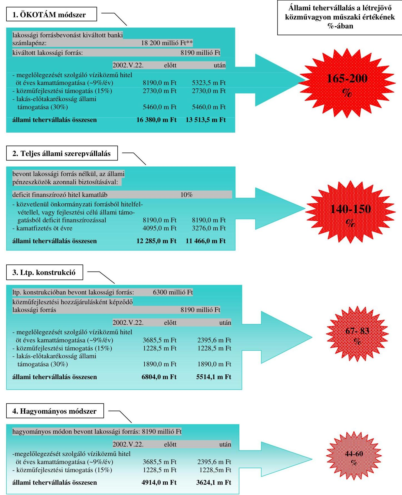
m Ft $=$ millió Ft

* Az ellenőrzött önkormányzatok összevont adatainak felhasználásával készült.
** Az ellenőrzött önkormányzatok esetében az állami támogatások igénybevételének alapját közpénzből, illetve önkormányzati vagy alapítványi támogatásként feltüntetett bankszámlapénzből ekkora összeggel emelték meg.

---

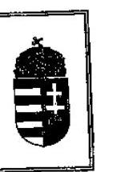

ÖNKORMÁNYZATI ÉS TERÜLETFEJLESZTÉSI MINISZTER

Iktatószám: 1-a-1/29/2006.
Dr. Kovács Árpád úrnak
elnök
Állami Számvevőszék

# Budapest 

## Tisztelt Elnök Úr!

Az Állami Számvevőszék által az önkormányzati út- és szennyvízcsatorna beruházásokhoz 2002-2005. években igénybe vett közmüfejlesztési támogatások igénylésének és felhasználásának ellenőrzéséről készített Jelentés megküldését köszönettel vettem.

A Jelentés egyértelműen mutatja be a közmüfejlesztési támogatások igénylésével és felhasználásával kapcsolatos ànomáliákat. Ezek visszaszorítása mindannyiunk közös célja, és ebben e Jelentés fontos támpontot jelent. A Kormány, a pénzügyminiszter, valamint a környezetvédelmi és vízügyi miniszter részére megfogalmazott jogszabály módosításokra vonatkozó javaslatok véleményem szerint is hozzájárulhatnak a támogatás jövőbeni jogszerú felhasználásához.

A Jelentésben a pénzügyminiszternek megfogalmazott, a jogtalanul, illetve a jogosulttá válás időpontja előtt igénybe vett 3,7 milliárd forintnyi támogatás rendezésére - ezen belül a 3,1 milliárd jogtalanul igénybe vett támogatásnak a központi költségvetésbe való visszafizetésére - vonatkozó javaslattal egyetértek. Ugyanakkor helyesnek vélem a Jelentésben rögzített azon elképzelést, amely szerint az önkormányzatok által visszafizetendő - jelentős nagyságrendủ - jogtalanul igénybe vett támogatást az önkormányzatok részletekben fizethessék meg, tekintettel arra, hogy azok egyösszegủ visszafizetése egyes önkormányzatok likviditását, müködőképességét veszélyeztetné.

Bízva további eredményes együttműködésünkben munkájához a továbbiakban is sok sikert kívánok.

Budapest, 2006. október „ 47 ."
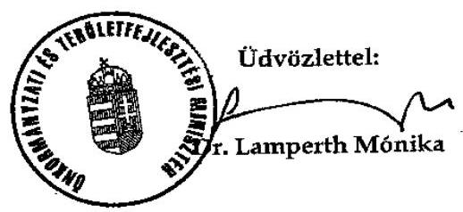

Budapest, V., Jószef Attila u. 2-4. Postacim: 1903 Budapest, Pf. 314.

---

# Dr. Kovács Árpád úr részére 

elnök

## Állami Számvevőszék

## Budapest

## Tisztelt Elnök Úr!

Az önkormányzati út- és szennyvízcsatorna beruházásokhoz 2002-2005. éveken igénybe vett közmüfejlesztési támogatások igénylésének és felhasználásának ellenőrzéséről készített állami számvevőszéki jelentést megkaptam, köszönöm.

Az Országgyülés döntése alapján elvégzett újabb tárgybeli jelentést a kormányzat szempontjából fontosnak tartom. A 2005. évben készített 0538. számú jelentésben foglalt megállapításokat és javaslatokat a kormányzati szervek hasznosították, intézkedéseik során figyelembe vették. Tájékoztatom, hogy a megküldött újabb jelentésben a Kormánynak megfogalmazott javaslatokkal kapcsolatban felkértem a pénzügyminisztert egységes elvek szerinti intézkedési terv elkészítésére, a szükséges kormányzati intézkedések koordinációjára. Emellett felkértem az érintett minisztereket, hogy a szaktárcáknak megfogalmazott javaslatokra vonatkozóan is készítsenek intézkedési tervet. A Kormány a jövőben is különös figyelmet fordít az állami támogatások jogtalan igénybevételével járó, nem kívánatos gyakorlat megakadályozására.

Az Állami Számvevőszék munkáját megköszönve tájékoztatom Elnők Urat, hogy a jelentéssel kapcsolatban egyéb észrevételt nem teszek.

Budapest, 2006. október „ 14. „.
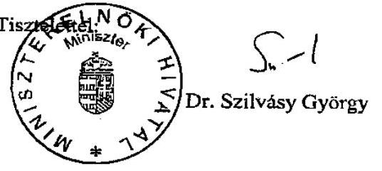

---

# Dr. Kovács Árpád úr 

elnök

## Állami Számvevőszék

Budapest

## Tisztelt Elnök Úr!

Köszönettel vettem az önkormányzati út- és szennyvízcsatorna beruházásokhoz 20022005. évben igénybe vett közmüfejlesztési támogatások igénylésének és felhasználásának ellenőrzéséről készített állami számvevőszéki jelentést.

A jelentésben foglalt megállapításokkal, a szükségesnek tartott intézkedésekkel egyetértek. A vízgazdálkodásról szóló 1995. évi LVII. törvény vízgazdálkodási társulatokra vonatkozó első szakmai tervezete elkészült, a vízgazdálkodási társulatokról szóló 160/1995. (XII. 26.) Korm. rendelet módosítására az ágazati törvény módosításával egyidejűleg kerülhet sor.

A jogszabályok módosítása során az Állami Számvevőszék iránymutatásait figyelembe vesszük.

Budapest, 2006. október „M."
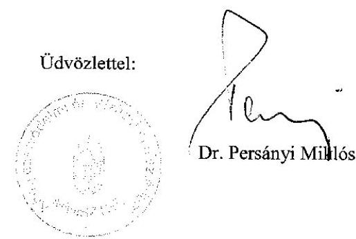

---

H-1051 BUDAPEST V., JÓZSEY NÁDOV. TÉR 2-4. POSTACIM: 1369 BUDAPEST, POSTAFIOK 481.

TELEFON: (36-1) 327-2159, (36-1) 327-2141
FAX: (36-1) 318-0738
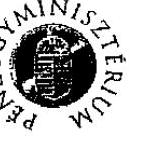

PÉNZÜGYMINISZTER

Dr. Kovács Árpád úr részére elnök

Állami Számvevőszék

Budapest

Tét.sz.: 12.432/10./2006.
Tárgy: Az önkormányzati út- és szennyvízcsatorna beruházásokhoz 2002-2005. években igénybevett közmüfejlesztési támogatás igénylésének és felhasználásának ellenőrzéséről készített jelentés-tervezet

Tisztelt Elnök Úr!

Köszönettel megkaptam a tárgybani jelentés-tervezetet, mellyel kapcsolatban az alábbiakról tájékoztatom.
A tervezet azt bizonyítja, hogy - a 2005. évi hasonló tárgyú vizsgálat nyomán - az Országgyűlés megalapozottan kérte fel az Állami Számvevőszéket minden ÖKOTÁM rendszerủ út- és szennyvízcsatorna beruházást megvalósító önkormányzat által igénybevett közmüfejlesztési támogatás jogszerüségének felülvizsgálatára.
Az alapos Számvevőszéki munka ugyanis ismét rámutatott arra, hogy 2002. és 2005. között a közmüfejlesztési támogatások jelentős részének igénylése nem a jogszabályoknak megfelelően történt.
Alapvetően egyetértek a jelentésben szereplő kezdeményezéssel, amely a jogosulatlan támogatások visszafizettetésére és a jogszabályok kijátszásának szankcionálására irányul.
A költségvetési támogatásokkal való visszaéléseket ellehetetlenítő - a Kormánynak javasolt további jogszabály pontositásokat támogatom.

A pénzügyminiszternek tett javaslatokra az alábbiakat jegyzem meg.
A részletes megállapításokra is figyelemmel egyetértek az 1. pontban megfogalmazottakkal. Ennek megfelelően 3.112,0 millió forint közmüfejlesztési támogatást az önkormányzatoknak - nagyrészt a lakás-takarékpénztári (LTP) szerződés lejártát megelőző igénylés miatt - vissza kell fizetniük. Emellett időarányosan kamatfizetési kötelezettség terheli az időközben már lejárt LTP szerződésekhez kötődő, de a korai igénylés miatt jogosulatlanul lehívott támogatásokat is ( 576,6 millió forint). Így összesen 3.688,6 millió forint közmüfejlesztési támogatás után kerül kamatfizetési kötelezettség előírásra.

A 2. pont szerint a lakás-takarékpénztári konstrukció bevonásával történő közmüfejlesztési hozzájárulás megfizetésekor a Magyar Államkincstár Igazgatóságalnak kellene megállapítaniuk, hogy mennyi volt a magánszemély tényleges befizetése és mennyi a más szervezet (pl. önkormányzat, alapítvány) által teljesített rész, amely - a 2002. május 22-e után megállapított hozzájárulások esetén - nem képezheti közmüfejlesztési támogatás alapját. Nem tartom járhatónak, hogy a MÁK több ezer lakás-takarékpénztári számla forgalmát megvizsgálva döntsön a közmüfejlesztési támogatás folyósításáról. Erre ma nincs is jogosítványa.

---

Kérdés, hogy a hitelintézeti törvény ilyen felhatalmazásra irányuló módosítása kiállná-e az alkotmányossági próbát. Emellett ez a típusú ellenőrzés aránytalanul megnövelné a MÁK leterheltségét.
Helyette azt tartom szabályozandónak, hogy a jegyző - büntetőjogi felelőssége tudatában nyilatkozzon arról is, hogy csak a magánszemély által saját forrásból megfizetett hozzájárulás összege után igényli a közmúfejlesztési támogatást. Emellett igazolja, hogy az igénylés a lakástakarékpénztári szerződés lejártát követően történik.
Feleslegesnek tartom ezzel párhuzamosan megnyilatkozatni a magánszemélyeket is. A támogatással való visszaélések ugyanis nem - a sokszor megtévesztett - LTP számlatulajdonosok, hanem az önkormányzatok (és más közremüködő szervezetek) rovására írhatók.
A jövőre nézve azt a megoldást tartom célszerúnek, hogy a magánszemélyek közmúfejlesztési támogatásáról szóló kormányrendelet következő módosítása során az LTP-ből megfizetett érdekeltségi hozzájárulás kerüljön ki a támogatási alapból.
A 3. pontban foglaltakra megjegyzem, hogy a Pénzügyminisztérium 2005. decemberében már egyszer kísérletet tett a lakás-takarékpénztárakról szóló törvény módosítására. Az Országgyűlés azonban elvetette a javaslatot, mivel az jelentősen szűkítette volna a közcélú közmúberuházások finanszírozási lehetőségeit. Ezért kérem, hogy a javaslatok közül az LTP megtakarítások közcélú közmúberuházásokra irányuló felhasználásának megszüntetését elhagyni szíveskedjenek, hiszen az előző bekezdésben javasolt jogszabálymódosítás azt szükségtelenné teszi.
A 4. és 5. pontban megfogalmazott javaslatokat alapvetően elfogadhatónak tartom, az Áht. legközelebbi módosításakor azokat érvényesíteni fogjuk.
A 6. és 7. pontban foglaltakkal egyetértve magam is indokoltnak tartom, hogy az APEH célvizsgálatot folytasson az igénybevett víziközmú-társulati hitelek kamattámogatása és a lakás-takarékpénztári támogatás jogszerűségének megállapítására, az esetleges felelősök szankcionálására.

Kérem Elnök urat, hogy észrevételeimet figyelembe venni szíveskedjék.

Budapest, 2006. október 16.
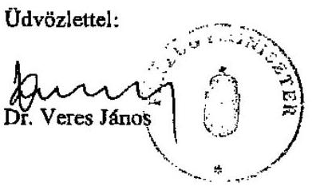

---

# Dr. Veres János úr 

miniszter
Pénzügyminisztérium

Budapest

Tisztelt Miniszter Úr!
Az önkormányzati út-és szennyvízcsatorna beruházásokhoz 2002-2005. években igénybevett közmüfejlesztési támogatás igénylésének és felhasználásának ellenőrzéséről készített jelentésünkre adott észrevételét köszönettel vettem.

A levelében foglalt néhány felvetésével nem értek egyet. Mindenképpen megoldandó feladatnak tartom, hogy a közmüfejlesztési támogatások kiutalása előtt a MÁK győződjön meg arról, hogy az igényelt támogatás esetében a jogosultsági feltételek fennállnak-e.

A lakás-takarékpénztári szerződésekből megfizetett közmúfejlesztési hozzájárulásokra igényelhető közmúfejlesztési támogatások alapját csak a lakástakarékpénztári szerződések lejáratát követően lehet meghatározni, amely befolyásolja a jogosan igényelhető támogatás nagyságát. A támogatás kiutalása előtt ezért feltétlenül fontos vizsgálni, hogy a magánszemélyek lakástakarékpénztáraknál vezetett egyéni megtakarítási számláin a lejáratkor egyénenként külön-külön- a megállapított közmüfejlesztési hozzájárulás teljes összege valóban megtakarításként jelentkezik-e. A helyszíni ellenőrzés során szerzett tapasztalatok szerint, amelyet egyébiránt a jelentés is bemutat nem jellemző, hogy a magánszemélyek egyéni számláin pontosan akkora összeg keletkezik megtakarításként, mint amekkora közmúfejlesztési hozzájárulás fizetési kötelezettséget a magánszemélynek megállapítottak. Ugyanakkor azonban az Itp. szerződések lejáratát követően a közmúfejlesztési támogatás alapjának meghatározásakor -függetlenül a közmúfejlesztési hozzájárulás megállapításának időpontjától- nem hagyható figyelmen kívül a 73/1999. (V. 21.) Korm. rendelet 3. § (2) bekezdésében rögzített előírás, amely szerint „a közmüfejlesztési hozzájárulás bankkölcsön felvételével történő megfizetése esetén a közmüfejlesztési támogatás alapja a törlesztő részletek összege, legfeljebb azonban a közmüfejlesztési hozzájárulás befizetési kötelezettségként megállapított összeg."

A 2002. május 22 -ét követően megállapított közmúfejlesztési hozzájárulások la-kás-takarékpénztári konstrukcióban történő megfizetésekor az állami támogatás kiutalása előtt biztosítani kell annak ellenőrzését is, hogy az Itp. megtakarításként megképződött összegből mekkora volt a magánszemély önkormányzati, vagy önkormányzat polgárjogi szerződése alapján harmadik személytől átvett támogatásból megfizetett része, amely nem képezheti a közmúfejlesztési támogatás alapját. Az ellenőrzés technikai lebonyolításának módjára vonatkozóan javaslatot nem teszek, elfogadom a pénzügyminisztérium szakemberei által megfelelőnek gondolt megoldást. Véleményem szerint azonban nem kell a hitelintézeti

---

törvényt módosítani a MÁK ellenőrzése miatt, ugyanis a lejáratkor a lakástakarékpénztáraknak egyénenként kell igazoltatniuk a közmúfejlesztési hozzájárulást beszedő szervezettel a lakáscélú felhasználást, amelyhez közölniük kell a személyenként képződő megtakarítások összegét is. A támogatásra vonatkozó igény benyújtásakor véleményem szerint elengedhetetlen a magánszemélyt nyilatkoztatása arról, hogy megtakarításában szerepel-e más szervezettől kapott támogatás. Szükségessé válhat ugyanakkor, hogy a hozzájárulás befizetéséről szóló igazolás kiadására jogosult szervezettől a jegyző információt kérjen arról, hogy a lakás-takarékpénztári befizetés összegében egyénenként mekkora volt a nem a magánszemély saját pénzeszközelnek befizetéséből származó rész.

Nem értek egyet azon megállapításával, hogy nem indokolt a lakástakarékpénztárakról szóló törvény módosításának szükségességét az új összetételű parlamentnek ismételten felvetni. A központi szerveknek, de elsősorban az Országgyűlésnek el kell döntenie, hogy az ugyanarra a célra párhuzamosan igénybe vehető támogatások elkerülése miatt melyik formában és milyen mértékben kívánja támogatni az állam a közcélú közmúberuházásokra fordított lakossági befizetések ösztönzését.

A jogszabályi előírások betartásának ellenőrizhetetlensége miatt a magam részéről a lakossági forrásbevonás ösztönzésére nem tartom szerencsésnek a lakástakarékpénztárakon keresztül nyújtott állami támogatás rendszerét. Sokkal inkább ellenőrizhető és követhető a jogos támogatás igénybevétel akkor, ha a magánszemély az ösztönzést közmúfejlesztési támogatás formájában az önkormányzatokon keresztül kapja, amelynek kapcsán a kormányrendelet módosításával a támogatottak köre, valamint annak mértéke is növelhető. Ebben az esetben azonban a lakás-takarékpénztárakról szóló törvény módosítása szükségessé válhat a párhuzamos támogatás elkerülése érdekében.

Engedje meg, hogy ezúton is megköszönjem Önnek és munkatársainak a vizsgálat során tanúsított szakszerű és következetes együttműködését, egyúttal kérem mint azt személyesen is már egyeztettük -, hogy a 2005. évi zárszámadás keretében szíveskedjen kezdeményezni a jogtalanul igénybe vett támogatások visszafizettetését.

Kérem Pénzügyminiszter Urat, hogy a levelemben foglaltakat szíveskedjen elfogadni.

Budapest, 2006. október " 20."
Tisztelettel:
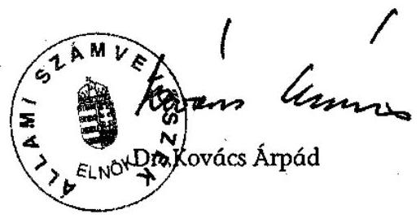