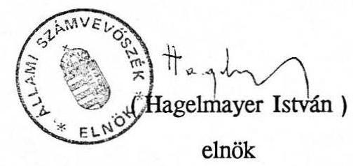

# Állami Számvevőszék

## JELENTÉS

az önkormányzatok elutasított céltámogatási igényeinek felülvizsgálatáról

---

# Jelentés

## az önkormányzatok elutasított céltámogatási igényeinek felülvizsgálatáról

A helyi önkormányzatok 1991. évi céltámogatásáról szóló 1991. évi XXI. tv. az Állami Számvevőszék feladatává tette az elutasított igények felülvizsgálatát.

A céltámogatási feltételeknek nem megfelelő igénybejelentéseket a törvény 5. sz. melléklete sorolta fel.

A vizsgálat célja annak megállapítása volt, hogy a törvény előkészítése során az elutasításra javasolt igénybejelentések közé nem kerültek-e be olyan kérelmek, amelyek megfeleltek a költségvetési törvény első paragrafusának 3. bekezdéséhez kapcsolódó 6. sz. mellékletben, illetve a vonatkozó közleményben meghirdetett követelményeknek, vagyis az elutasítás minden esetben teljesen megalapozott volt-e.

A vizsgálat az 1991. évi XXI. törvény 5. sz. mellékletében felsorolt 912 igénybejelentésére terjedt ki. (Gyakorlatilag azonban csak 906 kérelem felülvizsgálatát jelentette, mivel 6 elfogadott támogatási igény tévesen került a jegyzékbe.) A számvevőszék munkatársai valamennyi elutasított támogatási igénybejelentést felülvizsgáltak, s minden olyan esetben helyszíni ellenőrzést tartottak, amikor a Belügyminisztérium által rendelkezésre bocsátott dokumentumok alapján nem lehetett egyértelműen állást foglalni a döntés (illetve előkészítés) megalapozottságáról. Helyszíni ellenőrzésre összesen 531 igénybejelentéssel kapcsolatban került sor, aminek eredményét a vizsgálatot végzők írásban megismertették az érintett önkormányzatokkal.

A céltámogatás igénylésének rendszerét, feltételeit az 1990. évi CIV. törvény, valamint a Belügyminisztérium 1991. január 29-én (a Magyar Közlöny 9. számában)

---

közreadott közleménye tartalmazta. Mivel a közlemény a törvényben megjelölt feltételekhez képest további előírásokat is megfogalmazott, a vizsgálat viszonyítási alapja kettős volt. A vizsgálatot végzők egyrészt a törvény feltételeinek, másrészt a közlemény eljárási szabályainak tükrében minősítették az igénybejelentéseket.

# A vizsgálat megállapításai

## 1. Az elutasított igénybejelentések számvevőszéki minősítése

A vizsgált 906 db kérelem együttesen 6,5 milliárd Ft támogatási igényt tartalmazott. Ennek döntő többsége (85%-a) újonnan induló beruházásokra, rekonstrukciókra irányult.

A vizsgálat megállapításai szerint a céltámogatási igények közül 686 esetben hiányoztak a törvényben előírt feltételek, ezért az elutasítás teljes mértékben megalapozott volt.
144 igénybejelentés a törvény feltételeinek ugyan megfelelt, de a közleményben megfogalmazott eljárási szabályokat nem teljesítette minden tekintetben.

Az Állami Számvevőszék 76 olyan elutasított igénybejelentést talált, amelyek megfeleltek a költségvetési törvény mellékletének és a Belügyminisztérium közleményében foglaltaknak, ezért az előkészítés során helytelenül kerültek az 5. számú mellékletbe, illetve ennek alapján elutasításra.
(A vizsgált igénybejelentésekre vonatkozó részletesebb adatokat, továbbá a törvényi feltételeknek megfelelő, de elutasított 220 (76+144) igény felsorolását a jelentés mellékletei tartalmazzák.)
2. A törvényelőkészítő munkával kapcsolatos megállapítások

A céltámogatási rendszer lényegéből az következne, hogy meghatározott és meghirdetett feltételek megléte esetén támogatás az önkormányzatoknak alanyi jogon jár. Ezért magasnak minősíthető az elutasított igénybejelentések

---

aránya (a 2655 benyújtott igény több mint egyharmada az 5. sz. mellékletbe került), s jelentős a száma azoknak az elutasított igénybejelentéseknek, amelyek a helyszíni ellenőrzés szerint megfeleltek a törvényi előírásoknak. Ennek fő okai — a vizsgálat tapasztalatai szerint — a következőkben jelölhetők meg:

- A céltámogatás újszerű rendszerének beindítására rendkívül rövid idő állt rendelkezésre, s a költségvetési törvényben erre megjelölt határidőkhöz képest késések fordultak elő.

Mint ismeretes, a Kormánynak 1991. január 15-ig kellett volna szabályozni a kérelmek benyújtásának rendjét, a Belügyminisztérium erre vonatkozó közleménye azonban csak január 29-én jelent meg. Ez azt jelentette, hogy az önkormányzatok gyakorlatilag február elején ismerték meg az igénylés konkrét feltételeit, s így az igénybejelentés összeállítására, a szükséges dokumentumok esetleges "begyűjtésére" - a február 22-ei határidő miatt - 2-3 hét állt rendelkezésükre.

A törvényelőkészítés rövid fázisában a Belügyminisztériumnak 2655 igénybejelentés elbírálását kellett elvégezni úgy, hogy a helyszíni tájékozódásra, konzultációkra nem jutott energia. (Több önkormányzat fel is vetette, hogy az igénybejelentés összeállításával kapcsolatos konzultációra, illetve a hiányos dokumentációk esetleges kiegészítésére nem volt lehetőségük.)

A céltámogatási kérelmek összegyűjtését az alakulóban lévő TÁKISZ-ok végezték, s megyénként továbbították a Belügyminisztériumhoz. Érdemi szerepük azonban a rendszer működtetésében nem volt. Az önkormányzatok igénybejelentéseit általában csak átvették, s még formai vizsgálatot sem végeztek. Nem egy esetben a beérkezés tényét, időpontját, s az igénybejelentéshez csatolt mellékletek meglétét (számát) sem rögzítették, holott ezek az elbírálásnál döntőek lehettek.

- Az elutasított igények nagy számában szerepet játszott, hogy egyes feltételeket a törvényalkotói szándéktól eltérően - általában bővebben — értelmeztek az önkormányzatok.

Az önkormányzatok néhány esetben tágan értelmezték a "vízkutatás, vízbázis fejlesztés" fogalmakat és így igényeikben az ivóvízellátás javítása mellett más jellegű - nem preferált - célok (pl. strandfürdő, öntözés) is előfordultak.

A "szennyvíztisztító telep építése, bővítése" céllal kapcsolatban az önkormányzatoknak értelmezési gondot jelentett, hogy az lehetőséget ad-e olyan

---

kisebb telepek építésére, amelyek csatornahálózat nélkül (szippantós szállítással) oldják meg a szennyvíz tisztítását, kezelését.

A belügyminisztériumi közleményben mintaként szereplő igénybejelentő lap 5.b. pontjában a vízgazdálkodás, egészségügyi és szociális ellátás, oktatás megjelölése ugyan összhangban van a költségvetési törvény 6. számú mellékletében foglaltakkal, de ezen túlmenően a lap "egyéb" kategóriát is tartalmaz. Az "egyéb" megjelölést néhány önkormányzatnál úgy értelmezték, hogy a közlemény oldott a költségvetési törvényen, s erre alapozva jelentettek be igényt, pl. ravatalozó építésének, közvilágítás, lakóházfelújítás támogatására.

Meg kell említeni, hogy a Belügyminisztérium előkészítő munkája során néhány olyan követelmény is elbírálási szempont volt, amelyek nem szerepeltek a törvény feltételei között, s a közlemény sem utalt külön rájuk. Ide sorolható pl. külső forrás, átvett pénzeszköz, figyelembe vehető társadalmi munka igazolására vonatkozó dokumentumok "megkövetelése".

A szabályok szerint a külső források közül csak a megyei önkormányzat vállalását kellett nyilatkozattal igazolni. (Ezt a követelményt az önkormányzatok általában nem tudták teljesíteni, mivel a nyilatkozatot a kérelmek beadását követően tudták beszerezni.) A külső forrás dokumentálására más esetben előírás nem vonatkozott, de az előzetes elbírálás, — illetve annak előkészítése - során a külső forrás valódiságának dokumentálása (vállalási nyilatkozattal, szerződéssel, garancialevél, stb.) követelmény volt. Azok az igénybejelentések, amelyekhez ezt nem csatolták a "pénzügyileg nem megalapozott", s így elutasított kategóriába kerültek.

Külön kell szólni arról, hogy a vízügyi ágazatba tartozó beruházásoknál az elutasítás mögött legtöbb esetben az húzódott meg, hogy az önkormányzatok nem tudtak a Vízügyi Alapból várható összeggel biztos forrásként számolni. Az Országos Vízügyi Igazgatóság kötelezettségvállalása ugyanis nem mindig volt egyértelmű. Írásos nyilatkozatában több esetben azt jelezte, hogy akkor biztosít támogatást, ha "pénzügyi helyzete kedvezően alakul".

- A jelentős számú elutasított igénybejelentések másik fő oka kétségkívül az volt, hogy egyes önkormányzatok olyan feladatokra is igényeltek támogatást, amelyek megvalósításának feltételei nem voltak adottak.

A céltámogatás igénybejelentési lapokon néhány önkormányzat - anyagi lehetőségeit figyelmen kívül hagyva - irreálisan magas összeget tüntetett fel saját forrásként.

---

Az önkormányzatok egy részénél a tervezett célok fedezeteként feltüntetett saját források összege nem egyszer meghaladta az adott önkormányzat költségvetésében erre tervezett összeget, esetenként nem is volt ilyen címen előirányzat.

Az önkormányzatok döntő többsége a kérelmek benyújtásának időszakában még nem rendelkezett jóváhagyott 1991. évi költségvetéssel, így a jelzett előirányzatokat általában a meghirdetett célokhoz igazították, illetve a korábbi évek fejlesztési elképzeléseit elevenítették fel.

A vizsgált önkormányzatok egy része tisztában volt azzal, hogy a benyújtott kérelem nem felel meg az előírásoknak és számítottak is az elutasításra. Ezt igazolja - többek között -, hogy ebben az évben valójában nem is tervezték, illetve nem készítették elő az adott beruházás megkezdését.

- Az elutasított, de a vizsgálat szerint jogosnak minősíthető igénybejelentések kapcsán meg kell jegyezni, hogy a törvény előkészítése jelentős tömegű kérelmek, dokumentációk feldolgozását igényelte, s emiatt nem zárhatók ki az eseti, véletlen hibák sem.

Nyilván ennek tudható be például az az eset, amikor két szomszédos település azonos célra, azonos módon - közös körjegyzőségük előkészítésével - nyújtott be ivóvízellátással kapcsolatos igényt, s egyikük megkapta a támogatást, míg a másik igény az elutasítottak közé került.

# 3. A céltámogatási igények elutasításának hatása

A céltámogatások elmaradása miatt — az így keletkezett forráshiány ellensúlyozására - az önkormányzatok általában intézkedést tettek, illetve terveznek. Ennek főbb típusai:

- Fejlesztési terveik felülvizsgálatát, mérséklését, a beruházási ütem lassítását határozták el.
- Az önkormányzati források átcsoportosítását, tartalékok felhasználását, lakossági önkéntes pénzbeni hozzájárulás és önkéntes munkavállalás szervezését kezdték meg. (Ennek köszönhetően több helyen a támogatási igény elutasítása ellenére megvalósítják a beruházást, rekonstrukciót.)

---

- Az új, induló beruházásoknál a megvalósítás halasztásáról döntöttek.
- Intézkedtek az elutasítás okainak megszüntetéséről (engedélyek, tervek, dokumentációk beszerzése ügyében).

Az általános helyzetkép szerint a folyamatban lévő beruházásoknál a céltámogatás elmaradása ellenére folytatódtak a munkálatok, új beruházások azonban ilyen esetekben csak csekély számban kezdődtek el.

A tervezett fejlesztések elmaradása, illetve elhúzódása különösen a vízgazdálkodás, ivóvízellátás, szennyvíztisztítás területén érezteti közvetlenül kedvezőtlen hatását.

Itt kell megemlíteni, hogy bár a céltámogatásokról szóló közlemény kilátásba helyezte, hogy az Országgyűlés döntését követően a benyújtott támogatási igényekről az érintett önkormányzatokat tájékoztatják, külön értesítést erről nem kaptak, s hivatalosan csak az 1991. június 26-án megjelent Magyar Közlönyből értesültek az igényekkel kapcsolatos döntésről. Az elutasítás oka azonban az 1991. évi XXI. törvény mellékletében sem szerepel. Ezért az érintett önkormányzatok gyakorlatilag csak a számvevőszék helyszíni vizsgálata során szereztek tudomást arról, hogy mi volt igénybejelentésük elutasításának oka.

A Belügyminisztérium a törvényelőkészítés során a feltételeknek nem megfelelő igénybejelentéseket - az okok alapján - hat kategóriába sorolta. Ezek:

1. Az Országgyűlés által jóváhagyott célok között nem szerepel.
2. Pénzügyileg nem megalapozott.
3. Az 1991. évi pénzügyi felhasználás előkészítetlenség miatt nem reális, és/vagy a szükséges okmányok hiányosak.
4. Az előterjesztés-tervezet elkészülte után érkezett.
5. Nem az önkormányzat nyújtotta be az igényt.
6. Az adott feladat a címzett támogatások között szerepel. (1990. évi CIV. törvény 5. számú melléklete)

A döntés elhúzódása, illetve az erről kapott információ késése nehezítette az önkormányzatok időbeni reagálását.

A céltámogatás elmaradása több önkormányzatot rendkívül nehéz helyzet elé állított. Különös súllyal jelentkezett ez azon esetekben, amikor az egyébként preferált cél forrását nem tudták saját erőből megteremteni. A viszonylag magas

---

saját forrás megkövetelése főképpen az aprófalvas településeken jelentett gondot. Így például a kisebb települések az általános iskolai beruházások fedezetének 60%-át saját erőből, vagy - a jelenlegi hitelfeltételek mellett — kölcsönből nehezen, vagy nem tudják biztosítani.

Komoly nehézségek jelentkeztek a korábban kilátásba helyezett megyei támogatásra számítva indított oktatási beruházásoknál, mivel a megyei önkormányzatok e vállalásokat részben vagy egyáltalán nem teljesítették, miközben az érintett önkormányzatok céltámogatásban sem részesültek.

Nem egy esetben rendkívül feszítő helyzet alakult ki amiatt, hogy az önkormányzatok folyamatban lévő, de alacsony készültségi fokú építési munkákhoz számítottak céltámogatásra és az elmaradt. Ez egy-két önkormányzatnál likviditási gondokat okozott.

# 4. A vizsgálat céltámogatási rendszerrel kapcsolatos általános tapasztalatai

Az Állami Számvevőszék az 1991. évi céltámogatási rendszer szabályozásának működtetésével kapcsolatos észrevételeket, az előkészítő munkák során megtette. Így — többek között — jelezte, hogy miután az igények felmérése a céltámogatásra rendelkezésre álló keretösszeg meghatározását követi, az önkormányzatok alanyi jogának érvényesítése nehézségekbe ütközhet. Felvetette a határidők csúszásának várható következményeit is.

Kétségtelen, hogy a céltámogatások
 fontos hiánypótló, kiegészítő szerepet töltenek be az önkormányzati feladatok finanszírozásában. Az önkormányzatok általában olyan célokhoz kapcsolódóan nyújtottak be igényeket, amelyek a településük életében fontosak, de központi támogatás nélkül nem lenne elegendő saját forrásuk a megoldáshoz, illetve a támogatás jelentősen javíthatja a megvalósítás feltételeit.

Az igények elbírálásának mechanizmusa az igénybejelentések egyharmadát kiszűrte. A sok elutasítás egyben arra hívja fel a figyelmet, hogy javítani kell a céltámogatások rendszerének működését.

---

A vizsgálat tapasztalatai alapján az Állami Számvevőszék a következőket ajánlja:
a) Az Állami Számvevőszék a feltételeknek, előírásoknak megfelelő 76 igénybejelentést az 1991. évi XXI. törvény 4. mellékletében felsorolt elismert, de eddig kielégítetlen igényekhez hasonlóan javasolja kezelni.

Ennek támogatási vonzata 577,7 millió Ft, amire fedezetet az állami költségvetés nem tartalmaz, s így többletigényt jelent.
b) A közleményben szereplő követelmények miatt elutasított 144 igénybejelentéssel kapcsolatban azt kell figyelembe venni, hogy a meghirdetett szabályok alapján jogosan történt az elutasításuk. A költségvetési törvény 6. sz. mellékletében foglalt feltételeknek azonban megfeleltek. Ezért a számvevőszék javasolja - ismételt felülvizsgálatuk és elbírálásuk alapján - mérlegelni ezen igények kielégítését. Természetesen ebben az esetben is költségvetési többletigénnyel kell számolni.
c) A céltámogatás rendszerére egy olyan modellt indokolt bevezetni, amelyben a tervezés első fázisaként e támogatások lehetséges céljairól születne döntés. Ebben a körben 1992-re valamennyi ezerre meghirdetett célt indokolt meghagyni. (Az ivóvízellátás és a szennyvízelvezetés gondjait a számvevőszék más vizsgálatai is igazolták, és hasonlóak mondhatók el az 1991-ben preferált többi célra is.)

A célok kiválasztását követheti a várható igények felmérése. Az összegyűjtött igények alapján kellene kidolgozni - az egyes beruházások, rekonstrukciók költségének minősítésében esetleg normatív elemeket alkalmazva - azt, hogy egy-egy cél támogatása a költségvetésnek éves szinten milyen terhet jelent. Az előbbiek ismeretében lehetne dönteni arról, hogy egy-egy évre mely célok támogatása vállalható fel. Ez egyben azt is eredményezné, hogy az önkormányzatok - amennyiben a feltételeknek megfelelnek - a támogatáshoz alanyi jogon juthatnak hozzá. Ez a modell természetesen csak akkor működtethető megfelelően, ha a céltámogatási feltételek és követelmények kidolgozása és meghirdetése teljesen egyértelmű.

---

A vázolt megoldás olyan rendszert eredményezne, amely megfelel a céltámogatás logikájának, az érdemi döntések felső szinten születnek, s a működés elvei (automatizmusai), folyamatai egyszerűen áttekinthetők, ellenőrizhetők.

Budapest, 1991. augusztus hó

Melléklet 7 db (20 lap)

---

# 1. sz. melléklet a 

V-129-29/1991. sz. jelentéshez

A vizsgálatot vezette: Nagy József osztályvezető főtanácsos Az összefoglaló jelentés összeállításában közreműködtek Kenéz Sándor és dr. Takács András tanácsosok.

A vizsgálatot végezték:
Baranya megye:
dr. Ernszt László számvevő
Maczekó Károly tanácsos
dr. Nagy Ágnes számvevő
Bács-Kiskun megye:
Gaborjákné dr. Vydareny Klára számvevő
Tréfás Antal tanácsos
Békés megye:
Baji Ferencné számvevő
Kollár Lászlóné tanácsos
Borsod-Abaúj-Zemplén megye:
Dankó Géza tanácsos
Győrffi Dezső tanácsos
Hegedűs György számvevő
Kocsis István számvevő
dr. Takács András tanácsos
Csongrád megye:
dr. Boda Sándor számvevő
Csiszárné dr. Kosik Mária számvevő
dr. Klapcsik László számvevő
Fejér megye:
Ebner Vilmosné számvevő
dr. Gamaufné dr. Kóbor Éva számvevő
Horváth József számvevő

---

Győr-Moson-Sopron megye:
Berényi Magdolna számvevő
Kalmár István számvevő
dr. Szeli Tibor számvevő
Hajdú-Bihar megye:
Csomán Mihály számvevő
Kóródi József tanácsos
Heves megye:
Maróti Sándor számvevő
Nagy Sándorné számvevő
Jász-Nagykún-Szolnok megye:
Buczkó András számvevő
dr. Csapó Anna számvevő
Komárom-Esztergom megye:
Horváth József számvevő
Koltayné Szepesi Zsuzsanna számvevő
dr. Szeli Tibor számvevő
Nógrád megye:
Bocsi Sándor számvevő
Somogy megye:
dr. Hegedűs György tanácsos
Szita László számvevő
Szabolcs-Szatmár-Bereg megye:
Bacskai János számvevő
Kenéz Sándor tanácsos
László András számvevő
Tolna megye:
Csekei Gyula számvevő
Péntek László számvevő

---

# Vas megye: 

dr. Gyuk József tanácsos

## Veszprém megye:

Rénes Mária számvevő
dr. Vasváriné dr. Rózsa Anikó számvevő

## Zala megye:

Angyalosi-Dániel számvevő
Főváros és Pest megye:
Benczik Lászlóné számvevő
Farkas Tamás számvevő
Gordos László számvevő
dr. Katona Béláné számvevő
dr. Kurucz István számvevő
Molnár Istvánné számvevő
Simon Ákosné számvevő
dr. Spilák Antal számvevő
dr. Tóth Annamária számvevő

---

# 2. sz. melléklet a V-129-29/1991. sz. jelentéshez

## ÖSSZESÍTÉS

a folyamatban lévő beruházásokra és rekonstrukciókra vonatkozó elutasított céltámogatási igényekről

|  Jogcím megnevezése |  | Vízgazdálkodás | Egészségügyi és szociális ellátás | Oktatás | Szilárd hulladéklerakó telep építése, bővítése | Egyéb | Összesen  |
| --- | --- | --- | --- | --- | --- | --- | --- |
|  1. Az elutasított támogatási igények száma | /db/ | 38 | 29 | 80 | 17 | 23 | 187  |
|  Együttes összege | /EFt/ | 182.115 | 225.726 | 478.572 | 23.100 | 87.785 | 997.298  |
|  2. A vizsgálat megállapítása szerint az elutasított támogatási igényekből: |  |  |  |  |  |  |   |
|  a/ A költségvetési törv. 6.sz. mellékletében foglalt feltételeknek nem felelt meg | /db/ | 35 | 29 | 61 | 17 | 23 | 165  |
|  Együttes összeg | /EFt/ | 138.497 | 225.726 | 379.009 | 23.100 | 87.785 | 854.117  |
|  b/ A költségvetési törv. 6.sz. mellékletében foglalt feltételeknek megfelel, de a közleményben* fogl. feltételeknek nem felelt meg | /db/ | 2 | - | 15 | - | - | 17  |
|  Együttes összeg | /EFt/ | 8.618 | - | 67.042 | - | - | 75.660  |
|  c/ A költségvetési törv. 6.sz. mellékletében és a közleményben foglalt feltételeknek egyaránt megfelel | /db/ | 1 | - | 4 | - | - | 5  |
|  Együttes összeg | /EFt/ | 35.000 | - | 32.521 | - | - | 67.521  |

- Belügyminisztérium Magyar Közlöny 1991. 9. számában megjelent közleménye

---

# 3. sz. melléklet a V-129-29/1991. sz. jelentéshez

## ÖSSZESÍTÉS

az új induló beruházásokra, rekonstrukciókra vonatkozó elutasított céltámogatási igényekről

|  Jogcím megnevezése |  | Vízgazdál-
kodás | Egészségügyi és
szociális ellátás | Alapfokú
oktatás | Egyéb | Összesen  |
| --- | --- | --- | --- | --- | --- | --- |
|  1. Az elutasított támogatási igények |  |  |  |  |  |   |
|  száma | /db/ | 401 | 44 | 169 | 105 | 719  |
|  Együttes összege | /EFt/ | 3.535.162 | 270.150 | 1.077.626 | 670.886 | 5.553.824  |
|  2. A vizsgálat megállapítása szerint az elutasított támogatási igényekből: |  |  |  |  |  |   |
|  a/ A költségvetési törv. 6.sz. mell. foglalt feltételeknek nem felelt meg |  | 242 | 37 | 137 | 105 | 521  |
|  Együttes összeg | /EFt/ | 2.082.638 | 263.951 | 902.897 | 670.886 | 3.920.372  |
|  b/ A költségvetési törv. 6.sz. mell. foglalt feltételeknek megfelel, de a közleményben foglalt feltételeknek nem felelt meg /db/ |  | 108 | 7 | 12 | - | 127  |
|  Együttes összeg | /EFt/ | 1.053.990 | 6.199 | 63.107 | - | 1.123.296  |
|  c/ A költségvetési törv. 6.sz. mell. és a közleményben foglalt feltételeknek egyaránt megfelel /db/ |  | 51 | - | 20 | - | 71  |
|  Együttes összeg | /EFt/ | 398.534 | - | 111.622 | - | 510.156  |

---

A költségvetési törvény 6. sz. mellékletében foglalt feltételeknek megfelelő, de a vonatkozó közleményben előírt követelmények alapján elutasított igények

| A támogatási igény | A támogatási igények |  |
| :--: | :--: | :--: |
| megnevezése, célja | száma   db | együttes összege EFt |
| A/ Folyamatban lévő beruházások és rekonstrukciók   1. Vízgazdálkodás   2. Egészségügyi és szociális ellátás   3. Oktatás   4. Szilárd hulladéklerakó telep építése, bővítése | $\begin{gathered} 2 \\ - \\ 15 \\ - \end{gathered}$ | $\begin{gathered} 8.618 \\ - \\ 67.042 \end{gathered}$ |
| Összesen: | 17 | 75.660 |
| B/ Új induló beruházások, rekonstrukciók   1. Vízgazdálkodás   2. Alapfokú oktatás   3. Egészségügyi és szociális ellátás | $\begin{gathered} 108 \\ 12 \\ 7 \end{gathered}$ | $\begin{gathered} 1.053.990 \\ 63.107 \\ 6.199 \end{gathered}$ |
| Összesen: | 127 | 1.123.296 |
| Mindösszesen: | 144 | 1.198.956 |

---

A költségvetési törvény 6. számú mellékletében foglalt feltételeknek megfelelő, de a vonatkozó közleményben előírt követelmények alapján elutasított igények felsorolása

| Önkormanyzat és feladat megnevezése | Az elutasítás oka   (kódszáma) * | Támogatási igény EFt (a tv. 5. sz. mellékletében) | Az elutasítás sorszáma 4/ Folyamatban lévő beruházások és rekonstrukciók |
| :--: | :--: | :--: | :--: |

Vízgazdálkodás

Heves megye

1. Sarudi víz hálózat bővítés 4 8.368 337.

Somogy megye
2. Somogyaszaló vízvezeték ép. 1 250 356.

Vízgazdálkodás összesen: $\quad 2 \mathrm{db} \quad 8.618$ KFt
Egészségügyi és szociális ellátás

# Oktatás 

Főváros
3. Budapest Harmat u. Iskola ebédlő 3
2.036 540.
4. Bp. Jászberényi u. Iskola
konyha bővítés 3
3.040 544.
5. Bp. Pataki u. Isk.kieg. lét. 3
3.680 546.

* a Belügyminisztérium által kialakított kódszámok szerint ( $1=$ Az Országgyűlés által jóváhagyott célok között nem szerepel; $2=$ Pénzügyileg nem megalapozott; $3=$ Az 1991. évi pénzügyi felhasználás előkészületlenség miatt nem reális, és/vagy a szükséges okmányok hiányosak; $4=$ Az előterjesztés-tervezet elkészülte után érkezett; $5=$ Nem az önkormányzat nyújtotta be az igényt; $6=$ Az adott feladat a címzett támogatások között szerepel.)

---

# Baranya megye 

6. Mecseknádasd napközis konyha 3
7. Mecseknádasd sportcsarnok 3
8. Mecseknádasd közösségi helyiség 3
9. Mecseknádasd iskolai műhely 3
10. Szederkényi tornaterem 3

1.440
645.
4.220
646.
-
1.100
649.
2.400
712.

Békés megye
11. Sarkadkereszturi ált. iskola kiszolgáló lét. 3

800
701.
Győr-Moson-Sopron megye
12. Tápszentmiklósi ált.iskola 3
2.352
728.

Heves megye
13. Hatvani gimnázium 3
11.250
597.
14. Hatvani kollégium rekonstrukció 3
4.475
598.

Pest megye
15. Szigetujfalui általános isk.bőv. 3
4.664
719.

Veszprém megye
16. Papkeszi-Vilonya tanterem 4
1.440
676.
17. Pápai közgazdasági szakközép- 3
24.145
675. isk. rekonstrukció

Oktatás összesen:
15 db
67.042 KFt

Szilárd hulladéklerakó telep építése, bővítése
A/ Folyamatban lévő beruházások és
rekonstrukciók összesen:
17 db
75.660 KFt
B/ Új induló beruházások, rekonstrukciók

## Vízgazdálkodás

Főváros
18. III. Víz hálózat felújítás 3
19. III. Csatornahálózat 3
20. XII. Főgyűjtőcsatorna háló-
zat ép.
3
400
27.000
57.
27.000
58.
41.025
63.

---

|  21. | XIV. Csatornahálózat | 3 | 1.500 | 65.  |
| --- | --- | --- | --- | --- |
|  22. | XIX. Csatornahálózat | 3 | 4.000 | 66.  |
|  23. | XI. Csatornahálózat | 3 | 72.749 | 67.  |
|  24. | XVI. Csatornahálózat | 3 | 36.600 | 69.  |
|  25. | XV. Főgyűjtő csatorna ép. | 3 | 79.408 | 72.  |
|  26. | XV. Csatornahálózat | 3 | 5.280 | 73.  |
|  27. | XXII. Csatornahálózat | 3 | 4.320 | 74.  |
|  28. | XXII. Csatornahálózat |

 3 | 3.000 | 77.  |
|  29. | XXII. Csatornahálózat | 3 | 2.400 | 78.  |
|  30. | XXII. Csatornahálózat | 3 | 13.500 | 79.  |
|  31. | XX. Vízhálózat ép. | 3 | 2.700 | 81.  |
|  32. | XX. Csatornahálózat | 3 | 12.000 | 82.  |

# Baranya megye

|  33. Beremend szennyvíztisztító létes. | 3 | 4.000 | 40.  |
| --- | --- | --- | --- |
|  34. Dunaszekcső ivóvízellátás | 3 | 4.387 | 116.  |
|  35. Harkány szennyvízt.bőv. | 3 | 20.526 | 160.  |
|  36. Mecseknádasd szennyvíztiszt. |  |  |   |
|  telep | 3 | 21.000 | 253.  |
|  37. Mohács vízbázisfejleszt. | 3 | 3.000 | 262.  |
|  38. Mohács szennyvíztiszt.létes. | 1 | 600 | 263.  |
|  39. Pécsvárad szennyvíztiszt.bőv. | 3 | 12.000 | 324.  |

## Bács-Kiskun megye

|  40. Bács-Kiskun megyei önkormányzat |  |  |   |
| --- | --- | --- | --- |
|  Baróki Kistérségi Vízmű | 3 | 20.000 | 17.  |
|  41. Izsák Kisizsáki ivóvízelvezetés | 3 | 6.750 | 182.  |
|  42. Kecskemét Hetényegyháza ivóvíz- |  |  |   |
|  ellátás | 3 | 5.000 | 201.  |
|  43. Kecskemét Matkópusztai ivóvíz | 3 | 7.000 | 203.  |

## Borsod-Abaúj-Zemplén megye

|  44. Szentistván szennyvízcsatorna | 3 | 1.200 | 374.  |
| --- | --- | --- | --- |
|  45. Szerencs ivóvízbázis kutatás | 3 | 2.450 | 378.  |

## Csongrád megye

|  46. Apátfalvai víz hálózat korszerűs. | 3 | 600 | 9.  |
| --- | --- | --- | --- |
|  47. Makói szennyvízkap.növelés | 3 | 4.500 | 249.  |
|  48. Makó víz hálózat | 3 | 750 | 247.  |

## Fejér megye

|  49. Fülei vízbázis bőv. | 3 | 2.000 | 137.  |
| --- | --- | --- | --- |
|  50. Sárkeresztesi víz hálózat bőv. | 3 | 500 | 340.  |
|  51. Váli vízműtársulat | 3 | 4.140 | 418.  |

---

Győr-Moson-Sopron megye
52. Fertőrákosi csatornamű
53. Köpháza-Balf csatornatársulat
$3 \quad 4.000$
24.000 135.
227.

Hajdu-Bihar megye
54. Bakonszeg vízminőség jav.
55. Nádudvari víztisztító
56. Nyíradony kútbekötés
$3 \quad 8.500$
21.
6.000
273.
2.500 296.

Heves megye
57. Boldog szennyvízhálózat
58. Eger víztisztító
59. Gyöngyöspata szennyvíz-tisztító
60. Gyöngyössolymos szennyvíz-tisztító
61. Gyöngyöstarján szennyvíztisztító
62. Heves szennyvíztisztító bőv.
63. Kiskörei kút fúrás
64. Nagyrédei vízkezelés
$3 \quad 23.400$
27.000 47.
13.015 118.
13.015 153.
16.000 154.
19.200 155.
5.000 168.
1.000 209.
9.652 285.

Komárom-Esztergom megye
65. Csolnok vízmű
$3 \quad 4.512$
98.

Nógrád megye
66. Bátonyterenye szennyvíz-tisztító bővítés
67. Balassagyarmat Ujkövár víz hálózat
$3 \quad 4.200$
34.
1.150 23.

Pest megye
68. Bag szennyvízcsatorna
69. Cegléd csatornaműtárs.
70. Dunakeszi szennyvíztisztító bőv.
71. Erd szennyvíztiszt. bőv.
72. Erdőkertes vízellátás
73. Göd csatornahálózat
74. Gödöllő vízműtársulat
75. Gödöllő vízbázis bőv.
76. Gödöllő csatornaműtárs.
77. Gyömrő szennyvíztisztító
$3 \quad 10.000$
6.269 19.
6.269 86.
1.600 115.
45.000 125
4.950 126.
6.097 144.
8.000 146.
14.550 147.
1.100 148.
19.000 151.

---

78. Herceghalom csatornahálózat ..... 3
79. Hévizgyörk víz hálózat ..... 3
80. Kerepestarcsa víz hálózat ..... 3
81. Mende vízműtársulat ..... 3
82. Mogyoród csatornaműtárs. ..... 3
83. Nagybörzsöny vízellátás tervezés ..... 3
84. Nagykovácsi csatornaműtársulat ..... 3
85. Örkény víz hálózat ..... 3
86. Pilisborosjenő szennyvíztisztító ..... 3
87. Piliscsaba csatornaműtársulat ..... 3
88. Pilisszentkereszt szennyvíz-tisztító bőv. ..... 3
89. Pilisvörösvári csatornahálózat ..... 3
90. Pusztavacs vízműtársulat ..... 3
91. Ráckevei vízellátás ..... 3
92. Solymár-Pilisszentiván szennyvíztisztító bőv. ..... 3
93. Szada vízellátás ..... 3
94. Szentlőrinckáta vízműtársulat ..... 3
95. Tápiószőlős vízellátás ..... 3
96. Tura víz hálózat ..... 3
97. Vác főgyűjtő rekonstrukció ..... 3
98. Vecsés csatornahálózat ..... 3
99. Veresegyházi vízellátás ..... 3
100. Verőce csatornaműtársulat ..... 3
101. Zebegény csatornahálózat ..... 3
100. Balatonföldvár víz hálózat ..... 3
101. Látrány vízkezelés ..... 3
102. Somodor vízműtársulat ..... 3
103. Zamárdi csatornaműtársulat ..... 3
104. Madocsa vízbázisbővítés ..... 3
105. Simontornya szennyvízcsatorna ..... 3
106. Bűki szennyvíztiszt. bőv. ..... 3
107. Gersekarát-Telekes csatornahálózat ..... 3
108. Kőszeg vízbázisbővítés ..... 3
109. Vasvár szennyvíztisztító ..... 3
110. Hévizgyörk víz hálózat ..... 3
111. Mende vízműtársulat ..... 3
112. Mogyoród csatornaműtársulat ..... 3
113. Nagybörzsöny vízellátás tervezés ..... 3
114. Nagykovácsi csatornaműtársulat ..... 3
115. Örkény víz hálózat ..... 3
116. Pilisborosjenő szennyvíztisztító ..... 3
117. Piliscsaba csatornaműtársulat ..... 3
118. Pilisszentkereszt szennyvíz-tisztító bőv. ..... 3
119. Pusztavacs vízműtársulat ..... 3
120. Solymár-Pilisszentiván szennyvíztisztító bőv. ..... 3
121. Szada vízellátás ..... 3
122. Szentlőrinckáta vízműtársulat ..... 3
123. Tápiószőlős vízellátás ..... 3
124. Tura víz hálózat ..... 3
125. Vác főgyűjtő rekonstrukció ..... 3
126. Vecsés csatornahálózat ..... 3
127. Veresegyházi vízellátás ..... 3
128. Verőce csatornaműtársulat ..... 3
129. Zebegény csatornahálózat ..... 3
121. Balatonföldvár víz hálózat ..... 3
122. Látrány vízkezelés ..... 3
123. Somodor vízműtársulat ..... 3
124. Zamárdi csatornaműtársulat ..... 3
125. Tolna megye
126. Madocsa vízbázisbővítés ..... 3
127. Simontornya szennyvízcsatorna ..... 3
128. Bűki szennyvíztiszt. bőv. ..... 3
129. Gersekarát-Telekes csatornahálózat ..... 3
130. Kőszeg vízbázisbővítés ..... 3
131. Vasvár szennyvíztisztító ..... 3
132. Zamárdi csatornaműtársulat ..... 3
133. Simontornya szennyvízcsatorna ..... 3
134. Bűki szennyvíztiszt. bőv. ..... 3
135. Gersekarát-Telekes csatornahálózat ..... 3
136. Kőszeg vízbázisbővítés ..... 3
137. Vasvár szennyvíztisztító ..... 3
138. Vásárhelyszentmárton szennyvíztisztító bőv. ..... 3
139. Simontornya szennyvízcsatorna ..... 3
140. Bűki szennyvíztiszt. bőv. ..... 3
141. Gersekarát-Telekes csatornahálózat ..... 3
142. Kőszeg vízbázisbővítés ..... 3
143. Simontornya szennyvíztisztító ..... 3
144. Simontornya szennyvízcsatorna ..... 3
145. Bűki szennyvíztiszt. bőv. ..... 3
146. Gersekarát-Telekes csatornahálózat ..... 3
147. Vasvár szennyvíztisztító ..... 3

---

Veszprém megye
112. Berhida csatornahálózat ..... 4
113. Küngös vízellátás ..... 4
114. Pápa csatornahálózat ..... 4
115. Veszprém szennyvízcsatorna-hálózat ..... 3
116. Veszprém főgyűjtő ép. ..... 3
7.900 ..... 41.
800 ..... 232.
10.765 ..... 427.
18.000 ..... 428.
Zala megye
117. Becsvölgye-Kustánszeg vas-talanító ..... 3
118. Csonkahegyhát víz hálózat ..... 3
119. Kistolmács vízműtársulat ..... 3
120. Lendvajakabfa víz hálózat ..... 3
121. Nagykanizsa-Fakos víz hálózat ..... 3
122. Sármellék csatornaműhálózat ..... 3
123. Zajk víz hálózat ..... 3
124. Zalaegerszeg vízbázisvédelem ..... 3
125. Zalaszentgrót víztisztító ..... 3
1.750 ..... 36.
2.765 ..... 216.
2.973 ..... 237.
500 ..... 281.
9.762 ..... 341.
4.063 ..... 433.
1.500 ..... 435.
2.500 ..... 439.
Vízgazdálkodás összesen: ..... 108 db
1.053.990 KFt
Alapfokú oktatás
Főváros
126. IX. Ifjúságmunkás úti tornaterem 3 ..... 2.480 ..... 543.
Baranya megye
127. Pécs tornaterem ..... 3
10.000 ..... 680.
Borsod-Abaúj-Zemplén megye
128. Szuhakállói általános isk. tanterem ..... 3
2.500 ..... 724.
Heves megye
129. Egerbakta tornaterem ..... 3
3.687 ..... 571.

---

Pest megye
130. Pomázi tornaterem ..... 3
131. Püspökhatvani tornaterem ..... 3
132. Tinnyei tanterem, tornaterem ..... 3
133. Újszilvás tornacsatornok ..... 3
134. Valkói tornaterem ..... 3
135. Veresegyházi tornaterem ..... 3
136. Veresegyház tanterem ..... 3
137. Nagycsád tornaterem ..... 4 ..... 1.550 ..... 687. ..... 689. ..... 736. ..... 746. ..... 749. ..... 753. ..... 754.
Veszprém megye
137. Nagycsád tornaterem ..... 1.550 ..... 656.
Alapfokú oktatás összesen: ..... 12 db ..... 63.107 KFt
Egészségügyi és szociális ellátás
Borsod-Abaúj-Zemplén megye
138. Pálháza gép-műszer beszerz. ..... 3 ..... 200 ..... 492.
Heves megye
139. Atány gép-műszer ..... 3 ..... 750 ..... 444.
Jász-Nagykun-Szolnok megye
140. Karcag gép-műszer ..... 4 ..... 3.307 ..... 470.
Pest megye
141. Váchartyán gép-műszer ..... 3 ..... 50 ..... 509.
Vas megye
142. Kőszeg gép-műszer ..... 3 ..... 540 ..... 471.
Veszprém megye
143. Berhida gép-műszer ..... 4 ..... 600 ..... 448.

---

Zala megye

|  144. Zalaegerszeg gép- és műszer | 3 | 752 | 515  |
| --- | --- | --- | --- |
|  Egészségügyi és szociális ellátás összesen: | 7 db | 6.199 KFt |   |

|  B/ Új induló beruházások, rekonstrukciók összesen: | 127 db | 1.123.926 KFt  |
| --- | --- | --- |
|  A/ és B/ mindösszesen: | 144 db | 1.198.956 KFt  |

---

5. sz. melléklet a V-129-29/1991. sz. jelentéshez

A költségvetési törvény 6. sz. mellékletében foglalt feltételeknek és a vonatkozó közleményben foglalt követelményeknek egyaránt megfelelő elutasított céltámogatási igények

|  A támogatási igény | A támogatási igények |   |
| --- | --- | --- |
|  megnevezése, célja | száma
db | együttes összege
Ft  |
|  A/ Folyamatban lévő beruházások és rekonstrukciók
1. Vízgazdálkodás
2. Egészségügyi és szociális ellátás
3. Oktatás
4. Szilárd hulladéklerakó telep építése, bővítése | 1
4
4 | 35.000
32.521
37.521  |
|  Összesen: | 5 | 67.521  |
|  B/ Új induló beruházások, rekonstrukciók
1. Vízgazdálkodás
2. Alapfokú oktatás
3. Egészségügyi és szociális ellátás | 51
20 | 398.534
111.622
510.156  |
|  Összesen: | 71 | 577.677  |
|  Mindösszesen: | 76 | 577.677  |

---

5/a. sz. melléklet a V-129-29/1991. sz. jelentéshez

A költségvetési törvény 6. sz. mellékletében foglalt feltételeknek és a vonatkozó közleményben foglalt követelményeknek egyaránt megfelelő elutasított igények felsorolása

|  Önkormányzat és feladat megnevezése | Az elutasítás oka (kódszáma) | Támogatási igény Ft (a tv. 5.sz. mellékletébe) | Az elutasítás sorszáma 54.  |
| --- | --- | --- | --- |
|  A/ Folyamatban lévő beruházások és rekonstrukciók |  |  |   |
|  Vízgazdálkodás |  |  |   |
|  Főváros |  |  |   |
|  1. Budapest Főváros Csepel sz. Rákóczi út | 1 | 35.000 | 54.  |
|  Egészségügyi és szociális ellátás | - | - | -  |
|  Oktatás |  |  |   |
|  Főváros |  |  |   |
|  2. Budapest II., Dimitrov úti iskola tornaterem bőv. | 3 | 18.080 | 539.  |
|  Békés megye |  |  |   |
|  3. Csanádapáca Általános Iskola kondicionáló terem | 1 | 2.333 | 557.  |
|  Fejér megye |  |  |   |
|  4. Mezőszilas Általános iskola építés | 2 | 1.108 | 652.  |
|  Pest megye |  |  |   |
|  5. Halásztelek Mezőgazd. Szakközépisk. tanterem bővítés | 2 | 11.000 | 596.  |
|  Oktatás összesen: | 4 db | 32.521 KFt |   |

---

Szilárd hulladéklerakó telep építése, bővítése

A/ Folyamatban lévő beruházások és rekonstrukciók összesen: 5 db 67.521 Ft

B/ Új induló beruházások, rekonstrukciók

Vízgazdálkodás

Békés megye

|  1. Battonyai szennyvíztisztító | 1 | 3.865 | 35.  |
| --- | --- | --- | --- |
|  2. Gyula Újváros csatornahálózat | 2 | 900 | 157.  |
|  3. Nagyszénási szennyvíztisztító | 1 | 1.050 | 286.  |

Borsod-Abaúj-Zemplén megye

|  4. Abaújkér ivóvízellátás | 2 | 6.900 | 1.  |
| --- | --- | --- | --- |
|  5. Cseténye vízellátás II.ütem

 | 2 | 1.000 | 93.  |
|  6. Miskolc-Szinva-Martintelep | 1 | 3.000 | 258.  |
|  7. Miskolc-Bükkszentlászló |  |  |   |
|  szennyvízcsatornázás | 1 | 840 | 260.  |
|  8. Miskolc-Bükkszentlászló vízellátás | 1 | 1.260 | 259.  |
|  9. Sárospatak szennyvíztisztítómű bőv. | 2 | 9.000 | 342.  |
|  10. Szerencs városi csat.hálózat bőv. | 2 | 24.552 | 377.  |
|  11. Mezőkeresztes vezetékes ivóvízell. | 2 | 10.800 | 256.  |

Csongrád megye

|  12. Domaszéki szennyvíztisztító, szennyvízcsat. ép. | 2 | 15.600 | 107.  |
| --- | --- | --- | --- |
|  13. Hódmezővásárhelyi szennyvíztisztítókap.bővítés és folyékony hulladék előkezelőt.ép. | 3 | 61.800 | 172.  |
|  14. Kisteleki tisztított szennyvíz fertőtlenítése | 2 | 1.800 | 215.  |
|  15. Mórahalom szennyvízcsatornahálózat építése | 2 | 3.040 | 269.  |
|  16. Szatymazi vízbázis bővítése | 3 | 3.120 | 368.  |
|  17. Szentesi szennyvízcsatorna építése | 2 | 19.376 | 372.  |
|  18. Szentesi szennyvíziszap víztelenítés | 3 | 12.000 | 373.  |

---

# Fejér megye 

19. Dunaujvárosi szennyvízcsatorna építése
20. Kajászó község vízmű bővítése
21. Kápolnásnyéki szennyvízhálózat bővítése
22. Móri regionális vízbázisbővítés
23. Nádudvari szennyvíztisztítómű és csatorna ép.
24. Visznek községi vízbázisbővítés
Jász-Nagykun-Szolnok megye
25. Törökszentmiklósi vízbázisbővítés
26. Nyergesujfalui szennyvíztisztítótelep bővítése

## Nógrád megye

27. Etes községi közműves víz-ellátás megold.
Somogy megye
28. Fonyódi szennyvízcsat.ép.
29. Gigei ivóvízellátás
30. Kercseligeti ivóvízellátás
31. Kutasi szennyvíztisztító ép.
32. Bátrányi szennyvíztisztítótelep ép.
33. Nágocsi vízbázisbővítés
34. Segesdi szennyvíztisztító ép.
35. Siófoki Töreki vízellátás építése
36. Tabi vízkezelési eljárás
37. Zsákányi szennyvíztiszt. telep építés

| 20.939 | 117. |
| --: | --: |
| 3.765 | 190. |
| 2.400 | 192. |
| 10.312 | 266. |

3
15.000

272
1.750 432

2.405

10.000 293

10.530 128

24.000 136
4.200 142
6.080 204
3.000 231
3.462 233
1.194 274
2.160 345
5.145 350
2 13.231 387
1 4.200 434

---

Szabolcs-Szatmár-Bereg megye 38. Nyíreteleki szennyvíztisztító ülepítő

Tolna megye 39. Bátaszéki szennyvíztisztító bővítés

40. Bonyhádi szennyvíztisztító bővítés 41. Mucsi község vízellátás bőv. 42. Murgai vízműbővítés 43. Nagyközség községi víz hálózat 44. Nak községi nyomásfokozó ép. 45. Paksi szennyvíztisztító bőv. 46. Pincehelyi víztározó ép. 47. Várdomb községi víztározó ép.

Vas megye 48. Körmendi víz hálózat ép. 49. Peresznyei szennyvízcsatorna ép. és tisztító 3

Zala megye 50. Lendvadedesi községi vízmű-építés 51. Kerkafalva-Kerkakutas vízműtársulat 3

Vígazdálkodás összesen: 51 db 398.534 KFt

Alapfokú oktatás

# Csongrád megye

|  52. Asotthalom tornaterem építés | 2 | 11.826 | 522.  |
| --- | --- | --- | --- |
|  53. Csányteleki tornaterem ép. | 2 | 8.050 | 558.  |
|  54. Makói tornaterem ép. | 3 | 11.200 | 643.  |
|  55. Tömörkény tornaterem ép. | 3 | 1.736 | 743.  |

Komárom-Esztergom megye 56. Bajnai tornaterem ép. 2 57. Tatabányai tornaterem ép. 58. Tatabánya Jókai úti tornaterem ép. 3 1.330 5.790 5.820 525. 733.

---

59. Tatabánya Széchenyi úti tornaterem ép. 3 7.020 735. 60. Tardosbánya tornaterem ép. 1 1.500 731.

Somogy megye

|  61. Karádi tornaterem ép. | 2 | 400 | 611.  |
| --- | --- | --- | --- |
|  62. Mesztegnyő tornaterem ép. | 2 | 1.200 | 650.  |
|  63. Somogybabodi Iskola bővítése |  |  |   |
|  tornateremmel | 2 | 3.300 | 707.  |
|  64. Somogyvári tornaterem ép. | 2 | 14.350 | 708.  |
|  65. Zamárdi tornaterem ép. | 3 | 1.000 | 771.  |

Szabolcs-Szatmár-Bereg megye

|  66. Magy község tornaterem ép. | 2 | 800 | 641.  |
| --- | --- | --- | --- |
|  67. Nyíregyháza tornaterem ép. | 1 | 22.000 | 667.  |
|  68. Szatmárcseke tornaterem ép. | 2 | 6.400 | 711.  |

Tolna megye 69. Kisdorog község tornaterem ép. 1 1.900 620.

Zala megye 70. Nagykanizsai tornaterem ép. 2 4.000 659. 71. Zalaegerszegi tornaterem ép. 2 2.000 768 Alapfokú oktatás összesen: 20 db 111.622 KFt Egészségügyi és szociális ellátás - B/ Új induló beruházások, rekonstrukciók összesen: 71 db 510.156 KFt A/ és B/ mindösszesen: 76 db 577.677 KFt Budapest, 1991. augusztus hó
