# ÁLLAMI   SZÁMVEVŐSZÉK 

## JELENTÉS

az állami közutak fenntartásának ellenőrzéséről

---

# 2. Államháztartás Központi Szintjét Ellenőrző Igazgatóság 

2.3. Átfogó Ellenőrzési Főcsoport

Iktatószám: V-05-090/2006.
Témaszám: 813 .
Vizsgálat-azonosító szám: V-0279

## Az ellenőrzést felügyelte:

Bihary Zsigmond
föigazgató
Az ellenőrzés végrehajtásáért felelős:
Hegedüsné dr. Müllern Veronika
főcsoportfőnök

## Az ellenőrzést vezette:

Papp Sándor
számvevő főtanácsos

## Az ellenőrzést végezték:

| Beck Miklós számvevő tanácsos | Csóry Györgyné számvevő tanácsos, főtanácsadó | Gregor Andrea számvevő gyakornok |
| :--: | :--: | :--: |
| Dr. Hegedüs György számvevő tanácsos, főtanácsadó | Dr. Horváth Erika számvevő | Kenéz Sándor számvevő tanácsos, főtanácsadó |
| Kovácsy Tamás számvevő | Dr. Ligeti Miklós számvevő tanácsos, tanácsadó | Sinka Zoltán számvevő |
| Somodiné Fehér Julianna számvevő tanácsos | Szélpál Ferenc számvevő tanácsos | Vitányi István számvevő |

A témához kapcsolódó eddig készített számvevőszéki jelentések:
címe
sorszáma
Jelentés a Gazdasági és Közlekedési Minisztérium fejezet működésének ellenőrzéséről
Jelentés az Útalap és az abból finanszírozott országos közúthálózat fenntartásának, üzemeltetésének, fejlesztésének, valamint a kezelő szervezetek működésének pénzügyi-gazdasági ellenőrzéséről

---

# TARTALOMJEGYZÉK 

BEVEZETÉS ..... 7
I. ÖSSZEGZŐ MEGÁLLAPÍTÁSOK, KÖVETKEZTETÉSEK, JAVASLATOK ..... 10
II. RÉSZLETES MEGÁLLAPÍTÁSOK ..... 23

1. Az állami közutak fejlesztésének és fenntartásának rendszere ..... 23
1.1. Az állami közutak fejlesztésében és fenntartásában érintett szervezetrendszer ..... 23
1.2. A minisztérium irányító és koordináló tevékenysége ..... 29
1.3. A célelőirányzat mértékének alakulása ..... 30
1.4. A feladatokat ellátó szervezetek finanszírozása ..... 33
1.5. A tulajdonosi jogok gyakorlása ..... 34
1.6. A működés informatikai háttere ..... 37
1.7. Az állami közutak, mint állami vagyon nyilvántartása ..... 41
1.8. A közútkezelés belső ellenőrzése ..... 43
2. A fejlesztések iránya, eredményessége ..... 46
2.1. A közutak fejlesztésének iránya, céljai ..... 46
2.2. A tervek belső és külső információkkal való megalapozottsága ..... 49
2.3. A fejlesztések hazai forrásai, felhasználásuk ..... 51
2.4. Európai Uniós forrásokból megvalósuló fejlesztések ..... 54
2.5. A közbeszerzési eljárások alkalmazása ..... 59
2.6. A helyszíni ellenőrzés keretében vizsgált projektek összegzése ..... 60
3. Az országos közutak kezelése, fenntartása ..... 62
3.1. Az országos közutak kezelésének, fenntartásának módjai ..... 62
3.2. Az útellenőrző rendszer és nyilvántartás ..... 64
3.3. Az útfenntartás hatékonyság vizsgálati rendszerei ..... 66
3.4. A kezelés és fenntartás forrásainak alakulása és elosztása ..... 68
4. Az országos közúthálózat helyzete, általános jellemzői ..... 72
4.1. A minőségi és a garanciális kifogások ..... 75
4.2. Az utak állapotából eredő kártérítési kötelezettségek, balesetek ..... 75
5. Utóellenőrzés ..... 76

---

# MELLÉKLETEK 

1/a. számú A Gazdasági és Közlekedési Minisztériumot felügyelő miniszter észrevétele
1/b. számú A GKM miniszter észrevételére adott válasz
2. számú A közlekedés fejlesztésének irányát kijelölő jogszabályok és egyéb rendelkezések
3. számú Az ÚFCE-ból, illetve az Útpénztár előirányzatból finanszírozott útfejlesztési kiadások alakulása
4. számú Az ÚFCE-ból, illetve az Útpénztár előirányzatból finanszírozott útfenntartási kiadások alakulása
5. számú UKIG nyilvántartások és kapcsolódásuk
6. számú Beavatkozási hosszok és a beavatkozási ciklus alakulása 1993-2006. években
7. számú A helyszínen ellenőrzött projektek
8. számú A korábbi számvevőszéki javaslatok utóellenőrzése

## FÜGGELÉKEK

1. számú A helyszínen ellenőrzött projektek tapasztalatai

---

# RÖVIDÍTÉSEK JEGYZÉKE 

| ÁKMI Kht. | Állami Közúti Műszaki és Információs Kht. |
| :-- | :-- |
| EIB | European Investment Bank (Európai Beruházási Bank) |
| FIFA | Felzárkóztatási Infrastruktúra Fejlesztési Alapprogram |
| GKM | Gazdasági és Közlekedési Minisztérium |
| HDM | Highway Design and Maintenance |
|  | (úttervezési és fenntartási modell) |
| HIPS | Highway Investment Programming System |
|  | (hálózati szintű útgazdálkodási rendszer) |
| IHU Kht. | Ipari Hulladékhasznosító Kht. |
| ISO | Nemzetközi Szabványügyi Szervezet |
| KIOP | Környezetvédelmi és Infrastrukturális Operatív Program |
| KÖVIM | Közlekedési és Vízügyi Minisztérium |
| Magyar Közút Kht. | Magyar Közút Állami Közútkezelő, Fejlesztő Műszaki és |
|  | Információs Kht. |
| NA Rt. | Nemzeti Autópálya Rt. |
| OKA | Országos Közúti Adatbank |
| PMS | Pavement Management System |
|  | (útburkolat-gazdálkodási rendszer) |
| PONTIS | Hídgazdálkodási rendszer |
| ÚFCE | Útfenntartási és fejlesztési célelőirányzat |
| UKIG | Útgazdálkodási és Koordinációs Igazgatóság |

---

.

---

# ÉRTELMEZŐ SZÓTÁR 

közúthálózat
felújítás
fenntartás
helyreállítás
karbantartás
üzemeltetés
üzemeltetés - szolgáltatási kategóriák
tisztítás

Az országos és helyi közutak összefüggő rendszere.
A felújítás nagyobb időtávban ismétlődő, kiterjedt, több sávot, több réteget magába foglaló új építésnek megfelelő használati értéket növelő beavatkozás.
(pl.: összefüggő pályaszerkezet csere, teljes burkolat felújítás, burkolat megerősítés, sávszélesítések).
A forgalmi igénybevételből és az időjárási, valamint az egyéb természeti hatásokból származó természetes leromlás ellensúlyozásához szükséges tevékenységek.
A helyreállítás rövidebb időközönként periódikusan ismétlődő, nagyobb felületre kiterjedő (egy sáv, egy méter) feladatok, amelyek az út használhatóságát korlátozottan javítják.
(felületi bevonat, profiljavítás, új kopóréteg készítése, különböző környezetkímélő újrahasznosítási -recycling- eljárások, keréknyomvályú javítás, hézagjavítás, összefüggő repedéskiöntés, burkolat újrarakás, árokkészítés, útpadka stabilizálás).
Azok az azonnal végrehajtandó, illetve folyamatosan végzett kisebb terjedelmű ( $50 \mathrm{fm}, 300 \mathrm{~m} 2$, ) feladatok, amelyek az út használati értékét nem növelik.
(pl. kátyúzás, szórás, zúzalékolás, kis felületi javítás, helyi nyomvályú javítás, egyedi repedés-, hézagjavítás, lokális deformációjavítás, helyi nyomvályú javítás, útpadkarendezés, árokprofilozás, jelzőtábla csere illetve kihelyezés).
A közúti forgalom biztonságos és kulturált lebonyolítását elősegítő szolgáltatások összessége.
„A" szolgáltatási kategória: az Országos Közutak Kezelői Szabályzatában (OKKSZ) meghatározott feladatok teljeskörű, maradéktalan végrehajtása.
„B" szolgáltatási kategória: a hatályos rendelet függelékének II. 2. A Miniszter, illetve az ÚKIG szerződésben egyértelműen rögzített egyes feladatok csökkentett mértékű és gyakoriságú végrehajtása a további feladatokban az OKKSZ szerinti színvonalon történő megvalósítása mellett.
„C" szolgáltatási kategória: a hatályos rendelet függelékének II. 1. pontjában meghatározott feladatcsoportoknak az OKKSZ szerinti színvonalon történő végrehajtása. Valamennyi további - a függelék II. 2. pontja szerinti - feladat ellátásának színvonalát az országos közúthálózat működőképességének megőrzése mellett a szerződések tartalmazzák.
Az országos közutak téli tisztántartását elősegítő szolgáltatások összessége.

---

# 6

---

# JELENTÉS   az állami közutak fenntartásának ellenőrzéséről 

## BEVEZETÉS

A magyar úthálózat mennyisége, minősége, elsősorban azok állapota a közúti közlekedés szempontjából kiemelt fontosságú. Az utak minőségének szintentartása, illetve javítása, az úthálózat fejlesztése, nem csak a gyorsforgalmi utaknál, hanem az országos közutaknál, az autópályák tovább épített szakaszaihoz kapcsolódó, valamint az európai úthálózathoz csatlakozó utak esetében is fontos szempont, emellett hatással van az úthasználók biztonságára és a közlekedési költségeire is.

Magyarországon 2006-ban 181000 km közutat tartottak nyilván. Ebből 31000 km az állami tulajdonú országos közúthálózat hossza, amelyből 7541 km főút, 2110 km ún. E-út, vagyis része az európai úthálózatnak. Az országos közutakon 6446 db híd található.

Az ország közúti forgalmának több mint kétharmadát az országos közúthálózat viseli, ennek 65%-a terheli a hálózat gyorsforgalmi útjaiból és főútjaiból álló, a hálózati hossz 24%-át kitevő főhálózatot. Az országos közutakon 1979 óta végeznek rendszeres, szabályozott állapot-vizsgálatokat és minősítéseket. 1991-től az országos közúthálózatra teljes körűen végeznek gépi állapotmérést (felületépség, teherbírás, nyomvályú, egyenetlenség). Az állami beruházások felügyeletét ellátó szervezet folyamatba épített ellenőrzése, valamint az MSZ EN ISO 9001/1996 szabvány ${ }^{1}$ alkalmazása biztosítja a közútkezelés szabályosságának megítélését és a megfelelő időben történő beavatkozást az utak műszaki állapotát célzó kezelés folyamatába.

A sürgős beavatkozást igénylő fejlesztésekre, a fenntartással kapcsolatos feladatok fontosságára utalt, pl. 2001-2002-ben mért mintegy 4%-os forgalomnövekedés, az országos közúthálózat több mint egyharmadának - azonnali megerősítést megkövetelő - állapota, valamint az Európai Unióban megengedett $11,5 \mathrm{t}$ tengelyterhelés hazai engedélyezése, amely az útburkolatok megerősítése nélkül a főutakon számottevő romlást eredményezne.

Az országos közutak üzemeltetését, fenntartását és fejlesztését (kivéve az autópályákat, autóutakat és azok műtárgyait) a Gazdasági és Közlekedési Minisztéri-

[^0]
[^0]:    ${ }^{1}$ ISO: Nemzetközi Szabványügyi Szervezet

---

um fejezetébe tartozó Útfenntartási és fejlesztési célelőirányzat ${ }^{2}$ (ÚFCE) fedezte. Emellett forrásként jelentkezett a 2001 októberében meghirdetett gazdaságélénkítési programon belül indított közúthálózat-fejlesztést célzó Széchenyi Plusz program, ami a Nemzeti Autópálya Rt. kezelésében levő pénzeszközökből valósul meg, a projektek lebonyolítását az NA Rt. végzi.

Az ÚFCE 2003-2005. évi előirányzata összességében 297 milliárd Ft volt, a bevételi oldalt központi költségvetési támogatás, központosított bevételek, és az átvett pénzeszközök adták. Az ÚFCE 2006-tól megszűnt, helyébe az Útpénztár előirányzat lépett. Az Útpénztár 2006. évi előirányzata 122,5 milliárd Ft, ami 52%-kal magasabb az előző évi, eredeti ÚFCE összegénél. Ennek oka a közútkezelést célzó fejezeti kezelésű előirányzatok integrálása és az, hogy az előirányzat fedezi az EU forrásokból végrehajtott útfejlesztési projektek társfinanszírozását is.

A közutak burkolat megerősítésének finanszírozásához EU forrásokat is igénybe vettek, 2004-ig az ISPA, az EU csatlakozást követően pedig a Strukturális Alapok pénzeszközeire támaszkodó Környezetvédelem és Infrastruktúra Operatív Programon keresztül.

Az állami közutakhoz kapcsolódó feladatok irányítását és felügyeletét a Gazdasági és Közlekedési Minisztérium látja el. A fejlesztési, az útfenntartási és üzemeltetési feladatokat - a településeken áthaladó országos közutak esetében is - az Útgazdálkodási és Koordinációs Igazgatóság, valamint a 2005-ben létrehozott Magyar Közút Állami Közútkezelő, Fejlesztő Műszaki és Információs Kht. és annak területi igazgatóságai hajtják végre. A települések belső úthálózatának kezelése és üzemeltetése az önkormányzatok feladata.

Az ÁSZ stratégiai célkitűzéseivel összhangban megkülönböztetett figyelmet fordít a közlekedési infrastruktúra fejlesztésének, fenntartásának ellenőrzésére, ezeket döntően pénzügyi szemléletben, hatékonysági típusú vizsgálatok keretében ellenőrzi. E stratégia vonalába illeszkedik jelen vizsgálatunk is. Az úthálózat fejlesztésének problémakörét mindig rendszerszemléletben igyekszünk megközelíteni, ugyanakkor ez a komplex, az úthálózat egészét - a gyorsforgalmi utak, a fő és mellékutak, valamint a települési önkormányzatok kezelésében levő utak fejlesztését és szélesebb körben értelmezett fenntartását - célzó, megalapozott közútfejlesztési koncepció hiányzik.

Az országos közúthálózat fenntartásának, üzemeltetésének, fejlesztésének, valamint a kezelő szervezetek működésének pénzügyi-gazdasági ellenőrzését az ÁSZ utoljára 1994-ben végezte el. Az ellenőrzés szerint a fenntartás és üzemeltetés nem kapott prioritást, továbbá a közúthálózat fejlesztésére készített, 2000-ig szóló hosszú távú terv finanszírozására nem dolgoztak ki évekre lebontott forrásütemezést. Az elvégzett munkák nem minden esetben feleltek meg a minőségi követelményeknek.

[^0]
[^0]:    ${ }^{2}$ A feladatot 1998 végéig, az akkor megszüntetett Útalapból finanszírozták.

---

A jelen ellenőrzés célja annak értékelése volt, hogy:

- a minisztériumban, illetve a feladatot ellátó szervezeteknél kialakított kontrollrendszer megfelelően biztosította-e a nem gyorsforgalmi állami közutak fejlesztésére, fenntartására fordított pénzek célszerű és szabályszerű felhasználását;
- a végrehajtásban részt vevő szervezetek működése és együttműködése, valamint szabályozottsága lehetővé tették-e az országos közutak fejlesztésének, fenntartásának hatékony végrehajtását;
- az állami utak fenntartására fordított hazai és nemzetközi források mennyiben járultak hozzá a stratégiákban, és az éves tervekben rögzített fejlesztési, fenntartási munkák finanszírozásához, valamint a közutak állapotának fenntartásához;
- a korábbi ÁSZ ellenőrzések során tett javaslatok hasznosultak-e.

Az ellenőrzés a nem gyorsforgalmi állami közutakra irányult. Ennek során kiemelten kezeltük a szervezeti háttér többszöri átalakítását, és azt, hogy ez mennyiben járult hozzá a feladat ellátásának hatékonyabbá és célszerűbbé tételéhez. Kiemelten vizsgáltuk a felújítások, javítások hatását a közutak minőségére és a hosszú távú, biztonságos, ugyanakkor gazdaságos üzemeltetésére.

A fejlesztési, fenntartási tevékenységet részben átfogóan, részben 24 projekt helyszíni ellenőrzésén keresztül teljesítményértékelés módszerével ellenőriztük. Gazdaságossági szempontból értékeltük a munkák előzetes felmérésekkel, illetve gazdaságossági számításokkal való alátámasztottságát, illetve a versenyeztetésre
 való törekvést. Hatékonysági szempontból minősítettük a ráfordítások hatását az utak, illetve egyes útszakaszok mennyiségi és minőségi, valamint forgalmi és egyéb statisztikai mutatóinak (pl. útminőség, baleseti statisztika, közlekedési eszközökben okozott kártétel) alakulására. Eredményességi szempontból véleményeztük az egyes munkálatokhoz kapcsolódó célok, közlekedési, környezetvédelmi, műszaki paraméterek teljesülését és a baleseti statisztikai adatok alakulását a teljesítések dokumentumai alapján.

Az ellenőrzés a Gazdasági és Közlekedési Minisztérium, a közutak üzemeltetésének, fenntartásának feladatait ellátó szervezeteinek a vonatkozó tevékenységére és az Útfenntartási és fejlesztési célőirányzat felhasználására irányult, de kiterjedt a Széchenyi Plusz Programra és az azt végrehajtó Nemzeti Autópálya Rt. ezirányú tevékenységére is. Az ellenőrzés a 2002-től 2006. I. félévéig terjedő időszakot ölelte fel, de figyelembe vettük az ellenőrzés lezárásáig történt intézkedéseket.

Az ellenőrzés végrehajtására az Állami Számvevőszékről szóló 1989. évi XXXVIII. törvény 2.§ (5) és (6) bekezdései adták a jogszabályi alapot.

A jelentés tervezetét megküldtük a Gazdasági és Közlekedési Minisztériumot felügyelő miniszternek, aki észrevételt tett. Levelét az 1/a., az arra adott választ az 1/b. számú melléklet tartalmazza.

---

# I. ÖSSZEGZŐ MEGÁLLAPÍTÁSOK, KÖVETKEZTETÉSEK, JAVASLATOK 

A 2002. évi kormányzati struktúraátalakítás részeként megszűnt a Közlekedési és Vízügyi Minisztérium (KÖVIM), közlekedési feladatköre a Gazdasági Minisztériumhoz került, így a tárca neve Gazdasági és Közlekedési Minisztériumra (GKM) változott. Ezzel felelősségi körébe került többek között a mintegy 31000 km országos közúthálózat kezelése, fenntartása, fejlesztése, és a feladatot ellátó intézményrendszer működtetése. Az országos közúthálózattal kapcsolatos feladatok irányításáért felelős szervezet az Útgazdálkodási és Koordinációs Igazgatóság (UKIG) változatlan formában működött tovább. Ezzel az intézményi háttérnél (pl. megyei közútkezelő kht-k koordinálási-ellenőrzési feladatainál) átfedések, (pl. a hatósági feladatoknál) párhuzamosságok alakultak ki, hiányzott a feladatok és a felelősségi körök egyértelmű meghatározása.

Alapvető szervezeti változások 2005. év elejétől kezdődtek. A minisztérium - az Európai Unió tagországaira kiterjedő kutatást is magában foglaló - átvilágítást végzett. A nemzetközi kitekintés szerint az útüzemeltetés és útfejlesztés szervezeti kialakítása az EU országaiban nem egységes, így ez nem adott támpontot az átalakítás módjára. Az átvilágítást követően a centralizált kiépítést preferálták. Ennek során a 19 megyei közútkezelő kht. beolvadt az Állami Koordinációs, Műszaki és Információs Kht-ba, amely Magyar Közút Állami Közútkezelő, Fejlesztő Műszaki és Információs Kht. (Magyar Közút Kht) néven működött tovább. ${ }^{3}$

A változtatás a szervezeti korszerűsítést célozta, ennek célja a stratégiai irányítás, a szabályozás-vagyonkezelés, valamint az üzemeltetés-fenntartás funkcióinak a szervezetek (minisztérium, UKIG, Magyar Közút Kht.) közötti egyértelmű megosztása volt. Ugyanakkor az átszervezést megelőzően nem világították át komplex módon a szervezetek közötti ill. a szervezeteken belüli feladatmegosztást, és a feladatköröket, ennek következtében a közutak kezelésével kapcsolatos feladatok megosztása, kiszervezése nem megalapozottan történt, a szervezetekben, feladatokban további átalakítások váltak szükségessé. ${ }^{4}$ A változások ellenére a feladatok rögzítettsége az UKIG esetében hiányos (nemzetközi ügyek), ${ }^{5}$ a Magyar Közút Kht. esetében (pl. közbeszerzés, stratégiai tervezés) pedig nem pontosan meghatározottak, illetve átfedésben vannak, ezért a két szervezet SzMSz-e további aktualizálásra illetve kiegészítésre szorul. Legjelentősebb változásként jogszabályi rendelkezéssel 2006-tól a nem gyorsforgalmi utak

[^0]
[^0]:    ${ }^{3}$ Az UKIG elsősorban - többek között - a fejlesztésekkel, a Magyar Közút Kht. az üzemeltetéssel és karbantartással kapcsolatos feladatokat látta el.
    ${ }^{4}$ A Magyar Közút Kht. 2006. februárjában kiadott SzMSz-ét már áprilisban módosították.
    ${ }^{5}$ A nemzetközi ügyek ellátása, mint feladat nem szerepel UKIG SzMSz-ében, annak ellenére, hogy a 122/2005. (XII. 28) GKM rendelet szerint a feladatait képezi.

---

fejlesztési feladatainak végrehajtása a Nemzeti Autópálya Zrt-hez került. A Magyar Közút Kht-hoz került területi szervek megyei szintű tagozódásban maradtak és ez nincs összhangban, más szakágazatokban (pl. környezetvédelem, vízügy, turisztika) már végrehajtott régióalakítási intézkedésekkel. A minisztérium a további átalakítást a régiók végleges kialakulását követően tartja célszerűnek, de ez újabb költségekkel jár. A Magyar Közút Kht. létrehozásának pozitívuma, hogy a központosítással egyes, a megyei szervezetek által ellátott, pl. gazdasági, pénzügyi, adminisztrációs stb. tevékenységek centralizációjával megtakarítást céloztak meg. A hatékonysági és gazdaságossági célkitűzések teljesülése kétséges annyiban, hogy mindkét szervezet túltagolt, magas a vezetői létszám. ${ }^{6}$

Elégtelen a belső ellenőrzés létszáma. A szervezeti átalakulást megelőzően a 19 megyei közútkezelő Kht-ból hétnél egyáltalán nem volt belső ellenőr, az átalakulással a megyei közútkezelő igazgatóságokon a belső ellenőrzési státusz megszűnt, helyette Magyar Közút Kht.-nál alakult egy Belső ellenőrzési osztály. Az UKIG belső ellenőrzése (hazai és EU ellenőrzés) mindössze három fő.

A tulajdonosi joggyakorlás a vizsgált időszakban megfelelt a jogszabályi előírásoknak. Az alapvető elvárás - úgy, mint a vagyonvesztés elkerülése, pozitív eredmény elérése, az üzleti tervben jóváhagyott maximális bérnövekedési korlát betartása - teljesült, a társaságok az állami feladatok teljesítése mellett eredményes, nyereséget realizáló gazdálkodást folytattak. A 2005. évi szervezeti változás érintette a tulajdonosi jogok gyakorlását is, fő célja a stratégiai irányításon belül a tulajdonosi jogok gyakorlásának és a szakmai felügyelet szétválasztása volt. Ennek eredményeként a döntések előkészítése a minisztérium meghatározott (vagyonpolitika, jog, humánpolitika) szervezeteinek képviselőiből álló Tulajdonosi Bizottság feladata lett. A társaság működésének felügyelete a Felügyelő Bizottság révén biztosított. ${ }^{7}$ A minisztérium belső ellenőrzése a vizsgált időszakban a közhasznú társaságokkal, a Magyar Közút Kht-val, valamint ezek tulajdonosi irányításával kapcsolatos célvizsgálatot nem végzett. Az ellenőrzések a tulajdonosi joggyakorlás egyes elemeire terjedtek ki, ennek keretében érintették a társaságok gazdálkodásának egy-egy projekthez kapcsolódó tevékenységét.

Az ellenőrzött időszakban (és előtte is) a közutak fejlesztésének koncepcionális irányát, pl. a közlekedéspolitikáról, a területfejlesztéssel, illetve a gyorsforgalmi úthálózattal kapcsolatban kiadott Országgyűlési, illetve kormányhatározatok rögzítették. A közlekedéspolitikára vonatkozó határozatok aktualizálása folyamatosan megtörtént, ugyanakkor a közúthálózat mindenkori jó álla-

[^0]
[^0]:    ${ }^{6}$ Pl. az UKIG-nál egy vezetőre jutó érdemi munkatársak száma 2-7 fő között váltakozik, a Magyar Közút Kht-nál a kht. egészére vonatkozó funkciókat ellátó igazgatósági szintet hat igazgatóság alkotja, ebből négy igazgatóság létszáma mindössze 26 fő, ezen belül két igazgatóság alsóbb szintű szervezeti egységgel nem rendelkezik, az egyik összlétszáma mindössze három fő.
    ${ }^{7}$ A Magyar Közút Kht. Felügyelő Bizottságának elnökét az ÁSZ jelöli, a tagok kétharmadát az alapító, egyharmadát az üzemi tanács a munkavállalók sorából jelöli ki.

---

potának fenntartásához szükséges feltételeket előíró egységes törvényi rendelkezések a helyszíni vizsgálat lezárultáig nem készültek el.

Az ekkor aktuális közlekedéspolitika a gyorsforgalmi utak (autópályák és autóutak) építése mellett az országos egy-, két- és három számjegyű főközlekedési utak beruházásait is prioritásokként kezelte. Ennek alapján 2002-ben Széchenyi Plusz Program néven indult egy komplex úthálózat fejlesztés, ezt követően ehhez hasonló, a kormányzat által elfogadott, több évre vonatkozó dokumentum, koncepció nem készült. Ebben az időszakban kiadott határozatokban a főközlekedési utak közül csak a 10. sz. főút fejlesztését jelölték meg önálló feladatként. A minisztérium készített, illetve készíttetett a nem gyorsforgalmi utak fejlesztését célzó programokat, illetve a Kormány részére előterjesztéseket, ${ }^{8}$ de ezekhez nagyobb részben nem sikerült kormányzati támogatást szereznie. Ennek oka, hogy a fejlesztések hangsúlya 2003-tól - a jogszabályokban és határozatokban is nyomon követhetően - egyre inkább a gyorsforgalmi utak fejlesztése felé tolódott. Elkészült 2003-ban egy, az országos közúthálózat 2003-2015 között megvalósítani tervezett fejlesztéseiről szóló Tájékoztató. Ennek melléklete tételesen, megyei bontásban tartalmazta a fejlesztési igényeket a 2004. és 2006. közötti évekre, de a mellékletben foglaltak nem jelentettek a Kormány részére kötelezettséget. Egy másik 2005-ben készült tájékoztató a 2007-2020. évekre vonatkozó koncepciót tartalmazza, az egy, két és három számjegyű utakra, analitikus hatáselemzéssel és költség-haszon elemzésekkel alátámasztva. ${ }^{9}$ Ennek melléklete tételes bontásban tartalmazza a fejlesztési igényeket négy ciklusra bontva. ${ }^{10}$ Megvalósulásának kockázata a rendelkezésre álló források szűkössége.

Kiemelt feladatként jelentkezett a főutak a 115 kN tengelyterheléshez, illetve 440 kN össztömeg terheléshez kapcsolódó EU előírás bevezetése, amelyre a magyar állam derogációt kapott 2008 végéig. ${ }^{11}$ Emellett a településeket elkerülő utak építése is előtérbe került, ami nagyban hozzájárult a településeken áthaladó utak tehermentesítéséhez. ${ }^{12}$
${ }^{8}$ Pl. a „Kistelepülések közúthálózati kapcsolatait javító program, különös tekintettel a zsáktelepülésekre" illetve „a mellékúthálózat felzárkóztatását segítő program".
${ }^{9}$ Ennek készítésére a szekszárdi Duna-híd beruházás ellenőrzéséről szóló ÁSZ jelentés tett javaslatot.
${ }^{10}$ A koncepció mintegy 1200 km út fejlesztését tűzte ki célul, és mintegy 2700 milliárd Ft forrás szükséglettel számolt.
${ }^{11}$ 2008. végéig 1700 km kiemelten fontos közút megerősítését vállalták. Az egy és két számjegyű főutaknál kiválasztási szempont volt, hogy a nehéz gépjárműforgalom meghaladja az 500 jármű/nap értéket és a főút 20000 lélekszám feletti települést érintsen.
${ }^{12}$ A települések alsóbb rendű útjainak rossz állapota miatt - mivel erre pénz nincs - a helyi forgalom szükségszerűen a főútra terelődik, ami nagymértékben megnöveli annak forgalmát. Az ÁSZ 2000-ben készült - a települési önkormányzatok tulajdonában lévő közutak, hidak, alagutak fejlesztésének, fenntartásának és üzemeltetésének vizsgálatáról szóló - jelentése szerint az önkormányzatok általában keveset - az éves költségvetési kiadások főösszege 1%-át - fordították az útügyi feladatok megoldására. Közút-

---

A fejlesztések kiválasztása egy úgynevezett projekt listáról történt, amelyre célszerűen a megyei kht-k, az önkormányzatok, a megyei, a regionális és az egyéb társadalmi szervezetek javaslatára kerültek fel a fejlesztések. ${ }^{13}$ A megvalósítás sorrendjét - koncepció hiányában - az érintettek hozzájárulásának mértéke is befolyásolta. Előrelépést jelentett a közúti közlekedésről szóló törvény 2006. évi módosítása, amely szerint a közutak tervezése során a közutak nyomvonalának kijelölésénél, az útkategória és a keresztmetszeti megoldás kiválasztásánál, valamint a megvalósítás ütemezésénél milyen gazdasági, társadalmi és környezeti szempontokat és hatásokat kell együttesen figyelembe venni. Hiányzik azonban, környezet- és természetvédelmi, közlekedési, társadalmi szempontból kiemelt út fejlesztésekor, még a tervezés indítása előtt megelőzve az utólagos kifogásokat - egy, az érintettek előzetes véleményének kifejtésére, előzetes megvitatására helyt adó bizottság összehívását kötelezően előíró jogszabályi rendelkezés. ${ }^{14}$ Ennek szükségességére a 10. sz. főút fejlesztésének előkészítése hívta fel a figyelmet. A projekt (több mint tizenöt éve) a tervezési, egyeztetési kudarcok sorozata. Az előzetes tervek már a 90-es évek elején elkészültek, azóta különböző ellenérdekeltségek, az érintett önkormányzatok többször módosított igényei, az előírások változásai, és az elhúzódó hatósági eljárások késleltették az út megújulását. A ráfordítások már meghaladják a 2500 millió Ft-ot, ebből a területbiztosítás (kisajátítás, vásárlás) 2357 millió Ft-ba került.

A fejlesztések tervezése során gazdasági mutatókat nem fogalmaztak meg, mert az ÚFCE felhasználásának éves igényei a tényleges pénzügyi lehetőségeket meghaladták, ezért felhasználása nem gazdaságossági szempontokhoz, hanem az éves költségvetésekben előirányzott pénzügyi lehetőségekhez igazodott. A közlekedéshez kapcsolódó baleseti okokat a források függvényében figyelembe vették, ugyanakkor nem kellő hangsúllyal kezelték a közutak állapota miatt
 bekövetkezett balesetek okainak felszámolását. A személyi sérüléses balesetek - a KSH-tól kapott adatok alapján - a veszélyes csomópontok, csomóponti gócok átépítésénél figyelembe vették. Ugyanakkor a csak anyagi kárral járó balesetekre vonatkozó adatokat nem használnak, mert ezeket a biztosító társaságok nem adják ki, akiknek erről egyébként sincsenek teljes körű információik. Előrelépés, hogy 2006-ban az ORFK-Országos Balesetmegelőzési Bizottságával egyeztetve, az UKIG 10 milliárd Ft összegű közlekedésbiztonsági fejlesztési tervet a vizsgált önkormányzatoknak mindössze 5%-a készíttetett. Vagyis tervszerű és tudatos közép, illetve hosszabb távra szóló helyi közútfejlesztési programok hiányában az esetszerűség volt a jellemző.
${ }^{13}$ A projekteket a forgalmi viszonyok, a hálózati szerep, a közlekedésbiztonság, szintbeni csomópont kiváltása, környezeti hatás, elmaradott térségek felzárkóztatása, magas fejlődési potenciállal rendelkező térségek fejlesztése, határátkelők fejlesztése, nemzetközi útvonalak, gyorsforgalmi kapcsolatok, gazdaságosság stb. alapján választották ki.
${ }^{14}$ Ilyen előzetes egyeztetés jogszabályi hátterére példa a Magyar Köztársaság gyorsforgalmi közúthálózatának közérdekűségéről és fejlesztéséről szóló 2003. évi CXXVIII. törvény, amely szerint a tanulmány és dokumentáció előkészítése során a tervező a környezetvédelmi hatósággal, az érintett szakhatóságokkal és helyi önkormányzatokkal kell kapcsolatot tartson. A nyilvánosság véleményének megismerése érdekében a környezetvédelmi hatóság az előzetes vizsgálati eljárásban közmeghallgatást tart.

---

fejlesztési programot állított össze a rendkívül balesetveszélyes közutak fejlesztési és karbantartási munkái több évtizedes lemaradásainak pótlására.

A tervezésnél egyéb közlekedésbiztonsági szempontokat nem vettek figyelembe. Az utak állapotából eredő kártérítési kötelezettségek, balesetek egy része az utak állapotára (kátyú, nyomvályú) vezethetők vissza, de csak közvetett és nem kimutatható módon, ugyanis a rendőrségi eljárások emberi tényezőkkel, illetve a gépjárművek műszaki állapotával indokolták a balesetek bekövetkeztét. A tervezésre a nyilvánosság (ügyfélszolgálat, kátyúvonal) sincs hatással, mivel a fejlesztések hosszú előkészítési folyamatába a napi információk nem illeszthetők be. Az elemi (tél, árvíz okozta) károk felszámolását a megyei közútkezelő kht-k szükség szerint látták el, de ez az éves közhasznúsági szerződéses összeg 2%-ánál kevesebb nem lehetett. A feladatra 2006-tól az UKIG és a Magyar Közút Kht. már összegszerűen szerződött.

A hazai fő forrás, az ÚFCE a fejlesztések, a karbantartás, az üzemeltetési kiadások fedezetét biztosította. A fejlesztések fedezetét az ÚFCE mellett más hazai, illetve hazai társfinanszírozás mellett EU források adták. A vizsgált időszakban ez utóbbiak - az EIB hitel kivételével - az ÚFCE-hoz hasonló nagyságrendben - mintegy 160 milliárd Ft-tal járultak hozzá az ÚFCE fejlesztéseket célzó pénzügyi lehetőségeinek kiterjesztéséhez.
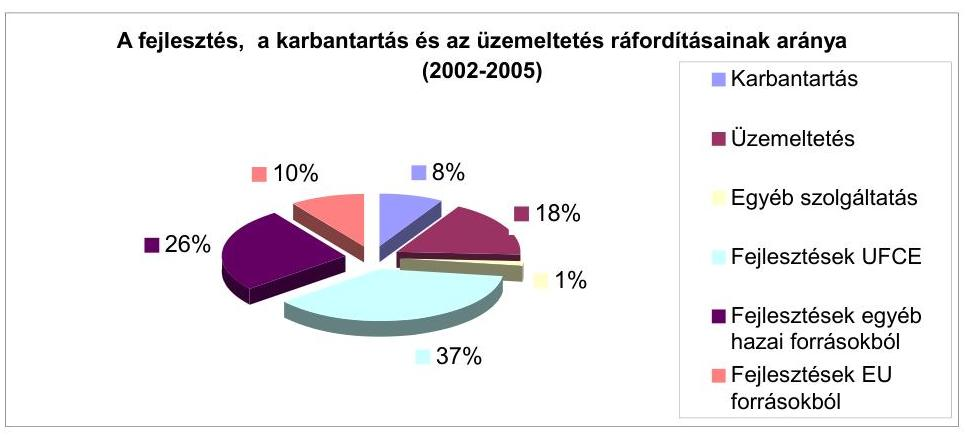

Az országos közúthálózat üzemeltetésére, fenntartására és fejlesztésére fordítható pénzforrások nagyságát nem a közutak fejlesztésének irányait kijelölő koncepciók, programok határozták meg - mivel ilyenek nem voltak - hanem az éves költségvetések szabta finanszírozási kényszerek. Az ÚFCE előirányzata a vizsgált időszak négy éve alatt összesen 295,9 milliárd Ft volt, összegét költségvetési alkuk és kormányzati döntések befolyásolták. Így, pl. 2004-re a költségvetési törvény csak 87,2 milliárd Ft-ot biztosított annak ellenére, hogy egy 2003-ban kiadott kormányhatározat 100 milliárd Ft támogatást írt elő. Ugyancsak 2004-ben kormányhatáskörben elrendelt közel 9 milliárd Ft zárolása miatt a kifizetések egy részének átütemezésére, illetve 11 projekt indításának elhalasztására kényszerültek.

A hazai forrásokon belül fejlesztésekre az ÚFCE-ból 155,2 milliárd Ft-ot fordítottak. Az ÚFCE mellett 1999-ben, ill. 2001-ben kiadott kormányhatározat alapján 2002-ben indult a 38 (főként elkerülő utak építését, illetve négysávosítást célzó) projektet magában foglaló és mintegy 144 km útszakaszt érintő Széchenyi Plusz Program. ${ }^{15}$ Finanszírozása 2002-ben a Magyar Fejlesztési Bank Rt. tulajdonosi hiteléből, majd 2003-tól költségvetési forrásból történt. A Felzárkóztatási Infrastruktúra Fejlesztési Alapprogram 14 milliárd Ft felhasználásával 7 útszakasz - főként elkerülő út építését, illetve rekonstrukcióját - finanszírozta. A projektek egy - a 10. sz. főút - kivételével elkészültek.

A nemzeti források mellett - hazai társfinanszírozással - EU forrásokból (Phare, ISPA, Környezetvédelmi és Infrastrukturális Operatív Program) elnyert 44 milliárd Ft támogatás segítette a közútfejlesztéseket. Az ISPA támogatás (74 millió EUR) esetében a két ütembe sorolt projekteknél a műszaki előkészítésben és a tenderdokumentációk elkészítésében tervezési hibák és hiányosságok következtében jelentkezett késedelem miatt az UKIG a Pénzügyi Megállapodás módosításának kérelmezésére kényszerült. ${ }^{16}$ Az I. ütem késedelme az útállapotok időközbeni romlása miatt - szakértői vélemények szerint - mintegy 11 millió EUR (kb. 3 milliárd Ft) a költségvetést terhelő többletköltséggel fog járni. A II. ütem késedelme miatt a tervezők felé bejelentett kötbér összege a vizsgálat idején nem volt ismert.

Az European Investment Bank ${ }^{17}$ és a PM 2003-ban 254 millió EUR (kb. 63,5 milliárd Ft) összegben közúti projekt finanszírozására kedvezményes kamatozású kölcsönegyezményt kötött. Ennek összegét a kormány nem közútfejlesztésre, hanem állami hitelek törlesztésére használta, úgy, hogy a PM 2003. végéig 119 millió EUR-t (250 Ft/EUR árfolyamon számolva közel 30 milliárd Ft-ot) lehívott. Ugyanakkor a projektek finanszírozását az ÚFCE-ra hárította, arra való hivatkozással, hogy a nemzetközi pénzügyi hitelek - állami hitelfelvétel esetén - a költségvetés refinanszírozását szolgálják. Az EIB továbbra is a projektek finanszírozására fordított kölcsönként kezeli a nyújtott hitelt és ennek megfelelően él a szerződésben rögzített beszámoltatási és ellenőrzési jogával.

A helyszíni ellenőrzés keretében kiválasztott 33 fejlesztési, felújítási projekt tapasztalatai, a célok teljesülésével, az építés illetve a felújítás minőségével kapcsolatos célszerűtlenségeket, hiányosságokat tárt fel. A projektek céljának és eredményességének összevetését segítő mutatókkal csak a KIOP keretében megvalósult fejlesztések rendelkeztek. Ezek nyomon követése a program végrehajtásának kötelező része. A Széchenyi Plusz Program fejlesztéseihez az NA Rt. hatástanulmányt készített, de az ebben rögzített forgalmi, baleseti mutatók nyomon követésére ellenőrzésünk nem talált dokumentumot. ${ }^{18}$ A kizárólag magyar forrásokból megvalósított fejlesztések tervezésénél - baleseti, forgalmi, környezeti - mutatókat alkalmaztak, de - előírás hiányában - ezek megvalósulását nem követték nyomon. Így a fejlesztések forgalomra, közlekedésbiztonságra gyakorolt hatásáról adat nem állt rendelkezésre.

Az ellenőrzött projektek dokumentumai szerint a munkák ütemezésére, a végrehajtás minőségére negatívan hatott a forráselosztások elhúzódása, mert a munkavégzés ütemezése csúszott, a közbeszerzési eljárások év közepén, vagy annál is későbbi időpontban történtek. ${ }^{19}$ Ezek következtében a munkálatok egy része a szakértők szerint kedvezőtlen - késő őszi, téli - időszakra esett. ${ }^{20}$ Előfordultak határidőn túli teljesítések, ezeket a megrendelőnek a kivitelezés közbeni pótlólagos igényeivel indokolták, amit a határidőre vonatkozó szerződésmódosítással legalizáltak.

Az ÚFCE-ból finanszírozott munkák ellenőrzése több szintű, a hazai források felhasználásának ellenőrzését az UKIG belső ellenőrzése látta el. Az EU források felhasználásának ellenőrzését 2003-ig az Ellenőrzési Főosztály keretében az EU Projekt Ellenőrzési Osztály, 2004 elejétől az 1 fővel létrehozott EU Projekt Ellenőrzési Osztály végezte. A létszám nem az ellátandó feladathoz igazodott, az UKIG belső ellenőrzése 2006-ban csak két fő volt, EU projektek ellenőrzését 1 fő látta el. Az UKIG-nál FEUVE rendszer működött, de az átalakuláskor a régi eljárási rendet, szabályzatokat nem aktualizálták. Az UKIG belső ellenőrzése a vizsgált időszakban a jogszabályoknak és a szakmai követelményeknek megfelelően működött. Az éves értékelő jelentések kitértek az ellenőrzések tapasztalataira, és a javaslatok alapján hozott intézkedési tervek végrehajtására.

A fejlesztési és útfenntartási munkák teljesítésénél a belső ellenőrzés a munka- és pénzügyi folyamatokra, és elszámolásokra terjedt ki, a fejlesztések műszaki átadás-átvétele során az elvégzett munka minőségének, szerződés szerinti teljesítésének ellenőrzését és igazolását 2005-ig a megyei kht-k, ezt követően Magyar Közúti Kht, illetve megyei igazgatóságai által megbízott külsős műszaki ellenőrök látták el. Ezek kiválasztása közbeszerzési eljárás keretében történt.

A műszaki átadás-átvételek gyakorlata, az utak hosszú távú minősége szempontjából kockázatos. A részletesen ellenőrzött útfelújítások, útépítések munkáinál, a kivitelezők - határidő előtt - készre jelentették a munkát, az átadás-átvételnél a vállalkozói díj néhány millió forintos csökkentése mellett az ellenőrök az útszakaszt átvették. Annak ellenére, hogy a szerződésben foglaltaktól való eltérés (például a kopóréteg nem megfelelő, vagy tűréshatáron belüli minősége, vagy az útpadka tömörsége) - az út élettartamát - a többszöri utólagos garanciális javítások ellenére - kedvezőtlenül befolyásolhatja. A garancia időn belül elvégzett javításokról nyilvántartás nincs, ezért az utólagos munkák összegszerű, illetve feladathoz mért aránya nem mutatható ki.

Az utak állapota, meghatározott fajtájú és mértékű állagmegóvó, vagy állapotjavító munkálatok végzését követeli meg, késleltetésük, illetve elmaradásuk esetén megnő a későbbi költségesebb beavatkozások szükségessége. A közutak

[^0]
[^0]:    ${ }^{19}$ A helyszíni vizsgálat idején (2006. május) a versenykiírás még nem jelent meg.
    ${ }^{20}$ A szakvélemények szerint a $+5 \mathrm{C}^{\mathrm{o}}$ fok alatti betonozás „pazarlás".

---

kezelését rendelet szabályozta, ennek melléklete - az Országos Közutak Kezelési Szabályzata - rögzítette a részletes nyilvántartási, ellenőrzési, tisztítási, üzemeltetési és fenntartási feladatokat, és végrehajtásuk határidejét. ${ }^{21}$

A gyorsforgalmi és más közutak építése kétségtelenül nagy lépést jelent az ország nemzetközi gazdasági integrációba való bekapcsolódása, a szomszédos országokkal a kapcsolatok erősítése, a vidék elérhetőségének javítása és a területi egyenetlenségek felszámolása terén. Ugyanakkor a közlekedési infrastruktúra ellentmondása, hogy - különösen 2004-től - az úthálózat állagmegóvására fordított pénz nominálisan igen, de reálértékben (figyelembe véve az inflációt is) nem nőtt. A nem gyorsforgalmi közutakra fordított kiadásokon belül a hazai és EU forrásokból végrehajtott fejlesztések 63%-os arányával szemben a karbantartások aránya mindössze 8% volt.
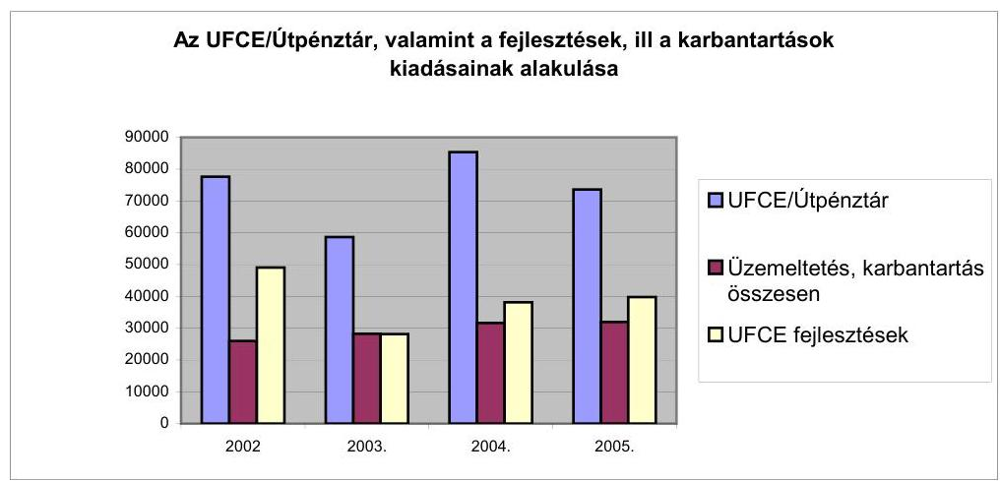

Az útállapotok folyamatos figyelésére kiépítették állami közutak állapotát nyomon követő OKA 2000 ${ }^{22}$ rendszert, amit célszerűen a szakterület teljes egésze használhat, ugyanis 2003-tól a 19 megyei közútkezelő kht.-nál, az ÁKMI Kht.-nál, az Állami Autópálya Kezelő Rt.-nél és az Alföldi Koncessziós Autópálya Rt.-nél is bevezették.

A karbantartási munkák döntési mechanizmusában - az OKA 2000 rendszer adataira alapozva - a technológiai beavatkozási sorrend meghatározásához és a leghatékonyabb forráselosztás segítéséhez szükséges informatikai eszközháttér, ún. burkolat-gazdálkodási rendszerek - ún. PMS-rendszerek - rendelkezésre álltak. ${ }^{23}$ Ezeket azonban csak korlátozottan, az informatikai lehetőségektől elmaradva vették igénybe. A források korlátozása

[^0]
[^0]:    ${ }^{21}$ Az OKKSZ minden évben a karbantartási feladatok tekintetében a közutakat közútkezelési szolgáltatási osztályokba (I-VII. osztály), emellett a munkavégzés színvonalát kategóriákba sorolta („A", „B", és „C" kategóriák). Az „A" szint a megadott feladatok teljes körű és maradéktalan végrehajtását jelentette, a „B" szint egy csökkentett mértékű és gyakoriságú végrehajtást, köztes állapotot határozott meg, a „C", mint legalacsonyabb kategória pedig a minimális színvonalon rendszeresen elvégzendő feladatokat írta elő.
    ${ }^{22}$ Országos Közúti Adatbank, az állami kezelésű úthálózat adatainak speciális térinformatikai rendszere

---
 miatt a lokális beavatkozások kerültek előtérbe, a projekt szemléletű rendszer használata háttérbe szorult, mert a rendszer egy bizonyos forrásszint alatt az adatokat nem tudta kezelni. Emiatt forráselosztást nem informatikai rendszerrel, hanem a legrosszabb útszakaszok megyénkénti hosszának %-os aránya alapján határozták meg. Nem volt lehetséges az egyes informatikai rendszerek (OKA, HDM-III) közötti adatátadás, ezt megoldották, de a HDM-III informatikai rendszer továbbfejlesztett változatának megyékhez történő telepítése elmaradt. Az üzemeltetési, fenntartási és karbantartási munkák gazdaságossága és az egységes árkialakítás érdekében, a megyei közútkezelő kht-k részére az UKIG az évente aktualizált költségbecslési segédleteket, normatív költségeket egy un. „Árkialakítási Útmutatóban" adta ki.

Az útfelújítások és a karbantartások esetében a vizsgált időszakban a jogszabályok által előírt kötelezettség, és az ehhez igazított igények, illetve a rendelkezésre álló források között feszültség jelentkezett, mert a Kormány nem biztosította a minisztérium által fontosnak tartott összegeket. Nem érvényesült az EU források belépéséből származó többlet forrás előnye, ugyanis a hazai forrásokból a karbantartásokra fordított összeg nem növekedett. Az UKIG a források célirányos elosztására törekedett, ugyanakkor a javításra váró útszakaszok fenntartási módjának megválasztásánál - annak ellenére, hogy több tanulmány, előterjesztés is felhívta a figyelmet az utak állapotának rosszabbodására - elsősorban nem szakmai, hanem pénzügyi szempontok érvényesültek. A legfontosabb szempont a jogszabályokban rögzített kötelezettségek, vagyis az országos közúthálózat működőképességének megőrzéséhez kötött - „C" szolgáltatási szint teljesítése volt, legalábbis a rendelkezésre álló költségvetési források erejéig. Ez azonban csak a legolcsóbb, tehát a legegyszerűbb megoldásokat, karbantartásokat tette lehetővé, erre ösztönözte a megyei kht-kat az UKIG is. Így a pillanatnyi - olcsóbb javításból fakadó - pénzügyi előny kapott prioritást, a későbbi többlet ráfordítások, illetve az adott útszakasz hosszú távú állapotának szempontja háttérbe szorult. A személyi sérüléses baleseteket a fenntartási munkák tervezésénél figyelmen kívül hagyták.

Az éves költségvetések végrehajtásának az ÚFCE felhasználásáról szóló szöveges indoklásai szerint a rendeletileg előírt „C" szolgáltatási kategóriának megfelelő színvonal a rendelkezésre álló források által biztosítva volt. Ennek ellentmondanak az országos adatok és két helyszíni vizsgálatra kiválasztott megyei kht. 2002-2005. közötti időszakra vonatkozó feladattervei, az ellenőrzés során fellelt dokumentumok - így a 2005. évi ÚFCE felhasználási javaslatáról szóló előterjesztés, valamint egy, a 2005-2006. évekre vonatkozó megyei felhasználási terv. ${ }^{24}$

Szakmai kalkulációk szerint a legalacsonyabb „C" kategória végrehajtásának forrásszükséglete évente minimálisan 35 milliárd Ft, vagyis négy év alatt 140 milliárd Ft lenne. Ezzel szemben - a 2004. évi relatíve kiemelkedő összeg ellenére - 127,3 milliárd Ft jutott erre a célra. Az országos közúthálózat jelentős mértékű állapotromlásának megállítását célzó, a Közlekedéstudományi Intézet Kht. által 2005. évben kidolgozott Nemzeti Útfelújítási Program csupán a mellékúthálózatnál mutatkozó sürgős beavatkozásokra évente mintegy 80 milliárd Ft-ot tartott szükségesnek. (Ezzel szemben az ÚFCE teljes előirányzata sem érte el - bár 2004-ben kissé meghaladta - ezt az összeget.) Egy mellékutakra vonatkozó tanulmány szerint folyamatos a burkolat-fenntartási ráfordítások hiánya, ezek halmozott értéke (2004. évi árszinten) legalább 400 milliárd Ft. Ugyanakkor a 2002-2005 közötti időszakban erre összesen 39 milliárd Ft jutott. A mellékutak mielőbbi kezelése ugyanakkor megkerülhetetlen feladat, ugyanis ezek kiépítetlensége, rossz állapota szükségszerűen - a felfelé ható mechanizmus következtében - a magasabb utakra tereli a forgalmat, túlterhelést okozva a felsőbb úthálózaton.

Az országos közúthálózat állapotát alapvetően befolyásolta, hogy háttérbe szorultak a forgalombiztonsági célú lokális beavatkozások, a burkolatok megerősítése és a hidak felújítása annak ellenére, hogy az I. rendű főutak forgalma 1995-től 2004. év végéig mintegy 23 %-kal nőtt. Útjaink általános állapota 50 %-ban közepes, további 30 %-ban pedig sürgős javításra szorul. Egyetlen mutatószám, a megfelelő teherbírású utak hossza nőtt 4 %-kal a gyorsforgalmi fejlesztések eredményeként, de még így is 50 % alatt marad (48%). Egyéb mutatók (állapotváltozás, egyenetlenség, felületépség) szerint az országos közúthálózat állapota folyamatosan romlott és (amennyiben az erre szánt forrásokat nem biztosítják) várhatóan romlani fog. Különösen szembetűnő ez nyomvályú képződés esetében, ahol a nem megfelelő minősítésű utak hossza 65 %-kal nőtt, a beavatkozási határnak tekintett (17 mm-nél mélyebb nyomvályú) utak hossza megduplázódott. A források szűkössége miatt elmaradt karbantartások következtében a beavatkozási hossz ${ }^{25}$ a tíz évvel korábbi, évi 2000 km-ről 2004-re 400 km-re csökkent. Ennek következtében az egyes utakra, útszakaszokra vetített beavatkozási ciklusidő a korábbi 20 év helyett legalább a kétszeresére növekedett.
${ }^{24}$ Az UKIG igazgatója 2005. áprilisában kelt, a közlekedési tárca vezetőjének írt a 2005. évi ÚFCE felhasználási javaslatában felhívja a figyelmet: hogy a „C" szolgáltatási kategória forrásszükséglete mintegy 35 milliárd Ft, ugyanakkor a megyei közútkezelő társaságok közhasznú szerződésének összege 27,5 milliárd Ft.

Egyik megyei Igazgatóság vezetője által 2006. elején a Magyar Közút Kht-nak megküldött éves előzetes felhasználási terve szerint a sokévi forráshiány miatt a karbantartási munkák elmaradásának következményeként az árkok, padkák, vízelvezető rendszerek rossz állapota miatt a tervezhető mennyiségek nem elégítik ki a „C" szolgáltatási szintet.
${ }^{25}$ Évente javított útszakasz hossza

A minőségi, garanciális és szavatossági érdekérvényesítések eljárási rendje nem volt szabályozott. A garanciális kötelezettségek teljesítését és ezzel kapcsolatban a bankgaranciák meglétét az UKIG 2005-től kezdte el figyelemmel kísérni. Ezt 2004-ig a közútkezelő kht-k végezték, de az ezekre vonatkozó feljegyzést, nyilvántartást nem tudtak bemutatni. Ennek következtében a minőségi hibák miatt bekövetkezett kár nagyságáról, sem annak következményeiről ellenőrzésünk információkat nem kapott, és nem volt nyoma a garanciális hibák elemzésének és a döntéshozatalhoz való visszacsatolásnak sem.

Az állami tulajdonú közutak vagyonkezelését és vagyonnyilvántartását 2004 előtt a megyei közútkezelő kht-k nem kezelték. E vagyonnyilvántartások a jogszabályi előírásokkal ellentétben nem tartalmazták a közutak értékét és annak változásait. Az autópályák és autóutak nélküli országos közúthálózat vagyonkezelője 2004-től az UKIG lett, a vagyonnyilvántartás 2005-re állt össze, azt a vagyonkezelő folyamatosan aktualizálja, vezetése szabályozott. A földingatlanok állami tulajdonjoga még nem teljes körűen rendezett, mert a nem állami tulajdonú földterületek esetében a bejegyzéseket megelőzően az államnak meg kell szereznie az ingatlan tulajdonjogát. Ez mintegy 100 millió Ft költséggel jár.

A működés informatikai háttere tekintetében nem egységes integrált vezetői információs rendszereket használtak, hanem - az UKIG-ban a szakmai főosztályok, az ÁKMI illetve a Magyar Közút Kht-nál a megyei szervezetek által kialakított zárt, „szigetrendszereket" üzemeltettek. Az adatkezelés papír alapon, adatbiztonság szempontjából kockázatos módon, az elemzések, információk előállítása időigényesen történt. Pozitív lépések 2005-ben, egy korszerű adatbáziskezelő integrált Vezetői Információs Rendszer és útvagyonnyilvántartási rendszer kialakításával kezdődtek. Az UKIG, és az ÁKMI (illetve Magyar Közút Kht.) közös informatikai hálózatot és közös hálózati szerverparkot használt, de ennek üzemeltetési, karbantartási feladataira 1998-ban kötött szolgáltatási szerződést a szervezeti változáskor nem aktualizálták. Az informatikai biztonsági intézkedések nem voltak megoldottak, a dokumentáltságuk hiányzott, azok betartásának rendszeres belső ellenőrzése elmaradt. Az informatikai háttér egységesítésében 2006-tól kezdődött egy megújulás, egy új - pénzügyi, számviteli, állóeszköz, készlet, munkaügyi és műszaki (szakma specifikus) - rendszert vezetnek be.

A korábbi ÁSZ javaslatok nem teljesültek teljes körűen. Elkészült az állami közutak értéken történő vagyonnyilvántartása, de a földingatlanok állami tulajdonjoga még nem teljes körűen rendezett. Az utak állapotáról és az ÚFCE felhasználásról rendszeres beszámolók készültek. A közútkezelés feladatait ellátó UKIG és a Magyar Közút Kht. feladatainak rögzítettsége, az átszervezések, illetve a belső szabályok átdolgozása ellenére pontatlanságok, hiányosságok, átfedések találhatók. A korábbi fejlesztések finanszírozását célzó ellenőrzéseink nyomán tett, a közúthálózat egységes, valamennyi elemét érintő fejlesztési koncepciók készítését célzó javaslatok technikailag hasznosultak annyiban, hogy a felelős miniszter ezek készítéséről intézkedett, a koncepció elkészült, végrehajtása döntően kormánydöntés és a források függvénye. ${ }^{26}$

A helyszíni ellenőrzés megállapításainak hasznosítása mellett javasoljuk:

# a Kormánynak 

1. kezdeményezze a közlekedési törvény módosítása keretében a közúthálózat mindenkori jó állapotának fenntartásához szükséges feltételek előírását;
2. építse be feladattervébe a közutak állapotát javító programok megvitatását és jóváhagyását, ütemezze ezek végrehajtását, és a szükséges forrásokat.

## a gazdasági és közlekedési miniszternek

1. biztosítsa egy, a környezet- és természetvédelmi, közlekedési, társadalmi, közösségi szempontból kiemelt érdeklődésre számottartó területen áthaladó út fejlesztése esetére létrehívható előkészítő bizottság jogszabályi hátterét;
2. intézkedjen, hogy az Útgazdálkodási és Koordinációs Igazgatóság SzMSz-e teljes körűen tartalmazza a jogszabályokban számára előírt feladatokat; gondoskodjon a Magyar Közút Kht. szervezetének további racionalizálása keretében a megyei tagozódású szervezetek regionális rendszerre történő átalakításának tervének előkészítéséről, és a pénzügyi forrásokra figyelemmel gondoskodjon ennek végrehajtásáról, valamint a kht. egészére vonatkozó funkciókat ellátó szervezeti egységek szervezeti rendjének célszerűségi, gazdaságossági szempontból történő egyszerűsítéséről;
3. intézkedjen a 10. sz. főút fejlesztésének előkészítésének felgyorsításáról, együttműködve az érintett szervezetekkel, önkormányzatokkal és társtárcákkal;
4. intézkedjen, hogy az Útgazdálkodási és Koordinációs Igazgatóság vezetője:
a) gondoskodjon a fejlesztéseknél mutatkozó késedelmek csökkentéséről, illetve megszüntetéséről;
b) rendelje el a munkák minőségcsökkenéssel történő átvételek mindenkori felülvizsgálatát, ezek csökkentése érdekében erősítse meg a kivitelezés közbeni minőségellenőrzést;
c) gondoskodjon a belső ellenőrzés megerősítése érdekében a feladatokhoz igazodó kapacitásról;
d) intézkedjen a hiányzó - kiemelten a karbantartások, garanciák érvényesítésének áttekintését biztosító - nyilvántartások elkészítéséről és folyamatos kezeléséről;
e) gondoskodjon a fenntartási munkák hatékonyság vizsgálati rendszerek teljes körű szervezeti telepítéséről és - lehetőségekhez képest - hasznosításáról.

# II. RÉSZLETES MEGÁLLAPÍTÁSOK 

## 1. Az állami közutak fejlesztésének és fenntartásának rendszer

### 1.1. Az állami közutak fejlesztésében és fenntartásában érintett szervezetrendszer

A 2002. évi kormányzati struktúra-átalakítás részeként a megszűnt Közlekedési és Vízügyi Minisztérium (KÖVIM) közlekedési feladatköre - a 2002. évi XI. törvény értelmében - a Gazdasági Minisztériumhoz került, így a tárca neve Gazdasági és Közlekedési Minisztériumra (GKM) változott.

A közlekedési feladatok átcsoportosítása - a törvényi pontatlanságokból eredően - magán viselte a kormányzati struktúra-átalakítás gyengeségeit.

A törvény kizárólag az átvevő minisztériumokat jelölte ki. A KÖVIM fejezet megszűnését csak a törvény indoklása mondta ki, a jogutódra a törvény szövegéből még következtetni sem
 lehetett.

A KÖVIM igazgatás 2002. évi eredeti előirányzatát a 2362/2002. (XII. 5.) Korm. határozat értelmében csoportosították át a GKM fejezethez. Határidők és központi koordináció hiányában a minisztériumok közötti „alku”-ra bízott átadás-vételek elhúzódtak.

A GKM felelősségi körébe került többek között a mintegy 30.500 km országos közúthálózat kezelése, fenntartása, fejlesztése a feladatot ellátó intézményrendszerrel együtt.

Az országos közúthálózattal kapcsolatos feladatok irányításáért felelős szervezetrendszer - főbb elemeiben a KÖVIM-től „örökölt” formában - működött tovább 2002. évtől a szervezet 2005. májusában kezdődött és jelenleg is folyamatban lévő átalakításáig.

A különböző úttípusok fejlesztési, építési, üzemeltetési és fenntartási feladatait több háttérintézmény végezte (végzi) a feladat jellege, valamint a területiség elvei szerinti feladatmegosztással.

Az országos közúthálózattal kapcsolatos állami alapfeladatok szakmai irányításáért a gazdasági és közlekedési miniszter, illetve a minisztérium szervezetén belül a közlekedési helyettes államtitkár irányításával a Közúti Közlekedési Főosztály lett a felelős.

Középirányító szervként - az autópályák kivételével - az Útgazdálkodási és Koordinációs Igazgatóság (UKIG) látta el 2002-2005-ig a különböző szakterületek közötti koordinációt, az Útfenntartási és Fejlesztési Célelőirányzat (ÚFCE) központi

---

működtetését, a beruházások állami megrendelői tevékenységét, valamint az úthálózat fejlesztések hosszú távú előkészítését.

Az UKIG-gal szoros együttműködésben, az Állami Közúti Műszaki és Információs Közhasznú Társaság (ÁKMI Kht.) többek között a közúti információk, a műszaki szabályozás, a minőségellenőrzés és az útvonal engedélyezés központi feladataival foglalkozott.

A területi szintű feladatokat a 19 megyei közútkezelő közhasznú társaság látta el, a hozzájuk tartozó 85 üzemmérnökséggel együtt.

A Kormány által meghatározott gyorsforgalmi úthálózat fejlesztése a Nemzeti Autópálya Rt (NA Rt) alapvető feladatát képezi, amelyhez a pénzügyi hátteret 2000-2002. között az MFB Rt., 2003-tól a GKM fejezeti költségvetés, valamint az azt kiegészítő források (hitel, EU támogatás) biztosították.

Az autópályák és autóutak üzemeltetése és fenntartása - 2006-tól részben a fejlesztések finanszírozása is - az Állami Autópálya Kezelő Rt. (ÁAK Rt.) tevékenységi körébe tartozik.

Nemzetközi kitekintés alapján az európai országok eltérő modelleket alkalmaznak az útfejlesztés és üzemeltetés menedzselésére, egységes gyakorlat nem alakult ki. Az EU irányelvei nem szabályozzák az autópálya és közútüzemeltetési és irányítási szervezet modelljét, nem határoznak meg irányelveket a szervezeti megoldásokhoz.

Az európai országokban többnyire egységes az átfogó minisztériumi szintű szakmai irányítás. A nagyobb úthálózattal rendelkező országokban jellemző a közúti úthálózattal kapcsolatos feladatok megyei, tartományi szintű felosztása, a decentralizáció. Az autópályákkal kapcsolatos feladatokat viszont jellemzően egy központi szervezet (minisztérium vagy minisztériumi felügyelet alá tartozó igazgatóság) irányítja.

Az autópálya építés szinte minden országban piaci alapokon történik a megfelelő útadminisztrációs szervezetek szakmai irányítása mellett. Az utakkal kapcsolatos tervezési és kivitelezési feladatok a legtöbb esetben elkülönülnek a közúti munkák kivitelezési, üzemeltetési feladataitól.

Az országos közúthálózat intézményrendszerét átfedések, párhuzamosságok jellemezték, hiányzott a feladatok és a felelősségi körök egyértelmű meghatározása, a feladatokat esetenként nem a rendszer megfelelő szintjein végezték.

A megyei közútkezelő kht-ék koordinálási-ellenőrzési feladatai az UKIG és az ÁKMI Kht. között nem különültek el egyértelműen. A megrendelői és a szolgáltatói szerepek összemosódtak, szétválasztásukra csak 2004. január 1-től intézkedtek.

A hatósági feladatok megoszlottak az ÁKMI Kht. és a Közlekedési Főfelügyelet között (pl. a túlméretes és túlterhelt járművek közlekedéséhez szükséges útvonal engedélyezés).

A közúti szervezetet érintő, 2005. év elejétől felgyorsuló változások a megbízott tanácsadó cég által készített, elsődlegesen az útadminisztráció témakörére irányuló tanulmánnyal vették kezdetüket. Az Európai Unióra, illetve az

---

OECD tagországaira is kiterjedő átvilágítás eredményeként a szervezeti változásoknál a központosításon alapuló svéd modellt preferálták.

A miniszter 2005. május 31-én kelt alapítói határozatával az állami közutak fejlesztését és fenntartását ellátó szervezet átalakítási szándékáról meghozta az úgynevezett első tulajdonosi döntést. A Kormány részére 2005. júniusában készített „Előterjesztés az ÁKMI Kht. átalakulásáról” vetette fel a 19 megyei közútkezelő kht. beolvadását javasolták az ÁKMI Kht-ba.

A korábban az ÁKMI Kht-tól eltérő, homogén közútkezelői tevékenységet ellátó, közel azonos adminisztrációjú 19 megyei kht. az Állami Közúti Műszaki és Információs Kht. átalakulásáról szóló 1069/2005. (VII. 8.) Korm. határozat alapján az ÁKMI Kht-be olvadt be. A társaságok (megyei + ÁKMI Kht.) jogutódjaként az ÁKMI Kht. működött tovább, Magyar Közút Állami Közútkezelő, Fejlesztő, Műszaki és Információs Kht. (Magyar Közút Kht.) néven, a GKM alapításában.

A szervezeti változtatásokra, korszerűsítésekre irányuló szándék indokoltságának elismerése mellett a szervezet átalakítás megalapozottsága, alátámasztottsága néhány ponton kívánnivalót hagy maga után:

- A döntéshozókhoz eljuttatott, a közigazgatási eljárási rend szerinti egyeztetési folyamatot megjárt, a Kormány részére 2005. júniusában készített Előterjesztést megalapozó számítások, háttéranyagok nem egészítették ki. Az átszervezéssel elérhető, összevontan megjelenő megtakarítási tételeket kizárólag a létszám-megtakarítással összefüggő, néhány oldalas becslések támasztották alá. Az átszervezés többletköltségeit teljes körűen, számításokkal alátámasztottan ugyancsak nem mérték fel.
- Az átszervezést megelőzően a rendszerben található intézményeknél nem világították át komplex módon a feladatköröket és a folyamatokat a párhuzamosságok, valamint a rendszeridegen feladatok kiszűrése érdekében. A szervezetenkénti működést és a feladatokat előzetesen nem határozták meg egyértelműen.
- A megyei közútkezelő kht-k központosítása nem mutat összhangot a Kormány régióalakítási elképzeléseivel. A közigazgatási egyeztetés során a MEH Kormányiroda jelezte is ezzel kapcsolatos ellentétes álláspontját. A minisztériumi vélemény, miszerint a valós régiók megalakulása után a szervezetet az új feltételekhez lehet igazítani, többletköltséget von maga után.

Az előkészítettség hiányosságára utal a rendelet pár hónapon belüli - 12/2006. (III. 14.) GKM rendelet -, alapvetően az Útpénztár forrásait és működtetését érintő módosítása.

A 2005. év végi szervezetváltozással együtt járó feladatelosztás, valamint az Útpénztár rendeletből eredő, különböző típusú szerződéskötések (vállalkozási, támogatási, bizományosi stb.) meglehetősen bonyolult rendszere a rendelet hatályba lépése óta eltelt idő rövidsége miatt helyszíni vizsgálatunk idején még nem volt teljes körűen értékelhető.

---

Az átszervezések hatásaként megcélzott - 2005. évre 300 millió-, illetve 2006. évre 3 milliárd forintos - „azonnali fix költségmegtakarítás”, a részben folyamatban lévő létszámleépítések (2005. évben 800 fő, 2006. júniusáig 300 fő) elhúzódó hatásával összefüggésben még nem volt mérhető. Az átszervezés többletkiadásaira előirányzott 60 millió forintos összegből (könyvvizsgálói díj 40 millió, jogi tanácsadói díj 20 millió forint) töredék realizálódott.

Az új szervezeti modell az Útpénztár fejezeti kezelésű előirányzat felhasználásának szabályozásáról, valamint az országos közúthálózattal összefüggő feladatok ellátásáról szóló 122/2005. (XII. 28.) GKM rendelet késve megjelenő végrehajtási utasításával (10/2006. (V. 16.)) összefüggésben, sok bizonytalansággal működött. Az egyes intézmények létszámkeretei még vizsgálatunk idején sem alakultak ki véglegesen.

A szervezeti változások nyomán az UKIG-nál és a Magyar Közút Kht-nál egyaránt túltagolt szervezet alakult ki, amelynek racionalizálása vizsgálatunk idején is folyamatban volt. Pl. a Magyar Közút Kht. 2006. februárjában kialakított szervezeti rendje április 26-ával ismét változott. A változások ellenére mindkét szervezet tagolt és magas vezetői létszámmal működik.

Az UKIG-on belül 4 igazgatói besorolású vezető, 8 főosztályvezető, 6 főosztályvezetői besorolású önálló osztály-, illetve irodavezető és 15 osztályvezető, 4 osztályvezetői besorolású egyéb vezető volt. Az egy vezetőre jutó érdemi munkatársak száma átlagosan 2-7 fő, de az 1-2 fős főosztályok sem kivételek (Pl.: Ellenőrzési Főosztály 2 fő, EU Project Ellenőrzési Osztály 1 fő).

A Magyar Közút Kht-nál 2006. áprilisáig az ügyvezetőnek alárendelve divízióvezetők irányították az igazgatóságok tevékenységét. A szervezet tagoltságát példázta a műszaki divízió alá tartozó 2 főosztály, valamint 4 igazgatóság, ez utóbbinál a 4 szervezeti egységből álló Információs Igazgatóság, közte az Útügyi Információs Főosztály (UTINFORM), amelynek a pandantja az UKIG szervezetében is megtalálható.

A 2006. áprilisi szervezetváltozást követően a Magyar Közút Kht. továbbra is célszerűtlen és gazdaságtalan szervezeti keretek között működött. Indokolatlanul magas az igazgatói posztok száma, a funkcionális feladatokat (irányítási, igazgatási) 6 igazgató látja el. Például az Informatikai, a Jogi, a Szervezetfejlesztési és a Kommunikációs Igazgatóság összesen 4 igazgatóval és 26 fővel dolgozik, vagyis egy igazgatóra átlagosan közel 4 fő jut. Véleményünk szerint célszerű lenne ezeket a szakterületeket egy igazgatóságba integrálni. Az igazgatóságok közül kettő szervezeti egységek nélkül működik, a Kommunikációs Igazgatóság 6 fővel, a Szervezetfejlesztési Igazgatóság 3 fővel dolgozik.

A feladatok, folyamatok komplex áttekintését nélkülöző, „egymásba érő” szervezeti változások következtében értékelhető, viszonylag stabil állapot még hónapokban mérhetően sem alakult ki. ${ }^{27}$

[^0]
[^0]:    ${ }^{27}$ A Magyar Közút Kht. 2006. évi üzleti terve szerint a Kht. 2006. évi legfontosabb célkitűzése az állami feladatok maradéktalan végrehajtása mellett az előző évben létrehozott társaság felépítése, folyamatainak, tevékenységeinek hatékony megszervezése, a szervezet racionalizálása, a jogszabályi „profiltisztítás” végrehajtása, a folyamat és szervezet átvilágítása.

---

A Magyar Közút Kht. Szervezeti és Működési Rendje a 2006. februárjában jóváhagyott SzMSz-hez képest 2006. április 26-ával ismét változott. A nemzetközi kapcsolatokkal összefüggő feladatok, a műszaki-szabályozási, valamint a fejlesztési tevékenységek kikerültek a Magyar Közút Kht. feladatköréből. Az UKIG feladatköre 2006. évben - a felügyeleti intézkedésekkel ${ }^{28}$, valamint az EU projectek számának növekedésével összefüggésben - ugyancsak módosult. Az UKIG-hoz került a műszaki szabályozás, a gyorsforgalmi úthálózattal kapcsolatos fejlesztési feladatok koordinálása, az NA Zrt. működési költségeinek biztosítása, a pénzeszközök felhasználásának ellenőrzése, a gyorsforgalmi közúthálózaton érvényesülő díjpolitika kialakítása, az úthasználati díj és pótdíj beszedése, a koncessziós utak monitoring, reporting tevékenysége.

A Magyar Közút Kht. 2006. áprilisától hatályos SzMSz-ében az egyes feladatokat nem célszerűen összevontan, nem pontosan körülhatárolva és/vagy átfedésekkel rögzítették. Így például a közbeszerzési feladatok egyrészt az önálló Közbeszerzési Osztály, másrészt szinte valamennyi szervezeti egység feladataiban megjelennek. Az SzMSz a Beszerzési Osztály feladataként jelöli meg többek között a Társaság közbeszerzésekkel kapcsolatos adatszolgáltatási kötelezettségeinek teljesítését, a közbeszerzési eljárások adatainak nyilvántartását, a nyilvántartó program üzemeltetését, de nem egyértelmű, hogy ez vonatkoztatható-e a közútkezeléssel kapcsolatos beszerzésekre is. A célszerűség azt kívánná, hogy az egyes szervezeti egységek maguk végezzék a saját területük közbeszerzési tevékenységét, az ezzel kapcsolatos tanácsadás, a hirdetmények ellenőrzése, az eljárások nyomon követése, az összegző nyilvántartás vezetése, az adatszolgáltatás stb. viszont a Közbeszerzési Osztály feladatát kellene képezze. Ez utóbbi szervezet azonban nem rendelkezik a tevékenység átfogó koordinálásához, felügyeletéhez szükséges jogkörökkel.

Az SzMSz a Gazdasági Igazgatóság Tervezési és Kontrolling Osztálya feladataként jelöli meg a közbeszerzési tervjavaslat összeállítását, a közbeszerzési tervjavaslat pénzügyi adatainak az üzleti tervvel összhangban történő ellenőrzését, valamint a közbeszerzési terv végrehajtásának gazdasági szempontból történő ellenőrzését, de nem nevesíti, hogy a terv milyen beszerzésekre vonatkozik.

A Jogi Igazgatóság alatt tevékenykedő 4 fős Közbeszerzési Osztály feladata többek között „... közreműködés a közbeszerzési tervjavaslat elkészítésében, a közbeszerzési terv végrehajtásának közbeszerzési jogi szempontból történő ellenőrzése.”

A Gazdasági Igazgatóság alatt tevékenykedő 3 fős Beszerzési Osztály feladatai között is szerepel a társaság közbeszerzési tervének előkészítése, nyilvántartása, a közbeszerzési terv megvalósulásának folyamatos figyelemmel kísérése, de nem konkretizálja, hogy ez milyen beszerzésekre vonatkozik. Eszerint ez az osztály vezetné nem csupán csak az eszköz ellátás közbeszerzését, hanem valamennyi, így a közutak üzemeltetésével, karbantartásával kapcsolatos fentebb felsorolt közbeszerzési feladatokat.

A Gazdasági Igazgatósághoz tartozó 2 fős Eszközgazdálkodási Osztály az
 SzMSz szerint ugyancsak „közreműködik a közbeszerzési eljárásokban”, de nem rögzíti, hogy milyen beszerzésekre vonatkozóan.

[^0]
[^0]:    ${ }^{28}$ A 122/2005.(XII. 28.) GKM rendelet és az azt módosító 12/2006.(III. 14.) GKM rendelet.

---

A közbeszerzésen túl más, például a beszerzési, stratégiai tervezéshez kapcsolódó feladatok több helyen is átfednek, illetve nem pontosan körülhatároltak.

Az Eszközgazdálkodási Osztály többek között ellátja „a Társaság tulajdonában, használatában lévő eszközök nyilvántartását, leltározását, selejtezését”. Ugyanez megjelenik a Beszerzési Osztálynál is: „a felesleges, vagy elavult eszközök, berendezések hasznosításának megnevezése, értékesítése, vagy selejtezése” feladat formájában.

A stratégiai tervezéssel kapcsolatban a Szervezetfejlesztési Igazgatóság feladata „a társasági stratégiai terv elkészítésének irányítása, koordinációja”. A Gazdasági Igazgatóság és ezen belül a Pénzügyi és Számviteli Főosztály feladatai között is szerepel „a Társaság stratégiai, közép-, rövid távú alapterveinek kidolgozása”. Nem kellően világos a szorosan összefüggő feladatok megosztása, mely szerint a társaság stratégiájának elkészítése a Szervezetfejlesztési Igazgatóság, a középtávú és éves tervek a Tervezési és Kontrollig Osztály feladatát képezik. Ugyancsak nem derül ki, hogy milyen stratégiát készít a Szervezetfejlesztési Igazgatóság, ugyanis a közutak üzemeltetéséhez, vagy állapotának javításához kapcsolódó hosszú távú célok kitűzése, stratégiák, programok készítése vélhetően nem ennek az osztálynak a feladata.

A nemzetközi kapcsolatok ellátása sem rendeződött a szervezeti átalakítást követően, annak ellenére, hogy ezt az Útpénztár fejezeti kezelésű előirányzat felhasználásának szabályozásáról, valamint az országos közúthálózattal összefüggő feladatok ellátásáról szóló 122/2005. (XII. 28.) GKM rendelet az UKIG feladatává tette.

A rendelkezés ellenére a Magyar Közút Kht. 2006. februárjában jóváhagyott SzMSz-e szerint a Nemzetközi Főosztály feladata volt a két- vagy többoldalú útügyi egyezmények magyar vonatkozású feladatainak figyelemmel kísérése, szükség esetén javaslattétel a képviselendő magyar álláspontokra, a különféle nemzetközi szervezetekben működő munka figyelemmel kísérése, és javaslat előkészítése az esetleges magyar csatlakozás lehetőségeire. E feladat 2006. áprilisában kikerült az SzMSz-ből.

Az UKIG SzMSz-e több ponton általánosságban fogalmaz, az egyes apparátusokhoz konkrét tevékenységet nem rendel (pl. a Kontrolling Osztály feladatait az alábbiak szerint fogalmazza meg: átfogó vezetői információs rendszer kidolgozása, gazdasági tervezés kidolgozása, ágazati statisztika, beruházási statisztika és egyéb szükséges adatszolgáltatások elkészítése). Az SzMSz szerint az egyes szervezeti egységek tevékenységében átfedések, párhuzamosságok mutatkoznak. Mindezek következtében a 2006. januárjában jóváhagyott SzMSz-e további aktualizálásra, pontosításra szorul.

Az UKIG Kommunikáció, PR, Nemzetközi Kapcsolatok Iroda SzMSz szerinti feladatai konkrét nemzetközi kapcsolattartásra vonatkozó tevékenységet nem tartalmaznak.

A Humánpolitika és Munkaügyi Osztály integrált szervezetéből a humánpolitikai feladatok az SzMSz szerint az igazgató kizárólagos jogosítványai közé tartoznak, a gyakorlatban - a szervezeti struktúrából adódóan - nem érvényesül a közvetlen irányítás.

---

Az Ellenőrzési és Monitoring Irodánál, a Kontrolling Osztálynál felsorolt, általánosságban megfogalmazott monitoring feladatok adott esetben átfedhetnek (pl.: a Kontrolling Osztálynál „monitorozási és elemzési tevékenységgel támogatja a döntés-előkészítési folyamatokat és a költségvetések elkészítését”, az Ellenőrzési és Monitoring Irodánál „az igazgatóság vezetője által kijelölt folyamatok teljesítésének meghatározott indikátorok alapján monitoring rendszerben történő figyelemmel kísérése, időszakos és éves monitoring jelentés készítése”).

Az Ellenőrzési Nyomvonal - a folyamatok kialakulatlanságával összefüggésben - a jogszabályi előírásoktól eltérően vizsgálatunk idején még nem képezte az SzMSz mellékletét.

# 1.2. A minisztérium irányító és koordináló tevékenysége 

A más tárcákkal, illetve azok szervezeteivel való együttműködésnek két szintje volt a vizsgált időszakban. Az egyik a vizsgálat során áttekintett területre vonatkozó országgyűlési határozatokhoz, kormányhatározatokhoz, kormányrendeletekhez, illetve kormány előterjesztésekhez kapcsolódó kötelező államigazgatási egyeztetések. A más tárcákkal, illetve azok szervezeteivel való együttműködés a közutakhoz kapcsolódó tevékenységek végrehajtásához kapcsolódott. Ennek kereteit a különböző szintű jogszabályok írták elő.

Ezek a rendeletek a közúti közlekedésről szóló 1988. évi I. törvény, a területfejlesztésről és a területrendezésről szóló 1996. évi XXI. törvény, a kulturális örökség védelméről szóló 2001. évi LXIV. törvény, a környezet védelmének általános szabályairól szóló 1995. évi LIII. törvény, a közutak igazgatásáról szóló, többször módosított 19/1994 (V. 31.) KHVM rendelet, az országos közutak kezelésének szabályairól szóló többször módosított 6/1998. (III. 11.) KHVM rendelet, az utak építésének és forgalomba helyezésének és megszüntetésének engedélyezéséről szóló, többször módosított 15/2000. (XI. 16.) KöViM rendelet.

A vizsgált időszakban a közlekedési alágazatok együttműködését a minisztériumi SZMSZ-ben rögzített rendszeres egyeztetések (vezetői értekezletek, minisztériumi szakmai kollégiumok) hivatottak biztosítani.

A fejlesztési fenntartási feladatok beszámolásának keretében a minisztérium Közúti Közlekedési Főosztálya féléves gyakorisággal készített tájékoztatót, ezen belül az ÚFCE-ból finanszírozandó munkák állásáról, valamint szakmai összeállításokat és programokat a meglévő úthálózat megóvására és felújítására vonatkozóan.

A beszámolási kötelezettség keretében az Útfenntartási és Fejlesztési Célelőirányzat felhasználásáról az UKIG készített jelentést. Ezenkívül a minisztérium féléves gyakorisággal Tájékoztatót készített az ÚFCE-ból finanszírozandó munkák állásáról, valamint szakmai összeállításokat és programokat a meglévő úthálózat megóvására és felújítására vonatkozóan.

A vizsgált időszakot megelőző évben az UKIG még a Közlekedési és Vízügyi Minisztérium szervezeteként „Útgazdálkodás 2001.” címmel adott ki beszámolót. Ez taglalta az országos közúthálózat helyzetét, a közutak finanszírozását, a célelőirányzat 2000. évi pénzforgalmát, a feladatok végrehajtását, valamint a 2001. évi célkitűzéseket. A tájékoztató készítése 2002-től, amikor a közlekedési

---

tárca GKM fejezetbe került, megszakadt. Ugyan jogszabályi rendelkezés nem kötelezte a minisztériumot annak elkészítésére, de hasznos információtartalma miatt visszamenőleg megírták, és azok a helyszíni vizsgálat idején (2006-ban) nyomdában voltak.

Az országos közáthálózat aktuális állapotáról Állami Közúti Műszaki és Információs Közhasznú Társaság (ÁKMI), évente készített értékelést, az Országos Közúti Adatbankban (OKA) tárolt adatok felhasználásával. Ezzel alapozta meg az éves és hosszabb távú fenntartási és fejlesztési tervek előkészítését és a beavatkozások indoklását. Összefoglalta a teljes közúthálózat főbb forgalmi, baleseti jellemzőit, a hidak állapotát, a burkolatok állapotának és teherbírásának gépi mérések szerinti, valamint az adattári mérnökök által végzett éves állapotfelvétel alapján kialakított minőségi-megfelelőségi szubjektív értékeléseit. A feladatot jogutódja, a 2005. szeptember 30-án a 19 megyei kht. és az ÁKMI összevonásával létrehozott Magyar Közút Állami Közútkezelő, Fejlesztő, Műszaki és Információs Közhasznú Társaság (továbbiakban: Magyar Közút Kht.) és területi igazgatóságai hajtották végre.

# 1.3. A célelőirányzat mértékének alakulása 

Az ÚFCE éves tervezésénél figyelembe vették a jogszabályokkal determinált, valamint a korábbi kormányhatározatokkal és kormánydöntésekkel kapcsolatos szakmai feladatok ellátásának szükségleteit. A Kormány által jóváhagyott pénzügyi források a vizsgált években a minisztérium és intézményei részére, az országos közúthálózat fejlesztésével, fenntartásával és üzemeltetésével összefüggésben meghatározott feladatok végrehajtásának forrásszükségletét nem fedezték.

A 2003. évi Útfenntartási és Fejlesztési Célelőirányzat (továbbiakban ÚFCE) PM által javasolt támogatási kerete a 2002. évi bázis előirányzatot sem érte el. A tárca álláspontja szerint a PM nem vette figyelembe az infláció hatását, illetve a célelőirányzatot terhelő, 2002. évről áthúzódó kötelezettségeket. A minisztérium 2003. évben az ÚFCE-ra vonatkozóan - a költségvetési törvényben meghatározott 55700 M Ft-os előirányzathoz képest - 28500 M Ft többletigényt tartott indokoltnak.

Az ÚFCE 2003. és 2004. évben egyaránt alacsony szinten történő meghatározása 2004. és 2005-2006. évekre történő kifizetési átütemezéseket tett szükségessé. Például a 2004. évben elkészülő munkák 2005. évre áthúzódó kifizetéseinek összege 18000 M Ft volt.

Az ÚFCE költségvetési törvényben meghatározott, eredeti bevételi és kiadási főösszegét 2002. és 2003. években a tárgyévi tényszámok meghaladták.

A 2002. évi eredetileg elfogadott költségvetési előirányzat 72400 M Ft-ról 77619,4 M Ft-ra, 2003. évben 55700 M Ft-ról 58 642,4 M Ft-ra változott.

A célelőirányzat bevételei a 2004. évre eredetileg előirányzott mértéket részben a költségvetési támogatás, részben a központosított bevételek elmaradásából adódóan nem érték el.

---

A 2004. évre megállapított 87182,8 M Ft-os eredeti előirányzat a tárgyévben 85 439,3 M Ft-os bevételi főösszeggel teljesült. A központosított bevételek közül a külföldi gépjárműadó 1927,6 M Ft-os bevételkiesése volt a legjelentősebb.

A 2004. évi, az összes közútkezelő kht-ra kiterjedő, az Útalapot és az ÚFCE-t megillető bevételek alakulásáról és nyilvántartásáról szóló minisztériumi belső ellenőrzés kritikus megállapításokat tett az elszámoltatási rendszer nem egységes voltára, az AKMI Kht. nyilvántartásában tapasztalható eltérésekre a kiadott engedélyek és a befolyó pénz vonatkozásában, valamint arra, hogy az ÚFCE kezelő szervezet nem tudja kontrollálni a célelőirányzatot jogosan megillető bevételek nagyságát. Az intézkedések során a hiányosságokat felszámolták.

A 2005. évi ÚFCE előirányzat alakulására egyrészt a - többletbevételek és kiadási maradvány eredményeként - képződött pénzmaradvány, másrészt a 2004. évi CXXXV. törvény 51. § (1) bekezdésében előírt, ÚFCE-t terhelő $\mathbf{10\%}$-os tartalékképzési kötelezettség gyakoroltak hatást.

A célelőirányzat 2005. évi bevétele az eredeti 80 325,7 M Ft-os előirányzathoz képest a $73647,4 \mathrm{M}$ Ft-ra módosított és a 2004. évi $77,9 \mathrm{M}$ Ft pénzmaradvány együttes $73725,4 \mathrm{M}$ Ft-os összegétől 10,8 M Ft többlettel, 73 736,2 M Ft-tal zárt.

A 2005. december 31-ével megszűnt ÚFCE helyébe 2006. január 1-től, kibővült feladatkörrel az Útpénztár előirányzat lépett. A 2006. évi átcsoportosítási javaslatot az indokolta, hogy a törvény előkészítése során az előirányzat felhasználásáért felelős minisztérium hatáskörébe tartozó gyorsforgalmi hálózati elemekkel kapcsolatos kezelői tevékenységeket nem a működési kiadások tartalmazták.

Az Útpénztár 2006. évi előirányzat keretszámának meghatározását az előző évek döntései és alulfinanszírozott lehetőségei befolyásolták. A tervezési és felhasználási prioritások, valamint a feladatok származtatott költsége alapján az UKIG által eredetileg előirányozott 159300 M Ft-os keretszámmal szemben a 2006. évi költségvetési törvény (2005. évi CLIII. tv.) az Útpénztár 2006. évi előirányzataként 91 789,8 M Ft-ot határozott meg, melyből a korábbi ÚFCE 75700 M Ft-ot tett ki.

A minisztérium az UKIG-gal folytatott sorozatos egyeztetések során az intézmény által előirányzott 159300 M Ft-hoz, illetve szakmai minimumként kezelt 138000 M Ft-hoz képest - az államháztartás egyensúlya érdekében megjelölt pénzügyi korlátokra tekintettel - először 75000 M Ft-ban, majd 60700 M Ft-ban határozta meg az ÚFCE tervezési értékét.

Az UKIG a közlekedési helyettes államtitkár részére összeállított, az elvárt feladatoknak megfelelő mértékű előirányzat szakmai hátterét bemutató előterjesztésében felhívta a figyelmet a megkötött vállalkozói szerződések kifizetésének 60700 M Ft-os tervezési értéken meghatározott ÚFCE esetén bekövetkező ellehetetlenülésére.

---

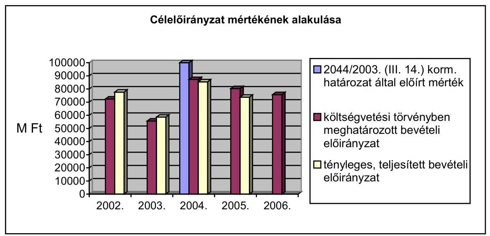

A költségvetési törvényben megjelenő ÚFCE, illetve Útpénztár fejezeti kezelésű előirányzatra vonatkozó működési és felhalmozási kiadási sorok között a törvényi keretszámokhoz képest minden évben átcsoportosítást hajtottak végre.

A bevételi és kiadási előirányzatok módosítására irányuló előterjesztésekben az átcsoportosítás szükségességének indokai között elsősorban bevétel növekedés, illetve év közbeni többletköltségek felmerülése, rendkívüli üzemeltetési feladatok költségfedezetének biztosítása, vezetői döntéssel elrendelt támogatási előirányzat-csökkenés, illetve növekedés, kormányhatározatban rögzített takarékossági intézkedések végrehajtása, kiadási előirányzat zárolás, tartalékképzési kötelezettség szerepelt.

A Miniszterelnöki Hivatal Turisztikai Célelőirányzatából 2003. május hónapban 350 M Ft került átcsoportosításra az ÚFCE turisztikai kerékpárút-pályázatának forrásbővítésére. A Magyar Köztársaság 2001. és 2002. évi költségvetésének 2002. évi végrehajtásáról szóló 2003. évi XCV. törvény a 2003. év eleji rendkívüli időjárás okozta téli védekezésre 1400 M Ft támogatást biztosított.

A 2005. évi módosított előirányzatok kialakításánál figyelembe vették a 2050/2004. (III. 11.) és a 2083/2004. (IV. 15.) Korm. határozat által elrendelt előirányzat zárolást, az M5-ös autópálya rendelkezésre állási díj fedezeteként, fejezeten belüli előirányzat átcsoportosítással biztosított
 5 733,6 M Ft összeggel, valamint a 2018/2004. (VIII. 30.) Korm. határozattal feloldott zárolás 9 797,4 M Ft összegével és a saját bevételek tervezett összegének túlteljesítésével.

A determinációk, vagyis a következő évek költségvetésének terhére keletkezett kötelezettségek jelentős mértékben szűkítették a feladatellátás mozgásterét. Az előirányzat-tervezés során jelentős kalkulációs tényezőként kellett figyelembe venni a következő évi szerződött vagy szerződésnek tekinthető kötelezettségek mértékét. Mindez azt jelentette, hogy a felújítási munkák ellátása 2003. évtől kezdődően a következő évek terhére volt megvalósítható.

A következő évekre átnyúló kötelezettségek összege az éves költségvetési törvények által előírt, a kiadási előirányzat 40%-ának megfelelő mértéket, majd 2003. évtől a 70%-os mértéket, valamint az államháztartásról szóló

---

1992. évi XXXVIII. törvény 12/A § (1) bekezdésében megengedett mértéket nem haladta meg.

A többek között út- és hídrekonstrukció, új út- és hídépítés, út- és hídfelújítás tárgykörében, tervezés előkészítésével összefüggésben, PHARE, ISPA vonatkozásában következő évre vállalt kötelezettségek (a tárgyévi keret terhére már elvégzett és szerződéssel lekötött tételek) mértéke a vizsgált években az alábbiak szerint alakult:

- 2003. évre áthúzódó kötelezettségek: 16 132,2 millió Ft;
- 2004. évre áthúzódó kötelezettségek: 42 277,1 millió Ft;
- 2005. évre áthúzódó kötelezettségek: 26 516,0 millió Ft;
- 2006. évre áthúzódó kötelezettségek: 28 700,0 millió Ft.

Az adott évre áthúzódó kötelezettségek között szereplő működési célú kiadások (az üzemeltetés, karbantartás, műszaki gazdasági szolgáltatás, illetve a célelőirányzat egyéb működési kiadásai) felhasználása ugyan determinált abban az értelemben, hogy azok csak az említett célokra fordíthatóak, azonban szerződéssel való lekötöttség hiányában pénzügyileg nem tekinthetőek determinációnak.

A determináción felüli, felhasználható szabad keret összege 2003. évben 11 212 M Ft, 2004. évben 0 Ft, 2005. évben 13 870 M Ft volt.

A GKM Belső Ellenőrzési Főosztályának az ÚFCE felhasználási, elszámolási és nyilvántartási rendszerének vizsgálatáról szóló 2005. évi jelentésében foglaltakra kidolgozott intézkedési tervben feladatként jelent meg a kötelezettségvállalások nyilvántartásának korszerűsítése.

A nyilvántartás a mindenkori módosított kiadási előirányzatok adatait is tartalmazta, a vállalt kötelezettségeket szerződés bejelentő lapokon rögzítették. A fent említett intézkedési tervben foglalt feladatot az abban megjelölt határidőre végrehajtották, a központi szerződés-nyilvántartás programjának időpont-figyelés funkcióját módosították.

# 1.4. A feladatokat ellátó szervezetek finanszírozása 

A feladatellátásban költségvetési szervként résztvevő UKIG működésének és állami alapfeladatainak finanszírozása az ÚFCE terhére, működési célú pénzeszközátvétel formájában valósult meg.

E Ft-ban

| Év | Kiadási előirányzat |  | Bevételi előirányzat |  |
| :--: | :--: | :--: | :--: | :--: |
|  | eredeti | teljesítés | eredeti | teljesítés |
| 2002. | 929 800 | 6 325 059 | 929 800 | 8 470 308 |
| 2003. | 1 104 800 | 8 011 367 | 1 104 800 | 8 948 476 |
| 2004. | 1 225 000 | 4 710 855 | 1 225 000 | 5 261 905 |
| 2005. | 1 750 400 | 9 041 117 | 1 750 400 | 20 847 843 |

---

A költségvetési bevételek részét képező intézményi támogatási előirányzat a vizsgált időszakban évről-évre csökkent.

Az előirányzat-módosítások eredményeként az intézmény 2002. évben 4305,1 M Ft, 2003. évben 2532 M Ft, 2004. évben 1529,6 M Ft támogatásban részesült, azonban 2005. évben költségvetési támogatási előirányzattal nem rendelkezett.

Az UKIG a vagyonkezelési feladatok átvételével összefüggésben az intézmény 2005. évben létszám és személyi juttatás, valamint működési és felhalmozási előirányzatoknál meghatározott 437,8 millió Ft többletigényt nem tudta érvényesíteni.

Az Útfenntartási és fejlesztési célelőirányzathoz kapcsolódó feladatok szabályozásáról szóló 109/2003. (XII. 29.) GKM rendelet szerint az országos közutak vagyonkezelése a megyei kht-któl, valamint az ÚFCE kezelésével összefüggésben az üzemeltetési és fenntartási szerződések előkészítése és ellenőrzése az ÁKMI-tól az UKIG-hoz került 2004. január 1-től.

A vizsgált időszakban a minisztérium a gyorsforgalmi úthálózat, illetve országos közúthálózat fejlesztéséhez kapcsolódóan két - a Közlekedéstudományi Intézet Kht. (KTI Kht.), és az Ipari Hulladékhasznosító Kht. működéséhez nyújtott támogatást. Mindkettő 100%-os állami tulajdonú szervezet. Az intézet közlekedésbiztonsági témakörben a minisztérium megbízásából, továbbá környezetvédelmi, közlekedéspolitikai és közlekedésgazdasági szakterületen kifejtett tevékenység keretében pályázati rendszerben látott el célfeladatokat. A GKM és a KTI Kht. az éves feladatokról, a teljesítési határidőkről, a támogatás mértékéről és feltételeiről támogatási szerződésekben rendelkeztek. A KTI Kht. közhasznú tevékenysége mellett, a támogatás mellett minimális bevételt eredményező vállalkozási tevékenységet is végzett. Kiemelkedőnek számít a 2005. év, ekkor a nettó árbevétel 73,5%-a, 788,3 M Ft származott közhasznú feladatok ellátásából, melynek 44,5%-át, 350,4 M Ft-ot a GKM realizált.

A Közlekedéstudományi Intézet Közhasznú Társaság a Közlekedéstudományi Intézet Rt. általános jogutóda, 2003. december 31-én átalakulással alapította a gazdasági és közlekedési miniszter. A vizsgált időszakban a szerződésekben rögzített feladatok ellátásához a minisztérium összesen 640,1 millió Ft-ot fizetett ki.

# 1.5. A tulajdonosi jogok gyakorlása 

A tulajdonosi joggyakorlás a vizsgált időszakban összhangban volt a vonatkozó jogszabályokkal. A szervezeti háttér 2005-től változott, de a feladat mindvégig aktualizálva, az érintett intézmények szervezeti és működési szabályzataiban megfelelően szabályozott volt.

A 2005. októberéig az érvényben lévő Szervezeti és Működési Szabályzat (SzMSz) szerint a fenntartási feladatot ellátó Állami Közúti Műszaki és Információs (ÁKMI) Kht. és a megyei közútkezelő kht-k alapítói jogait a közlekedési helyettes államtitkár gyakorolta. A döntések előkészítésének főfelelőse a Gazdaság-koordinációs és pénzügyi helyettes államtitkár irányítása alatt álló Vagyonpolitikai Főosztály volt. A döntéselőkészítő, elemző, javaslattevő feladatot az UKIG Közgazdasági Főosztálya, illetve azon belül az Alapítói Döntéselőkészítő Osztály látta el, és figyelemmel kísérte a tulajdonosi döntések megvalósulását.

A feladat ellátásában az ágazati főosztályok, a Humánpolitikai és a Jogi Főosztály működtek közre. A Vagyonpolitikai Főosztálynak a tulajdonosi jogok gyakorlásával összefüggő feladatait az SzMSz tartalmazta. A minisztérium állandó képviseletére jogosult személyeket a kht-k alapítói határozata jelölte ki.

A társaságok alapítói okiratai egységes szerkezetben és tartalommal készültek, az alapító kizárólagos jogkörébe utalták a társaságok irányítására, felügyeletére, üzletpolitikájára vonatkozó - közhasznú szerződés, az éves üzleti terv, a SzMSz, hitel, kölcsön jóváhagyásával - kapcsolatos döntéseket.

A tulajdonosi jogok gyakorlásával kapcsolatos feladatokat a Gazdaságkoordinációs és Pénzügyi Helyettes Államtitkár irányításával a Vagyongazdálkodási Főosztály látja el.

A megyei közútkezelő kht.-k éves gazdálkodása a vizsgált időszak alatt - 2005. év novemberéig - a minisztérium által jóváhagyott éves üzleti tervek alapján valósult meg, az UKIG-gal (2004. év előtt a minisztérium Közúti Főosztályával) kötött szerződéses jogviszony keretében.

A kht-k szakirányú üzleti tevékenységre éves keretük 30%-ig vállalkozhattak, amennyiben vállalkozásaik az alaptevékenység ellátását nem veszélyeztették. Bevételeiket az alaptevékenység ellátására kellett felhasználni.

A tulajdonosi joggyakorlás alapvető elvárása 2002-2005. közötti időszakban, - úgy mint a vagyonvesztés elkerülése, pozitív eredmény elérése, az üzleti tervben jóváhagyott maximális bérnövekedési korlát betartása - teljesült. A társaságok - az éves működésük, gazdálkodási tevékenységük UKIG által elkészített értékelése alapján, az állami feladatok teljesítése mellett eredményes, nyereséget realizáló gazdálkodást folytattak, likviditási helyzetük kiegyensúlyozott volt, árbevételi tervüket teljesítették, illetve túlteljesítették. A tulajdonosi joggyakorlás adminisztrációja az UKIG közbeiktatásával átláthatóan, hatékonyan működött. Megfelelően érvényre jutottak tulajdonosi érdekek az ÁKMI Kht. és a 19 megyei közútkezelő kht. irányításában, felügyeletében és üzletpolitikájának alakításában.

A kht-k mérleg szerinti eredménye 2002-ben 599,7 M Ft, 2003-ban 779,7 M Ft, 2004-ben 665,1 M Ft volt. 2005. I-IX. hónapban a megyei közútkezelő kht-k mérleg szerinti eredménye 841,8 M Ft volt.

Az éves üzleti tervek összeállításának alapvető szempontjait a minisztérium Vagyonpolitikai Főosztálya határozta meg, ezen belül a közhasznú bevételként a karbantartási és üzemeltetési keretösszegeket, a vállalkozási tevékenység kapacitását, a vállalkozási tevékenység nettó árbevételen belüli arányát, a bérfejlesztés mértékét, az évi üzleti terv szerkezetére és táblarendszerére vonatkozó alapítói követelményeket. A társaságok negyedévenként beszámolót készítettek tevékenységükről, ezeket az UKIG Alapítói Döntéselőkészítő Osztálya összesítette és értékelte.

---

A bérfejlesztést a kormány és az Országos Érdekegyeztető Tanács megállapodása alapján, a versenyszférára vonatkozó százalékos emelésével számíthatták. A társaságoknál kifizetett átlagkereseteknek a közszférához viszonyított elmaradása ebben az időszakban kis mértékben nőtt.

A Központi Statisztikai Hivatal és a társaságok adatai szerint 2002-ben az átlagkereset a közszférában 136 891 Ft, a közúti alágazat közhasznú társaságainál 121 743 Ft, 2004-ben ugyanebben a sorrendben 162 126, illetve 143 524 Ft volt. A növekedés ebben az időszakban a közszférában 18,4%, a társaságoknál 17,9%.

A felügyelő bizottságok a jogszabályok előírásainak és az alapítói elvárásoknak megfelelően működtek. A társaságok felügyelő bizottságai 3-6 főből álltak. Negyedévenként 1 alkalommal ülést kellett tartaniuk, de az alapítói elvárás az ennél gyakoribb, évente minimálisan 6 ülés megtartása volt. Az ülésekről jegyzőkönyvek, a tevékenységről évenként összefoglaló jelentés készült, ezek alapján az UKIG Alapítói Döntéselőkészítő Osztálya a 2002. és a 2003. évről - javaslatokkal kiegészítve - összefoglalót és értékelést állított össze.

A bizottságokba 1-2 tagot a minisztérium delegált, a megyei közútkezelő kht-k esetében 2 tag megyei küldött volt, 2 tag munkavállalói küldött (2 társaságnál, a munkavállalói létszám alacsonyabb volt a törvényben megállapított minimális létszámnál, ezért munkavállalói küldött nem lett jelölve).

A tulajdonosi jogok gyakorlásában új rendszert vezetett be a 7/2005. (XI. 16.) GKM utasítással életbe lépett SzMSz. Az „Út adminisztráció” átalakításának alapvető célja a stratégiai irányítás, a szabályozás-vagyonkezelés, valamint az üzemeltetés-fenntartás funkcióinak a szervezetek (minisztérium, UKIG, Magyar Közút Kht.) közötti egyértelmű megosztása, s a stratégiai irányításon belül a tulajdonosi jogok gyakorlásának és a szakmai felügyelet szétválasztása volt.

A megszűnt ÁKMI jogutódaként létrejött a Magyar Közút Kht., az alapítói (tulajdonosi) jogokat a miniszter gyakorolja, a tulajdonosi joggyakorlásban az UKIG nem vesz részt, az Alapítói Döntéselőkészítő Osztály megszűnt, a döntések előkészítését ettől kezdve a minisztérium meghatározott (vagyonpolitika, jog, humánpolitika) szervezeteinek képviselőiből felállított Tulajdonosi Bizottság látta el.

A Tulajdonosi Bizottság a Magyar Közút Kht-t érintő feladatai: tulajdonosi határozatok előkészítése miniszteri aláírásra, valamint tulajdonosi döntések megtárgyalása, a döntések előkészítése miniszter részére történő benyújtása.

A Magyar Közút Kht. alapító okiratában az alapító kizárólagos jogkörével kapcsolatban a jogelőd társaságokhoz viszonyítva változások történtek, a társaság működésére lényeges hatást gyakorló döntések azonban az alapító kizárólagos jogkörében maradtak.

Az alapító új kizárólagos jogköre az éves közbeszerzési terv jóváhagyása. 600 millió Ft értékhatáron felül az alapító dönt hitel, kölcsön felvételéről, ingatlanok tulajdonjogának vagy használatának átengedéséről, megterheléséről, előzetesen jóváhagy közbeszerzési eljárást. Az alapító dönt bármilyen szervezet részére történő vagyonjuttatásról, a Munka Törvénykönyve 94/A. § szerinti csoportos létszámcsökkentésről, a Társaság vezető állású munkavállalói javadalmazásának

---

módjáról, mértékéről, főbb elveiről, annak rendszeréről, a közbeszerzési szabályzat jóváhagyásáról.

A Magyar Közút Kht. Felügyelő Bizottsága három-kilenc tagból áll, elnökét az ÁSZ jelöli, a tagok kétharmadát az alapító, egyharmadát az üzemi tanács a munkavállalók sorából jelöli ki. Előzetesen véleményezi az éves üzleti (feladat-, és útgazdálkodási pénzügyi), valamint tőke-, illetve működési költségvetési tervet és közbeszerzési tervet, továbbá a társaság rövid távú stratégiáját.

Új szabályként - 300 millió Ft értékhatáron felül - a Felügyelő Bizottság előzetes jóváhagyása szükséges szerződésekhez, jogügyletekhez, kötelezettségvállaláshoz; ingatlanok tulajdonjogának vagy használatának átengedéséhez, megterheléséhez; közbeszerzési eljárásokhoz.

Az IHU Kht-t a GKM 2003. decemberében hozta létre az ipari hulladékok, mint másodlagos nyersanyagok
 hasznosításának elősegítésére. A társaság évente mintegy 20 millió Ft költségvetési támogatást kapott, 2006-ban támogatást nem kapott. A három főállású alkalmazottat foglalkoztató IHU Kht. az alapító okiratában meghatározott tevékenységeiből adódó feladatok döntő hányadát (állami megrendelésekhez kapcsolódó konkrét vizsgálatok, út, híd, alagút fejlesztéséhez, fenntartásához és üzemeltetéséhez kapcsolódó tevékenységek) - megrendelések alapján - a KTI Kht. útján látja el. A kht. létrehozása és működtetése ebből a szempontból célszerűtlen volt, ugyanis a kht. a feladatellátás sorába illesztett felesleges láncszem volt.

A 2306/2003. (XII. 9.) Korm. határozattal megalapított IHU Kht. tevékenységét elsősorban a Magyar Köztársaság gyorsforgalmi közúthálózatának fejlesztése, valamint közműépítés kapcsán, illetve azokkal párhuzamosan végezte.

A Kht. folyamatosan fennálló likviditási problémái, valamint a további finanszírozás hiánya miatt a minisztérium 2006. májusában előterjesztést készített a Kormány részére a Társaság végelszámolásáról. Az előterjesztés szerint a KTI Kht. tevékenységi köre lefedi az IHU Kht. közhasznú tevékenységeit, így nem indokolt fenntartása. A társaság fenntartásának megtakarítása mellett a feladatot a továbbiakban a KTI Kht. látja el.

# 1.6. A működés informatikai háttere 

Az UKIG-ban nem egységes integrált vezetői információs rendszert használtak, hanem a szakmai főosztályok által különböző időpontokban, egyedileg kialakított zárt, „szigetrendszerek"-et üzemeltettek. Ezek a lokális nyilvántartó rendszerek az adatokat - még az azonos területre vonatkozó adatokat is - más-más mélységben és mennyiségben tartalmazták, ezekből egységes nyilvántartást, összesítőket csak korlátozottan készíthettek. Az információt a szigetrendszerek között papír alapon adták át, ami többszöri adatbevitelt, így adatinkonzisztenciát és nem hatékony munkát jelent. A szakmai főosztályok a saját területükre vonatkozó elemzéseket, információkat a lokális nyilvántartásaikból megoldották, ugyanakkor a felső vezetés számára az összeállítások, információk előállítása időigényesen, nehézkesen történt.

Az eltérő informatikai alapokon megvalósított információs nyilvántartó rendszerek többsége elektronikusan egymással és más rendszerrel nincsenek kapcsolat-

---

ban, az adatbevitelek az egyes nyilvántartó rendszerekbe külön-külön történnek, ezért az egyes adatcsoportok egy rendszerben többször is előfordul(hat)nak.

A lokális információs nyilvántartásokban az egyes partnerek (megyei közútkezelők, beruházók) helyes adatokkal történő szerepeltetése, így a pontos pénzügyi teljesítés és gazdasági kimutatások készítése teljes körűen nem biztosított.

Az UKIG koncepcióváltása, illetve az adatbázis integrációs rendszer hiányossága miatt 2005. év őszén egy korszerű adatbáziskezelő integrált Vezetői Információs Rendszer (VIR) és útvagyon nyilvántartási rendszer kialakításába kezdtek. Lépések történtek egy projekt-, szerződés-nyilvántartási és útpénztári rendszer megvalósítására is. 2006-ban 121,2 millió Ft szerződéssel. Ez várhatóan megszünteti a többszöri adatbevitelt, az ezzel járó pontatlan adatok használatát minimálisra csökkenti, valamint a szükséges információkhoz gyors, teljes körű hozzáférést biztosít.

A beruházások műszaki, pénzügyi jellemzőit komplexen tartalmazó rendszer nem üzemel, mely rendszerből az UKIG magának, illetve a minisztériumnak, a megkívánt integrált kimutatásokat, lekérdezéseket a lehető legrövidebb időn belül biztosítaná.

A Beruházási Főosztály a jóváhagyott célelőirányzat alapján a keretgazdák előirányzatát az adott, illetve a következő évre a beruházási adatlap segítségével projektenként, valamint jogcímenként felügyeli és tartja nyilván. Ez az egy felhasználós beruházási, pénzügyi nyilvántartási program csak a fejlesztési keret figyelését biztosítja, míg az egy projektre (útszám) felmerülő valamennyi költség kimutatását, vagyis a projektfeladatok egy projektszám alatt történő kimutatását nem biztosítja. Ugyancsak nem biztosítja a program a dinamikus lekérdezést, és nem mutatható ki a befejezetlen beruházások állománya, azok előrehaladási állapota. A programba az adatokat a területi Igazgatóságoktól papír alapon kapott beruházási adatlapokról manuálisan viszik be. A program hiányossága, hogy más rendszerrel, például az UFCE/Útpénztár központi szerződés nyilvántartó programmal, a pénzügyi programmal, a vagyonnyilvántartással adatkapcsolata nincs.

A projektek pénzügyi nyomon követésére a beruházási feladatok előirányzata adatlapon partnerenként jogcím és feladat bontásban van lehetőség, vagyis a beruházás teljes költségéről - az adott évig felmerült és tervezett költségekről, és a következő évi (évek) tervezett előirányzatáról - ad információt. Ezzel szemben a tervelőkészítéssel kapcsolatos költségek gyűjtése jelenleg egy projektszámon történik, viszont a projektszám egy egyszerű sorszám, így a konkrét útra, útszakaszra a költségek aktiválása csak manuális felosztással oldható meg, ezért a beruházások jellemzésére a projekteket, a projektfeladatokat jogcímkóddal kell ellátni. A forrástérkép program hiánya következtében a különböző forrásokból megvalósuló projektek költségkimutatása manuális kigyűjtéssel történik.

Az út, híd üzemeltetés, karbantartás, felújítás, valamint a tervezés egy részével kapcsolatos tevékenységeket tartalmazó nyilvántartás az éves felhasználható keret partnerenkénti (Magyar Közút Kht., beruházók) és jogcímenkénti rögzítésére alkalmas. A „Közhasznú Vállalkozási Szerződés"-ek és „Megbízási Szerződés"-ek keretében rögzített pénzeszközök felhasználását 3 különböző, különálló, zárt (a többi nyilvántartástól elszigetelt) nyilván-

---

tartásban - a megyei közútkezelő kht-k üzemeltetési, karbantartási tevékenységeinek műszaki, pénzügyi adatait nyilvántartó programban (UKIGINFOban), a vállalkozási és fenntartási megbízási szerződések nyilvántartásában (ÁKMISZER-ben), és a felújítási Excel táblákban - követi nyomon. A különálló, lokális rendszerekből több év útfenntartási és üzemeltetési, valamint felújítási tevékenységét nem lehet kimutatni. Az ÁKMISZER és az ÚFCE központi szerződés nyilvántartó között csak egyirányú kapcsolat van, a szerződéssel, számlával kapcsolatos információk átadása lehetséges. Emiatt a pénzügyi rendszerbe rögzített számlák, szerződések, a vezetői információs rendszerben kimutatott pénzügyi adatok az eltérések kockázatát hordozzák.

Az UKIGINFO program a fenntartási tevékenységek vonatkozásában az eredeti terv, illetve az aktuális tervváltozatot, továbbá a megyei közútkezelő kht-k által havonta benyújtott számlák részletes adatait tartalmazza.

Az ÁKMISZER egy felhasználós program, a partnerek által igazolt, beküldött szerződések, nyertes pályázatok, projektek megvalósításának nyomon követését, a kapcsolódó számlák nyilvántartását biztosítja.

A felújítási munkák nyilvántartása a megyei közútkezelő kht-któl papír alapú feladatlapon átadott szerződésekről Excel táblákban történik. Az egy felhasználós, lokális rendszerben a jogosulatlan hozzáférés nem szabályozott, ezáltal az adatvédelem nem megoldott.

Egy adatbázis integrációs rendszert 2003-ban 32,8 millió Ft összegben külső fejlesztéssel kialakítottak, a próbaüzem 2004-ben megtörtént. Azonban az adatmigrációval az adatok nem megfelelő mezőbe történt kerülése, ezen ellenőrzéseknek a hiányosságai, valamint a többször módosított adattörzsállományok adatainak elavulása miatt az adatbázis integrációs rendszer üzembe helyezése nem történt meg, ezért az UKIG a rendszert nem használja.

Az UKIG, ÁKMI (jelenleg Magyar Közút Kht.) a közös épületben történt elhelyezés következtében jelenleg közös informatikai hálózatot és közös hálózati szerverparkot használ. Az üzemeltetési, karbantartási feladatokat az 1998. április közepén megkötött szolgáltatási szerződés alapján az ÁKMI végezte el. Az 1999. május végén módosított szerződést a feladat és szervezeti változások ellenére nem aktualizálták. Az UKIG a 2006. év második felében önálló informatikai hálózat és saját kialakítású szerverpark létrehozását tervezi.

Az UKIG-nál önálló informatikai szervezet nincs, a feladat a szervezeti változások következtében különböző szervezeti egységekhez került. A 2004-től hatályos SzMSz rendelkezik az üzemeltetési és informatikai koordinációs feladatok 2 fő informatikai szakember általi ellátásáról, de a szervezeti egységet nem nevezte meg.

Az UKIG informatikai területének szabályozottságát a 2000. május közepétől érvényes Adatvédelmi Szabályzat, illetve a 2003. január elejétől hatályos Informatikai Biztonsági Szabályzat alkotják, a szabályzatok aktualizálása nem történt meg. A szabályzatok csak általános formában, a részleteket nem tartalmazva, a nemzetközi standard-ek ajánlásait átvéve kerültek kiadásra, ezért azok konkrét tevékenységeket nem tartalmaznak, így a megfelelő szabályozási feladatot részlegesen töltik be. Az informatikai biztonsági intézkedések nem megoldottak, dokumentáltságuk hiányzik, azok betartásának rendszeres belső ellenőrzése elmarad. A vészhelyzeti, sürgősségi változtatások eljárásrendje nem szabályozott, nincs előírás arra, hogy a felső vezetést az informatikai biztonság belső ellenőrzésének eredményéről rendszeresen és közvetlen tájékoztatni kell. Az informatikai területen a feladatkörök szétválasztása nem megoldott, mivel a fejlesztési, koordinációs és üzemeltetési feladatokat ugyanazok a szakemberek látják el. Nem rendelkeznek az informatikai eszközökön (szervereken, munkaállomásokon) kezelt adatok és adatbázisok teljes körű és naprakész nyilvántartásával, ugyancsak hiányzik a szervezet teljes körű és naprakész nyilvántartása a dolgozók különböző informatikai rendszerekhez, felhasználói alkalmazásokhoz, adatbázisokhoz való hozzáférési jogosultságairól. Hiányzik az informatikai hozzáférési jogosultságok, változtatások, biztonsági események naplózása, nincs eljárásrend a biztonsági szabályok be nem tartása esetére, ezért a biztonsági szabályszegésekről a felső vezetés tájékoztatást nem kap. Hiányoznak a fizikai biztonság elemei, így pl. a szervereket védő túlfeszültség-, túláram-, valamint antisztatikus védelme, nem biztosított tűz esetén a légkondicionáló berendezés automatikus leállása.

Az információs rendszerekbe a belépés (az Excel táblák kivételével) jelszó használatával történik, a jelszavakra vonatkozó formai követelmények szabályozottak. A felhasználói problémák kezelésére a szervezet eljárásrendet nem alakított ki, a felhasználók által bejelentett problémákat nem rögzítik. Üzletfolytonossági, katasztrófa-elhárítási tervekkel az UKIG rendelkezik, viszont a működésfolytonossági terveket nem tesztelték, így egy katasztrófa helyzet esetén, a rövid időn belüli, adatveszteség nélküli helyreállítás jelentős kockázatot képvisel.

A megyei közútkezelő kht-k a saját üzemeltetési, ügyviteli információs rendszereiket 2002-2005. években önállóan, külön alakították ki, így széttagolt, heterogén rendszerek jöttek létre. A szakmai közös rendszereket - pl. OKA, Útinform - az ÁKMI felügyelte, koordinálta és a megyei közútkezelő kht-k részére biztosította.

A területi egységek a fejlesztési feladatok nyomon követésére az UKIG által átadott egy felhasználós beruházási pénzügyi nyilvántartási programot használták, amelybe a beruházási adatlapokról manuálisan vitték fel az adatokat.

A informatikai háttér egységesítésében 2006-tól előrelépések történtek. Az MK Kht. 2006. év elejétől egy új - pénzügyi, számviteli, állóeszköz, készlet, munkaügyi és műszaki (szakmaspecifikus) modulokat tartalmazó - rendszert vezet be, amelynek központi adatbázisát minden területi igazgatóság közvetlen on-line felhasználóként éri el. A megyei szerveknél az egyedi, heterogén informatikai szabályozási környezetet az MK Kht. megalakítása óta folyamatosan megvalósuló egységes, központi informatikai szabályozás váltja fel, így az Informatikai Biztonsági Szabályzat (IBSZ), az Informatikai Üzemeltetési Szabályzat (IÜSZ) elkészítés és bevezetés alatt, míg az Informatikai Stratégia (IS) és az Integrált Minőségbiztosítási Rendszer (benne az Információs Biztonsági Szabályzat kialakításával) aktualizálás alatt áll.

---

# 1.7. Az állami közutak, mint állami vagyon nyilvántartása 

Az állami tulajdonú közutak vagyonkezelését és vagyonnyilvántartását 2004. előtt nem kezelték központilag, működtetői a megyei közútkezelő kht-k voltak. E vagyonnyilvántartások a jogszabályi előírásokkal (Áht., a 183/1996. (XII. 11.) Korm. rendelet, és a 12/1999. (III. 11.) KHVM rendelet) ellentétben nem tartalmazták a közutak értékét és annak változásait.

A 2004. január 1. napján hatályba lépett 109/2003. (XII. 29.) GKM rendelet szerint az országos közúthálózat - autópályák és autóutak nélküli - központi vagyonkezelője az UKIG lett. A vagyonnyilvántartást a megyei közútkezelő kht-k és az ÁKMI közreműködésével működteti, s e feladat ellátásának pénzügyi forrásaként az ÚFCE-t jelölte meg.

A rendelet szerint az Útfenntartási és -fejlesztési célelőirányzat ... a kezelt vagyon naturális jellemzői és értéke, továbbá ezek változásai meghatározásával és folyamatos nyilvántartásával ... összefüggő kiadásokra ... használható fel.

A vagyonkezeléssel és -nyilvántartással összefüggő feladatok teljesítése az UKIG-nál 2004. januártól részletes intézkedési terv alapján megkezdődtek. A szervezeti háttérként az UKIG Út- és Vagyongazdálkodási Főosztályán belül létrehozták 3 fővel a Vagyongazdálkodási Osztályt. A változásokat az alapító okiratban és az SzMSz-ben átvezették.

Az intézkedési terv teljes körűen, határidők és felelősök megjelölésével tartalmazta a rendelet végrehajtásával kapcsolatos feladatokat.

A vagyonkezeléssel kapcsolatos feladatokról a KVI, a GKM, az
 UKIG és a megyei közútkezelő kht-k megállapodtak. Eszerint a kincstári vagyon jogi ügyeinek rendezése a megyei közútkezelő kht-k feladatkörében maradt, a társaságok a továbbiakban is közreműködtek az UKIG vagyonnyilvántartási és a KVI-nek történő adatszolgáltatási feladatának ellátásában.

Döntés született arról is, hogy a kincstári vagyon értéken való nyilvántartását az UKIG készíti el. A vagyonelemek egyeztetése során az UKIG vagyonnyilvántartások megbízhatóságát és pontosságát eltérő színvonalúnak értékelte. Ezért a tényleges vagyoni helyzet felmérésére - közbeszerzési eljárással - külső szakértő céget vont be. A Pénzügyminisztérium és a KVI részére jóváhagyásra elküldte az útértékelés és az amortizáció számításának módszerét.

Az intézkedési terv 2004. május 31-et jelölte meg a KVI - a megyei közútkezelő kht-k valamint a KVI - UKIG közötti vagyonkezelési szerződések módosításaként. A háromoldalú szerződések megkötésére megkésve - elsősorban a vagyonkezelői jog átruházásának módjára vonatkozó eltérő KVI és UKIG álláspont miatt - csak 2004. végén, de 2004. január 1. hatállyal visszamenőleg történt meg. A közutak, műtárgyaik, tartozékaik és az azokhoz tartozó földrészletek tekintetében vagyonkezelőjévé a KVI a GKM - mint felügyeleti szerv - egyetértésével az UKIG-ot jelölte ki.

A KVI a megyei közútkezelő kht-k és az UKIG közötti közvetlen vagyonkezelői jog átruházás mellett foglalt állást. A GKM és az UKIG ezzel szemben azt a (később ténylegesen alkalmazott) megoldást javasolta, hogy a KVI-nek első lépésben vissza kell vonnia a vagyonkezelői jogot a megyei közútkezelő kht-któl, majd az UKIG-ot kijelölnie vagyonkezelőnek, aminek az előnye az, hogy ily módon lehetséges a vagyonkezelői jog ellenérték nélküli átkerülése.

Az UKIG és a kht-k vállalták, hogy legkésőbb 2005. június 30-ig rendezik a vagyon átadását-átvételét. A kht-k kötelezettséget vállaltak arra is, hogy a még nem állami jogi státuszú ingatlanok esetében a tulajdoni jog rendezéséhez és/vagy az UKIG vagyonkezelői jogának ingatlannyilvántartási bejegyzéséhez a szükséges intézkedéseket 2005. december 31-ig megteszik.

A KVI és az UKIG között a vagyonkezelési szerződés 2005. február 28-án jött létre, a vagyonkezelői jog keletkezésének napjaként 2004. január 1-t jelölték meg. A szerződésnek a vagyonkezelésre átadott vagyonelemeket tartalmazó melléklete a konzorcium által összeállított vagyonkimutatás volt.

A vagyonkezelési szerződés hatályba lépésének, illetve aláírásának idején a vagyonelemek értékükön nem voltak nyilvántartva. Emiatt az UKIG sem a vagyonkezelési szerződésben előírt nyilvántartási és adatszolgáltatási kötelezettségének, sem a számviteli törvény rendelkezéseinek nem tudott eleget tenni. Az értéken való nyilvántartás kialakítása érdekében az UKIG - az országos közutakhoz tartozó ingatlanokra vonatkozó adatok nyilvántartásának rendezését követően - 2005. áprilisban egyszerű közbeszerzési eljárást indított.

A nyertes ajánlattevő az Út- és Vasúttervező (UVATERV) Rt. lett, amely 2005. július 20. határidőre elvégezte az autópályák és autóutak nélküli országos közúthálózat 2004. január 1-i állapot szerinti vagyonértékelését.

Az állami közutak vagyonnyilvántartása a vagyon felmérését és értékelését követően teljes körűvé vált. Az autópályák és autóutak nélküli országos közúthálózat bruttó értéke 5.136.831 M Ft, amelyből az építmények értéke 4.307.237 M Ft, a földterületé 829.594 M Ft. A nyilvántartás vezetése azóta szabályozott, azt a vagyonkezelő folyamatosan aktualizálja.

Az állami vagyon felmérése és nyilvántartásba vételével egyidejűleg - a helyszíni ellenőrzés idején - az ahhoz tartozó földingatlanok állami tulajdonjoga még nem rendeződött teljes körűen. Ebben a tekintetben a KVI, az UKIG és a megyei közútkezelő kht-k között létrejött háromoldalú szerződések csak részben teljesültek.

A vagyon felmérése alapján az ingatlanok jogi helyzetük szerint 3 típusba sorolhatók:

- a tulajdonos a magyar állam, a vagyonkezelő a területileg illetékes megyei kht.;
- a tulajdonos a magyar állam, a vagyonkezelő más költségvetési szerv vagy állami tulajdonban lévő társaság;
- a tulajdonos nem a magyar állam.

A vagyonkezelői jognak bejegyzése csak az 1. csoport esetében problémamentes (de a bejegyzések még nem minden földhivatalnál történtek meg). A 2. csoportba tartozó ingatlanoknál először az UKIG-hoz kell kerülnie a vagyonkezelői jognak, ezt követheti a bejegyzés, a 3. csoportnál pedig mindezeket megelőzően az államnak meg kell szereznie az ingatlan tulajdonjogát. Ez utóbbi két csoport

esetében a jogi rendezés folyamata a kezdeteknél tart, s várhatóan hosszú évekig elhúzódhat, és mintegy 100 M Ft nagyságrendű költséggel jár.

# 1.8. A közútkezelés belső ellenőrzése 

A minisztérium belső ellenőrzést végző szervezete (2002-2005. között Ellenőrzési Főosztály, 2005-től Belső Ellenőrzési Főosztály) a vizsgált időszakban a közhasznú társaságokkal, a Magyar Közút Kht-val, valamint ezek tulajdonosi irányításával kapcsolatos célvizsgálatot nem végzett. A társaságoknál folytatott ellenőrzései a tulajdonosi joggyakorlás egyes elemeire (alapító okiratok, szervezeti és működési szabályzatok, számviteli politikák és a hozzá kapcsolódó belső szabályzatok jogszabályoknak való megfelelése) terjedtek ki. Egyes projektek ellenőrzésének keretében kitértek a társaságok gazdálkodásának az adott projektekhez kapcsolódó kérdéseire.
2003. végéig 31 esetben volt a társaságoknál általános pénzügyi-gazdasági ellenőrzés, amelyek leglényegesebb következtetéseit a Főosztály az alábbiak szerint összegezte. A kht-k tevékenységüket az alapító okiratokban foglaltak szerint, a törvényesség betartásával végezték. Az ellenőrzések „nem tártak fel olyan rendszerbeli hiányosságokat, amelyek a közpénzek cél szerinti felhasználását vagy felhasználásának követhetőségét alapvetően veszélyeztetnék". A társaságok gazdálkodása stabil, likviditásuk jó volt.

2004-ben 6 kht-nél végeztek általános pénzügyi-gazdasági ellenőrzést, ezek hiányosságot nem állapítottak meg.

Az ÚFCE-ból finanszírozott munkák ellenőrzése több szintű. A fejlesztések ellenőrzési feladatait a megyei Kht-k (területi igazgatóságok), az Állami Közúti Műszaki és Információs Közhasznú társaság (továbbá: ÁKMI Kht) és műszaki ellenőrök (mérnök) által látják el, a fenntartási munkákat közbeszerzési eljárás során kiválasztott szakértők, műszaki ellenőrök, a számlák szabályosságát és a teljesítések ellenőrzését az UKIG és a megbízott műszaki ellenőrei végzik. Az UKIG a műszaki ellenőrök számára Eljárási Útmutatót készített, melyben részletesen meghatározta az ellenőrzési feladatokat, a beszámolás módját, tartalmát.

Az ÚFCE-ból, illetve az Útpénztárból származó források felhasználásának tekintetében az SzMSz-ben meghatározott ellenőrzési feladatokat az UKIG Ellenőrzési Főosztálya látja el. Az UKIG belső ellenőrzési szervezetének tevékenysége évente 1,2 milliárd Ft-ot meghaladó intézményi költségvetésre, valamint 70-100 milliárd Ft ÚFCE pénz felhasználására terjed ki.

Az ellenőrzött időszak alatt a belső ellenőrzési feladatokat Ellenőrzési Főosztály keretében az UKIG igazgatójának közvetlen alárendelésében látták el, amely megfelelt a költségvetési szervek belső ellenőrzéséről rendelkező 15/1999. (II. 5.) és az ezt felváltó 193/2003. (XI. 26.) Korm. rendelet előírásainak.

Az UKIG Ellenőrzési Főosztály státusza az UKIG hierarchiáján belül megfelelő volt, minden szükséges információhoz hozzájutott, vezetője a szűk körű vezetői értekezlet állandó tagja volt. A 2005. évben végrehajtott szervezeti átalakítást követően ezek a lehetőségek megszűntek, a belső ellenőrzés presztízse érzékelhetően csökkent. A 2005. évi elhúzódó átszervezések ideje alatt a szervezetet működtető szabályzatok hiánya miatt a hatásköre nem volt rendezett. Az Útpénztárral összefüggő, az UKIG belső ellenőrzési egységének feladatát 2006-ban a 10/2006. (V.16.) GKM utasítás rendezte.

A belső ellenőrzési feladatok az UKIG Belső Ellenőrzési Kézikönyvében szabályozottak. Az ellenőrzésekről részletes elektronikus, illetve papíralapú nyilvántartást vezetnek.

Az ellenőrzött időszakban 2002-2003. között az UKIG Ellenőrzési Főosztálya keretében EU Projekt Ellenőrzési Osztály működött egy fő ellenőrrel. Az EU-hoz történő csatlakozás egyik feltétele volt, hogy az EU-s források felhasználási és ellenőrzési rendszerét az EU által elfogadott könyvvizsgálók akkreditálják. 2003-ban készült könyvvizsgálói akkreditációs jelentésben javasolták, hogy az UKIG hozzon létre, vagy nevezzen ki az UKIG igazgatójának közvetlen alárendelésében minden más szervtől független, az EU-s források felhasználását ellenőrző szervezetet, vagy személyt. E javaslatnak megfelelően 2004. január 1-ével az Ellenőrzési Főosztályból kiemelték és közvetlen igazgatói alárendelésbe helyezték az EU Projekt Ellenőrzési Osztályt (1 fővel).

Az Ellenőrzési Főosztály létszáma folyamatosan csökkent, az ÁSZ ellenőrzéskor már csak két fő volt. A belső ellenőrzés kapacitásának csökkenése érintette az éves feladatokat, az EU Projekt Ellenőrzési Osztály 2005-ben csak 2 ellenőrzést hajtott végre és 7 elmaradt ellenőrzésről számolt be. Mindkét ellenőrzési egység jelezte a rendelkezésre álló létszám elégtelenségét, döntés még nem született.

Az UKIG Ellenőrzési Főosztálya a vizsgált időszakban a jogszabályok és a szakmai követelmények figyelembevételével működött. Az évente megtervezett és esetenként soron kívüli vezetői igények szerint bővített ellenőrzéseket program szerint hajtották végre. A belső ellenőrzési éves értékelő jelentések kitérnek a végrehajtott ellenőrzések során szerzett tapasztalatokra, és az általuk tett javaslatok megvalósítását kijelölő intézkedési tervek végrehajtására. A FEUVE rendszert az évi ellenőrzések során vizsgálta, és tapasztalatait az évi jelentésben foglalta össze. Az UKIG Ellenőrzési Főosztály álláspontja szerint a szervezeti átalakítások után szükséges lesz a FEUVE rendszer teljes felülvizsgálata és újra szabályozása, mert az átalakulás időszaka alatt a régi eljárási rendek, szabályzatok aktualitásukat vesztették.

Egy 2004-ben végrehajtott belső ellenőrzés szerint a kiemelt kormányzati beruházások lebonyolításának folyamata nem kellően szabályozott, nem voltak kialakítva a folyamatokban lévő kockázatokat csökkentő kontroll rendszerek, ellenőrzési pontok. A hatáskörök, felelősségi körök a feladatokhoz rendelten pontosításra szorultak. A hiányosságokra vonatkozó javaslatokat az UKIG keretében végrehajtották, ugyanakkor az ellenőrzési nyomvonal elkészítésében csak részmunkák készültek el.

A fejlesztési és útfenntartási munkák teljesítésének felügyeleti és intézményi belső ellenőrzése is az UKIG Ellenőrzési Főosztályának feladata. Az ellenőrzött időszak négy évében az UKIG Ellenőrzési Főosztály évente 10-12 ellenőrzést hajtott végre. Az ellenőrzések három éves gyakorisággal kiterjedtek a Megyei Közútkezelő Kht-k pénzügyi gazdasági vizsgálatára. Döntően a munka- és pénzügyi folyamatokat, és az útépítésekkel kapcsolatos elszámolásokat ellenőrizték, többször célzottan foglalkoztak az útfenntartási

költségek felhasználásával. Ezek gyakorlatilag az éves ellenőrzési kapacitást lekötötték, emiatt az ÚFCE, illetve Útpénztárból finanszírozandó feladatok nagyságához képest az ellenőrzött területek kis részét érintették. A fejlesztések, beruházások végén a műszaki átadás-átvételben a belső ellenőrzés nem vett részt, az ellenőrzések utólagosak voltak.

A fejlesztési és fenntartási munkálatok folyamatában külső műszaki ellenőrök állnak rendelkezésre, akiknek feladatuk az elvégzett munka minőségének szerződés szerinti teljesítésének ellenőrzése és igazolása. A műszaki ellenőrzést külső vállalkozások mérnökei végzik. A műszaki ellenőrzési feladatot ellátó vállalkozások kiválasztása közbeszerzési eljárás keretében történt.

A fejlesztési és fenntartási munkák lebonyolításával, illetve elvégzésével az UKIG bízta meg szerződéses formában 2005-ig a Megyei Közútkezelő Kht-kat, 2006-tól kezdődően pedig a Magyar Közúti Kht Megyei Igazgatóságokat.

Az UKIG belső ellenőrzése a fejlesztési és fenntartási munkák műszaki átadás-átvételében, illetve a fenntartási munkák folyamatos ellenőrzésében a műszaki követelmények teljesítésének minőségi követelményei megítélése szempontjából nem vesz részt. A műszaki ellenőrzési feladatok a műszaki igazgató felügyelete alá tartozó szervezeti egységek, a finanszírozási kérdések pedig a Gazdasági Igazgatóhoz tartozó szervezeti egységek hatáskörébe tartoztak. A belső ellenőrzés utólag ellenőrzi a fejlesztési és fenntartási munkák elvégzésének, elszámolásának, nyilvántartásának szabályszerűségét.

A határidőre nem teljesítő kivitelezővel szemben kárigényekről, vagy kötbér érvényesítéséről a belső ellenőrzésnek nem volt információja.

Az eredeti határidőn túli teljesítéseket a megrendelőnek a kivitelezés közbeni pótlólagos igényeivel indokolták, amit a határidőre kiterjedő szerződésmódosítással korrigáltak, illetve legalizáltak. A határidő túllépést több alkalommal elfedi az a körülmény, hogy a műszaki átadás-átvétel folyamata sokszor egy hónapra vagy azon túlra is elhúzódhat.
2005. előtt az UKIG-hoz tartozó 19 megyei közútkezelő kht-ból 12-ben az igazgató
 alárendeltségébe tartozva működött függetlenített belső ellenőrzés, hét Kht-nál egyáltalán nem volt belső ellenőr. Ebből három társaságnál a teljes körű függetlenség nem volt biztosított, mert az ellenőrzési feladatokat részfoglalkoztatásként, illetve kapcsolt munkakörként látták el. A társaságoknál eltérő (megbízási, teljes munkaidős) jogviszonyban alkalmazták a belső ellenőröket.

A kht-kra vonatkozó gazdálkodási és szervezet-felépítési jogszabályok eltérnek a költségvetési szervekre vonatkozó jogszabályoktól, ezért a kht-k szabad elhatározásuk szerint dönthettek, hogy alkalmaznak-e és milyen formában belső ellenőröket.

A szervezeti átalakulással a megyei szervezeteknél a belső ellenőrzési státusz megszűnt. A Magyar Közút Kht-nál 5 fővel Belső Ellenőrzési Főosztály alakítottak ki, fő tevékenysége a vezetés segítése a döntések, intézkedések megfelelő előkészítésében, a belső működési rend, szabályozottság és szervezettség ellenőrzése, valamint a Társaság és szervezeti egységeinek komplex vizsgálatok alapján történő értékelése. Működésének eredményességét a Magyar Közút Kht. megalakulása óta eltelt rövid időszak miatt értékelni nem lehetett.

---

# 2. A FEJLESZTÉSEK IRÁNYA, EREDMÉNYESSÉGE 

### 2.1. A közutak fejlesztésének iránya, céljai

A gyorsforgalmi utak, valamint az országos közúthálózat egyéb elemeinek fejlesztését, annak főbb céljait, irányait, programját egységes rendszerbe foglalja az Országos Közutak Távlati Fejlesztési Terve, amely 1996-ban készült el és 30 évre szól. Ezzel az úthálózat különböző elemei (gyorsforgalmi utak, főutak és alsóbbrendű utak) fejlesztésének összhangja biztosítva volt, annak ellenére, hogy a végrehajtás konkrét programjairól eltérő időben és külön hoztak döntéseket, alkottak törvényt, illetve más jogszabályi rendelkezéseket.

Az Országos Területfejlesztési Koncepcióról szóló 35/1998. (III. 20.) OGY határozat a gyorsforgalmi úthálózat építésének felgyorsítása és az EU közlekedéspolitikájával összhangban a Magyarországon áthaladó európai közlekedési folyosókhoz való csatlakozások megépítése mellett a közlekedés területén prioritásként kezelte a településeket tehermentesítő és elkerülő útszakaszok létesítési programját.

A vizsgált időszakra vonatkozóan a közlekedéspolitika éppen aktuális irányát, koncepcióját országgyűlési, illetve kormányhatározatok rögzítették. Ezek azonban nem tartalmaztak konkrét, nevesített feladatokat. Nevesített, a kiemelt jelentőségű egyéb úthálózati elemek (Széchenyi Plusz Program) fejlesztéséről, illetve finanszírozásuk módjáról, csak két, 1999-ben, illetve 2001-ben kiadott kormányhatározat rendelkezett.

Ehhez igazodva az ellenőrzött időszak kezdetén, a 2002-ben aktuális közlekedéspolitika a gyorsforgalmi utak (autópályák és autóutak) építése mellett az országos egy-, két- és három számjegyű főközlekedési utak beruházásait is prioritásokként kezelte.

A gyorsforgalmi úthálózat (autópályák, autóutak) 2015-ig terjedő fejlesztési programjáról, valamint az országos közúthálózat kiemelten fontos elemeinek a megvalósításáról szóló 2303/2001. (X. 19.) Korm. határozat 5. pontja szerint 2008-ig hét kiemelt jelentőségű fejlesztés (pl. elkerülő út, sáv bővítés) végrehajtásáról határozott.

Az ezt követő időszakban a hangsúly - a jogszabályokban és határozatokban is nyomon követhetően - a gyorsforgalmi utak fejlesztése felé tolódott. Az országos közúthálózat fejlesztésének, fenntartásának és üzemeltetésének hosszú és középtávú feladatairól, valamint finanszírozásának egyes kérdéseiről szóló 2044/2003. (III. 14.) Korm. határozat már csak a gyorsforgalmi utak fejlesztési feladatait sorolta fel. A főközlekedési utak közül csak a 10. sz. főút fejlesztését jelzi feladatként, és előírja, hogy a Dorog - Budapest közötti szakaszán 2003 - 2006. között kezdődjön el az építés. A fejlesztés a közút három szakaszát érinti mintegy $21,5 \mathrm{~km}$ hosszan. A projekt pénzügyi szempontból az EIB-vel kötött kölcsönszerződés része, de finanszírozása az ÚFCE-t terheli.

A 2002-2006. időszakra elfogadott kormányprogram 9. pontja, „A közlekedés feltételeinek fejlesztésére" a közutakra vonatkozóan az alábbiakat tartalmazta:

---

#### Abstract

„a közúti közlekedési infrastruktúra fejlesztésében stratégiai cél az M0, M3, M5, M7, autópályák és a kapcsolódó gyorsforgalmi utak befejezése, illetve folytatása, továbbá a 4., 6., 8., sz. főutak gyorsforgalmi úttá fejlesztése. Ezzel egyidejűleg növekvő források szolgálják a települések közötti, illetve a településeket elkerülő úthálózat fejlesztését és karbantartását. A program különös súlyt fektet a nehezen megközelíthető kistelepülések feltáró útjainak kiépítésére, illetve korszerűsítésére."

A kormányprogram vonatkozó részének megvalósítása érdekében a minisztérium elkészítette mind a „Kistelepülések közúthálózati kapcsolatait javító programot, különös tekintettel a zsáktelepülésekre" mind „a mellékúthálózat felzárkóztatását segítő programot", amelyek azonban csak részlegesen valósultak meg. A kormányprogram részét képezte a közlekedéspolitikára vonatkozó országgyűlési határozat aktualizálása, illetve az egységes közlekedési törvény elkészítése. Az Országgyűlési határozat aktualizálása megtörtént, az egységes közlekedési törvény azonban a helyszíni vizsgálat lezárultáig, 2006. május 27-ig nem készült el.

Az ország közúthálózata a max. 100 kN tengelyterhelés, illetve a max. 400 kN össztömeg terhelésre épült. A megnövekedett forgalom és gépjármű önsúly miatt jelentkező túlterhelés az útpályaszerkezetek és a hidak gyorsuló ütemű leromlását eredményezheti. Az Európai Unióhoz való csatlakozáskor a magyar állam derogációt kért és kapott a 115 kN tengelyterheléshez, illetve 440 kN össztömeg terheléshez kapcsolódó EU előírás bevezetésére 2008. december 31-ig. A teljes, 30000 km-es közúthálózaton, rövid időn belül nem valósítható meg az EU által is támogatott közúti rehabilitációs program (finanszírozási és technikai korlátok miatt), ezért közlekedéspolitikai, forgalmi és területfejlesztési szempontok alapján, mintegy 7400 km hosszú preferált útszakaszt jelöltek ki, amely prioritást élvez a burkolat, valamint a híd rehabilitációs munkák során. Ezen belül 2008. végéig 1700 km kiemelten fontos közút megerősítését vállalták. Ennek teljesítése nem időarányos, a végrehajtás a hátralévő két évben, csak az ilyen célú források növelésével teljesíthető.

Az érintett egy és két számjegyű főutak esetében kiválasztási szempont volt, hogy a nehéz gépjárműforgalom haladja meg az 500 jármű/nap értéket és hogy 20000 lélekszámot meghaladó települést érintsen a főút.

A pénzügyi források csökkenése következtében elmaradt fejlesztések, felújítási- és karbantartási munkák miatt a mindenkori útállapot nem tudott alkalmazkodni a forgalmi igényekhez. A megkésett, illetve elmaradó beavatkozások az idő előrehaladtával, arányaiban nagyobb költséggel végezhetőek csak el. Ezért a gazdasági és közlekedési miniszter 2003. márciusában benyújtott egy előterjesztést a Kormány részére az országos közúthálózat fejlesztésének, fenntartásának és üzemeltetésének hosszú- és középtávú feladatairól, valamint a finanszírozás egyes kérdéseiről. A kormányhatározatot megalapozó előterjesztés tartalmazta a főúthálózat és egyes kiemelt mellékúthálózati elemek kiépítési ütemezését és azok beruházási költségeit, valamint azokat a korábbi programból átvett közúti fejlesztéseket, amelyek az NA Rt. beruházásában valósultak meg. A kihirdetett 2044/2003. (III. 14.) Korm. határozat 2003-2006. között évenkénti ütemezést ad a gyorsforgalmi úthálózat egyes elemeinek kiépítésére és éves ütemezés nélkül rendelkezik a 2015-ig megvalósítandó további építési feladatokról, de a meglévő közúthálózatra vonatkozóan nem tartalmazott éves ütemezést.

---

A 2044/2003. (III. 14.) Korm. határozathoz kapcsolódóan készült el, 2003. márciusban „Az országos közúthálózat 2003-2015. között megvalósítani tervezett fejlesztésekről" című Tájékoztató. Ennek 2. számú melléklete „Az országos közúthálózat fejlesztésének programja 2015-ig, megyei bontásban (gyorsforgalmi utak nélkül)". A melléklet a 2004-2006. közötti évekre tételesen tartalmazta, megyei bontásban a fejlesztéseket. A melléklet nem jelent meg hivatalosan, így az abban rögzített fejlesztések megvalósítása nem jelentett a Kormány részére jogi kötelezettséget, de alapot jelentett a 2004-2006. közötti fejlesztésekhez.

Elkészült egy másik „A gyorsforgalmi úthálózat és a főúthálózat kiemelt beruházásainak hosszú távú fejlesztési programja" címen. ${ }^{29}$ Ez a 2007-2020. évekre vonatkozó koncepciót tartalmazza, az egy, két és három számjegyű utakra, analitikus hatáselemzéssel és költség-haszon elemzésekkel alátámasztva. Ennek melléklete tételes bontásban tartalmazza a fejlesztési igényeket négy ciklusra bontva. A koncepció mintegy 1200 km út fejlesztését tűzte ki célul, és mintegy 2700 milliárd Ft forrás szükséglettel számolt. Megvalósulásának kockázata a rendelkezésre álló források szűkössége.

Mind a 2005. évi, mind a 2006. évi előirányzat-felhasználási javaslat összeállítását alapvetően meghatározta a 2004. és 2005. évi előirányzatok - 2044/2003. (III. 14.) Korm. határozatban előírt mértéket el nem érő - alacsony szintje. A 2006. évi előirányzat tervezését a következő évet terhelő, korábban vállalt kötelezettségek figyelembevételével készítették elő.

Az előkészítés során az alábbi prioritásokra helyezték a hangsúlyt: az országos közúthálózat kezelési tevékenységének jogszabályban meghatározott állami feladatellátása; az országos közúthálózat forgalombiztos állapotának fenntartása; a 25 éve elmaradt fenntartási feladatokból adódó leromlási folyamat megállítása; az EU társfinanszírozási programok és projektek elindítása, a támogatási lehetőségek maximális kihasználása; a tervezési és előkészítési, területbiztosítási feladatok maradéktalan elvégzése a további pályázati lehetőségek és építési feladatok folyamatosságának biztosítása céljából; a folyamatban lévő beruházások folytatása, ütemterv szerinti befejezése; a megyei és régiós fejlesztések egyeztetett programjának pénzügyi lehetőségek szerinti teljesítése.

A fejlesztések alapvető forrása a vizsgált időszakban az ÚFCE volt. Az éves fejlesztések az úgynevezett projekt listáról kerültek kiválasztásra. A listára különböző megvalósítási fázisban lévő fejlesztések kerültek. A projektlistára a megyei kht-k, az önkormányzatok, a megyei, a regionális és az egyéb társadalmi szervezetek javaslatára kerülnek fel a jövőbeli fejlesztések.

A megyei kht-k rendelkeztek olyan alapinformációkkal, amelyek alapján prioritási sorrendet tudtak felállítani, de ezek nem jelentették a megvalósítás kötelező sorrendjét. A minisztérium is felállított egy megvalósítási sorrendet a listán szereplő projektekre vonatkozóan. A projektek megvalósításának sorrendjét, a szakmai szempontok, a megyét képviselő társadalmi szervezetek igényei mel-

[^0]
[^0]:    ${ }^{29}$ Ennek készítésére a szekszárdi Duna-híd beruházás ellenőrzéséről szóló jelentésünk is javaslatot tett 2005-ben.

---

lett a regionális, a megyei és a helyi önkormányzatok igényeinek figyelembevétele - esetleges hozzájárulásuk mértéke - befolyásolhatták.

A lista összeállításának szempontjai a következők voltak: forgalmi viszonyok; hálózati szerep; közlekedésbiztonság; szintbeni csomópont kiváltása; környezeti hatás; elmaradott térségek felzárkóztatása; magas fejlődési potenciállal rendelkező térségek fejlesztése; határátkelők fejlesztése; nemzetközi útvonalak, gyorsforgalmi kapcsolatok; gazdaságosság.

A fentiekhez kapcsolódóan előrelépés „a közúti közlekedésről szóló 1988. évi I. törvény módosításáról" szóló 2006. évi törvény elfogadása. Ez kimondta, hogy „A közúti közlekedésről szóló 1988. évi I. törvény (a továbbiakban: Kkt.) 11. §-ának (2) bekezdése helyébe a következő rendelkezés lép, amely meghatározta, hogy „A közutak térségi hálózatának tervezése során - a közutak nyomvonalának kijelölésénél, az útkategória és keresztmetszeti megoldás kiválasztásánál, valamint a megvalósítás időbeli ütemezésénél", mely gazdasági, társadalmi és környezeti szempontokat és hatásokat kell együttesen értékelni, és figyelembe venni.

# 2.2. A tervek belső és külső információkkal való megalapozottsága 

A tervezési mechanizmusban a tervezés megalapozását szolgáló külső és belső információkkal rendelkeztek. Így pl. az Országos közúthálózat fejlesztése (gyorsforgalmi utak nélkül) 2001-2015. közötti program, az országos közúthálózat üzemeltetésének, fenntartásának, fejlesztésének tervjavaslata (2004-2006. évekre), Országos Közúti Adatbank (OKA), baleseti statisztikák stb.

Az UKIG a tervezési munka folyamatában a személysérüléses közúti közlekedési balesetek és azok megszüntetése prioritást élvez.

A személysérüléses baleseti adatállományból a leginkább veszélyes csomópontok átépítése, csomóponti gócok megszüntetésének szükségességét kizárólag a fejlesztési munkáknál veszik figyelembe. A KSH-tól havi rendszerességgel kapott személysérüléses adatokat különböző szempontok szerint válogatják, elemzik. Az így kigyűjtött baleseti gócokból, csomóponti baleseti adatok elemzése ad támpontot az egyes csomópontok átépítése szükségességének megítéléséhez, ugyanakkor a fenntartási terület munkáinak tervezésénél nem veszik figyelembe. Évente egyszer a teljes évi baleseti adatokból a baleseti adatok szűkített állományát az OKA 2000 adatbázis részére átadják.

Az országos közutak kezelői által használt személysérüléses közúti közlekedési balesetek adatait nyilvántartó és kezelő program, amelyet az ÁKMI és az UKIG finanszírozott 2004. októberétől működik, amellyel megoldott az országos közúthálózat baleseti helyzetének folyamatos figyelemmel kísérése,
 a baleset-halmozódási helyek azonosítása, a kedvezőtlen tendenciák kimutatása.

Az anyagi káros balesetek adatait nem kezelik, mivel az ilyen típusú balesetek túlnyomó többségénél nincs rendőri jelenlét, és a biztosító társaságok az anyagi káros balesetek adatait nem adják ki.

---

A minél teljesebb körű baleseti adatállomány - az anyagi károssal bővített adatállomány - kialakítása érdekében ezen adatok kiadására az UKIG, illetve a korábbi szervezeti egységek részéről a rendőrség és a biztosító társaságok felé történt többszöri kérés ellenére a mai napig ezen adatok átadása nem valósul meg.

A vizsgált időszakon belül 2002-2003. években a balesetveszélyes csomópontok kiváltása nem tervszerűen történt, ilyen jogcímen pénzeszközöket nem különítettek el, ezek megszüntetésére „forgalom biztonsági csomag"ként az út, híd rekonstrukció költségvetési soron belül a kapacitást nem bővítő rekonstrukció sorban rendelkezésre álló forrásokat használták.

Az UKIG 2006. évben, az ORFK-Országos Balesetmegelőzési Bizottsággal egyetértésben, több mint 10 Mrd Ft értékben közlekedésbiztonsági fejlesztési programot állított össze a rendkívül balesetveszélyes magyar közutak fejlesztési és karbantartási munkáinak forráshiányból eredő több évtizedes lemaradásainak pótlására. Ezenkívül az UKIG az ORFK-Országos Balesetmegelőzési Bizottsággal 2006. márciusában együttműködési megállapodást kötött az országos közúthálózat közlekedésbiztonsági helyzetének javítására, a hazai baleset-megelőzési munka színvonalának emelésére.

A programban 3 Mrd Ft-ot az útburkolati jelek felújítására (a balesetek 7%-ának egyik oka), 2 Mrd Ft-ot 19 veszélyes csomópont átépítésére (a csomópontokban az elmúlt 5 évben összesen 112 személyi sérüléses baleset történt, melyeknél 6 halott volt), 3 Mrd Ft-ot veszélyes kátyúk kiemelt kezelésére és 2 Mrd Ft-ot az útpályák és útpadkák rendbe tételére és az utat szegélyező növényzet karbantartására fordítanak. Az országos közutakon a gyalogos sérüléses balesetek 15%-a végzetes kimenetelű, ezért a középszigettel ellátott gyalogos átkelőhelyek építésére irányuló program keretében 2006. évben 300 MFt felhasználását tervezik.

A együttműködési megállapodás értelmében a felek között az új utak tervezése, építése, üzemeltetése során folyamatos információcsere valósul meg, a forgalomtechnikai tervek kidolgozása során a szakhatósági véleményezés előtt kölcsönös egyeztetés történik, az új forgalmi rendek közös értékelését úgynevezett előtte-utána vizsgálatokkal végzik el a csak anyagi káros balesetek adatait is figyelembe véve, valamint a baleseti okok kutatását közös részvétellel hajtják végre.

Az elemi károk jogcímen betervezett előirányzat felhasználását a megyei közútkezelő Kht. szükség szerint végzi. Ugyanakkor ÚFCE feladatait szabályozó, 2003-ban kiadott GKM rendeletnek megfelelően az UKIG a megyei állami közútkezelő Kht-kal kötött közhasznúsági szerződésekben rögzítette, hogy a négyszámjegyű műszaki jogcímenkénti rendszerben az elhárítási feladatokat az előző év bázisadatai alapján az „elemi károk" jogcímen kötelezően tervezni kell, és ez a megyei közútkezelő Kht-k éves teljes szerződött összegének 2%-ánál kevesebb nem lehet. Az elemi károk jogcímet 2006. évben az UKIG és a Magyar Közút Állami Közútkezelő, Fejlesztő, Műszaki és Információs Kht. (MK Kht.) között megkötött támogatási szerződés melléklete már összegszerűen, mint kötelezően összeállítandó és az UKIG-gal jóváhagyandó előzetes felhasználási terv tartalmazza.

Kivételes esetben, pl. katasztrófahelyzet által okozott károk helyreállítása esetében a munkák finanszírozását az út-híd felújítás előirányzat belső átcsoportosítása, vagy az esetlegesen rendelkezésre álló, még fel nem osztott tartalékkeret biztosítja.

---

A nyilvánosság, mint pl. ügyfélszolgálat, illetve a kátyúvonal a fejlesztési, és a fenntartáson belül a felújítási tervekre, és azok módosítására érdemben nincs hatással. Azért, mert a fejlesztési projektek relatív hosszú előkészítési folyamatában a területi Kht-k (igazgatóságok) által összegyűjtött adatok határozzák meg, ebbe a nyilvánosságtól összegyűjtött információk nem, vagy nehezen illeszthetők be. A kátyúvonalon beérkező bejelentések azonnali hibaelhárítása csak a kisebb volumenű karbantartási munkák esetében biztosított.

Az ÚFCE felhasználásának éves alternatívái a vizsgált időszakban egyre inkább a költségvetésben meghatározott és csökkenő tendenciájú pénzügyi lehetőségekhez igazodtak. Ezért az éves tervekben a tényleges pénzügyi lehetőségeket többszörösen meghaladó fejlesztési igényekre tekintettel nem fogalmaztak meg gazdasági szakmai mutatókat.

Egy 2005. évi belső ellenőrzés a beruházási előirányzatok tervezésének és esetleges módosításainak megalapozottságát vizsgálta. Az ellenőrzést az UKIG beruházási osztályai a Somogy Megyei Közútkezelő Kht-nál hajtotta végre. Az ellenőrzés komoly hiányosságként állapította meg, hogy a Beruházási Főosztályon nem került egységesen meghatározásra az egy-egy projekthez tartozó dokumentációs anyag formai és tartalmi követelményrendszere, ennek következtében a projektfelelősöknél eltérő rendszerben és rendszerezéssel voltak fellelhetőek a beruházások során keletkező bizonylatok, dokumentumok. Az egységes dokumentálás és archiválás hiánya megnehezítette, vagy majdnem ellehetetlenítette a korábbi időszakban végrehajtott fejlesztések meghatározó mozzanatainak utólagos kontrollálását.

# 2.3. A fejlesztések hazai forrásai, felhasználásuk 

A vizsgált időszakban a fenntartási és a hazai fejlesztési feladatok, valamint az EU társfinanszírozások fő forrása az Útfenntartási és Fejlesztési Célelőirányzat volt, négy év alatt a költségvetési törvényekben összesen 295 894,7 millió Ft volt előirányozva. Az Országgyűlés, illetve a Kormány saját hatáskörében történt emelések, illetve csökkenések hatására a négy év alatt felhasználható keret 298 481,8 millió Ft-ra növekedett. A valóban felhasználható keret a 2005. évi tartalékképzési kötelezettség miatt 6346,1 millió Ft-tal kevesebb lett. A forrásokat különösen 2004-2005-ben korlátozták, ugyanis a 2044/2003. (III. 14.) Korm. határozat ellenére, amely 2004-ben az ÚFCE 100000 millió Ft támogatását írta elő, a költségvetési törvény csak 87182,8 millió Ft-ot biztosított. Emellett a 2004. évben Kormány hatáskörben elrendelt közel 9000 millió Ft-os zárolás következményeként a kifizetések egy részének átütemezésére, illetve 11 projekt indításának 2005-re történő elhalasztására kényszerültek.

2002-ben a 77 686,2 millió Ft-os eredeti előirányzat a 1155/2002. (IX. 14.) Kormány határozat eredményeként 5286,2 millió Ft-tal nőtt.

2003-ban az 55700 millió Ft eredeti előirányzatot az Országgyűlés 1400 millióval megemelte a kedvezőtlen téli időjárás okozta károk enyhítésére és a közlekedésbiztonság fenntartásának kiadásaira.
2004. évi 87 182,8 millió Ft előirányzatot az államháztartás egyensúlyi helyzetének javításához szükséges rövid és hosszabb távú intézkedésekről szóló, 2050/2004. (III. 11.) Korm. határozat, valamint a 2083/2004. (IV. 15.) Korm. hatá-

---

rozatban elrendelt zárolás végrehajtásáról rendelkező 2162/2004. (VII. 5.) Korm. határozat, Kormány által elrendelt előirányzat-zárolás és bevétel-központosítás 78083,7 millió Ft-ra csökkentette.

A 2005. évi költségvetési törvény-tervezetben az ÚFCE-re 75 325,7 millió Ft volt előirányozva, ezt az Országgyűlés 5000 millió Ft-tal megemelte. Ugyanakkor a Magyar Köztársaság 2005. évi költségvetéséről szóló (többször módosított) 2004. évi CXXXV. törvény 51. § (1) bekezdése szerint, az ÚFCE-t 10%-os tartalékképzési kötelezettség terhelte. A többletbevételekből felügyeleti hatáskörben végrehajtott átcsoportosítással 254,2 millió Ft-tal nőtt az előirányzat. Összességében az eredeti előirányzat 73725,4 millió Ft-ra csökkent.

A mintegy 7000 Mrd Ft értékű nemzeti vagyont képviselő országos közúthálózat jelentős mértékű állapotromlásának megállítása érdekében 2005. évben elkészült a Nemzeti Útfelújítási Program mellékúthálózati elemének kimunkálása. A Közlekedéstudományi Intézet Kht. által kidolgozott program a sürgős beavatkozásokra a következő időszakban, évente mintegy 80 Mrd Ft előirányzását tartotta szükségesnek. Ezzel szemben az ÚFCE teljes előirányzata egyik évben sem érte el a program szerint csak a mellékútvonalak rendbetételéhez szükséges 80 Mrd Ft-ot.

A gépjármű-ellátottság és a forgalom folyamatos növekedése ellenére az utak üzemeltetésére, fenntartására egyre kevesebb forrás állt rendelkezésre. A felhordó utak rossz állapota hatással volt az úthálózat többi részének elhasználódására is.

Az ÚFCE felhasználási céljai tekintetében a felújítási munkákra fordított pénz 2003-tól drasztikusan kevesebb, mint felére csökkent, és az ezt követő növekedés ellenére sem érte el a 2002. évi szintet. 2004-ben, pl. az elvégzett felújítások kifizetésére elég volt, de a 2005-ben elkészülő felújítási munkák kifizetése 2006-ra halasztódott.

Az ÚFCE-ból finanszírozott fejlesztési kiadások
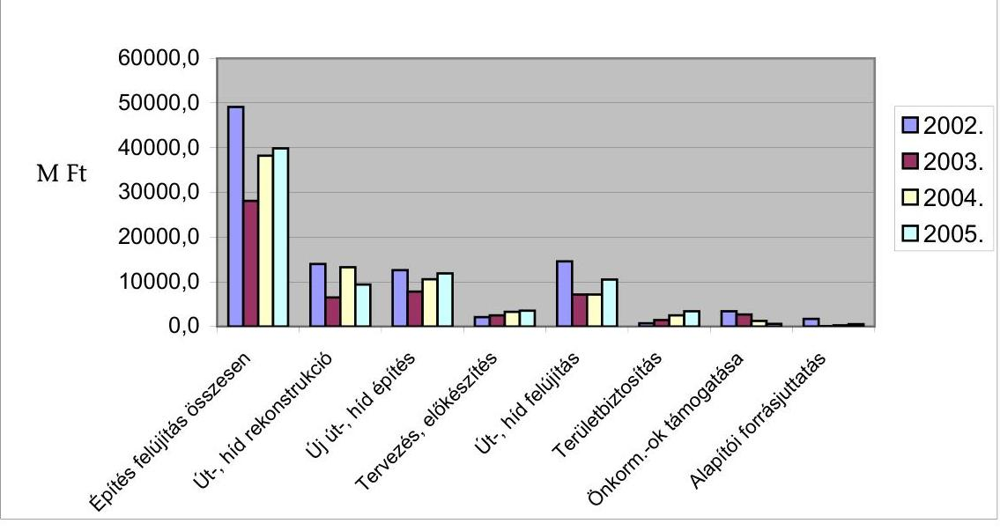

---

Az országos közúthálózat fejlesztésének, fenntartásának és üzemeltetésének hosszú és középtávú feladatairól, valamint finanszírozásának egyes kérdéseiről szóló 2044/2003. (III. 14.) Korm. határozat a Felzárkóztatási Infrastruktúra Fejlesztési Alapprogram (FIFA) keretébe tartozó gyorsforgalmi utak fejlesztés finanszírozásáról, valamint a Széchenyi Plusz Program folytatásának finanszírozásáról rendelkezett, amennyiben 2003. évben - a költségvetésben jóváhagyott előirányzat összegén felül - 8,6 Mrd Ft pluszforrást, továbbá 2004-ben 273,8 Mrd Ft forrást rendelt, és egyben hatályon kívül helyezte a 2303/2001. (X. 19.) Korm. határozatot.

A Felzárkóztatási Infrastruktúra Fejlesztési Alapprogram (FIFA) 2003-2005. közötti időszakban a közlekedési infrastruktúra fejlesztését szolgálta, amely a gyorsforgalmi és főközlekedési utak, vasutak és más, a közlekedéssel kapcsolatos célok megvalósítását finanszírozta. Az évenként rendelkezésre álló források nagyságát a tárgyévi költségvetési törvények határozták meg, három év alatt összesen 14 087,7 millió Ft-ot biztosítottak. A projektek közül három főút (4-es, 6-os, 10-es) korszerűsítése emelkedett ki. A 10. sz. főút korszerűsítésének előkészítésén kívül mindegyik fejlesztés elkészült.

A 74. sz. főút Zalaegerszeget elkerülő út megépítése (250 millió Ft), a 4. sz. főút Nyíregyházát elkerülő út előkészítése (50,8 millió Ft), 83. sz. főút, Pápát elkerülő út építése (500 millió Ft), 6. sz. főút korszerűsítésének előkészítése (1335 millió Ft), 10. sz. főút korszerűsítésének előkészítése (4 500 millió Ft), Esztergom, Mária-Valéria híd építése (17,2 millió Ft), 4. sz. főút, Törökszentmiklós elkerülése (1300 millió Ft), 4. sz. főút, Hajdúszoboszló elkerülése (6134,7 millió Ft).

A Széchenyi Plusz Programot „a gyorsforgalmi úthálózat tízéves fejlesztési programjának megvalósításáról" a 2117/1999. (V. 26.) Korm. határozat alapozta meg. A program keretében megvalósuló 38 projekt teljes mértékben illeszkedik az ÚFCE forrásaiból megvalósítandó tervekhez, megvalósításuk gyakorlatilag az ÚFCE pénzügyi tehermentesítését jelentette. A kapcsolódó fejlesztések azonnali elkezdése.

A „gyorsforgalmi úthálózat (autópályák és autóutak) 2015-ig terjedő fejlesztési programjáról, valamint az országos közúthálózat kiemelten fontos elemeinek megvalósításáról" szóló 2303/2001. (X. 19.) Korm. határozat 5. pontja konkretizálta, hogy mely kiemelt jelentőségű egyéb úthálózati elemek fejlesztését kell végrehajtani 2008-ig. Az országos közúthálózat kiemelten fontos elemei jelentették a Széchenyi Plusz Programhoz kapcsolódó fejlesztéseket.

A 2002. január 21-én kelt, a MeH-t felügyelő miniszter által kiadott, 1/2002. (I. 21.) sz. Alapítói határozata - hivatkozva a 2303/2001. (X. 19.) Korm. határozatra - rendelkezett arról, hogy az abban felsorolt kiemelt közútfejlesztési projekteket és közúthálózati szakaszok előkészítő munkáit (útépítési területek megszerzése, régészeti kutatási és feltárási munkák, lőszermentesítés, kiviteli tervek készítése, stb.) - az érintett megyei közútkezelő közhasznú társaságok bevonásával - a Nemzeti Autópálya Rt. (NA Rt.) végezze el. (Ezek között több útszakasz nem szerepelt a 2303/2001. (X. 19.) Korm. határozatban.) A projektek finanszírozása 2002-ben a Magyar Fejlesztési Bank Rt. (MFB) tulajdonosi hiteléből, majd 2003. január 1-től költségvetési forrásból történt.

A projektek előkészítése - egy kivételével - még 2002-ben beindult. A fejlesztéseket 2008-ig végre kell hajtani, erről a gyorsforgalmi úthálózat (autópályák,

---

autóutak) 2015-ig terjedő fejlesztési programjáról, valamint az országos közúthálózat kiemelten fontos elemeinek a megvalósításáról szóló 2303/2001. (X. 19.) Korm. határozat rendelkezett. A fejlesztések két projekt kivételével befejeződtek, a beruházások átadása megtörtént. A még befejezetlen 81. sz. főút, Győr új bevezető szakaszának II. üteme és a 4. sz. főút 69,9-76,8 km közötti szakaszának négysávossá bővítése 2006. végére várhatóan befejeződik.

# 2.4. Európai Uniós forrásokból megvalósuló fejlesztések 

A vizsgált időszakban a hazai forrásokon kívül az EU előcsatlakozási (Phare, ISPA), illetve a csatlakozást követően
 2004-től a Kohéziós Alapból elnyert támogatások (KIOP), valamint a kedvezményes EIB hitelből történt felhasználás is hozzájárultak az útfejlesztésekhez. Ezen forrásokból összesen 44 milliárd Ft támogatást nyertek el.

A projektek hozzájárultak, illetve hozzájárulnak a közutak területén az Európai Unióba történő integrációhoz, a magyar közlekedéspolitikáról és a megvalósításához szükséges legfontosabb feladatokról szóló 68/1996. (VII. 9.) OGY. határozatban és a 2002-2006. közötti időszak közútfejlesztéseit érintő kormányprogramban, koncepciókban megfogalmazott célok, valamint az Európai Unióhoz történő csatlakozási szerződésben vállalt, az érintett területre vonatkozó kötelezettségek teljesítéséhez.

PHARE támogatással négy projekt megvalósítására került sor és egy projekt kivitelezése még folyamatban volt az ellenőrzés időszakában. A projektek célkitűzéseiről, hivatalos időtartamáról, a PHARE forrás végső kifizetési határidejéről, a támogatás feltételeiről és a kötelezettségekről a támogatási szerződések rendelkeztek. A projektek burkolat felújítást, 11,5 tonnás tengelyterhelésre történő burkolat megerősítést, illetve elkerülő szakasz építését célozták, beruházási összköltségük 4811 millió Ft volt, ebből 2006 millió Ft PHARE támogatás, 2584 millió Ft ÚFCE forrás, a fennmaradó 221 millió Ft egyéb költségvetési forrás volt. Ez utóbbi a PHARE támogatáshoz kapcsolódó általános forgalmi adó fedezetét biztosította.

A PHARE esetén - az EU igényei alapján - olyan projektek kerültek kiválasztásra a projekt listáról, amelyek elősegítik a határátjárásokat. Az 5 projekt közül 4 határidőre már elkészült, az utolsó várható befejezése 2006. augusztus. A jelenlegi helyzetben reális a lehetősége, hogy a PHARE projektekhez kapcsolódó, az EU-ból származó források felhasználásra kerülnek.

ISPA támogatásból két projektre (mindkettő az útrehabilitációs program keretében) a 11,5 tonnás teherbíró képesség eléréséhez nyertek el támogatást. A projektek műszaki előkészítése és a tenderdokumentációk elkészítése egy évet késett. Tervezési hibák és hiányosságok fordultak elő. A szakértők szerint a tervezés alapját képező útállapotok megváltoztak időközben, egyrészt a nyomvályúsodás, másrészt a fenntartási munkák csökkentett szintje miatt. A késedelem miatt a magyar fél kezdeményezésére 2005. december 13-án - a határidőket rögzítő - „Pénzügyi Megállapodás"-t módosították, a megvalósítás időtartamát az eredeti 24 hónapról 31 hónapra növelték. Az előre nem látott műszaki akadályok okozta késedelem - a költségvetést terhelő - mintegy 11 millió EUR többletköltséggel jár.

---

Az I. ütem, a 3. és 35. sz. főutakat érintette. A projektek felsorolását az egyes ISPA projektek pénzügyi megállapodásainak kihirdetéséről szóló 89/2004. (IV. 20.) Korm. rendelet 10. és 13. sz. melléklete tartalmazta. A munkálatok kezdésére a Korm. rendelet 2001. december 14-i kezdést, a befejezésre 2005. december 31-ét határozta meg. A beruházás - a „Pénzügyi Megállapodás" szerinti - becsült költsége 45,6 millió EUR, ebből az ISPA támogatás maximális összege 20 millió EUR (44 %) lehet.

Egy 2005-ben végrehajtott, az ISPA támogatásból megvalósított közlekedésfejlesztési programok végrehajtását célzó ÁSZ ellenőrzés megállapította, hogy „a projekteket menedzselő szervezetek együttműködésében több mint 1 éves késedelmet okozott a fizikai megvalósítás elkezdését biztosító feltételek, a szervezetek kialakításának késedelme."

A két főút kivitelezési határideje 2006. június 30-ra módosult. A 89/2004. (IV. 20.) Korm. rendeletben meghatározott, nettó 39999080 EUR tervezett összköltség feletti része - mintegy nettó 4,5 MEUR, és a kapcsolódó járulékos költségek - a költségvetést terhelik.

A II. ütem a Közép és Észak-Magyarország, Nyugat- és Dél-Dunántúl, valamint Észak-Alföld régiókban a 2., 6., 42., 47. és 56. sz. főutakat érintette. Az ISPA támogatás felső határa 54138461 EUR. A költségeket 50-50%-os arányban viseli a költségvetés és az EU támogatás. A Korm. rendelet szerint a II. ütem kezdése 2004. április, befejezés 2006. december 31. A projekthez tartozó munkák mindegyikénél elsősorban tervezési hibák, az engedélyezési eljárások nagy időigénye és a lebonyolító szervezet felállásának és a tervezési szolgáltatásoknak a késedelme tapasztalható. Az UKIG álláspontja szerint a „Pénzügyi Megállapodás"-ban szereplő becsült időtartamok alultervezettek.

A késedelem miatt az UKIG ezeknél a projekteknél is a „Pénzügyi Megállapodás" módosításának kezdeményezésére kényszerült, ennek eljárása a helyszíni ellenőrzés idejében, folyamatban volt. A határidő módosítás kezdeményezésével egy időben az UKIG kötbérigényt jelentett be a tervezők felé. A kötbér mértéke még nem volt meghatározható, mivel a vállalt feladatok még nem készültek el és a kötbér nagysága a késedelem napjainak számától függ.

A vizsgálat által érintett ISPA projekteket az ÁSZ „Az ISPA támogatásból megvalósított közlekedésfejlesztési programok ellenőrzéséről" című 2005. júliusi jelentésében (továbbiakban: Jelentés) vizsgálta. A Jelentés többek közt a következőket tartalmazta:

A megvalósuló közlekedési ISPA projektek megfelelnek a Tanácsi Rendeletben és az ISPA közlekedési stratégiában meghatározott projekt kiválasztási kritériumoknak. Magyarországot az EU fejlesztési stratégiája szerint 4 Pán-Európai közlekedési (közúti és vasúti) folyosó szeli át.

Az útszakaszok kiválasztásának szempontja volt az EIB I.-II. és Világbanki kölcsönből megkezdett útfelújításból kimaradó szakaszok befejezése, összefüggő hálózat kialakítása, valamint a TINA hálózathoz kapcsolódás.

A projektek készültségi foka alapján a vizsgálat befejezésekor (2006. május) még adott a lehetőség, hogy a megvalósításhoz rendelkezésre álló források felhasználásra kerüljenek.

---

A Környezetvédelmi és Infrastrukturális Operatív Program (KIOP) szolgált a közlekedési infrastruktúra fejlesztésének megvalósítására. A KIOP a „Közlekedés" prioritáshoz két intézkedést: a főúthálózat műszaki színvonalának javítását, és környezetbarát közlekedési infrastruktúra fejlesztését jelölte meg.

A KIOP, amely a Nemzeti Fejlesztési Terv öt operatív programjának egyikeként, maga is egy középtávú koncepciót jelent, és amelynek magyar önrészét a költségvetésben a MeH fejezetnél elkülönített összeg biztosította, hozzájárult a magyar közlekedéspolitikáról és a megvalósításához szükséges legfontosabb feladatokról szóló 68/1996. (VII. 9.) OGY. határozatban, valamint a 2002-2006. közötti időszakot érintő kormányprogram vonatkozó részében megfogalmazott célok teljesüléséhez, és az Európai Unióhoz történő csatlakozási szerződésben vállalt vonatkozó részek teljesüléséhez.

A KIOP a főúthálózat műszaki színvonalának javítása keretében, korábban az ISPA-ból támogatott közúti projektek egyik célkitűzését, a közutak 11,5 tonnás tengelynyomás elbírására való felkészítését is folytatja.

Az ISPA a csatlakozást követően integrálódott az EU támogatási rendszerébe tartozó Kohéziós Alapba. Ettől kezdve az ISPA projektek további lebonyolítása a Kohéziós Alapra vonatkozó szabályok szerint történt.

Az UKIG „a főúthálózat műszaki színvonalának emelése" intézkedéscsomagban 22 pályázatot adott be, ebből 17 nyert el támogatást. A projektek finanszírozási szerkezete: 100 % támogatás, amelyből 25 % költségvetési és 75 % EU támogatás.

A 2004-2006. közötti időszakra, a program céljainak megvalósítására tervezett összegből a 2006. I. negyedév végéig tartó időszakban mintegy 15 Mrd Ft került kifizetésre. A KIOP 17 projektje 53 201,1 millió Ft tervezett kiadással számol, ebből 179,82 km útszakasz fejlesztése valósul meg. 5 projekt határidőre elkészült, a „Záró Jelentés"-ek szerint a jóváhagyott terveknek megfelelő kivitelezésben, az előírt minőségben adták át. A többi építése folyamatban van, egy kivételével várhatóan az eredetileg tervezett határidőre elkészülnek.

A 8. sz. főút, 110,5 - 127,8 km szelvény közötti 11,5 tonnás tengelyterhelés elviselésére való megerősítésének átadási határideje eredetileg 2006. május 06. volt. A $123+700 \mathrm{~km}$ szelvénynél időközben - a projekttől függetlenül - egy üzemanyagtöltő állomás építése is elkezdődött, ezért az aszfaltozási munkákat a két beruházáson egyszerre célszerű elvégezni. Ezért a lebonyolító kezdeményezte a vállalkozói szerződés módosításával a határidő megváltoztatását, 2006. július 31-re.

Az European Investment Bank (EIB) - Európai Beruházási Bank - és a PM közötti megállapodás eredményeként 2003. szeptember 01-én önálló közúti kölcsönegyezmény jött létre a „Magyarország-Közutak IV-AFI" projekt finanszírozására. A projekt tervezett költsége 254 millió EUR (210,5 Ft/EUR árfolyamon számolva 53467 millió Ft), mely összeg közel 75%-a (190 millió EUR) kölcsön, a többi rész saját forrás.

---

A kölcsönszerződésben rögzített összeget a Kormány nem a közútfejlesztésre, hanem az állami hitelek törlesztésére használja fel. A PM a kedvezményes kamatozású kölcsön keretösszegéből 2003. december végéig 119 millió EUR-t (250 Ft/EUR árfolyamon számolva 29750 millió Ft-tot) már lehívott, de a teljes projekt finanszírozásának terhét az ÚFCE-ra hárította, arra való hivatkozással, hogy a nemzetközi pénzügyi intézmények hitelei - állami hitelfelvétel esetén - a költségvetés refinanszírozását szolgálják, vagyis nem jelentenek addicionális forrást. (2003. február 05-én kelt, 2962/4/2003. iktatószámú, PM helyettes államtitkári levél, 4. pontja.)

Az EIB az elfogadott projekt finanszírozására fordítható kölcsönként kezeli a nyújtott hitelt és ennek megfelelően él a szerződésben rögzített beszámoltatási és ellenőrzési jogával. Az ÚFCE-ból 2005. végéig 584,1 millió Ft kifizetés történt. (2002-ben 51,6 millió Ft, 2003-ban 12,1 millió Ft, 2004-ben 20,4 és 2005-ben 500 millió Ft.)

A projekt négy al-projektből áll, céljuk az érintett úthálózatok kapacitásának bővítése, a települések elkerülése és az üzemeltetés hatékonyságának növelése. Az egyes alprojektek kiválasztása, azok műszaki tartalmának meghatározása a GKM-nek, mint Végrehajtó Szervezetnek a feladata volt. Az alprojektek a következők:

- 8. sz. főút, Csórt elkerülő, 4,9 km hosszú, 2 X 2 sávos út megépítése, 4 csomóponttal és két híddal;
- 8. sz. főút, Márkót elkerülő, 3,8 km hosszú, 2X2 sávos út építése, 4 csomópont és két híd;
- 71. sz. főút, közel 16 km hosszú, kétsávos, Balatonakarattyát, Balatonkenesét, Balatonfűzfőt elkerülő főút öt szintbeni csomóponttal.

Az elfogadott beruházások kiválasztásának alapja az volt, hogy egyrészt kapcsolódjanak az Unió Transz Európai Közlekedési Hálózatához (a TEN-hez), másrészt hogy a GKM által kiemelten fontosnak tartott fejlesztések megvalósuljanak. A tervezett projektek célja a kapacitás-növelés a magyarországi közúthálózat három jelentős főútján, illetve a hiányzó kapcsolatok kiépítése. Mindegyik beruházás a meglevő településeket elkerülve, új nyomvonalon halad, a későbbiekben a gyorsabb, gazdaságosabb, környezetkímélőbb szállítást lehetővé téve.

- 10. sz. főút korszerűsítése (három részre bontották):
- A1 szakasz : fővárosi bevezető szakasz négy forgalmi sávra bővítése;
- A2 szakasz: a főváros határától Pilisvörösvár keleti csomópontig;
- B jelű szakasz: Pilisvörösvárt, Piliscsabát, Jászfalut, Leányvárt és Piliscsévet elkerülő, 18,3 km hosszú, 2 sávos új főút építése, beleértve egy szintbeni- és három külszíntű csomópontot, és tizenöt hidat.

A beruházások befejezési határideje a kölcsönegyezmény szerint 2007. december 31. Ezek közül a 10-es út esetében még a szükséges engedélyekkel sem rendelkeznek, az építés késésben van.

A 10. sz. főút fejlesztésének már több mint tizenöt éves története a tervezési, egyeztetési kudarcok sorozata. Az előzetes tervek már a 90-es évek elején-

---

közepén elkészültek, azóta különböző ellenérdekeltségek, az érintett önkormányzatok többször is módosított igényei, a menet közben megváltozott előírások, az időigényes hatósági eljárások akadályozták az út megújulását, növelve az út állapotából adódó gazdasági, környezeti, forgalombiztonsági és idegenforgalmi károkat. Az eddigi ráfordítás már meghaladta a 2500 millió Ft-ot, melyből a területbiztosítás (kisajátítás, vásárlás) 2357 millió Ft-ba került.

A 10. sz. főút a pilisi medence kiemelten fontos útvonala, jelentős teher és egyéb gépjárműforgalommal terhelve, ezért a főút forgalma fokozott környezetterhelést jelent. A főút korszerűsítése a 90-es évektől folyamatban van, melynek során részben új nyomvonalra kerül, azonban a beruházás előkészítése és a tervezése késik. Emiatt a három építési szakaszból csak egy építése kezdődhet el 2006-ban, bár ennek valószínűsége (2006. május közepén) már igen csekély.

1991-ben elkészült a 10. sz. főút Pilisvörösvár és Piliscsaba településeket elkerülő szakasz nyomvonalának
 tanulmányterve Solymár és Dorog között, 1995-ben elkészült a 8,0-14,0 km szelvény közötti nyomvonal négysávosításának tanulmányterve. Az engedélyeztetési tervek két szakaszra bontva 1999-ben készültek el. Ezt követően az érintett önkormányzatok tervmódosítási igényei, egyeztetések és az új Útügyi Műszaki Előírás hatálybalépése, valamint a hatósági engedélyezések a tervek műszaki felülvizsgálatát és elhúzódó egyeztetési eljárásokat eredményezték. Hátráltatta az előkészítést, hogy a Magyar Köztársaság gyorsforgalmi közúthálózatának közérdekűségéről és fejlesztéséről szóló (többször módosított) 2003. évi CXXVIII. tv. szerint ez az út gyorsforgalmi útnak minősült, melynek engedélyezésére nem a regionális, hanem a Központi Közlekedési Felügyelet volt jogosult. A Fővárosi Önkormányzat pénzhiányra hivatkozva leállította az előkészítő munkákat és - a budai úthálózat szűk forgalomfogadási kapacitására hivatkozva - nem támogatta az út városon kívüli fejlesztését sem. A késedelemre jellemző, hogy a Közép-Dunavölgyi Környezetvédelmi Felügyelőség visszavonta az 1998-ban kiadott környezetvédelmi engedélyt, mert az eltelt öt évben tervezés nem történt. Az A2 szakaszra 2005-ben kiadott környezetvédelmi engedélyt a Levegő Munkacsoport megtámadta, a bírósági eljárás az Ász vizsgálat idején folyamatban volt.

Az A1 szakaszra 2006. márciusban benyújtott legújabb környezetvédelmi engedélyezési terv hatósági elfogadása és jogerőre emelkedése esetén 2006. közepén indulhat az építés engedélyezési eljárása. Az A2 szakasz engedélyeztetése a helyszíni vizsgálat idején folyamatban volt. A B szakasz környezetvédelmi engedély kérelmét 2004. februárban nyújtották be az I. fokú környezetvédelmi hatósághoz. Az eljárásban érintettek véleménye alapján a nyomvonalat helyenként, kis mértékben módosították azért, hogy a NATURA 2000 területeket a lehető legkisebb mértékben érintse. A határozat kiadása 2006. közepére várható.

A 10. sz. főút késedelmének okai felvetik egy olyan jogszabályi rendelkezés megalkotását, amely környezet- és természetvédelmi, közlekedési, társadalmi, közösségi szempontból kiemelt érdeklődésre számottartó területen áthaladó út fejlesztése esetében kötelezővé tenne a tervezés indítása előtt egy egyeztető, előkészítő bizottság felállítását. Ebben az érdekelt felek - hatóságok, önkormányzatok, civil, stb. szervezetek - képviseltetnék magukat, ahol még az előzetes tervek, koncepciók ismeretében, de még az engedélyeztetési tervek készítése előtt megtehetnék észrevételeiket.

Ugyancsak jogszabályi rendezetlenségre utal, egy 2002. évi belső ellenőrzés által az utak építése és korszerűsítése során szükségessé váló közművek át-

---

helyezési gyakorlata kapcsán tett megállapítás. Megállapították, hogy az útberuházás részeként, közpénzből megvalósuló közművek áthelyezésének, új közművek kialakításának megvalósítási, finanszírozási, elszámolási, aktiválási gyakorlatának közel húsz jogszabálynak kellene egyidejűleg megfelelni úgy, hogy ne sérüljenek sem a szolgáltatók gazdasági, sem az állami érdekek. A vonatkozó jogszabályok közül egyik sem tartalmaz egyértelmű iránymutatást, ennek következményeként a követett gyakorlat majdnem minden esetben eltért, ugyanakkor egyik eljárás sem biztosította a jogszabályoknak való teljes körű megfelelést. Az UKIG Ellenőrzési Főosztálya 2003-ban javaslatban kidolgozta a szükséges jogszabály módosításokat, de ezeket a jelen ÁSZ ellenőrzésig nem vezették be, így az UKIG által kidolgozott, a fejlesztésekben és a fenntartásokban közreműködő szervezetek által alkalmazott eljárásrend próbálja kezelni az egymással ütköző gazdasági érdekeket és a vonatkozó jogszabályi előírásokat.

# 2.5. A közbeszerzési eljárások alkalmazása 

A fejlesztési, beruházási és felújítási feladatok végrehajtására közbeszerzési pályázatot írtak ki. A közbeszerzési eljárást az UKIG főosztályai, illetve megbízás alapján a területi igazgatóságok (megyei közútkezelő kht-k) a saját és az UKIG nevében hirdették meg. Az ajánlatokat az előkészítő és döntő bizottságok javaslatára az UKIG igazgatója, illetve Magyar Közút Kht. igazgatója döntött.

A közbeszerzési eljárásokat a főosztályok önállóan bonyolították le, előrelépésnek tekinthető, hogy feladatot az UKIG szervezeti változása során 2006. februárjában létrehozott Jogi és Közbeszerzési Iroda látja el.

Az UKIG rendelkezett elfogadott közbeszerzési szabályzattal, amely azonban a közbeszerzési törvényi változásokat nem követte.

A közbeszerzésben érintett szervezetek törekedtek a nyílt eljárások alkalmazásával a minél szélesebb körű versenyeztetésre. A fejlesztésekről, a fenntartásról - készített kimutatás szerint a vizsgált időszakban 1290 db eljárást folytattak le, ebből a nyílt eljárások száma $910 \mathrm{db}(70 \%)$, a tárgyalásos eljárások száma $10 \mathrm{db}(0,8 \%)$, az egyszerű eljárások száma - ezt a 2004. évi Kbt. módosítása vezette be - $370 \mathrm{db}(28,6 \%)$ volt. Az UKIG vezet és vezetett olyan nyilvántartást, mely az eljárások fő jellemzőit, adatait tartalmazza. 2005. évtől az adatok a közbeszerzési tervben szerepelnek.
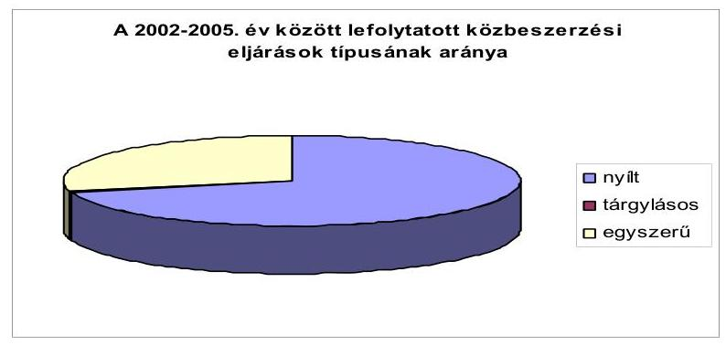

---

A tárgyalásos eljárások aránya $0,8 \%$ alatt maradt, az eljárásokat döntően az első eljárások eredménytelenségével indokolták.

Az eljárások tárgyukat tekintve 86,4\%-a fenntartás, 1,3\%-a fejlesztés, 12,3\%egyéb szolgáltatás, karbantartás (útszóró só, kaszálás) volt.

A vizsgált eljárások a jogszabályi előírásoknak megfeleltek, dokumentáltságuk megfelelő, az előkészítési, a bírálati, bontási jegyzőkönyveket, az összeférhetetlenségi nyilatkozatokat bemutatták.

A bírálati szempontok között legfőbb szempontként szerepelt az ajánlati ár, a határidő, a jótállási (garanciális) idő. Általában legnagyobb súllyal az ár szerepelt, ezáltal a sorrend kialakulásában döntő fontosságú volt. A bírálati szakaszban az ajánlatkérők jellemzően az összességében legkedvezőbb ajánlatot kívánták választani. A vizsgált szerződések a szükséges teljesítési garanciákat - késedelmi kötbér, jótállási garancia - tartalmazták.

Az éves összegzéseket az UKIG és az Magyar Közút Kht. (a megyei közútkezelő kht-k) minden évben megküldte a Közbeszerzési Tanácsnak. A vizsgált időszakra vonatkozó éves közbeszerzési tervek az UKIG-nál elektronikus formában rendelkezésre álltak, de elfogadásukról dokumentumot nem tudtak bemutatni.

A GKM Ellenőrzési Főosztálya és az UKIG Ellenőrzési Főosztálya a közbeszerzési tevékenységet nem ellenőrizte, ellenőrzésük egy-egy projektre korlátozódott.

# 2.6. A helyszíni ellenőrzés keretében vizsgált projektek összeg- 

zése

A vizsgálathoz kapcsolódóan összesen 33 fejlesztés helyszíni ellenőrzése történt meg. (A jelentések összegzése az 1. sz. függelékben.) A fejlesztések a Széchenyi Plusz, az ÚFCE, illetve az Európai Unióból származó forrásokhoz kapcsolódóan valósultak meg. Az Európai Unióból származó források - az ellenőrzés által érintett fejlesztésekre vonatkozóan - a KIOP-ot , illetve a Phare programot jelentették. A Széchenyi Plusz Program keretében megvalósuló fejlesztések kivételével az ellenőrzött fejlesztéseket közbeszerzési eljárás keretében valósították meg. A Széchenyi Plusz Program keretében minden fejlesztés közbeszerzés nélkül valósult meg, tekintettel arra, hogy a 2117/1999. (V. 26.) Korm. határozat 2000. évi módosításában a gyorsforgalmi úthálózat tízéves fejlesztési programjának megvalósításáról határozva, a finanszírozást hitelből és kötvénykibocsátásból tervezték. A módosításban előírták: „Az adósságszolgálatból származó fizetési kötelezettségért a Kormány kezességet vállal akként, hogy az erről szóló határozatban az így szerzett pénzforrásból történő beszerzésekre a Kbt. szabályait nem rendeli alkalmazni".

A Széchenyi Plusz Program megvalósításáért felelős NA Rt. hatástanulmányt készített a fejlesztésekre vonatkozóan, amelyben vizsgálták a forgalom alakulását, a balesetek számának alakulását és az utazási időt. Ezen mutatók fejlesztések utáni nyomon követésére az ellenőrzés nem talált adatot. Az NA Rt. észrevétele szerint az építés befejezését követően - a kialakult forgalmi viszo-

---

nyok alapján - a hatástanulmány nyomon követése, új tanulmány készítése nem az NA Rt. feladata.

A Phare, illetve a KIOP keretében megvalósuló fejlesztések a Magyar Köztársaság Európai Unióba történő közúti integrációja megvalósulásához járultak hozzá, többek között a határátkelőhelyek, illetve utak korszerűsítésével az európai vonatkozó szabványoknak való megfeleltetésével. A fejlesztésekhez kapcsolódóan előzetes célkitűzések meghatározásra kerültek. Az ellenőrzés során érintett projektek esetén a KIOP keretében megvalósulók rendelkeztek „számszerűsített" indikátorokkal. Az indikátor volt - többek között - a projekt épített új és/vagy felújított útszakaszok hossza, utazási idő csökkentése a magasabb rendű utakhoz történő kapcsolódási lehetőség miatt, burkolatállapot, teherbírás, egyenetlenség. Ezen indikátorok megvalósulásának nyomon követése a program végrehajtásának kötelező része.

A kizárólag magyar forrásokból megvalósított fejlesztések esetén megállapítható, hogy azok az érintett területfejlesztési koncepciókkal összhangban történtek, és voltak azokat alátámasztó mutatók, pl. a baleseti statisztikák, forgalmi, környezeti adatok, de a jelenlegi mechanizmusban nincsen olyan előírás, amely megkövetelné az előzetes indikátorok kötelező megvalósítását, illetve a megvalósulás utáni nyomon követését.

Az útfelújításokkal, útépítéssel kapcsolatban országosan problémát jelent a közbeszerzési eljárások év közepén, vagy annál is későbbi időpontban történő lefolytatása. Ennek következtében az útépítéssel és felújítással kapcsolatos munkák ütemezése késő őszi, téli időszakra esik. A szakvélemények szerint a $+5 \mathrm{C}^{\circ}$ fok alatti betonozás pazarlásnak minősül. Pl. a helyszíni vizsgálat idején (2006. május) a versenykiírás még nem jelent meg.

További problémát jelent az éves forráselosztás időbeni elhúzódása. A területi igazgatóságoknál - helyszíni vizsgálatunk idején - még nem voltak ismertek a folyó évi forráslehetőségek, keretek. Mindez a folyamatos, ütemezett munkavégzést kedvezőtlenül befolyásolja.

Az útfelújítások, útépítések munkáinak átadás-átvételével kapcsolatban a vállalkozók részéről többször követett gyakorlat, hogy néhány millió forintos értékcsökkentés mellett - a szerződéses határidő előtt néhány nappal, vagy héttel - készre jelentik a munkát. A szerződésben foglaltaktól való eltérés (például a kopóréteg nem megfelelő, vagy tűréshatáron belüli minősége, vagy az útpadka tömörsége, stb. - valószínűsíthetően az út élettartamát kedvezőtlenül befolyásolja. A túlsúly forgalom miatt az élettartam amúgy is rövidül, az átlagos 12-15 év csak „eszmei" élettartamnak számít. A paramétereiben gyengébb színvonalon átadott utaknál a többszöri utólagos garanciális javítások ellenére az élettartam várhatóan még tovább szűkül.

A határidőn túli teljesítéseket a megrendelőnek a kivitelezés közbeni pótlólagos igényeivel indokolták, amit a határidőre kiterjedő szerződésmódosítással korrigáltak. A határidő túllépést több alkalommal elfedi az a körülmény, hogy a műszaki átadás-átvétel folyamata sokszor egy hónapra vagy azon túlra is elhúzódhat.

---

A garancia időn belül elvégzett javításokról a közúti igazgatóságoknak nincsen nyilvántartásuk, ezért olyan számításokat nem állt módunkban elvégezni, hogy az utólagos munkák egy adott útszakasznál milyen arányt képviselnek.

# 3. AZ ORSZÁGOS KÖZUTAK KEZELÉSE, FENNTARTÁSA 

### 3.1. Az országos közutak kezelésének, fenntartásának módjai

Az országos közutak kezelését az országos közutak kezelésének szabályozásáról szóló 6/1998. (III.11.) KHVM rendelet (továbbiakban: Rendelet) szabályozza. Az utak, hidak kezelésével összefüggő részletes nyilvántartási, ellenőrzési, tisztítási, üzemeltetési és fenntartási feladatokat, a végrehajtásuk határidejét, valamint a fogalmak meghatározását a rendelet melléklete - az Országos Közutak Kezelési Szabályzata (továbbiakban: OKKSZ) - tartalmazza. A vizsgált időszakban a napi tevékenységekre, adatszolgáltatásra vonatkozó változtatásokon kívül a rendeletben és mellékletében foglaltak érdemben nem változtak.

A rendelet megfogalmazása szerint a fenntartás a forgalmi igénybevételtől és az időjárási, valamint egyéb természeti hatásokból származó természetes leromlás ellensúlyozásához szükséges tevékenységek ellátását jelenti (ez az UKIG jelenlegi gyakorlatában az ÚFCE/Útpénztár út-híd karbantartás, felújítás előirányzatának felel meg).

Az OKKSZ a karbantartási feladatok tekintetében a közutakat közútkezelési szolgáltatási osztályokba (I-VII osztály), emellett a munkavégzés színvonalát kategóriákba sorolta („A", „B", és „C" kategóriák) minden évben. Az osztályba sorolást a közútkezelők által minden évben tételesen összeállított javaslat alapján az UKIG hagyta jóvá. A besoroláskor fontos szempont volt a közút kategóriáján és a forgalom nagyságán túl, a közút kiépítettsége és a forgalom időszakos változása is.

A kategória felosztáshoz olyan feladatcsoportokat hozott létre az UKIG, amelyeket valamennyi kategóriában azonos színvonalon, folyamatosan kell ellátni, illetve amelyek meghatározóak az országos közutak és környezetük megjelenése, kultúráltága, a közlekedők részére biztosított szolgáltatások színvonala szempontjából.

Az egyes kategóriák meghatározása szerint: az „A" szint a megadott feladatok teljes körű és maradéktalan végrehajtását jelentette, a „B" szint egy csökkentett mértékű és gyakoriságú végrehajtást, köztes állapotot
 határozott meg, a „C", mint legalacsonyabb kategória pedig a minimális színvonalon rendszeresen elvégzendő feladatokat írta elő.

A szolgáltatások színvonalának meghatározása a GKM illetékes szakirányítási szerve által évenként felülvizsgált és jóváhagyott négyszámjegyű műszaki jogcímrendszer alapján történt. A jogcímrendszer részletesen taglalta a fenntartási tevékenységek körét, és megadta a karbantartási és felújítási tevékenységek elkülönítésének alapját. Az adott munka volumene, technológiai színvonala és a szükséges gépek, berendezések határozták meg, hogy saját erőből, vagy versenyeztetés útján történt meg a feladat teljesítése.

---

Karbantartási munkának minősül a nem tervezhető, lokális hibáknak az elhárítása, amelynek elvégzése a közútkezelő feladata (pl.: a téli időszak után keletkezett kátyúk rendbetétele, balesetből származó sérült hídkorlát helyreállítása).

A felújítási tevékenységet a közútkezelő szervezetek éves felújítási terv alapján végezték, amely közbeszerzési törvény hatálya alá tartozik.

Egy adott útszakasz fenntartási módjának választásánál nem a gazdaságossági, szakmai szempontok érvényesültek. A legfontosabb szempont a jogszabályokban rögzített kötelezettségek teljesítése, a rendelkezésre álló költségvetési forrásokból. Ezek mértéke azonban csak a legolcsóbb, következésképpen a legegyszerűbb megoldásokat tette lehetővé. Ez pillanatnyi - az olcsóbb javításból fakadó - gazdasági előnyt jelentett, de a gyakoribb javítások miatt, illetve egy későbbi nagyobb költséggel járó felújítás miatt később jelentkező többlet ráfordításokkal jár. A legolcsóbb megoldásra ösztönözte a megyei kht-kat az UKIG is. A fenntartás részét képező felújításhoz kapcsolódóan minden év októberében, novemberében készítettek a kht-k előzetes terveket, de ezek a 2005. év kivételével, a vizsgálat során nem álltak rendelkezésre.

A felújításra elkülönített eredeti/teljesített keret:
(millió Ft)

|  | 2002. | 2003. | 2004. | 2005. |
| :-- | :--: | :--: | :--: | :--: |
| Eredeti keret | 14500,0 | 6000,0 | 7203,8 | 10000,0 |
| Teljesítés | 14586,0 | 7129,9 | 7143,2 | 10472,4 |

Az igények és a tények eltérésének a nagyságát mutatja a - 2004. év szeptemberi dátumú - „Mellékutak burkolat állapot javító programjának előkészítő vizsgálata" című tanulmány, amely csak a mellékutakra vonatkozóan megállapítja, hogy: „a teljes időszakban folyamatos és jelentős a burkolat fenntartási ráfordítások hiánya, amelyek halmozott értéke (2004. évi árszinten) a mellékúthálózat esetében legalább 400 milliárd Ft."

Az igények, illetve a rendelkezésre álló források közti feszültséget jól jelzi a Közúti Közlekedési Főosztály vezetője által a miniszternek 2004. március 16-án írt tájékoztató levele (a feljegyzésen szerepel a közlekedési, illetve a költségvetési helyettes államtitkár aláírása is, akik egyetértettek a levél tartalmával):
„Összességében tehát a 2004. évi 71 165,3 millió Ft-os tervjavaslatban a halaszthatatlan - a közlekedésbiztonsággal közvetlen összefüggésben lévő út-híd felújítási feladatokra nem lehet forrást biztosítani.

Túlzás nélkül állítható, hogy az országos közúthálózat állapota egy időzített bomba. Már ma is ezer kilométerekben mérhető a fenntarthatatlan úthálózat hossza."

Két helyszíni vizsgálatra kiválasztott (Hajdú-Bihar, Pest) megyei kht. 2002-2005. közötti időszakra vonatkozó feladattervei, és az országos adatok kigyűjtése alapján országosan elmaradt a „C" szintnek való megfelelés. Ezt támasztják alá a fejezet politikai államtitkárának a Közúti Közlekedési Főosztály vezetője

---

által írt, 2004. március 9-én kelt levele és az UKIG Igazgató 2005. szeptember 9-én kelt, „A 2006. évi módosított ÚFCE tervjavaslat" című jelentése:
„Tekintettel arra, hogy a közútkezelő szabályzatban előírt minimális „C" szolgáltatási szint teljesítéséhez az út-híd üzemeltetés előirányzatát 20.000 M Ft-ban, az út-híd karbantartás előirányzatát 16.300 M Ft-ban kellene meghatározni, a jelenlegi kondíciók hasonlóan a 2003. évihez - e minimális szolgáltatási szinttől jelentősen elmaradnak, aminek következtében a helyreállítatlan lokális burkolathibák tömeges megjelenésével, elhasználódott forgalmi jelzésekkel és a növényzet gondozás, kaszálás esetenkénti elmaradásával kell számolnunk."

A jelentés így fogalmaz: „Ténylegesen így a 30.000 km-es országos közút hálózaton út-híd üzemeltetésre és karbantartásra a minimum követelményként megfogalmazott „C" szolgáltatási szint eléréséhez szükséges 40000 millió Ft-tal szemben 28.000 millió Ft áll rendelkezésre. Ez a helyzet az elmaradt felújítással együtt az úthálózat állapotának drámai leromlását eredményezi."

# 3.2. Az útellenőrző rendszer és nyilvántartás 

Az állami közutak állapotát nyomon követő monitoring rendszer 2000-ben a 30 millió Ft-ért kifejlesztett OKA 2000 (Országos Közúti Adatbank), az állami kezelésű úthálózat adatainak kezelésére kialakított speciális térinformatikai rendszere, a közutak napi műszaki, minőségi, forgalmi jellemzőinek nyilvántartását szolgálja.

A hidak adatait, jellemzőit tároló Híd rendszert, az OKA 2000 rendszer külső, mellérendelt alrendszereként építették ki. Az OKA 2000-hez kapcsoltan folyamatban van egy új ingatlan nyilvántartási külső alrendszer, amely a táblázatos és egyéb formátumú adatok, térképek, háttér légi fotók segítségével az utak alatti és melletti területek nyilvántartását, kezelését és adatmegjelenítését biztosítja.

A közút műszaki, minőségi, forgalmi adatairól folyamatos nyilvántartás vezetés kötelezettségéről a közúti közlekedésről szóló 1988. évi I. tv. 34.§ (3) bekezdése rendelkezik.

Az OKA 2000 rendszer, közel 3 GB-os országos adatállományból és a mintegy 2,5 GB digitális térképi állományból a szükséges lekérdezéseket rövid idő alatt elvégzi. A rendszer különböző részadatbázisokból (hálózatleírás, útkezelői, útszerkezeti és geometriai, útjellemző minőségi, forgalmi és baleseti adatok, út melletti objektumok adatai, egyéb adatok) és speciális alrendszerekből (törzsadatbázis kezelő, pályaszerkezeti, csomópont kezelői, stb.) áll. A híd alrendszer részei a híd képtár, amely a hidak képeinek kezelését, tárolását, karbantartását valósítja meg; a híd tervtár, amely a hidak terveinek kezelését, tárolását, karbantartását megvalósító alkalmazás, és a hídlap, amely a hídvizsgálati eredményeket tárolja.

Az OKA 2000 adatbankban bármely időpontbeli aktuális állapot előállítható, vagyis az úthálózat változásai az időpontokat változtatva folyamatosan nyomon követhetők.

Az egymástól független, de egymással szoros együttműködésben lévő modulokból felépülő rendszer sokrétű adattartalmú, ezért nem csak a szűk szakmai kör, hanem szakterület teljes egésze használja. Az adatok szemléltetésére, elemzésére és ellenőrzésére alkalmas, a térképi szemlélet alkalmazása új megközelítéseket biztosít. A rendszert 2003. év február végétől a 19 megyei közút-

---

kezelő kht-nál, az ÁKMI Kht-nál, az Állami Autópálya Kezelő Rt.-nél (ÁAK Rt.) és az Alföldi Koncessziós Autópálya Rt.-nél (AKA Rt.) vezették be.

A rendszer kiépítése többfelhasználós környezeti támogatással valósult meg. Az adatokat a Magyar Közút Kht. Területi Igazgatóságai a helyi adatbázisba viszik fel. Az interneten megküldött állományokból az MK Kht. aktualizált, ellenőrzött, központi (országos) adatbázist állít össze, amit negyedévente szintén az interneten juttat vissza a területi szervekhez. A nem központi mérésen, vagy külső programokkal történő adatcserén alapuló adatokat időközi korrekcióval esetenként eltérő ütemezésben frissítik.

A baleseti adatokat évente egyszer, decembert követő első negyedévi záráskor, a hidak állapotát bemutató adatokat - ugyancsak évente egyszer - az OKA évi végi zárásakor, a dinamikus teherbírásmérést a következő év első negyedévi zárásakor, a felületállapot mérést az adott év júniusában és decemberében, a digitális térképi változásokat negyedévente, a forgalomszámlálás adatait a következő év júniusában frissítik.

Az útellenőri feladatok végzését a 6/1998. (III.11.) KHVM rendelet írja elő, az útellenőri szolgálatot a megyei közútkezelő kht-k végezték az UKIG-gal évente megkötött közhasznú vállalkozási szerződés alapján. A megyei ügyvezető igazgatói utasítások nem egységes alapokon kerültek kiadásra, a megyei közútkezelő kht-k ezen tevékenységet egyedileg, külön-külön szabályozták. Az egyes üzemmérnökségek az útellenőri programokat előzetesen megtervezik. Az útellenőrzést a szerződés szerint végzett többi feladattal együtt az UKIG megbízott külső műszaki ellenőrei az OKKSZ-ben foglaltaknak megfelelően rendszeresen ellenőrzik.

Az egységes árkialakítás érdekében az évről-évre ismétlődő, műszakilag tervezhető üzemeltetési és karbantartási munkák esetében minden évben aktualizáltak költségbecslési segédleteket, normatív költségeket határoztak meg. Az üzemeltetés, a fenntartás, a karbantartás gazdaságossága és a megyei közútkezelő kht-k részére az egységes költségigény kialakítása és tervezése érdekében az UKIG - minden évben - árnormatíva útmutatókat dolgozott ki.

Pl. 2002-ben „Közút és hídépítési munkák fajlagos költségei", 2005. január 1-től „Az országos közúthálózaton végzendő tisztítási, üzemeltetési és karbantartási munkák normatív költségeinek aktualizálása".

A közútkezelő kht-k az éves beszámolóikban is meghatároztak néhány mutatót (pl. 1 km tervezett üzemeltetési ráfordítás, karbantartási ráfordítás).

Az UKIG az útfelújítási, útfenntartási munkák gazdaságosságára vonatkozó mutatókat, szempontokat az „Árkialakítási Útmutatóban" határozta meg. A szerződésekben rögzítésre kerültek az Útmutató alapján meghatározott, a tevékenységekhez szükséges összegek, szem előtt tartva az alapvető kötelezettségek, feladatellátás költséghatékonyabb végrehajtását.

---

# 3.3. Az útfenntartás hatékonyság vizsgálati rendszerei 

Az utak állapota, a beavatkozási és a közlekedési költségek egymással szoros összefüggésben vannak. Az erőforrások szűkössége miatt előtérbe került az erőforrásokkal való hatékony gazdálkodás szerepe. Az állagmegóvó, vagy javító munkálatok késleltetése, illetve elmaradása esetén megnő a későbbi költségesebb beavatkozások szükségessége.

Az UKIG a meglévő források célirányos elosztására törekedett, azonban az ellenőrzött időszakban hatékonyságvizsgálat ezt nem, vagy nem kellően támogatta. A vizsgált időszakban az utak fenntartási módjának megválasztásánál nem a szakmai, hanem - a törvényi kötelezettségek teljesítése mellett - a rendelkezésre álló forrásokhoz való igazodás vált a legfontosabb szemponttá.

A hatékonyság vizsgálatában a tényezők, a kezelendő adatállomány és a kombinációk nagy száma egyre inkább nélkülözhetetlenné tette a számítógépes technika alkalmazását. Ezt a feladatot látták el a burkolat-gazdálkodási rendszerek - ún. PMS-rendszerek (Pavement Management System) - , amelyeknek inputját többek között az útfelület-állapot, teherbírás és forgalmi adatok képezték. A vizsgálatokhoz szükséges műszaki információkat az OKA szolgáltatta.

A PMS-rendszeren belül projekt- és hálózati szintű modellt alkalmaztak a vizsgált időszakban. A két rendszert jól elhatárolható módon a technológiai beavatkozási sorrend meghatározására és a leghatékonyabb forráselosztásra használták.

A projektszintű modell a konkrét útszakaszokra határozza meg a szükséges beavatkozásokat a HDM-III (Highway Design and Maintenance) nevű burkolatgazdálkodási programmal. A modell az egyes útfenntartási alternatívák révén elérhető javulás, közlekedésüzemi költségekre gyakorolt hatását vizsgálta.

A hálózati szintű modell egy terület teljes úthálózat burkolat-felújítási, javítási, karbantartási feladatának megoldását tűzi ki célul, fő célja a döntéselőkészítés. Erre a feladatra a HIPS (Highway Investment Programming System) rendszert alkalmazták, amely csoportosítja az utakat úttípus, útállapot és forgalomnagyság szerint, és meghatározza a feladat ellátásához megkívánt forrásszükségletet.

A HIPS rendszert az UKIG üzemeltette, ezzel határozta meg az országos közúthálózat állapotának figyelembevételével a hálózati szintű forrásszükségletet, valamint a rendelkezésre álló források a megyei kht-k között elosztását. A megyék a HDM rendszerrel határozták meg a kapott források munkálatokra lebontott hatékony leosztását, amiben meghatározó tényező volt a forgalom nagysága.

A felújítási tevékenységre fordítható előirányzatok folyamatos csökkenése, valamint az átszervezéssel végbement személyi és szervezeti változások kedvezőtlenül hatottak a hatékonyság-vizsgálatok alkalmazására. A rendszerek nem tudták megfelelően kezelni a kisforgalmú (1500 gépjármű/nap forgalomnagyság alatti) mellékutak felújítását. A tartósan kor-

---

látozott finanszírozás miatt a kisebb forgalmú utakra (bár a hatékonysági mutatók indokolták volna) legfeljebb a maradékelv alapján jutottak források.

Az UKIG-nál 1998-ban készült döntés-előkészítő anyag szerint egyes utakon a gazdaságossági mutatók ugyan nem indokolnának beavatkozást, de a közlekedők érdeke szükségessé teszi. A beavatkozási technológia, műszaki adatok, hálózati adatok alapján (pl. van-e buszos megközelítése a településnek) egy beavatkozási sorrend alakult ki ezekre az utakra. A programot forrás hiány miatt csak 1 évig használták bruttó 668,75 M Ft költséggel,
 főleg felületi bevonat, profiljavítás tervezésére. 2004-ben a mellékúthálózat felzárkóztatásának érdekében burkolat fenntartási-felújítási célprogram készült. A célprogramot előkészítő vizsgálatról az UKIG tanulmányt készített, amely külön foglalkozott a kisforgalmú mellékutakkal, önálló hálózatként kezelte a szolgáltatási színvonal és a vagyonérték megőrzése érdekében. A program forráshiány miatt nem valósult meg.

A forrásigény meghatározására továbbra is a HIPS rendszert alkalmazták. A lokális beavatkozások előtérbe kerülése miatt a HDM-III modell használata háttérbe szorult. A felújítási munkák forráselosztása a legrosszabb útszakaszok megyénkénti hosszának %-os aránya kiszámításával, a karbantartási forrásoké Excel-táblázatban készülő számításokkal történt (közhasznú tevékenység forráselosztási modellje). A HDM-III a 2003. februárjában alkalmazni kezdett új struktúrájú OKA 2000 rendszer által nyújtott adatokat nem tudta megfelelő szinten kezelni. A program egy forrásszint-minimum alá jutva nem tudta értelmezni a betáplált adatokat. Nem adott hiteles eredményeket, folyamatosan „lefagyott", ezért értelmetlenné vált a további használata.
2000. év tavaszán az ÁKMI megvásárolta 1200 USD-ért a HDM továbbfejlesztett változatát, a HDM-IV-et. Decemberben elindult az OKA fejlesztése, ami nemcsak az operációs rendszer megváltoztatását jelentette, hanem ezzel együtt az Adatbank struktúrájának átalakítását is.

Az ÁKMI kezelésében levő HDM-IV tesztelése 2004-ben már folyamatban volt. Ez az újabb verzió már képes volt az OKA 2000 által szolgáltatott adatokat kezelni. A megfelelő teszteredmények birtokában 2005. év elején az ÁKMI tárgyalásokat kezdeményezett a rendszer továbbadásáról a megyékhez, a tárgyalások azonban - az ÁKMI október 1-jével való megszüntetésének bejelentésével - megszakadtak. A HDM-IV tulajdonjogát a Magyar Közút Kht. vette át.

A HDM-III rendszer a szervezeti átalakulások folytán gazdátlanná vált, mert a rendszert kezelő főosztály szervezete a Magyar Közút Kht. létrejötte óta nem végleges, feladatai nem tisztázottak. A rendszer folyamatos kezelést, használata több éves gyakorlatot kíván meg, amit az egymást követő szervezeti változások nem támogattak. Ennek következtében a HDM-IV nem került a megyei közútkezelő szervezetekhez. A helyszíni vizsgálat idején a források elosztására felújítási munkák esetében a HIPS rendszert alkalmazták, az üzemeltetési és karbantartási feladatoknál pedig egy Excel-táblázat sorozatot.

Az útburkolat és az úttartozékok hibáinak kijavítására és a javítás határidejére országos közutak kezelésének szabályozásáról szóló 6/1998. (III.11.) KHVM rendelet és melléklete, az Országos Közutak Kezelési Szabályzata (OKKSZ) tartalmaz előírásokat. Az UKIG-ban a hibajavítási munkák határidejének követésére nyilvántartás nincs, a hibajavítási tevékenységek határidejének nem figyelik. A megyei közútkezelő kht-k által vezetett különböző javítási tevékenységek, feladatok adatait - így a hiba észlelésének és a kijavításának időpontjait - egyedi kialakítású, papír alapú megyei közútkezelői nyilvántartásokban rögzítik, a javítási tevékenységek elvégzésének nyomon követése, a műszaki ellenőrök tevékenységének ellenőrzése azokban történik.

A burkolat 2. fokozatú - a forgalom biztonságát és az út állagát veszélyeztető - meghibásodásait, valamint a hidak és műtárgyak, továbbá a közúti jelzőtáblák hibáit a szolgáltatási osztálynak - az útkategória és a forgalom nagysága szerinti határidőben - kell elhárítani. A rendelet szerint a hibajavítási határidő kezdete az észleléstől, vagy a bejelentéstől számít, ez az útellenőri vagy a mérnökségi naplókban szerepel, így a tevékenységek elvégzésére vonatkozó adatok az üzemmérnökségek üzemeltetési naplóiban, vagy az építési naplókban kerülnek rögzítésre.

Az UKIG, az általa megbízott műszaki ellenőrökön keresztül a burkolatjavításra vonatkozó határidők betartását tételesen többnyire nem ellenőrzi, hanem csak eseti ellenőrzésekre kerül sor. Az UKIG a rendelet szerinti javítási határidők betartását tételesen - a közlekedésbiztonságra gyakorolt hatása miatt - minden esetben csak a téli síkosságmentesítés esetén ellenőrzi, illetve ellenőrizteti.

Az UKIG a hibajavítási tevékenységekre vonatkozó adatokat is a Magyar Közút Kht. területi igazgatóságaitól havi rendszerességgel kapott, a feladatlapon meghatározott adatokat (szerződések, számlák adatait) az Útfenntartási és Üzemeltetési Főosztályon működtetett UKIGINFO megnevezésű nyilvántartási rendszerben tartja nyilván, vagyis a burkolat hibajavítási tevékenységeket megvalósító szerződéseket, számlákat az UKIGINFO-ban követi nyomon.

Az üzemeltetéshez és a karbantartáshoz kapcsolódóan az éves tervezéshez 2002. után nem készültek részletes szakmai anyagok, alapvetően a rendelkezésre álló keretet a szakmai bizottság által kidolgozott ún. forráselosztási módszerrel osztotta szét a GKM, illetve a megyék között az UKIG.

# 3.4. A kezelés és fenntartás forrásainak alakulása és elosztása 

Egy 2000-ben készült "Tájékoztató jelentés a Kormány részére" című dokumentum „Összefoglalás" része felhívja a figyelmet többek közt arra, hogy az országos közúthálózat fejlesztésére, fenntartására és üzemeltetésére fordítható előirányzatok belső arányai jelentősen eltolódtak a fejlesztések javára, ezért szükség van az országos közúthálózat üzemeltetésére, fenntartására és fejlesztésére fordítható források jelenlegi felhasználási konstrukciójának átalakítására, a közúti közlekedés ellehetetlenüléséhez vezető út- híd állapotok átalakítására, a gyorsuló leromlási folyamatok megállítására és megfordítására, az EU követelményből adódó, a 11,5 tonnás tengelyterheléssel összefüggő feladatok végrehajtásának lehetséges megoldására, összességében az országos közúthálózaton biztosítandó alapszolgáltatás elsődlegességére.

---

Az ellenőrzés megállapítása szerint a fent rögzített problémákra azóta sem sikerült megoldást találni, ugyanakkor a minisztérium minden évben kevesebbet kapott az általa szükségesnek ítéltnél, illetve a Kormány által vállalt kötelezettségnél, és jellemző volt, hogy az ÚFCE részére a költségvetésben rögzített adott évi összeget sem lehetett felhasználni, tekintettel az év közbeni elvonásokra.

Az országos közúthálózaton végzendő fenntartási (karbantartási és felújítási) munkák forrásszükségletét, szolgáltatási kategóriánkénti bontásban az UKIG határozta meg a megyék általános igényei, az előző évek adatai és egyéb mutatószámok alapján, szakmai bizottságok bevonásával. A felújítási tevékenységek forrásigényének meghatározása a közutak esetében HIPS, a hidak esetében a PONTIS nevű hídgazdálkodási számítógépes rendszerek segítségével és leltári adatok alapján történt. A rendszerek optimalizálták a szükséges beavatkozásokat.

A kezelői kivitelezésű, vagyis az üzemeltetési és a karbantartási feladatoknál a költségek meghatározása a pontosan meghatározható mennyiségekkel (pl.: útellenőrzés, kaszálás) részben átlagos, tapasztalati, becsült értékkel történt (pl. előre nem tervezhető nagyságú és költségű téli tevékenységek és burkolat karbantartás). A kategorizálást annak figyelembevételével végezte, hogy milyen összeget kell rákölteni az úthálózatra, hogy folyamatosan jó állapotú, biztonságos, esztétikus és gondozott legyen.

A magyar-finn fejlesztésű HIPS rendszer az útburkolatok felújításának forrásigényét az OKA által szolgáltatott adatok alapján határozta meg. A PONTIS program a jövőbeni állapoteloszlás, a fenntartási ráfordítások és a fő szerkezeti elemcsoportok elemzésével adott értékelést a szükséges munkákról.

Az üzemeltetési és karbantartási feladatok forrása még a legalacsonyabb kategóriájú „C" szinten sem volt biztosított. Ennek végrehajtása, - a szakmai kalkulációk szerint - éves szinten 35000 millió Ft-ot igényel. Ez négy év alatt 140 000 millió Ft keretet igényelt volna, ezzel szemben a 2004. évi kiemelkedő összeg ellenére 132 milliárd Ft jutott erre a célra.
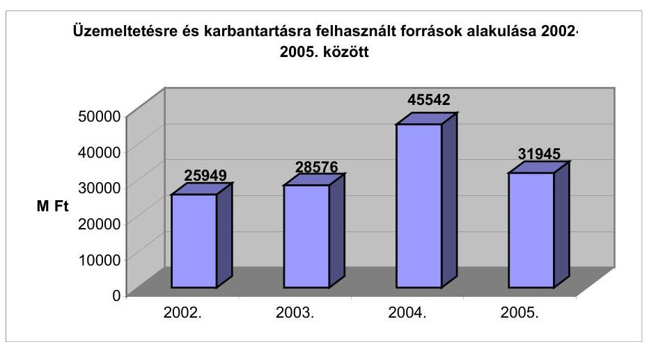

Az utak mennyiségi és minőségi jellemzőinek arányával számolva - szintén szakmai bizottság munkája alapján - elkészült egy forráselosztási modell,

---

amely a közútkezelő feladatokra szánt források egységes szemléletű és leghatékonyabb elosztását szolgálta.

Az éves megrendelési keretösszeget a szakmai bizottság által a forráselosztási modellben javasolt, majd a GKM által elfogadott tényszámok, szétosztási arányok határozták meg. A megyei közútkezelő kht-k ennek megfelelően - az UKIG ajánlását követve - állították össze az éves tevékenységi tervüket. Amennyiben az UKIG (2003. előtt az ÁKMI javaslatára a minisztérium) elfogadta azt, közhasznú vállalkozási szerződést kötött a megyékkel.

A fenntartási feladatokon belül a szűkös források miatt elsőbbséget a burkolat további romlását megakadályozó munkálatok kaptak, ezen belül a karbantartás élvezett előnyt a közlekedésbiztonság érdekében. Tárgyéven belüli tervezett feladatok átcsoportosítására csak a megyei közútkezelő kht. kellő indoklása mellett volt lehetőség. A karbantartási mód megválasztásának és a szerződéskötésnek az alapja az OKKSZ-ben megjelölt - az országos közúthálózat működőképességének megőrzéséhez kötött - „C" szolgáltatási szint teljesítése volt. Az UKIG a megyei közútkezelő kht-kat a felújítási tevékenység során a legolcsóbb, így a legnagyobb felületet érintő, állagmegóvó (egyéb burkolathibák javítása, keréknyomvályú megszüntetése, felületi bevonatok) technikákra ösztönözte.

Az UKIG vezetője 2003. december 5-én kelt levelében megfogalmazta a megyei közútkezelő kht-k számára: „A felújítási keret terhére történő 2004. évi munkavégzés során az előirányzatok szűkössége miatt törekedni kell a burkolatok állagmegóvó technológiákkal történő javítására. Ennek figyelembevételével kérjük a 223, 224, és 225 jogcímek szerinti technológiák előnyben részesítését. Amennyiben a társaság a javaslattól eltérő technológiák (pl. profiljavítás, vékonyaszfalt, méretezett burkolaterősítés) kíván alkalmazni, akkor a beavatkozás halaszthatatlanságát kérjük indokolni."

A 2002-2003-2004. évi költségvetés végrehajtásának az ÚFCE felhasználásáról szóló szöveges indoklása szerint a rendelkezésre álló források biztosították a Rendeletben meghatározott „C" szolgáltatási kategóriának megfelelő színvonal megtartását. Azonban az ellenőrzés során fellelt dokumentumok alapján, a 2005-2006. években már az előzetes felhasználási tervek készítésekor kétség merült fel a „C" szolgáltatási szint teljesíthetőségét illetően.

Az UKIG igazgatója 2005. áprilisában kelt jelentésében tájékoztatta a közlekedési tárca vezetőjét a 2005. évi ÚFCE felhasználási javaslatáról, amelyben felhívja a figyelmet: „Az országos közúthálózat kezelésére létrehozott megyei közútkezelő közhasznú társaságok üzemeltetési és karbantartási feladatai az Országos Közutak Kezelési Szabályzatában két szolgáltatási szinthez - „C" alacsony, illetve „A" magas szolgáltatási kategória - vannak rendelve. A „C" szolgáltatási kategória forrásszükséglete mintegy 35.000 M Ft. Ezzel szemben a megyei közútkezelő társaságok a 2005. évi ÚFCE nagyságát figyelembe vevő közhasznú szerződésének összege 27.500 M Ft, vagyis az OKKSZ-ben meghatározott feladatokat a legalacsonyabb „C" szolgáltatási szintnek megfelelően sem lehet teljesíteni."

A Bács-Kiskun Megyei Területi Igazgatóság vezetője 2006. február 20-án megküldött éves előzetes felhasználási tervében jelezte, hogy a 2006. évre rendelkezésre álló források több tervezendő feladatra nem elegendőek a „C" szolgáltatási szint fenntartásához. „Árkok, padkák, vízelvezető rendszerek fenntartására jogcímeken tervezhető mennyiségek - azok rossz állapotának következtében, mely a sokévi forráshiány miatt elmaradt karbantartási munkák következménye - nem elégítik ki a „C" szolgáltatási szintet." „Kátyúk megszüntetése jogcímeken a 2. fokozatú javításokat a szolgáltatási osztályoknak megfelelő időintervallumot nem mindig tudjuk betartani, de a legbalesetveszélyesebb szakaszokat javítjuk, a további szakaszokon megjelenő hibákat veszélyt jelző, illetve korlátozó jelzőtáblákkal jelezzük. Az 1. fokozatú javításokat ütemezzük, de minden évben kevés a rendelkezésre álló keret, így több éves lemaradásunk van, ezért minden évben halmozódva jönnek elő a 2. fokozatba tartozó burkolat hibák."

Finanszírozásból fakadó szakmai problémák az üzemeltetésnél is felmerültek.
„Bács-Kiskun megye az ország egyik parlagfűvel legfertőzöttebb területe, a megyei Növényvédő Állomás és a helyi Földhivatalok rendszeres ellenőrzései és felszólításai miatt a „C" szolgáltatási szint feletti gyakoriságot terveztük az utakon, de még ezek a megnövelt mennyiségek sem elegendőek a szükséges feladatok maradéktalan elvégzéséhez."

A Rendelet megalkotásakor - 1996-1998. között - egy homogén állapotot feltételeztek, ami mellett a „C" szintnek való megfelelés folyamatosan teljesíthető. Ezt az akkori beavatkozási ciklus nagysága alátámasztotta, azonban a jelenlegi szűkös források mellett lecsökkent a beavatkozások gyakorisága. Összevetve a 19 megyei közútkezelő igazgatóság 2000-2005. évek közötti teljesítését - tisztítás, üzemeltetés, karbantartás jellegű tevékenységek tekintetében - az évenkénti „C" szolgáltatási szint szerinti munkavégzés költségeivel, látható, hogy a rendelkezésre álló források nagysága folyamatosan elmarad a tervezettől. A legnagyobb mértékű, 29%-os eltérés 2002. évben volt tapasztalható. (4. sz. melléklet).

A megyei közútkezelő igazgatóságok a
 Rendeletnek való megfelelés érdekében kénytelenek voltak adott esetben súly-, illetve sebességkorlátozó táblákkal jelölni a hibás burkolatú szakaszokat, mert a megadott időkorláton belül nem tudták elvégezni a kellő javításokat.

Az OKKSZ 5.2.3. pontja rendelkezik a burkolathibák kijavításának időkövetelményeiről: „A 2. fokozat szerinti tömeges burkolathibák megjelenése, valamint a hidak és hídnak nem minősülő műtárgyak 2. fokozatú javítási feladatának esetében a javítási időtartamok meghosszabbíthatóak a megfelelő közúti jelzések egyidejű kihelyezése mellett."

A vizsgált időszak közlekedési infrastruktúra fejlesztésének jellegzetessége, hogy miközben a gyorsforgalmi utak látványosan fejlődtek, a főközlekedési utak fejlesztése is napirenden volt, az úthálózat állagmegóvására (figyelembe véve az inflációt is) kevesebb pénz jutott. A Közlekedéstudományi Intézet Kht. felmérése szerint a kedvezőtlen tendenciának következménye az országos közúthálózat elértéktelenedése, a forgalombiztonság romlása, az úthasználati költségek emelkedése.

A fenntartási munkák éves végrehajtása 2000-et követően a felére (1000 km/év), sőt 2003-2004-re ez tovább (400 km/év) csökkent. 2005. évben ugyan némi javulás volt tapasztalható, de a beavatkozási hossz és gyakoriság az 1994. évi ideális értéktől így is nagymértékben elmaradt. Összehasonlító árakon vizsgálva, 1993. és 2005. közötti időszakban az útfenntartási ráfordítások nagysága a felére csökkent. Az országos közúthálózat hídjainak fenntartására felhasználható források is csökkentek, ami a hidak állagának és biztonságának kockázatát növelte.

---

# 4. Az országos közúthálózat helyzete, Általános Jellemzői 

Magyarországon 2006. évben mintegy 190000 km közutat tartanak nyilván, ebből több mint 30.000 km állami tulajdonban lévő közút, amelynek fejlesztési, üzemeltetési feladataiért a Gazdasági és Közlekedési Minisztérium (GKM) a felelős. A közel 150000 km³⁰ (körülbelül 52000 belterületi, 88000 km külterületi) önkormányzati tulajdonban lévő közút fejlesztési, üzemeltetési feladataiért a tulajdonos önkormányzatok, közvetve a Belügyminisztérium a felelős. Magántulajdonban mintegy 20000 km út van.

Az országos közúthálózat mai helyzetét ellentmondások jellemzik. A gyorsforgalmi úthálózat fejlesztésének elsődlegessége mellett a meglévő országos úthálózat folyamatos leromlása figyelhető meg. A közúti mellékhálózat egyre alkalmatlanabb a gyorsforgalmi hálózatfejlesztés pozitív hatásainak érvényesítésére az érintett térségben.

## A nem gyorsforgalmi utaknál a fenntartás és fejlesztés arányai egymást feszítik, a szakmai minősítés szerint az útállapotok nem kielégítőek.

Útjaink állapota 50%-ban közepes, további 30%-ban pedig - valamely jellemző szerint - sürgős javításra szorul. Az utak minősége nemzetközi összehasonlításban is nagyon rossznak minősül. Hazánkban jelenleg a belterületi kiépített burkolatú utak aránya 70%-os, ugyanez az EU-ban 96%-os. A külterületeken és a mezőgazdasági területeken még rosszabb az arány, a hazai útkiépítettség 27%-os, az EU-ban tapasztalt 90%-os aránnyal szemben.

Az új közlekedéspolitikai koncepcióval szemben - minisztériumi értékelés alapján - belső kritikaként fogalmazódik meg, hogy az infrastruktúra-fejlesztés néhány alapvető célkitűzésétől eltekintve, a közút stratégiai elvek megvalósulása kívánni valót hagy maga után.

A minőségi és forgalmi jellemzők alakulása tekintetében az országos közúthálózat (és hidak) állapotának alakulását a 1998-2004. közötti időszakot bemutató, a 2005. júniusában, az UKIG által készített „A halaszthatatlan közútfenntartási és felújítási feladatok megvalósításának gyorsított ütemű programja" című tanulmány tartalmazza a burkolatok állapotának, teherbírásának gépi mérések szerinti, valamint mérnökök által végzett éves állapotfelvétel alapján kialakított minőségi - megfelelőségi értékelését.

A 7393 km főútból 2101 km az ún. „E" út, vagyis az európai úthálózat része. Az I. rendű főutakon a forgalomnagyság növekedése 1995-től 2004. év végéig, mintegy 23%-os, de eltérés tapasztalható az egyes országrészek közútjai között.

Az évenkénti, átlagos napi forgalom alakulása:

|  | Évi átlagos forgalom, egységjármű/nap |  |  |  |
| :-- | :--: | :--: | :--: | :--: |
|  | 1995. | 2002. | 2003. | 2004. |
| I. rendű főutak | 8681 | 10443 | 10659 | 10656 |
| II. rendű főutak | 5213 | 6186 | 6546 | 6781 |

[^0]
[^0]:    ${ }^{30}$ A 2003. december 31-ei állapotnak megfelelően.

---

Az úthálózat állapotát az út egyenetlensége, a nyomvályúsodás, a teherbírás (mérhető, definiált jellemzők) és a felületállapot szubjektív minősítése jellemzi.

Az egyenetlenség szempontjából a főutak több, mint 50%-a megfelelő, az Országos Közúti Adatbank öt osztályzatos értékelési rendszere szerint 1- 3 osztályzatú.

Az út hosszirányú egyenetlensége az út hossztengelyével párhuzamos metszetének az ideális állapothoz viszonyított megváltozása.

A nyomvályú képződés tekintetében a nem megfelelőnek minősített, 12,1 -17,0 mm-es mélységű nyomvályúval terhelt utak hossza az utóbbi hét évben folyamatosan - a romlás ütemében is - növekedett (65%-kal) csakúgy, mint a beavatkozási határnak tekintett, 17 mm feletti mélységűeké, ez utóbbi megduplázódott.

A nyomvályú képződés a nagy forgalmú, a nehézgépjárművek által jobban igénybevett utak jellegzetessége, ez kedvezőtlenül hat a forgalom biztonságára. A teljes országos közúthálózat, 12,1 - 17 mm-es mélységű nyomvályús szakaszainak hossza 2002-ben 2067 km, 2004-ben 3410 km volt. A 17 mm-t meghaladó mélységűek 2002-ben 1015 km-t, 2004-ben 1995 km-t tettek ki.

A teherbírás tekintetében a főutakon és az aszfaltbeton utakon a gyorsforgalmi fejlesztések eredményeként a mutatószám 4%-kal nőtt, de még így sem éri el az 50%-ot. A mutatószámok a fejlesztések prioritásai következtében jobbak, mint a mellékutakon. A jelenleg megengedett határérték 100 kN, amelyet az EU-s előírások miatt 115 kN-ra kell növelni. Az utak túlterhelésének következménye az úthálózat romlásának felgyorsulása.

A teherbírás mint jellemző a tengelyterhelések elviselési képességét fejezi ki. Az országos közúthálózat 44,4 %-a minősült jónak 1998-ban, a teherbírás szempontjából (a 10 tonnás határértéket véve figyelembe). 2004-ben 48% tartozott ebbe a kategóriába.

Az állapotváltozás mutatója az Országos Közúti Adatbank adatállománya alapján - a fent bemutatott jellemzők szerinti megoszlásban - legnagyobb mértékben, (4,11 %) a „rossz" minősítésű utak esetében növekedett. (A földutak és az autópálya csomóponti ágak nélküli, országos közutakon.)
adatok %-ban

|  | Jó | Megfelelő | Túrhető | Nem megfelelő | Rossz | Nem mért |
| :--: | :--: | :--: | :--: | :--: | :--: | :--: |
| 2002. | 22,85 | 18,99 | 14,79 | 14,56 | 24,66 | 4,16 |
| 2005. | 22,68 | 19,64 | 14,84 | 14,07 | 28,77 | 0,00 |

---

A nyomvályú képződés „jó" minősítése 5,59 %-al csökkent. Ennek megfelelően 2-3 %-ponttal növekedtek az alacsonyabb minősítésű részek.
adatok %-ban

|  | Jó | Megfelelő | Túrhető | Nem megfelelő | Rossz | Nem mért |
| :--: | :--: | :--: | :--: | :--: | :--: | :--: |
| 2002. | 83,00 | 5,83 | 2,73 | 1,62 | 1,71 | 5,11 |
| 2005. | 77,41 | 8,10 | 4,66 | 3,00 | 3,32 | 3,52 |

Az utak teherbíró képessége lényegesen nem változott.
adatok %-ban

|  | Jó | Megfelelő | Túrhető | Nem megfelelő | Rossz | Nem mért |
| :--: | :--: | :--: | :--: | :--: | :--: | :--: |
| 2002. | 48,48 | 6,80 | 9,26 | 10,50 | 23,35 | 1,61 |
| 2005. | 48,30 | 6,57 | 9,09 | 10,34 | 23,78 | 1,91 |

A felületépség romlása szembetűnő a három felső minősítés tartományában, az alsó három osztály javára, különösen a „rossz" minősítés növekedése jelentős, közel 18%-os.
adatok %-ban

|  | Jó | Megfelelő | Túrhető | Nem megfelelő | Rossz | Nem mért |
| :--: | :--: | :--: | :--: | :--: | :--: | :--: |
| 2002. | 6,03 | 11,37 | 28,36 | 17,56 | 36,68 | 0,01 |
| 2005. | 5,45 | 3,81 | 21,36 | 13,53 | 54,71 | 1,13 |

A felületállapot szubjektív minősítése a burkolatépséget meghatározó jellemzőket összegzi, úgymint a deformációkat, kátyúkat, kipergéses és izzadásos felületeket, repedéseket és burkolatszél hibákat. A vizsgálat során a víztelenítés állapotát is figyelembe veszik.

Amíg 2002-ben az országos közúthálózat felületépség osztályzat szerinti megoszlása 36,3%-ban rossznak minősült, addig 2004-ben ez az arány már 49%.

Az országos közúthálózat fő- és mellékútjain összesen 5702 db híd üzemel, mintegy 871000 négyzetméter hídfelülettel. Ennek a hídfelületnek közel 51 %-a főutakon van. A hídállomány összes hossza, illetőleg összes felülete az úthálózat hasonló adataihoz képest elenyésző, azonban a hídállomány bruttó értéke eléri az úthálózat bruttó értékének 10%-át. A hidak átlag életkora 47 év volt 2004-ben és folyamatosan növekszik jelezve, hogy nem elegendő a hidak korszerűsítésének az üteme. (Az életkort a legutolsó felújítási, vagy nagyobb korszerűsítési munkák óta eltelt idővel mérik.)

---

# 4.1. A minőségi és a garanciális kifogások 

Az országos főközlekedési utak és hidak állományának fejlesztését szolgáló beruházások kivitelezése során előforduló, nem a szerződésben rögzítetteknek megfelelő kiviteli teljesítések esetében követendő tennivalók, minőségi-, garanciális és szavatossági érdekérvényesítések eljárási rendjét nem szabályozták az UKIG-nál. A bemutatott „Az országos közúthálózat beruházásainak eljárási rendje, 2004." szabályzat ezekről a kérdésekről nem rendelkezett.

A hivatkozott szabályzatból hiányzik annak leírása, hogy milyen kötelező tennivalói vannak a beruházónak, ha nem a vállalkozói szerződésnek megfelelő kivitelezői teljesítéseket észlel (pl. kötbérigény-, kártérítési igény bejelentése, peresítés kezdeményezése). Ennek hiányában csak a lebonyolító saját belátására van bízva a közpénzből finanszírozott beruházásnál az állam érdekérvényesítése.

Az ellenőrzött időszak első, 2002-2004. közötti részében, a kialakult gyakorlat szerint a minőségi és garanciális kérdések intézését a közútkezelő kht-kra hagyták, de semmiféle feljegyzést, nyilvántartást nem tudtak bemutatni a kérdéskörrel kapcsolatban. Ennek eredményeként sem az esetleges kár nagyságáról, sem annak következményeiről nem volt információ, következésképpen a hibák elemzésének és a döntéshozatalhoz való visszacsatolásnak sem volt nyoma. Ebben az időszakban peres eljárást nem kezdeményeztek sem minőségi, sem garanciális okok miatti kártérítési igény érvényesítésére.

Javuló tendenciájú változás 2005-től kezdődött (az UKIG-ban történt személyi és szervezeti változtatásokat követően), amennyiben az UKIG elkezdte figyelemmel kísérni a garanciális kötelezettségek teljesítését és ezzel kapcsolatban a bankgaranciák meglétét is. 2005. IV. negyedévében 13 kivitelező késedelmes teljesítése miatt 124017267 Ft kötbér érvényesítésével éltek. A Beruházási Főosztály tételes tájékoztatást adott a felsőbb vezetőknek az érdekérvényesítés eredményéről.

A 3. sz. főút, Miskolcot elkerülő szakasz, I. ütemének kivitelezését követő garanciális munkák finanszírozására - mely munkákat a kivitelező helyett végeztek el 17978358 Ft jótállási bankgarancia igényt érvényesítettek.

A 85. sz. főút, 58+000-65+600 km szakaszának garanciális munkáiról beszámoltatták a Győr-Moson-Sopron Megyei Állami Közútkezelő Kht-t és a határidőn belül elvégzett munkák teljesítésigazolása szerint a beavatkozást az ÚT 2-3.306. sz. útügyi műszaki előírásoknak megfelelően, I. osztályú minőségben elvégezték.

Az ellenőrzött időszakban nem kezdeményeztek peres eljárást.

### 4.2. Az utak állapotából eredő kártérítési kötelezettségek, balesetek

A
 megyei közútkezelő Kht-k adatszolgáltatása alapján, bizonyíthatóan az utak állapota miatt benyújtott és a kezelők által elfogadott kártételek az utak kátyúsodása és a nyomvályú képződés következményei. A 2002–2005. közötti időszakban 11,3 millió Ft – 2002-ben 1,3; 2003-ban 2,5; 2004-ben 4,6 és 2005-ben 2,9 millió Ft – kártérítést fizettek a biztosítók és az útkezelők összesen. (A

---

végösszeg a Szabolcs-Szatmár-Bereg és a Veszprém megyei kártérítéseket nem tartalmazza, mert a két megye adatszolgáltatása nem volt értékelhető.)

A kártérítések összegének növekedéséhez (a 2002–2004. közötti időszakban) nem csak az utak romló állaga játszott szerepet, hanem a közlekedők kártérítési lehetőségének felismerése is. Mint ahogy a 2005-ös kártérítési összeg csökkenése nem az utak javulásának következménye, hanem a jótálló szervezetek fizetési készségének csökkenése.

A közúti balesetek bekövetkeztét csak közvetve lehet a közutak állapotára visszavezetni, ezt a rendőrségi eljárások is alátámasztják. A felelősség megállapítása során elsősorban az emberi tényezőkkel, másodsorban gépjármű műszaki okokkal indokolták a balesetek bekövetkeztét.

# 5. UTÓELLENŐRZÉS 

Az Útalap és az abból finanszírozott országos közúthálózat fenntartásának, üzemeltetésének, fejlesztésének, valamint a kezelő szervezetek működésének pénzügyi-gazdasági ellenőrzését az ÁSZ 1994-ben végezte el. Az ellenőrzés szerint a fenntartás és üzemeltetés nem kapott prioritást. Az elvégzett munkák nem minden esetben feleltek meg a minőségi követelményeknek.

Vizsgálatunk szerint a közútfejlesztésre vonatkozó koncepciók Országgyűlési, illetve kormányhatározatokban öltettek testet. A fenntartás a jelentés 3. pontjában foglaltak szerint háttérbe szorult, a források nem biztosították a megfelelő szolgáltatási szint elvégzését, megnőtt a beavatkozási ciklusok hossza, az utak állapota romlott. A minőségi követelmények teljesülését az értékcsökkenéssel átvett munkák rontották.

Nem valósult meg a Gazdasági és Közlekedési Minisztérium fejezet működésének ellenőrzése nyomán (2003) a Kormánynak tett, az állami feladatokat ellátó, közpénzből finanszírozott társaságok költségvetési szervvé történő átalakítása lehetőségének mérlegelésére tett javaslat. A 19 megyei közhasznú társaság megszűnt ugyan, de nem költségvetési szerv alá került, hanem beolvadt az Állami Koordinációs, Műszaki és Információs Kht-ba, amely Magyar Közút Állami Közútkezelő, Fejlesztő Műszaki és Információs Kht. néven működött tovább. (részletesen a jelentés 1. pontjában)

Budapest, 2006. október 28.

| Melléklet: | 8 db | 8 lap |
| :-- | :-- | :-- |
| Függelék: | 1 db | 9 lap |

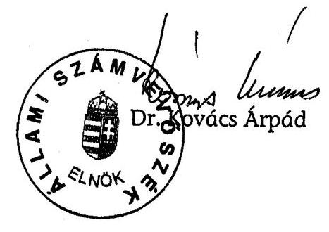

---

MELLÉKLETEK

---

# dr. Kovács Árpád 

Elnök Úr részére
Állami Számvevőszék

Budapest
Apáczai Csere János u. 10.
1052

Tisztelt Elnök Úr!
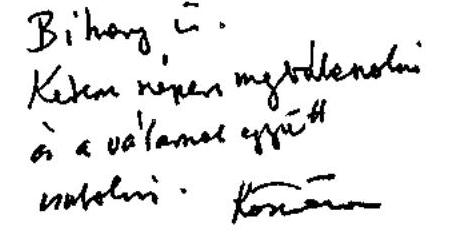

Iktatószám: III-6/139/8/2006. Hivatkozási szám: V-05-084/2006.
220406 10.18 . 1020106. 10.18
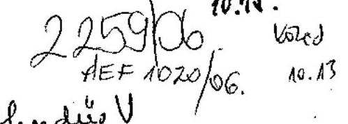

Köszönettel vettem „az állami közutak fenntartásának ellenőrzéséről” szóló jelentést.

A jelentésre az alábbi észrevételeket tesszük:
A jelentés javaslatai közül kérjük törölni a gazdasági és közlekedési miniszternek tett 1. számú javaslatot.

Álláspontunk szerint – a 12–13. oldalon leírtak alapján tett – javaslati jogi szabályozásnak a minisztérium eleget tett. Az egyes tervek, illetve programok vizsgálatáról szóló 2/2005. (I. 11.) Korm. rendelettel.

A hivatkozott jogszabályban a javaslat szempontjából a fontosabb rendelkezéseket tartalmazza, úgymint környezeti vizsgálat (1.§; 7.§ ) nyilvánosság (2. § (1); 7. § (5)), így az előzetes egyeztetések jogszabályi kerete adott.

A jelentésben a gazdasági és közlekedési miniszternek tett 2. javaslat utolsó részét módosítani kérjük az alábbiak alapján:

1) A Magyar Közút Kht. regionális átalakítása mellett másfajta átalakítás célszerűsége megkérdőjelezhető. Előírás lehet, hogy a regionális átalakítást – mint minden más átalakítást – célszerűségi és gazdaságossági szempontok szerint kell megvalósítani, de a regionális átalakítás mellett másirányú átalakítás létjogosultsága nem látszik indokoltnak.
2) Véleményünk szerint a Magyar Közút Kht. jelenlegi működése célszerű és gazdaságos. A jelentés tervezet 11. oldal 1. bekezdésében a hatékonysági és gazdaságossági célkitűzések teljesülését kétségesnek tartja, mert – a számvevőszék szerint – a Magyar Közút Kht. szervezete túltagolt, és magas a vezetői létszám.

---

a. A jelentés 24. oldala alján, 27-es számú lábjegyzetben leírja a Magyar Közút Kht. 2006. évi legfontosabb célkitűzését, melynek a szervezetrendszer megfelel. Ezen célok között szerepel a racionalizálás, a tevékenységek hatékony megszervezése, de már önmagában a tevékenységek centralizációjával megtakarítást értünk el
b. A Magyar Közút Kht. állományi létszáma jelenleg 4.401 fő, ebből a vezetők (osztályvezetői szinttel bezárólag) aránya csupán 4,8 % (211 fő).

Budapest, 2006. október „

Tisztelettel:
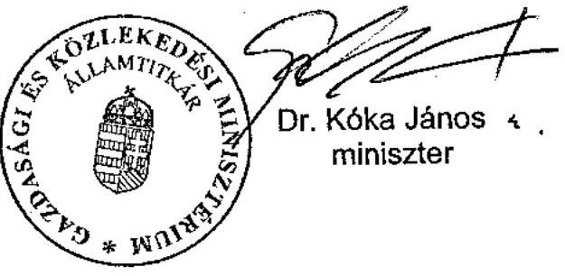

---

# Dr. Kóka János úr 

miniszter
Gazdasági és Közlekedési Minisztérium
Budapest

## Tisztelt Miniszter Úr!

Az állami közutak fenntartásának ellenőrzéséről készült jelentésünkre adott észrevételét köszönöm, azokkal kapcsolatban a következőkről tájékoztatom.

A gazdasági és közlekedési miniszternek címzett 1. számú javaslatot a levelében említett 2/2005. (I. 11.) Korm. rendelet ismeretében fogalmaztuk meg. A szóban forgó rendelet azonban a különböző felülvizsgálati kötelezettségeket írja elő, ami nem helyettesíti/helyettesítheti a különböző szakmai szempontok, érdekek harmonizálását célzó kötelező egyeztetéseket. Megítélésem szerint a 10. sz. főút előkészítésének anomáliái megalapozzák javaslatunkat. Megjegyzem, hogy a gyorsforgalmi utak esetében törvény szabályozza az egyeztetések rendjét a fejlesztések előkészítése során.

Örömmel nyugtázom, hogy Miniszter úr is a Magyar Közút Kht. regionális átalakítását tartja célszerűnek.

A Kht. egészére vonatkozó funkciókat ellátó szervezeti egységek szintje túltagolt, amit a regionális átalakítás nem old meg. Szeretném felhívni figyelmét arra, hogy megállapításaink nem a társaság működésére, az utak kezeléséhez kapcsolódó feladatot ellátó szervezeti háttérre és feladatmegosztásra vonatkoztak. A jelentés 6. számú lábjegyzete egyértelműen meghatározza azt a kört, amelynél a szervezeti kialakítást célszerűtlennek és gazdaságtalannak ítéljük. Tény – ezt jelentésünk is megállapítja –, hogy egyes tevékenységek centralizálásával megtakarítást érhetnek el. Ez a centralizáció nem kellő mértékben terjedt ki a Magyar Közút Kht. szervezetére, ahol hat igazgatóságból négy igazgatóság 26 fővel dolgozik, ezek közül is kitűnik a 3 fős Szervezetfejlesztési Igazgatóság. Továbbra is fenntartjuk véleményünket, hogy a feladatok magasabb szervezeti szintű megosztása a hatékonyságot önmagában nem növeli, viszont kiadási szempontból gazdaságtalan. E szervezeti egységek alacsonyabb – osztály, főosztály – besorolásban, természetesen megfelelő hatáskörökkel felruházva is kellő hatékonysággal láthatják el feladataikat.

Miniszter úr észrevételére is figyelemmel javaslatunkat úgy pontosítottam, hogy annak szándéka egyértelmű legyen.

---

Végezetül tájékoztatom Miniszter urat, hogy az ellenőrzésről készült jelentést – kialakult gyakorlatunk szerint – az Ön észrevételeivel és az azokra adott válaszommal együtt küldöm meg az Országgyűlés elnökének, az illetékes bizottságai elnökeinek és a Miniszterelnöknek.

Budapest, 2006. október 26.

Tisztelettel:
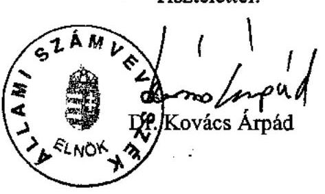

---

# A közlekedés fejlesztésének irányát kijelölő jogszabályok és egyéb rendelkezések 

A közúti közlekedésről szóló 1988. évi I. törvény

A magyar közlekedéspolitikáról és a megvalósításához szükséges legfontosabb feladatokról szóló 68/1996. (VII. 9.) OGY. határozat;

A magyar közlekedéspolitikáról szóló 2216/1996. (VII. 31.) Korm. határozat;
A magyar közlekedéspolitikáról és a megvalósításához szükséges legfontosabb feladatokról szóló 68/1996. (VII. 9.) OGY határozat 3. pontjában foglaltak végrehajtásának intézkedési programjáról szóló 1099/1997. (IX. 30.) Korm. határozat;

A 2003–2015-ig szóló magyar közlekedéspolitikáról, elfogadott, 19/2004. (III. 26.) OGY. határozat, amely 6/1998 (VII. 9.) OGY határozatot hatályon kívül helyezte;

A 2003–2015-ig szóló magyar közlekedéspolitikával kapcsolatos intézkedésekről szóló 1023/2004. (III. 26.) Korm. határozat.

Az Országos Területfejlesztési Koncepcióról szóló 35/1998 (III. 20.) OGY határozat;

A gyorsforgalmi úthálózat tízéves fejlesztési programjának megvalósításáról szóló többször módosított 2117/1999. (V. 26.) Korm. határozat;

## Konkrét feladatot kijelölő Kormányhatározatok

A gyorsforgalmi úthálózat (autópályák, autóutak) 2015-ig terjedő fejlesztési programjáról, valamint az országos közúthálózat kiemelten fontos elemeinek a megvalósításáról szóló 2303/2001. (X. 19.) Korm. határozat;

A gyorsforgalmi úthálózat tízéves fejlesztési programjának megvalósításáról szóló 2117/1999. (V. 26.) Korm. határozat módosításáról szóló 2368/2001. (XII. 18.) Korm. határozat.

---

# Az UFCE-ből, illetve az Útpénztár előirányzatból finanszírozott útfejlesztési kiadások alakulása

|   | 2002. (UFCE) |  |  |  | 2003. (UFCE) |  |  |  | 2004. (UFCE) |  |  |   |
| --- | --- | --- | --- | --- | --- | --- | --- | --- | --- | --- | --- | --- |
|   | Eredeti e.i. | Módosított | Teljesített- |  | Eredeti e.i. | Módosított | Teljesített- |  | Eredeti e.i. | Módosított | Teljesített- |   |
|   | 100\% | e.i. | e.i. | Eredeti %-a | 100\% | e.i. | e.i. | Eredeti %-a | 100\% | e.i. | e.i. | Eredeti %-a  |
|  Út-, híd rekonstrukció | 15750,0 | 13957,7 | 13973,7 | 88,7 | 7000,0 | 6470,0 | 6520,8 | 93,2 | 14000,0 | 13237,5 | 13237,5 | 94,6  |
|  Új út-, híd építés | 8500,0 | 12625,4 | 12613,9 | 148,4 | 9570,0 | 7800,0 | 7800,6 | 81,5 | 14600,0 | 10547,2 | 10547,2 | 72,2  |
|  Tervezés, előkészítés | 2100,0 | 2133,4 | 2113,8 | 100,7 | 2800,0 | 2321,4 | 2490,5 | 88,9 | 12096,0 | 3254,9 | 3254,3 | 26,9  |
|  Út-, híd felújítás | 14500,0 | 14615,1 | 14586,0 | 100,6 | 6000,0 | 7129,3 | 7129,9 | 118,8 | 7203,8 | 7143,2 | 7143,2 | 99,2  |
|  Területbiztosítás | 900,0 | 713,2 | 699,3 | 77,7 | 500,0 | 1230,0 | 1416,7 | 283,3 | 3600,0 | 2481,7 | 2481,7 | 68,9  |
|  Önkorm.-ok támogatása | 2500,0 | 3400,8 | 3396,0 | 135,8 | 1800,0 | 2708,6 | 2708,6 | 150,5 | 2900,0 | 1253,6 | 1253,6 | 43,2  |
|  Alapítói forrásjuttatás | 2000,0 | 1700,9 | 1691,4 | 84,6 | 100,0 | 62,0 | 62,0 | 62,0 | 100,0 | 264,3 | 264,3 | 264,3  |
|  Összesen: | 46250,0 | 49146,5 | 49074,1 | 106,1 | 27770,0 | 27721,3 | 28129,1 | 101,3 | 54499,8 | 38182,4 | 38181,8 | 70,1  |

|   | 2005. (UFCE) |  |  |  | 2006. I. félév (Útpénztár e.i.) |  |  |  |   |
| --- | --- | --- | --- | --- | --- | --- | --- | --- | --- |
|   | Eredeti e.i. | Módosított | Teljesített- |  | Eredeti e.i. | Módosított | Teljesített- |  |   |
|   | 100\% | e.i. | e.i. | Eredeti %-a | 100\% | e.i. | e.i. | Eredeti %-a |   |
|  Út-, híd rekonstrukció | 10697,3 | 9475,1 | 9375,4 | 87,6 |  |  |  |  |   |
|  Új út-, híd építés | 13522,7 | 11887,7 | 11887,7 | 87,9 | 38920,0 | 32520,0 | 8347,2 | 21,0 |   |
|  Tervezés, előkészítés | 6500,0 | 3569,8 | 3569,8 | 54,9 | 6500,0 | 6500,0 | 768,3 | 12,0 |   |
|  Út-, híd felújítás | 10000,0 | 10472,4 |

 | 10472,4 | 104,7 | 37189,8 | 19047,0 | 8221,0 | 22,0 |   |
|  Területbiztosítás | 5000,0 | 3412,9 | 3412,9 | 68,3 | 4680,0 | 4680,0 | 722,1 | 9,0 |   |
|  Önkormányzatok támogatása | 700,0 | 565,9 | 565,9 | 80,8 | 0,0 | 2542,8 | 0,0 |  |   |
|  Kármentesítés |  |  |  |  | 1400,0 | 1400,0 | 1308,5 | 93,0 |   |
|  Alapítói forrásjuttatás | 555,7 | 555,0 | 555,0 | 99,9 |  |  |  |  |   |
|  Összesen: | 46975,7 | 39938,8 | 39839,1 | 84,8 | 88689,8 | 66689,8 | 19367,1 | 22,0 |   |

---

Az UFCE-ből, illetve az Útpénztár előirányzatból finanszírozott útfenntartási kiadások alakulása

|   | 2002. (UFCE) |  |  |  | 2003. (UFCE) |  |  |  | 2004. (UFCE) |  |  |   |
| --- | --- | --- | --- | --- | --- | --- | --- | --- | --- | --- | --- | --- |
|   | Eredeti e.i. | Módosított | Teljesített |  | Eredeti e.i. | Módosított | Teljesített |  | Eredeti e.i. | Módosított | Teljesített |   |
|   | 100\% | e.i. | e.i. | Eredeti %-a | 100\% | e.i. | e.i. | Eredeti %-a | 100\% | e.i. | e.i. | Eredeti %-a  |
|  Út-, híd üzemeltetés | 15000,0 | 16115,0 | 16125,9 | 107,5 | 16630,0 | 19186,0 | 18507,3 | 111,3 | 18300,0 | 20033,2 | 20033,2 | 109,5  |
|  Új út-, híd karbantartás | 9000,0 | 8780,0 | 8779,6 | 97,6 | 9350,0 | 8307,0 | 8262,8 | 88,4 | 11700,0 | 9406,9 | 9406,9 | 80,4  |
|  Útügyi műszaki gazdálkodási szolg. | 1000,0 | 755,0 | 751,0 | 75,1 | 600,0 | 600,0 | 616,7 | 102,8 | 717,5 | 577,5 | 577,5 | 80,5  |
|  Egyéb kiadások | 200,0 | 299,7 | 299,3 | 149,7 | 0,0 | 483,3 | 851,9 | 483,3 | 740,5 | 15525,2 | 1673,4 | 226,0  |
|  Összesen: | 25200,0 | 25949,7 | 25955,8 | 103,0 | 26580,0 | 28576,3 | 28238,7 | 106,2 | 31458,0 | 45542,8 | 31691,0 | 100,7  |

|   | 2005. (UFCE) |  |  |  | 2006. (Útpénztár) |  |  |   |
| --- | --- | --- | --- | --- | --- | --- | --- | --- |
|   | Eredeti e.i. | Módosított | Teljesített |  | Eredeti e.i. | Módosított | Teljesített (I. félév) |   |
|   | 100\% | e.i. | e.i. | Eredeti %-a | 100\% | e.i. | e.i. | Eredeti %-a  |
|  Út-, híd üzemeltetés | 18450,0 | 21227,5 | 21227,5 | 115,1 | 13269,5 | 32388,7 | 5297,7 | 39,9  |
|  Új út-, híd karbantartás | 11680,0 | 9263,8 | 9263,8 | 79,3 | 8498,9 | 9389,7 | 1619,8 | 19,1  |
|  Útügyi műszaki gazdálkodási szolg. | 800,0 | 714,9 | 714,9 | 89,4 | 7116,6 | 9406,6 | 5780,3 | 81,2  |
|  Egyéb kiadások | 720,0 | 739,6 | 735,5 | 102,2 | 1000,0 | 1000,0 | 2135,6 | 213,6  |
|  NA Zrt. működés |  |  |  |  | 1800,0 | 1800,0 | 930,0 | 51,7  |
|  Útpénztár működés |  |  |  |  | 2115,0 | 1815,0 | 907,5 | 42,9  |
|  Összesen: | 31650,0 | 31945,8 | 31941,7 | 100,9 | 33800,0 | 55800,0 | 16670,9 | 49,3  |

---

5. sz. melléklet a V-05-090/2006. sz. jelentéshez

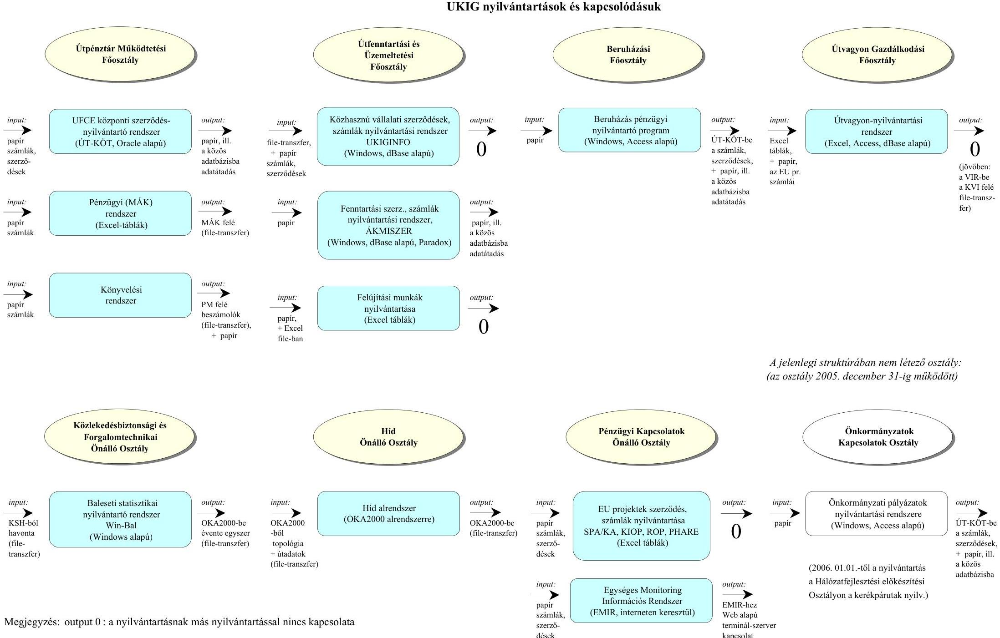

# UKIG nyilvántartások és kapcsolódásuk

## Útpénztár Működtetési Főosztály

### Útpénztár Működtetési Főosztály

|  **Útpénztár Működtetési Főosztály** | **Útfentartási és Üzemeltetési Főosztály** | **Beruházási Főosztály** | **Útvagyon Gazdálkodási Főosztály**  |
| --- | --- | --- | --- |
|  **UPCE központi szerződésnyilvántartó rendszer (ÜT-KÖT, Oracle alapú)** | **Közhasznú vállalati szerződések** | **Közhasznú vállalati szerződések** | **Közhasznú vállalati szerződések**  |
|  **Pénzügyi (MÁK) rendszer (Excel-táblák)** | **Fenntartási szerződések, számla** | **Közhasznú vállalati szerződések** | **Közhasznú vállalati szerződések**  |

---

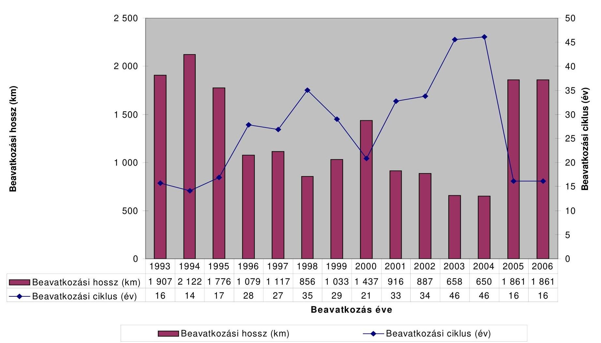

# **Beavatkozási hosszév**

## **Beavatkozási hossz (km)**

|  1993 | 1994 | 1995 | 1996 | 1997 | 1998 | 1999 | 2000 | 2001 | 2002 | 2003 | 2004 | 2005 | 2006  |
| --- | --- | --- | --- | --- | --- | --- | --- | --- | --- | --- | --- | --- | --- |
|  2 500 |  |  |  |  |  |  |  |  |  |  |  |  |   |
|  2 000 |  |  |  |  |  |  |  |  |  |  |  |  |   |
|  1 500 |  |  |  |  |  |  |  |  |  |  |  |  |   |
|  1 000 |  |  |  |  |  |  |  |  |  |  |  |  |   |
|  500 |  |  |  |  |  |  |  |  |  |  |  |  |   |
|  1 993 |  |  |  |  |  |  |  |  |  |  |  |  |   |
|  1 994 |  |  |  |  |  |  |  |  |  |  |  |  |   |
|  1 995 |  |  |  |  |  |  |  |  |  |  |  |  |   |
|  1 996 |  |  |  |  |  |  |  |  |  |  |  |  |   |
|  1 997 |  |  |  |  |  |  |  |  |  |  |  |  |   |
|  2 122 |  |  |  |  |  |  |  |  |  |  |  |  |   |
|  1 079 |  |  |  |  |  |  |  |  |  |  |  |  |   |
|  1 117 |  |  |  |  |  |  |  |  |  |  |  |  |   |
|  856 |  |  |  |  |  |  |  |  |  |  |  |  |   |
|  1 033 |  |  |  |  |  |  |  |  |  |  |  |  |   |
|  1 437 |  |  |  |  |  |  |  |  |  |  |  |  |   |
|  916 |  |  |  |  |  |  |  |  |  |  |  |  |   |
|  887 |  |  |  |  |  |  |  |  |  |  |  |  |   |
|  650 |  |  |  |  |  |  |  |  |  |  |  |  |   |
|  1 861 |  |  |  |  |  |  |  |  |  |  |  |  |   |
|  1 861 |  |  |  |  |  |  |  |  |  |  |  |  |   |
|  1 861 |  |  |  |  |  |  |  |  |  |  |  |  |   |
|  16 |  |  |  |  |  |  |  |  |  |  |  |  |   |
|  1 861 |  |  |  |  |  |  |  |  |  |  |  |  |   |
|  16 |  |  |  |  |  |  |  |  |  |  |  |  |   |
|  1 861 |  |  |  |  |  |  |  |  |  |  |  |  |   |
|  16 |  |  |  |  |  |  |  |  |  |  |  |  |   |

 |  |  |   |

**Beavatkozás éve**

- Beavatkozási hossz (km)
- Beavatkozási ciklus (év)

---

# A helyszínen ellenőrzött projektek

|  Út- és híd rekonstrukció | Új út és -híd építés | Széchenyi Plussz pr.  |
| --- | --- | --- |
|  2002. 8.sz főút,Várpalota - Székesfehérvár négyny. I. 2005. 4.sz. főút, 171+667-180+400 km burkolaterősítés | 2003. 4.sz. főút, Törökszentmiklós elkerülés 2003. 4.sz. főút, Hajdúszoboszló elkerülése | 2003. 451.sz. Kiskunfélegyháza elkerülő 2003. 51.sz. főút, Solt - Dombóvár új nyomvonal  |
|  2004. 6517.j. út Nak-Lápafő 0,5 - 5 km korszerűsítése 2004. 61.sz főút, 68,0-71,2 km rekonstrukciója | 2002. 56.sz. főút, Szekszárd tehermentesítés III. ütem 2005. 6.sz. főút, Pécs D-ny-i elkerülése, III. ütem | 2003. 6.sz. főút, 171,1-172,2 km kapaszkodósáv 2003. 6.sz. főút, Pécs D-Ny-i elkerülő II. ütem  |
|  2004. 1.sz. főút, 2+548-3+710 km Budaörs, korszerűsítés 2006. 4.sz főút, 60+6-69+6 km burkolaterősítés | 2006. M3 ap.- 3.sz főút között Gödöllő elkerülése 2006. M3 ap.- 32.sz főút között Hatvan elkerülése | 2005. 4.sz. főút, 69,6 - 76,9 km négysávosítás 2005. 4.sz. főút, Abony elkerülése  |
|  2004. 33.sz. főút, 98+000-101+000 km rekonstrukció 2004. 33.sz.főút, 101+000-105+000 km rekonstrukció | 2002. 83.sz. főút, Pápa elkerülő I. ütem 2003. 83.sz. főút, Pápa elkerülő II. ütem | 2003. 8.sz. főút, 21,8-24,5 km Csór - Várpalota négy nyoms. 2003. 8.sz. főút, 56+800- 60+800 km négysávosítás  |
|  2004. 4915.j. út, Vállaj határátkelőhöz vezető út korszerűsítése | 2002. 37.sz. főút, Sátoraljaújhely elkerülő | 2003. 4.sz. főút, négysávosítása 271 - 272,2 km  |
|  2002. 7.sz. főút, 148+150-151+225 km burkolatmegerősítés | 2003. 61.sz. főút, Kaposvár elkerülés III. ütem | 2003. 6.sz főút, 258,6-261,5 km Barcs elkerülő  |
|  2005. 51.sz. főút, 86+101-87+581 km Solt, rekonstrukció | 2006. 5.sz. főút, Kiskunfélegyháza tehermentesítés | 2004. 51.sz. főút, Solt - Dunapataj 87,6-96,9 km új nyomvonal  |

---

# A korábbi számvevőszéki javaslatok utóellenőrzése 

## 1. JELENTÉS a GAZDASÁGI ÉS KÖZLEKEDÉSI MINISZTÉRIUM FEJEZET MŰKÖDÉSÉNEK ELLENŐRZÉSÉRŐL (2003)

## Javaslat a Kormánynak:

1. mérlegelje az állami feladatokat ellátó, közpénzből finanszírozott társaságok költségvetési szervvé történő átalakításának lehetőségét;

A javaslat nem teljesült, mert a 19 megyei közhasznú társaság megszűnt ugyan, de nem költségvetési szerv alá került, hanem beolvadt az Állami Koordinációs, Műszaki és Információs Kht-ba, amely Magyar Közút Állami Közútkezelő, Fejlesztő Műszaki és Információs Kht. néven működött tovább. A megyei kht-k annak megyei igazgatóságaiként működtek tovább. (részletesen a jelentés 1. pontjában)

## Javaslat a gazdasági és közlekedési miniszternek:

2. intézkedjen az intézményi szabályzatok teljes körűvé tételéről;

Az intézmények (UKIG, Magyar Közút Kht.) szabályozottsága megfelelő, de a 2006. januárjában jóváhagyott UKIG SzMSz további aktualizálásra, pontosításra szorul az egyes szervezeti egységek irányítása, valamint a párhuzamosságok szempontjából. Emellett egyes tevékenységek esetében az SzMSz általánosságban fogalmaz, az egyes apparátusokhoz konkrét tevékenységet nem rendel, az egyes szervezeti egységek tevékenységében átfedések, hiányosságok mutatkoznak. (részletesen a jelentés 1. pontjában)

Elfogadott Közbeszerzési Szabályzattal sem az UKIG, sem Magyar Közút Kht. nem rendelkezik. (részletesen a jelentés 2.5. pontjában)
3. Gondoskodjon a GKM kezelésében lévő célelőirányzatokból megvalósult programok szakmai teljesítésének, a pénzeszközök felhasználásának és a gazdaságra gyakorolt hatásának évenkénti értékeléséről.

Az Útfenntartási és Fejlesztési Célelőirányzat felhasználásáról szóló beszámolót, annak kezelője az UKIG évente elkészítette.

A Minisztérium Közúti Közlekedési Főosztálya féléves gyakorisággal Tájékoztatót készített az ÚFCE-ból finanszírozandó munkák állásáról, valamint szakmai összeállításokat és programokat a meglévő úthálózat megóvására és felújítására vonatkozóan.

A vizsgált időszakot megelőző évben a Közlekedési és Vízügyi Minisztérium Közúti Főosztálya „Útgazdálkodás 2001." címmel beszámolót adott ki az UKIG összeállításában, azonban 2002-től a közlekedési tárca GKM fejezetbe kerülését követően a kiadvány már nem készült el.

---

(részletesen a jelentés 1.2. pontjában)

# 2. JELENTÉS AZ ÚTALAP ÉS AZ ABBÓL FINANSZÍROZOTT ORSZÁGOS KÖZÚTHÁLÓZAT FENNTARTÁSÁNAK, ÜZEMELTETÉSÉNEK, FEJLESZTÉSÉNEK, VALAMINT A KEZELŐ SZERVEZETEK MŰKÖDÉSÉNEK PÉNZÜGYI-GAZDASÁGI ELLENŐRZÉSÉRŐL (1994) 

## Az ellenőrzés részletes megállapításainak hasznosítása mellett javasoljuk:

## a minisztérium vezetésének:

1. dolgozzanak ki olyan közgazdasági és műszaki módszereket, melyek biztosítják a nemzeti (kincstári) vagyon részét képező, az állami közútvagyon valós értékének meghatározását, és egyben lehetővé teszik az ország teljes úthálózatának értékmegállapítását is;

Az állami közutak vagyonnyilvántartása elkészült, kialakításával, valamint értékelésével a jelentés 1.7. pontja foglalkozik.
2. vizsgálják felül a közútkezelő szervezetek hatáskörét, jogkörét, és azokat a tényleges feladatokkal összhangban határozzák meg;

A felülvizsgálat átvilágítás keretében 2005-ban megtörtént, ennek eredményével, és hatásával a jelentés 1. pontja foglalkozik.
3. korszerűsítsék a közútfejlesztés hosszútávú programját, megteremtve a műszaki és gazdasági koncepciók összhangját. Határozzák meg, hogy a kijelölt célok milyen ütemben valósíthatók meg. A koncepciót nyújtsák be a Kormánynak jóváhagyásra, és gondoskodjanak annak rendszeres karbantartásáról;

A közútfejlesztésre vonatkozó koncepciók Országgyűlési, illetve kormányhatározatokban öltettek testet. A témát a jelentés 2.1. pontja részletezi.
4. fordítsanak nagyobb hangsúlyt a beruházási, fenntartási munkák minőségellenőrzésére, a vizsgálatok eredményeit minden esetben érvényesítsék azokkal a területi szervekkel szemben, ahol ettől eltekintenek, foganatosítsanak szankciókat;

Az útfelújítások, útépítések munkáinak átadás-átvételekor néhány millió forintos értékcsökkentés mellett - a szerződéses határidő előtt néhány nappal, vagy héttel - a munkát átvették. Ezek a hiányosságok (például a kopóréteg nem megfelelő, vagy a tűréshatáron belüli minősége, vagy az útpadka tömörsége, ugyanakkor az út élettartamát kedvezőtlenül befolyásolhatja.
(a részletes megállapítások a 2.6 pontban, illetve az 1. számú függelékben)
5. különítsenek el a beruházási költségeken belül egy százalékosan meghatározott összeget, amit a minőségellenőrzésre fordítanak;

Ilyen keretet a vizsgált időszakban nem különítettek el.

---

6. vizsgálják felül valamennyi igazgatóságra kiterjedően a belső ellenőrzés működését, hatékonyságát, a számviteli tevékenységet, ez alapján tegyék meg a szükséges intézkedéseket;
7. javítsák a belső ellenőrzés hatékonyságát, készítsék el a hiányzó belső ellenőrzési szabályzatokat, rögzítsék az egyes munkaköri leírásokban a munkafolyamatba épített ellenőrzési kötelezettséget. Törekedjenek arra, hogy minden igazgatóságnál megfelelő képzettségű és gyakorlatú, teljes munkaidőben foglalkoztatott belső ellenőrt alkalmazzanak.

A belső ellenőrzés a vizsgált időszakban folyamatosan létszámhiánnyal működött, ez alapvetően behatárolta éves tevékenységét. (Részletesen a jelentés 1.8. pontjában)

---

# A helyszíni vizsgálatokkal kapcsolatos 

## tapasztalatok összegzése

## I. Út- és híd rekonstrukciók

1.) 8. sz. Székesfehérvár-Jánosháza-Rábafüzes I. rendű főút 11,7$14,3 \mathrm{~km}$ szelvények közötti négynyomsávúsítási munkái

Az útszakasz kivitelezését a Betonút Építő és Szolgáltató Kft. nyílt előminősítéses közbeszerzési eljárás keretében nyerte meg. A beruházást az indokolta, hogy a főút korábbi kiépítettsége már nem felelt meg a forgalmi igényeknek. A fejlesztési igény összhangban volt az országos főúthálózat fejlesztési terveivel. Célja a főút kapacitásnövelése, illetve a meglévő burkolat erősítése volt. A beruházáshoz megvalósíthatósági tanulmány és döntéselőkészítő tervek készültek. A beruházás bruttó költsége 1.022.045.633 Ft volt, melyhez a forrást az ÚFCE biztosította. Az építési munkákat a kivitelező 2002. október 21-én készre jelentette. A műszaki át-adás-átvétel során minőségi problémák nem merültek fel, a jelzett javításokat a lebonyolító elvégezte. A műszaki-gazdasági beszámolóban foglaltak szerint a beruházás a kiviteli tervnek megfelelően, a folyamatos mérések és minősítések alapján I. osztályú minőségben készült el.

## 2.) 4. sz. főút $171+667-180+400 \mathrm{~km}$ szelvények burkolat megerősítése

A beruházás tárgya a nevezett útszelvények 11,5 t tengelyterhelésre történő megerősítése volt. A Hajdú-Bihar Megyei Állami Közútkezelő Kht. által meghirdetett nyílt közbeszerzési eljárás nyertese a HB-ÚT 2005 Konzorcium lett, ahol a konzorciumvezető a Switelsky Építő Kft. A beruházás finanszírozása a KIOP keretében történt. A vállalkozási szerződést az UKIG, mint megrendelő kötötte meg a nyertessel 2005. március hó 18-án. A munkák megkezdésének időpontja 2005. március 30., befejezésének időpontja 2006. január 31-e, összes költsége 1.099.999.956 Ft volt. A vállalkozói szerződés-i módosításával a határidő 2005. november 20-ára változott. A beruházás határidőre befejeződött, a Hajdú Bihar Megyei Közlekedési Felügyelet az ideiglenes forgalomba helyezést engedélyezte. A meghatározott indikátorokhoz (a felújított útszakaszok hossza, burkolatállapot, teherbírás, egyenetlenség) rendelt értékek megvalósultak.

## 3.) 6517. jelű út Nak-Lápafő közötti 0,5 -5,0 km szakasz korszerűsítése

Az összekötő út Tolna megye Ny-i szélén helyezkedik el. A fejlesztés Alsóhetény, Nak, Lápafő, és Kapospula Dombóvár környéki kistelepülések

---

térségfejlesztési programjának részeként valósult meg. A 2002. és 2003. év tavaszán a gyenge pályaszerkezet jelentős károsodást szenvedett. Az OKA minősítő paraméterei, illetve az útüzemeltetés magas költségei is alátámasztották a beavatkozási igényt. Közbeszerzési eljárás keretében a megrendelő a Tolna Megyei Állami Közútkezelő Kht, a vállalkozó a Swietelsky Útvasút Kht volt. A szerződéskötés kelte: 2004. október 8., a szerződéses véghatáridő 2004. november 7., a szerződött összeg 133.445.368 Ft volt. Tanulmányterv nem készült. A 2004. november 9-én felvett jegyzőkönyv értelmében munka nem készült el teljes körűen, a padkarendezés, árokrendezés cca 10\%-os, az aszfalt kopóréteg készültségi foka 80\%-os, hiányoznak a forgalomtechnika és egyéb járulékos munkák. Az átadás-átvétel megkezdésének a feltételei nincsenek biztosítva. A 2004. november 15-én kelt műszaki átadás-átvétel jegyzőkönyve értelmében - 3 nap alatt - nem sikerült kijavítani a hibajegyzék szerinti hiányosságokat. A meghiúsítás után 3 nappal megkezdett átadás-átvételi eljárás tanúsága szerint a rendelkezésre álló idő kevésnek bizonyult a hibák kijavítására. Az ÁKMI Kht. Szegedi Minőségvizsgálati Osztály által 2004. november 29-én kelt jegyzőkönyvek szerint az ömlesztett és fúrt minták tömörsége nem érte el a 97\%-ot. A 2005. június 3-án kelt - előzetes garanciális bejárással kapcsolatos - jegyzőkönyv értelmében a 2004. évben készült útszélesítési munka során az árok-, pad-ka-, rézsűrendezéseket nem fejezték be teljes körűen az alkalmatlan időjárás miatt. Az aszfaltburkolat több helyen hossztengelyben megnyílt. A szélesítés mindkét oldalon, több helyen átrepedt, kismértékben megsüllyedt és mozaikos repedések keletkeztek. A kivitelező az érintett meghibásodásokat garanciális hibaként elismerte és vállalta azok kijavítását. Az építtető 2006. március 3-án 5.077.274 Ft-os késedelmi kötbérigényt jelentett be a kivitelező felé, az öt napos késedelemmel összefüggésben. A kivitelező a 2006. március 22 -én kelt levél értelmében nem ismerte el a kötbérigényt, hivatkozva a munka végzés során felmerült eseményekre (közműegyeztetés miatti munka területbiztosítási késedelem, a terven felül kivágandó fákra vonatkozó naplóbejegyzés). A helyszíni vizsgálatunk idején a kötbérigény még folyamatban volt. A 2006. május 16 -ai helyszíni tapasztalataink szerint az utat az építtető garanciálisan kijavította, a 2005. II. negyedévére előírt padka és rézsűrendezést végrehajtották. A több mint tíz helyen, nagy felületen elvégzett javítások arra engednek következtetni, hogy a vállalkozó a szerződéses határidőben nem végzett elfogadható minőségű munkát. A hibajavítások helyett ésszerűbb lett volna a befejezési határidőt a minőség érdekében néhány héttel meghosszabbítani, és ez által elkerülni az utólagos beavatkozásokat.

# 4.) 61. sz. főút Dunaföldvár-Dombóvár-Nagykanizsa 68,0-71,209 km szelvények közötti szakaszának rekonstrukciós munkái 

A Tolna Megyei Állami Közútkezelő Kht, mint megrendelő 2004. szeptember 21-én kötött vállalkozási szerződést a közbeszerzési eljárás során nyertes HBG-T Építőipari Kft-vel a szakasz szélesítési és burkolat megerősítési munkálatainak kivitelezésére. A projekt ÚFCE forrásból valósult meg. A kijelölés szempontjait valamint a műszaki paramétereket szakértői
 bizottság határozta meg előtanulmányban, ezenkívül a fejlesztést alátámasztották a forgalomszámlálási adatok, a forgalomnövekedés várható mértéke, illetve az OKA egyéb adatai is. A szerződött bruttó összeg 174.377.069 Ft volt. A

---

szélesítési és burkolati megerősítési munkákat teljes körűen befejezték, majd a 2004. november 15-én műszaki átadás-átvételi jegyzőkönyvben rögzítették a vállalkozó további kötelezettségeit, a minőségi kifogásokat, a minőségcsökkenés értékét (a szerződéses összegből értékcsökkenés miatt 1.270.480 Ft-ot vontak le), valamint a létesítményt üzemeltetésre átadták. A pénzügyi teljesítés a vállalkozói szerződésben foglaltak szerint két részletben, a Kht. teljesítés igazolásával és az UKIG ellenjegyzésével megfelelően történt. A befejezés a szerződésben rögzített határidő (2004. november 5.) helyett 7 nappal később történt. A kötbér érvényesítése folyamatban van. A minőségi problémaként jelentkezett: az aszfaltréteg vastagsága, a kopóréteg tömörséghiánya, az aszfaltkeverék bitumentartalmának eltérése. Nem megállapítható, hogy a levont értékcsökkenés hosszútávon milyen (510 év, ekkor már nincs jótállási kötelezettség) arányban van az út minőségének esetleges romlásával, illetve az út élettartama mennyivel rövidül meg.

# 5.) 1. sz. főút 2+548 - 3+710 km szelvények közötti szakaszának (Budaörs) rekonstrukciója 

A beruházás megvalósítására kiírt nyílt közbeszerzési eljárás során a legkedvezőbb ajánlatot a Hoffmann Rt. adta. Budaörs Város Önkormányzata, mint megrendelő és a Hoffmann Építőipari Rt. 2004. június 30-án vállalkozási szerződést írt alá. Az UKIG nevében eljáró Pest Megyei Állami Közútkezelő Kht. és a Budaörs Város Önkormányzata között 2004. augusztus 8-án Keretfelhasználási megállapodás jött létre, melynek előzménye a felek által 2002. december 6-án aláírt Együttműködési megállapodás. A kivitelezés költsége az eredetileg tervezett 150 M Ft-ot (ÚFCE-ból 130 M Ft, Önkormányzattól 20 M Ft) meghaladta, a hiányzó részt a felek az eredeti hozzájárulás arányában (ÚFCE 103.467.870 Ft, Önkormányzat 15.919.311 Ft) biztosították. Az Önkormányzat a Pest Megyei Állami Közútkezelő Kht. részére a megvalósulási tervet és a komplett végleges minősítési anyagot, továbbá a jótállási bankgaranciát átadta, a garanciális és szavatossági jogoknak a Pest Megyei Állami Közútkezelő Kht. felé történő engedményezéséről intézkedett.

## 6.) 4. sz. főút 60,6-69,6 km közötti szelvény burkolaterősítése

A beruházás tárgya a nevezett útszelvény bal pályájának burkolatszélesítése és megerősítése volt. A projekt megvalósítására kiírt nyílt közbeszerzési eljárás nyertesével - a VAKOND Kft-vel - a kivitelezői szerződést 2005. június 29-én kötötte meg az UKIG, mint építtető, és a Pest Megyei Állami Közútkezelő Kht, mint lebonyolító és műszaki ellenőr. A szerződött összeg 1.055.876.702 Ft volt, a beruházás forrását az ÚFCE biztosította. A műszaki átadás-átvétel 2005. november 22-én kezdődött el, melynek során lista készült a feltárt hiányosságokról. A hiánylistát a kivitelező elfogadta és 2005. november 25-i határidővel vállalta a hibák megszüntetését, illetve a hiányosságok pótlását. A útszakasz a megvalósulási tervben feltüntetetteknek megfelelően épült meg. Az átadás-átvételi eljáráshoz szükséges hatósági és egyéb érdekeltségi hozzájárulások és nyilatkozatok birtokában 2005. december 2-án a Magyar Közút Kht. Pest Megyei Igazgatósága kiadta a teljesítési igazolást.

---

# 7.) 33. sz. Füzesabony-Debrecen II. rendű főút 98+000-101+000 km szelvények közötti szakaszának rekonstrukciója 

A nyílt közbeszerzési eljárás 2003. január 3-án megtartott eredményhirdetésén az útszakasz rekonstrukciós munkáit a Swietelsky-Útvasút Kft nyerte el. A HBM Állami Közútkezelő Kht. 2003. január 13-án kötötte meg a kivitelezővel a szerződést, melynek összege 599.921.960 Ft volt, forrását az ÚFCE biztosította. Az útvonal rehabilitáció magában foglalta a földmű szélesítését, burkolat-szélesítését, -erősítését, nemesített padka építését, vízelvezető árokrendszer építését, kis műtárgyak bővítését, építését. Az útszakasz átadás-átvétele 2004. szeptember 29-én kezdődött, a hiányosságok miatt az átadás-átvétel végleges idejét 2004. október 14-re halasztották. Az ÁKMI Kht. Miskolci Minőségvizsgáló Osztálya által javasolt minőségi levonás (1.037.590 Ft + ÁFA-val) elmaradt. A kivitelező a kifogásokat kijavította.

## 8.) 33. sz. Füzesabony-Debrecen II. rendű főút 101+000-105+000 km szelvények közötti szakaszának rekonstrukciója

A nyílt közbeszerzési eljárás 2003. január 3-án megtartott eredményhirdetésén az útszakasz rekonstrukciós munkáit a Strabag Kft. nyerte el. A HBM Állami Közútkezelő Kht. 2003. január 13-án kötötte meg a kivitelezővel a szerződést, melynek összege 660.400.000 Ft volt, forrását az ÚFCE biztosította. Az útvonal rehabilitáció magában foglalta a földmű szélesítését, burkolat-szélesítését, -erősítését, nemesített padka építését, vízelvezető árokrendszer építését, kis műtárgyak bővítését, építését. A munka megkezdésének 2003. szeptember 1-e, a befejezésnek 2004. június 15-e volt a határideje. A kivitelezés átadás-átvétele 2004. augusztus 5-én történt meg, az eljárás során az ÁKMI Kht. MVO Miskolc vizsgálatai alapján az út burkolatából vett minta bitumen tartalma a megengedett tűrésen kívülre esett (-0,06%-kal). A javasolt minőségcsökkentést nem hajtották végre, a kivitelező a kifogásokat kijavította.

## 9.) 4915. jelű Vállaji határátkelőhöz vezető út korszerűsítése

A Nyírbátorból a Vállaj-Csanálos határátkelőhelyig vezető 4915 számú, 23,3 km hosszú szakaszának rekonstrukcióját a Kormány 2013/2001. (I.17.) számú határozata értelmében a Vállaj-Csanálos határállomás 2002. december 31-e előtti megnyitása indokolta. A határhoz vezető útszakasz műszaki állapota korábban alkalmatlan volt nemzetközi forgalom lebonyolítására, a megnövekvő forgalom továbbítására, ezért indokolt volt az útpálya megerősítése. A támogatás közvetlen célja többek között a Vállaj-Csanálos határátkelő állomás biztonságos megközelítése, valamint az útszakasz áteresztő képességének növelése volt. Átfogó célként határozták meg a gazdasági és társadalmi kohézió megteremtését a határ mentén Szabolcs-Szatmár-Bereg megyében, valamint Magyarország és Románia gazdasági, kereskedelmi és kulturális, valamint idegenforgalmi kapcsolatainak erősítését. A projekt kivitelezőjének kiválasztására az UKIG a VÁTI Kht. közreműködésével a PRAG előírása szerinti versenytárgyalást folytatott le. Az építési szerződést 2004. március 10-én írták alá, bruttó összege

---

3.432.058 Európa, amelyen belül a feltételes összeg 165.563 Európa volt. A munkaterületet 2004. április 8-án adták át. A VÁTI Kht. mint programiroda a támogatási szerződést a kedvezményezettel, az UKIG-gal 2004. április 1-én kötötte meg. A szerződés szerint a fejlesztés befejezési és a Phare forrás kifizetésének véghatárideje egyaránt 2005. november 30-a volt. A fejlesztés teljes költsége 3.432.058 Európa volt, ebből a nettó költség 3.109.452 Európa, a különbözet 322.606 Európa a saját erő ÁFA-ja, forrása 53%-ban, 1.819.030 Európa Phare támogatás, 47%-ban saját rész, illetve ÁFA, amelyet a kedvezményezett az általa kezelt ÚFCE-ból finanszírozott. A műszaki átadás-átvételre a szerződésben meghatározott 2005. november 30-i befejezési határidő előtt egy évvel - 2004. december 6-án került sor. A kivitelező a tárgyi munkákat a szerződés szerinti mennyiségben és I. osztályú minőségben elkészítette, a létesítményt minőségcsökkenés nélkül adták át. A korszerűsítési munka során 23,3 km hosszú útszakaszon a pályaszerkezet teherbírása 11,5 kN-ra nőtt, amely azonos az EU normával. A Magyar Közút Kht. Szabolcs-Szatmár-Bereg Megyei Területi Igazgatósága 2006. március 27-én garanciális bejárást hívott össze. Az üzemelés során felmerülő hiányosságokat kijavították.

# 10.) 7. sz. főút 148+150-151+225 km szelvények közötti szakasz burkolaterősítése 

A nyílt közbeszerzési eljárásban a hirdetmény közzétételének napja: 2001. december 19. A vállalkozói szerződést 2002. március 8-án kötötték meg, a szerződéses ár 227.875.000 Ft volt. A projekt ÚFCE forrásból valósult meg, közvetlen célja a 7. számú főút érintett szakaszának burkolat megerősítése, valamint ezzel egyidőben a Balaton körüli kerékpárút kiépítése volt. A műszaki átadás-átvételkor a helyszíni szemle igazolta, hogy a burkolat megerősítési munkák mennyiségi hiány nélkül elkészültek. Az ÁKMI a vizsgálatában a 148+750 km sz. jobb oldalán és a 150+250 km sz. jobb oldalán tömörségi hiányt állapított meg a kopórétegnél. A kivitelező a minőségi hiányt nem tudta elfogadni, ezért közös megállapodás alapján a Bau-Teszt Kft. Zalaegerszegi Laborját bízta meg harmadik laborként a minőségi probléma ellenőrzésével. Az elvégzett vizsgálatok alapján az észrevételezett helyeken tömörségi hiány nem volt. Az eredményt a kivitelező és az ÁKMI is elfogadta, ennek alapján a bonyolító minőségi hiány nélkül az aszfaltos munkákat átvette a kivitelezőtől.

## 11.) 51. sz. főút 86+101-87+581 km szelvények közötti szakaszának (Solt) rekonstrukciója

Az 51. sz. főút Solt-Harta-Dunapataj közötti szakaszát korábban a dunai árvízvédelmi védgát tetején építették ki. A térség fejlesztését szorgalmazó Kalocsa és Térsége Területfejlesztési Önkormányzati Társulás a területbiztosítást felvállalva és felajánlva, fenti útállapotok miatt folyamatosan kérte a döntéshozóktól a felújítást. 1998. április 3-án írták alá az átépítési Megállapodást a Társulás, az UKIG és az akkor még Bács-Kiskun megyei Állami Közútkezelő Kht-ként működő Társaság, mint lebonyolító szervezet között. A Megállapodás alapján az útszakasz korszerűsítési, kiépítési munkáit több szakaszra bontva valósították meg. Átfogó célként határozták meg a rendkívül balesetveszélyes útszakasz kiváltását, valamint a főúti szerepkörnek megfelelő paraméterekkel az új útszakaszok kiépítését. A vizsgált

---

útrekonstrukció az ÚFCE-ból valósult meg. A támogatás közvetlen célja az árvízi töltésen lévő út kiváltása a mentett oldalon lévő új útszakasz megépítésével, a délre fekvő települések biztonságos megközelítése érdekében az 51. számú közút áteresztő képességének növelése. A projekt kivitelezését tíz pályázó közül az összességében és vállalási összegben is a legkedvezőbb ajánlatot adó, tiszakécskei székhelyű Vakond Kft. nyerte. Az építési szerződést 2004. november 29-én írták alá, nettó összege 159.943.000 Ft, bruttó összege 199.929.000 Ft volt. A munkaterület átadási időpontja 2004. november 30-a, a teljesítés határideje 2005. május 29-e volt. A munkákat a szerződés szerint 2005. március 1-jén kellett volna megkezdeni, azonban az elhúzódó téli időjárás miatt a végső határidő 2005. július 3-ára módosult. A műszaki átadás-átvételt - a módosított vállalkozói szerződésben meghatározott - 2005. július 3-i befejezési határidőt követő napon kezdték meg, és augusztus 3-án fejezték be. A helyszíni forgalmi vizsgálat alapján újabb jelzőtáblákat és jelzőtáblák áthelyezését kérték a kivitelezőtől, aki a kéréseknek eleget tett. A kivitelező a tárgyi munkákat a szerződés szerinti mennyiségben és I. osztályú minőségben elkészítette, a létesítményt minőségcsökkenés nélkül vették át. Az ideiglenes forgalomba helyezés folyamatban lévő magántulajdonú területrendezés miatt függőben van. A kivitelezési munkák során a GKM által jóváhagyott beruházási feladattervben 271 millió Ft-tal tervezett (2004. szeptember 10.), majd 200 millióra módosított terv (2004. november) 199.929 ezer Ft összegben a módosított tervnek megfelelően teljesült. A rekonstrukciós munka során 1,48 km hosszú útszakaszon a pályaszerkezet teherbírása 11,5 tonna tengelyterhelésre nőtt, amely azonos az EU normával. A baleseti adatokban jelentős javulás következett be. A rekonstrukció előtt 1993-2003. közötti időszakban az útszakaszon egy halálos, egy súlyos- és hét könnyű sérüléssel járó baleset történt.

# 12.) 4. sz. főút 271,1-272,2 km szelvények közötti szakasz négysávosítása 

A nevezett útszakasz 20 év óta változatlan keresztmetszetű, különösen a rendszerváltást követően a kereskedelmi egységek nagy számú megjelenésével és az átmenő forgalom növekedésével egyre zsúfoltabbá és balesetveszélyesebbé vált. A projekt kivitelezésére nyílt közbeszerzési eljárást írtak ki. A beruházás költsége bruttó 399.957.000 Ft volt, amelynek fedezete a 270.457.000 Ft ÚFCE forráson túlmenően - társberuházók bevonása, keretátadása révén - külső forrás 129.500.000 Ft
 , amely a költségek 32,4%-át tette ki. A 2002. szeptember, illetve október hónapban a bonyolítást végző Szabolcs-Szatmár-Bereg Megyei Közútkezelő Kht. és a társberuházók által aláírt megállapodások alapján a METRO Holding Hungary Kereskedelmi Kft. 25.000.000 Ft-tal, a Nyíregyháza Megyei Jogú Városi Önkormányzat Polgármesteri Hivatala pedig 104.500.000 Ft-tal támogatta a beruházást az összegnek az ÚFCE számlára történő átutalásával. Az építési szerződést 2002. szeptember 13-án írták alá, melynek bruttó összege 399.957.000 Ft, a munka megkezdésének időpontja 2002. szeptember 23-a, befejezési határideje pedig 2003. május 15-e volt. A beruházás megkezdése előtt előzetes légszennyezettségi, zaj- és rezgésmérés elvégzésére és dokumentálására, valamint a környező épületek statikai állapotfelmérésére került sor. A végszámlából két aszfaltminta összetételében tapasztalt eltérés miatt bruttó 1.553.688 Ft-ot vontak le. A projekt műszaki átadás-átvételi eljárás megkezdésének időpontja 2003. május 19-e volt. A hiányosságok kijavítását követően a műszaki átadás-átvétel eredményesen 2003. június 26-án fejeződött be. A lebonyolító 2004. május 26-án garanciális bejárást hívott össze. A felmerült hiányosságokat kijavították. A megépített útszakasszal kapcsolatban a garanciális határidőn belül több lakossági bejelentés érkezett. Egyrészt a 19 db garanciális munkák keretében kicserélt szennyvízakna fedlapja a követelményeknek nem felel meg, nem bírják a terhelést, a nagy forgalmat, környezetükben az aszfalt megrepedezett. A hibák kijavításában, költségeinek fedezésében az ellenőrzés időpontjáig megállapodás nem született. A problémák tekintetében a szennyvízakna fedelek végleges megoldását követően kerülhet sor az aszfaltban meglévő hibák felszámolására, megszüntetésére.

# Új út- és híd építések 

## 1.) 89. sz. főút Szombathely-Bucsu IV/B1-B2 ütemek munkái

IV/B1 szakasz (9,7-11,910 km):
A Vas megyei Állami Közútkezelő Kht. 2001-ben a Phare CBC program (határ menti együttműködési program) keretében pályázatot nyújtott be a Szombathely-Bucsu (országhatár) közötti új út 1. szakaszának kiépítésére. A 89. sz. főút eredeti nyomvonalvezetése korszerűtlen, burkolata keskeny és balesetveszélyes volt. A régi nyomvonal mintegy 4 km hosszban haladt át lakott területeken - Sé, Torony községeken - a főút, valamint Szombathely belvárosában. Az új útszakasz megépítését környezetvédelmi szempontok is indokolták (zaj- és rezgésterhelés, levegőszennyezés). A magyar-osztrák Közös Együttműködési Vegyesbizottság a szakasz megépítésére 2,5 millió Euro Phare támogatást ítélt meg 1,678 millió Euro saját erő biztosítása mellett. A saját erőt az ÚFCE biztosította. Nyílt nemzetközi versenyeztetés eredményeképpen, a legkedvezőbb kivitelezői ajánlat (1.960.384 Euro) ismeretében a Miniszterelnöki Hivatal VÁTI Területfejlesztési Igazgatósága és a Vas Megyei Állami Közútkezelő Kht. támogatási szerződést kötött 1.069.300 Euro (261.818.105 Ft) Phare támogatás biztosítására. A kivitelezést a Betonút Szolgáltató és Építő Rt. nyerte el, a szerződést a felek 2003. július 3-án kötötték meg, melynek értelmében a teljes Phare hozzájárulás 1.069.300 Euro + 0% ÁFA, a teljes saját hozzájárulás 712.867 Euro + 25% ÁFA = 891.084 Euro volt. Bruttó költsége 1.960.384 Euro (480.000.022 Ft). A felek a szerződést egy alkalommal - 2004. augusztus 31-én - módosították, a töltésanyag szállítási költségének korrekciójával kapcsolatban. A többletköltségek finanszírozása saját forrásból (ÚFCE) történt. A műszaki átadás-átvétel 2004. szeptember 29-én kezdődött el és 2004. november 22-én zárult le. A minőségi vizsgálat során egy aszfalt kötőréteg minta és egy aszfalt kopóréteg minta vastagságának előírástól való eltérése miatt az építtető minőségcsökkenést érvényesített 1.320.000 Ft + ÁFA értékben, amelyet a vállalkozó számlájából levontak.

## IV/B2 szakasz (8,8-9,7 km):

A Phare CBC 2001. program keretében a 89. sz. főút 9+700 - 11+910 km szelvények közötti (IV/B1) szakasz megépítésére odaítélt támogatási összeg egy részét a nyertes ajánlat kedvező ára alapján nem használták fel. A Vas Megyei Állami Közútkezelő Kht. a megmaradt keret felhasználására engedélykérő levelet nyújtott be a VÁTI Kht. Területfejlesztési Igazgatósága felé 2003. május 23-án. A VÁTI Kht. engedélyével 2003-ban - a műszaki szükségességgel indokolva - kiegészítő pályázatot nyújtott be az eredeti szakaszhatárok meghosszabbítására. A projekt a 89. sz. Szombathely-Bucsu főút 8+800-9+700 km szelvények közötti új útszakasz megépítését tartalmazta, amelynek része volt a 9+605 km szelvényben az Arany-patak feletti híd megépítése is. A kiegészítő projekt pályázatát elfogadták. A VÁTI Területfejlesztési Igazgatósága engedélyezte az első szakasz pályázata után a 2,5 millió Euro Phare támogatásból fennmaradt 1.430.700 Euro felhasználását, amit az ÚFCE saját erővel kiegészített. Nyílt nemzetközi versenyeztetés eredményeképpen, a legkedvezőbb kivitelezői ajánlat ismeretében a Miniszterelnöki Hivatal és az UKIG támogatási szerződést kötött 1.430.700 Euro (364.227.606 Ft) Phare támogatás biztosítására. A kivitelezést a Betonút Szolgáltató és Építő Rt. nyerte el. A kivitelezői szerződést a felek 2003. november 28-án kötötték meg, melynek értelmében a teljes Phare hozzájárulás 1.430.700 Euro + 0% ÁFA, a teljes saját hozzájárulás 992.814 Euro + 25% ÁFA = 1.241.018 Euro, a bruttó költség 2.671.718 Euro (680.165.968 Ft) volt. Az építési munkákat a kivitelező elvégezte és 2004. szeptember 16-án készre jelentette. A műszaki átadás-átvétel 2004. szeptember 29-én kezdődött el és 2004. november 22-én rendben lezárult.

# 2.) Hajdúsámson-Martinka összekötő út megépítése 

A beruházás tárgya a nevezett összekötő úton burkolatszélesítés, burkolatmegerősítés, út csapadékvíz elvezetés. A Hajdú-Bihar Megyei Állami Közútkezelő Kht. nyílt előminősítéses felhívást tett közzé, melyet a Debrecen Magas-, Mély- és Útépítő Rt. nyert meg. A vállalkozási szerződést a nyertes pályázóval 2004. június 24-én kötötték meg, mely szerint a megrendelő a Hajdúsámson Nagyközség Önkormányzata nevében eljáró Hajdú-Bihar Megyei Állami Közútkezelő Kht. A munkák befejezésének időpontja 2004. november 21., összes költsége 666.358.305 Ft. A vállalkozási szerződést 2004. november 19-én, illetve 2005. június 29-én módosították, mely szerint a határidő 2005. szeptember 30-ra változott. A műszaki átadás-átvétel 2005. október 13-án megkezdődött. A létesítményt a kivitelező az engedélyeknek megfelelően elkészítette. A lebonyolító az elkészült létesítményt a kivitelezőtől mennyiségi hiányosság nélkül, a fent említett minőségi átvette. Az átadás-átvételi eljárás 2005. október 27-én lezárult. A Hajdú-Bihar Megyei Közlekedési Felügyelet képviselője a tárgyi útszakasz ideiglenes forgalombahelyezési engedélyét 2006. augusztus 31-ig megadta.

## 3.) 56. sz. Szekszárd-Mohács közötti tehermentesítő út III. ütemének megépítése

A város tehermentesítésének igényét alátámasztotta a történelmi városközponton áthaladó jelentős forgalom környezetszennyező hatása, illetve a közúthálózat egytengelyűségének É-D-i irányú oldása. A fejlesztést az előzőek mellett alátámasztották az átkelési szakasz baleseti statisztikája, illetve a városközpont lég- és zajterhelési adatai. A 2001. november 9-én kelt szerződés értelmében a nevezett útszakaszt az UKIG megbízásából a Tolna megyei Állami Közútkezelő Kht építtette meg a KÖVIM által biztosított forrásból, az ÚFCE terhére. A vállalkozó a Betonút Szolgáltató és Építő Rt volt. A szerződést 2002. május 15-én módosították, a Séd patak fölötti híd megerősítési munkálataival és a meglévő út nem megfelelő teherbírásával összefüggésben. A szerződésmódosítás árkiigazításra vonatkozó melléklete 2002. május 10-én kelt, jegyzőkönyv formájában, a munkák értéke meghaladja a tényleges szerződés ár 15%-át. A befejezési határidőt az eredeti 2002. május 24-ével szemben 2002. november 30-án jelölték meg. A vállalkozó a szerződésben foglaltaknál 15 nappal korábban jelezte a munka befejezését. A minőségi hibák szempontjából aggályosnak ítélhető, hogy a mintegy 3,7 millió Ft értékcsökkenés a későbbiek folyamán mennyiben befolyásolja az úthasználat biztonságosságát (pl.: sok baleset származik az útpadka nem megfelelő tömörségéből), a baleseti statisztikát, az út kopásállóságát és egyéb műszaki paramétereit, időtállóságát, stb. Kérdésként merül fel, hogy arányban áll-e a vállalt gyengébb minőség miatti értékcsökkentés az út tartós, biztonságos használatának követelményével, vagyis az „olcsóbb" is lehet idővel „drága". Az építmény értéke a szerződésmódosítást követően 601.020.614 Ft-ról 772.619.065 Ft-ra változott. Az építkezés befejezését közlő levél kelte 2002. november 15. Az átadás-átvétel 2002. december 4-én kezdődött, illetve fejeződött be. Az építmény értéke az utolsó számla szerint: 762.704.932,-Ft. A minőségi hibák összértéke: 3.655.473 Ft. Hibapótlási és hibajavítási határidőt az átadás-átvételi jegyzőkönyv nem tartalmazott. A szerződésmódosítással kapcsolatban felvetődik a kérdés, hogy annak megkötésekor, pár hónappal korábban, 2001. november 9-én is ismert kellett legyen a meglévő út teherbírása, valamint a híd megerősítésének szükségessége. Mindez megkérdőjelezi a tervező, előkészítő munka alaposságát, teljes körűségét. A tender dokumentáció átdolgozására megkötött szerződésmódosítás keretében a Tolna Megyei Közútkezelő Kht. 4.750.000 Ft-ot fizetett az EUROUT Mérnöki Tanácsadó Szervező és Kereskedelmi Kft-nek. A 2003. október 3-án a garanciális javításról felvett jegyzőkönyvben számos meghibásodást rögzítettek. A javításokat - a Polgármesteri Hivatal Műszaki Iroda által kifogásoltak (a megvalósult csapadékvíz elvezető rendszer vízjogi-üzemeltetési engedélye) kivételével - a vállalkozó saját költségén elvégezte. A forgalomba helyezés után kialakult forgalom átrendeződés folyamatos vizsgálata igazolja a beruházás indokoltságát. A főút városközponton áthaladó ún. régi nyomvonaláról a nehéz teherforgalom teljes mértékben, a személygépkocsi forgalom mintegy 50%-ban az új nyomvonalra terelődött át.

# 4.) 6.sz. főút Pécs D-Ny-i elkerülő út III. ütemének megvalósítása 

A 2005. március 29-én kelt vállalkozási szerződés értelmében a megrendelő az Útgazdálkodási Koordinációs Igazgatóság, a vállalkozó a STRABAG Építő Rt. volt. Emellett az UKIG lebonyolítási szerződést kötött a Baranya Megyei Állami Közútkezelő Kht-val, melyet az ÚFCE-ből finanszíroztak. A szerződött bruttó összeg 2.649.900.000 Ft volt, a műszaki átadás-átvétel várhatóan: 2006. július-augusztus. A projektet a KIOP keretében valósították meg. A támogatási szerződésben a projekt keretében épített új és/vagy felújított útszakaszok hosszát, az utazási idő csökkentését határozták meg indikátorokként. A helyszíni ellenőrzés során az átadás-átvétel még nem volt aktuális. Az érintett útszakaszt 2006. május 16-án a Baranya Megyei Területi Igazgatóság szakemberével a helyszínen megtekintettük. Az útszakaszon munkálatok folytak, a befejezés a határidőn belül várható.

# 5.) Gödöllő Ny-i elkerülés, az M3-as autópálya és a 3. sz. főút közötti útszakasz I. ütemének kivitelezési munkái 

A beruházás tárgya Gödöllő 3. sz. főút 27+260,6 km szelvény és Gödöllő tehermentesítő út körforgalmi csomópontjának kiviteli munkái. A beruházás megvalósítására kiírt nyílt közbeszerzési eljárást az Egri Útépítő Rt. nyerte meg. Az UKIG, mint megrendelő és a nevében eljáró Pest Megyei Állami Közútkezelő Kht., mint lebonyolító, valamint az EGÜT Rt., mint vállalkozó között 2004. december 8-án vállalkozási szerződés jött létre. A vállalkozási díj összesen 239.677.655 Ft volt. A műszaki ellenőr a készre jelentések alapján, valamint a szükséges szakhatósági engedélyek és hozzájárulások birtokában a részleges műszaki átadás-átvételi eljárást 2005. május 31-ére, a végleges eljárást 2005. június 20-ára hívta össze, azonban az eljárás lezárására a munkálatok teljes körű befejezésének hiányában nem volt lehetőség. A 2005. június 28-án felvett hiánylistában szereplő hibák kijavítását a kivitelező 2005. július 5-i határidővel vállalta, azonban a feladatok a vállalt határidőre nem készültek el teljes körűen. A műszaki átadás-átvételi eljárás 2005. július 20-i lezárása során rögzítették, hogy a még elvégzendő pótmunkákat a műszaki ellenőr nyilatkozatában rögzített határidőkkel elvégezték. A forgalomba helyezési engedély megadásához a Pest Megyei
 Közlekedési Felügyelet által meghatározott előírások, illetve kikötések teljesültek. A Pest Megyei Állami Közútkezelő Kht. és Gödöllői Ipari Park Rt. között 2004. augusztus 17-én született megállapodás alapján a csomópont megépítéséhez a Gödöllői Ipari Park Rt. 20 MFt pénzügyi hozzájárulást nyújtott, melyet 2005. december 6-ával az ÚFCE részére átutalt. A végleges területrendezés még nem fejeződött be, a földhivatali ügyintézés lezárulása ez évben várható.

## 6.) 32 sz. főút Hatvant elkerülő szakaszának megépítése

A beruházás tárgya a 32 sz. főút $0-182,6 \mathrm{~km}$ közötti szelvényének megépítése; a 3 sz. főút és a tervezett 32 sz. főút keresztezésében körforgalmú csomópont létesítése; - a 3201 sz. út és a tervezett 32 sz. főút kereszteződésében körforgalmú csomópont létesítése; a $0+600 \mathrm{~km}$ szelvényben TUBOSIDER híd építése, a $2+307,77 \mathrm{~km}$ szelvényben vasút feletti közúti híd építése; - a $2+578,7 \mathrm{~km}$ szelvényben VOESTALPINE híd építése. A beruházás forrása az ÚFCE volt. A beruházás építési munkáinak összes költsége 3.483.064.266 Ft volt. Közbeszerzési eljárás eredményeként a nyertes kivitelező az „E-B-H 2005" Közös Vállalkozás (EGUT Rt, BETONÚT Rt, Hídépítő Rt.), a második legjobb ajánlatot tevő a STRABAG Rt, a beruházás lebonyolítója a Magyar Közút Kht. Egri Területi Igazgatóság lett. A beruházásnak jelenleg nincsen átadott szakasza.

## 7.) 83. sz. főút Pápát elkerülő szakasz I. ütemének megvalósítása

A Pápát elkerülő út teljes (I+II. ütem) hossza 10.625 m , amiből a I. ütem 5.800 m , kialakítása $2 \times 1$ forgalmi sávos II. rendű főút követelményeinek megfelelő. A beruházás megvalósítása a 83. sz. főút $22,0-27,8 \mathrm{~km}$ közötti szakaszt foglalja magába, amely ÚFCE forrásból, a Veszprém Megyei Állami Közútkezelő Kht. lebonyolításában valósult meg 2001. szeptember 10. és 2002. május 30. között. A szakasz kivitelezője a MÁVÉPCELL Kft. volt, az útszakaszon három körforgalmú és két hagyományos csomópont épült. A beruházás megvalósításának eredeti költsége szerződés szerint 925,2 millió Ft, a kivitelezés befejezésének és az út átadásának határideje 2002. április 30. volt. A szerződéses megállapodást 2002. január 21-én módosították, a kivitelezés összegét 1.048,2 millió Ft-ra emelték, a munkák befejezését pedig 2002. május 30-ra halasztották. A módosítás indoka egyrészt a 83. és 8303. sz. utak csomópontjának átépítése, valamint a $22+390 \mathrm{~km}$ szelvényben a Vízügyi Igazgatóság által előírt áteresz beépítése többlet költséget jelentett. Az elkerülő út megépítése előtt, 2001. évben, a Pápa városán keresztül menő szakaszon az éves napi átlagos forgalom 9623 jármű volt, 2004. évben ugyanezen a szakaszon a napi átlagos forgalom 3341 járműre csökkent.

# 8.) 37. sz. főút Sátoraljaújhely 74+311-78+437 km szelvények közötti elkerülő út megépítése 

A fejlesztést a KIOP keretében valósították meg. Átfogó célként határozták meg a főút Sátoraljaújhelyen áthaladó szakaszának kiváltását egy tehermentesítő, elkerülő útszakasz építésével, ezáltal a biztonságosabb közlekedést, a környezet és a település lakóinak védelmét. A támogatás közvetlen célja volt a településen élők életminőségének javítása, a környezetszennyezés csökkentése, a megyeközpont gyorsabb és biztonságosabb elérése, a turizmus fellendítése. A KIOP Irányító Hatósága - mint támogató -, valamint az UKIG, mint kedvezményezett a támogatási szerződést 2005. január 31-én kötötte meg. A szerződés szerint a szakasz megépítésére az ÁFA-val számított 2.021.302.569 Ft összköltség részbeni finanszírozására összesen 1.901.002.569 Ft támogatás volt biztosított. A támogatás forrása 75%-ban az Európai Regionális Fejlesztési Alap, a fennmaradó részt pedig központi költségvetési finanszírozta. A vállalkozási szerződést a beruházó UKIG és a kivitelező „DEBMUT-Hídépítő" Közös Vállalkozás 2006. március 30-án írta alá, a befejezési határidő 2007. június 30-a. Ezt figyelembe véve biztosítható a támogatási szerződésben meghatározott utolsó kifizetési kérelem benyújtásának határideje. A rész-munkaterületet adták át - az építési naplóban történt bejegyzés szerint - 2006. április 24-én.

## 9.) 61. sz. főút, Kaposvár elkerülő út III. ütemének megvalósítása

A nyílt közbeszerzési eljárás során az útszakasz megépítését a STRABAG Kft. nyerte el. A beruházáshoz kapcsolódik még a 6616. számú Kaposfő és Lábod közötti összekötőút 400 méteres korrekciója és a $2,0 \mathrm{~km}$ hosszú rákötése az M9 nyomvonalára. A projekt megvalósítására a megrendelő UKIG és a vállalkozó STRABAG Rt. 2002. május 24-én szerződéses megállapodást kötött, melynek összege 5.435.206.816 Ft volt. A projekt ÚFCE forrásból valósult meg, közvetlen célja az állandó balesetveszélyt jelentő keresztező és kanyarodó forgalmak, a keresztező gyalogos forgalom, és a járműforgalom 25%-át kitevő nehézforgalom városi környezeti terhének megszüntetése volt. A műszaki átadás-átvétel során az építtető 4.932.772 Ft minőségcsökkentést állapított meg, valamint 5.518.000 Ft értékű munkát mennyiségi hiányként kezelt a szerződés szerinti befejezési határidőig, 2003. december 15-ig. A jegyzőkönyv szerint a projekt megfelelően elkészült az észrevételezett és érvényesített minőségi kifogások figyelembevételével. Az útszakasz garanciális felülvizsgálata során 2005. július 26-án javítható hiányosságokat állapítottak meg, a javítási határidőt 2005. október 10-én jelölte meg az építtető. A 2005. október 6-án készült jegyzőkönyv szerint a kivitelező a szavatossági hiányosságokat maradéktalanul és hibátlanul kijavította.

# 10.) 5. sz. főút, Kiskunfélegyháza tehermentesítése 

A fejlesztést a KIOP keretében valósították meg. A GKM EU Fejlesztési Alapokért felelős címzetes államtitkára a támogatási szerződést az UKIG-gal 2005. január 31-én kötötte meg, mely szerint a projekt megvalósításának kezdő napja a kivitelezői szerződés aláírásának napja. A projekt megvalósításának befejezése a kivitelező és a Kedvezményezett közötti sikeres műszaki átadás-átvételi eljárás befejezése. Az utolsó kifizetési kérelem benyújtásának határideje 2007. január 31., de nem később, mint a projekt befejezésének időpontja + 60 nap (azaz 2006. október 31.). A fejlesztés teljes költsége vissza nem igényelhető ÁFA-val 2.000.000.000 Ft, a Támogató ehhez 1.873.750.000 Ft támogatást nyújt. A támogatás 75%-a ERFA forrás, 25%-a hazai központi költségvetési forrás. A Kedvezményezett a 126.250.000 Ft különbözetet - ÚFCE/Útpénztár - finanszírozta. A projekt megvalósítására kiírt nyílt közbeszerzési eljárást együttes felekként a STRABAG Építő Rt. és a Vakond Kft. nyerte meg. A vállalkozási szerződést a kivitelezők az UKIG-gal 2005. november 3-án írták alá, nettó összege 1.498.385.000 Ft+ÁFA, bruttó összege 1.872.981.000 Ft volt. A befejezési határidő 2006. augusztus 31-e volt. A műszaki átadás-átvétel a támogatási és a vállalkozói szerződésben meghatározott 2006. augusztus 31-i befejezési határidő körüli időpontban várható. A forgalomba helyezési eljárást ezt követően kezdeményezi majd a Kht. A baleseti adatok, elemzések összehasonlítására még nincs mód. A tehermentesítő szakasz vizsgálatára csak az útszakasz forgalomba helyezése után, statisztikai értékelésre alkalmas időszak elteltével kerülhet sor.

## II. Széchenyi Plusz program

A helyszíni bejárás megállapításai az NA Rt. által átadott dokumentumokra, ill. az UKIG és a Magyar Közút Kht. által megadott információkra támaszkodik.

## 1.) 451. sz. főút 0,06-3,98 km közötti déli elkerülő szakasz (Kiskunfélegyháza) megépítése

A megrendelő az NA Rt. volt, a kivitelező a Betonút Szolgáltató és Építő Rt. A műszaki egyeztető tárgyalások során közösen megállapított szerződéses ár 1.360.191.000 Ft volt. Az előzetes hatásvizsgálat során vizsgálták a forgalom, a balesetek számának alakulását és az utazási időt. Az előzetes célkitűzések utólagos mérésekkel történő ellenőrzésére nincs adat. 2003. április 28-án pótmunkaigényt jelentett be az előre nem látható, kivitelezés közben felmerült probléma miatt. A töltés egy része, a terveknek megfelelően a bevágásból kitermelt helyi anyagból készült, azonban a kitermelt homokos talaj kis egyenetlenségi mutatója miatt önmagában töltésépítésre alkalmatlan volt, ezért itt talajcsere vált szükségessé. A pótmunkaigény összege 40.913.350. Ft volt, melyet az NA Rt. elfogadott. A kivitelező a munkát 2003. május 30-án készre jelentette. A műszaki átadás-átvételi eljárás során a Műszaki ellenőr megállapította, hogy a 0+900-1+120 km szelvények közötti szakasz jobb oldalán a kopóréteg oldalesése a vonatkozó előírásoknak megfelelt, azonban a Kiemelt Közútfejlesztések Beruházás Műszaki Előírásainak tűrési határát meghaladta. Figyelembe véve, hogy a szakasz minősége ugyan eltért a szerződéstől, de az eltérés mértéke a rendeltetésszerű használatot nem befolyásolta, a Műszaki ellenőr javasolta a javítás elhagyását és a szerződéses ár e szakasz kopórétegének kivitelezési árával - azaz 1.531.497 Ft-tal - történő csökkentését, melyet a Vállalkozó és a Megrendelő tudomásul vett és elfogadott. 2003. augusztus 25-én a kivitelező újabb pótmunkaigényt nyújtott be 8.555.488.- Ft. A műszaki átadás előtti bejáráson a Közlekedési Felügyelet szalagkorlát építését, valamint a vasúti átjáróban az osztószigetek beton térkővel történő burkolását és burkolati prizma elhelyezését rendelte el. A független Mérnök a műszaki megoldással, annak szükségességével egyetértett, az NA Rt. azt jóváhagyta.

# 2.) 51. sz. főút 98,3-103,2 km szelvények közötti új nyomvonal építése 

A szerződést a nyertes pályázóval kötötték meg 1999. március 25-én, mely alapján a megrendelő az Magyar Állam, a lebonyolító a Közúti Beruházó Kht. a Vállalkozó a Magyar Autópálya Építő Konzorcium volt. Az előzetes hatásvizsgálat során vizsgálták a forgalom, a balesetek számát és az utazási időt. Az előzetes célkitűzések utólagos mérésekkel történő ellenőrzésére nincs adat. A NA Rt., mint megrendelő szerződést kötött 2002. március 19-én a Magyar Autópálya Építő Konzorciummal. A konzorciumot a Vegyépszer Építő és Szerelő Részvénytársaság és a Betonút Szolgáltató és Építő Részvénytársaság alkották. A kivitelezés szerződés szerint a projekt elem befejezésének időpontja: 2003. november 30-a, összes költsége: 2.483.995.000 Ft volt. A műszaki átadás-átvétel 2003. október 30-án kezdődött meg és 2003. november 7-én zárult le. A kivitelező a műszaki átadás-átvételi eljárások megkezdésekor kért forgalomtechnikai módosításokat a Vállalkozó elvégezte. A létesítmény végleges forgalomba helyezése 2003. december 30-án történt meg.

## 3.) 6. sz. főút 171,1-172,2 km szelvények közötti kapaszkodósáv építése

A 2002. március 19-én kelt szerződéses megállapodás értelmében a megrendelő az NA Rt., a vállalkozó a Magyar Autópálya Építő Konzorcium volt. Az előzetes hatásvizsgálat során vizsgálták a forgalom alakulását, a balesetek számának alakulását és az utazási időt. A szerződés összege 278.773.000 Ft (ÁFA-val), a project elem befejezési határideje 2002. augusztus 31-e volt. A szerződést ugyanazon a napon módosították, melynek értelmében a befejezési határidő 2002. október 10-ére változott. Az átadás-átvétel megkezdését deklaráló 2002. október 10-én kelt jegyzőkönyv szerint a vállalkozó 2002. szeptember 27-én - a szerződéses határidőnél közel kettő héttel korábban - készre jelentette a project építési munkáit, azonban az előrehozott átadás a hiányosságok alapján nem bizonyult indokoltnak. A jegyzőkönyv hiányosságként említi többek között az első fokú építési hatóság részéről a szelvény szerinti baloldalon lévő régi acélszalag-korlát helyreállításának szükségességét, a felületi egyenlőtlenséget. A hagyományos csiszolásos javításhoz az építtető nem járult hozzá, a marásos-csiszolásos próba elvégzésére 2004. október 15-ét jelölték ki. A jegyzőkönyv mellékletét képező hiánylista kijavításának határideje 2002. október 18-a volt. A több oldalas hiánylista néhány fontosabb eleme: a teljes szakaszon mindkét oldalon a padka ismételt tömörítése szükséges, megjelentek rézsűeróziók, számos forgalomtechnikai hiányosság merült fel. A 2003. január 17-én
 kelt

---

jegyzőkönyv értelmében a hiányosságokat pótolták, amelyről már 2002. október 31-én a hiánypótlási igazolást a mérnök kiadta. Az átadás-átvétel több mint kettő és fél hónapot csúszott. A vállalkozó a szerződésben rögzített határidőig, illetve a 21 napos kötbérmentes határidőn belül a szerződést csak részben, kopóréteg nélkül teljesítette. A megrendelő kötbérigényét a szerződés műszaki tartalma szerinti teljesítés időpontjáig fenntartja. A megrendelő a teljesítést csak a tárgy szerinti létesítményhez tartozó munkák maradéktalan elvégzésével ismeri el. A kopóréteg elkészültét követően külön műszaki átadás-átvételt tartanak szükségesnek. A jótállási időszak a teljes befejezés után kiadott Befejezési Igazolás szerint kezdődik. A létesítményt részteljesítésként vették át. A 2003. május 30-án felvett jegyzőkönyv tartalma: a kapaszkodósáv kopórétegének átadás-átvétele. Az eljárás befejezését - a burkolatjel festési technológia után - 2003. június 13-ára tűzték ki. A május 30-án kelt jegyzőkönyv értelmében „a vállalkozó tárgyi létesítményt elkészítette, a tender műszaki előírásainak megfelelően." A hiánylistában burkolatjel festés, prizmák elhelyezése, padkák tömörítése szerepelt. A 2003. június 13-i jegyzőkönyv megállapította, hogy a hiánypótlás megtörtént, az út rendeltetésszerű használatra alkalmas. A 2003. június 27-én kelt jegyzőkönyv szerint - az átadott minősítési dokumentáció alapján - a vállalkozó a kopóréteg egyenetlenségét javította, a kopóréteg javítására épült kevert záró réteg megfelel a szabványnak. A megrendelő az NA Rt. a javított kopórétegre emelt, 36 hónapos jótállási időt kötött ki. A kivitelező részéről a felmerült pótmunka igényekkel kapcsolatban (a 2002. szeptember hónapban kelt levelezés alapján) 17.374.791,-Ft-os többletköltség merült fel. A Baranya Megyei Területi Igazgatóság által a Közúti Beruházó Kft-nek címzett - 2006. május 5-én kelt - levél értelmében az építtető rendkívüli utó-felülvizsgálati eljárást kezdeményezett. Az út beutazások során megállapították, hogy a $171+111-171+155 \mathrm{~km}$ szelvények között a jobb oldalon - a kapaszkodó sávban - a pályaszerkezet megsüllyedt, összetöredezett, kikátyúsodott. A közúti forgalomra nézve balesetveszélyes, a kivitelező által javítandó burkolat hibát elkorlátozták. A rendkívüli utófelülvizsgálati eljárás időpontját vizsgálatunk idején még nem tűzték ki.

# 4.) 6.sz. főút Pécs D-Ny-i elkerülő út II. ütemének munkái 

A 2002. március 19-én kelt szerződéses megállapodás értelmében a megrendelő az NA Rt., a vállalkozó a Betonút Rt. volt. A szerződött bruttó összeg 1.029.961.000 Ft-ról a 2002. október 31-i módosítás után 1.020.133.000 Ft-ra változott, majd 2004. április 16-án a műszaki tartalom bővülése miatti újabb módosítással 1.159.631.000 Ft lett. A vállalkozó 2004. június 15-én készre jelentette, június 30-án a műszaki átadás-átvételi eljárást megkezdték, amely július 21-én lezárult. 2004. július 21-én jegyzőkönyvben rögzítették, hogy a vállalkozó kötelezettségeit teljesítette, a létesítményt a megrendelő üzemeltetésre és kezelésre átadta a Baranya Megyei Közútkezelő Kht-nak. Az előzetes hatásvizsgálat során vizsgálták a forgalom alakulását, a balesetek számának alakulását és az utazási időt, de ezen mutatók utólagos ellenőrzésére nincsen adat. A pénzügyi teljesítés folyamatával kapcsolatban nem állt rendelkezésre dokumentáció.

## 5.) 4. sz. főút 69,6-76,8 km szelvények közötti szakasz négysávosítása

---

Az előzetes hatásvizsgálat során vizsgálták a forgalom és a balesetek számának alakulását, valamint az utazási időt. Az NA Rt., mint Megrendelő és a Magyar Autópálya-építő Konzorcium tagjai, nevezetesen a Vegyépszer Építő és Szerelő Rt. és a Betonút Szolgáltató és Építő Rt., mint Vállalkozó 2002. március 19-én kelt szerződésben megállapodtak az útszakasz négysávosításának kivitelezésére vonatkozóan. A szerződéses ár: 3.418.414.000 Ft, a befejezési határidő: 2005. március 31-e volt. A felek 2002. március 29-én ún. keret-megállapodást, valamint az egyes projektelemek vonatkozásában külön szerződéseket kötöttek. A konzorcium tagjai 2002. október 31-én megállapodást kötöttek, melynek értelmében a projektelem megvalósítására megkötött szerződés ezt követően a NA Rt. és a Vegyépszer Rt. között állt fenn. A Megrendelő, mint ajánlatkérő 2005. május 24-én közbeszerzési eljárást indított, az eljárás nyertese a Vegyépszer Rt. lett. A Felek (Nemzeti Autópálya Rt. és Vegyépszer Rt.) között 2005. június 22-én létrejött szerződéses megállapodás értelmében a szerződéses ár 4.983.740.700 Ft, a projektelem egészének befejezési határideje 2006. november 30-ára várható. Az NA Rt. a főút nevezett szakaszán külön szintű csomópontok és földutak építése tárgyában ajánlati felhívást tett közzé nyílt közbeszerzési eljárás megindítására, melynek nyertese az EGÜT Egri Útépítő Rt. lett. A felek között 2005. augusztus 26-án létrejött szerződéses megállapodás értelmében a szerződéses ár 855.541.466 Ft, a teljes befejezés 2006. év végére várható.

# 6.) 4. sz. főút, 76,8-94,4 km szelvények közötti, Abonyt elkerülő szakasz megépítése 

A beruházás tárgya a 4. sz. főút, Abonyt elkerülő szakaszának I., II. és III. ütemeinek megépítése, ahol az I. ütem a 4. sz. főút $76+788-85+800 \mathrm{~km}$ szelvényében a főpálya megépítését, a II. ütem a 4. sz. főút $85+800-94+450 \mathrm{~km}$ szelvényében a főpálya megépítését és a III. ütem a csomóponti ágak, plusz két műtárgy (a végcsomóponti híd és a földútátvezető híd) megépítését jelenti. A beruházás I. ütemének bruttó költsége 4.702.939.000 Ft, a II. ütem bruttó költsége 4.681.824.000 Ft és a III. ütem bruttó költsége 2.528.936.000 Ft, összesen 11.913.699.000 Ft volt. A beruházás megrendelője az NA Rt., kivitelezője a Vegyépszer Rt. volt. Közbeszerzési eljárásra nem került sor. Az előzetes hatásvizsgálat során vizsgálták a forgalom, a balesetek számának alakulását, valamint az utazási időt. A műszaki átadás-átvétel az I. és a II. ütemnél 2005. június 1-vel, a III. ütemnél 2005. július 1-vel kezdődött meg. A forgalomba helyezés az I. ütemnél 2005. november 15-én, a II. ütemnél Pest megyében 2005. november 15-én és Jász-Nagykun-Szolnok megyében 2006. április 25-én, a III. ütemnél Pest megyében 2005. november 15-én és Jász-Nagykun-Szolnok megyében 2006. április 25-én megtörtént.

## 7.) 8. sz. főút 21,8-24,5 km szelvények közötti Csór - Várpalota útszakasz négysávosítási munkái

Az előzetes hatásvizsgálat során vizsgálták a forgalom, valamint a balesetek számának alakulását és az utazási időt. Az NA Rt., mint megrendelő 2002. március 19-én szerződést kötött a Magyar Autópálya-építő Konzorcium két tagjával, a Vegyépszer Építő és Szerelő Rt.-vel és a Betonút Szolgáltató és Építő Rt.-vel az útszakasz megépítésére. Az útszakasz szerződéses ára 1.287.281 millió Ft, a kivitelezés munkák befejezési határideje

---

2002. december 15-e volt. A Konzorcium két tagja 2002. október 31-én megállapodást kötött egymással, melynek értelmében a korábbi szerződés szerinti jogok és kötelezettségek a Vegyépszer Rt.-től a Betonút Rt.-re szálltak át. 2002. december 23-án az útszakasz szerződés szerinti árát 1.441.459 millió forintra megemelték, a kivitelezés határidejét a - munkaterület késedelmes átadása miatt - 2003. július 31-re módosították. (Az MK Kht. Területi Igazgatóságán a szerződéses megállapodás árának emeléséről, a határidő megváltoztatásáról, illetve azok indokairól információval nem rendelkeztek.) Az útszakasz átadására 2003. július 31-e és augusztus 21-e között került sor.

# 8.) 83. sz. főút Pápát elkerülő szakasz II. ütemének megvalósítása 

A Pápán átvezető 83. sz. főúthoz a város területén 7 db országos közút csatlakozik, az átkelési szakasz hossza a város területén 7 km. A városban az átmenő és a helyi forgalom jelentősen megterhelte a város úthálózatát, különösen a történelmi belvárost, továbbá fokozott problémát okozott a Győr-Celldömölk vasútvonal szintbeli keresztezése, ahol a vasúti átjárót biztosító sorompó 10 percnél tovább is zárva tartható volt az állomás közelsége miatt. Az elkerülő út teljes (I+II. ütem) hossza 10.625 m, amiből a II. ütem 4.850 m, kialakítása $2 \times 1$ forgalmi sávos II. rendű főút követelményeinek megfelelő. A beruházás a 83. sz. főút $27,8-32,65 \mathrm{~km}$ szelvények közötti szakaszt jelenti. A szakasz építése az NA Rt. beruházásában 2002. márciusa és 2003. novembere között valósult meg, a generálkivitelező a Vegyépszer Rt. volt. Az előzetes hatásvizsgálat során vizsgálták a forgalom és a balesetek számának alakulását, valamint utazási időt. A kivitelezés megvalósításának eredeti költsége szerződés szerint 3.910.163 millió Ft, a kivitelezés befejezésének és az út átadásának határideje 2003. június 30-a volt. A 4850 m-es hosszú útszakaszon 2 db hagyományos csomópont, 2 db vasútvonal feletti háromnyílású híd és a Bakonyér patak háromnyílású hídja épült meg. A csornai és a celldömölki vasútvonal külön szintű keresztezése miatt a kivitelezés jelentős földmunkával járt. A szerződéses megállapodást 2002. december 23-án módosították, a kivitelezés összegét 3.612.543 millió Ft-ra változtatták, a munkák befejezését az erősáramú közművek kiváltásának elhúzódása miatt 2003. november 15-re halasztották. Az útszakasz átadás-átvétele 2003. november 13-án megkezdődött, a kisebb hiányosságok pótlásával december 2-án befejeződött.

## 9.) 8. sz. főút 56,8-60,8 km szelvények közötti Veszprém elkerülő szakasz négysávosítási munkái

Az NA Rt., mint megrendelő, 2002. március 19-én szerződést kötött a Magyar Autópálya-építő Konzorcium két tagjával, a Vegyépszer Építő és Szerelő Rt.-vel és a Betonút Szolgáltató és Építő Rt.-vel az útszakasz megépítésére. Az előzetes hatásvizsgálat során vizsgálták a forgalom, valamint a balesetek számának alakulását és az utazási időt. Az útszakasz megvalósításának szerződéses ára 1.249.021 millió Ft volt. Szerződés szerint a Vállalkozó 18 hónapra érvényes bankgaranciát adott jótállási kötelezettségeinek biztosítására, amely az út élettartamához viszonyítva (átlagosan 15 év) rendkívül rövidnek tekinthető. A Konzorcium két tagja 2002. október 31-én megállapodást kötött egymással, melynek értelmében a korábbi szerződés szerinti jogok és kötelezettségek az útszakaszt illetően a Betonút Rt.-től a

---

Vegyépszer Rt.-re szálltak át. Az útszakasz szerződés szerinti árát 2002. december 23-án 1.640.186 millió Ft-ra emelték meg, a befejezés határideje változatlan maradt. Az MK Kht. Területi Igazgatóságán a szerződéses megállapodás árának emeléséről, illetve a határidő megváltoztatásáról, azok indokairól információval nem rendelkeztek. Az útszakasz átadására, szerződéses határidőben, 2003. november 14. és december 1. között került sor, az átadás-átvételi folyamat alatt a kivitelező előre nem látható műszaki problémák miatt 167.393 millió forint értékben pótmunkákat végzett, amelyet a megrendelő NA Rt. elfogadott. Az útszakasz kivitelezése során az $58+338,5 \mathrm{~km}$ szelvényben a honvédség igényei szerinti felüljárót építettek meg (a honvédségi felüljáró kezelői jogköre jelenleg sincs a MK Kht. Területi Igazgatóságnál, viszont a felüljárót a honvédség sem vette kezelői jogkörbe a 2003. december 2-i műszaki átadás-átvétel óta).

# 10.) 6. számú főút, Barcsot elkerülő szakasz megépítése 

A projekt kivitelezésére a megállapodást 2002. március 19-én kötötték meg, a szerződéses ár 1.515.499.000 Ft volt. Az NA Rt., mint Megrendelő és a Magyar Autópálya-építő Konzorcium, mint Vállalkozó szerződéses megállapodást kötöttek 2002. március 19-én a 258,6-261,5 km szelvények közötti útszakasz megvalósítására. Közbeszerzési eljárást nem folytattak le. Az előzetes hatásvizsgálat során vizsgálták a forgalom, a balesetek számának alakulását és az utazási időt. A műszaki átadás-átvétel kezdetének időpontja 2003. május 26., befejezésének ideje: 2003. július 3. Az átadás-átvétel során talált hibákat és mennyiségi hiányokat a vállalt határidőre, 2003. június 16-ra a Vállalkozó megszüntette. A garanciális javítások első
 helyszíni szemléjét 2003. szeptember 11-én tartották, amikor további hibákat (csapadékos időjárás miatti kimosások, cserjék, füvesítés hiánya, kopóréteg mechanikai sérülése) jegyeztek fel. 2004. május 27-én a projekt körforgalmi csomópontján ismételten padka- és rézsúkimosást állapítottak meg, majd 2004. június 9-én a rézsúfelületen továbbra is eroziót, valamint a nemesített padkán több helyen kismértékű süllyedést tapasztaltak, amelyek kijavítását 2004. szeptember 30-ig vállalta a kivitelező. A jótállási igazolást 2006. február 8-án adták ki, a Vállalkozó teljesítette valamennyi szerződésben vállalt jótállási kötelezettségét. A projekt végleges forgalomba helyezésére a Somogy Megyei Közlekedési Felügyelet 2004. december 10-én adott engedélyt.

## 11.) 51. sz. főút, Solt-Dunapataj 87+587-96+975 km szelvények közötti új nyomvonal megvalósítása

A nevezett útszakasznál átfogó célként határozták meg a rendkívül balesetveszélyes útszakasz kiváltása, valamint a főúti szerepkörnek megfelelő paraméterekkel az új útszakaszok kiépítését. A fejlesztés közvetlen célja volt az árvízi töltésen levő út kiváltása a mentett oldalon levő új útszakasz megépítésével, a délre fekvő települések biztonságos megközelítése érdekében és az útszakasz áteresztő képességének növelése. A Beruházó az NA Rt., a projekt kivitelezője a Betonút Rt. volt. A kiválasztásra közbeszerzés nélkül került sor. Az építési szerződés nettó összege 3.290.760.000 Ft, bruttó összege 4.113.450.000 Ft volt, a projekt egészének befejezési határidejeként 2003. november 30-át jelölték meg. A szerződéses megállapodást már aznap módosították, a 2002. december 17-ei újabb módosítás értelmében a

---

bruttó árat 4.323.351.000 Ft-ra, a teljesítési határidőt 2004. november 30-ára változtatták. A prognosztizációt 8,31%-ra emelték. A műszaki átadás-átvétel 2004. szeptember 17-én kezdődött és 2004. szeptember 29-én fejeződött be. A kivitelező a tárgyi munkákat a szerződés szerinti mennyiségben és I. osztályú minőségben elkészítette, a létesítmény minőségcsökkenés nélkül adták át. A rekonstrukciós munka során 9,3 km hosszú útszakaszon a pályaszerkezet teherbírása 11,5 tonna tengelyterhelésűre emelkedett, amely azonos az EU normával. A projekt ideiglenes forgalomba helyezésére a Bács-Kiskun Megyei Közlekedési Felügyelet által 2005. május 31-én kiadott határozati engedéllyel került sor. A kapcsolódó szervizút tulajdonlásának rendezetlensége miatti ideiglenes forgalomba helyezés a 2005. májusában aláírt négyoldalú szerződés rendezte a tulajdonosi és kezelői jogokat. A megvalósult projekt tulajdonosa végül is a Magyar Állam, vagyonkezelője 2005. január 1-jétől az UKIG, a közútkezelői feladatokat éves megbízás alapján a Bács-Kiskun Megyei Állami Közútkezelő Kht. látja el. A baleseti adatokban javulás következett be.

Budapest, 2006. október
