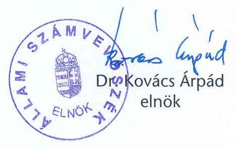
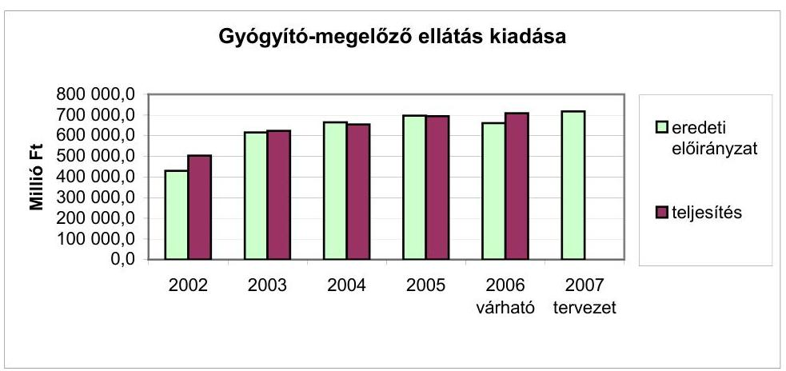
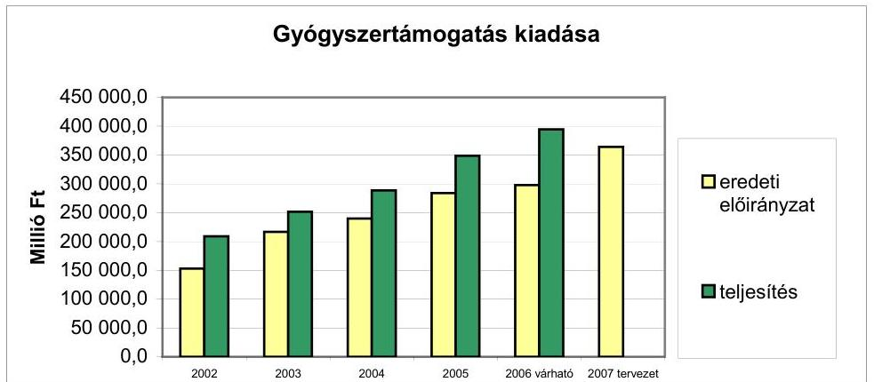
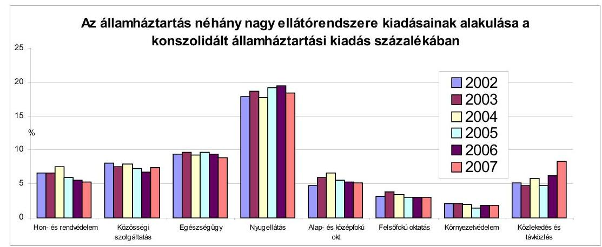
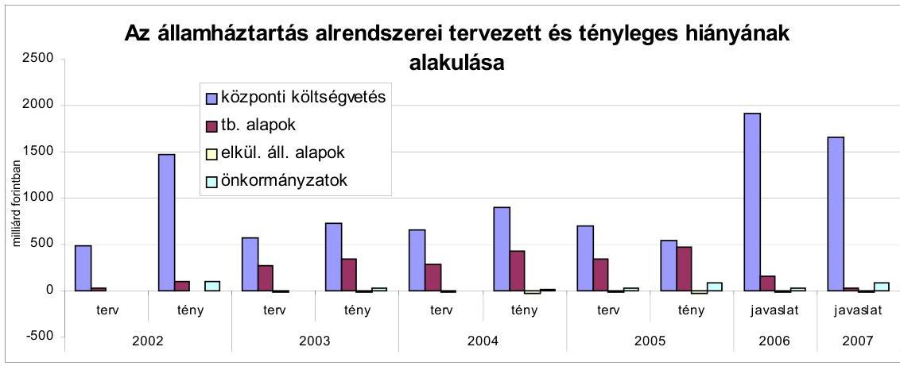
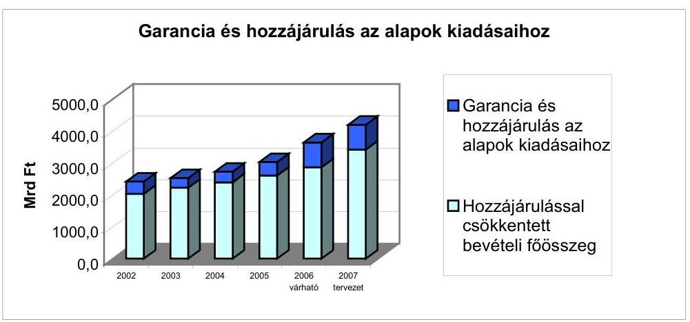
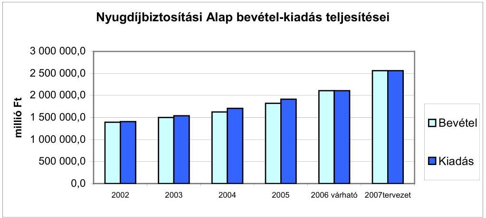
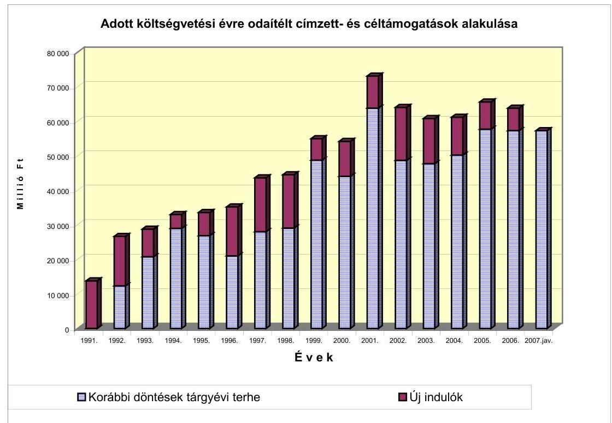

# ÁLLAMI   SZÁMVEVŐSZÉK 

## VÉLEMÉNY

a Magyar Köztársaság 2007. évi költségvetési javaslatáról

0641
T/1145/1.
2006. november

---

# 1. Szervezetirányítási és Működtetési Igazgatóság 

Vizsgálat-azonosító szám: V0256

## Az ellenőrzést felügyelte:

Dr. Csapodi Pál
főtitkár

## Az ellenőrzés végrehajtásáért felelős:

Dr. Kékesi László
főtitkárhelyettes

## Az ellenőrzést vezette:

Horváthné Menyhárt Erika
főcsoportfőnök-helyettes

## Az ellenőrzést végezték:

| Bojtos Rozália | Göller Géza | Nagyné Lakhézi Éva |
| :-- | :-- | :-- |
| tanácsadó | főtanácsadó | számvevő tanácsos |
| Dr. Somorjai Zsoltné | Bálint Józsefné |  |
| számvevő tanácsos | címzetes főmunkatárs |  |

## 2. Államháztartás Központi Szintjét Ellenőrző Igazgatóság

## Az ellenőrzést felügyelte:

Bihary Zsigmond
főigazgató

## Az ellenőrzés végrehajtásáért felelős:

Simon Ákosné
főigazgató-helyettes

## Az ellenőrzést vezették:

Horváth Sándor
főcsoportfőnök-helyettes
Pongrácz Éva
osztályvezető főtanácsos

Dr. Csépán Mária Magdolna igazgatóhelyettes
Szabóné Farkas Katalin osztályvezető főtanácsos

## Az ellenőrzést végezték:

Dr. Baji László számvevő
Dr. Baloghné Sebestyén Éva számvevő
Dancsóné Kuron Ildikó számvevő
Dr. Domján Eszter számvevő tanácsos
Eötvös Magdolna számvevő tanácsos
Fogarasi Miklós
főtanácsadó

Baki István számvevő
Bamberger Mária tanácsadó
Deli Gáborné számvevő
Domonkosné Kurilla Edit számvevő tanácsos
Farkas László
főtanácsadó
Gaálné Izsó Éva számvevő tanácsos

Nagyné Lakhézi Éva számvevő tanácsos

Narczen Győzőné osztályvezető főtanácsos
Tolnai Lászlóné osztályvezető főtanácsos

Balázs Melinda számvevő tanácsos
Burenzsargal Narantuja számvevő
Dombovári Nóra számvevő
Dormán István Zoltán számvevő
Fekete Győr László számvevő
Gömöri József számvevő tanácsos

---

Görgényi Gábor számvevő gyakornok

Hajdu Károlyné számvevő tanácsos

Horváth József számvevő tanácsos

Jáger Lajos számvevő

Dr. Kemenczei Rezső számvevő tanácsos

Knoppné Szabó Ildikó számvevő tanácsos

Dr. Majoros Sándor tanácsadó

Morvay András számvevő tanácsos

Patai Tamás számvevő tanácsos

Dr. Pósch Gábor főtanácsadó

Dr. Sipos Dóra számvevő tanácsos

Dr. Szávai Tamás főtanácsadó

Szöllősiné Hrabóczki Etelka főtanácsadó

Vlasits Ágnes számvevő

Zaroba Szilvia számvevő

Gyarmati István számvevő tanácsos

Hajduné Sipos Erika számvevő tanácsos

Huszárné Borbás Melinda számvevő gyakornok

Dr. Juhászné Szima Mária tanácsadó

Kincses Erzsébet Eszter számvevő

Krüzselyi Attila számvevő

Dr. Mészáros Leila számvevő

Nagy József
főtanácsadó
Pető Krisztina számvevő

Dr. Remport Katalin tanácsadó

Szabó Erzsébet számvevő tanácsos

Szilágyi Gyöngyi főtanácsadó

Tóthné Kiss Katalin tanácsadó

Winter Zsuzsa számvevő

György Mária Terézia számvevő tanácsos

Hegedűsné Erdélyi Piroska tanácsadó

Dr. Jakab Kornél számvevő

Karsai Lászlóné tanácsadó

Dr. Király László tanácsadó

Magyar Sára számvevő

Molnár Bálint számvevő

Dr. Novák Csilla Zsuzsanna számvevő tanácsos

Polyák Ferenc számvevő

Simon Andrásné Dr. számvevő tanácsos

Szabóné Simai Mária számvevő

Szilágyi Zsuzsanna tanácsadó

Dr. Vass Gábor számvevő tanácsos

Zakar László számvevő

# 3. Önkormányzati és Területi Ellenőrzési Igazgatóság 

## Az ellenőrzést felügyelte:

Dr. Lóránt Zoltán
főigazgató

## Az ellenőrzés végrehajtásáért felelős:

Németh Péterné
főcsoportfőnök

## Az ellenőrzést vezette:

Dr. Sallai Antal igazgatóhelyettes

---

# A helyszíni vizsgálati jelentések feldolgozásában és az összefoglaló elkészítésében közreműködött: 

Dankó Géza Kozák György
főtanácsadó
Az ellenőrzést végezték:
Ambrus Lajos Dankó Géza Kozák György
tanácsadó főtanácsadó
Dr. Mezei Imréné Szabó Tamás
főtanácsadó számvevő tanácsos

---

# TARTALOMJEGYZÉK 

BEVEZETÉS ..... 15
I. ÖSSZEGZŐ MEGÁLLAPÍTÁSOK, KÖVETKEZTETÉSEK, JAVASLATOK ..... 18
II. RÉSZLETES MEGÁLLAPÍTÁSOK ..... 37
A) A KÖLTSÉGVETÉSI DOKUMENTUM TÖRVÉNYESSÉGI ÉS SZÁMSZAKI ELLENŐRZÉSE ..... 39

1. Az Áht. költségvetési tervezésre és a törvényjavaslat előterjesztésére vonatkozó előírásainak érvényesülése ..... 41
2. A törvényjavaslat normaszövegéhez kapcsolódó észrevételek ..... 43
B) HELYSZÍNI ELLENŐRZÉS ..... 41
B.1. AZ ÁLLAMHÁZTARTÁS KÖZPONTI SZINTJE ..... 47
B.1.1. KÖZPONTI KÖLTSÉGVETÉS ..... 47
3. A költségvetés makroszintű számításai ..... 47
4. A központi költségvetés közvetlen bevételi előirányzatai ..... 52
2.1. Vállalkozások költségvetési befizetései ..... 52
2.1.1. Társasági adó ..... 52
2.1.2. Államháztartás egyensúlyát javító különadó és járadék ..... 53
2.1.2.1. Társas vállalkozások különadója ..... 53
2.1.2.2. Hitelintézetek járadéka ..... 54
2.1.3. Házipénztáradó ..... 54
2.1.4. Bányajáradék ..... 54
2.1.5. Játékadó ..... 55
2.1.6. Egyszerűsített vállalkozói adó ..... 55
2.1.7. Ökoadó ..... 56
2.1.7.1. Energiaadó ..... 56
2.1.7.2. Környezetterhelési díj ..... 56
2.1.8. Egyéb befizetés ..... 57
2.2. Fogyasztáshoz kapcsolt adók ..... 57
2.2.1. Általános forgalmiadó ..... 57
2.2.2. Jövedéki adó ..... 58
2.2.3. Regisztrációs adó ..... 60
2.3. A lakosság költségvetési befizetései ..... 61

---

2.3.1. Személyi jövedelemadó ..... 61
2.3.2. Magánszemélyek különadója ..... 62
2.3.3. Egyéb lakossági adóbevételek ..... 62
2.3.4. Lakossági illetékek ..... 63
2.4. Az állami vagyonnal kapcsolatos bevételek ..... 64
2.5. Egyéb költségvetési bevételek ..... 65
2.6. MNB befizetése ..... 65
3. A központi költségvetés közvetlen kiadási előirányzatai ..... 66
3.1. A központi költségvetés kamatelszámolásai, tőkevisszatérülései, az adósság- és követeléskezelés költségei ..... 75
3.2. Az állami kezességvállalás és kezességérvényesítés ..... 84
4. A központi költségvetés közvetlen bevételeinek és kiadásainak 2008-2010. évi irányszámai ..... 90
5. A fejezetek költségvetési előirányzatai ..... 94
5.1. A fejezetek tervezési, szervezési és intézmény-felülvizsgálati feladatainak teljesítése ..... 94
5.2. Kiadási előirányzatok ..... 103
5.2.1. Létszám és személyi juttatások ..... 104
5.2.2. Dologi előirányzatok ..... 105
5.2.3. Fejezeti kezelésű előirányzatok ..... 106
5.2.3.1. Beruházások alakulása ..... 106
5.2.3.2. Intézményi felhalmozási kiadások alakulása ..... 107
5.2.3.3. A PPP alakulása ..... 107
5.2.3.4. Fejezeti kezelésű előirányzatok változása ..... 108
5.2.3.5. A fejezeti tartalék alakulása ..... 110
5.2.4. Alapítványok, közhasznú társaságok értékelése ..... 111
5.2.5. Az Európai Uniós tagsággal összefüggő előirányzatok ..... 112
5.2.5.1. Hozzájárulás az EU költségvetéséhez ..... 112
5.2.5.2. A költségvetés bevételei ..... 112
5.2.5.3. Az Európai Uniótól érkező támogatások ..... 113
5.2.5.4. Az európai uniós támogatásokat tartalmazó előirányzatok tervezésének folyamata és módszerei ..... 114
5.2.5.5. A 2006-ban záruló pénzügyi perspektíva támogatásai ..... 116
A strukturális alapok támogatásai ..... 116
A Kohéziós Alap támogatásai ..... 116
Schengen Alap ..... 117
PHARE és Átmeneti Támogatás ..... 117
5.2.5.6. A 2007-től kezdődő pénzügyi perspektíva támogatásai ..... 117
Az EGT Finanszírozási Mechanizmus és a Norvég Alap ..... 118

---

5.2.5.7. A XIX. EU integráció fejezetben bemutatott egyéb fejezeti kezelésű előirányzatok ..... 119
5.2.5.8. Uniós agrártámogatások ..... 119
6. Bevételi előirányzatok ..... 121
7. A költségvetés központosított bevételei ..... 122
8. A 2008-2010. évek várható előirányzatai ..... 123
B.1.2. ELKÜLÖNÍTETT ÁLLAMI PÉNZALAPOK ..... 126

1. Munkaerőpiaci Alap (MPA) ..... 126
1.1. A munkaerőpiaci helyzet alakulása ..... 126
1.2. Az MPA 2007. évi költségvetésének kidolgozása ..... 126
2. Központi Nukleáris Pénzügyi Alap ..... 131
3. Wesselényi Miklós Ár- és Belvízvédelmi Kártalanítási Alap (WMA) ..... 132
4. Kutatási és Technológiai Innovációs Alap (KTIA) ..... 133
5. Szülőföld Alap (SZA) ..... 137
5.1. Az Alap felügyelete, kezelése és szervezete ..... 137
5.2. A 2006. évi események, a 2006. év várható teljesítése ..... 137
5.3. Az Alap 2007. évi költségvetési tervezete ..... 138
6. Nemzeti Kulturális alap (NKA) ..... 139
6.1. A Nemzeti Kulturális Alap (NKA) szabályozási környezete ..... 139
6.2. A Nemzeti Kulturális Alap előirányzatainak 2006. évi várható teljesítése ..... 139
6.3. Az Alap 2007. évi költségvetésének alakulása ..... 140
B.1.3. TÁRSADALOMBIZTOSÍTÁS PÉNZÜGYI ALAPJAI ..... 142
7. A tervezés folyamata és szempontjai ..... 142
8. Nyugdíjbiztosítási Alap ..... 143
2.1. A Nyugdíjbiztosítási Alap költségvetési javaslata kidolgozásának előírásai és teljesítésük ..... 143
2.2. A Nyugdíjbiztosítási Alap pénzügyi helyzete a 2007. évi költségvetés alapján ..... 144
2.3. A Nyugdíjbiztosítási Alap bevételeinek tervezése ..... 145
2.3.1. A bevételek 2006. évi várható összegének meghatározása ..... 145
2.3.2. A Nyugdíjbiztosítási Alap 2007. évi bevételi előirányzatai ..... 145
2.4. A Nyugdíjbiztosítási Alap kiadásai ..... 147
2.4.1. Az ellátási kiadások tervezése ..... 147
2.4.1.1. A 2006. évi várható ellátási kiadások meghatározása ..... 147
2.4.1.2. A 2007. évre tervezett ellátási kiadások ..... 148
2.4.2. A működési kiadások tervezése ..... 149

---

2.4.2.1. A nyugdíjágazat 2007. évi működési kiadásainak meghatározása ..... 150
2.4.2.2. Az ágazat működési kiadásainak jogcímei ..... 150
2.4.2.3. Az igazgatási szervek támogatási keretszámai ..... 152
2.5. A Nyugdíjbiztosítási Alap 2008-2010. évi költségvetési irányszámai ..... 152
3. Egészségbiztosítási Alap ..... 152
3.1. A tervezés feltételei ..... 152
3.2. Az E. Alap bevételeinek tervezése ..... 154
3.2.1. Az E. Alap 2006. évi bevételeinek várható teljesülése ..... 154
3.2.2. A 2007. évi költségvetés bevételi előirányzata ..... 154
3.3. Az E. Alap kiadásainak tervezése ..... 156
3.3.1. Rokkantsági nyugellátások ..... 157
3.3.2. Pénzbeli ellátási kiadások ..... 158
3.3.3. Gyógyító-megelőző egészségügyi ellátás ..... 159
3.3.4. Irányított betegellátás ..... 163
3.3.5. Gyógyszer-támogatási előirányzat ..... 164
3.3.6. Gyógyászati segédeszköz ..... 165
3.4. Az OEP 2007. évi működési költségvetése ..... 166
3.4.1. A működési kiadások tervezése ..... 166
3.4.1.1. Az E. Alap 2007. évi működési kiadásainak meghatározása ..... 167
3.4.1.2. Az ágazat működési kiadásainak jogcímei ..... 168
3.4.1.3. Az igazgatási szervek támogatási keretszámai ..... 169
3.5. Az E. Alap 2008-2010. évi költségvetési irányszámai ..... 169
B.2. A HELYI ÖNKORMÁNYZATOK ..... 170

1. A költségvetési javaslat és a helyi önkormányzati forrásszabályozás megalapozottsága ..... 170
2. A forrásszabályozás módosításának főbb jellemzői ..... 175
3. Fejlesztési támogatások ..... 176
3.1. Címzett és céltámogatások ..... 177
3.2. A leghátrányosabb helyzetű kistérségek felzárkóztatásának támogatása ..... 178
3.3. Helyi önkormányzatok fejlesztési és vis maior feladatainak támogatása ..... 179
3.4. A helyi önkormányzatok és jogi személyiségű társulásaik európai uniós fejlesztési pályázataihoz szükséges saját forrás kiegészítése ..... 181
3.5. Települési önkormányzatok szilárd burkolatú belterületi útjainak felújítása ..... 182
3.6. A fejlesztési célú költségvetési források decentralizálásának jellemzői ..... 183
4. Az önkormányzati bevételek tervezése ..... 184

---

4.1. Normatív állami hozzájárulás és normatív részesedésű átengedett személyi jövedelemadó ..... 184
4.2. Normatív, kötött felhasználású támogatások ..... 191
4.3. Központosított előirányzatok ..... 194
4.4. A helyi önkormányzatok működőképességének megőrzését szolgáló kiegészítő támogatások ..... 196
4.5. Átengedett bevételek ..... 200
4.6. Saját források ..... 201
MELLÉKLETEK ..... 203

1. számú Kimutatás az átengedett személyi jövedelemadó és ..... 205 önkormányzati támogatások rendelkezési jogosultság szerinti megoszlásáról
2. számú A normatív hozzájárulások jogcímenkénti és ágazatonkénti ..... 206 előirányzatainak változása
2/a. számú A közoktatás normatív hozzájárulásainak és a IX. fejezetben ..... 207 előirányzott többi támogatásának alakulása
3. számú A normatív, kötött felhasználású támogatások jogcímenkénti és ..... 208 ágazatonkénti előirányzatainak változása
4. számú A központosított előirányzatok jogcímeinek és összegének ..... 209 változása
5. számú Az önkormányzatok 2007. évi fejlesztési célú támogatásainak ..... 211 alakulása

# FÜGGELÉK 

I. ORSZÁGGYŰLÉS ..... 215
KÖZBESZERZÉSEK TANÁCSA ..... 217
II. KÖZTÁRSASÁGI ELNÖKSÉG ..... 219
III. ALKOTMÁNYBÍRÓSÁG ..... 221
IV. ORSZÁGGYŰLÉSI BIZTOSOK HIVATALA ..... 223
V. ÁLLAMI SZÁMVEVŐSZÉK ..... 225
VI. BÍRÓSÁGOK ..... 227
VIII. MAGYAR KÖZTÁRSASÁG ÜGYÉSZSÉGE ..... 229
X. MINISZTERELNÖKSÉG ..... 231
KORMÁNYZATI ELLENŐRZÉSI HIVATAL ..... 236
POLGÁRI NEMZETBIZTONSÁGI SZOLGÁLATOK ..... 238
XI. ÖNKORMÁNYZATI ÉS TERÜLETFEJLESZTÉSI MINISZTÉRIUM ..... 240
XII. FÖLDMŰVELÉSÜGYI ÉS VIDÉKFEJLESZTÉSI MINISZTÉRIUM ..... 243
XIII. HONVÉDELMI MINISZTÉRIUM ..... 248

---

XIV. IGAZSÁGÜGYI ÉS RENDÉSZETI MINISZTÉRIUM ..... 251
XV. GAZDASÁGI ÉS KÖZLEKEDÉSI MINISZTÉRIUM ..... 254
GAZDASÁGI ÉS KÖZLEKEDÉSI MINISZTÉRIUM KUTATÁS FEJLESZTÉSI SZERVEI ..... 261
NEMZETI HÍRKÖZLÉSI HATÓSÁG ..... 265
MAGYAR ENERGIA HIVATAL ..... 267
XVI. KÖRNYEZETVÉDELMI ÉS VÍZÜGYI MINISZTÉRIUM ..... 269
XVIII. KÜLÜGYMINISZTÉRIUM ..... 272
XIX. EU INTEGRÁCIÓ ..... 275
XX. OKTATÁSI ÉS KULTURÁLIS MINISZTÉRIUM ..... 278
XXI. EGÉSZSÉGÜGYI MINISZTÉRIUM ..... 284
XXII. PÉNZÜGYMINISZTÉRIUM ..... 291
PÉNZÜGYI SZERVEZETEK ÁLLAMI FELÜGYELETE ..... 295
XXVI. SZOCIÁLIS ÉS MUNKAÜGYI MINISZTÉRIUM ..... 298
XXX. GAZDASÁGI VERSENYHIVATAL ..... 303
XXXI. KÖZPONTI STATISZTIKAI HIVATAL ..... 304
XXXIII. MAGYAR TUDOMÁNYOS AKADÉMIA ..... 307

---

# RÖVIDÍTÉSEK JEGYZÉKE 

| ÁAK Zrt. | Állami Autópálya Kezelő zártkörűen működő Rt. |
| :--: | :--: |
| ACEEEO | Közép- és Kelet Európai Választási Szakérők Egyesülete |
| ÁESZ | Állami Erdészeti Szolgálatot |
| áfa | Általános forgalmi adó |
| ÁFSZ | Állami Foglalkoztatási Szolgálat |
| Áht. | Az államháztartásról szóló 1992. évi XXXVIII. törvény |
| AIK | Agrárintervenciós Központ |
| Ak. tv. | 1994. évi XL. törvény a Magyar Tudományos Akadémiáról |
| AKA Zrt. | Alföldi Koncessziós Autópálya zártkörűen működő Rt. |
| ÁKK Zrt. | Államadósság Kezelő Központ zártkörűen működő Rt. |
| ALB | Alkotmánybíróság |
| Ámr. | Az államháztartás működési rendjéről szóló 217/1998. (XII. 30.) Korm. rendelet |
| ÁNTSZ | Állami Népegészségügyi és Tisztiorvosi Szolgálat |
| APEH | Adó- és Pénzügyi Ellenőrzési Hivatal |
| APEH-SZTADI | Adó- és Pénzügyi Ellenőrzési Hivatal Számítástechnikai és Adatfeldolgozó Intézet |
| ÁPV Zrt. | Állami Privatizációs és Vagyonkezelő zártkörűen működő

 Rt. |
| Art. | Az adózás rendjéről szóló 2003. évi XCII. törvény |
| ÁSZ | Állami Számvevőszék |
| ÁSZ tv. | Az Állami Számvevőszékről szóló 1989. évi XXXVIII. törvény |
| ÁSZTL | Állambiztonsági Szolgálatok Történeti Levéltára |
| ÁT | Átmeneti Támogatás programjai |
| ÁTBP | Állami Támogatású Bérlakás Program |
| AVOP | Agrár- és Vidékfejlesztés Operatív Program |
| BC | Beruházás-ösztönzési célelőirányzat |
| Ber. | A költségvetési szervek belső ellenőrzéséről szóló 193/2003. (XI. 26.) Korm. rendelet |
| BIR | Bíróságok |
| BKIK | Budapesti Kereskedelmi és Iparkamara |
| BM | Belügyminisztérium |
| BM KGF | Belügyminisztérium Központi Gazdasági Főigazgatóság |
| Bszi. | A bíróságok szervezetéről és igazgatásáról szóló 1997. évi LXVI. törvény |
| CEDEFOP | Európai Szakképzés-fejlesztési Központ |
| CERL | Európai Tudományos Könyvtárak Társulása (Consortium of European Research Libraries) |
| CFCU | Központi Pénzügyi és Szerződéskötő Egység |
| CISZOK | Civil Szolgáltató Központok |
| E. Alap | Egészségbiztosítási Alap |

---

| EBB | Európai Beruházási Bank |
| :--: | :--: |
| EBRD | Európai Újjáépítési és Fejlesztési Bank |
| EDR | Egységes digitális rádiótávközlő rendszer |
| ECOSTAT | Ecostat Gazdaságelemző és Informatikai Intézet |
| EGC | Energiagazdálkodási célelőirányzat |
| EHJC | Energiafelhasználás hatékonyság javítása célelőirányzat |
| ELTE | Eötvös Loránd Tudományegyetem |
| EMIR | Egységes Monitoring Információs Rendszer |
| EMVA | Európai Mezőgazdasági Vidékfejlesztési Alap |
| EP | Európa Parlament |
| ESKI | Egészségügyi Stratégiai Kutató Intézet |
| ESZA Kht. | Európai Szociális Alap Nemzeti Programirányító Iroda, Társadalmi Szolgáltató Kht. |
| ESzCsM | Egészségügyi, Szociális és Családügyi Minisztérium |
| ESZK | Egészségügyi Szakdolgozói Kamara |
| ET | Európa Tanács |
| ETT | Egészségügyi Tudományos Tanács |
| Etv. | Az egyes fontos tisztségeket betöltő személyek ellenőrzéséről szóló 1994. évi XXIII. törvény |
| EU | Európai Unió |
| EüM | Egészségügyi Minisztérium |
| EVA | Egyszerűsített Vállalkozói Adó |
| EXIMBANK Rt. | Magyar Export-Import Bank Rt. |
| FA | Munkaerőpiaci Alap Foglalkoztatási Alaprésze |
| Feot. | 2005. évi CXXXIX. törvény a felsőoktatásról |
| FH | Foglalkoztatási Hivatal |
| FIFA | Felzárkóztatási Infrastrukturális Fejlesztési Alapprogram |
| FKA | Munkaerőpiaci Alap Fejlesztési és Képzési Alaprésze |
| FKI | Földművelésügyi Költségvetési Iroda |
| Flt. | A foglalkoztatás elősegítéséről és a munkanélküliek ellátásáról szóló 1991. évi IV. törvény |
| FM hivatalok | Földművelésügyi hivatalok |
| FMM | Foglalkoztatási és Munkaügyi Minisztérium |
| FÖMI | Földmérési és Távérzékelési Intézet |
| FPMNYI | Fővárosi és Pest Megyei Nyugdíjbiztosítási Igazgatóság |
| FTT | Felsőoktatási és Tudományos Tanács |
| FVM | Földművelésügyi és Vidékfejlesztési Minisztérium |
| FVMMI GM Kkt. | FVM Műszaki Intézet Gépminősítő Kkt. |
| Get. | A gázellátásról szóló 2003. évi XLII. törvény |
| GFC | Gazdaságfejlesztési célelőirányzat |
| GFS | Government Financial Statistics |
| GKM | Gazdasági és Közlekedési Minisztérium |
| Gt. | A gazdasági társaságokról szóló 1997. évi CXLIV. törvény |
| GVH | Gazdasági Versenyhivatal |

---

| GVOP | Gazdasági Versenyképességi Operatív Program |
| :--: | :--: |
| GVOP IH | Gazdasági Versenyképesség Operatív Program Irányító Hatóság |
| GYFA | Gyártmányfejlesztési Forgóalap |
| HC | Hungaro Control Magyar Légiforgalmi Szolgálat |
| HCCP | Ételkészítéshez korszerű műszaki eszközök, berendezések és higiéniás eljárások rendszere |
| HEFOP | Humánerőforrás-fejlesztési Operatív Program |
| HM | Honvédelmi Minisztérium |
| HM IKH | Honvédelmi Minisztérium Ingatlankezelési Hivatal |
| HM KEHH | HM Költségvetési Ellenőrzési és Hatósági Hivatal |
| HM KPSZH | HM Központi Pénzügyi és Számviteli Hivatal |
| HM PSZNYI | HM Pénzügyi, Számító és Nyugdíjmegállapító Igazgatóság |
| HM PSZSZ | HM Számviteli Szolgálat |
| HM SZÁT | HM Szakállamtitkár |
| HM TKF | HM Tervezési és Koordinációs Főosztály |
| HM TPSZI | HM Területi Pénzügyi és Számviteli Igazgatóság |
| Hszt. | A fegyveres szervek hivatásos állományú tagjainak szolgálati viszonyáról szóló 1996. évi XLIII. törvény |
| HTMH | Határon Túli Magyarok Hivatala |
| HVK | Honvéd Vezérkar Főnökség |
| HVKF | Honvéd Vezérkari Főnök |
| IBRD | Nemzetközi Újjáépítési és Fejlesztési Bank |
| IH | Információs Hivatal |
| IHM | Informatikai és Hírközlési Minisztérium |
| IM | Igazságügyi Minisztérium |
| IM-BV | Igazságügyi Minisztérium Büntetésvégrehajtási Szervezet |
| IRM | Igazságügyi és Rendészeti Minisztérium |
| ISPA | Instrument for Structural Policies for Pre-Accession |
| ISZIH | Igazságügyi Szakérői Intézetek Hivatala |
| ITD-H Kft. | Magyar Befektetési és Kereskedelemfejlesztési Kft. |
| Jöt. | A jövedéki adóról szóló 2003. évi CXXVII. törvény |
| KA | Kohéziós Alap |
| KAIG | Kiemelt Adózók Igazgatósága (APEH) |
| KANYVH | Központi Adatfeldolgozó, Nyilvántartó és Választási Hivatal |
| Kbt. | A közbeszerzésekről szóló 1995. évi XL. törvény |
| KE | Köztársasági Elnökség |
| KEHI | Kormányzati Ellenőrzési Hivatal |
| KEP | Köztársasági Esélyegyenlőségi Program |
| KESZ | Kincstári Egységes Számla |
| KF | Közlekedési Felügyeletek |
| KFGH | Kormányzati és Frekvenciagazdálkodási Hivatal |
| Kft. | Korlátolt felelősségű társaság |

---

| KfW | Kreditanstalt für Wiederaufbau (Újjáépítési és Hitelbank) |
| :--: | :--: |
| Kht. | Közhasznú társaság |
| Kincstár | Magyar Államkincstár |
| KIOP | Környezetvédelmi és Infrastrukturális Operatív Program |
| KIR | Központi Illetményszámfejtő Rendszer |
| Kjt. | Közalkalmazottak jogállásáról szóló 1992. évi XXXIII. törvény |
| KKC | Kis- és középvállalkozási célelőirányzat |
| KMÜFA | Központi Műszaki Fejlesztési Alap |
| KNPA | Központi Nukleáris Pénzügyi Alap |
| KOMT | Közalkalmazottak Országos Munkaügyi Tanácsa |
| Kövice | Környezetvédelmi és vízügyi célelőirányzat |
| KPSZE | Központi Pénzügyi és Szerződéskötő Egység |
| KSH | Központi Statisztikai Hivatal |
| KSZ | Közreműködő Szervezet |
| KSZF | Központi Szolgáltatási Főigazgatóság |
| KSZI | Kutatásszervezési Intézet |
| KSZK | Kormányzati Személyügyi Központ |
| KT | Közbeszerzések Tanácsa |
| KTIA | Kutatási és Technológiai Innovációs Alap |
| KTK | Kincstári Tranzakciós Kód |
| Ktv. | A köztisztviselők jogállásáról szóló 1992. évi XXIII. törvény |
| KüM | Külügyminisztérium |
| KVI | Kincstári Vagyoni Igazgatóság |
| KvVM | Környezetvédelmi és Vízügyi Minisztérium |
| LEP | Lakóépületek Energiamegtakarítási Program |
| MAB | Magyar Felsőoktatási Akkreditációs Bizottság |
| MACIKA | Magyarországi Cigányokért Közalapítvány |
| MÁK | Magyar Államkincstár |
| MAT | Munkaerőpiaci Alap Irányító Testülete |
| MÁV Zrt. | Magyar Államvasutak zártkörűen működő Rt. |
| MBH | Magyar Bányászati Hivatal |
| ME | Miniszterelnökség |
| MeH | Miniszterelnöki Hivatal |
| MEH | Magyar Energia Hivatal |
| MeH EKK | MeH Elektronikus Kormányzati Központ |
| MEH IKB | Miniszterelnökség Informatikai Kormánybiztosság |
| MEH KÁ | Miniszterelnöki Hivatal Közigazgatási Államtitkár |
| MEHIB Rt. | Magyar Exporthitel Biztosító Rt. |
| MeHIg | Miniszterelnöki Hivatal Igazgatása |
| MeHVM | Miniszterelnöki Hivatalt Vezető Miniszter |
| MEKÜF | Miniszterelnökség Központi Üdülési és Oktatási Főigazgatósága |

---

| MEP | Megyei Egészségbiztosítási Pénztár |
| :--: | :--: |
| METESZ | Műszaki és Természettudományi Egyesületek Szövetsége |
| MFB | Magyar Fejlesztési Bank Rt. |
| MGYK | Magyar Gyógyszerész Kamara |
| MH | Magyar Honvédség |
| MH KHK | Magyar Honvédség Központi Honvédkórház |
| MH ÖLTP | Magyar Honvédség Összhaderőnemi Logisztikai Támogató Parancsnokság |
| MK | Munkaügyi Központ |
| MKEH | Magyar Kereskedelmi Engedélyezési Hivatal |
| MKI | Magyar Közigazgatási Intézet |
| MKIK | Magyar Kereskedelmi és Iparkamara |
| MKK Rt. | Magyar Követeléskezelő Rt. |
| MKÜ | Magyar Köztársaság Ügyészsége |
| MLI Kht. | Magyar Lakásinnovációs Kht. |
| MNB | Magyar Nemzeti Bank |
| MNYP | Magánnyugdíjpénztár |
| MOB | Magyar Olimpiai Bizottság |
| MOK | Magyar Orvosi Kamara |
| MOTESZ | Magyar Orvostársaságok és Egyesületek Szövetsége |
| MPA | Munkaerőpiaci Alap |
| MSH | Magyar Sportok Háza |
| MSzH | Mezőgazdasági Szakigazgatási Hivatal |
| MSZH | Magyar Szabadalmi Hivatal |
| Mt. | 1992. évi XXII. törvény a Munka törvénykönyvéről |
| MTA | Magyar Tudományos Akadémia |
| MVf Kht. | Magyar Vállalkozásfejlesztési Kht. |
| MVH | Mezőgazdasági és Vidékfejlesztési Hivatal |
| NA Rt. | Nemzeti Autópálya Rt. |
| NBH | Nemzetbiztonsági Hivatal |
| NBSZ | Nemzetbiztonsági Szakszolgálat |
| NCA | Nemzeti Civil Alapprogram |
| NCSSZI | Nemzeti Család- és Szociálpolitikai Intézet |
| NEI | Nemzetközi Együttműködési Iroda |
| NEKH | Nemzeti, Etnikai és Kisebbségi Hivatal |
| NEP | Nemzeti Energiatakarékossági Program |
| NFA | Nemzeti Földalap Program |
| NFH | Nemzeti Fejlesztési Hivatal |
| NFT | Nemzeti Fejlesztési Terv |
| NFÜ | Nemzeti Fejlesztési Ügynökség |
| NHH | Nemzeti Hírközlési Hatóság |
| NKA | Nemzeti Kulturális Alap |
| NKÖM | Nemzeti Kulturális Örökségek Minisztériuma |

---

| NKÖM GFI | Nemzeti Kulturális Örökség Minisztériuma Gazdasági Főigazgatóság |
| :--: | :--: |
| NKTH | Nemzeti Kutatási és Technológiai Hivatal |
| NSH | Nemzeti Sporthivatal |
| NSZI | Nemzeti Szakképzési Intézet |
| NVT | Nemzeti Vidékfejlesztési Terv |
| NVT I. | Nemzeti Vidékfejlesztési Terv I. |
| NVT II. | Nemzeti Vidékfejlesztési Terv II., vagy Új Magyarország |
| ÜMVP | Vidékfejlesztési Program |
| Ny. Alap | Nyugdíjbiztosítási Alap |
| OAH | Országos Atomenergia Hivatal |
| OÁI | Országos Állategészségügyi Intézet |
| OALI | Országos Alapellátási Intézet |
| OBH | Országgyűlési Biztosok Hivatala |
| OBI | Országos Borminősítő Intézet |
| ObmT | Országos Bűnmegelőzési Tanács |
| OECD | Gazdasági Együttműködési és Fejlesztési Szervezet (Organisation for Economic Cooperation and Development) |
| OÉI | Országos Élelmiszervizsgáló Intézet |
| OEP | Országos Egészségbiztosítási Pénztár |
| OFA | Országos Foglalkoztatási Közalapítvány |
| OFI | Országos Felsőoktatási Felvételi Iroda |
| OGY | Országgyűlés |
| OGYH | Országgyűlés Hivatala |
| OGYI | Országos Gyógyszerészeti Intézet |
| OIK | Országos Idegennyelvű Könyvtár |
| OIT | Országos Igazságszolgáltatási Tanács |
| OJA | Országos Játékalap |
| OKÉV | Országos Közoktatási Értékelési és Vizsgaközpont |
| OKF | Országos Katasztrófavédelmi Főigazgatóság |
| OKK | Fodor József Országos Közegészségügyi Központ |
| OKM | Oktatási és Kulturális Minisztérium |
| OKRI | Országos Kriminológiai Intézet |
| OLÉH | Országos Lakás-, és Építésügyi Hivatal |
| OM | Oktatási Minisztérium |
| OMAI | Oktatási Minisztérium Alapkezelő Igazgatósága |
| OMH | Országos Mérésügyi Hivatal |
| OMMI | Országos Mezőgazdasági Minősítő Intézet |
| OMSZ | Országos Mentőszolgálat |
| OMSZI | Oktatási Minisztérium Szolgáltató Intézménye |
| OORI | Országos Orvosi Rehabilitációs Intézet |
| OP | Operatív Programok |
| OPKM | Országos Pedagógiai Könyvtár és Múzeum |

---

|

 ORFK | Országos Rendőr Főkapitányság |
| :--: | :--: |
| ORKI | Orvos- és Kórháztechnikai Intézet |
| OSEI | Országos Sportegészségügyi Intézet |
| OSZT | Országos Szakképzési Tanács |
| OTH | Országos Tisztiorvosi Hivatal |
| OTIVA | Országos Takarékszövetkezeti Intézmény Védelmi Alap |
| OTKA | Országos Tudományos Kutatási Alap |
| OTMR | Országos Támogatási Monitoring Rendszer |
| OVSZ | Országos Vérellátó Szolgálat |
| ÖNYP | Önkéntes Nyugdíjpénztár |
| ÖTM | Önkormányzati és Területfejlesztési Minisztérium |
| PHARE | Poland-Hungary Assistance for the Restructuring of the Economy |
| PIR | Pályázati Információs Rendszer |
| PKN | Pénztárak Központi Nyilvántartása |
| PM | Pénzügyminisztérium |
| PNSZ | Polgári Nemzetbiztonsági Szolgálatok |
| PROMEI Kht. | Modernizációs és Euroatlanti Integrációs Projekt Iroda Kht. |
| PSZÁF | Pénzügyi Szervezetek Állami Felügyelete |
| Psztv. | a Pénzügyi Szervezetek Állami Felügyeletéről szóló 1999. évi CXXIV. törvény |
| Ptk. | A Polgári Törvénykönyvről szóló 1959. évi IV. törvény |
| RA | Munkaerőpiaci Alap Rehabilitációs Alaprésze |
| REGÉC | Regionális fejlesztési célelőirányzat |
| RIB | Regionális Idegenforgalmi Bizottság |
| ROP | Regionális Operatív Program |
| Rt. | Részvénytársaság |
| SAPARD | Special Accession Programme for Agriculture and Rural Development |
| SAPS | Single Area Payment Scheme (Egyszerűsített Területalapú Támogatási Rendszer) |
| SKFF | Segélykoordinációs és Finanszírozási Főosztály |
| SZA | Szülőföld Alap |
| SZF | Szerencsejáték Felügyelet |
| szja | Személyi jövedelemadó |
| SZMM | Szociális és Munkaügyi Minisztérium |
| SzMSz | Szervezeti és Működési Szabályzat |
| Szt. | A számvitelről szóló 2000. évi C. törvény |
| SZT-TU | Széchenyi Terv Turisztikai Pályázatok |
| TÁSZ | Távközlési Szolgálat |
| TB alapok | Társadalombiztosítás pénzügyi alapjai |
| TC | Turisztikai célelőirányzat |
| TEN-T | Transzeurópai Közlekedési Hálózat |
| TKI | Támogatott Kutatóhelyek Irodája |

---

| TNM | Tárca nélküli Miniszter |
| :-- | :-- |
| Top-up | Területalapú kiegészítő nemzeti támogatás |
| UFCE | Útfenntartási és fejlesztési célelőirányzat |
| UKIG | Útgazdálkodási és Koordinációs Igazgatóság |
| ÚMFT | Új Magyarország Fejlesztési Terv |
| VP | Vám- és Pénzügyőrség |
| VPOP | Vám- és Pénzügyőrség Országos Parancsnoksága |
| VPÜSZK | Vám- és Pénzügyőrség Ügyvitel-szervezési és Számítástechnikai Központja |
| WMA | Wesselényi Miklós Ár- és Belvízvédelmi Kártalanítási Alap |
| ZMNE | Zrínyi Miklós Nemzetvédelmi Egyetem |

---

VE-03-2/2006.

# BEVEZETÉS 

Az Állami Számvevőszék (ÁSZ) az Alkotmány 32/C. §-ának (1) bekezdése és a számvevőszéki törvény 2. §-ának (1) bekezdése alapján véleményezi az állami költségvetési javaslat megalapozottságát, a bevételi előirányzatok teljesíthetőségét. Az államháztartási törvény (Áht.) 29. §-ának (1) bekezdése szerint az Országgyűlés a költségvetési törvényjavaslatot a számvevőszéki véleménnyel együtt tárgyalja.

Az ÁSZ a véleményét a költségvetési előirányzatok tervezését végző szerveknél az ellenőrzés során szerzett tapasztalatai alapján alakította ki. A kapcsolódó vizsgálati programot 2006. október 18-án megküldtük az érintett szervezeteknek, illetve az Országgyűlés illetékes bizottságainak (a program megtalálható az ÁSZ honlapján: www.asz.hu).

A véleményt megalapozó ellenőrzés célja annak megállapítása volt, hogy

- a 2007. évi állami költségvetésről szóló törvényjavaslat, valamint a 2008-2010. évekre kimunkált irányszámok megalapozottak-e,
- a törvényjavaslatot a tervezésnél alkalmazott módszerek, valamint az állami feladatrendszer és a szabályozók javasolt módosításai megfelelően megalapozták-e,
- teljesültek-e az előirányzatok kialakítására kiadott irányelvekben, illetve a tervezési köriratban foglaltak,
- a költségvetési javaslat összeállítása megfelel-e az Áht., valamint a végrehajtására kiadott kormányrendeletek előírásainak,
- a 2007. évre kialakított költségvetés, valamint a 2008-2010. évekre kimunkált irányszámok kiemelten vették-e számításba az EU-tagság pénzügyigazdasági hatásait, részletesen és megalapozottan számszerűsítették-e az EU-tól származó forrásokat és a társfinanszírozási követelményeket, valamint az EU költségvetésébe történő befizetési kötelezettséget,
- a 2007. évre kialakított költségvetés, valamint a 2008-2010. évekre kimunkált irányszámok megfelelően harmonizálnak-e az EU által elfogadott Konvergencia programmal.

---

A helyi önkormányzatok költségvetési kapcsolatait tekintve az ellenőrzés célja annak megállapítása volt, hogy

- a 2007. évi költségvetési törvényjavaslatban a helyi önkormányzatok forrásszabályozására, az önkormányzati finanszírozási rendszer továbbfejlesztésére vonatkozó javaslatok megalapozottak-e, és a tervezett módosításoknak a helyi önkormányzatok pénzügyi helyzetére gyakorolt hatását felmérték-e,
- a szabályozás egyes elemei (központi költségvetési támogatások, átengedett bevételek, valamint a kiegyenlítő mechanizmusok) közötti és a más törvényekkel való összhang biztosított-e,
- a költségvetési törvényjavaslat előkészítési szakaszában a helyi önkormányzatok támogatásainak kimunkálásához, a szabályozott források és a saját bevételek tervezéséhez, a javaslatok megalapozottságához szükséges információk rendelkezésre álltak-e.

A helyszíni ellenőrzés során a 2007. évi állami költségvetésről szóló törvényjavaslat, valamint a 2008-2010. évekre kimunkált irányszámok megalapozottságát, az előirányzatok kialakítása érdekében végzett szervező, összefogó tevékenységet, az intézmény felülvizsgálatot és a fejezeti kezelésű előirányzatok kimunkáltságát a költségvetési fejezetek felügyeletét ellátó szervezeteknél, a fejezeti jogosítvánnyal rendelkező költségvetési szerveknél, az alapkezelőknél vizsgáltuk. Az intézményi előirányzatok megalapozottságát a fejezetek igazgatási címeinél/alcímeinél, az alapkezelőknél, a társadalombiztosítás alapjainál és az elkülönített állami pénzalapoknál értékeltük.

Az ellenőrzött időszak a 2007. évi költségvetés tervezési munkáira terjedt ki, a költségvetési irányelvek jóváhagyásától a költségvetési törvényjavaslat benyújtásáig.

A 2007. évi költségvetési javaslat véleményezésére az előző évekhez hasonló, szűkös időkorlát volt jellemző. A költségvetési törvényjavaslat Országgyűlésnek történő október 31-i benyújtását megelőzően a Pénzügyminisztériummal kialakított munkakapcsolat keretében rendelkezésünkre bocsátott tervezetek, szabályozási elgondolások az egymást követő kormánydöntések következtében módosultak. Véleményünk kialakításakor az október 31-én benyújtott költségvetési törvényjavaslatban szereplő előirányzatokat, szabályozási előírásokat vettük figyelembe.

A Kormány a költségvetési törvényjavaslathoz kapcsolódó, azt megalapozó szakmai törvényeket - az Alkotmánybíróság 4/2006. (II. 15.) AB határozatában foglaltaknak megfelelően - nem a költségvetési törvényjavaslatban, hanem külön javaslatként nyújtja be az Országgyűlésnek. A helyszíni ellenőrzés október 30-i lezárásáig a 2007. évi előirányzatok megalapozásához szükséges - esetenként szervezeti intézkedéseket érintő - törvényjavaslatok benyújtása nem zárult le, ezért a költségvetési törvényjavaslatban szereplő előirányzatok és az ágazati (szakmai) törvények közötti összhang, az előirányzatok

---

# kockázatainak teljes körű elemzése, véleményezése nem volt megoldható ${ }^{1}$. 

Az ÁSZ által készített vélemény tartalmi és szerkezeti felépítése abból az alapelvből indul ki, hogy - amennyire azt a költségvetési törvényjavaslat prezentációja lehetővé teszi - megállapításait, következtetéseit az évenkénti összehasonlítást lehetővé tevő módon adja közre. Véleményünkben ugyanakkor részletesebben szerepelnek azokra a területekre vonatkozó megállapítások, amelyeken a törvényjavaslat jelentősebb változásokat irányoz elő.

A Magyar Köztársaság 2007. évi költségvetési törvényjavaslatáról készített számvevőszéki vélemény első része tartalmazza az ellenőrzés legfontosabb megállapításait és a javaslatokat, valamint a költségvetési törvényjavaslat törvényességi és számszaki ellenőrzésére és az államháztartás alrendszereire vonatkozó részletes ellenőrzési megállapításokat. A második része (függelék) az egyes költségvetési fejezetek tervezőmunkájáról, előirányzataik megalapozottságáról kialakított véleményünket foglalja magában.

A költségvetésről készített véleményünket a központi költségvetés fejezeteinél szakértői szinten, majd államtitkári szinten is egyeztettük. Az egyeztetés után is fennmaradt véleményeltéréseket a részletes jelentésben és a függelékben szerepeltetjük. Az ÁSZ elnöki értekezlete 2006. november 6-án tárgyalta meg és fogadta el a 2007. évi költségvetési törvényjavaslatról készített véleményt.

[^0]
[^0]:    ${ }^{1}$ A Magyar Köztársaság 2006. évi költségvetéséről szóló törvényjavaslathoz készített ÁSZ véleményben hasonló észrevétel fogalmazódott meg. Az ÁSZ javasolta, hogy a Kormány gondoskodjon a helyi önkormányzatok normatív hozzájárulásait, támogatásait érintő törvények módosításának benyújtásáról. A javaslatot a Kormány a költségvetési törvényjavaslathoz kapcsolódó módosító indítványokkal oldotta meg.

---

# I. ÖSSZEGZŐ MEGÁLLAPÍTÁSOK, KÖVETKEZTETÉSEK, JAVASLATOK 

## A költségvetési dokumentum összeállítása

A Kormány az országgyűlési képviselők általános választásának évében legkésőbb október 31-éig benyújtja az Országgyűlésnek költségvetési törvényjavaslatát. A határidőre benyújtott törvényjavaslatnak az Áht. 52. §-ának (1) bekezdése szerint az államháztartás helyzetét bemutató valamennyi összefoglaló táblázatot, mérleget tájékoztatásul tartalmaznia kell.

A tervezési munkafolyamat megkezdésének évek óta tapasztalható, egyre nagyobb késedelme hozzájárulhat ahhoz, hogy a törvényjavaslat fő kötete ezen előírásokat rendre csak részlegesen teljesíti. E mellett megállapítható, hogy a törvényjavaslat indokolása évről-évre kevesebb érdemi információt tartalmaz. Az ÁSZ a 2006. szeptemberi Konvergencia program véleményezése során hiányolta a programban bemutatott reformok (intézkedések) hatásait számszerűsítő kimutatásokat. A törvényjavaslat sem foglalja össze és vezeti le a tervezett, illetve megvalósult intézkedések, folyamatok számszerűsített hatásait. Hiányzik a további két évre várható hatások előzetes számbavétele is.

Az általános és részletes indokolásból hiányzik emellett az évek közötti változások bemutatása, az átrendeződések eredményeinek és egyéb hatásainak kiértékelése. Így az egyes évek adatai nehezen összevethetők, illetve az arányok változásának követése igen nehéz. Gyakorlattá vált, hogy bizonyos idősorok, kimutatások csak a - törvény szerint - 15 nappal később előterjeszthető fejezeti részletező kötetekben, illetve kiegészítésekben jelennek meg. Ezen dokumentumok a 2007. évi költségvetési törvényjavaslat véleményezésekor nem álltak az ÁSZ rendelkezésére.

A megalapozott döntéshozatalt, a költségvetési biztonságra törekvést nem támogatja, hogy a költségvetési törvényjavaslat(ok)ban nem jelennek meg áttekinthetően összefoglalva a többéves elkötelezettségek hatásai (a köz- és magánszféra együttműködésén alapuló projektek, beruházások, illetve egyéb többéves kötelezettségvállalások).

A költségvetési törvényjavaslat dokumentumának pontos tartalma, szerkezete, összeállításának metodikája továbbra sem meghatározott. Annak prezentációja egyfajta, az évek során kialakult gyakorlatot követ, melynek során a vonatkozó törvényi előírások sem érvényesülnek maradéktalanul. A dokumentum jelenlegi formájában nehezen áttekinthető. A törvényjavaslat tartalmi és formai követelményeinek teljes körű rendezése és rögzítése lehetőséget adna annak áttekintésére, hogy mi az az információ-tartalom, amely a költségvetési törvényjavaslat országgyűlési vitájához szükséges és elégséges.

---

A költségvetési dokumentumra vonatkozó megállapítások részletes kifejtése a vélemény II. Részletes megállapítások fejezet A) „A költségvetési dokumentum törvényességi és számszaki ellenőrzése" c. pontjában található.

# Az állami költségvetés előirányzatai 

## A Konvergencia programmal kapcsolatos összhang

A 2007. évi költségvetési törvényjavaslatnak az Európai Unió által elfogadott Konvergencia program gazdaságpolitikai célkitűzéseire kell épülnie. Ennek következtében a költségvetés kereteit a programban a 2007. évre beállított makrogazdasági mutatóknak kell képezniük. A gazdaságpolitikai célkitűzéseket, a megvalósulásukat szolgáló intézkedéseket és ezek kereteit meghatározó makropályát a - 2006. szeptember 1-jén az Európai Bizottsághoz benyújtott Konvergencia program határozta meg. ${ }^{2}$

A Konvergencia program és a 2007. évi költségvetési törvényjavaslat szerinti makropálya által átfogott időszakban a GDP mutatói közötti - nem számottevő - eltérések az EU harmonizációs követelménynek megfelelő módszertani változással kapcsolatosak.

A Konvergencia programban szereplő inflációs pálya és ennek 2007. évi prognózisa összhangban van a GDP felhasználását jellemző makropálya mutatókkal.

A GDP 2007-2009. évekre várható növekedése az egyensúly megteremtését célzó, gazdaságpolitikai célkitűzéseket alapul vevő makrogazdasági számítások összefüggésrendszerében került megtervezésre. Ennek megfelelően a GDP alakulásában számottevő hatása van a - volumenében is jelentős - lakossági fogyasztás 2007. évre tervezett 0,8%-os csökkenésének és a 2008. évre vonatkozó 0,1%-os növekedésének. A 2009. és a 2010. évek irányszámai a korábbiakhoz viszonyítva alacsony ütemű (1,5, illetve 2,5%) növekedést mutatnak.

A lakossági fogyasztás alakulására építő számításokban kockázatot jelent, hogy a lakosság - fogyasztási szokásait és a megtakarítási hajlandóságát illetően - várható reagálásait a fiskális intézkedésekre csak feltételezni lehet.

A közszféra létszámának 2006.
 évre elért, 2004. évhez viszonyított 6%-os csökkentése mellett az intézményrendszer szűkítése nem történt meg, ezért a kiadások összességében nem csökkentek. Hasonló tendencia figyelhető meg a költségvetési szervek 2007. évre tervezett kiadási előirányzatainak alakulásában is. A 2006. évben végrehajtott létszámleépítések ellenére a központi költségvetési szervek tervezett kiadási előirányzata a 2006. évhez (1821 M Ft) viszonyítva a 2007. évre (1830 M Ft) 0,8%-kal emelkedett, ami jól mutatja, hogy a szervezeti keretek további ésszerű szűkítése nélkül érdemi megtakarítás nem érhető el.

[^0]
[^0]:    ${ }^{2}$ A programmal kapcsolatos, miniszterelnöki felkérésre készített ÁSZ véleményt 2006. augusztus 29-én hoztuk nyilvánosságra (www.asz.hu/Hírek/Friss-hírek).

---

A társadalombiztosítási ellátások közül a Nyugdíjbiztosítási Alap hiánya a 2006. évre már elérheti a 113 Mrd Ft-ot, az Egészségbiztosítási Alap hiánya pedig a 158 Mrd Ft-ot. Az Ny. alap kiadásai a 2004. évről a 2006. évre 23,5%-kal, az E. Alap kiadásai 17,1%-kal emelkedtek, ezen belül is figyelemre méltó a gyógyszerkiadások 29,8%-os és a gyógyító-megelőző ellátás 8,7%-os növekedése ${ }^{3}$.

Ezen nagyságrendek a 2007. évben a társadalombiztosítási alrendszer vonatkozásában azt jelentik, hogy a növekedés bevétellel ellentételezetten az Ny. Alap esetében a 2006. évről a 2007. évre közel 10%-os, míg az E. Alapnál - a 2006. évi szerkezetben - 1,4%-os csökkenés mutatkozik. (A kiadáscsökkenés elsősorban a gyógyszerkassza előirányzott kiadásainak csökkenésével van összefüggésben.) A csökkenés azonban csak a korábbi évek rendkívül magas növekedésének megállítását jelenti.

A Kormány a 2007-2009. évek költségvetéseinek fenntarthatóságát a közszféra és a nagy közösségi ellátó rendszerek átfogó reformjának végrehajtásával kívánja biztosítani. Ellenőrzési jelentéseinkben, valamint az éves költségvetési

[^0]
[^0]:    ${ }^{3}$ Az Ny. és az E. Alap 2006. évi várható kiadásait a T/1205. számon beterjesztett, a Magyar Köztársaság 2006. évi költségvetéséről szóló 2005. évi CLIII. törvény módosításáról szóló törvényjavaslat figyelembevételével határoztuk meg.

---

törvényjavaslatokra vonatkozó ellenőrzési megállapításokat rögzítő véleményekben folyamatosan megfogalmaztuk, hogy az államháztartás nagy ellátórendszereinek reformja az évek óta ismétlődő kormányzati kezdeményezések ellenére nem járt eredménnyel. A Konvergencia programhoz mellékelt, a program megvalósítását szolgáló törvényalkotási, szervezési-szervezeti lépéseknek a program benyújtását követő előrehaladásáról véleményünk készítésekor nem állt rendelkezésre megfelelő információ.

A Konvergencia programmal kapcsolatos véleményünkben is jeleztünk az államháztartás hiányát és adósságállományát közvetlenül érintő kockázatokat, amelyek alapvetően az intézkedéseknek a gazdasági szféra és a lakosság magatartására gyakorolt hatásából származhatnak. A törvényjavaslatban a GDP százalékában kifejezett államháztartási hiánymutató értékei a Konvergencia programmal azonosan szerepelnek. A tartós egyensúly megteremtésének legfontosabb tényezője az államháztartás hiányának jelentős csökkentése. A hiánynak a 2007. évben a törvényjavaslat szerint a GDP-hez mérten 6,8%-os szintet kell elérnie.

A törvényjavaslat szerepelteti a 2008. évi GDP arányos 4,3%-os és a 2009. évi 3,2%-os hiányszintet is. A maastrichti kritériummal konzisztens (3%-ot meg nem haladó) hiány elérése a Konvergencia program szerint 2010-ben várható -2,7%-os mértékben.

---

A 2007. évi törvényjavaslatban a Kormány az ESA 95 szerint számított GDP arányos 6,8%-os államháztartási hiányt a bevételek növelésével és a kiadások mérséklésével kívánja biztosítani. Ellenőrzési tapasztalataink is azt mutatják, hogy a költségvetés egyensúlyát meghatározó egyes adóbevételek teljesülése, illetve kiadási oldalon az Egészségbiztosítási Alap két kasszája (gyógyító-megelőző, gyógyszer), valamint a Munkaerőpiaci Alap tervezett pénzügyi lehetősége hordoz kockázatokat, amelyek szükség esetén történő „kisimítására" a több mint 200 Mrd Ft-os tartalék biztosíthatja a fedezetet ${ }^{4}$.

A Kormány, az ÁSZ megállapításait és javaslatait is figyelembe véve, a 2007. évi költségvetési törvényjavaslatban kiadásként szerepelteti - az NA Zrt. adósságátvállalása (146 Mrd Ft), a gyorsforgalmi úthálózat fejlesztése (210 Mrd Ft), MÁV Zrt. tőkeemelése (111 Mrd Ft), a köz- és magánszféra együttműködése (5 Mrd Ft), Gripen-gépek (16 Mrd Ft), hozzájárulás a Művészetek Palotájának működtetéséhez (8,8 Mrd Ft), Mobil távközlési frekvencia üzemeltetése (12 Mrd Ft), Vasúttársaságok működtetése (103 Mrd Ft) - a statisztikai értelemben vett kormányzati szektor pénzügyi folyamatainak hatásait. Ennek következtében a 2007. évi pénzforgalmi és a maastrichti hiány között az ESA híd 35 Mrd Ft, ami 0,1%-pontos hiánymutató eltérést jelent. A 2007. évi költségvetést már nem terheli az NA Zrt. mintegy 350 Mrd Ft adóssága, amelyet a Kormány a 2006. évi költségvetésben kíván rendezni, ami természetszerűen hozzájárul a 2006. évi hiány növekedéséhez is.

A maastrichti kritériummal konzisztens hiánycél 2010. évi elérése indokolttá teszi a kormányzati szektorba tartozó társaságok eladósodásának 2007. évtől kezdődő korlátozását, lehetőség szerinti tiltását.

A megalapozott tervezésen kívül kiemelt jelentőséggel bír a maastrichti hiánymutató alakulásának számbavételénél a beruházás statisztikai jelentések és az intézményi beszámolójelentések adatainak megbízhatósága. Jó példa erre, hogy - többek között - intézményi adathiba miatt kellett a 2005. évi hiánymutatót 100 Mrd Ft-tal növelni. Mindezekre figyelemmel kiemelt jelentősége van az ÁSZ zárszámadáshoz kapcsolódó, a beszámolók adatait megbízhatósági szempontból minősítő ellenőrzési gyakorlatának. A 2005. évi zárszámadás során megállapítottuk, hogy pl. az országos közúthálózat mintegy 80,4 Mrd Ft bekerülési értéke a tárca beszámoló jelentésében nem szerepelt, többek között ezért a hibáért is elutasító véleménnyel láttuk el - már második évben - a tárca beszámoló jelentését.

A Konvergencia programban foglaltak szerint a bruttó államadósság GDP-hez viszonyított aránya a 2007-2008. évek között folyamatosan - bár mérséklődő ütemben - emelkedik, és még 2011-ben is 65-67%-ra tehető. Ez lényegesen meghaladja a vonatkozó maastrichti kritériumot (60%).

[^0]
[^0]:    ${ }^{4}$ A költségvetés megalapozottságára, az egyes előirányzatok kockázatára vonatkozó megállapításainkat az ÁSZ Fejlesztési és Módszertani Intézet által készített háttéranyag is megerősíti.

---

# A központi költségvetés bevételi előirányzatai 

A 2007. évi költségvetésről szóló törvényjavaslatban - a 2006. október 12-i ${ }^{5}$ állapothoz viszonyítva - a központi költségvetés hiánya adósságátvállalással (146,0 Mrd Ft) együtt 1650,7 Mrd Ft (49,4 Mrd Ft-tal kevesebb), a társadalombiztosítási alapok hiánya 33,8 Mrd Ft (283,7 Mrd Ft-tal kevesebb), az elkülönített állami pénzalapok többlete pedig 15,9 Mrd Ft (1,1 Mrd Ft-tal magasabb) az ÁKK Rt. által korábban készített finanszírozási tervben ${ }^{6}$ szereplő adatokhoz képest. A jelzett finanszírozási tervben még a magasabb finanszírozási igénnyel számoltak, ezáltal finanszírozási oldalról jelenleg jelentős tartalék áll rendelkezésre.

A PM részére 2006. október 12-én megküldött finanszírozási terv esetében - az ÁSZ megítélése szerint - a 2006. évi finanszírozási terv nagymértékű változása, a 2007. évi magasabb nettó finanszírozási igény, az esetlegesen változó befektetői megtakarítási szerkezet, valamint a külföldiek forint- és deviza vásárlási hajlandóságának esetleges kedvezőtlen alakulása egyaránt kockázati tényezőként jelentkezik a 2007. évi finanszírozási terv teljesülésénél.

A központi költségvetés 2007. évi adóbevételi előirányzatai várható teljesülésének valószínűsége - az áfa, az szja és a regisztrációs adó tekintetében az előző évekénél szerényebb kockázatokat hordoz, ami azt jelenti, hogy a várható eltérés a jelzett adónemeknél - az ÁSZ rendelkezésére álló információkra épülő modellezés szerint - plusz-mínusz 2% körüli.

## Az általános forgalmi adó 1971,2 Mrd Ft előirányzatának teljesülése

a reálkeresetek várható 4,2%-os csökkenése miatt bizonytalan, tekintve, hogy a lakossági fogyasztásból származó tervezett bevételi növekmény (132,2 Mrd Ft) adja a 2006. évi várható teljesítéshez viszonyított bevételi többlet 96,5%-át. Ezen túl az adómérték-növeléssel jellemzően együtt járó fogyasztói áremelkedés vásárlási kedvet visszatartó hatása nem tükröződik a tervszámokban.

A személyi jövedelemadó államháztartási szintű 2006. évi várható bevételéhez képest a 2007. évi tervezett növekménye 167,0 Mrd Ft, melynek - a PM számításai szerint - közel 2/3-a a bérek és keresetek nominális növekedéséből, több mint 1/3-a az adóváltozásokból ered. A költségvetési törvényjavaslat a központi költségvetés ezen bevételét 1238,3 Mrd Ft összegben irányozza elő, míg a helyi önkormányzatok részére átengedett bevételt 513,3 Mrd Ft-ban határozza meg. Az államháztartási szintű bevétel (ezzel együtt a központi költségvetési előirányzat) realizálása kockázatokat hordoz, tekintettel arra, hogy az előirányzat számítása során alapul vett bér- és keresetnövekedés 30%-a a köz-

[^0]
[^0]:    ${ }^{5}$ A finanszírozási tervet nem módosították a törvényjavaslat szerinti igényhez.
    ${ }^{6}$ A finanszírozási terv magában foglalja a nettó finanszírozási igényt, valamint az adósság finanszírozását. Az adósságkezelési műveletek közé a hitelfelvételek és törlesztések, az állampapír visszafizetések és kibocsátások, valamint a hitelátvállalások miatti kifizetések tartoznak.

---

szféra jövedelmi viszonyainak függvénye. A Konvergencia programban megfogalmazottak szerint egyrészt csökken a foglalkoztatottak száma, másrészt a következő két évben a 2006. évi bértömeg változatlan összegben kerül kifizetésre. Az egyensúlyt javító intézkedések következtében kockázati tényezőt jelent a versenyszférában prognosztizált jövedelemnövekedés (8,7%) mértéke is, figyelemmel a gazdálkodók kiadáscsökkentési törekvéseire és az adóelkerülési szándék erősödésére.

A regisztrációs adó 78,4 Mrd Ft összegű előirányzatának teljesülése azért nem várható, mert olyan magas bázissal (a 2006. évi várható teljesítéssel) számoltak, amelyet az időarányos adatok és a gépjárművek értékesítésére vonatkozó prognózisok nem támasztanak alá. Az Európai Bíróság döntéséből adódóan pedig mintegy 10 Mrd Ft visszatérítési kötelezettség várható, amelynek 2007. évi kifizetései is befolyásolhatják az előirányzat megvalósulását.

A központi költségvetés adóbevételei 2,5%-át jelentő, 132,3 Mrd Ft összegű lakossági illetékek és a környezetterhelési dí előirányzatok megalapozottságát a szükséges dokumentumok hiányában nem tudtuk értékelni. Az ellenőrzés keretében több adónemnél - így az áfa, lakossági illeték - nem volt lehetőség a részletes számítások megismerésére, így a minősítések jelentős része csak a költségvetési törvényjavaslat-tervezet indokolása alapján készülhetett. A részletes számítások, háttér- és munkaanyagok ugyan elkészültek, de azokat nem, vagy csak késői időpontban bocsátotta a PM az ellenőrzés rendelkezésére, annak ellenére, hogy a 2007. évi adóbevételi előirányzatok alapját képező számítások és háttéranyagok feltételeit már a 2006. júliusi törvénymódosítások, és a 2006. szeptember 1-jén az Európai Bizottsághoz benyújtott Konvergencia program egyaránt meghatározták. A késedelem és egyes dokumentumok hiánya miatt a teljes körű és megalapozott véleményalkotásra nem volt lehetőség.

Mindezeken túlmenően az ÁSZ nem ítélhette meg egyes adóbevételek 2007. évi teljesülésének azon kockázatát, amely az Alkotmánybíróság későbbi döntésével függ össze. Az alkotmánybírósági beadvánnyal érintett adónemek (a társasági adó részét képező ún. elvárt adó, hitelintézeti járadék) bevételeként tervezett összeg 80,0 Mrd Ft.

Az állami vagyonnal kapcsolatos 2007. évi - osztalék, koncessziós és a kincstári vagyonkezeléssel és hasznosítással kapcsolatos - tervezett bevétel összesen 46 Mrd Ft. Ezen bevételek előirányzata a kincstári vagyonkezeléssel és -hasznosítással kapcsolatos bevételek kivételével megalapozottak. Ez utóbbi jogcímen tervezett 29 Mrd Ft-os bevételt túlértékeltnek ítéljük, mivel nem állt rendelkezésünkre információ arról, hogy a KVI a korábbi évekhez képest tervez-e az értékesítéseket elősegítendő új, vagy egyéb kiegészítő intézkedéseket.

A 2007. évi központi költségvetés (és a Konvergencia program) alapját jelentő adóváltozások nem mutatnak az adórendszer évek óta ismert problémáinak megoldása és a korszerűsítés irányába. A jelenleg is bonyolult és hatásaiban áttekinthetetlen rendszer további négy adónemmel bővült, növelve egyúttal az elvonási
 csatornák számát és az adminisztrációs terheket. (Ez utóbbin nem könnyít az elektronikus bevallási rendszer, sőt ennek működési zavarai további

---

gondok és terhek forrását képezik.) Az adóváltozások évközi bevezetése a jogbiztonságot gyengíti és ezáltal a gazdálkodás működési feltételei kiszámíthatóságát csökkenti. Az adóreform bevezetése óta napirenden lévő kérdés az adóelkerülés problematikus volta. Az adó (és járulék) terhek növekedésének kihatásaként reális lehetőség a „szürkegazdaság" további terjedése. A helyszíni ellenőrzés összegzett tapasztalatai szerint az adóbevételi előirányzatok kialakítása során ennek kedvezőtlen hatásai nem kerültek figyelembevételre.

# A központi költségvetés kiadási előirányzatai 

A 2007. évi költségvetési törvényjavaslatban a központi költségvetés közvetlen kiadásai többségénél, továbbá egyes kiemelt jelentőségű (lakás-, család) támogatásoknál a kiadások előirányzat-módosítási kötelezettség nélkül (az uniós támogatásoknál korlátozásokkal) teljesíthetők. A 2007. évi törvényjavaslatban - a 2006. évivel egyezően - a kiadási főösszeg közel 40\%-át (a Nyugdíjbiztosítási, az Egészségbiztosítási és Munkaerőpiaci Alap ilyen jellegű kiadási előirányzataival együtt közel 50\%-át) jelentik a módosítási kötelezettség nélkül teljesülő előirányzatok.

Kedvező, hogy a 2006. évihez képest nem nőtt a 2007. évre az előirányzat-módosítási kötelezettség nélkül túlteljesíthető előirányzatok aránya, és az is, hogy ezek a kiadási előirányzatok óvatos tervezésére utalnak, így valószínűsíthetően reálisak, betarthatók. Néhány - a költségvetési törvényjavaslatban a korábbinál magasabb összeggel szereplő kiadási előirányzat esetében azonban nem állt az ellenőrzés rendelkezésére a megváltozott számokat alátámasztó dokumentáció, így e kiadások megalapozottsága nem volt megítélhető.

A központi költségvetés kiadási oldalát meghatározó (családi-, szociális-, normatív-, lakástámogatások) támogatáscsoport 2007. évi előirányzatai a háttérszámítások alapján megalapozottak.

A lakástámogatásoknál kedvező, hogy a korábbi évekhez képest 2006-ban (a várható érték szerint) jelentősen (50\% felettiről 4\%-ra) csökkent a teljesítés előirányzattól való eltérése. A lakástámogatások 2007. évi előirányzatát megalapozottnak ítéljük. Szükséges azonban jelezni, hogy a tartós egyensúly fenntartása megköveteli a több évre előre mutató, egységes elveken alapuló lakáspolitikai koncepció újragondolását.

A központi költségvetés - uniós források nélküli - közel 30\%-át kitevő, az állami feladatokat ellátó intézményrendszer kiadásainak csökkentése a Konvergencia program egyik kiemelt célkitűzése. A kormányprogram a „kisebb és hatékonyabb" államra vonatkozóan az átalakulás fő formáit is meghatározta. Ezzel szemben a Konvergencia programban bemutatott intézkedésekben és a 2007. évi költségvetési törvényjavaslatban is a közszférát illetően a létszámleépítés dominál, körvonalazódni sem látszik az állami feladatellátás és szervezeti kereteinek felülvizsgálata, a feladatellátás teljesítménykövetelményeinek meghatározása. Mindössze három fejezetnél (ÖTM, FVM, EüM) tapasztaltuk ezen alapelvek irányába ható kezdeti lépések megtételét.

---

Ellenőrzési tapasztalataink azt mutatták, hogy az államháztartási kondíciók javítására a kormányzati létszámcsökkentés megfelelő feladatelemzés és differenciálás nélküli előírása önmagában nem jelent hosszú távon megoldást. A funkcionális feladatok centralizált ellátása, a szakmai gazdasági ellátó funkciók új szervezetbe történő átcsoportosítása a törvényjavaslat indokolási részében megjelölt 2007. évben - a feladatok előkészítetlensége következtében - nem indulhat meg. Ugyanez vonatkozik a Kormányzati Személyügyi Központba integrált feladatokra és a minisztériumi ingatlanvagyon kezelési és üzemeltetési feladatainak átcsoportosítására a KVIhez, valamint a könyvelési tevékenység átcsoportosítására a MÁK-ba. Ez a koncepció jelenleg kidolgozatlan, a szükséges központi intézkedések ez idáig nem történtek meg. Mindezek figyelembevételével megállapítható, hogy a 2007. évi költségvetési törvényjavaslat véleményezésének időszakában tapasztaltak szerint a közszféra átszervezésére vonatkozó koncepciók előkészítetlensége hátráltathatja, későbbre halaszthatja a Konvergencia programban kitűzött határidők (2007-2008) betartását.

A 2007. évi költségvetési törvényjavaslatban prioritást élvezett az unióból érkező források és a támogatások igénybevételét biztosító hazai társfinanszírozások előirányzatainak megtervezése. A rendelkezésünkre álló adatok szerint a támogatások igénybevételének fedezete a költségvetési törvényjavaslatban biztosított. Az uniós támogatások igénybevétele, felhasználása garanciáinak megteremtése azonban elsősorban nem tervezési feladat, az a programok működtetését végző hatóságok gyors, szakszerű tevékenységén múlik. Ezért hangsúlyozni kell, hogy az előirányzatok módosításának a törvényjavaslat szerinti rugalmas rendje nem jelent kizárólagos garanciát az uniós támogatások igénybevételére. Az Új Magyarország Fejlesztési Terv unió általi jóváhagyására csak a benyújtását követő hat hónapon belül lehet számítani, így a 2007. évi költségvetés tervezésének idején az Operatív programoknál mélyebb szintű, konkrét programokra lebontott tervek még nem állhatnak rendelkezésre. Az Új Fejlesztési terv koordinációja és kommunikációja címen 37,7 Mrd Ft kiadással számolnak. Ennek a programnak a részletes számításai nem álltak rendelkezésre, így annak megalapozottsága nem ítélhető meg. Kifogásolható, hogy az ÁSZ elmúlt két évben tett javaslatait ismételten figyelmen kívül hagyták és nem tervezték külön soron a mezőgazdasági termelők kiegészítő támogatását (Topup) a költségvetésben, ennek következtében a 2007. évben sem biztosított ezen támogatások folyósításának és elszámolásának átláthatósága.

A költségvetési törvényjavaslat véleményezése során tapasztaltak, valamint a tervezés folyamatában ismétlődő hiányosságok elkerülésének és a költségvetési biztonság érvényesülési feltételei megteremtésének igénye halaszthatatlanná teszi a közpénzügyek átfogó szabályrendszerének kialakítását, egy „közpénzügyi törvény" megalkotását, továbbá azoknak a garanciális szempontoknak a meghatározását, amelyek biztosíthatják az éves költségvetési terveknek a Konvergencia program által kijelölt pályán maradását. Az ÁSZ - tapasztalatait felajánlva - közreműködik a közpénzügyek szabályozásának kimunkálásában, de a törvénytervezet összeállításával kapcsolatos munkafolyamat koordinálása, a törvényjavaslat előkészítése és előterjesztése már a Kormány feladata.

---

A központi költségvetésre vonatkozó megállapítások részletes kifejtése a vélemény II. "Részletes megállapítások" fejezet B) "Helyszíni ellenőrzés" B.1.1. "A központi költségvetés" c. pontjában, illetve a Függelékben található.

# A társadalombiztosítási alrendszer előirányzatai 

A nagy ellátó rendszerek tekintetében, a Konvergencia programból kiindulva, a tartós kiadáscsökkentést megalapozó reformok az egészségügy, a nyugdíjrendszer, illetőleg a gyógyszertámogatási rendszer átalakítását igénylik. Az Ny. Alap és az E. Alap előirányzatainak tervezéséhez azonban a tervezési köriratban nem határoztak meg sajátos szempontokat. A Konvergencia programban megfogalmazott követelmények elvi szinten mindkét alap költségvetési javaslatában érvényesülnek. A megvalósulás feltétele az E. Alap esetében a kitűzött célok, a szükséges intézkedések - ideértve a folyamatban lévő törvény és jogszabály módosítások sokaságát - következetes végrehajtása. Az Ny. Alap 2007. évi egyenlegét „0" szaldósra, míg az E. Alap egyenlegét 32 Mrd Ft hiánnyal határozták meg.

Az E. Alap 2007. évi költségvetési pozícióját (bevételi és kiadási oldalát) a 2006. évben már megjelent törvényi előírások és egyéb jogszabályok, továbbá az Országgyűléshez benyújtott, illetőleg előkészítés alatt álló törvényjavaslatok is érintik. A Konvergencia programhoz (amely 2006 és 2009 között az E. Alap GDP arányos kiadásainak csökkentését irányozta elő) igazodó intézkedések megvalósítása, következetes végigvitele, bonyolult és nehéz feladat. Az előkészítettség jelenlegi fázisában bizonytalansági tényezőt hordoz az, hogy az egészségügyi reform a kiadások tervezett csökkentését meg fogja-e szakmailag alapozni.

A bevételek 2007. évi előirányzatait mindkét alap esetében - az általunk megismert dokumentumok alapján - összességében megalapozottnak tartjuk. A központi költségvetés - a 2006. évi szinten - a 2007. évben is biztosítja az Alapok kiadásaihoz való hozzájárulását.

Kiadási oldalon a gyógyító-megelőző egészségügyi ellátás, a gyógyszertámogatási, valamint a gyógyászati segédeszköz előirányzat betartását tartjuk kockázatosnak. A gyógyító-megelőző előirányzat kialakítását befolyásoló tényezők közül kiemelendő, hogy a 2006. évben bevezetett országos alapdíjak

---

előre láthatóan 2007. évben is változatlanok maradnak. A tervek szerint a mai formájában fennmarad a teljesítmény volumenkorlátos finanszírozása is. Technikailag csak e két tényező együttes alkalmazásával érhető el a zárt kassza kockázatainak csökkentése.

Az intézkedés-sorozat elindíthatja azt az átalakulási folyamatot, amely arra kényszeríti az egészségügyi szolgáltatókat, hogy belső tartalékaikat feltárják, gazdálkodásukat racionalizálják, és a központi ösztönzőket is felhasználva strukturális átalakításokat hajtsanak végre, felesleges kapacitásokat építsenek le. Eredményeket hozhat az intézmények területi elvű (regionális) együttműködése is. A pozitív változásoknak ugyanakkor az a feltétele, hogy mindazok az intézkedések megvalósuljanak, amelyeket a költségvetés tervezésénél is figyelembe vettek.

A gyógyszertámogatás 2007. évi tervezett előirányzata 364 Mrd Ft, amely mintegy 36 Mrd Ft-tal alacsonyabb a 2006. évi várható teljesítés összegénél. A gyógyszerkiadások új szerkezetben jelennek meg. Megmarad a gyógyszertámogatási előirányzat (301 Mrd Ft), a speciális beszerzésű gyógyszerkiadás (18 Mrd Ft), de a vénykezelési díj feladata az Egészségügyi Minisztériumhoz kerül. Új előirányzatként jelenik meg a gyógyszerkiadás tartaléka 45 Mrd Ft összegben, amelynek bevételi oldalát a gyógyszergyártók és forgalmazók befizetése ellentételezi. Felhasználása kizárólag a bevételi teljesítéssel összhangban történhet meg.

Az Ny. Alapnál a bevételi oldalon a munkáltatói járulékmérték növekedése csökkenti a központi költségvetés tehervállalását a nyugdíjkiadások finanszírozásában. A 2007. évi Ny. Alap bevétele és ellátási költségvetési terve reális, megalapozott, nagy valószínűséggel nem igényel a korábbi évekhez hasonló nagyságrendben likviditási hitelt.

Számolni kell azzal, hogy hosszú távon a nyugdíjkiadások növekedni fognak, így a tervezett, több évre kihatással járó intézkedés-sorozat az ellátások növekedésének ütemét befolyásolhatja.

---

A társadalombiztosítási nyugdíjrendszerben igen jelentős szerepet játszanak a rokkantsági nyugellátások. Az érintett mintegy 800 ezer fő a nyugdíjban és nyugdíjszerű rendszeres ellátásban részesülők létszámának több mint 25\%-át jelenti. A 2007. évi nyugdíjkiadások előirányzata - a 13. havi nyugdíjemelés kiadásaival együtt - 2534 Mrd Ft, amiből a rokkantsági és baleseti rokkantsági nyugellátások tervezett összege 580 Mrd Ft. Ezt növeli a 13. havi ellátásra tervezett 188 Mrd Ft arányos része, 47 Mrd Ft, ezzel együtt a kiadások összege 627 Mrd Ft, ami az Ny. Alap kiadási főösszegének (2562 Mrd Ft) 24,5\%-át teszi ki.

Az ellátások kiadásai 2007-től teljes egészében az Ny. Alapot terhelik, de a III. csoportos korhatár alatti rokkantsági nyugdíjkiadásokat - 285 Mrd Ft-ot - az E. Alap megtéríti az Ny. Alapnak. A kiadások aránytalanul megterhelik az Alap költségvetését. Ezt csak a rokkantsági ellátások rendszerének gyökeres változtatásával lehetne enyhíteni.

Az érintettek létszáma megközelíti a 377 ezer főt. Ezek azok a személyek, akik még rendelkeznek megmaradt munkavégző képességgel és részben (a nyugdíj mellett) folytatnak is kereső tevékenységet. Széles körű foglalkoztatásuk a munkanélküliségi ráta, illetőleg a rehabilitáció hiányosságai miatt jelenleg megoldatlan. A munkavégzés lehetőségét és az ellátások egyidejű igénybevételét költségvetési szempontból is célszerű végiggondolni.

A jelenleg érvényes járulékszabályok alapján (2006 szeptemberétől) a nyugdíjasok - munkavégzésük esetén, 4\%-os természetbeni egészségbiztosítási járulék fizetésére kötelezettek. Ez a rokkantnyugdíjasokra is vonatkozik. A tervek szerint, 2007. január 1-jétől a kötelezettség kiterjedne a nyugdíjbiztosítási járulékra is.

Az E. Alap költségvetésére komoly teherként nehezedik, hogy az Alap természetbeni egészségbiztosítási ellátásait (aminek 2007. évi összevont kiadási előirányzata megközelíti az 1100 Mrd Ft-ot) olyan személyek is igénybe veszik, akiknek nincs biztosítási jogviszonya és utánuk a központi költségvetés sem téríti meg az egészségbiztosítási járulékot. Becslések szerint létszámuk a 4-500 ezer főre tehető, akik az egészségügyi ellátások igénybevételét érintően tervezett jogszabályi változások elfogadása esetén csak az ún. alapcsomag igénybevételére lesznek jogosultak. Teljes körű egészségügyi ellátásukra sem az E. Alap költségvetése, sem a központi költségvetés nem biztosít fedezetet.

# Az elkülönített állami pénzalapok előirányzatai 

Az elkülönített állami pénzalapok 2007. évi kiadásaikat a 2007. évi tervezett bevételek erejéig tervezhették. Kivételt képezett a Központi Nukleáris Pénzügyi Alap, ahol a hosszú távú feladatok finanszírozása céljából az Alap egyenlegét bevételi többlettel tervezték.

A Munkaerőpiaci Alap 2007-ben 113,6
 Mrd Ft befizetést teljesít a központi költségvetésbe, ezzel hozzájárul a munkanélküli ellátórendszer változásával összefüggő feladatokhoz, a megváltozott munkaképességű személyek foglalkoztatásának támogatásához.

---

Az elkülönített állami pénzalapokra és a társadalombiztosítási alapokra vonatkozó megállapítások részletes kifejtése a vélemény első kötetének II. Részletes megállapítások fejezet B) "Helyszíni ellenőrzés" B.1.2.) és B.1.3.) pontjában található.

# A helyi önkormányzatok 

A helyi önkormányzatok 2007. évi szabályozott bevételei költségvetési törvényjavaslatban szereplő előirányzatainak tervezését az államháztartás egyensúlyi helyzetének javítását szolgáló intézkedések, az európai uniós fejlesztési támogatások hazai forrásainak biztosítása, az esélyegyenlőség javítása érdekében a közoktatás-finanszírozás átalakítása, a többcélú kistérségi társulások közszolgáltatások szervezésében betöltött szerepének erősítése határozták meg.

A helyi önkormányzatok 2007. évi fejlesztési, felújítási célokat szolgáló támogatási előirányzatainak kialakítása során fontos rendező elvként érvényesült, hogy a fejlesztések tervezése, lebonyolítása, finanszírozása összhangban álljon az uniós előírásokkal, valamint illeszkedjen az Új Magyarország Fejlesztési Terv már ismert céljaihoz.

A Konvergencia programban elfogadott hiánycsökkentés követelménye, a közszolgáltatások, a közigazgatás színvonalának, hatékonyságának javítását célzó intézkedések hatása kimutatható a helyi önkormányzatok központi költségvetésből származó forrásainak tervezésében és a szabályozás egyes részleteit érintő módosításokban, amelyek az alábbi prioritásokat tükrözik:

- az európai uniós fejlesztési források mind teljesebb mértékű felhasználásával a működés hatékonyságát, a közszolgáltatások színvonalát javító rekonstrukciók, a területi kiegyenlítést szolgáló fejlesztések megvalósítása;
- a finanszírozási rendszer módosításával a feladatarányosságot jobban tükröző, normatívan elosztott személyi jövedelemadó, a helyi közszolgáltatások kistérségi társulás keretében történő tényleges ellátását ösztönző támogatások növelése;
- a közoktatásban az esélykülönbségek csökkentése, a racionálisabb ellátásszervezés érdekében a finanszírozás rendszerének olyan átalakítása, amely a közoktatási törvényben meghatározott teljesítménykövetelményeket jobban érvényesíti, a szabályozás részleteinek módosításában az egymást gyengítő elemek megszüntetése;
- a gyermekvédelmi, szociális ellátásokban a rászorultság elvének érvényesülését, előtérbe helyezését biztosító támogatási rendszer és szabályozás kialakítása, a pénzbeli ellátások átalakítása a munkára ösztönzés érdekében;
- az önkormányzati igazgatással, a testületekkel kapcsolatos kiadások csökkentését, az igazgatás ésszerű átalakítását, közös megszervezését ösztönző támogatási rendszer bevezetése.

---

A 2007. évi költségvetési törvényjavaslat szerint a helyi önkormányzatok, helyi kisebbségi önkormányzatok GFS rendszerű - hitelfelvétel, pénzügyi műveletek nélküli - összes bevétele és összetétele a szerkezeti változások, a forrásszabályozás hatására az alábbiak szerint módosult.

| Megnevezés | 2005. év   tény | megoszlás   % | 2006. OGV   előirányzat | megoszlás   % | 2006.   várható | megoszlás   % | 2007. év   terv | megoszlás   % |
| :--: | :--: | :--: | :--: | :--: | :--: | :--: | :--: | :--: |
| GFS rendszerű bevétel összesen | 2891,0 | 100,0 | 2866,6 | 100,0 | 3062,8 | 100,0 | 3091,9 | 100,0 |
| ebből: szabályozott források | 1321,3 | 45,7 | 1289,3 | 45,0 | 1349,4 | 44,1 | 1344,7 | 43,5 |
| Áf fT-n belüli átutalások | 425,6 | 14,7 | 418,0 | 14,6 | 440,8 | 14,4 | 441,0 | 13,3 |
| EU-s és hazai fejlesztési forrás | 94,3 | 3,3 | 192,0 | 6,7 | 157,4 | 5,1 | 250,7 | 8,1 |

A 2007. évi költségvetési törvényjavaslat szerint a helyi önkormányzatok és többcélú kistérségi társulások szabályozott forrásai az Országgyűlés által 2006. évre jóváhagyott előirányzathoz képest 4,3%-kal (55,4 Mrd Ft-tal) emelkednek. A növekmény jelentős részben a budapesti 4-es metró építésének 49,8 Mrd Ft-os, a helyi közforgalmú közlekedés normatív támogatásának 20,4 Mrd Ft-os, a szociálpolitikai juttatások 14,9 Mrd Ft-os, a helyi szervezési intézkedésekhez kapcsolódó többletkiadások támogatásának 5,8 Mrd Ft-os emelésével kapcsolatos.

A szabályozott források kialakításánál javasolt csökkentések (a 2006. évi 7,3 milliárd Ft kötelező államháztartási tartalék, a pedagógusok kötelező óraszámának 2007. szeptember 1-jei emelésével ${ }^{7}$ összefüggő 7,8 Mrd Ft, valamint a megyei önkormányzatok kiadásainak racionalizálása miatti 10 Mrd Ft és az önkormányzati képviselők juttatásainak csökkentése miatti 3 Mrd Ft) hatására a működési támogatások összességében nem emelkednek, azonban az egyes jogcímeken belül lényeges átrendeződés következett be.

Az önkormányzatok szabályozásában javasolt módosításokkal a Kormány ösztönözni kívánja a közszolgáltatások hatékonyabb szervezését, a reálértéken csökkenő működési támogatásokból a célszerűbb, gazdaságosabb feladatellátást. Az ezzel kapcsolatos intézkedések kidolgozását, a döntések meghozatalát a helyi önkormányzatoktól várja a Kormány. A költségvetési törvényjavaslatban az Országgyűlés felhatalmazza a Kormányt, hogy rendeletben állapítsa meg többek között - az egészségügyi szakellátás szerkezet-átalakításával összefüggő működési többletkiadások kompenzálásának, az egészségügyi intézmények átalakítása támogatásának, a szociális ellátásokban a területi kiegyenlítési rendszer működtetésének részletes szabályait.

A fejlesztési források közül az előző évivel közel azonos nagyságrendű címzett és céltámogatási előirányzat áll rendelkezésre 57,3 Mrd Ft összegben. Ez az összeg biztosítja a korábbi években vállalt fejlesztési támogatási kötelezettségek teljesítését, a megkezdett programok folytatását. A javaslat szerint 2007. évben hazai források terhére új címzett és céltámogatási program nem indítható. A

[^0]
[^0]:    ${ }^{7}$ A közoktatásról szóló 1993. évi LXXIX. törvény 2006. évi módosítása.

---

Kormány szándéka, hogy az eddig hazai forrásból támogatott fejlesztési programok megvalósítását uniós programok keretei között valósítja meg. Ennek elősegítése érdekében az önkormányzatok európai uniós fejlesztési pályázatainak saját forrás kiegészítésére szolgáló támogatás tervezett előirányzatát - a hozzájutás feltételeinek szigorítása mellett - 2,7 Mrd Ft-tal megemelve, 10,1 Mrd Ft-ra növeli.

A leghátrányosabb helyzetű kistérségek gazdasági felzárkóztatására a költségvetési javaslatban az előző évi 9 Mrd Ft összegű támogatással szemben 5,8 Mrd Ft áll rendelkezésre a három alföldi és két dunántúli (Dél- és Nyugat-Dunántúl) régió fejlesztési tanácsainak döntési jogkörébe utalva. A régiók szerepének konvergencia célokkal összehangolt irányú elmozdulását az is jelzi, hogy a helyi önkormányzatok fejlesztései és vis maior támogatására szolgáló összegében az előző évivel azonos - előirányzat 92%-a a regionális fejlesztési tanácsok döntési jogkörébe került. A megyei területfejlesztési tanácsok döntési hatáskörében a vis maior esetek támogatására szolgáló 800 M Ft előirányzat maradt.

Az önkormányzatok költségvetésből származó fejlesztési jellegű támogatásai a terület- és régiófejlesztési célelőirányzat decentralizálásra kerülő hányadával együtt 188 Mrd Ft-ra bővülnek, ily módon a 2006. évhez képest 30,6%-kal meghaladó összegben állnak rendelkezésre. Az önkormányzati alrendszert érintő fejlesztési forrásbővülés a fővárosi metróberuházás támogatás növekményével függ össze. E program nélkül számítottan a különböző jogcímű fejlesztési támogatások 2006. évhez képest 4,4%-kal - összegében 5,7 Mrd Ft-tal - csökkennek. Ugyanakkor a támogatási rendszer átalakításának eredményeként a Kormány az Unióból származó fejlesztési források jelentős - 2006-hoz képest 43 Mrd Ft-nak megfelelő - bővülésével, valamint a központi fejezetektől származó társfinanszírozás további 15 Mrd Ft támogatás növekményével számol.

A központi költségvetési kapcsolatokból származó önkormányzati bevételek 73%-át normatív módon, különböző mutatók alapján igényelhetik a helyi önkormányzatok, többcélú kistérségi társulások. Ez az arány a 2006. évihez képest 3 százalékpontos csökkenést mutat, az egyéb (központosított és fejlesztési) támogatások részarányának 4,5 százalékpontos növekedése mellett. A normatív támogatások 49%-a a közoktatási feladatok, további 28%-a a szociális és gyermekjóléti feladatok ellátását szolgálja.

A közalkalmazottak 2006. április 1-jei 6%-os béremelésének szintre hozására, valamint a besorolási bérek növelésére (ezen belül a soros előrelépésekre) nem biztosít fedezetet a törvényjavaslat. A közszférában a keresetek növelésére 2007. évben a költségvetési törvényjavaslat nem tartalmaz központi költségvetési támogatást, nem változik a közalkalmazotti bértábla, valamint a köztisztviselői illetményalap és az ehhez kapcsolódó illetményszorzók sem.

# A költségvetési törvényjavaslat szerint megkezdődik a normatív 

hozzájárulások és támogatások rendszerének fokozatos átalakítása, de a közoktatás támogatása a 2006/2007-es tanév befejezéséig még változatlan marad a támogatási jogcímeket és a támogatási mértékeket illetően is. A 2007/2008-as tanévtől a közoktatási alapfeladatokhoz (óvodai neveléshez, általános és középiskolai oktatáshoz, szakképzés elméleti oktatásához, beleértve

---

a gyógypedagógiai nevelést, oktatást is) ún. „közoktatási teljesítménymutató" alapján történik a központi költségvetési támogatás biztosítása. A teljesítménymutató egy képletbe sűríti a gyermek/tanuló létszám, a csoport/osztály átlaglétszám, a gyermekek/tanulók foglalkoztatási időkeretét, valamint a pedagógus kötelező óraszámát. Egyszerre képes mind a feladat mennyiségének, szervezettségének, mind a költségarányoknak a megjelenítésére. Az alapfokú művészetoktatás feltételei 2007. szeptember 1-jétől szigorodnak, a csoportos oktatás fajlagos támogatása 2007. január 1-től csökken a javaslatban.

A 2007. évben tovább erősödik a többcélú kistérségi társulások feladatellátásának ösztönzése. A bejáró és a kistelepülési normatíva 2007. szeptember 1-jétől megszűnik, amelyek fedezete a többcélú kistérségi társulások közoktatási célú támogatási forrásait növeli, ennek terhére kell megoldani a kistelepülési tagiskolák segítését.

A szociális szolgáltatások normatív támogatásának átalakításával érvényesíteni kívánják a rászorultság elvét. Az önkormányzatok és nem állami fenntartók által nyújtott ellátások összehangolása érdekében olyan adatszolgáltatási, nyilvántartási rendszer kiépítését, bevezetését tervezik, amely naprakész információkat biztosít a szolgáltatások tervezéséhez, a kapacitás szabályozásához.

Az alapszolgáltatások erősítésének célja a szakosított ellátásokra vonatkozó igények részbeni kiváltása, az otthoni ellátások fejlesztése az étkeztetés és a házi segítségnyújtás normatív támogatásának emelésével és az igénybevevők jövedelmi helyzetét tükröző térítési díj meghatározásával. A szociális ellátásokból kapacitás hiány miatt eddig kimaradó, de a jövedelmi helyzetük és az ellátási szükségleteik alapján rászorulók ellátását szolgáló kapacitásátrendeződés és forrásteremtés érdekében az emelt szintű bentlakásos forma állami finanszírozásának fokozatos csökkentését tartalmazza a javaslat. A szociális információszolgáltatás önálló feladatként való megszüntetése, egyes szolgáltatásoknál az új belépő ellátottak normatív támogatásának csökkentése kizárólag a költségvetési támogatások célszerűbb, célzottabb felhasználását szolgálják.

A hivatásos önkormányzati tűzoltóságok normatív kötött felhasználású támogatásával kapcsolatos szabályozásban továbbra sincs előírás a kapott támogatás részletes elszámoltatására.

A törvényjavaslat 8. számú melléklete II/3. pontjában szereplő „Szociális továbbképzés" és szakvizsga normatíva 9400 Ft/fős fajlagos támogatásának összege az előző évihez hasonlóan nem teszi lehetővé a továbbképzési követelményeket teljesítő szociális dolgozók szociális törvényben és kormányrendeletben garantált - legalább egyhavi illetményüknek megfelelő - jutalmazását ${ }^{8}$.

A helyi önkormányzatok kistérségi és regionális együttműködését, feladataik kisebb kiadással, létszámmal, nagyobb hatékonysággal történő ellátását pénzügyi eszközökkel ösztönzi a Kormány a javas-

[^0]
[^0]:    ${ }^{8}$ A 2006. évi költségvetési törvényjavaslathoz kapcsolódó ÁSZ véleményben is szerepelt a javaslat, amivel a PM egyetértett, de intézkedés nem történt.

---

latban. Az ezt segítő érdemi jogszabály felülvizsgálat azonban nem történt meg, a feladatellátást szabályozó szakmai törvénymódosítások nem kerültek kidolgozásra, benyújtásra.

Az állami és önkormányzati feladatok, a kistérségek, a régiók által ellátott feladatok felülvizsgálatának, a támogatási jogcímek számottevő csökkentésének, egyszerűsítésének, a helyi önkormányzatok költségvetési tervezésére vonatkozó előírások, a hitelfelvételi korlát indokolt újraszabályozásának hiányában a csupán pénzügyi eszközökkel történő ösztönzés várhatóan nem elégséges az érdemi reformok megvalósításához.

A helyi szervezési intézkedésekhez kapcsolódó többletkiadások támogatására a központosított előirányzatok között a 2006. évihez képest 5,8 Mrd Ft-tal megemelt, összesen 9,1 Mrd Ft előirányzatot tartalmaz a 2007. évi költségvetési törvényjavaslat. A helyi szervezési intézkedések, létszámcsökkentések lassú ütemére utal, hogy az elmúlt években e jogcímen szereplő támogatásra beadott pályázatok elmaradtak a várakozásoktól. A 2005. évi 13,5 Mrd Ft eredeti előirányzatból 4,2 Mrd Ft került felhasználásra, a 2006. évi felhasználás szeptember hó
 végéig 2,1 Mrd Ft volt.

A költségvetési törvényjavaslat szerint a normatív hozzájárulások forrása a korábbiakhoz hasonlóan - jogcímenként eltérő arányban - állami támogatás és átengedett személyi jövedelemadó. A helyben maradó, településekre kimutatott szja 2 százalékpontos (10%-ról 8%-ra) csökkentése (15,7 Mrd Ft) mellett nő a normatívan elosztott rész 55,4 Mrd Ft-tal. Ez utóbbi a normatívákhoz kapcsolódó 60,4 Mrd Ft, a települési önkormányzatok jövedelemdifferenciálódás mérséklésére szolgáló szja 5 Mrd Ft többletének, illetve a megyei önkormányzatok szja részesedésének 10 Mrd Ft-os csökkenésének egyenlegét jelenti.

A helyi önkormányzatok saját bevételei csökkenő arányt képviselnek a kiadások fedezésében. A 2002. évi teljesítés szerint a saját források 40,3%-ban, a 2007. évi költségvetési javaslat szerint 36,8%-ban fedezik az önkormányzatok pénzügyi műveletek nélküli, GFS rendszerű kiadásait. Forrásbővüléssel a már jelzett fejlesztési támogatásoknál, a társulás útján történő feladatellátás esetén, valamint a saját bevételeik növelése (a helyi adókapacitás jobb kihasználása, az adóhátralék csökkentése) eredményeként számolhatnak.

A helyi önkormányzatok eladósodása növekvő mértékű. Az MNB adatai szerint a helyi önkormányzatok adósságállománya az államadósságon belül a 2002. évi 264,9 Mrd Ft-ról 2005. évben 418,3 Mrd Ft-ra (58%-kal), a költségvetésük GFS rendszerű (hitelfelvétel nélküli) hiánya a 2002. évi 105 Mrd Ft-ról 2006. évben várhatóan 155 Mrd Ft-ra növekszik. Az elmúlt években nőtt a működési célú hosszú lejáratú hitelek állománya is. Az önkormányzatok egy része a fizetőképességét folyószámla hitelkeret emelésével biztosította, azonban az év közben felvett likvid hitelt év végéig nem fizették vissza. Az elmúlt években az önkormányzatoknál nem indult nagyobb számban adósságrendezési eljárás, de közel felük csak a forráshiányos önkormányzatok kiegészítő támogatásából, vagy újabb hitelek felvételével tudta biztosítani a fizetőképességét.

---

A helyi önkormányzatok 2007. évi költségvetésének a szabályozás egyes részletei kidolgozását megfelelő elemzések alapozták meg, azonban kockázatot jelent, hogy a végleges javaslat figyelembevételével nem készültek részletes hatástanulmányok. További kockázatot jelent, hogy a helyi önkormányzatok az adósságállomány növekedésének megállítása, a pénzügyi egyensúly javítása érdekében mennyiben támaszkodnak a közszolgáltatások ésszerűbb megszervezésére, a tényleges, tartós megtakarításokat eredményező intézkedésekre. Az önkormányzatok finanszírozásának javasolt módosításai ösztönző hatásuk ellenére sem képesek önmagukban az elvárt eredményt biztosítani, szükséges az ellátórendszer szerkezetének, intézményeinek átalakítása is.

A helyi önkormányzatokra vonatkozó megállapítások részletes kifejtése a vélemény II. Részletes megállapítások fejezet B) "Helyszíni ellenőrzés" B.2.) "A helyi önkormányzatok" c. pontjában található.

# JAVASLATOK 

Véleményünk hasznosítása mellett javasoljuk:

## az Országgyűlésnek:

1. kérje fel a Kormányt, hogy figyelemmel a 2007. évi költségvetési törvényjavaslat 1. §-ának (2) bekezdésére - a költségvetési folyamatok fenntarthatósága és átláthatósága érdekében - korlátozza (ahol lehetséges tiltsa meg) azon gazdasági társaságok hitel-, kölcsönfelvételét és kötvénykibocsátását, amelyek az európai uniós statisztikai módszertan szerinti kormányzati szektor részét képezik;
2. kérje fel a Kormányt, hogy nyújtsa be az Országgyűlésnek a közpénzügyeket átfogóan szabályozó törvényjavaslatot, azzal együtt részletesen szabályozza a költségvetés összeállításának rendjét, tartalmát;

## a Kormánynak:

3. gondoskodjon arról, hogy az államháztartás egyensúlyi helyzetének javítása érdekében az államháztartás hatékony működését elősegítő szervezeti átalakításokról hozott kormányhatározatok az előírt határidőben és tartalommal valósuljanak meg;
4. tekintse át a jelenlegi lakáspolitikai rendszert és készítse el a tartós egyensúly érdekében a több évre előremutató egységes elveken alapuló szabályozást;
5. fordítson kiemelt figyelmet a Schengen Alap pénzeszközeinek ütemes felhasználására és biztosítsa a fejezetek közötti folyamatos koordinációt annak érdekében, hogy az uniós forrás 2007. év végéig maradéktalanul felhasználásra kerüljön;
6. intézkedjen, hogy az Állami Számvevőszék által évek óta kifogásolt, és a 2007. évi költségvetési törvényjavaslatban az FVM előirányzatai között, a „Folyó kiadások és jövedelemtámogatások" jogcímen megtervezett „Top-up" (hazai kiegészítő támoga-

---

tás) - az átláthatóság és az ellenőrizhetőség érdekében - önállóan, egy törvényi soron jelenjen meg;
7. gondoskodjon
a) a költségvetési törvényjavaslatban a helyi önkormányzatok forrásszabályozását, támogatását érintő módosításokkal összefüggő törvényjavaslatok beterjesztéséről, valamint a végrehajtásuk módját szabályozó rendeletek megalkotásáról;
b) a normatív és egyéb támogatások egyes jogcímei igénybevételi szabályai és a szakmai törvények közötti összhang megteremtéséről;
c) a szociális igazgatásról és szociális ellátásról szóló 1993. évi III. törvény 92/D. §-a (2) bekezdésének módosításával a továbbképzési követelményeket teljesítő dolgozók - egyhavi illetményüknek megfelelő - garantált jutalmazásának, a szociális továbbképzés és szakvizsga 60%-kal csökkentett fajlagos támogatásával történő összehangolásáról;
8. kezdeményezze a költségvetési törvényjavaslat 8. számú mellékletében a hivatásos önkormányzati tűzoltóságok támogatásával kapcsolatos szabályok kiegészítését a támogatás részletes elszámoltatásával.

---

# II. RÉSZLETES MEGÁLLAPÍTÁSOK

---

.

---

A) A KÖLTSÉGVETÉSI DOKUMENTUM TÖRVÉNYESSÉGI ÉS SZÁMSZAKI ELLENŐRZÉSE

---

.

---

# 1. Az Áht. KÖLTSÉGVETÉSI TERVEZÉSRE ÉS A TÖRVÉNYJAVASLAT ELŐTERJESZTÉSÉRE VONATKOZÓ ELŐÍRÁSAINAK ÉRVÉNYESÜLÉSE 

Az Áht. 8. § (4), illetve 112. § (3) bekezdése értelmében az államháztartás alrendszerei költségvetési egyenlegének, államadósságának összefüggését és kapcsolatát ki kell mutatni az Európai Unió Túlzott Hiány Eljárása keretében előírt és jelentendő mutatóval: a kormányzati szektor hiányával (maastrichti deficitmutató) és a kormányzati szektor adósságával (maastrichti adósságmutató). A törvényjavaslat általános indokolásában szöveges formában bemutatja a hazai és az uniós módszertanok főbb eltéréseit, a konvergencia programhoz képest bekövetkező változásokat, a hiánymutató és az adósságmutató módszertanát és alakulását. A költségvetési dokumentum megadja a 2007. évi tervezett adósságmutatót, de a 2006. évi költségvetési törvényjavaslattal szemben nem ad táblázatos áttekintésű, az államháztartási alrendszereket is magában foglaló bemutatást, nem mutatja be a kormányzati szektor adósságának számszerűsített elemeit. Íly módon nem állapítható meg, hogy a 71,3%-os - a kormányzati szektor adósságának GDP-hez viszonyított arányát jelző - mutató mely tényezőkből áll össze. A hiánymutatót levezető táblázat az előző évihez viszonyítva kevésbé részletes, az alrendszerek ebben sem jelennek meg.

Az Áht. 23. § (2) bekezdésének előírása szerint a központi beruházások hároméves programját évente ki kell dolgozni és a költségvetési törvényjavaslattal egyidejűleg kell előterjeszteni. Az 50 Mrd Ft-ot elérő, vagy meghaladó beruházásokhoz az Országgyűlés előzetes felhatalmazását kell kérni a törvényjavaslatban. Az általános indokolás beruházásokat bemutató melléklete csak a 2007. évi előirányzatot jeleníti meg, nem tartalmazza a beruházások összköltségeit és a hároméves kitekintést. (A korábbi gyakorlat szerint a költségvetési törvényjavaslathoz képest 15 nappal később benyújtott fejezeti indokolások tartalmazzák a beruházások összköltséget és azok időbeli bontását.)

Az Áht. 24. § (1) bekezdése szerint a költségvetésben be kell mutatni a költségvetési létszámkeretet, a választott tisztségviselőket és a foglalkoztatottakat külön-külön. Az ÁSZ az utóbbi években ennek hiányát sorozatosan megállapította. A törvényjavaslat ez évben sem tartalmaz erre vonatkozó összesítő táblázatot. A 2007. évi törvényjavaslat általános indokolásában önálló alcímmel jelenik meg a „létszám alakulása", de abban csak a tervezett létszámcsökkenés főbb területi és százalékos mértéke szerepel, az összesített létszámkeret és annak előírás szerinti megbontása nem.

Az Áht. 36. § (1) bekezdés b) pontja szerint a Kormány a költségvetési törvényjavaslat benyújtásakor tájékoztatást ad a többéves elkötelezettséggel járó kiadási tételek későbbi évekre vonatkozó hatásairól. A tervezési körirat is előírja a fejezetek számára ezek kimutatását. A törvényjavaslat ismétlődően nem nyújt összegző tájékoztatást a többéves elkötelezettséggel járó kiadásokról. Az ÁSZ korábban is jelezte, hogy az áttekinthetőséget, a döntések megalapozását segítené egy olyan kimutatás, amely tartalmazna valamennyi, többéves kihatású döntést és azok számszerűsített, évekre bontott összegét. Ennek az előírásnak további súlyt adott az Áht. 2006. január 1-jétől hatályos ren-

---

delkezése, amely a központi költségvetés kiadási főösszegének 2%-ában korlátozza a köz- és magánszféra együttműködésén alapuló 1 milliárd forint nominális összértéket meghaladó, valamint az Országgyűlés más törvény keretében adott felhatalmazása alapján vállalt többéves kötelezettségvállalásokat.

Az Áht. 36. § (1) bekezdés c) pontja szerint a költségvetési törvényjavaslatban teljes körűen be kell mutatni a költségvetési évet követő 2 év várható előirányzatait. A törvényjavaslatban a költségvetési évet követő 2 év várható előirányzatai továbbra sem szerepelnek. Ezt az 1997-től hatályos előírást a Kormány az elmúlt 10 év alatt a törvényjavaslat fő kötetében jellemzően nem, vagy hiányosan teljesítette (általában a fejezeti indokoló kötetek bemutatták ezen adatsorokat). Legutóbb a 2006. évi törvényjavaslatban, illetve annak fejezeti indokolásaiban a fejezeti előirányzatok 2 évre kitekintő irányszámai nem szerepeltek.

Az Áht. 36. § (1) bekezdés d) pontja szerint a törvényjavaslatnak be kell mutatnia a költségvetési törvény legfontosabb társadalmi és gazdasági hatásait. Ezt a törvényjavaslat általános indokolása - a korábbi évek előterjesztéseinél szűkebb információ tartalommal - ismerteti. A tartós kiadáscsökkentést megalapozó intézkedések 2007. évi hatásainak számszerű, összefoglaló bemutatása, az elkövetkező évek tendenciáinak számszaki alátámasztása a törvényjavaslatból hiányzik. Ezek bemutatása nagyban segítette volna a 2007. évre tervezett folyamatok áttekinthetőségét, illetve a további két évre prognosztizált hiánymutatók tervezett értékének alátámasztását.

Az Áht. 86. § (8) bekezdése szerint a Nyugdíjbiztosítási Alap költségvetéséről szóló törvényjavaslat benyújtásakor az Országgyűlésnek tájékoztatásul be kell mutatni a Nyugdíjbiztosítási Alap bevételeire és kiadásaira vonatkozóan öt évre, a demográfiai folyamatokra és azok hatásaira vonatkozóan ötven évre szóló előrejelzést. Ezek a törvényjavaslat fő kötetében nem szerepelnek (a 2006. évi költségvetés fejezeti indokoló kötetei tartalmazták az előrejelzéseket).

Az Áht. 115. §-a szerint az államháztartás mérlegeinek a költségvetés előterjesztésekor a vonatkozó év és az előző év várható, valamint az azt megelőző év tényadatait kell tartalmaznia. A törvényjavaslat fő kötetében a 2006. évi várható előirányzatok egyáltalán nem szerepelnek. Az általános indokolás mellékletei az előírt idősort tekintve hiányosak és nem egységesek.

Az Áht. 116. §-ában tételesen előírt, az Országgyűlés részére bemutatandó mérlegeket és kimutatásokat a törvényjavaslat továbbra sem tartalmazza teljes körűen. Az előző évekhez hasonlóan az előírt kimutatások közül nem szerepelnek a dokumentumban: a kisebbségi önkormányzatok mérlegei, a többéves kihatással járó döntések számszerűsítése évenkénti bontásban és összesítve, valamint a közvetett támogatásokat (pl. adóelengedéseket, adókedvezményeket) tartalmazó kimutatások.

---

# 2. A TÖRVÉNYJAVASLAT NORMASZÖVEGÉHEZ KAPCSOLÓDÓ ÉSZREVÉTELEK 

## A költségvetési hiány

A törvényjavaslat 1. § c) pontja 1652,9 Mrd Ft-ban határozza meg a központi költségvetés 2007. évi hiányát. A hiány finanszírozására, illetve az ehhez kapcsolódó tevékenységekre az Országgyűlés a törvényjavaslat 3. §-ában hatalmazza fel a pénzügyminisztert. Az általános indokolás V. pontja bemutatja a hiány finanszírozása és a központi költségvetés adósságának kezelése során alkalmazott teljesítmény-mutatókat, illetve adósságkezelési elveket.

A törvényjavaslat 1. §-ának (2) bekezdésében három évre (2008-2010) rögzíti az ún. maastrichti elsődleges egyenlegmutató értékeit azzal a feltétellel, hogy csak ezekkel összhangban álló költségvetési törvényjavaslat terjeszthető az Országgyűlés elé. Az itt kitűzött hiánycélok megvalósítását és azok fenntartását biztosító intézkedések számszerűen részletező, áttekintő bemutatása az indokolásból hiányzik.

## Egészségbiztosítási Alap támogatása

A törvényjavaslat 25. §-ában a társadalombiztosítás és a központi költségvetés kapcsolatára fogalmaz meg rendelkezéseket. A 2006. évi költségvetési törvényhez képest a jelenlegi törvényjavaslat 25. §-ának normaszövegéből elmaradt az a rendelkezés, amely az Egészségbiztosítási Alap részére a központi költségvetésből járulék címen átadott pénzeszközként biztosított - a XXII. PM fejezet 26. cím 2. alcímén előirányzott 288,9 Mrd Ft - támogatás finanszírozási teljesítését írja elő. Az általános, illetve részletes indokolásból nem derül
 ki a korábbi gyakorlathoz képesti változás oka.

## Állami kezességek

A törvényjavaslat normaszövegének ötödik fejezetében az Áht. 33. § (1) és (2), a 33/A. § (3) a 33/B. § (1) és a 33/C. (3) bekezdései előírásainak megfelelően meghatározza a 2007-ben újonnan elvállalható egyedi kezességek és a kiállítási garanciák keretösszegét, illetve a jogi személyek által vállalható viszontgaranciával biztosított kezesség állományának felső határát. Az állományi keretek közül több megegyezik a 2006. évre tervezettel, az eltéréseket a törvényjavaslat általános indokolásában ismerteti.

Az állam által vállalt kezesség és viszontgarancia várható érvényesítésére 16,4 Mrd Ft-ot irányoz elő a törvényjavaslat. Az Áht. 42. § (5) bekezdése szerint a Kormány kezességvállalásai alapján várhatóan esedékessé váló fizetési kötelezettségeit összesítve, az esedékessé válás valószínűsége szerint is bemutatva köteles a költségvetési törvényjavaslat indokolásában tájékoztatásul előterjeszteni. Az előirányzott kifizetéseket meghatározó tényezőket az általános indokolás röviden bemutatja.

---

# A központi költségvetés előirányzat-módosítás nélkül teljesülő kiadásai és bevételei 

A törvényjavaslat 45. §-ának (1) bekezdése szerint a törvényjavaslat - az elmúlt évek gyakorlatától eltérően - külön mellékletbe rendezve (14. számú melléklet), áttekinthetőbb formában rendelkezik azon előirányzatokról, amelyek esetében a teljesülés külön szabályozott módosítás nélkül is eltérhet az előirányzattól. Ezen előirányzatok aránya a központi költségvetésnél - az uniós tagsághoz kapcsolódó támogatások kivételével - az előző évhez hasonlóan alakul, az Egészségbiztosítási Alap esetében pedig csökken.

A törvényjavaslat 45. §-ának (2) bekezdése tévesen hivatkozik a 14. számú melléklet 3. és 4. pontjára. A bekezdés szövegéből következően itt a melléklet 2. és 3. pontjának kellene szerepelnie.

## Tartalékok

A költségvetési biztonság erősítésére irányult az Áht. 36. § (1) bekezdésének új f) ponttal történt 2006. évi kiegészítése, melynek alapján a fejezetek költségvetésében összesen 79,6 Mrd Ft fejezeti egyensúlyi tartalék, illetve további 50 Mrd Ft központi egyensúlyi tartalék került megtervezésre 2007-re. (A 2006. évi költségvetésben 59,7 Mrd Ft fejezeti államháztartási tartalék szerepelt.) Az egyensúlyi tartalékokról a Kormány dönt, azonban sem a törvényjavaslat, sem az Áht. nem köti konkrét előírásokhoz, mutatószámok teljesítéséhez a felhasználást.

## Technikai pontatlanság

Az általános indokolás mellékleteként bemutatott Új Magyarország Vidékfejlesztési Program előirányzatait részletező kimutatásban (472. oldal) nem az ide vonatkozó előirányzatok, hanem tévesen a Nemzeti Vidékfejlesztési terv (XII. fejezet, 10. cím, 11. alcím, 1. jogcímcsoport) előirányzatai szerepelnek.

---

B) HELYSZÍNI ELLENŐRZÉS

---

.

---

# B.1. AZ ÁLLAMHÁZTARTÁS KÖZPONTI SZINTJE 

## B.1.1. KÖZPONTI KÖLTSÉGVETÉS

## 1. A KÖLTSÉGVETÉS MAKROSZINTŰ SZÁMÍTÁSAI

A 2007. évi költségvetési törvényjavaslatnak a költségvetési tervezés időszakában szükségszerűen az Európai Unió által elfogadott Konvergencia program szerinti gazdaságpolitikai célkitűzésekre kell épülnie. Ennek következtében a költségvetés kereteit a programban a 2007. évre beállított makrogazdasági mutatóknak kell képezniük. A két dokumentum közötti kapcsolatban fontos a hitelességnek és a költségvetési/államháztartási stabilizációra irányuló elkötelezettségnek a kifejeződése.

A PM elkészítette és június 30-án a Kormánynak benyújtotta a 2007. évre vonatkozó gazdaságpolitikai elképzelésen alapuló költségvetési politika fő irányait és a költségvetési tervezés fő kereteit meghatározó költségvetési irányelveket. A gazdaságpolitikai célkitűzések, a megvalósulásukat szolgáló intézkedések és ezek kereteit meghatározó makropálya a - 2006. szeptember 1-jén az Európai Bizottsághoz benyújtott - Konvergencia programban nyert végleges megfogalmazást.

A Pénzügyminisztérium az Ámr. 22. § (2) bekezdése szerinti tervezési tájékoztatót (Tervezési köriratot) 2006. október 6-án tette közzé.

A Tervezési körirat foglalkozik a középtávú makrogazdasági folyamatokkal, de az eddigi gyakorlattal szemben nem tartalmaz makrogazdasági pályát bemutató mellékletet. A helyszíni ellenőrzés során a PM-től kapott szóbeli tájékoztatás szerint a makropálya a Konvergencia programban szerepel.

A Tervezési körirat nem rögzíti, hogy a költségvetési törvényjavaslat a Konvergencia programban foglalt, vagy pedig a PM által aktualizált makropályán alapul.

A Tervezési körirat és a Konvergencia program azonos tartalmú makrogazdasági folyamatai között időbeli eltérés van, azonban ennek okaira, szükségszerűségére a Tervezési körirat magyarázatot nem tartalmaz.

A Konvergencia programban a középtávú gazdaságpolitika két szakaszt, az egyensúly megteremtésének 2006-2009. éveit, és a tartós növekedés megindulásának 2009-2011. éveit határozza meg. Ezzel szemben a Tervezési köriratban a 2006-2008. évekről, valamint a 2008-2011. évekről szóló időszakok szerepelnek.

A helyszíni ellenőrzés ideje alatt két alkalommal, 2006. október 5-én és 18-án került sor a makropálya felülvizsgálatára.

---

A 2006.10.5-i felülvizsgálat oka, hogy a tervezés bázisául szolgáló 2005. évi GDP értékét a KSH a korábbi előzetes adatközléséhez képest módosította. A KSH ugyanis 2006. október 2-án tette közzé a GDP 2005. évi alakulásáról szóló második előzetes jelentését, amelynek összeállítása során - a magyar nemzeti számlák EU harmonizációs követelménye miatt - jelentős módszertani változásokat hajtott végre, amelyek érintik a GDP termelés és a felhasználás számításait. A módszertani változások részeként módosult a nemzetgazdaság külkereskedelmi forgalmának elszámolása is, amely az MNB vonatkozásában a folyó fizetési mérleg elszámolásaira is hatással van.

A 2006. október 5-i makropálya esetében azonban nem csak a 2005. évi bázis számok változtak, hanem mutatónként eltérően, de nem számottevően a 2006. évre szóló prognózis és az azt követő évekre vonatkozó gazdaságpolitikai célszámok értékei is. Kiemelendő, hogy a lakossági és a közösségi fogyasztás mutatói nemcsak a 2007., hanem a 2008. év vonatkozásában is, a Konvergencia programban foglaltaktól eltérő kisebb csökkenési ütemet tartalmaznak. Az állóeszköz-felhalmozás esetében pedig gyorsabb ütemű növekedés állapítható meg.

A 2006. október 18-i makropálya áttekintés a Kormány részére készült és csak a 2007-2010 évek adatait tartalmazza.

A törvényjavaslatban megjelenő aktualizált makropálya a Konvergencia programhoz viszonyítottan az alábbi eltéréseket mutatja:

A Konvergencia programban a GDP 2005. és a 2009. évi növekedési üteme egyaránt 4,1 %, ami mindkét év tekintetében 0,1 %-ponttal magasabb a törvényjavaslatban.

A lakossági fogyasztás Konvergencia program szerinti 2005. évi 1,4%-os növekedése, a törvényjavaslatban 3,8%-kal szerepel. A mutatónak a két dokumentumban foglalt értékei közötti eltérés a 2006-2007-2008. években 0,1 %-pont. A változás dinamikája a törvényjavaslatban a magasabb - rendre 2,5 %,-0,8 %, 0,1 %.

A közösségi fogyasztás mutatója mind a 2006.10.5-i, mind a 18-i aktualizált makropályában, valamint a Konvergencia programban szerepel, de a törvényjavaslat nem tartalmazza a GDP felhasználás részét képező mutatószámot. A Konvergencia program szerinti 2005. évi 0,9 %-os közösségi fogyasztás csökkenés a PM makropályában 0,2 %-növekedésre változott. A 2006. évre vonatkozóan a Konvergencia programban 4,4 %-os várható növekedés, a törvényjavaslat szerint már 2,7%-ra redukálódott. A 2007-2009 időszakot tekintve is eltérés van a Konvergencia program és a törvényjavaslat növekedési adatai között. A közösségi fogyasztás csökkenés 2007-ben 1,7%-ról 1,6%-ra, 2008-ban 4,6%-ról 3,3%-ra mérséklődött, míg 2009-ben az 1,1%-os növekedés 1,6%-ra változott.
A bruttó állóeszköz-felhalmozás növekedésének a Konvergencia programban szereplő 2005. évi 6,6%-os mutatója a törvényjavaslatban 5,6%-os értékkel szerepel. A Konvergencia program szerint a 2006. évre várható 6,6 %-os növekedés, a törvényjavaslatban már 6%. A Konvergencia programhoz képest a 2008. évre tervezett növekedés 3,7%-ról 4,3%-ra, a 2009. évi növekedés 7%-ról 7,8%-ra változott a törvényjavaslatban. A PM-től kapott tájékoztatás szerint „A Konvergencia programban 2007-től szereplő előrejelzés felülvizsgálatát elsősorban az tette indokolttá, hogy a kiemelkedő fontossággal bíró EU tőketranszferek 2007-2013 közötti felhasználására készült prognózis októberben jelentősen megváltozott."
Az export 2005. évi Konvergencia programbeli 10,8%-os növekedése a törvényjavaslatban 11,6%. A Konvergencia programban szereplő 2006. évi 12%-os várható növekedés, a törvényjavaslatban 13%-ra emelkedett. Továbbá a Konvergencia program szerint a 2007-2009 évekre prognosztizált 10,9; 9,9 és 9,4 növekedési mutató mindegyike a törvényjavaslatban 0,1%-ponttal magasabb.
A Konvergencia programban az import 2005. évi növekedése 6,5%, ami a törvényjavaslatban 6,8%-ra változott. A Konvergencia programban a mutató 2006-2009. évek időszakára vonatkozó növekedési dinamikája 2006-ban 9,5%-ról 9,8 %-ra, 2007-ben 8,5%-ról 8,3%-ra, 2008-ban 8 %-ról 7,9%-ra, 2009-ben pedig 8,8 %-ról 8,4 %-ra változott a törvényjavaslatban.

A Konvergencia program aktualizálása a Stabilitási és Növekedési Egyezményből eredő kötelezettség minden euro zónán kívüli tagállam, így Magyarország számára is. Az egyezmény szerint az aktualizált Konvergencia program benyújtásának határideje minden év december 1-je, ami a Kormány kompetenciájába tartozó felelősség mind tartalmi, mind számszaki vonatkozásban.

A 2007. évre készített makropálya összefüggés rendszerének középpontjában az államháztartás egyensúlyának helyreállítása áll. Ennek érdekében már a 2006. év során több évre ható - elsősorban bevétel növelő és összegződésében kisebb kiadást csökkentő - intézkedésekre került sor. Az egyensúlyteremtő intézkedések hatására a gazdasági növekedés átmeneti lassulása várható. A Konvergencia program szerint a 2006. évre 4,1%-os növekedés várható, míg a 2007. év vonatkozásában már lényegesen kisebb, 2,2%-os, a 2008. évre pedig mindössze 0,4%-ponttal magasabb, 2,6%-os GDP növekedést tartalmaz a makropálya.

A 2006. évi GDP várható növekedésének megítélése a különböző elemzők (MNB, GKI, Ecostat) körében egy-két tized százalékponttal kisebb a törvényjavaslathoz képest. A KSH 2006. I. és II. negyedéves adatai megalapozzák ugyan a 4,1%-os növekedést, de különösen a IV. negyedév kimenetele - a megszorító intézkedésekre tekintettel - meghatározó lehet a 2006. évi várható növekedés alakulásában. Az OECD és az Eurostat rendelkezésre álló adatai korábban kerültek közzétételre a gazdasági egyensúlyt teremtő intézkedéseknél, ezért a 2006. évre prognosztizált egyöntetűen 4,6%-os, majd a 2007-re vonatkozó 4,4, illetve 4,2%-os GDP növekedés előrejelzésük még nem tükrözi a módosítások várható hatásait.

A GDP 2007-2009. évekre várható növekedése az egyensúly megteremtését célzó gazdaságpolitikai célkitűzéseket alapul vevő makrogazdasági számítások összefüggés rendszerében került megtervezésre. Ennek megfelelően a GDP alakulásában számottevő hatása van a - volumenében is jelentős - lakossági fogyasztás 2007. évre tervezett 0,8%-os csökkenésének és a 2008. évre vonatkozó 0,1%-os növekedésének. A 2009. és a 2010. évek irányszámai igen alacsony ütemű (1,5, illetve 2,5%) növekedést mutatnak.

A lakossági fogyasztás alakulása kockázatot hordoz, mivel csak feltételezni lehet, hogy a lakosság - fogyasztási szokásait és a megtakarítási hajlandóságát illetően - várhatóan hogyan reagál a fiskális intézkedésekre.

A lakossági fogyasztás 2006. évi várható növekedése a törvényjavaslat szerint 2,5%, ami megegyezik az MNB előrejelzésével. Az MNB 2007-re 0,2%-ponttal magasabb fogyasztás csökkenéssel (-1%) számol, míg a 2008. évre vonatkozóan a törvényjavaslat szerinti 0,1%-os növekedéssel szemben 0,3% csökkenést feltételez. A GKI a 2006. évre ugyancsak 2,5%-os fogyasztásnövekedéssel számol, míg a 2007. évre 0,5%-os növekedést valószínűsít.

---

A bruttó állóeszköz-felhalmozás növekedési üteme - a Konvergencia programhoz képest - többször változott a helyszíni ellenőrzés időszakában. A módosulások során a növekedés üteme a gazdasági elemzők prognózisai felé tolódtak el, különösen a törvényjavaslat szerint a 2006. évre várható 6%-os növekedés tekintetében.

Az MNB és az Ecostat augusztusi előrejelzésében a 2006. évre 6,3%, illetve 6% várható bruttó állóeszköz-felhalmozás növekedés szerepel, míg a GKI az októberi prognózisában 5%-os növekedést valószínűsít. A mutató törvényjavaslat szerinti növekedése a 2007. évben 2,4%, amelyhez képest az MNB 0,4%-ponttal alacsonyabb növekedést prognosztizál. A 2008. év tekintetében pedig mindkét előrejelzés azonos mértékű - 4,3%-os - növekedést tartalmaz.

Az export-import alakulása tekintetében megítélésünk szerint kockázatot hordoz az a feltételezés, amely a
 Konvergencia programban a vállalatok aktívabb exportpolitikájára és a magas importigényű vállalati beruházások mérsékeltebb növekedésére alapoz, miután az aktívabb exporttevékenység kibontakozását a külpiacok felvevőképessége meghatározza, és ez determinációt jelent. A hazai lakossági fogyasztás korlátozása várhatóan csökkentő hatással lesz az import dinamikájára, de bizonytalanságot hordoz az a feltételezés is, hogy a tervezett export növekedés alapját a vállalati beruházások és a termelőfogyasztás importigényének mérsékelt ütemű emelkedése képezi.

Az import 2006. évi várható növekedését a gazdasági elemzők egyöntetűen magasabb arányúnak ítélik meg a törvényjavaslatban szereplő 9,8%-os növekedéshez képest.

Az MNB és a GKI 10,8, illetve 11%-os várható növekedéssel számol 2006-ra. A Kopint-Datorg 2006. I. illetve II. negyedéves adata szerint a behozatal növekedése 14,2, illetve 8,4%-os volt. Az MNB számításai szerint az import 2007-ben a törvényjavaslat szerinti makropályához képest 1,4%-ponttal kisebb (6,9%), a GKI prognózisa szerint pedig 0,7%-ponttal magasabb (9%) lesz. A külkereskedelmi forgalom egyenlege és ennél fogva a GDP növekedése szempontjából, a gazdasági elemzők prognózisa kedvezőbb, mivel az export oldalon magasabb növekedéssel számolnak az importhoz képest. E viszonylatban a PM makropálya a külkereskedelmi egyensúly tervezésében óvatos.

Megítélésünk szerint a Konvergencia programban szereplő inflációs pálya összhangban van a GDP felhasználását jellemző makropálya mutatókkal. Ebben az összefüggésrendszerben kockázati tényező, hogy a lakossági fogyasztás alakulását hogyan befolyásolja a fogyasztói árak emelkedése és a reálbérek 2007-re tervezett 4,2%-os, majd a 2008. évi 0,6%-os csökkenése.

A KSH adatai szerint a fogyasztói árak az előző hónapokban jóval 1% alatti növekedéséhez képest szeptember hónapban jelentősen, 2,5%-kal nőttek. A növekedésben a piaci hatások mellett, az állami intézkedések árszintemelő hatása (a PM-től származó információ szerint) kb. 2-2,2 százalékpontnyi volt, ami szeptember hónapra, a KSH által közölt 5,9%-os éves fogyasztói árszínvonal emelkedés mintegy egyharmadát teszi ki.

A törvényjavaslat szerint a 2006. évre 3,5%-os átlagos infláció várható. Az éves átlagos árszintemelkedés a 2006-2010. évek között a 2007. évben lesz a legmagasabb (6,2%), majd a következő két évre szóló prognózis szerint 3,3, illetve 3%-ra, majd 2,8%-ra csökken, ami már a maastrichti kritériummal konzisztens. Maga-

---

sabb inflációs pályát prognosztizál az MNB augusztusi inflációs jelentése, amelyben a 2006. évre 3,8%-os várható, a 2007. évre 7%-os, majd a 2008. évre 4,2%-os fogyasztói árnövekedés szerepel.

A 2006. évi költségvetési törvényben meghatározott 1545,8 Mrd Ft-ot jóval meghaladó év végi várható államháztartási pénzforgalmi hiány (a PM 2006. szeptemberi előrejelzése szerint 1755,4 Mrd Ft) mérséklését szolgálják a Kormány 2006 nyarán meghozott intézkedései (adó- és járulékváltozások, tartalékok zárolása és egyes területeket érintő támogatáscsökkentések), amelyek részét képezik a Konvergencia programban szereplő, a költségvetés konszolidációjához szükséges bevételnövelést és a kiadáscsökkentést célzó intézkedéseknek.

Tapasztalataink megerősítik a Konvergencia programban is jelzett kockázatokat, amelyek alapvetően az intézkedéseknek a gazdasági szféra és a lakosság magatartására gyakorolt hatásából származhatnak. A törvényjavaslatban a GDP százalékában kifejezett államháztartási hiánymutató értékei a Konvergencia programmal azonosan szerepelnek. A GDP arányában kifejezett 2006. évi hiánymutató alakulása a 2006. évi intézkedések hatását is figyelembe véve az ESA 95 szerint 10,1% körül várható. A tartós egyensúly megteremtésének legfontosabb tényezője az államháztartás hiányának jelentős csökkentése, amelynek a 2007. évben a törvényjavaslat szerint a GDP-hez mérten 6,8%-os szintet kell elérnie.

A törvényjavaslat általános indoklása szerepelteti a 2008. évi GDP arányos 4,3%-os és a 2009. évi 3,2%-os hiányszintet is. A maastrichti kritériummal konzisztens hiány elérése (3%) a Konvergencia program szerint 2010-ben várható, 2,7%-os mértékben. Ezzel összhangban maga a normaszöveg 1. § (2) bekezdése megállapítja azokat a maastrichti elsődleges egyenlegeket, amelyek a Konvergencia program betartásához szükségesek. Tekintettel arra, hogy a magyar prezentáció szerinti államháztartási hiány nem fedi le a kormányzati szektor államháztartáson kívüli szervezeteit, külön szabályokkal szükséges biztosítani a Konvergencia programmal való összhang fenntartását és a költségvetési helyzetre vonatkozó információk átláthatóságát. Jelentős lépés ebben az irányban kormányzati szektorba tartozó társaságok eladósodásának korlátozása (lehetőség szerint tiltása). Ezen cégek közül az ÁPV Zrt. esetében ki is mondja a költségvetési törvény a hitelfelvétel és kötvénykibocsátás tilalmát. A korlátozásnak mindenképpen ki kellene terjednie az alábbi cégekre: a Nemzeti Autópálya Zrt., az Állami Autópálya Kezelő Zrt., a Magyar Televízió Rt., a Magyar Rádió Zrt., a Duna Televízió Zrt., a Magyar Távirati Iroda Zrt., az Államadósság Kezelő Központ Zrt., a Rendezvénycsarnok Zrt., a Kultúr-part Kft., a Milleniumi Média Kft. és a Sportfolió Kht.

Az MNB negyedéves előrejelző modelljével végzett számításai szerint is a GDP 10,1%-a körül várható a 2006. évi nyugdíjkorrekció nélküli ESA-hiány. A modellszámítás alapján az MNB a 2007. évi hiánymutató 3,9%-pontos csökkenését valószínűsíti, míg a Konvergencia program 3,3%-pontos hiánycsökkenéssel számol.

A Konvergencia programban foglaltak szerint a bruttó államadósság GDP-hez viszonyított aránya a 2007-2008 között folyamatosan - bár mérséklődő ütemben - emelkedik és még 2011-ben is 65-67%-ra tehető. Ez utóbbi érték is lényegesen meghaladja a vonatkozó maastrichti kritériumot (60%). A 2007. évi költségvetési törvényjavaslat 2006. október 25-ig nem állt a Számvevőszék rendel-

---

kezésére. Így mind az államháztartás hiányát, mind az államadósságot (és ezek GDP-hez viszonyított arányát) tekintve nem rendelkeztünk olyan információkkal és háttéranyagokkal (többek között a Kormány által tervezett intézkedéseknek az államháztartás elsődleges egyenlegére gyakorolt számszerúsített hatása, valamint az államháztartáson kívüli kormányzati szektorba tartozó szervezetek adósságállománya stb.), amelyek alapján a Magyar Köztársaság 2007. évi központi költségvetésének a Konvergencia programmal való összhangját teljes körűen megítélhettük volna.

# 2. A KÖZPONTI KÖLTSÉGVETÉS KÖZVETLEN BEVÉTELI ELŐIRÁNYZATAI 

A központi költségvetés közvetlen bevételi előirányzatai a 2007. évről szóló költségvetésben az XLII. A központi költségvetés fő bevételei fejezetben szerepelnek.

A helyszíni ellenőrzés véleményalkotását nehezítette, hogy egyes bevételi előirányzat-tervezetek (lakossági illetékek, környezetterhelési díj) számítási háttéranyagai és az indokolások egyáltalán nem, továbbá a tervezett bevételek dokumentumai csak 2006. október 24-én álltak rendelkezésre.

### 2.1. Vállalkozások költségvetési befizetései

### 2.1.1. Társasági adó

A 2007. évi előirányzat-tervezet 504,0 Mrd Ft, amely a 2005. évi teljesítés összegénél (430,1 Mrd Ft) 17,2%-kal, a 2006. évi előirányzatnál (455,9 Mrd Ft) 10,5%-kal, a 2006. évi várható teljesítésnél (443,8 Mrd Ft) 13,6%-kal magasabb. A társasági adóbevétel összege a pénzforgalmi és az ESA 95-módszertan szerint is azonos.

A társasági adó előirányzat-tervezete számol a társasági adótörvény (Tao) 2007. január 1-jétől hatályos módosításának hatásával. Az adómódosítások a költségvetés társasági adóból származó bevételét - a PM számításai szerint - 65,0 Mrd Ft-tal növelik.

A legfontosabb változást hozó módosítás az ún. elvárt adó bevezetése, melyből 2007-ben 55,0 Mrd Ft többletbevétellel számol a PM. A Tao törvény módosítása szerint, ha az általános szabályok alapján megállapított adóalap nem éri el az adóévi összes bevétel (csökkentve az eladott áruk beszerzési értékével és a külföldi telephely bevételével) 2%-át, akkor ezt kell adóalapnak tekinteni.

Az elvárt adó bevezetéséből származó bevétel realizálhatósága kockázatot hordoz, mivel több szervezet is az Alkotmánybírósághoz fordult a társasági adótörvény e módosításának hatályon kívül helyezését kérve. (Az ellenőrzés lezárásáig az AB határozatot nem hozott.)

A törvényi változás a beruházási adókedvezmények igénybevételének szigorítását rögzíti. A törvény a legalább 10,0 Mrd Ft értékű beruházás utáni adókedvezmény érvényesítését feltételhez köti, mivel előírja a beruházás üzembe helyezését követő évben az átlagos állományi létszám 500 fővel történő növelését.

---

A tervezés folyamatát kedvezően befolyásolta, hogy a tervezés alapjául szolgáló 2006. évi várható adatok megbízható közelítéséhez szükséges 2005. évi bevallások feldolgozottsági szintje elérte a 96,2%-ot.

A 2006. május 31-ig beérkezett 2005. évi bevallásokból (361124 db) mindössze 13628 db-ot nem dolgoztak fel augusztus végéig.

A költségvetési javaslat 2007. évi általános és fejezeti indokolás tervezete - az előző évi tervezéseknél tapasztaltakhoz hasonlóan - nem tér ki a társasági adóalap nagyságát befolyásoló lényeges tényezőkre, mindenekelőtt az adóalapot növelő, illetve csökkentő tételekre, amelyek egyenlege meghatározó a társasági adó fizetési kötelezettséget illetően. Ugyanakkor az indokolás-tervezet részletesen tartalmazza az adóbevételek alakulására kisebb hatást gyakorló adókedvezményeket.

Az előirányzat-tervezet kialakítása során a PM a 2007. évre tervezett GDP folyó áron számított növekedését 0,6 százalékponttal magasabb értékben vette számításba, mint a Konvergencia programban ugyanezen időszakra számított GDP változás. Ez a társasági adó alapjának túl optimista becsléséhez vezethet.

A Konvergencia program prognózisa alapján a GDP folyó áron mért növekedése 6,5%, a PM-től kapott, a számítások alapjául használt, folyóáras GDP adatokból számított GDP változás 7,1%.

A rendelkezésre álló dokumentáció és a számítások alapján a 2007. évi javasolt előirányzat teljesíthetősége alacsony kockázatúnak tekinthető. Amennyiben az Alkotmánybíróság döntése alapján az elvárt adóból származó befizetési kötelezettség nem terheli a társas vállalkozásokat, akkor magas kockázattal kell számolni.

Mindezen túl indokolt figyelembe venni, hogy az elvárt adó lényegében azonos a korábbi években bevezetni szándékozott ún. minimum adóval. Ez felveti az EU előírásokkal való összhang hiányának kérdését is, miután egy újabb forgalmi típusú adónem alkalmazására kerül sor.

# 2.1.2. Államháztartás egyensúlyát javító különadó és járadék 

Az államháztartás egyensúlyát javító különadóról és járadékról szóló 2006. évi LIX. törvény e jogcímen háromféle fizetési kötelezettséget állapít meg: a társas vállalkozások különadóját, a magánszemélyek különadóját és a hitelintézetek járadékát.

### 2.1.2.1. Társas vállalkozások különadója

A 2007. évi előirányzat-tervezet 150,0 Mrd Ft. A 2006. IX-XII. hónapra számított várható teljesítés 40,0 Mrd Ft. Az adónemből származó bevétel összege a pénzforgalmi és az ESA 95-módszertan szerint is azonos.

A költségvetés egyensúlyának javítása érdekében 2006 szeptemberétől a társas vállalkozások a korrigált adózás előtti nyereség után 4%-os különadót fizetnek.

---

A különadó 2007. évre tervezett alapja 3750,0 Mrd Ft, és ezen összeg számításáról 2006. október 24-ig nem állt az ellenőrzés rendelkezésére dokumentáció.

A társasági adó alapját 3978,3 Mrd Ft-ban állapította meg a PM az adó tervezésekor, de a különadó alapjának számításánál kevesebb adókorrekciós tételt lehet figyelembe venni.

A 2006. október 24-ig rendelkezésre álló dokumentáció és a számítások alapján a 2007. évi javasolt előirányzat teljesíthetősége nem megítélhető.

# 2.1.2.2. Hitelintézetek járadéka 

A 2007. évi előirányzat-tervezet 25,0 Mrd Ft. Az adónemből származó bevétel összege a pénzforgalmi és az ESA 95-módszertan szerint is azonos.

A hitelintézetek és pénzügyi vállalkozások különadójának 2007-től történő megszűnéséből fakadó költségvetési forráskiesés pótlására 2007-től a hitelintézeteknek 5%-os járadékot kell fizetniük az állami kamattámogatással, kamatkiegyenlítéssel közvetlenül vagy közvetetten érintett hitelállomány alapján befolyt kamatbevétel után.

Az adó bevezetéséből származó bevétel realizálhatósága kockázatot hordoz, mivel a Bankszövetség az Alkotmánybírósághoz fordult az új adónem hatályon kívül helyezését kérve. (Az ellenőrzés lezárásáig AB határozat nem született.)

A rendelkezésre álló dokumentáció és számítások alapján a 2007. évi javasolt előirányzat teljesíthetősége alacsony kockázatúnak tekinthető. Az Alkotmánybíróság megsemmisítő határozata esetén magas kockázattal kell számolni.

### 2.1.3. Házipénztáradó

A 2007. január 1-jétől hatályba lépő házipénztáradóból a központi költségvetésnek a 2007. évben még nem keletkezik bevétele,
 mivel a házipénztáradót először a 2007. évről szóló adóbevallás 2008-ban történő benyújtásakor kell megfizetni.

Az adóbevétel összege a pénzforgalmi és az ESA 95-módszertana szerint is azonos.

### 2.1.4. Bányajáradék

A 2007. évi előirányzat-tervezet 30,0 Mrd Ft, amely a 2005. évi ténynél (23,8 Mrd Ft) 12,6%-kal, a 2006. évi előirányzatnál 4,5%-kal magasabb, a 2006. évi várható teljesítésnél 1,7 Mrd Ft-tal (5,4%-kal) alacsonyabb.

A bányajáradék döntő részét (91,6%-át) továbbra is a szénhidrogének utáni befizetések teszik ki. Ezen belül is a földgáztermelésből származó bevétel adja a 2007. évi előirányzat-tervezet 62,2%-át.

A földgáz után a 2007. évre tervezett bányajáradék befizetés a 2006. évi várható teljesítésnél 4,6%-kal (0,9 Mrd Ft-tal) alacsonyabb. Az előirányzat növekmé-

---

nye a termelés kismértékű csökkenése ellenére a földgáz viszonteladói díjának, ami 2003 augusztusától a bányajáradék fizetés alapja - PM által 2007. évre prognosztizált első félévi növekedéséből adódik.

A kőolaj esetében a befizetések 0,6%-os csökkenése várható. Ez az összeg (0,6 Mrd Ft) a PM megítélése szerint - az ellenőrzés véleményével megegyezően - a világpiaci árak stabilizálódásából és a hazai termelés 2-2,5%-os csökkenéséből adódik. (A 2006. évi várható teljesítés 9,4 Mrd Ft.)

Az egyéb szilárd ásványi nyersanyagok területén (elsősorban az építőanyag- és az építőipar igényeinek megfelelően) a 2007. évre enyhe növekedés prognosztizálható a bányajáradék-bevételekből.

A 2006. évi várható bevétel alakulása, a rendelkezésre álló dokumentáció és a számítások alapján a 2007. évi javasolt előirányzat realizálása alacsony kockázatúnak tekinthető.

# 2.1.5. Játékadó 

A játékadó 2007. évi előirányzat-tervezete 73,4 Mrd Ft, ami a 2005. évi ténynél (66,4 Mrd Ft) 10,5%-kal, a 2006. évre tervezett bevétellel azonos összegű várható teljesítésnél (70,7 Mrd Ft) 3,8%-kal magasabb. A várható teljesítést az időarányos adatok alátámasztják.

A 2006. I-III. negyedévi tényadatok szerint 53,8 Mrd Ft folyt be a költségvetésbe, ami az éves várható összeg 76,1%-a.

Az előirányzat-tervezet 2006. évi várható teljesítéséhez viszonyított 2,7 Mrd Ft összegű növekménye döntően - a PM számításai szerint - a pénznyerő automaták mintegy 1/3-át érintően az adómérték növekedésével és új sorsolásos játékok elindításával kapcsolatos.

A pénznyerő automaták játékadójából származó mintegy 1,0 Mrd Ft bevételi többlet az elektronikus kaszinókban üzemeltetett pénznyerő automaták adójának 100000,0 Ft/játékhely/hóról 120000,0 Ft/játékhely/hóra történő emelésének következménye.

A sorsolásos játékok adóbevételének növekedése a 2006., illetve 2007. évben elindított új játékok (Puttó, Tenna) tervezett bevételének eredménye.

Tekintve, hogy - a pénznyerő automaták adómértéke változásának kivételével - az adózási szabályok a 2007. évre vonatkozóan nem változnak, valamint, hogy az előző évek teljesülése az éves előirányzatok szerint realizálódott (vagy kismértékben meghaladta azt), az ellenőrzés az előirányzat teljesíthetőségét alacsony kockázatúnak értékeli.

### 2.1.6. Egyszerűsített vállalkozói adó

A 2007. évi előirányzat-javaslat 168,2 Mrd Ft, amely a 2005. évi teljesülés összegénél (91,4 Mrd Ft) 84,0%-kal, a 2006. évi előirányzatnál (106,9 Mrd Ft) 57,3%-kal, a 2006. évi várható teljesítésnél (154,4 Mrd Ft) 8,9%-kal magasabb. Az EVA befizetési rendjének 2006. évi változása következtében a tárgyévi feltöl-

---

tési kötelezettség bevezetése révén a pénzforgalmi és az ESA 95 szerinti adata módszertanilag megegyezik.

Az előirányzat-növekedés az adónemben 2006. október 1-jétől történt változásokkal indokolható.

Az adó mértéke 15%-ról 25%-ra emelkedett, valamint - már a 2006. évtől - a befizetett adóelőleget december 20-áig ki kell egészíteni az adóévi várható fizetendő adó összegére.

A 2006. évi jogszabályváltozások - a PM számítása szerint - 53,0 Mrd Ft-tal növelik a költségvetés bevételeit.

A 2007. évi tervezés továbbá azzal számol, hogy az EVA alanyainak száma 2007-ben lényegesen nem változik, amelynek realitását az eddig rendelkezésre álló adatok alátámasztják.

A 2007. évi előirányzat alapjául szolgáló 2006. évi várható bevétel, tekintettel a december 20-i adóelőleg feltöltési kötelezettségre, reálisnak ítélhető.

A tervezés során tapasztalható óvatosság miatt a 2007. évi javasolt előirányzat realizálása alacsony kockázatúnak tekinthető.

# 2.1.7. Ökoadó 

### 2.1.7.1. Energiaadó

Az energiaadó bevétel 2007. évi előirányzat tervezete 11500,0 M Ft, amely a 2005. évi ténynél 1200,0 M Ft-tal (10,4%-kal) alacsonyabb, a 2006. évi előirányzatnál 500,0 M Ft-tal, míg a várható bevételnél 1800,0 M Ft-tal alacsonyabb. Az energiaadó mértékének változásával, az egyes pénzügyi tárgyú törvények módosításáról szóló 2006. évi LXI. számú törvény nem számol.

A PM fejezeti indokolás tervezete szerint a 2004. évben bevezetett energiaadó esetében a 2005-2006. évi folyamatok alapján, változatlan adótételek mellett, a 2007. évre mérsékelt energiafogyasztást feltételezve a bevételi előirányzattervezet (befizetés-visszatérítés egyenlege) 11,5 Mrd Ft-ban határozható meg. A törvényi felhatalmazás alapján biztosított adó visszaigénylési lehetőségek az összes befizetés mintegy harmadára tehetők.

A 2007. évre javasolt előirányzat teljesítése a 2006. évi várható bevételt figyelembe véve alacsony kockázatot tartalmaz.

### 2.1.7.2. Környezetterhelési díj

Az előirányzat-tervezetről és annak megalapozottsága véleményezéséhez számítási anyag és szöveges indokolás 2006. október 24-ig nem állt az ellenőrzés rendelkezésére.

A Környezetterhelési díj költségvetési törvényjavaslat szerinti előirányzata 5,5 Mrd Ft. A költségvetési törvényjavaslat II. „A központi költségvetés 2007. évi előirányzatai" fejezetében az összeget nem indokolták meg. (Megjegyzendő,

---

hogy az adónem 2005. évi tényadata 3,2 Mrd Ft volt, a 2006. évi várható adat a PM szerint 5,1 Mrd Ft.)

A javasolt előirányzat teljesíthetősége változatlanul nem értékelhető.

# 2.1.8. Egyéb befizetés 

Az egyéb (szankció jellegű) befizetések 2007. évi előirányzat-tervezete 29 000,0 M Ft, ami a 2005. évi tényt (21 200,0 M Ft) 36,8%-kal, a 2006. évi előirányzatot 20,8%-kal, a 2006. évi várható teljesítést (27500,0 M Ft) 5,5%-kal, haladja meg.

A PM indokolás tervezete szerint a báziselőirányzathoz viszonyított növekedést - a helyszíni ellenőrzés megítélésével egyezően - alapvetően a jegybanki alapkamat várható növekedése indokolja, amely a késedelmi pótlék és az önellenőrzési pótlék összegének változását vonja maga után. A jegybanki alapkamat növekedésének hatása már a 2006. évi előirányzat és a 2006. évi várható teljesítés különbségében is jelentkezik.

Az egyéb befizetések 2007. évi növekedéséhez hozzájárul, hogy az illetékhivatalok 2007. január 1-jétől az APEH-hez kerülnek, amely növeli a szankciós bevételeket.

## A 2007. évi előirányzat-tervezet teljesülését az ellenőrzés alacsony kockázatúnak minősíti.

### 2.2. Fogyasztáshoz kapcsolt adók

### 2.2.1. Általános forgalmiadó

A 2007. évi általános forgalmiadó előirányzat tervezete 1971,2 Mrd Ft, ami a 2005. évi ténynél (1785,3 Mrd Ft) 10,4%-kal, a 2006. évi előirányzatnál (1791,0 Mrd Ft) 10,1%-kal, a 2006. évi várható teljesítésnél (1830,0 Mrd Ft) 7,7%-kal - 141,2 Mrd Ft-tal - magasabb.

A pénzforgalmi bevételek az ESA 95 szerinti bevételeket 27,3 Mrd Ft-tal haladják meg.

A 2006. I-III. negyedévi tényadatok (1319,8 Mrd Ft) alapján - az időarányos teljesítés (72,1%) kismértékű elmaradása ellenére, és figyelemmel a 2006 szeptemberi adómérték változásokra - a 2006. évi prognózis reálisnak tekinthető.

Az ESA 95 szerinti 2006. évi várható teljesítést már az új elszámolási rendhez igazodóan képezték.

Az új rendszer a januári befizetések mellett a visszaigényelni kért összegeket is figyelembe veszi, függetlenül a pénzforgalmi teljesítés időpontjától. Az új elszámolás az APEH e célra kialakított adatközlési rendszer alapján rögzítette a 2005. évről történő áthúzódások összegét. A 2007. évre történő áthúzódásnál ilyen adat ugyan még nem állhat rendelkezésre, de az egyéves tapasztalat alapján az adómértékkel helyesbített 2006. évi előirányzat (2006. évi várható teljesítés) reálisnak tekinthető.

---

Megállapítható, hogy a jogszabályváltozások (a telefonhasználat utáni áfa levonható hányadának 50%-ról 70%-ra való megemelése kivételével) a stabilizációs program részeként kizárólag a bevételek növelését, a hiánycél elérését szolgálják.

A 2006. szeptember 1-jétől hatályos jogszabályváltozások közül a legnagyobb hatású a 15%-os kedvezményes kulcs 20%-ra történő emelése, amely - a PM számításai szerint - 160,0 Mrd Ft bevételi növekményt jelent a 2006. évi várható teljesítéshez képest. Kisebb volumenű bevétel növekedés várható az áfa visszaigénylési korlátok szigorítása miatt.

A reálkeresetek jelentős mértékű csökkenéséből viszont nem következik, hogy a volumen és összetétel változások prognosztizált hatására is tekintettel - az áfa bevételek 84,6%-át képező lakossági fogyasztásból származó bevétel a 2007. évben több mint 9%-kal (136,2 Mrd Ft-tal) meghaladja a 2006. évi várható értéket. Az a tény sem hagyható figyelmen kívül, hogy az adómérték növelés miatti fogyasztói áremelkedés negatívan hat a lakossági fogyasztásra.

A fejezeti indokolás-tervezet szerint a 2007. évre 190,0 Mrd Ft import áfa bevételt terveztek. Az indokolás-tervezet érdemi információt nem tartalmaz és nem tér ki az APEH és a VP közötti bevételi arány várható alakulására sem.

Az import áfa tervezett összege az indokolás-tervezetek szerint valószínűsíthetően az APEH illetékességébe tartozó adózók pénzforgalmi adatait nem tartalmazzák.

A 2006. évi várható adatok figyelembevételével és óvatos becsléssel képzett 2007. évi éves áthúzódások adatai - kis hibahatárral - teljesíthetőnek tekinthetők.

Az ellenőrzés a 2007. évi előirányzat tervezet teljesíthetőségét közepes kockázatúnak minősíti döntően a vásárolt fogyasztásból származó bevételi növekmény nagyságrendjének bizonytalansága miatt.

Az ellenőrzés véleményalkotó tevékenységét gátolta, hogy a helyszíni ellenőrzés keretében nem volt lehetőség (az előző 2 év költségvetési tervező munkái során sem) a részletes számítások megismerésére, így a vélemény kizárólag a költségvetési törvényjavaslat-tervezet indokolásai alapján készülhetett. Az indokolásokat is csak 2006. október 18-ától - egy héttel a PM munkaprogramjában rögzített határidő után - bocsátották az ellenőrzés rendelkezésére.

# 2.2.2. Jövedéki adó 

A jövedéki adó 2007. évi előirányzat tervezete 743,0 Mrd Ft, amely a 2005. évi ténynél (672,3 Mrd Ft) 10,5%-kal, a 2006. évi 687,0 Mrd Ft-os előirányzatnál 8,2%-kal, a 2006. évi 735,0 Mrd Ft-os várható bevételnél 1,1%-kal magasabb.

A törvényjavaslat általános indokolás tervezete szerint az üzemanyagok esetében az adótételek valorizálására a 2007. évben nem kerül sor, a szesztartalmú italoknál a 2006. szeptember 1-jei, termékcsoportonként differenciált adótétel emelés áthúzódó hatásával kell számolni. A dohánygyártmányok esetében a 2007. évre a jogharmonizációs ütemtervnek megfelelően előirányzott mintegy 11%-os adóemelés három lépésben valósul meg (az éves változás 50%-a 2006.

---

szeptember 1-jétől életbe lépett). A benzin és a gázolaj esetében kismértékű forgalomnövekedést, a dohánytermékeknél forgalomcsökkenést, a szeszesitaloknál fogyasztáscsökkenést feltételeztek.

A 2007. évi előirányzat részletes számítási anyaggal alátámasztott.
Az összes bevétel mintegy 60%-át teszi ki az üzemanyagokat terhelő jövedéki adó. A PM a benzin és a gázolaj esetében az árak mérséklődését feltételezve, szerény mértékű (1%) forgalomnövekedést prognosztizált. Ezt alátámasztja a VP által készített 2007. évi bevételi előrejelzés.

A VP előrejelzése szerint a motorbenzin szabadforgalma 0,9%-kal emelkedik. Ezt a lakossági fogyasztásra vezeti vissza, amit a 2007. évre tervezett reáljövedelem csökkenés kedvezőtlenül befolyásol. A gázolaj 1%-os emelkedését az áruszállítás bővülése indokolja. A VP szerint a már 2005. évben bevezetett ellenőrzési szint fenntartása (mobil laborok, határ menti ellenőrzések) az üzemanyagok 2007. évi forgalmának növekedési ütemére már nem gyakorol hatást.

Az ellenőrzés teljesíthetőnek tartja a tervezett forgalomnövekedést.
Az összes bevétel mintegy 28%-a származik a dohánygyártmányok jövedéki adójából. A cigarettára vonatkozó adónál az EU minimum adószinthez való közelítés céljából a 2007. évi mintegy 11%-os adóemelés 50%-a (5,7%)
 2006. szeptember 1-re előrehozásra került. A cigarettát terhelő jövedéki adó 2007. április 1-jétől 2,7%-kal, 2007. szeptember 1-jétől pedig további 2,7%-kal növekszik. A PM az adóemelések, illetve a 2007. évre tervezett reáljövedelem-csökkenés következtében a forgalom mintegy 4%-os visszaesését prognosztizálja. A VP megítélése szerint a dohánygyártmányok forgalombecslése magas kockázatot hordoz az illegális kereskedelem miatt.

A 2007. évi adóemelés következtében az illegális forgalom, a csempészet növekedésével lehet számolni. A VP ezért szükségesnek tartja a csempészet elleni fellépés személyi, anyagi és technikai feltételeinek fokozott biztosítását. A VP szerint a forgalom alakulását befolyásolja az adóemelések előtti szokásos tartalékok nagyságrendje is.

Az összes bevétel mintegy 12%-a az egyéb termékek (ennek 96%-a alkoholtermék, 4%-a egyéb kőolajtermék) adóbevétele. A szeszesitalok jövedéki adója (a bor kivételével) 2006. szeptember 1-jétől 7%-kal nőtt, ezen belül termékcsoportonként differenciáltan. Ennek 2007. évre áthúzódó hatása 4,4-4,7% között szóródik. További adóváltozással a PM nem számol. A reáljövedelmek csökkenése, illetve az adóemelések miatt a PM mintegy 2-3%-os forgalomcsökkenéssel számol, amely elfogadható.

A pénzforgalmi áthúzódások egyenlegét ( $0,8 \mathrm{Mrd}$ Ft) a VP tapasztalati adataira támaszkodva alakították ki. A 2007. évi ESA 95 szerinti bevételi előirányzat tervezete 743,8 Mrd Ft, a pénzforgalmi befizetés előirányzat tervezete 743,0 Mrd Ft.

A PM az előirányzat-tervezet készítése során a VP előrejelzéseit is felhasználta. A három fő termékcsoportnál az adó- és a forgalomváltozások adatainak kialakítása gondos tervező munkára vall. Az illegális kereskedelem miatt az előirányzat-tervezetből 28%-os részarányt és 208 Mrd Ft összeget jelentő dohány-

---

gyártmányoknál a teljesíthetőséget közepes kockázatúnak minősíti az ellenőrzés, azonban a 72%-os részarányt képviselő másik két termékcsoportnál a bevételi előirányzat-tervezet teljesíthető. Az előzőek következtében az ellenőrzés a 2007. évi előirányzat-tervezet teljesíthetőségét alacsony kockázatúnak minősíti. Mindamellett a 2007. évben is változatlanul szükségesek a VP által - az illegális kereskedelem felderítése és a forgalmazás legális csatornákba terelése érdekében - végzett jövedéki ellenőrzések.

# 2.2.3. Regisztrációs adó 

A regisztrációs adó 2007. évi előirányzat tervezete 78,4 Mrd Ft, amely a 2005. évi ténynél (68,3 Mrd Ft) 14,8%-kal (10,1 Mrd Ft) magasabb, a 2006. évi 81,1 Mrd Ft összegű előirányzatnál 3,3%-kal (2,7 Mrd Ft), a 2006. évi 89,5 Mrd Ft-os várható bevételnél 12,4%-kal (11,1 Mrd Ft) alacsonyabb.

A 2007. évi előirányzat-tervezet számítási anyaggal alátámasztott.
A törvényjavaslat általános indokolás tervezete szerint a 2007. évre nem számolnak a regisztrációs adótételek valorizációjával. A vámhatóság csalások elleni hatékony fellépésének eredményeként a legális forgalom némi (0,6%) emelkedését feltételezik, ezen túlmenően - a reálbérek 2007. évre tervezett csökkenése következtében - forgalomnövekedéssel nem számolnak. Az Európai Bíróság döntéséből adódóan a 2004-2005. éveket érintően - a VP számítása szerint - 10,0 Mrd Ft-ot meghaladó adó-visszatérítési kötelezettséggel számolnak.

Az ellenőrzés véleményalkotását nem segítette, hogy a regisztrációs adó 2007. évi bevételi előirányzatának általános és fejezeti indokolás tervezetét, valamint az azt alátámasztó összevont számítási táblát csak 2006. október 20-án, a háttérszámításokat pedig 2006. október 24-én kapta meg.

A bevétel döntő része (97%) a forgalomba helyezendő személygépkocsik után fizetendő adó, a fennmaradó rész a motorkerékpárok után fizetendő adó.

A szerény mértékű (0,6%) tervezett forgalomnövekedést a 2006. évi időarányos forgalmi adatok, a 2006. évi várható adat, valamint a VP előzetes számításai nem támasztják alá.

A személygépkocsik értékesítésének alakulását befolyásolják a szigorító vagy enyhítő intézkedések, ennek következtében pl. a reáljövedelmek alakulása, a gépjárműgyártók és kereskedők mindenkori árpolitikája, értékesítési konstrukciói. A 2006. évi időarányos tényadatok alapján - a PM elemzése szerint - a személygépkocsik piacán az I. félévben kedvező, majd a II. félévtől kedvezőtlen tendenciák mutatkoztak: a forintárfolyam gyengülése, az import drágulása miatt az új gépkocsi árak visszakerültek a 2005. évi szintre, a szigorító intézkedések negatív hatást gyakoroltak a keresletre. A Magyar Gépjármű Importőrök Egyesületének adatai szerint hazánkban a 2006. év első kilenc hónapjában mintegy 3,7%-kal kevesebb új gépjárművet helyeztek forgalomba a 2005. év hasonló időszakához képest. A PM háttér számítása szerint a 2006. évben a 218088 db tervezett gépjármű forgalomba hozatallal szemben a 2006. évi várható adat 205324 db (5,9%-kal kevesebb).

---

A pénzforgalmi áthúzódások egyenlege csekély, $0,1 \mathrm{MrdFt}$, tapasztalati adat, összege elfogadható.

Az ellenőrzés a 2007. évi előirányzat-tervezet teljesíthetőségét közepes kockázatúnak minősíti. Ennek okai a következők: a forgalom 0,6%-os tervezett emelését a 2006. évi várható forgalomba helyezés nem támasztja alá. Ezen kívül a VP által számított 10,0 Mrd Ft adóvisszatérítési kötelezettség a költségvetés ezen bevételeit csökkenti.

A VP az előzetes számításaiban, az adóbevétel előrejelzése során több változatban - legkevesebb 5% - forgalomcsökkenést vett figyelembe. Megítélése szerint a forgalom csökkenés a gépjármű importőrök előrejelzését támasztja alá.

# 2.3. A lakosság költségvetési befizetései 

### 2.3.1. Személyi jövedelemadó

Államháztartási szinten a személyi jövedelemadóból származó bevételi terv 1752,0 Mrd Ft, amelyből - a törvényjavaslat-tervezet indokolása szerint - a központi költségvetés 1238,3 Mrd Ft-tal részesedik, a helyi önkormányzatok részére átengedett bevétel pedig $513,7 \mathrm{Mrd}$ Ft.

A PM észrevételében jelezte, hogy az 513,7 Mrd Ft összegű bevétel további pontosítása az APEH munkájának lezárása után megtörténik.

A központi költségvetés 2007. évre javasolt szja előirányzata a 2005. évi ténynél (997,8 Mrd Ft) 24,1%-kal, a 2006. évre tervezettnél 13,0%-kal, a 2006. évi várható teljesítésnél 10,6%-kal magasabb.

A 2006. I-III. negyedévi tényadatok (792,6 Mrd Ft) ismeretében az előirányzatszámítás bázisául szolgáló várható teljesítés becslése (1119,2 Mrd Ft) - az időarányos elmaradás (70,8%) ellenére - reálisnak tekinthető. Egyrészt a 2006 szeptemberében hatályba lépett változások hatására (a természetbeni juttatásokra vonatkozó adómérték 44%-ról 54%-ra, a kamat és a tőzsdei ügyletek jövedelme egy része utáni adómérték „0”-ról 20%-ra növekedett, a céges telefonok magáncélú használata adókötelezettsége egy része 20%-ról 50%-ra változott), másrészt a IV. negyedévben esedékes jutalmak kifizetése miatt a bevétel dinamikusan növekszik.

A 2007. évi előirányzat-tervezet számításai azon alapulnak, hogy a 2006. évi várható adatokhoz képest az államháztartási szintű szja bevétel tervezett növekedése (10,5%) meghaladja a bér- és keresettömeg (6,6%) növekedését és valamivel alacsonyabb az összevont adóalap (11,6%) emelkedésénél. Az szja bevétel és az összevont adóalap bér- és keresettömeghez viszonyított növekedése egyrészt - az egyes jövedelmekkel összevontan adózó - nyugdíjak adóalap szélesítő hatásával, másrészt az adókedvezmények igénybevételi lehetőségét szűkítő, alacsonyabb jövedelemkorláttal van összefüggésben.

Az államháztartási szintű 2006. évi várható bevételhez képest a 2007. évi előirányzat-tervezet növekménye 167,0 Mrd Ft, melynek közel 2/3-a a bérek és keresetek nominális növekedéséből, több mint 1/3-a az adóváltozásokból ered.

---

Az államháztartás egyensúlyát javító lépések az előirányzat-tervezet alapját képező szja törvényjavaslat változásaiban is nyomon követhetők. Az szja tv. módosítási javaslata (az adótábla szerinti sávhatár emelésének kivételével) a bevételek növelését célozza.

A kedvezményrendszer 2005. évben elkezdett átalakítása - beleértve az egyes adókedvezmények megszüntetését (szellemi tevékenység, felnőttképzés és számítógép beszerzés) és a kedvezmények igénybevételére jogosító jövedelemkorlát csökkenését - az adómentes juttatások körének szűkítése, az adóalap szélesítése (többek között az egyes jövedelmek nyugdíjjal összevont adóztatása) bevételi többletet jelent.

Az ESA 95 szerinti 2006. évi várható teljesítést és a 2007. évi tervet a korábbi években tapasztalt pénzforgalmi áthúzódások adatai alapján képezték.

Államháztartási szinten a 2006. évi eredményszemléletű várható teljesítés 1599,6 Mrd Ft, ami 14,6 Mrd Ft-tal több mint a pénzforgalmi szemlélet szerint várható bevétel. A 2007. évi terv 1769,4 Mrd Ft, ami 17,4 Mrd Ft-tal magasabb, mint a pénzforgalmi szemlélet szerinti előirányzat.

A prognózisok szerint az összevont adóalapra jutó 2007. évre becsült átlagos adóterhelés megegyezik a 2006. évi várható 19,5%-kal. A pénzforgalmi szemlélet szerinti adóbevétel a GDP arányában a 2006. évi várható 6,7%-ról a 2007. évre 6,9%-ra növekszik.

A 2007. évi előirányzat-tervezet teljesülése az ellenőrzés szerint közepes kockázatot tartalmaz, tekintettel arra, hogy az előirányzat számítása során alapul vett bérnövekedés 30%-a a közszféra jövedelmi viszonyainak függvénye. A Konvergencia Programban megfogalmazottak szerint egyrészt csökken a foglalkoztatottak száma, másrészt a következő két évben a 2006. évi bértömeg változatlan összegben kerül kifizetésre. A megszorító intézkedések következtében kockázati tényezőt jelent a versenyszférában prognosztizált jövedelemnövekedés mértéke (8,7%), figyelemmel a kiadáscsökkentési törekvésekre és az adóelkerülési hajlam erősödésére.

# 2.3.2. Magánszemélyek különadója 

A magánszemélyek különadójának 2007. évi előirányzat tervezete 17,9 Mrd Ft.
Különadó fizetési kötelezettség terheli az egyéni nyugdíjárulék alapjának felső határát meghaladó jövedelemmel rendelkezőket. A 4%-os mértékű adót a felső határ feletti jövedelemrész után kell megfizetni.

Az egyéni vállalkozók a vállalkozói bevételek vállalkozói költségekkel csökkentett része (átalányadózás esetén az átalányadó-alap) után 4%-os különadót fizetnek.

Az előirányzat teljesíthetőségét a 2005. évi bevallások feldolgozott adatai figyelembevételével készült számítás alátámasztja.

### 2.3.3. Egyéb lakossági adóbevételek

Az előirányzat-tervezet ezen jogcímen 4400,0 M Ft bevételt tartalmaz.

---

A bérfőzési szeszadó bevétel 2007. évi előirányzat tervezete 4200,0 M Ft, amely a 2006. évi előirányzatnál 700,0 M Ft-tal (20,0%-kal) magasabb, míg a várható bevétellel azonos összegű. (A 2007. évi tervezett előirányzat a 2005. évi tényadattal - az eltérő adattartalom miatt - nem hasonlítható össze.)

A bérfőzési szeszadó 2006. szeptember 1-jétől a tömény szeszesitalok adóváltozásával azonos mértékben változott.

A PM fejezeti indokolás tervezete szerint bérfőzési szeszadóból a költségvetési befizetések a 2007. évre az előző évi előirányzatnál magasabbra tehetők, figyelembe véve az adóváltozás áthúzódó hatását, valamint a 2006. évihez hasonló kedvező gyümölcstermést.

A VP véleménye szerint a bérfőzési szeszadó-bevételek alakulását az időjárási viszonyokon túl az egyes gyümölcsfelvásárlási árak is befolyásolják. (Számításaikban a bérfőzési szeszadó bevételt a 2007. évre 4,3 Mrd Ft-ban határozták meg.)

Az előirányzat-tervezetet - a VP-től kapott információkat is figyelembe véve - az ellenőrzés alacsony kockázatúnak minősíti.

Az egyéb vámbefizetések utólagos elszámolásából származó bevételre a 2007. évre előirányzat-tervezet nem készült, a PM-mel szóban egyeztetett, becsült összeg 200,0 M Ft, tekintettel arra, hogy az EU csatlakozás óta ezen bevételek fokozatosan csökkennek.

# 2.3.4. Lakossági illetékek 

A lakossági illeték bevételek államháztartási szintű 2007. évi előirányzat tervezete 189,2 Mrd Ft, amelyből a helyi önkormányzatokat 62,4 Mrd Ft, a központi költségvetést 126,8 Mrd Ft illeti meg. A központi költségvetés tervezett bevételi előirányzata a 2005. évi tényt (111,7 Mrd Ft) 13,5%-kal, a 2006. évi várható bevételt (106,5 Mrd Ft) 19,0%-kal, míg a 2006. évi előirányzatot (102,0 Mrd Ft) 24,3%-kal haladja meg.

Az illetékhivataloknak 2007. január 1-jétől az APEH-ba történő integrálásával, az illeték kiszabását, megfizetését, behajtását, az eljárási illetékfizetés rendjének ellenőrzését az APEH regionális igazgatóságai végzik.

Az illetékekről szóló 1990. évi XCIII. törvény módosítása szerint 2006. szeptember 1-jétől a gépjármű visszterhes vagyonszerzési illetéke személygépkocsiknál 1890 cm³ hengerűrtartalomig, valamint a tehergépjárműveknél a korábbi 15 Ft/cm³ mérték 18 Ft/cm³-re, míg a személygépkocsiknál 1891 cm³ hengerűrtartalomtól a korábbi 20 Ft/cm³ mérték 24 Ft/cm³-re növekedett.

A
 PM részletes indokolás tervezete szerint a 2007. évi illeték bevételi előirányzattervezet növekedése alapvetően három okra vezethető vissza:

- a központi költségvetés a 2007. évben is - a korábbi megosztási elvek szerint - 50%-kal részesül az illetékbevételből, amelyet növel az illetékhivatalok APEH-ba történő integrálása mintegy 10,0 Mrd Ft-tal (önkormányzatoktól visszatartott összeg),

---

- az illeték bevétel előirányzat-tervezetét növelte továbbá az illetéktörvény 2006. évi évközi módosítása (gépjárművek visszterhes vagyonátruházási illetékének emelkedése),
- az öröklési, az ajándékozási és a visszterhes vagyonátruházási illeték esetén a 2006. évi várhatóhoz viszonyítva a 2007. évben várhatóan stagnáló ingatlanpiac miatti lassuló bevétel növekedés legfeljebb a 2007. évi inflációt megközelítően alakul majd.

A lakossági illeték bevétel - 2006. október 24-i állapot szerinti - 2007. évi előirányzat-tervezete számítási anyaggal nem megalapozott, az ellenőrzés véleményének kialakításához csak a költségvetési törvényjavaslat indokolása állt rendelkezésre, ezért a bevétel teljesülése nem ítélhető meg.

# 2.4. Az állami vagyonnal kapcsolatos bevételek 

Az Állami vagyonnal kapcsolatos bevételek - osztalékbevételek, koncessziós bevételek és a kincstári vagyonkezeléssel és -hasznosítással kapcsolatos bevételek - előirányzat tervezete 46602,1 M Ft.

A 2005. évi bevétel 631 950,4 M Ft volt, a 2006. évi előirányzat 241 464,9 M Ft, a várható teljesítés 30724,7 M Ft.

Az osztalékbevételek alcím 2007. évi előirányzat tervezete 12620,0 M Ft, amit az ÁPV Rt. által fizetendő osztalékbevétel és az Egyéb osztalék tesz ki. Az ÁPV Rt. által fizetendő osztalék összege 8620,0 M Ft, ami a 2006. évi előirányzatnál (8950,0 M Ft) 3,7%-kal és a várható bevételnél (14748,5 M Ft) 41,5%-kal alacsonyabb. A 2007. évi tervezés alapja a PM és az ÁPV Rt. által - a társaság portfoliójába tartozó gazdálkodó szervezetek üzleti terveinek elemzését követően - kidolgozott javaslat. A javaslat a gazdasági elemzésekre támaszkodó tulajdonosi (az osztalékelvonásra vonatkozó) mérlegelésen alapul. Az előirányzat a 2007. évben osztalék-előleg elvonásával nem számol. A PM 2007. évre tett osztalék elvonási javaslata a gazdálkodók adózott eredményére vonatkozóan 40%. (Ezen arány lényegesen kisebb a korábbi évek 100%-os mértékű elvonási arányánál.) Az Egyéb osztalék előirányzat tervezete 4000,0 M Ft, ami a 2006. évi előirányzatnak (8000,0 M Ft) az 50%-a, a 2006. évi várható bevételnek (8100,6 M Ft) 49,8%-a. A helyszíni ellenőrzéskor a PM az egyéb osztalék jogcímcsoportban az MFB Rt. által fizetendő osztalékbevétellel számolt. A társaság 2006. évi várható adózás előtti eredménye 10100,0 M Ft, ami az egyéb osztalék teljesítését az MFB Rt. részéről önmagában is lehetővé teszi. Az osztalékbevételek 2007. évi teljesülése nagy biztonsággal várható, az előirányzat összege megalapozott.

A koncessziós bevételek alcím 2007. évi előirányzat tervezete 5362,1 M Ft, ami a 2006. évi előirányzatnál és a várható bevételnél (7867,4 M Ft, 7863,9 M Ft) egyaránt 31,8%-kal alacsonyabb. Az előirányzat két jogcímcsoportot tartalmaz, a szerencsejátékkal és az infrastruktúrával kapcsolatos díjbevételeket. A PM által a 2007. évre tervezett szerencsejátékkal kapcsolatos koncessziós díjbevétel 1629,3 M Ft. Ez az összeg a 2006. évi előirányzatnál (1675,0 M Ft) és a várható bevételnél (1671,5 M Ft) 2,5%-kal alacsonyabb. A PM, a GKM és az NHH által a 2007. évre tervezett koncessziós és pályázati díj-

---

bevételek nettó összege 3732,8 M Ft, ami a 2006. évi előirányzatnál és a várható bevételnél egyaránt 39,7%-kal alacsonyabb. A bevételcsökkenés magyarázata az, hogy az infrastruktúrával kapcsolatos pályázati dijkötelezettségeket rögzítő szerződésekben a fizetési feltételek, a szerződések módosítása vagy változtatása nélkül idővel mérséklődnek. Mindkét jogcímcsoportra vonatkozóan megállapítható, hogy a tervezés kellően dokumentált és megalapozott, a tervszámok reálisak. A jogcímcsoportokban a szolgáltatók kötelezettségei koncessziós szerződésekben, illetve hatósági határozatokban rögzítettek. A koncessziós bevételek teljesítésének összegszerűségét igen kis mértékben csak a hazai fogyasztói árindex, a Ft/USD árfolyam és az Egyesült Államok CPI-W árindexe, mint korrekciós tényezők módosíthatják.

A kincstári vagyonkezeléssel és -hasznosítással kapcsolatos jogcímcsoport 2007. évre tervezett bevétele 28 620,0 M Ft. Ez a 2006. évi előirányzatnak mindössze csak 13,2%-a. Ennek oka, hogy a 2006. évi előirányzat 178,0 Mrd Ft-ot (2005-ben már befolyt) a BA Rt. vételára részeként, mint várható pénzügyi áthúzódó teljesítést vett számításba. A 2007. évi tervezett bevétel a kincstári vagyonba tartozó tárgyi eszközök (ingatlanok) értékesítéséből származó bevételekből (21320,0 M Ft) és a kincstári vagyonba tartozó pénzügyi eszközök (gazdasági társaságok tulajdonrésze) értékesítéséből származó bevételből (7300,0 M Ft) tevődik össze. A kincstári vagyonba tartozó ingatlanok értékesítéséből származó bevételt a PM a KVI javaslata alapján tervezte meg. A 2007. évi előirányzat-tervezet megalapozottságának vizsgálata során az ellenőrzésnek a helyszíni ellenőrzés lezárásáig nem állt rendelkezésére információ arról, hogy a KVI a korábbi évekhez képest tervez-e az értékesítéseket elősegítendő új, vagy egyéb kiegészítő intézkedéseket. A korábbi évek tapasztalatai alapján az ellenőrzés az előirányzat összegét túlértékeltnek, a teljesíthetőséget közepes kockázatúnak tartja.

# 2.5. Egyéb költségvetési bevételek 

Az előirányzat tervezésekor a PM a jogcímcsoportban az évek óta jellemzően elszámolásra kerülő bevételeket (önkormányzatok kamattérítései, maradványok visszafizetése, felszámolásból származó bevétel, kezességvállalási díj, szanálásokból származó bevétel, vegyes bevételek) veszi számításba. Az előirányzat tervezésének alapját a jogcímcsoportban elszámolt bevételek korábbi évi és a 2006. év várható teljesítésének az adatai képezték. A 2007. évi előirányzat teljesülése a korábbi évek tapasztalata alapján nagy biztonsággal várható.

### 2.6. MNB befizetése

A 2007. évi költségvetési törvényjavaslat 2. sz. melléklete tartalmazza a központi költségvetés végrehajtásának mérlegét, amelyben hasonlóan a XLII. A központi költségvetés fő bevételei fejezet címrendjéhez az MNB befizetése nem szerepel. A törvényjavaslat és annak indokolása (általános, részletes) az MNB költségvetési kapcsolatainak elszámolására vonatkozóan rendelkezést, előírást nem tartalmaz.

---

A PM részéről a számvevőszéki ellenőrzés rendelkezésére bocsátott munkaanyag szerint az MNB 2006. évi várható mérleg szerinti eredménye 39,7 Mrd Ft, az eredménytartalék (2005. XII. 31-i) 16,9 M Ft. Amennyiben a Kormány az MNB 2006. évi várható mérleg szerinti nyereségét és meglévő eredménytartalékát (összesen 56,6 Mrd Ft), vagy annak egy részét osztalék formájában el kívánja vonni, úgy azt a 2007. évi költségvetési törvényjavaslatnak már tartalmaznia kellene. Ha jelenleg nincs ilyen kormányzati szándék (pl. az óvatosság elve alapján), úgy - a számvevőszéki vélemény szerint - azt szükséges rögzíteni a törvényjavaslat központi költségvetésének bevételeit részletező részben a megfelelő címszó alatt, a várható eredmény egyidejű feltüntetésével.

Az MNB-ről szóló 2001. évi LVIII. törvény 65. § (1) bekezdése értelmében az MNB a közgyűlés döntése alapján fizet a tárgyévi eredményéből vagy az eredménytartalékból osztalékot. Az államot, mint részvénytulajdonost a pénzügyminiszter képviseli.

# 3. A KÖZPONTI KÖLTSÉGVETÉS KÖZVETLEN KIADÁSI ELŐIRÁNYZATAI 

A Magyar Köztársaság 2007. évi költségvetéséről szóló törvényjavaslatban megjelenő közvetlen kiadások a kiadási főösszeg 30,5%-át jelentik. Ezen belül az adósságszolgálat és kamattérítés kiadásai 13,3%-os, a családi támogatásoké és szociális juttatásoké 8,2%-os, a lakástámogatásoké 2,7%-os, valamint az adósságátvállalásé 1,8%-os arányt képviselnek.

A Magyar Köztársaság minisztériumainak felsorolásáról szóló 2006. évi LV. tv. és a 2112/2006. (VI. 28.) Korm. határozat alapján a minisztériumok száma tizennégyről tizenegyre csökkent. Ezáltal a 2007. évi kiadási előirányzattervezetek egy része más fejezetek címrendjében jelenik meg, mint 2006-ban.

A K-600 hírrendszer működtetésére fedezetet biztosító előirányzat tervezet a X. Miniszterelnökség fejezet 13. címén, a lakástámogatásoké a XI. Önkormányzati és Területfejlesztési Minisztérium (ÖTM) 14. címén, a kormányzati rendkívüli kiadások (korábban NKÖM fejezetben megjelenő) előirányzat tervezete a XX. Oktatási és Kulturális Minisztérium (OKM) 15. címén, a családi támogatásoké, valamint az egyéb szociális ellátásoké és költségtérítéseké a XXVI. Szociális és Munkaügyi Minisztérium (SZMM) 20., illetve 21. címén szerepelnek.

A közvetlen kiadások előirányzatai a pénzügyminiszter közvetlen rendelkezése alatt állnak, bár technikailag az egyes fejezeteknél ún. vonal alatti tételként megjelenített, a nemzetgazdasági elszámolások körébe tartozó kiadások.

A pénzügyminiszter rendelkezése alatt álló központi költségvetési előirányzatok közül számos előirányzat a Magyar Köztársaság 2007. évi költségvetéséről szóló törvényjavaslat 45. §-ának (1) bekezdése alapján a központi költségvetés előirányzat-módosítási kötelezettség nélkül teljesülő kiadásai és bevételei közé tartozik. Az előirányzat-módosítási kötelezettség nélkül túlteljesíthető kiadások a költségvetési törvényjavaslatban rögzített hiány betartásának kockázati tényezőiként jelennek meg már évek óta.

A 45. § (1) bekezdése alapján - a teljesség igénye nélkül - ide tartoznak a lakástámogatások, az uniós támogatások, bár korlátozásokkal, az állam által vállalt kezesség és viszontgarancia érvényesítése, a pénzbeli kárpótlás, kivéve annak folyósítási költségeit, a nemzetközi elszámolások kiadásai, a családi támogatások,

---

valamint a központi költségvetés kamatelszámolásai, tőke-visszatérülései és az adósság és követeléskezelés költségei stb.

A X. Miniszterelnökség fejezet 13. K-600 hírrendszer működtetésére cím 2007. évre tervezett összege 400,0 M Ft, ami azonos a 2006. évi előirányzattal és a várható teljesüléssel. Az előirányzat-tervezet megalapozott.

A XI. ÖTM fejezet 14. Lakástámogatások címének 226 332,2 M Ft összegű előirányzat tervezetét az ÖTM Lakásügyi titkársága alakította ki. A tervezésnél a 2006. évi várható teljesítést, az esetleges kormányzati intézkedést, illetve a megkötésre kerülő pályázatokat a lakóépületek és környezetük felújításának támogatása speciális jogcímcsoportnál, valamint a hitelintézetek adatait, prognózisait (megelőlegezett lakásépítési kedvezmény, lakástakarékpénztári megtakarítások támogatása), továbbá a kifutó tételeket jelentő speciális jogcímcsoportokat (adó-visszatérítési támogatás, energia megtakarító hitelek kamattámogatása, forgóeszközhitelek kamattámogatása) vették figyelembe.

Kedvező, hogy a korábbi évektől eltérően a Lakástámogatások előirányzatának 2006. évi várható teljesülésénél a túllépés mértéke jelentősen, a korábbi 50% felettiről 4% alá csökkent.

A teljesítés a 2004. évben és az azt megelőző két évben több mint 50%-kal meghaladta az eredeti, illetve a módosított előirányzatot. 2002-ben az eredeti előirányzat 63446,0 M Ft, a módosított előirányzat 46791,8 M Ft volt. 2003-ban az eredeti előirányzat 81571,2 M Ft, 2004-ben 127700,0 M Ft, a módosított előirányzat 127655,6 M Ft volt. A teljesítés (a módosított előirányzathoz képest) 2002-ben 72334,5 M Ft (154,6%), 2003-ban 137 175,1 M Ft (168,2%) és 2004-ben 203993,1 M Ft (159,8%).

2005-ben az eredeti előirányzat 215067,9 M Ft, 2006-ban 216000,0 M Ft volt. A teljesítés 2005-ben 232565,6 M Ft (108,1%) volt, míg 2006-ban a várható teljesítés 224219,9 M Ft (103,8%).

A lakástámogatások cím egyéb lakástámogatások alcímén belül a 2007. évi előirányzat tervezetét az ÖTM Lakásügyi titkársága - a PM-ben korábban alkalmazott gyakorlathoz hasonlóan, az előirányzat terhére ellátandó feladathoz igazodó - speciális jogcímcsoportokra bontotta meg a 12/2001. (I. 31.) Korm. rendelet alapján. Ezek a speciális jogcímcsoportok a Kormány döntése szerint évente változhatnak.

A speciális jogcímcsoportokat megtervezik, de a helyszíni ellenőrzés ismeretei szerint - a korábbi gyakorlat alapján - azok egyike sem szerepel külön jogcímcsoportként a költségvetési címrendben. A számvevőszéki ellenőrzés a Magyar Köztársaság 2006. évi költségvetési javaslatáról szóló Véleményében jelezte, hogy az átláthatóság fokozása érdekében célszerű lenne a kapcsolódó speciális jogcímcsoportokat legalább összevontan megjelentetni a költségvetési címrendben, önálló költségvetési
 sorként az egyéb lakástámogatások alcímen belül. Ezáltal követhetőbbé válna az egyes speciális jogcímcsoportok előirányzatainak teljesülése. A PM észrevételében jelezte, hogy a Lakástámogatások cím négy jogcím csoportra bontását a fejezeti indokolásban látják végrehajthatónak.

---

Az ÁSZ előző évi javaslatát figyelembe véve az ÖTM Lakásügyi titkársága már kidolgozta a 14. Lakástámogatások cím keretén belül egyes speciális jogcímcsoportok összevonását, de 2006. október 24-ig erről végleges döntés nem született.

Az ÖTM Lakásügyi titkársága az Önkormányzati és Lakásügyi Szakállamtitkárhoz írt 232/2006. iktatószámú levelében a Lakástámogatások címen belül négy jogcímcsoportot hozna létre. Ezek a következők: közvetlen támogatások, kamattámogatások, egyéb nem pályázatos támogatások és költségtérítések, illetve pályázatos támogatások.

A 14. Lakástámogatások cím speciális jogcímcsoportjaiban megtervezett előirányzatok alapján az Egyéb lakástámogatások alcím, illetve a Lakástámogatások cím előirányzat tervezete megalapozott.

Szükséges azonban jelezni, hogy a tartós egyensúly fenntartása megköveteli a több évre előre mutató, egységes elveken alapuló lakáspolitikai koncepció újragondolását. Ez elsősorban a speciális jogcímcsoportokon belül - a lakásépítési kedvezmény ( $38500,0 \mathrm{M}$ Ft-os 2007. évi előirányzat javaslat), a kiegészítő kamattámogatás ( $44600,0 \mathrm{MFt}$ ), a jelzáloglevéllel finanszírozott hitelek kamattámogatása ( $82100,0 \mathrm{MFt}$ ), a lakástakarékpénztári megtakarítások támogatása ( $17000,0 \mathrm{MFt}$ ), illetve a fiatalok otthonteremtési támogatása ( $14500,0 \mathrm{M}$ Ft) nagy összegű előirányzat tervezetű, speciális jogcímcsoportok esetében bír jelentőséggel. Ezen előirányzat-tervezeteinek együttes összege 196 700,0 M Ft (87,3\%-a az alcím összes előirányzat tervezetének).

A 2007. évi költségvetési törvényjavaslat-tervezetben a 14. Lakástámogatások cím 14/1. Egyéb lakástámogatások alcímen $225432,2 \mathrm{M}$ Ft szerepel, ami a 2004. október 24-i előirányzat-tervezet összegénél 900,0 M Ft-tal alacsonyabb. Az eltérést az okozza, hogy az ÖTM által - a lakóépületek és környezetük felújításának (panelprogram) támogatására - beterjesztett 8000,0 M Ft keretösszeget nem hagyta jóvá a PM.
2005. január 1-jével az Egyedi támogatásokat két fejezet között osztották fel. A tervek szerint a 2007. évi költségvetésben a Személyi szállítási és pályavasút működtetési tevékenységek költségtérítése és a Bányabezárás jogcímcsoportok előirányzatai a XV. Gazdasági és Közlekedési Minisztérium fejezet 27. Vállalkozások folyó támogatása cím alatt kerültek megtervezésre. Az Eximbank Rt. kamatkiegyenlítése és a kamattámogatás (felszámolt vagyon értékesítéséhez) jogcímcsoportot a XXII. Pénzügyminisztérium fejezet 14. Vállalkozások folyó támogatása cím alatt tervezik.

A GKM fejezet címrendjében szereplő Egyedi támogatások alcím 2007. évi előirányzat-tervezete 103,9 Mrd Ft, amely a 2006. évi előirányzatnál és a várható teljesítésnél (53,9 Mrd Ft) is 92,8\%-kal magasabb.

A szénbányabezárás támogatása jogcímcsoport 2007. évi előirányzat-javaslata 1,0 Mrd Ft, amely a 2005. évi tényleges felhasználásnál 5,3\%-kal (50,0 M Ft-tal) magasabb, azonban a 2006. évi előirányzattal, valamint a várható teljesítéssel megegyezik.

---

A Személyszállítási és pályavasút működtetési tevékenységek költségtérítése jogcímcsoport 2007. évi előirányzat-javaslata 102,9 Mrd Ft, amely a 2005. évi tényleges felhasználásnál 92,3\%-kal (48,0 Mrd Ft-tal), a 2006. évi előirányzatnál és a várható teljesülésnél 94,5\%-kal (50,0 Mrd Ft-tal) magasabb.

Az előző évekhez képest nagymértékben, közel kétszeresére megemelt támogatás 2007-től jelentős szervezeti, strukturális és finanszírozási átalakítást feltételez. A költségtérítés emelt összegét a GKM-től megkapott részletes számítások támasztják alá.

A megemelt előirányzat a MÁV Zrt. személyszállítási tevékenységének önálló gazdasági társaságba szervezésével függ össze, amelyről a vasúti közlekedéspolitika stratégia kérdéseiről szóló 2185/2005. (IX.9.) Korm. határozat mellékletét képező intézkedési terv 3. pontja döntött. A GKM célja, hogy a személyszállító társaság nullszaldó körüli eredménnyel működhessen, ezért a rendelkezésre álló 100,0 Mrd Ft ennek figyelembe vételével kerül megosztásra a vasúti személyszállítási és a pályavasút működtetési tevékenységek között. A fennmaradó 2,9 Mrd Ft a GySEV feladatainak ellátását segíti elő.

A GKM fejezet Egyedi támogatás alcíme - a 2006. évi kiadások várható alakulása, a rendelkezésre álló dokumentáció és a számítások alapján - 2007. évi javasolt előirányzata megalapozott.

A PM fejezet címrendjében szereplő Egyedi támogatások alcím 2007. évi előirányzat tervezete 4,3 Mrd Ft, amely a 2005. évi tényleges felhasználásnál 22,9\%-kal (500,0 M Ft-tal), a 2006. évi előirányzatnál és a várható teljesítésnél (3,0 Mrd Ft) is 43,3\%-kal magasabb.

A PM fejezet címrendjébe tartozó Kamattámogatás (felszámolt vagyon értékesítéséhez) jogcímcsoport 2007. évi előirányzat javaslata 5,0 M Ft, amely a 2006. évi előirányzatnál és a várható teljesülésnél 37,5\%-kal (3,0 M Ft-tal) alacsonyabb.

A felszámolás alatt lévő vállalkozások vagyonának megvásárlását elősegítő kamattámogatás 2003. január 1-jétől megszűnt, azonban az 5 éves futamidejű hitelekhez adott kamattámogatás folyósítása a 2002. december 31-ig megkötött szerződések alapján folyamatos kötelezettséget jelent.

Az Eximbank Rt. kamattámogatása jogcímcsoport 2007. évi előirányzatjavaslata 4,3 Mrd Ft, amely a 2005. évi tényleges felhasználásnál 22,9\%-kal (500,0 M Ft-tal), a 2006. évi előirányzatnál és a várható teljesülésnél is (3,0 Mrd Ft) 43,3\%-kal magasabb.

A 2006. évihez képest megnövekedett kamatkiegyenlítési igényt a nemzetközi kamatszint jelentős emelkedése és a forint gyengülése is növeli.

A PM fejezet Egyedi támogatás alcíme - a 2006. évi kiadások várható alakulása, a rendelkezésre álló dokumentáció és a számítások alapján - 2007. évi javasolt előirányzata megalapozott.

A PM fejezet Egyéb vállalati támogatások alcíme alá a termelési támogatás jogcímcsoport tartozik, amely három jogcímet tartalmaz. A jogcímcsoport 2007. évi előirányzat javaslata 240,0 M Ft, amely a 2005. évi ténynél

---

7,2\%-kal magasabb, a 2006. évi előirányzatnál 14,3\%-kal, a 2006. évi várható teljesítésnél 5,0 M Ft-tal (2,0\%-kal) alacsonyabb.

A mecseki uránbányászok baleseti járadékainak és egyéb kártérítési kötelezettségeinek átvállalása jogcím 2007. évi előirányzat-javaslata 220,0 M Ft, amely a 2006. évi előirányzatnál és a várható teljesülésnél is 4,4\%-kal kevesebb.

Az egyéb megszűnt jogcímek miatt járó támogatás jogcím 2007. évi előirányzat javaslata 20,0 M Ft, amely a 2006. évi előirányzatnál 59,8\%-kal alacsonyabb, a 2006. évi várható teljesülésnél 5,0 M Ft-tal (32,6\%-kal) magasabb.

A termelési támogatás jogcímcsoport - 2006. évi várható kiadásainak alakulása és a rendelkezésre álló dokumentáció és számítások alapján - 2007. évi javasolt előirányzata megalapozott.

A fogyasztói árkiegészítés 2007. évi előirányzat tervezete 120,0 Mrd Ft, ami a 2005. évi ténynél (117,7 Mrd Ft) 2\%-kal magasabb, de a 2006. évi előirányzatnál (126,4 Mrd Ft) 5,1\%-kal alacsonyabb. A 2006. évi várható támogatás felhasználáshoz képest a 2007. évi előirányzat-tervezet nem változik. Az indokolás-tervezetek a támogatási rendszer esetleges módosításával, a várható intézkedések hatásával nem számolnak.

# A fogyasztói árkiegészítés előirányzat-tervezet megalapozott. 

A PM Normatív támogatások címének Megváltozott munkaképességűek foglalkoztatásának támogatása alcíme 2007. évi előirányzat tervezete 20,0 Mrd Ft, amely a 2006. évi előirányzatnál 47,4\%-kal, a 2006. évi várható teljesítésnél 52,4\%-kal (22,0 Mrd Ft-tal) alacsonyabb.
2006. január 1-jétől módosult a megváltozott munkaképességűek foglalkoztatásának támogatási rendszere és 2007. július 1-jével a PM fejezet rendjéből az SZMM fejezet rendjébe kerül, mint fejezeti kezelésű előirányzat.

A jelenlegi támogatási rendszer több átmeneti kedvezmény biztosításával fokozatosan alakul át. A PM fejezetben a 2007. évi előirányzat során 7 havi támogatást terveztek, tekintettel az áthúzódó kifizetésekre.

A Megváltozott munkaképességűek foglalkoztatásának támogatása alcím - 2006. évben várható kiadásainak alakulása és a rendelkezésre álló dokumentáció és számítások alapján - 2007. évi javasolt előirányzata megalapozott.

A Megváltozott munkaképességűek kereset-kiegészítése alcím 2007. évi előirányzat tervezete 620,0 M Ft, ami a 2006. évi előirányzatnál (1000,0 M Ft) 38\%-kal alacsonyabb és megegyezik a 2006. évi várható összeggel. Az előirányzat-tervezet megalapozott.

A PM fejezet 17. Egyéb költségvetési kiadások cím 2007. évre tervezett előirányzata $18112,5 \mathrm{M}$ Ft, ami a 2005. évi tényleges teljesüléshez képest (22 522,2 M Ft) 19,6\%-kal alacsonyabb, a 2006. évi előirányzathoz képest (17 427,0 M Ft) 3,9\%-kal magasabb és a 2006. évi várható teljesüléshez képest (52 660,0 M Ft) 65,6\%-kal alacsonyabb.

---

A 2006. évi előirányzathoz képest magas várható érték a magán- és egyéb jogi személyek kártérítésének 2006. évi előirányzatához viszonyított 20-szoros várható kiadásával függ össze. A túlteljesülést három tényező okozza. A Postabank kisrészvényeseinek kártérítésére - bírósági ítélet alapján - kifizetett 3488,4 M Ft összeg, a KvVM javára - kártérítés peren kívüli megállapodásra - átutalt 7697,0 M Ft összeg, valamint a BA Zrt. pervesztése esetén megtérítendő (a PM tájékoztatása alapján 17-18 Mrd Ft) összeg.

A Vegyes kiadások alcím és a jogcímcsoportok előirányzatait - az 1\% szja közcélú felhasználása és az ÁKK Zrt. szakértői díja jogcímcsoport kivételével - az előző évek tapasztalatai, valamint a 2005. évi teljesítés, a 2006. évi előirányzat és várható teljesítés összegének figyelembe vételével tervezte meg a PM.

Az 1\% SZJA közcélú felhasználása jogcímcsoportot az APEH elnökének tájékoztatása szerint, illetve az államháztartás adó- és adójellegű bevételein belül a magánszemélyek összevont adóalapja után fizetendő adójának várható alakulása figyelembe vételével tervezte meg a PM. A tájékoztatóban a 2005. évi a civil szféra által 1\%-ról rendelkezésre bocsátott összeget mutatják ki, ami a 2006. év végén kifizetésre kerül. A 2007. évre tervezett összeg 8300,0 M Ft.

Az Áht. 113/A. § (2) bekezdésének k) alpontja szerint a Kormány által előírt esetekben az ÁKK Zrt. szakértőként közreműködik a jogi személyek által állami kezesség mellett felveendő hitelek (kötvénykibocsátás) feltételeinek kialakításában azzal a céllal, hogy valóban érvényesüljön e hitelek költségeiben az állami kötelezettségvállalás miatt csökkenő kockázat. E tevékenységéért az ÁKK Zrt. a központi költségvetés terhére díjazásban részesül. Az ezzel kapcsolatos szakértői díjak szerepelnek e jogcímcsoportban. A tevékenység részletes szabályairól az állam által vállalt kezesség előkészítésének és a kezesség beváltásának eljárási rendjéről szóló 110/2006. (V. 5.) Korm. rendelet rendelkezik. A jogcímcsoport előirányzatát (12,0 M Ft) a PM a MÁV Zrt. által készített írásos dokumentáció alapján tervezte, mely szerint a MÁV 2007-ben 40,0 Mrd Ft összegű hitel felvételéhez kíván állami kezességet igényelni.

# A 17. Egyéb költségvetési kiadások cím jogcímcsoportjainak tervezett előirányzatai megalapozottak. 

A PM Kormányzati rendkívüli kiadások címének 2007. évi előirányzattervezete 23 324,0 M Ft, amely egyrészt a PM fejezet 24. Kormányzati rendkívüli kiadások címén a Pénzbeli kárpótlás alcím 6512,0 M Ft-os, valamint a Pénzügyigazgatás korszerűsítése alcím 8000,0 M Ft-os előirányzat-tervezetét tartalmazza. Másrészt az OKM fejezet 15. címében a Volt egyházi ingatlanok tulajdoni helyzetének rendezése alcím 8812,0 M Ft-os előirányzat-tervezetéből adódik.

A Pénzbeli kárpótlások alcím a Pénzbeli kárpótlás, az 1947-es Párizsi Békeszerződésből eredő kárpótlás, valamint a Pénzbeli kárpótlás folyósítási költségei jogcímcsoportokból tevődik össze. A Pénzbeli kárpótlás jogcímcsoport előirányzat-tervezete 2007-ben 4055,0 M Ft, amely 11,5\%-kal alacsonyabb a 2005. évi teljesítésnél, 10,3\%-kal a 2006. évi előirányzatnál és 6,4\%-kal a 2006. évi várható értéknél (4332,1 M Ft). Az 1947-es Párizsi Békeszerződésből eredő kárpótlás jogcímcsoport 2007. évi előirányzat-tervezete 2334,0 M Ft, ez az összeg 1,9\%-kal magasabb a 2005. évi teljesítésnél, 1,9\%-kal alacsonyabb a 2006. évi előirányzatnál és a 2006. évi várható kifizetéseknél (2327,6 M Ft) 0,3\%-kal magasabb.

---

Mindkét előirányzat tervezet kialakításakor a PM a kárpótoltak átlagos havi létszámának évek óta tartó csökkenését és a pénzbeli kárpótlás, illetve az életjáradékok alapösszegének 2007. évre várható emelését vette figyelembe.

A Pénzbeli kárpótlás folyósítási költségei jogcímcsoport 2007. évi
 előirányzat-tervezete 123,0 M Ft, ami a 2005. évi teljesítés összegével megegyezik, de 2,4%-kal alacsonyabb a 2006. évi előirányzatnál és a várható teljesítésnél (126,0 MFt).

Az előirányzat kialakításánál a PM a 2006. évi várható teljesítésnek és a kárpótlásban részesülők létszámalakulásának súlyozott átlagának (0,92%), valamint a 2007. évre várható inflációnak (6,2%) a szorzatával számolt.

# A Pénzbeli kárpótlás alcím 2007. évi előirányzat-tervezete megalapozott. 

A Pénzügyigazgatás korszerűsítése alcím 2007. évi előirányzata 8000,0 M Ft. A feladatok végrehajtásának forrásigénye alapján a szükséges összeg 9000,0 M Ft lenne, míg az előirányzat ennél 1000,0 M Ft-tal kevesebb. Az alcím előirányzat-tervezetének kialakítását alátámasztó dokumentumok 2006. október 24-én nem álltak rendelkezésre, ezáltal az előirányzat-tervezet megalapozottsága nem megítélhető.

A PM tájékoztatása szerint az előirányzat-tervezet a következő feladatokhoz és végrehajtásukhoz forrást biztosító becsült összegeket tartalmazza: a központosított illetményszámfejtés kiterjesztésére és a program korszerűsítésére 1000,0 M Ft (a 2118/2006. (VI. 30.) Korm. határozat 7/g pontjának végrehajtása); a költségvetési szervek kötelezettségvállalásainak teljes körű nyilvántartása a Magyar Államkincstárnál, valamint a minisztériumok könyvelési tevékenységének átcsoportosítása a Magyar Államkincstárba elnevezésű feladatra 1500,0 M Ft (a 2118/2006. (VI. 30.) Korm. határozat 7/i pontjának, illetve az 1. sz. melléklet 3.1. pontjának végrehajtása); a kincstári számlavezető rendszer korszerűsítésére 1500,0 M Ft; a Közigazgatás korszerűsítése Európai Uniós operatív pályázataihoz szükséges hazai társfinanszírozás összegének biztosítására. Az APEH pályázati összege 40000,0 M Ft, a szükséges önrész 12,5% (5000,0 M Ft).

Az OKM fejezet Kormányzati rendkívüli kiadások címének Volt egyházi ingatlanok tulajdoni helyzetének rendezése alcíme 2007. évi előirányzat-tervezete 8812,0 M Ft. Az előirányzat-tervezet kétszerese a 2005. évi teljesítésnek, közel két és félszerese a 2006. évi előirányzatnak és várható értéknek (3556,0 M Ft).

A nagymértékű növekedés oka a 1096/2005. (IX. 22.) Korm. határozat alapján a pénzügyi kártalanítás felgyorsításával, illetve az ezzel kapcsolatosan a 2011. évig ütemezett, de még nem rendezett kártalanítások hátralévő magas összegével (1999. évi áron becsülve 22,7 Mrd Ft) függ össze.

Az alcím előirányzat-tervezete megalapozott.
A PM fejezet 26. Garancia és hozzájárulás a társadalombiztosítási ellátásokhoz cím kiadásainak 2007. évi előirányzat-tervezete 763 881,2 M Ft, ami a 2005. évi tényleges teljesítést 81,2%-kal haladja meg, ugyanakkor a 2006. évi várható teljesítéstől (777 400,9 MFt) 1,7%-kal elmarad.

---

A Magánnyugdípénztárba átlépők miatti járulékkiesés pótlására jogcímcsoport 2007. évi előirányzat-tervezete 297 495,0 M Ft, ami a 2005. évi tényleges teljesítést (211 248,0 M Ft) 40,8%-kal, a 2006. évi előirányzatot és várható értéket (240 881,4 M Ft) 23,5%-kal haladja meg. A 2006. évihez viszonyított növekedés oka egyrészt az újonnan munkába állók kb. 70-80 ezer fős létszámának 9,6 Mrd Ft-os, a bruttó kereset- és bértömeg növekedésének pedig 6,6%-os alakulásával függ össze. Az előirányzat-tervezet megalapozott.

A Nyugdíjbiztosítási Alap kiadásainak támogatása jogcímcsoport 2007. évi előirányzat-tervezete 159 006,2 M Ft, amely a 2005. évi tényleges teljesítésnél (187 279,1 M Ft) 15,1%-kal, a 2006. évi előirányzatnál és várható értéknél (208 303,5 M Ft) 23,7%-kal alacsonyabb. Az előirányzat-tervezet megalapozott.

A Gyesen, gyeden és gyeten lévők után nyugdíjbiztosítási járulék megtérítése a Nyugdíjbiztosítási Alapnak jogcímcsoport 2007. évi előirányzat-tervezete 30 958,2 M Ft, amely a 2005. évi tényleges teljesítést (22 947,0 M Ft) 34,9%-kal, a 2006. évi előirányzatot és várható értéket (24 224,0 M Ft) 27,8%-kal haladja meg. A 2006. évihez viszonyított növekedés oka a nyugdíjbiztosítási járulék 3%-os emelkedése, a gyesen lévők számának 2%-os növekedése, illetve az ellátások emelkedése. A 2007. évi előirányzat-tervezete megalapozott.

A 2007. évi költségvetési törvényjavaslat a Gyesen, gyeden és gyeten lévők után nyugdíjbiztosítási járulék megtérítése a Nyugdíjbiztosítási Alapnak kiadási előirányzata 30 970,8 M Ft, ami 22,6 M Ft-tal magasabb a korábbi állapotnál.

Az eltérést a PM tájékoztatása szerint a tervezett létszám további pontosítása okozza.

Az Egészségbiztosítási Alap alcím, Központi költségvetésből járulék címen átadott pénzeszköz jogcímcsoport 2007. évi előirányzat-tervezete 276 422,0 M Ft, amely a 2006. évi előirányzatnál és várható értéknél (303 992,0 M Ft) 9,1%-kal alacsonyabb. A csökkenés oka a járulék mértékének 11%-ról 9%-ra való mérséklése, illetve a mezőgazdasági őstermelőknek a biztosítotti körből való kikerülése. A jogcímcsoport 2007. évi előirányzat-tervezete megalapozott.

A jogcímcsoport előirányzataként a 2007. évi költségvetési törvényjavaslat 288 905,0 M Ft-ot tartalmaz, ami 12 483,0 M Ft-tal magasabb a korábbi tervezetnél.

A PM észrevételében jelezte, hogy az előirányzat számításait a nyugdíjas foglalkoztatottak és nyugdíjas vállalkozók ellátásának összegével korrigálták, továbbá megszüntették a több ellátásban részesülő ellátottak miatti halmozódásokat.

A költségvetési törvényjavaslatban megjelenő megváltozott előirányzatok esetében az ellenőrzésnek nem állt rendelkezésére az összegeket alátámasztó dokumentáció.

A PM fejezet 28. Nemzetközi elszámolások kiadásai cím 2007. évi előirányzat-tervezete 15 865,1 M Ft. Valamennyi kiadás az ország nemzetközi pénzügyi szervezetekben vállalt tagságából, illetve az ebből adódó kötelezettségvállalásából ered. A teljes kiadás meghatározó részét (90,2%) az EIB tőke- és

---

tartalékokhoz történő hozzájárulás teszi ki. Az előirányzat-tervezeteket alapvetően az adott évre szóló nemzetközi kötelezettségek ismeretében alakították ki. E címnél az előirányzatok teljesítésének kockázatát - mint azt a korábbi évek teljesítési tapasztalatai is igazolják - az árfolyam-előrejelzés pontossága jelenti.

A PM szöveges indokolás-tervezete pontosan tükrözi az előirányzatok tartalmát, ugyanakkor indokolt lenne felhívni a figyelmet az árfolyamkockázatból eredő kockázatra.

# A Nemzetközi Elszámolások kiadásai cím előirányzat-tervezetei megalapozottak. 

A 2007. évi költségvetési törvényjavaslat Nemzetközi Elszámolások kiadásai cím 16 034,7 M Ft-ot, a korábbinál 169,6 M Ft-tal magasabb összeget tartalmaz. Az eltérést a 272,5 Ft/EUR-os árfolyam 275,5 Ft/EUR-ra változása okozta.

Az SZMM fejezet 20. Családi támogatások címének 2007. évi kiadási előirányzat-tervezete 507 810,0 M Ft, ami a 2005. évi ténynél (326 261,6 M Ft) 55,6%-kal, a 2006. évi előirányzatnál (476 189,0 M Ft) 6,6%-kal, a 2006. évi várható teljesítésnél (473 530,0 M Ft) 7,2%-kal magasabb. A várható teljesülést az időarányos adatok alátámasztják.

A családi támogatások cím a következő alcímeket foglalja magába: 20/1. Családi pótlék; 20/2. Anyasági támogatás; 20/3. Gyermekgondozási segély; 20/4. Gyermekgondozási díj; 20/5. Gyermeknevelési támogatás; 20/6. Apákat megillető munkaidő-kedvezmény távolléti díjának megtérítése, 20/7. Pénzbeli gyermekvédelmi támogatás, 20/8. Életkezdési támogatás.

A 2007. évi előirányzat-tervezetek kialakítása a bázist képező 2006. évi várható adatok és a jogszabályi előírások alapján az ellátásban részesülők létszámának 2007. évi várható alakulása, a nyugdíjemelés, az infláció, a keresetek emelkedése, továbbá a tervezett jogszabályi változások figyelembevételével történt. Rendszerszerű változással, a jogosultsági kör kiterjesztésével egyetlen ellátás vonatkozásában sem számoltak.

A Családi pótlék tervezett előirányzatának (342 400,0 M Ft) és az életkezdési támogatás tervezett előirányzatának kialakításánál (3900,0 M Ft) 6,2%-os mértékű infláció-növekedést vettek alapul. Az öregségi nyugdíjminimumhoz kötött ellátások - anyasági támogatás, gyes és a gyet előirányzatai - (5550,0 M Ft, 57 100,0 M Ft és 15 800,0 M Ft) a vonatkozó törvényi előírásoknak megfelelően, a nyugellátások 2007. január 1-jei emelésének átlagos mértékével azonosan (4,0%) emelkednek. A gyed (75 200,0 M Ft) és az apákat megillető munkaidő-kedvezmény távolléti díjának megtérítése esetében (1360,0 M Ft) - a jogszabályi előírások alapján - a 2006. év várható átlagkereset-változását (7,2%) vették figyelembe. A pénzbeli gyermekvédelmi támogatás tervezett előirányzatának (6500,0 M Ft) kialakításánál a jogosultsági jövedelemhatár 10%-os emelkedését és 600 ezer igényjogosultat vettek alapul.

A 20. Családi támogatások cím 2007. évi előirányzat-tervezete a rendelkezésre álló dokumentáció és a háttér-számítások alapján megalapozottnak tekinthető.

---

A Magyar Köztársaság 2007. évi költségvetéséről szóló törvényjavaslat-tervezetben a 20. Családi támogatások címen 505 490,0 M Ft összeg szerepel, ami a 2006. október 19-ei adatnál 2320,0 M Ft-tal alacsonyabb. A változás három alcímet érint.

20/1. A Családi pótlék alcím előirányzat-tervezete 1700,0 M Ft-tal, a 20/5. Gyermeknevelési támogatás alcím előirányzat-tervezete 670,0 M Ft-tal csökkent, míg a 20/4. Gyermekgondozási díj alcím előirányzat-tervezete 50,0 M Ft-tal nőtt.

Az SZMM fejezet 21. Egyéb szociális ellátások és költségtérítések címének 2007. évi kiadási előirányzat-tervezete 176 720,0 M Ft, ami a 2005. évi ténynél (166 257,5 M Ft) 6,3%-kal, a 2006. évi előirányzatnál (172 209,0 M Ft) 2,6%-kal, a 2006. évi várható teljesülésnél (173 804,0 M Ft) 1,7%-kal magasabb. A várható teljesülést az időarányos adatok alátámasztják.

Az egyéb szociális ellátások és költségtérítések címen tervezett támogatások, járadékok, pótlékok és különféle jogcímeken adott térítések előirányzatainak kialakítása a 2005. évi tényleges adatokra, a 2006. évi várható kiadásokra, a létszámban 2007. évre bekövetkező változásokra tekintettel, valamint a 2007. január 1-jétől bekövetkező - átlagosan 4%-os - öregségi nyugdíjemelésnek a figyelembevételével történt.

A 21/2. Jövedelempótló és jövedelemkiegészítő szociális támogatások alcím 2007. évi előirányzat-tervezete 149 220,0 M Ft, a 21/3. Különféle jogcímen adott térítések alcím előirányzat-tervezete 26 100,0 M Ft, a 21/4. Folyósított ellátások utáni térítés alcím előirányzat-tervezete 1400,0 M Ft.

A 21. Egyéb szociális ellátások és költségtérítések 2007. évi előirányzat-tervezete a rendelkezésre álló dokumentáció és a háttér-számítások alapján megalapozottnak tekinthető.

A Magyar Köztársaság 2007. évi költségvetéséről szóló törvényjavaslat-tervezetben a 21. Egyéb szociális ellátások és költségtérítések címen 178 040,0 M Ft összeg szerepel, a 2006. október 19-ei előirányzat-tervezetnél 1320,0 M Ft-tal magasabb, ami két alcímet érint.

Az SZMM fejezet ún. vonal alatti tételeiként jelenik meg - a 2006. évihez hasonlóan - a 21/2. Jövedelempótló és jövedelemkiegészítő szociális támogatások alcím 10 jogcímcsoportja 1300,0 M Ft összeggel, és a 21/5. A Nyugdíjasok távfűtési-díj támogatásával kapcsolatos feladatokhoz hozzájárulás alcím 20,0 M Ft összegben.

A korábbi állapothoz képest bekövetkezett előirányzat-tervezet-változásokat alátámasztó háttérszámítások nem álltak rendelkezésre.

# 3.1. A központi költségvetés kamatelszámolásai, tőkevisszatérülései, az adósság- és követeléskezelés költségei 

A központi költségvetés adósságának tervezett összege a 2007. évre (16 906,6 Mrd Ft) 14,5%-kal magasabb a 2006. évre várható összegnél, ami a GDP 67,0%-át képviseli. A nettó finanszírozási igény nagysága és a tervezett adósság-átvállalások határozzák meg a központi költségvetés adósságának 2007. évi növekedését.

---

A központi költségvetés devizaadósságának növekedési üteme megegyezik a forintadósság növekedési ütemével (14,5%). A 2007. évi devizaadósság összege (5164,7 Mrd Ft) 14,5%-kal növekszik a 2006. évi várható állományhoz viszonyítva és ennek következtében a devizaadósság előirányzott aránya az adósságállományon belül 30,5%-ot képvisel. 2007-ben a devizakötvények kibocsátása biztosítja a devizafinanszírozás 80%-át. A devizakötvény-állománya 2007-ben a tervek szerint 551,0 Mrd Ft-tal (15,2%-kal) magasabb mint 2006-ban. A devizahitelek aránya a devizaadósságon belül 0,5%-kal kisebb 2006-hoz viszonyítva, és az állomány a projektfinanszírozó hitelek lehívásával nőhet.

A központi költségvetés forintadósságának 2007. évi állománya (11 741,9 Mrd Ft) 14,5%-kal növekszik a 2006. évre várható állományhoz képest. A tervek szerint a forinthitelek, a hiányt finanszírozó államkötvények és a kincstárjegyek állománya
 is növekszik a 2007. évre. A hiányt finanszírozó és adósságmegújító kötvények állománya 15,9%-kal (1147,6 Mrd Ft), a diszkont kincstárjegyeké 8,3%-kal (149,6 Mrd Ft) növekszik a 2007. évre, míg a nem piaci államkötvények állománya 8,4%-kal (46,6 Mrd Ft) csökken a 2006. év várható értékeihez viszonyítva. A forinthitelek állománya a törlesztések és a tervezett adósság-átvállalások következtében növekszik és 2007. év végére eléri a 231,7 Mrd Ft-ot.

A központi költségvetés adósságával kapcsolatos folyó kiadások és bevételek 2007. évi tervezett előirányzatait a XLI. A központi költségvetés kamatelszámolásai, tőke-visszatérülései, az adósság- és követeléskezelés költségei fejezet tartalmazza. A fejezetben foglalt előirányzat-tervezetek megfelelő részletezettséggel jelenítik meg a helyszíni ellenőrzés lezárásáig rendelkezésre álló adatokat.

A 2007. évi költségvetésről szóló törvényjavaslatban - a 2006. október 12-én a PM-nek megküldött állapothoz képest - a központi költségvetés tervezett hiánya 1650,7 Mrd Ft (adósság-átvállalással együtt) 49,4 Mrd Ft-tal kevesebb az ÁKK Zrt. által korábban készített finanszírozási tervben szereplőnél, a társadalombiztosítási alapok hiánya 33,8 Mrd Ft (283,7 Mrd Ft-tal kevesebb a finanszírozási tervben szereplő adatnál), az elkülönített állami pénzalapok többlete pedig 15,9 Mrd Ft, 1,1 Mrd Ft-tal magasabb a finanszírozási tervben szereplőnél. A törvényjavaslat 146,0 Mrd Ft adósság-átvállalást tartalmaz. Az ellenőrzés rendelkezésére álló finanszírozási terv még a magasabb finanszírozási igénnyel számolt. A törvényjavaslatban szereplő, a korábbinál alacsonyabb összegű államháztartási hiány finanszírozására vonatkozó finanszírozási terv még nem készült.

A törvényjavaslat a maastrichti hiánymutatót - a kormányzati szektor egyenlegét - 1715,5 Mrd Ft-ban határozza meg, ami a tervezett GDP 6,8%-át jelenti és megegyezik a konvergencia programban foglalt értékkel. A Magyar Köztársaság 2007. évi törvényjavaslatában szereplő mellékletektől, általános és részletes indoklástól eltérően a 2007. évi költségvetésről szóló törvényjavaslat 2.2. Az adósságmutató tervezet módszertana és alakulása fejezetében nem mutatja be a kormányzati szektor adósságának számszerúsített elemeit. Ily módon nem állapítható meg, hogy a 71,3%-os - a kormányzati szektor adósságának GDP-hez viszonyított arányát jelző -

---

# mutató kiszámításának alapjául szolgáló, kormányzati szektor adósságát tartalmazó adat mely tényezőkből áll össze. 

Az ÁKK Zrt. által elkészített 2007. évi finanszírozási tervben - a PM által megküldött prognózisnak, illetve az alapkamat pályára vonatkozó előrejelzésnek megfelelően - a központi költségvetés tervezett hiánya 1178,5 Mrd Ft (adósságátvállalással együtt 1700,1 Mrd Ft), a társadalombiztosítási alapok hiánya 317,5 Mrd Ft, az elkülönített állami pénzalapok többlete pedig 14,8 Mrd Ft. A kincstári kör elsődleges hiánya (központi költségvetés, társadalombiztosítási alapok, elkülönített állami pénzalapok) 1481,2 Mrd Ft (adósság-átvállalással együtt 2002,8 Mrd Ft).

A finanszírozási terv a közvetlen Uniós kifizetések előfinanszírozásának 80,5 Mrd Ft-os összegével és az MNB kiegyenlítési tartalékának 30,0 Mrd Ft-os feltöltési igényével számol. A PM nem tervezett privatizációs bevételt. A 2007. évi finanszírozási terv pénzforgalmi bruttó kamatkiadása 1098,5 Mrd Ft.

Az infláció 2007. évi növekedésére vonatkozó előrejelzések és a finanszírozási eszközök hozamainak növekedése, a nemzetközi pénzügyi piacok feltételeinek kedvezőtlenebbé válása és kockázatvállalási hajlandóságának csökkenése, valamint, az ország minősítő intézmények általi megítélésének romlása lényegesen befolyásolta az alapkamatra vonatkozó előrejelzéseket és hozzájárult a magas kamatpálya kialakulásához.

A kincstári kör finanszírozási igénye 1481,2 Mrd Ft. A közvetlen Uniós kifizetések előfinanszírozásával és az MNB tartalékfeltöltési igényével együtt a teljes nettó finanszírozási igény - adósság-átvállalások nélkül - 1591,7 Mrd Ft.

A három államháztartási alrendszer összes finanszírozási igényének biztosításához, valamint a központi költségvetés lejáró adósságállományának megújításához szükséges forrásbevonás megtervezésére a jóváhagyott államadósságkezelési stratégia alapján került sor. A dokumentum az adósságkezelő feladatát a költségvetés finanszírozási szükségletének hosszú távon minimális költséggel, elfogadható kockázatok vállalása mellett, egységes szemléletben történő forrásbiztosításában határozza meg, figyelembe véve az aktuális gazdaságpolitikai környezet által támasztott feltételeket.

A 2004. december 1-jén - 24/2004. december 1. alapítói határozattal - jóváhagyott stratégia kibővítette a teljesítménymutatók rendszerét az adósságportfolió forint-deviza összetétele és a forint portfolió fix-változó teljesítménymutatókkal. Az alapító által, az ÁKK Rt. létrejöttekor (2001. március 1-jén) jóváhagyott, - de a helyszíni ellenőrzés időszakában is érvényben levő - teljesítménymutatók közé tartozik a devizaadósság devizaszerkezete, a devizaadósság fix-változó kamatozású összetétele, valamint a KESZ optimális állományának nagysága. A teljesítménymutatók mellett - a stratégia keretén belül - hosszú távú célként fogalmazódott meg a forint államadósság futamidejének hosszabbítása, likviditásának növelése, a kibocsátási technikák fejlesztése, a piacok és a közvetítői rendszer korszerűsítése, a termékfejlesztés és az értékesítési csatornák biztosítása. A 2005-ben felülvizsgált stratégia az EMU csatlakozásáig terjedő időszak feladatait is figyelembe vette. 2005. december 7-én - az Igazgatóság által megtárgyalt államadósság-kezelési stratégiát - a 10/2005. alapítói határozattal jóváhagyták.

---

A központi költségvetés folyó kamatkiadásainak és bevételeinek 2007. évi tervezett előirányzatait a stratégiai célok figyelembevételével határozták meg a finanszírozási terv keretén belül. A 2007. évi kibocsátási terv a stratégiában megfogalmazott teljesítménymutatók megvalósulásával számolt.

A finanszírozási terv 2007-ben 7888,2 Mrd Ft-os bruttó kibocsátás mellett 6265,4 Mrd Ft-os törlesztéssel számol. Így a nettó kibocsátás összege 1622,8 Mrd Ft. Az összes kibocsátás 91,3%-át a forint kibocsátás képezi, de az előirányzott forint összeg 6%-kal alacsonyabb, mint 2006-ban. A nettó kibocsátás 59,5%-át a forint kibocsátások képviselik. Ezen belül a kötvények nettó kibocsátása 1101,0 Mrd Ft-ot tesz ki. A 2007. évi nettó kibocsátási előirányzat a diszkont kincstárjegyek 149,6 Mrd Ft-os emelkedését tartalmazza. A diszkont kincstárjegyek kibocsátása likviditáskezelési célokat szolgál, de bizonyos mértékig részt vesz a tartós finanszírozásban is. A finanszírozási terv a lejáró lakossági állampapírok megújítását irányozza elő, azonban az értékesítés mennyisége a tényleges lakossági kereslet függvényében változhat. A lakossági állampapírok állománya tekintetében az adósságkezelés 2007-re stagnálást tervezett, a kamatozó kincstárjegyek 5,9 Mrd Ft-os állománynövekedése csak technikai jellegű, nem a kamatok változását tükrözi.

A lejáratokat meghaladó deviza-kibocsátás a tervek szerint a költségvetési hiány részbeni finanszírozását szolgálja. Az összes kibocsátás 8,7%-át, a nettó kibocsátás 40,5%-át a deviza kibocsátások képviselik. A deviza kibocsátás és hitelfelvétel előirányzott összege 13,0%-kal kevesebb, mint 2006-ban. A 2007. évi finanszírozási terv 551,0 Mrd Ft kötvény kibocsátást és 137,8 Mrd Ft fejlesztési célú hitel felvételt tartalmaz. E hitelek külföldi finanszírozási forrást jelentenek a Kormány által jóváhagyott fejlesztési, beruházási programok megvalósításához. Elsősorban az Európai Beruházási Banktól (EBB) és az Európa Tanács Fejlesztési Bankjától (CEB) tervezik a hitellehívásokat.

A 2006. évi finanszírozási terv nagymértékű változása, a 2007. évi magasabb nettó finanszírozási igény, az esetlegesen változó befektetői megtakarítási szerkezet, valamint a külföldiek forint és deviza vásárlási hajlandóságának kedvezőtlen alakulása egyaránt kockázati tényezőként jelentkezik a tervezés során, így a 2007. évi finanszírozási terv teljesülésénél is kockázatot tartalmaz.

A központi költségvetés adósságával kapcsolatos összes folyó kiadásokra pénzforgalmi szemléletben - 1112 655,4 M Ft-ot (1 117 096,9 M Ft eredményszemléletű összes kiadás) irányoztak elő a 2007. évre. Ebből 1100 032,5 M Ft a kamat (1 104 537,3 M Ft eredményszemléletű kamatkiadás) - és 12 622,9 M Ft az egyéb kiadásokra előirányzott összeg. A nettó kamatkiadás a tervek szerint 1037 208,9 M Ft-ot (1 079 400,9 M Ft eredményszemléletű) tesz ki. A pénzforgalmi és eredményszemléletű kamatkiadások emelkednek 2007-ben és az előirányzatok szerint - mindkét esetben - a GDP 4,4%-át teszik ki, mely magasabb a 2006. évre várható arányhoz képest (4,0%, illetve 3,7%). A 2007-re előirányzott pénzforgalmi bruttó kamatkiadás (15,9%-kal) 150 511,4 M Ft-tal több mint a 2006-ra várható összeg. Az eredményszemléletű bruttó kamatkiadás 2007-ben (25,2%-kal) 222 319,5 M Ft-tal több mint a 2006-ra várható összeg. Ennek oka, hogy 2007-ben az adósságállomány növekszik, nagy összegű adósságátvállalásra kerül sor, 2006 második félévétől a forint államkötvények kamat-

---

lába emelkedik, amelyet nem tud ellensúlyozni a 2007. évi kisebb év végi hozamszint.

A devizában fennálló adósság kamatelszámolásai címen 193 878,2 M Ft kamatkiadás szerepel előirányzatként, ami 26,8%-kal haladja meg a 2006. évi várható értéket. A kamatkiadás növekedésének háromnegyedét (30793,6 M Ft) az 1999-től kibocsátott devizakötvények, a fennmaradó részt (10508,9 M Ft) pedig a devizahitelek 2006. évi várható értékeihez viszonyított kamatelszámolásainak növekedése határozza meg. (Az egyéb elszámolások 343,7 M Ft-tal csökkentik a kamatkiadásokat.)

A 2007-2010. évi (PM által megadott) átlagos HUF/EUR árfolyamok 275,5; 275,5; 275,5; 275,5.

A devizaadósság után fizetendő kamatok a tervek szerint 2007-ben 40 958,6 M Ft-tal növekednek a 2006. évi várható értékhez viszonyítva, ami a devizaadósság állományának 2006. évi növekedéséből adódik. A devizaadósság állománya 2006-ban várhatóan 917 293,0 M Ft-tal növekszik a 2005. év végi állományhoz viszonyítva. A devizahitelek 2007. évi kamatterhe 10 508,9 M Ft-tal nő. A kamatkiadás növekedésének 78,6%-át a nemzetközi pénzügyi szervezetektől és külföldi pénzintézetektől felvett hitelek kamatkiadásának növekedése okozza. A nemzetközi pénzügyi szervezetektől és külföldi pénzintézetektől felvett hitelek kamatkiadása 8262,7 M Ft-tal, az 1999-től felvett devizahitelek kamatkiadásai 918,8 M Ft-tal és a belföldi devizahitelek kamatterhe pedig 1327,4 M Ft-tal emelkedik a 2006. évi várható összeghez viszonyítva.

A devizakötvények kamatkiadásainak előirányzat tervezete a 2007. évre 152 479,4 M Ft, ami 30 793,7 M Ft-tal (25,3%-kal) meghaladja a 2006-ban várható értéket. A 2007. évi kamatkiadás tervezett növekedése a 2006. évi devizakötvény kibocsátás miatti állománynövekedés következménye.

Az angol és amerikai kötvények állománycsökkenésével párhuzamosan azok 2007. évi előirányzott kamatkiadásai is 0,1 M Ft-tal elmaradnak a 2006. évben várható kamatkifizetés összegétől.

A költségvetés forintban fennálló adóssága után a 2007. évre 906 154,3 M Ft kamatkiadást irányoztak elő. Ez 109 552,7 M Ft-os növekedést jelent a 2006. évi várható teljesüléshez képest (796 601,6 M Ft), melyet nagyrészt a 2007. évre tervezett forinthitelek átvállalásai utáni kamatkiadások összege okoz. A forintadósság kamata a központi költségvetés hiteleihez, államkötvényeihez és kincstárjegyeihez kapcsolódó folyó kamatkiadásokat foglalja magába.

A forinthitelek kamatkiadásának - a tervezett adósság-átvállalások következtében - 2007. évre előirányzott összege 84 094,7 M Ft-ot tesz ki. A forinthitelek kamatkiadásainak előirányzata a 2007. évi hitelátvállalás mellett az ÁAK Rt.-től 2002-ben átvállalt forinthitelek kamatkiadását is tartalmazza (40,5 M Ft).

Az államkötvények kamatelszámolásai alcímen 622 347,6 M Ft szerepel 2007. évi előirányzat-tervezetként. Ez 8962,6 M Ft csökkenést jelent a 2006. évi várható értékhez képest.

---

A piaci értékesítésű államkötvények után előirányzott kamatkiadás (580 846,6 M Ft) - a 2006-ban várható értékhez képest - 3564,7 M Ft-tal növekszik.

A nem piaci értékesítésű államkötvények kamatterhe (41 501,1 M Ft) 12 527,1 M Ft-tal csökken a 2006. év várható teljesüléséhez képest. A nem piaci értékesítésű államkötvények nem vesznek részt a finanszírozásban, és állományuk a törlesztések és visszavásárlások révén folyamatosan csökken és így a 2007. évre tervezett kamatkiadás is csökken.

A nem piaci értékesítésű államkötvények kamatkiadásain belül a legnagyobb tételeket a konszolidációval kapcsolatos kötvények 19 393,0 M Ft-os
 és a kamatmentes adósság kötvényesítésével kapcsolatos államkötvények kamatterhének 9450,9 M Ft-os kiadásai jelentik.

A nem piaci kötvények között tervezték meg a Postabank konszolidációja során átadott összes kötvény kamatát, az önkormányzatoknak átadott, a gázközművekkel kapcsolatos kiadások miatti tartalék feltöltését fedező kötvények kamatát, a lakással kapcsolatos államkötvények kamatát, valamint az MFB-nek 2002 végén átadott kötvények kamatkiadását is. A Postabanknak adott kötvények után 6544,0 M Ft-ot, a gázközmű-kötvényekre 729,3 M Ft-ot, a lakással kapcsolatos államkötvények után 2451,6 M Ft-ot, az MFB-nek átadott kötvények után pedig 1997,2 M Ft-ot irányoztak elő.

A kincstárjegyek kamatkiadásának 2007. évi előirányzat-tervezete (199 712,0 M Ft) 34 483,7 M Ft-tal, 20,9%-kal nagyobb a 2006-ban várható értékhez viszonyítva. A diszkont kincstárjegyeknél és a lakossági kincstárjegyek (kis mértékű) esetében is növekvő kamatkiadással számol a finanszírozási terv a 2006. évi várható teljesüléshez képest. A 2007. évi finanszírozási terv szerint a diszkont kincstárjegyek állománya 149,6 Mrd Ft-tal növekszik. Az előirányzott kamatteher 2007-ben 34 403,9 M Ft-tal növekszik a 2006. évi várható értékhez viszonyítva. A lakossági kincstárjegyek esetében nem számol nettó kibocsátással a finanszírozási terv, és ennek következtében az előirányzott kamatteher 2007-ben csak 79,8 M Ft-tal lesz nagyobb a 2006. évi várható értékhez viszonyítva.

Az adósság- és követeléskezelés egyéb kiadásainak 2007. évi előirányzat tervezete (12 622,9 M Ft) 552,5 M Ft-tal kisebb a 2006. évi várható összegnél. A csökkenés elsősorban a forint elszámolásokkal kapcsolatban jelentkezik, a forgalom csökkenése és az áthúzódó kifizetések következtében. Összességében 2007-re a devizajutalékok jogcímen 1912,8 M Ft, a forintjutalékok jogcímen 9037,1 M Ft, az adósságkezelés jogcímen 805,0 M Ft, az állampapírok értékesítését támogató kommunikációs kiadások jogcímen 800,0 M Ft az előirányzattervezet. (Az adósságkezelés költségei 2003-2005 között a XXII. PM fejezetben szerepeltek).

A deviza elszámolásoknál felmerülő költségek az új devizakötvények kibocsátásakor fizetendő jutalékokat, a nemzetközi hitelminősítő szervezeteknek fizetett díjakat, a devizaszámla árfolyamkülönbözetét, valamint az 1997-ben átvállalt, MNB-vel szembeni devizaadósság törlesztésekor, illetve előtörlesztésekor esedékes jutalékokat foglalják magukba.

---

A forint elszámolások között kerülnek kimutatásra a lakossági papírok értékesítése után kifizetendő forgalmi jutalékok és az egyéb költségek (BÉT-, és KELER-díjak, az állampapírok előállításának nyomdaköltségei stb.). Az előző évekhez hasonlóan továbbra is a lakossági állampapírok (kincstári takarékjegyek és kamatozó kincstárjegyek) értékesítésének jutaléka teszi ki a forintjutalékok jelentős részét. Az állampapírok értékesítését támogató kommunikációs kiadások 2007. évi előirányzat-tervezete (800,0 M Ft), ami 200,0 M Ft-tal magasabb 2006. évi várható összegnél. Ezen az alcímen történik a - törvényben előírt - tájékoztatási kötelezettséggel kapcsolatos, a hazai és külföldi megjelenéssel összefüggő, valamint az alternatív finanszírozási forrást jelentő lakossági papírok keresletének megtartását, illetve növelését szolgáló marketing kiadások elszámolása.

A Kincstár a költségvetés belföldi és külföldi követeléseinek kezeléséhez kapcsolódó költségek előirányzataként a 2007. évre 68,0 M Ft-ot tervezett, ami a 2006. évi előirányzatnak több mint ötszöröse és a 2006. évi várható kiadásnak több mint ötvenhatszorosa.

Ennek oka egyrészt, hogy az orosz államadósság keretében bánatpénz visszafizetésére nem került sor a 2006. évben, így a 2007. évre ismét megtervezésre került.
A belföldi követelések kezelésével kapcsolatos költségekre előirányzott összeg 1,0 M Ft, amely részben a felszámolásokhoz kapcsolódó hitelezői követelések bejelentésének díjára, részben az esetlegesen a Kincstár által kezdeményezett felszámolások vagy végrehajtások költségére kell fedezetet nyújtania. A külföldi követeléskezelés költségeire előirányzott összeg 67,0 M Ft, amelynek a kidolgozása során a Kincstár a következő szempontokat vette figyelembe:

- az orosz államadósság lebontásával kapcsolatosan befizetett óvadékot a pénzügyi elszámolási szerződés - a pályázó cégnek fel nem róható okból történő - meghiúsulása esetén vissza kell fizetni a 1114/1997. (XI.12.) Korm. határozat 5. pontja értelmében;
- a Kincstár 2004. július 1-jétől a külföldi adósokkal, illetve az adósok hitelkezelő bankjával folytatott levelezéséhez kapcsolódó - a külföldi partnerek kifejezett kérésére igénybe vett - futárszolgáltatás költségei;
- a korábban megkötött kormányközi megállapodások módosításai a hitelkezelési (bankközi) megállapodások módosításait is szükségessé tehetik, amelyek külföldön is aláírásra kerülhetnek, ezért számoltak az ehhez kapcsolódó esetleges utazás költségeivel;
- a külföldi követelések leépítését célzó pályáztatás költségei.

Az adóssággal kapcsolatos pénzforgalmi kamatbevételek 2007. évi előirányzat-tervezete (62823,6 M Ft) 10437,7 M Ft-tal kevesebb, mint a 2006. évi várható érték. Az alacsonyabb bevétel meghatározó része (64,7%-a) a Kincstári Egységes Számla (KESZ) állománya után fizetett kamatok 6755,1 M Ft-tal csökkenéséből ered.

A nemzetközi pénzügyi szervezetek és külföldi pénzintézetek devizában fennálló belföldre kihelyezett hiteleinek kamatelszámolásai címen belül a világbanki hitelek kamatainak előirányzat tervezete a 2007. évre 31,7 M Ft, ami 86,2 M Ft-tal, azaz 73,1%-kal alacsonyabb a 2006. évi előirányzathoz képest és 97,2 M Ft-tal, 75,4%-kal alacsonyabb a 2006. évi várható megtérüléshez képest.

A Kincstár az adatok összeállításánál a 3596-HU Nyugdíjigazgatási és egészségbiztosítási programmal számolt, mert 2007-ben ez tartozik a visszterhes körbe. A

---

program S-részéhez - a program két részből áll „A" és „S" rész - kapcsolódó kamatbevétel a kamatidőszakot megelőző 3-6 hónapos diszkont kincstárjegy hozamától függ. Ennek összegét az ÁKK Zrt. tervezi meg.

A Magyar Államkincstár a forintban fennálló követelések kamatelszámolásai címen a 2007. évre 6535,2 M Ft visszatérülést tervezett, ami a 2006. évi előirányzathoz képest 4302,6 M Ft-tal, 192,7%-kal magasabb és a 2006. évi várható bevételhez képest 2396,8 M Ft-tal, 26,8%-kal alacsonyabb.

A 2007. évre az egyéb hitelek kamata jogcímen az állami kölcsönök kamatára visszatérülést nem terveztek. A 2006. évi előirányzat 1,0 M Ft volt, míg a várható megtérülés 5,0 M Ft.

Az állami kölcsönnél a tervezhető kamatok összege és azok megtérülésének valószínűsége alacsony. Ennek oka egyrészt, hogy az állami kölcsön tartozással rendelkező adósok meghatározó hányada felszámolás alatt áll, így a szerződés szerinti kamatbevételre, illetve a kamattartozás megtérülésére nem lehet számítani. Másrészt kamatbevétel az állami alapjuttatás járadékából késedelmi kamat jogcímen keletkezhet. E körben az adósok többsége azonban vagy az ún. „jól" fizető adósok körébe tartozik - így a felmerülő késedelmi kamat összege minimális - vagy felszámolás alatt áll, esetükben a késedelmi kamatok megtérülésére ezért nem lehet számítani.

A központi költségvetés forintkötvények után járó kamatbevételeinek nagy részét a piaci államkötvények többszöri kibocsátásakor jelentkező felhalmozott kamat teszi ki. A 2007. év előirányzott bevétele 37601,5 M Ft, amely kis mértékben (1,2%-kal) meghaladja a 2006. évi várható bevételt.

A 2007. évre a nem piaci értékesítésű államkötvények kamata jogcímen az alárendelt kölcsöntőke-kötvények kamatelszámolására 1278,0 M Ft előirányzatot terveztek, ami a 2006. évi előirányzathoz képest 346,4 M Ft-tal, 37,2%-kal és a 2006. év várható megtérüléséhez képest 282,9 M Ft-tal, 28,4%-kal magasabb.

Az alárendelt kölcsöntőke-kötvényekhez kapcsolódó kamatbevétel a kamatidőszakot megelőző 3-6 hónapos diszkont kincstárjegy hozamától függ. Ennek összegét az ÁKK Zrt. tervezi meg.

A KESZ forintbetét kamatbevételének 2007. évi előirányzat-tervezete (18 531,2 M Ft) 6755,1 M Ft-tal csökken a 2006. évi várható értékhez viszonyítva. E kamatbevétel nagyságát alapvetően a KESZ állományváltozása és a jegybanki alapkamat mértéke befolyásolja. A KESZ forintbetét után kapott bevételek mérséklődését a KESZ átlagállományának tervezett csökkenése okozza.

Az intervenciós felvásárlás előfinanszírozási költségének megtérítése alcímen 5257,2 M Ft előirányzatot terveztek, ami a 2006. évi előirányzathoz képest 3957,2 M Ft-tal, 304,4%-kal magasabb, a 2006. év várható megtérüléséhez képest 2674,7 M Ft-tal, 33,7%-kal alacsonyabb.

A Magyar Köztársaság 2005. évi költségvetéséről szóló 2004. évi CXXXV. tv. 28. §-a alapján a Mezőgazdasági és Vidékfejlesztési Hivatal köteles az intervenciós finanszírozás Európai Unió által folyósított kamattérítését - annak beérkezése után haladéktalanul - a központi költségvetés részére befizetni.

---

Az előirányzat megalapozottsága nem ítélhető meg, mert az előirányzat megtérülése az uniós szabályok függvénye, amelyek évről évre változhatnak.

A 2007. évre a tőke követelések visszatérülésére 3542,2 M Ft bevételt terveztek az érvényben lévő szerződések alapján, ami a 2006. évi előirányzathoz képest 1490,3 M Ft-tal, 29,6%-kal és a 2006. év várható bevételhez képest 6023,0 M Ft-tal, 63,0%-kal alacsonyabb.

A központi költségvetés külföldi követeléseivel való gazdálkodás szabályait az Áht. 108/A. §-a szabályozza. Ennek értelmében a központi költségvetés külföldi követeléseivel való gazdálkodásért a költségvetési törvény keretein belül a Kormány felelős. A gazdálkodás feladatait a hatályos szabályozás szerint a pénzügyminiszter a Kincstár közreműködésével látja el. E területen a pénzügyminiszter munkáját egy tárcaközi szakértői Munkacsoport segíti.

A Kincstár a 2007. évre a kormányhitelek visszatérülése alcímen 2321,5 M Ft bevételt tervezett, ami a 2006. évi tervhez képest 934,1 M Ft-tal, 28,7%-kal és a 2006. év várható bevételéhez képest 4962,3 M Ft-tal, 68,1%-kal alacsonyabb.

A csökkenés okai a következők:
Az elmúlt években a tervezhető kormányhitel-követelések jelentős része visszafizetésre került.

Az elmúlt 3 évben meghatározó orosz követelésből a 2007. évre egy kisebb követelésrész húzódik át.

A 2006. évi költségvetési bevételek tervezésénél a kazah gázkövetelés megtérülésével a PM nem számolt. A 2032/2006. (III. 7.) Korm. határozat alapján a Magyarország Jamburgi Egyezményből fakadó, a Kazah Köztársaság által hivatalosan el nem ismert gázkövetelésének értékesítésére kiírt nyílt pályázat eredményesen lezárult, létrejött a követelés átruházásáról szóló, 6,0 Mrd Ft összegű szerződés, amelyet mindkét fél maradéktalanul teljesített.

A volt rubelrelációban nyújtott kormányhitelek tekintetében Albánia esetében az adósságtörlesztés folyamatos, ez esetben 430,7 M Ft bevételt terveztek. Oroszország esetében rendelkezésre áll az érvényes államközi adósságrendezési megállapodás. A pályázók és az orosz partnereik között létrejött külkereskedelmi szerződésekben meghatározott szállítási ütemezések alapján 2007-ben 1862,5 M Ft költségvetési bevétellel számoltak.

A korábban dollárrelációban nyújtott kormányhitelek tekintetében a 2007. évben Nicaraguától 28,3 M Ft bevételt terveztek a 2004. augusztus 2-án aláírt - Nicaragua és a MEHIB Rt. között létrejött - megállapodás alapján.

2006 júliusában létrejött - az orosz követelés lebontása érdekében - egy újabb pénzügyi szerződés, amelynek alapján az orosz fél által 2006 februárjában befogadott új projekt (Speed-Ex Kft. - KAMAZ Kkt.) szolgált.

A többi viszonylat esetében az adósságrendezést célzó kormányzati szándékok ismeretének hiányában a 2007-2010. évek közötti időszakra a költségvetési bevételek tervezésének feltételei nem biztosítottak.

---

A nemzetközi pénzügyi szervezetek és külföldi pénzintézetek belföldre kihelyezett hiteleinek tőkevisszatérülése magába foglalja a világbanki hitelek és az OECF hitel tőkevisszatérülését. A 2007. évi tervezett előirányzat 1043,7 M Ft, ami a 2006. évi előirányzathoz képest 233,2 M Ft-tal, 18,3%-kal, illetve a 2006. évi várható bevételhez képest 221,2 M Ft-tal, 17,5%-kal alacsonyabb.

A Kincstár Alap- és Követeléseket Kezelő Osztálya az adatok összeállításánál a világbanki programok közül a 3596-HU Nyugdíjigazgatási és egészségbiztosítási programmal; az OECF-hez kapcsolódó bevételnél a HUG P1 Várpalota és környéke környezetvédelmi rehabilitációs programmal számolt, mivel jelenleg ezek tartoznak a visszterhes körbe.

A Kincstár a tőketörlesztések előrejelzésénél figyelembe vette, hogy azon programok, amelyekhez kapcsolódó követelések forintban kerültek meghatározásra - a 3596-HU VB hitel S-része, a kereskedelmi bankon keresztül bonyolított és az OECF program - már lezárt programok, ezért a tőketörlesztés üteme
 csak esetleges átütemezés, illetve központi döntés alapján történő elengedés esetén változik.

A PM a 2007. évre 275,5 Ft/EUR árfolyamot, illetve 1,2665 USD/EUR keresztárfolyamot adott meg.

A 2007. évre az állami alapjuttatás járadéka alcím előirányzat tervezete 177,0 M Ft, ami a 2006. évi előirányzathoz képest 323,0 M Ft-tal, 64,6%-kal, illetve a 2006. évi várható megtérüléshez képest 321,3 M Ft-tal, 64,5%-kal alacsonyabb.

# 3.2. Az állami kezességvállalás és kezességérvényesítés 

A költségvetési törvény normaszöveg javaslata keretösszeg formájában határozza meg a kezességvállalás mértékét. A javaslat szerint a Kormány által 2007-ben újonnan elvállalható egyedi kezességek együttes összege nem haladhatja meg a $150000,0 \mathrm{M}$ Ft-ot. (2006-ban ez az összeg szintén $150000,0 \mathrm{M}$ Ft, 2005-ben $375000,0 \mathrm{M}$ Ft volt.)

Kiállítási garancia- és viszontgarancia-vállalások címén együttesen 200 000,0 M Ft-os keretösszeg áll 2007-ben rendelkezésre. A kiállítási garanciák és kiállítási viszontgaranciák együttes vállalt állománya a 2007. év egyetlen napján sem haladhatja meg a 200 000,0 M Ft-ot. Ezen összeg megalapozottan került meghatározásra.

A kiállítási garanciák állományának a 2006. évihez képest ( $160000,0 \mathrm{M}$ Ft) 25%-kal növelt összegét több kiállítás időbeli egybeesése, valamint a 2006. évről áthúzódó kiállítások okozzák. A 2007. évre 12 állami garancia mellett megvalósuló nemzetközi kiállítást tervez a kulturális tárca a 2006. évről áthúzódó két kiállításon túl.

A törvényjavaslat az állam által vállalt kezesség és viszontgarancia érvényesítése címén (9 alcímen) a 2007. évre 16 421,7 M Ft-ot előirányzatot tartalmaz. E költségvetési előirányzatok terhére 2005-ben összesen 13 949,0 M Ft került felhasználásra, míg a 2006. évi várható felhasználás a PM előrejelzése szerint 13 840,4 M Ft.

---

A törvényjavaslat a kiállítási garanciák és viszontgaranciák érvényesítése jogcímen előirányzatot nem tartalmaz, miután e jogcímen történő kifizetés nem valószínűsíthető. (2005-ben kifizetés nem történt, és a 2006. évben sem várható.)

A jogszabályi és a Kormány által vállalt egyedi kezességekből eredő fizetési kötelezettség előirányzata a 2007. évre 3100,0 M Ft kiadást tartalmaz kezességérvényesítés címén. (2005-ben 10013,9 M Ft kifizetés történt, a 2006. évi várható 4059,0 M Ft.)

A Kormány határozatával egyszerű kezességet vállalt a Profi Liga Kft. kötvénykibocsátásához. A 2006. március 28-án lejárt „A" sorozatú 500,0 M Ft és a 2006. június 30-án lejárt „B" sorozatú 2600,0 M Ft névértékű kötvényhez fűződő állami kezesség beváltását jelezték a PM-nek. A kezesség teljesítéséhez jogerős bírósági végzés szükséges, mely 2007-ben várható.

# A Diákhitel Központ Zrt.-vel kapcsolatos kezességekből eredő fizetési kötelezettség 2007-ben sem merül fel a korábbi évekkel egyezően. 

A közszféra alkalmazottainak lakáshiteleihez és az ún. „fészekrakó" programhoz kapcsolódó kezesség érvényesítése jogcímen e két hitelkonstrukciónál összesen 180,0 M Ft kerül a 2007. évben a tervek szerint kifizetésre (közszférában dolgozók lakáshitelei 60,0 M Ft, „fészekrakó" program 120,0 M Ft). A Kincstár által készített prognózis - 2006-tól eltérően - reálisnak ítélhető meg, azzal együtt is, hogy a számszerű adatokon túl elemző háttéranyag nem állt a helyszíni ellenőrzés rendelkezésére. (2005-ben 16,1 M Ft kifizetés történt, a 2006. évi várható $19,1 \mathrm{M}$ Ft.)

Az egyes állami kezességvállalásokhoz kapcsolódó kezességvállalási díj jogcímen a törvényjavaslat 2007-re 165,0 M Ft (számításokkal alátámasztott) bevételt tartalmaz.

Ezen összeget a „fészekrakó" program keretében folyósításra kerülő hitel (160,0 M Ft), valamint a közszféra alkalmazottai lakáshiteleinek államilag garantált része utáni ($5,0 \mathrm{M}$ Ft) kezességvállalások után felszámítandó díj teszi ki.

A kezesség megtérülések előirányzata szerint a 2007. évre 1546,2 M Ft bevétel várható. Ez 45%-kal kevesebb a 2006. évi várható 2803,4 M Ft-nál. (2005-ben 4934,6 M Ft megtérülés történt.)

Az egyedi és jogszabályi kezességek megtérülései 321,2 M Ft-ot tesznek ki a G-Modus Kft.-vel (Postabank Rt.) kapcsolatos viszont-garanciákból fennálló tőkekövetelés és kamat 2007. évre tervezett összegéből (171,2), valamint a SZÖVÜR Szövetkezeti Üzletrész-hasznosító Kft. „fa” vagyonából a felszámolás befejezése után 2007. elején várható megtérülésből (150,0 M Ft). 2005-ben 229,3 M Ft volt a megtérülés, míg 2006-ban 1916,3 M Ft megtérülés várható.

Az agrárgazdasági kezességekből tervezett megtérülések 2007-ben 100,0 M Ft-ot tesznek ki. (2005-ben 226,1 M Ft megtérülés volt, a 2006. évi várható 80,0 M Ft.)

---

A garantőr szervezetek (Eximbank Zrt., Mehib Zrt., Hitelgarancia Zrt., AgrárVállalkozási Hitelgarancia Alapítvány) korábbi kezességérvényesítési megtérüléséből származó 2007. évi költségvetési bevétel 1125,0 M Ft, mely összeg realizálása valószínű. (2005-ben 4291,3 M Ft megtérülés volt, 2006-ban 807,1 M Ft várható.)

A Mehib Zrt. kármegtérülésének (50,0 M Ft) tervezésénél a nemzetközi gyakorlatban szokásos 10%-os megtérülési értéket vette figyelembe.

A Hitelgarancia Zrt. és az Agrár-Vállalkozási Hitelgarancia Alapítvány bevételeit (900,0 M Ft, illetve 175,0 M Ft) az előző évek megtérülési aránya alapján határozták meg, figyelembe véve a 2006. évben valószínűen befejeződő behajtásokat is.

Az Eximbank Zrt.-nél megtérülést a törvényjavaslat nem tartalmaz, annak ellenére, hogy 2006. szeptember 30-ig 1065,6 M Ft összegű kezesség érvényesítésére került sor.

A törvényjavaslat szerint az Eximbank Zrt. által forrásszerzés céljából kül- és belföldi hitelintézetektől felvett hitelek és elfogadott betétek, valamint a kibocsátott kötvények együttes állománya 2007. december 31-én legfeljebb 172 000,0 M Ft, továbbá a központi költségvetés terhére vállalható export célú garancia ügyletek állománya ugyanezen időpontban $80000,0 \mathrm{M}$ Ft lehet.

A bevonható külső források állománya a Bank tevékenységének évek óta tartó növekedését megalapozottan veszik figyelembe. (2006. I. félévében az állomány $107,2 \mathrm{Mrd}$ Ft volt.)

A központi költségvetés terhére vállalható export célú garancia ügyletek (a 2000. évtől változatlan állományának) felső határa biztonsággal betartható, tekintettel az elmúlt évek viszonylag alacsony, 50% körüli kihasználtságára (2003.: 51,2 %, 2004.: 44,0%, 2005.: 57,5 %, a 2006. évi várható kihasználtság mértéke 59%).

A törvényjavaslat az Eximbank Zrt. által vállalt garancia ügyletekből származó, a központi költségvetést terhelő fizetési kötelezettségként a 2007. évre 1767,7 M Ft-ot tartalmaz.

A helyszíni ellenőrzés ezen összeg megalapozottságát - az egyes hitelügyletek minősítésének hiányában - nem tudta megítélni, különös tekintettel arra, hogy az Eximbank Zrt. által készített dokumentum 5100,0 M Ft-ot tartalmaz. (A helyszíni ellenőrzés lezárását követően a Bank a PM-hez írt levelében jelezte, hogy Transelektrohoz tartozó kétes ügyek egy részének rendezése 2006 novemberében megtörténik.)

A törvényjavaslat a Mehib Zrt. által vállalt nem piacképes biztosítások állományát 2007. december 31-re legfeljebb 250 000,0 M Ft-ban határozza meg. A társaság ezen biztosítási tevékenységéből eredő költségvetési fizetési kötelezettségét az előirányzat 50,0 M Ft összegben tartalmazza.

A nem piacképes biztosítások felső határát az elmúlt öt év költségvetési törvényei változatlan összegben határozták meg. Az ún. globál limit nagy biztonsággal betartható.

---

2003-ban a kihasználtság 34,7%-os, 2004-ben 27,6%-os, 2005-ben 25,4%-os volt. 2006-ra a keret kihasználtságát 35-40%-ban prognosztizálja a Mehib Zrt. 2007-ben is kiemelten Oroszországhoz kapcsolódóan várható a legtöbb biztosítási kötvény kiadása. Várhatóan erősödik a FÁK tagországokba, a szomszédos országokba, néhány közel-keleti országba, valamint a dél-amerikai régióba irányuló forgalom. A Biztosító a 2005-ben beindult kötött segélyhitelezési (tied aid) tevékenység bővülésére számít a jövőben Montenegró után Sri Lanka és Indonézia vonatkozásában. A kormányközi tárgyalások előrehaladott állapotban vannak és ez jó esélyt ad az üzletek 2007-es realizálásához.

A 2007. évre jelzett 50,0 M Ft-os, nem piacképes biztosítási tevékenységből eredő kárfizetési kötelezettség az esetleges kárfizetések fedezetét képezi, miután a szerződéses állomány minősítése szerint biztosítási kötelezettség nem várható.

A törvényjavaslat szerint a Hitelgarancia Zrt. által költségvetési viszontgaranciával vállalható készfizető kezesség állománya 2007. december 31-én nem haladhatja meg a 400000,0 M Ft-ot. A készfizető kezesség állománya túlzott összeget jelent, miután a 2006. év végére prognosztizálható állomány nem haladja meg a $300000,0 \mathrm{M}$ Ft-ot, következésképpen sem a Széchenyi kártyával kapcsolatos kezességektől, sem a 2006-ban indított garanciavállalási lehetőségekből (önkormányzat által felvett hitelek, faktoring, pénzügyi lízing) származó további 100000,0 M Ft összegű állománybővülés nem valószínűsíthető. 2006-ban az állományi összeg felső határa $300000,0 \mathrm{M}$ Ft, míg 2003-2005. között $200000,0 \mathrm{M}$ Ft volt.

A Hitelgarancia Zrt. prognózisa és a 2006. első félévi garanciák állománya (246,3 Mrd Ft) alapján a 2006. évi keret 90%-os kihasználása valószínűsíthető.

A törvényjavaslat szerint a vállalkozásonkénti kezességvállalás mértéke nem haladhatja meg a külön jogszabályban meghatározott összeget. A 2007. évi költségvetési törvényben az Országgyűlés felhatalmazást ad a pénzügyminiszternek, hogy a vállalkozásonkénti kezességvállalás mértékét rendeletben állapítsa meg, eltérően a korábbi évektől, amikor az összegszerűen megállapított mértéket (2006-ban 800,0 M Ft, 2005-ben 600,0 M Ft vállalkozásonként) a költségvetési törvény tartalmazta.

Ennek az az oka, hogy a 2007. január 1-jétől a korábbi, de minimis támogatásokról szóló csoportmentességi rendelet helyébe lépő új közösségi rendeletben meghatározott 1700 000,0 Európa kezességvállalási korlátot figyelembe véve, azzal összhangban szükséges az egyedi kötelezettség-vállalási lehetőséget meghatározni a Hitelgarancia Zrt.-re vonatkozóan.

A törvényjavaslat szerint a Hitelgarancia Zrt. által vállalt készfizető kezesség érvényesítéséből a társaságot terhelő fizetési kötelezettségek 70%-ára - a külön jogszabályban meghatározott feltételek mellett, az önkormányzatok, önkormányzati vállalkozások hitelintézetekkel szembeni kötelezettségei kivételével - a központi költségvetés visszavonhatatlan viszontgaranciát vállal. A HG Zrt. a költségvetési viszontgaranciával a külön jogszabályban meghatározott, a kis- és középvállalkozások, az MRP megvalósítására létrejövő szervezetek hitelintézetekkel szembeni, legfeljebb 15 év lejáratú szerződéseiből eredő kötelezettségéért vállalhat készfizető kezességet.

---

A normaszöveg javaslat szerint önkormányzati vállalkozásnak minősül az a gazdasági társaság, amelyben az önkormányzat közvetlen, vagy közvetett tulajdoni részesedése - tőke, vagy szavazati joga alapján - külön-külön, vagy együttesen meghaladja a 25%-ot.

A Hitelgarancia Zrt. a jövőben - a törvényjavaslat szerint - növelni kívánja készfizető kezességvállalását a jogosulti kör önkormányzati vállalkozásokkal történő bővítésével.

Az ellenőrzés véleménye szerint nem indokolt a társaság tevékenységének bővítése a jelzett kör felé. A Hitelgarancia Zrt. olyan területekre kíván - a központi költségvetés viszontgaranciájának hiánya miatt - saját kockázatára kezességet vállalni, amely a jövőben veszélyeztetheti a törvényileg meghatározott feladatai ellátását, amennyiben nagyarányú beváltásokra kerülne sor, ezen tervezett - de megfelelő számításokkal alá nem támasztott és kellőképpen meg nem indokolt kezességvállalásaival összefüggésben.

A Hitelgarancia Zrt. 2006. augusztus 24-től az MFB Rt. többségi tulajdonosi irányítása alá került. A társaság - előzőekben ismertetett törekvéseiről - álláspontja nem ismert, a HG Zrt. PM felé adott 2007. évi javaslatának ezen részét az MFB Rt. nem véleményezte.

A társaság garancia ügyleteiből eredő fizetési kötelezettségének előirányzata a 2007. évre 6500,0 M Ft.

Ezen összeg megalapozottságát az ellenőrzés nem tudta megítélni, miután a Hitelgarancia Zrt. által szolgáltatott összesített adatok alapján sem a kezességállomány, sem az egyes hitelek törlesztési, illetve beváltási kockázata nem állapítható meg hitelfajtánként, a tételes állomány vizsgálatán alapulva.

A PM által jelzett 2006. évi várható fizetési kötelezettség a garancia ügyletekhez kapcsolódóan 5187,4 M Ft. Ez a 2006. évi előirányzatot (4000,0 M Ft) mintegy 30%-kal meghaladja. A Hitelgarancia Zrt. kérte évközben az előirányzat 6000,0 M Ft-ra történő módosítását a PM-től, erre azonban nem került sor. Mivel az előirányzat felülről nyitott, így
 a többlet igénybevételnek az előirányzat oldaláról nincs akadálya.

A Hitelgarancia Zrt. a PM-nek megküldött adatszolgáltatásában a 2006. évre 5600,0 M Ft beváltási kötelezettséggel számol. Az eltérés oka az, hogy szeptember hónapra a társaság várható adattal számolt, míg a PM a Kincstár által szolgáltatott tényadatot vette figyelembe.

A törvényjavaslat az Agrár-Vállalkozási Hitelgarancia Alapítvány által vállalható készfizető kezesség állományát 2007-ben 120000,0 M Ft-ban határozza meg a 2006. évivel egyezően.

Az ellenőrzés megítélése szerint az állomány összege túlzott, miután a 2006. első félévi állomány 59,9 Mrd Ft, és 2005. december 31-től kezdődően kisebb összegben ( $2,5 \mathrm{Mrd}$ Ft) ugyan, de mérséklődést mutat, továbbá a 2007. évi erőteljes GDP-csökkenés fokozottan érinti az Alapítvány tevékenységi körébe tartozó gazdálkodói kört.

---

A készfizető kezesség érvényesítése előirányzat 1500,0 M Ft kiadást tartalmaz. A 2006. évi 750,0 M Ft-os előirányzat várhatóan kisebb összegben teljesül, miután 2006. I-III. negyedévében a kifizetések 369,4 M Ft-ot tettek ki. (Az Alapítvány költségvetést érintő 2005. évi kezesi helytállása 593,8 M Ft volt.)

Az előirányzat kialakításánál meghatározó szerepet játszott, hogy az Alapítvány kezesség állományának 65%-a (38,7 Mrd Ft) az ún. Európa terv keretében vállalt hitelfelvételekhez kapcsolódik. Az Alapítvány által garantált agrár Európa hitelekből 2007. végéig 34,4 Mrd Ft hiteltörlesztés esedékes, amely 20,2 Mrd Ft garancia összeget jelent. A valószínűsíthető 8-10%-os beváltási arány és a 70%-os mértékű állami kezességvállalás mellett a tervezett összeg reálisnak ítélhető meg.

A törvényjavaslat - a korábbi évekkel egyezően - lehetővé teszi, hogy a Hitelgarancia Zrt., valamint az Agrár-Vállalkozási Hitelgarancia Alapítvány és a hitelintézet adóssal fennmaradt követelésének érvényesítése során keletkező behajtási bevételekből - megállapodás alapján - először a hitelintézet követelése kerüljön kielégítésre. Az ellenőrzés véleménye szerint a fennmaradó követelések behajtásából származó pénzösszegeket követelés arányosan indokolt megosztani a HG Zrt. és a hitelintézet között.

Ezt támasztja alá a költségvetés helyzete és az a körülmény, hogy a kezességvállalás alapján a jogszabályban meghatározott mértékű költségviselés a hitelintézet felé - a kormányzati szándékkal egyezően - a beváltás során megtörténik, így egy utólagos megtérülés esetén az abból való részesedés a még fennálló követelések arányában indokolt.

Az agrárgazdasági kezességérvényesítés 2007. évi kiadási előirányzata 2914,0 M Ft. E jogcímen a központi költségvetés fizetési kötelezettsége 2006-ban a PM prognózis szerint várhatóan 1295,1 M Ft, mely az előirányzatot (1000,0 M Ft) 29,5%-kal meghaladja. A prognózist a 2006. I-IX. havi kezességérvényesítések összege (145,1 M Ft) nem támasztja alá. (A 2005. évi kifizetés 756,4 M Ft volt.)

Az ellenőrzés véleménye szerint a 84/2003. (VII. 22.) FVM rendelet, valamint a 107/2004. (VI. 8.) FVM rendelet figyelmen kívül hagyja e rendeletek kiadása évében hatályos, az állam által vállalt kezesség előkészítéséről és a kezesség beváltásának eljárási rendjéről szóló 151/1996. (X. 1.), illetve a 110/2006. (V. 5.) Korm. rendeleteket. Következésképpen a hivatkozott FVM rendeletek által szabályozott 31,7 Mrd Ft hitelfelvétellel összefüggésben vállalt 17,6 Mrd Ft állami kezességből eredő 2007. évi 352,0 M Ft összegű fizetési kötelezettség a jogszabályi és a Kormány által vállalt egyedi kezességekből eredő fizetési kötelezettség körébe tartozik.

A fenti összegtől eltekintve az agrárgazdasági kezesség érvényesítésből származó 2565,0 M Ft összegű fizetési kötelezettség megalapozott, miután ezen összeg 95,5%-a az ún. családi gazdahitelekkel kapcsolatos kezesség érvényesítéséből adódik.

A 317/2001. (XII. 9.) Korm. rendelet 7.§ (3) bekezdése szerint az állami készfizető kezesség a hitelszerződés keltétől számított legfeljebb 5 évig terjedő időtartamra vonatkozik. A szerződéseket 2002-2003-ban kötötték, így az MFB Rt. ké-

---

tes minősítésű ügyfelei esetén a hitelek felmondását már 2007-ben elindítja. A jogszabály módosítására, a kezesség futamidejének növelésére nincs lehetőség, miután hatálytalan a jogszabály, továbbá új támogatásként kellene az EU-nál notifikáltatni.

A törvényjavaslat szerint a Magyar Fejlesztési Bank Rt. forrásszerzés céljából felvett éven túli hiteleinek, kölcsöneinek, valamint kötvénykibocsátásainak együttes állománya a 2007. év folyamán legfeljebb 1200000,0 M Ft lehet, az előző évivel azonos összegben. Ehhez kapcsolódóan a Kormány által vállalható árfolyam-garancia összegét pedig 1200000,0 M Ft-ra módosítja a korábbi 1000000,0 M Ft-ról. A Bank által vállalható készfizető kezesség és bankgarancia állománya megegyezik a 2005. és 2006. évi 400 000,0 M Ft-os összeggel.

A törvényjavaslat az Európa terv agrárhiteleivel kapcsolatos kezességvállalás következtében az MFB Rt. fizetési kötelezettségét 410,0 M Ft-ban tartalmazza. Ezen összeg megalapozottságát az ellenőrzés nem tudta megítélni, miután az MFB Rt. által szolgáltatott adatok alapján sem a kezességállomány, sem az egyes hitelek törlesztési, illetve beváltási kockázata nem állapítható meg.

# 4. A KÖZPONTI KÖLTSÉGVETÉS KÖZVETLEN BEVÉTELEINEK ÉS KIADÁSAINAK 2008-2010. ÉVI IRÁNYSZÁMAI 

A 2007. évi költségvetési törvényjavaslat az Áht. előírásait figyelmen kívül hagyva nem tartalmaz irányszámokat a 2008-2010. évekre, annak ellenére, hogy a PM által kiadott Tervezési körirat rendelkezik azok kimunkálásáról, és a fejezetek részéről készültek is erre vonatkozóan munkaanyagok, melyek az ÁSZ részére is megküldésre kerültek. Így ezen anyagok képezték az ellenőrzések tárgyát.

A társasági adó 2008. évi irányszáma 520,0 Mrd Ft, 3,2%-kal, a 2009. évi irányszám 550,0 Mrd Ft, 5,8%-kal, a 2010. évi irányszám 612,0 Mrd Ft, 11,3%-kal magasabb az előző évinél. A 2008-2010. évek irányszámainak teljesíthetősége az AB döntésének függvénye.

A társas vállalkozások különadójának a 2008. évi irányszáma 180,0 Mrd Ft, a 2009. évi irányszáma 193,1 Mrd Ft, 7,3%-kal, a 2010. évi irányszám 207,1 Mrd Ft szintén 7,3%-kal magasabb az előző évinél. A 2008-2010. évek irányszámainak megalapozottsága a 2006. október 24-ig rendelkezésre álló dokumentáció alapján nem állapítható meg.

A hitelintézetek járadékának a 2008-2010. évi irányszámai azonosak a 2007. évi (25,0 Mrd Ft) előirányzat-tervezettel.

A házipénztáradóra a 2008-2010. évekre irányszámként a PM évenként 5,0 Mrd Ft-ot tervezett. Az irányszámok megalapozottsága a 2006. október 24-ig rendelkezésre álló dokumentáció alapján nem ítélhető meg.

A bányajáradék 2008. évi irányszáma 29,0 Mrd Ft, 2009. évi irányszáma 28,0 Mrd Ft és a 2010. év irányszáma 27,0 Mrd Ft, amely irányszámokat a PM a 2007. évre jelzett tendenciák folytatódásával, az árfolyamok 2006. évi szint körüli alakulásával, valamint a szabályozás változatlanságának feltételezésé-

---

vel állapította meg. A 2008-2010. évek irányszámai a 2006. október 24-ig rendelkezésre álló dokumentáció alapján megalapozottnak tekinthetők.

A játékadónál a 2008-2010. évi irányszámok a bevételek kismértékű növekedésével számolnak. A 2008. évi irányszám 75,8 Mrd Ft, a 2007. évi előirányzattervezetet 3,3%-kal, a 2009. évi irányszám 78,0 Mrd Ft, az előző évit 2,9%-kal, a 2010. évi irányszám 79,6 Mrd Ft, az előző évit 2,1%-kal haladja meg.

Az EVA 2008. évi irányszáma 177,6 Mrd Ft, 5,6%-kal, a 2009. évi irányszám 186,9 Mrd Ft, 5,2%-kal, a 2010. évi irányszám 232,3 Mrd Ft, 24,3%-kal magasabb az előző évek irányszámainál. A 2008-2010. évek irányszámai a 2006. október 24-ig rendelkezésre álló dokumentáció alapján megalapozottnak tekinthetők.

Az energiaadó 2008-2010. évi irányszámainál, a korábbi évek tendenciáit és a 2007. évi (12,0 Mrd Ft) előirányzat-tervezetet alapul véve szerény mértékű - évenként fél-fél Mrd Ft - bevételnövekedéssel számolnak.

Az egyéb befizetések 2008-2010. évi irányszámai a 2007. évi (29,0 Mrd Ft) előirányzat-tervezethez képest évenként 1,0-1,0 Mrd Ft bevételnövekményt tartalmaznak.

Az általános forgalmi adónál a 2008-2010. évi irányszámokat azzal a feltételezéssel alakították ki, hogy a 2007. évet követő időszakban a szabályozásban lényeges változás nem lesz, és az áfa bevételek növekedését a makrogazdasági pálya határozza meg. A 2008. évi irányszám 2019,1 Mrd Ft, a 2007. évi előirányzat-tervezetet 2,6%-kal, a 2009. évi irányszám 2108,5 Mrd Ft, az előző évit 4,4%-kal, a 2010. évi irányszám 2209,7 Mrd Ft az előző évit 4,8%-kal haladja meg.

A jövedéki adóbevétel 2008. évi irányszáma 750,8 Mrd Ft, a 2009. évi irányszám 761,4 Mrd Ft, a 2010. évi irányszám 767,6 Mrd Ft, amelyek az előző évi adatnál 1,0%-kal, 1,4%-kal, illetve 0,8%-kal magasabbak. Adótétel változás csak a cigaretta esetében szükséges (11-11%) ahhoz, hogy 2009. január 1-jére a cigaretta jövedéki adója elérje az uniós minimum adószintet. A PM a dohánytermékeknél ennek következtében 6-7%-os forgalomcsökkenést prognosztizál. Az üzemanyagoknál és a szeszesitaloknál csekély (1-2%) forgalomnövekedéssel számolnak. Az irányszámok teljesülése a megelőző év várható adatának ismeretében értékelhető.

A regisztrációs adóbevétel 2008. évi irányszáma 93,1 Mrd Ft, amely a 2007. évi előirányzat-tervezetnél 18,8%-kal magasabb. A növekedés oka az, hogy a 2007. évi előirányzat-tervezetben csökkentő tényezőként szereplő 10,0 Mrd Ft, az Európai Bíróság döntéséből adódó visszatérítési kötelezettség. A regisztrációs adóbevétel 2009-2010. évi irányszámai 95,9 Mrd Ft, és 98,8 Mrd Ft, amelyek az előző évi adatnál 3,0-3,0%-kal magasabbak.

A személyi jövedelemadónál a 2008-2010. évekre vonatkozóan a 2007. évre tervezett adótáblával számoltak. Az elképzelések szerint az szja bevétel növekedése a további években is meghaladja a bér- és keresettömeg, valamint az összesített adóalap emelkedését. Államháztartási szinten a 2008. évi irányszám

---

1893,7 Mrd Ft, a 2007. évi előirányzat-tervezetnél 8,1%-kal, a 2009. évi irányszám 2041,6 Mrd Ft, az előző évinél 9,5%-kal, a 2010. évi irányszám 2209,6 Mrd Ft, az előző évinél 8,2%-kal magasabb.

A magánszemélyek különadójának a 2008. évi irányszáma 23,8 Mrd Ft, 33%-kal, a 2009. évi 26,7 Mrd Ft, 12,2%-kal, a 2010. évi 30,6 Mrd Ft, 14,6%-kal magasabb az előző évinél. A 2008-2010. évek irányszámainak teljesülése valószínűsíthető.

Az egyéb bevételek 2008. évi irányszáma 4546,1 M Ft, a 2009. évi irányszáma 4441,0 M Ft, amelyek az előző évihez képest 3,1%, illetve 2,3%-os csökkenést jelentenek, a 2010. évi 4466,0 M Ft összegű irányszám 0,6%-kal magasabb az előző évinél.

Az állami, kincstári vagyonnal kapcsolatos befizetések 2008. évi irányszáma 17962 M Ft, a 2009. évi irányszáma 5520,0 M Ft, a 2010. évi irányszáma 5555,0 M Ft.

Az Egyéb költségvetési bevételek cím Kezesség-visszatérülés jogcímcsoportjának 2008. évi irányszáma 1460,1 M Ft, a 2009. évi 1435,0 M Ft és a 2010. évi 1540,0 M Ft, amelyek a korábbi évek trendjein és tapasztalatain alapulnak, ezért megvalósulásuk valószínűsíthető. Figyelembe kell azonban venni, hogy a jövőbeni kezesség- és garanciaállomány - jelenleg teljesen ismeretlen - összetétele következtében a megtérülések csak nagy hibaszázalékkal prognosztizálhatók.

A 2008-2010. évekre 2006. október 24-ig irányszámot nem határoztak meg a következő bevételek esetében: egyéb lakossági adóbevételek (bérfőzési szeszadó, egyéb vámbefizetések), környezetterhelési díj, lakossági illeték. A normatív támogatásra a cím megszűnése miatt nem terveztek irányszámot.

A Miniszterelnökség fejezet K-600-as hírrendszer működtetésére vonatkozó irányszámokra mindhárom évre 400,0 M Ft-ot határoztak meg.

Az ÖTM fejezet Lakástámogatások cím 2008. évi 202 197,2 M Ft irányszáma, a 2009. évi 184 122,2 M Ft és a 2010. évi 169 265,2 M Ft a 2007. évre tervezett kormányzati intézkedések figyelembe vételével került megállapításra.

A GKM fejezet Egyedi támogatás alcímre 2008. évi irányszámként 104,9 Mrd Ft-ot, 2009. évi irányszámként 105,1 Mrd Ft-ot, 2010. évi irányszámként 105,3 Mrd
 Ft-ot terveztek. A 2008-2010. évek irányszámai a rendelkezésre álló dokumentáció alapján megalapozottnak tekinthetők.

A PM fejezet Egyedi támogatás alcímre a 2008-2010. évekre évenként 4,3 Mrd Ft-ot terveztek. A 2008-2010. évek irányszámai a rendelkezésre álló dokumentáció alapján megalapozottnak tekinthetők.

Az egyéb vállalati támogatások alcím alá tartozó termelési támogatás jogcímcsoport 2008. évi irányszáma 220,0 M Ft, a 2009. évi 215,0 M Ft, a 2010. évi 210,0 M Ft. A 2008-2010. évek irányszámai a rendelkezésre álló dokumentáció alapján megalapozottnak tekinthetők.

---

A fogyasztói árkiegészítés 2008-2010. évi irányszámai a 2007. évi (120,0 Mrd Ft) előirányzat-tervezethez mérten nem változnak, teljesíthetőnek tekinthetők.

A PM fejezet Állam által vállalt kezesség és viszontgarancia érvényesítése cím 2008. évi irányszáma 12 450,0 M Ft, a 2009. évre 12 600,0 M Ft és a 2010. évi 13 440,0 M Ft. Ezek prognosztizált értékek, amelyek a korábbi évek trendjein és tapasztalatain alapulnak, ezért megvalósulásuk valószínűsíthető. Figyelembe kell azonban venni azt, hogy a jövőbeni kezesség- és garanciaállomány - jelenleg teljesen ismeretlen - összetétele következtében a fizetési kötelezettségek csak nagy hibaszázalékkal prognosztizálhatók.

A Kormányzati rendkívüli kiadásoknál a PM fejezet Pénzbeli kárpótlás alcím 2008. évi 3717,0 M Ft-os, 2009. évi 3402,0 M Ft-os és 2010. évi 3055,0 M Ft-os kiadási összegeinek kimunkálása a 2007. évi előirányzat kialakításakor figyelembe vett módszer szerint történt, csakúgy mint az 1947-es Párizsi Békeszerződésből eredő kárpótlás 2008. évi 2282,0 M Ft-os, 2009. évi 2186,0 M Ft-os és 2010. évi 2069,0 M Ft-os kiadási összegeinek kimunkálása.

A pénzbeli kárpótlás folyósítási költségei alcím tervezett kiadása a 2008. évre 116,0 M Ft, a 2009. évre 108,0 M Ft, a 2010. évre 98,0 M Ft.

Az OKM fejezet Volt egyházi ingatlanok tulajdoni helyzetének rendezése alcím a 2008. évi irányszáma 8686,6 M Ft, a 2009. évi 8482,0 M Ft, a 2010. évi 9266,4 M Ft.

A PM fejezet Nemzetközi elszámolás 2008. évi irányszáma 15 303,3 M Ft, a 2009. évi 8348,9 M Ft, a 2010. évi 1122,6 M Ft, amelyeket alapvetően az adott évre szóló nemzetközi kötelezettségek ismeretében alakították ki.

A Nyugdíjbiztosítási Alap támogatása alcím Nyugdíjbiztosítási Alap kiadásainak támogatása jogcímcsoport tervezett kiadása a 2008. évre 181 526,0 M Ft, a 2009. évre 183 324,0 M Ft és 2010. évre 181 317,0 M Ft.

Az alábbi irányszámok megalapozottsága a 2006. október 24-ig rendelkezésre álló információk alapján nem ítélhető meg a PM fejezet 17. Egyéb költségvetési kiadások alcím 2008. évi 19 168,2 M Ft, 2009. évi 20 029,5 M Ft és 2010. évi 21 019,9 M Ft irányszáma; a Nyugdíjbiztosítási Alap támogatása alcím Magánnyugdíj-pénztárba átlépők miatti járulékkiesés pótlása jogcímcsoport 2008. évi 328 425,0 M Ft, 2009. évi 356 806,0 M Ft és 2010. évi 390 075,0 M Ft irányszáma.

A PM fejezet Garancia és hozzájárulás a társadalombiztosítási ellátásokhoz címnél a Nyugdíjbiztosítási Alap támogatása alcím Gyesen, gyeden és gyeten lévők után nyugdíjbiztosítási járulék megtérítése a Nyugdíjbiztosítási Alapnak jogcímcsoport 2008. évi 32 538,0 M Ft-os, 2009. évi 33 805,0 M Ft-os és 2010. évi 35 520,0 M Ft-os irányszámai a törvényjavaslatban már a korábbinál alacsonyabb összegben szerepelnek, a megalapozottságuk megítéléséhez szükséges dokumentumok már nem álltak rendelkezésre.

---

Az Egészségbiztosítási Alap alcím Központi költségvetésből járulék címen átadott pénzeszköz jogcímcsoport 2008. év irányszámai 293 783,0 M Ft, a 2009. évi 308 357,0 M Ft és a 2010. évi 325 676,0 M Ft. A törvényjavaslatban szereplő irányszámok magasabbak a korábbiaknál, megalapozottságuk nem ítélhető meg.

A 2008-2010. évekre 2006. október 24-ig irányszámot nem határozott meg a következő kiadások esetében: SZMM fejezet 19. Családi támogatások cím és 20. Egyéb szociális ellátások és költségtérítések cím, a PM fejezet Pénzügyigazgatás korszerűsítése alcím.

# 5. A FEJEZETEK KÖLTSÉGVETÉSI ELŐIRÁNYZATAI 

### 5.1. A fejezetek tervezési, szervezési és intézmény-felülvizsgálati feladatainak teljesítése

2007. évi tervezésre vonatkozó költségvetési politika fő irányait és a költségvetési tervezés fő kereteit meghatározó költségvetési irányelveket a Kormány az „Új Magyarország" elnevezésű programjában fogalmazta meg és 2006. május 30-án nyújtotta be az Országgyúlésnek. A program alapján kidolgozták az Új Magyarország Fejlesztési Tervet (ÚMFT), amely legfontosabb célként a foglalkoztatás bővítését és a tartós növekedés feltételeinek megteremtését jelölte meg. Ennek érdekében hat kiemelt területen határozta el összehangolt állami és uniós fejlesztések végrehajtását, az államreform feladataival összefüggésben.

Az ÚMFT-vel párhuzamosan készült el az Európai Uniós tagságból adódó jogszabályi követelményeknek megfeleltetett, aktualizált Konvergencia program, amely elsősorban a tartós egyensúlyon alapuló növekedés feltételeinek megteremtését tűzte ki célul. Az egyensúly megteremtését a rövidtávon ható kiigazító lépések mellett az állam működését érintő érdemi reformokkal tervezte. A gyors kiigazítás időszakában a Kormány a tartós költségvetési egyensúly megteremtését a kiadási oldalon strukturális átalakításokkal, a bevételi oldalon az adó-, és járulék terhek növelésével tartotta megvalósíthatónak.

A tartós kiadáscsökkenést megalapozó reformok alapvetően a közszférát, az egészségügyet, a nyugdíjrendszert, a közoktatást, a felsőoktatás és az ártámogatás rendszerét érintették.

A konvergencia programnak megfelelő kormányzati struktúraváltozást a 2006. június és július hó folyamán hatályba lépett kormányhatározatok 2107/2006. (VI. 15.), 2112/2006. (VI. 28.), 2117/2006. (VI. 30.), 2118/2006. (VI. 30.), 2131/2006. (VII. 26.) végrehajtásával kívánták megvalósítani.

A PM a 2007. évi tervezési köriratot 2006. október 6-án honlapján tette közzé és ezt követően küldte meg - a keretszámokkal együtt - a fejezetek felügyeletét ellátó szerveknek. A köriratban a tervezési időszak fő feladataként az államháztartási hiány gyors csökkentését, az államadósság növekedésének megállítását határozta meg, annak szem előtt tartásával, hogy egyes területeken - nyugdíj kiadások, családtámogatások, szociális segélyek - szükség van az állami kiadások növelésére. A költségvetés biztosítja továbbá a növekvő EU támogatásokhoz kapcsolódó hazai társfinanszírozást is.

---

A tervezési körirat a Konvergencia Programban foglaltaknak megfelelően a 2007-2010. évekre kiadott, az új minisztériumi struktúrának megfelelően kidolgozott keretszámokat tartalmazza, amelyek magukban foglalják a költségvetési szervek, és a fejezeti kezelésű előirányzatok támogatását.

A fejezet felügyeletét ellátó szervek feladatává tették azon követelményeknek, feltételeknek és szabályoknak a meghatározását, - szükség szerint jogszabály módosítással is - hogy azok a költségvetési keretszámok végrehajtását eredményezzék. Ezzel egyidejűleg a feladatokat az aktuális prioritásoknak megfelelően kell rangsorolni, a forrásokkal való szigorúbb, racionálisabb és hatékonyabb gazdálkodást eredményező tervezőmunkával kell biztosítani az alapfeladatok ellátását. A fejezetgazdák a kiadási, a bevételi, a támogatási és a létszám keretszámok főösszegének megállapítása során nem növelhették az igazgatási és az igazgatás jellegű kiadások módosított előirányzatát, és létszámát. A díjazás ellenében nyújtott szolgáltatásoknál, továbbá a térítési díjaknál a költségeken alapuló bevételek elérését kell megvalósítani. A központi költségvetési szervek számára biztosítani kell a jogszabályokban előírt kötelező személyi juttatások fedezetét, amely a működési, felhalmozási költségvetés egyéb kiemelt előirányzatai terhére nem növelhető. Felül kell vizsgálni a nemzetközi szervezetekben betöltött tagságok és hozzájárulások körét és szükségességét, figyelemmel a finanszírozás biztosíthatóságára.

A fejezetek felügyeletét ellátó szervek 2007. évi tervező munkáját alapvetően befolyásolta, hogy a PM csak 2006. október 6-án adta ki a köriratot, ugyanakkor minden részanyag PM részére történő átadásának határidejét október 11-én határozta meg.

A fejezetek többsége a tervezési körirat kiadását megelőzően megkezdte a felkészülést a 2007. évi tervezésre, felmérték a 2006. évi várható teljesítéseket, előirányzat-maradványokat intézményenként és fejezeti kezelésű előirányzatonként, amelyekhez adatszolgáltatásokat is elrendeltek.

Az MKÜ fejezet a 2007. évi költségvetési előirányzatok tervezését 2006. márciusában megkezdte. Felmérték a fejezet feladataival összefüggő determinációkat, jogforrásonként összeállították az új feladatok forrásigényét, amit októberben a tervezési körirat ismeretében felülvizsgáltak.

Az ME fejezet felügyeleti szerve még a tervezési körirat megjelenése előtt a 2007. évi tervezési munkálatokhoz körlevelet adott ki, melyben felhívta a figyelmet a támogatások csökkentésére, illetve ez alapján felmérte az intézmények és a költségvetési szervek, valamint a fejezeti kezelésű előirányzatok támogatási igényét.

Az OKM fejezet felkészülése a 2007. évi költségvetési tervezésre már július hónapban megkezdődött. A minisztérium a 2007. évi költségvetése tervezésének előkészítése céljából az intézményeknek és a szakmai területeknek július 26-án körlevelet küldött ki.

A PSZÁF a 2007. évi intézményi tervezést 2006. júliusában kezdte meg. A javaslatok kidolgozásánál a keretgazdák kiemelt figyelmet fordítottak a Felügyelet stratégiai céljaira, a 2007. évi prioritásokra és a folyó projektekkel kapcsolatos kiadásokra.

---

Az MTA közgyűlése 2006. májusában megfogalmazta a költségvetési irányelveket, preferenciákat és felhatalmazta az MTA vezetését, hogy a költségvetési tárgyalásoknál ennek szellemében járjon el. A Pénzügyi főosztály a tervezési köriratnak megfelelő adattartalmú adatszolgáltatásra hívta fel az intézményeket, melyet határidőben teljesítettek.

A fejezetek felügyeletét ellátó szervek néhány kivételtől eltekintve a PM által előírtaknak megfelelően, a kért határidőben teljesítették az adatszolgáltatást, kitöltötték a kiadott táblázatokat, és azokban megadták a 2006. évi várható teljesítési és 2007. évi javasolt előirányzati adatokat, valamint a 2008, 2009 és 2010. évi irányszámokat.

Az EU Integráció fejezet 2007. évi végleges tervszámának összeállítása - a fejezeti kezelésű előirányzatokon jelentkező eltérések miatti egyeztetések lezárásának elhúzódása miatt - 2006. október 11-ig nem történt meg.

A PSzÁF által kimunkált keretszám számítási módja eltér a tervezési körirat előírásától, tekintettel arra, hogy a Psztv.-vel ellentétes kormányzati intézkedések (zárolás, fejezeti államháztartási tartalék elvonása) nem kerültek végrehajtásra. Ennek megfelelően a báziskorrekciós tételek közül csak a 2006. évi létszámcsökkentés számított hatását mutatták ki.

Az SZMM fejezet az adatszolgáltatási kötelezettségét 2006. október 13-án, illetve az eltérések szöveges indokolásával október 17-én (a fejezeti indoklást 2008-2010. évi irányszámokkal kiegészítve) teljesítette.

A kormányzati struktúraváltozás, illetve az egyes fejezetek között megvalósuló intézmény- és feladatátrendezésekkel összefüggő előirányzat átcsoportosítások nem érintették az OGY, a KE, az AB, az OBH, a BIR, a GVH és az MTA fejezeteket, valamint a KT, a PNSZ és a PSZÁF fejezeti jogosítványú költségvetési szerveket.

A kormányzati struktúraváltozással érintett fejezetek egy része (GKM, ÖTM, KüM, EU Integráció, OKM, KSH) az intézmény és feladatátrendezéseket, illetve az ezekkel összefüggő előirányzat átcsoportosításokat végrehajtotta. A költségvetési törvényjavaslat összeállításáig a szükséges megállapodásokat megkötötték.

Csak részben teljesítették a kormányzati struktúraváltozással, illetve a fejezetek között megvalósuló intézmény és feladatátrendezésekkel kapcsolatos előirányzat átcsoportosításokat és az azokkal összefüggő megállapodások megkötését az MKÜ, az FVM, a HM, a KvVM, az EüM és a PM fejezetek. (A MEH államtitkárának észrevétele szerint: „a kormányhatározat értelmében a felelősöket csupán a törvényjavaslat előkészíti kötelezettsége terheli, amelynek határideje: 2006. december 31. A kormányelőterjesztés és a törvényjavaslat elkészült, egyeztetése folyamatban van.")

Az MKÜ fejezetet érinti, hogy a 2118/2006. (VI. 30.) Korm. határozat végrehajtására kiadott honvédelmi miniszteri utasítás 7. § (4) szerint a katonai ügyészségek 2007. január 1-jével integrálódnak a nem katonai ügyészi szervezetbe. Ez összesen mintegy 180 főt érint, ami a teljes ügyészi szervezet mintegy 5%-ával egyenlő. A helyszíni ellenőrzés lezárásának időszakában tisztázatlan az átkerülő „katona" állomány státusza, az őket megillető személyi juttatások, a működési felté-

---

telek és
 a tárgyi eszköz ellátottság, valamint az informatikai rendszerek integrációja. A tervezés feszített ütemterve mellett nincs reális esélye annak, hogy a HM és MKÜ fejezetek közötti előirányzat-átrendezést megalapozó dokumentum és a szükséges törvénymódosítások egyeztetett normaszövege a HM utasításban szereplő határidőkre elkészíthetők legyenek.

Az FVM fejezetnél az ellátandó feladatok és a rendelkezésre álló források közötti összhang megteremtése komoly erőfeszítés elé állítja a tárcát. Ezeket az intézkedéseket a 2118/2006. (VI. 30.) Korm. határozat tartalmazza, amelyek végrehajtásának az üteme (2006. október 20-i állapot) szerint az egyes intézkedésekben késedelem tapasztalható.

A HM fejezetnél a 2118/2006. (VI. 30.) Korm. határozat döntéseiből a fejezet hatáskörébe tartozó határozatok (létszám-korrekció, szervezetek megszűntetése, összevonása, létesítése) végrehajtása szervezetten folyik, 2007. január 1-jére az új szervezetek kialakítása megtörténik. Ugyanakkor azok a döntések - amelyek egyes szervezetek, illetve tevékenységek más fejezethez való átadásáról szólnak, vagy a HM fejezet sajátosságai folytán megvalósításuk kétséges (pl.: a minisztérium igazgatás könyvelésének a Magyar Államkincstárba történő átcsoportosítása, a minisztériumi ingatlan vagyonkezelési és üzemeltetési feladatainak átcsoportosítása a Kincstári Vagyoni Igazgatóságba stb.).

A KvVM fejezetnél a kormányzati struktúraváltozáshoz kapcsolódó intézményi és feladatátrendezések dokumentumai részben készültek el, a helyszíni ellenőrzés lezárásának időpontjában a KvVM közreműködői felelősségénél és elsődleges felelősségi körébe tartozó feladat-szervezet átadás-átvételhez elvi döntések is hiányoztak. Nem álltak rendelkezésre számítási anyagok az új alapítású Könyvelési Iroda létrehozásához, a nemzeti park igazgatóságok pénzügyi, könyvelési tevékenységének, továbbá a környezetvédelmi, természetvédelmi és vízügyi felügyelőségek pénzügyi, könyvelési tevékenységének átcsoportosításához. A 165/2006. (VII. 28) Korm. rendelet 4. § előírása szerint 2006. augusztus 1-jétől a környezetvédelmi és vízügyi miniszter felelősségi körébe tartozik az űrkutatási tevékenység. A GKM és a KvVM fejezet között a Magyar Űrkutatási Iroda felügyeleti feladatának átadás-átvételéről csak megállapodás-tervezet készült. Aláírása, illetve a vonatkozó előirányzatok átcsoportosítása a helyszíni ellenőrzés lezárásának időpontjában folyamatban volt.

A PM fejezet a 2007. évi költségvetési előirányzatok kimunkálásánál a 2118/2006. (VI. 30.) Korm. határozatban a fejezetre előírt szervezeti változásokkal, illetve feladat-átadás-átvételekkel a 2007. január 1-jei határidővel végrehajtandó intézkedések esetében nem számoltak teljes körűen, mivel szervezeti változások, illetve feladat-átadás-átvételek előkészítettségének tervezéskori helyzete a végrehajtás költségvetési hatásainak kimunkálását nem tette lehetővé, egyes feladatok új szervezeti keretek között történő ellátása 2007. január 1-jétől nem valósítható meg.

Az intézményi, illetve a gazdasági szervezetek működésének felülvizsgálatának feladata a fejezetek egy részét - OGY, KT, AB, NKTH, GVH - sajátosságainál fogva nem érintette. A BIR fejezetnél az intézmények szervezeti felépítését és feladatait az 1997. évi LXVI. tv. (Bsz.) részletesen szabályozza, ezért szervezeti korszerűsítéssel kapcsolatosan fejezet-szintű javaslatra nem volt szükség.

Az érintett fejezeteknek is csak egy része számolt - azok sem teljes körűen - az elvégzett intézményi, illetve gazdasági szervezetek működésének felülvizsgálatának eredményeivel.

---

Az MKÜ fejezet az államháztartás hatékony működését elősegítő szervezeti átalakításokról szóló 2118/2006. (VI. 30.) Korm. határozat 7.c) pontjának végrehajtása érdekében az igazságügyi és rendészeti miniszter kezdeményezésére felmérés készült az úgynevezett kis létszámú ügyészségek helyzetéről, bemutatva azok számát, ügyfélforgalmi adatait, dologi és személyi kiadásait, elhelyezési és tárgyi feltételeiket és mindezek alapján fenntartásuk szakmai és társadalmi indokait.

Az ME fejezet tekintetében a 2118/2006. (VI. 30.) Korm. határozat már tartalmazta a fejezet által korábban javasolt intézmény- és feladatátrendezésekkel kapcsolatos javaslatait, ebből adódóan szervezeti korszerűsítésre nem tettek javaslatot, az intézményi kör szűkítésével nem számoltak.

Az ÖTM fejezetnél a 2007. évi költségvetési javaslatban nem számoltak még az intézmények, illetve a gazdasági szervezetek működésének felülvizsgálatának minden eredményével. Ahol a javaslat megszületett, de döntés még nem volt, nem voltak számszerűsíthetők az előirányzatok. Egyes feladatok végrehajtása előre nem látható problémák miatt elhúzódik, vagy elmarad 2007-ben. A Kormány konkrét elképzelései ismeretének hiányában a fejezetnél jelenleg működő szakmai, gazdasági, ellátó funkciók átcsoportosítása a MEH-be, illetve a PM-be, vagy a regionális központok kijelölése végrehajtásának megkezdése szintén a következő évre/évekre húzódik át, így a 2007. (és az azt követő évek) költségvetésére gyakorolt hatása objektív okokból még nem mutatható be. A befejezett szervezeti változtatások, feladatváltoztatások az ÖTM 2007. évi költségvetési javaslatába beépültek.

Az OKM fejezetnél a tervezési munka során a szervezetek korszerűsítésének felülvizsgálata folyamatban volt, javaslatok még nem készültek.

Az EüM-nél minden intézmény feladatát áttekintették és az eddig vállalt, de jogszabályban nem nevesített állami feladatok finanszírozását csökkentik, illetve megszüntetik. Közalapítvány megszüntetését, Kht. végelszámolását, egészségügyi kamarák mint közfeladatot ellátó köztestületek átalakítását törvényjavaslattal kezdeményezték. Az intézményi körben várható feszültségek elkerülése érdekében a tárca további racionalizáló intézkedéseket tervez.

Az SZMM fejezet 2007. évre a Munkaügyi Központok (20 db) regionális átszervezésével az intézményi kör szűkítését tervezi. A régió-központok kijelölése, a regionális munkaügyi központok létszámának meghatározása a helyszíni ellenőrzés időpontjáig nem történt meg. Az 1069/2006. (VII. 13.) Korm. határozatban foglaltakra - mely a kormányzati közalapítványok felülvizsgálatáról szól - a minisztérium intézkedése folyamatban van. A minisztérium hatáskörében 12 közalapítvány, alapítvány tartozik. A közalapítványokból 4-nél folytat a tárca felülvizsgálatot a működés hatékonyságának javítása érdekében.

A „kisebb és hatékonyabb" államra vonatkozó célkitűzés és a konvergencia program teljesítésének alapvető feltétele a szervezeti rendszer átalakítása. A kormányprogram az átalakulás fő formáit - intézmény megszüntetés, méretgazdaságosság javítása céljából intézmény összevonás szervezeti egységgé alakítással, pénzügyi apparátusok, szakmai funkciók, fizikai ellátó rendszerek összevonása - is meghatározta. Kiemelt feladatként fogalmazódott meg a nem költségvetési szervi feladatellátás visszaszorítása is. A Kormány a tervezett intézkedéssorozattal 300 költségvetési szerv és 90 nem költségvetési szerv megszűnésével számol. Ezen átalakulások döntő részének végrehajtását a 2007-2008. években kívánja megvalósítani. Elvárásként fogalmazódott meg a közfeladatok ellátásának, a szolgáltatások minőségének javítása is.

---

A 2007. évi költségvetési törvényjavaslat véleményezésének időszakában (2006. október vége) tapasztaltak szerint a közszféra átszervezésére vonatkozó koncepciók előkészítetlensége miatt a konvergencia programban kitűzött határidők (2007-2008) teljesülése késhet.

Nem történt meg az állami szolgáltatások feladatainak pontos definiálása és a hozzá tartozó finanszírozási eszközök rögzítése. Ezzel szemben a konvergencia programban és a 2007. évi előirányzatok leképezésében is az intézkedések többségénél a fűnyíró elv érvényesül, ezért ennek az a kockázata, hogy hosszú távon nem, csak átmeneti megtakarításokat hozhat, hiszen a feladat nem változott meg, hanem azt kevesebb pénzből kell megoldani.

Az ÁNTSZ feladata várhatóan növekedni fog a biztosítási alapú egészségügyi ellátás érvényesítése, valamint az EU 2007. januári további feladat-bővítése miatt ugyanakkor támogatási előirányzata egy év alatt 21%-kal, létszáma pedig 25%-kal csökken a tervek szerint. Ilyen arányú támogatás-csökkentést hatékonyságjavító szervezeti intézkedésekkel nem tudnak ellentételezni, ezért a meghirdetett reformcélokkal ellentétesen valószínűleg nem javulni, hanem gyengülni fog a járványügyi, élelmiszerbiztonsági és közegészségügyi feladatok ellenőrzése.

# A funkcionális feladatok centralizált ellátása, a szakmai, gazdasági ellátó funkciók új szervezetbe történő átcsoportosítása, a törvényjavaslat indokolási részében megjelölt 2007. évben a feladat előkészítetlenségére tekintettel nem indulhat meg. Ugyanez látszik a kormányzati személyügyi központba integrált feladatokra és a minisztériumi ingatlanvagyon-kezelési és üzemeltetési feladatok átcsoportosítására a KVI-hez, valamint a könyvelési tevékenység átcsoportosítására a MÁK-ba. Ez a koncepció jelenleg kidolgozatlan, a központi intézkedések ez idáig nem történtek meg. 

A ME fejezetnél a KSZF-re háruló új szakmai-gazdasági ellátó funkciók jelenleg szakmai és pénzügyi oldalról is kidolgozatlanok. Az új szervezet felállításának vonatkozásában gazdaságossági számítások és hatástanulmányok nem készültek. Kizárólag a tárcák közötti megállapodásokkal e feladat centralizálását nem lehet végigvinni, mivel ezen intézkedések kihatással vannak a jövőbeni tervezés-gazdálkodás-beszámolás hatás- és felelősségi körének rendszerére is. Az új feladat előkészítetlenségét az is alátámasztja, hogy e feladatok változatlanul az érintett tárcáknál kerültek megtervezésre. Pl. a PM ÜZIG feladatait részben a Központi Szolgáltatási Főigazgatóságnak (KSZF), részben a KVI-nek kellene 2007. január 1-jétől ellátnia, a PM Igazgatása cím 2007. évi költségvetési javaslata ugyanakkor a PM ÜZIG előirányzatait is tartalmazza. A cím intézményeinek üzemeltetési-, gondozási-, rendezvényszervezési feladatai ellátásához kapcsolódó előirányzatokat a minisztérium 2007. évi javasolt kiadási előirányzata tartalmazza.

A MEH államtitkára nem fogadta el a funkcionális feladatok centralizált ellátására vonatkozó megállapítást. Véleményük szerint: „a központi ellátás jövőbeni rendszerének - pl. tervezés-gazdálkodás-beszámolás hatás- és felelősségi körének jövőbeli rendszere - kialakítására 2007. első félévében (2008. január 1-jei hatállyal) kerül sor, kiszolgálva már a 2008. évi költségvetés tervezését.

Az ÁSZ álláspontját továbbra is fenntartja, hogy a tárcák közötti megállapodásokkal a feladat centralizálását nem lehet végigvinni, mivel ezen intézkedések kihatással vannak a jövőbeni tervezés-gazdálkodás-beszámolás hatás- és felelősségi körének rendszerére is, melyet törvényi szinten, illetve kormányrendeletben szükséges rendezni.

---

# Az intézmény és feladat-felülvizsgálat tekintetében a kezdeti lépéseket néhány tárca, így pl. az ÖTM, az FVM és az EüM megtették. E feladatok szakmai előkészítése, az új intézményi struktúra kidolgozása, a feladatok végrehajtása folyamatban van.

Az ÖTM fejezetnél a fővárosi és megyei közigazgatási hivatalokat érintően a megyei szervezetek városi kirendeltséggé történő átalakításának határideje 2007. január 1. A részlegek területi ügyfélszolgálati irodába szervezését 2008-tól tervezik. A szakmai előkészítés folyamatban van, a javaslatot 2006. november 15-ére kell a Kormánynak benyújtani.

A Testnevelési és Sportmúzeum és a Nemzeti Utánpótlás-nevelési Intézet integrálása a Nemzeti Sportközpontok intézményébe 2007. január 1-jei határidős feladat. Az átszervezéssel kapcsolatos miniszteri utasítás előkészítés alatt áll, a feladat végrehajtására részletes ütemterv készült, az új intézmény szervezeti struktúrájának kidolgozása folyamatban van.

A Duna Palota és Kiadó címet a Kormány 2118/2006. (VI. 30.) határozata értelmében a Belügyi Általános Beruházó és Fejlesztő Kht.-ba integrálja 2007. január 1-jei határidővel.

A fővárosi és megyei katasztrófavédelmi igazgatóságok és a BM OKF Repülőtéri Katasztrófavédelmi Igazgatóság még megyénként működő szervezetei regionalizálásának határideje 2007. január 1. A regionalizálás jogszabályi alapjainak kidolgozása jelenleg folyamatban van.

A Területi Főépítészi Irodák címet 2007. január 1-jei hatállyal a megyei közigazgatási hivatalokba integrálják. Jelenleg a szakmai egyeztetés folyik, készül az integráció szakmai háttéranyaga.

A 2118/2006. (VI. 30.) Korm. határozat 7/e. pontja értelmében javaslatot kell készíteni a Kormány számára a területfejlesztési- és rendezési feladatokat ellátó egységes és hatékony intézményrendszer kialakítására. A javaslattétel határideje: 2006. október 31., az új intézmények működésének megkezdése 2007. január 1. A szakmai javaslat széles körű egyeztetése megtörtént. A kormány előterjesztés megtörtént, de döntés még nem született.

A Rendezvénycsarnok Rt. és a Magyar Sportok Háza Rt. összevonása végrehajtásának határideje 2007. január 1. A fejezet írásos tájékoztató anyaga szerint a feladat végrehajtásával kapcsolatban felmerült vitás kérdések tisztázása jelenleg folyamatban van.

A Sportfólió Kht., a Hazai Sportlapok Lapkiadó Kft., valamint az Országos „Kós Károly" Otthonteremtést Segítő Kht. végelszámolással történő megszüntetéséről szóló korábbi döntéseket a Kormány a 2118/2006. (VI. 30.) határozat 8. pontja alapján tudomásul vette, és elrendelte a végrehajtásról a pénzügyminiszter tájékoztatását. Az ÖTM fejezet vezetésének írásos tájékoztatója szerint a Sportfólió Kht. végelszámolásának megkezdéséhez több döntés is szükséges, melyeknek
 előkészítése folyamatban van; a Hazai Sportlapok Lapkiadó Kft. végelszámolása 2006. május 16-ával megtörtént; az Országos „Kós Károly" Kht. felszámolási eljárása folyamatban van.

Az FVM fejezet az egységes területi szakigazgatási szerv (Mezőgazdasági Szakigazgatási Hivatal) létrehozásával a párhuzamos hálózatokat összevonja az MVH, a Földhivatalok és a Földmérési és Távérzékelési Intézet - FÖMI kivételével.

---

Ez azt jelenti, hogy a jelenlegi szakigazgatási intézményeket (állategészségügyi állomások, növényvédelmi szolgálatok, FM hivatalok, Földművelésügyi Költségvetési Iroda, Állatgyógyászati Intézet, Országos Élelmiszervizsgáló Intézet, Országos Állategészségügyi Intézet), az Állami Erdészeti Szolgálatot, az Országos Mezőgazdasági Minősítő Intézetet és az Országos Borminősítő Intézetet egységes szakigazgatási hivatalba szerveznék át. Az új szervezet megyénként Mezőgazdasági Szakigazgatási Hivatalok néven működne a koncepció szerint. Ezen szervezeti intézkedések kiadáscsökkentő hatását 442,5 M Ft összegben számszerúsítették. Az átszervezés folyamata megkezdődött, a végrehajtáshoz szükséges törvény módosításának kezdeményezését és a szervezet működéséhez szükséges kormányrendelet elkészítését a fejezet megtette.

Költségvetési szervek (Állami Ménesgazdaság, Szőlészeti és Borászati Kutatóintézetek) gazdasági társasággá szervezése érdekében a vagyonleltár, vagyonmérleg elkészítése folyamatban van. A megszüntető és alapító okiratok elkészítésének várható időpontja 2006. november 15.

Gazdasági társaságból költségvetési szervvé alakulása (Agrármarketing Centrum Kht.) a 2007. évi költségvetés elkészítéséhez közvetlenül nem kapcsolódik, a 2008. évi költségvetésben kell a működéshez szükséges forrást biztosítani.

Kht.-k, Kft.-k teljes privatizálása (Gyümölcskutató Kht.-k, az Országos Húsipari Kutatóintézet és az Agrogeo Kft.), gazdasági társaságokban a kötelező részesedésen felüli üzletrészek értékesítése (AGROSTER Rt., Geodéziai és Térképészeti Rt., Országos Mesterséges Termékenyítő Rt.), valamint az FVM Műszaki Intézet Gépminősítő Kkt. (FVMMI GM) megszüntetése szerepel a Kormány határozatban.

Az EüM fejezet a tervezés során az Országos Alapellátási Intézetnek (továbbiakban: OALI) az Országos Tisztiorvosi Hivatalba (továbbiakban: OTH) integrálásával 40,0 M Ft-tal, valamint a Fodor József Országos Közegészségügyi Központ (továbbiakban: OKK) alá tartozó intézetek szervezeti státuszának változtatásával 100,7 M Ft-tal takarékosabb költségvetést tervezett 2007-re. Az EüM-nek egyetlen közalapítványa van, a Magyar Koraszülött Mentő Közalapítvány, ennek megszüntetése és feladatainak az Országos Mentőszolgálatba (továbbiakban: OMSZ) történő integrálása folyamatban van, itt a 2006. évi üzemeltetésre fordított támogatási előirányzat 8\%-ának a megtakarításával számoltak. A közhasznú társaságokat is felülvizsgálták és ennek keretében az évek óta köztartozásokkal működő Hungarotransplant Kht. megszüntetéséről és feladatainak az Országos Vérellátó Szolgálathoz (továbbiakban: OVSZ) történő delegálásáról intézkedtek. Ennél a döntésnél mintegy $30,0 \mathrm{M} \mathrm{Ft}$ megtakarítást vélelmeznek a bérleti díj és az üzemeltetés egy részének megtakarításából. A közalapítvány és a Kht. költségvetését 2007-ben már az új struktúrába tervezték.

A prognosztizált pénzügyi források várhatóan biztosítani fogják a fejezetek, illetve intézményeik részére meghatározott feladatok végrehajtását, azonban néhány fejezet esetén feszültségek várhatóak, amelyek előreláthatóan külön beavatkozást igényelnek.

A BIR fejezetnek, tevékenységéből adódóan, nagyarányú többletbevétel realizálására nincs lehetősége. A Kormány által javasolt támogatási keretszámot - a PM tájékoztatása szerint - a fejezet felügyeleti szerve elfogadta, és vállalta, hogy feladataikat munkaszervezéssel, szervezeti intézkedésekkel ellátják.

Az ÖTM fejezet vezetése szerint a PM-nek 2006. október 20-án benyújtott költségvetési javaslatban prognosztizált pénzügyi források (bevételek, támogatás) „több feszültségpontot is eredményeznek". A helyszíni ellenőrzésünk során szer-

---

zett tapasztalataink (a rendkívül szűkös határidő, valamint a részleges információhiány miatt) nem elégségesek annak megítélésére, hogy várhatóan biztosítja-e és milyen mértékben a fejezet és intézményei részére meghatározott feladatok végrehajtását a tervezett forrás.

A KvVM fejezetnél a helyszíni ellenőrzés során nem volt megállapítható a saját bevételek teljesíthetősége, bizonytalanságának mértéke, illetve, hogy elegendő fedezetet biztosítanak-e a fejezet és/vagy az intézmények részére meghatározott feladatok végrehajtásához. A költségvetési javaslat jóváhagyása esetén nem zárható ki az eseti beavatkozás szükségessége (feladat felülvizsgálat, feladatszűkülés, feladatbővítés).

Az EüM fejezetnél a költségvetési forrásokkal való takarékoskodás az államháztartás hiányának mérséklése szempontjából követelmény, ugyanakkor az egészségügy korszerűsítése 2007-ben a források szűkítése miatt csak korlátozott mértékben valósulhat meg, és az intézmények működésében is nehézséget okozhat. Például az OTH költségvetésében a dologi előirányzatoknak több mint 50\%-a a járványügyi feladatokhoz kapcsolódó oltóanyag szükséglet. A fennmaradó dologi előirányzat várhatóan az országos hálózat működtetéséhez kritikusan alacsony.

Az előirányzatok teljesíthetőségével összefüggő jogszabályi háttér megteremtésére csak néhány fejezetet érintően volt szükség, amelyek egy része kezdeményezte a jogszabályok módosítását, más fejezetek még nem tettek intézkedéseket a változtatások érdekében.

A BIR fejezet részéről szükséges a hiányzó források megteremtéséhez a jogszabályok módosításának kezdeményezése, valamint belső átcsoportosítások és megfelelő takarékossági intézkedések megtétele, amelyeket a fejezet felügyeleti szerve - a PM tájékoztatása szerint - a PM-mel való egyeztetés során vállalt.

A HM fejezet költségvetési javaslata teljesíthetősége érdekében a 2006. évhez hasonló tartalommal javasolta a költségvetési törvény normaszövegében megjeleníteni, hogy a haderő átalakításával, illetve a nemzetközi kötelezettségvállalásokkal összefüggésben a honvédelmi miniszter előirányzat-módosításra vonatkozó jogosítványa a 2007. évben is fennmaradjon.

A GKM-nél a tervezett jogszabályi rendelkezések, módosító javaslatok, és a fejezet által tervezett intézkedések, az intézményeknél a PM költségvetési javaslatában meghatározott pénzügyi forrásokhoz igazított működési feltételek kialakításának megalapozása folyamatban van.

Az EüM fejezet a tervezéssel egyidőben három törvényjavaslatot terjesztett be az Országgyűlés elé, melyeknek közvetlen kapcsolatuk van a fejezet költségvetésével, nevezetesen a „gyógyszergazdaságosságról", az „egészségügyi kamarákról" és az „egészségbiztosítási felügyeletről".

Az MTA fejezet az előirányzatok teljesíthetőségével összefüggő jogszabályi háttér megteremtése érdekében a doktori tiszteletdíjak eljárási rendje, a kifizetési, esedékességi időpontok megváltoztatása, valamint a tiszteletdíjak évenkénti megállapítási módja tekintetében, a többször módosított 4/1995. (I. 20.) Korm. rendelet módosítására a PM-el egyeztetést folytat.

---

A fejezet feladatainak megvalósításával összefüggésben a költségvetési címrend változtatásra csak az ME, a PNSZ, az ÖTM, a HM, az IRM, a KvVM, az OKM, a PSZÁF, SZMM és a KSH tettek javaslatot.

# 5.2. Kiadási előirányzatok 

A 2007. évi költségvetési törvényjavaslat szerint a fejezetek és a fejezeti jogosítványú szervek - vonal alatti tételek nélküli - kiadási előirányzata 3796079 M Ft , amelynek fedezete 1103827 M Ft bevételi előirányzat és 2692252 M Ft költségvetési támogatási előirányzat.

A 2007. évi költségvetés tervezési munkálatai keretében a kiadási előirányzatok kialakítását a fejezetek a PM által 2006 októberében kiadott tervezési köriratban foglaltak alapján, valamint a fejezeteknek megküldött levélben a makrogazdasági paraméterek figyelembe vételével és érvényesítése céljából, az államháztartási hiány követelmény teljesítése érdekében a fejezetek részére megadott keretszámok alapján kezdték meg. A tervezési körirat így rendkívüli szűk időkorlátot szabott a fejezetek tervező munkájához. A fejezetek a költségvetési tervezési munkájuk során jellemzően betartották a tervezési köriratban megfogalmazott követelményeket.

A kiadási előirányzatok a 2006. évi eredeti kiadási előirányzathoz képest fejezetenként eltérően alakultak. A változások jellemzően a fejezetek közötti feladatátrendezésekkel voltak összefüggésben. A 2007. évi javasolt kiadási előirányzat összege a fejezetek egy részénél meghaladja a 2006. évi eredeti kiadási előirányzatot (az ALB, az SZMM, az MTA, a ME, az MKÜ, az FVM, az OGY, a KT fejezetnél, a GKM fejezet intézményeinél és a központi beruházásnál).

A 2006. évi eredeti kiadási előirányzathoz képest a 2007. évre javasolt kiadási előirányzat összege több fejezetnél csökkent (GVH, ÖTM, KSH, OKM, EüM, a GKM szakmai fejezeti kezelésű előirányzatai).

A tervezési munka során a forrás oldali hiányok felszámolására tett 2007. évi intézkedések - intézményrendszer felülvizsgálata, ésszerű takarékosság elvének érvényesítése, a bevételek tényleges költségekhez igazítása stb. - érdemi változást a feszültségek feloldásában nem jelentenek.

A tervezési körirat az Áht. 36. § (1) bekezdés c) pontjának előírása alapján a fejezeteknek előírta a költségvetési évet követő két év várható előirányzatainak bemutatását, melyet a költségvetési év folyamatai és áthúzódó hatásai, a tervezett feladat-ellátási és szervezeti változások, valamint a gazdasági előrejelzések figyelembe vételével kellett megállapítani. A köriratnak és a jogszabályi előírásoknak megfelelően a fejezetek kidolgozták a 2008-2010. évek előirányzatait.

Az OGY fejezet szerkezeti változásként figyelembe vette a 2009. évi Európai Parlament magyarországi képviselőinek és a 2010. évi OGY képviselőtestület ciklusváltásából eredő többletfeladatok költségvonzatát. Az MKÜ a törvénymódosításból eredő 2008. évi fejlesztéseket számításokkal alátámasztotta. A KSH a tervezés során figyelembe vette a meghatározott időközönként ismétlődő adatgyűjtések miatti bevételváltozásokat.

---

Az előirányzatok meghatározása során érvényesítette a tervezési köriratban jelzett középtávú költségvetés politikai előrejelzéseket a KT és az OBH.

A Konvergencia programban és a tervezési köriratban meghatározott középtávú költségvetés politikai irányelveket figyelembe vette a KE, a BÍR, az IRM, az OKM, az FVM és az SZMM fejezet.

A tervezési körirat és a hatályos jogi szabályozás előírásainak nem teljes mértékben felelnek meg a 2008-2010. évekre kimunkált irányszámok egyes fejezetek esetében.

Az ÖTM fejezetet érintően azoknak a tervezett kormányzati intézkedéseknek a számszerúsített hatásait - amelyek a Konvergencia program részeként a 2007. évet követő regionális elképzelésekhez kapcsolódnak - a 2008-2010. évi költségvetési kitekintés nem tükrözi.

A 2008-2010. gazdasági évek irányszámai a tervezési körirat I. pontjának és az Áht. 36. § (1) bekezdésének előírása ellenére a helyszíni ellenőrzés lezárásáig nem állt rendelkezésre a KvVM fejezetnél.

Az Országgyűlés tájékoztatására és az ellenőrizhetőség szempontjából a fejezetek az előirányzatokat megfelelő részletezettséggel dolgozták ki, tartalmuk, szerkezetük biztosítja az összehasonlíthatóságot.

# 5.2.1. Létszám és személyi juttatások 

A létszám, a személyi juttatások és a munkaadókat terhelő járulékok 2007. évi tervezési feltételeként a tervezési körirat számos megszorító elvet tartalmazott, amely a fejezetek feladatait tudatosan, az aktuális prioritásoknak megfelelően rangsoroló, átrendező, a szervezetek megkezdett felülvizsgálatára támaszkodó intézkedéseinek eredményeire épített.

A fejezetek a létszám tervezése során a Miniszterelnöki Hivatalban, a minisztériumokban, az igazgatási és az igazgatás jellegű tevékenységet ellátó központi költségvetési szerveknél foglalkoztatottak létszámáról szóló 2117/2006. (VI. 30.), és a 2131/2006. (VII. 26.) Korm. határozatokban engedélyezett létszámot vették alapul, amelynek általában - az elvárás szerinti - további csökkentésével számoltak és annak hatását szerkezeti változásként beépítették költségvetésükbe.

Az EU-s forrásokból finanszírozott, határozott idejű szerződéssel foglalkoztatott létszám a körirat szerint a 2117/2006. számú és a 2131/2006. számú Korm. határozatban meghatározott létszámon felül volt tervezhető, ugyanakkor az ilyen források ismeretének hiányában ezzel a fejezetek ebben a tervezési stádiumban nem számoltak. (pl. az uniós bevétellel és támogatással fedezett fejezeti kezelésű előirányzatok terhére finanszírozott létszám az igazgatási keretben nem szerepel az EU Integráció fejezetnél.)

Személyi juttatások tervezése során meghatározó elv volt, hogy 2007. évben az illetményalap/alapilletmény és a közalkalmazotti illetménytábla nem nő, ezért illetményfejlesztést/illetménybeállási szint növelést csak a nem rendszeres és a

---

külső személyi juttatások előirányzatának csökkentéséből felszabaduló forrás terhére lehetett végrehajtani úgy, hogy a minisztériumok igazgatási címein az elvárt illetménybeállási szint ne haladja meg a 105\%-ot.

A személyi juttatások tervezésénél általánosságban érvényesültek a tervezési köriratban foglaltak, mivel illetményfejlesztést a fejezetek túlnyomó része nem tervezett.

A személyi juttatások előirányzatait kimutatásokkal támasztották alá, az eredeti előirányzatból indultak ki, figyelembe vették a 2006. évi illetményemelések és a tervezett létszámváltozás hatását, ahol szervezeti változás volt, ott annak szintre hozásával is számoltak.

A minisztériumok igazgatási címein a nem rendszeres személyi juttatások előirányzataként tervezett összeg nem lehetett magasabb a személyi juttatások összes előirányzatának 15\%-ánál, a külső személyi
 juttatás ugyanezen előirányzat 5%-ánál. Ezt a fejezetek a tervezés során betartották, néhány esetben azonban voltak eltérések.

A nem rendszeres személyi juttatások tervezésénél a köriratban előírt 15%-os korlátot a feladatokból adódóan (központi igazgatáson, a napidíjak, a külképviseleteken a devizaellátmányok miatt) nem tudták érvényesíteni a KüM fejezetnél.

A létszámcsökkentések ellenére a nem rendszeres személyi juttatásokat 45,1%-kal, ezen belül a munkavégzéshez kapcsolódó juttatásokat 141,0%-kal nagyobb összegben irányozták elő a 2006. évi szinthez képest az OKM fejezetnél, mivel a korábbi két minisztérium összevonásával szükségessé vált az egységes juttatási rendszer kialakítása a rendelkezésre álló források determinációjának figyelembe vételével.

A jutalom tervezése során érvényesültek a 217/1998. (XII. 30.) Korm. rendeletben előírtak, mely szerint a jutalom maximálisan tervezhető mértéke a rendszeres személyi juttatások 8%-a. Kis mértékű jutalmat terveztek a PNSZ-nél (1%) és a KvVM fejezet igazgatási címén (1,2%).

A munkaadókat terhelő járulékot a jogszabályokban előírt mértékek szerint határozták meg a fejezetek 2007-re vonatkozóan.

# 5.2.2. Dologi előirányzatok 

A dologi kiadások előirányzata tervezésénél a tervezési körirat a fejezetek felügyeletét ellátó szervek részére - az általánosan érvényesítendő előírásokon túl - azt a követelményt támasztotta, hogy azok a fejezeti támogatási keretszámban rögzített előirányzatból és a saját bevételek növekményéből, továbbá az egyéb, kiemelt előirányzatok közötti átcsoportosításból finanszírozhatóak. Az előirányzatok kialakítása során az ésszerű takarékossági követelmények érvényesítése érdekében felül kellett vizsgálni a kiadások alakulását, a tervezett előirányzat megfelelő helyre történő koncentrálása érdekében rangsorolni kellett a feladatokat.

Az előirányzatok tervezésénél a fejezetek felügyeletét ellátó szervek többségénél érvényesítették ezen követelményeket.

---

Több fejezet a tervezési munka során az ésszerű takarékossági követelmények érvényesülése érdekében felülvizsgálta a kiadások alakulását, és elvégezte a feladatok rangsorolását (OBH, BIR, IRM, GKM, KüM, OKM, KSH fejezet, PNSZ). A szervezeti átalakítások hatását számszerűsítette az FVM, az átszervezési folyamatok befejezetlensége miatt az intézmények működése felülvizsgálatának nem minden eredményével számolt az ÖTM.

# 5.2.3. Fejezeti kezelésű előirányzatok 

### 5.2.3.1. Beruházások alakulása

A tervezési körirat szerint a fejezeti kezelésű előirányzatok között „Beruházás alcímen" kell előirányozni a központi beruházások előkészítésére és megvalósítására szolgáló összegeket. A szakmai programokkal összhangban álló központi beruházások három éves programját ki kellett dolgozni, bruttó módon a teljes bekerülési értéket figyelembe véve. El kellett készíteni a régiók és megyék szerinti besorolást, valamint az 50,0 Mrd Ft-ot elérő vagy azt meghaladó összköltségű beruházások tervezéséhez az OGY felhatalmazását kellett kérni. A fejezetek felügyeleti szervei a tervezési köriratban megfogalmazott előírásokat betartották.

A 2007. évre központi beruházást a BIR, a MEH-PNSZ, az ÖTM, az FVM, a HM, az IRM, a GKM, a KvVM, az OKM, az EüM, a PM-VP, és az MTA fejezetek terveztek, továbbá a központi beruházás részét képezik a rendvédelmi szervezetek - több tárcánál tervezett - Lakástámogatási előirányzatai.

Az ÖTM fejezet a 2007-2010. között minden évben 57,4 M Ft-ot tervez központi beruházásokra fordítani.

Az FVM fejezet 2007-ben 102,0 M Ft-ot tervezett beruházásra, amely az előzetes elképzelés szerint az elhasználódott informatikai eszközöket pótolná. Építési beruházást a 2007. évre már nem terveztek.

A HM fejezet az MH KHK rekonstrukciós beruházás befejezéséhez 8400,0 M Ft költségvetési forrást tervezett. A katonai védelmi beruházások jogcímen (1164,9 M Ft) csak a GRIPEN fogadása elhelyezési feltételeinek biztosítása, valamint a szolnoki laktanya tűzoltó épület építése került megtervezésre.

A GKM fejezet beruházás alcímen 6 db beruházást tervezett összesen 1350,1 M Ft összegben, amelyek állami feladatokhoz kapcsolódnak, ágazati fejlesztési koncepció részét képezik, és korszerűtlen kapacitást váltanak ki.

A 2007-2010. évben induló új beruházások között, a Közúti személyszállítási járműpark akadálymentesítése előirányzatot tervezték, amely az Akadálymentes közlekedés fejlesztése fejezeti kezelésű előirányzat (150,0 M Ft) része. A projektek régiók és megyék szerinti besorolása a tervezés jelenlegi szakaszában még nem történt meg.

A Gyorsforgalmi úthálózat fejlesztése megnevezésű fejezeti kezelésű előirányzat a 25. cím, 28-as alcímen az Egyéb intézményi felhalmozási kiadások között, a felhalmozási célú pénzeszközátadás vállalkozásoknak 2007. évre 210000,0 M Ft (2008. évre 40000,0 M Ft) kiadási előirányzatot tartalmaz. A nemzeti beruházás ösztönzése célelőirányzat megnevezésű fejezeti kezelésű előirányzat - támogatással ellentételezett - 1000,0 M Ft-os kiadási előirányzaton belül, a felhalmozási kiadások támogatására 48,0 M Ft előirányzatot tartalmaz 2007. évre.

Az OKM fejezet 2007. évre új projektként tervezte a Liszt Ferenc Zeneművészeti Egyetem Zeneakadémia rekonstrukciója előkészítését (98,5 M Ft), valamint ingatlanvásárlás, életveszély-elhárítás, akadálymentesítés beruházási feladatokat 211,5 M Ft összegben. A Kulturális beruházások között a már megkezdett projektek mellett új indítását nem tervezték.

Az EüM fejezetnél az Országos Orvosi Rehabilitációs Intézet beruházására a 100,0 M Ft-os (2006. évi 485,0 M Ft) 2007. évi - és a következő évekre ekkora összegű - előirányzat gyakorlatilag a beruházás felfüggesztését jelenti, a folytatás csak ingatlanhasznosítás, további megtakarításából, átcsoportosításból valósítható meg. Az Országos Sportegészségügyi Intézet (OSEI) 2007. évi 100,0 M Ft-os tervezett előirányzata csak állagmegőrzési feladatokra elegendő, a fejezet befektető bevonását tervezi az elkészült épületrész hasznosítására.

# 5.2.3.2. Intézményi felhalmozási kiadások alakulása 

A 2007. évre valamennyi fejezet az intézményeinél, valamint az önálló fejezeti gazdálkodási jogosítvánnyal rendelkező költségvetési szervek - a GVH kivételével - terveztek intézményi beruházási kiadásokat és felújítást.

Az ÖTM fejezetnél az intézmények 2007. évi intézményi beruházási előirányzatjavaslata a 2006. évi eredeti előirányzattal közel megegyező nagyságú. Új beruházás indítását nem tervezték.

Az FVM fejezetnél az intézmények 2007. évre tervezett felhalmozási kiadásának előirányzata a 2006. évi eredeti előirányzatnak a 76,3%-a. Ezen a címen kiadásokat csak a Nemzeti Földalapkezelő Szervezetnél és az MVH-nál terveztek. Az igazgatási címen és a többi intézmény esetében a legszükségesebb karbantartási tevékenységeket a dologi kiadásokból finanszírozzák.

A GKM fejezetnél az intézményi felhalmozási előirányzat 2007. évre nem számottevő, 15 intézménynél összesen 7326,2 M Ft. A Magyar Energia Hivatalnál a felhalmozási kiadások a 2006. évi eredeti 48,3 M Ft-ról 110,3 M Ft-ra nőttek. A Hivatal eredetileg minden, a műszaki területek által igényelt beruházást betervezett. A GKM a felhalmozási előirányzatot a tervezési folyamat során 20,0 M Ft-tal lecsökkentette és ugyanennyivel megnövelte a költségvetési befizetés tervszámát. (A növekedést a saját bevételek emelkedése fedezi.)

Az EüM fejezetnél az intézményi beruházási kiadásokra átlagosan az előző évhez viszonyítva 13-25%-kal alacsonyabb előirányzatokat terveztek. Ez a gyógyító intézmények elavult eszközállományára, feladatellátásuk színvonalára negatív hatással lesz. Számoltak felújítások elhalasztásával is és új beruházást sem terveztek.

### 5.2.3.3. A PPP alakulása

A tervezési körirat szerint a PPP programok kiadásait programonként, nagy számú, azonos típusú projektek esetén programcsoportonként kellett tervezni. A köz- és magánszféra együttműködésén alapuló programokra kiadásokat öt fejezetnél (ME, ÖTM, IRM, GKM, OKM) terveztek.

---

A ME fejezet az EDR kialakításának és működésének kiadásait tervezte meg. Ennek fedezetére 13000,0 M Ft többletforrást biztosítottak, melyből 910,0 M Ft egyensúlyi tartalékot kellett képezni. Az EDR szerződést a MeH kötötte meg, de a szerződésből eredő kötelezettségek teljesítése a szolgáltatást igénybevevő intézményeket terheli.

Az ÖTM fejezetnél megyei sportcsarnokok, tanuszodák, tornatermek létesítésének kiadásait tervezték PPP konstrukcióban.

A GKM fejezetnél az Autópálya rendelkezésre állási díj megnevezésű fejezeti kezelésű előirányzat (50 694,1 M Ft) összevontan tartalmazza az egyes szerződésekkel (M5, M6) kapcsolatos kiadásokat. Az előirányzatot a működési költségvetésen belül a dologi kiadások között tervezték, összhangban az M5-ös autópálya építésével és üzemeltetésével kapcsolatos koncessziós szerződések alapján fizetendő szolgáltatások díjelszámolási gyakorlatával.

Az OKM fejezet a PPP programokkal kapcsolatos kiadásokra 2007. évre 3017,4 M Ft-ot tervezett. (Oktatási-kutatási infrastruktúra-, meglévő kollégiumi rekonstrukciók valamint új diákotthoni férőhelyek bérleti díjára, továbbá új előirányzatként a Magyar Nemzeti Múzeum mélygarázsához terveztek előirányzatot.)

# 5.2.3.4. Fejezeti kezelésű előirányzatok változása 

A 2007. évi költségvetés összeállítása, ezen belül a fejezeti kezelésű előirányzat tervezése az új kormányzati struktúra szerint történt.

A PM által a fejezetek részére kiadott támogatási keretszámok az új minisztériumi struktúrának megfelelően kerültek meghatározásra, amelyek önállóan tartalmazták a fejezeti kezelésű előirányzatok támogatását. A tervezési körirat rendelkezett arról, hogy - a központi beruházásokon kívül - a fejezeti kezelésű előirányzatokat, illetve azok szabályozását felül kell vizsgálni. Gondoskodni kell az előirányzatok körének újra rangsorolásáról, az új prioritások, kötelezettségek, illetve az intézményrendszer folyamatos finanszírozhatóságáról. A párhuzamos feladatellátás elkerülése érdekében új, tiszta hazai forrásból finanszírozott olyan fejezeti kezelésű előirányzat nem volt tervezhető, amelyet az Európai Unió is támogat.

A fejezetek a tervezési munka során felülvizsgálták a fejezeti kezelésű előirányzatok körét, elvégezték azok rangsorolását a Kormány konvergencia programjában meghatározott prioritások figyelembevételével.

Az FVM fejezetnél a címrendben a korábbi évekhez képest jelentős változás nem történt, de 2007-ben sem tervezték önálló törvényi soron a Top-up kiadásait annak ellenére, hogy ezt az ÁSZ két éve kifogásolja. Ennek hiányában 2007-ben sem látszik biztosítottnak a pénzfelhasználások átláthatósága.

A GKM fejezet szakmai vezetése kiemelten kezelte és a közúti közlekedéssel kapcsolatban célul tűzte ki a közreműködő szervezetek feladatainak ésszerűsítését. Minimum követelményként fogalmazódott meg az üzemeltetés, fenntartás fedezetének megőrzése a felújítás és fejlesztés mellett, valamint az EU-s társfinanszírozás maximális kihasználása. A pénzügyi források szűkössége miatt a legszükségesebb feladatokat rangsorolták.

---

A KüM fejezet új, profiljának megfelelő szakmai fejezeti kezelésű előirányzatokat tervezett. (A nemzetközi szervezeteket kutató és népszerűsítő, nem kormányzati szervek támogatása; Magyar állampolgárok válsághelyzetből történő evakuálása; EU vonal Telefonos Tájékoztató Szolgálat; EU pályázatok és projektek; 2011. évi magyar EU elnökségre való felkészülés; Demokratikus átalakulás elősegítése.)

A OKM fejezet felügyeleti szerve felülvizsgáltatta a fejezeti kezelésű előirányzatokat, és ennek alapján összevonásra, átrendezésre, korábbi feladatok megszüntetésére, illetve új feladatok felvételére tett javaslatot. A Közoktatási feladatok alcímen belül racionális összevonásra került sor (az alcímhez tartozó feladatok támogatási előirányzata várhatóan növekszik). A Felsőoktatási feladatok támogatása alcímen belül új törvényi sorokon jelentkezik - a felsőoktatásról szóló 2005. évi CXXXIX. törvény alapján - a Felsőoktatási és Tudományos Tanács (FTT), valamint a Magyar Felsőoktatási Akkreditációs Bizottság (MAB) támogatása.

Az EüM fejezetnél 20 fejezeti kezelésű előirányzatból 6 új program, a többi a 2006. évi folytatása. (Az új programok: a Légimentés működtetésének támogatása; Egészségügyi reformmal összefüggő feladatok soron az egészségbiztosítási felügyelet kialakításának költségei; Altató-, lélegeztetőgép, monitor bérleti díjak. Ez a program a 2207/2005. (X. 5.) Korm. határozattal indult és ebben a miniszter felhatalmazást kapott több mint 100 kórházban mintegy 1300 gép bérleti konstrukcióban történő megújítására. A közbeszerzési eljárást lefolytatták, a szerződést aláírták, a gépeket leszállították és az első részletet 2007. évben kell törleszteni. A Regionális ágazati feladatok támogatása új előirányzatnak van 2003-2004 évi előzménye, a Regionális Egészségügyi Tanácsok munkáját kívánják a támogatással segíteni; Határon túli magyarok egészségügyi ellátásának támogatása. Ez az előirányzat annyiban új, hogy 2007. évben nem egy nevesített magánalapítvány kapná a támogatást, hanem közvetlenül a szolgáltatókkal szerződne a tárca; Kisforgalmú gyógyszertárak működtetési támogatása előirányzatot az E Alaptól veszi át a fejezet az egészségügy biztosítási
 szerepének erősítése céljából. A bevételt az egyes gyógyszertárak által fizetendő patikaszolidaritási alapból tervezték.)

Az SZMM fejezet 2007. évre 62 fejezeti kezelésű előirányzatot tervezett a 2006. évi 99 előirányzattal szemben. (8 újat terveztek, összevontak 34 előirányzatot 11 újba, 16 fejezeti kezelésű előirányzatra vonatkozóan nem terveztek előirányzatot, az EU Integráció fejezeti kezelésű előirányzat 6 törvényi sor volt.)

A tervezési körirat előírta a nemzetközi szervezetekben való tagságok és hozzájárulások körének, szükségességének felülvizsgálatát a finanszírozás biztosítása érdekében.

A fejezetek ezen követelményeknek eleget tettek és önálló törvényi soron tervezték meg a kiadási előirányzatot.

Az MKÜ, az FVM, a GKM, a KvVM és a KüM fejezetek terveztek kiadást a tervezési köriratnak megfelelően peres eljárásokra a fejezeti kezelésű előirányzatok között Magán és egyéb jogi személyek kártérítése címen.

Az IRM és az FVM fejezetek a magánszemélyek személyi jövedelemadó bevallásában az adózók által a kiemelt költségvetési előirányzatokra felajánlott 1%-kal azonos nagyságrendben terveztek fejezeti kezelésű előirányzatokat, önálló törvényi soron. Az ÖTM fejezetnél a 2007. évre tervezett előirányzat összege az egészségjavítást célzó sport tevékenység fejezeti kezelésű előirányzat esetében 4,0 M Ft-tal alacsonyabb, mint az adózók által felajánlott összeg. A Szülőföld

---

Alap javára felajánlott 86,3 M Ft-ot 2007. évben bevételként megtervezték az Alap költségvetésében. Az SZMM fejezetnél a Nemzeti Civil Alapprogram előirányzat költségvetési támogatásának tervezett összegét jogszabályi előírás határozza meg. A 2007. évi költségvetési törvényjavaslat támogatási előirányzata 6887,8 M Ft, amely nem éri el az adózóknak a civil szféra javára felajánlott szja 1%-át (7514,0 M Ft).

A tervezési körirat meghatározta, hogy az un. „felülről nyitott" előirányzatoknál legalább a 2006. évi törvényi kiadási szintet kell visszatervezni.

A „felülről nyitott" fejezeti kezelésű előirányzatokat a ME, az FVM, az IRM, a KvVM, az OKM és a PM fejezetek a 2006. évi eredeti előirányzattal legalább azonos összegben tervezték. Az SZMM fejezet kilenc „felülről nyitott" előirányzata közül egy előirányzatnál tervezett alacsonyabb összeget a 2006. évi eredeti előirányzatnál (Szociális intézményi foglalkoztatás normatív támogatása).

# 5.2.3.5. A fejezeti tartalék alakulása 

A tervezési körirat rendelkezett arról, hogy a fejezeteknek fejezeti egyensúlyi tartalékot kell képezni a támogatási keretszámon belül. Az alkotmányos fejezetek kivételével a PM a keretszámon belül összegszerűen meghatározta a tartalék mértékét, de nem szabályozta, hogy azt intézményi vagy a fejezeti kezelésű előirányzatok támogatásának terhére kell képezni. A tervezési körirat előírta továbbá, hogy a fejezeti egyensúlyi tartalék terhére csak olyan feladat megvalósítása tervezhető, amely végrehajtása a kötelezettségek teljesítését nem veszélyezteti abban az esetben, ha az előirányzatot a Kormány zárolja vagy elvonja.

A fejezetek a kötelező egyensúlyi tartalékképzési kötelezettségüknek maradéktalanul eleget tettek és az alkotmányos fejezetek is terveztek egyensúlyi tartalékot. A fejezetek a tartalékot döntően a dologi kiadások, a felújítás, illetve a fejezeti kezelésű előirányzatok terhére képezték.

A költségvetési törvényjavaslat normaszövege tartalmazza a fejezeti egyensúlyi tartalék felhasználásának szabályait.

Az FVM fejezetnél a fejezeti egyensúlyi tartalék 10 344,7 M Ft. A fejezet az egyes előirányzatok összegét lecsökkentette a tartalékképzési összeg erejéig, aminek következtében az előirányzatok forráshiánya tovább nőtt. Az így elkülönített forrást azonban a tárca nem nélkülözheti, mert a tervezett kiadási keretszámok jelen állapotban a nemzeti támogatásoknak még a determinációját sem biztosítják.

Az OKM fejezetnél - a fejezeti kezelésű előirányzatok terhére - képzett 9925,3 M Ft-ot a tervezési munkák során feltárt forráshiányok megszüntetésére kívánják fordítani.

A ME, az ÖTM, az FVM, az IRM, a GKM, a KvVM, az OKM, a PM és az MTA fejezetek fejezeti általános tartalékot is képeztek, az előírásoknak megfelelően, az év közben ismertté váló feladatok fedezetére.

A költségvetési törvényjavaslat 51.§ (4) bekezdésében az Országgyűlés elrendelte, hogy 2007. évben a 2006. évivel azonos összegű előirányzat-maradvány

---

képződését kell elérni. A maradvány megállapításának módjára, összegének mérséklésére, fejezetenkénti meghatározására a Kormány kap felhatalmazást.

# 5.2.4. Alapítványok, közhasznú társaságok értékelése 

Az Áht., az Ámr., a kormányzati (köz)alapítványok felülvizsgálatáról szóló 1069/2006. (VII. 13.) Korm. határozat és az államháztartás hatékony működését elősegítő szervezeti átalakításokról és az azokat megalapozó intézkedésekről szóló 2118/2006. (VI. 30.) Korm. határozat továbbá a tervezési körirat rendelkezett arról, hogy az alapítványok, közalapítványok, közhasznú társaságok, gazdasági társaságok támogatási mértékének indokoltságát, illetve fenntartásuk létjogosultságát - különös tekintettel azokra, amelyek működését alapvetően költségvetési forrás fedezi - felül kell vizsgálni. A vizsgálat eredményének függvényében dönteni kellett arról, hogy indokolt-e a feladatellátás ezekben a formákban történő fenntartása. A ME, az ÖTM, a GKM, az EU Integráció, az OKM, az EüM, az SZMM és az MTA fejezetek a felülvizsgálatot elvégezték.

A ME fejezet a közalapítványok, alapítványok működésének felülvizsgálatát a 1069/2006. (VII. 13.) Korm. határozat alapján elvégezte, a kapcsolódó jogszabály módosítást kezdeményezte. A felülvizsgálat eredménye a fejezet által kialakított 2007. évi költségvetés tervjavaslatba beépült. A 2118/2006. (VI. 30.) Korm. határozatnak megfelelően a 2007. évi költségvetési törvényjavaslat az Avicenna, Közel-Kelet Kutatások Közalapítványt fejezeti kezelésű (központi) költségvetési előirányzatként tartalmazza. A ME fejezet által 2007. évben tervezett államháztartáson kívüli szervezetek támogatása nőtt, melyet a fejezetektől átvett közalapítványok indokolnak.

Az ÖTM fejezet jogelődje (BM fejezet) eleget tett az Ámr. 149/A. §-ában előírt felülvizsgálati és értékelési kötelezettségének és kidolgozta intézkedési javaslatát. A Hazai Sportlapok Lapkiadó Kft. végelszámolása 2006. május 16-ával megtörtént, az Országos „Kós Károly" Kht. végelszámolása felszámolássá alakult át. A Sportfólió Kht. végelszámolásának megkezdéséhez több döntés is szükséges, melyeknek előkészítése folyamatban van.

Az IRM fejezet a közfeladatot ellátó állami alapítású, illetve részesedésű szervezetek támogatását a tárca felülvizsgálta, melynek eredményeként 2007. évre az előző évinél 140,0 M Ft-tal alacsonyabb előirányzatot jut a közalapítványok támogatására.

Az EU Integráció fejezet a felülvizsgálat eredményeként döntött a PROMEI Kht. 2007. évi további támogatásáról.

Az EüM fejezet a közfeladatot ellátó Magyar Koraszülött Mentő Közalapítvány működését felülvizsgálta és az alapítvány megszüntetéséről döntött. A feladat átszervezésre kerül az OMSZ-hoz. A közhasznú társaságokat is felülvizsgálták és ennek keretében az évek óta köztartozásokkal működő Hungarotransplant Kht. megszüntetéséről és feladatainak az Országos Vérellátó Szolgálathoz történő delegálásáról intézkedtek. A Húszan még vagyunk Alapítvány 11 légzésbénult beteg gyógykezelését támogatja, ezt a feladatot a forrással együtt beépítették az OORI 2007. évi költségvetésébe. A köz/alapítványok felülvizsgálata alapján 2007. évben a Gézengúz Alapítvány támogatása megszűnik.

A SZMM fejezet a felülvizsgálat eredményeként az ESZA Európai Szociális Alap Nemzeti Programirányító Iroda Társadalmi Szolgáltató Kht. (ESZA Kht.) pályázatkezelő szervezet, és a Zánkai Gyermek és Ifjúsági Centrum Kht. részére támogatást nyújt. Két közalapítványt a 2006. évi eredeti előirányzattal azonos, négy közalapítványt csökkentett összeggel támogat, míg a Tessedik Sámuel „Hogy a gyermekek megszülessenek és felnőjenek" Alapítvány támogatását megszünteti.

# 5.2.5. Az Európai Uniós tagsággal összefüggő előirányzatok 

### 5.2.5.1. Hozzájárulás az EU költségvetéséhez

Az EU költségvetéséhez való hozzájárulások a 2007. évre tervezetten összesen 214 903,8 M Ft-ot tesznek ki, amely a 2006. évre tervezett 217 000,0 M Ft összegtől 1,0%-kal kevesebb. Ez az összeg magába foglalja az áfa-alapú hozzájárulást, ami 35 373,7 M Ft-ot tesz ki, a GNI-alapú hozzájárulást, amelynek összege 161 191,7 M Ft, valamint a brit korrekció 18 338,4 M Ft finanszírozási költségét. A 2006. évhez mért csökkenés oka az Európai Unió költségvetésében keletkező várható többlet, melyet szétosztanak a tagállamok között, és azzal csökkentik az adott ország befizetési kötelezettségét.

A 2007. évben ténylegesen teljesítendő hozzájárulás összegét azonban még az Európai Központi Bank 2006. december 31-i Ft/euró árfolyama - ezen az árfolyamon kell majd teljesíteni a 2007. évi befizetéseinket -, valamint a 2007. évi uniós költségvetés decemberi elfogadása tovább módosíthatja. A tervezett hozzájárulás az Európai Bizottság és a Tanács előzetes kalkulációin alapulnak. A Bizottság és a Tanács előzetes számításai euróban történtek, ezek átváltásakor a Pénzügyminisztérium 275,5 Ft/euro árfolyammal számolt.

Annak biztosítása érdekében, hogy Magyarország - függetlenül a decemberi változásoktól - teljesíteni tudja hozzájárulási kötelezettségét az előirányzat felülről nyitott, a törvényben tervezett összeg túlléphető.

### 5.2.5.2. A költségvetés bevételei

Az Unió költségvetését illetik a vámbevételek, illetve a cukorgyárak által fizetendő ún. cukor- és izoglükóz-illetékek. A tradicionális saját forrásoknak nevezett tételeket a tagállamoknak kell beszedni, azonban a beszedés költségeinek a fedezetére a bevételek 25%-a a nemzeti költségvetést illeti meg. Az így befolyó összeg a költségvetés bevételei között kerül elszámolásra. Ezen a jogcímen a 2007. évben cukor-illeték visszatérítés címén 237,2 M Ft míg vámvisszatérítés címén 9000,0 M Ft-hoz jut a költségvetés. Az előirányzat kialakítását részletes prognózisok és számítások támasztották alá.

Az előző évekhez képest új forrásként jelenik meg az egyes uniós programok lezárását követő elszámolás után a Magyarország által megelőlegezett összegek visszatérítése. A 2007. évben ilyen visszatérítés címén 2156,2 M Ft szerepel, mint az uniós támogatások megelőlegezésének visszatérülése.

A 2007. évtől a bevételi oldalon a csatlakozási szerződés alapján már nem jelenik meg az Unió által nyújtott, úgynevezett egyösszegű pénzforgalmi visszatérítés, amely a korábbi években szabadon felhasználható forrás volt, és nem minősült uniós támogatásnak.

---

# 5.2.5.3. Az Európai Uniótól érkező támogatások 

A 2007. évi költségvetési törvényjavaslat a költségvetésben megjelenő uniós források (464 536,1 M Ft) és hazai támogatások (165 629,6 M Ft) címen összesen 630 165,7 M Ft-ot tartalmaz. Költségvetésen kívüli tételként összesen 190 711,0 M Ft-tal számolnak. Ez magában foglalja az agrárpiaci támogatásokat - intervenciós felvásárlás nélkül - (48 561,0 M Ft) és a közvetlen termelői támogatásokat.

Az Európai Unió által nyújtott támogatásokat is tartalmazó előirányzatok tervezése a Pénzügyminisztérium által kiadott tervezési körirat szerint valósult meg. Az EU forrást és a kapcsolódó központi költségvetési támogatást a szakmailag első helyen felelős fejezet tervezte meg. Így a Nemzeti Fejlesztési Ügynökség végezte a Nemzeti Fejlesztési Terv (2004-2006), a Nemzeti Stratégiai Referencia Keret (2007-2013) és az Európai Területi Együttműködés (2007-2013) operatív programjainak tervezését. Az Átmeneti Támogatás programjainak és Schengen Alap támogatásainak tervezése az egyes szakmailag felelős fejezeteknél történt. A 2004-2006. közötti, illetve a 2007-2013. közötti programozási időszakra vonatkozó Nemzeti Vidékfejlesztési Tervek, a SAPARD program, valamint az Európai Mezőgazdasági Garancia Alapból nyújtott közvetlen termelői és agrárpiaci támogatások előirányzatainak tervezése az FVM-ben történt.

A körirat külön előirányzatként rendelte megtervezni az egyes támogatási programok tekintetében a 2004-2006. közötti pénzügyi időszak, illetve a 2007-2013. közötti uniós perspektíva alapján várhatóan kifizetésre kerülő forrásokat. Ez a rendelkezés elősegíti a támogatások igénybevételének átláthatóságát. Ezzel szemben a forrásoknak az egyes fejezetek közötti megosztása a törvényjavaslat által bemutatott módon nincs összhangban a tervezési körirattal és a hatályos jogszabályokkal.

#### Abstract

Az eredeti elképzelések szerint a strukturális támogatások előirányzatai a központi költségvetés XIX. EU integráció fejezetében jelent volna meg, azonban a PM által véglegesített költségvetési törvény tervezetében ezek az előirányzatok az egyes fejezetek költségvetésében szerepelnek. A törvénytervezet ugyanakkor az ilyen
 előirányzatok feletti rendelkezési jogot (tervezési, előirányzat-módosítási, felhasználási, beszámolási, stb.) a Miniszterelnöki Hivatalt vezető miniszter hatáskörébe utalja. Az előirányzatoknak ilyen allokációja nincs összhangban a Nemzeti Fejlesztési Ügynökségről szóló 130/2006.(VI. 15.) Korm. rendelet által szabályozott szervezeti változásokkal, miszerint a strukturális alapok operatív program irányító hatóságai - az AVOP IH kivételével - az Ügynökség szervezetébe kerültek 2006. július 1-jével.

A XIX. EU integráció fejezet PM sarok-számok által kialakított fejezeti kezelésű előirányzatainak tervezett kiadási előirányzata $62943,7 \mathrm{M} \mathrm{Ft}$, tervezett bevételi előirányzata $44256,0 \mathrm{M} \mathrm{Ft}$, tervezett támogatási előirányzata $18687,7 \mathrm{M} \mathrm{Ft}$.

Az előirányzatok fentiek szerinti tervezése nincs összhangban azok prezentációjával, és a prezentáció ellentmondásban van az államháztartásról szóló 1992. évi XXXVIII. tv. (Áht.) a fejezet felügyeletét ellátó szerv vezetőjének tervezési, előirányzat-módosítási, felhasználási, beszámolási, információszolgáltatási és ellenőrzési kötelezettségére és jogára vonatkozó szabályozásával. A tör-

---

vénytervezet ezen ellentmondást az 52. § (6) bekezdésben foglalt szabályozással kívánja feloldani.

#### Abstract

„A fejezetek költségvetésében EU integráció fejezeti kezelésű előirányzat címen jóváhagyott előirányzatokra a fejezet felügyeletét ellátó szerv vezetőjének tervezési, előirányzat-módosítási, felhasználási, beszámolási, információszolgáltatási, ellenőrzési kötelezettsége és joga nem terjed ki. E jogokat és kötelezettségeket a miniszterelnöki hivatalt vezető miniszter gyakorolja."

A 2006-ban lezáruló költségvetési tervezési periódus támogatásai felhasználásának kiemelt fontosságára, a törvényjavaslat megfelelő szabályozást tartalmaz egyes programokra vonatkozó tárgyévi és tárgyéven túli kötelezettségvállalás szabályaira annak érdekében, hogy a támogatások minél teljesebb mértékű felhasználása megvalósulhasson.

A törvényjavaslat részletes szabályokat állapít meg az uniós támogatások felhasználását tartalmazó előirányzatok túllépésre, illetve azok átcsoportosítására vonatkozóan. Meghatározza azt a mértéket, amely felett az előirányzatok túllépésére csak a Kormány hatáskörében kerülhet sor. Szabályozza az uniós előirányzatokkal összefüggő éven túli kötelezettségvállalást és ezek kereteit. Felhatalmazást ad a Nemzeti Fejlesztési Ügynökség részére az operatív programok közötti átcsoportosításra. Mindezek a szabályok és felhatalmazások elősegítik az uniós támogatásokra előirányzott pénzeszközök rugalmasabb felhasználását. Az uniós támogatások igénybevételének, felhasználásának garanciái azonban nem elsősorban tervezési feladat, hanem a programok működtetését végző hatóságok gyors, szakszerű tevékenységén múlik. Ezért hangsúlyozni kell, hogy az előirányzatok módosításának a törvényjavaslat szerinti rugalmas rendje nem jelent kizárólagos garanciát az uniós támogatások igénybevételének megvalósulására.

Az európai uniós forrást tartalmazó Közösségi Támogatási Keretbe tartozó operatív programok, valamint a Kohéziós Alap kiadási előirányzatai esetében az eredeti támogatási előirányzat 45\%-ával, az Új Magyarország Fejlesztési Tervbe tartozó operatív programok esetében az eredeti támogatási előirányzat 15\%-ával, e fölött a Kormány döntése alapján, a teljesülés külön szabályozott módosítás nélkül is eltérhet az előirányzattól.

# 5.2.5.4. Az európai uniós támogatásokat tartalmazó előirányzatok tervezésének folyamata és módszerei 

A tervezés a forrásgazda fejezeteknél történt, amelyet a PM szakfőosztályával történt egyeztetés véglegesített. Eltérő módszereket alkalmaztak a 2006-ban záruló pénzügyi időszak támogatásainak és a 2007-től kezdődő pénzügyi perspektíva támogatásainak tervezésénél. Az előbbieknél a már folyamatban levő programok megvalósulási üteme és a várható kifizetések határozták meg az előirányzatokat, az utóbbiaknál az EU Bizottság által jóváhagyott támogatási keret évek közötti megoszlása, valamint az uniós és hazai források arányai voltak a meghatározóak. Mivel az új pénzügyi perspektíva részletes forráselosztása még nem alakult ki, ezen a téren a konzultációk és becslések módszere nagyobb teret kapott a tervezésben.

---

Emellett a hatályos jogszabály is tartalmazott előírásokat a tervezésre vonatkozóan (pl. a strukturális alapok és a Kohéziós Alap előirányzatainak tervezésére a 360/2004. (XII. 26.) Korm. rendelet 3. és 4. §-ai, mely szerint mindkét támogatásnál a forrásgazdának az irányító hatóságokkal és a közreműködő szervezetekkel való együttműködésben kell a tervszámokat kialakítani).

# A 2007. évi uniós keretszámok kialakításának elvei összhangban vannak a konvergencia programban foglaltakkal: 

- minden program esetében az uniós források 100\%-ban felhasználásra kerülnek;
- az adott évben megnyíló keretösszegek felhasználása több év alatt, fokozatosan növekvő összegben történik;
- az uniós forrás és az államháztartási forrás aránya a tervezési dokumentumokban jóváhagyott, illetve a közösségi jogszabályokban meghatározott vagy lehetséges arány (pl. a 2007-től megnyíló strukturális támogatásoknál $85 \%$ az uniós forrás és $15 \%$ az államháztartási forrás);
- államháztartási forrás csak ott lett megtervezve, ahol a közösségi jogszabályok szerint kötelező annak biztosítása;
- a 2004-2006. közötti programok zárása előtti, a program kb. 5\%-ának megfelelő összegű uniós támogatás megelőlegezése költségvetési forrásból történik. Ez a megelőlegezés az EU általi megtérítését követően csak bevételként jelenik meg a költségvetésben;
- a strukturális alapok finanszírozásánál a Munkaerőpiaci Alaptól átvett, átveendő pénzeszközök is figyelembe vételre kerültek;
- a Kohéziós Alap projektjei esetében a 2007. és a 2008. évben az előre nem kalkulált többletköltségek kifizetése központi költségvetési forrásból történik (ennek pontos nagysága egyelőre nem ismert, így csak becslés áll rendelkezésre);
- a közvetlen termelői támogatásoknál az éves támogatás 100\%-ának kifizetése megtörténik a tárgyév során, de az adott évi támogatás EU által történő átutalására azonban a vonatkozó közösségi jogszabályok alapján csak a következő naptári évben kerül sor;
- a támogatások beruházási, illetve működési célú bontásának prognosztizálása a 2004-2005. évi tényadatok alapján történt;
- a 2007-re tervezett uniós forrás mértéke meghaladja a 2006. évit, ezzel szemben a hazai források arányának alakulása fordított irányú. Ennek oka, hogy a 2006-ban kifutó előcsatlakozási programok (PHARE, SAPARD) EU/hazai finanszírozási aránya más, mint a 2007. évben is futó programok esetében;
- az egyéb uniós források felhasználására vonatkozó uniós jogszabályokat jelenleg is tárgyalják, ezért ezeknél az előirányzatoknál még a keretösszegekre vonatkozó számok is csak feltételezések.

---

# 5.2.5.5. A 2006-ban záruló pénzügyi perspektíva támogatásai 

Ide tartoznak az I. Nemzeti Fejlesztési Tervben szereplő operatív programok, a Kohéziós Alap forrásaiból támogatott projektek, a PHARE és az Átmeneti támogatás, a SAPARD programok, a Schengen Alap, valamint az I. Nemzeti és Vidékfejlesztési Terv előirányzatai.

## A strukturális alapok támogatásai

A strukturális alapok támogatásaival összefüggő előirányzatok tervezése a KTK Irányító Hatóság (KTK IH) és a szervezetbe integrált egyes operatív programok irányító hatóságainak közös munkája során valósult meg.

A strukturális alapok tervezett kiadási előirányzata 155 278,3 M Ft, tervezett bevételi előirányzata 117753,5 M Ft, tervezett támogatási előirányzata $37524,8 \mathrm{M} \mathrm{Ft}$.

A 2007. évi költségvetési tervezés alapját a szerződéskötési és kifizetési ütemterv képezte, amely az egyes programok megvalósulási ütemén kívül az n+2 szabályt is figyelembe vette. Mindezek figyelembevételével a tervszám reálisnak tekinthető.

A strukturális alapok támogatási között megjelenő Közösségi Kezdeményezések közül az INTERREG Közösségi Kezdeményezés tervezett kiadási előirányzata 10 143,3 M Ft, tervezett bevételi előirányzata 8034,3 M Ft, tervezett támogatási előirányzata 2109,0 M Ft.

Az EQUAL Közösségi Kezdeményezés tervezett kiadási előirányzata 5771,0 M Ft, tervezett bevételi előirányzata 4543,1 M Ft, tervezett támogatási előirányzata 1227,9 M Ft.

A Közösségi Kezdeményezések című támogatásokat mindkét irányító hatóság a szükséges kapacitás megtervezése, illetve a támogatandó szervezetek forrásigényének felülvizsgálata alapján végezte.

## A Kohéziós Alap támogatásai

A Kohéziós Alap előirányzatainál a forrásgazda figyelembe vette a közreműködő szervezet által összeállított, az elmúlt év tényleges kifizetéseinek, a várható teljesítés, illetve a projektek lezárulásáig várható kifizetések ütemére vonatkozó előrejelzéseket. A tervezés alapját ezen kívül az Európai Bizottság döntése határozta meg.

Mindezek ellenére a Kohéziós Alap tervezett kiadási előirányzata 152 264,0 M Ft, tervezett bevételi előirányzata 90 524,0 M Ft, tervezett támogatási előirányzatai 61 740,0 M Ft, elmaradnak a közreműködő szervezetek és a Kohéziós Alap Irányító Hatóság által számítottnál.

---

# Schengen Alap 

A Schengen Alap bevételi, kiadási és támogatási előirányzatai az érintett fejezeteknél kerültek megtervezésre. Az EU Integráció fejezeten belül csak a Technikai Segítségnyújtásra fordítható 770,0 M Ft kiadási előirányzat - melyből 642,0 M Ft bevétel, 128,0 M Ft támogatás - szerepel.

A fejezeteknél tervezett Schengen Alap 2007. évi kiadási előirányzata összesen 37 911,2 M Ft, tervezett bevételi előirányzata mindösszesen 32 705,7 M Ft, tervezett támogatási előirányzata 5205,5 M Ft.

A Schengen Alap pénzügyi zárására 2007. december 31-én kerül sor. Ez azt jelenti, hogy addig az időpontig valamennyi rendelkezésre álló forrást fel kell használni, különben a támogatást vissza kell utalni az unió részére. Ennek megfelelően a 2007. évre a tervezéskor úgy számoltak, hogy valamennyi, az Alap által nyújtható támogatást felhasználnak az év végéig, és a költségvetés biztosítja az ehhez szükséges hazai társfinanszírozást. A korábbi évekről a fel nem használt maradványokat az érintett tárcák figyelembe vették a jövő évi társfinanszírozás számainak kialakításakor.

Annak érdekében, hogy az ország ne essen el támogatástól, több forgatókönyvet is készítettek. Ha az egyes közbeszerzési pályázatok eredménytelenül zárulnának, központosított közbeszerzés keretében használnák fel a forrásokat.

A mintegy 32,7 Mrd Ft felhasználása, tekintettel arra, hogy a feladatok csak előkészítő fázisban vannak, magas kockázatot hordoz.

## PHARE és Átmeneti Támogatás

A PHARE program zárására 2006. november 30-án került sor. Ennek megfelelően a 2007. évben uniós bevételt nem terveztek. Azonban hazai forrás felhasználására még a 2007. évben is sor kerülhet a le nem zárt projektek esetében. A PHARE program intézményfejlesztési fejezetének finanszírozása az Unióba történt belépést követően az Átmeneti Támogatás formájában valósul meg. Az Átmeneti Támogatás célja az adminisztratív és intézményi kapacitás megerősítése azokon a területeken, melyeket az Európai Bizottság támogatandónak ítélt a csatlakozáskor. A PHARE programokra és az Átmeneti Támogatásnak az egyes fejezeteknél tervezett kiadási előirányzata összesen 6803,9 M Ft, tervezett bevételi előirányzata összesen 5096,2 M Ft, tervezett támogatási előirányzata 1707,7 M Ft.

### 5.2.5.6. A 2007-től kezdődő pénzügyi perspektíva támogatásai

2007-től jelentősen megváltoznak az EU-tól érkező támogatások hazai felhasználásának szervezeti és jogi keretei. A II. Nemzeti Fejlesztési Terv vagy más nevén az Új Magyarország Fejlesztési Terv, amelyet az EU Bizottságának is jóvá kell hagynia, hét prioritás keretében 15 operatív program útján kívánja az uniótól származó támogatásokat felhasználni, illetve azokhoz a megfelelő hazai társfinanszírozást biztosítani. Ezek a források egyaránt származhatnak a strukturális alapokból és a Kohéziós Alapból.

---

Mivel a fejlesztési terv unió általi jóváhagyására csak az annak benyújtását követő hat hónapon belül lehet számítani, így a 2007. évi költségvetés tervezésének idején az operatív programoknál mélyebb szintű, konkrét programokra lebontott tervek még nem állnak rendelkezésre.

A 15 operatív program 2007. évi tervezett kiadási előirányzata összesen 113000,8 M Ft, tervezett bevételi előirányzata összesen 100120,2 M Ft, tervezett támogatási előirányzata összesen 12880,6 M Ft. Ezeket a programokat egészítik ki a Munkaerőpiaci Alapból (MPA) átvett pénzeszközök, amelyek tervezett kiadási és bevételi előirányzata 9725,6 M Ft.

Ezen operatív programok szerkezete számos bizonytalansági tényezőt hordoz, ezért többségénél a tervezés annak feltételezésével történt, hogy 2007-ben a hétéves keret 1\%-a kerül felhasználásra, a kifizetések 96\%-a a tényleges programokkal kapcsolatban, 4\%-a technikai segítségnyújtás címén merül majd fel, és a keret 15\%-át fedezi a központi költségvetési forrás, $85 \%$-át pedig az Unió által adott támogatás. (Az Európai Területi Együttműködés operatív programjainál ennél nagyobb, 30\%-os hazai társfinanszírozással számoltak, az Társadalmi Megújulás Operatív Programnál pedig az
 uniós forrás mellett csak az MPA-ból átvett hazai forrás került figyelembe vételre.)
2007. évi költségvetésben alacsony pénzügyi teljesítéssel számoltak, ez reálisnak tekinthető, mivel az új programok az év elején nem tudnak megindulni.

A Végrehajtás-támogatási operatív program címén jelentős összegű 37 662,0 M Ft kiadással számolnak az Új Magyarország Fejlesztési Terv koordinációja és kommunikációja címen. Ennek a kiemelkedően nagy allokációt tartalmazó programnak a részletes számításai nem álltak rendelkezésre, így annak megalapozottsága nem ítélhető meg.

# Az EGT Finanszírozási Mechanizmus és a Norvég Alap 

Magyarország az EGT Finanszírozási Mechanizmus és a Norvég Alap forrásaiból 5 éven keresztül évi mintegy 27 millió euró támogatásra jogosult. Bár két támogatási alapról van szó, eljárásrendjükben, szabályrendszerükben egységesnek tekinthetőek. A kezelő szervezet is azonos.

A támogatások formájában nyújtott hozzájárulás egyik alap esetében sem lépheti túl a projektköltségek 60%-át, kivéve a központi kormányzati, regionális, illetve helyi önkormányzati forrásokból egyéb módon finanszírozott projekteket, de a hozzájárulás ezek esetében sem lehet több mint az összes költség 85%-a.

Az EGT Finanszírozási Mechanizmus prioritásai: környezetvédelem, fenntartható fejlődés, az Európai örökség megőrzése, humánerőforrás fejlesztés és oktatás, egészségügy, gyermek és ifjúság, tudományos kutatás.

A 2007. évben a tervezett 5400,2 M Ft bevétel mellé a magyar költségvetés 1016,0 M Ft támogatást rendel. A támogatás a finanszírozás jellegére (utófinanszírozás) tekintettel két részre bontható. Megelőlegezésként 533,0 M Ft-tal, míg társfinanszírozásként 483,0 M Ft-tal számoltak. Mivel a 2006. évben még

---

nem került sor kifizetésre, így nehéz megbecsülni, hogy a 2007. évben milyen ütemben fognak megindulni a kifizetések.

# 5.2.5.7. A XIX. EU integráció fejezetben bemutatott egyéb fejezeti kezelésű előirányzatok 

A XIX. EU Integráció fejezetben megtervezett fejezeti kezelésű előirányzatok (céltartalékok, technikai segítségnyújtás előirányzatai, fejezeti egyensúlyi tartalék, más szervezetek, illetve közreműködő szervezetek támogatása, egyedi projektek támogatása, illetve a 2007-től induló nagyberuházások előkészítése) jogcímeken tervezett előirányzatok - az eltérő tartalmuk, az előre nem látható körülmények valamint a részletes számítások hiánya miatt - nagyfokú bizonytalanságot jelentenek az előirányzatok megalapozottsága vonatkozásában.

Az ebbe a körbe tartozó előirányzatok tervezett kiadási előirányzata 11632,2 M Ft, bevételi előirányzata 1136,0 M Ft, támogatási előirányzata 10 496,2 M Ft. A költségvetési forrásigény megoszlása a következő: céltartalékok 1750,0 M Ft, technikai segítségnyújtás 1308,3 M Ft, fejezeti egyensúlyi tartalék 1788,3 M Ft, más szervezetek támogatása 1307,5 M Ft, egyedi projektek támogatása 1000,0 M Ft, 2007-től induló nagyberuházások előkészítése 3342,1 M Ft.

### 5.2.5.8. Uniós agrártámogatások

Az Európai Unióból érkező agrártámogatások a nemzeti kiegészítéssel együtt 160322,1 M Ft forrást jelentenek 2007. évben az FVM fejezetnél. Ebből 122 248,7 M Ft az uniós rész és 38073,4 M Ft a központi költségvetési támogatás.

Az agrárágazat költségvetésen kívül további 246711,0 M Ft olyan uniós támogatást használhat fel közvetlen termelői támogatásokra (SAPS) 142 150,0 M Ft-ot, agrárpiaci támogatásokra pedig 104561,0 M Ft, amelyből 56000,0 M Ft az intervenciós felvásárlás kiadása.

A közösségi agrártámogatások finanszírozási rendszere 2007-től megváltozik. A korábban egy alapként kezelt Európai Mezőgazdasági Orientációs és Garancia Alap ezt követően kettéválik: a korábbi Orientációs Részleg ill. a Garancia Részleg vidékfejlesztési célokra fordítható része az Európai Mezőgazdasági Vidékfejlesztési Alapban (EMVA) egyesül (így az Orientációs Részleg kikerül a strukturális alapok köréből), míg a Garancia Részleg fennmaradó része Európai Mezőgazdasági Garancia Alap néven önállósul. Az EMVA-ból 2007-2013. közötti években Magyarország számára rendelkezésre álló támogatások az Új Magyarország Vidékfejlesztési Program nevet viselő stratégiai dokumentum alapján kerülnek felhasználásra. Ezen dokumentum szolgál a korábbi, 2004-2006 időszakra vonatkozó Nemzeti Vidékfejlesztési Terv illetve az Agrár- és Vidékfejlesztési Operatív Program folytatásául.

Az Nemzeti Vidékfejlesztési Terv I. (NVT I.) kötelezettség-vállalásai 2006. év végén lezárulnak, de az egyes célok megvalósulásának finanszírozása előirányzatot igényel 2007-ben is. Az NVT I. intézkedéseire 85 210,0 M Ft kiadási elői-

---

rányzatot tartalmaz a fejezet költségvetése, melynek 80%-a uniós forrás. Az eddigi tapasztalatok szerint az NVT keretein belül jelentős forrás átcsoportosítás történt, amely a nagyobb forrás-felvevő képességgel rendelkező intézkedések minél teljesebb kielégítését és az NVT II. keret determinációjának a csökkentését célozza.

Az Agrár-környezetgazdálkodás volt a legnagyobb felvevőképességgel rendelkező intézkedés, a 3 éves teljes NVT I. keret 50%-a ezen a jogcímen kerül kifizetésre. 2007-ben jelentős, de tételeiben alacsonyabb összegű kifizetés várható.

Mezőgazdasági területek erdősítése jogcím iránt ugyancsak nagy volt az érdeklődés, a kifizetések megfelelő üteműek voltak, így az NVT II. keretét érintő determináció nem lesz jelentős.

A többi NVT I. intézkedéseire, így pl. a kedvezőtlen adottságú területek, az EU környezetvédelmi, állatjóléti és higiéniai követelményeinek való megfelelés, Szerkezetátalakítás alatt álló félig önellátó gazdaságok támogatása, Termelői csoportok támogatása, az érdeklődés elmaradt a várt mértéktől.

Az Európai Mezőgazdasági Vidékfejlesztési Alapból (EMVA) finanszírozott feladatokra az Új Magyarország Vidékfejlesztési Program (NVT II.) néven 37 756,5 M Ft előirányzatot tartalmaz a fejezet költségvetése, melyből 26 912,0 M Ft az uniós összeg és 8844,5 M Ft a nemzeti kiegészítés.

A SAPARD kifizetések 2006-ban lezárultak, az utolsó 5%-os részt - az uniós szabályok szerint - a nemzeti támogatásokból kell kifizetni, és azt az Unió a program lezárását követően visszatéríti. Ilyen címen 2156,2 M Ft szerepel a központi költségvetés fő bevételei között.

Az AVOP-ra 2007. évre tervezett kiadás 32 921,0 M Ft, amelyből 25 014,0 M Ft az uniós és 7907,0 M Ft a hazai rész.

A program egyes intézkedéseire a pályázatok benyújtásának a határideje 2006. december 31-ével lejár, ezt követően a folyamatban lévő, már befogadott projektek finanszírozhatók.

A tervezhető kifizetéseken belül legnagyobb arányt képvisel (50%) a Versenyképes alapanyag-termelés megalapozása a mezőgazdaságban, ezt követi a Vidéki térségek fejlesztésére (32%) szolgáló előirányzat és a maradék 18%-os részarányon belül van a Mezőgazdasághoz kötődő infrastruktúra fejlesztése, a Falufejlesztés, -megújítás a vidék tárgyi és szellemi örökségének védelme és megőrzése, a Leader+ és a Technikai segítségnyújtás.

Egyéb uniós támogatást kiegészítő nemzeti támogatások között 1348,1 M Ft szerepel, amely tartalmazza a 477,4 M Ft-os, elmúlt évivel azonos összegű előirányzatot a Méhészeti Nemzeti program megvalósítására és 870,7 M Ft-ot az Igyál tejet programra. Ezen előirányzatok uniós támogatási részét a fejezet költségvetése nem tartalmazza.

Az FVM a Folyó kiadások és jövedelemtámogatás előirányzaton tervezte meg a Kiegészítő hazai támogatást, a Top-up-ot, 78,0 Mrd Ft összegben. A Top-up-ot a fejezet 2007. évben sem tervezte külön törvényi soron, függetlenül attól, hogy

---

azt a PM a 2007. év költségvetésének összeállításához kiadott tervezési köriratban előírta és az Állami Számvevőszék a 2004. évi zárszámadásról szóló jelentésében, valamint a 2006. évi központi költségvetés tervezéséről készült véleményében is javasolta. Így 2007-ben továbbra is sérül a Top-up kiadások átláthatósága.

# 6. BEVÉTELI ELŐIRÁNYZATOK 

A fejezetek részére a saját bevételek tervezéséhez a PM nem adott ki keretszámot, arra saját hatáskörben tehettek javaslatot, a megalapozottság és a költség arányosság elvének érvényesítésével. A tervezési köriratban megfogalmazott elvárás volt, hogy a bevételeket a -tapasztalatok alapján - a várható teljesítéshez közelebb álló, reális mértékben tervezzék az intézmények által díjazás ellenében nyújtott szolgáltatásoknál, továbbá a térítési díjaknál a költségeken alapuló bevételeknél, és vegyék figyelembe az átvett pénzeszközöket.

A köriratban a bevételek növelésének konkrét teendőit is meghatározták.
Ezek között szerepelt a bevételeket szabályozó jogszabályok felülvizsgálata elsősorban aktualitásuk, szabályszerűségük és hatékonyságuk, a bevételek mélyreható vizsgálata, a bevételt eredményező tevékenységek nyilvántartásának és önköltségszámításának kialakítása.

A fejezetek egy része - feladataiból és gazdálkodási sajátosságaiból következően - saját bevétel nélkül, illetve minimális bevételt tervezve - azok eseti jellege miatt - készítette el költségvetési javaslatát (OGY, KE, ÁLB, OBH, ME-PNSZ, GVH).

Néhány fejezetnek a tevékenységből adódóan - a kiadások forrásigényének bevételekkel való ellentételezésére - nagy arányú többlet bevétel realizálására nincs lehetősége (BIR, MKÜ, KSH).

A saját bevételek csökkentésével számoltak az ME, az ÖTM és a PM fejezetek.
Az előző évi eredeti előirányzathoz képest 273,5 M Ft bevételkieséssel számoltak az ME fejezet intézményei, melynek okai a bérleti díj kiesések, a KSZF által a tárcák részére kisegítő tevékenységként végzett szolgáltatások alaptevékenységébe épülései voltak. A MEHIg a saját bevételét a 2006. évi törvényi szinten irányozta elő.

Az ÖTM fejezet intézményi szektorra vonatkozó 2007. évi bevételi javaslata 174,0 M Ft-tal kevesebb a 2006. évi eredeti előirányzatnál. A nagyobb intézményi bevételek elérése érdekében a konkrét intézkedések - a helyszíni ellenőrzés befejezéséig - nem történtek meg.

A PM 2007. évi saját bevételi előirányzata 14%-kal alacsonyabb a 2006. évi törvényi előirányzatnál. A költségvetési szervek esetében a saját bevételek csökkenése 18,4%, melynek döntő hányadát az SZF-nek az APEH szervezetébe történő integrálása okozza. Ez oly módon történik meg, hogy a 2006. évig kizárólag saját bevételből gazdálkodó intézmény 2007. évtől támogatásban részesül, eddigi saját bevételei közvetlenül a központi költségvetésbe folynak be.

---

A kiadások forrásigényének bevételekkel való ellensúlyozására csak azoknál a fejezeteknél volt lehetőség, ahol az intézményi körben jelentős a hatósági eljárási, engedélyezési, felügyeleti ellenőrzési és egyéb szaktevékenységből, szolgáltatásból származó bevétel, ezen fejezetek köre viszonylag szűk (KT, OKM, PSZÁF).

Tevékenységének jellegéből adódóan a KT fejezeti jogosítvánnyal rendelkező költségvetési cím döntően saját bevételből gazdálkodik, amely a 2007. évi költségvetési javaslatban 85%-os arányt képvisel. A tervezés során figyelembe vették a saját bevételek megnövekedett szerepének szempontjait a kiadások finanszírozásában. A díjak emelésére vonatkozóan jogszabály módosítást az intézmény nem kezdeményezett, az új közbeszerzési törvénnyel ugyanakkor már 2005-ben megszűnt a kötelező bírság gyakorlata és ez 2007-ben sem változik.

Az OKM fejezet 2007. évre tervezett bevételeinek összege 208 036,0 M Ft, amelynek 99%-át az intézményeknél, 0,1%-át a fejezeti előirányzatoknál tervezték. Az intézményeknél tervezett bevételi előirányzat 6,8%-kal haladja meg a 2006. évi eredeti előirányzatot, amely szinte teljes összegében az egyetemek, főiskolák tervezett bevételi növekedéséből származik.

Az OKM, az EüM és az NKTH fejezeteknél a saját bevételek jellemzően pénzeszköz átvétellel ellentételezettek.

A HM fejezetnél a tervezett kiadások fedezete az OEP bevétel és az ingatlan értékesítési bevétel kivételével költségvetési támogatás.

A bevételek növelésének megalapozottságát szolgáló jogszabályi előírások módosítása a helyszíni ellenőrzés lezárásának időszakában a fejezetek többségénél előkészítés alatt állt.

# 7. A KÖLTSÉGVETÉS KÖZPONTOSÍTOTT BEVÉTELEI 

A pénzügyminiszter rendelkezése alatt álló, a központi költségvetés közvetlen bevételeit képező előirányzatok a korábbi évek tervezési gyakorlatának és a tervezési köriratban foglaltaknak megfelelően ún. vonal alatti tételekként jelennek meg az ÖTM, az FVM, a GKM, a KvVM, a KüM és a PM fejezeteknél.

A központosított bevételek számszaki és tartalmi meghatározása összhangban áll a vonatkozó jogszabályokkal. A fejezetek felügyeletét ellátó szervek a tervezés során általában figyelembe vették - a KvVM fejezet kivételével - az előirányzatok 2005. évi tényleges, a 2006. évi várható teljesülését, valamint az előirányzatok teljesítésére ható egyéb (jogszabály, a gazdasági környezet változása) hatásokat.

Az ÖTM fejezetnél a Területfejlesztési kölcsönök visszatérülése alcímen 150,0 M Ft központosított
 bevételt terveztek. A bevételi előirányzat tervezett összege 2008-2010. évek között csökkenő tendenciát mutat, mivel a vissza nem térítendő kölcsönök aránya nő.

Az FVM fejezetnél öt alcímen (Erdészeti bevételek, Termőföld védelmével, hasznosításával kapcsolatos bevételek, Állattenyésztési és tenyésztésszervezési bevételek, Halgazdálkodási bevételek és Vadgazdálkodási bevételek) 14 jogcímen összesen 11 100,0 M Ft központosított bevételt terveztek.

---

A előirányzatok célját, tartalmát meghatározó jogszabályok az elmúlt évben és a tervezés során nem változtak. Az egyes speciális bevételek (pl. nevezési, pályázási, hatósági elbírálási és bírálati díjak, továbbá állami vadász-, halász- és horgászjegyek díjai, erdőfenntartási járulék, földvédelmi járulék), az adóigazgatási eljárás szabályai szerint - behajtás esetén - egyéb adóknak minősülnek.

A GKM fejezetnél három alcímen (Gazdaságfejlesztési támogatások visszatérülése, Gépjármű túlsúlydíj és Energiaár-kompenzációs befizetés) terveztek - összesen 83 241,0 M Ft összegben - központosított bevételeket, amelyekre számítások készültek.

A Gazdaságfejlesztési támogatások visszatérülése bevételi előirányzat 2007. évi előirányzatánál a jelentős csökkenés oka, hogy a célelőirányzat visszafizetési kötelezettségi volumene - annak kifutásával - folyamatosan csökken. Gépjármű túlsúlydíj bevételi előirányzat 2007. évi összege az előző évi előirányzatnál magasabb. A költségvetési javaslat az előirányzatnál - a jogszabályi módosítás következményeként - az adójellegű bevételek évenkénti növekedésével számol. Az Energiaár-kompenzációs befizetés célelőirányzatnál jelentős emelkedéssel számol a költségvetési javaslat.

A KvVM fejezetnél öt alcímen (Környezetvédelmi támogatások visszatérülése, Bírságok, Termékdíjak, Vízügyi támogatások visszatérülése és Vízkészletjárulék) 15 jogcímen összesen 34 307,6 M Ft központosított bevételt terveztek.

Az előirányzatokhoz tartalmi és számszaki levezetés valamint kapcsolódó jogszabályi előkészítés - a helyszíni ellenőrzés lezárásáig - nem készült. Egyes előirányzatok (Környezetvédelmi támogatások visszatérülése, Légszennyezési bírság, Szennyvíz bírságok) alultervezettnek (a Légszennyezési bírság 692,5 M Ft összegű 2007. évi prognózisa a 2005. évi tényleges, valamint a 2006. I-IX. havi teljesítés 1441,0 M Ft, 320,0%-os eredeti előirányzat teljesülés-) minősíthetők.

A KúM fejezetnél - jogszabályváltozás következtében, az előző évhez hasonlóan - központosított bevételként tervezték 2300,0 M Ft összegben a Konzuli- és vízumdíjakat. A Központosított bevételek előirányzatának 2006. évhez viszonyított 1200,0 M Ft összegű csökkenésének oka Románia és Bulgária EU tagországgá válása, valamint az, hogy 2006. szeptember 1-jétől az EU államokba vízummal utazók Magyarországon mentesültek az átutazó vízumkötelezettség alól.

A PM fejezetnél két alcímen (Kárrendezési célelőirányzat befizetése, Szerencsejátékok szervezésével kapcsolatos díj- és bírságbevételek) összesen 4101,0 M Ft központosított bevételt terveztek. A 2006. évi előirányzat egészült ki a Szerencsejátékok szervezésével kapcsolatos díj- és bírságbevételek előirányzattal. Ez adja - a Kárrendezési célelőirányzat befizetése előirányzatának 2006. évhez viszonyítva változatlan összege mellett - a tervezett bevételek közel teljes összegét (4000,0 MFt).

# 8. A 2008-2010. ÉVEK VÁRHATÓ ELŐIRÁNYZATAI 

A Kormánynak a költségvetési törvényjavaslat benyújtásakor teljesítendő kötelezettségeit az államháztartásról szóló 1992. évi XXXVIII. törvény 36. §-a tartalmazza.

A Kormánynak, az Áht. 36 § (1) bekezdés b) pontja szerint tájékoztatást kell adnia a többéves elkötelezettséggel járó kiadási tételek későbbi évekre vonatkozó hatásáról, a c) pont szerint részletesen be kell mutatnia a költségvetési évet követő

---

két év várható előirányzatait, amelyeket a költségvetési év folyamatai és áthúzódó hatásai, a tervezett feladat-ellátási és szervezeti változások, valamint a gazdasági előrejelzések alapján állapítottak meg.

A tervezési köriratban foglaltak szerint a Konvergencia programban megfogalmazottak teljesítéséhez a fejezetek keretszámainak kialakításához kiadott, a 2007-2010. évekre a költségvetési szervek és a fejezeti kezelésű előirányzatok támogatását tartalmazó keretszámok alapján a fejezet felügyeletét ellátó szerv feladata a nem változtatható determinációknak, valamint mindazoknak a követelményeknek, feltételeknek, szabályoknak, folyamatoknak - szükség szerint törvények, más jogszabályok, szabályozások módosításával - olyan meghatározása, amelyek eredménye a keretszámok szerint végrehajtható költségvetés.

A Kormány - a Konvergencia programban megfogalmazottak következetes végrehajtásával az elfogadható mértékű külső- és belső egyensúly biztosítását kívánja elérni a tartós növekedési pályán való fejlődés érdekében - hosszú távú gazdasági stratégiai célja a modernizáció, a gazdaság felzárkóztatása az uniós átlaghoz, 2006-tól rövidtávon az egyensúly helyreállítását helyezte a középpontba.

A Konvergencia program 1.7. pontja (A költségvetési fegyelem és átláthatóság megerősítése fejezet) szerint a 2007. évi költségvetéstől kezdődően a költségvetési törvény 3 évre előre meghatározza az egyes költségvetési fejezetek kiadási előirányzatainak, illetve az ún. funkcionális bontású költségvetési céloknak forintban meghatározott összegét.

A fejezetek felügyeleti szervei általában az Áht. 36. § (1) bekezdés c) pontjának megfelelően tervezték meg a költségvetési évet követő 2 év, valamint - a Konvergencia programban megfogalmazottak teljesítése érdekében - a 2010. év előirányzatait. A tervezésnél figyelemmel voltak a költségvetési év folyamataira, áthúzódó hatásaira, a tervezett feladatellátási változásokra. Az előirányzatok javaslatait a Konvergencia programban és a tervezési köriratban szerepeltetett középtávú költségvetés-politikai irányelvek szerint készítették el.

Az Országgyűlés tájékoztatása és az ellenőrizhetőség szempontjából az előirányzatok megfelelő részletezettségűek (cím, alcím, kiemelt előirányzat), tartalmuk biztosítja az összehasonlíthatóságot.

A költségvetési törvényjavaslat a 2007. évi javasolt előirányzatok mellett ugyan a Konvergencia programban foglaltaknak megfelelően tartalmazza a 2008-2010. évekre vonatkozó irányszámokat is, a 2008-2010. irányszámok döntően mechanikus tervezése miatt azonban a további 3 év irányszámainak bemutatása csak formailag felel meg a Konvergencia programban vállaltaknak. A tartalmi megfelelés érdekében az államháztartás egyensúlyi helyzetének javítását célzó kormányzati intézkedések következetes továbbvitele szükséges.

A tervezési köriratban foglaltaknak, valamint a megadott tervezési irányszámoknak megfelelően tervezte meg előirányzatait - a KvVM, SZMM fejezetek kivételével - valamennyi fejezet, fejezeti jogosítványú költségvetési szerv.

A KvVM fejezetnél a 2008-2010. évek irányszámai a tervezési körirat I. pontjának és az Áht. 36. § (1) bekezdés c) pontjának előírása ellenére a helyszíni ellenőrzés lezárásának időpontjáig nem álltak rendelkezésre.

---

Az SZMM fejezet a 2008-2010 évekre, a 2007. évi magasabb támogatási irányszámokból kiindulva - a PM irányszámoktól eltérő, az általa megemelt összeggel - tervezett támogatási előirányzatból vezette le tervszámait. A fejezet felügyeleti szerve a 2008-2010. évekre a bevételeket folyamatosan növelte az MPA-tól való évente növekvő forrásbevonás következtében.

A 2008-2010. évekre azonos összegű irányszámokat, előirányzatokat számszerűsítettek az OBH, a KEHI, a KüM, az EU Integráció, a GVH és az MTA fejezeteknél, fejezeti jogosítványú szervnél.

A kiadási előirányzatoknál 2007 és 2009 évek között folyamatos, változó mértékű csökkenéssel, a 2010. évben, a 2009. évhez viszonyítva kismértékű növekedéssel számoltak (ALB), az előirányzatok folyamatos csökkenését tervezték a GKM és az SZMM fejezeteknél. A GKM Kutatás Fejlesztési Szerveinél (NKTH, KPI) a kiadási és a bevételi előirányzatok a 2008. évben emelkednek, a következő két évben csökkennek az előző évhez viszonyítva.

A 2008-2010. évek irányszámainál, előirányzatainál évente kisebb mértékű növekedéssel számoltak a KT, az MKÜ, a PNSZ, az ME, az NHH, az OKM, az EüM, a PM és a PSZÁF fejezeteknél, fejezeti jogosítványú költségvetési szerveknél.

A fejezeti sajátosságokat figyelembe véve határozták meg a 2008-2010. évek előirányzatait az OGY, a KE, a BIR, az ME, a HM, az IRM és a KSH fejezeteknél, fejezeti jogosítványú költségvetési szerveknél.

Két fejezetnél (ÖTM, FVM) a tervezés időszakában, a helyszíni ellenőrzés lezárásának idején még egyes tényezők hatása nem volt számszerűsíthető.

Az ÖTM fejezetnél a Konvergencia program részeként tervezett, a 2007. évet követő regionális területfejlesztési elképzelésekhez kapcsolódó kormányzati intézkedések számszerűsített hatásai a 2008-2010. évi költségvetési kitekintésben nem tükröződnek.

Az FVM fejezetnél a tervezés során bizonytalansági tényezőt jelentett a keretszámokon belül az uniós támogatások összege, mivel azokat az Új Magyarország Vidékfejlesztése Program (NVT II.) fogja véglegesíteni.

---

# B.1.2. ELKÜLÖNÍTETT ÁLLAMI PÉNZALAPOK 

## 1. Munkaerőpiaci Alap (MPA)

### 1.1. A munkaerőpiaci helyzet alakulása

A KSH 2006. III. negyedévi adatai alapján a gazdaságilag aktívak száma 4 millió 266 ezer fő, a munkanélküliségi ráta 7,5%-os a 15-74 éves népesség körében (318 500 fő). A munkanélküliségi ráta 2006. III. negyedévben - átmeneti javulás után - rosszabbodott. A 15-74 évesek körében a foglalkoztatási arány 2006. III. negyedévben elérte az 55,3%-ot, amely az előző évhez képest javuló tendenciát mutat. A foglalkoztatási ráta továbbra is alacsonyabb, mint az Európai Unióban. A Kormány a Konvergencia programban meghirdetettek szerint a foglalkoztatás szinten tartásával számol.

Megítélésünk szerint a 2007-2008. évekre prognosztizált gazdaságpolitikai eszközök elsősorban az egyensúly fenntartásának érdekét szolgálják, amely intézkedések várhatóan nem a foglalkoztathatóság növelése és a munkanélküliség csökkenése irányába hatnak. Ennek következtében a munkanélküliség aktív és passzív eszközökkel történő kezelése forrásigényének növekedésével kell számolni.

### 1.2. Az MPA 2007. évi költségvetésének kidolgozása

A 2007. évi tervszámok kialakításakor az Alapkezelő, a Tervezési köriratban meghatározott előírásokat betartva „0" GFS egyenleggel bevételi és kiadási főösszegét 348 329 M Ft-ban határozta meg.

Az Alapkezelőnek a járulékbevételek tervezésénél a Köriratban meghatározottak szerint a 2006. évi várható bevételek bázisán, a jogszabályi változásokat kellett figyelembe vennie. A járulékbevételeknél a Konvergencia programban megadott makrogazdasági paramétereket, valamint számított adatokat alkalmazva alakította ki a 2007. évi tervszámokat, és a további évek irányszámait.

A PM az Alapkezelőnek makrogazdasági mutatókat nem adott, a Tervezési körirat ilyet nem tartalmazott. Az Alapkezelő a vállalkozói járulék esetében a minimum járulékalap emelkedés hatásával nem számolt, erre vonatkozóan adatokat, előírást nem kapott.

A járulékokból és hozzájárulásokból származó bevételek 2007. évi előirányzatait megalapozó keresettömeg kiáramlás mértékét bizonytalannak tartjuk. A járulékokból és hozzájárulásokból származó bevételek az Alap bevételi főösszegeinek 97-98%-át teszik ki. Ilyen meghatározó arányú bevételtömeg esetén a bruttó keresettömeg indexének alacsony mértékű volumen változása is jelentős hatással bírhat.

---

A munkaadói járuléknál változatlan foglalkoztatási indexszel, 6,2%-os inflációval, 106,6%-os bruttó keresettömeggel, 3,6%-os reálbércsökkenéssel számoltak. Ennek eredményeképpen az Alapkezelő a munkaadói járulék 2007. évi előirányzatát 195 290,0 M Ft-ban határozta meg.

A munkavállalói járulék jogcímen számított bevételeknél figyelembe vették a fenti paramétereken kívül azt a jogszabályi változást (Flt.) is, amelynek eredményeképpen a járulék mértéke 2006. szeptember 1-jétől a korábbi 1%-os mértékről 1,5%-ra emelkedett. A munkavállalói járulék befizetésének alapja a bruttó munkabér. Ennek megfelelően az Alapkezelő 2007. évre 89 110,0 M Ft munkavállalói járulék bevétellel számolt.

A vállalkozói járulék előirányzatára vonatkozóan a Tervezési körirat külön előírást nem tartalmaz. Az MPA bevételeit érintő jogszabályi változást is figyelembe véve az Alap a járulékbevétele vonatkozásában a 2006. évi várható összeg bázisán a minimálbér várható növekedési indexével számolt.

A rehabilitációs hozzájárulás 2007. évi előirányzatának tervezésénél az Alapkezelő, a vonatkozó jogszabálynak megfelelően, figyelembe vette a befizetési kötelezettség alapját jelentő, tervévet megelőző második év nemzetgazdasági bruttó átlagkereset alakulását (158 315 Ft/hó/fő), melynek alapján 2007-ben az egy évre jutó rehabilitációs hozzájárulás 151 980 Ft/fő. Ezt alapul véve a tervezett éves bevétel tervezhető értéke 13 220,0 M Ft.

A szakképzési hozzájárulás 2007. évre vonatkozó előirányzata 32 620,0 M Ft, reálisnak tekinthető.
2007. évtől új jogcím a bevételek között a HEFOP intézkedés előfinanszírozásának megtérülése. Ezen a jogcímen befolyó összegek a kiadások között szereplő finanszírozásból megtérülő bevételeket tartalmazzák.

A Munkaerőpiaci Alap 2007. évi költségvetése 348 329,0 M Ft főösszeget tartalmaz, ami a 2006. évi előirányzatot 16%-kal haladja meg.

Az Alap a 2006. évi várható, 8000,0
 M Ft-nyi GFS egyenlegének következtében egyéb feltételek változatlansága esetén 2007. év elején több, mint 24 000,0 M Ft-os maradvánnyal zárja az évet.

# A Munkaerőpiaci Alap 2007. évi költségvetése kiadási oldalának tervezését - az előző évekhez hasonlóan - több, az Alaptól független tényező határozza meg. 

Egyrészt a jövő évi költségvetés tervezésénél is meghatározó elem a Tervezési köriratban előírt, a Munkaerőpiaci Alap által teljesítendő 112 000,0 M Ft-ot kitevő költségvetési befizetési kötelezettség.

A megváltozott munkaképességűek foglalkoztatásának támogatásával egyrészt 52 000,0 M Ft, másrészt (a munkanélküli ellátórendszer változásával összefüggő a 2006. évi 30000,0 M Ft befizetési kötelezettség helyett) új jogcímen megjelenő egyéb költségvetési befizetési kötelezettség 61 609,5 M Ft összegéből tevődik össze.

---

Az új jogcímen megtervezett egyéb költségvetési befizetés célját és indokát nem ismerjük. Tekintettel arra, hogy a költségvetési törvénytervezet normaszövege sem tartalmaz erre vonatkozó részletes indoklást, arra kell következtetnünk, hogy a munkavállalói járulékemelésből befolyó $30000,0 \mathbf{M}$ Ft többlet a központi költségvetés helyzetét hivatott javítani.

Az Alapnál további kiadást jelent az ugyancsak jogszabály által rögzített TB Alapnak történő pénzátadás, melynek célja a korengedményes nyugdíjak kifizetéseiből adódó hiány megtérítése a Nyugdíjbiztosítási Alap részére.

A szervezet működését biztosító jogcímeken 2007-ben 26 215,5 M Ft-ot terveztek.

Az EU társfinanszírozására tervezett összeg 2007-ben 9725,6 M Ft.
Közmunka céljára történő pénzeszközátadás 2007. évi előirányzata 1500,0 M Ft, amelyet a Szociális és Munkaügyi Minisztérium (továbbiakban: SZMM) tervezett meg.

Az MPA költségvetésében az átadott pénzeszközök aránya az Alap kiadási főösszegéhez viszonyítva 40-44%-ig terjed. Az Alap 2006-ban 120 210,6 M Ft felett nem rendelkezett. Ez az összeg 2007-re vonatkozóan 153 574,0 M Ft. A felhasználásról az Alap felé beszámolási kötelezettség nincs.

A „0" GFS egyenlegtartási kötelezettség, valamint az előzőekben felsorolt törvényi kötelezettségek miatt a Munkaerőpiaci Alap hatáskörébe tartozó főbb feladatok ellátására szolgáló „Aktív foglalkoztatási eszközök" jogcím 2007. évi előirányzata maradékelven alakult ki. 2007. évi tervezett összege (50 416,2 M Ft) a 2006. évi várható kiadást alig meghaladó szinten van. A képzési és átképzési célú foglalkoztatási eszközökre 11 468,6 M Ft felhasználást terveztek, a foglalkoztatást fenntartó és fejlesztő támogatásokra pedig 38 947,6 M Ft-ot.

A „Szakképzési és felnőttképzési célú kifizetések" jogcímen az MPA 2007. évi költségvetési terve 25 717,3 M Ft-os előirányzatot tartalmaz. Az előirányzat két feladatkör finanszírozását szolgálja: a hozzájárulásra kötelezettek visszaigénylésére és a szakiskolai alapképzés támogatására 6000,0 M Ft, míg a szakképzésfejlesztésre 19 717,3 M Ft a fordítható összeg.

Korábban a szakképzési célú kifizetések tartalmazták a „hagyományos" szakképzési feladatokra, valamint az iskolarendszeren kívüli felnőttoktatás támogatására fordítható pénzeszközöket. Ez utóbbit 2006-ban év közben, jogszabály alapján adta át a szakképzést felügyelő oktatási miniszter a foglalkoztatási és munkaügyi miniszter felügyelete alá tartozó MPA részére. Ez az átadási kötelezettség az újonnan létrejött Szociális és Munkaügyi Minisztérium (SZMM) miatt megszűnt.

A működésre szánt kiadások külön soron jelennek meg „Nemzeti Szakképzési és Felnőttképzési Intézetnek" pénzeszközátadás jogcímen. Ennek 2007. évi összege 2182,3 M Ft, ami „A szakképzési és felnőttképzési célú kifizetések" 8%-át teszik ki. Az összevonás miatt indokolttá vált, hogy az eddig különálló szakképzési és felnőttképzési háttérintézményi rendszert felülvizsgálják,

---

és a hatékonyabb forrás-felhasználás és intézményi működtetés biztosítása érdekében racionalizálják.

A szakképzési hozzájárulásról szóló 2003. évi LXXXVI. törvény módosítástervezete nem szabályozza egyértelműen, hogy az eredeti bevételi előirányzat összegének 3%-a az intézmény milyen részfeladatainak finanszírozását (létszám, dologi kiadások, személyi juttatások) hivatott fedezni.

Az Alapkezelő a Szolidaritási Alaprész 2007. évi kiadási terveinek kidolgozásához is figyelembe vette a 2005. november 1-jétől hatályos szabályozásban bekövetkező módosításokat. Az Alapkezelő a 2007. évi tervszámok kialakításakor a 2006. évi tényadatokra vonatkozóan alapos hatásvizsgálatot végzett. A fenti adatokat kiegészítette a közszférát érintő létszámleépítések modellezett hatásával. A passzív ellátások 2007. évi kiadásait az Alapkezelő a 2006. évit 15%-kal meghaladó szinten, 101460 M Ft-ban határozta meg.

Bérgarancia alaprészt az 1994. évi LXVI. törvény értelmében a munkavállalók szociális biztonságának elősegítése érdekében hozták létre. Ezen kiadás tervezése sok bizonytalanságot hordoz, hiszen jellegéből adódóan a gazdaságban bekövetkező váratlan események ellentételezésére szolgál, és a kiutalási határideje is rendkívül szoros. Az Alapkezelő 2007. évre növekvő mértékű (7000,0 M Ft) felhasználást tervezett.

A rehabilitációs célú kifizetések nagyságrendjét illetően 2007. évtől kezdődően azonban az Alap növekvő mértékű munkahelyteremtő támogatásként való kifizetéssel számol (2007. évre 4300,0 M Ft az előirányzat).

Az MPA költségvetéséből az Állami Foglalkoztatási Szolgálat működésére és fejlesztésére átadott összeg bevételként a központi költségvetés SZMM fejezetében jelenik meg. Az MPA-ból finanszírozott működési kiadásokat az SZMM Gazdasági Főosztálya tervezte.

Megfigyelhető a működési kiadások tervezésénél az a tendencia, hogy az ÁFSZ szervezeteinek működési előirányzatai az év folyamán a MAT döntésének következtében felfelé módosulnak. Jelenleg nem rögzített az Flt.-ben, hogy az Alap kiadásainak hány százaléka fordítható működési kiadásokra. Az ÁFSZ működési kiadásainak - amíg az Alapból pénzeszköz korlátlanul átcsoportosítható - gyakorlatilag nincs felső határa.

A „Társadalmi párbeszéd programok" új jogcím az Alap kiadásai között. Tervezésének alapja az Országos Érdekegyeztető Tanácsról szóló törvénytervezet, mely szerint a Kormány megállapodás alapján az illetékes munkaügyekért felelős miniszteren keresztül biztosítja az OÉT működésének feltételeit. Ennek keretében többek között támogatja az OÉT munkáltatói és munkavállalói érdekképviseletei - az EU Tagállamként Működés Programjából adódó - feladatainak ellátását, valamint az érdekegyeztetésben való részvételük megerősítését. A támogatás forrása a Munkaerőpiaci Alap, mértéke a munkáltatók és a munkavállalók által a tárgyévet megelőző második évben ténylegesen befizetett járulék 0,6%-a.

---

A 2007. évtől a szociális párbeszéd működési feltételeit is az MPA biztosítja. Forrása a munkáltatók és a munkavállalók által a tárgyévet megelőző második évben ténylegesen befizetett járulék 0,08%-a. A támogatások a módosítandó Flt. alapján lesznek nyújthatóak.

Vállalkozói járadék alapja a 2005. évtől hatályba lépett vállalkozói járulékfizetési kötelezettség, ennek alapján az álláskeresővé vált vállalkozók vállalkozói járadékra legkorábban 2006-tól válhattak jogosulttá. A 2007. évre az Alapkezelő 1000,0 M Ft felhasználást tervezett, a vállalkozói járadék kifizetések lényeges szintű emelkedésével 2008. évet követően nem számolnak.

A Munkaerőpiaci Alap forrásaiból két címen történik járulékkedvezmény visszatérítés. Az 50 év felettiek járulékkedvezménye jogcímen támogatásként a munkaadót terhelő egészség- és nyugdíjbiztosítási járuléknak, munkaadói járuléknak, valamint egészségügyi hozzájárulásnak megfelelő összeg részben vagy egészben átvállalható, legfeljebb egy évi időtartamra. E járulékkedvezmény visszatérítésekre a 2007. évi költségvetési terv 1000,0 M Ft-ot irányoz elő.

A normatív járulékkedvezmény jogcímen visszatérítés biztosítható a pályakezdő fiatalok, valamint gyermek gondozását, illetve családtag ápolását követően munkát keresők foglalkoztatásának elősegítésére. A 2007. évi kiadás tervezett mértéke 2000,0 M Ft.

A TB Alapnak történő átadás tervezéséhez a Nyugdíjbiztosítási Alaptól az Alapkezelő adatokat nem kapott, ennek hiányában a 2006. évi várhatóval azonos kifizetést állított be a költségvetésbe.

A Társadalmi Megújulás Operatív Program részleges hazai forrását jelenti 2007-2013-ig az MPA társfinanszírozása. A Foglalkoztathatóság fejlesztése, a munkaerőpiacra való belépés ösztönzése az MPA társfinanszírozása 2007-ben 4295,2 M Ft-ot tesz ki. Az Alkalmazkodóképesség javításához az Alap hozzájárulása 2007-ben a képzési alaprész terhére 5430,4 M Ft. Az MPA-ból származó források hatékonyságát növelné, ha a hazai és az EU forrásokból működtetett programokat és támogatásokat összehangoltan terveznék és használnák fel. Az MPA-nak a pénzátadáson kívül jelenleg semmilyen szerepe nincsen.

Az Alapkezelő a passzív ellátások esetében a Konvergencia programban meghatározott munkanélküliségi mutatókból levezetett létszám és költség adatokra óvatosságból ráhagyással tervezett, viszont a többi eszközre fordítható összegek a „0 GFS egyenleg"-tartási kötelezettség és a költségvetési befizetés mértékének következtében, 2007-ben nem nőhetnek jelentős mértékben. Ez a jelenlegi kiadási struktúrát merevíti meg, az MPA pénzeszközeiből a foglalkoztatás növelésére viszonylag kevés összeget fordítanak. Ez a struktúra a munkanélküliség, valamint a hátrányos helyzetben lévők szociális helyzetének kezelését szolgálja.

---

# 2. Központi Nukleáris Pénzügyi Alap 

Az Alap tervezett 2007. évi bevétele 29 083,7 M Ft, ebből a Paksi Atomerőmű Zrt. tervezett befizetési kötelezettsége - a Magyar Energia Hivatal egyetértésével - 22 827,5 M Ft. Az Alap a 2006. évi felhalmozott pénzeszköze után 6248,7 M Ft költségvetési támogatást tervezett, amely összeget a Magyar Államkincstárral egyeztettet. A támogatás összege biztosítja a felhalmozott pénzeszköz értékállóságát. Az engedélyesek befizetéseiből 6,5 M Ft-ot és egyéb bevételként 1,0 M Ft-ot alakított ki. A tervezett bevételi előirányzatok reálisak, teljesíthetőek.

Az Alap 2007. évi költségvetésében nem az Alap felett rendelkező miniszter által jóváhagyott hatodik közép és hosszú távú tervben kialakított kiadási előirányzatok szerepelnek. A 2004-2006. évekhez hasonlóan 2007-ben sem érvényesült a szakmai tervezés. A PM a Tervezési köriratában előírt feltétellel a 2005. évi szinten „befagyasztotta" az Alap kiadási oldalát. Az Alapkezelő a 11 110,6 M Ft kiadási összeg miatt jelentkező problémákra felhívta a figyelmet a tervezet indokolásában. Ezek közül a kis és közepes aktivitású hulladéktároló létesítésének előirányzata részben megoldódott, mert az előirányzat az egyeztetések folyamán 2 Mrd Ft-tal emelkedett.

Az Alap 2007. évi kiadási főösszege 13 110,6 M Ft. A szakmai tervezethez képest a kiadás 4010,9 M Ft-tal kevesebb. A csökkentés eredményeképpen a kis és közepes aktivitású hulladéktároló létesítésének tervezett határideje csúszik, a nagy aktivitású hulladékok telephelyének kutatási programja 2006 után most sem folytatódhat, az RHFT biztonságnövelő programja leáll. A kiadási összegből biztosított, hogy 2007. év végére a kivitelezés olyan fokra kerül Bátaapátiban, hogy a felszíni létesítmény szilárd hulladék fogadására alkalmassá válik és így az atomerőművi kis és közepes radioaktív hulladékok elhelyezési gondja átmenetileg megoldódik. A felszín alatti kutatások a tervhez képest lassabb ütemben, de folytatódhatnak. Elvégezhetik KKÁT-nál a 12-16 kamramodulok építési és technológiai munkálatait olyan szinten, amely biztosítja az atomerőmű biztonságos működését.

A tervezett 2007. évi működési kiadás (3573,6 M Ft) 7,3%-kal (242,0 M Ft-tal) magasabb az előző évinél. A hulladéktárolók és az RHK Kht. üzemeltetési kiadásai 2569,6 M Ft. Az előirányzat tartalmazza az RHK Kht. központi kiadását ( 990,9 M Ft), a Püspökszilágyi RHFT üzemeltetési kiadását (340,0 M Ft), KKÁT működési kiadását (830,3 M Ft), a felügyeleti díjfizetési kötelezettséget ( 349,3 M Ft) és a Bátaapáti Nemzeti Hulladéktároló működésének megkezdéséhez szükséges kiadást ( $59,1 \mathrm{M} F \mathrm{Ft}$ ). A jelenleg tárolt kiégett kazetták száma alapján a díjfizetési kötelezettség várhatóan 6,7 M Ft-tal több mint amennyit a tervezetben kialakítottak.

A várható 2006. évi teljesítéshez képest az RHK Kht. központi kiadása 17,8%-kal, a Püspökszilágyi RHFT üzemeltetési kiadásai 11,1%-kal, a felügyeleti díjfizetési kötelezettség 9,2%-kal növekszik és csökken a KKÁT működési kiadása 5,4%-kal.

A társadalmi ellenőrzési és információs társulások támogatására tervezett 2007. évi összeg 900,0 M Ft. A támogatható körbe 2005. december 16-i hatállyal új célok (működési, terület és településfejlesztési) is megjelentek. A támogatás új szabályait a Kormánynak rendeletben kell rögzítenie, ez azonban a jelentés készítéséig nem készült el. Az Alappal kapcsolatos 2007. évi
 tervezett működési kiadás 104,0 M Ft, amely 16,9%-kal több mint a 2006. évi.

A 2007. évi költségvetési tervezet alapján a bevételek 15 973,1 M Ft-tal haladják meg a kiadásokat, így várhatóan az Alap számlája 2007. év végén 114 277,7 M Ft-ra emelkedik.

# 3. Wesselényi Miklós Ár- és Belvízvédelmi Kártalanítási Alap (WMA) 

A Wesselényi Miklós Ár- és Belvízvédelmi Kártalanítási Alap 2004-ben kezdte meg szerződéskötési tevékenységét. Az Alapnak 2006. szeptember 30-án összesen 191 db érvényben lévő szerződése volt. Az eltelt időszakban a szerződésszám emelkedése nem volt folyamatos, például a 2005. augusztus 31-i 199 db-os szerződésállomány 2006. januárjában 130 db-ra csökkent. Ennek oka elsősorban a lakóingatlanokra vonatkozó jogerős használatbavételi vagy fennmaradási engedélyek meglétét bizonyító önkormányzati igazolások pótlási határidejének elmulasztása, illetve az igazolások hiánya volt.

A kártalanítási szerződések alapján első ízben a 2006. évi tavaszi dunai, illetve tiszai árvíz miatt jelentkezett kártalanítási igény. Kárbejelentés 90 db érvényes szerződés esetében érkezett, ami 49 db ingatlanhoz kapcsolódott. Ebből 80 szerződést (46 ingatlant) érintően volt helytálló a kártalanítási igény, összesen 45,3 M Ft kártalanítás kifizetése volt megalapozott. A 33/2003. (XII. 9.) PM rendelet 7. § (1) bekezdés szerinti megállapodás alapján kártalanításra nem biztosítanak előirányzatot tervezéskor, ezért az Alap a kártalanításra kifizetett összeget a rendelkezésre álló pénzeszközeiből egyenlítette ki.

A szerződéskötési kedvet várhatóan javítani fogja, hogy az érintettek az idei évben megtapasztalhatják, hogy kedvezőbb elbírálásban részesülnek akkor, ha biztosítással vagy WMA szerződéssel rendelkeznek. ${ }^{9}$ Ugyanakkor az Alapkezelő eddigi tapasztalata alapján a használatbavételi, fennmaradási engedélyek beszerzése - melyek az egyes szerződések kötelező mellékletét képezik - jelentősen korlátozza majd a szerződésállomány növekedését. (A '60-as évek előtt épült házakra még nem kellett használatbavételi engedélyt kérni, a fennmaradási engedély kiadására az építést követő 10 évben észlelt szabálytalanságok rendezése vagy átminősítés esetén van szükség, a pótló igazolások beszerzése hosszadalmas és költséges utánajárást igényel az érintettek részéről.) Az engedélyek beszerzésével kapcsolatos problémákat az Alapkezelő jelezte a felügyeleti szervnek és javaslatot tett a jelenlegi szabályok megváltoztatására.

[^0]
[^0]:    ${ }^{9}$ Lásd: A Magyarország folyóin 2006. tavaszán kialakult rendkívüli árvíz, valamint az ország egyes területein ezen év első hónapjaiban bekövetkezett jelentős belvíz miatt keletkezett károk enyhítéséről szóló 155/2006. (VII. 26.) Korm. rendeletet.

---

A 2007. évre előirányzott összes bevétel 85,0 M Ft. Ebből a rendszeres befizetések előirányzataként 6,0 M Ft-ot állapítottak meg, a költségvetési támogatás 79,0 M Ft. A rendszeres befizetéshez összesen 880 db szerződés megkötését vették figyelembe, amiből 750 darabot csak az átlagos éves díj 75-80%-ával kalkuláltak. Arra számítanak, hogy az év folyamán bekövetkezett árvíz nyomán kialakult kártalanítási gyakorlat miatt (a támogatás összege a biztosítás vagy a WMA szerződés meglététől függően 20-30%-kal magasabb) megnő a szerződésszám. Az eddigi tapasztalatok és a fent ismertetett dokumentációs nehézségek nem támasztják alá a szerződésszám fenti mértékű emelkedését, ezért számolni kell a saját bevételek tervezettől elmaradó teljesülésére. Ennek nagyságrendje nem jelentős. Az Alap egyetlen kiadási előirányzata az Alapkezelő működési költsége, amely a bevétellel megegyező.

Az Alapot tekintve az előző években említett észrevételeink továbbra is érvényesek: a maradvány felhasználására nincs mód, az alapként való működés formális.

# 4. Kutatási és Technológiai Innovációs Alap (KTIA) 

Az NKTH által benyújtott, a KTIA 2007. évi költségvetési terve a Pénzügyminisztérium Tervezési köriratában szereplő szempontok figyelembevételével készült. A KTIA költségvetésének tervezéséhez a PM által megadott sarokpont - a "0" szaldós GFS egyenleg volt.

A KTIA 2007. évi kiadási és bevételi előirányzatait 41 530,6 M Ft-ban állapították meg, a költségvetési támogatás összege - Atv. 7. § $^{10}$-a alapján 20 548,4 M Ft.

A KTIA 2006. I-IX. havi bevétele 25,4%-kal haladta meg az előző év azonos időszakának adatait. Ennek oka egyrészről, hogy a 2006. II. negyedévében az innovációs járulékból 1493,2 M Ft többletbevétel folyt be, másrészről a 2006-ban igénybe vett 6000,0 M Ft-os költségvetési támogatás összege 87,5%-kal meghaladta az előző év azonos időszakában realizáltat.

Az NKTH a 2007. évi bevételi előirányzatok kialakításánál kellő óvatossággal járt el, annak realizálása valószínűsíthető, azonban az innovációs járulék tervezésénél (20 390,5 M Ft) bizonytalansági tényezők is kimutathatók voltak.

A tervezett bevételi szerkezet 2007. évre jelentősen átalakul, míg az Alap 2006. évi várható 37 055,6 M Ft bevételein belül az innovációs járulék 61,0%-ot, a költségvetési támogatás 33,2%-ot tesz ki, 2007. évben a törvényi szándéknak megfelelően - a korábbi évektől eltérően - az innovációs járulék (49,1%) és a költségvetési támogatás (49,5%) az előirányzaton belül közel azonos arányt képviselnek. A támogatás finanszírozása a központi költségvetés ol-

[^0]
[^0]:    ${ }^{10}$ A központi költségvetési támogatás éves mértéke nem lehet kevesebb, mint a járulék megfizetésére kötelezetteknek a tárgyévet két évvel megelőző évre elszámolt befizetéseinek összege.

---

daláról hitel felvétellel valósul meg, ami ellentétes az államháztartás egyensúlyi helyzetének javítása érdekében tett általános törekvéssel.

Az NKTH az innovációs járulék bevételi előirányzatát a makrogazdasági folyamatok, az APEH járulék bevallási adatai, illetve a bázis pénzforgalmi tendenciáira alapozva tervezte meg, az arra ható folyamatokat - óvatos tervezés mellett - jórészt figyelembe vette, a 2007. évre tervezett 20 390,5 M Ft-os előirányzat teljesítése - bizonytalansági tényezők mellett - valószínűsíthető.

A 2005. évi járulék bevallás adataiból prognosztizált 2007. IV. negyedévi tervezett bevétel számításánál a 2006. évi 0,05%-os (0,25%-ról 0,3%) járulékkulcs emelkedéssel nem számoltak, ami 561,9 M Ft eltérést jelent. Bizonytalansági tényezőnek tekinthető az innovációs járulékot csökkentő saját vagy költségvetési szervtől megrendelt K+F értéke, amely aránya a bruttó innovációs járulékhoz viszonyítva a várt növekedési aránytól (30%) eltérően 2004-ről 2005-re jelentősen, 25,4%-ról 45,6%-ra növekedett. Ebből eredően a járulékkulcs emelkedés hatását a kötelezettségcsökkentő tételek várható emelkedése részben kiegyenlítheti. A tervszám kialakítása során csak a közép és nagyvállalkozások bevallási adatait vették számításba, azonban az APEH adatszolgáltatása alapján 1772,4 M Ft bevétel várható - az Atv. szerint nem kötelezettek járulékfizetésre - a mikro- és kisvállalkozásoktól, aminek a teljesítése bizonytalan.

A 2006. évi 36 655,7 M Ft-os kiadási előirányzathoz viszonyítva az időarányos 2006. I-IX. havi 14 477,7 M Ft-os (39,5%) teljesítés - az előző évekhez hasonlóan - jelentős elmaradást, viszont az előző év azonos időszakához képest 42,9%-os növekedést mutat.

Az NKTH 2006. évi várható kiadásként 28 384,6 M Ft-ot prognosztizált, ami a 36 655,7 M Ft kiadási előirányzathoz képest jelentős, 22,6%-os csökkenést jelent. A teljesítés elmaradása három kiadási jogcímen várható. Kiemelkedik a regionális célokat szolgáló támogatások tervezett szinttől való jelentős (48,8%) eltérése. Ezt indokolja egyrészről az, hogy az Innocsekk pályázatra támogatási előleg nem igényelhető, másrészről a Baross Gábor Programon belül a Regionális Fejlesztési Tanácsok részére biztosított, általuk kidolgozott stratégiákon alapuló decentralizált források felhasználása a jelenlegi döntési és pályáztatási mechanizmus mellett nem kellően hatékony.

A 2007. évi kiadási előirányzatot a 2006. évi előirányzattól eltérő szerkezetben tervezték meg. Az Atv.-ben rögzített felhasználási jogcímek kialakítása nem teszi lehetővé az Áht. 57. § (1) $^{11}$ bekezdésében előírtak teljesülését, mivel egy pályázat több törvényi jogcímhez kapcsolódhat.

[^0]
[^0]:    ${ }^{11}$ Az alap - bevételeit és kiadásait az alap működéséről szóló törvényben meghatározott jogcímenként, illetve összevont jogcímenként bemutatott - költségvetését és zárszámadását a költségvetési és zárszámadási törvényjavaslat részeként az Országgyűlés hagyja jóvá.

---

A KTIA 2006. évi 1-3-as előirányzatait összevonták, amelyből a nemzetközi együttműködésben megvalósuló innováció támogatása előirányzatot kiemelték, ezért az adatok az előző évi adatokkal közvetlenül nem összehasonlíthatóak. Az új jogcímrend kialakítása - az új 1-es jogcím a kiadási előirányzat 72,6%-át teszi ki - nem biztosítja kellőképp a források felhasználásának átláthatóságát és az ellenőrizhetőségét.

Az NKTH véleménye szerint: „A 2007. évi új jogcímrend kialakítása biztosítja az előirányzatok és a felhasználás legfontosabb irányainak törvényi bemutatását és biztosítja a források felhasználásának átláthatóságát és ellenőrizhetőségét. A jogcímrend kialakítása során az NKTH az Áht. 57. § (1) bekezdése figyelembe vételével járt el."

Véleményünk szerint: A jogcímek ilyen mértékű, korábbi évekhez viszonyítottan is jelentős összevonását nem tartjuk indokoltnak és célszerűnek. Ez a lépés a jövőben nem segíti elő a felhasználás átláthatóságát és ellenőrizhetőségét, ugyanis az Atv.-ben meghatározott jogcímek, célok szerinti felhasználás nem különül el, azok az előző évekkel közvetlenül nem összehasonlíthatóak.

Összességében elmondható, hogy a 2007. évre tervezhető pályázatok - korábbi évek kiírásaihoz viszonyított - összege jelentős csökkenést mutat, amit két tényező befolyásolt jelentős mértékben. A KTIA 2006. évi kiadási előirányzatát 32 067,0 M Ft (77,0%) összegben determinálta a korábbi évekről - a kutatásfejlesztési programok általában 2-4 éves futamidejűek - a tárgyév terhére vállalt kötelezettségek állománya. A 2007-2013. közötti időszakra vonatkozó Gazdaságfejlesztési Operatív Program (GOP) társfinanszírozásának KTIA-ból történő teljesítése (2200,0 M Ft) miatt is szűkült a 2007. évi pályázati keret. Új pályázatokra 5166,6 M Ft (12,4%) összegű forrás áll rendelkezésre, így több 2007-re tervezett pályázatra forráshiány miatt csak a 2008. év terhére tudnak majd kötelezettséget vállalni.

Hazai innováció támogatása jogcím 30 151,9 M Ft-os előirányzata a korábbi évek determinációja miatt 91,4%-ban kötelezettségvállalással terhelt, ezért 2007-ben csak két pályázati programot indítanak. A Jedlik Ányos Program (9000,0 M Ft-os pályázati keret) célja a jelentős tudományos és gazdasági áttörést ígérő, vállalati igényeket szolgáló stratégiai kutatások ösztönzése. Az Aponyi Albert program (900,0 M Ft-os pályázati keret) külföldi konferenciákon előadások tartását segíti, illetve hozzájárul hazai konferenciák szervezéséhez. Pályázaton kívüli, egyedi támogatásokra 620,0 M Ft-ot terveztek.

A 2007-2013. közötti időszakra, a strukturális alapok és a Kohéziós Alap forrásainak felhasználására a II. Nemzeti Fejlesztési Terv (Új Magyarország Program) keretében meghirdetésre kerülő pályázatokat - a lehetséges átfedések kiszűrése - érdekében össze kellett hangolni a KTIA pályázati stratégiájával. Ennek következtében 2007. évtől a Pázmány Péter (regionális egyetemi tudásközpontok), Asbóth Oszkár húzóágazati, illetve a Regionális Fejlesztési Tanácsok döntési hatáskörébe utalt regionális célokat szolgáló Baross Gábor programok finanszírozása a Strukturális Alapokból történik. Ennek következtében a ter-

---

vezésnél nem juthatott érvényre a regionális célú forrás biztosítása az Atv. 8. § (7) $^{12}$ bekezdésében előírt módon és mértékig.

A nemzetközi együttműködésben megvalósuló innováció támogatására 7081,7 M Ft-ot terveztek, amelyből a Déri Miksa pályázat keretében tervezik támogatni az EUREKA programban és az EU 7. K+F Keretprogramjához kapcsolódó Európai Technológiai Platformokban való magyar részvételt, az Európai Unió Alapszerződésének 169. cikke alapján induló innovációs programokat az infokommunikációs eszközökkel segített életvitel területén, illetve K+F+I tevékenységet végző kis- és középvállalkozásokat. Ezekre a célokra 2007. évben összesen 13 000,0 M Ft (2007. év terhére 1996,0 M Ft) összegben terveznek pályázatot kiírni. Kétoldalú
 tudományos és technológiai (TÉT) megállapodásokon alapuló projektalapú együttműködés támogatására 520,0 M Ft-os 2007. évi kifizetés mellett 1200,0 M Ft pályázati keretet terveztek. Pályázaton kívüli, egyedi támogatásokra 269,7 M Ft-ot irányoztak elő.

Kutatás-fejlesztést és innovációt támogató EU társfinanszírozású programok hazai támogatása jogcímen a 2007-2013. évekre szóló Gazdaságfejlesztési Operatív Programon (GOP, 650,3 M Ft) belül a 227,4 M Ft-os K+F és innováció a versenyképesség támogatásának 15%-os társfinanszírozási kötelezettségére 2200,0 M Ft-ot terveztek.

A felhasználó tekintetében címzett jogcímeken belül a TÉT attaséi hálózat működtetésére a 2006. évi előirányzatot 3,6%-kal meghaladóan - a KÜM számításai alapján - 489,5 M Ft-ban állapítottak meg, a Tudomány-, Technológiapolitikai és Versenyképességi Tanácsadó Testület, a Tudomány- és Technológiapolitikai Kollégium, valamint a Tudomány és Technológiapolitikai Titkárság működtetési költségeinek a fedezésére a 2006. évivel azonosan, 50 M Ft-ot irányoztak elő. A jogszabályon [160/2001. (IX. 12.) Korm. rendelet 3. § (2) bekezdése] alapuló támogatási kötelezettség a Nemzeti Kutatás-nyilvántartási Rendszer költségeinek a finanszírozása, ami 2005-2006. évekkel azonosan 87,0 M Ft.

A törvényi előírás betartása mellett - Atv. 8. § (6) bekezdése - az alapkezelőnek átadott pénzeszköz jogcímen a 2007. évi 41 530,6 M Ft kiadási előirányzat 3,3%-ának összegében, 1370,5 M Ft kifizetést terveztek, ami a 2006. évi 1206,3 M Ft várható teljesítési adathoz viszonyítva 13,6%-os növekedést jelent. Az alapkezelési költséget az NKTH - feladat átadás miatt - a 2005-2006. évek arányszámaitól eltérően (NKTH 38,3%, KPI 61,7%) közel 50%-50%-os arányban osztotta meg a két szervezet között (NKTH 697,7 M Ft, KPI $672,8 \mathrm{M} \mathrm{Ft})$.

A 2008-2010-es irányszámok kialakításakor a költségvetési kiadásokat a bevételi előirányzattal azonos összegben határozták meg, ami az innovációs

[^0]
[^0]:    ${ }^{12}$ Az Alap tárgyévi kiadási előirányzatának 25%-át regionális innovációs célokra kell felhasználni. Ezen pénzeszközöknek az Alap jogcímeivel és a régiók innovációs stratégiájával összhangban lévő felhasználási céljaira a regionális fejlesztési tanácsok tesznek javaslatot, és a Nemzeti Kutatási és Technológiai Hivatal elnöke útján terjesztik a Kutatási és Technológiai Innovációs Tanács elé.

---

járulék fokozatos, 2010-ig 13,6%-os csökkenése miatt, 2007-ről 2010-re 13,1%-kal, 36 096,2 M Ft-ra csökken. A kiadási irányszámok tervezése során sarokpontok voltak az alapkezelési költség, a felhasználó tekintetében címzett támogatások, a GOP társfinanszírozás közel 5000,0 M Ft-os kötelezettsége, illetve a korábbi évek kötelezettségvállalásainak a determinációi.

Az innovációs járulék tervezésénél a járulékkulcs (0,3%) változatlansága mellett a vállalkozások K+F aktivitása folyamatos növekedésével számoltak, ami a járulékbevétel szűkülésével jár.

# 5. Szülőföld Alap (SZA) 

### 5.1. Az Alap felügyelete, kezelése és szervezete

A Szülőföld Alapról szóló, a 2005. évi XVI. törvénnyel módosított 2005. évi II. törvény (Szatv.) új elkülönített állami pénzalapként hozta létre a Szülőföld Alapot (Alap), 1,0 Mrd Ft nagyságrendben. A törvényi előírások végrehajtásáról a 105/2005. (VI. 16.) Korm. rendelet (Vhr.) szól. Az Alap célja a határon túli magyarságnak a szülőföldjén való - egyéni és közösségi - boldogulása, anyagi és szellemi gyarapodása, nyelvének és kultúrájának megőrzése és továbbfejlesztése, az anyaországgal való és egymás közötti sokoldalú kapcsolatának fenntartása és erősítése érdekében támogatások nyújtása.

Az Alap eredeti céljával, funkciójával összefüggésben 2006-ban nem született új joganyag, de az alapkezelő Határon Túli Magyarok Hivatala (HTMH) szervezetére vonatkozóan igen. A HTMH-t 2006. július 1-jével a Külügyminisztérium felügyeletéből a Miniszterelnöki Hivatal Külkapcsolatokért és Nemzetpolitikáért felelős Államtitkársága felügyelete alá rendelték, 2007. január 1-jétől megszűnik, mint önálló költségvetési szerv, a MeH egyik főosztálya lesz. A két miniszter közötti megállapodás alapján a HTMH 2006. XII. 31-éig ellátja az alapkezelői feladatokat.

A kormányzati létszámcsökkentésekről szóló 1071/2006. (VII. 21.) Korm. határozatnak megfelelően a Miniszterelnöki Hivatalt vezető miniszter döntött a létszámcsökkentésről. A HTMH alkalmazotti létszámát több lépcsőben csökkentik, már 2006 második felében kevesebb fővel dolgoznak.

A Tanács az Alap 15 fős elvi irányító testülete. A Kollégiumok a támogatások odaítéléséről döntést hozó testületek, a Kollégiumokat támogatási célcsoportonként hozták létre. 2006-ban három kollégium működik: Oktatási, kulturális, szociális, egyházügyi és média kollégium; Regionális, területfejlesztési és önkormányzati együttműködési kollégium; Gazdasági és informatikai kollégium.

### 5.2. A 2006. évi események, a 2006. év várható teljesítése

A Tanács, hasonlóan a 2005. évi döntésekhez, 2006. évre vonatkozóan is az oktatási és kulturális típusú programoknak adott prioritást. Ennek függvényében határozta meg az egyes szakmai kollégiumok pályázataira vonatkozó keretösszegeket: az Oktatási, kulturális, szociális, egyházügyi és média kollégium

---

600,0 M Ft, a Regionális, területfejlesztési és önkormányzati együttműködési kollégium, illetve a Gazdasági és informatikai kollégium egyaránt 175,0 M Ft összegű kerettel rendelkezik a 2006. év pályázataira. A Tanács az általános, nem ország-specifikus célokat is a prioritások közé sorolta, amelyek között hangsúlyosan jelenik meg az egyes magyarlakta régiók együttműködésének, továbbá az ifjúsági programoknak a támogatása.

Az Alap 2006. évi költségvetésében a bevételi előirányzat 608,3 M Ft, ezen belül a tervezett költségvetési támogatás (adományok kiegészítése) 500,0 M Ft. A kiadási előirányzat 608,3 M Ft, ezen belül az Alapból nyújtott támogatás 558,3 M Ft, az Alapkezelő működési költségei 50,0 M Ft.

Az Alap 2006. évi támogatási forrásait 1,0 Mrd Ft-ra egészítik ki a költségvetésből, a Szatv. erre lehetőség ad. A Szülőföld Alapról szóló 2005. évi II. törvény 4. § (5) bekezdésének a) pontja kimondja, hogy az Alap költségvetési támogatásból származó bevétele akkora legyen, hogy az egyéb bevételeket legalább 1,0 Mrd Ft-ra egészítse ki. Ezt a lehetőséget a Magyar Köztársaság 2006. évi költségvetéséről szóló 2005. évi CLIII. tv. 46. § (5) bekezdésében foglaltak is alátámasztják. A kiegészítésre az engedélyt a miniszter megadta.

A Pénzügyminisztériumban előterjesztett költségvetési tervezet szerint az Alap 2006. évi bevételei teljesítésének prognózisa 1000,1 M Ft.

A bevételi előirányzattal megegyezően a módosított kiadási előirányzat is 1000,1 M Ft. Várhatóan 966,8 M Ft-ra (96,7%) vállalnak kötelezettséget az év végéig. Ebből 50 M Ft működési költség, a többi támogatás kiadás. A működési költséget már 100%-ban felhasználták a VIII. hóval bezárólag.

A Gazdasági és informatikai kollégium 141,7 M Ft-ról döntött 2006. III. 23-án, az Oktatási, kulturális, szociális, egyházügyi és média kollégium 600,0 M Ft támogatást ítélt meg a 2006. július 18-ai ülésén. A Regionális, területfejlesztési és önkormányzati együttműködési kollégium 2006. október 16-ai ülésén 155,9 M Ft támogatás odaítéléséről döntött.

# 5.3. Az Alap 2007. évi költségvetési tervezete 

A tervezéskor a 2005. évi tényleges és a 2006. évi várható adatok álltak rendelkezésre.

Az Alap 2007. évi költségvetését a Szatv. 4. § (5) bekezdésének a) pontja figyelembevételével tervezték meg.

Az Alap 2007. évre szóló költségvetésében az önkéntes befizetésekből, adományokból származó bevételt 0,1 M Ft-ra becsülik. A tervezett költségvetési támogatás 910,0 M Ft. Az APEH közlése alapján az szja 1%-ból származó bevétel 90,0 M Ft. Így a 2007. évi bevételi előirányzat összesen 1000,1 M Ft.

A bevételi előirányzattal összhangban a 2007. évi kiadási előirányzat is 1000,1 M Ft. Az Alap 2007. évi tervezett kiadása az Alapból nyújtott „egyéb támogatásként" 950,1 M Ft. Az Alap működtetésével kapcsolatos költségekre a lehetséges bevétel-arányos 5%-ot irányozták elő, így az Alapkezelő működési költségeinek tervezett kiadási előirányzata 50,0 M Ft, ebből 5 M Ft-ot informatikai fejlesztésre terveznek.

A Tanács határozata alapján tervezték a működési célú és felhalmozási célú kiadások arányát. A tervezett összes kiadási előirányzat megbontása a működési célú és a felhalmozási célú kiadások között megközelítőleg 62%-38%.

A 2008-2010. évekre szóló prognózist is a Szatv. 4. § (5) bekezdésének a) pontja alapján készítették, a bevételi és a kiadási előirányzatok irányszámait minden egyes évre 1000,1 M Ft-ra tervezik.

Az ÁSZ ajánlásainak figyelembevételével folyik a határon túli magyarok részére nyújtott támogatások szervezeti rendszerének felülvizsgálata. Ezzel összhangban megkezdték a Szülőföld Alap törvény módosításának előkészítését.

# 6. Nemzeti Kulturális alap (NKA) 

### 6.1. A Nemzeti Kulturális Alap (NKA) szabályozási környezete

A Nemzeti Kulturális Alapot, mint elkülönített állami pénzalapot az 1993. évi XXIII. törvénnyel (Nkatv.) hozták létre, a nemzeti és egyetemes értékek megteremtésének, megőrzésének, valamint hazai és határon túli terjesztésének támogatásával kapcsolatos célok megvalósítására és a feladatok ellátására.

A Magyar Köztársaság 1999. évi költségvetéséről szóló 1998. évi XC. törvény az Alapot 1999. január 1-jei hatállyal Alapprogramra módosította. A 2005. évi CL. törvény 2006. január 1-jei hatállyal az Alapprogramot ismét elkülönített állami pénzalapra módosította. Az Nkatv. végrehajtásáról alkották meg a 9/2006. (V. 9.) NKÖM rendeletet (Vhr.).

A Vhr. 1. §-a kimondja, hogy az Alap működtetésének szervezeti és eljárási részletszabályait az Nkatv. és a Vhr. előírásainak keretei között a miniszter Ügyrendben állapítja meg. A helyszíni ellenőrzés idején ez még nem készült el.

### 6.2. A Nemzeti Kulturális Alap előirányzatainak 2006. évi várható teljesítése

Az Alap 2006. évi várható összes bevétele 12 921,6 M Ft, ami a módosított előirányzatnak 86,9%-a. A 2006. év sajátos abból a szempontból, hogy az Alapprogram előző évi maradványa az Alaphoz került, ezzel módosították mind a bevételi, mind a kiadási oldalt. Az Alap 2006. évi várható kiadásai csak 67,7 M Ft-tal haladják meg a törvényi előirányzatot, miközben a módosított előirányzatnál 4579,6 M Ft-tal kevesebb (69,2%-a). A működési kiadások változatlansága miatt az eltérés a kulturális támogatások során jelentkezik. A kulturális járulék bevétel 8036,3 M Ft, az egyéb bevételek 4885,3 M Ft, amelyek a módosított előirányzatnak 79,6%, illetve 102,6%-a.

---

A módosított előirányzathoz képest bevételi oldalon mintegy 20%-os lemaradás tapasztalható a kulturális járulék bevételnél. Ez egyértelműen a bevétel túltervezésével van összefüggésben. A bevételek bizonytalansága hozzájárult annak a gyakorlatnak a kialakításához, hogy nem egy teljes évre, hanem félévente írják ki a pályázatokat, a bevételi adatok teljesülésének függvényében.

Az Alap eredeti „egyéb bevétel" előirányzata (115,0 M Ft), az Alapprogram maradványának 4647,3 M Ft összegével emelkedett.

# 6.3. Az Alap 2007. évi költségvetésének alakulása 

A 2007. évi összes bevételi előirányzat 8615,0 M Ft, ebből a kulturális járulék előirányzat 8500,0 M Ft, egyéb bevételek előirányzata 115,0 M Ft.

A 2007. évi tervezett kulturális járulék bevétel összegét az előző öt év tényleges bevételi adatainak a figyelembe vételével, a 2006. évi várható bevétel alapján 5%-os inflációval számolva, továbbá mintegy 0,6%-os fogyasztásnövekedést becsülve alakították ki.

A kiadási előirányzat tervezett összege - az Alap egyensúlyi tervezési követelménye miatt - azonos a bevételi előirányzattal, azaz 8615,0 M Ft. Ebből 830,0 M Ft-ra becsülik a működési költségeket az Alap és az Igazgatóság működési kiadásai alapján. Ez a 2006. évi működési kiadásnál 12,8%-kal kevesebb.

Az előirányzatból kulturális támogatásokra 7785,0 M Ft-tal számolnak.
Kiadási előirányzatok jogcímenkénti tervezett megoszlása

| KIADÁSOK JOGCÍMEI | 2007. ÉVI TERVEZETT   ELŐIRÁNYZAT   M Ft-ban |
| :-- | --: |
| Nemzeti és egyetemes értékek létrehozásának, megőrzésének, terjesztésének támogatása | 2702,7 |
| Évfordulók, hazai fesztiválok és
 rendezvények, valamint   azokon való részvétel támogatása | 1382,6 |
| Nemzetközi fesztiválok, rendezvények és azokon való részvétel támogatása | 2095,6 |
| Művészeti alkotások új irányzatai, új kulturális kezdeményezések támogatása | 285,1 |
| Kultúrával kapcsolatos tudományos kutatások támogatása | 46,2 |
| Épített örökség, építőművészet támogatása | 477,7 |
| Kultúrateremtő-, közvetítő, valamint egyéni és közösségi tevékenységek támogatása | 785,9 |
| Szakmai díjazáshoz való hozzájárulás | 7,7 |
| Nemzetközi tagdíjak | 1,5 |
| Működési kiadások | 830,0 |
| ÖSSZES KIADÁS | $\mathbf{8 6 1 5 , 0}$ |

---

A 2006. évi várható kulturális támogatás kiadásának ( $9346,7 \mathrm{M} \mathrm{Ft}$ ) 83,3\%-a a 2007. évi kulturális támogatásra tervezett összeg. A 2006. évi maradvány a kötelezettségvállalások finanszírozására szolgál. A 2007. évre és az utána következő évekre (2008-2010.) vonatkozóan is érvényesült a tervezés során az az alapelv, hogy az Alap kiadásait a várható bevételei nagysága mértékében tervezték.

A 2008-2010. évek közötti időszakra vonatkozóan alapvetően a Tervezési köriratban meghatározott infláció mértékével és a várható fogyasztásnövekedéssel számolva alakították ki az irányszámokat. Az összes bevételi és az összes kiadási előirányzat a három év alatt, (9000,0 M Ft, 9300,0 M Ft, 9500,0 M Ft) a prognózisok szerint az egymás utáni években $4,5 \%, 3,3 \%$, illetve $2,2 \%$-kal növekedne. Figyelemre méltó, hogy a működési kiadásokat a 2007. év adatával egyezően (830,0 M Ft) tervezik.

---

# B.1.3. TÁRSADALOMBIZTOSÍTÁS PÉNZÜGYI ALAPJAI 

## 1. A TERVEZÉS FOLYAMATA ÉS SZEMPONTJAI

Az Áht. előírásai szerint a társadalombiztosítási alapok kezelői, alaponként az alapok kormányzati irányításáért felelős miniszterek közreműködésével készítik el a költségvetés részletes tervezetét, amelyet a költségvetési irányelvek szerint kell összeállítaniuk. Ilyen irányelveket a 2007. évi költségvetésre vonatkozóan (a június 30-ai határidőig) nem tettek közzé.

A költségvetési tervezés alapjait a társadalombiztosítás esetében is a szeptemberben ismertté vált Konvergencia programban foglalt célok, követelmények, illetőleg a makrogazdasági mutatók figyelembe vétele képezte.

Az Ámr.-ben előírt tervezési tájékoztatót (a Tervezési köriratot, továbbiakban: Körirat) a PM október 6-án bocsátotta a költségvetési szervek rendelkezésére, azzal, hogy annak alapján a részanyagokat, rövid határidő mellett, október 11-ére kell elkészíteni. Az ONYF határidőre, az OEP néhány napos késedelemmel teljesítette kötelezettségeit. Ezt követően az október 25-i kormányülésig a költségvetési előirányzatokkal összefüggő egyeztető tárgyalások folyamatosan zajlottak.

A Körirat a Konvergencia Programban foglaltak következetes végrehajtását helyezte a középpontba. A Körirat költségvetési (kiadási) keretszámokat nem tartalmazott, azt az Alapkezelők külön, egyedileg kapták meg, mint ahogyan a legfontosabb gazdasági paramétereket is.

A működési kiadások tekintetében a Körirat a költségvetési szervekre vonatkozó általános tervezési követelmények érvényesítését, az ellátások vonatkozásában pedig a determinációk, szintrehozások, szerkezeti változások érvényesítése mellett a költségvetéspolitikát meghatározó döntések figyelembe vételét fogalmazták meg tervezési célként. Az Ny. Alap és az E. Alap előirányzatainak tervezéséhez pénzügyileg is értelmezhető sajátos szempontokat nem határoztak meg.

A Magyar Köztársaság 2007. évi költségvetésének kereteiről szóló dokumentum (ami az Áht. szerinti költségvetési irányelveknek feleltethető meg) október 19-én - a PM honlapján - került nyilvánosságra, amely a Konvergencia programból kiindulva a tartós kiadáscsökkentést megalapozó reformok címmel tárgyalja az egészségügy, a nyugdíjrendszer, illetőleg a gyógyszertámogatási rendszer átalakításának fő követelményeit.

Megítélésünk szerint a konvergencia programban megfogalmazott követelmények - elvi szinten - mindkét alap költségvetési javaslatában érvényesülnek. A megvalósulás feltétele mindkét alap esetében a kitűzött célok, a szükséges intézkedések (ideértve a folyamatban lévő törvény- és egyéb jogszabály-módosítások sokaságát) következetes végrehajtása.

---

A költségvetési tervezéssel kapcsolatos helyszíni ellenőrzést mindkét alapnál az Alapkezelők által a Köriratnak megfelelően benyújtott (október 13-i) költségvetési javaslat alapján végeztük el. Az ÁSZ vélemény elkészítése során az Alapkezelőktől későbbiekben kapott további információkat is felhasználtuk, megismertük az október 25-i kormányülésre beterjesztett költségvetési dokumentumokat és az ott született döntések alapján október 29-ére „véglegezett" költségvetési javaslatot. Utóbbiak az alapok kiadási főösszegét is érintő szerkezeti változásokat tartalmaznak. Az ÁSZ költségvetési véleményének első tervezete - adattartalmát tekintve - az október 25-i állapotra épült, és még nem tartalmazta (nem tartalmazhatta) az Országgyűlésnek október 31-én benyújtott törvényjavaslat „végső számait".

A T/1145. számú törvényjavaslat számszakilag és - egyes kérdésekben - tartalmilag is változott. Az alrendszer egészére vonatkozóan a bevételi oldal 306016,8 M Ft-tal (4 198 118,3 M Ft-ra), a kiadási oldal 304 407,6 M Ft-tal (4 230 356,7 M Ft-ra) emelkedett. Az alrendszer (az E. Alap) hiányát 32 238,4 M Ft-ban állapították meg.

A változás technikai jellegű, csak a főösszegeket érinti és alapvetően két okkal függ össze.

Az E. Alapból finanszírozott rokkantsági nyugellátások - ellátási kiadásként - átkerülnek az Ny. Alap kiadásai közé, amit nem járulékátcsoportosítással, hanem az E. Alapból történő pénzeszközátadással ellentételeznek. Emiatt az Ny. Alap bevételei és kiadásai az átvett feladattal összefüggően megemelkednek.

A Konvergencia program rögzítette a társadalombiztosítás „elvi tisztázásának" szükségességét, aminek érdekében a rokkantsági ellátások önálló szolgáltatási ággá válnának és kikerülnének mind az egészségügyi, mind a nyugdíjrendszerből. Az erre vonatkozó törvényjavaslat megalkotását a Kormány 2007-re tervezi. Ehhez képest a rokkantsági nyugellátások Ny. Alaphoz való kerülése közbülső lépésnek látszik, aminek indokoltságáról, szakmai érveiről meggyőződni nem volt lehetőségünk.

Ugyanilyen kiadásnövelő következményei vannak annak a döntésnek, hogy az egyes egészségügyi törvényeknek az egészségügy reformmal kapcsolatos módosításáról szóló T/1093. számú törvényjavaslat (Ebtv.-t módosító része) alapján fizetendő vizitdíj, illetőleg kórházi napdíj kalkulált összege - bevételként és kiadásként is - megjelenik az E. Alap 2007. évi költségvetésében.

# 2. NyUGDÍJBIZTOSÍTÁSI ALAP 

### 2.1. A Nyugdíjbiztosítási Alap költségvetési javaslata kidolgozásának előírásai és teljesítésük

Az alap kezelőjéhez a PM államtitkára 2006. október 6-án juttatta el a Tervezési körirat mellékleteit, az Ny. Alap 2007. évi kiadási főösszegét (ezen belül a működési kiadásokat).

---

A melléklet az Ny. Alap kiadási főösszegét 2007. évre 2255 885,4 M Ft-ban, a működési kiadást 19 718,6 M Ft-ban, 2008. évre a kiadási főösszeget 2392 185,6 M Ft-ban, a működési kiadást 19 441,5 M Ft-ban 2009. évre a kiadási főösszeget 2536 130,2 M Ft-ban, a működési kiadást 20 444,1 M Ft-ban és 2010. évre a kiadási főösszegét 2702 120,6 M Ft-ban, a működési kiadást 21 415,9 M Ft-ban határozta meg.

Az ONYF - a jelentés többi pontjában részletezettek szerint - határidőre eleget tett az Áht. 51. § (1) bekezdésében foglalt előírásnak. A 2007. évi előirányzatok megalapozásához megtervezték a bázist képező, 2006. évi várható adatokat. Ennek során az I.-VIII.-IX. havi adatokat és folyamatokat elemezték, és az év végéig várható hatásokat is figyelembe vették. Az alap kezelője a PM-mel folyamatosan egyeztetett a 2006. évre prognosztizált várható adatokról és a 2007. évi tervszámokról és erről tájékoztatta a felügyeletet ellátó minisztert.

Az Áht. 86. §-ban foglaltaknak ugyanakkor csak részben tettek eleget, miután a kiadási és bevételi előirányzatokat csak négy (2007-2010.) évre tervezték. A demográfiai folyamatok 50 évre szóló előrejelzése a tervezés további szakaszában a PM feladata, ezért annak vizsgálata nem volt lehetséges.

A tervezési időszakban az Ny. Alap kezelőjének bevonása a tervezés folyamatába biztosított volt. A bevételeknél jelentős véleménykülönbség nem fogalmazódott meg, miután az Alapkezelő a tervezést bizonytalanná tevő szakmai kérdések miatt elfogadta a PM prognózisát. Az ellátási kiadások vonatkozásában az egyeztetés során a szakmailag megalapozott előirányzat került kölcsönösen elfogadásra. A működési kiadások vonatkozásában az Alap kezelőjének nem sikerült olyan működési keretszámot elfogadtatni, amely biztosítaná a 2006. év végére kialakult (változatlan) létszám foglalkoztatását az ágazatban. A kormányülésén döntés született arról, hogy további mintegy 1,0 Mrd Ft-ot kell az ágazat működési kiadásaira biztosítani, valamint arról is, hogy a - korábban E. Alapból finanszírozott - rokkantnyugdíjak kiadásait a hozzá tartozó bevételekkel együtt a 2007. évben az Ny. Alap költségvetésében kell szerepeltetni.

# 2.2. A Nyugdíjbiztosítási Alap pénzügyi helyzete a 2007. évi költségvetés alapján 

Az alap 2007. évi egyenlege a törvényi előírásoknak megfelelően „0" szaldós. A 2007. évi költségvetésben az Ny. Alap kiadási és bevételi főösszege 2561 725,0 M Ft. A munkáltatói járulékmérték növekedése csökkenti a központi költségvetés szerepvállalását a nyugdíjkiadások finanszírozásában. A korábbi évekhez hasonlítva a 2007. évi Nyugdíjbiztosítási Alap ellátási költségvetési terve reálisabb, megalapozottabb, nagy valószínűséggel nem igényel a korábbi évekhez hasonló nagyságrendben likviditási hitelt. Az ágazat működési kiadása azonban a felemelt keretszám mellett sem éri el a kiadási főösszeg 1\%-át ( $0,87 \%$ ), ami a jelenleg foglalkoztatott létszám megtartása mellett nem biztosít semmilyen fejlesztési (de még amortizáció-visszapótlási) lehetőséget sem. Ez hosszabb távon az ellátások megállapítása és folyósítása színvonalának csökkenését valószínűsíti.

---

# 2.3. A Nyugdíjbiztosítási Alap bevételeinek tervezése 

A 2007. évi tervezőmunka folyamatában az alap bevételeinek meghatározását több év óta először tudja az ellenőrzés megalapozottnak minősíteni. Az alapkezelő által számított bevételi adatokat összességében az ellenőrzés által reálisnak tartotta. Az Alapkezelő megismerve a PM bevételi tervszámait, miután lényeges eltérés a két számítás között összességében nem volt, elfogadta azokat. (Az eltérés mindössze 2497,1 M Ft volt.)

### 2.3.1. A bevételek 2006. évi várható összegének meghatározása

A költségvetés várható bevételi főösszegét 2006. évre 1977 151,2 M Ft-ban várta teljesülni az Alapkezelő. A PM által benyújtott változat: 1973 242,2 M Ft. Az Alapkezelő várható értéke 22451,7 M Ft-tal alacsonyabb a bevételi előirányzatnál.

A 2006. évi előirányzathoz képest legnagyobb elmaradás az APEH-tól érkező járulékbevételeknél adódik. Az APEH-tól érkező munkáltatói és biztosítotti járulékbevétel várható elmaradását 28 575,3 M Ft-ban számszerűsítette az Alapkezelő. A PM e körben ennél 4394,6 M Ft-tal nagyobb elmaradással számol. Az eltérés abból adódik, hogy a 2005. évi tényszámhoz viszonyítva a PM csak 6,5\%-os járuléknövekménnyel számolt. (A 2006. I.-IX. havi APEH-tól érkező járuléknövekedés mértéke az előző év hasonló időszakához képest 5,6\%, miközben a bruttó keresettömeg növekmény elérte a 7,4\%-ot.) Az adatok a bruttó keresettömeg 2006. évi alakulásának kedvezőtlenebb várakozását mutatja.

A járulék nemek közötti megosztást jogszabályi előírás alapján, az APEH bevallási adatszolgáltatása alapján végzi az Alapkezelő. A 2006. évi havi APEH bevallási adatszolgáltatások alapján számított megosztás nem vezet valós eredményre, miután a túlfizetések nagyságrendje azt mutatja, hogy a bevallások feldolgozása jelentős késedelemmel valósul csak meg. Ezért az ONYF 2006. szeptember 29-én kérte a szociális és munkaügyi minisztertől, hogy az APEH által közölt adatok közötti nagymértékű eltérés okának kivizsgálását kezdeményezze a pénzügyminiszternél. A kezdeményezés a helyszíni vizsgálat idején megtörtént.

Fenti okok miatt az ellenőrzés sem tudta részleteiben vizsgálni a járulékbevételek jogcím szerinti alakulását.

A 2006. évi előirányzatnál nagyobb bevételt várnak a magánnyugdíjpénztárak átutalásainál, a közteherjegy és a START kártya utáni MPA megtérítésből, valamint késedelmi pótlékból és bírságból.

### 2.3.2. A Nyugdíjbiztosítási Alap 2007. évi bevételi előirányzatai

Az adókról, járulékokról és egyéb költségvetési befizetésekről szóló törvények módosításáról szóló 2005. évi CXIX. törvényben még
 2007. január 1-jétől 1%-os nyugdíj-biztosítási járulék mértékcsökkenéssel számoltak. A kiadási oldal reális számbavétele arra késztette az Országgyűlést, hogy 2006. június 10-én elfogadta az egyes pénzügyi tárgyú törvények módosításáról szóló 2006. évi LXI. törvényt, melyben az Ny. Alap egyensúlya helyreállításának elősegítése érdekében

---

Tb. járulék nyugdíj és egészségbiztosítás közötti megosztását 2007. január 1-jétől megváltoztatta az Ny. Alap javára, azaz a 18%-os járulékmértéket 21%-ra növelte. Ez az intézkedés csak mérsékli a központi költségvetés hozzájárulását az Ny. Alap egyensúlyának fenntartásához, de nem biztosít egyensúlyt.

Az Ny. Alap 2007. évi ellátások fedezetére szolgáló bevételi összege a Kormány elé benyújtott PM javaslatban 2273 439,5 M Ft. A vagyongazdálkodási bevétel 10,0 M Ft, a működési bevétel 1700,0 M Ft. Az Alapkezelő által prognosztizált értékkel - amit az ellenőrzés megalapozottnak minősített - gyakorlatilag megegyeznek az értékek. A benyújtott törvényjavaslatban az ellátások fedezetére szolgáló bevételi összeg 2560015,0 M Ft-ra változott azon döntés értelmében, hogy a teljes rokkantnyugdíj kiadás összegével megegyező bevételt is az Ny. Alapban kell megtervezni.

A járulékbevételek és hozzájárulások összes 2007. évi tervezett értéke 1778 400,3 M Ft, amely a bevételi főösszeg 78,2%-a, és 16,2%-kal (288 889,4 M Ft-tal) haladja meg a 2006. évi várható teljesítést. Tekintettel arra, hogy a munkáltatói és a biztosítotti járulék megosztás a bázisévre - megfelelő tényadatok hiányában - nem végezhető el, nem volt ellenőrizhető járuléknemenként az előirányzat felépítése. Adathiányában - kockázati tényezőnek tekintjük, de - elfogadhatónak tartjuk a PM megosztási arányára vonatkozó prognózisát.

Egyéb járulékok és hozzájárulások címén 2007. évre 35 852,8 M Ft-ot terveztek. A fegyveres testületek kedvezményes nyugellátásainak kiadásaihoz való hozzájárulás mértéke ugyan csökken, de a korábban E. Alapból finanszírozott rokkantnyugdíj kiadások Ny. Alapba történő áthelyezése miatt értéke nőtt: 30 952,8 M Ft. A többi alcím növekedésével számolnak: a megállapodás alapján fizetők járuléka 2200,0 M Ft, a közteherjegy utáni járulék összege 2100,0 M Ft, a Start kártya MPA megtérítésére 600,0 M Ft.

Késedelmi pótlék és bírság címén 7000,0 M Ft-ot terveztek, amely a bevételi főösszeg 0,31%-a, és amely megegyezik az ONYF 2006. évi I-IX. havi tényadatokból számolható 2006. évi várható teljesítés értékével. Az APEH behajtási tevékenységének javulása esetén az előirányzat túlteljesülhet.

A központi költségvetési hozzájárulások előirányzata három tételből tevődik össze. A GYES, GYED, GYET-ben részesülők utáni térítést 30 970,8 M Ft összegben tervezik, ami 27,9%-kal magasabb a 2006. évi törvényi értéknél. Az előirányzat az évek óta kifogásolt alultervezést kívánja megszüntetni. A magánnyugdíj-pénztárba átlépők miatti járulékkiesés pótlására szolgáló összeg 297 495,0 M Ft.

A magánnyugdíj-pénztári tagok miatti járulékkiesés pótlása, a 2006. évi várható teljesítéshez képest 56 613,6 M Ft-tal magasabb, így az vélhetően 2007-ben fedezni fogja a járulékkiesést.

A központi költségvetésben tervezett pénzeszköz-átadás összegét meghatározza az Ny. Alap tervezése során az, hogy az alap kiadásait „0” szaldóval kell tervezni. Ennek megfelelően a 2007. évi tervszám 159 006,2 M Ft, ami 49 297,3 M Ft-tal, 23,7%-kal alacsonyabb az elmúlt évi tervezett összegnél. A

---

munkáltatói járulékmérték 3%-os növelésének hatása hozzávetőlegesen 180 Mrd Ft.

Az ellátási bevételeket 285 084,8 M Ft-tal emeli az E. Alaptól az eddig általa finanszírozott nyugdíjkiadások fedezetére átvett összeg.

Nyugdíjbiztosítási tevékenységgel kapcsolatos egyéb bevételek címén 2007. évre a kifizetések visszatérítését és egyéb bevételeket terveztek 7500,0 M Ft összegben, ami 0,33%-a a bevételi főösszegnek és 600,0 M Ft-tal alacsonyabb a 2006. évi várható összegnél.

Vagyongazdálkodási bevételre a 2007. évi tervezett 10,0 M Ft a 2006. évi várható összegnél 3,0 M Ft-tal kevesebb. E tételnek nincs jelentősége az Alap gazdálkodásában és annak alakulását sem tudja az Alapkezelő befolyásolni.

Működési bevételekre 1700,0 M Ft-ot terveztek, ami 509,4 M Ft-tal alacsonyabb a 2006. évi várható bevételnél, miután ez ekkora összegben egyszer felmerülő bevételt is tartalmaz. A működési bevétel növelésének korlátozott lehetőségei vannak csak az ágazatban.

# 2.4. A Nyugdíjbiztosítási Alap kiadásai 

### 2.4.1. Az ellátási kiadások tervezése

A 2007. évi Tervezési körirat melléklete az Alap főösszegét, és az Alap működési kiadásait rögzítette. Ebből következően a nyugdíjbiztosítás ellátási kiadásainak összegét 2236 166,8 M Ft-ban határozta meg (2 255 885,4 M Ft - 19 718,6 M Ft). Az első variáció elkészítésekor a makrogazdasági adatokon túl az ellátási kiadásokkal összefüggésben csak a 2007. január 1-jétől életbe lépő törvényi változások voltak ismertek. A Konvergencia programban foglalt változások törvényjavaslatát október 25-i ülésén fogadta el a Kormány. Ugyanezen a napon döntött az E. Alapból finanszírozott rokkantnyugdíjak kiadásainak Ny. Alapba történő áttételéről. (A változtatás a szaktörvények módosítását is igényli.)

Az ellátási és vagyongazdálkodási kiadások 2007. évi Kormány elé benyújtott tervezett összege 2254 166,8 M Ft.

Az ONYF ellátási kiadásokra vonatkozó tervező munkája a korábbi években bevált módszerrel történt. A jó tervezés alapja a bázis (2006. évi várható ellátási kiadások) helyes meghatározása és az automatizmusok, várható változások megalapozott becslése. E feladatának az Alap kezelője megítélésünk szerint színvonalasan eleget tett.

### 2.4.1.1. A 2006. évi várható ellátási kiadások meghatározása

Az Ny. Alap kiadási főösszegét alapjaiban a nyugellátási kiadások összege határozza meg. Az ONYF a 2006. évi, az Ny. Alapot terhelő, várható nyugdíjkiadásokat a 2006. I.-IX. havi tényadatok alapján prognosztizálta, figyelembe véve a 2006. november 1-től január 1-ig visszamenőleges hatállyal folyósítandó - kormányrendelettel meghatározott - +1,2%-nyi nyugdíjemelési kötelezettség összegét.

---

A várható nyugellátási kiadások összegét alapvetően meghatározta, hogy 2006. év I.-VIII. hónapban a tényleges teljesítés az éves előirányzott összeg hány százaléka, a tényleges létszám és cserélődés hogyan alakul a tervezetthez képest, illetve milyen további nyugdíjintézkedés következik be az év hátralévő részében. A megismert I.-VIII., majd I.-IX. havi tényadatok alátámasztják azt az előrejelzést, hogy a 2006. évi nyugellátási kiadások várható összege 114,0-115,0 Mrd Ft-tal túllépi az eredeti előirányzatot, várhatóan 2082770,0 M Ft lesz. A túllépésből kb. 24,0 Mrd Ft-ot jelent a tervezéskor nem ismert, utóbb a nettó keresetnövekedés és a nyugdíjas fogyasztói árindex alakulása miatt meghatározott 1,2%-os nyugdíjemelés összege, de kb. 80,0 Mrd Ft a 2005. évi várható nyugdíjkiadások - az Alapkezelő és az ÁSZ által az elmúlt évben jelzett - alulbecsléséből ered. A létszámváltozások és az összetételváltozás, cserélődés hatásai 2006. évben is magasabbak lettek a tervezéskor várt értékeknél. Ennek oka döntően az Alapkezelő által reálisnak tartott mérték PM általi csökkentése, illetve az, hogy az előrehozott öregségi nyugdíj lehetőségével a korosztályok szinte teljes egésze él. A PM a várható számot 3555,3 M Ft-tal alacsonyabb összegben határozta meg. Az eltérés nem jelentős.

A helyszíni ellenőrzés ideje alatt a korábban E. Alapból finanszírozott rokkantnyugdíjak még nem szerepeltek az Ny. Alap kiadásai (és bevételei) között.

Az Alapkezelő egyéb ellátással összefüggő 2006. évi várható kiadásai 170,0 M Ft-tal magasabbak az előirányzott értéknél. Ezeket az eddigi folyamatok és az év végéig várható folyósítási (posta) kiadások miatt megalapozottnak ítélte a vizsgálat. A PM a várható értéket 55,0 M Ft-tal magasabban határozta meg.

A 2006. évi vagyongazdálkodási kiadások várható értékét előirányzati szinten tartották, ami az I.-IX. havi tényadatok alapján nem látszik teljesülni, de az a 2007. évi tervezést nem befolyásolja.

# 2.4.1.2. A 2007. évre tervezett ellátási kiadások 

A nyugellátási kiadások tervezésekor az anyagi (ellátási) nyugdíj szabályok 2007. évi változásainak egy része (korrekciók) törvényi szabályozás alapján ismertek voltak, más részük előkészítéséről munkakapcsolat formájában voltak információik a tervezőknek.

A Körirat feltételei szerinti október 11-én benyújtott ONYF javaslat 2232 123,2 M Ft-os ellátási kiadást határozott meg. Ezen belül a nyugellátási kiadások összege 2227 090,6 M Ft. A terveket 4%-os nyugdíjemelési mértékkel számolták ki, a nettó átlagkereset és a fogyasztói árindex értékei alapján. A PM államtitkárának ugyanakkor jelezték, hogy a nyugdíjkiadások összege - az automatizmusok és az összetétel változás reális figyelembe vételével - számításaik szerint előreláthatólag és további intézkedések nélkül 17-18 Mrd Ft-tal magasabbak lesznek. A PM az érveket elfogadva a kormány elé került törvényjavaslatban az ellátási kiadásokat 2254 136,8 M Ft-ra emelte. Ugyanitt a nyugellátási kiadások értéke 2249 104,2 M Ft. A benyújtott törvényjavaslatban a nyugdíjkiadások mértéke 2534 356,3 M Ft. A növekmény a rokkantellátások E. Alapból történő átcsoportosítása miatt következett be.

---

A törvényjavaslat egyösszegű méltányossági kifizetésre 150,0 M Ft, méltányossági nyugdíjemelésre illetve megállapításra 900,0 M Ft-ot (700,0 + 200,0 M Ft-ot) tartalmaz.

Az egyéb ellátással összefüggő kiadásnövekedést a postaköltségek esetében prognosztizáltak. Az Alapkezelő 3,8%-os növekedést számolt a bázisra, a PM által a kormány elé terjesztett változat 6,8%-os növekedést rögzít. Az előirányzat realitása a Magyar Posta Rt.-vel folytatott áralku eredményességének a kérdése.

A 2007. évi vagyongazdálkodási kiadások tervezett értékét bázisszinten tartotta az Alapkezelő, a PM azt egyharmaddal csökkentve 20,0 M Ft-ban határozta meg. A 2006. évi eddigi kiadási adatok még ezt az összeget sem valószínűsítik.

# 2.4.2. A működési kiadások tervezése 

Az államháztartás hatékony működése érdekében a 2118/2006. (VI. 30.) Korm. határozat 2007. január 1-jei határidővel előírta, és az egyes pénzügyi tárgyú törvények módosításáról szóló 2006. évi LXI. törvényben meghatározta a nyugdíjigazgatás régiók szerinti működését. Az ONYF a regionális működésre a felkészülést, annak ütemezését intézkedési tervben rögzítette. 2006. augusztus végére meghatározta az ONYF a regionális nyugdíjbiztosítási igazgatóságok szervezeti felépítését, és ennek megfelelően a régiókban jelentkező feladatok végrehajtásáért felelős vezetőket megnevezték. Mindegyik munkatárs tudja, hogy 2007. január 1-jétől milyen beosztásban dolgozik. Az átszervezéssel az igazgatóságokon a vezetői létszámot 2007. január 1-jétől 76 fővel csökkentették. Az átszervezés egyik alapkövetelménye az, hogy a szolgáltatás színvonala nem csökkenhet emiatt. Az átalakítással kapcsolatban tett intézkedésekről, az intézkedések pénzügyi kihatásáról a kormányhatározatban foglaltaknak megfelelően minden hónapban beszámolt az ONYF főigazgatója a Miniszterelnöki Hivatalt vezető miniszternek. A PM felmérette a létszámcsökkentés várható költségeit. A számítások szerint 2006. évben ez 323,2 M Ft, 2007. évben előzetes számítások szerint 484,7 M Ft, összesen 807,9 M Ft többletköltséget jelent, amit a 2006. évi költségvetési törvényben meghatározottak alapján központi céltartalékból kívánnak fedezni. A létszámcsökkenés 2007. évben 834,1 M Ft tényleges kiadáscsökkenést jelent, egyéb költségcsökkenéssel pillanatnyilag nem számolnak, de a rendelkezésre álló keretek meghatározzák mozgásterüket.

A Nyugdíjbiztosítási Alap 2007. évi működési kiadását a Körirat 19 718,6 M Ft-ban határozta meg. Ez az összeg a 2006. évi várható teljesítésnél (24 829,5 M Ft) 5110,9 M Ft-tal kevesebb.

Az ONYF a 2006. év végi létszámára tervezte működési kiadásait 2007. évre. A Körirat által biztosított határidőre az Alapkezelő 23 732,2 M Ft-ban határozta meg a szükséges kiadásokat. Miután a két szám között igen nagy volt az eltérés, a tervszámok egyeztetése folytatódott. Az ONYF 2006. október 18-án ígéretet kapott az előirányzat 1264,1 M Ft-tal történő növelésére. Ezt
 az összeget tartalmazta a kormányülésre benyújtott javaslat (20 982,7 M Ft). A Kormány döntéséről csak szóbeli tájékoztatást kapott az Alapkezelő. A helyszíni vizsgálat lezá-

---

rásakor ismert működési kiadásra fordítható összeg 22 306,1 M Ft volt. A továbbiakban ennek részleteit elemezzük.

# 2.4.2.1. A nyugdíjágazat 2007. évi működési kiadásainak meghatározása 

A tervezés a 2006. évi eredeti előirányzatból indult ki, az 5. címen 22 152,7 M Ft, a 6. címen 634,1 M Ft, összesen 22 786,8 M Ft volt az előirányzat.

Szerkezeti változásként összesen -1649,2 M Ft-ot vettek figyelembe. Ezek összetevői a következők: 634,1 M Ft-ot a 2006. évi államháztartási tartalék elvonása; 553,2 M Ft a 2006. évi illetményalap emelés bázisba építése; 834,1 M Ft csökkentés a 2006. évi létszámcsökkentés tényleges kiadása miatt.

A 2007. évi létszámcsökkentés hatásaként először 910,6 M Ft-tal számoltak, amikor a ténylegesen elbocsátottak még nem voltak ismertek. Ezt a számot szerepeltette a PM a Körirati összeg levezetésének számításakor. Az eltérés a két összeg között: 76,5 M Ft. A visszapótlást az ellenőrzés indokoltnak tartja.

Az egyszeri kiadások levonása - a VB kölcsön és kamatával 510,0 M Ft-tal és a beruházások 299,4 M Ft-jával, illetve az egyéb beruházások 125,0 M Ft-jával összesen 934,4 M Ft-tal csökkentette a kiadásokat. Egyéb változások címen a KTV szerinti besorolás 2007. évi változásával (227,2 M Ft), és a jubileumi jutalom növekedésével (73,4 M Ft), illetve -100,4 M Ft bázis korrekcióval összesen 200,2 M Ft-tal növelték a kiadásokat.

Ezzel kialakult a bázis előirányzat 21 137,6 M Ft-os összege.
Szintrehozásként a KTV szerinti kötelező besorolás változás áthúzódó 2006. évi hatását 325,2 M Ft-ban, a 2006. évi illetmény alap változás áthúzódó hatását 329,3 M Ft-ban határozták meg, összesen 654,5 M Ft-ot számoltak el.

Így a 2007. évi alapelőirányzat 21 792,1 M Ft lett.
Kiemelt feladat soron a 2007. évi VB hitel és kamatával 450,0 M Ft-os, és az APEH irattár átvételével kapcsolatban 64 M Ft-os összeget vettek figyelembe.

## A 2007. évi 22 306,1 M Ft-os előirányzat így alakult ki.

### 2.4.2.2. Az ágazat működési kiadásainak jogcímei

Az ágazat működési kiadásainak közel 60%-át a személyi juttatások teszik ki. Ennek alakulásában meghatározó az engedélyezett létszám, ami 2007-ben 3872 fő lett úgy, hogy 2006. évben 220 fős létszámot leépítettek.

Létszámleépítés az ONYF-nél 10%-os, az igazgatási szerveknél 5%-os mértékű volt. Az ONYF igazgatási szerveinek - amely megyei szinten szerveztek - regionális szintű átszervezésével a vezetői létszám 76 fővel csökkent. A létszám leépítéshez kapcsolódó többlet költség 323,2 M Ft (239,0 M Ft személyi juttatás, 76,5 M Ft munkaadókat terhelő járulék és 7,7 M Ft korengedményes nyugdíjhoz történő hozzájárulás) fedezete a központi céltartalék.

---

A 2007. évi köztisztviselői létszámcsökkentés alól a miniszterelnök felmentette az ágazatot. Ezért korrigálták a Köriratban szereplő működési kiadási főösszegét október 18-án 1264,1 M Ft-tal. Ugyanakkor a Köriratban szereplő tervszám kialakításakor ugyanezen összeget 1523,5 M Ft-ban határozták meg. A kettő közti különbség 259,4 M Ft, mely október 27-én elismerésre került.

Személyi juttatás 2007. évre tervezett összege 12 812,8 M Ft, 100,2%-a 2006. évi eredeti előirányzatnak (12 782,4 M Ft). A 2006. év tervezésekor a megadott keret nem tartalmazta a bérfejlesztés finanszírozását, arra 3%-os tartalékot kellett képezni. A tartalék felhasználásáról az ellenőrzés lezárásáig nem született döntés. A személyi juttatások tervezése során az eredeti előirányzatot csökkentették a 2006. évi államháztartási tartalék 480,4 M Ft-os összegével, a létszámcsökkentés 631,9 M Ft-jával, és növelték a KTV besorolás 2006. évi 419,1 M Ft-jával, valamint a 2007. évi változás 172,1 M Ft-jával, illetve a jubileumi jutalom 55,6 M Ft-os összegével, továbbá a szintrehozás 495,9 M Ft-jával a javasolt előirányzat 12812,8 M Ft.

A munkáltatókat terhelő járulék nagyságát a személyi juttatások előirányzata határozza meg. A 2007. évi tervezett összeg 3995,9 M Ft, a 2006. évi eredeti előirányzatnál (3986,2 M Ft), 9,7 M Ft-tal magasabb. A tervezés során a személyi juttatásoknál figyelembe vett tételek járulék vonzatával helyesen számoltak.

A dologi kiadás 2007. évre tervezett előirányzata 4997,4 M Ft, amely összeg 36,4 M Ft-tal alacsonyabb a 2006. évi eredeti előirányzatnál, de feladatátvétel (az APEH-től átveendő irattár működtetése) miatt a tényleges csökkenés 100,4 M Ft. Nem tudták tervezni az energiaár közel 30%-os, az áfa mérték növekedését, a kincstár számlavezetési díját, az informatikához kapcsolódó dologi kiadás növekményeit.

Egyéb működési célú támogatások, kiadások címen az eredeti előirányzat nagyságával megegyező összegben határozták meg a dolgozóknak adott üdülési, szociális hozzájárulást illetve szakmai programok támogatását összesen 50,0 M Ft összegben.

A kamatfizetések 2007. évi értékét a kiemelt feladatok között 80,0 M Ft-ban határozták meg, ez a VB kölcsön kamata. A kölcsön egyik része Ft alapú, másik része euro alapú. A kamat kiszámításakor 254 Ft/EU árfolyammal számoltak.

Az intézményi beruházási, és felújítási kiadásra keret hiányában nem tudtak tervezni.

Kölcsönök 370,0 M Ft-os összege a világbanki kölcsön tőke törlesztése. A világbanki kölcsön törlesztésénél is az euróban nyilvántartott kölcsönösszeget 254,0 Ft/EU árfolyammal határozták meg. 2007. évben a dolgozók lakáskölcsöneire összeget nem terveztek.

---

# 2.4.2.3. Az igazgatási szervek támogatási keretszámai 

Az igazgatási szervek működési költségvetését 2007. évre 17 143,5 M Ft-ban határozták meg. Ebből az összegből a személyi juttatásra 11 229,5 M Ft, a munkaadókat terhelő járulékokra 3505,6 M Ft, a dologi kiadásokra 2408,4 M Ft-ot terveztek.

### 2.5. A Nyugdíjbiztosítási Alap 2008-2010. évi költségvetési irányszámai

A Nyugdíjbiztosítási Alap 2008-2010. évi költségvetési irányszámait a Tervezési körirattal az ONYF-hez érkezett melléklet tartalmazta. Az Ny. Alapra vonatkozó 2008. évre a kiadási főösszeg 2392 185,6 M Ft, 2009. évre a kiadási főösszeg 2536 130,2 M Ft, és 2010. évre a kiadási főösszeg 2702 120,6 M Ft összege a „0" szaldó alapján egyben a bevételi főösszeg is. Ezekre az évekre megadott makrogazdasági paraméterek figyelembevételével határozták meg a részletes értékeket a 2007. évi tervezési szerkezetnek megfelelően, ezzel biztosítva az összehasonlíthatóságot. Tervezés során az egyes évek gazdasági folyamatainak évek közötti áthúzódó hatásait is figyelembe vették.

A működési kiadások megadott mértéke olyan alacsony volt, hogy az a működési kiadásokat nem fedezte volna, ezért a rendelkezésre álló adatok alapján az ONYF egy reálisabb tervet készített. Az ONYF 2008. évre működési irányszámát 23 029,0 M Ft-ban, a 2009. év működési irányszámát 24 550,8 M Ft-ban, a 2010. év működési irányszámát 26 435,4 M Ft-ban állapította meg. A nyugdíjak határidőre történő és biztonságos megállapításának és folyósításának zavartalansága érdekében az előirányzott összegek szükségessége nem vitatható.

## 3. EGÉSZSÉGBIZTOSÍTÁSI ALAP

### 3.1. A tervezés feltételei

Az E. Alap kiadásainak - PM által megadott - 2007. évi keretösszege (a GYED tervezett kiadásai nélkül) 1531 365,5 M Ft volt, amin belül a gyógyító-megelőző ellátás, a gyógyszer-és a gyógyászati segédeszköz támogatás együttes kereteként 1050 500,0 M Ft-ot határoztak meg. A 75 250,0 M Ft-os GYED előirányzattal együtt ez 1606 615,5 M Ft kiadási főösszeget jelentett. Az OEP, az EüM és a PM közötti egyeztetéseket követően (az október 25-i kormányülésen megtárgyalt) költségvetési javaslatban 1650 799,6 M Ft szerepel. A T/1145. számú törvényjavaslatban ez az összeg 1668 631,6 M Ft.

A tervezésre vonatkozóan nem számszerűsített sajátos szempontként a Körirat szerint:

- a gyógyító-megelőző ellátás jogcímeinek tervezésénél „figyelembe kell venni az elfogadott és tervezett intézkedésekhez kapcsolódó finanszírozási változások hatását is a szintrehozásokat és a szerkezeti változásokat meghaladóan";

---

- a gyógyszertámogatás, valamint a gyógyászati segédeszköz-támogatás jogcímcsoportok előirányzatainak tervezésénél a bázist képező 2006. évi várható teljesítés hatása mellett „a támogatási rendszer racionalizálását elősegítő lépések várható hatását kell érvényesíteni";
- a korhatár alatti rokkantsági és baleseti rokkantsági nyugdíj kiadások előirányzatainak kialakításánál „a nyugdíjemelés hatályos szabályainak, a nyugdíjkorrekciós program aktuális részének végrehajtásából és a létszámváltozás hatásának figyelembe vételével kell eljárni";
- a pénzbeli ellátások esetében az ellenőrzési rendszer hatékonyságának javításából adódó hatásokkal is kell számolni.

Az E. Alap 2007. évi költségvetési pozícióját (bevételi és kiadási oldalát) 2006-ban már megjelent törvényi előírások és egyéb jogszabályok, az Országgyűléshez benyújtott, illetőleg előkészítés alatt álló törvényjavaslatok is érintik. A Konvergencia programhoz (amely 2006. és 2009. között az E. Alap GDP-arányos kiadásainak csökkentését tűzte célul) igazodó intézkedések megvalósítása (különös tekintettel az időtényezőre), következetes végigvitele bonyolult és nehéz feladat. Az előkészítettség jelenlegi fázisában, annak megítélésére, hogy az érintett költségvetési előirányzatok tarthatóak lesznek-e, esetleg milyen feszültségek forrásává válnak, az ÁSZ nem tud vállalkozni. Az egészségügyi reformmal összefüggő intézkedések és az előirányzatok közötti szoros kapcsolat miatt nagy az érintett előirányzatok teljesítésének bizonytalansága.

# Meghatározónak tekintjük: 

- az egészségügyi szolgáltatások Egészségbiztosítási Alapból történő finanszírozásának részletes szabályairól szóló 43/1999. (III. 3.) Korm. rendeletnek 2006-ban és 2007-ben elszámolható teljesítményekre vonatkozó előírásait;
- az egyes pénzügyi tárgyú törvények módosításáról szóló 2006. évi LXI. törvénynek a társadalombiztosítás pénzügyi alapjait (az alapok költségvetésének bevételi oldalát) érintő módosításokat;
- a biztonságos és gazdaságos gyógyszer- és gyógyászati segédeszköz ellátás, valamint a gyógyszerforgalmazás általános szabályairól benyújtott T/1037. számú törvényjavaslatban foglaltakat;
- az egyes egészségügyi törvényeknek az egészségügyi reformmal kapcsolatos módosításáról benyújtott T/1093. számú törvényjavaslatot;
- a társadalombiztosítási nyugellátásról szóló 1997. évi LXXXI. törvény, valamint egyes kapcsolódó törvények módosítására elkészült T/1140. számú törvényjavaslatot;
- az egészségügyi szolgáltatók kapacitásának szabályozására tervezett intézkedéseket, beleértve
- a törvények végrehajtására készülő jogszabályokat is.

---

# 3.2. Az E. Alap bevételeinek tervezése 

### 3.2.1. Az E. Alap 2006. évi bevételeinek várható teljesülése

A költségvetési törvény az E. Alap 2006. évi bevételi főösszegét 1504 027,5 M Ft-ban határozta meg. Az év első kilenc hónapjában az Alap 1126 142,7 M Ft bevételhez jutott, ami az időarányos teljesítéshez közel áll (74,88%).

Ezen belül:

- a munkáltatói járulékok (536 067,1 M Ft) 72,48%-át;
- a biztosítotti járulékok (185 791,4 M Ft) 72,90%-át;
- az egyéb járulékok és hozzájárulások (23 454,5 M Ft) 85,95%-át;
- az egészségügyi hozzájárulás (81 952,1 M Ft) 83,80%-át;
- a késedelmi pótlék, bírság (4416,0 M Ft) 114,21%-át
- tette ki az éves előirányzatnak.

Az OEP által valószínűsített (számításokkal alátámasztott) bevételi főösszeg 1551 997,2 M Ft, jelentősen meghaladja a tervezettet. Annak teljesülése azonban reálisnak tekinthető, mert az adó- és járulék szabályok 2006. szeptember 1-jével végrehajtott módosításai a bevételek növekedését megalapozzák.

A munkáltatói egészségbiztosítási járulékbevételek várható összege ugyan elmarad a tervezettől, de az egyéb járulék és hozzájárulás bevételek időarányos szintet meghaladó teljesülése, továbbá a biztosított által fizetendő egészségbiztosítási járulék (4%-ról 6%-ra történt) emelése, a járulékfizetői kör bővülése, a járulékalap szélesítése, illetőleg a tételes egészségügyi hozzájárulás fennmaradása egyaránt az érintett bevételi jogcímek túlteljesítését eredményezik.

Az egészségbiztosítási tevékenységgel kapcsolatos egyéb bevételek esetében a 6699,0 M Ft-os előirányzat teljesítését az OEP 29 880,5 M Ft-ra jelzi, ami a gyógyszer
 gyártók és forgalmazók által teljesített befizetésekkel függ össze.

A központi költségvetés hozzájárulása terv szerint 371 963,0 M Ft, amiből a „járulék címén átvett pénzeszköz" 303 992,0 M Ft. A várható teljesítés 378 312,0 M Ft (a GYED folyósítási kiadásainak növekedése miatt).

Az E. Alap ez évi tervezett hiánya 31 837,0 M Ft, amit a bevételek növekedése ellenére sem sikerül tartani. A kiadási oldal egyes jogcímeinek (a 3.3. pontban részletezett okok miatti) jelentős túllépése következtében a 2006. évi várható hiány nagysága megközelíti a 140,0 Mrd Ft-ot.

### 3.2.2. A 2007. évi költségvetés bevételi előirányzata

A költségvetési törvényjavaslat szerint az E. Alap 2007. évi bevételi főösszege 1636 393,3 M Ft. Az Alap tervezett hiánya 32 238,4 M Ft.

---

A járulék- és hozzájárulás bevételek tervezésénél a megadott makroparaméterekkel végezték el a számításokat. A bruttó keresettömeg 6,6%-os növekedése mellett az adó és a járulékszabályok 2007-től életbe lépő változásokat is figyelembe vették. A számításokat összességében megalapozottnak tartjuk.

Az E. Alapot érintően (a 2006. szeptember 1-jétől már életbe léptetett intézkedéseken túlmenően) a további jogszabályi változások:

- a munkáltatói egészségbiztosítási járulék mértéke 11%-ról 8%-ra mérséklődik (amiből 3% a pénzbeli, 5% a természetbeni egészségbiztosítási járulék);
- további 1%-kal, 6%-ról 7%-ra nő az egyéni egészségbiztosítási járulék (amiből 3% a pénzbeli, 4% a természetbeni járulék mértéke).

A járulékmértékek belső megbontásának jelenleg érdemi jelentősége nincs, a költségvetési törvényjavaslat 12. számú melléklete az érintett előirányzatokat egy összegben tartalmazza.

- a nyugdíjas vállalkozók egészségügyi hozzájárulása 16%;
- ugyancsak 16% egészségügyi szolgáltatási járulékot kell fizetnie annak, aki nem biztosított, illetve nem biztosított eltartott hozzátartozója (ha egészségügyi szolgáltatásra szolidaritása alapon sem jogosult)

Az E. Alap tervezett járulék és hozzájárulás bevételei - 1189 851,5 M Ft - a kiadások 72,7%-ára nyújtanak fedezetet.

A munkáltatói egészségbiztosítási járulék bevételi előirányzat 578 544,0 M Ft, ami a 2006. évi várható bevételi összegnél (723 054,0 M Ft) 20%-kal kevesebb. A tervezett összeg pontosan a járulék mértékének a csökkenését tükrözi vissza, illetőleg a keresettömeg 6,6%-os emelkedését.

A biztosítotti járulék bevételek előirányzata 465 230,0 M Ft, 70%-kal több az idei bevételek várható teljesítésénél (273 640,0 M Ft). A számításoknál megfelelően vették figyelembe az egyéni járulékok 2006. évközi és 2007. januári emelését, illetőleg a bruttó keresetek növekedését is.

Az egyéb járulékok és hozzájárulások együttes összege 28 580,5 M Ft, ami elmarad az idei várható teljesítéstől (30 477,8 M Ft). Az ide tartozó bevételi elemek közül legjelentősebb a munkáltatói táppénz-hozzájárulás (24 570,0 M Ft). A rokkantsági nyugellátások Ny. Alaphoz kerülése miatt a fegyveres testületek hozzájárulása is kikerül az E. Alap bevételei közül. Az egyéb tételek, a baleseti, illetve egészségügyi szolgáltatási járulék, a megállapodás alapján fizetők járulékai, a közteherjegy utáni járulékok bevételei a járulékszabályok változásaival is összefüggésben eltérhetnek e tervezettől, de ennek az Alap pénzügyi helyzetére nincs érdemi hatása.

Az egészségügyi hozzájárulásból tervezett bevételi összeg 111 474,0 M Ft. Ebből a tételes hozzájárulás bevétele 88 387,0 M Ft, a százalékos hozzájárulás bevétele 23 087,0 M Ft. Utóbbit, ami 16,3%-kal haladja meg a 2006. évi várható bevételi összeget, túltervezettnek tartjuk. Nem tudunk olyan jogszabályi változásról, ami ezt a növekedést indokolná. Kérdésként vetődhet fel ugyanakkor

---

a százalékos mérték (11%) helytállósága, miután az a munkáltatói járulékmérték nagyságához igazodik.

Az Alap késedelmi pótlék, bírság bevételeinek előirányzata 6023,0 M Ft.
A központi költségvetés 369 255,0 M Ft-tal járul hozzá az E. Alap 2007. évi kiadásainak finanszírozásához. Ez az összeg 2006-ban várhatóan 378 312,0 M Ft lesz.

A terhesség-megszakítással kapcsolatos költségvetési térítés 1400,0 M Ft, az egészségügyi feladatokkal kapcsolatos hozzájárulás 3700,0 M Ft. A GYED folyósítás kiadásainak megtérítése 75 250,0 M Ft.

A központi költségvetésből járulék címén átvett pénzeszköz 288 905,0 M Ft, ami 15 087,0 M Ft-tal kevesebb a 2006. évi várhatónál. A járulékszámítás a minimálbér összegén, illetőleg 11%-os általános mértéken alapul, így - noha a részletszámításokat nem ismerjük - az összeget nem kifogásoljuk.

Az egészségbiztosítási tevékenységgel kapcsolatos egyéb bevételek 2006. évi várható összege 29 880,5 M Ft. Ezen a címen 2007-re összesen 76 199,4 M Ft-ot irányoztak elő. A két összeg szerkezeti okok miatt egymáshoz nem hasonlítható.

Két új jogcímet emelünk ki. Folyamatos gyógyszerellátást biztosító gyógyszergyártói és forgalmazói befizetések és egyéb gyógyszerforgalmazással kapcsolatos bevételek címen a költségvetési javaslat **45 000,0 M** Ft-ot tartalmaz. Ez megegyezik a kiadási oldalon a gyógyszerkiadás tartalék előirányzattal, amit a bevételek teljesülése függvényében (annak mértékéig) lehet majd felhasználni.

Bevételi oldalon itt szerepel a vizitdíj, kórházi napidíj 22 000,0 M Ft-os becsült összege, aminek megalapozottságáról nem tudunk véleményt formálni. Az egyes, az egészségügyet érintő törvényeknek az egészségügyi reformmal kapcsolatos módosításáról szóló T/1093. számú törvényjavaslat nem mondja ki, hogy a vizitdíj az Alap költségvetési bevétele és annak terhére kiadások hogyan teljesíthetők.

# 3.3. Az E. Alap kiadásainak tervezése 

Az E. Alap 2006. évi kiadási előirányzata 1535 864,5 M Ft volt, amit a kiadások várható összege (az OEP számításai szerint 1691 703,2 M Ft) 155 838,7 M Ft-tal halad meg. A kiadások ez évi jelentős növekedése ellenére a 2007. évi költségvetési javaslat - összhangban a Konvergencia programban foglaltakkal - kiadáscsökkenéssel számol.

A 2007. évi előirányzat 1668 631,7 M Ft. Ha ezt csökkentjük a vizitdíj/napidíj 22 000,0 M Ft-os kiadási összegével (amit csak technikai tételnek tekintünk), a fennmaradó 1646 631,7 M Ft 45 071,5 M Ft-tal alacsonyabb a 2006. évi várható kiadási összegnél. Ez a pénzbeli ellátások esetében növekedést, a természetbeni ellátásoknál pedig csökkenését jelent.

---

Tájékoztató adatok az E. Alap kiadásainak alakulásáról:
(Adatok: Mrd Ft-ban)

|  | összesen | gyógyító   ellátás | gyógyszer |
| :-- | :--: | :--: | :--: |
| 2004. tény | 1443,8 | 654,6 | 288,9 |
| 2005. előirányzat | 1521,7 | 696,7 | 284,0 |
| 2005. tény | 1579,9 | 694,5 | 348,7 |
| 2006. előirányzat | 1535,9 | 660,9 | 298,0 |
| 2006. várható | 1691,7 | 712,1 | 375,0 |
| 2007. előirányzat | **1668,6** | **717,5** | **364,2**   **(T/1145)** |
| 2007/2004 | 115,6% | 109,6% | 126,1% |
| 2006/2004. | 117,2% | 108,8% | 138,5% |

# 3.3.1. Rokkantsági nyugellátások 

A novemberi kiegészítő nyugdíjemelés hatását is figyelembe véve a 2006. évi várható kiadást az OEP 275 700,0 M Ft-ban határozta meg. A várható teljesítés a Kö.tv.-ben kialakított előirányzatot 1663,0 M Ft-tal (0,6%-kal), az előző évi teljesítést 18 350,5 M Ft-tal (7,1%-kal) haladja meg.
2006. szeptember 27-én a Kormány döntött, hogy 1,2%-os visszamenőleges kiegészítő nyugdíjemelés lesz novemberben.
E. Alap nyugellátásainak 2007. évi tervezett kiadása 286 728,0 M Ft volt. A tervezett összeg kialakításánál (a megadott mutatók alapul vételével) az OEP 4,0%-os januári nyugdíjemelést és a létszám 0,3%-os csökkenését vette figyelembe. A kiadási összegben a 13. havi nyugdíj összege 21 453,6 M Ft, amely a Tervezési köriratnak megfelelően külön soron jelent meg. A kialakított tervezettől való jelentős eltéréssel akkor lehet számolni, ha a makrogazdasági paraméterek a PM által prognosztizált értéktől eltérnek és emiatt kiegészítő emelés szükséges.

A Konvergencia programban a rokkantsági ellátásokat érintően megjelent elképzelések első lépéseként (az október 30-i verzióban) az E. Alap költségvetéséből kikerültek a rokkantsági nyugellátásokat érintő kiadási előirányzatok, ezek átkerültek az Ny. Alap költségvetésébe. A nyugellátások fedezetét biztosító forrás, a benyújtott költségvetési javaslatban 285 084,8 M Ft az Alap átadott pénzeszközeként - külön jogcímen - jelenik meg.

Az elszámolás módja miatt az alrendszer kiadásaiban halmozódás jelentkezik. Erről az 1. pontban szólunk részletesen.

---

# 3.3.2. Pénzbeli ellátási kiadások 

A pénzbeli ellátások 2006. évi várható kiadása 211 477,0 M Ft. A várható kiadás a 2005. évi teljesítést 9%-kal (17 501,7 M Ft-tal), az előirányzott összeget 7,5%-kal (14 724,4 M Ft-tal) haladja meg.

A 2007. évi pénzbeli ellátások kiadásainak tervezése az OEP által prognosztizált 2006. évi adatokon alapul. A kialakított 2007. évi keret 225 772,8 M Ft, ami 6,8%-kal magasabb a 2006. évi várhatónál.

A pénzbeli ellátások közül a Tgys és a GYED esetében az előirányzatok rendre túlteljesültek. A terhességi-gyermekágyi segély 32 104,0 M Ft-os és a gyermekgondozási díj 75 250,0 M Ft-os előirányzata 2007. évre vonatkozóan is kevésnek bizonyulhat, mert a kiadásokat alakító tényezőket (segélyezési napok száma, egy napra jutó kiadások emelkedése, a keresetek alakulása, az igénybe vevők létszáma, a születésszám, a minimálbér növekedése) teljes körűen nem vették figyelembe.

A táppénz jogcímcsoport kiadási előirányzata a költségvetési törvényjavaslat tervezetében 107 698,8 M Ft. A tervezett előirányzat a várható 2006. évi kiadásnál 7,9%-kal magasabb. A tervezett növekedés meghaladja a 2006. évi várható bruttó keresetnövekedést, amely azt jelenti, hogy 2007-ben a táppénzes napok számának növekedésével is számolnak. A táppénz kiadást érintően a Konvergencia programban szerepelt a passzív táppénzes időtartama rövidítésének szándéka.

A pénzbeli ellátásokat érintően a Tervezési köriratban - az előző évhez hasonlóan - megjelent, hogy az ellenőrzési rendszer hatékonyságának javításából adódó hatásokkal a tervezésnél számolni kell. Az ellenőrzési eredmények 2006. évben kiadáscsökkenést nem hoztak, a pénzbeli ellátások kiadása jelentős többletfinanszírozást igényel. Várhatóan 14,7 Mrd Ft-tal az előirányzott összegnél többre teljesül. Az ellenőrzések eredményessége érdekében teendő intézkedések részletei a helyszíni ellenőrzés alatt nem ismertek, így ebből adódó kiadáscsökkenéssel számolni kockázatos.

Pénzbeli ellátási kiadások jogcímenkénti megoszlása

| Megnevezés | 2006. évi várható   kiadás | 2007. évi tervezett |
| :-- | :--: | :--: |
| TGYS | 30 088,4 | 32 104,0 |
| Táppénz | 101 684,5 | 107 698,7 |
| Külföldi gyógykezelés | 680,0 | 750,0 |
| Egyszeri | 450,0 | 450,0 |
| Kártérítési járadék | 1198,0 | 1246,0 |
| Baleseti járadék | 7956,1 | 8274,0 |
| GYED | 69 420,0 | 75 250,0 |
| Pénzbeli ellátások összesen | **211 477,0** | **225 772,8** |

---

# 3.3.3. Gyógyító-megelőző egészségügyi ellátás 

A gyógyító-megelőző egészségügyi ellátás finanszírozására az E. Alapból felhasznált összeg az elmúlt években lényegesen nem változott. A gyógyító kassza kiadási összege 2005-ben 694 452,1 M Ft volt, 2006-ra vonatkozóan az előrejelzés 712 086,9 M Ft, a 2007-re tervezett összeg 695 500,0 M Ft, vizitdíjjal együtt 717 500,0 M Ft.

## A gyógyító ellátás kiadásainak 2006. évi alakulása

A költségvetési törvény szerinti előirányzat 2006-ra vonatkozóan 660 892,9 M Ft volt. Ezen felül - ún. fejezeti államháztartási tartalékként - az Alap költségvetésében 19
 969,8 M Ft-ot különítettek el, aminek felhasználásához a Kormány engedélye szükséges.

Az előírások szerint az előirányzatból 8450,0 M Ft a háziorvosi, valamint az összevont szakellátás kiadási előirányzata terhére - külön jogszabályban foglalt - gyógyszerrendelés érdekeltségi rendszere szerint használható fel. A keretből fel nem használt összeggel a gyógyszerkiadások előirányzata emelhető meg. Az OEP javaslatot készített az érdekeltségi rendszer működtetésére, jogszabály megalkotására azonban nem került sor, így a teljes összeget a gyógyszerkiadások előirányzatába csoportosították át. Ennek következtében a gyógyító előirányzat 652 442,9 M Ft-ra mérséklődött.

A rendelkezésre álló 2006. évi keret (az ellátási kiadások E. Alapból történő finanszírozása óta első ízben) elégtelennek bizonyult. Júliustól kezdődően érvényesíteni kellett a költségvetési törvény előírásait és a gyógyító ellátás finanszírozásának havonkénti engedélyezett összegét kormányhatározatokban tették közzé. E szerint:

- a 2110/2006. (VI. 26.) Korm. határozat értelmében a júliusi finanszírozás összegét 58 374,0 M Ft-ban;
- a 2138/2006. (VIII. 4.) Korm. határozat értelmében az augusztusi havi finanszírozás összegét 61 729,0 M Ft-ban;
- a 2147/2006. (VIII. 30.) Korm. határozat szerint a szeptemberi havi finanszírozás összegét 58 635,0 M Ft-ban;
- a 2165/2006. (IX. 29.) Korm. határozat szerint az októberi havi finanszírozás összegét 53 292,0 M Ft-ban határozták meg.

Az év első kilenc hónapjában, összesen 547 241,7 M Ft kifizetése történt meg, ami az időarányos (75%-os) felhasználással szemben 82,6%-os teljesítésnek felel meg. Ez az érték a felmerülési helyre el nem számolható kiadások még vissza nem térült összegét is tartalmazza.

Júliustól szigorodtak a teljesítményvolumen szerinti finanszírozás szabályai. A járó és az aktív fekvőbeteg ellátásnál a finanszírozás alapja a 2005. évben degresszió nélkül elszámolt teljesítmény 95%-a, a CT, MRI esetében a 2004. április 1-jét követő egy év teljesítményének 76%-a. A jogszabályi

---

intézkedések hatása - az utólagos finanszírozás miatt - csak a negyedik negyedévi OEP finanszírozás során jelentkezik. Előzetes információk szerint ez a folyósított összeg 15-20%-os csökkentését eredményezi.

Mintaként a 20 megyei kórház finanszírozási adatait vizsgáltuk meg. A 2005. évben a finanszírozás egyhavi átlagos összege 12 727,8 M Ft volt. A 2006. év I-X. havi átlagát tekintve (13203,8 M Ft) 3,7%-os emelkedést következett be. A módosított TVK-finanszírozás X. havi összege 11 392,0 M Ft, ami az időszak átlagához viszonyítva 13,7%-os csökkenést jelent.

A volumenkorlátos finanszírozás hatása az intézményeknél okozhat működési zavarokat, likviditási problémákat, de a kassza túllépését már nem tudja megakadályozni. (Az intézmények októberben szembesülnek először a megváltozott finanszírozás hatásaival, hiszen ennek következtében bevételeik számottevően csökkennek.)

Az EüM-PM által megállapított országos alapdíjak 2006. májusától változtak. Az aktív fekvőbeteg szakellátás teljesítményegységének forintértéke 136000,0 Ft, a krónikus fekvőbeteg szakellátás teljesítményegységének forintértéke napi 4115,0 Ft, a járóbeteg szakellátás teljesítményegységének forintértéke 1,36 Ft. Jelenleg is ezek az értékek érvényesek.

# A gyógyító-megelőző ellátás 2006. évi kiadásainak összege az OEP előrejelzése szerint 712 087,5 M Ft lesz. 

## A többlet elsődlegesen az összevont szakellátási kasszánál és a krónikus szakellátási kasszánál jelentkezik.

Mint ismeretes, az összevont szakellátási kassza létrehozására már 2005-ben intézkedés született, de a bevezetésre csak a 2006. évi költségvetési törvény hatályba lépésével egyidejűleg került sor, 444 328,4 M Ft összeg jóváhagyásával. A kasszaösszenyítás célja az ellátórendszer strukturális problémái megoldásának gazdasági ösztönzőkkel való segítése volt, hogy a gyógyítás folyamatában az alacsonyabb költségigényű járóbeteg szakellátás nagyobb szerepet kapjon. A 2006. évi tapasztalatok azt mutatják, hogy ezen a téren érdemi elmozdulás (járóbeteg szakellátás javára) még nem történt. A kassza várható teljesítési összege az OEP előrejelzése szerint 479 525,7 M Ft.

A fejezeti államháztartási tartalék 20 677,2 M Ft-os összegéből a gyógyító ellátás terhére elkülönített 20,0 Mrd Ft részbeni felhasználásáról a 2164/2006. (IX. 20.) Korm. határozatban intézkedtek. Ebben a Kormány 10 000,0 M Ft átcsoportosítását rendelte el, a gyógyító ellátás célelöirányzata javára 6500,0 M Ft-ot, az összevont kassza javára 3500,0 M Ft-ot az aktív fekvőbeteg szakellátást nyújtó intézmények átmeneti kiegészítő díjazásra, illetve az önálló szakrendelők TVK-többlet finanszírozására.

A 6500,0 M Ft az - egészségügyi struktúra-átalakítás céljaihoz igazodó - intézményi átalakítások és kapacitáscsökkentések támogatását szolgálja. Az erre vonatkozó pályázati kiírás megtörtént.

---

# A 2007. évi költségvetési előirányzat meghatározása 

A gyógyító-megelőző egészségügyi ellátás 2007. évi költségvetési előirányzata a szakmai egyeztetéseket követően alakult ki, összege a T/1145. számú törvényjavaslatban 717 500,0 M Ft. Ez a 2006. évi várható összeghez viszonyítva - a vizitdíj 22 000,0 M Ft-os céltartalékától eltekintve - 16 586,9 M Ft-os forráscsökkenést jelent.

A 2007-től bevezetésre kerülő vizitdíj/napidíj az E. Alap bevételi és kiadási oldalát egyaránt növelő technikai tétel.

A Konvergencia program egészségbiztosítással kapcsolatos kiadáscsökkentő céljai közvetlenül érintik a gyógyító-megelőző ellátás kiadásainak tervezését, ehhez szorosan kapcsolódóan a finanszírozás eszközeinek alkalmazását.

A 2006-ban bevezetett országos alapdíjak előre láthatóan 2007-ben is változatlanok maradnak, megemelésükre nem lesz pénzügyi lehetőség. A díj meghatározása kormányzati hatáskör, „szorult helyzetben" a díjcsökkentés sem lehetetlen.

A tervek szerint a mai formájában fennmarad a teljesítményvolumen korlátos finanszírozás is. Technikailag csak e két tényező együttes alkalmazásával érhető el a zárt kassza megtartása.

Az előirányzat meghatározásánál elsődleges szempont volt az államháztartás egyensúlyi követelményeinek teljesítése. Kétségtelen, hogy bizonyos tekintetben arra is „kényszeríti" az egészségügyi szolgáltatókat, hogy belső tartalékaikat feltárják, gazdálkodásukat racionalizálják, a központi ösztönzőket is felhasználva strukturális átalakításokat hajtsanak végre, felesleges kapacitásaikat építsék le. Eredményeket hozhat az intézmények területi elvű (regionális) együttműködése. A pozitív változásokhoz ugyanakkor feltételnek kell tekinteni, hogy mindazok az intézkedések megvalósulnak, amelyeket a költségvetési tervezésnél is figyelembe vettek.

## Az előirányzat kialakítását befolyásoló tényezők közül kiemelhető:

- A 2006. évben még a gyógyszerkasszából finanszírozott egyes készítményeket a gyógyító kasszába sorolnak át. Így a 2007. évtől a dializált és az onkológiai betegek EPO (Erythropoetin) készítménnyel történő kezelésének fedezete beépül a művese kezelés finanszírozásába, illetve az aktív fekvőbeteg szakellátás (onkológia) HBCS rendszerébe.
- Tartalmilag és belső szerkezetében is módosul az összevont szakellátás előirányzat. A Konvergencia programban konkrétan szerepel, hogy a fekvőbeteg ellátás terén az aktív kapacitás mérséklődjön, és ezzel párhuzamosan bővüljön a krónikus kapacitás. Ezt a célt - nagyobb mozgásteret adva - jól szolgálhatja, hogy 2007-től megszűnik a krónikus fekvőbeteg szakellátás külön jogcímként való kezelése, az beépül az összevont kasszába. Ezért a 2006. évi 479 525,7 M Ft-os várható teljesítési adat és a 2007. évi 511 760,8 M Ft-os előirányzat közvetlenül nem vethető össze.

---

Az előirányzat a költségvetési törvényben egyetlen jogcímen jelenik meg. Ebből:

| Járóbeteg szakellátás | 90 343,9 M Ft |
| :-- | --: |
| CT, MRI | 12 179,8 M Ft |
| fekvőbeteg szakellátás | 362 741,2 M Ft |
| struktúraátal. fin kerete | 20 000,0 M Ft |
| struktúraátal. pályázatai | 7500,0 M Ft |
| extrafinanszírozás | 111,6 M Ft |
| speciális fin. fekvőb. ell. | 18 884,3 M Ft |
| összesen: | **511 760,8 M Ft** |

- Az intézményi átalakítások és kapacitáscsökkentések támogatását szolgáló 6500,0 M Ft a 2006. évben megkezdett struktúra átalakítások folytatásának fedezetére beépül a fekvőbeteg szakellátás előirányzatába. Az aktív fekvőbeteg szakellátást érintően a jelenlegi 60 ezer ágyból 3800 ágy átcsoportosításával számolnak a krónikus ellátásba, ami a jövő év során folyamatosan valósulna meg.
- A struktúraátalakítással kapcsolatosan az összevont kasszán belül 27 500,0 M Ft-ot különítettek el. Ebből 20 000,0 M Ft az egészségügyi struktúraátalakítással összefüggő működési többletkiadások kompenzálására, 7500,0 M Ft az intézményi átalakítások és kapacitáscsökkentések támogatására (ezen belül felhalmozási kiadásokra is) fordítható. Utóbbi összeg az idei pályázati rendszer folytatásaként értékelhető. A költségvetési törvény felhatalmazást ad a Kormány részére, hogy a felhasználás részletszabályait megalkossa. Ennek keretében lényegesnek tartjuk a működési többletkiadások ellentételezésének szabályozását. Megítélésünk szerint olyan normatív rendszert kell kialakítani, ami biztosítja a rendelkezésre álló forrás igazságos elosztását.
- A szintrehozások együttes hatása a gyógyító ellátás 23 193,2 M Ft-os mérséklésével jár. A finanszírozási változások egy része pozitív előjelű módosítást jelent, a szolgáltatók előre nem tervezhető ellátásainak finanszírozására biztosított kiegészítő fix díj beépülése, illetve az önálló járóbeteg szakellátási intézmények részére biztosított TVK-többlet esetében. A járóbeteg és az aktív fekvőbeteg szakellátást nyújtó szolgáltatók részére az elszámolható teljesítmények meghatározása egyértelműen kiadáscsökkenést jelent. A speciális finanszírozású fekvőbeteg kassza kiigazítását a 2006-ban befogadott PET-CT vizsgálatok miatt kell elvégezni.
- A 2007. évi intézkedések között az alap és a szakellátás meghatározott területein (háziorvosi ellátás, fogászat, laboratóriumi vizsgálatok és az összevont kassza) bevezetésre kerül a vizitdíj, illetve a napdíj. Az E. Alap költségvetése kidolgozásának utolsó fázisában döntés született arról, hogy ez a tétel bevételi oldalon, illetőleg a kiadási oldalon („gyógyító-megelőző egészségügyi ellátás céltartalékaként”) 22000,0 M Ft-os nagyságrendben beépül az Alap költségvetésébe. A kedvezmények és a mentességek kompenzációja szintén az E. Alapon belül, a gyógyító ellátás érintett kasszáinak kiadásaként jelentkezne, de ennek nincs előirányzata, ma még ismeretlenek az elszámolás szabályai is. A legnagyobb problémának azt látjuk, hogy az Alap költségve-

---

tésében első ízben jelenik meg „virtuális bevételi elem”, amelynek sem a nagysága, sem pedig a realizálás módja nem látható világosan.

Az orvos-beteg találkozásokon alapuló kalkuláció szerint a vizitdíj lehetséges „bruttó” bevételi összege 35-40 Mrd Ft-ra tehető.

A fogászati ellátás két éves prevenciós programjai után a teljesítmények mérséklésével és ennek nyomán a kiadások csökkenésével számolnak.

A célelőirányzatok terhére - a háziorvosi és fogorvosi ellátást érintő - az eszköz- és ingatlantámogatás 3100,0 M Ft-tal csökkenését tervezik, mivel a rendelők minimum-feltételekkel történő felszerelése már megtörtént.

- Fejlesztésekkel a védőnői, anya-, gyermek- és ifjúságvédelem, a betegszállítás, az otthoni szakellátás, a CT-MRI diagnosztika, a nagy értékű műtétek és vizsgálatok, valamint a tételes elszámolású eszközök területén számoltak.

# 3.3.4. Irányított betegellátás 

A költségvetési törvény szerint változatlan formában és hatókörben fenntartják az irányított betegellátási rendszert (IBR), ami 2,3 millió főt jelent és az OEP-vel 2005 végén szerződésben állott szervezői körre vonatkozik. A kör továbbra sem bővíthető. Az IBR jelenleg közel 2 millió főre terjed ki.

Az irányított betegellátásban már 2006-ban megszűnt a szervezői és a prevenciós díj fizetése.

A javaslat szerint a 2007. évtől szigorodnak a bevételi többlet felhasználható részének szabályai, ami szerint a többlet 10%-os mértékéig a jelenlegi 80% helyett 30%, a 10% feletti megtakarítás esetén 10%-ig a mai 80% helyett 30%, ezt meghaladóan 50% helyett 10% lenne felhasználható. (A fennmaradó rész a szervezők részére nem kerül kifizetésre.) Az összeg akkor fizethető ki, ha a korábban - 1999 és 2006 között - kifizetett összegeket maradéktalanul és szabályszerűen használták fel. Így azonban a szervezők és az egészségügyi szolgálatok érdekeltsége minimálisra csökken, a rendszerből a
 motiváló elem szorul háttérbe. Ugyanakkor még ezekkel a csökkentett értékekkel is milliárdos nagyságrendű kifizetés várható.

Az irányított betegellátás 2006. évi működésével kapcsolatban két kérdésre hívjuk fel a figyelmet. Jelenleg a szervezőknek nincs érvényes szerződése az OEP-pel. A megtakarítás számításának módja miatt vitatott a felosztható (a szervezőknek kifizetendő) többlet összege.

A megtakarítás (ideértve az IBR-ben a szervezők veszteségének kompenzálását is) értelmezése önmagában is problematikus, hiszen az E. Alap folyamatosan veszteséges. 2006-ban először fordult elő, hogy a gyógyító kassza is kimerült. A gyógyszer- és a gyógyászati segédeszköz kassza évek óta „veszteséges" (az éves felhasználás meghaladja a költségvetési előirányzatot). Ilyen körülmények között felvetődik, hogy az elvi folyószámlán kimutatott megtakarítás valósnak tekinthető-e. A megtakarítási keretből 2006. I. félévében az OEP 1688,9 M Ft-ot fizetett ki.

---

# 3.3.5. Gyógyszer-támogatási előirányzat 

A gyógyszerek támogatási előirányzata 2006-ra 298000,0 M Ft volt. Az ÁSZ költségvetési véleménye az eredeti előirányzatot alultervezettnek tartotta.

A költségvetési törvény lehetővé tette, hogy amennyiben a gyógyszerrendelés érdekeltségi rendszerére fordítható 8450,0 M Ft gyógyító-megelőző célú felhasználása elmarad, a fel nem használt összeg a gyógyszer-támogatási jogcímre átcsoportosítható. Ennek következtében a gyógyszertámogatás módosított előirányzata 306450,0 M Ft-ra emelkedett. Ezzel a korrekcióval a kilencedik hónap után a felhasználás 93,6%-os volt.

A költségvetés készítői 375000,0 M Ft teljesítésre számítanak, amit bázisként is figyelembe vettek. A jelzett összeget reálisnak kell tekinteni. Ezt nemcsak a 2006. év folyamatai támasztják alá, hanem a sok éves tapasztalat is.

A benyújtott költségvetésben 2007-re 364 184,0 M Ft kiadási előirányzat szerepel, de a kiadások új szerkezetben jelennek meg. Megmarad a gyógyszertámogatási előirányzat (301084,0 M Ft), a speciális beszerzésű gyógyszerkiadás (18 100,0 M Ft), de a vénykezelési díj feladatátvétellel az Egészségügyi Minisztériumhoz kerül. Új előirányzatként jelenik meg a gyógyszerkiadás tartaléka 45000,0 M Ft összegben. A jogcímek megváltozásának oka az egészségügyi reform keretében teremtett bevételek megjelenése és költségvetésbe illesztése. ${ }^{13}$

Az egyik új elem a 30,0 M Ft-os éves árréstömeget meghaladó patikák szolidaritási díjának bevezetése, amely a hátrányos helyzetű gyógyszertárakat segítené. Eddig a vénykezelési díjról történt a gyógyszertárak ellátási érdekből való támogatása, jövőben a minisztérium közvetlenül koordinálná a támogatáspolitikát. Célszerű és hatékony, ha egyazon feladat megvalósítása egyféle forrásból történik.

A gyógyszerkiadás tartalékát bevételi oldalon a gyógyszergyártók és forgalmazók befizetése jogcím ellentételezi. A bevételnek több forrása van, 45,0 Mrd Ft-os mértékét a minisztérium alakította ki:

- A kötelező rabatt: gyógyszer forgalomba hozatali engedélyének jogosultja a nem fixált szerek támogatásának 16%-át, a fixált szerek támogatásának 14%-át köteles befizetni a kincstárnál vezetett számlára. Ez alól akkor mentesül, ha támogatott gyógyszerei termelői árát csökkenti, és vállalja, hogy legalább 3 évig a vállalt áron forgalmazza.
- Az eredeti előirányzatának túllépése esetén a gyártókat terhelő sávos kockázatviselés, 10%-os túllépést meghaladóan kizárólag ők finanszíroznák a többletet.

[^0]
[^0]:    ${ }^{13}$ A bevételeket az egészségügyi miniszter által T/1037. számon beterjesztett törvényjavaslat a biztonságos és gazdaságos gyógyszer- és gyógyászati segédeszköz-ellátás, valamint a gyógyszerforgalmazás általános szabályairól rendelkezései vezetnék be. Ez a jelentésírás időpontjában tárgyalási szakaszban volt.

---

- A gyógyszerismertető személyek nyilvántartásba vétele után fizetendő 5,0 M Ft, majd utána évente 1 M Ft fenntartási díj megfizetése az OGYI számára. Az általunk megismert koncepció szerint a díjakból az E. Alapnak származik bevétele, a tervezésnél is így vették figyelembe. Az ezt biztosító rendelkezések még megalkotásra várnak.

A 2006-ra várható 18,5%-os gyógyszertámogatás-növekedés legfőbb oka a fogyasztás összetételének változásában keresendő: a kereslet a nagyobb terápiás előnyt jelentő és egyben drágább készítmények irányába tolódik el, és egyre több olyan készítményt fogadnak be, amelynek a támogatási aránya magas. Ezért a 2007. évi kiadások féken tartásában kulcsszerepe van a támogatási rendszer átalakításának és a fogyasztás átstrukturálásának. Ez a fő cél megjelenik a Konvergencia programban és a T/1037. számú Törvényjavaslatban, utóbbi rendelkezéseit báziscsökkentő tényezőként építették be a tervezésbe.

A 2007. évi tervezett kiadáshoz az alábbi szerkezeti változásokat vették figyelembe:

- A generikus program keretében a szolgáltatók részére kötelezővé tennék a legolcsóbb gyógyszerek kiválasztását és felírását támogató számítógépes program használatát, másrészt a szabadalommal nem védett készítmények befogadásáról rövidebb határidőn belül kellene döntést hozni.
- A támogatott gyógyszerkör folyamatos felülvizsgálata.
- A 100%-ban támogatott gyógyszerek után 300 Ft-os minimális térítési díjat kell fizetni.

A közgyógyellátás egyéni kerete felére, 6000,0 Ft-ra csökkenne.
A szerkezeti változásokkal kapcsolatban a legfőbb bizonytalansági tényező, hogy még el nem fogadott törvényről van szó, és a kívánt megtakarításhoz arra lenne szükség, hogy a változások a teljes jövő évre fejtsék ki hatásukat. Az elmúlt évekhez képest a gyógyszer-támogatási jogcím betartásához, és így zárt előirányzatként való fenntartásához minden eddiginél több intézkedés fog hozzájárulni. Ugyanakkor teljesülésük elvárásokon alapszik, nem empirikus adatokon, ezért a zárt előirányzatként való meghatározás jelentős kockázatot rejt magában.

# 3.3.6. Gyógyászati segédeszköz 

A gyógyászati segédeszköz támogatás előirányzata 2006-ra 42 640,0 M Ft, a várható teljesítés 48343,0 M Ft, ami a kilenc havi teljesítés és az év végi szezonalitás tükrében enyhén felültervezve került megállapításra. A bázisadat 47-48 Mrd Ft között lenne reális.

A jogcímcsoport 2007. évi javasolt előirányzata 35000,0 M Ft. A kiadásoknak továbbra is három jogcíme lesz, a kötszertámogatás (3000,0 M Ft), a gyógyászati segédeszköz kölcsönzés támogatása (150,0 M Ft) és az egyéb gyógyászati segédeszköz-támogatás előirányzata (31850,0 M Ft). Az előirányzatok meghatározása a központi kormányzat E. Alapot érintő kiadási célkitűzéseinek alárendelten történt. A kiadáscsökkentést jogszabályváltozásra és

---

egyéb szigorító intézkedések meghozatalára alapozzák. Az előirányzat betartásához hatékony intézkedésekre, ezek januári hatálybalépésére, az ellenőrzések szigorítására, számának növelésére lenne szükség. A zárt kassza betartása bizonytalannak látszik.

# 3.4. Az OEP 2007. évi működési költségvetése 

Az OEP 2006. évi működési költségvetési előirányzata 24 677,9 M Ft. Az év első kilenc hónapjában 22 008,0 M Ft-ot használtak fel, ami 89,15%-os teljesítésnek felel meg.

A 2007. évi működési költségvetés PM által közölt keretszáma 20 424,6 M Ft volt.

### 3.4.1. A működési kiadások tervezése

A 2118/2006. (VI. 30.) Korm. határozat az államháztartás hatékony működését elősegítő szervezeti átalakítást rendelt el. Ennek értelmében 2007. január 1. határidővel a Fővárosi és megyei egészségbiztosítási pénztárakat városi kirendeltséggé kell alakítani, és 2008. évtől az egészségügyi reformtól függően területi ügyfélszolgálati irodákat kell szervezni. Az OEP elkészítette a szervezeti átalakításra vonatkozó tervezetét. A MEP-ek városi kirendeltséggé alakításának lehetőségét a régióba szervezés keretén belül kívánják megvalósítani. A régióközpontok kijelölésénél a közigazgatási-stratégiai régiós rendet követték. E régiók jogi személy státuszt kapnak, miközben a korábbi MEP-ek városi kirendeltséggé alakulnak át. Régiós szintre a stratégiai, koordinatív, jogorvoslati, illetve egyes hatósági feladatok, a szerződéskötés, elemzés és kapacitáselosztási feladatok, míg a városi szintre az alap- és szakmai, illetve bizonyos hatósági feladatok kerülnek. A helyszíni ellenőrzés időszakában az előterjesztett koncepcióval az EÜM minisztere egyetértett, a részletek kimunkálása azonban még nem fejeződött be, így a pénzügyi és létszám megtakarítás mértéke még nem ismert. A szükséges jogszabály módosító javaslatok elkészítése és a felmerülő humánpolitikai intézkedések megtétele csak ez időpont után történhet. Ez a tervezés során kimunkált számok esetében kockázati tényezőt jelent.

A 2117/2006. (VI. 30.) Korm. határozat az E. Alap 2006. évre jóváhagyott 4071 fős létszámának 10%-os, 408 fős csökkentését rendelte el, az összlétszám felső határaként 3667 főt határozott meg. A 140/2006. (VI. 29.) Korm. rendelet a költségvetési támogatás-megtakarítást eredményező létszámcsökkentés személyi kifizetéseihez egyszeri hozzájárulást biztosított a 2006. évi költségvetési céltartalék lehetséges felhasználásával. A létszámcsökkentést az OEP még ez évben végrehajtotta.

A PM részére átadott munkaanyagban az OEP által a 2006. évben kötelezően végrehajtandó 408 fős létszámcsökkentésnek a 2006-os költségvetési évet pénzforgalom szempontjából érintő 312,2 M Ft összegű megtérítendő többletköltsége szerepel. A tényleges költségek a visszaigénylendőnél magasabbak lehetnek.

A jelenleg érvényes intézkedések a létszámleépítés 2006. évben felmerült és még meg nem térített, valamint a 2007-es költségvetési évet érintő többletköltségeinek fedezetéről még nem tartalmaznak semmilyen útmutatást.

---

Az E. Alap 2007. évi működési kiadását a PM keretszáma 20 424,6 M Ft-ban határozta meg. Ez az összeg a 2006. évi várható teljesítésnél (24809,4 M Ft) 4384,8 M Ft-tal (21,5%) kevesebb. A keretszámot az OEP vitatta, ugyanis az államreform megvalósítása érdekében tervezett programjaira 7314,8 M Ft többletköltséget igényelt. Az OEP a kormányülésre benyújtott javaslatában összességben 29039,6 M Ft igényt jelzett. A pénzügyminiszter által a kormány részére előterjesztett költségvetési törvényjavaslat a korábbi 20 424,6 M Ft-ban megadott keretszámot tartalmazta.

A kormányülés döntéséről csak szóbeli tájékoztatást kapott az Alapkezelő. Ezt követően a PM az államreform megvalósítását célzó többletfeladatokat 2000,0 M Ft összegben ismerte el, miközben rendelkezett az E. Alap működés kiadási és bevételi főösszegének 2524,6 M Ft-os csökkentéséről, az OOSZI költségvetésének más fejezethez csoportosítása miatt. A jelzett változtatások következtében a működési keretszám október 31-ére 19 900,0 M Ft-ra módosult.

A továbbiakban a 19 900,0 M Ft összegű keretszám részleteit elemezzük.

# 3.4.1.1. Az E. Alap 2007. évi működési kiadásainak meghatározása 

A tervezés a 2006. évi eredeti előirányzatból indult ki, az 5. címen 24677,9 M Ft volt az előirányzat.

Szerkezeti változásként összesen -6777,9 M Ft csökkenést vettek figyelembe. Ezek fő összetevői a következők. Csökkenések: intézményi beruházási kiadás -799,4 M Ft, a 2006. és 2007. évi létszámcsökkentés -3376,1 M Ft, az OOSZI kiválása -2524,7 M Ft, bevétel elmaradás miatti korrekció -3,4 M Ft.

Az OEP az OOSZI 2006. évi eredeti előirányzatából (2478,1 M Ft) nem tudja levezetni a PM által előírt az OOSZI kiválása miatt 2524,7 M Ft-os előirányzat csökkenés összegét. Az ellenőrzésnek sem volt módja meggyőződni arról, hogy hogyan alakult ki az előirányzat.

Növelések: finanszírozási többletbevétel 130,4 M Ft, forráscsere (egyéb kiadási tételek átcsoportosítása személyi és járulék kifizetésre) 919,4 M Ft, járóbeteg szakellátás finanszírozási többlete 50,0 M Ft.

Az egyszeri kiadások levonása - a VB kölcsön és kamatával 720,0 M Ft-tal és a beruházások 1049,8 M Ft-jával, - összesen 1769,8 M Ft-tal csökkentette a kiadásokat. Egyéb változások címen az előirányzat rendezés miatt 4,3 M Ft-tal csökkentette és a világbanki hitelek miatt 600,0 M Ft-tal növelte, összesen 595,7 M Ft-tal növelte a kiadásokat.

Ezzel kialakult a bázis előirányzat 17 900,0 M Ft-os összege.
Szintrehozásként a KTV szerinti kötelező besorolás változás áthúzódó 2006. évi hatását, valamint a 2006. évi illetményalap változás áthúzódó hatását nem vehették figyelembe.

Így a 2007. évi alapelőirányzat szintén 17 900,0 M Ft volt.

---

Kiemelt feladat soron az államreform ágazati feladatainak ellátása céljából egészségbiztosítási informatikai rendszerek fejlesztése címen 2000,0 M Ft-os összeget vehettek figyelembe.

A keretből 210 fős létszám biztosítása érdekében 840,0 M Ft a személyi juttatás, 260,0 M Ft a munkaadókat
 terhelő járulék. 500,0 M Ft a dologi kiadás, és 400,0 M Ft a beruházási forrás. Tekintettel arra, hogy eredetileg az Alapkezelő a reform megvalósítására mellékszámításaival alátámasztva téma részletezettséggel 7314,8 M Ft ráfordítás igényével számolt, a frissen közölt keret tartalmi meghatározása a helyszíni ellenőrzés zárásakor még nem fejeződött be.

# A 2007. évi 19 900,0 M Ft-os előirányzat így alakult ki. 

### 3.4.1.2. Az ágazat működési kiadásainak jogcímei

Az ágazat működési kiadásainak közel 67\%-át a személyi juttatások teszik ki. Ennek alakulásában meghatározó az engedélyezett létszám, ami 2007-ben 3157 fő lett a 2006. évben engedélyezett 4075 fővel szemben. A két év közötti csökkenés 918 fő, melyből az OOSZI kiválása 440 főt jelent. Az OOSZI nélkül a létszámcsökkenés a két év között 478 fő, 13,9\%. Az Alapkezelő részéről komoly erőfeszítéseket feltételez 2007. évben a működőképesség változatlan színvonalának biztosítása.

Személyi juttatás 2007. évre tervezett összege 10 221,6 M Ft, 92,9\%-a 2006. évi OOSZI nélküli eredeti előirányzatnak (10 997,4 M Ft). A 2006. év tervezésekor a megadott keret nem tartalmazta a bérfejlesztés finanszírozását, arra 3\%-os tartalékot kellett képezni. A tartalék felhasználásáról az ellenőrzés lezárásáig nem született döntés.

A munkáltatókat terhelő járulék nagyságát a személyi juttatások előirányzata határozza meg. A 2007. évi tervezett összeg 3166,5 M Ft, a 2006. évi OOSZI nélküli eredeti előirányzatnál (3481,3 M Ft) 314,8 M Ft-tal alacsonyabb. A tervezés során a személyi juttatásoknál figyelembe vett tételek járulék vonzatával helyesen számoltak.

A dologi kiadás 2007. évre tervezett előirányzata 5172,9 M Ft, amely összeg 362,6 M Ft-tal magasabb a 2006. évi OOSZI nélküli 4810,3 M Ft eredeti előirányzatnál, mely alapvetően a kiemelt feladatként tervezett egészségbiztosítási informatikai fejlesztéshez kapcsolódó 500,0 M Ft vonzatú dologi kiadásnövekedés eredménye. Nem tudták tervezni az energiaár közel 30\%-os, az áfa mértéknövekedését, a kincstár számlavezetési díját, az informatikához kapcsolódó dologi kiadás növekményeket.

Egyéb működési célú támogatások, kiadások címen az eredeti előirányzatban szereplő 210,0 M Ft összeget 170,0 M Ft-ra csökkentették.

A működési célú pénzeszköz átadás címen az eredeti előirányzatnak megfelelő szinten, 5,0 M Ft értékben tervezték a 2007. évi kiadást.

A kamatfizetések 2007. évi értékét a kiemelt feladatok között 120,0 M Ft-ban határozták meg, ez a VB kölcsön kamata. A kamat kiszámításakor 254 Ft/EU árfolyammal számoltak.

---

Az intézményi beruházási, és felújítási kiadásra a 2006. évi OOSZI nélküli 1849,2 M Ft-tal szemben, a kiemelt célfeladathoz biztosított 400,0 M Ft figyelembevételével 540,0 M Ft összeget terveztek.

Kölcsönök összege 540,0 M Ft, melyből 480,0 M Ft a világbanki kölcsön tőke törlesztése. A világbanki kölcsön törlesztésénél is az euróban nyilvántartott kölcsönösszeget 254 Ft/EU árfolyammal határozták meg. A 2007. évben a dolgozók lakáskölcsöneire 60,0 M Ft-ot, az előző évinél 20,0 M Ft-tal alacsonyabb összeget terveztek.

# 3.4.1.3. Az igazgatási szervek támogatási keretszámai 

Az igazgatási szervek működési költségvetését 2007. évre 2687,4 M Ft-ban határozták meg. Ebből az összegből a személyi juttatásra 361,2 M Ft-ot, a munkaadókat terhelő járulékokra 25,8 M Ft-ot, a dologi kiadásokra 2300,4 M Ft-ot terveztek.

### 3.5. Az E. Alap 2008-2010. évi költségvetési irányszámai

Tekintettel arra, hogy az E. Alap 2007. évi keretszámai kialakításában a jelentés zárásának időpontjában is véleményeltérés mutatkozott az Alapkezelő és a PM között, ezért az induló bázis hiányában az Alapkezelő nem készítette el a 2008-2010. évekre vonatkozó költségvetési irányszámait.

---

# B.2. A HELYI ÖNKORMÁNYZATOK 

## 1. A KÖLTSÉGVETÉSI JAVASLAT ÉS A HELYI ÖNKORMÁNYZATI FORRÁSSZABÁLYOZÁS MEGALAPOZOTTSÁGA

#### Abstract

A helyi önkormányzatok forrásszabályozásának - az éves költségvetési törvényben évente változó - részletes szabályait az államháztartási törvény és a tervezési körirat nem határozza meg. A tervezési körirat szerint a helyi önkormányzatok forrásszabályozása munkálatait - az államháztartás egészére szóló feltételrendszer alapul vételével - a PM végzi az Önkormányzati és Területfejlesztési Minisztérium és az érintett minisztériumok közvetlen bevonásával.

A költségvetés tervezése keretében az önkormányzatok forrásszabályozása részleteinek kidolgozása továbbra is igen rövid időszakra korlátozódott, lényegében a korábbi évek gyakorlata szerint folyt. A tervezési folyamat a konvergencia program elfogadását követően a 2006. október hónapban kiadott tervezési köriratban meghatározott keretek között kezdődött, amely továbbra is igen kedvezőtlen időkorlátot jelent a tervezés és véleményezés során is. Párhuzamosan folytak szakmai viták, egyeztetések az Államreform Bizottságban, azonban ezek részletei nem voltak nyilvánosak.

A helyi önkormányzatok szabályozott forrásainak 2007. évi makroszintű keretei, a szabályozás egyes részletei a tervezés során, a Kormány döntéseinek hatására több alkalommal módosultak. A helyi önkormányzatok költségvetésének tervezését meghatározó pénzügyi szabályozás részletei a költségvetési törvényjavaslatban és annak mellékleteiben szerepelnek. Az ÁSZ véleményét megalapozó helyszíni vizsgálat időszakában erre vonatkozóan a folyamatosan változó munkaanyagok álltak rendelkezésre.

A véleményalkotás időpontjáig nem kerültek benyújtásra az Országgyűlésnek a költségvetési törvényjavaslathoz kapcsolódó szakmai törvénymódosítások, a normatív hozzájárulások, támogatások tervezett módosítását megalapozó törvényjavaslatok. A költségvetési törvényjavaslatban szereplő egyes előirányzatok és a kapcsolódó törvények közötti összhang nem volt véleményezhető.

A szociális igazgatásról és szociális ellátásról, a közoktatásról, a tankönyvpiac rendjéről, a gyermekek védelméről és a gyámügyi igazgatásról, a muzeális intézményekről, a nyilvános könyvtári ellátásról és közművelődésről, a helyi önkormányzatok címzett és céltámogatási rendszeréről, a helyi önkormányzatok adósságrendezési eljárásáról szóló törvények módosítását tartalmazó törvényjavaslat csomag csak a vélemény kialakítását követően kerül benyújtásra. Ezek a törvényjavaslatok - a korábbi gyakorlattól eltérően - nem a költségvetési törvényjavaslatba kerültek beépítésre. Ezek hiányában azonban a forrásszabályozás egyes elemei csak tervezett ágazati, szakmai törvénymódosítási elgondolásokon alapulnak.

---

Nem volt számszerűsíthető a tervezés során a helyi önkormányzatok által a saját költségvetésük elfogadásának folyamatában $^{14}$ a pénzügyi szabályozás egyes elemei alapján a helyi önkormányzatok által meghozandó intézkedések hatása. Ezek egy része a későbbiekben, a költségvetési törvényjavaslat tárgyalásának időszakában történő mutatószám felmérésekből, valamint a helyi önkormányzatok elfogadott költségvetéséről szóló információkból ismerhetők meg.

A helyi önkormányzatok és többcélú kistérségi társulások szabályozott forrása (állami hozzájárulás és támogatás, átengedett személyi jövedelemadó) a 2007. évi költségvetési törvényjavaslat szerint az Országgyűlés által 2006. évre jóváhagyott előirányzatot összességében 4,3\%-kal (55,4 milliárd Ft-tal) haladja meg. A növekmény jelentős részben a budapesti 4-es metró építésének 49,8 milliárd Ft-os, a helyi közforgalmú közlekedés normatív támogatásának 20,4 milliárd Ft-os, a szociálpolitikai juttatások 14,9 milliárd Ft-os emelésével kapcsolatos. Ugyanakkor a 2006. évi kötelező államháztartási tartalék bázisból történő elvonása (7,3 milliárd Ft), a pedagógusok kötelező óraszámának 2007. szeptember 1-jei emelésével összefüggő 7,8 milliárd Ft, valamint a megyei önkormányzatok kiadásainak racionalizálása miatti 10 milliárd Ft és az önkormányzati képviselők juttatásainak csökkentése miatti 3 milliárd Ft forráscsökkentés hatására összességében a működési támogatások nominál összege nem változik, egyes jogcímeken csökken, másoknál emelkedik.

A szabályozás céljait a támogatások belső átrendezése is szolgálja. Az igazgatási feladatok közös megszervezésének, továbbá a helyi közszolgáltatások kistérségi társulás útján történő ellátásának ösztönzésére 3,9 milliárd Ft támogatási többletet tartalmaz a javaslat.

A helyi önkormányzatok előzőeken túl a fejlesztések megvalósítására 141 milliárd Ft európai uniós támogatással és 110 milliárd Ft központi költségvetésből származó hazai társfinanszírozással számolhatnak. Az európai uniós pályázatok saját forrás kiegészítését 2,7 milliárd Ft-tal növelt, összességében 10,1 milliárd Ft összegű önerő alap segíti.

A helyi önkormányzatok pénzügyi teljesítési adatai a korábbi évek tervező munkái során szándékolttól messze elmaradó igénybevételt jeleznek. A 2005. évre tervezett 54,4 milliárd Ft-ból az adott költségvetési évben mindössze 17,5 milliárd Ft-ot, a 2006. évre tervezett 97,7 milliárd Ft-ból az első félév végéig 6,9 milliárd Ft támogatást - az előirányzat 7\%-át - vették igénybe. A fejlesztési keretek lekötését figyelembe véve 2006. év végéig legfeljebb 50 milliárd Ft igénybevétele prognosztizálható. Az uniós támogatások finanszírozási rendjében érvényesülő n+2 szabály az önkormányzati fejlesztések finanszírozásában is feszültséget hordoz, így ez tervezési szempontból közepes kockázatúnak minősíthető.

A 2007. évi költségvetési törvényjavaslatban a helyi önkormányzatok normatív hozzájárulása, támogatása és a normatív módon elosztott személyi jövedelem-

[^0]
[^0]:    $^{14}$ A költségvetési koncepciót minden év november 30-ig (választás évében december 15-ig), a költségvetési rendelettervezetet pedig a költségvetési törvény elfogadását követően február 15-ig terjeszti a polgármester a testület elé.

---

adó az előző évhez képest csekély mértékben 2,3 milliárd Ft-tal (0,2\%-kal) emelkedik, azonban az egyes jogcímeken belül erőteljes differenciálódás érvényesül.

A szociális ellátásoknál a juttatások a nyugellátásokkal azonos mértékű emelésére, az új családsegélyezés szintre hozására 14,9 milliárd Ft-tal nő a támogatás, azonban azt a szociális alapszolgáltatások támogatásában tervezett változások 0,5 milliárd Ft-tal csökkentik. A foglalkoztatás elősegítése érdekében a pénzbeli szociális juttatásokra (segélyre) szánt forrásokat a közcélú munka végzésére is felhasználhatják a javaslat szerint az önkormányzatok.

A feladatarányosságot jobban kifejező új közoktatás finanszírozási normatív hozzájárulásra való áttérés (a korábbi tanulólétszám alapján számított normatíva helyett a közoktatási törvény paraméterei figyelembe vételével kialakított közoktatás teljesítménymutatón alapuló finanszírozás 2007. szeptember 1-jétől felmenőrendszerben) erőteljesebben ösztönzi a hatékonysági követelmények érvényesítését. A közoktatási normatívák előirányzat-változása tartalmazza a tanulólétszám csökkenésének, valamint a pedagógusok kötelező óraszámának növelése megtakarító hatását.

Az átengedett szja a 2007. évi javaslatban 513,3 milliárd Ft, amely 39,6 milliárd Ft-tal (8,4\%-kal) több mint az előző évben. A személyi jövedelemadó átengedés mértéke változatlanul 40\%, azonban a lakóhelyen maradó szja 10\%-ról 8\%-ra csökken, és a feladatarányosságot jobban kifejező normatívan elosztott és a jövedelemkülönbségek mérséklését szolgáló szja együttes összege ugyanilyen mértékben 30\%-ról 32\%-ra emelkedik.

A lakóhelyen maradó, településekre kimutatott szja 15,8 milliárd Ft-tal (13,3\%-kal) csökkenti - elsősorban a nagyobb adóerő-képességű - települési önkormányzatok szabad rendelkezésű forrásait. Ezt részben ellensúlyozza a helyben maradó szja és az iparűzési adóalap (adóerő-képesség) alapján számított szja kiegészítés 5 milliárd Ft-tal történő növelése, valamint a gépjárműadó, helyi adó tervezett többlete. A módosítás egyes önkormányzatokra gyakorolt hatása azonban részletes modellszámítások hiányában nem került felmérésre.

A normatívan elosztott személyi jövedelemadó belső arányai is módosulnak a javaslatban. Ennek legjelentősebb eleme, hogy 60 milliárd Ft-tal nő az szja-nak a normatív hozzájárulások és normatív kötött támogatások jogcím csoportban történő felhasználása, ezzel szemben 10 milliárd Ft-tal csökken a megyei önkormányzatok szja részesedése. A megyei és - a költségvetési javaslat indokolása szerint - minden más helyi önkormányzatnál a képviselői tiszteletdíj, az önként vállalt feladatok és igazgatási létszám csökkenését kell elérni. (A 2005. évi tényadatok szerint a költségvetés 17,3\%-a a helyi önkormányzatok működési (igazgatási) funkciót szolgálta.)

A megyei önkormányzatok a testületek, a közgyűlés hivatala működtetése mellett kötelesek ellátni azokat a törvényben előírt feladatokat, amelyek ellátására a települések nem kötelezettek (pl. körzeti jellegű közszolgáltatások megszervezése). A megyei önkormányzatok fenntartásában 343 közoktatási, 249 szociális, 94 kul-

---

turális feladatot ellátó intézmény működik. Költségvetési bevételeik egyharmada normatív hozzájárulás, támogatás és átengedett szja. Ez utóbbi 2007. évi 10 milliárd Ft-os
 csökkentése a bevételek 2-2,5%-át jelenti.

A megyei önkormányzatok az intézmény fenntartási kötelezettségeik okán az elmúlt években az önhibáján kívül hátrányos pénzügyi helyzetű önkormányzatok kiegészítő támogatására is jogosultak voltak. A megyei önkormányzatok pénzügyi egyensúlya folyamatosan romlott. (A 2002. évben még a hitelfelvétel, pénzügyi műveletek nélküli - GFS rendszerű - bevételeik 3 milliárd Ft többletet, a 2005. évi tényleges adatok 6,4 milliárd Ft hiányt mutattak.)

A megyei önkormányzatok (valamint a Fővárosi Önkormányzat) gondoskodtak az illetékbevételekkel kapcsolatos adóztatási feladatokról, amelyet 2007. évtől a korábbi döntéseknek megfelelően az APEH végez. Ennek kapcsán készült felmérés szerint az illetékbeszedés költségei az egyes megyék között - az indokoltnak tekinthető, ingatlanforgalomra jellemző sajátosságokon túl - jelentős mértékben (6,2%-35,7% között) szóródott.

A költségvetési törvényjavaslatban az illetékbeszedéssel kapcsolatos kiadásokra a megyei önkormányzatokat egyébként változatlan szabályok szerint megillető illetékbevétel 8,5%-a marad visszatartásra. A beszedési költséggel csökkentett illetékbevétel, figyelembe véve az egyes illetékek módosulásának hatását, a korábbi évhez képest többletbevételt eredményez.

A szabályozás változása a megyei önkormányzatok pénzügyi egyensúlyát illetően közepes kockázatot hordoz, azonban részletes hatástanulmányok, valamint a közgyűlések későbbiek során meghozandó kiadáscsökkentést, létszámmegtakarítást eredményező intézkedései ismeretének hiányában nem voltak számszerűsíthetők a véleményezés során.

A megyei önkormányzatok 2007. évi forrásszabályozásából eredő kockázatokat növeli, hogy az Ötv. 69. § (1) bekezdése alapján kötelesek átvenni a települési önkormányzatoktól azon intézmények fenntartását, amelyek a település lakosságát meghaladó igényeket elégítenek ki. A megyei önkormányzatok pénzügyi egyensúlyát kedvezőtlenül érintő tervezett szabálymódosítás, hogy 2007. évben a helyi önkormányzatok működőképességének megőrzését szolgáló kiegészítő támogatás igénylésére nem jogosultak. A bevételeik 2%-át meghaladó mértékű csökkentése, az azt ellensúlyozó saját források hiánya miatt a megyei önkormányzatok pénzügyi szabályozása közepes kockázatú.

A helyi önkormányzatok és többcélú kistérségi társulások hitelfelvétel, pénzügyi műveletek nélküli bevételei, kiadásai az elmúlt években rendszeresen túlteljesültek. A 2005. évi országgyűlési előirányzatot a bevételeknél 100 milliárd Ft-tal, a kiadásokat azonban 149 milliárd Ft-tal haladta meg a teljesítés. A 2006. évi várható teljesítés a PM számításai szerint a bevételeknél 196 milliárd Ft-tal, a kiadásoknál 317 milliárd Ft-tal magasabb a 2006. évi országgyűlési előirányzatnál.

A 2006. évi várható teljesítés szerinti többletbevételekből 68 milliárd Ft a saját folyó bevételeknél (helyi adók, illetékek, intézményi bevételek), 61 milliárd Ft a

---

szabályozott forrásoknál (a helyi közforgalmú közlekedés, a szilárd burkolatú belterületi utak felújításának támogatásánál, a rendkívüli időjárás miatti vis maior tartalék felhasználásánál és az önhibájukon kívül hátrányos helyzetben lévő forráshiányos önkormányzatok, továbbá a 4-es Metró építésének támogatásánál) mutatkozik.

A bevételeket meghaladó kötelezettségvállalások következtében a folyó (működési) kiadásoknál 142 milliárd Ft, a felhalmozási és tőke jellegű kiadásoknál 195 milliárd Ft a többletfelhasználás, a szociálpolitikai juttatásoknál megtakarítás várható.

A helyi önkormányzatok a beruházások, felújítások megvalósításában növekvő mértékben támaszkodtak hitel igénybevételére, amelynek következtében a helyi önkormányzati alrendszer éves költségvetésének GFS rendszerű pénzforgalmi hiánya a 2004. évi 16,5 milliárd Ft-ra történt csökkenést követően a 2005. évben 81,4 milliárd Ft-ra, a 2006. évben várhatóan 155 milliárd Ft-ra növekszik. Korábban 2002. évben volt tapasztalható a GFS rendszerű hiány kiugró növekedése 105 milliárd Ft-ra, amelyet az elemzések a választási évre való tekintettel indított fejlesztésekkel indokolták.

Az MNB adatai szerint a helyi önkormányzatok adósságállománya a 2002. évi 264,9 milliárd Ft-ról 2004. évben 342,9 milliárd Ft-ra, 2005. évben 418,3 milliárd Ft-ra nőtt. Ezzel szemben áll az egyes önkormányzatok tulajdonában lévő 52 milliárd Ft értékű állampapír állomány, valamint költségvetési számláik 200 milliárd Ft-ot meghaladó hó végi egyenlege, azonban a helyi önkormányzatok korábbi évekre jellemző nettó megtakarítói pozíciója megszűnt. Az önkormányzatok összes adósságállománya a kiadások százalékában az elmúlt években folyamatosan nőtt (a 2004. évi 10%-ról a 2005. évben 14%-ra). Ennek összetétele a fejlesztési célú adósságállomány túlsúlyát mutatja (2004. évben 86%-a).

A 2005. évi hitelállomány emelkedése 18,4%-os mértéket ért el, ezen belül elsősorban a rövid lejáratú likvid hitelek növekedtek.

Az ÁSZ az ellenőrzései során megállapította ${ }^{15}$, hogy az önkormányzatoknál a forráshiány kialakulásában a feladatellátás módjának célszerűtlen megszervezése, az intézményi kapacitások alacsony kihasználtsága, a teherbíró képességet meghaladó önként vállalt feladatok felvállalása is szerepet játszott. A helyi önkormányzatok egy része hiteltörlesztési kötelezettségét újabb felvétel segítségével teljesítette. Az ellenőrzött önkormányzatok több mint kétharmada a folyamatos fizetőképességet a folyószámla hitelkeret megemelésével, likvid hitel felvételével biztosította, amelyet az önkormányzatok közel fele év végéig nem fizetett vissza.

Egyes önkormányzatoknál tartós pénzügyi egyensúlyromlásra utal, hogy az elmúlt két évben emelkedett a működési célú hosszú lejáratú hitelek állománya (2005. évben 2,1 milliárd Ft-ra), valamint növekszik a szállítók felé fennálló tartozás. A kifizetetlen számlák növekedésében a „rejtett" szállítói hitelek játszottak döntő szerepet. Ennek mértéke a likviditási nehézségekkel

[^0]
[^0]:    ${ }^{15} 0634$ ÁSZ jelentés a helyi és a helyi kisebbségi önkormányzatok gazdálkodási rendszerének átfogó és egyéb szabályszerűségi ellenőrzéséről

---

küzdő helyi önkormányzatoknál, önkormányzati intézményeknél az egy havi dologi kiadások többszörösének (2-4 havi dologi kiadásnak) megfelelő összeget is elérte. Az önkormányzatok és intézményeik a 2005. évi beszámolóban 195 milliárd Ft költségvetési tartalékot mutattak ki (előző évi pénzmaradványból képzett tartalék), amelynek 80%-a kötelezettséggel terhelt maradvány volt.

# 2. A FORRÁSSZABÁLYOZÁS MÓDOSÍTÁSÁNAK FŐBB JELLEMZŐI 

A Kormány a helyi önkormányzatok 2007. évi forrásszabályozásával elérendő fő célként a helyi közszolgáltatás kistérségi társulások útján történő ellátásának ösztönzését, az európai uniós fejlesztési források hatékony felhasználását, a közoktatásban a méretgazdaságos feladatellátás ösztönzését, a szociális ellátásoknál a rászorultsági elv előtérbe helyezését határozta meg.

A törvényjavaslatban a helyi közszolgáltatás társulásos formában történő ellátását részben a növekvő támogatások, részben az önhibájukon kívül hátrányos helyzetben lévő települések támogatási feltételeibe beépített negatív ösztönzők segítik elő. A többcélú kistérségi társulások támogatására a törvényjavaslat a normatív kötött felhasználású támogatások között a 2006. évit 18,7%-kal meghaladó összegű, 18287 millió Ft-ot irányoz elő.

Az önhibájukon kívül hátrányos helyzetben lévő települési önkormányzatok kiegészítő támogatása igénybevételi feltételei emellett úgy módosulnak, hogy az alacsony kihasználtsággal, gazdaságtalanul működtetett intézmények forráshiányának támogatását a központi költségvetés fokozatosan megszünteti.

A 3500 fő, vagy az alatti települések 2007. évben a közoktatási feladataikhoz csak abban az esetben számíthatnak teljes összegű kiegészítő támogatásra, ha azokat a 2007/2008. oktatási évtől társulásos formában látják el. A többcélú kistérségi társulásban részt nem vevő települési önkormányzatok, ha a szigorodó (az óvodában az első nevelési évben, az általános iskola 1. és 5. év folyamán 75%-os) kapacitás feltételt nem tudják teljesíteni, a teljes támogatás 4 havi részétől esnek el. A kapacitás feltételt teljesítők pedig a többcélú kistérségi társulásnál ösztönzött közoktatási feladataikban jelentkező forráshiány 4 havi összegét nem kaphatják meg, amennyiben a feladataikat önállóan látják el. (Ez alól kivételt jelent a 750 fő, vagy az alatti település óvodája, 1-4. osztálya, ahol nincsenek a feltételek meghatározva.)

A 3500 fő, vagy az alatti települések 2008. évben csak akkor igényelhetnek támogatást, ha a közoktatási feladataikat 2007. szeptember 1-jétől társulásos formában látják el, a 2009. évi igényelhetőséghez pedig 2008. január 1-jétől ilyen formában kell ellátniuk a szociális alapszolgáltatási és intézményi ellátási, a gyermekvédelmi szakellátási, a gyermekjóléti alapszolgáltatási és a belső ellenőrzési feladatokat is.

Ösztönzi a törvényjavaslat a polgármesteri hivatali feladatoknak körjegyzőségi formában történő ellátását is. A körjegyzőségek támogatására előirányzott normatív hozzájárulások összege 500 millió Ft-tal (10,6%-kal) haladja meg a 2006. évit. Az önhibájukon kívül hátrányos helyzetű települések kiegészítő támogatása igénybevételi feltételeként 2007. évtől kezdődően a korábbi 500 fővel szemben 1000 fő alatti lakosú település esetében írják elő a körjegyzőséghez tartozást.

A törvényjavaslat szerint az önkormányzatok az európai uniós fejlesztési forrásokból 2007. évben várhatóan 141 milliárd Ft-ot vehetnek igénybe. Az ehhez szükséges, a központi költségvetést terhelő pénzügyi források a törvényjavaslatba beépültek. A helyi önkormányzat és jogi személyiségű társulásaik európai uniós fejlesztési pályázataihoz szükséges saját forrás kiegészítésére a 2006. évit 2,7 milliárd Ft-tal (36%-kal) meghaladó összeg áll rendelkezésre. A keret felülről nyitott, így valamennyi elnyert pályázathoz biztosítható e központi forrás. Az európai uniós társfinanszírozást szolgáló, fejezetektől átvételre kerülő forrás összege az előző évhez képest 15 milliárd Ft-tal, 110 milliárd Ft-ra emelkedik.

A közoktatásban a méretgazdaságos feladatellátás ösztönzését szolgálja a normatív hozzájárulások javasolt átalakítása. Az alap-hozzájárulások önkormányzatok közötti felosztásának alapja (fajlagos mutatója) a korábbi ellátotti létszám helyett a Közokt. tv. paraméterei alapján kimunkált teljesítménymutató lesz. A mutatószám nagysága a Közokt. tv-ben meghatározott csoportlétszám figyelembevételével megállapított tanulócsoportok számától, az évfolyamcsoportra meghatározott heti tanulói foglalkoztatási időkerettől, a törvényben meghatározott pedagógus heti óraszám nagyságától függ. A teljesítménymutató és az ennek alapján folyósított támogatás ezért az intézményfenntartókat a csoportlétszámok optimális kialakítására, a pedagógusok törvényben meghatározott foglalkoztatási időkeretébe nem tartozó elfoglaltságok indokoltságának mérlegelésére, összességében a gazdaságosabb feladatellátásra ösztönzi.

A Szoc. tv. tervezett módosítása a vélemény kialakításának időpontjában nem állt rendelkezésünkre. A munkaanyagokból megismert információk alapján a rászorultsági elvet 2007. évtől a szociális étkeztetés, a házi segítségnyújtás és a jelzőrendszeres házi segítségnyújtás esetében kívánják érvényesíteni úgy, hogy ezeket térítés nélkül csak a törvényben meghatározott jövedelemhelyzetben lévő ellátottak vehessék igénybe. A normatív hozzájárulásokkal finanszírozott emelt színvonalú bentlakásos ellátást (3. számú melléklet 12/c. pont) nyújtó férőhelyek további bővülésének vélhetően gátat szab az a rendelkezés, amely szerint a 2007. évtől kiadott működési engedélyek alapján biztosított emelt színvonalú ellátáshoz a hozzájárulás 50%-a vehető igénybe.

# 3. Fejlesztési Támogatások 

A IX. Helyi önkormányzatok támogatása fejezetben önálló jogcímeken és a központosított előirányzatok között tervezett fejlesztési célokat szolgáló költségvetési támogatások 2007. évi tervezett előirányzata - az egyes jogcímek között átrendezést is figyelembe véve - 168,8 milliárd Ft, amely összegében 40,3 milliárd Ft-tal, 31,4%-kal haladja meg az előző évi költségvetésben megállapított kereteket. Ezen túl a XI. Önkormányzati és Területfejlesztési Minisztérium fejezetben tervezett terület- és régiófejlesztési cél előirányzat decentralizált hányada 15,2 milliárd Ft, a LXIX. Kutatási és Technológiai Innovációs Alapban 4 milliárd Ft áll rendelkezésre fejlesztési célokra a költségvetési törvényjavaslatban. Az egyes támogatási jogcímek alakulását a vélemény 5. számú melléklete részletezi.

# 3.1. Címzett és céltámogatások 

A fejlesztési támogatások továbbra is leghangsúlyosabb elemét a címzett és céltámogatások jelentik, amelyre a 2007. évi tervjavaslat 57,3 milliárd Ft előirányzatot tartalmaz. Az előirányzott összeg 6,5 milliárd Ft-tal elmarad a 2006. évi költségvetésben tervezett támogatási lehetőségtől. Ennek oka az, hogy a 2007. évi költségvetési javaslat új induló címzett és céltámogatási programok támogatásának fedezetére nem tartalmaz előirányzatot.

A rendelkezésre álló költségvetési keretek már a korábbi években is csökkenő arányban tartalmaztak fedezetet új beruházási programok indítására, a tervévet megelőző évek döntéseiből következő erőteljes determináció állandósult. Az önkormányzatok 2003-ban az előirányzatok 15,9%-át, 2004-ben 16,8%-át, 2005-ben 10,2%-át, addig 2006-ban a tervezett forrás mindössze 9,8%-át
 (6,5 milliárd Ft-ot) fordíthatták új induló beruházások támogatására.

A 2007. évre tervezett 57,3 milliárd Ft-os előirányzat 86%-a (49,3 milliárd Ft) törvényi döntésekkel már korábban jóváhagyott címzett támogatási programokhoz kapcsolódik, a fennmaradó hányad pedig a folyamatban lévő céltámogatások fedezetére szolgál.

Magyarország 2007-2013 között az EU kohéziós politikája keretében 22,4 milliárd euró, az Európai Mezőgazdasági és Vidékfejlesztési alapból további mintegy 3 milliárd euró fejlesztési forrásra lesz jogosult. E források és a hazai társfinanszírozás segítségével lehetőség nyílik többek között a korábban címzett

---

támogatással megvalósuló beruházási célok uniós forrásokból történő finanszírozására is.

A kormány ennek érdekében - áttekintve a 2007. évre a helyi önkormányzatok által címzett támogatás elnyerése iránt benyújtott beruházási koncepciókat - szorgalmazza, hogy az önkormányzati fejlesztési elképzelések minél teljesebb körben szerepeljenek az Új Magyarország Fejlesztési Terv Operatív programjaiban.

Az elvégzett elemzések szerint ugyanis a vízgazdálkodási, a szociális ágazati és egyes, elsősorban alapfokú oktatási célok maradéktalanul szerepelnek az ágazati és regionális operatív programok tervezeteiben, azonban az egészségügyi, a kulturális és a középfokú oktatáshoz kötődő prioritások nem, vagy csak részlegesen tartalmazzák azokat a célkitűzéseket, amelyek az önkormányzati létesítmények fejlesztéséhez szükségesek. A címzett támogatási rendszer felülvizsgálata során az a javaslat született, hogy az adott ágazati operatív programok prioritásaihoz igazítva a célok között egyértelműen jelenjen meg

- a középfokú oktatási intézmények, kollégiumok, szakszolgálati és gyermekvédelmi intézmények, tanuszodák építése, rekonstrukciója, bővítése,
- az egészségügyi épületállomány modernizálása,
- az önkormányzati tulajdonú kulturális intézmények - művelődési és kulturális központok, színházak - fejlesztése, korszerűsítése.

Azon túl, hogy 2007-ben címzett és céltámogatás nem lesz indítható, a kormány a Cct. módosításáról rendelkező 2006. évi XXIV. törvény 14. paragrafusában felhatalmazást kapott arra, hogy a 2006. évi indulással elfogadott címzett támogatásokat a hazai forrásokat felváltó uniós támogatások bevonásának szándékával áttekintse.

A forráscsere előkészítésére vonatkozó felhatalmazás arra ad lehetőséget, hogy az ÚMFT-hez kapcsolódó Közösségi Támogatási Keret megállapodásnak a Bizottsággal történt aláírása után, az operatív programok ismeretében és a pályázati felhívások megjelenését követően azok közül a beruházások közül, amelyek finanszírozási szerződéssel még nem rendelkeznek, rendeletben jelölje ki azokat, amelyek az egyes operatív programok irányító hatóságaihoz benyújthatók, valamint tegyen javaslatot a forráscsere által igényelt támogatási döntések meghozatalára.

Tekintettel arra, hogy az ÚMFT megvalósítását szolgáló országos és regionális operatív programok végleges célkitűzései, a forrásokhoz való hozzájutás feltételei, a forráscsere lehetőségei még nem ismeretesek, nem látható, hogy az elérni kívánt célok valójában milyen hatás kiváltására lesznek képesek.

# 3.2. A leghátrányosabb helyzetű kistérségek felzárkóztatásának támogatása 

A leghátrányosabb helyzetű kistérségek felzárkóztatásának támogatására a IX. Helyi önkormányzatok támogatásai fejezet 10. címén 2007-ben az előző évinél 3,2 milliárd Ft-tal kevesebb - 5,8 milliárd Ft előirányzat áll rendelkezésre, amelynek felhasználásáról az érintett öt régióban - Nyugat-

---

Dunántúl, Dél-Dunántúl, Észak-Magyarország, Észak-Alföld, Dél-Alföld - a regionális fejlesztési tanácsok dönthetnek. A támogatási előirányzat felhasználási kötöttséggel, a területfejlesztés kedvezményezett térségeinek jegyzékéről szóló 64/2004. (IV. 15.) Korm. rendeletben meghatározott, a területfejlesztés szempontjából leghátrányosabb helyzetű kistérségek lakónépessége alapján, a törvényjavaslat 16. sz. melléklete szerinti bontásban illeti meg a régiókat. Az előirányzat terhére tárgyéven túli kötelezettség nem vállalható.

Az előirányzat felhasználásának általános és programspecifikus szabályait - a decentralizálásra került többi támogatási keret felhasználásához hasonlóan - a Kormány rendeletben fogja szabályozni. Változás abban van, hogy a régiók területfejlesztésben betöltött szerepének, súlyának növelésével összhangban a támogatási keret felosztásának joga a megyei területfejlesztési tanácsoktól a regionális fejlesztési tanácsokhoz került.

E támogatási jogcím terhére 2006. évben támogatást igényelhettek mindazok a települési önkormányzatok, többcélú kistérségi társulások, megyei önkormányzatok, önkormányzati társulások, amelyek a külön jogszabályban meghatározott kistérségek területén belül vannak, vagy azok területén lévő fejlesztést valósítanak meg. A leghátrányosabb helyzetű kistérségek felzárkóztatását célzó program operatív célja az önkormányzatok alapfeladat ellátásában meglévő színvonalbeli különbségek csökkentése, a kistérségben élők életminőségének javítása, esélyegyenlőségi különbségeinek csökkentése, a helyi gazdaság diverzifikálásának elősegítése.

A célok elérhetősége érdekében támogathatóak voltak többek között a kedvezőtlen telepszerű lakókörnyezetek infrastrukturális beruházásai, az önkormányzati tulajdonú középületek akadálymentesítési programjai, az automata lélegeztetővel ellátott életmentő készülékek beszerzése, a tanya és falugondnoki hálózat fejlesztését szolgáló beruházások. A támogatás igényelhető volt egy projekt vagy projektcsomag megvalósítására. A támogatások elbírálásánál előnyt élveztek a projektcsomagként kezelt pályázatok, amelyeket kizárólag önkormányzati társulások, többcélú kistérségi társulások nyújthattak be.

A 2006. októberében elvégzett összegzések szerint a támogatási előirányzat csaknem teljes összegét lekötötték, a szabályozás tárgyéven túli kötelezettségvállalásra nem biztosított lehetőséget, így a 2007. évi támogatási keret teljes egészében tárgyévi programok támogatására fordítható.

# 3.3. Helyi önkormányzatok fejlesztési és vis maior feladatainak támogatása 

A helyi önkormányzatok fejlesztési és vis maior feladatainak támogatására 2007-ben az előző évivel megegyező összegű, 10,87 milliárd Ft áll rendelkezésre. E támogatási keret a területi kiegyenlítést célzó fejlesztési támogatás (TERKI) és a céljellegű decentralizált támogatási előirányzat (CÉDE) összevonásával jött létre, első alkalommal a 2005. évi költségvetésben. Az összevont előirányzat a 2006. évi költségvetésben régiónkénti részletezettségben került meghatározásra.

---

Az elvégzett összegzések szerint a megyei területfejlesztési tanácsok 2006. októberéig közel 25 milliárd Ft összértékű beruházáshoz 6,8 milliárd Ft támogatást ítéltek oda, oly módon, hogy annak 40%-a - 2,7 milliárd Ft - a 2007. évi költségvetést terhelő kötelezettség. Tekintettel arra, hogy a felhasználási szabályok szerint a területfejlesztési tanácsok már a korábbi években is három évre előre vállalhattak kötelezettséget, így a 2007. évre tervezett támogatási keret determinációja erőteljes, a tervezett előirányzat 55,7%-át már lekötötték.

A 2007. évi törvényjavaslat a támogatási keretösszeg változatlansága mellett a felhasználásra vonatkozó döntési hatáskör megváltoztatását javasolja. Eszerint a 10,87 milliárd Ft-ból 800 millió Ft - mint helyi vis maior keret - a megyei területfejlesztési tanácsok (és a Fővárosi önkormányzat) döntési jogkörében marad, míg 10,07 milliárd Ft (az összevont előirányzat 92,6%-ának) felhasználásáról - figyelemmel a korábbi évek kötelezettségvállalásaira - a regionális fejlesztési tanácsok döntenek.

A vis maior feladatok ellátására szolgáló 800 millió Ft 70%-a egyenlő arányban, 30%-a pedig a 2004. és a 2005. években ár-, belvíz, rendkívüli időjárás, illetve pince-, partfalomlás okozta károk enyhítéséhez jóváhagyott támogatás összege arányában kerül felosztásra az érintett döntéshozók között. Ez utóbbi azt is jelenti, hogy a korábban központosított előirányzatok között önállóan szereplő pincerendszerek, természetes partfalak, földcsuszamlás veszélyelhárítási munkálatainak támogatására szolgáló jogcím beépült a vis maior keretbe.

A regionális fejlesztési tanácsokat megillető előirányzat 50%-ának 30%-a az egy főre jutó hazai termék megyénkénti mértéke, 70%-a a területfejlesztési szempontból kedvezményezett térségek lakónépessége alapján, a területfejlesztési támogatások és a decentralizáció elveiről, a kedvezményezett térségek besorolásának feltételrendszeréről szóló 24/2001.(IV. 20.) OGY határozatban foglalt módszertan szerint került meghatározásra. A keretösszeg másik 50%-ának 60%-át a régió 2006. január 1-jei lakosságszáma, 40%-át pedig a helyi önkormányzatok 2006. október 1-jei száma alapján osztották meg a régiók között.

Az ezidáig összevontan kezelt előirányzat döntési hatásköreinek megosztása összhangban áll a konvergencia program régiók szerepének növelését kitűző szándékával, a programspecifikus keretek megosztási alapjának változása pedig az általános önkormányzati fejlesztési támogatási lehetőségek bővítését célozza. Az előirányzat felhasználásának részleteit törvényi felhatalmazás alapján a 2007. január 31-ig kiadásra kerülő kormányrendelet fogja szabályozni.

A vis maior tartalék 2007. évi előirányzata az előző évivel azonos szinten, 240 millió Ft összegben került meghatározásra, amely - a korábbi években kialakult gyakorlatnak megfelelően - az elkülönített megyei forrásokból már nem finanszírozható váratlan és rendkívüli események okozta természeti károk kezelésére szolgál. A támogatási keret felhasználási szabályai biztosítják, hogy - miként 2006-ban is - a természeti és környezeti katasztrófák következményei a szükséges mértékben kerüljenek enyhítésre és ellensúlyozásra.

Az önkormányzatok fejlesztési célú támogatásai között a költségvetési törvényjavaslat az előző évi 15,8 milliárd Ft-tal szemben 65,55 milliárd Ft összegben biztosítja a 4-es metróvonal első - Budapest, Kelenföldi Pályaudvar-Bosnyák tér közötti - szakasza építésének támogatását. A fővárosi kerüle-

---

tek belterületi útjainak szilárd burkolattal való ellátása és a kapcsolódó csapadékvíz-elvezetés, valamint a burkolás közvetlen előfeltételére szolgáló mellékgyűjtő és főgyűjtő csatornaszakaszok megépítésére a 2007. évi költségvetési javaslat nem tartalmaz külön előirányzatot. Ugyanakkor a szilárd burkolatú utak felújítását célzó program keretében a Közép-Magyarországi Régió előirányzatából legalább 3,5 milliárd Ft illeti meg a fővárost és a kerületeket.

# 3.4. A helyi önkormányzatok és jogi személyiségű társulásaik európai uniós fejlesztési pályázataihoz szükséges saját forrás kiegészítése 

Az önkormányzatok fejlesztési tevékenységének körülményeit 2007-ben minden eddiginél erőteljesebben befolyásolják az európai uniós támogatásokhoz való hozzájutás feltételei. A Kormány ezt ösztönző erőteljes szándéka nyilvánul meg abban is, hogy az e célra rendelkezésre álló költségvetési előirányzatot az előző évihez képest 2,7 milliárd Ft-tal - 36%-kal - megemelt szinten, 10,1 milliárd Ft összegben tervezi.

Az előirányzat terhére nyújtott támogatások igénylésének, döntési rendszerének, folyósításának és elszámolásának részletes szabályait - miként 2006-ban is $^{16}$ - az önkormányzati és területfejlesztési miniszter az uniós alapok tekintetében érintett miniszterek véleményének kikérésével, a pénzügyminiszter egyetértésével 2007. március 1-ig rendeletben fogja szabályozni.

A felhasználás szabályozása változik, a hozzájutás feltételei - összhangban az uniós források minél koncentráltabb, nagyobb arányú igénybevételének szándékával - konkrétabbá és szigorúbbá váltak. Az elmaradottsági, illetve jövedelmi viszonyok különbözősége alapján differenciált támogatásra kizárólag azok a helyi önkormányzatok és jogi személyiségű társulásaik jogosultak a javaslat szerint, amelyek

- a külön jogszabály szerint társadalmi, gazdasági és infrastrukturális szempontból elmaradott települések,
- a területfejlesztés kedvezményezett térségeinek területén lévő azon önkormányzatok, amelyek a 2005. és a 2006. években az önhibájukon kívül hátrányos helyzetben lévő helyi önkormányzatok támogatásában részesültek,
- az előző kategóriákba nem tartozó azon önkormányzatok, amennyiben térségi feladatot ellátó intézmény fejlesztésére igénylik a támogatást,
- azok a többcélú kistérségi társulások, amelyek általuk fenntartott intézmény fejlesztésére, illetve olyan fejlesztési célú uniós pályázathoz

[^0]
[^0]:    $^{16}$ A BM 15/2006. (III. 14.) számú rendelete a helyi önkormányzatok európai uniós fejlesztési pályázataihoz szükséges önkormányzati saját forrás kiegészítése 2006. évi támogatásának rendjéről.

---

igényelnek támogatást, amellyel a többcélú kistérségi társulás valamennyi tagja egyetért,

- egyedi kijelölés alapján Pécs Megyei Jogú Város Önkormányzata, a „Pécs-Európa Kulturális Fővárosa" nagyprojekt megvalósításához.

A benyújtott igények bírálati rendje nem változik, a 2008. évre a 10,1 milliárd Ft-os előirányzat 150%-ára, azt követően - 2013-ig - évente 25-25%-ponttal kevesebbre vállalható kötelezettség.

Az indokolatlan keretlekötések csökkentését szolgáló változtatás szerint a 2004-2006. években kiadott feltételes támogatási döntésről szóló ígérvények 2007. január 1-jével érvényüket vesztik, kivéve, ha az ígérvénnyel rendelkező pályázó uniós pályázatáról 2006. december 31-ig kedvező döntés születik.

Az EU Önerő Alapból már 2006-tól is csak a kifejezett fejlesztési célú uniós pályázatok voltak támogathatók, és megszűnt az a lehetőség is, hogy az alap október 31-ig felhasználásra nem kerülő hányada hazai finanszírozású önkormányzati fejlesztéseket támogasson. A támogatás saját forrás százalékában kifejezett maximális mértéke 2006-ban is attól függött,
 hogy a támogatási kérelmet mely uniós forrás elérése érdekében, illetve társadalmi, gazdasági, infrastrukturális és munkanélküliségi szempontból mely kategóriába sorolt településről vagy kistérségi szintről nyújtották be.

Az elvégzett összegzések szerint 2006. szeptember végéig az ez évre tervezett 7,4 milliárd Ft terhére közel 10 milliárd Ft-ra vállalt kötelezettséget az előirányzat kezelésével feljogosított önkormányzati és területfejlesztési miniszter, azonban ennek csak 22,3%-a a tárgyévre vállalt kötelezettség. A 2007. évre tervezett 10,1 milliárd Ft-os előirányzat az eddig megítélt, illetve ígérvények keretében vállalt kötelezettségek következő évi hatásának eredményeként 2,3 milliárd Ft összeggel - a tervezett előirányzat 22,8%-ával - lekötött, ennek 19%-a még 2004-ben, 47%-a pedig 2005-ben meghozott döntés determinációja.

Továbbra is fontos garanciális elem, hogy a keretösszeg felülről nyitott, szükség szerint bővíthető, így nem fordulhat elő az, hogy az esetleges önerő hiánya az uniós források igénybevételének akadályozó tényezője lehetne.

# 3.5. Települési önkormányzatok szilárd burkolatú belterületi útjainak felújítása 

A 2005-2006. évi költségvetés önkormányzati fejlesztéseinek sikerprogramja a települési önkormányzatok szilárd burkolatú belterületi útjainak burkolat-felújítási munkáihoz kapcsolódott. A települési önkormányzatok a törzsvagyonukba tartozó szilárd burkolatú belterületi közutak kapacitást nem növelő burkolat felújítására az e célra fordított saját forrásaikkal megegyező a társadalmi, gazdasági és infrastrukturális szempontból elmaradott, illetve az országos átlagot meghaladó munkanélküliséggel sújtott települések saját forrásaik 140%-ának megfelelő - mértékű támogatást igényelhettek.

A 2007. évi költségvetési javaslat 8 milliárd Ft támogatási keretet irányoz elő az útfelújítási program támogatására. Az előirányzat felhasználásáról

---

2007-ben is a regionális fejlesztési tanácsok dönthetnek, azzal a kitétellel, hogy a Közép-Magyarországi Régió keretéből legalább 3,5 milliárd Ft a fővárosi és a kerületi önkormányzatokat illeti meg.

E célra 2006-ban is 8 milliárd Ft előirányzat állt rendelkezésre, amelyből a fővárosi és a kerületi önkormányzatokat együttesen legalább 3,4 milliárd Ft illetett meg a Közép-Magyarországi Régió keretéből. A felhasználási szabályok - a tervezett előirányzat 30%-os túllépésének engedélyezése mellett - lehetővé tették, hogy az előirányzatok felhasználásáról döntő regionális fejlesztési tanácsok a 2007. évre a 2006. évi előirányzat 50%-ára már kötelezettséget vállalhattak.

A 2006 októberében elvégzett összegzés szerint a hét régióban 1425 döntés kapcsán az előző évi kötelezettségvállalásokkal együtt 2006-ra 10,5 milliárd Ft támogatást ítéltek oda, amelyek 60%-ára a finanszírozási szerződéseket is megkötötték. A főváros és kerületei 2006-ban 4,5 milliárd Ft-ot fordíthattak útfelújításra. A támogatási döntések kapcsán a 2007-re 4,3 milliárd Ft kötelezettséget vállaltak, így a 2007. évi költségvetési javaslatban szereplő, - 8 milliárd Ft-os - támogatási keret több mint felét előzetesen már lekötötték.

A 2007. évi költségvetési javaslat nem biztosít lehetőséget sem az előirányzat éven belüli túllépésére, sem pedig a tárgyéven túli kötelezettségvállalásra.

# 3.6. A fejlesztési célú költségvetési források decentralizálásának jellemzői 

A fejlesztési célú támogatások döntési jogkörének decentralizálása, a források koordinációjára való törekvés a 2005. évtől vált erőteljesebbé a költségvetésben.

A változások egyik lényeges eleme az volt, hogy a törvény 2005-ben a regionális és megyei területfejlesztési tanácsok döntési jogkörébe utalta összesen 57,1 milliárd Ft támogatási előirányzat felhasználását oly módon, hogy 70,5%-áról - 40,3 milliárd Ft-ról a régiók dönthettek. E támogatási előirányzatok közel háromnegyede - 42 milliárd Ft - az önkormányzatok fejlesztési, felújítási programjait támogatta.

A költségvetés 2006. évi javaslatában a decentralizálás területei - regionális, megyei fejlesztési tanácsok - nem változtak, a 2006. évben felosztható a támogatási keretek azonban a jogcímek bővülése ellenére összességében csökkentek. A regionális fejlesztési tanácsok döntési hatáskörébe utalt előirányzatok köre a Vásárhelyi Terv továbbfejlesztésére szánt támogatás kapcsán az érintett régiókban bővült, de a már előző évben is támogatott programok előirányzatainak csökkentése következtében a régiók szintjén 2006. évben felosztható előirányzat az előző évi 40,2 milliárd Ft-ról 29,1 milliárd Ft-ra - 27,7%-kal - csökkent. A megyei területfejlesztési tanácsok ekkor 19,87 milliárd Ft támogatási keret felhasználásáról a teljes decentralizált forrás 41%-áról dönthettek.

A 2007. évi költségvetési javaslat a döntési jogkörök decentralizálásában a Konvergencia programban kitűzött prioritásokhoz igazodik. A tárgyévben rendelkezésre álló decentralizált döntési körbe sorolt források nagyságrendje ugyan nem változik számottevően, e célokra összesen 43,9 milliárd Ft áll rendelkezésre, azonban ennek mindössze 1,8%-a - a helyi vis maior keret - maradt a megyei területfejlesztési tanácsok döntési jogkörében. A

---

regionális fejlesztési tanácsok így az előző évihez képest 14 milliárd Ft-tal magasabb összegű támogatásról, összesen 43,1 milliárd Ft-ról (a teljes decentralizált keret 98,2%-áról) hozhatnak helyi döntést. A decentralizált előirányzatok régiónkénti összegeit a törvényjavaslat 16. sz. melléklete foglalja össze.

A különböző jogcímű önkormányzati fejlesztési célú támogatások döntési jogkörének régiós szintre való koncentrálása segíti a fejlesztési célok összehangolását, javítja a döntések átláthatóságát, fokozza a források felhasználásának hatékonyságát, eredményességét.

A decentralizált támogatási előirányzatok döntő hányada (24,7 milliárd Ft) a költségvetési javaslat IX. Önkormányzati támogatások fejezetben, a helyi önkormányzatok fejlesztési és vis maior feladatainak támogatása, a leghátrányosabb helyzetű kistérségek felzárkóztatásának támogatása, valamint a települési önkormányzati szilárd burkolatú belterületi közutak burkolat felújításának támogatása címén áll rendelkezésre. A terület és régiófejlesztési célelőirányzat decentralizált hányada 15,2 milliárd Ft összegben a XI. Önkormányzati és Területfejlesztési Minisztérium fejezetben került megtervezésre. A hazai innováció elősegítését a LXIX. Kutatási és Technológiai Innovációs Alap 4 milliárd Ft előirányzattal támogatja.

A terület- és régiófejlesztési célelőirányzat három jogcímcsoportja 2007-re 15,2 milliárd Ft összegben került a regionális fejlesztési tanácsok döntési körébe, ezen belül a decentralizált területfejlesztési programok előirányzata a 2006. évi 8,4 milliárd Ft-ról 12,2 milliárd Ft-ra, a decentralizált szakmai fejlesztési programok előirányzata 1,3 milliárd Ft-ról 0,3 milliárd Ft-ra változott. A Vásárhelyi Terv továbbfejlesztésére szánt 2007. évi támogatás keretösszege az előző évi 1,8 milliárd Ft-tal szemben 2,7 milliárd Ft lesz. A költségvetési javaslatban szereplő előirányzat determinációja erőteljes, 2006-ban a törvényi felhatalmazás lehetőségével élve a regionális fejlesztési tanácsok a rendelkezésre álló 2007. évi kereteket csaknem teljes egészében lekötötték.

A decentralizált támogatási keretek tervezési, döntés előkészítési, lebonyolítási, elszámolási és beszámolási rendje annak ellenére, hogy a fejezeti irányítás a kormányzati struktúra változásával egyszerűsödött, még mindig sokszereplős. Ez utóbbi a keretek felhasználásának átláthatóságát és a tervezőmunka megalapozását, és koordinálását nehezíti.

# 4. AZ ÖNKORMÁNYZATI BEVÉTELEK TERVEZÉSE 

### 4.1. Normatív állami hozzájárulás és normatív részesedésű átengedett személyi jövedelemadó

A normatív hozzájárulások 2007. évre tervezett összes előirányzata 1,1%-os átlagos csökkenéssel 712 milliárd Ft, amelynek ágazatonkénti és jogcímenkénti részletezését, annak változását a véleményhez csatolt 2. számú melléklet mutatja be, amely a közoktatási hozzájárulások alakulását már az új szerkezetnek megfelelően tartalmazza.

---

A javaslat szerint a normatív hozzájárulások és támogatások rendszere jelentősen átalakul. A fajlagos támogatások változtatásának irányai és mértékei az egyes ágazatoknál, illetve feladatoknál közvetítik a preferenciákat és a feladatellátás hatékonysági követelményeit. A tervezet szerint a közoktatás fajlagos támogatásai a költségvetési év helyett a tanévhez igazodnak, a 2007/2008-as tanévtől az alap-hozzájárulások teljesítménymutató alapján, a kiegészítő és a gyermekvédelmi hozzájárulások továbbra is tanuló létszám alapján igényelhetőek. A közoktatási törvényben előírt paraméterek elérését szerkezeti átrendezésekkel, szigorításokkal, a fajlagos támogatások változtatásával, valamint a többcélú kistérségi társulások feladatellátásával ösztönzik.

A helyi önkormányzatokat felhasználási kötöttség nélkül, a feladatellátással és népességszámmal arányosan megillető normatív hozzájárulások jogcímeit, fajlagos összegeit, az igénybevétel és az elszámolás feltételeit, szabályait a költségvetési törvényjavaslat 3. számú melléklete tartalmazza. Az egyes jogcímek előirányzati összegeit a IX. Helyi önkormányzatok támogatásai fejezet 1. címében szereplő állami támogatások (520 milliárd Ft), és a költségvetési törvényjavaslat 4. számú mellékletében rögzített normatív módon elosztott személyi jövedelemadó (192 milliárd Ft) együttes összege teszi ki. A tervezett jogcímenkénti fajlagos összegeket részletes számítás támasztja alá, a közoktatási teljesítménymutató bevezetéséhez modellszámításokat is végeztek.

A településüzemeltetési-, igazgatási- és sport feladatok közé tartozó nyolc hozzájárulási jogcímnél átlagosan 3,7%-os (2 milliárd Ft) az előirányzatnövekedés. Csökken a fajlagos támogatási összeg a települési önkormányzatok település-üzemeltetési, igazgatási és sportfeladatainál 20 Ft/fővel, a megyei, fővárosi önkormányzatok igazgatási- és sportfeladatainál 13 Ft/fővel. Emelkedik a körzeti igazgatáson belül az okmányiroda működési támogatása (ügyiratonként 63 Ft-tal) a körjegyzőségek működésénél mind az alap-hozzájárulás, mind a fajlagos ösztönző hozzájárulások. A lakott külterületekkel kapcsolatos feladatok, valamint a lakossági folyékony hulladék ártalmatlanítása jogcímeknél a 2006. évi költségvetési törvényben szereplő előirányzattal azonos fajlagos összegekkel történt a tervezés.

A települési önkormányzatok feladatai jogcímen a támogatás az előző évhez viszonyítva az önkormányzati képviselők juttatásainak csökkentése és az 500 fő alatti települések kiegészítő támogatása növelésének egyenlegeként csak 194 millió Ft-tal csökken. A megyei, fővárosi önkormányzatok feladatainál az igazgatási kiadások és átadott pénzeszközök csökkentési igénye miatt a javasolt hozzájárulás 150 millió Ft-tal kisebb, mint az előző évben. A körjegyzőségek működéséhez, valamint a körzeti igazgatási feladatokhoz történő állami hozzájárulás 500-500 millió Ft-tal emelkedik. Az üdülőhelyi feladatok hozzájárulásának előirányzata változatlan fajlagos összeg mellett 16,9%-kal (1,3 milliárd Ft-tal) emelkedik, a tervezett idegenforgalmi adó növekményének megfelelően.

A szociális és gyermekvédelmi ellátások 2007. évi feladataira 275,4 milliárd Ft normatív hozzájárulást irányoz elő a javaslat, amely 5,5%-kal több a 2006. évi jóváhagyott előirányzatnál.

---

A pénzbeli szociális juttatások támogatása a javaslat szerint 4%-kal növekszik. A rendszeres ellátások 10%-a változatlanul ezen a jogcímen szerepel, a 90%-os rész havi igénylésű kötött, normatív felhasználású támogatás. A mutatószám kialakításánál a rendszeres szociális segélyben részesülők átlaglétszáma az eddigi 40% helyett 30%-os súllyal, lakásfenntartási támogatásban részesülőknek számított átlaga az eddigi 10% helyett, 20%-kal kerül figyelembe vételre.

A lakáshoz juttatás feladataihoz nyújtott központi támogatás összege és igénybevételének feltételei nem változnak, a javaslat 14,2 milliárd Ft előirányzatot tartalmaz.

A gyermekjóléti központok esetében a fajlagos összeg változatlan hagyása mellett a központok számát mintegy 32%-kal bővítették.

A szociális étkeztetés jogcím esetében a fajlagos összeg 14,7%-os emelkedését az önköltséghez viszonyított eddigi alacsony támogatás és az ÁFA emelkedése is indokolja.

A népesség elöregedésével egyre inkább felértékelődik a házi segítségnyújtás jogcím által biztosított ellátás, amelynél az ellátottak mutatószámában mintegy 10%-os növekedéssel számolnak. A fajlagos összeg 6,4%-os emelkedése számottevően nem járul hozzá az ellátottak költségeihez. A 2007. évben új belépőnek minősülő ellátottak után csak a Szoc. tv-ben meghatározott szociális rászorultság esetében áll fenn az igényjogosultság $^{17}$.

A javaslat a szociális információnyújtást, mint minden település számára kötelező tevékenységet továbbra is fenntartja, a családsegítés tevékenység keretében támogatja. Az egyes szolgáltatások igénybevételénél szigorító feltételként jelenik meg a tényleges szociális rászorultság. A szociális alapszolgáltatás feladatai és a bentlakásos és átmeneti elhelyezés jogcímek többségében a hatékonyabb közfeladat ellátás érdekében a fajlagos összegek megbontásra kerülnek és az új belépők után csak a működést finanszírozó 50%-os normatív támogatások igényelhetők.

A fajlagos hozzájárulás összege a jelzőrendszeres házi segítségnyújtás jogcímnél 20%-kal, a támogató szolgálat esetében 8,3%-kal, a közösségi szolgáltatás esetében 3,2%-kal csökken. E jogcímeken az állam
 mérsékelni kívánja a - kedvező költség/támogatás arány következtében kialakult - jelenlegi költségvetési helyzetben nem finanszírozható ellátások bővülését. Ennek szellemében a normatív hozzájárulás 100%-át az igényelheti, aki már 2006. évben is részesült a hozzájárulásban

A falu vagy tanyagondnoki szolgálat fajlagos és előirányzat összegeiben nincs változás az előző évhez képest. Jelenleg a falugondnoki szolgálat az igények 60%-át, míg a tanyagondnoki szolgálat az igények 20%-át elégíti ki. A jelenlegi támogatás jelentős hányadát a gondnokok munkabére és azok járulékai képezik.

Az utcai szociális munka esetében a szolgálatok változatlan száma mellett a javaslat 13%-os fajlagos összeg csökkenést irányoz elő. A törvényi szabályozás szerinti igénybevétel kizárólag az 50 ezer fő feletti lakosságszámú települések számára biztosított.

A javaslat új eleme, hogy az időskorúak nappali intézményi ellátása jogcímet különválasztja a pszichiátriai és szenvedélybetegek és hajléktalanok intézményi ellátásától. Ez utóbbi esetében a fajlagos összeg megegyezik az előző évivel, az ellátás költségesebb és itt térítési díj nincs. Az időskorúak nappali ellátása esetében - becsült költség adatok alapján - a fajlagos összeget 36,5%-kal csökkentve, 125 ezer Ft-ban határozták meg a javaslatban.

A fogyatékos személyek bentlakásos intézményi ellátása jogcím változatlan fajlagos összeg mellett, kiegészült a demens betegek ellátásával, amelynél az igénybevétel feltételeként határozták meg a Pszichiátriai/Neurológiai Szakkollégium által befogadott demencia centrum szakvéleményét. Az ellátást nehezíti, hogy az országban elszórtan élő fogyatékosok a távolságok miatt nem feltétlenül találnak nappali intézményt.

A fokozott ápolást, gondozást igénylő ellátás jogcímcsoportban a gyermekvédelmi különleges és speciális ellátás mutatószámai és fajlagos összegei nem változtak. A fogyatékos személyek pszichiátriai és szenvedélybetegek bentlakásos intézményei jogcím fajlagos összege 1,8%-kal csökkent. A demens betegek bentlakásos intézményi ellátása új jogcím, amely lehetőséget ad a kórkép súlyos fokozatú betegeinek szakszerű ellátására, egy 6,7%-kal csökkentett 760 ezer Ft fajlagos összeggel.

A két utóbbi jogcímnél a hozzájárulás 50%-os igénybevétele azoknál az önkormányzatoknál biztosított, akik új szolgáltatásként 2007. évben jogerős működési engedéllyel rendelkeznek és biztosítják a meghatározott szakmai követelményeket. A szaktárca nem rendelkezett megbízható információval a demens betegek összetételére és számára vonatkozóan.

Az átlagos ápolást, gondozást igénylő ellátás jogcímcsoport keretében az otthont nyújtó ellátás fajlagos összege és mutatószáma nem változik, az átlagos szintű ápolást, gondozást nyújtó ellátás bentlakásos és átmeneti elhelyezést nyújtó szociális intézményben a fajlagos összeg 4,1%-kal csökken a javaslat szerint.

Új elemként jelent meg a családok átmeneti otthonában elhelyezett szülők jogcíme, amely hiányt pótol az elhelyezési formákban. Az otthontalanná vált szülő kérelmére együttesen helyezhető el gyermek és szülő, ha az elhelyezés hiányában lakhatásuk nem biztosított.

Az utógondozói ellátás jogcím fajlagos összege a javaslat szerint 13,7%-kal csökken, amely az utógondozói ellátásban részesülő, az életet kezdő fiatalok egyébként sem előnyös esélyeit ronthatja.

---

A tavaly bevezetett emelt színvonalú bentlakásos ellátás jogcímcsoporton belül az egyes ellátások fajlagos támogatása a térítési díjak éves átlagától függően 12,5-23,3% között csökken a javaslatban, amely a jogcím túlfinanszírozásán alapuló üzleti vállalkozások fokozatos visszaszorítását célozta meg azzal, hogy a teljes összeg igénylését csak a 2006. évben már működőknek teszi lehetővé, a hozzájárulás 50%-át igényelhetik az új 2007. évben belépő szolgáltatók. A hajléktalanok átmeneti intézményei jogcímnél a fajlagos támogatás 4,2%-kal csökkent, amely tovább nehezíti a feladatok ellátását.

A bölcsődei ellátás igénybevételének feltételrendszere az előző évhez képest nem változott, a jogcím fajlagos összege 8,7%-kal emelkedik. A családi napközi ellátás fajlagos összege 64,5%-kal emelkedik bizonyítva, hogy továbbra is prioritást élvez a nők munkába állásának és a hátrányos helyzetű gyermekek esélyegyenlőségének elősegítése, valamint további férőhelyek és a nyújtott nyitva tartás személyi feltételeinek biztosítása. Az ingyenes étkeztetés jogcím fajlagos összege nem változott, nem fedezi a tényleges költségeket.

A közoktatási feladatoknál a naptári évre számított támogatást felváltja a tanévenkénti. A közoktatás normatív állami hozzájárulásainak jogcímköre és a kapcsolódó fajlagos támogatások mértékei a 2006/2007-es tanév utolsó nyolc hónapjában változatlanok maradnak, azonosak lesznek a 2006. évivel. A 2007/2008-as tanévben az óvodai neveléshez, az iskolai oktatáshoz, a szakképzés elméleti oktatásához az alap-hozzájárulást teljesítménymutató alapján biztosítja a központi költségvetés. Ehhez továbbra is a tanulólétszám alapján igényelhető 11-féle kiegészítő hozzájárulás kapcsolódik, változatlan fajlagos összegekkel.

Gyermek- és ifjúságvédelemmel összefüggő szociális juttatások körében, a rászorultsági elv fokozott érvényesítésével az óvodában, iskolában, kollégiumban szervezett kedvezményes étkeztetés, valamint a tanulók ingyenes tankönyvellátása a 2006. évi feltételek és fajlagos hozzájárulások mellett ugyancsak gyermek, illetve tanulólétszám után illeti meg az önkormányzatokat. A kistelepülések támogatása, valamint az óvodába, iskolába bejáró gyermekek tanulók ellátása normatívák megszűnnek, a kapcsolódó fedezet a többcélú kistérségi társulások oktatási célú támogatási keretét növeli.

A közoktatási reform célja az esélykülönbségek csökkentése az alapkészségek (írás, olvasás, számolás, szövegértés) megerősítése, a jelenleginél hatékonyabb intézmény-működések elősegítése az eddiginél racionálisabb oktatásszervezéssel, a feladatarányosabb pedagógusfoglalkoztatással, az önkormányzati társulások további ösztönzésével. A pedagógusok kötelező óraszáma 2007. szeptember 1-jétől két órával emelkedik. A teljesítménykövetelmény érvényesítése érdekében átalakul a közoktatás mérés-értékelés rendszere. Az önkormányzati finanszírozás rendjének átalakításával a támogatás rendszerét a Közokt. tv-ben meghatározott paraméterek alapján kívánják meghatározni.

Az alapfokú művészetoktatásban az intézmények finanszírozását a jelenleginél jobban kell differenciálni. Ezt célozza a csoportos oktatásban résztvevők utáni központi hozzájárulás előző évi összegének 1/3-os csökkentése, amelyet következetesen már 2007. január 1-jétől kell alkalmazni.

---

A közoktatás finanszírozás támogatatási rendszerének változása - összhangban a Közokt. tv. 3. számú mellékletében az óvodai csoportokra, az iskolai évfolyamcsoportokra meghatározott gyermek, tanuló átlaglétszámok, az óvodai nevelési, az iskolai tanítási és egyéb foglalkozási időkeretek, a pedagógusok heti óraszámai előírásával - felmenő rendszerben a közoktatás jelenleginél racionálisabb megszervezésére ösztönöz, megtakarításokat eredményez a központi költségvetés és az önkormányzatok számára is. A közoktatási célú normatívák fajlagos összegeinek száma a teljesítménymutató bevezetésével és az új struktúrával átmenetileg növekszik 53 db-ra, amelyet az eltérő felhasználási célok további 14-gyel növelnek. A támogatási-rendszer átalakítása 2008. évtől csökkenti a normatívák számát, de a rendszer átláthatóbbá tétele, egyszerűsítése további változásokat igényel.

A közoktatáshoz kapcsolódó normatív hozzájárulások 2007. évi előirányzata a 2006. évi költségvetési törvény előirányzatához viszonyítva 2,3%-kal (11 milliárd forinttal) csökken, a javaslat 463,2 milliárd Ft-ot tartalmaz. Ez alapvetően a tanulók létszámfogyásával és a pedagógusok heti kötelező óraszámának kettő órával való megemelésével, illetve ebből következő létszám-csökkentéssel függ össze, de a normatív kötött felhasználású többcélú kistérségi társulások közoktatási feladataihoz történt keretátcsoportosítás és a csoportos alapfokú művészetoktatás (a képző- és iparművészeti ág, továbbá a csoportos zeneoktatás) fajlagos támogatásának 19000 Ft/fővel való csökkentése is megjelent ebben.

A 2006/2007-es tanévtől megszűnő kistelepülési és egyes bejáró normatívák a többcélú kistérségi társulások kötött felhasználású közoktatási támogatási előirányzatait növelik. A 2007/2008-as tanévtől az esélyegyenlőséget biztosító Arany János Kollégiumi Tehetséggondozó Programok, az integrációs és a képességkibontakoztató felkészítés, egészségügyi intézményi oktatás, szakiskolai felzárkóztató oktatás, roma kisebbségi nevelés-oktatás, migrációs programok, valamint a minőségbiztosításhoz, mérési értékelési és ellenőrzési feladatokhoz pedagógiai szakmai szolgáltatásokhoz a támogatást pályázat, igénylés útján biztosítják. A tanulólétszám csökkenésből eredő 3,2 milliárd Ft-os megtakarítást a közoktatási törvény determinációi miatti többletekre csoportosították át.

Az alapfokú művészetoktatásnál a csoportos oktatás támogatásának csökkenése miatt kieső forrást az intézményeknek a térítési díjak növekményéből kell biztosítani, amelyre a közoktatási törvény lehetőséget nyújt. Az alapfokú művészetoktatáshoz kapcsolódó hozzájárulás feltételei szigorodnak a 2007/2008. tanévtől, erre a Kiegészítő szabályok 10. p) pontja felhívja a figyelmet.

Ennek alapján egy tanulóként kell figyelembe venni azt, akinek az iskola a tanítási év átlagában legalább heti öt tanórai foglalkozást biztosít. Négy tanórai foglalkozás biztosítása 1,5-tel, négynél kevesebb tanórai foglalkozás esetén 3-mal el kell osztani. Ha a külön jogszabályban meghatározottak szerint minősítési követelményeknek nem tesznek eleget, akkor az egyébként megállapítható normatív hozzájárulás 90%-a jár.

A kollégiumi, externátusi ellátás hozzájárulásának mértéke és feltételei változatlanok.

---

Az alapnormatíváknál a 2005. évivel azonos fajlagos támogatások figyelembevételével a 1,5%-os (4,9 milliárd Ft-os) előirányzat-csökkenés a tanulólétszám fogyásával, és a teljesítménykövetelmények következetes érvényesítésével indokolható. A 11 kiegészítő normatíva közül egyik sem jelent új jogcímet, a 2006-os szabályozásban is szerepeltek más csoportosításban. A kiegészítő hozzájárulások összességében 6,7%-kal mérséklődnek, döntően gyermek és tanulólétszám csökkenése, valamint a jogcím-átcsoportosítások következtében. (A kollégiumok közoktatási feladatai, az egyes pedagógiai programok támogatása jogcímeket együttesen szükséges kezelni a célok szerinti előirányzatok összehasonlíthatósága érdekében.) A gyermek és ifjúságvédelemmel összefüggő hozzájárulások előirányzatának 3,9%-os növekménye (1,2 milliárd Ft), a rászorult gyermekek, tanulók számának emelkedéséből adódik, mivel a fajlagos hozzájárulások nem változnak. Az áremelkedések hatásai miatt a nyersanyagnorma növekményét helyi forrásokból kell ellentételezni.

A közoktatási normatív hozzájárulásokhoz kapcsolódó kiegészítő és értelmező rendelkezések szerint az alapnormatívák tartalmazzák a közoktatási törvényben és végrehajtási rendeleteiben meghatározott közoktatási, kötelezően ellátandó szakmai feladatokhoz, ezen belül a diáksporthoz, a szabadidős programok szervezéséhez, kulturális neveléshez, továbbá egyes pedagógusjuttatásokhoz ezen belül szakkönyvvásárláshoz, kiemelt munkavégzésért járó kereset-kiegészítéshez, a pedagógiai szakmai szolgáltatások igénybevételéhez és a minőségfejlesztéshez kapcsolódó hozzájárulást is.

Az ágazati célkitűzések szerint a 2007. évben bővül az integrációs oktatásban, nyelvi előkészítésben, szakiskolai felzárkóztató képzésben résztvevők száma, folytatódik a szakképzési rendszer átalakítása, amelyhez a 2006. évihez képest 2 milliárd Ft-tal nagyobb összegű előirányzat áll rendelkezésre (ennek részét képezi a 2006. évben központosított előirányzatként biztosított 400 millió Ft is). A közoktatás normatív hozzájárulása jogcímcsoportjainak száma a 2006. évi 9-ről 3-ra csökken, de a tervezésnél, évközi lemondásnál és éves elszámolásnál figyelembe veendő igénylési jogcímek száma átmenetileg növekszik. Az egyes jogcímekhez tartozó feltételek megfogalmazása közérthető.

A 2007/2008-as tanévre 2550 ezer Ft/teljesítmény-mutató/év alaphozzájárulás szerepel a javaslatban, amelyből a 2007. évben időarányosan a négy hónapra jutó összeg vehető igénybe.

A törvényjavaslat 3. számú mellékletének 15.2. pontja bemutatja a teljesítménymutató képletét az 1., az 5, a 9. évfolyamokra és az első szakképzési évfolyamra, valamint a 2-4., a 6-8., a 10-13. évfolyamok és a második, illetve további szakképzési évfolyamokra. A kiegészítő szabályok 10.f) pontja intézménytípusonként rögzíti az évfolyamcsoportokat, gyermekek, tanulók heti foglalkozási időkeretét, a Közokt. tv. szerinti csoport/osztály átlaglétszámot és a pedagógus heti kötelező óraszámát, valamint az intézménytípus együtthatóját, továbbá az előzőekből számított tanítási együtthatót.

A helyszíni vizsgálat befejezéséig még be nem nyújtott, az oktatást érintő egyes törvények módosításáról szóló törvényjavaslat tartalmazza a közoktatásról szóló 1993. évi LXXIX. törvény (Közokt. tv.) költségvetési törvényjavaslattal történő összhangba hozását. A közoktatás támogatására vonatkozó finanszírozási garancia (Közokt. tv. 118 § (4) bekezdés) 2007. évben a gyermek és tanulólétszám,

---

2008. évtől a teljesítménymutató változásához köthető, a jelenlegi garanciaszabály nem alkalmas arra, hogy objektíven közvetítse a teljesítménykövetelményeket. A normatív szabályozás változásai szükségessé teszik a Közokt. tv 1. számú melléklete Második rész „A KÖLTSÉGVETÉSI HOZZÁJÁRULÁS MEGÁLLAPÍTÁSÁNAK
 ELVEI" főcím, valamint annak 1-4. pontja módosítását is.

Az ingyenes tankönyvellátás feltételei a következő tanévtől a rászorultság elvének érvényesítésével módosulnak.

#### Abstract

A tartósan beteg, a sajátos nevelési igényű (a testi, érzékszervi, értelmi, beszéd fogyatékos, autista), nagykorú és saját jogán családi pótlékra jogosult, a rendszeres gyermekvédelmi kedvezményben részesülő tanulók lesznek erre jogosultak normatív kedvezményre. A normatív hozzájárulásból az iskolai könyvtár, könyvtárszoba részére a normatív kedvezmények biztosításához szükséges tankönyv, a fennmaradó összegből ajánlott és kötelező olvasmány, digitális tananyag, oktatási program szerezhető be. Az iskolai tankönyvvásárláshoz nyújtott fenntartói támogatásból elsősorban a normatív kedvezményeket kell biztosítani. A fennmaradó összegből támogathatók a normatív kedvezményre nem jogosult tanulók, továbbá a tanulói munkatankönyv, munkafüzet megvásárlásához támogatás nyújtható.

Közmúvelődési feladatoknál a hozzájárulások 3,8%-os előirányzatcsökkenése a fajlagos támogatások csökkenésének következménye, amely az intézményektől fokozott takarékosságot, az önkormányzatoktól magasabb mértékű helyi forrás-kiegészítést igényel. A helyi közművelődési és közgyűjteményi feladatok fajlagos támogatása 2,8%-kal, a megyei, fővárosi közművelődési és közgyűjteményi feladatoknál a támogatás mértéke 5,7%-kal csökken.

# 4.2. Normatív, kötött felhasználású támogatások 

A normatív kötött felhasználású támogatások igénybevételi és elszámolási szabályait, jogcímenkénti fajlagos mértékeit a költségvetési törvényjavaslat 8. számú melléklete, az állami támogatás részt a IX. Helyi önkormányzatok támogatásai fejezet 5. cím, a normatív személyi jövedelemadóból fedezett hányadot a költségvetési törvényjavaslat 4. számú melléklete tartalmazza. E támogatások 2007. évi előirányzata 155,9 milliárd forint, amely összességében az előző évhez képest 10,6%-os növekedést jelent. A támogatások 65,1%-át normatív módon elosztott személyi jövedelemadó teszi ki, míg a 2006. évben ez az arány csak 23,8% volt.

Az egyes jövedelempótló támogatások gyűjtőjogcím előirányzata 17,9%-kal (12,5 milliárd Ft-tal) növekszik, az ellátottak számának növekedése, valamint az öregségi nyugdíj legkisebb összegének emelkedésével. Az igénybevételnél változást jelent, hogy a javaslat szerint, lehetővé válik a segélyezésre igényelhető támogatás a közcélú foglalkoztatás céljára történő felhasználása. A közcélú munka végzés esetén a közcélú munkát végző személyt megillető segély 90%-ára jogosult a helyi önkormányzat. Ezen a jogcímen csak abban az esetben igényelhető az előirányzat terhére támogatás, ha az önkormányzat felhasználta a közcélú munka támogatása címén megillető előirányzatot.

Az önkormányzat által szervezett közfoglalkoztatás javasolt támogatása nem változik, a 2006. évivel azonosan 15,1 milliárd Ft 2007. évben is, de

---

ez az előző évtől eltérően nem tartalmazza a közmunkaprogramban való önkormányzati részvétel támogatását.

A közoktatási feladatokhoz kapcsolódó jogcímkör és feltételrendszer azonos a 2006. évivel, de a hozzárendelt előirányzat - kettő jogcímnél csökken, a pedagógiai szakszolgálatnál növekszik - átlagosan 5,5%-kal (358 millió Ft-tal) kevesebb.

A pedagógus szakvizsga, továbbképzés jogcímen a fajlagos támogatás (11 700 Ft/fő) nem változik, de a pedagógusok létszámcsökkenése miatt az előirányzat 1,4%-kal csökken. A középiskolai pedagógusok kétszintű érettségiztetésre való felkészítése már befejeződött, ehhez már a 2006. évre sem volt elkülönített támogatás, így a még hátralevő felkészítéseket is e támogatási keret terhére lehet elszámolni. A pedagógus szakvizsga, továbbképzés alapnormatívákba való beépítése annál is inkább indokolt lenne, mivel a 2007/2008-as tanévtől bevezetésre kerülő alapnormatívák számított pedagóguslétszámon alapulnak és a feladat ellátásához évente növekvő helyi forrás bevonása szükséges.

A fővárosi és megyei közalapítványok támogatása jogcímen az előző évi előirányzat 2/3-át biztosítja a javaslat a megyei fejlesztési tervvel összefüggő szakmai fejlesztési, működtetési, üzemeltetési célokra a pedagógusok állandó helyettesítési rendszerének működtetésével kapcsolatos feladatokra, amelynél továbbra is indokolt a felhasználási kötöttség fenntartása. Ezt a támogatási keretet normatív módon, vagy központi pályáztatással is el lehetne juttatni az érintettekhez. A Pedagógiai szakszolgálat normatíva előirányzata változatlan fajlagos összeg mellett 5,2%-kal növekszik, mivel a fővárosi és megyei önkormányzatok kötelező feladatát egyre több helyen önként átvállalják a települési önkormányzatok, és a többcélú kistérségi társulások, ami a foglalkoztatás bővülését eredményezi.

A szociális továbbképzés, szakvizsga támogatása jogcím igénylésének és elszámolásának feltételei nem változnak, de a 9400 Ft/fő összegű fajlagos támogatás nem teszi lehetővé a továbbképzési követelményt teljesítő dolgozók egyhavi bérnek megfelelő garantált jutalmazását. Korábbi javaslatunk ${ }^{18}$ ellenére a pedagógusok és a szociális dolgozók szakvizsga és továbbképzés támogatásának kormányrendeletekben meghatározott jogosultsági és elszámolási feltételei nem váltak azonossá, illetve nem épültek be az alapnormatívákba, azonban a figyelembe vehető létszámok után a két ágazatban eltérő fajlagos támogatást irányoz elő a javaslat.

Az alacsony fajlagos támogatás szociális területen indokolná a továbbképzési feltételt teljesítőknél az egyhavi fizetésnek megfelelő jutalom garantálásának ${ }^{19}$ megszüntetését. (A munkaidőn túli továbbképzésekre, az ott eltöltött igazolt időre indokolt lehet az anyagi ellentételezés). Az előírások változatlansága esetén az önkormányzatoknak továbbra is biztosítani kell a továbbképzési feltételeket teljesítők egyhavi jutalmát. Véleményünk szerint az ágazati feladatellátáshoz kapcsolódó, az ágazati törvényben előírt kötelezettségek teljesí-

[^0]
[^0]:    ${ }^{18}$ A Magyar Köztársaság 2006. évi költségvetéséhez készített ÁSZ Vélemény
    ${ }^{19}$ A szociális igazgatásról és a szociális ellátásokról szóló 1993. évi III. törvény 92/D. § (2) bekezdése, valamint a 30/1993. (II. 17.) Korm. rendelet 9/A. §-a.

---

téséhez nem szükséges külön normatíva, ha annak fedezetét, vagy annak egy részét az alapnormatívákba beépítik.

Az önkormányzati hivatásos tűzoltóságok 2007. évi normatív kötött támogatása a 2006. évhez képest nem változik. A 2006. április 1-jei bérfejlesztés szintre hozását a tűzoltóságoknak kell kigazdálkodni. A 2005. évi CLXXIX törvény 22. §-ával megállapított szolgálatteljesítési idő csökkentéséhez a központosított előirányzatoknál 1,9 milliárd Ft támogatást biztosít a törvényjavaslat.

Továbbra sem terjed ki a szabályozás az alaptevékenységhez kapcsolódó térítéses munkák, bevételeinek, kiadásainak, kapcsolódó kilométerek elkülönített nyilvántartására, az alaptevékenységhez kapcsolódó, ahhoz szükséges fűtéssel, világítással ellátott alapterület feladatok függvényében való meghatározására (a bérletbe adott, fűtéssel, világítással ellátott területek bevételeinek és kiadásainak elkülönítési kötelezettségére), a támogatás továbbutalásának határidejére, a támogatás elszámolására, a maradvány következő évre történő átvitelére.

A belső ellenőrzési társulások támogatására a 2007. évtől megszűnik, a feladatellátás támogatása a többcélú kistérségi társulások keretében történik.

A többcélú kistérségi társulások normatív támogatása 2005. évben még a központosított, a 2006. évben már a normatív kötött felhasználású támogatások között szerepelt, mindkét évben 15,4 milliárd Ft támogatási előirányzattal. A 2007. évi javaslat a korábbinál 2,9 milliárd Ft-tal több előirányzatot biztosít az ellátandó feladatokra. A többcélú kistérségi társulások összesen nyolcféle (általános, közoktatási, szociális intézményi, szociális alapszolgáltatási, gyermekvédelmi szakellátási, gyermekjóléti alapszolgáltatási, mozgó-könyvtári, belső ellenőrzési) feladathoz igényelhetnek kötött felhasználású, döntően kiegészítő jellegű normatív hozzájárulást.

A többcélú kistérségi társulások fajlagos támogatási összegei minden jogcím esetében létszámalapúak. Az támogatási feltételei rendkívül sokrétűek, összetettek, a feltételrendszer pontosításra került. A támogatások ágazati összetételének megjelenítése a törvényjavaslatban indokolt volt, lehetővé tette az egyes ágazatokat érintő hozzájárulások és támogatások összesítését. Az általános támogatás a többcélú kistérségi társulásokat a közszolgáltatási feladataik ellátásához és munkaszervezetük működési és fejlesztési kiadásaihoz továbbra is a kistérséget alkotó települések száma és lakosságszáma szerint illeti meg, de a résztvevő települések után a 2006. évi egységes fajlagos helyett a települések lakosságszáma szerint (500 fő alatt, 501-1000 fő, 1000 fő felett) differenciált fajlagos összeg jár a 2007. évben.

A többcélú kistérségi társulások közoktatási feladatainak támogatására szolgáló előirányzat 45,5%-kal (2,9 milliárd Ft-tal) emelkedik a normatív hozzájárulásokból a bejáró és kistelepülési normatíva átcsoportosítása következtében. Az ösztönzés kifejezésre jut abban, hogy két új normatíva lép be, a korábbi fajlagos támogatások növekménye is számottevő mértékű.

---

A többcélú kistérségi társulás által fenntartott egységes iskola 9-13. évfolyamára bejáró tanulók utáni 40 ezer Ft/fő/év, a tagintézményi támogatás 60 ezer Ft/fő/év mértékű. A bejáró normatíva az előző évhez képest szétválasztásra került. A többcélú kistérségi társulás által fenntartott intézmény esetében 100 ezer Ft/fő/év, az intézményi társulás által fenntartott intézmény esetében 73 ezer Ft/fő/év értékű a javasolt fajlagos támogatás szemben a 2006. évi egységes 65 ezer Ft/fő/évi értékkel. A közoktatási szakszolgálati feladaton belül a nevelési tanácsadás, gyógypedagógiai tanácsadás, korai fejlesztés és gondozás, fejlesztő felkészítés, logopédiai ellátás, gyógytestnevelés fajlagos támogatása 9 ezer Ft-ról 11 ezer Ft-ra emelkedik. A mozgókönyvtári feladatok ellátása esetében a feltételek nem, de az egy szolgáltató helyre járó támogatási összeg 71,7 ezer Ft-tal emelkedik. A belső ellenőrzési feladatok ellátásának támogatása változatlan marad.

A szociális és gyermekvédelmi feladatok támogatására a többcélú kistérségi társulásoknál az egységes normatíva helyett külön jogcímet tartalmaz a javaslat a többcélú kistérségi társulás által, illetve az intézményi társulás által fenntartott, valamint a Szoc. tv. által kötött feladatátvállalási szerződés útján ellátott feladatokra.

A többcélú kistérségi társulások támogatási feltételei rendkívül sokrétűek, összetettek, bonyolultak, ezért a szabályrendszer előírásai nehezen követhetőek. A javaslatba beépített kiegészítő támogatási jogcímkör, a kapcsolódó feltételrendszer, illetve szabályozás alapvetően megegyezik a 2006. évi szabályozással, de kiegészítésekre és pontosításokra került sor a normaszövegben. Rontja az áttekinthetőséget az azonos szabályok több jogcímnél történő megismétlése, nehezíti az eligazodást a többcélú kistérségi és az intézményfenntartó társulások kapcsolatainak kezelése.

# 4.3. Központosított előirányzatok 

A törvényjavaslat 5. számú mellékletében meghatározott feladatokra igényelhető központosított előirányzatok javasolt együttes összege 28,2 milliárd Ft-tal (44,1%-kal) haladja meg az Országgyűlés által 2006. évre meghatározott keretet. A 2006. évben is támogatott feladatok közül nyolcnak az előirányzata emelkedik, kettőnek csökken és hétnek változatlan marad. A legmagasabb mértékű többletforrást (több mint 20 milliárd Ft-ot) a helyi közforgalmú közlekedés normatív támogatására tartalmaz a törvényjavaslat, amelyet az idei várható felhasználás tesz szükségessé.

A 2006. évben e jogcímen a tervezett 14,8 milliárd Ft-tal szemben ténylegesen több mint 35 milliárd Ft kifizetés várható. A helyi szervezési intézkedésekhez kapcsolódó támogatás előirányzata közel 6 milliárd Ft-os többletét a várható létszámcsökkentések-, az európai uniós fejlesztési pályázatok saját forrás kiegészítésének támogatási előirányzata 2,7 milliárd Ft-os növekményét az ily módon megvalósuló beruházások bővülése teszi szükségessé.

Az e körbe sorolt fejlesztési, felújítási célokat szolgáló előirányzatok 2006. évben tíz különböző jogcímen, összesen 28,8 milliárd Ft összegben álltak rendelkezésre. A 2007. évi költségvetési javaslatban e jogcímek száma hatra csökkent, a lakossági közműfejlesztés támogatására, a kompok, révek felújítására, az ózdi martinsalakos lakóépületek tulajdonosainak kártalanítására, a

---

jövedelemdifferenciálódás mérséklésére, a helyi önkormányzatok és jogi személyiségű társulásaik európai uniós fejlesztési pályázataik saját forrás kiegészítésére és az önkormányzati belterületi utak burkolat felújítására tartalmaz előirányzatot, 29,1 milliárd Ft összegben.

A megszűnő támogatási jogcímek egyrészt az európai uniós források bevonásával a különböző országos és regionális operatív programok keretén belül válnak támogathatóvá (települési hulladék közszolgáltatás fejlesztése, út- és sportpályaépítések), másrészük (pincerendszerek, partfalak, földcsuszamlások veszély elhárítási munkálatai) beépült a vis maior tartalék előirányzat támogatási körébe.

# A források igénylésével, elosztásával, a felhasználások elkülönített nyilvántartásával, az elszámolással és azok felülvizsgálatával kapcsolatos többletfeladatok szempontjából kedvező, hogy számottevően csökkent az e körbe tartozó kötött felhasználású támogatások 

jogcímeinek száma. A 2006. évi 28 jogcímből 11 megszűnt és a belépő új támogatások száma három.

A 2006. évben is meglévő
 támogatások igénybevételi, folyósítási és elszámolási szabályaiban az alábbi pontosításokat, kiegészítéseket, módosításokat tartalmazza a törvényjavaslat:

- a kisebbségi önkormányzatok támogatási előirányzata (5. számú melléklet 5. jogcím) 2007. évtől forrást biztosít a területi kisebbségi önkormányzatok működéséhez is;
- a helyi szervezési intézkedésekhez kapcsolódó többletkiadások támogatásából (5. számú melléklet 9. jogcím) a feltételek megléte esetén a többcélú kistérségi társulások is igényelhetnek forrást. A törvényjavaslat konkrétan meghatározza azokat a személyes adatokat, amelyek megismerésére felhatalmazást kap az elbíráló szervezet, továbbá rendelkezik az adatkezelés céljáról, időtartamáról, megszüntetésének módjáról;
- az 5. számú melléklet 12. jogcímű támogatás esetében a javaslat tételesen felsorolja azokat a szervezeteket, amelyek részesülhetnek a támogatásból. Meghatározásra került az uniós alapok pályázataival összefüggő igény benyújtásának határideje. Új szabályként a 2004-2006. években kiadott, feltételes támogatási döntésről szóló ígérevények érvényüket vesztik abban az esetben, ha az uniós pályázatról 2006. december 31-ig kedvező döntés nem születik;
- a települési önkormányzati szilárd burkolatú belterületi közutak burkolatfelújításának támogatása (5. számú melléklet 14. jogcím) esetében megszűnik a következő (2008.) évi előirányzat terhére történő kötelezettségvállalás lehetősége;
- a helyi önkormányzati hivatásos tűzoltóságok kiegészítő támogatása 2007. évben a szolgálatteljesítési idő csökkentésével összefüggő többletkiadást finanszírozza;
- a közoktatás-fejlesztési célok támogatása (5. számú melléklet 18. jogcím) előirányzatból 2007. évben az önkormányzatok taneszközök korszerűsítésére, minőségbiztosításra, mérésre, értékelésre, ellenőrzés támogatására is igényelhetnek forrást.

A törvényjavaslat 2007. évre új feladatként előirányzatot tartalmaz az esélyegyenlőséget, felzárkóztatást segítő támogatásra (16. jogcím), egyes szociális szolgáltatások kiegészítő támogatására (19. jogcím) és egyes pedagógiai szakszolgáltatások támogatására (20. jogcím). Az új támogatások rendeltetését, a támogatható kört a törvényjavaslat meghatározza, az igénylések, folyósítások és elszámolások részletes rendjének rendeleti szintű szabályozására az illetékes miniszterek kapnak felhatalmazást.

# 4.4. A helyi önkormányzatok működőképességének megőrzését szolgáló kiegészítő támogatások 

A javasolt támogatás összege a három jogcímen, együttesen a 2006. évi 13,5 milliárd Ft-ról 14,2 milliárd Ft-ra (5,2\%-kal) emelkedik. A növekményből az önhibájukon kívül hátrányos helyzetben lévő települési önkormányzatok előirányzata 500 millió Ft-tal, a működésképtelen helyi önkormányzatok egyéb támogatása 200 millió Ft-tal emelkedik. A törvényjavaslat szerint a 6. számú melléklet 1. pontjában szereplő támogatás a települési önkormányzatok elismert forráshiányának finanszírozására szolgál, a megyei önkormányzatok a 2007. évtől csupán a melléklet 3. pontjában meghatározott keretből részesülhetnek.

Az önhibájukon kívül hátrányos helyzetben lévő önkormányzatok támogatásában részesült önkormányzatok száma a 2004. évi 1118 db-bal szemben a 2005. évben 1150 db-ra nőtt, míg a 2006. évben már az első ütemben 1275 db volt. A kifizetett támogatás összege a 2004. évi 15,8 milliárd Ft-ról a 2005. évben 17,5 milliárd Ft-ra, a 2006. évi első ütemben 27,6 milliárd Ft-ra nőtt.

A támogatási rendszer átalakításával kapcsolatos elsődleges cél volt a méretgazdaságos feladat-ellátási formák kialakításának, a társulásoknak az ösztönzése, illetve azoknak az önkormányzati intézkedéseknek a szabályozás eszközeivel történő segítése, amelyek a forráshiány okainak feltárására, megszüntetésére irányulnak.

A kisebb településeken a társulásos feladat-ellátási formák elterjedését, a nagyobbaknál a méretgazdaságos feladat-ellátási egységek kialakítását ösztönzi a támogatás igénybevételével kapcsolatos kizáró okok szigorodása, bővülése

- a törvényjavaslat szerint az eddigi 500 fővel szemben az 1000 fő alatti települések nem igényelhetnek támogatást, ha nem tartoznak, vagy nem vállalják, hogy legkésőbb 2008. január 1-jei hatállyal csatlakoznak körjegyzőséghez. (A közigazgatási hivatal ez alól meghatározott feltételek megléte esetén továbbra is felmentést adhat.)
- A társulásban részt nem vevő települési önkormányzatok által fenntartott közoktatási intézmények esetében a 2007/2008. nevelési, oktatási évtől kezdődően szigorodnak a támogatás igényelhetőségéhez meghatározott kapacitás-feltételek. Az e körbe tartozó 750 fő feletti településeknek 2007. szeptemberétől csak abban az esetben adható a támogatás, ha az általuk működtetett óvodában az első nevelési évben, az általános iskolában az 1. és 5. évfolyamon a kapacitáskihasználtság eléri a 75%-ot. A további évfolyamokon tanulók esetében a feltétel változatlan (3000 fő alatti településeken 50%, 3000 fő felettieknél 70%) marad az óvodai nevelésük, illetve az általános iskolai tanulmányuk befejezéséig. A 750 fő alatti településeknek a tagintézményként működő általános iskolák 5-8. évfolyamai tekintetében kell e kapacitás-feltételt teljesíteni. A tagintézményként működő óvodák és alsó tagozatos általános iskolák esetében az alacsonyabb kihasználtság nem kizáró ok a támogatás elnyerhetősége szempontjából.

- A támogatás teljes összegére jogosult az önkormányzat, ha 2006/2007. nevelési/oktatási évben nem felel meg a kapacitás feltételeknek, de vállalja, hogy azt a 2007/2008. nevelési/oktatási évben teljesíti.
- A törvényjavaslat 2007. évtől támogatási feltételként meghatározza a kapacitás-feltételeket a többcélú kistérségi társulás közoktatási feladataiban résztvevő önkormányzatok számára is. A kapacitás-feltételek a kistérségi ösztönzés igénybevételénél vállaltakkal azonosan a társulásban résztvevő települések átlaglétszámától függően differenciáltak. Az olyan, legalább öt települési önkormányzat részvételével működő társulásban, ahol az átlagos lakosságszám nem éri el az 500 főt, a kihasználtság az átlagosnál alacsonyabb lehet.
- Azok az önkormányzatok, amelyek a 2006/2007. nevelési, oktatási évre vonatkozó kapacitás-feltételeknek megfelelnek, de a 2007/2008. nevelési, oktatási évre szigorúbb feltételeket nem teljesítik, vagy nem vállalják, csak időarányos nyolc havi támogatásra jogosultak.

# Szigorodnak az elismerhető forráshiány összegének megállapítási szabályai: 

- a PPP keretében megvalósuló fejlesztésekhez kapcsolódó működési kiadás nem növelheti a hiányt;
- az előző évtől eltérően a törvényjavaslat meghatározza a 750 fő feletti lakosságszámú települések polgármestereinek díjazásaként, költségtérítéseként, illetve az önkormányzati képviselők tiszteletdíjaként figyelembe vehető összeget;
- a személyi juttatások növekménye nem ismerhető el és legfeljebb az egy havi illetmény 25%-ának megfelelő jutalom összegét finanszírozza a támogatás.

A bevételek számbavételi szabályai érdemben nem módosulnak, a magánszemélyek kommunális adójából befolyt összeg tekintetében dönthet az önkormányzat, hogy azt a működési, vagy fejlesztési célú bevételei között veszi számba.

A racionalizálásra, a forráshiány valós okainak feltárására, megszüntetésére, vagy hatásainak mérséklésére ösztönöz a támogatás összegét csökkentő tételek jogcímeinek bővülése. A 6. számú melléklet 1.3.7. pontja szerint a 2006. évben is meglévő csökkentő tételeken túl a 2007. évben folyósítható támogatás összegét mérsékli:

- a 2006. évi államháztartási tartalék összege;
- az előző évben felvett és ugyanezen év végéig vissza nem fizetett működési célú hitel és a működésre felhasznált felhalmozási célú bevétel együttes összegének 30%-a;
- a 6. számú melléklet 3. pontja szerinti előirányzatból az előző évben működésre kapott támogatás összege;
- a 3500 fő, vagy az alatti települések esetén az olyan közoktatási feladat miatt jelentkező forráshiány összege, amelynek a társulásos formában történő ellátását a többcélú kistérségi társulások támogatása ösztönzi, de az önkormányzat azt 2007. szeptember 1-jétől továbbra is önállóan látja el;
- a központi költségvetésből származó, a szociális és gyermekjóléti alapszolgáltatáshoz és intézményi ellátáshoz, a gyermekvédelmi ellátáshoz kapcsolódó új közoktatási célú normatív állami hozzájárulások 2007. évi előirányzata és a 2006. évi teljesített összege között meglévő negatív különbözet.

Az egy lakosra jutó kiadási szint alapján elvégzendő korrekciók (1.3.9., 1.3.10.) keretében bővültek azok a kiadási jogcímek, amelyeket az adott forráshiányos önkormányzatnál a működési kiadások országos, településkategóriánkénti egy lakosra jutó átlagától való pozitív (100%-ot meghaladó) eltérések kimunkálásakor nem kell figyelembe venni. Ennek alapján az önkormányzat elismerhető számított forráshiányát nem csökkenti az az átlagot 10%-kal meghaladó kiadás sem

- amelyet a 6. számú melléklet 3. pontja szerinti támogatásból finanszírozott az önkormányzat;
- továbbá levonható az előző évben felvett és ugyanazon év végéig vissza nem fizetett működési célú hitel és a működési célra felhasznált felhalmozási bevételek együttes összegének 30%-a.

Mindkét jogcím szerepel ugyanis az önkormányzati bevételek és kiadások alapján kimunkált forráshiány csökkentő tételei között is. Az átlagot meghaladó (110% fölötti kiadási szinttel rendelkező önkormányzatoknál ezért e rendelkezések a kétszeres elvonást akadályozzák meg).

Az előző évinél szigorúbb szabályként a 3500 fő, vagy az alatti települések esetében a nevelési, oktatási, közművelődési, szociális intézményekre, valamint a körjegyzőség fenntartására fordított központi forráson és a tevékenységhez kapcsolódó saját bevételeken túli kiadásoknak az előző évi 50%-ával szemben 30%-kal csökkenthető a magas kiadási szint.

A tervezett intézkedések együttes hatásaként várhatóan 60-nal csökken az elismerhető forráshiánnyal rendelkező önkormányzatok száma és további több mint 1000-nek a támogatási igénye mérséklődik a 2006. évihez képest.

# Szigorodnak a támogatás megelőlegezésének szabályai 

- csökken a jogosan igényelhető előleg összege, valamennyi forráshiányos önkormányzat esetében egységesen 50%-ra;
- amennyiben az előleget igénylő önkormányzat április 20-ig nem igényel kiegészítő támogatást, az előleg folyósítása május hónaptól megszűnik és az addig igénybevett összeget a kincstár a jegybanki alapkamat kétszeresével növelten vonja le a nettó finanszírozás keretében.

A szabályozás kiszámíthatóságát és egyben az önkormányzatok részéről szükséges intézkedések tervezhetőségét növeli, hogy a törvényjavaslat rendelkezik a 2008-2010. évi igénylésre vonatkozó egyes szabályokról is.

- a 3500 fő vagy az alatti településeknek a 2008. évi támogatás igényelhetősége érdekében 2007. szeptember 1-jétől a közoktatási feladataikat, míg a 2009. évi támogatáshoz 2008. január 1-jétől valamennyi a kistérségi társulások támogatása keretében ösztönzött, a szociális alapszolgáltatási és intézményi ellátás, a gyermekvédelmi szakellátás, gyermekjóléti alapszolgáltatás és belső ellenőrzési feladatot társulásban kell ellátniuk;
- az előző évben felvett és ugyanazon évben vissza nem fizetett működési hitel és a tárgyévet megelőző évben működési célra felhasznált felhalmozási bevétel együttes összege alapján számított, a támogatás összegét csökkentő tétel a 2007. évi 30%-ról 2008. évben 100%-ra nő;
- a 3500 fő vagy az alatti települések 2008. évben a többcélú kistérségi társulások támogatása keretében ösztönzött feladatokhoz nem részesülhetnek az önhibájukon kívül hátrányos helyzetű önkormányzatok kiegészítő támogatásából abban az esetben, ha 2008. január 1-jétől a szociális alapszolgáltatási és intézményi ellátási, a gyermekvédelmi szakellátási, a gyermekjóléti alapszolgáltatási és a belső ellenőrzési feladataikat önállóan látják el;
- az átlagtól való eltérések számításakor a 3500 fő vagy az alatti települések esetében az oktatási, közművelődési, szociális intézményekre, illetve körjegyzőség fenntartására a központi költségvetésből juttatott források és a tevékenységhez kapcsolódó bevételeken felüli kiadásoknak 2008. évben 20%-a, 2009. évben 10%-a nem számít be a kiadási szintbe és 2010. évben e kedvezmény megszűnik;
- a működési célú hitel visszafizetésével, illetve a felhalmozási célú források működési célra történő felhasználásával kapcsolatos 2007. évi 30%-os arány 2008. évben 100%-ra nő.

A tartósan fizetésképtelen helyzetbe került helyi önkormányzatok támogatási szabályai (6. számú melléklet 2. pont) nem módosulnak. A működésképtelen helyi önkormányzatok egyéb támogatása (6. számú melléklet 3. pont) 2007. évtől csak működési kiadásokhoz igényelhető és meghatározásra kerülnek azok a kiadási tételek, amelyekre támogatás nem folyósítható.

# 4.5. Átengedett bevételek 

A törvényjavaslat szerint a helyi önkormányzatokat - az előző éveknek megfelelően - a településen beszedett személyi jövedelemadó 40%-a, a gépjárműadó 100%-a illeti meg. A személyi jövedelemadón belül a feladatmutatók alapján, normatív módon felosztott összeg az előző évhez képest több mint egynegyedével nő, ezért a helyben maradó (minden települési önkormányzatot egységesen megillető) hányad 10%-ról 8%-ra mérséklődik.

| Megnevezés | 2006. |
 | 2007. |  | 2007/2006. |
| :--: | :--: | :--: | :--: | :--: | :--: |
|  | millió   Ft | megoszlás   \% | millió   Ft | megoszlás   \% | \% |
| Helyben maradó | 118 413,5 | 25,0 | 102 660,0 | 20,0 | 86,7 |
| Normatív alapon felosztott |  |  |  |  |  |
| - megyei önk. részesedése | 22 077,7 | 0,5 | 12 077,7 | 0,2 | 54,7 |
| - állami hj. fedezete (3+8. sz. melléklet) | 233 002,8 | 49,2 | 293 372,4 | 57,2 | 125,9 |
| Jövedelemkülönbség mérséklése | 100 159,8 | 21,1 | 105 189,9 | 20,5 | 105,0 |
| Mindösszesen | 473 653,8 | 100,0 | 513 300,0 | 100,0 | 108,4 |

Az önkormányzatokat együttesen megillető személyi jövedelemadó összege 8,4\%-kal haladja meg a 2006. évi előirányzatot. A feladatarányos felosztásra javasolt összeg 25,9\%-kal nő, így az összes szja 57,2\%-a beépül a törvényjavaslat 3. és 8. számú mellékletében szereplő normatív hozzájárulások fedezetébe. Az indokolatlan jövedelemkülönbségek mérséklésére szánt forrásrész 5,0\%-kal nő, így belső aránya az előző évi 21,1\%-ról 20,5\%-ra mérséklődik. Számottevően, 45,3\%-kal csökken a megyei önkormányzatok részesedése.

A jövedelemkülönbségek mérséklésére javasolt összeg felosztásának módja és részletes szabályai nem változnak. A kiegészítések, illetve a normatív hozzájárulásokba beszámítandó összegek kiszámításának alapja továbbra is a jövedelemadó-bevétel és az iparűzési adóerőképesség együttesen egy főre jutó összege. A törvényjavaslat 4. számú mellékletében szereplő megosztási és elszámolási szabályok egyetlen érdemi változásaként megszünik a véglegezett beszámítási összeg 25\%-os mértékű visszaigényelhetősége. A 2006. évi szabályok szerint 2007. évben még az önkormányzatok élhetnek e lehetőséggel az általuk saját forrásból beruházásra felhasznált összeg mértékéig. Erre a fedezet a törvényjavaslat 5. számú melléklet 11. pontjában szereplő támogatásból biztosított.

---

# 4.6. Saját források 

A költségvetési törvényjavaslat indokolásához mellékelt, az államháztartás helyi önkormányzati alrendszer helyzetét bemutató költségvetési mérlegek alapján a helyi önkormányzatok összes tárgyévi bevételein (3224,9 milliárd Ft) belül a saját folyó bevételek aránya 26,7\% (862,3 milliárd Ft). A saját bevételekből elvárt többletforrás a 2006. évi országgyűlési előirányzathoz viszonyítva 102 milliárd Ft, amely az inflációt meghaladó mértékű (13,4\%-os) növekedésnek felel meg.

A saját folyó bevételeken belül meghatározó súlyt (66\%) képviselnek az önkormányzatok sajátos bevételei (helyi adók, illetékek, bírságok).

Az intézményi tevékenységek bevételei 14,7\%-os tervezett növekedése az előző évek teljesítései dinamikáját és az infláció mértékét meghaladó, a szükséges jogszabály-módosítások elfogadása esetén tekinthető megalapozottnak. A tervezett intézkedések az alábbi területeken érintik az intézményi működési bevételeket:

- a szociális ellátásoknál a személyi térítési díj felső határa csak a rászorultsági alapú ellátásoknál maradna fenn;
- a gyermekvédelmi ellátások körében az étkezési kedvezményeknél az alanyi jogosultság eltörlése, helyette a rászorultság elvének érvényesítése;
- az eddigi nyersanyag költségen alapuló étkezési térítési díj önköltségalapúvá tétele;
- az ingyenes tankönyvhöz jutás területén az alanyi jogosultság helyett a rászorultsági elv érvényesítése;
- az önkormányzati fenntartású egészségügyi intézményekben az igénybe vevők által fizetendő díj bevezetése.

A helyi önkormányzatokat (fővárosi, megyei, megyei jogú városi önkormányzatokat) megillető illetékbevétel tervezett összege a 2006. évi országgyűlési előirányzattal azonos, a várható 2006. évi teljesítéstől 4,6 milliárd Ft-tal (7\%-kal) alacsonyabb.

Az illetékbevételeket növelte az illetéktörvény 2006. évi évközi módosítása (gépjárművek visszterhes vagyonátruházási illetékének emelkedése). A vagyonátruházási illetékek növekedésének üteme - az ingatlanpiacon a kereslet szűkülésével párhuzamosan - 2007. évben várhatóan csökken.

Az illetékhivatalok APEH-be való integrációja miatt 2007. évtől az illetékbeszedés költségeire 10 milliárd Ft-nak megfelelő illetékbevétel „visszatartásra” kerül, ennek a költségvetési törvényjavaslat szerinti mértéke a megyei önkormányzatoknál átlagosan 8,5\%, a fővárosnál 4\%. Mindezek együttes hatására az illetékbevételek nem növekednek 2007. évben, azonban a beszedésükkel kapcsolatos költségeket a központi költségvetés finanszírozza.

A helyi adókban 2007. évre vonatkozóan nem szerepel változás a javaslatban, a helyi iparűzési adó tervezett megszüntetése, más adónemmel való kivál-

---

tása is halasztódik. A változatlan szerkezetű helyi adókból a 2007. évre előirányzott 450 milliárd Ft bevétel a 2006. évi előirányzatot 14,4\%-kal, a 2006. évi várható teljesítést 9\%-kal haladja meg. A helyi önkormányzatok 98\%-a döntött már eddig valamilyen helyi adónem bevezetéséről. A gazdasági növekedést és inflációt meghaladó mértékű helyi adóbevételi előirányzat teljesítése a helyi adókapacitások jobb kihasználását és a hátralékok csökkentését is feltételezi.

A tételes adóösszegben meghatározott adónemek esetében a helyi adó törvényben rögzített felső adómértéket a helyi önkormányzatok a két évvel azelőtti KSH inflációs adataival azonos mértékben növelhetik, amely indexálási lehetőséggel a helyi önkormányzatok eddig általában nem éltek.

A felhalmozási és tőke jellegű bevételek 395,7 milliárd Ft-os előirányzatán belül az önkormányzati vagyon, a részvények, részesedések értékesítéséből származó bevételek aránya a 2006. évi 30\%-ról 2007. évben 26,5\%-ra csökken, és számottevően (58 milliárd Ft-tal) növekszik az európai uniós támogatás és az ehhez kapcsolódó központi költségvetésből igénybe vehető hazai társfinanszírozás összege. (E támogatások lehívásának üteme a jóváhagyott programok megvalósításától függ.)

A tervezet szerint a felhalmozási és tőke jellegű bevételek és a fejlesztési célú állami támogatások nem fedezik a 2007. évi felhalmozási és tőke jellegű kiadásokat, valamint a korábban felvett fejlesztési célú hitelek esedékes törlesztését. Így a tervezet a működési célú bevételek és kiadások - korábbi években tapasztalható - pozitív egyenlegének felhalmozási célú igénybevételével számol. A működési célú bevételek és kiadások romló egyensúlya mellett azonban csak további hitelfelvételekkel, vagy vagyonértékesítésből biztosítható a felhalmozási kiadások tervezetben szereplő nagyságrendje.

Az államháztartáson belüli átutalások tervezett 411 milliárd Ft-os összege a költségvetési egyensúly javítását célzó intézkedésekkel összhangban a 2006. évi tervezetthez viszonyítva 1,7\%-kal alacsonyabb. Ezen belül a legjelentősebb részarányt az Egészségbiztosítási Alap által finanszírozott ellátások képviselik, amelyek átalakítását az egészségügyi reform keretében kívánja a Kormányzat megvalósítani, azonban ezen a területen a változások egyik feltétele a tulajdonos önkormányzatok ellátásszervezésben való együttműködése.

Budapest, 2006. november 7.

---

MELLÉKLETEK

---

.

---

# KIMUTATÁS

## az átengedett személyi jövedelemadó és önkormányzati támogatások

rendelkezési jogosultság szerinti megoszlásáról (millió Ft-ban)

|  Forrás megnevezése | Konkrét feladathoz nem rendelt előirányzat |  |  |  |  |  |  |  |  |  |  |  |  |  |  |  |  |  |  |  |  |  |  |  |  |  |  |  |  |  |  |  |  |   |
| --- | --- | --- | --- | --- | --- | --- | --- | --- | --- | --- | --- | --- | --- | --- | --- | --- | --- | --- | --- | --- | --- | --- | --- | --- | --- | --- | --- | --- | --- | --- | --- | --- | --- | --- |
|   | 2001. | 2002. | 2003. | 2004. | 2005. | 2006. | 2007. | 2001. | 2002. | 2003. | 2004. | 2005. | 2006. | 2007. | 2001. | 2002. | 2003. | 2004. | 2005. | 2006. | 2007. | 2001. | 2002. | 2003. | 2004. | 2005. | 2006. | 2007. |  |  |  |  |   |
|  SZJK |  |  |  |  |  |  |  |  |  |  |  |  |  |  |  |  |  |  |  |  |  |  |  |  |  |  |  |  |  |  |  |  |  |   |
|  helyben maradt | 35 817 | 41 745 | 101 275 | 113 932 | 116 406 | 118 413 | 102 660 | 0 | 0 | 0 | 0 | 0 | 0 | 0 | 0 | 0 | 0 | 0 | 0 | 0 | 0 | 0 | 0 | 0 | 0 | 0 | 0 | 0 | 0 | 0 | 0 | 0 | 0  |
|  kiegészítés | 49 771 | 54 769 | 79 500 | 89 615 | 96 732 | 100 160 | 105 190 | 0 | 0 | 0 | 0 | 0 | 0 | 0 | 0 | 0 | 0 | 0 | 0 | 0 | 0 | 0 | 0 | 0 | 0 | 0 | 0 | 0 | 0 | 0 | 0 | 0 | 0  |
|  norm. feladatokra | 0 | 0 | 0 | 0 | 0 | 0 | 0 | 0 | 187 779 | 222 969 | 197 061 | 222 457 | 221 291 | 221 514 | 204 043 | 13 169 | 14 475 | 27 283 | 29 724 | 31 196 | 33 567 | 101 407 | 200 948 | 237 444 | 224 324 | 252 181 | 252 487 | 255 081 | 305 450 |  |  |  |  |   |
|  Norm. hi. | 0 | 0 | 0 | 0 | 0 | 0 | 0 | 0 | 305 897 | 337 998 | 515 499 | 522 902 | 549 060 | 520 298 | 520 009 | 0 | 0 | 0 | 0 | 0 | 0 | 0 | 0 | 0 | 0 | 0 | 0 | 0 | 0 | 0 | 0 | 0 | 0 | 0  |
|  szinházi tám. | 0 | 0 | 0 | 0 | 0 | 0 | 0 | 0 | 0 | 0 | 0 | 0 | 0 | 0 | 0 | 5 998 | 6 556 | 10 414 | 10 504 | 11 333 | 10 810 | 10 810 | 5 998 | 6 556 | 10 414 | 10 504 | 11 333 | 10 810 | 10 810 |  |  |  |  |   |
|  önhiki | 0 | 0 | 0 | 0 | 0 | 0 | 0 | 0 | 0 | 0 | 0 | 0 | 0 | 0 | 0 | 12 000 | 12 900 | 13 000 | 13 500 | 13 470 | 13 500 | 14 200 | 12 000 | 12 900 | 13 000 | 13 500 | 13 470 | 13 500 |

 14200 |  |  |  |  |   |
|  kp. előirányzat | 0 | 0 | 0 | 0 | 0 | 0 | 0 | 0 | 0 | 0 | 0 | 0 | 0 | 0 | 0 | 15491 | 14741 | 20014 | 53799 | 94450 | 63954 | 92150 | 15491 | 14741 | 20014 | 53799 | 94450 | 63954 | 92150 |  |  |  |  |   |
|  Tűzoltóságok támogatása ${ }^{*}$ | 0 | 0 | 0 | 0 | 0 | 0 | 0 | 0 | 0 | 0 | 0 | 0 | 0 | 0 | 0 | 4000 | 4000 | 0 | 0 | 0 | 0 | 0 | 0 | 4000 | 4000 | 0 | 0 | 0 | 0 | 0 | 0 | 0 | 0  |
|  Norm.költségű fít.lám. | 0 | 0 | 0 | 0 | 0 | 0 | 0 | 0 | 0 | 0 | 0 | 0 | 0 | 0 | 0 | 78537 | 85552 | 93817 | 97277 | 119162 | 107328 | 54475 | 78537 | 85552 | 93817 | 97277 | 119162 | 107328 | 54475 |  |  |  |  |   |
|  Címzett- és céltámogatás | 0 | 0 | 0 | 0 | 0 | 0 | 0 | 0 | 0 | 0 | 0 | 0 | 0 | 0 | 0 | 67300 | 58300 | 56505 | 64255 | 63755 | 63800 | 57300 | 67300 | 58300 | 56505 | 64255 | 63755 | 63800 | 57300 |  |  |  |  |   |
|  Fejl. és vis maior támogatás | 0 | 0 | 0 | 0 | 0 | 0 | 0 | 0 | 0 | 0 | 0 | 0 | 0 | 0 | 0 | 17117 | 17117 | 17117 | 17117 | 17117 | 11110 | 11110 | 17117 | 17117 | 17117 | 17117 | 17117 | 11110 | 11110 |  |  |  |  |   |
|  Bp-i 4-es mehi | 0 | 0 | 0 | 0 | 0 | 0 | 0 | 0 | 0 | 0 | 0 | 0 | 0 | 0 | 0 | 0 | 0 | 15800 | 15800 | 15800 | 65550 | 0 | 0 | 0 | 0 | 0 | 0 | 0 | 0 | 0 | 0 | 0 | 0  |
|  Kistérségek támogatása | 0 | 0 | 0 | 0 | 0 | 0 | 0 | 0 | 0 | 0 | 0 | 0 | 0 | 0 | 0 | 0 | 0 | 0 | 0 | 0 | 0 | 0 | 0 | 0 | 0 | 0 | 0 | 0 | 0 | 0 | 0 | 0 | 0  |
|  Összesen | 85588 | 96514 | 180775 | 203547 | 213138 | 218573 | 207850 | 493676 | 560967 | 712560 | 745359 | 770351 | 741812 | 724053 | 213611 | 213641 | 238130 | 301966 | 366283 | 328869 | 412802 | 792875 | 871121 | 1131465 | 1250872 | 1349772 | 1289254 | 1344704 |  |  |  |  |   |
|  Megoszlás | 10,8 | 11,1 | 16,0 | 16,3 | 15,8 | 17,0 | 15,5 | 62,3 | 64,4 | 63,0 | 59,6 | 57,1 | 57,5 | 53,8 | 26,9 | 24,5 | 21,0 | 24,1 | 27,1 | 25,5 | 30,7 | 100,0 | 100,0 | 100,0 | 100,0 | 100,0 | 100,0 | 100,0 |  |  |  |  |   |
|  Megjegyzés:
* SZJK-ba átkerült |  |  |  |  |  |  |  |  |  |  |  |  |  |  |  |  |  |  |  |  |  |  |  |  |  |  |  |  |  |  |  |  |   |

---

# A normatív hozzájárulások jogcímenkénti és ágazatonkénti előirányzatainak változása

|  Sorszám | Megnevezés | 2006. évi törvényi előirányzat | 2007. évi OGY előirányzat | (millió Ft-ban)  |
| --- | --- | --- | --- | --- |
|   |  |  |  | változás  |
|   |  |  |  | 2006. évi törvényi előir-hoz  |
|   |  |  |  | Összeg  |
|  1 | Települési önkormányzatok feladatai | 20 613,9 | 20 420,2 | $-193,7$  |
|  2 | Körzeti igazgatási feladatok | 10 365,4 | 10 864,8 | 499,4  |
|  3 | Közjegyzőség működése | 4 708,8 | 5 208,6 | 499,8  |
|  4 | Megyei, fővárosi önkormányzatok felad. | 3 031,8 | 2 879,5 | $-152,3$  |
|  5 | Lakott külterületekkel kapcs. felad. | 1 154,9 | 1 154,9 | 0,0  |
|  6 | Lakossági tel. foly. hull.ártalmatl. | 199,7 | 199,7 | 0,0  |
|  7 | Társ.gazdasági és infrastrukt.szemp. | 6 047,5 | 6 112,4 | 64,9  |
|  8 | Üdülőhelyi feladatok. | 7 363,4 | 8 608,4 | 1 245,0  |
|  Tel.üzemeltetés, igazgatás, sport. össz. (1-8) |  | 53 485,4 | 55 448,5 | 1 963,1  |
|  9 | Pénzbeli szociális és gy.jöléti ellátás | 59 791,4 | 62 191,4 | 2 400,0  |
|  10 | Lakáshoz jutás feladatai | 14 236,9 | 14 236,9 | 0,0  |
|  11 | Szociális és gyermek jóléti alapszolg. fel. | 29 519,9 | 28 653,7 | $-866,2$  |
|  12 | Szociális és gyv. bentlak. és átm. elh. | 59 600,6 | 59 145,6 | $-455,0$  |
|  13 | Hajléktalanok átmeneti intézményei | 2 517,0 | 2 415,0 | $-102,0$  |
|  14 | Gyermekek napközis ellátása | 8 559,2 | 9 516,5 | 957,3  |
|  Szociális és gyermekvédelmi és gyermekellátás össz. (9-14) |  | 174 225,0 | 176 159,1 | 1 934,1  |
|  15 | Közoktatási alaphozzájárulások | 334 095,3 | 329 176,8 | $-4918,5$  |
|  16 | Közoktatási kiegészítő normatívák | 108 439,6 | 101 156,6 | $-7283,0$  |
|  Gyermek és ifjúságvédelemmel összefüggő juttatások, szolgáltatások |  | 31 612,2 | 32 830,0 | 1 217,8  |
|  Közoktatási jogcímek 15-17-ig össz.* |  | 474 147,1 | 463 163,4 | $-10983,7$  |
|  18 | Helyi közművelődési és közgyűjteményi felad. | 11 885,5 | 11 552,5 | $-333,0$  |
|  19 | Megyei/fővárosi közművelődési és közgyűjteményi felad. | 5 991,3 | 5 651,3 | $-340,0$  |
|  Közművelődés össz.(18-19) |  | 17 876,8 | 17 203,8 | $-673,0$  |
|  MINDÖSSZESEN |  | 719 734,3 | 711 974,8 | $-7759,5$  |
|  A mindösszesenből: |  |  |  |   |
|   | állami támogatásból | 520 298,5 | 520 009,1 | $-289,4$  |
|   | SzJA-ból | 199 435,8 | 191 965,7 | $-7470,1$  |

- A közoktatási hozzájárulások célok szerinti részletezését, valamint a hozzájárulások és támogatások együttes alakulását a 2/a. számú melléklet mutatja be

---

# A közoktatás normatív hozzájárulásainak és a IX. Fejezetben előirányzott többi támogatásának alakulása

(millió Ft-ban)

|  Sorszám | Megnevezés | 2006. évi törvényi előirányzat | 2007. évi
OGY
előirányzat | változás |   |
| --- | --- | --- | --- | --- | --- |
|   |  |  |  | 2006. évi törvényi előir-hoz |   |
|   |  |  |  | Összeg | \%  |
|   | Óvodai nevelés | 61255,4 | 62815,0 | 1559,6 | 102,5  |
|   | Iskolai oktatás | 272839,9 | 266361,8 | $-6478,1$ | 97,6  |
|  15 | Közoktatási alaphozzájárulás össz. | 334095,3 | 329176,8 | $-4918,5$ | 98,5  |
|   | Szakmai gyakorlati oktatás, szakképzés | 7940,0 | 9991,7 | 2051,7 | 125,8  |
|   | Alapfokú művészetoktatás | 11521,0 | 10605,0 | $-916,0$ | 92,0  |
|   | Kollégiumok közoktatási feladatai | 21498,4 | 22321,1 | 822,7 | 103,8  |
|   | Sajátos nevelési igényű gyermekek tanulók nevelése, oktatása | 33363,3 | 25778,3 | $-7585,0$ | 77,3  |
|   | Általános iskolai napközis foglalkozás | 7866,1 | 7993,2 | 127,1 | 101,6  |
|   | Különleges helyzetben levő gyermekek, tanulók támogatása | 2302,2 | 1635,0 | $-667,2$ | 71,0  |
|   | Nem magyar nyelven folyó nevelés és oktatás, valamint a roma kisebbségi oktatás | 4391,0 | 4581,1 | 190,1 | 104,3  |
|   | Nemzetiségi nyelvű, két tanítási nyelvű oktatás, nyelvi előkészítő oktatás | 2985,1 | 3374,7 | 389,6 | 113,1  |
|   | Hozzájárulás pedagógiai szakmai szolgáltatások igénybevételéhez | 1139,7 | 758,9 | $-380,8$ | 66,6  |
|   | Egyes pedagógiai programok támogatása* | 0,0 | 667,6 | 667,6 |   |
|   | Hozzájárulás egyes közoktatási intézményeket fenntartó önkormányzat feladatellátásához | 15432,8 | 13450,0 |

 $-1982,8$ | 87,2  |
|  16 | Közoktatási kiegészítő hozzájárulások összesen | 108439,6 | 101156,6 | $-7283,0$ | 93,3  |
|   | Óvodában, iskolában, kollégiumban szervezett kedvezményes étkeztetés | 24577,4 | 25850,0 | 1272,6 | 105,2  |
|   | A tanulók ingyenes tankönyvellátása | 7034,8 | 6980,0 | $-54,8$ | 99,2  |
|  17 | Gyermek- és ifjúságvédelemmel összefüggő szociális juttatások | 31612,2 | 32830,0 | 1272,6 | 103,9  |
|   | Közoktatási normatív hozzájárulások össz. | 474147,1 | 463163,4 | $-10983,7$ | 97,7  |

A közoktatási hozzájárulások és támogatások együttes alakulása

|   | Normatív hozzájárulások | 474 147,1 | 463 163,4 | $-10983,7$ | 97,7  |
| --- | --- | --- | --- | --- | --- |
|   | Normatív, kötött közoktatási normatívák | 6545,5 | 6188,0 | $-357,5$ | 94,5  |
|   | Közoktatási normatívák együtt | 480692,6 | 469351,4 | $-11341,2$ | 97,6  |
|   | Kistérségi közoktatás | 6345,9 | 9232,9 | 2887,0 | 145,5  |
|   | Közoktatási célú normatívák együtt | 487038,5 | 478584,3 | $-8454,2$ | 98,3  |
|   | Központosított előirányzatokból közoktatási célú támogatás | 8238,0 | 8270,0 | 32,0 | 100,4  |
|   | IX. fejezeti közoktatás összesen | 495276,5 | 486854,3 | $-8422,2$ | 98,3  |

---

# A normatív, kötött felhasználású támogatások jogcímenkénti és ágazatonkénti előirányzatainak változása

(millió Ft-ban)

|  Sorszám | Megnevezés | 2006. évi törvényi előirányzat | 2007. évi OGY előirányzat | változás |   |
| --- | --- | --- | --- | --- | --- |
|   |  |  |  | 2006. évi törvényi előirányzathoz |   |
|   |  |  |  | Összeg | \%  |
|  1 | Pedagógiai szakvizsga, továbbképzési felkérés | 1831,5 | 1805,7 | $-25,8$ | 98,6  |
|  2 | A fővárosi és megyei közközalapítványok szociális tevékenysége | 1500,0 | 1000,0 | $-500,0$ | 66,7  |
|  3 | Pedagógiai szakszolgálat | 3214,0 | 3382,3 | 168,3 | 105,2  |
|  I. Közoktatási feladatok összesen |  | 6545,5 | 6188,0 | $-357,5$ | 94,5  |
|  1 | Egyes jövőbeli pótló támogatások | 69940,7 | 82440,7 | 12500,0 | 117,9  |
|  2 | Közfoglalkoztatás támogatása | 15120,0 | 15120,0 | 0,0 | 100,0  |
|  3 | Szociális továbbképzés, szakvizsga | 321,9 | 321,9 | 0,0 | 100,0  |
|  II. Egyes szociális feladatok támogatása összesen |  | 85382,6 | 97882,6 | 12500,0 | 114,6  |
|  III. Helyi önkormányzati hivatásos tűzoltóságok támogatása |  | 33509,1 | 33524,1 | 15,0 | 100,0  |
|  Belső ellenőrzési társulások támogatása |  | 57,9 | 0,0 | $-57,9$ | 0,0  |
|  IV. Többcélú kistérségi társulások támogatása |  | 15400,0 | 18287,0 | 2887,0 | 118,7  |
|  MINDÖSSZESEN |  | 140895,1 | 155881,7 | 14986,6 | 110,6  |
|  A mindösszesenből:
- Állami hozzájárulás
- Személyi jövedelemadó |  | $\begin{gathered} 107328,1 \\ 33567,0 \end{gathered}$ | $\begin{gathered} 54475,0 \\ 101406,7 \end{gathered}$ | $\begin{gathered} -52853,1 \\ 67839,7 \end{gathered}$ | $\begin{gathered} 50,8 \\ 302,1 \end{gathered}$  |

A többcélú kistérségi támogatások ágazati összetétele:

|   | Igazgatási feladatok | 5226,2 | 5226,2 | 0,0 | 100,0  |
| --- | --- | --- | --- | --- | --- |
|   | Közoktatási feladatok | 6345,9 | 9232,9 | 2887,0 | 145,5  |
|   | Szociális ellátási feladatok | 3089,7 | 3089,7 | 0,0 | 100,0  |
|   | Kulturális feladatok | 738,2 | 738,2 | 0,0 | 100,0  |
|  Kistérségi társulások feladatellátása összesen |  | 15400,0 | 18287,0 | 2887,0 | 118,7  |

---

# A központosított előirányzatú támogatások jogcímeinek és összegeinek változása 

(millió Ft-ban)

| Sorszám | Megnevezés | 2006. évi törvényi előirányzat | 2007. évi   OGY   előirányzat | változás |  |
| :--: | :--: | :--: | :--: | :--: | :--: |
|  |  |  |  | 2006. évi törvényi előirányzathoz |  |
|  |  |  |  | Összeg | \% |
| 1 | Lakossági közműfejlesztés támogatása | 3000,0 | 3000,0 | 0,0 | 100,0 |
| 2 | Lakossági víz- és csatornaszolgáltatás támogatása | 4800,0 | 4800,0 | 0,0 | 100,0 |
| 3 | Kompok, révek fenntartásának, felújításának támogatása | 150,0 | 150,0 | 0,0 | 100,0 |
| 4 | Határátkelőhelyek fenntartásának támogatása | 85,0 | 85,0 | 0,0 | 100,0 |
| 5 | Települési és területi kisebbségi önkormányzatok működésének általános támogatása | 1166,1 | 1337,9 | 171,8 | 114,7 |
|  | Gyermek- és ifjúsági feladatok | 170,0 | 0,0 | $-170,0$ | 0,0 |
| 6 | Kiegészítő támogatás nemzetiségi nevelési, oktatási feladatokhoz | 1100,0 | 1100,0 | 0,0 | 100,0 |
| 7 | Könyvtári és közművelődési érdekeltségnövelő támogatás, múzeumok szakmai támogatása | 500,0 | 710,0 | 210,0 | 142,0 |
| 8 | Helyi önkormányzatok hivatásos zenekari és énekkari támogatása | 1010,0 | 1010,0 | 0,0 | 100,0 |
| 9 | Helyi szervezési intézkedésekhez kapcsolódó többletkiadások támogatása | 3290,0 | 9090,0 | 5800,0 | 276,3 |
|  | Települési hulladék közszolgáltatás fejlesztéseinek támogatása | 750,0 | 0,0 | $-750,0$ | 0,0 |
|  | "ART" mozihálózat fejlesztésének támogatása | 100,0 | 0,0 | $-100,0$ | 0,0 |
| 10 | Özdi martinsalak felhasználása miatt kárt szenvedett lakóépületek tulajdonosainak kártalanítása | 500,0 | 600,0 | 100,0 | 120,0 |
|  | Helyi önkormányzatok állatkerti támogatása | 300,0 | 0,0 | $-300,0$ | 0,0 |
|  | Pincerendszerek, természetes partfalak és földcsuszamlások veszélyelhárítási munkáinak támogatása | 500,0 | 0,0 | $-500,0$ | 0,0 |
| 11 | A 2006. évi jövedelem-differenciálódás mérséklésénél beszámítással érintett önkormányzatok támogatása | 5500,0 | 7200,0 | 1700,0 | 130,9 |

---

| Sorszám | Megnevezés | 2006. évi törvényi előirányzat | 2007. évi OGY előirányzat | változás |  |
| :--: | :--: | :--: | :--: | :--: | :--: |
|  |  |  |  | 2006. évi törvényi előirányzathoz |  |
|  |  |  |  | Összeg | \% |
| 12 | Önkormányzatok és jogi személyiségű társulásaik európai uniós fejlesztési pályázatai saját forrás kiegészítésének támogatása | 7400,0 | 10100,0 | 2700,0 | 136,5 |
|  | A múzeumok szakmai támogatása | 300,0 | 0,0 | $-300,0$ | 0,0 |
|  | Az ECDL számítógép-kezelői vizsga díjának visszatérítése | 60,0 | 0,0 | $-60,0$ | 0,0 |
| 13 | A helyi közforgalmú közlekedés normatív támogatása | 14840,0 | 35240,0 | 20400,0 | 237,5 |
| 14 | Települési önkormányzati szilárd burkolatú belterületi közutak burkolatfelújításának támogatása | 8000,0 | 8000,0 | 0,0 | 100,0 |
|  | Belterületi utak szilárd burkolattal való ellátása | 2300,0 | 0,0 | $-2300,0$ | 0,0 |
| 15 | A szakmai vizsgák lebonyolításának támogatása* | 1278,0 | 470,0 | $-808,0$ | 36,8 |
| 16 | Esélyegyenlőséget, felzárkóztatást segítő támogatások** | 0,0 | 1000,0 | 1000,0 |  |
| 17 | Helyi önkormányzati hivatásos tűzoltóságok kiegészítő támogatása | 355,0 | 1950,0 | 1595,0 | 549,3 |
|  | Sportpályák felújításának támogatása | 500,0 | 0,0 | $-500,0$ | 0,0 |
|  | Kistelepülések életmentő készülékkel való ellátása | 200,0 | 0,0 | $-200,0$ | 0,0 |
| 18. | Közoktatás-fejlesztési célok támogatása |  |  |  |  |
|  | A szakiskola és a szakközépiskola 9. évfolyamán a gyakorlati oktatás támogatása | 400,0 | 0,0 | $-400,0$ | 0,0 |
| a. | Szakmai és informatikai fejlesztési feladatok | 5400,0 | 5000,0 | $-400,0$ | 92,6 |
| b. | Minőségbiztosítás, mérés, értékelés, ellenőrzés támogatása** | 0,0 | 300,0 | 300,0 |  |
| 19. | Egyes szociális szolgáltatások kiegészítő támogatása | 0,0 | 607,5 | 607,5 |  |
| 20. | Egyes pedagógiai szakszolgáltatások támogatása** | 0,0 | 400,0 | 400,0 |  |
|  | Központosított előirányzatok összesen: | 63954,1 | 92150,4 | 28196,3 | 144,1 |

* A jogcím megnevezése a 2006. évben "Érettségi és szakmai vizsgák lebonyolításának támogatása" volt, az érettségi vizsgák támogatása a 2007. évben OKM fejezeti kezelésű lesz.
** 2007. szeptember 1-jétől (az előző év és a 2007. évből nyolc hónap a normatív támogatásokban szerepel).

---

# Az önkormányzatok 2007. évi fejlesztési célú támogatásainak alakulása 

(millió Ft-ban)

| $\begin{gathered} \text { Sor- } \\ \text { szám } \end{gathered}$ | Megnevezés | 2006. évi törvényi előirányzat | 2007. évi javaslat | Változás (+/-) |
| :--: | :--: | :--: | :--: | :--: |
| I. IX. Helyi önkormányzatok támogatása fejezetben tervezett előirányzatok |  |  |  |  |
|  | 1.) | Címzett- és céltámogatás   - ebből: új induló | $\begin{array}{r} 63800 \\ 6500 \end{array}$ | $\begin{array}{r} 57300 \\ 0 \end{array}$ |
|  | 2.) | Helyi önkormányzatok fejlesztési és vis maior feladatainak támogatása | 10870 | 10870 |
|  | 3.) | Vis maior tartalék előirányzat | 240 | 240 |
|  | 4.) | Budapest 4-es metróvonal - Budapest Kelenföldi Pályaudvar-Bosnyák tér közötti szakasza - építésének támogatása | 15800 | 65550 |
|  | 5.) | Leghátrányosabb helyzetű kistérségek felzárkóztatásának támogatása | 9000 | 5800 |
|  | 6.) | Központosított előirányzatként tervezett fejlesztési célú támogatások összesen | 28800 | 29050 |
|  | a.) | lakossági közműfejlesztés támogatása | 3000 | 3000 |
|  | b.) | $\begin{aligned} & \text { kompok, révek fenntartásának, } \\ & \text { felújításának támogatása } \end{aligned}$ | 150 | 150 |
|  | c.) | települési hulladék közszolgáltatás fejlesztéseinek támogatása | 750 | 0 |

  | d.) | $\begin{aligned} & \text { ózdi martinsalak felhasználása miatt kárt } \\ & \text { szenvedett lakóépületek tulajdonosainak } \\ & \text { kártalanítása } \end{aligned}$ | 500 | 600 |
|  | e.) | pincerendszerek, természetes partfalak és földcsuszamlások veszélyelhárítási munkálatainak támogatása | 500 | 0 |
|  | f.) | a 2006. évi jövedelemdifferenciálódás mérséklésénél beszámítással érintett önkormányzatok támogatása | 5500 | 7200 |
|  | g.) | Helyi önkormányzatok európai uniós fejlesztési pályázataikra szükséges önkormányzati saját forrás kiegészítése | 7400 | 10100 |
|  | h.) | települési önkormányzatok szilárd burkolatú belterületi útjainak felújítása | 8000 | 8000 |
|  |  | - ebből: főváros, fővárosi kerületek útfelújítása, legalább | 3380 | 3490 |
|  | i.) | belterületi utak szilárd burkolattal való ellátásának támogatása | 2300 | 0 |
|  |  | - ebből: - fővárosi kerületekben | 2000 | 0 |
|  |  | - leghátrányosabb helyzetű kistérségek városaiban | 300 | 0 |
|  | j.) | sportpályák felújításának támogatása | 500 | 0 |

---

| Sorszám | Megnevezés | 2006. évi törvényi előirányzat | 2007. évi javaslat | Változás (+/-) |
| :--: | :--: | :--: | :--: | :--: |
|  | k.) | kistelepülések életmentő készülékekkel való ellátásának támogatása | 200 | 0 | $-200$ |
| I. Összesen: |  | 128510 | 168810 | 40300 |
| II. Decentralizált fejlesztési programok előirányzatai |  |  |  |  |
|  | - XI. Önkormányzati és Területfejlesztési Minisztérium fejezetből a terület- és régiófejlesztési célelőirányzatra | 11435 | 15227,4 | 3792,4 |
|  | - LXIX. Kutatási és technológiai alap, regionális innováció támogatása | 4000 | 4000 | 0 |
| II. Összesen: |  | 15435 | 19227,4 | 3792,4 |
| FEJLESZTÉSI CÉLÚ TÁMOGATÁSOK ÖSSZESEN: |  | 143945 | 188037,4 | 44092,4 |
| Fejlesztési célú támogatás Főváros metró-beruházási programjának támogatása nélkül |  | 128145 | 122487,4 | $-5657,6$ |
| - ebből: | decentralizált döntési hatáskörbe adott támogatás |  |  |  |
|  | összege | 48955 | 43897,4 | $-5057,6$ |
|  | aránya | 38,2 | 35,8 |  |
|  | - ezen belül: |  |  |  |
|  | - regionális fejlesztési tanácsok döntési hatáskörében | $\begin{gathered} 29085 \\ 59 \% \end{gathered}$ | $\begin{gathered} 43097,4 \\ 98,2 \% \end{gathered}$ | 14012,4 |
|  | - megyei területfejlesztési tanácsok hatáskörében | $\begin{gathered} 19870 \\ 41 \% \end{gathered}$ | $\begin{gathered} 800 \\ 1,2 \% \end{gathered}$ | $-19070,0$ |

---

FÜGGELÉK

---

.

---

# I. ORSZÁGGYŰLÉS 

Az Országgyűlés fejezet (1., 2. és 4. címeinek) 2007. évi költségvetési törvényjavaslat szerinti kiadási előirányzata 16556,9 M Ft, bevételi előirányzata 413,0 M Ft, a támogatási előirányzata 16 143,9 M Ft.

A költségvetési javaslatot az Országgyűlés Hivatalának (OGYH), az Állambiztonsági Szolgálatok Történeti Levéltárának (ÁBSZTL) és a fejezeti kezelésű előirányzatoknak (e-Parlament) a költségvetése alkotja.

Az OGY intézményeinél a szervezeti egységek összevonását, feladatok közös ellátását, az intézményrendszer átalakítását nem látták szükségesnek. Közfeladat ellátása egyéb gazdálkodási formában a fejezetnél nem történt.

A költségvetési javaslatban prognosztizált pénzügyi források várhatóan biztosítják a 2007. évben a fejezet részére meghatározott feladatok végrehajtását.

Az előirányzati javaslatokat a törvényi kötelezettségek teljesíthetőségének megfelelően alakították ki, ezért a tervezési körirat egyes prioritásait (szintre hozás) nem mindig tudták érvényesíteni.

Az OGYH költségvetési tervezését alapvetően determinálja az országgyűlési képviselők tiszteletdíjáról, költségtérítéséről és kedvezményeiről szóló 1990. évi LVI. törvény, amely a mindenkori köztisztviselői alapilletmény mértékétől teszi függővé a juttatások, illetve a pártok képviselő csoportjainak működési és ellátási kereteinek összegét.

Az OGY fejezet (1., 2. és 4. címeinek) 2007. évi kiadási előirányzat-javaslata eltekintve a képviselőtestület váltásával kapcsolatos kiadások fejezeti kezelésű előirányzat 2110 M Ft bázis előirányzat csökkentő hatásától - 230,9 M Ft-tal meghaladja az előző évi tervszámot, a 2006. évi köztisztviselői illetményalap emelés szintre hozása, képviselőcsoportok működése, bizottsági struktúra átalakulása, jogszabályváltozás (bizottsági pótdíjak módosulása, költségtérítési átalány rendszerének változása) együttes hatásaként. A kiadási növekedés miatt 60,0 M Ft összegű bevételi többletet irányoznak elő, a támogatási többletigény 170,9 M Ft.

Az OGY fejezet (1., 2. és 4. címeinek) létszámirányszáma a 2007. évre az előző évi 1360 főről 1338 főre csökken. A parlamenti bizottságok számának változásával összefüggésben 10 fős, az egyes fontos tisztségeket betöltő személyeket vizsgáló bizottság megszűnése miatt 2 fős létszámcsökkenés, az új képviselőcsoport megalakulása miatt 8 fős növekedés volt az OGYH-nál. 2007. évre további 18 fős létszámcsökkentést irányoznak elő. A létszám leépítésével járó előirányzati módosítást szerkezeti változásként érvényesítették.

A személyi juttatások 2007. évi előirányzat-javaslata 42,0 M Ft összeggel meghaladja a 2006. bázis év tervszámát, a részletes tervezésnél érvényesítették a tervezési köriratban foglaltakat. A 2007. évre illetményfejlesztést nem terveztek.

---

A dologi kiadások előirányzat-javaslata a két intézménynél összesen a 2006. évi 3068,0 M Ft-ról 3199,6 M Ft-ra változott. Nemzetközi tagdíjakra 20,0 M Ft összegű előirányzatot terveztek, a nemzetközi szervezetekben fennálló tagságot változatlan formában kívánják fenntartani. Pénzeszközátadást államháztartáson kívülre nem tervezett.

A két intézménynél a felhalmozási kiadások előirányzat-javaslata a 2006. évi bázisadatokhoz viszonyítva 127,1 M Ft összeggel alacsonyabb.

Felhalmozási kiadásokra az OGYH 1585,9 M Ft-ot, az ÁBSZTL 46,7 M Ft-ot tervezett. Az OGYH 1153,3 M Ft felújítási előirányzata tartalmazza az Országház külső homlokzati felújítási munkálatainak kiadásait is.

Az intézmények a 2007. évre - a tevékenység jellegéből adódóan - összesen 413 M Ft saját bevételt terveztek, mely nagyságrendjét tekintve a kiadások 2,5%-ának finanszírozására nyújt fedezetet. Az OGYH 60 M Ft összegű bevételi többlet javaslatát a 2006. évi tényleges bevételi növekményre alapozták.

A fejezeti kezelésű előirányzatok kiadási javaslata a 2004. évben elindított e-Parlament program 2007. évi projektjeire biztosít fedezetet, a tartalékképzést követően, 40 M Ft összegben. A 287,1 M Ft egyensúlyi tartalék előirányzatot a fejezetnél, a felújítási és a fejezeti kezelésű előirányzatok átcsoportosításából terveztek.

Az OGY fejezetnél a tervezési köriratnak és a jogszabályi előírásoknak megfelelően kidolgozták a 2008-2010. évek előirányzatainak számszaki levezetését. Szerkezeti változásként figyelembe vették a 2009. évi Európai Parlament magyarországi képviselőinek és a 2010. évi OGY Képviselőtestületének ciklusváltását. Az előirányzatokat megfelelően részletezték. Az OGY fejezet kiadásainak közel 50%-a törvényben determinált (OGY Képviselőtestület és az Európai Parlament képviselői), így a gazdasági folyamatok hatása leginkább a szűken vett hivatali kiadásoknál érvényesülhet. A költségtakarékos gazdálkodás szem előtt tartásával, a feladatok rangsorolásával kívánnak eleget tenni a kormányzati törekvéseknek, az OGY működésének veszélyeztetése nélkül.

---

# KÖZBESZERZÉSEK TANÁCSA 

A Közbeszerzések Tanácsa fejezeti jogosítványú költségvetési (autonóm államigazgatási) szerv 2007. évi költségvetési törvényjavaslat szerinti kiadási főösszege 1746,5 M Ft, bevételi előirányzata 1520,0 M Ft és támogatási előirányzata $226,5 \mathrm{M} \mathrm{Ft}$.

A KT költségvetési javaslatát a tervezési köriratban megfogalmazott követelmények, prioritások figyelembevételével állította össze. A költségvetési előirányzatok tartalmi és számszaki levezetésénél érvényesítették annak előírásait.

A KT feladatait - a 2005. évi XCIV. törvénnyel módosított - közbeszerzésekről szóló 2003. évi CXXIX. törvény (Kbt.) szabályozza. Az OGY az 1995. évi XL. törvényt felváltó új törvényben bővítette a KT korábbi feladatait, megnövelte a törvényben megfogalmazott tevékenység volumenét. Az EU csatlakozás utáni kormányzati program (TMP) további feladatokat határozott meg a KT számára, melyek 2007-ben is érvényben vannak.

Tevékenységének jellegéből adódóan a KT döntően saját bevételből gazdálkodik, ez a 2007. évi költségvetési javaslatban 85%-os arányt képvisel. A tervezés során figyelembe vették a saját bevételek megnövekedett szerepének szempontjait a kiadások finanszírozásában. A díjak emelésére vonatkozóan jogszabály módosítást az intézmény nem kezdeményezett.

A 2007. évi költségvetési javaslathoz kimunkált számítások alapján a működőképesség fenntartása és a feladatok végrehajthatósága valószínűsíthető.

A KT a feladatbővüléssel kapcsolatban 2007. évre 2 fő létszámbővítési igénnyel számolt, melynek költségvonzatát 12,4 M Ft-ban számszerűsítette. Az igényelt létszámbővítéssel 83 fő foglalkoztatását tervezték. A személyi juttatások 2007. évi költségvetési előirányzatait az Ámr. 58. §-ában és a tervezési köriratban előírtak alapján állapították meg.

A kiemelt előirányzat magában foglalja a rendszeres személyi juttatások 437,3 M Ft, a nem rendszeres személyi juttatások 83,3 M Ft és a külső személyi juttatások 10,1 M Ft tervezett összegét.

A 2007. évre tervezett 2 fős létszámnövekmény pénzügyi kihatásait (bér, járulék, elhelyezés stb.) a tervezésben a saját bevételek terhére oldották meg. A tervezett létszámbővítés figyelembe vételével 6,7%-os egy főre jutó keresetváltozást vettek számításba.

A dologi kiadásokra tervezett 972,9 M Ft előirányzat a 2006. évi várható 1100,5 M Ft teljesítés alatt marad.

A tervezéskor figyelembe vették a tervezési körirat által előírt fejezeti tartalékképzési kötelezettséget. Az igazgatási költségeket 6,0%-kal, a felhalmozási kiadásokat 28,8%-kal csökkentették. Ezzel a takarékosságra vonatkozó előírást teljesítették.

---

A felhalmozási kiadások 2007. évi előirányzatában érvényesítettek takarékossági intézkedéseket, így azt a 2006. évi előirányzat szintje alatt tervezték meg. A felhalmozási költségvetésen belül a beruházásokat 27,6 M Ft-ban, a felújításokat 12,0 M Ft-ban határozták meg.

A fejezeti egyensúlyi tartalékot a KT - a működési költségvetéstől elkülönítetten, önálló alcímen - 7,3 M Ft összegben állapította meg.

A KT a tervezési köriratnak megfelelően elkészítette a 2008-2010. évekre vonatkozó előirányzatait. A tervezésnél figyelembe vették a költségvetési év folyamatait, áthúzódó hatásait és a gazdasági előrejelzéseket. Az OGY tájékoztatása és az ellenőrizhetőség szempontjából az előirányzatok megfelelően részletezettek, tartalmuk biztosítja az összehasonlíthatóságot. A 2010. évi előirányzatok meghatározása során érvényesítették a tervezési köriratban jelzett középtávú költségvetés politikai előrejelzéseit. A kiadási előirányzatoknál csak a 2009. és a 2010. évekre számoltak kisebb értékű növekedéssel.

---

# II. KÖZTÁRSASÁGI ELNÖKSÉG 

A Köztársasági Elnökség fejezet 2007. évi költségvetési törvényjavaslat szerinti kiadási előirányzata 1658,5 M Ft, amelynek fedezetét költségvetési támogatás biztosítja. Saját bevételt a fejezet tevékenységének jellegéből következően nem terveztek. A költségvetési támogatás tervezett csökkenésével a fejezet nem ért egyet.

A fejezet felügyeleti szerve a 2007. évi, valamint a 2008-2010. évek várható kiadásait reálisan tervezte.

A Hivatal 2007. január 1-jétől átveszi a KVI-tól a köztársasági elnök Béla király úti rezidenciájának vagyonkezelői jogát. Az elnöki rezidencia üzemeltetési, fenntartási költségeinek tervezésénél korábbi tapasztalati számok nem álltak rendelkezésre, ezért a Hivatal műszaki szakemberek közreműködésével számszerűsítette azokat. A 2010. évben esedékes elnöki ciklusváltás többletfeladatokkal jár.

A fejezet feladatrendszere 2007. évben nem változik - a 2008-2010. évekre sem terveztek változást -, ezért nem tettek javaslatot a címrend változtatására.

A személyi juttatások tervezésénél érvényesítették a tervezési körirat előírásait.
Személyi juttatásokra 424,7 M Ft-ot terveztek, amely az előző évi előirányzat 99,5%-ának felel meg. A személyi juttatások előirányzatait részletes kimutatásokkal támasztották alá.

A dologi kiadások tervezésénél a fejezet felügyeleti szerve csak a támogatási keretszámban rögzített előirányzatot vette
 figyelembe, mivel saját bevétellel, illetve bevételi növekménnyel a tervezés során nem számoltak. A dologi kiadások tervezett előirányzata 346,8 M Ft, az előző évi jóváhagyott költségvetési előirányzat 131,1%-ában került meghatározásra. Az áfa kulcs emelkedése, valamint a szolgáltatások bővülése miatt jelentős többletkiadással számoltak.

A Hivatal 108,6 M Ft felhalmozási kiadással számolt, amelyből 105,6 M Ft-ot intézményi beruházási kiadásokra, 3,0 M Ft-ot felújításokra terveztek.

Az államháztartáson kívülre nyújtandó kölcsönök összegét 4,0 M Ft-ban irányozták elő. Az előirányzat a dolgozók lakásépítésének munkáltatói támogatását foglalja magában.

A KE a 2006. évi költségvetés tervezése óta három fejezeti kezelésű előirányzattal számol: állami kitüntetések fedezete, államfői protokoll kiadásai, fejezeti tartalék. A fejezeti kezelésű előirányzatok összege az előző évi 650,4 M Ft-ról 634,4 M Ft-ra csökkent (97,6%).

Az előirányzatok megalapozottsága nem kellően biztosított a tervezés - szervezeten kívülálló - problémái miatt. A tervezést megnehezíti, hogy a kitüntetések adományozásának törvényi rendje javaslattevőként a Kormányt, illetve a miniszterelnököt és a minisztereket helyezi meghatározó pozícióba. A díjjal is járó kitüntetések esetében a vonatkozó törvény az évenként legfeljebb adományozható darabszámra nem tartalmaz megkötést. Emiatt évek óta jelentős eltérés van a tervezett és a tényleges kiadások között.

A köztársasági elnök által adományozható kitüntetésekhez kapcsolódó kiadások előirányzatát a Hivatal - a korábbi évekhez hasonlóan - az előző évi tényszámok alapulvételével tervezte meg 282,1 M Ft összegben.

A megtervezett előirányzat évek óta nem fedezi a ténylegesen felmerülő kiadásokat, melyet a Kormány az általános tartalékból - annak az Áht. 25. § (1) bekezdésében meghatározott céljától eltérően - egészített ki (2004-ben 119,4 M Ft-tal, 2005-ben 40,0 M Ft-tal, 2006. szeptember 30-ig 33,4 M Ft-tal).

Az államfői protokollal kapcsolatos kiadások forrásainak megtervezése a feladatot ténylegesen ellátó KüM által közölt adatokon alapult. Ennek eredeti kiadási előirányzata 2006-ban 320,4 M Ft volt. A 2006. évi várható teljesítés és a KüM által 2007. évre számszerűsített tervek alapján a költségvetési javaslat 277,9 M Ft-ban került megállapításra.

A köztársasági elnök, a miniszterelnök, az Országgyűlés elnöke, az Alkotmánybíróság elnöke és a Legfelsőbb Bíróság elnöke tiszteletdíjáról és juttatásairól szóló 2000. évi XXXIX. törvény 8. §-a értelmében a köztársasági elnök hivatalos külföldi kiküldetésével kapcsolatos személyi juttatások és szolgáltatások fedezetét a KüM fejezet biztosítja. A Hivatal és a KüM megállapodás keretében rögzítette, hogy a feladat szervezését és lebonyolítását továbbra is a KüM látja el, melynek pénzügyi fedezetét a KE fejezetek közötti előirányzat-átcsoportosítással biztosítja. Ugyancsak rögzítették az előirányzat felhasználásával kapcsolatos elszámolás rendjét, határidejét és egyéb eljárási szabályokat.

Fejezeti egyensúlyi tartalékként a fejezet támogatási főösszegének 4,5%-át, 74,7 M Ft-ot számszerűsítettek.

Központi beruházással, valamint európai uniós tagsággal összefüggő előirányzatot a fejezet nem tervezett.

A fejezet felügyeleti szerve a 2008-2010. évekre - évenkénti bontásban - megfelelő részletezettséggel (cím, alcím, kiemelt előirányzat) elkészítette előirányzati javaslatát. A számszerűsítésnél figyelembe vették a Konvergencia programban és a tervezési köriratban meghatározott középtávú költségvetés-politikai irányelveket. A fejezet a 2010. évi előirányzatok (irányszámok) meghatározása során érvényesítette a tervezési köriratban foglaltakat, csak az esedékes köztársasági elnöki ciklusváltással összefüggő előirányzati többletet tervezte meg.

---

# III. ALKOTMÁNYBÍRÓSÁG 

Az Alkotmánybíróság fejezet 2007. évi költségvetési törvényjavaslat szerinti kiadási előirányzata 1532,7 M Ft, bevételi előirányzata 10,0 M Ft, támogatási előirányzata 1522,7 M Ft.

Az ALB feladat- és intézményrendszerének, illetve intézményi szervezeti rendszerének felülvizsgálatára nem került sor.

A költségvetési javaslatban tervezett pénzügyi források várhatóan biztosítják a jogszabályokban a fejezet részére meghatározott feladatok végrehajtását. A fejezet nem rendelkezik fejezeti kezelésű előirányzatokkal és központi beruházási kiadások előirányzattal.

Az intézmény 2007-re tervezett létszámkerete 110 fő, ami 12 fővel kevesebb, mint a 2006. évi engedélyezett létszám. A tervezett létszámcsökkentés miatt a feladatok, illetve a hivatali szervezet összhangját át fogják tekinteni.

A 2007. évre a fejezet tervezett személyi juttatások kiadási előirányzata 850,0 M Ft, a 2006. évi személyi juttatások eredeti előirányzatának összege 852,9 M Ft volt.

A munkaadókat terhelő járulékok kiadásának javasolt előirányzata 275,7 M Ft, amely megfelel a jogszabályokban előírtaknak.

A dologi kiadások tervezésénél az intézmény a tervezési körirat szerint felülvizsgálta a kiadások alakulását és a 2006. évi törvényi előirányzathoz viszonyítva 18,7 M Ft növekedéssel számoltak. A dologi kiadások fedezetére a fejezet által tervezett 276,5 M Ft összegű előirányzat indokolt, mivel a 2006. évi várható teljesítés (304,0 M Ft) a 2007. évre tervezett előirányzatot meghaladja. A tervezett előirányzatok teljesítéséhez 2007-ben szigorú takarékossági intézkedések szükségesek. Pénzeszközátadást államháztartáson kívülre nem tervezett.

A felhalmozási kiadások 2007. évi javasolt előirányzatát 82,0 M Ft összegben, a takarékossági szempontok figyelembevételével tervezték, amely 33,0 M Ft-tal több mint a 2006. évi eredeti előirányzat. Az előirányzatot épületgépészeti felújításokra és személygépkocsik cseréjére tervezik felhasználni.

Az intézmény egyetlen számottevő saját bevételi forrása - az előírásnak megfelelően - lecserélt személygépjárművek értékesítése, amelynek 2007. évre tervezett bruttó értéke 10,0 M Ft.

Az intézmény a működési és felhalmozási kiadási előirányzatok teljesítéséhez 1522,7 M Ft támogatási előirányzatot igényelt, ebből várhatóan 48,5 M Ft-ot fejezeti egyensúlyi tartalékként kell kezelni, amely összeg felhasználása a 2007. év során szinte bizonyosra vehető.

---

A 2008-2010. évekre vonatkozó irányszámok kimunkálásánál a tervezés időszakában rendelkezésre álló, illetve prognosztizálható adatokból és tényekből indultak ki és az irányszámok ennek alapján reálisnak tekinthetők.

A 2008-2010. közötti időszakban szerkezeti változást, illetve szintrehozást nem terveznek. A 2008. évi várható kiadási előirányzat 1469,7 M Ft. A 2008-2010. évek között a kiadási előirányzat szintentartásával számoltak. A saját bevételek várhatóan 2008-ban 7,0 M Ft-ra, 2009-ben és 2010-ben pedig 4,0 M Ft-ra csökkennek. A létszám 2008 és 2010. között várhatóan változatlanul 110 fő.

---

# IV. ORSZÁGGYŰLÉSI BIZTOSOK HIVATALA 

Az Országgyúlési Biztosok Hivatala fejezet 2007. évi költségvetési törvényjavaslat szerinti kiadási és támogatási előirányzata 1379,1 M Ft. Saját bevételt nem terveznek.

A kormányzati struktúraváltozás, illetve az egyes fejezetek között megvalósuló intézmény- és feladatátrendezések a fejezetet nem érintették.

Az OBH az Európai Rendőrségi Hivatal létrehozásáról szóló Egyezmény és Jegyzőkönyvinek kihirdetéséről szóló 2006. évi XIV. törvény értelmében feladatokat vett át a BM-től. A személyes adatok védelméről és a közérdekű adatok nyilvánosságáról szóló 1992. évi LXIII. törvény módosításáról szóló 2005. évi XIX. törvény alapján az adatvédelem terén 2007-ben többletfeladatokat kell ellátnia a fejezetnek.

A költségvetési javaslatban prognosztizált pénzügyi források - amennyiben a fejezet a fejezeti egyensúlyi tartalékot év közben felhasználhatja - várhatóan biztosítják a jogszabályokban a fejezet részére meghatározott feladatok végrehajtását.

Az előirányzatok tartalmi és számszaki levezetései megfelelnek a tervezési köriratban foglaltaknak, összhangban vannak a törvényi előírásokkal, a Kormány által meghatározott prioritásokkal, tartalmazzák a PM által előírt 5%-os létszámcsökkentést is.

Az intézmény 2007. évre tervezett létszáma 145 fő. A 2006. évi eredeti költségvetés engedélyezett létszámkerete 148 fő volt.

A létszámváltozásból négy fő létszámemelést (szintrehozásként) a BM-mel 2006-ban az Europol Hivatallal kapcsolatos feladatok átadás-átvételéről kötött megállapodás indokol, hét fő csökkentést viszont a PM által előírt 5% létszámcsökkentés idéz elő.

A 2007. évre javasolt személyi juttatások kiadási előirányzata 820,5 M Ft. Illetményfejlesztést nem terveztek.

A tervezett személyi juttatások kiadása tartalmazza az országgyűlési biztosok mandátumának 2007. évi lejárata miatti többletigényt (32,2 M Ft) is. A 2007. évi tervben a megbízás lejártakor az állampolgári jogok országgyűlési biztosáról szóló 1993. évi LIX. törvény által biztosított juttatást vették figyelembe.

A dologi kiadásokat csak a fejezeti támogatási keretszámban rögzített előirányzatból finanszírozzák, a fejezet felülvizsgálta azok alakulását és rangsorolta a feladatokat. A 2007. évi tervezett dologi kiadás előirányzata 173,2 M Ft. Pénzeszközátadást államháztartáson kívülre nem tervezett.

---

Az ésszerű takarékosság követelményének érvényesülése érdekében csak a feladatátvétellel (1,4 M Ft) és az országgyűlési biztosok mandátumának 2007. évi lejáratával (5,0 M Ft) kapcsolatban terveztek indokolt mértékű növekedést, ugyanakkor a fejezeti egyensúlyi tartalékot (42,3 M Ft) a dologi kiadásokból képezte meg a fejezet. Így a 2006. évi törvényi előirányzathoz (209,1 M Ft) viszonyítva 35,9 M Ft-tal kisebb összeggel számoltak.

Az intézményi beruházási kiadások javasolt előirányzata 81,9 M Ft, amely 55,0 M Ft-tal meghaladja a 2006. évi eredeti előirányzatot. A többletigényt az országgyűlési biztosok mandátumának 2007. évi lejárata miatti beruházásokra kívánják felhasználni.

Fejezeti kezelésű előirányzatként tervezték a fejezeti egyensúlyi tartalék 42,3 M Ft összegét.

A fejezet felügyeleti szerve a 2008-2010. évekre azonos összegű, 1276,6 M Ft kiadási és ezzel megegyező összegű támogatási előirányzatot dolgozott ki.

---

# V. ÁLLAMI SZÁMVEVŐSZÉK 

Az Állami Számvevőszék fejezet a 2007. évi költségvetési törvényjavaslat szerinti kiadási előirányzata 7616,4 M Ft, bevételi előirányzata 20,0 M Ft. A költségvetési támogatás tervezett összege 7596,4 M Ft.

A fejezeti és intézményi feladatokat ugyanazon szervezet látja el. A 2002. január 1-jei szervezeti átalakítás és annak 2003. évi felülvizsgálata után 2006-ban kisebb mértékű szervezeti módosításra került sor.

A tervezés során a Pénzügyminisztérium megküldött tervezési köriratában meghatározottakat vették figyelembe bizonyos eltérésekkel, amelyeket a Számvevőszékre vonatkozó törvényi felhatalmazások indokolnak.

Az ÁSZ 2007. évre tervezett költségvetési előirányzata 103,2 M Ft-tal kevesebb a 2006. évi eredeti előirányzatnál.

Az előirányzat változásból összességében 237,0 M Ft csökkentést jelent a fejezeti államháztartási tartalék elvonása és a 2006. évi zárolás bázisba építése; további 112,0 M Ft-tal csökkenti az előirányzatot a 3,2%-os létszámleépítés; 236,8 M Ft a 2006. évi illetményjavításra, 9,0 M Ft az átmeneti támogatáshoz kapcsolódó programhoz nyújt fedezetet.

Az engedélyezett intézményi létszám 598 fő, mely az előző évhez viszonyítva 20 fő csökkentést jelent.

A személyi juttatások 2006. évi 4568,1 M Ft-os előirányzatát - az illetményjavításra biztosított összegnek megfelelően - 179,4 M Ft-tal emelték meg.

A munkaadókat terhelő járulékok kiadásának javasolt előirányzata 1483,7 M Ft, melyet a jogszabályokban előírtak szerint számoltak ki.

A dologi kiadások előirányzata 955,9 M Ft, mely az eredeti előirányzathoz képest 166,2 M Ft csökkenést mutat. A csökkentésre a fejezeti egyensúlyi tartalék tervezhetősége érdekében került sor.

A feladatok maradéktalan végrehajtása érdekében szükséges az összeg évközbeni visszapótlása.

A felhalmozási kiadások 175,6 M Ft összegben a még elfogadható minimális szinten kerültek megtervezésre, mely a 2006. évi előirányzathoz képest közel 60%-os csökkentést jelent. Az előirányzaton belül az intézményi beruházásokat 161,9 M Ft-ban, a felújításokat 13,7 M Ft-ban határozták meg.

A munkavállalói lakásépítési kölcsönök 2007. évi előirányzatára nem terveztek kiadást, az új igényekre a fedezetet a kiadott kölcsönök megtérüléséből befolyó pénzösszegekből tervezik biztosítani.

---

A bevételek növelésére az ÁSZ nem rendelkezik számottevő lehetőséggel, ezért az előirányzat a 2006. évinek megfelelő mértékű.

A nemzetközi szervezetekben betöltött tagságok után 1,4 M Ft tagdíj fizetést terveztek.

Fejezeti államháztartási tartalékként - a fejezeti kezelésű előirányzatoknál - 253,7 M Ft került megtervezésre.

Az összeg megtervezése a beszámolók és elszámolások megbízhatóságát minősítő zárszámadási ellenőrzések teljesebb körűvé tételével kapcsolatos vizsgálatokhoz időszakosan foglalkoztatandó külső szakértők és munkatársak alkalmazásához tervezett előirányzatok terhére volt megvalósítható.

A 2008-2010. évek működési költségvetési előirányzatainak meghatározásánál a
 Konvergencia programban rögzített árindex alakulását vették figyelembe.

A felhalmozási kiadások körében 2009. évtől terveznek fejlesztést az Apáczai Csere J. utcai székház fűtésrendszere évek óta elhalasztott felújításának megkezdése és a számítástechnikai eszközállomány tervszerű cseréje érdekében.

---

# VI. BÍRÓSÁGOK 

A Bíróságok fejezet - a PM-mel folytatott egyeztető tárgyalás alapján az OGY részére benyújtandó - fejezeti költségvetésének a 2007. évi költségvetési törvényjavaslat szerinti kiadási előirányzata 70280,3 M Ft, a támogatási előirányzata 64995,6 M Ft, a bevételi előirányzata 5284,7 M Ft.

A fejezet felügyeleti szerve elkészítette a már hatályos jogszabályokban rögzített feladatok megvalósításához szükséges tervét, azonban nem élt azzal a jogával, amely szerint az OIT „összeállítja a bírósági fejezet költségvetésére és a költségvetés végrehajtására vonatkozó javaslatát, amelyet a Kormány a központi költségvetési, illetve a zárszámadási törvényjavaslat részeként előterjeszt az Országgyúlésnek.” (1997. évi LXVI. törvény 39. § b) pontja) Az OIT által tervezett 2007. évi kiadási-bevételi főösszeg előirányzata 114355,6 M Ft, támogatási előirányzata 109 070,9 M Ft, bevételi előirányzata 5284,7 M Ft.

A költségvetési előirányzatok meghatározásánál figyelembe vették a szakmai feladatok ellátásának és az intézményi működés feltételeinek szükségleteit. A hiányzó források megteremtéséhez a fejezet részéről szükséges a jogszabályok módosításának kezdeményezése, valamint belső átcsoportosítások és megfelelő takarékossági intézkedések megtétele.

A Bíróságok fejezetnek, tevékenységéből adódóan, nagyarányú többletbevétel realizálására nincs lehetősége. A jogszabályok és a jogi szabályozás egyéb eszközei által meghatározott feladatok ellátásához szükséges forrást a fejezet kigazdálkodni nem tudja.

A költségvetési létszámkeret meghatározása fejezeti szinten történt. Az előirányzatok kialakítása során számoltak a többletfeladatok ellátásával. Az intézmények közötti, azokon belüli létszámarányok optimalizálására a 2006. évben intézkedett az OIT és további intézkedések vannak folyamatban.

A költségvetés összeállításánál szervezet-átalakítással, korszerűsítéshez kapcsolódó létszám-megtakarítással nem számoltak. A Bíróságok szervezeti felépítését és feladatait az 1997. évi LXVI. törvény (Bsz.) részletesen szabályozza, ezért szervezeti korszerűsítéssel kapcsolatosan fejezet szintű javaslatra nem volt szükség. Az egész évben folyamatosan ellátandó feladatokat (számviteli, pénzügyi és egyéb adminisztratív) közszolgálati státuszban tervezik megvalósítani. A jutalom tervezése megfelel az Ámr. 58. § (5), illetve az 59. § (2) bekezdésében foglaltaknak. A megbízási díjak jelentős részét jogszabály írja elő.

A munkaadókat terhelő járulék mértékét a jogszabályi előírásoknak megfelelően tervezték.

A dologi kiadások 2007. évi előirányzata 25%-kal alacsonyabb a 2006. évi várható kiadásoknál. A mutatószám jelzi, hogy a fejezet törekszik a takarékos gazdálkodásra. Csökkentették a 2006. évi eredeti előirányzathoz viszonyítva a szellemi tevékenység végzésére történő kifizetés előirányzatát.

---

A tervezés során számoltak a szervezet működésének felülvizsgálatából származó megtakarításokkal, bár ezek számításait nem dokumentálták. Az intézmények részére nem alakítottak ki differenciált előírásokat.

A saját bevételek előirányzata 29,5%-os csökkenést mutat a 2006. évi várható teljesítéshez viszonyítva. Az intézmények működésében meghatározó szerepet betöltő hatósági és eljárási bevételek változásának számbavétele megfelelő volt.

A fejezeti kezelésű előirányzatok tartalmi és számszaki levezetése megfelel a tervezési előírásoknak, a szükséges források - a helyszíni ellenőrzés lezárásának idején - hiánya következtében azonban csak részben vannak összhangban a jogi szabályozás egyéb eszközeivel. Az egyes jogcímeken előirányzott összegek megalapozottak.

Az igények felülvizsgálata után a fejezet a szerződéssel még alá nem támasztott beruházási munkák későbbi évekre halasztását kezdeményezi, hogy megvalósíthatók legyenek a középtávú beruházási tervben foglaltak.

A dokumentáció tartalmazta a központi beruházások három éves programját, azok bruttó módon, a teljes bekerülési költséget figyelembe véve kerültek tervezésre. A projektek régiók és megyék szerinti besorolása megtörtént. 50 Mrd Ft-ot elérő, vagy azt meghaladó összköltségű beruházást nem terveztek.

Az EU-s támogatással megvalósuló szakmai fejezeti kezelésű előirányzat tervezésénél érvényesültek a körirat szerinti tervezési szempontok.

A fejezeti egyensúlyi tartalék a PM irányszáma szerint 2179,3 M Ft, amely a támogatási keretszám 3,4%-ának felel meg.

A fejezet felügyeleti szerve megtervezte a 2008-2010. évek előirányzatait, figyelemmel a költségvetési év folyamataira, áthúzódó hatásaira a Konvergencia programban foglaltakra és a tervezési köriratban szerepeltetett középtávú költségvetési politikai irányokra. A 2008. évben 10,1%, a 2009. évben 4,3% és a 2010. évben 1,7% növekedés várható a kiadási előirányzatoknál. Szervezeti változásokat nem terveztek. Az OGY tájékoztatása és az ellenőrizhetőség szempontjából az előirányzatok megfelelő részletezettségűek. Tartalmuk biztosítja az összehasonlíthatóságot.

---

# VIII. MAGYAR KÖZTÁRSASÁG ÜGYÉSZSÉGE 

A Magyar Köztársaság Ügyészsége fejezet a 2007. évi költségvetési törvényjavaslat szerinti kiadási előirányzata 28980,0 M Ft, támogatási előirányzata 28924,0 M Ft és bevételi előirányzata 56,0 M Ft.

Az MKÜ a 2007. évi költségvetési előirányzatok tervezését 2006. márciusában megkezdte. Felmérték a fejezet feladataival összefüggő determinációkat, jogforrásonként összeállították a meghatározott új feladatok forrásigényét, amit októberben a tervezési körirat ismeretében felülvizsgáltak.

Az MKÜ fejezet a tervezési körirat előírásait figyelembe véve, első változatban 2007. évre 2607,0 M Ft támogatási többlettel számolt. A PM-mel az október 20-án lefolytatott egyeztetést követően - a központi költségvetés pozíciójával kapcsolatos követelményekre tekintettel - a fejezet által elfogadott támogatási előirányzat 12,7 M Ft-tal kevesebb a 2006. évi eredeti előirányzatnál.

A kiadások forrásigényének bevételekkel való ellensúlyozása a fejezet tevékenységéből adódóan korlátozott. A 2006. évre várható 213,0 M Ft bevételből az egyszeri bevételeket leszámítva a 2007. évre, valamint a további évekre 56,0 M Ft-os bevétellel számol a fejezet. A fejezet támogatás értékű működési kiadásokra 5 M Ft-ot tervez.

Az MKÜ 2006. évi létszáma 3955 fő, amelyből az államháztartás egyensúlyi helyzetének javításához szükséges intézkedésekről szóló 2106/2006. (VI. 15.) Korm. határozat végrehajtására az államháztartás egyensúlyi helyzetének javítása érdekében 10 álláshelyet zároltak, összesen 150,0 M Ft támogatás csökkentés figyelembevételével. A fejezet 2007. évben 3945 fő létszámmal látja el a jogszabály-módosítással, valamint az új épületek üzemeltetésével összefüggő többlet feladatait is.

Az államháztartás hatékony működését elősegítő szervezeti átalakításokról szóló 2118/2006. (VI. 30.) Korm. határozat 7. c) pontjának végrehajtása érdekében az igazságügyi és rendészeti miniszter kezdeményezésére felmérés készült az úgynevezett kis létszámú ügyészségek helyzetéről, bemutatva azok számát, ügyfélforgalmi adatait, dologi és személyi kiadásait, elhelyezési és tárgyi feltételeiket és mindezek alapján fenntartásuk szakmai és társadalmi indokait. Erről az igazságügyi és rendészeti minisztert a legfőbb ügyész tájékoztatta.

A 2118/2006. (VI. 30.) Korm. határozat végrehajtására kiadott honvédelmi miniszteri utasítás 7. § (4) szerint a katonai ügyészségek 2007. január 1-jével integrálódnak a nem katonai ügyészi szervezetbe. Ez összesen mintegy 180 főt érint, ami a teljes ügyészi szervezet mintegy 5%-ával egyenlő. A helyszíni ellenőrzésének lezárásának időszakában gazdasági és költségvetési szempontból tisztázatlan az átkerülő „katona” állomány státusza, az őket megillető személyi juttatások, a működési feltételek és a tárgyi eszköz ellátottság, valamint az informatikai rendszerek integrációja. A tervezés feszített ütemterve mellett nincs reális esélye annak, hogy a HM és MKÜ fejezetek közötti előirányzat átrendezést megalapozó dokumentum és a szükséges törvénymódosítások egyeztetett normaszövege a HM utasításban szereplő határidőkre elkészíthető legyen.

---

A 2007. évre és a további évekre az MKÜ 1017,7 M Ft összegű fejezeti kezelésű előirányzattal számolt. Ez az EUROJUST tagság kiadásaiból, a fejezeti egyensúlyi tartalékból, valamint a jogerősen megállapított kártérítések célelőirányzatából tevődik össze.

A támogatási keretszámon belül - a pénzügyminiszter tájékoztatása alapján - a benyújtandó költségvetési törvényjavaslat általános előírásának megfelelően 963,7 M Ft fejezeti egyensúlyi tartalékot terveztek. Az előirányzatot a fejezet év közben saját hatáskörben használhatja fel, a költségvetési törvényben rögzített feltételek fennállása esetén.

Az EUROJUST tagság - az ÁSZ ajánlásnak megfelelő - szabályozási feltételeinek megteremtésével hozzájárul az ügyintézés gyorsabbá és gazdaságosabbá tételéhez. Ezt az támasztja alá, hogy a prognosztizálhatóan növekvő ügy-szám mellett a tervezett kiadás (évi 24,0 M Ft) nem nő.

Az MKÜ 2007-re és a további évekre központi beruházást nem tervez. Felhalmozási költségvetésben 100,9 M Ft intézményi beruházást, 100,0 M Ft felújítást, 144,0 M Ft egyéb intézményi felhalmozási kiadást tervezett.

Az intézményi beruházási előirányzat terhére 2007. évre tervezett építési beruházások, valamint informatikai, biztonságtechnikai fejlesztések forrására az egyensúlyi tartalék felhalmozási költségvetése nyújthat fedezetet.

Az IGOP 1.2, 1.4, és 3.4 pontjai a kodifikációs ismeretanyag elsajátítása, az ügyészségek szakmai kapacitásainak fejlesztése, valamint a bírák és ügyészek élethosszig tartó képzése tekintetében tartalmaznak prioritásokat, amelyhez 2-4 Mrd Ft támogatási igényt prognosztizáltak a program teljes időszakára.

Az MKÜ 2007. évi költségvetési terve két tervezési kockázati elemet tartalmaz.
Az ügyészséggel szembeni kereseti követelések értéke 2005. végén meghaladta az 5,0 Mrd Ft-ot és a szakmai munka színvonalának tervezett módon történő emelése ellenére a marasztaló ítéletekben megállapított kártérítés 2006-ban elérheti a milliárdos nagyságrendet. A legfőbb ügyész 2006. október 11-én kelt ZKO. 5573/2006. számú levelében javaslatot tesz a kérdés megoldására. Jogi álláspontja szerint a bíróság által jogerősen megítélt kártérítési követelést, mint felhasználási jogcímet a költségvetés általános tartalékának nevesítetten kellene tartalmazni, ami az Áht. 25. § (1) bekezdésének és az Ámr. 47. § (1) bekezdésének kismértékű módosításával valósítható meg.

A fejezet felügyeleti szerve a PM-mel folytatott egyeztetést követően, annak javaslatára a fejezeti kezelésű előirányzatok között tervezett jogerősen megállapított kártérítések célelőirányzatán 30,0 M Ft előirányzattal számol. Az előirányzat felhasználásánál jelentkező konkrét túlteljesítés esetén szükséges fedezetet a PM tájékoztatása szerint - nem a fejezet 2007. évre megállapított eredeti támogatási előirányzata terhére fogja biztosítani.

Az MKÜ a tervezési útmutató előírása szerint megadta a 2008-2010. évek kiadási, bevételi és költségvetési támogatási irányszámait. 2008. évre a törvénymódosítások miatti 2007. évről elhalasztott létszámigényt, az informatikai működési többletkiadásokat és fejlesztéseket, valamint építési beruházások költségeit számításokkal alátámasztotta. A 2008-2010. évi irányszámok meghatározása során a támogatás-növekedések meghatározásánál a többletfeladatokból indultak ki.

---

# X. MINISZTERELNÖKSÉG 

A Miniszterelnökség fejezet 2007. évi költségvetési törvényjavaslata szerint az 1-9. címen a kiadási előirányzata 71461,1 M Ft, bevételi előirányzata 21 428,5 M Ft, támogatási előirányzata 50032,6 M Ft. A PM által megadott előirányzati többlet összege 17035,0 M Ft, az egyensúlyi tartalék összege 2550,3 M Ft volt.

Az ME fejezet a 2007. évi költségvetési javaslatát a PM által kiadott támogatási keretszámok és a köriratban szereplő előírások alapján készítette el.

A fejezet felügyeleti szerve még a tervezési körirat megjelenése előtt a 2007. évi tervezési munkálatokhoz körlevelet adott ki, melyben felhívta a figyelmet a támogatások csökkentésére, illetve ez alapján felmérte az intézmények és a fejezeti kezelésű előirányzatok támogatási igényeit.

A minisztériumi kormányzati struktúraváltás hatására a fejezet feladat- és hatásköre jelentősen bővült, mely alapján költségvetési szerveinek száma és a fejezeti kezelésű előirányzatok köre is növekedett.

A tervezés időszakában a fejezet intézményi körét a MeHIg, a KSZF, a KANYVH, a TÁSZ, az MKI, a KSZK, a KFGH és az ECOSTAT alkotta.

A kormányzati struktúraváltozással, illetve az egyes fejezetek között megvalósuló intézmény- és feladatátrendezésekkel összefüggő megállapodások a ME-KüM, a GKM-ME, az ÖTM-ME, az FVM-MEH-KSZF, a KSH-MEH-KSZF, a GKM-MeH-KSZF, az OM-KSZF között létrejöttek. A ME fejezet 2007. évi költségvetési javaslata tartalmazta a megállapodások alapján az előirányzat átadás-átvételek számszerűsített összegeit, az átadás-átvételekkel összefüggő változásokat és annak későbbi
 évekre történő kihatásait is.

A vizsgálat - a vizsgálati időszak rövidségére való tekintettel - a megállapodásokban szereplő számszaki adatok, részletes számítások megalapozottságának ellenőrzésére nem terjedt ki.

Az államháztartás hatékony működését elősegítő szervezeti átalakításokról és az azokat megalapozó intézkedésekről szóló 2118/2006. (VI. 30.) Korm. határozat már tartalmazta a ME fejezet által korábban javasolt intézmény- és feladatátrendezésekkel kapcsolatos javaslatait, ezért a fejezet további szervezeti korszerűsítésre nem tett javaslatot, az intézményi kör szűkítésével nem számolt.

Az ME fejezet költségvetésének tervezése során a PM a fejezet többlettámogatási igényét csak részben fogadta el.

A fejezet felügyeleti szerve a PM részére 2006. október 11-én jelezte 32711,2 M Ft összegű többlettámogatási igényét. A PM az október 27-ei állapot szerint 17035 M Ft többlettámogatást fogadott el, ami feszültséget okozott az intézményeknél (KANYVH, TÁSZ) lévő finanszírozási problémák miatt, és a határon túli magyarok támogatása előirányzatoknál.

---

A fejezet felügyeleti szerve intézkedett a szervezeti változások szabályszerű rendezéséről, a megszűnt és átvett új feladatokkal a fejezeti címrend PM által történő módosításáról.

A ME fejezet 2007. évre javasolt tényleges létszáma 1900 fő.
A KSZF-nél 308 fő, a KANYVH-nál 640 fő, az MKI-nél 36 fő, a TÁSZ-nál 195 fő, a MEHIg-nél 644 fő, a KSZK-nál 5 fő, a KFGH-nál 24 fő, az ECOSTAT-nál 48 fő volt a tervezett létszám.

Az ME fejezet a KKF 2. mellékletben levezetett létszáma 1745 fő, mely a 2007. év folyamán tervezett létszámváltozásokat már tartalmazta.

A létszámcsökkentések végrehajtása során betartották a munkajogi szabályokat. A 2006. évi létszámcsökkentés keretében a MeH-ben 87 álláshely, a HTMH részéről 45 státusz leépítése vált szükségessé.

A ME fejezet személyi juttatások 2007. évre javasolt összege 8119,2 M Ft, melynek tervezése során betartották a tervezési köriratban foglaltakat. A fejezet 2007. évre illetményemeléssel nem számolt, tekintettel arra, hogy a fejezet költségvetésének belső átcsoportosításával csak az előző évi illetményjavítás részbeni fedezetét tudta biztosítani.

Az intézmények (MeHIg, KSZF) személyi juttatásainak 2007. évre javasolt előirányzata 5062,6 M Ft, mely összegek a 2006. évi eredeti előirányzathoz képest csökkentek.

A MeHIg tervezett nem rendszeres személyi juttatásainak összege a 2006. évi eredeti előirányzattól 12,6 M Ft-tal volt kevesebb, a KSZF-nél a 2006. évi szinten irányozták elő ezt a juttatást.

A munkaadókat terhelő járulékokat a jogszabályban előírt mértéknek megfelelően tervezték, a 2007. évre javasolt előirányzat összege 2503,0 M Ft volt.

A ME fejezet dologi kiadások javasolt előirányzata 44 934,8 M Ft, a 2006. évi eredeti előirányzathoz képest 10 600,6 M Ft-tal növekedett. Az intézmények dologi kiadásainak javasolt előirányzata 2979,1 M Ft, a 2006. évi eredeti előirányzathoz képest csökkent.

Átadott pénzeszközként a KSZF az üdülők üzemeltetését közhasznú tevékenységként ellátó Humán Jövő Kht., a MeHIG a saját dolgozók érdekképviseleti szerve részére tervezett támogatást, melynek intézményi címen szereplő összege 1224,2 M Ft volt.

A ME fejezet 2007. évre intézményi beruházásokra 3473,3 M Ft-ot, felújítási kiadásokra 247,1 M Ft-ot tervezett, amely a 2006. évi eredeti előirányzathoz képest csökkent. Az egyéb intézményi felhalmozási kiadásokra 476,0 M Ft-ot irányoztak elő az Elektronikus Közigazgatási Operatív Programon.

Az intézményi címen a kölcsönök 2007. évi javasolt előirányzata 6,0 M Ft a kölcsönök tervezése reálisan történt.

---

A saját bevételek javasolt előirányzata 21 428,5 M Ft az intézményeknél került megtervezésre, melyet az előző évek, illetve a 2006. I. félévi teljesítés és a 2006. évi várható bevételek, valamint a 2007. évi változások figyelembe vételével állítottak össze. Az EU Integráció fejezeti kezelésű előirányzatok operatív programjain 1186,0 M Ft bevétel szerepelt.

Az intézmények az előző évi eredeti előirányzathoz viszonyítva 342,2 M Ft bevétel kieséssel számoltak, ennek okai bérleti díj kiesések, a KSZF által a tárcák részére kisegítő tevékenységként végzett szolgáltatások alaptevékenységbe épülése voltak. A költségvetési javaslat szerint az intézményi bevételt 1183,3 M Ft a KSZF-nél 1175,6 M Ft képződik, a MeHIg a saját bevételét 2007. évre a 2006. évi törvényi előirányzat szintjén 7,7 M Ft-tal tervezte.

A fejezet felügyeleti szerve felülvizsgálta a fejezeti kezelésű előirányzatok körét, azok újra rangsorolását a Kormány Konvergencia programjában meghatározott prioritások, a tervezési körirat szempontjai, a ME fejezet által más fejezetektől átvett előirányzatok köre, a jogszabályokban előírt többletfeladatok korlátozott mértékű finanszírozási lehetőségei és a költségvetési támogatásból kötelezően képzendő egyensúlyi tartalék indokolták.

A ME feladat- és hatáskörének módosulása miatt a fejezeti kezelésű előirányzatok köre változott.

Növekedett a GKM-től átvett közigazgatás informatikai feladatokkal, a KüM-től átvett, a határon túli magyar oktatási és kulturális programokkal, a Szülőföld programokkal, az ÖTM-től átvett közigazgatás fejlesztési, minőség és személyzet politikai feladatokkal és egyéb feladatbővülés miatt. Csökkent a KüM fejezetnek az EU integrációs tevékenység irányításával összefüggő feladatok átadása, az ÖTM-nek a kistérségi válságkezelés és a vidékfejlesztési menedzserek támogatás programjai miatt.

A fejezet felügyeleti szerve 2007. évi tervjavaslatában PPP programként tervezte meg az EDR kialakításával kapcsolatos kiadásokat. Az ME fejezet keretszámának meghatározásakor a PM az egységes digitális rádiótávközlő rendszer (EDR) kialakításával és működtetésével kapcsolatos kiadásokra 13 000,0 M Ft többletforrást biztosított, melyből 910,0 M Ft egyensúlyi tartalékot képeztek.

A 98/2005. (V. 26.) Korm. rendelet 2. § d) pontja szerint a közigazgatási informatikáért felelős kormánybiztos az EDR fejlesztése érdekében gondoskodik a központi költségvetési forrásból és nemzetközi forrásból származó, az EDR fejlesztését, működését szolgáló pénzeszközök feladatkörébe eső felhasználásának összehangolásáról.

Az egységes digitális rádiótávközlő rendszer kialakításával, valamint az EDR szolgáltatás vásárlásával kapcsolatos feladatokról szóló 1053/2005. (V. 26.) Korm. határozat alapján a Kormány elrendelte az EDR szolgáltatásvásárlással történő megvalósítását, melyhez biztosítja a szükséges forrásokat.

A kormányhatározat 4. pontja előírta, hogy a MeH és az érintett fejezetek gondoskodjanak az EDR kialakításának és működtetésének a fejezeteket terhelő szolgáltatási díjainak és kapcsolódó beruházási kereteinek tervezéséről. A kormányhatározat 5. pontja a MeHVM részére előírta továbbá, hogy a 2006. évi fejezeti tervezés kialakítása során - PM egyetértésben - az EDR kialakításának és működtetésének a 4. pontba nem építhető elemeinek finanszírozására tervezzen forrást.

---

A ME a 2006. évi költségvetésének tervezésekor a 7.2.20. az EDR kialakításával kapcsolatos kiadásokra 100,0 M Ft -ot tervezett, a PM által meghatározott keretszámon belül az EDR-re további kiadást nem terveztek, nem volt többletforrás igénylésére lehetősége.

Az IHM és a MeH között a IX-14/6/9/2005. számon a 2005. évben Megállapodás jött létre az egységes digitális rádió-távközlő rendszer (EDR) létrehozásáért, és működéséért felelős kormánybiztos kinevezéséről szóló 1014/2005. (II. 25.) Korm. határozat végrehajtására. A Megállapodás alapján az IHM az EDR program feladataira a ME részére a 2005. évben 100,0 M Ft összegű előirányzatot adott át.

A kormányhatározat 6. pontja felszólította az EDR hálózatgazdát a kormánybiztos javaslatára kössön szerződést az EDR kialakítására és üzemeltetésére. Az EDR szolgáltatásvásárlással történő kiépítését, közbeszerzési eljárás - KSzF által történt - lefolytatását követően a MeH 2005. október 17-én a T-Mobile Magyarország Távközlési Rt.-Magyar Telekom Konzorciumot hirdette ki győztesnek az EDR létrehozására kiírt, kétfordulós, tárgyalásos közbeszerzési eljárásban. Az EDR szolgáltatási szerződés EDR/1/2005. számon 2005. október 26-án a MeH és a nyertes ajánlattevők között létrejött. Az EDR szerződést a MeH kötötte meg, de a szerződésből eredő kötelezettségek teljesítése a szolgáltatást igénybevevő intézményeket terhelik.

A 1053/2005. (V. 26.) Korm. határozat 9. és 10. pontjai alapján az EDR költségeit és az igényelt végkészülékek árát a felhasznált kapacitás arányában a tárcák viselik, az érintett minisztereknek 2006. évi költségvetésben és az azt követő években folyamatosan be kell tervezniük az EDR szolgáltatás vásárlásához szükséges forrásokat és a felhasználó szervezeteknek a szolgáltatáshoz kapcsolódó járulékos költségeit.

Nemzetközi tagságok és hozzájárulások körét és szükségességét a fejezet felmérte, a 2007. évre önálló jogcímcsoporton tervezett összeg 1,0 M Ft volt.

A 2005. évi CLIII. törvény 46. § (1) bekezdése szerint a Kedvezménytörvény alapján oktatási nevelési támogatás és csángó magyarok támogatása 3475,3 M Ft, a köriratnak megfelelően „felülről nyitott" előirányzatként került megtervezésre.

A fejezetnél kimutatott tárgyéven túl kötelezettségvállalásból adódó kifizetések 2007. évi összege 24882,0 M Ft volt, a fejezeten belül a KANYVH-nál 21 940,0 M Ft, a MeH EKK-nál 2299,0 M Ft, TÁSZ-nál 643,0 M Ft jelentkezik.

A fejezet felügyeleti szerve a közalapítványok, alapítványok működésének felülvizsgálatát a 1069/2006. (VII. 13.) Korm. határozat alapján elvégezte, a kapcsolódó jogszabály módosításait kezdeményezte. A felülvizsgálat eredménye a fejezet által kialakított 2007. évi költségvetési javaslatba beépült.

A 2118/2006. (VI. 30.) Korm. határozat alapján 2007. január 1-jével az Avicenna, Közel-Kelet Kutatások Közalapítványt a fejezetnek fejezeti kezelésű (központi) költségvetési előirányzattá kell alakítania. A helyszíni ellenőrzés időszaka alatt a fejezet részéről az intézkedés végrehajtása folyamatban volt.

A ME fejezet által 2007. évben tervezett - az államháztartáson kívüli szervezeteknek nyújtott - támogatás nőtt, melyet a fejezetektől átvett közalapítványok indokolnak.

---

A ME fejezet 9.7 alcímén jelent meg a 14 cím EU integráció fejezeti kezelésű előirányzat alatt szereplő ÚMFT-hez rendelten az Államreform Operatív Program 405,0 M Ft - ebből a támogatás összege 57,0 M Ft -, az Elektronikus Közigazgatás Operatív Program 976,0 M Ft - ebből a támogatás 138,0 M Ft - kiadási előirányzatok jelentek meg.

A fejezet felügyeleti szerve a Magyarország által nyújtott fejlesztési együttműködési támogatás keretében a fejezeti kezelésű célelőirányzatok között egy magyar vezetésű afganisztáni tartományi újjáépítési csoport létesítésére és működésére $500,0 \mathrm{M}$ Ft támogatást tervezett, melynek fedezetét a PM többlettámogatásként biztosította.

Az ME fejezet 2007. évre 600,0 M Ft-ot tervezett segély jellegű pénzeszközökre, melynek fedezete a határon túli támogatási célelőirányzatok összegében szerepel.

A Fejezeti általános tartalék $300,0 \mathrm{M}$ Ft, mely az előre nem látható feladatok forrásául szolgál. Az egyensúlyi tartalék 2550,3 M Ft-os összege megegyezett a PM által meghatározottal.

A tervezési körirat 2008-2010. évekre költségvetési irányszám kimunkálását előírta, a PM által meghatározott irányszámok nem tükrözték vissza a Kormány Konvergencia programjának megfelelő változásait, ebből adódóan a fejezet által meghatározott irányszámok sem tartalmazzák annak kihatásait.

Az ME fejezet részére 2008-2010. időszakra javasolt támogatás irányszámok 49 702,4 M Ft, 49 202,4 M Ft, 59 202,4 M Ft, az ebből a képzett egyensúlyi tartalék összege 2550,3 M Ft.

A PM a 2007. évi támogatás keret összegét 2008. évtől a 2007. évi igazgatási jellegű szervekre vonatkozó és a 2007-ben végrehajtott szervezeti intézkedésekből adódó megtakarítások szintjére hozása miatt 110,2 M Ft-tal, az egyszeri feladatok miatt 25,0 M Ft-tal csökkentette. Az EU Integráció fejezeti kezelésű előirányzatokhoz tartozó operatív programok összegei csak a 2007. évre kerültek meghatározásra. A 2009. évi támogatás összege 500,0 M Ft-tal csökken feladat megszűnés miatt, a 2010. évre javasolt támogatás összege a 2010. évi választások miatt 10000 M Ft többlettel egészült ki.

A tervezett 2008-2010. évek irányszámok a PM által meghatározott irányszámokkal megegyeztek, az előirányzatok az ellenőrizhetőség szempontjából megfelelő részletezettséggel (cím, alcím, kiemelt előirányzat) készültek, tartalmuk biztosította az
 összehasonlíthatóságot.

---

# KORMÁNYZATI ELLENŐRZÉSI HIVATAL 

A Kormányzati Ellenőrzési Hivatal fejezeti jogosítványú költségvetési szerv a 2007. évi költségvetési törvényjavaslat szerinti kiadási és támogatási előirányzata 1186,2 M Ft,

A 2007. évi előirányzat levezetéséhez a 2006. évi intézményi költségvetési támogatás eredeti előirányzatából, az 1406,4 M Ft-ból indultak ki. A 2006. évi 14,0 M Ft zárolás bázisba építése mellett a létszámcsökkentések együttes hatásaként további összesen 164,5 M Ft-tal, továbbá a 2006. évi - akkor fejezeti tartalékként szereplő, elvonásnak megfelelő - 2007. évi, intézményi támogatást terhelő 41,7 M Ft egyensúlyi tartalékkal, 1186,2 M Ft-ra csökkentették a KEHI előirányzatát.

Az államháztartás hatékony működését elősegítő szervezeti átalakításokról szóló 2118/2006. (VI. 30.) Korm. határozat 6. f) pontja 2006. szeptember 30-ig a Miniszterelnöki Hivatalt vezető miniszter és a pénzügyminiszter feladataként előírta a KEHI feladatai, célszerű szervezeti és felügyeleti megoldásának felülvizsgálatát, javaslat kidolgozását a hatékonyabb működés feltételeinek megteremtésére. A helyszíni ellenőrzés befejezéséig erről döntés nem született, a KEHI a 2007. évi költségvetési tervét ezért az előző évekkel azonosan, mint fejezeti jogosítványokkal felhatalmazott, önállóan gazdálkodó központi költségvetési szerv készítette el.

A KEHI 2007. évre javasolt kiadási előirányzata az előző évi eredeti előirányzat 84,3%-a, teljes mértékben költségvetési támogatás. A tervezett kiadások 80,2%-át a személyi juttatások és a munkaadókat terhelő járulékok adják. A megtakarítások meghatározóan ezen a kiemelt költségvetési előirányzaton keletkeztek.

A Miniszterelnöki Hivatalban, a minisztériumokban, az igazgatási és igazgatás jellegű tevékenységet ellátó központi költségvetési szerveknél foglalkoztatottak létszámáról szóló 2117/2006. (VI. 30.) Korm. határozat a KEHI összlétszámának felső határát 149 főben határozta meg. A további létszámleépítéseket elrendelő az igazgatási és igazgatás jellegű tevékenységet ellátó központi költségvetési szerveknél foglalkoztatottak létszámáról szóló 2131/2006. (VII. 26.) Korm. határozat nem rendelkezik a KEHI-ről. A MeH 2006-2007. évi létszámgazdálkodáshoz kiadott útmutatója és a tervezési körirat - túllépve a kormányhatározaton - további 22 fő (15%) leépítését tartalmazza 2007-re vonatkozóan. Ennek megfelelően 2007-re a költségvetés tervezésekor 127 fő létszámmal számoltak. A növekvő EU-s támogatásokra tekintettel a létszám csökkentése veszélyeztetheti a feladatok zökkenőmentes, teljes körű ellátását.

A személyi juttatások tervezett előirányzata 717,5 M Ft, amely a 2006. évi eredeti előirányzathoz viszonyítva közel 20%-kal csökkent. A megtakarítás döntően a rendszeres személyi juttatások előirányzatánál keletkezett.

---

A nem rendszeres személyi juttatások előirányzata 2007-ben 182,3 M Ft, amely 7%-kal haladta meg az előző évi eredeti előirányzatot. A jutalom mértéke 8%-on belül maradt.

Az egyéb munkavégzéshez kapcsolódó juttatások előirányzatát 13,5 M Ft-ról 29,0 M Ft-ra növelték. Ezen a soron szabályszerűen tervezték a 11 fő felmentési idejének átlag-illetményét.

A munkaadókat terhelő járulékokra szabályszerűen állították be a 233,2 M Ft előirányzatot.

A dologi kiadások és egyéb folyó kiadások 2007. évi kiadási előirányzata 239,7 M Ft, ezen belül a dologi kiadások előirányzata 233,5 M Ft, amely 7%-kal haladja meg az előző évi eredeti előirányzatot.

Az előirányzat 45%-a (áfával együtt közel 60%-a) ingatlanok bérleti díja, valamint egyéb bérleti és lízingdíjak (100 M Ft).

A 2007. évre beruházást nem, felújításra 2 M Ft-ot terveztek.
A 2007. évre a 41,7 M Ft fejezeti egyensúlyi tartalékot az intézményi költségvetési támogatás terhére írta elő a PM, ezzel szűkült a gazdálkodás mozgástere.

A KEHI a körirattal összhangban készítette el és nyújtotta be a PM-nek a 2008-2010. évekre vonatkozóan az előirányzatok levezetését. Minden évre figyelembe vették az éves támogatásból kötelezően képzendő egyensúlyi tartalék (41,7 M Ft) előírását. 2008-ra az előírásoknak megfelelően állították be a 1170,6 M Ft kiadási előirányzatot. A további évekre változásokat nem terveztek. A létszámot minden évben 127 főben állapították meg.

---

# POLGÁRI NEMZETBIZTONSÁGI SZOLGÁLATOK 

A Polgári Nemzetbiztonsági Szolgálatok fejezeti jogosítványú költségvetési (rendvédelmi) szerv 2007. évi kiadási előirányzata 36155,1 M Ft, ebből kötelezően előírt fejezeti tartalék 1097,9 M Ft. A tervezett saját bevétel 393,8 M Ft, a támogatás 35761,3 M Ft.

A fejezet felügyeleti szerve a 2006. évi várható teljesítésként a szolgálatokkal egyetértésben az aktuális 2006. évi előirányzatot tekintette. Ez alapján a hivatalok írásos anyagokat készítettek az Iroda számára, melyben leírták az általuk indokoltnak ítélt 2007. évi előirányzatokat. A benyújtott igényeket a Nemzetbiztonsági Iroda a szolgálatokkal egyetértésben áttekintette, és a reális igényeket jelezte.

A csökkentett igényekhez képest végül a PNSZ 2,0 Mrd Ft-tal kapott alacsonyabb előirányzatot.

A PNSZ szervezeti korszerűsítésre nem tett javaslatot, mivel az államháztartás hatékony működését elősegítő szervezeti átalakításokról és az azokat megalapozó intézkedésekről szóló 2118/2006. (VI. 30.) Korm. határozat 4/a. pontjában jelzett feladat - javaslattétel a szolgálatok új szervezeti rendszerére - határideje 2006. december 31.

Az előirányzatok teljesíthetőségével összefüggő jogszabályi háttér biztosított.
Címrend változására az Európai Uniós pályázatokkal (OLAF pályázatok) kapcsolatban tettek javaslatot.

A létszámcsökkentés a PNSZ-nél nem volt előírás, azonban pénzügyi fedezet nélküli üres álláshelyek maradtak a rendszerben.

A Nemzetbiztonsági Hivatalnál 2007-ben 3 fővel, a Nemzetbiztonsági Szakszolgálatnál 2007-ben és 2008-ban is 20-20 fővel nőhet az állománytáblai létszám. A hivataloknál egyéni vagy csoportos létszámleépítés nem volt.

A személyi juttatás tervezésénél - a tervezési köriratban foglaltakat betartva illetményfejlesztést nem terveztek. A jutalom tervezett mértéke, forráshiány miatt, a jogszabályok által engedélyezett 8% helyett - az előző évekhez hasonlóan - maximálisan 1% lehetett.

A dologi kiadások tervezésénél az előírásokat betartották. A szolgálatok intézkedtek a kiadások alakulásának felülvizsgálatáról, a feladatok rangsorolásáról, hogy az előirányzat elégséges legyen.

A szolgálatok reálisan vették számításba felújítási, beruházási igényeiket, azok azonban a jelenlegi keretszámok alapján 2010-ig nem kielégíthetőek.

A kölcsönök előirányzaton minden hivatal lakásépítési kölcsönt tervezett.

---

A PNSZ 2007. évi saját bevételi előirányzata 393,8 M Ft, ebből az EU-s pályázati bevételi terv 122,0 M Ft. Az előirányzatokat a megadott szempontok alapján alakították ki. Az intézmények bevételeiben kiemelkedő szerepet játszó díjak nem voltak. A hivatalok pénzeszközök átvételét nem tervezték, vállalkozási bevételük nincs.

A fejezeti kezelésű előirányzat egyrészt a fejezeti egyensúlyi tartalék (1097,9 M Ft), melynek tervezését kötelező előírás adta meg, másrészt az Európai Uniós pályázatok (249,0 M Ft kiadási, 122,0 M Ft bevételi és 127,0 M Ft támogatási előirányzattal). A fejezeti tartalék előirányzatra feladatot nem terveztek.

A korábban megkezdett, áthúzódó feladatok hatásait áttekintették, és prioritást biztosítottak a programok folytatásának. A PNSZ PPP programokkal kapcsolatos kiadásokat nem tervezett.

A nemzetközi tagságok és hozzájárulások körét és szükségességét felülvizsgálták. A szakmai feladatok ellátása érdekében több nemzetközi szervezetben tartották indokoltnak a részvételt, azonban erre szolgáló forrás nem szerepelt a 2007. évi keretszámban.

Közfeladatot ellátó állami alapítású, illetve részesedésű szervezetek a fejezetnél nincsenek, peres eljárásokra előirányzatot nem terveztek.

A PNSZ-nél központi beruházásként kizárólag lakástámogatás szerepel. A szolgálatoknál 2007-ben nem indul új központi beruházás.

A tervezési körirat szempontjait az EU-s támogatással megvalósuló szakmai előirányzatok tervezésénél betartották. A várható tényleges kifizetéseket vették figyelembe az EU-s forrás és a kapcsolódó központi költségvetési támogatás megtervezésénél. EU-s tagsággal kapcsolatos befizetési kötelezettsége a szolgálatoknak nincs.

A 2008-2010 közötti évek előirányzatai kizárólag a fegyveres szervek nyugellátására vonatkozó előirányzat - PM által meghatározott, a szolgálatok számára valódi többletlehetőséget nem jelentő, alacsony (2008-ban 21,1 M Ft, 2009-ben 29,0 M Ft, 2010-ben 33,2 M Ft) összegű - emelésével nőttek.

A Nemzetbiztonsági Hivatal 2007. évi kiadási előirányzata 8894,1 M Ft, saját bevétele 47,4 M Ft, támogatási igénye 8846,7 M Ft.

Az Információs Hivatal 2007. évi kiadási előirányzata 7875,7 M Ft, saját bevétele 53,8 M Ft, támogatási igénye 7821,9 M Ft.

A Nemzetbiztonsági Szakszolgálat 2007. évi kiadási előirányzata 18 038,4 M Ft, saját bevétele 170,6 M Ft, támogatási igénye 17 867,8 M Ft.

---

# XI. ÖNKORMÁNYZATI ÉS TERÜLETFEJLESZTÉSI MINISZTÉRIUM 

A költségvetési javaslat szerint az ÖTM fejezet 1-13. címének 2007. évre tervezett kiadási előirányzata 146907,9 M Ft, bevételi előirányzata 56525,3 M Ft, támogatási előirányzata 90382,6 M Ft. A Kormány középtávú költségvetéspolitikája fő irányainak megfelelően a 2007. évre benyújtott támogatási igényjavaslat 3794,0 M Ft-tal alacsonyabb a 2006. évi eredeti támogatási előirányzatnál.

A pénzügyminiszter a 2007. évi keretszám levezetést, valamint a 2008-2010. évekre javasolt keretszámokat tartalmazó levelét 2006. október 5-én küldte meg a miniszternek, melyben a 2007. évi fejezeti támogatási sarokszámot 71773,0 M Ft-ban, a 2008. évit 70 818,4 M Ft-ban, a 2009. évit 70 851,4 M Ft-ban, a 2010. évit 70 886,4 M Ft-ban határozta meg. A fejezet által 2007-2010. évekre kimunkált támogatási javaslat a PM végleges javaslatával egyező.

A körirat megjelenése előtt felmérték az intézményi és fejezeti kezelésű előirányzatok 2006. évi várható teljesítését, az előirányzat-maradványokat, és összeállították a fejezet összesített többletforrás-igényét. Helyszíni ellenőrzésünk végéig a kormányzati struktúraváltozással, illetve az egyes fejezetek között megvalósuló intézmény- és feladatátrendezésekkel összefüggő előirányzat-átcsoportosításokat csak részben teljesítette. Az ÖTM hatáskörébe tartozó gazdasági társaságok működésének felülvizsgálata (a helyszíni ellenőrzés lezárásának idején) a kormányhatározatban előírt ütemben történt.

Az államháztartás hatékony működését elősegítő szervezeti átalakításokról és az azokat megalapozó intézkedésekről szóló 2118/2006. (VI. 30.) Korm. határozat 7/e. pontja értelmében javaslatot kell készíteni a Kormány számára a területfejlesztési- és rendezési feladatokat ellátó egységes és hatékony intézményrendszer kialakítására. A javaslattétel határideje: 2006. október 31., az új intézmények működésének megkezdése 2007. január 1-je. A fejezet tájékoztatása szerint a szakmai javaslat széles körű egyeztetése megtörtént.

A Sportfólió Kht., a Hazai Sportlapok Lapkiadó Kft., valamint az Országos „Kós Károly" Otthonteremtést Segítő Kht. végelszámolással történő megszüntetéséről szóló korábbi döntéseket a Kormány a 2118/2006. (VI. 30.) határozat 8. pontja alapján tudomásul vette, és elrendelte a végrehajtásról a pénzügyminiszter tájékoztatását. Az ÖTM fejezet vezetésének írásos tájékoztatója szerint a Sportfólió Kht. végelszámolásának megkezdéséhez több döntés is szükséges, melyeknek előkészítése folyamatban van; a Hazai Sportlapok Lapkiadó Kft. végelszámolása 2006. május 16-ával megtörtént; az Országos „Kós Károly" Kht. végelszámolása felszámolássá alakult át.

Az ÖTM fejezet 2007. évi költségvetési javaslatában nem számoltak még az intézmények, illetve gazdasági szervezetek működése felülvizsgálatának minden eredményével. A befejezett szervezeti változtatások, feladatváltoztatások az ÖTM 2007. évi költségvetési javaslatába beépültek.

---

Ahol a javaslat megszületett, de döntés még nem volt, nem voltak számszerűsíthetők az előirányzatok. Egyes feladatok végrehajtása előre nem látható problémák miatt elhúzódik, vagy elmarad 2007-ben. A Kormány konkrét elképzelései ismeretének hiányában a fejezetnél működő szakmai, gazdasági, ellátó funkciók átcsoportosítása a MEH-be, illetve a PM-be, vagy a regionális központok kijelölése végrehajtásának megkezdése szintén a következő évre/évekre húzódik át, így a 2007. (és az azt követő évek) költségvetésére gyakorolt hatása objektív okokból még nem mutatható be.

A helyszíni ellenőrzésünk során szerzett tapasztalataink (a rendkívül szűkös határidő, valamint a részleges információhiány miatt) nem elégségesek annak megítélésére, hogy várhatóan biztosítja-e és milyen mértékben a fejezet és intézményei részére meghatározott feladatok végrehajtását a javaslatban előterjesztett mintegy 147000 M Ft forrás.

A fejezet felügyeleti szerve a költségvetési javaslat benyújtásával egy időben tett javaslatot az új költségvetési címrendre is.

Az előirányzatok tartalmi és számszaki levezetése
 összességében megfelel a tervezési előírásoknak, és összhangban van a törvényi előírásokkal. A szakterületek a költségek és bevételek kimunkálásánál a 2006. évi várható teljesítési adatokat, illetve az ismert 2007. évi feladatokat figyelembe vették, számolva azzal a korlátozással, hogy a sarokszámot túllépni nem lehet. Feladatmutatókkal, normatívákkal nem kalkuláltak, ez nem is volt számukra előírva.

Az intézményi szektor 2007. évre javasolt kiadási előirányzata 13%-kal alacsonyabb a 2006. évi eredeti kiadási előirányzatnál. Az ÖTM intézményeit 2007-ben egyensúlyi tartalék-képzési kötelezettség nem terheli.

Az intézményi szektor 2007. évre javasolt költségvetési létszáma 4396 fő, amely 1169 fővel kevesebb a 2006. évi eredeti létszámnál. Az érintett intézményeknél a 2117/2006. (VI. 30.) és a 2131/2006. (VII. 26.) Korm. határozatok létszámmaximumra vonatkozó előírásait összességében betartották. Az engedélyezett létszámkeret elérése érdekében szükségessé vált létszámcsökkentéseknél a munkajogi szabályok betartását jelenleg a KEHI értékeli.

Az ÖTM 2007. évre javasolt személyi juttatási előirányzata az 1051. szektorban 3205,5 M Ft-tal kevesebb a 2006. évi eredeti előirányzatnál. A tervezésnél betartották a tervezési köriratban foglaltakat.

Működési célú pénzeszközátadást államháztartáson kívülre 5 M Ft-ot (előző évivel azonosan) terveztek.

Illetményfejlesztést 2007-re nem terveztek, a javasolt beállási szint a kiadott PM irányelveknek megfelelő. A munkaadókat terhelő járulékok 2007. évre tervezett előirányzata a személyi juttatási előirányzat 30,7%-a.

Az intézményi szektor 2007-re javasolt dologi kiadási előirányzata 6794,3 M Ft, amely 408 M Ft-tal alacsonyabb a 2006. évre jóváhagyott eredeti előirányzat összegénél. A tervezésnél a körirat előírásait betartották.

---

Az intézmények 2007. évi intézményi beruházási előirányzat-javaslata a 2006. évi eredeti előirányzattal közel megegyező nagyságú (az eltérés mindössze -17,5 M Ft). Új beruházás indítását nem tervezték. A 2007. évi költségvetési javaslatban nem terveztek kölcsönöket, mivel a PM által megadott fejezeti sarokszám ezen a jogcímen nem tette lehetővé kiadási előirányzat-javaslat kimunkálását.

Az ÖTM fejezet intézményi szektorra vonatkozó 2007. évi saját bevételi javaslata 4939 M Ft, amely 174 M Ft-tal kevesebb a 2006. évi eredeti előirányzatnál. A helyszíni ellenőrzésünk befejezéséig nem történtek konkrét intézkedések a nagyobb intézményi bevételek elérése érdekében.

A fejezeti kezelésű előirányzatok 2007. évre javasolt kiadási előirányzata 115 202,0 M Ft, a bevételi előirányzat 51 586,3 M Ft, a támogatási előirányzat 63 615,7 M Ft. Az előirányzatok tervezésénél a 13. cím „EU Integráció fejezeti kezelésű előirányzat" kivételével a szakállamtitkárságok fogalmaztak meg prioritási sorrendet, és döntöttek a 2007-ben is folytatni kívánt feladatok - fejezeti sarokszám keretei közötti - forrásjavaslatáról. A szöveges indoklás szerint a területfejlesztési szakterület 2007. évi feladataihoz még mintegy 2000 M Ft-os, a sportszakterületéhez mintegy 4200 M Ft-os többletforrásra lenne szükség. Az előirányzatok levezetésénél betartották a tervezési körirat előírásait. Az előírásoktól eltérően azonban nem a sarokszámon belül tervezték meg a Sportfólió Kht.-t terhelő perköltséget.

Az ÖTM fejezet jogelődje (BM fejezet) eleget tett az Ámr. 149/A. §-ában foglaltak szerinti értékelési kötelezettségnek. A kormányzati (köz) alapítványok felülvizsgálatáról szóló 1069/2006. (VII. 13.) Korm. határozat értelmében az ÖTM vizsgálatot végrehajtó bizottsága elvégezte a felülvizsgálatot, és kidolgozta intézkedési javaslatát.

Az ÖTM fejezet a 2007-2010. évek között minden évben 57,4 M Ft-ot tervez központi beruházásokra fordítani. Forrás hiányában, 2007-től lakáscélú beruházásra sem javasoltak forrást. A nemzetközi tagdíjakra évente 40 M Ft, az ACEEEO támogatására pedig évente 13 M Ft támogatási előirányzat-javaslatot nyújtottak be. A 2007-2010. évekre vonatkozó egyensúlyi tartalék nagyságát 9539,6 M Ft összegben határozták meg, amely a PM által megadott összeggel egyenlő. A fejezeti általános tartalék előirányzata 2007. évre 667,1 M Ft.

A fejezet felügyeleti szerve a költségvetési évet követő 3 év várható előirányzatát a PM által 2006. október 26-áig egyeztetett fejezeti keretszám figyelembe vételével az előírt mélységben tervezte meg. Az éves előirányzatok levezetésénél csak a jelenleg számszerűsíthető kormányzati és fejezeti döntések költségvetésre gyakorolt hatásával számolt. A 2008. évi javasolt támogatási előirányzat 73 650,4 M Ft, a 2009. évi 73 683,4 M Ft, a 2010. évi 73 718,4 M Ft. Azoknak a tervezett kormányzati intézkedéseknek a hatásai, amelyek az ÖTM fejezetet érintően a konvergencia program részeként a 2007. évet követő regionális területfejlesztési elképzelésekhez kapcsolódnak, a 2008-2010. évi költségvetési kitekintésben számszerűsítetten nem tükröződnek.

---

# XII. FÖLDMŰVELÉSÜGYI ÉS VIDÉKFEJLESZTÉSI MINISZTÉRIUM 

A Földművelésügyi és Vidékfejlesztési Minisztérium fejezet 2007. évi költségvetési törvényjavaslat szerinti kiadási előirányzata $382758,2 \mathrm{M}$ Ft, bevételi előirányzata $187271,7 \mathrm{M}$ Ft (ebből $11100,0 \mathrm{M}$ Ft központosított bevétel) és támogatási előirányzata $206586,5 \mathrm{M}$ Ft.

A tervezési köriratot későn, a tervezési munka megkezdése után kapta meg a tárca. Ennek ellenére a fejezet felügyeleti szervének költségvetési-tervezési, koordináló és összehangoló tevékenysége jónak minősíthető. A tervezési folyamatban kimunkált adatok átláthatóak, ellenőrizhetőek, egymásra épülnek.

A költségvetési javaslat - a Konvergencia programban foglaltakkal, valamint a korábbi évek gyakorlatával összhangban - kiemelten vette számításba az uniós támogatások igénybevételéhez szükséges nemzeti forrásokat. Alapvető feszültséget jelent, hogy az intézmények támogatási előirányzata a 2006. évihez képest $20,3 \%$-kal csökkent. Az ellátandó feladatok és a rendelkezésre álló források közötti összhang megteremtése komoly erőfeszítés elé állítja a tárcát. Ezeket az intézkedéseket az államháztartás hatékony működését elősegítő szervezeti átalakításokról és az azokat megalapozó intézkedésekről szóló 2118/2006. (VI. 30.) Korm. határozat tartalmazza, amelyek végrehajtásában a 2006. október 20-i állapot szerint késedelem tapasztalható.

A kormányhatározatban szereplő szervezeti átalakítások FVM fejezetre vonatkozó fő irányai:

- Informatikai, humánerőforrás, könyvelési, ingatlan vagyonkezelési és üzemeltetési feladatok MeH-hez, KVI-hez, illetve Magyar Államkincstárhoz történő átcsoportosítása. E feladat végrehajtásához a központi intézkedések még nem történtek meg.
- A mezőgazdasági szakképző intézmények hálózatának koncentrációja, egy ütemű, vagy fokozatos megszüntetése. A koncepció kidolgozásának határideje 2006. december 31., ezért kiadási megtakarítás 2007. évre még nem számszerűsíthető. (Az iskolák megszüntetése csak fokozatosan lehetséges, kifutó rendszerben.)
- Az egységes területi szakigazgatási szerv (Mezőgazdasági Szakigazgatási Hivatal) létrehozásával a párhuzamos hálózatok összevonása az MVH, a Földhivatalok és a Földmérési és Távérzékelési Intézet kivételével. A jelenlegi szakigazgatási intézményeket, az Állami Erdészeti Szolgálatot, az Országos Mezőgazdasági Minősítő Intézetet és az Országos Borminősítő Intézetet egységes szakigazgatási hivatalba szerveznék át, melynek kiadáscsökkentő hatását 442,5 M Ft összegben számszerűsítette a PM.
- Költségvetési szervek (Állami Ménesgazdaság, Szőlészeti és Borászati Kutatóintézetek) gazdasági társasággá szervezése érdekében a vagyonleltár, vagyonmérleg elkészítése folyamatban van. A megszüntető és alapító okiratok elkészítésének várható időpontja 2006. november 15.

---

- Gazdasági társaság költségvetési szervvé alakulása (Agrármarketing Centrum Kht.) a 2007. évi költségvetés elkészítéséhez közvetlenül nem kapcsolódik, a 2008. évi költségvetésben kell a működéshez szükséges forrást biztosítani.
- A Magyar Mezőgazdasági Múzeumnak, valamint az Országos Mezőgazdasági Könyvtár és Dokumentációs Központnak az OKM részére történő átadására a fejezet a megállapodást nem kötötte meg, így a 2007. január 1-jei határidőre az átadás bizonytalan.
- A Kht.-k, Kft.-k teljes privatizálása, gazdasági társaságokban a kötelező részesedésen felüli üzletrészek értékesítése, valamint az FVMMI GM megszüntetése szerepel a Kormány határozatban. A társaságok teljes privatizálásához szükséges az állami tulajdonban lévő vállalkozói vagyon értékesítéséről szóló 1995. évi XXXIX. törvény mellékletének a módosítása, amelyhez a fejezet 2006. szeptember 20-án kérte a PM közreműködését.

A szervezeti átalakítások hatásának számszerűsítése megtörtént, de a számítások realitása több területen vitatható, különösen a központosításra kijelölt intézményi feladatok és a szakképző intézmények megszüntetése végrehajtásának az elhúzódása miatt.

A Kormánydöntés valamint az előzetes magas szintű egyeztetések értelmében az FVM fejezet felügyelete alá tartozó intézmények 2007. évi támogatási kerete 37 562,2 M Ft, amely 79,7%-a a 2006. évi szintnek.

Az FVM fejezet részére a 2007. évre engedélyezett létszám 12833 fő, amelyből 452 fő a központi igazgatás létszámkerete. Az FVM 2006. évi engedélyezett létszámkerete 15888 fő volt. Az igazgatási létszámcsökkentésre vonatkozó döntés megtörtént, a megszüntető határozatokat az év végéig kiadják.

A személyi juttatások 2007-re tervezett előirányzata 39 888,1 M Ft, amelyből 37 924,8 M Ft az intézményhálózatot illető rész, amely a 2006. évi eredeti előirányzat 85,4%-a, illetve 86,2%-a.

Az intézményhálózat közel 15%-kal csökkentett előirányzata csak abban az esetben tekinthető megalapozottnak, ha a létszámleépítések a terveknek megfelelően 2007. január 1-jére megtörténnek.

Az igazgatási cím előirányzatainak esetében érvényesülnek a tervezési körirat előírásai.

A dologi kiadások 2007. évi előirányzata fejezeti szinten 33 088,4 M Ft, amelyből 26 601,7 M Ft fedezi az intézmények dologi szükségleteit. A 2006. évi eredeti előirányzatnak ez 133,7%-a, illetve 125,2%-a.

Az intézmények 2007. évre tervezett felhalmozási kiadásának előirányzata 1290,2 M Ft, amely a 2006. évi eredetinek 76,3%-a.

Ezen a címen kiadást csak a Nemzeti Földalapkezelő Szervezetnél és az MVH-nál terveznek. Az intézmények esetében a legszükségesebb karbantartási tevékenységeket a dologi kiadásokból finanszírozzák.

Az FVM saját bevételének 2007. évi tervezett előirányzata 176 171,7 M Ft, amelyből 52 423,0 M Ft az intézmények, 123 748,7 M Ft a fejezeti kezelésű előirányzatok bevétele. A 2006. évi eredeti adatokhoz képest mind az intézményeknél (26,9%), mind pedig a fejezeti kezelésű előirányzatoknál (41,0%) növekedés tapasztalható.

Az FVM 2007-ben 44 törvényi soron tervezett fejezeti kezelésű előirányzatot. A címrendben a korábbi évekhez képest jelentős változás nem történt.

A Top-up kiadásait 2007-ben sem szerepeltetik önálló törvényi soron az Állami Számvevőszék 2004-től évente megtett javaslatai és a tervezési körirat előírása ellenére. Ennek következtében 2007-ben sem lesz garancia arra, hogy a Top-up kiadások közvetlenül átláthatóak és ellenőrizhetőek legyenek.

Az FVM a tervezési köriratnak megfelelően a peres eljárásokra fordítandó kiadások felmérését elvégezte, ennek alapján 10,0 M Ft pénzügyi fedezetet terveznek.

A fejezet felügyeleti szerve a 2007. évre 102,0 M Ft beruházást tervezett az elhasználódott informatikai eszközök pótlására. Építési beruházást 2007-ben nem terveznek.

A nemzeti támogatásokat 117 790,0 M Ft determináció terheli, amelyet a költségvetésben szereplő előirányzatok (107 714,7 M Ft) nem fedeznek, új támogatás indításához csak abban az esetben lesz lehetőség, ha pótlólagos forráshoz jut a fejezet.

A tárca költségvetésén kívül 246711,0 M Ft olyan uniós támogatást használhat fel az agrár ágazat, amely a fejezet költségvetésében nem szerepel.

Közvetlen termelői támogatásokra (SAPS) 142 150,0 M Ft áll rendelkezésre, agrárpiaci támogatásokra 104 561,0 M Ft. Ez utóbbi biztosít forrást az export- és belpiaci támogatásoknak 15 909,1 M Ft értékben, valamint az intervenciós felvásárlás kiadásainak és a kapcsolódó EU által megtérítendő költségek mintegy 90,0 Mrd Ft-os összegének.

Az Európai Unióból érkező vidékfejlesztési támogatások a nemzeti kiegészítéssel együtt 160 772,1 M Ft forrást jelentenek 2007. évben, ebből 122 248,7 M Ft az uniós rész és 38 523,4 M Ft a nemzeti kiegészítés.

Az agrártámogatást 2007-ben az EMVA fogja át, melynek a koncepcióját az NVT II. tartalmazza. 2007-től az EMVA egyesíti az NVT I., az NVT II., valamint az AVOP keretében támogatható intézkedéseket. Az EMVA működésére vonatkozó jogi szabályozás a helyszíni ellenőrzés lezárásának idején előkészítés alatt van.

Az NVT I. kötelezettség-vállalásai 2006. év végén lezárulnak, de az egyes
 célok megvalósulásának finanszírozása előirányzatot igényel 2007-ben is. Az NVT I. intézkedéseire a fejezet költségvetése 85 210,0 M Ft előirányzatot tartalmaz, melynek 80%-a uniós forrás.

---

Az EMVA-ból finanszírozott feladatokra NVT II. néven, a fejezet költségvetése 35 756,5 M Ft előirányzatot tartalmaz, melyből 26 912,0 M Ft az uniós összeg és 8844,5 M Ft a nemzeti kiegészítés.

A SAPARD kifizetések 2006-ban lezárultak, az utolsó 5%-os részt a nemzeti támogatásokból kell kifizetni, és azt az Unió a program lezárását követően visszatéríti.

Az AVOP-ra 2007. évre tervezett kiadás 32 921,0 M Ft, amelyből 25 014,0 M Ft az uniós és 7907,0 M Ft a hazai rész.

A PHARE programok és az Átmeneti Támogatások programjai keretében öt előirányzaton átmeneti támogatás szerepel 3386,5 M Ft összegben. Ezek közül 3 program tekinthető újnak, amelyek forrást biztosítanak a KAP feladatokkal összefüggő fejlesztésekre, valamint az állat- és növényegészségügyi határállomások megerősítésére.

Egyéb uniós támogatást kiegészítő nemzeti támogatások között 1798,1 M Ft szerepel, amely tartalmazza a 477,4 M Ft-os, elmúlt évivel azonos összegű előirányzatot a Méhészeti Nemzeti program megvalósítására, 870,7 M Ft-ot az Igyál tejet programra, valamint 450,0 M Ft-ot az egyes speciális szövetkezések (TÉSZ, BÉSZ) támogatására.

Az FVM fejezet költségvetése 200,0 M Ft előirányzatot tartalmaz fejezeti tartalékra, amely kétharmada a 2006. évi eredeti előirányzatnak. A fejezeti egyensúlyi tartalék PM által számított összege 10 344,7 M Ft, amelyet a fejezet kiadási főösszegén belül kell képezni. A fejezet az egyes előirányzatok összegét lecsökkentette a tartalékképzési összeg erejéig, aminek következtében az előirányzatok forráshiánya tovább nőtt. Az így elkülönített forrást (egyensúlyi tartalék) azonban a tárca nem nélkülözheti a 2007. évi költségvetés során. Emiatt a tervezett kiadási keretszámok jelen állapotban a nemzeti támogatásoknak még a determinációját sem biztosítják.

A fejezetnél tervezett, de a központi költségvetés előirányzatai közé tartozó bevételek öt alcímen jelennek meg, mindehhez összesen 11 100,0 M Ft a 2007-re tervezett bevételi előirányzat.

A központosított bevételek tervezése során az előirányzatok célját, tartalmát meghatározó jogszabályok az elmúlt évben nem változtak. Az egyes speciális bevételek (pl. nevezési, pályázási, hatósági elbírálási és bírálati díjak, továbbá állami vadász-, halász- és horgászjegyek díjai) az adóigazgatási eljárás szabályai szerint - a behajtás esetén - egyéb adóknak minősülnek. A 2006. évi várható teljesítési adatok tükrében a kialakított előirányzatok realitása megbízhatóan prognosztizálható.

---

Az FVM fejezet részére a 2008-2010. évekre vonatkozó költségvetési keretszámokat a PM meghatározta. Az intézményi kiadási keretszámok 2008-2010. években a 2007. évi szinttel közel megegyezően alakulnak. A 2008. évben a fejezet összes kiadási előirányzata 98,5%-a a 2007. évi szintnek. A fejezeti kezelésű előirányzatok összege 1,5%-kal csökken. 2009-ben a kiadási szint 107,3%-a a 2007. évi összes fejezeti kiadásnak, a növekedést a fejezeti kezelésű előirányzatok emelkedése eredményezi. A 2010. évi fejezeti kiadási keret 113,1%-a a 2007. évi szintnek, növekedését a fejezeti kezelésű előirányzatok bővülése okozza.

Bizonytalansági tényezőt jelent a keretszámokon belül az uniós támogatások összege, mivel azokat az NVT II. fogja véglegesíteni.

---

# XIII. HONVÉDELMI MINISZTÉRIUM 

A Honvédelmi Minisztérium fejezet a 2007. évi költségvetési törvényjavaslat szerinti kiadási főösszege 278 228,5 M Ft, ami a 2005. évi teljesítéshez viszonyítva 87,7%-os, a 2006. évi várható kiadási teljesítéshez mérve 97,5%-os változást jelent. A tervezett kiadások fedezete részben az ún. OEP bevétel (4700,0 M Ft), valamint az 1/3 alcímnél megvalósuló ingatlaneladásokból történő bevétel (2500,0 M Ft) kivételével költségvetési támogatás (271 028,5 M Ft).

A honvédelmi miniszter a 106/2006. számú, az érintetteknek közvetlenül megküldött utasításával 2006. október 5-én a tervezési körirat kiadásával egyidejűleg intézkedett a HM fejezet költségvetési tervének valamint a későbbi évek irányszámainak összeállításához szükséges adatszolgáltatás rendjéről. Még a HM utasítás kiadása előtt a HM KPSZH a KGIR rendszeren nyilvántartott adatokból felmérte a 2006. évi várható teljesítést és a felmerülő maradványokat.

A HM a kiadásokat levezető összesítő táblákat, a cím/alcím bontású előirányzat javaslatait, törvényi normaszöveg javaslatait az előírt 2006. október 11-ei határidőre átadta a PM-nek. Az előirányzatok tartalmi és számszaki levezetései - a fejezet sajátosságai figyelembe vételével - megfelelnek a tervezési előírásoknak.

Az államháztartás hatékony működését elősegítő szervezeti átalakításokról és az azokat megalapozó intézkedésekről szóló 2118/2006. (VI. 30.) Korm. határozat HM fejezetet érintő döntéseiből a fejezet hatáskörébe tartozó határozatok (létszám korrekció, szervezetek megszűntetése, összevonása, létesítése) végrehajtása szervezetten folyik (74, 77, 80, 96/2006. sz. HM utasítások). 2007. január 1-jére az új szervezetek kialakítása megtörténik.

Azok a döntések, amelyek egyes szervezetek, illetve tevékenységek más fejezethez való átadásáról szólnak, végrehajtásában még el sem kezdődtek (kivéve a KFGH felügyeletének 2006. július 1-jei átadását a MeH-nek), vagy a HM fejezet sajátosságai következtében megvalósításuk kétséges (pl.: a minisztérium igazgatása könyvelésének a MÁK-ba történő átcsoportosítása, melyhez a fejezet sajátosságait figyelembe véve kíván csatlakozni; a minisztériumi ingatlan vagyonkezelési és üzemeltetési feladatainak átcsoportosítása a KVI-be stb.).

A tárca javaslatot tett költségvetési címrendje változtatására, új fejezeti kezelésű előirányzat miatt - a teljes átláthatóság biztosítása érdekében - a fejezeti kezelésű előirányzati jogcímek között minden, a társadalmi szervezetek részére tervezett támogatását jogcím előirányzati csoportonként szerepelteti.

A HM, költségvetési javaslata teljesíthetősége érdekében a 2006. évhez hasonló tartalommal javasolta a költségvetési törvény normaszövegében megjeleníteni, hogy a haderő átalakításával, illetve a nemzetközi kötelezettségvállalásokkal összefüggésben a honvédelmi miniszter előirányzat-módosításra vonatkozó jogosítványa 2007. évben is fennmaradjon.

---

A szervezeti korszerűsítés létszámcsökkentési feladatai alapján a 2007. évi költségvetési létszámot 26 552 fővel tervezik (2006. évben 29 682 fő). A 2007. év első félévében az átszervezések folytán mintegy 4000 fő fog kiválni a tárca rendszeréből, így 2007. december 31-ére a létszám tervezetten 24 670 főre alakul. A 2007. évre tervezett létszám 23,7%-a tiszt, 29,5%-a tiszthelyettes, 26,2%-a szerződéses katona, 18,4%-a közalkalmazott és köztisztviselő.

A fejezet felügyeleti szerve a 2118/2006. (VI. 30.) Korm. határozatban 2007. január 1-jétől más fejezetekhez átadásra előírt intézményei létszámát és kiadásait a teljes 2007. évre megtervezte, mivel 2006. október 30-ig az intézményeket tervezetten átvevő fejezetek az átvételek tekintetében még semmilyen gyakorlati lépést nem tettek. Ez alól kivétel a Kormányzati Frekvencia Gazdálkodási Hivatal, amelyet kormányhatározat alapján 2007. január 1-jétől a MEH átvesz.

A HM a személyi juttatások és járulékaik előirányzatait központilag tervezte meg. A járulékok és a tervezett jutalom számítása az előírások szerint a PM előírta arányszámok betartásával történt. Bérfejlesztést nem terveztek. A létszámleépítés többletkiadásai és járulékai (mintegy 9,0 Mrd Ft) a személyi juttatások között lett megtervezve. A 2007. évre tervezett személyi juttatások és járulékaik 132 414,5 M Ft (a tervezett kiadási főösszeg 44,7%-a).

A 2007. évi dologi kiadási előirányzat 79 347,2 M Ft, ami a 2006. évi várható teljesítés (86 184,4 M Ft) 92,1%-a, a fejezet összes kiadásai 28,5%-a. A dologi kiadásokból 2007. évben a GRIPEN bérlet kiadásai 16 025,9 M Ft-ot jelentenek.

Felhalmozási célra (intézményi beruházás, felhalmozás, felújítás) a tervezett kiadási előirányzat 34 493,5 M Ft. A felhalmozási kiadások az összes fejezeti kiadás 12,4%-át teszi ki.

A HM Igazgatás (1/1 alcím) 2007. évi kiadási előirányzatát a fejezeti központi tervezés 5321,7 M Ft-ban állapította meg, amely a 2006. évi várható teljesítés 80,6%-a. A kiadási előirányzat 90,1%-a a személyi juttatás és járulékai, 9,0%-a a dologi kiadás. Az alcím tervezett létszáma - a Miniszterelnöki Hivatalban, a minisztériumokban, az igazgatási és igazgatás jellegű tevékenységet ellátó központi költségvetési szerveknél foglalkoztatottak létszámáról szóló 2117/2006. (VI. 30.) Korm. határozatnak megfelelően - 499 fő.

Fejezeti kezelésű előirányzatokra (24 jogcím) a 2007. évi költségvetésben 44 370,6 M Ft-ot terveztek, amely a tárca költségvetésének 15,9%-a. A tervezéskor a tárca maradvánnyal, áthúzódással nem számolt, betartotta a tervezési körirat és az Áht. előírásait. A tervezett előirányzatok megalapozottak, amelyekhez bevételi előirányzat nem kapcsolódik.

A fejezet felügyeleti szerve a kötelezően képzendő egyensúlyi tartalékot (8884,0 M Ft) szabályosan, a fejezeti kezelésű előirányzatok között tervezte meg. Ugyanígy a fejezeti kezelésű előirányzatok között tervezték meg a Kincstárnak fizetendő szolgáltatási díjakat is.

A PM meghatározta a tárca részére a „Hozzájárulás a hivatásos katonák kedvezményes nyugellátásának kiadásaihoz" előirányzatát - 14 684,4 M Ft - amelyet a fejezeti kezelésű előirányzatok között szerepeltetnek.

---

Új fejezeti kezelésű előirányzat a „Válságkezelő és békeműveletek keretében felajánlott alegységek" (NRF, Battle Group) működési kiadásainak fedezete (250,0 M Ft), amit felülről nyitott előirányzatként tervez a tárca.

Az MH KHK rekonstrukciós beruházás befejezéséhez a fejezet 8400,0 M Ft-ot tervezett 2007. évre. Ezzel az MH KHK rekonstrukciója I. üteme befejeződik. A rekonstrukció folytatására a későbbi években a tárca anyagi lehetőségei függvényében kerül sor.

A katonai védelmi beruházások jogcímen csak a GRIPEN fogadása elhelyezési feltételeinek biztosítása, valamint a szolnoki laktanyai tűzoltó épület építése került megtervezésre (áfával növelt értékben).

A 2007. évre tervezett lakástámogatási előirányzat 685,5 M Ft, ami a visszafizetések (törlesztések) újólagos felhasználása esetén sem tűnik elégségesnek, bár meghaladja a 2006. évi előirányzatot.

A 2008. évre a HM fejezet a kiadási főösszeget 270 687,0 M Ft-ban tervezte meg, ami 7400,0 M Ft saját bevétel (ebből 2400,0 M Ft az OEP-től) kivételével teljes egészében költségvetési támogatásból van fedezve. A személyi juttatások és járulékaik fejezeti szinten 114 364,8 M Ft-ot jelentenek, a tervezett összes kiadás 42,2%-át. A tárca tervezett létszáma 24 670 fő, a létszám 23,4%-a tiszt, 30,8%-a tiszthelyettes, 28,3%-a szerződéses katona, 16,5%-a közalkalmazott és köztisztviselő.

A 2009. évre a HM fejezet összes kiadásának irányszáma 295 615,7 M Ft, ami 7400,0 M Ft saját bevétel (ebből 2400,0 M Ft az OEP-től) kivételével teljes egészében költségvetési támogatásból fedezett. A személyi juttatások és járulékaik irányszáma 114 364,8 M Ft, a fejezeti összes kiadás 38,7%-a. A tárca tervezett létszáma 24 670 fő.

A 2010. évre a HM fejezet tervezett irányszáma 322 500,4 M Ft, ami 7400,0 M Ft saját bevétel (ebből 2400,0 M Ft az OEP-től) kivételével teljes egészében költségvetési támogatás.

A tárcánál a 2007. évre a Kormány a költségvetés tervezésekor két jelentős módosítást alkalmaztatott a tervezőkkel:

- visszaállíttatták a saját bevétel elvárását (a 2007. évben 2500,0 M Ft), ami a NATO csatlakozás utántól, 2000. évtől a HM tárcát nem érintette - ez a tervezési gyakorlat a korábbihoz képest visszalépést jelent;
- bevezették - ez előrelépés - a felülről nyitott kiadási előirányzatot.

A PM tervezési körirat inflációs előrejelzései alapján várható, hogy a HM fejezet költségvetési támogatása - működési, fejlesztési lehetőségei - 2010-ig reálértékben szinten marad. 2010-ben így tervezetten a GDP 1,1%-a lehet a fejezet támogatási előirányzata.

---

# XIV. IGAZSÁGÜGYI ÉS RENDÉSZETI MINISZTÉRIUM 

Az Igazságügyi és Rendészeti Minisztérium fejezet 2007. évi költségvetési törvényjavaslat szerinti kiadási előirányzata - a Központi Nukleáris Pénzügyi Alap 6248,7 M Ft
 kiadási előirányzata nélkül - 352 959,8 M Ft, amelyet 47 262,5 M Ft saját bevétel és 305 697,3 M Ft költségvetési támogatás fedez.

A költségvetési előirányzatok a kormányzati struktúraváltoztatással a Magyar Köztársaság minisztériumainak felsorolásáról szóló 2006. évi LV. törvény 3. §-ából eredő egyes feladatok végrehajtásáról szóló 2112/2006. (VI. 28.) Korm. határozat alapján - jelentősen mértékben (mintegy négyötszörösére) növekedtek. Az Igazságügyi és Rendészeti Minisztérium mint jogutód fejezet az Igazságügyi Minisztérium mint átvevő fejezet bázisán jött létre. Az átadó fejezet igazgatási szerveinek feladatváltozásához kapcsolódó előirányzatok külön megállapodások alapján kerültek rendezésre.

A 2006. évi költségvetési törvény szerint az átvevő IM 2006. évi eredeti költségvetési előirányzata $58 008,5 \mathrm{M}$ Ft volt, melyet 6284,1 M Ft saját bevételi előirányzat és $46 450,1 \mathrm{M}$ Ft költségvetési támogatás fedezett.

A volt Belügyminisztérium (mint átadó) fejezettől átkerülő intézmények és feladatok (fejezeti kezelésű előirányzatok) előirányzati átcsoportosítását követően a költségvetési törvény módosítása az IRM új minisztériumi struktúrának megfelelő 2006. évi eredeti kiadási előirányzatát - a BM igazgatásból átkerülő előirányzatok nélkül - 319 591,3 M Ft-ban állapította meg, melyet 40 352,1 M Ft saját bevétel és $273 964,9 \mathrm{M}$ Ft költségvetési támogatási előirányzat fedez. Az engedélyezett létszámkeret 9959 főről 64 342 főre változott, melyhez 181 967,5 M Ft személyi juttatás kapcsolódott.

A volt BM Központi Igazgatása cím személyi állományából 224 fő az IRM állományába került áthelyezésre. A megállapodással történő átrendezéssel az IRM 2006. évi költségvetési előirányzatai további 1687,2 M Ft-tal növekedtek.

Az IRM felügyelete és irányítása alá kerültek a Rendőrség intézményei, a Határőrség intézményei, a Rendvédelmi Szervek Védelmi Szolgálata, a Bevándorlási és Állampolgársági Hivatal és intézményei, a Rendőrtiszti Főiskola, a BM Központi Kórház és intézményei, a BM Központi Gazdasági Főigazgatóság és intézményei és a BM Oktatási Igazgatás intézményei.

A kormányhatározatok (2112/2006. (VI. 28.) és az államháztartás hatékony működését elősegítő szervezeti átalakításokról és az azokat megalapozó intézkedésekről szóló 2118/2006. (VI. 30.) Korm. határozatok) és egyéb intézkedések alapján a fejezetek között megvalósuló intézmény- és feladatátrendezésekkel összefüggésben és az intézményrendszer további szervezeti korszerűsítésével kapcsolatban a kiadási előirányzatok 10 550,7 M Ft-os csökkenésével számoltak, mely a saját bevételek 86,0 M Ft, a támogatási előirányzatok 10 464,7 M Ft csökkenését eredményezi. A költségvetési javaslatban a szerkezeti változást jelentő feladatátrendezéshez 2408 fő létszám-átcsoportosítás kapcsolódik a 2007. évi költségvetési javaslatban.

---

A tervezett és érvényben lévő jogszabályi rendelkezések, módosítási javaslatok, a szervezet-átalakítások keretében tervezett intézkedések, valamint a felügyeleti szerv által tervezett intézkedések, és a 2006. évi várható teljesítési adatok tükrében a 2007. évi költségvetési javaslatban megtervezett előirányzatok teljesítése az IRM fejezet néhány címénél (Rendőrség, Határőrség, Büntetés-végrehajtás) kockázatot hordoz, a tárca többi intézményénél az alapfeladatok ellátásának minimális szintjén valószínűsíthető.

A felügyeleti szerv a szükséges címrendi változásokra javaslatot tett.
A fejezeti költségvetési létszámkeret meghatározásánál - különös tekintettel az igazgatási létszámra - a kormányhatározatokban (2117/2006. (VI. 30.) Korm. határozat, illetve 2131/2006. (VI. 30.) Korm. határozat) és a tervezési köriratban megfogalmazott elvárásokat betartották.

A 2007. évi létszámkeret összesen 62 203 fő. A tervezett létszám 2139 fővel csökken, amely a szervezet átalakítás és a fejezetek közötti feladatátrendezés miatti 2408 fővel történő létszámcsökkentés és feladatbővülés miatti 269 fő létszámnövekmény együttes hatása.

A minisztériumban foglalkoztatottak létszámát, mint felső határt 460 főben, az igazgatási és igazgatás jellegű tevékenységet ellátó szerveknél foglalkoztatottak létszámát 2833 főben állapították meg.

Az intézményi költségvetési létszámkeret kialakításánál az intézményfelülvizsgálat eredményeivel a tervezés jelenlegi szakaszában nem számolhattak, mivel az ezzel kapcsolatos feladatok jelenleg is folyamatban vannak. A személyi juttatások előirányzatait az új minisztériumi struktúrának és köriratnak megfelelően alakították ki. Figyelembe vették a létszámcsökkentések és feladatbővülésből adódó létszámnövekedések hatását. Számoltak a 2006. évi illetménynövekedések áthúzódó hatásával, valamint az egyéb bérfejlesztési lehetőségekkel (Rendőrségnél 6,2%). A támogatásarányos illetményfejlesztésekhez saját bevételből tervezték a fedezetet.

Az Igazgatás címnél a 105% illetménybeállási szint követelményét betartották. A jutalom előirányzatát a megengedett mértékben (a rendszeres személyi juttatások elvárt, maximum 8%-os szintjén) szerepeltették a 2007. évi javaslatban. A tervezési köriratban foglalt egyéb személyi juttatással kapcsolatos tervezési korlátokat nem vették figyelembe, azokat a felügyeleti szerv a költségvetés végrehajtása során tervezi érvényesíteni.

A költségvetési javaslat dologi kiadásainak tervezésénél betartották azt a követelményt, hogy azok csak a fejezeti támogatási keretszámban rögzített előirányzatból és a saját bevételek növekményéből, valamint az egyéb, kiemelt előirányzatok közötti átcsoportosításából finanszírozhatók. Az előirányzatok levezetésénél a zárolások és a kötelező fejezeti egyensúlyi tartalék képzése és a fejezetek közötti átrendezések miatt csökkenéssel számoltak. A fejlesztési többletből és a saját bevételek növekményéből főként a rendészeti szervezetek működési feltételeinek biztosítására, a PPP Börtönépítés és Uniós előirányzatok újraelosztása kiemelt feladatokhoz előirányzati növekedést terveztek, melyek együttes hatása 26 679,6 M Ft a dologi kiadásoknál.

---

Az intézményi felhalmozási előirányzatoknál a fejezeti fejlesztési koncepciókkal és kormány-programmal összhangban a PPP Börtönépítésekhez 61,0 M Ft beruházási többletet biztosítottak.

A dolgozók lakásépítésének, vásárlásának támogatására szolgáló előirányzatokat az előző évi előirányzattal egyező összegben tervezték.

Az IRM saját bevételeinek szerepe a kiadásai fedezetében az előző évekhez képest az új minisztériumi struktúrába átkerülő EU-s források növekedése miatt némiképp nőtt, annak 13,4%-ára nyújt forrást. A saját bevételek előirányzatait 2006. évi várható teljesítések és 2007. évi változások figyelembevételével alakították ki, ugyanakkor nem számoltak - az Igazgatási cím kivételével - a bevételtöbbletekből eredő befizetési kötelezettséggel.

A fejezeti kezelésű előirányzatok újra rangsorolását elvégezték. A 2007. évi tervezésnél elsősorban az EU-s források (Schengen Alap stb.) és a költségvetési támogatások bővülése miatt az előző évinél 31 015,0 M Ft-tal több kiadási előirányzattal számoltak.

A fejezet felügyeleti szerve a PPP programokkal kapcsolatos kiadások tervezésénél a 2126/2004. (V. 28.) Korm. határozatban foglaltak figyelembe vételével 3150,0 M Ft többlettámogatást irányzott elő, melyből 1550,8 M Ft a fejezeti kezelésű előirányzatokon jelenik meg, 1599,2 M Ft a büntetés-végrehajtás költségvetését növeli.

A nemzetközi tagságok és hozzájárulások körét a tervezési követelményeknek megfelelően mérték fel és pontosították. Hozzájárulást nem kell a tárcának fizetnie. Az európai uniós tagsággal összefüggő egyéb kötelezettségek, nemzetközi fizetési kötelezettségek miatt 2007. évre 197,0 M Ft kifizetésével számoltak.

A „felülről nyitott" előirányzatokat a 2006. évi törvényi kiadási szinten 282,0 M Ft összegben tervezték.

A peres eljárásokkal kapcsolatos kiadásokat nem terveztek.
A közfeladatot ellátó állami alapítású, illetve részesedésű szervezetek támogatását a tárca felülvizsgálta, melynek eredményeként 2007. évre az előző évinél 140,0 M Ft-tal alacsonyabb előirányzatot juttat a közalapítványok támogatására.

A központi beruházások előirányzatainál csak olyan beruházásokat terveztek, amelyek állami feladathoz kapcsolódnak, ágazati fejlesztési koncepció részét képezik. A folyamatban lévő központi beruházások (három rendőrkapitányság bővítése, energiaracionalizálás) megvalósításához, valamint a fegyveres és rendvédelmi szervek lakásépítés és támogatás előirányzataihoz biztosítanak az előző évivel azonos szinten forrásokat.

A fejezeti általános tartalék 125,6 M Ft, mely az előre nem látható feladatok forrásaként szolgál, a kötelezően képzendő fejezeti egyensúlyi tartalék 8495,6 M Ft-os összege megegyezett a PM által meghatározottal.

Az IRM a 2007. évi költségvetésének tervezése során a 2008-2010. évekre vonatkozó kitekintést a tervezési körirat előírásai szerint elvégezte.

---

# XV. GAZDASÁGI ÉS KÖZLEKEDÉSI MINISZTÉRIUM 

A Gazdasági és Közlekedési Minisztérium fejezet 2007. évi költségvetési javaslata a kiadási előirányzatoknál 982 669,7 M Ft, amely tartalmaz 124 448,4 M Ft ún. központi előirányzatot. A támogatások előirányzata 602 481,5 M Ft, a bevételi előirányzat 338 980,8 M Ft, amely 83 241,0 M Ft ún. központi előirányzatot is magába foglal.

A fejezeti kezelésű feladatok felmérése és az ezek végrehajtásához szükséges előirányzatok tervezésének megalapozása érdekében a szükséges intézkedéseket megtették.

A Gazdasági-koordinációs és Pénzügyi Helyettes Államtitkár 2006. május 25-én a fejezet sajátosságaihoz igazodó és kötelezően érvényesítendő tervezési követelményeket, feltételeket meghatározó tervezési Módszertani Útmutatót adott ki.

A gazdasági és közlekedési miniszter feladat-és hatásköréről szóló 163/2006. (VII. 28.) Korm. rendelet hatálybalépésével változott a miniszter feladatköre. A miniszter felel az elektronikus hírközlésért, a postaügyért. A korábban a GKM szervezeti keretei között működő Irányító Hatóságok tevékenységüket az NFÜ keretei között folytatják tovább.

A fejezet felügyeleti szerve által az ellenőrzés részére adott szóbeli tájékoztatása szerint kidolgozás alatt van az NFÜ szakirányítási körébe tartozó KIOP Közreműködő Szervezet (KSZ) státuszának a véglegesítése. A tervezési köriratnak megfelelően a fejezet tervezte meg a fejezeti kezelésű előirányzatok között a TEN-T pályázatok, Schengen Alap és a PHARE Átmeneti támogatással megvalósuló programok fejezeti sorokat.

A kormányzati struktúraváltozással, illetve az egyes fejezetek között megvalósuló intézmény- és feladatátrendezésekkel összefüggő előirányzat átcsoportosítások érdekében a megállapodásokat (3 db) megkötötték.

A tervezés helyszíni ellenőrzése lezárásának időszakában a 2007. évi költségvetési törvény normaszöveg-tervezetéhez tettek észrevételeket. A tervezett jogszabályi rendelkezések, módosító javaslatok, és a fejezet által tervezett intézkedések, az intézményeknél a PM költségvetési javaslatában meghatározott pénzügyi forrásokhoz igazított működési feltételek kialakításának megalapozása folyamatban van.

Az intézmények előzetesen felmérték a létszámváltozások szakmai feladatok ellátását érintő esetleges hatásait. A költségvetési létszámkeret meghatározásánál - különös tekintettel az Igazgatás 2007. évre javasolt 581 fős létszámirányszámára - betartották a kormányhatározatokban és a tervezési köriratban megfogalmazott elvárásokat.

A GKM a személyi juttatások nagyságára a Kormány által meghirdetett racionalizálási programmal összhangban határozott meg irányelveket.

---

A Kjt. hatálya alá tartozó intézmények tervjavaslatuk elkészítése során a 2006. évi illetményemelés 2007. évi szintre hozásával nem számolhattak. Időközben kormány előterjesztés alapján, támogatás arányosan ennek 50%-os forrását 19,7 M Ft-ot a PM biztosította. Az intézmények előzetesen a közigazgatás átszervezésével összefüggő létszámváltozás megtakarításának bázisba építésével számoltak, amely a támogatott intézmények esetében költségvetési támogatáscsökkentést, a saját bevételből gazdálkodó intézményeknél további befizetési kötelezettséget jelent. A tervezési körirat személyi juttatásokra vonatkozó arányait betartották.

A GKM Igazgatás 2007. évre javasolt kiadási előirányzata 7517,4 M Ft, ebből a személyi juttatások irányszáma 4064,1 M Ft, az összes tervezett kiadás 54,1%-a.

A dologi kiadások tervezéséhez nem alakítottak ki az intézmények részére differenciált előírásokat. A tervezett előirányzat megfelelő helyekre, intézményhez történő koncentrálódása érdekében intézkedtek a kiadások alakulásának felülvizsgálatáról, a feladatok rangsorolásáról. A szervezet működésének felülvizsgálatából származó megtakarításokkal számoltak.

A GKM Igazgatás 2007. évi dologi előirányzata 2124,2 M Ft, az összes kiadási előirányzat 28,3%-a. A GKM Gazdasági igazgatóság 2007. évi dologi kiadási előirányzata $1256,3 \mathrm{M}$ Ft.

A fejezet felügyeleti szerve a saját bevételből gazdálkodó költségvetési intézményei részére intézményi szinten meghatározott mértékű, a központi költségvetésben történő befizetési kötelezettséget határozott meg. A befizetési kötelezettségről a 2007. évi költségvetési törvény normaszöveg-javaslatot elkészítették.

A saját bevételből gazdálkodó intézmények az előírt befizetési kötelezettséget, összesen 18 184,8 M Ft-ot a dologi kiadások között tervezik.

Az intézményi felhalmozási előirányzat tervezésénél a vonatkozó rendelkezések szerint jártak el. Az előirányzat 2007. évre nem számottevő, 15 intézménynél összesen 7326,2 M Ft. A GKM az átadott pénzeszközök számbavételét egyeztetések során elvégezte.

A Közlekedési Felügyeletek 692,5 M Ft, és a Nemzeti Hírközlési Hatóság 2534,4 M Ft, és az Útgazdálkodási és
 Koordinációs Igazgatóság 502,7 M Ft előirányzata kivételt képez.

Az intézményi kölcsön előirányzatokra 8 intézménynél összesen 102,3 M Ft kiadást terveztek.

A bevételek mértékének felülvizsgálatára intézkedéseket kezdeményeztek.
A GKM Igazgatása a működési költségvetésen belül 1172,0 M Ft bevételi előirányzattal és a Kölcsönök 20,0 M Ft-os visszatérülésével számol. A GKM Gazdasági igazgatóság működési bevétele 487,4 M Ft, a felhalmozási bevétele 4,4 M Ft.

A hatósági eljárási, engedélyezési, felügyeleti, ellenőrzési és egyéb szaktevékenységből, szolgáltatásokból származó bevételek és kiadások összhangja, 100%-os fedezettsége nem biztosított, tekintettel arra, hogy egyes állami feladatok önköltségét nem lehet az igénybevevőkkel megfizettetni.

---

A tárca szakmai vezetése kiemelten kezelte és a közúti közlekedéssel kapcsolatban célul tűzte ki a közreműködők feladatainak ésszerűsítését. Minimális követelményként fogalmazódott meg az üzemeltetés, fenntartás fedezetének megőrzése a felújítás és fejlesztés mellett, valamint az EU-s társfinanszírozás maximális kihasználása. A pénzügyi források szűkössége miatt a legszükségesebb feladatokat rangsorolták. Várhatóan feszültségekhez vezet a fejlesztési igények pénzügyi forrásának szűkülése, a 2007. évben esedékes korábbi kötelezettségvállalások várható pénzügyi teljesítése.

A költségvetési javaslat és az eredményszemléletű hiány elszámolásának súlyponti kérdései a MÁV Zrt. 2007. évi finanszírozása és 111,6 Mrd Ft-os tőkeemelése, valamint a Gyorsforgalmi úthálózat fejlesztésére fordítható 210,0 Mrd Ft. A tárca kiadási előirányzatai ezen összegeket tartalmazzák.

A fejezeti kezelésű előirányzatok között jelentős előirányzat az Útpénztár, amely a Közúthálózat működtetéséhez és a Gyorsforgalmi úthálózat fejlesztése tekintetében a 122/2005. (XII. 28.) GKM rendeletben foglaltak alapján kapcsolódó pénzügyi forrásokat tartalmazza, az országos közutak felújítását, karbantartását, üzemeltetését és fejlesztését szolgálja. A 2007. éves javaslat szerint a 107 005,9 M Ft kiadási előirányzat forrása a 74 754,2 M Ft költségvetési támogatás, valamint a bevételként tervezett 32 251,7 M Ft-os előirányzat.

Az előirányzat felhasználható az ún. Program utak, valamint a koncessziós szerződés keretében, illetőleg a magántőke bevonásával megvalósult és megvalósuló országos közutak és azok tartozékai fejlesztéséhez szükséges kizárólagos állami feladatok (üzemeltetés, fenntartás, területszerzés, minőségvizsgálatok) finanszírozására is.

Az Autópálya rendelkezésre állási díj fejezeti kezelésű előirányzaton összevontan kerülnek a költségvetési javaslatba az egyes szerződésekkel (a PPP programokkal kapcsolatos M5, M6) kapcsolatos kiadások. A fejezet elkészítette a tervezési köriratban előírtak szerint a tárgyéven túli kötelezettségvállalásokból adódó kifizetéseket bemutató mellékleteket az M5 és az M6 rendelkezési állási díjakra vonatkozóan. Az Autópálya rendelkezésre állási díj 2007. évi kiadási előirányzata 50 694,1 M Ft, amelyet a működési költségvetésen belül a dologi kiadások között terveztek, összhangban az M5-ös autópálya építésével és üzemeltetésével kapcsolatos koncessziós szerződések alapján kifizetendő szolgáltatások díjelszámolási gyakorlatával.

A nemzetközi tagságok és hozzájárulások kiadásainak felülvizsgálata megtörtént, melynek eredményéről a Külügyminisztériumot írásban tájékoztatták. A nemzetközi tagdíjak, nemzetközi kapcsolattal összefüggő feladatok előirányzaton a fejezet a nemzetközi szervezetek felé a 2007. évre vállalt fizetési kötelezettséget 265,5 M Ft összegben, illetve a Nemzetközi tagdíjak (NKTHI) kiadási és támogatási előirányzatát 1158,7 M Ft-ban határozták meg.

A központi költségvetés előirányzat-módosítási kötelezettség nélkül teljesülő kiadások és bevételek, a Beruházás-ösztönzési célelőirányzat Gyorsforgalmi úthálózat fejlesztése, az Autópálya rendelkezésre állási díj előirányzat, ugyanakkor a Kötött segélyhitelezés előirányzat és a Költségtérítés a vasúttársaságok személyszállítási közszolgáltatásaihoz és a pályahálózat működtetéséhez előirányzatok a Kormány jóváhagyásával léphetők túl.

---

Az európai uniós támogatások felhasználása érdekében, illetve ezen támogatások folyósításának elmaradása esetén, ha az átcsoportosítási szabályokra vonatkozó rendelkezésekben foglalt lehetőségek kimerültek, az eredeti támogatási előirányzat 45%-ával, - e fölött a Kormány döntése alapján - a fejezetnél túlléphető a GVOP, a KIOP, a Kohéziós Alap támogatásából megvalósuló közlekedési projektek, a Közlekedés Operatív Program és a Gazdaságfejlesztési Operatív Program tervezett előirányzatai.

A törvényjavaslat szerint az európai uniós tagsághoz kapcsolódó támogatások felhasználása érdekében, illetve ezen támogatások folyósításának elmaradása esetén átcsoportosítási szabályokra vonatkozó rendelkezéseiben foglalt lehetőségek kimerültek, az eredeti támogatási előirányzat 15%-ával, - e fölött a Kormány döntése alapján - túlléphetők a Schengen Alap, a TEN-T pályázatok, a PHARE programok és az átmeneti támogatás programjai előirányzatok.

A törvényjavaslat alapján a 25. cím 38-as alcímen a Felzárkóztatási Infrastrukturális Fejlesztési Alapprogramon belül a 6-os jogcímcsoporton Vasúti fejlesztések EIB hitelből 8400,0 M Ft kiadási és támogatási új előirányzatként szerepel.

A magán és egyéb jogi személyek kártérítésére a fejezeti kezelésű előirányzatok között, 2007. évre külön alcímen 1,0 M Ft-ot terveztek.

A GKM az Ámr. 149/A. §-ának megfelelően értékelte az alapítványok, közalapítványok, közhasznú társaságok, gazdasági társaságok működését, a támogatás mértékének indokoltságát. Az értékelés alapján a szervezeteket csoportokba sorolták, és javaslatot tettek a szükséges változtatásokra.

A tervezési körirat munkatábláinak adatai szerint a GKM fejezetnél a 2007. évben a Központi beruházások kiadásai 1350,1 M Ft, ezzel szemben a támogatások együttesen 211 495,1 M Ft-ot tesznek ki, az eltérés 210 145,0 M Ft. A fejezet tájékoztatása szerint az eltérést az okozza, hogy a PM az új fejezeti kezelésű előirányzat funkcionális kódját tévesen határozta meg. A GKM kezdeményezte a hiba kijavítását. Az OGY-nak benyújtott 2007. évi költségvetési törvényjavaslatban a módosítás megtörtént, az összegeket az Egyéb intézményi felhalmozási kiadások támogatása kiemelt előirányzaton tervezték.

A Gyorsforgalmi úthálózat fejlesztése megnevezésű fejezeti kezelésű előirányzat a 25. cím, 28-as alcímen az Egyéb intézményi felhalmozási kiadások között, a felhalmozási célú pénzeszközátadás vállalkozásoknak 2007. évre 210 000,0 M Ft (2008. évre 40 000,0 M Ft) kiadási előirányzatot tartalmaz, amelynek fedezetét a Kormányzati felhalmozási kiadási támogatással ellentételeznek.

A Nemzeti beruházás ösztönzési célelőirányzat megnevezésű fejezeti kezelésű előirányzat - támogatással ellentételezett - 1000,0 M Ft-os kiadási előirányzaton belül, a felhalmozási kiadások támogatására 48,0 M Ft előirányzatot tartalmaz 2007. évre (és évenként a további 2008-2010. évekre is).

A fejezeti kezelésű előirányzatok között a beruházás alcímen olyan beruházásokat (összesen 6 db) terveztek összesen 1350,1 M Ft kiadási és támogatási előirányzattal, amelyek állami feladatokhoz kapcsolódnak, ágazati fejlesztési koncepció részét képezik, és korszerűtlen kapacitást váltanak ki.

---

A központi beruházásokról projektenként, elkészítették a KB I. számú mellékletet, amely tartalmazza a folyamatban lévő beruházások költségeit összesen és évenkénti bontásban 2010. évig. A fejezeti kezelésű előirányzatok között 2007-2010. évben induló új beruházásként, csak a Közúti személyszállítási járműpark akadálymentesítése szerepel új, az Akadálymentes közlekedés fejlesztése fejezeti kezelésű előirányzat 150,0 M Ft-os előirányzatán. A folyamatban levő és 2007-ben is folytatódó beruházásokat tételesen mutatták be. Nem terveztek 50,0 Mrd Ft-ot elérő, vagy azt meghaladó összköltségű beruházást. A projektek régiók és megyék szerinti besorolása a tervezés jelenlegi szakaszában még nem történt meg.

A GKM a várható tényleges kifizetéseket figyelembe véve tervezett 96,0 M Ft-ot, a PHARE/átmeneti támogatásokra. 235,7 M Ft-ot a Schengen Alapra és 1884,4 M Ft-ot a TEN-T pályázatokra.

Az EU támogatásokkal és a nemzetközi kapcsolatokkal összefüggő előirányzatokhoz kapcsolódó tervezés során a vonatkozó hazai, illetve uniós jogszabályokat, döntéseket, megállapodásokat figyelembe vették, a támogatási igényként meghatározott összegeket szakmailag alátámasztották, megindokolták. Megfogalmazták azt a véleményüket, hogy ha a hazai forráshiány miatt nem valósulnának meg az EU-s projektek, akkor az addig felhasznált uniós támogatással kapcsolatban visszafizetési kötelezettség keletkezik.

Az állam által felvett EIB IV hitelek (Utak IV és Vasút IV) közút-, és vasút fejlesztési célra kihelyezésre („továbbkölcsönzésre") kerültek a GKM részére.

A fejezet, az EIB hitelek felvételével megvalósítandó Vasút I. vasúti beruházásokhoz nem tervezett hazai forrást. A PM álláspont szerint a keretszámban a determinációk miatt nem jut pénzügyi forrás erre a feladatra, ezért ezeket a beruházásokat későbbi évekre kell ütemezni.

Az Útpénztár 2007. évi előirányzata biztosítja az EIB Utak IV. hitelszerződés 2007. évi hazai forrás szükségletét.

A 8. számú főút Csór elkerülő út építésére, a 8. számú főút Márkó elkerülő út építésére, a 71. számú tehermenetesítő út építésére Balatonakarattya és Balatonfűzfő között.

A 2002-2006. évek között felvett MFB hiteleket az NA Zrt. a gyorsforgalmi úthálózat fejlesztésére fordítja.

Az NA Zrt. a 2007. évi tervezéskor alkalmazott feltételrendszerének szempontjait és a 2007. évi költségvetésről szóló törvénytervezethez a jogszabály módosító javaslatokat elkészítette. E szerint „A kormányzati szektor államháztartáson kívüli szervezeteinek forintban fennálló adósságállománya" című melléklet 2007. évre adatot nem tartalmaz.

A költségvetési törvénytervezet normaszöveg 87. § (1) bekezdése szerint az Országgyűlés hozzájárul, hogy a Magyar Állam a központi költségvetés terhére a Nemzeti Autópálya Zrt.-nek és az Állami Autópálya Kezelő Zrt.-nek a Magyar Fejlesztési Bank Rt.-vel, valamint kereskedelmi bankokkal szemben fennálló hiteltartozásaiból együttesen legfeljebb 146 000 M Ft összegű hiteltartozását annak járulékaival együtt - legkésőbb 2007. december 31-i hatállyal átvállalhatja. A Nemzeti Autópálya Zrt., illetve az Állami Autópálya Kezelő Zrt. a hitelátvállalással szemben kész útszakaszokat, kiemelt közútfejlesztési beruházásokat és egyéb, e projektekkel kapcsolatos eszközöket ad át, és elszámol a Magyar Állammal. Az átadás, illetve elszámolás mentesül az általános forgalmi adó és az illeték megfizetése alól.

Az EU forrás összegét a kiadási és a bevételi oldalra, a társfinanszírozás összegét, - az áfa és a hazai önrész fedezetére - kiadásként és támogatásként betervezték. A jóváhagyott projekteken túlmenően a döntés alatt lévő programokra is terveztek fedezetet.

A 25/30/9 EU támogatású projektek előkészítése és technikai támogatása soron 500,0 M Ft, a 25/30/9 TEN-T pályázatok soron 1953,0 M Ft zárolás történt 2006. évben.

A TEN-T pályázatok (zárolás 1953,0 M Ft), és az EU támogatású projektek előkészítése (zárolás 500,0 M Ft) fejezeti kezelésű előirányzatok esetében a zárolás a szakterület szerint várhatóan nem jelent a pályázatok működtetésében fennakadást. Látható volt a zárolás időpontjában, hogy szabad előirányzat keletkezik. Ezt támasztja alá a 2006. szeptemberben készült GKM Kontrolling jelentés adata.

A 25/30/7 Schengen Alap soron és az Átmeneti támogatás programjainál nem volt zárolás.

A 2007. évi törvénytervezet 14. számú melléklete szerint a TEN-T pályázatok, a Schengen Alap és az Átmeneti támogatás programjai felülről nyitott előirányzatok, ami biztosítja, hogy a szükséges hazai forrás rendelkezésre álljon.

A nemzetközi tagságok és hozzájárulások körét és szükségét, a kilépések lehetőségét, figyelemmel a finanszírozás biztonságára, felülvizsgálták és az előirányzat javaslatról a Külügyminisztériumot tájékoztatták.

A fejezeti tartalék tervezésénél figyelembe vették a tervezési körirat előírását. A fejezeti tartalék előirányzat alcímen belül, a 2007. évre a fejezeti általános tartalék 2816,2 M Ft, a fejezeti egyensúlyi tartalék 8284,6 M Ft kiadási és támogatási előirányzattal szerepel.

A törvényjavaslat alapján a 25. cím 6. alcímcsoport Energiagazdálkodási célelőirányzat 112 000,0 M Ft-os kiadási és támogatási előirányzatát nem tartalmazza. A fejezet szóbeli tájékoztatása szerint az előirányzatot átadták a Szociális és Munkaügyi Minisztérium részére.

A GKM fejezet 28. cím Központosított bevételek között három előirányzaton tervezett bevételt.

A Gazdaságfejlesztési támogatások visszatérülése bevételi előirányzat 2007. évi összege 41,0 M Ft, az előző évi előirányzatnál 259,0 M Ft-tal kevesebb. A jelentős csökkenés oka, hogy a célelőirányzat visszafizetési kötelezettségi volumene annak kifutásával folyamatosan csökken. Ezen a címen 2008-2010. évi irányszám már nem szerepel.

---

Gépjármű túlsúlydíj bevételi előirányzat 2007. évi összege 1200,0 M Ft, az előző évi előirányzatnál 400,0
 M Ft-tal több. A költségvetési javaslat a jogszabályi módosítás következményeként az adójellegű bevételek évenkénti növekedésével számol (a 2008. évre 1300,0 M Ft, a 2009. évben 1400,0 M Ft, a 2010. évben $1500,0 \mathrm{M} \mathrm{Ft})$.

Az Energiaár-kompenzációs befizetés célelöirányzat befizetéseinek jelentős emelkedésével számol a költségvetési javaslat. A 2007. évi előirányzat $82000,0 \mathrm{M} \mathrm{Ft}$, az előző évi előirányzatnál 32000,0 M Ft-tal több bevételt terveznek., a 2008. évtől a bevétel csökken, a 2008. év 74000,0 M Ft-os, a 2009-2010. években, évenként 67000,0 M Ft-os bevételi irányszámot tartalmaz.

A GKM költségvetési javaslata a Távközlés-fejlesztési és frekvenciagazdálkodási támogatások visszatérülésére és a K-600 hírrendszer működtetésére 2007. évtől előirányzatot nem tartalmaz.

A Távközlés-fejlesztési és frekvenciagazdálkodási támogatások visszatérülése előirányzat a 2007. évben megszűnik. A K-600 hírrendszer működtetésére előirányzatot átadták megállapodás alapján az ME fejezet részére.

Az előirányzatok tartalmi és számszaki levezetésének elbírálásához a helyszíni vizsgálat ideje alatt részletes számítások, a jogszabályi változásokról szöveges indoklások nem álltak az ellenőrzés rendelkezésére, ezért nem voltak összevethetők az előirányzatok adatai a várható jogszabályi változásokkal. A 2005. évi, a 2006. I. félévi tényadatok és a 2006. évi várható teljesítési adatok tükrében a kialakított előirányzatok teljesíthetősége reálisnak prognosztizálható.

A Gazdasági és Közlekedési Minisztérium fejezet (a 2006. október 24-i állapot szerint) 2007. évi költségvetési javaslata szerinti kiadási előirányzata 1093 439,7 M Ft, amely tartalmaz 124 448,4 M Ft ún. központi előirányzatot. A támogatási előirányzat 714 481,5 M Ft, a bevételi előirányzat 337 750,8 M Ft, amely 83 241,0 M Ft ún. központi előirányzatot is magába foglal.

A fejezet felügyeleti szerve a 2007. évi költségvetési évet követő három év várható előirányzatait a tervezési köriratban megfogalmazott elvárások szerint tervezte meg. A 2118/2006. (VI. 30.) Kormány határozatnak a létszámra gyakorolt hatását a javaslatba beépítették, de még a régi címrend alapján. Az elkövetkező évek létszám tervének is ez képezi az alapját, következő éveket érintő egyéb hatásokat a javaslat még nem tartalmazza.

A 2008. évi költségvetési kiadási előirányzat 622 892,4 M Ft, amely tartalmaz 122 615,5 M Ft ún. központi előirányzatot. A támogatások előirányzata 394 183,0 M Ft és a bevételi előirányzat 189 393,9 M Ft, amely 83 300,0 M Ft ún. központi előirányzatot is magába foglal. A 2009. évi költségvetési kiadási előirányzat 480 916,5 M Ft, amely tartalmaz 120 590,5 M Ft ún. központi előirányzatot. A támogatások előirányzata 253 920,5 M Ft és a bevételi előirányzat 174 805,5 M Ft, amely 68 400,0 M Ft ún. központi előirányzatot is magába foglal. A 2010. évi költségvetési kiadási előirányzat 480 583,8 M Ft, amely tartalmaz 118 817,7 M Ft ún. központi előirányzatot. A támogatások előirányzata 255 505,4 M Ft és a bevételi előirányzat 174 760,7 M Ft, amely 68 500,0 M Ft ún. központi előirányzatot is magába foglal.

---

# GAZDASÁGI ÉS KÖZLEKEDÉSI MINISZTÉRIUM KUTATÁS FEJLESZTÉSI SZERVEI 

A Gazdasági és Közlekedési Minisztérium Kutatás Fejlesztési Szervei - Nemzeti Kutatási és Technológia Hivatal, Kutatás-fejlesztési Pályázati és Kutatáshasznosítási Iroda - cím 2007. évi költségvetési törvényjavaslat szerinti kiadási előirányzata $23984,7 \mathrm{M}$ Ft (amely az intézmények mellett tartalmazza a fejezeti kezelésű előirányzatok és 20548,4 M Ft összegben a Kutatási és Technológiai Innovációs Alap részére a központi költségvetésből nyújtott állami támogatást), bevételi előirányzata 1545,5 M Ft, a támogatás előirányzata 1890,8 M Ft.

Az NKTH fejezetet, fejezeti jogosítványainak megszűntetésével az államháztartás hatékony működését elősegítő szervezeti átalakításokról és az azokat megalapozó intézkedésekről szóló 2118/2006. (VI. 30.) Korm. határozat, fejezetek közötti átadással 2007. január 1-jétől a GKM fejezetbe rendelte. A 2007. évi költségvetési törvényjavaslat előirányzatainak kiadását azonban még - a GKM felügyelete és irányítása mellett - az NKTH, mint költségvetési fejezet végezte.

A kormányhatározat végrehajtásának eredményeként a GKM fejezet új címet (2. Gazdasági és Közlekedési Minisztérium Kutatás Fejlesztési Szervei) hozott létre, amelyen belül az 1. alcímen Nemzeti Kutatási és Technológiai Hivatal, a 2. alcímen a Kutatás-fejlesztési Pályázati és Kutatáshasznosítási Iroda szerepel.

Az NKTH Gazdasági Főosztálya részére a GKM fejezet a 2007. évi keretszámokat 2006. október 7-én küldte meg.

A megadott keretszámok értelmében a Miniszterelnöki Hivatalban, a minisztériumokban, az igazgatási és igazgatás jellegű tevékenységet ellátó központi költségvetési szerveknél foglalkoztatottak létszámáról szóló 2117/2006. (VI. 30.) Korm. határozatban meghatározott 104 fő NKTH igazgatás létszámához 55,4 M Ft-ot, a 2007. évi igazgatási szervekre vonatkozó intézkedések számított hatásának bázisba építése miatt 62,5 M Ft-ot, összesen 117,9 M Ft forrást vont el a fejezet a 2006. évi eredeti előirányzatából. A 2007. évi kötelezően képzett egyensúlyi tartalék mértékét $110,0 \mathrm{M}$ Ft összegben határozta meg. Arra vonatkozóan, hogy ezt intézményi, vagy fejezeti kezelésű előirányzatból kell képezni, a GKM levelében nem tért ki. Az NKTH 2007. évi intézményi támogatását 622,1 M Ft-ban, a fejezeti kezelésű előirányzatok támogatását 1268,7 M Ft-ban határozta meg egyensúlyi tartalékkal együtt.

Az NKTH a KPI gazdasági vezetőjét a 2007. évi terv sarokszámairól 2006. október 7-én írásban tájékoztatta, mely szerint 2007. évben a KPI alapkezelésből 815,2 M Ft bevétellel és a költségvetésből 171,9 M Ft támogatással számolhat. Az NKTH elnöke 2006. október 10-ei vezetői döntése alapján a KPI létszámából 20 főt monitoring és pályázati döntés-előkészítés, valamint működési támogatás címen 2007. január 1-jétől az NKTH igazgatás állományába helyez. Az elnök döntéséről írásos megállapodás nem készült. A döntést utasításként adta a KPI részére.

---

A KPI alapkezeléssel kapcsolatos feladataiból kapacitás hiány miatt az előző időszakban is jelentős volumenű munkát külső megbízással végzett el. A színlelt munkaszerződések alkalmazását az ÁSZ 2005. évi jelentésében kifogásolta. A létszámáthelyezés következtében a KPI jogszabályban meghatározott alapfeladatát külső kapacitás megnövelésével tudja csak maradéktalanul elvégezni.

Az Innovációs Alappal kapcsolatos feladatok a 2007. évben csökkenni fognak, azonban a GVOP-val kapcsolatos új feladatok bővülést, kapacitásigényt jelentenek az intézmény számára. A GVOP-val kapcsolatos többlet-feladatokat a 2006. évben is megbízásos szerződéssel alkalmazott munkavállalók látják el. A rendelkezésre álló személyi jellegű ráfordítások és dologi költségek volumene nem biztosítja külső humánerőforrás bevonását.

A 20 fő létszámleépítéssel kapcsolatos költségtranszfer - 92,4 M Ft személyi juttatás és $35,0 \mathrm{M}$ Ft dologi költség - összesen 127,4 M Ft összegben egyezség alapján került megállapításra a KPI gazdasági főigazgató helyettese és az NKTH gazdasági főosztályvezetője között. Ennek fedezetét a KPI-től elvont 117,4 M Ft alapkezelési bevétel és 10,0 M Ft támogatás biztosítja.

Az NKTH az előbbi változásokkal elkészített összesített és intézményi (NKTH, KPI), valamint fejezeti kezelésű előirányzatok költségvetését határidőre 2006. szeptember 11-én küldte meg a PM részére. Az elküldött táblázatokhoz csatolt kísérőlevélben tájékoztatták a PM-et, hogy a megadott keretszámok 896,3 M Ft összegben nem fedezik a fejezeti kezelésű előirányzatok között tervezett nemzetközi tagdíjak szerződés szerinti kötelezettségét. A szükségeshez képest - figyelembe véve a GVOP Irányító Hatósággal egyeztetett, a Technical Assistance keretből rendelkezésre álló forrásokat - 383,3 M Ft-tal alacsonyabb összegben szerepelnek a KPI 2007. évi GVOP feladatokkal kapcsolatos forrásai.

Az NKTH a többlet forrásigényekkel kapcsolatban a PM-től a helyszíni ellenőrzés időpontjáig választ nem kapott.

Az NKTH a 2007. évi költségvetési előirányzatok teljesítéséhez, jogszabályi módosítást, illetve címrend módosítást nem nyújtott be.

A költségvetési terv összeállítása során nem számoltak a szervezeti átalakításokkal, a korszerűsítésekhez kapcsolódó létszám megtakarítást eredményező intézkedések hatásaival.

A fejezet 2007. évi létszámkeretét 219 főben határozta meg, ez a 2006. évi eredeti előirányzatához képest 7 fő növekedést mutat.

Az igazgatási és igazgatás jellegű tevékenységet ellátó központi költségvetési szerveknél foglalkoztatottak létszámáról szóló 2131/2006. (VII. 26.) Korm. határozat az NKTH igazgatás engedélyezett létszámkeretét 2006. évben 104 főben határozza meg. A KPI-től átvett 20 fővel az NKTH 2007. évi tervezett létszámkerete 124 fő.

A KPI 2006. évi engedélyezett létszámkerete 96 fő. A kormányrendeletek a KPI-vel kapcsolatban létszámot nem határoznak meg. A KPI 2007. évi tervezett létszáma 95 fő, mely az NKTH-hoz átkerülő 20 fő csökkenéssel, valamint a GVOP-val kapcsolatos elszámolásokat végző 2008. december 31-éig határozott idejű szerződéssel rendelkező 19 fő munkavállaló állományba vételével alakul ki.

---

A fejezet intézményei a személyi juttatások tervezésénél 2007. évi előirányzataikat a létszámmozgások figyelembevételével alakították ki.

Ennek következtében az NKTH igazgatás rendszeres személyi juttatásai 4,2%-kal, a nem rendszeres 16,3%-kal növekednek, a külső személyi juttatások 17,3%-kal csökkennek a 2006. évi eredeti előirányzathoz viszonyítva.

A KPI személyi juttatásai közül a rendszeres személyi juttatások 5,8%-kal, a külső személyi juttatások 8,9%-kal csökkennek, a nem rendszeres 1,5%-kal nő a 2006. évi eredeti előirányzathoz képest.

Az NKTH igazgatás dologi kiadásainak 2006. évi eredeti előirányzata 426,1 M Ft, a 2007. évi javasolt előirányzat 403,1 M Ft, ez a bázishoz képest 5,4%-os csökkenést jelent.

Az egyéb kiadások összegét 56,7 M Ft-tal alacsonyabb szinten tervezték a 2006. évi 126,7 M Ft eredeti előirányzathoz viszonyítva. A kiküldetések, reprezentáció és reklámkiadások összege 25,5 M Ft-tal emelkedik a 69,8 M Ft eredeti előirányzathoz képest. A növekedést alapvetően a reprezentációs költségek 10 M Ft-os, valamint a reklámköltségek 13,5 M Ft-os növekedése okozza. A reklámköltség növekedése a Hivatal tevékenységének és pályázatainak külföldi lapokban való ismertetését szolgálja. A szolgáltatások 2007. évi tervezett előirányzata 12,6%-kal, 17,0 M Ft összeggel magasabb a 2006. évi eredeti előirányzatnál.

A KPI dologi kiadásainak 2006. évi eredeti előirányzata 240,7 M Ft, a 2007. évi javasolt előirányzat 284,2 M Ft, ez 18,1%-kal magasabb a bázisidőszaknál.

A szolgáltatások 2007. évi előirányzata 14,5 M Ft-tal magasabb a 2006. évi eredeti előirányzatnál. A szellemi tevékenység végzésére kifizetett összeg, mely döntően a pályázati bírálóknak kifizetett bírálati díjat tartalmazza, 9,7 M Ft-tal magasabb a 2006. évi várható összegnél.

A beruházásra tervezett kiadások az NKTH igazgatásnál 38,4 M Ft-tal, a KPI-nél 13,0 M Ft-tal magasabbak a 2006. évi eredeti előirányzatnál. A jelentős nagyságú növekedést mindkét szervezetnél a számítástechnikai eszközök cseréjével, új szoftverek, valamint gépkocsi vásárlásokkal indokolják. Intézményi felújítást egyik szervezetnél sem terveztek.

A 2007. évre intézményi működési bevételt nem terveztek. A bevételek az alapkezelésre átvett pénzeszközökből keletkeznek. Az Alapról szóló 2003. évi XC. törvény 8. § (6) bekezdése szerint: "Az Alap kezelésével kapcsolatos költségek nem haladhatják meg az Alap tárgyévi kiadási előirányzatának 3,3%-át." Az Alap 2007. évre tervezett kiadási főösszege 41 530,6 M Ft. A jogszabályi mértékkel számolt kezelési költség, mely az alapkezeléssel kapcsolatban törvény szerint kifizethető, 1370,5 M Ft.

---

Ezt az összeget a fejezet megosztotta az NKTH igazgatás és a KPI között. A megosztás eredményeképpen az NKTH 2007. évi alapkezeléssel kapcsolatos bevétele 697,7 M Ft, ebből 663,7 M Ft a működést, 34,0 M Ft a felhalmozást biztosítja. A KPI alapkezeléssel kapcsolatos 2007. évi bevétele 672,8 M Ft, ebből az összegből 628,8 M Ft
 a működést, 44,0 M Ft a felhalmozást biztosítja. A KPI az előzőeken kívül 95,0 M Ft támogatás értékű működési bevételt tervezett a GVOP pályázatokkal kapcsolatban, így a szervezet összesen 723,8 M Ft támogatási értékű működési bevétellel számol.

Az NKTH igazgatás költségvetési bevételi előirányzatai 777,7 M Ft államháztartáson belüli pénzeszköz átvételt tartalmaznak. Ez az összeg 80,0 M Ft-tal több a tervezett jogszabályi előírásoknak megfelelően számított mértéknél. A fejezet 2007. évi kiadásainak fedezetére az Alapról szóló 2003. évi XC. törvény 8. § (3) bekezdésére hivatkozva tervezte be a $80,0 \mathrm{M}$ Ft-ot, mint pályázat nélkül megnyert 2007. évi támogatást.

A működési kiadások fedezetéül szolgáló támogatási összeg rendelkezésre állása - a sajátos döntési mechanizmusból következően - az előző évek tapasztalata alapján biztosra vehető. A fejezet ilyen módon forrást von el az Alapból, a potenciális nyertes pályázóktól. Az ellenőrzés véleménye alapján a fejezet költségvetésében olyan összeget, melyre pályázat, kérelem nem készült, illetve azok elbírálása nem történt, történhetett meg, költségvetési tervébe nem állíthat be.

Az előzőek alapján a 2007. évre kialakított támogatási előirányzatnak, illetve törvényi előírásoknak megfelelően tervezett bevételi előirányzat nem nyújt fedezetet a tervezett kiadási előirányzatokra.

A fejezeti kezelésű előirányzatok sor a nemzetközi tagdíjakkal kapcsolatos kifizetéseket tartalmazza. A kifizetések nemzetközi tagságokból és megállapodásokból következnek, a 2007. évi tagdíjfizetési kötelezettség 2055,0 M Ft.

A 2007. évi források nem biztosítják a szerződésben foglalt kötelezettségek teljesítését. A 2004. évtől folyamatosan csökkenő támogatási előirányzat évről-évre növekvő tartozást generál. A támogatási előirányzat 2007. évi szintje mellett a tartozás a 2010. évre meghaladja az 1800,0 M Ft-ot.

Fejezeti egyensúlyi tartalékként 110,0 M Ft-ot terveztek, ezt az összeget a nemzetközi tagdíjak fejezeti kezelésű előirányzat támogatásából csoportosították át.

A 2008-2010. évek tervezési előirányzatait elkészítették. Támogatási összegként minden évben a GKM által megadott 1890,8 M Ft előirányzattal számoltak. A kiadások a 2008. évben 8,5%-kal emelkednek a következő két évben 9,3%, illetve 8,7%-kal csökkennek az előző évhez viszonyítva. A bevételek a kiadásokkal összhangban változnak.

---

# NEMZETI HÍRKÖZLÉSI HATÓSÁG 

A Nemzeti Hírközlési Hatóság (kormányhivatal) fejezeti jogosítványú költségvetési szerv 2007. évi költségvetési törvényjavaslat szerinti kiadási és bevételi előirányzata $20400,0 \mathrm{M} \mathrm{Ft}$.

A Nemzeti Hírközlési Hatóság a „központi államigazgatási szervekről, valamint a Kormány tagjai és az államtitkárok jogállásáról" szóló 2006. évi LVII. törvény 1. §-a szerint kormányhivatal. E törvény 71-72. §-a szerint fejezeti jogosítványokkal felhatalmazott költségvetési szerv, költségvetésének tervezése a tervezési körirat alapján a GKM fejezetben történt.

Az NHH nem tartotta be a tervezési körirat igazgatás és igazgatás jellegű kiadásokra vonatkozó előírását.

A költségvetési befizetéssel és a bevételhez kapcsolódó áfa befizetéssel csökkentett kiadásai az eredeti 2006. évi 9957,9 M Ft-tal szemben a 2007. évi költségvetési tervben 10,5%-kal emelkedtek.

Az NHH létszáma 421 fő, megfelel az igazgatási és igazgatás jellegű tevékenységet ellátó központi költségvetési szerveknél foglalkoztatottak létszámáról szóló 2131/2006. (VII. 26.) Korm. határozatban foglaltaknak.

Az államháztartás hatékony működését elősegítő szervezeti átalakításokról és az azokat megalapozó intézkedésekről szóló 2118/2006. (VI. 30.) Korm. határozatban a hivatalt 2006. december 31-ig végrehajtandó előírás nem érinti.

Az NHH illetményfejlesztést 2007-évre nem tervezett. A tervezett személyi juttatás 2969,0 M Ft, ami a 2006 évi eredeti előirányzat 102,2%-a. A növekedés oka a 2006. évi illetménynövelés 2007. évre áthúzódó hatása, forrása a saját bevétel növekedése.

A nem rendszeres személyi juttatások módosított előirányzata a 2006. évi eredeti előirányzathoz képest 677,4 M Ft-ra nő, ezáltal az NHH-nál nem teljesítik a tervezési köriratban foglaltakat, mely szerint „a nem rendszeres személyi juttatások előirányzata nem növelhető". A tervezett jutalom mértéke a rendszeres személyi jellegű kiadások 8%-a.

A külső személyi juttatások 2007. évre tervezett 145,8 M Ft összege azonos a 2006. évi eredeti előirányzattal. A kiadás elsősorban a Nemzeti Hírközlési és Informatikai Tanács tagjainak tiszteletdíját fedezi.

A munkaadókat terhelő járulékok tervezése során a jogszabályban foglaltaknak megfelelően jártak el.

A bevételek utáni áfa befizetéssel és a költségvetési befizetéssel csökkentett dologi kiadások 2006. évi eredeti előirányzata 3075,9 M Ft volt. A 2007. évi tervben a korrigált dologi kiadás $4377,8 \mathrm{M} \mathrm{Ft}$, a 2006. évi eredeti előirányzatnál 42,3%-kal több. A növekedés fedezete a saját bevétel növekedése.

---

A 2007. évre tervezett költségvetési befizetés 6740,7 M Ft, amely a dologi kiadások között tartalmazza a 2006. évi eredeti előirányzatban szereplő $5615,9 \mathrm{M}$ Ft-ot, valamint az egyéb működési célú támogatások, kiadások soron a gazdasági és közlekedési miniszter által előírt további 1000,0 M Ft-ot és a létszámleépítés miatti megtakarítás összegét, 124,7 M Ft-ot is. A megtakarítás számítása a tervezési köriratban meghatározottak szerint történt.

A dologi kiadások között elszámolt szellemi tevékenységre fordított kiadás tervezett összege 1300,0 M Ft, ami megegyezik a 2006. évi eredeti előirányzattal.

Az NHH felülvizsgálta a nemzetközi szervezetekben betöltött tagságát, melyet a továbbiakban is szükségesnek talált. A 10,0 M Ft kiadást a tervezési körirat által meghatározott módon tervezték.

A dologi kiadások előirányzatának kialakításánál a felügyeleti szerv csökkentette a bevétel utáni áfa kifizetéseket, bár a bevételek nem csökkentek.

A tervezett felhalmozási költségvetés 2534,4 M Ft, amely a 2006. évi eredeti előirányzatnak 88,2%-a. Az előirányzat pontos műszaki tartalmát még nem dolgozták ki, erre csak a tervezés későbbi szakaszában, az elemi költségvetés ismeretében kerül sor.

A kölcsönök 2007. évre tervezett 13,0 M Ft összege megegyezik a 2006. évi eredeti előirányzattal.

Az NHH 2007. évi tervezett saját - döntően jogszabályok által meghatározott - bevétele bruttó $20400,0 \mathrm{M} \mathrm{Ft}$, amely a 2006. évi eredeti előirányzathoz viszonyítva 16,6%-os növekedést jelent. A 2007. évi bevételek tervezésénél maradéktalanul érvényesültek a tervezési körirat előírásai. A bevételek tervezett előirányzata 20400,0 M Ft, amely az NHH megfelelő szakembereinek piaci előrejelzésén alapul.

Az NHH a fejezettől az egyensúlyi tartalékra vonatkozóan iránymutatást nem kapott, azt a terveiben nem is képzett.

A koncessziós díjak számításának és teljesítésének módját a koncessziós szerződések rögzítik. A 2007. évre tervezett összegük 722,8 M Ft. Az éves pályázati díjak mértéke a már ismert tényezők figyelembevételével készült, tervezett értéke 3010,0 M Ft.

A Magyar Köztársaság nevében 1999-ben a Közlekedési, Hírközlési és Vízügyi miniszter szerződést kötött a Pannon GSM Távközlési Rt.-vel, a Westel 900 GSM Mobil Távközlési Rt.-vel és a V.R.A.M. Távközlési Rt.-vel integrált GSM 900 és DCS 1800 rendszerű közcélú rádiótelefon szolgáltatás nyújtására. A koncessziós szerződés alapján fizetendő koncessziós díjak a központi költségvetés bevételét képezik, beszedése, a számlák kiállítása és kezelése az NHH feladata.

Az NHH a 2008. évre 20 500,0 M Ft, a 2009. évre 20 650,0 M Ft, a 2010. évre 20 850,0 M Ft bevételi és kiadási előirányzatot tervezett. A személyi juttatások tervezett előirányzata mindhárom évben 2944,5 M Ft. A dologi és felhalmozási kiadásokra a 2007. évre tervezettel nagyságrendileg azonos összeget irányoztak elő.

---

# MAGYAR ENERGIA HIVATAL 

A Magyar Energia Hivatal (kormányhivatal) fejezeti jogosítványú költségvetési szerv 2007. évi költségvetési törvényjavaslat szerinti kiadási és bevételi előirányzata 2241,0 M Ft, a Hivatal költségvetési támogatásban nem részesül.

A Magyar Energia Hivatal a „központi államigazgatási szervekről, valamint a Kormány tagjai és az államtitkárok jogállásáról" szóló 2006. évi LVII. törvény 1. §-a szerint kormányhivatal. E törvény 71-72. §-a szerint fejezeti jogosítványokkal felhatalmazott költségvetési szerv, a költségvetés tervezése a tervezési körirat alapján a GKM fejezetben történt.

A MEH nem tartotta be a tervezési körirat igazgatás és igazgatás jellegű kiadásokra vonatkozó előírását.

A helyszíni ellenőrzés során a költségvetési befizetéssel csökkentett kiadások összege a 2007. évi költségvetésben 1542,0 M Ft, szemben a 2006. évi eredeti előirányzattal, így a növekedés 24,6%.

Az igazgatási és igazgatás jellegű tevékenységet ellátó központi költségvetési szerveknél foglalkoztatottak létszámáról 2131/2006. (VII. 26.) Korm. határozatban meghatározott, bázissal egyező 94 fő létszámot terveztek. E létszámból további megtakarítást nem látnak lehetségesnek.

A személyi juttatások előirányzatait 2007. évre 575,0 M Ft-ban számszerűsítették, a növekedés a 2006. évi eredeti előirányzathoz viszonyítva 10,4%. A Hivatal 2007-ben illetményfejlesztést nem tervezett.

A rendszeres személyi juttatások 2006. évi eredeti előirányzata 410,4 M Ft volt, ami a 2006. évben végrehajtott illetményemelés 2007. évi áthúzódó hatásának összegével (20,5 M Ft) és 2006. évi LVII. törvény alapján az államtitkár, szakállamtitkár illetménye változásának hatásával (4,4 M Ft) emelkedik 435,3 M Ft-ra. A növekedés forrása a 2007. évi költségvetésbe beépülő többletbevétel.

A nem rendszeres személyi juttatások a külső személyi juttatásokkal együtt 29,5 M Ft-tal, 139,7 M Ft-ra emelkednek a 2007. évi költségvetésben. Ezáltal nem teljesülnek a tervezési köriratban foglaltak, amely szerint a nem rendszeres személyi juttatások előirányzata a 2006. évi eredeti előirányzathoz viszonyítva nem növelhető.

A nem rendszeres személyi juttatások között a tervezett jutalom mértéke 8%. A nem rendszeres személyi juttatások részét képező külső személyi juttatások minimális értékkel, 1,8 M Ft-tal szerepelnek a tervben.

A munkaadókat terhelő járulékok tervezése során a jogszabályban foglaltaknak megfelelően jártak el.

A dologi kiadások a 2006. évi eredeti előirányzathoz képest 42,9%-kal, 1376,8 M Ft-ra nőttek. A költségvetési befizetés nélkül számított dologi kiadások 677,9 M Ft-ra nőttek, a növekedés mértéke 40,3%.

---

A MEH nem teljesítette a tervezési köriratnak azt a követelményét, hogy a dologi kiadások között a szellemi tevékenység végzésére 2006. évben előirányzott összeget csökkenteni kell. A 2006. évi 164,9 M Ft-tal szemben a tervezett előirányzat 237,6 M Ft.

A szellemi tevékenység tervszámának növekedését az ügyvédi és szakértői kiadások okozzák. A szakmai területek által prognosztizált igények összhangban vannak a Hivatal feladatainak bővülésével.

A 2007. évi költségvetésben előirányzott befizetés összege 698,9 M Ft, a növekedés mértéke 20,4%.

A MEH egy nemzetközi szervezetnek fizet 8,0 M Ft tagdíjat, melyet a tervezési köriratban megadott árfolyammal számolva szükségesnek ítéltek.

A tervezett felhalmozási kiadások 128,4%-kal, 110,3 M Ft-ra nőttek. A Hivatal eredetileg minden, a műszaki területek által igényelt beruházást betervezett. A GKM a felhalmozási tervelőirányzatot 20,0 M Ft-tal lecsökkentette és ugyanennyivel megnövelte a költségvetési befizetés tervszámát.

A kölcsönök előirányzata a bázisban tervezettel azonos, 2,4 M Ft.
A 2007. évi költségvetés tervezése során a körirat saját bevételekre vonatkozó előírásai maradéktalanul érvényesültek, a tervezett bevétel 2241,0 M Ft.

A saját bevétel előirányzatát a MEH megfelelő szervezetei előrejelzése alapján készítette el. A 2007. évi javaslatban a bevételek értéke 23,3%-kal változott. A felügyeleti díjak nagyságát egyrészt az energiahordozók árainak szintje, másrészt az energiafogyasztás mennyisége befolyásolja, mivel ezek határozzák meg az értékesítés nettó árbevételét, amely a felügyeleti díj alapja.

A bevétel túlnyomó többségét jelentő felügyeleti-, és az igazgatási szolgáltatási díjakat szolgáltatónkénti tételes előrejelzés alapozza meg, mértékük 1885,0 M Ft, illetve 326,0 M Ft. A bírságokból tervezett bevétel 30,0 M Ft, a bázisév adatai alapján készült.

A MEH a fejezettől az egyensúlyi tartalékra vonatkozóan iránymutatást nem kapott, azt a terveiben nem is képzett. A Hivatal, az intézmény
 jellegénél fogva tartalék előirányzatot nem tervezett.

A MEH a 2008. évre 2301,0 M Ft, a 2009. évre 2381,0 M Ft, a 2010. évre 2461,0 M Ft saját bevételt és kiadást tervezett. A személyi juttatások ugyanezen időszakra vonatkozóan 575,0 M Ft, 596,8 M Ft, 619,7 M Ft. A dologi kiadásokra, egyéb működési célú kiadásokra és a felhalmozási költségvetésre a 2007. évi tervszámoknak megfelelő nagyságrendet terveztek 2010-ig.

---

# XVI. KÖRNYEZETVÉDELMI ÉS VÍZÜGYI MINISZTÉRIUM 

A Környezetvédelmi és Vízügyi Minisztérium fejezet 2007. évi költségvetési törvényjavaslat szerinti kiadási előirányzata $130113,7 \mathrm{M}$ Ft, bevételi előirányzata $87343,4 \mathrm{M}$ Ft, amelyből 34 307,6 M Ft a központi költségvetés központosított bevétele. A támogatási előirányzat 77077,9 M Ft.

A KvVM a 2007. évi tervezési körirat kiadását követően kezdte meg a tervezési munkát. Fejezeti útmutató nem készült.

A kormányzati struktúraváltozáshoz kapcsolódó intézmény- és feladatátrendezések dokumentumai részben készültek el, a helyszíni ellenőrzés lezárásának időpontjában a KvVM közreműködői felelősségénél és elsődleges felelősségi körébe tartozó feladatainál az átadás-átvételhez elvi döntések is hiányoztak.

A helyszíni ellenőrzés lezárásának időpontjáig nem álltak számítási anyagok rendelkezésre az új alapítású Könyvelési Iroda létrehozásához, a nemzeti park igazgatóságok pénzügyi, könyvelési tevékenységének, továbbá a környezetvédelmi, természetvédelmi és vízügyi felügyelőségek pénzügyi, könyvelési tevékenységének átcsoportosításához.

A környezetvédelmi és vízügyi miniszter feladat- és hatásköréről szóló 165/2006. (VII. 28) Korm. rendelet 4. § előírása szerint 2006. augusztus 1-jétől a környezetvédelmi és vízügyi miniszter felelősségi körébe tartozik az űrkutatási tevékenység. A GKM és a KvVM fejezet között a Magyar Űrkutatási Iroda felügyeleti feladatának átadás-átvételéről megállapodás tervezet készült. Aláírása, illetve a vonatkozó előirányzatok átcsoportosítása a helyszíni ellenőrzés lezárásának időpontjában folyamatban volt.

A minisztérium 2007. évi kiadási és bevételi előirányzatainak kialakításánál a kezelésébe, illetve tulajdonába tartozó gazdasági szervezetek (gazdasági társaságok, közhasznú társaságok, közalapítványok, alapítványok) működését felülvizsgálta. Esetenként átmeneti (CINEGLOB Alapítvány), vagy tartós további működtetést tartottak szükségesnek (Energia Központ Kht.).

A minisztérium 2007. évi költségvetésének címrendje megváltozott, és a KvVM további címrendi változást is kezdeményezett. A minisztérium jogszabály módosításra nem tett javaslatot.

A KvVM a 2007. évi költségvetési javaslatát a PM által megadott támogatási keretszám ($46846,4 \mathrm{M} \mathrm{Ft}$) visszatervezésével alakította ki.

A javaslathoz részletes számítási megalapozás, kiadási-bevételi, egyéb kalkuláció, önköltség-számítás nem készült. A tervezési körirat előírta a kapacitásokkal, forrásokkal való racionálisabb, hatékonyabb gazdálkodáson alapuló tervezést, azonban a támogatási keretszám visszatervezésének követelménye módszertanilag magában hordozta a feladatarányos kiadás meghatározás, a foglalkoztatásidíjazási szükséglet stb. számszaki megalapozásának ellehetetlenülését.

---

A helyszíni ellenőrzés során nem volt megállapítható a saját bevételek teljesíthetősége, bizonytalanságának mértéke, illetve, hogy a források elegendő fedezetet biztosítanak-e a KvVM és az intézményei részére meghatározott feladatok végrehajtásához. A költségvetési javaslat jóváhagyása esetén nem zárható ki az eseti beavatkozás szükségessége.

A személyi juttatások 2007. évre tervezett összege 20256,5 M Ft, amelyből a rendszeres személyi juttatásokat 17889,7 M Ft-ban, a nem rendszeres személyi juttatásokat a - létszámcsökkentés ellenére - a bázissal megegyezően irányozták elő. A javaslatban 22,7 M Ft jutalom kifizetéssel és 203,4 M Ft külső személyi juttatások előirányzatával számoltak.

Az Igazgatás személyi juttatási előirányzata 2788,8 M Ft (illetményfejlesztés után a beállási százalék 103,0%).

A 6672 fős létszámkeret és a személyi juttatások meghatározásánál betartották a Miniszterelnöki Hivatalban, a minisztériumokban, az igazgatási és igazgatás jellegű tevékenységet ellátó központi költségvetési szerveknél foglalkoztatottak létszámáról szóló 2117/2006. (VI. 30.) és az igazgatási és igazgatás jellegű tevékenységet ellátó központi költségvetési szerveknél foglalkoztatottak létszámáról szóló 2131/2006. (VII. 26.) Korm. határozatok, valamint a tervezési körirat előírásait.

A dologi kiadások előirányzata az intézményeknél 10705,1 M Ft, (a bázis 103,1%-a), amihez a helyszíni ellenőrzés lezárásáig számítási anyag nem készült. Az Igazgatás tervezett kiadása 2716,5 M Ft.

Intézményi felhalmozási kiadásként a KvVM Igazgatása alcímen 140,4 M Ft-tal számoltak (111,1 M Ft beruházás, 29,3 M Ft felújítás), amely megegyezik a 2006. évi eredeti előirányzattal. Ugyanígy jártak el a 2007. évi kölcsönök tervezésénél is ($5,0 \mathrm{M} \mathrm{Ft}$).

A minisztérium 2007. évi bevételi terve 87343,4 M Ft, amiből 8135,5 M Ft az intézményi saját bevétel, 654,0 M Ft a PHARE program bevétele, 44 246,3 M Ft az EU Integráció fejezeti kezelésű előirányzatok bevétele, valamint a központi költségvetés központosított bevételi terve 34307,6 M Ft.

Előirányzat teljesülést megalapozó jogszabály előkészítés nem készült (módosítás 2006. január 1-jétől hatályos). Szolgáltatási jellegű bevételeinél sem igazolta a KvVM, hogy a felmerülő kiadásai 100%-osan megtérülnek a tervezett bevételekben.

A KvVM 10. címén tervezett fejezeti kezelésű kiadási előirányzatok 13 143,3 M Ft-os javaslatához számítás nem állt rendelkezésre. A javaslat 4,0%-kal alacsonyabb a 2006. évi eredeti előirányzatnál. A gazdálkodó szervezetek által befizetett termékdíj-visszaigénylés kifizetésétől térhetnek el előirányzat módosítás nélkül (felülről nyitott).

---

Terveztek új (Az EU víz Keretirányelv végrehajtásának feladata), és elmaradó (Szigetköz vízpótlással kapcsolatos működési kiadások) jogcímek. Előfordult a bázisnál magasabb összegű tervezés (Balaton regionális vízközmű hálózat fejlesztése, Országos Környezeti Kármentesítési Program végrehajtása stb.) és az attól való elmaradás is (Bodrogköz árvízvédelmi rendszer fejlesztése, Vízkárelhárítási művek fejlesztése és állagmegóvási feladatai stb.).

A PPP programmal kapcsolatos kiadási előirányzatot a minisztérium nem tervezett, peres eljárással kapcsolatos 2007. évi kiadását 10,0 M Ft-ra becsülte.

A tervezett központi beruházások előirányzata 6315,1 M Ft. A helyszíni ellenőrzés lezárásáig, sem a részletes számítási anyag, sem a három éves terv nem készült el.

Az Európai Uniós tagsággal összefüggésben mindössze a nemzetközi tagdíjak bázis alapon kalkulált - a szakfőosztályi javaslattól eltérő - 434,0 M Ft összegű előirányzatát tervezték. Az EU Integráció fejezeti kezelésű előirányzatok a helyszíni ellenőrzést követően kerültek a KvVM fejezet költségvetési javaslatába. A törvényjavaslatban előirányzott 72 399,6 M Ft kiadáshoz 44 246,3 M Ft bevételi és 28 153,3 M Ft támogatási tervet rendeltek.

A minisztérium 2146,5 M Ft ún. fejezeti egyensúlyi tartalék előirányzatot tervezett. A 2007. évi költségvetési javaslat tartalmaz továbbá 300,0 M Ft (a bázissal azonos összegű) fejezeti tartalékot is.

A pénzügyminiszter rendelkezése alatt álló, a központi költségvetés közvetlen bevételét képező előirányzat 34 307,6 M Ft. A költségvetési törvényjavaslatban szereplő előirányzatokhoz tartalmi és számszaki levezetés, valamint kapcsolódó jogszabályi előkészítés - a helyszíni ellenőrzés lezárásáig - nem készült. A Szennyvíz és a Légszennyezési bírság bevételi előirányzatok a 2005. évi és a 2006. I-II. negyedévi teljesítések alapján erősen alábecsültek.

A 2008-2010. évek irányszámai az Áht. és a tervezési körirat és előírásai ellenére a helyszíni ellenőrzés lezárásának időpontjában (2006. október 24.) nem álltak rendelkezésre.

---

# XVIII. KÜLÜGYMINISZTÉRIUM 

A Külügyminisztérium fejezet 2007. évi költségvetési törvényjavaslata szerint a kiadási előirányzat 48322,4 M Ft, a bevételi előirányzat 7123,9 M Ft (ebből 2300,0 M Ft központosított) és a támogatási előirányzata 43 498,5 M Ft.

A tervezési köriratot későn, a tervezési munka megkezdése után kapta meg a tárca, ennek ellenére a fejezet felügyeleti szervének költségvetési-tervezési, koordináló és összehangoló tevékenysége jónak minősíthető. A tervezési folyamatban kimunkált adatok átláthatóak, egymásra épülnek.

A KüM végrehajtotta a 2006. évi LV. törvényben és a Magyar Köztársaság minisztériumainak felsorolásáról szóló 2006. évi LV. törvény 3. §-ából eredő egyes feladatok végrehajtásáról szóló 2112/2006. (VI. 28.) Korm. határozatban foglaltakat.

A KüM 2006. július 1-jével a HTMH felügyeletét megállapodás alapján a MeH-nek átadta. Átadásra kerültek továbbá a Határon túli magyarok oktatási és kulturális programjainak támogatása; a Határon túli magyarok szülőföld programjainak támogatása; a Kedvezménytörvény alapján járó oktatás-nevelési támogatás és csángó magyarok támogatása; a Szülőföld Alap támogatása és az Európai Összehasonlító Kisebbségkutatások Közalapítvány fejezeti kezelésű előirányzatok.

A KüM-höz kerültek az európai integrációs ügyekkel kapcsolatos feladatok, az EU közösségi politikáiból eredő kormányzati feladatok, a Nemzetközi tagdíjak, EU utazási költségtérítések fejezeti kezelésű előirányzatok. Az EU kommunikációs feladatok ellátását a Lakossági EU tájékoztatási feladatok fejezeti kezelésű előirányzat keretében finanszírozzák.

A tárca átvette a MeH-től az EU Kommunikációs Főosztályt, amely változatlan feladatkörrel a KüM Kommunikációs és Közkapcsolati Főosztály EU Kommunikációs és Közkapcsolati Osztályaként működik tovább.

A fejezeti prioritás a minisztérium és a külképviseletek működési feltételeinek a biztosítása, valamint a schengeni követelményeknek megfelelő informatikai és biztonsági rendszerek kiépítése.

Az államháztartás hatékony működését elősegítő szervezeti átalakításokról és az azokat megalapozó intézkedésekről szóló 2118/2006. (VI. 30.) Korm. határozatban foglaltak szerint a szervezeti átalakítást megkezdték, azok megvalósításának folyamatáról és lehetőségeiről a PM részére havi rendszerességgel tájékoztatást küldtek.

Az ingatlan vagyonkezelési és üzemeltetési feladatok kivételével az ellátási és rendezvényszervezési feladatok átcsoportosítását, valamint a minisztériumi ingatlan vagyonkezelési és üzemeltetési feladatok átcsoportosítását, a külügyminisztériumi ingatlan-portfolió diverzifikáltsága miatt a fejezet nem javasolta.

---

A KüM számviteli rendszere jelentős sajátosságokat hordoz - elsősorban a külképviseletek igazgatásának a könyvelése, amely szorosan kapcsolódik a Központi Igazgatás rendszeréhez -, ezért a fejezet javasolja, hogy a kormányhatározatban előírt feladat végrehajtásának célszerűségét a MÁK vizsgálja felül.

A KüM Központi Illetményszámfejtő Hely, 2004. január 1-jétől már tagja a központi illetményszámfejtő rendszernek. A külszolgálatra kiküldöttek devizaellátmányának számfejtésére speciális, egyedi programcsomag, az ún. SZEM került kifejlesztésre. A tesztelés után 2006. februárjától az adatcsere a központ és a külképviseletek között valamennyi állomáshely vonatkozásában elektronikus úton történik.

A KüM új címet alakított ki a Magyar Külügyi Intézet néven, amely a Teleki László Alapítvány és az OKM-ből átkerülő Atlanti Kutató és Kiadó Közalapítvány bázisán jött létre.

A tárca 2007. évi tervezett létszáma összesen 1713 fő, amelyhez 21 188,8 M Ft személyi juttatást terveztek (ebből fejezeti kezelésű előirányzaton 53,0 M Ft személyi juttatás). A személyi juttatások előirányzata csak 252 fős létszámcsökkentés utáni állományi bérszükségletet fedez.

A Központi igazgatásnál 654 fős létszámhoz 4014,3 M Ft személyi juttatást irányoztak elő, a Külképviseletek igazgatásánál 1039 fővel és 17 060,5 M Ft személyi juttatással számoltak, a Magyar Külügyi Intézet 20 fős létszámához 61,0 M Ft személyi juttatást terveztek.

A nem rendszeres személyi juttatások tervezésénél a köriratban előírt 15%-os korlátot a feladatokból adódóan (központi igazgatáson, a napidíjak, a külképviseleteken a devizaellátmányok miatt) nem tudták érvényesíteni.

A dologi kiadások tervezett előirányzata 18 089,3 M Ft (ebből 4502,0 M Ft fejezeti kezelésű előirányzat). A KüM államháztartáson kívülre 564 M Ft pénzeszközátadást tervezett.

A dologi kiadások tervezésénél a feladatokat rangsorolták, a Központi igazgatásnál 187,1 M Ft-ot, és a Külképviseletek igazgatásánál 195,0 M Ft-ot vontak el a kötelező fejezeti egyensúlyi tartalék képzéséhez.

A KüM felhalmozási kiadási előirányzata 2059,4 M Ft, amely a 2006. évi előirányzatnál 46,1%-kal kevesebb.

A KüM fejezetnél a külképviseletek ingatlanfejlesztési koncepciója a bécsi nagykövetségi épület teljes belső felújítását, a párizsi külképviseletek egy ingatlanban történő elhelyezésének megoldását, a koppenhágai nagykövetség és rezidencia teljes felújítását, a washingtoni nagykövetségi épület rekonstrukcióját, a zágrábi nagykövetségi épület és rezidencia építését és felújítását tartalmazza. Az új NATO Székház építése a helyszíni ellenőrzés lezárásának idején tervezési stádiumban volt, az építkezés várhatóan 2008-ban kezdődik meg és a tervek szerint 2012-ben fejeződik be.
 be.

A kölcsönöket a központi igazgatásnál 24,6 M Ft, a külképviseletek igazgatásánál 154,0 M Ft összegben tervezték.

---

Az előirányzat a 104/2003. (VII. 18.) Korm. rendelet alapján segíti a dolgozók gépkocsi, valamint a 19/2002. KüM utasítás alapján a dolgozók lakás vásárlását.

A KüM 2007. évi saját bevételi előirányzata 7123,9 M Ft, melyből 3524,1 M Ft az intézmény, 1299,0 M Ft a fejezeti kezelésű előirányzatok bevétele és 0,8 M Ft a Magyar Külügyi Intézet tervezett bevétele, 2300,0 M Ft pedig központosított bevétel.

A fejezeti kezelésű előirányzatok 2007. évi költségvetési javaslata 7897,7 M Ft kiadási előirányzatot tartalmaz.

A 2007. évtől 7 új, a KüM profiljának megfelelő szakmai fejezeti kezelésű előirányzatot terveztek.

Az új törvényi sorok: A nemzetközi szervezeteket kutató és népszerűsítő, nem kormányzati szervek támogatása; Magyar állampolgárok válsághelyzetből történő evakuálása; Magán- és egyéb jogi személyek kártérítése; EU vonal Telefonos Tájékoztató szolgálat; EU pályázatok és projektek; 2011. évi magyar EU elnökségre való felkészülés; Demokratikus átalakulás elősegítése.

A tervezési köriratban előírt peres eljárással kapcsolatos kiadásokat a fejezet a "Magán és egyéb jogi személyek kártérítése" fejezeti kezelésű előirányzat során 56,0 M Ft összegben - tervezési körirat alapján - tervezte.

A KüM felmérte az EU-s tagságból eredő befizetési és egyéb kötelezettségeit. 2007. évre 3468,6 M Ft-ot tervezett.

A fejezeti egyensúlyi tartalékképzési kötelezettségnek 1529,2 M Ft összegben eleget tettek.

A központosított bevétel tervezett összege 2300,0 M Ft.
A központosított bevételi forrás 1200,0 M Ft-os csökkenésének oka Románia és Bulgária EU tagországgá válása, valamint 2006. szeptember 1-jétől az EU államokba vízummal utazók Magyarországon mentesültek az átutazó vízumkötelezettség alól.

A KüM a 2008. évre vonatkozó kiadási irányszáma a 2007. évi kiadási előirányzathoz viszonyítva 2,1%-kal csökken. A 2008. évi kiadási előirányzat 47 324,2 M Ft, a saját bevételek előirányzata 6176,9 M Ft, (ebből a központosított bevételek előirányzata 2300,0 M Ft), a támogatás előirányzata 43 447,3 M Ft. A 2009-2010. évek tervezési adatai megegyeznek a 2008. évi költségvetési adatokkal.

---

# XIX. EU INTEGRÁCIÓ 

Az EU Integráció fejezet a 2007. évi költségvetési törvényjavaslat szerinti kiadási előirányzata 65656,0 M Ft, bevételi előirányzata 44369,3 M Ft és támogatási előirányzata 21286,7 M Ft.

Az NFÜ igazgatási cím 2007. évre 2712,3 M Ft kiadási főösszeget tervezett, amelyet 113,3 M Ft saját bevétel és 2599,0 M Ft költségvetési támogatás fedez. A fejezeti kezelésű előirányzatok kiadási főösszege 62943,7 M Ft, bevételi előirányzata 44 256,0 M Ft, támogatási előirányzata 18687,7 M Ft.

Az EU Integráció fejezet előirányzatai - a tervezés folyamán, a 2007. évi költségvetési törvényjavaslathoz viszonyítva - lényegesen módosultak.

A 2007. évi törvényjavaslat szerint az EU Integráció fejezetből az egyes operatív programokban érintett fejezetekhez kerültek át a programok kiadási, bevételi és támogatási összegei, amelyek az adott fejezetnél külön címen, mint „EU Integráció fejezeti kezelésű előirányzat" szerepelnek.

Az EU Integrációnak a 2007. évre vonatkozó tervezési feladatok során számolni kellett az év közbeni átalakulással, a megváltozott szervezeti keretekkel és feladatokkal. Az uniós támogatások központi kezelésének bevezetésével jelentősen átalakult az EU Integráció fejezet kiadási, bevételi és támogatási struktúrája, az egyes előirányzatok nagyságrendje. Az NFT I és az NFT II keretében a programok párhuzamos működtetése, a prioritások kezelése és a keretek elhatárolása speciális és szerteágazó tervezési tevékenységet kívánt.

Jelentős változás, hogy a Nemzeti Fejlesztési Hivatal általános jogutódjaként a Nemzeti Fejlesztési Ügynökségről szóló 130/2006. (VI. 15.) Korm. rendelet alapján 2006. július 1-jén megalakult a Nemzeti Fejlesztési Ügynökség, amely a Miniszterelnöki Hivatalt vezető miniszter irányítása alatt működő központi hivatal, tevékenységét továbbra is önálló fejezetként folytatja.

Az EU Integráció fejezet különleges státuszát jelzi, hogy a fejlesztéspolitikáért felelős kormánybiztos kinevezéséről és feladatairól szóló 1062/2006. (VI. 15.) Korm. határozat értelmében a kormánybiztos - többek között - külön jogszabály alapján irányítja az NFÜ elnökének tevékenységét. Külön jogszabály még nem rendelkezett a fejezeti felügyeleti kérdésekről, ennek jogszabályba történő foglalásáról a tervezési időszak alatt is egyeztetések folynak.

A 130/2006. (VI. 15.) Korm. rendelet értelmében az Ügynökség egyetlen operatív program, az AVOP kivételével átvette az irányító hatóságok feladatkörét, személyi állományát, státuszait és eszközeit. Ezzel megszűnt az a mellérendeltségi kapcsolat, amely a hivatal és az irányító hatóságok között korábban fennállt. A feladatok és az ehhez kapcsolódó források átvételével kapcsolatban az érintett fejezetekkel az NFÜ megállapodást kötött.

---

A Miniszterelnöki Hivatalban, a minisztériumokban, az igazgatási és igazgatás jellegű tevékenységet ellátó központi költségvetési szerveknél foglalkoztatottak létszámáról szóló 2117/2006. (VI. 30.) Korm. határozatban az NFH igazgatási cím létszáma a Miniszterelnöki Hivatal kerete között jelent meg minden további részletezés nélkül azzal a kitétellel, hogy a fejezeti címekhez tartozó költségvetési címek létszámát a fejezet felügyeletét ellátó szerv javaslata alapján külön kormányhatározat állapítja meg. Az igazgatási és igazgatás jellegű tevékenységet ellátó központi költségvetési szerveknél foglalkoztatottak létszámáról szóló 2131/2006.(VII. 26.) Korm. határozat az NFÜ 2006. évi létszámát 206 főben állapította meg, amely az eredetileg engedélyezett 166 fős állomány 10%-os létszámleépítését és az OP IH-k miatt összesen 57 fő átvételét tartalmazta.

Ez a létszámkeret a 2006. július 1-jei átalakuláshoz kapcsolódó létszámváltozást nem tükrözte teljes körűen, mivel nem tartalmazta a GVOP IH (18 fő), a KIOP IH (15 fő) és a HEFOP IH (20 fő) feladatátvételéhez kapcsolódó további 53 fős létszámbővülést.

A fejlesztéspolitikáért felelős kormánybiztos előterjesztést nyújtott be a Kormány részére az NFÜ létszámát közvetetten és közvetlenül meghatározó kormányhatározatok módosítására. A módosítások még nem jelentek meg, de az NFÜ az igazgatási tevékenység 2007. évi forrásszükségletének tervezésénél már a 259 fős létszámmal számolt. A fejezet megváltozott létszámának az engedélyezett létszámkeretbe való beépítése a kormányhatározat elfogadásával és kihirdetésével valósul meg, az uniós bevétellel és támogatással fedezett, fejezeti kezelésű előirányzatok terhére finanszírozott létszám az igazgatási keretben nem szerepel.

A többletlétszámhoz az érintett fejezetek közötti „0" szaldós átrendezések szolgáltattak forrást, többletforrás erre a célra nem került tervezésre.

Az EU Integráció teljesítette a tervezési köriratban foglaltakat, miszerint az igazgatás jellegű tevékenységet ellátó költségvetési szerveknél az engedélyezett létszám további csökkentésével kell számolni. A 2007. évben 18 fős létszámleépítést kívánnak végrehajtani, amelynek költségvonzatát szerepeltették a tervben. A 2007. évi létszámukat 241 főben határozták meg.

Illetményfejlesztést nem terveztek, a fejezet igazgatási címén belül a maximálisan tervezhető 105%-os illetménybeállási szint alatt maradtak.

Betartották a nem rendszeres és külső személyi juttatásokra, továbbá a jutalom mértékére a tervezési köriratban előírt követelményeket.

A 2007. évi juttatások a rendszeres és nem rendszeres kifizetések tekintetében - az év közbeni szerkezeti változások miatt - meghaladják a 2006. évi szintet.

Az igazgatási címen az előző évhez viszonyítva 5,0 M Ft-tal emelték meg az beruházási keretet, amely az 5 évnél idősebb gépkocsik cseréjét fedezi. Felújításra az átvett létszám elhelyezése és személyi eszközökkel való ellátása miatt 10,0 M Ft-ot terveztek.

---

A kölcsönöket az előző évi szinten, 2,8 M Ft-ban határozták meg. Pénzeszközátadást államháztartáson kívülre nem tervezett.

A saját bevételeket a 2005. évi és a 2006. I. félévi tényleges teljesítés, és a várható adatok alapján kalkulálták, különleges bevétellel nem számoltak.

Az Ámr.-nek megfelelően értékelték a fejezeti kezelésű előirányzatból támogatott Kht. tevékenységét, és ennek alapján 2007. évre a szervezet további támogatásáról döntöttek.

A fejezet felügyeleti szerve 1788,3 M Ft egyensúlyi tartalékot képzett, amelynek terhére feladatot nem terveztek. Külön fejezeti tartalék előirányzat nem került elkülönítésre.

A 2008-2010. évekre kimunkált előirányzatok a 2007. évi terv adatokkal megegyező részletezettséggel kerültek megállapításra. A távlati kitekintés részletezése az időhorizont nagyságával fordítottan arányos, amely jelzi, hogy a távolabbi jövő tervezéséhez jelenleg nem áll rendelkezésre megfelelően pontos ismeret. A 2008. évben számoltak az ismeretes szerkezeti változások hatásával, a Twinning program befejeződésével, a további évekre a számok ezzel azonosak.

---

# XX. OKTATÁSI ÉS KULTURÁLIS MINISZTÉRIUM 

Az Oktatási és Kulturális Minisztérium fejezet 2007. évi költségvetési törvényjavaslat szerinti kiadási előirányzata 625045,5 M Ft, bevételi előirányzata 223 257,8 M Ft, támogatási előirányzata 401 787,7 M Ft. A fejezet költségvetésében ún. vonal alatti kiadási előirányzat a Volt egyházi ingatlanok tulajdoni helyzetének rendezésére 8812,0 M Ft.

A 2007. évi költségvetési tervezés már július hónapban megkezdődött. A minisztérium a 2007. évi költségvetése tervezésének előkészítése céljából az intézményeknek és a szakmai területeknek július 26-án körlevelet adott ki.

A fejezet felügyeleti szerve intézményenként és fejezeti kezelésű előirányzatonként felmérte a 2006. évi várható teljesítéseket és előirányzat-maradványokat. A 2006. évi eredeti előirányzatok és a várható teljesítési adatok képezték a tervezés további szakaszának alapadatait.

A költségvetés tervezésével kapcsolatos előmunkálatok részeként a szakmai szervezeti egységek összeállították a tárca feladataival összefüggő, a területüket érintő determinációkat, összesítették a fejezet részére kötelezően meghatározott feladatok forrásigényét. A tervezés során az intézmények felmérték a teljesítendő feladatok, esetleges fejlesztések, szervezeti változtatások forrásigényét.

A PM az október 5-én kelt levelében a fejezet részére 2007. évre 403721,1 M Ft, 2008-ra 421651,3 M Ft, 2009-re 437640,8 M Ft, 2010-re 450666,9 M Ft támogatási előirányzatot határozott meg.

A PM által az október 19-i állapot szerint megadott támogatási előirányzat eltérésének (-30,9 M Ft) oka a 2268/2005. (XII. 6.) Korm. határozat alapján 1 fő szakdiplomata álláshely KüM-nek való átadása (-33,9 M Ft), a szakképzési feladatok átadása az SZMM-nek (-166,6 M Ft, (-22 fő)), valamint a 2006. évi illetményjavítás szintrehozása (169,6 M Ft).

Az OMAI és az NSZI a hatályos kormányhatározatok alapján átadás-átvételi jegyzőkönyvvel átadásra kerültek az SZMM-be. Az átszervezéssel kapcsolatos vagyon, személyi állomány és költségvetési előirányzatok rendezését a fejezetek vezetői által aláírt megállapodásokban rögzítették.

A szervezetek korszerűsítésének felülvizsgálata folyamatban volt, javaslatok még nem készültek.

Az államháztartás hatékony működését elősegítő szervezeti átalakításokról és az azokat megalapozó intézkedésekről szóló 2118/2006. (VI. 30.) Korm. határozat szabályozásától eltérő módon tervezik figyelembe venni az Országos Pedagógiai Könyvtár és Múzeum (OPKM) és az Országos Idegennyelvű Könyvtár (OIK) beintegrálását, mivel azok szakmai és szervezeti irányítását indokoltabb az ELTE szervezetén belül megvalósítani.

A költségvetési javaslatban prognosztizált pénzügyi források - a saját bevételekre is tekintettel - racionális gazdálkodással és folyamatos felülvizsgálattal várhatóan biztosítják a feladatok végrehajtását.

---

A fejezet felügyeleti szerve javaslatot készített a címrend változásra.
A 2118/2006. (VI. 30.) Korm. határozat előírásainak figyelembe vételével az összevonásra kerülő intézmények előirányzatait a 6. Egyéb kulturális intézmények, illetve a 7. Egyéb oktatási intézmények címeken tervezték, és a későbbiekben ezen címeken belül szerepelnek majd - új költségvetési szervként - az Oktatási és a Kulturális Hivatalok, valamint az Oktatási és a Kulturális Háttérintézetek.

Kidolgozták a költségvetési törvényhez a normaszöveg javaslatot is, amelyben az előirányzatok teljesíthetőségével összefüggő jogszabályi háttér megteremtésére is készítettek szabályozási javaslatot. Az új intézményrendszer jóváhagyását követően ez újabb javaslatokkal egészülhet ki.

Az OKM normaszöveg javaslataiból a PM elfogadta a felsőoktatásról szóló 2005. évi CXXXIX. törvény
 (Fejezet.) 129. §-a szerinti normatívák összegére vonatkozó, továbbá a 137. és 139. §-ok módosítására tett javaslataikat. Nem fogadta el a fejezet 11/4/18. fejezeti kezelésű előirányzatnak „felülről nyitottá" tételére, továbbá a IX. Helyi önkormányzatok támogatásai fejezet 2. cím Központosított előirányzatok alcímei közötti közoktatást érintő előirányzatokból a finanszírozáshoz kapcsolódó pályázatok lebonyolításának elszámolására tett javaslataikat.

A fejezeti szintű tervezett kiadás 611 726,2 M Ft, melyet 66,0%-ban költségvetési támogatás, 34,0%-ban saját bevétel fedez.

Az intézmények tervezett létszáma 58 587 fő, a 2006. évi eredeti költségvetésben engedélyezett létszámkeretnél (mely már nem tartalmazza az SZMM-nek átadott OMAI és NSZI létszámát) 960 fővel kevesebb. A létszámkeret kialakításánál betartották a kormányhatározatokban, illetve a tervezési köriratban megfogalmazott elvárásokat.

Az igazgatás jellegű tevékenységet ellátó szervezeteknél a kormányhatározatokban rögzített létszám további csökkentését, illetve ezen túlmenően a megtett szervezeti intézkedések következtében felszabaduló létszám törlését nem tervezték.

Az 1/1. alcím OKM Igazgatása - 2007. évi tervezett létszáma - a 2117/2006. (VI. 30.) Korm. határozat előírásának megfelelően - 600 fő.

Az OKM Igazgatás cím magában foglalja a korábbi OM Igazgatását, az NKÖM Hivatalát, az NKÖM Gazdasági Főigazgatóságát és az Oktatási Minisztérium Szolgáltató Intézményét (OMSZI).

A 2118/2006. (VI. 30.) Korm. határozat szerint - 2006. szeptember 1-jei hatállyal - a Magyar UNESCO Bizottság Titkársága (melynek létszáma az igazgatási és igazgatás jellegű tevékenységet ellátó központi költségvetési szerveknél foglalkoztatottak létszámáról szóló 2131/2006. (VII. 26.) Korm. határozat szerint 4 fő) szervezeti egységként bekerült az OKM Igazgatásába. Így az OKM Igazgatás Kormány által jóváhagyott eredeti létszám előirányzata 604 fő lett.

Az intézmények személyi juttatásaira 185 043,4 M Ft-ot, a fejezeti kezelésű előirányzatok személyi juttatásaira 2371,5 M Ft-ot terveztek.

---

Az Igazgatás cím személyi juttatások előirányzata 3510,1 M Ft. Az ellenőrzés megállapította, hogy a létszámcsökkentések ellenére a nem rendszeres személyi juttatásokat 45,1%-kal, ezen belül a munkavégzéshez kapcsolódó juttatásokat 141,0%-kal nagyobb összegben irányozták elő a 2006. évi szinthez képest.

A tervezési köriratban meghatározott személyi juttatási korlátokat nem érvényesítették sem a nem rendszeres, sem a külső személyi juttatásoknál, mivel a korábbi két minisztérium összevonásával szükségessé vált egy egységes juttatási rendszer kialakítása a rendelkezésre álló források determinációjának figyelembevételével.

A külső személyi juttatásokat, illetve a megbízási díjakat felülvizsgálták, ennek eredményeit figyelembe véve csökkentették az előirányzatokat, amelyek további csökkentését is tervezik.

Az Igazgatás cím személyi juttatásainak tervezése során betartották a tervezési körirat azon előírását, hogy a 105%-os illetménybeállási szint betartásával kell számolni.

A munkaadókat terhelő járulékok előirányzata 59 916,2 M Ft, melynek tervezésénél a jogszabályokban foglaltaknak megfelelően jártak el.

A dologi kiadásokra 139 953,0 M Ft-ot (24,2%), az ellátottak pénzbeli juttatásaira 29 865,1 M Ft-ot (5,2%), az egyéb működési célú támogatásokra 147 902,5 M Ft-ot (25,6%) terveztek.

A dologi kiadásokból 127 175,6 M Ft az intézményekhez kapcsolódik, melynek 92,1%-a az egyetemek és főiskolák előirányzata.

A tervezési folyamatban a helyszíni ellenőrzés lezárásának idején csak az igazgatási feladatokhoz kapcsolódó szellemi tevékenységek kiadásai felülvizsgálatának eredményét tudták figyelembe venni, az intézmények ezt csak az elemi költségvetés összeállításakor tudják érvényesíteni. A dologi kiadások tervezése során a tervezési körirat további előírásait betartották.

A fejezet felhalmozási kiadásainak előirányzata 34 139,5 M Ft, amelyen belül beruházási kiadásokra 21 373,4 M Ft-ot, felújításokra 6813,6 M Ft-ot, kormányzati beruházásokra 4560,0 M Ft-ot, egyéb felhalmozási kiadásokra összesen 1392,5 M Ft-ot terveznek fordítani.

A felhalmozási kiadásokból az intézményekre 24 163,1 M Ft-ot, a fejezeti kezelésű előirányzatokra 9976,4 M Ft-ot terveztek.

Az intézményi előirányzatok között kölcsönökre 84,3 M Ft-ot terveztek, melyet a korábban folyósított kölcsönök törlesztéséből befolyó összegekből nyújtanak.

A fejezet 2007. évre tervezett bevételeinek összege 208 036,0 M Ft, melynek 99,9%-át intézményeknél, 0,1%-át a fejezeti kezelésű előirányzatoknál tervezték. Az intézményeknél tervezett bevételi előirányzat 6,8%-kal haladja meg a 2006. évi eredeti előirányzatot.

---

Az intézmények tervezett saját bevételi előirányzatainak 96,0%-a az egyetemek, főiskolák bevételeihez kapcsolódik (199 591,7 M Ft), az Igazgatás címen 98,3 M Ft-ot terveztek.

Hatósági eljárási, engedélyezési, felügyeleti, ellenőrzési szolgáltatásokból keletkező bevétel a Kulturális Örökségvédelmi Hivatalnál, a Nemzeti Filmirodánál, és a Hagyományok Házánál jellemző. A díjak változtatásához kapcsolódó jogszabályi módosításra később tesznek javaslatot.

A térítésmentes szolgáltatások körének szűkítésével, illetve a fizetésre kötelezettek körének bővítésével számoltak, a térítési díjakat minden esetben önköltséggel alátámasztottan állapítják meg.

A fejezeti kezelésű előirányzatokra tervezett kiadás 183 966,2 M Ft, melyet 99,9%-ban támogatás fedez. A fejezeti kezelésű előirányzatok tervezésénél figyelembe vették a jogszabályi előírásokat, a tervezési körirat követelményeit, továbbá a PM által megadott támogatási keretszámot.

A fejezet felügyeleti szerve a 2006. évi fejezeti kezelésű előirányzatokat felülvizsgáltatta, ennek alapján összevonásra, átrendezésre, korábbi feladatok megszűntetésére, illetve új feladatok felvételére tettek javaslatot, amelyet a 2007. évi előirányzatok tervezése során figyelembe vettek.

A fejezeti kezelésű előirányzatokra tervezett költségvetési támogatás 52,2%-a a Normatív finanszírozás előirányzatokhoz kapcsolódik.

A feladat tervezett (96 084,3 M Ft) előirányzata 3,2%-kal haladja meg a 2006. évi előirányzatot. A források tervezését az előirányzatra vonatkozó jogszabályok determinálják.

A Közoktatási feladatok támogatásának előirányzata 1112,0 M Ft, amely a 2006. évi előirányzathoz képest 25,6%-kal csökkent.

Az alcímen belül racionális összevonásra került sor (az alcímhez tartozó feladatok támogatási előirányzata várhatóan növekszik).

A Felsőoktatási feladatok javasolt támogatási előirányzata 1912,0 M Ft. A 2006. évi eredeti előirányzathoz viszonyítva magasabb támogatási összeget terveztek a Felsőoktatási intézmények gazdasági tanácsainak működtetésére (161,0 M Ft), valamint a Felsőoktatási információs rendszer működtetésére (630,0 M Ft).

Új törvényi sorokon jelentkezik - a felsőoktatásról szóló 2005. évi CXXXIX. törvény alapján - az FTT 60,0 M Ft, valamint a MAB 200,0 M Ft támogatása.

Az Egyéb feladatok támogatásának 2006. évi előirányzata (3291,0 M Ft) 2007. évben 3248,0 M Ft-ra változott.

Az előirányzat biztosít forrást a nemzetiségi, kisebbségi és integrációs programok támogatására, az „Útravaló" ösztöndíj programra és egyéb határon túli oktatási és kulturális feladatok támogatására.

---

Az Egyéb fejlesztési támogatás előirányzatra 1030,0 M Ft-ot terveztek, melyből az Egyházi felsőoktatási intézmények felújítási, fejlesztési programját, a Közoktatási intézmények beruházásait, a Nem állami intézmények felújítását, beruházását támogatják.

A 2007. évre a fejezeti kezelésű előirányzatok között PPP programokkal kapcsolatos kiadásokra 3017,4 M Ft-ot terveztek.

Az oktatási-kutatási infrastruktúra bérleti díjára 1614,3 M Ft, a meglévő kollégiumi rekonstrukciók bérleti díjára 1162,5 M Ft, az új diákotthoni férőhelyek bérleti díjára 188,2 M Ft hozzájárulást terveztek. Új előirányzatként szerepel a Magyar Nemzeti Múzeum mélygarázsához tervezett hozzájárulás 52,4 M Ft előirányzattal.

Az Egyházi célú központi költségvetési hozzájárulások feladataira 25 500,0 M Ft támogatási összeget terveztek.

A támogatási keret fedezetet biztosít az Egyházi alapintézmény-működés, szja rendelkezése és kiegészítése előirányzatára (45,1%), az Átadásra nem került ingatlanok utáni járadékra (34,2%), a Hittanoktatásra (13,0%), az 5000 lakosnál kisebb településeken szolgálatot teljesítő egyházi személyek jövedelempótlékára (5,4%), valamint az Egyházi közgyűjtemények és közművelődési intézmények, az Egyházi kulturális örökség értékeinek rekonstrukciója és egyéb beruházások támogatására.

A nemzetközi tagsággal kapcsolatos tagdíjak és hozzájárulások körét felülvizsgálták, és annak eredményét a tervezés során hasznosították. A Nemzetközi tagdíjak kiadásaira tervezett 2007. évi támogatási előirányzat - mely a korábbi években csak az UNESCO tagdíjat tartalmazta - magába foglalja már az OKM valamennyi előirányzatából ilyen címen kifizetett díjak előirányzatát (pl.: OECD, CERL). Így a javasolt támogatási előirányzat 151,2 M Ft, mely csaknem kétszerese a 2006. évi eredeti előirányzatnak és várható teljesítésnek (80,0 M Ft).

A költségvetési törvényjavaslatban két ún. „felülről nyitott" előirányzat szerepel. Az OKM a tervezési körirat előírásait figyelembe véve tervezte a „felülről nyitott" előirányzatokat.

A Közoktatási célú humánszolgáltatás és kiegészítő támogatás előirányzaton belül a Humánszolgáltatások normatív állami támogatására 70 590,5 M Ft-ot (2006-ban 66 410,0 M Ft), az Átadásra nem került ingatlanok utáni járadékra 8710,0 M Ft-ot (2006-ban 8000,5 M Ft) terveztek.

A minisztérium felügyelete alá tartozó alapítványok, közalapítványok támogatása előirányzatait egy törvényi soron tervezték (8776,0 M Ft). A Közhasznú társaságok támogatását szintén összevontan - új előirányzatként megjelenő oktatási és kulturális társaságokra tervezték.

Az oktatási Kht.-k támogatására 2177,2 M Ft-ot, a kulturális Kht.-k támogatására 4730,0 M Ft-ot terveztek. Kulturális gazdasági társaságok támogatása soron tervezték a Művészetek Palotája Kft. és a Nemzeti Színház Zrt. - a 2006. évi eredeti előirányzattal azonos - 4260,0 M Ft összegű támogatását.

---

Az OKM a 2007. évre a központi beruházásokat a szakmai programokkal összhangban és a tervezési körirat előírásainak megfelelően tervezték. A beruházások három éves programját évenkénti részletezésben, régiók, megyék és ÁHT azonosítók szerinti bontásban kidolgozták.

Új projektként tervezték a Liszt Ferenc Zeneművészeti Egyetem Zeneakadémia rekonstrukciója előkészítését (98,5 M Ft), a Szolnoki Főiskola oktatási épületéhez kapcsolódó gyaloghíd építéséhez a hozzájárulást (210,0 M Ft), valamint Ingatlanvásárlás, életveszély-elhárítás, akadálymentesítés beruházási feladatokat (211,5 M Ft). Ez utóbbi keretében kisebb rekonstrukciókat, eszközbeszerzéseket, akadálymentesítéseket terveztek. A Kulturális beruházások között a már megkezdett projektek mellett új indítását nem tervezték.

Az OKM fejezeti kezelésű előirányzataiból a nemzetközi kapcsolatok keretében két alcímen, a Nemzetközi kulturális és oktatási kapcsolatok programjainál és az EU tagsággal kapcsolatos feladatoknál terveztek előirányzatot. A programok, kiadások hazai finanszírozásból valósulnak meg. A két alcímen összesen a 2007. évi tervezett támogatás 1100,0 M Ft.

A fejezet a Fejezeti tartalék előirányzaton belül a Fejezeti általános tartalék címre - előre nem látható feladatokra - 800,0 M Ft-ot, a Fejezeti egyensúlyi tartalék címre - a fejezeti kezelésű előirányzatok terhére - 9925,3 M Ft-ot tervezett, melyből finanszírozni kívánják a tervezési munkák során feltárt forráshiányokat.

A fejezet költségvetésében ún. vonal alatti tételként szerepel a Volt egyházi ingatlanok tulajdoni helyzetének rendezése előirányzat 8800,0 M Ft tervezett kiadási előirányzattal.

Az OKM fejezet - október 19-i állapot szerinti - 2007. évi kiadási előirányzata 611 726,2 M Ft, a bevételi előirányzat 208 036,0 M Ft, a támogatási előirányzat 403 690,2 M Ft.

Az OGY-nek benyújtott javaslatban a korábbi adatokhoz képest intézményi körben nem történt változás. A fejezeti kezelésű előirányzatok között két új fejezeti kezelésű előirányzatot terveztek (Közoktatási ellenőrzési, pályázat-lebonyolítási feladatok és az EU Integráció fejezeti kezelésű előirányzat). Nem javasoltak támogatást három előirányzatra (Szolnoki Főiskola beruházása, az NFT II. előkészítése és az Audiovizuális archívum kialakítása).

A 2008-2010. évi előirányzatok meghatározása során érvényesítették a Konvergencia programban és a tervezési köriratban a középtávú költségvetés politikai előrejelzéseket. A PM előírásának megfelelően a fejezeti szintű támogatási előirányzatra a 2008. évre 421 820,9 M Ft-ot, a 2009. évre 437 810,4 M Ft-ot, a 2010. évre 450 836,5 M Ft-ot irányoztak elő. A fejezeti szintű saját bevételi előirányzat a 2008. évre 207 585,3 M Ft, a 2009. évre 211 505,0 M Ft, a 2010. évre 215 424,6 M Ft.

---

# XXI. EGÉSZSÉGÜGYI MINISZTÉRIUM

Az Egészségügyi Minisztérium fejezet 2007. évi törvényjavaslata szerinti kiadási előirányzata 152 255,2 M Ft, a bevételi előirányzata 106 570,4 M Ft, a támogatási előirányzata 45 684,8 M Ft.
 Ft.

Az előirányzatok tartalmazzák az egészségügyhöz kapcsolódó EU integrációval kapcsolatos (11. cím) 23 171,1 M Ft kiadási, 19 738,1 M Ft bevételi és 3433,0 M Ft támogatási előirányzatot, melynek az EüM költségvetésébe való beintegrálásáról október 25-én döntött a Kormány.

A 2007. évi költségvetés tervezése eltért az Áht.-ban foglaltaktól.
A Kormány gazdaságpolitikai irányelveit az „Új Magyarország" elnevezésű programjában fogalmazta meg és 2006. május 30-án nyújtotta be az Országgyűlésnek. A költségvetési politika mozgásterét meghatározta a szeptemberben aktualizált Konvergencia program.

A fejezet a 2007. évi költségvetési keretszámát - 40 268,0 M Ft - a tervezési körirattal egyidőben, október 5-én ismerte meg. Az EüM a tervezési köriratban meghatározott határidőre (október 11.) a megadott szempontoknak és követelményeknek megfelelően, a kormányprogramban megfogalmazott prioritások figyelembevételével összeállította költségvetését és jelezte várható pénzügyi feszültségeit.

A saját bevételeket felülvizsgálták, ahol szükséges, módosításukról intézkedtek, a jogszabályokat előkészítették, a PM-mel az egyeztetést lefolytatták. Az intézetek az igazgatási és szolgáltatási díjakra vonatkozóan önköltségszámítást végeztek.

Az október 18-ai kormányülésen a támogatási irányszámot, az addig kialakított költségvetést összességében 1983,8 M Ft-tal növelő döntés született. A közalkalmazottak 2006. áprilisi illetményjavítására a támogatásarányos hányad 50%-ára 197,9 M Ft többlettámogatást kaptak. Az ÁNTSZ kritikusra csökkentett működési támogatását megemelték 1000,0 M Ft-tal. A Külügyminisztérium költségvetésébe átvezetésre került az egészségügyi szaktanácsadás 30,1 M Ft-os támogatása. E. Alap profiltisztítása miatt az addig ott megtervezett, de nem az egészségbiztosítás körébe tartozó „kisforgalmú gyógyszertárak működtetési támogatása" elnevezésű 816,0 M Ft támogatási előirányzatot az EüM költségvetésbe integrálták (a profiltisztítással átvett előirányzatokhoz kapcsolódóan figyelembe vettek 412,5 M Ft várható bevételt). A támogatási előirányzat 42 251,8 M Ft-ra módosult.

A Kormány az államháztartás egyensúlyjavítása érdekében felgyorsította a kisebb és hatékonyabb államra vonatkozó célkitűzést, ezért jelentős létszám-, valamint támogatáscsökkentésről döntött, elsősorban az igazgatási és igazgatási jellegű területeken. Felgyorsította az egészségügy biztosítási jellegének érvényesítését, közfeladatok állami intézményekbe koncentrálását, civil szervezetek támogatásának felülvizsgálását.

---

Az államháztartás hatékony működését elősegítő szervezeti átalakításokról és az azokat megalapozó intézkedésekről szóló 2118/2006. (VI. 30.) Korm. határozatban foglalt strukturális változásokat kiemelt feladatként kezelték. A tárca a 2007. évi költségvetés tervezése során azokat a szervezeti változásokat számszerűsítette és vette figyelembe, vezette át a költségvetési címrenden, melyekről döntés született. A címek száma 2006-hoz képest nem változott.

A tervezés során az OALI-nak az OTH-ba integrálásával 40,0 M Ft-tal, valamint a OKK alá tartozó intézetek szervezeti státuszának változtatásával 100,7 M Ft-tal takarékosabb költségvetést terveztek 2007-re. Az EüM-nek egyetlen közalapítványa van, a Magyar Koraszülött Mentő Közalapítvány, ennek megszüntetése és feladatainak az OMSZ-be történő integrálása folyamatban van, a 2006. évi üzemeltetésre fordított támogatási előirányzat 8%-ának a megtakarításával számoltak. A közhasznú társaságokat is felülvizsgálták és ennek keretében az évek óta köztartozásokkal működő Hungarotransplant Kht. megszüntetéséről és feladatainak az OVSZ-be történő delegálásáról intézkedtek. Ennél a döntésnél mintegy 30,0 M Ft megtakarítást vélelmeznek a bérleti díjból és az üzemeltetési költségből. A közalapítvány és a Kht. költségvetését 2007-ben már az új struktúrába tervezték.

A tervezéssel egy időben a fejezet felügyeleti szerve 3 törvényjavaslatot terjesztett be az Országgyűlés elé, melyeknek közvetlen kapcsolatuk van a fejezet költségvetésével, nevezetesen a „gyógyszergazdaságosságról${ }^{20}$”, az „egészségügyi kamarákról${ }^{21}$” és az „egészségbiztosítási felügyeletről${ }^{22}$”.

Az intézmények tervezett kiadása 119 901,1 M Ft (6564,1 M Ft-tal csökkent a bázishoz viszonyítva), míg a fejezeti kezelésű előirányzatoké 9177,0 M Ft (1191,5 M Ft-tal emelkedik).

Az EüM-nél minden intézmény feladatát áttekintették és az eddig vállalt, de jogszabályban nem nevesített állami feladatok finanszírozását csökkentik, illetve megszüntetik. Közalapítvány megszüntetését, Kht. végelszámolását, egészségügyi kamarák mint közfeladatot ellátó köztestületek átalakítását törvényjavaslattal kezdeményezték. Az intézményi körben várható feszültségek elkerülése érdekében a tárca további racionalizáló intézkedéseket tervez.

A támogatáscsökkentést differenciáltan, az egyes intézetek működési jellemzőihez igazodóan hajtották végre, így a döntően egészségbiztosítási bevételekből gazdálkodó intézmények támogatását nagyobb, míg az elsődlegesen támogatásból működőkét kisebb mértékben csökkentették.

[^0]
[^0]:    ${ }^{20}$ T/1037. sz. tv. jav. a biztonságos és gazdaságos gyógyszer- és gyógyászati segédeszköz-ellátás, valamint a gyógyszerforgalmazás általános szabályairól
    ${ }^{21}$ T/1036. sz. tv. jav. a Magyar Orvosi Kamaráról szóló 1994. évi XXVIII. tv., a Magyar Gyógyszerész Kamaráról szóló 1994. évi LI. tv., a Magyar Egészségügyi Szakdolgozói Kamaráról szóló 2003. évi LXXXIII. tv. és az ezzel összefüggő törvények módosításáról
    ${ }^{22}$ T/1035. sz. tv. jav. az egészségbiztosítás körében végzett tevékenység felügyeletéről

---

A költségvetési forrásokkal való takarékoskodás az államháztartás hiányának mérséklése szempontjából követelmény, ugyanakkor az egészségügy korszerűsítése 2007-ben a források szűkítése miatt csak korlátozott mértékben valósulhat meg, és az intézmények működésében is nehézséget okozhat.

Az ÁNTSZ feladata növekedni fog a biztosítási alapú egészségügyi ellátás érvényesítése, valamint az EU 2007. januári további bővítése miatt, ugyanakkor támogatási előirányzata 1 év alatt 21%-kal, létszáma pedig 25%-kal csökken a tervek szerint. Ilyen arányú támogatáscsökkentést hatékonyságjavító szervezeti intézkedésekkel nem tudnak ellentételezni, ezért a meghirdetett reform célokkal ellentétesen valószínűleg nem javulni, hanem gyengülni fog a járványügyi, élelmiszerbiztonsági és közegészségügyi helyzet.

Az EüM 2007. évi tervezett létszámkerete 22272 fő, mely összességében 2549 fővel kevesebb, mint a 2006. évi engedélyezett létszám. A fejezet betartotta a 2117/2006. (VI. 30.) és a 2131/2006. (VII. 26.) Korm. határozatokban előírt létszámcsökkentéseket és a 2007. évi terv összeállításánál a korrekciós tényezőket számításba vette.

A létszámkeret meghatározásakor figyelembe vették az intézmény-felülvizsgálat eredményeit, áttekintették a megbízási díjakat és tiszteletdíjakat, üres álláshelyeket megszüntettek. Létszámcsökkentést elsősorban a hatósági eljárásban működő ÁNTSZ-nél, OMSZ-nél terveztek.

A Központi Igazgatásnál 26,3%-kal, de a gyógyító-megelőző országos intézeteknél csak 2,3%-kal csökken a foglalkoztatottak száma. Az OTH-nál a létszám a 2006. évi engedélyezett 5630 főről a 2007. évre 4203 főre csökken.

Létszámnövekedésként 82 főt terveztek, az Országos Onkológiai Intézetnél teljesítménynövekedés miatt 33 főt, belső átcsoportosítással 8 főt, valamint a színlelt szerződések megszüntetésével kapcsolatban 41 főt.

Az intézményeknél a 2007. évi személyi juttatások tervezett előirányzata 53064,7 M Ft, a munkaadókat terhelő járulékok tervezett összege 17 336,0 M Ft. A csökkenés az előző évhez viszonyítva kisebb mértékű a támogatási előirányzat (5,5%) és a létszámkeret (5,4%) előirányzatainál.

Az EüM Központi Igazgatása személyi juttatásokra 1170,9 M Ft-ot (csökkenés 29,5%) és munkaadói járulékokra 342,7 M Ft-ot (csökkenés 30,3%) tervezett. A személyi juttatások 489,2 M Ft-os csökkenéséből 348,0 M Ft a 2006. évi létszámcsökkentéshez kötődik. A tervezett létszám 244 fő a 2117/2006. (VI. 30.) Korm. határozatnak megfelelően, amely a 2006. évi eredeti előirányzathoz képest 87 fővel kevesebb. A csoportos létszámleépítést augusztus 1-jével szabályosan hajtották végre, összesen 84 főt érintett, melyből a prémium évek nyugdíjprogrammal 4 fő vesz részt, 1 fő munkaügyi pert kezdeményezett.

Az EüM betartotta a tervezési köriratban előírt illetménybeállási szintre és a személyi juttatásokra vonatkozó korlátokat. A fejezet a tervezés ezen időszakában jutalmat nem tervezett.

---

Az EüM 2007. évi dologi előirányzata 38779,2 M Ft, ami 98,7%-a a 2006. évinek. A csökkenés az intézményeket 1915,9 M Ft-tal érinti. A dologi kiadások várható forráshiányát átszervezéssel és további takarékossági intézkedésekkel akarja a tárca áthidalni. Az intézmények 2007. évi dologi előirányzata 36 194,3 M Ft, a 2006. évi eredeti előirányzatnál 5%-kal kevesebb. Az előirányzat kialakításakor a tárca betartotta a PM köriratban foglalt előírásokat. Az intézmények egy részének a meghatározott költségvetési források feltételezhetően feszültséget fognak okozni a feladatellátásban.

Feszültséget okoz az, hogy az OTH költségvetésében a 6063,4 M Ft-os dologi előirányzatnak része a járványügyi feladatok 3356,0 M Ft-os oltóanyag tervezett költsége. Az oltóanyag költségével csökkentett dologi előirányzat így 2707,4 M Ft, ami a kiadások 12%-a, mely egy országos hálózat működtetésére kritikusan alacsony előirányzat.

Az előbbiek alapján indokolt az OTH költségvetésében az oltóanyag előirányzat elkülönített tervezése.

Az Igazgatás tervezett dologi előirányzata 497,7 M Ft. Az előző évhez viszonyítva 5,5%-os csökkenés az EU programokat koordináló iroda, valamint az ETT országos intézethez való kiszervezésének és előirányzat-átrendezésének a következménye.

Az intézményi beruházási kiadásokra 3180,0 M Ft-ot, míg felújítási kiadásokra 812,9 M Ft-ot és egyéb felhalmozási kiadásokra 924,0 M Ft-ot terveztek, mely az előző évhez viszonyítva 13-25%-kal alacsonyabb.

Ez a gyógyító intézmények koros eszközállományára, feladatellátásuk színvonalára negatív hatással lesz. Számoltak felújítások elhalasztásával is és új beruházást sem terveztek.

Az EüM Központi Igazgatása beruházási terve 53,3 M Ft, 27,3%-kal alacsonyabb a 2006. évi eredeti előirányzatnál. Felújítási és egyéb felhalmozási kiadásokkal már második éve nem számol az intézmény.

Az intézmények összesített költségvetése nem tartalmaz kölcsön előirányzatot.
Az EüM 2007. évi bevételi előirányzata 86 826,3 M Ft, közel azonos a 2006. évi eredeti előirányzattal. A tervezett bevételből 64 432,6 M Ft a gyógyító-megelőző szolgáltatások, mentés és betegszállítás valamint a vérellátás ellenértékéből származik, melynek elsődleges forrása az E. Alap. Az intézmények egyéb működési bevételei 21 981,2 M Ft, a fejezeti kezelésű előirányzatok bevétele 412,5 M Ft.

A tervezés során felmérték a változásokat, ezek bevételi vonzatát, az igazgatási-és hatósági díjak kialakításánál törekedtek költségarányos díjak kialakítására. Intézményenként egyeztetés történt és a bevételnövekmény kellően megalapozott.

Az EüM Központi Igazgatásának 2007-re tervezett bevétele 75,0 M Ft a 2006. évi 170,0 M Ft eredeti előirányzattal szemben. A csökkenés oka alapvetően előirányzat-átrendezés. Az ETT etikai vélemények igazgatási díjbevétele (95,0 M Ft) átkerül a szervezettel együtt az ESKI költségvetésébe.

---

A fejezeti kezelésű előirányzatok 2007. évi kiadási előirányzata 9177,0 M Ft, amely 1869,4 M Ft-tal magasabb, a 2006. évi - EU integrációval csökkentett - előirányzatnál.

A tárca az előirányzatok tervezése során törekedett a célok és források koncentrálására valamint a programok átláthatóbb, kezelhetőbb méretének megteremtésére, a Kormányprogramban megfogalmazott prioritások érvényesítésére, elvégezték a programok újra rangsorolását.

Az előirányzatok közül 3 beruházásokkal, 3 társadalmi szervezetekkel, 3 köztestületekkel és 11 az egyéb egészségügyi szakmai programok támogatásával foglalkozik. A 20 előirányzatból 14 a múlt évinek folytatása és 6 új program.

A 6 új program: a Légimentés működtetésének támogatása programra (800,0 M Ft), Az egészségügyi reformmal összefüggő feladatok létrehozása soron az egészségbiztosítási felügyelet kialakításának költségeit tervezték 400,0 M Ft-tal, melyre a törvényjavaslatot a miniszter október 13-án beterjesztette. Az altató és lélegeztető gépek, monitorok bérleti díjára 1321,0 M Ft-ot terveztek. Ez a program a 2207/2005. (X. 5.) Korm. határozattal indult és ebben a miniszter felhatalmazást kapott több mint 100 kórházban mintegy 1300 gép bérleti konstrukcióban történő megújítására. A közbeszerzési eljárást lefolytatták, a szerződést aláírták, a gépeket leszállították és az első részletet 2007-ben kell törleszteni 4,0 M Euró+ÁFA összegben. Az előirányzatot nem a PM által megadott 272,5 Ft/Euro árfolyamon számították, hanem az október 5-i napi árfolyamon (274,35 Ft/Euro). A regionális
 ágazati feladatok ellátása 49,0 M Ft-os új előirányzatnak van 2003-as és 2004-es előzménye, a Regionális Egészségügyi Tanácsok munkáját kívánják ezzel a támogatással segíteni. A határon túli magyarok egészségügyi ellátásának támogatása 116,0 M Ft. (2004-ben az EüM-ben volt, majd átkerült a KüM-be, ahonnan ismét visszakerült a fejezethez.). Ez az előirányzat annyiban új, hogy nem nevesítetten egy magánalapítvány kapná a támogatást erre a célra, hanem közvetlenül a szolgáltatókkal szerződve kívánja működtetni a tárca. A kisforgalmú gyógyszertárak működtetési támogatása 816,0 M Ft előirányzatot az E Alaptól veszi át a fejezet az egészségügy biztosítási szerepének erősítése céljából, a 412,5 M Ft bevételt az egyes gyógyszertárak által fizetendő patikaszolidaritási alapból tervezték, az erre vonatkozó törvényjavaslatot október 13-án terjesztette be a tárca.

A 2007. évben folytatódik „A központi intézmények felújítása" fejezeti kezelésű előirányzat támogatása (200,0 M Ft), az idei terv 456,0 M Ft volt, várható teljesítése 177,1 M Ft. Az Egészségügyi Fejlesztési Előirányzat 1,0 M Ft-os összege elsősorban technikai jellegű, a regionális fejlesztési tervekkel, az EU által meghatározott fejlesztési irányokkal összhangban lévő egészségügyi fejlesztések támogatását szolgáló előirányzat, lehetőséget nyújt jövőbeli támogatások fogadására, 2006-ban várhatóan nem lesz bevétele. Az egészségügyi ellátási és fejlesztési feladatokra 2007-ben 2882,5 M Ft-ot terveztek, ennek oka, hogy az előirányzat 14 témát foglal magában úgy, mint a 2005. év 21 lépés az egészségügyért, vagy a népegészségügyi illetve mentés fejlesztése, szerkezetátalakítási programok.

A Kormányprogram tartalmazza az egészségügyi kamarákban való önkéntes tagság létrehozását és megvalósítására az egészségügyi miniszter október 13-án az Országgyűlés elé beterjesztette az egészségügyben működő szakmai kamarákról szóló törvényjavaslatot. A javaslat a szakmai kamarák köztestületként történő működésének megszüntetését valamint a kamarák által ellátott közfeladatok más állami szervekhez történő telepítését fogalmazza meg. A fejezet

---

2007. évi költségvetésének összeállításakor tekintettel a kamarák (Magyar Orvosi Kamara, Gyógyszerész Kamara és az Egészségügyi Szakdolgozói Kamara) újjáalakulásával összefüggő költségek fedezetére 20,0 M Ft támogatást tervezett.

Az EüM-hez kötődő 3 társadalmi szervezet - Magyar Vöröskereszt, MOTESZ, és Rákbetegek szervezeteinek támogatása - 2007. évi támogatása 180,0 M Ft, az idei 316,3 M Ft-tal szemben.

A közhasznú társaságokat is felülvizsgálták és ennek keretében az évek óta köztartozásokkal működő Hungarotransplant Kht. megszüntetéséről és feladatainak az Országos Vérellátó Szolgálathoz történő delegálásáról intézkedtek.

Az EüM felülvizsgálta, értékelte és megváltoztatta a köz/alapítványok támogatásának rendjét. A 2006. évben nevesítetten 3 köz/alapítvány részesült összesen 346,9 M Ft támogatásban. A Gézengúz Alapítvány támogatása 2007-ben megszűnik.

A közfeladatot ellátó Magyar Koraszülött Mentő Közalapítvány működését felül vizsgálták és az alapítvány megszüntetéséről döntöttek. A feladat átszervezésre kerül az OMSZ-hoz, a 2006. évi támogatási előirányzata 311,9 M Ft volt, ezt a támogatást az Alapítói Okiratban meghatározott mértékű működési költségekkel csökkentve 287,0 M Ft-tal megtervezték az OMSZ-nál.

A Húszan még vagyunk Alapítvány 11 légzésbénult beteg gyógykezelését támogatja, ezt a feladatot a forrással (17,5 M Ft-tal) együtt beépítették az OORI 2007. évi költségvetésébe.

A központi beruházások 2007. évi tervezett előirányzata 200,0 M Ft (OORI és OSEI rekonstrukció).

Az OORI 100,0 M Ft-os (2006. évi 485,0 M Ft) 2007. évi és a következő évekre vonatkozóan is ekkora összegű előirányzata gyakorlatilag a beruházás felfüggesztését jelenti, a folytatás csak ingatlanhasznosításból, további kórházi struktúra megtakarításából, átcsoportosításából valósítható meg. Az OSEI esetében befektető bevonását tervezik az elkészült épületrész hasznosítására.

Az október 25-i kormánydöntés után került az EüM-hoz az EU integrációval kapcsolatban önálló címként a Humánerőforrás-fejlesztési Operatív Program valamint a Társadalmi megújulás Operatív Program egészségügyi felhasználási célú fejezeti kezelésű előirányzatai. Ezen programok kiadási előirányzata 19 481,6 M Ft, bevételi előirányzata 16 048,6 M Ft és támogatási előirányzata 3433,0 M Ft.

Az Egészségügyi Világszervezet tagdíját és egyes, a tárca tevékenységét érintő ENSZ, illetve ahhoz kapcsolódó szervezetek tevékenységében való részvétel pénzügyi fedezetére 145,0 M Ft-ot terveztek, a 2006. évi várható 139,8 M Ft-os teljesítéshez és tervezési köriratban megadott árfolyam-emelkedéshez viszonyítva reálisnak látszik. A tagdíj összege egyeztetésre került a KüM-mel.

Az „Egészségügyi ellátási és fejlesztési feladatok" fejezeti kezelésű előirányzaton belül két nemzetközi kapcsolatokkal összefüggő altéma szerepel.

---

Az egyik a HEFOP egészségügyi és szociális intézkedéseinek technikai lebonyolítására létrehozott közreműködő szervezet, ennek a támogatási előirányzata 70,0 M Ft. A másik altéma az EU együttműködésekből, kutatásokból eredő kötelezettségek teljesítése, melyre 150,0 M Ft-ot irányoztak elő, de ezt csökkentette az egészségügyi szakattasé költségeinek (30,1 M Ft) KüM-be való átadása.

Az EüM a tervezési körirat előírásainak megfelelően a keretszámon belül megadott 1624,0 M Ft egyensúlyi tartalékot képzett (ez 16%-kal több mint a bázis évi).

A 2008-2010. évek előirányzatainak kialakításakor a fejezet felügyeleti szerve a PM előírásának megfelelően járt el. A fejezeti szintű támogatási előirányzatra a 2008. évre 41699,8 M Ft-ot, a 2009. évre 41696,9 M Ft-ot, a 2010. évre 41690,8 M Ft-ot irányozott elő. A fejezeti szintű saját bevételi előirányzatra a 2008-2010. évekre azonos összeget, 86 413,8 M Ft-ot tervezett. A fejezet irányítása alá tartozó létszámkeretet a 2007-2010. évek között 22272 főben határozták meg.

Az Országgyűlés tájékoztatása és az ellenőrizhetőség szempontjából az előirányzatok megfelelő részletezettségűek (cím, alcím, kiemelt előirányzat) és tartalmuk biztosítja az összehasonlíthatóságot.

---

# XXII. PÉNZÜGYMINISZTÉRIUM 

A Pénzügyminisztérium fejezet 2007. évi kiadási előirányzata - a fejezeti jogosítvánnyal rendelkező PSZÁF, valamint a fejezetnél ún. vonal alatti, nemzetgazdasági elszámolások közé tartozó előirányzatok nélkül - 151 440,0 M Ft, bevételi előirányzata 20 949,8 M Ft, támogatási előirányzata 130 490,2 M Ft.

Nem számoltak teljes körűen a 2007. január 1-jei határidővel végrehajtandó intézkedések esetében az államháztartás hatékony működését elősegítő szervezeti átalakításokról és az azokat megalapozó intézkedésekről szóló 2118/2006. (VI. 30.) Korm. határozatban a fejezetre előírt szervezeti változásokkal, illetve feladat átadás-átvételekkel. Ennek oka, hogy egyes szervezeti változások, illetve feladat átadás-átvételek előkészítettségének tervezéskori helyzete a költségvetési hatásoknak a kimunkálását nem tette lehetővé.

Egyes feladatok új szervezeti keretek között történő ellátása 2007. január 1-jétől nem valósítható meg. Az érintett intézményeknél megjelenített költségvetési hatások döntően nem tényleges számításokon alapulnak, hanem ún. „számított hatások". Ebből következően a fejezet költségvetési javaslatának megalapozottsága e tekintetben kérdéses, továbbá a fentiekből következően 2007. évben jelentős számú és összegű előirányzat-átcsoportosítás várható.

Az APEH esetében az előirányzatok között nem jelenik meg az APEH Oktatási Igazgatóságának az APEH Központi Hivatalába való integrálásának, a regionalizálás és a megyei szervezetek városi kirendeltségekké való átalakítása végrehajtásának a 2007. évi költségvetési előirányzatokra gyakorolt hatása.

Az egyes szervezeti-, valamint feladatváltozások tényleges kihatásai megalapozott számszerűsítésének hiányát jelzi például, hogy 2006. október 6-án a PM államtitkárának írt feljegyzés szerint az Illetékhivatalok integrációjával kapcsolatban fel kell mérni az átkerülő létszámhoz tartozó költségeket. Az önkormányzatokkal való egyeztetés a tervezéssel párhuzamosan folyt, a hivatalok APEH szervezetébe való bevonásának költségvetési hatásai a megyei önkormányzatokkal folytatott egyeztetések lezárását követően számszerűsíthetőek (a költségvetési javaslat az APEH-nél 8654,7 M Ft előirányzati többletet tartalmaz e jogcímen).

A 2006. év október 6-án még tisztázatlan volt számos, a feladatátadásokra vonatkozó kérdés. Így a szakértői egyeztetések során az az álláspont alakult ki, hogy a feladatátcsoportosítással érintett előirányzatokat a 2006. évi költségvetésben tervezett helyen kell megtervezni, s az előirányzatok fejezetek közötti átcsoportosításokkal kerülnek 2007. évben az érintett intézményekhez.

A funkcionális feladatok centralizált ellátása 2007. január 1-jétől nem valósul meg. Ez nem felel meg a hivatkozott kormányhatározatban előírt határidőnek, illetve a Konvergencia programban megállapított ütemezésnek.

---

Nem jelenik meg az érintett intézmények előirányzataiban az intézményi vagyonkezelési-, üzemeltetési-, gondnoksági- és rendezvényszervezési feladatok, egyes informatikai feladatok (kivéve a PmISZK-hoz kapcsolódó feladatok előirányzatainak költségvetési kihatását), valamint a könyvelési tevékenység centralizált ellátásának szervezeti-, illetve költségvetési előirányzati kihatása. (A könyvelési tevékenység centralizált ellátását a Konvergencia program nem nevesíti.)
Például a PM ÜZIG feladatait részben a KSZF-nek, részben a KVI-nek kellene 2007. január 1-jétől ellátnia, a PM Igazgatása cím 2007. évi költségvetési javaslata ugyanakkor a PM ÜZIG előirányzatait is tartalmazza. Továbbá a cím intézményeinek üzemeltetési-, gondnoksági-, rendezvényszervezési feladatai ellátásához kapcsolódó előirányzatokat a minisztérium 2007. évi javasolt kiadási előirányzata tartalmazza.

A PM Igazgatása cím esetében fentieken túl egyes humánpolitikai menedzsment feladatoknak 2007. január 1-jétől szintén át kellene kerülnie a KSZF, illetve a Kormányzati Személyügyi Központ feladatkörébe.

A 2118/2006. (VI. 30.) Korm. határozat a PM fejezetnek egy új intézmény létrehozását írta elő, a feladatot végrehajtották.

A bevételek növelésére vonatkozó jogszabály-módosító javaslatot a felügyeleti szerv nem bocsátott az ellenőrzés rendelkezésére.

A 2007. évi létszám-irányszám megállapításánál a tervezési körirat előírása szerint a 2117/2006. (VI. 30.) és a 2131/2006. Korm. határozatokban engedélyezett létszámot, mint felső határt kellett alapul venni. A tervezésnél a felső határt, mint a tervezés alapját betartották.

Az igazgatás cím 2007. évre 548 fő létszámirányszámot tervezett, ami a 2006. évi engedélyezett létszámnál 46 fővel (7,7%-kal) alacsonyabb.

A 2007. évi költségvetési javaslatban a minisztériumban foglalkoztatott köztisztviselők tervezett létszáma 472 fő, a Munka Törvénykönyve hatálya alá tartozóké 5 fő, ami 4%-kal alacsonyabb a 2006. évi eredeti engedélyezett létszámnál. A PM ÜZIG tervezett létszáma 41 fő közalkalmazott, a PM NAO Iroda esetében 30 fő közalkalmazott. A PM ÜZIG létszáma a 2006. évi eredeti engedélyezett létszámhoz képest 24 fővel (36,9%), a PM NAO Iroda létszáma 2 fővel (6,2%) csökkent.

Az igazgatás címen belül a minisztérium létszámából 30 fő létszámra nem terveztek személyi juttatási és munkaadókat terhelő járulékok előirányzatot. Ez nem felel meg az Ámr. 58. § (9) bekezdése és a tervezési körirat előírásának, amely szerint létszám személyi juttatás nélkül nem tervezhető. A jogszerű tervezés megvalósítása érdekében a minisztérium 2007. évi javasolt létszámát 30 fővel csökkenteni kell. A szabályszerűen tervezhető létszám így a PM Igazgatása cím esetében 518 főre módosítandó.

A 2007. évi személyi juttatás és a munkaadókat terhelő járulékok előirányzatának tervezésénél a fejezet intézményei a jogszabályi előírásokat figyelembe vették.

---

A PM Igazgatása címnél a személyi juttatások és kapcsolódóan a munkaadókat terhelő járulékok tervezett előirányzata csak 518 főre tartalmaz fedezetet a tervezett 548 fő létszámmal szemben.

A tervezési köriratnak megfelelően változatlan illetményekkel számoltak továbbá nem lépték túl az illetménybeállási szint előírt mértékét.

Az igazgatás címnél a nem rendszeres személyi juttatások 2007. évi javasolt előirányzata alacsonyabb a 2006. évi eredeti előirányzatnál, valamint a személyi juttatások összes javasolt előirányzatának mintegy 15%-át teszi ki, ami megfelel az előírásoknak. A megbízási szerződések felülvizsgálatáról dokumentum rendelkezésre állt, a tervezett előirányzat a 2006. évi eredeti előirányzatnál 15%-kal alacsonyabb.

A fejezet 2007. évi javasolt dologi kiadási előirányzatának tervezésénél betartották a körirat előírását.

Az intézményi beruházási kiadások 2007. évi javasolt előirányzata a 2006. évi eredeti előirányzatnál 14,6%-kal alacsonyabb.

A csökkenés alapvető oka, hogy az előirányzatra számított zárolás és a kötelezően képzendő egyensúlyi tartalék e kiemelt előirányzatra számított hatása a 2007. évre tervezett fejlesztéseket meghaladta.

A PM felújítási
 kiadási előirányzatának 2007. évi javasolt összege 1603,6 M Ft, ami a 2006. évi törvényi előirányzathoz képest 25\%-kal nőtt.

A növekményt az intézményi beruházási előirányzat terhére történt átcsoportosítások eredményezik, amit a kötelezően képzendő egyensúlyi tartalék e kiemelt előirányzatra terhelt összeg erejéig csökkent.

A 2007. évi költségvetési javaslat a PM-nél összesen 20 949,8 M Ft saját bevételt tartalmaz, ami a 2006. évi törvényi előirányzatnál 13,6\%-kal alacsonyabb.

Az intézményeknél a saját bevételek csökkenése 18,0\%. Ennek döntő hányadát az SZF-nek az APEH szervezetébe történő integrálása okozza, amely oly módon történik meg, hogy a 2006. évig kizárólag saját bevételből gazdálkodó intézmény 2007. évtől támogatásból fog gazdálkodni, eddigi saját bevételei a központi költségvetésbe folynak be.

A saját bevételeket növelő jogszabály-módosításra sem a felügyeleti szerv, sem az intézmények nem tettek javaslatot. Az intézmények jellemzően nem tettek intézkedéseket a saját bevételek növelése érdekében. Az intézményi működési bevételek előirányzatát 2007. évre a 2006. évi eredeti előirányzathoz képest az APEH, a KVI 1. és a KVI 2. alcímén növelték.

A PM fejezet költségvetési javaslata a 2007. évre - központi beruházással együtt - 11 199,5 M Ft fejezeti kezelésű kiadási előirányzatot tartalmaz, ami a 2006. évi törvényi előirányzatnál 5,1\%-kal alacsonyabb.

---

A determinációként jelentkező Kárrendezési célelőirányzatot a 2006. évi eredeti előirányzattal egyezően, mechanikusan tervezték meg (az előirányzat felülről nyitott, tehát előirányzat-módosítás nélkül túlléphető). Kormányzati beruházást a VP intézményi költségvetésében előirányzott 100,0 M Ft összegű „Lakástámogatás" előirányzat kivételével, forrás hiányában nem terveztek.

A „Schengen Alap" 3881,3 M Ft kiadási előirányzatát a körirat szerint számszerűsítették és tervezték. Az EU forrást bevételként és kiadásként, a társfinanszírozást támogatásként és kiadásként, önálló jogcímcsoporton jelenítették meg.

EU forrás igénybevételével megvalósítandó feladatra öt fejezeti kezelésű előirányzatot terveztek. Az uniós forráshoz kapcsolódó társfinanszírozást azonban egyik előirányzatnál sem tervezték meg, ami nem felel meg a 119/2004. (IV. 29.) Korm. rendelet 25. § (4) bekezdése előírásának. (A társfinanszírozást, 2006. évhez hasonlóan, maradványból tervezik biztosítani.)

A „Fejezeti egyensúlyi tartalék"-ot a központilag megállapított összegben tervezték meg. A fejezeti tartalék („Fejezeti általános tartalék") az előírásoknak megfelelően nem tartalmaz konkrét célra szolgáló előirányzatot.

A költségvetési törvényjavaslat a 2007. évi javasolt előirányzatok mellett tartalmazza a 2008-2010. évekre vonatkozó irányszámokat is. A 3 év irányszámainak bemutatása a 2007. évi költségvetési javaslatban - mechanikus tervezés miatt - csak formailag felel meg a Konvergencia programban vállaltaknak.

A 2008. évre 147 635,8 M Ft kiadási, 129 937,1 M Ft támogatási és 17 698,7 M Ft bevételi előirányzatot terveztek. A PM fejezet létszámát a 2007. évi javasolt létszám előirányzathoz képest változatlan létszámkerettel számolva tervezték meg. A 2008. évi irányszámokat döntően mechanikusan (a KVI és a MÁK, valamint a VP egy kiemelt előirányzata kivételével), a 2007. évi előirányzattal egyező összegben számszerűsítették.

A 2009. évre 148 367,5 M Ft kiadási, 129 942,3 M Ft támogatási és 18 425,2 M Ft bevételi előirányzatot terveztek. A létszámot a 2008. évi javasolt létszám előirányzathoz képest változatlan létszámkerettel számolva tervezték meg. A 2009. évi irányszámokat döntően mechanikusan (a KVI költségvetése és a VP egy kiemelt előirányzata kivételével), a 2008. évi irányszámokkal egyező összegben állapították meg.

A 2010. évre 149 152,2 M Ft kiadási, 129 929,2 M Ft támogatási és 19 223,0 M Ft bevételi előirányzatot terveztek. A létszámot a 2009. évi javasolt létszám előirányzathoz képest változatlan létszámkerettel számolva tervezték meg. A 2010. évi irányszámokat döntően mechanikusan (a KVI költségvetése és a VP egy kiemelt előirányzata kivételével), a 2009. évi irányszámokkal egyező összegben határozták meg.

---

# PÉNZÜGYI SZERVEZETEK ÁLLAMI FELÜGYELETE 

A Pénzügyi Szervezetek Állami Felügyelete fejezeti jogosítványú költségvetési (autonóm államigazgatási) szerv 2007. évi költségvetési javaslata 10 204,0 M Ft kiadási és bevételi előirányzatot tartalmaz.

A Felügyelet működését a vonatkozó jogszabályokban meghatározott bevételek biztosítják, ezért a tervezés során elsődleges fontosságú a bevételek pontos felmérése.

A 1999. évi CXXIV. törvény (Psztv.) által a Felügyelet integrált felügyeleti hatóságként 2000. április 1-jével történt létrehozásával párhuzamosan nem került sor a felügyeleti díjak átfogó felülvizsgálatára. A jelenleg is alkalmazott díjtételek szektoronként eltérő elvek szerint kerültek meghatározásra. (Az alkalmazott díjtételek mértékét a Psztv. alapján a hatályos ágazati törvények tartalmazzák.) A hasonló tevékenységet folytató szervezetek díjszámításának egységes alapokra helyezésére a Felügyelet 2005-ben jogszabály-módosítást kezdeményezett. A törvénytervezet nem került elfogadásra, ezért 2006-ban a javaslatot átdolgozott formában ismételten benyújtották.

A 2007. évi intézményi tervezést 2006. júliusában kezdték meg. A javaslatok kidolgozásánál a keretgazdák kiemelt figyelmet fordítottak a Felügyelet stratégiai céljaira, a 2007. évi prioritásokra és a folyó projektekkel kapcsolatos kiadásokra.

A kormányzati struktúraváltással összefüggő feladatok a Felügyelet gazdálkodását nem érintették. A költségvetési címrend módosítására nem készült javaslat, ugyanakkor a 2007. évtől a Felügyelet a fejezeti kezelésű előirányzatai megszüntetését tervezi, amelyhez címrend-módosítási kérelmet nyújtott be.

A 2007. évtől a 13.3 alcímen - a PM illetékeseivel történt szóbeli egyeztetés eredményeként - intézményi működési tartalékként kívánják megtervezni a tartalékképzési kötelezettségeket. A 2007. évi költségvetési törvényjavaslat a 13.2 alcímen belül a 3-as jogcímcsoporton, fejezeti kezelésű előirányzatként jelenítette meg a tervezett előirányzatot.

A Felügyelet által kimunkált keretszám számítási módja eltér a tervezési körirat előírásától, tekintettel arra, hogy a Psztv.-vel ellentétes kormányzati intézkedések (zárolás, fejezeti államháztartási tartalék elvonása) nem kerültek végrehajtásra.

A Miniszterelnöki Hivatalban, a minisztériumokban, az igazgatási és igazgatás jellegű tevékenységet ellátó központi költségvetési szerveknél foglalkoztatottak létszámáról szóló 2117/2006. (VI. 30.) Korm. határozat a Felügyelet 2006. évre jóváhagyott létszámát a korábbi 560 fő helyett 504 főben határozta meg. A létszámcsökkentésből származó megtakarítást a Felügyelet 502,3 M Ft-ban számszerűsítette, melyből 380,3 M Ft a személyi juttatás, 122,0 M Ft a kifizetéshez kapcsolódó adó- és járulék vonzata.

---

Feladat racionalizálással a 2007. évben további 5\% (25 fő) létszámcsökkentést határozott el saját hatáskörben a Felügyelet. A személyi juttatások 2006. évi eredeti előirányzata a szerkezeti változással és a szintre hozással egyenlegében 150,2 M Ft-tal csökkent, így a 2007. évi javasolt előirányzat 4571,1 M Ft.

A tervezett létszámcsökkentés számított hatását nem mutatták ki, figyelembe véve a tervezési körirat 2.2. pontjában a személyi juttatások tervezésére vonatkozó azon előírást, miszerint „a költségvetési szerv saját hatáskörében 2007. évben végrehajtandó, a 2007. évi keretszám kialakításánál figyelembe nem vett létszámcsökkentésből származó megtakarítás - ha annak éves fedezetét megtervezték - saját hatáskörben felhasználható".

A rendszeres személyi juttatások javasolt előirányzata 2460,6 M Ft, amely a személyi juttatások 53,8\%-a. A nem rendszeres személyi juttatások javasolt előirányzata 1958,3 M Ft, amely az előző évi jóváhagyott előirányzat 91,7\%-ában került megállapításra. Külső személyi juttatásokra a 2007. évre tervezett létszámleépítést figyelembe véve - az előző évivel megegyező összeget 152,2 M Ft-ot (3,4\%) terveztek.

Illetményfejlesztést 2006. évben a Fejezeti államháztartási tartalék terhére megvalósított 141,6 M Ft illetményjavítás 2007. évi szintre hozására terveztek 88,5 M Ft összegben. Az illetménybeállítás tervezett szintje 117\%.

A tervezés során a munkaadókat terhelő járulék mértékének meghatározását a hatályos jogszabályok szerint vették figyelembe.

A dologi kiadások 2007. évre tervezett 2824,8 M Ft előirányzata a 2006. évi eredeti előirányzatot 19,6\%-kal haladja meg.

A dologi kiadások között új tételként jelenítették meg a vásárolt közszolgáltatások 205,0 M Ft összegét. A részelőirányzatokon belül jellemzően kisebb mértékű, az inflációs rátának megfelelő növekedéssel számoltak, az adók, díjak, nemzetközi tagsági díjak és a szellemi tevékenység végzésére történő kifizetés kivételével. Ezeken a tételeken 2007-ben csökkenést, utána ismét kismértékű növekedést prognosztizáltak.

Pénzeszközátadást a Felügyelet államháztartáson kívüli non-profit szervezetek részére tervezett 105,0 M Ft összegben, amely 20,7\%-kal meghaladja a 2006. évi eredeti előirányzatot.

A felhalmozási kiadásokra tervezett 817,3 M Ft az előző évi jóváhagyott előirányzatnak több mint kétszerese. A felújítások 12,0 M Ft-ról 19,2 M Ft-ra a beruházások 388,5 M Ft-ról 798,1 M Ft-ra növekedtek.

A tervezett növekedés elsősorban az informatikai terület adatbiztonságához és az elektronikus ügyintézéshez kapcsolódó beruházásoknál jelentkezik. A beruházásokra és felújításokra tervezett összegek dinamikája az elkövetkezendő években is megmarad.

A kölcsönök 170,0 M Ft tervezett kiadási előirányzata a dolgozók lakásépítésének, vásárlásának támogatására fordítandó összeget tartalmazza. A kölcsönök bevételi előirányzatát a szerződés szerinti visszatérülések figyelembevételével 81,0 M Ft-ra tervezték.

---

A tervek szerint a Felügyelet bevételeinek 98,8\%-át 2007-ben is az alaptevékenység biztosítja.

A bevétel a Psztv. 11/A. § (1) pont alapján a külön törvényekben meghatározott igazgatási-szolgáltatási díj, felügyeleti díj, felügyeleti bírság, és egyéb bevételek összege.

A Felügyelet 2007. évre a Kormány Konvergencia programjának makrogazdasági előrejelzései alapján átdolgozott, és a PM felé benyújtott jogszabálymódosítási javaslat alapján számszerűsítette várható bevételeit és állapította meg az abból finanszírozható kiadásokat.

A Felügyelet a hatályos szakmai törvényekben rögzített felügyeleti díjbevételt a versenysemlegesség érvényesítésére kockázati alapú díjfizetéssé kívánja átalakítani. Az elkészített jogszabály-módosítási javaslat alapján a felügyeleti díj 2007. január 1-jétől egy fix és egy változó részből tevődne össze, mely szektor semlegesen kerülne meghatározásra. A fix díjat évente, január 31-éig kellene az intézményeknek megfizetni, a változó részt továbbra is negyedévente, bevallás alapján. A Felügyelet 2007. év első negyedévében a 2006. év utolsó negyedévi adatok alapján kapná még a régi rendszer szerinti bevételt, ugyanakkor már az új rendszer szerinti fix díj is befolyna. Emiatt a 2008. évi tervezett bevétel alig haladná meg a 2007. évit, azonban 2009-től már folyamatosan növekvő tendenciát mutatnak a számítások.

Az intézményi működési tartalék előirányzata a PM-mel történt végleges egyeztetés eredményeként kerül beállításra. A tervezett összeg 258,8 M Ft. Képzése „maradványelv" szerint, a bevételi és a kiadási előirányzatok különbözeteként történt.

Fejezeti kezelésű előirányzatot nem terveztek. A Fejezeti egyensúlyi tartalék és az Államháztartási tartalék eddig megképzett és fel nem használt előirányzatát a működési tartalékra vezetik át. A címrend módosítást a PM-nél indítványozták.

A Felügyelet a tervezési előírásoknak megfelelően készítette el a 2007. évi költségvetési javaslatát, valamint munkálta ki a 2008-2010. évekre vonatkozó irányszámokat.

A gördülő tervezés keretében kimunkálásra kerültek a tervezési évet követő két év tervszámai is, valamint a középtávú tervezés érdekében a 2010. év tervadatai is.

Az előirányzatokat a szükséges részletezettségben mutatták ki, tartalmuk biztosítja az összehasonlíthatóságot. A tervadatokat a tervezési köriratban szerepeltetett középtávú költségvetés politikai irányok figyelembe vételével számszerűsítették, az intézmény sajátosságainak érvényesítése mellett. A 2008. évi tervezésnél további létszámcsökkentéssel számoltak - a hozzá kapcsolódó előirányzat vonzata nélkül - a középtávú kitekintésben szerkezeti változással, illetve szintre hozással nem kalkuláltak.

---

# XXVI. SZOCIÁLIS ÉS MUNKAÜGYI MINISZTÉRIUM 

A Szociális és Munkaügyi Minisztérium fejezet 2007. évi költségvetési törvényjavaslat szerinti kiadási előirányzata 292 184,6 M Ft, bevételi előirányzata 54 569,8 M Ft, támogatási előirányzata 237 614,8 M Ft.

Az SZMM-et a 2006. évi LV. törvény 2006. július 1-jével hozta létre. A Magyar Köztársaság minisztériumainak felsorolásáról szóló 2006. évi LV. törvény 3. §-ából eredő egyes feladatok végrehajtásáról szóló 2107/2006. (VI.
 15.), valamint a Magyar Köztársaság minisztériumainak felsorolásáról szóló 2006. évi LV. törvény 3. §-ából eredő egyes feladatok végrehajtásáról szóló 2112/2006. (VI. 28.) Korm. határozat rendelkezett a feladatok átadás-átvételéről. A szervezeti integrációk megtörténtek, a Kincstár az átvezetést július 1-jétől végrehajtotta.

A minisztérium irányítása alá tartozó intézmények felkészülése a 2007. évi költségvetési tervezésre már 2006. augusztus hónapban elkezdődött. Az SZMM a tervező munkát a PM által kiadott keretszám és tervezési körirat előírásaira alapozva végezte el. A PM a tervezési köriratot a fejezet részére 2006. október 9-én küldte meg.

A Közgazdasági és Felügyeleti Osztály 2006. október 10-én küldte meg az érdekelt szervezetek részére - a tervezési körirattal együtt - a költségvetésük sarokszámait. A költségvetések elkészítésének határideje 2006. október 11-e volt.

A fejezet 2007. évre a Munkaügyi Központok (20 db) regionális átszervezésével az intézményi kör szűkítését tervezi. A régió központok kijelölése, a regionális munkaügyi központok létszámának meghatározása a helyszíni ellenőrzés időpontjáig nem történt meg.

A kormányzati közalapítványok felülvizsgálatáról szóló 1069/2006. (VII. 13.) Korm. határozatban foglaltak megvalósítására a minisztérium intézkedése a helyszíni ellenőrzés lezárásának időszakában folyamatban volt.

A minisztérium hatáskörébe 12 közalapítvány, alapítvány tartozik. Négy közalapítványnál folytatnak felülvizsgálatot a működés hatékonyságának javítása érdekében.

A SZMM az adatszolgáltatási kötelezettségét 2006. október 13-án, illetve az eltérések szöveges indoklásával október 17-én (a fejezeti indoklást 2008-2010. évi irányszámokkal kiegészítve) teljesítette.

A költségvetési javaslatban prognosztizált pénzügyi források - takarékos felhasználás mellett - várhatóan biztosítják a fejezet részére meghatározott feladatok végrehajtását.

Az SZMM a költségvetési támogatási keretszámot 10 356,9 M Ft-tal megemelte, amely az igazgatás jellegű és egyéb intézményeknél 4504,0 M Ft, a fejezeti kezelésű előirányzatoknál 5752,9 M Ft többlettámogatást jelent. Az SZMM a helyszíni vizsgálat időpontjában nem rendelkezett írásbeli, a keretszám emelésére vonatkozó PM engedéllyel.

---

A SZMM tevékenységét segítő háttérintézmények rendszerének kialakításáról szóló normaszöveg-javaslat elkészült és az intézményi hálózat átalakításához kapcsolódó jogszabályi kör felmérése megtörtént. A fejezet a fejezeti kezelésű előirányzatokat érintően javaslatot tett a költségvetési címrend változására.

A SZMM 2006. évi eredeti költségvetésében engedélyezett létszáma 8427 fő volt, a 2007. évre 7468 főt tervezett, amely 959 fős csökkenést jelent.

Az SZMM 2007. évre tervezett személyi juttatása 25638,3 M Ft, a munkaadókat terhelő járulék 8240,8 M Ft, amely az előző évi eredeti előirányzatnál 9,4%-kal, illetve 9,1%-kal alacsonyabb.

A 2007. évi költségvetés tervezése során a fejezet felügyeleti szervét nehéz helyzet elé állította a Szociális-, valamint a Gyermek- és Ifjúságvédelem Intézetei költségvetésének elkészítése. Ezek az intézmények 2006. évben rendkívül súlyos likviditási problémákkal küzdenek. A tervezési köriratban előírt létszám leépítéseknek a 3,5 M Ft/fő/év forrással történő végrehajtása az intézmények teljes ellehetetlenülését okozná. A finanszírozási problémák feloldása érdekében az előbbi intézményeknél erőforrások átcsoportosításával jelentős korrekciókra került sor.

Az egy főre jutó átlagos bértömeg és dologi kiadás a szociális intézeteknél 1,9 M Ft fő/év és 0,74 M Ft fő/év, az ifjúságvédelem intézeteinél 1,7 M Ft fő/év és 0,84 M Ft fő/év volt. A támogatásnövekmény terhére a bérek egységesen 2,5 M Ft fő/évre, a dologi kiadások 1,1 M Ft fő/évre emelkedtek. Az Állami Szociális Intézetek és a Gyermek- és Ifjúságvédelem Intézeteinek kiadási ezzel együtt támogatási előirányzatai kerültek megemelésre 2000,2 M Ft-tal.

A Miniszterelnöki Hivatalban, a minisztériumokban, az igazgatási és igazgatás jellegű tevékenységet ellátó központi költségvetési szerveknél foglalkoztatottak létszámáról szóló 2117/2006. (VI. 30.) Korm. határozat 460 főben határozza meg a minisztérium összlétszámát. A korábban lezajlott egyeztetések következtében a létszámkeretből 20 fő - a feladat egyidejű átadásával - az NFÜ állományába került. Új beépülő feladatokra az intézmény 9 fő létszámbővülést tervezett, így a minisztérium 2007. évi létszáma 449 fővel került tervezésre.

Az igazgatási és igazgatás jellegű tevékenységet ellátó központi költségvetési szerveknél foglalkoztatottak létszámáról szóló 2131/2006. (VII. 26.) Korm. határozat az egyéb igazgatási és igazgatás jellegű tevékenységet ellátó központi költségvetési szervek létszámát 4868 főben határozta meg. Az intézmények összesített 2007. évi létszáma 4821 fővel került megállapításra, ez 47 fő terven felüli létszámcsökkenést jelent.

Az egyes intézmények létszámstruktúráját vizsgálva megállapítható, hogy a Fogyasztóvédelmi Főfelügyelőség, az Országos Munkabiztonsági és Munkaügyi Főfelügyelőség, a Nemzeti Etnikai Kisebbségi Hivatal, az Egyenlő Bánásmód Hatóság 2007. évi létszámterve megegyezik a 2131/2006. (VII. 26.) Korm. határozatban engedélyezett létszámmal. A Foglalkoztatási Hivatal 44 fős, a Munkaügyi Központok 23 fős létszámának növekedése feladatbővülés következménye. A Nemzeti Család- és Szociálpolitikai Intézet létszáma 114 fővel kevesebb az engedélyezett létszámnál, ennek oka a fejezeten belüli feladatátcsoportosítás.

---

A minisztérium igazgatása betartotta a nem rendszeres személyi juttatások, valamint a külső személyi juttatások előirányzatának tervezésénél a tervezési köriratban meghatározott arányokat.

A fejezet 2007. évi dologi kiadásainak tervezett előirányzata 16 865,5 M Ft, amely 2006. évi eredeti előirányzathoz képest 22,4%-os növekedést mutat. A fejezet által bekért 2006. évi várható dologi kiadások összege 26 906,2 M Ft. Ez az eredeti előirányzat 195,4%-a.

Az Országos Munkabiztonsági és Munkaügyi Főfelügyelőség, melynek létszáma mind bázis, mind tervszinten 762 fő, a dologi kiadásait 2006. évi eredeti előirányzat összegével tervezte. Ez az összeg várhatóan nem fedezi a 2007. évi energiaár- és áfa emelés következtében jelentkező többletkiadásokat.

A fejezet intézményei közül a legnagyobb összegű - szellemi tevékenységgel kapcsolatos - kiadásokat az NSZI tervezte 856,0 M Ft összegben, mely megegyezett a bázis időszak értékével.

Az NSZI hatékony működése érdekében módosítani kívánják a 2003. évi LXXXVI. törvényt. A módosításban felsorolt feladatok ellátását végző szerv ráfordításainak finanszírozását a szakképzési hozzájárulásból tervezett tárgyévi eredeti bevételi előirányzat 3%-ával biztosítják.

Az SZMM intézményi beruházásra 2755,0 M Ft-ot, felújításra 194,8 M Ft-ot tervezett. Ez az intézményi beruházásoknál 3,6%-os növekedést, a felújításoknál 9,3%-os csökkenést jelent a 2006. évi eredeti előirányzatokhoz viszonyítva. A rendelkezésre álló források az intézmények működési feltételeinek szintentartását biztosítják. A fejezet 2007. évben nagy volumenű új beruházás indítását nem tervezi.

Fejezeti szinten a 2007. évre az Országos Munkabiztonság és Munkaügyi Főfelügyelőség tervezett kölcsönt 29,9 M Ft összegben. A kölcsönre a bírságokból befolyt bevételek nyújtanak fedezetet. A forrásokat pályázati úton meghirdetett fejlesztési támogatásokra adják. A dolgozók lakásépítésére és vásárlására a 2007. évben kölcsönt nem terveztek.

Pénzeszközátadást államháztartáson kívülre nem tervezett. Az intézményi saját bevétel 2007. évi terve 5138,8 M Ft, a 2006. évi eredeti előirányzata 25691,4 M Ft volt.

Az intézményi saját bevételek jelentős mértékű csökkenését az EU Integrációs Fejezet keretében biztosított források (16779,3 M Ft) átadása okozta.

Az MPA forrásból 2007. évre 32675,2 M Ft bevételt terveztek, 2006. évi eredeti előirányzata 42714,9 M Ft volt.

Az SZMM a fejezeti kezelésű előirányzatoknál 116 539,3 M Ft kiadást, 110 702,1 M Ft költségvetési támogatást, 5837,1 M Ft bevételt (saját bevételként 1132,8 M Ft-ot, MPA bevételként 4704,3 M Ft-ot) tervezett. A PM által meghatározott 104 949,2 M Ft-os keretszámot a minisztérium 5752,9 M Ft-tal megemelte.

---

A szerkezeti változásként mutatták ki az államháztartás egyensúlyi helyzetének javításához szükséges intézkedésekről szóló 2106/2006. (VI. 15.) Korm. határozat szerinti zárolást 1114,6 M Ft összegben, valamint a létszám-átadás hatását (HEFOP 85 fő) 175,3 M Ft összegben. Az Uniós támogatások központi kezelése 4564,6 M Ft támogatás csökkenést jelentett.

Előirányzat növekményként került tervezésre a fejezeti kezelésű előirányzatok PM által el nem fogadott többlet igénye (8431,2 M Ft), illetve a PM által jóváhagyott fejezeti kezelésű előirányzatokra vonatkozó támogatási többlet (az Uniós előirányzatokra, a feladat átvételre (a megváltozott munkaképességűek foglalkoztatásának támogatására) és „felülről nyitott" szociális célú humánszolgáltatásra), valamint csökkenésként a PM által előírt 2006. évi államháztartási tartalék elvonása és az intézményekbe átcsoportosított működési kiadások fedezete 2672,6 M Ft összegben. Az előirányzati többletek összesen 37 716,9 M Ft növekményt jelentettek.

Az SZMM a 2006. évi költségvetésben szereplő 99 fejezeti kezelésű előirányzathoz képest 2007. évben 62 előirányzatot tervezett.

A fejezet 2007. évre 8 új fejezeti kezelésű programot tervezett. 16 fejezeti kezelésű előirányzatra vonatkozóan nem tervezett előirányzatokat, 34 fejezeti kezelésű előirányzatot 11 előirányzatba vontak össze és átadásra került 6 előirányzattal az EU integráció fejezeti kezelésű előirányzat.

A nemzetközi tagságok és hozzájárulások körét nem szűkítették, a 2007. évben finanszírozásukat biztosították. 2007. évre 109,1 M Ft kiadási előirányzatot terveztek. A 2006. évi eredeti előirányzata 101,1 M Ft volt.

A 2006. évi eredeti előirányzathoz képest a „felülről nyitott" előirányzatok kiadásait 8 előirányzatnál bázis szinten, vagy magasabban, egy előirányzatnál alacsonyabb szinten tervezték. (2006. október 17-i állapot).

A 2006. évi eredeti előirányzathoz viszonyítva alacsonyabb szinten tervezett előirányzat a Szociális intézményi foglalkoztatás normatív támogatása fejezeti kezelésű előirányzat.

A Nemzeti Civil Alapprogram előirányzat költségvetési támogatásának tervezett összegét jogszabályi előírás határozza meg. A fejezet 7,5 M Ft-ot tervezett, a költségvetési javaslat 6887,7 M Ft-ot tartalmaz.

A fejezet a 2007. évi költségvetés tervezése során az alapítványok, közalapítványok, közhasznú társaságok és gazdasági társaságok részére nyújtott támogatást alábbiak szerint határozta meg:

Az ESZA Kht. pályázatkezelő szervezet, és a Zánkai Gyermek- és Ifjúsági Centrum Kht. részére támogatást nyújt, két közalapítvány 2007. évi támogatási összege megegyezik a 2006. évi eredeti előirányzattal, 4 közalapítvány támogatását csökkentették, a Tessedik Sámuel „Hogy a gyermekek megszülessenek és felnőjenek" Alapítvány támogatását megszüntették.

Az SZMM 2007. évre nem tervezett központi beruházás fejezeti kezelésű előirányzatot.

---

A tárca 2006. október 17-én a 2007. évre egy PHARE programot, egy a Nemzetközi szervezetek tagdíjai és rendezvényeken való részvétel fejezeti kezelésű előirányzatot tervezett. További fejezeti kezelésű előirányzat, az EU Bizottság által támogatott Esélyegyenlőség Mindenki számára EU év 2007, ahol a fejezet 71,0 M Ft támogatással és 71,0 M Ft külföldi forrású bevétellel számolt. A tervezésnél a várható tényleges kifizetéseket vették számításba, figyelemmel a szerződésben rögzített határidőkre.

A fejezet felügyeleti szerve a hitelforrásból finanszírozott programokra vonatkozó adatszolgáltatást elkészítette.

Az SZMM 2007. évre támogatásból Fejezeti egyensúlyi tartalékként 1714,6 M Ft-ot, fejezeti általános tartalékként 102,9 M Ft-ot tervezett.

Az SZMM fejezet (2006. október 17-ei állapot szerinti) 2007. évi kiadási előirányzata 165 981,7 M Ft, bevételi előirányzata 37 814,0 M Ft és támogatási előirányzata 128 167,7 M Ft.

A 2006. október 17-i állapothoz képest a kiadási előirányzat 126 202,9 M Ft-tal, a bevételi előirányzat 16 755,8 M Ft-tal, a támogatási előirányzat 109 447,1 M Ft-tal nőtt. Az eltérés jelentős részét egy új intézmény (Országos Orvosszakértői Intézet), valamint a hozzájárulás a lakossági energia költségekhez (GKM-től átvett fejezeti kezelésű előirányzat 112,0 Mrd Ft összegben) és az EU integráció fejezeti kezelésű előirányzatok teszik ki. Csökkent a PHARE és az átmeneti támogatással megvalósuló programok bevételi és támogatási előirányzata, nem szerepel a fejezet költségvetésében a Pénzbeli gyermekvédelmi támogatások fejezeti kezelésű előirányzat 6500,0 M Ft támogatási összege, mivel a kiadást ún. vonal alatti tételként tervezték. Nőtt a „felülről nyitott" fejezeti kezelésű előirányzatok költségvetési támogatása.

A 2008-2010. évek előirányzatait
 megtervezték a PM irányszámok alapján, figyelembe vették a feladat-ellátási változásokat, a Konvergencia programban foglalt és a tervezési köriratban szerepeltetett középtávú költségvetés-politikai irányokat.

A 2008-2010. évekre - a PM irányszámoktól eltérő, az általa megemelt összeggel 128 167,7 M Ft tervezett támogatási előirányzatból vezette le tervszámait. A 2007. évi magasabb támogatási irányszámokból kiindulva a 2008. évre 145 725,6 M Ft, a 2009. évre 145 702,2 M Ft, 2010. évre 145 655,5 M Ft a tervezett támogatási előirányzat összege. A 2008-2010. évekre bevételét folyamatosan növelte az MPA forrás terhére (a 2008. évre 38 111,3 M Ft, a 2009. évre 40 691,8 M Ft, a 2010. évre 43 396,7 M Ft). Létszámterve az időszakra évről évre változatlan 7468 fő.

Az intézmények szervezeti struktúrájának változását nem tervezték a 2008-2010. évekre.

---

# XXX. GAZDASÁGI VERSENYHIVATAL 

A Gazdasági Versenyhivatal fejezet (autonóm államigazgatási szerv) 2007. évi tervezett költségvetési kiadási és támogatási előirányzata 1552,8 M Ft, bevételi előirányzatot nem terveztek.

A 2007. évi 1552,8 M Ft kiadási előirányzatból személyi juttatásokra 965,3 M Ft, munkaadót terhelő járulékokra 294,8 M Ft, dologi kiadásokra 202,2 M Ft, egyéb működési célú kiadásokra 40,0 M Ft összeget terveztek.

A GVH 2007. évi költségvetési előirányzatainak kidolgozása a jogszabályi előírásokkal és a Konvergencia programban meghatározott prioritásokkal összhangban történt, a tartalmi és számszaki levezetések megfelelnek a tervezési köriratban foglaltaknak.

A GVH 2007. évi feladatainak felülvizsgálata megtörtént. A GVH feladat- és intézményrendszere a 2007-2010. közötti időszakra előreláthatóan nem változik. A fejezet szervezeti korszerűsítésre, a feladatok más gazdálkodási formába történő kiszervezésére, a költségvetési címrend változtatására javaslatot nem tett.

A GVH-nak a jogszabályokban meghatározott feladatok végrehajtására a 2007-2010. évekre a tervezett pénzügyi források - szűkösen - biztosítják.

A 2007. évi személyi juttatások tervezésénél figyelembe vették, hogy a kifizetés forrása biztosított legyen. A 2007. évre megbízási díjra 2,9 M Ft-ot irányoztak elő. A munkaadókat terhelő járulék meghatározásánál a jogszabályi előírásoknak megfelelően jártak el.

A 2007. évre felhalmozási kiadást és kölcsönt nem terveztek, alapítványokat, közalapítványokat, közhasznú társaságokat, gazdasági társaságokat nem támogatnak. A 2007. évre központi beruházást és az európai uniós tagsággal és a nemzetközi kapcsolatokkal összefüggő előirányzatokat nem terveztek.

A GVH 40 M Ft működési célú pénzeszközátadást tervezett államháztartáson kívülre, az OECD és a GVH által közösen létrehozott Regionális Oktatási Központ működtetésére.

A GVH a 2007-2010. évekre azonos összegű 50,5 M Ft fejezeti egyensúlyi tartalékot tervezett.

A 2006. évi bázis előirányzatokra figyelemmel a 2007. évi költségvetési előirányzatok kockázatot tartalmaznak a GVH célkitűzésének megvalósítása területén. A fejezeti egyensúlyi tartalék képzése a dologi kiadások csökkentésével történt, ezért a székház éves üzemeltetési kiadásaira a fedezet a fejezeti egyensúlyi tartalék bevonásával biztosítható.

A 2008-2010. évekre számszerűsített kiadási előirányzatok (mindhárom évre egységesen 1544,8 M Ft) kialakításánál a további csökkentés hátrányos hatásait nem tudták felmérni.

---

# XXXI. KÖZPONTI STATISZTIKAI HIVATAL 

A Központi Statisztikai Hivatal fejezet (kormányhivatal) 2007. évi költségvetési törvényjavaslat szerinti kiadási előirányzata $11570,4 \mathrm{M} \mathrm{Ft}$, bevételi előirányzata $871,6 \mathrm{M} \mathrm{Ft}$, támogatási előirányzata $10698,8 \mathrm{M} \mathrm{Ft}$.

A KSH 2006. július 1-jétől kormányhivatalnak minősül, költségvetését a felügyeletét ellátó minisztériumon belül önálló címen kellene szerepeltetni, arról azonban még nem született döntés, hogy a felügyeletet melyik miniszter látja el. A KSH 2007. évi költségvetésének és 2008-2010. évi irányszámainak tervezése önálló fejezetként történt.

A 2007. évi kiadások felülvizsgálata, illetve a feladatok rangsorolása már a tervezési körirat megküldését megelőzően megkezdődött.

A gazdasági elnökhelyettes felkérte a szervezeti egységek vezetőit, hogy vizsgálják felül feladatkörüket, tegyenek javaslatot az adatgyűjtések számának, a kérdőívek terjedelmének, illetve a reprezentatív felvételek esetében a mintaelemszám csökkentésére vonatkozóan.

Fejezetek közötti feladatátrendezést jelentett az üdülők térítésmentes átadása a KSZF-nek, amely a költségvetés tervezésére is hatással volt. Az államháztartás hatékony működését elősegítő szervezeti átalakításokról és az azokat megalapozó intézkedésekről szóló 2118/2006. (VI. 30.) Korm. határozatban előírt intézmény-átadás részleteiről (2006. október 11-ei állapot szerint) még nem született döntés. A helyszíni ellenőrzés befejezését követően az intézmény-átadás megtörtént, az ECOSTAT KSH Gazdaságelemző és Informatikai Intézet beolvadt a Magyar Közigazgatási Intézetbe, a fejezet címrendje a benyújtott költségvetési törvényjavaslatban változott.

A KSH 2007-re a felügyelete alá tartozó intézmények körében további szervezeti korszerűsítésre nem tett javaslatot, az egyéb szervezetek átalakítására vonatkozó előírások nem érintették. A költségvetési címrendben (2006. október 11-ei állapot szerint) egy alcím megszüntetését és két cím névváltoztatását tervezik.

A KSH Igazgatása cím KSH Központi és Regionális Szervezetei alcíme megszűnik. A KSH Igazgatása cím neve Központi Statisztikai Hivatalra, a KSH Könyvtár és Dokumentációs Szolgálat neve KSH Könyvtár és Levéltárra változik 2007-től.

Az OGY-nek benyújtott törvényjavaslat szerint a KSH Kutatóintézetei cím neve KSH Népességtudományi Kutató Intézetre módosul. A fejezeti kezelésű előirányzatok kiegészültek a PHARE programok és az átmeneti támogatás programjai alcímmel és az Átmeneti támogatással megvalósuló programok jogcímcsoporttal.

A költségvetési javaslatban szereplő pénzügyi források várhatóan biztosítják a feladatok végrehajtását, az előirányzatok teljesítése valószínűsíthető. A tartalmi és számszaki levezetések a tervezési köriratban meghatározott általános szempontok figyelembevételével, a törvényi előírásokkal összhangban történtek.

---

A 2007. évre tervezett költségvetési létszámkeretet (1600 fő) az előírt feladatok teljesítéséhez igazították. Az igazgatás jellegű tevékenységet ellátó költségvetési szerveknél a létszám további leépítésével nem számoltak. A KSH Könyvtár és Levéltárnál 2 fős létszámcsökkentést terveztek.

A 6419,5 M Ft személyi juttatás tervezése megfelelt a tervezési köriratban foglaltaknak. A nem rendszeres személyi juttatások tervezett mértéke minden intézménynél jelentősen csökken. A külső személyi juttatások előirányzatának aránya meghaladja az 5%-ot az összes személyi juttatáson belül, mivel a statisztikai adatgyűjtésekhez kapcsolódó megbízási szerződések száma igen jelentős. Kormányhivatalok esetén azonban a felső korlát nem volt meghatározva. A munkaadókat terhelő járulékot a személyi juttatásokkal determináltan tervezték, mértékének meghatározásánál a jogszabályi előírásoknak megfelelően jártak el.

A 2308,1 M Ft dologi kiadásnál betartották a tervezési köriratban foglalt követelményt. A szellemi tevékenység végzésére történő kifizetések tervezett előirányzatát csökkentették, államháztartáson kívüli pénzeszközátadást - az október 11-i állapot szerint - nem terveztek.

Államháztartáson kívülre történő pénzeszközátadást 40,0 M Ft összegben terveztek a Statisztikai Petőfi Sport Club és a Magyar Statisztikai Társaság javára.

A beruházási (504,5 M Ft), felújítási (42,6 M Ft) kiadásokat az elengedhetetlenül szükséges szinten tervezték, nem számoltak azok elhalasztásával. Új beruházások indítását a KSH 2005-2008. közötti időszakra vonatkozó stratégiájával összhangban tervezték, a folyamatban levő felújítások, beruházások forrásigényét figyelembe vették, előirányzati többletigény nem merült fel.

A dolgozók lakásépítésének, -vásárlásának támogatását tapasztalati adatok alapján, csökkentett összegű kölcsönfolyósítással (15,0 M Ft) és bevételi oldalon is csökkenő mértékű visszatérüléssel (29,0 M Ft) tervezte a fejezet.

A 2007. évre tervezett bevételi előirányzat összege 901,6 M Ft. A bevétel tervezésénél számoltak ugyan az előző évekre vonatkozó teljesítési adatokkal és arányaikkal, de a 2007. évi előirányzatokat az intézmények tervjavaslatai alapján határozták meg, melyek tapasztalati számokon és a tervezés adott időpontjában ismert konkrét információkon alapultak. Az intézmények bevételeiben kiemelkedő szerepet játszó díjak nincsenek. Az átvett pénzeszközök reális értékét is számításba vették.

A fejezeti kezelésű előirányzatok tervezését az előírások betartása mellett hajtották végre. A KSH a 2007. évre - a fejezeti tartalékon és a nemzetközi tagdíjakon kívül - egyetlen szakmai fejezeti kezelésű előirányzatot tervezett.

A 2006. évben megkezdett EU támogatással megvalósuló program 2007-ben áthúzódó feladatot jelent, 59,5 M Ft kiadással és 9,9 M Ft támogatási igénnyel.

A nemzetközi tagságok körét és szükségességét felülvizsgálták, minden tagságot fenntartottak, de egy nemzetközi szervezetben már csak 1 fő képviselheti a KSH-t. Így a nemzetközi tagsági díjak kiadásai a tervek szerint 20%-kal 0,8 M Ft-ra csökkenthetők.

---

A KSH-nak tárgyéven túli kötelezettségvállalásból eredő kifizetései nem keletkeztek, a tervezés időszakában peres eljárásról nem volt tudomása.

Az érdekeltségi körébe tartozó gazdasági társaság részére támogatást nem folyósít, a 2007. évben megvalósuló központi beruházást nem tervezett.

A 2007. évi támogatásból kötelezően képzendő egyensúlyi tartalékot az előírásokban meghatározott összegben ($368,2 \mathrm{M} \mathrm{Ft}$) tervezték. Fejezeti általános tartalékot nem képeztek.

A KSH fejezet (2006. október 11-i állapot szerinti) 2007. évi kiadási előirányzata $11717,0 \mathrm{M} \mathrm{Ft}$, bevételi előirányzata $901,6 \mathrm{M} \mathrm{Ft}$, támogatási előirányzata $10815,4 \mathrm{M} \mathrm{Ft}$.

A fejezet felügyeleti szerve a 2008-2010. évi irányszámok kimunkálásánál figyelembe vette a költségvetési év folyamatait, a várható áthúzódó hatásokat, az ismert feladat- és szervezetmódosulásokat, valamint a meghatározott időközönként ismétlődő adatgyűjtések miatti bevételváltozásokat.

A kétévenként végrehajtandó gazdaságszerkezeti összeírás uniós támogatása 100,0 M Ft-tal módosítja a KSH bevételeit, egyben a külső személyi juttatások és járulékok kiadási előirányzatát.

Az előirányzatok megfelelő részletezettségűek, az egyes alcímek kiemelt előirányzatainak évenkénti bontása biztosítja az összehasonlíthatóságot.

---

# XXXIII. MAGYAR TUDOMÁNYOS AKADÉMIA 

A Magyar Tudományos Akadémia fejezet 2007. évi költségvetési törvényjavaslat szerinti kiadási előirányzata 50063,8 M Ft, támogatási előirányzata 36 914,8 M Ft és bevételi előirányzata 13 149,0 M Ft.

Az MTA fejezet 2007. évi tervezési munkájára hatással volt az akadémiai reformfolyamat megindítása. A 2006. október 30-ai rendkívüli közgyűlésre a határozati javaslatot összeállították.

A reformfolyamat célja kiemelten, hogy a magyar kutatásszervezet teljesítmény- és minőségelvű átalakítását az MTA saját kutatóhálózatában megvalósítsa, és erre ösztönözze a kutatás-fejlesztés résztvevőit is. Meg kívánja őrizni autonómiáját, védeni kívánja az akadémiai kutatóhálózat értékeit. Konkrét lépéseket javasolt a kutatóintézeti munka minőségének javítására, a köztestületi munka változtatására.

Az MTA 2007. évi költségvetési tervezőmunkája, az irányszámok tartalma és számszaki levezetése a törvényi előírásoknak megfelel, összhangban van a tervezési körirat rendelkezéseivel.

Az MTA közgyűlése 2006. májusában megfogalmazta a költségvetési irányelveket, preferenciákat és felhatalmazta az MTA vezetését, hogy a költségvetési tárgyalásoknál ennek szellemében járjon el.

A kormányzati struktúraváltozással, illetve az egyes fejezetek között megvalósuló intézmény-feladatátrendezésekkel összefüggő előirányzat-átcsoportosítások az MTA fejezetet nem érintették.

Az előirányzatok teljesíthetőségével összefüggő jogszabályi háttér megteremtése érdekében az MTA fejezet a doktori tiszteletdíjak eljárási rendje, a kifizetési, esedékességi időpontok megváltoztatása, valamint a tiszteletdíjak évenkénti megállapítási módja tekintetében, a többször módosított 4/1995. (I. 20.) Korm. rendelet módosítására a PM-mel egyeztetést folytat.

Az átláthatóbb gazdálkodás érdekében az MTA címrendjének módosítását javasolták.

Az MTA Titkárság alcímei: a Titkárság igazgatása, a Doktori Tanács Titkársága és Bolyai ösztöndíjak; az Akadémikusi tiszteletdíjak és hozzátartozói ellátási díjak; továbbá az MTA Köztestületi feladatok.

A Kutatásszervezési és nemzetközi kapcsolatok a 2007. évi tervezéskor új címen jelennek meg. A Gépkocsi Szolgálat előirányzatai beépülnek az MTA ALFA költségvetésébe és együttesen jelennek meg MTA Akadémiai létesítmények fenntartása és üzemeltetése új címen.

A KFKI Telephelykezelő intézmény 2006. december 31-ével jogutódlással történő megszüntetésére tettek javaslatot, a megszüntető okiratot engedélyeztetés céljából már benyújtották a PM részére.

---

A Támogatott Kutatóhelyek Irodája a korábbi pályázati ciklusban létrehozott, de 2007. január 1-jétől pályázatot nem nyert kutatócsoportjai megszűnnek.

A fejezet költségvetési létszámkerete 2007. évre 5666 fő, 166 fővel kevesebb a 2006. évi engedélyezett létszámkeretnél.

A TKI pályázatot 2007. évre nem nyert kutatócsoportjai megszűnnek, a határozatlan idejű munkaszerződéssel
 (a 49/1993. (III. 26.) Korm. rendelet hatályba lépése előtt) foglalkoztatott közalkalmazottak felmentésének és végkielégítésének pénzügyi vonzatáról a PM-mel, a csoportos létszámleépítés alkalmazásáról az SzMM-mel egyeztet a fejezet. A TKI létszáma (a határozatlan idejű szerződésű munkatársakkal együtt) 150 fővel csökken.

A Titkárság 2007. évi tervezett létszámkerete 153 fő, 5 fővel csökken. A fejezet a tervezési körirat előírásai alapján 2006. október 26-án a Fiatal kutatók pályázatos támogatása fejezeti kezelésű előirányzatról 284 fő munkatársat az őket foglalkoztató címekhez átcsoportosított.

A 2007. évi személyi juttatások tervezett összege 28 444,4 M Ft, a jogszabályoknak megfelelően tervezett munkaadói járulék 7766,7 M Ft. A nem rendszeres személyi juttatások 1856,4 M Ft tervezett összege 2\%-kal alacsonyabb a 2006. évi bázis előirányzatnál. Az Igazgatás címen a nem rendszeres személyi juttatások, és az összes személyi juttatás előirányzatának aránya az engedélyezett felső határ alatt van. A 2006. október 26-ai módosítás hatására a tervezett személyi juttatások 28418,4 M Ft-ra, a tervezett munkaadói járulék 7758,4 M Ft-ra, a tervezett nem rendszeres személyi juttatás 1830,4 M Ft-ra változott.

Az MTA dologi kiadásainak tervezett összege 9621,9 M Ft. A tervezés során betartották azt a követelményt, hogy a dologi kiadások csak a fejezeti támogatási keretszámban rögzített előirányzatból, a saját bevételek növekményéből, és egyéb kiemelt előirányzatok közötti átcsoportosításokból finanszírozhatók. A Titkárság cím 2007. évi tervezett dologi előirányzata 130,4 M Ft. A Titkárság Igazgatása 7,0 M Ft, a Doktori Tanács Titkársága 41,3 M Ft, az Akadémikusi tiszteletdíj 1,7 M Ft, a Köztestületi feladatok 80,4 M Ft.

A 2006. október 26-ai módosítás hatására a tervezett dologi kiadás 9656,2 M Ft, a Titkárság Igazgatás cím tervezett dologi kiadása 10,2 M Ft, a Doktori Tanács Titkársága és Bolyai ösztöndíjak cím tervezett dologi kiadása 43,8 M Ft, az Akadémikusi tiszteletdíjak és hozzátartozói ellátási díjak tervezett dologi kiadása 1,7 M Ft, a Köztestületi feladatok cím tervezett dologi kiadása 85,6 M Ft-ra változott.

Az MTA 296,6 M Ft működési célú pénzeszközátadást tervezett államháztartáson kívülre, amely 5\%-kal meghaladja a 2006. évi eredeti előirányzatot. A Titkárság 0,5 M Ft-ot tervezett átadni. Jellemzően kutatásban közreműködő és társadalmi szervezeteket támogatnak.

A fejezet felügyeleti szerve 2007. évre 1358,2 M Ft intézményi beruházási kiadást és 930,1 M Ft felújítási keretet tervezett. A Titkárság Igazgatása, az előző évhez hasonlóan, a 2007. évre nem tervezett felhalmozási kiadást. Az MTA 2007. évre 29,8 M Ft kölcsönt tervezett, mely a dolgozók lakásépítésének, lakásvásárlásának támogatását szolgálja.

---

A 13 149,0 M Ft bevételi előirányzat 32\%-kal haladja meg az előző évi eredeti bevételi előirányzatot. Az MTA Titkárság 2007. évre tervezett bevételi előirányzata 52,8 M Ft, 15,3\%-kal kevesebb a 2006. évi tervezethez viszonyítva.

Az Intézményhez le nem bontott bevétel (3000,0 M Ft) segíti a fejezeti kezelésű előirányzatok és az intézményi többletbevételek elszámolását. A fejezet a bevételi többletből eredő befizetési kötelezettséggel is kalkulált.

A fejezeti kezelésű előirányzatokat az MTA áttekintette, a programok körét nem változtatta meg. A tervezés során a fejezet betartotta az Áht.-ban és a tervezési köriratban foglalt előírásokat. A fejezeti kezelésű előirányzatok tervezett kiadási előirányzata 10880,0 M Ft, melynek 72,4\%-át költségvetési támogatás, 27,6\%-át bevétel fedezi. A tervezett kiadások 47,6\%-át az OTKA képviseli.

Az adózók által felajánlott, a személyi jövedelemadó 1\%-ának felhasználásával nem terveznek fejezeti kezelésű előirányzatot finanszírozni.

Az 1\%-os felajánlás mintegy 1,1-1,8 M Ft, melyet a területi akadémiai bizottságoknál a fiatal kutatók díjazására használnak fel.

A nemzetközi tagságok és hozzájárulások köre szükségességének, felülvizsgálatát az MTA Nemzetközi Együttműködési Iroda a helyszíni ellenőrzés lezárásának idején végezte.

A 2007. évre nem terveztek - a Nagy Imre Emlékház 23,6 M Ft kiadását kivéve - költségvetési forrásból alapítvány, gazdasági társaság stb. működéséhez való hozzájárulást. Az Arany János Közalapítvány a Tudományért megszüntetését követően a közfeladatok ellátása az MTA feladata, a pénzügyi elszámolás még nem zárult le.

A központi beruházások 255,7 M Ft kiadási előirányzata elsősorban a kutatóintézetekben lévő általános infrastruktúra berendezéseinek használhatósági és korszerűségi színvonalának emelését tűzte ki célul. A beruházás aktivált értéke a vagyonkezelői joggal rendelkező MTA befektetett eszközeinek állományát növeli. A további évekre a fejezet évenként 255,7 M Ft-ot tervezett.

Egyensúlyi tartalékképzési kötelezettség keretében 1257,1 M Ft-ot terveztek, amely nem érintette a Doktori Tanács Titkárságát, a Tudóstámogatást és a Fiatal kutatók pályázatos támogatása fejezeti kezelésű előirányzatot. Az előre nem tervezhető kiadásokra 14,9 M Ft fejezeti általános tartalékot terveztek.

Az MTA fejezet felügyeleti szerve az Áht.-ban meghatározottak szerint a költségvetési évet követő évekre kimunkálta előirányzatait. A tervezett 2008. évi kiadási előirányzat 50432,5 M Ft, a 2009. évi 50 820,2 M Ft, a 2010. évi 51 228,3 M Ft. A tervezett költségvetési támogatás a 2008. évben 36 914,8 M Ft, amely a további két évben azonos összegben került meghatározásra. A tervezett bevétel évenként növekvő összegű, a 2008. évben 13 517,7 M Ft, a 2009. évben 13 905,4 M Ft, a 2010. évben 14 313,5 M Ft. Az irányszámok kimunkálása során figyelemmel voltak a középtávú költségvetés politikai irányelvekre. A tervezet szerkezete és tagolása biztosítja az összehasonlíthatóságot, az Országgyűlés tájékoztatását.
