# ÁLLAMI   SZÁMVEVŐSZÉK 

## JELENTÉS

a minisztériumok és országos hatáskörű szervek elhelyezésének és tárgyieszköz-ellátottságának ellenőrzéséről

---

2. Államháztartás Központi Szintjét Ellenőrző Igazgatóság
2.3. Átfogó Ellenőrzési Főcsoport

Iktatószám: V-02-078/2006.
Témaszám: 805
Vizsgálat-azonosító szám: V 0258

# Az ellenőrzést felügyelte: 

Bihary Zsigmond
főigazgató
Az ellenőrzés végrehajtásáért felelős:
Hegedűsné dr. Müllern Veronika
főcsoportfőnök
Az ellenőrzést vezette:
dr. Horváth Margit
osztályvezető főtanácsos
Az ellenőrzést végezték:

| dr. Bartos László Pál számvevő | dr. Burján Margit számvevő tanácsos, főtanácsadó | Csiszárné dr. Kosik Mária számvevő tanácsos |
| :--: | :--: | :--: |
| Dede Katalin számvevő tanácsos | Holman Magdolna Julianna számvevő | dr. Horváth Klára számvevő |
| Jakubcsák Jenő számvevő tanácsos | Kocsis Ferencné számvevő | Kozák György számvevő tanácsos |
| Krüzselyi Attila számvevő | Méhes Áron számvevő gyakornok | Patthy Júlia számvevő gyakornok |
| dr. Pál Lehelné számvevő tanácsos | Szilas István számvevő tanácsos |  |

A témához kapcsolódó eddig készített számvevőszéki jelentések:
címe
sorszáma
Jelentés a Belügyminisztérium fejezet működésének ellenőrzéséről 0618
Jelentés a Környezetvédelmi és Vízügyi Minisztérium fejezet működésének ellenőrzéséről
Jelentés a Miniszterelnökség fejezet ellenőrzéséről 0612
Jelentés a Magyar Köztársaság 2004. évi költségvetése végrehajtásának ellenőrzéséről
Jelentés a kincstári vagyon kezelésének és működésének ellenőrzéséről

---

Jelentés az államháztartáson kívüli állami feladatellátás rendszerének ellenőrzéséről
Jelentés a Magyar Köztársaság 2003. évi költségvetése végrehajtásának ellenőrzéséről
Jelentés a Pénzügyminisztérium fejezet működésének ellenőrzéséről ..... 0431
Jelentés a Magyar Köztársaság 2002. évi költségvetése végrehajtásának ellenőrzéséről
Jelentés a Miniszterelnökség fejezet ellenőrzéséről ..... 0216
Jelentés a Kincstári Vagyoni Igazgatóság vagyonkezelő és hasznosító tevékenységének vizsgálatáról
Jelentés a kincstári vagyon kezelésének és működtetésének ellenőrzéséről ..... 515

---

# TARTALOMJEGYZÉK 

BEVEZETÉS ..... 9
I. ÖSSZEGZŐ MEGÁLLAPÍTÁSOK, KÖVETKEZTETÉSEK, JAVASLATOK ..... 13
II. RÉSZLETES MEGÁLLAPÍTÁSOK ..... 21

1. Az elhelyezéssel, tárgyieszköz-ellátottsággal kapcsolatos normatívák, mutatószámok ..... 21
2. Az elhelyezéssel és a tárgyieszköz-ellátottsággal kapcsolatos dologi és felhalmozási kiadások ..... 32
3. Az elhelyezési feltételek alakulása ..... 37
4. A tárgyi eszközök állományának alakulása ..... 47
4.1. A gépek, berendezések, felszerelések jellemzői ..... 47
4.2. Az információs és kommunikációs eszközök sajátosságai ..... 51
4.3. A gépjárműállomány jellemzői ..... 55
MELLÉKLETEK
5. számú Észrevételek
2/a. számú Az ellenőrzésbe bevont szervezetek
2/b. számú Az ellenőrzésbe bevont területi szervek
2/c. számú A helyszíni ellenőrzésre kijelölt szervezetek
3/a. számú Az elhelyezés és az eszközellátottság jellemző adatai a központi szerveknél
3/b. számú Az elhelyezés és az eszközellátottság jellemző adatai a területi szerveknél
3/c. számú A központi költségvetési szervek elhelyezésének és tárgyi eszköz-ellátottságának kiemelt adatainak változása 2002-2006. között
6. számú A központi és területi szervek jellemző relatív szórási adatai
FÜGGELÉKEK
7. számú Az elhelyezési körülmények egyes jellemzői a helyszíni ellenőrzés időszakában

---

.

---

# RÖVIDÍTÉSEK JEGYZÉKE 

| Áht. | az államháztartásról szóló 1992. évi XXXVIII. törvény |
| :--: | :--: |
| Ámr. | az államháztartás működési rendjéről szóló 217/1998. (XII. 30.) Korm. rendelet |
| ÁSZ | Állami Számvevőszék |
| BM | Belügyminisztérium |
|  | A Magyar Köztársaság minisztériumainak felsorolásáról szóló 2006. évi LV. törvény (továbbiakban: 2006. évi LV. törvény) alapján 2006. júniusától jogutód az Önkormányzati és Területfejlesztési Minisztérium |
| EKG | Elektronikus Kormányzati Gerinchálózat |
| EP | Egészségbiztosítási Pénztár |
| EüM | Egészségügyi Minisztérium |
| FEUVE | folyamatba épített, előzetes és utólagos vezetői ellenőrzés |
| FH | Foglalkoztatási Hivatal |
| FMM | Foglalkoztatáspolitikai és Munkaügyi Minisztérium |
|  | A 2006. évi LV. törvény alapján 2006. júniusától Szociális és Munkaügyi Minisztérium |
| FVM | Földművelésügyi és Vidékfejlesztési Minisztérium |
| GKM | Gazdasági és Közlekedési Minisztérium |
| GVH | Gazdasági Versenyhivatal |
| GYISM | Gyermek- Ifjúsági- és Sportminisztérium |
| HEFOP | Humánerőforrás-fejlesztés Operatív Program |
| HM | Honvédelmi Minisztérium |
| HTMH | Határon Túli Magyarok Hivatala |
| ICSSZEM | Ifjúsági, Családügyi, Szociális és Esélyegyenlőségi Minisztérium |
|  | A 2006. évi LV. törvény alapján 2006. júniusától jogutód a Szociális és Munkaügyi Minisztérium |
| IHM | Informatikai és Hírközlési Minisztérium |
|  | A 2006. évi LV. törvény alapján 2006. júniusától jogutód a Gazdasági és Közlekedési Minisztérium |
| IM | Igazságügyi Minisztérium |
|  | A 2006. évi LV. törvény alapján 2006. júniusától Igazságügyi és Rendészeti Minisztérium |
| KEHI | Kormányzati Ellenőrzési Hivatal |
| Kincstár | Magyar Államkincstár |
| KSH | Központi Statisztikai Hivatal |
| KSZF | MeH Központi Szolgáltatási Főigazgatóság |
| KüM | Külügyminisztérium |
| KVI | Kincstári Vagyoni Igazgatóság |
| KvVM | Környezetvédelmi és Vízügyi Minisztérium |
| ME | Miniszterelnökség fejezet |
| MeH | Miniszterelnöki Hivatal |

---

| MeHVM | Miniszterelnöki Hivatalt Vezető Miniszter |
| :-- | :-- |
| MK | Munkaügyi Központ |
| MNYI | Megyei Nyugdíjbiztosítási Igazgatóság |
| NFH | Nemzeti Fejlesztési Hivatal |
|  | A Nemzeti Fejlesztési Ügynökségről szóló 130/2006. Korm.   rendelet alapján 2006. július 1-jétől jogutód a Nemzeti   Fejlesztési Ügynökség |
| NKÖM | Nemzeti Kulturális Örökség Minisztériuma |
|  | A 2006. évi LV. törvény alapján 2006. júniusától jogutód   az Oktatási és Kulturális Minisztérium |
| NKTH | Nemzeti Kutatási és Technológiai Hivatal |
| NSH | Nemzeti Sporthivatal |
| OAH | Országos Atomenergia Hivatal |
| OEP | Országos Egészségbiztosítási Pénztár |
| OM | Oktatási Minisztérium |
|  | A 2006. évi LV. törvény alapján 2006. júniusától Oktatási   és Kulturális Minisztérium |
| OMAI | Oktatási Minisztérium Alapkezelő Igazgatóság |
| ONYF | Országos Nyugdíjbiztosítási Főigazgatóság |
| OTÉK | országos településrendészeti és építési követelmények |
| OTH | Országos Területfejlesztési Hivatal |
| PM | Pénzügyminisztérium |
| PSZÁF | Pénzügyi Szervezetek Állami Felügyelete |
| SzCsM | Szociális és Családügyi Minisztérium |
| SzMSz | Szervezeti és Működési Szabályzat |

---

# ÉRTELMEZŐ SZÓTÁR 

automata oltóközpont

átlag
bruttó érték
ellátottsági mutatók
hatékonyság
használhatósági fok
kérdőívek adattartalma

Beépített oltóberendezés (oltóközpont érzékelőkkel, oldat- és vízvezető rendszerrel) amely a füst-, illetve hőérzékelők jelzésére a védett helyiség(ek)ben az oltást önműködően indítja, és minden folyamatában működteti azt.
A minta megfigyelt értékeinek súlyozatlan számtani átlaga egyenlő az értékek összegének és a sokaság tagszámának a hányadosával.
Azonos az eszköz bekerülési (beszerzési és előállítási) értékével, mely az eszköz megszerzése, létesítése, üzembe helyezése érdekében az üzembe helyezésig, a raktárba történő beszállításig felmerült, vagyis az eszközhöz egyedileg hozzákapcsolható tételek együttes összege. Ennek részét képezik az engedményekkel csökkentett, a felárakkal növelt vételár, továbbá a felmerült szállítási és rakodási, alapozási, szerelési, üzembe helyezési, közvetítői tevékenység ellenértéke, díjai (ezen tevékenységeknek saját vállalkozásban történt végzése esetén a közvetlen önköltség aktivált értéke), a bizományi díj, a beszerzéshez kapcsolódó adók és adójellegű tételek (az előzetesen felszámított általános forgalmi adó is), a vámterhek.
A vizsgálatba vont tárgyi eszközök naturáliákban, illetve értékben kifejezett mennyiségének, illetve az elhelyezési feltételek jellemző mutatóinak (alap-, illetve irodaterület $\mathrm{m}^{2}$-ben kifejezve) létszámra vetített aránya.
Az Ámr. az értelmező rendelkezések között (2. § 65. pont) úgy határozza meg a hatékonyságot, mint „egy adott tevékenység során előállított termékek, szolgáltatások és egyéb eredmények, valamint az előállításukhoz felhasznált források közötti kapcsolat".
Az eszközök elhasználódását kifejező mutató, amelynek mértékét a „nettó érték/bruttó érték $\times 100$ " képlet határozza meg.
A kérdőív „A" (ezen belül I-III.) és „B" (ezen belül I-VII.) táblázatból és táblázatonként külön számozott sorokból állt, közel 200 kérdéssel.
Az „A táblák" az adatszolgáltató szervezetek 2006. január 1-jei állapotának megfelelő elhelyezési (a ténylegesen használt, munkavégzés célját szolgáló igazgatási épületekre, bérleményekre), valamint egyes információs és kommunikációs jellemzők adataira (szoftverek, az ügyiratok számítógépesítési foka, az Elektronikus Kormányzati Gerinchálózathoz való csatlakozás) vonatkoztak.
A „B táblák" (2002-2005. évi adatok) a szabályozottságra, a költségvetési és létszám alapadatokra, az elhelyezésre (a munkavégzés céljára szolgáló saját épületek és bérlemények db, $\mathrm{m}^{2}$, korszerűségi jellemzői, nettó értéke,

---

követelményszint
kulcsos rendszerű gépkocsi
létszámra vetített fajlagos mutatók
maximum
minimum
nettó érték
ráfordításai a nettó érték arányában, illetve a bérleti díja, ráfordításai a bérleti díj arányában), valamint a tárgyi eszközökre (állományi adatok, korszerűségi jellemzők, beszerzési adatok) vonatkoztak. Kiemelten kezeltük a járműveket (összesen 125 kérdés), amelyek kevésbé vannak kitéve az összehasonlítást nehezítő hatásoknak (műszaki változások, piaci hatás).
A PM által az eszközellátottság egyes területeire vonatkozóan meghatározott szabályozási ajánlás („Egyes illetményen kívüli juttatások belső szabályzatban rögzítendő követelményszintje") kötelező jogszabályi erő nélkül.
Olyan személygépkocsi, amelyet - külön gépkocsivezető nélkül - az adatszolgáltató szervezet által foglalkoztatott személyek esetileg, valamely szakmai feladat ellátására igénybe vehetnek.
A létszámra vetített fajlagos mutatók alkalmazását az összehasonlíthatóság és a fejezeti/intézményi szintű szervezeti változások torzító hatásai mérséklése indokolták. Az alkalmazott mutatók:

- Létszámra vetített dologi és egyéb folyó kiadások (E Ft/hó/fő)
- Létszámra vetített felhalmozási kiadások (E Ft/hó/fő)
- Létszámra vetített összes kiadás (E Ft/hó/fő)
- A munkavégzés céljára rendelkezésre álló alapterület a létszámra vetítve $\left(\mathrm{m}^{2} / \mathrm{fő}\right)$
- Munkavégzés céljára szolgáló saját épületekre fordított kiadások a nettó értéke arányában (\%)
- Munkavégzés céljára szolgáló bérleményekre fordított kiadások a bérleti díj arányában (\%)
- Eszközcsoportonként a létszámra vetített átlagos nettó állomány E Ft/fő, vagy db/fő
- Eszközcsoportonként a használhatósági fok (gépek, berendezések 0-ra leírt arány, járművek életkor)
- Létszámra vetített beszerzési költség (E Ft/hó/fő)
- Létszámra vetített fenntartási költségek (E Ft/hó/fő)
- Információs és kommunikációs szolgáltatásokra fordított kiadások (E Ft/hó/fő)
- Járműveknél az üzemanyag, javítási és egyéb költségek (E Ft/hó/autó)
- A vezetőkre és állami vezetőkre vonatkozó arányok.

A minta megfigyelt értékei közül a legnagyobb.
A minta megfigyelt értékei közül a legkisebb.
Azonos a könyv szerinti értékkel, azaz a bekerülési érték csökkentve az üzembe helyezést követően a kormányrendeletben előírtak alapján elszámolt terv szerinti és terven felüli értékcsökkenés és a visszaírás összegével. Az államháztartás szervezetei beszámolási és könyvvezetési kötelezettségének sajátosságairól szóló 249/2000. (XII. 24.)

---

norma, normatíva
relatív szórás
személygépkocsi kategóriák
szoftverpaletta
szórás
taxi rendszerű gépkocsi

Korm. rendelet szerint a várható használati idő épületek és a kapcsolódó vagyoni jogok esetében 50 év, az építmények és a kapcsolódó vagyoni jogok esetében 33 év, a számítástechnikai és ügyvitel-technikai eszközök esetében 3 év, az egyéb gépek, berendezések és felszerelések esetében 7 év, a járművek esetében 5 év.
Normának az ellátandó feladat nagyságának jelölésére szolgáló mérőszám (mutatószám) egységére jutó kiadást tekintjük. A normatíva a feladatmutató (a feladatra legjellemzőbb mutatószám) egységére jutó bevétel/kiadás. A normák kialakításakor, akár az intézmények egészét, akár azok szervezeti egységeit és/vagy az eszközök egy-egy csoportját tekintve, figyelembe kell venni, hogy az alapvetően igazgatási tevékenységet ellátó szervek esetében nem lehetséges olyan mutatók - és ezek alapján normák, normatívák - kialakítása, mint például az egészségügyi, oktatási, közművelődési stb. szolgáltatásokat nyújtó intézményeknél.
A szórás átlaghoz viszonyított aránya, amely azt is mutatja, hogy az egyes értékek az átlagtól átlagosan (%-ban kifejezve) mennyivel térnek el.
A személygépkocsi kategóriákat központilag határozták meg (2. sz. függelék), a jellemzők az ellenőrzött időszakban csak kismértékben változtak. A személygépkocsi kizárólag abba a kategóriába volt sorolható, amelyben az adott kategóriára vonatkozó mindhárom soroló paraméternek megfelelt.
Az adott intézménynél előforduló programok, alkalmazások.
Az egyes értékeknek a számtani átlagtól való átlagos eltérése.
Olyan személygépkocsi, amelyet - külön gépkocsivezetővel - az ellenőrzött szervezet által foglalkoztatott személyek esetileg, valamely szakmai feladat ellátására
 igénybe vehetnek.

---

.

---

# JELENTÉS 

## a minisztériumok és országos hatáskörű szervek elhelyezésének és tárgyieszköz-ellátottságának ellenőrzéséről

## BEVEZETÉS

A központi költségvetési szervek számára a feladataik ellátásához a tárgyi feltételeket a rendelkezésükre bocsátott kincstári vagyon biztosítja. Ezen belül - a Kincstári Vagyoni Igazgatóság (KVI) 2006. júliusi állapotot tükröző adatai szerint - a központi költségvetési intézmények 16565 db épülettel, önálló épületrésszel rendelkeznek, amelyek bruttó értéke 667,7 Mrd Ft, a kezelt összterület $12323002 \mathrm{~m}^{2}$. Az intézmények által használt gépek, eszközök, berendezések, felszerelések bruttó értéke 446,6 Mrd Ft. A központi költségvetési intézmények járműveinek száma 20981 db , azok bruttó értéke 117,6 Mrd Ft-ot tesz ki.

Az Állami Számvevőszék (ÁSZ) a fejezetek átfogó, valamint az éves költségvetések végrehajtására irányuló, továbbá az állami vagyonnal való gazdálkodással összefüggésben foglalkozott az elhelyezés és az eszközellátottság helyzetével. Visszatérő rendszerességgel állapítottuk meg a központi költségvetési szervek elhelyezésére és tárgyieszköz-ellátottságára vonatkozóan az egységes szempontok, a normatívák érvényesítésének hiányát.

Jelen vizsgálatunk során első alkalommal ellenőriztük a minisztériumok ${ }^{1}$ és az alapvetően igazgatási tevékenységet ellátó országos hatáskörű szervek ${ }^{2}$ széles körében ( $1 / a-c$ sz. melléklet) az ingatlan- és tárgyieszköz-ellátottságot. Elemzéseinkhez számítógépes feldolgozással nyert és a helyszíni ellenőrzés tapasztalataival kiegészített adatbázist hoztunk létre.

Az ellenőrzés célja annak értékelése volt, hogy:

- a minisztériumok és az országos hatáskörű szervek elhelyezése és a rendelkezésükre álló tárgyi eszközök biztosították-e az igazgatási feladataik megfelelő színvonalú ellátásának feltételeit, az arra fordított pénzeszközök felhasználása gazdaságosan, hatékonyan és célszerűen történt-e;

[^0]
[^0]:    ${ }^{1}$ Beleértve a Miniszterelnöki Hivatalt (MeH) és egyes működési feltételeit (beruházási, felújítási, fenntartási kiadások) biztosító Központi Szolgáltatási Főigazgatóságot (KSZF) is.
    ${ }^{2}$ Az országos hatáskörű államigazgatási szervek irányításáról és felügyeletéről szóló 1040/1992. (VII. 29.) Korm. határozat szerint a jogszabály által országos hatáskörű szervvé nyilvánított államigazgatási feladatot ellátó, közhatalmi jogosítvánnyal felruházott szervet a Kormány irányítja, és kijelölt tagja felügyeli. Vezetőjét a miniszterelnök nevezi ki és menti fel.

---

- az ellenőrzött szervek rendelkeztek-e az elhelyezésükre és tárgyieszköz-ellátottságukra vonatkozó normatívákkal, azokat a működés során érvényesítették-e;
- az ellenőrzött időszakban a vonatkozó normatívák, illetve azok hiánya hogyan befolyásolta a vizsgált szervezetek elhelyezési viszonyait és eszközellátottságát;
- a takarékossági intézkedések miként befolyásolták az intézmények elhelyezésének és tárgyieszköz-ellátottságának feltételeit.

Ellenőrzésünkbe a minisztériumokat (a fejezeti költségvetések igazgatás címei), illetve fejezeti jogosítványokkal felhatalmazott, a Kormány irányítása, felügyelete alatt álló szerveket és az elkülönített állami pénzalapok kezelőit vontuk be. A kiválasztott 30, Budapesten elhelyezett intézmény közül 5 rendelkezett területi szervezeti hálózattal [Foglakoztatási Hivatal (FH), Központi Statisztikai Hivatal (KSH), Magyar Államkincstár (Kincstár), Országos Egészségpénztár (OEP), Országos Nyugdíjbiztosítási Főigazgatóság (ONYF)]. Ezek egyes területi szerveire (Debrecen, Miskolc, Pécs, Salgótarján, Szeged, Szombathely) ugyancsak kiterjedt az ellenőrzésünk.

Az ellenőrzésbe bevont intézményi körben foglalkoztatottak a központi államigazgatás létszámának közel 1/10-ét jelentették, dologi és felhalmozási kiadásuk az ellenőrzött időszakban évente átlag 86-87 Mrd Ft volt. Az általuk kezelt gépek, berendezések, felszerelések bruttó értéke 46,9 Mrd Ft (az összes központi szerv által kezelt azonos vagyoncsoport 10,5\%-a), az 1166 db jármű (5,6\%) esetében pedig 2,8 Mrd Ft $(2,4 \%)$ volt.

Az ellenőrzés előkészítésekor a kiválasztott intézményeknél (60 szervezet) kérdőíves felmérést végeztünk. Ezek összeállítása és kitöltése kapcsán folyamatosan konzultáltunk az érintett adatszolgáltatókkal. Az adatokat az adatszolgáltató szervezetek tényleges használatában levő eszközökre kértük (ingatlanokra és az eszközökre egyaránt) függetlenül attól, hogy azok a saját vagy más szervezet mérlegében/nyilvántartásaiban szerepeltek-e, illetve, hogy milyen költségvetési előirányzat terhére történt a források biztosítása. A létszám meghatározásánál is a feladatellátásban résztvevő állomány átlagát vettük alapul, függetlenül attól, hogy munkajogilag esetleg nem ott voltak állományban (a tartósan távollévőket például nem számítottuk bele az átlagba, a megbízásos jogviszonyban tartósan foglalkoztatottakat viszont igen). A kérdések összeállításánál tekintettel voltunk arra, hogy ne kérjünk túlzott mennyiségű adatot, illetve a jogszabályilag kötelező nyilvántartásokon csak a szükséges mértékben terjeszkedjünk túl, valamint figyelembe vettük a kapott adatok ellenőrzésére, feldolgozására, elemzésére rendelkezésre álló kapacitást is. A kérdőív közel 300 kérdésének adattartalmát az értelmező szótárban részletezzük.

Ellenőrzésünk alapvetően az intézmények elhelyezési és eszközellátottsági feltételei időbeli, illetve egymáshoz viszonyított változásának elemzésére irányult. Az összehasonlíthatósághoz szükséges volt, hogy a kiválasztott szervek alapfeladata azonos, de legalábbis hasonló legyen. A kiválasztott szervek alapfeladata a (szak)igazgatás, illetve az ehhez szükséges feltételek biztosítása volt. (Ahol jelentősebb ágazati feladatok is jelentkeztek, ott - az információs rendszerek

---

adta lehetőségeken belül - ezeket elkülönítettük az igazgatási tevékenységtől). A szervezetek összehasonlíthatóságát és az időbeli változások nyomon követését azzal biztosítottuk, hogy a legtöbb adatnál viszonyszámokat, létszámarányos fajlagos mutatókat használtunk. Az ellenőrzésnél a 2002. évi helyzetet vettük alapul, ugyanakkor a kiinduló, 2002. évi adatokat nem minősítettük ${ }^{3}$, csak az átlagoknak a változását, az egymáshoz viszonyított pozíciókat, illetve az átlagtól való eltérést, és ezek változását értékeltük. ${ }^{4}$

Az intézményeknél az egyes mutatók (például az épületekre fordított kiadások, a különböző eszközcsoportokra vonatkozó használhatósági fok, a 0-ra leírt eszközök aránya) alakulása a feladatellátás infrastrukturális feltételeinek általánosan romló tendenciájára utal. További kedvezőtlen jelenség, hogy a szélsőértékek közötti különbség, valamint a számtani átlagtól való átlagos eltérést százalékban kifejező relatív szórás növekedése összességében az intézmények között a korábban is meglévő különbségek erősödését mutatja.

Az ellenőrzött időszak 2002-2006. I. félév volt, de figyelembe vettük az ellenőrzés lezárásáig történő intézkedéseket. Az ellenőrzött időszak lehetőséget adott a kormányzati struktúra-változások, valamint a 2004-től felerősödő takarékossági intézkedések hatásainak figyelembevételére.

A jelen ellenőrzésünk tapasztalatai is megerősítették az ÁSZ által következetesen képviselt azon álláspontot, hogy a költségvetési szervek működésében a hatékonyságot növelő megtakarítások csak komplex, rendszer-szemléletű intézkedéssorozattal biztosíthatók. Azok a törekvések, amelyek a hatékonyság növelését alapvetően az ellátottsági feltételek normativitásának erősítésével kívánják elérni, szükségszerűen csak korlátozott eredménnyel járhatnak, mivel nem kerülhető meg a feladatrendszer és az azt ellátó intézmények átfogó, érdemi felülvizsgálata.

A helyszíni ellenőrzés befejezése után olyan kormányzati döntések születtek, amelyek a központi intézményi struktúra jelentős módosítását célozták meg. (Ezek közül a témakörünket illetően azokat vettük figyelembe, amelyek hatása 2006. IX. 1-jéig már jelentkezett.) Olyan irányú változások indultak el, amelyek több szempontból összecsengenek ellenőrzésünk megállapításaival, javaslataival. Ezek a folyamatok azonban még nem fejeződtek be, ezért úgy ítéljük meg, hogy ellenőrzési megállapításaink, az ezek alapján levont/levonható következtetések hozzájárulhatnak a hatékonyság növelését célzó korszerűsítési

[^0]
[^0]:    ${ }^{3}$ Ebben közrejátszott, hogy - ahogy az ÁSZ a kincstári vagyonnal kapcsolatos jelentéseiben visszatérően megállapította - a kincstári vagyon egységes elvek szerinti értékelésének, valamint az ingatlanok tényleges állapota felmérésének hiányában az ingatlanvagyon értéke nem volt megbízható.
    ${ }^{4}$ Az ellenőrzési szempontok szerinti elemzéshez a nagytömegű adathalmazt (mintegy 40 ezer alapadat) létszámra vetített fajlagos és más statisztikai mutatók (átlag, minimum, maximum, relatív szórás) alkalmazásával dolgoztuk fel. Az alaptáblázatokból összesített táblák készültek az átlagtól való eltérések okainak ellenőrzésére.

---

munkálatok eredményességéhez ${ }^{5}$. Ezért értékeléseinknél kitértünk a központi intézmények 2006. IX. 1-jei állapotát jellemző egyes kiemelt adatok bemutatására is.

Az ellenőrzés jogszabályi alapját az Állami Számvevőszékről szóló, többször módosított 1989. évi XXXVIII. törvény 2. § (5) és (6) bekezdései képezték.

A jelentés-tervezetet egyeztettük az ellenőrzött szervetek vezetőivel, akik észrevételt nem tettek. (1. sz. melléklet)
${ }^{5}$ A Magyar Köztársaság minisztériumainak felsorolásáról szóló 2006. évi LV. törvény 3. §-ából eredő egyes feladatok végrehajtásáról szóló 2112/2006. (VI. 28.) Korm. határozat; az igazgatási és igazgatás jellegű tevékenységet ellátó központi költségvetési szerveknél foglalkoztatottak létszámáról szóló 2131/2006. (VII. 26.) Korm. határozat; továbbá a Miniszterelnöki Hivatalban, a minisztériumokban, az igazgatási és az igazgatás jellegű tevékenységet ellátó központi költségvetési szerveknél foglalkoztatottak létszámáról szóló 2117/2006. (VI. 30.) Korm. határozat; valamint az államháztartás hatékony működését elősegítő szervezeti átalakításokról és az azokat megalapozó intézkedésekről szóló 2118/2006. (VI. 30.) Korm. határozat.

---

# I. ÖSSZEGZŐ MEGÁLLAPÍTÁSOK, KÖVETKEZTETÉSEK, JAVASLATOK 

Az államháztartási reform elgondolások ciklusokon átnyúló, változó módon hangsúlyozott céljai közé tartozott az állami feladatok körének meghatározása, amely átfogóan, az állami feladatok tartalmának és finanszírozási mértékének kialakításával együtt nem történt meg. ${ }^{6}$ Ebben szerepet játszott, hogy az államháztartás pénzügyi rendszerének fejlesztéséért felelős szervek nem dolgoztak ki olyan módszertant, amely biztosítaná a ráfordítások mértékének - mutatókra és normatívákra alapozva - a teljesítmény szempontjából történő minősítését ${ }^{7}$. A módszertani háttér hiánya az ellenőrzött területen is megnehezítette az egyes intézményekre vonatkozó elhelyezési feltételek, illetve eszközellátottság megfelelőségének értékelését.

A minisztériumok és az országos hatáskörű szervek elhelyezése és a rendelkezésükre álló tárgyi eszközök az igazgatási feladataik megfelelő színvonalú ellátásainak feltételeit a működőképesség szintjén biztosították. Az elhelyezési feltételek és az eszközellátottság alakulása az ellenőrzés szempontjából - a 2002. évi kiinduló helyzethez viszonyítva is - rendkívül eltérő képet mutatott. A különbségek - az azonos tendenciák mellett - az ellenőrzött időszakban általánosságban nem mérséklődtek, sőt még nőttek is. Az ellátottsági színvonalban tapasztalt különösen nagymértékű eltéréseket az intézmények szakmai feladatellátásának meglévő különbözőségei csak részben indokolták.

A költségvetési gazdálkodás a hatályos jogszabályi környezetben nem teszi szükségessé, hogy az intézmények olyan információs rendszert alakítsanak ki, amely biztosítaná a források felhasználásának mind nagyobb részére kiterjedő teljesítményszemlélet megvalósíthatóságát. Ehhez képest a jogszabályok és egyes kormányhatározatok rendszeresen meghatározzák a költségvetési gaz-

[^0]
[^0]:    ${ }^{6}$ A Magyar Köztársaság 2004. évi költségvetése végrehajtásának ellenőrzéséről szóló jelentésünkben (0540) ismételten hangsúlyoztuk, hogy „az állami feladatok meghatározása helyett a mindenkori kormányok a költségvetés összeállításához kapcsoltan részintézkedésekkel kívánják kikényszeríteni a költségvetés kiadási oldalának mérséklését, amelyek nem hozzák meg az elvárt eredményt. Az államháztartás hosszú távú egyensúlyi követelményeinek biztosítása megkerülhetetlenné teszi az állami feladatok tartalmának és finanszírozási mértékének meghatározását, ami az átláthatóan működő és ellenőrizhető államháztartás alapját jelenti."
    ${ }^{7}$ A feladatot az államháztartás pénzügyi rendszerének továbbfejlesztési irányairól és a kincstári rendszer új szervezeti rendjének kialakításáról szóló 2064/2000. (III. 29.) Korm. határozat rendelte el. A kormányhatározatot az egyes kormány- és minisztertanácsi határozatok hatályon kívül helyezéséről, valamint a 2004. évi deregulációs programról szóló 1067/2004. (VII. 8.) Korm. határozat hatályon kívül helyezte anélkül, hogy az előírt feladatok teljes körűen végrehajtásra, vagy a feladat elmaradás feltételei elemzésre kerültek volna.

---

dálkodásban a hatékonyság érvényesítését, amelynek feltétele a teljesítmény mérésére alkalmas mutató, norma kialakítása.

A hatékonyság érvényesítésének visszatérő szükségessége - az ÁSZ ellenőrzési tapasztalataival összhangban - arra utal, hogy az erre vonatkozó jogszabályi előírások, így az 1992. VI. 18-án hatályba lépett államháztartásról szóló 1992. évi XXXVIII. törvény (Áht.) nem valósultak meg. Ennek ellenére az eltelt időszakban a kormányok nem tekintették indokoltnak az elmaradás okainak elemzését, az érdemi és ténylegesen számon kért intézkedések meghozatalát. Akkor sem volt a kormányzati szándék eredményesebb, amikor a Kormány
 határozott egyensúlyjavító intézkedéseket hirdetett meg. ${ }^{8}$

Az intézményeknek nem volt komoly érdekeltségük a költségvetési előirányzatokkal kapcsolatban a számviteli jogszabályokban előírt információs rendszeren kívül vezetői információs/kontrolling rendszer kialakítására. A költségvetési alkufolyamatban semmiféle előnyt nem jelentett, ha az intézmény az igényeit ilyen módon támasztotta alá.

Tapasztalataink alapján a mutatók, normák kialakítását nem célszerű az egyes intézményekre bízni. Az összehasonlíthatóságot lehetővé tevő egységes feladat/tevékenység nómenklatúra létrehozását, az erre épülő rendszert (beleértve az informatikai támogatást is) központosítva célszerű bevezetni, mely egyben költség-megtakarítást is jelent.

Az intézmények feladatellátásának sajátosságai alapján lehet adott területekre azonos követelményeket érvényesíteni. Ellenőrzésünk tapasztalatai alapján viszont az ugyanolyan szakfeladatot (kormányzati szervek igazgatási tevékenysége) ellátó minisztériumok is a legkülönfélébb számítástechnikai programokat/rendszereket használják ügyviteli vagy gazdálkodási feladataik ellátására.

A minisztériumok és az országos hatáskörű szervek elhelyezésére és tárgyieszköz-ellátottságára vonatkozóan jogszabályban rögzített normatív előírások nem voltak jellemzőek az ellenőrzött időszakban, ugyanakkor egyes területeken a normativitás irányába mutató előírások születtek (irodai munkahelyek mérete, állami vezetői juttatások, informatikai fejlesztések, központosított közbeszerzés). A PM 2004-ben a személygépkocsik, a mobiltelefonok és egyes informatikai eszközök, rendszerek használatával kapcsolatban iránymutatást adott ki, amelynek alapján az intézmények belső szabályzataikban érvényesítették a követelményszinteket. Gazdaságossági szempontokat viszont csak néhány intézmény alkalmazott [MeH, FH, Oktatási Minisztérium (OM)].

[^0]
[^0]:    ${ }^{8}$ A Kormány részére 2003. szeptemberében a pénzügyminiszter és a MeHVM közös előterjesztést készített a kormányzati kiadások csökkentéséhez szükséges takarékossági intézkedésekről. Az adatok szerény eredményeket mutattak: a vezetők száma 2004-ben a javasolt 16,9%-os mértékhez képest csak 3%-kal csökkent. Eközben az állami vezetők száma nőtt 4%-kal. A személygépjárművek száma csak 8%-kal csökkent a meghirdetett 25%-hoz képest. A mobiltelefonok száma - a jogosultságok tervezett korlátozása helyett - 23%-kal nőtt.

---

Az intézményrendszert, továbbá az intézményeken belüli szervezeti rendet érintő gyakori változások ugyanakkor az ezekkel általában együtt járó, a létszámban és az állománycsoport összetételében, az eszközökben (például az átvett intézmény/szervezeti egység által használt informatikai és kommunikációs eszközök) mutatkozó mozgások megnehezítik a már kialakított mutatók, normák alkalmazhatóságát is.

Az egységesítést nehezítette az is, hogy a kormányok az ellenőrzött időszakban, illetve azt megelőzően született többféle koncepció közül egyet sem valósítottak meg következetesen, ezért sem került sor azonos elvek alapján a minisztériumi működési modell kialakítására. Az ellenőrzött időszakban a jogszabályok a miniszterek feladat- és hatáskörét szabályozták. Így a miniszterek döntési kompetenciájában maradt nemcsak a hivatali szervezet (minisztérium) és a működési struktúra meghatározása, hanem a szakmai feladatokat támogató kiszolgáló tevékenységek megosztása a minisztérium és annak háttérintézményei között.

Az államháztartási reform koncepciók kapcsán és az éves költségvetési tervezésben rutinszerűen ismételt feladatként szerepelt az állami feladatok és/vagy az intézményi rend felülvizsgálatának szükségessége. ${ }^{9}$ Ez általában, átfogóan, eredményre vezető módon nem történt meg. Az ÁSZ ezzel kapcsolatos külön ellenőrzése során javasolta a Kormánynak, hogy kezelje prioritásként az állami feladatok egyértelmű meghatározására irányuló munkálatokat az államháztartás működésének átláthatósága, elszámoltathatósága és ellenőrizhetősége érdekében, továbbá, hogy alakítson ki egységes és átlátható követelményrendszert az állami feladatok államháztartáson kívülre szervezésére, a közpénzek védelme érdekében szükséges garanciákra, dolgozza ki ennek az államháztartási szabályozási hátterét. ${ }^{10}$ (A Kormánynak tett javaslatok alapján végrehajtott intézkedésekről a MeHVM által az ÁSZ elnöke számára készített tájékoztató nem tartalmazta a javaslattal kapcsolatos intézkedést.)

Csak az állami feladatok rendszerének meghatározása után következhet a feladatok ellátásához az optimális elhelyezési- és eszközellátottsági feltételek hozzárendelése. Ellenőrzéseink tapasztalatai is azt támasztják alá, hogy a feladatrendszer rögzítésének hiányában kezdeményezett takarékossági intézkedések még teljes körű végrehajtás esetén is - csak rövid távú megtakarításokat eredményezhetnek, illetve hosszabb távon akár a működtetés feltételeit is kedvezőtlenül befolyásolhatják.

[^0]
[^0]:    ${ }^{9}$ Az állami feladatok, illetve az intézményrendszer felülvizsgálata között értelemszerű az összefüggés, de a kettő nem azonos. Ha eddig 3 költségvetési szerv látott el (esetleg egymást átfedő módon) valamely feladatot, majd azokat összevonták és/vagy közös épületbe helyezték, a kiszolgáló-üzemeltető szervezeti egységeik egyesítéséből erőforrások takaríthatók meg akkor is, ha magának a feladatnak költségvetési körben történő ellátása célszerűtlen.
    ${ }^{10} 0467$ sz. Jelentés az államháztartáson kívüli állami feladatellátás rendszerének ellenőrzéséről (2005. február).

---

A költségvetési gazdálkodás területén a mutatókra és normatívákra alapozott fejlesztésekre irányuló törekvések nem eredményezhetnek jelentős megtakarításokat. Az ÁSZ ellenőrzéseinek tapasztalatai alapján a költségvetési gazdálkodásban a legkritikusabb - így a megtakarításokra legnagyobb lehetőséget nyújtó - kérdés nem a feladat-ellátás mikéntje, hanem az állami feladatok tartalmának a meghatározása. A kormányhatározatok előírásai ellenére nem történt meg az adott feladat állami ellátása indokoltságának, szükségességének az érdemi felülvizsgálatot követő normatív meghatározása.

A mutatók és normák kialakításának, alkalmazhatóságának nehézségei ellenére egyes területeken az intézmények érvényesítettek különböző normákat, így az elhelyezésnél az Országos Településrendezési és Építési Követelmények (OTÉK) ${ }^{11}$ előírásait, vagy a központosított közbeszerzés hatálya alá tartozó termékeknél a beszerzés szempontjából lényeges műszaki, gazdasági és minőségi követelményeket. A vagyonhasznosításra, illetve annak egyes elemeire vonatkozó szabályzatok, az eszközök és források nyilvántartásának, leltározásának, értékelésének, selejtezések szabályozása segítette a normatívák kialakításának irányába mutató törekvéseket.

A létszámra vetített dologi és felhalmozási kiadások alakulása (az ellenőrzésbe bevont 60 intézményre vonatkozóan)
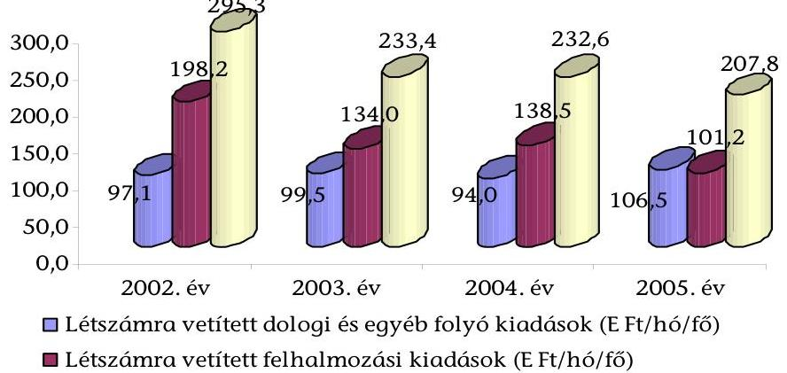

A Kormánynak a működési költségek csökkentésére vonatkozó takarékossági intézkedései ${ }^{12}$ is hozzájárultak ahhoz, hogy az elhelyezéssel és a tárgyieszközellátottsággal összefüggő fajlagos kiadások összességében csökkentek. Ezen a

[^0]
[^0]:    ${ }^{11}$ Az országos településrendezési és építési követelményekről szóló 253/1997. (XII. 20.) Korm. rendelet.
    ${ }^{12}$ A takarékossági intézkedések esetében alapvető hiányosság volt, hogy sem a kormányzati, sem a fejezeti szintű intézkedések nem voltak tekintettel a megtakarítás jellegére. Az eredményességet nem befolyásolja, a feladatellátás színvonalát és a megtakarítás tartósságát viszont meghatározza, hogy az csak egyes kiadások közvetlen csökkentéséből (pl. bizonyos beruházások elhalasztása vagy végleges törlése) vagy ténylegesen a hatékonyság növekedéséből származik. A két hatás általában együttesen jelentkezik, de az intézkedés megítélése szempontjából döntő a megoszlásuk aránya.

---

területen európai uniós források felhasználására - egy intézményt (FH) kivéve - nem került sor. A létszámarányos dologi és egyéb folyó kiadások értéke 2005-ben volt a legmagasabb (bár a 2005. évi érték csupán 9,7%-kal haladta meg a 2002. évit). A létszámra vetített felhalmozási kiadások szintje 2005-ben volt legalacsonyabb (a 2005. évi érték 48,9%-kal volt kevesebb a 2002. évinél).

A létszámarányos dologi és egyéb folyó kiadások tekintetében az országos hatáskörű szervek helyszíni ellenőrzésre kijelölt vidéki szervezeteinek intézménycsoportonkénti átlaga jelentősen elmaradt a vizsgált szervezetek átlagától. (Például a területi szervezeteknél a létszámarányos gépkocsi-ellátottság kevesebb mint fele a központi intézményeknél.)

Ellenőrzésünk tapasztalatai alapján a központi intézmények kétharmadánál az elhelyezési feltételek is igen eltérő képet mutattak. A központi intézményeknél 2005-ben az 1 főre jutó alapterület ${ }^{13} 33,3 \mathrm{~m}^{2}-106,2 \mathrm{~m}^{2}$ között alakult. A meglévő eltérések és azok változása azt mutatja, hogy az elhelyezéssel kapcsolatban az alapvető mutatókban sem érvényesült normativitás. ${ }^{14}$

Az ellenőrzött szervezetek 2006. I. 1-jei állapot szerint összességében 206 ingatlant használtak a feladataik ellátásához. Ebből 150 objektum volt állami (kincstári) tulajdonú. Ezeket az intézmények vagyonkezelői jogosultságuk alapján saját épületként használták. A további 56 épületben - részben vagy egészben - bérelt helyiségekben végezték feladataikat a szervezetek. Felmérésünk alapján a hasznos irodaterületek aránya mindössze átlagosan 50% körüli volt.

A parkolási kapacitás sem volt megfelelő, a parkolási igények mindössze felét tudták kielégíteni. A Budapesten lévő ingatlanok átlag 40%-ára kötöttek biztosítási szerződést, a vidéki ingatlanoknál azok 80%-ára. Az ingatlanokkal kapcsolatos fajlagos beruházási, felújítási és karbantartási kiadások mértéke szélsőséges ingadozást mutatott, ugyanakkor a központi intézmények lehetőségei jelentősen meghaladták a területi intézményekét.

Az intézmények elhelyezését szolgáló ingatlanokkal kapcsolatban nem működött központosított elhelyezés-gazdálkodás. ${ }^{15}$ Nem volt olyan szervezet, amelynek jogszabályi kötelezettségeként határozták meg - kormányzati szinten és településenként - az elhelyezési igények kielégítését. Nem szabályozták továbbá az elhelyezés eljárásjogi, technikai és költségvetési vonatkozását.

[^0]
[^0]:    ${ }^{13}$ Az alapterület az épület szintjein található teljes járófelület területe. Ebből jelentős részt tettek ki (40-60%) a munkavégzésre nem hasznosítható terek.
    ${ }^{14}$ Az intézményeknél rendelkezésre álló, 1 főre jutó alapterület átlaga 2002-ben közel $32 \mathrm{~m}^{2}$ volt, amely 2005-re 8%-kal emelkedett. Ugyanekkor a „legzsúfoltabban" és „legtágasabban" elhelyezett szerv hasonló mutatójának értéke közötti 5,5-szeres különbség 6,7-szeresre nőtt.
    ${ }^{15}$ Az ellenőrzött időszakot megelőzően többször, legutóbb 2001-ben voltak a minisztériumok (egy részének) korszerű épület-komplexumban történő összevont elhelyezésére koncepciók, elgondolások. Ezek azonban megvalósulásuk esetén sem oldották volna meg teljes körűen az elhelyezési kérdést, mivel a háttérintézményekkel egyáltalán nem számoltak.

---

Az ellenőrzésbe bevont intézmények 60%-ánál a szervezet széttagolt volt, azok több épületben működtek, igazgatási feladataikat is több helyen látták el. Az intézmények felére volt jellemző a megosztott használat, amely az üzemeltetéssel és a finanszírozással kapcsolatban többletmunkát okozott.

Felmérésünk adatai alapján az intézmények negyede nem saját ingatlanban volt elhelyezve. Bérleményekkel a központi szervezetek átlagosan 60%-a, a vidéki szervezetek 40%-a rendelkezett, a bérbeadó a központi szervezetek 85%-nál gazdasági társaság, 15%-nál költségvetési szerv volt. A területi igazgatóságok elsősorban költségvetési szervektől (67%) és gazdasági társaságoktól (28%) béreltek irodákat, de előfordult magánszemélytől való igénybevétel is.

A szétszórt elhelyezés miatt a munkaszervezés, az irányítás, a folyamatba épített, előzetes- és utólagos vezetői ellenőrzés (FEUVE) időigényesebb és költségesebb volt. Az elhelyezési feltételek egységesítésére irányuló törekvések nem bizonyultak eredményesnek.

Az eszközellátottságban a személyes használatú gépjárművek, az intézmények által biztosított költségkeretű mobiltelefonok és az otthoni használatban lévő számítógépek a munkatársak alkalmazása (jogosultságok és kedvezmények) és a munkavégzés korszerűsége szempontjából voltak jelentősek. Szakmai indokoltságuk mellett a költségvetési megtakarításban játszott szerepük viszont relatíve csekély volt. Ennek ellenére a kormányok ezen eszközcsoportok csökkentésére épített takarékossági intézkedéseknek szántak kiemelt szerepet.

A gépek, berendezések, felszerelések körében a minőségi mutatók (használhatósági fok, 0-ra leírt eszközök aránya) terén összességében negatív folyamatokat tapasztaltunk. Nőtt a fizikailag, technikailag amortizálódott eszközök aránya, ez különösen jellemző volt az információs és kommunikációs eszközökre (IKT).

A 0-ra leírt eszközök aránya a központi és vidéki szervezetekre vonatkozóan
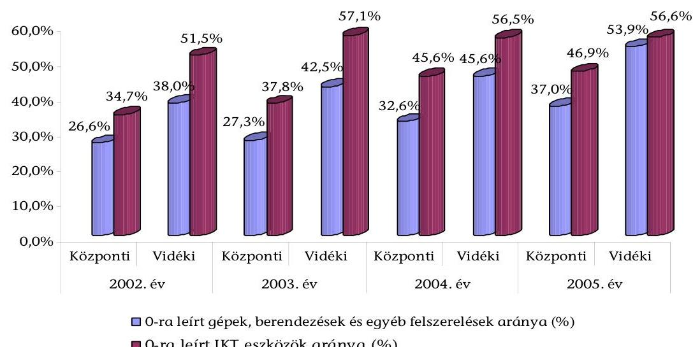
- 0-ra leírt gépek, berendezések és egyéb felszerelések aránya (%)
- 0-ra leírt IKT eszközök aránya (%)

---

A központi közigazgatási szerveknél a takarékossági intézkedések hatására a személygépkocsik állománya 2002-től 2005-ig kis mértékben csökkent (4,6%-kal).

A csökkenés a kulcsos- és a taxi rendszerben üzemeltett gépkocsikat érintette. Ez, valamint az állami vezetők és az állami vezetőket megillető juttatásokban részesülő nem állami vezetők ${ }^{16}$ (továbbiakban együttesen: állami vezetők) számának mintegy 9%-os növekedése azt eredményezte, hogy a részükre jogszabályban meghatározott jogosultságként biztosított személyi használatú gépjárművek aránya mérsékelten, de folyamatosan nőtt. A gépjárműállomány szinte egésze saját tulajdonban volt, a bérlet, a lízing aránya nem érte
 el az 1%-ot.
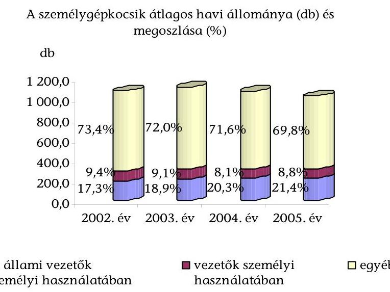

Ellenőrzésünk tapasztalatai összességében azt a korszerű és hatékony feladatellátás szempontjából kedvezőtlen tendenciát támasztották alá, hogy a központi államigazgatás egyre magasabb létszámmal, egyre inkább elöregedő, korszerűtlenné váló eszközökkel működött az egyre rosszabb műszaki színvonalú épületekben.

Az ellenőrzött központi intézményeknél a létszámnövekedéssel (2002-2005 között a tényleges átlaglétszám összességében 9%-kal, 12345 főről 13443 főre nőtt) az eszközök beszerzése nem tartott lépést (az ellenőrzött időszakban a beszerzésre fordított kiadások 8%-kal csökkentek). Ennek következményeként az ellátottsági mutatók trendszerűen rosszabbodtak. Az elhelyezésre rendelkezésre álló alapterület bővülése a létszám növekedésével arányosan történt, viszont az épületekkel kapcsolatos beruházásokra, fenntartásra/karbantartásra fordított

[^0]
[^0]:    ${ }^{16}$ Állami vezetők alatt a Kormány tagjai és az államtitkárok jogállásáról és felelősségéről szóló 1997. évi LXXIX. törvényben meghatározott, továbbá az állami vezetői besorolású vezetőket értjük. A juttatások formáját és mértékét az ellenőrzött időszakban az állami vezetői juttatások jogosultsági feltételeiről szóló 131/1997. (VII. 24.) Korm. rendelet szabályozta. A juttatásokban részesülők körét jogszabályok és kormányhatározatok határozták meg.

---

kiadások csökkentek (átlagosan 7%-kal). (Az elhelyezés és az eszközellátottság jellemző adatait a 2/a. és 2/b. melléklet tartalmazza.)

A 2006. évi kormányzati intézkedések ${ }^{17}$ hatására a központi intézményeknél 2006. IX. 1-jére az állami vezetők száma a felére, továbbá a központi szerveknél foglalkoztatottak (beleértve a vezetőket is) létszáma, valamint a saját épületekben használt összes alapterület nagysága, továbbá a személygépkocsik száma az ötödével csökkent ${ }^{18}$. Egyúttal a személygépkocsik megoszlásában jellemzően nőtt a kulcsos rendszerű személygépkocsik aránya. A létszámcsökkenés mértékénél jelentősebben csökkent a mobiltelefonok száma is. (A központi intézmények 2006. IX. 1-jei egyes kiemelt adatait a 2/c. mellékletben szerepeltetjük).

A helyszíni ellenőrzés megállapításainak hasznosítása mellett javasoljuk:

# a Kormánynak 

1. Vizsgálja felül - a működtetés optimális feltételeinek biztosítása érdekében - az állami feladatok tartalmának, körének és finanszírozási mértékének meghatározásával összefüggésben az igazgatási tevékenységet ellátó központi költségvetési szerveket, ennek eredményeit hasznosítsa a működési modellek kialakításánál.
2. Dolgoztassa ki - széles körű felmérésekre és elemzésekre alapozva - az igazgatási tevékenységet ellátó központi költségvetési szervek tárgyieszköz-ellátottságának normatíváit. Gondoskodjon a kialakított normatíváknak a költségvetési tervezési folyamatokban történő alkalmazásáról.
3. Alapozza meg hatástanulmánnyal a központi államigazgatás kialakuló rendjével ${ }^{19}$ kapcsolatban a központi költségvetési szervek elhelyezése és működtetése feltételrendszerének kialakítását.

[^0]
[^0]:    ${ }^{17}$ Ezeket a változásokat az ÁSZ a későbbi ellenőrzései során értékelni fogja.
    ${ }^{18}$ A 2002. évi átlagos állományhoz képest a tényleges létszám és a vezetők száma 2006. IX. 1-jére csak 7-10%-kal csökkent.
    ${ }^{19}$ A Magyar Köztársaság Kormányának programja 2006-2010; Az államháztartás hatékony működését elősegítő szervezeti átalakításokról és az azokat megalapozó intézkedésekről szóló 2118/2006. (VI. 30) Korm. határozat.

---

# II. RÉSZLETES MEGÁLLAPÍTÁSOK 

## 1. AZ ELHELYEZÉSSEL, TÁRGYIESZKÖZ-ELLÁTOTTSÁGGAL KAPCSOLATOS NORMATÍVÁK, MUTATÓSZÁMOK

A minisztériumok és az országos hatáskörű szervek elhelyezésére és tárgyieszköz-ellátottságára vonatkozóan a vizsgált időszakban jogszabályi normatív előírások nem voltak jellemzőek annak ellenére, hogy az államháztartási reform elgondolások - változó módon, de ciklusokon átnyúló kiemelt céljai közé tartozott a közfeladatok körének, tartalmának, a feladatellátás feltételeinek, továbbá az ahhoz szükséges vagyonelemek és források mértékének meghatározása.

Az ÁSZ a kincstári vagyonnal kapcsolatos jelentéseiben ${ }^{20}$ visszatérően megállapította, hogy a kincstári vagyon egységes elvek szerinti értékelésének, valamint az ingatlanok tényleges állapota felmérésének hiányában az ingatlanvagyon értéke nem volt megbízható.
„A vagyonkezelők mintegy 80%-át kitevő központi költségvetési szervek körében, több évtizede nem történt meg a számviteli jogszabályok értelmében a kincstári vagyon egységes elvek szerinti - jogszabályi előírásokon alapuló - értékelése. A becsült értékadatok meghatározása érdekében a kincstári vagyoni körre egységesen vonatkozó értékelési alapelveket - az EU szabvány és módszertan szerinti irányelvek figyelembevételével - nem alakították ki."21

Az államháztartási reform koncepciókban és az éves költségvetési tervezés során rutinszerűen ismételt feladatként nevesítették az állami feladatok és/vagy az intézményi rend felülvizsgálatának szükségességét. Az ÁSZ a Magyar Köztársaság 2004. évi költségvetése végrehajtásának ellenőrzéséről szóló jelentésében áthúzódó problémaként jelezte, hogy a mindenkori kormányok az állami feladatok meghatározása helyett a költségvetés összeállításához kapcsoltan részintézkedésekkel kívánják kikényszeríteni a költségvetés kiadási oldalának mérséklését, amelyek nem hozzák meg az elvárt eredményt.

Csak az állami feladatok rendszerének meghatározása után következhet a feladatok ellátásához az optimális elhelyezési- és eszközellátottsági feltételek hozzárendelése. Ellenőrzéseink tapasztalatai is azt támasztják alá, hogy a feladatrendszer rögzítésének hiányában kezdeményezett takarékossági intézkedések még teljes körű végrehajtás esetén is - csak rövid távú megtakarításokat ered-

[^0]
[^0]:    ${ }^{20} 404$ sz. jelentés a Kincstári Vagyoni Igazgatóság vagyonkezelő és hasznosító tevékenységének vizsgálatáról és 515 sz. Jelentés a kincstári vagyon kezelésének és működtetésének ellenőrzéséről.
    ${ }^{21}$ 515. Jelentés a kincstári vagyon kezelésének és működtetésének ellenőrzéséről.

---

ményezhetnek, illetve hosszabb távon akár a működtetés feltételeit is kedvezőtlenül befolyásolhatják.

A Kormány intézkedései több esetben akkor sem jártak az elvárt eredménnyel, ha azokat kifejezetten egyensúlyjavító intézkedések elemeként hirdette meg, így pl. a 2003-2004-ben elrendelt takarékossági intézkedések, amelyek korlátozott jellegét mutatja, hogy nem terjedtek ki sem az országos hatáskörű szervek teljes körére, sem a háttérintézményekre.

A Kormány részére 2003. szeptemberében a pénzügyminiszter és a MeHVM közös előterjesztést készített a kormányzati kiadások csökkentéséhez szükséges takarékossági intézkedésekről. Ez többek között 2004. I. 1-jétől tervbe vette a minisztériumi vezetők differenciált, átlagosan 16,9%-os, a gépjárművek 25%-os csökkentését, a mobiltelefon-jogosultság korlátozását és a minisztérium által fizetett keretek felső határainak mérséklését.

Az előterjesztés szerint a 2004-ben jelentkező (tervezett) megtakarítás a vezetői kinevezések visszavonásából 200 M Ft, a gépjármű-állomány leépítéséből 512 M Ft (ebből 350 M Ft az értékesítés bevétele), a távközlési díjak csökkentéséből pedig 174 M Ft. Ehhez képest az államháztartás egyensúlyi helyzetének javításához szükséges rövid és hosszabb távú intézkedésekről szóló 2050/2004. (III. 11.) Korm. határozat már nem nevesítette ezeket a feladatokat, csak azt írta elő, hogy a központi igazgatási szervek egyes juttatások tekintetében a pénzügyminiszter által meghatározott követelményszint alapján alakítsák át belső szabályozásukat.

Az elrendelt intézkedések végrehajtását tükröző adatok meglehetősen szerény eredményeket mutatnak: a minisztériumokban a vezetők száma 2004-ben ugyan csökkent 9%-kal az előző évhez képest, de azután 2005-ben az 1%-os növekedés miatt számuk elérte a 2002. évi szintet. A személygépjárművek száma folyamatosan csökkent ugyan a 2003. évihez képest, de 2005-re csak 13%-kal. (A személygépjárművel való ellátottság mutatója, az 1 gépkocsira jutó létszám átlagosan 2002-ben 13,8 fő, míg 2005-ben 13,7 fő volt.) A mobiltelefonok száma azonban 2003-hoz képest 2004-ben 13%-kal, majd a következő évben újabb 3%-kal emelkedett.

Az ellenőrzött országos hatáskörű intézmények központi szervezeteinél azonban a vezetők száma 2004-ben az előző évhez képest 10%-kal, majd 2005-ben 24%-kal, míg az állami vezetők száma 2003-2005 között 59%-kal emelkedett. A mobiltelefonok száma ugyanebben az időszakban 52%-kal, a személygépkocsiké pedig 14%-kal nőtt. (Ezzel együtt is a személygépjármű ellátottság mutatója 2002-ben 16,4 fő, 2005-ben 17,7 fő volt.)

Összességében a központi szerveknél a vezetők száma 2004-ben ugyan csökkent 3%-kal az előző évhez képest, de azután 2005-ben a 6%-os növekedés miatt számuk meghaladta a 2003. évi szintet. (Mindeközben az állami vezetők száma is nőtt 4%-kal). A személygépjárművek száma folyamatosan csökkent

---

2003. évihez képest 2005-re 8%-kal ${ }^{22}$. A mobiltelefonok száma azonban 2003-hoz képest 2004-ben 18%-kal, majd a következő évben újabb 5%-kal emelkedett $^{23}$.

Az államháztartás hosszú távú egyensúlyi követelményeinek és a működtetés optimális feltételeinek biztosítása megkerülhetetlenné teszi az állami feladatok tartalmának és finanszírozási mértékének meghatározását, ami az átláthatóan működő és ellenőrizhető államháztartás alapját jelenti. Ez azonban átfogóan, lényeges eredményre vezető módon nem történt meg. Az ÁSZ ezzel kapcsolatos külön ellenőrzése során ${ }^{24}$ javasolta a Kormánynak, hogy kezelje prioritásként az állami feladatok egyértelmű meghatározására irányuló munkálatokat az államháztartás működésének átláthatósága, elszámoltathatósága és ellenőrizhetősége érdekében, továbbá, alakítson ki egységes és átlátható követelményrendszert az állami feladatok államháztartáson kívülre szervezésére, a közpénzek védelme érdekében szükséges garanciákra, dolgozza ki ennek az államháztartási szabályozási hátterét. A MeHVM által az ÁSZ 2005. évi tevékenységéről szóló országgyűlési beszámoló kapcsán az ÁSZ elnökének írt, 2006. I. 27-én kelt levélben a Kormánynak tett javaslatok alapján végrehajtott intézkedések felsorolásából kimaradt a javaslatunk.

Az irodahelyiségek méretét, az állami vezetői juttatásokat, a központosított közbeszerzést, az informatikai hálózatok kialakítását, biztonsági követelményeit, a vagyongazdálkodást illetően az ellenőrzött időszakban a költségvetési szervekre jogszabályban, kormányhatározatban, pénzügyminiszteri iránymutatásban meghatároztak a normativitás irányába mutató előírásokat. Ugyanakkor az államháztartás pénzügyi rendszerének fejlesztéséért felelős intézmények nem dolgozták ki az állami feladatok, valamint a kiadási- bevételi előirányzatok közötti kapcsolatot a teljesítmény szempontjából összekötő, az értékelést biztosító - mutatókra és normákra alapozó - módszertant.

Az igazgatási tevékenységre a jelenlegi gazdálkodási és szabályozási környezetben nem lehet kialakítani olyan jellegű normákat, mint amelyeket az egészségügyi, oktatási, közművelődési stb. szolgáltatásoknál (pl.: egy esetre, illetve beavatkozásra jutó finanszírozási összeg, egy főre megállapított hallgatói normativa) alkalmaznak. Mindez megnehezíti az egyes szervekre vonatkozó elhelyezési feltételek, illetve eszközellátottság megfelelőségének minősítését.

Az irodai munkahelyek, helyiségek méretére és kialakítására az OTÉK határozott meg előírásokat. A munkahelyek munkavédelmi követelményének minimális szintjéről szóló 3/2002. (II. 8.) SzCsM-EüM együttes ren-

[^0]
[^0]:    ${ }^{22}$ A 2005. évi adatokhoz képest 2006. IX. 1-jére a személygépkocsi ellátottság mutatója - mivel a létszám és az autók állománya közel azonos mértékben (17-20%-kal) csökkent - lényegében nem változott.
    ${ }^{23}$ A 2005. évi adatokhoz képest 2006. IX. 1-jére a mobiltelefonok száma, ezen belül a 20 E Ft költségkeretű, illetve a korlátlanul használható mobiltelefonok aránya ugyanolyan mértékben (25%-kal) csökkent.
    ${ }^{24} 0467$ sz. Jelentés az államháztartáson kívüli állami feladatellátás rendszerének ellenőrzéséről.

---

delet a belsőtéri mesterséges világításra, továbbá a munkahelyi zajvédelemre adott előírásokat.

Az OTÉK 85. §-a szerint a helyiség légtérfogata a tervezett befogadóképességnek megfelelően irodai munkahelyeken legalább $15 \mathrm{~m}^{3} / f ő$, az átlagos belmagasság $2,5 \mathrm{~m}$, így az alapterület $6 \mathrm{~m}^{2}$. Ennek az előírásnak az intézmények kivétel nélkül eleget tettek.

Az állami vezetői juttatások jogosultsági feltételeiről szóló 131/1997. (VII. 24.) Korm. rendelet ${ }^{25}$ a minisztériumok, illetve országos hatáskörű szervek ingatlan és tárgyi eszköz gazdálkodására is hatással lévő előírásokat tartalmaz egyes juttatások (személygépkocsi használat, hivatali lakás, lakás fenntartási térítés) jogosultsági feltételeinek meghatározásával.

A Korm. rendelet meghatározza az állami vezetők körét és rendelkezik az állami vezetőket megillető juttatásokról. A juttatások pénzügyi fedezetét, valamint a személygépkocsi-használat személyi és tárgyi feltételeit annak a szervezetnek a költségvetéséből kell biztosítani, amelynek a jogosult a feladatait teljesíti. A rendelet előírja a hivatali lakással való ellátás és lakásfenntartási térítés részletes feltételeit.
 Meghatározza, hogy az állami vezetőt és az államtitkári juttatásra jogosult személyt személyes gépkocsi-használat illeti meg, erre a helyettes államtitkári juttatásra jogosult személy is feljogosítható.

A központosított közbeszerzési rendszerről, valamint a központi beszerző szervezet feladat- és hatásköréről szóló 168/2004. (V. 25.) Korm. rendelet felhatalmazása alapján a MeHVM tájékoztatókban meghatározta az országosan kiemelt termékekre vonatkozó állami normatívákat. (Korábban ez kormányhatározatokban történt ${ }^{26}$.)

Az állami normatíva a kiemelt termékbeszerzések (az intézmények beszerzései között általánosan, illetve időszakosan visszatérő módon szereplő termékek és szolgáltatások) tekintetében a beszerzés szempontjából lényeges - a termékre, az ajánlattevőre, valamint a szerződéses feltételekre vonatkozó - műszaki, gazdasági és minőségi követelményeknek a központosított közbeszerzést végző KSZF által alkalmazott osztályozási hierarchiához illeszkedő csoportja.

Az ellenőrzött időszakban - kisebb változásokkal - országosan kiemelt termékek voltak: a távközlési eszközök és szolgáltatások, a személyi számítógéprendszerek, azok főbb egységei és általánosan használt felhasználói szoftvereszközei, az irodatechnikai berendezések, tartozékaik, a működésükhöz szükséges kellékanyagok és szolgáltatások, a bútorok, a papírok, papíráruk, a gépjárművek, az üzemanyagok, az egészségügyi termékek, valamint a repülőjegy-beszerzés és a hozzá kapcsolódó szolgáltatások.

[^0]
[^0]:    ${ }^{25}$ Az állami vezetők és az államigazgatási szervek köztisztviselői számára biztosított juttatásokról és azok feltételeiről szóló 136/2006. (VI. 26.) Korm. rendelet hatályon kívül helyezte. Az új jogszabály továbbra is tartalmazza az állami vezetőket megillető juttatásokat.
    ${ }^{26}$ Például az 1054/2000. (VI. 30.), illetve az 1077/2000. (IX. 22.) Korm. határozatok.

---

A központosított közbeszerzés normatívái általában meghatározták az eszközök műszaki-technikai paramétereit. Arra viszont nem adtak választ, hogy kinek (intézmény/szervezeti egység/feladat/tevékenység/személy) és mire van szüksége, és ennek érdekében mennyi a beszerzés és az üzemszerű működtetés költsége.

Az országosan kiemelt termékekre vonatkozó állami normatívák pl. műszakilag jól meghatározzák az adott kategóriába tartozó gépjárművek jellemzőit, de a konkrét gépkocsi beszerzésekor az árak jelentősen eltérnek. A „felső-közép kategória" eleve két csoportot foglal magába: a 7. kategóriába tartozó gépkocsik kedvezményekkel számított ára 2005-ben kb. 7 M Ft, a 8. kategóriába tartozóké 11 M Ft volt.

Az informatikai fejlesztések, hálózatok, eszközök területén a normatíva kialakítása irányába tett lépésként értékelhető a kormányzati informatikai fejlesztések területén a kormányzati informatika koordinációjáról és a kapcsolódó eljárási rendről szóló 44/2005. (III. 11.) Korm. rendelet kiadása. A kormányzati informatika egységesítését és kompatibilitását szolgálta az Elektronikus Kormányzati Gerinchálózat (EKG) kialakítása és működtetése. A zártcélú távközlő hálózatról szóló 50/1998. (III. 27.) Korm. rendelet 10/A. §-a a központi közigazgatási szervek részére kötelezővé is tette az EKG-hoz való csatlakozást.

A kincstári vagyonnal való gazdálkodásról szóló 58/2005. (IV. 4.) Korm. rendelet ${ }^{27}$ szerint a KVI felelős a kincstári vagyonért, a központi költségvetési szervek elhelyezéséért viszont nem. A vagyongazdálkodás és az elhelyezés szempontjai eltérőek. A vagyon nagyságának, de még az épület állagának szempontjából sem mérvadóak az irodaterülettel szemben támasztott követelmények.

A követelmények közé tartozik például a földrajzi elhelyezkedés (például tömegközlekedési csomóponttól való távolság, a feladatellátásához kapcsolódó többi szervezethez közeli elhelyezkedés), minőségi feltételek meghatározása (műszaki színvonal, esztétikai megjelenés), méretek, alaprajzi elrendezés (az iroda- és egyéb közösségi helyiségek kialakítása az elhelyezni kívánt szervezet létszámához, felépítéséhez igazodóan), felszereltség (informatikai-, hűtési-, fűtési infrastruktúra, biztonságtechnikai adottságok).

A vagyongazdálkodás hiányossága volt, hogy nem működött központosított intézményi elhelyezés-gazdálkodás. Nem rögzítette jogszabály, hogy egy költségvetési szerv létrehozásakor, illetve elhelyezési igényeinek kielégítésekor kinek kell intézkednie, milyen eljárási rend és követelményrendszer szerint. Nem biztosítottak erre a feladatra megfelelő szakembert és adatbázist. A feladat részét képező, az épületek állapotának, értékének felmérésére, azok rögzítésére, valamint a felújítási, karbantartási munkák kezelésére irányuló tevékenységek így esetlegesek voltak. Kormányzati szinten átfogóan nem történt meg a műszaki állapot szinten tartásához az amortizációs fedezet forrásszükségletének felmérése.

[^0]
[^0]:    ${ }^{27}$ Ezt megelőzően a kincstári vagyon kezeléséről, értékesítéséről és az e vagyonnal kapcsolatos egyéb kötelezettségekről szóló 183/1996. (XII. 11.) Korm. rendelet rendelkezett hasonlóképpen.

---

A MeH Szervezeti és Működési Szabályzata (SzMSz) a Kormányzati Elhelyezési Iroda feladatai közé sorolta ${ }^{28}$, hogy a központi kormányzati szervek elhelyezésével kapcsolatban szervezi és koordinálja a Kormány által hozott döntések végrehajtását, továbbá szervezi a kormányzati szervek elhelyezését regisztráló, a döntés előkészítést segítő informatikai rendszert, közreműködik annak működtetésében. Ellenőrzési tapasztalataink alapján az Iroda nem látta el ezeket a feladatokat, ezt a létszáma (2-3 fő) sem tette lehetővé. Az Iroda készített ugyan esetenként vezetői utasítás alapján elemzéseket (például a 2004-es kormányváltás kapcsán), de nem foglalkozott az elhelyezés operatív feladataival, az ehhez szükséges nyilvántartásokkal sem rendelkezett.

A költségvetési gazdálkodásra vonatkozó jogszabályi előírásokból nem következik, hogy az intézmények olyan információs rendszert alakítsanak ki, amelyek biztosítanák a források felhasználásának mind nagyobb részére kiterjedő teljesítményszemlélet megvalósíthatóságát. Ehhez képest a jogszabályok és egyes kormányhatározatok rendszeresen meghatározzák a költségvetési gazdálkodásban érvényesítendő követelmények között a hatékonyságot is, amelynek feltétele a teljesítmény mérésére alkalmas mutató, norma kialakítása. Az ÁSZ ellenőrzései ${ }^{29}$ azt mutatják, hogy az erre vonatkozó jogszabályi előírások (például az 1992. VI. 18-án hatályba lépett Áht.) nem valósultak meg. Akkor sem járt a kormányzati szándék jelentősebb eredményekkel, amikor határozott egyensúlyjavító intézkedéseket hirdetettek meg.

A takarékossági intézkedések esetében alapvető hiányosság volt, hogy sem a kormányzati, sem a fejezeti szintű intézkedéseknél nem kaptak kellő hangsúlyt a hatékonysági szempontok.

Az eredményességet nem befolyásolja, a feladatellátás színvonalát és a megtakarítás tartósságát viszont meghatározza, hogy az csak egyes kiadások közvetlen csökkentéséből (pl. bizonyos beruházások elhalasztása vagy végleges törlése) vagy ténylegesen a hatékonyság növekedéséből származik. A két hatás általában együttesen jelentkezik, de az intézkedés megítélése, az elért megtakarítás tartóssága, strukturális beágyazottsága szempontjából mérvadó a megoszlásuk aránya.

A központi költségvetési szervek számára a vonatkozó számviteli jogszabályok nem tiltják, hogy a költségvetési előirányzatokkal kapcsolatos információs előírásokon túlmenően kiépíthessenek és működtessenek vezetői információs/kontrolling rendszert. Az intézményeknek azonban nem volt komoly érdekeltségük abban, hogy egy ilyen rendszerre fordítsák egyre szűkösebb erőforrásaikat. A költségvetési tervezés bázis alapú alkufolyamatában sem jelent előnyt az intézményi igények ilyen módon történő alátámasztása.

[^0]
[^0]:    ${ }^{28}$ Ezt a feladatot a MeH-ről szóló 148/2002. (VII. 1.) Korm. rendelet nem tartalmazza.
    ${ }^{29}$ Az ÁSZ kincstári vagyonnal kapcsolatos ellenőrzései (1997. évi ÁSZ jelentés a KVI vagyonkezelő és hasznosító tevékenységének vizsgálatáról, 2000. évi ÁSZ Jelentés a kizárólagos állami tulajdon nyilvántartása helyzetéről, 2000. évi ÁSZ jelentés az állami tulajdonú földterületek nyilvántartásának ellenőrzéséről), Jelentés a Honvédelmi Minisztérium fejezet működésének ellenőrzéséről 2000. [0017], Jelentés a Külügyminisztérium fejezet működésének ellenőrzéséről 2003. [0314].

---

Az intézmények a vizsgált eszközökre vonatkozóan - a mobiltelefon használat kivételével - csak nagyon szűk körben, kivételesen [KSZF, Honvédelmi Minisztérium (HM), Kincstár] készítettek, alkalmaztak költség- vagy ellátási normákra belső szabályzatokat.

A KSZF a helyszíni ellenőrzés idején elkészítette az ellátási normatívák szabályzatának tervezetét, amelynek célja, hogy „átláthatóbb, egyértelműbb legyen az egyes pozíciókhoz (álláshelyekhez) rendelhető ellátmányok köre." A tervezet a jelenlegi kidolgozási szinten is alkalmas arra, hogy a további munka alapjául szolgáljon.

A HM a korábban kialakított, az irodák felosztására vonatkozó elhelyezési normát 2005-ben szigorította. A szabályozás az igénybe vehető irodák számát és méretét a beosztáshoz kötötte.

A Kincstár Vas Megyei Területi Igazgatóságánál takarékossági intézkedési tervet és ennek keretében a másolópapír-, irodaszer-felhasználásra normákat adtak ki.

A közpénzek felhasználásával, a köztulajdon használatának nyilvánosságával, átláthatóbbá tételével és ellenőrzésének bővítésével összefüggő egyes törvények módosításáról szóló 2003. évi XXIV. („Üvegzseb") törvény 2003. VI. 9-én lépett hatályba. Ebben és az államháztartási információs és működési rendszer korszerűsítését szolgáló egyes feladatokról szóló 1096/2003. (IX. 11.) Korm. határozatban a Kormány a miniszterek és a fejezetek felügyeletét ellátó szervek vezetői részére előírta a közérdeklődésre számot tartó fontosabb aktuális ügyekről szóló tájékoztatók készítését és közzétételét. Ennek alapján az ellenőrzésünk témakörében is több adat nyilvánosan hozzáférhetővé vált.

Az eszközellátottságban a személyes használatú gépjárművek, az intézmények által biztosított költségkeretű mobiltelefonok és az otthoni használatban lévő számítógépek a munkatársak alkalmazása (jogosultságok és kedvezmények) és a munkavégzés korszerűsége szempontjából voltak jelentősek. Szakmai indokoltságuk mellett a költségvetési megtakarításban játszott szerepük viszont csekély volt. Ugyanakkor a Kormány részére a 2003. szeptemberében készített PM-MeH közös előterjesztés is ezen eszközcsoportokra épített takarékossági intézkedéseknek szánt kiemelt szerepet.

A KSH adatai alapján a központi költségvetési intézményeknél a havi átlagjövedelem mintegy 250 E Ft, azaz éves szinten 3 M Ft volt. Ugyanebben az évben a személygépkocsik üzemeltetése az ellenőrzött intézményeknél átlagosan 2,1 M Ft költséget jelentett. Az átlagos nettó értékük 0,9 M Ft volt. Ez azt jelenti, hogy az állomány egy átlagos autóval vagy egy átlagos dolgozóval történő csökkentése hosszabb távon - ugyanakkora megtakarítással jár.

A Kormány az államháztartás egyensúlyi helyzetének javításához szükséges rövid és hosszabb távú intézkedésekről szóló 2050/2004. (III. 11.) határozatában „tudomásul vette" a pénzügyminiszter által meghatározott követelményszint alapján a központi költségvetési szerveknek és a társadalombiztosítás pénzügyi alapjai kezelőinek a belső szabályozás átalakítására irányuló tevékenységét a működési költségek csökkentése, valamint az ellátottság normativitásának céljából, anélkül, hogy egyértelműen rendelkezett volna a PM által kidolgozandó követelményszint kötelező jellegét illetően.

---

Az iránymutatás követelményszintet a személygépkocsik számára, a jogosultak körére, a belső szabályozás tartalmára, a mobiltelefon használat szabályozására, a költségkeret megállapítására, továbbá az otthoni használatban lévő számítógépekre határozott meg.

A kormányhatározat szerint a pénzügyminiszternek 2004. IV. 30-áig kellett volna kialakítania a fenti követelményszintet, melynek alapján a fejezetek felügyeletét ellátó szervek vezetőinek 2004. V. 31-éig kellett módosítaniuk a belső szabályozásukat, de e határidőket nem tartották be.

A gépkocsikra vonatkozó követelményszint érintette azok intézményenkénti számát, a jogosultak körét és fontos gazdaságossági előírásokat is tartalmazott. A gépkocsik számát intézményenként - az állami vezetők és a miniszterelnök által kormányhatározatban biztosított államtitkári, helyettes államtitkári juttatásra jogosultak kivételével - 17 fő/gépkocsiban határozta meg. Előírta, hogy a jogosultak körét (kiegészítve pl. a főcsoportfőnök, miniszteri biztos juttatásaival) és a használat feltételeit belső szabályzatban kell rögzíteni. Az iránymutatás szerint más vezetők, főosztályvezető, főosztályvezető-helyettes részére személyes gépkocsi-használat nem engedélyezhető.

Meghatározta, hogy az általános célú - taxi- és kulcsos rendszerű - használatra legfeljebb közép kategóriájú gépjármű üzemeltethető. Szabályozni kell a jogosultságon túl a nyilvántartási, költség-elszámolási kötelezettségeket, az esetleg bekövetkezett baleset (károkozás) során keletkezett kár rendezésének feltételeit. Saját gépjármű hivatalos célú igénybevétele csak akkor engedélyezhető, ha általános célú gépkocsi nem áll rendelkezésre és az utazás elhalasztása veszteséget okoz. Elő kell írni, pl. CASCO biztosítás, érvényes műszaki vizsga és vezetői engedély meglétét.

Az iránymutatás szerint a bírságok és a közlekedési szabálysértésből eredő minden költség a gépkocsi vezetőjét terheli. A hivatali gépjárművek cseréjét akkor lehet végrehajtani, ha a forgalomba állítás óta legalább 5 év eltelt. Ezt megelőzően a jogkörrel rendelkező vezető engedélyével cserét
 akkor lehet végrehajtani, ha a gépjármű állapota, illetve a javítás gazdaságtalan volta azt indokolttá teszi.

Az intézmények tartalmilag általában eleget tettek az iránymutatásnak, korábbi szabályzataik felülvizsgálata után érvényesítették a követelményszintet belső szabályzataikban.

Az Informatikai és Hírközlési Minisztérium (IHM), a Környezetvédelmi és Vízügyi Minisztérium (KvVM), a NKÖM, a KSH, a MeH/KSZF, a Kincstár, a Külügyminisztérium (KüM) a követelményszintnek megfelelően készítette el vagy módosította a belső szabályzatait.

Ugyanakkor tartalmi hiányosságokat is tapasztaltunk, így az ONYF ${ }^{30}$ nem szabályozta az üzemben tartható gépjárművek számát, a HM a személyes gépkocsi-használatot szélesebb körben engedélyezte, mint a PM követelményrendszer, amelyet a katonai szolgálattal összefüggő, átlagostól eltérő igénybevétellel

[^0]
[^0]:    ${ }^{30}$ Az ONYF főigazgatójának a 2006. VIII. 15-ei keltezésű levelében adott tájékoztatása szerint a norma betartásához a hatályos szabályozások módosítása szükségtelen, mivel az ONYF-nél és igazgatási szerveinél a gépjármű-ellátottság mutatója norma alatti értékű.

---

indokoltak. Az FH szabályzata nem határozta meg egyértelműen, hogy hivatali gépjármű állandó jellegű hivatalos használatára kik jogosultak, milyen feltételekkel. Az OM szabályzata nem rögzítette önhibás kár esetén a CASCO önrész megtérítését, a Foglalkoztatáspolitikai és Munkaügyi Minisztérium (FMM) szabályzata pedig nem határozta meg a forgalomba állítástól számított 5 év leteltét megelőzően a gépjármű csere feltételeit. Gazdaságossági szempontokat viszont csak néhány intézmény érvényesített a szabályzatában (MeH, FH, OM).

A MeH és a KSZF kulcsos személygépkocsira vonatkozó szabályozása szerint az igénybevétel olyan helyközi és távolsági utazásra történhet, amely tömegközlekedéssel nem, vagy csak aránytalanul gazdaságtalanabb módon váltható ki; az igénybevételre a gazdasági igazoló (az utalványozásra jogosult vezető) írásban adott engedélye alapján kerülhet sor. Külföldi útra történő igénybevételhez a főigazgató (a MeH-ben a közigazgatási államtitkár) jóváhagyása is szükséges. Az azonos útvonalra vagy azonos helyre irányuló utazásokat (kiküldetéseket) a költségtakarékossági szempontokra figyelemmel a gépjárművek biztosítását végző szervezeti egység köteles összehangolni.

Az FH belső szabályzata szerint hivatali gépjármű akkor igényelhető, ha a kiküldetés helyszíne tömegközlekedési eszközzel nem vagy csak nehezen közelíthető meg; a feladat ellátása sürgős; több helységbe kell utazni; több személy utazik együtt; adott helyre olyan csomagot, küldeményt kell eljuttatni, amely más eszközzel nem lehetséges.

Az OM-nél a szabályozás szerint a hivatali (taxi rendszerű, kulcsos és kihelyezett) személygépkocsik hatékony működtetése érdekében felügyeleti területenként éves kilométer keret, a magán gépkocsi, illetve a taxi használatra pedig külön-külön éves forint-keretösszeget határoztak meg. A főváros területére csak sürgős tárgyalásokhoz, titkos iratok kézbesítéséhez, pénzszállításhoz, illetve külföldi vendégek programjához lehet hivatali gépkocsit - gépkocsivezetővel együtt - igényelni.

A Baranya Megyei Munkaügyi Központnál a taxi- és a kulcsos rendszerű személygépkocsik használatánál éves kilométer keretet határoztak meg, amely csak az igazgató külön írásos engedélyével léphető túl.

A KSH megyei igazgatóságainál a KSH elnökének gépjármű használati szabályzatában foglaltakat a helyi sajátosságok figyelembe vételével kiegészítették, aktualizálták.

A Borsod-Abaúj-Zemplén (BAZ) MNYI esetében a gépjárműszabályzat aktualizálását a belső ellenőrzések megállapításai és az elszámolással kapcsolatos észrevételek tették szükségessé. Az aktualizált gépjármű-használati szabályzatban előírták, hogy a menetleveleket az útnyilvántartással egyezően kell vezetni, rögzíteni kell a felkeresett szervezetek, illetve magánszemélyek nevét és pontos címét.

A PM követelményszintje szerint a mobiltelefon használat belső szabályzatának tartalmaznia kell a jogosultak körét és az igénybevétel feltételeit. Korlátlan használat állapítható meg kiemelten az állami vezetők, az államtitkári és helyettes államtitkári juttatásra jogosult személyek részére. Más beosztásúak részére költségkeretet határozott meg, amelytől kizárólag lefelé lehetett eltérni.

Főcsoportfőnökök, főosztályvezetők részére 20 E Ft/hó, főosztályvezető-helyettes részére 10 E Ft/hó, osztályvezetőknek 6 E Ft/hó, egyéb jogosultaknak egyedi engedély alapján 5 E Ft/hó, gépjárművezetőknek 4 E Ft/hó költségkeret állapítható meg. Ettől egyénre meghatározottan lehet eltérni, ha a munkavégzés helye és

---

időtartama (pl. gyakori külföldi tartózkodás), illetve egyéb kapcsolattartás indokolja.

Az intézmények - egy-két kivételtől (GVH, IM, IHM) eltekintve - a követelményszintnek megfelelően szabályozták a mobiltelefon használatot. A legtöbb intézmény meghatározta, hogy a mobilhasználat nem juttatás és előírta, hogy a használója - felettesével egyeztetett módon - köteles elérhetőségét biztosítani. Szabályzattal az Igazságügyi Minisztérium (IM) nem rendelkezett, az ellátás egyedi kérelmek alapján történt. A vezetők a számlakivonat alapján a hívások hivatali jellegét igazolták, illetve döntöttek a fizetendő összeg nagyságáról.

Az ONYF, BM, Földművelésügyi és Vidékfejlesztési Minisztérium (FVM), Egészségügyi Minisztérium (EüM), FMM, HM, Ifjúsági-, Családügyi-, Szociális és Esélyegyenlőségi Minisztérium (ICSSZEM), Kincstár, KSH, NKÖM, KvVM, IHM szabályzatai megfeleltek a PM követelményszint előírásainak.

A KüM a PM követelményszint alapján megállapítható összeghatárok alatt fizetett térítést, kivéve négy főosztályvezetőt, valamint a főcsoportfőnököket, akiknek magasabb összeget térítettek a munkavégzés feltételei miatt.

A PM a helyettes államtitkárok esetében szigorúbb előírásokat alkalmazott, nem korlátlan használatot, hanem 30 E Ft/hó összegű keretet állapított meg. Ugyanakkor az egyedi használati engedéllyel rendelkezőknél az iránymutatás 5 E Ft/hó kerete helyett 10 E Ft havi összegben határozta meg az értékhatárt.

Az OM szigorította szabályozását, a tárcánál korlátlan mobiltelefon használatra csak a miniszter jogosult. A miniszter felügyelete alá tartozó vezetők 2005-ben 22,5 E Ft-37,5 E Ft/hó keretre voltak jogosultak. A költségkeretek átlagosan 10%-kal voltak alacsonyabban az előző évinél.

A Baranya Megyei Munkaügyi Központnál 2002-2004-ig a mobiltelefon használatot nem korlátozták. 2005-ben a takarékossági intézkedések keretében határozták meg a térítés nélküli használatot. Az igazgató és helyettese 10 E Ft/hó, a többi munkatárs 5 E Ft/hó keretet használhatott, ezek túllépése esetén a díjakat meg kellett téríteni.

Az ONYF-nél a mobiltelefonok használati rendjéről szóló utasításban - 2005. XII. 31-éig - központilag került meghatározásra az adott kategóriákhoz kapcsolódó költségkeret. A megyei igazgatóságok 2006. január 1-jétől helyi szabályozást adtak ki. A Baranya MNYI esetében 2006-tól az igazgató 10 E Ft/hó, a gazdasági igazgatóhelyettes 9 E Ft/hó, a többi munkatárs 6,2 E Ft/hó, illetve 2,7 E Ft/hó keretet használhatott.

Az informatikai eszközök, rendszerek használatával kapcsolatban az iránymutatás szerint el kell rendelni az otthoni, illetve irodai-otthoni használatra engedélyezett számítógépekre kiadott egyedi engedélyek felülvizsgálatát az otthoni munkavégzés időtartamára, szükségességére, gyakoriságára, okára, a munkaterheltségre kiterjedően. Az eredmény függvényében csökkenteni kell az engedélyek, illetve az új beszerzések számát.

Az intézmények közel fele (pl. FH, KSH, FVM, KvVM, ONYF, KüM, MeH) felülvizsgálta a használatot és szabályozta/újraszabályozta az engedélyezés rendszerét.

---

Nem szabályozta a használatot a NKÖM, az IM. Az FMM nem rendelkezett külön a hordozható számítógépek kölcsönzési rendjéről, holott 2004-2005-ben már minden második munkatársra jutott egy laptop.

A PM nem egészítette ki a szabályzatát az újonnan megvalósított projektre (az irodai nyomtatási/másolási/szkennelési és faxolási igényeket multifunkcionális eszközökkel kielégítő, valamint a másolt, nyomtatott, szkennelt, illetve faxolt anyagok képét egyedi azonosítással a felhasználókhoz rendelő, a digitalizáltan tárolt képeket megjeleníteni képes, a feladatelosztást optimalizáló-integráló menedzsmentrendszer) vonatkozóan.

Az OM 2004-ben megszigorította a hordozható számítógépek személyi/otthoni használatának engedélyezését, de továbbra sem írta elő az engedélyek rendszeres felülvizsgálatát.

Az intézményeknél működik a belső levelezési rendszer és többségüknél az intranet is, de ezek használatát nem szabályozták a KvVM, NKÖM, Kincstár, ICSSZEM, EüM esetében.

A Baranya MNYI esetében az intranet és a belső levelezési rendszer a Főigazgatóság információs rendszerében működött, amelyre vonatkozóan helyi szabályokkal rendelkeztek, folyamatos aktualizálásuk megtörtént.

A megyei egészségbiztosítási pénztáraknál az intranet és a belső levelezési rendszer az OEP információs rendszerében működött, amelyre vonatkozóan aktualizált központi és helyi szabályozással is rendelkeztek.

A Kincstár megyei igazgatóságainál az intranet és a belső levelezési rendszer központisítva, szabályszerűen működött. Az informatikai rendszerre a Kincstár alkotta meg az informatikai és biztonsági szabályzatokat, amelyek hatálya minden igazgatóságra kiterjedt.

A helyszíni ellenőrzés tapasztalatai alapján az intézmények fontosnak tartották a tervszerű vagyongazdálkodást, továbbá a meglévő vagyon hasznosítását, védelmét, azonban nem alkottak komplex, a vagyongazdálkodás minden területét (beruházás, beszerzés, felújítás, üzemeltetés, hasznosítás, védelem, stb.) átfogó szabályzatokat.

Az intézmények többsége a számviteli politika részeként vagy külön szabályzatokban rendelkezett, pl. a vagyona nyilvántartásáról, értékesítéséről, a leltározásról, selejtezésről, a feleslegessé vált vagyonelemek hasznosításáról, a gépkocsi, illetve a mobiltelefon használatáról.

A központi és a területi szervezetek többsége rendelkezett a vagyonvédelmet biztosító belső szabályzatokkal, ezek aktualizálása azonban egyes tárcáknál elmaradt (IM, IHM, ICSSZEM).

A vagyonvédelmet alapvetően a leltározási és leltárkészítési, a selejtezési, tűzvédelmi, informatikai biztonsági stb. szabályzatok tartalmazzák. (pl.: megyei nyugdíjbiztosítási igazgatóságok, megyei egészségbiztosítási pénztárak.)

A Baranya Megyei Munkaügyi Központ a saját és bérelt ingatlanára és azok valamennyi eszközére rendelkezett vagyonvédelmi szabályzattal, amely kiemelten

---

foglalkozott az épületek általános mechanikai és elektromos, valamint az informatikai eszközök védelmével.

A Kincstárnál az SzMSz és külön szabályzatok rendelkeztek a biztonsági, adatvédelmi, tűzvédelmi, továbbá a beruházási és felújítási feladatok, a beszerzések felelőseiről.

A HM külön szabályzatban rendelkezett az ingatlangazdálkodásról.
Az intézmények többsége megkötötte a KVI-vel a vagyonkezelési szerződést, amely megfelelően tartalmazta a felek jogait és kötelezettségeit. Viszont nem kötött vagyonkezelői szerződést a KVI-vel az ICSSZEM a kizárólagosan használt belvárosi műemlék épületre.

Az adatbázis elemzése, illetőleg a helyszíni ellenőrzés tapasztalatai azt mutatják, hogy az azonos feladatstruktúrák (pl. egyes, jól meghatározott gazdálkodási részterületek informatikai támogatása) esetében sem határoztak meg egységes követelményszinteket.

A kormányzati szervek igazgatási tevékenysége szakfeladatot ellátó minisztériumok, pl. a legkülönfélébb számítástechnikai programokat/rendszereket használták ügyviteli vagy gazdálkodási tevékenységükhöz. Az általános gazdálkodási feladatokhoz több mint 100-féle alkalmazást használtak, ilyenek voltak pl. a SALDO, a SZÁMADÓ, a BÉRENC, a CobraConto, a Forrás SQL, a Manna, de operációs rendszerként is 10 feletti programot alkalmaztak.

Az egységesítési törekvéseket a jogszabályi környezet sem segítette egyes területeken. A hatályos szabályozási környezetben a miniszter a minisztérium szervezetét maga határozza meg, eldönti, milyen (ágazati) szakmai feladatokat, milyen kiszolgáló tevékenységet (működési-üzemeltetési) végeztet háttérintézménnyel vagy külső szolgáltatás igénybevételével. Az azonos jellegű feladatot ellátó minisztériumok és háttérintézményeik működését is eltérő összetételű eszközállomány biztosította.

Az intézményrendszert, illetve az azokon belüli szervezeti rendet érintő és az ezekkel általában együtt járó, a létszámban és az állománycsoport szerinti összetételben, az eszközökben bekövetkező változások (például az átvett intézmény/szervezeti egység által használt IKT-eszközök) esetén nem érvényesítették a már kialakított mutatók, normák alkalmazását.

# 2. AZ ELHELYEZÉSSEL ÉS A TÁRGYIESZKÖZ-ELLÁTOTTSÁGGAL KAPCSOLATOS DOLOGI ÉS FELHALMOZÁSI KIADÁSOK 

A kormányzati takarékossági intézkedések a létszámgazdálkodás terén kevésbé bizonyultak eredményesnek. Az ellenőrzött intézményeknél 2002-2005 között a tényleges létszám 16,1 ezer főről 16,9 ezer főre növekedett. Ez ellentétes folyamatok eredője volt, mivel a központi intézményeknél a létszám 12345 főről 13443 főre (8,9%-kal) növekedett, a területi szerveknél viszont 3760 főről 3467 főre (7,8%-kal) csökkent.

A központi intézményeknél a létszám előző évhez mért növekedése akkor volt a legmagasabb, amikor a Kormány takarékossági intézkedésekről határozott:

---

2003-ban a növekedés 4,2% volt, 2004-ben -1,2%-os csökkenés, majd ismét 5,8% növekedés.

A központi intézményeknél az állami vezetők aránya stabil volt (a teljes létszám 1,4%-a), a vezetőké 2002-ben 14,5%-ról a következő évben kissé csökkent, majd ismét növekedett, 2005-re már 15,3%-ot tett ki. A területi szerveknél a vezetők aránya negyedével volt kisebb,
 mint a központi intézményeknél: 10,8-11,3% között változott.

A kormányzati intézkedések korlátozott jellege itt is megfigyelhető volt. Miközben a minisztériumoknál 2002-2005 között 5,7%-kal csökkent a létszám, az ellenőrzött országos hatáskörű intézmények központi szervezeteinél viszont 54%-kal növekedett. A minisztériumokban az állami vezetők száma 1,3%-kal csökkent, az országos hatáskörű szerveknél 61,5%-kal nőtt. A vezetők száma is növekedett: a minisztériumokban 1,2%-kal, az országos hatáskörű szerveknél 23,8%-kal. A növekedést részben az új intézmények (pl. NFH, OTH, NSH) megalakulása, részben az már meglévő szervezeteknél a(z állami) vezetők számának emelkedése okozta ${ }^{31}$.

A vezetők száma például az OEP-nél 12%-kal 101 főre (a létszám 7,6%-os növekedése mellett), az OMAI-nál 3 főről 20 főre, több mint hatszorosára, miközben a létszám kevesebb mint 2 és félszeresére nőtt.

Az állami vezetők száma a PSZÁF-nál 3 főről 8 főre növekedett, a létszám 36,3%-os növekedése mellett.

A létszámnövekedéssel az eszközök beszerzése, felújítása nem tartott lépést: az ellenőrzött időszakban a beszerzésre fordított kiadások 8%-kal csökkentek. Ennek következményeként az ellátottsági mutatók trendszerűen rosszabbodtak. Az elhelyezésre rendelkezésre álló alapterület bővülése a létszám növekedésével arányosan történt, viszont az épületekkel kapcsolatos beruházásokra, fenntartásra/karbantartásra fordított kiadások átlagosan 7%-kal csökkentek.

A létszámra vetített dologi és felhalmozási kiadások alakulása (az ellenőrzésbe bevont 60 intézményre vonatkozóan)
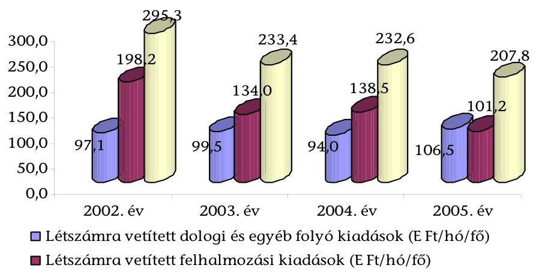
${ }^{31}$ 2006. IX. 1-jére a 2005. évi adatokhoz képest az állami vezetők száma 50%-kal, a létszám és a vezetők száma 20%-kal csökkent. Ugyanakkor a 2002. évi átlagos állományhoz képest az utóbbi két adat csak 7-10%-kal mérséklődött.

---

A Kormánynak a működési költségek csökkentésére vonatkozó takarékossági intézkedései is hozzájárultak, hogy az elhelyezéssel és a tárgyieszközellátottsággal összefüggő fajlagos kiadások összességében csökkentek. A létszámarányos dologi és egyéb folyó kiadások értéke 2005-ben volt a legmagasabb (bár a 2005. évi érték csupán 9,7%-kal haladta meg a 2002. évit), míg a létszámra vetített felhalmozási kiadások szintje 2005-ben volt legalacsonyabb (a 2005. évi érték 48,9%-kal volt kevesebb a 2002. évinél).

Az ellenőrzött területen európai uniós forrásokat - egy intézmény (FH) kivételével - nem vettek igénybe.

Az FH rendelkezésére álló gépek, berendezések, felszerelések állománya a 2002. évi 709,7 M Ft-ról alig emelkedett, 2005 végén 761 M Ft volt. A 2004. évi - EU forrásokból történő - beruházások eredményeképpen 1166,4 M Ft volt az eszközérték, a megyei munkaügyi központoknak történt térítésmentes átadás után csökkent 761 M Ft-ra.

Az ellenőrzött időszakban az üzemeltetési kiadások (villany, víz, gáz) évenként növekvő üteme miatt a dologi és egyéb folyó, valamint felhalmozási kiadások rovására már a tervezés során csökkenteni kellett a kiadásokat.

Az alacsony felhalmozási kiadási szinthez hozzájárultak a 2005. évi központilag elrendelt takarékossági intézkedések ${ }^{32}$ is.

Az ellenőrzött időszak egészét tekintve a fajlagos dologi és egyéb folyó kiadások csökkenése volt jellemző az intézmények felénél [BM, EÜM, FVM, GKM, HM, IHM, KSH, KvVM, OEP, OM, Oktatási Minisztérium Alapkezelő Igazgatósága (OMAI), ONYF, PM, Pénzügyi Szervezetek Állami Felügyelete (PSZÁF)], továbbá a létszámarányos felhalmozási kiadások csökkenése tizenkilenc intézménynél. A legnagyobb mértékű csökkenést a vizsgált időszakban a HM-nél (a dologi és egyéb folyó kiadás 68,3%-kal, a felhalmozási kiadás 99,9%-kal), az OM-nél (a dologi és egyéb folyó kiadás 63,9%-kal), az FVM-nél (a felhalmozási kiadás 88,4%-kal), a Kormányzati Ellenőrzési Hivatalnál (KEHI) (a felhalmozási kiadás 81,2%-kal) és az IHM-nél (a dologi és egyéb folyó kiadás 58,1%-kal) tapasztaltunk.

A területi szerveknél a felhalmozási kiadásokkal való gazdálkodás jellemzően központilag történt, az intézményeknek nem volt érdemi ráhatása a költségvetési keretszámok kialakítására. Az ellenőrzött időszakban felhalmozási kiadással csak a megyei egészségbiztosítási pénztárak, a munkaügyi központok és a KSH Miskolci Igazgatósága rendelkeztek végig.

Az elhelyezést és az ellátottsági mutatókat jelentősebben érintő átszervezés két intézménynél volt, a Kincstár területi igazgatóságai esetében a 2003. évben végrehajtott összevonás, illetve a KSH megyei igazgatóságainak 2004. XII. 31-ei megszüntetése. A 2050/2004. (III. 11.) Korm. határozat alapján elrendelt takarékossági intézkedések miatt az ellenőrzött területi szerveknél csökkent a létszám.

[^0]
[^0]:    ${ }^{32}$ A 2050/2004. (III. 11.) és a 2046/2005. (II. 23.) Korm. határozatokkal elrendelt zárolások.

---

A létszámra vetített dologi és egyéb folyó, továbbá felhalmozási kiadások csökkenése mellett az intézmények a működőképességüket megőrizték, a gazdálkodásuk során érvényesítettek hatékonysági, takarékossági szempontokat. Ugyanakkor forrás-szűkösség miatt előfordult karbantartási, illetve az épületek állagmegóvását biztosító munkák elmaradása.

Az OM-nél a fejlesztési források takarékosabb felhasználása érdekében olcsóbb üzemeltetésű berendezéseket, eszközöket építettek be. A felújítások az egyre szűkösebb források mellett is folyamatosak voltak. Egyre több gondot okozott viszont a külső homlokzati nyílászárók elöregedett, a hőtechnikai szabványoknak már nem megfelelő állapota, a homlokzat nyilvánvaló elhasználtsága.

Az épületek, építmények karbantartásának elmaradása több esetben üzemelési problémákat okozott a Hajdú-Bihar Megyei Munkaügyi Központnál (fűtéskimaradás, szennyvízelvezetési, dugulási problémák, beázások). A kirendeltségek irodáinak és mellékhelyiségeinek az előírt tisztasági meszelését évek óta nem tudták megvalósítani, a nyílászárók elavultak voltak.

A tendencia szerint, ahol kialakítottak ellátási és költség normatívákat, és azokat érvényesítették is, a költségek csökkentek, a források felhasználása hatékonyabb lett (OM, Kincstár).

Az OM-nél mind a kommunikációs szolgáltatásokra fordított kiadás, mind a karbantartási kiadások csökkentek az ellenőrzött időszakban közel 50%-kal. A csökkenés elsősorban az előnyösebbé átalakított szolgáltatói szerződések olcsóbb tarifarendszerének, valamint a magáncélú telefonhasználat visszaszorításának volt köszönhető.

A Kincstár Vas Megyei Területi Igazgatóságánál az előirányzatokkal való célszerű, hatékony gazdálkodás, a feladatellátás színvonalának megőrzése érdekében takarékossági intézkedési terv készült. A dologi kiadásoknál - ezen belül az ellenőrzött területeknél - bevételnövelő intézkedésekről döntöttek (az indokolt mértéket meghaladó magáncélú telefonhasználat megtérítése, elfekvő, felesleges készletek feltárása, azok hasznosítása). A papírfelhasználás csökkentése érdekében belső levelezési rendszert alkalmaztak, normatívákat alakítottak ki a másolópapír, irodaszer felhasználásra vonatkozóan.

A fajlagos kiadások intézményenként szélsőségesen alakultak. A dologi és egyéb folyó kiadások a minisztériumok és a központi országos hatáskörű szerveknél 1,9-908,8 E Ft/fő/hó között, a vidéki szerveknél 4,5-62,4 E Ft/fő/hó, a fajlagos felhalmozási kiadások a központi szerveknél 0,1-2012,6 E Ft/fő/hó között, a vidéki szerveknél 0-203,1 E Ft/fő/hó között mozogtak ${ }^{31}$. (A kiadások relatív szórásának adatait a központi és a területi szervekre vonatkozóan a 3. sz. melléklet 1-3. sz. ábrái tartalmazzák.)

Az ellenőrzésbe bevont szervezetek közül az intézményi átlagtól legnagyobb mértékben az FH (a dologi és egyéb folyó kiadás 234,2-566,2%-kal, a felhalmozási kiadás 217,9-693,3%-kal magasabb), a PSZÁF (a dologi és egyéb folyó ki-

[^0]
[^0]:    ${ }^{31}$ A felhalmozási igények ciklikussága érdemben nem módosítja a megállapítást, mivel az viszonylag hosszabb időszak (4 év), valamint több intézmény különböző eszközcsoportjaira vonatkozó adatokon alapszik.

---

adás 98,9-250,0%-kal magasabb), az Nemzeti Fejlesztési Hivatal (NFH) (a felhalmozási kiadás 349,1-487,9%-kal magasabb), a BM (a felhalmozási kiadás 45,6-487,1%-kal magasabb), az IHM (a felhalmozási kiadás 2004-ben 401,3%-kal magasabb) tért el. A HM-nél, az ONYF-nél, a PM-nél és az EÜM-nél a dologi és egyéb folyó kiadás 63,3-98,6%-kal, a felhalmozási kiadás 52,1-99,9%-kal volt alacsonyabb az intézményi átlagnál.

Az FH feladatrendszere, működése több területen speciális volt, szakmai felügyeleti jogot gyakorolt a megyei munkaügyi központok, illetve kirendeltségek felett, továbbá a számítógépes hálózatok, adatbázisok kialakításában, működtetésében szorosan együttműködtek a megyei központokkal. [a PHARE, illetve 2004-től a Humánerőforrás-fejlesztés Operatív Program (HEFOP) források miatt].

A létszámra vetített dologi és egyéb kiadások, valamint a felhalmozási kiadások meghaladták az intézményekre számított átlagos értéket. A PHARE program keretében 2004. végéig 20 munkaügyi kirendeltséget újítottak föl. 2007 végére ütemezték további 60 kirendeltség (3-3 db a 19 megyében, illetve Budapesten) felújítását a HEFOP keretében.

Az IHM-nél a felhalmozási kiadások összege 2004-ben és 2005-ben meghaladta az átlagot a minisztériumi székházon történt felújítás, és a közháló program számítógépeinek beszerzése miatt.

A HM-nél a dologi és egyéb, valamint a felhalmozási kiadások mértékének 2005. évi visszaesése (kiadásoknál is megfigyelhető ez) abból adódott, hogy a HM épületeinek üzemeltetésével kapcsolatos feladatok (pl. nagy értékű bútorok beszerzése, felújítás, karbantartás) előirányzatokkal együtt átkerültek a HM Ingatlankezelési Hivatalhoz.

Az FMM-nél a létszámra vetített dologi és egyéb folyó kiadás csökkenő arányban, de elmaradt az intézményi átlagtól, ugyanakkor a létszámra vetített kiadások összege háromszorosára nőtt. A dologi kiadásokon belül hatszorosára emelkedtek a bérleti díjak.

A NKÖM-nél 2002-ben a Pénzügyi Integrált Rendszer fejlesztése, majd 2005-ben annak működtetése miatt voltak az átlagosnál magasabbak a fajlagos dologi és egyéb folyó, valamint a felhalmozási kiadások.

A fajlagos kiadások alakulása a központi és a területi szervekre vonatkozóan
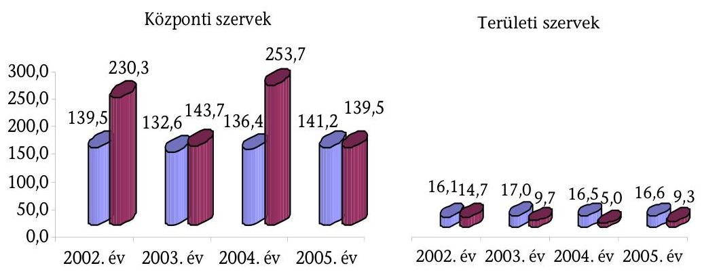

■ fajlagos dologi és egyéb folyó kiadások (E Ft/hó/fő) ■ fajlagos felhalmozási kiadások (E Ft/hó/fő)

---

A létszámarányos dologi és egyéb folyó kiadások tekintetében az országos hatáskörű szervek helyszíni ellenőrzésre kijelölt vidéki szervezeteinek intézménycsoportonkénti átlaga jelentősen elmaradt az ellenőrzött központi szervezetek átlagától.

Viszonylag kedvezőbb helyzetben a munkaügyi központok voltak, míg a Kincstár és a KSH területi igazgatóságainál, továbbá a megyei nyugdíjbiztosítási igazgatóságoknál mind a dologi és egyéb folyó kiadás, mind a felhalmozási kiadás alacsonyabb volt az intézményi átlagnál. A legnagyobb mértékben a Nógrád és a Vas Megyei Egészségbiztosítási Pénztár (a dologi és egyéb folyó kiadás több mint kétszerese az átlagnak) tért el az intézményi átlagtól.

A munkaügyi központok viszonylagos kedvező helyzetét az FH által igénybevett PHARE és HEFOP források indokolták, melyekből az intézmények is részesedtek.

A Megyei Egészségbiztosítási Pénztáraknál az átlagnál magasabb értéket az ingatlanok közös használatának sajátos elszámolási módja eredményezte (az épület egészére vonatkozó fenntartási kiadás a MEP költségvetésében jelent meg, de annak egy részét megállapodás alapján az épületet használó intézmény továbbszámlázott szolgáltatásként térítette meg).

Az ellenőrzésbe bevont öt területi szerv közül háromnál az intézménycsoportokon belüli szórás alacsonyabb a vizsgált intézmények átlagánál (98,8-127,3%). A relatív szórás az OEP területi szerveinél 58,1-82,2%, a Kincstár területi szerveinél 26,5-34,4%, az ONYF területi szerveinél 22,9-40,4% között változott az egyes években. A munkaügyi központoknál (71,4-109,9%) és a KSH területi igazgatóságainál (93,6-105,3%) szélsőségesen alakultak a fajlagos kiadások.

# 3. Az elhelyezési feltételek alakulása 

Az elhelyezési feltételek, azok változása rendkívül heterogén képet mutatott. Ebben közrejátszott, hogy az ellenőrzésben résztvevő szervezetek 60%-ánál a szervezet széttagolt volt, az intézmények több épületben működtek, igazgatási feladataikat is több helyen látták el. Az intézmények negyede nem rendelkezett saját ingatlannal, a központi szervezetek átlagosan 60%-ánál bérleményt vettek igénybe. Az ellenőrzésbe bevont intézmények felére volt jellemző a megosztott használat, amely bonyolította az üzemeltetést és a finanszírozást is. A hasznos irodaterületek aránya mindössze átlagosan 50% körüli volt. A parkolási kapacitás sem volt megfelelő, a parkolási igények mindössze felét tudták kielégíteni. A Budapesten lévő ingatlanok átlag 40%-ára kötöttek biztosítási szerződést, a vidéki ingatlanoknál azok 80%-ára. Az ingatlanokkal kapcsolatos fajlagos beruházási, felújítási és karbantartási kiadások mértéke szélsőséges ingadozást mutatott, ugyanakkor a központi intézmények lehetőségei jelentősen meghaladták
 a területi intézményekét. (A központi és a területi szervek elhelyezésének jellemező adatait a $2 / a$. és a $2 / b$. mellékletek tartalmazzák.)

A 2002. I. 1-jei állapothoz képest 2006. I. 1-jére az intézmények elhelyezését biztosító épületek száma és alapterülete - a 2004. évi csúcsot követő csökkenés után - 10-11\%-kal (a saját épületek száma 14\%-kal) nőtt. Ez a tendencia arra utal, hogy az elhelyezés széttagoltsága, az ezzel járó többletköltségek

---

nem csökkentek. A meghirdetett takarékossági intézkedések ezen a területen csak részben voltak eredményesek.

Az ellenőrzött központi intézmények kétharmada egynél több épületben volt elhelyezve. A munkavégzés céljára szolgáló épületek száma 186 db-ról 209 db-ra, ezen belül a saját épületeké 132-ről 146 db-ra nőtt. Az összes alapterület a 2002. évi 573 ezer $\mathrm{m}^{2}$-ről 636 ezer $\mathrm{m}^{2}$-re nőtt. (Összehasonlításként: a PM Budapest, V. kerület, József nádor téri székháza mintegy 26 ezer $\mathrm{m}^{2}$ nagyságú.)

Az épületekben - saját és bérlemény - használt irodahelyiségek száma 2006. I. 1-jén összességében megközelítette a 12,8 ezret, amelyekben az ellenőrzött időszakban átlagosan 17 ezer, zömében közszolgálati és közalkalmazotti állományú munkavállaló tevékenykedett.

Figyelembe véve, hogy az intézményeknél rendelkezésre álló 1 főre jutó alapterület átlaga 2002-ben közel $32 \mathrm{~m}^{2}$ volt, amely 2005-re 7\%-kal emelkedett, és a „legzsúfoltabban" és a „legtágasabban" elhelyezett szerv hasonló mutatójának értéke közötti 5,5-szörös különbség 6,7-szeresre nőtt. Az elhelyezési feltételek egységesítésére irányuló elgondolások nem bizonyultak eredményesnek.

A központi szervek (Budapesti székhelyű) átlagosan 3 db, a területi igazgatóságok átlagosan 4 db elhelyezési célokat szolgáló saját (állami tulajdonú) ingatlannal, illetve bérleménnyel rendelkeztek, melyből a központi szerveknél 40%, a területi szerveknél 20% körül alakult a bérlemények száma. Az átlagos terü-let-nagyság a központi szerveknél 19 ezer $\mathrm{m}^{2}$, a vidéki szervezeteknél 4 ezer $\mathrm{m}^{2}$ körül alakult.

A központi szervek munkavégzés céljára szolgáló épületei alapterületének megoszlása 2006-ban
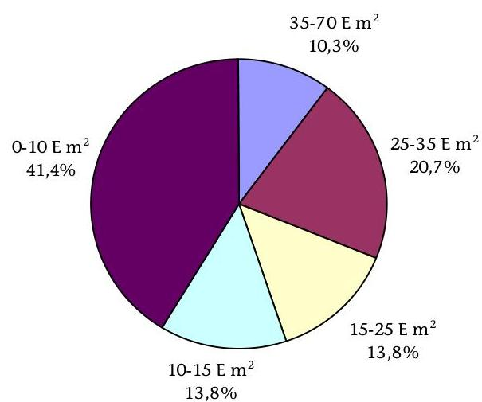

A minisztériumok, országos hatáskörű szervezetek elhelyezési jellemzői rendkívül különbözőek, az elhelyezést biztosító - saját és bérelt - ingatlanok száma 2006. I. 1-jén összességében 1-10 között, az épületek területe 1799-68999 $\mathrm{m}^{2}$ között alakult.

A legtöbb ingatlannal - az átlag kétszeresével - felett rendelkezett a KvVM (7 saját, 3 bérelt), a MeH (3 saját, 6 bérelt), a KSH (6 saját, 1 bérelt) és az FMM (6 bé-

---

relt). Ugyanakkor az épületek területe ($\mathrm{m}^{2}$) szerint jelentős ingatlanállománnyal a HM (68999 $\mathrm{m}^{2}$), a MeH (49620 $\mathrm{m}^{2}$), a GKM (47867 $\mathrm{m}^{2}$), az OEP, a BM, a KüM, a KSH, az FVM és a PM (25 730-31400 $\mathrm{m}^{2}$ között) rendelkezett.

Lényegesen az átlag alatti (kevesebb, mint a fele) területtel rendelkeztek, a területi szervek nélküli országos hatáskörű szervezetek, valamint az ONYF, az IM és az FMM.

A területi szervezeteknél elsősorban a regionális székhely mérete, vonzáskörzete határozta meg a kirendeltségek, illetve az elhelyezési célokat szolgáló épületek számát, mely 2006. I. 1-jén 1-21 között, a terület 2524-10814 $\mathrm{m}^{2}$ között alakult.

A területi szerveknél a tevékenységük jellege indokolta a széttagoltságot, az egyes megyékben eltérő számú kirendeltség biztosította a feladatellátást.

Lényegesen az átlag alatti épülettel, illetve területtel a KSH igazgatóságai, épületekkel legnagyobb számban viszont a Munkaügyi Központok rendelkeztek (a kirendeltségek nagy száma miatt).

Az ellenőrzött időszakban az intézmények elhelyezését szolgáló ingatlanokkal kapcsolatban nem működött központosított elhelyezés-gazdálkodás. Nem volt olyan szervezet, amelynek jogszabályi kötelezettségeként határozták meg - kormányzati szinten és településenként - az elhelyezési igények kielégítését. Nem szabályozták az elhelyezéssel kapcsolatos döntési, eljárásjogi és költségvetési kérdéseket. Az ellenőrzésben résztvevő szervezetek negyede egyébként saját ingatlannal nem rendelkezett. Ebben szerepet játszott az is, hogy az elhelyezési szükségletek kielégítésénél a KVI-t nem vonták be teljes körűen, illetve a KVI nem tudta minden esetben kielégíteni az intézmények által körvonalazott, nem normatív módon meghatározott igényeket.

Csak bérelt ingatlannal rendelkezett a minisztériumok közül az FMM, az országos hatáskörű szervek közül az ellenőrzött időszakban alapított NFH, a Nemzeti és Kutatási és Technológiai Hivatal (NKTH), a Nemzeti Sporthivatal (NSH), az OMAI, az Országos Területfejlesztési Hivatal (OTH), továbbá az Országos Atomenergia Hivatal (OAH).

A területi szervek minden esetben rendelkeztek legalább egy, az elhelyezésüket biztosító saját épülettel.

Bérleményekkel a központi szervezetek átlagosan 60%-a, a vidéki szervezetek 40%-a rendelkezett. A központi intézményeknél - az új szervezetek létrejötte, a létszámnövekedés miatt - a bérlemények száma megduplázódott (2006. I. 1-jén 39 db), a bérelt alapterület közel 38%-kal nőtt (74,6 ezer $\mathrm{m}^{2}$-re)$^{34}$.

A saját tulajdonú épületekben rendelkezésre álló alapterület csak 7%-kal nőtt, 450 ezer $\mathrm{m}^{2}$-re.

[^0]
[^0]:    ${ }^{34}$ A 2006. I. 1-jei adatokhoz képest 2006. IX. 1-jére a saját épületekben használt alapterület 19,2%-kal csökkent, a bérlemények alapterülete azonban 5,5%-kal - 2002-höz képest pedig 47,5%-kal - nőtt.

---

A bérbeadó a központi szervezetek 85%-ánál gazdasági társaság, 15%-ánál költségvetési szerv volt. A területi szervezetek elsősorban költségvetési szervektől (67%) és gazdasági társaságoktól (28%) béreltek irodákat. Előfordult magánszemélytől való igénybevétel is.

A területi szervezetek esetében a bérlemények kiválasztásánál elsődleges szempont volt a főépület közvetlen közelében való elhelyezkedés, a rendelkezésre álló irodahelyiségek száma és mérete, az informatikai hálózathoz való kapcsolódás megteremtésének költséghatékonysága.

A munkatársak elhelyezését a központi szervezetek 40%-ánál területileg szétszórva, több kerületben oldották meg, a vidéki szervek 30%-a rendelkezett egy településen több ingatlannal. A szétszórt elhelyezés a munkaszervezést, az irányítást, a FEUVE-ét költségesebbé tette. Kapcsolattartási, információáramlási problémákat is okozott a több, egymástól esetleg nagyobb távolságra lévő épület, továbbá növelte a telefon és informatikai költségeket, a szállítási kiadásokat.

A központi szervek munkavégzés céljára szolgáló épületei budapesti elhelyezkedésének kerület szerinti megoszlása 2006-ban
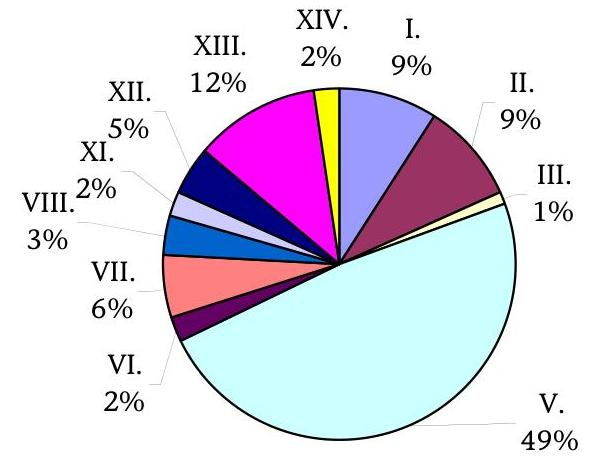

Az FMM-nél a Datanet költségek a Hungária körúti elhelyezés miatt 2003-2005ig évente 93 E Ft/hó, a Matáv költségek a Báthori és Honvéd utcai bérlemények miatt 2004-ben 129 E Ft/hó, 2005-ben 493 E Ft/hó többletkiadást okoztak.

A KvVM 5, a MeH 4, az FH, az FMM és a HM 3, a GKM, a KSH, a Kincstár, az NFH, az NKÖM, az OEP és az OMAI 2 budapesti kerületben tudta megoldani a munkatársak elhelyezését 2006 januárjában. A munkavégzés céljára szolgáló saját épületek és bérlemények mintegy 50%-a az V. kerületben, 12%-a a XIII. kerületben és 9-9%-a az I., illetve a II. kerületben volt.

A vidéki szervezetek közül a Munkaügyi Központok sajátossága volt az átlagot meghaladó számú épületben történő elhelyezés (átlagosan 10 saját épület és bérlemény), pl. a Hajdú-Bihar Megyei Munkaügyi Központ szervezeti egységei és 12 kirendeltsége összesen 18 épületben voltak elhelyezve.

---

A Hajdú-Bihar Megyei Munkaügyi Központ belső szervezeti egységei Debrecen 4 különböző területén lévő épületben működtek. Az elhelyezés - az adott lehetőségeken belül - célszerűen történt, a Központ egyes szervezeti egységei azok középvezetőivel együtt azonos épületben kaptak helyet.

A létszámleépítések következtében emelkedett a létszámra vetített alapterület nagysága. Az 1 főre jutó alapterület szerint a központi és a vidéki átlag közelített egymáshoz (30 $\mathrm{m}^{2}$/fő körüli), ugyanakkor a minimum és maximum értékek között jelentős eltérések voltak. A minisztériumoknál és a központi országos hatáskörű szerveknél 2006. januárban 11,9 - 106,2 m²/fő között, a vidéki szerveknél 21,4-58,8 $\mathrm{m}^{2}$/fő között alakult az egy főre jutó alapterület.

A szervezetek alapterület, illetve az 1 főre jutó alapterület szerinti sorrendje 3 szervezet - az NSH, az IHM és a KSH - kivételével megegyezik. Átlag feletti (33,1 $\mathrm{m}^{2}$/fő) volt az érték a HM-nél, a BM-nél, az OEP-nél, az NSH-nál, a MeH-nél, a KüM-nél, az IHM-nél, és a PM-nél. A többi szervezetnél az érték 20 $\mathrm{m}^{2}$/fő körüli volt (a KSH-nál 19 $\mathrm{m}^{2}$/fő) a legalacsonyabb terület jutott egy főre (12 $\mathrm{m}^{2}$/fő) az OMAI-nál és az NFH-nál.

A munkavégzés céljára szolgáló épületek fajlagos alapterületének
($\mathrm{m}^{2}$/fő) megoszlása a központi szerveknél 2006-ban
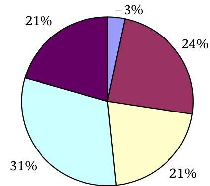

■ 60 fölött ■ 40-60 ■ 30-40 ■ 20-30 ■ 10-20

A vidéki szervezeteknél a központi szervezetekéhez viszonyítva az 1 főre jutó alapterület átlaga 8-9%-kal volt alacsonyabb. A relatív szórás viszont a vidéki szervezetek között 21% körüli volt.

Az épületekben a hasznos irodaterületek aránya mindössze átlagosan 50% körül alakult, Budapesten 19,0-88,6%, vidéken 33,0-81,9% közötti volt.

A legalacsonyabb hasznosítható alapterülettel az OEP, a legmagasabbal az ONYF rendelkezett (Az ONYF-nél mind a felújítás, mind a karbantartási költségek nettó értékhez viszonyított aránya alacsonyabb volt a vizsgált szervezetek átlagánál).

A munkavégzés szempontjából nem hasznosítható terek, valamint azok különbözősége az épület szintjei szerint nemcsak az üzemeltetési költségekre hatottak ki, de a szervezeti egységek és azok vezetőinek hasonló feltételek szerinti elhelyezése kivitelezhetőségére is. Pl. a PM 35 szervezeti egységénél 2006. VI. 1-jén az 1 főre jutó terület - akár a vezetők által, akár a nélkülük számított területet tekint-

---

ve - esetén a legkisebb és a legnagyobb érték között 4-szeres volt a különbség: a vezetőkkel számított terület szerint 8,9 $\mathrm{m}^{2}$ és 35,4 $\mathrm{m}^{2}$ (a PM egészére nézve az átlag 17 $\mathrm{m}^{2}$).

A munkavégzés céljára szolgáló épületek fajlagos hasznos alapterületének ($\mathrm{m}^{2}$/fő) megoszlása a központi szerveknél 2006-ban
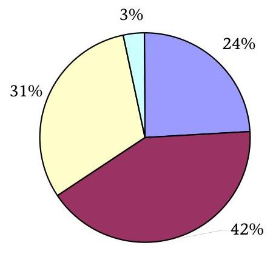

■ 10-15 ■ 15-20 ■ 20-30 ■ 30 fölött

A hasznos alapterület 1 főre jutó mértékében kisebb szóródás volt tapasztalható, átlagosan 10-50 $\mathrm{m}^{2}$/fő közötti volt.

A nagyobb alapterülettel rendelkező minisztériumoknál - a HM, BM és MeH kivételével - a hasznosítható terület alapján az átlaghoz közeli terület jutott a feladatellátásra.

A munkavégzés célját szolgáló saját épületek többnyire régi építésű, Budapesten 40%-ban, vidéken 22%-ban műemlék vagy műemlék jellegű épületek, klimatizáltságuk foka alacsony, kevésbé feleltek meg a korszerű munkavégzés feltételeinek.

A műemlék épületekben külső, illetve belső átalakításokat csak a műemlékvédelmi hatóság engedélyével lehet végezni.

Az épületek többségében - koruknál fogva, illetve a felújítási források korlátja miatt - elavultak az épületgépészeti megoldások, a klimatizált területek aránya az ellenőrzött időszakban történt jelentős javulás ellenére is a központi szerveknél 40%, a területi szerveknél 30% körüli volt. (2002-2006 között a klimatizált irodahelyiségek aránya a központi szerveknél átlagosan 27,2%-ról 41,7%-ra, a területi intézményeknél 14,6%-ról 33,3%-ra nőtt). (A klimatizált irodaterületek arányának relatív szórási adatait a 3. sz. melléklet 4. sz. ábrája tartalmazza.)

# Az épületek átlagosan 50%-át az intézmények megosztva használták. A megosztott használat miatt az üzemeltetési és finanszírozási tevékenység többletmunkával járt.

A MeH egyik saját (fő) irodaépületében működött az IM, az alapterület 29,7%-át foglalta el. Az üzemeltetési költségek megosztására a MeH és az IM 1998 januárjában szerződést kötött, melynek értelmében az IM a költségek 33%-át fizette. A szerződés évenkénti felülvizsgálata 2000-től nem történt meg. Az IM 2006-ban lényegében ugyanannyit fizetett, mint 1999-ben (bruttó 61,3 M
 \mathrm{Ft}$ ), holott a köz-

---

beeső időszakban közel 50\%-os volt az inflációs hatás. Tekintve, hogy két költségvetési intézmény közötti kapcsolatról van szó, az állami költségvetést tényleges kár nem érte.

A munkavégzés céljára szolgáló épületekben átlagosan 3 egyéb intézmény elhelyezéséről gondoskodtak, melyeknek mindössze 27\%-a volt az adott fejezethez tartozó intézmény, a többi gazdasági, közhasznú társaság, alapítvány, egyesület.

Az ellenőrzött intézményeknél a parkolási kapacitás (az intézmény kizárólagos használatában lévő garázs, gépkocsi beálló, kijelölt parkolóhely száma) 2006. januárban átlagosan 130 db volt a központi szerveknél és 27 db a területi szerveknél. Összességében a parkolási igények átlagosan 50\%-ával rendelkeztek, ugyanakkor a fennmaradó igények kielégítése, illetve a belvárosi épületek körüli parkolás szinte megoldhatatlan feladatot jelentett.

A saját épületek parkolási helyzete mind a központi szerveknél, mind a területi intézményeiknél kedvezőbben alakult a bérleményekhez tartozó parkolási kapacitáshoz képest (a központi szerveknél majdnem kétszerese, a vidéki intézményeknél háromszorosa volt), elsősorban a bérleményekhez igényelhető parkoló helyek ára miatt.

A parkolási kapacitás megoszlása az igény kielégítettsége %-ában 2006-ban
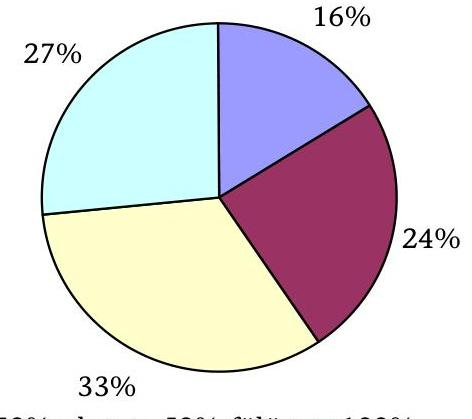

A központi szerveknél átlagosan a gépjárművek egy nyolcadánál volt biztosított a parkolási lehetőség. A vidéki szervezeteknél ezzel szemben a rendelkezésre álló parkolási kapacitás átlagosan több mint ötszöröse volt a gépjárművek számának, erre - az intézményektől kapott tájékoztatás szerint - a jelentős ügyfélforgalom miatt volt szükség.

Az ingatlanokkal kapcsolatos biztosítási szerződések terén jelentős eltérések voltak a központi és vidéki szervezetek között, míg Budapesten az ingatlanok átlagosan 40\%-ára kötöttek biztosítási szerződést, vidéken az arány 80\%-os volt 2006. év elején. A bérlemények átlagosan 60\%-a rendelkezett biztosítási szerződéssel, melyre a bérbevevő szervezetek átlagosan 20\%-ban kiegészítő biztosítást is kötöttek. Automata oltóközponttal a budapesti épületek átlagosan 20\%-a rendelkezett.

---

Az országos hatáskörű szervek közül a KSH, a területi szerveknél a KSH igazgatóságok, és a Baranya megyei Kincstár, továbbá a központi szervek kétharmada nem kötöttek biztosítási szerződést az épületeikre (köztük a legnagyobb területtel rendelkező minisztériumok, a HM, a MeH, a GKM).

Az épületbiztosítások elmaradásánál - a HM jelzése alapján - szerepet játszott az ingatlanvagyon nagyságával összefüggő biztosítási díjteher, valamint az ingatlanok egy részének biztosítási szempontból elégtelen műszaki állapota.

A biztosítások hiánya mellett a megfelelő védelemről azonban többnyire gondoskodtak, az épületek többségét 24 órában őrizték, továbbá folyamatos műszaki felügyeletet láttak el.

Automata oltóközpontot a szervezetek elsősorban a magas tűzveszélyességi fokozatú szervertermekbe telepítettek, jellemzően a tűzjelző rendszert alkalmazták.

A munkavégzés céljára szolgáló épületek nettó értéke a vizsgált időszak minden évében növekedett, kiemelkedően 2004-ben. Nagyságrendileg a vizsgált szervezetek munkavégzés céljára szolgáló épületei nettó értéke a 2002. évi 31 Mrd Ft-ról - 52\%-kal - 2005-re 47 Mrd Ft-ra emelkedett.

Az épületek nettó értéke és a területnagysága között közvetlen összefüggés nem található, amíg 2006. év elején a terület sorrend HM, GKM, MeH, BM, KüM volt, addig a nettó érték alapján a KüM, BM, Kincstár, GKM és NKÖM járt élen.

Mind a 2004-2005. évi nettó érték emelkedést, mind a területi nagyság sorrendjétől való eltérést elsősorban a KüM és a Kincstár új épületeinek használatba vétele indokolta.

A vagyonnyilvántartásokban az ingatlanok értékeként a szervezetektől átvett adatok szerepelnek, az ingatlanok értékmeghatározását forrás hiányában a szervezetek nem végezték el.

A munkavégzés céljára szolgáló saját épületek négyzetméter arányos nettó értékének ( $\mathrm{E} \mathrm{Ft} / \mathrm{m}^{2}$ ) megoszlása a központi szervezeteknél 2005-ben
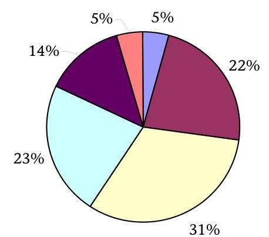

20 alatt ■ 20-50 $\square 50-100 \square 100-200 \square 200-300 \square 300$ felett

A vidéki épületek átlagos 1 négyzetméterre jutó nettó értéke - az értékcsökkenés figyelembevételével - minden évben jelentősen alatta maradt a budapesti átlagnak, 2002-ben 90,2, 2003-ban 94,3, 2004-ben 103,6 és 2005-ben $110,1 \mathrm{E} \mathrm{Ft} / \mathrm{m}^{2}$

---

volt. A területi szervek munkavégzés céljára szolgáló épületei átlagos 1 négyzetméterre jutó nettó értéke kisebb volt mind az átlag (2002-ben 54,7, 2003-ban 55,8, 2004-ben 60,5 és 2005-ben $58,6 \mathrm{E} \mathrm{Ft} / \mathrm{m}^{2}$ ), mind a szóródás ( 0,03 197,3 E Ft/m²) tekintetében.

A feladatok ellátásához rendelkezésre álló ingatlanokon elsősorban az anyagi keretek hiánya miatt még a szükséges beruházást, illetve felújítást és karbantartást sem végezték el minden évben az ellenőrzött intézmények egy részénél. A munkálatok elmaradása hosszabb távon akadályozta a költségtakarékosabb, hatékonyabb működést. Az ingatlanok karbantartásához, felújításához szükséges kiadásokat alapvetően azok kora, állapota, a korábbi évek ráfordításai határozzák meg, azonban forráshiány miatt több esetben elmaradtak a szükséges felújítások, karbantartások.

A vizsgált időszakban beruházás az ONYF központi és területi igazgatóságainál is csak 2005-ben, míg felújítás 2004-ben és 2005-ben volt, de ezek értéke elhanyagolható volt a többi intézmény átlagához képest. Az igazgatóságok iroda-, illetve épületbérleményeire a bérleti díjon kívül nem költöttek.

A Kincstár Nógrád megyei Igazgatósága három különböző irodaépületben működött, ugyanakkor az egyik épület egy szintje harmadik éve kihasználatlanul, üresen állt a helyiségek leromlott állapota miatt.

A Kincstár Csongrád megyei Igazgatóságánál az eredetileg nem irodának épült műemléképület állaga - a tetőszerkezet, az esőcsatornák, és az esővíz által alámosott vakolat miatt - forrás hiányában folyamatosan romlott.

A budapesti ingatlanokra fordított beruházási kiadások összességében csökkentek, a 2005. évi érték 45,6\%-kal volt kevesebb, mint a 2002. évi, míg a felújítási és a karbantartási kiadások növekedtek (2005-re a felújítási 100,1\%-kal, a karbantartási 85,9\%-kal volt magasabb a 2002. évinél).

Az FVM közel százéves műemlék épülete felújítására a vizsgált időszakban összesen 178 M Ft-ot, a nettó érték összesen átlagosan 3,5\%-át fordították. Az épület megfelelő szigetelését azonban forrás hiányában nem tudták beütemezni.

A PM-nél a takarékossági intézkedések hatására a 2004. januári beruházási tervben a műemlék székház hűtése projekt tárgyévre jóváhagyott 163,2 M Ft előirányzata csak 46 M Ft-ra teljesült, ami a megvalósulás elhúzódását okozta. Ugyancsak a pénzügyi lehetőségek szűkülése miatt a tervezett munkálatok lassúbb ütemezésben készültek el (például a vizesblokkok a PM-nél és a kapcsolódó vezetékek, iroda- és egyéb kiszolgáló helyiségek felújítása stb.) Egyes feladatok elvégzését azonban nem lehetett halasztani, ezek határidőre, teljes egészében megvalósultak (például a teherfelvonó felújítása, minősített EU információk fogadására alkalmas terület kialakítása).

Az ellenőrzött vidéki szervezeteknél az ingatlanokra fordított beruházási kiadások növekedtek (a 2005. évi érték 57,5\%-kal volt magasabb a 2002. évinél), míg a felújítási és a karbantartási kiadások kis mértékben csökkentek (2005-re a felújítási 21,0\%-kal, a karbantartási 11,1\%-kal volt alacsonyabb a 2002. évinél).

Az ONYF jelentősebb beruházásokat és felújításokat végzett 2002. és 2003. évben, térítésmentes átadással, pl. Borsod-Abaúj-Zemplén Megyei Igazgatóság ózdi kihe-

---

lyezett szakegységénél az előtető és a padlásfeljárat cseréjét végezték el. Ugyanezen kirendeltségnél a klimatizálást és a kapunyitó automatika beszerzését, továbbá a sátoraljaújhelyi kirendeltségnél a szellőztető berendezést saját forrásból valósították meg.

A Kincstár Baranya Megyei Igazgatóságánál a rendelkezésre álló ingatlanok felújítására az anyagi keretek hiánya miatt csak 2002. évben költöttek. 2003-tól az alapfeladatok ellátásához szükséges gépek javítására fordítottak karbantartási pénzeket, az ingatlan karbantartásra felhasznált összeg 2005. évre 60 ezer Ft-ra csökkent.

Az ingatlanokkal kapcsolatos fajlagos beruházási, felújítási és karbantartási kiadások mértéke szélsőséges ingadozást mutatott, mind intézményenként, mind pedig az évek közötti viszonylatban. Beruházásra 0-3566 E Ft/fő, a felújításra 0-1643 E Ft/fő és karbantartásra 0-583 E Ft/fő jutott. A központi szerveknél felhasznált források - a 2002. évi felújítási kiadás kivételével - minden évben jelentősen meghaladták a területi szerveknél felhasznált forrásokat ${ }^{35}$.

Míg a központi szervek beruházási kiadásainak 1 főre jutó átlaga 2002-ben 256,3 E Ft/fő, 2003-ban 311,5 E Ft/fő, 2004-ben 129,5 E Ft/fő, 2005-ben 171,8 E Ft/fő volt, addig a területi szerveknél 117,7 E Ft-ot, 61,6 E Ft-ot, 39,6 E Ft-ot és 53,2 E Ft-ot fordítottak fejenként az egyes években erre a célra.

Jelentősen az átlag fölötti forrást fordított beruházásra 2002-2003-ban a BM (2138,1 és 3565,9 E Ft/fő), a GKM minden évben (410,8, 657,8, 877,7 és 2201,6 E Ft/fő), a KüM 2002-ben (1572,2 E Ft/fő) és a KSH Szegedi Igazgatósága (2741,5 E Ft/fő) 2002-ben.

A felújítási kiadásokra - 2002 kivételével - a területi szervek a központi szervek átlagához képest csak töredékét tudták fordítani. A központi szervek felújításra létszámarányosan átlagosan 2002-ben 48,0 E Ft-ot, 2003-ban 43,5 E Ft-ot, 2004-ben 87,7 E Ft-ot, 2005-ben 143,9 E Ft-ot, addig a területi szerveknél 79,7 E Ft-ot, 15,0 E Ft-ot, 3,1 E Ft-ot és 15,3 E Ft-ot fordítottak az egyes években.

A 2002. évi kivételt a KSH Pécsi Igazgatóságánál végzett ingatlan felújítás indokolta, melynek során az épület egy újabb szinttel bővült, korszerűsítették a villanyhálózatot, a portaszolgálatot, ügyfélfogadó irodát alakítottak ki, az adat és vagyonvédelem érdekében mágneskártyás beléptető rendszert építettek ki, kicserélték a padlóburkolatokat és egy-két nyílászárót.

Jelentősen az átlag fölötti forrást fordított felújításra a BM 2005 kivételével minden évben (118,0, 90,9, és 129,9 E Ft/fő), az IHM 2003-ban (181,5 E Ft/fő), a HM 2004-2005-ben (478,5 és 647,8 E Ft/fő), a GKM 2005-ben (248,3 E Ft/fő), (az ICS SZEM 2005-ben (1487,9 E Ft/fő), a Kincstár 2004-2005-ben (596,7 és 290,8 E Ft/fő), a Kincstár Baranya Megyei szerve 2005-ben (177,6 E Ft/fő) és a Hajdú Bihar Megyei Munkaügyi Központ (129,9 E Ft/fő). Az ONYF és területi szervei, az NKTH, a Gazdasági Versenyhivatal (GVH), és az FH és területi szervei a Hajdú Bihar és a Vas Megyei Központ kivételével -, a KSH Debreceni Igazgatósága és a Hajdú Bihar Megyei Egészségbiztosítási Pénztár szinte semmit nem fordított felújításra.

[^0]
[^0]:    ${ }^{35}$ A fajlagos értékeket létszámarányosan határoztuk meg.

---

A központi és a területi szervek közötti jelentős elmaradás a karbantartási kiadásoknál is jelentkezett, a központi átlag 2002-ben $31,8 \mathrm{E} \mathrm{Ft} /$ fő, 2003-ban 41,8 E Ft/fő, 2004-ben 50,5 E Ft/fő és 2005-ben 89,1 E Ft/fő, a területi átlag 2002-ben $20,7 \mathrm{E} \mathrm{Ft} /$ fő, 2003-ban $15,7 \mathrm{E} \mathrm{Ft} /$ fő, 2004-ben $17,1 \mathrm{E} \mathrm{Ft} /$ fő és 2005-ben $16,5 \mathrm{E} \mathrm{Ft} /$ fő volt.

Az átlag fölötti forrást fordított karbantartásra a BM 2002-2003-ban (101,1 és 73,6 E Ft/fő), a GKM 2005-ben (242,0 E Ft/fő), az IHM 2003-ban (139,5 E Ft/fő), a KüM 2005-ben (211,5 E Ft/fő), a Kincstár 2004-2005-ben (168,6 és 583,0 E Ft/fő).

# 4. A TÁRGYI ESZKÖZÖK ÁLLOMÁNYÁNAK ALAKULÁSA 

Az ellenőrzött szervezetek által kezelt kincstári vagyonban az ingatlanok nélkül figyelembe vett tárgyi eszközök a vagyon kisebb részét tették ki, ellentétben a teljes központi költségvetési intézményi kör kezelésében lévő vagyon összetételével, ahol az arányok jóval kiegyensúlyozottabbak. Ugyanakkor a tárgyi eszközök az intézmények feladatellátása, annak színvonala szempontjából kiemelkedő szerepet játszottak.

Az ellenőrzött szerveknél az általunk vizsgált vagyonelemek (nettó) értékén belül a munkavégzés célját szolgáló épületek aránya folyamatosan nőtt: 2002-ben a mintegy 4270 milliárd Ft-os vagyonból még átlagosan 61,0\% volt, 2005-ben már 71,6\%, miközben a vagyontömeg 29\%-kal nőtt ${ }^{36}$. (A teljes
 központi költségvetési intézményi kör esetén csak 54%). Ennek megfelelően a gépek, berendezések, felszerelések aránya csökkent (36,3%-ról 26,8%-ra). A járművek esetében a csökkenés még jelentősebb volt: 2,7%-ról 1,6%-ra. Előfordult, hogy a gépek, berendezések, felszerelések aránya növekedett, például a KüM esetében 5,6%-ról 13,6%-ra, de itt is alapvetően az ingatlanfejlesztésekhez kapcsolódott.

### 4.1. A gépek, berendezések, felszerelések jellemzői

A gépek, berendezések, felszerelések ellátottsági mutatói az ellenőrzött időszakban nem javultak. A rendelkezésre álló eszközök száma mennyiségileg megfelelő volt, a minőségi mutatók (használhatósági fok, 0-ra leírt eszközök aránya) negatív folyamatokat jeleztek. Jelentős volt és növekedett a fizikailag, technikailag amortizálódott eszközök aránya. (Az eszközellátottság jellemző adatait a központi és a területi szervekre vonatkozóan a 2/a. és a 2/b. mellékletekben rögzítettük).

A részben önálló területi szerveknél a központilag lebonyolított beszerzések miatt az igazgatóságok csak igény szintjén tudták befolyásolni a gépek, berendezések állományának alakulását.

[^0]
[^0]:    ${ }^{36}$ Az inflációs hatást nem tudtuk figyelembe venni, mert a KSH pontos, egyes eszközcsoportokra külön kiszámított árindexeket nem hoz nyilvánosságra. A fogyasztói árak változása az időszakban 22%-os volt, de ezen belül ellentétes tendenciák is jelentkeztek. Például a vizsgált időszakban az üzemanyagok ára az átlagos áremelkedés mértékét meghaladóan emelkedtek: 25% (ólmozatlan motorbenzinek) és 35% (gázolaj) között. Ugyanakkor az IKT területén az eszközök és szolgáltatások árai hasonló nagyságrendben csökkentek.

---

Ennél az eszközcsoportnál 2002. I. 1. - 2006. I. 1. között a nettó állomány 1 főre jutó mutatójánál a minimum és maximum értékek különbsége 73,3%-kal nőtt. Ezt azt mutatja, hogy az intézmények rendelkezésére álló gépek, berendezések, felszerelések területén kedvezőtlenül nőtt az intézmények közötti színvonalbeli különbség.

A szervezetek rendelkezésére álló gépek, berendezések, felszerelések fajlagos (1 főre jutó) nettó állománya változóan alakult, 2002-ben 993,1 E Ft/fő, 2003-ban 1154,5 E Ft/fő, 2004-ben 1124,6 E Ft/fő és 2005-ben 989,7 E Ft/fő volt a központi szerveknél. A területi szervekre jellemző alacsonyabb színvonal a gépek, berendezések, felszerelések állományánál is jelentkezett, a fajlagos nettó állomány mintegy negyede-ötöde a központi átlaghoz képest (2002-ben 241,6 E Ft/fő, 2003-ban 214,1 E Ft/fő, 2004-ben 225,5 E Ft/fő és 2005-ben 283,6 E Ft/fő).

Bár átlagosan nem, de a szervezetek közel felénél - különösen a BM, FVM, IHM, IM, Kincstár, NKÖM, OMAI, ONYF, PSZÁF és a megyei egészségbiztosítási pénztárak esetében - csökkent a fajlagos nettó állomány.

Jelentősen csökkent a létszámarányos nettó eszközállomány a BM-nél (a 2002. évi 3052,8 E Ft/főről 2005-re 645,1 E Ft/főre), az FVM-nél (a 2002. évi 712,8 E Ft/főről 2005-re 325,9 E Ft/főre), az IM-nél (a 2002. évi 887,8 E Ft/főről 2005-re 502,1 E Ft/főre), a Kincstárnál (a 2002. évi 2440,9 E Ft/főről 2005-re 1347,5 E Ft/főre), az OMAI-nál (a 2002. évi 1331,6 E Ft/főről 2005-re 736,0 E Ft/főre) és a PSZÁF-nál (a 2002. évi 1016,6 E Ft/főről 2005-re 488,7 E Ft/főre). Ezeknél a szervezeteknél - az OMAI kivételével - a fajlagos felhalmozási kiadások alakulása hasonló tendenciát mutatott.

Az átlaghoz képest többszöröse volt a fajlagos nettó eszközállomány a MeH-nél (2002-ben 4150,7 E Ft/fő, 2003-ban 6656,6 E Ft/fő, 2004-ben 6169,6 E Ft/fő és 2005-ben 2951,9 E Ft/fő) és a 2004-ben alapított NFH-nál (2004-ben 4192,7 E Ft/fő és 2005-ben 6313,3 E Ft/fő).

Az NFH-nál a magas fajlagos nettó eszközállományt a Hivatal 2004. évben történt alakulását követő új eszközbeszerzések indokolták.

A fajlagos nettó eszköz állomány (E Ft/fő) megoszlása a központi szerveknél 2005-ben
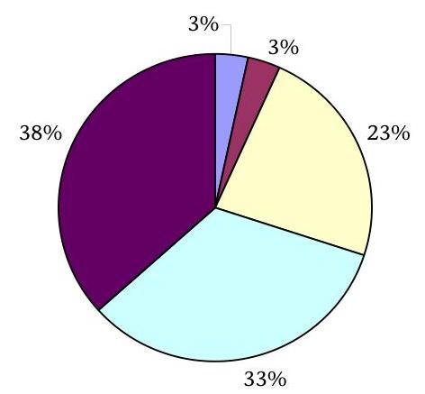

---

Csökkentek a gépek, berendezések és felszerelések beszerzésére fordított források az ellenőrzött időszakban, a központi szerveknél a 2002. évi 1,4 Mrd Ft-ról 2005-re 714 M Ft-ra, a területi igazgatóságoknál 2002. évi 41 M Ft-ról 2005-re 21 M Ft-ra. Az átlagos nettó állomány arányában a beszerzések a központi szervek esetében átlagosan 7%-ot, a területi igazgatóságoknál 2%-ot tettek ki.

A központi és a területi szervekre vonatkozóan a gépek, berendezések, felszerelések átlagos nettó értéke arányában történő beszerzések relatív szórás adatait a 3. sz. melléklet 5. ábrája mutatja.

Alacsony, az átlagos nettó állomány 2%-ánál kevesebb volt a beszerzések aránya a HM-nél, a Határon Túli Magyarok Hivatalánál (HTMH), az ICSSZEM-nél, a KüM-nél, az NKÖM-nél, az NSH-nál és az OTH-nál. Jelentős, az átlagtól magasabb forrásokat beszerzésre a BM, az FH 2004-ben, az IHM, 2004-2005-ben az OMAI, a Kincstár Csongrád Megyei Területi Igazgatósága és a Hajdú-Bihar Megyei Egészségbiztosítási Pénztár fordított.

# A 2005. évi beszerzések átlagosan 2,4%-a az állami vezetők, 12,1%-a a vezetők ${ }^{37}$ és 85,6%-a az egyéb foglalkoztatottak részére történt. 

Az átlagosnál nagyobb arányban történt beszerzés az állami vezetők részére az OM-nél (11,2%) és a GVH-nál (12%), a vezetők részére pedig a HTMH-nál (26,9%), a KvVM-nél (21,9%), az OM-nél (37,2%), a PM-nél (39%), a Vas MNYI esetében (33,3%), a Kincstár Vas Megyei Területi Igazgatóságánál (36,7%) és a Nógrád Megyei Egészségbiztosítási Pénztárnál (100%).

A GVH-nál 2005-ben 25 db számítógép beszerzésből 3 állami vezető részére biztosítottak új gépet. Az átlagtól való jelentős eltérés értékelésénél figyelembe kell venni, hogy a GVH egyetlen intézményből álló fejezet, viszonylag alacsony (124 fő) engedélyezett létszámmal.

Kedvezőtlenül alakult az eszközök használhatósági foka, a központi szerveknél átlagosan a 2002. évi 46,8%-ról 2005-re 38,2%-ra, a területi szerveknél 31,4%-ról 24,2%-ra csökkent, a relatív szórás 40% körüli volt. A 0-ra leírt eszközök aránya is emelkedett, a központi szerveknél átlagosan a 2002. évi 26,6%-ról 2005-re 37,0%-ra, a területi szerveknél 38,0%-ról 53,9%-ra nőtt, szervezetenkénti értéke 0-88% között alakult.

Az eszközök használhatósági értéke elsősorban a szűkülő fejlesztési források miatt romlott. Az ellenőrzött időszakban alapított szervezeteknél és ahol jelentősebb beszerzésekre került sor, értéke viszonylag magas volt. Így az FH-nál 2005-ben 75,1%, az ICSSZEM-nél 53,8%, az NFH-nál 80%, az NSH-nál 60,3% és az OTH-nál 81,2% volt. 10% alatti volt 2005-re a használhatósági fok a megyei egészségbiztosítási pénztáraknál (a Baranya megyeit kivéve). A gépek, berendezések, felszerelések 0-ra leírt állományának relatív szórás adatait a 3. sz. melléklet 6. sz. ábrája tartalmazza.

[^0]
[^0]:    ${ }^{37}$ Főosztályvezető, főosztályvezető-helyettes, osztályvezető, valamint az ilyen juttatásokra jogosult kormány(fö)tanácsos.

---

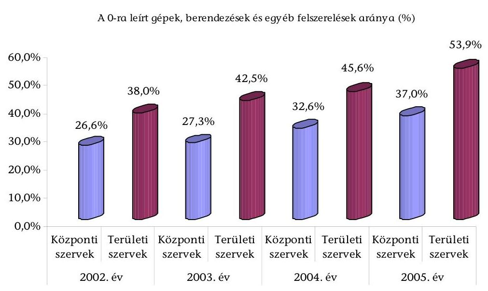

Az ilyen eszközöket mindaddig használatban tartják, amíg meghibásodásuk vagy erkölcsi elavulásuk működőképességüket nem akadályozza.

Különösen elhasználódott az eszközállomány a PM-nél (71,5%), az ONYF-nél (56,5%), az OEP-nél (72%), az NKTH-nál (84,0%), a KSH-nál (66,7%), a HM-nél (60,0%), a BM-nél (66,9%), a megyei egészségbiztosítási pénztáraknál (80% fölött, a Baranya Megyei Egészségbiztosítási Pénztár kivételével), a Kincstár területi igazgatóságainál (átlagosan 60%) és a Vas MNYI esetében (71,2%).

A gépek, berendezések és felszerelések megoszlása a használhatósági fok szerint 2005-ben
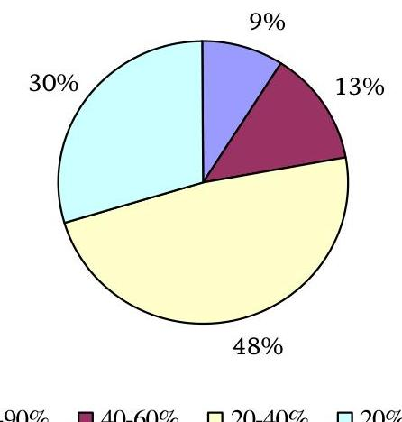

Az ellenőrzött intézmények egészében a gépek, berendezések, felszerelések bruttó és nettó állományának (értékének) ${ }^{38}$ változása az ellenőrzött idő-

[^0]
[^0]:    ${ }^{38}$ A „bruttó- és nettó érték" meghatározása a számvitelről szóló 2000. évi C. törvény, valamint a végrehajtására kiadott az államháztartás szervezetei beszámolási és könyvvezetési kötelezettségének sajátosságairól szóló 249/2000. (XII. 24.) Korm. rendelet által előírt módon történt.

---

szakban hasonló dinamikát mutatott. 2003-ban jelentős emelkedés, majd 2004-ben és 2005-ben csökkenés a tárgyévet megelőző évhez képest és összességében az ellenőrzött időszak végére az értékek megközelítőleg visszatértek a bázisérték közelébe.

A gépek, berendezések, felszerelések bruttó állománya 2002-ben 1217,1 M Ft, 2003-ban 1611,0 M Ft, 2004-ben 1461,9 M Ft és 2005-ben 1408,7 M Ft volt.

A gépek, berendezések, felszerelések nettó állománya 2002-ben 562,0 M Ft, 2003-ban 766,9 M Ft, 2004-ben 570,1 M Ft és 2005-ben 444,4 M Ft volt.

Az állományi értékek 2003 utáni csökkenése azzal függött össze, hogy a gépek, berendezések, felszerelések beszerzése a vizsgált szervezetek átlagában 2002 és 2003 között mintegy felére (48,2%-kal) csökkent, összességében az ellenőrzött időszak végén 59,2%-kal kevesebb beszerzés történt, mint a bázisévben.

Az abszolút állományi értékek szórása a vizsgált szervezetek átlagánál igen jelentős (136,5-224,7% között az egyes években) volt, de ezt az ellenőrzött szervezetek nagyságának és feladatainak különbözősége részben indokolta. Ezt támasztja alá az is, hogy a létszámra vetített átlagos nettó állomány szórása (95,6-122,5% között az egyes években) sokkal kisebb volt, tehát kedvező összefüggés van a létszám (feladatok) és az eszközellátottság között. Ugyanakkor a vizsgált intézményeknél a negatív tendenciák igen kiegyenlítetten mutatkoztak, hiszen a gépek, berendezések, felszerelések használhatósági foka tekintetében 39,7% és 49,6% között mozgott a szórás az ellenőrzött években. A 0-ra leírt eszközöknél pedig 61,0% és 73,7% között szórtak az értékek.

# 4.2. Az információs és kommunikációs eszközök sajátosságai 

Az információs és kommunikációs eszközök ellátottsági mutatóinak alakulása az ellenőrzött időszakban - hasonlóan a gépek, felszerelések, berendezések ellátottsági színvonalához - nem változott lényegesen ${ }^{39}$, ugyanakkor a korszerűségi jellemzők terén negatív folyamatokat tapasztaltunk, a minőségi mutató (0-ra leírt eszközök aránya) romlott.

Az ellenőrzött intézmények törekedtek az információs és kommunikációs eszközök biztonságos üzemeltetésére, biztonságos szervert és tűzfalvédelmet azok több mint 80%-a, biztonsági másolat készítést és vírusvédelmet több mint 96%-a alkalmazott. Kevésbé terjedt el a titkosítási eljárás és az elektronikus aláírás használata, melyet az intézmények átlagosan 50%-a alkalmazott.

Nem használt biztonságos szervert az ellenőrzött időszakban az FVM, a GKM 2004-ig, a megyei egészségbiztosítási pénztárak közül a Csongrád, a Nógrád és a Vas megyei, a Kincstár Hajdú-Bihar megyei Területi Igazgatósága, tűzfal védelmet a KSH Szombathelyi és Salgótarjáni Igazgatósága és a Vas megyei Egészségbiztosítási Pénztár.

[^0]
[^0]:    ${ }^{39}$ A 2005. évi adatokhoz képest 2006. IX. 1-jére az IKT eszközök állománya a 20%-os létszámcsökkenés mellett 6,6%-kal növekedett.

---

Nem alkalmazott számítógépes vírusok ellen védelmet 2004-2005-ben az OM, biztonsági másolást 2005-ig a GKM.

Az információs és kommunikációs eszközök fajlagos (1 főre jutó) átlagos állománya közel azonosan alakult a központi intézményeknél, 2002-ben 5,7 db/fő, 2003-ban 5,7 db/fő, 2004-ben 5,9 db/fő és 2005-ben 5,4 db/fő volt. A területi szervekre jellemző színvonal 2005-re javult, (2002-ben 4,0 db/fő, 2003-ban 4,2 db/fő, 2004-ben 4,9 db/fő és 2005-ben 5,7 db/fő).

A területi szervek fajlagos átlagának 2005. évi növekedését a munkaügyi kirendeltségeknél történt felújítás és eszközbeszerzés indokolta, amely magában foglalta az épületfelújítást, valamint önkiszolgáló ügyfélterek (álló vagy ülő „öninformációs kioszkok”) kialakítását.

A 0-ra leírt IKT eszközök aránya (%)
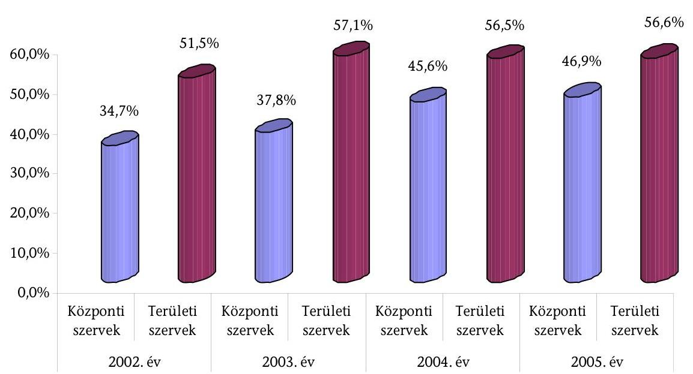

A 0-ra leírt információs és kommunikációs eszközök aránya 2002 és 2005 között a központi intézményeknél nőtt jelentősen, míg a területi szerveknél 2003-tól változatlanul alakult. Jelentősen nagyobb arányban voltak 0-ra leírt információs és kommunikációs eszközök a teljes tárgyi eszközcsoporthoz képest. (Az információs és
 kommunikációs eszközök 0-ra leírt állományának relatív szórás adatait a 3. sz. melléklet 7. sz. ábrája rögzíti.)

A 0-ra leírt információs és kommunikációs eszközök aránya az ellenőrzött időszakban a központi szerveknél 35%-kal, a területi szerveknél 10%-kal nőtt, azonban azok szintje a területi szerveknél rosszabb képet mutatott a központiakéhoz képest.

2005-re az információs és kommunikációs eszközök több mint 80%-a elavult a BM-nél, a HM-nél, a Külügyminisztérium-nál, a PM-nél, az OEP-nél és - a Vas megyei kivételével - a területi szerveinél.

---

A 0-ra leírt információs és kommunikációs eszközök arányának megoszlása 2005-ben
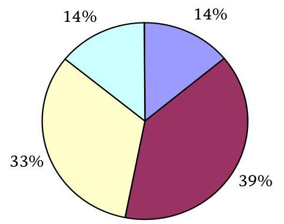
$\square 80 \%$ fölött ■ 50-80\% $\square 30-50 \% \square 30 \%$ alatt

A rendelkezésre álló eszközök fajlagos állománya az ellenőrzött időszakban lényegében azonos szinten maradt, összességében kielégítette a munkavégzés igényeit. A fénymásoló ellátottság 6,5 fő/db-ról 7,5 fő/db-ra, illetve a területi szerveknél 13,8 fő/db-ról 9,7 fő/db-ra, a printer ellátottság 1,4 fő/db-ról 1,2 fő/db-ra, illetve a területi szerveknél 2,3 fő/db-ról 1,3 fő/db-ra, a mobiltelefon ellátottság $0,2 \mathrm{db} /$ főről $0,3 \mathrm{db} /$ főre (a vidéki átlag $0,1 \mathrm{db} /$ főről $0,2 \mathrm{db} /$ főre), a laptop ellátottság $0,2 \mathrm{db} /$ főről $0,3 \mathrm{db} /$ főre, az intézményeknél $0,03 \mathrm{db} /$ főről $0,04 \mathrm{db} /$ főre változott. A személyi számítógépek fajlagos állománya az ellenőrzött időszak egészében 1-nél magasabb volt (a központi szerveknél $1,7 \mathrm{db} /$ fő és $1,9 \mathrm{db} /$ fő, a területi szerveknél $1,3 \mathrm{db} /$ fő és $1,5 \mathrm{db} /$ fő között ingadozott), míg az Internet hozzáférések száma a központi szerveknél a 2002. évi $0,9 \mathrm{db} /$ főről 2005-re 1,1 db/főre, a területi szerveknél $0,3 \mathrm{db} /$ főről 2005-re $0,4 \mathrm{db} /$ főre növekedett.

A mobiltelefonok száma a központi intézményeknél 2002-2005 között 52,7%-kal (ezen belül a minisztériumoknál 13,1%-kal, az országos hatáskörű szerveknél 81,5%-kal) nőtt.

A területi szervek 2005. évre vonatkozó átlagának viszonylagos csökkenését (fénymásoló, printer) a KSH Igazgatóságai átlagnál magasabb értékeinek (fénymásoló 20 fő/db, printer 4,4 fő/db) kiesése indokolta.

A létszámra vetített PC-k száma a HM-nél az ellenőrzött időszakban 3,1 db/főről 3,3 db/főre nőtt. Ennek az oka, hogy a nyílt, a katonai és a kormányzati hálózati kapcsolatokat a Nemzeti Biztonsági Felügyelet idevonatkozó előírásai alapján nem lehet azonos gépről üzemeltetni.

Mobiltelefonnal és laptoppal azonban nem minden vidéki szervezet rendelkezett.

A KSH Miskolci Igazgatósága Salgótarjáni Képviseleténél a vizsgált időszakban sem mobil telefont, sem laptopot nem biztosítottak a munkatársak számára.

A MNYI-k - a BAZ megyei kivételével - laptopokkal csak 2005-től rendelkeztek (1 db az igazgató használatában).

---

Az informatikai rendszereket működtető munkatársak aránya a vizsgált időszakban csökkent, a központi szerveknél a 2002. évi 5,1%-ról 2005-re 4,7%-ra, a vidéki intézményeknél 6,4%-ról 5,2%-ra. Külső igénybevétellel látták el az üzemeltetési feladatokat az IHM-ben és az NFH-nál.

A számítástechnikai alkalmazottak aránya jelentősen eltért az átlagtól (20% körüli volt) az FH-nál és a Kincstárban.

Az ellenőrzött időszakban - összhangban az Állami Foglalkoztatási Szolgálatról (ÁFSZ) szóló 4/2002. (X. 17.) FMM rendelet 3. §-a szerinti informatikai rendszerek kidolgozása, tesztelése és telepítése feladatai megvalósításával - 36-ról 60 főre nőtt az FH számítástechnikai alkalmazottainak létszáma, továbbá külső szakértőt is igénybe vettek.

A Kincstárnál az átlagoshoz képest nagyobb arányban alkalmaztak informatikusokat, a használt szoftver fajták száma, a fejlesztési igények humánerőforrás igényei miatt.

Az igazgatási feladatok ellátására alkalmazott szoftverpaletta$^{40}$ vegyes volt, sokfajta típust alkalmaztak, a szoftverfajták száma 2002-2005 között a központi szerveknél 155,1-ről 81,6-ra csökkent, a területi intézményeknél 57,2-ről 74,2-re nőtt. Az intézmények által használt szoftverek megközelítően kétharmada volt un. „dobozban vásárolt", a legkisebb súlyt a belső fejlesztésű szoftverek képezték (3,1-3,8% volt az egyes években). A „dobozban vásárolt", az adaptált$^{41}$, a külső fejlesztésű és a belső fejlesztésű szoftverek aránya lényegében nem változott az ellenőrzött időszakban.

Külső fejlesztésű szoftvereket a Kincstár területi szervei, az OTH és a PSZÁF alkalmazott. A szoftverfejlesztések, illetve tanácsadási szolgáltatások vásárlása egyszerűsített közbeszerzési eljárás keretében történt. Az irodai alkalmazások terén teljes körűen teret hódított a dobozban vásárolt Microsoft Office.

A szoftverek átlagos nettó állománya a 2003. évi jelentős emelkedés mellett az ellenőrzött időszakban lényegében változatlan maradt, a központi szerveknél 2002-ben 257,9 M Ft, 2003-ban 319,5 M Ft, 2004-ben 288,3 M Ft és 2005-ben 273,6 M Ft, a területi szerveknél 2002-ben 1,3 M Ft, 2003-2005-ben 1,4 M Ft volt.

A területi szerveknél a szoftvereket többségében a központtól kapták térítésmentesen használatra.

Az információs és kommunikációs szolgáltatásokra fordított fajlagos kiadások a 2004. évi jelentős emelkedés után 2005. évben csökkentek.

Az információs és kommunikációs szolgáltatásokra fordított létszámarányos kiadások relatív szórás adatait a 3. sz. melléklet 8. sz. ábrája tartalmazza.

[^0]
[^0]:    $^{40}$ Az igazgatási feladatok ellátására az intézményeken belül is különböző operációs (több mint 10 féle) és gazdálkodási szoftvereket (több mint 100 féle) alkalmaztak.
    $^{41}$ A forgalmazó által az intézmény igényeihez igazított program.

---

Az információs és kommunikációs szolgáltatásokra fordított fajlagos kiadások (E Ft/hó/fő) megoszlása a központi szervezeteknél 2005-ben
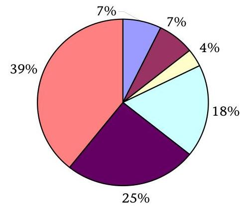

■ 300 fölött ■ 100-300 $\square$ 80-100 $\square$ 50-80 ■ 30-50 $\square 30$ alatt

A központi intézményeknél a fajlagos kiadás 2002-ben 78,2 E Ft/hó/fő, 2003-ban 79,7 E Ft/hó/fő, 2004-ben 92,0 E Ft/hó/fő és 2005-ben 84,8 E Ft/hó/fő, a területi szerveknél 2002-ben 6,1 E Ft/hó/fő, 2003-ban 6,4 E Ft/hó/fő, 2004-ben 6,6 E Ft/hó/fő és 2005-ben 5,4 E Ft/hó/fő volt.

Az átlagnál jelentősen többet fordított információs és kommunikációs szolgáltatásokra az FH (160,7-332,4 E Ft/hó/fő között), a Külügyminisztérium (503,5-722,5 E Ft/hó/fő között), valamint a PSZÁF (422,8-647,0 E Ft/hó/fő között).

# 4.3. A gépjárműállomány jellemzői 

Az ellenőrzött szervezetek rendelkezésére álló gépjárműállomány 97-99%-ban személygépjármű volt, teherautóval az ellenőrzött szervezetek 21,6%-a, autóbusszal 1 szervezet rendelkezett.

Az ellenőrzött időszakban a személygépkocsik állománya 1025-1112 db, a teherautók állománya 26-36 db között alakult, az autóbuszoké 3 db volt. A legtöbb teherautóval (5 db/intézmény) rendelkezett a KSH, a MeH és az OEP.

A gépjárműállomány szinte egésze saját tulajdonban volt, a bérlés, lízingelés nem volt jellemző (az átlagos 0,2-0,6% elenyésző).

Személygépjárművet bérelt, illetve lízingelt az ellenőrzött időszakban a BM, az IHM, a MeH, az NKÖM, az NSH, valamint a BAZ Megyei és a Hajdú-Bihar Megyei Munkaügyi Központ.

Az IHM járműveinek 84-86%-a volt 2002-2003. években saját tulajdonú, a többi - a tárcákra egyébként nem jellemzően - bérelt, lízingelt tulajdoni formában működött. A NKÖM-nél 2004-ben (nyolc hónapig) lízingeltek egy személygépkocsit, melyet személyi használatra bocsátottak a közigazgatási államtitkár rendelkezésére.

A központi intézményeknél a személygépkocsik állománya az ellenőrzött időszakban (2002-től 2005-ig) összességében kis mértékben, 4,6%-kal

---

csökkent. (A személygépkocsikkal kapcsolatos jellemző adatokat a központi és a területi szervekre vonatkozóan a 2/a. és a 2/b. mellékletben rögzítettük.)
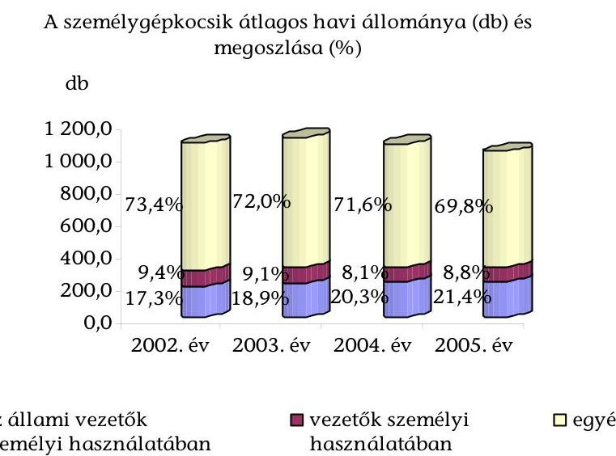
az állami vezetők
személyi használatában
vezetők személyi
használatában
$\square$ egyéb

2003-ban a személygépkocsik száma átlagosan 3,5%-kal nőtt a 2002-évi állományhoz képest, majd 2004-re ismét a 2002-es mértéket közelítette meg, 2005-ben pedig tovább csökkent 4,4%-kal.

A személygépkocsik száma 2002-2005 között a minisztériumoknál 10%-kal csökkent, az országos hatáskörű szerveknél viszont közel 18%-kal növekedett.

A területi szerveknél a személygépkocsik átlagos száma lényegében változatlanul alacsony volt az ellenőrzött időszakban. A személygépkocsik intézményenkénti átlaga a 2002. évi 3,7 db-ról 2005-re csak 4,6 db-ra növekedett.

A legkevesebb személygépkocsival rendelkezett 2002-ben és 2003-ban az OMAI, 2004-ben az NKTH, valamint 2005-ben a GVH volt (2002-ben 2,5 db, 2005-ben 7,0 db). A személygépkocsik állománya végig a MeH-nél volt a legmagasabb (2002-ben 179 db, 2003-ban 195 db, 2004-ben 174,5, 2005-ben és 2006-ban 154,5 db). A létszámra vetített személygépkocsi ellátottság relatív szórás adatait a 3. sz. melléklet 9. sz. ábrája tartalmazza.

A területi intézmények közül a KSH Igazgatóságai rendelkeztek a legkevesebb személygépkocsival (igazgatóságonként 1 db). A legtöbb személygépkocsija a Munkaügyi Központoknak volt, átlagosan 6-7 db központonként.

A személygépjármű állomány a központi intézmények átlagára vonatkozóan folyamatosan növekedő tendenciát mutatott (valamennyi ellenőrzött évben átlagosan 15,0-15,7 főre jutott 1 személygépkocsi).

Ugyanakkor a területi szerveknél a személygépkocsi állományban enyhe csökkenés volt tapasztalható (Az egy személygépkocsira jutó létszám 2002-ről 2005-re 39 db-ról 35 db-ra mérséklődött.)

---

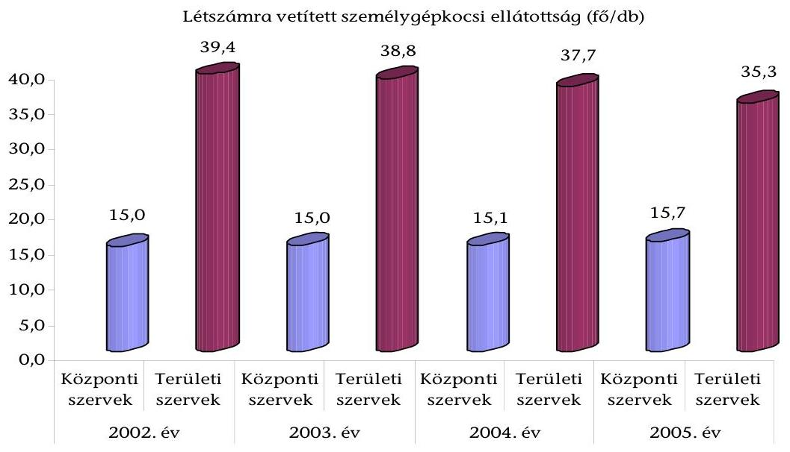

A központi intézmények több mint felénél (60,0%) nem tartották be a PM iránymutatásban meghatározott - 17 főként 1 gépjármű - ellátottsági mutatóra vonatkozó előírást.

Jelentős volt a normától való eltérés a BM-nél, a HM-nél, a HTMH-nál, a MeH-nél és az OAH-nál (6-8 főként 1 autó).

A területi szerveknél a PM iránymutatásban meghatározottnál valamennyi ellenőrzött évben kedvezőtlenebb volt a létszámra vetített személygépkocsi ellátottság mértéke (42-44 fő/gépkocsi). A személygépkocsival legjobban ellátott vidéki szervezetek az EP, illetve az MK területi szervei voltak, a legkedvezőtlenebbül ellátottak pedig a KSH, illetve az MNYI igazgatóságai voltak.

A személygépkocsi állományon belül a személyi használatú gépjárművek átlagos aránya a központi intézményeknél mérsékelten (26,6%-ról 30,2%-ra), de folyamatosan nőtt, a területi szervekre nem volt jellemző.

A Kincstár területi Igazgatóságai és két Megyei Munkaügyi Központ rendelkeztek személyi használatú gépkocsival.

A személyi használatú gépkocsik száma folyamatosan meghaladta az átlagot (10,3-12,4 db) az ellenőrzött időszakban az EüM-nél (16,5-37,0%-kal), az IM-nél (77,4-103,9%-kal), a Külügyminisztérium-nál (45,6-53,2%-kal), a MeH-nél (579,6-585,5%-kal), az NKÖM-nél (40,8-65,3%-kal) és a PM-nél (16,5-21,0%-kal).

A központi intézményeknél a személyi használatú gépjárművek átlagosan 80-82%-át az állami vezetők, 18-20%-át a vezetők, a területi szerveknél pedig azok 100%-át a vezetők használták.

A kormány takarékossági intézkedéseinek hatására a minisztériumoknál és az országos hatáskörű szerveknél folyamatosan csökkent a személygépjármű állomány, a területi szerveknél lényegében nem változott. A jogszabályok által biztosított, az állami vezetőket megillető személyes használatra vonatkozó jogosultság változatlansága miatt folyamatosan nőtt (23,7-26,5%-ra) az állami

---

vezetők által használt személygépkocsik aránya. A vezetők által történő használat egyúttal csökkent (28,7-23,9%-ra).

Az ellenőrzött területi szerveknél a személygépkocsik száma összesen 110-115 db között alakult.

Az ellenőrzött időszakban az összes létszámra vetített állami vezetők (1,4%), illetve vezetők (14,5-15,3%) aránya nem változott.

A személygépkocsi állomány állami vezetők által történő használatának átlagát (23,7-26,5%) 6 intézménynél haladták meg: az EüM-nél (33,0-43,0%), az FMM-nél (22,0-53,0%), a GVH-nál (50,0-57,0%), az IM-nél (35,5-51,8%) és az NKÖM-nél (31,5-38,1%).

A takarékossági intézkedésekkel összefüggésben az ellenőrzött intézményeknél a taxi-rendszerű személygépkocsik átlagos állományának aránya 2002-2005 között fokozatosan, 24%-ról 19%-ra csökkent, míg a kulcsos-rendszerű személygépkocsik átlagos állományának aránya nőtt (a központi szerveknél 20%-kal, a területi szerveknél 55%-kal)$^{42}$.

A személygépkocsik használatának jogcímenkénti megoszlása a központi és a vidéki szervezeteknél 2002-2005 között
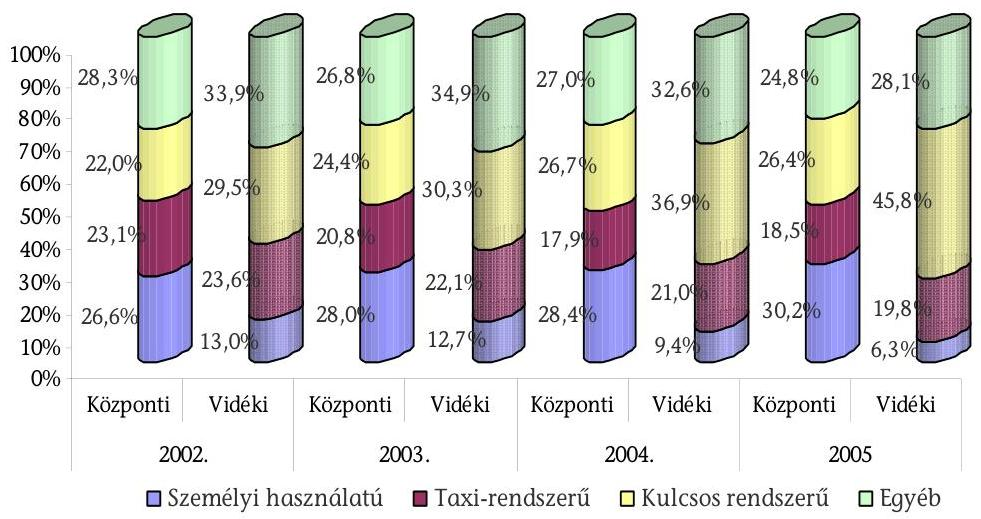

Az ellenőrzött központi intézményeknél összességében az alsó-közép kategóriájú személygépjárművek túlsúlya (a személygépkocsik 39,8-43,6%-a) mellett a közép és a felső-közép kategóriájú személygépjárművek voltak jellemzőek (a személygépkocsik 23,9-24,9%-a, illetve a 25,4-27,4%-a). Az alsó és a felső kategóriájú gépkocsik aránya mindössze 1,0-3,8% között alakult.

Az alsó, az alsó-közép, valamint a
 középkategóriájú személygépjárművek száma 2002-ről 2005-re csökkent (29 db-ról 10,5 db-ra, 463,5 db-ról 408 db-ra, valamint

[^0]
[^0]:    ${ }^{42}$ A 2005. évi adatokhoz képest 2006. IX. 1-jére a személyi használatú személygépkocsik száma több mint harmadával csökkent.

---

267,5 db-ról $253,5 \mathrm{db}$-ra), míg a felső-közép és a felső kategóriájú autók száma nőtt (2002-ről 2005-re 272,5 db-ról 280,5 db-ra és 27,5 db-ról 39 db-ra).

Az átlagosnál több alsó-közép kategóriájú személygépjárműve volt a BM-nek, a KüM-nek és a MeH-nek. A felső kategóriájú gépjárművek átlagos értékét (1,11,3 db) az FMM, a GVH, illetve jelentős mértékben (5-7 db) az FVM és az IKSSZEM haladta meg.

A KüM-nél különösen magas volt a felső kategóriájú gépjárművek száma (1420 db) a külföldi delegációkhoz kapcsolódó feladatok ellátása miatt.

A GVH-nál az átlagtól való eltérések értékelésénél figyelembe kell venni, hogy a GVH egyetlen intézményből álló fejezet, viszonylag alacsony (124 fő) engedélyezett létszámmal.

A területi szervek jellemzően alsó-közép és közép kategóriájú gépkocsikkal rendelkeztek (a személygépkocsik 45,8-47,7%-a, illetve a 39,2-41,3%-a). Felső kategóriába sorolt személygépkocsi egyik területi szervnél sem volt.

Az alsó kategóriájú gépjárművek kivételével (ahol 2002-ről 2005-re 8,8 db-ról $5,0 \mathrm{db}$-ra csökkent) a területi szerveknél kis mértékben nőtt az autók száma (az alsó-közép kategóriájú autóknál 50,5 db-ról $51,7 \mathrm{db}$-ra, a közép kategóriájú autóknál 45,2 db-ról 45,9 db-ra és a felső kategóriájú autóknál 4,8 db-ról 8,5 db-ra).

Az intézményeknél az átlagos futásteljesítményre nem lehetett trendszerű alakulást megállapítani, viszont az egyes szervek között jelentős különbségek voltak tapasztalhatóak.

A legkevesebbet futott (19,0-23,4 km/hó) NFH járművei, illetve az ONYF 28000-32000 km/hó futásteljesítményű gépkocsijai között az eltérés igen jelentős volt. Az ONYF főigazgatójának a 2006. VIII. 15-ei keltezésű levelében adott tájékoztatása szerint az átlagoshoz képest jelentős futásteljesítményt a nyugdíjbiztosítási szervek ellenőrzési feladatainak ellátása indokolta, mely feladatban a vezető beosztású köztisztviselők is részt vettek.

A központi szerveknél az összességében csökkenő gépjármű állomány üzemeltetésének költségei az ellenőrzött időszakban nőttek, 2005-re a 2002. évi szint átlagosan 135,0%-ára.

A személygépkocsik üzemeltetésének fajlagos havi költségei (E Ft/km/hó) 2002-től 2005-ig
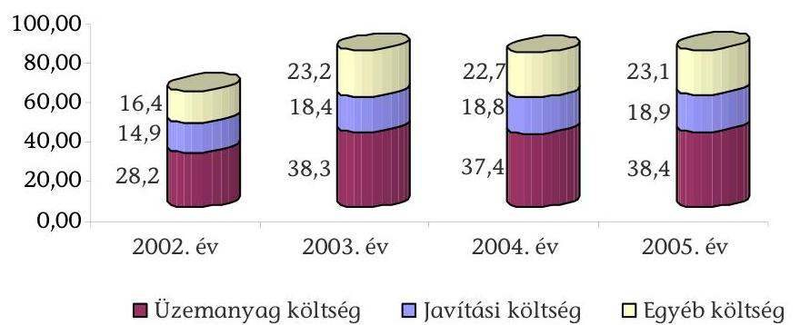

---

Az üzemeltetési költségek közül legnagyobb arányban az egyéb költségek (40,5%-kal) és az üzemanyag költségek (36,2%-kal) növekedtek átlagosan.

A személygépkocsik javítására fordított átlagos összeg szórása 2002-2005 között több mint 50%-al nőtt (98,9%-ról 153,9%-ra), az intézmények által a legkevesebbet, illetve legtöbbet javításra költött összeg közötti különbség az ellenőrzött időszakban folyamatosan nőtt.

A helyszínen ellenőrzött területi intézményeknél - a Munkaügyi Központok kivételével - az átlagos futásteljesítmény folyamatosan csökkent, a személygépkocsik összes költségének növekedése mellett. Jelentősen emelkedtek az üzemanyag költségek, amelyet nem tudtak ellensúlyozni a takarékosabb gazdálkodás miatt csökkenő javítási és egyéb költségek sem.

A Munkaügyi Központoknál a Baranya, a Csongrád és a Hajdú-Bihar Megyei központoknál emelkedett jelentősen a futásteljesítmény, melynek oka az ÁFSZ modernizációjával összefüggő feladatokban és képzésekben való részvétel volt.

A gépjárművek használhatósági foka a központi intézményeknél évről-évre, a 2002. évi 52,9%-ról 2005-re 41%-ra csökkent. (A személygépjárművek használhatósági fokának relatív szórásra vonatkozó adatait a 3. sz. melléklet 10. sz. ábrája tartalmazza.)

A személygépkocsik közül korszerűbb állapotban volt a(z állami) vezetők által használt személygépkocsik állománya, bár azok használhatósági foka folyamatosan csökkent, összességében magasabb volt az értékük (az állami vezetők használatában lévő autóknál 2002-ről 2005-re 56,9%-ról 50,8%-ra, a vezetők használatában lévő autóknál 50,1%-ról 43,9%-ra csökkent).

A gépjárművek használhatósági foka a vidéki intézményeknél egyértelműen rosszabb képet mutatott a központiakéhoz képest, azonban a 2003-2004. évi cserék eredményeként javult a személygépkocsik átlagos használhatósági foka, a 2002. évi 30,7%-ról 2005-re 31,1%-ra módosult (2003-ban 34,8% és 2004-ben 38,3% volt).

A személygépjárművek használhatósági foka (%)
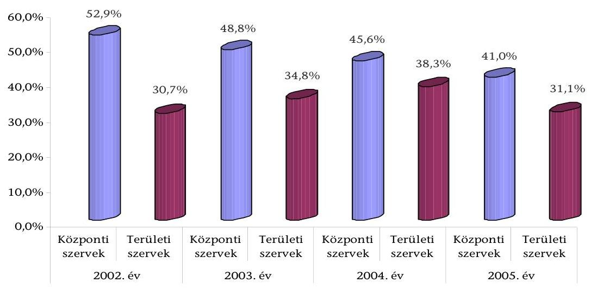

---

A személygépkocsik átlagéletkora az ellenőrzött időszakban 2002-höz képest 2005-re átlagosan 46,6%-kal, azaz 11 hónappal növekedett, és csaknem elérte a 4 évet. A gépjárművek átlagéletkora a vidéki intézményeknél egyértelműen rosszabb képet mutatott (3-5 hónappal öregebbek voltak) a központiakéhoz képest.

Az ellenőrzött intézmények - a BM kivételével - teljes körűen rendelkeztek CASCO biztosítással a gépjárműállomány egészére vonatkozóan. A BM-nél az állomány több mint negyedére (27,4%) még 2005-ben sem kötöttek CASCO biztosítást.

Budapest, 2006. november 25.

|  |  |  |
| :-- | :-- | :-- |
| Melléklet: | 4 db | 21 lap |
| Függelék: | 1 db | 2 lap |

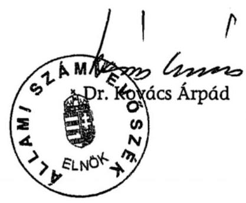

---

MELLEKLETEK

---

# A jelentés-tervezetre tett észrevételek és az arra adott válaszok 

1/1. Kormányzati Ellenőrzési Hivatal
1/2. Egészségügyi Minisztérium
1/3. Önkormányzati és Területfejlesztési Minisztérium
1/4. Honvédelmi Minisztérium
1/5. Központi Statisztikai Hivatal
1/6. Igazságügyi és Rendészeti Minisztérium
1/7. Külügyminisztérium
1/8. Nemzeti Kutatási és Technológiai Hivatal
1/9. Szociális és Munkaügyi Minisztérium
1/10. Miniszterelnöki Hivatal
1/11. Környezetvédelmi és Vízügyi Minisztérium
1/12. Gazdasági Versenyhivatal
1/13. Gazdasági és Közlekedési Minisztérium
1/14. Pénzügyi Szervezetek Állami Felügyelete
1/15. Pénzügyminisztérium
1/16. Földművelésügyi és Vidékfejlesztési Minisztérium
1/17. Oktatási és Kulturális Minisztérium

---

# KORMÁNYZATI ELLENŐRZÉSI HIVATAL 

ELVÖK

Iktatószám:1-37/5.9/2006.
dr. Kovács Árpád úr részére
elnök

Állami Számvevőszék

## Budapest

Tisztelt Elnök Úr!
Hivatkozva a V-02-076/2006. számú levelére a „Minisztériumok és országos hatáskörű szervek elhelyezéséről és tárgyieszköz-ellátottságának ellenőrzéséről" készített számvevői jelentést köszönettel megkaptam, melyhez észrevételt nem kívánok tenni.

Budapest, 2006. október 24.
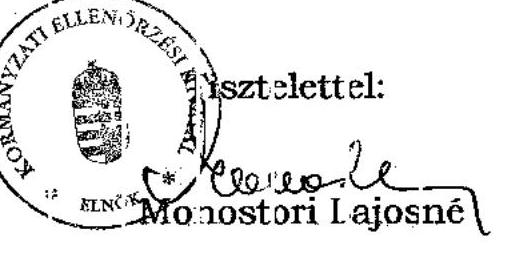

---

# 1/2. sz. melléklet 

a V-02-078/2006. sz. jelentéshez

EGÉSZSÉGÜGYI MINISZTÉRIUM MINISZTER

Szám: 2956-13/2005-4004GIG
Hiv. szám: V-C2-075/2006.
Dr. Kovács Árpád úr
elnök
Állami Számvevőszék
Budapest

## Tisztelt Elnök Úr!

Köszönettel megkaptam a minisztériumok és országos hatáskörű szervek elhelyezésének és tárgyieszköz-ellátottságának ellenőrzéséről készített végleges jelentést.

A jelentésben foglalt megállapításokat, következtetéseket és javaslatokat áttanulmányoztattam, azokkal kapcsolatban észrevételt nem teszek.

Tájékoztatom Elnök Urat, hogy az Állami Számvevőszék tárgybeli ellenőrzése alapján az Egészségügyi Minisztériumban intézkedések elrendelésére nem került sor, tekintettel az alábbiakban felsoroltakra:

- a Jelentés a Kormány részére fogalmazott meg javaslatokat,
- a már megtett, 2006. évi kormányzati intézkedések hatására a tárgyi eszköz ellátottságában jelentős változások álltak be,
- a 1054/2006 és 218/2006. Kormány határozatok értelmében a minisztériumok elátási szolgáltatásait 2007. január 1-től a Központi Szolgáltatási Főigazgatóság biztosítja feladat- és hatáskörének kiterjesztésével.

Budapest, 2006. október 27.
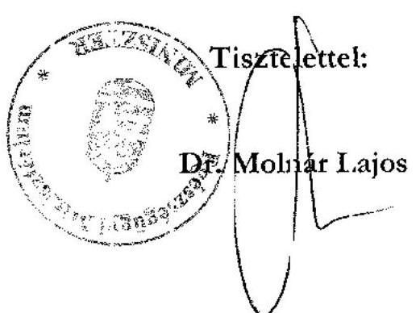

---

# 1/3. sz. melléklet 

a V-02-378/2006. sz. jelentéshez

Iktatószám: 1-a-1/32/06.
19-301/4-3/2006.

## Dr. Kovács Árpád Úrnak

elnök
Állami Számvevőszék

## Budapest

## Tisztelt Elnök Úr!

Köszönettel megkaptam „a minisztériumok és országos hatáskörű szervek elhelyezésének és tárgyieszköz-ellátottságának ellenőrzése" tárgyát illetően készített jelentést.

Az ellenőrzés megállapításaira vonatkozóan észrevételt nem teszek.

Kérem, hogy tolmácsolja köszönetünket az ellenőrzés végrehajtásában közreműködő számvevő munkatársak szervezett és korrekt feladatellátásáért.

Budapest, 2006.
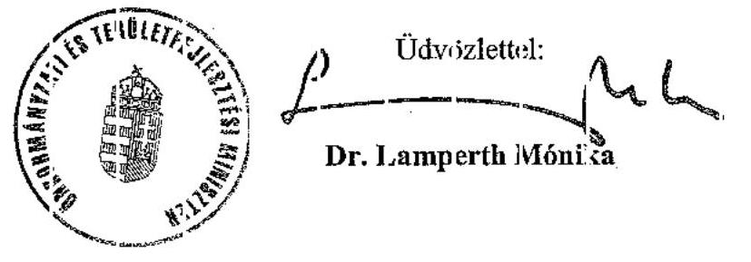

---

MAGYAR KÖZTÁRSASÁG HONVÉDELMI MINISZTÉRE

Nyilv. szám: 154/115/2006. HM KEHH
Hiv. szám: V-20-76/2006.
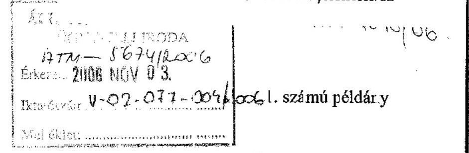

Bihari úr részére
(függőlegesen másolva)
$u=4/3$
11.03
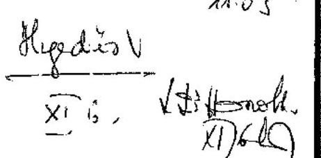

# 2 lapon:

## Tisztelt Elnök Úr!

A minisztériumok és országos hatáskörű szervek elhelyezésének és tárgyi eszköz-ellátottságának ellenőrzése tárgyában a fenti hivatkozási számon megküldött jelentésben foglalt megállapítások a HM-et érintően az egyeztetési folyamat során tett észrevételeinket figyelembe véve kerültek véglegesítésre, azzal kapcsolatban észrevételt nem teszek.

Elnök Urat a jelentésben foglaltak alapján hozott intézkedéseimről az Állami Számvevőszékről szóló 1989. évi XXXVIII. törvényben előírt határidőre tájékoztatni fogom.

Budapest, 2006. november 7.
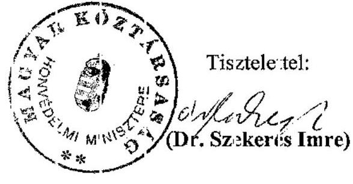

---

Központi Statisztikai Hivatal
Elnök
6800-203//2006.

Dr. Kovács Árpád úrnak
elnök
Állami Számvevőszék

Budapest

## Tisztelt Elnök Úr!

Köszönettel vettem a V-02-076/2006. szám alatt megküldött, a minisztériumok és országos hatáskörű szervek elhelyezésének és tárgyieszköz-ellátottságának ellenőrzéséről készített jelentést.

Tájékoztatom, hogy az ellenőrzés alapján intézkedési terv összeállítását nem tartom indokoltnak, tekintettel arra, hogy a jelentés a KSH fejezethez tartozó költségvetési szervek vonatkozásában intézkedést igénylő megállapítást nem tartalmaz.

Budapest, 2006. október 31.
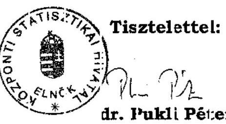

Központi Statisztikai Hivatal 1024 Budapest, Keleti K. u. 5-7. 53. Pf.: 51. Budapest 1525
Tel.: (361) 345-6478 Fax: (36) 1 202-0739
e-mail: pater.pukli@ksh.hu Internet: http://www.ksh.hu

---

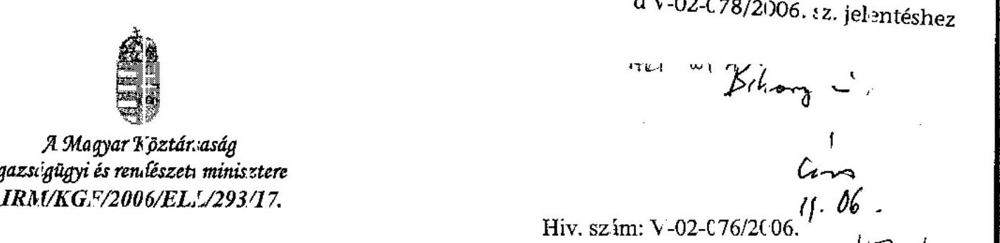

Dr. Kovács Árpád úr
elnök

Állami Számvevőszék

Budapest

# Tisztelt Elnök Úr! 

Az Állami Számvevőszék hivatkozott számú levelét és „A minisztériumok és országos hatáskörű szervek elhelyezésének és tárgyieszköz-ellátottsága" ellenőrzéséről készített számvevői jelentést köszönettel megkaptam.

Tájékoztatom, hogy az Igazságügyi és Rendészeti Minisztérium részéről az ellenőrzési jelentésre észrevételt nem teszünk.

Az Állami Számvevőszék számvevőinek az ellenőrzés során nyújtott szakmai támogatását, tény- és tárgyszerű javaslatait munkatársaink nevében is köszönöm.

Budapest, 2006. október 31.
Tisztelettel:
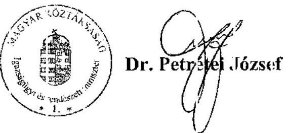

---

# Dr. Kovács Árpád úr 

elnök

Állami Számvevőszék

Budapest

## Tisztelt Elnök Úr!

A minisztériumok és országos hatáskörű szervek elhelyezésének és tárgyieszköz-ellátottságának ellenőrzéséről készített jelentésben foglaltakkal kapcsolatban a Külügyminisztérium részéről észrevételt nem teszünk.

Budapest, 2006. október 25.

Tisztelettel:
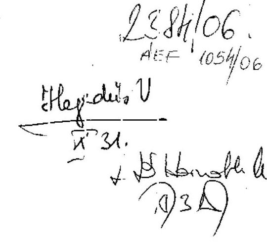

---

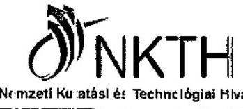

1/8. sz. melléklet
a V-02-078/2006. sz. jelentéshez

Iktatószám: 2682-1/2006

Dr. Kovács Árpád úr
Elnök

Állami Számvevőszék
1052 Budapest
Apáczai Cs. J. u. 10.

Pihany

Tisztelt Elnök Úr!

Hivatkozva V-02-076/2006 iktatószámú levelére tájékoztatom, hogy a minisztériumok és országos hatáskörű szervek elhelyezésének és tárgyi eszköz-ellátottságának ellenőrzéséről készített jelentéssel kapcsolatosan észrevételt nem teszünk.

Dr. Horváth Margit osztályvezető főtanácsos telefonon megerősítette álláspontunkat, mely szerint a jelentéssel kapcsolatosan intézményünknél külön intézkedés nem szükséges.

Budapest, 2006. október 26.

Tisztelettel:

Bodnár Béla

1052 Budapest, Szervita tér 8. | Tel.: +36 1 484 2964 | Fax: +36 1 266 2055
E-mail: info@nkth.gov.hu | Honlap: www.nkth.gov.hu

---

# Szociális és Munkaügyi Miniszter 

## 1/9. sz. melléklet

a V-02-078/2006. sz. jelentéshez

## 2006.10.21.

$$
A'E'F-1/06/c
$$

Iksz: 78767/2006-Bitn
Kérjük, hogy válasz esetén szíveskedjen levelünk számíra hivatkozni!

Dr. Kovács Árpád
elnök
Állami Számvevőszék
Helyben

Tisztelt Elnök Úr!

Hivatkozva V-02-076/2006. ügyiratszámú levelére tájékoztatom, hogy a minisztériumok és országos hatáskörű szervek elhelyezésének és tárgyi eszköz-ellátottságának ellenőrzéséről készített jelentésre észrevételt nem teszek.
Tekintettel arra, hogy tárcánknak vizsgált intézményei esetében az ellenőrzés észrevételt, javaslatot nem fogalmazott meg, e tárgykörben intézkedési terv nem készült.

Budapest, 2006. október 25.
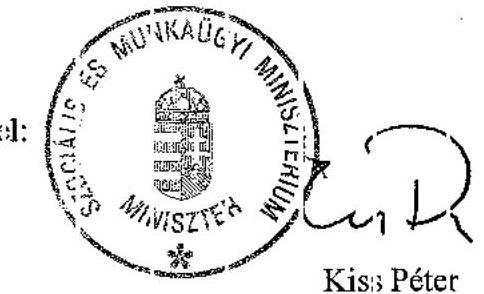

---

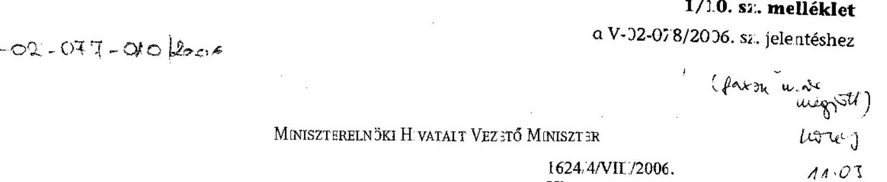

Dr. Kovács Árpád úrnak, az Állami Számvevőszék elnökének

Budapest.

Tisztelt Elnök Úr!
A minisztériumok és országos hatáskörű szervek elhelyezésének és tárgyi eszköz-ellátottságának ellenőrzéséről szóló jelentésre észrevételt nem teszek.

Az ellenőrzés alapján elrendelt intézkedéseimről Elnök Urat 30 napon belül tájékoztatom.

Budapest, 2006. október 30.

Üdvözlettel:
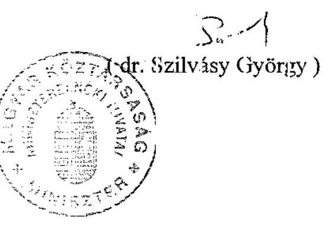

---

# V-02-077-01/2006

1/11. sz. melléklet

a V-02-078/2006. sz. jelentéshez

mer. oky 96

MAGYAR KÖZTÁRSASÁG

KÖRNYEZETVÉDELMI ÉS VÍZÜGYI MINISZTÉRE

JKH/147/2003/2
Hsz. V-02-073/2006.

Bihari úr részére
(függőlegesen másolva)

Dr. Kovács Árpád úr
elnök
Állami Számvevőszék

Budapest

Tisztelt Elnök Úr!

Köszönettel vettem a V-02-073/2006. számú, 2006. október 17-én kelt levelét, melynek mellékleteként megküldte az Állami Számvevőszék által készített „a minisztériumok és országos hatáskörű szervek elhelyezésének és tárgyi eszköz-ellátottságának helyzetéről” szóló jelentésüket.

A jelentést áttekintettem, a KvVM-re vonatkozó szövegrészekkel egyetértek, azokkal kapcsolatban észrevételt nem teszek.

Budapest, 2006. október 26.

Tisztelettel:

Dr. Persányi Miklós

1011 Budapest, Fő út 44-50.

telefon 457 3360

1214 Budapest, Pf. 25.

telefax 201 3114

---

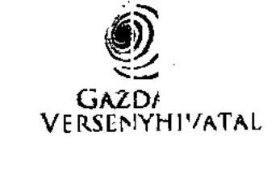

1/12. sz. melléklet
a V-02-078/2006. sz. jelentéshez

GAZD/
VERSENYH/IVATAL

Bihari Zsigmond úr részére
főigazgató

Állami Számvevőszék

Budapest

Tárgy: véleményezés

Tisztelt Főigazgató Úr!

Tájékoztatom, hogy a minisztériumok és országos hatáskörű szervek elhelyezésének és tárgyi eszköz-ellátottságának tárgyában lefolytatott ellenőrzésről készült jelentésüket áttekintettem és ahhoz észrevételt nem teszek.

Tisztelettel:

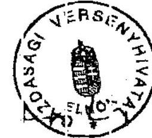

Dr. Nagy Zoltán
elnök

Budapest, 2006. november 7.

1051 BUDAPEST, ARKOTI UTCA 5 • TELEFON: 472 8900 FAX: 472 8901 • WWW.GVH.HU

---

# 1/13. sz. melléklet 

a V-02-078/2006. sz. jelentéshez

$$
\begin{aligned}
& \text { (1. 2. 1. } \\
& \text { (1. } \\
& \text { (1. 2. }
\end{aligned}
$$

## dr. Kovács Árpád

Iktatószám: III-6/149/4/2006.
Elnök úr részére
Állami Számvevőszék
Budapest
Apáczai Csere János u. 10.
1052
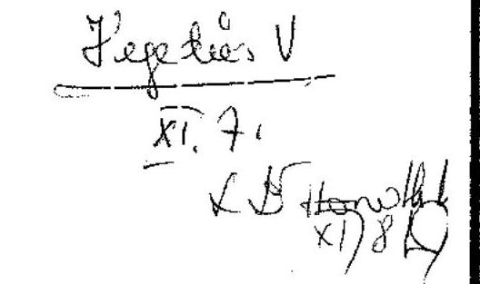

## Tisztelt Elnök Úr!

Köszönettel vettem „a minisztériumok és országos hatáskörű szervek elhelyezésének és tárgyieszköz-ellátottságának ellenőrzéséről" szóló jelentést, melyre észrevételt nem
 tuszek.

Végezetül köszönettel jegyzem, hogy munkájukkal hozzájárultak a minisztérium eredményesebb működéséhez.

Budapest, 2006. október 31.

Tiszteletel:
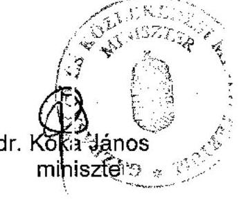

---

# 1/14. sz. melléklet 

a V-32-078/2006. sz. jelentéshez

$$
\begin{aligned}
& \text { HtT - 4UTGU6. } \\
& \text { *Itt/Rel 23347/3/2006. } \\
& \text { Prikony 2. }
\end{aligned}
$$

Dr. Kovács Árpád elnök úr
Állami Számvevőszék
Budapest
Apáczai Cs. J. u. 10.
1052

Tisztelt Elnök Úr!
Köszönettel megkaptam a minisztériumok és országos hatáskörű szervek elhelyezésének és tárgyieszköz-ellátottságának ellenőrzéséről készített jelentésüket, melyhez észrevételt nem kívánok tenni.

Budapest, 2006. november 5.
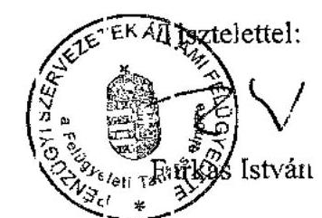

---

# H-02-079-015/2006 

a V-02-078/2006. sz. jelentéshez

H-1051 BUDAPEST V., JÓZSEF NADOR TÉR 2-1. POSTACÍM:
TELEFON: (1-1) 327 2159, (16-1) 327-2141
E-MAIL: anos.veres@pm.gov.hu
FAX: (16-1) 318-0738
PÉNZÜGYMINISZTER

## Dr. Kovács Árpád úr részére

elnök

## Állami Számvevőszék

## Budapest

## Tisztelt Elnök Úr!

A minisztériumok és országos hatáskörű szervek elhelyezésének és tárgyieszköz-ellátottságának ellenőrzéséről készült Állami Számvevőszék jelentésre észrevételt nem teszünk.

Tájékoztatom T. Elnök Urat, hogy az államháztartás hatékony működését elősegítő szervezeti átalakításokról és az azokra megalapító intézkedésekről szóló 2118/2006. (VI.30.) Korm. határozatra való tekintettel külön intézkedéseket nem rendelek el.

Budapest, 2006. november 7.

Tisztelettel:
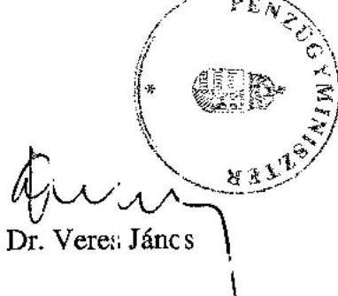

---

# 1/16. sz. melléklet 

a V-02-078/2006. sz. jelentéshez

FÖLDMŰVELÉSÜGYI ÉS VIDÉKFEJLESZTÉSI MINISZTER 83288

Kroord 222/2006
AEF=1107/06

Dr. Kovács Árpád úr
elnök
részére
Állami Számvevőszék

## Budapest

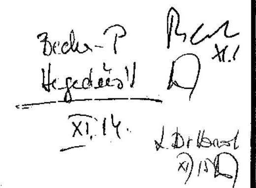

Tisztelt Elnök Úr!

A részemre megküldött „a minisztériumok és országos hatáskörű szervek elhelyezésének és tárgyieszköz-ellátottságának ellenőrzéséről” az Állami Számvevőszék által készített V-02-078/2006. ügyiratszámú jelentéssel kapcsolatban észrevételt nem kívánok tenni. A közigazgatás egészére vonatkozóan megfogalmazott javaslatokat, észrevételeket, ill. megállapításokat tudomásul vesszük.

Tekintettel arra, hogy a jelentésben az összesítő megállapítások, következtetések, javaslatok a Földművelésügyi és Vidékfejlesztési Minisztérium számára konkrét feladatot nem fogalmaznak meg, így az ellenőrzés alapján intézkedést nem kívánok kezdeményezni.

Budapest, 2006. november 9.

Tisztelettel:
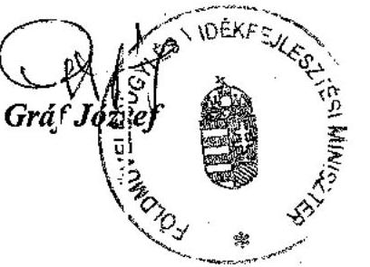

---

# Oktatási és Kulturális Minisztérium 

Miniszter

Ikt.szám: OKM-5157-6/2006.
Hiv.szám: V-02-078/2006.

## Dr. Kovács Árpád elnök úr

Állami Számvevőszék

## Budapest

Tisztelt Elnök Úr!
A minisztériumok és országos hatáskörű szervek elhelyezésének és tárgyieszköz-ellátottságának ellenőrzéséről készült jelentésüket köszönettel megkaptam.
Tekintettel arra, hogy az ellenőrzési jelentés a 2006. szeptember 29-én Árstó Gergely államtitkár úr által tett észrevétellel módosításra került, az ellenőrzés megállapításaira további észrevételt nem kívánok tenni.

A jelentés nem tartalmaz az Oktatási és Kulturális Minisztérium részére intézkedési javaslatot, azonban szükségesnek tartom Elnök urat tájékoztatni a minisztérium néhány olyan intézkedéséről, amely a gazdálkodás hatékonyságának növelésére irányul, illetve a jelentésben megfogalmazott jogkövető minisztériumok (OM, NKÖM) szabályozottságának hiányosságait megszünteti.

Az Oktatási és Kulturális Minisztérium új, egységes szabályzatainak kidolgozásakor az alábbi szabályzatainkat pontosítottuk a PM 2004. évi iránymutatásában megfogalmazott követelmény szintjével megfelelően.

- Gépjárművek használatáról szóló szabályzat kiegészítésre került az önhibás kár esetén a Casco önrész megtérítésének előírásával.
Tartalmazza továbbá a gépjárművek cseréjére vonatkozó gazdaságossági szempontokat.
- A mobiltelefon használatáról szóló szabályzat már az új adótörvények előírásainak megfelelően készült el.
- A számítógépek otthoni használatának szabályozását, az engedélyezés rendjét az OKM anyag- és eszközgazdálkodási szabályzata tartalmazza.

Köszönöm a vizsgálatban közreműködő munkatársaink együttműködését, valamint a szakszerű és korrekt munkájukat.

Budapest, 2006. november 14.
Tisztelettel
Dr. Hillar Kogutov

---

# Az ellenőrzésbe bevont szervezetek 

## A. Minisztériumok

1. Miniszterelnöki Hivatal
2. Belügyminisztérium
3. Földművelésügyi és Vidékfejlesztési Minisztérium
4. Honvédelmi Minisztérium
5. Igazságügyi Minisztérium
6. Gazdasági és Közlekedési Minisztérium
7. Környezetvédelmi és Vízügyi Minisztérium
8. Külügyminisztérium
9. Oktatási Minisztérium
10. Foglalkoztatáspolitikai és Munkaügyi Minisztérium
11. Egészségügyi Minisztérium
12. Pénzügyminisztérium
13. Nemzeti Kulturális Örökség Minisztériuma
14. Ifjúsági, Családügyi, Szociális és Esélyegyenlőségi Minisztérium
15. Informatikai és Hírközlési Minisztérium

## B. Országos hatáskörű szervek

16. Kormányzati Ellenőrzési Hivatal
17. Nemzeti Sporthivatal
18. Országos Atomenergia Hivatal
19. Országos Területfejlesztési Hivatal
20. Határon Túli Magyarok Hivatala
21. Nemzeti Fejlesztési Hivatal
22. Nemzeti Kutatási és Technológiai Hivatal
23. Országos Egészségbiztosítási Pénztár
24. Oktatási Minisztérium Alapkezelő Igazgatósága ${ }^{1}$
25. Gazdasági Versenyhivatal
26. Magyar Államkincstár
27. Pénzügyi Szervezetek Állami Felügyelete
28. Országos Nyugdíjbiztosítási Főigazgatóság
29. Foglalkoztatási Hivatal
30. Központi Statisztikai Hivatal
[^0]
[^0]:    ${ }^{1}$ Külön címként bekerült a mintába, mint a Munkaerőpiaci Alap egyik kezelője.

---

# Az ellenőrzésbe bevont területi szervezetek 

Országos Egészségbiztosítási Pénztár

Magyar Államkincstár

1. Hajdú-Bihar megyei Egészségbiztosítási Pénztár, Debrecenben,
2. Borsod-Abaúj-Zemplén megyei Egészségbiztosítási Pénztár, Miskolcon,
3. Baranya megyei Egészségbiztosítási Pénztár, Pécsett,
4. Nógrád megyei Egészségbiztosítási Pénztár, Salgótarjánban,
5. Csongrád megyei Egészségbiztosítási Pénztár, Szegeden,
6. Vas megyei Egészségbiztosítási Pénztár, Szombathelyen
7. Hajdú-Bihar megyei Területi Igazgatósága, Debrecenben,
8. Borsod-Abaúj-Zemplén megyei Területi Igazgatósága, Miskolcon,
9. Baranya megyei Területi Igazgatósága, Pécsett,
10. Nógrád megyei Területi Igazgatósága, Salgótarjánban,
11. Csongrád megyei Területi Igazgatósága, Szegeden,
12. Vas megyei Területi Igazgatósága, Szombathelyen

Országos Nyugdíjbiztosítási Főigazgatóság 13. Hajdú-Bihar megyei Nyugdíjbiztosítási Igazgatóság, Debrecenben,
14. Borsod-Abaúj-Zemplén Nyugdíjbiztosítási Igazgatóság, Miskolcon,
15. Baranya megyei Nyugdíjbiztosítási Igazgatóság, Pécsett,
16. Nógrád megyei Nyugdíjbiztosítási Igazgatóság, Salgótarjánban,
17. Csongrád megyei Nyugdíjbiztosítási Igazgatóság, Szegeden,
18. Vas megyei Nyugdíjbiztosítási Igazgatóság, Szombathelyen

---

Foglalkoztatási Hivatal
19. Hajdú-Bihar megyei Munkaügyi Központ, Debrecenben,
20. Borsod-Abaúj-Zemplén megyei Munkaügyi Központ, Miskolcon,
21. Baranya megyei Munkaügyi Központ, Pécsett,
22. Nógrád megyei Munkaügyi Központ, Salgótarjánban,
23. Csongrád megyei Munkaügyi Központ, Szegeden,
24. Vas megyei Munkaügyi Központ, Szombathelyen
Központi Statisztikai Hivatal
25. Debreceni Igazgatósága,
26. Miskolci Igazgatósága,
27. Pécsi Igazgatósága,
28. Miskolci Igazgatóság Salgótarjáni Képviselete,
29. Szegedi Igazgatósága,
30. Győri Igazgatóság Szombathelyi Képviselete

---

# A helyszíni ellenőrzésre kijelölt szervezetek 

## A. Minisztériumok

1. Miniszterelnöki Hivatal
2. Belügyminisztérium Központi
3. Földművelésügyi és Vidékfejlesztési Minisztérium
4. Honvédelmi Minisztérium
5. Igazságügyi Minisztérium
6. Gazdasági és Közlekedési Minisztérium
7. Környezetvédelmi és Vízügyi Minisztérium
8. Külügyminisztérium
9. Oktatási Minisztérium
10. Foglalkoztatáspolitikai és Munkaügyi Minisztérium
11. Egészségügyi Minisztérium
12. Pénzügyminisztérium
13. Nemzeti Kulturális Örökség Minisztériuma
14. Ifjúsági, Családügyi, Szociális és Esélyegyenlőségi Minisztérium
15. Informatikai és Hírközlési Minisztérium

## B. Országos hatáskörű szervek

1. Országos Egészségbiztosítási Pénztár
2. Hajdú-Bihar megyei Egészségbiztosítási Pénztár, Debrecenben,
3. Borsod-Abaúj-Zemplén megyei Egészségbiztosítási Pénztár, Miskolcon,
4. Baranya megyei Egészségbiztosítási Pénztár, Pécsett,
5. Nógrád megyei Egészségbiztosítási Pénztár, Salgótarjánban,
6. Csongrád megyei Egészségbiztosítási Pénztár, Szegeden,
7. Vas megyei Egészségbiztosítási Pénztár, Szombathelyen
8. Hajdú-Bihar megyei Területi Igazgatósága, Debrecenben,
9. Borsod-Abaúj-Zemplén megyei Területi Igazgatósága, Miskolcon,
10. Baranya megyei Területi Igazgatósága, Pécsett,
11. Nógrád megyei Területi Igazgatósága, Salgótarjánban,
12. Csongrád megyei Területi Igazgatósága, Szegeden,
13. Vas megyei Területi Igazgatósága, Szombathelyen

---

3. Országos Nyugdíjbiztosítási Főigazgatóság 13. Hajdú-Bihar megyei Nyugdíjbiztosítási Igazgatóság, Debrecenben,
4. Borsod-Abaúj-Zemplén Nyugdíjbiztosítási Igazgatóság, Miskolcon,
5. Baranya megyei Nyugdíjbiztosítási Igazgatóság, Pécsett,
6. Nógrád megyei Nyugdíjbiztosítási Igazgatóság, Salgótarjánban,
7. Csongrád megyei Nyugdíjbiztosítási Igazgatóság, Szegeden,
8. Vas megyei Nyugdíjbiztosítási Igazgatóság, Szombathelyen
9. Foglalkoztatási Hivatal
10. Hajdú-Bihar megyei Munkaügyi Központ, Debrecenben,
11. Borsod-Abaúj-Zemplén megyei Munkaügyi Központ, Miskolcon,
12. Baranya megyei Munkaügyi Központ, Pécsett,
13. Nógrád megyei Munkaügyi Központ, Salgótarjánban,
14. Csongrád megyei Munkaügyi Központ, Szegeden,
15. Vas megyei Munkaügyi Központ, Szombathelyen
16. Központi Statisztikai Hivatal
17. Debreceni Igazgatósága,
18. Miskolci Igazgatósága,
19. Pécsi Igazgatósága,
20. Miskolci Igazgatóság Salgótarjáni Képviselete,
21. Szegedi Igazgatósága,
22. Győri Igazgatóság Szombathelyi Képviselete

---

# Az elhelyezés és az eszközellátottság jellemző adatai a központi szerveknél (2002-2005. év)

|   |  | 2002. év | 2003. év | 2004. év | 2005. év  |
| --- | --- | --- | --- | --- | --- |
|  1. | Tényleges létszám (fő) | 12345,0 | 12868,5 | 12708,0 | 13443,0  |
|  1.1. | ebből: állami vezetők (fő) | 175,3 | 178,5 | 183,3 | 190,4  |
|  1.2. | ebből: vezetők (fő) | 1794,6 | 1953,3 | 1888,1 | 2051,1  |
|  2. | Létszámra vetített dologi és egyéb folyó kiadások (E Ft/hó/fő) | 139,5 | 132,6 | 136,4 | 141,2  |
|  3. | Létszámra vetített felhalmozási kiadások (E Ft/hó/fő) | 230,3 | 143,7 | 253,7 | 139,5  |
|  4. | Létszámra vetített összes kiadás (E Ft/hó/fő) | 369,9 | 276,3 | 390,1 | 280,7  |
|  5. | Munkavégzés céljára szolgáló saját épületek és bérlemények (db) | 69 | 78 | 90 | 92  |
|  5.1. | ebből: saját épületek (%) | $62,3 \%$ | $60,3 \%$ | $60,0 \%$ | $57,6 \%$  |
|  6. | A munkavégzés céljára szolgáló összes alapterület $\left(\mathrm{m}^{2}\right)$ | 472387,6 | 503410,9 | 537574,8 | 524993,3  |
|  6.1. | ebből: saját épületek (%) | $88,7 \%$ | $87,1 \%$ | $87,2 \%$ | $85,8 \%$  |
|  7. | A rendelkezésre álló alapterület a létszámra vetítve ( $\mathrm{m}^{2} / \mathrm{fő}$ ) | 31,8 | 32,6 | 35,8 | 33,9  |
|  8. | 0-ra leírt gépek, berendezések és egyéb felszerelések aránya (%) | $26,6 \%$ | $27,3 \%$ | $32,6 \%$ | $37,0 \%$  |
|  9. | Információs és kommunikációs eszközök (IKT) átlagos száma (db) | 68575,5 | 69344,0 | 74141,5 | 76062,0  |
|  10. | A mobiltelefonok átlagos száma (db) | 2868,0 | 3526,5 | 4159,0 | 4379,5  |
|  11. | 0-ra leírt IKT eszközök aránya (%) | $34,7 \%$ | $37,8 \%$ | $45,6 \%$ | $46,9 \%$  |
|  12. | Személygépkocsik száma (db) | 1074,0 | 1111,5 | 1072,5 | 1025,0  |
|  12.1. | ebből: személyi használatú (db) | 286,0 | 311,0 | 304,5 | 310,0  |
|  12.2. | ebből: taxi-rendszerű (db) | 248,0 | 231,5 | 192,5 | 190,0  |
|  12.3. | ebből: kulcsos rendszerű (db) | 236,5 | 271,0 | 286,0 | 271,0  |
|  13. | Személygépjárművek használhatósági foka (%) | $52,9 \%$ | $48,8 \%$ | $45,6 \%$ | $41,0 \%$  |
|  13.1. | Az állami vezetők által használt személygépjárművek használhatósági foka (%) | $56,9 \%$ | $56,3 \%$ | $54,6 \%$ | $50,8 \%$  |
|  13.2. | A vezetők által használt személygépjárművek használhatósági foka (%) | $50,1 \%$ | $48,0 \%$ | $49,5 \%$ | $43,9 \%$  |
|  14. | Létszámra vetített személygépkocsi ellátottság (fő/db) | 15,0 | 15,0 | 15,1 | 15,7  |
|  15. | Személygépkocsik átlagos futásteljesítménye (km/hó) | 3267,9 | 3292,9 | 2976,7 | 3162,7  |
|  16. | Személygépkocsik átlagéletkora (hó) | 34,2 | 35,1 | 40,9 | 44,3  |

---

# Az elhelyezés és az eszközellátottság jellemző adatai a területi szerveknél (2002-2005. év)

|   |  | 2002. év | 2003. év | 2004. év | 2005. év  |
| --- | --- | --- | --- | --- | --- |
|  1. | Tényleges létszám (fő) | 3759,5 | 3846,0 | 3799,0 | 3466,5  |
|  1.1. | ebből: vezetők (fő) | 406,6 | 429,3 | 428,8 | 386,2  |
|  2. | Létszámra vetített dologi és egyéb folyó kiadások (E Ft/hó/fő) | 16,1 | 17,0 | 16,5 | 16,6  |
|  3. | Létszámra vetített felhalmozási kiadások (E Ft/hó/fő) | 14,7 | 9,7 | 5,0 | 9,3  |
|  4. | Létszámra vetített összes kiadás (E Ft/hó/fő) | 30,8 | 26,7 | 21,5 | 25,9  |
|  5. | Munkavégzés céljára szolgáló saját épületek és bérlemények (db) | 117 | 123 | 127 |

 117  |
|  5.1. | ebből: saját épületek (\%) | $76,1 \%$ | $79,7 \%$ | $78,7 \%$ | $79,5 \%$  |
|  6. | A munkavégzés céljára szolgáló összes alapterület $\left(\mathrm{m}^{2}\right)$ | 100794,1 | 107184,9 | 115213,2 | 110780,0  |
|  6.1. | ebből: saját épületek (\%) | $93,3 \%$ | $94,3 \%$ | $94,1 \%$ | $93,1 \%$  |
|  7. | A rendelkezésre álló alapterület a létszámra vetítve ( $\mathrm{m}^{2} / \mathrm{fő}$ ) | 26,9 | 28,2 | 29,7 | 31,0  |
|  8. | 0-ra leírt gépek, berendezések és egyéb felszerelések aránya (\%) | $38,0 \%$ | $42,5 \%$ | $45,6 \%$ | $53,9 \%$  |
|  9. | Információs és kommunikációs eszközök (IKT) átlagos száma (db) | 16929,0 | 18395,5 | 21471,5 | 22054,5  |
|  10. | A mobiltelefonok átlagos száma (db) | 355,5 | 450,5 | 590,5 | 608,5  |
|  11. | 0-ra leírt IKT eszközök aránya (\%) | $51,5 \%$ | $57,1 \%$ | $56,5 \%$ | $56,6 \%$  |
|  12. | Személygépkocsik száma (db) | 110,3 | 112,9 | 114,6 | 111,1  |
|  12.1. | ebből: személyi használatú (db) | 14,4 | 14,3 | 10,8 | 7,0  |
|  12.2. | ebből: taxi-rendszerű (db) | 26,0 | 25,0 | 24,1 | 22,0  |
|  12.3. | ebből: kulcsos rendszerű (db) | 32,5 | 34,2 | 42,3 | 50,9  |
|  13. | Személygépjárművek használhatósági foka (\%) | $30,7 \%$ | $34,8 \%$ | $38,3 \%$ | $31,1 \%$  |
|  13.1. | A vezetők által használt személygépjárművek használhatósági foka (\%) | $31,1 \%$ | $32,8 \%$ | $31,3 \%$ | $30,8 \%$  |
|  14. | Létszámra vetített személygépkocsi ellátottság (fő/db) | 39,4 | 38,8 | 37,7 | 35,3  |
|  15. | Személygépkocsik átlagos futásteljesítménye (km/hó) | 7834,6 | 7793,8 | 7471,5 | 9068,0  |
|  16. | Személygépkocsik átlagéletkora (hó) | 38,6 | 39,4 | 41,0 | 47,7  |

---

# A központi költségvetési szervek elhelyezésének és tárgyi eszköz-ellátottságának kiemelt adatainak változása 2002-2006. között

|  Kiemelt adatok |  | A 2002. évi átlagos állomány | A 2005. évi átlagos állomány | A 2006.
IX. 1-jei állomány | Változás $2002=100$ | Változás $2005=100$  |
| --- | --- | --- | --- | --- | --- | --- |
|  1. | Tényleges létszám (fő) | 12345,0 | 13443,0 | 11164,0 | 90,4\% | 83,0\%  |
|  1.1 | ebből: állami vezetők száma (fő) | 175,3 | 190,4 | 96,0 | 54,8\% | 50,4\%  |
|  1.2 | ebből: vezetők száma (fő) | 1794,6 | 2051,1 | 1621,5 | 90,4\% | 79,1\%  |
|  2. | A saját épületben a használt összes alapterület $\left(\mathrm{m}^{2}\right)$ | 419138,0 | 450520,0 | 364085,8 | 86,9\% | 80,8\%  |
|  3. | A bérleményekben a használt összes alapterület $\left(\mathrm{m}^{2}\right)$ | 53249,6 | 74473,3 | 78539,8 | 147,5\% | 105,5\%  |
|  4. | Az egy főre jutó összes alapterület $\left(\mathrm{m}^{2} / \mathrm{fő}\right)$ | 31,8 | 33,9 | 36,8 | 115,8\% | 108,6\%  |
|  5. | Információs és kommunikációs eszközök száma (db) | 68575,5 | 76062,0 | 81114,0 | 118,3\% | 106,6\%  |
|  5.1. | Az egy főre jutó információs és kommunikációs eszközök száma (db/fő) | 5,7 | 5,4 | 7,3 | 128,1\% | 135,2\%  |
|  6. | Járművek száma (db) | 1085,2 | 1053,5 | 933,0 | 86,0\% | 88,6\%  |
|  6.1. | Személygépkocsik száma (db) | 1074,0 | 1025,0 | 821,0 | 76,4\% | 80,1\%  |
|  6.1.1. | ebből: személyes használatú (db) | 286,0 | 310,0 | 198,0 | 69,2\% | 63,9\%  |
|  6.1.2. | ebből: taxi-rendszerű (db) | 248,0 | 190,0 | 184,0 | 74,2\% | 96,8\%  |
|  6.1.3. | ebből: kulcsos-rendszerű (db) | 236,5 | 271,0 | 305,0 | 129,0\% | 112,5\%  |
|  6.1.4. | Egy személygépkocsira jutó létszám (fő/db) | 15,0 | 15,7 | 16,6 | 111,0\% | 105,7\%  |
|  7. | A mobiltelefonok száma (db) | 2868,0 | 4379,5 | 3244,0 | 113,1\% | 74,1\%  |
|  7.1. | Az egy főre jutó mobiltelefonok száma (db/fő) | 0,2 | 0,3 | 0,3 | 155,3\% | 96,0\%  |
|  7.2. | A 20 E Ft költségkeretű és a korlátlan használatú mobiltelefonok aránya (\%) | n.a. | 31,9\% | 23,1\% | - | 72,4\%  |

n.a. - nincs adat

---

# A központi és területi szervek jellemző relatív szórási adatai 

1. sz. ábra A létszámra vetített kiadások relatív szórása
2. sz. ábra A létszámra vetített dologi és egyéb folyó kiadások relatív szórásai
3. sz. ábra A létszámra vetített felhalmozási kiadások relatív szórásai
4. sz. ábra A klimatizált irodaépületek arányának relatív szórásai
5. sz. ábra A gépek, berendezések, felszerelések átlagos nettó értéke arányában történő beszerzésének relatív szórásai
6. sz. ábra A gépek, berendezések, felszerelések 0-ra leírt arányának relatív szórása
7. sz. ábra Az információs és kommunikációs eszközök 0-ra leírt arányának relatív szórása
8. sz. ábra Az információs és kommunikációs szolgáltatásokra fordított létszámarányos kiadások relatív szórásai
9. sz. ábra A létszámra vetített személygépkocsi ellátottság relatív szórásai
10. sz. ábra A személygépjárművek használhatósági fokának relatív szórásai

---

# **A létszámra vetített kiadások relatív szórása**

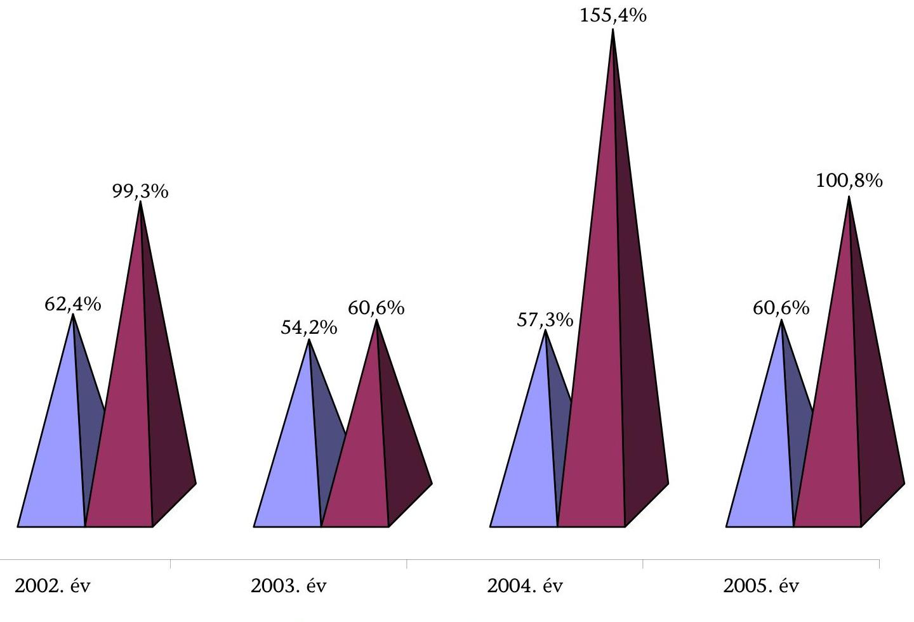

|  2002. év | 2003. év | 2004. év | 2005. év  |
| --- | --- | --- | --- |
|  99,3% | 54,2% | 60,6% | 100,8%  |

Területi szervek: ■ Központi szervek

---

# A létszámra vetített dologi és egyéb folyó kiadások relatív szórásai 

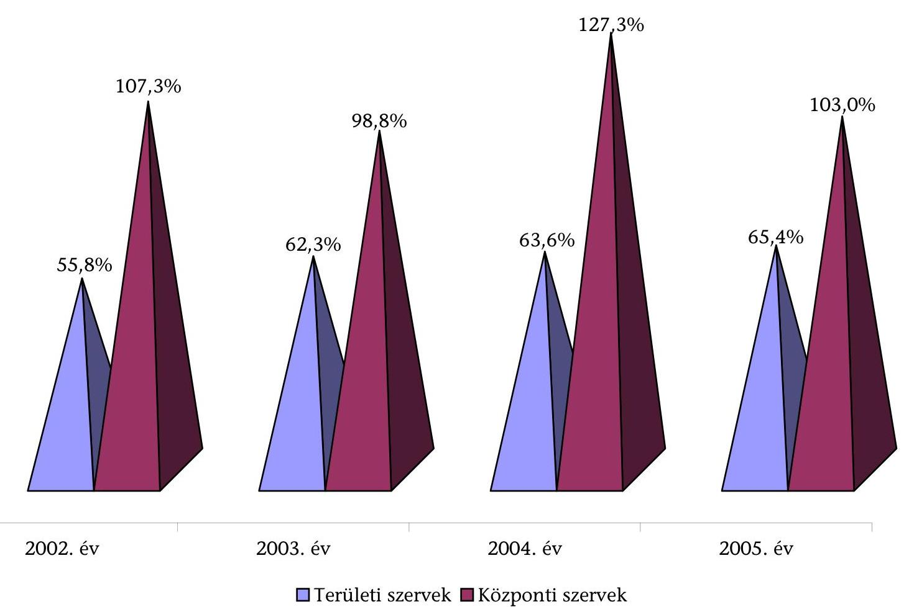

---

# A létszámra vetített felhalmozási kiadások relatív szórásai 

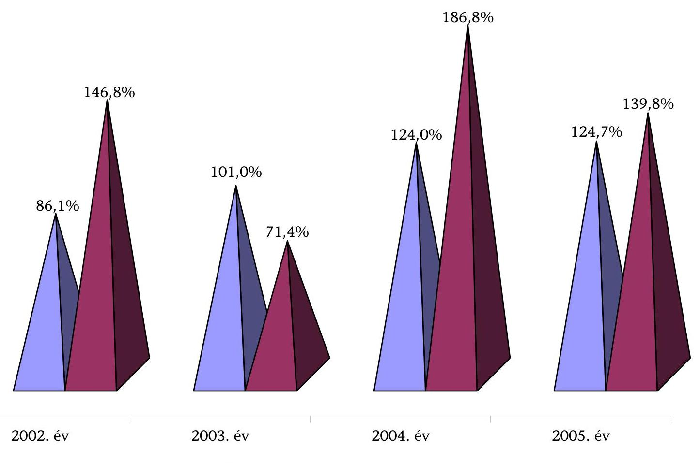

| 2002. év | 2003. év | 2004. év | 2005. év |
| :--: | :--: | :--: | :--: |
|  | - Területi szervek | - Központi szervek |  |

---

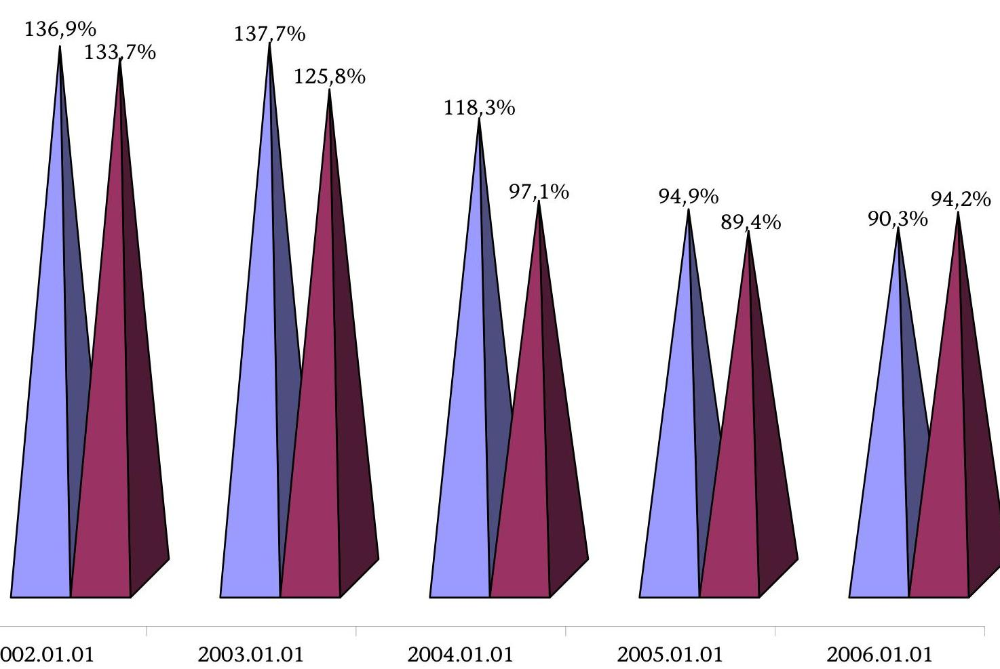

# A klimatizált irodaterületek arányának relatív szórásai

|  136.9% | 133.7% | 137.7% | 125.8% | 118.3% | 94.9% | 89.4% | 90.3% | 94.2%  |
| --- | --- | --- | --- | --- | --- | --- | --- | --- |
|  2002.01.01 | 2003.01.01 | 2004.01.01 | 2005.01.01 | 2006.01.01 |  |  |  |   |

Területi szervek: **Központi szervek**

---

# A gépek, berendezések, felszerelések átlagos nettó értéke arányában történő beszerzésének relatív szórásai 

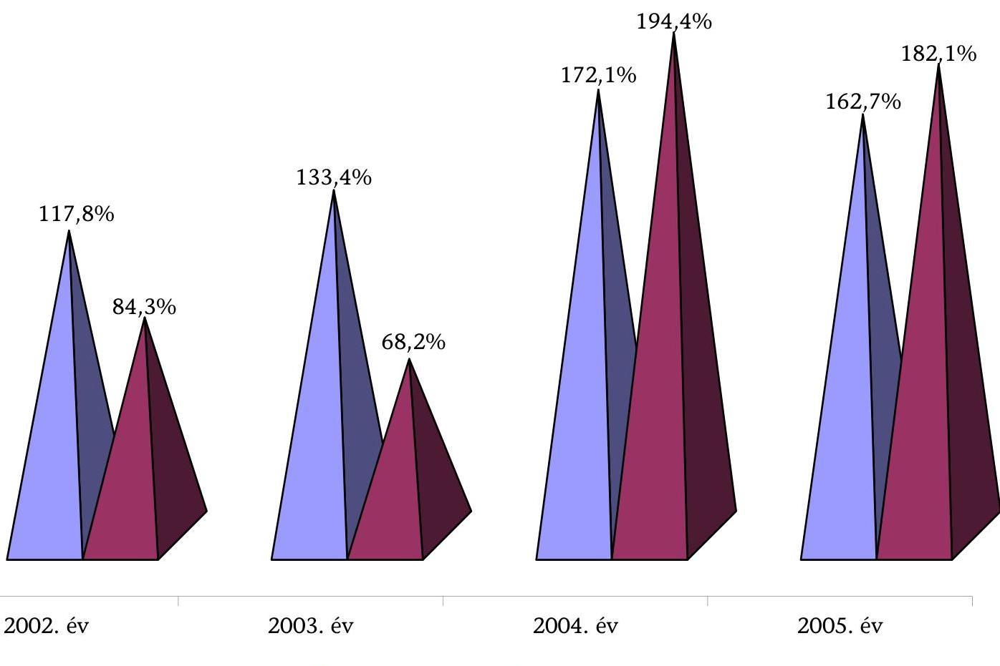

2002. év
2003. év
2004. év
2005. év
$\square$ Területi szervek $\square$ Központi szervek

---

6. sz. ábra

A gépek, berendezések, felszerelések 0-ra leírt arányának relatív szórása

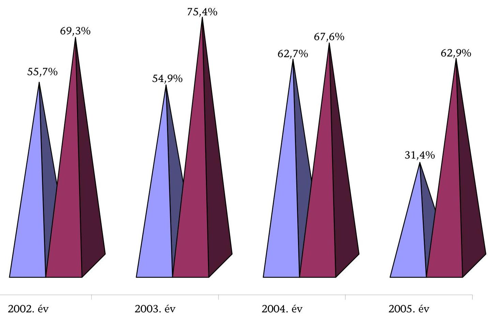

2002. év
2003. év
2004. év
2005. év

Területi szervek ■ Központi szervek

---

# Az információs és kommunikációs eszközök 0-ra leírt arányának relatív szórása

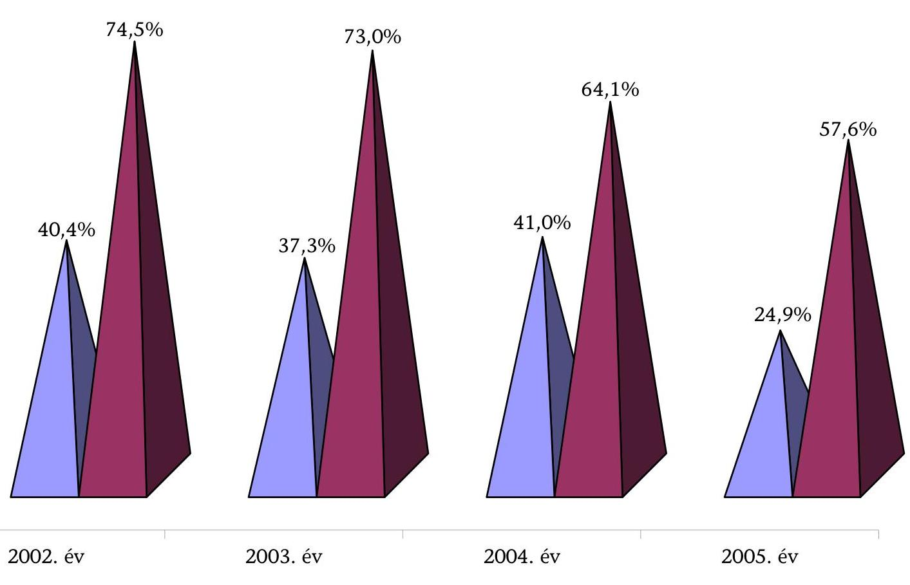

|  2002. év | 2003. év | 2004. év | 2005. év  |
| --- | --- | --- | --- |
|  74.5% | 73.0% | 64.1% | 57.6%  |

Területi szervek: ■ Központi szervek

---

# **Információs és kommunikációs szolgáltatásokra fordított létszámarányos kiadások relatív szórásai**

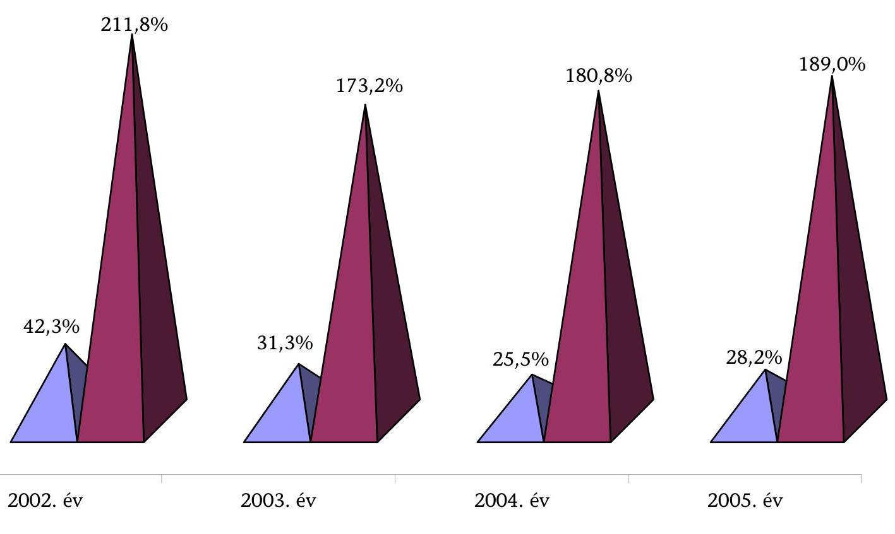

---

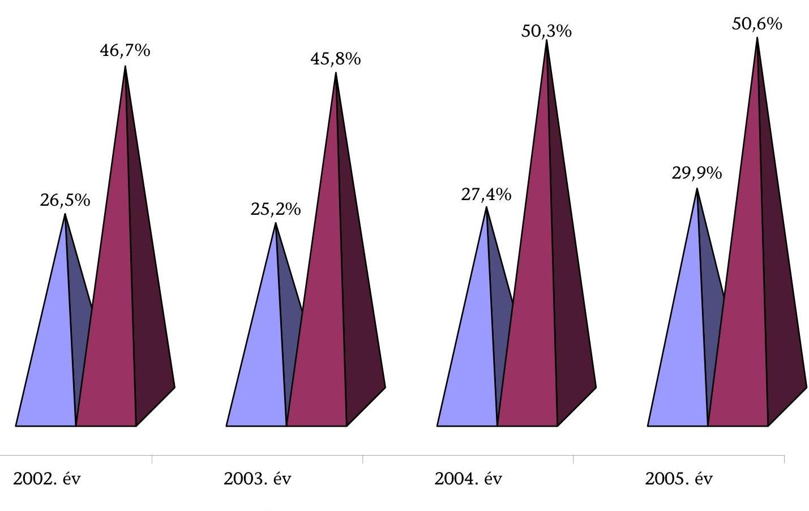

# A létszámra vetített személygépkocsi ellátottság relatív szórásai

|  Year | Területi szervek | Központi szervek  |
| --- | --- | --- |
|  2002. | 46.7% | 26.5%  |
|  2003. | 45.8% | 25.2%  |
|  2004. | 50.3% | 27.4%  |
|  2005. | 50.6% | 29.9%  |
|  2006. | 50.6% | 29.9%  |
|  2007. | 50.4% | 27.4%  |
|  2008. | 50.3% | 29.9%  |
|  2009. | 49.6% | 27.4%  |
|  2010. | 48.8% | 27.4%  |
|  2011. | 48.8% | 29.9%  |
|  2012. | 48.8% | 29.9%  |
|  2013. | 48.8% | 29.9%  |
|  2014. | 48.8% | 29.9%  |
|  2015. | 48.8% | 29.9%  |
|  2016. | 48.8% | 29.9%  |
|  2017. | 48.8% | 29.9%  |
|  2018. | 48.8% | 29.9%  |
|  2019. | 48.8% | 29.9%  |
|  2020. | 48.8% | 29.9%  |
|  2021. | 48.8% | 29.9%  |
|  2022. | 48.8% | 29.9%  |
|  2023. | 48.8% | 29.9%  |
|  2024. | 48.8% | 29.9%  |
|  2025. | 48.8% | 29.9%  |
|  2026. | 48.8% | 29.9%  |
|  2027. | 48.8% | 29.9%  |
|  2028. | 48.8% | 29.9%  |
|  2029. | 48.8% | 29.9%  |
|  2030. | 48.8% | 29.9%  |
|  2031. | 48.8% | 29.9%  |
|  2032. | 48.8% | 29.9%  |
|  2033. | 48.8% | 29.9%  |
|  2034. | 48.8% | 29.9%  |
|  2035. | 48.8% | 29.9%  |
|  2036. | 48.8% | 29.9%  |
|  2037. | 48.8% | 29.9%  |
|  2038. | 48.8% | 29.9%  |
|  2039. | 48.8% | 29.9%  |
|  2040. | 48.8% | 29.9%  |
|  2041. | 48.8% | 29.9%  |
|  2042. | 48.8% | 29.9%  |
|  2043. | 48.8% | 29.9%  |
|  2044. | 48.8% | 29.9%  |
|  2045. | 48.8% | 29.9%  |
|  2046. | 48.8% | 29.9%  |
|  2047. | 48.8% | 29.9%  |
|  2048. | 48.8% | 29.9%  |
|  2049. | 48.8% | 29.9%  |
|  2050. | 48.8% | 29.9%  |
|  2051. | 48.8% | 29.9%  |
|  2052. | 48.8% | 29.9%  |
|  2053. | 48.8% | 29.9%  |
|  2054. | 48.8% | 29.9%  |
|  2055. | 48.8% | 29.9%  |
|  2056. | 48.8% | 29.9%  |
|  2057. | 48.8% | 29.9%  |
|  2058. | 48.8% | 29.9%  |

 2059. | 48.8% | 29.9%  |
|  2060. | 48.8% | 29.9%  |
|  2061. | 48.8% | 29.9%  |
|  2062. | 48.8% | 29.9%  |
|  2063. | 48.8% | 29.9%  |
|  2064. | 48.8% | 29.9%  |
|  2065. | 48.8% | 29.9%  |
|  2066. | 48.8% | 29.9%  |
|  2067. | 48.8% | 29.9%  |
|  2068. | 48.8% | 29.9%  |
|  2069. | 48.8% | 29.9%  |
|  2070. | 48.8% | 29.9%  |
|  2071. | 48.8% | 29.9%  |
|  2072. | 48.8% | 29.9%  |
|  2073. | 48.8% | 29.9%  |
|  2074. | 48.8% | 29.9%  |
|  2075. | 48.8% | 29.9%  |
|  2076. | 48.8% | 29.9%  |
|  2077. | 48.8% | 29.9%  |
|  2078. | 48.8% | 29.9%  |
|  2079. | 48.8% | 29.9%  |
|  2080. | 48.8% | 29.9%  |
|  2081. | 48.8% | 29.9%  |
|  2082. | 48.8% | 29.9%  |
|  2083. | 48.8% | 29.9%  |
|  2084. | 48.8% | 29.9%  |
|  2085. | 48.8% | 29.9%  |
|  2086. | 48.8% | 29.9%  |
|  2087. | 48.8% | 29.9%  |
|  2088. | 48.8% | 29.9%  |
|  2089. | 48.8% | 29.9%  |
|  2090. | 48.8% | 29.9%  |
|  2091. | 48.8% | 29.9%  |
|  2092. | 48.8% | 29.9%  |
|  2093. | 48.8% | 29.9%  |
|  2094. | 48.8% | 29.9%  |
|  2095. | 48.8% | 29.9%  |
|  2096. | 48.8% | 29.9%  |
|  2097. | 48.8% | 29.9%  |
|  2098. | 48.8% | 29.9%  |
|  2099. | 48.8% | 29.9%  |
|  2010. | 48.8% | 29.9%  |
|  2011. | 48.8% | 29.9%  |
|  2012. | 48.8% | 29.9%  |
|  2013. | 48.8% | 29.9%  |
|  2014. | 48.8% | 29.9%  |
|  2015. | 48.8% | 29.9%  |
|  2016. | 48.8% | 29.9%  |
|  2017. | 48.8% | 29.9%  |
|  2018. | 48.8% | 29.9%  |
|  2019. | 48.8% | 29.9%  |
|  2020. | 48.8% | 29.9%  |
|  2021. | 48.8% | 29.9%  |
|  2022. | 48.8% | 29.9%  |
|  2023. | 48.8% | 29.9%  |
|  2024. | 48.8% | 29.9%  |
|  2025. | 48.8% | 29.9%  |
|  2026. | 48.8% | 29.9%  |
|  2027. | 48.8% | 29.9%  |
|  2028. | 48.8% | 29.9%  |
|  2029. | 48.8% | 29.9%  |
|  2030. | 48.8% | 29.9%  |
|  2031. | 48.8% | 29.9%  |
|  2032. | 48.8% | 29.9%  |
|  2033. | 48.8% | 29.9%  |
|  2034. | 48.8% | 29.9%  |
|  2035. | 48.8% | 29.9%  |
|  2036. | 48.8% | 29.9%  |
|  2037. | 48.8% | 29.9%  |
|  2038. | 48.8% | 29.9%  |
|  2039. | 48.8% | 29.9%  |
|  2040. | 48.8% | 29.9%  |
|  2041. | 48.8% | 29.9%  |
|  2042. | 48.8% | 29.9%  |
|  2043. | 48.8% | 29.9%  |
|  2044. | 48.8% | 29.9%  |
|  2045. | 48.8% | 29.9%  |
|  2046. | 48.8% | 29.9%  |
|  2047. | 48.8% | 29.9%  |
|  2048. | 48.8% | 29.9%  |
|  2049. | 48.8% | 29.9%  |
|  2050. | 48.8% | 29.9%  |
|  2051. | 48.8% | 29.9%  |
|  2052. | 48.8% | 29.9%  |
|  2053. | 48.8% | 29.9%  |
|  2054. | 48.8% | 29.9%  |
|  2055. | 48.8% | 29.9%  |
|  2056. | 48.8% | 29.9%  |
|  2057. | 48.8% | 29.9%  |
|  2058. | 48.8% | 29.9%  |
|  2059. | 48.8% | 29.9%  |
|  2060. | 48.8% | 29.9%  |
|  2061. | 48.8% | 29.9%  |
|  2062. | 48.8% | 29.9%  |
|  2063. | 48.8% | 29.9%  |
|  2064. | 48.8% | 29.9%  |
|  2065. | 48.8% | 29.9%  |
|  2066. | 48.8% | 29.9%  |
|  2067. | 48.8% | 29.9%  |
|  2068. | 48.8% | 29.9%  |
|  2069. | 48.8% | 29.9%  |
|  2070. | 48.8% | 29.9%  |
|  2071. | 48.8% | 29.9%  |
|  2072. | 48.8% | 29.9%  |
|  2073. | 48.8% | 29.9%  |
|  2074. | 48.8% | 29.9%  |
|  2075. | 48.8% | 29.9%  |
|  2076. | 48.8% | 29.9%  |
|  2077. | 48.8% | 29.9%  |
|  2078. | 48.8% | 29.9%  |
|  2079. | 48.8% | 29.9%  |
|  2080. | 48.8% | 29.9%  |
|  2081. | 48.8% | 29.9%  |
|  2082. | 48.8% | 29.9%  |
|  2083. | 48.8% | 29.9%  |
|  2084. | 48.8% | 29.9%  |
|  2085. | 48.8% | 29.9%  |
|  2086. | 48.8% | 29.9%  |
|  2087. | 48.8% | 29.9%  |
|  2088. | 48.8% | 29.9%  |
|  2089. | 48.8% | 29.9%  |
|  2090. | 48.8% | 29.9%  |
|  2091. | 48.8% | 29.9%  |
|  2092. | 48.8% | 29.9%  |
|  2093. | 48.8% | 29.9%  |
|  2094. | 48.8% | 29.9%  |
|  2095. | 48.8% | 29.9%  |
|  2096. | 48.8% | 29.9%  |
|  2097. | 48.8% | 29.9%  |
|  2098. | 48.8% | 29.9%  |
|  2099. | 48.8% | 29.9%  |
|  2090. | 48.8% | 29.9%  |
|  2091. | 48.8% | 29.9%  |
|  2092. | 48.8% | 29.9%  |
|  2093. | 48.8% | 29.9%  |
|  2094. | 48.8% | 29.9%  |
|  2095. | 48.8% | 29.9%  |
|  2096. | 48.8% | 29.9%  |
|  2097. | 48.8% | 29.9%  |
|  2098. | 48.8% | 29.9%  |
|  2099. | 48.8% | 29.9%  |
|  2090. | 48.8% | 29.9%  |
|  2091. | 48.8% | 29.9%  |
|  2092. | 48.8% | 29.9%  |
|  2093. | 48.8% | 29.9%  |
|  2094. | 48.8% | 29.9%  |
|  2095. | 48.8% | 29.9%  |
|  2096. | 48.8% | 29.9%  |
|  2097. | 48.8% | 29.9%  |
|  2098. | 48.8% | 29.9%  |
|  2099. | 48.8% | 29.9%  |
|  2090. | 48.8% | 29.9%  |
|  2091. | 48.8% | 29.9%  |
|  2092. | 48.8% | 29.9%  |
|  2093. | 48.8% | 29.9%  |
|  2094. | 48.8% | 29.9%  |
|  2095. | 48.8% | 29.9%  |
|  2096. | 48.8% | 29.9%  |
|  2097. | 48.8% | 29.9%  |
|  2098. | 48.8% | 29.9%  |
|  2099. | 48.8% | 29.9%  |
|  2090. | 48.8% | 29.9%  |
|  2091. | 48.8% | 29.9%  |
|  2092. | 48.8% | 29.9%  |
|  2093. | 48.8% | 29.9%  |
|  2094. | 48.8% | 29.9%  |
|  2095. | 48.8% | 29.9%  |
|  2096. | 48.8% | 29.9%  |
|  2097. | 48.8% | 29.9%  |
|  2098. | 48.8% | 29.9%  |
|

 2099. | 48.8% | 29.9%  |
|  2090. | 48.8% | 29.9%  |
|  2091. | 48.8% | 29.9%  |
|  2092. | 48.8% | 29.9%  |
|  2093. | 48.8% | 29.9%  |
|  2094. | 48.8% | 29.9%  |
|  2095. | 48.8% | 29.9%  |
|  2096. | 48.8% | 29.9%  |
|  2097. | 48.8% | 29.9%  |
|  2098. | 48.8% | 29.9%  |
|  2099. | 48.8% | 29.9%  |
|  2090. | 48.8% | 29.9%  |
|  2091. | 48.8% | 29.9%  |
|  2092. | 48.8% | 29.9%  |
|  2093. | 48.8% | 29.9%  |
|  2094. | 48.8% | 29.9%  |
|  2095. | 48.8% | 29.9%  |
|  2096. | 48.8% | 29.9%  |
|  2097. | 48.8% | 29.9%  |
|  2098. | 48.8% | 29.9%  |
|  2099. | 48.8% | 29.9%  |
|  2090. | 48.8% | 29.9%  |
|  2091. | 48.8% | 29.9%  |
|  2092. | 48.8% | 29.9%  |
|  2093. | 48.8% | 29.9%  |
|  2094. | 48.8% | 29.9%  |
|  2095. | 48.8% | 29.9%  |
|  2096. | 48.8% | 29.9%  |
|  2097. | 48.8% | 29.9%  |
|  2098. | 48.8% | 29.9%  |
|  2099. | 48.8% | 29.9%  |
|  2090. | 48.8% | 29.9%  |
|  2091. | 48.8% | 29.9%  |
|  2092. | 48.8% | 29.9%  |
|  2093. | 48.8% | 29.9%  |
|  2094. | 48.8% | 29.9%  |
|  2095. | 48.8% | 29.9%  |
|  2096. | 48.8% | 29.9%  |
|  2097. | 48.8% | 29.9%  |
|  2098. | 48.8% | 29.9%  |
|  2099. | 48.8% | 29.9%  |
|  2090. | 48.8% | 29.9%  |
|  2091. | 48.8% | 29.9%  |
|  2092. | 48.8% | 29.9%  |
|  2093. | 48.8% | 29.9%  |
|  2094. | 48.8% | 29.9%  |
|  2095. | 48.8% | 29.9%  |
|  2096. | 48.8% | 29.9%  |
|  2097. | 48.8% | 29.9%  |
|  2098. | 48.8% | 29.9%  |
|  2099. | 48.8% | 29.9%  |
|  2090. | 48.8% | 29.9%  |
|  2091. | 48.8% | 29.9%  |
|  2092. | 48.8% | 29.9%  |
|  2093. | 48.8% | 29.9%  |
|  2094. | 48.8% | 29.9%  |
|  2095. | 48.8% | 29.9%  |
|  2096. | 48.8% | 29.9%  |
|  2097. | 48.8% | 29.9%  |
|  2098. | 48.8% | 29.9%  |
|  2099. | 48.8% | 29.9%  |
|  2099. | 48.8% | 29.9%  |
|  2090. | 48.8% | 29.9%  |
|  2091. | 48.8% | 29.9%  |
|  2092. | 48.8% | 29.9%  |
|  2093. | 48.8% | 29.9%  |
|  2094. | 48.8% | 29.9%  |
|  2095. | 48.8% | 29.9%  |
|  2096. | 48.8% | 29.9%  |
|  2097. | 48.8% | 29.9%  |
|  2098. | 48.8% | 29.9%  |
|  2099. | 48.8% | 29.9%  |
|  2099. | 48.8% | 29.9%  |
|  2090. | 48.8% | 29.9%  |
|  2091. | 48.8% | 29.9%  |
|  2092. | 48.8% | 29.9%  |
|  2093. | 48.8% | 29.9%  |
|  2094. | 48.8% | 29.9%  |
|  2095. | 48.8% | 29.9%  |
|  2096. | 48.8% | 29.9%  |
|  2097. | 48.8% | 29.9%  |
|  2098. | 48.8% | 29.9%  |
|  2099. | 48.8% | 29.9%  |
|  2099. | 48.8% | 29.9%  |
|  2099. | 48.8% | 29.9%  |
|  2099. | 48.8% | 29.9%  |
|  2099. | 48.8% | 29.9%  |
|  2090. | 48.8% | 29.9%  |
|  2099. | 48.8% | 29.9%  |
|  2091. | 48.8% | 29.9%  |
|  2099. | 48.8% | 29.9%  |
|  2091. | 48.8% | 29.9%  |
|  2092. | 48.8% | 29.9%  |
|  2099. | 48.8% | 29.9%  |
|  2099. | 48.8% | 29.9%  |
|  2092. | 48.8% | 29.9%  |
|  2093. | 48.8% | 29.9%  |
|  2099. | 48.8% | 29.9%  |
|  2094. | 48.8% | 29.9%  |
|  2099. | 48.8% | 29.9%  |
|  2099. | 48.8% | 29.9%  |
|  2099. | 48.8% | 29.9%  |
|  2099. | 48.8% | 29.9%  |
|  2099. | 48.8% | 29.9%  |
|  2099. | 48.8% | 29.9%  |
|  2099. | 48.8% | 29.9%  |
|  2099. | 48.8% | 29.9%  |
|  2099. | 48.8% | 29.9%  |
|  2099. | 48.8% | 29.9%  |
|  2099. | 48.8% | 29.9%  |
|  2099. | 48.8% | 29.9%  |
|  2099. | 48.8% | 29.9%  |
|  2099. | 48.8% | 29.9%  |
|  2099. | 48.8% | 29.9%  |
|  2099. | 48.8% | 29.9%  |
|  2099. | 48.8% | 29.9%  |
|  2099. | 48.8% | 29.9%  |
|  2099. | 48.8% | 29.9%  |
|  2099. | 48.8% | 29.9%  |
|  2099. | 48.8% | 29.9%  |
|  2099. | 48.8% | 29.9%  |
|  2099. | 48.8% | 29.9%  |
|  2099. | 48.8% | 29.9%  |
|  2099. | 48.8% | 29.9%  |
|  2099. | 48.8% | 29.9%  |
|  2099. | 48.8% | 29.9%  |
|  2099. | 48.8% | 29.9%  |
|  2099. | 48.8% | 29.9%  |
|  2099. | 48.8% | 29.9%  |
|  2099. | 48.8% | 29.9%  |
|  2099. | 48.8% | 29.9%  |
---

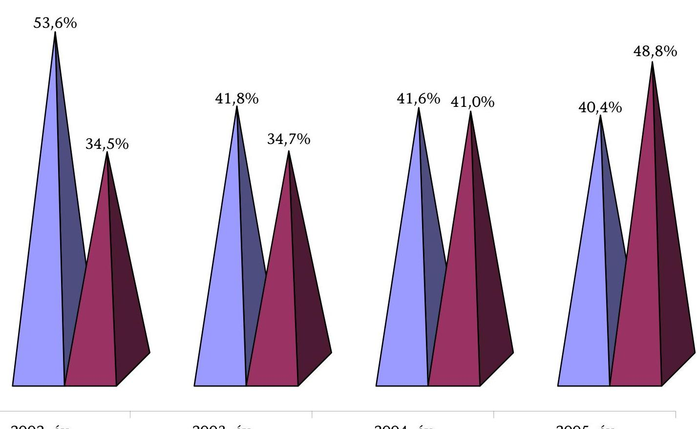

# A személygépjárművek használhatósági fokának relatív szórásai

|  Térületi szervek | Központi szervek  |
| --- | --- |
|  53.6% | 41.8%  |
|  34.5% | 34.7%  |
|  2002. év | 41.8%  |
|  2003. év | 41.6%  |
|  2004. év | 41.0%  |
|  2005. év | 48.8%  |

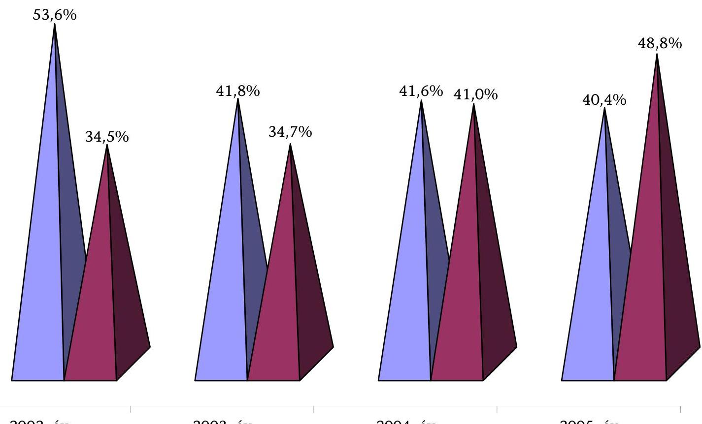

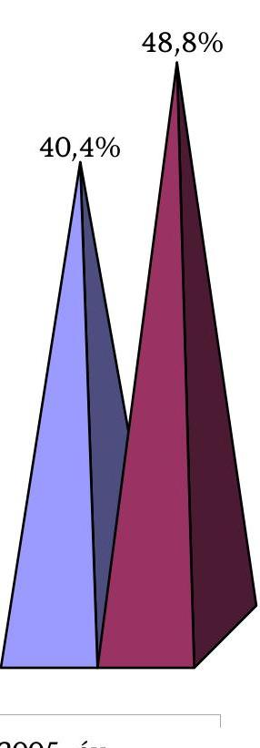

---

FÜGGELÉK

---

# Az elhelyezési körülmények egyes jellemzői a helyszíni ellenőrzés időszakában (2006. május - június) 

Az intézmények döntően saját kezelésben lévő épületben működnek, legjellemzőbb ez azokra, amelyeket alig érintettek az átszervezések, összevonások, más fejezethez sorolások.

A Külügyminisztérium három, egymáshoz közel fekvő, a vagyonkezelésében lévő épületben működött.

A Pénzügyminisztérium már több évtizede ugyanazt az épületet egyetlen szervezetként használja.

Az Oktatási Minisztérium is több éve egy belvárosi, saját kezelésű épületben működött, amelyben még 5 intézmény is funkcionált.

A Nemzeti Kulturális Örökségvédelmi Minisztérium a 2231/1998. (X. 30.) Korm. határozat alapján kapott épületbe a teljes felújítást követően 1999 novemberében költözött be, mely mellett további három létesítményt is igénybe vett. A minisztérium bérleményeinek száma az egyházi kapcsolatok államtitkárságának visszakerülése után háromra emelkedett.

Az államtitkárság korábban is bérleményben végezte tevékenységét, ezt a bérleményt vette át a NKÖM.

A Honvédelmi Minisztériumnak évtizedek óta három telephelyen öt saját épülete volt, bérleménnyel nem rendelkezett.

Az Földművelésügyi és Vidékfejlesztési Minisztérium évek óta a kezelésében lévő egy ingatlanban működött, vendégházzal és garázzsal is rendelkezett.

Az Országos Nyugdíjbiztosítási Főigazgatóság 1996-tól működött az általa kizárólagosan használt épületben.

A Belügyminisztérium hat saját ingatlannal rendelkezett.
Az ellenőrzött időszakban létrehozott vagy átszervezett, összevont, többletfeladatot ellátó minisztériumok elhelyezését a legtöbb esetben megfelelően rendezték. Ugyanakkor előfordult nem kellően átgondolt, illetve elhúzódó, rendezetlen elhelyezés is.

Az Foglalkoztatáspolitikai és Munkaügyi Minisztérium elhelyezéséről kormányhatározat rendelkezett 2002-ben, megnyugtató elhelyezése, a kijelölt épületek használata azonban 2006-ig nem valósult meg. Az FMM vagyonkezelésében lévő épülettel nem rendelkezett.

---

A Kormány 2251/2002. (VIII. 29.) határozatában az FMM elhelyezésére a Bp. V. Kálmán Imre u. 2. szám alatti épületet jelölte ki. A kormányhatározatban foglaltakkal ellentétes kormánydöntés után az FMM teljes felső vezetése és munkatársainak egy része az V. Alkotmány u. 3. szám alatti épületbe költözött 2002. szeptember végén. A második ütemben az FMM többi munkatársa a kormányhatározatban megjelölt Kálmán Imre u. 2. sz. alatti épületbe költözött, melyet közösen használtak a GKM-mel. A Korm. határozat nem intézkedett az FMM által elfoglalt épületek vagyonkezelői jogának átadásáról sem.

A Foglalkoztatási Hivatalnál a többletfeladatok elrendelésekor nem biztosítottak ingatlanokat, az elhelyezést bérleményekkel oldották meg. A bérlemények területének aránya folyamatosan emelkedett (38\%-ról 78\%-ra), 2004-től közel kétszerese volt az átlagosnak.

A Környezetvédelmi és Vízügyi Minisztériumhoz tartozó ingatlanok száma 2006-ra néggyel emelkedett, mivel a 276/2005. (XII. 20.) Korm. rendelet a megszűnő Országos Környezetvédelmi, Természetvédelmi és Vízügyi Főigazgatóság (OKTVF) jogutódjaként a teljes vagyont érintően a KvVM-et jelölte meg.

A KvVM a tevékenységét három saját épületben és három bérleményben látta el. A bérlemények alapterülete $108 \mathrm{~m}^{2}$-rel emelkedett. Nem igazgatási feladatok ellátására szolgált az $1357 \mathrm{~m}^{2}$ alapterületű Szófia utcai bérlemény, mely a Környezetgazdálkodási Intézet 2004. márciusi megszűnésétől elsősorban irattári funkciót látott el, nagyobb részben üresen állt. A további albérletbe adási kísérletek sikertelenek voltak. A határozott időre kötött bérleti szerződés (lejárati ideje 2009. április) szerint az ingatlan csak könyvtár, olvasóterem és iroda céljára volt használható.

Az Egészségügyi Szociális és Családügyi Minisztérium szétválásának végrehajtása során 2004. októberében megállapodásban rögzítették, hogy az egészségügyi feladatokat ellátó állományából 103 fő kerül át a kapcsolódó bevételi és kiadási előirányzatokkal az Ifjúsági, Családügyi, Szociális és Esélyegyenlőségi Minisztériumhoz, valamint az Akadémia utcai székház vagyonkezelői jogát az abban található vagyontárgyakkal térítésmentesen adják át az ICSSZEM-nek.

A Központi Statisztikai Hivatal szervezete alapvetően megváltozott 2005. január 1-től, a megyei igazgatóságok helyett

 régiók jöttek létre.

Két cím összevonásra került, a megyei igazgatóságok helyett 6 területi szervezeti egység - régiónként egy - jött létre, amelyek önálló jogi személyiséggel nem rendelkező részjogkörű költségvetési szervek lettek.

Az átszervezések következtében az engedélyezett létszám 174 fővel csökkent, továbbá távmunkahelyeket is kialakítottak. Az átszervezés során megvalósult a budapesti székhelyű szervezeti egységek koncentrált elhelyezése. Ennek érdekében az egyik saját kezelésű - Angol utcai - ingatlant értékesítették, az ott működő szervezeteket, intézményeket a már korábban is használt Andor utcai irodákban - bérelt területen - helyezték el. A Hivatalnál - a területi szervekkel együtt - a saját ingatlanok száma 2005-ben a megyei igazgatóságok integrálódásával 26-ra emelkedett.

---

A KSH Angol utcai ingatlanértékesítésből származó bevételének visszahagyását kérte a PM-től, melyre engedélyt is kapott azzal a céllal, hogy az Andor utcában bérelt területek egy részét meg tudja vásárolni, csökkentve ezzel a tartós kiadásainak mértékét.

A Miniszterelnöki Hivatal és intézményei 3 saját ingatlan mellett további 4-8 darab bérelt ingatlanban kerültek elhelyezésre. A bérlemények közül 2 tartósan a KSzF elhelyezését szolgálta.

A bérlemények száma folyamatosan változott, de arányuk a munkavégzés céljára szolgáló teljes alapterületen belül nem haladta meg a 20%-ot.

Az emelkedő magas bérleti díjak megtakarítására a Kincstár és a KSH tett intézkedéseket.

A Kincstár Központ 2004-ig feladatait egy épületben látta el, (Deák Ferenc utca) amelyet bérlemény címén használt. A központi szervezet Deák Ferenc utcai bérelt ingatlanban való elhelyezése évről-évre nagyobb kiadást jelentett (2003-ban már 34 M Ft-ot) havonta. A Kincstár 2003. szeptember 11-én kelt levelében 2004. március 31-ei hatállyal felmondta egy Kft-vel kötött bérleti megállapodását, továbbá megkezdték az előkészületeket a Budapest, V. Hold utca 4. szám alatt lévő irodaházba és a Budapest, V. Szabadság tér 10-11. szám alatt lévő lakóház megjelölésű saját kezelésű ingatlanba való áthelyezés lebonyolításával kapcsolatban. Az ingatlanok használatát a 2004. I. félévében kezdték meg.

A műemlék épületeknél a komfortosabb elhelyezés feltételeinek kialakítását, az átalakításokat nehezítették, megdrágították a műemlékvédelmi előírások.

A BM-nél 2 épület műemlék volt, a Világörökség részét képezi. Az elhelyezési feltételek az épületeken belül rendkívül eltérőek voltak. A műemléképületeket eredetileg pénzintézeti használatra tervezték, a 2002-ben befejeződött rehabilitáció következtében az itt található egyes irodahelyiségek területe 15-20%-kal meghaladta a többi épületben található helyiségek területét.

A PM műemlék épületének alapterülete különösen nagy (25,7 ezer $\mathrm{m}^{2}$) volt. Az alapterületből a hasznos irodaterület aránya mindössze 40%-ot tett ki, ez még az irodai munkavégzés szempontjából kedvezőtlen elhelyezésű épületek viszonylatában is alacsony. A nagy átlagos belmagasság miatt - 2,7-5,0 m - kb. 16-18%-ot tett ki a használhatóság szempontjából „felesleges", de pótlólagos költséggel járó légköbméter.

A KSH-nál a munkavégzés feltételeinek kialakítását nehezítette és drágította az épület állaga, helyi védettsége. A műemlék jellegből adódóan kötött az épület felújítása, beruházása, magas volt a fűtési, világítási költség, a nagyobb légtér miatt nagyobb teljesítményű klímákat kellett beszerelni.

Az elhelyezési körülmények, feltételek sajátosan alakultak azoknál a szervezeteknél, intézményeknél, ahol az ügyfélforgalom követelményeit is ki kell elégíteni, így a Kincstár, OEP, ONYF és a munkaügyi központok fővárosi központjaiban és vidéki szervezeteinél.

A rendelkezésre álló alapterület a létszámra vetítve 17,4 és $51,8 \mathrm{~m}^{2} /$ fő között mozgott, ami a tárcák átlagához viszonyítva ($32-34 \mathrm{~m}^{2} /$ fő) lényegében 50%-os

---

eltérés mindkét irányban. A Kincstár, az OEP és az ONYF központi szervei rendelkeznek saját épülettel. Amennyiben a feladatellátás szükségessé tette, (pl.: OEP) bérleményt is igénybe vettek. A bérelt irodahelyiségek aránya nem haladta meg a 20%-ot. Kedvezőnek ítélhető, hogy a vidéki intézmények elhelyezését többnyire saját tulajdonú épületben tudták megoldani.

A munkavégzés szempontjából szintén jó feltételeket jelentett, hogy a vidéki szervezeti egységek, - néhány kivétellel (pl.: Vas megyei Kincstár Igazgatóság) egy épületen belül nyertek elhelyezést. Négy intézmény vidéki kirendeltségeinél az egy főre jutó alapterület a vizsgált években nem változott alapvetően, és a különbségek sem változtak jelentősen. [pl.: Vas megyében 2006. január 1-én az egy főre jutó alapterület legmagasabb a Kincstár Igazgatóságnál volt ($39,4 \mathrm{~m}^{2} / \mathrm{fő}$), legalacsonyabb pedig a MEP korrigált értéke ($21,5 \mathrm{~m}^{2} / \mathrm{fő}$) volt.]

A megyei szervezetek építészetileg eltérő adottságú épületei ellenére - van köztük műemlék és 2003. évben épült is - jó elhelyezési körülményeket biztosítanak.

Az intézményeknél a bérlemények kiválasztásánál elsődleges szempont volt a saját ingatlan közelében való elhelyezkedés. A bérlemények komfortja, színvonala eltérő volt, melyet részben a használat célja is befolyásolt. A bérlemények igénybevétele a legtöbb intézménynél nehezítette a szervezetek közötti kapcsolattartást, információáramlást, növelte a telefon és informatikai költségeket, szállítási kiadásokat.

Az EüM bérleményében - $374 \mathrm{~m}^{2}$-en - öt iroda és a pinceszinten raktárak voltak találhatók. Az irodák sötétek, szűkösek, nem klimatizáltak voltak, amit csak részmunkaidőben foglalkoztatott dolgozók használtak.

Az FMM-nél az elhelyezés gondjai végigkísérték a négy évet. Jelenleg a minisztérium hat épületben működött, a bérleti és üzemeltetési költségek több, mint kétszeresre emelkedtek. A Datanet költségek a Hungária krt-i elhelyezés miatt 2003-2005-ig évente 93 E Ft/hó, a Matáv költségek a Báthori és Honvéd u-i bérlemények miatt 2004-ben 129 E Ft/hó, 2005-ben 493 E Ft/hó többletkiadást okoztak.

Az FH a központi épület közelében alapvetően az országos munkaügyi hálózat központjaként is funkcionáló számítógépközpont elhelyezésére, működtetésére bérelt korszerű, klimatizált irodákat.

A saját kezelésű épületek felújítási lehetőségénél kedvezőbb helyzetben voltak azok az intézmények, amelyek még a takarékossági intézkedések bevezetése előtt tudtak forrást biztosítani a meglévő vagy használatba kapott épületekre.

A KüM a vagyonkezelésében lévő három épületét folyamatosan újította fel, a kormányzati megszorító intézkedések alapvetően nem érintették a beruházási, felújítási lehetőségeket. A felújításnál figyelembe vették a biztonsági előírásokat, és a kényelmi szempontokat is. Az épületek, irodák fűtő-hűtő rendszerű légkondicionálással felszereltek voltak, valamennyiben füst- és mozgásérzékelő rendszer működött. A mozgáskorlátozottak bejárását, közlekedését is biztosították.
2006. november
