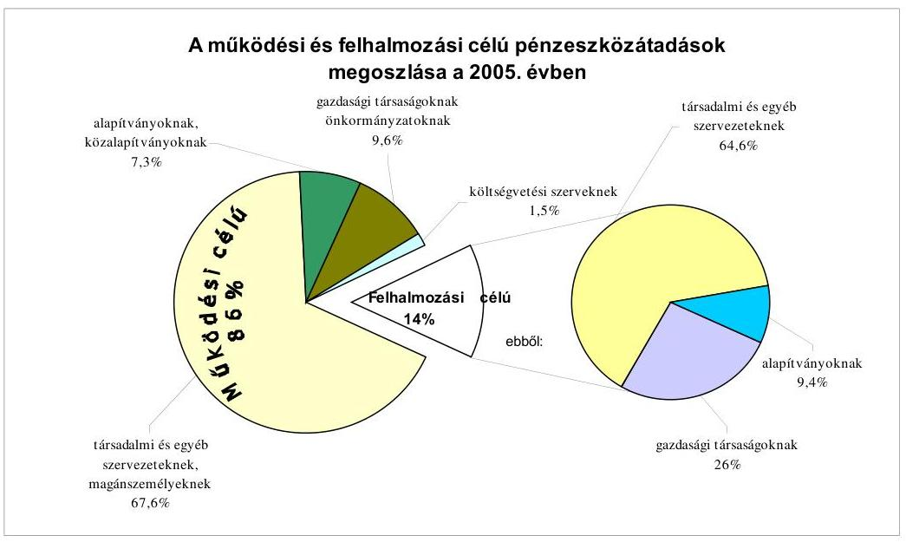
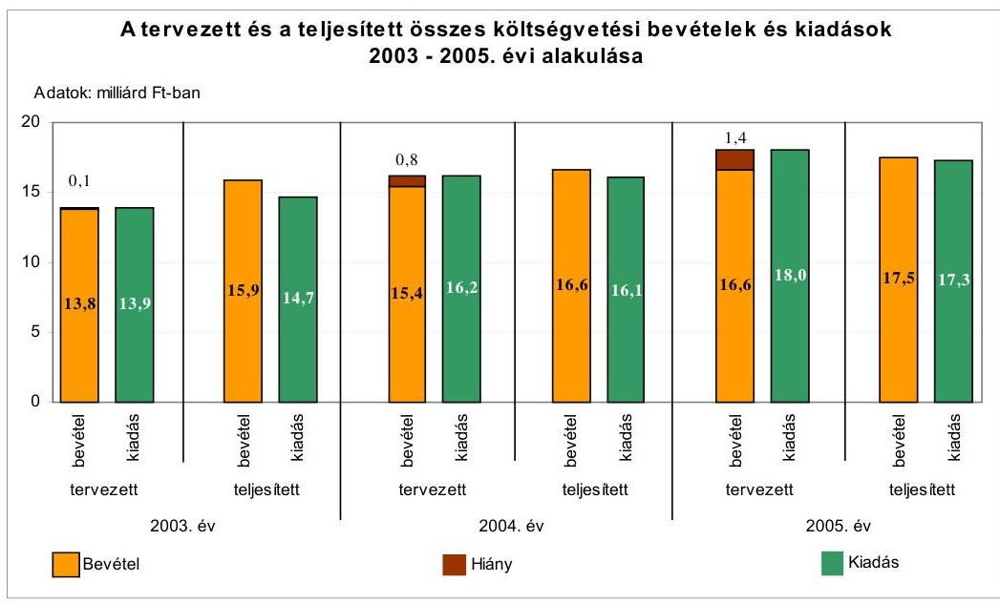
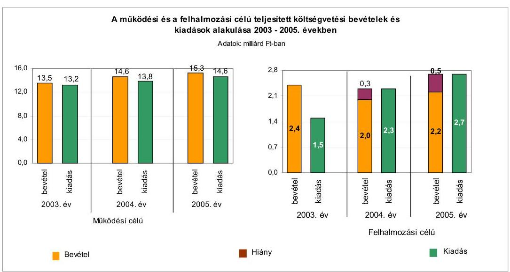
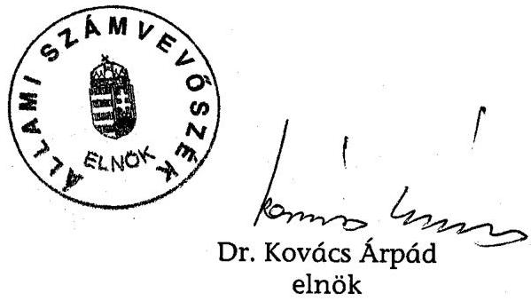
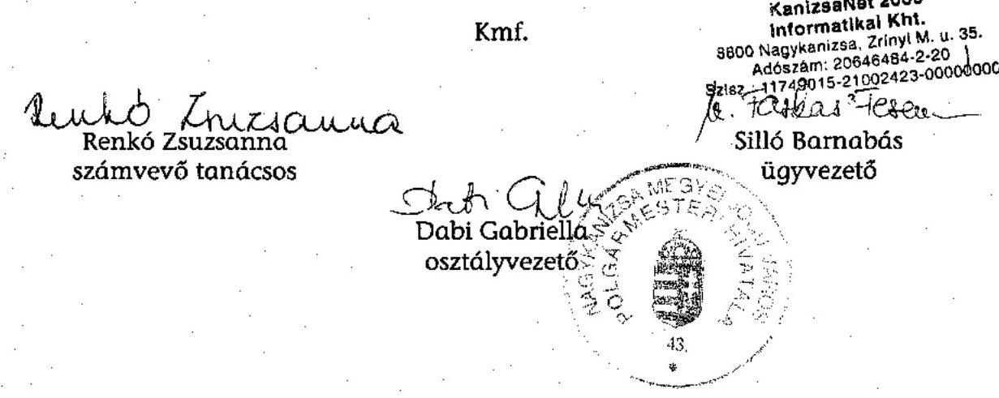
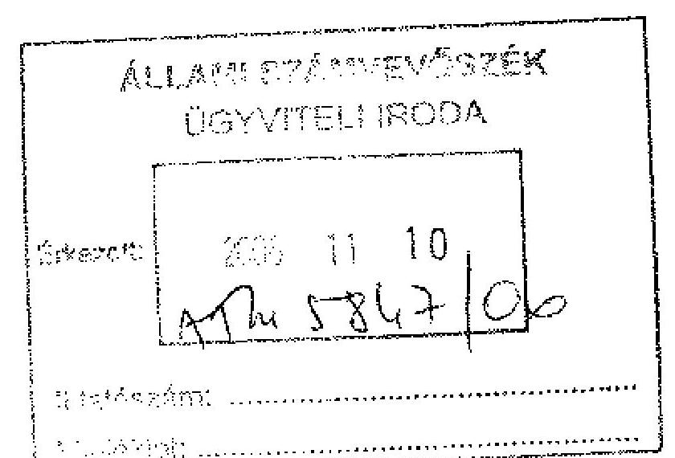
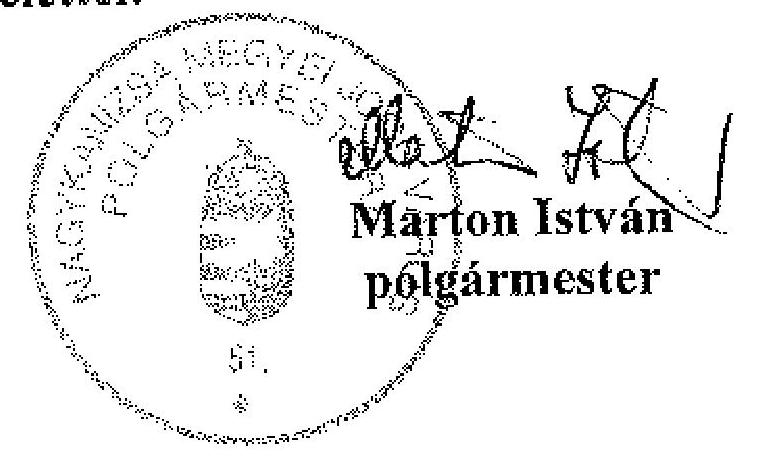

# ÁLLAMI   SZÁMVEVŐSZÉK 

## JELENTÉS

a Nagykanizsa Megyei Jogú Város Önkormányzata gazdálkodási rendszerének 2006. évi átfogó ellenőrzéséről

---

# 3. Önkormányzati és Területi Ellenőrzési Igazgatóság 

3.3. Átfogó Ellenőrzések Főcsoport

Iktatószám: V-1003-5/27/25/2006.
Témaszám: 803
Vizsgálat-azonosító szám: V0273

## Az ellenőrzést felügyelte:

Dr. Lóránt Zoltán
főigazgató
Az ellenőrzés végrehajtásáért felelős:
Dr. Sepsey Tamás
főigazgató-helyettes
Az ellenőrzést vezette:
Csecserits Imréné
főcsoportfőnök-helyettes
Az ellenőrzést végezték:
Dér Lívia
Számvevő tanácsos

Köcse Istvánné
főtanácsadó

Renkó Zsuzsanna
számvevő tanácsos

## A témához kapcsolódó - elmúlt három évben - készített számvevőszéki jelentések:

## címe

Jelentés a helyi és a helyi kisebbségi önkormányzatok gazdálkodásának átfogó ellenőrzéséről
Jelentés a települési önkormányzatok szennyvízközmű fejlesztési és működtetési feladatai ellátásnak vizsgálatáról
Jelentés a köztemetők fenntartásának ellenőrzéséről 0156
Jelentés a Magyar Köztársaság 2004. évi költségvetése végrehajtásának ellenőrzéséről
Függelék:

- A helyi önkormányzatokat a 2004. évben megillető normatív állami hozzájárulás elszámolása
-Normatív kötött felhasználású támogatások
- A helyi önkormányzatok beruházásaihoz és rekonstrukcióihoz nyújtott 2004. évi felhalmozási célú támogatások

---

# TARTALOMJEGYZÉK 

BEVEZETÉS ..... 5
I. ÖSSZEGZŐ MEGÁLLAPÍTÁSOK, KÖVETKEZTETÉSEK, JAVASLATOK ..... 7
II. RÉSZLETES MEGÁLLAPÍTÁSOK ..... 18

1. A költségvetés tervezésének, végrehajtásának, az Önkormányzat vagyongazdálkodásának és a zárszámadás elkészítésének szabályszerűsége ..... 18
1.1. A költségvetési rendelet jóváhagyásának, módosításának, az előirányzatok nyilvántartásának szabályszerűsége ..... 18
1.2. A gazdálkodás szabályozottsága, a bizonylati rend és fegyelem szabályszerűsége ..... 26
1.3. A pénzügyi-számviteli feladatok ellátásának informatikai támogatottsága ..... 36
1.4. Az önkormányzati vagyon nyilvántartása, számbavétele ..... 38
1.5. A vagyonnal való gazdálkodás szabályszerűsége, célszerűsége, nyilvánossága ..... 40
1.6. A céljelleggel nyújtott támogatások szabályszerűsége ..... 47
1.7. A közbeszerzési eljárások szabályszerűsége ..... 50
1.8. A zárszámadási kötelezettség teljesítésének szabályszerűsége ..... 54
1.9. A Polgármesteri hivatal helyi kisebbségi önkormányzatok gazdálkodását segítő tevékenysége ..... 57
2. Az önkormányzati feladatok és a rendelkezésre álló források összhangja ..... 59
2.1. A feladatok meghatározása és szervezeti keretei ..... 59
2.2. A költségvetés egyensúlyának helyzete ..... 62
2.3. A feladatok finanszírozása ..... 68
3. A belső ellenőrzési rendszer működésének értékelése ..... 71
3.1. Az ellenőrzési rendszer kialakítása, működése ..... 71
3.2. A könyvvizsgálati kötelezettség teljesítése ..... 74
3.3. A korábbi számvevőszéki ellenőrzések javaslatainak hasznosulása ..... 75

---

# MELLÉKLETEK 

1. számú Az Önkormányzat gazdálkodását meghatározó adatok, mutatószámok (1 oldal)
2. számú Az önkormányzati vagyon nagyságának alakulása (1 oldal)
3. számú Az Önkormányzat 2005. évi bevételeinek és kiadásainak alakulása (1 oldal)
4. számú Egyes önkormányzati feladatok finanszírozása (1 oldal)
5. számú Helyszíni ellenőrzési jegyzőkönyv (3 oldal)
6. számú Marton István úr, Nagykanizsa Megyei Jogú Város Önkormányzata polgármesterének észrevétele (1 oldal)

---

# RÖVIDÍTÉSEK JEGYZÉKE 

## Törvények

Áht.
Fot.

Hatv.
Htv.

Kbt.
Közokt. tv.
Ksztv.
Nek. tv.

Ötv.
Számv. tv.

## Rendeletek

Ámr.
Ber.
Kisebbségi kormányren-
delet
SzMSz
$\mathrm{SzMSz}_{2}$
vagyongazdálkodási rendelet

Vhr.

## Szórövidítések

СКÖ
Egészségügyi Intézmény
Egyesített bölcsőde
FEUVE
Gazdálkodási osztály
az államháztartásról szóló 1992. évi XXXVIII. törvény
a fogyatékos személyek jogairól és esélyegyenlőségük biztosításáról szóló 1998. évi XXVI. törvény
a helyi adókról szóló 1990. évi C. törvény
a helyi önkormányzatok és szerveik, a köztársasági megbízottak, valamint egyes centrális alárendeltségű szervek feladat- és hatásköreiről szóló 1991. évi XX. törvény
a közbeszerzésekről szóló 2003. évi CXXIX. törvény
a közoktatásról szóló 1993. évi LXXIX. törvény
a közhasznú szervezetekről szóló 1997. évi CLVI. törvény
a nemzeti és etnikai kisebbségek jogairól szóló 1993. évi LXXVII. törvény
a helyi önkormányzatokról szóló 1990. évi LXV. törvény
a számvitelről szóló 2000. évi C. törvény
az államháztartás múködési rendjéről szóló 217/1998. (XII. 30.) Korm. rendelet
a költségvetési szervek belső ellenőrzéséről szóló 193/2003. (XI. 26.) Korm. rendelet
a kisebbségi önkormányzatok költségvetésének, gazdálkodásának, vagyonjuttatásának egyes kérdéseiről szóló 20/1995. (III. 3.) Korm. rendelet
Nagykanizsa Megyei Jogú Város Önkormányzatának 26/2003. (IV. 23.) számú rendelete a Szervezeti és Múködési Szabályzatáról
Nagykanizsa Megyei Jogú Város Önkormányzatának 32/2006. (VI. 30.) számú rendelete a Szervezeti és Múködési Szabályzatáról szóló 26/2003. (IV. 23.) számú rendelet módosításáról
Nagykanizsa Megyei Jogú Város Önkormányzatának 10/2003. (II. 26.) számú rendelete az Önkormányzat vagyonáról, a vagyongazdálkodás szabályairól és a tulajdonosi jogok gyakorlásáról
az államháztartás szervezetei beszámolási és könyvvezetési kötelezettségének sajátosságairól szóló 249/2000. (XII. 24.) Korm. rendelet

Nagykanizsa Megyei Jogú Város Cigány Kisebbségi Önkormányzata
Egészségügyi Alapellátási Intézmény Nagykanizsa
Egyesített Bölcsőde Nagykanizsa
folyamatba épített, előzetes és utólagos vezetői ellenőrzés
Nagykanizsa Megyei Jogú Város Önkormányzata Polgármesteri Hivatalának Gazdálkodási Osztálya

---

gazdálkodási szabály$\mathrm{zat}_{1}$
gazdálkodási szabály$\mathrm{zat}_{2}$

Gazdasági bizottság
HKÖ
IKI
jegyzó
KanizsaNet Kht.
Kincstár
Kistérségi társulás
Kontrolling osztály
Kórház
Közgyúlés
Múvelődési Ház
Pénzügyi bizottság
polgármester
Polgármesteri hivatal
$\mathrm{SzMSz}_{1}$

SzOSz

Szociális bizottság
Üzemeltetési Iroda
a polgármester 229/2004/1. (I. 13.) számú utasítása a Polgármesteri Hivatal pénzgazdálkodásával kapcsolatos kötelezettségvállalás, utalványozás, érvényesítés és ellenjegyzés hatásköri rendjéről
a polgármester és a jegyző 404/2006/1. számú együttes utasítása a Polgármesteri Hivatal pénzgazdálkodásával kapcsolatos kötelezettségvállalás, utalványozás, érvényesítés és ellenjegyzés hatásköri rendjéről
Nagykanizsa Megyei Jogú Város Önkormányzata Gazdasági és Városüzemeltetési Bizottsága
Nagykanizsa Megyei Jogú Város Horvát Kisebbségi Önkormányzata
Ingatlankezelési Intézmény Nagykanizsa
Nagykanizsa Megyei Jogú Város Önkormányzatának jegyzője
KanizsaNet 2000 Informatikai Közhasznú Társaság Nagykanizsa
Városi Kincstár Nagykanizsa
Nagykanizsai Kistérség Többcélú Társulása Nagykanizsa
Nagykanizsa Megyei Jogú Város Önkormányzata Polgármesteri Hivatalának Kontrolling Osztálya
Városi Kórház Nagykanizsa
Nagykanizsa Megyei Jogú Város Önkormányzatának Közgyűlése
Móricz Zsigmond Művelődési Ház Nagykanizsa
Nagykanizsa Megyei Jogú Város Önkormányzata Pénzügyi Bizottsága
Nagykanizsa Megyei Jogú Város Önkormányzata polgármestere
Nagykanizsa Megyei Jogú Város Önkormányzatának Polgármesteri Hivatala
Nagykanizsa Megyei Jogú Város Önkormányzata Polgármesteri Hivatalának a Közgyűlés 242/2/2005. (IX. 27.) számú határozatával elfogadott Szervezeti és Müködési Szabályzata
Nagykanizsa Megyei Jogú Város Önkormányzata Polgármesteri Hivatalának a Közgyűlés 171/2006. (VI. 27.) számú határozatával módosított Szervezeti és Müködési Szabályzata
Nagykanizsa Megyei Jogú Város Önkormányzata Szociális Bizottsága
Nagykanizsa Megyei Jogú Város Önkormányzata Polgármesteri Hivatal Jegyzői Kabinet Üzemeltetési Irodája

---

# JELENTÉS 

## a Nagykanizsa Megyei Jogú Város Önkormányzata gazdálkodási rendszerének 2006. évi átfogó ellenőrzéséről

## BEVEZETÉS

Az Ötv. 92. § (1) bekezdése, az Állami Számvevőszékről szóló 1989. évi XXXVIII. törvény 2. § (3) bekezdése, valamint az Áht. 120/A. § (1) bekezdése alapján az önkormányzatok gazdálkodását az Állami Számvevőszék ellenőrzi. Az ellenőrzésre az Országgyűlés illetékes bizottságai részére is átadott, országosan egységes ellenőrzési program alapján került sor.

## Az ellenőrzés célja annak értékelése volt, hogy:

- az önkormányzati gazdálkodás törvényességét ${ }^{1}$, szabályszerűségét biztosított-ták-e a tervezés, a költségvetés végrehajtása, a vagyongazdálkodás és a zárszámadás során;
- az Önkormányzat által ellátott feladatok és az azokhoz rendelkezésre álló források összhangja biztosított volt-e, különös tekintettel egyes kiemelt feladatokra;
- a gazdálkodás szabályszerűségét biztosító kontrollok ${ }^{2}$ megfelelően segítettéke a végrehajtást.

Az ellenőrzött időszak: a 2005. év és a 2006. I. negyedév; az 1.5., 2.1-2.3. és a 3.3. pontok esetében a 2003-2004. évek is.

Nagykanizsa megyei jogú város lakosainak száma 2006. január 1-jén 51661 fő volt. Az Önkormányzat 28 tagú Közgyűlésének munkáját hét állandó bizottság, a polgármester munkáját egy alpolgármester segítette. A polgármester a 2002-2006 közötti önkormányzati választási ciklusban töltötte be tisztségét, a jegyző 2003. április 1-től vezeti a Polgármesteri hivatalt.

[^0]
[^0]:    ${ }^{1}$ A törvényi előírások betartásának elmulasztásakor a részletes megállapítások fejezetben egységesen a törvénysértés megjelölést alkalmazzuk, mivel az ÁSZ nem tehet különbséget a törvényi előírások között.
    ${ }^{2}$ A gazdálkodás szabályszerűségét biztosító kontroll alatt értjük a kiépített és működő belső irányítási és szabályozási rendszert, valamint a belső ellenőrzési funkciók ellátását.

---

Az Önkormányzat a Polgármesteri hivatalon kívül egy önállóan és 40 részben önállóan gazdálkodó költségvetési szervvel rendelkezett, 13 gazdasági társaságban volt tulajdonos 2005. december 31-én. A ténylegesen foglalkoztatott közalkalmazotti létszám 2005. december 31-én 2556 fő volt, a Polgármesteri hivatalban 204 fő köztisztviselő dolgozott.

Az Önkormányzat a 2005. évben 18225 millió Ft bevételt és 17243 millió Ft kiadást teljesített, a kiadásokból $84 \%$-ot múködési, $16 \%$-ot felhalmozási célokra fordított.

Az Önkormányzat könyvviteli mérleg szerinti vagyona 2005. december 31-én 38043 millió Ft volt. Az Önkormányzat gazdálkodását jellemző adatokat az 1-3. számú mellékletek tartalmazzák.

A településen kettő kisebbségi önkormányzat ${ }^{3}$ és kettő települési részönkormányzat ${ }^{4}$ működött. A jegyző a Polgármesteri hivatal bevonásával 2001. január 1-től körjegyzői feladatokat látott el Liszó Község Önkormányzata tekintetében. A Polgármesteri hivatal 2004. január 1-től végzi az Önkormányzat felügyelete alá tartozó 40 részben önállóan gazdálkodó intézmény gazdálkodási feladatait is.

A jelentés megállapításainak, javaslatainak egyeztetése során a polgármester úr arról adott tájékoztatást, hogy az időközben megtett intézkedésekkel a javaslatok egy részét megvalósították. Ezekben az esetekben a jelentés II. Részletes megállapítások fejezetében az adott témához kapcsolt lábjegyzetben a megtett intézkedést feltüntettük és a kapcsolódó javaslatot elhagytuk.

A jelentést az ÁSZ-ról szóló 1989. évi XXXVIII. tv. 25. § (1) bekezdése alapján észrevétel közlése céljából megküldtük Nagykanizsa Megyei Jogú Város Önkormányzata polgármesterének. A kapott észrevételt a jelentés 6 . számú melléklete tartalmazza.

[^0]
[^0]:    ${ }^{3}$ A cigány és horvát kisebbségi önkormányzat.
    ${ }^{4}$ A Kiskanizsai és a Nagykanizsa Szabadhegy Településrészi Önkormányzat.

---

# I. ÖSSZEGZŐ MEGÁLLAPÍTÁSOK, KÖVETKEZTETÉSEK, JAVASLATOK 

Az Önkormányzat rendelkezett gazdasági programmal, amelyben a helyi gazdasági, társadalmi adottságok figyelembevételével a 2002-2006. évekre, illetve a következő tíz évre meghatározták az Önkormányzat stratégiai céljait.

A 2005. és a 2006. évi költségvetési koncepciókat és a költségvetési rendelettervezeteket a polgármester az Áht-ban előírt határidőket betartva terjesztette a Közgyűlés elé. A helyi kisebbségi önkormányzatok elnökeit az Ámr-ben foglaltak ellenére a koncepció helyi kisebbségi önkormányzatokra vonatkozó részéről nem tájékoztatták. Az Ámr. előírásai ellenére elmulasztották a koncepciók előterjesztéséhez a helyi kisebbségi önkormányzatok, a koncepciók és a rendelettervezetek előterjesztéséhez a Pénzügyi bizottság írásos véleményének csatolását. A költségvetési koncepciók az Ámr-ben előírtaknak megfelelő tartalommal készültek, a Közgyűlés döntött a költségvetés készítéssel kapcsolatos további feladatokról.

A jegyző a költségvetési rendelettervezeteket a költségvetési szervek vezetőivel egyeztette. A Közgyűlés a költségvetés benyújtását megelőzően jóváhagyta a költségvetést megalapozó rendeleteket. Az Áht-ban foglaltakat megsértve a 2005. és a 2006. évi költségvetési rendeletekben finanszírozási célú pénzügyi műveleteket vettek figyelembe költségvetési bevételként és kiadásként, a költségvetés tervezett hiányát a költségvetési bevételek és kiadások különbségeként nem állapították meg. A Közgyűlés a 2006. évben meghatározta a költségvetés és a zárszámadás előterjesztésekor bemutatandó mérlegek és kimutatások tartalmi követelményeit. A többéves kihatással járó döntések számszerúsítésének Áht-ban előírt szöveges indokolását a költségvetések előterjesztésekor nem mutatták be. Részletezték a múködési és felhalmozási célú bevételeket és kiadásokat, csatolták a költségvetésekhez az előirányzat felhasználási ütemtervet. Az Ámr. előírásai ellenére a felújítási előirányzatokat célonként, a felhalmozási kiadásokat feladatonként nem mutatták be. A helyi kisebbségi önkormányzatok költségvetését a 2005. évben a képviselő-testületeik határozata alapján vették figyelembe, de az Ámr-ben előírtak ellenére a 2006. évi költségvetési rendeletbe elkülönítetten nem építették be. A költségvetési rendeletekben meghatározták a végrehajtásra vonatkozó szabályokat, azonban az Áht. előírásait megsértve nem rendelkeztek a költségvetési hiány finanszírozásának módjáról, valamint az Ámr. előírásaival ellentétben az előirányzatok módosítására vonatkozó javaslatok előterjesztéséről, és az intézményvezetők saját hatáskörben végrehajtott előirányzat-módosításainak a Polgármesteri hivatal részére történő tájékoztatás ütemezéséről. A 2005. és a 2006. évi költségvetésekben a Polgármesteri hivatal előirányzatai között - az Ámr-ben előírtak ellenére - a céltartalék mellett további tartalék jellegű keretösszegeket is képeztek különféle pályázatokra, támogatásokra, feladatokra.

A 2005. évi költségvetési rendeletet a Közgyűlés tízszer módosította, ezzel a költségvetés hitelfelvétel nélküli bevételi főösszege 15,6\%-kal, a hiteltörlesztés nélküli kiadási főösszege 1,7\%-kal növekedett. Az önkormányzati költségvetési

---

szervek saját hatáskörben végrehajtott előirányzat módosításainak 19\%-áról a polgármester az Ámr-ben előírt határidőn túl tájékoztatta a Közgyűlést. A helyi kisebbségi önkormányzatok költségvetési előirányzatainak módosítását a testületeik határozatai alapján építették be, de kettő esetben az Önkormányzat költségvetési rendeletében történő átvezetése az Áht. és Ámr. előírásai ellenére megelőzte a HKÖ határozatainak meghozatalát. Az előirányzat módosításokat nyilvántartották és hitelt érdemlően dokumentálták.

A Polgármesteri hivatal szervezetének felépítését és múködésének rendszerét az $\mathrm{SzMSz}_{1}$ és a 2006. július 1-jén hatályba léptetett $\mathrm{SzMSz}_{3}$ tartalmazta. Az $\mathrm{SzMSz}_{1}$ nem tartalmazta az Ámr. előírásai ellenére a szervezeti egységeken belül a gazdasági szervezet és a telephelyek megnevezését, a költségvetés végrehajtására szolgáló számlaszámot, a hozzá rendelt részben önállóan gazdálkodó költségvetési szerveknél és saját szervezeti egységeinél pénzügyi-gazdasági tevékenységet ellátó személyek feladatkörének, munkakörének meghatározását. A megállapított hiányosságokat az $\mathrm{SzMSz}_{3}$-ban megszüntették. A Polgármesteri hivatal gazdasági szervezete az Ámr-ben előírtak ellenére ügyrenddel nem rendelkezett.

A költségvetési gazdálkodási jogkörök szabályozását polgármesteri utasítás és személyre szóló írásos felhatalmazások tartalmazták. A jegyző szabályozta a szakmai teljesítés igazolásának módját, de csak a 2006. évben jelölte ki az azt végző személyeket, emiatt ezt megelőzően elmaradt, illetve jogosulatlanul történt a szakmai teljesítések igazolása. Az érvényesítést végzőket az Ámr. iskolai végzettségre és szakmai képesítésre vonatkozó előírásait betartva bízta meg a jegyző. Az Ámr. előírásai ellenére írásbeli jegyzői megbízás hiányában végeztek érvényesítési részfeladatokat a könyvelők. A gazdálkodási és ellenőrzési jogkörök gyakorlásáról 2006. június 30 -án éves beszámolási kötelezettséget írtak elő, amely nem biztosítja a hatáskör gyakorlás folyamatos figyelemmel kísérését, beszámoltatásra nem került sor.

A Polgármesteri hivatal számviteli politikáját és a kapcsolódó szabályzatokat a jegyző elkészítette és a helyszíni ellenőrzés ideje alatt újraszabályozta, azonban a Htv-ben foglaltak ellenére nem alakította ki az Önkormányzatra és intézményeire érvényes egységes számviteli rendet. A számviteli politika tartalma összhangban volt a Vhr. előírásaival. A leltározási és leltárkészítési szabályzat tartalmazta a leltározás módját, munkaszakaszait, a leltározásban résztvevők feladatait, felelősségét. Az eszközök és források értékelési szabályzata a Vhr. előírásai szerint eszközcsoportonkénti részletezettségben írta elő az értékelés szabályait, a terven felüli értékcsökkenés elszámolásának, az értékvesztés elszámolásának és visszaírásának rendjét. A pénzkezelési szabályzatban rögzítették a bankszámlaforgalommal és az ügyfélterminál kezelésével, valamint a készpénzforgalommal kapcsolatos szabályokat. Elkészítették a felesleges vagyontárgyak feltárásáról, hasznosításáról és selejtezéséről szóló szabályzatot, előírták az eljárási rendet, a bizonylatait, a minősítésre és döntésre jogosultakat.

A Polgármesteri hivatal számlarendjében a Számv. tv. előírásai ellenére, nem rögzítették a számlák értékváltozásának jogcímeit, a Vhr-ben foglaltak ellenére nem határozták meg a kapcsolódó analitikus nyilvántartások formáját, tartalmát, vezetésének, illetve a főkönyvvel való egyeztetésének módját, doku-

---

mentálásának szabályait, az adataikból készült összesítő kimutatások (feladások) elkészítési határidejét. A Polgármesteri hivatal számviteli szabályzatai egymással és - a számlarend kivételével - a jogszabályi előírásokkal összhangban voltak, tartalmazták a kisebbségi önkormányzatok számviteli elszámolási, nyilvántartási és pénzkezelési szabályait is. Az Ámr. előírása alapján a jegyző meghatározta a szabálytalanságok kezelésének eljárásrendjét, elkészítette a Polgármesteri hivatal ellenőrzési nyomvonalát, amely a 2006. évtől az SzMSz ${ }_{1}$ mellékletét képezi, a 2006. évben kialakította a kockázatkezelés rendjét.

A Polgármesteri hivatalban a gazdálkodási és ellenőrzési feladatokat ellátók munkaköri leírásai hiányosan és nem konkrétan tartalmazták az elvégzendő tevékenységet, az egyeztetési és folyamatba épített ellenőrzési feladatokat. A munkaköri leírásoknak a szabályzatokkal, valamint az ellenőrzési nyomvonalban foglaltakkal való tartalmi összhangját nem biztosították. A gazdálkodási jogkörök gyakorlásánál betartották az összeférhetetlenségi szabályokat és azokat, az utalványozás kivételével, a szabályzatokban arra felhatalmazottak végezték. A költségvetést terhelő kötelezettségvállalások egyötödét az Ámr. előírásai ellenére nem foglalták írásba, egyharmaduknál elmaradt az ellenjegyzés, az utalványok fele nem tartalmazta a kötelezettségvállalás nyilvántartási sorszámát. A Számv. tv. előírásait megsértve nem szerepelt a bizonylatokon a könyvviteli rögzítés időpontja, 5\%-ánál annak igazolása, 4\%-ánál a gazdasági múvelet tartalmának leírása. Az Ámr-ben foglaltak ellenére a szakmai teljesítés igazolása nem történt meg a bizonylatok több mint felénél, a továbbiaknál kijelölés hiányában végezték azt. Az érvényesítők a bizonylatok közel egytizedén nem igazolták aláírásukkal a feladat elvégzését, az igazolt érvényesítéseknél nem végezték el a folyamatba épített ellenőrzési feladatokat, nem észrevételezték a szakmai teljesítés igazolás, illetve a kijelölés hiányát. A kötelezettségvállalás és az utalvány ellenjegyző̉e a kiadások 5,5\%-ában nem győződött meg arról, hogy a teljesítéshez biztosított-e az előirányzat. Az utalvány ellenjegyző̉e a bizonylatok 6\%-ában nem igazolta aláírásával az ellenjegyzés ellenőrzési feladatainak elvégzését, az igazolt ellenjegyzéseknél elmulasztotta az Ámr-ben előírt ellenőrzési feladatok elvégzését azokban az esetekben, ahol hiányzott a kötelezettségvállalás nyilvántartásba vételi sorszámának feltüntetése, hiányzott vagy erre nem kijelölt, megbízott végezte a szakmai teljesítés igazolását, vagy az érvényesítést. Utasításra kötelezettségvállalás ellenjegyzést egy esetben végeztek, amelyről a polgármester a Közgyűlést tájékoztatta, felelősségre vonás nem történt.

A pénzforgalmat érintő és az egyéb gazdasági események bizonylatainak rögzítése a számviteli nyilvántartásban a Vhr-ben előírt határidőre megtörtént. A gazdasági események főkönyvi elszámolását a tisztázatlan rendeltetésű bevételeknél és a pénzmaradvány előirányzatánál nem a költségvetés szerkezeti rendjének megfelelően végezték. A főkönyvi és az analitikus nyilvántartások egyeztetését negyedévenként elvégezték. A 2005. évi könyvviteli mérleget és a pénzforgalmi jelentést főkönyvi kivonattal alátámasztották. A kötelezettségvállalásokról vezetett nyilvántartásból az Ámr. előírásai ellenére nem volt megállapítható az évenkénti kötelezettségvállalás összege, az nem biztosította, hogy kötelezettségvállalás és utalványozás csak a jóváhagyott kiadási előirányzatok mértékéig teljesüljön. Az Áht. előírását megsértve önkormányzati szinten túllépték a 2005. évi kiemelt dologi előirányzatokat, négy költségvetési szerv az intézményi szintű előirányzatot, a Polgármesteri hivatal és az intézmények

---

71\%-a a kiemelt előirányzatát. Az előirányzat túllépések 0,1-229,9\% között alakultak. Előirányzat nélküli teljesítést számoltak el négy intézménynél a kiemelt előirányzatoknál, a Polgármesteri hivatalnál egyes feladatok esetében. Az előirányzat túllépések okait az intézményeknél a 2005. évi költségvetés időarányos teljesítése alapján vizsgálták, a Polgármesteri hivatalnál erre nem került sor, felelősségre vonás nem történt.

A Polgármesteri hivatalban integrált informatikai rendszer hiányában a pénzügyi és számviteli feladatellátásban manuális és számítógépes megoldásokat egyaránt alkalmaztak. Az analitikus nyilvántartások, a főkönyvi könyvelés és a költségvetési beszámoló elkészítésének informatikai támogatottsága biztosított volt, azonban a főkönyvi és az analitikus nyilvántartások programjai nem illeszkedtek egymáshoz. A Polgármesteri hivatal informatikai stratégiáját elkészítették. Az adatvédelem, az adattárolás és a jogosulatlan hozzáférés megakadályozásának rendszerét a jegyző által kiadott adatvédelmi szabályzatban rögzítették. Az informatika területére katasztrófa elhárítási tervvel, a gazdálkodási, számviteli feladatok ellátásához használt szoftverekhez üzemeltetési dokumentációval, felhasználói leírásokkal rendelkeztek. A pénzügyiszámviteli programokat használó dolgozók munkaköri leírása nem tartalmazta a munkakörhöz szükséges informatikai rendszer használatát és a kapcsolódó feladatokat.

Az Önkormányzat vagyontárgyainak nyilvántartásáról és abban a forgalomképesség szerinti elkülönítésről gondoskodtak. Az analitikus nyilvántartások és a kapcsolódó főkönyvi számlák értékadatai, a meghiúsult földterület vásárlás miatt, az eladóktól visszakövetelt vételár hátralékok esetében a Vhr. előírásai ellenére a rövid lejáratú követeléseknél eltérést mutattak. A Polgármesteri hivatal az üzemeltetésre, kezelésre átadott víziközmű vagyont a 2005. évi mérlegben a Számv. tv. valódiság elvét megsértve, a valóságban meglévőnél magasabb összegben mutatta ki. A téves nyilvántartásba vétel miatt rögzített 716 millió Ft nettó összegű közművek értéke a számviteli politika szerint jelentős összegű hibának minősült. A hibát önrevízióval 2006. II. negyedévében kijavították. A Polgármesteri hivatalnál a leltárkészítési és leltározási szabályzat előírásai alapján teljesítették a leltározási kötelezettséget, leltáreltérést nem állapítottak meg. A követelések, részesedések év végi értékeléséhez a szükséges információk rendelkezésre álltak, az indokolt értékvesztést és az értékvesztés visszaírását elvégezték. Három gazdasági társaság megszüntetését követően üzletrészeiket, a Számv. tv. előírásait megsértve, nem vezették ki a nyilvántartásokból.

Az Önkormányzat a vagyonnal való gazdálkodás szabályait, a rendelkezési, döntési jogköröket meghatározta, azokat célszerűen osztották meg a Közgyűlés, a Gazdasági bizottság, a polgármester és a költségvetési szervek vezetői között. Az Önkormányzat megsértette az Áht-ban foglalt rendelkezést, mely szerint az államháztartás alrendszeréhez kapcsolódó - a helyi önkormányzat rendeletében meghatározott értékhatár feletti - vagyont értékesíteni, használatát, illetőleg hasznosítás jogát átengedni nyilvános (indokolt esetben zártkörű) versenytárgyalás útján, a legjobb ajánlatot tevő részére lehet, mert a vagyongazdálkodási rendeletben rögzítették, hogy az önkormányzati vagyon elidegenítése közvetlenül is történhet, valamint az értékesítés módját a hatáskörrel rendelkező volt jogosult megállapítani annak ellenére, hogy értékhatárt az Önkor-

---

mányzat nem állapított meg. A vagyongazdálkodási rendelet módosításával 2005. április 15-től 20 millió Ft-ban, 2006. március 7-től ötmillió Ft-ban határozták meg azt az értékhatárt, amely felett kötelező versenytárgyalást (a Közgyűlés döntése alapján indokolt esetben zártkörű versenytárgyalást) tartani. A vagyongazdálkodási rendeletben részletezték az értékesítésre, hasznosításra vonatkozó versenyeztetés szabályait, előírták, hogy ingatlant értékesíteni forgalmi értékbecsléssel megalapozva lehet, azonban a figyelembe veendő értékbecslések érvényességének határidejét nem rögzítették, továbbá az Áht-ban foglalt rendelkezést megsértve lehetővé tették a versenytárgyalás mellőzését, amennyiben a versenytárgyalás két alkalommal eredménytelenül zárult és a vételi ajánlat a kiírásban szereplő induló árat eléri. A vagyonnal való rendelkezési, döntési jogkörök szabályozása kiterjedt az értékesítésre, az apportálásra, a bérbeadásra, az értékpapírok vételére, eladására, a pénzügyi befektetésekre, a ingyenes átadás esetére és módjára, valamint a követelésekről való lemondás módjára, de az Áht. előírásait megsértve a követelésekről való lemondás eseteit nem határozták meg.

Az Önkormányzat a 2004-2005. években az Áht. előírásait megsértve határidőben nem tett eleget a nettó ötmillió Ft feletti, illetve a fejlesztési célú támogatási szerződések adatai közzétételi kötelezettségének. A fejlesztési célú támogatások 2005. év végén pótlólag közzétett adatai az Áht. előírásait megsértve nem tartalmazták a támogatási program megvalósulásának helyét. A vagyonértékesítésekre és a vagyonhasznosításra vonatkozó szerződések közzétételét az Áht-ban előírtakat megsértve 46 esetben elmulasztották. Az Önkormányzatnál a 2003-2005. években vagyonértékesítés, bérbeadás, selejtezés történt, melyek során betartották a döntéshozatali szabályokat, hatásköröket. A szerződésekbe az Önkormányzatot védő garanciális elemeket beépítették. A polgármester az átmenetileg szabad pénzeszközökből államilag garantált értékpapírokat vásárolt, de a befektetési kockázat csökkentésének lehetőségével nem élt, nem nyittatott a befektetési szolgáltatóval a KELER Rt-nél az Önkormányzat nevére szóló, együttes rendelkezésű (zárolású) értékpapír alszámlát. Az Önkormányzat irodahelyiségek kedvezményes bérbeadásával az Ötv. előírása ellenére nyújtott közvetett támogatást négy pártnak.

A céljelleggel nyújtott támogatásokat az Önkormányzat 2005. és 2006. évi költségvetési rendeleteiben elkülönítették. Az Önkormányzat a 2005. évben 137,1 millió Ft működési, és 22,3 millió Ft felhalmozási célú támogatást nyújtott. A Közgyűlés a támogatásokkal kapcsolatos döntési hatáskörét bizottságoknak és a polgármesternek átadta, a támogatási döntéseket a helyi szabályozásnak megfelelően hozták meg. A 2005. évben az alapítványoknak nyújtott múködési célú támogatások 7,5\%-áról nem a Közgyűlés döntött, ezzel megsértették az Ötv. előírásait, a 2006. évben alapítványi támogatásról a Közgyűlés döntött. A 2005. évben két költségvetési szerv az Áht. előírását megsértve közgyűlési engedély nélkül támogatott társadalmi szervezeteket. A Polgármesteri hivatalban nem szabályozták a támogatások elszámolásának és ellenőrzésének rendjét. A céljellegú támogatásban részesültekkel megállapodást kötöttek, azoknál a támogatásoknál, ahol egy megállapodáson belül több cél is szerepelt, nem határozták meg, hogy célonként mennyi volt a támogatás összege. A támogatások $1 \%$-ával nem számoltak el, $23 \%$-a számadást határidő után teljesítette, ennek ellenére a támogatás visszafizettetéséről az Áht. előírását megsértve nem rendelkeztek. A számadások 3,1\%-át nem ellenőrizték, ezzel

---

megsértették az Áht. előírásait. Három működési célú és egy felhalmozási célú támogatásnál nem használták fel a teljes összeget, a Polgármesteri hivatalban az Áht. előírásait megsértve a támogatás visszafizettetéséről nem intézkedtek. A támogatások rendeltetés szerinti felhasználását az Áht. előírásait megsértve nem ellenőrizték. Az ÁSZ a KanizsaNet Kht. részére a 2005. évben nyújtott 2,5 millió Ft felhalmozási célú támogatás felhasználását a helyszínen ellenőrizte és 1,1 millió Ft fel nem használt támogatást állapított meg, amelynek visszafizettetéséről az Áht. előírását megsértve az Önkormányzat nem gondoskodott.

A közbeszerzési eljárásokról az Önkormányzat a közbeszerzési rendeletének hatályon kívül helyezését követően közbeszerzési szabályzatot alkotott, de abban a Kbt. előírásai ellenére nem rendelkeztek az ajánlatkérő nevében eljáró, illetőleg az eljárásba bevont személyek, szervezetek felelősségi köréről, és a közbeszerzési eljárás dokumentálásának rendjéről. A 2005. évben 25, a 2006. I. negyedévben nyolc közbeszerzési eljárást indítottak. Az egybeszámítás követelményét a Kbt-ben foglaltak ellenére az intézményi felújítások és az irodaszer beszerzések esetében nem érvényesítették, nem folytatták le a Kbt. előírásai ellenére a közbeszerzési eljárást ${ }^{5}$. A közbeszerzési eljárás szabályszerűségét a nemzeti értékhatárt elérő nyílt közbeszerzési eljárásnál vizsgáltuk. Az ellenőrzés alá vont közbeszerzési eljárás szabályszerű volt. A szerződéskötés az ajánlati felhívás, illetve az adott ajánlat tartalmának megfelelően történt. Szerződésmódosításra egy esetben került sor, annak a jogszabályi feltételei fennálltak, de a szerződésmódosításról a tájékoztatót a Kbt. előírásai ellenére nem készítették el, és a Közbeszerzési Értesítőben nem tették közzé. A közbeszerzési eljárások szabályszerűségét nem ellenőrizték, ezáltal nem tartották be a Kbt. előírásait. Az Önkormányzat által indított közbeszerzési eljárásokkal kapcsolatban az ajánlattevők jogorvoslati kérelemmel egy esetben éltek. A KDB a benyújtott jogorvoslati kérelmet elutasította és megállapította, hogy az ajánlatkérő Önkormányzat jogszerűen nyilvánította érvénytelennek az ajánlattevő pályázatát.

A zárszámadási rendelettervezetet a polgármester az előírt határidőn belül terjesztette a Közgyűlés elé, amely arról rendeletet alkotott. A rendelettervezetet a költségvetéssel összehasonlítható módon, az Áht-ban és Ámr-ben foglalt előírásoknak megfelelően állították össze. A zárszámadási előterjesztésben az Ámr-ben foglaltak ellenére elmulasztották a felújítási és felhalmozási kiadások célonkénti, illetve feladatonkénti részletezését. Bemutatták az Önkormányzat összes bevételét és kiadását, finanszírozását és pénzeszközének változását, a hitel állományt, a helyi kisebbségi önkormányzatok mérlegeit, az Önkormányzat összevont mérlegét, vagyonkimutatását a többéves kihatással járó döntések számszerűsítését évenkénti bontásban, a közvetett támogatásokat tartalmazó kimutatást szöveges indoklással. Nem tartalmazta az előterjesztés az Áht. előírásait megsértve a többéves kihatással járó döntések szöveges indoklását. A zárszámadási rendeletbe beépítették a helyi kisebbségi önkormányzatok zárszámadási határozatát. A Közgyűlés az Önkormányzat pénzmaradványát az

[^0]
[^0]:    ${ }^{5}$ A közbeszerzési eljárások jogtalan mellőzése miatt a Kbt. 327. § (1) bekezdésének b) pontja alapján az ÁSZ, élve a jelzési lehetőségével, jogorvoslati eljárást kezdeményezett.

---

Ámr-ben előírtak ellenére nem a zárszámadással egyidőben, illetve költségvetési szervenként nem, csak önkormányzati szinten összevontan és a Polgármesteri hivatal esetében hagyta jóvá. Az Ámr-ben előírtakkal ellentétben az intézményeket éves számszaki beszámolójuk és múködésük elbírálásáról, jóváhagyásáról írásban nem értesítették.

Az Önkormányzat a kisebbségi önkormányzatok testületi múködésének feltételeit a Nek. tv. előírásai, illetve az SzMSz-ben és az együttmúködési megállapodásokban rögzített módon biztosította. Mindkét helyi kisebbségi önkormányzattal kötöttek együttmúködési megállapodást, amelyek az évente elvégzett módosítások és az Ámr. előírásai ellenére nem tartalmazták a jegyző felkérését az előirányzat-módosítási és a zárszámadási határozat-tervezetek előkészítésére, nem időpont megjelölésével tartalmazták a zárszámadási határozatok Polgármesteri hivatal részére történő átadásának határidejét. Ennek ellenére biztosították az Önkormányzat és a helyi kisebbségi önkormányzatok központi előírásoknak megfelelő együttmúködését a költségvetés tervezése, a zárszámadás és az operatív gazdálkodás területén. A Polgármesteri hivatal a helyi kisebbségi önkormányzatok előirányzatairól, kötelezettségvállalásairól analitikus nyilvántartást vezetett.

A Közgyűlés az Ötv-ben előírtak ellenére a kötelező és az önként vállalt feladatok ellátásának módját és mértékét nem határozta meg. Az Önkormányzat feladatainak ellátását költségvetési szervekkel, társulásokkal, gazdasági társaságokkal, közhasznú szervezetekkel és alapítványokkal kötött ellátási szerződésekkel biztosította. A 2003. évben a Polgármesteri hivatalon kívül a Kincstár és a Kórház önállóan gazdálkodó költségvetési szerv, a további 40 intézmény részben önállóan gazdálkodó költségvetési szerv volt, amelyek gazdálkodásával kapcsolatos feladatokat a Kincstár látta el. A Kincstár 2004. január 1-jei megszünése után a részben önállóan gazdálkodó intézmények gazdálkodási feladatait a Polgármesteri hivatal vette át. Az ellenőrzött időszakban a részben önállóan gazdálkodó intézmények közül megszüntettek kettő általános iskolát, és létrehoztak egy városüzemelési és egy közművelődési feladatot ellátó intézményt, valamint a középiskolákon belül múködő három kollégium közül kettőt megszüntettek kapacitás kihasználatlanság miatt. Az Önkormányzat biztosította a szociális alap- és szakosított ellátást, a családsegitő és gyermekjóléti szolgáltatást, a bölcsődei ellátást, az egészségügyi alap- és szakosított ellátást, a kórházi szakellátást, a fekvőbeteg ellátást, a városüzemelési feladatokat, az óvodai és általános iskolai nevelési és alapfokú oktatási feladatokat, az alapfokú művészetoktatást, a középfokú oktatási feladatokat, a pedagógiai szakszolgálati feladatokat, a közművelődési- és a sportfeladatokat. Az önként vállalt feladatok nem veszélyeztették az Önkormányzat kötelező feladatainak ellátását.

A 2003-2005. években a költségvetési egyensúlyt nem biztosították, a költségvetésben tervezett bevételek nem nyújtottak fedezetet a költségvetési kiadásokra. A tervezés során a pénzmaradvány igénybevételt alul, a felhalmozási kiadásokat felültervezték. A költségvetésben tervezettől eltérően a teljesített előirányzatok alapján a bevételek fedezetet biztosítottak a kiadásokra. A múködési célú bevételek mindhárom évben meghaladták a múködési kiadásokat, a felhalmozási célú bevételek a 2003. évben meghaladták, a 2004. és a 2005. évben elmaradtak a felhalmozási célú kiadásoktól. Az Önkormányzat adósságot

---

keletkeztető kötelezettségvállalásainak állománya az időszak alatt megkétszereződött. Az Önkormányzat a három év alatt költségcsökkentő intézkedésként két intézményt, és két kollégiumot és ezzel együtt 95 álláshelyet megszüntetett, döntött a közvilágítás korszerűsítéséről, és az intézmények fűtésrekonstrukciójáról. Az Önkormányzatnak ingatlan értékesítésből a 2003-2005. években 446,2 millió Ft, 351 millió Ft és 389,2 millió Ft bevétele származott. A források növelése érdekében eredményes pályázati tevékenységet folytattak. A feladatok finanszírozásához a 2003. évben átlagosan napi 35,2 millió Ft, a 2005. évben 401,1 millió Ft folyószámlahitelt vettek igénybe. A Közgyűlés fejlesztési célú hitel felvételéről a 2003-2005. évek között növekvő összegben döntött. A Pénzügyi bizottság az Ötv. előírásai ellenére három hitel felvételnél nem vizsgálta annak indokait, gazdasági megalapozottságát. Az adósságot keletkeztető kötelezettségvállalás felső határát kiszámították és betartották. Az Önkormányzat illetékességi területén építményadó és iparűzési adófizetési kötelezettséget állapítottak meg. Az Önkormányzat helyi adókból származó bevételei az időszakban 20,4\%-kal növekedtek, a Hatv-ben biztosított lehetőségeken túl biztosítottak kedvezményeket. Az Önkormányzat által biztosított mentességek és kedvezmények mértéke a helyi adóbevételekhez viszonyítva a 2003. évben 25\%, a 2004. évben $7 \%$, a 2005. évben $4,4 \%$ volt. A felhalmozási feladatok megvalósításához átvett külső források és állami támogatások a felhalmozási kiadásoknak $37,4 \%$-át, $29,9 \%$-át, és $41,6 \%$-át finanszírozták.

Az ellenőrzött időszak alatt a fajlagos kiadás a bölcsődei ellátás, az óvodai nevelés, a középiskolai oktatás, a nappali szociális intézményi ellátás, a bentlakásos szociális intézményi ellátás területén 10,4-20,5\%-kal növekedett, az általános iskolai oktatásban 5,6\%-kal csökkent. Az ellátott feladatok, és az azokhoz rendelkezésre álló források összhangja biztosított volt, az önkormányzati hozzájárulás mértéke a 2003. évben 3,4-45,5\%, a 2005. évben 0,7-41,3\% volt. Az önként vállalt feladatok megvalósítására a 2003-2005. években az éves költségvetési kiadások 7,4\%-át, 7,8\%-át és 7,4\%-át fordították. Az Önkormányzat 139 középületéből nyolcnál gondoskodott azok akadálymentesítéséről, további 13 -nál az átalakítás folyamatban van. A Fot. előírásai ellenére 118 közintézmény akadálymentesítését nem oldották meg.

A Közgyűlés 2005-ben kialakította a feladatkörébe utalt belső ellenőrzés szervezeti keretét, a belső ellenőri feladatokat a jegyző közvetlen irányítása alatt három fő látja el, az ellenőrök feladatköri és szervezeti függetlensége biztosított. A Belső ellenőrzési kézikönyvet és a 2005. éves ellenőrzési tervet a jegyző, a 2006. évi tervet a Közgyűlés jóváhagyta. Az éves ellenőrzési tervek a Berben előírtak közül nem tartalmazták a tervet megalapozó elemzéseket, az ellenőrizendő időszakot és az ellenőrzések típusát, módszereit. Stratégiai tervet a Ber-ben foglaltak ellenére nem készítettek. A 2005. évben 18 vizsgálatot terveztek lefolytatni, nyolcat az intézményeknél, kettőt a kisebbségi önkormányzatoknál, egyet Liszó Község Önkormányzatánál, hetet a Polgármesteri hivatalnál. A 2006. évben intézménynél 12, a Polgármesteri hivatalnál három vizsgálatot terveztek. A 2005. éves ellenőrzési tervben foglalt feladatok végrehajtása a tervnek megfelelően történt, azokról ellenőri jelentések készültek. Az ellenőrzöttek a jelentések ajánlásai alapján intézkedési terveket készítettek, két vizsgálatnál észrevételt tettek. A 2005. évben két vizsgálattal kapcsolatban vetettek fel felelősséget. A jegyző éves ellenőrzési jelentésben tájékoztatta a Közgyűlést a 2005. évben lefolytatott ellenőrzések tapasztalatairól, a Közgyűlés át-

---

tekintette az általa alapított és fenntartott költségvetési szervek ellenőrzésének tapasztalatait.

A Közgyűlés az Ötv-ben előírtakat betartva könyvvizsgálóval felülvizsgáltatta a 2005. évi egyszerűsített tartalmú éves beszámolót. A könyvvizsgáló a beszámolót hitelesítő záradékkal látta el, auditálási eltérést nem állapított meg.

Az Önkormányzatnál a 2003-2005. évben hét ÁSZ vizsgálat volt. A gazdálkodás átfogó ellenőrzéséről készített jelentésben megfogalmazott szabályszerűségi javaslatok fele, a gazdálkodás célszerűségének javítása érdekében tett javaslatok háromnegyede megvalósult. A javaslatok alapján elkészítették a gazdasági programot, meghatározták a gazdálkodás testületi feladatait és határidőit, a költségvetés végrehajtási szabályait, az Áht-ban előírt mérlegek tartalmát. A költségvetés tervezésekor egyeztettek a költségvetési szervek vezetőivel, azonban nem csatolták a koncepcióhoz a bizottságok és a kisebbségi önkormányzatok véleményét. Az előirányzat módosításoknál betartották az eljárási rendet, de késve terjesztették a Közgyűlés elé az intézmények hatáskörében történő módosításokat. Nem biztosították a Polgármesteri hivatalnál és 30 intézménynél, hogy a kiadások teljesítésére csak a jóváhagyott előirányzatok mértékéig kerüljön sor. A javaslatot figyelembe véve elkészítették a Polgármesteri hivatal SzMSz-ét, felülvizsgálták alapító okiratát, belső pénzügyi-számviteli szabályzatait. A vagyongazdálkodási rendelt hatályát kiterjesztették, elvégezték a leltározást, a főkönyvi és az analitikus nyilvántartások rendszerét meghatározták, a vagyonkatasztert felülvizsgálták. A pénzmaradvány összegét a jogszabályi előírásnak megfelelően állapították meg, elkészítették a vagyonkimutatást. A belső ellenőrzési rendszert kiépítették. Elmaradt a közbeszerzési szabályzatban az eljárások belső felelősségi rendjének a meghatározása. A gazdasági kihatású célkitűzésekre vonatkozó közgyűlési előterjesztésekhez gazdasági számításokat végeztek, a Kincstár kialakított szervezeti rendszerét és a gazdasági társaságokkal kötött szerződéseket felülvizsgálták, a hiányosságok felszámolására intézkedési tervet készítettek. Nem valósult meg a Polgármesteri hivatal egyes szervezeti egységei teljesítményeinek mérésére tett javaslat.

A szennyvízközmű fejlesztési és működtetési feladatok ellátásának vizsgálatáról készült jelentés szabályszerűségi javaslataiból megvalósult a csatornázási és szennyvíztisztító-telep korszerűsítési projekt elindítása, az üzemeltetővel kötött szerződésben az üzemeltetés feltételeinek rögzítése, a számvitelben az üzemeltetésre átadott eszközök elkülönítése, a vagyongazdálkodási rendeletben a forgalomképesség szerinti besorolás, az ingatlanok értékesítéséből származó bevételek felhasználási szabályainak rögzítése, a vagyonkataszter felülvizsgálata. A vagyonhasznosítás során a versenyeztetési kötelezettségüknek részben tettek eleget.

A köztemetők fenntartásának ellátásának vizsgálatáról készült jelentésben a szabályszerűségi javaslatok alapján a köztemetőket üzemeltető Kht-vel megkötötték a közszolgáltatási szerződést, a temetőkben a hiányzó létesítményeket elkészítették, az üzemeltető főállásban alkalmazott dolgozója az előírt képesítéssel rendelkezett. A vagyonkataszteri és számviteli nyilvántartások adatainak eltérését tisztázták, kijavították, a Polgármesteri hivatal SzMSz-ét elfogadták, a temetkezési vállalkozókkal kötött szerződésekben részletezték a szolgáltatási feladatokat, a köztemetők üzemeltetésével kapcsolatos tárgyi eszközök listáit az

---

üzemeltetőnek átadták, a köztemetések legmagasabb összegét rendeletben meghatározták. A 2004. évben leltározták a temetők üzemeltetését szolgáló vagyontárgyakat, azok számviteli nyilvántartásokban történő elkülönítésére a 2005. évben került sor. Nem valósult meg a temetők fenntartásával és üzemeltetésével összefüggő feladatok ellátásának ellenőrzése. A célszerűségi javaslatok mindegyike megvalósult, a hiányosságok felszámolására intézkedési tervet készítettek, az üzembe helyezési okmányra a kataszteri nyilvántartásba vétel tényét felvezetik, a köztemetőkkel kapcsolatos kiadásokat és bevételeket az előírt szakfeladaton számolják el, szabályozták a köztemetők fenntartásával kapcsolatos pénzügyi elszámolások rendjét.

A normatív állami hozzájárulás igénylésének és elszámolásának vizsgálatáról készült jelentés szabályszerűségi javaslataiból részben valósultak meg a támogatás helyszíni ellenőrzésére tett javaslatok. Nem valósult meg a szociális ellátásokat nyújtó intézmények szolgáltatásaival kapcsolatos lakossági igények felülvizsgálata.

A kötött felhasználású támogatások felhasználásáról készült jelentés szabályszerűségi javaslatai alapján a szociális rendeletet módosították, intézkedtek a közműfejlesztési támogatások igénylésének rendjéről, a szociális intézmények továbbképzési terveit átdolgozták, a folyékony hulladék mennyiségéről a szolgáltató nyilvántartást vezet, a jogtalanul igénybevett támogatásokat visszafizették, a visszafizetési kötelezettséggel megállapított támogatás eltérés előidéző körülményeit kivizsgálták, a közbeszerzési eljárásokról az intézményeket tájékoztatták. A szociális és az oktatási ágazatban a támogatások elszámolásának ellenőrzését részben végezték el. A célszerűségi javaslat alapján a támogatások elszámolásának és dokumentálásának szabályait, az ÁSZ vizsgálat megállapításait az intézmények vezetőivel értekezleten ismertették.

A beruházásokhoz és rekonstrukciókhoz nyújtott felhalmozási célú támogatások vizsgálatáról készült jelentés szabályszerűségi javaslatára a megvizsgált közbeszerzési eljárásnál a szerződést az ajánlat tartalmának megfelelően kötötték meg.

A középiskolai kollégiumok fenntartásának és fejlesztésének feltételei vizsgálatról készített jelentésben megfogalmazott hiányosságok felszámolására készített intézkedési tervben foglalt határidők nem jártak le, az intézkedések megvalósítása megkezdődött.

A helyszíni ellenőrzés megállapításainak hasznosítása érdekében javasoljuk:

# a polgármesternek 

a jogszabályi előírások maradéktalan betartása érdekében:

1. gondoskodjon az Áht. 13/A. § (2) bekezdése alapján, hogy a KanizsaNet Kht. a 2005. évben adott önkormányzati céljellegú támogatásból a 2005. évben rendeltetési célra fel nem használt összeget visszafizesse;
2. gondoskodjon a középületek akadálymentessé tételéről, tekintettel arra, hogy a Fot. 29. § (6) bekezdésében foglalt 2005. január 1-i határidő lejárt;

---

a munka színvonalának javítása érdekében:
3. terjessze a számvevőszéki jelentést a Közgyűlés elé, a feltárt hiányosságok megszüntetésére készíttessen intézkedési tervet határidők és a felelősök megjelölésével.

---

# II. RÉSZLETES MEGÁLLAPÍTÁSOK 

## 1. A KÖLTSÉGVETÉS TERVEZÉSÉNEK, VÉGREHAJTÁSÁNAK, AZ ÖNKORMÁNYZAT VAGYONGAZDÁLKODÁSÁNAK ÉS A ZÁRSZÁMADÁS ELKÉSZÍTÉSÉNEK SZABÁLYSZERŰSÉGE

### 1.1. A költségvetési rendelet jóváhagyásának, módosításának, az előirányzatok nyilvántartásának szabályszerűsége

Az Önkormányzat az Ötv. 91. § (1) bekezdésében előírt, a helyi önkormányzatokra vonatkozó gazdasági program-készítési kötelezettségének eleget tett. A Közgyűlés a 2002-2006. évekre szóló célkitűzéseit az „Együtt Nagykanizsáért" című programban, a következő tíz év feladatait a 2004. évben jóváhagyott Stratégiai Fejlesztési tervben határozta meg ${ }^{6}$.

A program, illetve fejlesztési terv tartalmazta a város fejlettségének és a térségben elfoglalt helyének helyzetelemzését, illetve a humán-erőforrás fejlesztés, a kultúra, szabadidő, idegenforgalom, az oktatás, a szociális és egészségügy, a településfejlesztés, az önkormányzati gazdálkodás, gazdaságfejlesztés, városüzemeltetés, környezetvédelem, informatika, társadalmi kapcsolatok, városmarketing területén elérendő célokat, megvalósítandó feladatokat.

A polgármester a 2005. és a 2006. évre szóló költségvetési koncepciókat az Áht. 70. §-ában előírt határidőket ${ }^{7}$ betartva (2004. november 19-én, illetve 2005. november 25-én) nyújtotta be a Közgyűlésnek. A Közgyűlés a koncepciók elfogadásáról hozott határozatokban ${ }^{8}$ az Ámr. 28. § (4) bekezdés előírásainak megfelelően meghatározta a költségvetés-készítéssel kapcsolatos elvárásokat. Az előterjesztésekben szerepeltek a 2005. évi költségvetés tervezésénél figyelembe veendő elvek, a 2006. évre a költségvetési egyensúly megteremtése érdekében elvégzendő feladatok és a költségvetési prioritások.

A költségvetési koncepciókat az Ámr. 28. § (1) bekezdésében foglaltakat betartva a helyben képződő bevételek és az ismert kötelezettségek alapján állították össze, figyelembe véve a központi szabályozás változásából eredő, illetve az Önkormányzat által vállalt kötelezettségeket, valamint az „Együtt Nagykanizsáért" programban és a Stratégiai Fejlesztési tervben foglaltakat. A költségvetési koncepciók előterjesztéseiben rögzítették, hogy a felada-

[^0]
[^0]:    ${ }^{6}$ A Közgyűlés az „Együtt Nagykanizsáért" programot a 291/2002. (XI. 4.) számú, a Stratégiai Fejlesztési tervet a 298/2004. (XII. 14.) számú határozataival fogadta el.
    ${ }^{7}$ Az Áht. 70. §-a szerint a következő évre vonatkozó költségvetési koncepciót november 30-ig, a helyi önkormányzati képviselő-testület tagjai általános választásának évében legkésőbb december 15-ig kell a Közgyűlésnek benyújtani.
    ${ }^{8}$ A Közgyűlés 262/2004. (XII. 30.) és 319/2005. (XI. 29.) számú határozatai.

---

tok végrehajtása külső forrást (hitelt) igényel, és ismertették a hitelképesség várható alakulását.

A településen működő helyi kisebbségi önkormányzatok elnökeit a 2005. és a 2006. évi költségvetési koncepció kisebbségi önkormányzatra vonatkozó részéről az Ámr. 28. § (6) bekezdés előírásai ellenére nem tájékoztatták ${ }^{9}$, ezért arról véleményt nem alkottak.

A költségvetési koncepciók tervezetét a Pénzügyi bizottság megtárgyalta, azokról határozatban ${ }^{10}$ véleményt nyilvánított, amelyeket a polgármester az Ámr. 28. § (3) bekezdésében foglaltak ellenére nem csatolt az előterjesztésekhez, arról a bizottság elnöke szóban tájékoztatta a Közgyűlést. A polgármester az előterjesztésekhez az Ámr. 28. § (3) bekezdésében előírtak ellenére nem csatolta a helyi kisebbségi önkormányzatok koncepcióról alkotott véleményét ${ }^{11}$.

A polgármester előterjesztésének hiányában a Közgyưlés a 2005. és a 2006. évekre az Áht. 118. §-ában foglaltakat megsértve nem határozta meg önkormányzati rendeletben a költségvetés és a zárszámadás előterjesztésekor tájékoztatásul bemutatandó mérlegek, kimutatások tartalmi követelményeit. Az Áht. 116. § 6, 8, 9, és 10. pontja szerinti összevont mérleg, vagyon kimutatás, többéves kihatással járó döntések számszerúsítése és a közvetett támogatásokat tartalmazó kimutatások tartalmi követelményeit az Önkormányzat 2006. június 30 -ától hatályos $32 / 2006$. (VI. 30.) számú rendeletében határozták meg.

A jegyző egyeztette a költségvetési szervek vezetőivel a költségvetési rendelettervezetben szereplő intézményi bevételi és kiadási előirányzatokat az Ámr. 29. § (4) bekezdésében előírtakkal összhangban. Az egyeztetések tartalmát, eredményét jegyzőkönyvekben rögzítették.

A polgármester a bizottságok által megtárgyalt és a Pénzügyi bizottság által véleményezett ${ }^{12}$ költségvetési rendelettervezeteket az Áht. 71. § (1) bekezdésében előírt határidőn belül ${ }^{13}$, 2005. február 4-én, illetve 2006. február 3-

[^0]
[^0]:    ${ }^{9}$ A közbenső egyeztetés során a polgármester által adott észrevétel szerint a jegyző 5795/2006. számon utasította a Kontrolling osztály vezetőjét, hogy a helyi kisebbségi önkormányzatok elnökeit tájékoztassa a költségvetési koncepció helyi kisebbségi önkormányzatokra vonatkozó részéről.
    ${ }^{10}$ A Pénzügyi bizottság 126/2004. (XI. 29.) és 184/2005. (XI. 24.) számú határozatai.
    ${ }^{11}$ A közbenső egyeztetés során a polgármester által adott észrevétel szerint a polgármester 268-4/2006/1. számú utasításában elrendelte, hogy a jövőben a Kontrolling osztály csatolja a költségvetési koncepció előterjesztéséhez a Pénzügyi bizottság és a helyi kisebbségi önkormányzatok véleményét, valamint a költségvetési rendelettervezet előterjesztéséhez a Pénzügyi bizottság véleményét.
    ${ }^{12}$ A Pénzügyi bizottság 24/2005. (II. 10.), illetve a 19/2006. (II. 13.) számú határozatai.
    ${ }^{13}$ Az Áht. 71. § (1) bekezdés szerinti határidő a tárgyév február 15-e.

---

án benyújtotta a Közgyűlésnek, amelyekhez az Ámr. 29. § (9) bekezdésében foglalt kötelezettsége ellenére nem csatolta a Pénzügyi bizottság írásos véleményét.

A könyvvizsgáló a költségvetési rendelettervezeteket megvizsgálta és véleményéről az Ötv. 92/C. § (4) bekezdésének előírását betartva írásban tájékoztatta a Közgyűlést. A takarékos gazdálkodás és a feladatok rangsorolásának szükségességét is tartalmazó könyvvizsgálói jelentést a polgármester az Ámr. 29. § (9) bekezdés előírásainak megfelelően csatolta az előterjesztésekhez.

A polgármester a költségvetési rendelettervezettel együtt, illetve azt megelőzően az Áht. 71. § (2) bekezdésében előírtaknak megfelelően előterjesztette azokat az intézményi ellátással, helyi adókkal és helyi közszolgáltatással kapcsolatos rendelettervezeteket ${ }^{14}$, amelyek a javasolt elöirányzatokat megalapozták, és bemutatta a többéves elkötelezettségekkel járó kiadási tételek későbbi évekre vonatkozó kihatásait, ezen belül a költségvetési évet követő két év várható előirányzatait, az Áht. 71. § (3) bekezdésének megfelelően.

A Közgyűlés a polgármester előterjesztését elfogadva alkotta meg a 6/2005. (II. 21.) számú, illetve a 6/2006. (II. 27.) számú rendeletét a 2005. és a 2006. évi költségvetésekről, amelyekben meghatározták a címrendet az Áht. 67. § (3) bekezdés előírásainak megfelelően.

Az Önkormányzat 2005. és 2006. évi költségvetési rendeletei az Áht. 69. § (1) bekezdésében foglaltaknak megfelelően tartalmazták a működési és a felhalmozási célú bevételeket és kiadásokat Önkormányzatra összesítve, ezen belül a személyi jellegű juttatásokat, a munkaadókat terhelő járulékokat, a dologi jellegű kiadásokat, az ellátottak pénzbeli juttatásait, a speciális célú támogatások és a felhalmozások előirányzatait. Bemutatták az Ámr. 29. § (1) bekezdés a)-b) pontjaiban foglaltaknak megfelelően az Önkormányzat bevételeit - a pénzügyminiszter elemi költségvetés összeállítására vonatkozó tájékoztatójában rögzített - főbb jogcím-csoportonkénti részletezettségben, a működésifenntartási előirányzatokat önállóan és részben önállóan gazdálkodó költségvetési szervenként, azon belül kiemelt előirányzatonként részletezve. Az Ámr. 29. § (1) bekezdés e)-h) és j)-k) pontjaiban előírtak szerint tartalmazták a költségvetési rendeletek:

- a Polgármesteri hivatal költségvetését feladatonként és külön tételben a céltartalékot, ezen belül az államháztartási tartalékot;
- az éves létszámkeretet önállóan és részben önállóan gazdálkodó költségvetési szervenként;

[^0]
[^0]:    ${ }^{14}$ Az önkormányzat 58/2004. (XII. 27.) számú rendelete az élelmezést nyújtó önkormányzati intézményekben alkalmazandó nyersanyagnormákat és az intézményi térítési díjakat, a 48/2004. (XII. 20.) számú rendelete az építményadót, a 49/2004. (XII. 20.) számú rendelete az iparűzési adót, az 53/2004. (XII. 20.) számú rendelete a települési szilárd és folyékony hulladékkal kapcsolatos díjak, az 55/2004. (XII. 20.) számú rendelete a víz- és a csatornaszolgáltatási díjak mértékét tartalmazta.

---

- a többéves kihatással járó feladatok előirányzatait éves bontásban;
- a múködési és felhalmozási célú bevételi és kiadási előirányzatokat mérlegszerűen, egymástól elkülönítetten, és együttesen egyensúlyban;
- az előirányzat-felhasználási ütemtervet az év várható bevételi és kiadási előirányzatainak teljesüléséről;
- elkülönítetten az európai uniós támogatással megvalósuló projekt bevételeit és kiadásait.

Az előterjesztés hiányosságai miatt a 2005. és 2006. évi költségvetési rendeletekben az Ámr. 29. § (1) bekezdés c)-d) pontjában foglaltak ellenére a felújítási előirányzatokat célonként, a felhalmozási kiadásokat feladatonként nem mutatták be ${ }^{15}$. A felújítás célok $83 \%$, illetve $80 \%$-ának és a felhalmozási feladatok $38 \%$, illetve $32 \%$-ának kiadása különböző cél- és feladat-csoportok előirányzata volt ${ }^{16}$. A helyi kisebbségi önkormányzatok költségvetését a képviselő-testületeik határozata ${ }^{17}$ alapján építették be a költségvetési rendeletekbe. Azokat elkülönítetten a 2005. évi költségvetési rendelet igen, de a 2006. évi - az Ámr. 29. § (1) bekezdés i) pontjában előírtak ellenére - nem tartalmaz$\mathrm{ta}^{18}$.

A költségvetési rendelet kötelező tartalmi elemeit az SzMSz 49. § (1) bekezdés b) 1-7. pontjaiban az Áht. 69. § (1) bekezdés és az Ámr. 29. § (1) bekezdés a)-k) pontjaiban foglaltaktól eltérően határozták meg. A kötelező tartalmi elemekből kihagyták az Áht. 69. § (1) bekezdésében foglalt, a múködési és felhalmozási célú bevételek és kiadások, ezen belül költségvetési szervenként és összesítve a kiemelt kiadások, továbbá az Ámr. 29. § (1) bekezdés f), h), i) k) pontjai szerinti éves létszámkeret, a múködési és felhalmozási célú bevételi és kiadási előirányzatok mérlegszerű, a helyi kisebbségi önkormányzatok költségvetésének és az európai uniós programok, projektek bevételeinek, kiadásainak elkülönített bemutatását. A helytelen szabályozást az ellenőrzés ideje alatt jóváhagyott $\mathrm{SzMSz}_{3}$-ban megszüntették.

[^0]
[^0]:    ${ }^{15}$ A közbenső egyeztetés során a polgármester által adott észrevétel szerint a jegyző 579-5/2006. számon utasította a Kontrolling osztály vezetőjét, hogy a költségvetési rendelettervezetekben a felújítási kiadásokat célonként, a felhalmozási kiadásokat feladatonként szerepeltesse.
    ${ }^{16}$ A felújítások között pl. oktatási intézmények, orvosi rendelők, művelődési házak felújítása, a felhalmozások között autóbuszvárók építése, állategészségügyi feltételek, kisajátítás, elővásárlás, intézményi akadálymentesítés, akadálymentesítési program, köztemetők fejlesztése, gyalogátkelőhelyek korszerűsítése, közvilágítás bővítés szerepelt.
    ${ }^{17}$ A CKÖ 2/2005. (II. 4.) és 2/2006. (II. 2.), a HKÖ 1/2005. (I. 31.) és 2/2006. (I. 31.) számú határozatai.
    ${ }^{18}$ A közbenső egyeztetés során a polgármester által adott észrevétel szerint a jegyző 579-5/2006. számon utasította a Kontrolling osztály vezetőjét, hogy a helyi kisebbségi önkormányzatok költségvetését elkülönítetten is építse be a költségvetési rendeletekbe.

---

A kistérségi feladat ellátásához kapcsolódó kiadások forrása az Ámr. 32. § (3) bekezdésében foglaltaknak megfelelően, működési célú pénzeszköz átvételként szerepelt a Polgármesteri hivatal 2005. évi költségvetésében ${ }^{19}$.

A Közgyűlés a 2005. évi költségvetési rendeletben az Önkormányzat bevételi és kiadási főösszegét 18291 millió Ft-ban, a 2006. évi költségvetési rendeletben 21450,7 millió Ft-ban hagyta jóvá. A bevételek előirányzatában a 2005. évben 9,2\%, a 2006-ban $11 \%$, a kiadásokéban $1,6 \%$, illetve $1,3 \%$ arányú finanszírozási pénzügyi műveletet (hitelfelvételt és -törlesztést, értékpapír értékesítést) vettek figyelembe, megsértve az Áht. 8/A. § (7) bekezdés előírásait.

A 2005. és a 2006. évi költségvetésekben az Áht. 8. § (1) bekezdés és a 8/A. § (3) bekezdés előírásait megsértve a bevételek és a kiadások különbségeként nem mutatták be a költségvetési hiányt ${ }^{20}$, amely a tervezett kiadások $7,7 \%$, illetve $9,8 \%$-a volt.

A költségvetés végrehajtására vonatkozó szabályokat a költségvetési rendeletekben és az SzMSz-ben határozta meg a Közgyűlés.

A költségvetési rendeletekben a Közgyűlés:

- az Áht. 74. § (2) bekezdésében foglaltak alapján felhatalmazta a polgármestert a dologi előirányzatok, a feladathoz kötött személyi juttatások és járulékok előirányzatának átcsoportosítására az intézmények között, illetve a Polgármesteri hivatal és az intézmények között feladatmegszünés, átszervezés esetén a költségek mértékéig, egyéb esetben (egy-egy intézménynél legfeljebb három alkalommal) hárommillió Ft összeghatárig. Felhatalmazást adott továbbá a felújítási célok, és a 2006. évben a beruházási feladatok előirányzat maradványának célok, feladatok közötti átcsoportosítására. Előírta az átruházott hatáskörben hozott döntésekről a következő Közgyűlésen történő beszámolási kötelezettséget.
- Meghatározta az Ámr. 53. § (4) bekezdésében előírtaknak megfelelően az Önkormányzat költségvetési szerveinek előirányzat módosítási jogkörét.
- Meghatározta, hogy a céltartalékkal való gazdálkodás - amely a 2005. évben feladatmódosulással, illetve a jogcímek közötti előirányzat átcsoportosítással nem járhatott, a 2006. évben a jogcímek közötti átcsoportosítás nem haladhatta meg a 10 millió Ft -ot - a bevételek teljesülésének arányában a polgármestert illeti meg.
- A Polgármesteri hivatal előirányzatai között a 2005. és a 2006. években a céltartalék mellett további tartalékot is képzett a múködési, a felújítási és a felhalmozási kiadások között, ellentétben az Ámr. 29. § (1) bekezdés e) pontja előírásaival, amely szerint a Polgármesteri hivatal kiadásainak feladatonkénti

[^0]
[^0]:    ${ }^{19}$ A Kistérségi társulás munkaszervezetének feladatait a 2006. évben már nem látja el a Polgármesteri hivatal.
    ${ }^{20}$ A közbenső egyeztetés során a polgármester által adott észrevétel szerint a jegyző 579-5/2006. számú utasításában elrendelte, hogy a költségvetési rendeletek a bevételek és a kiadások különbözetét, a tervezett hiány/többlet bemutatását külön finanszírozási célú pénzügyi műveletként tartalmazzák.

---

részletezése mellett, külön tételben általános és céltartalék képezhető ${ }^{21}$. A költségvetésben a pályázati önrészek, a felhalmozási feladat- és felújítási célcsoportokra, ösztöndíjakra, szervezetek, rendezvények támogatására előirányzott összegek meghatározott feltételek mellett, év közbeni döntés alapján felhasználható keretösszegek voltak. Ezért a 2005. évben 1142,3 millió Ft-tal, a 2006. évben 1486,4 millió Ft-tal magasabb volt az Önkormányzat céltartaléka a költségvetésben kimutatottnál. A céltartalék összege a költségvetésben szereplő 584,4 millió Ft, illetve 1217,4 millió Ft helyett 1726,7 millió Ft, illetve 2703,9 millió Ft volt.

- Felhatalmazta a polgármestert az átmenetileg szabad pénzeszközök „megfelelő garanciák biztositása mellett" történő hasznosítására, amelyhez a garanciák konkrét formáját nem határozta meg. Rendelkezett arról, hogy az önállóan gazdálkodó intézmény (Kórház) átmenetileg szabad pénzeszközeit a számlavezető pénzintézetnél kamatoztathatja államilag garantált befektetésben.
- Az Áht. 75. § előírásait megsértve nem mondta ki, hogy a költségvetés hiányát milyen módon kell finanszírozni, és - a folyószámlahitel kivételével - nem rendelkezett a hitelmúveletekkel kapcsolatos hatáskörökröl ${ }^{22}$; mindkét évben felhatalmazta a polgármestert a folyószámlahitel szerződés megkötésére maximum 600, illetve 800 millió Ft-ig.
- Az Áht. 93. § (4) bekezdésében foglalt felhatalmazás alapján meghatározta az intézményi többletbevételek saját hatáskörben felhasználható körét és mértékét, azonban az Ámr. 69. § (3) bekezdésében előírtakkal ellentétesen nem rendelkezett a vállalkozási tartalék felhasználásának szabályairól ${ }^{23}$.

A Polgármesteri hivatal 2005. évi feladatai között kohéziós alapként tervezett keretösszegnél az alap kifejezés megtévesztő, félreérthető, ugyanis azt az Áht. az elkülönített állami pénzalapokra használja röviden. Az Áht. 54. §-a meghatározza az alapok létrehozásának, gazdálkodásának feltételeit, ennek az Önkormányzat költségvetésében szereplő alap nem felelt meg. Az államháztartás rendszerében a meghatározott feltételekhez kötött fogalmak eltérő tartalmú alkalmazása bizonytalanságot, az egyértelműség hiányát okozza. Kohéziós alapot a 2006. évi költségvetésben nem szerepeltettek.

A 2005. és a 2006. évi költségvetés előterjesztésekor az Áht. 118. § előírásai szerint a Közgyűlés tájékoztatására bemutatták az Önkormányzat Áht. 116. § 6. pontja szerinti összevont mérlegét és a helyi kisebbségi önkormányzatok mérlegeit. A többéves kihatással járó döntések számszerúsítését évenkénti bontásban és összesítve tartalmazták az előterjesztések, amelyekben az Áht. 118. §ában előírtakat megsértve egyik évben sem szerepelt annak szöveges indokolá-
${ }^{21}$ A közbenső egyeztetés során a polgármester által adott észrevétel szerint a jegyző 579-5/2006. számú utasításában elrendelte, hogy a költségvetési rendeletek általános és céltartalékként mutassák be a tartalék jellegú előirányzatokat.
${ }^{22}$ A közbenső egyeztetés során a polgármester által adott észrevétel szerint a jegyző 579-5/2006. számú utasításában elrendelte, hogy a költségvetési rendelettervezetek tartalmazzák a hiány finanszírozásának módját és a hitelmúveletekkel kapcsolatos hatáskörök meghatározását.
${ }^{23}$ Vállalkozási tevékenységet egy önkormányzati intézmény végzett a 2005. I félévben, a 2006. évben a költségvetési szervek vállalkozási tevékenységet nem folytattak.

---

sa ${ }^{24}$. Mindkét évben bemutatták az Áht. 116. § 10. pontjában foglaltak szerint a közvetett támogatásokat tartalmazó kimutatást szöveges indokolással.

A Közgyűlés az Ámr. 53. § (2) bekezdésében foglaltakkal ellentétben a 2005. évben nem negyedévenkénti ütemezéssel, hanem legkésőbb a költségvetési beszámoló felügyeleti szervhez történő megküldésének határidejéig írta elő a központi költségvetésből kapott évközi pótelőirányzatok költségvetésen történő átvezettetését, amelyekről a polgármester a Közgyűlésnek köteles volt tájékoztatást adni. A 2006. évre meghatározták a központi pótelőirányzatok átvezetéséről szóló közgyűlési döntés negyedéves ütemezését.

Rögzítették az intézmények évközi pótelőirányzat igénylésének tartalmi követelményeit, de nem határozták meg azt, hogy arról és a saját hatáskörben végrehajtott intézményi előirányzat módosításokról a Polgármesteri hivatalt milyen gyakorisággal kell tájékoztatni. Ezzel az Ámr. 53. § (6) bekezdésében foglaltak ellenére nem biztosították, hogy azokról a polgármester 30 napon belül tájékoztathassa a Közgyűlést és előterjessze az előirányzat módosítási javaslatot $^{25}$.

A Közgyűlés tíz alkalommal módosította a 2005. évi költségvetését ${ }^{26}$. A végrehajtott módosítások következtében az Önkormányzat költségvetésének hitelfelvétel nélküli bevételi főösszege 2586,4 millió Ft-tal (15,6\%-kal), a hiteltörlesztés nélküli kiadási főösszege 300 millió Ft-tal ( $1,7 \%$-kal) nőtt.

Az előirányzatok évközi módosítását a központi költségvetési támogatások növekedése, a saját bevételekben bekövetkező változások, az előző évi pénzmaradvány tervezettől eltérő igénybevételi szándéka, a tartalékok igénybevétele, illetve a kiadási jogcímek közötti átcsoportosítás indokolta.

A költségvetési rendeletmódosítások megfeleltek az Ámr. 53. § (2) bekezdésében foglalt, valamint a költségvetési rendeletben rögzített elöírásoknak. A polgármester a központi költségvetés, illetve az elkülönített állami pénzalapoktól kapott pótelőirányzatok összegéről tájékoztatta a Közgyűlést, azokkal a költségvetési rendeletet módosították.

[^0]
[^0]:    ${ }^{24}$ A közbenső egyeztetés során a polgármester által adott észrevétel szerint a jegyző 579-5/2006. számon utasította a Kontrolling és a Városfejlesztési osztály vezetőjét, hogy a költségvetési rendeletek előterjesztése a többéves kihatással járó döntéseket szöveges indokolással együtt mutassa be.
    ${ }^{25}$ A közbenső egyeztetés során a polgármester által adott észrevétel szerint a jegyző 579-5/2006. számú utasításában elrendelte, hogy a költségvetési rendelettervezetek tartalmazzák az előirányzat-módosítások ütemét, az intézményi saját hatáskörű előirány-zat-módosításról való tájékoztatás időpontját, és a végrehajtás ennek megfeleljen.
    ${ }^{26}$ Az Önkormányzat a 21/2005. (V. 9.), a 26/2005. (VI. 8.), a 31/2005. (VII. 7.), a 40/2005. (VII. 15.), a 42/2005. (IX. 15.), a 43/2005. (X. 7.), az 51/2005. (XI. 5.), az 53/2005. (XII. 6.), a 60/2005. (XII. 19.) és a 7/2006. (III.7.) számú rendeletekkel módosította a 2005. évi költségvetését.

---

Az önállóan és a részben önállóan gazdálkodó költségvetési szervek saját hatáskörben végrehajtott előirányzat változtatásainak 81\%-áról a jegyző előkészítésében a polgármester 30 napon belül, 19\%-áról az Ámr. 53. § (6) bekezdésében előírtak ellenére egy-hét hónapos késedelemmel ${ }^{27}$ tájékoztatta a Közgyűlést.

A 2005. évre vonatkozó utolsó előirányzat-módosítás az Ámr. 53. § (2) és (6) bekezdéseiben előírt, a költségvetési beszámoló felügyeleti szervhez történő megküldésére a Vhr. 10. § (1) bekezdésében meghatározott február 28-i határidőt betartva történt ${ }^{28}$.

A helyi kisebbségi önkormányzatok 2005. évi költségvetési előirányzatait három-három alkalommal módosították az Önkormányzat rendeletében, amelyet kettő esetben a kisebbségi önkormányzatok erre felhatalmazó határozatai nélkül végeztek el. Az Önkormányzat költségvetési rendeletében, megsértve az Áht. 74. § (3) bekezdésében előírtakat, a kisebbségi önkormányzatok költségvetési előirányzatai módosításának átvezetése megelőzte ${ }^{29}$ a kisebbségi önkormányzat előirányzat-módosító határozatának meghozatalát, így az Ámr. 53. § (8) bekezdésével ellentétesen a HKÖ határozata nélkül növelte a dologi kiadási előirányzatot és az előző évi pénzmaradvány összegével megváltoztatta költségvetési előirányzatát ${ }^{30}$.

A rendelet-módosításokat a költségvetéssel összehasonlítható módon terjesztették elő, és hagyta jóvá a Közgyűlés. Az előterjesztésekben indokolták a módosítások okait, megfelelő információt biztosítottak a Közgyűlésnek a döntés meghozatalához. Az előirányzat-változtatásokat hitelt érdemlően dokumentálták a Polgármesteri hivatalban. A jóváhagyott előirányzatokról és azok változásairól önkormányzati szinten és költségvetési szervenként nyilvántartást vezettek.

[^0]
[^0]:    ${ }^{27}$ Egy intézmény 2005. március 11-ei igényét a november 29-ei, kettő intézmény március 31-ei igényét a május 31-ei, egy-egy intézmény december 2-ai és 22-ei, kettő intézmény augusztus 31-ei és 11 intézmény december 31-ei igényét a 2006. év február 28ai ülésen terjesztette elő a polgármester.
    ${ }^{28}$ A Közgyűlés a 2005. évet érintő utolsó előirányzat-módosításokat - december 31-i hatállyal - a 2006. február 28-án megtartott ülésén (a rendelet kihirdetésének időpontja 2006. március 7.) fogadta el.
    ${ }^{29}$ Az Önkormányzat rendeleti jóváhagyása 2005. április 27-én, illetve szeptember 13án, a HKÖ határozatával történő jóváhagyás 2005. május 18-án, illetve november 24én volt.
    ${ }^{30}$ A közbenső egyeztetés során a polgármester által adott észrevétel szerint a jegyző 579-5/2006. számú utasításában elrendelte annak kezdeményezését, hogy az Önkormányzat költségvetésében a helyi kisebbségi önkormányzatok előirányzat módosításának átvezetését előzze meg azok képviselő-testületeinek előirányzat-módosításról történő határozat hozatala.

---

# 1.2. A gazdálkodás szabályozottsága, a bizonylati rend és fegyelem szabályszerúsége 

A Polgármesteri hivatal 2005. szeptember 27-ig szervezeti és múködési szabályzattal nem rendelkezett. Az SzMSz ${ }_{1}$-ben rögzítették a Polgármesteri hivatal alapító okiratának számát, keltét, a szervezeti felépítését, múködésének rendszerét, a szervezeti egységek megnevezését, és a hozzá rendelt részben önállóan gazdálkodó költségvetési szervek felsorolását. Az SzMSz ${ }_{1}$ az Ámr. 10. § (4) bekezdés g), h) pontjainak előírásai ellenére nem tartalmazta a szervezeti egységeken belül a gazdasági szervezet és a telephelyek megnevezését, a költségvetés végrehajtására szolgáló számlaszámot, a hozzá rendelt részben önállóan gazdálkodó költségvetési szerveknél és saját szervezeti egységeinél pénzügyi-gazdasági tevékenységet ellátó személyek feladatkörének, munkakörének meghatározását ${ }^{31}$.

A Polgármesteri hivatal gazdasági szervezete az Ámr. 17. § (5) bekezdésében előírtak ellenére ügyrenddel nem rendelkezett ${ }^{32}$, nem határozták meg a pénzügyi-gazdasági feladatok ellátásáért felelős személyek által és a gazdasági szervezetnek a részben önállóan gazdálkodó intézmények tekintetében ellátandó feladatait, a vezetők és más dolgozók feladat-, hatás- és jogkörét.

A költségvetési gazdálkodással összefüggő gazdálkodási és ellenőrzési jogkörök szabályozását a polgármester a gazdálkodási szabályzat ${ }_{1}$-ben határozta meg ${ }^{33}$.

A polgármester felhatalmazta kötelezettségvállalásra és utalványozásra költségvetési, illetve kiadási jogcímek szerint, értékhatártól függetlenül a jegyzőt és szakterületüket érintően a belső szervezeti egységek vezetőit, ügyintézőit, távollétük esetére a helyettesítést végző személyeket.

A jegyző felhatalmazta a Kontrolling osztály vezetőjét, tartós távolléte esetén annak helyettesét a polgármester, a jegyző és a belső szervezeti egységek vezetői és helyetteseik által történt kötelezettségvállalás, valamint az utalvány ellenjegyzésére.

A gazdálkodási szabályzat ${ }_{1}$-ben szereplő felhatalmazásokat személyenként külön is írásba foglalták. A gazdálkodási szabályzat ${ }_{1}$-ben és a felhatalmazásokban a gazdálkodási és ellenőrzési jogkörök gyakorlásával kapcsolatban utólagos beszámolási kötelezettséget nem írtak elő, beszámoltatásra nem került sor. Az utólagos beszámolási kötelezettséget évenkénti gyakorisággal a gazdál-

[^0]
[^0]:    ${ }^{31}$ A megállapított hiányosságokat megszüntették az $\mathrm{SzMSz}_{3}$ elkészítésével és 2006. július 1-jével történő hatályba lépésével.
    ${ }^{32}$ A közbenső egyeztetés során a polgármester által adott észrevétel szerint a jegyző 579-5/2006. számon utasította a Jegyzői Kabinet vezetőjét, hogy a gazdasági szervezet ügyrendjét 2006. szeptember 30-ig készítse el.
    ${ }^{33}$ A feladat meghatározásokat a gazdálkodási szabályzat ${ }_{2}$-ben a polgármester és a jegyző pontosította az Ámr. 134-138. §-aiban foglalt előírásoknak megfelelően.

---

kodási szabályzat ${ }_{2}$-ben előírták a helyszíni ellenőrzés ideje alatt, azonban az évenkénti gyakoriság nem biztosítja a hatáskör gyakorlás folyamatos figyelemmel kísérését ${ }^{34}$.

A jegyző az Ámr. 135. § (3) bekezdés előírásai ellenére a szakmai teljesítésigazolás módjáról belső szabályzatban 2005. június 30 -át megelőzően nem rendelkezett, az azt végző személyeket 2006. március 1-től jelölte ki ${ }^{35}$.

A jegyző az Ámr. 135. § (2) bekezdésében foglaltak alapján írásbeli megbízást adott az érvényesítés ellátására, ennek során az érvényesítők iskolai végzettségére és szakmai képesítésére vonatkozó előírásokat betartotta. Az érvényesítési feladatok közül az Ámr. 135. § (4) bekezdésébe foglalt főkönyvi számla kijelölést a könyvelők végezték, akik az érvényesítés elvégzéséhez az Ámr. 135. § (2) bekezdés előírásai ellenére nem rendelkeztek a jegyző írásbeli megbízásával ${ }^{36}$. Az érvényesítési feladatok megosztását belső szabályozás nem tartalmazta ${ }^{37}$.

A gazdálkodási jogkörökkel való felhatalmazásoknál, megbízásoknál és kijelöléseknél biztosították az Ámr. 135. § (5) bekezdésében és az Ámr. 138. § (1)-(3) bekezdéseiben rögzített összeférhetetlenségi követelmények érvényesülését.

A Polgármesteri hivatalhoz rendelt részben önállóan gazdálkodó költségvetési szervek Ámr. 17. § (1) bekezdésében előírt pénzügyi-gazdasági feladatainak ellátására szóló munkamegosztás és felelősségvállalás rendjét a jegyző és a részben önállóan gazdálkodó intézmények vezetői által aláírt megállapodások tartalmazták, amelyeket a Közgyűlés jóváhagyott az Ámr. 14. § (5) bekezdés b) pont előírásainak megfelelően.

A jegyző a Vhr. 8. § (4) bekezdésében előírtaknak megfelelően eleget tett a Polgármesteri hivatal számviteli szabályzatainak elkészítésére, hatályba helyezésére ${ }^{38}$ vonatkozó kötelezettségének. Nem történt meg az Önkormányzatra és

[^0]
[^0]:    ${ }^{34}$ A közbenső egyeztetés során a polgármester által adott észrevétel szerint a jegyző 579-5/2006. számú utasításában intézkedett a gazdálkodási szabályzat 2005. szeptember 30-ig történő módosítására és abban a beszámolási kötelezettség legalább negyedéves gyakorisággal történő meghatározására.
    ${ }^{35}$ A jegyző a szakmai teljesítés igazolást a helyszíni ellenőrzés idején újraszabályozta, annak módját és a kijelöléseket az Ámr. 135. § (1) bekezdés előírásainak, illetve a helyi sajátosságoknak megfelelően pontosította a 317/2006. számú szabályzatban.
    ${ }^{36}$ Az érvényesítési részfeladatok ellátására a helyszíni ellenőrzés ideje alatt írásos megbízást adott a jegyző.
    ${ }^{37}$ Az érvényesítési feladatok megosztott ellátását a gazdálkodási szabályzat ${ }_{2}$-ben 2006. június 30 -án rögzítette a polgármester és a jegyző.
    ${ }^{38}$ Elkészítették a 2004. évben a Polgármesteri hivatal számviteli politikáját, a leltározási és leltárkészítési szabályzatot, az értékelési szabályzatot, a pénzkezelési szabályzatot, és a számlarendet, a 2005. évben a vagyontárgyak hasznosítási és selejtezési szabályzatát.

---

intézményeire érvényes egységes számviteli rend - jegyző általi - kialakítása, megsértve ezzel a Htv. 140. § (1) bekezdés c) pontjában foglaltakat ${ }^{39}$.

A számviteli politikát a jegyző évente szabályozta ${ }^{40}$ a Polgármesteri hivatalon belüli körülmények és a jogi szabályozás változása, a Vhr. 8. § (3) bekezdés előírása alapján. Ennek megfelelően a 2005. évben újra szabályozta a pénzkezelés, az eszközök és források értékelési, valamint a leltározás és leltárkészítés feladatait is. A számviteli politika és a kapcsolódó szabályzatok hatályát a Vhr. 8. § (11) bekezdés előírásai alapján kiterjesztette a Polgármesteri hivatalhoz kapcsolódó részben önállóan gazdálkodó költségvetési szervekre is, ehhez azonban a Vhr. 8. § (13) bekezdésében előírtak ellenére nem rendelkezett a Közgyűlés, mint felügyeleti szerv egyetértésével ${ }^{41}$.

A számviteli politikában a Vhr. 8. § (5) bekezdés előírásainak megfelelően rögzítették, hogy a számviteli elszámolás és az értékelés szempontjából mit tekintenek lényegesnek, nem lényegesnek, továbbá jelentős és nem jelentős öszszegnek. Meghatározták, hogy mi tekintendő figyelembe veendő szempontnak a megbízható és valós összkép kialakítását befolyásoló lényeges információk tekintetében a kis értékű tárgyi eszközök, vagyoni értékű jogok és szellemi termékek minősítésénél, a terven felüli értékcsökkenés elszámolásánál. A jelentős összegű hiba nagyságát a mérleg főösszeg 2\%-ában, illetve 100 millió Ft-ban rögzítették, a Vhr. 5. § 8. pontjában meghatározott módon. Kijelölték azt az időpontot (tárgyévet követő január 31.), ameddig az értékelési feladatokat el kell végezni, ameddig a könyvekben a helyesbítések elvégezhetők. A Vhr. 33. § (1) bekezdés előírása ellenére nem határozták meg, hogy mi tekintendő figyelembe veendő szempontnak a jelentősnek minősített árfolyamváltozás összegének meghatározásánál ${ }^{42}$. A számviteli politika előírása alapján nem éltek a befektetett eszközök piaci értéken történő értékelésével.

A leltározási és leltárkészítési szabályzat ${ }^{43}$ rögzítette a leltározás fogalmát, célját, személyi feltételeit, tárgyi követelményeit, előkészítésének, végrehajtásának feladatait, a leltározási utasítás és ütemterv kötelező tartalmi elemeit, a leltározási körzetek kijelölését. Tartalmazott előírást a leltárak kiértékelésére, a hiányok, a többletek és a felelősség megállapítására. A szabályzatban évenkénti leltározási és leltárkészítési kötelezettséget írtak elő, megfelelve a Vhr.
${ }^{39}$ A közbenső egyeztetés során a polgármester által adott észrevétel szerint a jegyző 579-5/2006. számon utasította a Gazdálkodási osztály vezetőjét az Önkormányzatra és intézményeire érvényes egységes számviteli rend kialakítására.
${ }^{40}$ A Polgármesteri hivatal számviteli politikáját a jegyző 2004. január 1-jén és 2005. december 1-jén módosította.
${ }^{41}$ A Közgyűlés a 175/2006. (VI. 27.) számú határozatával megadta az egyetértését.
${ }^{42}$ A hiányzó szabályozást a 2006. július 1-jén hatályba helyezett számviteli politikában pótolták.
${ }^{43}$ A leltározási és leltárkészítési szabályzatot a jegyző a 2004. szeptember 30-án, illetve a 2005. december 1-jén módosította.

---

37. § (1) bekezdésében foglaltaknak. Nem tartalmazta a szabályzat a Vhr. 37. § (1) bekezdés előírásai ellenére az üzemeltetésre, kezelésre átadott eszközök leltározásának feladatait, az indokoltság ellenére a leltár kiértékelés szabályait, a leltár és a könyvviteli adatok egyeztetésének, az értékelés ellenőrzésének feladatait, valamint az eltérések rendezésének módját. Nem rögzítették a Vhr. 37. § (6) bekezdés előírásai ellenére a könyvviteli mérlegben értékkel nem szereplő, vagy használt, használatban lévő készletek leltározásának idejét és módját ${ }^{44}$.

Az értékelési szabályzatban ${ }^{45}$ rögzítették az eszközök bekerülési értékébe beszámítható kifizetések tartalmát, megnevezését, eszközcsoportonkénti részletezettségben, a jogszabályi előíráson alapuló jogerős követelések értékelésének elveit a Vhr. 8. § (17) bekezdés a) pont, valamint az egyszerúsített értékelési eljárás alkalmazását a helyi adók és adók módjára behajtandó köztartozásokkal kapcsolatos követelésekre a Vhr. 31/A. § (1) bekezdés előírásainak megfelelően. Nem tartalmazta a szabályzat a Vhr. 8. § (4) bekezdés b) pont, illetve (17) bekezdés b), c) és d) pontjai ellenére a terven felüli értékcsökkenés elszámolásának rendjét, az áruszállításból és szolgáltatásnyújtásból származó követelés vevő általi elismerése igazolásának, a követelés értéke meghatározásának módját, a számlázás és nyilvántartás rendjét, az adós minősítés szempontjait, követeléstípusonként a kis összegű követelések év végi meghatározásának elveit, dokumentálásának szabályait. Nem szabályozták az egyszerúsített értékelési eljárás alá vont adókövetelések csoportjai kialakításának elveit, az egyes minősítési kategóriákhoz rendelt százalékos mutatók meghatározásának módszerét és az elszámolt értékvesztés dokumentálásának szabályait ${ }^{46}$.

A Polgármesteri hivatal saját kivitelezésben beruházási tevékenységet, rendszeres termékértékesítést és szolgáltatást nem végzett, alapító okirata szerint vállalkozási tevékenységet nem folytatott, így a Vhr. 8. § (14) bekezdés előírása szerinti önköltségszámítás rendjére szabályzatot nem kellett készíteni.

A pénzkezelési szabályzatban ${ }^{47}$ rögzítették az Ámr. 103. § (2), (6) és (7) bekezdése alapján megnyitható bankszámlák körét, rendeltetését, illetve azok feletti rendelkezésre jogosultak megnevezését, azoknak a bankszámláknak a felsorolását, amelyekről készpénz vehető fel, a bankszámlák és a pénztár kapcsolatrendszerét. Meghatározták a készpénz felvételének rendjét, a napi záró pénzkészlet összegét ( 500 ezer Ft), az elszámolás és a pénztári átadás-átvétel szabályait. Rögzítették a pénztáros feladatait, a helyettesítés rendjét, a pénztári ellenőrzés módját, gyakoriságát, az előlegek, utólagos elszámolásra átadott összegek nyilvántartásának, elszámolásának rendjét, a házipénztáron kívüli

[^0]
[^0]:    ${ }^{44}$ Ezen megállapított hiányosságokat a 2006. július 1-jén hatályba léptetett leltározási és leltárkészítési szabályzatban megszüntették.
    ${ }^{45}$ Az értékelési szabályzatot a jegyző 2004. december 1-jén és 2005. december 1-jén módosította.
    ${ }^{46}$ A megállapított hiányosságokat a 2006. július 1-jén hatályba léptetett értékelési szabályzatban megszüntették.
    ${ }^{47}$ A pénzkezelési szabályzatot 2004. január 5-én és 2005. január 1-jén módosították.

---

pénzkezelés szabályait. A szabályzat tartalmazta az OTP ügyfélterminál használatának szabályait, a bel- és külföldi kiküldetés költségeinek elszámolására, az értékpapírok nyilvántartására, kezelésére és a részben önállóan gazdálkodó intézmények készpénz ellátására, elszámolására vonatkozó előírásokat ${ }^{48}$.

A hasznosítási és selejtezési szabályzat ${ }^{49}$ tartalmazta a feleslegessé vált vagyontárgyak feltárásának és hasznosításának eljárási rendjét, a feleslegessé válás ismérveit, a minősítési jogokat gyakorló munkaköröket, a hasznosítás formáit (értékesítés, bérbeadás, térítésmentes átadás), a hasznosítás és selejtezés eljárási rendjét, bizonylatolásuk szabályait, a kiselejtezett eszközökkel, illetve a vonatkozó nyilvántartásokkal kapcsolatos feladatokat. A szabályzat szerint a felesleges vagyontárgyak selejtezésével, hasznosításával kapcsolatos döntés az Üzemeltetési iroda vezetőjének, a részben önállóan gazdálkodó intézményeknél az intézményvezetőnek a feladata.

A Polgármesteri hivatal számlarendjében ${ }^{50}$ - megsértve a Számv. tv. 161. § (2) bekezdés b) pontjában foglaltakat - nem határozták meg a számlák értékváltozásának jogcímeit. Nem tartalmazta a számlarend a Vhr. 49. § (2)-(4) bekezdésében előírtak ellenére a kapcsolódó analitikus nyilvántartások formáját, tartalmát, vezetésének, illetve a főkönyvvel való egyeztetésének módját, dokumentálásának szabályait, valamint az analitikus nyilvántartások adataiból készült összesítő kimutatások, (feladások) elkészítési határidejét ${ }^{51}$.

A Polgármesteri hivatal számviteli szabályzatai a Vhr. 8. § (3) bekezdés és a Vhr. 49. § (3) bekezdés előírásainak megfelelően tartalmazták a kisebbségi önkormányzatok gazdálkodásával összefüggő sajátos számviteli feladatok szabályozását. A számvitel rendjét és a gazdálkodási jogköröket meghatározó szabályzatok előírásai egymással összhangban voltak, a helyi sajátosságokat figyelembe vették.

A jegyző az Áht. 97. § (1) bekezdésében foglaltakat megsértve 2006. január 1je előtt nem gondoskodott a folyamatba épített előzetes és utólagos vezetői ellenőrzés megszervezéséről, működtetéséről. A szabálytalanságok kezelésének eljárásrendjét a 2006. január 1-től hatályba léptetett szabályozásban rögzítette, amely az Ámr. 145/A. § (5) bekezdés előírásainak megfelelően

[^0]
[^0]:    ${ }^{48}$ A 2006. augusztus 1-től hatályos pénzkezelési szabályzatban meghatározták a versenytárgyalások lebonyolításakor alkalmazandó pénzkezelési előírásokat, hatályon kívül helyezték a megszűnt feladatra vonatkozó rendelkezéseket.
    ${ }^{49}$ A hasznosítási és selejtezési szabályzatot 2005. szeptember 1-jén helyezték hatályba.
    ${ }^{50}$ A számlarendet 2004. január 1-jén, és 2005. január 1-jén léptették hatályba.
    ${ }^{51}$ A közbenső egyeztetés során a polgármester által adott észrevétel szerint: „A Polgármesteri Hivatal számlarendjének aktualizálása folyamatban van. A módosított számlarend a Számviteli tv. és a Vhr. előírásainak megfelelően tartalmazni fogja a számlák értékváltozásának jogcímeit, a kapcsolódó analitikus nyilvántartások formáját, tartalmát, vezetésének, illetve a főkönyvvel való egyeztetésének módját, dokumentálásának szabályait, valamint az analitikus nyilvántartások adataiból készült összesítő kimutatások, (feladások) elkészítési határidejét."

---

tartalmazta az elveket, eljárásokat. Az Ámr. 145/B. § (1) bekezdés előírása alapján elkészítette, és 2006. január 1-jén hatályba léptette a Polgármesteri hivatal tervezési, pénzügyi lebonyolítási és ellenőrzési folyamatainak szöveges, táblázatba foglalt ellenőrzési nyomvonalát, amely az Ámr. 145/B. § (2) bekezdésében foglaltaknak megfelelően az SzMSz ${ }_{1}$ mellékletét képezi ${ }^{52}$. Az Ámr. 145/C. § (1)-(3) bekezdésében előírtaknak megfelelően elkészített kockázatkezelés rendjét a jegyző 2006. június 1-jén helyezte hatályba.

A pénzügyi-számviteli dolgozók munkaköri leírásában hiányosan és nem konkrétan határozták meg a folyamatba épített ellenőrzés feladatait, az egyeztetési kötelezettséget, felelősségi körét. Nem tértek ki az elvégzés határidejére és az eltérések dokumentálásának módjára, ezért előírásaikból nem volt megállapítható, hogy a Polgármesteri hivatalra, a kisebbségi önkormányzatokra, illetve részben önállóan gazdálkodó intézményekre és azok mely nyilvántartásaira vonatkozott a rögzített feladat. A munkaköri leírásoknak a szabályzatokkal és az ellenőrzési nyomvonallal való tartalmi összhangját nem biztosították ${ }^{53}$.

Nem tartalmazta a munkaköri leírás:

- a szakmai teljesítés igazolását;
- a kötelezettségvállalás és utalvány ellenjegyzési feladatot a számviteli irodavezető, és a kontrolling osztályvezető helyettes; az utalvány ellenjegyzési feladatot a kontrolling osztályvezető esetében;
- a kötelezettségvállalást az adóügyi irodavezető; az utalványozási feladatot a humán-erőforrás irodavezető, a kabinetvezető, a művelődési osztályvezető, az üzemeltetési irodavezető valamint a városi főépítész esetében;
- az érvényesítés helyettesítési feladatát a gazdálkodási ügyintéző esetében.

Az 50 ezer Ft-ot el nem érő kötelezettségvállalások rendjét az Ámr. 134. § (3) bekezdésében megfogalmazottak ellenére nem szabályozták, nyilvántartásának módját nem határozták meg ${ }^{54}$. A kiadási bizonylatok 21\%-ánál megsértve az Áht. 98. § (2) bekezdés előírásait és az Ámr. 134. § (8) bekezdés előírása ellenére nem történt meg előzetesen az írásbeli kötelezettségvállalás ${ }^{55}$.

[^0]
[^0]:    ${ }^{52}$ Jóváhagyta a Közgyűlés 171/2006. (VI. 27.) számú határozatával.
    ${ }^{53}$ A közbenső egyeztetés során a polgármester által adott észrevétel szerint a jegyző 579-5/2006. számon utasította a Polgármesteri hivatal osztályvezetőit, hogy a szabályzatokkal összhangban módosítsák 2006. szeptember 30-ig a munkaköri leírásokat.
    ${ }^{54}$ A hiányzó szabályozást a 2006. június 30 -án készült gazdálkodási szabályzat ${ }_{2}$-ben pótolták.
    ${ }^{55}$ A közbenső egyeztetés során a polgármester által adott észrevétel szerint a jegyző 579-5/2006. számon utasította a Kontrolling osztályt, hogy intézkedjen a kötelezettségvállalások írásba foglalására és gondoskodjon azok ellenjegyzésének elvégzéséről.

---

A Polgármesteri hivatalban a költségvetési gazdálkodás során a kötelezettségvállalást az arra jogosultak végezték, illetve igazolták annak elvégzését a pénztári és a bankszámla pénzmozgások bizonylatain, valamint az utalványrendeleteken, továbbá az arra jogosultak igazolták a kötelezettségvállalás és az utalvány ellenjegyzését, illetve az érvényesítést.

A könyvviteli nyilvántartásban elszámolt gazdasági múveletekről, eseményekről a Számv. tv. 165. § (1)-(2) bekezdésében előírt számviteli bizonylatokat kiállították a Polgármesteri hivatalban.

A gazdasági eseményeket magukba foglaló, a könyvviteli elszámolást közvetlenül alátámasztó bizonylatok a Számv. tv. 167. § (1) bekezdésében előírtakat megsértve az Ámr. 134-138. §-aiban és a Polgármesteri hivatal számlarendjében foglaltak ellenére az alaki és tartalmi követelményeknek a következők miatt nem feleltek meg:

- a Számv. tv. 167. § (1) bekezdés c) pontjában foglaltakat megsértve nem tartalmazta a kötelezettségvállalási bizonylatok 34\%-a a kötelezettségvállalás ellenjegyzését, illetve az ellenjegyző aláírását;
- a Számv. tv. 167. § (1) bekezdés e) pontjában foglaltakat megsértve nem tartalmazta a könyvviteli elszámolást alátámasztó bizonylatok 4\%-a a gazdasági múvelet tartalmának leírását ${ }^{56}$;
- a Számv. tv. 167. § (1) bekezdés i) pontjában foglaltakat megsértve a bizonylatok nem tartalmazták a könyvviteli rögzítés időpontját, 5\% az elvégzésének igazolását ${ }^{57}$;
- az Ámr. 136. § (4) bekezdés h) pontjában foglaltak ellenére a kötelezettségvállalás $50 \%$-ánál nem tüntették fel az utalványokon (utalványrendeleteken) a nyilvántartásba vételének sorszámát ${ }^{58}$;
- a kötelezettségvállalás ellenjegyzője a kiadások 5,5\%-ában - az előirányzat túllépések esetén - nem tett eleget az Ámr. 134. § (9) bekezdés a) pontjában előírt ellenőrzési feladatának, nem győződött meg arról, hogy a vállalt kötelezettség teljesítéséhez a költségvetési előirányzat biztosított volt-e;

[^0]
[^0]:    ${ }^{56}$ A közbenső egyeztetés során a polgármester által adott észrevétel szerint a polgármester és a jegyző 404/2006/1. számú együttes utasításával a 2006. augusztus 1. napján hatályba léptetett „Érvényesítő és utalványozó lap" a jogszabályi előírásoknak megfelelően tartalmazza a gazdasági művelet tartamának rövid leírását.
    ${ }^{57}$ A közbenső egyeztetés során a polgármester által adott észrevétel szerint a polgármester és a jegyző 404/2006/1. számú együttes utasításával a 2006. augusztus 1. napján hatályba léptetett „Érvényesítő és utalványozó lap" a jogszabályi előírásoknak megfelelően tartalmazza a könyvviteli rögzítés időpontját és igazolását.
    ${ }^{58}$ A közbenső egyeztetés során a polgármester által adott észrevétel szerint a polgármester és a jegyző 404/2006/1. számú együttes utasításával a 2006. augusztus 1. napján hatályba léptetett „Érvényesítő és utalványozó lapon" a jogszabályi előírásoknak megfelelően rögzítik a kötelezettségvállalás nyilvántartásba vételi sorszámát.

---

- a szakmai teljesítés igazolása az Ámr. 135. § (1) bekezdés előírásai ellenére nem történt meg a bizonylatok $54 \%$-ánál, a továbbiaknál az Ámr. 135. § (3) bekezdésében előírt jegyzői kijelölés hiányban végezték az igazolásokat; ${ }^{59}$
- az érvényesítési feladatra kijelölt személyek a bizonylatok 9\%-ánál nem igazolták aláírásukkal a feladat elvégzését, a továbbiaknál nem tettek eleget az Ámr. 135. § (1) bekezdésében foglalt - munkafolyamatba épített ellenőrzési feladatuknak, mert annak ellenére érvényesítették a kiadási bizonylatokat, hogy a szakmai teljesítéseket hiányosan, illetve írásos jegyzői kijelöléssel nem rendelkező személyek igazolták, hiányzott a kötelezettségvállalás ellenjegyzése és nyilvántartásba vételi sorszámának feltüntetése ${ }^{60}$. Az igazolt érvényesítéseknel az Ámr. 135. § (4) bekezdés előírása ellenére nem volt része a könyvviteli elszámolásra utaló főkönyvi számla kijelölése, amelyet az Ámr. 135. § (2) bekezdésében előírt, érvényesítésre szóló írásos jegyzői megbízás hiányában végeztek a kontírozók ${ }^{61}$;
- az utalvány ellenjegyzője a bizonylatok 6\%-ában nem igazolta aláírásával az ellenjegyzés ellenőrzési feladatának elvégzését. Az ellenjegyzést végző az aláírását tartalmazó bizonylatokon elmulasztotta az Ámr. 137. § (3) bekezdésében előírt ellenőrzési feladatának elvégzését, mert hiányzott a kötelezettségvállalás nyilvántartásba vételi sorszámának feltüntetése, a szakmai teljesítés igazolása vagy az érvényesítés, illetve ahol jogosulatlanul végeztek szakmai teljesítés igazolást, érvényesítési megbízás nélkül számlakijelölést ${ }^{62}$.

Az utalványozó aláírását az Ámr. 136. § (4) bekezdés g) pontjában foglaltaknak megfelelően tartalmazták a bizonylatok. Külön írásbeli rendelkezésként végzett utalványozásra indokolatlanul hatféle formanyomtatványt alkalmaztak, amelyek tartalma egyetlen esetben sem felelt meg az Ámr. 136. § (4) bekezdés a)-h) pontjaiban foglalt előírásoknak ${ }^{63}$, nem tartalmazták:

- az a) pont előírása ellenére a rendelkezőnek és a rendelkezést végrehajtónak a megnevezését, a c) pontba foglalt költségvetési évet;

[^0]
[^0]:    ${ }^{59}$ A polgármester által adott mellékelt tájékoztatás szerint 2006. augusztus 1. napján hatályba lépett Szakmai teljesítés igazolásának szabályzatában foglaltaknak megfelelően valamennyi bizonylat esetében biztosítják, hogy a szakmai teljesítés igazolását az arra kijelölt személyek végezzék el.
    ${ }^{60}$ A közbenső egyeztetés során a polgármester által adott észrevétel szerint a jegyző 579-5/2006. számú utasításában elrendelte, hogy az érvényesítők tegyenek eleget a munkafolyamatba épített ellenőrzési feladataiknak.
    ${ }^{61}$ A gazdálkodási szabályzat ${ }_{2}$ mellékleteként 2006. június 30 -án elkészített utalványrendelet a főkönyvi számla kijelölését az érvényesítés részeként tartalmazta.
    ${ }^{62}$ A közbenső egyeztetés során a polgármester által adott észrevétel szerint a jegyző 579-5/2006. számú utasításában elrendelte, hogy az utalvány ellenjegyzői tegyenek eleget a munkafolyamatba épített ellenőrzési feladataiknak.
    ${ }^{63}$ Az utalványrendeletet egységesítették, tartalmát az Ámr. 136. § (4) bekezdés a)-h) pontjaiban foglaltak szerint határozták meg a gazdálkodási szabályzat ${ }_{2}$ mellékleteként.

---

- a d) pont előírása ellenére a bevételeknél a befizető megnevezését, címét, bankszámla számát, a pénztári kiadásoknál a kedvezményezett címét;
- az e) pont előírásai ellenére a fizetés időpontját és módját a bevételeknél, a pénztári és az intézményfinanszírozási kiadásoknál.

A gazdálkodási jogkörök gyakorlása során a Polgármesteri hivatalnál biztosították az Ámr. 135. § (5) bekezdésében és az Ámr. 138. § (1)-(3) bekezdésében rögzített összeférhetetlenségi követelmények betartását.

Utasításra végzett ellenjegyzés egy esetben, a kötelezettségvállalásoknál ${ }^{64}$ fordult elő, amelynek indokaként rögzítették, hogy az aláírás időpontjáig nem volt elegendő ideje az ellenjegyzőnek a jogszabály szerinti alapos vizsgálatra. Erről a polgármester az Ámr. 134. § (12) bekezdésében foglaltak szerint a soron következő ülésén tájékoztatta a Közgyűlést, amely a tájékoztatást tudomásul vette, felelősségre vonást nem kezdeményezett.

A költségvetési pénzforgalmat érintő gazdasági események bizonylatainak adatait - az idősoros könyvelés adatai szerint - a Vhr. 51. § (1) bekezdés a)-b) pontjaiban előírtaknak megfelelő időben rögzítették a számviteli nyilvántartásokban, a házipénztárban a pénzmozgással egy időben, a bankszámláknál a pénzintézeti értesítés megérkezésekor, az egyéb gazdasági eseményeknél a tárgynegyedévet követő hónap 15. napjáig.

A Polgármesteri hivatal a múködési és felhalmozási célú kiadásokat és bevételeket a főkönyvi könyvelésben a közgazdasági és funkcionális osztályozási mód szerint elszámolta, amelyeket a költségvetés szerkezeti rendjében meghatározottak figyelembevételével és a belső szervezeti kódok szerint alábontott főkönyvi számlákon könyveltek. A könyvelés a számviteli alapbizonylatok tartalmával megegyező adatokkal történt. A gazdasági események rögzítése során a 2005. évben, az alábbiakban felsorolt jogszabályi előírásokkal ellentétes főkönyvi elszámolásokat végeztek a Polgármesteri hivatalban ${ }^{65}$ :

- a költségvetési számlára beérkezett tisztázatlan rendeltetésű bevételeket (szociális segélyek és egyéb szociális támogatások visszaérkezése) a Vhr. 9. számú melléklet 4. h) pontjában foglaltak ellenére függő bevétel helyett pénzeszköz átvételként könyvelték a bizonylatok 3\%-ánál;
- a 2005. évi költségvetési beszámolóban a módosított előirányzatnál 72 millió Ft-tal (a működési célúnál 2,5\%-kal, a felhalmozási célúnál 577,7\%-kal) több pénzforgalom nélküli bevételt mutattak ki, mint előző évi pénzmaradvány igénybevételét, amelyet a Vhr. 9. számú melléklet 14. e) pontjában foglaltak ellenére az igénybe vehető pénzmaradvány módosított előirányzatában nem határoztak meg, nem számoltak el.

[^0]
[^0]:    ${ }^{64}$ Prometheus Rt-vel az Önkormányzat és intézményei részére hőenergetikai és kapcsolódó szolgáltatások biztosítására kötött szerződésben vállalt kötelezettség.
    ${ }^{65}$ A közbenső egyeztetés során a polgármester által adott észrevétel szerint: „A tisztázatlan rendeltetésű bevételek, valamint a pénzmaradvány elszámolás könyvelése a számvevőszéki vizsgálat időpontjától a jogszabályoknak megfelelően történik."

---

A főkönyvi és analitikus nyilvántartások közötti egyeztetést - a számviteli politikában meghatározott módon - negyedévente elvégezték.

A könyvviteli mérleget és a pénzforgalmi jelentést a 2005. évi beszámoló összeállítását megelőzően a Vhr. 17. számú melléklete szerinti - a főkönyvi könyvelésből előállított - fó́könyvi kivonattal alátámasztották.

A Polgármesteri hivatalban a kötelezettségvállalásokról főkönyvi számlánkénti részletezettségben vezettek nyilvántartást, de abból - a program lehetőségei és a hiányos rögzítés miatt - az Ámr. 134. § (13) bekezdésben foglaltak ellenére nem volt megállapítható az évenkénti kötelezettségvállalás öszszege ${ }^{66}$. Az alkalmazott program nem biztosította az adatok kiemelt előirányzatonkénti lekérdezését, csak főkönyvi számlánkénti, szállítónkénti, szerződésenkénti kimutatására adott lehetőséget. A nyilvántartás nem volt folyamatos és naprakész, mivel abban nem, illetve nem teljes összeggel szerepeltek a személyi juttatások, a munkaadókat terhelő járulékok, a különféle pénzeszköz átadások, a tartósan adott kölcsönök, a társadalmi és szociálpolitikai juttatások módosított előirányzatai, kötelezettségvállalásainak és pénzügyi teljesítéseinek összegei. Emiatt nem biztosított megfelelő információt a döntést hozók (kötelezettségvállalók és ellenjegyzők) számára a még szabad, felhasználható előirányzatok mértékéről, továbbá nem volt biztosított annak feltétele, hogy a költségvetés végrehajtása során kötelezettségvállalás és utalványozás csak a jóváhagyott kiadási előirányzatok mértékéig teljesüljön.
A Közgyűlés által meghatározott 2005. évi előirányzatok közül önkormányzati szinten túllépték a dologi kiadások előirányzatát, valamint a Polgármesteri hivatal a működési és a dologi kiadások, továbbá egy felújítási, kettő felhalmozási feladat, illetve kettő szakfeladat előirányzatát. A költségvetési intézmények $71 \%$-a lépte túl a kiemelt előirányzatok valamelyikét. Előirányzat nélküli teljesítést számoltak el négy intézménynél egy-egy kiemelt előirányzat ${ }^{67}$ és a Polgármesteri hivatalnál négy ${ }^{68}$ előirányzat esetében.

Négy intézmény túllépte az intézményi szintű előirányzatát, 30 intézmény egyhárom kiemelt előirányzatát. Az előirányzat túllépés a költségvetési szervek szintjén átlagosan 5,5\% volt, és az intézményeknél 1,2\%-16\%, a Polgármesteri hivatalnál 0,2\%-229,9\% között alakult. A legnagyobb összegű túllépés 188,4 millió Ft a Polgármesteri hivatal dologi előirányzatánál volt. A személyi juttatások módosított előirányzatát kilenc intézmény és a CKÖ ( $0,1 \%$ és $6,4 \%$ között), a munkaadókat terhelő járulékokat 14 intézmény és a CKÖ ( $0,6 \%$ és $7,4 \%$ között), a dologi kiadásokat 25 intézmény, ( $0,1 \%$ és $18,2 \%$ között) lépte túl. Az ellátottak pénz-
${ }^{66}$ A közbenső egyeztetés során a polgármester által adott észrevétel szerint a jegyző 579-5/2006. számú utasításában elrendelte olyan nyilvántartás vezetését, amelyből megállapítható az évenkénti kötelezettségvállalás összege.
${ }^{67}$ Zrínyi Miklós Általános Iskola a múködési célú pénzeszköz átadások, Egyesített Bölcsőde és IKI az ellátottak pénzbeli juttatása, Egészségügyi Intézmény a felhalmozási kiadások esetében.
${ }^{68}$ Óvodák pályázat, Erzsébet tér 7. lépcsőfelújítás, Arany János u. 1. ingatlancsere, 2004. decemberi népszavazás feladatoknál.

---

beli juttatásait egy intézmény 11,6\%-kal, a felhalmozási kiadások előirányzatát három intézmény $0,9 \%$ és $9 \%$ között lépte túl.

A Polgármesteri hivatal a múködési kiadások módosított előirányzatát 6,2\%-kal, a dologi kiadások módosított előirányzatát 13,7\%-kal, valamint egyes feladatok kiadásainak módosított előirányzatát lépte túl. Az előirányzat-túllépés a KanizsaNet Kht. adatbanki tevékenységének támogatásánál 7,5\%, a verseny- és élsport támogatásánál 0,5\%, a Nagykanizsa Örtorony úti híd felújításánál 8,4\%, a Zsigmondy-Széchenyi SZKI iskola és műhely kialakításánál 0,2\%, a lakossági befizetésekből megvalósult közműépítés feladatnál 229,9\% volt.

Az előirányzat túllépésekkel a kötelezettségvállalási és utalványozási joggal rendelkező személyek megsértették az Áht. 93. § (1) bekezdésében foglaltakat, valamint az Áht. 12/A. § (1) bekezdésének előírását, amely szerint tárgyévi fizetési kötelezettség a jóváhagyott kiadási előirányzatok mértékéig vállalható ${ }^{69}$. A kötelezettségvállalás és az utalvány ellenjegyzési jogával rendelkező személyek az ellenjegyzés során nem tartották be az Ámr. 134. § (9) bekezdés a) pontjában foglalt előírásokat ${ }^{70}$.

Az intézményi előirányzat túllépések okait a költségvetés időarányos teljesítésének adatai alapján vizsgálta a Kontrolling osztály. Ennek keretében felhívta az intézményvezetők figyelmét az indokolt előirányzat-módosítások kezdeményezésére, illetve a gazdálkodás előírt kereteken belül tartására. Egy intézménynél - Művelődési Háznál - az időarányosat jelentősen meghaladó kiadások miatti egyeztetéseket követően a Pénzügyi bizottság kezdeményezte a gazdálkodás ellenőrzését és megállapításai alapján fegyelmi eljárás megindítását az intézményvezető ellen, illetve a várható forráshiány pótelőirányzatként történő biztosítását. A Közgyűlés a forráshiány rendezésére vonatkozó bizottsági javaslatot elfogadta, a fegyelmi eljárás megindításától eltekintett ${ }^{71}$. A Polgármesteri hivatal előirányzat túllépéseit nem vizsgálták, felelősségre vonás nem történt.

# 1.3. A pénzügyi-számviteli feladatok ellátásának informatikai támogatottsága 

A Polgármesteri hivatalban a pénzügyi-számviteli feladatok ellátása informatikai támogatással történt, amelyhez a 2005. évben 60 db számítógéppel rendelkeztek. A számítástechnikai feladatokat négy telephelyen, egy informatikai

[^0]
[^0]:    ${ }^{69}$ A közbenső egyeztetés során a polgármester által adott észrevétel szerint a polgármester 268-4/2006/1. számú utasításában elrendelte, hogy a költségvetési szervek vezetői, a jóváhagyott előirányzatokon belül gazdálkodjanak és tartsák be az Áht. 12/A. § (1) bekezdésében foglaltakat, továbbá a jegyző 579-5/2006. számon utasította a Polgármesteri hivatal osztályvezetőit a jóváhagyott előirányzatokon belüli gazdálkodásra.
    ${ }^{70}$ A közbenső egyeztetés során a polgármester által adott észrevétel szerint a jegyző 579-5/2006. számú utasításában elrendelte, hogy a kötelezettségvállalás ellenjegyzői tegyenek eleget a munkafolyamatba épített ellenőrzési feladataiknak.
    ${ }^{71}$ Az Önkormányzat 51/2005. (XI. 5.) számú rendeletével, illetve a Közgyűlés 268/2005. (IX. 27.) számú határozatával.

---

hálózat múködtetésével biztosították. Az üzemeltetési feladatokat szerződés alapján a KanizsaNet Kht. látja el.

A Polgármesteri hivatalban a pénzügyi-számviteli feladatok ellátásához nem alakítottak ki egymásra épülő, integrált informatikai rendszert. Átfogó pénzügyi informatikai rendszer hiányában az analitikus nyilvántartások vezetése különféle számítógépes programokkal, vagy manuálisan történt ${ }^{72}$.

Manuálisan vezettek nyilvántartást a pénzügyi és számviteli feladatok területén a szerződésekről, a hitelekről, a részesedésekről, a beruházásokról, az értékpapírokról, az előirányzatokról és módosításaikról, az intézményfinanszírozásokról, továbbá a letétekről, az étkezési utalványokról, a továbbtanuló dolgozók támogatásáról, a különböző függő bevételek és kiadások alakulásáról.

A fókönyvi könyvelés vállalkozótól beszerzett könyvelő programmal történt, amelyet pénzügyi, számviteli feladatokra, szerződés- és jogügylet nyilvántartásra alkalmaztak. A főkönyvi és a külön programmal végzett analitikus nyilvántartások programjai nem illeszkedtek egymáshoz, nem volt biztosított a közvetlen adatátvitel lehetősége és nem alakítottak ki közös adatbázisokat. A főkönyvi könyvelő program biztosította a központi információs rendszer kötelező adatszolgáltatásainak elkészítését. A 2005. félévi és éves költségvetési beszámolót számítógépes támogatással készítették.

A pénzügyi-számviteli területen dolgozó munkatársak mindegyike rendelkezett számítógéppel, így a fejlesztések során nem a géppark bővítése, hanem az elavult gépek cseréje volt a meghatározó. A Polgármesteri hivatalban a 2005. évben 31 számítógép cseréjére került sor, melyből négy érintette a pénzügyiszámviteli területen dolgozókat. A beruházásra 1,2 millió Ft-ot fordítottak. A feladatellátáshoz 18 féle szoftver használtak. Új szoftvert - a munkaügyi, bérszámfejtés és társadalombiztosítási rendszer kivételével - a 2005. évben nem szereztek be. A dolgozók informatikai továbbképzésére kiadást nem teljesítettek.

A Polgármesteri hivatal informatikai stratégiáját a jegyző 2006. június 1jén hagyta jóvá. Az informatikai eszközök használatával kapcsolatos szabályokat a 2005. június hónapban a jegyző által kiadott informatikai biztonsági szabályzat, üzemeltetési szabályzat és katasztrófa elhárítási terv tartalmazta. Ezekben és az üzemeltetővel kötött szerződésben meghatározták a vezetők, a rendszergazda és a felhasználók jogait, kötelezettségeit, a jogosultsági szinteket, az erőforrások elérésének módját, kijelölték a hozzáférési jogosultságokat. Szabályozták az adat- és titokvédelmet, meghatározták a biztonsági szinteket. Az informatikai rendszer a külső számítástechnikai behatolás elleni védelmi eszközzel rendelkezett. A munkahelyeken mentett adatok archiválása rendszeres időközönként megtörtént.

[^0]
[^0]:    ${ }^{72}$ A közbenső egyeztetés során a polgármester által adott észrevétel szerint a jegyző 579-5/2006. számon utasította az Üzemeltetési iroda vezetőjét, hogy intézkedjen a pénzügyi számviteli feladatellátás egységes informatikai rendszerének kiépítésére, egymással kompatíbilis programok alkalmazására a Polgármesteri hivatalban.

---

A gazdálkodási és a számviteli feladatok ellátásához használt szoftverek üzemeltetési dokumentációja és a felhasználói leírás rendelkezésre állt a Polgármesteri hivatalban.

A pénzügyi-számviteli informatikai programokat alkalmazók rendelkeztek felhasználói és 12\%-a számítógép-kezelői alaptanfolyammal, ECDL vizsgával egy dolgozó rendelkezett. Az alkalmazott programok használatához szükséges tanfolyamokat a beindításkor tartottak. A pénzügyi-számviteli szakmai programokat használók munkaköri leírása nem tartalmazta a munkakörhöz szükséges informatikai rendszer használatát és az azzal kapcsolatos feladatokat, felelősséget.

# 1.4. Az önkormányzati vagyon nyilvántartása, számbavétele 

A Polgármesteri hivatalban a Vhr. 9. számú melléklet 1. k) pontjában foglaltaknak megfelelően a törzsvagyon (ezen belül a forgalomképtelen és a korlátozottan forgalomképes), valamint az egyéb vagyon részét képező eszközök elkülönítéséröl a főkönyvi számlák bontásával és az analitikus nyilvántartásokban gondoskodtak. A vagyon nyilvántartási feladatokat az ingatlanok, részesedések, értékpapírok, üzemeltetésre, kezelésre átadott eszközök, rövid és hosszú lejáratú követelések, kötelezettségek, és a pénzeszközök esetében analitikus nyilvántartás vezetésével megoldották. Az analitikus nyilvántartások és a kapcsolódó főkönyvi számlák értékadatai a rövid lejáratú követelések esetében, a meghiúsult földterület (Fasori dűlő) vásárlás miatt az eladóktól visszakövetelt vételár hátralékokkal összefüggésben eltérést mutattak, ezáltal nem tartották be a Vhr. 9. számú melléklet 2. c) pontjának előírásait ${ }^{73}$. Az ingatlanok, a részesedések, a hosszú lejáratú követelések, a rövid és hosszú lejáratú kötelezettségek főkönyvi könyvelésben nyilvántartott adatai 2005. december 31-én számszerúen megegyeztek az analitikus nyilvántartás adataival.

Az Önkormányzat üzemeltetésre, kezelésre átadott eszközeinek nettó értéke 2005. december 31-én 17786 millió Ft volt a könyvviteli mérleg szerint.

Üzemeltetésre, kezelésre átadott eszközként tartották nyilván az Önkormányzat 100\%-os tulajdoni részesedésű gazdasági társaságainak, a VIA Kanizsa Kht-nak átadott utakat, földterületeket, parkokat, temetőket, az Uszoda Kft-nek átadott fedett uszodaépületet, gépészeti berendezéseket, a Kanizsa TV Kft-nek átadott stúdió berendezéseket, számítástechnikai eszközöket, továbbá a Délzalai Víz- és Csatornamú Rt-nek átadott ivóvíz és szennyvízcsatorna hálózatot.

A Délzalai Víz- és Csatornamú Rt-nek üzemeltetésre átadott eszközök közül a VÁB határozattal önkormányzati tulajdonba került ivóvíz- és szennyvízrendszerről az üzemeltető, az 1993-2004. évi vízi közmú beruházások aktivált eszközeiről a Polgármesteri hivatal vezetett analitikus nyilvántartást. A Polgármesteri hivatal nyilvántartásaiban a Számv. tv. 16. § (1) bekezdésében előírt egyedi értékelés elvét megsértve a közműveket eszköz fajtánként összevontan

[^0]
[^0]:    ${ }^{73}$ A közbenső egyeztetés során a polgármester által adott észrevétel szerint a jegyző 579-5/2006. számú utasításában elrendelte a rövid lejáratú követelések főkönyvi és analitikus nyilvántartások szerinti adatai egyezőségének biztosítását.

---

(Miklósfai csatorna, Palini csatorna, Sánci csatorna, Kiskanizsa csatorna) tartották nyilván. A 2004. november 17 -én kelt üzemeltetési szerződésben a Délzalai Víz- és Csatornamú Rt. vállalta az átvett vízi közmú vagyon teljes körú analitikus nyilvántartását. A Polgármesteri hivatal az Önkormányzat számvitelében már szereplő eszközöket a Délzalai Víz- és Csatornamú Rt. kimutatása alapján 2005. szeptember 30-án ismételten nyilvántartásba vette, ezáltal megsértette a Számv. tv. 15. § (3) bekezdésében előírt valódiság elvét. Az Önkormányzat 2005. évi mérlegében tévesen, 716 millió Ft nettó összegben (bruttó érték 980 millió Ft, értékcsökkenés 264 millió Ft) kimutatott vízi közmúvek értéke a számviteli politika szerint jelentős összegú hibának minősült. A hibát önrevízióval a 2006. II. negyedévben kijavították.

A más önkormányzattal közös tulajdonban levő üzemeltetésre, kezelésre átadott eszközöket (Mura vízbázis) a tulajdoni hányadnak megfelelő értéken szerepeltették a számviteli nyilvántartásban. Az önkormányzati forrásokból megvalósult vízi közmúfejlesztéseket a Vhr. 20. §-ában foglaltak szerint mutatták ki az összevont könyvviteli mérlegben.

A Polgármesteri hivatalban az eszközök és források leltározási és leltárkészítési szabályzatának megfelelően, a 2005. évi leltározási feladatok előkészítésekor a jegyző kiadta a leltározási utasítást és a leltározási ütemtervet, amelynek megfelelően a Polgármesteri hivatal nyilvántartásában szereplő valamennyi eszköz és forrás leltározását elvégezték.

Az ingatlanok leltározása a Vhr. 37. § (3) bekezdésében meghatározott módon, tételes leltárfelvételi íveken rögzített, mennyiségi leltárfelvétellel történt.

A részesedések, rövid- és hosszú lejáratú követelések és kötelezettségek leltározását egyeztetéssel végezték el a Vhr. 37. § (3) bekezdésében előírtaknak és a leltározási szabályzatnak megfelelően. Az egyeztetés alapjául a részesedések esetében a részvényeket kezelők letéti igazolásai, a tulajdoni részesedést igazoló dokumentumok, a vevő állománynál a vevőknek megküldött alapbizonylatok, illetve egyenlegközlő levelek, a hosszú és rövid lejáratú kötelezettségeknél a hitelintézeti igazolások és a kiegyenlítetlen szállítói alapbizonylatok szolgáltak. Értékpapírral a 2005. év végén az Önkormányzat nem rendelkezett.

Az Önkormányzat gazdasági társaságai részére üzemeltetésre, kezelésre átadott eszközök leltározását a Polgármesteri hivatal végezte. Az ivóvíz és szennyvízcsatorna közmúveket a Délzalai Víz- és Csatornamú Rt. mennyiségi felvétellel leltározta, amelyről az Önkormányzat részére tételes kimutatást küldött. Emellett az Önkormányzat analitikus nyilvántartásában tévesen szereplő vízi közmúveket a Polgármesteri hivatal is leltározta. A leltárak kiértékelése és ellenőrzése során a nyilvántartási hiányosságok ellenére leltáreltérést nem állapítottak meg.

Az eszközök és források értékelési szabályzata a helyi adók és adók módjára behajtandó köztartozásokkal kapcsolatos követelések értékelésére az egyszerúsített értékelési eljárás alkalmazását írta elő. A Vhr. 31/A. § (3) bekezdésében foglalt előírásnak megfelelően, az értékvesztési mutatókat (arányszámokat) adónemenként, minősítési kategóriánként, tapasztalati adatok alapján - a központilag kiadott program segítségével - meghatározták. A hátralékos álló-

---

mány alapján megállapították az adók és adók módjára behajtandó köztartozások értékvesztésének összegét, és azt a számviteli nyilvántartásokban rögzítették.

Az adók és az adók módjára behajtandó követelések egyszerúsített értékelési eljárással történő értékelése során a követelésállomány 38,9\%-át kitevő 65,2 millió Ft értékvesztést számoltak el.

Az egyedi értékeléssel értékelendő vevő-követelések könyvviteli mérleg szerinti értékének megállapításához a szükséges információk rendelkezésre álltak, az év végi értékelést elvégezték, a Vhr. 31. § (2) bekezdésének előírása alapján 3,7\%os arányú, 8 millió Ft összegű értékvesztést állapítottak meg és számoltak el.

A részesedések évenkénti értékelési kötelezettségének külön könyvvizsgálói megbízás útján tettek eleget, aki jelentésében az Önkormányzat valamennyi, a könyvviteli mérlegben értékkel szereplő befektetését minősítette, ennek alapját a 2004. évi, valamint az azt megelőző időszakok mérleg adatai képezték. A részesedések és üzletrészek értékéből a könyvvizsgálói jelentésre alapozva a 2005. évben hárommillió Ft értékvesztést és 0,2 millió Ft visszaírást számoltak el. A felszámolt, és a cégbíróság által törölt cégek esetén azonban az előző években javasolt és teljes összegű értékvesztés elszámolását követő, bruttó érték és értékvesztés egyidejű elszámolására nem tett javaslatot a könyvvizsgáló. Az Alfától az Omegáig Kft-t 2001. augusztus 13-án végelszámolás, a Déli Autópálya Rt-t 2003. szeptember 1-jén, a Nagykanizsai 1. Futball Club Kft-t 2004. december 3-án felszámolás miatt törölték a cégnyilvántartásból. A változást a Számv. tv. 15. § (3) bekezdésében foglalt valódiság elvét megsértve a könyvviteli nyilvántartásokban nem rögzítették ${ }^{74}$.

A Polgármesteri hivatalban az értékvesztés visszaírásának szükségességét megvizsgálták, az indokolt értékvesztés visszaírását elvégezték. Az adók és az adók módjára behajtandó követeléseknél $18 \%$-os arányú, 30,3 millió Ft összegű, a vevő követelések esetében 3,5\%-os arányú 7,6 millió Ft összegű értékvesztés visszaírás történt. Az értékhelyesbítéseket a számviteli nyilvántartásokban szabályszerűen elszámolták.

# 1.5. A vagyonnal való gazdálkodás szabályszerúsége, célszerúsége, nyilvánossága 

A Közgyűlés a Htv. 138. § (1) bekezdés j) pontban foglaltaknak megfelelően a vagyongazdálkodási rendeletben szabályozta a vagyongazdálkodással kapcsolatos feladatokat, eljárási rendet, hatálya a nem lakás céljára szolgáló helyiségek elidegenítéséről ${ }^{75}$, a nem lakás céljára szolgáló helyiségek

[^0]
[^0]:    ${ }^{74}$ A közbenső egyeztetés során a polgármester által adott észrevétel szerint a jegyző 579-5/2006. számon utasította a Gazdálkodási Osztály vezetőjét, hogy intézkedjen a cégnyilvántartásból törölt gazdasági társaságok üzletrészeinek elszámolásról.
    ${ }^{75}$ Az Önkormányzat 31/1997. (VII. 11.) számú rendelete.

---

bérletéről és használatáról ${ }^{76}$, az önkormányzati bérlakásokról ${ }^{77}$ továbbá a lakások bérleti dijáról ${ }^{78}$ szóló rendeletekkel együtt a teljes vagyoni körre kiterjedt.

A vagyongazdálkodási rendelet meghatározta a forgalomképtelen és a korlátozottan forgalomképes törzsvagyont, illetve az egyéb vagyoni körbe tartozó forgalomképes vagyont. Az Ötv. 79. § (2) bekezdés b) pontjában foglalt lehetőség alapján a forgalomképesség szerinti besorolás megváltoztatásának módja a Közgyűlés döntési hatáskörébe tartozott.

A vagyonnal való rendelkezési, döntési jogkörök szabályozása kiterjedt az értékesítésre, az apportálásra, a bérbeadásra, az értékpapírok vételére, eladására, a pénzügyi befektetésekre, a térítésmentes átadás esetére és módjára, valamint a követelésekről való lemondás módjára. Az Áht. 108. § (2) bekezdésében foglaltakat megsértve nem határozták meg a követelésekről való lemondás eseteit ${ }^{79}$.

A vagyongazdálkodási rendelet szerint a tulajdonnal való rendelkezési jogot értékhatárhoz kötötten célszerűen megosztották a Közgyűlés, a Gazdasági bizottság, a polgármester és a költségvetési szervek vezetői között.

# A Közgyűlés kizárólagos hatáskörébe tartozott: 

- vagyontárgy értékesítése, vásárlása 15 millió Ft+áfa értékhatár felett;
- az üzletrészek tulajdonjogának megszerzése, elidegenítése, részvétel - apporttal vagy egyéb közremúködéssel - gazdasági társaságokban;
- a vagyon térítésmentes átadása, használatba adása, valamint a követelés elengedéséről a döntés. A vagyongazdálkodási rendelet 4. § (9) bekezdése alapján önkormányzati tulajdont, vagyoni értékű jogot ingyenesen átruházni, követelésről ellenérték nélkül lemondani csak a Közgyűlés minősített többséggel hozott határozatával lehet. A Közgyűlés a térítésmentes vagyonátadást egy esetben tette lehetővé, ha a kedvezményezett az Ötv. 8. § (1) bekezdésében meghatározott feladatok valamelyikét vállalta, és az átengedett vagyon a feladat ellátásához szükséges.

A Gazdasági bizottság hatáskörébe tartozott a vagyontárgyak értékesítése és vásárlása 5-15 millió Ft+áfa értékhatárig.

[^0]
[^0]:    ${ }^{76}$ Az Önkormányzat 3/2003. (I. 29.) számú rendelete.
    ${ }^{77}$ Az Önkormányzat 55/2000. (XII. 13.) számú rendelete.
    ${ }^{78}$ Az Önkormányzat 35/1995. (XII. 12.) számú rendelete.
    ${ }^{79}$ A közbenső egyeztetés során a polgármester által adott észrevétel szerint a polgármester 268-4/2006/1. számú utasításában elrendelte a vagyongazdálkodási rendelet módosítását annak érdekében, hogy az határozza meg a követelésekről való lemondás eseteit.

---

A Pénzügyi bizottság kapott felhatalmazást a vagyontárgyak eladása esetén részletfizetés vagy fizetési halasztás engedélyezésére maximum egy éves időtartamra.

# A polgármester hatáskörébe tartozott: 

- a vagyontárgyak értékesítése ötmillió Ft+áfa értékhatár alatt;
- a bérlakás program keretében elnyert pályázat esetében a lakásokra vonatkozó adásvételi szerződések megkötése 10 millió Ft értékhatárig;
- a forgalomképes vagyon tulajdonos változás nélküli hasznosítása;
- értékhatár nélkül az átmenetileg szabad pénzeszközök naptári éven belüli hasznosítása;
- a lakásokra és a nem lakás céljára szolgáló helyiségekre vonatkozó rendeletekben foglaltak kivételével a bérleti illetve a használati díj megállapítása.

Felhatalmazást kaptak az intézmények a használatukban lévő ingatlanok és egyéb eszközök tulajdonjog átruházásával nem járó - legfeljebb öt év időtartamra szóló - hasznosítására. Az egy évet meghaladó bérleti jogviszonyról szóló döntéshez a Gazdasági bizottság hozzájárulását írták elő.

Az Önkormányzat megsértette az Áht. 108. § (1) bekezdésében foglalt rendelkezést, mely szerint az államháztartás alrendszeréhez kapcsolódó - a helyi önkormányzat rendeletében meghatározott értékhatár feletti - vagyont értékesíteni, használatát, illetőleg hasznosítás jogát átengedni nyilvános (indokolt esetben zártkörű) versenytárgyalás útján, a legjobb ajánlatot tevő részére lehet, mert a vagyongazdálkodási rendeletben rögzítették, hogy az önkormányzati vagyon elidegenítése közvetlenül is történhet, valamint az értékesítés módját a hatáskörrel rendelkező volt jogosult megállapítani annak ellenére, hogy értékhatárt az Önkormányzat nem állapított meg ${ }^{80}$. A vagyongazdálkodási rendelet módosításával 2005. április 15-től 20 millió Ft-ban, 2006. március 7-től ötmillió Ft-ban határozták meg azt az értékhatárt, amely felett kötelező versenytárgyalást (a Közgyülés döntése alapján indokolt esetben zártkörü versenytárgyalást) tartani. A vagyongazdálkodási rendeletben részletezték az értékesítésre, hasznosításra vonatkozó versenyeztetés szabályait, előírták, hogy ingatlant értékesíteni forgalmi értékbecsléssel megalapozva lehet, azonban a figyelembe veendő értékbecslések érvényességének határidejét nem rögzítették ${ }^{81}$, továbbá a 10. § (6) bekezdésében -

[^0]
[^0]:    ${ }^{80}$ A közbenső egyeztetés során a polgármester által adott észrevétel szerint a polgármester 268-4/2006/1. számú utasításában elrendelte a vagyongazdálkodási rendelet módosítását annak érdekében, hogy az ne tartalmazzon a versenyeztetési kötelezettség alól felmentést lehetővé tevő szabályokat.
    ${ }^{81}$ A közbenső egyeztetés során a polgármester által adott észrevétel szerint a polgármester 268-4/2006/1. számú utasításában elrendelte, hogy a jegyző kezdeményezze a vagyongazdálkodási rendelet módosítását az ingatlanok értékét megállapító értékbecslések érvényességi idejének meghatározása érdekében.

---

az Áht. 108. § (1) bekezdésében foglalt rendelkezést megsértve - lehetővé tették a versenytárgyalás mellőzését, amennyiben a versenytárgyalás két alkalommal eredménytelenül zárult és a vételi ajánlat a kiírásban szereplő induló árat eléri.

Az Önkormányzat pénzeszközei felhasználásával, vagyonával történő gazdálkodással összefüggő - nettó ötmillió Ft-ot elérő, vagy azt meghaladó értékű szerződések adatainak az Önkormányzat hivatalos honlapján történő közzétételi kötelezettségének rendjére a vagyongazdálkodási rendelet 2006. március 7étől határozott meg előírásokat. Az Önkormányzat a 2004-2005. években kötött vagyont érintő (árubeszerzés, szolgáltatásvásárlás, beruházás, értékesítés, hasznosítás) ötmillió Ft értéket meghaladó szerződései típusát, tárgyát, összegét, a szerződő felek nevét nem hozta nyilvánosságra az előírt 60 napon belül. A közzététel az árubeszerzések, a szolgáltatásvásárlások és az építési beruházások esetében utólag, 2006. február 10-én történt meg, azonban a vagyonértékesítésre és hasznosításra vonatkozó szerződések honlapon történő közzétételét az Áht. 15/B. § (1) bekezdését megsértve 46 esetben elmulasztották. A vagyongazdálkodási rendelet 17/A. §-a értelmében az Önkormányzat által nyújtott céljellegú fejlesztési támogatások esetében a kedvezményezettek nevét, a támogatás célját, összegét, továbbá a támogatási program megvalósítására vonatkozó adatokat a döntés meghozatalát követően 60 napon belül közzé kell tenni. A közzététel mellőzhető, ha a támogatás összege a kedvezményezett vonatkozásában a költségvetési évben egybeszámítva nem haladja meg a kettőszázezer Ft-ot. A 2004-2005. évi nem normatív, céljellegú fejlesztési támogatások adatait is késedelmesen, 2005. december 16-tól hozták nyilvánosságra. A céljellegú fejlesztési támogatások közzétételének adattartalmából megsértve az Áht. 15/A. § (1) bekezdésében foglaltakat, hiányzott a támogatási programok megvalósítási helye. A közzétételi határidő elmulasztása miatt megsértették az Áht. 15/A. § (1) bekezdésének előírásait ${ }^{82}$.

Az Önkormányzatnál a vagyongazdálkodás keretében a 2003-2005. években vagyonértékesítésre, bérbeadásra, selejtezésre került sor, apportálás nem volt.

Az Önkormányzatnak ingatlan értékesítésből a 2003. évben 446,2 millió Ft, a 2004. évben 351 millió Ft, a 2005. évben 389,2 millió Ft bevétele származott. Nem lakás céljára szolgáló helyiségeket, lakásokat, beépítetlen földingatlanokat, telkeket értékesítettek.

A vagyongazdálkodási rendelet előírásainak betartását részletesen az alábbi ingatlanok értékesítésénél vizsgáltuk meg:

A Közgyűlés a 222/2002. (VII. 2.) számú határozatával jelölte ki nyílt versenytárgyalás útján történő értékesítésre a Nagykanizsa, Magyar u. 2. szám alatti,

[^0]
[^0]:    ${ }^{82}$ A közbenső egyeztetés során a polgármester által adott észrevétel szerint a jegyző 579-5/2006. számú utasításában elrendelte, hogy a Kontrolling osztály biztosítsa a vagyonértékesítésre és vagyonhasznosításra vonatkozó nettó ötmillió Ft-ot elérő, vagy azt meghaladó szerződések adatainak közzétételét, továbbá a normatív, céljellegú fejlesztési támogatásokra vonatkozó döntések közzétételének kiegészítését a támogatási program megvalósulásának helyével.

---

7 hrsz-ú forgalomképes ingatlant. Az $1428 \mathrm{~m}^{2}$ területú, lakóház, udvar, gazdasági épület megjelölésű ingatlan forgalmi értékét az ingatlanforgalmi értékbecslő a 2002. június 11-én kelt szakértői véleményében 30 millió Ft-ban állapította meg. A nyilvános versenytárgyalásra vonatkozó felhívás egy megyei és egy városi lapban történő közzétételére a polgármester 2003. november 21-én intézkedett. A versenytárgyalás lebonyolítására 2003. november 28 -án került sor, amelyen két pályázó jelent meg. A pályázati minimál árat az ingatlanforgalmi szakértői értékbecslésben szereplő értékkel azonosan 30 millió Ft-ban határozták meg. A polgármester a nyertes ajánlattevővel 2003. december 17-én kötötte meg az adásvételi szerződést a versenytárgyalás alapján kialakult 31,1 milliós vételáron. Az adásvételi szerződés tartalmazta az Önkormányzatot védő garanciális elemet (a vételár kifizetéséig a tulajdonjog fenntartását). A vevő a vételárat határidőben megfizette.

A Nagykanizsa Király u. 25. szám alatti $138,61 \mathrm{~m}^{2}$ területú üzlethelyiség megvásárlási szándékával kereste meg két vállalkozás (ezek egyike az ÖKO-HÁZ Kft. volt) az Önkormányzatot. Az ingatlan magánszemélyek és az Önkormányzat osztatlan közös tulajdonában volt. Az egyik vállalkozás jelezte, hogy az üzletben vendéglátó egységet múködtetne. Az ÖKO-HÁZ Kft. az ingatlan melletti területen több ütemben megvalósuló társasházat építtet. Az ÖKO-HÁZ Kft. célja az egységes utcai térfal kialakítása, valamint a rendezetlen belső udvari állapotok megszüntetése volt, ennek érdekében a telken lévő magántulajdonú hányadokat kivásárolta. Az ÖKO-HÁZ Kft. javaslatot tett arra, hogy az üzlet helyett az újonnan megépülő utcai főépület földszintjén ugyanekkora alapterületű ingatlanrészt, ha ez nem megfelelő, akkor azonos alapterületen két nagyobb, vagy három kisebb önálló lakást biztosít az Önkormányzatnak, de az épület készpénzes megvásárlására is ajánlatot tett. Az ingatlanforgalmi értékbecslő az üzlethelyiség értékét 2004. január 28-án 15,6 millió Ft+áfa összegben állapította meg. A Közgyűlés a 38/2004. (II. 26.) számú határozatával döntött az ingatlan ÖKO-HÁZ Kft. részére történő értékesítéséről az értékbecslés szerinti értéknél magasabb, 18 millió Ft+áfa eladási áron. Az ingatlan értékesítését a vagyongazdálkodási rendelet hatásköri előírásait betartva, de az Áht. 108. § (1) bekezdésében foglalt versenyeztetési eljárási kötelezettségre vonatkozó előírás megsértésével végezték. A vevővel a szerződést a polgármester 2004. április 15 -én kötötte meg, ebben rögzítették, hogy az adásvételi szerződés aláírásával a vételár 20\%-át foglalóként, a fennmaradó részt hat hónapon belül 11\%-os kamattal növelve kell megfizetni. Az Önkormányzat érdekeit védő garanciális elemként szerepeltették, hogy az ingatlan tulajdonjoga a vételár teljes kiegyenlítését követően kerülhet a vevő részére bejegyzésre. A fizetési késedelem esetére $20 \%$-os kamat fizetését, 30 napon túli késedelem esetére a szerződéstől való egyoldalú elállást határozták meg. A vételárat és a kamatot a vevő a szerződésben előírt határidőben megfizette.

A Nagykanizsa Miklósfa, Iskola utcai 148/4 hrsz-ú beépítetlen forgalomképes területet, a vagyongazdálkodási rendelet biztosította döntési jogkörében, a polgármester értékesítette. A megyei napilap 2005. május 9-i számában megjelent versenytárgyalás útján történő értékesítési felhívásban a 2005. április 26-án készített értékbecsléssel megállapított forgalmi értékkel - 3,2 millió Ft+áfa - egyezett a kikiáltási ár. A versenytárgyaláson egy pályázó jelent meg, aki a pályázati kiírásban szereplő vételárat elfogadta. Az adásvételi szerződést 2005. május 26-án kötötte meg a polgármester a versenytárgyalás nyertesével. A vevő a vételárat a szerződés aláírásával egyidejűleg megfizette.

Az Önkormányzatnak lakások és nem lakás célú helyiségek bérbeadásából, parkolási díjakból, földterületek bérbeadásából és a vízi közmú vagyon használatáért fizetett díjakból keletkezett bérleti díjbevétele. A lakások és nem lakás

---

célú helyiségek bérbeadását az IKI végezte, a beszedett bérleti díjat a bruttó elszámolás rendszerében átadta a Polgármesteri hivatalnak.

Az Önkormányzat tulajdonában lévő külterületi és zártkerti ingatlanok értékesítésére vagy haszonbérbe adására a megyei és városi lapokban hirdetéseket tettek közzé. A földterületek szántó, gyep, rét művelési ágba tartoznak, nagy részük beépítésre alkalmatlan. A haszonbérleti díj mértékét - a Péterfai utca és a Péterfai patak közötti zöldterület kivételével - a vagyongazdálkodási rendelet felhatalmazása alapján a polgármester a terület nagyságától függően 300012000 Ft/év közötti összegben határozta meg. A Közgyűlés a 304/2004. (XII. 14.) számú határozatával a Péterfai utca és a Péterfai patak közötti zöldterület (hobbi kertek) éves haszonbérleti díját $100 \mathrm{Ft} / 300 \mathrm{~m}^{2}$ mértékben hagyta jóvá. A bérlőkkel a szerződéseket a polgármester egyéves időtartamra kötötte meg, amelyekben a jogviszony megszünésének feltételeit rögzítették.

A Polgármesteri hivatalnál a 2003. és a 2005. években a felesleges vagyontárgyak feltárását követően a nullára leírt, gazdaságosan már nem felújítható számítás- és irodatechnikai eszközöket - a selejtezési szabályzatban foglaltaknak megfelelően - selejteztek összesen 22,9 millió Ft értékben. A nyilvántartásokban történő elszámolásról gondoskodtak. A selejtezésről jegyzökönyvet készítettek, amelyben rögzítették a selejtezés helyét, idejét, a selejtezett eszközök azonosító adatait, megnevezését, a selejtezési bizottság döntését - a selejtezett eszközök minősítését követően - a hasznosítás módját. A selejtezési bizottság javaslata alapján a selejtezést a szabályozásnak megfelelő hatáskörben eljárva a 2003. évben a jegyző, a 2005. évben a jegyző felhatalmazása alapján az üzemeltetési iroda vezetője engedélyezte.

A Közgyűlés a 234/2003. (VII. 28.) számú határozatával döntött a gázközmű vagyonnal összefüggésben az Önkormányzat részére juttatott 33,9 millió Ft névértékű 2007/E jelű magyar államkötvény értékesítéséről. Az értékpapír értékesítést megelőzően a Polgármesteri hivatal 11 pénzintézettől kért ajánlatot. Az államkötvények eladása 104,7\%-os bruttó árfolyamon történt, ami a pénzpiaci lehetőségeknek megfelelő eredményt biztosított.

Az év közben, átmenetileg szabad pénzeszközök befektetése céljából a polgármester - a vagyonrendeletben és a költségvetési rendeletekben kapott felhatalmazás alapján - államilag garantált értékpapírokat vásárolt. A befektetések átlagos lekötési ideje 16 nap volt.

A polgármester:

- a 2004. évben 200 millió Ft névértékű magyar államkötvény és 352 millió Ft névértékű diszkont kincstárjegy vételéről döntött. Az állampapírok adásvétele során az Önkormányzat által realizált hozamok átlagosan 0,09 százalékponttal maradtak el az Âllamadósság Kezelő Központ Rt. által jegyzett - az adott időszaki befektetéseknek megfelelő - állampapír-piaci referenciahozamoktól.
- 100 millió Ft összegben adásvételi szerződést kötött a 2011/A jelű magyar államkötvény vásárlására és határidős eladására 2006. március 24-én, amelyben rögzítették az eladási, vételi árat, és az ezzel elérhető hozamot is. Az eladás időpontját 2006. április 6-ában határozták meg. A szerződéssel realizált hozam $0,2 \%$-kal meghaladta a számlavezető pénzintézetnél a vásárlás napján érvényes, azonos időtartamra (14 napra) lekötött betét hozamát.

---

Az értékpapírok vásárlása a számlavezető banktól történt, más pénzintézetektől célszerűtlenül ajánlatokat nem kértek.

Az értékpapírok vásárlásakor a polgármester nem kérte az értékpapír forgalom KELER Rt-nél ${ }^{83}$ megnyitott, az Önkormányzat nevére szóló együttes rendelkezésú (zárolású) értékpapír alszámlán ${ }^{84}$ történő vezetését ${ }^{85}$, elmulasztották a pénzügyi befektetés kockázatának mérsékléséhez, biztonságának növeléséhez szükséges rendelkezés szerződésben történő rögzítését.

Az Önkormányzat a 2003-2005. években ingatlanok kedvezményes bérbeadásával nyújtott közvetett támogatást pártoknak ${ }^{86}$. A Közgyűlés a 360/2000. (IX. 19.) számú határozatával a pártok által használt helyiségek bérleti díját egységesen $10 \mathrm{Ft} / \mathrm{m}^{2}+$ áfa összegben határozta meg. A polgármester és a jegyző által aláírt tanúsítvány szerint a négy pártszervezet részére megállapított kedvezményes bérleti díj a területi elhelyezkedés szerint kialakult piaci bérleti díj $0,8 \%-a, 1 \%-a$, illetve $2 \%$-a volt a 2003-2005. években. Az irodahelyiségek kedvezményes bérletével a pártok összesen 14 millió Ft támogatásban részesültek. A bérelt ingatlanok üzemeltetési költségeit a pártok finanszírozták.

Az Alkotmánybíróság 47/2002. (X. 11.) számú határozata szerint a pártszervezetek részére nyújtott kedvezményes helyiségbérlet indokolatlan megkülönböztetést eredményezett. Az önkormányzati vagyongazdálkodásnak - a vagyon hasznosítása során nyújtott kedvezmények és támogatások tekintetében is - az önkormányzati feladatellátással kapcsolatos célokhoz kell kapcsolódnia. A pártok támogatása nem tartozik a helyi közügyek körébe, a díjkedvezményen keresztül számukra nyújtott közvetett támogatás az önkormányzati feladatellátással kapcsolatos célokat nem szolgálta. Ezért a pártok és más - e kedvezményben nem részesülő - helyiségbérlők közötti megkülönböztetésnek elfogadható indoka nincs. Az Alkotmány 70/A. §-ában szereplő - a jogegyenlőség általános elvét megfogalmazó - alkotmányos követelményt, illetve az Ötv. 1. § (2) bekezdésében meghatározott helyi közügyekre, valamint az Ötv. 78. § (1) bekezdésében az önkormányzati célok megvalósítására vonatkozó előírásokat megsértette az Önkormányzat a pártok közvetett anyagi támogatásával ${ }^{87}$.
${ }^{83}$ Központi Elszámolóház és Értéktár (Budapest) Rt.
${ }^{84}$ Az együttes rendelkezésű alszámla kizárja annak lehetőségét, hogy a befektetési szolgáltató az Önkormányzat tudta és hozzájárulása nélkül a befektetéssel rendelkezzen.
${ }^{85}$ A közbenső egyeztetés során a polgármester által adott észrevétel szerint a polgármester 268-4/2006/1. számú utasításában elrendelte, hogy a Gazdálkodási osztály vezetője intézkedjen a KELER Rt-nél az Önkormányzat nevére szóló együttes rendelkezésű értékpapír alszámla megnyitására.
${ }^{86}$ MSZP, FIDESZ, SZDSZ, Munkáspárt.
${ }^{87}$ A közbenső egyeztetés során a polgármester által adott észrevétel szerint a polgármester 268-4/2006/1. számú utasításában elrendelte a pártok részére megállapított helyiségbérleti díj összhangba hozását az Önkormányzat által hasonló adottságú helyiségek esetében kialakított piaci alapú bérleti díjjal.

---

Az Önkormányzatnál a 2003-2005. években követelésről történő lemondás nem volt.

Az Önkormányzatnál a 2003-2005 közötti időszakban térítésmentes átadásra egy esetben került sor. A Közgyűlés a minősített többséggel hozott 24/2004. (II. 26.) számú határozatával a vagyongazdálkodási rendelet 4. § (9) bekezdésének megfelelve döntött az Ipari Park területén lévő 113-as transzformátor állomás DÉDÁSZ Rt. részére történő térítésmentes átadásáról. A transzformátor állomás az Önkormányzat számviteli nyilvántartásában nem szerepelt.

# 1.6. A céljelleggel nyújtott támogatások szabályszerűsége 

Az Önkormányzat 2005. és 2006. évi költségvetési rendeleteiben a speciális célú támogatásokat kimutatták. Működési célú pénzeszközátadásra a 2005. évben 173,1 millió Ft-ot, a 2006. évben 344,7 millió Ft-ot, felhalmozási célú pénzeszközátadásra 256,9 millió Ft-ot, és 275,7 millió Ft-ot terveztek. Az Önkormányzat 2005. évi költségvetése terhére - nem szociális ellátásként - céljelleggel 137,1 millió Ft múködési, és 22,3 millió Ft felhalmozási célú támogatást nyújtottak. (2006. I. negyedévében 7 millió Ft múködési és 0,08 millió Ft felhalmozási célú támogatást folyósítottak.)

Az Önkormányzat a 2005. évben céljellegú (nem szociális ellátásként nyújtott) támogatásokat a következő jogcímeken és összegben biztosított: ${ }^{88}$
adatok: millió Ft-ban

| Megnevezés | 2005. évi tény |
| :-- | --: |
| Múködési célú pénzeszközátadások | 137,1 |
| - gazdasági társaságoknak, önkormányzatoknak | 15,3 |
| - társadalmi és egyéb szervezeteknek, magánszemélyeknek | 107,7 |
| - alapítványoknak, közalapítványoknak | 11,7 |
| - költségvetési szerveknek ${ }^{89}$ | 2,4 |
| Felhalmozási célú pénzeszközátadások | 22,3 |
| - gazdasági társaságoknak | 5,8 |
| - társadalmi és egyéb szervezeteknek | 14,4 |
| - alapítványoknak | 2,1 |
| Összesen | $\mathbf{1 5 9 , 4}$ |

A 2005. évben 191 esetben döntöttek támogatásról. A támogatások 86\%-át múködési, $14 \%$-át felhalmozási célra nyújtották. A múködési célú támogatások

[^0]
[^0]:    ${ }^{88}$ A táblázat nem tartalmazza a költségvetési rendeletben a pénzeszközátadások között szerepeltetett továbbadott állami támogatásokat, az Önkormányzat saját intézményei által ellátott feladatokhoz átadott pénzeszközöket, tagdíjakat, a gazdasági társaságoknak juttatott tőketartalékokat, az önkormányzati lakás visszavételéért fizetett pénzbeli térítést.
    ${ }^{89}$ Nem az Önkormányzat által alapított költségvetési szervek.

---

67,6\%-át társadalmi és egyéb szervezeteknek, magánszemélyeknek folyósították. A támogatások célszerinti és szervezeti típusonkénti megoszlását a következő ábra szemlélteti:

A költségvetési rendeletekben a Közgyúlés a támogatási előirányzatok felhasználásával kapcsolatos hatáskört értékhatár meghatározása mellett bizottságoknak adta át, a polgármester részére polgármesteri keretet biztosított ${ }^{90}$.

A múködési célú támogatásokról szóló döntéseket a 2005. évben a támogatási összeg 30\%-ában a Közgyűlés, 64\%-ában bizottság, 6\%-ában a polgármester hozta, a 2006. év I. negyedévében 35,5\%-áról a Közgyűlés, 62,3\%-áról a polgármester, 2,2\%-áról bizottság döntött. A felhalmozási célú támogatásokról szóló 2005. évi döntések 33,3\%-át a Közgyűlés, 4,8\%-át bizottság, 61,9\%-át a polgármester hozta, a 2006. év I. negyedévében egy felhalmozási célú támogatásról bizottság döntött. A támogatási döntéseket a szabályozásnak megfelelő hatáskörben hozták meg, a bizottságok és a polgármester a részükre meghatározott keretösszegeket nem lépték túl.

A 2005. évben a polgármester kettő, a Szociális bizottság hat alapítvány részére hagyott jóvá múködési célú támogatást, (az alapítványoknak a 2005. évben nyújtott múködési célú támogatások 7,5\%-a), ezzel megsértették az Ötv. 10. § (1) bekezdés d) pontjának előírásait. Az Ötv. előírását betartva a Közgyűlés döntött az alapítványok részére a 2005. évben juttatott felhalmozási célú támogatásokról, és a 2006. évben juttatott múködési és felhalmozási célú támogatásokról.

[^0]
[^0]:    ${ }^{90}$ Az Oktatási, Kulturális és Sportbizottság a 2005. évben 85,3 millió Ft, a 2006. évben 89,5 millió Ft, a Szociális bizottság mindkét évben kettő-kettőmillió Ft keretösszeg felett rendelkezett. A polgármesteri keret a 2005. évben 15 millió Ft, a 2006. évben 12 millió Ft volt, és évente 20 millió Ft felhasználását a képviselők javaslata alapján engedélyezhette.

---

Önkormányzati költségvetési szervek a 2005. évben két alkalommal támogattak társadalmi szervezeteket ${ }^{91}$, amelyhez az Áht. 94. § (1) bekezdésében előírtakat megsértve nem rendelkeztek a Közgyúlés engedélyével ${ }^{92}$.

Az Önkormányzatnál nem szabályozták a különböző szervezetek részére nyújtott támogatások elszámolásának és ellenőrzésének rendjét ${ }^{93}$. A támogatásban részesült szervezetekről, a számadási kötelezettség teljesítéséről a Polgármesteri hivatalban nyilvántartást nem vezettek.

A támogatottakkal kötött megállapodásokban, szerződésekben az elszámolás módját nem egységesen határozták meg. A támogatások többségénél számlák hiteles másolatainak a bemutatását kérték, más esetekben nem írták elő a tételes elszámolást, szöveges beszámoló benyújtása is elegendő volt. A számadások ellenőrzésével alkalomszerúen bíztak meg dolgozót, nem határozták meg az ellenőrzés elvégzésének a számadás benyújtásától számított határidejét, dokumentálásának módját.

A támogatásban részesültekkel megállapodást, szerződést kötöttek, amelyekben rögzítették a támogatás célját, összegét, a számadás módját és határidejét, ezzel eleget tettek az Áht. 13/A. § (2) bekezdésében, és a Ksztv. 14. § (2) bekezdésében előírt kötelezettségnek. Azoknál a támogatásoknál, ahol egy megállapodáson belül több cél is szerepelt, nem határozták meg, hogy célonként menynyi volt a támogatás összege ${ }^{94}$.

Az Önkormányzat a 2005. évben és a 2006. I. negyedévében 216 esetben nyújtott támogatást, amelyek $94 \%$-ának volt a helyszíni vizsgálat megkezdéséig elszámolási kötelezettsége. Egy támogatással nem számoltak el ${ }^{95}$, 23\%-a az előírt határidő után számolt el, 2,1\%-nál nem dokumentálták, hogy mikor nyújtotta be az elszámolást. A számadások 3,1\%-ánál az Áht. 13/A. § (2) bekezdés előírá-

[^0]
[^0]:    ${ }^{91}$ Két iskola adományozott 24 ezer Ft-ot, illetve 20 ezer Ft-ot a Magyar Vöröskeresztnek a szökőár áldozatainak megsegítésére.
    ${ }^{92}$ A közbenső egyeztetés során a polgármester által adott észrevétel szerint a polgármester 268-4/2006/1. számú utasításában elrendelte, hogy a költségvetési szervek társadalmi szervezeteket csak a Közgyűlés engedélyével támogassanak.
    ${ }^{93}$ A közbenső egyeztetés során a polgármester által adott észrevétel szerint a jegyző 579-5/2006. számú utasításában elrendelte a támogatások elszámolásának és ellenőrzésének szabályozását.
    ${ }^{94}$ A közbenső egyeztetés során a polgármester által adott észrevétel szerint a jegyző 579-5/2006. számon utasította a Kontrolling osztály vezetőjét, hogy azoknál a támogatásoknál, ahol egy megállapodáson belül több cél szerepel, célonként határozzák meg a támogatás összegét.
    ${ }^{95}$ A Zemplén DSE a 2005. április 7-én aláírt megállapodás alapján 1,4 millió Ft működési célú támogatásban részesült. A megállapodásban az elszámolás határidejéül 2006. január 31-ét jelölték meg. A támogatást nem fizették vissza.

---

sait megsértve nem végezték el azok ellenőrzését ${ }^{96}$. A továbbiaknál az elvégzett ellenőrzések tényét a támogatottak által benyújtott bizonylatokra felvezették, a felülvizsgálatok szerint a számadások a meghatározott feltételeknek és módoknak megfeleltek.

Három múködési célú és egy felhalmozási célú támogatásnál a támogatottak elszámolásai szerint nem használták fel a teljes összeget, maradványként mutatták ki a kapott múködési célú támogatás 7,2\%-át (18 ezer Ft), 35,6\%-át (89 ezer Ft), 52,4\%-át (131 ezer Ft), illetve a felhalmozási célú támogatás $55,8 \%$-át ( 1,1 millió Ft ). A számadás ellenőrzése során a támogatások maradványát - a felhalmozási célú támogatás kivételével - megállapították, annak visszafizettetéséről az Áht. 13/A. § (2) bekezdésének előírásait megsértve nem rendelkeztek ${ }^{97}$. A támogatások rendeltetés szerinti felhasználását az Áht. 13/A. § (2) bekezdésében foglaltakat megsértve nem ellenőrizték.

Az Önkormányzat ellenőrzésével egy időben a helyszínen számvevőszéki ellenőrzésre került sor a KanizsaNet Kht-nél.

A KanizsaNet Kht. a 2005. évben szoftver és szerver vásárlásra és iroda felújításra 2,5 millió Ft támogatásban részesült. A számvevőszéki ellenőrzés megállapította, hogy a támogatásból 1,1 millió Ft-ot nem használtak fel, a rendeltetésszerűen fel nem használt összeg visszafizettetéséről az Áht. 13/A. § (2) bekezdésében foglaltakat megsértve nem gondoskodtak. A helyszíni ellenőrzésről készült jegyzőkönyvet a jelentés 5. számú melléklete tartalmazza.

# 1.7. A közbeszerzési eljárások szabályszerűsége 

Az Önkormányzat a Kbt. 22. § (1) bekezdése szerint a törvény alanyi hatálya alá tartozik, és erről a Közbeszerzések Tanácsát a Kbt. 18. §-ban foglaltaknak megfelelően értesítette.

A Polgármesteri hivatal a Kbt. 5. § (1) bekezdésében meghatározottak alapján 2005. február 18-án, illetve 2006. február 16-án - elkészítette a 2005. évi és a 2006. évi összesített közbeszerzési tervét. A 2005. évi közbeszerzési tervet három alkalommal módosították, kiegészítették az új közbeszerzési igényekkel.

A Kbt. 6. § (1) bekezdésében foglaltakat végrehajtva a Közgyűlés a 2004. április 29-i ülésén hagyta jóvá az Önkormányzat közbeszerzési szabályzatát, egyidejűleg a 22/2004. (IV. 30.) számú rendeletével hatályon kívül helyezte az azt megelőzően érvényben volt közbeszerzési rendeletet.

[^0]
[^0]:    ${ }^{96}$ A közbenső egyeztetés során a polgármester által adott észrevétel szerint a jegyző 579-5/2006. számú utasításában elrendelte a céljelleggel adott támogatások számadásának és rendeltetésszerú felhasználása ellenőrzésének elvégzését.
    ${ }^{97}$ A közbenső egyeztetés során a polgármester által adott észrevétel szerint a polgármester 268-4/2006/1. számú utasításában elrendelte a céljelleggel nyújtott támogatásokkal kapcsolatos számadási kötelezettség határidőn belüli teljesítését, valamint a támogatás nem rendeltetésszerú felhasználása esetén annak visszafizettetését.

---

A Kbt-nek való megfelelés érdekében és az eltelt időszak tapasztalatai alapján a közbeszerzési szabályzatot 2005. február 16-tól hatályon kívül helyezték, és új közbeszerzési szabályzatot ${ }^{98}$ készítettek, amely tartalmazta a közbeszerzési eljárás előkészítésének, lefolytatásának, belső ellenőrzésének rendjét. A Kbt. 6. § (1) bekezdését megsértve nem rendelkeztek az ajánlatkérő nevében eljáró, illetőleg az eljárásba bevont személyek, szervezetek felelősségi köréről, és a közbeszerzési eljárás dokumentálásának rendjéről ${ }^{99}$. A közbeszerzési eljárás előkészítése a Polgármesteri hivatal közbeszerzési referensének és az illetékes szakmai osztály vezetője által írásban kijelölt ügyintézőjének a feladata volt. A Közgyűlés Közbeszerzési bizottságot ${ }^{100}$ hozott létre a döntések megalapozása, a döntéshozó támogatása céljából, a Kbt. 8. § (3) bekezdésében előírtaknak megfelelően, feladatait a közbeszerzési szabályzatban részletesen előírták, szükség esetén munkáját külső szakértő is segíthette. Az Önkormányzat közbeszerzési eljárásaiban a polgármester kapott felhatalmazást az eljárást lezáró döntés meghozatalára.

A közbeszerzési szabályzat alanyi hatálya alá a Polgármesteri hivatal tartozott, nem terjedt ki az önállóan és részben önállóan gazdálkodó költségvetési intézményekre, azok a Kbt. 22. § d) pontja alapján voltak jogosultak önálló ajánlatkérésre.

Az Önkormányzat a 2005. évben 25 közbeszerzési eljárást indított, amelyből 15 építésre, hat árubeszerzésre, négy szolgáltatásra irányult. A 2006. I. negyedévében indított nyolc közbeszerzési eljárásból öt építésre, három szolgáltatásra irányult.

Az egybeszámítás követelményét a Kbt. 40. § (2) bekezdésében foglaltakat megsértve az intézményi felújítások és irodaszer beszerzések esetében nem érvényesítették és nem folytatták le a közbeszerzési eljárást ${ }^{101}$. A 2005. évi költségvetési rendelet 11. számú mellékletének 3-6. sorszáma alatt szereplő előirányzatok terhére teljesített felújítások esetében, a becsült érték megállapításánál nem számították egybe az intézményi vizesblokk felújítás, villamos hálózat felújítás, nyílászáró csere, tetőfelújítás, villámvédelem, aszfalt és térburkolat készítés, homlokzatjavítás, festés, mázolás, fűtésszerelés, tetőcserép csere elvégzését. A nettó 82,5 millió Ft együttes értékű feladatot a Polgármesteri hiva-

[^0]
[^0]:    ${ }^{98}$ A közbeszerzési szabályzatot a Közgyűlés az 5/2005. (I. 25.) számú határozattal hagyta jóvá.
    ${ }^{99}$ A közbenső egyeztetés során a polgármester által adott észrevétel szerint a jegyző 579-5/2006. számú utasításában elrendelte a közbeszerzési szabályzat kiegészítését az ajánlatkérő nevében eljáró, illetve az eljárásba bevont személyek szervezetek felelősségi körének és a közbeszerzési eljárás dokumentálási rendjének szabályozásával.
    ${ }^{100}$ Az öt tagból álló Közbeszerzési bizottság véleményező, bíráló és javaslattevő feladatkörrel rendelkezett.
    ${ }^{101}$ A közbeszerzési eljárások jogtalan mellőzése miatt a Kbt. 327. § (1) bekezdésének b) pontja alapján az ÁSZ, élve a jelzési lehetőségével, jogorvoslati eljárást kezdeményezett.

---

tal költségvetésében tervezték és hajtották végre, a felújításokra egy ajánlattevővel is lehetett volna szerződést kötni, a felújítási munkák rendeltetése hasonló, felhasználási jellegük egymással közvetlenül összefüggő volt. Az intézményi felújításoknál a Kbt. 2. § (1) és (2) bekezdésére tekintettel a Kbt. 240. § (1) bekezdés a) pontjában előírtak szerinti közbeszerzési eljárást nem folytattak le ${ }^{102}$.

A Polgármesteri hivatal irodaszer beszerzésre a 2005. évben áfa nélkül összesen 7,1 millió Ft-ot fizetett ki, amely összeg meghaladta a Kbt. 402. § (4) bekezdés a) pontjában meghatározott kettő millió Ft értékhatárt. Az irodaszer beszerzésre a Kbt. 2. § (1) és (2) bekezdésére tekintettel, megsértve a Kbt. 292. § (1) bekezdés a) pontjában előírtakat, közbeszerzési eljárást nem folytatták le.

A közbeszerzési eljárások szabályszerűségének ellenőrzését a Nagykanizsa Magyar u. - Arany János u. körforgalmi csomópont (továbbiakban körforgalmi csomópont) kialakítására kiírt közbeszerzési eljárás lebonyolításának vizsgálatával végeztük el.

A beruházás bonyolítóját - aki a körforgalmi csomópont közbeszerzési eljárás lefolytatását is végezte - nyílt közbeszerzési eljárás útján választották ki. Az eljárásban résztvevő személyek szakértelemmel rendelkeztek, a Kbt. 10. § (7) bekezdésében foglaltaknak megfelelően írásban nyilatkoztak arról, hogy velük szemben az eljárás kapcsán összeférhetetlenség nem áll fenn.

A körforgalmi csomópont kivitelezésére a Kbt. 402. § (2) bekezdés b) pontjának megfelelően nemzeti értékhatárt elérő nyílt közbeszerzési eljárást hirdettek meg. Az ajánlati kiírás tartalmának meghatározásakor a beruházás becsült értékét a Kbt. 39. §-ában foglalt előírások figyelembevételével határozták meg.

Az ajánlati kiírás 2005. július 22-én a Közbeszerzési Értesítő 2005. évi 83. számában jelent meg. A megfelelő ajánlattétel elősegítése érdekében ajánlattételi dokumentációt készítettek, amit a Kbt. 54-55. §-aiban foglaltak szerinti tartalommal állítottak össze. A dokumentációt hat kivitelező szervezet váltotta ki, az előírt határidő lejártáig két szervezet nyújtott be ajánlatot. Az ajánlatok felbontásánál a Kbt. 80. §-ában foglalt előírások szerint jártak el. A Közbeszerzési bizottság 2005. szeptember 13-i ülésen tárgyalta a lebonyolítással megbízott Kft-nek a Polgármesteri hivatal Városfejlesztési Osztálya közremúködésével összeállított értékelését. Az ajánlatok elbírálásakor a Kbt. 57. § alapján meghatározott bírálati szempontokat betartották. A Kbt. 60-64. § alapján a kizáró okok fennállását megvizsgálták, a Kbt. 65. §-a alapján az ajánlattevők alkalmasságának igazolására vonatkozó előírások betartását ellenőrizték, és az értékelésben dokumentálták. A Közbeszerzési bizottság az 56/2005. (IX. 13.) számú határozatával az értékelés eredményeként az összességében legelőnyösebb ajánlatot adó kivitelezőt terjesztette a döntésre jogosult személy elé. A polgármester döntését a 2005. szeptember 13-án kelt jegyzőkönyv rögzítette, amely a Közbeszerzési bizottság javaslatával összhangban megnevezte a nyertes pályázót és a 97,5 millió Ft ajánlati összeget. Az eredmény kihirdetésére 2005. szeptember 15-én került sor, arra a

[^0]
[^0]:    ${ }^{102}$ A közbenső egyeztetés során a polgármester által adott észrevétel szerint a jegyző 579-5/2006. számú utasításában elrendelte, hogy a becsült érték megállapítása során az egybeszámítás követelményének tegyenek eleget és az így számított érték figyelembevételével folytassák le a közbeszerzési eljárást.

---

Kbt. 95. §-ában foglaltaknak megfelelően az ajánlattevők képviselőit meghívták. Az írásbeli összegzés átadási kötelezettségnek eleget tettek. A közbeszerzési eljárás dokumentálása - a szabályozásának elmaradása ellenére - a Kbt. 7. §-ában rögzítetteknek megfelelt.

A közzétételi kötelezettséget teljesítették. Az eljárás eredményéről szóló tájékoztatót a Kbt. 98. § (2) bekezdésében foglaltaknak megfelelően - a kihirdetéstől számított öt munkanapon belül - 2005. szeptember 19-én a Közbeszerzési Értesítőben történő közzététel céljából feladták, az a 2005. évi 136. számban megjelent.

A nyertes ajánlattevővel a szerződést a polgármester a Kbt. 99. § (2) bekezdésében előírt határidőt betartva 2005. szeptember 30-án kötötte meg. A szerződéskötés a Kbt. 99. § (1) bekezdésében foglaltak alapján az ajánlati felhívás, a dokumentáció és az ajánlat tartalmának megfelelően történt. A szerződést egy alkalommal módosították, annak a Kbt. 303. §-ában meghatározott feltételei fennálltak. A szerződésmódosítás során a kivitelezési határidőt 2005. november 30-áról 2006. május 30-ára változtatták. A határidő módosulását a hírközlési kábelkiváltások engedélyezésének, és ebből adódóan a munkaterület átadás-átvételének elhúzódása idézte elő. A vállalkozási szerződés megkötését követően a munkaterület átadása 2005. október 18-án történt meg, a csomópontra ekkor az Önkormányzat jogerős építési engedéllyel rendelkezett. Ugyanakkor a konkrét építési munkálatokat megelőző, szükséges hírközlési kábelkiváltások engedélyét a hatóság még nem adta ki. Műszakilag a kábelkiváltásoknak meg kellett előznie az összes többi munkafolyamatot, így az építés a munkaterület átadás-átvételét követően nem kezdődhetett meg. Az akadályoztatást a kivitelező írásban jelezte az Önkormányzat felé. A hírközlési kábelkiváltások engedélye 2005. november 15én vált jogerőssé, ezt követően az építési munkálatok megkezdődtek. A szerződés szerinti befejezési határidő módosítását a téli munkakörülmények indokolták. A szerződésmódosításról a tájékoztatót a Kbt. 307. § (1) bekezdés előírásait megsértve nem készítették el, és a Közbeszerzési Értesítőben nem tették közzé ${ }^{103}$.

Az egy évnél hosszabb időre szóló szerződés esetében a részteljesítésről a tájékoztatót összeállították, ami 2006. június 19-én jelent meg a Közbeszerzési Értesítő 69. számában.

A Polgármesteri hivatal a Kbt. 16. § (1) bekezdésében előírt éves összegzést a 2005. évi közbeszerzéseiről elkészítette, és azt határidőben ${ }^{104}$, 2006. május 25-én megküldte a Közbeszerzések Tanácsának.

A közbeszerzési eljárások szabályszerűségét a felügyeleti és a belső ellenőrzés rendszerében a 2005. évben és a 2006. I. negyedévében nem ellenőrizték, ezzel megsértették a Kbt. 308. § (2) bekezdésének előírását, amely szerint a

[^0]
[^0]:    ${ }^{103}$ A közbenső egyeztetés során a polgármester által adott észrevétel szerint a jegyző 579-5/2006. számon utasította a Jegyzői Kabinet vezetőjét, hogy gondoskodjon a közbeszerzési eljárást követően kötött szerződésmódosítások közzétételéről.
    ${ }^{104}$ A Kbt. 16. § (1) bekezdésében előírt határidő a tárgyévet követő év május 31-e.

---

költségvetési szervek belső ellenőrzési rendszerében a közbeszerzéseket, illetőleg a közbeszerzési eljárásokat ellenőrizni kell ${ }^{105}$.

Az Önkormányzat által indított közbeszerzési eljárásokkal kapcsolatban az ajánlattevők jogorvoslati kérelemmel a KDB-nél a 2005. évben egy esetben éltek. A KDB az Önkormányzatot érintő elmarasztaló döntést nem hozott. A kérelmezőnek „a hitelszerződés keretében a 2005. évi költségvetésben szereplő egyes beruházási fejlesztési kiadások finanszírozása" tárgyú közbeszerzési eljárás ellen benyújtott jogorvoslati kérelmét elutasította, és megállapította, hogy az ajánlatkérő Önkormányzat jogszerűen nyilvánította érvénytelenné pályázatát.

# 1.8. A zárszámadási kötelezettség teljesítésének szabályszerűsége 

Az Önkormányzat 2005. évi gazdálkodásáról szóló zárszámadási rendelettervezetet, valamint az egyszerúsített tartalmú pénzforgalmi jelentést, mérleget, pénzmaradvány kimutatást a polgármester határidőn belül ${ }^{106}$ (2006. április 14-én) terjesztette a Közgyűlés elé. Az Önkormányzat április 25-ei ülésén döntött a zárszámadás elfogadásáról a 22/2006. (IV. 26.) számú rendeletével, amelyben az Önkormányzat és intézményei 2005. évi költségvetésének teljesítését 17527,7 millió Ft költségvetési bevétellel és 17174,3 millió Ft költségvetési kiadással hagyta jóvá ${ }^{107}$.

A zárszámadásról szóló rendelettervezetet és az egyszerúsített éves beszámolót a könyvvizsgáló az Ötv. 92/A. § (1) bekezdés és 92/C. § (2) bekezdésben előírtak alapján felülvizsgálta. Erről a 2006. április 6-án kelt jelentésben adott számot, amelyben rögzítette, hogy a beszámolót és a zárszámadást közgyűlési tárgyalásra és elfogadásra alkalmasnak tartja. A jelentést a polgármester a Közgyűlés elé terjesztette.

A zárszámadás az Áht. 18. §-ában foglaltak szerint az elfogadott költségvetéssel összehasonlítható módon készült. Tartalma megfelelt az Áht. 69. § (1) bekezdésében, valamint az Ámr. 29. § (1) bekezdésében a múködésifenntartási előirányzatok és teljesítésük részletezésére vonatkozó előírásoknak. A zárszámadási előterjesztésben a - költségvetéshez hasonlóan - elmulasztot-

[^0]
[^0]:    ${ }^{105}$ A közbenső egyeztetés során a polgármester által adott észrevétel szerint a jegyző 579-5/2006. számon utasította a Jegyzői Kabinet vezetőjét, hogy gondoskodjon a közbeszerzési eljárások felügyeleti és belső ellenőrzés rendszerében történő ellenőrzéséről.
    ${ }^{106}$ Az Áht. 82. §-a alapján a költségvetési évet követő négy hónapon belül kell a Közgyűlés terjeszteni.
    ${ }^{107}$ A bevételi és kiadási főösszeg nem tartalmazza a jóváhagyott összegekben szereplő finanszírozási célú pénzügyi műveletek összegét.

---

ták a felújítási és a felhalmozási kiadások Ámr. 29. § (1) bekezdés c)-d) pontjaiban foglalt célonkénti, illetve feladatonkénti részletezését ${ }^{108}$.

A zárszámadás előterjesztésekor a Közgyűlés részére tájékoztatásul bemutatták az Áht. 118. §-ában foglaltak alapján az Önkormányzat összes bevételét és kiadását, finanszírozását és pénzeszközeinek változását, a hitelállományt, az Áht. 116. § 6, 8. és 10. pontja szerint a helyi kisebbségi önkormányzatok mérlegeit, az Önkormányzat összevont mérlegét, vagyonkimutatását, a többéves kihatással járó 2005. évi döntések számszerúsítését évenkénti bontásban, a közvetett támogatásokat tartalmazó kimutatást szöveges indokolással együtt. Az Áht. 118. §-ának előírásait megsértve nem tartalmazta az előterjesztés a többéves kihatással járó döntések szöveges indokolását ${ }^{109}$. A vagyonkimutatás tartalma a Vhr. 44/A. § előírásainak megfelelt, eszköz és forráscsoportonként bemutatta az Önkormányzat és intézményei saját vagyonának adatait.

Az Önkormányzat 2005. évi zárszámadási rendeletébe az Áht. 74. § (3) bekezdésében foglaltaknak megfelelően a helyi kisebbségi önkormányzatok zárszámadását a helyi kisebbségi önkormányzatok képviselő-testületei zárszámadást elfogadó határozata alapján, azzal egyezően építették be ${ }^{110}$.

A Közgyűlés a zárszámadási rendelet 6. §-ában az Önkormányzat 2005. évi pénzmaradványát az Ámr. 66. § (4) bekezdésében előírtak ellenére - az előterjesztés hiányosságai miatt - költségvetési szervenként ${ }^{111}$ nem, csak önkormányzati szinten összevontan és a Polgármesteri hivatal esetében hagyta jóvá ${ }^{112} 537,4$ millió Ft, illetve 39,6 millió Ft összegben, amely $23 \%$-os növekedést jelentett a 2004. évihez viszonyítva. Az intézmények módosított pénzmaradványa 497,8 millió Ft volt az 503,9 millió Ft pozitív és a 6,1 millió Ft negatív pénzmaradvány egyenlegeként. Az önállóan és a részben önállóan gazdálkodó költségvetési szervek pénzmaradványának felosztásáról

[^0]
[^0]:    ${ }^{108}$ A közbenső egyeztetés során a polgármester által adott észrevétel szerint a jegyző 579-5/2006. számon utasította a Kontrolling osztály vezetőjét, hogy a zárszámadási rendelettervezetekben a felújítási kiadásokat célonként, a felhalmozási kiadásokat feladatonként szerepeltesse.
    ${ }^{109}$ A közbenső egyeztetés során a polgármester által adott észrevétel szerint a jegyző 579-5/2006. számú utasításában elrendelte, hogy a zárszámadási rendeletek előterjesztése szöveges indokolással együtt mutassa be a többéves kihatással járó döntéseket.
    ${ }^{110}$ A CKÖ 3/2006. (IV. 14.) és a HKÖ 6/2006. (IV. 20.) számú határozatai.
    ${ }^{111}$ A pénzmaradvány költségvetési szervenkénti alakulását a Közgyűlés következő 2006. május 2 -ai - ülésén, a pénzmaradvány felosztásáról, illetve az azzal kapcsolatos előirányzat-módosításról szóló előterjesztésben szerepeltették, de annak rendelettel történő jóváhagyását - az előterjesztés hiányosságai miatt - elmulasztották.
    ${ }^{112}$ A közbenső egyeztetés során a polgármester által adott észrevétel szerint a jegyző 579-5/2006. számon utasította a Kontrolling osztályt, hogy az Önkormányzat és költségvetési szervei pénzmaradványának és zárszámadásának jóváhagyását úgy készítse elő, hogy azokat egy időben és költségvetési szervenként hagyja jóvá a Közgyűlés.

---

nem a zárszámadáskor, hanem azt követően ${ }^{113}$, külön rendeletben döntött a Közgyűlés. ${ }^{114}$

A Közgyűlés a zárszámadási és a külön rendeletben nem mondta ki a pénzmaradvány jóváhagyott összegnél figyelembe vett elvonását az Ámr. 66. § (6) bekezdés g) pontja, illetve az Önkormányzat rendeletében ${ }^{115}$ foglaltak alapján, nem rendelkezett a pénzmaradvány felhasználás Ámr. 67. § (2) bekezdésében foglalt gazdasági szükséghelyzet miatti korlátozásáról és annak indokairól. A pénzmaradvány elvonás és a felhasználás korlátozásának költségvetési szervenkénti adatai nem a jóváhagyást, hanem a pénzmaradvány felosztását tárgyaló ülés, illetve napirend előterjesztésében szerepeltek.

A Polgármester hivatal zárszámadásban kimutatott, módosított pénzmaradványának összegét a Vhr. 38-39. §-aiban, illetve az Ámr. 65-67. §aiban foglaltak szerint, a záró pénzkészletből kiindulva állapították meg, az aktív és passzív elszámolásokkal, a költségvetési többlettámogatás miatti befizetéssel és a költségvetési kiutalatlan támogatással, valamint a pénzmaradványt terhelő elvonásokkal korrigálva.

Az intézmények pénzmaradványát a Polgármesteri hivatal felülvizsgálta és adatait feljegyzésbe foglalta.

A Közgyűlés az Ámr. 66. § (6) bekezdés g) pontjában biztosított jogkörében eljárva összesen 46,2 millió Ft összegben elvonta az önállóan gazdálkodó és a részben önállóan gazdálkodó intézmények áthúzódó, feladattal le nem kötött pénzmaradványát. A módosított pénzmaradvány teljes összegét kötelezettséggel terhelt maradványként mutatták ki. A pénzmaradvány felhasználás Ámr. 67. § (2) bekezdés alapján gazdasági szükséghelyzetből történt korlátozása önkormányzati szinten 173,6 millió Ft volt, amely a költségvetési szervek 2005. évi elemi beszámolóiban szereplő kötelezettséggel terhelt maradványának 24,7\%-ára, ezen belül a Polgármesteri hivatalnál 74,5\%-ára, az intézményeknél (a kórház kivételével) $23 \%$-ára terjedt ki. A negatív pénzmaradvánnyal záró intézményekkel szemben visszafizetési kötelezettséget írtak elő a pénzmaradvány elszámolás során. Az intézmények a pénzmaradvány jóváhagyásáról a Polgármesteri hivataltól írásban kaptak értesítést.

A Polgármesteri hivatal a 2005. évben vállalkozási tevékenységet nem folytatott, így eredmény-kimutatást nem készítettek.

A zárszámadási előterjesztés összeállítása előtt a Kontrolling Osztály - a Közgyűlés hatáskörében eljárva - a zárszámadás megbízhatóságának biztosí-

[^0]
[^0]:    ${ }^{113}$ A Közgyűlés 2006. május 2-ai ülésén, az Önkormányzat 23/2006. (V. 8.) számú rendeletével.
    ${ }^{114}$ A polgármester által adott mellékelt tájékoztatás szerint a 39/2006. (IX. 7.) számú rendeletben az intézmények pénzmaradványát intézményenként pótlólagosan megállapították
    ${ }^{115}$ A költségvetési rendelet 16. §-ában a pénzmaradvány elszámolására vonatkozó előírások.

---

tása céljából, az Ámr. 149. § (3) bekezdésében foglaltak alapján felülvizsgálta az intézmények költségvetési beszámolót. A felülvizsgálat adatait nem foglalták írásba, az intézményeket az éves számszaki beszámolóik és múködésük elbírálásáról, jóváhagyásáról az Ámr. 149. § (5) bekezdésében foglaltakkal ${ }^{116}$ ellentétben nem értesítették írásban ${ }^{117}$.

A zárszámadási rendeletben szereplő eredeti és módosított előirányzatok fő és részösszegei megegyeztek a költségvetési rendelet eredeti és módosított adataival. A zárszámadás és az elemi beszámolók tartalmi összhangját, számszaki adatainak egyezőségét - a pénzmaradvány elvonás kivételével - biztosították.

A Polgármesteri hivatal és az intézmények éves beszámolójában a Vhr. 25. § (2) bekezdésében foglaltak és a költségvetési beszámolóra vonatkozó szabályok ${ }^{118}$ ellenére nem mutatták ki az intézményeket az Ámr. 66. § (6) bekezdés g) pontja, illetve az Ámr. 67. § (2) bekezdése alapján meg nem illető pénzmaradványt.

# 1.9. A Polgármesteri hivatal helyi kisebbségi önkormányzatok gazdálkodását segítő tevékenysége 

A városban a 2005. évben kettő helyi kisebbségi önkormányzat múködött. Az Önkormányzat a Nek. tv. 27. § (1) bekezdés ${ }^{119}$ előírásainak megfelelően az SzMSz-ben rögzítette, hogy milyen módon biztosítja a kisebbségi önkormányzatok részére testületi múködésük feltételeit ${ }^{120}$.

A polgármester mindkét helyi kisebbségi önkormányzattal az Ámr. 29. § (11) bekezdésében előírt határidőt ${ }^{121}$ követően, 2003. április hóban kötötte meg az Áht. 66. § és a 68. § (3) bekezdésében előírt együttmúködési megállapo-
${ }^{116}$ Az Ámr. 149. § (3) bekezdésében foglaltak szerint értékelni kell az alaptevékenységekbe tartozó szakmai feladatok teljesítését, a pénzügyi teljesítés és a feladatmegvalósítás összhangját, az eredeti, a módosított terv és tényadatok eltérését, a számszaki beszámoló belső, valamint a felügyeleti szerv által meghatározott adatszolgáltatással való összhangját.
${ }^{117}$ A közbenső egyeztetés során a polgármester által adott észrevétel szerint a jegyző 579-5/2006. számú utasításában elrendelte, hogy a költségvetési szervek írásban kapjanak értesítést éves számszaki beszámolóik és múködésük elbírálásáról, jóváhagyásáról.
${ }^{118}$ A Pénzügyminisztériumnak a Vhr. 10. § (3) bekezdésében kapott felhatalmazás alapján kiadott, a 2005. évi költségvetési beszámoló elkészítésére vonatkozó Tájékoztatójában foglaltak szerint a tárgyévi helyesbített pénzmaradványt korrigálni kell a pénzmaradványt terhelő elvonások összegével, amelyet a pénzmaradvány elszámolás 18. során kell kimutatni.
${ }^{119}$ A 2005. november 25 -ét megelőzően 28. §.
${ }^{120}$ Részletesen az együttműködési megállapodások VI. fejezetei tartalmazzák.
${ }^{121}$ Az Ámr. 29. § (11) bekezdése szerint az érintett önkormányzatok a megállapodást január 15-ig kötik meg, és azt minden évben ezen időpontig módosíthatják.

---

dást. A megállapodásokat a Közgyűlés és a helyi kisebbségi önkormányzatok testületei jóváhagyták ${ }^{122}$, és évente módosították. A módosítások az Ámr. 29. § (11) bekezdésében előírtak ellenére a január 15-ei határidő után történtek. A megállapodások az Ámr. 29. § (3), (10) bekezdések előírásai ellenére nem tartalmazták a jegyző felkérését az előirányzat-módosítási és a zárszámadási ha-tározat-tervezetek előkészítésére, nem időpont megjelölésével tartalmazták a zárszámadási határozatok meghozatalának, a Polgármesteri hivatal részére történő átadásának határidejét ${ }^{123}$.

A megállapodások szerint a kisebbségi önkormányzatoknak a határozataikat olyan időpontban kell elfogadni és továbbítani, hogy az Önkormányzat beszámolási kötelezettségének határidőben eleget tudjon tenni.

Rögzítették az Áht. 66. § és a Nek. tv. 27. § (3) bekezdésében ${ }^{124}$ foglaltaknak megfelelve, hogy a Polgármesteri hivatal végzi a kisebbségi önkormányzati gazdálkodás végrehajtásának feladatait, valamint meghatározták az Ámr. 53. § (8) bekezdésében előírtak betartása érdekében a kisebbségi önkormányzatok költségvetési előirányzatait módosító határozatok átadásának idejét.

A megállapodások tartalmazták, hogy a költségvetés végrehajtása során kötelezettségvállalásra, utalványozásra a kisebbségi önkormányzat elnöke, vagy az általa felhatalmazott kisebbségi önkormányzati képviselő jogosult. A kötelezettségvállalás és az utalvány ellenjegyzését a jegyző által felhatalmazott személy, az érvényesítést a Polgármesteri hivatal ezzel megbízott dolgozója végezte. A jegyző a 2005. évben szabályozta a kisebbségi önkormányzatok gazdálkodásához kapcsolódóan a szakmai teljesítés igazolásának módját, de az Ámr. 135. § (3) bekezdés előírása ellenére a 2005. évben nem, csak 2006. márciusától jelölte ki az azt végző személyeket.

Az együttműködési megállapodások a megállapított hiányosságok ellenére a 2005. évben biztosították az Önkormányzat és a helyi kisebbségi önkormányzatok központi előírásoknak megfelelő együttmüködését a költségvetés tervezése, a zárszámadás és az operatív gazdálkodás területén.

Az Önkormányzat a Nek. tv. 27. § ${ }^{125}$ (1) bekezdés előírása alapján biztosította a kisebbségi önkormányzatok testületi múködésének feltételeit és a helyiséghasz-

[^0]
[^0]:    ${ }^{122}$ A Közgyűlés 73/2003. (III. 25.), a CKÖ 6/2003. (IV. 9.), és a HKÖ 5/2003. (IV. 9.) számú határozataival.
    ${ }^{123}$ A közbenső egyeztetés során a polgármester által adott észrevétel szerint a jegyző 579-5/2006. számon utasította a Jegyzői Kabinet vezetőjét, hogy készítse elő és kezdeményezze az Ámr. 29. § (11) bekezdésében foglalt határidőt betartva a helyi kisebbségi önkormányzatokkal kötött együttműködési megállapodások módosítását és kiegészítését, hogy azok tartalmazzák a jegyző felkérését az előirányzat-módosítási és a zárszámadási határozat tervezetek előkészítésére, valamint a zárszámadási határozatok elfogadásának és az Önkormányzat részére történő átadásának időpontját.
    ${ }^{124}$ A 2005. november 25 -től hatályos.
    ${ }^{125}$ A 2005. november 25. előtt Nek. tv. 28. §.

---

nálatot. A Nek. tv. 27. § (2) ${ }^{126}$ bekezdésében nevesített postai, kézbesítési, sokszorosítási feladatokat a kisebbségi önkormányzatok önállóan végezték, abban az Önkormányzat támogatását nem igényelték.

A kisebbségi önkormányzatok vagyoni és számviteli nyilvántartásait a Polgármesteri hivatal nyilvántartásain belül, kisebbségi önkormányzatonként elkülönítetten vezették. Bevételeiket és kiadásaikat külön szakfeladaton számolták el a kisebbségi kormányrendelet 15. § (1) bekezdésének előírása szerint. Kisebbségi önkormányzatonként elkülönítetten vezették a kis értékű tárgyi eszközök analitikus nyilvántartását, elkülönítetten tartották nyilván az Áht. 103. § (1)-(2) bekezdés előírásai és az Ámr. 134. § (13) bekezdés előírása szerint a kisebbségi önkormányzatok előirányzatait és kötelezettségvállalásait.

# 2. AZ ÖNKORMÁNYZATI FELADATOK ÉS A RENDELKEZÉSRE Álló FORRÁSOK ÖSSZHANGJA 

### 2.1. A feladatok meghatározása és szervezeti keretei

A Közgyűlés az SzMSz 7. §-ában meghatározta a kötelezően ellátandó és az önként vállalt közszolgáltatási feladatokat. A feladatok ellátásának mértékével és módjával kapcsolatban úgy rendelkeztek, hogy azt a Közgyűlés - figyelemmel a kötelezően ellátandó feladatokra, anyagi lehetőségekre - az éves költségvetési rendeletekben határozza meg, azonban azt a 2003-2006. évi költségvetési rendeletek nem tartalmazták. A feladatok ellátásának módját és mértékét az Ötv. 8. § (2) bekezdésében előírtakat megsértve nem határozták meg ${ }^{127}$.

Az Önkormányzat kötelező feladatainak ellátását az általa alapított költségvetési szervek útján, illetve feladat ellátási szerződésekkel biztosította. A feladatok ellátásában meghatározó szerepe volt az általa alapított költségvetési szerveknek. A feladatok szervezeti megoldásának módját a 2003-2005. években nem módosították.

A 2003. év elején az Önkormányzatnak három önállóan gazdálkodó költségvetési szerve volt, a Polgármesteri hivatal, a Kórház, és a Kincstár. A Kincstár látta el 40 részben önállóan gazdálkodó költségvetési szerv gazdasági szervezeti feladatait. A Kincstár megszüntetéséről 2003. december 31-i hatállyal a Közgyűlés a 192/2003. (VII. 15.) számú határozatával döntött, a hozzá tartozó intézmények gazdálkodási feladatainak ellátására a Polgármesteri hivatalt jelölték ki. A Kincstár megszüntetésétől az intézmények finanszírozásának egyszerűsödését, a folyószámlahitel igénybevételének mérséklődését várták. A Közgyűlés egy-egy általános iskolát 2003. július 1-jével és 2004. július 1-jével megszüntetett, valamint 2004. január 1-jével létrehozta a részben önállóan gazdál-

[^0]
[^0]:    ${ }^{126}$ A 2005. november 25. előtt Ámr. 57. § (6) bekezdésében.
    ${ }^{127}$ A közbenső egyeztetés során a polgármester által adott észrevétel szerint a polgármester 268-4/2006/1. számú utasításában elrendelte, hogy a jegyző kezdeményezze a Közgyűlésnél annak meghatározását, hogy mely feladatokat milyen mértékben és módon lát el.

---

kodó költségvetési szervként múködő Közterület felügyeletet, és a Turinform Irodát.

Az Önkormányzat a szociális alap- és szakosított ellátást, valamint a családsegitő és gyermekjóléti szolgáltatást három költségvetési szerv múködtetésével, illetve egy alapítvánnyal és egy társadalmi szervezettel kötött feladat ellátási szerződéssel biztosítja. Intézmény végzi az étkeztetést, a házi segítségnyújtást, a szociális és mentális támogatásra szoruló, önmaguk ellátására részben képes személyek nappali ellátását, múködteti a tartós bentlakást és az átmeneti elhelyezést nyújtó intézményeket, a fogyatékos személyek támogató szolgáltatását, és nappali ellátását, a fogyatékos személyek otthonát és gondozóházát. A Családsegítő és Gyermekjóléti Központ személyes gondoskodást biztosító alapellátásokat nyújt, végzi a családsegítést, a gyermekjóléti szolgáltatást, a szociális információs szolgáltatást, a szenvedély betegek közösségi ellátását, az utcai szociális munkát. A gyermekek átmeneti elhelyezését helyettes szülői hálózat biztosítja. A Magyar Vöröskereszt feladat ellátási szerződéssel múködteti a családok átmeneti otthonát és a hajléktalanok átmeneti szálláshelyét, ellátja a jelzőrendszeres házi segítségnyújtást. A bölcsődei ellátást egy részben önállóan gazdálkodó költségvetési szerv biztosítja.

Az Önkormányzat az egészségügyi alap- és szakosított ellátást intézménye és vállalkozásokkal kötött feladat ellátási szerződések útján biztosítja (21 háziorvosi, 11 gyermekorvosi, 9 fogorvosi, 2 ifjúság-egészségügyi, és 20 védőnői körzet). Az orvosok - egy ifjúság egészségügyi orvos kivételével - tevékenységüket vállalkozói státuszban látják el, a 20 fő körzeti és 10 fő iskolai védőnőt közalkalmazottként foglalkoztatják. A felnőtt és a gyermek háziorvosi ügyeletet, valamint a fogászati ügyeletet feladat ellátási szerződéssel a körzeti ellátást végző orvosok végzik. Az Önkormányzat a Kórház fenntartásával kórházi szakellátást és fekvőbeteg ellátást biztosított.

Az Önkormányzat a nevelési és alapfokú oktatási feladatok ellátására a 2003. évben kilenc óvodát és 10 általános iskolát tartott fent, továbbá két városrészben olyan intézményt, amelyben általános iskola és óvoda is volt. A 2003. és a 2004. évben a gyermeklétszám csökkenése miatt egy-egy általános iskolát megszüntetett ${ }^{128}$. Az alapfokú művészetoktatást egy, a középfokú oktatási feladatokat öt intézményben biztosították. A pedagógiai szakszolgálati feladatokat két intézmény végezte. A középiskolások kollégiumi ellátását 2003. január 1-jén három középiskolában 269 férőhelyen biztosították. Az igénybe vevők számának folyamatos csökkenése miatt 2003. július 1-jével, majd 2004. augusztus 1-jével egy-egy intézményben megszüntették a kollégiumi ellátást.

A közmúvelődési feladatokat a 2003. évben három intézmény látta el. A lakosság, és a városba érkező látogatók tájékoztatását a 2004. évben létreho-

[^0]
[^0]:    ${ }^{128}$ A Zemplén Győző Általános Iskola megszüntetéséről a Közgyűlés az 55/2003. (II. 25.) számú, a Vécsey Zsigmond Általános Iskola megszüntetéséről a 271/2003. (IX. 30.) számú határozatban döntött.

---

zott intézmény szolgálja. A sportfeladatok ellátásáról a Polgármesteri hivatal Művelődési és Sportosztályának Sportirodája gondoskodott.

Az Önkormányzat a városüzemelési feladatokat intézményei, valamint gazdasági társaságokkal kötött megállapodásai útján látja el. Az ivóvíz szolgáltatást, a szennyvíztisztítást, a hulladékszállítást és elhelyezést az Önkormányzat résztulajdonában lévő gazdasági társaságok végzik ${ }^{129}$. Az Önkormányzat 100\%-os tulajdonában lévő gazdasági társaságok látják el a közterület kezelést, a temetőfenntartást és üzemeltetést, az uszoda üzemeltetését, a lakosság tájékoztatását nyomtatott sajtó és kábeltelevíziós adás útján. Önkormányzati tulajdonú gazdasági társaságok végezték az ingatlan beruházásokat és forgalmazásokat.

A Közgyűlés a 2003-2006. I. negyedévében közhasznú szervezetet nem hozott létre, és nem döntött gazdasági társaságban való részvételről. Az Önkormányzat társulásokban való részvétele nem változott. Az Önkormányzat és a Zala Megyei Önkormányzat között a vizsgált időszakban feladat átadás-átvétel nem történt.

Az Önkormányzat tagja a Kistérségi társulásnak, amely a társult önkormányzatok részére az Önkormányzat intézményi kapacitását kihasználva, feladat ellátási szerződés alapján közoktatási, szociális és nyilvános könyvtári feladatokat lát el. Célja a kistérség területének, településeinek összehangolt fejlesztése.

Az intézményi struktúrában végrehajtott szervezeti változások - az általános iskolák, és középiskolai kollégiumok megszüntetése, a Kincstár szervezetének a Polgármesteri hivatalba integrálódása, valamint a Közterület felügyelet és a Turinform Iroda létrehozása - testületi döntésének megalapozásához a Polgármesteri hivatal szakmai felügyeletet gyakorló osztályai előterjesztették a változások szakmai és gazdasági okait, az alkalmazotti létszámban bekövetkező változásokat, a változásokkal elérhető szakmai és pénzügyi előnyöket. Az általános iskolák megszüntetése, és a kollégiumok átszervezése előtt a Közokt. tv. 102. § (3) bekezdésében előírtak szerint kikérték az intézmény alkalmazotti közösségének, az iskolaszéknek, az iskolai szülői szervezetnek, az iskolai diákönkormányzatnak a véleményét.

A jegyző a Polgármesteri hivatal bevonásával az Ötv. 38. § (3) bekezdésében foglaltak szerint ellátta Liszó Község Önkormányzata múködésével kapcsolatos igazgatási, pénzügyi-számviteli, gazdálkodási és jogi teendőket. ${ }^{130}$ Ezek szerint a Polgármesteri hivatalban látják el az államigazgatási, költségvetési, illetve önkormányzati igazgatási feladatokat, valamint a Liszó Községi Önkormányzat Képviselő-testülete és a polgármester múködésével kapcsolatos teendőket. Egy fő ügyintéző folyamatosan a községben tartózkodik,

[^0]
[^0]:    ${ }^{129}$ A Délzalai Vázmú Rt-ben az Önkormányzat tulajdoni aránya 47,6\%, az NSP Kft-ben $88,1 \%$ volt 2005. december 31-én.
    ${ }^{130}$ A körjegyzői feladatellátásról Liszó Község Önkormányzat Képviselő-testülete a 39/2000. (VII. 13.) számú határozatával, a Közgyűlés 203/2000. (VI. 6.) számú határozatával döntött.

---

helyben végzi az adóügyi feladatokat, illetve a házipénztár kezelését. A pénzügyekkel Nagykanizsán foglalkozó dolgozó hetente egy alkalommal tart ügyfélfogadást a községben. A Liszó Községi Önkormányzat gazdálkodási folyamataiban 2005. szeptember 30-ig a kötelezettségvállalások és az utalvány ellenjegyzését az Ámr. 134. § (2) bekezdés és a 137. § (1) bekezdésben előírtak ellenére a Kontrolling osztály vezetője a körjegyzői feladatokat ellátó jegyző felhatalmazása nélkül gyakorolta. A kötelezettségvállalás ellenjegyzésére 2005. szeptember 30-a után a Polgármesteri hivatal Jegyzői Kabinetjének munkatársa, az utalvány ellenjegyzésére a Gazdasági osztály munkatársa kapott felhatalmazást. Az ellenjegyzési feladatokat a gazdálkodás folyamatában az utalványozást megelőzően látták el. A szakmai és gazdasági tevékenység egyéb területein a vezetői és a további folyamatba épített ellenőrzés ellátását segítette, hogy a gazdálkodási feladatokat a Polgármesteri hivatalban végezték.

# 2.2. A költségvetés egyensúlyának helyzete 

Az Önkormányzat a 2003-2005. évek költségvetési rendeleteiben hiányt nem mutattak ki, mert a költségvetési bevételek és kiadások tartalmazták a finanszírozási célú bevételeket és kiadásokat is. A költségvetések az Áht. 8. § (1) bekezdésének előírásait figyelembe véve egyik évben sem voltak egyensúlyban, a finanszírozási célú pénzügyi műveletek nélkül a költségvetési bevételek nem nyújtottak fedezetet a költségvetési kiadásokra.

A költségvetési bevételek és kiadások egyenlege alapján a tervezett hiány a 2003. évben 78 millió Ft, a 2004. évben 741 millió Ft, a 2005. évben 1387 millió Ft volt ${ }^{131}$, amely a költségvetési kiadás $\mathbf{0 , 6 \% - a ́ t ,} \mathbf{4 , 6 \% - a ́ t}$ és $\mathbf{7 , 7 \% - a ́ t}$ jelentette. A tervezett múködési célú kiadások minden évben meghaladták a működési célú bevételeket (181 millió Ft-tal, 225 millió Ft-tal, 121 millió Ft-tal); a felhalmozási célú bevételek a 2003. évben 103 millió Ft-tal meghaladták a felhalmozási célú kiadásokat, a 2004. évben 516 millió Ft-tal, a 2005. évben 1265 millió Ft-tal a felhalmozási célú kiadás magasabb volt mint a felhalmozási célú bevétel. A hiányt a megalapozatlan tervezés okozta, az előző évi pénzmaradványt mindhárom évben alul-, a felhalmozási kiadásokat a 2004. és a 2005. évben túltervezték.

[^0]
[^0]:    ${ }^{131}$ Hitel, értékpapír, egyéb finanszírozási bevételek és kiadások nélküli adatok.

---

A tervezett költségvetési bevétel a 2003. évben 13812 millió Ft, a 2004. évben 15419 millió Ft, a 2005. évben 16604 millió Ft volt, amelyből a múködési célú bevételek aránya $87,7 \%, 86 \%$ és $84,7 \%$, a múködési célú kiadások aránya $88,5 \%, 83,5 \%$ és $78,8 \%$ volt.

A hiány finanszírozására mindegyik évben múködési és felhalmozási célú hitel felvételét, illetve a 2005. évben értékpapír értékesítését is tervezték. A múködési célú hitelfelvétel és visszafizetés tervezett egyenlege 169 millió Ft, 223 millió Ft és 123 millió Ft, a felhalmozási célú hitelfelvétel és visszafizetés tervezett egyenlege mínusz 86 millió Ft, 518 millió Ft és 1229 millió Ft volt. A finanszírozási célú értékpapír értékesítést a 2004. és 2005. évben nem terveztek, a 2003. évben az eladás-vétel tervezett egyenlege mínusz ötmillió Ft.

Az Önkormányzat 2003-2005. évi múködési és felhalmozási célú teljesített bevételeinek és kiadásainak alakulását a következő táblázat mutatja:

Adatok: millió Ft-ban

| Megnevezés | 2003. év   tény | 2004. év   tény | 2005. év   tény |
| :-- | :--: | :--: | :--: |
| Múködési célú költségvetési bevételek | 13529 | 14648 | 15305 |
| Felhalmozási célú költségvetési bevételek | 2412 | 1965 | 2222 |
| Összes költségvetési bevétel | $\mathbf{1 5 9 4 1}$ | $\mathbf{1 6 6 1 3}$ | $\mathbf{1 7 5 2 7}$ |
| Múködési célú költségvetési bevétel az   összes költségvetési bevétel \%-ában | 84,9 | 88,2 | 87,3 |
| Felhalmozási célú bevétel az összes   költségvetési bevétel \%-ában | 15,1 | 11,8 | 12,7 |

---

| Megnevezés | 2003. év   tény | 2004. év   tény | 2005. év   tény |
| :-- | :--: | :--: | :--: |
| Múködési célú költségvetési kiadások | 13192 | 13781 | 14576 |
| Felhalmozási célú költségvetési kiadások | 1546 | 2306 | 2698 |
| Összes költségvetési kiadás | $\mathbf{1 4 7 3 8}$ | $\mathbf{1 6 0 8 7}$ | $\mathbf{1 7 2 7 4}$ |
| Múködési célú költségvetési kiadás az   összes költségvetési kiadás \%-ában | 89,5 | 85,7 | 84,4 |
| Felhalmozási célú költségvetési kiadás az   összes költségvetési kiadás \%-ában | 10,5 | 14,3 | 15,6 |

A költségvetésben tervezettől eltérően a teljesített előirányzatok alapján egyik évben sem keletkezett hiány, a költségvetési bevételek fedezetet nyújtottak a kiadásokra. A múködési célú bevételek és kiadások egyenlege 337 millió Ft, 867 millió Ft és 729 millió Ft volt. A felhalmozási bevételek a kiadásokat a 2003. évben 866 millió Ft-tal meghaladták, a 2004. évben a felhalmozási bevételek a kiadásoktól 341 millió Ft-tal, a 2005. évben 476 millió Ft-tal elmaradtak, a felhalmozási többlet a tervezettnek mintegy nyolc és félszeresére teljesült, a felhalmozási hiány az előirányzat 66,1\%-a, illetve 37,6\%-a volt.

A 2003. évről a 2005. évre a költségvetési bevételek 9,9\%-kal, a költségvetési kiadások 17,2\%-kal növekedtek. A bevételeken belül a felhalmozási célú bevételek aránya $15,1 \%$-ról $12,7 \%$-ra csökkent, míg a kiadások között a felhalmozási célú kiadások aránya 10,5\%-ról 15,6\%-ra nőtt.

Az Önkormányzat a 2003. január 1-jén hitelfelvételből és lízingszerződésből fennálló kötelezettségállományának mértéke 519 millió Ft volt, amely 2005. december 31-re 194 millió Ft-ra csökkent. A 2003-2005. években 902 millió Ft értékben hitel- és lízingszerződéseket kötöttek, amelyből 20 millió Ft-ot törlesztettek.

Az Önkormányzat a 2003-2005. években költségcsökkentő intézkedéseket hozott, a 2003. és a 2004. évben egy-egy általános iskola és a Kincstár megszüntetésére került sor, három középiskolai kollégiumból a 2005. évre egy ma-

---

radt, évente csökkent a tanulócsoportok száma, az intézményi étkeztetést átszervezték, az intézményhálózat fűtésrekonstrukcióját megkezdték. Az óvodai csoportok és iskolai tanulócsoportok megszüntetése miatti álláshely csökkenés a 2003. évben hat, a 2004. évben négy, a 2005. évben nyolc intézményt érintett. Az Önkormányzat a létszámcsökkentési döntéseivel kapcsolatban a 2003. évben 38 fő után 43,1 millió Ft, a 2004. évben 30 fő után 39,1 millió Ft, a 2005. évben 27 fő után 38,3 millió Ft központosított állami támogatást kapott. A Közgyűlés közvilágítás korszerűsítéssel, illetve az intézményi fűtésrekonstrukcióval kapcsolatos döntése a későbbi évek során fog megtakarításokat jelenteni. A költségvetési források növelése érdekében az Önkormányzat 2003-2005. években ingatlanokat értékesített, továbbá működési és felhalmozási célú pénzeszközökre pályázott.

A jegyző az Ámr. 139. § (1) bekezdésében előírt likviditási terv készítési kötelezettségnek eleget tett, abban a helyi adókból származó bevételek ütemezését megfelelően mutatta be. A likvidítási terv aktualizálásáról szükség esetén gondoskodott.

Az Önkormányzat pénzügyi egyensúlyának és fizetőképességének biztosítására minden évben folyószámla-hitelt vett igénybe. A likvid hitelkeret nagysága évről-évre növekedett, 2003. január 1-jén 468 millió Ft, 2006. május 31-én 800 millió Ft volt. Az Önkormányzatnak a 2003. évben 129, a 2004. évben 131, a 2005. évben 232 napon keresztül volt folyószámlahitele, amelynek napi legmagasabb összege 303,7 millió Ft, 571,8 millió Ft és 597,6 millió Ft, átlagos napi összege 35,2 millió Ft, 259,7 millió Ft és 401,1 millió Ft volt. A felvett hitelt az év végén nem tudták visszafizetni, így az a következő évi hiány kialakulásában is szerepet játszott.

A hitel felvételének gyakorisága a 2005. évben a 2003. évinek 179,8\%-a volt, az átlagos összege pedig több, mint 10-szeresére növekedett. A jelentősebb fejlesztési célok megvalósításához alszámlákon pénzösszegeket különítettek el, így azok a folyószámlahitel nagyságát nem csökkentették. A Nagykanizsa Thúry városrész rehabilitálására 199,8 millió Ft, az Ipari Park és Logisztikai központtal kapcsolatos fejlesztésekre 114,7 millió Ft volt 2005. december 31-én elkülönítve. Az elkülönített pénzeszközöket nem kötötték le, így lekötésből kamatbevétel nem keletkezett. Folyószámlahitel igénybevétele mellett a pénzeszközök elkülönítése célszerűtlen és gazdaságtalan.

A kamatkiadások nagysága, a 2003-2005. évek között kismértékben csökkent, 56,3 millió Ft, 54,4 millió Ft és 53,4 millió Ft volt. Az átmenetileg szabad pénzeszközök lekötéséből származó kamatbevételek nagysága a 2003. évben 2,1 millió Ft, a 2004. évben 3,1 millió Ft, a 2006. év I. negyedévében 0,1 millió Ft volt. A 2005. évben átmenetileg szabad pénzeszközöket nem kötöttek le. Egyidejűleg folyószámlahitel felvétel és pénzeszköz lekötés nem volt.

Az Önkormányzat Ötv. 88. § (2) bekezdése szerinti adósságot keletkeztető kötelezettségvállalásainak állománya 2003. január 1-jén 519 millió Ft volt, amely 10 hosszú lejáratú fejlesztési célú hitelből, és egy gépjármú lízing szerződésből állt. A Közgyűlés a 2003. és a 2006. évben döntött adósságot keletkeztető kötelezettségvállalásokról. Fejlesztési célú hitel felvételt a 2003. évben egy alkalommal, 49 millió Ft értékben, a 2005. évben négy esetben, 2044 mil-

---

lió Ft értékben, a 2006. évben egy esetben 800 millió Ft értékben határoztak el. Lízingszerződést a 2005. évben hét millió Ft értékben, egy gépjármú beszerzésére kötöttek. Az Önkormányzat kötvényt nem bocsátott ki, garancia és kezességvállalást nem tett.

A hitelfelvételekről a Közgyűlés döntött. A Pénzügyi bizottság előterjesztés hiányában három hitelnél nem vizsgálta annak indokait, gazdasági megalapozottságát, megsértve az Ötv. 92. § (13) bekezdés c) pontjában előírtakat ${ }^{132}$.

A hitelállomány tőketörlesztési kötelezettsége a 2003. évben 128 millió Ft, a 2004. évben 109 millió Ft, a 2005. évben 108 millió Ft volt, a 2006. évben várhatóan 106 millió Ft lesz ${ }^{133}$. A 2006. évi alacsony kötelezettség oka, hogy a korábbi hitelszerződések lejárnak, míg a 2005. évben kötött hitelkeret szerződéseknek csak 29,7\%-át vették igénybe a 2006. március 31-ig.

Az adósságot keletkeztető kötelezettségvállalás Ötv. 88. § (3) bekezdésében előírt számítás szerinti felső határát a tervezés során minden évben kiszámították. A Közgyűlésnek bemutatott hitelfelvételi felső határ összege a 2003. évben 989,7 millió Ft, a 2004. évben 1127,3 millió Ft, a 2005. évben 2386,1 millió Ft, a 2006. évben 1785 millió Ft volt. A felső határhoz viszonyítva a hitelekkel kapcsolatos visszafizetési kötelezettség aránya a 2003-2005. években $12,9 \%, 9,7 \%$ és $4,5 \%$ volt. Az adósság keletkeztető kötelezettségvállalásokról hozott döntések a 2003-2005. években az Önkormányzat fizetőképességét, illetve múködőképességét nem veszélyeztették.

Az Önkormányzat gazdasági programjában nem fogalmazták meg a helyi adók bevezetésének indokoltságát. Az Önkormányzat illetékességi területén építményadó és iparüzési adó fizetési kötelezettséget állapítottak meg, a 2003-2005. éves időszakban új adónemet nem vezettek be. A helyi adókból származó bevételek az időszakban 20,4\%-kal növekedtek, a saját bevételeken belüli arányuk 15,7\%-ról 17,7\%-ra emelkedett. Az összes költségvetési bevételen belül arányuk a 2003. évben 8,8\%, a 2005. évben 11,9\% volt.

Az adó mértéke az építményadónál az ingatlan típusától függött, külterületi építményeknél $150 \mathrm{Ft} / \mathrm{m}^{2}$, belterületi gépjárműtárolóknál $200 \mathrm{Ft} / \mathrm{m}^{2}$, belterületi építményeknél $300 \mathrm{Ft} / \mathrm{m}^{2}$ volt adótárgyanként. Az adó mértéke a helyi adó törvényben meghatározott maximum mérték 16,7\%-ának, 22,2\%-ának, és 33,3\%ának felelt meg.

Az iparüzési adó az állandó jelleggel végzett tevékenységnél a törvényben lehetővé tett maximum volt, az adóalap 2\%-a. Az alkalmi jelleggel végzett ipar-

[^0]
[^0]:    ${ }^{132}$ A közbenső egyeztetés során a polgármester által adott észrevétel szerint a polgármester 268-4/2006/1. számú utasításában elrendelte, hogy a Kontrolling osztály a Közgyűlés döntése előtt terjessze a Pénzügyi bizottság elé a hitelek felvételének indokait és gazdasági megalapozottságát.
    ${ }^{133}$ A 2006. éves várható adatok a 2006. március 31-ig felvett hitelek törlesztéseit tartalmazzák.

---

űzési tevékenység esetén a 2003. évben napi kétezer Ft volt, a törvényi maximum $40 \%$-a, amely a 2004. évtől a jogszabályi változással összhangban, annak maximumával megegyező volt.

Mindkét adónemben a Hatv-ben biztosított lehetőségeken túl biztosítottak kedvezményeket. A helyi adókról szóló rendeletekben meghatározták, hogy a 2003. december 31-ig megszerzett adókedvezmény-jogosultságot a kedvezmény lejártáig, legkésőbb 2007. december 31-ig vehetik igénybe.

Az építményadó megfizetésekor mentességet élvez a Hatv. 13. §-ában meghatározottakon túl:

- a lakás céljára szolgáló belterületi építmény és az ezekhez tartozó kiegészítő helyiség;
- a sportegyesület építményei;
- a külterületi építmény, amelyet lakás céljára hasznosítanak, ha a tulajdonos lakja és egyéb lakással Nagykanizsán nem rendelkezik, vagy az építményt a bérlő ellenszolgáltatás nélkül veszi bérbe;
- a gépjárműtároló, ha az adóalany közeli hozzátartozója súlyos mozgáskorlátozott.

Az építményadó megfizetésekor figyelembe vehető adókedvezmény:

- az adó $25 \%$-a lehet, ha az építmény állaga indokolja;
- új építmény után a kedvezmény mértéke az első adóévben 100\%, majd évente csökkenő mértékben $75 \%, 50 \%$, illetve $25 \%$.

Az iparúzési adó megfizetésekor a Hatv. 39/C. §-ban kapott felhatalmazással élve:

- nem az Ipari Parkban tevékenységet kezdő vállalkozó a kezdés évében 100\%, azt követő évben $50 \%$, a második évben $25 \%$ adókedvezményben részesül;
- nem kell az adót megfizetni 10 ezer Ft alatt;
- nem kell adót fizetni, ha az alkalomszerú iparúzési tevékenység nem haladja meg folyamatosan a 31 naptári napot;
- 30-40-50\% adókedvezményben részesül az Ipari Parkban beruházást végrehajtó vállalkozó, a beruházás nagyságától függően;
- 100 ezer Ft/fő adókedvezményben részesül a vállalkozó, ha a korrigált átlagos statisztikai létszáma meghaladja az előző évi értéket.

Az Önkormányzat által biztosított mentességek és kedvezmények összege a 2003. évben 454 millió Ft, a 2004. évben 144 millió Ft, a 2005. évben 97 millió Ft bevételkiesést okoztak, amely a helyi adó bevételekhez viszonyítva $25 \%, 7 \%$ és $4,4 \%$ volt. A kedvezmények megszünése az iparúzési adóból származó bevételeket növelte elsősorban, a 2005. évben a 2003. évi kedvezményeknek 20\%-át érvényesítették az adózók.

Az Önkormányzat felhalmozási feladatainak megvalósításához a 2003-2005. években 290,7 millió Ft, 84,6 millió Ft és 350,2 millió Ft külső forrást vett át, továbbá 287,9 millió Ft, 604,2 millió Ft és 713,2 millió Ft cél, címzett és céljellegú decentralizált támogatást kapott. A 2003. évben a külső források

---

2,2\%-a, a 2004. évben 97,9\%-a, a 2005. évben 99,3\%-a államháztartáson belülről származott. Az átvett pénzeszközök és állami támogatások az összes felhalmozási bevételnek a $24 \%$-át, $35,1 \%$-át, illetve $48,6 \%$-át jelentették, a felhalmozási kiadásoknak $37,4 \%$-át, $29,9 \%$-át, és $41,6 \%$-át finanszírozták. Az öszszes költségvetési bevételnek a 2003. évben 2,8\%-át, 2004. évben 4,1\%-át, a 2005. évben $5,8 \%$-át jelentették a támogatások.

Az Önkormányzat címzett támogatásként kórház rekonstrukcióra a három évben összesen 851,6 millió Ft-ot, az Értelmi Fogyatékkal Élők Intézetének kialakítására 401,1 millió Ft-ot kapott. A támogatások a feladatot 60,3\%-ban és 88,9\%-ban finanszírozták. Kórházi gép- és műszerbeszerzésre 32,1 millió Ft céltámogatásban és 4,7 millió Ft céljellegú decentralizált támogatásban részesültek, amely a kiadások $22,3 \%$-ra nyújtottak fedezetet. A volt filmszínház rekonstrukciójára benyújtott pályázatukra 144,2 millió Ft címzett, közfürdő kialakítására 0,2 millió Ft céljellegú decentralizált támogatást nyertek el, így a felhalmozási célú kiadás 29,6\%-át és $0,9 \%$-át biztosították a támogatások. Hulladéklerakó létrehozásához a 2000. évben pályázati rendszerben céltámogatást ítéltek meg részükre, amelynek igénybevétele PHARE pályázat miatt elhúzódott, és a 2003. évben történt meg ( 171,5 millió Ft). A támogatások és a saját forrás együtt biztosította a fedezetet a tervezett feladatok megvalósításához.

Az Önkormányzat kialakította a pályázatok személyi, szakmai és szervezeti feltételeit, a pályázatok kezelésével kapcsolatos feladatokat a Polgármesteri hivatal szervezeti egysége, a Pályázati Iroda négy fővel látta el. A felhalmozási célú pályázati döntéseknél betartották a központi és az önkormányzati szabályozásban előírt hatásköri szabályokat. A pályázatokon elnyert felhalmozási célú pénzeszközök igénybevételéhez a költségvetési rendeletekben biztosított saját erő elégséges volt, a pályázati tevékenységet a Polgármesteri hivatal munkatársai a Közgyűlés által meghatározott célok szerint végezték.

# 2.3. A feladatok finanszírozása 

Az Önkormányzat által ellátott, naturális mutatókkal mérhető feladatok közül a bölcsődei ellátás, az óvodai nevelés, az általános iskolai és középiskolai oktatás, a nappali, valamint a bentlakásos szociális intézményi ellátás fajlagos működési kiadásainak, és ezek forrásainak alakulását elemezte az ellenőrzés a 2003-2005. években. A kiadások alakulását döntően befolyásolták a központi bérintézkedések, a minimálbér-változások. A személyi juttatások és járulékai a 2003. évről a 2005. évre 8,5\%-kal emelkedtek az oktatási, és 20,2\%-kal a szociális ágazatban. A dologi kiadások növekedése 19,1\%-os volt az oktatási és 18,7\%-os a szociális ágazatban. Az egyes naturális mutatókkal mérhető feladatok kiadásainak alakulását a jelentés 4 . számú melléklete tartalmazza.

A bölcsődei ellátásnál az engedélyezett férőhelyek száma az időszakban 180 főről 190 főre, az ellátottak száma 143 főről 157 főre emelkedett. Az ellátottak számának emelkedése meghaladta a férőhelyek számának növekedését, így a kapacitás kihasználtság 4\%-kal növekedett, a 2005. évben $83 \%$ volt. Az egy ellátottra jutó kiadás a 2005. évben 989911 Ft/fő volt, amely a 2003. évhez képest $14,2 \%$-os növekedést jelentett. Az egy ellátottra jutó kiadás növekedésének oka az összes múködési kiadás $25,4 \%$-os növekedése volt, amelyet csak részben mérsékelt a kapacitáskihasználás javulása. A kiadások forrásai közül a 2003. évben az önkormányzati támogatás volt a legjelentősebb, $45,5 \%$, az ál-

---

lami hozzájárulás, központi támogatás részaránya 42,4\% volt. A 2005. évben a finanszírozásban az állami hozzájárulás szerepe lett a meghatározó, $48,2 \%$, az önkormányzati források részaránya 39,5\%-ra csökkent. Az intézményi saját bevételek aránya nem változott, $12,1 \%-12,3 \%$ volt.

Az óvodai nevelés területén a vizsgált időszakban az engedélyezett férőhelyek száma $6,1 \%$-kal, a neveltek száma $3,1 \%$ kal növekedett, így a kapacitáskihasználtság 3\%-kal csökkent. A 2005. évben az 1520 férőhelyen 1419 főt láttak el, a kapacitáskihasználtság $93 \%$ volt. Az összes múködési kiadás a 2003. évről a 2005. évre $24,3 \%$-kal, az egy neveltre jutó kiadás $20,5 \%$-kal növekedett, a 2005. évben $507658 \mathrm{Ft} /$ fő volt. Az ellátás finanszírozásában az állami támogatások játszották a legnagyobb szerepet, a 2003. évben 53,8\%-ot, a 2004. évben $46,7 \%$-ot, a 2005. évben $47,6 \%$-ot jelentettek. Az önkormányzati támogatás részaránya $44,4 \%$-ról $41,3 \%$-ra csökkent, az intézményi saját bevételek aránya jelentősen, $1,8 \%$-ról $11,1 \%$-ra növekedett, mert a 2004. évben az addig a Kincstárhoz tartozó Központi konyhát az egyik óvodához csatolták, így az étkeztetéssel kapcsolatos saját bevételek is itt jelentek meg.

Az általános iskolai oktatásban a 2003. évben 175 tanulócsoportban 4313 gyermeket, a 2005. évben 164 tanulócsoportban 4066 gyermeket oktattak, így a csökkenő gyermeklétszám mellett is változatlan maradt az egy csoportra jutó tanulók száma. Az összes működési kiadás az időszak végére a 2003. évinek $89 \%$-a volt, amelynek magyarázata, hogy két általános iskolát a gyermeklétszám csökkenése miatt megszüntettek. A szervezeti keretek átalakítása megtakarításokat hozott, az emelkedő költségek ellenére az egy tanulócsoportra jutó kiadás a 2005. év végén a 2003. évinek $95 \%$-a, az egy oktatottra jutó kiadás $94,4 \%$-a ( $280327 \mathrm{Ft} /$ fő) volt. A fajlagos ráfordítások eredményeként a feladat finanszírozásához az Önkormányzatnak egyre kisebb mértékben kellett hozzájárulnia, (részaránya 14,3\%-ról 0,7\%-ra csökkent), míg az állami támogatás részaránya $81,1 \%$-ról $97,4 \%$-ra növekedett.

A középiskolai oktatásban a 2003-2005. években a tanulók számának csökkenését ( 70 fő) a tanulócsoportok ( 3 csoport) számának csökkenése is követte, így az egy csoportra jutó tanulók száma változatlan maradt. Az egy tanulócsoportra jutó kiadás az időszakban $11,9 \%$-kal az egy oktatottra jutó kiadás $11,3 \%$-kal növekedett. A 2005. évben az egy oktatottra jutó kiadás $425744 \mathrm{Ft} /$ fő volt. A kiadások forrásainak megoszlásában az állami hozzájárulások, támogatások aránya $67 \%$-ról $73,5 \%$-ra növekedett, az önkormányzati támogatás részaránya $25,6 \%$-ról $12,1 \%$-ra csökkent, amelynek oka a foglalkoztatotti létszámcsökkenés, és az intézmény átszervezések miatti költségracionalizálás volt.

A nappali szociális intézményi ellátás területén az engedélyezett férőhelyek száma az időszakban változatlan maradt ( 160 fő), az ellátottak száma nyolc fővel csökkent, a 2005. évben 130 fő volt. A kapacitáskihasználtság az ellátottak számának csökkenése miatt $86,2 \%$-ról $81,2 \%$-ra változott. Az összes múködési kiadás 4\%-os növekedését a kapacitáskihasználtság csökkenése tovább fokozta, így az egy ellátottra jutó kiadás a 2003. évről a 2005. évre 10,4\%kal emelkedett, $465092 \mathrm{Ft} /$ fő volt. A feladat finanszírozásában az állami hozzájárulások, támogatások aránya $47,8 \%$-ról $51,6 \%$-ra növekedett, az önkormányzati támogatásé $41,2 \%$-ról $33,9 \%$-ra csökkent.

---

A bentlakásos szociális intézményi ellátás intézményeiben az engedélyezett férőhelyek száma változatlan maradt ( 71 fő), míg az ellátottak száma egy fővel növekedett, így a 2005. évre a kapacitáskihasználtság 100\%-os volt. Az összes múködési kiadás 19,9\%-os növekedését követte az egy ellátottra jutó kiadások 18,2\%-os emelkedése. A 2005. évben az egy ellátottra jutó kiadás $1598859 \mathrm{Ft} /$ fő volt. A 2003. évben a források 53,6\%-át az állami támogatás, $43 \%$-át az intézményi saját bevétel, és $3,4 \%$-át az Önkormányzat biztosította. A 2004. évben az állami támogatások és intézményi saját bevételek a kiadásokat $54,2 \%$-kal meghaladták, így a feladatellátás önkormányzati forrást nem igényelt. A 2005. évben az állami támogatások 48,1\%-ban, az intézményi saját bevételek $51 \%$-ban, az önkormányzati támogatás $0,9 \%$-ban finanszírozta a feladat ellátását. A saját bevételek jelentős növekedésének oka az volt, hogy az idősek otthonában emelt szintű szolgáltatásért jelentősebb bevételeket számoltak el.

Az Önkormányzat kötelező feladatai mellett önként vállalt feladatokat is ellátott. Az önként vállalt feladatok megvalósítására a 2003-2005. években az éves költségvetési kiadások 7,4\%-át, 7,8\%-át és 7,4\%-át fordították. Az önként vállalt feladatokra fordított összeg a 2005. évben 1291 millió Ft volt, amely a 2003. évhez képest $16 \%$-os emelkedést jelentett. Minden évben biztosították a városi tv üzemeltetését, a Kanizsa Újság kiadását, a fürdő és strandszolgáltatást, hozzájárultak a közhasznú foglalkoztatáshoz, támogatták a verseny és élsportot. A 2005. évben ezen feladatokra 45,8 millió Ft-ot, 32,2 millió Ft-ot, 79,6 millió Ft-ot, 34,8 millió Ft-ot és 66,1 millió Ft-ot fordítottak. Céljelleggel támogatást nyújtottak társadalmi és egyéb szervezeteknek, alapítványoknak, gazdasági társaságoknak. A nem kötelező önkormányzati feladatellátáshoz kapcsolódó múködési célú pénzeszköz átadás a 2003. évben 106 millió Ft, a 2004. évben 108 millió Ft, a 2005. évben 111 millió Ft volt. Céljelleggel nyújtott felhalmozási célú pénzeszközátadásra a 2003. évben 8 millió Ft-ot, a 2004. évben 32 millió Ft-ot, a 2005. évben 22 millió Ft-ot számoltak el. Az Önként vállalt feladatok nem veszélyeztették az Önkormányzat kötelező feladatainak ellátását.

Az Önkormányzat a középületeinek akadálymentessé tétele érdekében a Zala Megyei Közigazgatási Hivatal által a 2004. június 30-i állapotra kért adatszolgáltatás teljesítésére végzett felmérést a Fot. 29. § (6) bekezdésben előírt feladat végrehajtására. A felmérés aktualizálása folyamatosan megtörtént, abban az átalakításokhoz szükséges várható kiadások mértéke nem szerepelt. A nyilvántartás szerint az Önkormányzat összesen 139 középülettel rendelkezik, ezekből nyolc épület felelt meg az akadálymentesítési követelményeknek, 13 épületben az átalakítás folyamatban van, kettő épületben rekonstrukció folyik, további kettő épület értékesítésre kijelölt. A 2003. és a 2004. évi költségvetésekben nem terveztek, a zárszámadási rendeletekben nem mutattak ki akadálymentesítésre fordított összegeket. A 2005. évben 16,5 millió Ftot terveztek akadálymentesítésre, a teljesített kiadás 0,8 millió Ft volt. A 2006. évben 48 millió Ft-ot különítettek el a költségvetésben a feladat megvalósítására. Az Önkormányzat a Fot. 29. § (6) bekezdésében előírt határidőre a középületei akadálymentesítésének 131 épületnél nem tett eleget.

---

# 3. A BELSŐ ELLENŐRZÉSI RENDSZER MÜKÖDÉSÉNEK ÉRTÉKELÉSE 

### 3.1. Az ellenőrzési rendszer kialakítása, múködése

A Közgyűlés 2005. szeptember 27-ével, az $\mathrm{SzMSz}_{1}$ elfogadásával az Ötv. 92. § (8) bekezdésében foglaltak szerint kialakította a feladatkörébe utalt belsö ellenőrzés szervezeti keretét. Az SzMSz 1 4. számú függelékében rögzítették, hogy a pénzügyi-gazdálkodási belső ellenőrzés közvetlen a jegyző alá rendelt feladat, és kiterjed a Polgármesteri hivatal, az önkormányzati intézmények, valamint az önkormányzati tulajdonú gazdasági társaságok belső ellenőrzésére. A belső ellenőrök számát a Közgyűlés az $\mathrm{SzMSz}_{1}$ 5. számú függelékében négy főben határozta meg, amelyből három álláshelyet töltöttek be. A belső ellenőrzés módját 2005. szeptember 27-e előtt a Közgyűlés nem határozta meg, ezzel megsértették az Ötv. 92. § (8) bekezdésének előírásait. A feladat ellátásához szükséges forrásokat a jegyző az Ötv. 92. § (2)-(3) bekezdésében és a Ber. 4. § (1) bekezdésében meghatározottaknak megfelelően biztosította. Az $\mathrm{SzMSz}_{1}$-ben a Ber. 4. § (2) bekezdésében foglaltak ellenére - a szervezeti meghatározáson túl - nem írták elő a belső ellenőrzési kötelezettséget, nem határozták meg az ellenőrzést végző személyek, a belső ellenőrzési egység jogállását, feladatait. Nem határozták meg a belső ellenőrzés eljárási és végrehajtási rendjét, nem rendelkeztek arról, hogy a belső ellenőrzési vezető feladatainak ellátásáért ki a felelős. A belső ellenőrök létszámának meghatározásához kapacitás felmérést nem készítettek a Ber. 4. § (6) bekezdésének ellenére.

A foglalkoztatott ellenőrök közül két fő intézményi ellenőr, egy fő belső ellenőr volt a munkaköri leírások szerint. Az ellenőrök a Ber. 11. §-ában foglaltaknak megfelelő iskolai végzettséggel szakmai képzettséggel rendelkeztek. A foglalkoztatott ellenőrök feladatköri és szervezeti függetlensége biztosított volt az éves ellenőrzési terv összeállításakor, az ellenőrzési módszer kiválasztásakor, a jelentés elkészítésekor és az ajánlások kidolgozásakor.

A Belső ellenőrzési kézikönyvet 2004. szeptember 1-i hatállyal nem a belső ellenőrzési vezető, hanem a Jegyzői Kabinet Személyzeti és Törvényességi Irodájának vezetője készítette el, azt a jegyzö jóváhagyta. A kézikönyvet 2005. szeptember 15-től a jogszabályi változások miatt módosították. A módosítást a jegyző jóváhagyta, azt - kinevezett személy hiányában - az ellenőrzési vezető nem írta alá.

A Belső Ellenőrzési Kézikönyv és a 2005. éves ellenőrzési program elkészítésének időpontjában az ellenőrök szervezetileg a Jegyzői Kabinet Személyzeti és Törvényességi Irodájához tartoztak. Az irodavezető látta el a belső ellenőrzési vezetőnek címzett feladatokat, de sem belső szabályzatban, sem a munkaköri leírásában nem rendelkeztek arról, hogy ő lenne a belső ellenőrzési vezető. A Kézikönyv módosításakor és a 2006. éves ellenőrzési terv elkészítésekor az ellenőrök szervezetileg már közvetlenül a jegyzőhöz tartoztak.

A 2005. évi ellenőrzési tervet a kinevezett belső ellenőrzési vezető hiányában a Jegyzői Kabinet Személyzeti és Törvényességi Irodájának vezetője készítette el, a jegyzö jóváhagyta. A 2005. évi ellenőrzési tervet a 2004. évi belső pénzügyi ellenőrzések tapasztalataival együtt terjesztették a Közgyűlés elé, amelyet az a 49/2005. (III. 1.) számú határozattal elfogadott. A 2006. éves ter-

---

vet a Közgyűlés 297/2005. (X. 25.) számú határozatával jóváhagyta, ezzel eleget tettek az Ötv. 92. § (6) bekezdésében foglalt előírásoknak. Az éves ellenőrzési tervek tartalma nem felelt meg a Ber. 21. § (3) bekezdésében előírt követelményeknek, mert nem tartalmazták a Ber. 21. § (3) bekezdésének a), d) és f) pontjában előírtakat, a tervet megalapozó elemzéseket, a kockázatelemzést, az ellenőrizendő időszakot és az ellenőrzések típusát, módszereit ${ }^{134}$.

A tervek tartalmazták az ellenőrzések célját, a szükséges ellenőrzési kapacitás meghatározását, az ellenőrzések ütemezését és az ellenőrzött szerv, szervezeti egység megnevezését. A 2006. évben a tervezés során készítettek kockázatelemzést.

A 2005. évben 18 vizsgálatot terveztek lefolytatni, hat az intézmények, kettő a kisebbségi önkormányzatok, valamint Liszó Község Önkormányzata gazdálkodásának, a pénzkezelés szabályszerűségének megítélésére vonatkozott. Két intézménynél az előző vizsgálat során feltárt hiányosságok utóellenőrzését tervezték. Tervezték a temetők üzemeltetésével kapcsolatos ÁSZ vizsgálat által feltárt hiányosságok megszüntetésére tett intézkedések végrehajtásának ellenőrzését. A Polgármesteri hivatalnál tervezték a beruházások üzembe helyezése szabályszerűségének, a segélyek nyilvántartási és kiutalási rendszerének, a kiadások igazolása szabályozásának és gyakorlati alkalmazásának, a közbeszerzéseknek az ellenőrzését, az értéket képező utalványok kezelésének vizsgálatát, valamint, hogy szabályozásra került-e az egyes intézményeknél csoportos megbízással teljesített bevételek nyilvántartási rendje.

A 2006. évben 12 intézménynél tervezték ellenőrizni a gazdálkodás és pénzkezelés, a vagyonnyilvántartás szabályszerűségét. A Polgármesteri hivatalnál három vizsgálatot terveztek, a pénzmozgással nem járó gazdasági események bizonylatolásának, a költségvetési előirányzatok nyilvántartási rendszerének, az előirányzat-módosítások végrehajtásának és bizonylatolási rendjének, illetve a közbeszerzéseknek az ellenőrzését.

A 2005. évben a Ber. 21. § (4) bekezdésében foglaltak ellenére nem terveztek kapacitást soron kívüli feladatokra. A 2006. évben az ellenőrzési tervet úgy állították össze, hogy a tervben szereplőkön túl további ellenőrzési feladatok is elláthatók legyenek. Stratégiai tervet a Ber. 18. §-ban foglaltak ellenére nem készítettek ${ }^{135}$.

Az ellenőrzési tervben szereplő feladatok elvégzéséhez - megbízott ellenőrzési vezető hiányában - a jegyző adott ki ellenőrzési programokat. A 2005. évi ellenőrzési tervben foglalt feladatok végrehajtásáról a jegyző gondoskodott, ezzel

[^0]
[^0]:    ${ }^{134}$ A közbenső egyeztetés során a polgármester által adott észrevétel szerint a jegyző 579-5/2006. számon utasította a Polgármesteri hivatal Revizori csoportját annak biztosítására, hogy az éves ellenőrzési terv tartalma megfeleljen a Ber. 21. § (3) bekezdésében előírtaknak.
    ${ }^{135}$ A közbenső egyeztetés során a polgármester által adott észrevétel szerint a jegyző 579-5/2006. számon utasította a Polgármesteri hivatal Revizori csoportját, hogy gondoskodjon a stratégiai ellenőrzési terv elkészítéséről és jóváhagyásáról.

---

eleget tett a Htv. 140. § (1) bekezdés e) pontjában, valamint az Ötv. 92. § (5) bekezdésében foglaltaknak. Az ellenőrzések végrehajtása a Ber. 25-26. $\S$-ában foglaltak szerint, az éves ellenőrzési tervnek megfelelően történt. Az ellenőrzések szabályszerűségi, és pénzügyi ellenőrzések voltak, a 2005. évben terven felül további négy célellenőrzést végeztek. Az elvégzett ellenőrzésekről a Ber. 27. § (2) és (6) bekezdéseinek megfelelő ellenőri jelentések készültek.

A 2005. évben két vizsgálat során tártak fel további eljárások megindítására okot adó cselekményeket:

- A belső ellenőrök a VIA Kanizsa Városüzemeltetési Kht. által 2004. decemberében benyújtott számlák kiegyenlítésének vizsgálatakor megállapították, hogy a Kht. által benyújtott 16 db számla ( 53,3 millió Ft) úgy került kifizetésre, hogy a kötelezettségvállalást nem foglalták írásba, a munkálatok elvégzésére szerződés, megrendelés nem volt. A számlákat utalványozó és ellenjegyző három hivatali dolgozó ellen a pénzgazdálkodási jogkörök szabálytalan gyakorlása miatt a jegyző fegyelmi eljárást indított, egy dolgozó juttatás megvonást, két dolgozó megrovást kapott.
- A Közterület felügyeletnél végzett ellenőrzés során a belső ellenőrök megállapították, hogy az intézménynél történt jármű-értékesítések vagyonvesztést eredményeztek, az értékesítés dokumentációja hiányos volt. Az eladott járművek ellenértéke az adásvételi szerződésekben meghatározott időpontnál később került a házipénztárba befizetésre. A motorkerékpárok vásárlása és eladása során a szerződéseket az intézmény részéről kötelezettségvállalásra nem jogosult írta alá. A menetlevelek vezetése, az üzemanyag felhasználás elszámolása szabálytalan volt. A közterület felügyelők egyenruha utánpótlási ellátmányának elszámolásakor a dolgozók által leadott számlák tartalma nem egyenruha vásárlásról szólt. A vizsgálat megállapításait a polgármester a Közgyűlés elé terjesztette, és kezdeményezte az intézményvezető ellen fegyelmi eljárás megindítását. A Közgyűlés az eljárás megindítását nem látta indokoltnak.

Egy esetben képviselői interpellációra rendelt el a jegyző belső ellenőrzést. A Polgármesteri hivatal a Kórháztól - közgyűlési felhatalmazás nélkül - 2005. augusztus 15-én 100 millió Ft pénzeszközt vett át, 2005. szeptember 30-i visszafizetési határidővel, és látraszóló betéti kamatnak megfelelő kamat fizetésével. Az összeg és kamatainak visszafizetésére 2005. szeptember 26-án került sor. A belső ellenőrzés azért kifogásolta az ügyletet a Kórház részéről, mert költségvetési szerv szabad pénzeszközeit kizárólag az elszámolási számlához tartozó alszámlán kötheti le, továbbá a Polgármesteri hivatal részéről, mert a kölcsön felvételét a Közgyűlés nem engedélyezte. A belső ellenőrzés megállapította, hogy a számvitelben helytelenül, függő kiadásként és bevételként számolták el a tranzakciót. A Kórház főigazgatója és gazdasági igazgatója a jelentésre észrevételt tett, jelezve, hogy nem betétként helyezték el szabad pénzeszközeiket, így nem sértették meg az ellenőrzés által hivatkozott jogszabályt. Az Önkormányzat könyvvizsgálójának véleményét is kikérték, amely a pénzeszköz átadásátvételt szabályszerűnek találta, a számviteli elszámolást azonban kifogásolta. Az ÁSZ vizsgálat szerint a pénzeszköz ideiglenes átadásáról szóló megállapodást szabálytalan. A Kórház részéről szabálytalanul jártak el, a pénzeszköz átadás betét elhelyezésnek minősül, mert betéti kamatnak megfelelő kamat meg-

---

térítését kérte, és erre nem volt jogosult. A Polgármesteri hivatal részéről szabálytalanul jártak el, mert nem rendelkeztek a kölcsön felvételéhez közgyűlési engedéllyel. A pénzeszköz átadást helytelenül számolták el függő kiadásként és bevételként.

Az ellenőri jelentések a megállapítások alapján ajánlásokat fogalmaztak meg az ellenőrzött szervezetek részére. Az ellenőrzöttek az ellenőrzési jelentések ajánlásai alapján intézkedési terveket készítettek, ezzel eleget tettek a Ber. 29. § (1) bekezdésében foglalt kötelezettségüknek. Az ellenőrzöttek két vizsgálatnál éltek a Ber. 28. § (3) bekezdésében foglalt jogaikkal és tettek észrevételt.

A Polgármesteri hivatal és az intézmények gazdálkodásában feltárt hiányosságok felszámolását nem ellenőrizték, nem kértek tájékoztatást az intézkedési tervekben foglaltak végrehajtásáról, illetve a következő ellenőrzés alkalmával az ellenőrzési program nem tartalmazta az utóellenőrzési feladatok ellátását. A 2005. évben egy alkalommal végeztek - az ellenőrzési programban is meghatározott - utóellenőrzést, amely megállapította, hogy a korábbi jelentésben feltárt hiányosságokat nem javították ki teljes körűen.

A polgármester a jegyző által az Áht. 97. § (2) bekezdésében foglaltak szerint elkészített 2005. éves ellenőrzésekről szóló beszámolót az Ötv. 92. § (10) bekezdésében foglaltak szerint terjesztette a Közgyűlés elé, annak elfogadása a 120/2006. (V. 2.) számú határozattal megtörtént. A Közgyúlés a beszámoló megtárgyalásával eleget tett a Htv. 138. § (1) bekezdés g) pontjában és az Áht. 97. § (2) bekezdésében előírt kötelezettségének, áttekintette az általa alapított és fenntartott költségvetési szervek ellenőrzésének tapasztalatait. A Közgyűlés további követelményeket, elvárásokat nem fogalmazott meg az ellenőrzöttek számára.

# 3.2. A könyvvizsgálati kötelezettség teljesítése 

Az Önkormányzat az Ötv. 92/A. § (1) bekezdése értelmében a 2005. évi egyszerűsített tartalmú éves pénzforgalmi jelentését, könyvviteli mérlegét és pénzmaradvány kimutatását köteles volt könyvvizsgálóval felülvizsgáltatni és közzétenni.

A polgármester 2003. július 1-től 2006. június 30-ig terjedő időszakra az Ötv. 92/B. § (1) bekezdésében foglalt szakmai követelményeknek megfelelő könyvvizsgálóval kötött szerződést, aki a Magyar Könyvvizsgálói Kamara költségvetési minősítéssel rendelkező bejegyzett tagja. A könyvvizsgáló az Ötv. 92/B. § (2) bekezdésében foglalt összeférhetetlenségi előírásoknak megfelelt.

A Közgyűlés az Ötv. 92/A. § (2) bekezdésében előírtakat betartva a könyvvizsgálóval felülvizsgáltatta a 2005. évi egyszerűsített tartalmú éves beszámolót. A könyvvizsgáló a beszámolót hitelesítő záradékkal látta el, auditálási eltérést nem állapított meg.

---

# 3.3. A korábbi számvevőszéki ellenőrzések javaslatainak hasznosulása 

Az Önkormányzatnál a 2003-2005. években hét ÁSZ vizsgálat volt. Az ÁSZ az Önkormányzat gazdálkodását a 2002. évben ellenőrizte átfogó jelleggel, témavizsgálat keretében ellenőrizte a 2003. évben a szennyvízközmű fejlesztését és múködtetését, a 2004. évben a köztemetők fenntartását, a 2005. évben a normatív állami támogatások, a kötött normatív állami támogatások, továbbá a beruházásokhoz és rekonstrukciókhoz nyújtott felhalmozási célú támogatások igénylését és felhasználását, valamint a középiskolai kollégiumok fenntartásának és fejlesztésének feltételeit ${ }^{136}$.

A gazdálkodás 2002. évi átfogó ellenőrzéséről készült 24 szabályszerűségi, továbbá nyolc célszerűségi javaslat szerepelt. A szabályszerűségi javaslatok $41,7 \%-a$, a célszerűségi javaslatok $75 \%$-a megvalósult.

Megvalósult javaslatok:

- a vagyongazdálkodási rendeletet felülvizsgálták, annak hatályát a teljes vagyoni körre kiterjesztették;
- az Önkormányzat gazdasági programkészítési kötelezettségének eleget tettek 2006. június 30 -án;
- a költségvetés végrehajtási szabályait, az előirányzat módosítások rendjét rögzítették;
- a HKÖ-vel kötött együttműködési megállapodásban a költségvetéssel kapcsolatos együttműködési szabályokat és eljárási rendet meghatározták;
- a Polgármesteri hivatal és az intézmények pénzmaradvány összegének megállapítása a jogszabályi előírásoknak megfelelően történt;
- a vagyon teljes körű számbavétele leltározással megtörtént;
- a vagyonkatasztert felülvizsgálták, és folyamatosan karbantartják;
- biztosították, hogy a számviteli nyilvántartásokban csak bizonylat alapján jegyezzenek be adatokat;
- a tulajdonvédelem követelményeinek érvényesülését a belső ellenőrzési rendszer kiépítésével biztosították;
- a zárszámadáshoz elkészítették a vagyonkimutatást.

Megvalósult célszerűségi javaslatok:

- a Közgyűlés - ellenőrzés által vizsgált - döntéseinek megalapozásához gazdasági számításokat végeztek;
- a Kincstár szervezeti rendszerét felülvizsgálták, amelynek következtében a szervezetet megszüntették;

[^0]
[^0]:    ${ }^{136}$ A közbenső egyeztetés során a polgármester által adott észrevétel szerint a jegyző 579-5/2006. számon utasította a Polgármesteri hivatal valamennyi osztályvezetőjét, hogy a korábbi ÁSZ vizsgálatok által feltárt hiányosságok megszüntetéséről gondoskodjanak.

---

- a gazdasági társaságokkal kötött szerződéseket felülvizsgálták;
- az informatikai folyamatokat, jogosultságokat és adatvédelmi tevékenységet szabályozták;
- a hiányosságok felszámolására közgyűlési határozattal jóváhagyott intézkedési tervet készítettek; annak elvégzését belső ellenőrzés vizsgálta;
- a 2002. évi ÁSZ ellenőrzés megállapításaira szeptember 10-én jóváhagyott intézkedési tervet az ÁSZ részére megküldték.

Részben valósult meg:

- a Polgármesteri hivatal alapító okiratát felülvizsgálták, SzMSz-ét 2005. szeptember 25-ével elkészítették, azokkal a szervezetekkel, amelyeknek a Polgármesteri hivatal végezte a gazdálkodását, megkötötték a munkamegosztás és felelősségvállalás rendjéről szóló megállapodást;
- az Áht. 118. §-ában előírt mérlegek tartalmát meghatározták;
- a Polgármesteri hivatal belső pénzügyi-számviteli szabályzatainak a jogszabályok szerinti kiegészítése 2006. június-július hónapokban megtörtént;
- a jegyző 2005. március 1-től szabályozta a szakmai teljesítések igazolásának a rendjét;
- a Közgyűlés SzMSz-ét felülvizsgálták, a gazdálkodás testületi feladatait és határidőit szabályozták, a kötelező és az önként vállalt feladatokat rögzítették, azonban nem határozták meg azok ellátásának módját és mértékét;
- a közbeszerzés helyi szabályairól szóló rendeletet felülvizsgálták és módosították, majd a jogszabályi változás miatt hatályon kívül helyezték. A hatályos közbeszerzési szabályzatban nem határozták meg az eljárások belső felelősségi rendjét; nem folytattak le minden esetben közbeszerzési eljárást;
- a Közgyűlés kizárólagos hatáskörébe tartozó évközi előirányzat módosításoknál az eljárási rendet betartották, de a jelentésben részletezettek szerint az intézmények hatáskörében történő módosításokat késve terjesztették a Közgyűlés elé;
- a költségvetési tervezés folyamatában a költségvetési szervek vezetőivel egyeztettek; a koncepcióhoz nem csatolták a bizottságok és a kisebbségi önkormányzatok véleményét;
- a Polgármesteri hivatal főkönyvi és analitikus nyilvántartásainak rendszerét kialakították, azok egyezőségét a jelentésben leírt kivétellel biztosították;
- a kötelezettségvállalás nyilvántartást elkészítették, de tartalma nem felelt meg az Ámr. 134. § (13) bekezdésében előírtaknak;
- a HKÖ gazdasági jellegű döntéseinek előkészítésében a Polgármesteri hivatal szakmai segítséget nyújtott, vagyoni és számviteli nyilvántartásait elkülönítetten vezették. Döntései változatlan tartalommal épültek be az Önkormányzat költségvetésébe; két alkalommal azonban a módosított adatokat már az előtt beépítették, hogy azt a HKÖ képviselő-testülete jóváhagyta volna.

Részben megvalósult célszerűségi javaslatok:

- az önkormányzati kötelező és önként vállalt feladatainak és szervezeti rendszerének komplex felülvizsgálatát nem végezték el, de a feladatok volumenének változását követve évente módosították a feladatellátás szervezetét.

Nem valósult meg:

---

- nem biztosították a Polgármesteri hivatalnál és 30 intézménynél, hogy a kiadások teljesítésére csak a jóváhagyott előirányzatok mértékéig kerüljön sor;
- a polgármester nem számolt be a Közgyűlésnek a költségvetési rendelet megalkotásáig eltelt, átmeneti időszakban tett intézkedésekről;
- a jegyző nem alakított ki önkormányzati szintű egységes számviteli rendet.

Nem valósult meg a célszerűségi javaslatok közül:

- nem végeztek hatásvizsgálatokat a Polgármesteri hivatal egyes szervezeti egységei teljesítményeinek mérésére.

A szennyvízközmú fejlesztési és múködtetési feladatok ellátásának vizsgálatáról készült jelentésben öt szabályszerűségi javaslat szerepelt, azok 80\%-át megvalósították.

Megvalósult javaslatok:

- a település szennyvízközművel való teljes körű ellátottsága érdekében elindították a csatornázási és szennyvíztisztító-telep korszerűsítési projektet;
- az üzemeltetővel kötött szerződésben az üzemeltetés feltételeit rögzítették; a számvitelben az üzemeltetésre átadott eszközöket elkülönítették;
- vagyongazdálkodási rendeletben a forgalomképesség szerinti besorolást, az ingatlanok értékesítéséből származó bevételek felhasználási szabályait rögzítették;
- a vagyonkatasztert felülvizsgálták, folyamatosan aktualizálják.

Részben valósult meg:

- a vagyonhasznosítás során a versenyeztetési kötelezettségüknek részben tettek eleget.

A köztemetők fenntartásának ellátásának vizsgálatáról készült jelentésben a 12 szabályszerűségi, továbbá négy célszerűségi javaslat szerepelt. A lezárt temetőkkel kapcsolatos két feladat végrehajtásának határideje még nem járt le. A szabályszerűségi javaslatok 66,7\%-a, a célszerűségi javaslatok 100\%-a megvalósult.

Megvalósult javaslatok:

- a köztemetőket üzemeltető Kht-vel megkötötték a közszolgáltatási szerződést;
- a temető térképeket elkészítették, a nyitvatartási idővel együtt kifüggesztették, a jelenleg is használt temetőkben a hiányzó létesítményeket elkészítették;
- az üzemeltető főállásban alkalmaz a temetőkről és a temetkezésről szóló 1999. évi XLII. törvényben előírt képesítésű személyt;
- a vagyonkataszteri és számviteli nyilvántartások adatainak eltérését tisztázták, kijavították; kifogásolt kettős aktiválást helyesbítették; a városi köztemető szennyvíz- és vízhálózatának értékcsökkenési leírását módosították;
- a Polgármesteri hivatal SzMSz-ét elfogadták;
- a temetkezési vállalkozókkal kötött szerződésekben részletezték a szolgáltatási feladatokat;

---

- az üzemeltetésre átadott eszközök átadás-átvételének dokumentálásához a Polgármesteri hivatalban a köztemetők üzemeltetésével kapcsolatos tárgyi eszközök listáit az üzemetetőnek átadták;
- a köztemetések legmagasabb összegét rendeletben meghatározták.

Megvalósult célszerűségi javaslatok:

- a számvevői jelentést a Közgyűlés megtárgyalta, a hiányosságok felszámolására készített intézkedési tervet az ÁSZ részére megküldték;
- intézkedéseket tettek, amely értelmében az üzembe helyezési okmányra rá kell vezetni az ingatlanok kataszteri nyilvántartásba vétel tényét;
- a köztemetőkkel kapcsolatos kiadásokat és bevételeket az előírt szakfeladaton számolják el;
- szabályozták a köztemetők fenntartásával kapcsolatos pénzügyi elszámolások rendjét.

Részben valósult meg:

- a 2004. évben leltározták a temetők üzemeltetését szolgáló vagyontárgyakat, azok számviteli nyilvántartásokban történő elkülönítésére a 2005. évben került sor.

Nem valósult meg:

- a temető fenntartásával és üzemeltetésével összefüggő feladatok ellátásának ellenőrzéséről nem gondoskodtak.

# A normatív állami hozzájárulás igénylésének és elszámolásának 

vizsgálatáról készült jelentésben három szabályszerűségi javaslat szerepelt. A javaslatok 66,7\%-a részben megvalósult.

Részben valósult meg:

- az óvodáknál teljes körűen, a középiskoláknál részben ellenőrizték a helyszínen a normatív hozzájárulásokhoz nyújtott adatszolgáltatás tartalmát;
- az iskolai szakmai gyakorlati képzés normatívájának intézményi adatszolgáltatását a kockázatelemzés alapján kiválasztott iskoláknál ellenőrizték.

Nem valósult meg:

- nem kezdeményezték a Közgyűlésnél a szociális ellátásokat nyújtó intézmények szolgáltatásaival kapcsolatos lakossági igények felülvizsgálatát.

A kötött felhasználású támogatások felhasználásáról készült jelentésben nyolc szabályszerűségi, továbbá egy célszerűségi javaslat szerepelt. A szabályszerűségi javaslatok 87,5\%-a, a célszerűségi javaslatok 100\%-a megvalósult.

Megvalósult javaslatok:

- a szociális rendeletet felülvizsgálták és módosították;
- intézkedéseket tettek, hogy a közműfejlesztési támogatás igénylését csak írásban fogadják el;
- a szociális feladatot ellátó intézmények továbbképzési terveit átdolgozták;

---

- az elhelyezett folyékony hulladék mennyiségéről a leürítő helyen a szolgáltató nyilvántartást vezet;
- a jogtalanul igénybevett támogatásokat a központi költségvetés részére visszafizették;
- a tűzoltóságnál a visszafizetési kötelezettséggel megállapított támogatás eltérést előidéző körülményeit kivizsgálták, az intézmény figyelmét felhívták a jogsértő gyakorlat megszüntetésére;
- a közbeszerzési eljárással kapcsolatban az intézményeket részletesen tájékoztatták a jogi helyzetükről, folyamatosan segítséget nyújtottak részükre.

Megvalósult célszerűségi javaslatok:

- a támogatások elszámolásának és dokumentálásának szabályait, az ÁSZ vizsgálat megállapításait az intézmények vezetőivel értekezleten ismertették.

Részben valósult meg:

- a szociális és az oktatási ágazatban a támogatások elszámolásának ellenőrzését részben végezték el.

A beruházásokhoz és rekonstrukciókhoz nyújtott felhalmozási célú támogatások vizsgálatáról készült jelentésben négy szabályszerűségi javaslat szerepelt. Két javaslat ellenőrzése a felhalmozási célú támogatásokkal való elszámolást követően válik lehetővé. A javaslatok 50\%-a megvalósult.

Megvalósult javaslatok:

- a megvizsgált közbeszerzési eljárásnál a szerződést az ajánlat tartalmának megfelelően kötötték meg.
- a bizonylatok alaki és tartalmi szempontból megfeleltek a Számv. tv. 167. § (2) bekezdés e) pontban előírtaknak.

A középiskolai kollégiumok fenntartásának és fejlesztésének feltételei vizsgálatról készített jelentés nyolc szabályszerűségi és négy célszerűségi javaslatot fogalmazott meg. A hiányosságok felszámolására készített intézkedési tervben foglalt határidők nem jártak le, az intézkedések megvalósítása megkezdődött.

Budapest, 2006. december „ 4 „

Melléklet: $\quad 6 \mathrm{db} \quad 8$ lap

---

# Az Önkormányzat gazdálkodását meghatározó adatok, mutatószámok 

| Megnevezés | 2005. év |
| :--: | :--: |
| A település állandó lakosainak száma (fő) 2006. év január 1-jén | 51661 |
| A Közgyűlés tagjainak a száma (fő) | 28 |
| A Közgyűlés munkáját segítő állandó bizottságok száma (db) | 7 |
| A Polgármesteri hivatalban foglalkoztatott köztisztviselők száma (fő) | 204 |
| Az összes vagyon értéke, a 2005. december 31-i számviteli mérleg szerint (millió Ft) | 38043 |
| Az adósságállomány értéke 2005. december 31-én (millió Ft) | 1189 |
| Az egy lakosra jutó adósságállomány ( Ft ) | 23015 |
| Az összes költségvetési bevétel (millió Ft) | 17527 |
| Ebből: saját bevétel (millió Ft), melyből | 12339 |
| helyi adóbevétel (millió Ft) | 2184 |
| Az egy lakosra jutó összes költségvetési bevétel (Ft) | 339269 |
| Az egy lakosra jutó saját bevétel (Ft) | 238846 |
| Az egy lakosra jutó helyi adóbevétel (Ft) | 42276 |
| Saját bevétel/Összes költségvetési bevétel (\%) | $70,4 \%$ |
| Helyi adó bevétel/Összes költségvetési bevétel (\%) | $12,5 \%$ |
| Az összes teljesített költségvetési kiadás (millió Ft) | 17274 |
| Ebből: felhalmozási célú kiadás (millió Ft) | 2703 |
| Az összes költségvetési kiadásból a felhalmozási kiadás részaránya (\%) | $15,7 \%$ |
| Az egy lakosra jutó költségvetési kiadás (Ft) | 334372 |
| Az egy lakosra jutó felhalmozási kiadás (Ft) | 52322 |
| Az Önkormányzat által fenntartott költségvetési intézmények száma (db) | 42 |
| Ebből: részben önállóan gazdálkodó (db) | 40 |
| Az Önkormányzat által fenntartott költségvetési intézményekben foglalkoztatott közalkalmazottak száma (fő) | 2556 |

---

# Az önkormányzati vagyon nagyságának alakulása

|  Mérlegsor
megnevezése | 2003.év
(ezer Ft) | 2004. év
(ezer Ft) | 2005. év
(ezer Ft) | Változás \%-a |  |   |
| --- | --- | --- | --- | --- | --- | --- |
|   |  |  |  | 2004/2003. | 2005/2004. | 2005/2003.  |
|  Immateriális javak | 53252 | 47849 | 43254 | 89,9 | 90,4 | 81,2  |
|  Tárgyi eszközök | 25317622 | 16333968 | 18050541 | 64,5 | 110,5 | 71,3  |
|  ebből: ingatlanok | 23990244 | 13670335 | 13908032 | 57,0 | 101,7 | 58,0  |
|  beruházások | 253314 | 1447857 | 2809114 | 571,6 | 194,0 | 1108,9  |
|  Befektetett pénzügyi eszközök | 549391 | 532253 | 476321 | 96,9 | 89,5 | 86,7  |
|  Üzemeltetésre átadott eszközök | 6807710 | 17044764 | 17786061 | 250,4 | - | 261,3  |
|  Befektetett eszközök összesen | 32727975 | 33958834 | 36356177 | 103,8 | 107,1 | 111,1  |
|  Forgóeszközök összesen | 2139913 | 1590296 | 1686483 | 74,3 | 106,0 | 78,8  |
|  ebből: követelések | 512352 | 386183 | 545254 | 75,4 | 141,2 | 106,4  |
|  pénzeszközök | 910891 | 649916 | 965422 | 71,3 | 148,5 | 106,0  |
|  Eszközök összesen | 34867888 | 35549130 | 38042660 | 102,0 | 107,0 | 109,1  |
|  Saját tőke összesen | 32393901 | 32994482 | 34690373 | 101,9 | 105,1 | 107,1  |
|  Tartalék összesen | 704856 | 445806 | 709741 | 63,2 | 159,2 | 100,7  |
|  Kötelezettségek összesen | 1769131 | 2108842 | 2642546 | 119,2 | 125,3 | 149,4  |
|  ebből: rövid lejáratú kötelezettségek | 668047 | 1258705 | 1380129 | 188,4 | 109,6 | 206,6  |
|  hosszú lejáratú kötelezettségek | 331356 | 222788 | 911408 | 67,2 | 409,1 | 275,1  |
|  Források összesen: | 34867888 | 35549130 | 38042660 | 102,0 | 107,0 | 109,1  |

Forrás: Magyar Államkincstár Fejlesztési Igazgatóság éves költségvetési beszámoló "01" számú űrlap adatai

---

# Az Önkormányzat 2005. évi bevételeinek és kiadásainak alakulása 

| Mérlegsor megnevezése | Adatok: ezer Ft-ban |  |  |
| :--: | :--: | :--: | :--: |
|  | Eredeti | Módosított | Teljesítés |
|  | elöirányzat |  |  |
| Bevételek |  |  |  |
| Intézményi müködési bevételek | 1719703 | 1768101 | 1755438 |
| Kamatbevételek | 20350 | 22511 | 31811 |
| Gépjármüadó | 286000 | 277002 | 277002 |
| Helyi adók és kapcsolódó pótlékok, bírságok | 2128500 | 2161427 | 2161427 |
| Illetékek | 220000 | 214945 | 214945 |
| Személyi jövedelemadó | 1629377 | 1559964 | 1450300 |
| Egyéb átengedett adók, adójellegủ bevételek | 163 | 266 | 266 |
| Önkorm. megillető bírságok és egyéb sajátos bevételek | 26900 | 23272 | 23271 |
| Müködési célra átvett pénzeszközök | 4363005 | 4691535 | 4628381 |
| Költségvetési kiegészítések, visszatérülések | - | 48441 | 293636 |
| Felhalmozási és tőkejellegủ bevételek ebböl: | 734700 | 597867 | 588684 |
| Tárgyi eszköz, immateriális javak értékesítése | 527200 | 369733 | 369732 |
| Önkorm. lakások, egyéb helyiségek ért., cseréje | - | 6989 | 27308 |
| Részesedések értékesítése | - | 35477 | 35368 |
| Felhalmozási célra átvett pénzeszközök | 945549 | 786563 | 793651 |
| Kölcsönök visszatérülése | 3200 | 20009 | 20192 |
| Kölcsönök igénybevétele | - | 100000 | 100000 |
| Saját bevételek összesen | 12077447 | 12271903 | 12339004 |
| Önkormányzat költségvetési támogatása | 4467373 | 4757066 | 4529272 |
| Előző évi pénzmaradvány igénybevétele | 59209 | 587023 | 659098 |
| Hitelek bevételei | 1653000 | 2388980 | 966294 |
| Értékpapírok bevételei | 34000 | - | 109 |
| Egyéb finanszírozás bevételei | - | - | 268978 |
| BEVÉTELEK MINDÖSSZESEN | 18291029 | 20004972 | 18224799 |
| Kiadások |  |  |  |
| Személyi juttatások | 6368671 | 6609934 | 6280303 |
| Munkaadókat terhelő járulékok | 2114723 | 2210675 | 2068992 |
| Dologi kiadások | 4516508 | 5047632 | 4945284 |
| Egyéb folyó kiadások | 179841 | 149228 | 437899 |
| Ellátottak pénzbeli juttatása | 19524 | 6880 | 6048 |
| Müködési célú pénzeszköz átadás | 371472 | 300934 | 285273 |
| Társadalom- és szociálpolitikai juttatások | 448532 | 448423 | 444601 |
| Tervezett maradvány, eredmény, tartalék | 584363 | 337938 | 235 |
| Felújítás | 235000 | 663804 | 594078 |
| Intézményi beruházási kiadások | 2894940 | 2082588 | 1810668 |
| Részesedések vásárlása | - | 798 | 798 |
| Felhalmozási célú pénzeszköz átadások | 256946 | 324512 | 297793 |
| Kölcsönök nyújtása | - | 2270 | 2337 |
| Kölcsönök törlesztése | - | 100000 | 100000 |
| Hitelek törlesztése | 300509 | 1719356 | 296670 |
| Értékpapírok kiadásai | - | - | - |
| Egyéb finanszírozás kiadásai | - | - | 327911 |
| KIADÁSOK MINDÖSSZESEN | 18291029 | 20004972 | 17243068 |

Forrás: Magyar Államkincstár Fejlesztési Igazgatóság éves költségvetési beszámoló "80" számú űrlap adatai

---

# Egyes önkormányzati feladatok finanszírozása

|  Megnevezés | 2003. év | 2004. év | 2005. év | A finanszírozási források megoszlásának változása (+/- százalékpont) |   |
| --- | --- | --- | --- | --- | --- |
|   |  |  |  | $\begin{gathered} 2004-2003 . \ \text { év } \end{gathered}$ | $\begin{gathered} 2005-2004 . \ \text { év } \end{gathered}$  |
|  Bölcsődei ellátás:
Kapacitás kihasználtsága (\%) | 79,0 | 78,0 | 83,0 |  |   |
|  Egy ellátottra jutó kiadás (Ft/fő) | 866762,0 | 896236,0 | 989911,0 |  |   |
|  Egy ellátottra jutó kiadás változása (előző év $=100 \%$ ) |  | 103,0 | 110,0 |  |   |
|  A kiadások forrásának megoszlása (\%) |  |  |  |  |   |
|  - állami hozzájárulás, támogatás | 42,4 | 42,2 | 48,2 | $-0,2$ | 6,0  |
|  - önkormányzati támogatás | 45,5 | 45,3 | 39,5 | $-0,2$ | $-5,8$  |
|  - intézményi saját bevétel | 12,1 | 12,5 | 12,3 | 0,4 | $-0,2$  |
|  Övodai nevelés:
Kapacitás kihasználtsága (\%) | 96,0 | 95,0 | 93,0 |  |   |
|  Egy neveltre jutó kiadás (Ft/fő) | 421178,0 | 482628,0 | 507658,0 |  |   |
|  Egy neveltre jutó kiadás változása (előző év $=100 \%$ ) |  | 114,6 | 105,2 |  |   |
|  A kiadások forrásának megoszlása (\%) |  |  |  |  |   |
|  - állami hozzájárulás, támogatás | 53,8 | 46,7 | 47,6 | $-7,1$ | 0,9  |
|  - önkormányzati támogatás | 44,4 | 43,0 | 41,3 | $-1,4$ | $-1,7$  |
|  - intézményi saját bevétel | 1,8 | 10,3 | 11,1 | 8,5 | 0,8  |
|  Általános Iskolai oktatás:
Egy csoportra jutó tanulók száma (fő) | 25,0 | 24,0 | 25,0 |  |   |
|  Egy oktatottra jutó kiadás (Ft/fő) | 296932,0 | 309239,0 | 280327,0 |  |   |
|  Egy oktatottra jutó kiadás változása (előző év $=100 \%$ ) |  | 104,1 | 90,7 |  |   |
|  A kiadások forrásának megoszlása (\%) |  |  |  |  |   |
|  - állami hozzájárulás, támogatás | 81,1 | 81,8 | 97,4 | 0,7 | 15,6  |
|  - önkormányzati támogatás | 14,3 | 14,8 | 0,7 | 0,5 | $-14,1$  |
|  - intézményi saját bevétel | 4,6 | 3,4 | 1,9 | $-1,2$ | $-1,5$  |
|  Középiskolai oktatás:
Egy csoportra jutó tanulók száma (fő) | 30,0 | 29,0 | 30,0 |  |   |
|  Egy oktatottra jutó kiadás (Ft/fő) | 382647,0 | 307590,0 | 425744,0 |  |   |
|  Egy oktatottra jutó kiadás változása (előző év $=100 \%$ ) |  | 80,4 | 138,4 |  |   |
|  A kiadások forrásának megoszlása (\%) |  |  |  |  |   |
|  - állami hozzájárulás, támogatás | 67,0 | 89,9 | 73,5 | 22,9 | $-16,4$  |
|  - önkormányzati támogatás | 25,6 | 4,3 | 12,1 | $-21,3$ | 7,8  |
|  - intézményi saját bevétel | 7,4 | 5,8 | 14,4 | $-1,6$ | 8,6  |
|  Nappali szociális intézményi ellátás:
Kapacitás kihasználtsága (\%) | 86,2 | 82,0 | 81,2 |  |   |
|  Egy ellátottra jutó kiadás (Ft/fő) | 421123,0 | 395588,0 | 465092,0 |  |   |
|  Egy ellátottra jutó kiadás változása (előző év $=100 \%$ ) |  | 93,9 | 117,6 |  |   |
|  A kiadások forrásának megoszlása (\%) |  |  |  |  |   |
|  - állami hozzájárulás, támogatás | 47,8 | 53,4 | 51,6 | 5,6 | $-1,8$  |
|  - önkormányzati támogatás | 41,2 | 32,5 | 33,9 | $-8,7$ | 1,4  |
|  - intézményi saját bevétel | 11,0 | 14,1 | 14,5 | 3,1 | 0,4  |
|  Bentlakásos szociális intézményi ellátás:
Kapacitás kihasználtsága (\%) | 99,0 | 99,0 | 100,0 |  |   |
|  Egy ellátottra jutó kiadás (Ft/fő) | 1352529,0 | 964714,0 | 1598859,0 |  |   |
|  Egy ellátottra jutó kiadás változása (előző év $=100 \%$ ) |  | 71,3 | 165,7 |  |   |
|  A kiadások forrásának megoszlása (\%) |  |  |  |  |   |
|  - állami hozzájárulás, támogatás | 53,6 | 76,4 | 48,1 | 22,8 | $-28,3$  |
|  - önkormányzati támogatás | 3,4 | $-54,2$ | 0,9 | $-57,6$ | 55,0  |
|  - intézményi saját bevétel | 43,0 | 77,8 | 51,0 | 34,8 | $-26,7$  |

---

# HELYSZÍNI ELLENŐRZÉSI JEGYZŐKÖNYV 

Készült: KanizsaNet 2000 Informatikai Kht. Nagykanizsa, Zrínyi u. 35. szám alatti helyiségében, 2006. augusztus 16 -án.

Jelen vannak: Renkó Zsuzsanna számvevö tanácsos az Állami Számvevőszék Zala Megyei Ellenőrzési Irodája részéről,

Silló Barnabás ügyvezető a KanizsaNet 2000 Informatikai Kht. részéről, mint támogatott,

Dabi Gabriella osztályvezető a Polgármesteri hivatal Gazdálkodási Osztálya részéről, mint támogató.

Tárgy: Nagykanizsa Megyei Jogú Város Önkormányzat által a KanizsaNet 2000 Kht. részére céljelleggel juttatott 2005. évi felhalmozási célú támogatás felhasználásának ellenőrzése, az Állami Számvevőszékről szóló 1989. évi XXXVIII. törvény 2. § (5) bekezdésében kapott felhatalmazás alapján, az Államháztartásról szóló 1992. évi XXXVIII. törvény 13/A. §-ban elöírtak szerint.

## MEGÁLLAPÍTÁSOK

Nagykanizsa Megyei Jogú Város Önkormányzata informatikai feladatainak ellátására 2000. február 8 -án alapította a KanizsaNet 2000 Informatikai Kht-t (továbbiakban Kht.). Az Önkormányzat vagyoni betéjének összege 3000 ezer Ft, amellyel a Kht-nak 100\%-ban tulajdonosa, a gazdálkodásával kapcsolatos feladatokat a Polgármesteri hivatal végzi. A Kht. fő tevékenységként adatbanki szolgáltatást nyújt, üzemelteti a Polgármesteri hivatal számítástechnikai hálózatát, szerverét. A Kht. 2005. évi átlagos statisztikai létszáma hat fő volt. A Kht. a 2005. évben az Önkormányzaton kívül más szervezettől támogatást nem kapott.

- Nagykanizsa Megyei Jogú Város Önkormányzatának 2005. évi költségvetéséről szóló 6/2005. (II. 21.) számú rendeletében a felhalmozási célú pénzeszközátadások között a Közgyűlés a KanizsaNet 2000 Kht. részére szoftver, szerver vásárlásra és iroda felújításra 2500 ezer Ft támogatást hagyott jóvá. Az önkormányzati tulajdonú gazdasági társaságok 2005. évi üzleti tervének jóváhagyásáról szóló 89/2005. (III. 29.) számú határozatában a Közgyűlés a 2500 ezer Ft felhalmozási célú támogatást ismételten megerősítette. Nem ha-

---

tározták meg, hogy a támogatásból mekkora összeg fordítható iroda felújításra, mekkora összeg szerver, és mekkora összeg szoftver beszerzésre.

- A támogatásról szóló döntésekben meghatározott összeggel egyező értékben kötötték meg 2005. április 07 -én a támogatási szerződést. A szerződés tartalmazta a támogatást jóváhagyó közgyűlési döntés számát, meghatározták a támogatás összegét, felhasználásának célját, az átutalás határidejét. Az elszámolás módjáról nem rendelkeztek, határidejéül az éves beszámoló benyújtását (2006. május 31.) jelölték meg. A szerződésben rögzítették, hogy a támogatott köteles a támogatást egy összegben visszafizetni, ha a támogatást nem a megjelölt célra fordítja, vagy ha a meghatározott célt a szerződés tartama alatt nem hajtja végre. A szerződés nem tartalmazta a számadás ellenőrzésének rendjét. A szerződésben a döntéshez hasonlóan nem határozták meg a támogatás célok (iroda, szerver, szoftver) közötti megoszlásának arányát.
- A támogatást egyösszegben, a szerződésben megjelölt határidőn belül, 2005. április 14-én utalták át a Kht. számlájára.
- A Kht. vezetése úgy döntött, hogy az iroda átalakítási munkát nem adja vállalkozásba, hanem a dolgozókkal saját beruházásban végzi el. Az iroda felújítása gipszkarton falak felhúzásából, az elektromos és informatikai hálózat áthelyezéséből, ajtók gipszkarton falba berakásából, és az ajtók, falak festéséből állt. A falak felhúzásával a szerverek részére alakítottak ki külön helyiséget.
- A támogatás felhasználásáról szóló számadási kötelezettségének az ügyvezető a szerződésben meghatározott határidő előtt, 2005. december 30 -án eleget tett. Az elszámolásban jelezte, hogy a 2500 ezer Ft felhalmozási támogatásból a 2005. évben 1394836 Ft -ot használtak fel iroda felújításra, a fennmaradó 1105164 Ft pedig a 2006-os év folyamán kerül befektetésre. Az elszámolás szerint a 2005. évben nem vásároltak szervert, és szoftvert. Az elszámolásban nem rögzítették, hogy a fel nem használt összegből a 2006. évben akarnak-e még iroda felújításra fordítani.
- A számadáshoz részletes kimutatást készítettek, amelyben tételesen (számlánként és dolgozónként) bemutatták az anyagköltséget, és az elszámolt munkanapokra eső munkabéreket és járulékokat. Számlával igazoltak 908347 Ft anyagköltséget, és 78088 Ft villanyszerelési munkadíjat. A kivitelezést végző dolgozók bérköltsége 408401 Ft volt.
- A Polgármesteri hivatal Gazdálkodási Osztályának vezetője a helyszíni ellenőrzést végző számvevő tanácsos rendelkezésére bocsátotta a támogatás felhasználását igazoló eredeti számlákat, és a Kht. számviteli nyilvántartásait. A 2005. december 30 -án elkészített számadásba felvezetett 36 db anyagszámla, 1 db villanyszerelési számla, illetve a dolgozók bérköltségeinek és járulékainak felosztása a számviteli nyilvántartásokban szereplővel megegyezett, azokat a főkönyvi könyvelésben felújításként elszámolták. A felújítást 2005. december 31 -én 1394836 Ft értékben aktiválták. A Kht. az átutalt támogatást számviteli rendszerében a Fejlesztési célra kapott támogatások elhatárolása főkönyvi számlán mutatta ki. Az elszámolásban szerepeltetett

---

számlákra nem vezették rá, hogy azok az Önkormányzattól kapott támogatásból kerültek kifizetésre.

- Az elszámolást a Polgármesteri hivatalban nem ellenőrizték.
- A támogatás felhasználását a Kht. ügyvezetőjének elmondása szerint a felügyelő bizottság tagjai ellenőrizték, az iroda felújítást megtekintették. A Polgármesteri hivatalban foglalkoztatott informatikus a felújítás után az irodát szintén megnézte. Helyszíni ellenőrzéseket nem dokumentáltak.
- A Kht. 2005. éves beszámolójához készített kiegészítő mellékletben rögzítették, hogy a vállalkozás a 2005. évben 2500 ezer Ft fejlesztési célú támogatásban részesült, amelyből 1395 ezer Ft-ot iroda felújításra fordított. A Kht. nem kérte a támogatás felhasználás határidejének módosítását, azt a döntést hozó Közgyűlés nem éngedélyezte, a szerződést nem módosították.
- A Kht. nem használta fel a kapott támogatás teljes összegét, maradványként mutatták ki annak 55,8\%-át. Az elszámolás hivatali ellenőrzésének hiánya miatt nem vizsgálták a műszaki tartalom, a becsatolt anyagszámlák, valamint a dolgozók javára kimutatott munkaerő elszámolások valóságtartalmát, célszerűségét és megalapozottságát, a támogatás részbeni felhasználását nem állapították meg, a támogatási szerződésben meghatározottak ellenére a maradvány visszafizettetéséről a Polgármesteri hivatalban nem rendelkezettek, ezzel megsértették az Áht. 13/A. § (2) bekezdésének előírásait.

A jelenlévők a jegyzőkönyvben foglaltakat megismerték, a megállapításokat egyeztették, egyetértésüket aláírásukkal igazolták.

---

# Nagykanizsa Megyei Jogú Város   POLGÁRMESTERE 

## 528800 Nagykanizsa, Erzsébet tér 7. 93/500-701

Fax: 93/500-730
Iktatószám: 579-8/2006.
Tárgy: Észrevétel ÁSZ jelentésre
Ügyintéző: Dabi Gabriella

Dr. Kovács Árpád
elnök
Állami Számvevőszék

## Budapest

## Tisztelt Elnök Úr!

Az Állami Számvevőszék Nagykanizsa Megyei Jogú Város Önkormányzata gazdálkodási rendszerének 2006. évi átfogó ellenőrzéséről készült számvevői jelentéssel kapcsolatban az időközben megtett alábbi intézkedésekről tájékoztatom.

A 39/2006. (IX.07.) számú közgyűlési rendeletben az intézmények pénzmaradványát intézményenként pótlólagosan megállapítottuk.

A 2006. augusztus 1. napján hatályba lépett Szakmai teljesítés igazolásának szabályzatában foglaltaknak megfelelően valamennyi bizonylat esetében biztosítjuk, hogy a szakmai teljesítés igazolását az arra kijelölt személyek végezzék el.

Nagykanizsa, 2006. október 30.

Tisztelettel:
