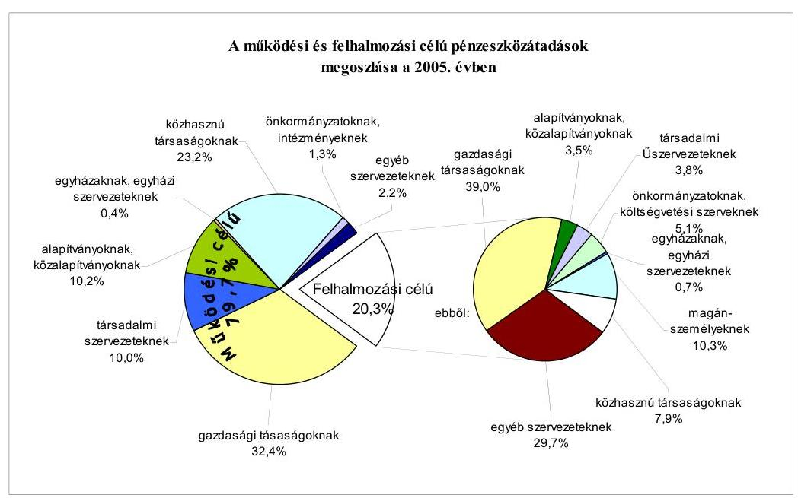
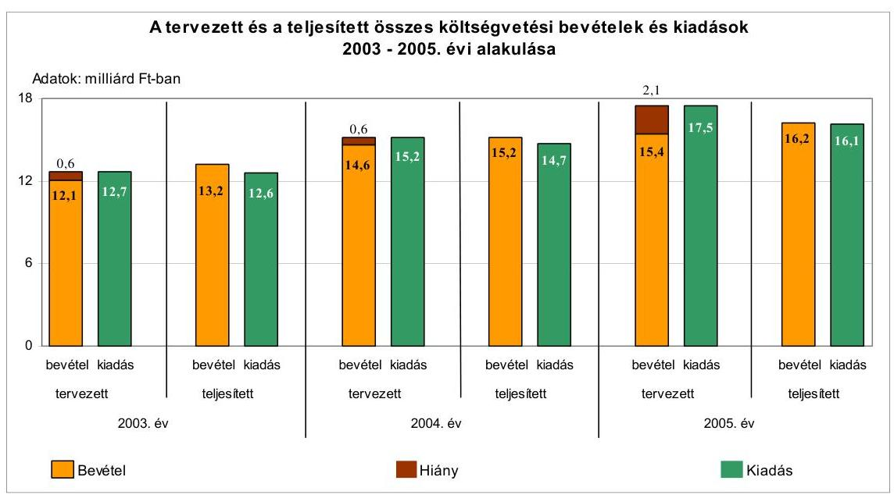
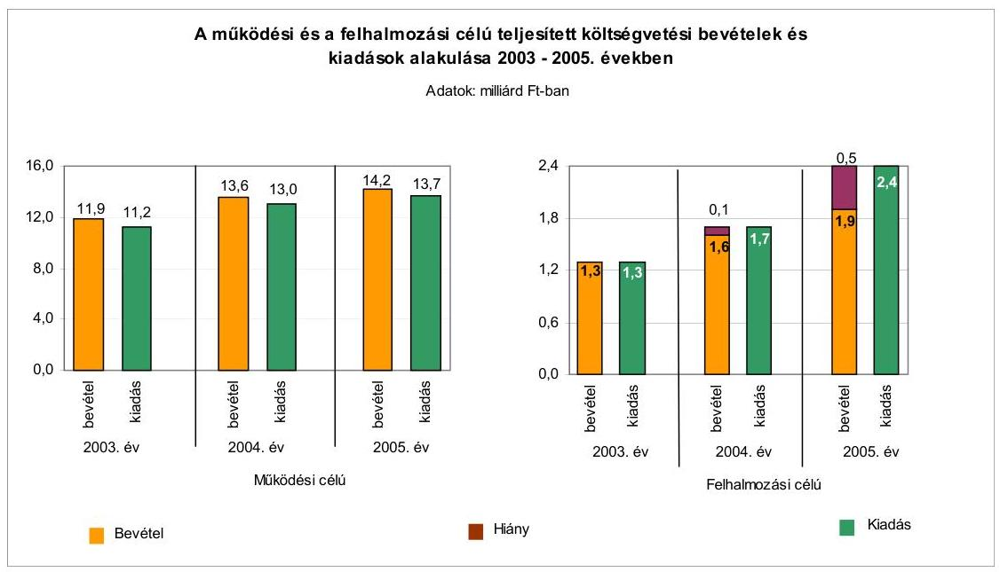
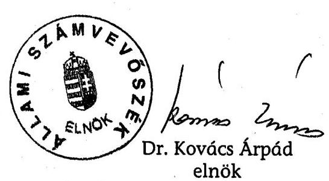
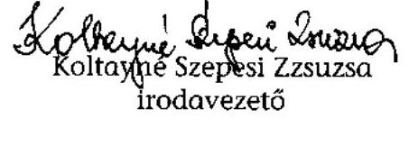
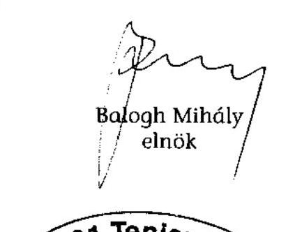
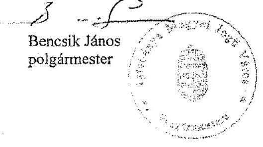

# JELENTÉS 

a Tatabánya Megyei Jogú Város Önkormányzata gazdálkodási rendszerének 2006. évi átfogó ellenőrzéséről

---

# 3. Önkormányzati és Területi Ellenőrzési Igazgatóság 

3.3. Átfogó Ellenőrzések Főcsoport

Iktatószám: V-1003-5/26/19/2006.
Témaszám: 803
Vizsgálat-azonosító szám: V0274

## Az ellenőrzést felügyelte:

Dr. Lóránt Zoltán
főigazgató
Az ellenőrzés végrehajtásáért felelős:
Dr. Sepsey Tamás
főigazgató-helyettes
Az ellenőrzést vezette:
Csecserits Imréné
főcsoportfőnök-helyettes
Az ellenőrzést végezték:
Böröcz Imre György Árpád Koltayné Szepesi Zsuzsanna
tanácsadó számvevő tanácsos főtanácsadó

A témához kapcsolódó - elmúlt három évben - készített számvevőszéki jelentések:
címe
sorszáma
Jelentés a helyi és a helyi kisebbségi önkormányzatok gazdálkodás0220
sának átfogó ellenőrzéséről
Jelentés a Gazdasági és Közlekedési Minisztérium fejezet gazdálko0350
dásának ellenőrzéséről
Jelentés a települési önkormányzatok szennyvízközmű fejlesztési és ..... 0416
működtetési feladatai ellátásnak vizsgálatáról
Jelentés a Magyar Köztársaság 2004. évi költségvetése végrehajtás
sának ellenőrzéséről
Függelék:

- Normatív kötött felhasználású támogatások

---

# TARTALOMJEGYZÉK 

BEVEZETÉS ..... 5
I. ÖSSZEGZŐ MEGÁLLAPÍTÁSOK, KÖVETKEZTETÉSEK, JAVASLATOK ..... 7
II. RÉSZLETES MEGÁLLAPÍTÁSOK ..... 17

1. A költségvetés tervezésének, végrehajtásának, az Önkormányzat vagyongazdálkodásának és a zárszámadás elkészítésének szabályszerűsége ..... 17
1.1. A költségvetési rendelet jóváhagyásának, módosításának, az előirányzatok nyilvántartásának szabályszerűsége ..... 17
1.2. A gazdálkodás szabályozottsága, a bizonylati rend és fegyelem szabályszerűsége ..... 22
1.3. A pénzügyi-számviteli feladatok ellátásának informatikai támogatottsága ..... 30
1.4. Az önkormányzati vagyon nyilvántartása, számbavétele ..... 32
1.5. A vagyonnal való gazdálkodás szabályszerűsége, célszerűsége, nyilvánossága ..... 37
1.6. A céljelleggel nyújtott támogatások szabályszerűsége ..... 46
1.7. A közbeszerzési eljárások szabályszerűsége ..... 50
1.8. A zárszámadási kötelezettség teljesítésének szabályszerűsége ..... 54
1.9. A Polgármesteri hivatal helyi kisebbségi önkormányzatok gazdálkodását segítő tevékenysége ..... 55
2. Az önkormányzati feladatok és a rendelkezésre álló források összhangja ..... 58
2.1. A feladatok meghatározása és szervezeti keretei ..... 58
2.2. A költségvetés egyensúlyának helyzete ..... 62
2.3. A feladatok finanszírozása ..... 70
3. A belső ellenőrzési rendszer múködésének értékelése ..... 73
3.1. Az ellenőrzési rendszer kialakítása, múködése ..... 73
3.2. A könyvvizsgálati kötelezettség teljesítése ..... 76
3.3. A korábbi számvevőszéki ellenőrzések javaslatainak hasznosulása ..... 77

---

# MELLÉKLETEK 

1. számú Az Önkormányzat gazdálkodását meghatározó adatok, mutatószámok (1 oldal)
2. számú Az önkormányzati vagyon nagyságának alakulása (1 oldal)
3. számú Az Önkormányzat 2005. évi bevételeinek és kiadásainak alakulása (1 oldal)
4. számú Egyes önkormányzati feladatok finanszírozása (1 oldal)
5. számú Helyszíni ellenőrzési jegyzőkönyv (4 oldal)
6. számú Bencsik János úr, Tatabánya Megyei Jogú Város Önkormányzata polgármesterének észrevétele (2 oldal)

---

# RÖVIDÍTÉSEK JEGYZÉKE 

## Törvények:

Áht.
Fot. tv.
Gyvt.
Hatv.
Htv.

Kbt.
Ksztv.
Ltv.

Nek. tv.
Ötv.
Ptk.
Számv. tv.
Szoc. tv.

## Rendeletek:

a helyiségek bérletéről szóló rendelet
a nem lakás céljára szolgáló helyiségek elidegenítéséről szóló rendelet

Ámr.
Ber.
kisebbségi kormányrendelet
$\mathrm{SzMSz}_{1}$

SzMSz $_{2}$
az államháztartásról szóló 1992. évi XXXVIII. törvény
a fogyatékos személyek jogairól és esélyegyenlőségük biztosításáról szóló 1998. évi XXVI. törvény
a gyermekek védelméről és a gyámügyi ellátásról szóló 1997. évi XXXI. törvény
a helyi adókról szóló 1990. évi C. törvény
a helyi önkormányzatok és szerveik, a köztársasági megbízottak, valamint egyes centrális alárendeltségű szervek feladat- és hatásköreiről szóló 1991. évi XX. törvény
a közbeszerzésekről szóló 2003. évi CXXIX. törvény
a közhasznú szervezetekről szóló 1997. évi CLVI. törvény
a lakások és helyiségek bérletére, valamint az elidegenítésükre vonatkozó egyes szabályokról szóló 1993. évi LXXVIII. törvény
a nemzeti és etnikai kisebbségek jogairól szóló 1993. évi LXXVII. törvény
a helyi önkormányzatokról szóló 1990. évi LXV. törvény
a Polgári Törvénykönyvről szóló 1959. évi IV. törvény
a számvitelről szóló 2000. évi C. törvény
a szociális igazgatásról és a szociális ellátásokról szóló 1993. évi III. törvény

Tatabánya Megyei Jogú Város Önkormányzatának 35/1999. (X. 21.) sz. rendelete a helyiségek bérletéről
Tatabánya Megyei Jogú Város Önkormányzatának 14/2004. (V. 19.) sz. rendelete az önkormányzat tulajdonában levő nem lakás céljára szolgáló helyiségek elidegenítéséről
az államháztartás múködési rendjéről szóló 217/1998. (XII. 30.) Korm. rendelet
a költségvetési szervek belső ellenőrzéséről szóló 193/2003. (XI. 26.) Korm. rendelet
a kisebbségi önkormányzatok költségvetésének, gazdálkodásának, vagyonjuttatásának egyes kérdéseiről szóló 20/1995. (III. 3.) Korm. rendelet
Tatabánya Megyei Jogú Város Önkormányzatának 1/1991. (II. 14.) sz. rendelete Tatabánya Megyei Jogú Város Közgyűlésének Szervezeti és Múködési Szabályzatáról
Tatabánya Megyei Jogú Város Önkormányzata Polgármesteri Hivatalának Szervezeti és Múködési Szabályzata, amelyet Tatabánya Megyei Jogú Város Önkormányzatának Közgyűlése az 50/2004. (III. 18.) sz. határozatával fogadott el

---

vagyongazdálkodási rendelet $_{1}$

vagyongazdálkodási rendelet $_{2}$
vagyongazdálkodási rendelet $_{3}$
vagyongazdálkodási rendelet $_{4}$

Vhr.

## Szórövidítések:

aljegyző
ÁSZ
Ellenőrzési iroda
FEUVE
föjegyzó
Gazdasági bizottság
Jogi és etikai bizottság
KELER Rt.
Közgyűlés
LKÖ
MÁK
Önkormányzat
Pénzügyi bizottság
Pénzügyi iroda
polgármester
Polgármesteri hivatal
ügyrend

Tatabánya Megyei Jogú Város Önkormányzata 30/2000. (VI. 22.) sz. rendelete az önkormányzati vagyonnal való gazdálkodásról (hatályos 2003. április 24-től)
Tatabánya Megyei Jogú Város Önkormányzata 30/2000. (VI. 22.) sz. rendelete az önkormányzati vagyonnal való gazdálkodásról (hatályos 2003. augusztus 21-től)
Tatabánya Megyei Jogú Város Önkormányzata 30/2000. (VI. 22.) sz. rendelete az önkormányzati vagyonnal való gazdálkodásról (hatályos 2005. január 1-jétől)
Tatabánya Megyei Jogú Város Önkormányzata 30/2000. (VI. 22.) sz. rendelete az önkormányzati vagyonnal való gazdálkodásról (hatályos 2006. június 1-jétől)
az államháztartás szervezetei beszámolási és könyvvezetési kötelezettségének sajátosságairól szóló 249/2000. (XII. 24.) Korm. rendelet

Tatabánya Megyei Jogú Város Önkormányzatának aljegyzője
Állami Számvevőszék
Tatabánya Megyei Jogú Város Önkormányzata Polgármesteri Hivatalának Pénzügyi Ellenőrzési Irodája
folyamatba épített, előzetes és utólagos vezetői ellenőrzés
Tatabánya Megyei Jogú Város Önkormányzatának címzetes főjegyzője
Tatabánya Megyei Jogú Város Önkormányzatának Gazdasági Bizottsága
Tatabánya Megyei Jogú Város Önkormányzatának Jogi és Etikai Bizottsága
Központi Elszámoló és Értékház Rt.
Tatabánya Megyei Jogú Város Önkormányzatának Közgyűlése
Tatabányai Lengyel Kisebbségi Önkormányzat
Magyar Államkincstár Területi Igazgatósága
Tatabánya Megyei Jogú Város Önkormányzata
Tatabánya Megyei Jogú Város Önkormányzatának Pénzügyi Bizottsága
Tatabánya Megyei Jogú Város Önkormányzata Polgármesteri Hivatalának Pénzügyi és Számviteli Irodája
Tatabánya Megyei Jogú Város Önkormányzatának polgármestere
Tatabánya Megyei Jogú Város Önkormányzatának Polgármesteri hivatala
Tatabánya Megyei Jogú Város Önkormányzata Polgármesteri Hivatala Gazdasági Szervezetének Úgyrendje, amelyet a főjegyző 2005. augusztus 26-án adott ki és 2005. szeptember 1-től léptetett hatályba

Vagyonhasznosítási iroda
Tatabánya Megyei Jogú Város Önkormányzata Polgármesteri Hivatalának Vagyonhasznosítási Irodája

---

# JELENTÉS 

## a Tatabánya Megyei Jogú Város Önkormányzata gazdálkodási rendszerének 2006. évi átfogó ellenőrzéséről

## BEVEZETÉS

Az Ötv. 92. § (1) bekezdése, az Állami Számvevőszékről szóló 1989. évi XXXVIII. törvény 2. § (3) bekezdése, valamint az Áht. 120/A. § (1) bekezdése alapján az önkormányzatok gazdálkodását az Állami Számvevőszék ellenőrzi. Az ellenőrzésre az Országgyűlés illetékes bizottságai részére is átadott, országosan egységes ellenőrzési program alapján került sor.

## Az ellenőrzés célja annak értékelése volt, hogy:

- az önkormányzati gazdálkodás törvényességét ${ }^{1}$, szabályszerűségét biztosított-ták-e a tervezés, a költségvetés végrehajtása, a vagyongazdálkodás és a zárszámadás során;
- az Önkormányzat által ellátott feladatok és az azokhoz rendelkezésre álló források összhangja biztosított volt-e, különös tekintettel egyes kiemelt feladatokra;
- a gazdálkodás szabályszerűségét biztosító kontrollok ${ }^{2}$ megfelelően segítettéke a végrehajtást.

Az ellenőrzött időszak: a 2005. év és a 2006. év I. negyedéve, valamint az 1.5., 2.1-2.3. és 3.3. ellenőrzési programpontok esetében a 2003-2004. évek is.

Tatabánya Megyei Jogú Város Komárom-Esztergom megye székhelye. A város lakosainak száma 2006. január 1-jén 71712 fő volt. A Közgyűlés tagjainak száma 29 fő, munkáját 11 állandó bizottság támogatta. A polgármestert - aki az 1990. év óta tölti be tisztségét - egy főállású alpolgármester segíti feladatai ellátásában.
A főjegyző 1990. január 1-jétől vezeti a Polgármesteri hivatalt.

[^0]
[^0]:    ${ }^{1}$ A törvényi előírások betartásának elmulasztásakor a részletes megállapítások fejezetben egységesen a törvénysértés megjelölést alkalmazzuk, mivel az ÁSZ nem tehet különbséget a törvényi előírások között.
    ${ }^{2}$ A gazdálkodás szabályszerűségét biztosító kontroll alatt értjük a kiépített és működő belső irányítási és szabályozási rendszert, valamint a belső ellenőrzési funkciók ellátását.

---

Az Önkormányzat a 2005. évben 16 174,9 millió Ft bevételből gazdálkodott, a teljesített kiadás 16114,0 millió Ft volt. A kiadások $85 \%$-át múködési, $15 \%$-át felhalmozási célra fordították. Az Önkormányzat 2005. december 31-i könyvviteli mérlegben kimutatott vagyonának értéke 21 194,6 millió Ft, amelyből az adósságállomány értéke 3592,5 millió Ft volt.

A városban és a vonzáskörzetében élőknek nyújtott közszolgáltatásokhoz összesen 51 intézményt (ebből 26 részben önálló gazdálkodási jogkörrel rendelkezőt) tartottak fenn a 2005. évben. Az Önkormányzat feladatai ellátásában négy közhasznú társaság, 15 közalapítvány és kilenc önkormányzati társulás múködött közre. A Polgármesteri hivatalban foglalkoztatott köztisztviselők száma a 2005. évben 248 fő volt, az intézményekben 2342 fő közalkalmazott látta el a különböző közszolgáltatásokat, és az azokhoz kapcsolódó gazdálkodási teendőket. A városban öt kisebbségi ${ }^{3}$ önkormányzat múködött. Az Önkormányzat gazdálkodását meghatározó adatokat, mutatószámokat a jelentés 2. számú melléklete tartalmazza.

A jelentés megállapításainak, javaslatainak egyeztetése során a polgármester úr arról adott tájékoztatást, hogy az időközben megtett intézkedésekkel a javaslatok egy részét megvalósították. Ezekben az esetekben a jelentés II. Részletes megállapítások fejezetében az adott témához kapcsolt lábjegyzetben a megtett intézkedést feltüntettük és a kapcsolódó javaslatot elhagytuk.

A jelentést az ÁSZ-ról szóló 1989. évi XXXVIII. tv. 25. § (1) bekezdése alapján észrevétel közlése céljából megküldtük a Tatabánya Megyei Jogú Város Önkormányzata polgármesterének. A kapott észrevételt a jelentés 6 . számú melléklete tartalmazza.

[^0]
[^0]:    ${ }^{3}$ Cigány, görög, lengyel, német, szlovák.

---

# I. ÖSSZEGZŐ MEGÁLLAPÍTÁSOK, KÖVETKEZTETÉSEK, JAVASLATOK 

A Közgyűlés az Ötv. előírásainak megfelelve a 2003. évben fogadta el az önkormányzati képviselő választási időszakra vonatkozó gazdasági programját, amely alkalmas volt az éves tervezőmunka megalapozására. A polgármester az Áht-ban előírt határidőket betartva terjesztette a Közgyűlés elé a 2005. és a 2006. évi költségvetési koncepciókat, valamint költségvetési rendelettervezeteket. Az Ámr. előírásainak megfelelően csatolta a költségvetési koncepciók előterjesztéséhez a Pénzügyi bizottság, a költségvetési rendelettervezetekhez a Pénzügyi bizottság és a könyvvizsgáló véleményét. A polgármester az Ámr. előírása ellenére nem csatolta a költségvetési koncepciók előterjesztéséhez a helyi kisebbségi önkormányzatok költségvetési koncepciók tervezetéről alkotott írásos véleményét, mivel azok a kapott tájékoztatás ellenére arról írásos véleményt nem készítettek. A költségvetési koncepciók az Ámr-ben előírtaknak megfelelő tartalommal készültek, az elfogadáskor a Közgyűlés a költségvetés készítéssel kapcsolatos feladatokat az Ámr. előírásai alapján meghatározta.

A főjegyző a költségvetési rendelettervezetet beterjesztése előtt a költségvetési szervek vezetőivel az Ámr-ben foglaltaknak megfelelően egyeztette. A polgármester előterjesztette azokat a rendelettervezeteket, amelyek a költségvetés megalapozását biztosították. A költségvetési rendeletben a 2005. évben nem, a 2006. évben nem megfelelő összegben mutatták be a költségvetési hiány mértékét, mivel az Áht-ban foglaltakat megsértve finanszírozási célú pénzügyi műveleteket vettek figyelembe költségvetési bevételként és kiadásként. A Közgyűlés 2006. májusi rendeletében határozta meg az Áht-ban előírt, a költségvetés és a zárszámadás előterjesztésekor tájékoztatásul bemutatandó mérlegek és kimutatások közül az Önkormányzat összevont mérlegeire és elkülönítetten a helyi kisebbségi önkormányzatok mérlegeire, a többéves kihatással járó döntések számszerűsítésére, valamint a közvetett támogatásokra vonatkozó mérlegek és kimutatások tartalmi követelményeit. A vagyonkimutatás tartalmi követelményeit az Önkormányzat vagyongazdálkodási rendelete tartalmazta. A 2005. és a 2006. évi költségvetési rendelettervezetek előterjesztésekor tájékoztatásul bemutatták az Áht-ban előírt mérlegeket, kimutatásokat, a szöveges indoklásokkal együtt.

Az Áht. és az Ámr. előírásainak megfelelve a költségvetési rendeletben a múködési és felhalmozási célú bevételeket és kiadásokat Önkormányzatra összesen és kiemelt előirányzatonként, a bevételek előirányzatait az elemi költségvetés szerinti főbb jogcím-csoportonkénti részletezettségben, valamint a múködési, fenntartási előirányzatokat önállóan és részben önállóan gazdálkodó költségvetési szervenként, intézményen belül kiemelt előirányzatonként mutatták be. A felújítási előirányzatokat célonként, a felhalmozási kiadásokat feladatonként határozták meg. Az Ámr-ben előírtaknak megfelelően mutatták be a Közgyűlésnek elkülönítetten az európai uniós támogatással tervezett projektek bevételeit és kiadásait, csatolták a költségvetésekhez az előirányzatok várható felhasználási ütemét bemutató tájékoztatást. A 2005. és a 2006. évi költségvetésekben alap elnevezéssel kiadási előirányzatokat határoztak meg. Az alapként

---

történő elnevezés - a környezetvédelmi alap kivételével - nem felel meg az Áhtben meghatározott feltételeknek, a kifejezés félreérthető.

A költségvetés végrehajtási szabályait a 2005. és a 2006. évi költségvetésekben meghatározták. Az Önkormányzat a 2005. évi költségvetési rendeletét hat alkalommal módosította, a módosítások következtében a 2005. évi költségvetési előirányzatok főösszege 2,1\%-kal csökkent. A költségvetési előirányzatok módosítására előterjesztett rendelettervezetek az eredeti költségvetéssel összehasonlítható módon tartalmazták a módosítási javaslatokat. Az előirányzatváltozásokat hitelt érdemlően dokumentálták. A 2005. évben az Ámr. előírásai ellenére a központilag biztosított pótelőirányzatok negyedéven belül történő átvezetése a költségvetési rendeletben - két pótelőirányzat esetében - nem történt meg. A 2006. I. félévi költségvetési rendeletmódosítások az Ámr. előírásai alapján szabályszerűen, határidőben megtörténtek.

A Polgármesteri hivatal rendelkezett a Közgyűlés által jóváhagyott $\mathbf{S z M S z}_{2}$ szel, amely az Ámr-nek megfelelően tartalmazta a szervezetre és múködésre vonatkozó információkat. A főjegyző a gazdasági szervezetre kiadott ügyrendben meghatározta a gazdálkodásért felelős személyek feladatait, továbbá a kapcsolódó részben önállóan gazdálkodó költségvetési szerv tekintetében ellátandó feladatokat, a vezetők és más dolgozók feladat-, hatás- és jogköreit. A költségvetési gazdálkodást érintő gazdálkodási jogkörök gyakorlásának rendjét a polgármester és a főjegyző közösen szabályozták. A kötelezettségvállalás, utalványozás, ellenjegyzés, érvényesítés és szakmai teljesítésigazolás szabályozása során meghatározták a kötelezettségvállalások nyilvántartásának a módját, formáját, a név szerinti felhatalmazásokat, megbízásokat, kijelöléseket és az eljárások rendjét. A szakmai teljesítés igazolásának módját a főjegyző szabályozta, de abban az igazolási feladat tartalmára való utalás követelményét nem írta elő.

A főjegyző a Htv-ben foglaltaknak megfelelően a Polgármesteri hivatal és az Önkormányzat felügyelete alatt álló intézmények számviteli rendjét kialakította. Kiadta a számviteli politikát és a kapcsolódó szabályzatokat, amelyek hatályát a Vhr. előírásai alapján kiterjesztette a Polgármesteri hivatalhoz kapcsolódó részben önállóan gazdálkodó költségvetési szervre is. Ez igazodott a köztük lévő megállapodás tartalmához, ugyanakkor az Ámr-ben előírtak ellenére a megállapodás jóváhagyásáról, illetve a Vhr-ben előírtak ellenére a számviteli politika kiterjesztésére vonatkozó egyetértésről a Közgyűlés - mint felügyeleti szerv - előterjesztés hiányában nem döntött. A számviteli politikában szerepeltek a megbízható, valós összkép kialakítását befolyásoló lényeges információk, az eszközök és források leltárkészítési és leltározási szabályzata tartalmazta az előkészítés és végrehajtás feladatait, dokumentálását és felelősségi rendjét. Az eszközök és források értékelési szabályzata a Vhr-ben előírtak ellenére a 2005. évben, és a 2006. évi módosítás után sem tartalmazta az egyedi értékeléshez az adós minősítésére, fizetőképessége megítélésére, a követelés érvényesítési esélyei meghatározására vonatkozó szempontokat. A pénzkezelési szabályzatban a főjegyző meghatározta a bankszámlák és a házipénztár kezelésére vonatkozó előírásokat. A 2005. évben nem tartalmazta a selejtezés szabályozása az eljárási, bizonylati és elszámolási rendet, a személyhez kötött felelősségeket, a számlarend az analitikus nyilvántartások formáját, tartalmát, egyeztetési módját, az összesítő kimutatások elkészítésének rendjét, határidejét.

---

A selejtezés szabályozása és a számlarend hiányosságait a főjegyző a 2006. évi módosításkor pótolta. A Polgármesteri hivatalnál a gazdálkodási jogkörök, továbbá a számvitel rendjét meghatározó szabályzatok előírásai egymással, valamint az ügyrenddel és a kapcsolódó munkaköri leírásokkal összhangban voltak. A szabályzatok a helyi kisebbségi önkormányzatok gazdálkodásával összefüggő sajátosságokat tartalmazták.

A főjegyző az Áht-nek megfelelően gondoskodott a FEUVE megszervezéséről. Az ügyviteli, számviteli szabályzatok tartalmazták az előző munkafázis ellenőrzése elvégzésének kötelezettségét, az elvégzendő múveleteket, az ellenőrzés viszonyítási alapjait. A főjegyző 2006 januárjában adta ki a kockázatkezelés rendjéről szóló szabályozást, a szabálytalanságok kezelésének egységes rendjét és az Ámr. előirása alapján a Polgármesteri hivatal - táblázatokban részletezett és az $\mathrm{SzMSz}_{2}$ mellékletét képező - ellenőrzési nyomvonalát.

A Polgármesteri hivatalban a költségvetési előirányzatokat terhelő kötelezettségvállalásokat írásba foglalták, de azok 1,9\%-ánál az Ámr-ben előírtak ellenére az ellenjegyzés elmaradt. Az ellenőrzést végző aláírása nélküli, 1,1\%-os arányt jelentő bizonylatoknál megsértették a Számv. tv. számviteli bizonylatokra vonatkozó előírását. A 2005. évi költségvetési előirányzat főösszegét, vagy kiemelt előirányzatát túllépő önkormányzati intézményeknél és a Polgármesteri hivatalnál a kötelezettségvállalási és utalványozási joggal rendelkező személyek megsértették az Áht. előírásait, amikor a tárgyévi jóváhagyott kiadási előirányzat mértékét meghaladóan vállaltak fizetési kötelezettséget, illetve rendelték el a kifizetést. A feladat elvégzésének dokumentálása ellenére nem végezték el az Ámr-ben előírt munkafolyamatba épített ellenőrzési feladatukat az ellenjegyzés nélküli és a tárgyévi kiadási előirányzatot meghaladó kötelezettségvállalásoknál és kifizetéseknél az ellenjegyzők, szakmai teljesítést igazolók és érvényesítők. A könyvviteli nyilvántartásban elszámolt gazdasági műveletekről, eseményekről a bizonylatokat kiállították, azok a Számv. tv-ben foglalt alaki és tartalmi követelményeknek 98,9\%-ban megfeleltek.

Az Önkormányzat a 2005. évben a jóváhagyott előirányzatok főösszegén belül gazdálkodott, de ezen belül öt intézménye - az intézmények egytizede - túllépte a módosított kiadási előirányzatának főösszegét. Tizennégy intézmény - az intézmények egynegyede - a részére meghatározott kiemelt költségvetési előirányzatot lépte túl. A Polgármesteri hivatal a 2005. évi módosított előirányzata főösszegén belül teljesítette kiadásait, de ezen belül két kiemelt előirányzatát más előirányzatai terhére túllépte. Az előirányzat-túllépések okait csak a kiadási előirányzata főösszegét túllépő öt intézménynél vizsgálta meg a Polgármesteri hivatal, felelősségre vonás nem történt.

Az analitikus nyilvántartások, a főkönyvi könyvelés és a költségvetési beszámoló elkészítésének informatikai támogatottsága biztosított volt, de a 2005. és 2006. években még nyolc analitikus nyilvántartást kézzel vezettek. A kiutalt, de visszaérkezett segélyek manuális nyilvántartása párhuzamos nyilvántartást jelentett, mert ezek információi informatikai úton is előállíthatóak. A Polgármesteri hivatal rendelkezett az informatikai rendszer múködtetésének feltételeit meghatározó szabályozásokkal (informatikai stratégia, katasztrófa elhárítási terv, adathozzáférési rend, üzemeltetési dokumentációk, felhasználói leírások).

---

A pénzügyi és számviteli területen dolgozók munkaköri leírásai tartalmazták az informatikai rendszer használatát, feladataik leírását.

A Polgármesteri hivatalban gondoskodtak az önkormányzati vagyon nyilvántartásáról, a törzsvagyont a főkönyvi számlák további bontásával és az analitikus nyilvántartásokban is elkülönítették. Az eszközök és források leltárral történő alátámasztására, a leltározás végrehajtására a főjegyző intézkedett. Az eszközök és források leltározásának módja megfelelt a Vhr-ben előírtaknak. A leltározási folyamatot, annak dokumentumait, az előírások betartását a belső ellenőrzés felülvizsgálta, a megállapított hiányosságok megszüntetése érdekében intézkedtek, a hiteles bizonylatolást érintő hiányosságokat pótolták. A Polgármesteri hivatal az eszközök és források év végi értékeléséhez szükséges információk beszerzéséről, gyűjtéséről gondoskodott. A részesedéseknél, az adók és adók módjára behajtandó, valamint az egyéb követeléseknél kimunkálta, dokumentálta és elszámolta az értékvesztést, illetve értékvesztés visszaírást, az egyszerűsített eljárást a Vhr. és az értékelési szabályzat előírásai szerint végezte. A Vhr. előírása ellenére a hátralékos vevőállomány 11,6\%-ánál elmaradt az egyedi értékelés, valamint a 2005. évi könyvviteli mérleg a leltározási és értékelési szabályzatok alapján behajthatatlannak minősítendő, az elismerést igazoló dokumentum nélküli követeléseket is tartalmazott.

Az Önkormányzat a vagyonával való gazdálkodás szabályait, a döntési jogköröket a vagyongazdálkodási ${ }_{1-4}$, a nem lakás céljára szolgáló helyiségek elidegenítéséről, valamint a helyiségek bérletéről szóló rendeletekben határozta meg. A vagyongazdálkodási hatásköröket vagyoncsoportonként, értékhatártól függően, a hasznosítás módjára tekintettel, differenciáltan, célszerűen állapították meg. Szabályozták és betartották a vagyon forgalomképesség szerinti besorolása megváltoztatásának módját. A versenyeztetési kötelezettség alsó határát a 2003-2004. években indokolatlanul magas összegben, 300 millió Ft-ban határozták meg, az értékesítések a megjelölt értékhatárt nem érték el. A szabályozás nem segítette a vagyonnal való gazdálkodás nyilvánosságát, átláthatóságát. A térítésmentes vagyonátadás eseteit és módját a vagyongazdálkodási rendelet ${ }_{4}$-ben határozták meg, az ezt megelőző térítésmentes vagyonátadás alkalmával megsértették az Áht. előírásait. A követelésről való lemondás módját a jogosultak körének összeghatárhoz kötésével meghatározták, de az Áht-ban foglaltakat megsértve nem határozták meg a követelésekről való lemondás eseteit. A hitelviszonyt megtestesítő értékpapírok adás-vételének szabályozása során nem nevesítették a jogkörök gyakorlásának jogosultját, nem határozták meg az adás-vételek eljárási rendjét. Az értékpapír vételt megelőzően a befektetési lehetőségeket nem mérték fel, a befektetési szolgáltatót nem pályázat útján választották ki, a döntést nem a hatáskörrel rendelkező Közgyűlés hozta meg. Az értékpapírok adásvétele során az Önkormányzat által realizált hozamok átlagosan 0,16 százalékponttal meghaladták az Államadósság Kezelő Központ által jegyzett állampapír-piaci referenciahozamokat. Az Önkormányzat a befektetési kockázat csökkentését elősegítő lehetőséggel nem élt, nem nyittatott a befektetési szolgáltatóval a KELER Rt-nél együttes rendelkezésű, az Önkormányzat nevére szóló értékpapír alszámlát.

Az önkormányzati vagyonnal történő gazdálkodással összefüggő szerződések közzétételi kötelezettségének szabályait a vagyongazdálkodási rendelet ${ }_{2-4}$ tartalmazta, amely szerint a szerződéseket értékhatárra tekintet nélkül 30 napon

---

belül kell közzétenni. Az Áht-ban foglalt előírás szerint az Önkormányzat a közzétételi kötelezettségének eleget tett.

Az Önkormányzat vagyongazdálkodással kapcsolatos döntései a költségvetésben megfogalmazott célokkal összhangban voltak. A nem lakás céljára szolgáló helyiségeket a Közgyűlés által elfogadott koncepcióban foglaltaknak megfelelően, a bérlők elővásárlási jogát figyelembe véve, a Közgyűlés által elfogadott árkataszterben meghatározott eladási áron értékesítették. A döntéshozatal hatásköri szabályait, a korlátozottan forgalomképes törzsvagyon elidegenítésére vonatkozó korlátokat betartották. A szerződésekben az Önkormányzat érdekeit védő garanciális elemeket szerepeltették.

Az Önkormányzat három párt részére kedvezményes bérleti díjat állapított meg. A kedvezményes helyiséghasználat biztosításával az Ötv. előírásai ellenére nem közfeladat ellátásához nyújtottak támogatást a pártok részére, a bérlők között az alkotmányos egyenlőséget nem biztosították.

Az Önkormányzat a 2005. évben céljelleggel 821 esetben, összesen 1159,5 millió Ft támogatást biztosított működési és felhalmozási célokra. Az Önkormányzat a céljellegú támogatásokat a Közgyűlés közvetlen döntésével, bizottsági, polgármesteri keretek, a helyi adók 5\%-ából képzett keretelőirányzatok meghatározásával biztosította. Az Ötv-ben előírt hatáskör átruházási korlátozást az Önkormányzat, megsértve Közgyűlés a költségvetési bevétel felhasználására vonatkozó döntési hatáskörét, az adózókra ruházta át. Az erre vonatkozó határozatait a Közgyűlés a helyszíni ellenőrzés ideje alatt hatályon kívül helyezte. Az alapítványok támogatásáról, az Ötv. előírásait megsértve, a bizottságok, a polgármester és az adózók is döntöttek. A céljellegú támogatásban részesülő szervezetekkel, magánszemélyekkel a támogatási szerződést, megállapodást megkötötték, a számadási kötelezettség teljesítésének módját, határidejét előírták. A közhasznú szervezetek részére nyújtott támogatásoknál a Ksztv. szerződéskötési kötelezettségre vonatkozó előírását betartották. A céljellegú támogatásokról a nyilvántartási rendszert kialakították, azonban az nem tartalmazta a számadási kötelezettség határidejét, annak teljesítését, továbbá a támogatás rendeltetésszerú felhasználásának ellenőrzési megállapítását. Az előírt számadási kötelezettségét a támogatottak 12,4\% késve, az előírt határidő után teljesítette. A Polgármesteri hivatalban a számadások formai, tartalmi ellenőrzését elvégezték. A számadások alapján három szervezet a céljellegú támogatást összesen 12,3 millió Ft összegben nem használta fel, a fel nem használt támogatások összegét az Önkormányzatnak visszautalták. A számadások alapján céltól eltérő, jogsértő felhasználást nem állapítottak meg. A támogatások célszerinti felhasználását az Áht. előírását megsértve nem ellenőrizték.

Egy közhasznú szervezetnek az Önkormányzat öt esetben, összesen 700 ezer Ft támogatást nyújtott. A támogatott szervezet a számadási kötelezettségének eleget tett. A támogatások számadásaihoz benyújtott számlák alapján a 700 ezer Ft összegű támogatásból a célszerinti felhasználás összességében 691,3 ezer Ft összegben megvalósult. A Polgármesteri hivatal a számadást az Áht. előírását megsértve nem ellenőrizte, a rendeltetési céltól eltérően felhasznált 8,7 ezer Ft összegű támogatás visszafizetésére nem intézkedett.

---

A közbeszerzési eljárás szabályozására a Közgyűlés közbeszerzési szabályzatot fogadott el, melyben meghatározták a közbeszerzési eljárás előkészítésével, lefolytatásával, ellenőrzésével kapcsolatos felelősségi és dokumentálási rendet. A közbeszerzési szabályzat hatályát - ellentétben a Kbt. előírásaival - kiterjesztették a helyi kisebbségi önkormányzatok beszerzéseire is. A közbeszerzési szabályzat hatálya kiterjedt a Kbt-ben maghatározott egyszerű közbeszerzési eljárás értékhatárát el nem érő beszerzésekre is. A 2005. évi összesített közbeszerzési tervet az előírt határidőn belül elkészítették. A 2005. évben a Polgármesteri hivatal 96 közbeszerzési eljárást folytatott le, ebből 15 esetben a beszerzés értéke nem érte el a Kbt-ben meghatározott értékhatárokat. A szabályszerűen lefolytatott, ellenőrzött közbeszerzési eljárást lezáró határozatot a Közbeszerzési szabályzatban foglaltaknak megfelelően a Közbeszerzési bizottság hozta meg, a szerződéskötés az ajánlati felhívás, illetve az adott ajánlat tartalmának megfelelően történt. A teljesítés során a szerződést két alkalommal, többlet- és pótmunkák szükségessége miatt módosították. A Kbt-ben foglaltakkal ellentétben a szerződésmódosításról a tájékoztatót hirdetmény útján nem tették közzé. Az egy évnél hosszabb, illetve határozatlan időre szóló szerződések részteljesítéséről tájékoztatót a Kbt. előírásai ellenére nem készítettek. Az éves statisztikai öszszegzést elkészítették, azt az előírt határidőben a Közbeszerzések Tanácsának megküldték. A közbeszerzési tevékenység ellenőrzését a Polgármesteri hivatalnál és az intézményeknél a Kbt. és a közbeszerzési szabályzat előírásainak megfelelően elvégezték. Az Önkormányzat ellen jogorvoslati eljárást egy pályázó kezdeményezett, a jogorvoslati kérelmet a Közbeszerzések Tanácsa Közbeszerzési Döntőbizottsága megalapozatlanságra való hivatkozással elutasította.

A költségvetéssel összehasonlítható módon összeállított zárszámadási rendelettervezetet a polgármester az előírt határidőn belül terjesztette a Közgyűlés elé, amely arról rendeletet alkotott. Az előterjesztés megfelelt a működési és a fenntartási előirányzatok zárszámadásban történő részletezésére vonatkozó, az Áht-ban és az Ámr-ben foglalt előírásoknak. A zárszámadás elfogadásakor a Közgyűlés részére bemutatták az Áht-ban előírtak alapján az Önkormányzat, és elkülönítetten a kisebbségi önkormányzatok összevont mérlegeit, a vagyonkimutatást, a többéves kihatással járó döntések számszerűsítését évenkénti bontásban, valamint összesítve, a szöveges indoklással együtt, a közvetett támogatásokat tartalmazó kimutatást, a szöveges indoklással együtt. A zárszámadás elfogadásával egyidejűleg az önkormányzati szintű és a költségvetési szervek szerint részletezett módosított pénzmaradványokat a Vhr. előírásai szerint állapították meg és hagyták jóvá. Az Ámr-ben előírtaknak megfelelően az intézményeket éves számszaki beszámolójuk és működésük elbírálásáról, jóváhagyásáról írásban értesítették.

Az Önkormányzat a Nek. tv-ben foglaltaknak megfelelően az SzMSz ${ }_{1,2}$-ben rögzítette, hogy milyen módon biztosítja a kisebbségi önkormányzatok részére a testületi múködés feltételeit. Az Önkormányzat valamennyi helyi kisebbségi önkormányzattal megkötötte az Áht-ban és Nek. tv-ben előírt együttmúködési megállapodást. A megállapodások felülvizsgálatát és módosítását az Ámr. előírásaival ellentétben évente január 15-éig nem végezték el. A megállapodásokban az Ámr. előírása ellenére nem határozták meg a költségvetési és a zárszámadási határozat-tervezetek benyújtásának és a határozatok meghozatalának határidejét. A megállapodások a kisebbségi kormányrendelet előírása ellenére nem tartalmazták a kisebbségi önkormányzatok előirányzatait módosító

---

határozatok átadásának határidejét, valamint a főjegyző által elkészítendő költségvetési, előirányzat módosítási, zárszámadási határozattervezetek kisebbségi önkormányzatok részére történő átadásának időpontját. Az együttműködési megállapodások a hiányosságok ellenére biztosították az Önkormányzat és a helyi kisebbségi önkormányzatok együttműködését a költségvetés tervezése, az operatív gazdálkodás és a zárszámadás területén. A Polgármesteri hivatal biztosította a kisebbségi önkormányzatok testületi múködésének feltételeit, a kisebbségi önkormányzatok előirányzatainak alakulásáról, vagyonáról, kötelezettségvállalásairól elkülönített nyilvántartást vezetett.

Az Önkormányzat kötelező és önként vállalt feladatait, a feladatokat ellátó intézmények felsorolását az SzMSz ${ }_{1}$ tartalmazta. Az Önkormányzat meghatározta, hogy anyagi lehetőségeitől és a lakosság igényeitől függően a feladatokat milyen módon látja el, de az Ötv. előírását megsértve nem határozta meg a feladatellátás mértékét. A feladatok ellátását alapvetően költségvetési intézmények útján biztosították, valamint a feladatok ellátásában közhasznú társaságok, közalapítványok, gazdasági társaságok, önkormányzati társulások is részt vettek. A 2004. évben - a település és a régió egységes szakképzési struktúrájának kialakítása céljából - a Komárom-Esztergom Megyei Önkormányzattól három középfokú oktatási intézményt vettek át. Az átvett intézmények fenntartásával kapcsolatban az Önkormányzatnak a 2005. évben 208,7 millió Ft többletkiadása volt. A 2005. évben az intézményrendszert átvilágították, az átszervezések után az önállóan gazdálkodó intézmények száma csökkent. Az intézmény-összevonások a Pénzügyi iroda kimutatása szerint 397 millió Ft megtakarítást eredményeztek, amely nem tartalmazta az átvett intézmények többletkiadásait. A szervezeti változások eredményét a Közgyűlés nem tárgyalta.

A 2003-2005. években a költségvetésekben tervezett bevételek nem nyújtottak fedezetet a jóváhagyott kiadásokra, a pénzügyi egyensúlyt múködési és felhalmozási célú hitelek felvételével tervezték biztosítani. A költségvetések végrehajtása során a működési célú bevételek meghaladták a múködési célú kiadásokat. A felhalmozási célú kiadásoknál tervezett és létrejött hiányt az adott évi bevételeket meghaladó mértékű beruházások vállalása okozta, amely az Önkormányzat beruházás politikájával függött össze. A realizált felhalmozási célú bevételek évről évre csökkenő arányban biztosítottak fedezetet az azonos célú kiadásokra, a hiányzó fedezetet a múködési célú bevételekből és felhalmozási célú hitelek felvételével biztosították. A hiányok kialakulásában szerepet játszott a növekvő összegű hitelvisszafizetési kötelezettség is. A költségvetés egyensúlyának javítása, a költségek csökkentése, az intézmények hatékonyabb múködtetése érdekében intézményi összevonásokat hajtottak végre, csökkentették a Polgármesteri hivatal és az intézmények létszámkereteit. A bevételek növelése érdekében a pályázati munka személyi, szervezeti feltételeit - külön szervezeti egység létrehozásával - kialakították, amely elősegítette a beruházási feladatok megvalósítását. A főjegyző a likviditási tervet elkészítette és folyamatosan aktualizálta.

Az Önkormányzat az Ötv. szerinti adósságot keletkeztető kötelezettségvállalásról a 2005. évben három alkalommal döntött, amelynek indokait és gazdasági megalapozottságát a Pénzügyi bizottság megvizsgálta. Az adósságot keletkeztető kötelezettségvállalásoknál az Ötv-ben előírt felső határt nem lépték túl.

---

Az Önkormányzat a Hatv-ben kapott felhatalmazás alapján élt a helyi adóztatás lehetőségével, bevezették az építményadót, a telekadót, a vállalkozók kommunális adóját és a helyi iparűzési adót. A helyi adók aránya növekvő tendenciát mutatott, a 2005. évben a költségvetési bevételhez viszonyított aránya $18 \%$ volt. A Hatv-ben előírtakon túlmenően biztosítottak mentességeket, kedvezményeket, amelyek aránya csökkenő tendenciát mutatott a 2003-2005. években.

A naturális mutatókkal mérhető feladatok - bölcsődei ellátás, óvodai nevelés, általános és középiskolai nevelés és oktatás, nappali és bentlakásos szociális intézményi ellátás - egy főre jutó kiadásai a 2003-2005. években 0,6-53\%kal emelkedtek. A legalacsonyabb emelkedés a bölcsődéknél, a legmagasabb a középfokú oktatási intézményeknél volt. Ez utóbbi a Komárom-Esztergom Megyei önkormányzattól három középfokú oktatási intézmény átvételén túlmenően az előző évek elszámolási hiányosságaival is összefüggésben volt. A 20032004. években a szakközépiskolai oktatással-képzéssel kapcsolatos kiadásokat a szakképzés megszerzésére felkészítő oktatás szakfeladatra számolták el.

A kiadások finanszírozásában - különösen a 2005. évben - az állami hozzájárulás, támogatás részesedése meghatározó volt, az általános iskolai oktatásnevelés kiadásainak $82 \%$-ára, a középfokú oktatás kiadásainak $74 \%$-ára, a nappali szociális ellátás kiadásainak $74 \%$-ára nyújtott fedezetet. Az Önkormányzat részesedése a bölcsődei ellátás és az óvodai nevelés esetében volt jelentős, a 2005. évben 30, illetve $43 \%$. A finanszírozás szerkezetét befolyásoló, $10 \%$-ot meghaladó intézményi saját bevételt a bentlakásos szociális intézmények, a nappali szociális intézmények és a bölcsődék értek el.

Az önként vállalt feladatok finanszírozására a 2003-2005. években a költségvetési kiadások $16 \%$-át, $17 \%$-át, illetve $16 \%$-át fordították. Ennek 28$30 \%$-át nem kötelező feladatokat ellátó intézmények - színház, nem integrálható sajátos nevelési igényű gyermekek oktatását-nevelését ellátó intézmény finanszírozására, nem kötelező jellegű beruházási feladatok ellátására fordították. Az önként vállalt feladatok kiadásai a kötelező feladatok ellátását, illetve az Önkormányzat múködőképességét nem veszélyeztették.

Az Önkormányzat a fogyatékos személyek akadálymentes közlekedésének segítése érdekében a 2003. és a 2005. évben felmérte a várható kiadásokat. A 2005. évi felmérés szerint az akadálymentesítés kiadásainak költsége 491,5 millió Ft volt. A 2003-2005. években 199 millió Ft-ot fordítottak akadálymentesítésre. Az Önkormányzat középületeinek 40\%-ában az akadálymentes közlekedést biztosította. Az Önkormányzat a Fot. tv-ben előírtakkal ellentétben a 2005. január 1-jei határidőre 64 közintézményben az akadálymentes közlekedést nem biztosította.

Az Önkormányzat az Ötv. szerinti lehetőségnek megfelelően a belső ellenőrzés megoldására a 2003. évben a környező települések önkormányzataival társult, és a községek belső ellenőrzésére egy fő köztisztviselőt foglalkoztatott. A 2005. év végéig a Polgármesteri hivatal és az Önkormányzat intézményei belső ellenőrzési feladataira három fő ellenőri kapacitást a társulás mellett biztosítottak. A 2006. évtől az Önkormányzat és a többcélú kistérségi társulás megállapodása alapján a Polgármesteri hivatal szervezetébe tartozó négy fő belső el-

---

lenőr látta el az Önkormányzatnál és a társult önkormányzatoknál a belső ellenőrzési feladatokat. A belső ellenőrök szervezeti és feladatköri függetlensége biztosított volt. A főjegyző 2005 januárjában kiadta az ellenőrzési kézikönyvet, gondoskodott a stratégiai és az éves ellenőrzési tervek elkészítéséről. A belső ellenőrök a Ber. előírásainak megfelelő jelentéseikben a főjegyző és az ellenőrzöttek felé ajánlásokat, javaslatokat fogalmaztak meg. A Pénzügyi bizottság minden belső ellenőrzési jelentést megtárgyalt. A főjegyző gondoskodott a költségvetési szervek ellenőrzéséről a Htv. és az Ötv. előírásainak megfelelően. A polgármester a 2005. évi zárszámadási előterjesztéskor eleget tett az Ötv. előírásának, a főjegyző által összeállított éves ellenőrzési jelentést bemutatta. A 2005. évi ellenőrzési jelentést a Közgyűlés a Htv. alapján kialakított gyakorlatnak megfelelően már a zárszámadást megelőzően külön napirendben megtárgyalta, a főjegyzőnek, az ellenőrzést végzőknek, valamint az ellenőrzöttek számára az ellenőrzési munkával kapcsolatos feladatot, követelményeket, elvárásokat nem fogalmazott meg.

Az Önkormányzat az Ötv-ben előírt könyvvizsgálati kötelezettségének eleget tett. A könyvvizsgáló megbízásánál betartották a szakmai követelményekre és az összeférhetetlenségre vonatkozó előírást. A könyvvizsgáló az Önkormányzati hivatal és az intézmények összevont adatait tartalmazó éves beszámolónál auditálási eltérést nem állapított meg, a beszámolót korlátozás nélküli hitelesítő záradékkal látta el.

Az Önkormányzatnál a 2003-2005. években ÁSZ vizsgálatra három alkalommal került sor. A szabályszerűségi javaslatokat tartalmazó számvevői jelentések alapján a főjegyző a Közgyűlés által is elfogadott intézkedési terveket adott ki, megjelölte a felelősöket és a határidőket. A gazdálkodás átfogó ellenőrzésének javaslatai alapján a Közgyűlés elfogadta az Önkormányzat gazdasági programját, a Polgármesteri hivatal alapító okiratát és $\mathrm{SzMSz}_{2}$-ét, az informatikai stratégiát, felülvizsgálta és módosította a vagyongazdálkodási rendeletet, jóváhagyta a helyi kisebbségi önkormányzatokkal kötött, felülvizsgált megállapodásokat. A költségvetési és zárszámadási rendeletekben az előírt tartalmi követelményeket érvényesítették. A főjegyző felülvizsgálta és kiegészítette a számviteli szabályzatokat, a kötelezettségvállalás, ellenjegyzés, utalványozás és érvényesítés rendjét, kiadta a katasztrófa elhárítási tervet, meghatározta a köztisztviselők teljesítményének mérési és értékelési rendszerét. Az Önkormányzat szennyvízközmű fejlesztési és működési feladatai ellátásának ellenőrzéséről szóló jelentésben tett javaslatok alapján a Közgyűlés a környezetvédelmi programot és a szennyvízcsatorna üzemeltetési szerződést felülvizsgálta és módosította. A Polgármesteri hivatal a szennyvízcsatornára való rácsatlakozást felszólításokkal, talajterhelési díj kivetésével, a szociálisan rászoruló családok rácsatlakozási költségeinek támogatásával ösztönözte, segítette. A kötött felhasználású támogatások felhasználásának ellenőrzésekor tett javaslatok alapján kiegészítették a nyilvántartási rendszert, az ellátásokat biztosító határozatok tartalmát és a döntés-előkészítés dokumentáltságát, a jogtalanul igénybe vett központi támogatást visszafizették. A számvevőszéki ellenőrzések során tett összesen 21 szabályszerűségi javaslat kilenctizedét végrehajtották, három esetben a számvevőszéki javaslatok részben valósultak meg. A célszerűségi javaslatokat mind figyelembe vették, hasznosították. A megvalósított javaslatok eredményeképpen javult a feladatellátás törvényessége, szabályszerűsége és célszerűsége.

---

A helyszíni ellenőrzés megállapításainak hasznosítása érdekében javasoljuk:

# a polgármesternek 

a jogszabályi előírások maradéktalan betartása érdekében:

1. gondoskodjon a középületek akadálymentessé tételéről, tekintettel arra, hogy a Fot. tv. 29. § (6) bekezdésében foglalt 2005. január 1-i határidő lejárt;
a munka színvonalának javítása érdekében:
2. tájékoztassa a Közgyűlést a számvevőszéki jelentés megállapításairól, javaslatáról.

---

# II. RÉSZLETES MEGÁLLAPÍTÁSOK 

## 1. A KÖLTSÉGVEtÉs TERVEZÉSÉNEK, VÉGREHAJTÁSÁNAK, AZ ÖNKORMÁNYZAT VAGYONGAZDÁLKODÁSÁNAK ÉS A ZÁRSZÁMADÁS ELKÉSZÍTÉSÉNEK SZABÁLYSZERŰSÉGE

### 1.1. A költségvetési rendelet jóváhagyásának, módosításának, az előirányzatok nyilvántartásának szabályszerűsége

A Közgyűlés a polgármester előterjesztése alapján az Ötv. 91. § (1) bekezdésében előírt kötelezettségének megfelelően a 2003. évben ${ }^{4}$ elfogadta az Önkormányzat 2003-2006. évekre szóló gazdasági programját. A program elemezve Magyarország és a Közép-Dunántúli Régió gazdasági és társadalmi helyzetének fejlődési irányát, valamint a középtávon várható változások feltételezett hatásait - tevékenységi területenként tartalmazta a megvalósításra váró feladatokat.

A programban prioritásként határozták meg az intézmények tervszerű felújítását, korszerűsítését annak érdekében, hogy a létesítmények funkciójuknak megfelelően, hatékonyan üzemelhessenek, továbbá meghatározták az infrastruktúra, a környezetvédelem, az ipar-, a kereskedelem- és a szolgáltatásfejlesztés, a humán szolgáltatások fejlesztésével kapcsolatos feladatokat. A fejlesztési célkitűzések megvalósítását a saját bevételek növelésével, a vállalkozási tőke bevonásával, a pályázati lehetőségek maximális kihasználásával tervezték biztosítani.

Az Ámr. 28. § (2) bekezdésében előírt kötelezettségének eleget téve a költségvetési koncepció összeállítása előtt a főjegyző áttekintette az önállóan és a részben önállóan gazdálkodó költségvetési szervek következő évre vonatkozó feladataival kapcsolatos kiadásait és az Önkormányzat várható bevételeit.

Az Ámr. 28. § (1) bekezdésében előírtakat betartva a 2005. és a 2006. évi költségvetési koncepciókat a készítésekor ismert információkra alapozva a helyben képződő bevételek és az ismert kötelezettségek, valamint a gazdasági program figyelembevételével állították össze.

A költségvetési koncepciók tervezetét a bizottságok - köztük a Pénzügyi bizottság - előzetesen megismerték, javaslataikat határozatban rögzítették. Az Ámr. 28. § (3) bekezdésében foglaltakat betartva a polgármester a Pénzügyi bizottság koncepciókról alkotott véleményét csatolta az előterjesztésekhez.

A helyi kisebbségi önkormányzatok elnökeit az Ámr. 28. § (6) bekezdésében foglaltaknak megfelelően a koncepciók kisebbségi önkormányzatokra vonatkozó részéről tájékoztatták. A polgármester az Ámr. 28. § (3) bekezdésben fog-

[^0]
[^0]:    ${ }^{4}$ A Közgyűlés 288/2003. (XII. 18.) számú határozata az Önkormányzat gazdasági programjáról.

---

laltak ellenére nem csatolta a helyi kisebbségi önkormányzatok költségvetési koncepciók tervezetéről alkotott írásos véleményét, mivel azok arról írásos véleményt nem készítettek.

A polgármester a 2005. és a 2006. évre szóló költségvetési koncepciókat az Áht. 70. §-ában előírt határidő́t ${ }^{5}$ betartva - a Közgyűlésnek 2004. november 14-én, illetve november 13-án - nyújtotta be. A Közgyűlés a költségvetési koncepciók elfogadásáról szóló határozatokban ${ }^{6}$ az Ámr. 28. § (4) bekezdésében előírtaknak megfelelően rendelkezett a költségvetés készítés további munkálatairól.

Az Önkormányzat a költségvetési és zárszámadási előterjesztésekhez szükséges, az Áht. 118. §-ában előírt mérlegek és kimutatások alapján a 20/2006. (V. 29.) számú rendeletében meghatározta az Áht. 116. § 6., 9. és 10. pontjai szerinti az összevont mérlegekre, és elkülönítetten a helyi kisebbségi önkormányzatok mérlegeire, a többéves kihatással járó döntések számszerúsítésére, valamint a közvetett támogatásokra vonatkozó mérlegek és kimutatások tartalmi követelményeit. Az Áht. 116. § 8. pontja szerinti vagyonkimutatás tartalmi követelményeit az Önkormányzat vagyongazdálkodási rendelete tartalmazta.

A főjegyző a költségvetési rendelettervezeteket egyeztette a költségvetési szervek vezetőivel, annak eredményét az Ámr. 29. § (4) bekezdésében foglaltak alapján írásban rögzítették.

A 2005. és a 2006. évi költségvetési rendelettervezeteket a polgármester az Áht. 71. § (1) bekezdésében előírt határidőn belül ${ }^{7}$ - két fordulóban 2005. január 14-én és február 11-én, illetve január 12-én és február 7-én terjesztette a Közgyűlés elé, melyhez az Ámr. 29. § (1) bekezdésében foglaltaknak megfelelően csatolta a Pénzügyi bizottság, valamint a könyvvizsgáló írásos véleményét.

A polgármester az Áht. 71. § (2) bekezdésében előírtaknak megfelelően a költségvetési rendelettervezetek beterjesztését megelőzően előterjesztette azokat a rendelettervezeteket, amelyek a javasolt előirányzatokat megalapozták ${ }^{8}$. Bemutatta a többéves elkötelezettséggel járó kiadási tételek későbbi évekre vonatkozó

[^0]
[^0]:    ${ }^{5}$ Az Áht. 70. §-a szerint a következő évre vonatkozó költségvetési koncepciót november 30-ig, a helyi önkormányzati képviselő-testület tagjai választásának évében legkésőbb december 15 -ig kell a Közgyűlésnek benyújtani.
    ${ }^{6}$ A Közgyűlés a 2005. évi költségvetési koncepcióról a 298/2004. (XI. 25.) számú, a 2006. évi költségvetési koncepcióról a 281/2005. (XI. 24.) számú határozattal döntött.
    ${ }^{7}$ Az Áht. 71. § (1) bekezdése szerinti határidő február 15.
    ${ }^{8}$ Az Önkormányzat 1/2005. (I. 31.) és a 2/2006. (I. 31.) számú rendelete a személyes gondoskodást nyújtó intézmények térítési díjáról, a helyi iparűzési adó módosításáról szóló 38/2004. (XII. 16.) számú; az építményadó módosításáról szóló 36/2004. (XII. 16.) számú; a telekadó módosításáról szóló 37/2004. (XII. 16.) számú; a vállalkozók kommunális adójának módosításáról szóló 39/2004. (XII. 16.) számú rendeletei.

---

kihatásait, valamint az Áht. 71. § (3) bekezdés alapján a tárgyévet követő két év várható előirányzatait.

Az Önkormányzat a polgármester előterjesztését két alkalommal tárgyalva alkotta meg 8/2005. (II. 28.) számú rendeletét a 2005. évi költségvetésről, illetve a 6/2006. (II. 28.) számú rendeletét a 2006. évi költségvetésről.

A kétfordulós tárgyalás a 2005. évi költségvetésről január 27-én és február 24-én, a 2006. évi költségvetésről január 26-án és február 23-án volt.

A 2005. évi költségvetési rendeletben a bevételek és a kiadások főösszegét 17610,7 millió Ft-ban, a 2006. évi költségvetési rendeletben a bevételek és a kiadások főösszegét 17237,4 millió Ft-ban hagyta jóvá a Közgyűlés. A 2005. évben 2229,4 millió Ft, a 2006. évben 1998,2 millió Ft hitel felvételét tervezték meg a költségvetési bevételek között. A 2005. évben költségvetési kiadásként 117,8 millió Ft, a 2006. évben 208,0 millió Ft hiteltörlesztést szerepeltettek. A költségvetési rendeletben a 2005. évben nem, a 2006. évben nem megfelelő összegben mutatták be a költségvetési hiány mértékét, mivel az Áht. 8. § (1) és a 8/A. § (7) bekezdésében foglaltakat megsértve a költségvetési bevételek és a költségvetési kiadások között mutattak ki finanszírozási célú pénzügyi múveleteket ${ }^{9}$.

Az Önkormányzat 2005. és 2006. évi költségvetési rendelete - az Áht. 67. § (3) bekezdésében foglaltaknak megfelelően - tartalmazta a címrendet, ennek megfelelően részletezték a költségvetésben a bevételeket és kiadásokat kiemelt előirányzatonként.

Az Áht. 69. § (1) bekezdésében foglaltakat végrehajtva tartalmazta a 2005. és a 2006. évi költségvetés a múködési és felhalmozási célú bevételeket és kiadásokat Önkormányzatra összesítve, ezen belül a személyi jellegű kiadásokat, munkaadókat terhelő járulékokat, dologi jellegű kiadásokat, az ellátottak pénzbeli juttatásait, a speciális célú támogatások és a felhalmozások (felújítások) előirányzatait.

A 2005. és a 2006. évi költségvetésben az előterjesztésben foglaltak alapján a múködési és felhalmozási célú támogatásokra összességében 87 millió Ft-os ( 3 millió Ft/képviselő) képviselői keretösszeget terveztek, amelynek felhasználására a képviselők javaslata alapján a polgármester vállalt kötelezettséget.

Bemutatták az Önkormányzat és az intézmények bevételeit - a pénzügyminiszter elemi költségvetés összeállítására vonatkozó tájékoztatójában rögzített - főbb jogcímcsoportok szerinti részletezésben, a müködési és fel-

[^0]
[^0]:    ${ }^{9}$ A közbenső egyeztetés során a polgármester és a főjegyző által adott észrevétel szerint intézkedtek, hogy a költségvetési rendeletben az Áht. 8. § (1) bekezdése szerint kerüljön bemutatásra a tervezett hiány, az Áht. 8/A. § (7) bekezdésének megfelelően a költségvetési bevételek és kiadások között finanszírozási célú pénzügyi műveleteket ne mutassanak ki. Az intézkedés alapján készült el a 2006. évi költségvetési rendelet módosításáról szóló előterjesztés, amelyet az Önkormányzat 34/2006. (VIII. 28.) számú rendeletével fogadott el a Közgyűlés.

---

halmozási előirányzatokat önállóan és részben önállóan gazdálkodó költségvetési szervenként, azon belül kiemelt előirányzatonként, a felújítási előirányzatokat célonként, a felhalmozási kiadásokat feladatonként részletezve az Ámr. 29. § (1) bekezdése a)-d) pontjaiban foglaltaknak megfelelően.

A 2005. és a 2006. évi költségvetés az Ámr. 29. § (1) bekezdés e)-k) pontjaiban előírtak szerint tartalmazta:

- a Polgármesteri hivatal költségvetését feladatonként és külön tételben a céltartalékot, elkülönítve a kötelező államháztartási tartalék képzést, amely 2005. évben az szja 17,25\%-a, azaz 156 millió Ft, a 2006. évi államháztartási tartalék összege 52,7 millió Ft volt;
- az éves létszámkeretet önállóan és részben önállóan gazdálkodó költségvetési szervenként;
- a többéves kihatással járó feladatok előirányzatait éves bontásban;
- a múködési és felhalmozási célú bevételi és kiadási előirányzatokat mérlegszerűen;
- elkülönítetten a kisebbségi önkormányzatok költségvetéseit, a kisebbségi önkormányzatok költségvetési határozatai alapján;
- az előirányzat-felhasználási ütemtervet az év várható bevételi és kiadási előirányzatainak teljesüléséről;
- elkülönítetten az európai uniós támogatással tervezett projektek bevételeit és kiadásait.

A 2005. és a 2006 évi költségvetési rendeletben meghatározták a költségvetés végrehajtására vonatkozó helyi szabályokat:

- az évközi többletigények, valamint az elmaradt bevételek pótlására a Közgyűlés általános- és céltartalékot állapított meg. A céltartalék felhasználásának sorrendjéről a források figyelembevételével a Közgyűlés dönt;
- a költségvetési hiány finanszírozásával kapcsolatosan a hitelek felvételéről és idejéről a Közgyűlés dönt;
- felhatalmazták a polgármestert a célhoz nem kötött források betétként történő elhelyezésére;
- a Közgyűlés a költségvetés egyes kiadási (városüzemeltetési, fenntartási, köztisztasági, idegenforgalmi feladatok) előirányzatai közötti átcsoportosítás jogát az Áht. 74. § (1)-(2) bekezdéseiben foglaltak alapján a polgármesterre ruházta át;
- a 2005. évben rendelkeztek a többletbevételek intézményi hatáskörben felhasználható köréről és mértékéről az Áht. 93. § (4) bekezdése alapján. Az önállóan gazdálkodó költségvetési szerveknek a végrehajtott előirányzatváltozásról nyolc napon belül kellett a polgármestert írásban értesíteniük. A 2006. évben az intézmények a saját bevételi többletet önállóan nem használhatták fel.

---

A 2006. évi költségvetésben öt jogcímen „alap" elnevezéssel különített el a Közgyűlés pénzeszközöket, melyekről a polgármester és a bizottságok voltak jogosultak dönteni (Lakásalap, Érdekeltségi Alap, Havaria Alap, Pályázati Alap és Befektetési Alap). Az alap elnevezés - a Köznyezetvédelmi Alap kivételével nem felelt meg az Áht. 54. § (1)-(2) bekezdésében ${ }^{10}$ előírtaknak, mivel forrásai nem államháztartáson kívülről származtak, továbbá alapot létrehozni csak törvénnyel lehet ${ }^{11}$. Az államháztartás rendszerében a meghatározott feltételekhez kötött fogalmak eltérő tartalmú alkalmazása bizonytalanságot, az egyértelműség hiányát okozza.

A 2005. és a 2006. évi költségvetések előterjesztésekor eleget tettek az Áht. 118. §-ában foglalt kötelezettségüknek, bemutatták az Áht. 116. § 6. pontja szerint az Önkormányzat összevont mérlegeit, és elkülönítetten a helyi kisebbségi önkormányzatok mérlegeit, az Áht. 116. § 9. pontja szerint a többéves kihatással járó döntések számszerűsítését évenkénti bontásban, szöveges indoklással, valamint az Áht. 116. § 10. pontja szerint a közvetett támogatásokat tartalmazó kimutatásokat a szöveges indoklással együtt.

Az Önkormányzat a 2005. évi költségvetési rendeletében jóváhagyott előirányzatokat hat ${ }^{12}$ alkalommal módosította, melynek során a bevételek és kiadások főösszege 2,1\%-kal, 363,6 millió Ft-tal csökkent. A költségvetési bevételek 5,2\%-kal, 805,9 millió Ft-tal növekedtek, az egyéb finanszírozási célú bevételek (hitelek, és értékpapírok) tervezett előirányzata pedig 51,9\%-kal csökkent. A tervezett 2229,4 millió Ft hitelfelvétellel szemben 859,9 millió Ft hitel felvételére került sor. Az előirányzatok évközi módosítását a központi költségvetési támogatások, a saját bevételek növekedése, az előző évi pénzmaradvány igénybevétele, a kiadási jogcímek közötti átcsoportosítások, valamint az egyéb finanszírozási bevételek módosulása indokolta.

Az előterjesztett rendelettervezetek az eredeti költségvetéssel összehasonlítható módon tartalmazták a módosító javaslatokat, azok megfeleltek az Áht. 18. §-ában előírtaknak, az előirányzat-változtatásokat hitelt érdemlően dokumentálták. Az eredeti előirányzatok változásait, módosításait önkormányzati szinten, azon belül költségvetési szervenként, a Polgármesteri hivatal vonatkozásában feladatonként, a költségvetés kiemelt előirányzatai szerinti bontásban a vezetett nyilvántartás tartalmazta.
${ }^{10}$ Az Áht. 54. § (1) bekezdésében foglaltak szerint „Alapot létrehozni csak törvénnyel lehet...", továbbá az 54. § (2) bekezdése szerint "Az Alap létrehozásának feltétele, hogy a meghatározott feladatok állami ellátásához részben célzott adójellegú befizetések, hozzájárulások, járulékok, illetve bírságok címén államháztartáson kívülről származó források legyenek közvetlenül hozzárendelhetők."
${ }^{11}$ A közbenső egyeztetés során a polgármester és a főjegyző által adott észrevétel szerint a főjegyző intézkedett az önkormányzati pénzalapok elnevezésének megváltoztatása érdekében.
${ }^{12}$ Az Önkormányzat 2005. évi költségvetésének módosításáról szóló 21/2005. (IV. 30.), 22/2005. (V. 31.), 37/2005. (X. 6.), 42/2005. (X. 31.), 53/2005. (XII. 20.), valamint az 5/2005. (II. 28.) számú rendeletek.

---

A 2005. évi rendeletmódosítások során:

- az Önkormányzatnál az Ámr. 53. § (2) bekezdésében foglaltak alapján a központi költségvetés által biztosított pótelőirányzatokkal a költségvetési rendeletet az első alkalommal a 2005. május 26-i ülésen módosították. (Az első negyedévben kapott - eredetileg nem tervezett - közműfejlesztési támogatási pótelőirányzat 2005. február 27-én érkezett meg.) Az Ámr. 53. § (2) bekezdésében előírtak ellenére a központilag biztosított pótelőirányzatok negyedéven belül történő átvezetése a költségvetési rendeleten - a 2005. május 17-én kapott 46,1 millió Ft lakossági víz- és csatorna támogatás, valamint a 2005. június 8 -án kapott 1,0 millió Ft könyvtári érdekeltségnövelő támogatás esetében - nem történt meg, azt határidőn túl 2005. október 6-i ülésén vezette át a költségvetési rendeletben az Önkormányzat ${ }^{13}$.
- A költségvetési szervek saját hatáskörű előirányzat-módosításairól a főjegyző előterjesztésében - az Ámr. 53. § (6) bekezdésében előírt 30 napon belüli határidőt betartva - a polgármester tájékoztatta a Közgyűlést.
- A költségvetést utolsó alkalommal az Ámr. 53. § (6) bekezdésében előírt - a költségvetési beszámoló felügyeleti szervhez történő megküldésére külön jogszabályban meghatározott február 28-i - határidőn belül, a 2006. február 26-i ülésen módosították.

A helyi kisebbségi önkormányzatok 2005. évi költségvetési előirányzatait az Áht. 74. § (3) bekezdésében foglaltaknak megfelelően a kisebbségi önkormányzatok erre vonatkozó határozatai alapján módosították.

A Közgyűlés a 2006. I. félévében két alkalommal módosította ${ }^{14}$ a költségvetési rendeletét. Az eredetileg nem tervezett, de első negyedévben (február 28-án) megkapott közműfejlesztési támogatási pótelőirányzat összegével a 2006. május 25-i ülésen történt meg a rendeletmódosítás, ami megfelelt az Ámr. 53. § (2) bekezdésében előírtaknak.

# 1.2. A gazdálkodás szabályozottsága, a bizonylati rend és fegyelem szabályszerúsége 

A Polgármesteri hivatal hatályos $\mathbf{S z M S z}_{2}$-e rögzítette az Ámr. 10. § (4) bekezdése a) pontjának megfelelően az alapító okirat keltét, számát, az f) pontjának megfelelően a Polgármesteri hivatal jogállását, szervezeti felépítését és feladatait, a g) pont alapján a költségvetés végrehajtására szolgáló bankszámlaszámokat, valamint a h) pont alapján a pénzügyi-gazdasági tevékenységet ellátó személyek feladatkörének, munkakörének meghatározását. A Polgármesteri

[^0]
[^0]:    ${ }^{13}$ A közbenső egyeztetés során a polgármester és a főjegyző által adott észrevétel szerint intézkedtek az Ámr. 53. § (2) bekezdésében foglaltak betartása érdekében arról, hogy a központilag biztosított pótelőirányzatok esetében a költségvetési rendelet módosítása határidőben (negyedéven belül) megtörténjen.
    ${ }^{14}$ Az Önkormányzat 2006. évi költségvetésének módosításáról szóló 19/2006. (V. 28.) és a 24/2006. (VI. 26.) számú rendeletek.

---

hivatal pénzügyi-gazdálkodási feladatai ellátására kialakított szervezeti egység az $\mathrm{SzMSz}_{2}$ szerint a Közgazdasági Szolgálat volt, amelynek szervezetébe a Pénzügyi iroda és a Vagyonhasznosítási iroda tartozott.

A föjegyzö a gazdasági szervezetre ügyrendet adott ki 2005. augusztus 26-án, amely az Ámr. 17. § (5) bekezdésében előírtak alapján részletesen tartalmazta a gazdálkodásért felelős személyek ellátandó feladatait, továbbá a Polgármesteri hivatalhoz rendelt részben önállóan gazdálkodó költségvetési szerv ${ }^{15}$ tekintetében ellátandó feladatokat, a vezetők és más dolgozók feladat-, hatás- és jogkörét.

A költségvetési gazdálkodást érintő gazdálkodási jogkörök gyakorlásának rendjét a polgármester és a főjegyzö közösen szabályozták. A kötelezettségvállalás, utalványozás, ellenjegyzés, érvényesítés és szakmai teljesítésigazolás hatályos szabályozása ${ }^{16}$ tartalmazta az összeférhetetlenségi követelmények betartására, az érvényesítők esetében az iskolai végzettségre és szakmai képzettségre vonatkozó előírásokat. A főjegyző meghatározta a kötelezettségvállalások nyilvántartásának módját, és ezen belül az előzetes, írásbeli kötelezettségvállalást nem igénylő 50 ezer Ft alatti kiadások nyilvántartásba vételének rendjét, formáját. A szabályzat és az abban hivatkozott pénzkezelési szabályzat, valamint ezek mellékletei (hatásköri kimutatások, jogkörhöz illetve feladathoz és névhez rendelt aláírás minták) tartalmazták a név szerinti felhatalmazásokat, megbízásokat, kijelöléseket. A felhatalmazások a következőkre terjedtek ki:

- kötelezettségvállalásra a polgármester a távolléte esetére az alpolgármestert, a Polgármesteri hivatal múködésével kapcsolatos beszerzések, szolgáltatások és személyi juttatások kiadásai vonatkozásában a főjegyzőt, illetve annak távolléte esetére az aljegyzőt, a szociálpolitikai kiadásoknál a szociális feladatok ellátásáért felelős iroda vezetőjét és helyettesét, a kiküldetések esetében, illetve a feladatkörükbe tartozó ügyekben az 50 ezer Ft-os értékhatár alatt az irodavezetőket hatalmazta fel;
- utalványozásra a polgármester a főjegyzőt, adószámlák vonatkozásában a kezelésükért felelős szolgálatvezetőt és irodavezetőt, a feladatkörükbe tartozó ügyek előirányzatainál az 50 ezer Ft-os értékhatár alatt az irodavezetőket, a bevételek esetében a pénzügyi feladatok ellátásáért felelős szolgálatvezetőt, irodavezetőt és egy ügyintézőt hatalmazott fel;
- a főjegyző kötelezettségvállalás ellenjegyzésére a távolléte esetére az aljegyzőt, a polgármesteri felhatalmazás alapján végzett főjegyzői kötelezettségvállalások tekintetében a gazdálkodási feladatok ellátásáért felelős szolgálatvezetőt, a szociálpolitikai kiadásoknál a szociális feladatok ellátásáért felelős iroda vezetőjét és helyettesét, utalvány ellenjegyzésére a gazdálkodási

[^0]
[^0]:    ${ }^{15}$ Duna-Vértes Köze Regionális Hulladékgazdálkodási Társulás.
    ${ }^{16}$ A polgármester és a főjegyző együttes aláírásával a szabályzatot 2005. március 31-én adták ki.

---

feladatok ellátásáért felelős szolgálatvezetőt, irodavezetőt és három ügyintézőt hatalmazott fel.

A szabályzat rögzítette a kisebbségi önkormányzatok és a választásokhoz kapcsolódó előirányzatok pénzforgalmánál alkalmazandó, általánostól eltérő előírásokat. Megjelölte, hogy a felhatalmazások alapján végzett feladatok ellátásának ellenőrzése a felhatalmazó által végzett beszámoltatással, eseti felülvizsgálattal és belső ellenőrzéssel történik. A felhatalmazottak beszámoltatása szóban történt, a felhatalmazók az utólagos felülvizsgálatot a bizonylatokra történő rájegyzésekkel, a belső ellenőrök a megállapításaikat vizsgálati jelentéseikben dokumentálták.

A szabályozásban - az Ámr. 135. § (3) bekezdésében előírtak alapján - a főjegyző feladatonként kijelölte a szakmai teljesítés igazolását ellátók körét, személyeit, meghatározta az igazolás módját, dokumentálását. A szabályozás a szakmai teljesítés igazolására a „Teljesitést igazolom" bélyegző használatát, dátummal és aláírással való ellátását határozta meg, de az igazolási feladat tartalmára való utalást nem írta elő ${ }^{17}$. A főjegyző írásban bízta meg az érvényesítési feladatokat ellátó kilenc főt, akik rendelkeztek az Ámr. 135. § (2) bekezdésében előírt iskolai végzettséggel és szakmai képzettséggel.

A felhatalmazások, megbízások, kijelölések szabályozásba foglalt előírásaival biztosították az - Ámr. 135. § (5) bekezdésében és 138. § (1)-(3) bekezdéseiben előírt - összeférhetetlenségi követelmények érvényesülését.

A főjegyző a Htv. 140. § (1) bekezdés c) pontjában foglaltaknak megfelelően kialakította a Polgármesteri hivatal és az Önkormányzat felügyelete alatt álló intézmények számviteli rendjét.

A Polgármesteri hivatalra vonatkozóan a főjegyző elkészítette a számviteli politikát ${ }^{18}$ és a kapcsolódó szabályzatokat, a számlarendet és meghatározta az eszközök hasznosítási és selejtezési szabályait. A számviteli politika és a kapcsolódó szabályzatok hatályát a Vhr. 8. § (11) bekezdés előírásai alapján kiterjesztette a Polgármesteri hivatalhoz kapcsolódó részben önállóan gazdálkodó költségvetési szervre is. Ez igazodott a köztük lévő megállapodás ${ }^{19}$ tartalmához, ugyanakkor az Ámr. 14. § (5) bekezdés b) pontjában előírtak ellenére a megállapodás jóváhagyásáról, illetve a Vhr. 8. § (13) bekezdésében előírtak ellenére a

[^0]
[^0]:    ${ }^{17}$ A közbenső egyeztetés során a polgármester és a főjegyző által adott észrevétel szerint a kötelezettségvállalás, utalványozás, ellenjegyzés, érvényesítés és szakmai teljesítés igazolás szabályzatának 6. pontját kiegészítették. Előírták, hogy „a szakmai teljesítés igazolásoknál nevesíteni kell a szakmai tartalmát."
    ${ }^{18}$ A hatályos számviteli politikát és a kapcsolódó szabályzatokat a jegyző 2005. március 31-én adta ki.
    ${ }^{19}$ A Polgármesteri hivatal és a részben önállóan gazdálkodó költségvetési szerv közötti megállapodás dátuma 2005. december 22.

---

számviteli politika kiterjesztésére vonatkozó egyetértésről a Közgyűlés - mint felügyeleti szerv - előterjesztés hiányában nem döntött ${ }^{20}$.

A számviteli politikában szerepeltek a megbízható, valós összkép kialakítását befolyásoló lényeges információk a Vhr. 8. § (5) bekezdésének megfelelően. A szabályozásban a jelentős összegű hiba (mérleg föösszegének $2 \%$-a, illetve az aránytól függetlenül a 100 millió Ft), valamint a megbízható és valós képet lényegesen befolyásoló hiba (a saját tőke és tartalékok együttes értékéhez viszonyított $10 \%$-os változás) a Vhr. 5. § 8. és 10. pontjában foglaltakkal azonos volt. A főjegyző előírta, hogy a Polgármesteri hivatal az immateriális javakat és a tárgyi eszközöket a Vhr. 30. § (2) bekezdésében előírt leírási kulcsok alapján számított teljes időre használni fogja. Az értékelési feladatok elvégzésének, valamint a számvitelben végrehajtható helyesbítések végső határidejeként, a mérlegkészítés időpontjaként február 15-ikét határozta meg. A főjegyző a Polgármesteri hivatal számviteli politikájában úgy döntött, hogy nem alkalmazza a piaci értékelés szabályait.

A főjegyző a Vhr. 8. § (4) bekezdés a) pontjának és 37. § (5) bekezdésének előírása alapján elkészítette az eszközök és források leltárkészítési és leltározási szabályzatát. A szabályzatban szerepelt a leltározás és leltárkészítés célja, tartalma, alapfogalmai, a leltározás menete és elvégzendő feladatai, mindezek dokumentálása és a közreműködők felelőssége. Az egyes eszközök és források leltározásának előírt módja megfelelt a Vhr. 37. § (3) bekezdésében a mennyiségi felvétellel, illetve egyeztetéssel történő leltározásra előírtaknak. A tárgyi eszközök kétévenkénti mennyiségi felvétellel történő leltározásához a Vhr. 37. § (7) bekezdésében foglalt feltételek biztosítottak voltak, a vagyongazdálkodási rendeletben a Közgyűlés ezt engedélyezte ${ }^{21}$. Szabályozta a leltározás és a könyvvitel adatainak egyeztetési rendjét, az értékelés ellenőrzésének, a leltárkülönbözetek megállapításának és rendezésének módját, az üzemeltetésre, kezelésre átadott eszközök leltározásának sajátosságait.

A Vhr. 8. § (4) bekezdés b) pontja alapján elkészített eszközök és források értékelési szabályzata nem tartalmazta a Vhr. 8. § (17) bekezdés c) pontjában előírtak ellenére az egyedi értékeléshez az adós minősítésére, fizetőképessége megítélésére, a követelés érvényesítési esélyei meghatározására vonatkozó

[^0]
[^0]:    ${ }^{20}$ A közbenső egyeztetés során a polgármester és a főjegyző által adott észrevétel szerint „előterjesztést készítettünk a Polgármesteri Hivatal és a részben önállóan gazdálkodó költségvetési szerv közötti megállapodás felügyeleti szervi jóváhagyásához, és kértük a felügyeleti szerv engedélyét a számviteli politika kiterjesztéséhez." Az előterjesztést a Közgyűlés a 198/2006. (VIII. 24.) számú határozatával fogadta el.
    ${ }^{21}$ Az Önkormányzat 1/2006. (I. 31.) számú rendeletének 6. §-a egészítette ki a vagyongazdálkodási rendeletet a kétévenkénti mennyiségi felvétellel történő leltározás engedélyezésével. Rögzítette, hogy az időszakot a 2005. költségvetési évben végrehajtott leltározástól kell számítani.

---

szempontokat. ${ }^{22}$ Rögzítette az eszközök bekerülési értékébe beszámítandó kiadások tartalmát, megnevezését eszközcsoportonkénti részletezettségben, az értékcsökkenés elszámolását, az értékvesztés és visszaírásának eszközcsoportonként részletezett rendjét, a Vhr. 31/A. § (1) bekezdésében foglalt egyszerúsített értékelési eljárás alkalmazását a helyi adók és adók módjára behajtandó köztartozásokkal kapcsolatos követelések értékelése esetében. Szabályozottak voltak az egyszerúsített értékelési eljárás alá vont adókövetelések csoportjai kialakításának elvei, az egyes minősítési kategóriákhoz rendelt százalékos mutatók meghatározásának módszere, ezek felülvizsgálatának rendje és felelősei, valamint az elszámolt értékvesztés dokumentálásának szabályai.

A Polgármesteri hivatal saját kivitelezésben beruházási tevékenységet, rendszeres termékértékesítést és szolgáltatást nem végzett, vállalkozási tevékenységet nem folytatott, így a Vhr. 8. § (14) bekezdés előírása szerinti önköltségszámítás rendjére vonatkozó szabályzatot nem kellett készíteni.

A főjegyző a Vhr. 8. § (4) bekezdés d) pontjának megfelelően pénzkezelési szabályzatban rögzítette a házipénztár és a bankszámla kezelésére vonatkozó előírásokat. A szabályzat az Ámr. 103. § (2), (6) és (7) bekezdései alapján tartalmazta a Polgármesteri hivatal által megnyitható bankszámlák körét, rendeltetését, a bankszámlák számát és az azok felett rendelkezni jogosultak megnevezését, a pénztárral való kapcsolatrendszert, az ügyfélterminál használatának rendjét. A szabályozás tartalmazta a szigorú számadású nyomtatványok kezelésének rendjét, a házipénztár pénzellátásának és a készpénz szállításának a szabályait, a házipénztár záró pénzkészletét ( 80 ezer Ft), a pénztáros és a pénztáros helyettes feladatait, a pénztári átadás-átvétel szabályait, a pénztári bizonylatok vezetésének és az elszámolásra kiadott összegek nyilvántartásának előírásait. A főjegyző kijelölte a pénztárellenőrzést ellátó személyeket és előírta az előzetes és utólagos pénztárellenőrzés keretében elvégzendő feladatokat.

A selejtezés részletes szabályai a leltározási szabályzat elkülönített fejezetében szerepeltek. A szabályozás meghatározta a főjegyző döntési hatáskörét, de 2006. március 31-ig nem tartalmazta a hasznosítás során követendő eljárási rendet, az ármegállapítás szabályait, a selejtezés bizonylati rendjét, a nyilvántartásból történő kivezetésére, elszámolására vonatkozó feladatokat, a személyekhez kötött hatásköröket, felelősségeket. A szabályzat 2006. március 31-i kiegészítése pótolta a hiányosságokat.

A főjegyző a Vhr. 49. § (5) bekezdése alapján kiadta és karbantartotta a Polgármesteri hivatal számlarendjét. A szabályozás a Számv. tv. 161. § (2) a)-c) pontjában foglaltaknak megfelelően tartalmazta a főkönyvi számlák, alszámlák megnevezését, tartalmát, valamint a főkönyvi számlák növekedésének és csökkenésének jogcímeit és más számlákkal való kapcsolatát, a főkönyvi számlákat érintő gazdasági eseményeket, a havi, negyedéves és év végi zárlati

[^0]
[^0]:    ${ }^{22}$ A polgármester által adott, mellékelt tájékoztatás szerint kiegészítették az eszközök és források értékelési szabályzatát az egyedi értékeléshez az adós minősítésére, fizetőképessége megítélésére, a követelés érvényesítési esélyei meghatározására vonatkozó szempontrendszerrel.

---

kötelezettséget. A 2005. évben hatályos számlarend nem tartalmazta a Vhr. 49. § (2) és (4) bekezdéseiben foglaltaknak megfelelően az analitikus nyilvántartások formáját, tartalmát, azok vezetésének, a főkönyvi könyveléssel való egyeztetésének és dokumentálásának a módját, a feladások, összesítő kimutatások elkészítésének rendjét, határidejét. A hiányosságokat a főjegyző a szabályozás 2006 év januári kiegészítésekor pótolta. A gazdasági események dokumentumaira, az analitikus nyilvántartások vezetésének módjára bizonylati szabályzatban határozott meg további részletes előírásokat.

A Polgármesteri hivatal számviteli szabályzatai a Vhr. 8. § (3) bekezdésben és a Vhr. 49. § (3) bekezdésben előírtaknak megfelelően a kisebbségi önkormányzatok gazdálkodásával összefüggő sajátos számviteli feladatok szabályozását tartalmazták.

A számviteli politika és a kapcsolódó szabályzatok tartalmazták az elkülönített nyilvántartási kötelezettséget, a leltározást, a pénzkezelést és benne pénztárkezelést érintő sajátos feladatokat. A számlarend rögzítette a kisebbségi önkormányzatok számviteli elszámolásának és nyilvántartásának módját, szabályait.

A Polgármesteri hivatalnál a gazdálkodási jogköröket továbbá a számvitel rendjét meghatározó szabályzatok előirásai egymással, valamint az ügyrenddel összhangban voltak. A főjegyző a dolgozók személyre szóló fel-adat- és hatáskörét szabályozó munkaköri leírásokban a pénzügyi-számviteli folyamatok egyeztetési, folyamatba épített ellenőrzési feladatait konkrétan, egyértelműen és célszerűen határozta meg, ezek megfeleltek a szabályzatokban előírtaknak.

A főjegyzö az Áht. 97. § (1) bekezdésében foglaltaknak megfelelően gondoskodott a FEUVE megszervezéséről. Az ügyviteli, számviteli szabályzatok tartalmazták az előző munkafázis ellenőrzése elvégzésének kötelezettségeit, az elvégzendő műveleteket, az ellenőrzés viszonyítási alapjait. Az eltérés megállapításának módját, dokumentálását, a szükséges teendőket az ellenjegyzéssel és a pénztárellenőr, valamint a leltárellenőr tevékenységével, a nyilvántartások egyeztetésével kapcsolatban szabályozták. A főjegyző 2006. január 10-én az Ámr. 145/A. § (5) bekezdése alapján meghatározta a szabálytalanságok kezelésének egységes rendjét. Előírta a szabályoktól való eltérések megállapításának, dokumentálásának követelményeit, a hiba észlelése esetén követendő eljárást.

A főjegyző az Ámr. 145/B. § (1) bekezdése előírása alapján elkészítette és 2006. január 16-án kiadta a Polgármesteri hivatal ellenőrzési nyomvonalát. A táblázatokkal részletezett szabályozás az Ámr. 145/B. § (2) bekezdése előírásának megfelelően az $\mathrm{SzMSz}_{2}$ melléklete.

Szervezeti egységenkénti mellékletek tartalmazták a folyamatok ellenőrzési pontjait, a jogszabályi alapokat, az előkészítést végzőket, a keletkező dokumentumokat, a felelősöket, határidőket, feladatokat.

Az Ámr. 145/C. § (1)-(3) bekezdései alapján elkészített kockázatkezelés rendjéről szóló szabályozást a főjegyző 2006. január 12-én helyezte hatályba.

A Polgármesteri hivatalban a költségvetési előirányzatok terhére vállalt kötelezettségeket írásba foglalták az Áht. 98. § (2) bekezdése, az Ámr. 134. § (8) be-

---

kezdése és a belső szabályozás előírásainak megfelelően. Az írásba foglalt kötelezettségvállalások 1,9\%-ánál az ellenjegyzés - az Ámr. 134. § (9) bekezdésében előírt munkafolyamatba épített ellenőrzés - elmaradt, mivel a LKÖ hat bankforgalmi kiadását (336,5 ezer Ft együttes összegben) főjegyzői ellenjegyzés nélküli megrendelések alapján teljesítette a Polgármesteri hivatal. Megsértették a Számv. tv. 167. § (1) bekezdés c) pontja előírását, mert a pénzforgalmi eseményeknek az Áht. 98. § (2) bekezdésében előírt feltételét jelentő dokumentumain és ezzel a gazdasági események számviteli bizonylatain nem szerepelt az ellenőrzés végrehajtására jogosult ellenjegyző aláírása.

A 2005. évi előirányzatának főösszegét, valamint a kiemelt előirányzatát túllépő önkormányzati intézményeknél és a Polgármesteri hivatalnál a kötelezettségvállalási és utalványozási joggal rendelkező személyek megsértették az Áht. 93. § (1) bekezdésében foglaltakat, valamint az Áht. 12/A. § (1) bekezdésének előírását is, amelyek szerint tárgyévi fizetési kötelezettség a jóváhagyott kiadási előirányzatok mértékéig vállalhatóó ${ }^{23}$.

A feladat elvégzésének dokumentálása, az Ámr. 134. § (9), a 135. § (1) és 137. § (3) bekezdése ellenére nem végezték el a munkafolyamatba épített ellenőrzési feladatukat, ellenőrzéseik során nem észrevételezték a kötelezettségvállalás ellenjegyzésének, illetve a költségvetési fedezetnek a hiányát, nem kezdeményezték a szabálytalanság megszüntetését ${ }^{24}$

- a Polgármesteri hivatalban az ellenjegyzés nélküli kötelezettségvállalásokon alapuló kifizetéseknél (a pénzforgalmi bizonylatok 1,1\%-ánál) a szakmai teljesítést igazoló, az érvényesítő és az utalvány ellenjegyzője;
- a 2005. évi előirányzatának főösszegét, vagy kiemelt előirányzatát túllépő önkormányzati intézményeknél és Polgármesteri hivatalnál a fedezet nélküli kötelezettségvállalások ellenjegyzői és az ezeken alapuló kiadások érvényesítői, utalványainak ellenjegyzői.

A könyvviteli nyilvántartásban elszámolt gazdasági műveletekről, eseményekről a Számv. tv. 165. § (1)-(2) bekezdésében előírt számviteli bizonylatokat kiállították. A gazdasági eseményeket magukba foglaló, a könyvviteli elszámolást közvetlenül alátámasztó bizonylatok a Számv. tv. 167. § (1) bekezdésében, az Ámr. 134-138. §-aiban és a Polgármesteri hivatal számlarendjében foglalt alaki és tartalmi követelményeknek a bizonylatok 98,9\%-ában megfeleltek.

[^0]
[^0]:    ${ }^{23}$ A közbenső egyeztetés során a polgármester és a főjegyző által adott észrevétel szerint intézkedtek annak érdekében, hogy a Polgármesteri hivatalnál és az önkormányzat költségvetési intézményeinél az Áht. 12. § (1) bekezdés és 93. § (1) bekezdés szerint tárgyévi fizetési kötelezettséget csak a jóváhagyott kiadási előirányzatok mértékéig vállaljanak.
    ${ }^{24}$ A közbenső egyeztetés során a polgármester és a főjegyző által adott észrevétel szerint „intézkedés történt az érintettek felé az Ámr. 134. § (9) bekezdésére, a 135. § (1) bekezdésében és a 137. § (3) bekezdésében előírt munkafolyamatba épített ellenőrzési feladatok végrehajtására."

---

A pénztárellenőr - a pénzkezelési szabályzatban meghatározott módon - a munkafolyamatba épített ellenőrzési kötelezettségének eleget tett.

A Polgármesteri hivatalnál az összeférhetetlenségi szabályok érvényesülését az Ámr. 135. § (5) bekezdése, valamint az Ámr. 138. § (1)-(3) bekezdésében foglaltaknak megfelelően a gazdálkodási, ellenőrzési jogkörök gyakorlása során biztosították. Kötelezettségvállalás ellenjegyzése és utalványozás ellenjegyzése utasításra nem történt. A gazdálkodási jogkörök gyakorlásakor és az ellenőrzési folyamatok ellátásakor a pénzforgalommal összefüggő kötelezettségvállalást, utalványozást és az ezekhez kapcsolódó ellenjegyzéseket az arra jogosultak, felhatalmazottak, a szakmai teljesítés igazolását a kijelöltek, az érvényesítést az azzal megbízottak végezték, amit aláírásukkal igazoltak. A nem pénzforgalmi gazdasági eseményeket rögzítő egyéb bizonylatokat a számlarendben kijelöltek készítették, ellenőrizték és rendelték el számviteli elszámolásukat.

A Polgármesteri hivatal könyvviteli nyilvántartásaiban a költségvetési pénzforgalmat érintő gazdasági események bizonylatait a készpénzforgalommal egyidőben, a banki pénzforgalmat a bankkivonat megérkezésekor rögzítették. Az egyéb gazdasági események adatait, illetve a számviteli analitikus nyilvántartásokból készített feladások adatait a Vhr. 51. § (1) bekezdése b) pontjának előírásait figyelembe véve, a tárgynegyedévet követő hó 15 -ig rögzítették a nyilvántartásokban. A teljesített bevételek és kiadások közgazdasági és funkcionális osztályozás szerinti könyvelése során a Vhr. 9. számú melléklete és a Polgármesteri hivatal számlarendjének megfelelő főkönyvi számlákat és szakfeladatokat jelöltek ki.

A Polgármesteri hivatal minden negyedévben a számlarendnek megfelelően elvégezte és dokumentálta a fókönyvi könyvelés és a számviteli analitikus nyilvántartások egyeztetését. A 2005. évi beszámoló összeállítását megelőzően a könyvviteli mérleget és a pénzforgalmi kimutatást a Vhr. 17. számú melléklete szerinti főkönyvi kivonattal alátámasztották.

A Polgármesteri hivatal a 2005. évben az Ámr. 134. § (13) bekezdésében előírtaknak megfelelően gondoskodott a költségvetési előirányzatokat terhelő kötelezettségvállalások analitikus nyilvántartásáról. A folyamatosan, naprakészen vezetett számítógépes pénzügyi nyilvántartó rendszer a kiemelt előirányzatok szerinti részletezettségnél mélyebb bontást biztosított. Tartalmazta az 50 ezer Ft feletti és alatti kötelezettségvállalásokat, alkalmas volt az előző évről áthúzódó, a tárgyévi és a következő éveket terhelő elkötelezettségek bemutatására, így az Ámr. 134. § (13) bekezdésében előírtakat teljesítve a nyilvántartásból az évenkénti kötelezettségvállalás összege megállapítható. A nyilvántartás biztosította annak feltételét, hogy az Áht. 12/A. § (1) bekezdése szerint a kötelezettségvállalás és utalványozás csak a jóváhagyott kiadási előirányzat mértékéig teljesüljön. A kötelezettségvállalások analitikus nyilvántartása és a főkönyvi könyvelésben történő elszámolása megfelelt a Vhr. 9. számú melléklete 15. pontjában előírtaknak.

Az Önkormányzat a 2005. évben a jóváhagyott előirányzatok főösszegén belül gazdálkodott, de ezen belül öt intézménye - az intézmények egytizede - túllépte a módosított kiadási előirányzatának főösszegét. Tizennégy intézmény - az intézmények egynegyede - lépte túl a részére meghatározott ki-

---

emelt költségvetési előirányzatot, ebből nyolc intézmény több kiemelt előirányzatát sem tartotta be.

A 2005. évi kiadási előirányzatának főösszegét a Kertvárosi Bölcsőde 131 ezer Fttal ( $0,4 \%$-kal), a Jászai Mari Színház 6199 ezer Ft-tal ( $1,9 \%$-kal), a Bánhidai Puskin Művelődési Ház 308 ezer Ft-tal (3,3\%-kal), a Kölcsey Ferenc Általános Iskola 1358 ezer Ft-tal (3,2\%-kal), a Gyermekkert Óvoda 1915 ezer Ft-tal (2,1\%-kal) lépte túl.

Az intézményi kiemelt előirányzat túllépés legmagasabb összegét a Jászai Mari Színház 17628 ezer Ft-os dologi kiadás többlete, a legmagasabb arányát a Felsőgallai Nemzetiségi Óvoda 60,1\%-os felhalmozási célú kiadás többlete jelentette. A több kiemelt előirányzatát is túllépő intézmények közül az egymillió Ft-ot meghaladó mértékű kiemelt előirányzat túllépés négy intézménynél jelentkezett. Az Egyesített Szociális Intézmény a dologi kiadásait 5380 Ft-tal, a felhalmozási kiadásait 411 ezer Ft-tal, a Gyermekkert Óvoda a munkaadót terhelő járulékokat 422 ezer Ft-tal, a dologi kiadásait 1723 ezer Ft-tal, a Kölcsey Ferenc Általános Iskola a személyi jellegű kiadásait 24 ezer Ft-tal, a dologi kiadásait 1556 ezer Ft-tal, a Jászai Mari Színház a dologi kiadásait 17628 ezer Ft-tal, a speciális célú támogatások kiadásait 4000 ezer Ft-tal lépte túl.

A Polgármesteri hivatal a 2005. évi módosított előirányzata főösszegén belül teljesítette kiadásait, de a munkaadókat terhelő járulékoknál 11801 ezer Ft-tal ( $3,9 \%$-kal) túllépte a kiemelt előirányzatát. A speciális célú támogatások 64884 ezer Ft-os ( $4,4 \%$-os) előirányzat túllépése annak a következménye volt, hogy a lakáscélú támogatásokat a dologi kiadások előirányzatánál tervezte, de a teljesítést az előírásoknak megfelelően a speciális célú támogatások előirányzatának teljesítéseként számolta el, azonban az előirányzatok átcsoportosítása elmaradt.

Az előirányzat-túllépések okait a kiadási előirányzata főösszegét túllépő öt intézménynél megvizsgálta a Polgármesteri hivatal. A Közgazdasági szolgálatvezető levélben felhívta az igazgatók figyelmét a kötelezettségvállalás lehetséges mértékére, az előirányzatokon belüli gazdálkodás kötelezettségére és az eltérések okairól tájékoztatást kért. A válaszokat értékelve felelősségvonásra nem tett javaslatot. A Polgármesteri hivatalban a túllépés okait nem vizsgálták ${ }^{25}$. A Közgyűlés a zárszámadáskor tudomásul vette és elfogadta a költségvetési szervei gazdálkodását bemutató adatokat és információkat.

# 1.3. A pénzügyi-számviteli feladatok ellátásának informatikai támogatottsága 

A Polgármesteri hivatal a feladatainak informatikai támogatásához a számítógépeket egy hálózatba szervezte. A pénzügyi-számviteli feladatok ellátásához az általános irodai alkalmazási szoftverek és adóprogramok mellett 10 db pénzügyi, vagyon-nyilvántartási szoftvert használt.

[^0]
[^0]:    ${ }^{25}$ A közbenső egyeztetés során a polgármester és a főjegyző által adott észrevétel szerint „a 2006. évi zárszámadáskor az előirányzat túllépés okainak felülvizsgálata alapján indokolt esetben személyes felelősségre vonásra kerül sor."

---

A pénzügyi nyilvántartó rendszer alkalmazása mellett a manuális nyilvántartási feladatok folyamatosan csökkentek, de a 2005. és 2006. években még nyolc analitikus nyilvántartást továbbra is papír alapú nyilvántartásban, kézzel vezettek.

A függő, átfutó és kiegyenlítő bevételek illetve kiadások, az elszámolási előleg, az illetményelőlegek, a hitelek, a részesedések, a valuták és az elnyert támogatások igénylésének manuális nyilvántartásai kiegészítették a számítógépes nyilvántartások egyes részelemeiben hasonló tartalmú adatait további szükséges, a pénzforgalomból nem közvetlenül adódó információkkal.

A kiutalt, de visszaérkezett segélyek manuális nyilvántartása párhuzamos nyilvántartást jelentett, mert a pénzügyi nyilvántartó rendszer és a szociális nyilvántartó rendszer informatikai összekapcsolásával a kézi nyilvántartás információi informatikai úton is előállíthatóak ${ }^{26}$.

A fókönyvi könyvelést számítógépen végezték a MÁK által rendelkezésre bocsátott programmal, de az egyes (nem manuális) pénzügyi-számviteli analitikus nyilvántartások vezetése, illetve a pénzforgalom rögzítése elsődlegesen a pénzügyi nyilvántartó rendszerben történt. Utóbbi megfelelő formátumban pénzforgalmi adatokat adott át a főkönyvi rendszerbe, így abban csak a pénzforgalmon kívüli tételeket kellett külön rögzíteni. A főkönyv informatikai kapcsolata a MÁK által rendelkezésre bocsátott, az államháztartás információs rendszeréhez készült programokkal volt biztosított, illetve a bankterminál a számlavezetővel, a bérprogram a MÁK-nál lévő központosított bérszámfejtési rendszerrel teremtett összeköttetést. A főkönyvi és analitikus nyilvántartásokat manuálisan egyeztették.

A pénzügyi-számviteli terület dolgozói rendelkeztek számítógéppel, így a fejlesztések során nem a géppark bővítése, hanem annak minőségi cseréje volt a meghatározó. A pénzügyi-számviteli terület informatikai fejlesztésére a 2005. évben 3,5 millió Ft-ot, a 2006. év első negyedévében 2,5 millió Ft-ot fordítottak. A fejlesztésekkel a pénzügyi-számviteli feladatok ellátásának informatikai feltételeit hét számítógép konfigurációval, tíz lézernyomtatóval, 13 monitorral, 13 mátrixnyomtatóval korszerűsítették. A számítógépes hálózat egészét érintő szervergép és szoftver beszerzése mellett gondoskodtak a meglévő szoftverek karbantartásáról. A 2005. évben és a 2006. év első negyedévében a dolgozók informatikai oktatásával kapcsolatos kiadások nem merültek fel.

A Polgármesteri hivatal az informatikai rendszer múködtetésének feltételeit meghatározó szabályozásokkal rendelkezett. A 2003-2006. évekre vonatkozó informatikai stratégiát a Közgyűlés a 122/2003. (IV. 30.) számú határozatával fogadta el, amit még abban az évben pontosított.

A Közgyűlés 166/2003. (VI. 19.) számú határozatával részletesebb kidolgozású programot fogadott el, majd a 263/2003. (XI. 20.) számú határozatában a straté-

[^0]
[^0]:    ${ }^{26}$ A közbenső egyeztetés során a polgármester és a főjegyző által adott észrevétel szerint „a kiutalt, de visszaérkezett segélyek manuális nyilvántartását megszüntettük 2005. augusztus 1-től."

---

giai terv végrehajtását, az „e-Közgyűlés", az „e-Közigazgatás" feltételei megteremtését biztosító pályázatokat írt ki.

A Közgyűlés a 144/2006. (V. 25.) számú határozatával elfogadta az „e Közigazgatás központú intelligens település- és térségfejlesztési stratégiáját".

A váratlan események bekövetkezésekor, valamint a folyamatos, biztonságos munkavégzés, az adatmentés és adatmegőrzés érdekében teendő intézkedéseket tartalmazó hatályos katasztrófa elhárítási tervet a főjegyző 2005. szeptember 26-án adta ki. A 2005. június 1-i adatvédelmi szabályzat külön fejezetében határozta meg a számítógépes információs rendszer védelmének követelményeit, ebben az adatbiztonság, fizikai biztonság, üzemeltetési biztonság, technikai biztonság és az információtovábbítás előírásait. A jogosultsági rendszert kialakították, a személyekre, munkakörökre vonatkozó információkat adathozzáférési engedélyekben dokumentálták. A Polgármesteri hivatalban rendelkeztek a működő informatikai rendszerhez (hálózathoz) üzemeltetési leírással, a pénz-ügyi-számviteli feladatok ellátásához használt szoftverek üzemeltetési dokumentációival, felhasználói leírásaival.

A pénzügyi-számviteli feladatokat ellátó dolgozók egyötöde vett részt informatikai végzettséget nyújtó képzésben; három fő rendelkezett ECDL jogosítvánnyal, egy fő pedig szoftverüzemeltetői vizsgával. A számítógépet alkalmazók a pénzügyi programok betanítása, a rendszer üzemeltetése, karbantartása keretében kapott információk révén, önképzéssel és egymástól szereztek felhasználói ismereteket.

A pénzügyi-számviteli feladatokat ellátó dolgozók munkaköri leírásai tartalmazták a munkaköri feladatok ellátásához szükséges informatikai rendszer használatát, jogosultságát, az általuk végzendő feladat leírását.

# 1.4. Az önkormányzati vagyon nyilvántartása, számbavétele 

A Polgármesteri hivatalban a Vhr. 9. számú melléklet 1. k) pontjában foglaltaknak megfelelően a törzsvagyon - ezen belül forgalomképtelen, illetve korlátozottan forgalomképes - valamint az egyéb vagyon részét képező eszközök elkülönítéséről a főkönyvi számlák további bontásával és az analitikus nyilvántartásokban is gondoskodtak.

Számítógépes programok alkalmazásával az ingatlanok, részesedések, értékpapírok, üzemeltetésre, kezelésre átadott eszközök, a rövid- és hosszúlejáratú követelések, kötelezettségek és pénzeszközök főkönyvi számláihoz a számlarendben meghatározott analitikus nyilvántartásokat vezették. A 2005. december 31-i könyoviteli mérleg fordulónapján az analitikus nyilvántartások adatai számszerúen megegyeztek a főkönyvi könyvelésben nyilvántartott adatokkal.

Az Önkormányzat tulajdonában levő üzemeltetésre, kezelésre átadott eszközök nettó értékű állománya a Polgármesteri hivatal 2005. december 31-i könyoviteli mérlege szerint 1455 millió Ft volt, amelynek kétharmadát a távhőszolgáltatás, egyharmadát a szennyvízelvezetés biztosításához használták az üzemeltetéssel megbízott társaságok. A Polgármesteri hivatal a szilárd hulladék-

---

lerakó és a köztemetők önkormányzati tulajdonú ingatlanjait a Vhr. 20. § (1) bekezdésében előírtaktól eltérően nem az üzemeltetésre, kezelésre átadott eszközök között tartotta nyilván és mutatta be könyvviteli mérlegében, hanem a vállalkozások üzemeltetésébe, kezelésébe adott 684 millió Ft nettó értékű eszközt a Vhr. 18. § (1) bekezdése szerinti tárgyi eszközök között szerepeltette.

A Tatabánya, 0739/6 helyrajzi számú ingatlan használatára, a hulladéklerakó üzemeltetésére az Önkormányzat és a REM-Tatabánya Hulladékgazdálkodási és Környezetvédelmi Rt. (jogutódja: AVE-Tatabánya Hulladékgazdálkodási és Környezetvédelmi Rt.) 1997. július 8 -án kötött szerződést. A bruttó ingatlanérték 837 millió Ft, a nettó érték 626 millió Ft volt 2005. december 31-én.

A 2001. június 29 -én megkötött kegyeleti közszolgáltatási szerződésben a Tatabánya, 4166., 610., 01009/12. és 2061. helyrajzi számú köztemetők üzemeltetésére kapott megbízást a Temetkezési és Szolgáltató Kft. Az ingatlanok nyilvántartott bruttó értéke 63 millió Ft, a nettó értéke 58 millió Ft volt 2005. december 31én.

A tárgyi eszközök és az üzemeltetésre, kezelésre átadott eszközök közötti állományrendezést 2006. június 30 -án a Polgármesteri hivatal elvégezte.

Az Önkormányzatnak más önkormányzattal közös tulajdonban levő üzemeltetésre, kezelésre átadott eszköze nem volt. Az Önkormányzat beruházásában a 2003-2005. években 59 millió Ft értékű víziközmú létesítés történt, amely rövid szakaszok szennyvízelvezetését és új lakóterületek közművesítését (szennyvízelvezetését, ivóvízhálózat kiépítését) biztosította. Az önkormányzati tulajdonú közművagyon felújítása ugyanezen időszakban 56 millió Ft-tal növelte az Önkormányzat eszközeinek értékét. A Polgármesteri hivatal a vagyonnövekedést a számviteli nyilvántartásokban rögzítette. Az aktiválást követően a szennyvízelvezető csatornaszakaszokat azok működtetési formájához igazodóan a Vhr. 20. § (1) bekezdésében foglaltaknak megfelelően az üzemeltetésre átadott eszközök között tartotta nyilván és szerepeltette a könyvviteli mérlegben. A 23 millió Ft ivóvízrendszer üzemeltetésre történő átadására és a számviteli nyilvántartásokban a tárgyi eszközök és az üzemeltetésre átadott eszközök közötti állományrendezésre a 2006. évben került sor. Az önkormányzati tulajdonú víziközművek üzemeltetésére az Észak-Dunántúli Vízmú Részvénytársaság kapott megbízást.

A 2005. költségvetési évről, december 31-ei fordulónappal készített könyvviteli mérlegben kimutatott eszközök és források leltárral történő alátámasztására, ehhez a Vhr. 37. § (1) bekezdésében előírt leltározás végrehajtására a föjegyzö intézkedett. A leltározási szabályzatban előírt tartalmú leltározási utasítást valamint a leltározási ütemtervet 2005. június 22-én adta ki. A Polgármesteri hivatal eszközei és forrásai leltározásának módja megfelelt a Vhr. 37. § (3) bekezdésében előírtaknak ${ }^{27}$ :

[^0]
[^0]:    ${ }^{27}$ A 2005. év végén értékpapír állomány hiányában annak sajátos leltározási feladata nem jelentkezett.

---

- Az ingatlanok és üzemeltetésre, kezelésre átadott eszközök leltározását a leltározási szabályzatnak megfelelően mennyiségi felvétellel (utóbbinál üzemeltetői tárolási nyilatkozatokat is csatolva) végezték;
- A részesedések leltározásánál a tulajdoni részesedést igazoló dokumentumok (társasági szerződések, alapító okiratok, részvényigazolások) információit egyeztették az analitikus nyilvántartással;
- A rövid- és hosszú lejáratú követelések leltározásánál a kölcsön- és egyéb követelést keletkeztető szerződések, pénzügyi utalások, pénzintézettől, illetve helyi adóhatóságtól kapott adóskimutatások, elszámolások, a vevőknél a kimenő számlák, a kiküldött egyenlegközlő levelek és az analitikus nyilvántartás adatainak összhangját egyeztették;
- A rövid- és hosszú lejáratú kötelezettségek leltározásakor az analitikus nyilvántartást a fizetési kötelezettségeket keletkeztető szerződésekkel, a visszafizetési kötelezettséggel kapott bevételek bizonylataival, a hitelezői adatközlésekkel, a kapott számlákkal és szállítói folyószámla egyeztetések dokumentumaival, az adóhatósági folyószámlával, illetve kimutatásokkal egyeztették;
- Az aktív és passzív pénzügyi elszámolások analitikus nyilvántartásának adatait a gazdasági eseményeket és kapcsolódó pénzforgalmat dokumentáló okmányok információival egyeztették.

A leltározási folyamatot, annak dokumentumait, az előírások betartását a belső ellenőrzés felülvizsgálta, amely a leltározási szabályzat előírásaihoz viszonyítva szabályozási, eljárási és dokumentálási hiányosságokat is feltárt. A főjegyző azonnali intézkedéseket tett, a hiteles bizonylatolást érintő hiányosságokat pótolták. A 2005. évi könyvviteli mérleg adatainak alátámasztásához a leltározáskor leltárak készültek, megtörtént azok kiértékelése és az eltérések számviteli rendezése is. Leltári többlet nem jelentkezett. Leltárhiány az ingatlanoknál volt, amelynek mértéke a bruttó érték alapján $0,1 \%$-os volt.

A leltárkiértékelési jegyzőkönyv összefoglalása alapján 15 db ingatlannal több volt a nyilvántartásban, mint amit a leltározók felvettek. Emiatt 13,4 millió Ft-tal csökkentették a számviteli nyilvántartás adatait. Az eltérés korábbi nyilvántartási pontatlanságokra (területmegosztást követő dupla nyilvántartás három esetben, értékesítést követő kivezetés elmaradása két esetben, földhívatali nyilvántartással nem igazolható „téves" tulajdon tíz esetben) vezethető vissza.

A leltárhiány miatti személyes felelősség megállapítására a leltározási bizottság elnöke nem tett javaslatot, azt a belső ellenőrzés sem kezdeményezte.

Az adók és adók módjára behajtandó köztartozásokkal kapcsolatos követeléseknél az értékelési szabályzat előírásait betartották, a Vhr. 31/A. § (3) bekezdésében foglalt lehetőség és az értékelési szabályzat alapján alkalmazták az egyszerúsített értékelési eljárást. Az értékvesztési mutatókat (arányszámokat) adónemenként, minősítési kategóriánként, tapasztalati adatok alapján meghatározták. A Polgármesteri hivatal az informatikai megoldással támogatott egyszerúsített (csoportos) értékelés alapján a 2005. december 31-i adósállomány miatti követelésre 203,4 millió Ft-os (41,8\%-os) értékvesztést számolt el.

---

Az értékvesztés összegének megállapítása a Vhr. 31/A. § (2) bekezdése előírásainak megfelelően, negyedévenként megtörtént.

A Polgármesteri hivatal a követelések egyedi értékeléséhez szükséges információkkal rendelkezett. A Vhr. 31. § (2) bekezdése alapján az 1997-2003. évek időszaka óta a fizetési felszólítások ellenére sem fizető 20 vevő esetében a 2004. évben és további 21 vevő esetében a 2005. évben (együtt a hátralékkal rendelkező vevők 12,6\%-a) számolt el a tartozásuk 100\%-ának megfelelő értékvesztést, de további 285 vevő lejárt határidejű tartozása után semmilyen várható veszteséggel nem számolt.

A Polgármesteri hivatal a követelések könyv szerinti értéke és a követelések várhatóan megtérülő összege közötti különbség tartós és jelentős összegűnek minősítése alapján a 2004. évben elszámolt 7,6 millió Ft értékvesztés állományt a 2005. évben további 0,9 millió Ft-tal növelte meg. A vevőkkel szembeni követelések értékvesztés állománya a 2005. év végi 70,1 millió Ft lejárt határidejű követelés állományhoz viszonyítva $12,1 \%$-os, ezen belül a 30,2 millió Ft egy éven túli hátralékhoz viszonyítva $28,1 \%$-os arányt jelentett.

A követelések egyharmadát érintő számvevői felülvizsgálat azt igazolta, hogy a hátralékos vevők 11,6\%-ánál elmaradt az egyedi értékelés ${ }^{28}$. Nem vették figyelembe a Vhr. 5. § 3. pontja, a 22. § (1) bekezdés a) pontja és a 34. § (10) bekezdésének - a behajthatatlan követelésekre, a követelések elismerésének követelményére vonatkozó - előírásait. A 2005. évi könyvviteli mérleg tartalmazott behajthatatlannak minősítendő, a követelés elismerését igazoló dokumentum nélküli követeléseket is.

Kettő esetben a magánszemélyek 1-1 Ft-tal tartoztak. Három esetben a „címzett ismeretlen" jelzéssel visszaérkezett az egyenlegegyeztető levél; egy magánszemély a 2003. év óta kettő számla alapján együtt 4650 Ft-tal, egy 1997. év óta felszámolás alatt lévő vállalkozás a 2003. év óta egy számla alapján 2750 Ft-tal, egy párt megyei szervezete a 2002-2005. évek közti 38 számla alapján együtt 119586 Ft-tal tartozott. Az egyenlegértesítésre nem válaszolók közül három magánszemély volt (egy fő az 1997. évi kettő számla alapján a 2002. év óta 135000 Ft-tal, egy fő a 2002. évi egy számla alapján 56000 Ft-tal, egy fő a 2003. évi egy számla alapján 2750 Ft-tal tartozott). Nem érkezett válasz egy egyesület 2001. év óta 53 számla alapján halmozódó 634555 Ft-os, egy nemzetközi nagycirkusz 2000. év óta egy számla alapján fennálló 36000 Ft-os, egy sportegyesület 2003. év óta 24 számla alapján halmozódó 204984 Ft-os tartozásának egyeztetése ügyében.
A követelések egytizedénél az év végi értékelés elmaradása a következőkre vezethető vissza:

- A Vhr. 8. § (17) bekezdés c) pontjában előírtak ellenére az egyedi értékeléshez az adós minősítésére, fizetőképessége megítélésére, a követelés érvényesítési esélyei meghatározására vonatkozó szempontok részletes meghatározása az értékelési szabályzatból kimaradt;

[^0]
[^0]:    ${ }^{28}$ A közbenső egyeztetés során a polgármester és a főjegyző által adott észrevétel szerint „a hátralékos vevőállomány értékelési feladatainak végrehajtására és a Vhr. 31. § (2) bekezdés szerinti értékvesztés elszámolási előírások betartására az intézkedés megtörtént."

---

- A vevőállomány egyeztetéssel történő leltározásakor nem tartották be a leltározási szabályzatnak azt az előírását, amely szerint a leltárba csak az adós által elismert követelés vehető fel, illetve az értékeléskor az értékelési szabályzatnak a követelések elismerésére és az ezer Ft alatti követelések leírására vonatkozó szabályait figyelmen kívül hagyták.

A 2005. év december 31-én fennálló további egyéb követelésekre tárgyévi értékvesztés elszámolási kötelezettség nem állt fenn.

Az Önkormányzat 2005. december 31-én négy közhasznú és további tizenhat gazdasági társaságban rendelkezett tulajdonnal.

Az Önkormányzat 2005. december 31-én nyilvántartott részesedéseinek állománya 759,0 millió Ft volt. Az Önkormányzat 100\%-os tulajdonában három közhasznú társaság és egy korlátolt felelősségű társaság állt (együtt 133,2 millió Ftos befektetés), egy közhasznú társaságnak és egy részvénytársaságnak az 50\%-ot meghaladó (együtt 299,5 millió Ft-os befektetés), kettő részvénytársaságnak 25$50 \%$ közé eső arányban (együtt 161,6 millió Ft-os befektetés)volt résztulajdonosa. További kilenc részvénytársaságban és három korlátolt felelősségű társaságban az önkormányzat tulajdoni hányada $25 \%$ alatti volt (együtt 164,7 millió Ft-os befektetés).

A Polgármesteri hivatal a szükséges információk birtokában a Számv. tv. 54. § (1) bekezdése és az értékelési szabályzat alapján a részesedései piaci értékét megvizsgálta és a nyilvántartási értékhez viszonyított különbség alapján indokolt mértékű értékvesztést számolt el. A négy $25 \%$ alatti önkormányzati tulajdoni hányadú gazdasági társaságnál elszámolt - együtt 7,0 millió Ft értékvesztés $29,2 \%$-os arányt jelentett a négy gazdasági társaságban lévő részesedések együttes állományához viszonyítva. A társaságok könyvviteli mérleg adataiból és a saját tőkéjükből az Önkormányzat befektetésére jutó rész alapján végzett számítások igazolták a tartós negatív piaci értékvesztést.

Az Önkormányzat 2005. december 31-én értékpapír állománnyal nem rendelkezett, így azzal kapcsolatos értékelési feladat a Polgármesteri hivatalnál nem jelentkezett.

A Polgármesteri hivatal a korábbi években elszámolt értékvesztés visszaírásának szükségességét megvizsgálta. Az egyedi értékelésű követelések közül a 2005. évben az adott kölcsönöknél történt értékvesztés visszaírás, amely a Számv. tv. 55. § (3) bekezdése alapján az indokolt mértékben történt meg. A 2004. év végén nyilvántartott 496 fő kölcsönhátralékosból 13 fő együtt 0,2 millió Ft-os tartozását rendezte a 2005. évben. Az egyszerűsített értékelési eljárás alá vont követelések esetében negyedévente megtörtént az előző negyedévben elszámolt értékvesztés összegének kivezetése a tárgynegyedévi követelés állomány nagyságához rendelt értékvesztés összegének nyilvántartásba vételével egyidejűleg. A részesedéseknél a 2005. évet megelőző években értékvesztést nem számoltak el, így a Számv. tv. 54. § (3) bekezdésére és a Vhr. 31. § (1) bekezdésére figyelemmel értékvesztés visszaírására nem volt szükség.

---

# 1.5. A vagyonnal való gazdálkodás szabályszerűsége, célszerúsége, nyilvánossága 

Az Önkormányzat a vagyongazdálkodással kapcsolatos feladatait és a döntési jogköröket a Htv. 138. § (1) bekezdés j) pontjában foglalt előírás alapján a vagyongazdálkodási rendelet ${ }_{1-4}$-ben, a nem lakás céljára szolgáló helyiségek elidegenítéséről szóló rendeletben, valamint a helyiségek bérletéről szóló rendeletben határozta meg. Az Önkormányzat a vagyongazdálkodási rendeletet 2003-2006. I. negyedév között öt alkalommal módosította.

A vagyongazdálkodási rendelet ${ }_{1-4}$ hatálya kiterjedt a teljes vagyoni körre. Meghatározták a forgalomképtelen és korlátozottan forgalomképes törzsvagyont, illetve az egyéb vagyoni körbe tartozó, forgalomképes vagyont. Rendelkeztek a forgalomképesség szerinti besorolás megváltoztatásának módjáról, melyhez a Közgyűlés minősített többségű jóváhagyása szükséges.

A tulajdonnal való rendelkezési jogot a vagyongazdálkodási rendelet ${ }_{1-3}{ }^{-}$ ban az $\mathrm{SzMSz}_{1}$-re való hivatkozással, a vagyongazdálkodási rendelet ${ }_{4}$-ben közvetlenül, értékhatárhoz kötötten - célszerűen - megosztották a Közgyűlés, a Gazdasági bizottság és a polgármester, illetve az intézmények vezetői között.

## A Közgyűlés hatáskörébe tartozott:

- a korlátozottan forgalomképes vagyontárgyak elidegenítése és megterhelése;
- a tulajdonosi jogok gyakorlása 25 millió Ft forgalmi értékhatár felett;
- az önkormányzati vagyon térítésmentes átadása, forgalmi érték alatti értéken történő elidegenítése;
- az önkormányzati tulajdonú ingatlanok biztosítékul adása, megterhelése;
- az Önkormányzat tényleges, vagy „várományosi" vagyonát érintő perbeni vagy peren kívüli egyezségkötés, valamint behajthatatlannak nem minősülő követelés mérséklése, elengedése, illetve részletfizetés engedélyezése 25 millió Ft értékhatár fölött;
- döntés a behajthatatlan követelések leírásáról egy millió Ft értékhatár felett;
- gazdasági társaság alapítása, önkormányzati vagyon gazdasági társaságba történő bevitele (apportálása);
- a gazdasági társaságokban meglévő üzletrészekkel kapcsolatos tulajdonosi jogok gyakorlása;
- ingatlan tulajdonjogának, használati jogának megszerzése, bérbe vétele, ha az ingatlan forgalmi értéke, illetve a használati, vagy a bérleti dí három éves összege meghaladja a 25 millió Ft-ot.

## A Gazdasági bizottságot jogosították fel:

- a tulajdonosi (rendelkezési) jogok gyakorlására egy millió Ft és 25 millió Ft forgalmi értékhatár között;

---

- az Önkormányzat tényleges, vagy „várományosi" vagyonát érintő perbeni vagy peren kívüli egyezségkötésre, valamint behajthatatlannak nem minősülő követelés mérséklésére, elengedésére, illetve részletfizetés engedélyezésére egy millió Ft és 25 millió Ft értékhatár között;
- egyetértési jog gyakorlására a 100 ezer Ft-tól egy millió Ft-ig terjedő behajthatatlan követelések leírásához (a Számv. tv. előírásai figyelembe vételével);
- a mezőgazdasági területek haszonbérleti díjainak meghatározására;
- ingatlan tulajdonjogának, használati jogának megszerzésére, bérbe vételére, ha az ingatlan forgalmi értéke, illetve a használati, vagy a bérleti díj három éves összege nem éri el a 25 millió Ft-ot.

# A polgármesterre ruházták át: 

- a tulajdonosi jogok gyakorlását egy millió Ft értékhatárig;
- az Önkormányzat tényleges, vagy „várományosi" vagyonát érintő perbeni vagy peren kívüli egyezségkötés, valamint behajthatatlannak nem minősülő követelés mérséklését, elengedését, illetve részletfizetés engedélyezését egy millió Ft értékhatárig;
- behajthatatlan követelések leírásáról szóló döntést 100 ezer Ft értékhatárig.

Az önkormányzati intézmények használatában álló ingatlanvagyon tekintetében az intézményvezetők jogosultak az ingatlan alapterületének 20\%-át meg nem haladó mértékű részét nyilvános meghirdetést és licittárgyalást követően bérbe, illetve használatba adni. A vagyongazdálkodási rendelet ${ }_{1-4}$ az ingatlan alapterületének $20 \%$-át, valamint az egy éves időtartamot meghaladó bérbe-, illetve használatba adás esetén egyeztetési kötelezettséget ír elő az Önkormányzattal, az egyeztetésre jogosult személyt, illetve testületet azonban nem határozták meg.

A vagyongazdálkodási rendelet ${ }_{1-4}$ tartalmazta a mezőgazdasági területek haszonbérbe adására, a társasági üzletrészekre és az értékpapírokra vonatkozó szabályokat. A hitelviszonyt megtestesítő értékpapírok adásvételének szabályozása során nem nevesítették a jogkörök gyakorlásának jogosultját, nem pontosan meghatározott, illetve nem létező jogszabályi előírásokra hivatkoztak.

A vagyongazdálkodási rendelet ${ }_{1-4}$-ben foglaltak szerint a hitelviszonyt megtestesítő értékpapírokkal való gazdálkodásra az önkormányzatok pénzeszközgazdálkodására és a költségvetés rendjére vonatkozó jogszabályok rendelkezései az irányadók.

A vagyongazdálkodási rendelet ${ }_{1-3}$ tartalmazta az önkormányzati tulajdonú ingatlanok térítésmentes átadásának, illetve forgalmi érték alatti értéken történő elidegenítésének módját, annak esteit azonban nem határozták meg. Az önkormányzati vagyon egészére kiterjedő térítésmentes átadás, valamint a forgalmi érték alatti értéken történő értékesítés módját és esteit a vagyongazdálkodási rendelet ${ }_{4}$-ben határozták meg.

---

Önkormányzati vagyont ajándékozni, vagy forgalmi érték alatti értéken elidegeníteni (illetve más módon hasznosítani) csak közfeladatra, vagy közszolgáltatás ellátására, közérdekű tevékenységet végző civil szervezet támogatása, illetve természeti katasztrófa sújtotta közösségek megsegítése céljából, a Közgyűlés döntésével, írásbeli megállapodás alapján lehet.

A behajthatatlannak nem minősülő, illetve a behajthatatlan követelésekről való lemondás módját a vagyongazdálkodási rendelet ${ }_{4}$-ben szabályozták, annak eseteit azonban - megsértve az Áht. 108. § (2) bekezdésének előírásait - nem határozták meg ${ }^{29}$.

A vagyon értékesítésével, használati jogának átengedésével összefüggő pályáztatási kötelezettséget - megsértve az Áht. 108. § (1) bekezdésében foglalt előírásokat - első alkalommal 2003-ban, a vagyongazdálkodási rende-let ${ }_{2}$-ben határozták meg. Ennek megfelelően 300 millió Ft forgalmi érték felett az önkormányzati vagyont elidegeníteni, használatba, vagy bérbe adni, illetve más módon hasznosítani nyilvános, meghatározott esetekben zártkörű versenyeztetés (meghívásos eljárás, vagy ajánlatkérés) alkalmazásával, a legjobb ajánlatot tevő részére lehet. A 2003-2004. években 300 millió Ft-ot elérő, illetve azt meghaladó ingatlanértékesítés nem volt, ezért a versenyeztetés értékhatárának 300 millió Ft-ban való rögzítése indokolatlanul magas összegű volt. A szabályozás nem segítette a vagyonnal való gazdálkodás nyilvánosságát, átláthatóságát.

A 2005. és a 2006. évben a vagyongazdálkodási rendelet ${ }_{3-4}$-ben határozták meg ${ }^{30}$ a Magyar Köztársaság 2005. évi költségvetéséről szóló CXXXV. tv. 7. § (1) bekezdésében foglalt előírásoknak megfelelő, 20 millió Ft feletti értékesítésekre vonatkozó pályáztatási, illetve versenyeztetési kötelezettséget, a 20 millió Ft egyedi forgalmi érték alatti vagyon hasznosítása esetén a versenyeztetési eljárás lefolytatásáról, illetve mellőzéséről a tulajdonosi jogok gyakorlójának döntési kötelezettségét.

Az Áht. 15/B § (1) bekezdésében előírt, az önkormányzati vagyonnal történő gazdálkodással összefüggő szerződések közzétételi kötelezettségéről a vagyongazdálkodási rendelet ${ }_{2-4}$ rendelkezett. Ennek megfelelően az önkormányzati vagyonnal összefüggő szerződéseket értékhatárra tekintet nélkül 30 napon belül közzé kell tenni ${ }^{31}$. Az Áht. 15/B. § (1) bekezdésben foglalt előírás szerint 2004. évtől kezdődően az Önkormányzat a közzétételi kötelezettségének eleget tett.

[^0]
[^0]:    ${ }^{29}$ A közbenső egyeztetés során a polgármester és a főjegyző által adott észrevétel szerint 2006. decemberi határidővel „a vagyongazdálkodási rendeletet kiegészítjük a követelésekről való lemondás eseteivel és közgyűlési döntésre előkészítjük."
    ${ }^{30}$ Az Önkormányzatnál a 2005. évben 20 millió Ft forgalmi értéket meghaladó összegű értékesítés a nem lakás célú helyiségek eladásakor történt. Az Ltv. alapján a bérlőket elővásárlási jog illette meg. Amennyiben a bérlő nem élt elővásárlási jogával, az értékesítésre az eladási értékre tekintet nélkül nyilvános hirdetmény alapján került sor.
    ${ }^{31}$ A Tatabányai Közlönyben, a www.tatabanya.hu honlapon és (az Önkormányzat kiadásában megjelenő) Itt-HON újságban.

---

Az Önkormányzat vagyona a 2003-2005. években a könyvviteli mérleg szerint 2399,8 millió Ft-tal - 12,8\%-kal - növekedett, amit a befektetett eszközök állományának 15,9\%-os növekedése és a forgóeszközök 8,7\%-os csökkenése együttesen eredményezett. A vagyon szerkezetét tekintve 2,5\%-kal nőtt a befektetett eszközök részaránya, a tárgyi eszközök, ezen belül az ingatlanállomány növekedésének eredményeként ${ }^{32}$.

Az ingatlanok könyvviteli mérleg szerinti értéke a 2003-2005. években 3029,3 millió Ft-tal, 24,2\%-kal nőtt. Az önkormányzati vagyon értékét növelő beruházások és felújítások közül a jelentősebb a költségelven hasznosuló bérlakásépítés ( 607 millió Ft), három középfokú oktatási intézmény ingatlanainak átvétele ( 684,2 millió Ft) és az önkormányzati intézmények felújítása ( 450,1 millió Ft) volt. Az ingatlanok könyvviteli mérleg szerinti értékének növekedéséhez hozzájárult, hogy a 2005. évben az üzemeltetésre, kezelésre, koncesszióba, vagyonkezelésbe átvett eszközök köréből 497,8 millió Ft nettó értékű, addig a Kincstári Vagyonigazgatóság tulajdonában és az Önkormányzat kezelésében levő (középfokú oktatási intézmények elhelyezésére szolgáló) épületeket az Önkormányzat tulajdonba kapta.

Az Önkormányzat vagyonának forrásaiban a saját tőke és a tartalékok részaránya a 2003. évi 87,2\%-ról a 2005. évben 80,5\%-ra csökkent, a kötelezettségek részarányának és volumenének egyidejű növekedése mellett. A kötelezettségek 51-54\%-át a hosszú lejáratú kötelezettségek (beruházási és fejlesztési célú hitelek) tették ki, ezek volumene a vizsgált időszakban megkétszereződött (a 2003. évi 1228,8 millió Ft-ról a 2005. évre 2235,6 millió Ft-ra nőtt). A rövid lejáratú kötelezettségek 770 millió Ft-tal (231,2\%-kal) nőttek, első sorban a helyi iparűzési adó év végi kiegészítése ${ }^{33}$, illetve a helyi adó túlfizetés miatti kötelezettség növekedése miatt.

Az Önkormányzatnál a vagyongazdálkodás keretében a 2003-2005. években vagyonértékesítés, vétel, bérbeadás, apportálás, térítésmentes átadás, selejtezés történt, ezen időszakban követelés elengedés nem volt. Az Önkormányzat vagyonának alakulását a 2003-2005. években a 2. számú melléklet tartalmazza.

Az Önkormányzat vagyongazdálkodási döntései a gazdasági programban és az éves költségvetésekben megfogalmazott célokkal összhangban voltak. A gazdasági programban rögzítették, hogy a város fejlesztési célkitűzéseinek megvalósítása csak a forgalomképes ingatlanok értékesítéséből befolyó bevételek felhasználásával valósulhat meg. Ezzel párhuzamosan alapelvként határozták meg, hogy az ingatlanok értékesítéséből realizált bevételek kizárólag fejlesztési célokat szolgálhatnak, múködési kiadások fedezetére nem fordít-

[^0]
[^0]:    ${ }^{32}$ A 2003-2005. években az ingatlanok az Önkormányzat eszközeinek 66,6, 67, illetve $73,3 \%$-át tették ki.
    ${ }^{33}$ Az adózás rendjéről szóló 2003. évi XCII. törvény 2. számú melléklet II./A/1/c pontjában foglaltaknak megfelelően a társasági adóelőlegnek az adóévi várható fizetendő összegére történő kiegészítésére kötelezett vállalkozónak a helyi kommunális és iparüzési adóelőleget a várható éves fizetendő adó összegére az adóév december 20. napjáig ki kell egészítenie (feltöltési kötelezettség).

---

hatók. A bevételszerzés mellett figyelembe vették az ipartelepítési, kereskedelmi, ezzel összefüggésben a foglalkoztatáspolitikai célokat, valamint a lakosság által megfogalmazott igényeket (építési telkek kialakítása, nem lakás célú ingatlanok tulajdonjogának megszerzése).

Az Önkormányzatnak a 2003. évben ingatlan értékesítésből 537,0 millió Ft, a 2004. évben 656,8 millió Ft, a 2005. évben 714,8 millió Ft bevétele származott. A nem lakás céljára szolgáló helyiségek bérleti jogviszony keretében történő hasznosítása során a 2003. évben 478,3 millió Ft, a 2004. évben 492,1 millió Ft, a 2005. évben 470,2 millió Ft bevételt realizáltak.

Az értékesítések során a minimális eladási árat a Közgyűlés által határozatban elfogadott és évenként felülvizsgált árkataszter alapján határozták meg ${ }^{34}$.

A Royal-Immo Kft. a 2003. évben telekvételi szándékkal jelentkezett, a megvásárolandó (Tatabánya, 2705/9 helyrajzi számú, $20000 \mathrm{~m}^{2}$ területü) telken bevásárlóközpont építését tervezte. A vagyongazdálkodási rendeletben előírt hatásköri szabályozásnak megfelelően Közgyűlés döntött a telek értékesítéséről a 87/2003. (IV. 24.) számú határozatával, a vevő ajánlatát elfogadta és a megajánlott 5298 $\mathrm{Ft} / \mathrm{m}^{2}$ áron, mindösszesen bruttó 106 ezer Ft értékben hozzájárult a telek értékesítéséhez (a telek könyvviteli nyilvántartás szerinti bruttó értéke 9116 ezer Ft volt, a Közgyűlés a telek övezeti besorolása szerinti, árkataszterbe foglalt minimális eladási árát $5000 \mathrm{Ft} / \mathrm{m}^{2}$-ben határozta meg). A telek közművekkel nem rendelkezett, ennek megvalósítása a vevő feladata volt. Az adás-vételi szerződés tervezetét, illetve az értékesítés feltételeit a Közgyűlés döntését követően (annak határozatában foglaltak alapján) vizsgálta a Gazdasági, valamint a Jogi és etikai bizottság. A Gazdasági bizottság a 438/2003. (X. 7) számú határozatában az útépítés határidejének módosítására tett javaslatot. A Jogi és etikai bizottság a 153/2003. (X. 6.) számú határozatában az elkészítendő infrastruktúra önkormányzati kezelésbe és használatába adását, a fizetési és a tulajdonjog átadási feltételek szigorítását kezdeményezte. Az adásvételi szerződésben meghatározták az ellenérték kifizetésének ütemezését azzal, hogy késedelmes fizetés esetében a vevő a Ptk. szerinti késedelmi kamatot köteles megfizetni. Kikötötték, hogy 60 napon túli fizetési késedelem esetén az eladó jogosult az adásvételi szerződéstől elállni és a vételár 10\%-át kitevő összeget köteles a vevőnek visszafizetni. Az adásvételi szerződésben foglaltak módosításáról (közmű kiépítésének határideje, tulajdonosi jogok átengedése) a Közgyűlés a 221/2003. (IX. 25) számú határozatában döntött. A vevő a szerződésben rögzített fizetési kötelezettségének késedelmesen tett eleget, az Önkormányzat által számlázott 2293 ezer Ft késedelmi kamatot megfizette.

[^0]
[^0]:    ${ }^{34}$ Az árkataszter az Önkormányzat tulajdonában levő földterületek minimális eladási árait, a nem lakás céljára szolgáló helyiségek és földterületek minimális bérleti díjait tartalmazta területi besorolás szerinti részletezésben. Az ármeghatározásnál figyelemmel voltak a telkek adottságaira (beépíthető terület közmú nélkül, közművekkel, vagy a közművekre kapcsolódás lehetőségével út nélkül, beépíthető terület közművekkel és úttal), illetve a nem lakás céljára szolgáló helyiségek célszerűen kialakított használati lehetőségeire (üzletnek, irodának kialakított helyiség közvetlen külső, illetve lépcsőházi bejárattal, raktárhelyiségek, pinceszinti helyiségek, garázsok). Az árkatasztert a Közgyűlés a Gazdasági bizottság előterjesztése alapján évente megtárgyalta és határozatban fogadta el.

---

A 2004. évben a Carnet-Invest Befektetési és Vagyonkezelő Rt. kereste meg az Önkormányzatot azzal a szándékkal, hogy a 100\%-os tulajdonában levő FORTOP Kft. részére megvásárolja az Önkormányzat tulajdonában álló (Tatabánya, 6151/140 helyrajzi számú, $6867 \mathrm{~m}^{2}$ területű) beépítetlen ingatlant. A megvásárolandó területen a társaság gépjármú kereskedést tervezett létesíteni és múködtetni, a tevékenységéhez szükséges jogokkal rendelkezett. A Közgyűlés a vételi szándékot a 90/2004. (IV. 22.) számú határozatával támogatta azzal, hogy a szerződés tervezetet véleményezésre megküldi a Gazdasági, valamint a Jogi és etikai bizottságnak. A független értékbecslő 2005. február 10-én $5304 \mathrm{Ft} / \mathrm{m}^{2}$ egységárat állapított meg. A vételárat az árkataszterben foglaltaknak megfelelően 5500 $\mathrm{Ft} / \mathrm{m}^{2}$ egységáron, 47210 ezer Ft-ban határozták meg (az ingatlan könyvviteli nyilvántartás szerinti bruttó értéke 6303 ezer Ft volt). Az előszerződést az előzetes megállapodásnak és a Közgyűlés jóváhagyásának megfelelően 2004. július 6-án megkötötték. Az előszerződés szerint a végleges adásvételi szerződés megkötésére a részletes szabályozási terv elkészültét követően, a telekmegosztási engedély jogerőre emelkedésétől számított egy hónapon belül kerül sor. A bizottságok az előszerződésben foglaltakkal egyetértettek. A végleges adás-vételi szerződés aláírására a 2005. július 14-én került sor. A vagyongazdálkodási rendelet ${ }_{1}$ a 2005. évvel kezdődően a 20 millió Ft forgalmi értékhatárt meghaladó értékesítésekre nyilvános pályáztatási kötelezettséget írt elő, tekintettel azonban arra, hogy az értékesítési döntésre és az előszerződés megkötésére az ezt megelőző időszakban került sor, a versenyeztetési eljárást nem folytatták le.

Az értékesítések során a vagyongazdálkodási rendelet ${ }_{1,2}$ előírásainak megfelelően jártak el. Az értékesített ingatlanok a forgalomképes vagyoni körbe tartoztak, az értékesítésről a hatáskörrel rendelkező testületek döntöttek. A szerződések tartalmazták az Önkormányzat érdekeit védő garanciális elemeket, az eladási árat az árkataszternek megfelelően (esetenként értékbecslést is figyelembe véve) határozták meg. Tekintettel arra, hogy az ár nem érte el a vagyongazdálkodási rendelet ${ }_{1,2}$-ben meghatározott értékhatárt ( 300 millió Ft), versenyeztetési kötelezettség nem volt.

A nem lakás céljára szolgáló helyiségek hasznosítására az Önkormányzat koncepciót dolgozott ki, azt a Közgyűlés kettő fordulóban ${ }^{35}$ tárgyalta, elfogadásáról a 108/2004. (IV. 22.) számú határozatával döntött. A koncepcióban foglaltak alapján az Önkormányzat megalkotta a nem lakás céljára szolgáló helyiségek elidegenítéséről szóló rendeletét. A rendelethez mellékelték az eladásra kijelölt ingatlanok megnevezését, helyrajzi számát, címét, és - az árkataszter alapján meghatározott - eladási árát tartalmazó listáját.

Az Önkormányzat a nem lakás célú helyiségek köréből a nem közfeladat ellátását, illetve nem védelmi célokat szolgáló helyiségeket kívánta értékesíteni a nem lakás céljára szolgáló helyiségek hasznosításáról szóló koncepcióban meghatározott szempontoknak megfelelően. Meghatározták az értékesítés feltételeit, a vételárat, illetve annak képzésére vonatkozó szabályokat, a megfizetés módját, valamint az adható kedvezményeket. Részletfizetés a vételár legalább 50\%-ának szerződéskötéskori megfizetése mellett legfeljebb három évre volt adható, a mindenkori jegybanki alapkamat megfizetése mellett.

[^0]
[^0]:    ${ }^{35}$ A Közgyűlés 2003. december 18-ai és 2004. április 22-ei ülésén.

---

A Tatabánya, Mártírok u. 44. sz. alatti 11334 helyrajzi számú ingatlanban Klubkönyvtár múködött, a korlátozottan forgalomképes ingatlan a törzsvagyoni körbe tartozott. Az ingatlan intézményi célú használata a Közgyűlés 146/1999. (VI. 17.) számú határozatával megszűnt, azt a Közgyűlés a vagyongazdálkodási ren-delet ${ }_{2}$-ban előírtak alapján a 171/2005. (VI. 23.) számú határozatával a korlátozottan forgalomképes vagyoni körből kivonta és a forgalomképes vagyoni körbe sorolta át. Az ingatlant az 1999. évtől a Balázsi Testépítő és Erőemelő Sportegyesület bérelte. Az ingatlan értékesítése a nem lakás céljára szolgáló helyiségek elidegenítéséről szóló rendeletben meghatározott feltételekkel, a vagyongazdálkodási rendelet ${ }_{2}$-ban előírt hatásköri szabályoknak megfelelően a Gazdasági bizottság 69/2005. (II. 22.) számú határozata alapján történt. A vételárat a Gazdasági bizottság a 69/2005. (II. 22.) számú határozatában az árkataszterben foglaltak alapján $130000 \mathrm{Ft} / \mathrm{m}^{2}$ egységárral számolva nettó 36140 ezer Ft-ban határozta meg (az ingatlan könyvviteli nyilvántartás szerinti bruttó értéke 6303 ezer Ft volt. A 2005. október 27 -én megkötött szerződésbe az Önkormányzat érdekeit védő garanciális elemeket beépítették (az Önkormányzat a tulajdonjog átvezetéséhez és a szerződés hatályba léptetéséhez csak a vételár teljes kifizetését követően járul hozzá, amennyiben a vevő a vételárat a szerződésben meghatározott határidőn belül nem fizeti meg, az Önkormányzat jogosult a szerződéstől egyoldalúan elállni). A vevő a vételárat a szerződésben meghatározott határidőn belül (2005. november 16-án) kifizette.

A nem lakás célú helyiségek bérbeadásának feltételeit az Önkormányzat a helyiségek bérletéről szóló rendeletében szabályozta.

A bérleti szerződések megkötése során a vagyongazdálkodási rendelet ${ }_{1-4}$ előírásait alkalmazták azzal, hogy a megüresedett ingatlanokat - értékhatárra tekintet nélkül - pályáztatás (hirdetmény közzététele) alapján adták bérbe. A bérleti díjat a Közgyűlés által az adott évre elfogadott árkataszter alapján állapították meg.

Az Önkormányzat tulajdonában lévő részesedések év végi állománya 2003-2005 között 774,1 millió Ft-ról 752,0 millió Ft-ra, 2,9\%-kal csökkent. Az állomány csökkent az önkormányzati tulajdonban levő gazdasági, illetve közhasznú társaságok törzstőkéjének (jegyzett tőkéjének) csökkentése, értékvesztés elszámolása, illetve közhasznú társaság alapítása miatt. A részesedések állományváltozásával kapcsolatos döntéseket (törzstőke, illetve jegyzett tőke leszállítása, részesedés vásárlás, közhasznú társaság alapítása) a vagyongazdálkodási rendelet ${ }_{1-3}$ szerint hatáskörrel rendelkező Közgyưlés hozta meg.

Az Önkormányzatnál 2003-2005 között a felesleges vagyontárgyak 36,9 millió Ft bruttó és 0,4 millió Ft nettó könyvviteli nyilvántartás szerinti értékű feltárását követően, a gazdaságosan már nem felújitható számítástechnikai eszközöket, gépkocsikat selejtezték, a nyilvántartásokból történő kivezetésükről gondoskodtak. A selejtezést a selejtezési bizottság végezte. A selejtezésre kijelölt eszközöket szakszervizben megvizsgáltatták, a selejtezési bizottság javaslatát az eszközök javíthatatlanságáról szóló szakvélemény alapján tette meg. A selejtezés végrehajtásáról, a selejt hasznosításáról és megsemmisítéséről a selejtezési szabályzatban rögzített hatáskörrel rendelkező főjegyző döntött. A selejtezésről a selejtezési szabályzatban foglaltaknak megfelelően jegyzőkönyvet készítettek, melyben rögzítették a selejtezés helyét, idejét, a selejtezett eszközök azonosító adatait, megnevezését. A selejtezett eszközök, a veszélyes és

---

egyéb nem hasznosítható hulladék anyagok átvételéről szóló igazolásokat a selejtezési jegyzőkönyvhöz mellékletként csatolták.

Az Önkormányzat 2003-2005 között kilenc alkalommal adott át térítésmentesen eszközt (számítástechnikai eszközöket, szoftvereket, képzőmúvészeti alkotást) magánszemélyeknek és társadalmi, kulturális egyesületeknek. A Tatabányai Polgárőrség Önvédelmi Egyesületének nettó 68 ezer Ft értéken nyilvántartott csapatzászló térítésmentes átadásról a Közgyűlés döntött, a Koreai Köztársaság nagykövetének 60 ezer Ft nyilvántartási értékű képzőművészeti alkotás átadásáról a polgármester döntött, hét esetben - 0-ra leírt, leselejtezett eszközöket - főjegyzői döntés alapján adtak át megsértve az Áht. 108. § (2) bekezdésében foglalt előírást, mivel a térítésmentes átadások idején hatályos vagyongazdálkodási rendelet ${ }_{1-3}$ erre vonatkozó előírásokat nem tartalmazott ${ }^{36}$.

Az Önkormányzat az átmeneti jelleggel szabad pénzeszközeiből keretmegállapodás alapján, óvadéki repo ügyletek útján ${ }^{37}$ - a számlavezető pénzintézettől állampapírokat (diszkont kincstárjegyet) vásárolt. A keretmegállapodást 2001. év szeptember 25-én kötötték meg. A 2003-2005. években 8,16 , illetve 10 ügyletre került sor. A legkisebb összegű vásárlás 100 millió Ft, a legnagyobb összegű vásárlás 700 millió Ft volt, a lekötés időszaka 10 és 46 nap között változott (az évenkénti átlagos lekötési idő a 2003-2005. években 17, 25, illetve 20 nap, az átlagosan lekötött összeg 156, 266, illetve 225 millió Ft volt). Az adásvételi szerződésekben a vásárlás napján megállapodtak azok határidős eladásáról és rögzítették az eladási árfolyamot. Az állampapírok adásvétele során az Önkormányzat által realizált hozamok átlagosan 0,16 százalékponttal meghaladták az Államadósság Kezelő Központ Rt. által jegyzett - az adott időszak befektetéseinek megfelelő - állampapír-piaci referencia hozamokat. Az Önkormányzat 2003-2005. évi állampapír-múveletei során realizált hozam 50,4 millió Ft volt.

A 2003. évben egy, a 2004. évben kettő, a 2005. évben három napon volt egyidejűleg értékpapír-befektetés és folyószámlahitel igénybevétele. Az értékpapír befektetések hozama a 2003. évben 36,4 ezer Ft-tal, a 2004. évben 200,7 ezer Ft-tal, a 2005. évben 124,7 ezer Ft-tal haladta meg a folyószámlahitel igénybevételéhez kapcsolódó (az Önkormányzat által fizetendő) kamatokat.

Az Önkormányzat a befektetési kockázat csökkentését elősegítő lehetőséggel nem élt, nem nyittatott a befektetési szolgáltatóval a KELER Rt ${ }^{38}$-nél

[^0]
[^0]:    ${ }^{36}$ A közbenső egyeztetés során a polgármester és a főjegyző által adott észrevétel szerint intézkedtek, hogy a jövőben az önkormányzati vagyon térítésmentes átadására az Áht. 108. § (2) bekezdésében foglalt előírásoknak megfelelően kerülhet sor."
    ${ }^{37}$ A repo ügylet olyan megállapodás, amely egyidejűleg rendelkezik az ügylet tárgyát képező értékpapír eladásáról és egy meghatározott időpontban és áron történő visszavásárlásáról. Az óvadéki repo esetében a tulajdonjog az eladónál marad, de az értékpapírokat a vevő részére elkülönített, zárolt számlán helyezik el.
    ${ }^{38}$ Központi Elszámolóház és Értéktár Rt.

---

az Önkormányzat nevére szóló értékpapír alszámlát. Nem kérték annak biztosítását, hogy kizárólag az Önkormányzat és a befektetési szolgáltató együttes rendelkezése alapján kerülhessen sor az Önkormányzat nevére szóló alszámlán terhelésre, jóváírásra. ${ }^{39}$

Az átmeneti jelleggel szabad pénzeszközök felhasználását megelőzően a pénzpiaci lehetőségeket nem mérték fel, az értékpapírok vételére pályázatot nem írtak ki. ${ }^{40}$ A keretmegállapodás, illetve az egyedi ügyletek során az Önkormányzat nevében kötelezettségvállalóként a polgármester felhatalmazása alapján a közgazdasági szolgálat vezetője járt el, az ellenjegyzést a főjegyző felhatalmazása alapján a pénzügyi iroda vezetője végezte el. Az értékpapírokkal való gazdálkodás (vétel, eladás) tekintetében a vagyongazdálkodási rende-let ${ }_{1-4}$-ben nem határozták meg az eljárási rendet, a döntéshozatal hatásköri szabályait ${ }^{41}$, a keretszerződés és az egyedi ügyletek elfogadásáról nem a hatáskörrel rendelkező Közgyűlés döntött.

# A 2002-2005. években az Önkormányzat pártok részére kedvezményes elhelyezést, ez által közvetett támogatást biztosított. 

A polgármester az MSZP Városi Szervezetével 2000. szeptember 18-án, az FKGP Városi Szervezetével 2001. február 7-én kötött határozatlan időre bérleti szerződést (az FKGP a szerződést 2003. március 1-jével felmondta). A bérleti díjak a Közgyűlés által az azonos övezetre meghatározott bérleti díjak 8-10\%-át érték el. A bérleti díjakat a szerződésben foglaltaknak megfelelően évente az infláció mértékével növelték, a Közgyűlés által az azonos övezetre meghatározott bérleti díj a 2005. évben az MSZP részére meghatározott bérleti díj 12-szerese volt.

A Munkáspárt (illetve annak jogelődje, az MSZMP) Városi Szervezetével a főjegyző 1991. október 7-én kötött bérleti szerződést, a bérleti díj 2003-2005 között a Közgyűlés által az azonos övezetre vonatkozó bérleti díj 4-5\%-ának felelt meg.

A pártok részére kedvezményesen nyújtott helyiséghasználattal a polgármester és a főjegyzö megsértette az Ötv. 78. § (1) bekezdésében foglaltakat, mivel az Önkormányzat vagyona az önkormányzati célok meg-

[^0]
[^0]:    ${ }^{39}$ A polgármester által adott mellékelt tájékoztatás szerint 2006. szeptember 19-én öszszevont értékpapír számlát nyitottak a számlavezető pénzintézetnél, melyben a nem szabályozott kérdésekben a pénzügyi és befektetési szolgáltatásokra vonatkozó mindenkor hatályos jogszabályok, a tőzsdei szabályzatok, a KELER Rt. szabályzatai az irányadók.
    ${ }^{40}$ A polgármester által adott, mellékelt tájékoztatás szerint 2006. szeptember hónaptól az átmenetileg, rövid ideig szabad pénzeszközök befektetése előtt ajánlatot kértek, illetve kérnek a továbbiakban pénzintézetektől. Az ajánlatok alapján számításokat végeztek, ez alapján került kiválasztásra az önkormányzat számára legkedvezőbb befektetési forma.
    ${ }^{41}$ A közbenső egyeztetés során a polgármester és a főjegyző által adott észrevétel szerint „a hitelviszonyt megtestesítő értékpapírokkal való gazdálkodás célszerűsége érdekében a szükséges intézkedéseket megtesszük." Az eljárási szabályokkal a Közgyűlés 2006. decemberi ülésén egészítik ki a vagyongazdálkodási rendeletet.

---

valósulását hivatott szolgálni ${ }^{42}$. Rendeltetését figyelembe véve a pártok támogatása nem tartozik a helyi közügyek körébe, nem szolgál önkormányzati feladatellátással kapcsolatos célokat. Ezért a pártok és más - e kedvezményben nem részesülő - helyiségbérlők közötti megkülönböztetésnek elfogadható indoka nincs. Az Alkotmány 70/A. §-ában szereplő a jogegyenlőség általános elvét megfogalmazó alkotmányos követelménybe, illetve az Ötv. 1. § (2) bekezdésében meghatározott helyi közügyekre vonatkozó előírásba ütközik az Önkormányzat részéről pártoknak adott támogatás. Ezt támasztja alá az Alkotmánybíróság határozata ${ }^{43}$, amely szerint a pártok és más e kedvezményben nem részesülő helyiségbérlők közötti megkülönböztetésnek alkotmányosan elfogadható indoka nincs.

# 1.6. A céljelleggel nyújtott támogatások szabályszerűsége 

A 2005. évi költségvetési rendelet 4. és 6. számú melléklete tartalmazta támogatott szervenként, vagy keret jellegű előirányzatként összevont összegben az Áht. 69. § (1) bekezdése alapján a speciális célú támogatásokra elkülönített összegeket.

A költségvetési rendelet nevesítve tartalmazta a sport- és szabadidős létesítmények, a gazdaságfejlesztés, a közművelődés, a szociálpolitikai feladatok, a kommunikáció, hírközlés, az óvodai, az általános iskolai ellátásokhoz kapcsolódó átadott pénzeszközöket.

Az egyéb szervezeteknek átadott pénzeszközök között keretjellegű előirányzatként, összevont összegben határozták meg az alapítványok, nyugdíjas klubok, közösségi házak és az egyéb önkormányzati feladatok között ugyancsak keret jelleggel az ifjúsági, sport pályázat felosztandó pénzeszközeit, a polgármesteri kereteket.

Az Önkormányzat a 2005. évben céljelleggel - nem szociális ellátásként - a következő kiadási jogcímeken és összegekben ${ }^{44}$ adott át pénzeszközöket:

[^0]
[^0]:    ${ }^{42}$ A közbenső egyeztetés során a polgármester és a főjegyző által adott észrevétel szerint „a pártok helyiségbérleti szerződése módosítására és felmondására intézkedtünk."
    ${ }^{43}$ Az Alkotmánybíróság 47/2002. (X. 11.) számú határozata.
    ${ }^{44}$ A táblázat nem tartalmazza az intézményi átszervezések miatti önkormányzaton belüli átadott múködési célú pénzeszközöket ( 35,6 millió Ft) és a saját intézményeknek nyújtott múködési támogatásokat ( 38 millió Ft). A felhalmozási célú pénzátadások között nem szerepel a saját intézményeknek nyújtott támogatás 81,0 millió Ft-os összege.

---

| Megnevezés | millió Ft |
| :-- | --: |
| Müködési célú pénzeszköz átadások | $\mathbf{9 2 4 , 3}$ |
| - közhasznú társaságoknak | 268,6 |
| - gazdasági társaságoknak | 375,3 |
| - alapítványoknak, közalapítványoknak | 118,2 |
| - egyházaknak, egyházi szervezeteknek | 5,2 |
| - társadalmi szervezeteknek | 116,1 |
| - egyéb szervezeteknek | 26,1 |
| - önkormányzatoknak, intézményeknek | 14,8 |
| Felhalmozási célú pénzeszköz átadások | $\mathbf{2 3 5 , 2}$ |
| - közhasznú társaságoknak | 18,7 |
| - gazdasági társaságoknak | 91,7 |
| - alapítványoknak, közalapítványoknak | 8,3 |
| - egyházaknak, egyházi szervezeteknek | 1,7 |
| - társadalmi szervezeteknek | 8,9 |
| - egyéb szervezeteknek | 69,8 |
| - magánszemélyeknek | 24,2 |
| - önkormányzatoknak, költségvetési szerveknek | 11,9 |
| Mindösszesen: | $\mathbf{1 1 5 9 , 5}$ |

Az Önkormányzat által nyújtott támogatások 79,7\%-a müködési, 20,3\%-a felhalmozási célokat szolgált. A Közgyűlés, a bizottságok, a polgármester a 2005. évben összesen 821 alkalommal döntött a különböző szervezetek részére, nem szociális jellegű működési és fejlesztési támogatások folyósításáról.

Gazdasági szervezetet 15, közhasznú társaságot 40, társadalmi szervezetet 374, alapítványt, közalapítványt 201, egyházat 11, egyéb szervezeteket 84, magánszemélyt 83 , más önkormányzati, költségvetési szerveket 13 esetben támogattak.

A müködési és felhalmozási célú pénzeszközátadások célszerinti és szervezeti típusonkénti megoszlását a következő ábra szemlélteti:

---

Az Önkormányzat által biztosított támogatások egészségügyi, sport, kulturális, közlekedési, oktatási célok megvalósítására, az Önkormányzat által kötött fel-adat-ellátási szerződés alapján biztosított szolgáltatásokra, egyes esetekben - az Önkormányzat által létrehozott közhasznú szervezeteknél - az általános múködési feltételek biztosítására irányultak.

A támogatási keretösszegek felett rendelkezésre jogosultak körét és a rendelkezés feltételeit a következők szerint szabályozták:

- a költségvetési rendeletekben határozták meg, hogy a bizottságok a szakmai célokat szolgáló támogatási keretek terhére pályázatokat írhatnak ki, a pályázatok elbírálásáról a bizottságok döntenek;
- a polgármesteri keret - az Ötv. 10. § (1) bekezdés d) pontjában foglaltakat megsértve - felhasználható volt alapítványok támogatására is;
- A Közgyűlés a 2003. február 20-i és a 2005. február 24-i ülésén, a 32/2003. (II. 20.) számú és a 26/2005. (II. 24.) számú határozataiban a polgármester előterjesztése alapján döntött arról, hogy a helyi adók 5\%-ából támogatási lehetőséget biztosít az adózóknak és meghatározta a támogatható alapítványok körét. A Közgyűlés a helyi adó 5\%-ára vonatkozó döntési jog átadásával az Ötv. 9. § (3) bekezdésében előírt hatáskör átruházási korlátozást megsértette, mivel az Önkormányzat saját bevételi forrása feletti rendelkezési jogáról mondott le ${ }^{45}$.

A céljellegú támogatásokról szóló döntéseket a támogatási összeg 89,9\%-ában a Közgyűlés, 3\%-ában a bizottságok, 2,3\%-ában a polgármester, és 4,8-ában az adózók hozták meg.

A 2005. évben a bizottságok hét alkalommal 0,7 millió Ft-tal, a polgármester 134 alkalommal 9,1 millió Ft-tal, a helyi adó 5\%-ából az adózók 42 alkalommal 60 millió Ft-tal (összességében 69,8 millió Ft-tal) alapítványokat támogattak, amellyel megsértették az Ötv. 10. § (1) bekezdés d) pontjában foglaltakat, mely szerint alapítvány és alapítványi forrás átadása és átvétele a Közgyúlés kizárólagos hatáskörébe tartozik, a döntési hatáskör nem ruházható át ${ }^{46}$.

A céljellegú támogatások felhasználásakor betartották az Áht. 12/A. § (1) és az Áht. 93. § (1) bekezdéseknek megfelelően az éves költségvetés módosított előirányzatait, a teljesítés 94,7\%-os volt. Az Önkormányzat költségvetési

[^0]
[^0]:    ${ }^{45}$ A közbenső egyeztetés során a polgármester és a főjegyző által adott észrevétel szerint: „a nem szociális célra nyújtott céljellegű támogatásoknál a helyi adóból kedvezményezett szervezetek támogatására született közgyűlési határozatok a 2006. augusztus 24-i közgyűlésen visszavonásra kerülnek." A Közgyűlés a 199/2006. (VIII. 24.) számú határozatában az erre vonatkozó előterjesztést elfogadta.
    ${ }^{46}$ A közbenső egyeztetés során a polgármester és a főjegyző által adott észrevétel szerint az alapítványoknak nyújtott támogatások Ötv. 10. § (1) bekezdés c) pontja előírásának megfelelő szabályait a Közgyűlés a 199/2006. (VIII. 24.) számú határozatában írta elő.

---

szervei társadalmi szervezeteket nem támogattak, a 2005. évben céljellegú támogatás címén kifizetést nem teljesítettek.

A támogatási szerződések, megállapodások megkötése a támogatásban részesülő szervezetekkel és magánszemélyekkel megtörtént. A támogatásoknál a számadási kötelezettséget előírták, annak módját és határidejét a megállapodásban, vagy a támogatási szerződésben rögzítették. Azon szervezetek számára, melyek nem a múködési költségeik fedezetére, hanem konkrét feladat megvalósításához részesültek támogatásban, a támogatás felhasználásáról tartalmi, valamint (bizonylatokkal alátámasztott) pénzügyi beszámoló készítési kötelezettséget is előírtak.

A közhasznú szervezetek esetében a támogatási szerződések tartalma megfelelt a Ksztv. 14. § (2) bekezdésében foglaltaknak, mivel abban meghatározták a támogatással való elszámolás feltételeit és módját.

A céljellegú támogatásokról az egységes nyilvántartási rendszert kialakították, amelyet az Önkormányzat honlapján is megjelentettek. A nyilvántartási rendszer hiányossága, hogy az nem tartalmazta a számadási kötelezettség határidejét, annak teljesítését, továbbá a támogatás rendeltetésszerú felhasználásának ellenőrzési megállapítását. ${ }^{47}$

A támogatásban részesült szervezetek és magánszemélyek számadási kötelezettségének teljesítését a Polgármesteri hivatal figyelemmel kísérte. Az elöírt számadási kötelezettségét a támogatottak 12,4\%-a késve, a határidő után teljesítette.

A számadás teljesítésére három esetben határidő-módosítást kértek és kaptak a szervezetek, 99 esetben határidőn túli elszámolásra került sor. A határidőn túli elszámolások 12 naptól 180 napig szóródtak, átlagban 39 napot tettek ki. Az elszámolási határidő elmulasztása miatt írásbeli felszólítást küldtek.

A számadások alapján három szervezet a céljellegú támogatást összesen 12,3 millió Ft összegben nem használta fel. Mindhárom szervezet a fel nem használt támogatás összegét felszólítás után, az Önkormányzatnak visszautalta.

A Polgármesteri hivatal a benyújtott számadások formai, tartalmi ellenőrzését elvégezte, a támogatások célszerinti felhasználásának ellenőrzése nem történt meg, ezzel megsértették az Áht. 13/A. § (2) bekezdésében foglaltakat ${ }^{48}$.

[^0]
[^0]:    ${ }^{47}$ A polgármester által adott, mellékelt tájékoztatás szerint elkészítették a céljelleggel nyújtott támogatások nyilvántartásának és rendeltetésszerú felhasználásának ellenőrzési szabályzatát.
    ${ }^{48}$ A közbenső egyeztetés során a polgármester és a főjegyző által adott észrevétel szerint „a nem szociális célra nyújtott céljellegú támogatások esetén a támogatott szervezetekre vonatkozó - Áht. 13/A. § (2) bekezdés szerinti - ellenőrzési kötelezettségünknek eleget teszünk, a számadási kötelezettségüket nem teljesítő szervezeteket érintő jogkövetkezményeket - további támogatás felfüggesztése, a támogatási összeg visszafizetése betartjuk, illetve betartatjuk."

---

Az Állami Számvevőszékről szóló 1989. évi XXXVIII. törvény 2. § (5) bekezdésében foglalt felhatalmazás alapján ellenőriztük a 2001 Tenisz Klubnál az Önkormányzat által nyújtott 700 ezer Ft összegű céljellegű támogatás felhasználását. A helyszíni ellenőrzésről jegyzőkönyv készült, amely a jelentés 5. számú melléklete.

A 700 ezer Ft-os támogatásból 400 ezer Ft-ot a sporttámogatási keretből, 100 ezer Ft-ot a testvérvárosi kapcsolatok pályázati keretből, 200 ezer Ft-ot a képviselői keretből finanszírozott az Önkormányzat. A rendelkezésre álló nyilvántartásokból megállapítottuk, hogy a 2001 Tenisz Klub további két szervezettől - a Komárom-Esztergom Megyei Önkormányzattól és a Tatabánya Sportjáért Közalapítványtól - kapott 50 ezer Ft, illetve 104 ezer Ft támogatást. Valamennyi támogatásról a támogatott szervezettel a megállapodás, a támogatási szerződés megkötése megtörtént. A támogatási szerződésekben előírták a támogatás felhasználásáról szóló számadási kötelezettséget, annak módját és határidejét. A Tenisz Klub a szerződésekben rögzített határidőre benyújtotta a mellékletekkel alátámasztott összegezett elszámolását és a hitelesített számlamásolatokat. A támogatott szervezetnél a rendelkezésre álló dokumentumok alapján megállapítottuk, hogy a számadásokhoz benyújtott számlák alapján a 700 ezer Ft támogatásból a célszerinti felhasználás 691,3 ezer Ft esetében megvalósult, 8,7 ezer Ft a támogatott célokhoz közvetlenül nem kapcsolódott. A Polgármesteri hivatal a bizonylatok tartalmi, formai ellenőrzése során nem állapította meg a rendeltetési céltól eltérő felhasználást, nem intézkedett a rendelkezési céltól eltérően felhasznált összeg visszafizetéséről, ezzel megsértették az Áht. 13/A. § (2) bekezdésében foglaltakat ${ }^{49}$.

# 1.7. A közbeszerzési eljárások szabályszerűsége 

Az Önkormányzat a Kbt. 18. §-ában foglalt előírásnak megfelelően 2004. május 25 -én írásban értesítette a Közbeszerzések Tanácsát arról, hogy a Kbt. 22. § (1) bekezdés d) pontja alapján a Kbt. hatálya alá tartozik.

A főjegyző az éves közbeszerzési tervet mind a 2005., mind pedig a 2006. évre elkészítette, a terveket a Közbeszerzési Bizottság a Kbt. 5. § (1) bekezdésében meghatározott határidőn belül elfogadta ${ }^{50}$.

A Közgyűlés a Kbt. 6. § (1) bekezdése alapján, a 140/2004. (V. 19.) számú határozatával elfogadta az Önkormányzat közbeszerzési szabályzatát ${ }^{51}$.

[^0]
[^0]:    ${ }^{49}$ A közbenső egyeztetés során a polgármester és a főjegyző által adott észrevétel szerint „intézkedés történt a 2001. Tenisz Klub 2005. évi támogatásából a 8650 Ft visszafizettetésére."
    ${ }^{50}$ A Közbeszerzési bizottság 35/2005. (IV. 5.) számú, illetve 40/2006. (III. 7.) számú határozatai.
    ${ }^{51}$ A szabályzatot a Kbt. módosításához igazodóan a Közgyűlés a 108/2006. (IV. 27.) számú határozatával módosította.

---

A szabályzat hatálya kiterjedt az Önkormányzat, valamint az Önkormányzat költségvetési szervei szabályzatban meghatározott beszerzéseire ${ }^{52}$.

A közbeszerzési szabályzat hatályát a helyi kisebbségi önkormányzatokra is kiterjesztették. Ez által megsértették a Kbt. 22. § (1) bekezdés d) pontjában foglalt előírást, mely alapján a helyi kisebbségi önkormányzat (a helyi önkormányzattal azonos módon) ajánlatkérőnek minősül ${ }^{53}$.

A közbeszerzési szabályzat hatálya kiterjedt az előre nem tervezhető, sürgős különösen katasztrófahelyzet esetén jelentkező - beszerzési feladatokra. Az ilyen feltételek mellett lefolytatott beszerzések esetében döntési jogkörrel a polgármester, illetve az intézményvezetők rendelkeztek azzal, hogy a Közgyűlés soron következő ülésén kötelesek döntéseikről tájékoztatást adni.

A közbeszerzési szabályzatban meghatározták a közbeszerzés szervezeti és személyi feltételeit, a közbeszerzési eljárás előkészítésének, lefolytatásának, elbírálásának, belső ellenőrzésének felelősségi rendjét, az ajánlatkérő nevében eljáró, illetőleg az eljárásba bevont személyek, szervezetek felelősségi körét, a dokumentálási rendet, a közbeszerzési eljárás helyi szabályait. A szabályzat hatályát kiterjesztették a Kbt-ben meghatározott egyszerű közbeszerzési eljárás értékhatárát el nem érő beszerzésekre is.

A közbeszerzési szabályzat szerint a 600 ezer Ft és 1500 ezer Ft közötti árubeszerzések, a 800 ezer Ft és 3000 ezer Ft közötti építési beruházás, illetve a 300 ezer Ft és 1000 ezer Ft közötti szolgáltatás megrendelése esetén a döntési jogosultság a közbeszerzési bizottság titkárából, a közgazdasági szolgálatvezetőből és egy fő jogi referensből álló szakmai testületet illette meg. A szakmai testület ülésein meghívottként, tanácskozási joggal részt vett a közbeszerzési bizottság elnöke, illetve - akadályoztatása esetén - a közbeszerzési bizottság egy, az elnök által kijelölt tagja. A megjelölt értékhatárt el nem érő beszerzések esetében döntési jogosultsággal a polgármester, illetve az intézmény vezetője rendelkezett. Az 1000 ezer Ft feletti árubeszerzések, a 3000 ezer Ft feletti építési beruházások és az 1000 ezer Ft feletti szolgáltatás megrendelés esetében a döntési jogkör a Közbeszerzési bizottságot illette meg.

A Polgármesteri hivatal a Kbt. 16. § (1) bekezdésében előírt éves összegzést a 2005. évi közbeszerzéseiről elkészítette, és azt a Közbeszerzések Tanácsának határidőben (2006. május 25.-én) megküldte.

A Polgármesteri hivatalban a 2005. évben 96 db közbeszerzésre került sor, ebből 15 db közbeszerzés nem érte el a Kbt-ben meghatározott ér-

[^0]
[^0]:    ${ }^{52}$ A szabályzat nem nevesített önálló, illetve részben önálló gazdálkodási jogkörrel rendelkező költségvetési szerveket, mert a részben önállóan gazdálkodó költségvetési szervek gazdasági szervezettel nem rendelkeztek, illetve felhalmozási előirányzatokkal csak az önállóan gazdálkodó költségvetési szervek rendelkeztek.
    ${ }^{53}$ A közbenső egyeztetés során a polgármester és a főjegyző által adott észrevétel szerint a közbeszerzési szabályzat kisebbségi önkormányzatokra vonatkozó kiterjesztésének hatályon kívül helyezéséről a Közgyűlés a 200/2006. (VIII. 24.) számú határozatával döntött.

---

tékhatárt (az eljárást a helyi szabályoknak megfelelően folytatták le). Az eljárások közül 94-et nyílt és kettőt tárgyalásos közbeszerzési eljárásként folytattak le. Eredménytelennek egy eljárást minősítettek. A Polgármesteri hivatal a 2005. évi beszerzései becsült értékének megállapításakor a Kbt. 36-40. §-ai szerint járt el, az egybeszámításra vonatkozó előírásokat betartotta, a közbeszerzési értékhatárokat elérő beszerzéseknél a közbeszerzési eljárást lefolytatta.

A beszerzések során a közbeszerzési eljárás fajtájának kiválasztása megfelelt a Kbt. 41. § (1) bekezdésében és a közbeszerzési szabályzatban előírtaknak.

A közbeszerzési eljárás szabályszerűségét az intézményi vizesblokkok felújítására, a nemzeti értékhatárt meghaladó értékű, nemzeti eljárásban lefolytatott közbeszerzési eljárás alapján vizsgáltuk.

Az Önkormányzat az előzetes felmérések alapján a 2005. évben 22 önkormányzati intézmény vizesblokkjának felújítását tervezte. A 150400 ezer Ft fedezet a Polgármesteri hivatal 2005. évi költségvetésében rendelkezésre állt. A közbeszerzési szabályzatban foglaltaknak megfelelően a Közbeszerzési bizottság a 60/2005. (V. 3.) számú határozatával négytagú bíráló bizottságot hozott létre. A bíráló bizottság tagjai a szükséges szakértelemmel rendelkeztek, de megsértve a Kbt. 10. § (7) bekezdésében foglalt előírásokat, nem nyilatkoztak írásban arról, hogy velük szemben az eljárás kapcsán összeférhetetlenség nem áll fenn ${ }^{54}$. A kivitelezésre a Kbt. 402. § (2) bekezdés b) pontjában foglalt előírás szerint a nemzeti értékhatárokat elérő értékű közbeszerzésekre vonatkozó rendelkezések figyelembevételével, a Kbt. 136. § (1) bekezdésében foglaltakra való tekintettel gyorsított meghívásos közbeszerzési eljárást hirdettek meg. Az eljárást azzal indokolták, hogy a beruházás forrása a 2005. évi költségvetési rendelet 2005. májusi módosítását követően lesz nevesítetten biztosított, és a szerződés teljesítésének előreláthatóan egy hónapot meghaladó időigénye miatt a közbeszerzési eljárás gyorsított eljárásban való lefolytatás indokolt annak érdekében, hogy a 2005-2006. tanévkezdést követően a kivitelezés az intézmények működésében zavarokat ne okozzon. Az ajánlati kiírás tartalmának meghatározásakor a beruházás becsült értékét a Kbt. 39. § (2) bekezdésében foglalt előírások figyelembevételével határozták meg és alkalmazták a Kbt. 40. § (2) bekezdés a)-c) pontjaiban foglalt egybeszámítás követelményét. Az ajánlati felhívást a Közbeszerzési Értesítő 63/2005. (VI. 6.) számában tették közzé. Az ajánlattételre három pályázót hívtak meg. Az ajánlatokat tartalmazó borítékokat előírásszerűen, az előre meghatározott helyen és időpontban bontották fel, a bíráló bizottság és az ajánlattevők jelenlétében a borítékbontásról jegyzőkönyv készült.

A bíráló bizottság a pályázatokat az ajánlati felhívásban meghatározott szempontoknak és súlyszámoknak megfelelően értékelte. Vizsgálta a Kbt. 60-61. §aiban meghatározott kizáró okokat, ennek alapján valamennyi jelentkező pályázatát érvényesnek minősítette. A nyertes pályázóra a meghatározott szempontok és súlyszámok szerint összességében legelőnyösebb ajánlat alapján tettek javaslatot. A Közbeszerzési bizottság a bíráló bizottság javaslatát elfogadta, ennek megfelelő döntését a 167/2005. (VII. 14.) számú határozatával hozta meg. Az eredmény kihirdetése és közzététele a Kbt. 95-98. §-aiban meghatározott előírá-
${ }^{54}$ A 2006. évvel kezdődően a bíráló bizottság tagjai összeférhetetlenségi nyilatkozatot tettek.

---

soknak megfelelően történt. Az eredményhirdetésre valamennyi pályázót meghívták, az eljárás eredményét tartalmazó tájékozatót közzé tették.

A vállalkozói szerződést az ajánlati felhívás, ajánlati dokumentáció és az ajánlat tartalmának megfelelően, a Kbt. 99. § (2) bekezdésében meghatározott határidőn belül (az eredményhirdetést követő nyolcadik napon) a nyertes pályázóval megkötötték, a vállalási ár bruttó 150308719 Ft volt. A szerződést a kivitelezés során kettő alkalommal, a szerződés megkötésekor előre nem látható, a belső gépészeti berendezések, fűtési rendszerek javításához, felújításához, cseréjéhez kapcsolódó többlet- és pótigények alapján módosították. A szerződés módosításának a Kbt. 303. §-ában meghatározott feltételei fennálltak, ezt a módosításokhoz csatolt szakértői vélemény is alátámasztotta. A szerződés módosításáról a Kbt. 307. § (1) bekezdésében foglalt közzétételi kötelezettségre vonatkozó előírást megsértve ${ }^{55}$ tájékozatót nem készítettek, azt a Közbeszerzési Értesítőben nem tették közzé ${ }^{56}$.

A vizsgált eljárás dokumentálása megfelelt a Kbt. 7. §-ában és a közbeszerzési szabályzatban foglalt előírásoknak.

Az egy évnél hosszabb, vagy határozatlan időre szóló szerződés esetében a szerződés megkötésétől számítva évenként a szerződés részteljesítéséről indokoltsága ellenére - tájékozatót nem készítettek és nem tettek közzé, megsértve ezzel a Kbt. 307. § (1) bekezdésben foglalt előírást ${ }^{57}$.

A Polgármesteri hivatalnál és az intézményeknél a belső ellenőrzés a 2005. évben vizsgálta a 2004. évben lefolytatott közbeszerzési eljárások szabályszerűségét. Az ellenőrzés során megállapították, hogy a tevékenység megfelelően szabályozott, a kiválasztott tíz eljárás tételes vizsgálata során a közbeszerzési eljárásokat érintő szabálytalanságokat nem tártak fel, a tevékenységet megfelelőnek minősítették.

A közbeszerzési eljárásokat a Polgármesteri hivatalnál célvizsgálat keretén belül, az önkormányzati intézményeknél a gazdálkodás átfogó ellenőrzéséhez kapcsolódóan, annak részeként ellenőrizték.

A Közbeszerzések Tanácsa Közbeszerzési Döntőbizottságánál jogorvoslati kérelemmel az ajánlattevők a 2005. évben egy esetben éltek. A Közbeszerzések Tanácsa Közbeszerzési Döntőbizottsága az Önkormányzatot elmarasztaló döntést nem hozott.
${ }^{55}$ A Kbt.327. § (1) bekezdésének b) pontjában az Állami Számvevőszék részére biztosított jogorvoslati eljárás kezdeményezésére a határidő lejárta miatt nem került sor.
${ }^{56}$ A közbenső egyeztetés során a polgármester és a főjegyző által adott észrevétel szerint a főjegyző intézkedett, hogy közbeszerzési eljárás eredményeként megkötött vállalkozói szerződések módosítását a Közbeszerzési Értesítőben a Kbt. 307. § (1) bekezdésében foglaltak szerint közzé tegyék
${ }^{57}$ A közbenső egyeztetés során a polgármester és a főjegyző által adott észrevétel szerint a főjegyző intézkedett, hogy a közbeszerzési eljárás eredményeként az egy évnél hoszszabb vagy határozatlan időre szóló szerződések esetében a szerződés megkötésétől számítva, évenként, a szerződés részteljesítéséről tájékoztatót készüljön a Kbt. 307. § (1) bekezdése előírásainak megfelelően és azt megküldjék a Közbeszerzési Tanácsnak.

---

A közbeszerzési bizottság az Önkormányzati tulajdonú bérlakások kezelésére és bérbeadói tevékenységre kiírt pályázatot eredménytelennek minősítette. Egy pályázó a döntés ellen jogorvoslattal élt, a Közbeszerzések Tanácsa Közbeszerzési Döntőbizottsága a jogorvoslati kérelmet megalapozatlanságra való hivatkozással a D/1080/10/2006. (III. 19.) számú határozatával elutasította.

# 1.8. A zárszámadási kötelezettség teljesítésének szabályszerűsége 

Az Önkormányzat 2005. évi gazdálkodásáról szóló zárszámadási rendelettervezetét, az egyszerúsített beszámolót a polgármester határidőn belül ${ }^{58}$ 2006. április 12-én terjesztette a Közgyűlés elé. Az Önkormányzat 2006. április 27-i ülésén döntött a zárszámadás elfogadásáról a 15/2006. (IV. 28.) számú rendeletében.

A zárszámadásról szóló rendelettervezetet és az egyszerúsített éves beszámolót a könyvvizsgáló az Ötv. 92/A. § (1) bekezdésében és a 92/C. § (2) bekezdésében előírtak alapján felülvizsgálta, amelyről a 2006. április 21-én kelt jelentésében adott számot. A jelentést a polgármester a Közgyűlés elé terjesztette.

A 2005. évi zárszámadási rendelet az Áht. 18. §-a szerint az Önkormányzat költségvetési rendeletével összehasonlítható módon készült. A zárszámadási rendeletben bemutatott kiemelt előirányzatok a költségvetési rendeletben elfogadott kiemelt előirányzatokkal megegyeztek. Módosított előirányzatként a legutolsó költségvetési rendeletmódosítás alkalmával elfogadott módosított előirányzatokat szerepeltették.

A zárszámadási rendelet tartalmazta a működési, fenntartási előirányzatok teljesítését önkormányzatra összesen, illetve költségvetési szervenként az Áht. 69. § (1) bekezdés és az Ámr. 29. § (1) bekezdés b) pontjának megfelelően. Tartalmazta továbbá az Ámr. 29. § (1) bekezdés c), d) és h) pontjának megfelelően a felújítási előirányzatok teljesítését célonként és a felhalmozási kiadások teljesítését feladatonként, a múködési és felhalmozási célú bevételeket és kiadásokat mérlegszerűen. A kisebbségi önkormányzatok zárszámadásait azok határozata alapján építették be a zárszámadási rendeletbe, eleget téve az Ámr. 36. § (5) bekezdésében előírtaknak. A zárszámadáskor az Áht. 118. §-ában előírt mérlegeket és kimutatásokat a Közgyűlés részére tájékoztatásul bemutatták, az Áht. 116. § 6. pontja szerint az Önkormányzat összevont mérlegeit, elkülönítetten a helyi kisebbségi önkormányzatok mérlegeit, 8. pontja szerint a vagyonkimutatását, amelynek tartalma megfelelt a Vhr. - 2005. január 1-től hatályos - 44/A. § (3) bekezdésében foglaltaknak ${ }^{59}$, 9. pontja szerint a többéves kihatással járó döntések számszerúsítését évenkénti bontásban, valamint össze-

[^0]
[^0]:    ${ }^{58}$ Az Áht. 82. §-a szerint a zárszámadási rendelettervezetet a költségvetési évet követő négy hónapon belül kell a Képviselő-testület elé terjeszteni.
    ${ }^{59}$ A vagyonkimutatás a Vhr. 44/A. § (3) bekezdésében foglaltak alapján tartalmazta a 0 -ra leírt, de használatban lévő, illetve használaton kívüli állományának bemutatását, valamint a könyvviteli mérlegben értékkel nem szereplő eszközöket és kötelezettségeket.

---

sítve a szöveges indoklással és a 10. pontja szerint a közvetett támogatásokat tartalmazó kimutatást a szöveges indoklással együtt.

A Polgármesteri hivatal 2005. évi pénzmaradványának megállapításánál a Vhr. 38-39. §-aiban és az Ámr. 65-67. §-aiban foglaltaknak megfelelően jártak el. A Polgármesteri hivatal tárgyévi helyesbített pénzmaradványát 890,3 millió Ft-ban, ezen belül a kisebbségi önkormányzatok pénzmaradványát 2,3 millió Ft-ban, az Önkormányzat felügyelete alá tartozó intézmények pénzmaradványát költségvetési szervenkénti részletezettségben 447,9 millió Ftban hagyta jóvá. A módosított pénzmaradvány összegét a költségvetési bankszámlák és a pénztárak év végi záróegyenlege, a költségvetési aktív és passzív, függő, átfutó és kiegyenlítő elszámolások (a többlettámogatás és a kiutalatlan költségvetési támogatások) egyenlegének, a korrekciós tételeknek a figyelembevételével állapították meg.

A Polgármesteri hivatal zárszámadásában kimutatott pénzmaradvány megegyezett a költségvetési beszámolóban kimutatott költségvetési pénzmaradvány összegével.

Az Önkormányzat nem élt az Ámr. 66. § (6) bekezdése g) pontjában biztosított jogkörével és nem állapított meg szabályokat a költségvetési rendeletében a felügyelete alá tartozó költségvetési szervek pénzmaradványának elszámolására vonatkozóan. Az intézményi pénzmaradványok megállapításakor az Ámr. 66. § (6) bekezdés g) pontja alapján a végleges feladatelmaradás miatt összességében 39,1 millió Ft elvonásra került.

Az Önkormányzat költségvetési szervei vállalkozási tevékenységet nem folytattak, ezért eredménykimutatás készítésére nem voltak kötelezettek.

A zárszámadási rendelettervezet összeállítása előtt a Polgármesteri hivatal - a Közgyűlés hatáskörében eljárva - az Ámr. 149. § (3) bekezdésben előírt határidőben felülvizsgálta az intézmények költségvetési beszámolóit. Az intézményeket az éves számszaki beszámolóik elfogadásáról és működésük elbírálásáról és jóváhagyásáról az Ámr. 149. § (5) bekezdésében foglaltaknak megfelelően írásban értesítették.

A 2005. évi zárszámadási rendelet és a központi információs rendszer keretében elkészített költségvetési beszámoló tartalmi összhangját biztosították.

# 1.9. A Polgármesteri hivatal helyi kisebbségi önkormányzatok gazdálkodását segítő tevékenysége 

A helyi kisebbségi önkormányzatok az Önkormányzattól feladatot nem vettek át, intézményeket nem tartottak fenn. Tevékenységük középpontjában a nemzetiségi kulturális, nyelvi hagyományok őrzése, ápolása, az anyaországokkal való kapcsolattartás áll. Ettől eltérően alakult a cigány kisebbségi önkormányzat tevékenysége, amely kiemelt feladatnak tekinti a cigányság felemelkedését, munkaalkalmak megteremtését, szervezését, a szociális és egészségügyi kérdések megoldásában való közremúködést.

---

Az Önkormányzat a helyi kisebbségi önkormányzatok segittésének módját a 2005. évben az SzMSz ${ }_{1}$ nem tartalmazta. Az SzMSz 2006. június 1-jei módosításával ${ }^{60}$ meghatározták a kisebbségi önkormányzatok tevékenysége segítésének módját, múködési feltételeinek biztosítását. Az SzMSz2 a kisebbségi önkormányzatokkal kapcsolatos feladatokat a polgármesterhez közvetlenül kapcsolódó szolgálat (a polgármesteri szolgálat) keretén belül múködő nemzetiségi, kisebbségi és civil kapcsolatok referense feladatkörébe sorolta.

Az Önkormányzat a helyi kisebbségi önkormányzatokkal az Áht. 66. §, 68. § (3) bekezdésében, valamint az Ámr. 29. § (10) bekezdésében előírt együttmüködési megállapodást a 2001. évben kötötte meg. A megállapodásokat kettő alkalommal (2002. december 19-én és 2006. június 1-jén) vizsgálták felül és módosították. A felülvizsgálat során nem tartották be az Ámr. 29. § (11) előírását, mely szerint az önkormányzatok a megállapodást január 15-éig kötik meg, és azt minden évben ezen időpontig módosíthatják.

A 2001. évben megkötött és a 2002. évben módosított megállapodásokban az önkormányzati feladatvállalásokról - megsértve az Ötv.9. § (1) - (3) bekezdéseiben és az Ötv. 102/C. § (1) bekezdésében foglaltakat - nem a Közgyűlés és nem a kisebbségi önkormányzatok testületei, hanem a polgármester és a kisebbségi önkormányzatok elnökei döntöttek. Az együttműködési megállapodások legutóbbi módosítását a Közgyűlés a 127/2006. (V. 25.) számú határozatával fogadta el. A helyi kisebbségi önkormányzatok az együttműködési megállapodásokat megtárgyalták, elfogadásukról határozatban döntöttek ${ }^{61}$.

A megállapodások - megsértve az Áht. 66. §-ában, valamint a Nek. tv. 27. § (3) bekezdésében ${ }^{62}$ foglaltakat - nem tartalmazták a Polgármesteri hivatal felkérését a kisebbségi önkormányzat gazdálkodásának végrehajtására, illetve annak rögzítését, hogy a kisebbségi önkormányzat gazdálkodásának végrehajtó szerve (a kisebbségi önkormányzatokkal kötött megállapodás alapján) a Polgármesteri hivatal.

A megállapodások - összhangban az Ámr. 29. § (3) bekezdésében foglaltakkal - tartalmazták a főjegyző felkérését a költségvetési és zárszámadási rendelettervezetek előkészítésére. A megállapodásokban - ellentétben az Ámr. 29. (10) bekezdésében foglaltakkal - a költségvetési, az előirányzat módosítási és a zárszámadási határozatok benyújtásának határidejét, a határozatok Polgármesteri hivatal részére történő átadásának időpontját általános jelleggel határozták

[^0]
[^0]:    ${ }^{60}$ A Közgyűlés 21/2006. (V. 29.) számú rendelete az SzMSz módosításáról.
    ${ }^{61}$ A Cigány Kisebbségi Önkormányzat 8/2006. (VI. 7.) számú határozata, a Görög Kisebbségi Önkormányzat 9/2006. (VI. 7.) számú határozata, a Lengyel Kisebbségi Önkormányzat 12/2006. (VI. 12.) számú határozata, a Német Kisebbségi Önkormányzat 7/2006. (VI. 12.) számú határozata és a Szlovák Kisebbségi Önkormányzat 10/2006. (VI. 7.) számú határozata).
    ${ }^{62}$ Megállapította a kisebbségi önkormányzati képviselők választásáról, valamint a nemzeti és etnikai kisebbségekre vonatkozó egyes törvények módosításáról szóló 2005. évi CXIV. törvény, hatályos 2005. XI. 25-től.

---

meg, konkrét időpontokat nem jelöltek meg. A megállapodás szerint a kisebbségi önkormányzatoknak a határozataikat olyan időpontban kell elfogadni és továbbítani, hogy azokat az Önkormányzat saját rendeleteibe beépíthesse. A megállapodásban nem szabályozták a főjegyző által elkészítendő költségvetési, előirányzat módosítási, zárszámadási határozattervezetek kisebbségi önkormányzatok részére történő átadásának időpontját ${ }^{63}$.

A megállapodások szerint a költségvetés végrehajtása során kötelezettségvállalásra és utalványozásra a kisebbségi önkormányzat elnöke, vagy az általa felhatalmazott kisebbségi önkormányzati képviselő jogosult. A kötelezettségvállalás és az utalványozás ellenjegyzését a főjegyző, az érvényesítést a Polgármesteri hivatal ezzel írásban megbízott dolgozói végezték. A főjegyzö az Ámr. 135. § (3) bekezdés előírásának megfelelően szabályozta a kisebbségi önkormányzatok gazdálkodásához kapcsolódóan a szakmai teljesítés igazolásának módját és kijelölte a szakmai teljesítés igazolását végző személyt.

Az együttmúködési megállapodások biztosították az Önkormányzat és a helyi kisebbségi önkormányzatok együttmúködését a költségvetés tervezése, módosítása, a zárszámadás és az operatív gazdálkodás területén.

A Polgármesteri hivatal a Nek. tv. 28. §-ának rendelkezése alapján biztosította a kisebbségi önkormányzatok testületi múködésének feltételeit, ellátta az ezzel kapcsolatos feladatokat (helyiséghasználat, postai, kézbesítési, sokszorosítási feladatok). Az Önkormányzat a 2005. évben a kisebbségi önkormányzatoknak a központi költségvetési támogatás kétszeresének megfelelő (6 280 ezer Ft) támogatást biztosított.

A kisebbségi önkormányzatok vagyoni és számviteli nyilvántartásait a Polgármesteri hivatal nyilvántartásain belül, kisebbségi önkormányzatonként elkülönítetten vezették. A kisebbségi önkormányzatok bevételeit és kiadásait - a kisebbségi kormányrendelet 15. § (1) bekezdésében foglaltaknak megfelelően - külön szakfeladaton számolták el. A Polgármesteri hivatalban kisebbségi önkormányzatonként elkülönítetten vezették a kis értékú tárgyi eszközök analitikus nyilvántartását. A Polgármesteri hivatal az Áht. 103. § (1) és az Ámr. 134. § (13) bekezdés előírásának megfelelően a kisebbségi önkormányzatok előirányzatairól, kötelezettségvállalásairól elkülönített analitikus nyilvántartást vezetett.

[^0]
[^0]:    ${ }^{63}$ A közbenső egyeztetés során a polgármester és a főjegyzö által adott észrevétel szerint a főjegyzö intézkedett a kisebbségi önkormányzatokkal kötött együttmúködési megállapodások módosítása és kiegészítése érdekében.

---

# 2. Az ÖNKORMÁNYZATI FELADATOK ÉS A RENDELKEZÉSRE Álló FORRÁSOK ÖSSZHANGJA 

### 2.1. A feladatok meghatározása és szervezeti keretei

Az Önkormányzat kötelező és önként vállalt feladatait, a feladatokat ténylegesen ellátó intézmények felsorolását az SzMSz ${ }_{1}$ tartalmazta. Az Önkormányzat meghatározta, hogy a lakosság igényeitől és anyagi lehetőségeitől függően a feladatokat milyen módon látja el, de az Ötv. 8. § (2) bekezdésében foglaltakat megsértve nem szabályozta a feladatellátás mértékét.

Az Önkormányzat az Ötv-ben és az ágazati törvényekben előírt kötelező és önként vállalt feladatait önállóan és részben önállóan gazdálkodó intézményei, az általa alapított vagy résztulajdonában álló gazdasági és közhasznú társaságok, önkormányzati társulások, valamint civil szervezetekkel kötött együttmúködési, feladatátvállalási szerződések útján látta el.

Az Önkormányzat a 2003. évi költségvetés készítése során, hangsúlyozottan költségmegtakarítási céllal, figyelemmel a szakmai szempontok érvényesítésére, az intézményrendszer átvilágításáról ${ }^{64}$ döntött. Az átvilágítást közbeszerzési eljárással kiválasztott külső szakértő végezte el. Az átvilágítás megállapításait felhasználva az Önkormányzaton belül ágazatonként szakmai csoportokat alakítottak (a Polgármesteri hivatal szakmai irodájának, az érintett intézmény képviselőjének, valamint a Közgyűlés illetékes bizottsága egy tagjának részvételével). A szakmai csoportok az átvilágítás megállapításainak felhasználásával, figyelemmel a szakértői véleményre, a jogszabályban előírt szervekkel, szervezetekkel való egyeztetést követően tették meg javaslataikat. A javaslatok intézmények összevonására, az önállóan gazdálkodó intézmények számának és az ügyviteli, fizikai állományú létszám csökkentésére; a kis létszámú általános iskolai tanulócsoportok megszüntetésére; a középfokú oktatási intézmények profiltisztítására; az adminisztratív, műszaki személyzet normatív alapon való meghatározására; egyes vezetői, illetve középvezetői álláshelyek megszüntetésére irányultak.

Az Önkormányzat az Ötv-ben és az ágazati jogszabályokban meghatározott kötelező feladatait ellátta.

Az Önkormányzat a szociális alap és szakosított, valamint a bölcsődei ellátást, és a gyermekjóléti és ennek keretében a bölcsődei szolgáltatást kettő önállóan és öt részben önállóan gazdálkodó intézmény múködtetésével, valamint négy szolgáltatóval kötött ellátási szerződések útján biztosította.

Az Önkormányzat a Szoc. tv. 92. (3) bekezdésében foglaltak alapján a 2004. évben elkészítette Tatabánya Megyei Jogú Város szociális szolgáltatástervezési koncepcióját. A koncepció tartalmazta a város népességi és demográfiai helyzetét, az ellátási kötelezettség teljesítését, az intézményi szociális ellátás rendszerét, a szo-

[^0]
[^0]:    ${ }^{64}$ A Közgyűlés 235/2003. (X. 30.) számú határozata Tatabánya Megyei Jogú Város Intézményei átvilágításáról, valamint a szükséges pénzügyi fedezet biztosításáról.

---

ciális ellátórendszer fejlesztési irányvonalainak - a stratégiai céloknak - a meghatározását.

A szociális és gyermekjóléti feladatok 2003-2005. években bekövetkezett változásai a feladatkör bővülését és az ellátórendszer infrastrukturális megújulását eredményezték. A 2003. évben az Egyesített Szociális Intézményekbe integrálva, annak szakfeladataként (mintegy 100 millió Ft kiadással) új szociális és gyermekjóléti szolgáltató központot alakítottak ki. Ebben kapott helyet - új ellátási formaként - a családok és gyermekek átmeneti otthona, valamint a hajléktalanok otthona.

Az Önkormányzat a hajléktalan és mozgáskorlátozott, csökkent munkaképességű, valamint az időskorú, önmagukat ellátni nem képes személyek ellátására kettő civil szervezettel, egy gazdasági társasággal és egy egyéni vállalkozóval kötött ellátási szerződést.

A hajléktalan személyek gondozására az Utcai Szociális Segítők Egyesületével, a mozgáskorlátozottak támogatására, munkavállalásának segítésére a Mozgáskorlátozottak Komárom-Esztergom Megyei Szervezetével, a megváltozott munkaképességű személyek foglalkoztatására a Relabor Rehabilitációs Célszervezet Kft-vel kötött ellátási szerződést. Az egyéni vállalkozóval kötött ellátási szerződés alapján biztosította az időkorú, önmagukról gondoskodni nem képes személyek átmeneti ellátását. A rászorulók szociális segítésében szerepet vállaltak a város területén működő szociális és karitatív jellegű alapítványok, szervezetek (Samaritánus Alapítvány, Máltai Szeretetszolgálat Tatabányai Csoportja). A Vöröskereszt helyi szervezete a 2003. évtől nappali melegedőt, a 2005. évtől támogató szolgálatot tartott fenn, a feladat ellátására együttmúködési, illetve feladatátvállalási szerződést nem kötöttek, az Önkormányzat a fenntartó részére eseti támogatást biztosított.

Az Önkormányzat a kötelezően ellátandó gyermekjóléti feladatok köréből a Gyvt. 40. § (2) bekezdés d) pontja szerinti helyettes szülői hálózatot még nem szervezte meg, erről a Gyvt. 156. § (3) bekezdése alapján legkésőbb 2007. december 31-éig kell gondoskodnia.

# Az egészségügyi alapellátást vállalkozó és közalkalmazotti jogviszonyban foglalkoztatott orvosok, együttmüködési megállapodások, illetve társulás útján látták el. 

A város területén 36 háziorvosi körzet múködik, ebből kettő körzetet közalkalmazott orvos, a további 34 -et vállalkozó orvos múködtette. A 13 házi gyermekorvosi körzetet vállalkozó gyermekorvosok múködtették. A háziorvosi és házi gyermekorvosi rendelők számára a helyiséget és a minimumfeltételeket az Önkormányzat biztosította. A fogászati ellátás biztosítására az Önkormányzat a 2001. évben fel-adat-átvállalási szerződést kötött a Komárom-Esztergom Megyei Önkormányzat Szent Borbála Kórházával. A funkcionális privatizáció előkészítése során az Önkormányzat a 2006. évben nyolc felnőtt és kettő gyermek fogászati körzetet alakított ki. Az orvosi ügyeleti ellátást az Önkormányzat önállóan gazdálkodó intézménye biztosította. A védőnői feladatokat ( 21 területi és 13 iskolai védőnő) az Önkormányzat alkalmazásában levő védőnők látták el.

A közoktatás területén a 2004. évben egy általános iskolát egy középfokú oktatási intézménnyel összevontak. A 2005. évi átszervezések eredményeként kettő óvoda, nyolc általános iskola és kettő középfokú oktatási intézmény gaz-

---

dálkodási önállóságát szüntették meg. Az intézményi változásokat a szakmai csoportok javaslatai figyelembe vételével, a Közgyűlés határozatai alapján hajtották végre. Az átszervezéseket követően az önállóan gazdálkodó oktatási intézmények száma 30-ről 17-re csökkent a részben önállóan gazdálkodó oktatási intézmények száma kilencről 18-ra nőtt, kettő önállóan gazdálkodó intézményt megszüntettek, és kettő intézményt telephelyként működtetik 2005. szeptember 1-től.

Az Önkormányzat önállóan gazdálkodó intézményként múködtette és tartotta fenn a zene- és táncmúvészeti szakokat oktató, valamint a sajátos nevelési igényű gyermekek ellátását, oktatását, nevelését biztosító intézményt.

Az Önkormányzat az óvodai nevelési, illetve általános iskolai nevelési-oktatási feladatok ellátására közoktatási megállapodást kötött négy alapítvánnyal, egy közalapítvánnyal és a katolikus egyházzal.

A közmúvelődési, közgyűjteményi feladatokat négy önállóan és három részben önállóan gazdálkodó intézmény látta el. A 2005. évi intézményi átvilágítás, valamint a szakmai csoportok javaslata alapján az addig önálló intézményként működő három településrészi művelődési otthon gazdálkodási önállósága megszűnt, egy intézmény önálló, a további három intézmény hozzá kapcsolódó, részben önálló gazdálkodási jogkörrel rendelkező intézménnyé alakult át. A közművelődési, könyvtári, levéltári feladatokat önállóan gazdálkodó intézmények útján látták el. A Jászai Mari Színház, Népház fenntartásához és múködtetéséhez a Komárom-Esztergom megyei Önkormányzat is hozzájárult.

A sportlétesítmények múködtetése, a tömegsport feltételeinek biztosítása, valamint az ifjúsági feladatok ellátása, a sportegyesületek támogatása egyszemélyes önkormányzati közhasznú társaság tevékenységének segítésével történt.

Az Önkormányzat önálló költségvetési szervként működtette a hivatásos Tűzoltóságot.

A településüzemeltetési, fenntartási feladatokat (köztisztaságtelepüléstisztaság, zöld területek, parkok gondozása, közutak, hidak fenntartása) közbeszerzés útján kiválasztott vállalkozások, gazdasági társaságok látták el. Az önkormányzati ingatlanok kezelését, hasznosítását a Polgármesteri hivatal Vagyonhasznosítási irodája, a távhő és melegvíz szolgáltatást a 72,36\%-os önkormányzati tulajdonú Komtávhő Rt. látta el. Az önkormányzati tulajdonú temetők fenntartását és a temetkezési tevékenységet közbeszerzési eljárással kiválasztott vállalkozó látta el.

Az Önkormányzat által megvalósított és szerződéssel üzemeltetésre átadott ivóvíz és szennyvízcsatorna-hálózatot az Észak-dunántúli Vízmú Rt. működtette.

A közművelődési, sport, gazdaságfejlesztési és szakképzési feladatok ellátását négy közhasznú társaság segítette. Ebből három társaságban az önkor-

---

mányzat 100\%-os, a 2005. június 7-én alapított Bánki Donát TISZK Tatabányai Térségi Integrált Szakképző Központ Kht-ban 80\%-os részesedéssel rendelkezik.

Az Önkormányzat sikeresen vett részt a Humánerőforrás-fejlesztés Operatív Program keretében az Oktatási Minisztérium közremúködésével meghirdetett „Térségi Integrált Szakképző Központok (TISZK) létrehozása és infrastrukturális feltételeinek javítása" pályázaton. A TISZK célja a szakképzés hatékonyságának növelése a szakképzési kínálat megfelelő koordinációjának biztosításával, a szakképzésben résztvevők naprakész, korszerű ismereteinek bővítése, a képzés és a munkaerőpiac közötti összhang megteremtése volt. A pályázathoz az Önkormányzat öt szakközépiskolája, egy felnőtt és ifjúsági középiskola, a Modern Üzleti Tudományok Főiskolája és egy, az Oroszlány Város Önkormányzata által fenntartott műszaki szakközépiskola kapcsolódott. A pályázat eredményeként az Önkormányzat 1086,7 millió Ft támogatásban részesült. A támogatási szerződés előfeltétele a program bonyolítását és irányát ellátó közhasznú társaság létrehozása volt.

Az Önkormányzat a közoktatási, közművelődési, egészségügyi, sport, környezetvédelmi, közbiztonsági feladatok ellátásának segítésére 15 közalapítványt hozott létre. A 2005. évben egy közalapítványt (Körtvélyespusztai Ifjúsági Tábor Közalapítvány), ügyészségi kezdeményezésre a megyei bíróság a nyilvántartásból törölt.

Az Önkormányzat 16 gazdasági társaságban rendelkezett tulajdonosi jogosultságokat megtestesítő részesedéssel. A 2003-2005. években az Önkormányzat gazdasági társaságot nem alapított, gazdasági társaságban való részvételről nem döntött.

Az Önkormányzat az ellenőrzött időszak elején hat önkormányzati társulás munkájában vett részt. A 2003-2005. években a környező önkormányzatokkal közösen négy önkormányzati társulást alapítottak. Egy társulás jogutódlással megszűnt, így 2005. év végén az Önkormányzat kilenc társulásban vett részt.

A 2003. évben 12 településsel közösen belső ellenőrzési társulást hoztak létre (a társuláshoz a 2004. évben további kettő község csatlakozott, a 2005. évben egy község kivált a társulásból). Tíz környező település részvételével hozták létre a 2004. évben a Tatabánya és Kistérsége Bűnmegelőzési Társulás Egyesületet. A 2005. évben az Önkormányzat részvételével kettő további társulást alapítottak:

- Duna-Vértes Köze Regionális Hulladékkezelő Társulás (84 település társult az Európai Unió követelményeinek megfelelő komplett hulladékgazdálkodási rendszer létrehozására, a Duna-Vértes Köze Hulladékkezelő Rendszer megvalósítására);
- Tíz önkormányzat részvételével 2005. április 20-án alakult a Tatabányai Többcélú Kistérségi Társulás ${ }^{65}$, amely az egészségügyi, szociális, közoktatási és közművelődési, területfejlesztési és igazgatási feladatok ellátásában vállalt szerepet. A társulás múködteti a logopédiai és gyógytestnevelői szolgálatot, valamint a társult önkormányzatok belső ellenőrzését. A társulás önálló munkaszervezettel nem rendelkezik, vezetője az Önkormányzat főjegyzője. A

[^0]
[^0]:    ${ }^{65}$ A Tatabányai Többcélú Kistérségi Társulás megalakulásával egyidőben megszűnt a Tatabánya és Környéke Területfejlesztési Társulás.

---

társulás kettő vidékfejlesztési manager munkakörben (a Munka Törvénykönyvéről szóló 1992. évi XXII. törvény hatálya alá tartozó munkaszerződéssel) foglalkoztatott alkalmazottjának bér- és járulékköltségeit (a 2005. évben 2,8 millió Ft) pályázat útján a Területpolitikai Kormányzati Hivatal biztosította.

Az Önkormányzat 2004. szeptember 1-jével a Komárom-Esztergom Megyei Önkormányzattól három középfokú oktatási intézményt (kettő szakközépiskolát és egy középfokú kollégiumot) vett át. A megállapodásban rögzítették az átadás-átvételhez kapcsolódó vagyoni, nyilvántartási és pénzügyi intézkedéseket. A feladat átvételével egyidőben az Önkormányzat az intézményekhez tartozó ingó és ingatlan vagyont is tulajdonba vette. Az intézmények átvételét a település (és régió) egységes szakképzési szerkezetének kialakítása ${ }^{66}$, a szakképzés és a munkaerőpiac közötti összhang megteremtése, a párhuzamosságok felszámolása indokolta. Az átvett intézmények fenntartásával kapcsolatban az Önkormányzatnak a 2005. évben 208,7 millió Ft többletkiadása volt.

A 2003-2005. évben végrehajtott szervezeti változtatások szakmai és gazdasági előnyeit, hatásait a Közgyűlés nem értékelte. Az intézményrendszer (közoktatási, közművelődési, szociális intézmények) átalakítása a 2005. évben a Polgármesteri hivatal Pénzügyi irodájának kimutatása szerint 397 millió Ft megtakarítást eredményezett, amely nem tartalmazta a Komárom-Esztergom Megyei Önkormányzattól átvett három intézmény többletkiadásait. Az átalakítások szakmai hatásai (a szakképzési szerkezet átalakítása, profiltisztítás, kis létszámú általános iskolai csoportok felszámolása, hat és nyolc osztályos gimnáziumok számának csökkentése) több év távlatában mérhetők fel, illetve mutathatók ki.

# 2.2. A költségvetés egyensúlyának helyzete 

Az Önkormányzat költségvetési egyensúlya a 2003-2005. években jóváhagyott költségvetési rendeletekben nem volt biztosított, mivel a tervezett költségvetési bevételek, a tervezett költségvetési kiadásokra egyik évben sem nyújtottak fedezetet.

A költségvetési rendeletekben a tervezett hiány összege a 2003. évben 734,4 millió Ft, a 2004. évben 777,9 millió Ft, a 2005. évben 2229,4 millió Ft volt, amely a költségvetési főösszegeknek időrendben az 5,7\%-5,3\%-12,7\%-át jelentette.

A tervezett múködési célú kiadások minden évben meghaladták a múködési célú bevételeket. A működési hiány a 2003. évben 693,3 millió Ft, a 2004. évben 370,4 millió Ft, a 2005. évben 594,6 millió Ft volt. A költségvetési rendeletben a működési célú bevételek a három évben 94,0\%-97,1\%$95,8 \%$-ban fedezték a működési célú kiadásokat. A tervezett felhalmozási célú kiadások is - a 2003. év kivételével - meghaladták a felhalmozási

[^0]
[^0]:    ${ }^{66}$ A Térségi Integrált Szakképző Központ létrehozásával.

---

célú bevételeket, amelyek a 2003. évben 102\%-ban, a 2004. évben 87,5\%ban, a 2005. évben 56,4\%-ban nyújtottak fedezetet a felhalmozási célú kiadásokra.

A tervezett hiány összegének alakulásához hozzájárult az intézményi múködési bevételeknek és a pénzmaradvány igénybevételének az alultervezése, a bevételeket meghaladó felújítási, beruházási kötelezettségvállalásból adódó fizetési kötelezettségeknek, a hitelfelvételből eredő kamatterheknek a növekedése.

A költségvetés tervezésekor a 2003. évben 51,4 millió Ft, a 2004. évben 326,2 millió Ft, a 2005. évben 637,4 millió Ft pénzmaradvány igénybevételt terveztek, amely a ténylegesen jóváhagyott pénzmaradványnak a $11,0 \%-33,3 \%-47 \%$-a volt.

A költségvetési hiány fedezetére, a költségvetési egyensúly biztosítása céljából a Közgyűlés mindhárom évben hitel felvételéről hozott döntést az elfogadott költségvetési rendeletében.

A 2003. évben 313,9 millió Ft, a 2004. évben 68,5 millió Ft, a 2005. évben 496,7 millió Ft múködési célú, és időrendben 420,5 millió Ft, 709,4 millió Ft, illetve 1732,7 millió Ft felhalmozási célú hitel felvételével számoltak a Közgyűlés által elfogadott költségvetési rendeletekben.

Az Önkormányzat költségvetésének egyensúlya - a finanszírozási célú pénzügyi műveletek nélkül - a tervezettel szemben a teljesítés során biztosított volt a 2003-2005. években.

A tényleges költségvetési bevételek mindhárom évben meghaladták a költségvetési kiadásokat, a költségvetési egyensúly biztosítása érdekében nem volt szükség múködési célú hitel felvételére. A teljesített költségvetési bevételek a 2003. évben 647,7 millió Ft-tal, a 2004. évben 440,8 millió Ft-tal, a 2005. évben 60,9 millió Ft-tal haladták meg a tényleges költségvetési kiadásokat, ami $5,2 \%-3,0 \%-0,4 \%$-os többletnek felelt meg.

---

A költségvetési egyensúly ténylegesen a múködési célú bevételek és kiadások tekintetében valósult meg, a felhalmozási célú bevételek és kiadások egyensúlya nem volt biztosított.

Az Önkormányzat 2003-2005. évi költségvetéseinek teljesítési adatait ${ }^{67}$ a múködési és felhalmozási célú költségvetési bevételek, valamint kiadások alakulását a következő táblázat szemlélteti:

Adatok millió Ft-ban

| Megnevezés | 2003. év   tény | 2004. év   tény | 2005. év   tény |
| :-- | :--: | :--: | :--: |
| Múködési bevételek | 11943,3 | 13609,9 | 14236,5 |
| Felhalmozási bevételek | 1257,8 | 1568,3 | 1938,4 |
| Összes költségvetési bevétel | $\mathbf{1 3 2 0 1 , 1}$ | $\mathbf{1 5 1 7 8 , 2}$ | $\mathbf{1 6 1 7 4 , 9}$ |
| Múködési bevételek az összes   költségvetési bevétel \%-ában | 90,5 | 89,7 | 88,0 |
| Felhalmozási bevételek az összes   költségvetési bevétel \%-ában | 9,5 | 10,3 | 12,0 |
| Múködési kiadások | 11204,7 | 13000,7 | 13703,2 |
| Felhalmozási kiadások | 1348,7 | 1736,7 | 2410,8 |
| Összes költségvetési kiadás | $\mathbf{1 2 5 5 3 , 4}$ | $\mathbf{1 4 7 3 7 , 4}$ | $\mathbf{1 6 1 1 4 , 0}$ |
| Múködési kiadások az összes   költségvetési kiadás \%-ában | 89,3 | 88,2 | 85,0 |
| Felhalmozási kiadások az összes   költségvetési kiadás \%-ában | 10,7 | 11,8 | 15,0 |

A költségvetések végrehajtása során 2003-2005 között a múködési célú bevételek meghaladták a múködési célú kiadásokat, a 2003. évben 738,6 millió Ft-tal, a 2004. évben 609,2 millió Ft-tal, a 2005. évben 533,3 millió Ft-tal. A bevételi többleteket az intézményi múködési bevételek, az illetékbevételek, az átvett pénzeszközök, az előző évi pénzmaradvány tervezettnél magasabb összegű igénybevétele eredményezte. A múködési célú bevételek összességében 19,2\%-kal (a 2003. évről a 2004. évre 14\%-kal, a 2004. évről a 2005. évre $4,6 \%$-kal) növekedtek. Az összes költségvetési kiadáson belül a múködési célú kiadások volumene - a bevételek növekedésétől elmaradva - 22,3\%-kal emelkedett.

A felhalmozási célú bevételek egyik évben sem fedezték a felhalmozási célú kiadásokat, a tényleges hiány a 2003. évben 90,9 millió Ft, a 2004. évben 168,4 millió Ft, a 2005. évben 472,4 millió Ft volt. A felhalmozási célú bevételek 2003-2005 között jelentősen növekedtek, a 2005. évben realizálódott bevétel $54,1 \%$-kal volt magasabb, mint a 2003. évben. A növekedésben meghatározó volt a vagyonértékesítés (telkek, nem lakás célú helyiségek), de jelentő-

[^0]
[^0]:    ${ }^{67}$ A táblázat adatai nem tartalmazzák az Áht. 8/A. § (3) bekezdése szerinti finanszírozási célú pénzügyi múveleteket, a hitelek, értékpapírok bevételeit és kiadásait.

---

sen elmaradt az eredeti előirányzatként tervezettől. Az eredeti tervhez viszonyítva 2003-2005 között a felhalmozási és tőkejellegű bevételek teljesítése 77\%$60 \%-83 \%$-os, a felhalmozási célra átvett pénzeszközök teljesítése $163 \%-151 \%$ 111\% volt. A 2005. évben a felhalmozási bevételek 101,1\%-ra teljesültek, a felhalmozási kiadások teljesítése viszont $30,7 \%$-kal elmaradt az eredetileg tervezettől. Az összes költségvetési kiadáson belül a felhalmozási célú kiadások részaránya a vizsgált időszakban $10,7 \%$-ról $15,0 \%$-ra növekedett, összegében - az azonos célú bevételek növekedését meghaladva - 78,7\%-kal emelkedett.

A realizált felhalmozási célú bevételek a 2003-2005. években egyre csökkenő arányban ( $93,3 \%-90,3 \%-80,4 \%$ ) biztosítottak fedezetet az azonos célú kiadásokra, a hiányzó fedezetet múködési célú bevételekből és hitelek felvételével biztosították.

A 2003-2005. években keletkezett hiányok kialakulásában szerepet játszott a növekvő összegű hitelvisszafizetési kötelezettség. A hitelállomány év végi állománya a 2005. évben 1041,3 millió Ft-tal haladta meg a 2003. év végi állomány összegét.

A fejlesztési feladatok megvalósításához - a 2003. év kivételével - a tervezettnél alacsonyabb összegű hitelfelvétel realizálódott. A felvett felhalmozási célú hitelek összege a 2003. évben 489,7 millió Ft, a 2004. évben 482,2 millió Ft, a 2005. évben 859,9 millió Ft volt.

A hitelállomány növekedése az egyes évek fizetési kötelezettségeinek emelkedését is eredményezte. A hitelek törlesztésére a 2003. évben 87,0 millió Ft-ot, a 2004. évben 112,5 millió Ft-ot, a 2005. évben 112,0 millió Ft-ot fordított az Önkormányzat. A hitelek igénybevétele következtében az évi kamatkiadások a 2003-2005. évek között 33,7 millió Ft, 53,7 millió Ft és 82,7 millió Ft összegben merültek fel.

A költségvetés egyensúlyának javítása érdekében a 2003-2005. években az önkormányzati feladatellátás hatékonyságát, az egyes intézmények

---

kapacitás kihasználtságát, a nevelési-oktatási intézmények gyermeklétszámának alakulását - a pedagógiai programok, az óraszámok és a csoportlétszámok jóváhagyását megelőzően - rendszeresen vizsgálták. Az intézmények feladatellátásához szükséges létszámkeretet az éves költségvetések előkészítése során felülvizsgálták, a 2003-2005. években intézményi átszervezéseket hajtottak végre az intézményi kapacitások kihasználtságának növelése érdekében. A tervezett költségvetési hiány kialakulásában az intézményi kapacitások alacsony kihasználtsága nem játszott szerepet. Az intézmények kapacitás kihasználtsága 2005. évben $90 \%$ feletti volt.

A 2005. évben a költségvetési hiány mérséklésére, a feladatellátás racionálisabb megszervezése érdekében intézményi összevonásokra került sor:

- az öt önállóan gazdálkodó óvoda helyett három önállóan gazdálkodó óvodai egységet hoztak létre, megszüntettek egy óvodai telephelyet;
- a 13 önálló általános iskola helyett öt önállóan gazdálkodó általános iskolát hoztak létre;
- a középiskoláknál összevonásra került a Bánki Donát Ipari Szakközépiskola a Péch Antal Műszaki Szakképző Iskola és Gimnáziummal. Ehhez az iskolához került részben önálló költségvetési szervként a Középfokú Kollégium;
- a városban múködő négy múvelődési házat egy önállóan gazdálkodó költségvetési szervvé vonták össze.

A Közgyűlés az átvilágítások következtében összességében 164 fővel csökkentette a költségvetési szervek engedélyezett létszámkeretét, amelyből a Polgármesteri hivatal létszámkeretét 10 fő, az intézményekét 154 fő érintette, a 41 önállóan gazdálkodó intézmény helyett 26 intézményt hatalmazott fel önálló gazdálkodási jogkörrel. A Polgármesteri hivatal számításai szerint a megtett intézkedések éves szinten mintegy 397 millió Ft megtakarítást eredményeztek az Önkormányzatnak.

Az Önkormányzat a feladatellátás finanszírozásához rendelkezésre álló forrásait - a vagyonértékesítés és az egyéb saját bevételek növelésén túl - a 2003-2005. évek között felhalmozási célú pénzeszközátvételekkel, és a pályázati úton elnyert külső forrásokkal is növelte.

A felhalmozási célra átvett pénzeszközök összege a 2003. évben 435,2 millió Ft, a 2004. évben 311,1 millió Ft, a 2005. évben 226,4 millió Ft volt, amelyek a költségvetési bevételnek a 3,3\%-át, 2,1\%-át, illetve 1,4\%-át jelentették.

A pályázati források, az átvett pénzeszközök a megvalósult beruházásokat és felújításokat az összköltségekhez viszonyítottan átlagosan a 2003. évben 22,7\%-os, a 2004. évben 51,2\%-os, a 2005. évben 7\%-os mértékben finanszírozták.

Kiemelkedik ezek közül a Széchenyi terv pályázaton a Réti úti költség elven megállapított lakbérek mellett, bérbeadás céljából új lakások építésére elnyert támogatás 2003. évi üteme, 109 millió Ft összegben, (a beruházás 459,8 millió Ft-os összköltségéhez az elnyert támogatás összege 367,8 millió Ft volt, amely $80 \%$-os finanszírozottságot jelentett); a Cseresznyefa úti építési telekkialakításra a 2003.

---

és a 2004. évben elnyert összesen 49,5 millió Ft-os támogatás a beruházás 50\%ára biztosította a fedezetet; a Ságvári úti szociális bérlakások kialakítására a 2004. évben a Belügyminisztérium (Magyar Lakás Innovációs Kht.) pályázatán elnyert 37,8 millió Ft-os támogatás a beruházási összköltségének 70\%-át biztosította.

Az Önkormányzat 2003-2005 között címzett- és céltámogatásban nem részesült.

Az Önkormányzat a 2006-2008. években 1632 millió Ft címzett támogatásban részesül a Jászai Mari Színház, Népház, Városi Könyvtár rekonstrukció, bővítés és környezetrendezés címén ${ }^{68}$. A beruházás összköltsége 1920 millió Ft, amelyből a saját forrás 288 millió Ft, a címzett támogatás aránya $85 \%$.

Az Önkormányzat a bevételek növelése érdekében a pályázati munka személyi, szakmai és szervezeti feltételeit kialakította, fejlesztette, a Polgármesteri hivatalon belül külön szervezeti egységet hozott létre 2003. május 1-től. A pályázati kiírások figyelemmel kíséréséről gondoskodtak, a pályázatokkal kapcsolatos feladatokat a szakmai irodákkal együttmúködve végezték. Az Önkormányzat pályázati tevékenysége elősegítette a gazdasági programban megfogalmazott célkitűzések megvalósítását. A pályázatok benyújtásához kapcsolódó döntések meghozatalakor a központi és a helyi szabályozásban előírt hatásköri előírásokat betartották.

Az Önkormányzatnál múködtetett kiskincstári rendszer alapelveire épülő finanszírozással a pénzkezelés centralizált volt, az intézmények pénzkereteit folyamatosan ellenőrizték az ügyfélterminálon keresztül, ami a likviditási helyzetet javította. A pénzállomány várható alakulásáról a főjegyző az Ámr. 139. § (1) bekezdésében előírtaknak megfelelően a 2003-2005. évben likviditási tervet készített, annak folyamatos aktualizálásáról gondoskodott. A likviditási tervben reálisan vették számba a havonta várható bevételeket és kiadásokat. Az Önkormányzatnál a 2003-2005. években az átmeneti finanszírozási zavarok megoldására folyószámla hitelkeret-szerződést kötöttek, amelynek összege a 2003. évben 700 millió Ft, a 2004., 2005. években 500-500 millió Ft volt. A folyószámlahitelt a 2003. évben 78, a 2004. évben kettő, a 2005. évben 51 napon keresztül vették igénybe, az egy napra eső átlagos összeg 217,7 millió Ft, hat millió Ft, illetve 173,8 millió Ft volt. Az Önkormányzatnak a 2003-2005. évek végén folyószámlahitel állománya nem volt.

Az Önkormányzat pénzügyi likviditásának biztosítására a 2006. évben a Közgyűlés a 122/2006. (V. 25.) számú határozatban döntött 700 millió Ft folyószámlahitel keret megnyitásáról, amelynek futamideje 2006. július 1-től 2007. június 30ig terjed.

Az Önkormányzatnál kamatbevétel címén a 2003. évben 34,9 millió Ft, a 2004. évben 116,1 millió Ft, a 2005. évben 61,7 millió Ft realizálódott, amelyből az átmenetileg szabad pénzeszközök lekötéséből származó kamatbevételek összege 7,9 millió Ft, 70,6 millió Ft, illetve 27,3 millió Ft volt. A hitelek igénybe-

[^0]
[^0]:    ${ }^{68}$ A helyi önkormányzatok 2006. évben induló címzett támogatással induló beruházásairól szóló 2006. évi XXIV. törvény 1. melléklet 21. sora.

---

vétele következtében a kamatkiadások összege a 2003. évben 33,7 millió Ft, a 2004. évben 53,7 millió Ft, illetve a 2005. évben 82,7 millió Ft volt. A 20032005. évek között hat nap fordult elő, amikor az Önkormányzat egyidejúleg diszkont kincstárjeggyel és folyószámla-hitellel rendelkezett. Az értékpapírok hozama meghaladta a folyószámlahitel igénybevételéhez kapcsolódó, az Önkormányzat által fizetett kamatok összegét. Az értékpapírok befektetése alatt igénybevett folyószámlahitel kamata a 2003-2005. években összesen a hat napra 149,4 ezer Ft, az értékpapírok hozama 511,2 ezer Ft, a különbözet 361,8 ezer Ft volt.

Az Önkormányzat a 2005. évben a Ötv. 88. § (2) bekezdés szerinti adósságot keletkeztető kötelezettségvállalásról három alkalommal döntött. A Közgyűlés a 241/2005. (X. 6.) számú határozatában a 2005. évi költségvetésben tervezett felújítások, beruházások fedezetére 375 millió Ft deviza fejlesztési hitelkeret megnyitásáról döntött (10 éves futamidőre, 3 éves türelmi idővel). A hitelt 2006. március 8-án vette igénybe az Önkormányzat. A Sikeres Magyarországért Önkormányzati Fejlesztési Hitelprogram keretében további 2000 millió Ft hitelkeret megnyitásáról hozott döntést a Közgyűlés a 255/2005. (X. 27.) számú határozatában, a hitel lejárati ideje 2025. IX. 29. A 2005. évben igénybevett hitel összege 859,9 millió Ft volt.

A fel nem használt hitelkeret áthúzódott a fejlesztési kiadásokkal együtt a 2006., 2007. évekre. A 2006. évben folytatódott az utak, parkolók, játszóterek, az intézmények és a Polgármesteri hivatal felújítása, a strandfelújítás megvalósítása a 2007. évben fejeződik be.

Az Önkormányzat a 2003-2005. években egy kezességvállalásról döntött, amely a Térségi Integrált Szakképző Központ szakképzési fejlesztési programjának pályázati feltétele volt. A Közgyűlés a 176/2005. (VI. 23.) számú határozatában döntött a kezességvállalásról, amely a 2006-2012. évekre vonatkozóan összesen 5745,8 millió Ft.

Az Önkormányzat a 2003. évben 489,7 millió Ft, a 2004. évben 482,2 millió Ft beruházási hitelt vett fel. A Pénzügyi bizottság a felhalmozási célú hitelek felvételének indokait és gazdasági megalapozottságát mindhárom évben megvizsgálta és véleményezte ${ }^{69}$.

Az Önkormányzat 2003-2005. évi adósságot keletkeztető kötelezettségvállalásnak felső határát megalapozottan, az Önkormányzat költségvetésében és beszámolójában, főkönyvi könyvelésében szereplő adatokkal, illetve a korábban vállalt kötelezettségek szerződéseiben és analitikus nyilvántartásaiban foglalt adatokkal megegyezően mutatták be. A számítások alapján a tényleges hitelfelvételnek az adott évre vonatkozó törlesztési kötelezettségével az adósságot keletkeztető kötelezettségvállalás felső határát nem lépték túl. A tényleges igénybevétel az adósságot keletkeztető kötelezettségvállalás felső határának $8,4 \%$-át tette ki a 2003. évben, a 2004. évben $8,1 \%$-ot, a 2005. évben $6,9 \%$-ot ért el. Az adósságot keletkeztető kötelezettségvállalások az

[^0]
[^0]:    ${ }^{69}$ A Pénzügyi bizottság 74/2003. (X. 27.), 75/2003. (X. 27.), 19/2004. (I. 26.), 55/2004. (IV. 19.), 117. /2005. (IX. 26.), valamint a 117/2005. (X. 24.) számú határozatai.

---

Önkormányzat fizetőképességét, múködőképességét a 2005. évben nem veszélyeztették. A vizsgált időszakban vállalt adósságot keletkeztető kötelezettségvállalások visszafizetése több választási ciklust érintően - a legkésőbb a 2025. évben - zárul le.

Az Önkormányzat gazdasági programja tartalmazta a Közgyűlés helyi adókkal kapcsolatos terveit. Rögzítette, hogy a költségvetésben egyre nagyobb súlya van a helyi adóbevételeknek, amelyek a következő években elérhetik az éves költségvetés bevételek $24-25 \%$-át.

Az Önkormányzatnál a 2003-2005. években éltek a helyi adóztatás lehetőségével:

- a vagyoni típusú adók közül az építményadót (lakás- és nem lakás célú építményekre vonatkozóan) az 1992. évtől, a telekadót a 2000. évtől vezették be;
- a kommunális jellegű adók közül a vállalkozók kommunális adóját az 1992. évtől fizetik a vállalkozók;
- a helyi iparűzési adó 1991. július 1-től került bevezetésre.

A lakosság és a vállalkozók teherbíró képességére figyelemmel a 2003-2005. években a nem lakás célú építmények adójának és a telekadónak a mértékét emelték, a kedvezmények és mentességek körét nem módosították:

- a Hatv-ben rögzített maximális mértékben állapították meg a 2005. évben a vállalkozók kommunális adóját ( $2094 \mathrm{Ft} /$ fő/év) és a helyi iparűzési adót (a nettó árbevétel $2 \%$-ában);
- a vagyoni típusú adók nem érték el a törvényi maximumot, ami 2005. évben $942 \mathrm{Ft} / \mathrm{m}^{2}$ volt. Az építményadót a lakások után $150 \mathrm{Ft} / \mathrm{m}^{2}$, a nem lakás célú építmények adóját négy kategóriában határozták meg. A telekadó mértékét a törvényi maximum 20\%-ában állapították meg.

Az Önkormányzat a Hatv-ben meghatározottakon túl is nyújtott kedvezményeket, mentességeket:

- építményadónál a mentességek a lakás célú építményekhez kapcsolódtak. Mentes az a lakás céljára szolgáló építmény, amelynek hasznos alapterülete a $80 \mathrm{~m}^{2}$-t nem haladja meg, az újonnan épült lakás céljára szolgáló építmény a használatbavételi engedély kiadását követő tíz évig;
- telekadónál a Közgyűlés mentesítette a nem üzleti célt szolgáló építményhez tartozó telkek rendeltetésszerú használatához szükséges helyben szokásos mértéket meghaladó részét és a nem beépíthető, nem üzleti célt szolgáló telkeket. Beépítésre ösztönöz a 4 éves időtartamra szóló mentesség, mely építési engedély megadását követő évtől vehető igénybe;
- vállalkozók kommunális adója alól 2003. január 1-jétől a Közgyűlés mentességeket, kedvezményeket nem biztosított. A határozott időtartamra biztosított adómentességeket, adókedvezményeket lejártukig, de legkésőbb 2007. december 31-ig veheti igénybe az, aki ennek igénybevételére a jogo-

---

sultságot 2002. december 31-ig megszerezte. Ilyen az Ipari Parkba települő jogelőd nélkül induló vállalkozások mentessége, a 2002. december 31-ig kommunális beruházást végrehajtók mentessége, a termelő beruházás miatti mentesség;

- helyi iparúzési adónál a határozott időtartamra biztosított mentességeket, kedvezményeket lejártukig, de legkésőbb 2007. december 31-ig veheti igénybe az, aki a jogosultságot 2002. december 31-ig megszerezte. A 2005. évben élő mentesség még a termelő beruházásokhoz kapcsolódó mentesség, ha a vállalkozás szintjén képződött adóalap nem haladja meg a 2,5 millió Ft-ot vállalkozói tevékenység után az adó $75 \%$-át nem kellett megfizetni, valamint mentes a Tatabányán jogelőd nélkül induló vállalkozás termelő tevékenysége 50 milliárd Ft feletti termelő beruházás megvalósulása esetén.

A helyi adóbevételek aránya a saját bevételeken belül növekvő tendenciát jelentett, a 2003. évi 25,0\%-ról 2004. évre 27,1\%-ra, a 2005. évre 29,5\%ra nőtt, a költségvetési bevételhez viszonyítva a 2003. évi 15,8\%-ról a 2005. évre $17,5 \%$-ra, 1,7 százalékponttal növekedett. Az Önkormányzat által biztosított adómentességek, adókedvezmények összege és aránya fokozatosan csökkenő tendenciát mutatott a 2003. évi 713,2 millió Ft-ról a 2005. évben 591,4 millió Ft-ra csökkent, az adóbevételekhez viszonyított aránya a 2003. évi 34,2\%-ról a 2005. évben 20,8\%-ra, 13,4 százalékponttal csökkent.

# 2.3. A feladatok finanszírozása 

Az Önkormányzat a 2003-2005. években múködési kiadásainak 55\%-át, 54\%át, illetve $59 \%$-át fordította az általa ellátott, naturális mutatókkal is mérhető közoktatási és szociális feladatok ellátására. Az Önkormányzat által ellátott egyes, naturális mutatókkal mérhető feladatok (bölcsődei ellátás, óvodai nevelés, általános iskolai oktatás, nevelés, középiskolai oktatás, nappali szociális intézményi ellátás, bentlakásos szociális intézményi ellátás) finanszírozási adatainak alakulását a Jelentés 4. számú melléklete tartalmazza.

A kiadások és a források alakulását befolyásolták a központi bérintézkedések a közalkalmazottak bérének 2002. szeptember 1-jétől történt emelésének hatása, a minimálbér évenkénti emelése, a pótlékalap változása -, valamint az intézkedések fedezetére biztosított normatív hozzájárulások emelése, az intézmények kapacitásának változásai, illetve ennek kihasználtsága.

A bölcsődei ellátás engedélyezett férőhelyszáma a 2003-2005. évben folyamatosan (a 2004. évben hat fővel, a 2005. évben 22 fővel) csökkent. Az ellátottak számának 12,6\%-os ( 32 fős) növekedése következtében a kapacitáskihasználtság a 2003. évi $79 \%$-ról a 2005. év végére $98 \%$-ra nőtt. A múködési kiadások 13,3\%-os növekedése ellenére (az ellátottak számának növekedése következtében) a fajlagos kiadások $908886 \mathrm{Ft} /$ föről $914171 \mathrm{Ft} /$ fő-re ( $0,6 \%$-kal) nőttek. A kiadások finanszírozásában az állami hozzájárulás részaránya a 2003. évben $43,1 \%$ volt, mely a 2005. évre a normatív hozzájárulás emelkedése és az ellátott gyermekek számának növekedése következtében 58,2\%-ra nőtt. Az intézményi saját bevételek nem jelentős mértékű ( $4,9 \%$-os) növekedése mellett az önkormányzati támogatás volumenértéken és részarányát tekintve egyaránt

---

erőteljesen csökkenő tendenciát mutatott (volumenértéken 33,6\%-kal, a finanszírozási forrás megoszlása tekintetében 15,6 százalékponttal csökkent).

Az óvodai férőhelyek a 2003-2005. években 4\%-kal nőttek. A kihasználtsági mutató kedvezőtlen alakulása miatt a férőhelyek számát a 2005. évben a 2004. évhez képest 63 -mal csökkentették (egy óvodai telephelyet megszüntettek). A neveltek számának $0,7 \%$-os csökkenése mellett a kapacitás-kihasználtság a 2003. évi 102\%-ról a 2005. év végére $97 \%$-ra csökkent. A múködési kiadások 17,6\%-kal, ezen belül a személyi juttatások és járulékok 17\%-kal, a dologi kiadások (a folyamatosan növekvő fenntartási költségek következtében) 22\%-kal nőttek. A fajlagos kiadások a kapacitáskihasználtság kedvezőtlen alakulás következtében a vizsgált időszak egésze tekintetében 383154 Ft/főről 453881 Ft/főre, 18,5\%-kal nőttek. A kiadások finanszírozásában az állami hozzájárulás, támogatás részaránya az ellátottak számának csökkenése következtében 1,4 százalékponttal (a 2003. évi 56,6\%-ról a 2005. év végére 55,2\%-ra) csökkent annak ellenére, hogy a normatív hozzájárulás mértéke ugyanezen időszakban $9 \%$-kal nőtt. Az intézményi saját bevételek sem a volumen, sem a részarány tekintetében nem számottevőek, így a feladat ellátásához szükséges további forrásokat (a normatív hozzájárulás mellett) az Önkormányzat biztosította (az önkormányzati támogatás részaránya a kiadások finanszírozásában a 2003. évi $41,4 \%$-ról a 2005. évben $43,4 \%$-ra nőtt).

Az általános iskolai oktatásnál a tanulócsoportok száma és a tanulólétszám egyaránt csökkent (az ellenőrzött időszak egészét tekintve 21 tanulócsoporttal, illetve 293 fővel). Az oktatottak számának csökkenése, illetve a múködési kiadások volumenének növekedése a fajlagos (egy tanulócsoportra, illetve egy tanulóra jutó) kiadásoknak az összes múködési kiadások növekedési ütemét meghaladó mértékű növekedését eredményezte (a múködési kiadások 10,4\%-os növekedése mellett az egy tanulócsoportra jutó kiadások 20,1\%-kal, az egy tanulóra jutó kiadások 271020 Ft/főről 314369 Ft/főre, 16\%-kal nőttek). Szerkezetét tekintve a személyi juttatások és járulékai növekedésének üteme $9 \%$-os volt, a dologi kiadások ugyanezen időszakban $17 \%$-kal nőttek. A 2005. évben az oktatottak számának csökkenése következtében a kiadások finanszírozásában az állami szerepvállalás mértéke csökkenő tendenciát mutatott (az állami hozzájárulások, támogatások a 2003. évben a kiadások 86,6\%ára, a 2005. évben $82 \%$-ára nyújtottak fedezetet annak ellenére, hogy a normatív hozzájárulás ugyanezen időszakban $9 \%$-kal nőtt). Az intézményi saját bevételek a kiadások 2,2-3,2\%-ára nyújtottak fedezetet, így az állami szerepvállalás csökkenő mértékét az önkormányzati támogatás kompenzálta (ennek a feladatellátás finanszírozásában való részvétele a 2003. évi 10,6\%-ról a 2005. évben $15,8 \%$-ra nőtt).

A középiskolai oktatásban mind a tanulólétszám, mind pedig a tanulócsoportok száma erőteljesen ( $31 \%$-kal, illetve $34,3 \%$-kal) nőtt. Ennek oka alapvetően az intézmények számának növekedése volt (a 2005. évben az Önkormányzat a Komárom-Esztergom Megyei Önkormányzattól kettő szakközépiskolát és egy középfokú kollégiumot vett át). A múködési kiadások 200,7\%-os mértékű, illetve az egy oktatottra jutó kiadások 53,2\%-os (258 341 Ft/főről 395782 Ft/főre történő) növekedése az intézmények, valamint az oktatottak számának növekedésén túlmenően elszámolási hiányosságokkal hozható összefüggésbe.

---

A 2003. és 2004. évi kiadásokat nem megfelelő szakfeladaton számolták el, az elszámolt kiadások nem a 9-12. évfolyamokon ténylegesen oktatott-nevelt tanulók képzésével kapcsolatos kiadásokat tartalmazták (a szakközépiskolai oktatásképzés költségeit a szakképzés megszerzésére felkészítő oktatás szakfeladatra számolták el). A szakfeladatrend 2005. évi változásából következő felülvizsgálat során a kiadásokat a felmerülés helyének megfelelően számolták el.

A finanszírozásban a 2003. évben az állami hozzájárulás, támogatás a múködési kiadások 97,3\%-ára nyújtott fedezetet (az intézményi saját bevételek részaránya 2,2\% volt, az Önkormányzat a kiadások 0,5\%-ának finanszírozását biztosította). Az elszámolások 2005. évi változása következtében (alapvetően a szakközépiskolai oktatás-képzés kiadásainak beszámítása miatt) az állalmi hozzájárulás, támogatás részaránya a kiadások finanszírozásában a 2003. évi 97,3\%-ról 73,7\%-ra csökkent. Ezzel párhuzamosan - az intézményi saját bevételek viszonylagos változatlansága (illetve 0,3 százalékpontos csökkenése) mellett az önkormányzati finanszírozás részaránya 24,4\%-ra (volumenértéken 411,5 millió Ft-ra) nőtt.

Az Önkormányzat nappali szociális ellátásra szakosodott intézményeiben az engedélyezett férőhelyek száma 20 -szal csökkent (az idősek klubjának egy telephelyét - az érdeklődés hiányára való tekintettel, a szolgáltatást továbbra is igénylők átirányításával - a 2005. évben megszüntették). Az ellátottak száma az időszak egészét tekintve a férőhelyek csökkenését meghaladó mértékben (42 fővel) csökkent, így a kihasználtsági mutató kedvezőtlenül alakult (a 2003. évi 98\%-ról a 2005. évben 92\%-ra csökkent). A működési kiadások a vizsgált időszakban kis mértékben ( $0,9 \%$-kal) nőttek, az ellátottak számának csökkenése következtében az egy ellátottra jutó kiadások 11,8\%kal (247 291 Ft/főről 276470 Ft/főre) nőttek. A férőhelyek, illetve az ellátottak számának csökkenésével egyidőben a kiadások finanszírozásában az állami támogatás, hozzájárulás részaránya (az egy ellátottra jutó normatív hozzájárulás 14\%-os mértékű növekedése ellenére) 5,6\% százalékponttal (79,1\%-ról 73,5\%-ra) csökkent. Az ellátottak számának csökkenése az intézményi saját bevételek 1,7 százalékpontos csökkenését, ezzel egyidőben az önkormányzati támogatás 7,3 százalékpontos növekedését eredményezte.

A bentlakásos szociális ellátást biztosító intézmények férőhelyeinek száma 16,4\%-kal (63-mal) nőtt annak eredményeként, hogy a 2003. évben új szolgáltató központot hoztak létre (Időskorúak Gondozóháza, Hajléktalanok Otthona). A ténylegesen ellátottak száma a férőhelyek számának növekedésénél kisebb mértékben (58 fővel) nőtt, így a kihasználtsági mutató a 2003. évi 97\%-ról a 2005. évben $96 \%$-ra csökkent. A múködési kiadások az időszak egészét tekintve - alapvetően az újonnan létrehozott létesítmények fenntartásához kapcsoló kiadásokkal összefüggésben - 30,8\%-kal nőttek. A személyi juttatások és járulékai, illetve a dologi és egyéb kiadások növekedésének mértéke 31, illetve $38 \%$-os volt (a személyi juttatások növekedésében közrejátszott a 2003. évi központi béremelés, amely a szociális ágazatot is érintette). A fajlagos (egy ellátottra jutó) kiadások - az ellátottak és a férőhelyek számának növekedése következtében - az összes kiadások növekedésénél kisebb ütemben, a vizsgált időszakban 1356116 Ft/főről 1533685 Ft/főre, 13,1\%-kal nőttek. Tekintettel arra, hogy a kiadások növekedésének mértéke meghaladta a normatív hozzájárulás növekedésének mértékét, az állami hozzájárulás, támogatás részaránya a feladatellátás finanszírozásában a 2003. évi 52,5\%-ról a 2005. évben 49,9\%-ra,

---

2,6 százalékponttal csökkent. Az ellátottak számának növekedése az intézményi saját bevételek 6,4 százalékpontos növekedését eredményezte, így az önkormányzati támogatás finanszírozásban való részvétele a vizsgált időszakban 20,8\%-ról 17\%-ra, 3,8 százalékponttal csökkent.

Az Önkormányzat a 2003-2005. években kiadásainak 15,1\%-át, 16,8\%-át, illetve $15,9 \%$-át fordította önként vállalt feladatok teljesítésére. Ennek 28$30 \%$-át nem kötelező feladatot ellátó intézmények (színház, a nem integrálható sajátos nevelési igényű gyermekek oktatását, nevelését ellátó intézmények) támogatására, 8-10\%-át alapítványok, civil szervezetek támogatására, 20-25\%át nem kötelező jellegű beruházási feladatok ellátására (műfüves labdarúgó pálya létesítése, távhőrendszer felújítása, Sport Étterem felújítása) fordították. Az önként vállalt feladatokra fordított kiadások a kötelező feladatok ellátását a 2003-2005. években nem veszélyeztették.

Az Önkormányzat a közintézmények akadálymentesítése érdekében szükséges felméréseket a 2003. és a 2005. évben elvégezte. A 2005. évi felmérés szerint a 90 közintézményi ingatlan teljes körú akadálymentesítése megvalósításának becsült költsége 491,5 millió Ft.

Az akadálymentesítésre tervezett előirányzatok a rendelkezésre álló források függvényében alakultak. A 2003-2005. években a közintézmények akadálymentesítésére a költségvetésben 21 millió Ft, 149 millió Ft, illetve 27,6 millió Ft előirányzatot terveztek, a teljesítés 13,9 millió Ft, 109,9 millió Ft, illetve 75,4 millió Ft volt.

A 2005. év végén az Önkormányzat tulajdonában lévő középületek 40\%ában (ezen belül az egy szintes épületek 90\%-ában) volt biztosított az akadálymentes megközelíthetőség. Az Önkormányzat a Fot. tv. 29. § (6) bekezdésében előírt határidőre, 2005. január 1-jére 64 közintézmény akadálymentesítését nem biztosította ${ }^{70}$.

# 3. A BELSŐ ELLENŐRZÉSI RENDSZER MŰKÖDÉSÉNEK ÉRTÉKELÉSE 

### 3.1. Az ellenőrzési rendszer kialakítása, múködése

A Közgyűlés az Ötv. 92. § (3)-(4) bekezdéseiben előírt belső ellenőrzési kötelezettsége teljesítéséhez szükséges szervezeti kereteket és forrásokat biztosította. A Polgármesteri hivatal egy szervezeti egysége a feladatkörében folyamatosan gondoskodott az ellenőrzési feladatok megszervezéséről és végrehajtásáról. A Közgyűlés 191/2005. (VIII. 25.) számú határozatával a főjegyző közvetlen irányításával működő Ellenőrzési iroda további működtetése mellett döntött. Az ekkor elfogadott $\mathrm{SzMSz}_{2}$-ben a Ber. 4. § (2) bekezdésnek megfelelően, illetve a kapcsolódó ügyrendi és ellenőrzési szabályozásokban szerepelt a

[^0]
[^0]:    ${ }^{70}$ A közbenső egyeztetés során a polgármester és a főjegyző által adott észrevétel szerint „az önkormányzat illetékes szakirodája a középületek akadálymentesítésének biztosítása érdekében a szükséges felmérést értékbecsléssel együtt elkészítette. A végrehajtáshoz szükséges fedezetet a költségvetésben folyamatosan biztosítani szükséges."

---

belső ellenőrzési kötelezettség, az iroda jogállása és feladatai, az ellenőrzési vezető kijelölése, feladatainak meghatározása, az ellenőrzést végző személyek jogai, kötelezettségei, feladatai, a belső ellenőrzés eljárási és végrehajtási rendje.

Az Önkormányzat az Ötv. 92. § (8) bekezdés alapján a belső ellenőrzés megoldására a környező települések önkormányzataival is társult.

A Közgyűlés 173/2003. (VI. 19.) számú határozatával jóváhagyta a 12 önkormányzattal közösen alapított belső ellenőrzési társulásáról szóló megállapodást. A községi önkormányzatok belső ellenőrzési feladatainak ellátásához a gesztori feladatokat ellátó Önkormányzat a Polgármesteri hivatalának belső ellenőri létszámát egy fővel növelte. A kistérségnél szélesebb körben társult önkormányzatok száma a 2004. évben kettővel nőtt, a 2005. évben eggyel csökkent. A Közgyűlés 54/2005. (III. 24.) számú határozatával jóváhagyta a 10 önkormányzat többcélú kistérségi társulásról szóló megállapodást, amelyben a közösen ellátandó feladatok között szerepelt a belső ellenőrzés is. A 2003. évben létrehozott belső ellenőrzési társulás 2006. január 1-jei hatályú megszüntetéséről a Közgyűlés a 177/2006. (VI. 22.) számú határozatában döntött.

A Közgyűlés a Polgármesteri hivatal és az Önkormányzat intézményei belső ellenőrzési feladataira a három fő belső ellenőri kapacitást a 2005. év végéig a belső ellenőrzési társulás mellett biztosította. A 2006. évtől az Önkormányzat és a Tatabányai Többcélú Kistérségi Társulás megállapodása alapján a Polgármesteri hivatal szervezetébe tartozó négy fő belső ellenőr látta el ${ }^{71}$ az Önkormányzatnál és további nyolc - a kistérségbe tartozó - önkormányzatnál a belső ellenőrzési feladatokat (egy községi önkormányzat saját belső ellenőrt foglalkoztatott). A kistérségen kívüli, de a korábbi belső ellenőrzési társulásban résztvevő három önkormányzat belső ellenőrzési feladataira az Önkormányzat megbízás alapján még kapacitást biztosított.

A foglalkoztatott belső ellenőrök számát a Ber. 4. § (6) bekezdésében előírt kapacitás felmérés támasztotta alá. A foglalkoztatott belső ellenőrök a Ber. 11. §ában előírt iskolai végzettségi és szakmai képesítési követelményeknek megfeleltek. Szervezeti és feladatköri függetlenségük az Áht. 121/A. § (4) bekezdése szerint biztosított volt (az éves ellenőrzési terv összeállításakor, az ellenőrzési program elkészítése és végrehajtása során, az ellenőrzési módszer kiválasztásakor, a jelentés elkészítésekor, a következtetések és ajánlások kidolgozásakor), a belső ellenőrzést végzőket más irányítási, végrehajtási tevékenység ellátásába nem vonták be.

Az Ellenőrzési iroda vezetője a Ber. 5. § (1) bekezdésében előírt belső ellenőrzési kézikönyvet 2004. november 29-én elkészítette, amelyet a főjegyző 2005. január 1-től jóváhagyott és hatályba léptetett ${ }^{72}$, majd 2005. szeptemberétől aktualizált. Az ellenőrzési vezető stratégiai (kockázatelemzésen alapuló) és éves ellenőrzési terveket készített. A főjegyző a stratégiai tervet 2005. február 4-

[^0]
[^0]:    ${ }^{71}$ A munkamegosztás szerint három fő az Önkormányzatnál egy fő a társult községi önkormányzatok látta el a belső ellenőrzési feladatokat.
    ${ }^{72}$ A Ber. 37. § (2) bekezdése szerint a belső ellenőrzési kézikönyv elkészítésének határideje a kézikönyv minta közzétételétől (2004. április 30.) számított 60 nap volt.

---

én hagyta jóvá, a 2005. évi ellenőrzési tervet a jóváhagyása után - 2004. december 16-án - a Közgyűlésnek bemutatta. A 2006. évi ellenőrzési tervet - az Ötv. 92. § (6) bekezdésében előírt határidőt betartva - a Közgyűlés a 276/2005. (X. 27.) számú határozataival fogadta el. A tervezési folyamatokban készültek kockázatelemzések. Az ellenőrzési terv tartalmazta a szükséges belső ellenőri kapacitást, az ellenőrzések típusát, módszerét, ütemezését, valamint az ellenőrzött szervezeti egységek megjelölését. Mindkét évben kapacitást tartalékoltak, de a soron kívüli ellenőrzések hiánya esetére meghatároztak ellenőrzési feladatokat.

A 2005. évi ellenőrzési tervben a Polgármesteri hivatalnál 10 belső ellenőrzési feladatot terveztek, amelyből három a pénztári és banki pénzforgalom egy-egy időszakának ellenőrzésére, három a Polgármesteri hivatal egy-egy belső szervezeti egysége tevékenységének, kettő a költségvetésben meghatározott egy-egy feladatának, egy a közbeszerzési tevékenységnek, egy a leltározási feladatok ellátásának pénzügyi, szabályszerűségi vizsgálatára irányult. A tervezett intézményi pénzügyi, szabályszerűségi vizsgálatok száma 14 volt. Az intézményi ellenőrzések az egységes ellenőrzési program alapján a gazdálkodás szabályozottságának, a tervezési és elszámolási feladatoknak, a kiadások teljesítésének, a bevételek beszedésének, a létszám- és bérgazdálkodásnak, a személyi jellegű kifizetéseknek, a vagyonkezelésnek, a számviteli és bizonylati rend betartásának, a FEUVE szabályozásának és működésének, a korábbi ellenőrzés javaslatai hasznosulásának vizsgálatára terjedtek ki.

Az ellenőrzéseket a Ber. 23. §-a szerinti ellenőrzési programok alapján végezték el a Ber. 24. §-a szerinti megbízólevéllel ellátott belső ellenőrök. Az ellenőrzések végrehajtása során a Ber. 25. § (5) bekezdésében foglaltaknak megfelelően a vizsgálatvezető gondoskodott az ellenőrzések összehangolt, az ütemezés szerinti egyeztetett időpontban történő végrehajtásáról. A 2005. évben az Önkormányzat 14 intézményénél, valamint a Polgármesteri hivatalban 10 esetben végeztek ellenőrzést, az Ellenőrzési iroda a feladatokat a munkaterv szerint teljesítette. Az ellenőrzések megállapították, hogy a gazdálkodás kiegyensúlyozottsága, a múködés feltételeinek biztosítása mellett a szabályozottság, a bizonylati fegyelem, a nyilvántartási és egyeztetései feladatok ellátása, a leltározási feladatok végrehajtása és a FEUVE múködése terén hiányosságok mutatkoztak. Az ellenőrzést végzők valamennyi esetben javaslatokat tettek a hiányosságok felszámolására.

A főjegyző gondoskodott a költségvetési szervek ellenőrzésének végrehajtásáról a Htv. 140. § (1) bekezdés e) pontjának és az Ötv. 92. § (5) bekezdésének megfelelően.

A 2005. évi ellenőrzésekről készített jelentések a Ber. 27. § (2) és (6) bekezdésében elöírtakat tartalmazták (az ellenőrzést végző és az ellenőrzött szerv megnevezését, az ellenőrzésre vonatkozó jogszabályi felhatalmazást, az ellenőrzés tárgyát, az ellenőrzött időszakot, a helyszíni ellenőrzés kezdetét és befejezését, az ellenőrzés feladatait, az ellenőrzés módszerét, az ellenőrzési megállapításokat, az ellenőrzési programnak megfelelő következtetéseket és javaslatokat, az ellenőrzött vezetők nevét, beosztását, a jelentés dátumát, az ellenőrök aláírását). A belső ellenőrök az ellenőrzéseik során nem tártak fel büntető, kártérítési, illetve fegyelmi eljárás megindítására okot adó cselekményt, a főjegyző

---

és az ellenőrzöttek felé ajánlásokat, javaslatokat fogalmaztak meg. A Pénzügyi bizottság minden belső ellenőrzési jelentést megtárgyalt.

A jelentések véglegezés előtti egyeztetésének gyakorlata miatt nem fordult elő az ellenőrzött szervek vezetői részéről történő észrevételezés. A Ber. 29. § (1) bekezdése szerinti intézkedési tervet minden ellenőrzés után készítettek az ellenőrzöttek, és azok végrehajtásáról írásos tájékoztatókat is küldtek az ellenőrzést végzőknek. Az ellenőrzött szervek következő ellenőrzésének vizsgálati programjába beépült a korábban tett javaslatok teljesítésének felülvizsgálata, értékelése. A javaslatok megvalósításáról szerzett információk hasznosultak a kockázatbecslések során. A Polgármesteri hivatalnál a megállapítások alapján a főjegyző, illetve a vizsgált szervezeti egységek vezetői a feltárt hiányosságokat felszámolták.

A 2006. évi ellenőrzési tervben az Önkormányzatot érintő ellenőrzések száma 18 volt, ebből a Polgármesteri hivatalnál négy belső ellenőrzési feladatot terveztek (egy a pénztári és banki pénzforgalom, egy a képviselői keretek felhasználása, egy a felhalmozási feladatok, egy a leltározási feladatok ellátásának a pénzügyi, szabályszerűségi vizsgálat), a tervezett intézményi pénzügyi, szabályszerűségi vizsgálatok száma 14 volt. A korábbi évhez hasonlóan a kijelölt intézményeknél a gazdálkodási feladatok ellátásának átfogó jellegű vizsgálatát tervezték.

Az Önkormányzat költségvetési szerveinél a 2005. évben végrehajtott ellenőrzésekről, a belső ellenőrzésről a Közgyűlés tájékoztatást kapott. A főjegyző eleget tett az Áht. 97. § (2) bekezdésében foglaltaknak és az éves költségvetési beszámoló keretében összefoglalta a belső ellenőrzés működtetésének tapasztalatait. A polgármester a 2005. évi zárszámadási előterjesztésben eleget tett az Ötv. 92. § (10) bekezdése előírásának, a főjegyző által összeállított éves ellenőrzési jelentést bemutatta. A 2005. évi ellenőrzési jelentést a Közgyűlés a Htv. 138. § (1) bekezdés g) pontja alapján a kialakított gyakorlatnak megfelelően már a zárszámadást megelőzően külön napirendben megtárgyalta, azt a 46/2006. (II. 23.) számú határozatában tudomásul vette. A zárszámadáskor bemutatott éves összefoglaló ellenőrzési jelentésben erre megfelelő hivatkozás történt. Az ellenőrzési jelentés tartalma megfelelt a Ber. 31. § (3) bekezdése előírt szempontoknak. A Közgyűlés a főjegyzőnek, az ellenőrzést végzőknek, valamint az ellenőrzöttek számára az ellenőrzési munkával kapcsolatos feladatot, követelményeket, elvárásokat nem fogalmazott meg.

# 3.2. A könyvvizsgálati kötelezettség teljesítése 

Az Önkormányzat az Ötv. 92/A. § (1) bekezdésében előírt könyvvizsgálati kötelezettségének eleget tett. A Közgyűlés döntéseivel kiírt és elbírált pályázatok alapján a megbízási szerződéseket a polgármester az 1996. év óta egy társasággal kötötte meg, a könyvvizsgáló személye nem változott. A vizsgált időszakot érintő megbízást a Közgyűlés a 195/2003. (II. 20.) számú határozatá-

---

val adta meg, amely a 2005. évi beszámoló véleményezéséig volt érvényes ${ }^{73}$. A könyvvizsgáló megbízása az Ötv. 92/B. §-ában előírt szakmai és összeférhetetlenségi követelményeknek megfelelt. A megbízott könyvvizsgáló a Magyar Könyvvizsgálói Kamara bejegyzett, regisztrált, költségvetési minősítéssel rendelkező tagja, aki a megbízáshoz adott elfogadó nyilatkozatában írásban is rögzítette, hogy személyét érintően a szerződést kizáró okok nem állnak fenn.

A könyvvizsgáló az Ötv. 92/C. § (2) bekezdése alapján vizsgálta, véleményezte a költségvetési rendelettervezeteket, ezek módosításaival kapcsolatos előterjesztéseket és a zárszámadási rendelettervezetet. A könyvvizsgálat kiterjedt az egyszerúsített mérleg, pénzforgalmi jelentés, pénzmaradvány kimutatás felülvizsgálatára, továbbá a beszámoló záradékkal történő ellátására.

A könyvvizsgáló az Önkormányzat 2005. évi költségvetési beszámolóját korlátozás nélküli hitelesítő záradékkal látta el, auditálási eltérést nem állapított meg.

# 3.3. A korábbi számvevőszéki ellenőrzések javaslatainak hasznosulása 

Az ÁSZ az Önkormányzat gazdálkodását a 2002. évben ellenőrizte átfogó jelleggel, amely mellett további két témában tartott vizsgálatot az elmúlt három évben. A három vizsgálat közül kettőnél szabályszerűségi és célszerűségi javaslatokat is, egynél kizárólag szabályszerűségi javaslatokat tettek az ellenőrzést végző számvevők. A szabályszerűségi javaslatokat tartalmazó számvevői jelentések alapján a főjegyzö a Közgyűlés által is elfogadott ${ }^{74}$ intézkedési terveket dolgozott és adott ki, megjelölte a felelősöket és a határidőket. Az Önkormányzat gazdálkodásának átfogó ellenőrzése alapján kiadott intézkedési terv végrehajtását a belső ellenőrzés 2003. májusában, 2004. januárjában és augusztusában is ellenőrizte. A belső ellenőrzés jelentéseit a Pénzügyi bizottság minden esetben megtárgyalta és a harmadik tájékoztatást követően döntött úgy ${ }^{75}$, hogy az ÁSZ javaslatai alapján készült intézkedési terv végrehajtását elfogadva további utóellenőrzést már nem tart szükségesnek.

A gazdálkodás 2002. évi átfogó ellenőrzési megállapításai alapján tizennégy szabályszerűségi és négy célszerűségi javaslatot tartalmazott a jelentés.

A szabályszerűségi javaslatok közül tizenegy megvalósult, három részben valósult meg, a négy célszerűségi javaslat mind teljesült.

A szabályszerűségi javaslatok alapján teljesült:

[^0]
[^0]:    ${ }^{73}$ A Közgyűlés a 106/2006. (IV. 27.) számú határozatában újabb könyvvizsgálati pályázat kiírásáról döntött, annak elbírálásáig a könyvvizsgálói feladatok ellátásával a korábbi könyvvizsgálót bízta meg.
    ${ }^{74}$ A Közgyűlés 200/2002. (VIII. 29.), valamint 157/2005. (VI. 23.) számú határozatai.
    ${ }^{75}$ A Pénzügyi bizottság 166/2004. (XII. 6.) számú határozata.

---

- a Közgyűlés a 288/2003. (XII. 18.) számú határozatával elfogadta az önkormányzati gazdasági programot;
- a költségvetési és zárszámadási rendeletekben az előírt tartalmi követelmények érvényesültek;
- a költségvetési rendeletekbe az előirányzat-módosítások rendje, az eljárási szabályok beépültek;
- a 2005. évi zárszámadásban az előírt vagyonkimutatás szerepelt, a pénzmaradvány jóváhagyása megtörtént, az egyszerűsített beszámoló elfogadásra került;
- a Közgyűlés a lakásalap elszámolást a 2002. év decemberében felülvizsgálta és elfogadta;
- a vagyongazdálkodási rendelet felülvizsgálata megtörtént, a legújabb szabályozást a Közgyűlés a 22/2006. (V. 25.) számú határozatával fogadta el;
- a Közgyűlés a 8/2003. (I. 16.) számú határozatával elfogadta a Polgármesteri hivatal alapító okiratát;
- a Közgyűlés az 50/2004. (III. 18) számú határozatával elfogadta, majd 191/2005. (VIII. 25.) számú határozatával módosította a Polgármesteri hivatal szervezeti és múködési szabályzatát;
- a Pénzügyi bizottság szervezeti és működési szabályzatának felülvizsgálata 2003. február 17-én megtörtént;
- az előírt számviteli szabályzatok, valamint a kötelezettségvállalás, ellenjegyzés, utalványozás és érvényesítés szabályzata felülvizsgálata és kiegészítése megtörtént;
- a helyi kisebbségi önkormányzatokkal kötött megállapodások felülvizsgálata megtörtént, a legutolsó változatot a Közgyűlés a 127/2006. (V. 27.) számú határozatával hagyta jóvá;

A szabályszerűségi javaslatokból részben teljesült:

- a 2005. évi költségvetési rendeletet a Közgyűlés az utolsó alkalommal a 2006. év február 28-a előtt módosította, de a pótelőirányzatok előirányzatmódosításának negyedéven belüli követelményét egy esetben nem tartották be;
- az Önkormányzat az előírt szociális ellátási formák megszervezése keretében létrehozta a korábbi számvevőszéki vizsgálatot követően a családok és gyermekek átmeneti otthonát, az idősek gondozóházát, a hajléktalan otthont, de nem alakította ki a helyettes szülői ellátást;
- a számviteli értékelési feladatok keretében értékvesztést számoltak el a részesedéseknél és a követeléseknél, de az értékelés és a negatív értékkülönbözet kiszámítása nem terjedt ki a teljes vevői körre.

A célszerűségi javaslatok alapján:

- informatikai stratégiát fogadott el a Közgyűlés a 2003., majd a 2006. évben is, a főjegyző a 2005. évben kiadta a katasztrófa elhárítási tervet, a dolgozók informatikai továbbképzésére évente előirányzatot biztosított, a kiadások több szempontú figyelemmel kísérését a pénzügyi információs rendszer biztosítja;

---

- a köztisztviselők teljesítményének dokumentálható, objektív mérési és értékelési rendszerét a főjegyző 2004. április 1-jén a Közszolgálati Szabályzatban meghatározta;
- az intézményi ellenőrzések tervezése munkaidőmérlegen, időszükségleti normatívákon alapult, az ellenőrzési eljárások és dokumentumok az azóta megjelent Ber. előírásaihoz igazodtak;
- a főjegyző a számvevői javaslatok hasznosítására az intézkedési tervet határidőn belül a Közgyűlés elé terjesztette, a végrehajtás belső ellenőrzés keretében történő figyelemmel kíséréséről, számonkéréséről gondoskodott.

Az Önkormányzat szennyvízközmű fejlesztési és múködtetési feladatai ellátásának ellenőrzéséről a 2003. évben készített jelentés négy célszerúségi javaslatot tartalmazott, valamennyit megvalósították:

- az Önkormányzat Környezetvédelmi Programját a Közgyűlés 19/2004. (I. 29.) valamint a 148/2006. (V. 25.) számú határozatával kétévente felülvizsgálta és módosította, az a vízbázis védelem, a szennyvízelvezetés, kezelés és tisztítás követelményeit és feladatait tartalmazta;
- a teljes lakásállomány szennyvízcsatornára való csatlakozása érdekében olyan intézkedéseket hoztak (felszólítások, talajterhelési díj kivetése, rákötések műszaki problémáinak elhárítása), amelyek eredményeként az elmaradt rákötések száma folyamatosan és jelentősen csökkent (55\%-kal);
- a szennyvízcsatornára való rácsatlakozás érdekében a szociálisan rászoruló családok rácsatlakozási költségei támogatásának feltételeit megteremtették, amely alapján a támogatásra az Önkormányzat négymillió Ft-ot fordított;
- a szolgáltatóval kötött üzemeltetési szerződés - benne az eszközhasználat mértékére vonatkozó előírások - felülvizsgálata megtörtént, az új szerződés 2004. április 26-án került aláírásra.

A kötött felhasználású támogatások 2004. évi felhasználásáról készített jelentés hét szabályszerűségi és három célszerűségi javaslatot tartalmazott a főjegyző felé. Az eredményes intézkedések alapján valamenynyi javaslat megvalósult:

A szabályszerűségi javaslatok alapján:

- a közműfejlesztési támogatások nyilvántartásában a kiutalt de visszaérkezett támogatások rögzítése, majd az újbóli kiutalás, vagy a visszafizetés megtörtént;
- a víz- és csatorna díjtámogatás továbbutalása, a szolgáltató elszámoltatása és a 2004. évben jogtalanul igénybe vett támogatás és kamata visszafizetése 2005. június 24-én illetve 2006. május 31-én megtörtént;
- az Önkormányzat számlájára érkezett könyvtári és közművelődési érdekeltségnövelő támogatás 8 napon belüli továbbítása az intézmények felé az intézményfinanszírozás keretében valósult meg;
- a rendszeres gyermekvédelmi ellátásokat megállapító, továbbfolyósító és megszüntető határozatok tartalmát pontosították és kibővítették;
- a szociális ellátásokat biztosító határozatok tartalmát kiegészítették;
- a gyermekvédelmi és szociális ellátások határozatainak - mint pénzügyi kötelezettségvállalásoknak - az ellenjegyzési rendjét szabályozták, az ellenjegyzések megtörténtek;

---

- a megállapított jogtalan központi támogatás elszámolások 2005. évi vonzatai önrevízió keretében a vizsgálatot követő havi támogatásigénylésbe beépültek.

A célszerűségi javaslatok alapján:

- a Közgyűlés hozzájárult az ellenőrzés által feltárt, jogtalanul igénybe vett kötött felhasználású támogatások Országgyűlés döntése előtti visszafizetéséhez, amely alapján az utalás 2005. június 24 -én megtörtént;
- a „bírálati lap" alkalmazási köre szélesítésre került a döntés-előkészítésben a szociális ellátásoknál;
- a közoktatási célú normatív kötött felhasználású támogatások elszámolása a 2006. évtől a tanévi finanszírozás helyett a költségvetési évi finanszírozásra módosult.

A számvevőszéki ellenőrzések során tett összesen 21 szabályszerűségi javaslat kilenctizedét végrehajtották, három esetben a számvevőszéki javaslatok részben valósultak meg. A 2005. évi költségvetési rendelet pótelőirányzatok miatti módosítása egy esetben negyedéven túl történt, a májusban és júniusban kapott központi támogatást az októberi előirányzat emelésbe építették be. A számviteli előírásoknak megfelelő értékelési feladatok ellátása a hátralékos vevők egytizedénél elmaradt, egyrészt a helyi szabályozás hiányossága, másrészt az értékelési és leltározási szabályzatok előírásainak figyelmen kívül hagyása miatt. A helyettes szülői ellátás kialakítását a feladatellátásra alkalmas személyek kiválasztásának eredménytelensége késleltette, a Gyvt. 156. § (3) bekezdése szerint ezt az Önkormányzatnak legkésőbb 2007. december 31-éig kell megszerveznie. A célszerűségi javaslatokat mind megvalósították. A megvalósított javaslatok eredményeképpen javult a feladatellátás törvényessége, szabályszerűsége és célszerűsége.

Budapest, 2006. december „ 4 „

Melléklet: $\quad 6 \mathrm{db} \quad 10$ lap

---

# Az Önkormányzat gazdálkodását meghatározó adatok, mutatószámok 

| Megnevezés | 2005. év |
| :--: | :--: |
| A település állandó lakosainak száma (fő) 2006. év január 1-jén | 71712 |
| A Közgyűlés tagjainak a száma (fő) | 29 |
| A Közgyűlés munkáját segítő állandó bizottságok száma (db) | 11 |
| A Polgármesteri hivatalban foglalkoztatott köztisztviselők száma (fő) | 248 |
| Az összes vagyon értéke, a 2005. december 31-i számviteli mérleg szerint (millió Ft) | 21195 |
| Az adósságállomány értéke 2005. december 31-én (millió Ft) | 3593 |
| Az egy lakosra jutó adósságállomány ( Ft ) | 50103 |
| Az összes költségvetési bevétel (millió Ft) | 16175 |
| Ebből: saját bevétel (millió Ft), melyből | 9630 |
| helyi adóbevétel (millió Ft) | 2837 |
| Az egy lakosra jutó összes költségvetési bevétel (Ft) | 225555 |
| Az egy lakosra jutó saját bevétel (Ft) | 134287 |
| Az egy lakosra jutó helyi adóbevétel (Ft) | 39561 |
| Saját bevétel/Összes költségvetési bevétel (\%) | 59,5 |
| Helyi adó bevétel/Összes költségvetési bevétel (\%) | 18 |
| Az összes teljesített költségvetési kiadás (millió Ft) | 16114 |
| Ebből: felhalmozási célú kiadás (millió Ft) | 2411 |
| Az összes költségvetési kiadásból a felhalmozási kiadás részaránya (\%) | 15,0 |
| Az egy lakosra jutó költségvetési kiadás (Ft) | 224704 |
| Az egy lakosra jutó felhalmozási kiadás (Ft) | 33621 |
| Az Önkormányzat által fenntartott költségvetési intézmények száma (db) | 51 |
| Ebből: részben önállóan gazdálkodó (db) | 26 |
| Az Önkormányzat által fenntartott költségvetési intézményekben foglalkoztatott közalkalmazottak száma (fő) | 2342 |

---

# Az önkormányzati vagyon nagyságának alakulása

|  Mérlegsor
megnevezése | 2003.év
(ezer Ft) | 2004. év
(ezer Ft) | 2005. év
(ezer Ft) | Változás \%-a |  |   |
| --- | --- | --- | --- | --- | --- | --- |
|   |  |  |  | 2004/2003. | 2005/2004. | 2005/2003.  |
|  Immateriális javak | 41131 | 34912 | 55301 | 84,9 | 158,4 | 134,5  |
|  Tárgyi eszközök | 13441279 | 14728878 | 16506514 | 109,6 | 112,1 | 122,8  |
|  ebből: ingatlanok | 12516804 | 13715679 | 15546123 | 109,6 | 113,3 | 124,2  |
|  beruházások | 199160 | 170060 | 172592 | 85,4 | 101,5 | 86,7  |
|  Befektetett pénzügyi eszközök | 1083334 | 1041850 | 984898 | 96,2 | 94,5 | 90,9  |
|  Üzemeltetésre átadott eszközök | 1827985 | 1899525 | 1455184 | 103,9 | - | 79,6  |
|  Befektetett eszközök összesen | 16393729 | 17705165 | 19001897 | 108,0 | 107,3 | 115,9  |
|  Forgóeszközök összesen | 2401057 | 2779844 | 2192671 | 115,8 | 78,9 | 91,3  |
|  ebből: követelések | 821913 | 954266 | 696595 | 116,1 | 73,0 | 84,8  |
|  pénzeszközök | 1099339 | 1411103 | 1286521 | 128,4 | 91,2 | 117,0  |
|  Eszközök összesen | 18794786 | 20485009 | 21194568 | 109,0 | 103,5 | 112,8  |
|  Saját tőke összesen | 15439908 | 16528678 | 16124980 | 107,1 | 97,6 | 104,4  |
|  Tartalék összesen | 954420 | 1074175 | 927157 | 112,5 | 86,3 | 97,1  |
|  Kötelezettségek összesen | 2400458 | 2882156 | 4142431 | 120,1 | 143,7 | 172,6  |
|  ebből: rövid lejáratú kötelezettségek | 586988 | 776564 | 1356965 | 132,3 | 174,7 | 231,2  |
|  hosszú lejáratú kötelezettségek | 1228781 | 1586705 | 2235561 | 129,1 | 140,9 | 181,9  |
|  Források összesen: | 18794786 | 20485009 | 21194568 | 109,0 | 103,5 | 112,8  |

Forrás: Magyar Államkincstár Fejlesztési Igazgatóság éves költségvetési beszámoló "01" számú űrlap adatai

---

# Az Önkormányzat 2005. évi bevételeinek és kiadásainak alakulása 

|  |  |  | Adatok: ezer Ft-ban |
| :--: | :--: | :--: | :--: |
| Mérlegsor megnevezése | Eredeti | Módosított | Teljesités |
|  | elöirányzat |  |  |
| Bevételek |  |  |  |
| Intézményi müködési bevételek | 1215090 | 1250319 | 1265259 |
| Kamatbevételek | 40221 | 50354 | 61714 |
| Gépjármüadó | 356174 | 368042 | 354631 |
| Helyi adók és kapcsolódó pótlékok, bírságok | 3173151 | 2706893 | 2836722 |
| Illetékek | 180000 | 250000 | 304905 |
| Személyi jövedelemadó | 2722163 | 2826530 | 2670534 |
| Egyéb átengedett adók, adójellegü bevételek | 3016 | 607 | 1102 |
| Önkorm. megillető bírságok és egyéb sajátos bevételek | 375500 | 406390 | 378063 |
| Müködési célra átvett pénzeszközök | 192423 | 435291 | 425924 |
| Költségvetési kiegészítések, visszatérülések | - | - | 114193 |
| Felhalmozási és tőkejellegü bevételek | 1119351 | 1048938 | 923507 |
| ebböl: |  |  |  |
| Tárgyi eszköz, immateriális javak értékesítése | 337750 | 266065 | 458664 |
| Önkorm. lakások, egyéb helyiségek ért., cseréje | 556600 | 549400 | 260026 |
| Részesedések értékesítése | - | 3472 | 3472 |
| Felhalmozási célra átvett pénzeszközök | 203133 | 229408 | 226382 |
| Kölcsönök visszatérülése | 59736 | 60765 | 67370 |
| Kölcsönök igénybevétele | - | - | - |
| Saját bevételek összesen | 9639958 | 9633537 | 9630306 |
| Önkormányzat költségvetési támogatása | 5103995 | 5398858 | 5398858 |
| Előző évi pénzmaradvány igénybevétele | 637417 | 1154862 | 1145750 |
| Hitelek bevételei | 2229358 | 859851 | 859851 |
| Értékpapírok bevételei | - | 200000 | 200000 |
| Egyéb finanszírozás bevételei | - | - | 30844 |
| BEVÉTELEK MINDÖSSZESEN | 17610728 | 17247108 | 17265609 |
| Kiadások |  |  |  |
| Személyi juttatások | 6119533 | 6367482 | 6211093 |
| Munkaadókat terhelő járulékok | 2002068 | 2072456 | 2030092 |
| Dologi kiadások | 3404500 | 3844727 | 3655154 |
| Egyéb folyó kiadások | 110576 | 264718 | 264952 |
| Ellátottak pénzbeli juttatása | 77591 | 81488 | 69198 |
| Müködési célú pénzeszköz átadás | 814865 | 1044254 | 997893 |
| Társadalom- és szociálpolitikai juttatások | 519410 | 481171 | 474865 |
| Tervezett maradvány, eredmény, tartalék | 967532 | 158471 | - |
| Felújítás | 544336 | 1002605 | 949571 |
| Intézményi beruházási kiadások | 2726370 | 1350011 | 1034747 |
| Részesedések vásárlása | - | 8000 | 8000 |
| Felhalmozási célú pénzeszköz átadások | 100110 | 343294 | 316212 |
| Kölcsönök nyújtása | 106000 | 109195 | 102256 |
| Kölcsönök törlesztése | - | - | - |
| Hitelek törlesztése | 117837 | 119236 | 111787 |
| Értékpapírok kiadásai | - | - | - |
| Egyéb finanszírozás kiadásai | - | - | 8583 |
| KIADÁSOK MINDÖSSZESEN | 17610728 | 17247108 | 16234403 |

Forrás: Magyar Államkincstár Fejlesztési Igazgatóság éves költségvetési beszámoló "80" számú űrlap adatai

---

# Egyes önkormányzati feladatok finanszírozása 

| Megnevezés | 2003. év | 2004. év | 2005. év | A finanszírozási források megoszlásának változása (+/- százalékpont) |  |
| :--: | :--: | :--: | :--: | :--: | :--: |
|  |  |  |  | $\begin{gathered} 2004-2003 . \\ \text { év } \end{gathered}$ | $\begin{gathered} 2005-2004 . \\ \text { év } \end{gathered}$ |
| Bölcsődei ellátás:   Kapacitás kihasználtsága (\%) | 79 | 86 | 98 |  |  |
| Egy ellátottra jutó kiadás (Ft/fő) | 908886 | 901305 | 914171 |  |  |
| Egy ellátottra jutó kiadás változása (előző év $=100 \%$ ) | 114,6 | 99,2 | 101,4 |  |  |
| A kiadások forrásának megoszlása (\%) |  |  |  |  |  |
| - állami hozzájárulás, támogatás | 43,1 | 44,8 | 58,2 | 1,7 | 13,4 |
| - önkormányzati támogatás | 45,9 | 43,3 | 30,3 | $-2,6$ | $-13,0$ |
| - intézményi saját bevétel | 11,0 | 11,9 | 11,5 | 0,9 | $-0,4$ |
| Óvodai nevelés:   Kapacitás kihasználtsága (\%) | 102 | 94 | 97 |  |  |
| Egy ellátottra jutó kiadás (Ft/fő) | 383154 | 412493 | 453881 |  |  |
| Egy ellátottra jutó kiadás változása (előző év $=100 \%$ ) | 136,0 | 107,7 | 110,0 |  |  |
| A kiadások forrásának megoszlása (\%) |  |  |  |  |  |
| - állami hozzájárulás, támogatás | 56,6 | 55,1 | 55,2 | $-1,5$ | 0,1 |
| - önkormányzati támogatás | 41,4 | 43,0 | 43,4 | 1,6 | 0,4 |
| - intézményi saját bevétel | 2,0 | 1,9 | 1,4 | $-0,1$ | $-0,5$ |
| Általános iskolai oktatás:   Egy csoportra jutó tanulók száma (fő) | 23 | 24 | 24 |  |  |
| Egy ellátottra jutó kiadás (Ft/fő) | 271020 | 305397 | 314369 |  |  |
| Egy ellátottra jutó kiadás változása (előző év $=100 \%$ ) | 122,9 | 112,7 | 102,9 |  |  |
| A kiadások forrásának megoszlása (\%) |  |  |  |  |  |
| - állami hozzájárulás, támogatás | 86,6 | 79,1 | 82,0 | $-7,5$ | 2,9 |
| - önkormányzati támogatás | 10,6 | 17,7 | 15,8 | 7,1 | $-1,9$ |
| - intézményi saját bevétel | 2,8 | 3,2 | 2,2 | 0,4 | $-1,0$ |
| Középiskolai oktatás:   Egy csoportra jutó tanulók száma (fő) | 30 | 28 | 29 |  |  |
| Egy ellátottra jutó kiadás (Ft/fő) | 258341 | 272084 | 395782 |  |  |
| Egy ellátottra jutó kiadás változása (előző év $=100 \%$ ) | 134,4 | 105,3 | 145,5 |  |  |
| A kiadások forrásának megoszlása (\%) |  |  |  |  |  |
| - állami hozzájárulás, támogatás | 97,3 | 98,3 | 73,7 | 1,0 | $-24,6$ |
| - önkormányzati támogatás | 0,5 | 1,2 | 24,4 | $-1,7$ | 25,6 |
| - intézményi saját bevétel | 2,2 | 2,9 | 1,9 | 0,7 | $-1,0$ |
| Nappali szociális intézményi ellátás:   Kapacitás kihasználtsága (\%) | 98 | 90 | 92 |  |  |
| Egy ellátottra jutó kiadás (Ft/fő) | 247291 | 320744 | 276470 |  |  |
| Egy ellátottra jutó kiadás változása (előző év $=100 \%$ ) | 130,3 | 129,7 | 86,2 |  |  |
| A kiadások forrásának megoszlása (\%) |  |  |  |  |  |
| - állami hozzájárulás, támogatás | 79,1 | 61,3 | 73,5 | $-17,8$ | 12,2 |
| - önkormányzati támogatás | 4,6 | 24,4 | 11,9 | 19,8 | $-12,5$ |
| - intézményi saját bevétel | 16,3 | 14,3 | 14,6 | $-2,0$ | 0,3 |
| Bentlakásos szociális intézményi ellátás:   Kapacitás kihasználtsága (\%) | 97 | 95 | 96 |  |  |
| Egy ellátottra jutó kiadás (Ft/fő) | 1356116 | 1378469 | 1533685 |  |  |
| Egy ellátottra jutó kiadás változása (előző év $=100 \%$ ) | 131,6 | 101,6 | 111,3 |  |  |
| A kiadások forrásának megoszlása (\%) |  |  |  |  |  |
| - állami hozzájárulás, támogatás | 52,5 | 54,0 | 49,9 | 1,5 | $-4,1$ |
| - önkormányzati támogatás | 20,8 | 18,2 | 17,0 | $-2,6$ | $-1,2$ |
| - intézményi saját bevétel | 26,7 | 27,8 | 33,1 | 1,1 | 5,3 |

---

# HELYSZÍNI ELLENŐRZÉSI JEGYZŐKÖNYV 

Készült: a 2001 Tenisz Klub Tatabánya, Vadász út 161. szám alatti helyiségben, 2006. június 26 -án.

Jelen vannak: Balogh Mihály a 2001 Tenisz Klub elnöke
Pitt Jánosné a Tatabánya Megyei Jogú Város Polgármesteri hivatal Pénzügyi és Számviteli Iroda irodavezetője

Koltayné Szepesi Zsuzsa az Állami Számvevőszék KomáromEsztergom Megyei Ellenőrzési Irodájának irodavezetőfőtanácsadója

Tárgy: a Tatabánya Megyei Jogú Város Önkormányzata (a továbbiakban: Önkormányzat) által céljelleggel a 2001 Tenisz Klub (a továbbiakban: Klub) részére juttatott 2005. évi támogatás felhasználásának ellenőrzése az Állami Számvevőszékről szóló 1989. évi XXXVIII. törvény2. § (5) bekezdésében kapott felhatalmazás alapján.

## MEGÁLLAPÍTÁSOK

A Klubot a Komárom-Esztergom Megyei Bíróság PK 60088/2001/4/1349. számon egyesületként jegyezte be, közhasznú szervezeti minősítésúként.

A Klub létrehozásának célja „a tenisz sportágban rendszeres sportolás, versenyzés testedzés biztosítása, az ilyen igények felkeltése, tagjainak nevelése és közösségi élet kibontakozása és folyamatos biztosítása: ennek érdekében a szervezet együtt múködik minden olyan hazai és külföldi állami, önkormányzati, gazdálkodó és társadalmi szervezettel, természetes személlyel, amelyek (akik) segítik céljai megvalósítását. Szervezi az ifjúság sporttevékenységét és az utánpótlás nevelését, versenyeket, találkozókat rendez. A Megyei Tenisz Szövetséggel folyamatos kapcsolatot tart, s vele együtt müködik, a sportegyesület tevékenységét támogató gazdálkodó szervezetek dolgozóinak sportolási lehetőséget nyújt."

---

1. A Klub a 2005. évben az Önkormányzattól 700 ezer Ft támogatásban részesült az Önkormányzat költségvetésében biztosított támogatási keretek terhére a következők szerint:
a) sporttámogatási keret terhére, három tételben összesen 400 ezer Ft, amelyből 360 ezer Ft (két tételben) terembérleti díjhoz és a múködés feltételeinek biztosításához, 40 ezer Ft tenisz verseny rendezéséhez kapcsolódott;
b) a külkapcsolati keretből 100 ezer Ft támogatás a lengyel testvérklubbal való kapcsolattartás segítését célozta;
c) a képviselői keret terhére 200 ezer Ft teniszverseny megszervezéséhez kapcsolódott.

A három önkormányzati keret terhére juttatott támogatásokról a helyi szabályozásnak megfelelő döntési hatásköröket betartva az illetékes bizottságok döntöttek, illetve egyéni képviselő tett javaslatot.
2. A Klub az Önkormányzaton kívül a Komárom-Esztergom Megyei Önkormányzattól és a Tatabánya Sportjáért Közalapítványtól 50 ezer Ft, illetve 104 ezer Ft támogatást kapott múködési költségei fedezetére.
3. Az Önkormányzat és a Klub - megfelelve a közhasznú szervezetekről szóló 1997. évi CLVI. törvény 14. § (2) bekezdésében foglaltaknak - a biztosított támogatások felhasználására vonatkozóan írásbeli szerződést kötött. A támogatást nyújtó szerződésekben - megfelelve az Áht. 13/A. § (2) bekezdésében foglaltaknak - a céljelleggel juttatott támogatások felhasználásáról szóló számadási kötelezettséget előírták, valamint rögzítették annak módját, határidejét. A támogatások célszerinti felhasználásáról a támogatottnak számlamásolatokkal kellett elszámolnia. A számadások elkészítésének határidejét az Ifjúsági és Sport bizottság 2006. január 31-i időpontban jelölte meg, a további kettő támogatás esetében a határidő 2006. január 15-e illetve 2005. december 31-e volt. Az Önkormányzatnak a számadási kötelezettség teljesítésekor becsatolt számlamásolatokon rögzítették, hogy azok az eredetivel mindenben megegyező másolatok.
4. A Klub a részére biztosított támogatások célszerinti felhasználásáról a nevére kiállított számlamásolatok csatolásával, az előírt határidőket betartva elszámolt. A benyújtott számadások támogatási szerződésenként tartalmazták a juttatott támogatások felhasználását.
5. Az Önkormányzat a biztosított támogatások célszerinti felhasználását a helyszínen nem ellenőrizte.

Az Önkormányzatnak benyújtott számadásokhoz a Klub nevére szóló számlamásolatokat csatoltak, a következők szerint:

---

|  | Támogatás célja, jellege | Számla   száma | Számla   kelte | Teljesités idöpontja (2005.) | Szolgáltatás megnevezése | Számlázott   bruttó   összeg ( Ft ) |
| :--: | :--: | :--: | :--: | :--: | :--: | :--: |
| 1. | terembérleti   dị   300 ezer Ft | 0863137 | 04.29. | 04.29. | sportpályák bérbeadása | 1035000 |
| 2. | múködésre   60 ezer Ft | 0863146 | 10.29. | 10.29. | sportpályák bérbeadása | 1035000 |
| 3. | Tatabánya   Kupa   tenisz ver-   seny   40 ezer Ft | ZD 230785   276620 | $\begin{aligned} & 07.22 . \\ & 10.17 . \end{aligned}$ | $\begin{aligned} & 07.22 . \\ & 10.17 . \text {. } \end{aligned}$ | sportérem, serlegek kupák összesen: | $\begin{aligned} & 36010 \\ & 13130 \\ & 49140 \end{aligned}$ |
| 4. | testvérvárosi kapcsolat 100 ezer Ft | FB 916135   T2244/2005. | $\begin{aligned} & 09.07 . \\ & 07.28 . \end{aligned}$ | $\begin{aligned} & 09.17 . \\ & 07.28 . \end{aligned}$ | szállás tisztasági szerek összesen: | $\begin{aligned} & 96000 \\ & 5870 \\ & 101870 \end{aligned}$ |
| 5. | teniszverseny   rendezésére   200 ezer Ft | PS 0500471   PS 0500734   AH 0540099 | $\begin{aligned} & 05.04 . \\ & 07.12 . \\ & 10.28 . \end{aligned}$ | $\begin{aligned} & 05.04 .^{*} \\ & 07.12 . \\ & 10.28 . \end{aligned}$ | teniszlabdák teniszlabdák finom teniszőrlemény | $\begin{aligned} & 23760 \\ & 95040 \\ & 54300 \end{aligned}$ |
| (Az örleményt szállították le.) |  | a ZA 660114 számú számú szálítólevél |  |  | alapián 07.05-én |  |
|  |  | 426.0178 | 07.13 | 07.25 | verseny   engedély   összesen: | $\begin{aligned} & 50000 \\ & 223100 \end{aligned}$ |

A rendezvények időpontjai a következők voltak:

- Tatabánya Kupa 2005. 07. 22 - 24.
- testvérvárosi delegáció 2005. 09. 01. - 04
- Tatabánya OPEN 2005. 07. 14. - 17.

A számadásokhoz benyújtott számlák alapján három támogatásnál (a 3-5. pontokban) a felsorolt számlák közül egy-egy (*-gal jelölt) számla a támogatási célnak megfelelő felhasználáshoz közvetlenül nem kapcsolódott, a rendezvények időpontját megelőző, illetve utólagos teljesítésről szóltak. A három célra összesen 340000 Ft támogatást biztosított az Önkormányzat a Klubnak, amelyekre a számadásokban 374110 Ft összegben számolt el; a nem a célhoz kapcsolódó számlák összege 42760 Ft volt. A Klub összesen 331350 Ft célszerinti felhasználást igazolt, 8650 Ft a támogatott célokhoz közvetlenül nem kapcsolható.

A dokumentumok alapján megállapítható volt, hogy a Klub a 700 ezer Ft céljellegú támogatásból 691,3 ezer Ft-ot a müködési költségeire, testvérvárosi vendégek fogadására és teniszversenyek rendezésére fordította.
A számlamásolatok eredeti példányát más szervezettől származó támogatások elszámolásánál nem használták fel. A müködésre kapott 154 ezer Ft-os támogatást a Klub pályabérleti díjra fordított tényleges kiadásai ( 8395 ezer Ft) többszörösen meghaladják.

---

Az egyszerúsített éves beszámoló, a naplófőkönyv adatai alapján a Klub a 2005. évben a következő bevételekkel rendelkezett:
ezer Ft-ban

- kapott támogatások:

854

- pályabérlet, nevezési dij:

6267

- tagdíj:

2620
-nevezési díj, egyéb bevétel:
313
összes bevétel:
10054

A közhasznú tevékenység ráfordításai a következők:
ezer Ft-ban

- anyagi jellegű ráfordítás

10029

- ebből: anyag, posta, egyéb szolgáltatás

530
pályabérleti díj 8395
versenydíjakra, engedélyekre, serlegekre 1104
- személyi jellegű kifizetés 8
összes ráfordítás:
10037

Az államháztartás alrendszeréből kapott 854 ezer Ft támogatás a Klub 2005. évi bevételének $8,5 \%$-át jelentették.
A jegyzőkönyvben foglaltakkal a jelenlévők egyetértenek, melyet aláírásukkal igazolnak.
K.m.f.

Baltayne Szepesi Zzsuzsa Irodavezető

Pitt Jánosné irodavezető

---

# TATABÁNYA 

## MEGYEI JOGÚ VÁROS

## POLGÁRMESTERE

Dr. Kovács Árpád elnök úr
Állami Számvevőszék

Tárgy: Számvevői jelentésre észrevétel, intézkedés
Ikt.sz. 101-483/5/2006.

## Budapest

## Tisztelt Elnök Úr!

Az ellenőrzés megállapításaira az 1989. évi XXXVIII. számú törvény 25 §. (1) bekezdése szerint észrevételt nem kívánok tenni.
Tájékoztatom a V-1003-5/26/16/2006. iktatószámú jelentésben foglalt polgármesternek és a föjegyzönek tett javaslatokra megtett intézkedésekről:
A polgármester:
A munka színvonalának javítása érdekében a következő intézkedést tette, illetve tervezi megtenni:
2. A számvevőszéki jelentés megállapításáról, javaslatáról tájékoztató készül a 2006. novemberi Közgyülésre.
3. A hitelviszonyt megtestesítő értékpapírokkal való gazdálkodás célszerűsége érdekében:
a) 2006. szeptember hónaptól az átmenetileg, rövid ideig szabad pénzeszközeink befektetése előtt ajánlatot kértünk, illetve kérünk a továbbiakban pénzintézetektől. Az ajánlatok alapján számításokat végeztünk. Ez alapján került kiválasztásra az önkormányzat számára legkedvezőbb befektetési forma.
b) 2006. szeptember 19-én összevont értékpapír számlát nyitottunk számlavezető pénzintézetünknél, melyben a nem szabályozott kérdésekben a pénzügyi és befektetési szolgáltatásokra vonatkozó mindenkor hatályos jogszabályok, a tőzsdei szabályzatok, a KELER Rt szabályzatai az irányadók.

---

A föjegyzö:
A jogszabályi előírások maradéktalan betartása érdekében a következő intézkedéseket tettük:

1. Az eszközök és források értékelési szabályzatát kiegészítettük az egyedi értékeléshez az adós minősitésére, fizetőképessége megítélésére, a követelés érvényesitési esélyei meghatározására vonatkozó szempontrendszerrel.
A munka színvonalának javítása érdekében a következő intézkedést tettük:
2. Elkészítettük a céljelleggel nyújtott támogatások nyilvántartásának és rendeltetésszerü felhasználásának ellenőrzési szabályzatát.

A számvevőszéki vizsgálati jelentésben foglaltakra tett intézkedésünket kérjük elfogadni és figyelembe venni.

Az ellenőrzés lefolytatásában részt vevő kollegái munkáját ezúton is szeretném megköszönni.

Köszönöm újraválasztásomhoz küldött gratulációját.

Tatabánya, 2006. október 13.

Tisztelettel:
