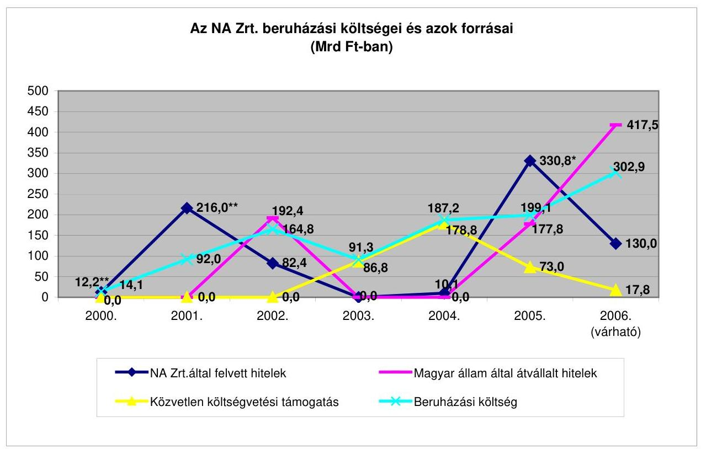
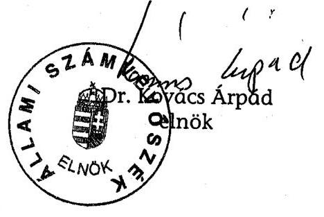

# ÁLLAMI   SZÁMVEVŐSZÉK 

## JELENTÉS

az autópálya beruházások finanszírozási megoldásainak összehasonlító ellenőrzéséről

---

2. Államháztartás Központi Szintjét Ellenőrző Igazgatóság
2.1. Teljesítmény Ellenőrzési Főcsoport
Iktatószám: V-9-35/2006.
Témaszám: 818
Vizsgálat-azonosító szám: V0282
Az ellenőrzést felügyelte:
Bihary Zsigmond
főigazgató
Az ellenőrzés végrehajtásáért felelős:
Kemény Emil
főcsoportfőnök
Az ellenőrzést vezette:
Makkai Mária
főcsoportfőnök-helyettes
Az ellenőrzést végezték:

| Gaálné Izsó Éva | Hajagos Józsefné | Kun Eszter |
| :-- | :-- | :-- |
| számvevő tanácsos | főtanácsadó | számvevő tanácsos |
| Lucza Anikó | Massányi Tibor | Nagy Ákos |
| számvevő | számvevő | számvevő |

# A témához kapcsolódó eddig készített számvevőszéki jelentések: 

címe
Jelentés a koncesszióba adott állami tevékenységek vizsgálatáról 0114
Jelentés az M3 autópálya beruházás pénzügyi folyamatának ellenőrzéséről 0218
Jelentés az M7 autópálya felújítás pénzügyi folyamatának ellenőrzéséről 0342
Jelentés a szekszárdi Duna-híd beruházás ellenőrzéséről 0428
Jelentés a Magyar Köztársaság 2004. évi költségvetése végrehajtásának ellenőrzéséről 0540

---

# TARTALOMJEGYZÉK 

BEVEZETÉS ..... 7
I. ÖSSZEGZŐ MEGÁLLAPÍTÁSOK, KÖVETKEZTETÉSEK, JAVASLATOK ..... 11
II. RÉSZLETES MEGÁLLAPÍTÁSOK ..... 24

1. A beruházások megvalósítását és finanszírozását befolyásoló jogszabályok ..... 24
1.1. A beruházások megvalósítását befolyásoló jogszabályok ..... 24
1.2. A finanszírozást befolyásoló jogszabályok ..... 26
2. Az autópálya beruházásokra vonatkozó kormányhatározatok, a fejlesztésekhez kapcsolódó finanszírozási tervek ..... 27
3. Az építtetői feladatokat ellátó, a beruházások lebonyolítását irányító és végrehajtó szervezetek ..... 31
3.1. A végrehajtó szervezetek ..... 31
3.2. Irányító szervezetek ..... 33
4. Az alkalmazott finanszírozási konstrukciók, pénzügyi források ..... 35
4.1. Állami források ..... 35
4.2. Magántőke bevonás ..... 38
4.3. EU forrás bevonás ..... 43
5. A beruházási érték nyilvántartása, a beruházások aktiválása ..... 44
MELLÉKLETEK
6. sz. a Gazdasági és Közlekedési Minisztérium észrevétele
7. sz. Autópálya fejlesztési program változása
8. sz. Gyorsforgalmi utak forgalomba helyezésének alakulása 1990-2006. június 30. között
9. sz. A költségvetés készfizető kezességvállalása mellett a beruházók által felvett hitelek jellemzői
10. sz. Autópálya építési célú költségvetési támogatások alakulása
11. sz. Kritériumok az autópálya beruházások finanszírozási megoldásainak összehasonlító ellenőrzéséről

## FÜGGELÉKEK

1. sz. Az ellenőrzésre kiválasztott autópálya szakaszok
2. sz. Nemzetközi tapasztalatok

---

.

---

# RÖVIDÍTÉSEK JEGYZÉKE 

| ÁAK Kht. | Állami Autópálya Kezelő Kht. |
| :--: | :--: |
| ÁAK Zrt. | Állami Autópálya Kezelő Zrt. |
| Áht. | 1992. évi XXXVIII. törvény az államháztartásról |
| AKA Zrt. | AKA Alföld Koncessziós Autópálya Zrt. |
| Aptv. | A Magyar Köztársaság gyorsforgalmi úthálózatának közérdekűségéről és fejlesztéséről szóló 2003. évi CXXVIII. törvény |
| ÁKK Rt. | Államadósság Kezelő Központ Rt. |
| ÉKMA | Észak-kelet Magyarországi Autópálya Fejlesztő és Üzemeltető Rt. |
| ELMKA | Első Magyar Koncessziós Autópálya Rt. |
| ESA | az EU által használt számviteli elszámolási rendszer |
| FIDIC | Tanácsadó Mérnökök Nemzetközi Szövetsége |
| FIFA | Felzárkózási és Infrastruktúra Fejlesztési Alapprogram |
| GKM | Gazdasági és Közlekedési Minisztérium |
| Kbt. | 1995. évi XL., illetve a 2003. évi CXXIX. törvény a közbeszerzésekről |
| KHVM | Közlekedési, Hírközlési és Vízügyi Minisztérium |
| Kkt. | 1988. évi I. törvény a közúti közlekedésről |
| KÖHÉM | Közlekedési, Hírközlési és Építésügyi Minisztérium |
| KöViM | Közlekedési és Vízügyi Minisztérium |
| Kt. | 1995. évi LIII. törvény a környezetvédelem általános szabályairól |
| KVI | Kincstári Vagyoni Igazgatóság |
| MÁK | Magyar Államkincstár |
| MeH | Miniszterelnöki Hivatal |
| MFB Rt. | Magyar Fejlesztési Bank Rt. |
| NA Zrt. | Nemzeti Autópálya Zrt. |
| NYUMA | Nyugat-Magyarországi Autópálya Üzemeltető Rt. |
| OKVF | Országos Környezet- és Vízügyi Felügyelőség |
| OTrT | Országos Területrendezési Terv |
| PPP | Public Private Partnership |
| Ptk. | 1959. évi IV. tv. a Polgári Törvénykönyvről |
| Sztv. | 2000. évi C. törvény a számvitelről |
| ÚFCE | Útfenntartási és Fejlesztési Célelóirányzat |
| UKIG | Útgazdálkodási és Koordinációs Igazgatóság |

---

.

---

# ÉRTELMEZŐ SZÓTÁR 

| aktiválás | A beszerzések, beruházások során elszámolt költségek és ráfordítások eszközként való állományba vétele a számviteli elszámolásban, mely rendszerint szorosan kapcsolódik az eszközök rendeltetésszerű használatba vételéhez. |
| :--: | :--: |
| átadási érték | Az NA Zrt. által építtetett autópálya-szakaszok Kincstári Vagyoni Igazgatóság részére való átadásakor a beruházás értékeként meghatározott összeg. |
| diszkontráta | A jövőbeli pénzáramok jelenbeli értékének kiszámításához felhasznált, százalékban kifejezett ráta. |
| hitelátvállalás | A Magyar Állam által különféle szervezetektől az államadósság terhére átvállalt hitelek. |
| kiviteli terv | A beruházás kivitelezéséhez szükséges összes részletet tartalmazó dokumentációk (útépítési-, hídépítési-, vízépítési-, forgalomtechnikai-, környezetvédelmi-, közműtervek, stb.) összessége. |
| Kohéziós Alap | Az Európai Unió által nyújtott egyes támogatások közvetítésének eszközeként szolgáló pénzügyi alap. |
| koncesszió | A koncesszióról szóló 1991. évi XVI. törvényben megnevezett szolgáltatások és feladatok végzésére vonatkozó jog átengedése rendszerint az állammal vagy önkormányzattal megkötött szerződés keretében. A koncessziós szerződés megkötésére az állam vagy önkormányzat által kiírt pályázat lefolytatását követően kerülhet sor. A pályáztatási és a szerződéskötési kötelezettség alól ágazati törvény mentesítést adhat. |
| koncessziós díj | A koncesszióba adott tevékenység gyakorlásának átengedéséért a koncessziós által az államnak vagy önkormányzatnak fizetett díj, amelynek megfizetési módjáról és mértékéről a koncessziós szerződés rendelkezik. |
| közbeszerzési eljárás | A közpénzek törvényes és ésszerű felhasználását szolgáló olyan eljárás, amelynek során megadott tárgyú és értékű beszerzéseket valósítanak meg. |
| környezetvédelmi hatástanulmány | Az építési beruházás előkészítése keretében a beruházás koncepcióját, célját, tárgyát, megvalósítását alátámasztó, a környezetvédelmi szempontok figyelembevételével az ajánlatkérő által készíttetett előtanulmány. Az előzetes hatástanulmány a nyomvonal-változatok kijelölését előzi meg, a részletes hatástanulmány kidolgozására az illetékes miniszter által rendeletben megjelölt nyomvonalváltozatok esetében kerül sor. |
| mérnök | A beruházó társaság által az építési munkák felügyeletére kiválasztott és igénybe vett független szervezet. |
| nettó jelenérték (NPV) | A jövőbeli pénzáramok meghatározott diszkontrátával számított jelenbeli értékének és a jelenbeli pénznek az összege. Egy beruházás nettó jelenértéke a beruházásból származó jövőbeli hozamok diszkontált értékének és a |

---

PPP (Public Private
Partnership)

Program utak

Public Sector
Comparator (PSC) elemzés
rendelkezésre állási díj

Value for Money elemzés
beruházásra fordított kiadások különbözete.
A köz- és magánszféra olyan együttműködése, amely során az állammal kötött hosszú távú szerződés keretében egy magáncég nyújt közszolgáltatást.
A Program utakról szóló 317/2005. (XII. 25.) Korm. rendeletben meghatározott gyorsforgalmi utak összessége, amelyek beruházását magántőke bevonásával, piaci forrásból finanszírozzák.
A PPP beruházások költséghatékonysági elemzésének lehetséges eszköze. A PSC a projekt nettó jelenértékét adja meg hagyományos állami beruházás és üzemeltetés esetén, ezt az értéket kell összevetni a PPP konstrukció nettó jelenértékével.
A PPP módszerrel végrehajtott beruházás esetében az állam által a beruházónak a szerződésben meghatározott szolgáltatás nyújtásáért fizetett összegek.
A PPP beruházások gazdaságosságát, hatékonyságát az előkészítés (korai) szakaszában bemutató elemzés, amely a PPP beruházás költségeit és minőségét veti össze a hagyományos állami beruházás kiadásaival és elérhető minőségével.

---

# JELENTÉS 

## az autópálya beruházások finanszírozási megoldásainak összehasonlító ellenőrzéséről

## BEVEZETÉS

A magyarországi gyorsforgalmi úthálózat (autópályák, autóutak) tervszerű, jelentősebb ütemű fejlesztésének igénye az 1990-es évek elején fogalmazódott meg, amelyet a gazdasági fejlődés előmozdítása érdekében a forgalmi és közlekedésbiztonsági problémák jelentkezése, a gyorsforgalmi utak alacsony száma, és a hiányzó nemzetközi gyorsforgalmi kapcsolatok tettek szükségessé. Az úthálózat fejlesztésére távlati hálózatfejlesztési tervek készültek, az ezekben szereplő magyarországi vonalak igazodnak a nemzetközi gyorsforgalmi úthálózatok irányaihoz.

A közúti közlekedésről szóló 1988. évi I. törvény állami feladatként határozza meg a közúti közlekedés tervezését, szabályozását, a közúthálózat fejlesztését, fenntartását, üzemeltetését. Az állam a kizárólagos tulajdonát képező autópályák létesítését és működtetését állami tulajdonú gazdálkodó szervezet (gazdasági társaság), illetve koncessziós társaság útján látja el.

A központi költségvetésben az 1989-1998 közötti években az Útalap, mint elkülönített állami pénzalap biztosított forrást az állami tulajdonban lévő országos közúthálózat fejlesztésére, fenntartásra és üzemeltetésére. A Kormány az 1998-2007 közötti időszakra a beruházások végrehajtására vegyes finanszírozási rendszert írt elő, amely államháztartási, állami társasági (M1, M3 és az M7), illetve állami hozzájárulást is tartalmazó koncessziós forrásokat (M5) használ fel.

1999-ben a források biztosítására és koordinálására a Magyar Fejlesztési Bank Rt. (továbbiakban: MFB Rt.) kapott felhatalmazást azzal, hogy az adósságszolgálatból származó fizetési kötelezettségekért a Kormány kezességet vállalt és a finanszírozásba hazai pénzintézeteket is bevontak. 2001. októberben átalakultak a finanszírozásra vonatkozó szabályok, 2002 novemberéig a finanszírozást tekintve kiterjesztették az MFB Rt. szerepét, amelynek a szükséges forrásokat hitelfelvételek útján kellett biztosítania.

2003-tól a gyorsforgalmi utak fejlesztésének költségvetési forrásigényét külön előirányzatként kezelték az éves költségvetésben, és a Kormány szükségesnek tartotta járulékos források, ezen belül EU források és a magántőke igénybevételét a fejlesztések végrehajtása érdekében.

A magántőke állami fejlesztési célú bevonását a Magyar Köztársaság 2005. évi költségvetéséről szóló 2004. évi CXXXV. törvény 13. § (3) bekezdése írta elő. A

---

2005. év végéig befejezett, illetve elkezdett, magántőkét felhasználó beruházások koncessziós társaságokon keresztül történtek. 2005 márciusától a magántőke bevonásával finanszírozott, külön jogszabályban meghatározott, ún. Program utak beruházási és üzemeltetési feladatait az Állami Autópálya Kezelő Zrt. (továbbiakban: ÁAK Zrt.) látja el.

Az utak felújításának, karbantartásának, üzemeltetésének és fejlesztésének forrása 2006. január 1-jétől az Útpénztár fejezeti kezelésű előirányzat, kivéve a koncessziós szerződés keretében, illetve a magántőke bevonásával megvalósuló közutakat és azok tartozékait. Az új előirányzat a korábbi költségvetési előirányzatok egyesítésével jött létre, és ebből finanszírozzák a fejlesztések során a területbiztosítási, előkészítési és minőségbiztosítási feladatok ellátására fordított kiadásokat. Az előirányzat működtetésével összefüggő feladatokat az Útgazdálkodási és Koordinációs Igazgatóság (továbbiakban: UKIG) látja el.

A Magyar Köztársaság gyorsforgalmi közúthálózatának közérdekűségéről és fejlesztéséről szóló 2003. évi CXXVIII. törvény (továbbiakban: Aptv.) rögzíti a gyorsforgalmi úthálózat fejlesztésének feladatait és azok közérdekűségét, az autópályák és autóutak építésének finanszírozási forrásait és azt, hogy a Kormány gondoskodik a források rendelkezésre állásáról. Az Aptv. rendelkezése alapján a Kormány - a közlekedésért felelős miniszter és a pénzügyminiszter útján - évente köteles beszámolni az Országgyűlésnek a gyorsforgalmi úthálózat bővítéséről, a források felhasználásáról.

A költségvetési forrásból finanszírozott gyorsforgalmi és országos közutak vagyonkezelői és vagyonnyilvántartási feladatait a Kincstári Vagyoni Igazgatósággal (továbbiakban: KVI) kötött szerződés alapján az UKIG végzi a Magyar Közút Kht., a Nemzeti Autópálya Zrt. (továbbiakban: NA Zrt.) és az ÁAK Zrt. közreműködésével.

1994-től 2006. június végéig összesen 27 autópálya szakaszt helyeztek forgalomba, amelyekből az egyik az M7-es autópálya 100 km hosszú szakaszának felújítását is tartalmazta. A fejlesztéssel érintett útszakaszok hossza összesen 603 km volt.

Az Állami Számvevőszék (továbbiakban: ÁSZ) stratégiai célkitűzésével összhangban, megkülönböztetett figyelmet fordít a közlekedési infrastruktúra fejlesztésének, fenntartásának és azok finanszírozási konstrukciójának ellenőrzésére. Az elmúlt időszakban más ÁSZ ellenőrzések is érintették valamilyen szegmensében az ezzel kapcsolatos ráfordításokat. A stratégiába illeszkedik jelen ellenőrzésünk is, amelynek keretében a vizsgálat az 1990-2005 közötti időtávot átfogva - a már lefolytatott ellenőrzések eredményeit is felhasználva - értékeli az autópálya fejlesztések finanszírozási módjait. A stratégiai célok megvalósítását jelenti a 2006-ban befejeződő autópálya beruházások folyamatban lévő ellenőrzése, illetve a következő évre tervezett, a 2007-ben befejeződő
 autópálya beruházásokat érintő vizsgálat is.

Az ÁSZ 2001-ben a koncesszióba adott állami tevékenységeket, 2002-ben az M3 autópálya beruházást, 2003-ban az M7 autópálya felújításának pénzügyi folyamatait, 2004-ben a szekszárdi Duna híd beruházást, a 2004. évi költségvetés

---

végrehajtása ellenőrzése keretében az M5 autópálya első szakaszának szerződéseit, 2006-ban az állami utak fenntartását ellenőrizte.

A jelenlegi ellenőrzés célja annak értékelése volt, hogy:

- az autópálya beruházások jogszabályi és intézményi háttere támogatta-e a beruházások gazdaságos megvalósítását;
- a finanszírozási konstrukciók és azok változása biztosította-e a beruházásokhoz szükséges források időbeni rendelkezésre állását és a forrásbevonás során a költséghatékonyság érvényesítését, az eltérő finanszírozási módok költségvetésre gyakorolt hatását;
- megvalósult-e a beruházások finanszírozásának és a források felhasználásának átláthatósága;
- a gyorsforgalmi úthálózat fejlesztésére ható tényezők hogyan befolyásolták a költségek alakulását, illetve a gyorsforgalmi utak építése révén milyen mértékben növekedett az állam vagyona.

Az ellenőrzési feladat megtervezésénél az egyes autópálya szakaszoknál alkalmazott eltérő finanszírozási módok összehasonlítását tűztük ki célul. Az ellenőrzés előkészítése során azonban kiderült, hogy a 2000 előtt forgalomba helyezett autópálya szakaszoknál a rendelkezésre álló dokumentumok szerint az akkori nyilvántartásokból a felhasznált források nem beazonosíthatóak. Az autópálya építések finanszírozása nem szakaszonként történt/történik, a kormányhatározatokban megjelölt finanszírozási források - néhány kivételével - nem konkrét szakaszhoz rendeltek (nem pántlikázottak), hanem a gyorsforgalmi úthálózat összes tervezett fejlesztéséhez. Az NA Zrt. részére évenként rendelkezésre álló források az adott időszakban aktuális autópálya építési feladatok finanszírozását szolgálják (pl. több autópálya szakasz terület előkészítését, régészeti feltárását, terveztetését, kivitelezését stb.). Az NA Zrt. az általa építtetett és elkészült autópálya-szakaszok átadási értékének meghatározásakor - az NA Zrt. feladatainak egészére vonatkozó forrásszerkezetnek megfelelően - 2005-ig utólag mutatta ki az adott autópálya szakasz ráfordításainak forrásösszetételét. Mindezek miatt az ellenőrzés az eltérő finanszírozási módok állami kiadásokra gyakorolt hatását összevontan mutatja be. Az ellenőrzésre kiválasztott autópálya szakaszok - M0 Keleti szektor M5-4. sz. főút közötti szakasz, M30 Emőd-Miskolc közötti szakasz, M7 Balatonszárszó-Ordacsehi közötti szakasz, M3 Gyöngyös-Füzesabony közötti szakasz, M6 Érdi tető-Dunaújváros közötti szakasz - jellemzőit a függelék tartalmazza. Az ellenőrzésbe vont autópálya szakaszok meghatározásánál szempont volt, hogy azokra korábbi ÁSZ vizsgálat nem terjedt ki, más-más autópályát reprezentáltak, az átadás időpontja eltérő volt és szerepelt köztük a PPP konstrukcióban megvalósult szakasz is.

Az ellenőrzés keretében tájékoztatást kértünk a Horváth Köztársaság, a Szlovén Köztársaság és Spanyolország számvevőszékétől az autópálya építések finanszírozásáról, amelyek rövid összefoglalóját a függelék tartalmazza.

Az ellenőrzés a Gazdasági és Közlekedési Minisztérium (továbbiakban GKM), az NA Zrt., az ÁAK Zrt., az UKIG vizsgálatot érintő tevékenységére irányult és az 1990-től 2005. év végéig forgalomba helyezett autópálya-szakaszokra, vala-

---

mint a folyamatban lévő beruházások finanszírozási módjára terjedt ki, de figyelembe vettük az ellenőrzés lezárásáig történt intézkedéseket.

Az ellenőrzés jogalapját az ÁSZ-ról szóló 1989. évi XXXVIII. tv. 2. § (6) bekezdése képezte.

A jelentést egyeztetésre megküldtük a gazdasági és közlekedési miniszternek. Levele másolatát az 1. sz. melléklet tartalmazza.

---

# I. ÖSSZEGZŐ MEGÁLLAPÍTÁSOK, KÖVETKEZTETÉSEK, JAVASLATOK 

Az Országgyűlés 1996-ban és 2004-ben meghozott határozataival jóváhagyta az ország közlekedéspolitikai stratégiájának fő irányait.

1997-től a mindenkori Kormány meghatározta a gyorsforgalmi utak fejlesztésének középtávú - 10, illetve 15 éves időtartamú - programját, amely tartalmazta a megépítendő útszakaszok ütemezését és finanszírozási módját. A kormányhatározatok a fejlesztésekhez vegyes finanszírozási módot - államháztartási, állami társasági, hitel, uniós támogatások útján megszerezhető segélyek, koncessziós források - jelöltek meg. Az egyes programok abban tértek el egymástól, hogy a lehetséges források nem mindegyikét, illetve más-más összetételét tartalmazták. Az autópálya fejlesztésekhez igazodó távlati finanszírozási programok és az azokat megalapozó gazdaságossági számítások nem készültek.

2004-től törvény, az Aptv. határozza meg a gyorsforgalmi utak tervezésének, építésének 2005-2007 között évente szükséges forrásigényét, amelynek finanszírozási formájaként - azok arányának, mértékének nevesítése nélkül - költségvetést, EU támogatást és magántőkét jelölt meg, a pénzeszközök biztosítása a Kormány feladata.

A vizsgált időszakot az állami források szűkössége jellemezte, ezért a finanszírozási konstrukciók kialakításánál a magántőke bevonását - eltérő intenzitással - mindvégig számításba vették.

A gazdaságpolitikai követelményekkel összhangban lévő, a gyorsforgalmi úthálózat fejlesztéséről és annak forrásairól szóló kormányhatározatok, illetve az Aptv. csak a tervezett finanszírozási formákat és az úthálózat fejlesztésére előirányzott források összegét rögzítették. A finanszírozási formák megválasztásáról a mindenkori Kormány döntött. Egy adott évre vonatkozóan és a megépítésre kerülő útszakaszok esetében nem készültek a megvalósításhoz rendelt finanszírozási tervek, amelyben rögzítették volna a források megoszlását, azon belül az állami hozzájárulás mértékét, a szükséges hitelek és az esetleges egyéb források bevonásának nagyságát, ami nem segítette elő a finanszírozás átláthatóságát.

A finanszírozási formák változása a költségvetés mindenkori helyzetével és az autópálya fejlesztések elhatározott ütemével volt összefüggésben. A gyorsforgalmi utak fejlesztésének finanszírozásában elsődleges szempont volt a folyó évi költségvetést kímélő finanszírozási megoldások alkalmazása. Ez egyre erőteljesebben jelentkezett az Európai Unióhoz történő csatlakozás után, annak érdekében, hogy az éves költségvetési hiány ne lépje túl a GDP 3%-át és az államadósság a GDP 60%-át. Ennek következménye, hogy miközben a gyorsforgalmi úthálózat építése nemzetgazdasági szinten egyre több kiadással járt, a költségvetés közvetlen, direkt szerepe csökkent az elmúlt évtizedben.

Az államháztartás 1998-ig az Útalapból, mint elkülönített állami pénzalapból finanszírozta az autópálya fejlesztéseket, 1999-ben - az Útalap megszűntetése

---

után - az Útfenntartási és fejlesztési célelöirányzatból került sor a kifizetésekre. 2000-2002 között közvetlen államháztartási forrás nem támogatta az autópálya beruházásokat. 2003-2005 között több fejezeti kezelésű előirányzatban jelentek meg a finanszírozási források. 2006-tól - a célelöirányzatok összevonásával - az Útpénztár fejezeti kezelésű előirányzat az autópálya beruházások költségvetési forrása. A központi költségvetésben megjelölt források nem csupán az autópálya fejlesztés finanszírozását szolgálták (ezekből finanszírozták az országos közúthálózat fejlesztését és üzemeltetését is), emiatt a teljes időszakra a költségvetési forrásokból a gyorsforgalmi úthálózat fejlesztésére fordított összeg egyértelműen nem mutatható ki. Az UKIG adatszolgáltatása szerint 1994-2005 között az autópálya építések költségvetési támogatása 373,2 milliárd Ft volt. (Ebből 17,6 milliárd Ft tervszámot jelent, amely az 1998. évet érinti).

A gyorsforgalmi úthálózat fejlesztési programjai alapján 1990-2006. június 30-ig összesen 603 km hosszú gyorsforgalmi utat (27 szakaszt) adtak át a forgalomnak. Ebből 1 szakasz épült PPP konstrukcióban, 8 szakasz koncesszió keretében és 18 szakasz állami finanszírozásban. Az állami finanszírozás esetében a forrást egyrészt közvetlenül a központi költségvetésből, másrészt állami kezességvállalás mellett felvett hitelekből biztosították. A forgalomba helyezett szakaszok mindegyike a beruházás teljes költsége - az előkészítés megkezdésétől a forgalomba helyezésig - tekintetében vegyes finanszírozású volt, mivel a PPP és a koncesszió esetében is az előkészítést állami források finanszírozták (az építés előkészítése, a területbiztosítás és a minőségvizsgálat kizárólagos állami feladat). Kizárólag közvetlen költségvetési forrásból és tisztán magántőkéből nem épült autópálya.

Finanszírozási költség mindegyik finanszírozási módnál felmerült. Állami finanszírozás esetében a finanszírozási költség a központi költségvetést, koncesszió, illetve PPP esetében a koncesszort terhelte. (Ez utóbbinál is a végső teherviselő a költségvetés, mivel a finanszírozási költséget a Magyar Állam a rendelkezésre állási díj részeként a koncesszor számára megfizeti). Az állami finanszírozás központi költségvetésből közvetlenül biztosított hányadának is - a költségvetés hiánypozíciója miatt - volt finanszírozási költsége, a hiány azonban közvetlenül nem kapcsolható az autópálya fejlesztések miatti kiadásokhoz. Az állami finanszírozásban és a koncesszió, illetve PPP keretében épült autópálya beruházások finanszírozásánál a különbség abban volt, hogy a finanszírozás a költségvetést rövid, vagy hosszú távon, illetve a folyó évi költségvetést terhelte, vagy az államadósságot növelte. A koncessziós, illetve PPP finanszírozási mód esetében az autópálya építésének terhei hosszabb időszak alatt és egyenletesebben terhelik az állami költségvetést.

Az állami finanszírozású beruházásoknál a forrást a költségvetés közvetlen támogatása, az építtető társaságok szabad pénzeszköze és az általuk felvett hitel jelentette. A 2000 előtti időszakra vonatkozóan ezek megoszlásáról - az akkori nyilvántartási rendszerek hiányosságai és a szervezeti átalakulások miatt pontos adatok nem állnak rendelkezésre.

2000-től az NA Zrt. látja el az útépítések előkészítését és köti meg a kivitelezőkkel a szerződéseket. A finanszírozáshoz szükséges hiteleket az NA Zrt. az MFB Rt.-től, kereskedelmi banki konzorciumoktól vette fel.

---

Az adatok forrása: az NA Zrt. éves beszámolói.
*A 2005-ben felvett hitelből 177,8 milliárd Ft az Aptv. alapján a Magyar Államnak megtérítendő - az NA Zrt. által már megkezdett Program utak beruházásainál felmerült, a központi költségvetésből finanszírozott tervezési, mérnöki lebonyolítási és kivitelezési - költségek forrása volt.
**A 2000-ben felvett 12,2 milliárd Ft és a 2001-ben felvett hitelből 36 milliárd Ft áthidaló hitel volt, amelyeket az NA Zrt. a 2001-ben felvett 180 milliárd Ft szindikált hitelből visszafizetett.

Az NA Zrt. tevékenységét - gyorsforgalmi és közúthálózat fejlesztése - mintegy 2/3-ad részben hitelek finanszírozták, amelyek az adott évi folyó költségvetést nem terhelték. A hitelek átvállalása az államadósságot növelte, az azután fizetett kamat terhelte/terheli a folyó költségvetést, a hitelek törlesztését, az Államadósságkezelő Központ Zrt. (továbbiakban: ÁKK Zrt.) végzi állami forrásból és további hitelekből.

2000-2005 között az NA Zrt. részére folyósított 640338 millió Ft hitel 42,2%-át az MFB Rt. nyújtotta. A hitelek felvételére a beruházások megvalósítása, a hitelek adósságszolgálatának teljesítése érdekében került sor. A hitelállomány növekedése együtt járt a kamat- és bankköltségek emelkedésével, ami megdrágította az autópálya fejlesztések finanszírozását. A hitelek felvételét a mindenkori Kormány rendelte el. Az NA Zrt. hitelállományából 2005. december 31-ig 368754 millió Ft-ot vállalt át a Magyar Állam.
2006. október végén az NA Zrt. hitelállománya 363,1 milliárd Ft volt, amelynek lejárata összességében 2007. december 31. Az NA Zrt. a hitelek miatti kamatfizetési kötelezettséget nyilvántartja, azok megfizetése lejáratkor, egy összegben esedékes. A Magyar Állam 2006. év végi hitelátvállalása esetén a ka-

---

matfizetési kötelezettség NA Zrt. által kimutatott összege 40,2 milliárd Ft, 2007. évi végi hitelátvállaláskor 70,2 milliárd Ft. ${ }^{1}$

Az NA Zrt., az általa építtetett és elkészült autópálya-szakaszoknál, 2005-ig utólag - a feladatainak egészére vonatkozó forrásszerkezetnek megfelelően mutatta ki az adott autópálya szakasz ráfordításainak forrásösszetételét. 2006-tól az NA Zrt. nyilvántartási rendszere lehetővé teszi az autópálya szakaszok forrásainak közvetlen kimutatását. Tekintettel azonban arra, hogy az ellenőrzött szakaszok finanszírozása a 2005. előtti időszakra esett, így a bevezetett új nyilvántartási rendszer működésével kapcsolatos ellenőrzési tapasztalatok még nincsenek.

Az NA Zrt. által felvett hitelek 11,2%-át az áthidaló hitelek tették ki. Ezek felvételét az tette szükségessé, hogy a finanszírozási források időben nem álltak rendelkezésre, az esedékes számlákat az NA Zrt. nem tudta teljesíteni. Ennek következménye az is, hogy a lejárt számlatartozások miatt 2006 júliusában az NA Zrt.-hez benyújtott késedelmi kamatigény 208,7 millió Ft volt. (2005-ig is jellemző volt a késedelmes számlateljesítés, de késedelmi kamat felszámítására nem került sor).

Az autópálya építésekkel kapcsolatban - az Útalap, az ÁAK Zrt. és az NA
 Zrt. révén - felvett, és a központi költségvetés által átvállalt forint hitelek összege 333020 millió Ft, a devizahitelek összege 120604 millió Ft volt. A hitelekre az ÁKK Zrt. 38358 millió Ft kamatot fizetett. A forint hitelek visszafizetése lejárattól függően 2005 végéig megtörtént.

A magántőke bevonásának alkalmazott formája a koncesszióba adás volt. Az első koncessziós pályázati kiírások az ún. tiszta projekt finanszírozás elvét követték, a beruházások megtérüléséhez nem kapcsolódott állami kötelezettségvállalás. Az építés, fenntartás és az üzemeltetés a koncessziós társaság feladata volt, amelyet a díjbevételekből kellett fedezni. Az ebben a konstrukcióban épült M1/M15 autópálya szakaszok megvalósításához, illetve üzemeltetéséhez - az eredeti szándékok ellenére - állami kötelezettségvállalás járult, mivel az autópályát építő projekttársaság csődbe ment, a társaság hiteleit a Magyar Állam átvállalta. Az M5 autópályát építő projekttársaság részére 2003-ig az állam üzemeltetési hozzájárulást fizetett - mivel a magas autópálya díjak következtében jelentkező forgalomvisszaesés miatt a díjbevételek nem fedezték az üzemeltetést és a hitelek miatti fizetési kötelezettséget -, a társaság hitelei mögött megjelentek az állam garanciavállalásai.

[^0]
[^0]:    ${ }^{1}$ A Magyar Köztársaság 2006. évi költségvetéséről szóló 2005. évi CLIII. törvény 109. §-a szerint a Magyar Állam az NA Zrt. legfeljebb 415,9 milliárd összegű hiteltartozását - annak járulékaival együtt - legkésőbb 2006. december 31-i hatállyal átvállalhatja. Ugyanezen összeg szerepel a törvény módosítására 2006 novemberében benyújtott T/1205. sz. törvényjavaslatban is. A megjelölt összeg nem pontos, mivel abban szerepel az a 177,8 milliárd Ft is, amelyet a Magyar Állam 2005. december 22-én már átvállalt. Az NA Zrt. által 2006-ban felvett hitelekkel együtt az átvállalható hitel összege 363,1 milliárd Ft.

    A Magyar Köztársaság 2007. évi költségvetéséről szóló ÁSZ vélemény azt tartalmazza, hogy a Kormány 350 milliárd Ft NA Zrt. adósságot kíván rendezni a 2006. évi költségvetésben. Erre figyelemmel 13,1 milliárd Ft hitelátvállalás 2007-re húzódik át.

---

tetést és a hitelek miatti fizetési kötelezettséget -, a társaság hitelei mögött megjelentek az állam garanciavállalásai.

Az EU csatlakozást követően a magántőke bevonásánál a Pénzügyminisztérium és a GKM azt vizsgálta, hogy melyik az a finanszírozási forma, amely nem rontja az államháztartás pozícióját és nem növeli az államháztartási hiányt az EU számviteli elszámolási (ESA) rendszere szerint. A vizsgálat eredménye az volt, hogy a PPP konstrukció megfelel a kritériumoknak.

Az M6 autópálya Budapest-Dunaújváros közötti szakasza PPP keretében történő megvalósításának előzetes vizsgálatáról szóló kormány-előterjesztés szerint „az állam pénzügyi szerepvállalása, vagy kockázatviselése nélkül a tisztán magántőkéből történő finanszírozás továbbra is drágább, mint a költségvetési források, vagy az állami garanciával kapott hitelek, ez az ára, hogy a beruházás nem azonnal, hanem időben elnyújtva terheli az államháztartást. " Az előterjesztésben arról tájékoztatták a Kormányt, hogy előzetes feltételezések alapján, 15 éves futamidőt alapul véve, a közvetlen állami megrendelés esetén fizetendő építési költség kb. 1,6-1,9 szeresét fizeti az állam a futamidő egésze alatt.

PPP finanszírozási konstrukcióban épült az M6 Érdi tető-Dunaújváros autópálya szakasz, amely előkészítésének költségeit az állam viselte, az építést a projekttársaság hitelekből finanszírozta, amelyekhez nem járult állami kezességvállalás. Az állam a hiteleket és annak kamatait, a projekttársaság hozamelvárásait, az üzemeltetés és fenntartás, valamint a felújítás költségeit rendelkezésre állási díjban téríti meg a 22 éves futamidő alatt, amelynek nettó jelenértéke 111,9 milliárd Ft. A koncessziós társaság a szerződés szerint koncessziós díjat fizet az államnak.

Az M6 Érdi tető-Dunaújváros autópálya szakasz PPP konstrukcióban való megvalósításáról szóló döntés előtt gazdaságossági számítás nem készült. A koncessziós szerződés és az azt finanszírozó hitelszerződések megkötését követően a GKM egy külső tanácsadó cég számításai alapján kimutatta a PPP konstrukció gazdaságosságát. A tanácsadó cég a hét hónappal korábban, az öt évvel hosszabb futamidejű M5 autópálya beruházásnál alkalmazott 10%-os diszkontrátával számolt, amelyet a GKM felülvizsgálat nélkül elfogadott, miközben a tanácsadó megbízásával a GKM nem mentesült a szakmai felelősség alól. Ez arra utal, hogy a PPP konstrukció alkalmazásánál az államigazgatási szakapparátus felkészültségében hiányosságok voltak. ${ }^{2}$ A tanácsadó által készített elemzés a 10%-os ráta mellett az állami beruházás 21%-os hátrányát mutatta ki a PPP költségeihez képest, de azt is tartalmazta, hogy 7,1%-os ráta mellett a két diszkontérték azonos.

A PPP módszerrel végrehajtott beruházások eljárás rendje, így annak keretében a döntések megalapozását jelentő gazdaságossági számítások szükségessége, az alkalmazandó diszkontráta meghatározásának módja (a benne foglalt kockázatok köre), mértéke nem szabályozott. A több éves fizetési kötelezettséggel járó

[^0]
[^0]:    ${ }^{2}$ A GKM 2006. július 18-án kelt levele szerint „A minisztérium nem rendelkezik pénzügyi modellezésben jártas szellemi kapacitásokkal, ezért bízott meg ezzel a feladattal egy rendkívül nagy tapasztalatokkal rendelkező tanácsadó céget."

---

kötelezettségvállalások nettó jelenérték számításánál alkalmazandó diszkontráta mértékét 2005. január 1-jétől a Kormány határozza meg, amelyet a Pénzügyminisztérium először 2005 szeptemberében hozott nyilvánosságra (ami a Pénzügyminisztérium megítélése szerint nem feltétlenül alkalmazható a PPP projektek gazdaságossági számításaihoz).

A beruházások gazdaságosságának számításakor alkalmazandó diszkontráta mértékének megítéléséhez nincs jogilag szabályozott, egzakt kritérium. A megfelelő diszkontráta meghatározásának azért van jelentősége, mert az érzékenyen érinti a nettó jelenértéket. Magasabb diszkontráta mellett a hosszú távon jelentkező költségeknek kisebb lesz a jelenlegi értéke. Az elemzés elkészítésének időpontjában (2004. december 16.) az állam hosszú lejáratú, forint alapú forrásainak átlagos hozama (kamata) 7,06% volt. ${ }^{3}$
${ }^{3}$ A GKM 2006. október 24-én kelt levele szerint „A 2004. decemberi „Value for Money" elemzésben egy képzeletbeli - az M6 megvalósítására irányuló - állami beruházás költségei lettek modellezve, e költségek nettó jelenértéke lett összehasonlítva a PPP beruházás kockázatokkal súlyozott nettó jelenértékével. Az NPV számításnál 10%-os nominális diszkontláb alkalmazásával.
A nemzetközi gyakorlat alapján megállapítható, hogy a diszkontláb meghatározása nagy körültekintést igényel, és mértékét projekt specifikus tényezők is befolyásolhatják. Általánosságban elmondható, hogy a megfelelő diszkontláb meghatározásakor a kockázatmentes kamatlábból kell kiindulni, és ezt kell megfelelő tényezőkkel korrigálni.
A kockázatmentes kamatláb megállapításánál 2004. december elején, a piacon elérhető leghosszabb futamidejű állampapír fixingjéből indulhatunk ki. Bár a 2020A állampapír hátralévő futamideje rövidebb, mint az M6 koncesszió 22 éve, véleményünk szerint így is jó referencia. Az említett instrumentum fixingje 2004. december 1-jén 7,19% volt, azaz a piac úgy ítélte meg azon a napon, hogy egy befektető 16 évre egy kockázatmentes forint befektetéssel átlagosan évi 7,19%-os hozamot érhet el.
A fenti kamatlábat további néhány százalékponttal érdemes növelni, hogy tükröződjön az az adóbevétel, melyet az Állam egy PPP beruházásnál a projekttársaságtól kap (ez a korrekció teljesen elfogadott gyakorlat az Egyesült Királyságban). Erre azért van szükség, mert egy állami beruházásnál ilyen adóbevételek nem keletkeznek, hiszen a projekttársaság szerepét maga az Állam tölti be. A diszkontláb emelésének az az alternatívája, hogy az Állam által teljesített kifizetésekből a fenti adóbevétel még az NPV kiszámítását megelőzően levonásra kerül. Mindazonáltal a tényleges adófizetések erősen érzékenyek a projekt költségeinek és bevételeinek még kismértékű változásaira is, tehát az alaphelyzetben tervezett kifizetések meglehetősen pontatlanok lehetnek. Ezért született javaslat a diszkontláb emelésére.
További korrekcióra van szükség, hogy tükröződjön az a tény, hogy mind egy magánberuházás, mind egy PPP projekt esetében maradnak olyan kockázati elemek az állami oldalon, amelyeknek pénzben kifejezhető hatása lehet (pl. vis major).
Szeretnénk még megjegyezni, hogy az elemzés szerint az M6 autópálya projekt 7,1% alatti diszkontláb esetén válik „gazdaságtalanná", tehát még akkor is gazdaságos, ha a - módszertanilag nem megalapozott - kockázatmentes kamatlábat alkalmaztuk volna."
A GKM véleménye a diszkontráta kérdését alapvetően a vállalkozó érdekét szem előtt tartva kezeli és azt nem veszi figyelembe, hogy a vállalkozónak (koncesszornak) a vállalási díja profitot is tartalmaz. Az Egyesült Királyság számvevőszékével szoros szakmai kapcsolatot tart az ÁSZ a PPP program ellenőrzése területén, ennek során jelezték, hogy az adóbevételek miatt nem a diszkontrátát kell emelni, hanem azokkal a pénzforgalmat (pénzáramot) kell korrigálni.

---

A PPP konstrukcióban való finanszírozás drágább mint a költségvetési finanszírozás, már csak azért is, mert a projekttársaság vállalkozási díja profitot is tartalmaz, az általa felvett hitelek ára - mivel nincs mögöttük állami garancia - magasabb. A különbség nem számszerűsíthető, mint ahogy a finanszírozás költséghatékonysága sem. ${ }^{4}$

A koncessziós szerződés megkötéséhez - az Áht. előírásának megfelelően - a Kormány kérte az Országgyúlés felhatalmazását, amelyet az Országgyúlés jóváhagyott. A szerződés megkötésével egyidejűleg, azonos napon (2004. október 2.) írta alá a GKM és a koncesszor az ún. joglemondási megállapodást, amely azt biztosította, hogy az építés előkészítése megkezdődhetett a koncessziós szerződés hatályba lépésének feltételét jelentő pénzügyi zárás (a beruházás finanszírozását biztosító hitelszerződések megkötése) előtt. A joglemondási szerződés tartalmilag kapcsolódik az eredeti koncessziós szerződéshez, azzal egységet képező, azt módosító kétoldalú nyilatkozat. Ezért ahhoz is szükséges az Országgyúlés jóváhagyása, mint érvényességi feltétel, amely nem történt meg. A joglemondási megállapodást, annak aláírását követően, a Kormány megtárgyalta, a döntéséről határozatot nem hozott. ${ }^{5}$

Jelenleg egy szakasz (M0 keleti szektor 4. sz. főút és M3 között) épül a Kohéziós Alapból nyújtott támogatásból. Az EU források igénybevétele esetén a Magyar Államnak az építési költségek 15%-át kell biztosítani. Emiatt az autópálya beruházások finanszírozásának leggazdaságosabb és a költségvetést leginkább kímélő formája.
${ }^{4}$ A magántársaság által felvett hitelek kamatkondíciói üzleti titkot képeznek.
A GKM 2006. augusztus 17-én kelt levele szerint „A koncessziós szerződések esetében az ajánlatkérő komplex ajánlatokat kér, amelyek az építési árat, az üzemeltetési költségeket, a befektetők hozamelvárását, az optimális tőkeszerkezetet és a finanszírozási költségeket is magukban foglalják. Az összesített - a rendelkezésre állási díjra vonatkozó - ajánlat alapján történő kiválasztás esetén az ajánlatkérő az összességében leggazdaságosabb ajánlatot választja ki, és ezért nem szükséges az ajánlat részelemeit vizsgálni. Egyébként a finanszírozás a költségek legnagyobb eleme, így a legalacsonyabb összesített ajánlati ár kiválasztásakor nagy valószínűséggel a leggazdaságosabb finanszírozási lehetőség kiválasztása történt."
${ }^{5}$ A GKM 2006. augusztus 17-ei levele szerint „A Waiver agreement előkészítése a koncessziós szerződés aláírását megelőzően rövid időn belül történt, annak érdekében, hogy a pénzügyi zárás csúszása ellenére az építés előkészítését meg lehessen kezdeni. Így arra nem volt lehetőség, hogy a koncessziós szerződéssel egy időben a Kormány az Országgyúlés elé terjessze (hiszen az OGY határozat elfogadásának folyamata 2004. augusztus elején indult). Jogszabály nem rendelkezik arról, hogy a koncessziós szerződés módosítását is az Országgyúlésnek jóvá kellene hagynia, ilyen módosítás egyébként is számos esetben fordulhat elő egy 25-35 éves futamidejű szerződés esetében. A Waiver agreementtel kapcsolatban mind a GKM, mind az IM úgy értelmezte a jogi helyzetet, hogy a kötelezettségvállalás mértéke miatt nem szükséges az OGY határozat módosítása, hiszen 30-40 millió euró kötelezettséget a Kormány önállóan is vállalhat." A GKM 2006. október 24-én kelt
 levele az idézett álláspontot fenntartotta.
A joglemondási megállapodással az állam többletkockázatot vállalt. A pénzügyi zárás esetleges nem teljesülése esetén ugyanis a koncessziós társaság által felveendő áthidaló hitel visszafizetése, az alvállalkozási szerződések felmondása miatt kártérítés és a felvonulási költségek megtérítése további pénzügyi terhet jelentett volna az államnak. A pénzügyi zárás feltételei 2004 decemberében teljesültek, így a többletkockázatok a továbbiakban nem álltak fenn.

---

A koncessziós autópályákat a koncessziós társaságok aktiválták az ideiglenes forgalomba helyezést követően. Az NA Zrt. beruházásában épült autópálya szakaszok közül - az NA Zrt. kimutatása szerint - kettőt aktiváltak, amelyek együttes (aktivált) értéke 136114 millió Ft, a forgalomba helyezett (de nem aktivált) útszakaszok ráfordítása összesen 236662 millió Ft volt. Az ÁAK Zrt. kezelésében lévő gyorsforgalmi utak aktivált beruházási értéke 216691 millió Ft. Az NA Zrt. 2002. december 31-ig az autópálya szakaszokra felosztotta a kamatot és a működési költségeket. 2003-tól a működési költségeket nem terhelik rá a projektekre, így az átadási értékekben nem tükröződik a beruházások teljes ráfordítása annak ellenére, hogy az NA Zrt. tevékenysége kizárólag a beruházások megvalósítására irányul, így a működési költségek is a megépített útszakaszokhoz kapcsolódnak.

Az elmúlt másfél évtized alatt az autópálya fejlesztésekkel kapcsolatosan az irányítás és a feladatmegosztás folyamatosan változott, ami a beruházások finanszírozását, gazdaságos megvalósítását nehezítette.

Az Aptv. megalkotása pozitív hatású volt, mivel kimondta, hogy a gyorsforgalmi közúthálózat fejlesztése közérdekű és rendelkezéseivel (a nyomvonalon az államot elővásárlási jog illeti meg, a kisajátítási eljárás közérdeket szolgál, az eljárási határidők rövidítése stb.) elősegíti a gyorsforgalmi utak megvalósításának gyorsítását. A törvény azonban nem változtatott a civil szervezetek szerepvállalási lehetőségén - a környezetvédelmi és az építési engedélyek megtámadása - és az érintett önkormányzatok hozzájárulásának megadásán, amit fejlesztési igényeik kielégítéséhez kötnek. Mindezeknek idő- és költségvonzata van. Az Aptv., a hatályba lépésétől eltelt két és fél év alatt, 8 alkalommal módosult, amelyek érintették a finanszírozást, az autópálya építésben résztvevő szervezetek feladatait. A törvénymódosítások ilyen gyakorisága nem segíti az autópálya fejlesztések törvényi szabályozásának kiszámíthatóságát és növeli a feladatok végrehajtásának kockázatát. Az Aptv. megjelenése után a végrehajtásra vonatkozó rendeletek megalkotása nem történt meg, többek között a véglegesen forgalomba helyezett utak Magyar Állam részére történő átadásátvételének rendezésére és a vagyonkezelésbe adás rendjére, a kapcsolódó önkormányzati utak, áthelyezett, kiváltott közművek, vezetékek átadására.

Az autópálya építtető szervezetek, amelyek állami források felhasználásával finanszírozták, illetve finanszírozzák a gyorsforgalmi utak létesítését, állami tulajdonban voltak és vannak. A szervezetek korábban költségvetési szervként (Autópálya Igazgatóságok, UKIG), a közlekedésért felelős minisztérium intézményeként működtek. Az Aptv. 2005 márciusától a magántőke bevonásával, piaci forrásból megvalósuló Program utak esetében az ÁAK Zrt-t jelölte meg a beruházói és üzemeltetési feladatok ellátására, az építtető azonban továbbra is az NA Zrt. maradt. ${ }^{6}$ Az NA Zrt. a Program utak beruházását már megkezdte, így a törvénymódosítás miatt többirányú elszámolási kötelezettség keletkezett.

[^0]
[^0]:    ${ }^{6}$ A Pénzügyminisztérium által kiadott, a 2007. évi költségvetés tervező munkájának, a költségvetési javaslat kidolgozásának és a költségvetési törvényjavaslat összeállításának feladatairól szóló tervezési körirat azt tartalmazta, hogy az EU statisztikai hivatala állásfoglalása szerint az ÁAK Zrt. a kormányzati szektor része és az EU számviteli elszámolási rendszere (ESA) szerinti kimutatásoknál figyelembe kell venni. Ennek következtében az üzleti alapú autópálya finanszírozás újragondolást igényel.

---

Az ÁAK Zrt., mint beruházó és az NA Zrt., mint építtető beruházási szerződést kötött, amelynek rendelkezése értelmében a beruházó az építtetőnek a Program utak szerződéses árán felül, annak 1\%-át bonyolítói díjként fizeti ki. Ezzel a mértékkel megemelkedett ezen útszakaszok beruházási költsége. ${ }^{7}$ Az ÁAK Zrt. 2006. szeptember 29-ig 988,7 millió Ft-ot fizetett bonyolítói díjként az NA Zrt. részére. 2006. év végéig további 564 millió Ft kifizetés várható.

A Kormány a magántőke bevonásának formájaként az ÁAK Zrt. kötvénykibocsátását jelölte meg, amelyből az ún. Program utak között kijelölt útszakaszok építését kell finanszírozni. A kötvény fedezetét jelentő - az állam által hosszú távon fizetendő rendelkezésre állási díjfizetését biztosító - szerződés az állam és az ÁAK Zrt. között nem jött létre. A tervezett kötvénykibocsátás nem valósult meg, így a kötelezettségek teljesítéséhez mind az ÁAK Zrt., mind az NA Zrt. hitelfelvételre kényszerült. Az ÁAK Zrt. a Program utak építéséhez szükséges forrás biztosítása céljából összesen 135 milliárd Ft hitelt vett fel. ${ }^{8}$ A kötvénykibocsátás végleges leállításáról a tulajdonosi jogokat gyakorló miniszter 2006. szeptember végéig nem döntött. A tervezett kötvénykibocsátással összefüggésben felmerült költségek 2006. szeptember 21-ig 1,8 milliárd Ft-ot tettek ki (jogi, pénzügyi és műszaki tanácsadás, szakértői díj és egyéb címen). A kötvénykibocsátáshoz kapcsolódó tanácsadók, szakértők szerződése lejárt, vagy azokat a tranzakció bizonytalansága miatt megszüntették, így amennyiben a Kormány a kötvénykibocsátás folytatása mellett dönt, a tanácsadókat újra pályáztatni kell, aminek ismételten költségvonzata van. A kötvénykibocsátás elmaradása miatt a Program utak finanszírozásához szükséges források formája nem rendezett, ezért azok megépítése finanszírozási oldalról kockázatot hordoz magában. ${ }^{9}$

[^0]
[^0]:    ${ }^{7}$ Az NA Zrt. álláspontja szerint ezzel az összeggel csökkenhet a társaság működési támogatása.
    ${ }^{8}$ A Magyar Köztársaság 2007. évi költségvetéséről szóló törvényjavaslat 87. §-a szerint a Magyar Állam a központi költségvetés terhére az NA Zrt.-nek és az ÁAK Zrt-nek az MFB Rt.-vel, valamint a kereskedelmi bankokkal szemben fennálló hiteltartozásaiból együttesen legfeljebb 146 milliárd Ft összegű hiteltartozását - annak járulékaival együtt - legkésőbb 2007. decembere 31-i hatállyal átvállalhatja.
    ${ }^{9}$ A Kormány által az Országgyúlésnek 2006 novemberében benyújtott, a Magyar Köztársaság 2006. évi költségvetéséről szóló 2005. évi CLIII. törvény módosítására vonatkozó T/1205. sz. törvényjavaslat részletes indokolása szerint „A Magyar Köztársaság gyorsforgalmi közúthálózatának közérdeküségéről és fejlesztéséről szóló 2003. évi CXXVIII. törvény módosításáról szóló 2005. évi CLX. törvény alapján az Állami Autópálya Kezelő Zrt. (ÁAK Zrt.) látja el a gyorsforgalmi úthálózat beruházási és üzemeltetési feladatait. Ennek érdekében a társaság 2006-ban átvette a Nemzeti Autópálya Zrt.-től (NA Zrt.) a Program utakhoz kapcsolódó befejezetlen beruházásokat, majd hiteleket vett fel azok építésének folytatására. 2006 során több Program út ideiglenes forgalomba helyezése megtörtént. 2007-től kezdődően a Kormány új struktúrában kívánja folytatni az autópályák építését és finanszírozását, amelyben az ÁAK Zrt.-nek már nem lesznek finanszírozási és beruházói feladatai a gyorsforgalmi úthálózat fejlesztése kapcsán. Emiatt az ÁAK Zrt. legkésőbb 2006. december 31-éig elszámol a Magyar Állammal a kész autópályák értékével és az NA Zrt.vel a befejezetlen beruházásokkal és azok tovább építésére adott előleggel. Mivel az úthálózat fejlesztést finanszírozó költségvetési előirányzat a beruházások nettó értékét tartalmazza csak, a forgalomba helyezett autópályák és a befejezetlen beruházások átadását - mind az ÁAK Zrt., mind az NA Zrt. esetében - mentesíteni kell az ÁFA és illetékek megfizetése alól."

---

Az úthálózat fejlesztésének előkészítése a közlekedésért felelős miniszter feladata. Az Aptv. szerint a gazdasági és közlekedési miniszter a területfejlesztésért és a környezetvédelemért felelős miniszterekkel egyetértésben - a részletes környezeti hatásvizsgálat után -, rendeletben határozza meg az építendő autópályák nyomvonalát. Az Aptv. hatályba lépése előtt az egyes autópályák nyomvonalaira nemzetgazdasági vizsgálat, értékelemzés nem készült, azok a különböző szakhatóságok egyeztetése után alakultak ki.

A magyarországi gyorsforgalmi úthálózat fejlesztések költségét az alkalmazott finanszírozási konstrukción túlmenően befolyásolták és megnövelték az építés körülményei is.

A pénzügyi források korlátozottsága, az építések időtartamának rövidítése, az építési kapacitás korlátozottsága az állami megrendelésnél árnövelő tényezőként jelentkezett. Az építés idejének rövidítése azt is eredményezte, hogy az építés előkészítése, a megalapozott műszaki tartalom és a gazdaságossági elvárások érvényesítése nem volt biztosítható, amely az építések kockázatát és költségét növelte a kivitelezés költségtakarékos megoldása helyett. Ez utóbbi feltétele az NA Zrt. szakmai véleménye szerint, hogy az előkészítésre öt év, a kivitelezésre két év álljon legalább rendelkezésre. A gyorsított ütemű autópálya építés következménye volt az is, hogy egyes útszakaszok megépítésénél, pl. kiviteli tervek nem álltak rendelkezésre, ami az ár növekedésének kockázatát jelentette.

Az útépítésekre kötött szerződésekben alkalmazott árforma, az átalányár árnövelő kockázatot jelentett. ${ }^{10}$ A halasztott díjfizetésű, előleg nélküli kivitelezési szerződéseknél a vállalkozó a munkák előrehaladását követően kapta meg az első díjrészletet, így a munkálatok előfinanszírozásának költségét vállalta, amelyet a szerződéses árban érvényesített. Ugyanakkor az M7-es autópálya Balatonszárszó-Ordacsehi közötti szakaszánál az NA Zrt. 2002. december 30-án 16 milliárd Ft előleget utalt át úgy, hogy a munkaterület átadása 3 hónappal később kezdődött meg. Ezáltal nem érvényesült az állami pénzeszközök körültekintő és gazdaságos felhasználásának követelménye. Ez az előleg fizetési mód a kivitelezőket kedvezményezte, pénzügyi forrásaikat növelte és a kivitelezés megkezdéséig befektetési hozam elérésére adott lehetőséget. ${ }^{11}$

[^0]
[^0]:    ${ }^{10}$ Az Állami Számvevőszék 2004-ben a 0428. sz., a szekszárdi Duna-híd beruházás ellenőrzéséről készített jelentésében megállapította, hogy az átalányár „nem támogatta a költségtakarékos megvalósítás követelményét, illetve nem írták elő árelemzéssel alátámasztott árkalkuláció készítését." „Költségnövelő kockázatokat jelentett a megvalósítás során az átalányárak megalapozottságának hiánya..." E vizsgálat során az ÁSZ által készített költségelemzés megállapította, hogy a hídépítéseknél 0,3 milliárd Ft, az útépítéseknél 2,2 milliárd Ft volt a becsült többletköltség.
    ${ }^{11}$ A 0350 sz., a Gazdasági és Közlekedési Minisztérium fejezet működésének ellenőrzéséről szóló jelentés tartalmazta az Állami Autópálya Kezelő Zrt. pénzbefektetési tevékenységének célvizsgálatáról szóló megállapításokat is. A jelentés tartalmazza, hogy 2002 decemberében - amely megegyezik a jelen ellenőrzés során tapasztalt, autópálya építéshez biztosított előleg kifizetés időpontjával - az NA Zrt. a földterület szerzés finanszírozásának gyakorlatát megváltoztatta és az utólagos finanszírozásról az előfinanszírozásra tért át. Az előfinanszírozásnak szakmai indoka nem volt. A jelentés azt is tartalmazta, hogy „Az állami tulajdonú társaságok esetében nincs jogszabályi előírás arra, hogy

---

Az ellenőrzött autópálya szakaszok fajlagos beruházási költségei (2005. december 31-ei állapot szerint, az NA Zrt. adatszolgáltatása alapján)

| Megnevezés | 1 km-re jutó előkészítési költség | 1 km-re jutó területszerzési költség | 1 km-re jutó építési költség | 1 km-re jutó beruházási költség összesen |
| :--: | :--: | :--: | :--: | :--: |
| M3 Gyöngyös-Füzesabony közötti szakasz Átadás: 1998   Hossza: 44 km | 71 | 17 | 572 | 661 |
| M30 Emőd-Miskolc közötti szakasz   Átadás: 2003.,2004   Hossza: 24 Km | 118 | 29 | 2254 | 2401 |
| M7 Balatonszárszó-Ordacsehi közötti szakasz   Átadás: 2005   Hossza: 19,65 km | 153 | 133 | 2640 | 3227 |
| M0 Keleti szektor M5-4. sz. főút közötti szakasz Átadás: 2005   Hossza: 12,7 km | 292 | 295 |

 2601 | 3188 |

Az előkészítés költségeinek (tanulmányok, szakértői díjak, környezetvédelmi hatástanulmányok, régészeti feltárások, lőszermentesítések stb.) aránya 10,8\%, illetve az alatti. E költségeken belül az M0 Keleti szektor M5-4. sz. főút közötti szakasznál a legmagasabb a fajlagos költség. Ezt alapvetően a közműkiváltások okozták, amelyek az előkészítési költségek 34\%-át tették ki, ami a nyomvonal kijelöléssel állt összefüggésben.

A területszerzés (kisajátítás, földvásárlás, valamint művelési ágból való kivonás) aránya a teljes beruházáson belül az M0 Keleti szektor M5-4. sz. főút szakasz kivételével alacsony volt. A kivételt jelentő szakasznál a területszerzés költsége a fővároshoz való közelsége miatt magas, annak ellenére, hogy nem lakott településeket érintett a területszerzés.
szabad pénzeszközeiket milyen pénzügyi instrumentumokban tarthatják, és milyen pénzügyi műveleteket végezhetnek azokkal. Állami tulajdonú társasággal szemben azonban fokozott elvárás, hogy gazdálkodását, vagyonértékmegőrző és vagyongyarapító tevékenységét körültekintő gondossággal, a kockázatok minimalizálásával végezze... Az NA Rt.-nek a gyorsforgalmi úthálózat fejlesztéséhez szükséges forrásokat tőkeági és hitel formában, valamint szindikált hitel szervezésével az MFB Rt. biztosította.
A területszerzésre biztosított előleggel kapcsolatban az NA Zrt. vezérigazgatója írásbeli nyilatkozatában rögzítette, hogy „Az ESA '95 szabályai szerint az NA Rt. mint állami tulajdonban álló állami feladatokat költségvetési forrásokból ellátó vállalat része az államháztartás rendszerének, kiadásai hatással vannak az GDP arányos államháztartási hiány mértékére".
Az ÁSZ ezzel kapcsolatban a 0350 sz. jelentésben azt szerepeltette, hogy „Az, hogy az NA Rt. kiadásai az ESA'95 előírásai szerint hatással vannak a GDP arányos államháztartási hiány mértékére tény. Az NA Rt.-nek azonban nem feladata az államháztartási hiány befolyásolása és figyelése és arról nincs dokumentum, hogy az államháztartás hiányáért felelős ilyen jellegű utasítást adott volna."
Az M7-es autópálya Balatonszárszó-Ordacsehi szakaszánál tapasztalt előleg kifizetés indokolásaként az NA Zrt. az idézett nyilatkozatot adta át az ellenőrzés részére.

---

Az adatok szerint az autópálya-szakaszok beruházásán belül az építési költségek voltak a meghatározóak, arányuk 90\% körüli. Az egyes szakaszok összehasonlítása nehéz, mert más-más az építési helyszín, a műszaki tartalom, a talajszerkezet, a szállítási költség. A jelenlegi ellenőrzés a finanszírozásra és nem az egyes beruházások megvalósításának átfogó értékelésére irányult. A fajlagos költségek az egyes szakaszok közötti eltérések néhány jellemzőjére mutatnak rá, önmagukban azonban megalapozott gazdaságossági összehasonlításra nem alkalmasak. A kivitelezési árak tartalmazzák a különféle alkumechanizmusok (önkormányzatok és civil szervezetek) költségeit (pl. többletigényként jelentkező csomópontok és utak), amelyek a normál összehasonlítást kizárják.

A folyó áras adatok szerint a fajlagos építési költségek az M7-es és M0-ás autópályák jelzett szakaszainál a legmagasabbak. Ebben mindkét szakasznál a csomópontok és a műtárgyak nagy száma tükröződik. Az M7-es autópálya ellenőrzött, 19,65 km hosszúságú szakaszánál 27 műtárgy épült, amelyből 3 völgyhíd, 15 aluljáró és 9 felüljáró volt - ez utóbbiakon belül 2 db vadátjáró aluljáró és 1 db vadátjáró felüljáró -, továbbá 5 db autópálya csomópont és a 7. sz. főúton is 5 db csomópont létesült. Az M0-ás autópálya 12,7 km hosszúságú ellenőrzött szakaszánál a csomópontok száma 4, továbbá két pihenőhely és 21 műtárgy épült, amelyből 11 felüljáró, 8 aluljáró és 2 patakhíd.

A műtárgyak számára, a közöttük lévő távolságra jogszabályi előírás nincs. A műtárgyak sűrűségében szerepe volt az építésügyi jogszabályi háttérnek, amely szerint az egy-egy településhez tartozó területeken áthaladó útvonalak kialakítására a műszaki engedélyt a helyi önkormányzat adja ki, amelynek során részükről a nyomvonal mentén lévő földterületek megközelíthetősége, az átjárhatóság biztosítása igényként merült fel. Az autópályák megépítése során több olyan egyéb beruházást is végrehajtottak, amely a helyi önkormányzat feladata lett volna (pl. lecsapoló csatorna megépítése), illetve olyan csomópontok és utak megépítése is megtörtént, amelyet a használatba vételi engedélyek kiadásának feltételéül szabtak és azok a költségek emelkedése irányába hatottak.

Az útügyi műszaki előírások a közutak tervezésére vonatkozóan azt rögzítik, hogy a csomópontok között legalább 2 km távolságnak kell lennie külterületen. (Belterületen 1 km alatt is elfogadható.) Ez azt jelenti, hogy a csomópontok száma nem, csak a közöttük lévő távolság korlátozott. A környezetvédelmi előírások is a költségek növekedésének irányába hatottak (pl. vadátjárók). Mindezek együttes hatása, hogy az autópálya szakaszoknál a társadalmi szempontok érvényesültek, ugyanakkor a műszaki és gazdaságossági szempontok háttérbe szorultak.

Az autópálya fejlesztések finanszírozásánál mindenkor, de különösen az ezredforduló után, visszatükröződtek az államháztartás egyensúlyi helyzetének problémái. Az autópálya szakaszokhoz kapcsolódó finanszírozási tervek hiánya, a folyó költségvetési kiadások csökkentésének elsődleges szempontjai, az autópálya beruházások befejezési/átadási időpontjának prioritása nem segítette a költséghatékony finanszírozás megvalósulását.

Az autópálya építések finanszírozásának nemzetközi (horvát, szlovén, spanyol) tapasztalatai azt mutatják, hogy az építéseket alapvetően a költségvetés finanszírozza, amelyek kiadásai megjelennek a központi költségvetésben. A magán-

---

tőkével történő autópálya beruházások, amelyek a hazaihoz hasonlóan koncessziós formában valósultak meg, a regionális és tartományi utak esetében történtek. (Szlovéniában nem épült autópálya koncessziós formában.) Jelentős a hitelből, állami készfizető kezességvállalással finanszírozott autópályaépítések nagyságrendje (pl. Horvátországban 2001-2004 között a beruházások 62\%-át hitelből finanszírozták). Eltérést jelent a hazai gyakorlathoz képest az útdíjas rendszer és a bevételek bevonása az építések finanszírozásába.

A helyszíni ellenőrzés megállapításainak hasznosítása mellett javasoljuk:

# a Kormánynak 

1. Intézkedjen, hogy az autópálya fejlesztések koncepciójának megvalósításakor az átláthatóság érdekében készüljenek finanszírozási tervek és az azokat megalapozó gazdaságossági számítások.
2. Követelje meg és szabályozza, hogy a magántőke bevonásakor, különösen a PPP konstrukció alkalmazása esetén készüljenek előzetes gazdaságossági számítások a PM által meghatározott számítási modell alapján.
3. Gondoskodjon arról, hogy a fejlesztési tervekhez igazodó források megfelelő időben és összegben rendelkezésre álljanak.
4. Fordítson figyelmet arra, hogy a magántőke bevonás jelentős kiadással járó előkészítése akkor kezdődjön meg, amikor annak minden feltétele biztosított, számításokkal megalapozott, így elkerülhető, hogy meg nem térülő kiadások (pl. kötvénykibocsátás költségei) merüljenek fel.

## a gazdasági és közlekedési miniszternek

Rendeletben szabályozza az Aptv. rendelkezéseinek - többek között a vagyonkezelés rendjének, és a vagyonátadásnak - végrehajtását.

---

# II. RÉSZLETES MEGÁLLAPÍTÁSOK 

## 1. A beruházások megvalósítását és finanszírozását befolyásoló jogszabályok

A közúthálózat létesítése, fenntartása és üzemeltetése törvénnyel - a közúti közlekedésről szóló 1988. évi I. törvény (továbbiakban: Kkt.) 8. § - szabályozott állami feladat. Az országos közutak állami tulajdonban vannak, amelyek kezelője a létrehozott közhasznú társaság, költségvetési szerv vagy gazdasági társaság, továbbá a projekt társaság.

### 1.1. A beruházások megvalósítását befolyásoló jogszabályok

A gyorsforgalmi utak létesítése során több egymással kölcsönhatásban lévő jogszabály rendelkezését kellett betartani. Pl. az Országos Területrendezési Tervről szóló 2003. évi XXVI. törvény (továbbiakban: OTrT) rögzíti a folyosókat és más nemzetközi tranzit gyorsforgalmi útkapcsolatokat, a Kt. a környezetvédelmi engedélyezést. Az útszakaszok előkészítését és kivitelezését a természet és a kulturális örökség védelméről, valamint az utak építésének, forgalomba helyezésének és megszüntetésének engedélyezéséről hatályos jogszabályok rendelkezései szerint kell megvalósítani.

Az országos közúthálózat fejlesztésének, fenntartásának és üzemeltetésének hosszú és középtávú feladatairól, valamint finanszírozásának egyes kérdéseiről szóló 2044/2003. (III. 14.) Korm. határozat előírta, hogy az infrastruktúra létesítésének közérdekűségét és közhasznúságát kezelő szabályzatot 2003. december 31-ig el kell készíteni, valamint felül kell vizsgálni a Kkt.-t. Ezt megelőzően a gyorsforgalmi utak létesítéséről és az azzal összefüggő feladatokról kormányhatározatok születtek. Az Aptv.-t megelőzően a közérdek érvényesítésének korlátozott lehetősége növelte a gyorsforgalmi utak létesítési költségeit (műszaki tartalom elfogadtatása, nyomvonal kijelölés) és a megvalósításuk időszükségletét (nyomvonal és tervváltozatok ismételt kidolgozása és engedélyeztetése).

Az M6 autópálya M0-Érdi tető közötti szakasz jóváhagyott részletes környezetvédelmi engedéllyel rendelkezett, az építési engedély megadásához szükséges önkormányzati jóváhagyások lassították a folyamatot, mivel az érintett önkormányzatok „újabb és újabb, jelentős költségnövekedést eredményező beruházások megvalósításához" kötötték a hozzájárulás megadását. ${ }^{12}$

A 2004. január 1-jétől hatályos Aptv. célja volt, hogy olyan speciális rendelkezéseket fogalmazzon meg a pénzügyi források meghatározásához, a környezetvédelmi engedélyezési eljáráshoz, a kisajátítási eljáráshoz, az építési engedé-

[^0]
[^0]:    ${ }^{12}$ Forrás: gazdasági és közlekedési miniszter III-3TK/63/2/2003. sz. tájékoztatója a Kormány részére

---

lyezési eljáráshoz, az államigazgatási eljárás általános szabályaihoz, amelyek elősegítik a gyorsforgalmi utak megvalósításának gyorsítását.

Az Aptv. speciális rendelkezései:

- a földterületszerzésnél termőföld esetében a kihirdetett nyomvonalon az államot elővásárlási jog illeti meg; a kisajátítási eljárás közérdeket szolgál;
- bírósági felülvizsgálat során (kisajátításhoz kapcsolódóan) a tárgyalás kitűzését és közbenső ítélethozatalt időben korlátozza; az igazságügyi szakértő által megállapított kártérítési összeg megfizetése mellett a bíróság rendelkezhet az ingatlan birtokbaadásáról, ami terület előkészítését (régészett feltárás, lőszermentesítés) teszi lehetővé;
- az eljárási határidők rövidítése, illetve betartásának előírása (a földhivatalok az ingatlan nyilvántartási térképet az államigazgatásban szokásos 30 nap helyett 15 napon belül kötelesek kiadni, az engedélyezési hatóságok vezetői az ügyintézési határidőt nem hosszabbíthatják meg, a bírósági intézkedések szabályozása és határidő előírása);
- a megállapított nyomvonal mentén, a gyorsforgalmi út tengelyétől számított 250-250 méteres sáv nem nyilvánítható beépítési övezetté, a gazdasági övezet kivételével.

Az Aptv. a kihirdetésétől, illetve hatálybalépésétől kezdve 8 alkalommal módosult, amelyek során további szabályokat építettek be az építés gyorsítására, a gyorsforgalmi utak földművei megépítéséhez szükséges töltési anyagok kitermelésére.

Az Aptv. megalkotását a gyorsforgalmi úthálózat beruházását végző NA Zrt. és az ÁAK Zrt. úgy értékelte, hogy elősegít(het)i az engedélyezési és forgalomba helyezési eljárások során a fokozott együttműködést a szakhatóságokkal, a középtávú tervezhetőséget.

Értékelésük szerint a környezetvédelmi engedélyeztetési eljárást egységesítette, mivel a hatáskört az OKVF-re telepítette a területi szint helyett; növeli az építési engedélyező hatóság (Központi Közlekedési Felügyelet) hatáskörét azzal, hogy a környezetvédelmi engedélyeztetéshez szakvéleményt kell adnia. A szakhatóságok hozzájárulásának beszerzése az engedélyező hatóságok feladata lett, amely szabályozásnak akkor van pozitív hatása az időtartam rövidítésében, ha a tervdokumentáció nem szorul hiánypótlásra, ugyanakkor gyorsítja az eljárást, hogy a másodfokú szakhatóságok véleményezik a terveket. A beruházás előkészítésének átfutási idejét csökkent(het)i a közigazgatási bírósági tárgyalás kitűzésére előírt határidő, az ügyintézési határidő hosszabbításának tilalma. Az Aptv. nem változtat a civil szervezetek szerepvállalásán - a beruházással érintett réteg érdekeinek védelmében - a környezetvédelmi és az építési engedélyek megtámadásában a jogilag biztosított lehetőségek valamennyi fokán és az érintett önkormányzatok szakhatósági engedélyeinek kiadásán, amelyet fejlesztési igényeik kielégítéséhez kötnek. Mindkét érdek érvényesítésének idő- és költség vonzata van.

A közúti ágazati irányítás és adminisztrációs struktúra átalakítására, az építési beruházásoknak a Magyar Állam részére történő átadás-átvétel pénzügyi eljárásrendjére, a kötelezettségek és követelések pénzügyi rendezésére és a vagyon-

---

kezelésbe adás eljárásrendjére nem készült végrehajtási rendelet a törvényben megfogalmazottak érvényesítésére.

# 1.2. A finanszírozást befolyásoló jogszabályok 

A gyorsforgalmi utak fejlesztésének finanszírozására vonatkozó jogszabályok nem nevesítettek olyan forrást, amely tisztán azok létesítéséhez kapcsolódott. A megjelölt forrásokból más célokat és feladatokat is finanszírozni kellett az 1990-2005 közötti időszakban.

A Kormány 1989-ben elrendelte az Útalap létrehozását az országos közúthálózat fejlesztésének, fenntartásának és üzemeltetésének finanszírozására. ${ }^{13}$ Az Útalap többek között felhasználható volt a fejlesztésre és fenntartásra felvett hitelek törlesztésére és a költségvetési intézményként működő alapkezelő működési költségeire.

A
 Kkt.-t a létesítésre vonatkozó finanszírozási konstrukciók változásával, kiszélesítésével többször módosította az Országgyűlés. A Kkt.-ba 1999. január 1-jei hatállyal beépült az az előírás, hogy az országos közúthálózat üzemeltetésére, fejlesztésére és fenntartására vonatkozó állami feladatok forrásait az éves költségvetésben, fejezeti célelóirányzatként kell meghatározni.

A Magyar Köztársaság 1999. évi költségvetéséről szóló 1998. évi XC. törvény megszüntette az Útalapot és létrehozta az Útfenntartási és Fejlesztési Célelóirányzatot (továbbiakban: ÚFCE). ${ }^{14}$

Az ÚFCE 2001. IX. 11-ig az országos közúthálózat - az autópályák és autóutak üzemeltetését, fenntartását és fejlesztését szolgálta. 2001. IX. 12-től az ÚFCE nem volt felhasználható gyorsforgalmi út építésére, csak azok előkészítésével kapcsolatos tanulmányok készítésére.

Az ÚFCE célelóirányzat 2006. január 1-jétől megváltozott, új elnevezése Útpénztár fejezeti kezelésű költségvetési előirányzat, amelynek szakmai kezelő szervezete az UKIG. ${ }^{15}$ Az előirányzat az ÚFCE, a Gyorsforgalmi Úthálózat Fejlesztések célelóirányzat, a Felzárkóztatási Infrastrukturális Alapprogram részét képező Gyorsforgalmi Úthálózat Program előirányzat és az NA Zrt. támogatása előirányzat felhasználási lehetőségeit egyesíti.

[^0]
[^0]:    ${ }^{13}$ Az Útalapról szóló 61/1989. (VI. 27.) MT rendelet szerint az Útalap elkülönített állami pénzalap. Az Útalap forrása volt az állami költségvetésben évenként jóváhagyott támogatás, a gazdaság szereplőinek befizetése (üzemanyag értékesítéséből származó része), a KKt. szerint fizetendő díj és bírság, az alap kezelője által felvett hitel- és értékpapírművelet, az autóbusz közlekedést folytatók befizetése, valamint útvonal-kijelölési díj.
    ${ }^{14}$ Felhasználását az útfenntartási és fejlesztési célelóirányzathoz kapcsolódó feladatok szabályozásáról szóló 12/1999. (III. 11.) KHVM rendelet és a 109/2003. (XII. 29.) GKM rendelet és ezek módosításai szabályozták.
    ${ }^{15}$ Felhasználását a 122/2005. (XII. 28.) GKM rendelet szabályozza.

---

Az Aptv. meghatározta a gyorsforgalmi utak tervezéséhez, építéséhez 2005-2007 között évente szükséges forrásokat. A pénzeszközök biztosítása a Kormány feladata, az Aptv. a források lehetséges formáit (költségvetésből, EU támogatás, magántőke) jelölte meg. Az Aptv. felmentést ad az államháztartásról szóló 1992. évi XXXVIII. törvényben (továbbiakban: Áht.) szabályozott több éves állami kötelezettségvállalás előírásai alól, amit elsősorban a PPP projektek hosszú távú (20-30 éves futamidő) kötelezettségvállalása tesz szükségessé.

A 2005. évi költségvetésről szóló törvény azt rögzítette, hogy „Az autópályák és a kapcsolódó létesítmények továbbépítendő részeit magánbefektetői forrás bevonásával kell finanszírozni." Ezzel összhangban az Aptv. 2005 márciusában úgy módosult, hogy kijelölte a magántőkéből finanszírozandó utakat és azok beruházójaként az ÁAK Zrt.-t. A kijelölt 13 gyorsforgalmi útból négyet 2004. év végéig ideiglenesen forgalomba helyeztek, amelyeknél a pénzügyi elszámolások nem voltak rendezve. Az Aptv. 2005. márciusi módosítása nem rendezte a feltételeit a magántőke bevonásának a finanszírozásba.

Az Aptv.-t az Országgyűlés 2005. évben még kétszer - június és december hóban - úgy módosította, hogy először 5 útszakasszal bővítette a magántőke bevonásával megvalósítandó projektek (Program utak) számát, majd a tételes megnevezést kivonta a törvény hatálya alól és kormányrendeletben való szabályozását írta elő. Ezzel a Kormány hatáskörébe utalta a magántőke bevonásával megvalósítandó Program utak mindennemű változtatását. A GKM, a Pénzügyminisztérium és az EU-val történt egyeztetést követően a Program Utak közé kizárólag olyan építési beruházások kerültek, amelyek készültségi foka legfeljebb 65%-ot ért el. Ennek következménye az, hogy a 317/2005. (XII. 25.) Korm. rendeletben részletezett Program utak száma a 2005 júniusában kijelölthöz képest csökkent, azaz az állami finanszírozású gyorsforgalmi utak száma és a hozzá kapcsolódó forrásigény növekedett. A 2006. január 1-jétől hatályos Aptv. a 2007-ig megépülő, illetve a 2003-2007 között előkészítés alatt álló összes gyorsforgalmi utat részletezi.

A 2005. évi költségvetési törvény 2005. júniusi módosítása 225 milliárd Ft-tal megemelte a Kormány által 2005. évben újonnan vállalható egyedi kezességek együttes összegét. Ebből 92 milliárd Ft az NA Zrt. által - az autópálya építések átmeneti finanszírozásához - kereskedelmi bankoktól felvett hitel biztosítéka volt.

A helyszíni vizsgálat idején a kijelölt Program utak beruházása folyamatban volt, a finanszírozásukhoz magántőkét még nem vont be az ÁAK Zrt.

# 2. AZ AUTÓPÁLYA BERUHÁZÁSOKRA VONATKOZÓ KORMÁNYHATÁROZATOK, A FEJLESZTÉSEKHEZ KAPCSOLÓDÓ FINANSZÍROZÁSI TERVEK 

A gyorsforgalmi hálózat kialakítására - a rendszerváltást követően - hatással volt „Az országos közúthálózat fejlesztése" keretterv, „Az országos közúthálózat távlati fejlesztési program" és „A magyar gyorsforgalmi úthálózat távlati fejlesztési terve" tervdokumentáció.

Az Országgyűlés a 68/1996. (VII. 9.) és a 19/2004. (III. 26.) határozatával jóváhagyta a közlekedéspolitika stratégiai főirányait. A 2004. évi OGY határozat

---

meghatározta a 2006-ig terjedő kiemelt feladatokat és a 2015-ig prioritást élvező fejlesztéseket.

A mindenkori Kormány 1997-től kidolgozott a gyorsforgalmú utak fejlesztésére egy középtávú programot, amely a megépítendő útszakaszok ütemezéséről, időpontjáról, és a finanszírozás módjáról rendelkezett. Az Aptv. megalkotásáig a programokat kormányhatározatok rögzítették. A programok tervezett megvalósítási ütemét a rendelkezésre álló, illetve bevonható források korlátozták, továbbá az előkészítés elhúzódása fékezte. A költségvetés terhének mérséklése érdekében a Kormány már 1996-ban rögzítette a vállalkozói tőkebevonásának szükségességét és arra egyéb forrásszerzési megoldások, a vegyes finanszírozási konstrukciók alkalmazását. ${ }^{16}$ Az egyes kormányhatározatokban megjelölt fejlesztési célokat az 1. sz. melléklet részletezi.

A mindenkori kormányok az autópálya szakaszok átadási határidejét kormányhatározatokban és jogszabályokban írták elő. Az előírt határidők miatt az NA Zrt. szakmai véleménye szerint indokolt előkészítési és kivitelezési idő nem állt rendelkezésre.

Az NA Zrt. tájékoztatása szerint a magyar jogszabályi környezet és engedélyeztetési gyakorlat, valamint a tulajdoni lapok rendezetlensége miatt egy autópálya szakasz megfelelő előkészítésének időigénye kb. 60 hónap, (ezalatt elkészülnek az engedélyezési, majd a kiviteli tervek, a területszerzés és az engedélyek beszerzése megtörténik, és lezajlik a pályáztatás). A kivitelezés átlagosan 2 évet venne igénybe. Az NA Zrt. tapasztalatai szerint a rövidebb határidő drágítja a bekerülési költséget, mivel nem áll rendelkezésre kiviteli terv a pályázáskor, a szerződéskötéskor a szükséges terület nem biztosított maradéktalanul, így megnő a kockázata annak, hogy a tényleges kivitelezési költség jelentősen meghaladja a tervezettet.

A területszerzés, pl. az M30 Emőd-Miskolc autópálya szakasz esetében nem fejeződött be, emiatt fel kellett függeszteni az építkezést.

Az Ordacsehi-Balatonkeresztúr közötti autópálya szakasz esetében az NA Zrt. tájékoztatása szerint az előre hozott átadási határidő miatt a tervezett takarékos talajülepítés helyett drágább megoldással, kavicscölöpökkel kellett tömöríteni a talajt.

A vizsgált időszakban a gyorsforgalmi úthálózat fejlesztési programjáról összesen 4 kormányhatározat készült 10, illetve 15 éves időtartammal. A programokat a többször módosított Aptv.-vel törvényerőre emelte az Országgyűlés.

A 2119/1997. (V. 14.) Korm. határozat 7 pályaszakaszt nevesített, amelyek megvalósításával összesen 385 km gyorsforgalmi út épül 2007. év végéig. 2006. június 30-ig összesen 367,3 km gyorsforgalmi utat helyeztek forgalomba. Az 1999. évi program 13 pályaszakasz (összesen 717 km gyorsforgalmi út) megépítésével számolt 2009-ig. A vizsgált időszak végéig a programból 407,6 km-t helyeztek forgalomba úgy, hogy 3 szakasz esetében a 2001. évi forgalomba helyezési időpont nem teljesült. A 2001. évi 15 éves futamidejű programban a forgalomba helyezést nem ütemezték. A 2003. évi kormányhatározat 2003-2006 közötti idő-

[^0]
[^0]:    ${ }^{16}$ 2212/1996. (VII. 31.) Korm. határozat.

---

szakra 420 km gyorsforgalmi út forgalomba helyezését irányozta elő, amelyből 2006. június 30-ig 297,7 km teljesült.

A vizsgált időszakban összesen 603 km gyorsforgalmi utat adtak át a forgalomnak. A forgalomba helyezés teljesülését a 2. sz. melléklet részletezi.

Az M3 és az M30 autópálya (Gyöngyös-országhatár közötti szakasz) megvalósításának gyorsítását a 2218/1995. (VIII. 4.) Korm. határozat írta elő és elrendelte a finanszírozási modellek (koncessziós pályázat, állami forrásból kormányzati beruházás, kormányzati erőforrások és magántőke felhasználásával vegyes vállalkozási forma) részletes kidolgozását. Továbbiakban több kormányhatározat is született az útszakasz megépítéséhez kapcsolódóan, de a végleges megvalósítás nem tükrözte az eredeti terveket (pl. EU-források igénybevételére nem került sor).

A 2119/1997. (V. 14.) Korm. határozat a gyorsforgalmi úthálózat kiépítésének 10 éves programját rögzítette, amelyhez vegyes finanszírozási módot - államháztartási, állami társasági és koncessziós forrásokat - jelölt meg.

A kormányhatározat 1998 és 2000 között az államháztartás szintjén - a központi költségvetésből és az Útalapból - folyó áron összesen 42,5 milliárd Ft ráfordítást irányzott elő az autópályák építésére, az építés előkészítésére és a felújításra.

1998-ban a Kormány arról döntött, hogy a gyorsforgalmi utak fejlesztésének költségeit a központi költségvetésből, az állam által felvett hitelekből vagy állami garanciával biztosított hitelekből kell finanszírozni a jövőben. ${ }^{17}$

A magyarországi gyorsforgalmi úthálózat újabb tízéves fejlesztési programját a Kormány 2117/1999. (V. 26.) határozatában rögzítette. Arról nem született határozat, hogy a meghirdetett programot miként ütemezik, és a fejlesztésekhez nem rendelt finanszírozási tervet.

A program teljes forrás igénye az építési költségből (1998. évi áron 600 milliárd Ft) és az egyéb költségekből (az M1-M15 finanszírozásának restruktúrálása 38,7 milliárd Ft, az új útdíj politika miatti bevétel kiesési támogatás 25 milliárd Ft, az adósságszolgálati költségek a felvett hitel mértékétől függően 109,7-149,6 milliárd Ft) állt.

A 2015-ig terjedő gyorsforgalmi úthálózat fejlesztési programját a Kormány 2303/2001. (X. 19.) határozatával hagyta jóvá, amelyben a gyorsforgalmi utak építését három ütemre bontotta.

Az első ütemben - amelynek építését 2003. év végéig meg kellett kezdeni - a meglévő utak (M3, M7, M0) továbbépítése, valamint az M6, mint új elem szerepelt. A második ütemre tervezett gyorsforgalmi utak építését 2004. és 2008. évek között, a harmadik ütemben az építést 2009. és 2012. évek között kell megkezdeni.

A programhoz finanszírozási terv nem készült, a fejlesztésekhez (előkészítés, építés) szükséges forrást az MFB Rt.-nek kellett biztosítania. A Kormány 2001-

[^0]
[^0]:    ${ }^{17}$ 2252/1998. (XI. 25.) Korm. határozat.

---

ben úgy döntött, hogy az NA Zrt. forrásbevonásaihoz (hitel, kötvénykibocsátás) az MFB Rt.-nek készfizető kezességet és bankgaranciát kellett vállalnia, amelyet a Kormány viszontgarantált. ${ }^{18}$

Az országos közúthálózat fejlesztésének, fenntartásának és üzemeltetésének hosszú és középtávú feladatairól, valamint a finanszírozás egyes kérdéseiről a Kormány a 2044/2003. (III. 14.) határozatában döntött. A fejlesztések megvalósításához finanszírozási terv nem készült, a határozat csak a megvalósítás érdekében jelenít meg bizonyos forrásokat (pl. UFCE, Infrastruktúra, Fejlesztési Alapprogram).

A határozat a korábbi determinációk mellett megjelölte a fejlesztés prioritásait, nevezetesen a főváros tehermentesítését az átmenő forgalomtól (M0 továbbépítése), a határszakaszok elérését gyorsforgalmi utakon (M3, M43, M5, M7), a gyűrűs és haránt irányú kapcsolatok fejlesztését (M8, M9) és több megyei székhely elérését. Ezen túl részletezte azokat a szakaszokat, amelyek építését 2003-2006 között kell megkezdeni, valamint ugyanezen időszakban tervezendő és előkészítendő utakat úgy, hogy ezek 2007-2015 között megvalósuljanak.

Az ÚFCE esetében 2004-ben 100 milliárd Ft (tartalmazza az országos közutak üzemeltetési és fenntartási színvonalának emeléséhez szükséges forrást is), a Felzárkóztatási Infrastruktúra Fejlesztési Alapprogram (FIFA) keretében a 2003. évre jóváhagyott összegen felül ${ }^{19} 8,6$ milliárd Ft, 2004-ben 273,8 milliárd Ft előirányzatot kell figyelembe venni.

A Kormány a gyorsforgalmi utak megvalósításával kapcsolatos egyes feladatokról szóló 2336/2003. (XII. 23.) határozatában előírta, hogy az
 M6 autópálya Érdi tető-Dunaújváros közötti szakaszhoz és az M5 Kiskunfélegyháza-Szeged közötti szakaszhoz halasztott fizetési konstrukcióban, az optimális kockázatmegosztás elveinek érvényesítésével olyan költséghatékony megoldást kell választani, amely az ESA szabályai szerint számított államadósságot, illetve a költségvetés hiányát nem növeli.

Az Aptv. a korábban kormányhatározatban meghirdetett hosszú és középtávú gyorsforgalmi utak fejlesztésének középtávú programját törvényerőre emelte, a középtávon megvalósuló utakhoz összességében rendelt forrásokat. 2005. évre 327 milliárd Ft-ot, 2006. évre 347 milliárd Ft-ot és 2007-re 415 milliárd Ft-ot. A törvény mellékletében részletezett szakaszok száma, a finanszírozási konstrukció és a forgalomba helyezések időpontja törvényi módosítással többször változott.

[^0]
[^0]:    ${ }^{18}$ 2368/2001. (XII. 18.) Korm. határozat alapján.
    ${ }^{19}$ A Magyar Köztársaság 2003. évi költségvetéséről szóló 2002. évi LXII. törvény szerint a FIFA előirányzatból a gyorsforgalmi úthálózat előirányzata 86,8 milliárd Ft. A kormányelőterjesztés szerint 79,4 milliárd Ft+8,6 milliárd Ft, amelyből az NA Rt. kamatfizetési kötelezettsége 5,5 milliárd Ft, a Széchenyi Plusz folytatásának előirányzata 32,3 milliárd Ft. A Magyar Köztársaság 2003. évi költségvetésének végrehajtásáról szóló 2004. C. törvény szerint a FIFA gyorsforgalmi úthálózat fejlesztése 64,5 milliárd Ft-ra teljesült.

---

# 3. Az ÉPÍTETŐI FELADATOKAT ELLÁTÓ, A BERUHÁZÁSOK LEBONYOLÍTÁSÁT IRÁNYÍTÓ ÉS VÉGREHAJTÓ SZERVEZETEK 

### 3.1. A végrehajtó szervezetek

Az építtető szervezetek, amelyek állami források felhasználásával finanszírozták, illetve finanszírozzák a gyorsforgalmi utak létesítését állami tulajdonban voltak, illetve vannak. A társasági formában működő végrehajtó szervezetek alapításáról jogszabályok, illetve kormányhatározatok döntöttek.

Az 1996. június 1-jével megalapított Állami Autópálya Kezelő Kht. (továbbiakban: ÁAK Kht.) feladatai (M0 autóút, M7 rekonstrukció, M9 szekszárdi Duna híd) ellátásához a szükséges forrást az állam biztosította. A KHVM, mint a tulajdonosi jogokat gyakorló 1999-ben egyszemélyes részvénytársasággá alakította.

Az Észak-Kelet-Magyarországi Autópálya Fejlesztő és Üzemeltető Rt.-t (továbbiakban: ÉKMA) az M3 autópálya megvalósítására hozták létre. (Az ÉKMA felújította a Budapest-Gyöngyös közötti szakaszt és megépítette a Gyöngyös-Füzesabony közötti autópálya szakaszt). Az ÉKMA feladatainak finanszírozása saját forrásból és hitelből történt.

A meglévő három autópálya társaságból - ÉKMA, Nyugat-Magyarországi Autópálya-üzemeltető Rt. (továbbiakban: NYUMA) és az Állami Autópályafejlesztő és Kezelő Rt. - egyesülés útján létrejött az ÁAK Zrt. ${ }^{20}$.

Az ÁAK Zrt. feladata a teljes gyorsforgalmi úthálózat és a programban megjelölt műtárgyak üzemeltetése, a díjbeszedés biztosítása, a gyorsforgalmi úthálózatok melletti területek hasznosítása, az ÉKMA és a NYUMA, illetve jogelődjei által felvett hitelek adósságszolgálatának teljesítése volt. Ez utóbbihoz szükséges forrást a költségvetés biztosítja.
2000. óta az NA Zrt. végzi a gyorsforgalmi utak, az országos közúthálózat építésének előkészítését és azok építtetését. Az autópálya építések megvalósítására megkötött kivitelezési szerződések átalányárat tartalmaznak. ${ }^{21}$ 2000-2005 között az NA Zrt. a vállalkozókkal vagy előleg fizetésben (M30 Emőd-Miskolc, M7 Balatonszárszó-Ordacsehi), vagy az építési munkák megkezdését követő fizetési ütemezésben állapodott meg (pl. M0 Keleti szektor M 5-4. sz. főút). Ez utóbbi esetben a vállalkozó előfinanszírozást végzett, amelynek költségét beépítette a szerződéses árba.

1999-ben kormányhatározat írta elő, hogy az útépítés összehasonlító áron számítva legalább 5\%-kal legyen olcsóbb az eddigi árszintnél. Ez azonban a

[^0]
[^0]:    ${ }^{20}$ Az ÁAK Zrt. 2000. augusztus 29-én jött létre 15,05 milliárd Ft alaptőkével.
    ${ }^{21}$ Az Állami Számvevőszék 2003-ban a 0342. sz., az M7 autópálya felújítás pénzügyi folyamatának ellenőrzéséről készített jelentésében megállapította, hogy „Az alkalmazott szerződéses feltételek kialakítása, valamint az átalányáras szerződés-típus elsődleges alkalmazása nem nyújtott megfelelő és elegendő garanciát, egységes követelményrendszert a közpénzek átlátható és megfelelő, pénzügyi-banki garanciák melletti felhasználásához."

---

gyakorlatban nem, illetve nehezen volt végrehajtható, mivel a kormányhatározat nem határozta meg az elfogadható ár fogalmát, az összehasonlító elemzés módszerét. ${ }^{22}$

A hatályos Aptv. szabályozása szerint a törvényben nevesített gyorsforgalmi utak építtetője - a koncessziós szerződéssel érintett utak kivételével - a Magyar Állam kizárólagos tulajdonában lévő részvénytársasági formában működő gazdasági társaság.

Az Aptv. 2005. március 29-től a magántőke bevonásával, piaci forrás bevonásával megvalósuló gyorsforgalmi utak - kivétel a koncessziós szerződés keretében létesített utak - beruházási és üzemeltetési feladatainak ellátására az ÁAK Zrt.-t jelölte ki, az építtető továbbra is az NA Zrt. maradt.

Az ÁAK Zrt. szolgáltatás nyújtása során piaci bevételeket realizál egyebek mellett az állam által - egy hosszúlejáratú szerződés alapján - fizetett rendelkezésre állási díj formájában.

Az ÁAK Zrt. beruházási nyilvántartásában elkülönülnek a működési beruházások, az útüzemi beruházások, illetőleg a projektberuházások. Az adatok az egyes útszakaszokra vonatkozóan költségfajták szerint rendelkezésre állnak.

Az Aptv. megjelölte azokat az utakat, amelyek magántőke bevonással valósulnak meg. Ezen utak (Program utak) beruházását az NA Zrt. már megkezdte, így többirányú elszámolási kötelezettséget keletkeztetett a törvénymódosítás.

Az ÁAK Zrt. ellenérték fejében vette át a befejezetlen beruházásokat az NA Zrt.-től. Az NA Zrt. megtéríti az államnak az ÁAK Zrt.-nek értékesített befejezetlen beruházásokra a központi költségvetésből finanszírozott tervezési, mérnöki lebonyolítási, kivitelezési költségeket. Az állam az ÁAK Zrt. által nyújtott szolgáltatások fejében - a gyorsforgalmi út forgalomba helyezését követően - rendelkezésre állási díjat fizet. Az erre vonatkozó szerződés időtartama meghaladja az egy évet.

Az Aptv. módosításából származó feladatok végrehajtása érdekében az NA Zrt., mint építtető és az ÁAK Zrt., mint beruházó 2006. április és május hónapokban beruházási szerződést kötött. A szerződés alapján, az abban foglalt tevékenységek elvégzéséért a beruházó az építtetőnek a Program utak szerződései szerinti szerződéses áron felül, annak 1\%-át bonyolítói díjként fizeti ki, amely összeg megnöveli a gyorsforgalmi úthálózat építésének költségét. Az ÁAK Zrt. tájékoztatása szerint 2006. szeptember 29-ig 988,7 millió Ft bonyolítói díjat fizetett az NA Zrt. részére. 2006. év végéig további 564 millió Ft kifizetés várható. Az ÁAK Zrt. a beruházó és a finanszírozó cég, ezért feladata a források bevonása. A tőkebevonás elsődleges formája a tervezett kötvénykibocsátás.

[^0]
[^0]:    ${ }^{22}$ A megállapítást az Állami Számvevőszék 2004-ben a 0428. sz., a szekszárdi Dunahíd beruházás ellenőrzéséről készített jelentése tartalmazza. Az Állami Számvevőszék 2003-ban a 0342. sz., az M7 autópálya felújítás pénzügyi folyamatának ellenőrzéséről készített jelentésében megállapította, hogy „a szerződéses ár kialakításának módszere nem segítette a beruházás gazdaságos megvalósítását. A beruházás költség-előirányzatát nem beruházási terv alapján határozták meg... A költségek elemzésére az NA Zrt.-nél nem állt rendelkezésre saját, aktualizálható egységár bázis, ezért külső társaság szakértői árbecslése képezte az áralku alapját."

---

A nem Program utaknál az NA Zrt. - mint kizárólagos állami építtető - az UKIG-gal 2006. május 31-én támogatási szerződést kötött, amely alapján végzi az előkészítést, a terveztetést, a közbeszerzési eljárás lefolytatását, a szerződéskötéseket, a szerződések teljesítésének igazolását. A feladatokat az Útpénztárból - amelynek működtetője az UKIG - biztosított támogatás finanszírozza. Az UKIG a jogutódja az ÁAK Zrt. által, az országos közutak - a Program utak és a koncessziós szerződéssel létrehozott utak kivételével - ingatlanjainak hasznosítására megkötött szerződésekből származó jogoknak és kötelezettségeknek. Ugyanezen utaknál a karbantartási, üzemeltetési és felújítási feladatokra az UKIG vállalkozási szerződést kötött az ÁAK Zrt.-vel.

A koncessziós beruházások végrehajtó szervezeteinek, a koncessziós társaságoknak az alapításáról a koncessziós szerződésekben rendelkeztek a felek.

Az M1/M15 építésénél a koncessziós társaság az 1993-ban létrehozott ELMKA volt. A Társaság feladata az autópálya megépíttetése, üzemeltetése és fenntartása, valamint a hitelek felvétele és a visszafizetésük teljesítése, az útdíjak megállapítása volt, amelynek kereteit a koncessziós szerződés tartalmazta. Az ELMKA az adósságszolgálati kötelezettségeit 1998-ban már nem tudta teljesíteni, helyébe a koncessziós jogot átvevő társaságként - a 100%-os állami tulajdonban lévő NYUMA lépett, amellyel új hitelszerződést kötöttek. Az ELMKA-t felszámolták. Az autópálya szakasz fenntartását és üzemeltetését több áttételen keresztül 2001 júniusától az ÁAK Zrt. végzi.

Az M5 autópályát magántőke bevonásával az AKA Alföld Koncessziós Autópálya Zrt. (továbbiakban: AKA Zrt.) építtette. Az 1994-ben 12 milliárd Ft alaptőkével alakult AKA Zrt. feladata volt a meglévő szakasz felújítása, az Újhartyán-Kecskemét szakaszon a félautópálya átépítésével a második pályaszakasz kiépítése és a Kecskemét-Kiskunfélegyháza szakaszon új autópálya megépítése, a teljes szakasz üzemeltetése és fenntartása, továbbá a szükséges források biztosítása, a díjak beszedése. 2003-ban a Kormány az M5 autópálya matricás rendszerbe történő bevonása és továbbépítése érdekében szükséges egyes intézkedésekről szóló 2036/2004. (II. 19.) határozatában arról döntött, hogy a már megépült szakaszt az országos matricás díjfizetési rendszerbe kell bevonni. Ennek megvalósításához az ÁAK Zrt. 2004-ben megszerezte az AKA Zrt. részvénycsomagjának 39,48%-át, amelyhez 83,1 millió EUR használhatott fel, amelyből 50 millió EUR-t visszakapott az AKA Holding Rt. megalapítását követően. Az ÁAK Zrt. a részvénycsomagot kölcsönből vásárolta meg, amelynek biztosítéka az MFB Rt. által vállalt készfizető kezesség volt.

# 3.2. Irányító szervezetek 

A Kkt. szerint az úthálózat fejlesztésének előkészítése a közlekedésért felelős miniszter (jelenleg a gazdasági és közlekedési miniszter) feladata. A felelős miniszter feladatát és hatáskörét jogszabály állapítja meg.

A közlekedési ágazattal kapcsolatos állami feladatok keretében a miniszter javaslatot tesz a fejlesztések műszaki irányára, a központi beruházásokra, az állami költségvetés kidolgozása során a gazdasági, pénzügyi és környezeti érdekek érvényesítésére, valamint megállapítja a közlekedési infrastruktúrához tartozó létesítmények építésének és fenntartásának szabályait. A gazdasági és közlekedési miniszter feladat- és hatásköréről szóló 171/2002. (VIII. 9.) Korm. rendelet olyan új feladatokat delegál a miniszterhez, mint az EU forrásokból (Kohéziós Alap) társfinanszírozandó projektek listájának összeállítása és a projektek lebonyolító testületének létrehozása és működtetése; a közlekedési ágazatok EU támogatásokból, nemzetközi hitelekből és segélyekből való részesítéshez kapcsolódó feladatok ellátása; a fejlesztésekhez köz és magán források bevonásának ellátása.

A ma működő állami tulajdonban lévő végrehajtó szervezetek (NA Zrt., ÁAK Zrt.) irányítása két módon történt a forrásbiztosításhoz kapcsolódóan. 2002 októberéig az NA Zrt. esetében a tulajdonosi jogokat az MFB Rt. gyakorolta. Az ÁAK Zrt. többségi tulajdonosa az NA Zrt. volt, az MFB Rt. tulajdoni részesedése a társaság irányításában jelentős volt az alapításától 2002 októberéig. A közlekedés ágazat szakmai irányításáért a KöViM volt a felelős, ugyanakkor az MFB Rt. felett a tulajdonosi jogokat a Miniszterelnöki Hivatal (továbbiakban: MeH) gyakorolta. Az NA Zrt. felügyeletét a GKM SzMSz-e szerint a miniszter, 2006 augusztusától az infrastruktúráért felelős szakállamtitkár látja el. Az ÁAK Zrt. esetében a GKM a KVI-vel kötött vagyonkezelői szerződés alapján gyakorolta a vagyonkezelői jogokat 2004 márciusáig, azt követően az ÁPV Rt. és a GKM között létrejött részvény átadás-átvételi megállapodás alapján, miután a társaságot a kincstári vagyonból a vállalkozói vagyonba sorolták. Az ÁAK Zrt.-nél is a miniszter látja el a felügyeletet.

Az Aptv. szerint a miniszter kezdeményezésére indul meg egy adott gyorsforgalmi út tervezése és építése, a területfejlesztésért és a környezetvédelemért felelős miniszterekkel egyetértésben, rendeletben meghatározza a nyomvonalat két változatban, amely a környezetvédelmi hatóság előzetes környezetvédelmi eljárás során hozott határozatán alapul. A részletes környezeti
 hatásvizsgálati eljárás után hozott határozat alapján a miniszter a rendeletet - a nyomvonalnak megfelelően - módosítja, illetve elutasítás esetén hatálytalanítja azt, és új nyomvonalat jelöl ki.

A beruházások költségtakarékos megvalósításának első lépése a nyomvonal kijelölés optimalizálása. Az Áptv. hatályba lépés előtt az egyes autópályák nyomvonalaira nemzetgazdasági vizsgálat, értékelés nem készült, azok a különböző szakhatóságok egyeztetése után (környezetvédelmi, nemzeti parkok, közműszolgáltatók, engedélyezési hatóságok, önkormányzatok) alakult ki.

Az NA Zrt. szerint a rosszul megválasztott nyomvonal nagyságrendileg 30-50%-kal növelheti az autópálya bekerülési értékét, azonban összehasonlítási alap hiányában - mivel adott szakaszon csak egy nyomvonalon épül ki az autópálya - nem számszerűsíthető.

A GKM-ben a feladatokat részben a finanszírozás függvényében más-más szervezetekhez delegálták, ebből adódóan a gyorsforgalmi úthálózat fejlesztéséhez kapcsolódó információk nem egy helyen koncentrálódtak/koncentrálódnak, (pl. Gyorsforgalmi Utak Koordinációs Iroda, Közúti Főosztály, EU helyettes államtitkár), az információáramlás többlépcsős. A GKM-ben az operatív feladatokat finanszírozási módok szerint megosztva 4 helyettes államtitkár felügyelete alatti szervezetek látták el.

---

A Kormány a magántőke újszerű formája - PPP - bevonása feltételeinek biztosításához tárcaközi bizottság létrehozását írta elő, amelynek tagjai a GKM, PM, IM, MeH és a KSH képviselői. ${ }^{23}$ A tárcaközi bizottság feladata a szükséges jogszabályi változások felmérése és javaslattétel, a projekt tervek véleményezése, a megvalósítás figyelemmel kísérése és értékelése.

# 4. Az alkalmazott finanszírozási konstrukciók, pénzügyi források 

A vizsgált időszakot az állami források szűkössége jellemezte, ezért a finanszírozási konstrukciók kialakításánál a magántőke bevonását - eltérő intenzitással - is számításba vette a kormányzat. Az 1990-es évek közepéig az állami beruházások mellett koncessziós szerződések keretében vonták be a magántőkét az autópálya létesítésbe. Az 1990-es évek második felében a gyorsforgalmi utak fejlesztése állami forrásokból valósult meg. 2004-től ismét megjelent a finanszírozásban a magántőke bevonás, azonban a korábbitól eltérő konstrukciókban. Az EU csatlakozást követően, 2005-ben a Kohéziós Alapból kapott támogatással is épül gyorsforgalmi út. A magántőke bevonás és az EU támogatás is vegyes finanszírozású konstrukció, mivel mindkét esetben szükséges állami forrás.

### 4.1. Állami források

Állami forrásnak tekintendők a közvetlenül költségvetésből biztosított támogatások, az MFB Rt. tőkeági juttatásai és az állami garanciával felvett hitelek. Az egyes gyorsforgalmi úthálózat-fejlesztési programok megvalósításának finanszírozása vegyes, a források támogatásból és hitelekből származtak, illetve származnak. A hiteleket nemzetközi fejlesztési intézmények, kereskedelmi banki konzorciumok és az MFB Rt. nyújtotta. Az állami szerepvállalásra a finanszírozási konstrukciótól - magán, EU forrás - függetlenül szükség van, mivel az autópályák létesítésének előkészítése (földterület megszerzése, minőségellenőrzés, engedélyeztetés) állami feladat, finanszírozásához állami forrásokat rendelnek, továbbá az EU források igénybevételének feltétele az előírt hazai hozzájárulás biztosítása.

Az 1990 és 2005 közötti időszakban az autópálya beruházások finanszírozásában a költségvetés változó mértékben vett részt. Az éves központi költségvetésekben többféle címen, előirányzaton belül jelentek meg az ilyen típusú kiadások, azonban a gyorsforgalmi utak fejlesztésére fordított kiadások évenkénti összege egyértelműen nem állapítható meg.

Az előirányzatok kezelő szervezetei folyamatos átalakuláson mentek át (közlekedési tárca, UKIG). A GKM a különféle államháztartási szervezeti változások (beolvadások, szétválások) következtében nem tudott megfelelő dokumentációt biztosítani a vizsgálat részére. Az autópálya-fejlesztések tekintetében az UKIG 1994-től kezdődően tudott adatokat biztosítani.

[^0]
[^0]:    ${ }^{23}$ 2098/2003. (V. 29.) Korm. határozat.

---

A beruházások finanszírozásának forrásait képező költségvetési címek, előirányzatok, valamint más államháztartási források 1994 és 2005 közötti alakulását a 4. sz. melléklet tartalmazza.

Az Útalap elkülönített állami pénzalapként szolgálta az országos közutak - ezen belül a gyorsforgalmi utak - fejlesztésének, fenntartásának, üzemeltetésének, stb. finanszírozását. Az Útalap éves beszámolói, valamint az éves zárszámadási törvények szöveges indoklásai az új út- és hídépítésen belül nem tartalmazták az autópálya-fejlesztési célú kiadásokat. A mindenkori felügyeletet gyakorló minisztérium nem követelte meg a beruházásra fordított összegeket kezelő szervezetektől a felhasználásra vonatkozó részletes beszámolót.
1999. január 1-jétől az Útalap megszűnt, az 1998. év végéig felhalmozott 21154 millió Ft adósságát a központi költségvetés az államadósság terhére átvállalta.

A korábban az Útalap által finanszírozott feladatok forrásául 1999-ben az ÚFCE szolgált. A célelőirányzat központosított bevételekkel és saját forrásokkal is rendelkezett, azonban a központi költségvetés rendszeres hozzájárulása biztosította összes bevételének 74-99%-át. 2000-től az ÚFCE célelőirányzatot nem terhelték az autópálya-beruházások költségei.
2000-2002. években direkt költségvetési forrás nem érintette az autópályaberuházásokat. (A finanszírozási forrásokat az MFB Rt. biztosította.) ${ }^{24}$

2003-tól az autópálya-beruházásokra fordított kiadások a költségvetésben, a GKM fejezeti kezelésű előirányzataiként (gyorsforgalmi úthálózat-fejlesztések előkészítése, FIFA-on belül gyorsforgalmi úthálózat program) jelentek meg. A FIFA-on belül az úthálózat-fejlesztésekre 86,8-174,5 milliárd Ft-ot fordítottak 2004-ig. 2004-ben az előkészítésre fordított költségvetési kiadások 4,3 milliárd Ft-ot tettek ki. 2005-ben az e címről kifizetett összeg 39,6 milliárd Ft volt.

2006-tól a gyorsforgalmi utak fejlesztésének pénzügyi hátterét egyetlen költségvetési előirányzat biztosítja. A korábbi célelőirányzatok egybevonásával létrehozott Útpénztár cél szerinti és szabályos felhasználásáért az UKIG felel. Az Útpénztárból kifizetés autópálya-beruházások finanszírozására az UKIG tájékoztatása alapján a helyszíni ellenőrzés lezárásáig nem történt.
2000. évet megelőzően két autópálya (M0 és M3) esetében került sor költségvetési finanszírozásra.

Az M0 I. ütemét a Világbank által nyújtott hitelből valósították meg. Több szerződés keretében összesen 52,37 millió USD és 21 millió ECU hitelt vett fel a Magyar Állam, illetve az Útalap 1985 és 1999 között. Az északi (M3-2. sz. főút közöt-

[^0]
[^0]:    ${ }^{24}$ Az Állami Számvevőszék 2002-ben 0218. sz., az M3 autópálya beruházás pénzügyi folyamatának ellenőrzéséről készített jelentésében megállapította, hogy „Az állami költségvetés (vagy állami tulajdonú társaságok eredménye) és az állami vagyon értékesítése mellett források csak hitelnyújtóktól származtak. Ez a forrásbevonás az állami költségvetés teljes körű közvetlen, vagy közvetett garancia vállalása miatt központi költségvetési kötelezettséget jelent, ami a kezesség beváltásakor jelenhet meg a folyó költségvetés kiadási tételeként."

---

ti) szakasz építését költségvetésből, hitelből (EIB), segélyből (Phare) finanszírozták. A folyóáron számított mintegy 23 milliárd Ft építési költségnek 10%-át segélyből, 22%-át hitelből finanszírozták.

Az M3 Gyöngyös-országhatár közötti szakasz kormányzati beruházásként épül. 1996 és 1998 között a források a költségvetésből, ezen belül a Miniszterelnökség és a KHVM fejezeti kezelésű előirányzatokból, valamint az Útalapból származtak. 1999-től az NA Zrt. folytatta az autópálya megvalósítását, amelyhez a szükséges forrásokat az MFB Rt. biztosította.

A gyorsforgalmi úthálózat tízéves fejlesztési programhoz a kormányhatározat forrásként hitelfelvételt (41%), központi költségvetési előirányzatot (33%) és uniós támogatások útján szerezhető segélyt (26%) rendelt, a hitelfelvételek pénzügyi koordinációját az MFB Rt.-hez delegálta. 2000-ben a teljes finanszírozási struktúra megváltozott, mivel az MFB Rt. feladata lett a szükséges források biztosítása.

2000-2005 között az NA Zrt. által előkészített és épített útszakaszok finanszírozási formája változott. A finanszírozás forrásai a költségvetési támogatás, hitelfelvétel és tőkeemelés voltak, évenként változó összetételben és feltételek között. A gyorsforgalmi úthálózat fejlesztési forrásairól, azok nagyságáról kormányhatározatok rendelkeztek. A hitelek felvételét, összegét a Kormány határozta meg. A hitelállomány növekedése a kamat és bankköltséget növelte meg. A hitelfelvétel által biztosított forrásból már meglévő hiteleket is törlesztett az NA Zrt.

A gyorsforgalmi utak építéséhez kapcsolódóan finanszírozási tervek nem készültek az egyes autópálya szakaszokra.

A költségvetés készfizető kezességvállalásával NA Zrt. által felvett hitelekre vonatkozó adatokat a 3. sz. melléklet tartalmazza.

Az NA Zrt. számára biztosított források a programban szereplő adott ütemben megvalósuló összes gyorsforgalmi út finanszírozását szolgálták. Az NA Zrt. 2000-2005 közötti években az autópálya beruházások megvalósításához, valamint 2002-ig a működés finanszírozása érdekében összesen 682,1 milliárd Ft hitelt vett fel, amelyből 640,338 milliárd Ft-ot folyósítottak a bankok. 2003-tól az NA Zrt. működési kiadásait a központi költségvetés működési célú támogatásából finanszírozta.

A folyósított hitelekből a költségvetés által átvállalt hitelállomány nagysága 2005. december 31-ével 370,206 milliárd Ft volt az NA Zrt. kimutatása szerint, amely összeg a hitelállomány 57,8%-a. Az ÁKK Zrt. adatai alapján az állam által átvállalt NA Zrt. hitelek állománya 368,754 milliárd Ft. Az NA Zrt. részére folyósított hitelekből az MFB Rt. 270,338 milliárd Ft-ot, a hitelek 42,2%-át nyújtotta.

Az MFB Rt. szerepe a gyorsforgalmi utak beruházásának finanszírozásában több irányú volt, a hitelnyújtáson kívül tőkeágon is juttatott forrást az NA Zrt. részére, továbbá a felvett hiteleit garanciával biztosította. 2002. december 31-ig a tőkeágon juttatott forrás összesen 81 milliárd Ft volt. Az NA Zrt. áthidaló (72,2 milliárd Ft) és hosszú lejáratú hitelt (180 milliárd Ft szindikált hitel) vett fel kereskedelmi bankoktól, amelyek biztosítékát az MFB Rt. adta.

---

A fejlesztésre fordított források összege 2000-2002 között 343,3 milliárd forint volt az NA Zrt. adatszolgáltatása alapján, amely egy részét a tulajdonos MFB Rt. biztosította. ${ }^{25}$ Az NA Zrt. éves beszámolói szerint a fejlesztési célú felhasználás teljes összege 2000-2002. években összesen 279,9 milliárd Ft volt.

Az NA Zrt. 2000-2002. évi éves beszámolói tartalmazzák az autópályaberuházásokra fordított összegeket. E szerint 2000-ben 14,1 milliárd, 2001-ben 91,7 milliárd, 2002-ben 174,1 milliárd Ft-ot fordított a beruházó társaság az autópályák fejlesztésére.

Ezen túl jelentkeztek a beruházásként még el nem számolt előlegek (2002. év végén 50,2 milliárd Ft), a még vissza nem térített áfa (2002. év végén 10,6 milliárd forint).

Az MFB Rt. a 100%-os tulajdonában lévő NA Zrt.-t 2002 decemberében értékesítette. Ezt követően a gyorsforgalmi úthálózat fejlesztéséhez tőkeágon forrást nem juttatott, azonban a hitelnyújtás továbbra is fennáll, amelynek alapja kormányhatározat, illetve a tulajdonosi jogokat gyakorló által kiadott alapítói határozat. A tőkeági finanszírozás megszűnésével az NA Zrt. a költségvetési forrásokhoz a fejezeti kezelésű előirányzatokon keresztül jutott.

Az NA Zrt. - Kormány által elrendelt - hitelfelvételei mögé a Kormány készfizető kezességet vállalt. ${ }^{26}$

Az autópálya építésekkel kapcsolatban - Útalap, ÁKK Zrt., NA Zrt. révén - felvett, és a központi költségvetés által átvállalt forint hitelek összege 333020 millió Ft, a devizahitelek összege 120604 millió Ft volt. A hitelekre az ÁKK Rt. 2006. június 30-ig összesen 38358 millió Ft kamatot fizetett. A forint hitelek visszafizetése lejárattól függően 2005. végéig megtörtént, a deviza hitelekből az EIB 1-6 és az EBRD 2-3 hitelek törlesztése és kamatfizetése áll fenn.

# 4.2. Magántőke bevonás 

A magántőke bevonás formája a gyorsforgalmi utak finanszírozásába a koncesszióba adás, illetve a PPP konstrukció, valamint a Program utak építtetése, amelyeket a tervek szerint az ÁAK Zrt. finanszíroz kötvény kibocsátásból, hitelfelvételből. A finanszírozási formától függetlenül az utak a Magyar Állam tulajdonai, a befektető meghatározott ideig az autópályák kezelésére, üzemeltetésére szerez jogosultságot és vállalja az azzal járó karbantartási és fenntartási kötelezettséget.

[^0]
[^0]:    ${ }^{25}$ Az Állami Számvevőszék 2002-ben a 0218. sz., az M3 autópálya beruházás pénzügyi folyamatának ellenőrzéséről készített jelentésében megállapította, hogy „A kialakított új struktúrában államháztartási körön kívülre került az állami feladat ellátáshoz kötődő tevékenységek finanszírozása, az MFB Rt. feladata lett a fejlesztési források koordinálása és
 biztosítása." ..."Az MFB Rt. kimutathatóan közvetlenül költségvetési pénzeszközökhöz is jutott...".
    ${ }^{26}$ A hitelek felvételét elrendelő Korm. határozatok: 1217/2002. (XII. 29.), 2298/2004. (IX. 24.), 1012/2005. (II. 19.), 2038/2005. (III. 10.), 1064/2005. (VI. 23.), 2042/2006. (III. 10.)

---

A magántőke bevonásánál is szükséges a költségvetési forrás a létesítéshez kapcsolódó kizárólagos állami feladatok - területbiztosítás, előkészítés, minőségvizsgálat - finanszírozásához, amelynek forrása az Útpénztár. Az Útpénztár forrásai a központi költségvetésből juttatott állami támogatás, a Kkt. alapján fizetett úthasználati díj és pótdíj, az állami tulajdonú területek vagyonkezeléséből származó bevételek, egyéb hozzájárulás és támogatás.

Az 1990-es évek elején az állami források mellett a magántőke bevonásának igénye megjelent a közúti közlekedés fejlesztésében, amelynek formája a koncesszióba adás volt. A koncesszióba adás alapgondolata az volt, hogy az állam bevételhez jut (osztalék, koncessziós díj és ellenőrzési díj formájában) annak fejében, hogy a számára jogszabályban előírt kötelező feladatot a piaci szereplőknek hosszútávon átengedi, a területszerzés és előkészítés azonban megmarad állami feladatnak. A koncesszióba adásról szóló döntés meghozatalakor a beruházások megtérüléséhez nem kapcsolódott állami kötelezettségvállalás. Ugyanakkor a pályázati kiírásban megfogalmazott célok többszöri módosulása csökkentette a koncessziós társaságok kötelezettségeit, a megvalósítandó műszaki tartalmat. ${ }^{27}$ Az ebben a konstrukcióban épült M1/M15 és M5 autópálya szakaszok megvalósításához, illetve üzemeltetéséhez állami kötelezettségvállalás is társult.

A magántőke bevonásának első kísérlete az M1/M15 autópálya építése volt. Az autópálya koncesszióban épült meg. Az 1993. áprilisában megkötött koncessziós szerződés szerint az Első Magyar Koncessziós Autópálya Rt. (továbbiakban: ELMKA) projekttársaság felelt az építésért, az üzemeltetésért és a finanszírozásért. Ennek fejében díjbeszedésre volt jogosult, az állam pedig a koncessziós díjra és a nyereség 15%-ára. Az autópálya építésének előkészítésekor készített tanulmány jelezte, hogy a projekt finanszírozásához olyan magas díjat kell megállapítani, amit a hazai gépkocsi tulajdonosok többsége nem fog megfizetni és ezért állami hozzájárulás (30-40%) szükséges. A felek a projekt műszaki tartalmát csökkentették a megvalósítási költség mérséklése érdekében, továbbá a magyar fél számára felelősségi és korlátozó előírásokat építettek be a szerződésmódosításokba. A projekt társaság csődbe ment és az állam átvállalta a hiteleit, az autópálya a tulajdonába került. ${ }^{28}$.

Az M5 autópálya koncessziós szerződését a magyar állam nevében a közlekedési, hírközlési és vízügyi miniszter 1994. május 2-án kötötte meg, amely - a koncessziós szerződésben meghatározott feltételek teljesülése után (koncessziós társaság megalapítása, engedélyek beszerzése, a megfelelő formájú és tartalmú szerződések aláírása, a pénzügyi záráshoz szükséges feltételek kielégítése) 1995. december 11-én lépett hatályba. Az I. fázis a 17,4 km-es Kiskunfélegyháza autópálya szakasz megépítésére és a meglévő (állami forrásból épült) szakasz

[^0]
[^0]:    ${ }^{27}$ Forrás: az Állami Számvevőszék 0114. számú, a koncesszióba adott állami tevékenységek vizsgálatáról készített jelentés.
    ${ }^{28}$ Forrás: a GKM III-3TK/52/2/2003 sz. kormány-előterjesztés. Az Állami Számvevőszék 2001-ben a 0114. sz., a koncesszióba adott állami tevékenységek vizsgálatáról készített jelentésében megállapította, hogy „Az állami kötelezettségvállalás fokozatosan mind nagyobb méreteket öltött mindkét koncessziós társaság működése folyamán, szemben a Kormány eredeti szándékával...."

---

felújítására vonatkozott. A Magyar Állam a projekt megvalósításához a földterület megszerzésének költségein kívül az általa finanszírozott szakasz használatba adásával is hozzájárult. A projekt társasággal 1995. december 11-én kötött szerződés szerint az állam az autópálya működtetését - üzemeltetési hozzájárulás címen - is támogatta. ${ }^{29}$ Az erre vonatkozó megállapodás szerint a támogatást negatív cash-flow esetén 13 féléven keresztül, 2004 végéig fizette az állam. Az AKA Zrt. az állami hozzájárulással tudta működését fenntartani.

A 2036/2004. (II. 19.) Korm. határozat, amely a megépült M5 szakasz matricás díjfizetési rendszerbe vonásáról és a továbbépítés érdekében szükséges intézkedésekről szólt arról rendelkezett, hogy az AKA Zrt. fennálló 205 millió EUR hiteléhez az MFB Rt. készfizető kezességet vagy bankgaranciát vállaljon, továbbá a II. fázis (Kiskunfélegyháza-Szeged) építéséhez 80 vagy elhúzódó pénzügyi zárás esetében a teljes mobilizációhoz szükséges összeg biztosításához 140 millió EUR összegben kölcsönt nyújtson vagy annak fedezetéhez készfizető kezességet vállaljon. ${ }^{30}$ Az MFB Rt. kölcsönei illetve készfizető kezességvállalásai mögé a költségvetés jogszabályon alapuló készfizető kezességet vállalt. A matricás díjfizetés 2004. március 12-i bevezetése miatt megváltozott a finanszírozási konstrukció. Megszűntek a költségvetési bevételek a koncesszióból, illetve az üzemeltetéshez kapcsolódó állami támogatások. Az I. fázisban épült szakaszra átmeneti rendelkezésre állási díjat kellett fizetni, amelynek forrását a 2051/2004. (III. 11.) Korm. határozat szerint az ÚFCE 2004. évi támogatási keret terhére kell biztosítani. Az átmeneti rendelkezésre állási díj fizetésére vonatkozó megállapodás 2004. szeptember 30-ig volt hatályban. Ezt követően a II. fázis forgalomba helyezéséig fizetendő rendelkezésre állási alapdíj éves összege fix (72,1 millió EUR), azt követően egy fix összegből (70,45 millió EUR/év) és az infláció éves mértékének függvényében változó - Ft és EUR alapon számított - hányadból áll. A III. fázisnak a koncessziós szerződés keretében való megépítése miatt a rendelkezésre állási alapdíj fix hányada évi 81,65 millió EUR-ra nőtt. Az M5 III. fázisának (Szeged-országhatár) megépítésére és üzemeltetésére is az AKA Rt. rendelkezett koncessziós joggal, 2006. március 31-i forgalomba helyezési határidővel, és az Aptv. ütemezéséhez (2003-2007 közötti előkészítés) képest gyorsított megvalósítást írt elő. Az előre hozott megvalósítás indoka az volt a 1124/2004. (XI. 17.) Korm. határozat előterjesztése szerint, hogy az építési ár csökkenthető a mobilizációs költséggel, a forrás a II. fázishoz aláírt hitelszerződés kereteinek bővítésével a jelentős költséggel járó (20-25 millió EUR) refinanszírozás nélkül biztosítható.

A kormány- és az országgyűlési határozatokban előírt határidők teljesültek, az M5 utolsó szakaszának forgalomba helyezésével országhatártól országhatárig

[^0]
[^0]:    ${ }^{29}$ A támogatás mértéke 6 és fél éven keresztül 1993-tól kezdődően az akkori 9 milliárd Ft. (Forrás: a GKM III-3TK/52/2/2003 sz. kormány-előterjesztés).
    ${ }^{30}$ A II. fázis forgalomba helyezéséhez előírt határidő - 2005. december 31. - tartásához a hitelszerződés pénzügyi zárásáig az AKA Zrt.-nek áthidaló hitelre volt szüksége. Az MFB Rt. 100 millió EUR kölcsönt nyújtott az AKA Zrt.-nek, amelyből 80 millió EUR-hoz társult állami készfizető kezesség. A hitelszerződés 2004. szeptember 21-én zárták a felek, ezzel megszűnt a 205 millió EUR-t biztosító MFB Rt. bankgaranciája, valamint az AKA Zrt. visszafizette az áthidaló hitelt.

---

kiépült a IV. sz. helsinki folyosó. ${ }^{31}$ Az M1/M15 révén az országhatárokat és a fővárost gyorsforgalmi utak kötik össze.

Az Aptv. szerint a gyorsforgalmi utak megvalósításához, az egyes évekre előirányzott összegről a Kormány gondoskodik az adott év költségvetéséből, az EU támogatási alapjaiból és magántőke bevonásából. Az egyes források mértéke nincs számszerűsítve. A költségvetési törvényekben szereplő előirányzat nem biztosítja a tárgyévre az Aptv.-ben meghatározott összeget, arra pedig nincs rendelkezés, hogy a hiányzó összeget miként biztosítja a Kormány. Az Aptv. szerint 2005. március 29-től a területszerzéssel összefüggő költségek fedezetét az állam biztosítja, mivel a kisajátítás kezdeményezésekor - jogszabályi előírásnak megfelelően - nyilatkozni kell arról, hogy a pénzfedezet rendelkezésre áll. A jogszabálynak való megfelelés az építtető(k) feladata, és a több pályaszakasz egyidejű építése miatt a törvény indokolása szerint nehézkes.

Az EU csatlakozást követően a magántőke bevonása a finanszírozásba annak vizsgálatát igényelte, hogy melyik az a finanszírozási forma, amely nem rontja az államháztartás pozícióját és nem növeli a hiányt az EU számviteli elszámolási (ESA) rendszere szerint. Ez akkor teljesíthető, ha az építésen túl az üzemeltetés és fenntartás is a vállalkozó feladata, azaz viseli annak kockázatát. A GKM és a PM vizsgálata szerint a PPP konstrukciók megfelelnek e kritériumnak. Ugyanakkor a forma kialakításánál figyelembe kellett venni a hazai jogi szabályozást (Ptk.) is, mi szerint az országos közutak kizárólag állami tulajdonban vannak, forgalomképtelenek, elidegenítésük semmis.

A PPP finanszírozási konstrukcióban épült M6 Érdi tető-Dunaújváros autópálya-szakasz előkészítésének (engedélyeztetés, régészeti feltárás, lőszermentesítés stb.) költségeit az állam viselte. Az építést a projekttársaság hitelekből finanszírozta, a hitelekhez nem járult állami kezességvállalás. Az állam a hiteleket és annak kamatait, a projekttársaság hozamelvárásait, valamint az üzemeltetés és a fenntartás, továbbá a felújítás költségeit a rendelkezésre állási díjban téríti meg a futamidő alatt. A rendelkezésre állási díj az állam által ténylegesen kifizetendő díj, amely a rendelkezésre állási alapdíj (nettó jelenértéken 513,3 millió EUR) és az azt módosító tényezők (csökkentik az alapdíjat az útminőségi, az üzemeltetési és biztonsági kifogások, az országos átlagnál rosszabb baleseti statisztika, növelik az alapdíjat az országos átlagnál jobb baleseti statisztika és a fokozott nehézgépjármű forgalom) egyenlege. A rendelkezésre állási díjat havonta kell megfizetni. A szerződés szerint a koncessziós társaság koncessziós díjat fizet az államnak, amelynek összege évi 5 millió Ft, illetve a fogyasztói árindex alapján indexált összeg. Amennyiben a koncesszor hibájából a miniszter felmondja a szerződést a koncessziós társaságot a futamidő hátralévő szakára esedékes rendelkezésre állási díj 65%-a illeti meg, korrigálva a biztosítási bevételekkel és a felmerülő plusz kiadásokkal. A koncesszor felmondása esetén a magyar félnek meg kell fizetnie a koncessziós társaság teljes banki hiteltartozását kamatokkal együtt, a tulajdonosok részére esedékes osztalékot és egy kompenzációs összeget, amely a befektetett tőke és hitel figyelembevételével meghatározott belső megtérülési rátát eredményez. A PPP finanszírozási konstrukcióról szóló kormányelőterjesztés szerint a magánforrás bevonásával megvalósuló beruházás drágább, mint a deficitfinanszírozással számított állami autópálya építés, azonban a költségek nem rövidtávon terhelik a költségvetést, hanem a projekt futamideje alatt.

A Program utak finanszírozásának forrása a magántőke bevonása kötvénykibocsátással. Az Aptv. 2005. márciusi módosítása vezette be a Program utak fogalmát, amelyek létesítéséhez a forrást a 100%-ban állami tulajdonban lévő ÁAK Zrt.-nek a tulajdonosi jogokat gyakorló gazdasági és közlekedési miniszter döntése alapján kötvénykibocsátással kell biztosítania. Az állami garancia nélküli kötvények értékesíthetősége érdekében az ÁAK Zrt.-nek piaci alapon és gazdaságosan működő társaságnak kell lennie. Ehhez vált szükségessé az ÁAK Zrt. működése szerződéses hátterének megteremtése, amelynek jogszabályi alapját az Aptv. 2005. decemberében végrehajtott módosítása biztosította.
2006. január 31-én létrejött a KVI és az ÁAK Zrt. között a vagyonkezelői, a KVI és az NA Zrt. között a befejezetlen Program utak átadásáról szóló, a KVI és az UKIG között a nem Program utak és a koncessziós szerződés hatálya alá nem tartozó utak kezeléséről szóló szerződés. A Program utak létesítésére a beruházási szerződéseket az ÁAK Zrt. és az NA Zrt. 2006. április 13-án és május 3-án kötötte

[^0]
[^0]:    ${ }^{31}$ Az Állami Számvevőszék 2005-ben a 0540. sz., a Magyar Köztársaság 2004. évi költségvetése végrehajtásának ellenőrzéséről készített jelentésében megállapította, hogy „A kialakított modell lehetővé teszi, hogy az autópálya építésének terhei hosszabb időszak alatt, egyenletesebben terheljék az állami költségvetést és ne növeljék az államadósságot."

---
 meg. A nem Program utak üzemeltetésére és karbantartására az UKIG 2006. május 9-én, a matricák értékesítésére és a hozzá kapcsolódó feladatokra 2006. március 10-én kötött megállapodást az ÁAK Zrt.-vel.

Nem jött létre az állam és az ÁAK Zrt. között az az alapszerződés, amely a kötvény fedezetét - az állam által hosszú távon fizetendő rendelkezésre állási díj fizetését - biztosítaná.

Az ÁAK Zrt. a kötvénykibocsátás előkészítését a tulajdonosi jogokat gyakorló gazdasági és közlekedési miniszter 10/2005. (III. 23.) sz. részvényesi határozata alapján - amely szerint legfeljebb 2,5-3 milliárd EUR össznévértékű pénzügyi instrumentumok értékesítését megszervező és lebonyolító társaság kiválasztására pályázatot folytasson le - kezdte meg. A pályázat eredményét - a 2005. május 19-én egy konzorciummal maximum 3 milliárd EUR össznévértékű pénzügyi instrumentum állami garancia nélküli kibocsátásának szervezésére, jegyzésére és értékesítésére megkötött szerződést - a gazdasági és közlekedési miniszter 16/2005. (V. 23.) részvényesi határozatával hagyta jóvá.

A pályázati kiírás szerint a pénzügyi instrumentum - a tőkepiaci helyzettől függően egy vagy több részletben, intézményi vagy összetett értékesítéssel, tőkepiaci technikával külföldi és/vagy hazai intézményi befektetők részére zártkörű és/vagy nyilvános értékesítéssel - kibocsátási koncepciójára a szerződés szerint a megbízottak tesznek javaslatot, annak figyelembe vételével, hogy az EUROSTAT kritériumok alapján ne minősüljenek államadósságot növelő kötelezettségnek. Az ügylet zárása 2005. október 3., amelynek egyik feltétele a Kormány és az ÁAK Zrt. között a szolgáltatási szerződés létrejötte 2005. augusztus 29-ig. Az állami garancia nélkül kibocsátandó értékpapír minősítése alacsony, ezért csak magas kamatfelár mellett értékesíthető a piacon. A kamatfelár mérséklésére a kötvényeket hitelbiztosítóval biztosítatja az ÁAK Zrt. A kötvény kibocsátásának azon feltétele, hogy rendelkezzen felügyeleti jóváhagyással a helyszíni vizsgálat lezá-

---

rásáig nem teljesült, nem is teljesülhetett, mivel még nincs végleges finanszírozási modell és a szolgáltatási szerződés sem készült el. Az ÁAK Zrt. tájékoztatása szerint, mivel nemzetközi kibocsátásról van szó és az EU vonatkozó rendelkezése lehetővé teszi, a kibocsátási tájékoztató engedélyezését az ÁAK Zrt. az angol felügyelettől kérte. A PSZÁF-ot a külföldi felügyelet tájékoztatja, újabb engedélyre nincs szükség.

A kibocsátási ütem betartása ellehetetlenült, amely a tranzakciós költségek emelkedését jelentette. Ezzel kapcsolatban az ÁAK Zrt. igazgatósága 2005. november 22-én megállapította, hogy tőle független körülmények kedvezőtlen alakulása miatt következett be és ezért nem tudott eleget tenni az Aptv. finanszírozásra vonatkozó előírásainak. A kötvénykibocsátás lezárását az igazgatóság 2005. decemberében 2006. február 28-ra ütemezte. A kibocsátást megelőző költségek és az építések finanszírozására 90 milliárd Ft áthidaló hitel felvétele vált szükségessé. A hitelfelvételre azt követően nyílt meg a lehetőség, hogy a vagyonkezelői szerződéseket aláírták, és ezzel biztosították a vagyonkezelői jogot az ÁAK Zrt. részére. A 7 kereskedelmi bank részvételével létrejött konzorcium által nyújtott áthidaló hitel futamideje 2006. június 30-án lejárt, azonban visszafizetésének fedezete (kötvény értékesítéséből származó bevétel) nem állt rendelkezésre. Ennek következtében az ÁAK Zrt.-nek kezdeményeznie kellett a hitel futamidejének meghosszabbítását, összegének felemelése mellett. A kötvénykibocsátás a helyszíni ellenőrzés lezárásáig nem realizálódott. A kötvénykibocsátás végleges leállításáról a tulajdonosi jogokat gyakorló miniszter 2006. szeptember végéig nem döntött. Az ÁAK Zrt. tájékoztatása szerint a kötvénykibocsátáshoz kapcsolódó jogi, pénzügyi és műszaki tanácsadók, valamint szakértők szerződése lejárt, vagy azokat a tranzakció bizonytalanná válása miatt megszüntették. 2006. szeptember 21-ig a szerződések alapján tanácsadás, szakértés és egyéb jogcímen felmerült költségek 1,8 milliárd Ft-ot tettek ki.

# 4.3. EU forrás bevonás 

A Kormány 2005-ben döntött azokról a fejlesztésekről, amelyeket EU-s források felhasználásával kíván megvalósítani 2007. évet követően. A fejlesztések (közlekedési és környezetvédelmi) előkészítéséhez összesen 17,358 milliárd Ft-ot rendelt. A tervezett projektek között szerepel az M3 Nyíregyháza-Vásárosnamény szakasz, amelyhez a támogatás összege 1,456 milliárd Ft. A támogatásból finanszírozandó az engedélyezési, kiviteli és tendertervek elkészítése, a környezeti hatástanulmányok szükség szerinti módosítása.

Az EU Bizottság 2004. december 17-én határozott az M0 keleti szektor 4. sz. főút és M3 közötti szakasz projekt Kohéziós Alapból nyújtott támogatásról. A projekt maximális költsége mintegy 335 millió EUR, amelyből 85% az EU és 15% a magyar támogatás. A mintegy 50 millió EUR hazai hozzájárulás finanszírozására a GKM az EIB-vel kötött hitelszerződést 2005. május 12-én. Az EU támogatásból az első előleget 2005. decemberében fizették ki 56,9 millió EUR összegben.

---

# 5. A BERUHÁZÁSI ÉRTÉK NYILVÁNTARTÁSA, A BERUHÁZÁSOK AKTIVÁLÁSA 

A 2000-ben létrejött NA Zrt.-nél a helyszíni vizsgálat befejezéséig vezetői információs rendszer (VIR) nem működött. Az NA Zrt. 2005. márciusában létrehozta a kontrolling szervezeti egységet, elkezdődött az SAP alapú VIR kialakítása.

Az NA Zrt. éves üzleti tervében - az egyes szakaszok költségeinek becslése alapján - tervezi a forrásokat, amely a költségvetési részből, a felveendő hitelekből és saját vagyonból áll. A források és a forrásszükséglet tervezése is bizonytalan és kockázatokat hordoz, amelyeket az NA Zrt. (2006. július 22-én kelt levele) szerint a jogszabályok és a kormányzati igények változásai, valamint a központi költségvetés folyamatos hiánypozíciójából következő forrás-biztosítási nehézségek okoznak.

Az NA Zrt. az autópálya beruházásokat érintő (előkészítés, építés) költségeket és ráfordításokat felosztja az egyes autópálya szakaszokra. Az NA Zrt. az egyes autópálya szakaszok átadási értékének meghatározásakor mutatja ki, hogy az adott szakasz esetében milyen a hitel, a saját tőke és a költségvetési finanszírozás mértéke. A megosztás alapját a globál (NA Zrt. egészére meghatározott) forrásszerkezet képezi.

Az NA Zrt. számviteli nyilvántartásában az autópálya szakaszok azonosítását biztosító PST kód alapján könyvelik a számlákat, így ez határozza meg, hogy milyen szempont szerint lehet adatlegyűjtést végezni. Az előkészítést több tevékenységkódra bontják (tervezés, engedélyezés, területszerzés, stb.). Az építésnek egy kódja van, így azt egy összegben lehet kigyűjteni. A több autópálya-szakaszt érintő (pl. környezetvédelmi hatástanulmány) költséget gyűjtő számlákra könyvelik és átadáskor bontják szét az egyes szakaszokhoz.
2002. december 31-ig az NA Zrt. a kamatot és a működési költségeket a tulajdonosi joggyakorló döntésének megfelelően - az önköltségszámítási szabályzat alapján - felosztotta az autópálya szakaszokra. 2003-tól az NA Zrt. a működési költségeket nem osztja fel az egyes projektekre, így az átadási értékben nem tükröződik a beruházások teljes ráfordítása. A társaság tevékenysége egyértelműen az autópálya építéséhez kapcsolódik, ami indokolttá teszi a működési költségek felosztását.

2003-tól az NA Zrt. a költségvetési törvényben meghatározott összegű támogatást kap a működéséhez.

Az NA Rt. működéséhez nyújtott költségvetési támogatások

| Évek | Támogatási célú | Felhalmozási célú | Érték: M Ft-ban Összesen |
| :--: | :--: | :--: | :--: |
| 2003 | 2615 | 310 | 2925 |
| 2004 | 2075 | 125 | 2200 |
| 2005 | 1749 | 49,74 | 1798,74 |
| 2006 | 1800 | 0 | 1800 |

---

A lejárt számlatartozások miatt az NA Zrt.-hez 2006-ban a helyszíni ellenőrzés lezárásáig benyújtott késedelmi kamatigény 208,7 millió Ft volt, amellyel az NA Zrt. üzleti terve nem számolt. (2005-ig is jellemző volt a késedelmes számlázás, de késedelmi kamat felszámítására nem került sor).

A gyorsforgalmi utak áfa és illetékmentességet élveznek, így nettó értéken tervezi a költségvetés az erre juttatott pénzeket. Az NA Zrt. is nettó módon tervezi a szükséges forrásokat, a kivitelezők részére ugyanakkor áfá-val növelten fizeti ki a számlákat. A Magyar Köztársaság 2005. évi költségvetéséről szóló 2004. évi CXXXV. törvény 135. § (2) pontja szerint az utak számláiban szereplő áfá-t „az állami pénzkészlet terhére kamatmentesen megelőlegezi" a Magyar Államkincstár az NA Zrt. részére, amit az adóbevallás határidejét követő 60 napon belül kell visszafizetnie. 2006-ban a határidő 50 napra csökkent.

Az 1990 és 2006. április között átadott 25 autópálya szakaszból az NA Zrt.-nél kettő került aktiválásra 2002-ben és 2003-ban, amelyek összesített beruházási költsége 136114 millió Ft. 2003-2005 között az ideiglenesen forgalomban helyezett, de nem aktivált útszakaszok együttes építési költsége 236662 millió Ft volt. Az NA Zrt. által adott tájékoztatás szerint aktiválni a véglegesen forgalomba helyezett autópálya szakaszokat lehet, azonban az aktiválást megelőző pénzügyi zárás feltételeinek teljesülése több évet vesz igénybe. A pénzügyi zárást befolyásolja az is, hogy a Magyar Állam mikor vállalja át az adott autópálya szakaszhoz felhasznált hitelt.

Az ideiglenes forgalomba helyezést követően a bekerülési érték részeként további költségek jelentkeznek. Változik az útszakasz műszaki tartalma (pl. pótmunkák elvégzése), a szükséges eljárásokat lefolytatják (pl. a területszerzési peres ügyek) és a teljes pénzügyi elszámolásokat. A pénzügyi lezárás magába foglalja a beruházások megvalósításához igénybe vett hitel, annak járulékos költségei rendezését. Ezek a tételek az NA Zrt.-nél a Magyar Állammal szembeni követelésként jelennek meg. A teljes pénzügyi zárás feltétele a követelések Magyar Állam által történő elismerése (PM, Államadósság Kezelő Központ). Ez függvénye a költségvetés mindenkori helyzetének, az elmúlt években tolódott az állam készfizető kezességvállalásával felvett hitelek elismerése, átvállalása. Így az ideiglenes forgalomba helyezett beruházások az NA Zrt. könyveiben maradtak.

Az építési projektek pénzügyi zárására az átadási érték meghatározására 2005-ben egységes eljárásrendet vezetett be az NA Zrt.

Az ÁAK Zrt.-nél az öt aktivált útszakasz nyilvántartási értéke 216691 millió Ft. A koncessziós autópályákat (M5, M6) a koncessziós társaságok aktiválták az ideiglenes forgalomba helyezést követően.

Budapest, 2006. december 49.

---

MELLÉKLETEK

---

# 2711/06 ATM-6341/206. 

## Bihog i.

## laina

## 12.05 .

$10 \% / 12.06$

## dr. Kovács Árpád

Iktatószám: III-6/141/11/2006.
Elnök Úr részére
Állami Számvevőszék

## Budapest

Apáczai Csere János u. 10.
1052

Tisztelt Elnök Úr!
Köszönettel vettem „az autópálya beruházások finanszirozási megoldásainak összehasonlító ellenőrzése" tárgyban megküldött számvevői jelentést.

Tájékoztatom, hogy a jelentésre észrevételt nem teszek, egyben köszönöm, hogy munkájukkal hozzájárultak a minisztérium hatékonyabb működéséhez.

Budapest, 2006. december „ 5 "

## 10

dr. Kóka János
miniszter

---

|  útszám | szakasz | típus | ütemezés | finanszírozás | útszám | szakasz | típus | ütemezés | finanszírozás  |
| --- | --- | --- | --- | --- | --- | --- | --- | --- | --- |
|   |  |  | építés | forg.helyez. |  |  |  | előkészít. | forg.helyez.  |
|  2044/2003. (III. 14.) Korm. határozat |  |  |  |  |  | 2003. évi CXXVIII. törvény |  |  | 2005. évi XII. törvény  |
|  M0 | a gyűrű teljes bezárása | forgalom igényének megfelelően |  |  |  | a gyűrű teljes bezárása |  |  |   |
|   | - M5-4. sz. főút |  | 2005. |  |  | - M5-4. sz. főút | autópálya |  | 2005.  |
|   | - 2. - 11. sz. főút |  | 2006. |  |  | -
 M2. - 11. sz. főút | autópálya |  | 2006.  |
|   | - 4. sz. főút - M3 |  | 2003-2006. |  |  | - 4. sz. főút - M3 | autópálya |  | 2007.  |
|   | - északi szektor |  | 2007-2015. |  |  | - északi szektor | forgalom igényének megfelelően | 2003-2007. |   |
|   | - M1 - M5 | 2x3 sávos bővítés | 2003-2006. |  |  | - M1 - M5 |  | 2003-2006. | 2007.  |
|   |  |  |  |  |  | gődöllői átkötés |  |  | 2007.  |
|  M15 | Rajkáig | autópálya | 2007-2015. |  |  | M15 | Rajkáig | autópálya | 2003-2007.  |
|  M2 | Bp-Vác | autópályává szélesítés | 2007-2015. |  |  | M2 | Bp-Vác |  | 2003-2007.  |
|   | Vác-Parassapuszta | autópályává fejleszthető autóút | 2003-2006. |  |  | Vác-Parassapuszta |  |  |   |
|  M3 | Polgár-Görbeháza | autópálya |  | 2004. |  | M3 | Polgár-Görbeháza | autópálya |   |
|   | Görbeháza-Nyíregyháza |  |  | 2006. |  |  | Görbeháza-Nyíregyháza |  |   |
|   | Nyíregyháza-országhatár | autóút | 2007-2015. |  |  |  | Nyíregyháza-országhatár | autóút | 2003-2007.  |
|  M30 | Emőd (M3)-Miskolc | autópálya |  | 2004. |  | M30 | Emőd (M3)-Miskolc | autópálya |   |
|   | Miskolc-országhatár | autópályává fejleszthető autóút | 2003-2006. |  |  |  | Miskolc-országhatár | autópályává fejleszthető autóút | 2003-2007.  |
|  M35 | Görbeháza-Debrecen | autópálya |  | 2006. |  | M35 | Görbeháza-Debrecen | autópálya |   |
|  M4 | Bp-Szolnok | autópálya |  |  |  | M4 | Szolnok-Biharkeresztes | autóút | 2003-2007.  |
|   | Szolnok-Biharkeresztes | autóút | 2007-2015. |  |  |  | Kiskunfélegyháza-országhatár |  |   |
|  M5 | Kiskunfélegyháza-Szeged | autópálya |  | 2006. |  | M5 | Kiskunfélegyháza-Szeged | autópálya |   |
|   | - Szeged-Röszke |  | 2007-2015. |  |  |  | - Szeged-Röszke |  | 2003-2007.  |
|  M43 | Szeged-országhatár |  |  |  |  | M43 | Szeged-országhatár |  |   |
|   | - Szeged-Makó | autópálya | 2003-2006. |  |  |  | - Szeged-Maroslele - Maroslele-Makó | autópálya autóút |   |
|   | - Makó-országhatár | autóút | 2007-2015. |  |  |  | - Makó-országhatár | autópályává fejleszthető autóút | 2003-2007.  |

---

|  2. sz. melléklet a V-9-35/2006. sz. jelentéshez |   |
| --- | --- |
|  |   |

|  M6 | Bp-Dunaújváros |  |  | 2006. |  |  | M6 | M0-Dunaújváros |  |  | 2006. |  |  |  |   |
| --- | --- | --- | --- | --- | --- | --- | --- | --- | --- | --- | --- | --- | --- | --- | --- |
|   | Dunaújváros-Pécs |  |  |  |  |  |  | Szekszárd-Bóly |  |  |  | 2007. |  |  | program út  |
|   |  | autópályával fejleszthető autóút | 2003-2006 |  |  | M6 |  | Dunaújváros-Szekszárd |  |  | 2003-2007. |  |  |  |   |
|   |  |  |  |  |  |  |  | Pécsi bekötés |  |  |  | 2007. |  |  | program út  |
|  M56 | Bóly-országhatár |  |  | 2007-2015. |  |  | M7 | Bóly-országhatár |  |  | 2003-2007. |  |  |  |   |
|   |  |  |  |  |  |  |  | Bp-Letenye |  |  |  |  |  |  |   |
|   | -Becsehely-Letenye |  |  | 2004. |  |  |  | -Becsehely-Letenye |  |  |  | 2004. | program út | program út |   |
|   | -Zamárdi-Balatonszárszó |  |  | 2006. |  |  |  | -Zamárdi-Balatonszárszó |  |  |  | 2006. | program út | program út | program út  |
|   | -Balatonszárszó-Ordacsehi |  |  | 2005. |  |  |  | -Balatonszárszó-Ordacsehi |  |  |  | 2005. | program út | program út |   |
|  M7 | -Ordacsehi-Balatonkeresztúr |  |  | 2006. |  |  |  | -Ordacsehi-Balatonkeresztúr |  |  |  | 2006. | program út | program út | program út  |
|   | Balatonkeresztúr-Nagykanizsa |  | 2003-2006. |  |  |  |  | -Balatonkeresztúr-Nagykanizsa |  |  | 2003-2007. |  |  | program út (2007.) | program út (2007.)  |
|   | -Nagykanizsa-Becsehely |  |  |  |  |  |  | -Nagykanizsa-Becsehely |  |  |  | 2006. | program út | program út | program út  |
|   | -Letenye-országhatár |  |  |  |  |  |  | -Letenye-országhatár |  |  |  | 2006. |  | program út | program út  |
|  M70 |  |  |  |  |  |  |  | Letenye-Tornyiszentmiklós |  |  |  | 2004. | program út | program út |   |
|   | M7-Szlovénia felé |  |  | 2004. |  | M70 |  | Tornyiszentmiklós-országhatár |  |  |  | 2006. | program út | program út |   |
|   |  | autópályával fejleszthető autóút |  |  |  |  |  |  |  |  | 2006. | program út | program út |   |
|  M8 | Rábafüzes-Dunaújváros |  |  | 2007-2015. |  |  | M8 | Rábafüzes-Dunaújváros |  |  |  | 2003-2007. |  |  |   |
|   | Dunavecse-Szolnok |  |  | 2007-2015. |  |  |  | Dunavecse-Szolnok |  |  |  |  |  |  |   |
|   | Dunaújváros-Dunavecse |  |  |  |  |  |  | Dunaújváros-Dunavecse |  |  |  |  |  |  |   |
|   |  | autópálya |  | 2006. |  |  |  | Dunaújváros-Dunavecse |  |  |  | 2006. | program út | program út | program út  |
|   | Szekszárdi Duna híd | 6-51. sz. főutak közötti autóúttal |  | 2003. |  |  | M9 | Szekszárdi Duna híd |  |  | 6-51. sz. főutak közötti autóúttal |  | 2003. |  |   |
|  M9 | Sopron-53.sz. főút |  |  |  |  |  |  |  |  |  |  |  |  |  |   |
|   | -51.-54. sz. főút |  |  | 2006. |  |  |  | -51.-54. sz. főút |  |  |  | 2006. |  |  |   |
|   | -Sopron-Szekszárd, 53. sz. főút |  |  | 2007-2015. |  |  |  | -Sopron-Szekszárd, 53. sz. főút |  |  |  | 2003-2007. |  |  |   |
|  M86 | Levél(M1)-Hegyfalu(M9) |  |  |  |  |  |  |  |  |  |  |  |  |  |   |
|  M25 | M3-Eger |  |  | 2007-2015. |  |  | M25 | M3-Eger |  |  |  | 2003-2007. |  |  |   |
|  M44 | Kecskemét-Gyula |  |  |  |  |  | M44 | Szarvas-Tiszakürt |  |  |  | 2003-2007. |  |  |   |
|   |  |  |  |  |  |  | M49 | M3-Csenger-országhatár |  |  |  |  |  |  | 2003-2007.  |

---

|  útszám | szakasz | típus | ütemezés | finanszírozás | útszám | szakasz | típus | ütemezés | finanszírozás | program kiegészítés  |
| --- | --- | --- | --- | --- | --- | --- | --- | --- | --- | --- |
|   | 

 |  | építés | forg.helyez. |  |  |  | építés
/kezd/ | forg.helyez. |   |
|  2119/1997. (V. 14.) Korm. határozat |  |  |  |  |  | 2117/1999. (V. 26.) Korm. határozat |  |  |  | 2224/2001.
(IX. 1.)  |
|  M0 | a gyűrű teljes
bezárása |  |  |  |  | a gyűrű teljes
bezárása |  |  |  |   |
|   | - M5-M3 | autópályává
fejleszthető
autóút | 1998-2007. |  | vegyes | - M5-M3 | autópályává
fejleszthető
autóút | 1999-2001. |  | külső hitel, EU
segély,
költségvetés |
|   |  |  |  |  |  | - északi szektor |  |  |  |   |
|   |  |  |  |  |  | - M1 - M5 |  |  |  |   |
|  M15 | Rajkáig |  |  |  |  | M15 | Rajkáig |  |  |   |
|  M2 | Bp-Vác |  |  |  |  | M2 | Bp-Vác |  |  |   |
|   | Vác-Parassapuszta |  |  |  |  | Vác-Parassapuszta |  |  |  |   |
|  M3 | Gyöngyös-Füzesabony | autópálya |  |  | költsv.+hitel |  |  |  |  |   |
|   | Füzesabony-Polgár | autópálya | 1998-2007. |  | vegyes | M3 | Füzesabony-Polgár | autópálya |  | 1999-2001.  |
|   | Polgár-Görbeháza | autópályává |  |  |  |  | Polgár-Görbeháza |  |  |   |
|   | Görbeháza-Nyíregyháza | fejleszthető
autóút | 1998-2007. |  | vegyes |  | Görbeháza-Nyíregyháza | autópályává
fejleszthető
autóút |  |   |
|   | Nyíregyháza-
országhatár |  |  |  |  |  | Nyíregyháza-
országhatár |  |  |   |
|  M30 | Emőd (M3)-Miskolc | autópályává
fejleszthető
autóút | 1998-2007. |  | vegyes | M30 | Emőd (M3)-Miskolc | autópályává
fejleszthető
autóút | 1999-2001. |   |
|   | Miskolc-országhatár |  |  |  |  | Miskolc-országhatár |  |  |  |   |
|  M35 | Görbeháza-Debrecen |  |  |  |  | M35 | Polgár-Debrecen | autópályává
fejleszthető
autóút |  |   |
|  M4 | Bp-Szolnok |  |  |  |  | M4 | Bp-Szolnok |  |  |   |
|   | Szolnok-Biharkeresztes |  |  |  |  |  | Szolnok-Biharkeresztes |  |  |   |
|  M5 | Kiskunfélegyháza-
országhatár |  |  |  |  | M5 | Kiskunfélegyháza-
országhatár |  |  |   |
|   | - Kiskunfélegyháza-
Szeged | autópálya | 1998-2007 |  | koncesszió, állami
hozzájárulással |  | - Kiskunfélegyháza-
Szeged | autópálya | 1999-2001. |   |
|   | - Szeged-Röszke |  |  |  |  |  | - Szeged-Röszke |  |  |   |
|  M43 | Szeged-országhatár |  |  |  |  | M43 | Szeged-országhatár | autópályává
fejleszthető
autóút |  |   |
|   | - Szeged-Makó |  |  |  |  |  |  |  |  |   |
|   | - Makó-országhatár |  |  |  |  |  |  |  |  |   |

---

|  2. sz. melléklet a V-9-35/2006. sz. jelentéshez |   |
| --- | --- |
|  |   |

|  M6 | M0-Dunaújváros |  |  |  |  |  |  |  |  |  |  |   |
| --- | --- | --- | --- | --- | --- | --- | --- | --- | --- | --- | --- | --- |
|   | Szekszárd-Bóly |  |  |  |  |  |  |  |  |  |  |   |
|   | Dunaújváros-Szekszárd |  |  |  |  |  |  |  |  |  |  |   |
|   | Pécsi bekötés |  |  |  |  |  |  |  |  |  |  |   |
|  M56 | Bóly-országhatár |  |  |  |  |  |  |  |  |  |  |   |
|   | Bp-Letenye |  |  |  |  |  |  |  |  |  |  |   |
|   |  |  |  |  |  |  |  | - Balatonaliga-Zamárdi | jobb pálya |  | 1999-2001. |   |
|  M7 | -Zamárdi-országhatár | autópályává fejleszthető autóút | 1998-2007. |  | koncesszió vagy vegyes | M7 | -Zamárdi-országhatár | autópályává fejleszthető autóút | 1999-2001. |  | külső hitel, EU segély, költségvetés |   |
|  M70 | M7-Szlovénia felé | autópályává fejleszthető autóút | 1998-2007. |  | vegyes | M70 | M7-Szlovénia felé | autópályává fejleszthető autóút |  |  | külső hitel, EU segély, költségvetés |   |
|  M8 | Rábafüzes-Dunaújváros |  |  |  |  |  |  |  |  |  |  |   |
|   | Dunavecse-Szolnok |  |  |  |  |  |  |  |  |  |  |   |
|   | Dunaújváros-Dunavecse |  |  |  |  |  |  |  |  |  |  |   |
|  M9 | Szekszárd Duna híd |  |  |  |  |  |  |  |  |  |  |   |
|   | -51.-54. sz. főút |  |  |  |  |  |  |  |  |  |  |   |
|   | -Sopron-Szekszárd, 53. sz. főút |  |  |  |  |  |  |  |  |  |  |   |
|  M86 | M3-Eger |  |  |  |  |  |  |  |  |  |  |   |
|  M25 | Szarvas-Tiszakürt |  |  |  |  |  |  |  |  |  |  |   |
|  M44 | M3-Csenger-orsz.h. |  |  |  |  |  |  |  |  |  |  |   |
|   |  |  |  |  |  |  | M0 | M1-M5 | 2x3 sávos autópálya |  |  | nincs döntés  |

---

|  útszám | szakasz | típus | ütemezés |  | finanszírozás  |
| --- | --- | --- | --- | --- | --- |
|   |  |  | építés /kezdés/ | forg.helyez. |   |
|  2303/2001. (X. 19.) Korm. határozat |  |  |  |  |   |
|  M0 | a gyűrű teljes bezárása |  |  |  |   |
|   | - 4.sz.főút Vecsés-Üllő | elkerülő | 2003. |  | MFB Rt. feladata  |
|   | - M2. - 10. sz. főút | autóút | 2004-2008. |  | MFB Rt. feladata  |
|   | - 51. sz. főút - M3 | autópályává fejleszthető autóút | 2003. |  | MFB Rt. feladata  |
|   | - M1 - 51. sz. főút | 3. sáv | 2003. |  | MFB Rt. feladata  |
|   | gödöllői átkötés |  | 2003. |  | MFB Rt. feladata  |
|  M15 | Rajkáig |  |  |  |   |
|  M2 | Bp-Vác | autópálya | 2009-2012. |  | MFB Rt. feladata  |
|   | Vác-Parassapuszta | autópályává fejleszthető autóút | 2009-2012. |  | MFB Rt. feladata  |
|  M3 | Füzesabony-Polgár | autópálya | folyamatban |  |   |
|   | Polgár-Nyíregyháza I. | autópálya | 2003. |  | MFB Rt. feladata  |
|   | Polgár-Nyíregyháza II. | autópályává fejleszthető autóút | 2003. |  | MFB Rt. feladata  |
|   | Nyíregyháza-országhatár |  | 2004-2008. |  | MFB Rt. feladata  |
|  M30 | Emőd (M3)-Miskolc | autópálya | 2003. |  | MFB Rt. feladata  |
|   | Miskolc-országhatár | autópályává fejleszthető autóút | 2004-2008. |  | MFB Rt. feladata  |
|  M35 | M3-Debrecen

 | autópályává fejleszthető autóút | 2003. |  | MFB Rt. feladata  |
|  M4 |  |  |  |  |   |
|  M5 | Kiskunfélegyháza-országhatár
- Kiskunfélegyháza-Szeged
- Szeged-Röszke | autópálya | 2004-2008. |  | MFB Rt. feladata  |
|  M43 | Szeged-országhatár | autópályává fejleszthető autóút | 2004-2008. |  | MFB Rt. feladata  |

---

|  M6 | Budapest-Dunaújváros | autópályává fejleszthető autóút | 2003. |  | MFB Rt. feladata  |
| --- | --- | --- | --- | --- | --- |
|   | Dunaújváros-Szekszárd-országhatár |  | 2004-2008. |  | MFB Rt. feladata  |
|   | Pécsi bekötés |  | 2004-2008. |  | MFB Rt. feladata  |
|   | Bóly-országhatár |  |  |  |   |
|  M65 | Balatonlelle-Pécs | autópályává fejleszthető autóút | 2009-2012. |  | MFB Rt. feladata  |
|  M7 | Bp-Letenye
- Balatonaliga-Zamárdi | jobb pálya | folyamatban |  | MFB Rt. feladata  |
|   | -Zamárdi-Letenye | autópálya | 2003. |  | MFB Rt. feladata  |
|   | -Letenye-országhatár |  | 2003. |  | MFB Rt. feladata  |
|  M70 | Letenye-Tornyiszentmiklós
Tornyiszentmiklós -
országhatár | autópályává fejleszthető autóút | 2003. |  | MFB Rt. feladata  |
|  M8 | Rábafüzes-Veszprém | autópályává fejleszthető autóút | 2009-2012. |  | MFB Rt. feladata  |
|   | Veszprém-Dunaújváros |  | 2004-2008. |  | MFB Rt. feladata  |
|   | Dunavecse-Szolnok |  | 2004-2008. |  | MFB Rt. feladata  |
|   | Szolnok-országhatár |  | 2009-2012. |  | MFB Rt. feladata  |
|   | Dunaújváros-Dunavecse |  | 2004-2008. |  | MFB Rt. feladata  |
|  M9 | Szekszárd
Duna híd | 6-51. sz.
főutak közötti
autóúttal | folyamatban |  | MFB Rt. feladata  |
|   | Kaposvár-Szekszárd-54. sz. főút | autóút | 2009-2012. |  | MFB Rt. feladata  |
|   | -Sopron-Szekszárd, 53. sz. főút |  |  |  |   |
|  M25 | M3-Eger |  |  |  |   |
|  M44 | Szarvas-Tiszakürt |  |  |  |   |
|  M49 | M3-Csenger-országhatár |  |  |  |   |

---

3.sz. melléklet a V-9-35/2006. sz. jelentéshez Gyorsforgalmi utak forgalombahelyezésének alakulása 1990-2006. június 30. között

|  Finanszírozási forma | 1990. | 1991. | 1992. | 1993. | 1994. | 1995. | 1996. | 1997. | 1998. | 1999. | 2000. | 2001. | 2002. | 2003. | 2004. | 2005. | 2006.  |
| --- | --- | --- | --- | --- | --- | --- | --- | --- | --- | --- | --- | --- | --- | --- | --- | --- | --- |
|  állami |  |  |  |  |  |  |  |  |  |  |  |  |  |  |  |  |   |
|  M0: M3-2. sz. főút |  |  |  |  |  |  |  |  |  | 9.4 |  |  |  |  |  |  |   |
|  M0: M1-M5 |  |  |  |  | 14.0 |  |  |  |  |  |  |  |  |  |  |  |   |
|  M0: M5-4. sz. főút |  |  |  |  |  |  |  |  |  |  |  |  |  |  |  | 12.7 |   |
|  M3: Gyöngyös-Füzesabony |  |  |  |  |  |  |  |  | 44.8 |  |  |  |  |  |  |  |   |
|  M3: Füzesabony-Polgár |  |  |  |  |  |  |  |  |  |  |  |  | 60.2 |  |  |  |   |
|  M3: Polgár-Görbeháza |  |  |  |  |  |  |  |  |  |  |  |  |  |  | 13.0 |  |   |
|  M3: Nyíregyháza elkerülő |  |  |  |  |  |  |  |  |  |  |  |  |  |  |  |  | 24.6  |
|  M30: M3-Emőd |  |  |  |  |  |  |  |  |  |  |  |  | 5.5 |  |  |  |   |
|  M30: Emőd-Nyékládháza |  |  |  |  |  |  |  |  |  |  |  |  |  | 9.0 |  |  |   |
|  M30: Nyékládháza-Miskolc |  |  |  |  |  |  |  |  |  |  |  |  |  |  | 16.0 |  |   |
|  M35: Debrecen elkerülő |  |  |  |  |  |  |  |  |  |  |  |  |  |  |  |  | 12.6  |
|  M7: Balatonvilágos-Zamárdi |  |  |  |  |  |  |  |  |  |  |  |  | 21.2 |  |  |  |   |
|  M7: Balatonszárszó-Ordacsehi |  |  |  |  |  |  |  |  |  |  |  |  |  |  |  | 19.7 |   |
|  M7: Becsehely-Letenye |  |  |  |  |  |  |  |  |  |  |  |  |  |  | 8.8 |  |   |
|  M7: Ordacsehi-Balatonkeresztúr |  |  |  |  |  |  |  |  |  |  |  |  |  |  |  |  | 25.7  |
|  M70: Letenye-Tornyiszentmiklós |  |  |  |  |  |  |  |  |  |  |  |  |  |  | 18.6 |  |   |
|  M70: Tornyiszentmiklós-országhatár |  |  |  |  |  |  |  |  |  |  |  |  |  |  |  | 1.1 |   |
|  M9: 6.sz. - 51.sz. főutak |  |  |  |  |  |  |  |  |  |  |  |  |  | 18.6 |  |  |   |
|  Összesen |  |  |  |  | 14.0 | 0.0 | 0.0 | 44.8 | 9.4 | 0.0 | 0.0 | 86.9 | 27.6 | 56.4 | 33.5 | 62.9 |   |
|  koncessziós |  |  |  |  |  |  |  |  |  |  |  |  |  |  |  |  |   |
|  M1: Győr elkerülő |  |  |  | 24.0 |  |  |  |  |  |  |  |  |  |  |  |  |   |
|  M1: Győr-Hegyeshalom |  |  |  |  |  | 42.2 |  |  |  |  |  |  |  |  |  |  |   |
|  M15: Abda-országhatár |  |  |  |  |  |  |  | 13.7 |  |  |  |  |  |  |  |  |   |
|  M5: Újhartyán-Kecskemét |  |  |  |  |  | 30.2 |  |  |  |  |  |  |  |  |  |  |   |
|  M5: Kecskemét elkerülő |  |  |  |  |  |  | 17.1 |  |  |  |  |  |  |  |  |  |   |
|  M5: Kecskemét-Kiskunfélegyháza |  |  |  |  |  |  |  | 23.0 |  |  |  |  |  |  |  |  |   |
|  M5: Kiskunfélegyháza-Szeged |  |  |  |  |  |  |  |  |  |  |  |  |  |  |  | 48.7 |   |
|  M5: Szeged-országhatár |  |

  |  |  |  |  |  |  |  |  |  |  |  |  |  |  | 14.7  |
|  Összesen |  |  |  | 24.0 | 0.0 | 72.4 | 17.1 | 36.7 | 0.0 | 0.0 | 0.0 | 0.0 | 0.0 | 0.0 | 48.7 | 14.7 |   |
|  PPP |  |  |  |  |  |  |  |  |  |  |  |  |  |  |  |  |   |
|  M6: Érdi tető–Dunaújváros |  |  |  |  |  |  |  |  |  |  |  |  |  |  |  |  | 53.9  |
|  Mindösszesen |  |  |  | 38.0 | 0.0 | 72.4 | 17.1 | 81.5 | 9.4 | 0.0 | 0.0 | 86.9 | 27.6 | 56.4 | 82.2 | 131.5 |   |

Az időszakban összesen 603 km gyorsforgalmi útat helyeztek forgalomba

---

A költségvetés készfizető kezességvállalása mellett a beruházók által felvett hitelek jellemzői

|  Felvett hitel megnevezése | Hitelfelvevő | Hitelnyújtó | Hitelfelvétel időpontja | Hitel összege | Kondíció | Hitel célja | Folyósított hitel 2005. dec. 31-ig | Folyósítás célja (amennyiben ismert) | Rendelkezésre tartott hitel 2005. dec. 31-ig | Törlesztett hitel 2005. dec. 31-ig | Költségvetés által átvállalt hitel 2005. dec. 31-ig  |
| --- | --- | --- | --- | --- | --- | --- | --- | --- | --- | --- | --- |
|  12,2 MRD Ft-os OTP hitel | NA Rt. | OTP | 2000.10.27 | 12200 | Bubor +0,2 % | áthidaló | 12200 |  |  | 0 | 12200  |
|  25 MRD Ft-os MFB hitel | NA Rt. | MFB Rt. | 2001.09.26 | 25000 | Bubor +0,2 % | áthidaló | 25000 |  |  | 0 | 25000  |
|  35 MRD Ft-os MFB hitel | NA Rt. | MFB Rt. | 2001.12.03 | 35000 | Bubor +0,2 % | áthidaló | 11011 |  |  | 0 | 11011  |
|  180 MRD Ft-os Szindikált hitel | NA Rt. | OTP Bank, MKB Bank, CIB Bank, Kereskedelmi és Hitel Bank, HVB Bank, ERSTE Bank, WestLB ZHUngaria Bank, Konzumbank, Magyarországi Volksbank, Magyar Takarékszövetkezeti Bank, Inger-Európa Bank | 2001.12.21 | 180000 | Bubor +0,6 % vagy EURIBOR 0,6 % | beruházás | 180000 | gyorsforgalmi utak |  | 0 | 0  |
|  40 MRD Ft-os MFB hitel | NA Rt. | MFB Rt. | 2002.03.25 | 40000 | Bubor +0,25 % | beruházás | 39955 | kiemelt közútfejlesztések |  | 0 | 0  |
|  43 MRD Ft-os MFB hitel | NA Rt. | MFB Rt. | 2002.12.06 | 43000 | Bubor +0,65 +0,5 foly. jutt. | beruházás | 42351 | gyorsforgalmi utak + kiemelt közútfejlesztések |  | 0 | 0  |
|  11,1 MRD Ft-os MFB hitel | NA Rt. | MFB Rt. | 2004.12.20 | 11100 | Bubor +0,5 % | beruházás | 10140 | gyorsforgalmi úthálózat előkészítése |  | 0 | 0  |
|  158 MRD Ft-os MFB hitel | NA zrt. | MFB Rt. | 2005.03.18 | 158000 | Bubor +0,5 % | beruházás | 141881 | gyorsforgalmi úthálózat 2005. évi – magánforrás bevonásával építendő szakaszainak megvalósítása |  | 16119 | 0  |
|  125 MRD Ft-os Szindikált hitel | NA zrt. | Cayton Bank, Citibank, HVB Bank, Kereskedelmi és Hitel Bank, MKB Bank, Magyar Takarékszövetkezeti Bank, CIB Bank, OTP Bank | 2005.03.24 | 125000 | Bubor +0,175 % |  | 125000 | 2003. évi CXXVIII. tv. 2005.03.31. napján érvényes előírásai szerint Magyar Államnak megtérítendő költségek átmeneti finanszírozására |  | 0 | 0  |
|  52,8 MRD Ft-os Szindikált hitel | NA zrt. | CIB Bank, MKB Bank | 2005.06.30 | 52800 | Bubor +0,125 % |  | 52800 | 2003. évi CXXVIII. tv. 2005.06.30. napján érvényes előírásai szerint Magyar Államnak megtérítendő költségek átmeneti finanszírozása |  | 0 | 0  |

---

# Autópálya építési célú költségvetési támogatások alakulása

|  |   |   |   |   |   |   |   |   |   |   |   |   |
| --- | --- | --- | --- | --- | --- | --- | --- | --- | --- | --- | --- | --- |
|  |   |   |   |   |   |   |   |   |   |   |   |   |
|  |   |   |   |   |   |   |   |   |   |   |   |   |
|  |   |   |   |   |   |   |   |   |   |   |   |   |
|  |   |   |   |   |   |   |   |   |   |   |   |   |
|  |   |   |   |   |   |   |   |   |   |   |   |   |
|  |   |   |   |   |   |   |   |   |   |   |   |   |
|  |   |   |   |   |   |   |   |   |   |   |   |   |
|  |   |   |   |   |   |   |   |   |   |   |   |   |
|  |   |   |   |   |   |   |   |   |   |   |   |   |
|  |   |   |   |   |   |   |   |   |   |   |   |   |
|  |   |   |   |   |   |   |   |   |   |   |   |   |
|  |   |   |   |   |   |   |   |   |   |   |   |   |
|  |   |   |   |   |   |   |   |   |   |   |   |   |
|  |   |   |   |   |   |   |   |   |   |   |   |   |
|  |   |   |   |   |   |   |   |   |   |   |   |   |
|  |   |   |   |   |   |   |   |   |   |   |   |   |
|  |   |   |   |   |   |   |   |   |   |   |   |   |
|  |   |   |   |   |   |   |   |   |   |   |   |   |
|  |   |   |   |   |   |   |   |   |   |   |   |   |
|  |   |   |   |   |   |   |   |   |   |   |   |   |
|  |   |   |   |   |   |   |   |   |   |   |   |   |
|  |   |   |   |   |   |   |   |   |   |   |   |   |
|  |   |   |   |   |   |   |   |   |   |   |   |   |

  |   |   |   |   |   |   |   |
|  |   |   |   |   |   |   |   |   |   |   |   |   |
|  |   |   |   |   |   |   |   |   |   |   |   |   |
|  |   |   |   |   |   |   |   |   |   |   |   |   |
|  |   |   |   |   |   |   |   |   |   |   |   |   |
|  |   |   |   |   |   |   |   |   |   |   |   |   |
|  |   |   |   |   |   |   |   |   |   |   |   |   |
|  |   |   |   |   |   |   |   |   |   |   |   |   |
|  |   |   |   |   |   |   |   |   |   |   |   |   |

---

1. sz. melléklet a V-9-35/2006. sz. jelentéshez

# Kritériumok

## Az autópálya beruházások finanszírozási megoldásainak összehasonlító ellenőrzéséhez

|  Fő kérdés: Az autópálya beruházások finanszírozási formáinak kiválasztásánál, megvalósításánál törekedtek-e a költségvetési kiadások |  |   |
| --- | --- | --- |
|  *hosszútávú mérséklésére?* |  |   |
|  Alkérdések | Kritériumok | Adatforrások  |
|  A beruházások jogszabályi és intézményi háttere támogatta-e a megvalósítás gazdaságosságát? |  |   |
|  A gyorsforgalmi úthálózat fejlesztésének jogszabályi háttere teljeskörűen biztosította-e a megalapozott tervezést és a gazdaságos lebonyolítást? | jogszabályi háttér rendelkezésre állása, azokban a finanszírozási források és a gazdaságossági szempontok rögzítése | Aptv., kormányrendeletek, kormányhatározatok  |
|  Megvizsgálták-e az Európai Uniós források bevonásának lehetőségét, a költségvetési kiadásokra gyakorolt hatását? | EU előírásoknak történő jogszabályi megfelelés | kormányzati előterjesztések, jogszabályok, nemzetközi finanszírozásról szóló tanulmányok (GKM)  |
|  A beruházások lebonyolítását és végrehajtását megfelelő szervezeti háttér tette-e lehetővé? | célszerű szervezeti feltételek megteremtése, feladatok egyértelmű elhatárolása | irányítási, végrehajtási struktúra  |
|  A gyorsforgalmi úthálózat távlati fejlesztéséhez hozzárendelték-e a forrásokat, azokat időben biztosították-e? | az adott beruházásokhoz a forrás egyértelmű hozzárendelése és időbeni biztosítása | Aptv., kormányhatározatok, GKM-mel folytatott megbeszélések  |
|  A beruházásokra vonatkozó nyilvántartások lehetővé teszik-e a költségek alakulásának átláthatóságát? | naprakész, útszakaszokhoz rendelt költség-nyilvántartási rendszer | NA Zrt., ÁAK Zrt. analitikus nyilvántartó rendszere  |
|  Készültek-e utólagos kalkulációk az egyes projektekre, útszakaszokra? | kalkulációk elkészítése a beruházók, illetve az állami szervek részéről | NA Zrt.-től, ÁAK Zrt.-től, GKM-től kért dokumentumok  |
|  A központi költségvetésből biztosított források felhasználása átlátható volt-e? |  |   |
|  Az előkészítés, az építés és a finanszírozás költségei kimutathatók-e az egyes projektekre, útszakaszokra? | a költségnyilvántartási rendszer részletezettsége, számlarend megléte, a költségfelosztás szabályozottsága | analitikus nyilvántartások a beruházóknál, illetve a koncessziós szerződések esetén a GKM-nél  |
|  A koncessziós formában végrehajtott beruházásoknál kimutathatók-e a kiadások az egyes funkciókra? | építési, üzemeltetési és fenntartási kiadások elkülönítése | GKM-től kért dokumentumok, nyilvántartások  |

---

|  A finanszírozási mód kiválasztása során érvényesítették-e a költségtakarékosság elveit? |  |   |
| --- | --- | --- |
|  Készültek-e előzetes gazdaságossági számítások és kidolgoztak-e kritériumrendszert a beruházók, illetve a finanszírozási mód kiválasztásakor? | Value for money, egyéb költség-haszon elemzések, hatástanulmányok, gazdaságossági számítások megléte, módszertan kialakítása során az egyértelmű döntési szempontok rögzítése | közbeszerzési törvény, kormányelőterjesztések, GKMtől bekérendő gazdaságossági számítások, a kiválasztás szempontrendszerét rögzítő kiírások, jegyzőkönyvek  |
|  Az egyes projektekre, útszakaszokra készült-e finanszírozási terv? | finanszírozási tervek megléte | GKM adatszolgáltatás  |
|  A finanszírozás módjának változása elősegítette-e a finanszírozás költségeinek optimalizálását? | gazdaságossági szempontok érvényesülése | előterjesztések, elemzések  |
|  A beruházási, kivitelezési szerződések tartalma biztosította-e a költséghatékonyság szempontjának érvényesülését? |  |   |
|  A beruházási szerződésekben egyértelműen rögzítették-e az állam illetve a beruházó jogait és kötelezettségeit? | a költségek tervezetten belüli alakulása, határidő betartása, elvárt műszaki tartalom rögzítése | beruházási és kivitelezési szerződések  |
|  A beruházók, kivitelezők kiválasztása pályáztatás alapján történt-e? | pályázati kiírások és az elbírálás szempontjainak megléte | jogszabályok, a kiválasztások dokumentációi  |
|  A kivitelezési szerződésben rögzített árak megalapozottak voltak-e a műszaki tartalommal összefüggésben? | egységárak, tarifák, az infláció figyelembe vétele, FIDIC irányelvek | kivitelezési szerződések a költségvetési forrásból megvalósított beruházások esetén  |
|  A pótmunkák illetve a többletmunkák köre szabályozott volt-e? | megalapozott tervezés, szerződés szerinti teljesítés | beruházási szerződés, ellenőrzések dokumentumai  |
|  A beruházások határidőre és az elvárt műszaki tartalommal, a szerződések feltételeinek megfelelően valósultak-e meg? | határidők, elvárt műszaki tartalom rögzítése a beruházási szerződésben | beruházási szerződések, teljesítés dokumentumai  |

---

FÜGGELÉKEK

---

# AZ ELLENŐRZÉSRE KIVÁLASZTOTT AUTÓPÁLYA SZAKASZOK 

## 1. Az M6 autópálya Érdi tető-Dunaújváros közötti szakasza megépítésénél alkalmazott finanszírozási konstrukció

A Kormány az országos közúthálózat fejlesztésének, fenntartásának és üzemeltetésének hosszú és középtávú feladatairól, valamint finanszírozásának egyes kérdéseiről szóló 2044/2003. (III. 14.) határozata rendelkezett első alkalommal részleteiben az M6 autópálya megépítéséről. A kormányhatározat előírta, hogy az autópálya Budapest-Dunaújváros közötti szakasza 2006. évben kerüljön átadásra, míg a Dunaújváros-Szekszárd közötti szakaszának építése (autópályává fejleszthető autóútként) 2003-2006 között kezdődjön meg. A határozat rögzítette a 2006-ig terjedő összes fejlesztésre - ezen belül az M6 vizsgált szakaszára is - fordítandó költségvetési előirányzatok 2003. és 2004. évi irányszámait és előírta a gazdasági és közlekedési miniszternek, hogy a felsorolt beruházásokra vonatkozóan vizsgálja meg a magántőke finanszírozásba való bevonásának feltételeit, mértékét.

A Kormány 2003. május 14-én tárgyalta az M6 autópálya Budapest-Dunaújváros közötti szakaszának PPP keretében történő megépítésével összefüggő, a GKM előzetes vizsgálatairól szóló tájékoztatót. A tájékoztató azt rögzítette, hogy „a magánforrásból történő megvalósítás drágább", amit az állam szempontjából ellensúlyoz az éves költségvetést terhelő kiadások csökkenése.

A dokumentum előzetesen - 15 éves időtartamot feltételezve - 1,6-1,9-szeresére becsülte a PPP keretében kifizetendő építési költségeket az állami forrásból történő építéshez képest, amit az állami garancia hiánya miatti kamatfelárak, illetve a magántársaság hozamigénye okoznak. A dokumentum részleteiben nem tartalmazta a beruházás során a magán- és állami szektor közötti kockázatok megosztásának módját. ${ }^{1}$

A Kormány a 2336/2003. (XII. 23.) határozatában koncessziós eljárás lefolytatásáról döntött. A határozat előírta, hogy az M6 Érdi tető és Dunaújváros közötti szakaszát halasztott fizetéses konstrukcióban, az optimális kockázatmegosztás elveit érvényesítve és a leginkább költséghatékony alternatívát választva kell megépíteni. ${ }^{2}$

A döntést követően a Kormány 2004. január 21-én tárgyalta meg az M6 építésének és üzemeltetésének lehetséges konstrukcióiról szóló végleges előterjesztést, ami az Érdi tető-Dunaújváros közötti szakaszra az állami beruházás lehetőségét is mérlegelte. Az előterjesztés nem mutatta be az egyes választási lehetőségek gazdaságosságát, illetve az egyes konstrukciók költségvetési kiadásokra gyakorolt összesített pénzügyi hatását.

Az előterjesztés az egyes alternatíváknál elsősorban a megvalósítás időtartamát, az előírt befejezési idő tarthatóságát, az éves államháztartási hiányra gyakorolt általános hatását és a piac várható reakcióit (pl. a hiteligény nagysága, a kockázatok egyértelmű allokálása, a beruházók finanszírozási lehetőségei szempontjából) értékelte.

Az előterjesztés az M6 két szakaszának (Érdi tető-Dunaújváros és Dunaújváros-országhatár) pénzügyi megvalósítási formáin belül több lehetőséget vizsgált. Az első lehetőségként az állam a két szakaszt függetlenül egymástól PPP konstrukcióban építteti meg, második lehetőség szerint a Dunaújvárosig tartó szakaszt állami beruházásként, az országhatárig tartót PPP-ként valósítja meg, harmadik lehetőségként pedig a teljes hosszt PPP konstrukcióban hirdeti meg.

Az ellenőrzés rendelkezésére bocsátott dokumentumok nem támasztották alá a PPP konstrukció állami beruházással szembeni költséghatékonyságát. A Kormány részére készített tájékoztatások, előterjesztések minden esetben az államháztartási hiány és államadósság mérséklésének célját emelték ki a PPP konstrukció választásával kapcsolatban.

A GKM véleménye szerint „nem készült előzetes vizsgálat, mivel: (1) jelentős nemzetközi tapasztalat áll rendelkezésre a PPP hatékonyságáról különösen a nagy infrastruktúra projektekben (az Egyesült Királyságban több mint 600 projekt, Portugáliában 10-12 autópálya projekt, vasúti projektek); (2) a PPP megoldás hatékonyságát csak az ajánlattétel után lehet megvizsgálni. Minden egyéb eljárás komolytalan és nem kellően megalapozott, hiszen a tényleges PPP költségeket a valóságos ajánlattevők által megajánlott tényleges, kötelezettséget keletkeztető vállalási árak jelentik. Ezt kell összehasonlítani az állami megvalósítás költségével, de ennek pontos összege is csak a tender zárásakor ismerhető meg a szerződésben lefektetett kockázatmegosztás alapján."

Az M6 autópálya Érdi tető-Dunaújváros M6-M8 csomópont közötti szakaszának koncesszióban történő tervezésére, építésére, felújítására, üzemeltetésére, fenntartására és e tevékenységek finanszírozására vonatkozó pályázati kiírás 2004. január 31-én jelent meg, amely megfelelt a koncesszióról szóló 1991. évi XVI. törvény előírásainak. A magyar nyelvű kiírás PPP keretein belül kérte be az ajánlatokat. A GKM két forduló során választotta ki a pályázatok közül a nyertes ajánlatot.

[^0]
[^0]:    ${ }^{2}$ A GKM 2006. július 18-án kelt levele szerint „A Kormány említett 2003. decemberi
 koncessziós (PPP rendszerű) megoldást támogató határozata ... azt tükrözte, hogy az M6 Érdi teteje-Dunaújváros 2006-ig történő finanszírozása az akkori megítélés szerint is egyéb módon nem lett volna biztosítható."

---

A részletes ajánlattételre meghívott három pályázó ajánlatát egy 12 tagú, a gazdasági és közlekedési miniszter által felkért, különböző szervezetek (GKM, NA Zrt., ÁAK Zrt., Magyar Tudományos Akadémia, Pénzügyminisztérium, MeH, Közlekedés Tudományi Intézet) munkatársaiból álló értékelő bizottság értékelte.

A döntésben szerepet játszó követelményeket a gazdasági és közlekedési miniszter által a koncessziós szerződés aláírását követő egy hónapon belül, 2004. november 2-án készített az Országgyűlés részére bemutatott emlékeztető tartalmazta, amely szerint „az összességében legelőnyösebb ajánlat kiválasztása" volt a cél. Az emlékeztetőben foglalt döntési szempontok lefedték a pályázati kiírásban rögzített elbírálási szempontokat.

Az emlékeztető szerint az értékelő bizottság javaslatát a rendelkezésre állási díj jelenértéke, a finanszírozási feltételek és azok megvalósíthatósága, a koncessziós szerződés tervezetére adott észrevételek és az ajánlat műszaki megfelelősége szempontok alapján terjesztette fel döntésre a miniszter részére.

A nyertes pályázó kiválasztása során a projekt nettó jelenértéke egyike volt a döntési szempontoknak. A miniszternek felterjesztett pályázó (M6 Duna Autópálya Rt.) a legalacsonyabb nettó jelenértékű pályázatot nyújtotta be, akit a gazdasági és közlekedési miniszter 2004. augusztus 6-án győztesnek nyilvánított.

A szerződés feltételeiről szóló tárgyalásokat követően a miniszter az Áht. 22. §-ának megfelelően 2004 szeptemberében a Kormány, majd az Országgyűlés elé terjesztette a koncessziós szerződés feltételeit. Az Országgyűlés 92/2004. (IX. 28.) határozatában jóváhagyta a szerződés feltételeit, amit 2004. október 2-án írt alá a Magyar Állam nevében a gazdasági és közlekedési miniszter a német és osztrák vállalkozásokból (Bilfinger Berger BOT GmbH, Porr Infrastruktur GmbH, Swietelsky International Baugesellschaft m.b.H.) álló konzorciummal.

Az Áht. 22. §-a szerint az 50 milliárd Ft nettó jelenértéket elérő vagy azt meghaladó értékű, több éves fizetési kötelezettséggel járó szerződések megkötése előtt a Kormánynak az Országgyűlés felhatalmazását kell kérnie. Az Országgyűlésnek be kell mutatni a szerződés főbb tartalmi elemeit, az állami finanszírozási szükségletet, ennek kereteit, ütemezését.

A megkötött koncessziós szerződés és két módosításának nyelve angol, ami nem felel meg a pályázati kiírásban foglaltaknak, amely kimondja, hogy a benyújtandó pályázatok és a megkötendő szerződés nyelve magyar.

A GKM a pályázati eljárás során úgy döntött, hogy az eljárást a továbbiakban angolul folytatja, amelyhez a pályázók írásban beleegyezésüket adták.

A szerződés 2004. december 16-án, az ún. a pénzügyi zárást követően lépett hatályba, amikor aláírták a finanszírozásban részt vállaló hitelintézetekkel a projekt pénzügyi hátterének biztosítását szolgáló finanszírozási szerződéseket, amelyeket a gazdasági és közlekedési miniszter jóváhagyott.

---

A koncessziós szerződés szerint a pénzügyi zárás akkor valósul meg, ha a projekt finanszírozását biztosító hitelszerződésekben a hitel igénybevételére meghatározott feltételek teljesülnek.

Az Országgyűlés által jóváhagyott koncessziós szerződés aláírása után három nappal (2004. október 5.) a minisztérium - az autópálya tervezett befejezési határidejének tarthatósága érdekében - előterjesztést nyújtott be a Kormány részére egy ún. joglemondási megállapodás megkötéséről, ami a pénzügyi zárást megelőzően biztosítaná az építkezés elkezdését. Az előterjesztés tartalmazta, hogy a joglemondási megállapodást (ún. Waiver agreement) az állam nevében a gazdasági és közlekedési miniszter, az M6 Duna Autópálya Koncessziós Rt., valamint a konzorciumi tagok 2004. október 2-án, a koncessziós szerződés aláírásával egyidejűleg megkötötte. A megállapodás hatálybalépésének feltétele volt a Kormány jóváhagyása. A Kormány döntéséről határozat nem született. A GKM írásbeli tájékoztatása szerint a 2004. október 6-ai kormányülésről készített összefoglaló jegyzőkönyvi határozatként tartalmazza, hogy a Kormány elfogadta és jóváhagyta az előterjesztést.

A joglemondási megállapodást a koncessziós szerződéssel egyidejűleg készítették elő, azonos napon írták alá, azonban arról az Országgyűlést nem tájékoztatták a koncessziós szerződés feltételeinek bemutatásakor és azt követően sem. A joglemondási megállapodás 3.1. pontja szerint a megállapodás aláírásától a koncessziós szerződést a megállapodásban foglaltaknak megfelelően módosítják. Ezért nem fogadható el az az indokolás, amelyet a kormányelőterjesztés az Országgyűlés jóváhagyása alóli mentesülésre tartalmazott, miszerint ez önálló szerződés, amelynek értéke nem éri el az Országgyűlés felhatalmazását igénylő nagyságot (50 milliárd Ft).

A GKM álláspontja szerint „A Waiver agreement előkészítése a koncessziós szerződés aláírását megelőzően rövid időn belül történt, annak érdekében, hogy a pénzügyi zárás csúszása ellenére az építés előkészítését meg lehessen kezdeni. Így arra nem volt lehetőség, hogy a koncessziós szerződéssel egy időben a Kormány az Országgyűlés elé terjessze (hiszen az OGY határozat elfogadásának folyamata 2004. augusztus elején indult). Jogszabály nem rendelkezik arról, hogy a koncessziós szerződés módosítását is az Országgyűlésnek jóvá kellene hagynia, ilyen módosítás egyébként is számos esetben fordulhat elő egy 25-35 éves futamidejű szerződés esetében. A Waiver agreementtel kapcsolatban mind a GKM, mind az IM úgy értelmezte a jogi helyzetet, hogy a kötelezettségvállalás mértéke miatt nem szükséges az OGY határozat módosítása, hiszen 30-40 millió euró kötelezettséget a Kormány önállóan is vállalhat."

E tranzakcióval - a pénzügyi zárás megvárásához képest - az állam többletkockázatot vállalt, amelyet az Országgyűlés nem hagyott jóvá.

Többletkockázatot jelentett a koncessziós társaság által felveendő áthidaló hitel visszafizetése, a koncessziós társaság jegyzett tőkéjének megtérítése, az alvállalkozói szerződések felmondása miatti kártérítés, a felvonulási költségek megtérítése. A pénzügyi zárás feltételei 2004. decemberben teljesültek, így a többletkockázatok a továbbiakban nem álltak fenn.

A koncesszióban végrehajtott M6 Érdi tető-Dunaújváros közötti autópálya szakasz beruházásnak a tisztán költségvetési forrásból megvalósított beruházással szembeni költségelőnyét, gazdaságosságát a pénzügyi zárást követően (2004.

---

decemberben) mutatta ki a minisztérium egy külső megbízott tanácsadó cég segítségével.

A tanácsadó a PPP beruházások gazdaságosságának értékelésére alkalmazott Value For Money (VFM) módszertant alkalmazta úgy, hogy a PPP beruházás építési és üzemeltetési szakaszára vonatkozó rendelkezésre állási díjak nettó jelenértékét (NPV) hasonlította össze a hagyományos állami beruházás összköltségeinek jelenértékével (Public Sector Comparator-PSC). A PSC jelenértéke a beruházási költségeken túl tartalmazta a 22 éven át tartó üzemeltetés és karbantartás becsült költségét is.

Az összehasonlítás alapját az elemzés szöveges magyarázata alapján a hagyományos állami beruházásra a múltbeli tényadatok alapján kalkulált, az NA Zrt.-től és az ÁAK Zrt.-től származó költségelemek képezték. A PPP projekt nettó jelenértéke a pénzügyi zárást követően a koncessziós szerződésben rögzített rendelkezésre állási díjak alapján került kiszámításra.

A tanácsadó cég a diszkontrátát a forintban számolt adatok esetében 10%-ban határozta meg, amelynek nagyságát a GKM elfogadta. Az elemzés tartalmazta, hogy a ráta értékének megválasztása érzékenyen érinti az eredményt.

Ennek oka az, hogy amennyiben a ráta nagyobb, a későbbi időpontban jelentkező költségek nagyobb mértékben diszkontálódnak (a magasabb nevező révén), ezáltal a hosszú távon jelentkező költségeknek kisebb lesz a jelenbeli értéke. A PPP beruházás esetén a költségek eloszlása a 22 éves időszak alatt egyenletes, míg állami beruházás esetén az építési költségek rövidtávon jelentkeznek.

A tanácsadó cég a 2004. decemberi számításakor a 2004 májusában az általa az 5 évvel hosszabb futamidejű - az M5 autópálya beruházáshoz meghatározott diszkontrátát használta fel, amit a GKM nem kifogásolt, miközben a tanácsadó megbízásával a GKM nem mentesült a szakmai felelősség alól.

Az elemzés kimutatta, hogy 7,1%-os ráta mellett megszűnik a PPP beruházás előnye a hagyományos állami beruházással szemben. 10%-os ráta mellett az állami beruházás hátránya a PPP költségeihez képest 21%.
2005. január 1-jétől a nettó jelenérték számításánál alkalmazandó diszkontráta mértékét a Kormány határozza meg, amelyet a Pénzügyminisztérium először 2005 szeptemberében hozott nyilvánosságra. A Pénzügyminisztérium 2006. október 18-ai levele szerint a közzétett diszkontráták annak eldöntésére szolgálnak, hogy a több éves kötelezettségvállalásokhoz a Kormánynak az Országgyű-

---

lés felhatalmazását kell-e kérnie, és nem feltétlenül alkalmazhatók PPP projektek gazdaságossági számításaihoz. ${ }^{3}$

A végleges hitelszerződésben rögzített pénzügyi feltételek, díjazások után a koncessziós szerződésben előírtaknak megfelelően új pénzügyi modell készült, amely szerint a projekt kimutatott nettó jelen értéke 117,2 milliárd Ft-ról 111,9 milliárd Ft-ra csökkent (nominális kifizetések alapján).

A tervezett ideiglenes forgalombahelyezés napján, 2006. március 31-én a GKM jóváhagyta azt a refinanszírozási megállapodást, amely szerint az EIB és a Dexia Bank által biztosított, összesen 411 millió euró értékű hitel- és kötvény által történő, kedvezőbb kamatozású finanszírozás váltja fel a meglévő hitelállományt.

A refinanszírozással elérhető nyereséget (20 millió euró) az állam és a beruházó 50-50%-ban osztja meg egymás között, utólagos elszámolás keretében, a tranzakció nem érinti a rendelkezésre állási díj nagyságát. A refinanszírozási megállapodást követően új pénzügyi modell készült.

Az autópálya ideiglenes átvételi igazolásának hatályba lépésétől kezdve a koncessziós társaság jogosult a rendelkezésre állási díjra, amelynek forrása a központi költségvetés. A kifizetett díj havi összegét a koncessziós társaság a koncessziós szerződésben rögzített képletnek megfelelően kalkulálja.

A hagyományos PPP projektek kapcsán a koncessziós társaságnak adott (negyedéves, havi gyakorisággal kifizetett) rendelkezésre állási díjak fedezik a beruházó társaság részére a befektetett saját tőkének és a felvett hiteleknek, a hitelek járulékos költségeinek, valamint a beruházó hozamelvárásának a megtérülését.

Az M6 autópálya Érdi tető-Dunaújváros közötti beruházás a hagyományos PPP konstrukció alapján került meghirdetésre.

A rendelkezésre állási díj összetevői a várható építési és egyéb költségek alapján kerültek kiszámításra, a szolgáltatási díjat ugyanakkor nem szükségszerű megbontani, beruházási és szolgáltatási díj részre, mivel a beruházó az építésre és üzemeltetésre összevontan tett ajánlatot. Az ellenőrzés részére átadott pénzügyi modell alapján a koncesszió keretében 2024-ig kifizetendő rendelkezésre

[^0]
[^0]:    ${ }^{3}$ A GKM 2006. augusztus 17-én kelt levelében a diszkontráta kapcsán utalt a jegybanki alapkamat mértékére, ami levelük szerint 2004 májusában 11,5%, 2004. decemberében 9,5% volt. Véleményük szerint „további vizsgálódás nélkül is nyilvánvaló, hogy az alternatív befektetési lehetőségek (pl. államkötvények) hozamai az adott időszakban megalapozták a 10%-os diszkontráta alkalmazását". Az ellenőrzés álláspontja szerint a jegybanki alapkamat mértéke alapvetően rövidtávon irányadó. 2004-ben a Magyar Nemzeti Bank által kimutatott, 10 éves futamidejű állampapírok referencia hozama csökkenő tendenciájú volt, 2004. év végén 7% körül alakult.

    A GKM 2006. július 18-án kelt levele szerint a diszkontráta meghatározásánál 11 éves átlagos lejárati időszakot vettek alapul. Az állam hosszú lejáratú, forint alapú forrásainak jelzett időszakra számított átlagos hozama 2004 decemberében (az elemzés készítésének idején) 7,06% volt.

---

állási díj nettó jelenértéke várhatóan 111,9 milliárd forint (nominális kifizetések alapján).

Az alkalmazott pénzügyi modell kidolgozását külső tanácsadó cég végezte. A pénzügyi modell rögzíti a projekt végrehajtása során felmerülő költségeket (építés, működtetés és fenntartás, adminisztráció, finanszírozás). A rendelkezésre állási díjak összességében - levonások, illetve növelő tényezők nélkül - fedezik az összes költséget és a beruházó hozamelvárásait.

Az autópálya szakasz 2006. június 11-ei ideiglenes átadása után a szerződő felek között még vitás kérdések vannak, azok megítélése a koncessziós szerződésben rögzített független testületek (ún. technikai és pénzügyi bizottságok) feladata.

# 2. Az M0 Keleti szektor M5-4 sz. főút közötti szakasz $(29,5-42,2 \mathrm{KM})$ 

A gyorsforgalmi
 úthálózat (autópályák, autóutak) 2015-ig terjedő fejlesztési programjáról szóló 2303/2001. (X. 19.) Korm. határozat elrendelte, hogy többek között az M0 autóút keleti és északi szektoraiban a megjelölt utak kiépítését legkésőbb 2003. év végéig meg kell kezdeni. A 2044/2003. (III. 14.) Korm. határozat elrendelte, hogy 2005. évben épüljön meg az M0 keleti szektorában az M5-4. sz. főút közötti szakasz. Az Áptv. 1. sz. melléklete szerint az M0 Kelet, M5-4. sz. főút között $2 \times 2$ sávos, 13 km autópályát 2005 végéig kell átadni. A 1064/2005. (VI. 23.) Korm. határozat az autópálya-építés és üzemeltetés finanszírozásával összefüggő további feladatokról úgy rendelkezett, hogy az útszakaszok biztonságos, költségvetésen kívüli finanszírozása érdekében többek között az M0 Kelet, M5-4. sz. főút között (29,5-42,2 km) útszakasz esetében az ÁAK Zrt. lássa el a működtetési (beruházás, finanszírozás, üzemeltetés) feladatokat.

Az útszakasz építésének finanszírozása saját tőke, hitel és költségvetési támogatásból valósult meg.
2005. december 31-én az útszakasz könyvszerinti értéke 35164 millió Ft, amelyből a finanszírozás forrásait tekintve a tőke összege 5753 millió Ft (16,36%), a hitel összege 23277 millió Ft (66,2%), a költségvetési támogatás 6134 millió Ft (17,44%) volt.

Az útszakasz része az M5-M3 közötti szakasznak, amelynek előkészítési munkálatai, azon belül a nyomvonal kijelölése 1991-ben kezdődött meg. 1998-ban elkészült az előzetes környezeti tanulmány. A nyomvonalra készült három variáció közül azt választották, amely a településeket elkerülte, és biztosította a Vecsés-Üllő közötti elkerülő szakasz megépítését. Így az önkormányzatok és a helyi lakosság nem támasztott akadályokat az útszakasz megépítéséhez. Az útszakaszra tanulmányterv készült, a hatósági engedélyek birtokában kezdődött meg az építési, kiviteli terv elkészítése. 2003-ban az útszakaszt áttervezték betonburkolatú útra az átmenő teherforgalom miatt. Az eredeti terv aszfaltútra készült, a választott anyag nem drágította meg az építés költségét az NA Zrt. álláspontja szerint.

---

Az útszakasz építőjének kiválasztására az akkor hatályos közbeszerzési eljárás keretében került sor a hatályos közbeszerzési törvény - 1995. évi XL. tv. - előírásai alapján.

A 2004. februárjában kiadott ajánlati felhívás során az NA Zrt. az ajánlathoz átadta a kiviteli tervet és az engedélyeket a közbeszerzési eljárásban részt vevő társaságok részére. Az öt értékelt pályázó közül nyertes a STRABAG Rt. lett. Az értékelés során az első és második helyezett pontszáma közötti eltérés 2,8% arányú volt, a pályázat eredményét az ár döntötte el és a legalacsonyabb áron kötötték meg az építési szerződést.

A vállalkozó 2004. augusztus végével elkészített projekt/bázis ütemterve tartalmazta az útszakaszon belül az egyes részszakaszokhoz kapcsolódóan az általános tételeket, a közművek, az autópálya-építés és a vízépítés költségeit. A dokumentum rögzítette a szerződés alapján elvégzendő tevékenységeket, a szerződéses mennyiség és mértékegységből számított szerződéses költséget, valamint a kezdési és befejezési határidőket.

A vállalkozóval 2004. májusában megkötött szerződéses megállapodás rögzíti a vállalkozó feladatait és kötelezettségeit. A szerződéses ár a szükséges munkákon felül a többletmunka költségét is tartalmazta. A szerződés rögzítette a vállalkozó jótállási kötelezettségét saját, illetve alvállalkozói tevékenysége után.

Az NA Zrt. a munkaterületet a szerződés alapján az elfogadott kivitelezési ütemtervvel (bázisütemterv) és a munkakezdési engedéllyel összhangban adta át.
2005. december 31-ével az építési költség 27042 millió Ft-ot tett ki, a 2006-ban (március 10.) benyújtott és teljesített számla összege 6485 millió Ft volt, így összesen 33527 millió Ft került átutalásra.

A szerződés szerinti ár 33802 millió Ft volt, amelyből az útépítés költsége 23837 millió Ft-ot (70,5%), a műtárgyak költsége 7096 millió Ft-ot (21%), az általános tételek a közművek, az egyéb létesítmények, a forgalomtechnika és a környezetvédelem költsége 2869 millió Ft-ot (8,5%) tett ki.

A kiegészítő és a pótmunka az eredeti szerződéses árat összesen 1163 millió Ft-tal, 3,44%-kal növelte meg. A kivitelezés összes költsége a szerződéses ár szerint, valamint a kiegészítő munka és a pótmunka várható összegével 34965 millió Ft. Az előkészítés és a területszerzés költségét figyelembe véve a beruházás összköltsége 42429 millió Ft a 12,7 km-es útszakaszra.

Az útszakasz kivitelezésére vonatkozó szerződéses megállapodást egy alkalommal, 2006. március 9-én módosították, amely az üzemi hírközlő rendszer megvalósítását érintette. Erre az eredeti szerződés nem terjedt ki. A kiegészítő beruházás értéke 944,5 millió Ft.

A kivitelező 475 millió Ft értékben, tételesen felsorolva határozta meg a pótmunkák elvégzésére vonatkozó igényét, amelyből a beruházások lebonyolítását ellenőrző mérnök előzetesen elfogadhatónak ítélte meg 218,6 millió Ft összegű munka elvégzését. Az elfogadott pótmunkák vagy nem szerepeltek a kiviteli tervben, vagy az üzemeltetői utólagos igény miatt váltak szükségessé, vagy az átter-

---

vezés miatt, vagy a Központi Közlekedési Felügyelet által előírtak miatt jelentkeztek.

Az útszakasz ideiglenes forgalomba helyezése 2005. december 17-én megtörtént. A forgalomba helyezést követően (a kiegészítő és pótmunkán felül), további költségek a területszerzésnél jelentkezhetnek.

Az NA Zrt. az elkészült útszakaszokat a mérlegben 2004-ig a tárgyi eszközökön belül a befejezetlen beruházásoknál mutatta ki. 2005-től a könyvvizsgáló álláspontja alapján, a számvitelről szóló 2000. évi C. törvény 26. § (1) értelmében, mivel ezek az eszközök tartósan nem az NA Zrt. tevékenységét szolgálják, ezért a készletek között kerülnek kimutatásra.

Az M0 autópálya, autóút keleti szektor M5-M3 közötti szakasz környezetvédelmi és engedélyezési terveinek tervezési díja - a hat alkalommal történt, a határidőt és a feladatbővüléseket érintő módosítások következtében - 1020,67 millió Ft-ról 1135,91 millió Ft-ra emelkedett. Ebből az útszakasz részletes környezetvédelmi hatástanulmányának elkészítése 19,64 millió Ft-ot tett ki az NA Zrt.-től kapott kimutatás szerint.

Az M0 autópálya, autóút keleti szektor M5-31. sz. főút közötti szakasz építésének tervezésére megkötött szerződést hat alkalommal módosították, a 2001-ben megállapított tervezési költség 766,72 millió Ft volt, amely 1040,89 millió Ft-ra emelkedett. Ebből az M0 keleti szektor M5-4. sz. szakasz tervezési költsége 714,0 millió Ft volt a rendelkezésre álló dokumentáció alapján.

Az útszakasz területszerzését az NA Zrt. végezte el. A 3745,0 millió Ft összes területszerzési költségen belül a kisajátítás lebonyolításának összege 40,0 millió Ft volt.

Az egy kilométerre jutó területszerzési költség 294,9 millió Ft. Ez, a terület fővároshoz való közelsége ellenére magas, különös tekintettel arra, hogy nem lakott településeket érintett a területvásárlás, továbbá, hogy az M0 Kelet 4. sz. főút Vecsés-Üllő elkerülő szakaszánál a területszerzés fajlagos költsége 163,3 millió Ft volt. Az M7 autópálya Balatonszárszó-Ordacsehi közötti szakaszon a fajlagos területszerzési költség 132,6 millió Ft összeget mutat. (Mindhárom útszakaszt 2005-ben adták át.) A területszerzés költségét befolyásolta az útszakasz szélessége, valamint a csomópontok száma, ezért az építéshez igénybe vett földterület (négyzetkilométer) nagysága megnövelte az egy kilométerre jutó költséget. Az NA Zrt. által elkészített kimutatás szerint az útszakasz útburkolata 509127 négyzetméter, pl. az M7 Balatonszárszó-Ordacsehi közötti szakasz esetében ez 628400 négyzetméter. A területszerzés költsége az útszakasznál 3745 millió Ft volt, az M7 Balatonszárszó-Ordacsehi közötti szakasznál 2652 millió Ft.

A 2005. december 31-ig érvényes eljárási rend szerint az NA Zrt. területszerzési feladatai ellátása során a jóváhagyott, kihirdetett nyomvonalhoz elkészített kisajátítási tervek alapján a Magyar Állam tulajdonába és az ÁAK Zrt. vagyonkezelésébe szerezte meg a területeket (kisajátítás, adás-vétel), amelyek ellenértékét finanszírozta. Az ÁAK Zrt. végzi a KVI-vel megkötött vagyonkezelési szerződés szerint a kataszteri nyilvántartást, a Magyar Állam javára megszerzett területekkel az NA Zrt. értékben negyedévente számol el négyoldalú megállapodás alapján (ÁAK Zrt, NA Zrt, KVI, GKM).

---

Az útszakasz előkészítési költségei összesen 3719 millió Ft-ot értek el, amelyek közül a közműkiváltás összege volt a legmagasabb 1256 millió Ft összegben. Az előkészítés és a területszerzés összes költsége 7464 millió Ft volt.

Az NA Zrt. üzleti terveinek eltérő tartalma miatt a tervezett és a tényleges költségek alakulása a beruházás időszakában teljes körűen nem hasonlítható össze.

A vállalkozóval kötött szerződésben az árat fix összegben határozták meg, amelyet utólagosan részletes költségszámítás támasztott alá. A kivitelezés költségét a pályázók alakították ki, amely a versenyeztetés, a közbeszerzési eljárás során kialakult ár volt.

A szerződés nem tartalmazott a vállalkozó részére fizetendő előleget, azaz a munkák megkezdését saját forrásból - készpénz és vagy hitel - kellett finanszíroznia. A szerződéses feltételek alapján a pótmunka, valamint a szerződés módosítás miatti kifizetések a tételes elszámolás alapján történtek (beárazott mennyiség-kimutatás).

A szerződés szerint a vállalkozó első alkalommal 2005. február hónapban bocsáthatott ki számlát a szerződéses ár 40%-áig, a februártól október 31-ig teljesítésre kerülő szolgáltatásairól az utolsó részszámlát legkorábban 2005. november 10. napján bocsáthatta ki (40%), a végszámla benyújtási határideje 2006. február hónap volt.

# Az útszakasz megépítését befolyásoló tényezők: 

- A főpálya építés költségét befolyásolta a választott betonburkolat, amely anyagában nem, de a speciális gépek és a technológiai kivitelezés szempontjából az építési költséget megnövelte. Az építési költség nagysága a $2 \times 2$ sávos útszakasz esetében a $2 \times 3$ sávos alapozást, nagyobb alépítmény létrehozását jelentette (szélesítés lehetősége), a sávszélesség révén a beépített terület nagysága a fajlagos költséget megnövelte.
- Az útszakaszon négy csomópont épült meg, ebből kettő az M5-ös és a 4-es utat elkerülő nagycsomópont volt, és két pihenőhely kialakítása történt meg.
- A műtárgyak száma 21 volt, tizenegy felüljáró készült el, - ebből kettő vasúti felüljáró - valamint nyolc aluljáró és két patakhíd.
- Megépítésre kerültek az útszakaszt keresztező és párhuzamos utak, továbbá földutak, valamint egyéb munkálatokat is elvégeztek, pl. a vízépítés, környezetvédelem, továbbá védőkerítés megépítése, zajárnyékolás.

## 3. Az M30 autópálya Emőd-Miskolc közötti szakasza

A 2117/1999. (V. 26.) Korm. határozat írta elő az M30 Emőd-Miskolc közötti autópályává fejleszthető autóút megvalósítását.

---

A 2044/2003. (III. 14.) Korm. határozat az M30 autópálya Emőd-Miskolc szakaszának megvalósítását 2004-re ütemezte, a szükséges forrás biztosítása a GKM feladata volt.

Nyomvonal variációk az M30 autópálya esetében nem készültek.
A meghívott kivitelezők kiválasztására, a vállalkozói kör felmérésére dokumentum sem az NA Zrt.-nél sem a GKM-nél nem fellelhető.

A szerződéses megállapodást 2002. április 15-én írta alá az NA Zrt. és a Magyar autópálya-építő Konzorcium nevében egyetemlegesen eljáró Vegyépszer Rt., és a Betonút Építő Rt. A szerződéskötéskor engedélyezési terv állt rendelkezésre, kiviteli terv nem volt. A szerződéses megállapodás tartalmazta a 45778070 ezer Ft nettó átalányárat, és a 2003. november 30-ai befejezési határidőt.

A szerződésnek része a 3. sz. főút Miskolcot elkerülő szakasza és a 304. sz. út, mivel az NA Zrt. tájékoztatása szerint az M30 autópálya önállóan nem lett volna alkalmas a forgalom lebonyolítására.

Az eredeti alapszerződést három alkalommal módosították, amely minden esetben érintette az árat és a befejezési határidőt. A módosítások következtében a szerződéses ár 19,4%-kal nőtt és 54650294 ezer Ft lett, a befejezési határidő 2006. július 30-ra változott.

A szerződésmódosításoknak több oka volt. A kisajátítás elhúzódása miatt késett a munkaterület átadása, ami a határidőt
 érintette.

Az eredeti szerződés megkötésekor - kiviteli terv hiányában - a műszaki tartalom nem volt pontos, amely a későbbiekben változott (pótmunkák, csomópontok kivilágítása, előre nem látható talajviszonyok, amelyek drágább töltésalapozást igényeltek).

Kistokaj, Sajólád részéről egyrészt pótmunka igények merültek fel, másrészt Miskolc tervei alapján a Szirmai lecsapoló csatornát meg kellett építeni, ugyanis a csatorna az autópálya működéséhez szükséges, de azt a város nem építette meg. Az önkormányzat nem adja meg a hozzájárulását a használatbavételi engedélyhez addig, amíg a megfogalmazott igényei nem teljesülnek.
2005. december 31-ig az építésre kifizetett összeg 54089 millió Ft volt.

# Az M30 Emőd-Miskolc autópálya szakasz könyv szerinti értéke 58038 millió Ft, amelynek az NA Zrt. 32,06%-át (18 607 millió Ft) saját tőkéjéből, 67,88%-át (39 395 millió Ft) hitelből és 0,06%-át (36 millió Ft) költségvetési támogatásból finanszírozta. 

Az M30 autópálya Emőd-Nyékládháza szakaszát 2003. november 30-án helyezték ideiglenesen forgalomba, a Nyékládháza-Miskolc szakaszt pedig 2004. december 12-én. A két szakasz egy szerződés keretében valósult meg. A szirmai lecsapoló csatorna építése miatt még mindig nem zárult le a beruházás, így továbbra is az NA Zrt. könyveiben van nyilvántartva.

---

Az M30 Emőd-Miskolc autópálya szakasz beruházási költségeinek - a 2005. december 31-ig lekönyvelt tételek szerint - 93%-át a kivitelezés tette ki, a területszerzés 1,21%, az előkészítési költség 5,79% volt. Az 1 km-re jutó előkészítési költség 118, az 1 km-re jutó területszerzési költség 29, az 1 km-re jutó építési költség 2254 millió Ft volt.

A területszerzés 2001-ben kezdődött az M30 autópálya nyomvonalán. A területek kisajátítására az Aptv. hatályba lépése előtt került sor, ezért minden esetben igazolni kellett a közérdekűséget.

Kisajátítást Miskolc és Sajólád területén kellett indítani, mivel ezeken a településeken a tulajdonosokkal nem volt teljes körű megegyezés.

A Miskolc környéki tulajdonosok egy részének irreálisan magas kártalanítási követelése volt (a Miskolc körzetében kialakult áraknak a tízszerese). A területszerzés rendezése érdekében a Borsod-Abaúj-Zemplén Megyei Közigazgatási Hivatal eseti gondnokot rendelt ki a meg nem jelent tulajdonosok helyett, aki azonban nem vállalta a megegyezés kockázatát. Ezért kisajátításra került sor.

Az autópálya szakaszon 1 db pihenő, 4 csomópont és 2 db felüljáró épült. Ezen túl az autópálya szakaszhoz kapcsolódó 16 db párhuzamos földutat építettek ki (11,1 km).

# 4. Az M7-es autópálya Balatonszárszó-Ordacsehi közötti szakasza 

Az M7-es autópálya Balatonszárszó-Ordacsehi közötti szakasz hossza 19,65 km. Az autópálya szakasz a kezdeti 8 km-es szakaszon tagolt, erősen íves nyomvonalvezetésű, a hosszának 80-90%-a ívben, illetve átmeneti ívben fekszik. A megfelelő látótávolságok biztosítása érdekében a belső elválasztó sávot és a padkát szélesíteni kellett, ennek következménye a nagyobb koronaszélesség (az autópálya két szélső éle közötti távolság), nagyobb földmunka és kisajátítás volt.

A szakasz középső, lápos, tőzeges altalajos részén a tervektől eltérő töltésalapozás vált szükségessé. Az NA Zrt. tájékoztatása alapján ennek az volt a magyarázata, hogy a kivitelezés közben a humuszréteg eltávolítását követően a vártnál kedvezőtlenebb talajviszonyokkal szembesült a kivitelező.

Az autópálya szakaszon 27 db műtárgy, ezek közül 3 db nagyobb völgyhíd épült meg, hosszuk: 207 m, 112 m, 186 m. Ezen túl 15 db aluljáró és 9 felüljáró található az autópálya szakaszon, ezeken belül 2 db vadátjáró aluljáró és 1 db vadátjáró felüljáró épült meg.

Az önkormányzatokkal történő egyeztetések illetve a kiemelt idegenforgalmi igények figyelembe vételével a csomópontok az átlagosnál - ami 8-10 km - sűrűbben épültek meg. Összesen 5 db autópálya csomópont került kialakításra. A Balaton melletti települések kapcsolatának biztosítása céljából épült ki 4 autópálya csomópont, és a beruházás része volt az autópálya csomópontokat a 7. sz. főúttal összekötő utak kiépítése vagy átépítése. Az 5. csomópont az új 67. számú főúttal biztosítja a kapcsolatot. Ezen túl a megyei közlekedési felügyelet

---

és közútkezelő előírása alapján 5 db csomópont létesült a 7. sz. főúton. Az önkormányzatok igényére tekintettel megépült a Balatonöszöd-Szólád összekötő út.

Az önkormányzat több minőségben is részese az eljárásoknak, úgymint építésügyi szakhatóság, területtulajdonos és útkezelő. Ennek megfelelően az önkormányzatok, amennyiben ez érdekükben áll, az engedélyezési, tervezési és kivitelezési folyamatokban helyzeti előnyükkel élve érvényesítik akaratukat.

A környezet és a gazdag állat- és növényvilág védelmének érdekében 7 db vadátjárón kívül 42330 m védőkerítés, 1345 m zajvédő fal épült meg, 23 ha véderdő telepítése történt meg. A Központi Közlekedési Felügyelet és a Környezetvédelmi Felügyelőség előírására további 400 m hosszú zajvédő falat kell megépíteni.

A Balatonszárszó-Ordacsehi közötti autópálya szakaszra önálló környezeti hatásvizsgálatokat nem végeztek, mivel azt az 1999. júliusában elkészült, az M7-es autópálya Zamárdi-országhatár között (110,7-230,2 km szelvény) építendő szakaszra vonatkozó részletes környezeti hatástanulmány tartalmazta.

A környezeti hatásvizsgálatról szóló összefoglaló megállapította, hogy a hatástanulmány elkészítésének idejére a 30-as években épült, a déli Balaton part úthálózatának gerincét adó 7. számú főút kapacitása kimerült, a megnövekedett forgalmat sem forgalombiztonsági, sem környezetvédelmi szempontból nem volt képes levezetni. Ez szükségessé tette egy olyan autópálya kiépítését, amely az átmenő forgalmat a Balaton partjának mentén fekvő települések elkerülésével vezeti le.

A Balatonszárszó-országhatár közötti 105 km-es szakasz környezetvédelmi engedélyét a Nyugat-Dunántúli Környezetvédelmi Felügyelőség 2001. december 19-én adta ki és 2002. január 18-án emelkedett jogerőre.

Az Aptv. rendelkezései szerint az M7-es autópálya Balatonszárszó-Ordacsehi közötti szakaszát 2005. év végéig kellett a forgalom számára átadni. Az autópálya szakaszt 2005. június 30-án átadták.

Az autópálya szakasz jelenleg ideiglenes forgalomba helyezés alatt áll.
A tervezési szerződést az NA Zrt. és az Út- és Vasúttervező Részvénytársaság (UVATERV Rt.) 2001. január 15-én kötötte meg, amely 475000 eFt tervezési díjat írt elő. A szerződést három alkalommal módosították, a végleges tervezési költség 610714 eFt-ra változott. Az NA Rt. tájékoztatása szerint a tervezési szerződés díjának emelkedését a nyomvonal tervezés közbeni pontosításából származó többlet tervezési igény és az időközben hatályba lépett új útügyi műszaki előírás által szükségessé vált áttervezés indokolta. Az eredeti tervszállítási határidő 2001. augusztus 1-jéről 2002. szeptember 30-ra módosult.

A tervezési szerződésen az autópálya szakasz megnevezéseként „Balatonföldvár-Ordacsehi" szerepel, valamint a km szelvények megjelölése és az így megállapított 21,4 km szakaszhossz eltér a megvalósított 19,65 km-től.

---

Az NA Zrt. tájékoztatása szerint a Balatonszárszó-Ordacsehi közötti autópálya szakasz tervezési szerződésének megkötésekor a Zamárdi-Balatonföldvár közötti szakasz engedélyezési tervei alapján határozták meg a kezdő km szelvényt. A Zamárdi-Balatonföldvár szakasz esetében hosszú ideig bizonytalanság volt a nyomvonal kijelölés tekintetében és így az engedélyeztetési eljárások is elhúzódtak. A Balatonszárszó-Ordacsehi szakasz tervezése során a kezdő csomópont helye a 123+800-as km szelvényről a 125+350 km szelvényre tevődött át.

Az NA Zrt., 2002. augusztus 28-án részvételi felhívást tett közzé nyílt előminősítéses közbeszerzési eljárás megindítására az M7 Balatonszárszó-Ordacsehi közötti szakasz kivitelezési munkáinak lebonyolítására. Az NA Zrt. a közbeszerzési törvény előírásait a pályázatkiírás, valamint a kiértékelés kapcsán betartotta.

Az M7-es autópálya Balatonszárszó-Ordacsehi közötti szakasza építési munkáinak megvalósítására 2002. december 23-án kötött szerződéses megállapodást az NA Zrt., mint megrendelő és a „SZÁRSZÓ" Konzorcium egyetemlegesen és korlátlanul felelős, külön-külön kötelezettségvállalás mellett eljáró tagjai (Hídépítő Rt. és BETONÚT Szolgáltató és Építő Rt.), mint Vállalkozó, nettó 65145023 e Ft fix átalánydíjban kötötték meg.

A szerződéses megállapodás tartalmazza a szerződés dokumentumait, a szerződés tárgyát, összegét, a Vállalkozó és a Megrendelő kötelezettségeit, a számlázási ütemtervet, valamint a beruházás előrehaladása ellenőrzésének feladatait, ezen belül részletesen a Mérnök feladatait, valamint rögzíti a közbeszerzési eljárás folyamatát és annak eredményét.

A szerződés rögzítette a Megrendelő által a Vállalkozónak nyújtott előleg összegét, de kifizetésének időpontjáról, indokairól, feltételeiről nem rendelkezett. Az előleg összegét a szerződéses ár 10%-ában határozta meg, amely az ÁFA összegét is tartalmazta.

A szerződéses megállapodást a felek öt alkalommal módosították. A 2002. december 28-án - az eredeti szerződés aláírását követő 5. napon - a Közbeszerzési törvény 73. § (1) bekezdése alapján (1. számú módosítás) aláírt szerződésmódosítás rögzítette, hogy a Megrendelő a szerződéses ár 20%-ával egyenértékű, 16286256 e Ft előleget fizet a Vállalkozó részére 2002. december 31-ig. (Az alap beruházási szerződésben előlegként a szerződéses ár 10%-át határozták meg előlegként.)

Az akkor hatályos közbeszerzésekről szóló 1995. évi XL. törvény 73. § (1) bekezdése lehetőséget adott a szerződés módosítására, amennyiben a szerződéskötést követően beállott körülmény folytán a szerződés valamelyik fél lényeges jogos érdekét sérti.

A szerződésmódosítás szerint a Magyar Köztársaság 2003. évi költségvetéséről szóló 2002. évi LXII. törvény a Megrendelő 2003. évi üzleti évre vonatkozó gazdálkodását jelentős mértékben érinti és a szerződéskötést követően beállott olyan körülménynek minősül, amely folytán a szerződés a Megrendelő lényeges jogos érdekét sérti, ugyanakkor a feleknek a szerződés teljesítéséhez jogos érdekeik fűződnek és a szerződés tárgyának megvalósítása változatlanul nemzetgazdasági érdek. A szerződésmódosítás, valamint annak közgyűlési előterjesztése nem tar-

---

talmazott indokolást arra nézve, hogy a hivatkozott törvény miért minősíthető a Megrendelő lényeges jogos érdekét sértő körülménynek.

A 16 milliárd Ft előleg 2002. december 30-ai kifizetésére az NA Zrt. által átadott dokumentumok nem tartalmaznak elfogadható indokolást. ⁴ Az előleg kifizetésekor a munkaterület átadása még nem történt meg, az első területátadásra 3 hónappal később került sor.

Az előleg megemelésével egyidejűleg a szerződésmódosítással a kifizetéseket is átütemezték. Az eredeti havi számlázási lehetőséggel szemben a vállalkozó a 2003. évben elvégzett teljesítéseiről először 2004. év elején nyújthatott be számlát.

A Hídépítő Rt. az előleget 2004. február 10. és 2005. július 30. között fizette vissza, oly módon, hogy az általa benyújtott számlákból az előleget levonták a tényleges teljesítéssel arányban, változó összegben.

A szerződést további 4 alkalommal módosították, amelyek oka a műszaki tartalom változása volt. A helyszíni ellenőrzés lezárásakor a szerződés 5. számú módosítása volt érvényben, a szerződésmódosítások eredőjeként nettó 66237199 e Ft szerződéses árral.

Folyamatban van a szerződés VI. számú módosítása, amelyben utólagosan elrendelt pótmunkák, illetve olyan pótmunkák szerepelnek, amelyekre vonatkozóan a vállalkozóval egyezség még nem jött létre. Az egyeztetés alatt álló szerződés módosítás vállalkozói követelése összesen 887243000 Ft-ot tesz ki, ebből a költségvetésben 25731000 Ft áll rendelkezésre, így a többletköltség 861512000 Ft.

A Somogy Megyei Közlekedési Felügyelet és a Központi Közlekedési Felügyelet az autópálya szakasz ideiglenes forgalomba helyezését 2005. július 15-én engedélyezte.

Az NA Zrt.-nél az éves üzleti terv(ek)ben szereplő feladatokat a tárgyév összes forrása finanszírozza, így a megépítendő autópálya szakaszokra külön egyedi, előzetes finanszírozási tervek nem készülnek.

Az M7-es autópálya Balatonszárszó-Ordacsehi közötti szakasza beruházásának finanszírozása vegyes konstrukciójú, ami azt jelenti, hogy a források saját tőke (4061 millió Ft), hitel (67682 millió Ft), valamint költségvetési támogatás (90 millió Ft) voltak.

A beruházásra 2005. december 31-ig a tényleges kifizetés összege 63572 millió Ft volt. A 2005. december 31-ig terjedő időszak göngyölt kivitelezési költsége (amely a
 számla kelte alapján 2006. január 17-ig terjedő időszakot jelent) összesen 66113 millió Ft, a projekt készültsége 99,81%-os volt. Az autópálya sza-

[^0]
[^0]:    ${ }^{4}$ Az NA Zrt. 2006. július 18-án kelt levele szerint „Ennek a kifogásolt kérdéskörnek a megnyugtató rendezése túlmutat az NA Zrt. hatáskörén, befolyásolási képességén, szoros összefüggést mutat a forrásokat rendelkezésre bocsátó költségvetés helyzetével. Kérjük annak rögzítését is, hogy az előlegátadással összefüggésben 2003-ban nem keletkezett kifizetési kötelezettsége az NA Zrt.-nek. A vállalkozó 2004 januárjában nyújtotta be első számláját".

---

kaszhoz kapcsolódó beruházási ráfordítások (a területszerzési és az előkészítési költségeket is figyelembe véve) összességében 71831 millió Ft-ot tettek ki.

A területszerzés (kisajátítás, kisajátítás lebonyolítása, földvásárlás, valamint művelési ágból való kivonás járulékai) összességében 2652 millió Ft-ot tett ki. A területszerzés lebonyolítási költsége 99 millió Ft volt.

Az előkészítés (tanulmányok, szakértői díjak, környezetvédelmi hatástanulmány, régészeti feltárások, lőszermentesítés, tervezési költségek, környezetvédelem stb.) értéke 3067 millió Ft volt, amely az autópálya szakasz összes ráfordítása 4,27%-ának felelt meg.

Az autópálya szakasz kivitelezésének főösszegén belül a legnagyobb tétel (46,4%) az útépítés volt, 30683 millió Ft összeggel. (Az útépítésen belül a bekötőutakra fordított összeg 3528 millió Ft volt.) A hídépítés részaránya a kivitelezésen belül 33,28%, 22004 millió Ft összegben.

Az 1 km-re eső fajlagos költségek a következőképpen alakultak: Az 1 km-re jutó területszerzés költsége 133 millió Ft, az építési költség 3306 millió Ft, a beruházási költség 3592 millió Ft volt.

Az autópálya szakasz megvalósítása során az eddigiek folyamán kötbérfizetési kötelezettség, késedelmi kamat, (közbeszerzési) bírságfizetési, járulékos költségnövekedést eredményező kötelezettség nem merült fel.

# 5. Az M3 GYÖNGYÖS-FÜZESABONY KÖZÖTTI SZAKASZA 

Az autópálya koncessziók tapasztalatairól az Állami Autópálya Kezelő Kht. 1999. februárjában készített összeállítása szerint
...Az M3 autópálya az V. sz. TEN Helsinki Folyosó részét képezi. A korábban - 1990. év előtt és több részletben - elkészült szakasz 56 km hosszú. Az 1990-es évek elején tervezett szakasz további 256 km hosszúságú. Az ennek megvalósítására 1992. novemberében indított koncessziós versenytárgyalás-sorozatot a Kormány 1995. októberében eredménytelennek nyilvánította. A versenytárgyalások során bebizonyosodott, hogy a beruházás nagysága túllép a befektetők és a hitelezők pénzügyi lehetőségein, a munkákat csak részbeni állami hozzájárulással és a beruházás szakaszolásával lehetett volna megvalósítani....

A KHVM az M3 autópálya fejlesztése, továbbépítésének lebonyolítása, üzemeltetése és fenntartása céljából 1996. május 16-án megalapította az ÉKMA-t.
1996. és 1998. évek között az ÉKMA az Európai Beruházási Banktól (továbbiakban: EIB) és a Kreditanstalt für Wiederaufbau AG.-tól (továbbiakban: KfW) felvett és az állam által garantált hitelekből 232 millió ECU értékben felújíttatta a korábban elkészült - 56 km hosszúságú, Budapest-Gyöngyös közötti - szakaszt, továbbá megépítette az M3-as autópálya egy új, 44 km hosszúságú - Gyöngyös-Füzesabony közötti - szakaszát, valamint a régi és az új szakasz díjszedő létesítményeit.

---

2002. december 19.-én a Magyar Állam, az ÁAK Zrt.-től, mint az ÉKMA általános jogutódjától, a KfW-vel szemben fennálló tőketartozását és annak járulékait átvállalta.

A 127000000 DEM (akkor 64934069 EUR-nak megfelelő) nagyságú hitelkeretből 82286936 DEM (azaz 42072642 EUR) került lehívásra és 9989956 EUR került törlesztésre.
2002. december 30-án a Magyar Állam az ÁAK Zrt.-től az EIB-vel szemben fennálló hitel tőketartozását és az azután esedékessé váló járulékok megfizetésének kötelezettségét átvállalta.

A 95000000 EUR nagyságú hitelkeretből 61045199 EUR került lehívásra és 11445975 EUR került törlesztésre.

Az ÁAK Zrt.-nál nincs adat arról, hogy a vizsgált autópálya szakaszt érintő beruházási ráfordításokból mennyi volt a hitel és mennyi volt a költségvetési támogatás, az ÉKMA nyilvántartásai nem kezelték külön az egyes szakaszokat, így a Gyöngyös-Füzesabony közötti szakaszt sem, mivel az ÉKMA-t az M3 autópálya teljes megépítése céljából alapították.

Az ÉKMA a feladatai teljesítéséhez saját tőkét, állami támogatást és állami készfizető kezességvállalás mellett felvett hiteleket használt fel. A Gyöngyös-Füzesabony közötti szakasz építésére (1997 és 1998 között) egy nagyobb projekt részeként került sor.

Ezek a tevékenységek részben egymáshoz kapcsolódóan, egymást követően, részben egymással párhuzamosan folytak. (Például 1997. évben az M3 korábban megépült - Budapest-Gyöngyös (azaz a 13,1 kmsz-69,5 kmsz) közötti - „A" jelű szakaszának felújítása, a Budapest-Füzesabony közötti szakasz díjasítása, a Füzesabony-Polgár közötti szakasz építésének előkészítése. 1998. évben a Gyöngyös-Füzesabony közötti szakasz építésével egyidejűleg történt a Budapest-Gyöngyös közötti szakasz többlet- és pótmunkáinak elvégeztetése, a Füzesabony-Polgár (azaz a 114 kmsz-175 kmsz) közötti „C" jelű szakasz építésének megkezdése.)

A finanszírozási tervek elkészítése nem szakaszokra, hanem időszakokra történt, az adott időszakra előírt feladatok ellátása alapján.

A Gyöngyös-Füzesabony közötti szakasz megvalósítására a KHVM 1995. december 18-án egy nemzetközi előminősítési eljárásra szóló felhívást bocsátott ki, amelyben a munkákat két projektelemre bontották.
„I. projektelem": a Budapest-Gyöngyös közötti meglévő autópálya 13,1-69,5 kmsz közötti szakaszának burkolat felújítási és híd rehabilitációs munkái, továbbá a 69,5-73,4 kmsz közötti szakasz bal pálya hiányzó burkolatépítési munkái. Ezen projektelem főbb munkái keretében mintegy $500000 \mathrm{~m}^{2}$ burkolat felújításra és mintegy $9000 \mathrm{~m}^{2}$ hídfelújításra kerül sor.
„II. projektelem": 1996. szeptemberi munkakezdéssel a Projekt összes további munkái a következők szerint:

---

a) A meglévő Budapest-Gyöngyös közötti autópálya szakasz (13,1-69,5 kmsz) díjasításához szükséges átalakítási és fejlesztési munkái, amelyek magukban foglalják 7 db csomópont díjas rendszerű átalakítását, egy fővonali fizetőhely kialakítását a hozzá tartozó központi irányító épülettel, az üzemi hírközlési rendszer kiépítését, továbbá a meglévő Gödöllői üzemmérnökség - díjasítás miatt szükséges - átalakítását.
b) A Gyöngyös-Füzesabony közötti új 2 x 2 sávos díjas autópálya szakasz (69,5-113,5 kmsz), továbbá a 33. sz. főút 0,0 és $4,0 \mathrm{kmsz}$ közötti szakasz 4 nyomra való bővítésének építési munkái.

A tenderkiírásra öt pályázat érkezett. Az Értékelő Bizottság - a legmagasabb összesített pontszám alapján - első helyen értékelte és a szerződés odaítélését javasolta az M HÁROM KONZORCIUM nevű ajánlattevőnek, amelyet a Betonútépítő Nemzetközi Építőipari Rt. vezetett.
1996. október 9-én jött létre a vállalkozási szerződés az ÉKMA, mint Megbízó és az M HÁROM KONZORCIUM egyetemlegesen és külön-külön érvényesíthető kötelezettségvállalás mellett eljáró tagjai, nevezetesen a Betonútépítő Rt., a Magyar Aszfalt Kft., a Hídépítő Rt., valamint az Ilbau GmbH, együtt, mint Vállalkozó között. A vállalkozási szerződésben szereplő nettó ár 23938113000 Ft volt.

Az ÁAK Zrt. által szolgáltatott adatok szerint 29069 millió Ft volt a Gyöngyös-Füzesabony beruházás teljes költsége, amely tartalmazza a területszerzés, az előkészítés és a kivitelezés ráfordításait. A fajlagos beruházási költsége 661 millió Ft/km volt.

A területszerzés költsége 762 millió Ft volt
A tényleges kivitelezési költségek (25174 millió Ft) 5,16%-kal haladták meg az eredetileg tervezettet.

Az előkészítés költségei (a tanulmányok, a szakértői és a tanácsadói díjak összege, a régészeti feltárás, a lőszer-mentesítés és a közműkiváltások) 3133 millió Ft-ot tettek ki.

Az M3 autópálya Gyöngyös-Füzesabony közötti szakaszának beruházási ráfordításairól - az ÉKMA jogutódja, - az ÁAK Zrt. részletesebb adatokat nem tudott szolgáltatni, mivel a nyilvántartás nem szakaszonként történt.

A Magyar Állam vagyona a Gyöngyös-Füzesabony közötti autópálya szakasz összes beruházási ráfordításainak 1999. évben történt aktiválásával 29069 millió Ft-tal nőtt. Az érintett autópálya szakasszal kapcsolatban a MÁK-nak átadott vagyon 2005. december 31-én 22737 millió Ft volt. Az ezen felüli részből 5133 millió Ft értékű vagyont 2006. január 31-én az ÁAK Zrt. átadta az UKIG-nak. A káli mérnökség 1199 millió Ft értékű eszközei az ÁAK Zrt.-nél maradtak.

Budapest, 2006. december

---

# NEMZETKÖZI TAPASZTALATOK 

A Horvát, a Spanyol és a Szlovén Számvevőszéknek az autópálya beruházások finanszírozási megoldásaival kapcsolatos vizsgálati tapasztalatait a számukra megküldött kérdésekre adott válaszok alapján az alábbiakban foglalhatjuk össze:

1. A szárazföldi közlekedés állami kompetenciában van. A közutakról szóló törvény szabályozza az autópályáknak a tervezését, a megépítését, a fenntartását, továbbá mindezek finanszírozását is. Az állami feladatot jelentő autópálya-építés hosszú távú - és más közutak fejlesztést is figyelembe vevő - terven alapszik. Ez a terv a közútfejlesztési stratégia része. Az államnak az autópályák építésével és üzemeltetésével kapcsolatos feladatait az erre a célra alapított - és 100%-ban állami tulajdonú - társaság hajtja végre.
2. A nemzeti stratégiai prioritásokra épülő autópálya-építési program megvalósítása közérdek. Az autópályákra vonatkozó előírásokat az autópályatörvény tartalmazza. (Ebben ajánlások is vannak a tervezésre, az előzetes hatástanulmányokra, az építési projektekre, a közelben fekvő ingatlanok határaira, az autópályák használatának általános feltételeire, továbbá az autópálya-használat szabályainak megszegésével kapcsolatos büntetési rendszerre vonatkozóan.) Az építéssel és a kivitelezéssel kapcsolatos fő szabályokat a minden kormányzati szervre kötelező közbeszerzési törvény tartalmazza, amelyben az állami beruházások koncessziójával kapcsolatos előírások is szerepelnek.
3. A finanszírozás forrásai a hazaihoz hasonló sokszínűséget mutatnak:

- legáltalánosabb a központi költségvetésből történő finanszírozás;
- jelentős a hitelből, állami készfizető kezesség-vállalással finanszírozott autópálya-építések nagyságrendje;
- tartományi és regionális utak esetében a magántőke által történő finanszírozás is előtérbe kerül;
- a vegyes finanszírozás esetén a díjbevételek alkotják a rendszer harmadik elemét.

4. Az alkalmazott finanszírozási konstrukció kiválasztásának folyamata során - az autópálya-törvény előírásainak megfelelően - a döntést az autópálya építése és üzemeltetése céljából létrehozott társaság hozza meg, és ezt a kormány, illetve a nemzetgyűlés megerősíti.
5. Az autópálya-beruházásokat általában a központi költségvetés finanszírozza. Ezekben az esetekben a finanszírozást a központi költségvetési törvény tartalmazza. A magántőke által történő finanszírozás a központi költségvetésben nem jelenik meg.

---

Az autópályák minden esetben állami tulajdonban vannak.
6. A vizsgálatok más irányú súlyponteltolódása miatt a finanszírozási források intézmények és feladatok szerinti megoszlása tekintetében nincsenek általánosítható információk. (Kivéve a horvátországi tapasztalatokat, amelyek szerint 2001 és 2004 között a beruházások 62%-át hitelből finanszírozták. A 2005 és 2008 közötti időszak vonatkozásában ezt az arányt 46,5%-ra tervezik mérsékelni.)
7. A kormányzat (a koncesszióba adó) és a koncesszor jogait és kötelezettségeit az általános közbeszerzési, illetve a közúti törvény tartalmazza.

- Horvátországban a kormány a koncessziós jogot saját hatáskörben legfeljebb 33 évre biztosíthatja. Ennél hosszabb időszak esetében a parlament jóváhagyása is szükséges. A koncesszióba adó korlátozottan támogatást is nyújthat a koncesszornak. Ez általában bizonyos mértékű forgalom garantálását jelenti. A koncesszor kötelezettségei közé az autópályakoncessziós szerződésben rögzített módon, időtartamon és feltételeken belül történő megépítése és fenntartása tartozik. Ezekkel szemben jogosult az autópálya használatáért díjat szedni. A járulékos szolgáltatásokból (motelek, benzinkutak) is származnak koncessziós bevételek.
- Spanyolországban az előzőekhez hasonló a jogok és kötelezettségek rendszere. Ott a szabályozásban a közszolgáltatás nyújtása, az autópálya megfelelő állapotának fenntartása és a szolgáltatás biztosítása hangsúlyosabban jelenik meg.
- Szlovéniában nem épült koncesszióban autópálya.

8. Az autópálya beruházások megvalósításának szükséges időtartama a költségvetés helyzetének, a projektek nagyságának és műszaki körülményeinek a függvénye. A horvátországi tapasztalatok szerint az előkészítési munkák (a projekt dokumentáció elkészítése, a régészeti feltárás, az építési és egyéb engedélyeztetés, a terület felosztására vonatkozó terv kidolgozása, a területszerzés, a legjobb ajánlatok kiválasztására irányuló közbeszerzési eljárás lebonyolítása, a
 szerződéskötés) megközelítőleg két évet vesz igénybe. A megvalósítás általában másfél-két évig tart.
9. Az előkészítés során bekövetkezett változásokat általában a beruházó kezdeményezi a költségek csökkentése céljából, vagy pedig az eredetileg jóváhagyott költségkereten belül a jobb technikai megoldás alkalmazása érdekében. A változások a megvalósítási határidők módosítására általában nincsenek hatással.

Budapest, 2006. december
