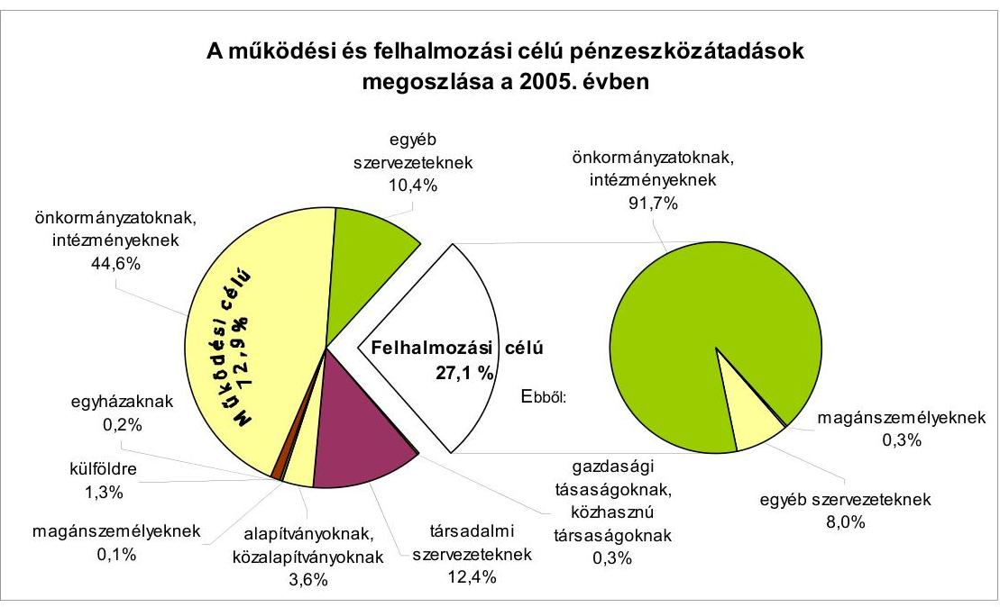
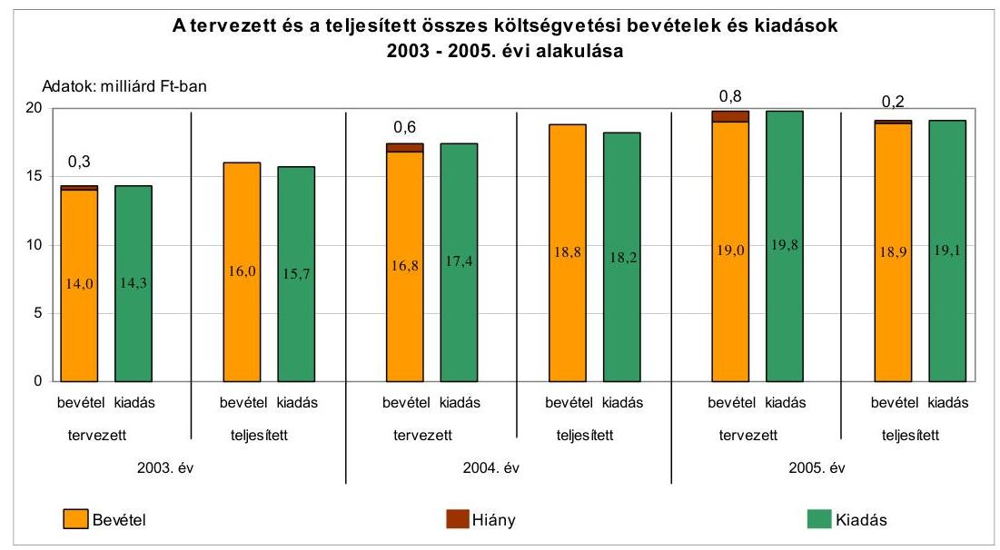
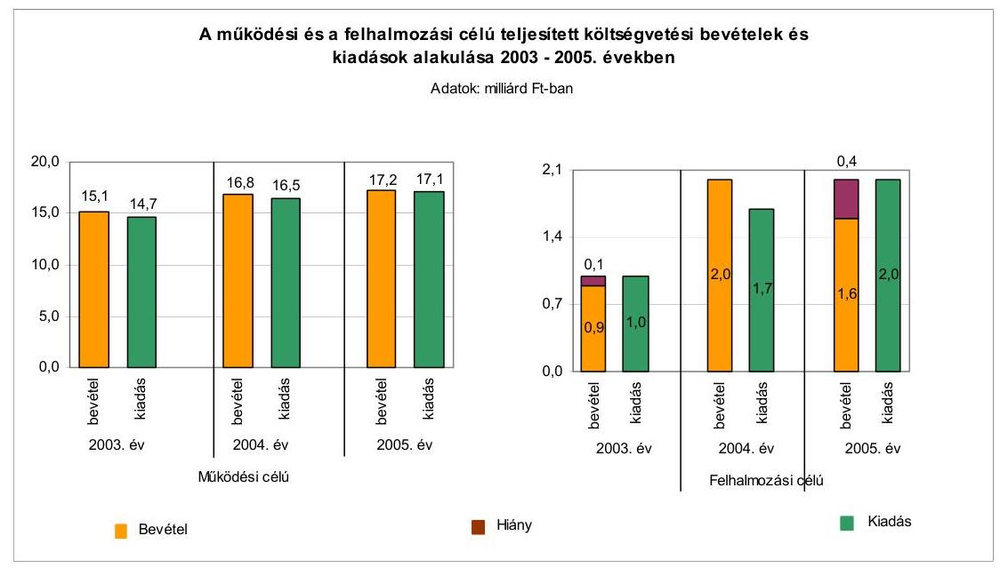
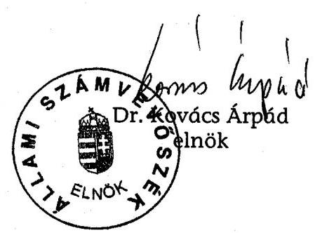
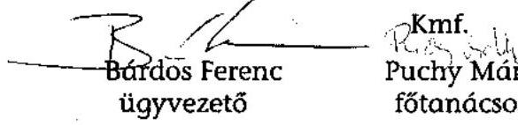
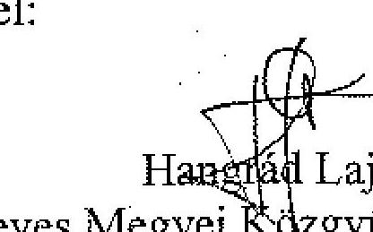

# ÁLLAMI   SZÁMVEVŐSZÉK 

## JELENTÉS

a Heves Megyei Önkormányzat gazdálkodási rendszerének 2006. évi átfogó ellenőrzéséről

---

# 3. Önkormányzati és Területi Ellenőrzési Igazgatóság 

3.3. Átfogó Ellenőrzések Főcsoport

Iktatószám: V-1003-5/28/20/2006.
Témaszám: 803
Vizsgálat-azonosító szám: V0272

## Az ellenőrzést felügyelte:

Dr. Lóránt Zoltán
főigazgató
Az ellenőrzés végrehajtásáért felelős:
Dr. Sepsey Tamás
főigazgató-helyettes
Az ellenőrzést vezette:
Csecserits Imréné
főcsoportfőnök-helyettes
Az ellenőrzést végezték:
Nagy Sándorné Puchy Márta Veres Jánosné
számvevő tanácsos főtanácsadó számvevő

## A témához kapcsolódó - elmúlt három évben - készített számvevőszéki jelentések:

## címe

Jelentés a helyi és a helyi kisebbségi önkormányzatok gazdálkodásának átfogó ellenőrzéséről
Jelentés a helyi önkormányzatok tartós szociális ellátási feladatainak ellenőrzéséről az idősek otthonainál
Jelentés a szakképzési struktúra szerepéről a munkaerő-piaci igények kielégítésében
Jelentés a 2003. április 12-én megtartott országos népszavazás lebonyolításához felhasznált pénzeszközök elszámolásának ellenőrzéséről
Jelentés a helyi önkormányzatok közművelődési és könyvtári feladatellátásáról és finanszírozásáról
Jelentés a Magyar Köztársaság 2004. évi költségvetése végrehajtásának ellenőrzéséről
Függelék:

- A helyi önkormányzatokat a 2004. évben megillető normatív állami hozzájárulás elszámolása
- Normatív kötött felhasználású támogatások
- A helyi önkormányzatok beruházásaihoz és rekonstrukcióihoz nyújtott 2004. évi felhalmozási célú támogatások

---

# TARTALOMJEGYZÉK 

BEVEZETÉS ..... 5
I. ÖSSZEGZŐ MEGÁLLAPÍTÁSOK, KÖVETKEZTETÉSEK, JAVASLATOK ..... 7
II. RÉSZLETES MEGÁLLAPÍTÁSOK ..... 16

1. A költségvetés tervezésének, végrehajtásának, az Önkormányzat vagyongazdálkodásának és a zárszámadás elkészítésének szabályszerűsége ..... 16
1.1. A költségvetési rendelet jóváhagyásának, módosításának, az előirányzatok nyilvántartásának szabályszerűsége ..... 16
1.2. A gazdálkodás szabályozottsága, a bizonylati rend és fegyelem szabályszerűsége ..... 21
1.3. A pénzügyi-számviteli feladatok ellátásának informatikai támogatottsága ..... 30
1.4. Az önkormányzati vagyon nyilvántartása, számbavétele ..... 31
1.5. A vagyonnal való gazdálkodás szabályszerűsége, célszerűsége, nyilvánossága ..... 34
1.6. A céljelleggel nyújtott támogatások szabályszerűsége ..... 41
1.7. A közbeszerzési eljárások szabályszerűsége ..... 45
1.8. A zárszámadási kötelezettség teljesítésének szabályszerűsége ..... 49
2. Az önkormányzati feladatok és a rendelkezésre álló források összhangja ..... 52
2.1. A feladatok meghatározása és szervezeti keretei ..... 52
2.2. A költségvetés egyensúlyának helyzete ..... 57
2.3. A feladatok finanszírozása ..... 64
3. A belső ellenőrzési rendszer múködésének értékelése ..... 67
3.1. Az ellenőrzési rendszer kialakítása, működése ..... 67
3.2. A könyvvizsgálati kötelezettség teljesítése ..... 70
3.3. A korábbi számvevőszéki ellenőrzések javaslatainak hasznosulása ..... 70

---

# MELLÉKLETEK 

1. számú Az Önkormányzat gazdálkodását meghatározó adatok, mutatószámok (1 oldal)
2. számú Az önkormányzati vagyon nagyságának alakulása (1 oldal)
3. számú Az Önkormányzat 2005. évi bevételeinek és kiadásainak alakulása (1 oldal)
4. számú Egyes önkormányzati feladatok finanszírozása (1 oldal)
5. számú Helyszíni ellenőrzési jegyzőkönyv (Életfa Környezetvédő Szövetség) (3 oldal)
6. számú Hangrád Lajos úr, a Heves Megyei Közgyűlés korelnökének észrevétele (1 oldal)

---

# RÖVIDÍTÉSEK JEGYZÉKE 

## Törvények

Áht.
Fot.
Gyvt.
Htv.

Kbt.
Ksztv.
Ötv.
Számv. tv.
Szoc. tv.

## Rendeletek

Ámr.
Ber.
vagyongazdálkodási rendelet
Vhr.

## Szórövidítések

alelnök
ÁSZ
Belső ellenőrzési csoport
CÉDE
Egészségügyi és szociális bizottság
Egészségügyi és szociális iroda
Ellenőrző bizottság
FEUVE
föjegyző
Illetékhivatal
Informatikai csoport
az államháztartásról szóló 1992. évi XXXVIII. törvény
fogyatékos személyek jogairól és esélyegyenlőségük biztosításáról szóló 1998. évi XXVI. törvény
a gyermekek védelméről és a gyámügyi igazgatásról szóló 1997. évi XXXI. törvény
a helyi önkormányzatok és szerveik, a köztársasági megbízottak, valamint egyes centrális alárendeltségű szervek feladat- és hatásköreiről szóló 1991. évi XX. törvény
a közbeszerzésekről szóló 2003. évi CXXIX. törvény
a közhasznú szervezetekről szóló 1997. évi CLVI. törvény
a helyi önkormányzatokról szóló 1990. évi LXV. törvény
a számvitelről szóló 2000. évi C. törvény
a szociális igazgatásról és a szociális ellátásokról szóló 1993. évi III. törvény
az államháztartás múködési rendjéről szóló 217/1998. (XII. 30.) Korm. rendelet
a költségvetési szervek belső ellenőrzéséről szóló 193/2003. (XI. 26.) Korm. rendelet
Heves Megyei Önkormányzat 12/1995. (V. 26.) rendelete a vagyongazdálkodás szabályairól
az államháztartás szervezetei beszámolási és könyvvezetési kötelezettségének sajátosságairól szóló 249/2000. (XII. 24.) Korm. rendelet

Heves Megyei Közgyűlés alelnöke
Állami Számvevőszék
Heves Megyei Önkormányzati Hivatal Belső ellenőrzési csoportja
céljellegú decentralizált támogatás
Heves Megyei Önkormányzat Közgyűlésének Egészségügyi és Szociális Bizottsága
Heves Megyei Önkormányzati Hivatal Egészségügyi és Szociális Irodája
Heves Megyei Önkormányzat Közgyűlésének Ellenőrző Bizottsága
folyamatba épített, előzetes és utólagos vezetői ellenőrzés
Heves Megyei Önkormányzat főjegyzője
Heves Megyei Illetékhivatal
Heves Megyei Önkormányzati Hivatal Informatikai Csoportja

---

| Kórház | Heves Megyei Önkormányzat Markhot Ferenc Kórház Rendelőintézete |
| :--: | :--: |
| Közbeszerzési Döntőbizottság | Közbeszerzések Tanácsa Közbeszerzési Döntőbizottsága |
| Közgyűlés | Heves Megyei Önkormányzat Közgyűlése |
| Közgyűlés elnöke | Heves Megyei Közgyűlés elnöke |
| KSH | Központi Statisztikai Hivatal |
| MÁK | Magyar Államkincstár |
| Művelődési bizottság | Heves Megyei Önkormányzat Közgyűlésének Múvelődési Bizottsága |
| Múvelődési és sportiroda | Heves Megyei Önkormányzati Hivatal Múvelődési és Sportirodája |
| ÖNHIKI | az önhibájukon kívül hátrányos helyzetbe került önkormányzatok kiegészítő támogatása |
| Önkormányzat | Heves Megyei Önkormányzat |
| Önkormányzati hivatal | Heves Megyei Önkormányzati Hivatal |
| Pénzügyi bizottság | Heves Megyei Önkormányzat Közgyűlésének Pénzügyi Bizottsága |
| Pénzügyi iroda | Heves Megyei Önkormányzati Hivatal Pénzügyi Irodája |
| Sport és ifjúsági bizottság | Heves Megyei Önkormányzat Közgyűlésének Sport és Ifjúsági Bizottsága |
| SzMSz | Heves Megyei Önkormányzat 6/1992. (VI. 12.) számú rendelete az Alapokmányáról |
| $\mathrm{SzMSz}_{1}$ | Heves Megyei Önkormányzat 9/2006. (VI. 30.) számú rendelete az Alapokmány módosításáról |
| TERKI | területi kiegyenlítést szolgáló fejlesztési célú támogatás |
| TERRA-VITA Kft | TERRA-VITA Környezetgazdálkodási Kft. |
| Területfejlesztési és környezetvédelmi ellenőrző bizottság | Heves Megyei Önkormányzat Közgyűlésének Területfejlesztési és Környezetvédelmi Bizottsága |
| Területfejlesztési iroda | Heves Megyei Önkormányzati Hivatal Terület- és Intézményfejlesztési Irodája |
| Területi választási iroda | Heves Megye Területi Választási Irodája |
| TISZK | Térségi Integrált Szakképző Központ Közhasznú Társaság |
| Titkársági iroda | Heves Megyei Önkormányzati Hivatal Titkársági Irodája |
| ügyrend ${ }_{1}$ | Heves Megyei Önkormányzati Hivatal ügyrendjéről a 3/2004. (IV. 1.) főjegyzői utasítás |
| ügyrend $_{2}$ | Heves Megyei Önkormányzati Hivatal Pénzügyi iroda ügyrendje |

---

# JELENTÉS 

## a Heves Megyei Önkormányzat gazdálkodási rendszerének 2006. évi átfogó ellenőrzéséről

## BEVEZETÉS

Az Ötv. 92. § (1) bekezdése, az Állami Számvevőszékről szóló 1989. évi XXXVIII. törvény 2. § (3) bekezdése, valamint az Áht. 120/A. § (1) bekezdése alapján az önkormányzatok gazdálkodását az Állami Számvevőszék ellenőrzi. Az ellenőrzésre az Országgyűlés illetékes bizottságai részére is átadott, országosan egységes ellenőrzési program alapján került sor.

## Az ellenőrzés célja annak értékelése volt, hogy:

- az önkormányzati gazdálkodás törvényességét ${ }^{1}$, szabályszerűségét biztosítot-ták-e a tervezés, a költségvetés végrehajtása, a vagyongazdálkodás és a zárszámadás során;
- az Önkormányzat által ellátott feladatok és az azokhoz rendelkezésre álló források összhangja biztosított volt-e, különös tekintettel egyes kiemelt feladatokra;
- a gazdálkodás szabályszerűségét biztosító kontrollok ${ }^{2}$ megfelelően segitettéke a végrehajtást.

Az ellenőrzött időszak: a 2005. év és 2006. I. negyedév, valamint az 1.5., 2.1-2.3. és 3.3. ellenőrzési programpontok esetében a 2003-2004. évek is.

Heves megye lakosainak száma 2006. január 1-jén 325480 fő volt. A megye területén 119 települési önkormányzat múködött, ellátva a közszolgáltatások szervezésével kapcsolatos helyi feladatokat.

Az Önkormányzatot 40 tagú Közgyűlés irányítja, amelynek munkáját tíz állandó bizottság segíti. A Közgyűlés elnöke a 1998-2006. közötti két önkormányzati választási ciklusban töltötte be tisztségét, míg a főjegyző 2004. január ljétől vezeti az Önkormányzati hivatalt.

[^0]
[^0]:    ${ }^{1}$ A törvényi előírások betartásának elmulasztásakor a részletes megállapítások fejezetben egységesen a törvénysértés megjelölést alkalmazzuk, mivel az ÁSZ nem tehet különbséget a törvényi előírások között.
    ${ }^{2}$ A gazdálkodás szabályszerűségét biztosító kontroll alatt értjük a kiépített és működő belső irányítási és szabályozási rendszert, valamint a belső ellenőrzési funkciók ellátását.

---

Az Önkormányzat a 2005. évben 18866 millió Ft költségvetési bevételből gazdálkodott, s a 2006. évre 18475 millió Ft költségvetési bevételt irányoztak elő. A teljesített költségvetési kiadás a 2005. évben 19129 millió Ft volt, a 2006. évre tervezett költségvetési kiadás 19399 millió Ft. Az Önkormányzat vagyona a 2005. december 31-i könyvviteli mérleg szerint 24221 millió Ft volt.

Az Önkormányzat által fenntartott intézmények száma 2005. december 31-én 40 volt, melyből hat részben önálló gazdálkodási jogkörrel rendelkezett. Az Önkormányzatnak ezen kívül négy társaságban volt a 2005. év végén kisebbségi tulajdoni részesedése.

Az Önkormányzati hivatalban dolgozó köztisztviselők száma a 2005. év elején 112 fő volt, ami a 2005. év végére 102 főre, a költségvetési intézményekben foglalkoztatott közalkalmazottak száma ugyanezen időszakban 4181 fơről 4138 fơre csökkent. Az Önkormányzat gazdálkodását meghatározó adatokat, mutatószámokat a jelentés 1-3. számú mellékletei tartalmazzák.

A jelentés megállapításainak, javaslatainak egyeztetése során a Közgyűlés elnöke arról adott tájékoztatást, hogy az időközben megtett intézkedésekkel a javaslatok egy részét megvalósították. Ezekben az esetekben a jelentés II. Részletes megállapítások fejezetében az adott témához kapcsolt lábjegyzetben a megtett intézkedést feltüntettük és a kapcsolódó javaslatot elhagytuk.

A jelentést az ÁSZ-ról szóló 1989. évi XXXVIII. tv. 25. § (1) bekezdése alapján észrevétel közlése céljából megküldtük a Heves Megyei Közgyűlés korelnökének. A kapott észrevételt a jelentés 6 . számú melléklete tartalmazza.

---

# I. ÖSSZEGZŐ MEGÁLLAPÍTÁSOK, KÖVETKEZTETÉSEK, JAVASLATOK 

A Közgyűlés az Ötv. előírása alapján elfogadta a 2003-2006. évekre szóló gazdasági programját, ami alkalmas volt az évenkénti tervezőmunka megalapozásához. A Közgyűlés elnöke az Áht-ban előírt határidőt betartva terjesztette a Közgyűlés elé a 2005. és a 2006. évi költségvetési koncepciókat, amelyekhez a 2005. évben még nem, de a 2006. évben csatolta a Pénzügyi bizottság véleményét. A költségvetési koncepciók az Ámr-ben előírtaknak megfelelő tartalommal készültek, melyek alapján a Közgyűlés döntött a költségvetés készítéssel kapcsolatos további feladatokról.

A Közgyűlés elnöke az Áht-ban előírt határidőt betartva nyújtotta be a Közgyűlésnek a 2005. és a 2006. évi költségvetési rendelettervezeteket, amelyeket megelőzően előterjesztette az azokat megalapozó rendelettervezeteket is. A költségvetési rendelettervezetekhez mindkét évben csatolta a Pénzügyi bizottság és a könyvvizsgáló véleményét. A költségvetési rendelettervezetek közül a 2005. évi még nem, de a 2006. évi már az Áht-ban előírt tartalommal készült. Az Áht. és az Ámr. előírásainak megfelelve részletezték a múködési és a felhalmozási célú bevételeket és kiadásokat az Önkormányzatra és költségvetési szerveire elkülönítetten és összesítve, meghatározták a felújítási előirányzatokat célonként, a felhalmozási kiadásokat feladatonként.

A 2005. évi költségvetési rendeletben az Áht-ban előírtakat megsértve finanszírozási célú pénzügyi műveleteket vettek figyelembe költségvetési bevételként és kiadásként, a költségvetés tervezett hiányát a költségvetési bevételek és kiadások különbségeként nem állapították meg. A 2006. évi költségvetés jóváhagyásakor a költségvetési bevételek már nem, azonban a költségvetési kiadások továbbra is tartalmaztak finanszírozási célú pénzügyi műveletet (hitel visszafizetési kötelezettséget), ezért a hiány mértékének a meghatározásakor az Áht. előírását megsértették. A költségvetési rendeletekben meghatározták a végrehajtására vonatkozó szabályokat. Az Önkormányzat a 2005. évben az Áht-ban előírtak alapján rendeletben rögzítette a költségvetés előterjesztésekor, illetve a zárszámadáskor bemutatandó mérlegek és kimutatások tartalmi követelményeit, amelynek a közvetett támogatások bemutatására vonatkozó hiányosságát a 2006. évben a rendelet módosításával megszüntette. A 2005. és a 2006. évi költségvetési rendelettervezetek előterjesztésekor az Áht. előírása ellenére nem mutatták be tájékoztatásul a közvetett támogatásokat tartalmazó kimutatást szöveges indokolással.

Az Önkormányzat a 2005. évi költségvetési rendeletét módosítva a költségvetés főösszegét 3,5\%-kal növelte. A 2005. évi költségvetési rendeletben megállapított előirányzatok módosítása az Ámr-ben előírtak ellenére nem történt meg 1,6 millió Ft többletbevétel miatt intézményi saját hatáskörben végrehajtott kiadási előirányzat-változtatás esetében, valamint pótelőirányzat érkezését követő negyedéven belül 10 millió Ft vis-maior központi költségvetési támogatásnál. A végrehajtott előirányzat-változtatásokat folyamatosan nyilvántartották és hitelt érdemlően dokumentálták.

---

A szervezeti és működési szabályzat Ámr-ben előírt tartalmi követelményeinek megfelelő ügyrendben meghatározták az Önkormányzati hivatal szervezeti felépítését, feladatait, az nem tartalmazta az Ámr-ben előírtak ellenére az alapító okirat keltét, számát, a költségvetés végrehajtására szolgáló számlaszámot, a gazdasági szervezet felépítését. A gazdasági szervezet (Pénzügyi iroda) ügyrendjét elkészítették. A Közgyűlés elnöke és a főjegyző az Ámr-ben foglaltak alapján meghatározta a gazdálkodással és ellenőrzéssel kapcsolatos hatásköröket, felhatalmazást adott kötelezettségvállalásra, utalványozásra és ezek ellenjegyzésére. Az érvényesítést végző személyek írásbeli megbízása megtörtént, melynek során a főjegyző az iskolai végzettségre és szakmai képesítésre vonatkozó követelményeket betartotta, feladataikat a munkaköri leírásban rögzítette. A főjegyző az Ámr. előírása ellenére a 2005. évben még nem, de a 2006. évben már kijelölte a szakmai teljesítés igazolását végző személyeket és meghatározta a módját. A felhatalmazásoknál, az érvényesítők megbízásánál, valamint a szakmai teljesítés igazolását végzők kijelölésénél az Ámr-ben előírt öszszeférhetetlenségi követelményeket betartották.

A főjegyző kialakította az intézmények egységes számviteli rendjét, és jóváhagyta az Önkormányzati hivatal számviteli politikáját a kapcsolódó szabályzatokat, valamint a számlarendjét. Az eszközök és források leltározási és leltárkészítési szabályzata tartalmazta a leltározás módját és feladatait, de a szellemi termékek, a gépek és járművek leltározását a Vhr-ben és a számviteli politikában foglaltak ellenére a 2005. évben nem évenkénti, hanem kétévenkénti, az ingatlanok leltározási kötelezettségét pedig ötévenkénti gyakoriságban határozták meg. Az üzemeltetésre, kezelésre átadott eszközök leltározásának sajátos szabályait a Vhr. előírása ellenére leltározási és leltárkészítési szabályzatban nem rögzítették. A Vhr-ben biztosított lehetőség alapján az Önkormányzat a 2006. július 1-jétől módosított vagyongazdálkodási rendeletben az eszközök kétévenkénti leltározásával egyetértett. Az eszközök és források értékelési szabályzatában eszközcsoportonként határozták meg a feladatokat. A terven felüli értékcsökkenés elszámolásának, az értékvesztés és az értékvesztés visszaírásának rendjét a számviteli politikában szabályozták. Az Önkormányzati hivatal a Vhr-ben foglalt előírások alapján elkészített önköltség-számítási szabályzata meghatározta a végzett szolgáltatások bekerülési értékének megállapítására vonatkozó részletes előírásokat. A házipénztár kezelési és a pénzkezelési szabályzatokban meghatározták a bankszámla és készpénzforgalommal kapcsolatos szabályokat, az ügyfélterminál használatának rendjét, azonban az nem tartalmazta azoknak a bankszámláknak a felsorolását, amelyekről készpénz vehető fel, valamint a bankszámlák és a pénztár kapcsolatrendszerét. A Vhrben foglalt előírások alapján meghatározták a selejtezési eljárás rendjét.

A számlarend rögzítette az alkalmazandó főkönyvi számlák számát, megnevezését, a főkönyvi számlák tartalmára vonatkozó előírásokat, azonban a Vhrben foglalt előírások ellenére a 2005. évben még nem, csak 2006. április 1-től tartalmazta a számviteli alapbizonylatok megnevezését, az analitikus nyilvántartások tartalmát és formáját, valamint a főkönyvi könyveléssel való egyeztetésének dokumentálását.

Az Önkormányzati hivatal ellenőrzési nyomvonalát 2005. decemberében készítette el a főjegyző, valamint alakította ki a kockázatkezelés rendjét. A pénzügyi-számviteli dolgozók munkaköri leírásaiban a 2005. évben még

---

nem, azonban 2006. június hóban már meghatározták a szabályzatokban foglaltakkal összhangban a folyamatba épített ellenőrzési feladatokat.

Az Önkormányzati hivatalban a költségvetési előirányzatokat terhelő kötelezettségvállalásokat az Ámr-ben előírtakat betartva írásba foglalták. A könyvviteli nyilvántartásokban elszámolt gazdasági műveletekről, eseményekről a számviteli bizonylatokat kiállították. Az Ámr. előírása ellenére a bizonylatok közel felénél a szakmai teljesítés igazolása elmaradt, a másik felénél az elvégzett szakmai teljesítés igazolás a kijelölés hiányában nem volt jogszerű, valamint a bizonylatok közel egyötöde esetében a bevétel beszedését, a kiadás teljesítését az utalványozó nem rendelte el. A gazdálkodási jogkörök gyakorlása során a kötelezettségvállalást, utalványozást a Közgyűlés elnöke által írásban arra felhatalmazottak végezték. Az érvényesítők és az utalvány ellenjegyzői az Ámr-ben előírt, munkafolyamatba épített ellenőrzési kötelezettségüknek nem tettek eleget, mert a 2005. évben és 2006. I. negyedévében nem kifogásolták, hogy a szakmai teljesítés igazolása elmaradt, illetve az a jogosult személy kijelölése nélkül történt meg. A pénztárellenőr munkafolyamatba épített ellenőrzési kötelezettségének nem tett eleget, mert a naponta elvégzett ellenőrzés ellenére nem kifogásolta a szakmai teljesítést igazolók név szerinti kijelölésének hiányát. A gazdálkodási és ellenőrzési jogkörök gyakorlása során az összeférhetetlenségi követelményeket betartották.

A költségvetési pénzforgalmat érintő, valamint az analitikus nyilvántartásokból készített összesítő kimutatások alapján a gazdasági események bizonylatainak adatait a Vhr. előírásainak megfelelő időben rögzítették a számviteli nyilvántartásokban. Az Önkormányzati hivatalban a 2005. évben a kötelezettségvállalásokról vezetett nyilvántartásból az Ámr-ben előírtak ellenére nem volt megállapítható a 2005. évi kötelezettségvállalás összege, mivel azt nem kiemelt előirányzatonként tartalmazta. A 2006. január 1-jétől számítógépes programmal vezetett kötelezettségvállalás nyilvántartás az Ámr-ben foglalt előírásoknak megfelelt. Önkormányzati szinten a kiemelt előirányzatokat betartották, azonban az Önkormányzati hivatal a felhalmozási célú pénzeszközátadás előirányzatát és az adott kölcsönök előirányzatát, két intézmény az intézményi szintű előirányzatát, hat intézmény egy-egy feladat kiemelt előirányzatát lépte túl, megsértve az Áht. előírását. Az előirányzat túllépések okait nem vizsgálták, felelősségre vonásra nem került sor.

Az Önkormányzati hivatalban a pénzügyi-számviteli feladatok ellátásához alkalmazott szoftverek egy-egy részterülethez kapcsolódtak, lokálisan működtek. Manuálisan tíz analitikus nyilvántartást vezettek. Az Önkormányzat informatikai stratégiáját a Közgyűlés elfogadta. Kidolgozták a biztonságos munkavégzés érdekében a katasztrófa elhárítási tervet, a főjegyző utasításban szabályozta az informatikai módszerekkel végzett nyilvántartásokkal kapcsolatos adatvédelmet, a programok és számítógépek használati jogosultságait. A pénzügyi-számviteli feladatok ellátásához használt szoftverekhez a felhasználói leírás rendelkezésre állt. A Pénzügyi irodán a számítógépet használók közel kétharmada végzett számítógép-kezelői alaptanfolyamot, a köztisztviselők munkaköri leírásában a felhasználók egyedi felhasználói jogosultságát, az egyes feladatok elvégzéséhez használt programokat meghatározták.

---

Az Önkormányzati hivatal a törzsvagyon elkülönített nyilvántartásáról a főkönyvi számlák további bontásával gondoskodott. Az ingatlanok, valamint az üzemeltetésre, kezelésre átadott eszközök állományát a 2005. évben a Vhrben előírtak ellenére az analitikus nyilvántartás és a kapcsolódó főkönyvi számlák adatainak egyeztetésével állapították meg. A 2006. évre a főjegyző elkészítette az ingatlanok és egyéb tárgyi eszközök mennyiségi felvétellel történő leltározásának ütemtervét. A részesedések év végi értékelését a Számv. tv. előírása ellenére nem végezték el, nem gondoskodtak az ehhez szükséges adatok beszerzéséről, nem vizsgálták ennek szükségességét. Az Önkormányzat tulajdoni részesedését jelentő öt gazdasági társaságban a saját és jegyzett tőke arányában bekövetkezett változás, a számviteli politikában előírtak alapján nem tette szükségessé az értékvesztés elszámolását. Az illetékkövetelések egyedi értékelését elvégezték. A vevőkövetelések és az adott kölcsönök értékeléséhez szükséges információk rendelkezésre álltak, ennek alapján értékvesztés elszámolása nem volt indokolt.

A vagyongazdálkodással kapcsolatos feladatokat és döntési jogköröket az Önkormányzat rendeletben szabályozta. A vagyonnal való rendelkezési, döntési hatásköröket célszerűen alakították ki, azokat megosztották a Közgyűlés, a Pénzügyi bizottság, a Közgyűlés elnöke és az intézmények között. A 2005. évben versenytárgyalás útján történő értékesítés értékhatárát ingatlanok esetében nem, ingóságok esetében 0,5 millió Ft-ot meghaladó összegben határozták meg. A vagyongazdálkodási rendeletben az Áht. előírását megsértve lehetőséget biztosítottak a versenytárgyalás mellőzésével történő értékesítésre, nem határozták meg a vagyon térítésmentes átadása, a követelésről való lemondás módját és eseteit. A vagyongazdálkodási rendelet 2006. évi módosítása során megszüntették a nyilvános versenytárgyalás nélkül történő értékesítés lehetőségét, meghatározták a forgalomképesség szerinti besorolás megváltoztatásának hatásköri szabályait, valamint a követelésről való lemondás és ingyenes vagyonátadás módját, eseteit. Az Áht. előírását betartva, a normatív céljellegú fejlesztési támogatásokat, valamint a vagyonnal való gazdálkodással összefüggő nettó ötmillió Ft-ot elérő vagy azt meghaladó értékű szerződések adatait az Önkormányzat közlönyében és internetes honlapján közzétették. Az Önkormányzat a 2005. évben az Áht. előírását megsértve nyilvános versenytárgyalás lefolytatása nélkül értékesített egy ingatlant és egy bérleti szerződés 14 évre szóló meghosszabbításáról döntött. A versenytárgyalás nélküli értékesítés, használati jog átengedés nem segítette a gazdálkodás átláthatóságát, nyilvánosságát. Az ingatlan értékesítés értékbecslésen alapult, a megkötött adásvételi szerződésbe az Önkormányzat érdekeit védő garanciális elemeket beépítették. Az ingatlan értékesítés során a Közgyűlés döntése nem volt célszerű, mivel nem kapcsolódott a gazdasági programban és éves költségvetési rendeletben meghatározott célokhoz, valamint az eladási ár alacsonyabb összegű volt a számviteli nyilvántartás nettó értékénél és az értékbecslő által megállapított piaci értéknél. A felesleges vagyontárgyak selejtezése során a selejtezés eljárási és döntéshozatali rendjét betartották. A 2003-2005. évek között eszközök apportálására, követelésről való lemondásra, önkormányzati vagyon térítésmentes átadására nem került sor. Az átmenetileg szabad pénzeszközöket államilag garantált diszkont kincstárjegyekbe fektették. Az értékpapír számlaszerződések megkötése során a Közgyűlés elnöke a befektetési kockázat csökkentése érdekében a KELER Rt-nél az Önkormányzat nevére szóló értékpapír alszámla nyitását és együttes rendelkezési jog kikötését nem kezdeményezte. Az állampapírok adásvétele so-

---

rán az Önkormányzat által realizált hozamok átlagosan 0,27\%-kal meghaladták az állampapír piaci referencia hozamokat. Az értékpapírok vételéről és eladásáról készült értékpapír szerződések esetében a kötelezettségvállalás és annak ellenjegyzése nem felelt meg az Ámr-ben és az Önkormányzat pénzgazdálkodásának rendjéről készült szabályzatban foglalt előírásoknak.

Az Önkormányzat a 2005. évi költségvetési rendeletében múködési és felhalmozási célok támogatására a költségvetési kiadásainak 1,2\%-át jelentő, 308 millió Ft előirányzatot hagyott jóvá, amely több mint kétharmadát az államháztartáson kívüli szervezetek támogatására tervezett fordítani. Az Önkormányzat rendeletben szabályozta a támogatásról szóló értesítő tartalmi követelményeit, valamint a számadások felülvizsgálatának rendjét, annak a 2006. évi módosításában a számadás módját, a felhasználás helyszíni ellenőrzésének feladatait és a támogatások nyilvántartásának tartalmát határozták meg. A 2005. évben 305 szervezet, 233 millió Ft céljelleggel nyújtott támogatásban részesült, amelynek $88 \%$-a a Közgyűlés, $8 \%$-a a bizottságok, $1 \%$-a a Közgyűlés elnöke, $3 \%$-a az intézményvezetők döntésén alapult. A Közgyűlés elnöke, a bizottságok és az intézményvezetők az Ötv. előírását megsértve 37 alapítvány támogatásáról döntöttek a 2005. évben. Az alapítványok támogatásáról a bizottságok és Közgyűlés elnökének javaslata alapján 2006. I. félévében a Közgyűlés határozott. Az Áht. előírása ellenére hét költségvetési intézmény vezetője 2,5 millió Ft összegben társadalmi szervezetet támogatott a Közgyűlés engedélye nélkül, amely megszüntetése érdekében a főjegyző a 2006. évben intézkedett. A támogatás célját, összegét, a számadási kötelezettség módját és határidejét közel egytized támogatott szervezet részére nem határozták meg, a támogatásban részesültek egyharmada nem tett eleget számadási kötelezettségének, mely teljesítésére a támogatottakat az Önkormányzati hivatal nem szólította fel. A számadási kötelezettséget nem teljesítők felé az Önkormányzati hivatal nem intézkedett a támogatás összegének visszafizettetésére, megsértve ezzel az Áht-ban foglaltakat. Az Önkormányzat kettő közhasznú szervezet részére nem határozta meg a támogatás célját és összegét, valamint a Ksztv. előírása ellenére írásbeli szerződésben az elszámolás feltételeit és módját nem rögzítette. A Közgyűlés elnöke egy közhasznú szervezettel a 2006. évben írásbeli szerződést kötött. A számadások tartalmi-formai felülvizsgálatát a 2005. évben elvégezték, ennek során hiányosságot nem állapítottak meg. Az Áht. előírását megsértve a támogatások célszerinti felhasználásának ellenőrzése elmaradt.

A Kbt-ben foglalt előírást betartva a Közgyűlés elfogadta az Önkormányzat közbeszerzési szabályzatát, melyben a Kbt. előírásai alapján meghatározták a közbeszerzésekkel kapcsolatos feladatokat, az eljárásban résztvevő bizottság, személyek felelősségét. Rendelkeztek az eljárásokban közreműködők megfelelő szakértelmének biztosításáról és az összeférhetetlenség szabályairól. Rögzítették az eljárások dokumentálásának rendjét. Az Önkormányzat a Kbt. előírása szerint elkészítette az éves összesített közbeszerzési tervét. A Kbt. előírásának nem tett eleget az Önkormányzati hivatal, kettő esetben mulasztotta el a közbeszerzési eljárás lefolytatását ${ }^{3}$. A közbeszerzési eljárások szabályszerűségét egy épü-

[^0]
[^0]:    ${ }^{3}$ A Kbt. előírása ellenére közbeszerzési eljárás lefolytatása nélkül megkötött szerződések esetében az ÁSZ jogorvoslati eljárást kezdeményezett.

---

let tetőtér beépítése és a meglévő épület átalakítása esetében ellenőriztük. A közbeszerzési eljárás lefolytatása és a szerződés megkötése megfelelt a Kbt. előírásainak. A Kbt. előírása ellenére a vállalkozási szerződést egy alkalommal módosították, melynek a feltételei nem álltak fent, az erre vonatkozó tájékoztató készítési és közzétételi kötelezettségének nem tett eleget az Önkormányzati hivatal. A Kbt. előírásai ellenére, a szerződés teljesítéséről szóló tájékoztató közzétételéről egy hónappal később intézkedett, amelyben az eredeti vállalkozási díj szerepelt, a teljesített díjösszeg helyett ${ }^{4}$. Három költségvetési intézmény esetében a felügyeleti ellenőrzés a közbeszerzési szabályok betartására is kiterjedt. A Kbt. előírása ellenére az Önkormányzati hivatalban belső ellenőrzés keretében a lefolytatott közbeszerzési eljárások szabályszerűségét nem vizsgálták. A Közbeszerzési Döntőbizottság, illetve harmadik személy az Önkormányzat ellen eljárást nem indított.

A költségvetéssel összehasonlítható módon összeállított, a 2005. évi költségvetés végrehajtásáról szóló zárszámadási rendelettervezetet a Közgyűlés elnöke az Áht-ban előírt határidőn belül terjesztette a Közgyűlés elé. A rendeletben az eredeti előirányzatok fő- és részösszegei megegyeztek a költségvetésben elfogadott adatokkal. A működési-fenntartási előirányzatokat és teljesítésüket a zárszámadási rendelettervezetben az Áht-nak megfelelően, a működési és felhalmozási célú bevételek és kiadások alakulását az Ámr-ben előírtak alapján mérlegszerűen, egymástól elkülönítetten részletezték. Az Áht. előírásaival szemben nem mutatták be a többéves kihatással járó döntések számszerűsítését évenkénti bontásban, valamint összesítve, szöveges indokolással, továbbá a közvetett támogatásokat szöveges indokolással. A zárszámadáshoz csatolt vagyonkimutatás a Vhr-ben előírtak ellenére nem tartalmazta a könyvviteli mérlegben szereplő eszközökön és kötelezettségeken kívüli vagyonelemeket. A Közgyűlés az Ámr-ben előírtak szerint állapította meg és hagyta jóvá az Önkormányzat és Önkormányzati hivatal pénzmaradványát, amivel egyidejűleg döntött költségvetési szervenként a pénzmaradvány felhasználásáról. A Közgyűlés elnöke az intézményvezetőket az Ámr-ben foglaltak ellenére nem értesítette írásban éves számszaki beszámolójuk és működésük elbírálásáról, jóváhagyásáról.

Az Önkormányzat kötelező és önként vállalt feladatait ágazati koncepciókban és az SzMSz-ében meghatározta. A Közgyűlés az önkormányzati feladatok ellátásáról költségvetési intézményeivel, Eger Megyei Jogú Város Önkormányzatával közösen fenntartott intézményével, intézményfenntartó társulással és egy ellátási szerződéssel gondoskodott. Az Önkormányzat a kötelező feladatai köréből a hajléktalan otthoni ellátást, amely megvalósítását a szociális szolgáltatástervezési koncepciója tartalmazta, a Szoc. tv-ben foglaltak ellenére nem biztosította. Az Ötv. előírása alapján Hatvan Város Önkormányzata kezdeményezésére 2004. augusztus 1-jétől a kötelező középfokú oktatást, alapfokú művészeti oktatást és logopédiai szakszolgálat ellátását átvette. A települési önkormányzatok kezdeményezésére nevelési tanácsadók átadásáról döntött a

[^0]
[^0]:    ${ }^{4}$ A Kbt. rendelkezéseibe ütköző szerződésmódosítás, valamint a szerződésmódosításról szóló tájékoztatási és közzétételi kötelezettség elmaradása miatt az ÁSZ jogorvoslati eljárást kezdeményezett.

---

Közgyűlés. A feladatátadások-átvételek során megállapodásban rögzítették a pénzügyi feltételeket, az ingó- és az ingatlanvagyon használatát. Az Önkormányzat kistérségi társulásokban való tagságát megszüntette a 2005. évben, és a Heves megyében múködő hat önkormányzati többcélú kistérségi társulással együttműködési megállapodást kötött. A 2004. évben szakmai és pénzügyi indokok alapján egy gazdasági társaságban lévő részesedését értékesítette, valamint a 2005. évben egy közhasznú társaság létrehozásában való részvételéről döntött a Közgyűlés.

Az Önkormányzat a 2003-2005. évi költségvetési rendeleteiben a jóváhagyott bevételek nem nyújtottak fedezetet a jóváhagyott kiadásokra, így a pénzügyi egyensúly biztosítása céljából hitelfelvétellel számoltak. Hiányt a 2003. évben csak a múködési kiadásoknál, míg a 2004-2005. években a múködési és a felhalmozási kiadásoknál is terveztek. A költségvetési hiány mérséklése érdekében az Önkormányzat bevételnövelő és kiadáscsökkentő intézkedéseket tett. A döntés értelmében létszámcsökkentéseket hajtottak végre, a források növelése céljából múködési és felhalmozási célú pénzeszközöket vettek át és a pályázati lehetőségek kihasználása érdekében kialakították - az önkormányzati szintű koordináló tevékenység hiányával - a személyi, szakmai feltételeket. Az intézkedések eredményeként a költségvetések tényleges egyensúlya a 2003-2004. években biztosított volt, míg a 2005. évben a költségvetési bevételeket meghaladták a költségvetési kiadások. A főjegyző a 2005. évben az Önkormányzat pénzállományának alakulásáról likviditási tervet készített, mely év közbeni aktualizálásáról az Ámr. előírása ellenére nem gondoskodott. Az ellenőrzött évek mindegyikében szükségessé vált a Közgyűlés által engedélyezett folyószámlahitel keret igénybevétele, amelyet a 2003-2004. év végére az Önkormányzat visszafizetett, a 2005. évet azonban folyószámla hitellel zárta. Az Önkormányzat a 2003-2005. években - a likviditási hitel kivételével - adósságot keletkeztető kötelezettségvállalásokról nem döntött.

A naturális mutatókkal mérhető feladatok fajlagos kiadásai a nevelési-, oktatási intézményekben 9,5-18,9\% közötti mértékben, a szociális feladatokat ellátó intézményekben 5,6\%-kal emelkedtek a 2003-2005. években. A működtetési kiadások átlagosan az egységnyi kiadások növekedésének egynegyedével nőttek, a közalkalmazotti bértábla módosításával együtt járó személyi juttatásoknak és járulékainak növekedése, az energia és a közüzemi díjak áfa tartalmának módosítása, valamint a szociális ellátásban és a középfokú oktatásban az ellátottak számának emelkedése, az általános iskolai oktatásban a tanulók számának csökkenése hatására. A szociális ellátásban a férőhelyszám módosulás, a középfokú oktatásban a Hatvan Város Önkormányzatától átvett intézmények tanulószáma, valamint a szakképző évfolyamok és akkreditált szakképzési évfolyamok bevezetése eredményezte az ellátást igénybevevők számának növekedését. A kiadások finanszírozásában az állami támogatás részaránya a sajátos nevelésű óvodai és általános iskolai oktatásban csökkent, a középfokú oktatásban a szakmai és informatikai fejlesztési feladatokra biztosított támogatással összefüggésben emelkedett. Az önkormányzati támogatás részaránya a bentlakásos szociális intézményi ellátásban csökkent, az intézményi térítési díjak átlagának a 2004. évben közel 20, míg a 2005. évben közel 10\%kal történő emelkedésének hatására.

---

Az Önkormányzat a kötelező feladatainak biztosítása mellett önként vállalt feladatokat is ellátott, amelyre 2003-2005 között az éves költségvetési kiadásainak közel 5\%-át fordította. A nem kötelező feladatok finanszírozása a kötelező feladatainak teljesítését nem veszélyeztette.

A középületekben az akadálymentes közlekedés feltételei kialakításához szükséges munkákat az Önkormányzat felmérette, amely becsült költsége 1221 millió Ft volt. A feladatok végrehajtására a 2004-2005. években 70 millió Ft-ot fordított, amiből a középületek 5\%-ánál teljes körűen, 15\%-ánál részlegesen kialakították a fogyatékos személyek közlekedésének feltételeit. Az Önkormányzat a Fot-ban előírtaknak nem tett eleget, 2005. január 1-jei határidőre 91 középület akadálymentes megközelíthetőségét nem biztosította.

Az Önkormányzat kialakította a felügyelete alatt múködő intézmények és az Önkormányzati hivatal belső ellenőrzési feladatai végrehajtásának szervezeti kereteit. A főjegyző közvetlen irányítása alá tartozó Belső ellenőrzési csoport múködtetéséhez a Ber-ben előírtak szerint szükséges forrásokat biztosították, a foglalkoztatott ellenőrök létszámát azonban nem az ellátott feladatokkal arányban határozták meg. A 2005. év végén elvégzett és a 2006. év elején kiértékelt kapacitás felmérés az Önkormányzati hivatalban egy fő revizori létszámbővítés szükségességét állapította meg, az álláshely biztosítása és betöltése 2006. július 1-jétől megtörtént. A Ber-ben foglalt általános szakmai követelményeknek kettő fő belső ellenőr megfelelt, egy fő részére a főjegyző 2006. december 31-ig halasztást adott a Ber-ben biztosított lehetőség alapján. A belső ellenőrzési kézikönyvet kidolgozták, elkészítették a stratégiai és az éves tervet. A 2005. évi ellenőrzési tervet a Belső ellenőrzési csoportvezető elkészítette, melyet a főjegyző jóváhagyott. A 2006. évi éves ellenőrzési tervet a 2005. évben a Közgyűlés az Ötv-ben előírt határidőig elfogadta. A Ber-ben foglaltaknak megfelelően az ellenőrzések lefolytatásához ellenőrzési programot készítettek, a belső ellenőrt megbízó levéllel látták el, az ellenőrzésről készült jelentésekben a 2006. évben következtetések levonására is sor került. A megállapítások alapján az intézmények intézkedési tervet készítettek, amelyek megvalósulásáról beszámoltatás során, illetve utóvizsgálattal győződtek meg. Az éves ellenőrzési jelentést a Belső ellenőrzési csoportvezető a Ber-ben előírt tartalommal összeállította. Az főjegyző az éves költségvetési beszámoló keretében az Áht. előírása alapján elkészítette az Önkormányzat intézményeiben és az Önkormányzati hivatalban végzett ellenőrzések tapasztalatairól szóló beszámolót. A Közgyűlés a Htv-ben foglaltaknak megfelelően áttekintette az elvégzett ellenőrzések tapasztalatait, a belső ellenőrzési tevékenység színvonalának emelése érdekében a főjegyző részére feladatokat határozott meg.

Az Önkormányzat az Ötv-ben előírt könyvvizsgálati kötelezettségének eleget tett. A könyvvizsgáló az Önkormányzati hivatal és az intézmények öszszevont adatait tartalmazó éves beszámolót hitelesítő záradékkal látta el, auditálási eltérést nem állapított meg.

Az ÁSZ által elvégzett ellenőrzésekről készült jelentések hét szabályszerűségi és három célszerűségi javaslatot tartalmaztak, amelyek hasznosultak. A gazdasági szervezet feladatai az SzMSz-ben meghatározásra kerültek, a Pénzügyi és a Területfejlesztési irodavezető munkaköri leírását a gazdálkodási, illetve ellenőrzési jogosítvánnyal kiegészítették, elkészült a belső ellenőrzési szabályzat,

---

amelyben rögzítették az intézményi és az Önkormányzati hivatal belső ellenőrzési feladatait, ellenőrizték intézményenként a normatív állami támogatások igénylésének alapdokumentumait, valamint eleget tettek a CÉDE támogatással megvalósult beruházás elszámolási kötelezettségének. Az országgyúlési képviselő választások kiadásaira részletes költségvetési terv készült, a választáshoz kapcsolódó kifizetések szakmai teljesítésigazolása, valamint a pénzeszközök felhasználásának belső ellenőrzése megtörtént. Egy célszerűségi javaslat részben realizálódott, a kötelezettségvállalási, utalványozási, illetve ellenjegyzési feladatokra szóló felhatalmazásokban a felhatalmazottak beszámoltatását előírták, de annak gyakoriságát csak a helyszíni ellenőrzés időtartama alatt végzett módosítás során határozták meg.

A helyszíni ellenőrzés megállapításainak hasznosítása érdekében javasoljuk:

# a Közgyülés elnökének 

a jogszabályi előírások maradéktalan betartása érdekében

1. kezdeményezze a számadási kötelezettséget határidőre nem teljesítő támogatottnál a támogatás visszafizetését az Áht. 13/A. § (2) bekezdésében előírtaknak megfelelően;
2. gondoskodjon a középületek akadálymentessé tételéről, tekintettel arra, hogy a Fot. 29. § (6) bekezdésében foglalt 2005. január 1-i határidő lejárt;
a munka színvonalának javítása érdekében
3. tájékoztassa a Közgyűlést a számvevőszéki jelentés megállapításairól, javaslatairól, a feltárt hiányosságok megszüntetésére készíttessen intézkedési tervet a határidők és a felelősök megjelölésével.

---

# II. RÉSZLETES MEGÁLLAPÍTÁSOK 

## 1. A KÖLTSÉGVETÉS TERVEZÉSÉNEK, VÉGREHAJTÁSÁNAK, AZ ÖNKORMÁNYZAT VAGYONGAZDÁLKODÁSÁNAK ÉS A ZÁRSZÁMADÁS ELKÉSZÍTÉSÉNEK SZABÁLYSZERŰSÉGE

### 1.1. A költségvetési rendelet jóváhagyásának, módosításának, az előirányzatok nyilvántartásának szabályszerűsége

A Közgyűlés az Ötv. 91. § (1) bekezdésében előírt kötelezettségének eleget téve a 28/2003. (III. 28.) számú határozatával elfogadta az Önkormányzat a 2003-2006. évekre szóló gazdasági programját.

Az Önkormányzat a gazdasági programban fő feladataként fogalmazta meg azon intézmények fenntartását, múködtetését, amelyek a megye nagy részére, vagy egész területére kiterjedő közszolgáltatást végeznek. A Közgyűlés meghatározta a térségi területrendezéssel, környezetvédelemmel kapcsolatos feladatokat, értékelte az Önkormányzat pénzügyi helyzetét, amelyre tekintettel követelményként rögzítette a bevételi források bővítésének igényét, a költségvetés egyensúlyi helyzetének - ezen belül a hiány kezelhetőségének - rendszeres vizsgálatát.

Az Önkormányzat a 2005. és 2006. évi költségvetési koncepcióját az Ámr. 28. § (1) bekezdésében foglaltaknak megfelelően a helyben képződő bevételek és az ismert kötelezettségek figyelembe vételével állította össze a föjegyzö. A kiadások meghatározásánál számításba vette a központi előírások változásából eredő, valamint az Önkormányzat által vállalt kötelezettségeket.

A Közgyűlés elnöke a 2005. és a 2006. évi költségvetési koncepciókat az Áht. 70. §-ában előírt határidőn belül ${ }^{5}$ - 2004. november 26-án, illetve 2005. november 25-én - nyújtotta be a Közgyűlés részére. A 2005. évi költségvetési koncepcióhoz a Közgyűlés elnöke az Ámr. 28. § (3) bekezdésében előírtak ellenére a Pénzügyi bizottság koncepcióról alkotott véleményét nem csatolta. A 2006. évi koncepcióról szóló előterjesztés során a Közgyűlés elnöke az Ámr. 28. § (3) bekezdésében foglaltaknak eleget tett, a Pénzügyi bizottság véleményét csatolta.

A Közgyűlés a koncepciókat elfogadó határozatokban ${ }^{6}$ az Ámr. 28. § (4) bekezdésében előírtakra figyelemmel meghatározta a költségvetés-készítés további munkálatait.

[^0]
[^0]:    ${ }^{5}$ Az Áht. 70. §-a szerint a költségvetési koncepció benyújtás határideje november 30-a, kivéve a helyi önkormányzati képviselő választások éve, amikor a határidő december 15-e.
    ${ }^{6}$ A 2005. évi költségvetési koncepciót a Közgyűlés a 110/2004. (XI. 26.) számú, a 2006. évit a 116/2005. (XI. 25.) számú határozataival fogadta el.

---

Az Önkormányzat az Áht. 118. §-ában előírt és a költségvetés előterjesztésekor, illetőleg a zárszámadáskor a Közgyűlés részére tájékoztatásul bemutatandó mérlegek, kimutatások tartalmi követelményeit rendeletben ${ }^{7}$ rögzítette, azonban az Áht. 118. §-ában előírtakat megsértve az Áht. 116. § 10. pontjában előírt közvetett támogatásokról szóló kimutatás tartalmának meghatározásáról nem intézkedett. A rendelet hiányosságát a 12/2006. (VI. 30.) számú rendelet-módosításával az Önkormányzat megszüntette, a közvetett támogatások tartalmi követelményei között az illetékek és a térítési díjak kedvezményeinek bemutatását határozta meg.

A 2005. és a 2006. évi költségvetési rendelettervezeteket a főjegyző az Ámr. 29. § (4) bekezdésében foglalt előírásnak megfelelően a költségvetési szervek vezetőivel egyeztette, annak eredményét írásban rögzítette.

A Közgyűlés elnöke az Ámr. 29. § (9) bekezdésének előírásait betartva, a bizottságok által megtárgyalt, a Pénzügyi bizottság által véleményezett, valamint a könyvvizsgáló írásos véleményét is csatoltan tartalmazó 2005. és 2006. évi költségvetési rendelettervezetet az Áht. 71. § (1) bekezdésében meghatározott határidőt ${ }^{8}$ betartva - 2005. február 16-án, illetve 2006. február 15-én nyújtotta be Közgyűlésnek. A Közgyűlés elnöke a költségvetési rendelettervezetek benyújtását megelőzően - az Áht. 71. § (2) bekezdésében előírtaknak megfelelően - a Közgyűlés elé terjesztette azokat a rendelettervezeteket, amelyek a tervezett előirányzatokat megalapozták ${ }^{9}$. A 2005. évben az Áht. 71. § (2) bekezdésében előírtakat megsértve elmaradt a többéves elkötelezettséggel járó kiadási tételek későbbi évekre vonatkozó kihatásainak bemutatása, amely a 2006. évben már megtörtént. A költségvetési rendelettervezet mindkét évben tartalmazta az Áht. 71. § (3) bekezdésének előírásaival összhangban a költségvetési évet követő két év várható előirányzatait.

A Közgyűlés a 2005. évi, illetve a 2006. évi költségvetési rendeletben az Áht. 67. § (3) bekezdésében előírtaknak eleget téve meghatározta a költségvetés címrendjét.

A költségvetési rendelettervezetek az Áht. 69. § (1) bekezdésében előírt tartalommal készültek. A 2005. évi költségvetési rendelettervezet az Ámr. 29. § (1) bekezdésében meghatározott, a költségvetés szerkezetére vonatkozó

[^0]
[^0]:    ${ }^{7}$ Az Önkormányzat 17/2005. (IX. 30.) számú rendelete, az Önkormányzat költségvetési és zárszámadási rendeletei tartalmának meghatározásáról.
    ${ }^{8}$ Az Áht. 71. § (1) bekezdésében előírt határidő a tárgyév február 15-e.
    ${ }^{9}$ Az Önkormányzat 17/2004. (XI. 26.) és a 20/2005. (XI. 25.) számú rendelete az Önkormányzat tulajdonában lévő lakások hasznosításáról, a 22/2004. (XII. 17.) és a 23/2005. (XII. 16) számú rendelete az ápolást-gondozást nyújtó és rehabilitációs szakosított intézményi ellátásokról, a 23/2004. (XII. 17.) és a 24/2005. (XII. 16.) számú rendelete a személyes gondoskodást nyújtó gyermekvédelmi intézményekben fizetendő térítési díjakról, a 24/2004. (XII. 17.) és a 25/2005. (XII. 16.) számú rendelete az önkormányzati fenntartású intézményekben igénybevett szolgáltatások térítési díjai és tandíjai megállapításának szabályairól.

---

előírások közül a g) pontban előírtak ellenére nem tartalmazta a többéves kihatással járó feladatok kiadásait éves bontásban, amelyet már a 2006. évi költségvetési rendelettervezetben bemutattak.

A 2005. és a 2006. évi költségvetési rendeletek az Önkormányzat bevételeit forrásonként - az Ámr. 29. § (1) bekezdés a) pontjában előírtaknak megfelelően a pénzügyminiszter elemi költségvetés összeállítására vonatkozó tájékoztatójában rögzített, főbb jogcím-csoportonkénti részletezettséggel mutatták be. Az Áht. 69. § (1) bekezdésében és az Ámr. 29. § (1) bekezdésében előírtakra figyelemmel a költségvetési rendeletek tartalmazták az Önkormányzat múködési és felhalmozási célú bevételeit és kiadásait mérlegszerűen, az Önkormányzatra és a költségvetési szerveire elkülönítetten és összesítve, együttesen egyensúlyban. Meghatározták az Önkormányzati hivatal költségvetését feladatonként és külön tételben az általános tartalékot, valamint a kötelező államháztartási céltartalékot. A költségvetési rendeletek mellékleteként szerepeltették az év várható bevételi és kiadási előirányzatainak teljesüléséről az előirányzat felhasználási ütemtervet, és elkülönítetten bemutatták a 2006. évben az EU-s támogatással megvalósuló projektek bevételeit, kiadásait, valamint a projektekhez történő, az Önkormányzaton kívüli hozzájárulás (támogatás) összegeit.

A Közgyűlés a 2005. évi költségvetési rendeletben ${ }^{10}$ az Önkormányzat bevételeit és kiadásait azonos főösszegben, 19 755,4 millió Ft-ban állapította meg. A bevételek és kiadások különbségeként - az Áht. 8. § (1) bekezdésében foglaltakat megsértve - a hiány összegét nem mutatták be a költségvetési rendeletben. A költségvetési hiány összegét - 452,3 millió Ft-ot finanszírozási célú pénzügyi művelettel, hitel felvételével tervezte fedezni az Önkormányzat. A 2005. évi költségvetésben az Áht. 8/A. § (4) bekezdésének előírását megsértve költségvetési bevételként és kiadásként finanszírozási célú pénzügyi műveletek - hitelek - bevételét és törlesztését is szerepeltették. A 2005. évi költségvetési rendelet előkészítése során megsértették az Áht. 8/A. § (7) bekezdésének azon előírását, amely szerint a költségvetésben nem lehet az Áht. 8/A. § (3)-(6) bekezdéseiben foglaltak szerinti finanszírozási célú pénzügyi műveleteket a költségvetési hiányt módosító költségvetési bevételként, valamint kiadásként elszámolni.

Az Önkormányzat a 2006. évi költségvetési rendeletében ${ }^{11}$ a bevételeket 18 475,2 millió Ft-ban, a kiadásokat 19 398,8 millió Ft-ban határozta meg, amelyek különbségét 923,6 millió Ft-ban állapította meg. Költségvetési bevételként finanszírozási célú pénzügyi műveleteket nem szerepeltette, de az előző évhez hasonlóan - az Áht. 8/A. § (7) bekezdését megsértve - a hiteltörlesztéseket költ-

[^0]
[^0]:    ${ }^{10}$ Az Önkormányzat a 2005. évi költségvetést a 4/2005. (II. 25.) számú rendeletében határozta meg.
    ${ }^{11}$ Az Önkormányzat a 2006. évi költségvetést az 5/2006. (II. 24.) számú rendeletben fogadta el.

---

ségvetési kiadásként vették figyelembe, így a hiány összegének meghatározásakor megsértették az Áht. 8. § (1) bekezdésében foglaltakat ${ }^{12}$.

A 2005. és a 2006. évi költségvetési rendeletben elöirták a költségvetés végrehajtásával összefüggő legfontosabb szabályokat:

- a Közgyűlés a 2005. és a 2006. évi költségvetés előirányzatai közötti átcsoportosítás jogát - értékhatárhoz kötve - az Áht. 74. § (1)-(2) bekezdéseiben foglaltak alapján a Közgyűlés elnökére, és a Pénzügyi bizottságra ruházta át ${ }^{13}$;
- az általános és céltartalék előirányzatból a Közgyűlés elnökének évi hárommillió Ft összeghatárig történő felhasználást engedélyeztek, valamint jogosultságot kapott a szervezeteknek adott támogatás előirányzata fölött is hárommillió Ft összegben rendelkezni;
- az önállóan gazdálkodó költségvetési szervek az előirányzat-módosítási hatáskörben a tervezett bevételi előirányzaton felüli többletbevételével a kiadási és bevételi előirányzatának főösszegét, valamint kiemelt előirányzatokat megemelhették;
- az intézményeknek előírták, hogy a saját hatáskörú előirányzat változtatásról az I. félévi, és az I-III. negyedévi gazdálkodásról szóló beszámolóval egyidejűleg, valamint a december 31-ig bekövetkezett változásokról a tárgyévet követő év január 10-i határidőig kellett tájékoztatást adni;
- felhatalmazták a Közgyűlés elnökét, hogy a költségvetésben meghatározott hiány finanszírozására, a likviditás folyamatos biztosítására a 2005. évben 500 millió Ft, a 2006. évben egymilliárd Ft összegben folyószámlahitel keret megnyitásához a szükséges intézkedéseket tegye meg;
- döntési jogot biztosítottak a Közgyűlés elnökének az átmenetileg szabad működési és felhalmozási célú pénzeszközök három, illetve hat hónapot meg nem haladó időre történő lekötésére.

A 2005. évi költségvetés előterjesztésekor a Közgyűlés részére az Áht. 118. §ában foglaltakat megsértve nem mutatták be tájékoztatásul az Áht. 116. § 9. pontjában előírt, a több éves kihatással járó döntések összegét évenkénti bontásban, valamint összesítve szöveges indokolással. A 2006. évi költségvetés előterjesztésekor e követelménynek eleget tettek, azonban az Áht. 118. §-ában előírtakat megsértve mindkét évben elmaradt az Áht. 116. § 10. pontjában előírt, a közvetett támogatásokat tartalmazó kimutatás szöveges indokolással történő

[^0]
[^0]:    ${ }^{12}$ A közbenső egyeztetés során a Közgyűlés elnöke írásban adott tájékoztatás szerint „főjegyző levélben hívta fel a Pénzügyi iroda vezetőjének figyelmét, hogy a költségvetési rendelettervezet készítése során az Áht. 8/A. § (7), valamint az Áht. 8. § (1) bekezdésében foglaltak szerint járjon el."
    ${ }^{13}$ A Közgyűlés elnöke a jóváhagyott előirányzatok között éves szinten hárommillió Ft értékhatárig, a Pénzügyi bizottság 3-10 millió Ft értékhatár között kapott jogosultságot az előirányzat átcsoportosításra.

---

bemutatása ${ }^{14}$. Az Áht. 116. § 6. pontjában előírtaknak megfelelve a 2005. és a 2006. évi költségvetés előterjesztésekor a Közgyűlés részére bemutatták az Önkormányzat összevont mérlegét.

# Az Önkormányzat három alkalommal módosította ${ }^{15}$ a 2005. évi költségvetését. A végrehajtott módosítások következtében - amelyek a jóváhagyott költségvetéssel összehasonlíthatók voltak - az Önkormányzat elfogadott költségvetési főösszege 690,4 millió Ft-tal ${ }^{16}, 3,5 \%$-kal nőtt. 

A Közgyűlés elnöke az év közben költségvetési fejezettől kapott pótelőirányzatról tájékoztatta a Közgyűlést, azokkal a költségvetési rendeletet a pótelőirányzatok érkezését követően negyedéven belül módosították ${ }^{17}$, kivéve a II. negyedévben, amellyel nem tartották be az Ámr. 53. § (2) bekezdésének előírását ${ }^{18}$.

Az Önkormányzat a 2005. évben az első negyedévben központi pótelőirányzatban nem részesült. A MÁK első alkalommal 2005. április 20-án értesítette az Önkormányzatot 10 millió Ft összegű vis-maior támogatás biztosításáról, majd központosított támogatások megállapítására a június 15-i értesítő levélben került sor.

A költségvetési rendelet kiadási előirányzatának módosítása az Ámr. 53. § (6) bekezdésében előírtak ellenére nem történt meg egy önállóan gazdálkodó költségvetési intézmény 1,6 millió Ft bevételi többlete miatt saját hatáskörben

[^0]
[^0]:    ${ }^{14}$ A közbenső egyeztetés során a Közgyűlés elnöke által írásban adott tájékoztatás szerint a főjegyző levélben hívta fel a Pénzügyi iroda vezetőjének figyelmét, hogy a költségvetés előterjesztésekor a Közgyűlés tájékoztatása céljából mutassák be a közvetett támogatásokat tartalmazó kimutatást és szöveges indoklást.
    ${ }^{15}$ Az Önkormányzat a 2005. évi költségvetésének módosításáról a 16/2005. (VIII. 26.) számú, a 21/2005. (XI. 25.) számú és a 4/2006. (II. 24.) számú rendeleteiben intézkedett.
    ${ }^{16}$ A 2005. évi költségvetési rendelet módosított előirányzata 1,6 millió Ft-tal eltér a 3. számú mellékletben szereplő adattól, amely a költségvetési rendelet elmaradt módosításának és a 2005. évi költségvetési beszámoló „80" számú űrlapjának ettől eltérő kitöltésének a következménye.
    ${ }^{17}$ A második negyedévben biztosított, összesen 104 millió Ft központi költségvetési támogatás $90,4 \%$-a a II. negyedév (június) végén érkezett meg az Önkormányzathoz.
    ${ }^{18}$ A közbenső egyeztetés során a Közgyűlés elnöke által írásban adott tájékoztatás szerint a főjegyző 005-256-3/2006. szám alatti intézkedett a Pénzügyi iroda vezetője felé, hogy „amennyiben a központi költségvetés, vagy az elkülönített állami pénzalapok pótelőirányzatot biztosítanak az önkormányzat számára készítsen előterjesztést a Közgyűlés részére negyedéven belül a költségvetési rendelet módosítására."

---

végrehajtott kiadási előirányzat változtatása esetében ${ }^{19}$. Ezen előirányzatváltoztatás összegét az előirányzat módosítás elmulasztása ellenére módosított előirányzatként szerepeltették a zárszámadási rendelettervezet előkészítése során.

A 2005. évi költségvetési rendelet előirányzatainak módosításaira irányuló előterjesztések részletes információt nyújtottak a Közgyűlés számára a pótelőirányzatok forrásairól, a módosítások okairól. Az Önkormányzatnál a különböző hatáskörben végrehajtott előirányzat-változásokat folyamatosan nyilvántartották és hitelt érdemlően dokumentálták, az előirányzatok az Áht. 69. § (1) és az Ámr. 29. (1) bekezdésének megfelelően részletezettek, áttekinthetőek voltak.

# 1.2. A gazdálkodás szabályozottsága, a bizonylati rend és fegyelem szabályszerúsége 

Az Önkormányzati hivatal szervezeti felépítését, múködésének rendszerét és a szervezeti egységek megnevezését - az SzMSz 38. § (2) bekezdésében meghatározottak szerint - az ügyrend ${ }_{1}$-ben rögzítették, valamint ebben határozták meg a gazdasági szervezet feladatát. Az Ámr. 10. § (4) bekezdése a) és g) pontjaiban foglaltak ellenére sem az SzMSz-ben, sem az ügyrend ${ }_{1}$-ben nem rögzítették az Önkormányzati hivatal alapító okiratának keltét, számát, a költségvetés végrehajtására szolgáló számlaszámot, valamint az Ámr. 17. § (4) bekezdésében előírtak ellenére nem határozták meg a gazdasági szervezet felépítését ${ }^{20}$.

Az Önkormányzati hivatal gazdasági szervezetének (Pénzügyi iroda) ügy-rend ${ }_{2}$-jét az Ámr. 17. § (5) bekezdés előírásait betartva elkészítették, amely tartalmazta a gazdasági szervezet és a pénzügyi-gazdasági feladatok ellátásáért felelős személyek feladatait, a vezetők és más dolgozók feladat,- ha-tás- és jogkörét.

[^0]
[^0]:    ${ }^{19}$ A közbenső egyeztetés során a Közgyűlés elnöke által írásban adott tájékoztatás szerint a főjegyző írásban felhívta a Pénzügyi iroda vezetőjének figyelmét az intézményi saját hatáskörű módosításai miatti költségvetési rendelet módosításának előkészítésére. A Közgyűlés elnöke a főjegyzővel együttesen a 005-220-4/2006. szám alatt kiadmányozott levelében felhívta az intézményvezetők figyelmét, hogy a saját hatáskörben végrehajtott előirányzat-változtatásról az éves költségvetési rendeletben előírt módon és határidőben adjanak tájékoztatást a Közgyűlés részére történő előterjesztés elkészítése érdekében.
    ${ }^{20}$ A közbenső egyeztetés során a Közgyűlés elnöke által írásban adott tájékoztatás szerint az Önkormányzat 15/2006. (VIII. 25.) számú rendeletével az SzMSz kiegészítésre került az Önkormányzati hivatal alapító okiratának keltével, számával, a költségvetés végrehajtására szolgáló számlaszámmal, valamint a gazdasági szervezet felépítésével.

---

A költségvetési gazdálkodással kapcsolatosan a kötelezettségvállalás, utalványozás és ellenjegyzés rendjét a főjegyző utasításban ${ }^{21}$ rögzítette.

Az Önkormányzati hivatal költségvetési előirányzata terhére történő kötelezettségvállalásra, illetve utalványozásra a felhatalmazásokat írásban a Közgyűlés elnöke adta ki az alábbiak szerint:

- a Közgyűlés elnöke - összeghatár megjelölése nélkül - az Ámr. 134. § (2) bekezdésében foglaltak alapján, akadályoztatása esetén a kötelezettségvállalási jog gyakorlására felhatalmazást adott az alelnöknek, az Önkormányzati hivatal felhalmozási célú kiadási előirányzata vonatkozásában a Területfejlesztési iroda vezetőjének, annak távolléte esetére helyettesének, az Illetékhivatal részére jóváhagyott működési előirányzat felhasználása vonatkozásában vezetőjének, annak távolléte esetére helyetteseinek.
- a Közgyűlés elnöke az Ámr. 136. § (2) bekezdése alapján az utalványozási jog gyakorlására az alelnöknek, a Területfejlesztési irodavezetőnek, távollétében helyettesének, az Illetékhivatal vezetőjének, távolléte esetére helyetteseinek adott felhatalmazást a kötelezettségvállalással azonos előirányzatok körében, összeghatár megjelölése nélkül.

A főjegyzö a választási eljárásról szóló 1997. évi C. törvény 2. § hatálya alá tartozó választások helyi, területi előkészítését, lebonyolítását szolgáló pénzeszközök feletti kötelezettségvállalásra, utalványozásra távolléte esetére felhatalmazta a Területi Választási irodavezető jogi helyettesét.

A kötelezettségvállalás és az utalványozás ellenjegyzésére - összeghatár megjelölése nélkül - a főjegyzö az Ámr. 134. § (2) bekezdésében foglaltak alapján felhatalmazta a Pénzügyi iroda vezetőjét, annak távolléte esetére helyettesét.

A távollét miatti helyettesítés esetén a felhatalmazott dolgozónak a helyettesített dolgozó részére szóbeli tájékoztatási kötelezettséget írtak elő a pénzgazdálkodás rendjének szabályzatában ${ }^{22}$. A főjegyző a pénzgazdálkodás rendjének szabályzatában rendelkezett a szakmai teljesítés igazolásának módjáról, de az Ámr. 135. § (3) bekezdésében rögzített előirások ellenére nem jelölte ki az azt végző személyeket ${ }^{23}$.

[^0]
[^0]:    ${ }^{21}$ A főjegyző 7/2004. (VI. 1.) számú utasítása az Önkormányzati hivatal pénzgazdálkodási rendjének szabályzatáról.
    ${ }^{22}$ A helyszíni ellenőrzés időtartama alatt a felhatalmazásokat kiegészítették, a kötelezettségvállalásra, utalványozásra és azok ellenjegyzésére felhatalmazottak a jogkörükben eljárva minden hónap negyedik hetében vezetői értekezleten történő beszámoltatásával, amelyet a 2006. június 1-jén kiadmányozott pénzgazdálkodás rendjében is rögzítettek.
    ${ }^{23}$ A pénzgazdálkodás rendjének 2006. június 1-jétől hatályos szabályzatában a szakmai teljesítés igazolását végző felelős személyek név szerint kijelölésre kerültek.

---

A pénzgazdálkodási szabályzat szerint a szakmai teljesítés igazolására azok a dolgozók voltak jogosultak, akik a megrendelés, megállapodás, szerződés, illetve fizetési kötelezettséget jelentő egyéb irat ismeretében a teljesítés tényét igazolni tudták. A pénzgazdálkodás rendjének szabályzatában azonban a szakmai teljesítés igazolására jogosult személyek kijelölése nem történt meg.

Az érvényesítést végzők részére - az Ámr. 135. § (2) bekezdésében előírt iskolai végzettségre és szakmai képzettségre vonatkozó követelményeket betartva - a föjegyzö írásbeli megbízást adott. A köztisztviselők munkaköri leírásában az érvényesítés során ellátandó feladataikat rögzítették.

A felhatalmazásoknál és az érvényesítők megbízásánál az Ámr. 138. § (1)-(3) bekezdéseiben, valamint a 135. § (5) bekezdésben foglalt összeférhetetlenségi követelményeket betartották, amelyeket a 2006. június 1-jétől a szakmai teljesítést igazoló személyek kijelölésénél figyelembe vettek.

A főjegyzö a Htv. 140. § (1) bekezdése c) pontja alapján kialakította az Önkormányzati hivatal és az intézmények számviteli rendjét, intézkedett az egységes számviteli politika alkalmazásáról.

A számviteli politikában a Vhr. 8. § (5) bekezdése alapján 2005. január 1jétől rögzítették, hogy mit tekintenek a számviteli elszámolás és értékelés szempontjából jelentős összegnek, valamint lényegesnek. A jelentős összegű hiba nagyságát a mérleg főösszeg 2\%-ában, illetve 100 millió Ft-ban határozták meg. Lényeges hibaként rögzítették azt a hibát, amely a hiba megállapításának évét megelőző év mérlegében kimutatott saját tőke és tartalék együttes öszszegének 10\%-os növekedését, illetve csökkenését idézte elő. Rögzítették, mit tekintenek figyelembe veendő szempontnak a megbízható és valós összképet befolyásoló lényeges információk tekintetében a kis értékű tárgyi eszközök, a vagyoni értékű jogok és a szellemi termékek minősítésénél, valamint a terven felüli értékcsökkenés elszámolásánál. Az Önkormányzat a számviteli politikában a befektetett pénzügyi eszközök könyv szerinti értéke és piaci értéke különbözeteként jelentős összegnek a könyv szerinti érték 20\%-át határozta meg, tartósnak tekintették a különbözetet, ha az a beszámoló készítés időpontját megelőző két évben nőtt. Az Önkormányzati hivatal vállalkozási tevékenységet nem folytatott.

A Vhr. 8. § (8) bekezdésben rögzített előírások alapján meghatározták a mérlegkészítés időpontját, illetve azt az időpontot - január 31. - ameddig a költségvetési évre vonatkozóan a könyvelésben helyesbítések végezhetők.

Az Önkormányzati hivatal a Vhr. 8. § (4) bekezdés a) pontban foglaltaknak megfelelően leltározási és leltárkészítési szabályzattal ${ }^{24}$ rendelkezett, mely tartalmazta a leltározás és annak értékelésének szabályait, a leltár és a könyvviteli nyilvántartás egyeztetésének módját, a leltárkülönbözetek megállapításának és rendezésének módját. A leltározási és leltárkészítési szabályzat a Vhr. 37. § (1) bekezdésében, valamint a számviteli politikában előírtak ellenére

[^0]
[^0]:    ${ }^{24}$ A leltározási és leltárkészítési szabályzatot a Gondnoksági csoport vezetője készítette el és hagyta jóvá, módosításáról a főjegyző 2006. április 1-jei hatállyal intézkedett.

---

a szellemi termékek, a gépek berendezések és a járművek leltározására kétévenkénti, az ingatlanok leltározására ötévenkénti gyakoriságot írt elő, valamint nem tartalmazta az egyéb eszközök (befektetett pénzügyi eszközök, követelések, pénzeszközök) és források, továbbá az üzemeltetésre átadott eszközök leltározásának sajátos rendjét ${ }^{25}$. A számviteli politika a Vhr. 37. § (1) bekezdésében foglaltaknak megfelelően tartalmazta az eszközök és források - december 31-ei fordulónappal történő - leltározását, a mérlegtételek közül a tárgyi eszközök, immateriális javak, beruházások, felújítások és a készletek leltározását évenkénti mennyiségi felvétellel, az egyéb eszközök (befektetett pénzügyi eszközök, követelések, pénzeszközök) és források leltározását egyeztetéssel határozta meg.

A leltározási és leltárkészítési szabályzat és a számviteli politika összhangját azok 2006. április 1-jei módosítása során biztosították, az ingatlanok kétévenkénti leltározási kötelezettségét írták elő, és a Vhr. 37. § (1) bekezdésében foglalt előírások alapján szabályozták a könyvviteli mérlegben kimutatott eszközök és források leltározási kötelezettségét. A szabályzat az üzemeltetésre, kezelésre átadott eszközök leltározásának sajátos szabályaira nem terjedt ki annak ellenére, hogy az Önkormányzat rendelkezett ilyen eszközökkel. Az ingatlanok kétévenkénti leltározásának lehetőségét az Önkormányzat 2006. július 1jétől módosított vagyongazdálkodási rendelete ${ }^{26}$ alapozta meg.

Az Önkormányzati hivatal a Vhr. 8. § (4) bekezdés b) pontja alapján elkészítette az eszközök és források értékelési szabályzatát. Meghatározták az eszközök bekerülési értékébe beszámítandó kifizetések tartalmát, megnevezését, eszközcsoportonkénti részletezésben, előírták az eszközök és források értékelésének szabályait. A terven felüli értékcsökkenés elszámolásának rendjét, az értékvesztés és az értékvesztés visszaírásának rendjét a számviteli politikában szabályozták. Az eszközök és források értékelési szabályzata szerint az eszközök értékelésénél nem éltek a piaci értékelés lehetőségével.

A számviteli politika keretében elkészített - a Vhr. 8. § (4) bekezdése c) pontja önköltség-számítási szabályzat az Önkormányzati hivatal által végzett szolgáltatások (irodák, tanácskozó termek bérbeadása, a társtulajdonosokkal közösen használt épületek közüzemi díjának kiszámítása, a közérdekű adatok kérelemre történő közlésével kapcsolatos kiadások megállapítása) díjának számítási módját határozta meg. Az önköltség-számítási szabályzat tartalmazta a Vhr. 8. § (14) bekezdésében foglalt előírások alapján a szolgáltatás bekerülési értékének megállapítására vonatkozó részletes előírásokat, az ön-költség-számítás során figyelembe veendő adatok dokumentálásának rendjét, az adatok főkönyvi számlákkal, analitikus nyilvántartásokkal való kapcsolatát.

[^0]
[^0]:    ${ }^{25}$ A közbenső egyeztetés során a Közgyűlés elnöke által írásban adott tájékoztatás szerint: „Az üzemeletetésre átadott eszközök leltározási szabályait tartalmazza a 2006. április 1-től hatályos leltározási szabályzat és a 2006. évi leltározási ütemterv ez alapján határozza meg a leltárkörzetenkénti feladatokat határidő és felelős megjelöléssel."
    ${ }^{26}$ Az Önkormányzat 13/2006.(VI. 30.) számú vagyongazdálkodási rendeletének 14. § (3) bekezdése.

---

A Vhr. 8. § (4) bekezdés d) pontjában előírtak alapján a főjegyző elkészítette az Önkormányzati hivatal házipénztár-kezelési szabályzatát ${ }^{27}$ és a 2006. évben a pénzkezelési ${ }^{28}$ szabályzatot. Ezekben meghatározták az Ámr. 103. § (2), (6) és (7) bekezdései alapján megnyitható bankszámlák körét, rendeltetését s az azok felett rendelkezésre jogosultakat, a készpénzfelvétel és a pénzszállítás módját, a pénztáros helyettesítésének rendjét, a pénztár átadás-átvételének szabályait. A házipénztári keret összegét 500 ezer Ft összegben állapították meg. Előírták a bankkártya ${ }^{29}$ és az ügyfél-terminál használatának rendjét, az alkalmazott szigorú számadású nyomtatványok nyilvántartásának kezelésével, elszámolásával kapcsolatos teendőket, az előzetes és az utólagos napi gyakoriságú pénztári ellenőrzés módját, annak gyakoriságát, az előlegek, utólagos elszámolásra átadott összegek nyilvántartásának, elszámolásának szabályait. Az Önkormányzati hivatal házipénztár kezelési és pénzkezelési szabályzatai szükségessége ellenére nem tartalmazták a bankszámlák és a pénztár kapcsolatrendszerét, valamint azoknak a bankszámláknak a felsorolását, amelyekről készpénz vehető fel ${ }^{30}$.

Az Önkormányzati hivatalban a Vhr. 37. § (5) bekezdésben foglaltak alapján elkészített felesleges vagyontárgyak hasznosításának és selejtezésének szabályzatát a Gondnokság vezetője léptette hatályba 2004. április 1-én. A szabályzat tartalmazta a felesleges vagyontárgyak feltárásának rendjét, a feleslegessé válás ismérveit, a hasznosítás során követendő eljárást, a selejtezés bizonylati rendjét, a Titkársági irodavezető döntéshozatali jogosultságát. A 2006. április 1-jétől hatályos szabályzatot a főjegyző kiadmányozta, döntésre jogosult személyként a szabályzat a főjegyzőt nevesítette.

Az Önkormányzati hivatal számlarendje tartalmazta a Vhr. 48. § (2) bekezdésében előírtak alapján a számlakeretet. A számlarendben a Számv. tv. 161. § (2) bekezdésében foglaltaknak megfelelően meghatározták az alkalmazandó könyvviteli számlák számát, megnevezését, a számlaosztályok, főkönyvi számlák tartalmára vonatkozó előírásokat, a főkönyvi számlák értékváltozásának jogcímeit, valamint azok más számlákkal való kapcsolatát. A számlarend a Számv. tv. 161. § (2) bekezdés d) pontjában előírtakat megsértve nem tartalmazta a főkönyvi számlák értéknövekedése és csökkenése alapbizonylatainak megnevezését. Az egyes főkönyvi számlákhoz kapcsolódó analitikus nyil-

[^0]
[^0]:    ${ }^{27}$ A főjegyző 2/2002. (II. 15.) számú utasítása az Önkormányzati hivatal házipénztár kezelési szabályzatáról, mely 2002. február 15-től hatályos.
    ${ }^{28}$ A főjegyző 2/2006. (III. 1.) számú utasítása az Önkormányzati hivatal pénzkezelési szabályzatáról, mely 2006. április 1-jétől hatályos.
    ${ }^{29}$ A gépjármú üzemanyag vásárlás céljára szolgáló bankkártya használatának rendjét 2003. május 5-étől hatályos, a Heves Megyei Önkormányzati Hivatal Pénzügyi Igazgatóság Vagyonkezelési Iroda vezetője belső szabályzatban rögzítette.
    ${ }^{30}$ A közbenső egyeztetés során a Közgyűlés elnöke által írásban adott tájékoztatás szerint a főjegyző intézkedett a házi pénztár és pénzkezelési szabályzat kiegészítéséről, bankszámlák és a pénztár kapcsolat rendszerével, valamint azoknak a bankszámláknak a felsorolásával amelyekről készpénz vehető fel.

---

vántartások vezetésének kötelezettségét előírták, azonban a Vhr. 49. § (2) bekezdésében foglaltak ellenére nem határozták meg azok formáját, tartalmát. Az analitikus nyilvántartások főkönyvi nyilvántartással való egyeztetésének gyakoriságát rögzítették, azonban a Vhr. 49. § (2) bekezdésében foglalt, 2005. január 1-jétől hatályos előírása ellenére nem határozták meg az egyeztetés dokumentálását. Előírták a zárlati feladatok (havi, féléves, éves) elvégzésének módját és a Vhr. 49. § (4) bekezdésében foglaltak alapján szabályozták az öszszesítő kimutatások (feladások) elkészítésének határidejét. A 2006. április 1-én kiadmányozott számlarendben a Vhr 49. § (2) bekezdés előírásai alapján meghatározták az analitikus nyilvántartás formáját, tartalmát, rögzítették a számviteli alapbizonylatok megnevezését, a kapcsolódó főkönyvi nyilvántartásokkal való egyeztetést és annak dokumentálását.

A különböző szabályzatok összhangja - a számviteli politika és a leltározási szabályzat kivételével - az ügyrenddel és egymással biztosított volt.

A pénzügyi-számviteli dolgozók munkaköri leírásaiban - az érintett dolgozók esetében az érvényesítés és ellenjegyzés kivételével - nem határozták meg a folyamatba épített ellenőrzési feladatokat, a főkönyvi és analitikus nyilvántartások egyeztetési kötelezettségét, nem rögzítették az elvégzendő tevékenységet megelőző művelet ellenőrzési kötelezettségét, felelősségi körét, nem tértek ki azok elvégzési határidejére, valamint az eltérések dokumentálási módjára. A 2006. június 3-án kiadmányozott munkaköri leírásokban konkrétan, egyértelműen és célszerűen rögzítették az egyeztetési pontokat, feladatokat.

A munkaköri leírások és a szabályzatok összhangja a folyamatba épített ellenőrzési és egyeztetési feladatok szabályozásának hiánya miatt a 2005. évben nem volt biztosított, a 2006. június 3-tól elvégzett módosításokat követően az összhangot kialakították.

A főjegyző 2005. január 1-jétől gondoskodott a FEUVE megszervezéséről, amely az Ámr. 145/A. § (2) bekezdésében foglaltak ellenére nem terjedt ki a munkafolyamatba épített ellenőrzési és egyeztetési feladatok meghatározására. A 2006. június 1-jétől a főjegyző kijelölte a szakmai teljesítés igazolását végző személyeket, meghatározta a főkönyvi könyvelés és analitikus nyilvántartás egyeztetés elvégzésének dokumentálását, valamint a munkaköri leírásokban rögzítette a folyamatba épített ellenőrzési feladatokat.

A főjegyzö elkészítette az Ámr. 145/B. §-ában foglaltak alapján az Önkormányzati hivatalra vonatkozó ellenőrzési nyomvonalat, amely az SzMSz melléklete volt ${ }^{31}$. Az ellenőrzési nyomvonal tartalmazta a költségvetés tervezési, pénzügyi lebonyolítási és a beszámolási folyamatok táblázatba foglalt leírását. Az SzMSz mellékletét képezte a szabálytalanságok kezelésének eljárásrendje. A főjegyzö a 2005. évben még nem, de 2006. január 1-jétől ki-

[^0]
[^0]:    ${ }^{31}$ Az Önkormányzat 22/2005. (XII. 16.) számú rendeletével az SzMSz 6. sz. mellékleteként fogadta el az ellenőrzési nyomvonalat, amely 2006. január 1-jétől hatályos.

---

alakította az Ámr. 145/C. § (1)-(3) bekezdésében foglalt előírások alapján az Önkormányzati hivatal kockázatkezelésének rendjét ${ }^{32}$.

A költségvetési előirányzatot terhelő 50 ezer Ft-ot meghaladó kötelezettségvállalásokat az Ámr. 134. § (8) bekezdésében foglalt előírások alapján írásba foglalták. Az 50 ezer Ft-ot el nem érő kötelezettségvállalásokra írásba foglalási kötelezettséget nem írtak elő, azok nyilvántartási rendjét az Önkormányzati hivatal pénzgazdálkodás rendjének szabályzatában rögzítették.

A könyvviteli nyilvántartásokban elszámolt gazdasági múveletekről, eseményekről a Számv. tv. 165. § (1)-(2) bekezdésében előírt bizonylatokat kiállították. Az Önkormányzati hivatalban a 2005. évben és a 2006. I. negyedévben megsértették a Számv. tv. 167. § (1) bekezdés c) pontban foglalt előírásokat, mert a 2005. évben a bizonylatok $44,8 \%$-ánál a szakmai teljesítés igazolása nem történt meg, további $45,2 \%$-a esetében, a 2006. I. negyedévben 35, illetve $65 \%$-nál az elvégzett szakmai teljesítés igazolása az arra jogosult kijelölésének hiánya miatt nem volt jogszerú. A 2005. évi bizonylatok 17,9\%-ánál, a 2006. évi bizonylatok $2,7 \%$-a esetében az utalványrendeleten az Ámr. 136. § (2) bekezdésben foglalt előírások ellenére az utalványozó nem rendelte el a kiadás teljesítését, illetve a bevételek beszedését ${ }^{33}$.

A számviteli bizonylatok közül jellemzően a függő kiadások és bevételek, valamint a hitel felvétel, illetve annak törlesztése gazdasági események esetében hiányzott az utalványozó aláírása.

A kötelezettségvállalás nyilvántartásba vételének sorszámát a 2005. évben az Ámr. 136. (4) bekezdés h) pontban foglalt előírások ellenére a költségvetési kiadási tételek $27,2 \%$-a esetében nem tüntették fel az utalványrendeleteken. A 2006. I. negyedévben valamennyi utalványrendelet tartalmazta a kötelezettségvállalás nyilvántartásba vételének sorszámát.

A számviteli bizonylatokon a kötelezettségvállalást, a kötelezettségvállalás ellenjegyzését, az érvényesítést, az utalvány ellenjegyzését, az utalványozást az arra felhatalmazottak végezték. Az elvégzett szakmai teljesítés igazolása a név szerinti kijelölés elmaradása miatt nem volt jogszerú ${ }^{34}$.

A munkafolyamatba épített ellenőrzési feladatok közül a kötelezettségvállalás ellenjegyző́je a bizonylatok 3,4\%-a esetében nem látta el az Ámr. 134. § (9) be-

[^0]
[^0]:    ${ }^{32}$ Az Önkormányzati hivatal kockázatkezelési szabályzatáról szóló 1/2005.(V. 24.) számú főjegyzői utasítás, amelyet 2006. január 1-től léptetett hatályba.
    ${ }^{33}$ A közbenső egyeztetés során a Közgyűlés elnöke által írásban adott tájékoztatás szerint „, elnöki körlevélben felhívtam az Önkormányzati hivatal valamennyi iroda vezetőjének figyelmét az utalványozás és kötelezettségvállalás, valamint annak ellenjegyzése során a jogszabályi előírások és ez alapján készült pénzgazdálkodási szabályzatunk maradéktalan betartására."
    ${ }^{34}$ A szakmai teljesítést igazolók személy szerinti kijelölése megtörtént a pénzgazdálkodás rendjének szabályzatában 2006. június 1-i hatállyal.

---

kezdésében meghatározott feladatát, mivel nem győződött meg a kötelezettségvállalás tárgyával összefüggő kiadási előirányzat rendelkezésre állásáról. Az érvényesítők a 2005. évben és a 2006. I. negyedévben nem látták el az Ámr. 135. § (1) bekezdésében előírt feladatukat, mert nem kifogásolták, hogy a szakmai teljesítés igazolása kijelölés nélkül történt. Az utalványozás ellenjegyzői az Ámr. 137. § (3) bekezdésében foglaltak ellenére nem ellenőrizték, hogy az arra kijelöltek végezték-e a szakmai teljesítés igazolását. A pénztárellenőr munkafolyamatba épített ellenőrzési kötelezettségének nem tett eleget, mert nem kifogásolta a szakmai teljesítést végzők név szerinti kijelölésének hiányát annak ellenére, hogy naponta ellenőrizte a bevételi és kiadási bizonylatok alaki és tartalmi követelményeinek betartását, a pénztárjelentést, és a meglévő pénzkészletet ${ }^{35}$.

A gazdálkodási és ellenőrzési jogkörök gyakorlása során az Ámr. 138. § (1)-(3) és a 135. § (5) bekezdésében rögzített összeférhetetlenségi követelményeket betartották. Kötelezettségvállalás és utalványozás ellenjegyzése utasításra nem történt.

A költségvetési pénzforgalmat érintő gazdasági események bizonylatainak adatait a Vhr. 51. § (1) bekezdés a) pontjában meghatározott időben rögzítették a számviteli nyilvántartásban, a házipénztárban a pénzmozgással egy időben, a bankszámlák esetében a bankkivonat megérkezésekor. Az egyéb gazdasági események, illetve az analitikus nyilvántartások alapján készített összesítő kimutatások (feladások) könyvelése - a Vhr. 51. § (1) bekezdés b) pontjában foglalt előírásoknak megfelelően - a tárgynegyedévet követő hónap 15. napjáig megtörtént.

A költségvetési pénzforgalmat érintő gazdasági események bizonylatainak adatait a múködési és felhalmozási célú kiadások, valamint a bevételek könyvelése során mind közgazdasági (költségnemek és jogcímek), mind a funkcionális (tevékenységenkénti) osztályozás szerint az Önkormányzati hivatal számlarendjének megfelelő főkönyvi számlákat és szakfeladatokat jelöltek ki.

A fökönyvi számlákhoz kapcsolódóan analitikus nyilvántartást vezettek az Önkormányzati hivatalban a Vhr. 9. számú mellékletében és a számlarendben meghatározott tartalommal.

A főkönyvi és analitikus nyilvántartások negyedévenkénti egyeztetését - a Vhr. 49. § (2) bekezdésében előírt analitikus nyilvántartások és a kapcsolódó főkönyvi nyilvántartások egyeztetésének dokumentálása szabályozásának hiánya ellenére - elvégezték.

[^0]
[^0]:    ${ }^{35}$ A közbenső egyeztetés során a Közgyűlés elnöke által írásban adott tájékoztatás szerint a főjegyző 005-256-3/2006. szám alatt intézkedett a Pénzügyi iroda vezetője felé, hogy „gondoskodjon arról, hogy az utalványozás ellenjegyzői az Ámr. 134. § (9) bekezdése, az érvényesítők és a szakmai teljesítést igazolók az Ámr. 135. § (1) bekezdése alapján ellenőrzési feladataikat teljesítsék és a feladat elvégzését igazolják. Egyidejűleg gondoskodjon arról is, hogy a pénztárellenőr ellenőrzési feladatait a házipénztár kezelési szabályzatban rögzített előírások szerint végezze."

---

A 2005. évi beszámoló összeállítását megelőzően a könyvviteli mérleget és a pénzforgalmi jelentést a Vhr. 17. számú melléklete szerinti - a főkönyvi könyvelésből előállított - fókönyvi kivonattal alátámasztották.

Az Önkormányzati hivatalban a kötelezettségvállalásokról nem kiemelt előirányzatonkénti részletezettségben vezetett nyilvántartásból az Ámr. 134. § (13) bekezdésben foglaltak ellenére nem volt megállapítható a 2005. évi kötelezettségvállalás összege. A kötelezettségvállalásokról vezetett nyilvántartás a 2005. évben nem biztosította annak feltételét, hogy a költségvetés végrehajtása során kötelezettségvállalás és utalványozás csak a jóváhagyott előirányzatok mértékéig teljesüljön. A kötelezettségvállalások nyilvántartását 2006. január 1jétől kiemelt előirányzatonként a számítógépes nyilvántartó programmal vezették.

Az Önkormányzat által jóváhagyott kiemelt előirányzatokat önkormányzati szinten betartották. Az Önkormányzati hivatal a felhalmozásra átadott pénzeszközök kiemelt előirányzatát 5,6 millió Ft-tal ( $8,6 \%$-kal), az adott kölcsönök előirányzatát 6,6 millió Ft-tal (204,3\%-kal) túllépte ${ }^{36}$. Két intézmény (az önállóan gazdálkodó intézmények 6\%-a) az Áht. 12/A. § (1) bekezdésben és az Áht. 93. § (1) bekezdésében foglalt előírásokat megsértve az intézményi szintű előirányzatot nem tartotta be, a kiadási előirányzat főösszegénél a túllépés mértéke együttesen 0,6 millió Ft-ot ( $3,8 \%$-ot) tett ki. Az intézmények közül hat intézmény (az önállóan gazdálkodó intézmények 19\%a) az intézményi szintű előirányzat betartása mellett egy-egy kiemelt előirányzatát túllépte ${ }^{37}$.

Egy intézmény a személyi juttatások és járulékai, három intézmény a dologi, négy intézmény a felhalmozási, egy intézmény az adott kölcsönök, és egy intézmény a múködésre átadott pénzeszközök kiemelt előirányzatát lépte túl. Az előirányzat túllépés négy intézmény esetében 2,7-5,9\%-os, négy intézmény esetében 11,1-62,9\%-os mértékú volt. A legnagyobb összegű túllépés ( 8,9 millió Ft) az Idősek Fogyatékosok Otthona és Módszertani Intézete dologi kiadásainál, a legnagyobb arányú - 62,9\%-os, 1,6 millió Ft összegű - a Körháznál az adott kölcsönök előirányzatánál volt.

Az előirányzat túllépések okait nem vizsgálták, felelősségre vonás nem történt.

[^0]
[^0]:    ${ }^{36}$ A közbenső egyeztetés során a Közgyűlés elnöke által írásban adott tájékoztatás szerint a főjegyző „utasította a Pénzügyi iroda vezetőjét, hogy az Önkormányzati hivatal előirányzatokon belül gazdálkodjon és vállaljon kötelezettséget."
    ${ }^{37}$ A közbenső egyeztetés során a Közgyűlés elnöke által írásban adott tájékoztatás szerint a főjegyzővel a 005-220-4/2006. szám alatti együttes intézkedésében valamennyi intézmény vezetőjét utasította, hogy a költségvetés végrehajtása során az Áht-ben foglaltaknak megfelelően a jóváhagyott előirányzatokon belül gazdálkodjanak, tárgyévi fizetési kötelezettséget a jóváhagyott kiadási előirányzat mértékéig rendelhetnek el. Ennek elmulasztása esetén a Közgyűlés elnöke a költségvetési szerv vezetőjével szemben felelősségre vonás megállapítását fogja kezdeményezni.

---

# 1.3. A pénzügyi-számviteli feladatok ellátásának informatikai támogatottsága 

Az Önkormányzati hivatalban a pénzügyi-számviteli feladatok ellátásához nem alakítottak ki egymásra épülő, integrált informatikai rendszereket. Az alkalmazott szoftverek egy-egy részterülethez kapcsolódtak, lokálisan múködtek, nem használtak közös adatbázist. A fökönyvi könyvelés és a beszámoló készítés informatikai támogatottsága biztosított volt a MÁK által rendelkezésre bocsátott, folyamatosan aktualizált programokkal. Az analitikus nyilvántartások vezetése manuálisan és számítógépes feldolgozással történt.

A pénzügyi-számviteli feladatellátás során a beruházások, múködésifelhalmozási célra átadott pénzeszközök, a kötelezettségvállalások, vevő, dolgozói munkaruha, reprezentáció, munkáltatói kölcsönök, szállítói kötelezettségek, hitel, üzletrész, előleg, szigorú számadások analitikus nyilvántartásait manuálisan vezették.

Az Önkormányzati hivatal a 2005. év elején 116 db számítógéppel rendelkezett, melynek $10 \%$-a - 12 db - a pénzügyi-számviteli feladatellátást biztosította. A 2005. évben a Pénzügyi iroda hardver eszközeit négy db személyi számítógéppel, egy-egy db monitorral, nyomtatóval, valamint négy db szünetmentes áramforrás beszerzésével fejlesztették. A 2006. első negyedévében a MÁK a pénzügyi -számviteli feladatok ellátásához kapcsolódóan az internetes adattovábbítás egységes rendszerének szoftverét biztosította. A 2005. évben a pénzügyi-számviteli területen alkalmazott köztisztviselők informatikai oktatásban, képzésben nem vettek részt.

A Közgyűlés az Önkormányzati hivatal informatikai stratégiáját az 1999. évben fogadta el három évre vonatkozóan, a kiegészítésére a 2004. évben került sor ${ }^{38}$.

Az informatikai stratégiában bemutatták az informatikai helyzetet, meghatározták az információs rendszer fejlesztések céljait, feladatait, a megvalósítás hardver eszközeit, szoftvereit, az üzemeltetéshez szükséges képzések ütemezését az ezekhez kapcsolódó pénzügyi szükségleteket.

Az informatikai koncepcióban foglaltak megvalósításáról, a 2005. évi fejlesztések irányáról szóló beszámolót a Közgyűlés elfogadta ${ }^{39}$. Az Önkormányzati hivatal informatikai rendszerére vonatkozóan, a folyamatos és biztonságos munkavégzés érdekében, a jegyző kiadta a 2006. február 1-jétől hatályos katasztrófa elhárítási tervet ${ }^{40}$. Az Önkormányzat informatikai rendszere a külső számítástechnikai behatolás elleni védelmi eszközzel - tűzfallal - rendelkezett.

[^0]
[^0]:    ${ }^{38}$ A Közgyűlés 32/1999. (VI. 30.) számú határozata, kiegészítése a 12/2004. (II. 27) számú határozattal történt meg.
    ${ }^{39}$ A Közgyűlés 7/2005. (I. 28.) számú határozata.
    ${ }^{40}$ A főjegyző 1/2006. (I. 5.) számú utasítása az Önkormányzati hivatal informatikai katasztrófavédelmi szabályzatáról.

---

Az informatikai módszerekkel végzett nyilvántartásokkal kapcsolatos adatvédelmet a föjegyzö utasításban szabályozta ${ }^{41}$, melyben meghatározta az információs rendszer használatára vonatkozó előírásokat, az adatok védelmére, mentésére szóló követelményeket, a programok és számítógépek használati jogosultságait, melyről név és program részletezettséggel az Informatikai csoport külön nyilvántartást vezetett. A munkahelyeken mentett adatok archiválása rendszeresen megtörtént. A 2006. évben a hozzáférési jogosultsági rendszer és az adatbiztonsági eljárás szabályozott volt, azok együttesen az informatikai rendszer biztonságos és a feladatellátást segitő üzemeltetési feltételeit biztosították.

Az Önkormányzati hivatalban a pénzügyi-számviteli feladatok ellátásához használt szoftverekhez az üzemeltetési dokumentációt a MÁK nem biztosította, a felhasználói leírás rendelkezésre állt. A Pénzügyi irodán a számítógépet használók 62\%-a végzett számítógép-kezelői alaptanfolyamot, 33\%-a ECDL (Európai számítógép-használói jogosítvány ) vizsgát tett, az alkalmazott programok $42 \%$-a esetében vettek részt használatához segítséget nyújtó tanfolyami képzésen. A pénzügyi-számviteli területen dolgozók munkaköri leírásában a felhasználók egyedi felhasználói jogosultságát meghatározták, a 2006. január 3-án módosított munkaköri leírásban az egyes feladatokhoz rendelten rögzítették a számítógépes program alkalmazási területeit.

# 1.4. Az önkormányzati vagyon nyilvántartása, számbavétele 

A számviteli nyilvántartásokban a Vhr. 9. számú melléklet 1. k) pontjában foglaltaknak megfelelően a törzsvagyon (ezen belül a forgalomképtelen és a korlátozottan forgalomképes vagyon), valamint a törzsvagyonon kívüli egyéb vagyon elkülönítéséröl a főkönyvi számlák további bontásával gondoskodtak.

Az ingatlanok, a részesedések ${ }^{42}$, az üzemeltetésre, kezelésre átadott eszközök, a rövid- és hosszú lejáratú követelések, valamint a rövid lejáratú kötelezettségek ${ }^{43}$, a pénzeszközök főkönyvi számláihoz analitikus nyilvántartást vezettek, ezek értékadatai 2005. december 31-én számszerúen megegyeztek a főkönyvi könyvelés kapcsolódó értékadataival.

Az Önkormányzat értékpapírral a vizsgált időszakban nem rendelkezett. Az Önkormányzat 2005. évi könyvviteli mérlegében kimutatott üzemeltetésre,

[^0]
[^0]:    ${ }^{41}$ A főjegyző 5/2004. (V. 28.) számú utasítása - Közszolgálati szabályzat - az informatikai módszerekkel végzett nyilvántartásokkal kapcsolatos adatvédelmi szabályokról a biztonságos múködtetés és adatvédelem érdekében ellátandó feladatokról.
    ${ }^{42}$ Az Önkormányzat 2005. december 31-én a következő részesedésekkel rendelkezett: Közép-Magyarországi Regionális Fejlesztési Rt. 0,2 millió Ft, TERRA-VITA Kft. 5,1 millió Ft, Heves Megyei Vízmú Rt. 4,1 millió Ft, Tisza-tavi Sport Horgász Kht. 0,1 millió Ft.
    ${ }^{43}$ Hosszú lejáratú kötelezettsége az Önkormányzatnak a 2005. év végén nem volt.

---

kezelésre átadott eszközök értéke (116,9 millió Ft) ${ }^{44}$ a Vhr. 20. § (1) bekezdésében foglaltaknak megfelelően szerepelt a számviteli nyilvántartásokban. Más önkormányzattal közös tulajdonban lévő üzemeltetésre, kezelésre átadott eszköze a 2003-2005. években az Önkormányzatnak nem volt.

Az Önkormányzati hivatalnál a 2005. évi könyvviteli mérlegben szereplő eszközök és források közül az ingatlanok és a további tárgyi eszközök, a részesedések, az üzemeltetésre, kezelésre átadott eszközök, a rövid- és hosszú lejáratú követelések és kötelezettségek év végi állományának megállapítását a leltározási szabályzatban előírt módon, az analitikus nyilvántartás és a főkönyvi könyvelés adatainak tételes egyeztetésével végezték el.

Az ingatlanok és üzemeltetésre, kezelésre átadott eszközök év végi állományának megállapítását a Vhr. 37. § (3) bekezdésében előírtaktól eltérően a számítógépes programmal előállított analitikus nyilvántartás és a kapcsolódó főkönyvi számlák egyeztetésével végezték el.

Az Önkormányzati hivatal a részesedések leltározását a tulajdoni részesedést igazoló dokumentumok alapján, az analitikus nyilvántartás és a főkönyvi könyvelés közötti egyeztetéssel végezte el.

A rövid lejáratú követelések közül a vevők részére egyeztető levelek nem kerültek kiküldésre, a vevők december 31-i állományát a kiállított számlák és az analitikus nyilvántartás főkönyvi könyveléssel való egyeztetésével leltározták. A rövid lejáratú hitel december 31-i állományának leltározását a pénzintézeti értesítő, a folyamatosan vezetett analitikus nyilvántartás és a főkönyvi számla adatainak egyeztetésével végezték el.

A pénztár leltározását a házipénztári készpénzforgalomról vezetett analitikus nyilvántartás december 31-i állományának záró egyenlegével, valamint a főkönyvi számla egyeztetésével végezték el.

A szállítói kötelezettségek év végi állományát a bejövő számlák analitikus nyilvántartásával, valamint a főkönyvi könyvelés adataival egyeztették.

A leltárak kiértékelése és ellenőrzése során leltárhiányt nem tártak fel
A főjegyzö elkészítette a 2006. évre az ingatlanok és egyéb tárgyi eszközök mennyiségi felvétellel történő leltározásának ütemtervét, amely leltározási körzetenként ütemezetten határozta meg a feladatokat, a felelősök megjelölésével.

Az Önkormányzati hivatal a 2005. évi könyvviteli mérlegében 1387,6 millió Ft követelést mutatott ki, melyből

- 1337 millió Ft volt az adósokkal szembeni követelés;

[^0]
[^0]:    ${ }^{44}$ Az üzemeltetésre, kezelése átadott eszközök 67,5\%-a épület, 32,5\%-a földterület volt, amelynek $68,4 \%$-a egészségügyi célokat, $27,0 \%$-a óvodai ellátást szolgált, $3,3 \%$-a nem lakás célját szolgáló helyiség (garázs), valamint 1,3\%-a földterület használat volt.

---

- 4,8 millió Ft az adott kölcsönökből a következő évben esedékes törlesztő részletek összege;
- 2,6 millió Ft a vevőkövetelés;
- ezen felül az Önkormányzat felügyelete alá tartozó intézmények további 43,2 millió Ft követelést mutattak ki.

Az adósokkal szembeni követelésként az Illetékhivatal által kimutatott illetékhátralékot szerepeltették. Az Illetékhivatalnál az illetékkövetelések egyedi értékelését elvégezték. A Vhr. 31. § (3) bekezdésében biztosított lehetőséggel nem éltek, az adósok kisösszegű követeléseinél az értékvesztés elszámolására a követelések nyilvántartásba vételi értékére százalékos mértéket nem határoztak meg. A vevőkövetelések és az adott kölcsönök egyedi értékelését elvégezték, a rendelkezésre álló információk alapján értékvesztés elszámolása nem volt indokolt. A befektetett pénzügyi eszközök között kimutatott, tartósan adott kölcsönök öszszegéből a következő évben esedékes törlesztő részletek összegét egyéb rövid lejáratú követelésként szerepeltették, melynek értékeléséhez a pénzintézeti értesítők alapján a szükséges információk rendelkezésre álltak, értékvesztés elszámolása ez alapján nem volt indokolt.

Az Önkormányzati hivatalnál a 2005. évi könyvviteli mérlegben a befektetett pénzügyi eszközök 36,8 millió Ft-os értékében kimutatott 9,5 millió Ft részesedések év végi értékelését a Számv. tv. 54. § (1) bekezdésében foglaltakat megsértve nem végezték el, az értékvesztés elszámolásának szükségességét nem vizsgálták ${ }^{45}$, az év végi értékeléséhez szükséges adatokat nem szerezték be. Az Önkormányzat tulajdoni részesedését jelentő öt gazdasági társaság saját és jegyzett tőkéjének arányában bekövetkezett változás miatt - a számviteli politikában előírtak alapján - az értékvesztés elszámolása nem volt indokolt.

A 2002-2003-2004. évi beszámolók könyvviteli mérlegének adatai szerint egy gazdasági társaság, a Közép-Magyarországi Regionális Fejlesztő Rt. esetében a saját tőke és a jegyzett tőke aránya az előző évhez képest a 2004. évben 2,5\%-kal, a 2005. évben $2,9 \%$-kal csökkent. A 0,2 millió Ft nyilvántartási értékű részesedés esetében a 2005. évben ötezer-nyolcszáz Ft értékvesztés mutatkozott ( $2,9 \%$ ), ezért értékvesztés elszámolása nem volt indokolt, mivel a számviteli politikában meghatározottak szerint nem minősült jelentős összegnek, a mértéke nem érte el a könyv szerinti érték $20 \%$-át.

A 2005. év előtt nem számoltak el értékvesztést a követelések és a részesedések év végi értékelése során.

[^0]
[^0]:    ${ }^{45}$ A közbenső egyeztetés során a Közgyűlés elnöke által írásban adott tájékoztatás szerint a főjegyző intézkedett a Pénzügyi iroda vezetője felé, hogy a beszámoló készítése során egyedileg értékeljék a részesedéseket és szükség szerint számolják el az értékvesztést.

---

# 1.5. A vagyonnal való gazdálkodás szabályszerűsége, célszerúsége, nyilvánossága 

Az Önkormányzat a Htv. 138. § (1) bekezdés j) pontja alapján vagyongazdálkodási rendeletben rögzítette az önkormányzati vagyonnal történő gazdálkodás szabályait. Az Ötv. 79. § (2) bekezdésének megfelelően a vagyongazdálkodási rendeletben meghatározták a forgalomképtelen és a korlátozottan forgalomképes törzsvagyon, illetve a forgalomképes vagyon elemeit. A vagyongazdálkodási rendelet hatálya - a hitelviszonyt megtestesítő értékpapírok megszerzésén és elidegenítésén kívül - a teljes vagyoni körre kiterjedt. A vagyongazdálkodási rendelet szerint a tulajdonnal való rendelkezési jog alapvetően a Közgyűlést illette meg, de azt értékhatárhoz kötötten célszerűen megosztották a Pénzügyi bizottság, a Közgyűlés elnöke és az intézmények vezetői között.

A Közgyűlés hatáskörébe tartozott:

- a korlátozottan forgalomképes vagyontárgyak tulajdonjogának átruházása, gazdasági társaságba vagy közalapítványba, alapítványba történő bevitele, biztosítékul adása, vagy egyéb módon történő megterhelésének engedélyezése;
- a 15,0 millió Ft feletti értékű forgalomképes ingatlanok megvétele, elidegenítése, pályázati feltételek meghatározása;
- ingatlanok bérbeadása öt évet meghaladó időtartamra.

A Pénzügyi bizottságnak döntési, javaslattételi és véleményezési hatásköre volt:

- döntési hatásköre volt az 1,5-7,5 millió Ft értékű forgalomképes ingóságok, illetve a 7,5-15 millió Ft értékű forgalomképes ingatlanok vétele, illetve értékesítése esetében;
- javaslattételi hatásköre volt a Közgyűlés hatáskörébe tartozó ingatlanok megvételére, elidegenítésére, pályázati feltételek meghatározására;
- véleményezési jogosultsága volt gazdasági társaságban részesedés vételénél, eladásánál, gazdasági társaság megszüntetésénél, közalapítvány létrehozásánál, alapítványhoz történő csatlakozásnál.

A Közgyűlés elnökének hatáskörébe tartozott:

- 0,5-1,5 millió Ft értékű ingóságok vétele és értékesítése;
- 7,5 millió Ft-ot meg nem haladó értékű forgalomképes ingatlanok értékesítése, vásárlása;
- az ingatlanok öt évet meg nem haladó határozott időtartamra szóló bérbeadása.

Az intézmények vezetőinek hatáskörébe tartozott:

- az intézmény használatába adott ingatlanok öt évet meg nem haladó, határozott időtartamú, bérbeadás útján történő hasznosítása a Közgyűlés elnökének jóváhagyásával;
- a 0,5 millió Ft-ot meg nem haladó értékű forgalomképes ingó vagyontárgyak értékesítése, vásárlása.

---

# A vagyonnal való gazdálkodási hatásköröket célszerűen határozták meg. 

A vagyongazdálkodási rendeletben az Áht. 108. § (2) bekezdésében foglalt előírásokat megsértve a Közgyülés nem határozta meg a vagyon tulajdonjogának térítésmentes átadásának és a követelésről való lemondásnak az eseteit és módját ${ }^{46}$. Az Önkormányzat nem rendelkezett a vagyongazdálkodási rendeletben meghatározott forgalomképességi besorolás megváltoztatásának, átsorolásának módjáról. Az Önkormányzat a 2006. évben módosított ${ }^{47}$ vagyongazdálkodási rendeletében rögzítette, hogy a Közgyűlés jogosult a forgalomképesség szerinti besorolás megváltoztatására, valamint a Vhr. 5. § 3. a)-e) pontokban rögzített esetekben a követelés leírásának, elengedésének engedélyezésére.

A vagyongazdálkodási rendeletben előírták, hogy az ingatlanok és a 0,5 millió Ft-ot meghaladó ingóságok értékesítése nyilvános versenytárgyalás útján történhet. A versenytárgyalás részletes szabályait (pályázati felhívás tartalma, a pályázat, hirdetmény közzétételének módja, a pályázat elbírálásának követelményei, az eredmény kihirdetése, közzététele) kialakították. A vagyongazdálkodási rendeletben rögzítették, hogy a versenytárgyalás útján történő értékesítéstől, indokolt esetben minősített többséggel hozott határozattal eltérhet a Közgyülés, azonban az indokolt eset feltételeit nem határozták meg. A vagyongazdálkodási rendeletben a versenyeztetési kötelezettség nélküli értékesítés lehetőségének biztosításával megsértették az Áht. 108. § (1) bekezdésében foglalt előírást ${ }^{48}$. A szabályozás nem segítette a gazdálkodás átláthatóságát, nyilvánosságát. A vagyongazdálkodási rendelet előírása szerint ingatlan vásárlás és értékesítés csak értékbecslő által készített vagyonértékelés alapján történhet, melynek érvényességi idejét azonban nem határozták meg.

Az Önkormányzat a vagyongazdálkodási rendelet 2006. évi módosítása során a 20 millió Ft egyedi értéket meghaladó ingatlan és ötmillió Ft egyedi érték feletti ingóság, illetve a 20 millió Ft-ot meghaladó összegű bérbeadás esetében kötelezővé tette a nyilvános versenytárgyalás lefolytatását annak érdekében, hogy a legelőnyösebb feltételeket kínáló ajánlattevő részére történjen a vagyontárgy tulajdonjogának átadása.

[^0]
[^0]:    ${ }^{46}$ A közbenső egyeztetés során a Közgyűlés elnöke által írásban adott tájékoztatás szerint az Önkormányzat 16/2006. (VIII. 25. ) szám alatt a vagyongazdálkodási rendeletét kiegészítette, melyben részletesen meghatározták a vagyon tulajdonjoga térítésmentes átadásának, illetve a követelésről való lemondásnak az eseteit és módját.
    ${ }^{47}$ Az Önkormányzat 13/2006. (VI. 30.) számú rendeletével módosított vagyongazdálkodási rendelete.
    ${ }^{48}$ A közbenső egyeztetés során a Közgyűlés elnöke által írásban adott tájékoztatás szerint felhívta a Területfejlesztés- és Intézményfejlesztési iroda vezetőjének figyelmét, hogy „biztosítsa az önkormányzati vagyon hasznosításakor a nyilvános pályáztatást a köztulajdonnal történő gazdálkodás nyilvánosságát a vagyongazdálkodási rendeletben és az államháztartási törvény 108. § (1) bekezdésében előírtak betartása érdekében."

---

Az Önkormányzat által nyújtott céljellegű fejlesztési támogatások egyes adatainak, illetve az Önkormányzat pénzeszközei felhasználásával, vagyonával történő gazdálkodással összefüggő nettó ötmillió forintot elérő, vagy azt meghaladó értékű szerződések - az Áht. 15/A. és 15/B. §-aiban foglaltak alapján -, az Önkormányzat hivatalos lapjában ${ }^{49}$ vagy internetes honlapján történő közzétételi kötelezettsége rendjére vonatkozó szabályokat kialakították ${ }^{50}$. Az Önkormányzat a céljelleggel nyújtott kettőszázezer Ft összeget elérő, vagy azt meghaladó mértékű fejlesztési célú támogatás nyújtása esetében a támogatás kedvezményezettjének nevére, támogatás céljára, összegére, továbbá a támogatási program megvalósítási helyére vonatkozó adatok közzétételét határozta meg. Az Önkormányzati hivatal a 2005. évben öt esetben, 62,9 millió Ft összértékű fejlesztési célú támogatás internetes honlapon történő közzétételéről gondoskodott, megfelelve az Áht. 15/A. § (1) bekezdésében foglalt előírásnak. A 2005. évben az Áht. 15/B. § (1) bekezdésének előírása szerint 22 esetben - 36,4\%-a árubeszerzés, 31,8\%-a építési beruházás, 22,8\%-a szolgáltatás megrendelés, $4,5 \%$-a vagyonértékesítés és $4, \%$-a bérleti szerződés - 700,5 millió Ft összértékű szerződés adatait közzétették az internetes honlapon.

Az Önkormányzat vagyonának számviteli nyilvántartás szerinti értéke a 2003. évben 22 534,7 millió Ft, a 2004. évben 23 201,8 millió Ft, a 2005. évben 24 221,4 millió Ft volt. A vagyon az előző évhez viszonyítva a 2004. évben 3,0\%-kal, a 2005. évben 4,4\%-kal nőtt. Az önkormányzati vagyon változásának alakulását a 2 . számú melléklet részletezi.

A saját vagyon ${ }^{51}$ értéke a 2003. évről a 2005. évre 1519,6 millió Ft-tal, 7,2\%-kal, a kötelezettségek állománya 167,1 millió Ft-tal, 13,0\%-kal növekedett.

A befektetett eszközök nettó értéke a 2003. évi 19 956,5 millió Ft-ról a 2005. évre $9,1 \%$-kal emelkedett. A tárgyi eszközök nettó értéke a 2003-2005. évek között 2270,9 millió Ft-tal 11,8\%-kal nőtt. A vizsgált időszakban megvalósított fejlesztések közül a Kórház rekonstrukciós munkái (belgyógyászati pavilon bővítése, a pszichiátriai pavilon átalakítása, épület-felügyeleti rendszer kialakítása, a betegellátást szolgáló orvosi gázhálózat-bővítési, belsőépítészeti berendezések, valamint kapcsolódó kivitelezési munkák, és a konyha felújítása) 1431,8 millió Fttal, a Mlinkó István Óvoda, Általános Iskola és Diákotthon „A" jelű épületének tetőtér beépítése és a „B" jelű Óvoda épületének átalakítása, bővítése 341,6 millió Ft-tal, az egészségügyi gép műszer beszerzés 878,0 millió Ft-tal, az Illetékhivatal új elhelyezését szolgáló Dobó tér 6/A. épületének beruházása 79,8 millió Ft-tal járult hozzá a tárgyi eszközök állományának növekedéséhez. A forgóeszközök értéke a 2003. évről a 2005. év végére 123,7 millió Ft-tal, 4,8\%-kal csökkent. Ebből a követelések növekedésének mértéke 13,5\%-os, a pénzeszközök értékének csökkenése 23,7\%-os. Az 1 387,6 millió Ft követelésen belül az illetékkövetelések a 2003.

[^0]
[^0]:    ${ }^{49}$ Heves Megyei Önkormányzat Közlönye.
    ${ }^{50}$ Az Önkormányzat közpénzek felhasználásával, a köztulajdon használatának nyilvánosságával, átláthatóbbá tételével és ellenőrzésének bővítésével kapcsolatos szabályokról szóló 19/2003. (XII. 19.) számú rendelete.
    ${ }^{51}$ Saját vagyon = Saját tőke és a tartalékok együttes összege.

---

évről a 2005. év végére 151 millió Ft-tal, 12,8\%-kal növekedtek. A kötelezettségeken belül a szállítók állománya a 2005. évre a 2003. évhez képest 56,7\%-kal, 160 millió Ft-tal volt magasabb. A hitelállomány (hosszú és rövid lejáratú együttesen) 66,9 millió Ft-ról 81,9 millió Ft-ra, 22,4\%-kal nőtt.

Az Önkormányzat 2003-2005 között a tárgyi eszközök értékesítéséből 973,2 millió Ft bevételt ${ }^{52}$ ért el, ezen belül az értékesített négy ingatlanból 971 millió Ft bevételt realizált. A vizsgált ingatlanértékesítés során a vagyongazdálkodási rendeletben meghatározott döntéshozatali szabályokat, hatásköröket betartották.

A nyilvános pályáztatást a vagyongazdálkodási rendeletben rögzített lehetőség alapján, az Áht. 108. § (1) bekezdésében foglalt előírást megsértve mellőzték egy ingatlan (Eger, Klapka György út 1.) értékesítése során, illetve egy bérleti szerződés meghosszabbítása (Kórház használatába adott ingatlan) esetében. A versenytárgyalás nélküli értékesítés, használati jog átengedés nem segítette a gazdálkodás átláthatóságát, nyilvánosságát.

A Közgyűlés a 2004. évben értékesítette a törzsvagyon részét képező korlátozottan forgalomképes, Eger Klapka György út. 1. szám alatti 6577/A/8 hrsz-ú épületben lévő $376 \mathrm{~m}^{2}$ iroda-együttest. Az értékesítést megelőzően ingatlanforgalmi értékbecslő az ingatlan nettó forgalmi értékét 2004. augusztus 3-án megtekintett állapotban 50,2 millió Ft-ban határozta meg. Az ingatlan számviteli nyilvántartás szerinti nettó értéke 76,9 millió Ft volt. Az ingatlan értékesítéséről a Közgyűlés 98/2004. (IX. 24.) számú, minősített többséggel hozott határozatában a nyílt licites eljárás mellőzésével történő értékesítésről döntött. A Közgyűlés a döntéshozatalnál az előterjesztés részeként az értékbecslő által megállapított forgalmi értéket nem vette figyelembe, annál 2,2 millió Ft-tal alacsonyabb összegben határozta meg az ingatlan eladási árát ( 48 millió Ft + áfa). A Közgyűlés döntött az adásvételi szerződés tartalmáról, kijelölte a vevőt és felhatalmazta a Közgyűlés elnökét az adásvételi szerződés megkötésére. A vevő 2005. november hónapban a megváltozott piaci körülményeire hivatkozással az adásvételtől visszalépett. A Közgyűlés a 131/2004. (XII. 17.) számú határozata szerint, ismét nyílt licites eljárás mellőzésével döntött az ingatlan új vevőjének a kijelöléséről, az adásvételi szer-ződés-tervezethez mellékelt megállapodásban rögzített feltételekről, részletfizetés engedélyezéséről, a változatlan - 48 millió Ft + áfa - eladási árról. A vevő az adásvételi szerződésben foglalt fizetési kötelezettségének a szerződés szerint három részletben, határidőre eleget tett. Az adásvételi szerződés az Önkormányzat érdekeit védő garanciális elemként tartalmazta, hogy a vevő az ingatlan tulajdonjogát a teljes vételár kifizetésével egyidejűleg szerzi meg. A megkötött adásvételi szerződés és a Közgyűlési határozat tartalma összhangban volt. A vagyonértékesítés közzétételéről az Önkormányzat közlönyében és internetes honlapján gondoskodtak.

A Közgyűlés 75/2005. (VI. 24.) határozatában döntött a Kórház használatába adott 4846 hrsz. alatt felvett $469,6 \mathrm{~m}^{2}$ alapterületű épületrész és a 2971 hrsz. alatt

[^0]
[^0]:    ${ }^{52}$ A 2003-2005. években értékesített ingatlanvagyon nyilvántartás szerinti bruttó értéke 913,7 millió Ft volt.

---

nyilvántartott földterület 1994. június 15 -én megkötött bérleti szerződésének ${ }^{53}$ módosításáról, amely szerint a bérleti szerződés időtartamát 2009. június 15 -től 2023. június 15 -ig, további 14 évvel meghosszabbította és felhatalmazta a Közgyűlés elnökét a bérleti szerződés aláírására. A bérlő a 14 évre esedékes bérleti díjat 150 millió $\mathrm{Ft}+25 \%$ áfa-t az Önkormányzat számlájára a 2005. augusztus 17én egy összegben megfizette. A Közgyűlés a szerződés módosításáról , a használati jog további átengedéséről nyílt versenytárgyalás mellőzésével döntött, ezzel megsértette az Áht. 108. § (1) bekezdésében foglalt előírásokat. A bérleti szerződés módosításának közzétételéről az Önkormányzat internetes honlapján tettek eleget. A Közgyűlés az előterjesztés szerint a bérleti szerződés lejárati idő előtti meghosszabbításáról szóló döntéshozatalnál figyelembe vette, hogy a bérlő az ellátási igények kielégítése céljából az építmény bővítését, valamint felújítását tervezte, továbbá a bérleti díj bevétel a Kórház szerkezetátalakításának és fejlesztési kiadásainak fedezetét szolgálja.

Az ellenőrzött ingatlan értékesítés során a Közgyűlés döntése nem volt célszerú, mivel nem kapcsolódott a gazdasági programban, az éves költségvetésben megfogalmazott célokhoz, a nyilvános versenytárgyalás mellőzése és az eladási ár - az ingatlan számviteli nettó nyilvántartás szerinti értéke, valamint az értékbecslő által megállapított piaci érték alatt történő értékesítés - meghatározása miatt ${ }^{54}$.

Az Önkormányzat érdekeit védő garanciális elemeket - késedelmes fizetés szankciói, a jogviszony megszüntetés feltételei - a bérleti szerződésben rögzítették.

Az Önkormányzati hivatalban a 2003. évben selejtezést nem hajtottak végre, a 2004. és 2005. években 18,2 millió Ft bruttó értékben nyilvántartott, már nullára leírt (szoftverek, számítástechnikai eszközök, egy db gépjármú) eszközök selejtezését végezték el. A selejtezés végrehajtása során a felesleges vagyontárgyak hasznosításának és selejtezésének szabályzatában rögzítettek szerint a döntéshozó a Titkársági irodavezető volt. A selejtezett eszközök számviteli nyilvántartásokból való kivezetése megtörtént.

Az átmenetileg szabad költségvetési pénzeszközök egy évet meg nem haladó lekötésére az SzMSz és az éves költségvetési rendeletek szerint a Közgyűlés elnökének volt felhatalmazása, azonban az értékpapír vételének és eladásának hatásköri rendjére vonatkozó szabályokat a 2003-2005. években nem alakította ki az Önkormányzat. A vagyongazdálkodási rendelet 2006. évi módosításakor a Közgyűlés döntött az értékpapírok vételére és eladására vonatkozó jogkörének megtartásáról. A 2004-2005. években az értékpapírok vásárlásá-

[^0]
[^0]:    ${ }^{53}$ A bérlő az Önkormányzat által az 1994. évben meghirdetett pályázat nyertese volt, a bérleti szerződés megkötésére a Közgyűlés 24/1994. (III. 30.) határozata alapján került sor 15 évre, melynek lejárata 2009. évben volt esedékes.
    ${ }^{54}$ A közbenső egyeztetés során a Közgyűlés elnöke által írásban adott tájékoztatás szerint a „célszerűségi javaslattal egyetértve a vagyongazdálkodásért felelős Terület-és Intézményfejlesztési iroda vezetőjének írt levelemben hívtam fel a figyelmet a nyilvános versenytárgyalásos ingatlanértékesítésre és az eladási ár meghatározásának követelményeire (005-256-2/2006. számú levél)."

---

ról és elidegenítéséről a Közgyűlés elnöke döntött. Az értékpapírok vételéről és eladásáról készült értékpapír szerződéseket - egy eset kivételével - az Önkormányzati hivatal pénzgazdálkodási rendjének szabályzatában rögzítettektől eltérve, nem az arra jogosultak írták alá ${ }^{55}$.

A 2004. október 20-án és a 2005. január 19-én kelt értékpapír adás-vételi szerződések esetében az Ámr. 134. § (2) és (8) bekezdésében, valamint a pénzgazdálkodás rendjének szabályzatában foglaltak ellenére a kötelezettségvállaló a Pénzügyi irodavezető, ellenjegyző a Pénzügyi irodavezető helyettes volt. A pénzgazdálkodás rendjének szabályzatában a Közgyűlés elnöke kötelezettségvállalásra felhatalmazást a Pénzügyi iroda vezetőjének nem adott, a főjegyző a Pénzügyi irodavezető helyettes részére kötelezettségvállalás ellenjegyzésére az irodavezető távolléte esetére adott felhatalmazást. A 2005. szeptember 13-án kelt értékpapír óvadéki repo szerződésben a Közgyűlés elnöke kötelezettséget vállalt, annak ellenére, hogy az Ámr. 134. § (2) bekezdésben foglaltak szerinti ellenjegyzés nem történt meg előzetesen.

Értékpapír ${ }^{56}$ vásárlásáról a 2004-2005. években ${ }^{57}$ a Közgyülés határozatban döntött. Az Önkormányzat 2004. október 10. és 2005. szeptember 15. között három esetben diszkont-kincstárjegy és egy esetben államkötvény vásárlására kötött értékpapír adásvételi szerződéseket 100-300 millió Ft közötti értékben. Kettő diszkont-kincstárjegynél az értékpapírt lejáratkor, névértéken visszaváltották, a másik diszkont-kincstárjegy és az államkötvény esetében a vásárlás napján megállapodtak azok határidős eladásáról is, amelynek során rögzítették az eladás napját és az eladási árfolyamot is. Az értékpapírbefektetéseknél a lekötési idő átlagosan 102 nap volt ${ }^{58}$. A befektetéseknél körültekintően jártak el, a legmagasabb hozamot biztosító befektetési szolgáltatót választották.

A 2004. október 18-án diszkont kincstárjegy vásárlást megelőzően öt befektetési szolgáltató ajánlatát kérték 300 millió Ft három, hat, és 12 hónapra történő lekötésére. Az ajánlatok 9,63-10,55\% közötti éves hozamokat tartalmaztak, az értékpapír számla vezetési díj nagyságrendjét három befektetési szolgáltató ajánlatában nem közölte, az erre ajánlatot tevők ennek nagyságrendjét negyedévenként öt- és tízezer Ft között határozták meg. A diszkont kincstárjegy három hónapra történő lekötésére a legjobb ajánlattevő és a számlavezető pénzintézet ( $97,4625 \%$ bruttó árfolyam) ajánlata közötti hozamkülönbség 0,08 millió Ft volt. A pénzintézetek közötti átutalási napokra a költségvetési elszámolási számlán lévő pénzeszköz kamatkiesés összege, négy napra számítva 0,28 millió Ft, így a veszteség

[^0]
[^0]:    ${ }^{55}$ A közbenső egyeztetés során a Közgyűlés elnöke által írásban adott tájékoztatás szerint felhívta a Pénzügyi iroda vezetőjének figyelmét, hogy az értékpapír adás-vételéről szóló szerződések aláírására az Ámr. előírásának és a pénzgazdálkodási szabályzatban foglaltak szerint kerüljön sor.
    ${ }^{56}$ Csak forgatási célú értékpapírt vásároltak a 2003-2005. években, éven túli lekötésre nem került sor.
    ${ }^{57}$ Értékpapír vétel-eladás a 2003. évben nem volt.
    ${ }^{58}$ A legrövidebb időtartamú befektetés 58, a leghosszabb 168 napos volt.

---

elkerülése érdekében számlavezető pénzintézetnél történő vásárlásról döntött a Közgyűlés elnöke.

A 2005. január 10-én 100 millió Ft kettő hónapra, 100 millió Ft hat hónapra szóló, államilag garantált kincstárjegy vásárlásra tíz befektetési szolgáltatótól kértek ajánlatot. A pénzintézetek diszkont kincstárjegy vásárlás esetében kettő hónapra $5,96 \%-9,05 \%$, hat hónapra $8,12 \%-8,65 \%$ közötti hozamot ajánlottak. Az értékpapír számlavezetési és az összeg átutalási díjára a befektetési szolgáltatók közül három nem adott ajánlatot, a többi pénzintézet által megadott díjak nagyságrendje, havi 400-1250 Ft/hó számlavezetési és 200-2500 Ft/tétel utalási dí volt. A Közgyűlés elnöke döntött diszkont kincstárjegy vásárlásáról, kettő hónapra 100 millió Ft értékben, 98,0807\% bruttó árfolyamon, a legmagasabb ( $9,05 \%$ ) hozamot ajánló pénzintézettől, hat hónapra szóló 100 millió Ft értékben, 96,1415\% bruttó árfolyamon pedig a számlavezető pénzintézettől. A számlavezető pénzintézet ajánlata 0,05 százalékponttal volt alacsonyabb a legjobb ajánlattól ( 0,02 millió Ft), de az utalási napokra számított kamatkiesés és az utalási díjak összege miatt kedvezőbb ( 0,07 millió Ft) volt.

A Közgyűlés elnöke 2005. augusztus 29-én értékpapír vásárlásnál nyolc befektetési szolgáltatótól kért írásbeli árajánlatot 150 millió Ft három hónapra történő lekötésére, a legjobb ajánlatot - 101,4281\% árfolyamon - ismét a számlavezető pénzintézet adta. Az értékpapír számlavezetési és utalási díjára az ajánlatot adó befektetési szolgáltatók közül egy nem adott ajánlatot, a megadott díjak nagyságrendje havi 900-1500 Ft/hó számlavezetési és 200-3000 Ft/tétel utalási dí volt.

Az Önkormányzat az értékpapír vásárlási szerződésben rögzített lejárat előtt nem értékesítette értékpapírjait, a lejárat napján a Közgyűlés elnöke intézkedett az értékpapír számla megszüntetéséről, a pénzeszközök Önkormányzat költségvetési számlájára történő visszautalásáról. A Közgyűlés határozatának végrehajtásáról a Közgyűlés elnöke tájékoztatta a Közgyűlést.

Az állampapírok adásvétele során az Önkormányzat által realizált hozamok átlagosan 0,27 százalékponttal meghaladták az Államadósság Kezelő Központ Rt. által jegyzett - az adott időszaki befektetéseknek megfelelő - állampapírpiaci referenciahozamokat. Az Önkormányzat a 2004. és 2005. évek állampa-pír-műveletei során összesen 15,4 millió Ft hozamot ért el.

Az Önkormányzat a befektetési kockázat csökkentését elősegítő lehetőséggel nem élt, nem nyittatott a befektetési szolgáltatóval a KELER Rt-nél ${ }^{59}$ az Önkormányzat nevére szóló értékpapír alszámlát. Nem kérték annak biztosítását, hogy kizárólag az Önkormányzat és a befektetési szolgáltató együttes rendelkezése alapján kerülhessen sor a számlán terhelés jóváírására ${ }^{60}$.
${ }^{59}$ Központi Elszámolóház és Értéktár Rt. (Budapest).
${ }^{60}$ A közbenső egyeztetés során a Közgyűlés elnöke által írásban adott tájékoztatás szerint a főjegyző felhívta a Pénzügyi irodavezető figyelmét arra, hogy „értékpapír vásárlása során a befektetési kockázat csökkentése érdekében a KELER Rt-nél az Önkormányzat nevére szóló alszámla nyitását és az együttes rendelkezési jog kikötését kezdeményezze".

---

A 2003-2006. I. negyedév közötti időszakban eszközök apportálása nem történt, követelésről való lemondásra, önkormányzati vagyon térítésmentes átadására nem került sor.

# 1.6. A céljelleggel nyújtott támogatások szabályszerűsége 

Az Önkormányzat a 2005. évi költségvetési rendeletében meghatározta a múködési és felhalmozási célú pénzeszközök előirányzatait, amely döntéshozónként és feladatonként tartalmazta a speciális célú támogatásokra elkülönített összegeket. A 308 millió Ft költségvetési előirányzat 35,4\%-át az államháztartáson belüli, 64,7\%-át államháztartáson kívüli szervezetek támogatására tervezték fordítani.

Az Önkormányzat rendeletben ${ }^{61}$ szabályozta a támogatás nyújtásának feltételeiről szóló szerződés, kiértesítő levél tartalmi követelményét, így a rendeltetésszerű felhasználásról a számadási kötelezettség előírását és ellenőrzését. A támogatás felhasználásának és az azokról készült számadások ellenőrzési kötelezettsége az Egészségügyi és Szociális, valamint a Művelődési és Sportirodáinak feladata volt, az elszámolások jóváhagyásáról a bizottságok döntöttek, a Pénzügyi bizottság és a Közgyűlés tájékoztatása mellett. A számadások módjára, ellenőrzési feladataira és a helyszíni ellenőrzési kötelezettségre a szabályozás nem terjedt $\mathrm{ki}^{62}$.

Az Önkormányzat a 2005. évben költségvetéséből múködési és felhalmozási célokra - nem szociális ellátásként - a következő jogcímeken és összegekben biztosított támogatásokat ${ }^{63}$ :
${ }^{61}$ Az Önkormányzatnak a közpénzek felhasználásával, a köztulajdon használatának nyilvánosságával átláthatóbbá tételével és ellenőrzésének bővítésével kapcsolatos szabályokról szóló 19/2003. (XII. 19.) számú rendelete.
${ }^{62}$ A helyszíni ellenőrzés időtartama alatt az Önkormányzat a közpénzek felhasználásával, a köztulajdon használatának nyilvánosságával átláthatóbbá tételével és ellenőrzésének bővítésével kapcsolatos szabályokról szóló rendeletét a 9/2006. (VI. 30.) számú rendeletben kiegészítette, amelyben a számadás módjaként a számla másolatokkal történő elszámolást írta elő, ezek számszaki-tartalmi és helyszíni ellenőrzését az illetékes irodák feladatául határozta meg.
${ }^{63}$ A múködési célra történt pénzeszköz átadások a 3. számú mellékletben kimutatott összegtől eltérően nem tartalmazzák: az Önkormányzat egy intézménye által a felhasználás elmaradása miatt a központi költségvetés részére visszautalt 8,5 millió Ft-ot, a népszavazás lebonyolítására a települési önkormányzatok részére továbbított 2,8 millió Ft-ot, a Bursa Hungarica ösztöndíj 1,5 millió Ft, a Közoktatási Közalapítvány 66 millió Ft és a Nevelési tanácsadó 15 millió Ft normatív állami támogatását, a Kovászna megye részére adott, a Heves megyei településektől gyüjtött 2,1 millió Ft, a sportintézmény átszervezése miatti pénzügyi rendezések 0,3 millió Ft, a Tisza Vízgyűjtő Programrégió 5,1 millió Ft, valamint a téves könyvelés miatt az Egri TISZK részére támogatásként elszámolt 0,1 millió Ft összegét.

---

| Megnevezés | millió Ft |
| :-- | --: |
| Múködési célú pénzeszköz átadások | $\mathbf{1 6 9 , 6}$ |
| gazdasági társaságoknak, közhasznú társaságoknak | 0,7 |
| társadalmi szervezeteknek | 28,8 |
| alapítványoknak, közalapítványoknak | 8,3 |
| egyházaknak, magánszemélyeknek | 0,8 |
| egyéb szervezeteknek | 24,3 |
| önkormányzatoknak, intézményeknek, minisztériumnak | 103,7 |
| Külföldre | 3,0 |
| Felhalmozási célú pénzeszköz átadások | $\mathbf{6 2 , 9}$ |
| egyéb szervezeteknek | 5,0 |
| önkormányzatoknak, intézményeknek | 57,7 |
| magánszemélyeknek | 0,2 |
| Mindösszesen: | $\mathbf{2 3 2 , 5}$ |

A pénzeszköz átadások 72,9\%-a múködési és 27,1\%-a felhalmozási célok megvalósítását szolgálta, amelyek támogatott szervezetei közötti megoszlását a következő ábra szemlélteti.

A 2005. évben a kifizetett céljelleggel nyújtott támogatásról szóló döntéseket a támogatási összeg 88,4\%-ában a Közgyúlés, 7,8\%-ában a bizottságok, 1,2\%-ában a Közgyúlés elnöke, és 2,6\%-ában az intézményvezetők hozták meg ${ }^{64}$.

[^0]
[^0]:    ${ }^{64}$ Damjaninch János Ipari Szakképző Intézet, Kórház, Hétszínvirág Gyermekotthon, Területi Gyermekvédelmi Szakszolgálat, Gyermekotthon Pétervására, Gárdonyi Géza Színház, Bartakovics Béla Múvelődési Központ.

---

A támogatások céljai között művészeti, kulturális programok, iskolai tanulmányi versenyek, egészséges életmód kialakítását elősegitő programok, hátrányos helyzetű gyermekek táboroztatása, sportrendezvények, túrák, lovas napok, nyugdíjas rendezvények, kiadványok, tanfolyamok, képzések támogatása szerepelt.

A Közgyúlés elnöke és a bizottságok 2,4 millió Ft, az Önkormányzat kettő költségvetési intézménye 1,8 millió Ft - a múködési célú pénzeszköz átadás 1,1\%-ának megfelelő - összegű, összesen 37 alapítvány támogatásáról döntöttek, az Ötv. 10. § (1) bekezdés d) pontjában foglalt hatásköri előírást megsértve ${ }^{65}$. A 2006. I. félévben 25 alapítvány, 2,9 millió Ft összegű támogatásáról a Közgyűlés határozott ${ }^{66}$.

Az Önkormányzat hét költségvetési intézménye az Áht. 94. § (1) bekezdésében foglaltakat megsértve, a Közgyűlés engedélye nélkül, 2,5 millió Ft összegben társadalmi szervezetek részére támogatás odaítéléséről határozott ${ }^{67}$.

A speciális célú támogatások előirányzat felhasználásakor önkormányzati szinten a 2005. évi módosított költségvetési előirányzatot betartották.

A 2005. évben a támogatottak 8,8\%-a részére - 27 támogatott szervezetnek - az Önkormányzat 19/2003. (XII. 19.) számú, a közpénzek felhasználásával, a köztulajdon használatának nyilvánosságával, átláthatóbbá tételével és ellenőrzésének bővítésével kapcsolatos szabályokról szóló rendeletben előírtakat, valamint az Áht. 13/A. § (2) bekezdésében foglaltakat megsértve, a Közgyűlés elnöke és az Idegenforgalmi bizottság elnöke nem írta elő a támogatás célját, öszszegét, továbbá a felhasználásról szóló számadási kötelezettség teljesítésének módját és határidejét ${ }^{68}$.

Kettő közhasznú szervezetnek ${ }^{69} 0,26$ millió Ft összegű támogatás nyújtásakor a 2005. évben támogatási szerződésben nem rögzítették a támogatás célját és összegét, valamint a Ksztv. 14. § (2) bekezdésében foglaltakat megsértve az el-
${ }^{65}$ Az Önkormányzat SzMSz ${ }_{1}$ szóló rendeletében módosította a bizottságok hatáskörét, amely köréből kikerült a közösségi célú alapítvány támogatása és alapítványi forrás átadása.
${ }^{66}$ A Közgyűlés 57/2006. (VI. 30.), 59/2006. (VI. 30.), 61/2006. (VI. 30.), 62/2006. (VI. 30.) számú határozatai.
${ }^{67}$ A főjegyző 2006. június 8 -án kelt levelében felhívta az intézményvezetők figyelmét, hogy alapítványok és a társadalmi szerveztek támogatására csak a Közgyűlés jóváhagyása után kerülhet sor.
${ }^{68}$ A közbenső egyeztetés során a Közgyűlés elnöke által írásban adott tájékoztatás szerint, a 2006. évben a céljelleggel nyújtott támogatások során a számadási kötelezettség előirása megtörtént, írásban az irodavezetők feladatául meghatározta a Közgyűlés elnöke, hogy a céljelleggel nyújtott támogatások során kiértesítő levélben a támogatás célja, összege, a számadási kötelezettség módja és határideje meghatározásra kerüljön.
${ }^{69}$ A TISZK és az Életfa Környezetvédő Szövetség.

---

számolás feltételeit és módját nem határozta meg a Közgyűlés elnöke ${ }^{70}$. A 2006. I. félévében a Közgyűlés egy közhasznú szervezet támogatásáról döntött, a Közgyűlés elnöke támogatási szerződésben meghatározta a támogatás célját és összegét, valamint a támogatással való elszámolás feltételeit és módját.

Az Önkormányzati hivatal a támogatott szervezetekről, a támogatás öszszegéről, elszámolási kötelezettség időpontjáról és annak teljesítéséről a 2005. évben nyilvántartást nem vezetett ${ }^{71}$.

A 2005. évben a támogatásban részesült 305 szervezet 44\%-a (133 szervezet) határidőre, 18\%-a (56 szervezet) felszólításra, határidőn túl teljesítette számadási kötelezettségét. A támogatottak 38\%-a (116 szervezet, ebből 27 szervezet részére nem volt előírva) nem tett eleget számadási kötelezettségének, ezen szervezeteket az elszámolás pótlására az Önkormányzati hivatal nem szólította fel. A sporttámogatások nyújtása során a kiértesítő levélben a számadás határidejét célszerűtlenül a megvalósulást követő 30 napban határozták meg, ezáltal a számadási kötelezettség elmulasztása csak a helyszíni ellenőrzés során lett volna megállapítható. A számadási kötelezettséget nem teljesítő 116 szervezetet az Áht. 13/A. § (2) bekezdésében foglaltakat megsértve az Önkormányzati hivatal nem szólította fel a támogatások összegének visszafizetetésére.

A támogatottak 62\%-a - 189 támogatott - a 2005. évben számlamásolatok csatolásával, valamint rövid szakmai tájékoztatóban adott számot a támogatás célszerinti felhasználásáról. A támogatások döntés-előkészítésében részvevő Egészségügyi és Szociális, Művelődés és Sportirodák elvégezték a számadások tartalmi és formai felülvizsgálatát, amelyről az Egészségügyi és Szociális, Művelődés és Sport bizottságokat tájékoztatták. A felülvizsgálat során hiányosságot nem állapítottak meg.

Az Önkormányzati hivatal részéről a támogatások célszerinti felhasználásának ellenőrzése az Áht. 13/A. § (2) bekezdésében foglaltakat megsértve, a 2005. évben nem történt meg ${ }^{72}$.

[^0]
[^0]:    ${ }^{70}$ A közbenső egyeztetés során a Közgyűlés elnöke által írásban adott tájékoztatás szerint a Ksztv. 14. § (2) bekezdés előírásainak betartásáról gondoskodnak, amely a 2006. évi támogatások nyújtása során megtörtént.
    ${ }^{71}$ A helyszíni ellenőrzés időtartama alatt az Önkormányzat a 11/2006. (VI. 30.) számú a közpénzek felhasználásával, a köztulajdon használatának nyilvánosságával, átláthatóbbá tételével és ellenőrzésének bővítésével kapcsolatos szabályokról szóló rendeletének 4. § (4) bekezdésében meghatározta a támogatások nyilvántartásának vezetését és tartalmi követelményét, amelyet a 2006. évre vonatkozóan elkészítettek.
    ${ }^{72}$ A közbenső egyeztetés során a Közgyűlés elnöke által írásban adott tájékoztatás szerint a főjegyző intézkedett a céljellegú támogatások felhasználásának ellenőrzése érdekében az Önkormányzati hivatal 2006. évi belső ellenőrzési ütemtervének kiegészítéséről.

---

A 2006. évben folyósított támogatásokra vonatkozóan a kiértesítő levelekben írták elő a támogatottak részére a támogatás célját, összegét, valamint a számadási kötelezettség módját és határidejét, négy közhasznú szervezettel a Művelődési-, valamint az Egészségügyi és szociális bizottságok vezetői szerződésben rögzítette a támogatás célját és összegét, valamint meghatározták a támogatással való elszámolás feltételeit és módját.

Az ÁSZ vizsgálathoz kapcsolódóan az Állami Számvevőszékről szóló 1989. évi XXXVIII. tv. 2. § (5) bekezdésében foglalt felhatalmazás alapján az Életfa Környezetvédő Szövetség részére nyújtott 1,25 millió Ft támogatás folyósítását és elszámolását ellenőriztük ${ }^{73}$. Az Önkormányzat és Eger Megyei Jogú Város Önkormányzata az Egyeztető bizottsági ülésen, az 5/2005. (I. 17.) számú döntésében határozott a Civil Kapu internetes portál és Civil ház múködésének támogatásáról, amelyet az Önkormányzat elfogadott ${ }^{74}$. Az Önkormányzat a támogatott részére a felhasználás célját, összegét, a Ksztv. 14. § (2) bekezdésében foglaltakat megsértve írásbeli szerződésben nem határozta meg a támogatással való elszámolás feltételeit és módját. A támogatott szervezet 2006. május 30 -án hitelesített számlamásolatokkal elszámolt. A támogatás összegének mértékig 1,25 millió Ft - a felhasználást az Életfa Környezetvédő Szövetség igazolta, melyek a Civil Kapu internetes portál Internet előfizetési díjai, telefondíjai és egy monitor beszerzése, valamint a Civil Ház múködési kiadásai - programszervezői díj, gondnoki, pénzügyi ügyintézői munkabér és járulék, energia, takarítás -, voltak. A támogatás az Életfa Környezetvédő Szövetség által működtetett Civil Kapu internetes portál és Civil ház múködésére került felhasználásra. A 2006. évi támogatás nyújtása során a Közgyűlés elnöke az Életfa Környezetvédő Szövetséggel írásbeli szerződésben rögzítette a nyújtott támogatás célját, öszszegét, valamint az elszámolási kötelezettség módját és határidejét.

# 1.7. A közbeszerzési eljárások szabályszerűsége 

Az Önkormányzat a Kbt. 22. § (1) bekezdés d) pontja alapján a törvény alanyi hatálya alá tartozik, amelyről Közgyűlés elnöke a Kbt. 18. §-ában előírt kötelezettségének eleget téve, határidőn belül ${ }^{75}$ - 2004. május 26-án - kelt levelében tájékoztatta a Közbeszerzések Tanácsát.

A Közgyűlés a Kbt. 6. § (1) bekezdésében foglaltaknak megfelelően a 2004. évben jóváhagyta ${ }^{76}$ az Önkormányzat közbeszerzési szabályzatát, amely alanyi hatálya az Önkormányzat és intézményei közbeszerzési eljárásaira terjedt ki.

[^0]
[^0]:    ${ }^{73}$ Az ellenőrzésről készült jegyzőkönyvet a jelentés 5. számú melléklete tartalmazza.
    ${ }^{74}$ Az Önkormányzat költségvetéséről szóló 4/2005. (II. 28.) számú rendeletében a múködési célú pénzeszköz átadások között hagyták jóvá.
    ${ }^{75}$ A Kbt. 2004. május 1-i hatálybalépést követő 30 nap.
    ${ }^{76}$ A Közgyűlés 91/2004. (IX. 24.) határozata.

---

Az Önkormányzat, illetve az Önkormányzati hivatal beszerzései során a közösségi értékhatárt elérő vagy meghaladó értékű közbeszerzési eljárások esetében a Közgyűlés, a nemzeti értékhatárt elérő vagy meghaladó, illetve az egyszerű közbeszerzési eljárások esetében a Közgyűlés elnöke, az Önkormányzat intézményei esetében az intézményvezető volt jogosult a döntéshozatalra.

A közbeszerzési szabályzatot a Közgyűlés 85/2005. (VIII. 26.) számú határozatával hatályon kívül helyezte és elfogadta a közbeszerzések új rendjét, amely alanyi hatálya az Önkormányzati hivatalra kiterjedt Mindkét közbeszerzési szabályzatban a Kbt. 8. § (3) bekezdésében foglaltak alapján az eljárások szakmai és jogi előkészítésére munkacsoportot, a döntéshozatal támogatása és megalapozottsága érdekében bíráló bizottságot hoztak létre, akik feladatait részletesen meghatározták. A Kbt. 6. § (1) bekezdésében előírtakat betartva a közbeszerzési eljárások előkészítését, belső ellenőrzésének felelősségi rendjét, az ajánlatkérő nevében eljáró, illetve az eljárásba bevont személyek felelősségi körét és az eljárások dokumentálásának rendjét meghatározták a szabályzatban. A 2006. évben - a Kbt. módosítása, valamint a másfél év tapasztalatai alapján - a közbeszerzési szabályzatot módosították, szabályozták a versenypárbeszéd rendjét, kibővítették a bíráló bizottság tagjai körét, és részletesen meghatározták az abban résztvevő köztisztviselők feladat-, hatás- és felelősségi körét.

Az Önkormányzat a 2005. és a 2006. években a Kbt. 5. § (1) bekezdésében foglaltaknak megfelelően - április 15-ig - elkészítette az éves összesített közbeszerzési terveit. A Kbt. 42. § (1) bekezdésében foglaltaknak megfelelve, az előzetes közbeszerzési tájékoztatókat összeállították és a Kbt. 43. § (1) bekezdésében előírtaknak eleget téve hirdetmény útján közzétették. A 2005. évben a közbeszerzési tervet kettő alkalommal módosították, az évközben elnyert támogatásokból megvalósításra kerülő beszerzésekkel.

Az Önkormányzati hivatal a 2005. évben a Kbt. 2. § (1) bekezdése alapján 23 közbeszerzési eljárást indított, melyből hat építési beruházás 283 millió Ft, 11 árubeszerzés 166 millió Ft, valamint hat szolgáltatás 65 millió Ft összegű megrendelésre vonatkozott. A szerződések az alábbi közbeszerzési eljárások eredményeképpen kerültek megkötésre:

- közösségi értékhatárt elérő egy nyílt közbeszerzési eljárásra a Kbt. 30. § b) pontja alapján;
- nemzeti értékhatárt elérő kettő nyílt, négy hirdetmény közzététele nélküli tárgyalásos közbeszerzési eljárásra a Kbt. 402. § (2) bekezdésében foglaltak szerint;
- egyszerű hirdetmény nélküli nyílt eljárásra a Kbt. 299. § (1) bekezdés b) pontja alapján 13 esetben került sor;
- központosított közbeszerzéshez három beszerzéssel csatlakoztak.

---

Az Önkormányzati hivatalban a 2005. évben két esetben mulasztották el a közbeszerzési eljárás lefolytatását ${ }^{77}$. A szolgáltatások körébe tartozó őr-zés-védelmi ${ }^{78}$, valamint az épülettakarítási feladatok ${ }^{79}$ ellátására határozatlan időtartamra szóló vállalkozási szerződéseket kötöttek közbeszerzési eljárás lefolytatása nélkül. A 2005. évben mindkét szerződés díjtételei, valamint a takarítási feladatok esetében a takarítandó terület változása - a szerződés egyéb feltételeit nem érintették - miatt módosításra kerültek, a közbeszerzési eljárás lefolytatása nélkül. Az őrzés-védelem és takarítási feladatok ellátására szóló korábbi szerződések jogfolytonosságának biztosításával és módosításával az Önkormányzat megsértette a Kbt. 40. § (4) bekezdésében foglaltakat ${ }^{80}$.

Az Önkormányzat hivatala a 2005. évben a becsült érték meghatározása során a Kbt. 36-40. §-aiban foglaltakat - az őrzés-védelmi és takarítási feladatok kivételével - betartotta.

A közbeszerzési gyakorlat szabályszerűségének ellenőrzését az Eger, Dobó tér 6/A. épület tetőtér beépítésének, a meglévő irodaépület részbeni átalakítása, tűzvédelmi rendszer kiépítése tárgyában a 2005. évben lefolytatott eljárás vizsgálatával végeztük el.

A közbeszerzési eljárás előkészítésére a közbeszerzési szabályzatban meghatározottak szerint létrehozták a munkacsoportot, a Kbt. 10. §-ában meghatározottak alapján összeférhetetlenségüket vizsgálták. A választott nyílt közbeszerzési eljárás fajtája a Kbt. 41. § (1) bekezdésében foglaltaknak megfelelt, az építési beruházás becsült értéke elérte a Kbt. 402. § (2) bekezdés b) pontjában meghatározott értékhatárt ${ }^{81}$.

Az ajánlati felhívás a Közbeszerzési Értesítő 2005. január 10-i 3. számában jelent meg. Az ajánlati felhívásra, az ajánlati dokumentációt hat pályázó vásárolta meg, akik benyújtották ajánlatukat. Az ajánlatok bontására a Kbt. 80. § (1) bekezdésében foglaltak szerinti határidőben került sor, melyről a Kbt. 80. § (4) bekezdésében előírt tartalmú jegyzőkönyv készült. A közbeszerzési szabályzatban meghatározott összetételű bíráló bizottságot - a Kbt. 8. § (1), (3) bekezdésében,
${ }^{77}$ A közbenső egyeztetés során a Közgyűlés elnöke által írásban adott tájékoztatás szerint a főjegyző utasította a Terület-és Intézményfejlesztési iroda vezetőjét a Kbt. 2. § (1) bekezdésében és a Kbt. 40. § (4) bekezdésében foglaltak betartására.
${ }^{78}$ Az őrzés-védelmi feladatok ellátására - öt ajánlat alapján - 2004. augusztus l-jével határozatlan időtartamra szóló szerződést kötöttek.
${ }^{79}$ A takarítási feladatok ellátására 2002. augusztus 12-ével határozatlan időtartamra szóló szerződést kötöttek, amelyek díjtételei a KSH által meghatározott infláció mértékével, a 2005. június 1-jén, valamint 2005. szeptember 14-én az alapterület növekedése miatt módosult.
${ }^{80}$ Az ÁSZ a Kbt. 327. § (1) bekezdése b) pontja alapján jogorvoslati eljárást kezdeményezett a Közbeszerzési Döntőbizottságnál a közbeszerzési eljárás mellőzésével megkötött szerződések miatt.
${ }^{81}$ A Kbt. VI. fejezete alkalmazásában a nemzeti közbeszerzési értékhatár 2005. január 1-jétől december 31-ig építési beruházás esetében 70 millió Ft volt.

---

valamint a Kbt. 10. §-ában előírtaknak megfelelve - létrehozták, tagjai pénz-ügyi,- jogi,- műszaki szakértelemmel rendelkeztek és összeférhetetlenségükről írásban nyilatkozatot tettek. A munkacsoport és a bíráló bizottság megállapította, hogy az ajánlattevők körében a Kbt. 60-64. §-aiban meghatározott kizáró ok nem állt fenn, valamint a Kbt. 65. § (1) bekezdésében előírt alkalmassági követelményeknek megfeleltek. Az ajánlatok elbírálása a Kbt. 57. § (2) bekezdés b) pontja alapján, összességében a legelőnyösebb ajánlat megítélésére meghatározott részszempontok - ajánlati ár, korábbi teljesítési határidő, napi késedelmi kötbér, jótállási garancia mértéke - szerint történt meg. A bíráló bizottság a Kbt. 8. § (3) bekezdésében foglaltaknak megfelelően írásbeli szakvéleményt készített, a munkájáról szóló jegyzőkönyv részét képezték a tagok indoklással ellátott bírálati lapjai, amely figyelembe vételével a döntést - az összességében legjobb ajánlatnak megfelelően - a Közgyűlés elnöke hozta meg. A hirdetményben megjelölt eredményhirdetés időpontját a Kbt. 94. § (2) bekezdésében foglaltakat betartva módosították - mivel az ajánlatok elbírálásához a rendelkezésre álló idő szűkös volt -, amelyről az ajánlattevőket tájékoztatták. Az eljárás eredményének kihirdetésére a Kbt. 95. §-ában előírtak szerint az ajánlattevők meghívásra kerültek. A Kbt. 93. § (2) bekezdésében előírt összegzést elkészítették, amit az ajánlattevőknek átadtak (két napon belül megküldtek) a Kbt. 96. § (1) bekezdésében előírtak szerint. Az eljárásról készített összegzést az eredményhirdetést követő öt napon belül ${ }^{82}$ a Közbeszerzési Értesítőben történő közzététel céljából feladták, ezzel a Kbt. 98. § (2) bekezdésében foglalt kötelezettségének eleget tett az Önkormányzati hivatal.

A vállalkozási szerződés megkötésére a Kbt. 99. § (1) bekezdése alapján az ajánlati felhívás, a dokumentáció és az ajánlat tartalmának megfelelően a legkedvezőbb érvényes ajánlatot tevővel - 2005. március 29-én -, a Kbt. 99. § (2) bekezdésében foglalt időtartamon belül került sor. A vállalkozási szerződést 2005. augusztus 16-án módosították, amely indoka, hogy a vagyonvédelmi rendszer kiépítése elmaradt, az informatikai hálózat kialakítására sor került, a tetőtérben további két darab válaszfal került beépítésre. A kivitelezési határidő, valamint a jegyzőkönyvben rögzített műszaki tartalom és ehhez kapcsolódó vállalkozási díj módosítása során megsértették a Kbt. 303. §-ában foglaltakat ${ }^{83}$, mivel a felek csak akkor módosíthatják a szerződésnek felhívás, a dokumentáció feltételei, illetve az ajánlat tartalma alapján megkötött részét, ha a szerződéskötést követően - a szerződéskötéskor nem látható ok következtében - beállott körülmény miatt a szerződés valamelyik fél jogos érdekét sérti ${ }^{84}$. Az Önkormányzati hivatal a Kbt. 307. § (1) bekezdésében foglaltakat megsértve, nem tett eleget a szerződés-
${ }^{82}$ Az eredményhirdetésről készült összegzést 2005. március 19-én postázták.
${ }^{83}$ Az ÁSZ a Kbt. 327. § (1) bekezdésének b) pontja alapján jogorvoslati eljárást kezdeményezett az Önkormányzat Kbt. rendelkezéseibe ütköző szerződés módosítása, valamint a szerződésmódosításról szóló tájékoztató elkészítésének és közzétételének elmaradása miatt.
${ }^{84}$ A közbenső egyeztetés során a Közgyűlés elnöke által írásban adott tájékoztatás szerint a főjegyző utasította a Terület-és Intézményfejlesztési iroda vezetőjét, hogy a Kbt. 303. §-ában előírtak betartása érdekében szerződésmódosításra csak a szerződéskötést követően beállott körülmény változása miatt - amely valamelyik fél lényeges, jogos érdekét sérti - kerüljön sor.

---

módosításról szóló tájékoztató készítési és közzétételi kötelezettségének ${ }^{85}$, illetve a szerződés teljesítéséről szóló tájékoztatás közzétételéről egy hónappal később ${ }^{86}$ intézkedett ${ }^{87}$, melyben a szerződés teljesített díja 84,7 millió Ft összegű volt, ami nem felelt meg a módosított vállalkozási díj 88,6 millió Ft teljesített összegének. A közbeszerzési eljárás dokumentálása a Kbt. 7. §-ában, valamint a közbeszerzési szabályzatban rögzítettek szerint megtörtént.

A Kbt. 16. § (1) bekezdésében előírt kötelezettségének a Közgyűlés elnöke határidőben ${ }^{88}$ eleget tett, a 2005. február 28., illetve május 27-én a 2004. évi - május 1. előtti és utáni időszakra szólóan külön -, a 2005. évről 2006. május 25-én az éves statisztikai összegzést a lefolytatott közbeszerzési eljárásokról a Közbeszerzések Tanácsának megküldte.

Az Önkormányzati hivatalban a belső ellenőrzés keretében a 2005. évben nem vizsgálták a közbeszerzési eljárások lefolytatásának szabályszerűségét, ezzel megsértették a Kbt. 308. § (2) bekezdésében foglaltakat ${ }^{89}$. A költségvetési intézmények felügyeleti ellenőrzése keretében három intézményben ${ }^{90}$ került sor a közbeszerzési eljárások szabályszerűségének vizsgálatára.

A Közbeszerzési Döntőbizottság, illetve harmadik személy a közbeszerzési eljárásra vonatkozó jogszabályok megsértése miatt a 2005. évben az Önkormányzat ellen eljárást nem indított.

# 1.8. A zárszámadási kötelezettség teljesítésének szabályszerűsége 

Az Önkormányzat 2005. évi gazdálkodásról szóló zárszámadási rendelettervezetét, valamint az Ötv. 92/A. § (1) és a 92/C. § (2) bekezdéseiben foglaltak alapján a könyvvizsgáló által felülvizsgált és hitelesítő záradékkal ellátott egyszerűsített éves költségvetési beszámolót - pénzforgalmi jelentést, mérleget, pénzmaradvány kimutatást - a Közgyűlés elnöke határidőn belül ${ }^{91}$, 2005.
${ }^{85}$ A hirdetményt a szerződésmódosítást, illetőleg a szerződés teljesítését követő öt munkanapon belül fel kell adni.
${ }^{86}$ A szerződés pénzügyi teljesítésére 2005. november 18-án került sor, a hirdetmény közzétételére 2005. december 19-én intézkedtek.
${ }^{87}$ A közbenső egyeztetés során a Közgyűlés elnöke által írásban adott tájékoztatás szerint a főjegyző utasította a Terület- és Intézményfejlesztési iroda vezetőjét, hogy a közbeszerzések lebonyolítása során a Kbt. 307. § (1) bekezdésében előírt határidőben tegyen eleget közzétételi kötlezettségének.
${ }^{88}$ A Kbt. 16. § (1) bekezdésében előírt határidő a tárgyévet követő év május 31.
${ }^{89}$ A közbenső egyeztetés során a Közgyűlés elnöke által írásban adott tájékoztatás szerint a főjegyző intézkedett a 2006. évi belső ellenőrzési terv kiegészítésére, az Önkormányzati hivatal közbeszerzési eljárásai vizsgálatára kiterjedően.
${ }^{90}$ Idősek és Fogyatékosok Otthona és Módszertani Intézete Bélapátfalva, Szent Kamill Idősek Otthona Hatvan és a Kórház vonatkozásában.

---

április 12-én terjesztette a Közgyűlés elé. Az Önkormányzat zárszámadásának elfogadásáról az Önkormányzat a 2005. április 28-i ülésén döntött a 6/2006. (IV. 28.) számú rendeletében, amelyben a 2005. évi költségvetés végrehajtásaként a bevételek és kiadások teljesítését 19275 millió Ft-tal, illetve 19129 millió Ft-tal fogadta el ${ }^{92}$.

A zárszámadás az Áht. 18. §-ában foglaltaknak megfelelően a jóváhagyott költségvetéssel összehasonlítható módon készült. A rendeletben az eredeti előirányzatok fő- és részösszegei megegyeztek a költségvetési rendelet vonatkozó adataival. A 2005. évi zárszámadási rendelet tartalmazta a működési és felhalmozási célú bevételeket és kiadásokat, ezen belül költségvetési szervenként a személyi jellegű kiadásokat, a munkaadókat terhelő járulékokat, a dologi jellegű kiadásokat, az ellátottak pénzbeni juttatásait és a speciális célú támogatásokat, megfelelve az Áht. 69. § (1) bekezdésében foglaltaknak. Az Ámr. 29. § (1) bekezdése c)-f) pontjai szerinti előírásoknak megfelelően részletezték az Önkormányzat felújítási, felhalmozási előirányzatainak, az Önkormányzati hivatal kiadásainak és az éves létszámkeret költségvetési szervenkénti teljesítését. Az Ámr. 29. § h) pontjában előírt működési-felhalmozási célú bevételek és kiadások alakulását mérlegszerűen, egymástól elkülönítetten bemutatták a zárszámadási rendeletben.

A zárszámadás előterjesztéséhez csatolták a Közgyűlés tájékoztatása céljából az Áht. 116. § 6. pontja szerinti önkormányzati összevont mérleget, 8. pontja szerint a vagyonkimutatást, amely eszköz-, illetve forráscsoportonkénti tagolásban tartalmazta az önkormányzat törzsvagyonát (forgalomképtelen és korlátozottan forgalomképes), illetve a törzsvagyonon kívüli egyéb vagyont. Nem tartalmazta a Vhr. 2005. január 1-jétől hatályos 44/A. § (3) bekezdésében előírtak ellenére a 0-ra leírt, de használatban levő, illetve használaton kívüli eszközök állományának, az Önkormányzat tulajdonában lévő érték nélkül nyilvántartott eszközök állományának, valamint a könyvviteli mérlegben értékkel nem szereplő kötelezettségek bemutatását. Az Áht. 118. §-ában előírtakat megsértve nem mutatták be a Közgyűlésnek az Áht. 116. § 9. pontja szerint a többéves kihatással járó döntések számszerűsítését évenkénti bontásban, valamint összesítve, szöveges indokolással, továbbá a 10. pontja szerint a közvetett támogatásokat, szöveges indokolással ${ }^{93}$.
${ }^{91}$ Az Áht. 82. §-a alapján a költségvetési évet követő négy hónapon belül kell a Közgyűlés elé terjeszteni a zárszámadási rendelettervezetet.
${ }^{92}$ A költségvetés végrehajtásaként a zárszámadásban elfogadott kiadások és bevételek főösszege 36 millió Ft-tal alacsonyabb összegű a 3. számú mellékletben szereplő teljesítés adatainál, melyet a 2004. évi pénzmaradvány elszámolásban meghatározott az intézmények alul-, illetve túlfinanszírozásából adódó halmozódás kiszűrése okozott.
${ }^{93}$ A közbenső egyeztetés során a Közgyűlés elnöke által írásban adott tájékoztatás szerint a főjegyző utasította a Pénzügyi íroda vezetőjét, hogy a zárszámadás előterjesztésekor a Közgyűlés tájékoztatása céljából a vagyonkimutatás a Vhr. 44/A. § (3) bekezdésében foglaltaknak megfelelően készüljön el, valamint mutassák be a többéves kihatással járó döntések számszerúsítését évenkénti bontásban, valamint összesítve, továbbá a közvetett támogatásokat szöveges indoklással.

---

Az Önkormányzat a 2005. évi módosított pénzmaradványát az Ámr. 66. § (4) bekezdésében előírtaknak megfelelve hagyta jóvá a zárszámadásról szóló rendeletben 89,7 millió Ft értékben.

Az Önkormányzati hivatal 2005. évi negatív összegű pénzmaradványának megállapítása során a Vhr. 38-39. §-aiban és az Ámr. 65-67. §-aiban foglaltaknak megfelelően jártak el. A megállapított költségvetési pénzmaradvány megegyezett az Önkormányzati hivatal módosított pénzmaradványával, figyelembe véve azt, hogy vállalkozási tevékenységet nem végeztek.

A záró pénzkészletet - a költségvetési számlákhoz kapcsolódó valós, a főkönyvi számlákkal megegyező értékű rendezetlen tételekkel, valamint az előző években képzett tartalékok maradványával - korrigálva állapították meg a helyesbített pénzmaradványt. A pénzmaradvány kimutatás, a könyvviteli mérleg, valamint a főkönyvi nyilvántartás közötti egyezőséget biztosították. A helyesbített pénzmaradványt az előírásoknak megfelelve korrigálták az intézmények kiutalatlan támogatásával, a költségvetési többlettámogatással, valamint a pénzmaradványt terhelő elvonással.

Az önállóan gazdálkodó költségvetési szervek pénzmaradványának jóváhagyásával egyidejűleg - az Ámr. 66. § (4) bekezdésében foglaltaknak megfelelően - költségvetési szervenként döntött a Közgyűlés annak felhasználásáról és elvonásáról is.

Az elvonásra az Önkormányzati hivatal által lefolytatott felülvizsgálat javaslata alapján került sor, melynek során a Közgyűlés - alkalmazva, az Ámr. 66. § (6) bekezdés b) pontjában foglaltakat - 12,3 millió Ft-os pénzmaradványt terhelő elvonásról döntött.

Az Önkormányzati hivatal jóváhagyott 204,5 millió Ft-os maradványából 183,5 millió Ft-ot tett ki az áthúzódó feladatok, illetve korábbi közgyűlési határozatokon alapuló kötelezettségvállalások fedezete, amely előirányzatként megtervezésre került a 2006. évi költségvetési rendeletben.

Az Önkormányzati hivatal a zárszámadás megbízhatósága céljából az intézmények elemi beszámolóit az Ámr. 149. § (3) bekezdésében foglalt időpontig ${ }^{94}$ felülvizsgálta. Az intézményeket az éves számszaki beszámolóik és a működésük elbírálásáról, jóváhagyásáról az Ámr. 149. § (5) bekezdésében foglaltak ellenére írásban nem értesítették ${ }^{95}$.

A zárszámadás és az elemi beszámolók számszaki adatainak egyezőségét biztosították a 2005. évben.

[^0]
[^0]:    ${ }^{94}$ A tárgyévet követő év április 30-ig kell a felügyeleti szervnek a felülvizsgálatot elvégeznie.
    ${ }^{95}$ A közbenső egyeztetés során a Közgyűlés elnöke által írásban adott tájékoztatás szerint a főjegyző 005-256-3/2006. szám alatt utasította a Pénzügyi iroda vezetőjét, hogy az intézmények az éves beszámolójuk és múködésük elbírálásáról írásban értesítést kapjanak.

---

# 2. Az ÖNKORMÁNYZATI FELADATOK ÉS A RENDELKEZÉSRE Álló FORRÁSOK ÖSSZHANGJA 

### 2.1. A feladatok meghatározása és szervezeti keretei

Az Önkormányzat a kötelező és önként vállalt feladatait, azok ellátási feltételeit és módját, valamint a fejlesztési elképzeléseket az ágazati koncepciókban ${ }^{96}$ határozta meg, melyek a 2005. évben felülvizsgálatra kerültek. Az Önkormányzat 9/2006. (VI. 30.) számú rendeletével kiegészítette a SzMSz-ét, melyben tételesen, jogszabályi hivatkozással meghatározta a kötelező és önként vállalt feladatait.

Az Önkormányzat Ötv-ben és ágazati törvényekben meghatározott feladatainak ellátásáról a következők szerint gondoskodott:

- a szakosított szociális ellátás feladatait 11 önállóan gazdálkodó költségvetési szerv keretében biztosította. Az intézmények kötelező feladatként időskorúak, mozgásfogyatékosak, pszichiátriai és szenvedélybetegek ápolását, gondozását, fogyatékos személyek ápoló-gondozó célú, rehabilitációs intézeti és lakóotthoni ellátást nyújtottak, egy intézménye a szakosított szociális szolgáltatás területi összeghangolását és módszertani feladatokat is végzett. Kettő fogyatékosak otthona a szakmai programjában meghatározottak szerint 28 férőhelyen nappali ellátást is biztosított. Az Önkormányzat a Szoc. tv. 71/B. §-ában foglaltak szerinti hajléktalanok otthoni ellátásának megszervezéséről ${ }^{97}$ nem gondoskodott. A szociális szolgáltatástervezési koncepció szerint, a megyében nem megoldott a szenvedélybetegek rehabilitációs intézményi, valamint lakóotthoni, a pszichiátriai betegek lakóotthoni és rehabilitációs intézményi, a hajléktalan rehabilitációs intézményi ellátása. A koncepció 2002-2009. évek stratégiai céljai között meghatározta a hiányzó megyei ellátások ${ }^{98}$ - a kórház rekonstrukció során felszabaduló ingatlanok szociális célú hasznosításával, pályázati lehetőségek kiaknázásával - megszervezését. A 2003-2005. években az ellátó hálózat szervezeti rendszere nem változott, az ellátás köre bővült;

A Fogyatékosok otthona és rehabilitációs intézete a nappali ellátás támogató tevékenységi körében a 2004. évtől szervezte a fogyatékkal élő személyek képzését

[^0]
[^0]:    ${ }^{96}$ A Közgyűlés 96/2002. (XII. 20.) számú határozattal a szociális szolgáltatástervezési koncepciót, 44/2002. (VI. 28.) számú határozatával Heves megyei közoktatás fejlesztési tervét, amelyek felülvizsgálatát 47/2005. (V. 27.) és 117/1/2004. (XII. 17.) szám alatt hagyta jóvá.
    ${ }^{97}$ Heves megyében Eger Megyei Jogú Város Önkormányzata és Gyöngyös Város Önkormányzata múködtetett hajléktalan otthonokat.
    ${ }^{98}$ A Szoc. tv. 66. §-a szerint a szakosított ellátási formák feltételeinek megszervezéséről 2008. december 31-ig, a 134. §-a szerint a személyi és szakképzési feltételekről folyamatosan de legkésőbb 2007. december 31-ig, a tárgyi feltételekről 2008. december 31-ig, a 85/A. § (1) bekezdés alapján lakóotthonok ellátási forma megteremtésről fokozatosan, de legkésőbb 2009. december 31-ig kell gondoskodni.

---

az integrált foglalkoztatásban való részvétel segítése céljából, valamint a 2005. évben a szociális információs szolgáltatás bevezetésével a szociális biztonság megteremtéséhez kapcsolódó ellátásokról nyújtanak tájékoztatást.

- a gyermek-, ifjúságvédelmi feladatairól három önállóan és egy részben önállóan gazdálkodó költségvetési szerv múködtetése keretében az otthont nyújtó, utógondozói ellátásról, nevelőszülői hálózat szervezéséről, valamint a területi gyermekvédelmi szakszolgáltatásról gondoskodott. Egy integrált szakosított szociális otthon gyermekvédelmi egysége, a 0-3 éves korú, családjából kiemelt gyermekek, nevelését, különleges ellátását ${ }^{99}$ intézményi keretek között 16 férőhelyen biztosította, valamint nyolc fő részére konduktív ellátást nyújtott. A 2003. évben nyolcfős napközi otthonos ellátás indult, nappali szolgáltatásként mozgássérült, halmozottan sérült kiskorúaknak és fiataloknak. A súlyos, beilleszkedési zavarokat, vagy súlyos antiszociális magatartást tanúsító gyermekkorú elkövető, vagy az alkohol, drog és egyéb pszichoaktív szerekkel küzdő fiúk számára ${ }^{100}$ - három férőhelyen - a 2006. február 15-én a Váci Egyházmegyével ellátási szerződést kötött az Önkormányzat ${ }^{101}$;
- az egészségügyi ellátást az Önkormányzat által fenntartott önállóan gazdálkodó Kórház nyújtotta. Az aktív és krónikus fekvőbeteg ellátás mellett járóbeteg-szakellátást és gondozást biztosított az intézmény. A Kórház tevékenységi köréből a művese kezelés, a vesekőzúzás, takarítási feladatok végzésére gazdasági társaságokkal kötött vállalkozási szerződést;
- a közoktatási feladatokat a 2003. évben az Önkormányzat tíz önállóan és három részben önállóan gazdálkodó költségvetési szerv útján biztosította. A sajátos nevelési igényű tanulók általános iskolai oktatásáról, a gimnáziumi, szakközépiskolai, szakiskolai, szakképző és felnőttoktatás mellett kollégiumi ellátásáról, logopédiai, pedagógiai szakmai szolgáltatásról és pedagógiai szakszolgálatról gondoskodott. Az Ötv. 70. § (1) bekezdésében foglaltak alapján Hatvan Város Önkormányzat kezdeményezésére 2004. július 1jétől az Önkormányzat a középfokú oktatás, az alapfokú művészeti oktatás, valamint a logopédiai szakszolgálat kötelező feladatainak ellátását átvette;

Három középfokú oktatási önállóan gazdálkodó költségvetési intézményt, melyből egy intézményegység kollégiumi ellátást is nyújtott - egy részben önállóan gazdálkodó alapfokú művészeti oktatási szervet, valamint a logopédiai szakszolgálati feladatokat az Önkormányzat átvette. A Hatvan Város Önkormányzat képviselő-testülete a középiskolák intézményi átvilágítása után, a költségvetési kiadásainak csökkenése miatt döntött az önként vállalt feladatának átadásáról. Az átadó-átvevő önkormányzatok három évre szóló megállapodásban rögzítették az egyes intézmények szakmai alaptevékenységét, az ingatlanok ingyenes használatba adását - tulajdonjog az átadó városi önkormányzatnál maradt -, az in-

[^0]
[^0]:    ${ }^{99}$ Gyvt. 58. § (4) bekezdés a kora miatt különleges ellátást igénylők.
    ${ }^{100}$ A Gyvt. 53. § (2) bekezdés bb) és bc) pontja alapján.
    ${ }^{101}$ A Gyvt. 156. § (3) bekezdése alapján személyes gondoskodás körében tartozó gyermekvédelmi ellátások, a gyermekek átmeneti gondozását biztosító ellátásokról fokozatosan, legkésőbb 2005. december 31-ig kellett gondoskodni.

---

góságok, gépek, berendezések készletek és egyéb vagyontárgyak térítésmentesen az átvevő tulajdonába kerültek, melyek továbbra is az intézmények feladatellátását szolgálták. Megállapodásban rögzítették - a műszaki állapotfelmérés alapján - az intézmények felújítási, beruházási feladatainak ütemezését, valamint azok pénzügyi feltételeinek biztosítást. A Közgyűlés jóváhagyta az átvett intézmények kötelező eszköz-és felszerelési jegyzékében foglalt kötelezettségét 48,5 millió Ft -, melyet a költségvetési lehetőségeinek függvényében szabályozottan és ütemezetten fog eleget tenni.

Heves Város Önkormányzata az Ötv. 69. § (2) bekezdésében foglaltak alapján 2005. január 1-jétől az Önkormányzati feladatok köréből átvállalta - 17 települést is ellátó - a nevelési tanácsadót, mellyel célja volt a szolgáltatásnak az igénybevevőkhöz közelebb történő telepítése volt. Az Önkormányzat 2005. január 1-jétől részben önállóan gazdálkodó nevelési tanácsadó létesítéséről döntött ${ }^{102}$, melyet motivált a hevesi térségben a 19, valamint a gyöngyösi és hatvani nevelési tanácsadó körzetéből tíz Eger környéki település szakszolgálati ellátásának megoldása. A 2005. évben kötelező megyei önkormányzati feladatok köréből többcélú kistérségi társulások megalakulásával, - a társulási tanácsok elnökei kezdeményezték Füzesabony vonatkozásában 17 település nevelési tanácsadó és logopédiai, Gyöngyös térségében 24 település logopédiai, Eger körzete területén három település logopédiai szolgáltatás átvételét ${ }^{103}$.

- a közmúvelődési feladatai keretében levéltárat, múzeumi szervezetet és a bábszínházat önállóan gazdálkodó intézményként működtette. Eger Megyei Jogú Városi Önkormányzattal a színház működtetési feltételeit közösen fenntartott önállóan gazdálkodó költségvetési intézménnyel, a közművelődési és a könyvtári feladatokat, intézményfenntartó társulások keretében biztosította az Önkormányzat. Az Ötv. 69. §-a alapján az Önkormányzat Heves Város Önkormányzata kezdeményezésére 2005. január 1-jétől átadta ${ }^{104}$ a Heves Megyei Múzeum szervezet nem kötelező feladatai köréből a hevesi muzeális kiállítóhelyet. A megállapodás alapján Hevesi Helytörténeti Kiállítóhely muzeális tárgyait ötéves letéti szerződés keretében - a gyűjtemény anyaga nemcsak helyi jellegű, ezért megyei tulajdonban tartása indokolt - kerültek átadásra, a működtetéséhez szükséges egy fő szakmai létszámot az átvevő biztosította, az ingatlan tulajdonosa - Heves Város Önkormányzata - nem változott. A közművelődési feladatokat ellátó intézmények szervezeti formája nem, az ellátandó feladatok köre módosult;

A Művelődési Központ szervezeti egységén belül 2005. október 1-jétől létrehozták - három fő közalkalmazotti álláshely engedélyezésével - a Heves Megyei Esélyegyenlőségi Koordinációs Irodát, amely múködtetésének célja a diszkriminációt szenvedett vagy azzal fenyegetett társadalmi rétegek - fogyatékosak, romák,

[^0]
[^0]:    ${ }^{102}$ A Közgyűlés 126/1/2004. (XII. 17.) határozata alapján a Heves Megyei Gyógypedagógiai Módszertani Központ szervezeti egységén belül.
    ${ }^{103}$ A Kistérségi Többcélú Társulások részére a feladatátadásokról a Közgyűlés 140/2005. (XII. 16.), 21/2005. (III. 25.), 50/2005. (V. 27.) számú határozataiban döntött.
    ${ }^{104}$ A Közgyűlés125/2004. (XII. 17.) számú határozata értelmében.

---

gyermekek, idősek, hátrányos térségben élők - közvetlen és közvetett támogatása ${ }^{105}$ volt.

- a megyei sportszervezési, sportigazgatási feladatokat egy önállóan gazdálkodó költségvetési szerv látta el, amely 2005. április 1-jétől részben önállóan gazdálkodó intézménnyé ${ }^{106}$ került átszervezésre. Az átszervezés célja a sportigazgatás kiadásainak csökkentése, a sportszövetségek önállóságának erősítése és működésük közvetlen támogatása, a sporttábor gazdaságosabb üzemeltetése, és évi kétmillió Ft működési kiadás megtakarítás elérése volt. A 2005. évben a sportigazgatóság költségvetéséből 3,06 millió Ft egyszeri jelleggel az Önkormányzati hivatal működési célú pénzeszközök előirányzatába, valamint egy álláshely átcsoportosításra került, ezentúl egy fő közalkalmazott 1,09 millió Ft kiadási előirányzattal az átvevő gazdasági szervezetéhez történő áthelyezéséről döntöttek;
- az Önkormányzat 1999. évtől tíz Kistérségi Társulásnak ${ }^{107}$ volt tagja, amelyek az infrastruktúra és gazdaságfejlesztő, munkahelyteremtő, területfejlesztési programok kidolgozása, összehangolása és fejlesztések megvalósítása céljából alakultak. A Közgyűlés 28/2005. (III. 25.) számú határozatában a Kistérségi Társulásokból való kilépéséről, a jogi tagság megszüntetéséről döntött. A 2000. évben az Önkormányzat hat megyei önkormányzat részvételével megalapította a Tisza Vízgyűjtő Programrégió Önkormányzati Társulását, amelynek célja a környezeti károk felszámolása, környezetvédelmi programok kidolgozása, a Tisza vízgyűjtő területére alapozott komplex vízgazdálkodási kialakítása, idegenforgalmi hasznosítása, források megszerzése volt. A társulás tagjai a 2005. évben gazdálkodási jogkörének módosításáról döntöttek, a részben önálló gazdálkodó költségvetési szervet átszervezték önállóan gazdálkodó költségvetési szervvé ${ }^{108}$. A megyében működő önkormányzati többcélú kistérségi társulások közül hattal a 2005. évben együttműködési megállapodást kötött az Önkormányzat ${ }^{109}$. Az együttműködés célja a kistérség, a megye gazdasági-társadalmi fejlődésének, közszolgáltatások fejlesztésének, ágazati szakmai kérdések összehangolása, szakmai segítségnyújtás, közös pályázatok készítése, az intézménymúködtetés hatékonyságának javítása volt;
${ }^{105}$ A Közgyűlés 92/2005. (IX. 30.) számú határozata alapján.
${ }^{106}$ A gazdálkodási feladatait az Arany János Általános Iskola és Szakiskola látja el a Közgyűlés 25/2005. (III. 25.) számú határozata alapján.
${ }^{107}$ Bélapátfalva és Térsége, Füzesabony és Térsége, Észak-Heves Megyei Kistérségi, DélHeves Megyei Terület- és gazdaságfejlesztési, Hatvan és Körzete Kistérségi Fejlesztési, Gyöngyös Körzete Kistérségi Fejlesztési, Pétervására és Körzete Kistérségi, Tarnamenti Kistérségi Fejlesztési, Tiszamenti Kistérségi és Gazdaságfejlesztési, Eger Körzete Kistérségi Területfejlesztési Társulások.
${ }^{108}$ A Közgyűlés 95/2004. (IX. 24.) szám alatt határozott az alapító okirat valamint a megállapodás módosításáról.
${ }^{109}$ A Közgyűlés 73/2005. (VI. 24.) számú határozata alapján Eger, Gyöngyös, Hatvan, Heves, Pétervására, Bélapátfalva Körzete Többcélú Kisétségi Társulásokkal.

---

- az Önkormányzatnak a 2003. évben öt társaságban ${ }^{110}$ volt részesedése. A 2004. évben az Agria-Film Kft. 5\%-os tulajdonrészét ${ }^{111}$ értékesítette. A Közgyűlés döntését motiválta, hogy a hagyományos mozi piac átalakulása miatt - a megyei mozik száma csökkent, a kieső jegybevételt kereskedelmi és vendéglátó-ipari szolgáltatással pótolták - az Agria-Film Kft. jövedelmezősége romlott, a szakmai követelmények kielégítése fejlesztéseket igényelt, amelyben az Önkormányzat nem vállalt szerepet. A 2005. évben az egri TISZK közhasznú társaság létrehozásában való részvételéről döntött a Közgyűlés ${ }^{112}$. A közhasznú szervezet létrehozását indokolta, hogy a Foglalkoztatáspolitikai és Munkaügyi Minisztérium által a Humán-erőforrás Fejlesztési Operatív Program pályázata elfogadásra került, a támogatás biztosításának feltétele volt egy nonprofit irányító szervezet létrehozása, amely biztosítja a pályázati célok ${ }^{113}$ megvalósítását;
- az Önkormányzat az 1992. évtől kezdve minden évben - egy éves időtartamra - megállapodást kötött Eger Megyei Jogú Város Önkormányzatával az IIletékhivatallal kapcsolatos kiadások bevételarányos finanszírozásáról. Az évente kötött megállapodásokban rögzítették az előző évi illetékbeszedés területi arányait, amely mértékében osztották meg az Illetékhivatal múködtetési és felhalmozási kiadásait.

Az önkormányzati feladatellátásban az ellenőrzött időszakban jelentős struktúra átalakítás nem történt, a költségvetési intézmények meghatározó szerepe megmaradt. Kettő települési önkormányzat kezdeményezésére történt - középfokú oktatás, alapfokú művészeti oktatás, logopédiai szakszolgálat, nevelési tanácsadó - feladatátvétel körzeti, kötelező feladatokra vonatkozóan, amelyről a Közgyűlés pénzügyi-gazdasági hatások ismeretében döntött ${ }^{114}$. A települési önkormányzatok, illetve a kistérségi társulások feladatátvételének hatására a nevelési tanácsadók körzetfelosztása célszerűbbé vált, mivel igazodtak az igénybevevők területi elhelyezkedéséhez. A szervezeti rendszer müködéséről az intézményi beszámolók, az alapító okiratok módosítása során, valamint az

[^0]
[^0]:    ${ }^{110}$ Heves Megyei Vízmú Rt, TERRA-VITA Kft, Agria Film Kft, Középmagyarországi Regionális Fejlesztési Részvénytársaság, Tisza-tavi Sport Horgász Kht.
    ${ }^{111}$ A Közgyűlés 38/2004. (IV. 30.) számú határozata alapján.
    ${ }^{112}$ A Közgyűlés 52/2005. (V. 27.) számú határozata. A társaság tagja az Önkormányzat mellett, Eger Megyei Jogú Város Önkormányzata és az Egri Számítástechnikai és Rehabilitációs Szakképzésért Alapítvány.
    ${ }^{113}$ A pályázati cél a szakképzés tartalmi, módszertani és szerkezeti, valamint az oktatási és képzési infrastruktúra fejlesztése volt.
    ${ }^{114}$ A Közgyűlés 55/2003. (V. 30.) szám alatt határozott, a közoktatási feladatok átvétele előtt Hatvan Város Önkormányzatával együttesen készüljön átfogó-szakmai, gazdasági és vagyoni felmérés, ennek ismeretében történjen meg a döntés előkészítés. A szakmaigazdasági vizsgálatról készült jelentést a Pénzügyi, a Művelődési valamint az Ellenőrző bizottságok megtárgyalták és elfogadták, ami alapjául szolgált a feladatátvételről szóló döntés meghozatalának.

---

ágazati koncepciók végrehajtásáról, azok felülvizsgálata során a Közgyűlés rendszeres tájékoztatást kapott.

# 2.2. A költségvetés egyensúlyának helyzete 

Az Önkormányzat költségvetési egyensúlya a 2003-2005. években jóváhagyott költségvetési rendeletek szerint nem volt biztosított, mivel egyik évben sem nyújtottak fedezetet a tervezett költségvetési bevételeik a tervezett költségvetési kiadásaikra ${ }^{115}$.

A 2003. évi költségvetésben magasabb múködési célú kiadást terveztek, mint amennyire a tervezett múködési célú bevétel fedezetet nyújtott, a tervezett kiadásoknál működési hiány 395,0 millió Ft volt, míg a felhalmozási célú költségvetési bevételek tervezett előirányzata biztosította a felhalmozási célú kiadásokat. A 2004. és a 2005. években a működési és a felhalmozási célú kiadások tervszintú előirányzata meghaladta az azonos célú bevételeket, a tervezett múködési és felhalmozási hiány 691,0 millió Ft, illetve 753,0 millió Ft volt. Ezekben az években a hiány $63,0 \%$-a, illetve $56,0 \%$-a a múködési célú bevételekkiadások tervezett hiányából származott. A tervezett költségvetési hiány a 2003-2005. években a költségvetési főösszeg 2,7-3,9-3,8\%-ának felelt meg, amelynek fedezetére, a költségvetési egyensúly biztosítása céljából a Önkormányzat mindhárom évben hitel felvételét engedélyezte ${ }^{116}$ az elfogadott költségvetési rendeletében, illetve a 2005. évben finanszírozási célú értékpapír bevételt is tervezett.

Az Önkormányzat a 2004. évben az ingatlan-vagyon értékesítéséből befolyt bevételéből - a Közgyűlés döntése értelmében - rövid lejáratú értékpapírt vásárolt 300 millió Ft értékben, amelyet a 2005. évben a felhalmozási célú kiadások finanszírozása érdekében 13,8 millió Ft hozam realizálásával értékesített.

Az Önkormányzat költségvetésének tényleges egyensúlya - a költségvetés teljesítési adatai alapján - a 2003-2004. években biztosított volt, míg a 2005. évben költségvetési bevételeket 1,4\%-kal meghaladták a költségvetési kiadások.

[^0]
[^0]:    ${ }^{115}$ A 2003., a 2004. és a 2005. évi tervszintú költségvetési bevételek 13 983,0 millió Ft, 16 103,0 millió Ft és 18 993,0 millió Ft, a költségvetési kiadások összege 14 327,0 millió Ft, 17 417,0 millió Ft és 19 746,0 millió Ft volt.
    ${ }^{116}$ A likviditás folyamatos biztosításához a Közgyűlés a 2003. és a 2004. években 400400 millió Ft, a 2005. évben 500 millió Ft folyószámlahitel keretet engedélyezett, valamint a felhalmozási célú kiadások teljesíthetősége érdekében a 2004. évben 254,4 millió Ft, a 2005. évben 24,7 millió Ft összegben hitel igénybevételét tervezte.

---

A teljesített költségvetési bevételek a 2003-2004. években meghaladták, a 2005. évben azonban nem fedezték a költségvetési kiadásokat, és a gazdálkodás során mindegyik évben szükség volt a folyószámlahitel, illetve múködési (munkabér) hitel ${ }^{117}$ felvételére a pénzügyi egyensúly megteremtése érdekében.

A 2003-2004. években az igénybevett folyószámla-hitel visszafizetése éven belül megtörtént, míg a 2005. év végén 81,9 millió Ft folyószámla-hitelállomány keletkezett. A teljesített költségvetési bevételek a 2003. évben 237,8 millió Ft-tal, a 2004. évben 581,8 millió Ft-tal haladták meg a költségvetési kiadásokat, ami $2,1 \%$, illetve $3,1 \%$ többletnek felelt meg. A 2005. évi $1,4 \%$-os költségvetési kiadási többlet 263,0 millió Ft-ot tett ki.

A tényleges költségvetési bevételek és kiadások belső struktúráját illetően a költségvetési egyensúly a múködési célú bevételek és kiadások tekintetében a 2003-2005. években biztosított volt, míg a 2003. és a 2005. években a tényleges felhalmozási bevételek-kiadások tekintetében nem állt fenn: a kiadások 6,0\%-kal, 53,8 millió Ft-tal, illetve 22,8\%-kal, 372,5 millió Ft-tal haladták meg a bevételeket. A hiányzó fedezetet a folyószámlahitel felvételével és a múködési célú bevételekből biztosították. A 2004. évben a múködési-felhalmozási költségvetési bevételek fedezték az azonos célú kiadásokat.

A 2005. évben a felhalmozási célú kiadások felhalmozási célú bevételekhez viszonyított többletének $80 \%$-át a finanszírozási célú pénzügyi múveletekkel - a 2004. évben az ingatlaneladás bevételéből forgatási céllal vásárolt rövid lejáratú értékpapírok értékesítésével - múködési bevételként realizált 300 millió Ft-ból biztosították a Közgyűlés döntése értelmében. A Kórház által a felújítási, rekonstrukciós feladataihoz és gép-múszer beszerzéseihez szükséges saját forrásnak a múkö-

[^0]
[^0]:    ${ }^{117}$ Az Önkormányzat által felvett folyószámlahitel és munkabérhitel halmozott összege a 2003. évben 1102,4 millió Ft, a 2004. évben 4583,6 millió Ft, a 2005. évben 3883,3 millió Ft volt.

---

dési bevételeiből fedezett 34,5 millió Ft összege 9\%-ot tett ki, míg a további fedezetet az előző évi pénzmaradvány felhalmozási része biztosította.

Az Önkormányzat 2003-2005. évekre vonatkozó költségvetési beszámolója alapján a teljesített múködési és felhalmozási célú bevételek és kiadások alakulását a következő táblázat mutatja be ${ }^{118}$ :

Adatok millió Ft-ban

| Megnevezés | 2003. év   tény | 2004. év   tény | 2005. év   tény |
| :-- | :--: | :--: | :--: |
| Múködési bevételek | 15119 | 16791 | 17230 |
| Felhalmozási bevételek | 887 | 1971 | 1636 |
| Összes költségvetési bevétel | $\mathbf{1 6 0 0 6}$ | $\mathbf{1 8 7 6 2}$ | $\mathbf{1 8 8 6 6}$ |
| Múködési bevételek az összes   költségvetési bevétel \%-ában | 94,5 | 89,5 | 91,3 |
| Felhalmozási bevételek az összes   költségvetési bevétel \%-ában | 5,5 | 10,5 | 8,7 |
| Múködési kiadások | 14728 | 16484 | 17121 |
| Felhalmozási kiadások | 941 | 1696 | 2008 |
| Összes költségvetési kiadás | $\mathbf{1 5 6 6 9}$ | $\mathbf{1 8 1 8 0}$ | $\mathbf{1 9 1 2 9}$ |
| Múködési kiadások az összes   költségvetési kiadás \%-ában | 94,0 | 90,7 | 89,5 |
| Felhalmozási kiadások az összes   költségvetési kiadás \%-ában | 6,0 | 9,3 | 10,5 |

A 2003-2005 között a teljesített múködési célú bevételek részaránya a 2003. évihez viszonyítva csökkent, és hasonló tendencia következett be a teljesített múködési célú kiadások részarányában is. A felhalmozási célú bevételek és kiadások részaránya 5,5-10,5\%, illetve 6,0-10,5\% között volt a vizsgált években.

Az Önkormányzat költségvetési beszámolója alapján a 2005. évi költségvetésben tervezett múködési célú bevételeket 101,9\%-ra teljesítették, a felhalmozási célú bevételek teljesítése $21,9 \%$-kal maradt el az eredeti előirányzattól. A felhalmozási célú költségvetési támogatások előirányzata 120\%-ra teljesült, de a felhalmozási célú pénzeszköz átvétel 78\%-kal, az előző évi pénzmaradvány igénybevétele 37\%-kal maradt el a tervezetthez képest. Az EU-s forrásokból megvalósítandó Inter-Európa Ház kialakítása és a gyöngyösi Orczy-kastély rekonstrukció I. ütemének befejezése a 2006. évre húzódott át, így a támogatás igénybevétele is a készültség (25,8 millió Ft kifizetés) üteméhez igazodóan alakult. A múködési célú kiadások teljesítése $0,2 \%$-kal, míg a felhalmozási célú kiadásoké $22,7 \%$-kal maradt el az eredeti előirányzattól. A felhalmozási kiadások tervszámának alulteljesítése a beruházási kiadások előirányzatának 43,3\%-os teljesítéséből adódott.

[^0]
[^0]:    ${ }^{118}$ A bevételek és kiadások értékadata nem tartalmazza a finanszírozási célú pénzügyi múveletek - hitelek, értékpapírok, egyéb finanszírozás - adatait.

---

A teljesítési adatok szerint a múködési célú bevételek csökkenő arányban, míg a felhalmozási célú bevételek ingadozással, 94,3-116,2-81,5\%-os mértékben biztosítottak fedezetet az azonos célú kiadásokra. A 2005. évi felhalmozási célú költségvetési bevételek tervezettnél alacsonyabb teljesítéséhez hozzájárult, hogy az Önkormányzat a felhalmozási kiadások fedezetének egy részét - 300 millió Ft-ot - finanszírozási célú pénzügyi műveletek - rövidlejáratú értékpapírok értékesítése - által biztosította, de a kiadások fedezete ezzel együtt is csak 96,4\%os mértékű volt.

Az Önkormányzat tényleges költségvetési pozíciójának romlását mutatja, hogy a 2003-2005. években az összes költségvetési bevétel 17,9\%-os növekedésével szemben a kiadások 22,1\%-kal nőttek. A költségvetés belső struktúráját tekintve az eltérések jelentősebbek: a múködési-felhalmozási célú bevételek 14,0-84,4\%-os növekedését a kiadások 16,3\%, illetve 113,4\%-os emelkedése követte. A múködési célú bevételek növekedését meghaladóan, 16,2\%-kal emelkedtek a személyi juttatásokra, és 18,3\%-kal a dologi kiadásokra történt ráfordítások. A költségvetés egyensúlyának javítása érdekében az Önkormányzat saját hatáskörben intézkedéseket tett.

A 2003-2005. években a költségvetési kiadások reális tervezése érdekében a költségvetési intézmények által ellátott tényleges feladatok felmérése alapján, nulla-bázisú költségvetés készítésével határozták meg a kiadási szükségleteket. A múködési célú bevételek növelése céljából a szociális szakellátást biztosító intézményekben a térítési díjakat év közben is felülvizsgálták, módosították. Az évenkénti költségvetések jóváhagyását követően a Közgyúlés hiánykezelési terveket fogadott el, amelyek végrehajtását folyamatosan figyelemmel kísérték. Ennek keretében intézkedési tervet készítettek az Önkormányzati hivatal dologi és bérköltségeinek csökkentésére és a beruházási célú pályázatok előkészítésére és benyújtására, vizsgálták az intézményi kapacitások kihasználtságát, a bevételek növelése érdekében határoztak az intézményi térítési díjak éven belüli indokolt korrekciójáról, a bérleti díjak, a jegyárak, és minden szolgáltatási díj emelésének szükségességét, a kinnlevőségek, hátralékok behajtásának kiemelt figyelemmel történő kezelését írták elő. Az intézmények feladat-

---

ellátásához szükséges létszámkereteket felülvizsgálták, és a 2004-2005. években létszámcsökkentéseket hajtottak végre.

A Közgyűlés döntése alapján a 2004. évben az intézményeket érintően 28 fő létszámcsökkentésre került sor, amelyhez 31,5 millió Ft központi költségvetési támogatást kapott az Önkormányzat. A 2005. évben az intézményekben a 114 fő közalkalmazotti és az Önkormányzati hivatalban hét fő köztisztviselői álláshely megszüntetését 57,7 millió Ft költségvetési támogatás igénybe vételével hajtották végre. A 2005. évi létszámcsökkentési intézkedéssel összességében 150 millió Ft-os megtakarítás elérését tervezték.

Az Önkormányzat évenkénti költségvetéseiben tervezett és a végrehajtás során a 2005. évben megvalósult költségvetési hiány kialakulásában az önként vállalt feladatok - a 2003-2005. években a múködési kiadások között 4,4\%ról $4,1 \%$-ra csökkenő aránya - nem képviseltek meghatározó szerepet, a múködtetés biztonságát nem veszélyeztették.

A felhalmozási célú bevételek biztosítása érdekében a Közgyűlés önkormányzati vagyon értékesítéséről döntött, amelyek a 2003-2005. években a felhalmozási célú költségvetési bevételek $31 \%-29 \%-2,2 \%$-át tették ki.

A felhalmozási célú bevételek között az önkormányzati vagyon értékesítéséből származó bevételek összege a 2003. évben 337 millió Ft-ot, a 2004. évben 595 millió Ft-ot, a 2005. évben 40 millió Ft-ot tett ki. Értékesítette az Önkormányzat a volt Gyermekváros épületegyüttesét a telekkel, az egri campinget, az illetékhivatal korábbi elhelyezését biztosító ingatlanát. A 2004. évben 1,2 millió Ft bevételt jelentett az Agria Film Kft-ben lévő üzletrészének eladása.

Az Önkormányzat a feladatok megvalósításához államháztartáson belülről és kívülről felhalmozási célú pénzeszközöket a 2003. évben 228,8 millió Ft, a 2004. évben 189,2 millió Ft, a 2005. évben 173,7 millió Ft összegben vett át. Az átvett források a 2003-2004-2005. években a felhalmozási feladatok megvalósításához $24,3 \%$-kal, $11,1 \%$-kal, illetve $8,7 \%$-kal járultak hozzá.

Az Önkormányzat a bevételek növelése érdekében a pályázati munka személyi, szakmai feltételeit kialakította, azonban a szervezeti keretei széttagoltak, az Önkormányzati hivatal szakmai szervezeti egységeinél a feladattal megbízott munkatársak tevékenységének önkormányzati szintű koordinálása nem megoldott. ${ }^{119}$

Az Egészségügyi és Szociális irodánál és a Művelődési és Sport irodánál egy-egy, a Területfejlesztési irodánál négy köztisztviselő munkaköri leírásában rögzítet-

[^0]
[^0]:    ${ }^{119}$ A Heves Megyei Közgyűlés korelnöke által adott mellékelt tájékoztatás szerint: az Önkormányzati Hivatalban végzett pályázati tevékenység koordinálásának megoldása érdekében az ágazati irodavezetők, a Nemzetközi- és Idegenforgalmi-, a Pénzügyi-, a Terület- és Intézményfejlesztési irodavezetők kötelezettségévé tette, hogy a feladatkörükbe tartozó pályázatokat rendszeresen kísérjék figyelemmel és erről irodai nyilvántartást vezessenek. Ezen túlmenően a Pénzügyi Iroda vezetőjét utasította arra, hogy az irodák által nyilvánartott pályázati lehetőségeket összefoglalja és kísérje figyelemmel a pályázati tevékenységet, különös tekintettel arra, hogy a költségvetésben az ehhez szükséges önerő rendelkezésre álljon.

---

ték a különböző szakmai feladatokhoz kapcsolódóan a pályázati források feltárásában, a pályázatok előkészítésében történő részvételt. Az egyes szakmai munkaterületeket érintő összegző, a visszacsatolást biztosító, az eredményességet önkormányzati szinten figyelemmel kísérő tevékenységre vonatkozó megbizásra nem került sor.

Az Önkormányzat pályázati tevékenysége összhangban volt az éves költségvetési koncepciókban, költségvetésekben foglalt célkitűzésekkel. A pályázatok benyújtásához kapcsolódó döntések meghozatalakor a központi és az önkormányzati szabályozásban foglalt hatásköri ${ }^{120}$ előírásokat betartották. A pályázatok eredményeként a 2003-2005. években elnyert összesen 3 404,2 millió Ft összeg az Önkormányzat által megvalósított, illetve megvalósítás alatt álló, a 2006. évre is áthúzódó feladatok finanszírozásához átlagosan 73,3\%-ban járultak hozzá. A pályázatokkal elnyert pénzeszközök nagyságrendje és a beruházási és felújítási feladatokhoz a tervezés időszakában rendelkezésre álló saját források biztosították/biztosítják a megvalósítást.

Kiemelkedik ezek közül a 2003. évben a Kórház több év alatt megvalósítandó rekonstrukciójához elnyert 2000 millió Ft, valamint a Mlinkó István Óvoda, Általános Iskola és Diákotthon bővítéséhez elnyert 306 millió Ft címzett támogatás, amelyek a feladatokat $96 \%$-ban, illetve $90 \%$-ban finanszírozták. Céltámogatási pályázattal a Kórház egészségügyi gép-, műszerbeszerzéséhez a 2002. évben megítélt 50 millió Ft támogatás is a 2003. évben nyert felhasználást. A 2004. évben az Önkormányzat sikeres pályázattal 623,3 millió Ft összegben EU-s támogatásban részesült a Gyöngyös Város Önkormányzatával közösen megvalósításra kerülő, az Orczy kastély felújításához, valamint PHARE támogatás 171,4 millió Ft összegben - 90\%-os finanszírozottsággal - biztosított lehetőséget az Inter Európa Ház kialakításához. A 2005. évben újabb 16,7 millió Ft-os céltámogatás segítette az egészségügyi gép-, műszer beruházások, valamint a feladat összköltségének 70\%-át jelentő 10 millió Ft TEKI támogatás a Csányi Idősek Otthona tetőrekonstrukcióját.

Az Önkormányzat által megtett takarékossági intézkedések a működési forráshiány megszüntetését a 2005. évben nem biztosították. Az Önkormányzat a tartósan fizetésképtelen helyzetbe került önkormányzatok támogatásában nem, de a működési forráshiány indokára tekintettel a BM külön keretéből 3,5 millió Ft vissza nem térítendő egyéb támogatásban részesült.

Az Önkormányzat a kiskincstári rendszer alapelveire épülő finanszírozási rendszert működtetett, a pénzállomány alakulását napi rendszerességgel figyelték. A 2005. évi költségvetésben tervezett feladatok megvalósításának folyamatos pénzellátása érdekében - az Ámr. 139. § (1) bekezdésében - előírt likviditási tervet az Önkormányzat pénzállományának alakulásáról a jegyző elkészítette, amelyben reálisan vették számításba a havonta várható bevételeket és kiadásokat. A likviditási tervet év közben az Ámr. 139. § (1) bekezdésé-

[^0]
[^0]:    ${ }^{120}$ A felhalmozási célú támogatások elnyerésére irányuló pályázatok benyújtásáról és az ahhoz szükséges saját forrás biztosításáról, az egyéb feltételek vállalásáról minden esetben a Közgyűlés döntött.

---

ben „szükség szerint aktualizálva" előírása ellenére nem aktualizálták ${ }^{121}$, de az intézmények tervtől eltérő finanszírozását - külön kérelem alapján felülvizsgálták és indokolt esetben biztosították. Az Önkormányzat a 20032005. években az átmeneti finanszírozási zavarok megoldására a költségvetési rendeletekben meghatározott keretek betartásával likviditási (folyószámla) és munkabér hiteleket - évenként folyamatosan növekvő mértékben - vett igénybe. Az évenkénti költségvetési rendeletekben a Közgyűlés 400-400-500 millió Ft folyószámla hitelkeretet határozott meg. A folyószámla-hitelt a 2003. évben 190, a 2004. évben 249, a 2005. évben 300 napon keresztül vették igénybe, az egy napra eső átlagos összeg 5,8 millió Ft, 18,4 millió Ft, illetve 12,9 millió Ft, legmagasabb összege az egyes években 271 millió Ft, 370 millió Ft, illetve 457 millió Ft volt. Az Önkormányzatnak 2003. és 2004. december 31én folyószámla hiteltartozása nem volt, míg 2005. december 31-én 81,9 millió Ft folyószámla hitelállománnyal rendelkezett.

A 2005. év végén jelentkező folyószámla hitelállomány mértékét csökkentette az Önkormányzat költségvetési számlájára a 2005. december 30-án átvezetett 135,5 millió Ft illetékbevétel, tekintve, hogy az összeget a számlavezető pénzintézet a fennálló folyószámlahitel törlesztésére a számlaegyenlegből levonta, majd az összeget 2006. január 2-án felvett hitelként vette figyelembe.

A 2004-2005. évi finanszírozási célú rövid lejáratú értékpapírok forgalma a forráshiányra nem volt hatással. A 2005. évi költségvetésben tervezett feladatok megvalósításához a likvid hitelek kivételével múködési és felhalmozási célra hitelt nem vettek fel.

Az Önkormányzat pénzügyi egyensúlyát javította az elszámolási számlán lévő pénzállomány után elszámolt kamat, amelynek összegei évről évre növekedtek.

Az Önkormányzati hivatal költségvetési számlaegyenlegei, valamint az illetékbevételek központi költségvetésbe történő utalásáig lekötött összegei után elszámolt kamatokból a 2003. évben 8,3 millió Ft-ot, a 2004. évben 18 millió Ft-ot és a 2005. évben 26,5 millió Ft-ot realizáltak.

A bevételek között jelentős nagyságrendet képviseltek az illetékek, amelyek mértéke a ténylegesen realizált költségvetési bevételekhez viszonyítva a 20032005. években - növekvő tendenciát mutatva - 9,4\%-9,7\%-10,3\% volt. Az Önkormányzat az ellenőrzött időszakban az illetékbevételek tervezett előirányzatát $73,9 \%$-kal növelte. Az eredeti előirányzat a 2003. évben 30,9\%-kal, a 2004. ében $20,9 \%$-kal túlteljesült, míg a 2005 . évben $2,8 \%$-os volt a lemaradás.

A tényleges illetékbevétel a 2003-2004. években 356,2 millió Ft-tal, illetve 313,4 millió Ft-tal haladta meg a tervezett előirányzatot, míg a 2005. évi tervezettől való elmaradás 55,8 millió Ft volt.

# Az Önkormányzat a 2003-2005. években adósságot keletkeztető kötelezettségvállalásokról nem döntött. 

[^0]
[^0]:    ${ }^{121}$ A közbenső egyeztetés során a Közgyűlés elnöke által írásban adott tájékoztatás szerint a főjegyző utasította a Pénzügyi íroda vezetőjét a likviditási terv szükség szerinti aktualizálására.

---

Az ellenőrzött időszakot megelőzően felhalmozási célra felvett hitel utolsó részleteként az Önkormányzatnak a 2005. évben 9,4 millió Ft hiteltartozása volt, amelyet visszafizetett.

# 2.3. A feladatok finanszírozása 

Az Önkormányzatok által biztosított kötelező feladatok közül a sajátos nevelési igényű gyermekek óvodai nevelése és általános iskolai oktatása, a középfokú iskolai oktatás, és a bentlakásos szociális intézményi ellátására fordított kiadásokat és azok forrásait tekintettük át az államháztartás pénzügyi információs rendszerének a 2003-2005. évi adatai alapján, amelyet a 4. számú melléklet szemléltet.

Az egyes feladatokra fordított kiadások 2003-2005 között 26,3\%-kal nőttek. A Közgyűlés a 2004-2005. évi költségvetési rendeletekben tájékoztatást kapott az intézmények engedélyezett létszámkerete mellett a jogszabályban előírt létszámszükségletéről, ennek ismeretében rendelte el ${ }^{122}$ a létszámcsökkentést, amely a közoktatásban 34, a szociális ellátásban 50 álláshely megszüntetését jelentett és a kiadási megtakarításaként 52,7 millió Ft terveztek. A múködtetési kiadásokban a létszám racionalizálás - a végkielégítések és az év közbeni megszüntetés miatt - gazdasági eredménye a 2005. évben nem éreztette hatását. A személyi juttatások és munkaadói járulékának átlag $80 \%$-os volt a részaránya, a 2004. évben a közalkalmazotti alapilletmények 3\%-kal, a 2005. január 1jétől 7\%-kal, szeptember 1-jétől további 12\%-kal, valamint a pótlékok 2005. évi 11\%-kal történő emelkedésének hatására. A dologi kiadások 33,5\%-kal növekedtek a három év alatt, melyet az energiai áremelkedés, valamint a közüzemi díjak áfa-kulcsának változása befolyásolt. A fajlagos kiadások finanszírozásának forrás összetétele is módosult 2003-2005 között - a középfokú oktatás kivételével - az állami hozzájárulások, támogatások részaránya csökkent, az intézmények működtetése, fenntartása érdekében az Önkormányzat szerepvállalása bővült.

Az óvodai nevelést tíz férőhelyen egy óvodában - egy általános iskola intézményében múködtetve - biztosította az Önkormányzat, hat fő sajátos nevelési igényű tanulók számára. Az egy óvodai neveltre fordított kiadás a 2003. évben 1258833 Ft/fő volt, amely 18,9\%-kal, 1496833 Ft/főre emelkedett a 2005. évre, amelyet a működtetési kiadások növekedése eredményezett. Az egy főre jutó kiadások $35,7 \%, 36,2 \%, 31,8 \%$-át fedezte a normatív hozzájárulás, amely öszszege $7,9 \%$-kal emelkedett. A kiadások forrásösszetételében a központi támogatás csökkenő aránya miatt, az Önkormányzat a működtetés biztosítása érdekében 2003-2005 között 3,9 százalékponttal megemelte a támogatását.

Az általános iskolai oktatás intézményei a vizsgált időszakban sajátos nevelési igényű tanulók számára 78 csoportban nyújtottak ellátást. Az egy csoportra jutó tanulók száma 1,7\%-kal csökkent, mivel a tanulócsoportok száma nem változott a 2003-2005. között. A tanulók számának 20 fővel való csökkenését befolyásolta az integrált nevelési oktatási formák előtérbe helyezése. Az

[^0]
[^0]:    ${ }^{122}$ A Közgyűlés 7/2004. (I. 30.) és az 5/2005. (I. 28.) számú határozatai.

---

egy oktatottra jutó kiadások 16,6\%-kal emelkedtek, - a 2003. évben 663139 Ft/főről a 2005. évre 773032 Ft/főre - a működtetési kiadások 14,1\%-os növekedésével és a tanulók számának 2,1\%-os csökkenésével összefüggésben. Az egy főre jutó kiadások fedezetében a normatív hozzájárulás - összegének 6,7\%os emelkedése ellenére - részaránya fokozatosan, összesen 5,9 százalékponttal csökkent. A múködés szintentartása érdekében szükségessé vált az önkormányzati támogatások bővülése, amit a kiadások finanszírozásában részarányának - a 2003. évi $28,8 \%$-ról a 2005 . évre $34,8 \%$-ra - emelkedése mutatott. Az intézményi saját bevételek részaránya a finanszírozásban a 2004. év kivételével jelentéktelen $1,7 \%$, illetve $1,6 \%$ volt. A 2004. évben a $3,1 \%$-os arányát egy oktatási intézmény részére a PHARE „e-tanulás" program és oktatás támogatása befolyásolt.

A középfokú oktatásban a tanulócsoportok száma a 2003-2005. években 56-60-112 csoportra növekedett, melyet egyrészt a 2004. évben két intézményben nyelvi előkészítő csoportok, egy intézményben a felsőfokú akkreditált szakképzési évfolyamok szervezése, valamint a 2005. évben a Hatvan Város Önkormányzatától átvett három intézmény tanulóinak száma eredményezett. Az egy tanulócsoportra jutó tanulók száma a 2003. évben 32 fő, a 2005. évben 33 fő volt. A Közgyűlés átruházott hatáskörében a Művelődési bizottság tanévenként a nevelési és oktatási intézmények képzési kapacitását figyelembe véve meghatározta a tanulócsoportok számát, a tanulócsoportba tartozó létszámokat, ezzel befolyásolta az intézmények képzési szolgáltatási kínálatát. Az egy oktatottra jutó kiadás a 2003. évi 364084 Ft/főről - 9,5\%-kal - 329528 Ft/főre csökkent a 2005. évre, a működtetési kiadások $87,5 \%$-os és a tanulók számának $107,1 \%$-os növekedése hatására. A fajlagos kiadások forrás összetételében a 2003. évben $67,7 \%$ volt az állami támogatás aránya, melyet 3,1\%-os mértékben az intézményi bevétel egészített ki, az önkormányzat 29,2\%-os támogatást biztosított. Az állami hozzájárulások és támogatások összege a 2003. évhez képest a 2005. évre $47,8 \%$-kal emelkedett a szakmai és informatika fejlesztési feladataira kapott központi támogatással összefüggésben, így a forrásösszetételben részaránya $78,4 \%$-ra módosult. Az önkormányzati támogatás részaránya a 2005. évre $16,7 \%$-ra csökkent.

A bentlakásos szociális intézményi ellátás kapacitáskihasználtsága a 2003-2005. években $100,6 \%, 99,7 \%, 99,8 \%$ volt, melyet az engedélyezett férőhelyek számának $2,4 \%$-kal történő emelkedése befolyásolt. A 2004. évben 12 férőhelyfejlesztés valósult meg, amiből egy idősek és fogyatékosok intézetében 16 férőhelyfejlesztésre került sor a kihasználatlan vendég- és nővérszobák átalakításával, egy idősek otthonában négy férőhely megszüntetés vált indokolttá az akadálymentes közlekedés biztosítása érdekében ${ }^{123}$. A 2005. évben 18 férőhelyszám emelkedését egy intézetben a lakóotthon kiadásainak elszámolása eredményezte a szakfeladati elszámolás ${ }^{124}$ módosítása miatt. Az egy el-

[^0]
[^0]:    ${ }^{123}$ A Közgyűlés 19/10/2004. (III. 26.) és a 19/8/2004. (III. 26) számú határozata alapján.
    ${ }^{124}$ A 2004. évben a 18 férőhelyes rehabilitációs célú lakóotthon kiadásait a fogyatékosok ápoló-gondozó otthonaiban történő ellátás szakfeladatán, a 2005. évben az ápológondozó otthoni és rehabilitációs intézményi ellátás szakfeladatán számolta el.

---

látottra jutó kiadás a 2003. évben 1366271 Ft/főről a 2005. évre 1443295 Ft/főre, $5,6 \%$-kal emelkedett. A fajlagos kiadások növekedését a működtetési kiadások 7,3\%-os, valamint az ellátottak számának 1,6\%-os emelkedése befolyásolta. A feladat finanszírozás több mint felét - 54,1\%, 51,1\%, 54,4\% - az állami hozzájárulás biztosította a 2003-2005. években. Az intézményi saját bevételek $22,9 \%$-kal emelkedtek, így forrásképző szerepük 4,3 százalékponttal $26,9 \%, 27,6 \%, 31,2 \%$ - bővült, a térítési díjak növekedése miatt, melyek átlagos mértéke $17,5 \%$ volt a 2004. évben, 9,5\%, a 2005. évben. Az önkormányzat feladatellátás egységnyi kiadásának finanszírozásában 4,6 százalékponttal - a 2003. évi 258926 Ft/főről a 2005. évre 207138 Ft/főre - kevesebb mértékű támogatást biztosított, a pénzügyi forrásaikat működtetés helyett a fejlesztések megvalósítására koncentrálták.

A Közgyűlés az ellenőrzött időszakban rendszeresen tájékoztatást kapott az intézmények kapacitáskihasználtságáról, valamint a múködésük forrásainak alakulásáról.

A közoktatási és szociális intézmények kapacitáskihasználtságát, egy főre jutó működési kiadásának jogcímenkénti alakulását, valamint ezek finanszírozási forrásait a Pénzügyi iroda elemezte, amely alapjául szolgált a hiánykezelési tervek döntésének a megalapozásához.

Az Önkormányzat kötelező feladatainak biztosítása mellett önként vállalt feladatokat is ellátott, amely megvalósítására a 2003. évben 751 millió Ftot, a 2005. évben - 15\%-kal többet - 864 millió Ft-ot fordított. A nem kötelező feladatok kiadásai 2003-2005 között az éves költségvetési kiadásainak 4,5\%, $4,6 \%, 4,5 \%$-át jelentette, ami - 0,04-0,08\% kivételével - működtetési célokat szolgált.

Az önként vállalt feladatok kiadásainak 70-67-62\%-át a Gárdonyi Géza Színház működtetésére fordította az Önkormányzat, melynek forrás összetételében $51,6 \%-55,2 \%-53,1 \%$ volt az önkormányzati támogatás. Az önkormányzati források fél százalékpontos csökkenésére a 2004-2005. években végrehajtott lét-szám-racionalizálás ${ }^{125}$ volt hatással. Az Önkormányzat nemzetközi kapcsolatokat, intézményvezetők tanulmányútjaihoz, sport-, egészségügyi-, kulturális rendezvények megszervezésére társadalmi és civil szervezetek részére céljellegű támogatást nyújtott, tagdíjakat fizetett. A sporttábor múködtetésének fedezetét saját pénzeszközeiből biztosította az Önkormányzat. A bábszínház fenntartásához Eger Megyei Jogú Város Önkormányzata is hozzájárult a 2003-2005. években. Az önként vállalt feladatok finanszírozása, az Önkormányzat kötelező feladatainak teljesítését nem veszélyeztette.

A fogyatékos személyek mozgásának segítése érdekében az akadálymentes közlekedés feltételei kialakításához ${ }^{126}$ szükséges munkákat a 2004. évben

[^0]
[^0]:    ${ }^{125}$ A 2004. évben hét fő, a 2005. évben 15 fő álláshely került megszüntetésre, ehhez kapcsolódóan 18 millió Ft önkormányzati támogatáscsökkentés történt.
    ${ }^{126}$ A Fot. 29. § (6) bekezdésében foglaltak alapján a meglévő középületek akadálymentessé tételét fokozatosan, de legkésőbb 2005. január 1-jéig el kellett végezni.

---

az Önkormányzati hivatal felmérette, amely a tulajdonában, fenntartásában lévő 97 középületet érintett, becsült költsége 1221 millió Ft volt. A feladatok végrehajtására a 2004-2005. évi költségvetésekben összesen 40 millió Ft-ot kiadást irányozott elő az Önkormányzat. Az akadálymentesség biztosítására a 2004. évben 26 millió Ft-ot, a 2005. évben 44 millió Ft-ot fordított, amiből a középületek 5\%-ánál teljes körűen, 15\%-ánál részlegesen kialakították a fogyatékos személyek mozgásának feltételeit. A Fot. 29. § (6) bekezdésében előírtakat megsértve 2005. január 1-jei határidőre 91 középületben az akadálymentes megközelíthetőségét nem biztosította az Önkormányzat.

# 3. A BELSŐ ELLENŐRZÉSI RENDSZER MŰKÖDÉSÉNEK ÉRTÉKELÉSE 

### 3.1. Az ellenőrzési rendszer kialakítása, múködése

Az Önkormányzat felügyelete alatt múködő intézmények és az Önkormányzati hivatal belső ellenőrzését a Közgyűlés döntése alapján az Önkormányzati hivatal látta el. Az Önkormányzat kialakította a feladatkörébe utalt ellenőrzési feladatok végrehajtásához szükséges szervezeti kereteket. A Belső ellenőrzési csoport 2005. január 1-jétől a főjegyző közvetlen irányítása alá tartozott ${ }^{127}$, melynek köztisztviselői az ellenőrzési feladatokon túlmenően más irányítási végrehajtási tevékenységet nem végeztek.

A főjegyző a belső ellenőrzés működtetéséhez szükséges forrásokat a Ber. 4. § (1) bekezdésének megfelelően biztosította. A belső ellenőrzési kötelezettséget és a Belső ellenőrzési csoport jogállását, feladatait az SzMSz és az ügyrend tartalmazta. A főjegyző a belső ellenőrzés eljárási és végrehajtási rendjét a Ber. 18-32. §-aiban előírtak alapján az 1/2005. (V. 24.) számú utasításban szabályozta.

A foglalkoztatott belső ellenőrök számát a 2005. évben a Ber. 4. § (6) bekezdésben foglaltak ellenére nem kapacitás-felmérés alapján, az ellátott feladatok arányában határozták meg. Kapacitás-felmérést a főjegyző a 2005. év végén készített, amely 2006. január hónapban történt kiértékelésekor az Önkormányzati hivatalban egy fő belső ellenőri létszám hiányát állapította meg. A feladatellátáshoz szükséges létszám biztosításáról főjegyző 2006. július 1-jétől egy fő belső ellenőr felvételével gondoskodott. Az Önkormányzati hivatal és az intézmények ellenőrzését ellátó összesen három fő ellenőr közül két fő megfelelt a Ber. 11. §-ában megfogalmazott általános szakmai követelményeknek, egy fő részére a főjegyző 2006. december 31-ig halasztást adott a Ber. 11. § (2) bekezdésében biztosított lehetőség alapján.

A Belső ellenőrzési csoport vezetője a Ber. 5. § (1) bekezdésében és a 12. § a) pontban foglalt előírások alapján elkészítette a belső ellenőrzési kézikönyvet, melyet a főjegyző 2005. január 1-jétől jóváhagyott.

[^0]
[^0]:    ${ }^{127}$ Az Önkormányzat a 20/2004. (XII. 17.) számú rendelettel módosította SzMSz-ét.

---

A főjegyzö a Ber. 19. §-ában foglaltaknak megfelelő tartalmú stratégiai tervet jóváhagyta, amelyben az Önkormányzat hosszú távú céljaival összhangban az ellenőrzési munka hatékonyságának emelése érdekében megfogalmazta a fejlesztési célokat. Az éves ellenőrzési tervet a Belső ellenőrzési csoportvezető elkészítette, melyet a 2005. évben a főjegyzö hagyott jóvá. A 2005. évi ellenőrzési terv tartalma a Ber. 21. § (3) bekezdésben foglaltaknak megfelelt, amely tartalmazta ellenőrzött szervenként a tervezett ellenőrzések tárgyát, célját, az ellenőrizendő időszakot, az ellenőri kapacitás meghatározását, az ellenőrzések típusát, módszereit, ütemezését. A 2006. évi ellenőrzési tervet a főjegyzö az Ötv. 92. § (6) bekezdésében foglaltaknak megfelelően, jóváhagyás céljából a Közgyűlés elé terjesztette, melyet az Önkormányzat 2006. évi ellenőrzési tervéről szóló 123/2005. (XI. 25.) számú határozatában elfogadott.

Az Önkormányzati hivatal belső ellenőrzése keretében a 2005. évben hat vizsgálatot ütemeztek, ebben szerepeltek a közszolgálati jogviszony létesítésére, az illetmény megállapításának szabályosságára, a szabályszerűségére, az Önkormányzat által szervezetek részére biztosított támogatások ellenőrzésére, az Önkormányzati hivatal tulajdonában lévő vagyon kezelésének, hasznosításának szabályozottságára vonatkozó ellenőrzések. Az Önkormányzati hivatal 2006. évi belső ellenőrzési munkaterve a vagyon kezelésének, hasznosításának, szabályozottságának, továbbá a szabadság kiadás gyakorlatának ellenőrzését tartalmazta.

A 2005. évi intézményi felügyeleti ellenőrzési terv hét pénzügyigazdasági ellenőrzést, hat utóvizsgálatot, kettő cél- és témavizsgálatot tartalmazott. A cél- és témavizsgálatok a normatív hozzájárulás és kötött felhasználású támogatás elszámolásának ellenőrzésére, az illetékbevétel ellenőrzésére ${ }^{128}$, valamint a Kórház pénzgazdálkodási rendjének vizsgálatára irányultak. A 2006. évi intézményi ellenőrzési terv hat pénzügyi-gazdasági ellenőrzést, három utóvizsgálatot, valamint három cél-, témavizsgálatot tartalmazott. A cél-, témavizsgálatok között szerepelt a 2005. évi normatív hozzájárulás elszámolásának felülvizsgálata és az Illetékhivatal bevételeinek ellenőrzése.

Az ellenőrzések szabályszerűsége érdekében a 2005. és a 2006. év I. negyedévben az ellenőrzések lefolytatásához a Ber. 23. §-ában foglalt feltételeknek megfelelő ellenőrzési programokat készített a vizsgálatvezető, melyet a Belső ellenőrzési csoportvezető jóváhagyott. A főjegyző a belső ellenőrt megbízólevéllel látta el. Az ellenőrzések végrehajtása során a Ber. 25. § (5) bekezdésében meghatározott követelményeket betartották. A vizsgálatvezető gondoskodott az ellenőrzések végrehajtása során a vizsgálatban résztvevők feladatainak összehangolásáról és biztosította az ütemezésnek megfelelő végrehajtását.

[^0]
[^0]:    ${ }^{128}$ Eger Megyei Jogú Város Önkormányzatával kötött megállapodás 9. pontjában meghatározott ellenőrzés, amely az illetékbevétel alakulására, felosztásának szabályszerűségére, az Illetékhivatal költségvetésének teljesítésére irányult.

---

Az Önkormányzati hivatal gazdálkodásának ellenőrzésére a tervezett munkanapok 17\%-át fordították a 2005.évben a terven felül elvégzett pénzügyi-gazdasági ellenőrzés, utó- és célvizsgálat, valamint az évközi létszámcsökkenés következtében. Az Önkormányzati hivatal belső ellenőrzési tervében a 2005. évre tervezett öt vizsgálat közül egy valósult meg, az Illetékhivatal célvizsgálata, amely a 2004. évi illetékbevételek megosztási arányának és a 2004. évi költségvetés teljesítésének ellenőrzését foglalta magában. A vizsgálat hiányosságokat nem állapított meg. Tervben nem szerepelő célvizsgálat történt az Illetékhivatalnál a 2004. évben végrehajtás alatt álló tételek törlésére tett intézkedések, valamint az Idősek, Fogyatékosok Otthona és Módszertani Intézeténél a módszertani feladatok kiadásai és azok forrás összhangjának tárgyában. A 2006. évben az Önkormányzati hivatal ellenőrzésére az előző évi tervezett munkanapok 12\%-át (20 munkanapot), és az előző évben elmaradt ellenőrzések közül egy vizsgálatot ütemeztek.

Az intézmények felügyeleti ellenőrzése keretében a tervezett pénz-ügyi-gazdasági ellenőrzéseket lefolytatták, a tervezett néggyel szemben hat intézménynél végeztek utóvizsgálatot, a kettő tervezett cél és téma vizsgálaton túlmenően további három intézményben került sor ellenőrzésre. A terven felül végrehajtott cél- és témavizsgálatok a Kórház fizetőképességének vizsgálatára, az Illetékhivatal fejlesztési pénzeszközeinek célszerinti felhasználására, a Heves Megyei Önkormányzat Gyermekotthona és Fogyatékosok Gyermekotthona intézménynél egy állampolgári bejelentés kivizsgálására irányult.

A 2006. I. negyedévben ütemezett vizsgálatokat elvégezték ${ }^{129}$.
A 2005. évi ellenőrzésekről készített jelentések a Ber. 27. § (2) bekezdés j) pontjában foglalt követelmények közül nem tartalmazott következtetéseket, melyet a 2006. évi belső ellenőrzési jelentések már tartalmazták.

Az ellenőrzött 11 intézmény közül három intézmény tett a jelentésekben foglaltakra észrevételt. Az elvégzett ellenőrzések során három intézménynél állapítottak meg hiányosságokat, amelyek alapján kérték a Ber. 29. § (1) bekezdésében meghatározott intézkedési terv elkészítését. Az intézmények az intézkedési terveket elkészítették, végrehajtását részben utóvizsgálat, részben az intézmény beszámoltatásával ellenőrizték. Az ellenőrzés során feltárt hiányosságok megszüntetéséről az Önkormányzati hivatalnál utóvizsgálattal győződtek meg.

A 2005. évi és a 2006. I. negyedévi vizsgálatok során büntető, kártérítési, illetve fegyelmi eljárás megindítására okot adó cselekményt nem tártak fel.

Az éves ellenőrzési jelentést a Belső ellenőrzési csoportvezető összeállította, ennek tartalma megfelelt a Ber. 31. § (3) bekezdésében foglaltaknak. A főjegyző az Áht. 97. § (2) bekezdésben foglaltak alapján elkészítette az Önkormányzati hivatalnál és az Önkormányzat intézményeinél 2005. évi ellenőrzésének tapasztalatairól szóló beszámolót. A Közgyűlés elnöke az Ötv. 92. §

[^0]
[^0]:    ${ }^{129}$ Elvégezték a Kórház pénzügyi-gazdasági ellenőrzését, az Arany János Általános Iskola utóellenőrzését és a 2005. évi normatív támogatás elszámolásának, valamint az Illetékhivatal illetékbevétel ellenőrzését.

---

(10) bekezdésében foglaltak alapján az éves költségvetési beszámoló keretében a Közgyűlés elé terjesztette az Önkormányzati hivatal, valamint az Önkormányzat felügyelete alá tartozó költségvetési intézmények éves ellenőrzési jelentései alapján készített éves összefoglaló ellenőrzési jelentést, melyet előzetesen az Ellenőrzési és Pénzügyi bizottságok véleményeztek.

Közgyűlés a Htv. 138. § (1) bekezdés g) pontjában foglaltak alapján áttekintette az általa alapított és fenntartott költségvetési szervek ellenőrzésének 2005. évi tapasztalatait. A Közgyűlés feladatokat a főjegyzőnek fogalmazott meg. Kérte, hogy a belső ellenőrzési tevékenység szakmai színvonalának emelése érdekében biztosítsa a belső ellenőrök szakmai továbbképzéseken való részvételét és a szükséges szakirodalmat, valamint a vidéki intézmények ellenőrzések során a kiküldetés teljesítéséhez szükséges személygépkocsit.

# 3.2. A könyvvizsgálati kötelezettség teljesítése 

Az Önkormányzat az Ötv. 92/A. § (1) bekezdésében előírt könyvvizsgálati kötelezettségének eleget tett. A választott könyvvizsgálót az 1995. évtől kezdődően foglalkoztatták megbízási szerződéssel. A legutóbbi megbízás a Közgyűlés 35/2006. (IV. 28.) számú határozata szerint 2008. április 30-ig érvényes. A könyvvizsgáló megbízásakor figyelemmel voltak az Ötv. 92/B. §-ában előírt szakmai összeférhetetlenségi követelményekre. A megbízott könyvvizsgáló a Magyar Könyvvizsgálói Kamara bejegyzett, költségvetési minősítéssel rendelkező tagja.

A könyvvizsgáló az Ötv. 92/C. § (2) bekezdése alapján vizsgálta és írásban véleményezte a 2005. és a 2006. évi költségvetési rendelettervezeteket, ezek módosításaival kapcsolatos előterjesztéseket és a 2005. évi zárszámadási rendelettervezetet. A könyvvizsgálat kiterjedt az egyszerűsített mérleg, pénzforgalmi jelentés pénzmaradvány kimutatás felülvizsgálatára, továbbá a beszámoló záradékkal történő ellátására.

A könyvvizsgáló jelentésében megállapította, hogy a költségvetési beszámolót a Számv. tv. és az általános számviteli elvek figyelembe vételével állították öszsze, az Önkormányzat vagyoni, pénzügyi és jövedelmi helyzetéről megbízható és valós képet adott. A könyvvizsgáló az Önkormányzatnak a 2005. évi költségvetési beszámolóját hitelesítő záradékkal látta el, auditálási eltérést nem állapított meg.

### 3.3. A korábbi számvevőszéki ellenőrzések javaslatainak hasznosulása

Az ÁSZ az Önkormányzat gazdálkodását a 2002. évben ellenőrizte átfogó jelleggel, amely mellett a zárszámadáshoz kapcsolódóan három területen ${ }^{130}$ és további öt témában tartott vizsgálatot az elmúlt négy évben. Az összesen kilenc

[^0]
[^0]:    ${ }^{130}$ A helyi önkormányzatokat a 2004. évben megillető normatív állami hozzájárulás elszámolásának, a beruházásaihoz és rekonstrukcióihoz nyújtott felhalmozási célú támogatások és a kötött felhasználású támogatások ellenőrzése.

---

vizsgálat közül hét szabályszerűségi és három célszerűségi javaslatot tettünk, melyek végrehajtására a főjegyző intézkedési tervet adott ki, meghatározta a felelősöket és határidőket.

Az Önkormányzat gazdálkodásának a 2002. évi átfogó ellenőrzése során a számvevői jelentés négy szabályszerűségi javaslatot tartalmazott.

A megvalósult szabályszerűségi javaslatok voltak:

- A gazdasági szervezet feladatait az SzMSz-ben meghatározták;
- Elkészítették a belső ellenőrzési szabályzatot, melyben rögzítettek az intézményi és Önkormányzati hivatal belső ellenőrzési feladataira is kiterjedtek;
- A Pénzügyi és a Területfejlesztési irodavezetők főjegyző által kiadmányozott munkaköri leírása tartalmazta a kötelezettségvállalás, utalványozás, illetve ellenjegyzési jogosultságokat;
Részben megvalósult célszerűségi javaslatok voltak:
- A kötelezettségvállalás, utalványozás, illetve ellenjegyzési feladatokra szóló felhatalmazásokban a Közgyűlés elnöke, illetve a főjegyző előírták a felhatalmazottak beszámoltatásának módját, de a gyakoriságra vonatkozó meghatározással a helyszíni ellenőrzés időtartama alatt egészítették ki.

A tartós szociális ellátási feladatok, az általános iskolai oktatás minőségének javítását szolgáló intézkedések, a szakképzési struktúra szerepe a munkaerő piaci igények kielégítésében, a kötött felhasználású támogatások 2004. évi felhasználásának ellenőrzése, a közművelődési és könyvtári feladatellátás és finanszírozásának tapasztalatairól a 2001-2002., a 2004. illetve a 2005. években készített számvevői jelentések szabályszerűségi és célszerűségi javaslatokat nem tartalmaztak.

A 2003. április 12-én megtartott országos népszavazás lebonyolításánál felhasznált pénzeszközök elszámolásának ellenőrzés négy szabályszerűségi javaslatot tartalmazott, amelyek megvalósultak:

A 2006. évben az országgyűlési képviselő választások kiadásaira részletes, feladatonként és jogcímenként részletezett tervet készítettek, a választási kiadásokhoz kapcsolódó kifizetések szakmai teljesítések igazolása, a felhasználásra vonatkozó pénzeszközök ellenőrzése megtörtént.

A 2004. évi normatív állami hozzájárulás igénylésének és elszámolásának ellenőrzése egy szabályszerűségi javaslatot tartalmazott, amely megvalósult:

A 2005. évi normatív állami hozzájárulás elszámolásának intézményenkénti helyszíni felülvizsgálata kiterjedt az igényjogosultságot és annak változását megalapozó egyedi dokumentumok meglétének vizsgálatára is.

A helyi önkormányzatok beruházásaihoz és rekonstrukcióihoz nyújtott 2004. évi felhalmozási célú támogatás ellenőrzése során egy szabályszerűségi javaslatot tettünk, amely megvalósult:

---

A CÉDE támogatással megvalósult beruházás pénzügyi teljesítése megtörtént és a támogatással való elszámolási kötelezettségét teljesítette az Önkormányzati hivatal.

Budapest, 2006. december „ 12 ,

Melléklet: $\quad 6 \mathrm{db} \quad 8$ lap

---

1. számú melléklet a V-1003-5/28/2006. számú jelentéshez

Heves Megyei Önkormányzat

# Az Önkormányzat gazdálkodását meghatározó adatok, mutatószámok

|  Megnevezés | 2005 év  |
| --- | --- |
|  A megye állandó lakosainak száma (fő) 2005. év január 1-jén | 325480  |
|  A Közgyűlés tagjainak a száma (fő) | 40  |
|  A Közgyűlés munkáját segítő állandó bizottságok száma (db) | 10  |
|  Az Önkormányzati hivatalban foglalkoztatott köztisztviselők száma (fő) | 102  |
|  Az összes vagyon értéke, a 2005. december 31-i számviteli mérleg szerint (millió Ft) | 24221  |
|  Az adósságállomány értéke 2005. december 31-én (millió Ft) | 82  |
|  Az egy lakosra jutó adósságállomány (Ft) | 252  |
|  Az összes költségvetési bevétel (millió Ft) | 18866  |
|  Ebből: saját bevétel (millió Ft), melyből | 13747  |
|  Az egy lakosra jutó összes költségvetési bevétel (Ft) | 57963  |
|  Az egy lakosra jutó saját bevétel (Ft) | 42236  |
|  Az egy lakosra jutó helyi adóbevétel (Ft) | 0  |
|  Saját bevétel/Összes költségvetési bevétel (\%) | 73  |
|  Az összes teljesített költségvetési kiadás (millió Ft) | 19129  |
|  Ebből: felhalmozási célú kiadás (millió Ft) | 2008  |
|  Az összes költségvetési kiadásból a felhalmozási kiadás részaránya (\%) | 10  |
|  Az egy lakosra jutó költségvetési kiadás (Ft) | 58772  |
|  Az egy lakosra jutó felhalmozási kiadás (Ft) | 6169  |
|  Az Önkormányzat által fenntartott költségvetési intézmények száma (db) | 40  |
|  Ebből: részben önállóan gazdálkodó (db) | 6  |
|  Az Önkormányzat által fenntartott költségvetési intézményekben foglalkoztatott közalkalmazottak száma (fő) | 4138  |

---

# Az önkormányzati vagyon nagyságának alakulása

|  Mérlegsor
megnevezése | 2003.év
(ezer Ft) | 2004. év
(ezer Ft) | 2005. év
(ezer Ft) | Változás \%-a |  |   |
| --- | --- | --- | --- | --- | --- | --- |
|   |  |  |  | 2004/2003. | 2005/2004. | 2005/2003.  |
|  Immateriális javak | 59451 | 64855 | 42270 | 109,1 | 65,2 | 71,1  |
|  Tárgyi eszközök | 19300029 | 20010599 | 21571007 | 103,7 | 107,8 | 111,8  |
|  ebből: ingatlanok | 18051386 | 17945448 | 18484749 | 99,4 | 103,0 | 102,4  |
|  beruházások | 103088 | 974879 | 1876203 | 945,7 | 192,5 | 1820,0  |
|  Befektetett pénzügyi eszközök | 43245 | 42038 | 36848 | 97,2 | 87,7 | 85,2  |
|  Üzemeltetésre átadott eszközök | 553816 | 225550 | 116872 | 40,7 | - | 21,1  |
|  Befektetett eszközök összesen | 19956541 | 20343042 | 21766997 | 101,9 | 107,0 | 109,1  |
|  Forgóeszközök összesen | 2578147 | 2858735 | 2454424 | 110,9 | 85,9 | 95,2  |
|  ebből: követelések | 1222071 | 1437013 | 1387630 | 117,6 | 96,6 | 113,5  |
|  pénzeszközök | 596611 | 496369 | 455283 | 83,2 | 91,7 | 76,3  |
|  Eszközök összesen | 22534688 | 23201777 | 24221421 | 103,0 | 104,4 | 107,5  |
|  Saját tőke összesen | 20989835 | 21818289 | 22703256 | 103,9 | 104,1 | 108,2  |
|  Tartalék összesen | 260884 | 169385 | 67074 | 64,9 | 39,6 | 25,7  |
|  Kötelezettségek összesen | 1283969 | 1214103 | 1451091 | 94,6 | 119,5 | 113,0  |
|  ebből: rövid lejáratú kötelezettségek | 352045 | 406477 | 570280 | 115,5 | 140,3 | 162,0  |
|  hosszú lejáratú kötelezettségek | 9400 | 1632 | - | 17,4 | - | -  |
|  Források összesen: | 22534688 | 23201777 | 24221421 | 103,0 | 104,4 | 107,5  |

Forrás: Magyar Államkincstár Fejlesztési Igazgatóság éves költségvetési beszámoló "01" számú űrlap adatai

---

Az Önkormányzat 2005. évi bevételeinek és kiadásainak alakulása

| Mérlegsor megnevezése | Adatok: ezer Ft-ban |  |  |
| :--: | :--: | :--: | :--: |
|  | Eredeti | Módosított | Teljesítés |
|  | elöirányzat |  |  |
| Bevételek |  |  |  |
| Intézményi müködési bevételek | 1671471 | 2150610 | 2108683 |
| Kamatbevételek | 24002 | 23857 | 28402 |
| Gépjármüadó | - | - | - |
| Helyi adók és kapcsolódó pótlékok, bírságok | - | - | - |
| Illetékek | 2000000 | 1944182 | 1944182 |
| Személyi jövedelemadó | 2426904 | 2409771 | 2325706 |
| Egyéb átengedett adók, adójellegü bevételek | - | - | - |
| Önkorm. megillető bírságok és egyéb sajátos bevételek | - | - | - |
| Müködési célra átvett pénzeszközök | 6904237 | 7068032 | 7068276 |
| Költségvetési kiegészítések, visszatérülések | - | - | 36340 |
| Felhalmozási és tőkejellegű bevételek | 43700 | 47720 | 50304 |
| ebböl: |  |  |  |
| Tárgyi eszköz, immateriális javak értékesítése | 43000 | 46720 | 49251 |
| Önkorm. lakások, egyéb helyiségek ért., cseréje | - | - | - |
| Részesedések értékesítése | - | - | - |
| Felhalmozási célra átvett pénzeszközök | 804072 | 665035 | 173707 |
| Kölcsönök visszatérülése | - | - | 11591 |
| Kölcsönök igénybevétele | - | - | - |
| Saját bevételek összesen | 13874386 | 14309207 | 13747191 |
| Önkormányzat költségvetési támogatása | 4584113 | 5027137 | 4907329 |
| Előző évi pénzmaradvány igénybevétele | 534566 | 212353 | 211908 |
| Hitelek bevételei | 452303 | 588658 | 81917 |
| Értékpapírok bevételei | 310000 | 310000 | 300009 |
| Egyéb finanszírozás bevételei | - | - | 62605 |
| BEVÉTELEK MINDÖSSZESEN | 19755368 | 20447355 | 19310959 |
| Kiadások |  |  |  |
| Személyi juttatások | 8594265 | 8702452 | 8613400 |
| Munkaadókat terhelő járulékok | 2807477 | 2832338 | 2814211 |
| Dologi kiadások | 4480012 | 5202398 | 5115071 |
| Egyéb folyó kiadások | 486863 | 130409 | 156231 |
| Ellátottak pénzbeli juttatása | 157977 | 176600 | 171715 |
| Müködési célú pénzeszköz átadás | 304223 | 286748 | 262617 |
| Társadalom- és szociálpolitikai juttatások | - | 125 | 125 |
| Tervezett maradvány, eredmény, tartalék | 438631 | 98334 | - |
| Felújítás | 90000 | 187216 | 159641 |
| Intézményi beruházási kiadások | 2386520 | 2602129 | 1754848 |
| Részesedések vásárlása | - | - | - |
| Felhalmozási célú pénzeszköz átadások | - | 65953 | 71598 |
| Kölcsönök nyújtása | - | 3253 | 9900 |
| Kölcsönök törlesztése | - | - | - |
| Hitelek törlesztése | 9400 | 9400 | 9400 |
| Értékpapírok kiadásai | - | 150000 | - |
| Egyéb finanszírozás kiadásai | - | - | 25701 |
| KIADÁSOK MINDÖSSZESEN | 19755368 | 20447355 | 19164458 |

Forrás: Magyar Államkincstár Fejlesztési Igazgatóság éves költségvetési beszámoló "80" számú űrlap adatai

---

# Egyes önkormányzati feladatok finanszírozása 

| Megnevezés | 2003. év | 2004. év | 2005. év | A finanszírozási források megoszlásának változása (+/- százalékpont) |  |
| :--: | :--: | :--: | :--: | :--: | :--: |
|  |  |  |  | 2004-2003. év | $\begin{gathered} 2005-2004 . \\ \text { év } \end{gathered}$ |
| Övodai nevelés: Kapacitás kihasználtsága (\%) | 60 | 60 | 60 |  |  |
| Egy neveltre jutó kiadás (Ft/fő) | 1258833 | 1280333 | 1496833 |  |  |
| Egy neveltre jutó kiadás változása (előző év $=100 \%$ ) |  | 1,0 | 1,2 |  |  |
| A kiadások forrásának megoszlása (\%) |  |  |  |  |  |
| - állami hozzájárulás, támogatás | 35,7 | 36,2 | 31,8 | 0,5 | $-4,4$ |
| - önkormányzati támogatás | 64,3 | 63,8 | 68,2 | $-0,5$ | 4,4 |
| - intézményi saját bevétel | - | - | - | 0,0 | 0,0 |
| Általános Iskolai oktatás:   Egy csoportra jutó tanulók száma (fő) | 11,9 | 11,8 | 11,7 |  |  |
| Egy oktatottra jutó kiadás (Ft/fő) | 663139 | 719577 | 773032 |  |  |
| Egy oktatottra jutó kiadás változása (előző év $=100 \%$ ) |  | 1,1 | 1,1 |  |  |
| A kiadások forrásának megoszlása (\%) |  |  |  |  |  |
| - állami hozzájárulás, támogatás | 69,5 | 65,5 | 63,6 | $-4,0$ | $-1,9$ |
| - önkormányzati támogatás | 28,8 | 31,4 | 34,8 | 2,6 | 3,4 |
| - intézményi saját bevétel | 1,7 | 3,1 | 1,6 | 1,4 | $-1,5$ |
| Középiskolai oktatás:   Egy csoportra jutó tanulók száma (fő) | 31,8 | 30,4 | 33,0 |  |  |
| Egy oktatott jutó kiadás (Ft/fő) | 364084 | 390711 | 329528 |  |  |
| Egy oktatottra jutó kiadás változása (előző év $=100 \%$ ) |  | 1,1 | 0,8 |  |  |
| A kiadások forrásának megoszlása (\%) |  |  |  |  |  |
| - állami hozzájárulás, támogatás | 67,7 | 67,0 | 78,4 | $-0,7$ | 11,4 |
| - önkormányzati támogatás | 29,2 | 30,0 | 16,7 | 0,8 | $-13,3$ |
| - intézményi saját bevétel | 3,1 | 3,0 | 4,9 | $-0,1$ | 1,9 |
| Nappali szociális intézményi ellátás: Kapacitás kihasználtsága (\%) |  |  |  |  |  |
| Bentlakásos szociális intézményi ellátás: Kapacitás kihasználtsága (\%) |  |  |  |  |  |
| Egy ellátottra jutó kiadás (Ft/fő) | 1366271 | 1465820 | 1443295 |  |  |
| Egy ellátottra jutó kiadás változása (előző év $=100 \%$ ) |  | 1,1 | 1,0 |  |  |
| A kiadások forrásának megoszlása (\%) |  |  |  |  |  |
| - állami hozzájárulás, támogatás | 54,1 | 51,1 | 54,4 | $-3,0$ | 3,3 |
| - önkormányzati támogatás | 19,0 | 21,3 | 14,4 | 2,3 | $-6,9$ |
| - intézményi saját bevétel | 26,9 | 27,6 | 31,2 | 0,7 | 3,6 |

---

# HELYSZÍNI ELLENŐRZÉSI JEGYZŐKÖNYV 

Készült: az Állami Számvevőszék Heves Megyei Ellenőrzési Iroda hivatalos helyiségében 2006. július 4-én.

Jelen vannak: Bárdos Ferenc, az Életfa Környezetvédő Szövetség ügyvezetője

Birinyi Jánosné, a Heves Megyei Önkormányzati Hivatal Pénzügyi Iroda főtanácsosa

Puchy Márta az Állami Számvevőszék Heves Megyei Ellenőrzési Iroda főtanácsadója

Tárgy: Az Életfa Környezetvédő Szövetség (3300. Eger, Bajcsy-Zs. u. 9.) (továbbiakban: Szövetség) részére 2005. évben az államháztartásról szóló 1992. évi XXXIII. törvény 13/A §. (2) bekezdése szerint a Heves Megyei Önkormányzat által céljelleggel nyújtott támogatások ellenőrzése az Állami Számvevőszékről szóló 1998. évi XXXVIII. törvény 2. § (5) bekezdésében kapott felhatalmazás alapján.

## MEGÁLLAPÍTÁSOK

A Szövetséget a Heves Megyei Bíróság Pk. 60363/1989. számon 1989. december 14-én jegyezte be. A Szövetség létrehozásának célja volt, „hogy átfogó keretet biztosítson a környezetvédelmi törekvéseknek, összefogást teremtve ösztönözzön arra, hogy a megalapozott felismeréseket következetes cselekvés kövesse. Fellép a problémák tényekkel megalapozott szakszerü felfogása érdekében. Támogatja mindazokat a törekvéseket, amelyek elösegítik a környezetvédelmi nevelés javítását, és az épített, valamint természeti környezettel kapcsolatos pozitív értékrendek kialakítását. Elősegíti az állampolgárok, különféle szervezetek és önkormányzatok közötti együttmüködést és kommunikációt. Hozzájárul egy dinamikus, a kormányzati, önkormányzati és profitorientált szektorral harmonikusan együttmüködő, sajátos szerepét vállaló nonprofit szektor kialakulásához, müködéséhez, fejlődéséhez. E cél szerinti országos tevékenysége a tudomány, kutatás, nevelés, kultúra, oktatás, ismeretterjesztés múemlékvédelem, természetvédelem, állatvédelem és környezetvédelem körében a társadalom és az egyén közös érdekeinek kielégítésére irányul. Céljai elérése érdekében szervezi tagságát és partneri együttmüködésre törekszik a hasonló szándékú szervezetekkel és magánszemélyekkel".

---

A Szövetség 1998. január 1-jétől kiemelkedően közhasznú minősítésű.

1. Eger Megyei Jogú Város Önkormányzata és a Heves Megyei Önkormányzat Egyeztető bizottsága 2005. január 17-én határozott - az 5/2005. (I. 17.) számú határozatban -, hogy a Heves Megyei Önkormányzat a 2005. évben 1250 ezer Ft-tal járul hozzá a Szövetség által fenntartott az Egri Civil Kapu internetes portál és Civil ház múködéséhez.
2. Az Önkormányzat a 2005. évi költségvetéséről szóló 4/2005. (II. 28.) számú rendeletében a Szövetség részére - „Civil Kapu támogatás és müködési célra átadott pénzeszközként" - 1250 ezer Ft müködési célú pénzeszköz átadást hagyott jóvá.
3. A Szövetséggel az Önkormányzat írásbeli szerződést nem kötött. Az Önkormányzat a Szövetség részére nem írta elő szerződésben a támogatás célját, valamint a közhasznú szervezetekről szóló 1997. évi CLVI. törvény 14. § (2) bekezdésének előírását megsértve nem határozta meg a támogatással való elszámolás feltételeit és módját.
4. A Szövetség a 2006. május 30 -án kelt, a Közgyűlés elnökének címzett éves értékelésben beszámolt a tevékenységéről, melynek mellékletében a Civil Kapu internetes portál és a Civil Ház múködésére fordított kiadást összesítette. Az elszámoláshoz számlamásolatokat csatoltak, amely tartalmazta az Önkormányzat által támogatott program - Egri Civil Kapu és Civil Ház múködés megnevezését.
5. A Szövetség a könyvelését az egyszeres könyvvitelen alapuló naplófőkönyvben végezte a 2005 . évben.

A naplófőkönyv szerint a 2005. évi

- összes bevétel

35831 ezer Ft

- összes kiadás

33941 ezer Ft volt.
A Szövetség közhasznú célú múködtetésének bevételi forrását $81,7 \%$-ban a pályázati úton elnyert támogatás, $10,7 \%$-ban a helyi önkormányzatoktól kapott támogatás, $7,6 \%$-ban egyéb (szja $1 \%$, tagdíj, kamat, rendezvények és bérbeadás árbevétele) bevételei képezték. A Szövetség keretében megvalósult tevékenység a környezet és természetvédelmi feladatok programjaihoz kapcsolódott - ezen belül például a Kis-tó projekt, Regionális Zöld Telefon Szolgálat -, valamint az Egri Civil Kapu és Civil Ház múködtetése volt.
A Szövetség költségvetési szervtől, államháztartás alrendszerétől a következő támogatáshoz jutott, az Egri Civil Kapu és Civil Ház programjainak megvalósítására:

| Heves Megyei Önkormányzattól | 1250 ezer Ft |
| :-- | :-- |
| Eger Megyei Jogú Város Önkormányzatától | 2100 ezer Ft |
| Esélyegyenlőségi Kormányhivataltól | 3000 ezer Ft |
| Nemzeti Civil Alapprogram pályázatai alapján | 9173 ezer Ft |
| Összesen: | 15523 ezer Ft |

---

Eger Megyei Jogú Város Önkormányzatának támogatásával az Egri Civil Kapu internetes portál kiszolgálója a budapesti szerverparkban került elhelyezésre, amely az adatátviteli sávszélességet bővítette. Az Esélyegyenlőségi Kormányhivatal által nyújtott támogatásból a támogatott feladata volt többek között a civil szervezetek részére folyamatos szakmai tanácsadási rendszer - jogi, pénzügyi, pályázati módszer, számítógép kezelés - és folyamatos információ szolgáltatás biztosítása, a pályázati kiírási lehetőségek biztosítására, civil szakmai dokumentáció tár kiépítése, havi hírlevél kiadása, internetes honlap szerkesztése és aktualizálása. Nemzeti Civil Alapprogram a megyei civilszervezetek önszerveződését és együttmüködését segítette elő. A központi, valamint az Eger Megyei Jogú Város Önkormányzata által biztosított támogatásokról, a támogatási szerződésben meghatározottak szerint szakmai beszámolóval, valamint tételes pénzügyi elszámolással számlamásolatokkal - számot adott a Szövetség.
A Heves Megyei Önkormányzat 2005. július 4-én 1250 ezer Ft támogatást folyósított a Szövetség részére. A naplófőkönyvet alátámasztó számviteli bizonylatokon feltüntették, valamint a kapcsolódó analitikus nyilvántartásokban rögzítették, hogy a kiadás az Egri Civil Kapu internetes portál és Civil ház müködése érdekében merült fel, forrása a Heves Megyei Önkormányzat támogatása volt, melynek a 9,3\%-a 116 ezer Ft Internet elöfizetési díj, 17\%-a 215 ezer Ft helyiségek ${ }^{1}$ müködtetésével kapcsolatos kiadásai (szemétdíj, gázdíj, vízdíj, áramdíj, takarító-, tisztítószer,), 8,5\%-a 106 ezer Ft számviteli szolgáltatás, 9,3\%-a 116 ezer Ft épületbiztosítás, 10,5\%-a 131 ezer Ft monitor, kazetta vásárlás, valamint 45,4\%-a 566 ezer Ft összegben bérjellegủ és munkaadókat terhelő járulék kifizetése volt. A bérjellegű kifizetés alapjául szolgáló megbízási szerződésekben Civil hírlevél szerkesztése, a munkaszerződésekben takarítás, gondnoki, pénzügyi, ügyintézés, programszervezés szerepelt. A fókönyvi könyvelés bizonylatokkal alátámasztott, az idősoros naplóforgalom adatai a számviteli bizonylatokkal egyezőséget mutattak. A támogatás felhasználása az Egri Civil Kapu internetes portál és Civil Ház müködtetésével összefüggő kiadások voltak.
6. A 2006. évre a Heves Megyei Önkormányzat és a Szövetség 2006. június 30án megállapodást kötött, melyben 1250 ezer Ft felhasználás céljául a nonprofit információs és szolgáltató tevékenység, valamint a kistérségi adatbázissal bővülő megyei civil portál müködtetését határozta meg, mellyel 2006. december 31-ig számlamásolatokkal, bérjellegủ kifizetés esetén a kifizetést igazoló dokumentum másolatával köteles a Szövetség elszámolni.

Bárdos Ferenc
ügyvezető

[^0]
[^0]:    ${ }^{1}$ Eger Megyei Jogú Város Önkormányzata a helyiségeket terítésmentesen a Szövetség használatába adta.

---

# Állami Számvevőszék   Elnökének 

Dr. Kovács Árpád
Úrnak

Budapest

Tisztelt Elnök Úr!
Az Állami Számvevőszék által a Heves Megyei Önkormányzat gazdálkodási rendszerének 2006. évi átfogó ellenőrzéséről készített jelentést megkaptam.

A Számvevői jelentésben megfogalmazott megállapításokat megismertem, azzal egyetértek, így az Állami Számvevőszékről szóló 1989. évi XXXVIII. törvény 25. § (1) bekezdésében foglalt észrevételi lehetőséggel nem élek.

A jelentés összegző részében megfogalmazott feladatra a munka színvonalának javítása érdekében Heves Megye Főjegyzője időközben az alábbi intézkedést tette:

Az Önkormányzati Hivatalban végzett pályázati tevékenység koordinálásának megoldása érdekében az ágazati irodavezetők, a Nemzetközi- és Idegenforgalmi,-, a Pénzügyi,- a Terü-let- és Intézményfejlesztési Irodavezetők kötelezettségévé tette, hogy a feladatkörükbe tartozó pályázatokat rendszeresen kísérjék figyelemmel, és erről irodai nyilvántartást vezessenek.
Ezen túlmenően a Pénzügyi Iroda vezetőjét utasította arra, hogy az irodák által nyilvántartott pályázati lehetőségeket összefoglalja, és kísérje figyelemmel a pályázati tevékenységet, különös tekintettel arra, hogy a költségvetésben az ehhez szükséges önerő rendelkezésre álljon.

Az előzetes egyeztetésnek megfelelően a számvevőszéki jelentés megállapításairól, javaslatairól, valamint ennek végrehajtása érdekében tett intézkedésekről a Közgyűlést a jelentés véglegezését követő közgyűlésen tájékoztatom.

Az Önkormányzat nevében köszönetemet fejezem ki az ÁSZ ellenőrzést végző munkatársainak a korrekt vizsgálatért és a folyamatos, segitőkész szakmai egyeztetésekért.

Eger, 2006. november 17.
Tisztelettel:
