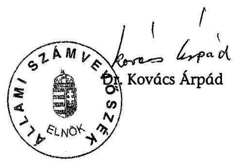
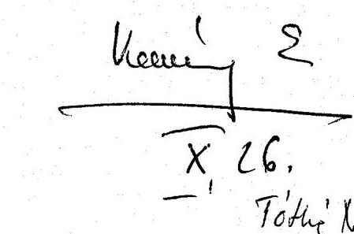
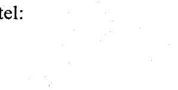
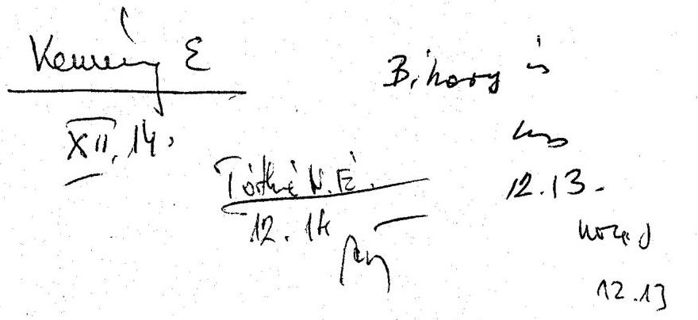
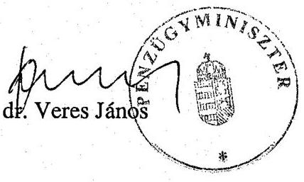
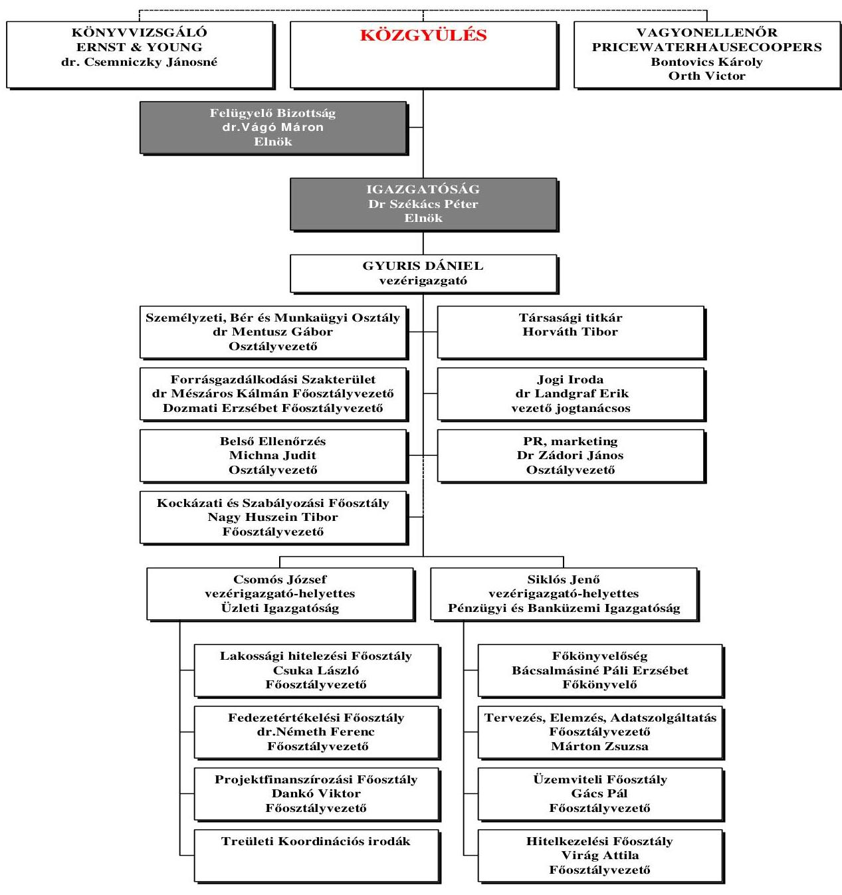
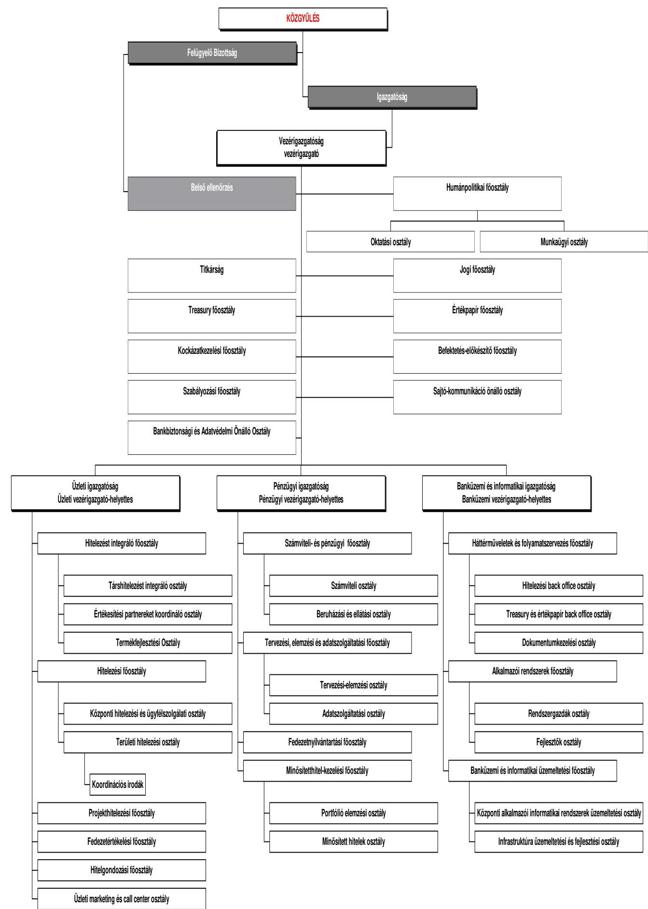
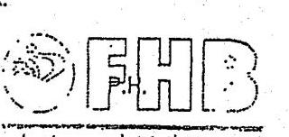

# ÁLLAMI   SZÁMVEVŐSZÉK 

## JELENTÉS

a Földhitel- és Jelzálogbank Rt. múködésének ellenőrzéséről

---

2. Államháztartás Központi Szintjét Ellenőrző Igazgatóság
2.1. Teljesítmény Ellenőrzési Főcsoport

Iktatószám: V-12-38/2006.
Témaszám: 821
Vizsgálat-azonosító szám: V0283

# Az ellenőrzést felügyelte: 

Bihary Zsigmond
föigazgató
Az ellenőrzés végrehajtásáért felelős:
Kemény Emil
főcsoportfőnök
Az ellenőrzést vezette:
Tóthné Nagy Éva
mb. osztályvezető
Az ellenőrzést végezték:
Czúcz Dénes Kovácsy Tamás Verő Tünde
számvevő gyakornok számvevő
Vörös Katalin
számvevő

A témához kapcsolódó eddig készített számvevőszéki jelentések:
címe
sorszáma
A Földhitel- és Jelzálogbank Rt. 2000. évi tevékenységének ellenőr- 0213
zése

---

# TARTALOMJEGYZÉK 

BEVEZETÉS ..... 5
I. ÖSSZEGZŐ MEGÁLLAPÍTÁSOK, KÖVETKEZTETÉSEK, JAVASLATOK ..... 7
II. RÉSZLETES MEGÁLLAPÍTÁSOK ..... 13

1. Az FHB szervezete és működésének szabályozottsága ..... 13
1.1. Tulajdonosi szerkezet ..... 13
1.2. A közgyűlés tevékenysége ..... 14
1.3. Az irányító és az ellenőrző testületek ..... 16
1.4. A múködés szabályozottsága ..... 18
2. Az FHB üzleti tevékenysége és gazdálkodása ..... 22
2.1. Az üzleti stratégia ..... 22
2.2. Hitelezési tevékenység ..... 23
2.2.1. Hitelintézeti termékcsoportok, állományok alakulása ..... 23
2.2.2. A forint és deviza alapú hitelek ..... 26
2.2.3. A támogatott és a nem támogatott hitelek ..... 27
2.2.4. Hitelügyletek kezelésének ellenőrzése ..... 27
2.2.5. A hitelállomány és a fedezetek minősítése, céltartalék, illetve értékvesztés alakulása ..... 29
2.3. A Bank forrásai ..... 30
2.3.1. A jelzáloglevelek kibocsátása ..... 31
2.3.2. A jelzáloglevelek árazása ..... 34
2.3.3. Likviditási és kamatkockázat ..... 34
2.3.4. A jelzáloglevelek fedezete ..... 35
2.4. Az FHB gazdálkodása ..... 38
2.4.1. A kamatbevételek és -kiadások, a kamatkülönbözet alakulása ..... 38
2.4.2. A lakáscélú támogatások érvényesítése és elszámolása ..... 39
2.4.3. A múködési költségek, a létszám és a személyi juttatások alakulása ..... 40
2.4.4. A vagyoni helyzet alakulása, az eredményt befolyásoló tényezők ..... 43
2.4.5. A jogszabályokban előírt hitelintézeti mutatók ..... 44
3. Az FHB külső ellenőrzési rendszere ..... 45
4. Utóellenőrzés ..... 46

---

# MELLÉKLETEK 

1. sz. melléklet
2. sz. melléklet
3. sz. melléklet
4. sz. melléklet
5. sz. melléklet
6. sz. melléklet

Észrevételek
A tulajdonosi struktúra változásai
Az FHB szervezeti felépítése (2000., 2006.)
Kritériumok a hitelezési tevékenység ellenőrzéséhez
Tanúsítványok
Az előző számvevőszéki ellenőrzés javaslatai

---

# RÖVIDÍTÉSEK JEGYZÉKE 

| ÁPV Rt., Zrt. | Állami Privatizációs és Vagyonkezelő - Zártkörűen Műkö-   dő - Részvénytársaság |
| :-- | :-- |
| ÁSZ | Állami Számvevőszék |
| Bank, FHB, Társaság | FHB Jelzálogbank Nyilvánosan Múködő Részvénytársaság |
| belső ellenőrzés | belső ellenőrzési szervezet |
| BÉT | Budapesti Értéktőzsde Rt. |
| EFB | Eszköz-Forrás Bizottság |
| FB | felügyelő bizottság |
| Gt. | a gazdasági társaságokról szóló 1997. évi CXLIV. tv. |
| Hpt. | a hitelintézetekről és a pénzügyi vállalkozásokról szóló |
|  | 1996. évi CXII. tv. |
| Jht. | a jelzálog-hitelintézetről és a jelzáloglevélről szóló 1997. |
|  | évi XXX. tv. |
| Kormányrendelet | a lakáscélú állami támogatásokról szóló 12/2001. (I. 31.) |
|  | Korm. rendelet |
| MNB | Magyar Nemzeti Bank |
| PM rendelet | a kintlévőségek, befektetések, mérlegen kívüli tételek és a |
|  | fedezetek minősítésének szempontjairól szóló 14/2001. |
|  | (III. 9.) PM rendelet |
| Priv. tv. | az állam tulajdonában lévő vállalkozói vagyon értékesíté- |
|  | séről szóló 1995. évi XXXIX. tv. |
| PSZÁF, Felügyelet | Pénzügyi Szervezetek Állami Felügyelete |
| SZMSZ | Szervezeti és Múködési Szabályzat |
| Tpt. | a tőkepiacról szóló 2001. évi CXX. tv. |

---

.

---

# JELENTÉS 

## a Földhitel- és Jelzálogbank Rt. múködésének ellenőrzéséről

## BEVEZETÉS

Az FHB Jelzálogbank Nyilvánosan Múködő Részvénytársaságot (továbbiakban: FHB, Bank, Társaság) 1997 októberében a Magyar Befektetési és Fejlesztési Bank Rt., a Mezőbank Rt., a Postabank Rt., a Pénzintézeti Központ Bank Rt. és a Pénzügyminisztérium alapította. A részvénytársaságot 3,0 Mrd Ft jegyzett tőkével hozták létre, amelyet 2001-ig - három lépésben - 4,1 Mrd Ft-ra emeltek.

Az FHB szakosított hitelintézet, múködését az Állami Pénz- és Tőkepiaci Felügyelet engedélye alapján, 1998. március 6-án kezdte meg. Fő tevékenységi körét - az állam lakáspolitikai céljai teljesítésének támogatása érdekében - a jelzáloggal terhelt ingatlanok fedezete mellett nyújtott hosszú lejáratú hitelek folyósítása, illetve jelzáloglevél kibocsátása képezik.

Az FHB múködését a hitelintézetekről és a pénzügyi vállalkozásokról szóló 1996. évi CXII. tv. (továbbiakban: Hpt.), a tőkepiacról szóló 2001. évi CXX. törvény (továbbiakban: Tpt.), valamint a jelzálog-hitelintézetről és a jelzáloglevélről szóló 1997. évi XXX. tv. (továbbiakban: Jht.) szabályozza.

Az FHB jegyzett tőkéje 2001 elején 4,1 Mrd Ft volt, amelyből a Magyar Állam közvetlenül 56,1\%-kal, a Magyar Fejlesztési Bank Rt. 35,4\%-kal, az FHB pedig $8,5 \%$-kal rendelkezett, így az FHB közvetlenül és közvetve 100\%-os állami tulajdonban volt. 2003 második félévében az Állami Privatizációs és Vagyonkezelő Részvénytársaság (továbbiakban: ÁPV Rt.) által végrehajtott 2,5 Mrd Ft-os tőkeemeléssel az FHB jegyzett tőkéje 6,6 Mrd Ft-ra nőtt. 2003. év végére a privatizációt követően az ÁPV Rt. tulajdona 53,2\%-ra csökkent, és ez nem változott 2005. év végéig, amikor a további részvények 17,7\%-a belföldi intézményi befektetők, $25,4 \%$-a külföldi társaságok, $3,5 \%$-a magánszemélyek, $0,2 \%$-a pedig az FHB munkavállalóinak tulajdonában volt. Az FHB törzsrészvényeit 2003. november 24-én vezették be a Budapesti Értéktőzsdére (továbbiakban: BÉT). A Társaság múködési formája zártkörűről nyilvánosra változott. A Bank megalapításától 2002. év végéig a tulajdonosi jogok gyakorlása a pénzügyminiszter, 2003. január 1-jétől az ÁPV Rt. feladata volt.

Az FHB 2000. év végi mérlegfőösszege 20,2 Mrd Ft, mérleg szerinti eredménye 1,5 Mrd Ft veszteség, hitelállománya 14,1 Mrd Ft volt. 2005. év végén ugyanezek az adatok rendre 484,4 Mrd Ft, 4,8 Mrd Ft nyereség és 431,0 Mrd Ft.

Az Állami Számvevőszék (továbbiakban: ÁSZ) 2001-ben átfogóan ellenőrizte az FHB múködését és gazdálkodását, a hatályos jogszabályok betartását és az

---

állam - mint tulajdonos - speciális elvárásainak érvényesítését. ( 0213 sz. jelentés a Földhitel- és Jelzálogbank Rt. 2000. évi tevékenységének ellenőrzéséről.)

A jelenlegi ellenőrzés célja annak értékelése volt, hogy az FHB:

- működése és tevékenysége megfelelt-e a törvényi előírásoknak, az alapszabálynak, az állam speciális elvárásainak és a belső szabályzatoknak;
- üzleti tevékenysége és stratégiája összhangban volt-e a Kormány lakástámogatási politikájával;
- szabályszerűen és üzleti terveinek megfelelően gazdálkodott-e, mely tényezők játszottak szerepet az eredmény alakulásában;
- miként hasznosította a korábbi ÁSZ ellenőrzés tapasztalatait.

A vizsgálat az FHB 2001-2005. évi tevékenységére irányult, de figyelemmel kísérte a gazdasági eseményeket a helyszíni ellenőrzés lezárásáig. Az ellenőrzés az ÁSZ ellenőrzési kézikönyvében meghatározott eljárások szerint, átfogó ellenőrzéssel értékelte az FHB múködését.

A jelentéstervezetet megküldtük az FHB vezérigazgatójának és a pénzügyminiszter úrnak. Válaszlevelüket az 1. számú melléklet tartalmazza.

---

# I. ÖSSZEGZŐ MEGÁLLAPÍTÁSOK, KÖVETKEZTETÉSEK, JAVASLATOK 

A 2000-ben elindított lakáskoncepció keretében a Kormány új állami támogatásokat vezetett be a lakáshiteleknél, amelyek körét és mértékét - a lakáspiac felfuttatása érdekében - 2003-ig több lépcsőben bővítette. A lakossági lakáshitelek nemzetgazdasági szintű állománya 2003-ban minden addiginál nagyobb mértékben, az előző évinek közel kétszeresére nőtt, amelyből az FHB 30\%-ot meghaladó mértékben részesedett. 2003-tól az állami szerepvállalás csökkenése a lakáscélú állami támogatásokról szóló kormányrendelet támogatásokat szükítő módosításaiban jelent meg. A Kormány ezt a szándékát erősítette meg a 2006 szeptemberében nyilvánosságra hozott Konvergencia programban is, amelyben az adókedvezmények ${ }^{1}$ rendszeréhez kapcsolódóan fogalmaz meg további szűkítést, valamint a támogatott hitelekkel összefüggésben 2007. január 1-jétől új adót ${ }^{2}$ vezet be.

Az FHB a Kormány lakástámogatási rendszerének közvetítőjeként a vizsgált időszakban meghatározó szereplője lett a hazai lakáshitel piacnak. A hitelek finanszírozásához a hosszú lejáratú forrásokat a hazai és a nemzetközi tőkepiacról biztosította.

A Bank tevékenységét a jogszabályi előírásoknak, az alapszabályában foglaltaknak és a tulajdonosi elvárásoknak megfelelően végezte, múködése prudens és átlátható volt.

Az FHB közgyűlése határozatot hozott minden olyan kérdésben, amelyet jogszabály számára előírt. 2006-ban a közgyűlés az alapszabály módosításával lehetővé tette, hogy az FHB igazgatósága - a többségi tulajdonos (ÁPV Zrt.) előzetes jóváhagyásával - a Bank alaptőkéjét a gazdasági társaságokról szóló törvényben szabályozott valamennyi módon felemelje.

Az elmúlt öt évben az 5-ről 8 főre bővült igazgatóságban és az 5-ről 9 főre növelt felügyelő bizottságban összesen 22, illetve 23 testületi tag látott el feladatot. A tisztségviselők gyakori változtatása kockázatot jelent - bár az ellenőrzés erre visszavezethető rendellenességet nem tárt fel -, nehezítheti a Bank stabil és kiszámítható irányítását, illetve ellenőrzését.

[^0]
[^0]:    ${ }^{1}$ Magyarország Konvergencia programja 2005-2009. 52. oldal: „A 2007. január 1-jét követően felvett lakáscélú hitelek törlesztéséhez adókedvezmény már nem vehető igénybe".
    ${ }^{2}$ 2006. évi LIX. tv. az államháztartás egyensúlyát javító különadóról és járadékról, amely alapján „A hitelintézet az adóévben a külön jogszabály szerinti állami kamattámogatással, kamatkiegyenlítéssel közvetlenül vagy közvetetten érintett hitelállománya alapján ka-mat- és kamatjellegú bevétel címén befolyt összeg után 5 százalékos mértékkel járadékot állapít meg és fizet."

---

Az FHB igazgatósága a jogszabályoknak, az alapszabálynak, valamint az ügyrendjének megfelelően végezte munkáját. Döntéseit határozatokba foglalta, de azok megvalósítását egyes esetekben (működési költségek tervtől való eltérése és szöveges indokolása, valamint 2002-ben és 2003-ban a jóváhagyott kereset- és bérszínvonal növekedéstől való eltérés) nem ellenőrizte. Ülésen kívüli határozatai meghozatalánál hét esetben - ügyrendjétől eltérő (meghatározott időtartamon túli, illetve keltezés nélküli) - formailag hibás szavazatot fogadott el érvényesnek.

A Bank múködését belső és külső ellenőrző szervezetek támogatták. A felügyelő bizottság (továbbiakban: FB) a közgyűléshez kapcsolódó feladatait ellátta, megtárgyalta a szakmai irányítása alatt álló belső ellenőrzés jelentéseit, a javaslatok hasznosulását figyelemmel kísérte. A Pénzügyi Szervezetek Állami Felügyelete (továbbiakban: PSZÁF, Felügyelet) - a Jht. alapján - minden évben átfogó vizsgálat keretében értékelte az FHB tevékenységét, jelentéseiben a prudens múködést érintő hiányosságot nem tárt fel. A Moody's Nemzetközi Hitelminősítő Intézet 2002-ben minősítette első alkalommal a Bankot, az akkori „A3" hitelkockázati besorolás 2003-ban „A2"-re javult, amit 2005-ben is megőrzött.

A Szervezeti és Múködési Szabályzat (továbbiakban: SZMSZ) nem fogja át az FHB teljes tevékenységét, a szervezet múködésének belső utasításokban rögzített részletszabályai nem érhetők el egységes szerkezetben. Szervezeti felépítése a vizsgált időszakban mindvégig megfelelő hátteret biztosított a Bank múködéséhez.

Az FHB alapszabálya a törvényi előírásokkal összhangban tartalmazza a társaság múködésének kereteit. Az FHB rendelkezik a prudens múködéshez szükséges szabályzatokkal, két esetben azonban eltértek a jogszabályi előírásoktól. Formai hiányosság volt, hogy az értékvesztési és céltartalék-képzési szabályzatot nem önálló utasításként adták ki, a kockázatvállalási szabályzatot pedig belső utasítások tételes felsorolásával határozták meg, amelyek időközben hatályukat vesztették. A helyszíni ellenőrzést követően elkészült az új kockázatvállalási szabályzat, amely már megfelel a jogszabályi előírásoknak.

A szabályozottság kiterjed a Bank összes tevékenységére, a jogszabályban jóváhagyáshoz kötött belső szabályzatait a Felügyelet és a Vagyonellenőr ${ }^{3}$ jóváhagyta. A szabályzatok karbantartása nem teljes körű, mintegy 30\%-a felülvizsgálatra szorul, mivel több nem aktuális utasítás hatályban van, és nem minden esetben vezették át a jogszabályi és a szervezeti változásokat. Az FHB belső utasítása előírja a szabályzatok kétévenkénti felülvizsgálatát, amelyet első ízben 2006 végére kell befejezni.

A Bank az üzleti stratégiáját a Kormány lakástámogatási programjával összhangban dolgozta ki. Erre alapozva fejlesztette ki és bővítette kedvezményes lakáscélú hiteltermékeit. A jelzáloglevelek kibocsátási feltételeinek alakí-

[^0]
[^0]:    ${ }^{3}$ A Jht. kötelezően előírja a Bank számára vagyonellenőr alkalmazását. Az FHB a feladat ellátására egy könyvvizsgáló céggel kötött szerződést.

---

tásával a Bank elérte azt a célját, hogy finanszírozási oldalról folyamatosan támogatta a hitelkihelyezési tevékenység bővülését, és a jövedelmezőségét a tervezettnek megfelelően biztosította. Az FHB igazgatósága a 2006-2010. évekre elfogadott stratégiájában az üzleti tevékenység további bővítése érdekében egy bankcsoport kialakításáról döntött, amely az anyabankon kívül öt leánycégből (kereskedelmi bank, életjáradék, ingatlan befektető és egy lizing cég, valamint a meglévő FHB Szolgáltató Rt.) fog állni. Az FHB Kereskedelmi Bank Zrt. megalapításához a PSZÁF 2006-ban megadta az engedélyt.

Az FHB hitelállománya a 2001. évi 31,1 Mrd-ról 2005-re 431,0 Mrd Ft-ra nőtt, ezzel a teljesítménnyel a hazai lakáshitel piaci részesedése 2003-tól mintegy $30 \%$-os lett. Hitelállománya dinamikus növekedésében jelentős szerepe volt annak, hogy 2001-től - a stratégiájának megfelelően - az új hiteltermékek bevezetésével együtt megkezdte partnerhálózatának kiépítését. A saját ügyfélszolgálati irodáin kívül ügynökhálózatán keresztül és konzorciális együttmúködés keretében is értékesíti támogatott hiteltermékeit. Az FHB 2001-ben - a Jht.-ban szabályozott lehetőséggel élve - az önálló jelzálogjog felvásárlására és az állami támogatás közvetítésére alapozva létrehozta refinanszírozási üzletágát, amely 2005-re teljes hitelállományának már több mint 60\%-át tette ki. Hitelállományából a támogatott hitelek aránya 2002-től 2004-ig meghaladta a $90 \%$-ot, 2005-ben pedig $87 \%$-ra csökkent. Lakáscélú támogatásokra 2001-ben 1,6, 2005-ben 37,6 Mrd Ft-ot, öt év alatt összesen 103,1 Mrd Ft-ot számolt el a központi költségvetéssel.

Az FHB, mint jelzálog-hitelintézet, forrásait - a Jht.-nek megfelelően - jelzáloglevelek kibocsátásával szerezte, amelyek fedezete - a kereskedelmi banki gyakorlattól eltérően - a jelzálog-hitelintézet által nyújtott pénzkölcsön. A jelzáloglevelek kibocsátásának jogszabályi kereteit mindvégig betartotta, ezt nem befolyásolta, hogy 2004-ig a kibocsátáshoz kapcsolódó döntési jogkörökről két, egyidejűleg hatályban lévő, de az adott kérdésben egymásnak ellentmondó belső utasítás rendelkezett. Az igazgatóság két alkalommal határozott saját, jelzáloglevél kibocsátással kapcsolatos döntési jogköréről. Az utasítások 2004. évi módosításával a döntési jogkörök egymásnak ellentmondó szabályozását megszűntették, de azok továbbra sem kerültek összhangba az igazgatóság 2000 decemberi határozatával, erre visszavezethető hiányosságot azonban az ellenőrzés nem tárt fel. A jelzáloglevelek fedezetére vonatkozó jogszabályi előírásoknak a Bank a vizsgált időszakban folyamatosan megfelelt. A jelzáloglevelek állománya az öt év alatt 42-szeresére nőtt, 2005-re 403,8 Mrd Ft lett. A vizsgált öt évben a hazai tőkepiac - mind a kereslet mennyisége, mind a jelzáloglevelek kockázatához mérten aránytalanul magas hozamfelárak oldaláról - fékezte az intenzív bővülést, ezért a Bank - stratégiájának megfelelően - már 2001-től megkezdte a felkészülést arra, hogy megjelenjen a nemzetközi tőkepiacon, ahol 2003-ban forintban, 2004-ben pedig euróban bocsátott ki jelzáloglevelet. A Bank a jelzálogleveleken kívüli egyéb kamatozó forrásokat csak átmeneti jelleggel, a likviditás biztosítása érdekében vett igénybe.

A lakossági hitelügyleteknél a hitelezési kockázatok kezelésének belső szabályzatokban rögzített előírásait betartották. Az ügyleteknél feltárt egyedi hiányosságok a belső szabályoktól eltérő ügykezelésből adódtak, azonban a hitelek futamidejének egyetlen szakaszában sem növelték a Bank kockázatát. A hitelek befogadásakor a Bank ellenőrizte a kérelmező fizetőképességét, az adatok

---

valódiságát. A hitelbiztosítéki értéket, a kondíciókat a szabályzatokban foglaltaknak megfelelően állapították meg, a szerződéseket minden esetben közokiratba foglalták. Általános hiányosság a hitelgondozási tevékenység dokumen-tum-kezelésében volt megállapítható. A problémás ügyleteknél - amelyek saját hitelállományon belüli aránya mindvégig 5\% alatt volt - a szabályzatnak megfelelően minősítették a követelésállományt és az előírásokkal összhangban számolták el az értékvesztést. A dolgozói hitelek közül a részvényjuttatási programhoz kapcsolódó speciális célú személyi kölcsönök után a Bank a szabályzatban előírtnál alacsonyabb kamatot számolt el, amelyet az ellenőrzés hatására felülvizsgált és a különbözetet a helyszíni ellenőrzés ideje alatt a havi jövedelem terhére rendezett.

A teljes körűen ellenőrzött projektfinanszírozási kölcsönügyleteknél a megfelelő biztosítékok és a kiegészítő biztosítékok minden esetben rendelkezésre álltak. A kölcsönszerződések a szabályzat tartalmi és formai előírásainak megfeleltek, a fedezettséget minden folyósítás alkalmával ellenőrizték. A mindösszszesen négy ügyletből két esetben nem állt rendelkezésre a hatályos utasításnak megfelelő műszaki terv és az azzal összehangolt, a Bank által jóváhagyott hitel összegét tartalmazó költségvetés. Ez magában hordozza annak a lehetőségét, hogy a Bank nem tudja szabályzatának megfelelően értékelni a projekt tervezett határidőre történő befejezését, illetve a részhatáridőknek megfelelő előrehaladást.

A Bank a stratégiájában 2002-től hosszú távon is növekvő eredményekkel számolt. Üzleti stratégiájára alapozva éves terveket készített, amelyek meghatározták gazdálkodásának kereteit. Üzleti aktivitásával összhangban a kamatbevételek és -kiadások tervét minden évben túlteljesítette. A Bank gazdálkodásának belső utasításait betartotta, az állami támogatásokat a jogszabályokban és a szerződésekben rögzített feltételeknek megfelelően, szabályszerűen számolta el.

Adózás előtti eredménye minden évben meghaladta a tervezettet, amely a 2002. évi 0,5 Mrd Ft-ról 2005-re 9,6 Mrd Ft-ra nőtt. 2003-tól kezdődően a közgyűlés határozata alapján minden évben fizetett osztalékot.

A Bank tőkehelyzete az öt év alatt stabil volt. Az ügyfelekkel szemben fennálló követeléseinek növekedési dinamikája minden évben jelentősen meghaladta a szavatoló tőkéét. A hitelintézetek számára meghatározott mutatók az FHBnál kedvezőbbek voltak a jogszabályban előírt értékhatároknál, ami a biztonságos működést és a mindenkori fizetőképességet igazolta. Az FHB hitelezési tevékenységének dinamikus növekedése hatására mérlegfőösszege minden évben meghaladta a tervezettet és a 2001. évi 35,2-ről 2005. év végére 484,4 Mrd Ft-ra emelkedett. A mérlegfőösszeg több mint $90 \%$-át mindvégig a kamatozó eszközök tették ki. A Bank megalakulása óta befektetett pénzügyi eszközei között egy társaságot tart nyilván 65 M Ft értékben.

A Bank kamatbevételei a 2001. évi 4,1-ről 2005-re 53,0 Mrd Ft-ra nőttek, amelyben meghatározó szerepe volt a Kormány lakástámogatási programjából eredő dinamikus hitelállomány növekedésnek. Összes bevételén belül az állami támogatás és jutalék címen elszámolt bevételrész 2001-ben 19\%-ot, 2003-tól minden évben több mint $60 \%$-ot tett ki.

---

A kamatkiadások a 2001. évi 2,1-ről 2005-re 36,5 Mrd Ft-ra nőttek, ezen belül a jelzáloglevél után fizetett kamatok részaránya minden évben meghaladta a $80 \%$-ot. Az FHB az alárendelt kölcsöntőke után - amelyet 2003-ban a PSZÁF engedélyével visszafizetett - 2001-2003. között összesen 0,4 Mrd Ft kamatot számolt el.

A múködési költségek a 2001. évi 2,5-ről 2005-re 6,9 Mrd Ft-ra emelkedtek. Legnagyobb hányadát minden évben a személyi jellegű (41-56\% között) és az anyagjellegú ráfordítások (23-36\% között) tették ki. Az anyagjellegú ráfordításokon belül pedig az igénybe vett szolgáltatások ráfordításai voltak a meghatározók (több mint 90\%). A 2001-2003. években a ráfordítások tervezettet (2,6-6,2\% között) meghaladó növekedését az igénybe vett szolgáltatások költségei okozták. A 2004. és 2005. évi tervét a Bank nem lépte túl. A személyi jellegú ráfordításokra 2001-ben 1,3, 2005-ben 3,1 Mrd Ft-ot fordított a Bank, éves tervét az ellenőrzött öt év mindegyikében (1,5-24,8\% között) túllépte. 2005-ben az FHB ügyvezetése 262 M Ft-tal emelte meg a személyi jellegú ráfordítások tervét, amelyet az egyéb ráfordításokból csoportosított át, de erről az igazgatóság nem hozott határozatot. Az átcsoportosítás a tervezett eredményt nem módosította.

A közgyűlés minden évben döntött az igazgatóság és az FB tagjainak díjazásáról. Az igazgatósági tagok jövedelme az öt év alatt többszörösére emelkedett, döntően a 2004-ben elindított vezetői részvényjuttatási program hatására. A jövedelem növekedése a 2001. évi 1,1 M Ft-hoz képest az igazgatóság elnökénél 22, tagjainál pedig 11-szeres volt. A külső igazgatósági tagok egyéni érdekeltségében a részvényopciók aránytalanul nagy (az éves jövedelem 80\%-át meghaladó) mértéke nincs összhangban a BÉT által kiadott Felelős Vállalatirányítási Ajánlásokkal, mivel az a hosszú távú helyett a rövid távú nyereségérdekeltséget helyezi előtérbe. Ezen túlmenően az igazgatóság tagjainak részvényopciós programból származó juttatását olyan mutató (eredményterv) teljesítéséhez is kötötték, amelynek elfogadásáról és módosításáról maga az igazgatóság határoz, így a testület közvetlen hatással lehet a feltételek teljesítésére és közvetetten a saját jövedelmére.

Az igazgatóság a Bank anyagi ösztönzési rendszerét minden évben jóváhagyta, a prémiumfeladatok teljesítésének értékelése és elszámolása az előírásoknak megfelelően történt.

A Bank létszáma a 2001. évi 162 fơről 2005-re 239 főre nőtt, létszámtervét csak 2005-ben (4,8\%-kal) lépte túl. Az időszakosan jelentkező többletfeladatok elvégzését munkaerő kölcsönzéssel biztosította. Munkavállalóinak átlagbére 2001-ről 2005-re 31,8\%-kal, átlagkeresete ezt meghaladóan, 56,9\%-kal emelkedett. Az átlagkereset a vizsgált öt évben a KSH pénzügyi közvetítő szektorra közzétett adatokat évente 74,8-118\% között haladta meg. A 2002. évi átlagbér és 2003. évi átlagkereset növelés mértékéről rendelkező igazgatósági határozatokat a Bank mindkét évben (16,2, illetve 2,6 százalékponttal) túllépte. Ennek az indokoltságát az igazgatóság - üléseinek jegyzőkönyvei alapján - nem kérte számon. A 2004. és 2005. években már az ÁPV Rt. határozta meg a Bank számára a keresetfejlesztés mértékét és feltételeit. 2004-re a feltételek között szerepelt, hogy a keresetfejlesztés $70 \%$-át alapbérre, $30 \%$-át pedig teljesítmény ará-

---

nyosan kell felhasználni, ennek betartását azonban az ÁPV Rt. nem ellenőrizte. Az FHB a keresetfejlesztés mértékének előirását mindkét évben betartotta.

Az ÁSZ korábbi jelentésében a pénzügyminiszter számára fogalmazott meg javaslatokat, amely alapján a Kormány megtárgyalta az FHB állami kézben tartásának szükségességét, majd az állami tulajdon megszüntetése mellett foglalt állást. Ennek megfelelően a Bankot 2003-ban részlegesen privatizálták, a többségi állami tulajdon megszűnése pedig a bankcsoport megalakulását követően várható. Az FHB igazgatósága a rá vonatkozó javaslatokat hasznosította, a szabályzatoknál azonban továbbra is a rendszerbeli összhang hiánya és azok karbantartásnál elmaradás állapítható meg.

A helyszíni ellenőrzés megállapításainak hasznosítása mellett javasoljuk:

# a pénzügyminiszternek, utasítsa az ÁPV Zrt.-t, kezdeményezze az FHB igazgatóságánál, hogy 

1. vizsgálja felül az igazgatóság külső tagjainak anyagi ösztönzési rendszerét annak érdekében, hogy a részvényjuttatás és a tiszteletdíj aránya összhangba kerüljön a Felelős Vállalatirányítási Ajánlásokkal;
2. módosítsa a részvényjuttatás feltételeit úgy, hogy azokra a juttatásban részesülőknek ne lehessen közvetlen ráhatása;
3. a szabályzatok felülvizsgálatával egyidejűleg alakítsa ki az FHB tevékenységét teljes körűen átfogó, egységes szerkezetű Szervezeti és Működési Szabályzatát;
4. minden esetben kérje számon határozatai végrehajtását, hogy az abban foglaltak maradéktalanul megvalósuljanak, így különösen: a tervek megalapozásának bővebb kifejtését, a költségek alakulásának szöveges értékelését és a keresetszabályozást;
5. tartsa be az ülésen kívüli határozatok meghozatalának szabályait;
6. teremtse meg az összhangot a jelzáloglevelek kibocsátásának döntési rendszerét meghatározó belső utasítások és a saját határozata között.

---

# II. RÉSZLETES MEGÁLLAPÍTÁSOK 

## 1. Az FHB SZERVEZETE ÉS MÜKÖDÉSÉNEK SZABÁLYOZOTTSÁGA

### 1.1. Tulajdonosi szerkezet

Az FHB feletti tulajdonosi jogokat - az állam tulajdonában lévő vállalkozói vagyon értékesítéséről szóló 1995. évi XXXIX. tv. (továbbiakban Priv. tv.) értelmében - 2001. január 1-jétől 2002. december 31-ig a pénzügyminiszter, 2003. január 1-jétől az ÁPV Rt. gyakorolja.

2003 májusában a Kormány előírta az FHB jegyzett tőkéjének 2,5 Mrd Ft-tal való emelését és döntött az addig 100\%-os állami tulajdonú társaság részvényeinek tőzsdei úton történő, teljes körű értékesítéséről. 2003 júliusában módosította az eredeti szándékát úgy, hogy a részvények - többségi - 50\% plusz egy szavazati jogot megtestesítő hányada állami kézben maradjon és csak a fennmaradó kisebbségi részesedést értékesítsék.

A módosítást a Moody's Nemzetközi Hitelminősítő Intézet állásfoglalása indokolta, amely az FHB leminősítését helyezte kilátásba, amennyiben az új tulajdonosok hitelkockázati besorolása nem éri el a korábbi színvonalat.

A közgyűlés 2003. május 23-án az alaptőke emelést követően 800000 darab, egyenként 1000 Ft névértékű törzsrészvény szavazatelsőbbségi részvénnyé alakításáról döntött, hogy a privatizációt követően is biztosítható maradjon a Magyar Állam és a stratégiai befektetők érdekeinek érvényesítése. A szavazatelsőbbségi részvényeket zárt körben ajánlották fel megvételre az FHB kiemelkedő jelentőségű stratégiai partnerei részére, amelyekből 588570 db részvényt vásárolt meg négy intézményi befektető.

Az igazgatóság 2003 októberében - az alapszabályban rögzített jogosítványával élve - a jegyzett tőke 1000 Ft-tal történő emeléséről döntött. A Bank a részvényt nyilvánosan hozta forgalomba azért, hogy az FHB megfeleljen a gazdasági társaságokról szóló 1997. évi CXLIV. törvényben (továbbiakban: Gt.) előírt, a nyilvános működési formára vonatkozó szabályoknak és tőzsdeképessé váljon. Döntött továbbá az FHB tulajdonában lévő összes törzsrészvény (349 900 darab) értékesítéséről, melyből 275 ezer darabot - a zártkörű értékesítési ár $50 \%$-áért - a munkavállalói részére ajánlott fel, a fennmaradó 74900 db törzsrészvényt pedig zárt körben 4300 Ft-os árfolyamon belföldi és külföldi intézményi befektetőknek értékesített.

A munkavállalói részvényvásárlási programnak kettős célja volt: egyrészt a munkavállalók addigi teljesítményének elismerése, másrészt a tulajdonosi érdekeltség megteremtése. Ennek eredményeként a teljes keretet felhasználva - a 196 jogosultból - 195 dolgozó jutott részvényhez.

A BÉT az FHB törzsrészvényeit 2003. november 24-én vezette be a kereskedésbe.

---

A privatizációt követően 2003. december 31-én az összes részvény 53,2\%-a maradt az ÁPV Rt. tulajdonában, 4,2\%-a a munkavállalók, 7,7\%-a magánszemélyek, $34,9 \%$-a pedig intézményi befektetők birtokába került.

3 hónap elteltével - 2004. március 31-ére - a munkavállalók tulajdonosi részaránya 4,2\%-ról 1,7\%-ra, 2005. év végére 0,2\%-ra csökkent.

Két év alatt 2005. december 31-ére - az állami részesedés változatlansága mellett (53,2\%) - az intézményi befektetők tulajdonosi részesedése 43,2\%-ra emelkedett, a magánszemélyeké és a munkavállalóké együttesen 3,6\%-ra csökkent. (A tulajdonosi struktúra változásait az 2. sz. melléklet tartalmazza.)

A Kormány - 2005. július 14-ei - határozatával döntött az FHB privatizációjáról, és a végrehajtás határidejéül 2006. február 28-át jelölte meg. A kormányhatározat alapján az ÁPV Rt. feletti részvényesi jogokat gyakorló pénzügyminiszter határozatot hozott az ÁPV Rt. kezelésében lévő részvénycsomag értékesítéséről. Két nappal később a pénzügyminiszter - a Kormány újabb döntésére hivatkozva - hatályon kívül helyezte a privatizációról szóló határozatát.

# 1.2. A közgyűlés tevékenysége 

Az FHB-nál 2001. óta hat rendes és három rendkívüli közgyűlést tartottak. A közgyűlésekről - a törvényi előírásoknak megfelelő - jegyzőkönyvek készültek. A közgyűlés határozatot hozott - az Adatvédelmi Szabályzat kivételével - minden olyan kérdésben, amely a Gt., vagy az alapító okirat (2003-tól alapszabály) értelmében a testület kizárólagos hatáskörébe tartozik.

A közgyűlés az alapszabály módosításával 2003-ban saját hatáskörébe vonta az Adatvédelmi Szabályzat elfogadását. Ennek ellenére a 2004-ben kiadott szabályzatot a közgyűlés a helyszíni ellenőrzés lezárásáig nem tárgyalta.

Rendkívüli közgyűlést az alapszabály módosítása, valamint az igazgatóság és a FB személyi összetételének változtatása miatt hívtak össze.

Az évi rendes közgyűléseken állandó napirendi pontként szerepeltek az igazgatósági, a felügyelő bizottsági és a könyvvizsgálói jelentések, a tárgyévet megelőző évről készült hitelintézeti és konszolidált éves beszámolók, valamint 2001. évet kivéve - az éves üzleti tervek. Rendszeresen tárgyalta és jóváhagyta az igazgatóság és az FB személyi összetételének változását, valamint a javadalmazásuk mértékét.

A 2001 óta eltelt öt és fél év alatt a közgyűlés 7 alkalommal összesen 23 új FB és 21 új igazgatósági tag kinevezéséről döntött. A tisztségviselők ilyen gyakori változtatása - bár az ellenőrzés erre visszavezethető rendellenességet nem tárt fel - kockázatot rejt magában, mivel nehezíti a Bank stabil és kiszámítható irányítását, illetve ellenőrzését. Az FB tagjai között van olyan személy, aki közvetlenül az igazgatóságból került át a testületbe, ezáltal fennállhat annak a lehetősége, hogy az FB tagjaként a saját korábbi tevékenységéről alkothasson véleményt.

Jelenleg az igazgatóság 8, az FB 9 tagból áll, akik rendelkeznek a Felügyelet engedélyével.

---

Az FB és az igazgatóság tagjainak a tevékenységük ellátásáért kapott jövedelme a vizsgált időszakban többszörösére növekedett. Az FB elnökének 2001. évi 1,1 M Ft összegű éves tiszteletdíja 2006-ra 3,8 M Ft-ra, a többi tagjának az évi 0,8 M Ft-ról 2,5 M Ft-ra nőtt. Az igazgatóság elnöke és tagjai 2001-ben egységesen évi 1,1 M Ft-ot, 2004 májusától az igazgatóság elnöke évi 4,8 a tagok 2,4 M Ft tiszteletdíjat kaptak. A tiszteletdíjak emelése arányban állt a feladat és a felelősség növekedésével.

A 2004-ben elindított vezetői részvényjuttatási program hatására az igazgatóság elnöke a tiszteletdíjon túl - meghatározott feltételek teljesülése esetén 1,6 M Ft össznévértékű (2006. július 5-én a megelőző 180 nap (naptári) forgalommal súlyozott árfolyam átlagával számolva összesen 21,2 M Ft forgalmi értékű) részvényre jogosult. Az igazgatóság elnökének FHB-tól származó jövedelme a 2001. évi mértékhez képest 2006. közepére (éves szinten 25 M Ft ) több mint huszonkétszeresére emelkedett. Az igazgatóság többi tagja az elnök juttatásainak felére jogosult, így esetükben a növekedés mértéke több mint tizenegyszeres.

Az FHB közgyűlése többször foglalkozott a saját részvények megszerzésével, és arra az igazgatóságot a 2004-2006. évekre felhatalmazta. ${ }^{4}$ A cél a törzsrészvények esetében a részvényjuttatási program és az FHB üzleti stratégiájának tervszerű végrehajtása; a szavazatelsőbbségi részvényeknél pedig a Bank semlegességének védelme volt.

A tőzsdei teljesítmény növelése érdekében a közgyűlés 2004-ben egy két évre szóló vezetői részvényjuttatási program elindításáról döntött, amelynek keretében a Társaság kiemelt vezetői ellenérték nélküli részvényjuttatásra jogosultak. A közgyűlés az FB-t bízta meg, hogy a határozatában felvázolt keretfeltételeknek megfelelő részletes szabályzat-tervezetet dolgozza ki.

A közgyűlés meghatározta a részvényjuttatás éves keretét és vezetői szintenként maximálta mértékét. A részvényjuttatás feltételéül szabták a BUX-indexben szereplő társaságok harmadának árfolyameredményét meghaladó saját tőzsdei teljesítményt. Az FB a feltételeket további két szemponttal egészítette ki, amelyeket a közgyűlés jóváhagyott. Ennek értelmében részvényjuttatás csak akkor adható, ha „a Társaság az érvényes üzleti évben meghatározott adott éves eredménytervet a program végrehajtása esetén is teljesíti, továbbá, hogy a BÉT vizsgálati kritériumai közül a forgalom gyakorisága, az önkötések aránya, a forgalom aránya és a kötésszám aránya közül legalább három szempont tekintetében az FHB „A" sorozatú törzsrészvényei alkalmasak a BUX kosárban való részvételre."

A BÉT 2003-ban a tőzsdén jegyzett vállalatok számára Felelős Vállalatirányítási Ajánlásokat dolgozott ki, amelynek tartalmával az FHB igazgatósága egyetértett és annak elfogadásáról határozott.

[^0]
[^0]:    ${ }^{4}$ A közgyűlés - a vizsgált időszakban - két alkalommal adott felhatalmazást a Társaság igazgatóságának saját részvény vásárlására, a Gt. 226/A. §-a alapján. A 2004. évi rendes közgyűlés 2005. szeptember 30-ig, a 2005. évi rendes közgyűlés 2006. szeptember 30-ig szóló felhatalmazást adott.

---

#### Abstract

Az ajánlás szerint „Az igazgatóság, a felügyelő bizottság és a menedzsment javadalmazási rendszerét olyan módon kell kialakítani, hogy azok a vállalat, és ezen keresztül a részvényesek hosszú távú, stratégiai érdekeit szolgálják. A javadalmazási rendszerek az igazgatóság, a felügyelő bizottság és a menedzsment tagjait nem ösztönözhetik a részvény árfolyamok rövid távú maximalizálására." Ennek érdekében a „cégvezetés számára nyújtott érdekeltségi elemek (fizetés, bonusz, részvény, részvényopció, természetbeni juttatás, nyugdijjuttatás) arányát úgy kell meghatározni, hogy a vezetôket a hosszú távú stratégiai gondolkodásra ösztönözze. A részvényopciók túlzott aránya a rövidtávú nyereségérdekeltséget erősítheti. ... Az utóbbi évek - elsősorban amerikai - tapasztalatai alapján elmondható, hogy több vállalati felső vezető egyéni érdekeltségében a részvényopciók aránytalanul nagy arányt jelentettek, így a vezetők a részvényárfolyam rövid távú maximalizálásában váltak érdekeltté és ennek rendelték alá a vállalat müködését, ez pedig ellentétes a vállalat hosszú távú célkitúzéseivel."

Az FHB-nál bevezetett részvényjuttatási program rövid (két éves) időtartama és a külső igazgatósági tagok egyéni érdekeltségében a részvényopciók aránytalanul nagy (az éves jövedelem 80\%-át meghaladó) hányada nincs összhangban a Felelős Vállalatirányítási Ajánlásokkal, mivel az a hosszú távú helyett a rövid távú nyereségérdekeltséget helyezi előtérbe.

2006-ban a közgyűlés - az előzőhöz hasonló feltételekkel - újabb két évre (2006-2008.) hirdette meg a vezetői részvényjuttatási programot, azzal a különbséggel, hogy míg korábban a részvényjuttatáshoz a feltételeknek együttesen kellett teljesülniük, addig az új programban az egyes feltételek teljesítése már önmagában is részjuttatásra ad jogosultságot.

Az igazgatóság tagjainak részvényopciós programból származó juttatását olyan mutató (eredményterv) teljesítéséhez is kötötték, amelynek elfogadásáról és módosításáról maga az igazgatóság határoz, így a testület közvetlen hatással lehet a feltételek teljesítésére és közvetetten a saját jövedelmére.

2006-ban a közgyűlés az FHB alapszabályának módosításával lehetőséget teremtett az igazgatóság számára, hogy - a többségi tulajdonos (ÁPV Zrt.) előzetes jóváhagyását követően - az alaptőke emelése érdekében átváltoztatható kötvényt, illetve dolgozói részvényeket bocsáthasson ki. Ezzel lehetővé vált, hogy a Bank alaptőkéjét az igazgatóság a Gt.-ben szabályozott valamennyi módon felemelje.

A Gt. előírásainak megfelelően közgyűlési határozat született minden alapító okiratot (2003-tól alapszabályt) és a felügyelő bizottsági ügyrendet érintő módosításról, valamint a könyvvizsgáló kinevezéséről és díjazásáról.

# 1.3. Az irányító és az ellenőrző testületek 

Az FHB igazgatósága tevékenységét az ügyrendje alapján végezte, amely a vizsgált időszakban négy alkalommal változott.

Az igazgatóság az ügyrend módosításával 2003-tól bevezette a rendkívüli ülés intézményét és az igazgatóság az elnökön kívül a tagok számára is biztosított javaslattételi lehetőséget, 2004-ben összhangba hozta a múködését a Felelős Vállalatirányítási Ajánlásokkal, 2006-ban pedig kibővítette ügyrendjét a bankcsoport irányításával összefüggő feladatokkal.

---

Az igazgatóság a jogszabályoknak, az alapszabálynak (2003. május 23-a előtt alapító okiratnak) megfelelően végezte munkáját. Az igazgatóság munkatervek alapján dolgozott, amelyeket rugalmasan kezelt, de összességében az adott időszakra előirányzott témákat az aktualitásokkal kiegészítve megtárgyalta. Az előírtnál gyakrabban ülésezett, minden olyan kérdéssel foglalkozott, amelyet jogszabály, vagy belső szabályzat számára előír. Döntéseit határozatokba foglalta, de azok megvalósulását nem teljes körűen (működési költségek tervtől való eltérése és szöveges indokolása) ellenőrizte.

Rendszeresen megtárgyalta a hatáskörébe tartozó belső szabályzatok módosítását, a Bank üzleti és pénzügyi helyzetét, azonban a költségek alakulását értékelő elemző szöveges beszámolókat, annak ellenére nem kérte számon, hogy azt 2001. évi határozatában előírta. Döntött a jelzáloglevél-kibocsátásokról, valamint gyakorolta az FHB Szolgáltató Rt. feletti tulajdonosi jogokat. Évente döntött a hatáskörébe tartozó személyek javadalmazásáról, elfogadta a munkáltatói kölcsönök éves keretösszegét és az éves üzleti tervet, azonban a tervek megalapozásához szöveges alátámasztást a 2000. évi határozata ellenére nem kért. A rendes közgyűlést megelőzően megtárgyalta és jóváhagyta a közgyűlési előterjesztéseket. Esetenként határozott - többek között - sajátrészvény vásárlásról, belső hitelek odaitéléséről, a nagyberuházások jóváhagyásáról és a vagyonellenőri szerződések módosításáról.

A vizsgált időszakban az igazgatóság 21 alkalommal hozott ülésen kívüli határozatot, amelyre az ügyrendje lehetőséget biztosított, annak előírásait azonban nem minden esetben tartották be.

Az ülésen kívüli határozat az ügyrend szerint csak akkor érvényes, ha „... az igazgatósági tagok több mint fele szavazatát teljes bizonyító erejú magánokiratba foglalja, azt két napon belül megküldi a Társaság székhelyére ...". Az okiratokról két határozathoz kapcsolódóan két szavazatnál hiányzott a dátum, így nem állapítható meg, hogy az előírt határidőn belül érkezett-e a szavazat. Hét esetben több mint két nap telt el a szavazatok leadásáig, két határozat egy-egy szavazatánál pedig hiányzott a magánokirati forma, ezek a szavazatok az ügyrend szerint érvénytelennek minősültek volna, de azokat érvényes szavazatnak fogadták el.

A felügyelő bizottság rendelkezett a közgyűlés által jóváhagyott ügyrenddel, amely megfelelt a jogszabályi követelményeknek.

A vizsgált időszakban az FB a tevékenységét az ügyrendjének megfelelően végezte, a munkatervében kitűzött feladatokat teljesítette. A közgyűlés kizárólagos hatáskörébe tartozó ügyeket megtárgyalta és javaslatát kialakította, folyamatosan tájékozódott a Bank üzleti és pénzügyi helyzetéről, az igazgatóság munkájáról. A jogszabályokban előírtnál tágabb körben és részletesebben ellenőrizte a Bank múködését. Kiemelten foglalkozott a kinnlevőségek minősítésével, a jelzáloglevél kibocsátással, az ingatlanértékelés kérdéseivel, a treasury működésével, a likviditással, a lejárati összhang alakulásával. Az előterjesztéseket, tájékoztatókat elfogadta, tudomásul vette.

Az FB - a jogszabályokkal összhangban - ellátta a belső ellenőrzési szervezet (továbbiakban: belső ellenőrzés) irányítását, minden évben jóváhagyta az ellenőrzési tervét, jelentéseit megtárgyalta, a beszámolókat elfogadta, a javaslatok megvalósítását figyelemmel kísérte.

---

A Bank belső ellenőrzési rendszerének múködését vezérigazgatói utasítások szabályozták, amelyek az általános célok és feladatok meghatározása mellett részletesen előírták a folyamatba épített előzetes és utólagos vezetői ellenőrzés kialakítását és múködtetését.

2004-ben a belső ellenőrzési szabályzatba - a PSZÁF javaslatával összhangban - beépítették a kockázatértékelésen alapuló ellenőrzés alapelveit és szabályait. Elkészítették a tevékenységek kockázati térképét, és ez alapján meghatározták, hogy az egyes tevékenységeket milyen gyakran szükséges ellenőrizni. A belső ellenőrzés 2006. évi munkatervét már a felmért kockázatok figyelembevételével készítették el.

A belső ellenőrzés a jogszabályoknak, a belső utasításoknak megfelelően látta el feladatát. A vizsgált időszak első felében kiemelt figyelmet fordított a panaszügyek, illetve a Területi Koordinációs Irodák múködésének ellenőrzésére. 2004-2005-ben az ellenőrzés súlypontját az egyes funkcionális területek és az egyedi ügyek (privatizáció végrehajtása, THM kötelezettség teljesítése, kihelyezett tevékenység, K\&H Bankkal fennálló kapcsolatok) vizsgálatára helyezték.

Az ellenőrzések a személyi és tárgyi feltételeket, a szabályozottságot, a folyamatba épített és a vezetői ellenőrzés érvényesülését, valamint a szabályszerűséget értékelték. A jelentések alapján készült intézkedési tervek végrehajtását minden évben utólagosan ellenőrizték.

A belső ellenőrzés tevékenységének fontos területe volt a panaszügyek vizsgálata. A panaszok oka a legtöbb esetben az ügyfél számára kedvezőtlen banki döntés, kisebb részben a sérelmezett ügyintézés volt. A panaszok több mint fele megalapozatlannak bizonyult. A belső ellenőrzés felhívta az érintett területek figyelmét a hiányosságokra és javaslatot tett azok megszüntetésére. A regisztrált panaszbeadványok aránya a befogadott kölcsönkérelmekhez viszonyítva 2004. I félévében volt a legmagasabb, $1,2 \%$, számuk egyik évben sem haladta meg a 70 -et.

A belső ellenőrzés súlyos jogszabálysértést nem állapított meg. A banki munkafolyamatok, rendszerek múködésének feltárt hibái többnyire belső szabályozási hiányosságokra mutattak rá.

# 1.4. A múködés szabályozottsága 

Az FHB múködésének alapvető szabályait 2003. május 23-ig alapító okirat, azt követően pedig alapszabály tartalmazza. Az alapdokumentum a vizsgált időszakban összesen nyolc alkalommal változott. A legjelentősebb módosítások az alaptőke felemelése; a szavazatelsőbbségi részvénytípus bevezetése; a nyílt részvénytársasági formára való áttérés; az igazgatóság felhatalmazása saját részvények megszerzésére, illetve alaptőke felemelésre; valamint - a bankcsoporttá alakulás következtében - az igazgatóság hatáskörének változásai voltak. Az alapdokumentum megfelel a törvényi előírásoknak és a társaság múködésének megfelelő keretet biztosít.

A Szervezeti és Múködési Szabályzat nem fogja át az FHB teljes tevékenységét és az ellenőrzött időszakban egységes szerkezetben nem állt rendelkezésre. A szervezeti egységek, a bizottságok és a testületek múködését, azok egymáshoz

---

való viszonyát, valamint a döntési és hatásköri rendszert több utasítás szabályozta.

Az ÁSZ korábbi ellenőrzésének megállapítása szerint az „... SZMSZ-t a belső szabályzatok meghatározott rend szerint csoportosított gyüjteményeként adták ki, amelyben a Bank müködési rendjét meghatározó és „általános vezetési elvek" kategóriába sorolt szabályzatokat tételesen felsorolták. ${ }^{\text {5 }}$ Jelenleg a belső szabályzati struktúra változásával már nem egyértelmú, hogy mely szabályzatok összessége képezi az SZMSZ-t.

A szervezeti felépítést a vizsgált időszakban mindvégig szabályzat rögzítette, amely a szervezeti egységek feladatait mindössze néhány mondatból álló tömör megfogalmazással határozta meg. Részletesen kidolgozott ügyrend nem minden szervezeti egység tevékenységéről készült.

Az FHB szervezeti felépítése a vizsgált időszakban mindvégig megfelelő hátteret biztosított a Bank működéséhez. A szervezeti struktúrát - a hiteltermékek bővülésével összhangban - folyamatosan igazították a változó igényekhez. 2001 eleje óta a szervezet tíz alkalommal változott, a kezdeti háromszintúről - a tevékenység felfutásának hatására - ötszintűvé vált. Míg 2001-ben a vezérigazgató és a két vezérigazgató-helyettes irányítása alatt 10 főosztály és 4 önálló osztály működött, addig 2006-ban a vezérigazgató és a három vezérigazgató-helyettes már 19 főosztályt és 26 osztályt irányított. Az ellenőrzött időszak végén a szervezet jellemzően kis létszámú (3-5 fős), szakmai szempontból specializált szervezeti egységekből állt. (Az FHB 2000. és 2006. évi szervezeti felépítését a 3. sz. melléklet mutatja be.)

2001-ben a Hitelkezelési főosztály kettévált: önálló Minősítetthitel-kezelési és Hitelgondozási főosztályt alakítottak ki, 2002-ben önálló területként létrehozták a Fedezetnyilvántartási főosztályt. 2004-ben önálló szervezeti egységeket hoztak létre a jelzáloglevelek kibocsátásának koordinálására (Értékpapír főosztály) és a rö-vid- és hosszú távú likviditásának kezelésére (Treasury főosztály). A hitelezési tevékenység jelentős felfutása és a támogató tevékenység szakosodási igénye miatt 2004 végén alakultak meg az FHB első, főosztályvezetők szakmai irányításával működő osztályai. (Például: a Pénzügyi és számviteli főosztály szakmai irányítása alatt Számviteli, illetve Beszerzési és ellátási osztályokat; az Üzemviteli főosztály irányítása alatt Számítástechnikai, Hitelezési back office osztályokat hoztak létre.) A marketingtevékenység erősítése érdekében ekkor alakították ki az Üzleti marketing és call center osztályt is. 2005-től önálló Adatvédelmi felelőst alkalmaztak. 2006. május 31-én a Pénzügyi és banküzemi igazgatóság ketté vált Pénzügyi, illetve Banküzemi és informatikai igazgatóságra.

Az FHB rendelkezik a prudens múködéshez szükséges belső szabályzatokkal. Két szabályzat azonban nem felelt meg a jogszabályi előírásoknak. Az értékvesztési és céltartalék-képzési szabályzat a formai előírásokat nem elégítette ki, mivel azt nem önálló utasításként adták ki. A kockázatvállalási szabályzat pedig tartalmilag nem volt megfelelő, azt belső utasítások felsorolásával határozták meg, azok azonban időközben hatályukat vesztették. A helyszíni ellenőrzést

[^0]
[^0]:    ${ }^{5}$ Az ÁSZ 0213. számú jelentése a Földhitel- és Jelzálogbank Rt. 2000. évi tevékenységének ellenőrzéséről.

---

követően új kockázatvállalási szabályzatot adtak ki, amely már összhangban van a jogszabályi előírásokkal. A szabályozottság kiterjedt a Bank teljes tevékenységére.

Az FHB a belső utasítások készítésének és nyilvántartásának rendjét szabályzatban rögzítette, amelyben meghatározta az utasítások típusait (vezérigazgatói és vezérigazgató-helyettesi utasítások), valamint azok kialakításának folyamatát. A nyilvántartás nem teljes körű, illetve nem minden esetben tartalmazza a szabályzat hatályos változatát.

A közgyűlés által elfogadott „Az FHB Földhitel- és Jelzálogbank Részvénytársaság vagyonnyilatkozatokkal kapcsolatos eljárási és adatkezelési szabályzata" nem szerepel a nyilvántartásban. Az ellenőrzés részére átadott, az aktuális szabályzatnyilvántartást tartalmazó CD-n a hatályos belső szabályzatok között az igazgatósági és az FB ügyrendeknek már több éve hatályon kívül helyezett változatai találhatók. Ezt a hiányosságot a helyszíni vizsgálat hatására, annak ideje alatt az intranetes rendszerben kijavították.

A szabályzatok áttekinthetőségét nehezítette azok számossága. A nyilvántartás szerint a helyszíni vizsgálat idején 205 vezérigazgatói és 35 vezérigazgatóhelyettesi utasítás volt hatályban, amelyeket 99 melléklet egészített ki. A 2004 végéig kiadott és a helyszíni ellenőrzés idején is hatályos 114 belső utasítás több mint fele (64) felülvizsgálatra és egyúttal módosításra szorul.

A nagykockázatok vállalásának szabályait egy 1998-ban kiadott utasítás tartalmazza, az akkor hatályban lévő jogszabályoknak megfelelően. A vizsgált időszakban a Hpt. nagykockázatok vállalására vonatkozó rendelkezései többször módosultak, amelyeket a belső utasításban nem vezettek át. Ez a szabályozási hiányosság többletkockázattal nem jár, mivel az FHB tevékenysége jellegéből adódóan nagykockázatot nem vállal. (Az ellenőrzött öt év alatt nagykockázatot csak 2001-ben vállalt a Bank egy ügylethez kapcsolódóan.)

A kockázatvállalási szabályzat készítését és tartalmát a kintlévőségek, befektetések, mérlegen kívüli tételek és a fedezetek minősítésének szempontjairól szóló 14/2001. (III. 9.) PM rendelet (továbbiakban: PM rendelet) írja elő. A helyszíni ellenőrzés idején hatályos utasítás önálló tartalommal nem rendelkezett, csak formálisan felelt meg a jogszabályi előírásoknak, mivel a Bank kockázatvállalásaihoz kapcsolódó döntési jogköröket, illetve feladatköröket, valamint a kockázatvállalások ellenőrzésének követelményeit a belső szabályzatok tételes felsorolásával határozta meg. Időközben a hivatkozott szabályzatok nagy részét hatályon kívül helyezték, és ezeket a változásokat a Bank kockázatvállalási szabályzatában nem vezették át.

A PM rendeletben előírt önálló értékvesztési és céltartalék-képzési szabályzattal az FHB annak ellenére nem rendelkezik, hogy ezt a számviteli politikájában önálló belső szabályzatként jelölte meg. A PM rendelet meghatározza a szabályzat minimális tartalmát, amelyet az FHB az Ügyletminősítési és értékelési szabályzatába beépített. Így a Bank belső szabályzata - formailag nem, de tartalmilag megfelel a rendelet előírásainak.

A belső szabályzási rendszer teljes felülvizsgálatra szorul annak érdekében, hogy a hiányzó szabályzatokat pótolják, a nem aktuálisakat hatályon kívül

---

helyezzék, valamint az azonos területhez kapcsolódó utasításokat egybeszerkesszék, hogy az áttekinthetőbbé, kezelhetőbbé váljon. A szabályzatok felülvizsgálata nem volt megoldott, amit a Bank kapacitáshiánnyal indokolt.

2005 végéig a szabályozási és a kockázatkezelési szakterület egy szervezeti egységként múködött, a belső szabályozással fő feladatként mindössze két fő foglalkozott, akik a Bank tevékenységének a felfutásából és az új termékek bevezetéséből eredő feladatokat is ellátták, és így a szabályozási rendszer karbantartása háttérbe szorult. 2006-tól az új szervezeti struktúrában 4,5 főt foglalkoztatnak ezen a területen, amely kapacitást várhatóan teljes egészében lekötnek a bankcsoport kialakításával járó szabályozási feladatok.

2004 végétől belső szabályzat írja elő, hogy minden utasítást kétévente felül kell vizsgálni, így a felülvizsgálat befejezésére 2006 végéig van lehetőség, amelyet a bankcsoport kialakítása is indokol.

Az átláthatóságot nehezíti, hogy 2005 előtt az utasítások módosításakor nem nyúltak az eredeti szabályzathoz, hanem csak egy módosítást adtak ki, továbbá, hogy nem minden esetben derül ki a nyilvántartásból a módosító és a módosított utasítás közötti kapcsolat. Az így módosított utasítások hatályos szövege csak több utasítás együttes kezelésével állítható össze. Ez a megoldás átláthatatlanná teszi a belső szabályozási rendszert és növeli az utasítások megszegésének a kockázatát. A 2005-ben módosított utasításokat már egységes szerkezetben is kiadták.

A belső ellenőrzés 2001-ben értékelte a jogszabályváltozásokból adódó szabályozási feladatok végrehajtását, majd utóellenőrzés keretében megállapította, hogy az újraszabályozási folyamat az előírt határidőre csak részben teljesült és javaslatot tett a még fennálló feladatok felülvizsgálatára, újraütemezésére. 2005 novemberében az FHB múködésének törvényességét vizsgálta és megállapította, hogy néhány esetben sérült a jóváhagyási folyamat (pl.: az Adatvédelmi Szabályzat elfogadása az Alapszabály szerint közgyűlési hatáskörbe tartozik, de a jelenleg is hatályos utasításnál a közgyűlési jóváhagyás elmaradt), továbbá, hogy egyes szabályzatok aktualizálása, jogszabályi összhangja nem érvényesül (pl.: a kockázatvállalási és az értékvesztési és céltartalék-képzési szabályzatok esetében). A szabályzatok felülvizsgálata a Bank tájékoztatása szerint a helyszíni vizsgálat idején folyamatban volt.

Az FHB hitelezéssel kapcsolatos területein múködő szervezeti egységek és személyek döntési hatásköre a vizsgált időszakban mindvégig szabályozott volt, az utasítások az igazgatóság jóváhagyását követően léptek életbe. Az FHB a standard hiteltermékekkel kapcsolatos kérdések jóváhagyására többszintú döntéshozatali struktúrát dolgozott ki, amely megfelel a tömeghitelezés igényeinek. A szabályzat meghatározza a döntéshozatal szintjeit és az azokhoz tartozó értékhatárokat. A tevékenység bővülésével az egyes szintekhez tartozó limiteket a hatékonyabb múködés érdekében többször módosították.

---

# 2. Az FHB ÜZLETI TEVÉKENYSÉGE ÉS GAZDÁLKODÁSA 

### 2.1. Az üzleti stratégia

A vizsgált időszakban a tulajdonos elvárása a Bankkal szemben az volt, hogy az állami támogatások közvetítőjeként domináns szereplőjévé váljon a lakáshitel piacnak, a finanszírozáshoz szükséges hosszú lejáratú forrásokat hatékonyan biztosítsa a hazai és a nemzetközi tőkepiacról. Ennek érdekében a Kormány a Jht. 2001. évi módosításával és a lakáscélú állami támogatásokról szóló 12/2001. (I. 31.) Korm. rendelettel (továbbiakban: Kormányrendelet) lehetővé tette az FHB számára önálló zálogjog fedezete melletti kölcsön nyújtását és ezen keresztül a kereskedelmi bankok hosszú lejáratú lakáshiteleinek refinanszírozását. A jogszabályok változása - amelyek kimunkálásában a Kormány felkérésére a Bank is közreműködött - megalapozta a jelzáloghitelezési tevékenység kibővítését.

A Bank 2001-2002-re egy rövid távú stratégiát dolgozott ki, amelynek főbb elemei voltak a tevékenység piaci igények szerinti további specializálása, a közös hitelezés intézményének kiépítése a kereskedelmi bankokkal és ügynöki együttműködés keretében saját hálózat kialakítása biztosítókkal, takarékszövetkezetekkel.

#### Abstract

A Bank a stratégiájában megfogalmazott célját elérte, 2002. végére teljes hitelállományán belül a refinanszírozott állomány mintegy $40 \%$-ot képviselt, továbbá, a saját hitelállományán belül a lakáscélú hitelek aránya meghaladta a 90,5\%ot, amelyekhez az állami támogatások teljes körű lebonyolítása kapcsolódott. A portfolió 2002-re érte el azt a nagyságot, amely már nyereséges múködést biztosított.

Az elért eredményekre alapozva a Bank vezetése a 2003-2005. évekre új középtávú stratégiai pályát jelölt ki. Célkitűzése - a tulajdonosi elvárásokkal összhangban - továbbra is az volt, hogy stabil múködésű jelzálog-hitelintézet legyen, jelzálogleveleit a nemzetközi tőkepiacon is forgalmazza és partnerei számára refinanszírozó centrumként múködjön. Ennek megvalósítására éves üzleti terveket dolgozott ki.

2003-ban a Kormányrendelet támogatásokat szigorító módosítása az első sajtóhírek megjelenését követően - mintegy hat hónap elteltével - lépett hatályba. Ez idő alatt a támogatott lakáshitelek iránt ugrásszerűen megnőtt a kereslet, melynek hatására a Bank hitelállománya már az év közepére megközelítette az éves előirányzatot és szükségessé tette az üzleti terv módosítását, valamint a stratégia felülvizsgálatát. A hitelállomány eredeti 178,5 Mrd Ft-os tervét 258,8 Mrd Ft-ra módosította, ami végül 282,8 Mrd Ft-ra teljesült. A módosított stratégiában megfogalmazott alapvető célok nem változtak, és a deviza hiteltermékek bevezetéséhez kapcsolódóan előtérbe került, a jelzáloglevelek nemzetközi tőkepiaci bevezetése. A 2004. és 2005. évi üzleti terveket az új stratégiára alapozottan, ahhoz illeszkedően dolgozták ki, és - a támogatások szűkítésének keresletcsökkentő hatásával számolva - az előző évek dinamikájához viszonyítva kisebb mértékű növekedést terveztek, valamint döntöttek a deviza alapú hiteltermékek bevezetéséről. A hitelállomány 2004. évi előirányzata

---

388,0 Mrd Ft, a 2005. évi pedig 431,3 Mrd Ft volt. A Bank 2005. évi tervét teljesítette, 2004-ben pedig csak 14,5 Mrd Ft-tal maradt el attól.

A tulajdonosi jogokat gyakorló ÁPV Rt. stratégiai tervezési irányelvei alapján dolgozta ki a Bank a 2006-2010. évekre szóló stratégiáját, amelyben a korábbi fő célokat - a Bank versenyhelyzetének javítása érdekében - bankcsoporttá alakulással bővítette.

A stratégia megvalósításához szükséges intézményi keretek megteremtése érdekében az igazgatóság határozatot hozott az FHB Kereskedelmi Bank Zrt., az FHB Ingatlan Zrt. és az FHB Életjáradék Zrt. megalapításáról, valamint az FHB Szolgáltató Rt. alaptőkéjének felemeléséről. Az FHB Kereskedelmi Bank Zrt. megalapításához a PSZÁF 2006-ban megadta az engedélyt.

# 2.2. Hitelezési tevékenység 

### 2.2.1. Hitelintézeti termékcsoportok, állományok alakulása

A Kormány lakáspolitikájának érvényesítésére alkotta meg a Kormányrendeletet, amelynek módosításai a lakáspolitikai koncepció változásait tükrözték. 2001-ben a Kormány a lakáshitel piac felfuttatása érdekében döntött a jelzáloglevél kamattámogatás bevezetéséről, amellyel célja a hosszú lejáratú lakáshitelek magas kamatszintjének ellensúlyozása volt.

Ennek érdekében a Kormányrendelet 2001-ben a lakásvásárláshoz, építéshez adható kölcsön felső határát 30 M Ft-ra növelte, kiterjesztette a közvetlen támogatások körét a használt lakásokra, az önkormányzati bérlakásokra, a lakóépületek energiatakarékos korszerűsítésére, illetve a kamattámogatott hiteltermékekre is. További módosítás emelte a lakástámogatások mértékét, 3\%-kal növelte a jelzáloglevél oldali kamattámogatást, 6\%-ban maximálta az ügyfél által fizetendő kamat és díjak összegét, bővítette a korszerűsítési hiteleknél a figyelembe vehető célok körét, emelte a gyermekek és más eltartottak után igénybe vehető lakásépítési kedvezmény összegét, valamint az önerő növelésére bevezette a lakásépítési kedvezmény kölcsönként történő megelőlegezését.

A KSH statisztikai adatai alapján a 2003. évi lakossági lakáshitel piac a 2002. évinek kétszeresére nőtt, amit a jelzáloglevél alapú lakáshitelek kedvező kamatkondíciói alapoztak meg. A lakáshitel piac felfutásával párhuzamosan a Kormány 2003-tól a támogatások körét - szociális elemek előtérbe helyezésével - szűkítette.

A 2003 júniusi rendeletmódosítás a jelzáloglevéllel finanszírozott hitelek kamattámogatása és a kiegészítő kamattámogatások körében vont el kedvezményeket. Felére csökkentette az új lakás vásárlása esetén kedvezményesen igényelhető hitel felső határát. Év végén tovább szűkítette a támogatások körét, pl.: használt lakás vásárlásánál, korszerűsítésnél a kedvezményes hitel felső határa 3 M Ft-ra csökkent, valamint kiegészítő kamattámogatás nem vehető igénybe a jelzáloglevéllel finanszírozott hitelek kamattámogatása esetén.

A Kormányrendelet módosításával 2004-től növelték a gyermekek után járó közvetlen támogatások mértékét és a korhatár felemelésével bővítették az igényjogosultak körét, 2005-ben pedig a fiatalok otthonteremtésének támoga-

---

tása érdekében új, állami kezességvállalással támogatott hitelkonstrukciót („Fészekrakó hitel") vezettek be.

A saját és a refinanszírozott hitelállomány együttesen teszi ki a Bank teljes hitelállományát, amely 2005 végére a 2001. évi 31,1 Mrd Ft-os év végi állománynak több mint tizenháromszorosára, 431,0 Mrd Ft-ra, nőtt. (A folyósított kölcsönök és hitelek állományának alakulását a 1. sz. tanúsítvány mutatja be.)

A Bank az önálló jelzálogjog felvásárlására és az állami támogatás közvetítésére alapozva 2001-ben létrehozta refinanszírozási üzletágát, amelynek keretében biztosítja a partnerbankok számára a jelzáloghitelezés hosszú lejáratú forrását. A refinanszírozás 2001-ben indult a kereskedelmi bankokkal, 2002ben már nyolc bankkal volt szerződéses kapcsolata az FHB-nak, és refinanszírozott állománya a 2001. évi 15 M Ft-ról 2002-re 41,2 Mrd Ft-ra nőtt. A Bank a középtávú stratégiájában megfogalmazott tulajdonosi elvárásnak megfelelően - 2003-ban tovább bővítette refinanszírozási tevékenységét, év végére már kilenc bankkal volt szerződéses kapcsolata. A refinanszírozott állomány a Bank teljes hitelállományán belül 62,4\%-ot (176,5 Mrd Ft) képviselt és a jelzáloghitelezés húzó ágazata lett. 2004-ben a támogatott lakáshitel piacon - a Kormányrendelet támogatásokat szűkítő módosítása miatt - jelentős kereslet-visszaesés következett be, amely összefüggésben volt a forinthiteleknél kedvezőbb kamatozású devizahitelek térnyerésével is. A refinanszírozott állomány az előző év dinamikus (több mint háromszoros) növekedéséhez viszonyítva 2004-ben mindössze 36,6\%-kal, 241,1 Mrd Ft-ra nőtt. 2005-ben tovább folytatódott a növekedés ütemének mérséklődése ( $7,7 \%$ ), amelynek hatására az állomány 259,7 Mrd Ft lett. Ennek 9,3\%-át a devizában nyújtott hitelügyletek - 2004 végén megkezdett - refinanszírozása tette ki. A Bank teljes hitelállományán belül a refinanszírozott hitelek aránya a 2003-2005. években a mérséklődő növekedési ütem ellenére domináns (60-65\%) maradt.

A Bank saját hitelállománya 2001. év végére 31,1 Mrd Ft volt, amely 2003ban már 106,3 Mrd Ft, 2005-ben pedig 171,3 Mrd Ft volt. A 2002-2003. évekre jellemző dinamikus ( $110,9 \%$ és $62,3 \%$ ) növekedést a - támogatások körének 2002. évi bővítése miatt bekövetkezett - lakáshitelek iránti igény kiugró növekedése okozta. 2003-ban a lakáscélú támogatásokhoz kapcsolódó szigorításokat megelőző várakozás is kedvezően befolyásolta a hitelállomány alakulását. A szigorítások 2004-ben a saját hitelállomány mérséklődő ütemű (24,5\%) növekedésében mutatkoztak meg, 2005-ben a devizahitel-termékek felfutása hatására a saját hitelállomány $29,4 \%$-kal nőtt.

A saját hitelek év végi állományára számított átlagos hitelnagysága a 20012005. években 3,4 és 3,6 M Ft között változott.

A Bank a jogszabályokkal összhangban, stratégiai céljainak megfelelően, a piaci igények figyelembevételével alakította ki saját hiteltermékeit. Főbb termékcsoportjait - a felhasználás célja szerint - a lakáscélú kölcsönök és a nem lakáscélú általános jelzáloghitelek alkották, amelyek állami támogatással (forintban) és támogatás nélkül (forintban és 2004-től devizában is) vehetők igénybe.

---

A lakáscélú kölcsönök alkotják a jelzáloghitelezés alapkonstrukcióját, amelyeket az FHB a jogszabályokban és a belső szabályzatokban megjelölt célokra nyújtott. Ezek céljuk szerint lehetnek: lakásépítési, -vásárlási, -bővítési, -korszerűsítési, -felújítási és -hitel-kiváltási kölcsönök.

A saját hitelek állományán belül a lakáscélú kölcsönök aránya - a Kormány lakástámogatási koncepciójával összhangban - a 2001. évi 76,4\%-ról 2004. végére $95,3 \%$-ra növekedett, 2005-ben pedig - a deviza alapú általános jelzáloghitelek térnyerése miatt - 88,1\%-ra csökkent.

A lakásvásárlási kölcsönök év végi állománya 2001. évi 13,3-ról 2005-re 95,0 Mrd Ft-ra nőtt, arányuk a lakáscélú kölcsönökön belül 56,1-63,0\% között változott.

A lakásépítési kölcsönök a vizsgált időszakban mindvégig a lakáscélú hitelek közel negyedét tették ki, az állomány a 2001. év végi 7,0 Mrd Ft-ról 2005 végére 39,9 Mrd Ft-ra növekedett.

A lakásbővítésre, -korszerűsítésre, -felújításra igénybe vett hitelek lakáscélú kölcsönökön belüli részaránya 2001-2005. között 10\% körül alakult, az állományuk 3,3 Mrd Ft-ról 15,9 Mrd Ft-ra növekedett.

A nem lakáscélú általános jelzáloghitelek szabad-felhasználású, ingatlancélú, és hitelkiváltási célú általános jelzáloghitelek voltak. Év végi állományuk 2001-2004. között csekély ingadozással 6 Mrd Ft körül alakult, ami a kedvező kamatozású devizahitel-termékek bevezetésével 2005-re 19,5 Mrd Ft-ra nőtt.

Az FHB 2001-ben indította el a projekthitelezési üzletágát, kereslet hiányában azonban 2002-ben felülvizsgálta hitelkihelyezési politikáját és a vevői oldal finanszírozására helyezte a hangsúlyt. 2005-ben - mivel értékelése szerint a bankcsoporttá alakulásával várhatóan megszűnik a kereskedelmi bankokkal szembeni versenyhátránya - újraindította a projekthitel termékét, amelynek év végi állománya 0,5 Mrd Ft volt.

Az FHB - stratégiájának megfelelően - 2001-től az új hiteltermékek bevezetésével együtt megkezdte partnerhálózatának kiépítését. Ügynöki együttműködést épített ki biztosító társaságokkal és takarékszövetkezetekkel, illetve konzorciális szerződésekkel kereskedelmi bankokat vont be a hiteltermékek értékesítésébe.

Folyósított hitelek megoszlása értékesítési csatornák szerint

| Megnevezés | 2001. év |  | 2002. év |  | 2003. év |  | 2004. év |  | 2005. év |  |
| :--: | :--: | :--: | :--: | :--: | :--: | :--: | :--: | :--: | :--: | :--: |
|  | Mrd Ft | \% | Mrd Ft | \% | Mrd Ft | \% | Mrd Ft | \% | Mrd Ft | \% |
| saját hálózat | 19,3 | $100 \%$ | 28,8 | $35,6 \%$ | 29,0 | $13,8 \%$ | 19,4 | $19,2 \%$ | 21,7 | $22,7 \%$ |
| ügynöki hálózat | 0 | $0 \%$ | 7,8 | $9,7 \%$ | 18,0 | $8,5 \%$ | 14,6 | $14,4 \%$ | 28,3 | $29,5 \%$ |
| konzorciális | 0 | $0 \%$ | 3,3 | $4,1 \%$ | 3,2 | $1,5 \%$ | 1,5 | $1,5 \%$ | 1,0 | $1,0 \%$ |
| Saját hitelezés   összesen | 19,3 | 100\% | 39,9 | 49,4\% | 50,2 | 23,8\% | 35,5 | 35,1\% | 51,0 | 53,2\% |
| Refinanszírozás | 0 | 0\% | 40,9 | 50,6\% | 160,3 | 76,2\% | 65,6 | 64,9\% | 44,8 | 46,8\% |
| Mindösszesen | 19,3 | 100\% | 80,8 | 100\% | 210,5 | 100\% | 101,1 | 100\% | 95,8 | 100\% |

---

A Bank 2001-ben csak a saját hálózatán keresztül folyósított hitelt. Ebben az évben kötötte meg az első szerződéseit önálló zálogjog vásárlásra a kereskedelmi bankokkal, amelyek keretében 2002-től kezdte meg a refinanszírozási tevékenységét. A 2002. évi hitelfolyósításon belül a saját hitelezés és a refinanszírozás már közel azonos arányú volt, majd a refinanszírozás a 2003. év kiemelkedő ( $76,2 \%$ ) arányát követően 2005-ben $46,8 \%$ lett.

A Bank stratégiájával összhangban nem épített ki nagy saját fiókhálózatot, a budapesti ügyfélszolgálat mellett 2001-ben hét, 2005-ben tíz nagyvárosban múködtetett koordinációs irodát és forgalmazta a teljes lakossági termékválasztékát. Ezen a hálózaton keresztül a 2002-2003. években folyósított hitelek 29 Mrd Ft-ot, majd 2004-2005. években - a 2001. évivel egyezően - közel 20 Mrd Ft-ot tettek ki.

Az értékesítés bővítése érdekében, a Bank ügynöki szerződéseket kötött a hitelkérelmek begyűjtésére, 2002-től pedig már a feldolgozására is. 2003 végén 46 cégből állt az ügynöki hálózata, és ezen a csatornán keresztül folyósított hitelei az előző évinek több mint kétszeresét tették ki. A Bank 2004-ben tovább növelte ügynökhálózatát, 2005-ben kisebb cégekkel és egyéni vállalkozókkal is bővítette partnerei körét (év végén 594 partner), és a megnövekedett feladatok koordinálására új szakterületet hozott létre. Az ellenőrzött időszak végére a folyósított hitelek 29,5\%-át az ügynökhálózat értékesítette.

A konzorciális együttmúködés keretében a partnerei által értékesített támogatott lakáshitelek szerződött követelésállományát vásárolja meg a Bank. A kölcsönök fedezetét az FHB által értékelt ingatlanok jelzálogjoga biztosítja. Együttmúködő partnerei döntően takarékszövetkezetek voltak, a konzorciális hitelezés folyósított hiteleken belüli részaránya 2002-ben 4,1\% volt, ami 2005re fokozatosan 1\%-ra csökkent. A legjelentősebb változás 2004-ben következett be, amikor az addigi legnagyobb konzorciális partner refinanszírozó partnerként múködött tovább.

# 2.2.2. A forint és deviza alapú hitelek 

2004. első félévéig a Bank csak forintalapú hiteltermékeket kínált. Az állami támogatások feltételei szigorításának hatására a forint lakáshitelek piacán ke-reslet-visszaesés következett be. A Bank igazgatósága - a stratégiával összhangban, a lakáshitelek piacán megszerzett részesedésének fenntartása érdekében - 2004-ben devizaalapú hiteltermékek bevezetéséről döntött és a partnerbankokkal kötött megállapodásait kibővítette a devizahitelek refinanszírozásával is.

A devizahitelezés 2004. második félévében indult és - 6 hónap elteltével - az év végére a teljes hitelállomány ( 373,5 Mrd Ft) 0,8\%-át tette ki. 2005. év végére a 431,0 Mrd Ft-os állományon belül a devizahitelek részaránya 11,4\%-ra nőtt.

A devizaalapú hiteltermékek felfutását egyrészt a forintalapú hitelekénél kedvezőbb kamatkondíciók, másrészt pedig forintalapú lakáshitelekhez kapcsolódó állami támogatások mértékének és körének szűkülése okozta.

---

# 2.2.3. A támogatott és a nem támogatott hitelek 

A Kormányrendelet alapján a Bank közvetlen, valamint közvetett támogatásokat közvetít hiteltermékein keresztül. A közvetlen támogatások a saját erőt növelik, a kamattámogatások pedig az ügyfelek kamatterheit csökkentik úgy, hogy a fizetendő kamat egy részét az állam téríti meg a Banknak az ügyfél helyett.

2001-ben a teljes hitelállományon belül a támogatott hitelek aránya 71,8\% (22,3 Mrd Ft) volt. 2002-ben ez az arány 92,1\%-ra ( 98,2 Mrd Ft) emelkedett, amely döntően ( $85,6 \mathrm{MrdFt}$ ) jelzáloglevél kamattámogatáshoz kötődött. A támogatott hitelek aránya a 2003. és 2004. években tovább növekedett ( $93,6 \%$ és 97,5\%), 2005-ben viszont 87,0\%-ra ( $375,0 \mathrm{MrdFt}$ ) csökkent, a támogatások körének szűkülése és a forinthiteleknél kedvezőbb kamatozású devizahitelek térnyerése miatt. A támogatott hitelállomány növekvő részaránya 2003-ig a Kormányrendeletben közvetített lakástámogatási koncepcióval összhangban alakult, a 2003-ban hatályba lépett szigorítások az állományi adatokban csak 2005-től éreztették hatásukat. (Az államilag támogatott kölcsönök és hitelek állományának alakulását a 2. sz. tanúsítvány mutatja be.)

A Bank 2002 júliusától nyújt állami készfizető kezességvállalással hitelt, amelyre a köztisztviselők jogállásáról szóló 1992. évi XXIII. tv. módosítása teremtett lehetőséget. A köztisztviselők hosszú távú lakáskörülményeinek javítása érdekében kialakított „közszféra" elnevezésű hitelterméknél az állami kezességvállalás a hitelbiztosítéki érték és a hitelösszeg különbözetére terjed ki. Ezt a hitelterméket az igényjogosultak lakásépítési és lakásvásárlási célokra vehették igénybe.

A bevezetés évében a Bank „közszféra" hitelállománya 0,2 Mrd Ft volt. A 2003. évi jogszabályváltozás (a kedvezményezettek körének bővítése) hozzájárult a hiteltermék iránti kereslet növekedéséhez, az év végi állomány 2003-ban 1,9 Mrd Ft lett, amely 2004-re 54,7\%-kal (2,9 Mrd Ft-ra) nőtt. 2005-ben - a kedvezményes kamatozású devizahitelek térnyerésének és a Kormányrendeletben meghatározott feltételek szigorításának hatására - a növekedés üteme 25,2\%ra esett vissza.

2005-ben a fiatalok lakáshoz jutásának elősegítésére a Kormány állami készfizető kezességvállalás mellett nyújtható kedvezményes lakáscélú (Fészekrakó) kölcsönt vezetett be. A konstrukcióhoz - az állami kezességvállalás mellett nyújtott kölcsönrészen felül - azonos fedezet mellett további hitelként csak a lakásépítési vagy vásárlási kedvezményt megelőlegező kölcsön kapcsolódhat. A hitelterméket - meghatározott feltételekkel - forintban, devizában és ezek kombinációjában lehet igénybe venni. A Bank 2005. végén 418 db fészekrakó kölcsönt tartott nyilván, amelynek állománya $0,6 \mathrm{Mrd}$ Ft - a saját hitelállomány $0,4 \%$-a - volt.

### 2.2.4. Hitelügyletek kezelésének ellenőrzése

Az ellenőrzés a hitelezési tevékenység szabályszerűségének, a hitelkihelyezés megalapozottságának és a hitelek gondozásának szabályszerűségére terjedt ki.

---

Az értékelés a hiteldossziékban elhelyezett dokumentumokon alapult. (A hitelezési tevékenység ellenőrzésének kritériumait a 4. sz. melléklet mutatja be.)

A lakossági hitelügyleteknél a hiteldossziék kezelésére vonatkozó belső szabályzatok alapján az ügyletek közel 60\%-ánál nem volt, illetve hiányosan volt kitöltve az ügyrendben előírt tartalomjegyzék.

A Bank a kölcsönkérelmek befogadásakor a kérelmező által benyújtott azonosító adatok helytállóságát ellenőrizte. A kérelmekkel kapcsolatos általánosítható szabálytalanság nem merült fel. A feltárt egyedi hiányosságok (pl.: keltezés hiánya, az iratok átvételét igazoló dokumentumok hiánya) az ügylet egyetlen szakaszában sem okoztak adminisztratív, illetve kockázati problémát.

A kölcsön odaítélése előtt - a belső szabályzatoknak megfelelően - határozták meg a fedezetként felajánlott ingatlanok hitelbiztosítéki értékét és a kölcsönt kérelmező fizetőképessége alapján a hitellimitet, megvizsgálták, hogy az ügyfél jogosult-e állami támogatásra, illetve lekérdezték a Bankközi Adósnyilvántartó Rendszerből, hogy szerepel-e a nyilvántartásban.

A cenzúradöntésnek és az aktuális hirdetményeknek megfelelő tartalommal kötötték meg a közjegyzői okirattal hitelesített kölcsönszerződéseket.

Minden esetben bejegyezték az FHB első ranghelyi jelzálogjogát és az elidegenítési és terhelési tilalmat a fedezetül szolgáló ingatlanokra, továbbá a folyósítás feltételéül - a kockázatok mérséklése érdekében - az FHB, mint engedményes javára szóló vagyonbiztosítási szerződés kötését írták elő. Folyósítást a cenzúradöntésnek megfelelő ütemezéssel és összegben végeztek.

Az ügyfelek szerződésben foglalt törlesztési kötelezettségének teljesítését az FHB folyamatosan figyelte. Késedelmes teljesítés esetén a hitelügyletet átadták a Minősített-hitel kezelési főosztálynak, amely intézkedett (pl.: egyeztetések, fizetési felszólítások) a követelés érvényesítése érdekében. Általános hiányosság volt, hogy a szabályzat előírása ellenére - a 45 napot meghaladó késedelmek esetén - az azonnali beszedési megbízást nem kezdeményezték.

Az FHB 2005. december 31-én négy projektfinanszírozási kölcsönügyletet tartott nyilván, amelyeknél a hitelezési kockázatok kezelésének belső szabályzatokban rögzített előírásait betartották. A Bank gondoskodott a biztosítékok meglétéről (bejegyzett elsőhelyi jelzálogjog, elidegenítési és terhelési tilalom), két esetben a speciális kockázatokat lefedő kiegészítő biztosítékokról, a lakásvásárlók által befizetett előlegek elkülönített kezeléséről. A kölcsönszerződések a szabályzat tartalmi és formai kritériumainak megfeleltek, a hiteldöntésekben foglaltakat tartalmazták. A folyósított kölcsönök fedezettsége folyamatosan fennállt, amelyet minden folyósítás alkalmával ellenőriztek.

Két ügylet hiteldossziéja nem tartalmazta a szabályzatban előírt eredmény- és mérlegtervet a projekt megtérülés idejére, illetve a cash-flow tervet. Két ügyleteknél nem állt rendelkezésre a hatályban lévő szabályzatnak mindenben megfelelő ütemezett műszaki terv (műszaki forgatókönyv) és egy azzal összehangolt, a Bank által is elfogadott finanszírozási adatokat tartalmazó, időben azonos bontású pénzügyi terv (költségvetés). Ennek hiányában a Bank nem a szabályzat által előírt részletességgel értékelte előzetesen, majd a későbbiekben fo-

---

lyamatosan a projekt tervezett határidőre történő befejezését, illetve a részhatáridőknek megfelelő előrehaladását, valamint a műszaki tartalom és a költségek tervezett időbeni összhangját.

Egy ügylet esetében a kölcsönszerződésben, az érvényben lévő szabályzattól eltérően nem az abban előírt készültségi fokok eléréséhez, hanem a műszaki ellenőrök által meghatározott hitelbiztosítéki értékhez kötötték a folyósítás teljesítését.

A hitelügyletek befogadásakor hatályos szabályzat - a Bank kockázati kitettségének folyamatos figyelemmel kísérése érdekében - előírta a projektek havonkénti helyszíni ellenőrzését (a folyósítási hónapokban a folyósításokhoz kapcsolódva), s az ellenőrzés eredményéről írásos jelentés készítését. Két ügyletnél ennek ellenére helyszíni ellenőrzést csak a folyósítások előtt végeztek, a közbeeső hónapokban sem azok kezdeményezésére, sem végrehajtására nem utalt dokumentum.

Kockázati szempontból hiányosság volt, hogy két ügyletnél az iratokat néhány kivételtől eltekintve nem iktatták.

A helyszíni ellenőrzés idején a projektfinanszírozási kölcsönügyletek még folyósítási szakaszban voltak, a feltárt hiányosságok ebben az időszakban nem okoztak fennakadást.

A dolgozói kölcsönök dokumentáltsága a belső utasításoknak megfelelő volt. Az FHB 2005. december 31-én személyi kölcsön jogcímen 113, speciális célú személyi kölcsön jogcímen pedig négy munkavállalójával szemben rendelkezett követeléssel.

A személyi kölcsönök odaítélése és elszámolása szabályosan történt. A speciális célú személyi kölcsönök esetében a belső szabályzatban előírtnál alacsonyabb kamatot számoltak el.

Az FHB a futamidő végén egy összegben esedékes törlesztéshez kapcsolódó kamatot - a szabályzattal ellentétben - az annuitás módszerével számította, így az előírt kamatnak hozzávetőlegesen csak a felét fizettette meg.

A helyszíni ellenőrzés hatására az összes érintett kölcsönnek újraszámolták a kamatát és a különbözetet a havi jövedelem terhére rendezték.

# 2.2.5. A hitelállomány és a fedezetek minősítése, céltartalék, illetve értékvesztés alakulása 

A Bank belső szabályzata alapján negyedévente elvégezte az ügyfeleivel szembeni követelések minősítését, a minősítési osztályok és a hozzájuk tartozó öszszeghatárok figyelembevételével.

2001-ben a Bank ügyfelekkel szembeni követelésállománya 31,0 Mrd Ft volt, amely 8643 db hitelügyletből állt. Az állománynak csak 4,9\%-a volt problémás ( $2,4 \%$ külön figyelendő, $2,4 \%$ átlag alatti és kétes és mindössze $0,1 \%$ rossz minősítésű). A problémás ügyletek után $0,2 \mathrm{Mrd}$ Ft értékvesztést számoltak el. 2003-ig a saját hitelállomány dinamikus növekedését nem követte a problémás

---

ügyletek volumenének ilyen mértékű növekedése, azok aránya 2,5\%-ra csökkent. Az elszámolt értékvesztés 2002-ben és 2003-ban is 0,2 Mrd Ft volt. 2004től a problémás ügyletek aránya ismét nőtt, de 2005. év végén is csak az ügyfelekkel szemben fennálló követeléseknek 3,3\%-át tették ki. Az elszámolt értékvesztés ennek megfelelően 2004-ben 0,4, 2005-ben 0,5 Mrd Ft-ra nőtt. 2005 végén a saját hitelállomány $96,7 \%$-a problémamentes, $2,1 \%$-a külön figyelendő, $1,2 \%$-a átlag alatti és kétes, valamint $0,0 \%(1 \mathrm{M} \mathrm{Ft})$ volt rossz minősítésű.

A Bank 2001-től a mérlegen kívüli tételek után képzett céltartalékot, amely az ügyfelekkel kapcsolatos kötelezettségek állományának növekedésével folyamatosan emelkedett, de annak növekedési ütemétől elmaradt. Az elszámolt céltartalék 2001-ben $0,2 \mathrm{MFt}$, 2005-ben pedig $5,8 \mathrm{M}$ Ft volt. (Az ügyfelekkel szembeni követelések minősítését és a kockázati céltartalék állomány alakulását a 3. számú tanúsítvány, a céltartalékok és értékvesztések év végi állományát pedig a 4. sz. tanúsítvány mutatja be.)

A Bank negyedévente a jogszabályoknak megfelelően minősítette az ügyfelekkel szembeni követeléseket és számolta el az értékvesztést. Az értékvesztés öszszege a teljes portfolióhoz viszonyítva 2001-től ( $0,7 \%$ ) 2005-ig ( $0,1 \%$ ) folyamatosan csökkent, amely alapján megállapítható, hogy a hitelállomány növekedése nem járt együtt a minősített kintlévőségek állományának romlásával.

Egyéb követeléseknél két évben - 2001-ben ( 36 M Ft ) és 2002-ben ( 40 M Ft ) számoltak el értékvesztést ugyanahhoz a követeléshez kapcsolódóan (munkaügyi per), amit a számviteli törvény szerinti óvatosság elve indokolt.

2001-től a Hpt. az általános kockázati céltartalék képzését már nem írta elő kötelezően, ezzel a lehetőséggel élve a Bank a 2000. év végén meglévő ( 127 M Ft ) állományt felszabadította, ami 2001. évi eredményét növelte. A saját hitelállomány növekedésével várható növekvő kockázatok ellensúlyozására - az igazgatóság döntése alapján - 2004-től a Bank a korrigált mérlegfőösszege alapján ismét képzett általános kockázati céltartalékot (2004-ben 328, 2005-ben 1190 M Ft ), amelyet a ráfordítások terhére számolt el.

A Bank a vizsgált időszakban a hatályos jogszabályoknak és belső szabályzatainak megfelelően minősítette követelésállományát, elszámolta a szükséges értékvesztéseket és céltartalékokat.

# 2.3. A Bank forrásai 

2001. január 1. és 2005. december 31. között a Bank forrásai 20,2 Mrd Ft-ról 484,4 Mrd Ft-ra nőttek, ami mintegy 24 -szeres bővülést jelentett.

A forrásbiztosítás megfelelő hátteret szolgáltatott a Bank üzleti tevékenységének felfutásához, követte a hitelportfolió szerkezetét és folyamatosan biztosította a likviditást.

A forrásokon belül a kamatozó források részaránya 2001. január 1-én 67,5\% volt, 2005. év végére ez az arány már $89,9 \%$-ra emelkedett.

---

Jelzálog-hitelintézetként a Bank forrásait jelzáloglevél kibocsátásokkal biztosította. A jelzáloglevelek állománya a vizsgált időszakban dinamikusan a 2001. január 1-jei 9,5 Mrd Ft-ról 2005. december 31-ére 403,8 Mrd Ft-ra - több mint 42-szeresére - nőtt. (A jelzáloglevél kibocsátás alakulását a 5. sz. tanúsítvány mutatja be.)

Az év végi állományi adatokat tekintve a 2001. évi 180,4\%-os növekedést követően 2002-ben volt legnagyobb mértékű a jelzáloglevelek állományának bővülése 281,6\%. 2003-2005. között a növekedés lassult, 2005-ben 10,2\% volt.

A jelzálogleveleken kívüli források - a fizetőképesség fenntartásán túl jellemzően azokban az időszakokban jutottak szerephez a finanszírozásban, amikor a piac által elvárt jelzáloglevél kibocsátási volumenhez szükséges fedezetet gyűjtötték, vagy a tőkepiaci feltételek kedvezőtlenek voltak a kibocsátáshoz, továbbá amikor kibocsátáskor - az alkalmazott kondíciók mellett - lényegesen kisebb mennyiséget tudtak értékesíteni a tervezettnél. Ilyen forrásokkal finanszírozta a Bank azokat az eszközöket is, amelyek a jelzáloglevelek fedezeti körébe átmenetileg vagy tartósan nem voltak bevonhatók.

A kamatozó forrásokon belül a bankközi hitelek 2002. év végéig csökkenő, majd emelkedő arányt képviseltek. 2004-ben a Bank a forrásbiztosítási lehetőségek kiszélesítése és a likviditás biztonságosabbá tétele érdekében két bankkal kötött rulírozó hitelkeret szerződést, ezzel 2005. év végén mintegy 8 Mrd Ft kiegészítő forrásbiztosítási lehetőség állt a rendelkezésére.

A Bank 2005. szeptemberben 150 M CHF összegű, hosszú lejáratú szindikált hitel megállapodást kötött a devizahitelek finanszírozására, továbbá a jelzáloglevél kibocsátáshoz szükséges rendes fedezet gyűjtésének támogatására, a rendelkezésre álló keretet év végéig teljes mértékben igénybe vette.

A Bank 2001. és 2002. évi mérlegében a források között 1,5 Mrd Ft összegű, 4,3\%, illetve $1,3 \%$-os részarányt képviselő alárendelt kölcsöntőke volt, amelyet 2003ban visszafizetett.

# 2.3.1. A jelzáloglevelek kibocsátása 

A jelzáloglevelek kibocsátásának jogszabályi kereteit a Hpt., a Tpt., valamint a Jht. határozta meg.

A jelzáloglevél kibocsátásról szóló banki előterjesztések a belső utasításokban előírt szempontokat követték, részletesen tartalmazták a hitelportfolió és a jelzáloglevél állomány nagyságának, szerkezetének alakulását, a kamatokra és hozamokra vonatkozó előrejelzéseket, a tőkepiac(ok) várható alakulását és a valószínűsíthető jelzáloglevél elhelyezési kapacitásokat, mindezek alapján a javaslatot a kibocsátás (a kibocsátási program) konkrét, az utasításban felsorolt paramétereire.

Az értékpapír kibocsátás döntési rendszerével kapcsolatos belső szabályozás a Bank üzleti tevékenységének dinamikus felfutásával, illetve a piaci és jogszabályi környezet hatására folyamatosan változott. Az ellenőrzött időszakban a szabályozásban 2004-ig az utasítások összhangjának hiánya, a kulcsfogalmak (pl.: a kibocsátások „általános" és „konkrét" feltételei) meghatározatlansága,

---

az igazgatósági határozatok és a vezérigazgatói utasítások összehangolatlansága volt tapasztalható.

A vizsgált időszak kezdetén a kibocsátáshoz kapcsolódó döntési jogkörökről két, egyidejűleg hatályban lévő, de az adott kérdésben egymásnak ellentmondó vezérigazgatói utasítás rendelkezett.

Az 1997-től hatályos vezérigazgatói utasításként kiadott Értékpapír kézikönyv 2. melléklete szerint az értékpapír kibocsátás általános feltételeiről, féléves ütemtervéről, a tőzsdei bevezetésről, a külföldi forgalomba hozatalról az igazgatóság és az Eszköz-Forrás Bizottság (továbbiakban: EFB) dönt (az utasítás nem részletezte a döntéseknek a két testület közötti megosztását, és nem határozta meg az általános és a konkrét kibocsátási feltételek pontos tartalmát sem). A jelzáloglevelek konkrét kibocsátási feltételeiről való döntést értékhatárokhoz kötötte: ez a jogkör 0,1 Mrd Ft alatt az Értékpapír Főosztályé, 0,1-0,5 Mrd Ft között az üzleti vezérigazgató helyettesé, 0,5-3,0 Mrd Ft között az EFB-é, 3,0 Mrd Ft-on felül az igazgatóságé volt.

Az 1999. október 5-én hatályba lépett vezérigazgatói utasítás („A cégjegyzési jogosultság rendjéről, az aláirási jogosultság engedélyezésének, nyilvántartásának szabályairól") - az Értékpapír kézikönyv szabályozásától eltérően - az alaptőke erejéig az EFB, azon felül az igazgatóság jogkörébe utalta a kibocsátással kapcsolatos döntéseket.

Az igazgatóság két határozatában is rendelkezett a saját, jelzáloglevél kibocsátással kapcsolatos döntési jogköréről.
2000. március 28-án, határozatában az igazgatóság úgy döntött, hogy „a jövőre nézve az egyes jelzáloglevél-kibocsátások elvi kérdéseiben (ide nem értve a konkrét kondíciókat) ... a döntési jogot fenntartja magának."

Az igazgatóság 2000. decemberi határozata a testület nyilvános kibocsátásokkal kapcsolatos döntési jogkörét a következők szerint pontosította: „a konkrét sorozatok kibocsátásához ... az igazgatóság határozata szükséges .... Az egyes sorozatokon belüli rábocsátásokról a Bank vezetése írásban tájékoztatja az Igazgatóságot, feltüntetve a mindenkori rábocsátásra kerülő összeget és a rábocsátás időpontját".

Az utasítások 2004. évi módosításával a döntési jogkörök egymásnak ellentmondó szabályozását megszűntették, de azok továbbra sem kerültek összhangba az igazgatóság 2000. decemberi határozatával. A döntési jogkörök ellentmondó szabályozására visszavezethető hiányosságot az ellenőrzés nem tárt fel.

A Bank a kibocsátásokkal kapcsolatban az előírt törvényi jóváhagyásokkal rendelkezett, a jelzáloglevelek formai és tartalmi követelményeinek, valamint tájékoztatási kötelezettségeinek - ezen belül a Tpt. általános követelményeinek és a Jht. jelzáloglevekre vonatkozó egyedi előírásainak - eleget tett.

A kibocsátások jogszerűségét megalapozó jelzáloglevelek fedezettségét a vagyonellenőr - a jogszabályi előírásoknak megfelelően - minden kibocsátáskor ellenőrizte és igazolta.

A jelzáloglevelek kibocsátásának feltételeit a Bank azon céljainak alárendelten határozta meg, hogy finanszírozási oldalról folyamatosan támogassa

---

a hitelkihelyezési tevékenység bővülését, s hogy a jövedelmezőségét a tervezettnek megfelelően biztosítsa.

2001-ben volt az első nyilvános kibocsátás, szemben a korábban kizárólagosan alkalmazott zártkörű értékesítés gyakorlatával. Zártkörű kibocsátások 2001ben és 2002-ben a szükséges forrás rövid időn belüli biztosítása céljából történtek.

2003-tól újra emelkedett a zártkörűen kibocsátott jelzáloglevelek értékének öszszes kibocsátáson belüli aránya, mivel a Bank főként külföldi tőkepiaci forrásokból, zártkörű kibocsátásokkal fedezte finanszírozási szükségletét.

A Bank menedzsmentje 2001-től mérlegelte nemzetközi tőkepiacra való kilépés lehetőségét és előnyeit. A jelzáloglevelek külföldi kibocsátási lehetőségének megteremtését elsősorban a belföldi befektetők korlátozott felvevőképessége, valamint az a törekvés indokolta, hogy a forrásköltséget csökkentsék.

A belföldi piacon a jelzáloglevelek vásárlói 80-90\%-ban intézményi befektetők: biztosítók, nyugdíjpénztárak, bankok, befektetési alapok voltak. Az intézményi befektetők belső limitjei korlátozták egyrészt portfoliójukban a jelzáloglevelek arányát, másrészt az egy kibocsátótól és egy sorozaton belül vásárolható menynyiségeket. A Bank számolt azzal is, hogy a két másik jelzálogbank kibocsátásai, valamint a tőkepiacon megjelenő egyéb papírok (állampapírok, banki és vállalati kötvények) konkurenciát, s ezzel további korlátot jelentenek az értékesítésben. A belföldi piac további jellemzője a korlátozott felvevő kapacitás mellett az volt, hogy vevői piac, vagyis a hozamok meghatározásában a befektetői elvárások diktáltak. Ez azt eredményezte, hogy az FHB jelzálogleveleinek hozamai 70-100 bázisponttal voltak magasabbak a referenciahozamnál (a megfelelő futamidejú állampapírok hozamánál), annak ellenére, hogy a két értékpapír közötti tényleges kockázati különbség, a jelzáloglevelek nagyobb likviditási kockázata ennél kisebb (a Bank 2003-as becslése szerint 50-70 bázispont) eltérést indokolt volna.

A feltételek között elsőként a jelzáloglevelek és a Bank nemzetközi minősítését biztosították, majd az igazgatóság 2002-ben döntött egy a nemzetközi kibocsátáshoz szükséges program kidolgozásáról, amely a kibocsátások jogi keretéül szolgált.

A Bank növekvő forrásigénye, valamint a jelzáloglevelek hozamának nagymértékű emelkedése miatt - fennállása alatt első alkalommal - a nemzetközi piacon bocsátott ki forint jelzáloglevelet. A forintra, mint a kibocsátás devizanemére a kamattámogatás miatt volt szükség, a külföldi befektetők ugyanakkor euróban kívántak befektetni. A két követelmény egyidejú kielégítése érdekében 2003 júliusában összetett struktúrájú kibocsátásra került sor.

2004-ben a magyar tőkepiac változékony kamatkörnyezete, a befektetők magas, a jelzáloglevelek valóságos likviditási kockázatát nem tükröző hozamelvárásai miatt a Bank 90,9\%-ban a külföldi tőkepiacokról fedezte forrásszükségletét, belföldön csak 3 kibocsátást hajtott végre. Ugyanebben az évben bocsátott ki először euróban jelzáloglevelet.

A 2005. évi kibocsátások összes névértéke a vizsgált időszakban 2001. év után a legalacsonyabb volt. A Bank 2005-ben jelzáloglevelek kibocsátásával összesen 61,6 Mrd Ft hosszú lejáratú forrást vont be, ezen belül a forint forrásigényt bel-

---

földi, az euró forrásigényt külföldi piacról biztosították; arányuk 29,7-70,3\% volt. A tőkepiacokon kialakult magas hozamelvárások indokolták más hosszú lejáratú forrás, 24,3 Mrd Ft szindikált hitel bevonását.

# 2.3.2. A jelzáloglevelek árazása 

A Bank jelzáloglevelei árazásának kereteit a szabályzatnak megfelelően elkészített éves árazási politikák határozták meg, az egyes kibocsátások árazásáról az EFB egyedileg döntött. Az árazási politikák támaszkodtak a makrogazdaság, a bel- és külföldi tőkepiac, valamint a jelzáloglevél piac korábbi és jövőbeni alakulásával foglalkozó elemzésekre, s tartalmilag összhangban voltak a Bank éves terveivel.

A jelzáloglevelekkel kapcsolatban meghatározták a változó és a fix kamatozású papírokra külön-külön az alkalmazandó átárazódási (kamat-) periódust, kamatfizetési gyakoriságot és az árazás alapjául szolgáló referencia hozamot. A kamatok meghatározásánál irányadóként meghatározott felárak a mindenkori becsült piaci feltételeknek és elérni tervezett piaci pozíciónak megfelelően alakították ki.

2004-ben az EFB - a várható deviza jelzáloglevél kibocsátás és egyéb deviza forrásbevonás miatt - év közben kiegészítette az árazási politikát a deviza forrásokra vonatkozó irányelvekkel.

A Bank a jelzáloglevelek kibocsátási árát a felajánlott mennyiség, a kibocsátási időpont, a futamidő, a forgalomba hozatali és kamatozási mód, az átárazódási periódus megválasztásával befolyásolta. Jelzáloglevél-kibocsátásai a vizsgált időszakban a hozamfelárak (a forrásköltség alakulásának lényeges összetevője) szempontjából egyre nagyobb arányban feleltek meg az éves árazási politikákban kitűzött céloknak, egyéb paramétereikben pedig mindvégig betartották az abban foglaltakat.

### 2.3.3. Likviditási és kamatkockázat

A likviditási kockázat a Bank kamatozó eszközeinek és kamatozó forrásainak eltérő lejárati szerkezetéből ered, azaz, a lejárati összhang nem teljes mértékben valósul meg. Ez az úgynevezett lejárati transzformáció ugyanakkor a banki jövedelem meghatározó forrása. A Bank a likviditási kockázatot elsősorban a kamatozó források és a kamatozó eszközök futamidejének közelítésével kezelte. A fizetőképesség és a megfelelő szintű jövedelmezőség egyidejű fenntartását limitek előírásával biztosították. A limiteket a forrásszerkezet módosulásával és a kibocsátott jelzáloglevél állomány jellemzőinek változásával párhuzamosan folyamatosan karbantartották.

A lejáró jelzáloglevelek arányát és azok lefedettségi arányát a Treasury napi, a lejárati fedezettségi limiteket havi rendszerességgel figyelte, s ezekről havonta beszámolt az EFB-nek.

A Bank a limiteket folyamatosan betartotta. A likviditási helyzetet a PSZÁF valamennyi vizsgált évben stabilnak értékelte.

2001 júliusától a PSZÁF elrendelte, hogy a Bank a kibocsátási tájékoztatókban a lejárati összhang táblát szerepeltesse, és mutassa be az esetleges fedezetlenség

---

kezelésére vonatkozó tervezett intézkedéseket. A véletlenszerűen kiválasztott tájékoztatókban a Bank a fentieket teljesítette.

A források és eszközök eltérő jellemzői miatt fellépő kockázatok másik típusa a kamatkockázat, amelynek okai a - hitelek folyósítása és a jelzáloglevelek kibocsátása közötti időszakban bekövetkező - tőke- és pénzpiaci hozamváltozások, a hitelek és a források eltérő árazódása vagy kamatperiódusa, a hitelek előtörlesztése, illetve a hitelek és a jelzáloglevelek eltérő törlesztési módja lehetnek.

A kamatkockázat mérséklésének eszköze elsősorban a források és eszközök lejárati struktúrájának közelítése és az átárazódási periódusok megfeleltetése volt, amit kamatswapok (kamatcsere ügyletek) alkalmazása, illetve strukturált kamatozású jelzáloglevelek kibocsátása egészített ki. E kockázat kezelésének eszköze az árazási politika keretében a hitelkihelyezések kamatának határköltség elv alapján történő meghatározása és a hitelek előtörlesztési lehetőségének szabályozása volt.

Az EFB a belső szabályozásnak megfelelően hagyta jóvá a kamatkockázat kezelése során alkalmazandó módszereket és limiteket, ellenőrizte a limitek kihasználtságát, évente elvégezte a limitek felülvizsgálatát. A limiteket a Bank folyamatosan betartotta.

Az előtörlesztések arányának jelentős megemelkedése elvileg veszélyeztetheti a jelzáloglevél-állomány fedezettségét. Ilyen esetekben a rendes fedezetek növelésére, ennek kimerültével pótfedezet bevonására, vagy jelzáloglevelek visszavásárlására van szükség.

Az előtörlesztések a 2001. évi 61 M Ft-ról 2005-re 17,0 Mrd Ft-ra, a hitelek záró állományához mért arányuk $0,2 \%$-ról $4,0 \%$-ra nőtt.

Az ellenőrzött időszakban az előtörlesztési ráta nem ért el olyan mértéket, amelyet a jelzáloglevelek fedezettségét biztosító szokásos banki eljárások ne tudtak volna kezelni, s a ráta a magyar banki átlaghoz viszonyítva sem volt magas. A Moody's a 7\%-ot tekinti kritikus értéknek. Az előtörlesztések a jelzáloglevelek biztonságos fedezettségét a vizsgált időszakban nem veszélyeztették.

Jelzáloglevelek visszavásárlására az aktív eszköz-forrás menedzselés keretében, a lejárati összhang javítása, a törlesztési csúcsok mérséklése, a finanszírozási költség és a hozamfelárak csökkentése, valamint a jutalékstruktúrák javítása érdekében került sor.

2001-2003. között visszavásárlás nem volt. 2004-ben 5-7 éves lejáratú jelzálogleveleket vásároltak vissza, s 12-15 éves futamidejű leveleket bocsátottak ki. 2004-2005-ben a visszavásárolt jelzáloglevelek átlagos lejáratig számított névértékkel súlyozott átlagos hátralévő futamideje (durációja) 6,9 év, az újonnan kibocsátott jelzálogleveleké 9 év volt.

# 2.3.4. A jelzáloglevelek fedezete 

A jelzáloglevelek fedezete - az általános banki gyakorlattól eltérően - a jelzá-log-hitelintézet által nyújtott pénzkölcsön (amely visszafizetésének biztosítéka

---

az ingatlanon alapított jelzálogjog). A jelzáloglevelek megfelelő fedezettsége egyrészt a banki forrásbiztosítás, másrészt a befektetések biztonságának, a befektetők védelmének szempontjából fontos.

A Jht. a jelzáloglevelek fedezetére vonatkozó rendelkezések között mindennek érdekében előírja, hogy a jelzálog-hitelintézetnek rendelkeznie kell a forgalomban levő jelzáloglevelek még nem törlesztett névértéke és kamata összegét meghaladó (2004. június 10-ig megegyező) értékű fedezettel. Ennek az összefüggésnek a tőkék és a kamatok összehasonlításában külön-külön is teljesülniük kell (2004. június 10 -ig a Jht. csak összességében írta ezt elő); a fedezet rendes fedezetet és pótfedezetet tartalmazhat; a rendes fedezet aránya nem lehet kevesebb $80 \%$-nál; a rendes fedezetet biztosító zálogtárgyakról, a rendes és pótfedezeti értékekről fede-zet-nyilvántartást kell vezetni, amelynek keretében a fedezeteket egyedileg ki kell mutatni.

Az FHB az áttekintett nyilvántartások, adatok és dokumentumok szerint az ellenőrzött időszakban folyamatosan megfelelt a jelzáloglevelek fedezetére vonatkozó jogszabályi előírásoknak: a fedezet értéke összességében, illetve a tőkét és a kamatot külön vizsgálva is meghaladta a jelzáloglevelek még nem törlesztett névértékét és kamatát; a rendes fedezet aránya is végig megfelelt az előírásoknak.

A jelzáloglevelek fedezete a Jht.-nek megfelelően legfeljebb 20\% mértékig tartalmazhat pótfedezetet. Pótfedezet bevonására akkor van szükség, ha a rendes fedezetként figyelembe vett tőkekövetelés, valamint a kamatok, kamatjellegű bevételek külön-külön nem haladják meg a jelzáloglevelek még nem törlesztett névértékét és kamatát.

A pótfedezetként igénybe vehető eszközök a 2001. január 1-én hatályos Jht. szerint: a Magyar Nemzeti Banknál (továbbiakban: MNB) elkülönített, zárolt bankszámlán tartott pénz, állampapír, állami készfizető kezességvállalással kibocsátott értékpapír és állami készfizető kezességvállalás mellett nyújtott hitel.
2004. január 1-től az állami készfizető kezességvállalás mellett nyújtott hitelek közül a jelzáloghitel nyújtásához kapcsolódóan, azzal egyidejűleg jogszabályon alapuló állami készfizető kezességvállalás biztosítéka mellett nyújtott további hitel (az úgynevezett „kapcsolódó kölcsönrész") rendes fedezetként vehető figyelembe.

A Bank a fedezettség maximális biztonsága érdekében arra törekedett, hogy a rendes fedezetek aránya 100\% legyen. 2001-ben és 2002-ben pótfedezet bevonására nem volt szükség. 2003-2005. között a hó végi adatok szerint összesen 16 alkalommal szerepelt pótfedezet a fedezetek között. Pótfedezet bevonására elsősorban jelzáloglevél kibocsátásakor, azok túljegyzésekor, illetve annak érdekében került sor, hogy a prognosztizált árfolyamváltozásnak a jelzáloglevelek fedezettségét csökkentő hatását kiegyenlítsék. A pótfedezetek hónap végén kimutatott értéke 0,9 Mrd Ft és 12,9 Mrd Ft között változott, az összes fedezethez viszonyított aránya a megengedett $20 \%$-kal szemben jellemzően $1 \%$ alatt maradt, s a legmagasabb érték is mindössze $1,7 \%$ volt.

2003-ban a pótfedezetek kizárólag „kapcsolódó kölcsönrészből" eredő tőkekövetelésből és kamataiból álltak. 2004. január 1-jétől - a Jht. módosítását követő-

---

en - állampapírok és a zárolt MNB számla egyenlege alkották a mindenkori pótfedezetet.

A pótfedezetek bevonását és kiengedését minden esetben a jogszabályok és a belső utasítások előírásainak betartásával végeztek, amit a vagyonellenőr negyedévenként kiállított igazolása támasztott alá.

A jelzáloglevelek fedezettségének folyamatos biztosítását a vagyonellenőr tevékenysége segítette.

A Bank által megbízott vagyonellenőr számára a Jht. előírja, hogy ellenőrizze és igazolja a jelzáloglevelek fedezetének rendelkezésre állását, jogszabályi előírásoknak való megfelelőségét és nyilvántartásának szabályszerűségét.

A vagyonellenőr ennek megfelelően: folyamatosan vizsgálta a Bank által ellenőrzésre felajánlott hitelcsomagokat a törvényben meghatározott feltételeknek való megfelelés szempontjából az átadott dokumentumok (közjegyzői okirat, tulajdoni lap, hitelbiztosítéki érték meghatározás) alapján. A hitelcsomagok csak az ellenőrzést követően kerülhettek rendes fedezeti körbe, s ebből a körből hiteleket törölni is csak a vagyonellenőr engedélyével lehetett. A változásokról a vagyonellenőr nyilvántartást vezetett; negyedévenként igazolást adott ki a Bank által kibocsátott és forgalomban levő jelzáloglevelek tőke és kamat értékéről, illetve a rendelkezésre álló rendes és pótfedezetek tőke és kamat értékéről; és éves rendszerességgel vizsgálta a hitelbiztosítéki érték megállapításának gyakorlatát. Ennek keretében tételesen megvizsgálta a kiválasztott hitelügyleteket, ezek $15 \%$-át a helyszínen is ellenőrizte. A tapasztalatokat összevetette az értékelési szakvéleményekkel, a szakvéleményekben vizsgálta az alkalmazott módszerek helytállóságát, a műszaki és naturális adatokat, a számítások helyességét, végül mindezek eredményét értékelési lapon rögzítette; valamint az országos és regionális ingatlanpiaci trendek, ingatlantípusonkénti értékváltozások követése, továbbá a rendkívüli értékbefolyásoló események (árvíz, stb.) figyelemmel kísérése alapján folyamatosan ellenőrizte a fedezeteket biztosító ingatlanvagyon értékváltozását.

A vagyonellenőr tapasztalatai szerint 2002-2005. között a Bank által ellenőrzésre átadott hitelcsomagokon belül 2-3\%-ról 1\% alá csökkent azoknak az ügyleteknek az aránya, amelyek kisebb korrekció - jellemzően formai hibák javítása - után kerülhettek be a rendes fedezeti körbe.

A Bank rendelkezett a Jht.-ben előírt fedezet-nyilvántartási szabályzattal. A szabályzatok - amelyeket a Felügyelet a Jht.-nek megfelelően jóváhagyott - megfeleltek az érvényben levő jogszabályoknak, elősegítették a Bank átlátható, ellenőrizhető, és ezáltal prudens múködését.

A fedezet-nyilvántartás a szabályzatnak megfelelően nominális értéken és jelenértéken tartalmazta a rendes és a pótfedezetek adatait, a biztosítékul szolgáló ingatlanok adatait. A lehetséges árfolyam- és kamatváltozásoknak a fedezetek jelenértékére gyakorolt hatását - a szabályzatban előírt rendszerességgel - érzékenység vizsgálatokat.

Az adatokból állományi szintű és egyedi kimutatások készültek. Az előbbiek a jelzáloglevelek nominális és jelenértéken számított fedezettségének és a nominálisan előírt arányossági követelmények állományi szintű ellenőrzését szolgálták. Az egyedi kimutatások célja a fedezeti eszközök egyedi nyilvántartásba vételének, a rendes, illetve pótfedezeti érték meghatározására vonatkozó törvényi elő-

---

írások betartásának, valamint az összesített fedezet-nyilvántartási kimutatások adattartalma helyességének ellenőrzése volt.

A fedezet-nyilvántartási szabályzatnak a nyilvántartások elkészítésének gyakoriságára és a tájékoztatási kötelezettségre vonatkozó előírásait a Bank a vizsgált időszakban betartotta.

# 2.4. Az FHB gazdálkodása 

### 2.4.1. A kamatbevételek és -kiadások, a kamatkülönbözet alakulása

Az FHB az éves terveiben kitűzött kamat és kamatjellegú bevételek tervét az ellenőrzött időszakban teljesítette. Kamat és kamatjellegú bevételei a 2001. évi 4,1-ről 2005-re 53,0 Mrd Ft-ra nőttek. A vizsgált öt évben a kamatbevételek növekedési üteme (tizenháromszoros) elmaradt a hitelállomány növekedési ütemétől (tizennégyszeres), amelynek alakulását meghatározta a kihelyezett hitelek volumene, a Bank eszközeinek árazási politikája, továbbá a lakástámogatási rendszer változása. (A bevételek és kiadások jogcímenkénti alakulását a 6. sz. tanúsítvány mutatja be.)

Az FHB minden évben kidolgozta árazási politikáját, amelyet az EFB jóváhagyott. Az új saját termékek árazásánál figyelembe vették a meglévő szabad források és a várhatóan bevonásra kerülő új források becsült költségét és az aktuális piaci árakat. A már meglévő hiteleinél a források és eszközök ára közötti összhangot a kamatperiódusok, valamit a kamatbázisok összehangolásával teremtették meg. A támogatott lakáshitelek árazását a hatályos Kormányrendelet figyelembevételével a piaci versenyképesség fenntartása mellett alakították ki.

A jelzáloglevelek kamattámogatása címen az FHB a központi költségvetéstől 2001-ben 0,7, 2005-ben 32,5 Mrd Ft-ot számolt el. Az ebből származó bevétel 2003-ig a hitelállomány növekedésénél nagyobb ütemben emelkedett (2002-re az előző évi hatszorosára, a 2003-ban több mint négyszeresére nőtt), ezt követően a növekedés üteme lassult, 2004-ben 75,2\%-kal, 2005-ben pedig $4,5 \%$-kal emelkedett. A kamat és kamatjellegú bevételeken belül a jelzáloglevelek kamattámogatásának aránya a 2001. évi 17,5\%-ról 2003-ra 68,2\%-ra nőtt, majd 2005-ig csökkent, de $60 \%$ fölött maradt.

Az ügyfelektől származó kamatbevételek a 2001. évi 2,7-ről 2005-re 13,4 Mrd Ft-ra nőttek.

A bankközi kihelyezések és az értékpapírok kamatai, az egyéb kamatok és a kezelési költségek, valamint a folyósítási és rendelkezésre tartási jutalék együttesen a 2001. évi 0,7-ről 2005-re 7,1 Mrd Ft-ra emelkedett.

A bankközi kamatbevételek a 2001. évi 0,1-ről 2005-re 2,0 Mrd Ft-ra nőttek, részarányuk az öt év alatt 2,4-5,0\% között alakult. Az értékpapírokból (államkötvény, MNB kötvény és diszkont kincstárjegy) származó kamatbevételek a 2001. évi 0,2 -ről (4,2\%) 2005-re 0,3 Mrd Ft-ra (0,6\%) nőttek. Az értékpapírokat a Bank likviditásának fenntartása érdekében és kockázatkezelési célból tartotta. Az egyéb kamatok - döntően a határidős ügyletekből származó (swap kamat) bevételek - a 2001. évi 17 M Ft-ról 2005-re 2,4 Mrd Ft-ra (4,6\%) növekedtek. A kezelési

---

költségek jogcímen elszámolt bevétel 2001-ben 0,3 Mrd Ft (6,5\%), 2005-ben 2,3 Mrd Ft (4,4\%) volt. A folyósítási és rendelkezésre tartási jutalék 58 -ról 3 M Ftra csökkent, mivel a Bank folyósítási jutalékot csak a 2002. március 1-je előtt megkötött szerződések esetében számolt fel.

A nem kamatjellegú bevételek a 2001. évi 0,7 Mrd Ft-ról 2005-re 3,5 Mrd Ft-ra növekedtek. A 2005. évi bevétel meghatározó részét az egyéb pénzügyi szolgáltatások bevételei (pl.: a hitelbírálati díjak, a lebonyolítási jutalékok és az MNB-től és a hitelintézetektől járó díjak) adták 3,1 Mrd Ft értékben.
A kamat és kamatjellegú kiadások alakulásában meghatározó szerepe volt a forrásbiztosítás ráfordításainak. A jelzáloglevél kibocsátás, illetve az egyéb források volumene követte a Bank hitelállományának változását. A kiadások összege a 2001. évi 2,1-ről 2005-re 36,5 Mrd Ft-ra nőtt. Legnagyobb mértékű növekedés 2003-ban volt.

A kiadások legnagyobb tétele a jelzáloglevelek után fizetett kamat. Részaránya a vizsgált öt évben mindvégig meghaladta a $80 \%$-ot, volumene a 2001. évi 1,8 Mrd Ft-ról 2005-re 31,4 Mrd Ft-ra növekedett.

A kiegészítő forrásként szolgáló bankközi felvét kamatkiadása az öt év alatt 0,1-0,3 Mrd Ft között alakult.

Az alárendelt kölcsöntőke után fizetett kamatok részaránya és összege évről évre csökkent, 2001-ben 186 M Ft, 2002-ben 173 M Ft, míg a visszafizetés évében, 2003-ban 67 M Ft volt. 2003 júniusában a Bank - a PSZÁF engedélyével - visszafizette az 1,5 Mrd Ft összegű alárendelt kölcsöntőkét az ÁPV Rt.-nek.

Az egyéb kamatok és kamatjellegú ráfordítások elszámolt összege 2002ben 2 M Ft, 2003-ban 6 M Ft, az azt követő két évben 1,3 és 5,0 Mrd Ft volt. Az utolsó két év ráfordításainak közel 100\%-át a fedezeti (swap) ügyletek kamatráfordításai tették ki.

Az öt év alatt a kamat és kamatjellegű kiadások növekedési üteme, 2001. kivételével, minden évben meghaladta a kapott kamatok és kamatjellegú bevételekét. Az előbbiek különbözeteként számított kamateredmény a 2001. évi 2,0 Mrd Ft-ról 2005-re 16,5 Mrd Ft-ra nőtt, alakulását a Bank árazási politikája és a dinamikusan növekvő hitel- és jelzáloglevél állomány együttesen befolyásolta.

# 2.4.2. A lakáscélú támogatások érvényesítése és elszámolása 

A Bank a lakáscélú állami támogatások közvetítését és az azzal összefüggő feladatokat a Kormányrendeletben szabályozott módon, az állam megbízásából végezte. A támogatások elszámolására szerződést kötött az állammal, amelyet a Kormányrendelet változásaival összhangban többször módosítottak.

Közvetlen támogatásokra a Bank 2001-ben 0,7 Mrd Ft-ot 2005-ben 3,4 Mrd Ft-ot közvetített, egy támogatott hitelre 2001-ben átlagosan 110 E Ft 2005-ben pedig 85 E Ft jutott, annak ellenére, hogy a vizsgált időszakban a Kormány többször növelte a támogatás mértékét és bővítette az igényjogosultak körét.

---

A közvetlen támogatások megítélésekor a Bank - az állami pénzek közvetítőjeként - ellenőrizte a Kormányrendeletben előírt jogosultsági feltételek fennállását, megkötötte a támogatások igénybevételéhez szükséges szerződéseket, a hitelbiztosítékként szolgáló ingatlanon bejegyeztette a jelzálogjogot és az elidegenítési és terhelési tilalmat, valamint ellenőrizte a támogatások szabályszerű igénybevételét.

A közvetett támogatások olyan kamattámogatások, amelyeket a Kormányrendeletben meghatározott jogosultak a lakáscélú hitelekhez kapcsolódóan vehetnek igénybe. A közvetett támogatások legjelentősebb tétele a jelzáloglevél kamattámogatás. Ezen a jogcímen a Bank 2001-ben 0,9 Mrd Ft-ot 2005-ben pedig 34,2 Mrd Ft-ot számolt el a központi költségvetéssel.

A Bankot a közvetítő tevékenységéért a Kormányrendeletben meghatározott, ügyletenként felszámított díjazás illette meg, amelyet utólag igényelt meg a központi költségvetéstől. 2001-ben a Bank a folyósított támogatások után költségtérítés címen 27 M Ft-ot, 2005-ben ennek több mint 22-szeresét, 607 M Ft-ot számolt el bevételként.

A Bank a díjakat és a közvetített támogatásokat - a lakásépítési kölcsönt megelőlegező kedvezmény kivételével - havonta utólag az érvényes szerződéses feltételek betartásával számolta el. A véletlenszerűen kiválasztott 2004. és 2005. július hónapokban a lakáscélú támogatások elszámolása a Bank főkönyvi és analitikai nyilvántartásával egyező volt. Az Adó- és Pénzügyi Ellenőrzési Hivatal a vizsgált időszakban kétszer - 2001-ben és 2005-ben - vizsgálta a támogatások elszámolását, ezzel kapcsolatos hiányosságot nem tárt fel.

Az FHB az állammal 2001-ben összesen 1,7 Mrd Ft-ot számolt el, amely 2005-re 38,2 Mrd Ft-ra nőtt. Ebből a Bankot 2001-ben 0,9 Mrd Ft, 2005-ben pedig 34,7 Mrd Ft illette meg. A Bank összes bevételén belül az államtól származó hányad 2001-ben 19,0\% volt, 2003-tól pedig meghaladta a 60\%-ot.

# 2.4.3. A múködési költségek, a létszám és a személyi juttatások alakulása 

A Bank a vizsgált időszak minden évében rendelkezett az igazgatóság által megtárgyalt és elfogadott éves tervvel. Stratégiai és éves terveinek célkitűzéseiben a működési költségek mérlegfőösszeghez viszonyított arányát határozta meg hatékonysági mutatóként. A 2001. évre tervezett 7,9\%-ról, évről évre csökkentve, 2005-re 1,4\%-os arányt tűztek ki. Az év végi adatok alapján számított mutató a vizsgált időszakban minden évben kedvezőbben alakult a tervezettnél, annak ellenére, hogy az éves tényleges költségek minden évben meghaladták a tervelőirányzatokat.

A múködési költségek a 2001. évi 2,5 Mrd Ft-ról 2005-re 6,9 Mrd Ft-ra nőttek, amelyeken belül az ellenőrzött öt évben a legnagyobb részarányt a személyi jellegű ráfordítások (40,9-56,4\% között), valamint az anyagjellegú ráfordítások (23,3-36,2\% között) képviselték. (A múködési költségek alakulását a 7. sz. tanúsítvány tartalmazza.)

---

A Bank egyik szakterülete sem készített - a 2005. I-III. negyedévet kivéve olyan szöveges értékeléseket, amelyek a felmerült költségek indokoltságát, a tervtől való eltérések megalapozottságát bemutatják, annak ellenére, hogy az igazgatóság 2001. végén erre az ügyvezetést határozatában felkérte.

Az igazgatóság 39/2001. (12. 19.) számú határozatában „... arra kéri a Bank ügyvezetését, hogy az üzleti és pénzügyi helyzetről szóló rendszeres beszámolójához a jövőben negyedévente, illetve a fontosabb alkalmakkor szöveges kiegészitést is készítsen."

A Bank 2001-ben és 2002-ben éves terveiben - és a tervek kiértékelésekor is - a múködési költségeket a valósnál 249 M Ft-tal, illetve 942 M Ft-tal kisebb öszszegben mutatta be, ez azonban a Bank eredményében nem okozott eltérést, az a számviteli nyilvántartásokkal egyező volt. Ezt a tervezési gyakorlatot az ÁSZ a V-21-57/2001-2002. számú - a Földhitel- és Jelzálogbank Rt. 2000. évi tevékenységének ellenőrzéséről készült jelentése is kifogásolta. 2003-tól már a számviteli kimutatásokkal összhangban készítette el és értékelte éves terveit. 2005-ben a Bank a részvényjuttatási program költségeit az egyéb ráfordítások között tervezte a személyi jellegű egyéb kifizetések helyett. A hibát a tervben az igazgatóság jóváhagyása nélkül javították ki, a tervek kiértékelését a számviteli előírásoknak megfelelően végezték.

Az anyagjellegú ráfordítások a 2001. évi 0,9-ről 2005-re 2,1 Mrd Ft-ra nőttek, amelyek meghatározó hányadát (több mint 90\%) minden évben az igénybe vett szolgáltatások tették ki. Az anyagjellegú ráfordítások tervét a Bank 2001-ben 6,2, 2002-ben 2,6, 2003-ban pedig 4,5\%-kal lépte túl, amit mindhárom évben az igénybe vett szolgáltatások tervezettett meghaladó költsége okozott. 2004-2005. években a tervét teljesítette.

A 2001-ben kifizetett személyi jellegú ráfordítások összege 1,3 Mrd Ft volt, amely 2005-re 3,1 Mrd Ft-ra nőtt. A személyi jellegű ráfordítások éves terveit mind az öt évben túllépték, annak ellenére, hogy azokat 2001-ben 46 M Ft-tal, 2005-ben pedig 262 M Ft-tal megemelték. Az igazgatóság - az ülések jegyzőkönyvei alapján - az éves tervek kiértékelésekor a tervtúllépések indokait részletesen nem tárgyalta.

A terveket 2001-től 2005-ig évente 16,7\%; 24,8\%; 12,5\%; 1,5\%; 4,3\%-kal lépték túl, annak ellenére, hogy 2001-ben és 2002-ben a létszámtervet nem teljesítették. 2001-ben a költségtúllépést a nem tervezett természetbeni juttatásra fordított 119 M Ft, és a tervezettet 104 M Ft-tal meghaladó prémiumok és jutalmak okozták. 2002-ben természetbeni juttatásokra a tervezett összeg hatszorosát fordították, ami 138 M Ft-tal járult hozzá a személyi jellegú ráfordítások növekedéséhez, ezt tovább növelte a bérköltség 125 M Ft-os túllépése is. A 2003. évi tervtúllépést a dolgozói részvényjuttatási programhoz kapcsolódó juttatás közterheivel indokolták. A tervtúllépések okairól szóló írásos dokumentumokat nem bocsátottak az ellenőrzés rendelkezésére. A Bank szóbeli tájékoztatása alapján a jelzálogbanki tevékenységhez szükséges speciális szaktudású munkatársak biztosítása igényelte a tervezettnél nagyobb ráfordítást.

Az FHB anyagi ösztönzési rendszerét, a vezetők prémiumkitűzéseit és a teljesítéseket, valamint a dolgozók jutalmazását az igazgatóság minden évben megtárgyalta és jóváhagyta. A prémiumfeladatok teljesítését negyedévente, a tervteljesítéssel együtt értékelte, és az előlegek fizetését az anyagi ösztönzési rendszerről szóló határozattal összhangban hagyta jóvá. A prémiumelőlegek végle-

---

gesítésére a tárgyévi auditált éves beszámoló elfogadásával egy időben került sor. A prémium-elszámolás a kitúzéseknek megfelelően történt.

A Bank átlagos statisztikai állományi létszáma 2001-ben és 2002-ben 4,1 és 2,6\%-kal maradt el a tervezettől. 2003-ban és 2004-ban létszámtervét teljesítette, 2005-ben pedig 4,8\%-kal túllépte. 2001-ben az átlagos statisztikai állományi létszám 162 fő volt, ami 2005-re 239 főre nőtt. A létszám az üzleti tevékenység és a szervezet bővülésével nőtt, a Bank az időszakosan jelentkező többlet feladatok elvégzését munkaerő kölcsönzéssel oldotta meg. (A létszám és béradatok alakulását a 8. sz. tanúsítvány tartalmazza.)

A Bank munkavállalóinak besorolás szerinti átlagbére a 2001. évi 3973 E Ft/év/főről 2005-re 31,8\%-kal 5235 E Ft/év/főre emelkedett.

Az ellenőrzött időszakban az átlagkeresetek növekedési üteme 25 százalékponttal meghaladta az átlagbérekét, amelyet a teljesítményekhez kötött mozgó bérek kereseten belüli részarányának növekedése okozott. Az átlagkereset a 2001. évi 4687 E Ft/év/fő-ről 2005-re 7352 E Ft/év/fő-re nőtt, növekedési üteme nem volt homogén, a felső vezetőké meghaladta a banki átlagot, az összes többi állománycsoporté pedig alatta maradt. (A munkavállalók besorolás szerinti átlagbérét és átlagkeresetét a 9. sz. tanúsítvány tartalmazza.)

A vizsgált öt év alatt az infláció $33,2 \%$, a munkavállalók keresetnövekedése pedig ennek több mint 2,5-szerese volt. A KSH adatai alapján az FHB-nál teljes munkaidőben foglalkoztatottak havi bruttó átlagkeresete minden évben (74,8-$118,0 \%$-kal) meghaladta a pénzügyi közvetítő szektor átlagát.

Az igazgatóság 2001-re 10\%-os, 2002-re 8\%-os bérfejlesztésről határozott. 2002ben az átlagbérek növekedési üteme 16,2 százalékponttal meghaladta a jóváhagyott mértéket. 2003-ban az igazgatóság az átlagos bruttó keresetnövekedést 4,5\%-ban határozza meg, ezzel szemben az átlagkeresetek 7,1\%-kal nőttek. Az FHB az igazgatóság 2002. évi bérfejlesztésről és a 2003. évi keresetfejlesztésről szóló határozatát nem tartotta be. Nem bocsátottak rendelkezésre olyan dokumentumot, amelyből megállapítható, hogy az igazgatóság a bér- és keresetfejlesztésre vonatkozó határozatainak betartását vizsgálta volna.

2004-ben és 2005-ben már a többségi tulajdonos ÁPV Rt. határozta meg a keresetszabályozás mértékét és feltételeit. A Bank a 2005. évi keresetfejlesztési előírásokat betartotta.

Az ÁPV Rt. igazgatósági határozatában a 2004. évi átlagkereset növelést 7\%ban maximálta, továbbá a keresetfejlesztés felhasználására és annak ellenőrzésére előírta, hogy ,... a keresetfejlesztés 70\%-a alapbér fejlesztésre, 30\%-a teljesitmény arányosan kerüljön kifizetésre..." A Bank 2004-ben a keresetfejlesztés mértékének előírását betartotta. Az ÁPV Rt. a keresetfejlesztés 70-30\%-os arányú felhasználására vonatkozó előírás betartását nem ellenőrizte, így fordulhatott elő, hogy az átlagbér - az alapbérfejlesztésre meghatározott mértéket (4,9\%) meghaladóan - 11,8\%-kal nőtt.

Az elszámolt értékcsökkenés 2001. évi 299 M Ft-ról 2005. évre 449 M Ft-ra nőtt. Jelentősebb összegű értékcsökkenést a szellemi termékek, valamint a pénzügyi szolgáltatások tárgyi eszközei közül a műszaki berendezések, gépek,

---

felszerelések, járművek jogcímén számoltak el. Az alapítás-átszervezés elszámolt értékcsökkenése 2001-2003. között évente közel 140 M Ft volt.

# 2.4.4. A vagyoni helyzet alakulása, az eredményt befolyásoló tényezők 

A vizsgált időszakban az FHB hitelezési tevékenységének dinamikus növekedése következtében mérlegfőösszege évről-évre nőtt, a 2001. évi 35,2 Mrd Ft-ról 2005. év végére 484,4 Mrd Ft-ra emelkedett, amelyhez a kamatozó eszközök növekedése járult hozzá legnagyobb arányban.

A vizsgált időszakban a kamatozó eszközök meghatározó eleme a hitelállomány volt, amely mindvégig a mérlegfőösszeg 90\%-a körül alakult, volumene a 2001. évi 31,1-ről 2005-re 431,0 Mrd Ft-ra emelkedett. A bankközi kihelyezések és az értékpapírok likviditási és pótfedezeti célokat szolgáltak, ezek állománya 2001-ről 2005-re 2,9-ről 43,6 Mrd Ft-ra nőtt.

A Bank könyveiben a befektetett pénzügyi eszközök között csak az FHB 100\%-os tulajdonú leányvállalata, az FHB Szolgáltató Rt. szerepel 65 M Ft értékben.

A befektetett eszközök közül az immateriális javak és tárgyi eszközök a 2001. évi 0,9-ról 2005-re 1,8 Mrd Ft-ra nőttek, amelyekhez a Bank tevékenységét szolgáló bérleti jogok és szoftver termékek, valamint a számítástechnikai eszközök beszerzése járult hozzá legnagyobb mértékben (66,7\%). A tárgyi eszköz beszerzéseket a központi létszám növekedése, a területi irodák korszerűsítése, bővítése, valamint új kirendeltségek nyitása indokolta.

A Bank stratégiájában hosszú távon is növekvő eredményekkel számolt, adózás előtti eredménye - a 2005. évet kivéve - minden évben meghaladta a tervezettet. A 2001. évi 0,6 Mrd Ft veszteség 2002-re már 0,5 Mrd Ft nyereségre fordult és 2005-re 9,6 Mrd Ft lett.

A mérleg szerinti eredmény alakulását a Bank eredménytermelő képességén kívül befolyásolta még a társasági adó, a fizetendő osztalék és az általános tartalékképzés.

A fizetett társasági adó a 2002. évi 0,1 Mrd Ft-ról 2005-re 1,5 Mrd Ft-ra emelkedett. 2005-ben a 16\%-os társasági adón kívül 8\%-os különadó ( $0,8 \mathrm{Mrd} \mathrm{Ft}$ ) is csökkentette a Bank adózott eredményét, ami így 7,4 Mrd Ft lett.

A Bank 2002-ben ért el először pozitív eredményt, ennek megfelelően az adózott eredménye után minden évben10\% általános tartalékot képzett.

Osztalékfizetésről minden esetben a közgyűlés határozott, amelyet a Bank maradéktalanul betartott. A Bank stratégiájában és éves tervében 2004-ben számolt először osztalékfizetéssel, azonban 2003-ban az előző évit több mint kilencszeresen meghaladó adózott eredménye alapján a közgyűlés $0,7 \mathrm{Mrd}$ Ft osztalék kifizetését hagyta jóvá, és a mérleg szerinti eredmény ( $3,0 \mathrm{Mrd}$ Ft) így is meghaladta a tervezettet. 2005-ben a közgyűlés az előirányzottnál 40\%-kal

---

magasabb osztalék kifizetéséről határozott, így a mérleg szerinti eredmény 8,0\%-kal elmaradt a tervezettől.

A Bank növekvő üzleti aktivitásának hatására a saját tőke folyamatosan - a 2001. évi 5,2 Mrd Ft-ról 2005-re 22,9 Mrd Ft-ra - emelkedett, amelynek eredményeként vagyoni helyzete egyre stabilabbá vált. A növekedéshez a mérleg szerinti eredmény és az általános tartalék, valamint a 2003. évi alaptőke emelés járult hozzá. (A saját tőke alakulását a 10. sz. tanúsítvány tartalmazza.)

# 2.4.5. A jogszabályokban előírt hitelintézeti mutatók 

Az FHB a jogszabályokban előírt mutatókat a törvényeknek megfelelő tartalommal számította, azok értéke az előírt minimum követelményeket minden évben meghaladta. A Bank tőkehelyzete stabil. Ügyfelekkel szembeni követeléseinek növekedési üteme jelentősen meghaladta a szavatoló tőke növekedését.

A vizsgált időszakban a Bank szavatoló tőkéje folyamatosan meghaladta működőképesség fenntartása és a kötelezettségek teljesíthetősége érdekében jogszabályban előírt 3,0 Mrd Ft-os értékhatárt, a 2001. évi 5,6 Mrd Ft-ról, 2005 végére 23,0 Mrd Ft-ra nőtt. (A szavatoló tőke alakulását a 11. sz. tanúsítvány mutatja be.)

Kiemelkedő volt a 2003. év, amelyhez döntően a jegyzett tőke 2,5 Mrd Ft-os növekedése és a tárgyévi mérleg szerinti eredmény ( $3,0 \mathrm{Mrd} \mathrm{Ft}$ ) járult hozzá.

A banki múködés biztonságát és a fizetőképesség megőrzését kifejező tőkeellátottsági mutatókra előírt jogszabályi követelményeket az ellenőrzött öt évben a Bank mindvégig betartotta.

A saját kockázatvállalás minimális követelményét meghatározó fizetőképességi (tökemegfelelési) mutató minden évben meghaladta a Hpt.-ben előírt minimális $8 \%$-os szintet. A hitelállomány növekedésével a mutató értéke 20022005. években 10,8 és $14,5 \%$ között változott.

A Bank a legalább ötéves lejáratú jelzáloghiteleinek a teljes hitelállományon belüli aránya minden vizsgált évben meghaladta a Jht.-ban előírt 80\%-os mértéket. Ez az arány 2001-ben volt a legkisebb 98,5\%, amely 2005-re 99,8\%ra javult.

A Bank által nyújtott hitelek állományának és a fedezetül szolgáló hitelbiztosíték értékének aránya egyik évben sem haladta meg a 70\%-ot, ezzel az FHB a tőkekövetelés állományára vonatkozó Jht.-ban előírt korlátot minden évben betartotta. Az arányok a 2003. év (41,3\%) kivételével minden évben 40,0\% alatt maradtak.

A vizsgált időszakban a Bank a Hpt. szerinti ingatlanbefektetési korlátot egyik évben sem lépte túl, mivel a korlátozás alá tartozó ingatlanbefektetése nem volt, amit a könyvvizsgáló jelentése is alátámasztott.

A Banknak 2001-ben volt nagykockázat vállalásnak minősülő hitelügylete. A követelés értéke nem haladta meg a - jogszabályi korlátot jelentő - szavatoló tőkéjének $25 \%$-át.

---

A 2001-2004. évekről szóló vizsgálati jelentéseiben a PSZÁF is megállapította, hogy a Bank a jogszabályokban előírt mutatókat minden évben betartotta és ezek hitelességét a könyvvizsgálói jelentések is alátámasztották.

# 3. Az FHB KÜLSŐ ELLENŐRZÉSI RENDSZERE 

A PSZÁF - a Jht. alapján - minden évben ${ }^{6}$ átfogó vizsgálat keretében értékelte az FHB éves tevékenységét. Az ellenőrzések a személyi, a működési és az üzleti kockázatok feltárására irányultak. A megállapításokra és a javaslatokra az FHB intézkedési terveket dolgozott ki, amelyek végrehajtását a soron következő vizsgálata alkalmával a Felügyelet ellenőrzött és megfelelőnek talált.

A belső szabályzatok módosítására és a szabályozási rendszer felülvizsgálatára többször is tett javaslatot.

Kezdeményezte az FHB igazgatósági és felügyelő bizottsági ügyrendjének, SZMSZének, hitelezési, fedezetértékelési és minősitési, problémás ügyek kezeléséről szóló és informatikai szabályzatainak, valamint üzletszabályzatának a módosítását, amelyeket döntően a jogszabályi környezet változásával, valamint a kockázatok csökkentésének szükségességével indokolt. A Bank szabályozási rendszerének áttekinthetőbbé tételére két ízben (2002-ben és 2004-ben) is javaslatot tett.

Javasolták továbbá a stratégiai tervezés újragondolását; a belső ellenőrzés, valamint az adatvédelmi és biztonsági felelős tevékenységének informatikai szempontú megerősítését, a vagyonellenőri szerződés módosítását.

Az FHB a felügyeleti adatszolgáltatási kötelezettségét határidőre - a hatályos jogszabályban rögzített adattartalommal - teljesítette. Az adatszolgáltatásokat a PSZÁF a vizsgált időszakban rendszeresen ellenőrizte és megfelelőnek találta.

Az MNB egy alkalommal - 2001-ben - végzett helyszíni vizsgálatot az FHBnál, amelynek célja az egyes jegybanki adatszolgáltatások, valamint a kötelező jegybanki tartalék helyességének ellenőrzése volt. Megállapította, hogy az FHB jegybanki adatszolgáltatása megfelelő volt. A feltárt apróbb hiányosságokat a Bank korrigálta, amely intézkedést az MNB elégségesnek tartott.

Az FHB az MNB elnökének rendeletében (2004. előtti rendelkezésében) előírt - a jegybanki információs rendszerhez kapcsolódó - jelentéstételi kötelezettségének eleget tett.

A belső ellenőrzés 2003-ban vizsgálta az FHB adatszolgáltatási tevékenységét.
Megállapította, hogy - a nem teljesen automatikus adatfeldolgozás ellenére - a folyamatba épített ellenőrzés megvalósult, az adatszolgáltatások egyeztetett adatokat tartalmaztak és teljes körúek voltak. Javaslatot tett a hiányzó automatikus funkciók kifejlesztésére.

[^0]
[^0]:    ${ }^{6}$ Az FHB 2005. üzleti évére vonatkozó PSZÁF jelentés a helyszíni ellenőrzés lezárásáig nem készült el.

---

Az FHB-t 2002 szeptemberében minősítette első alkalommal a Moody's Nemzetközi Hitelminősítő Intézet, amely a Bankot „A3" hitelkockázati osztályba sorolta, 2003-tól pedig „A2"-es hitelkockázati besorolást kapott.

A Moody's által adott kezdő kockázati besorolás megegyezett hazai nagy bankok minősítésével.

A Bank növekvő hitelállománya következtében a pénzügyi erőt jelző mutató a kezdeti „D-"-ról 2004-ben „D"-re, majd 2005 szeptemberében „D+"-ra változott.

Az FHB minden egyes jelzáloglevél forgalomba hozatal alkalmával eleget tett a Tpt.-ben - a befektetők és a nyilvánosság érdekében és védelmére - előírt tájékoztatási kötelezettségének.

# 4. UtóELLENÖRZÉs 

Az ÁSZ a V-21-57/2001-2002. számú - a Földhitel- és Jelzálogban Rt. 2000. évi tevékenységének ellenőrzéséről szóló - jelentésében a pénzügyminiszternek fogalmazott meg javaslatokat. A Pénzügyminisztériumban a javaslatokra vonatkozó intézkedési terv nem készült, azok végrehajtásával kapcsolatos dokumentumok nem voltak fellelhetőek. A 6. sz. melléklet tartalmazza az előző számvevőszéki ellenőrzés javaslatait, amelyek a következők voltak:

- Értékelje a Bank eddigi múködését, a Kormányzati célok teljesülését, a Bank jövőbeni stratégiáját és erről tájékoztassa a Kormányt.

Az ÁSZ 2002. évi jelentését követően a Kormány megvitatta az FHB-val kapcsolatos jövőbeni stratégiáját, valamint a Bank állami érdekeltségben tartásának szükségességét. A Kormány a 2094/2003. (V. 20.) számú határozatával az állami tulajdon megszűntetése mellett foglalt állást. Ez a döntés vezetett a 2003. év végi részleges privatizációhoz, a többségi állami részesedés megszűnése az FHB bankcsoport megalakulását követően várható.

- Kezdeményezze a Bank igazgatóságánál a szabályzatok korszerűsítését és azok rendszerszemléletű érvényesítését.

Az ellenőrzés változatlanul a rendszerbeli összhang hiányát (például: az egységes, az FHB múködésének egészét átfogó SZMSZ hiányát; az informatikai biztonsággal kapcsolatos szabályok összefoglalásának hiányát, a 2005. előtt módosított utasítások egységes szerkezetének a hiányát... stb.) és a szabályzatok számosságát állapította meg. A szabályzatok alkalmazását tovább nehezítette, hogy 2002. óta azok folyamatos karbantartásánál elmaradás volt.

- Kezdeményezze a Bank igazgatóságánál az egyes költségek és ráfordítások tartalmuknak megfelelő tükrözését az üzleti tervben.

Az ÁSZ korábbi megállapítása szerint az FHB a számviteli szabályok szerint működési költségeknek minősülő tételek egy részét az egyéb ráfordítások között tervezte meg. A Bank a 2001. és a 2002. évekre még a kifogásolt korábbi gyakorlata szerint készítette el terveit. 2003-tól a költségeket és a ráfordításokat már a számviteli előírásokkal összhangban állították be a tervekbe.

---

- Kezdeményezze a Bank igazgatóságánál az ösztönzési rendszer előírásainak maradéktalan betartását.

A Bank 2001-2005. években betartotta az anyagi ösztönzési rendszer előírásait.
Budapest, 2006. december $A 6$.

---

# ÉSZREVÉTELEK 

a V-12-38/2006. sz. jelentéshez

---

# Állami Számvevőszék 

Budapest
Apáczai Csere János u. 10. 1052

Bihary Zsigmond
föigazgató

## Tisztelt Föigazgató úr!

ÁLLAMI SZÁMVEVŐSZÉK ÜGYVITELI BODA $A T N-5431 / 2006$ Érkezett: 2006 OKT 26.

Iktatószám: $\qquad$
Melléklet: $\qquad$

A Földhitel- és Jelzálogbank Rt. müködésének ellenőrzéséről készített jelentéstervezetüket megkaptuk, az abban foglaltakat megismertük és a megállapításaira észrevételt nem teszünk.

Nyilatkozunk arra vonatkozóan, hogy a jelentés bank- és üzleti titkot nem tartalmaz.

Budapest, 2006. október 24.

Tisztelettel:

Jelzálogbank Nyilvánosan
Müködő Részvénytársaság

Gyurts Dániel
vezérigazgató

---

H-1051 BUDAPEST V., JÓZSEF NÁDOR TÉR 2-4. POSTACIM: 1369 BUDAPEST, POSTAFIÓK 481.

TELEFON: (36-1) 327-2159, (36-1) 327-2141
E-MAIL: janos.veres@pm.gov.hu
FAX: (36-1) 318-0738
PÉNZÜGYMINISZTER

Dr. Kovács Árpád
elnök úr részére
Állami Számvevőszék
Budapest

E-MAIL: janos.veres@pm.gov.hu
ATH-6471/2006
Ikt.sz.: 7587M5/2006.
Hiv.sz.:V-12-36/2006.

Tisztelt Elnök Úr!

Köszönöm a Földhitel- és Jelzálogbank Rt. müködésének ellenőrzéséről készített Jelentés megküldését.

A Jelentéshez észrevételt nem kívánok tenni. Tájékoztatom Elnök Urat arról, hogy a Jelentésben foglalt javaslatok alapján a mellékelt levéllel fordultam az ÁPV Zrt. vezérigazgatójához.

Budapest, 2006. december 11.

Üdvözlettel:

---

# 2006 DEC 11 

Ikt.sz.: 7587/45/2006.

## Vásárhelyi István

elnök úr részére

## ÁPV ZRT.

## Budapest

## Tisztelt Elnök Úr!

Az ÁSZ Jelentést készített a Földhitel- és Jelzálogbank Rt. müködésének ellenőrzéséről. A Jelentésben az ÁSZ javasolja, hogy az ÁPV Zrt. kezdeményezze az FHB igazgatóságánál, hogy

1. vizsgálja felül az igazgatóság külső tagjainak anyagi ösztönzési rendszerét annak érdekében, hogy a részvényjuttatás és a tiszteletdíj aránya összhangba kerüljön a Felelős Vállalatirányítási Ajánlásokkal;
2. módosítsa a részvényjuttatás feltételeit úgy, hogy azokra a juttatásban részesülöknek ne lehessen közvetlen ráhatása;
3. a szabályzatok felülvizsgálatával egyidejűleg alakítsa ki az FHB tevékenységét teljes körűen átfogó, egységes szerkezetű Szervezeti és Müködési Szabályzatát;
4. minden esetben kérje számon határozatai végrehajtását, hogy az abban foglaltak maradéktalanul megvalósuljanak, így különösen: a tervek megalapozásának bővebb kifejtését, a költségek alakulásának szöveges értékelését és a keresetszabályozást;
5. tartsa be az ülésen kívüli határozatok meghozatalának szabályait;
6. teremtse meg az összhangot a jelzáloglevelek kibocsátásának döntési rendszerét meghatározó belső utasítások és a saját határozata között.

A fentiek alapján kérem Elnök Urat, hogy szíveskedjen a szükséges intézkedéseket megtenni és tájékoztatni a javaslatok végrehajtása érdekében tett lépésekről.

Budapest, 2006. december 11.
Üdvözlettel:
dr. Veres János

For: 476 - 3829

---

FHB Jelzálogbank Nyilvánosan Müködő Részvénytársaság

# A tulajdonosi struktúra változásai

|  Megnevezés | 2000. december 31. |  | 2001. április 18. |  | 2002. március 14. |  | 2003. szeptember 24. |  | 2003. december 31. |  | 2004. december 31. |  | 2005. december 31. |   |
| --- | --- | --- | --- | --- | --- | --- | --- | --- | --- | --- | --- | --- | --- | --- |
|   | Részvények száma (db) | Tulajdonosi részarány (\%) | Részvények száma (db) | Tulajdonosi részarány (\%) | Részvények száma (db) | Tulajdonosi részarány (\%) | Részvények száma (db) | Tulajdonosi részarány (\%) | Részvények száma (db) | Tulajdonosi részarány (\%) | Részvények száma (db) | Tulajdonosi részarány (\%) | Részvények száma (db) | Tulajdonosi részarány (\%)  |
|  Magyar Állam | 23000 | 56,10 | 23000 | 56,1 | 23000 | 56,10 |  |  |  |  |  |  |  |   |
|  Magyar Fejlesztési Bank Rt. | 14500 | 35,36 | 14500 | 35,36 | 14500 | 35,37 |  |  |  |  |  |  |  |   |
|  Magyar Exporthitel Biztosító Rt. |  |  |  |  | 3500 | 8,53 | 100 | 0,00 |  |  |  |  |  |   |
|  ÁPV Rt. |  |  |  |  |  |  | 6250000 | 94,70 | 3511431 | 53,20 | 3511431 | 53,21 | 35114310 | 53,20  |
|  FHB Rt. | 3500 | 8,54 | 3500 | 8,54 |  |  | 349900 | 5,30 |  |  |  |  | 2060 | 0,00  |
|  Magánszemélyek |  |  |  |  |  |  |  |  | 507147 | 7,69 | 89121 | 1,35 | 2276387 | 3,45  |
|  Belföldi Intézményi/társaság |  |  |  |  |  |  |  |  | 1492045 | 22,61 | 806007 | 12,21 | 11704862 | 17,74  |
|  Külföldi Intézményi/társaság |  |  |  |  |  |  |  |  | 814378 | 12,33 | 2184092 | 33,09 | 16790459 | 25,44  |
|  Munksvállalók |  |  |  |  |  |  |  |  | 275000 | 4,17 | 9350 | 0,14 | 111932 | 0,17  |
|  Összesen: | 41000 | 100,00 | 41000 | 100,00 | 41000 | 100,00 | 6600000 | 100,00 | 6600001 | 100,00 | 6600001 | 100,00 | 66000010 | 100,00  |
|  Közvetett és közvetlen állami tulajdon |  | 100,00 |  | 91,46 |  | 100,00 |  | 100,00 |  | 53,20 |  | 53,21 |  | 53,20  |

---

# Az FHB szervezeti felépítése 

2000.

---

3/b. sz. melléklet a V-12-38/2006. sz. jelentéshez

# Az FHB szervezeti felépítése 

2006.

---

# Kritériumok a hitelezési tevékenység ellenőrzéséhez

|  Az FHB Rt. hitelezési tevékenysége megfelel-e a jogszabályoknak és a belső szabályzatoknak? |  |   |
| --- | --- | --- |
|  Alkérdés | Kritérium | Adatforrás  |
|  A hitelezési tevékenység szabályszerűsége |  |   |
|  Az FHB hitelezési tevékenysége megfelel-e a Felügyelet által kiadott müködési engedélynek? | a felügyelet engedélye | FHB adatbázisai  |
|  A hatályos jogszabályoknak megfelel-e a hitelezési tevékenység? | a hitelintézetekről és pénzügyi vállalkozásokról szóló 1996. évi CXII. tv., a jelzáloghitelintézetekről és a jelzáloglevélről szóló 1997. évi XXX. tv. és a 12/2001.(I.31.) Korm.rendelet a lakáscélú állami támogatásokról előírásai | belső szabályzatok, szerződések  |
|  A belső szabályoknak megfelel-e? | hitelezési szabályzatok, kockázatvállalási szabályzatok, befektetési szabályzatok betartása | FHB nyilvántartásai  |
|  A hitelkihelyezések megalapozottsága |  |   |
|  Megvizsgálták-e a hitelkérelmező fizetőképességét? | a szabályzatok fizetőképességre vonatkozó előírásai | FHB nyilvántartásai  |
|  A kérelmező által benyújtott adatok helytállóságát ellenőrizték-e? | átvilágítás | előterjesztések, kockázatelemzések  |
|  Az ingatlanérték, a biztosítéki érték meghatározása szabályszerűen történt-e? | a szabályzatokban előírt hitelbiztosítéki értékhez viszonyított kötelezettségvállalás mértékének való megfelelés | hitelszerződések, tulajdoni lapok  |
|  Az ügylet kondícióinak meghatározása megfelel-e az árazási politika alapelveinek? | hitelezési szabályzat és az üzletszabályzat előírásainak való megfelelés | hitelszerződések  |
|  A hitelszerződésben,a szerződések közokiratba foglalása; a fedezetül szolgáló ingatlanok jelzálog jogának biztosítása; elidegenítési és terhelési tilalom kikötése megvalósult-e? | jogszabályok, belső szabályzatok betartása | közjegyzői okirat, tulajdoni lap  |
|  A hitelek gondozása |  |   |
|  A hitelek visszafizetésének nyilvántartása megfelelő-e? | a belső szabályzatok előírásai | FHB nyilvántartásai  |
|  A minősítési és céltartalékképzési szabályokat betartották-e? | a belső szabályzatok előírásai | FHB nyilvántartásai  |
|  A szerződéstől eltérő teljesítés esetén az FHB megtette-e a szükséges intézkedéseket? | a belső szabályzatok előírásai | FHB nyilvántartásai  |

---

# TANÚSÍTVÁNYOK 

$1-11$.
a V-12-38/2006. sz. jelentéshez

---

# Tanúsítványok jegyzéke 

1. sz. tanúsítvány Folyósított kölcsönök és hitelek állományának alakulása
2. sz. tanúsítvány Államilag támogatott kölcsönök és hitelek állományának alakulása
3. sz. tanúsítvány Ügyfelekkel szembeni követelések minősítése és a kockázati céltartalék állomány alakulása
4. sz. tanúsítvány Céltartalékok és értékvesztések év végi állománya
5. sz. tanúsítvány Jelzáloglevél kibocsátás 2001 - 2005. években
6. sz. tanúsítvány Bevételek és kiadások alakulása jogcímenként
7. sz. tanúsítvány A múködési költségek alakulása
8. sz. tanúsítvány A létszám- és béradatok alakulása
9. sz. tanúsítvány A munkavállalók besorolás szerinti átlagbére, átlagkeresete
10. sz. tanúsítvány Saját tőke alakulása
11. sz. tanúsítvány Szavatoló tőke alakulása

---

# 1. sz. tanúsítvány a V-12-38/2006. sz. jelentéshez

## Polybálatt közzébbáza és hitelok állományának alakulása

### Összülő nem veszélyezőszobámaszt

|  Megnevezés | 2006. kv | 2007. kv | 2008. kv | 2009. kv | 2010. kv | 2011. kv | 2012. kv | 2013. kv | 2014. kv | 2015. kv  |
| --- | --- | --- | --- | --- | --- | --- | --- | --- | --- | --- |
|   | 2006. kv | 2007. kv | 2008. kv | 2009. kv | 2010. kv | 2011. kv | 2012. kv | 2013. kv | 2014. kv | 2015. kv  |
|  **Partnerev** |  |  |  |  |  |  |  |  |  |   |
|  Leképzélyi kölcsönök | 7 179 692 | 2 471 | 23 717 591 | 7 221 | 29 296 679 | 17 400 | 101 272 902 | 29 163 | 120 650 101 | 25 728  |
|  Leképzélyi kölcsönök | 4 182 714 | 1 423 | 12 717 112 | 4 200 | 29 828 267 | 11 166 | 83 687 192 | 19 001 | 77 074 292 | 22 770  |
|  Leképzélyi kölcsön | 1 156 878 | 480 | 9 892 579 | 1 420 | 14 228 768 | 2 702 | 31 178 486 | 8 028 | 20 182 528 | 8 848  |
|  Leképzélyi kölcsön | 667 729 | 302 | 5 892 911 | 248 | 4 803 225 | 1 710 | 7 087 529 | 3 242 | 8 229 408 | 2 165  |
|  Leképzélyi kölcsön | 273 020 | 128 | 498 927 | 202 | 1 341 483 | 871 | 2 447 491 | 1 489 | 2 289 048 | 2 014  |
|  Leképzélyi kölcsön | 274 699 | 173 | 829 542 | 421 | 1 312 277 | 723 | 1 427 856 | 800 | 1 408 912 | 1 022  |
|  **Fizetés** |  |  |  |  |  |  |  |  |  |   |
|  Házaslatal N Hal |  |  |  |  |  |  |  |  |  |   |
|  Házaslatal N Hal |  |  |  |  |  |  |  |  |  |   |
|  Leképzélyi közzétőlő kölcsön | 58 423 | 42 | 101 318 | 97 | 188 492 | 117 | 185 273 | 120 | 141 720 | 108  |
|  Nem lelkásadó, általános jelzőlegfelcelség | 2 942 462 | 720 | 5 888 571 | 1 946 | 8 636 302 | 1 309 | 4 807 749 | 1 412 | 2 660 702 | 1 597  |
|  Szabályosulásakölés |  |  |  |  | 3 408 379 | 1 375 | 4 320 993 | 1 437 | 3 564 573 | 590  |
|  Hozóosulásakölés |  |  |  |  | 68 000 | 0 | 65 000 | 10 | 156 582 | 40  |
|  Hozóosulásakölés |  |  |  |  | 98 231 | 35 | 100 127 | 28 | 130 500 | 38  |
|  Hozóosulásakölés |  |  |  |  |  |  |  |  | 60 002 | 4  |
|  **Fizetés** |  |  |  |  |  |  |  |  |  |   |
|  Hozóosulásakölés |  |  |  |  |  |  |  |  |  |   |
|  Hozóosulásakölés |  |  |  |  |  |  |  |  |  |   |
|  Hozóosulásakölés |  |  |  |  |  |  |  |  |  |   |
|  Hozóosulásakölés |  |  |  |  |  |  |  |  |  |   |
|  Hozóosulásakölés |  |  |  |  |  |  |  |  |  |   |
|  Hozóosulásakölés |  |  |  |  |  |  |  |  |  |   |
|  Hozóosulásakölés |  |  |  |  |  |  |  |  |  |   |
|  Hozóosulásakölés |  |  |  |  |  |  |  |  |  |   |
|  Hozóosulásakölés |  |  |  |  |  |  |  |  |  |   |
|  Hozóosulásakölés |  |  |  |  |  |  |  |  |  |   |
|  Hozóosulásakölés |  |  |  |  |  |  |  |  |  |   |
|  Hozóosulásakölés |  |  |  |  |  |  |  |  |  |   |
|  Hozóosulásakölés |  |  |  |  |  |  |  |  |  |   |
|  Hozóosulásakölés |  |  |  |  |  |  |  |  |  |   |
|  Hozóosulásakölés |  |  |  |  |  |  |  |  |  |   |
|  Hozóosulásakölés |  |  |  |  |  |  |  |  |  |   |
|  Hozóosulásakölés |  |  |  |  |  |  |  |  |  |   |
|  Hozóosulásakölés |  |  |  |  |  |  |  |  |  |   |
|  Hozóosulásakölés |  |  |  |  |  |  |  |  |  |   |
|  Hozóosulásakölés |  |  |  |  |  |  |  |  |  |   |
|  Hozóosulásakölés |  |  |  |  |  |  |  |  |  |   |
|  Hozóosulásakölés |  |  |  |  |  |  |  |  |  |   |
|  Hozóosulásakölés |  |  |  |  |  |  |  |  |  |   |
|  Hozóosulásakölés |  |  |  |  |  |  |  |  |  |   |
|  Hozóosulásakölés |  |  |  |  |  |  |  |  |  |   |
|  Hozóosulásakölés |  |  |  |  |  |  |  |  |  |   |
|  Hozóosulásakölés |  |  |  |  |  |  |  |  |  |   |
|  Hozóosulásakölés |  |  |  |  |  |  |  |  |  |   |
|  Hozóosulásakölés |  |  |  |  |  |  |  |  |  |   |
|  Hozóosulásakölés |  |  |  |  |  |  |  |  |  |   |
|  Hozóosulásakölés |  |  |  |  |  |  |  |  |  |   |
|  H

---

2. sz. tanúsítvány a V-12-38/2006. sz. jelentéshez

|  Megnevezés | 2000. év |  | 2001. év |  | 2002. év |  | 2003. év |  | 2004. év |  | 2005. év |   |
| --- | --- | --- | --- | --- | --- | --- | --- | --- | --- | --- | --- | --- |
|   | állomány (E F) |  |  | állomány (E F) |  |  | állomány (E F) |  |  | állomány (E F) |  |   |
|  |   |   |   |   |   |   |   |   |   |   |   |   |
|  Períniategó kölcsönök |  |  |  |  |  |  |  |  |  |  |  |   |
|  Látásokra köszönök | 2 850 879 | 2 910 | 22 304 888 | 8 801 | 87 045 087 | 18 200 | 89 004 888 | 22 000 | 120 932 848 | 34 371 | 140 740 917 | 40 078  |
|  Látásokra köszönök | 4 150 442 | 1 402 | 15 290 759 | 4 083 | 50 862 700 | 11 173 | 50 305 734 | 16 000 | 77 000 034 | 20 000 | 60 879 879 | 20 032  |
|  Látásokra köszönök | 1 784 879 | 420 | 8 843 181 | 1 423 | 13 718 910 | 2 779 | 34 123 987 | 3 019 | 30 118 274 | 8 803 | 38 207 860 | 8 007  |
|  Látásokra köszönök | 892 580 | 849 | 1 878 468 | 743 | 4 890 819 | 1 760 | 8 910 154 | 2 000 | 9 162 072 | 3 150 | 5 231 818 | 3 273  |
|  Látásokra köszönök | 275 200 | 130 | 400 227 | 253 | 1 541 463 | 871 | 1 860 743 | 1 201 | 3 356 307 | 2 013 | 3 367 057 | 2 000  |
|  Látásokrájkad köszön |  |  |  |  |  |  |  |  |  |  |  |   |
|  Períniategó kölcsönök |  |  |  |  | 228 347 | 70 | 10 568 020 | 503 | 2 078 450 | 500 | 2 001 200 | 416  |
|  Períniategó kölcsönök |  |  |  |  |  |  |  |  |  |  |  |   |
|  Látásokra köszönök |  |  |  |  |  |  |  |  |  |  |  |   |
|  Látásokra köszönök |  |  |  |  |  |  |  |  |  |  |  |   |
|  Látásokra köszönök |  |  |  |  |  |  |  |  |  |  |  |   |
|  Látásokra köszönök |  |  |  |  |  |  |  |  |  |  |  |   |
|  Látásokra köszönök |  |  |  |  |  |  |  |  |  |  |  |   |
|  Látásokra köszönök |  |  |  |  |  |  |  |  |  |  |  |   |
|  Látásokra köszönök |  |  |  |  |  |  |  |  |  |  |  |   |
|  Látásokra köszönök |  |  |  |  |  |  |  |  |  |  |  |   |
|  Látásokra köszönök |  |  |  |  |  |  |  |  |  |  |  |   |
|  Látásokra köszönök |  |  |  |  |  |  |  |  |  |  |  |   |
|  Látásokra köszönök |  |  |  |  |  |  |  |  |  |  |  |   |
|  Látásokra köszönök |  |  |  |  |  |  |  |  |  |  |  |   |
|  Látásokra köszönök |  |  |  |  |  |  |  |  |  |  |  |   |
|  Látásokra köszönök |  |  |  |  |  |  |  |  |  |  |  |   |
|  Látásokra köszönök |  |  |  |  |  |  |  |  |  |  |  |   |
|  Látásokra köszönök |  |  |  |  |  |  |  |  |  |  |  |   |
|  Látásokra köszönök |  |  |  |  |  |  |  |  |  |  |  |   |
|  Látásokra köszönök |  |  |  |  |  |  |  |  |  |  |  |   |
|  Látásokra köszönök |  |  |  |  |  |  |  |  |  |  |  |   |
|  Látásokra köszönök |  |  |  |  |  |  |  |  |  |  |  |   |
|  Látásokra köszönök |  |  |  |  |  |  |  |  |  |  |  |   |
|  Látásokra köszönök |  |  |  |  |  |  |  |  |  |  |  |   |
|  Látásokra köszönök |  |  |  |  |  |  |  |  |  |  |  |   |
|  Látásokra köszönök |  |  |  |  |  |  |  |  |  |  |  |   |
|  Látásokra köszönök |  |  |  |  |  |  |  |  |  |  |  |   |
|  Látásokra köszönök |  |  |  |  |  |  |  |  |  |  |  |   |
|  Látásokra köszönök |  |  |  |  |  |  |  |  |  |  |  |   |
|  Látásokra köszönök |  |  |  |  |  |  |  |  |  |  |  |   |
|  Látásokra köszönök |  |  |  |  |  |  |  |  |  |  |  |   |
|  Látásokra köszönök |  |  |  |  |  |  |  |  |  |  |  |   |
|  Látásokra köszönök |  |  |  |  |  |  |  |  |  |  |  |   |
|  L

---

FHB Jelzálogbank Nyilvánosan Müködő Részvénytársaság

3. sz. tanúsítvány a V-12-38/2006. sz. jelentéshez

Ögyfelekkel szembeni követelések minősítése és a kockázati céltartalék állomány alakulása

Adatok: E Fhb

|  Megnevezés | 2001.12.31. | 2002.12.31. | 2003.12.31. | 2003.12.31.  |
| --- | --- | --- | --- | --- |
|   | Hitel összege (E Ft) | Hitel összege (E Ft) | Hitel összege (E Ft) | Hitel  |
|   | Követelés | Kötelezettség | Összesen | db  |
|   |  | vállalás |  |   |
|  Problémamentes | 29 470 178 | 2 602 105 | 32 072 283 | 8 875  |
|  Külön figyelemű | 747 190 | 79 772 | 826 962 | 125  |
|  Állag alatt | 215 733 | 2 000 | 215 733 | 42  |
|  Kétes | 533 751 | 0 | 533 751 | 85  |
|  Rossz | 17 188 | 0 | 17 188 | 3  |
|  Összesen | 30 982 020 | 2 683 877 | 33 865 897 | 8 930  |

|  Megnevezés | 2004.12.31. | 2005.12.31. | 2005.12.31.  |
| --- | --- | --- | --- |
|   | Hitel összege (E Ft) | Hitel összege (E Ft) | Hitel  |
|   | Követelés | Kötelezettség | Összesen  |
|   |  | vállalás |   |
|  Problémamentes | 126 829 777 | 5 333 733 | 134 183 510  |
|  Külön figyelemű | 2 083 409 | 83 982 | 2 187 392  |
|  Állag alatt | 303 881 | 1 200 | 305 081  |
|  Kétes | 1 051 413 | 10 004 | 1 061 415  |
|  Rossz | 15 817 | 0 | 15 817  |
|  Összesen | 132 294 297 | 5 438 919 | 137 733 215  |

|  Megnevezés | 2004.12.31. | 2005.12.31. | 2005.12.31.  |
| --- | --- | --- | --- |
|   | Hitel összege (E Ft) | Hitel összege (E Ft) | Hitel  |
|   | Követelés | Kötelezettség | Összesen  |
|   |  | vállalás |   |
|  Problémamentes | 126 829 777 | 5 333 733 | 134 183 510  |
|  Külön figyelemű | 2 083 409 | 83 982 | 2 187 392  |
|  Állag alatt | 303 881 | 1 200 | 305 081  |
|  Kétes | 1 051 413 | 10 004 | 1 061 415  |
|  Rossz | 15 817 | 0 | 15 817  |
|  Összesen | 132 294 297 | 5 438 919 | 137 733 215  |

|  Megnevezés | 2004.12.31. | 2005.12.31. | 2005.12.31.  |
| --- | --- | --- | --- |
|   | Hitel összege (E Ft) | Hitel összege (E Ft) | Hitel  |
|   | Követelés | Kötelezettség | Összesen  |
|   |  | vállalás |   |
|  Problémamentes | 126 829 777 | 5 333 733 | 134 183 510  |
|  Külön figyelemű | 2 083 409 | 83 982 | 2 187 392  |
|  Állag alatt | 303 881 | 1 200 | 305 081  |
|  Kétes | 1 051 413 | 10 004 | 1 061 415  |
|  Rossz | 15 817 | 0 | 15 817  |
|  Összesen | 132 294 297 | 5 438 919 | 137 733 215  |

|  Megnevezés | 2004.12.31. | 2005.12.31. | 2005.12.31.  |
| --- | --- | --- | --- |
|   | Hitel összege (E Ft) | Hitel összege (E Ft) | Hitel  |
|   | Követelés | Kötelezettség | Összesen  |
|   |  | vállalás |   |
|  Problémamentes | 126 829 777 | 5 333 733 | 134 183 510  |
|  Külön figyelemű | 2 083 409 | 83 982 | 2 187 392  |
|  Állag alatt | 303 881 | 1 200 | 305 081  |
|  Kétes | 1 051 413 | 10 004 | 1 061 415  |
|  Rossz | 15 817 | 0 | 15 817  |
|  Összesen | 132 294 297 | 5 438 919 | 137 733 215  |

|  Megnevezés | 2004.12.31. | 2005.12.31. | 2005.12.31.  |
| --- | --- | --- | --- |
|   | Hitel összege (E Ft) | Hitel összege (E Ft) | Hitel  |
|   | Követelés | Kötelezettség | Összesen  |
|   |  | vállalás |   |
|  Problémamentes | 126 829 777 | 5 333 733 | 134 183 510  |
|  Külön figyelemű | 2 083 409 | 83 982 | 2 187 392  |
|  Állag alatt | 303 881 | 1 200 | 305 081  |
|  Kétes | 1 051 413 | 10 004 | 1 061 415  |
|  Rossz | 15 817 | 0 | 15 817  |
|  Összesen | 132 294 297 | 5 438 919 | 137 733 215  |

|  Megnevezés | 2004.12.31. | 2005.12.31. | 2005.12.31.  |
| --- | --- | --- | --- |
|   | Hitel összege (E Ft) | Hitel összege (E Ft) | Hitel  |
|   | Követelés | Kötelezettség | Összesen  |
|   |  | vállalás |   |
|  Problémamentes | 126 829 777 | 5 333 733 | 134 183 510  |
|  Külön figyelemű | 2 083 409 | 83 982 | 2 187 392  |
|  Állag alatt | 303 881 | 1 200 | 305 081  |
|  Kétes | 1 051 413 | 10 004 | 1 061 415  |
|  Rossz | 15 817 | 0 | 15 817  |
|  Összesen | 132 294 297 | 5 438 919 | 137 733 215  |

|  Megnevezés | 2004.12.31. | 2005.12.31. | 2005.12.31.  |
| --- | --- | --- | --- |
|   | Hitel összege (E Ft) | Hitel összege (E Ft) | Hitel  |
|   | Követelés | Kötelezettség | Összesen  |
|   |  | vállalás |   |
|  Problémamentes | 126 829 777 | 5 333 733 | 134 183 510  |
|  Külön figyelemű | 2 083 409 | 83 982 | 2 187 392  |
|  Állag alatt | 303 881 | 1 200 | 305 081  |
|  Kétes | 1 051 413 | 10 004 | 1 061 415  |
|  Rossz | 15 817 | 0 | 15 817  |
|  Összesen | 132 294 297 | 5 438 919 | 137 733 215  |

|  Megnevezés | 2004.12.31. | 2005.12.31. | 2005.12.31.  |
| --- | --- | --- | --- |
|   | Hitel összege (E Ft) | Hitel összege (E Ft) | Hitel  |
|   | Követelés | Kötelezettség | Összesen  |
|   |  | vállalás |   |
|  Problémamentes | 126 829 777 | 5 333 733 | 134 183 510  |
|  Külön figyelemű | 2 083 409 | 83 982 | 2 187 392  |
|  Állag alatt | 303 881 | 1 200 | 305 081  |
|  Kétes | 1 051 413 | 10 004 | 1 061 415  |
|  Rossz | 15 817 | 0 | 15 817  |
|  Összesen | 132 294 297 | 5 438 919 | 137 733 215  |

|  Megnevezés | 2004.12.31. | 2005.12.31. | 2005.12.31.  |
| --- | --- | --- | --- |
|   | Hitel összege (E Ft) | Hitel összege (E Ft) | Hitel  |
|   | Követelés | Kötelezettség | Összesen  |
|   |  | vállalás |   |
|  Problémamentes | 126 829 777 | 5 333 733 | 134 183 510  |
|  Külön figyelemű | 2 083 409 | 83 982 | 2 187 392  |
|  Állag alatt | 303 881 | 1 200 | 305 081  |
|  Kétes | 1 051 413 | 10 004 | 1 061 415  |
|  Rossz | 15 817 | 0 | 15 817  |
|  Összesen | 132 294 297 | 5 438 919 | 137 733 215  |

|  Megnevezés | 2004.12.31. | 2005.12.31. | 2005.12.31.  |
| --- | --- | --- | --- |
|   | Hitel összege (E Ft) | Hitel összege (E Ft) | Hitel  |
|   | Követelés | Kötelezettség | Összesen  |
|   |  | vállalás |   |
|  Problémamentes | 126 829 777 | 5 333 733 | 134 183 510  |
|  Külön figyelemű | 2 083 409 | 83 982 | 2 187 392  |
|  Állag alatt | 303 881 | 1 200 | 305 081  |
|  Kétes | 1 051 413 | 10 004 | 1 061 415  |
|  Rossz | 15 817 | 0 | 15 817  |
|  Összesen | 132 294 297 | 5 438 919 | 137 733 215  |

|  Megnevezés | 2004.12.31. | 2005.12.31. | 2005.12.31.  |
| --- | --- | --- | --- |
|   | Hitel összege (E Ft) | Hitel összege (E Ft) | Hitel  |
|   | Követelés | Kötelezettség | Összesen  |
|   |  | vállalás |   |
|  Problémamentes | 126 829 777 | 5 333 733 | 134 183 510  |
|  Külön figyelemű | 2 083 409 | 83 982 | 2 187 392  |
|  Állag alatt | 303 881 | 1 200 | 305 081  |
|  Kétes | 1 051 413 | 10 004 | 1 061 415  |
|  Rossz | 15 817 | 0 | 15 817  |
|  Összesen | 132 294 297 | 5 438 919 | 137 733 215  |

|  Megnevezés | 2004.12.31. | 2005.12.31. | 2005.12.31.  |
| --- | --- | --- | --- |
|   | Hitel összege (E Ft) | Hitel összege (E Ft) | Hitel  |
|   | Követelés | Kötelezettség | Összesen  |
|   |  | vállalás |   |
|  Problémamentes | 126 829 777 | 5 333 733 | 134 183 510  |
|  Külön figyelemű | 2 083 409 | 83 982 | 2 187 392  |
|  Állag alatt | 303 881 | 1 200 | 305 081  |
|  Kétes | 1 051 413 | 10 004 | 1 061 415  |
|  Rossz | 15 817 | 0 | 15 817  |
|  Összesen | 132 294 297 | 5 438 919 | 137 733 215  |

|  Megnevezés | 2004.12.31. | 2005.12.31.  |
| --- | --- | --- |
|   | Hitel összege (E Ft) | Hitel összege (E Ft)  |
|   | Követelés | Kötelezettség  |
|   |  | vállalás  |
|  Problémamentes | 126 829 777 | 5 333 733  |
|  Külön figyelemű | 2 083 409 | 83 982  |
|  Állag alatt | 303 881 | 1 200  |
|  Kétes | 1 051 413 | 10 004  |
|  Rossz | 15 817 | 0  |
|  Összesen | 132 294 297 | 5 438 919  |

|  Megnevezés | 2004.12.31.  |
| --- | --- |
|   | Hitel összege (E Ft)  |
|   | Követelés  |
|  Problémamentes | 126 829 777  |
|  Külön figyelemű | 2 083 409  |
|  Állag alatt | 303 881  |
|  Kétes | 1 051 413  |
|  Rossz | 15 817  |
|  Összesen | 132 294 297  |

|  Megnevezés | 2004.12.31.  |
| --- | --- |
|   | Hitel összege (E Ft)  |
|   | Követelés  |
|  Problémamentes | 126 829  |
|  Külön figyelemű | 2 083 409  |
|  Állag alatt | 303 881  |
|  Kétes | 1 051 413  |
|  Rossz | 15 817  |
|  Összesen | 132 294 297  |

|  Megnevezés | 2004.12.31.  |
| --- | --- |
|   | Hitel összege (E Ft)  |
|   | Követelés  |
|  Problémamentes | 126 829  |
|  Külön figyelemű | 2 083 409  |
|  Állag alatt | 303 881  |
|  Kétes | 1 051 413  |
|  Rossz | 15 817  |
|  Összesen | 132 294 297  |

|  Megnevezés | 2004.12.31.  |
| --- | --- |
|   | Hitel összege (E Ft)  |
|   | Követelés  |
|  Problémamentes | 126 829  |
|  Külön figyelemű | 2 083 409  |
|  Állag alatt | 303 881  |
|  Kétes | 1 051 413  |
|  Rossz | 15 817  |
|  Összesen | 132 294 297  |

|  Megnevezés | 2004.12.31.  |
| --- | --- |
|   | Hitel összege (E Ft)  |
|   | Követelés  |
|  Problémamentes | 126 829  |
|  Külön figyelemű | 2 083 409  |
|  Állag alatt | 303 881  |
|  Kétes | 1 051 413  |
|  Rossz | 15 817  |
|  Összesen | 132 294 297  |

|  Megnevezés | 2004.12.31.  |
| --- | --- |
|   | Hitel összege (E Ft)  |
|   | Követelés  |
|  Problémamentes | 126 829  |
|  Külön figyelemű | 2 083 409  |
|  Állag alatt | 303 881  |
|  Kétes | 1 051 413  |
|  Rossz | 15 817  |
|  Összesen | 132 294 297  |

|  Megnevezés | 2004.12.31.  |
| --- | --- |
|   | Hitel összege (E Ft)  |
|   | Követelés  |
|  Problémamentes | 126 829  |
|  Külön figyelemű | 2 083 409  |
|  Állag alatt | 303 881  |
|  Kétes | 1 051 413  |
|  Rossz | 15 817  |
|  Összesen | 132 294 297  |

|  Megnevezés | 2004.12.31.  |
| --- | --- |
|   | Hitel összege (E Ft)  |
|   | Követelés  |
|  Problémamentes | 126 829  |
|  Külön figyelemű | 2 083 409  |
|  Állag alatt | 303 881  |
|  Kétes | 1 051 413  |
|  Rossz | 15 817  |
|  Összesen | 132 294 297  |

|  Megnevezés | 2004.12.31.  |
| --- | --- |
|   | Hitel összege (E Ft)  |
|   | Követelés  |
|  Problémamentes | 126 829  |
|  Külön figyelemű | 2 083 409  |
|  Állag alatt | 303 881  |
|  Kétes | 1 051 413  |
|  Rossz | 15 817  |
|  Összesen | 132 294 297  |

|  Megnevezés | 2004.12.31.  |
| --- | --- |
|   | Hitel összege (E Ft)  |
|   | Követelés  |
|  Problémamentes | 126 829  |
|  Külön figyelemű | 2 083 409  |
|  Állag alatt | 303 881  |
|  Kétes | 1 051 413  |
|  Rossz | 15 817  |
|  Összesen | 132 294 297  |

|  Megnevezés | 2004.12.31.  |
| --- | --- |
|   | Hitel összege (E Ft)  |
|   | Követelés  |
|  Problémamentes | 126 829  |
|  Kétes | 1 051 413  |
|  Rossz | 15 817  |
|  Összesen | 132 294 297  |

|  Megnevezés | 2004.12.31.  |
| --- | --- |
|   | Hitel összege (E Ft)  |
|   | Követelés  |
|  Problémamentes | 126 829  |
|  Kétes | 1 051 413  |
|  Rossz | 15 817  |
|  Összesen | 132 294 297  |

|  Megnevezés | 2004.12.31.  |
| --- | --- |
|   | Hitel összege (E Ft)  |
|   | Követelés | Követelés  |
|  Problémamentes | 126 829  |
|  Kétes | 1 051 413  |
|  Rossz | 15 817  |
|  Összesen | 132 294 297  |

|  Megnevezés | 2004.12.31.  |
| --- | --- |
|   | Hitel összege (E Ft)  |
|   | Követelés | Követelés  |
|  Problémamentes | 126 829  |
|  Kétes | 1 051 413  |
|  Rossz | 15 817  |
|  Összesen | 132 294 297  |

|  Megnevezés | 2004.12.31.  |
| --- | --- |
|   | Hitel összege (E Ft)  |
|   | Követelés | Követelés  |
|  Problémamentes | 126 829  |
|  Kétes | 1 051 413  |
|  Rossz | 15 817  |
|  Összesen | 132 294 297  |

|  Megnevezés | 2004.12.31.  |
| --- | --- |
|   | Hitel összege (E Ft)  |
|   | Követelés | Követelés  |
|  Problémamentes | 126 829  |
|  Kétes | 1 051 413  |
|  Rossz | 15 817  |
|  Összesen | 132 294 297  |

|  Megnevezés | 2004.12.31.  |
| --- | --- |
|   | Hitel összege (E Ft)  |
|   | Követelés | Követelés  |
|  Problémamentes | 126 829  |
|  Kétes | 1 051 413  |
|  Rossz | 15 817  |
|  Összesen | 132 294 297  |

|  Megnevezés | 2004.12.31.  |
| --- | --- |
|   | Hitel összege (E Ft)  |
|   | Követelés | Követelés  |
|  Problémamentes | 126 829  |
|  Kétes | 1 051 413  |
|  Rossz | 15 817  |
|  Összesen | 132 294 297  |

|  Megnevezés | 2004.12.31.  |
| --- | --- |
|   | Hitel összege (E Ft)  |
|   | Követelés | Követelés  |
|  Problémamentes | 126 829  |
|  Kétes | 1 051 413  |
|  Rossz | 15 817  |
|  Összesen | 132 294 297  |

|  Megnevezés | 2004.12.31.  |
| --- | --- |
|   | Hitel összege (E Ft)  |
|   | Követelés | Követelés  |
|  Problémamentes | 126 829  |
|  Kétes | 1 051 413  |
|  Rossz | 15 817  |
|  Összesen | 132 294 297  |

|  Megnevezés | 2004.12.31.  |
| --- | --- |
|   | Hitel összege (E Ft)  |
|   | Követelés | Követelés  |
|  Problémamentes | 126 829  |
|  Kétes | 1 051 413  |
|  Rossz | 15 817  |
|  Összesen | 132 294 297  |

|  Megnevezés | 2004.12.31.  |
| --- | --- |
|   | Hitel összege (E Ft)  |
|   | Követelés | Követelés  |
|  Problémamentes | 126 829  |
|  Kétes | 1 051 413  |
|  Rossz | 15 817  |
|  Összesen | 132 294 297  |

|  Megnevezés | 2004.12.31.  |
| --- | --- |
|   | Hitel összege (E Ft)  |
|   | Követelés | Követelés  |
|  Problémamentes | 126 829  |
|  Kétes | 1 051 413  |
|  Rossz | 15 817  |
|  Összesen | 132 294 297  |

|  Megnevezés | 2004.12.31.  |
| --- | --- |
|   | Hitel összege (E Ft)  |
|   | Követelés | Követelés  |
|  Problémamentes | 126 829  |
|  Kétes | 1 051 413  |
|  Rossz | 15 817  |
|  Összesen | 132 294 297  |

|  Megnevezés | 2004.12.31.  |
| --- | --- |
|   | Hitel összege (E Ft)  |
|   | Követelés | Követelés  |
|  Problémamentes | 126 829  |
|  Kétes | 1 051 413  |
|  Rossz | 15 817  |
|  Összesen | 132 294 297  |

|  Megnevezés | 2004.12.31.  |
| --- | --- |
|   | Hitel összege (E Ft)  |
|   | Követelés | Követelés  |
|  Problémamentes | 126 829  |
|  Kétes | 1 051 413  |
|  Rossz | 15 817  |
|  Összesen | 132 294 297  |

|  Megnevezés | 2004.12.31.  |
| --- | --- |
|   | Hitel összege (E Ft)  |
|   | Követelés | Követelés  |
|  Problémamentes | 126 829  |
|  Kétes | 1 051 413  |
|  Rossz | 15 817  |
|  Összesen | 132 294 297  |

|  Megnevezés | 2004.12.31.  |
| --- | --- |
|   | Hitel összege (E Ft)  |
|   | Követelés | Követelés  |
|  Problémamentes | 126 829  |
|  Kétes | 1 051 413  |
|  Rossz | 15 817  |
|  Összesen | 132 294 297  |

|  Megnevezés | 2004.12.31.  |
| --- | --- |
|   | Hitel összege (E Ft)  |
|   | Követelés | Követelés  |
|  Problémamentes | 126 829  |
|  Kétes | 1 051 413  |
|  Rossz | 15 817  |
|  Összesen | 132 294 297  |

|  Megnevezés | 2004.12.31.  |
| --- | --- |
|   | Hitel összege (E Ft)  |
|   | Követelés | Követelés  |
|  Problémamentes | 126 829  |
|  Kétes | 1 051 413  |
|  Rossz | 15 817  |
|  Összesen | 132 294 297  |

|  Megnevezés | 2004.12.31.  |
| --- | --- |
|   | Hitel összege (E Ft)  |
|   | Követelés | Követelés  |
|  Problémamentes | 126 829  |
|  Kétes | 1 051 413  |
|  Rossz | 15 817  |
|  Összesen | 132 294 297  |

|  Megnevezés | 2004.12.31.  |
| --- | --- |
|   | Hitel összege (E Ft)  |
|   | Követelés | Követelés  |
|  Problémamentes | 126 829  |
|  Kétes | 1 051 413  |
|  Rossz | 15 817  |
|  Összesen | 132 294 297  |

|  Megnevezés | 2004.12.31.  |
| --- | --- |
|   | Hitel összege (E Ft)  |
|   | Követelés | Követelés  |
|  Problémamentes | 126 829  |
|  Kétes | 1 051 413  |
|  Rossz | 15 817  |
|  Összesen | 132 294 297  |

|  Megnevezés | 2004.12.31.  |
| --- | --- |
|   | Hitel összege (E Ft)  |
|   | Követelés | Követelés  |
|  Problémamentes | 126 829  |
|  Kétes | 1 051 413  |
|  Rossz | 15 817  |
|  Összesen | 132 294 297  |

|  Megnevezés | 2004.12.31.  |
| --- | --- |
|   | Hitel összege (E Ft)  |
|   | Követelés | Követelés  |
|  Problémamentes | 126 829  |
|  Kétes | 1 051 413  |
|  Rossz | 15 817  |
|  Összesen | 132 294 297  |

|  Megnevezés | 2004.12.31.  |
| --- | --- |
|   | Hitel összege (E Ft)  |
|   | Követelés | Követelés  |
|  Problémamentes | 126 829  |
|  Kétes | 1 051 413  |
|  Rossz | 15 817  |
|  Összesen | 132 294 297  |

|  Megnevezés | 2004.12.31.  |
| --- | --- |
|   | Hitel összege (E Ft)  |
|   | Követelés | Követelés  |
|  Problémamentes | 126 829  |
|  Kétes | 1 051 413  |
|  Rossz | 15 817  |
|  Összesen | 132 294 297  |

|  Megnevezés | 2004.12.31.  |
| --- | --- |
|   | Hitel összege (E Ft)  |
|   | Követelés | Követelés  |
|  Problémamentes | 126 829  |
|  Kétes | 1 051 413  |
|  Rossz | 15 817  |
|  Összesen | 132 294 297  |

|  Megnevezés | 2004.12.31.  |
| --- | --- |
|   | Hitel összege (E Ft)  |
|   | Követelés | Követelés  |
|  Problémamentes | 126 829  |
|  Kétes | 1 051 413  |
|  Rossz | 15 817  |
|  Összesen | 132 294 297  |

|  Megnevezés | 2004.12.31.  |
| --- | --- |
|   | Hitel összege (E Ft)  |
|   | Követelés | Követelés  |
|  Problémamentes | 126 829  |
|  Kétes | 1 051 413  |
|  Rossz | 15 817  |
|  Összesen | 132 294 297  |

|  Megnevezés | 2004.12.31.  |
| --- | --- |
|   | Hitel összege (E Ft)  |
|   | Követelés | Követelés  |
|  Problémamentes | 126 829  |
|  Kétes | 1 051 413  |
|  Rossz | 15 817  |
|  Összesen | 132 294 297  |

|  Megnevezés | 2004.12.31.  |
| --- | --- |
|   | Hitel összege (E Ft)  |
|   | Össz | 132 294 297  |

|  Megnevezés | 2004.12.31.  |
| --- | --- |
|   | Hitel összege (E Ft)  |
|   | Össz | 132 294 297  |

|  Megnevezés | 2004.12.31.  |
| --- | --- |
|   | Hitel összege (E Ft)  |
|   | Össz | 132 294 297  |

|  Megnevezés | 2004.12.31.  |
| --- | --- |
|   | Hitel összege (E Ft)  |
|   | Össz | 132 294 297  |

|  Megnevezés | 2004.12.31.  |
| --- | --- |
|   | Hitel összege (E Ft)  |
|   | Össz | 132 294 297  |

|  Megnevezés | 2004.12.31.  |
| --- | --- |
|   | Hitel összege (E Ft)  |
|   | Össz | 132 294 297  |

|  Megnevezés | 2004.12.31.  |
| --- | --- |
|   | Hitel összege (E Ft)  |
|   | Össz | 132 294 297  |

|  Megnevezés | 2004.12.31.  |
| --- | --- |
|   | Hitel összege (E Ft)  |
|   | Össz | 132 294 297  |

|  Megnevezés | 2004.12.31.  |
| --- | --- |
|   | Hitel összege (E Ft)  |
|   | Össz | 132 294 297  |

|  Megnevezés | 2004.12.31.  |
| --- | --- |
|   | Hitel összege (E Ft)  |
|   | Össz | 132 294 297  |

|  Megnevezés | 2004.12.31.  |
| --- | --- |
|   | Hitel összege (E Ft)  |
|   | Össz | 132 294 297  |

|  Megnevezés | 2004.12.  |
| --- | --- |
|   | Hitel összege (E Ft)  |
|   | Össz | 132 294 297  |

|  Megnevezés | 2004.12.  |
| --- | --- |
|   | Hitel összege (E Ft)  |
|   | Hitel összege (E Ft)  |
|   | Össz | 132 294 297  |

|  Megnevezés | 2004.12.  |
| --- | --- |
|   | Hitel összege (E Ft)  |
|   | Össz | 132 294 297  |

|  Megnevezés | 2004.12.  |
| --- | --- |
|   | Hitel összege (E Ft)  |
|   | Hitel összege (E Ft)  |
|   | Hitel összege (E Ft)  |
|   | Hitel összege (E Ft)  |
|   | Hitel összege (E Ft)  |
|   | Hitel összege (E Ft)  |
|   | Hitel összege (E Ft)  |
|   | Hitel összege (E Ft)  |
|   | Hitel összege (E Ft)  |
|   | Hitel összege (E Ft)  |
|   | Hitel összege (E Ft)  |
|   | Hitel összege (E Ft)  |
|   | Hitel összege (E Ft)  |
|   | Hitel összege (E Ft)  |
|   | Hitel összege (E Ft)  |
|   | Hitel összege (E Ft)  |
|   | Hitel összege (E Ft)  |
|   | Hitel összege (E Ft)  |
|   | Hitel összege (E Ft)  |
|   | Hitel összege (E Ft)  |
|   | Hitel összege (E Ft)  |
|   | Hitel összege (E Ft)  |
|   | Hitel összege (E Ft)  |
|   | Hitel összege (E Ft)  |
|   | Hitel összege (E Ft)  |
|   | Hitel összege (E Ft)  |
|   | Hitel összege (E Ft)  |
|   | Hitel összege (E Ft)  |
|   | Hitel összege (E Ft)  |
|   | Hitel összege (E Ft)  |
|   | Hitel összege (E Ft)  |

---

### 4. sz. tanúsítvány a V-12-38/2006. sz. jelentéshez

### Céltartalékok és értékvesztések év végi állománya

|  Megnevezés | 2000. év | 2001. év | 2002. év | 2003. év | 2004. év | 2005. év  |
| --- | --- | --- | --- | --- | --- | --- |
|  **Céltartalékok** |  |  |  |  |  |   |
|  Értékpapírok után képzett céltartalékok | 0 | 0 | 0 | 0 | 0 | 0  |
|  Követelések után képzett céltartalékok * | 58 043 | 0 | 0 | 0 | 0 | 0  |
|  Készletek után képzett céltartalékok * | 29 | 0 | 0 | 0 | 0 | 0  |
|  Befektetett pénzügyi eszközök után képzett céltartalékok | 0 | 0 | 0 | 0 | 0 | 0  |
|  Mérlegen kívüli tételek után képzett céltartalékok | 0 | 220 | 1 935 | 2 034 | 3 233 | 5 830  |
|  Általános kockázati céltartalék | 127 350 | 0 | 0 | 0 | 328 237 | 1 190 115  |
|  Egyéb céltartalék | 9 045 | 0 | 0 | 0 | 0 | 0  |
|  **Összesen:** | 194 467 | 220 | 1 935 | 2 034 | 331 470 | 1 195 945  |
|  **Értékvesztések** |  |  |  |  |  |   |
|  Hitelintézetekkel szembeni követelések értékvesztése | 0 | 0 | 0 | 0 | 0 | 0  |
|  Ügyfelekkel szembeni követelések értékvesztése | 0 | 214 191 | 222 421 | 248 065 | 374 147 | 546 906  |
|  Befektetési célú részvények értékvesztése | 0 | 29 | 24 | 17 | 0 | 0  |
|  Követelések értékvesztése | 0 | 35 505 | 39 705 | 0 | 0 | 0  |
|  **Összesen** | 0 | 249 725 | 262 150 | 248 082 | 374 147 | 546 906  |

- A céltartalék az eszköz oldalon nettó módon került kimutatásra a kapcsolódó eszközzel egy mérlegkoron. A számviteli törvény 2001 évi változását követően a céltartalék megnevezés értékvesztésre módosult.

Tanúsítom, hogy az adatok a Bank számviteli nyilvántartásával megegyeznek.

Budapest, 2006. augusztus 2.

---

# 5. sz. tanúsítvány a V-12-38/2006. sz. jelentéshez

## Jelsálogbénk Vihennéttés 2001-2005. éviúk

|  Sorszám Főbbőlő | Jelsálogbénk Vihennéttés
Műszerek | Sorszám nemesvételére (cs. 2001. 2005.) | Műszerek (cs. 2001. 2005.) | Mủszerek (cs. 2001. 2005.) | Mủszerek (cs. 2001. 2005.) | Mủszerek (cs. 2001. 2005.) | Mủszerek (cs. 2001. 2005.) | Mủszerek (cs. 2001. 2005.) | Mủszerek (cs. 2001. 2005.) | Mủszerek (cs. 2001. 2005.)  |
| --- | --- | --- | --- | --- | --- | --- | --- | --- | --- | --- |
|  FJEGZPES | 2001.01.07 | 150 000 | 15 000/000 | 15 000/000 | 15 000/000 | 15 000/000 | 15 000/000 | 15 000/000 | 15 000/000 | 15 000/000  |
|  FJEGZPES | 2011.01.28 | 250 000 | 25 000/000 | 25 000/000 | 25 000/000 | 25 000/000 | 25 000/000 | 25 000/000 | 25 000/000 | 25 000/000  |
|  FJEGZPES | 2001.04.14 | 2 250 000 | 25 000/000 | 25 000/000 | 25 000/000 | 25 000/000 | 25 000/000 | 25 000/000 | 25 000/000 | 25 000/000  |
|  FJEGZPES | 2001.06.17 | 1 500 000 | 15 000/000 | 15 000/000 | 15 000/000 | 15 000/000 | 15 000/000 | 15 000/000 | 15 000/000 | 15 000/000  |
|  FJEGZPES | 2001.08.12 | 2 220 000 | 25 000/000 | 25 000/000 | 25 000/000 | 25 000/000 | 25 000/000 | 25 000/000 | 25 000/000 | 25 000/000  |
|  FJEGZPES | 2001.10.12 | 2 500 000 | 25 000/000 | 25 000/000 | 25 000/000 | 25 000/000 | 25 000/000 | 25 000/000 | 25 000/000 | 25 000/000  |
|  FJEGZPES | 2001.10.15 | 1 440 000 | 15 000/000 | 15 000/000 | 15 000/000 | 15 000/000 | 15 000/000 | 15 000/000 | 15 000/000 | 15 000/000  |
|  FJEGZPES | 2001.10.17 | 2 300 000 | 25 000/000 | 25 000/000 | 25 000/000 | 25 000/000 | 25 000/000 | 25 000/000 | 25 000/000 | 25 000/000  |
|  FJEGZPES | 2002.02.13 | 2 400 000 | 25 000/000 | 25 000/000 | 25 000/000 | 25 000/000 | 25 000/000 | 25 000/000 | 25 000/000 | 25 000/000  |
|  FJEGZPES | 2002.02.15 | 10 000 000 | 25 000/000 | 25 000/000 | 25 000/000 | 25 000/000 | 25 000/000 | 25 000/000 | 25 000/000 | 25 000/000  |
|  FJEGZPES | 2002.02.17 | 8 500 000 | 25 000/000 | 25 000/000 | 25 000/000 | 25 000/000 | 25 000/000 | 25 000/000 | 25 000/000 | 25 000/000  |
|  FJEGZPES | 2002.10.18 | 8 500 000 | 25 000/000 | 25 000/000 | 25 000/000 | 25 000/000 | 25 000/000 | 25 000/000 | 25 000/000 | 25 000/000  |
|  FJEGZPES | 2002.11.15 | 12 500 000 | 25 000/000 | 25 000/000 | 25 000/000 | 25 000/000 | 25 000/000 | 25 000/000 | 25 000/000 | 25 000/000  |
|  FJEGZPES | 2002.11.17 | 12 500 000 | 25 000/000 | 25 000/000 | 25 000/000 | 25 000/000 | 25 000/000 | 25 000/000 | 25 000/000 | 25 000/000  |
|  FJEGZPES | 2002.01.18 | 12 500 000 | 25 000/000 | 25 000/000 | 25 000/000 | 25 000/000 | 25 000/000 | 25 000/000 | 25 000/000 | 25 000/000  |
|  FJEGZPES | 2002.01.19 | 12 500 000 | 25 000/000 | 25 000/000 | 25 000/000 | 25 000/000 | 25 000/000 | 25 000/000 | 25 000/000 | 25 000/000  |
|  FJEGZPES | 2002.01.19 | 12 500 000 | 25 000/000 | 25 000/000 | 25 000/000 | 25 000/000 | 25 000/000 | 25 000/000 | 25 000/000 | 25 000/000  |
|  FJEGZPES | 2002.01.19 | 12 500 000 | 25 000/000 | 25 000/000 | 25 000/000 | 25 000/000 | 25 000/000 | 25 000/000 | 25 000/000 | 25 000/000  |
|  FJEGZPES | 2002.02.19 | 12 500 000 | 25 000/000 | 25 000/000 | 25 000/000 | 25 000/000 | 25 000/000 | 25 000/000 | 25 000/000 | 25 000/000  |
|  FJEGZPES | 2002.02.19 | 12 500 000 | 25 000/000 | 25 000/000 | 25 000/000 | 25 000/000 | 25 000/000 | 25 000/000 | 25 000/000 | 25 000/000  |
|  FJEGZPES | 2002.02.19 | 12 500 000 | 25 000/000 | 25 000/000 | 25 000/000 | 25 000/000 | 25 000/000 | 25 000/000 | 25 000/000 | 25 000/000  |
|  FJEGZPES | 2002.02.19 | 12 500 000 | 25 000/000 | 25 000/000 | 25 000/000 | 25 000/000 | 25 000/000 | 25 000/000 | 25 000/000 | 25 000/000  |
|  FJEGZPES | 2002.02.19 | 12 500 000 | 25 000/000 | 25 000/000 | 25 000/000 | 25 000/000 | 25 000/000 | 25 000/000 | 25 000/000 | 25 000/000  |
|  FJEGZPES | 2002.02.19 | 12 500 000 | 25 000/000 | 25 000/000 | 25 000/000 | 25 000/000 | 25 000/000 | 25 000/000 | 25 000/000 | 25 000/000  |
|  FJEGZPES | 2002.02.19 | 12 500 000 | 25 000/000 | 25 000/000 | 25 000/000 | 25 000/000 | 25 000/000 | 25 000/000 | 25 000/000 | 25 000/000  |
|  FJEGZPES | 2002.02.19 | 12 500 000 | 25 000/000 | 25 000/000 | 25 000/000 | 25 000/000 | 25 000/000 | 25 000/000 | 25 000/000 | 25 000/000  |
|  FJEGZPES | 2002.02.19 | 12 500 000 | 25 000/000 | 25 000/000 | 25 000/000 | 25 000/000 | 25 000/000 | 25 000/000 | 25 000/000 | 25 000/000  |
|  FJEGZPES | 2002.02.19 | 12 500 000 | 25 000/000 | 25 000/000 | 25 000/000 | 25 000/000 | 25 000/000 | 25 000/000 | 25 000/000 | 25 000/000  |
|  FJEGZPES | 2002.02.19 | 12 500 000 | 25 000/000 | 25 000/000 | 25 000/000 | 25 000/000 | 25 000/000 | 25 000/000 | 25 000/000 | 25 000/000  |
|  FJEGZPES | 2002.02.19 | 12 500 000 | 25 000/000 | 25 000/000 | 25 000/000 | 25 000/000 | 25 000/000 | 25 000/000 | 25 000/000 | 25 000/000  |
|  FJEGZPES | 2002.02.19 | 12 500 000 | 25 000/000 | 25 000/000 | 25 000/000 | 25 000/000 | 25 000/000 | 25 000/000 | 25 000/000 | 25 000/000  |
|  FJEGZPES | 2002.02.19 | 12 500 000 | 25 000/000 | 25 000/000 | 25 000/000 | 25 000/000 | 25 000/000 | 25 000/000 | 25 000/000 | 25 000/000  |
|  FJEGZPES | 2002.02.19 | 12 500 000 | 25 000/000 | 25 000/000 | 25 000/000 | 25 000/000 | 25 000/000 | 25 000/000 | 25 000/000 | 25 000/000  |
|  FJEGZPES | 2002.02.19 | 12 500 000 | 25 000/000 | 25 000/000 | 25 000/000 | 25 000/000 | 25 000/000 | 25 000/000 | 25 000/000 | 25 000/000  |
|  FJEGZPES | 2002.02.19 | 12 500 000 | 25 000/000 | 25 000/000 | 25 000/000 | 25 000/000 | 25 000/000 | 25 000/000 | 25 000/000 | 25 000/000  |
|  FJEGZPES | 2002.02.19 | 12 500 000 | 25 000/000 | 25 000/000 | 25 000/000 | 25 000/000 | 25 000/000 | 25 000/000 | 25 000/000 | 25 000/000  |
|  FJEGZPES | 2002.02.19 | 12 500 000 | 25 000/000 | 25 000/000 | 25 000/000 | 25 000/000 | 25 000/000 | 25 000/000 | 25 000/000 | 25 000/000  |
|  FJEGZPES | 2002.02.19 | 12 500 000 | 25 000/000 | 25 000/000 | 25 000/000 | 25 000/000 | 25 000/000 | 25 000/000 | 25 000/000 | 25 000/000  |
|  FJEGZPES | 2002.02.19 | 12 500 000 | 25 000/000 | 25 000/000 | 25 000/000 | 25 000/000 | 25 000/000 | 25 000/000 | 25 000/000 | 25 000/000  |
|  FJEGZPES | 2002.02.19 | 12 500 000 | 25 000/000 | 25 000/000 | 25 000/000 | 25 000/000 | 25 000/000 | 25 000/000 | 25 000/000 | 25 000/000  |
|  FJEGZPES | 2002.02.19 | 12 500 000 | 25 000/000 | 25 000/000 | 25 000/000 | 25 000/000 | 25 000/000 | 25 000/000 | 25 000/000 | 25 000/000  |
|  FJEGZPES | 2002.02.19 | 12 500 000 | 25 000/000 | 25 000/000 | 25 000/000 | 25 000/000 | 25 000/000 | 25 000/000 | 25 000/000 | 25 000/000  |
|  FJEGZPES | 2002.02.19 | 12 500 000 | 25 000/000 | 25 000/000 | 25 000/000 | 25 000/000 | 25 000/000 | 25 000/000 | 25 000/000 | 25 000/000  |
|  FJEGZPES | 2002.02.19 | 12 500 000 | 25 000/000 | 25 000/000 | 25 000/000 | 25 000/000 | 25 000/000 | 25 000/000 | 25 000/000 | 25 000/000  |
|  FJEGZPES | 2002.02.19 | 12 500 000 | 25 000/000 | 25 000/000 | 25 000/000 | 25 000/000 | 25 000/000 | 25 000/000 | 25 000/000 | 25 000/000  |
|  FJEGZPES | 2002.02.19 | 12 500 000 | 25 000/000 | 25 000/000 | 25 000/000 | 25 000/000 | 25 000/000 | 25 000/000 | 25 000/000 | 25 000/000  |
|  FJEGZPES | 2002.02.19 | 12 500 000 | 25 000/000 | 25 000/000 | 25 000/000 | 25 000/000 | 25 000/000 | 25 000/000 | 25 000/000 | 25 000/000  |
|  FJEGZPES | 2002.02.19 | 12 500 000 | 25 000/000 | 25 000/000 | 25 000/000 | 25 000/000 | 25 000/000 | 25 000/000 | 25 000/000 | 25 000/000  |
|  FJEGZPES | 2002.02.19 | 12 500 000 | 25 000/000 | 25 000/000 | 25 000/000 | 25 000/000 | 25 000/000 | 25 000/000 | 25 000/000 | 25 000/000  |

---

# 6. sz. tanúsítvány a V-12-38/2006. sz. jelentéshez

|  Adatkép: If. Ft.hu |  |  |  |  |  |  |   |
| --- | --- | --- | --- | --- | --- | --- | --- |
|  Személyi adatszervezetek |  |  |  |  |  |  |   |
|  Személyi adatszervezetek |  |  |  |  |  |  |   |
|  Győző által átkeresészeny taposékok kamatok | 131 004 | 133 371 | 201 203 | 602 700 | 2 007 600 | 3 002 731 |   |
|  Személyi adatszervezetek | 1 324 047 | 2 708 486 | 3 034 460 | 8 135 023 | 10 082 203 | 13 422 007 |   |
|  Személyi adatszervezetek | 131 460 | 171 582 | 194 809 | 215 371 | 347 802 | 392 009 |   |
|  Egyéb letrenék | 0 | 17 480 | 24 002 | 24 740 | 548 082 | 2 444 815 |   |
|  Jelenőleglevél kamatámogadás | 62 027 | 715 576 | 4 394 284 | 17 734 863 | 31 079 349 | 32 489 021 |   |
|  Reműtelégkövetelési jubilás | 33 | 158 | 200 | 211 | 200 | 1 910 |   |
|  Feltelősítési letrenék | 25 109 | 58 480 | 20 002 | 14 052 | 8 012 | 732 |   |
|  Tüllőbenyomásai jubilás | 0 | 0 | 0 | 0 | 0 | 0 |   |
|  Hosszú letrenék | 56 441 | 207 760 | 467 740 | 1 248 321 | 1 021 300 | 2 247 800 |   |
|  Hosszú letrenék és termékletrenél jubilások | 1 332 879 | 2 192 218 | 3 462 740 | 15 307 981 | 46 472 840 | 57 812 480 |   |
|  Személyi eletrendelés | 0 | 0 | 0 | 0 | 0 | 0 |   |
|  Személyi eletrendelés | 97 767 | 138 876 | 291 058 | 154 972 | 72 241 | 101 744 |   |
|  Jelenőleglevél nemi letrenék | 463 747 | 1 728 494 | 4 008 712 | 10 046 209 | 30 522 809 | 31 420 463 |   |
|  Értékelési letrenék | 5 800 | 4 716 | 10 220 | 9 131 | 5 582 | 1 043 |   |
|  Jelenőleglevél kiadások | 162 884 | 105 996 | 172 876 | 67 202 | 0 | 0 |   |
|  Egyéb letrenék és termékletrenél jubilás | 0 | 0 | 1 954 | 5 848 | 1 325 730 | 4 902 470 |   |
|  Hosszú letrenék és termékletrenél jubilások | 455 111 | 2 547 998 | 2 024 076 | 16 212 364 | 31 528 520 | 36 218 838 |   |
|  Hosszú letrenék | 382 255 | 2 417 453 | 2 121 178 | 5 942 830 | 14 048 380 | 15 108 302 |   |
|  Hosszú letrenék | 0 | 0 | 0 | 0 | 0 | 0 |   |
|  Hosszú letrenék | 105 471 | 206 207 | 1 109 780 | 1 030 054 | 672 481 | 738 207 |   |
|  Személyi adatszervezetek | 19 948 | 0 | 0 | 0 | 0 | 0 |   |
|  Látompatikai jubilás | 9 226 | 27 349 | 106 883 | 355 133 | 546 710 | 608 074 |   |
|  Hosszú letrenék | 0 | 0 | 0 | 0 | 0 | 0 |   |
|  Hosszú letrenék | 0 | 0 | 0 | 0 | 0 | 0 |   |
|  Személyi adatszervezetek | 2 111 | 0 | 1 461 | 0 | 203 | 11 096 |   |
|  Hosszú letrenék | 4 711 | 0 | 1 461 | 0 | 203 | 11 096 |   |
|  Hosszú letrenék | 4 711 | 0 | 1 461 | 0 | 203 | 11 096 |   |
|  Hosszú letrenék | 4 711 | 0 | 1 461 | 0 | 203 | 11 096 |   |
|  Hosszú letrenék | 4 711 | 0 | 1 461 | 0 | 203 | 11 096 |   |
|  Hosszú letrenék | 4 711 | 0 | 1 461 | 0 | 203 | 11 096 |   |
|  Hosszú letrenék | 4 711 | 0 | 1 461 | 0 | 203 | 11 096 |   |
|  Hosszú letrenék | 4 711 | 0 | 1 461 | 0 | 203 | 11 096 |   |
|  Hosszú letrenék | 4 711 | 0 | 1 461 | 0 | 203 | 11 096 |   |
|  Hosszú letrenék | 4 711 | 0 | 1 461 | 0 | 203 | 11 096 |   |
|  Hosszú letrenék | 4 711 | 0 | 1 461 | 0 | 203 | 11 096 |   |
|  Hosszú letrenék | 4 711 | 0 | 1 461 | 0 | 203 | 11 096 |   |
|  Hosszú letrenék | 4 711 | 0 | 1 461 | 0 | 203 | 11 096 |   |
|  Hosszú letrenék | 4 711 | 0 | 1 461 | 0 | 203 | 11 096 |   |
|  Hosszú letrenék | 4 711 | 0 | 1 461 | 0 | 203 | 11 096 |   |
|  Hosszú letrenék | 4 711 | 0 | 1 461 | 0 | 203 | 11 096 |   |
|  Hosszú letrenék | 4 711 | 0 | 1 461 | 0 | 203 | 11 096 |   |
|  Hosszú letrenék | 4 711 | 0 | 1 461 | 0 | 203 | 11 096 |   |
|  Hosszú letrenék | 4 711 | 0 | 1 461 | 0 | 203 | 11 096 |   |
|  Hosszú letrenék | 4 711 | 0 | 1 461 | 0 | 203 | 11 096 |   |
|  Hosszú letrenék | 4 711 | 0 | 1 461 | 0 | 203 | 11 096 |   |
|  Hosszú letrenék | 4 711 | 0 | 1 461 | 0 | 203 | 11 096 |   |
|  Hosszú letrenék | 4 711 | 0 | 1 461 | 0 | 203 | 11 096 |   |
|  Hosszú letrenék | 4 711 | 0 | 1 461 | 0 | 203 | 11 096 |   |
|  Hosszú letrenék | 4 711 | 0 | 1 461 | 0 | 203 | 11 096 |   |
|  Hosszú letrenék | 4 711 | 0 | 1 461 | 0 | 203 | 11 096 |   |
|  Hosszú letrenék | 4 711 | 0 | 1 461 | 0 | 203 | 11 096 |   |
|  Hosszú letrenék | 4 711 | 0 | 1 461 | 0 | 203 | 11 096 |   |
|  Hosszú letrenék | 4 711 | 0 | 1 461 | 0 | 203 | 11 096 |   |
|  Hosszú letrenék | 4 711 | 0 | 1 461 | 0 | 203 | 11 096 |   |
|  Hosszú letrenék | 4 711 | 0 | 1 461 | 0 | 203 | 11 096 |   |
|  Hosszú letrenék | 4 711 | 0 | 1 461 | 0 | 203 | 11 096 |   |

---

# A működési költségek alakulása

|  Megnevezés | 2001. év |  |  |  | 2002. év |  |  |  | 2003. év |  |  |  | 2004. év |  |  |  | 2005. év |  |  | Adaluk: 2.11.100
02.11. |   |
| --- | --- | --- | --- | --- | --- | --- | --- | --- | --- | --- | --- | --- | --- | --- | --- | --- | --- | --- | --- | --- | --- |
|   |  |  |  |  |  |  |  |  |  |  |  |  |  |  |  |  |  |  |  |  |   |
|   |  |  |  |  |  |  |  |  |  |  |  |  |  |  |  |  |  |  |  |  |   |
|  Altyázletjagi ráfordítások | 924 912 | 862 918 | 818 229 | 104,2% | 1 082 384 | 1 111 229 | 103,8% | 1 260 241 | 1 260 241 | 1 317 029 | 104,8% | 1 632 393 | 1 612 787 | 96,0% | 1 665 240 | 2 199 240 | 2 008 096 | 94,8% | 928,4% |  |   |
|  ÖVKÉR Anyazhálások | 81 570 | 61 570 | 68 879 | 109,8% | 89 700 | 87 793 | 86,7% | 101 160 | 101 160 | 89 160 | 84,4% | 109 700 | 71 000 | 97,3% | 93 300 | 82 100 | 101,9% | 100,0% | 101,8% |  |   |
|  Igénybe vett szolgáltatások | 785 113 | 757 113 | 840 241 | 100,7% | 975 715 | 1 008 193 | 100,3% | 1 100 780 | 1 100 780 | 1 229 063 | 107,7% | 1 504 406 | 1 433 190 | 101,9% | 1 799 027 | 2 009 027 | 1 942 190 | 94,5% | 931,3% |  |   |
|  Eszeb szolgáltatások | 7 922 | 12 922 | 9 089 | 85,3% | 58 959 | 7 753 | 18,3% | 8 266 | 8 266 | 12 778 | 104,8% | 75 185 | 13 972 | 81,9% | 94 119 | 94 119 | 91,2% | 92,3% | 92,3% |  |   |
|  Ezenálat jellegű ráfordítások | 1 574 828 | 1 125 297 | 1 319 811 | 116,7% | 1 359 948 | 1 335 244 | 124,9% | 2 024 022 | 2 024 022 | 2 310 399 | 113,2% | 2 268 727 | 2 239 531 | 101,8% | 2 725 880 | 2 367 660 | 3 115 450 | 101,3% | 101,3% |  |   |
|  Bérlőinköz | 687 049 | 687 049 | 779 553 | 112,1% | 1 037 064 | 1 141 920 | 112,0% | 1 377 678 | 1 377 678 | 1 399 415 | 94,9% | 1 428 764 | 1 469 159 | 103,7% | 1 716 049 | 1 719 049 | 1 901 221 | 103,0% | 103,0% |  |   |
|  Eszeb Pankreat bérlő | 875 048 | 875 048 | 854 357 | 85,9% | 815 054 | 922 090 | 118,4% | 950 076 | 950 076 | 916 158 | 85,4% | 1 054 754 | 1 002 623 | 86,8% | 1 289 019 | 1 269 019 | 1 225 027 | 101,4% | 101,4% |  |   |
|  Prémium, pitelem | 12 000 | 12 000 | 115 895 | 894,1% | 219 000 | 308 824 | 85,8% | 427 000 | 427 000 | 392 209 | 88,0% | 319 000 | 428 000 | 114,2% | 447 000 | 447 000 | 308 800 | 110,2% | 437,2% |  |   |
|  Ezenálat jellegű egyéb költsédeké | 125 938 | 125 938 | 220 156 | 174,8% | 154 558 | 315 354 | 203,9% | 189 364 | 189 364 | 325 795 | 189,4% | 394 644 | 326 475 | 87,1% | 312 715 | 671 715 | 677 253 | 100,0% | 100,0% |  |   |
|  Eszeb, Üzlet reprezentációs költségek | 8 000 | 8 000 | 4 819 | 57,7% | 9 309 | 7 686 | 82,6% | 8 000 | 8 000 | 7 165 | 89,8% | 12 400 | 10 543 | 69,3% | 9 550 | 9 550 | 91 503 | 224,1% | 456,4% |  |   |
|  EEJA természetbeni jelletások udat | 2 500 | 2 500 | 49 909 | 1876,4% | 11 021 | 63 502 | 578,5% | 18 000 | 18 000 | 72 508 | 403,4% | 30 300 | 28 285 | 74,5% | 47 500 | 47 500 | 38 420 | 59,5% | 59,5% |  |   |
|  Természetbeni jelletés a dolg. részére |  |  |  |  |  |  |  |  |  |  |  |  |  |  |  |  |  |  |  |  |   |
|  Üzlet elendék | 0 | 0 | 74 933 |  | 15 800 | 100 873 | 635,1% | 2 500 | 2 500 | 78 291 | 2001,7% | 53 570 | 49 763 | 90,5% | 53 837 | 52 837 | 52 740 | 110,4% | 92,8% |  |   |
|  Üzlet elendék | 0 | 0 | 538 |  | 0 | 4 424 |  | 1 000 | 1 000 | 3 961 | 295,1% | 2 000 | 3 042 | 122,1% | 2 630 | 2 630 | 3 053 | 110,7% | 503,6% |  |   |
|  Bérlőinköz | 255 833 | 313 413 | 333 403 | 103,5% | 359 199 | 457 270 | 127,5% | 486 562 | 486 562 | 591 336 | 142,1% | 412 419 | 349 818 | 105,8% | 702 928 | 702 928 | 727 204 | 100,0% | 226,1% |  |   |
|  Értékcsökkenési leírás | 290 873 | 331 399 | 339 019 | 80,1% | 367 928 | 341 479 | 93,0% | 447 937 | 447 937 | 388 193 | 85,7% | 388 144 | 303 868 | 79,3% | 365 027 | 365 027 | 449 151 | 121,0% | 150,2% |  |   |
|  Értékcsökkenési leírás terv szerinti | 300 873 | 331 588 | 399 019 | 90,1% | 367 928 | 341 479 | 93,0% | 447 937 | 447 937 | 388 193 | 85,7% | 388 144 | 303 868 | 79,3% | 365 027 | 365 027 | 449 151 | 121,0% | 150,2% |  |   |
|  Értékcsökkenési leírás terven letilt (6-es szízenetlét) |  |  |  |  |  |  |  |  |  |  |  |  |  |  |  |  |  |  |  |  |   |
|  Pírb szelleg költségek | 0 | 0 | 0 | 0,0% | 14 792 | 41 412 | 280,1% | 1 273 799 | 5 078 079 | 1 938 413 | 78,9% | 1 475 593 | 800 873 | 33,8% | 1 224 643 | 1 224 643 | 1 230 903 | 100,0% | 100,0% |  |   |
|  Műszédai költségek összesen | 5 235 096 | 5 330 000 | 2 535 635 | 100,0% | 2 016 443 | 2 429 204 | 113,7% | 3 335 000 | 5 640 200 | 5 655 029 | 96,9% | 5 805 647 | 2 081 437 | 96,7% | 6 950 000 | 6 782 000 | 6 861 403 | 101,5% | 271,3% |  |   |

Továbbom, hogy az adatok a Bank számvételi nyilvántartásával megegyeznek.

Budapest, 2006. augusztus 2.

P.H.

P. H.

Jelzálogbanó Nyilvánosan Működő Részvénytársaság

---

FHB Jelzálogbank Nyilvánosan Müködő Részvénytársaság.

8. sz. tanúsítvány a V-12-38/2006. sz. jelentéshez

Az létszám- és béradatok alakulása

|  Megnevezés | Menny. egys. | 2000. év tény | 2001. év tény | 2002. év tény | 2003. év tény | 2004. év tény | 2005. év tény  |
| --- | --- | --- | --- | --- | --- | --- | --- |
|  Teljes munkaidőben foglalkoztatottak | fő | 140 | 169 | 162 | 195 | 190 | 200  |
|  Részmunkaidőben foglalkoztatottak | fő | - | - | - | - | - | -  |
|  Átlagos állományi létszám összesen | fő | 140 | 169 | 162 | 195 | 190 | 200  |
|  Évvégi állományi létszám | fő | 142 | 174 | 166 | 195 | 189 | 200  |
|  Bérköltség (tiszteletdíj nélkül) | E Ft | 552 028 | 675 048 | 759 322 | 1 023 564 | 1 147 641 | 1 360 276  |
|  Tisztségviselők tiszteletdíja | E Ft | 11 018 | 12 000 | 10 730 | 13 500 | 14 279 | 16 800  |
|  Személyi jellegű kifizetések | E Ft | 164 562 | 125 938 | 220 156 | 154 686 | 315 354 | 189 384  |
|  Ebből: Megbízási díjak | E Ft | 15 113 | 14 880 | 12 884 | 9 800 | 29 988 | 36 000  |
|  Összesen | E Ft | 727 608 | 812 984 | 990 208 | 1 191 750 | 1 477 274 | 1 566 460  |

Tanúsítom, hogy az adatok a Bank nyilvántartásával megegyeznek.

Budapest, 2006. augusztus 2.

Jelzálogbank Nyilvánosan Müködő Részvénytársaság

P.H.

alárás

---

# A munkavállalók besorolás szerinti átlagbára, átlagkeresete

|  Állományerejlesztés | Átlagbár (eser Ft) |  |  |  |  |  |  |  |  |  |  |  |  |   |
| --- | --- | --- | --- | --- | --- | --- | --- | --- | --- | --- | --- | --- | --- | --- |
|   | 2000. év | 2001. év | 2002. év | 2003. év | 2004. év | 2005. év | 2005./2001. (1) | 2000. év | 2001. év | 2002. év | 2003. év | 2004. év | 2005. év |   |
|  Felsövezetők | 12 029 | 13 408 | 12 874 | 15 650 | 18 832 | 19 409 | 144.78% | 14 202 | 22 570 | 29 156 | 32 506 | 41 173 | 49 277 | 218.32%  |
|  Főosztályvezetők | 7 523 | 8 659 | 9 220 | 10 067 | 9 910 | 11 303 | 130.53% | 8 377 | 13 663 | 15 226 | 17 339 | 18 358 | 19 979 | 146.22%  |
|  Osztályvezető | 4 698 | 5 189 | 5 677 | 5 973 | 6 227 | 7 320 | 141.07% | 5 068 | 7 680 | 8 137 | 9 268 | 10 575 | 11 767 | 153.15%  |
|  Oszt. vez. h., csop. vez. | 3 035 | 4 569 | 5 870 | 5 094 | 4 932 | 5 769 | 126.36% | 3 355 | 4 886 | 6 248 | 5 745 | 6 244 | 6 851 | 140.22%  |
|  Főmunkatárs | 2 795 | 4 180 | 5 393 | 4 141 | 4 212 | 5 214 | 125.34% | 3 111 | 4 453 | 5 829 | 4 685 | 5 863 | 6 275 | 140.92%  |
|  Munkatárs | 1 493 | 2 177 | 2 690 | 2 218 | 2 669 | 2 764 | 128.96% | 1 686 | 2 323 | 2 831 | 2 445 | 3 396 | 3 201 | 137.80%  |
|  Admin. Munkatárs | 837 | 1 498 | 1 787 | 2 015 | 2 189 | 2 168 | 144.06% | 940 | 1 559 | 1 831 | 2 165 | 2 688 | 2 426 | 164.92%  |
|  BANKI ÁTLAG | 3 895 | 3 973 | 4 938 | 4 811 | 5 042 | 5 235 | 131.77% | 3 938 | 4 697 | 6 311 | 7 352 | 7 352 | 7 352 | 156.86%  |

Továbbulcságtartozó

Továbbulcságtartozó

Továbbulcságtartó

Továbbulcságtartó

Továbbulcságtartó

Továbbulcságtartó

Továbbulcságtartó

Továbbulcságtartó

Továbbulcságtartó

Továbbulcságtartó

Továbbulcságtartó

Továbbulcságtartó

Továbbulcságtartó

Továbbulcságtartó

Továbbulcságtartó

Továbbulcságtartó

Továbbulcságtartó

Továbbulcságtartó

Továbbulcságtartó

Továbbulcságtartó

Továbbulcságtartó

Továbbulcságtartó

Továbbulcságtartó

Továbbulcságtartó

Továbbulcságtartó

Továbbulcságtartó

Továbbulcságtartó

Továbbulcságtartó

Továbbulcságtartó

Továbbulcságtartó

Továbbulcságtartó

Továbbulcságtartó

Továbbulcságtartó

T

---

FHB Jelzálogbank Nyilvánosan Müködő Részvénytársaság

1. sz. tanúsítvány a V-12-38/2006. sz. jelentéshez

Saját tőke alakulása

|  Megnevezés | 2000.12.31. | 2001.12.31. | 2002.12.31. | 2003.12.31. | 2004.12.31. | 2005.12.31.  |
| --- | --- | --- | --- | --- | --- | --- |
|  Jegyzett tőke | 4 100 000 | 4 100 000 | 4 100 000 | 6 600 001 | 6 600 001 | 6 600 001  |
|  Ebből: visszavásárolt tulajdoni részesedés névértéken | 350 000 | 0 | 350 000 | 0 | 0 | 206  |
|  Töketartalék (ázaló) | 4 400 000 | 1 743 562 | 1 145 590 | 1 145 594 | 1 145 594 | 1 145 594  |
|  Általános tartalék | 0 | 0 | 42 539 | 446 109 | 1 157 536 | 1 897 032  |
|  Eredménytartalék | -1 890 132 | -281 138 | -490 376 | 382 853 | 3 354 981 | 8 434 972  |
|  Lakótőtt tartalék | 771 900 | 281 138 | 490 376 | 0 | 0 | 2 849  |
|  Ertékelési tartalék | 0 | 0 | 0 | 0 | 0 | 0  |
|  Mérleg szerinti eredmény | -1 538 205 | -597 971 | 382 853 | 2 972 128 | 5 082 841 | 4 807 467  |
|  Saját tőke | 5 843 562 | 5 245 591 | 5 670 982 | 11 546 685 | 17 340 953 | 22 887 915  |
|  Források összesen: | 20 231 185 | 35 219 669 | 115 564 918 | 310 173 282 | 416 204 011 | 484 405 250  |

Tanúsítom, hogy az adatok a Bank számviteli nyilvántartásával megegyeznek.

Budapest, 2006. augusztus 2.

Jelzálogbank Nyilvánosan Müködő Részvénytársaság

Aláírás

---

FHB Jelzálogbank Nyilvánosan Müködő Részvénytársaság

1. sz. tanúsítvány a V-12-38/2006. sz. jelentéshez

Szavatoló tőke alakulása

|  Megnevezés | 2000.12.31. | 2001.12.31. | 2002.12.31. | 2003.12.31. | 2004.12.31. | 2005.12.31.  |
| --- | --- | --- | --- | --- | --- | --- |
|  Alapvető tőkeelemek: |  |  |  |  |  |   |
|  Jegyzett tőke | 4 100 | 4 100 | 4 100 | 6 600 | 6 600 | 6 600  |
|  Töketartalék | 4 400 | 1 744 | 1 146 | 1 146 | 1 146 | 1 146  |
|  Lekötött tartalék | 0 | 281 | 490 | 0 | 0 | 0  |
|  Általános tartalék | 0 | 0 | 43 | 446 | 1 158 | 1 697  |
|  Általános kockázati céltartalék | 0 | 0 | 0 | 0 | 276 | 1 000  |
|  Eredménytartalék | -1 118 | -281 | -490 | 383 | 3 355 | 6 435  |
|  Mérleg szerinti eredmény | -1 538 | -598 | 383 | 2 972 | 5 083 | 4 607  |
|  Visszavásárolt saját részvény | 315 | 0 | 350 | 0 | 0 | 0  |
|  Immateriális jayak és alapítási ktg. | 670 | 583 | 434 | 299 | 557 | 607  |
|  Alapvető tőke | 4 859 | 4 663 | 4 888 | 11 248 | 17 061 | 22 978  |
|  Járulékos elemek: |  |  |  |  |  |   |
|  Osztalékelsöbbségi, jegyzett és befizetett részvények |  |  |  |  |  |   |
|  Értékelési tartalék |  |  | 0 | 0 | 0 | 0  |
|  Alárendelt kölcsöntöke | 1 200 | 900 | 600 | 0 | 0 | 0  |
|  Nagykockázat miatti túllépés |  |  |  |  |  |   |
|  Szavatoló tőke | 6 059 | 5 563 | 5 488 | 11 248 | 17 061 | 22 978  |

A szavatoló tőke az adott időszakban érvényes Hpt. szabályok alapján került bemutatásra Tanúsítom, hogy az adatok a Bank számviteli nyilvántartásával megegyeznek.

Budapest, 2006. augusztus 2.

P.H.

Jelzólnozom 11.11.2017.

---

# Az előző számvevőszéki ellenőrzés javaslatai 

A 2002 áprilisában 0213 jelentéssorszámon megjelent a Földhitel- és Jelzálogbank Rt. 2000. évi tevékenységének ellenőrzéséről készült jelentésben javasoltuk a pénzügyminiszternek:

1. Értékelje a Bank eddigi múködését, a kormányzati célok teljesülését, a Bank jövőbeni stratégiáját és erről tájékoztassa a Kormány.
2. Kezdeményezze a Bank igazgatóságánál

- A szabályzatok korszerűsítését és azok rendszerszemléletű érvényesítését;
- az egyes költségek és ráfordítások tartalmuknak megfelelő tükröztetését az üzleti tervben;
- az ösztönzési rendszer előírásainak maradéktalan betartását.