# ÁLLAMI   SZÁMVEVŐSZÉK 

## JELENTÉS

a közösségi és a hazai költségvetést megillető vámbevételek realizálása feltételeinek és a vámeljárások eredményességének ellenőrzéséről

---

2. Államháztartás Központi Szintjét Ellenőrző Igazgatóság
2.1. Teljesítmény Ellenőrzési Főcsoport
Iktatószám: V-07-55/2006.
Témaszám: 816
Vizsgálat-azonosító szám: V0259
Az ellenőrzést felügyelte:
Bihary Zsigmond
főigazgató
Az ellenőrzés végrehajtásáért felelős:
Kemény Emil
főcsoportfőnök
Az ellenőrzést vezette:
Vörös Mária
osztályvezető főtanácsos
Az ellenőrzést végezték:

| Dr. Földvári Gábor számvevő | Józsa Ferencné számvevő | Kapronczai Gabriella számvevő tanácsos, tanácsadó |
| :--: | :--: | :--: |
| Oláh Róbert számvevő | Temesváry Miklós számvevő | Uram Ferenc számvevő tanácsos |

A témához kapcsolódó eddig készített számvevőszéki jelentések:
címe
sorszáma
A Vám- és Pénzügyőrség múködésének ellenőrzése (2005) ..... 0511
A Pénzügyminisztérium fejezet múködésének ellenőrzéséről (2004) ..... 0431
A Magyar Köztársaság 2003. évi költségvetése végrehajtásának ..... 0443
ellenőrzése (2004)
A Magyar Köztársaság 2004. évi költségvetése végrehajtásának ..... 0540
ellenőrzése (2005)
A Magyar Köztársaság 2005. évi költségvetése végrehajtásának ..... 0628
ellenőrzése (2006)
Vélemény a Magyar Köztársaság 2005. évi költségvetéséről (2005) ..... 0449
Vélemény a Magyar Köztársaság 2006. évi költségvetéséről (2006) ..... 0550

---

# TARTALOMJEGYZÉK 

BEVEZETÉS ..... 7
I. ÖSSZEGZŐ MEGÁLLAPÍTÁSOK, KÖVETKEZTETÉSEK, JAVASLATOK ..... 10
II. RÉSZLETES MEGÁLLAPÍTÁSOK ..... 17

1. A pénzügyminiszter vám szakterülettel kapcsolatos felügyeleti jogkörének gyakorlása ..... 17
2. A VP vám szakterülete ..... 19
2.1. A VP feladatrendszere és szervezeti struktúrájának összhangja ..... 19
2.2. A feladatrendszer és a humán-erőforrás összhangja ..... 19
2.3. A vámeljárások végrehajtásának hatékonysága és eredményessége ..... 22
2.3.1. A vámkezelési helyek kialakításának szempontjai és gyakorlata ..... 22
2.3.2. Mélységi ellenőrzéseket végző MOBIL csoportok tevékenysége ..... 23
2.3.3. A vámeljárások végrehajtásának szabályozása és gyakorlata ..... 23
2.3.4. A vámeljárások végrehajtását támogató informatikai rendszerek ..... 26
2.3.5. A vámeljárások során alkalmazott kockázatkezelési módszerek ..... 30
2.3.6. A vámvisszatérítések kezelése ..... 31
2.4. A VP utólagos ellenőrzései ..... 32
2.5. A váminformatikai rendszerek üzemeltetésének és használatának feltételrendszere ..... 35
2.6. A belső szakmai kontrollok múködtetése ..... 36
3. Külső szervezetek által végzett ellenőrzések utóellenőrzése ..... 37

## MELLÉKLETEK

1. sz. melléklet Észrevételek
2. sz. melléklet Tanúsítványok

---

.

---

# RÖVIDÍTÉSEK JEGYZÉKE 

| APEH | Adó- és Pénzügyi Ellenőrzési Hivatal |
| :-- | :-- |
| áfa | általános forgalmi adó |
| Áfa tv. | Az általános forgalmi adóról szóló 1992. évi LXXIV. tv. |
| ÁSZ | Állami Számvevőszék |
| Bizottság | Európai Bizottság |
| DG Budget | Európai Bizottság Költségvetési Főigazgatósága |
| EBIR | Egységes Biztosítékkezelő Rendszer |
| ECA | Európai Számvevőszék |
| EU | Európai Unió |
| Hszt. | A fegyveres szervek hivatásos állományú tagjainak szolgá- |
|  | lati viszonyáról szóló 1996. évi XLIII. törvény |
| NCTS | a közösségi árutovábbítási eljárásokat támogató informa- |
|  | tikai rendszer |
| KEP | Központi Ellenőrzési Parancsnokság |
| OLAF | Európai Csalásellenes Hivatal |
| PM | Pénzügyminisztérium |
| RP | regionális parancsnokság |
| SzMSz | Szervezeti és Múködési Szabályzat |
| TARIC | Európai Közösség Vámtarifája |
| TIR | Az áruknak TIR-igazolvánnyal történő nemzetközi fuvaro- |
|  | zására vonatkozó, Genfben, 1975. november 14-én kelt |
|  | vámegyezmény |
| VP, Testület | Vám- és Pénzügyőrség |
| VPID | Vám- és Pénzügyőrség Azonosítószám |
| VPOP | Vám- és Pénzügyőrség Országos Parancsnoksága |
| VPVI | Vám- és Pénzügyőrség Vegyvizsgáló Intézet |

---

.

---

# ÉRTELMEZŐ SZÓTÁR 

Szabad forgalomba helyezés
Külső árutovábbítási eljárás

Belső árutovábbítási eljárás

Vámudvar

Egyszerűsített vámeljárás

Kockázat

Utólagos ellenőrzés

Ellenőrzöttségi szint

A szabad forgalomba helyezéssel a nem közösségi áruk elnyerik a közösségi áruk vámjogi helyzetét.
Lehetővé teszi nem közösségi áruk elszállítását a Közösség vámterületén belül egy adott pontról egy másikra anélkül, hogy ezek az áruk importvámok a hatályos áfa és jövedéki rendelkezések szerint, behozatali hozzáadott érték adó és jövedéki adó; vagy kereskedelempolitikai intézkedések alá esnének.
A Tanács 1992. október 12-i 2913/92 EDK rendelete 163. cikk (2)-(4) bekezdésben megállapított feltételek mellett lehetővé teszi közösségi áruk a Közösség vámterületén lévő egyik pontról a másikra történő szállítását más területen keresztül, vámjogi helyzetükben történő változás nélkül.
A vámhivatal hivatalos helyisége, ahol a vámhatóság által előzetesen egységesen meghatározott valamennyi szükséges feltétel biztosított a vámigazgatási eljárások lefolytatására.
Lehetővé teszi, hogy az árukat egyszerűsített vámárunyilatkozat benyújtása mellett vonják vámeljárás alá, ezt követően kiegészítő vámáru-nyilatkozatot kell benyújtani.
A Közösség vámterülete és harmadik országok között mozgó áruk beléptetésével, kiléptetésével, továbbításával, átszállításával és meghatározott célra történő felhasználásával, valamint a nem közösségi vámjogi helyzetű áruk jelenlétével kapcsolatos olyan esemény bekövetkeztének a valószínűsége, amely - megakadályozza a közösségi, illetve a nemzeti intézkedések helyes alkalmazását, vagy sérti a Közösség és tagállamai pénzügyi érdekeit, vagy veszélyezteti a Közösség biztonságát, a közegészségügyet, a környezetet vagy a fogyasztókat.
Az ügyfél nem közösségi termékekkel, illetve a vámellenőrzés alá eső közösségi termékekkel folytatott külkereskedelmi tevékenységére irányuló felülvizsgálat, amelynek célja annak megállapítása, hogy az ügyfél a jogszabályokban előírt kötelezettségeinek eleget tett-e.
Az utólagos ellenőrzéssel lezárt időszakra végzett ellenőrzés.
Az ellenőrzött adóalanyok és az összes adóalany számának aránya.

---

MOBIL Ellenőrzési Csoport

HelpDesk

A magyar közigazgatási és igazságszolgáltatási kapacitás megerősítéséről szóló „Akcióterv Vámunióról" 25. Fejezetében meghatározott feladatként szerepel a mobil egységek létrehozása az EU külső határain. A bel-és igazságügyről szóló 24. Fejezet 2. pontja az Európai Unió belső határain mélységi ellenőrzést végző mobil egységek szervezését írja elő, mely egységek magukban foglalják a Határőrség, a Vám-és Pénzügyőrség és esetlegesen más érdekelt hatóság munkatársait. A megváltozott körülményeknek megfelelő, az EU tagállamaiban már eredményesen alkalmazott új ellenőrzési technika a Mobil Ellenőrzési Csoportok által végrehajtott vámhatósági ellenőrzés.
Informatikai menedzsment rendszer, melynek elsődleges célja az üzemeltetési szolgáltatások hatékonyságának növelése. Szolgáltatásai közé tartozik a hibák bejelentésének és követésének automatizálása, az informatikai eszközök egységes nyilvántartása.

---

# JELENTÉS 

## a közösségi és hazai költségvetést megillető vámbevételek realizálása feltételeinek és a vámeljárások eredményességének ellenőrzéséről

## BEVEZETÉS

Az Állami Számvevőszék (továbbiakban: ÁSZ) a stratégiájában célul tűzte ki az állami költségvetés bevételeit realizáló szervezetek, valamint a bevételek beszedésére kialakított rendszerek múködtetésének ellenőrzését. Ennek keretében 2005-ben a Vám- és Pénzügyőrég (továbbiakban: VP, Testület) ${ }^{1}$, 2006-ban az Adó- és Pénzügyi Ellenőrzési Hivatal (APEH) ${ }^{2}$ múködésének átfogó ellenőrzését hajtottuk végre. A teljesítmény-ellenőrzés módszerével vizsgáltuk 2002 és 2006 között a VP-nek a jövedéki adóbevételek realizálására ${ }^{3}$, valamint az APEH-nek az áfa visszaigénylésre ${ }^{4}$, a személyi jövedelemadó bevallásra és visszaigénylésre ${ }^{5}$, továbbá a társasági adó beszedésére ${ }^{6}$ kialakított rendszerei múködését.

Hazánk Európai Uniós (továbbiakban: EU) tagsága új jogszabályi környezetet jelentett a VP számára, ezzel a szervezet múködésének feltételeiben jelentős változások következtek be. Az EU belső határain megszűnt a vámellenőrzés, de a vámhatóság mobil ellenőrzési csoportjai az ország területén bárhol végezhetnek ellenőrzést. A közösség területén belül vámkezelés határvámhivatalnál,

[^0]
[^0]:    ${ }^{1}$ A Vám- és Pénzügyőrség múködésének ellenőrzéséről készített jelentésünket (0511) 2005 áprilisában terjesztettük az Országgyűlés elé.
    ${ }^{2}$ Az Adó- és Pénzügyi Ellenőrzési Hivatal múködésének ellenőrzéséről készített jelentésünket (0616) 2006 júniusában terjesztettük az Országgyűlés elé.
    ${ }^{3}$ A költségvetési jövedéki adóbevételek realizálásának ellenőrzéséről készített jelentésünket (0357) 2004 januárjában terjesztettük az Országgyűlés elé.
    ${ }^{4}$ Az áfa visszaigénylési rendszerének ellenőrzéséről készített jelentésünket (0310) 2003 áprilisában terjesztettük az Országgyűlés elé.
    ${ }^{5}$ A személyi jövedelemadó bevallási és visszaigénylési rendszerének ellenőrzéséről készített jelentésünket (0434) 2004 júliusában terjesztettük az Országgyűlés elé.
    ${ }^{6}$ A társasági adó beszedésére kialakított rendszer múködésének ellenőrzéséről készített jelentésünket (0549) 2005 októberében terjesztettük az Országgyűlés elé.

---

célország vámhivatalánál, illetve tranzitországban kezdeményezhető, ami a vámkezelést indítványozó döntésén alapul.

A csatlakozást követően a vámbevételeknek a költségvetés egyensúlyi pozíciójára gyakorolt hatása jelentős mértékben megváltozott. 2004. május 1-jét megelőzően a vámbevételek teljes egészében a hazai költségvetést illették, ezt követően a megállapított vám az EU tradicionális saját forrását képezi, amelyből az EU a magyar költségvetés részére $25 \%$-ot biztosít vámbeszedési költség megtérítése címen (továbbiakban: „EU-s költségtérítés"). A hazai költségvetést illeti a vámokkal kapcsolatban kivetett járulékos díjak, a késedelmi kamat, a hitelkamat, valamint a kiegyenlítő kamat.

A vám- és importbefizetésekből a költségvetést megillető előirányzatot 2004ben a Költségvetési tv. 43 Mrd Ft-ban határozta meg, amely összesen 39,9 Mrd Ft-ra teljesült. Ebből a csatlakozás előtt vámbevétel 33,6 Mrd Ft, a csatlakozás után az „EU-s költségtérítés" 5,7 Mrd Ft volt. 2005-ben a Költségvetési tv. az „EU-s költségtérítés" előirányzatot 10 Mrd Ft-ban tervezte, amely 8,8 Mrd Ft-ra teljesült.

A VP jogállását és feladatait a Vám- és Pénzügyőrségről szóló 2004. évi XIX. törvény és az annak végrehajtásáról szóló 24/2004. (IV. 23.) PM rendelet szabályozza.

Az ellenőrzés célja annak értékelése volt, hogy

- a pénzügyminiszter vámszakterülettel kapcsolatosan felügyeleti és irányítási jogkörében érvényesítette-e a törvényességi, a célszerűségi és a szakmai szempontokat, meghatározott-e követelményeket, feladatokat a VP számára az „EU-s költségtérítés" növelése, valamint a vámbeszedési tevékenység hatékonyságának és eredményességének javítása érdekében;
- a VP-nek a vámeljárások végrehajtására kialakított eljárásrendje, a kockázatkezelési módszerek alkalmazása, valamint ellenőrzési rendszere és mindezek informatikai támogatottsága biztosította-e a vámbevételek minél teljesebb körű realizálását, a vámelkerülések feltárását és megakadályozását;
- a VP megteremtette-e az összhangot a vámeljárásokkal kapcsolatos feladatai, a szervezeti struktúrája és a rendelkezésére álló humánerőforrás között;
- a VP hasznosította-e az ÁSZ, a Pénzügyminisztérium (továbbiakban: PM), az Európai Bizottság (továbbiakban: Bizottság), az Európai Számvevőszék (továbbiakban: ECA) korábbi ellenőrzéseinek megállapításait és javaslatait.

Az ÁSZ minden évben ellenőrzi az állami költségvetés végrehajtását és véleményezi a költségvetési javaslatot. A javaslat véleményezése keretében értékeli, hogy a tervezett vámokkal kapcsolatos bevételi előirányzatok megalapozottake, illetve teljesíthetők-e. Az állami költségvetés végrehajtásának ellenőrzése keretében vizsgálja a bevételi előirányzatok teljesítését, és minősíti a bevételek elszámolásának megbízhatóságát. Ezért ellenőrzésünk nem terjedt ki a VP folyó-számla-vezetésének pénzügyi-szabályszerúségi, továbbá az informatikai rendszerek védelmére kialakított szabályozások, eljárások, és azok gyakorlati al-

---

kalmazásának vizsgálatára. Ellenőrzésünk során figyelembe vettük az említett ellenőrzések megállapításait.

Az ellenőrzés szempontrendszerét előtanulmánnyal alapoztuk meg. A vizsgálat során a teljesítmény-ellenőrzés módszerét alkalmaztuk.

Az ellenőrzés a 2004. május 1 - 2005. december 31. közötti időszakot foglalja magában, figyelemmel kísérve a helyszíni ellenőrzés lezárásáig bekövetkezett változásokat.

A helyszíni ellenőrzésbe bevont szervezetek: PM, Vám- és Pénzügyőrség Országos Parancsnoksága (továbbiakban: VPOP), valamennyi regionális parancsnokság, Központi Ellenőrzési Parancsnokság (továbbiakban: KEP), Rendszerfejlesztő Központ, Számlavezető Parancsnokság, 16 db vámhivatal és 4 db vámudvar.

Az ellenőrzésre az Állami Számvevőszékről szóló 1989. évi XXXVIII. tv. 2. § (4) bekezdése alapján került sor.

A jelentéstervezetet egyeztettük a pénzügyminiszterrel és a VP országos parancsnokával. Válaszlevelük másolatát az 1. sz. melléklet tartalmazza.

---

# I. ÖSSZEGZŐ MEGÁLLAPÍTÁSOK, KÖVETKEZTETÉSEK, JAVASLATOK 

A VP kialakította a közösségi és a hazai költségvetési bevételek beszedésének szervezeti és múködési feltételeit, ellátja a Vámkódexben és egyéb jogszabályokban meghatározott feladatait, folyamatosan fejleszti a vámeljárásokat támogató informatikai rendszereit. A feladatok és a humánerőforrás-elosztás összhangjának megteremtésével, a technológiai rend átalakításával, az informatikai rendszerek hiányosságainak megszüntetésével, valamint a belső szakmai kontrollok megerősítésével azonban a szakterület hatékonysága és eredményessége jelentős mértékben lenne javítható.

A VP az EU csatlakozással összefüggő feladatváltozásaival összhangban alakította ki új szervezeti struktúráját. A csatlakozást megelőzően felmérést készített a várható feladatok által igényelt humánerőforrás-szükségletről és ennek alapján meghatározta a közép- és alsó fokú szervek létszámát. A létszám elosztásának megalapozottságát azonban a leterheltséget tükröző fajlagos mutatók nem támasztják alá. A vámeljárási szakterületen mind az egy főre jutó vámkezelések számát, mind az egy főre jutó tételsorok számát tekintve a regionális parancsnokságok között nagymértékű az eltérés. Az utólagos ellenőrzési területen nincs összhang a feladatok és az azok ellátásához szükséges humánerőforrás-kapacitás között. Az egyes regionális parancsnokságok feladatainak nagyságrendjét az illetékességi területükhöz tartozó export-import engedélyesek száma határozza meg. A közép- és alsó fokú szervek állományának leterheltségét - eltérő mértékben ugyan, de - növeli a vizsgált két évben bekövetkezett, átlagosan mintegy $25 \%$-os erőveszteség. Az eltérés időszakonként, illetve szervezetenként nagy szóródást mutatott, a munkaerő-kiesés időnként meghaladta a $40 \%$-ot.

A VPOP a vámszakterület létszámát célszerűtlenül, a saját létszámát pedig a kormányhatározattal ellentétesen alakította ki. A vizsgált időszakban a VPOP tényleges létszámának VP-n belüli aránya folyamatosan nőtt, miközben a VP vámszakterületén 30\%-kal csökkent. Ezen felül a VPOP-n foglalkoztatottak számát vezénylésekkel tovább növelték.
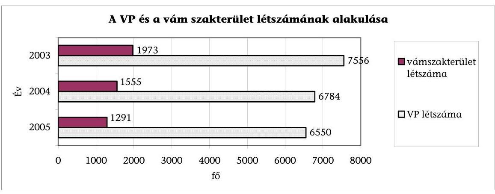

---

A vámeljárások hatékonysága a vizsgált időszakban javult, amihez hozzájárult egyrészt a vámszakterület létszámának mintegy 30\%-os, másrészt a vámkezelési helyek számának 40\%-os csökkentése, valamint az adóalanyok által kezdeményezett egyszerűsített eljárások számának és vámeljárásokon belüli arányának növekedése (a 2004. évi 5,7\%-ról 2005-ben 7,2\%-ra). A vámkezelési helyek számának csökkentését a VP elemzésekkel megalapozta, a kevésbé hatékonyan múködő helyeket megszüntette. Emellett nőtt a magyarok és a külföldiek által kezdeményezett vámeljárások, ezen belül a szabad forgalomba helyezések száma, valamint a kiszabott vámok összege. A VP a hatékonyság javítása érdekében felmérte a vámudvarok kapacitás-kihasználtságát, múködésük gazdaságosságát és a vámhatósági jelenlét indokoltságát. Figyelembe vette a vámkezelések számát, idő- és térbeli megoszlását és a vámkezelési helyek forgalmát, leterheltségét, valamint további gazdaságossági szempontokat (pl. a múködtetés költségeit). Értékelte, hogy Románia EU csatlakozása várhatóan mennyiben fogja befolyásolni a vámkezelések számát, illetve területi megoszlását. A hatékonyság további növelésének korlátját jelentik az egységes vámigazgatási eljárásrend ${ }^{7}$ (továbbiakban: technológiai rend) egyes előírásaival és annak gyakorlati alkalmazásával kapcsolatos problémák. Az informatikai rendszerekben, illetve alkalmazásokban feltárt hiányosságok megszüntetésére a helyszíni vizsgálat időszakában - tett intézkedések hatása 2007-től várható.

A VP az EU csatlakozást követően új technológiai rendet vezetett be, amely a vámeljárások hatékonysági és eredményességi követelményeinek csak korlátozottan tesz eleget. A VP a technológiai rend kidolgozásához elemzést készített a vámeljárások lefolytatásához szükséges humánerőforrás-igényekről. Indokolatlanul magas számban (6 fő) határozta meg a vámeljárások lefolytatásához szükséges technológiai egység létszámát, mivel a gyakorlatban a vámkezelések több mint $90 \%$-ánál a szerepköröket - a humánerőforrás korlátokat és a célszerűségi szempontokat figyelembe véve - összevonják. Az ellenőrzött időszakban nem vizsgálta felül a technológiai rend által meghatározott munkafolyamatok tagoltságát, egymásra épülését és célszerűségét, valamint az egyes szerepkörök feladat-meghatározását.

A VP a vizsgált időszakban felmérte a vámeljárások időszükségletét, de nem tett intézkedéseket az eljárások gyorsítása, az eljárási rend egyszerűsítése érdekében. Nem értékelte, hogy a technológiai rendjében előírt létszámok, normaidők megfelelnek-e a nemzetközi gyakorlatnak. A vámeljárások technológiai folyamatára előírt tagoltság célszerútlen, az eljárások lefolytatásának időtartama a szabad forgalomba helyezések és az újrabehozatali eljárások 25\%ában, az ideiglenes behozatali eljárások 22\%-ában meghaladta a 3 órát. Az átlagos időszükséglet értékeléséhez az adatokat az informatikai rendszer biztosítja, ezeket azonban a VPOP Vámigazgatósága nem minősíti megbízhatónak, ezért csak manuálisan és eseti jelleggel végeznek ilyen időelemzéseket.

A VP kialakította a vámeljárások kockázatkezelési rendszerét, megfogalmazta az alkalmazás általános célját. A rendszer nem támogatja a kockázati tényezők (profilok) alapján kiválasztott vámvizsgálatok eredményességének

[^0]
[^0]:    ${ }^{7}$ Az egységes vámigazgatási eljárásrendről szóló 141/2004. (X. 26.) VPOP utasítás

---

értékeléséhez szükséges statisztikai kimutatások elkészítését. Nem értékeli a kockázatkezelési rendszernek az ellenőrzések eredményességére gyakorolt hatását. A rendszer hiányossága miatt nem mutatható ki, hogy az összes elvégzett vámvizsgálatból mennyit végeztek el a kockázatkezelő profilok alapján. A rendszer lehetőséget ad arra, hogy a kockázati profilban meghatározott ellenőrzési előírást a vámhivatal parancsnoka - szabályozott keretek között - felülbírálja és alacsonyabb ellenőrzési szintet határozzon meg. A KEP feladata a felülbírálatok ellenőrzése, de sem az általa elvégzett felülvizsgálatok számáról, sem azok eredményéről nem vezet összesített nyilvántartást, a vizsgálatok eredményességét nem értékeli.

A VP az EU irányelveivel összhangban folyamatosan alakította ki a mélységi ellenőrzéseket végző MOBIL csoportokat. A VPOP figyelemmel kíséri az egyes akciók felderítéseit és azoknak az adott régión belül az adóbevételekre gyakorolt hatását. 2006-ban helyzetértékelést készített 2005. évre vonatkozóan a MOBIL ellenőrzési csoportok feladatai ellátásához rendelkezésre álló személyi és tárgyi feltételekről, ez azonban nem terjedt ki annak elemzésére, hogy milyen intézkedések szükségesek a szakterület tevékenységének hatékonysága és eredményessége javításához.

A vámeljáráshoz kapcsolódó hatósági tevékenység színvonala az előző évihez képest 2004-ben javult, 2005-ben romlott. A másodfokú határozatokból a helybenhagyó döntések aránya a 2003. évi 63\%-ról 2004-ben 71\%-ra növekedett, majd 2005-ben a 2003. évi szint alá (57\%) csökkent. A VP által megnyert perek aránya a 2003. évi $85 \%$-ról 2004-ben $82 \%$-ra, 2005-ben $78 \%$-ra csökkent.

Az integrált váminformatikai rendszer alapvetően alkalmas a vámeljárások folyamatának támogatására, azonban a vámkezelések adminisztrációs időigénye és a hiányzó rendszerfunkciók korlátozzák a vámeljárások hatékonyságának növelését. A vizsgált időszakban a vámeljárások során alkalmazott informatikai rendszerek hiányosságai növelték a vámeljárások végrehajtására fordított munkaidőt, ami negatívan hatott a vámeljárások hatékonyságára. A vámáru-nyilatkozatok adatrögzítése nem optimalizált, olyan eljárási lépések végrehajtását, illetve adatbeviteli mezők kitöltését is megköveteli, amelyek a vámeljárás végrehajtása szempontjából nem meghatározóak, illetve nem indokoltak. A VP - az ÁSZ ellenőrzés által feltárt - valamennyi hiányosság megszüntetésére a helyszíni ellenőrzés időszakában intézkedést tett. A váminformatikai rendszerben programmódosítást hajtott végre az optimalizálás érdekében, megkezdte az informatikai rendszer bővítését az automatikus határidő-figyelés bevezetéséhez, valamint pályázati kiírás alapján szerződést kötött az elektronikus iktatási rendszer kialakítására.

A váminformatikai rendszer nem támogatja a vámkódexben, a közösségi tranzitegyezményben és egyéb jogszabályokban meghatározott határidők automatikus figyelését. A rendszer tárolja ugyan az egyes határidőket, de annak lejárta előtt a tételek elintézésére automatikusan nem figyelmeztet. A közösségi árutovábbítási eljárások esetében az automatikus határidő-figyelés hiányában fennáll annak a lehetősége, hogy késik vagy elmarad a vámkiszabás, ami megnöveli a vám beszedésének kockázatát az adott határidőre. A rendszer nem

---

terjed ki a vám, áfa és egyéb közterhek befizetésének azonosítására, ami a vámhivatalok számára további adminisztrációs munkát tesz szükségessé.

A TIR egyezmény keretében végzett árutovábbítások esetében az informatikai rendszer indokolatlanul és célszerútlenül megnöveli az eljárás időtartamát, mivel az általa nyújtott szolgáltatások nem terjedtek ki a szakterület valamennyi munkafázisára ${ }^{8}$. A TIR egyezmény keretében végzik az árutovábbítások több mint $60 \%$-át.

Az ügyfelek számára nyújtott elektronikus szolgáltatások szintje a vámárunyilatkozatok fogadása és feldolgozása tekintetében nem teljes körűen felel meg az erre vonatkozó kormány határozatban megfogalmazott követelményeknek. A VP váminformatikai rendszere alkalmas ugyan a vámárunyilatkozatok adatainak fogadására, azonban az ügyfelek azokat - az árutovábbítási eljárás kivételével - írásban teszik meg. A közösségi vámkódex lehetőséget ad arra, hogy a vámkezelést kérők a vámáru-nyilatkozatokat adatfeldolgozási módszer segítségével is benyújthassák. A VP az e-vám projekt egy részének üzembe helyezését 2007. január 1-jével tervezi.

A VP az utólagos ellenőrzési szakterületet 2004. augusztus 1-jével átszervezte a hatékonyság és az eredményesség, valamint a szakterület jelentőségének növelése céljából. Az átszervezés nem volt megalapozott. A VPOP nem mérte fel az illetékességi- és hatáskörök átszervezésének kockázatát, és nem határozta meg a megváltozott feladatok ellátásához szükséges humánerőforráskapacitás mennyiségi és minőségi összetételét. A szakterület tételes nyilvántartást vezet az ellenőrzéseiről, amely azonban statisztikai célra, valamint a vezetői döntések megalapozásához szükséges elemzések, értékelések elkészítéséhez nem alkalmas. Nem mutatják ki és nem értékelik, hogy az elvégzett ellenőrzések közül hány zárult megállapítással és milyen típushibákat tártak fel, vagy hogy egy ellenőrzés során hány határozatot hoztak.

A vizsgált két évben az utólagos ellenőrzések az eredményessége romlott. A romlás visszavezethető oka a munkavégzés személyi és tárgyi feltételeinek javítására irányuló vezetői intézkedések elmaradása. Az átszervezést követően az elsőfokú határozatokat nem megfelelő jogi ismerettel rendelkező munkatársak hozták meg. A VPOP feltárt néhány típus-hiányosságot a hatósági munka végrehajtása során, de azok megszüntetése érdekében csak kötelező belső oktatást írt elő és nem élt a vezénylések lehetőségével annak érdekében, hogy a humánerőforrás mennyiségét illetve színvonalát növelje, nem kezdeményezte segédanyagok (gyűjtemény, példatár) összeállítását a határozatok elkészítésének támogatására, továbbá nem tette lehetővé, hogy az egyes regionális parancsnokságok az illetékességi területükön kívül hozott határozatokat az informatikai rendszerből lekérdezhessék. Nem alkalmazta az ismételt ellenőrzések módszerét annak érdekében, hogy feltárja a határozathozatal hiányosságait és csökkentse a megalapozatlanság kockázatát.

[^0]
[^0]:    ${ }^{8}$ A VP 2006. október 26-i írásos tájékoztatása szerint a TIR eljárások végrehajtása 2006. október 30-tól a váminformatikai rendszer támogatásával történik.

---

A szakterület eredményességének csökkenését mutatja, hogy az elsőfokú határozatokban kiszabott fizetési kötelezettségek (vám, jövedéki adó, áfa stb.) összegei 2003-ról 2004-re 23\%-kal, 2004-ről 2005-re 51\%-kal csökkentek. A határozatok megalapozatlanságát tükrözi, hogy az elsőfokú határozatokban kiszabott kötelezettségeknek 2004-ben 18\%-át, 2005-ben 46\%-át, az összes fizetési kötelezettségen belül a kiszabott vámnak és vámpótléknak 2004-ben 33\%-át, 2005ben $51 \%$-át törölték. A VPOP vizsgálta a törlések okait, de a hibák megszüntetésére érdemi intézkedést nem tett.

Az utólagos ellenőrzések és a gazdálkodók növekvő számát alapul véve a vizsgált két évben az ellenőrzöttségi szint javult (2004. évi 1,0\%-ról 2005-ben 1,4\%ra emelkedett), de még mindig alacsonynak tekinthető. Ennél is alacsonyabb értékek (2004-ben 0,4\%, 2005-ben 0,6\%) adódnak, ha a számításnál csak a saját kezdeményezésű ellenőrzéseket vesszük alapul, és figyelmen kívül hagyjuk a külső megkeresésekre végzett ellenőrzéseket. A saját kezdeményezésű ellenőrzések a csatlakozás előtti vámkezelésekre irányultak, így azok megállapításaiból származó bevétel teljes egészében a hazai költségvetést illette meg.

A VP a vámszakterület ellenőrzésére kialakította a folyamatba épített ellenőrzési rendszerét és azokat a gyakorlatban múködteti. A technológiai rend magában foglalja a vámeljárások végrehajtásának folyamatba épített ellenőrzését. Ennek alapján a részlegvezetők a vámeljárás folyamatának különböző szakaszaiban ellenőrzik, hogy a pénzügyőrök az előírásoknak megfelelően hajtják-e végre feladataikat. Az informatikai rendszer - beépített kontroll hiányában - ugyanakkor megengedi, hogy egy vámeljárás valamennyi munkafolyamatát ugyanaz a pénzügyőr hajtsa végre, ha minden szerepkörre rendelkezik jogosultsággal. A rendszer tehát nem kényszeríti ki a technológiai rend betartását, ezáltal a váminformatikai rendszerből lekért adatok azt a látszatot keltik, hogy 2004-ben az import vámeljárások mintegy 92\%-ában, 2005-ben pedig $87 \%$-ában nem tartották be a technológiai rendben a vámeljárásban résztvevők szerepkörének megkülönböztetésére, illetve összevonhatóságára előírtakat. Továbbá a rendszer nem teszi lehetővé a technológiai rend betartásának utólagos ellenőrzését a tárolt adatok alapján.

Háromszintű vezetői ellenőrzési rendszert alakított ki a VP a szervezeti struktúrával összhangban, ezeket azonban a gyakorlatban - a MOBIL ellenőrzési csoportok szakterületét kivéve - jelentős hiányosságok mellett múködteti. A VPOP nem értékeli az adott szakterületek eredményességét, nem tárja fel a múködés rendszerbeli hiányosságait, illetve az eredményesség javításának korlátait, így nem tudja megtenni a szükséges intézkedéseket azok megszüntetésére. Nem készítenek statisztikai célú nyilvántartásokat, kimutatásokat sem a vámeljárásokról, sem az utólagos ellenőrzésekről, és ezek készítését teljes körűen az informatikai rendszerek sem támogatják.

A testületen belüli visszaélések feltárására, illetve az elkövetések kockázatának csökkentésére a VP 2004-ben kialakította belső szabályzatát, amely alapján valamennyi regionális parancsnokság illetékességi területén végeztek ellenőrzéseket. Ezek eredményeként a régiók 50\%-ánál tártak fel korrupciós ügyeket. A visszaélések száma és sokrétűsége indokolttá tette volna a folyamatba épített és a vezetői ellenőrzések megerősítését, illetve új ellenőrzési módszerek kialakítását, ezekre vonatkozóan azonban egységes intézkedés nem történt.

---

A Pénzügyminisztérium rendszeresen beszámoltatta a VP-t a költségvetési bevételek realizálásáról és az ezzel kapcsolatos gazdasági folyamatokról, illetve a VP által feltárt illegális termékforgalom alakulásáról. Vizsgálta a bevételek előirányzattól való eltérésének okait és mértékét, továbbá elemzések alapján folyamatosan prognosztizálta annak várható teljesülését. Elemzésekkel megalapozta a vámkezelő helyek számának csökkentésére vonatkozó döntést. Az általa kialakított érdekeltségi rendszerben meghatározott elvárások nem mindegyike ösztönözte a VP-t hatékonyabb és eredményesebb feladatellátásra. A pénzügyminiszter az éves érdekeltségi jutalom kifizetésének feltételeként egyrészt a költségvetési törvényben meghatározott „bevételi összeg"9, másrészt egyéb szakmai követelmények teljesítését írta elő. A szakmai követelmények egy része azonban megfogalmazásában általános volt, és a teljesítéshez nem határozott meg mérhető eredményességi, illetve hatékonysági elvárásokat.

A VP a korábbi, külső szervezetek által végzett ellenőrzések megállapításai alapján intézkedési terveket készített és a hiányosságok többségét megszüntette.

A helyszíni ellenőrzés megállapításainak hasznosítása mellett javasoljuk:

# a pénzügyminiszternek 

1. Alakítsa át a VP részére megfogalmazott, az érdekeltségi jutalom kifizetésének feltételeként meghatározott teljesítmény-elvárásokat oly módon, hogy valamennyi elvárás hatékonyabb és eredményesebb munkavégzésre ösztönözzön, valamint azok teljesítése mérhető legyen.
2. Írja elő a Vám- és Pénzügyőrség országos parancsnoka számára, hogy
a) teremtse meg az összhangot a hatékonyság és eredményesség növelése érdekében mind a vámeljárások, mind az utólagos ellenőrzések szakterületén a szervezeti egységek feladatai és humánerőforrás-kapacitása között;
b) fejlessze tovább a vámeljárások során alkalmazott kockázatkezelési rendszert annak érdekében, hogy az alkalmas legyen egyrészt kockázatelemzések elvégzésére, másrészt az árutovábbítási eljárások támogatására;
c) alakítsa át a technológiai rendet annak érdekében, hogy gyorsítsa és egyszerűsítse a vámeljárások folyamatát;
d) tegyen intézkedéseket annak érdekében, hogy a váminformatikai rendszer alkalmas legyen a határidők automatikus figyelésére, a vezetői döntések megalapozását segítő statisztikák és kimutatások elkészítésére;
[^0]
[^0]:    ${ }^{9}$ Az érdekeltségi jutalom feltételeként meghatározott „bevételi összeg" meghaladja a bevételi előirányzatot. Mindkettőt a Magyar Köztársaság adott évi költségvetéséről szóló törvény határozza meg.

---

e) vizsgáltassa ki annak okát, hogy az elektronikus vámkezelés bevezetésére kormányhatározatban előírt határidőt a VP miért nem tartotta be;
f) erősítse meg a folyamatba épített, az utólagos vezetői ellenőrzéseket annak érdekében, hogy feltárja az egyes szakterületek múködésének rendszerbeli hiányosságait és megtegye azok megszüntetésére, valamint azok hatékonysága és eredményessége növeléséhez szükséges intézkedéseket.

---

# II. RÉSZLETES MEGÁLLAPÍTÁSOK 

## 1. A PÉNZÜGYMINISZTER VÁM SZAKTERÜLETTEL KAPCSOLATOS FELÜGYELETI JOGKÖRÉNEK GYAKORLÁSA

A PM az „EU-s költségtérítés" előirányzatát a vizsgált években felültervezte. 2004-ben a 11,0 Mrd Ft előirányzott bevétel 5,7 Mrd Ft-ra (52\%-ban), 2005-ben a 10,0 Mrd Ft 8,8 Mrd Ft-ra ( $88 \%$-ban) teljesült. Év közben a bevételi előirányzatokat nem módosították.

A tervezés nem kellő megalapozottsága csak részben a tervezés hiányosságainak következménye. A PM az előirányzatot a tagállamok által alkalmazott átlagos vámkulcs és a gazdasági előrejelzések figyelembevételével tervezi. A csatlakozást követően azonban az átlagos vámtétel a 2004. május 1. előtti 2,4\%-ról $0,8 \%$-ra, ill. 2005-ben $0,5 \%$-ra csökkent. Megváltozott a vámkezelt áruk összetétele is. Bővült ugyan az import-forgalom, de ezen belül megnövekedett a 0\%os vámkulcs alá tartozó termékek aránya is.

Az ÁSZ a Magyar Köztársaság 2004. évi költségvetési javaslatáról készített véleményében megállapította, hogy az előirányzat megalapozottsága a rendelkezésre álló dokumentáció alapján nem volt teljes körűen megállapítható. A Magyar Köztársaság 2005. évi költségvetési javaslatáról készített véleményében pedig megállapította, hogy az „EU-s költségtérítés" 2005. évi javasolt előirányzatának teljesülése magas kockázatot tartalmaz. A tervezés véleményezésekor nem álltak rendelkezésre az előirányzatot megalapozó számítások.

A PM rendszeresen beszámoltatta a VP-t a bevételek realizálásáról és az ezzel kapcsolatos gazdasági folyamatokról, illetve a feltárt illegális termékforgalom alakulásáról. Vizsgálta az előirányzattól való eltérés okait és mértékét, továbbá elemzések alapján folyamatosan prognosztizálta az előirányzat várható teljesülését.

Elemezte az általános forgalmi adóról szóló 1992. évi LXXIV. tv. (továbbiakban: Áfa tv.) 2005. áprilisi módosításának hatását a vámbevételek alakulására és számításaival kimutatta, hogy a törvénymódosítás hatására azok nem csökkentek. A módosítás alapján az import utáni áfa önadózással történő megfizetését a kivetéses adózás váltotta fel. Kivételt képeznek azok az adóalanyok, akiknek bevételében jelentős hányadot képvisel az uniós tagállamokba, illetve a harmadik országokba irányuló termékértékesítés. Ezen adózók a törvényben rögzített feltételek szerint a vámhatóság külön engedélye alapján továbbra is önadózással teljesítik az import utáni áfa-fizetési kötelezettségüket.

Folyamatos tájékoztatást kért a VP-től az érdekeltségi jutalom feltételek teljesítéséről és erről a miniszter részére negyedévente értékelést készített.

A kialakított érdekeltségi rendszer nem minden eleme ösztönözte a VP-t hatékonyabb és eredményesebb feladatellátásra.

---

A VP részére az éves érdekeltségi jutalom kifizetésének feltétele egyrészt a költségvetési törvényben meghatározott „bevételi összeg" ${ }^{10}$, másrészt a pénzügyminiszter által megfogalmazott szakmai követelmények teljesítése. A szakmai követelmények egy része megfogalmazásukban általánosak voltak, és a teljesítéséhez nem határoztak meg mérhető eredményességi, ill. hatékonysági elvárásokat.

2004-ben előírta a vámérték felülvizsgálatok számának növelését, de azok eredményességével kapcsolatos kritériumokat nem határozott meg. Ennek következtében nőtt a vizsgálatok száma, de ezzel nem javult azok eredményessége (ld. részletesen a jelentés 2.3.2 pontjában). 2004-ben és 2005-ben is szakmai követelményként határozta meg az inter-operabilitási programok kiemelt kezelését, de ezzel kapcsolatosan nem fogalmazott meg konkrét elvárásokat, ill. prioritásokat.

Ösztönző és minőségi jellegű követelmény volt azonban pl. 2005-ben a cigaretta felderítések számára vonatkozó, valamint az adójegyek igénylésével kapcsolatos elvárás.

A költségvetési törvény 2004-ben vám- és importbefizetésekből 43645 M Ft , 2005-ben „EU-s költségtérítés" jogcímen 10200 M Ft , illetve alternatív lehetőségként jövedéki és regisztrációs adó, valamint az „EU-s költségtérítés" együttes összegeként 755024 M Ft beszedését írta elő az érdekeltségi jutalom feltételeként. A VP az eredeti feltételeknek egyik évben sem tett eleget. Azáltal vált lehetővé az érdekeltségi jutalom kifizetése mindkét évben, hogy a pénzügyminiszter javaslatára - a költségvetési törvény módosításával - csökkentették a VP részére előírt bevételi összegeket.

2004-ben vám- és importbefizetésekből 43645 M Ft beszedését írta elő jutalomfeltételként a költségvetési törvény, amelyet 2004. novemberben 42500 M Ft-ra csökkentettek. Ez a bevétel magában foglalja az „EU-s költségtérítés" is. A VP a módosított bevételi összeget teljesítette, de a csatlakozást követően fellépett informatikai zavarok miatt a pénzügyminiszter a jutalom-keret $80 \%$-ának (2084 M Ft) kifizetését engedélyezte.

2005-ben „EU-s költségtérítés" jogcímen 10200 M Ft beszedését írta elő jutalomfeltételként a költségvetési törvény, amelyet 2005. novemberben 8976 M Ft-ra csökkentettek. A VP a csökkentett összeget sem teljesítette. Eleget tett azonban annak a törvényi feltételnek, hogy az általa beszedett összege (jövedéki, regisztrációs adó, „EU-s költségtérítés" együttes összege) elérje a 738186 M Ft-ot, így pénzügyminiszter jogszerűen engedélyezte a jutalom teljes összegének ( 4843 M Ft ) kifizetését.

# A PM a vámkezelő helyek számának csökkentésére vonatkozó döntést megalapozta. Felmérést és elemzést készittetett a VP-vel a csatlakozási stratégiájában meghatározott szempontok, valamint költségtakarékossági, ill. célszerűségi követelmények figyelembevételével (ld. a jelentés 2.3.1 pontját). Az 

[^0]
[^0]:    ${ }^{10}$ Az érdekeltségi jutalom feltételeként meghatározott „bevételi összeg" meghaladja a bevételi előirányzatot. Mindkettőt a Magyar Köztársaság adott évi költségvetéséről szóló törvény határozza meg.

---

értékelés alapján bizottság döntött arról, hogy mely vámkezelő helyeket kell megszüntetni, ill. tovább múködtetni.

# 2. A VP VÁM SZAKTERÜLETE 

### 2.1. A VP feladatrendszere és szervezeti struktúrájának összhangja

A VP az EU csatlakozással összefüggő feladatváltozásaival összhangban alakította ki új szervezeti struktúráját. A szervezet korszerűsítését azonban a pénzügyminiszter jóváhagyása nélkül, de a PM vezetésének egyetértésével hajtotta végre ${ }^{11}$.

A VP a csatlakozást megelőző előkészítő munka keretében kidolgozta és a pénzügyminiszter részére jóváhagyásra 2003. április hónapban beterjesztette az új szervezeti struktúrára épülő múködési szabályzatot. Ezt a pénzügyminiszter - a folyamatos egyeztetések mellett - 2005. április 22-én hagyta jóvá.

A szervezeti változások biztosították a feladatok végrehajtását, de a csatlakozást követően létrehozott két szervezeti egység (Nemzeti Jövedéki Központ, valamint Inter-operabilitási Központ) esetében nem volt összhang azok struktúrában elfoglalt helye, illetve a feladataik által meghatározott hatás- és felelősségi köreik között ${ }^{12}$. A VP intézkedett az összhang megteremtése érdekében.

A VP múködésének ellenőrzéséről készített 2005. évi ÁSZ jelentés megállapította, hogy az országos hatáskörrel rendelkező Nemzeti Jövedéki Központ, valamint Inter-operabilitási Központ a Közép-Magyarországi Regionális Parancsnokság, mint középfokú szerv szervezeti egységeként múködött. Az ÁSZ javaslata alapján a VP a Nemzeti Jövedéki Központot 2005. december 31-ével megszüntette, az Inter-operabilitási Központot 2005. január 1-jével integrálta a VP Rendszerfejlesztő Központjába, amely irányítását a VPOP Informatikai Főosztálya látja el.

### 2.2. A feladatrendszer és a humán-erőforrás összhangja

A VP az EU csatlakozást megelőzően felmérést készített a várható feladatok által igényelt humánerőforrás-szükségletről és ennek alapján meghatározta a közép- és alsó fokú szervek létszámát. A létszám elosztásának megalapozottságát azonban a leterheltséget tükröző fajlagos mutatók nem támasztják alá.

Mind a vámeljárás, mind pedig az utólagos ellenőrzések területén kialakított létszámstruktúra mellett a különböző fajlagos mutatók rendkívül eltérő leterheltséget mutatnak (az alábbi két táblázat adatait).

[^0]
[^0]:    ${ }^{11}$ A VP nem rendelkezett a pénzügyminiszter által aláírt Szervezeti és Működési Szabályzattal (továbbiakban: SZMSZ), azonban rendszeresen írásban tájékoztatta a PM vezetését a szervezeti átalakításokról.
    ${ }^{12}$ A Vám- és Pénzügyőrség múködésének ellenőrzéséről készített 2005. évi ÁSZ jelentés (0511) megállapítása.

---

A vámeljárási szakterületen mind az egy főre jutó vámkezelések számát, mind az egy főre jutó tételsorok számát tekintve a regionális parancsnokságok között nagymértékű az eltérés.

# A vámeljárási szakterület leterheltségi mutatói (2005. évi adatok alapján) 

| Regionális   Parancsnokság   megnevezése | Vámeljárások   száma (db) | Tételsor   száma (db) | Vámszakterü-   leten dolgozók   száma (fő) | 1 főre jutó   vámkezelések   száma (db) | 1 főre jutó   tételsor³   száma (db) |
| :--: | :--: | :--: | :--: | :--: | :--: |
| Közép-Magyarországi | 265043 | 1315494 | 493 | 538 | 2668 |
| Dél-Dunántúli | 53279 | 107874 | 96 | 555 | 1124 |
| Észak-Magyarországi | 44058 | 103233 | 88 | 501 | 1173 |
| Közép-Dunántúli | 78288 | 305735 | 117 | 669 | 2613 |
| Nyugat-Dunántúli | 101803 | 291583 | 250 | 407 | 1166 |
| Dél-Alföldi | 90685 | 248344 | 155 | 585 | 1602 |
| Észak-Alföldi | 158988 | 378988 | 175 | 909 | 2166 |
| Központi Repülőtéri   Parancsnokság | 108004 | 199702 | 113 | 956 | 1767 |
| Összesen | 900148 | 2950953 | 1487 | 605 | 1985 |

Megjegyzés:
${ }^{1}$ A vámszakterületi kóddal besorolt teljes létszám, amely magában foglalja a közvetlen vámeljárást végzők mellett a vámeljárás egyéb igazgatási tevékenységét ellátók és ellenőrzést végzők létszámát is.
${ }^{2}$ A teljesítménymutató átlagértékeket mutat, így nem veszi figyelembe a vámkezelési helyek számát, az egyes vámkezelési módok eltérő időszükségletét stb.
${ }^{3}$ Tételsor: egy vámkezelésen belül azonos vámtarifa alá eső termékcsoport
Az utólagos ellenőrzési területen sincs összhang a feladatok és az azok ellátáshoz szükséges humánerőforrás-kapacitás között. Az egyes regionális parancsnokságok feladatainak nagyságrendjét az illetékességi területükhöz tartozó ex-port-import engedélyesek száma határozza meg. Aránytalanságok mutathatók ki a lezárt vizsgálatok adatai alapján is.

Például a Közép-Magyarországi Regionális Parancsnokság illetékességi területéhez tartozik az összes engedélyes 56\%-a, ugyanakkor a rendelkezésre álló létszám (30 fő) a szakterület összes kapacitásának mindössze 29\%-át teszi ki. A NyugatDunántúli Regionális Parancsnokságon dolgozik az összes utólagos ellenőrzést végzők közel 20\%-a (20 fő), miközben az összes engedélyesnek csak 6,5\%-a múködik a regionális parancsnokság illetékességi területén.

---

# Az utólagos ellenőrzési szakterület jellemző mutatói (2005. évi adatok alapján) 

| Regionális   Parancsnokság megnevezése | Export-import   engedélyesek |  | Utólagos ellenőrzési osztályok |  | Lezárt vizsgálatok |  |
| :--: | :--: | :--: | :--: | :--: | :--: | :--: |
|  | száma (db) | összeshez   viszonyi-   tott aránya   (\%) | létszáma   (fő) | összeshez viszonyított aránya (\%) | száma   (db) | összeshez viszonyított aránya (\%) |
| Közép-Magyarországi | 12296 | $55,8 \%$ | 30 | 29,1\% | 107 | $34,7 \%$ |
| Dél-Dunántúli | 1206 | 5,5\% | 7 | 6,8\% | 22 | 7,1\% |
| Észak-Magyarországi | 1062 | 4,8\% | 13 | 12,6\% | 23 | 7,5\% |
| Közép-Dunántúli | 1566 | 7,1\% | 8 | 7,8\% | 35 | 11,4\% |
| Nyugat-Dunántúli | 1435 | 6,5\% | 20 | 19,4\% | 42 | 13,6\% |
| Dél-Alföldi | 2361 | 10,7\% | 15 | 14,6\% | 47 | 15,3\% |
| Észak-Alföldi | 2097 | 9,5\% | 10 | 9,7\% | 32 | 10,4\% |
| Összesen | 22023 | 100,0\% | 103 | 100,0\% | 308 | 100,0\% |

A közép- és alsó fokú szervek állományának leterheltségét eltérő mértékben ugyan, de növeli az erőveszteség, amely a vizsgált két év mindegyikében az egész szervezet szintjén átlagosan mintegy 25\%-os munkaerő-kiesést jelentett. Az eltérés időszakonként, illetve szervezetenként nagy szóródást mutat.

A munkaidőalapot mintegy 10-12\%-ban a szabadságból, 3-4\%-ban a betegállományból, 6-8\%-ban tanulmányi, illetve szülési szabadságból, továbbá 2-4\%-ban szakmai továbbképzésekből és egyéb okokból (pl. felmentés) adódó erőveszteségek terhelik.

Az egyes időszakokban, illetve vámkezelő helyeken az erőveszteség meghaladta a $40 \%$-ot is, így pl. Észak-Pest-térségi fővámhivatal (Vác) esetében 2005. január hónapban az erőveszteség 44,8\%-os mértékű volt.

A leterheltség miatt a VP a szabadságokat a törvényes határidőn belül nem adta ki, ezzel megsértette a fegyveres szervek hivatásos állományú tagjainak szolgálati viszonyáról szóló 1996. évi XLIII. törvényt (továbbiakban: Hszt.).

A Hszt. 97.§ (3) alapján a szabadságot az esedékesség évében kell kiadni. Szolgálati érdek esetén a szabadságot a tárgyévet követő év január 31-ig, kivételesen fontos szolgálati érdek esetén legkésőbb március 31-ig, a hivatásos állomány tagjának betegsége vagy a személyét érintő más elháríthatatlan akadály esetén az akadályoztatás megszűnésétől számított 30 napon belül kell kiadni.

2005-ben például a 17. sz. fővámhivatalnál a leterheltség miatt az állomány szabadságának $24 \%$-át, ezen belül a vámszakterületen dolgozók szabadságának $15 \%$-át adták ki a tárgyévben. A Buda térségi, illetve az Észak-Pest-térségi fővámhivatalokban pedig 2006. június 1-ig még az előző évi szabadságok 18\%-át, illetve $12 \%$-át sem adták ki.

A VPOP a vámszakterület létszámát célszerűtlenül, indokolatlanul, a saját létszámát pedig kormányhatározattal ellentétesen alakította ki.

A 1106/2003. (X. 31.) Korm. határozat a VP létszámának 808 fős, ezen belül a VPOP állományának 129 fős csökkentését írta elő. A VP a felsőfokú szervre vo-

---

natkozó előírást azonban nem hajtotta végre. ${ }^{13} \mathrm{~A}$ vizsgált időszakban a VPOP tényleges létszámának VP-n belüli aránya folyamatosan nőtt.

A VPOP engedélyezett létszáma a 2004. január 1-jei 492 fơről, 2005. január 1-jére 397 főre csökkent, majd 2006. január 1-jére 405 főre nőtt. Tényleges létszáma azonban a 2004. január 1-jei 480 fơről, 2005. január 1-jére 424 főre mérséklődött, majd 2006. január 1-jére 444 főre emelkedett (1. sz. tanúsítvány).

A VPOP Ellenőrzési Igazgatósága megkezdte a VPOP létszámának átvilágítását, az értékelést a helyszíni vizsgálat lezárásáig nem fejezte be.

A VP vámszakterületén foglalkoztatottak tényleges létszáma 2004. január 1. és 2006. január 1. között átlagosan 30\%-kal (662 fővel) csökkent, a VPOP-n ugyanakkor lényegesen nem változott ( 1 fővel nőtt). Ezen felül a VPOP-n foglalkoztatottak létszámát vezénylésekkel tovább növelték. A VP vámszakterületén 2004-ben 628 fő vezénylését rendelték el átlagosan 38 napra, 2005-ben 99 főét, átlagosan 85 napra. A VPOP vámszakterületére 2004-ben 41 főt átlagosan 62 napra, 2005ben 24 főt átlagosan 81 napra vezényeltek, ami 7, illetve 5 fő éves munkaidejét teszi ki. 2005-ben a vámszakterületen a vezényeltek $61 \%$-a a VPOP-n és a regionális parancsnokságokon teljesített szolgálatot (2/a és 2/b. sz. tanúsítvány).

# 2.3. A vámeljárások végrehajtásának hatékonysága és eredményessége 

A vámeljárások hatékonysága a vizsgált időszakban javult, amihez hozzájárult egyrészt a létszám, másrészt a vámkezelési helyek számának csökkentése. A hatékonyság további növelésének korlátját jelentik azonban a technológiai rend egyes előírásaival és gyakorlati alkalmazásával kapcsolatos problémák. A kockázatkezelés és a belső kontrollok múködésének, így a vámeljárások eredményességének értékelését nem teszik lehetővé a nyilvántartások hiányosságai. A vámeljárások eredményességének javítása érdekében intézkedéseket nem tett.

### 2.3.1. A vámkezelési helyek kialakításának szempontjai és gyakorlata

A vámkezelési helyek számának csökkentését a VP elemzésekkel megalapozta, a kevésbé hatékonyan múködő helyeket megszüntette. Emellett nőtt a magyarok és a külföldiek által kezdeményezett vámeljárások száma, ezen belül a szabad forgalomba helyezések száma, valamint a kiszabott vámok összege (3. sz. tanúsítvány). Ezek eredményeként javult a vámbeszedés hatékonysága.

A vámeljárások száma 2004-ben 623 E db, 2005-ben 900 E db volt Az eljárások átlagosan $46 \%$-a szabad forgalomba helyezésből adódik, amelyek közül 2004ben 29\%, 2005-ben 49\% járt fizetési kötelezettséggel. Az árutovábbítási eljárások összes vámeljáráson belüli aránya a 2004. évi 27\%-ról 2005-ben 34\%-ra emelkedett.

[^0]
[^0]:    ${ }^{13}$ A létszámleépítés végrehajtására vonatkozó részletes megállapítást a VP múködésének ellenőrzéséről készült 2005. évi ÁSZ jelentés (0511) tartalmazza.

---

A VP a költséghatékonyság javítása érdekében felmérte a vámudvarok kapaci-tás-kihasználtságát, múködésük gazdaságosságát és a vámhatósági jelenlét indokoltságát. Figyelembe vette a vámkezelések számát, idő- és térbeli megoszlását és a vámkezelési helyek forgalmát, leterheltségét, valamint további gazdaságossági szempontokat (pl. a múködtetés költségeit). Értékelte továbbá, hogy Románia EU csatlakozása várhatóan mennyiben fogja befolyásolni a vámkezelések számát ill. területi megoszlását.

A vámkezelési helyek száma 2003. december 31-én 251 db, 2004. december 31-én 129 db, 2005. december 31-én 111 db , 2006. április 30-án 100 db volt. Az egyes régiókban a vámkezelési helyek száma 30-70\% közötti arányban csökkent. Pl. a Közép-Magyarországi Régióban 2003. december 31. és 2006. április 30. között 69ről 19-re (27,5\%-ra), a Dél-Alföldi Régióban 27-ről 19-re (70\%-ra) csökkent (4. sz. tanúsítvány).

# 2.3.2. Mélységi ellenőrzéseket végző MOBIL csoportok tevékenysége 

A csatlakozást követően a VP az EU irányelveivel összhangban folyamatosan alakította ki a mélységi ellenőrzéseket végző MOBIL csoportokat. Múködésük célja elsősorban nem a költségvetés bevételeinek közvetlen növelése, hanem az illegális forgalom felderítése és visszaszorítása, ezáltal a belső piac védelme.

A VP 2004. május 1-jét követően 6 MOBIL ellenőrzési csoportot hozott létre 151 fős állománnyal, amelyet 2005-ben 15 csoportra, 227 fős állományra bővített.

A MOBIL ellenőrzési csoportok 2005-től a felderítések adatairól részletes nyilvántartást vezetnek, amelyet havonta a regionális parancsnokságok összesítenek és megküldik a VPOP részére. Az országos parancsnokság figyelemmel kíséri az egyes akciók felderítéseit és azoknak az adott régión belül az adóbevételekre gyakorolt hatását. A VPOP 2006-ban helyzetértékelést készített 2005. évre vonatkozóan a MOBIL ellenőrzési csoportok feladatai ellátásához rendelkezésre álló személyi és tárgyi feltételekről, ez azonban nem terjedt ki annak elemzésére, hogy milyen intézkedések szükségesek a szakterület tevékenységének hatékonysága és eredményessége javításához.

VPOP utasítás havi beszámoló készítését írja elő, amelyben a felderítések számát, a lefoglalt termékek értékét és megnevezését, az ellenőrzések helyszínét, stb. kell megadni. A csoportok 2004-ben összesen 635 szabálysértést 17,7 M Ft, 2005-ben 3976 szabálysértést $67,7 \mathrm{M}$ Ft elkövetési értékben tártak fel. A feltárt búncselekmények száma 2004-ben 279 db volt 796,7 M Ft elkövetési értékkel, 2005-ben 1454 db 4082,1 M Ft elkövetési értékkel (5. sz. tanúsítvány)

### 2.3.3. A vámeljárások végrehajtásának szabályozása és gyakorlata

A VP az EU csatlakozást követően technológiai rendet alakított ki, amely a vámeljárások hatékonyságával és eredményességével szembeni követelményeknek csak korlátozott mértékben tesz eleget. A VP a technológiai rend kidolgozásához elemzést készített a vámeljárások lefolytatásához szükséges humánerőforrás-igényekről. Az ellenőrzött időszakban nem vizsgálta felül a technológiai rend által meghatározott munkafolyamatok tagoltságát, egymásra épülését és célszerűségét, valamint az egyes szerepkörök

---

feladat-meghatározását. Indokolatlanul magas számban (6 fő) határozta meg a vámeljárások lefolytatásához szükséges technológiai egység létszámát, mivel a gyakorlatban a vámkezelések több mint $90 \%$-ánál a szerepköröket - a humánerőforrás korlátokat és a célszerűségi szempontokat figyelembe véve - öszszevonják.

A technológiai rend (141/2004. (X. 26.) VPOP utasítás az egységes vámigazgatási eljárásrendről) alapján a vámkiszabással járó vámeljárásokat alapeljárásban legalább 6 főnek ( 1 fő előadó, 1 fő TARIC ellenőr, 1 fő szemlész, 1 fő ügyintéző, 1 fő pénztáros ${ }^{14}, 1$ fő revizor) kell elvégeznie. A technológiai rend lehetőséget ad összevonásokra a vámeljárást intéző egységeken belül. Ez alapján a vámkiszabással járó vámeljárások elvégzésénél legalább 2 fő pénzügyőrnek kell részt vennie az alapeljárásban.

Pl. a Dél-Alföldi RP-hoz és a Dél-Dunántúli RP-hez tartozó összes vámhivatal alkalmazza a könnyítéseket, amelyre a regionális parancsnokság is ösztönzi a fővámhivatali, vámhivatali parancsnokokat. A Dél-Dunántúli RP-nél az erőveszteség miatt a technológiai egység minimális létszámának kialakítása is nehézségekbe ütközik. A záhonyi vámhivatal hivatásos állományú létszáma és a szolgálati helyek száma nem teszi lehetővé a 6 fős technológiai egység kialakítását. Eperjeske Rendező Pu. Kirendeltségen még a minimális 3 fős technológiai egység sincs meg.

# A VP a vizsgált időszakban felmérte a vámeljárások időszükségletét, de nem tette meg a szükséges intézkedéseket az eljárások gyorsítása, az eljárási rend egyszerúsítése érdekében. Nem értékelte továbbá, hogy a technológiai rendjében előírt létszámok, normaidők megfelelnek-e a nemzetközi gyakorlatnak. A vámeljárások technológiai folyamatára előírt tagoltság célszerútlen, az eljárások lefolytatásának időtartama esetenként nem indokolt. 

A VP nyilvántartásai szerint 2004-ben (az EU csatlakozás időpontjától) a vámkezelések mintegy $94 \%$-át, 2005-ben pedig $91 \%$-át összevonásokkal (könnyített rend szerint) végezték ( $6 /$ a és $6 /$ b. tanúsítvány).

A VPOP és 5 regionális parancsnokság vizsgálta a vámeljárások átlagos idejének alakulását. A VPOP 2006. márciusi elemzése alapján a szabad forgalomba helyezések 24,9\%-ának, az ideiglenes behozatali eljárások 22,2\%-ának, az újrabehozatali eljárások $25 \%$-ának időszükséglete meghaladta a 3 órát.

Az 1. számú Repülőtéri Vámhivatal felmérése megállapította, hogy az EU csatlakozást követően az egyes vámeljárások elintézésére fordított idő 2-3 szorosára, némely esetekben ennek többszörösére növekedett. A Dél-Pesti Fővámhivatal felmérése szerint a vámtartozás kiszabásával járó szabad forgalomba bocsátások időtartama a tételsorok számától függően 20 perctől 100 percig is terjedhet.

Adminisztratív áruvizsgálat esetében az előadó - ügyintéző - pénztáros szerepkörök szétválasztása lassítja a feldolgozási folyamatot. Az előadó átveszi a kérelmet, elfogadja az indítványt és feltölti az adatokat, ezzel az áruvizsgálati szintig

[^0]
[^0]:    ${ }^{14}$ Pénztáros feladata: az okmányokat az ügyintézőtől átveszi, a számítógépen rendelkezésre álló adatállományok alapján a pénzügyi teljesítést, a vám biztosításának adatait ellenőrzi.

---

elvégzi a feldolgozási folyamatot, így néhány lépésben meghozható a határozat és látható az az összeg, melyet az Egységes Biztosítékkezelő rendszerben utána leköthet.

Többletmunka-ráfordítást jelent, hogy a vámeljárás folyamatában nem a megfelelő stádiumban jelenik meg a kockázati profil. A folyamatban az előadó elveszi, illetve elfogadja az indítványt és előírja a szemlész számára az áruvizsgálat módját, azonban nem rendelkezik információval az adott vámeljáráshoz esetleg kapcsolódó kockázati profillal kapcsolatban. Ezt követően a szemlész elvégzi az előírt vámvizsgálatot, és a technológiai rend szerint az eljárásban csak ezt követően vehető figyelembe a kockázati profil.

# Javította a vámeljárások hatékonyságát, hogy a vizsgált időszakban nőtt az adóalanyok által kezdeményezett, kevesebb adminisztrációs munkát igénylő egyszerűsített eljárások száma, ill. ezeknek a vámeljárásokon belüli aránya (a 2004. évi 5,7\%-ról, 2005-ben 7,2\%-ra). 

Az egyszerűsített eljárást kezdeményező adóalanyok száma a 2004. évi 659-ről 2005-ben 1014-re emelkedett. Az egyszerűsített eljárásban kezelt áruk vámértéke 2004-ben az összes vámérték 21,7\%-át, 2005-ben 27,8\%-át tette ki (3. sz. tanúsítvány).

## A vámáru-nyilatkozaton feltüntetett vámértékre vonatkozó felülvizsgálatok számának növelésével nem javult a vizsgálatok eredményessége. A helyszíni ellenőrzésbe bevont 9 vámhivatal vámérték felülvizsgálatai közül 2004-ben az esetek 93-100\%-ában, 2005-ben 87-100\%-ában elfogadták az ügyfél által bevallott vámértéket.

A PM 2004-ben az érdekeltségi jutalom kifizetésének egyik feltételeként szabta meg a vámértékre vonatkozó felülvizsgálatok számának növelését.

Pl. a Záhonyi Vámhivatalnál 2004-ben 737 db, 2005-ben 368 db vámérték vizsgálatot végeztek, amelyek közül 736 ill. 323 esetben fogadták el a bevallott vámértéket. A Dél-Pesti Fővámhivatalnál 2004-ben 4782 db, 2005-ben 1877 db vámérték vizsgálatot végeztek, amelyek közül 4601 ill. 1829 esetben fogadták el a bevallott vámértéket. A Győri Fővámhivatalnál 2004-ben 490 db, 2005-ben 74 db vámérték vizsgálatot végeztek, amelyek közül 392 ill. 71 esetben fogadták el a bevallott vámértéket.

A Dél-Dunántúli Regionális Parancsnokság megállapította, hogy a vámérték vizsgálatok közül több esetben nem tisztázták teljes körűen a tényállást. A regionális parancsnokság ezekben az esetekben a vizsgálatok megismétlését rendelte el. A folyamatban lévő vámérték vizsgálatok során több esetben külföldi megkeresést kezdeményeztek a helyes vámérték megállapítása érdekében.

## A vámeljáráshoz kapcsolódó hatósági tevékenység színvonala az előző évhez képest 2004-ben javult, 2005-ben romlott.

Az elsőfokú határozatok száma a 2003. évi mintegy 2 M db-ról 2004-ben a felére ( 981 E db-ra), 2005-ben a 2004 -évi több mint felére ( 442 E db-ra) csökkent, ugyanakkor a fellebbezések száma mindkét évben közel 20\%-kal (a 2003. évi 2457 db-ról 2004-ben 2044 db-ra, 2005-ben pedig 1663 db-ra) csökkent (7. sz. tanúsítvány). A másodfokú határozatokból a helybenhagyó döntések aránya 2003. évi 63\%-ról 2004-ben 71\%-ra növekedett, majd 2005-ben 57\%-ra esett vissza (8. sz. tanúsítvány).

---

A megnyert perek aránya a 2003. évi 85\%-ról 2004-ben 82\%-ra, 2005-ben 78\%ra csökkent. A pertárgyértéket tekintve, míg 2003-ban a perelt összegek 82\%-át, 2004-ben $94 \%$-át a VP megnyerte, 2005-ben ez az arány $35 \%$-ra esett vissza. A 2005. évi nagyarányú csökkenés 1 db 1997-ben indult és 2005-ben lezárult peres ügyhöz kapcsolódik. Az ügy pertárgyértéke 540 M Ft volt. A pervesztés oka, hogy az Alkotmánybíróság a VP határozatának alapjául szolgáló korm. rendelet hivatkozott szakaszát 2003-ban alkotmányellenesnek minősítette.

Az elveszített perek pertárgyértéke 2003-ban 431,7 M Ft, 2004-ben 119,3 M Ft, 2005-ben 1054 M Ft volt, amelynek kapcsán a VP 2003-ban 74,4 M Ft, 2004-ben 382,4 M Ft, 2005-ben 144,6 M Ft kamatfizetési kötelezettséget teljesített. (Az elveszített perek után fizetendő kamat nagyságrendjét több tényező befolyásolja: a peres eljárás időtartama, banki alapkamat nagyságrendje, a fizetési kötelezettség áthúzódása a következő évre, stb.)

# 2.3.4. A vámeljárások végrehajtását támogató informatikai rendszerek 

Az integrált váminformatikai rendszer ${ }^{15}$ alapvetően alkalmas a vámeljárások folyamatának támogatására, azonban a vámkezelések adminisztrációs időigénye és a hiányzó rendszerfunkciók korlátozzák a vámeljárások hatékonyságának növelését. Az alapeljárások tekintetében támogatja a vámeljárások végrehajtásának folyamatát, az egyes alrendszerek közötti kapcsolatok automatizáltak, az azonos technológia és a központi törzsadat kezelés biztosítja a rendszerek együttmúködését.

Az informatikai rendszer biztosítja a vámáru-nyilatkozatok adatainak ellenőrzését, nyilvántartását. A vámvizsgálat szintjének (tételes, szúrópróbaszerű, adminisztratív) meghatározásához kockázati profilokat tartalmaz. Támogatja továbbá a vám, áfa és egyéb közterhek kiszámítását, valamint a határozatok elkészítését. A rendszer központosított kialakítása biztosítja az adatok konzisztenciáját.

2004-ben a vámáru-nyilatkozatok 94,3\%-ánál, 2005-pedig már 98,4\%-ánál a határozatok elkészítéséhez szükséges adatellenőrzéseket és számításokat a rendszer automatikusan elvégezte.

A vizsgált időszakban a vámeljárások során alkalmazott informatikai rendszerek hiányosságai növelték a vámeljárások végrehajtására fordított munkaidőt, ami negatívan hatott a vámeljárások hatékonyságára. A vámáru-nyilatkozatok adatrögzítése nem optimalizált, olyan eljárási lépések végrehajtását, illetve adatbeviteli mezők kitöltését is megköveteli, amelyek a vámeljárás végrehajtása szempontjából nem meghatározóak, illetve nem indokoltak. A VP - az ÁSZ ellenőrzés által feltárt - valamennyi hiányosság megszüntetésére a helyszíni ellenőrzés időszakában intézkedést tett. A váminformatikai rendszerben programmódosítást hajtott végre az optimalizálás érdekében, megkezdte az informatikai rendszer bővítését az automatikus

[^0]
[^0]:    ${ }^{15}$ A váminformatikai rendszer vizsgálata keretében jelentésünk az alábbi elemeket értékeli: Vámárunyilatkozat Feldolgozó Rendszer (CDPS), Gazdálkodói Törzsadatnyilvántartó Rendszer (GTR), Engedély és Törzsadat-kezelő Rendszer (ETR), Egységes Biztosítékkezelő Rendszer (EBiR).

---

határidő-figyelés bevezetéséhez, valamint pályázati kiírás alapján szerződést kötött az elektronikus iktatási rendszer kialakítására.

A 2004-ben bekövetkezett rendszerhibát az ÁSZ korábbi ellenőrzéseivel ${ }^{16}$ feltárta, a VP a rendszerhibát még 2004-ben megszüntette.

A vámeljárás lefolytatása szempontjából nem meghatározó például a fuvarlevél kiállítási, valamint a fizetési határidő dátumánál az óra és perc megadása. A rendszer olyan adatok bevitelét is megkövetelte, amelyek a vámvizsgálat szintje alapján nem értelmezhetőek. Például adminisztratív vámvizsgálati szint esetén is rögzíteni kellett a fizikai vizsgálat helyét, tervezett dátumát és idejét, valamint tényleges megkezdésének és befejezésének dátumát és időpontját. Ez az eljárási lépés 16 adatbeviteli mező felesleges kitöltését jelentette. A VP tájékoztatása szerint a 2006. augusztus 1-jével helyezte üzembe azt a programmódosítást, amely kiküszöböli az óra és perc, valamint adminisztratív vizsgálati szint esetén a fizikai vizsgálat helyének indokolatlan rögzítését.

Az árunyilatkozatok számfejtése során érkező hibaüzenet kód (hiányzó bizonylat) alapján a pontos hiba a vizsgált időszakban nem volt megállapítható, mert a hibaüzenet nem tartalmazta a hiányzó bizonylat megnevezését.

A váminformatikai rendszer nem támogatja a vámkódexben, a közösségi tranzitegyezményben és egyéb jogszabályokban meghatározott határidők automatikus figyelését. A rendszer tárolja ugyan az egyes határidőket, de annak lejárta előtt a tételek elintézésére automatikusan nem figyelmeztet. A határidők figyelése eseti lekérdezésekkel valósítható meg, ami többlet munkaidő-ráfordítást igényel.

Ilyen határidők például: fizetési határidő, ideiglenes behozatal, aktív és passzív feldolgozás, vámraktározás esetén előírt határidők. A helyszíni vizsgálat idején fejlesztés alatt álló komplex áruregisztrációs rendszer vámfelügyeleti modulja biztosítani fogja a vámkezeléssel kapcsolatos határidők automatikus figyelését, a rendszer indulásának tervezett időpontja 2006 október.

# A vizsgált időszakban az Egységes Biztosítékkezelő Rendszer (EbiR) és a váminformatikai rendszer között nem múködött automatizált 

adatkapcsolat. Ennek következtében a váminformatikai rendszerben már kiszámított adatokat a biztosítékkezelő rendszerben ismételten rögzíteni kellett.

A VP a két rendszer közötti automatikus adatkapcsolatot a helyszíni vizsgálat idején kialakította és üzembe helyezte.

A váminformatikai rendszer nem terjed ki a vám, áfa és egyéb közterhek befizetésének azonosítására, ami a vámhivatalok számára további adminisztrációs munkát tesz szükségessé. Az előírások és a befizetési teljesítések eltérése esetén - automatikus adatkapcsolat hiányában - a vámhivataloknak manuálisan kell elkészíteniük és papíron megküldeniük a folyószámla-

[^0]
[^0]:    ${ }^{16}$ A Vám- és Pénzügyőrség múködésének ellenőrzéséről (0511), valamint a Magyar Köztársaság 2004. évi költségvetésének végrehajtásának ellenőrzéséről (0540) készített 2005. évi jelentések.

---

vezetés részére a korrekciós bizonylatot, ahol az adatokat ismételten rögzíteni kell a folyószámla rendszerbe.

Az Európai Uniós megillető vámösszegekről a PM és az EU felé a kimutatások elkészítését nem támogatja zárt informatikai rendszer, ami adatbiztonság szempontjából magas kockázatot jelent. ${ }^{17}$

A közösségi árutovábbítási eljárásokat támogató informatikai rendszer (továbbiakban: NCTS) segíti az árutovábbítások nyilvántartásba vételét, az eljárások lezárását, valamint - 2005. december 1-jétől - a keresési eljárások lefolytatását, ugyanakkor nem terjed ki a vámkiszabási eljárás megindítására rendelkezésre álló 10 hónapos határidő automatikus figyelésére. Az automatikus határidő-figyelés hiányában fennáll annak a lehetősége, hogy késik vagy elmarad a vámkiszabás, ami megnöveli a vám határidőre történő beszedésének kockázatát.

Az EU csatlakozást megelőzően, 2003 októberében bevezetett, az egységes és közösségi árutovábbítási eljárások támogatására kialakított NCTS rendszer nem a VP saját fejlesztése, hanem a Bizottságnak valamennyi tagországban egységesen és kötelezően alkalmazott rendszere.

A TIR egyezmény keretében végzett árutovábbításokat a váminformatikai rendszertől különálló, nemzeti fejlesztésű informatikai rendszer támogatta. A rendszer indokolatlanul és célszerútlenül megnöveli az eljárás időtartamát, mivel az általa nyújtott szolgáltatások nem terjedtek ki a szakterület valamennyi munkafázisára ${ }^{18}$. A TIR egyezmény keretében végzik az árutovábbítások több mint $60 \%$-át (9. számú tanúsítvány).

A rendszer támogatja a belterületre történő árutovábbításnál a tételek automatikus kivezetését a vámkezelést végző vámhivatalnál történt érkeztetéssel egyidőben, de nem segíti a keresési eljárások lefolytatását, a keresések nyilvántartását. Emiatt a vámhivatalok a keresési eljárások egyes lépéseit külön kézi naplóban vezetik. Az informatikai rendszer nem tárolja a hivatal által adott iktatószámot, így ezen szám alapján az egyes tételek visszakeresésére csak a kézi napló adataiból történő beazonosítás után kerülhet sor.

A váminformatikai rendszer által biztosított elemzési lehetőségek elmaradnak a szakterület igényeitől annak ellenére, hogy egyes statisztikák, elemzések és kimutatások elkészítése regionális és országos szinten egyaránt támogatott. A VP kialakította szabályzatát a vám-

[^0]
[^0]:    ${ }^{17}$ Az ÁSZ a Magyar Köztársaság 2005. évi költségvetése végrehajtásának ellenőrzéséről (0628) készített jelentésében megállapította, hogy a VPSZP 2005-ben az AB számla és a vámáru-nyilatkozatokat feldolgozó rendszerek működése során számos hibát, hiányosságot tárt fel (pl.: a vámhivatalok rossz, illetve más rendszerben való adatrögzítése, az informatikai rendszerek múködésének hiányosságai). A jelzett hibák következtében számos manuális beavatkozás történt, ami egyrészt növeli a hibák előfordulásának lehetőségét, másrészt az adatbiztonság szempontjából növekvő kockázatot jelent.
    ${ }^{18}$ A VP 2006. október 26-i írásos tájékoztatása szerint a TIR eljárások végrehajtása 2006. október 30-tól a váminformatikai rendszer támogatásával történik.

---

adatbázisból történő testületi adatszolgáltatás rendjéről, amelyben szabályozta az adatkérések menetét és az arra jogosultak körét. A szabályzat azonban nem határozza meg egyértelmúen a határidős igények kielégítésének pontos eljárásrendjét, priorálási szempontjait. A VP Rendszerfejlesztési Központja a beérkező igényeket - külön szabályozás hiányában - az általános ügyintézési határidő figyelembe vételével teljesíti, ami maximum 30 nap lehet.

A vámtarifaszámmal kapcsolatos bizottsági rendeletek az európai gyakorlatnak megfelelően a TARIC lekérdező felületéről nem nyithatóak meg, azonban a jogszabályok elérhetőek elektronikus formában.

# A váminformatikai rendszer által szolgáltatott adatokat a VPOP 

Vámigazgatósága nem minősíti hitelesnek, mert - álláspontja szerint a vámeljárási cselekményekre vonatkozóan rögzített információk nem megbízhatóak, ezért csak manuálisan és eseti jelleggel végeznek ilyen elemzéseket. A VP a vámeljárások átlagos időszükségletének alakulásáról a kért adatokat - azok nem „megbízhatósága" miatt - nem adta át az ellenőrzés részére.

Minden egyes eljárásnál rögzíteni kell valamennyi cselekmény végrehajtásának pontos idejét (minimum 8 esetben) és a végrehajtó azonosítóját, azonban - mivel a belső szabályzatok lehetővé teszik, hogy az eljárási cselekmény adatait az azt ténylegesen végző pénzügyőrtől eltérő személy egy későbbi időpontban rögzítse a rendszerbe felvitt adatok nem megbízhatóan tükrözik a cselekmény tényleges időpontját és végrehajtóját.

## Az ügyfelek számára nyújtott elektronikus szolgáltatások szintje a vámárunyilatkozatok fogadása és feldolgozása tekintetében nem teljes körúen felel meg az erre vonatkozó kormány határozatban megfogalmazott követelményeknek. A VP váminformatikai rendszere alkalmas ugyan a vámáru-nyilatkozatok adatainak fogadására, azonban az ügyfelek azokat - az árutovábbítási eljárás kivételével - írásban teszik meg. A közösségi vámkódex lehetőséget ad arra, hogy a vámkezelést kérők a vámárunyilatkozatokat adatfeldolgozási módszer segítségével is benyújthassák.

A közigazgatás korszerűsítését szolgáló aktuális e-kormányzati feladatokról szóló 1044/2005. (V. 11.) Korm. határozat a vámárunyilatkozatok fogadására és feldolgozására 2005. december 31-i hatállyal a 3. szolgáltatási szint megvalósítását írja elő, amely az alábbi követelmények teljesítését jelenti: "kétirányú interakciót biztosító szolgáltatás, amely közvetlen vagy ellenőrzött kitöltésű dokumentum segítségével történő elektronikus adatbevitel és a bevitt adatok ellenőrzése. Az ügy indításához, intézéséhez személyes megjelenés nem szükséges, de az ügyhöz kapcsolódó közigazgatási döntés (határozat, egyéb aktus) közlése, valamint a kapcsolódó illeték- és díjfizetés hagyományos úton történik".

A VP az e-vám projekt részeként 2006 júliusában megkezdte az elektronikus árunyilatkozatok automatizált fogadását és feldolgozását lehetővé tevő informatikai és belső szabályozási környezet kialakítását. A fejlesztés a helyszíni vizsgálat ide-

---

jén előkészítési, illetve tervezési szakaszban tartott, a rendszer egy része ${ }^{19}$ üzembe helyezésének tervezett időpontja 2007. január 1. Ezzel párhuzamosan az EU szakbizottsága is foglalkozik egy egységes e-vám projekt kialakításával a tagállamok különböző elektronikus vámkezelési rendszereinek harmonizálása érdekében.

A VP az egységes és közösségi árutovábbítási eljárásokra vonatkozóan kialakította az automatikus adatcserén alapuló elektronikus ügyintézés feltételeit. A korm. határozat ugyan ezekre az eljárásokra nem vonatkozik, de a szolgáltatás megfelel az abban meghatározott legmagasabb, 4. szintnek.

# A VP a vámhivatalok számára nem alakított ki elektronikus iktatási rendszert annak ellenére, hogy az ügyiratok száma és a kialakított eljárásrend ezt indokolttá tenné. Ennek következtében a papíralapú iktatás és a dokumentumok visszakeresése többletmunka- és időráfordítást jelent, ami rontja az ellenőrizhetőséget és a hatékonyságot. A VP pályázati kiírás alapján 2006-ban szerződést kötött az elektronikus iktatási rendszer kialakítása céljából. 

Pl. a nyíregyházi fővámhivatalnál havi 400-500 ügyiratot kell több munkakönyvben rögzíteni. Hasonló leterheltséget jelenthet az elektronikus iktatás hiánya a szegedi, debreceni, győri fővámhivataloknál is.

### 2.3.5. A vámeljárások során alkalmazott kockázatkezelési módszerek

A VP kialakította a vámeljárások kockázatkezelési rendszerét, megfogalmazta az alkalmazás általános célját. A rendszer azonban nem támogatja a kockázati profilok eredményességének értékeléséhez szükséges statisztikai célú kimutatások elkészítését, így kockázatelemzés céljára nem alkalmas. A VP nem értékeli a kockázatkezelési rendszernek az ellenőrzések eredményeire gyakorolt hatását.

Az elektronikus kockázatkezelési rendszert (modult) a KEP múködteti. Ennek keretében kialakítja, illetve megszünteti a kockázati tényezők (profilokat) figyelembevételét.

A váminformatikai rendszerben használt kockázatelemzési modult 2004. október 15-től alkalmazzák, használatát VPOP utasítás szabályozza. Célja a kockázatot jelentő szállítmányok kiszűrése, a jogsértések megelőzése és felderítése, a tisztességes piaci szereplők védelme, a kockázatot nem jelentő szállítmányok vámeljárás alá vonásának könnyítése, gyorsítása, a felesleges vizsgálatok elkerülése.

Kockázati profilokat a regionális parancsnokságok és a vámhivatalok javaslatai, a VPVI bevizsgálási eredményei, az OLAF jelzései, az utólagos ellenőrzések megállapításai és saját elemzések alapján alakítanak ki.

[^0]
[^0]:    ${ }^{19}$ A bevezetésre tervezett funkciók: import alapeljárások végrehajtása, elektronikus fizetés lehetőségének megteremtése a VP-vel szerződéses viszonyban lévő bankokkal.

---

A kockázatkezelési rendszer hiányossága miatt az sem mutatható ki, hogy az összes elvégzett vámvizsgálatból mennyit végeztek el a kockázatkezelő profilok alapján.

A KEP 2004-ben 1439 db, 2005-ben 2475 db kockázati profilt alakított ki az ellenőrzésre kiválasztás támogatására. A kialakított kockázati profilok számát torzítja, hogy egy adott gazdálkodó esetében a kiviteli és behozatali forgalomra azonos tartalommal külön kockázati profilt kell készíteni.

A vámáru-nyilatkozatoknak átlagosan $88 \%$-át csak adminisztratív módon ellenőrizték, $8 \%$ esetében végeztek szúrópróbaszerű, $4 \%$-nál pedig tételes vizsgálatot (10. sz. tanúsítvány).

A rendszer lehetőséget ad arra, hogy a kockázati profilban meghatározott ellenőrzési előírást a vámhivatal parancsnoka szabályozott keretek között felülbírálja és alacsonyabb ellenőrzési szintet határozzon meg. A KEP feladata a felülbírálatok ellenőrzése, de sem az általa elvégzett vizsgálatok számáról, sem azok eredményéről nem vezet összesített nyilvántartást, így a vizsgálatok eredményességét sem értékelte.

A vámhivatali parancsnokok által felülbírált vizsgálati javaslatok száma - a KEP kimutatása szerint - országosan 2004-ben 446 db, 2005-ben 8131 db volt. A regionális parancsnokságok között a felülbírálatok számában jelentős eltérés tapasztalható: 2004-ben 1 db és $192 \mathrm{db}, 2005$-ben 99 db és 4500 db között alakult. A jelentős mértékű szóródást részben az egyes régiókban lefolytatott vámeljárások sajátosságai, részben az adatok megbízhatatlansága okozza. A VP a felülbírálatok számát csak a fizikai áruvizsgálat esetére tudta megadni. Az egyéb utasítások (pl.: mintavétel, vámértékvizsgálat, fokozott okmányellenőrzés, származás megerősítés) felülbírálatáról nem tudott adatot szolgáltatni.

A rendszer nem veszi figyelembe az egyes eljárások sajátosságait. Olyan esetekben is előírt fizikai áruvizsgálatot, amikor a vámeljárás jellegéből adódóan azok nem voltak végrehajthatók. Ezekben az esetekben is felül kellett bírálni a kockázati javaslatot és írásban megindokolni azt.

Ilyenek pl. egyszerúsített eljárás, utólagos eljárás, indítvány elutasítása. A kockázatelemzési modul vámérték vizsgálatot határoz meg továbbá export irányú vámeljárás esetén is, ahol nincs vámkiszabás, illetve utólagos eljárás során is előír áruvizsgálatot annak ellenére, hogy ilyenkor a fizikai vizsgálat végrehajtása már nem lehetséges.

A VP nem alakított ki kockázatkezelési modult a közösségi árutovábbítási eljáráshoz alkalmazott informatikai rendszerében. Ezt az ECA a 2005. évi helyszíni ellenőrzése során javasolta.

# 2.3.6. A vámvisszatérítések kezelése 

A vámvisszatérítések teljesítését támogató informatikai rendszer elavult technológián alapul. Ennek következtében nem akadályozza meg az adatállományok utólagos módosítását és ennek ellenőrzésére sem ad lehetőséget. A rendszer hiányosságait a VP Számlavezető Parancsnokságánál alkalmazott kontrollokkal beiktatásával ellensúlyozzák, amelyet többlet erőforrás- és időráfordítás mellett manuálisan hajtanak végre.

---

A visszaélések elkerülése érdekében az informatikai rendszer ellenőrzi, hogy az egyes ügyfelek részére csak az általuk bejelentett bankszámlaszámra történhessen kiutalás. Nem létező bankszámlaszámra történő utalás végrehajtását letiltja. További ellenőrzési pontokat jelent egyrészt, hogy az utalványozás végrehajtásához a határozatoknak papír alapon, az arra jogosultak aláírásával ellátva rendelkezésre kell állniuk, másrészt hogy a munkafolyamat valamennyi fázisában kontroll-listás ellenőrzéseket alkalmaznak. A VP a vámvisszatérítések informatikai támogatottságára 2008-tól új rendszer bevezetését tervezi, ezért a jelenlegi továbbfejlesztését nem tűzte ki célul.

Az informatikai rendszer nem foglalja magában a fizetési határidők figyelésének funkcióját. A visszautalásról készített határozatok határidő szerinti sorba rendezését manuálisan végzik annak ellenére, hogy a vámhivataloktól adathordozón megkapott adatok a visszafizetési határidőt is tartalmazzák. A munkafolyamatba épített belső kontrollok jól működnek. Kimutatásaik szerint 2004. és 2005. években összesen 2-2 tételnél 48607 Ft , illetve 30322 Ft összegben keletkezett saját hibás kamatfizetési kötelezettség.

Az ÁSZ a Magyar Köztársaság 2005. évi költségvetése végrehajtásának ellenőrzése során pénzügyi-szabályszerűségi ellenőrzés módszerével vizsgálta a vámvisszatérítések kezelését ${ }^{20}$. Az ellenőrzés e területen hiányosságot nem tárt fel.

# 2.4. A VP utólagos ellenőrzései 

A VP a hatékonyság és az eredményesség növelése érdekében, valamint a feladatok növekvő jelentőségét figyelembe véve 2004. augusztus 1-jével átszervezte az utólagos ellenőrzési szakterületet.

Korábban a VP KEP végezte a gazdálkodók utólagos ellenőrzését és hozta meg az elsőfokú határozatokat, míg másodfokon a VPOP Ellenőrzési Igazgatósága járt el. 2004. augusztus 1-jétől a saját illetékességi területükön a regionális parancsnokságok jogosultak az elsőfokú határozatok meghozatalára, a VP KEP pedig másodfokon jár el ezekben az ügyekben, továbbá ellátja a kapcsolódó perképviseleti ügyeket.

A szakterület átszervezése nem volt megalapozott. A VPOP nem mérte fel az illetékességi és hatáskörök átszervezésének kockázatát, és nem határozta meg a megváltozott feladatok ellátásához szükséges humánerőforrás-kapacitás mennyiségi és minőségi összetételét. A vizsgált két évben az utólagos ellenőrzések eredményessége jelentős mértékben romlott. A szakmai munka színvonala romlásának oka a munkavégzés személyi és tárgyi feltételeinek javítására irányuló vezetői intézkedések meghozatalának elmaradása.

Az átszervezést követően az ellenőrzések számának növekedése és a létszám csökkenése következményeként az utólagos ellenőrzések hatékonysága javult.

[^0]
[^0]:    ${ }^{20}$ A részletes megállapításokat a Magyar Köztársaság 2005. évi költségvetése végrehajtásának ellenőrzéséről készített ÁSZ jelentés (0628) tartalmazza.

---

2004-ről 2005-re az összes ellenőrzés száma 202 db-ról 308 db-ra, azaz 52\%-kal, ezen belül a külső megkeresésekre végzett ellenőrzéseké 115 db -ról 170 db -ra, azaz $48 \%$-kal nőtt. Az utólagos ellenőrzési szakterület létszáma 144 fơről 103 főre, vagyis $28 \%$-kal csökkent.

Az utólagos ellenőrzési szakterület eredményességének csökkenését mutatja, hogy az elsőfokú határozatokban kiszabott fizetési kötelezettségek (vám, jövedéki adó, áfa, stb.) összegei 2003-ról 2004-re 23\%-kal, 2004-ről 2005-re 51\%-kal csökkentek.

A határozatok megalapozatlanságát tükrözi, hogy az elsőfokú határozatokban kiszabott kötelezettségeknek 2004-ben 18\%-át, 2005-ben 46\%-át, az összes fizetési kötelezettségen belül a kiszabottnak vámnak és vámpótléknak 2004-ben a $33 \%$-át, 2005-ben $51 \%$-át törölték. A VPOP vizsgálta a törlések okát, de a hibák megszüntetésére - az oktatás területét kivéve - érdemi intézkedést nem tett.

A VPOP által feltárt típushibák például: a határozatokat a rendelkezésre álló bizonyítékokkal ellentétesen fogalmazták meg, a határozatok nem tartalmazzák a tényállás pontos megfogalmazását.

Az átszervezést megelőzően (2003-ban, illetve 2004. augusztus 1-jéig) a VP KEP által meghozott elsőfokú határozatok esetében a másodfokon eljáró VPOP a határozatok $70-72 \%$-át helyben hagyta, az átszervezést követően a régiók által hozott elsőfokú határozatok 2004-ben $15 \%$-át, 2005-ben $29 \%$-át hagyta helyben a VP KEP másodfokon (11. sz. tanúsítvány). A fellebbezések aránya 2004-ről 2005re $6 \%$-ról $22 \%$-ra nőtt, annak a folyamatnak az eredményeként, hogy az első fokú határozatok száma $48 \%$-kal ( 15432 db -ról 8012 db -ra) csökkent, a fellebbezésekkel érintett határozatok darabszáma $97 \%$-kal ( 898 db -ról 1771 db -ra) nőtt.

A másodfokú határozatok megalapozottsága 2004-ben 2003-hoz viszonyítva romlott, 2005-ben 2004-hez képest a megnyert perek alakulását tekintve javult, a pertárgyértéket figyelembe véve azonban romlott. A VP 2003-ban a perek 96\%át, pertárgyérték szerint $93 \%$-át, 2004-ben a perek $49 \%$-át, pertárgyérték szerint $65 \%$-át, 2005-ben a perek $90 \%$-át, pertárgyérték szerint $54 \%$-át nyerte meg (12. sz. tanúsítvány).

A 2004. és 2005. évi 10 legmagasabb összegű, másodfokú, illetve bírósági eljárás alapján történt törlés összege 338 M Ft , amely az összes törlésnek $17 \%$-a. A törlések oka például: téves jogértelmezés, illetékességi szabályok figyelmen kívül hagyásából eredő eljárási hiba, határozatok hiányos alátámasztása.

# A határozatok megalapozottságának romlását okozta, hogy nem megfelelő jogi ismerettel rendelkező munkatársak hozták meg azo- 

kat. A szakterület átszervezését követően a VPOP feltárt néhány, a hatósági munka végrehajtása során több regionális parancsnokságon jelentkező típushiányosságot, de azok megszüntetése érdekében csak kötelező belső oktatást írt elő a munkatársak részére. Nem élt azonban a vezénylések lehetőségével annak érdekében, hogy a rendelkezésre humánerőforrás mennyiségét illetve színvonalát növelje, nem kezdeményezte segédanyagok (gyűjtemény, példatár) összeállítását a határozatok elkészítésének támogatására, továbbá nem tette lehetővé, hogy az egyes regionális parancsnokságok az illetékességi területükön kívül hozott határozatokat betekintés céljából az informatikai rendszerből lekérdezhessék.

---

A VPOP nem alkalmazta az ismételt ellenőrzések módszerét annak érdekében, hogy feltárja a határozathozatal hiányosságait és csökkentse a megalapozatlanság kockázatát. Az utólagos ellenőrzések romló eredményessége ellenére a VPOP csak 2005-ben és csak egy esetben rendelt el felülellenőrzés keretében ismételt ellenőrzést. A felülellenőrzés olyan jogsértést állapított meg, amelyet az utólagos ellenőrzés során nem tártak fel.

# Jelentős többletmunkát és időráfordítást okoznak az informatikai 

alkalmazások hiányosságai. Az átszervezést követően a regionális parancsnokságok ellenőrzési osztályainak nincs jogosultságuk a vámhivatali határozatok módosítására, megváltoztatására.

Az utólagos ellenőrzések esetében a vám, áfa és egyéb köztartozások kiszabását, illetve beszedését késlelteti, hogy a váminformatikai rendszerben - a jogosultsági szintek meghatározása miatt - az adatok bevitelét csak az a vámhivatal végezheti el, amelyhez az alapeljárást végrehajtó vámkezelési hely tartozik. Az utólagos ellenőrzést végző régióparancsnokság csak az alapeljárást végző vámhivatalnál történt adatfeldolgozás után készítheti el és kézbesítheti a határozatot. Ennek következtében az informatikai rendszerben a feladat végrehajtójaként nyilvántartott szervezeti egység nem egyezik meg a határozathozatalért felelős szervezeti egységgel, vagyis informatikailag nem támogatott a felelősségek nyomon követhetősége. A rendszer hiányossága miatt a feladatok végrehajtása és a rendszerben történő rögzítése a különböző szervezeti egységek között folyamatos egyeztetéseket tesz szükségessé. Egy ilyen folyamat végrehajtása régión belül minimum egy hetet, más régióval való együttmúködés során minimum 2-3 hetet vesz igénybe. A feldolgozási hiányosság kimutatható, számszerűsíthető bevételkiesést nem eredményezett.

A szakterület tételes nyilvántartást vezet az ellenőrzéseiről, amely azonban statisztikai célra, valamint a vezetői döntések megalapozásához szükséges elemzések, értékelések elkészítéséhez nem alkalmas. Nem mutatja ki és nem értékeli például, hogy az elvégzett ellenőrzések közül hány zárult megállapítással és milyen típushibákat tártak fel, továbbá hogy egy ellenőrzés során hány határozatot hoztak.

A VPOP intézkedései elmaradásának következménye, hogy a VP nem tesz eleget a stratégiájában megfogalmazott azon célnak, hogy növelje az utólagos ellenőrzési szakterület jelentőségét. A vizsgált két évben - az utólagos ellenőrzések és a gazdálkodók növekvő számát alapul véve az ellenőrzöttségi szint ugyan javult (2004. évi 1,0\%-ről 2005-ben 1,4\%-ra emelkedett), de rendkívül alacsonynak tekinthető. Ennél is alacsonyabb értékek (2004-ben $0,4 \%, 2005$-ben $0,6 \%$ ) adódnak, ha a számításnál - a külső megkeresésekre végzett ellenőrzéseket figyelmen kívül hagyva - csak a saját kezdeményezésű ellenőrzéseket vesszük alapul.

Az éves ellenőrzöttségi szint számításánál 2004-ben 20294 db, 2005-ben 22023 db gazdálkodót (13. sz. tanúsítvány), valamint az elvégzett ellenőrzések számát vettük figyelembe. Tekintettel arra, hogy az utólagos ellenőrzések esetében az EU csatlakozást megelőző vámkezelésekre vonatkozóan az elévülési idő 5 év és amennyiben a lefolytatott utólagos ellenőrzések darabszámát nemcsak az adott évben, hanem az ellenőrzésekkel érintett időszakban (1999-2004 évek) múködő gazdálkodók számához viszonyítjuk, az ellenőrzöttségi szint alig mérhető. 2003-ban pl. 57267 db gazdálkodó múködött.

---

Az utólagos ellenőrzések elmaradásának kockázatát növeli, hogy az elévülési idő az EU csatlakozás utáni időszakban 3 évre csökkent.

A saját kezdeményezésű utólagos ellenőrzések a csatlakozás előtti vámkezelésekre irányulnak, így az ellenőrzések megállapításaiból származó bevétel teljes egészében a hazai költségvetést illeti meg.

Az utólagos ellenőrzések lefolytatásának nyomon követését és nyilvántartását támogató informatikai rendszer - a továbbfejlesztések elmaradása miatt - elavult számítógépeken múködik, amelyek az operációs rendszer korszerütlensége miatt az alapvető biztonsági követelményeknek sem felel meg.

# 2.5. A váminformatikai rendszerek üzemeltetésének és használatának feltételrendszere 

A folyamatos feldolgozás biztosítása érdekében az informatikai terület napi 24 órában üzemelteti a felhasználókat segitő helpdesk szolgáltatását. Ezt a felhasználók telefonon és webes felületen is elérhetik. A felhasználói problémák kezelése és nyilvántartása 2006 áprilisától informatikai rendszerrel támogatott. A hibakezelés eljárásrendje szabályozott, a felhasználók támogatására legalább 1 fő, munkaidőben 2 fő áll folyamatosan rendelkezésre.

A dokumentációk elérhetősége, a rendszeres tájékoztatások és oktatások ellenére a pénzügyőrök nem ismerik az informatikai rendszer által kínált valamennyi lehetőségeket, ami csökkenti a vámárunyilatkozatok feldolgozásának hatékonyságát.

A helyszíni ellenőrzések során szerzett tapasztalatok szerint a felhasználók nem ismerik a rendszer által, a vámeljárás adatainak különböző szempontú leválogatására nyújtott lekérdezési lehetőségeket. A hivatalok több tételsoros határozat elkészítésekor az általában egy tételsor-egy lap nyomtatási formát alkalmazzák annak ellenére, hogy lehetőség van laponként 4 tételsor kinyomtatására is.

A VP a számítógépek és az adatátviteli hálózat szempontjából kialakította a váminformatikai rendszerek múködtetéséhez szükséges műszaki feltételeket, azonban az üzembiztos múködtetés kockázata magas, mivel a központi szerverterem a fizikai veszélyforrások egy részével szemben nem nyújt elvárható szintű biztonságot.

A vámeljárásokat támogató központi szerverek kapacitása és műszaki színvonala megfelel a feladatellátáshoz szükséges követelményeknek. Az üzemeltetéshez szükséges hálózati feltételek rendelkezésre állnak.

A központi szerverterem nincs ellátva automatikus túzoltó berendezéssel, továbbá nem megoldott a vízkár elleni védelem sem. A szünetmentes tápáramellátást biztosító eszközök elavultak és megbízhatatlanok, ami kockázatot jelent a szerverek üzembiztos múködésére. A helyiség légkondicionáló berendezéssel ellátott, ugyanakkor karbantartási szerződések hiányában nem biztosított a berendezések megfelelő tartalékolása, ezért azok meghibásodása esetén egyes rendszerek múködését le kell állítani. Fenti esemény következett be 2006. májusában, amikor a

---

központi szerverterem egyik légkondicionálójának meghibásodása miatt a fejlesztő környezeteket és a tesztrendszereket le kellett állítani, ami a rendszerek fejlesztésének és tesztelésének több napos felfüggesztésével járt.

# 2.6. A belső szakmai kontrollok múködtetése 

## A VP a vámszakterület ellenőrzésére kialakította a folyamatba épített ellenőrzési rendszerét és azokat a gyakorlatban múködteti.

A technológiai rend a revizori feladatkör meghatározásával magában foglalja a vámeljárások végrehajtásának folyamatba épített ellenőrzését. A részlegvezetők ellenőrzik továbbá, hogy az eljárásban résztvevők az előírásoknak megfelelően hajtották-e végre feladataikat.

A vámhivatalok és a regionális parancsnokságok vezetői váratlan helyszíni ellenőrzések során ellenőrzik a folyamatban lévő vámeljárásokat abból a szempontból, hogy az eljáró pénzügyőr az eljárásrendben milyen szerepet tölt be, a tevékenységét szabályszerűen végzi-e, dokumentálja-e tevékenységét a szolgálati parancson, valamint a vámokmányokon.

A váminformatikai rendszer - beépített kontroll hiányában - megengedi, hogy egy vámeljárás valamennyi munkafolyamatát ugyanaz a pénzügyőr hajtsa végre, ha minden szerepkörre rendelkezik jogosultsággal. A rendszer tehát nem kényszeríti ki a technológiai rend betartását, ezáltal a váminformatikai rendszerből lekért adatok azt a látszatot keltik, hogy 2004-ben az import vámeljárások mintegy $92 \%$-ában, 2005-ben pedig $87 \%$-ában nem tartották be a technológiai rendben a vámeljárásban résztvevők szerepkörének megkülönböztetésére, illetve összevonhatóságára előírtakat(6/a és 6/b. számú tanúsítvány). Továbbá a rendszer nem teszi lehetővé a technológiai rend betartásának utólagos ellenőrzését a tárolt adatok alapján.

A rendszer adatai szerint 2004. május 1 - december 31. közötti időszakban az import vámeljárások $91,95 \%$-ában a revíziót ugyanaz a pénzügyőr hajtotta végre, aki egyben szemlész, ügyintéző vagy előadó szerepét is ellátta, ami ellentétes a technológiai rendben előírtakkal. Ez az arány 2005-ben 87,19\%-ra csökkent. A szerepkörök további összevonásából adódóan - a rendszer nyilvántartása szerint - 2004-ben az import vámeljárások 9,01\%-ában, 2005-ben pedig 7,90\%-ában egy pénzügyőr hajtotta végre az eljárás valamennyi lépését, ami ugyancsak ellentétes a technológia rend előírásaival. Ez az arány például a Dél-Dunántúli régióban a 2004. évi 26,01\%-ról 2005-ben 9,7\%-ra csökkent, ugyanakkor az ÉszakAlföldi régió esetében a 2004. évi 12,35\%-ról 2005-ben 20,94\%-ra nőtt.

A VP - a szervezeti struktúrával összhangban - háromszintú (vámhivatali, regionális parancsnoksági, illetve országos parancsnoksági) vezetői ellenőrzési rendszert alakított ki, ezeket azonban a gyakorlatban - a MOBIL ellenőrzési csoportok szakterületét kivéve - jelentős hiányosságok mellett múködteti. Nem készítenek statisztikai célú nyilvántartásokat, kimutatásokat sem a vámeljárásokról, sem az utólagos ellenőrzésekről, informatikai rendszerei sem támogatják teljes körűen ezek készítését. A VPOP nem értékeli az adott szakterületek eredményességét, nem tárja fel a múködés rendszerbeli hiányosságait, illetve az eredményesség javításának korlátait, így nem is teszi meg a szükséges intézkedéseket azok megszüntetésére.

---

A testületen belüli visszaélések feltárására, illetve az elkövetések kockázatának csökkentésére a VP 2004-ben kialakította belső szabályzatát, amely alapján valamennyi regionális parancsnokság illetékességi területén végeztek ellenőrzéseket. Ezek eredményeként a régiók 50\%-ánál tártak fel korrupciós ügyeket, amelyek esetében fegyelmi, illetve bűntető eljárásokat kezdeményeztek. A szervezet által feltárt visszaélések száma és sokrétűsége is indokolttá tette volna a folyamatba épített és vezetői ellenőrzések megerősítését, illetve új ellenőrzési módszerek kialakítását, ezekre vonatkozóan azonban egységes intézkedés nem történt.

Pl. a záhonyi Vámhivatalnál 2004-ben belső ellenőrzés tárt fel jogosulatlan áfa visszaigényléssel (fiktív kiléptetés vasúti forgalomban) kapcsolatos korrupciós visszaélést. A Nyugat-Dunántúli Regionális Parancsnokság feltárta, hogy tértiáruk vámmentes vámkezelése során a pénzügyőr az áru azonosságának megállapítása érdekében nem végzett fizikai áruvizsgálatot, ezért a fővámhivatal hivatali visszaélés elkövetésének alapos gyanúja miatt feljelentést tett. A KözépMagyarországi Regionális Parancsnokságnál az eljáró pénzügyőr hamisan igazolta az áru származását, így mentesült a gazdálkodó az import engedély benyújtási kötelezettség alól. A Nagylaki Vámhivatalnál 2004-ben egy pénzügyőr pénzt fogadott el kilépő gépkocsivezetőktől, akiket ennek fejében jogosulatlan előnyhöz juttatott. A röszkei vámhivatalnál 2005-ben fiktív kiléptetéseket tártak fel, amelynek során mobiltelefonok kivitelét igazolták árumozgás nélkül.

# 3. KÜLSŐ SZERVEZETEK ÁLTAL VÉGZETT ELLENŐRZÉSEK UTÓELLENÖRZÉSE 

## A VP a korábbi, külső szervezetek által végzett ellenőrzések megállapításai alapján intézkedési terveket készített és a hiányosságok többségét megszüntette.

A Magyar Köztársaság 2004. évi költségvetés végrehajtásának ellenőrzéséről készített jelentésében az ÁSZ új vámhatározati forma kialakítását javasolta. A VP az intézkedési tervben meghatározott határidőre e feladatnak nem tett eleget és az új határidőt 2006. november 30-ban határozta meg.

A Vám- és Pénzügyőrség múködésének ellenőrzésről készített 2005. évi jelentésében az ÁSZ az általa feltárt hiányosságok megszüntetésére javaslatokat tett. A VP a javaslatok alapján intézkedési tervet állított össze, amelynek az alábbiak szerint tett eleget:

- Az ÁSZ és az ECA 2005. évi jelentése egyaránt felhívta a VP figyelmét a külső fejlesztőtől való erős függés kockázataira.

A VP 2005 előtt a váminformatikai rendszer fejlesztési és üzemeltetési feladatait külső vállalkozó bevonásával látta el, ami a hosszú távú biztonságos működés szempontjából kockázatot jelentett. A testület az informatikai fejlesztések tervezésére és lebonyolítására 2005. év folyamán saját szervezeti egységet hozott létre, ezzel megszüntette a külső fejlesztőktől való függését. A VP a fejlesztőkapacitás kialakításával párhuzamosan kidolgozta az informatikai fejlesztések egységes lebonyolítását és dokumentálását biztosító szabályozási környezetet.

---

- Az ÁSZ kifogásolta, hogy a VP nem rendelkezik átfogó informatikai stratégiával és katasztrófatervvel, továbbá nem alakította ki az informatikai fejlesztésekre vonatkozó projektvezetési és minőségbiztosítási módszertant.

A jelentés javaslatai alapján tett intézkedési tervnek megfelelően a VP 2005-ben elkészítette a testület informatikai stratégiáját, és az SzMSz-ben meghatározta az informatikai fejlesztések tervezéséhez és a végrehajtás felügyeletéhez kapcsolódó felelősségeket. Kidolgozta az informatikai fejlesztésekkel szemben támasztott egységes eljárási és dokumentálási követelményeket tartalmazó Fejlesztés Minőségbiztosítási Tervet, és a 2006. márciusában elfogadott 26/2006. számú VPOP utasítással előírta annak egész szervezetben történő, kötelező használatát. Az informatikai fejlesztésekkel kapcsolatos továbbra is fennálló hiányosság, hogy nem valósult meg azok független minőségbiztosítása ${ }^{21}$, valamint pénzügyi forrás hiányában nem biztosított az államháztartási bevételek realizálása és elszámolása szempontjából stratégiai fontosságú fejlesztések és rendszerek független külső auditálása.

A VP Biztonság Felügyeleti Osztálya tervezet formájában elkészítette az üzletmenet folytonossági és katasztrófa-elhárítási tervet, amelyet a helyszíni vizsgálat idején még nem fogadott el a VP vezetése.

- Az ÁSZ javasolta az elektronikus árunyilatkozat-adás lehetőségének a megteremtését.

A VP kialakította annak lehetőségét, hogy az ügyfelek a vámárunyilatkozatokat elektronikus formában (lemezen, illetve adatátviteli vonalon) átadhassák a vámkezelés részére. Az adatátadást az adatállományok szerkezetére és formátumára, valamint a vámárunyilatkozatok kitöltésére vonatkozó követelmények folyamatos publikálásával segíti, ugyanakkor nem támogatja az elektronikus árunyilatkozatok hibátlan kitöltésének előzetes ellenőrzését. Az eljárás nem támogatja az elektronikus vámkezelést, ugyanis a vámeljárás kezdeményezéséhez az ügyfél személyes megjelenése is szükséges. A VP az e-vám projekt egy részének üzembe helyezését 2007. január 1-jével tervezi.

Az ECA, illetve az EU Bizottsága által korábban végzett ellenőrzések megállapításai és javaslatai alapján a VP intézkedési tervet dolgozott ki a teljesítési határidő és a felelős megnevezésével. A meghatározott feladatokat csak részben teljesítette:

- az ECA 2004. szeptemberi helyszíni ellenőrzésének javaslata alapján a váminformatikai rendszerén belül kialakította a kockázatkezelési rendszert. Ennek részletes értékelését a jelentés 2.3.5. fejezete tartalmazza;

[^0]
[^0]:    ${ }^{21}$ A VP 2006. október 26-i írásos tájékoztatása szerint 2006. október 12-én közbeszerzési pályázatot írt ki az Egységes Folyószámla rendszer auditálására.

---

- az EU DG BUDGET 2004. novemberi helyszíni ellenőrzésének javaslata alapján elvégezte a B-számla minősítések felülvizsgálatát. Az ÁSZ a Magyar Köztársaság 2005. évi költségvetése végrehajtásának ellenőrzése keretében pénzügyi, szabályszerűségi ellenőrzés módszerével vizsgálta a megfizetett vámösszegeket (A-számla), valamint a biztosítékkal nem fedezett és vitatott összegeket (B számla), az ellenőrzés rendszert érintő hiányosságokat nem tárt fel ${ }^{22}$;
- az EU DG BUDGET 2005. áprilisi helyszíni ellenőrzésének javaslata alapján elvégezte a vámfelügyelet alatt tartott tételek, a vám visszatérítések és aktív feldolgozási engedélyek felülvizsgálatát. Az általa feltárt hiányosságok megszüntetésére intézkedéseket tett;
- nem tett eleget az ECA 2005. júniusi helyszíni ellenőrzése során tett javaslatának. Nem alakított ki kockázatkezelési modult a közösségi árutovábbítási eljárásokhoz alkalmazott informatikai rendszerében. A feladat elvégzésére új határidőt (2006. október 16.) tüzött ki.

Budapest, 2006. december 46.

Melléklet: $\quad 2 \mathrm{db} \quad 13$ lap
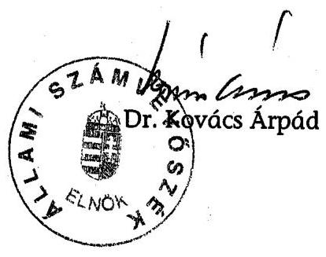

[^0]
[^0]:    ${ }^{22}$ A részletes megállapításokat a Magyar Köztársaság 2005. évi költségvetése végrehajtásának ellenőrzéséről készített ÁSZ jelentés tartalmazza.

---

# 1. SZ. MELLÉKLET (észrevételek)

---

H-1051 BUDAPEST V., JÓZSEF NÁDOR TÉR 2-4. POSTACIM: 1369 BUDAPEST, P
TELEFON: (36-1) 327-2159, (36-1) 327-2141
FAX: (36-1) 318-0738
PÉNZÜGYMINISZTER

Dr. Kovács Árpád úr
elnök

Állami Számvevőszék

Budapest

1/a. sz. melléklet
a V-07-55/2006. sz. jelentéshez

Iktatószám: 3f73/6/2006
Ügyintéző: dr. Molnárné dr.
Kriston Zsuzsanna, dr. Erdélyi
Mária, dr. Tomcsányi Írisz
Tárgy: A közösségi és a hazai
költségvetést megillető
vámbevételek realizálásáról szóló
ÁSZ jelentés

1/2.12
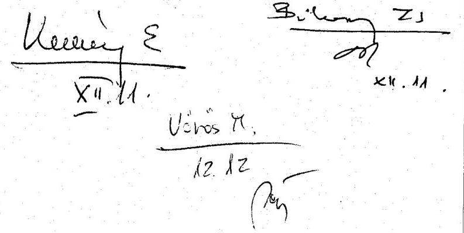

Tisztelt Elnök Úr!

A közösségi és a hazai költségvetést megillető vámbevételek realizálása feltételeinek és a vámeljárások eredményességének ellenőrzéséről készített jelentésben foglalt megállapításokhoz észrevételt nem teszek, mivel a korábbi egyezetések során tett észrevételeink figyelembevételre kerültek.

A jelentésben megfogalmazott javaslatok végrehajtására vonatkozó intézkedésekről a későbbiekben tájékoztatom.

Budapest, 2006. december „F,.

Tisztelettel:

Dr. Veres János

---

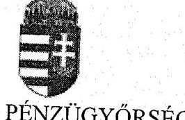

VÁM- ÉS PÉNZÜGYŐRSÉG ORSZÁGOS PARANCSNOKA

Szám: 14.033/43-2006. VPOP XII.
Tárgy: ÁSZ vizsgálat a közösségi és a hazai költségvetést megillető vámbevételek realizálása feltételeinek és a vámeljárások eredményességének ellenőrzése tárgyában
Hiv. sz.: V-07-49/2006.
Mell.: -

Bihary Zsigmond föigazgató úr

# Állami Számvevőszék 

## Budapest

Tisztelt Főigazgató Úr!

Tájékoztatom, hogy a hivatkozott számon küldött, a tárgyi vizsgálat megállapításait tartalmazó jelentés-tervezetet az ellenőrzéssel érintett testületi szervek és szervezeti egységek áttanulmányozták. Tekintettel arra, hogy a tervezet pontosítása a 14.033/41-2006. VPOP XII. számon tett észrevételeinkben foglaltaknak megfelelően megtörtént, azzal kapcsolatban további észrevétellel nem élek.

Budapest, 2006. november 13
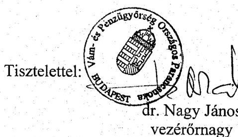

---

# 2. SZ. MELLÉKLET (tanúsítványok)

---

# Tanúsítványok jegyzéke 

| Sorsz.: | Megnevezés |
| :--: | :-- |
| 1. | a vám szakterület létszámának alakulásáról 2004-2006 |
| 2. a-b | a vámszakterületen foglalkoztatottak vezénylésének alaku-   lásáról 2004, 2005 |
| 3. | a vámeljárások összetételének és a számának alakulásáról   összesítve 2004.05.01-2005.12.31. |
| 4. | az állandó vámkezelő helyek számáról 2004-2006 |
| 5. | a Mélységi Ellenőrző Csoportok egyéb tevékenységéről 2004-   2005 |
| 6. a-b | a vámeljárások technológiai rendje betartásának informati-   kai rendszerben rögzített adatairól 2004.05.01-12.31.,   2005.01.01-12.31. |
| 7. | a vámeljáráshoz kapcsolódó közigazgatási határozatok,   perek számának alakulásáról 2003-2005 |
| 8. | a vámeljáráshoz kapcsolódó hatósági tevékenység eredmé-   nyességének területi alakulásáról 2003-2005 |
| 9. | az árutovábbítások számának alakulásáról 2004-2005 |
| 10. | CDPS vámárunyilatkozat feldolgozó rendszerben rögzített   áruvizsgálatok 2004.05.01-2005.12.31. |
| 11. | az utólagos ellenőrzésekhez kapcsolódó hatósági tevékeny-   ség eredményességének területi alakulásáról 2003-2005 |
| 12. | az utólagos ellenőrzésekhez kapcsolódó közigazgatási hatá-   rozatok, perek számának alakulásáról 2003-2005 |
| 13. | a külkereskedelmi tevékenységet folytató gazdálkodók szá-   máról 2004-2005 |

---

### Tanúsítvány a vám szakterület létszámának alakulásáról 2004-2006

|  Szarvezet |  |  |  |  |  |  |  |  |  |  |  |  |  |  |  |  |  |  |  |  |  |   |
| --- | --- | --- | --- | --- | --- | --- | --- | --- | --- | --- | --- | --- | --- | --- | --- | --- | --- | --- | --- | --- | --- | --- |
|   |  |  |  |  |  |  |  |  |  |  |  |  |  |  |  |  |  |  |  |  |  |   |
|   |  |  |  |  |  |  |  |  |  |  |  |  |  |  |  |  |  |  |  |  |  |   |
|   |  |  |  |  |  |  |  |  |  |  |  |  |  |  |  |  |  |  |  |  |  |   |
|   |  |  |  |  |  |  |  |  |  |  |  |  |  |  |  |  |  |  |  |  |  |   |
|   |  |  |  |  |  |  |  |  |  |  |  |  |  |  |  |  |  |  |  |  |  |   |
|   |  |  |  |  |  |  |  |  |  |  |  |  |  |  |  |  |  |  |  |  |  |   |
|   |  |  |  |  |  |  |  |  |  |  |  |  |  |  |  |  |  |  |  |  |  |   |
|   |  |  |  |  |  |  |  |  |  |  |  |  |  |  |  |  |  |  |  |  |  |   |
|   |  |  |  |  |  |  |  |  |  |  |  |  |  |  |  |  |  |  |  |  |  |   |
|   |  |  |  |  |  |  |  |  |  |  |  |  |  |  |  |  |  |  |  |  |  |   |
|   |  |  |  |  |  |  |  |  |  |  |  |  |  |  |  |  |  |  |  |  |  |   |
|   |  |  |  |  |  |  |  |  |  |  |  |  |  |  |  |  |  |  |  |  |  |   |
|   |  |  |  |  |  |  |  |  |  |  |  |  |  |  |  |  |  |  |  |  |  |   |
|   |  |  |  |  |  |  |  |  |  |  |  |  |  |  |  |  |  |  |  |  |  |   |
|   |  |  |  |  |  |  |  |  |  |  |  |  |  |  |  |  |  |  |  |  |  |   |
|   |  |  |  |  |  |  |  |  |  |  |  |  |  |  |  |  |  |  |  |  |  |   |
|   |  |  |  |  |  |  |  |  |  |  |  |  |  |  |  |  |  |  |  |  |  |   |
|   |  |  |  |  |  |  |  |  |  |  |  |  |  |  |  |  |  |  |  |  |  |   |
|   |  |  |  |  |  |  |  |  |  |  |  |  |  |  |  |  |  |  |  |  |  |   |
|   |  |  |  |  |  |  |  |  |  |  |  |  |  |  |  |  |  |  |  |  |  |   |
|   |  |  |  |  |  |  |  |  |  |  |  |  |  |  |  |  |  |  |  |  |  |   |
|   |  |  |  |  |  |  |  |  |  |  |  |  |  |  |  |  |  |  |  |  |  |   |
|   |  |  |  |  |  |  |  |  |  |  |  |  |  |  |  |  |  |  |  |  |  |   |
|   |  |  |  |  |  |  |  |  |  |  |  |  |  |  |  |  |  |  |  |  |  |   |
|   |  |  |  |  |  |  |  |  |  |  |  |  |  |  |  |  |  |  |  |  |  |   |
|   |  |  |  |  |  |  |  |  |  |  |  |  |  |  |  |  |  |  |  |  |  |   |
|   |  |  |  |  |  |  |  |  |  |  |  |  |  |  |  |  |  |  |  |  |  |   |
|   |  |  |  |  |  |  |  |  |  |  |  |  |  |  |  |  |  |  |  |  |  |   |
|   |  |  |  |  |  |  |  |  |  |  |  |  |  |  |  |  |  |  |  |  |  |   |
|   |  |  |  |  |  |  |  |  |  |  |  |  |  |  |  |  |  |  |  |  |  |   |
|   |  |  |  |  |  |  |  |  |  |  |  |  |  |  |  |  |  |  |  |  |  |   |
|   |

---

2/a sz. tanúsítvány a V-07-55/2006. sz. jelentéshez

tanúsítvány a városzakterületen foglalkotatottak renénylésének alakulásáról 2004

|  Megnevezés |  |  |  |  |  |  |  |  |  |  |  |  |  |  |  |  |  |  |  |  |  |  |  |  |  |  |  |  |  |  |  |  |  |  |  |   |
| --- | --- | --- | --- | --- | --- | --- | --- | --- | --- | --- | --- | --- | --- | --- | --- | --- | --- | --- | --- | --- | --- | --- | --- | --- | --- | --- | --- | --- | --- | --- | --- | --- | --- | --- | --- | --- |
|   |  |  |  |  |  |  |  |  |  |  |  |  |  |  |  |  |  |  |  |  |  |  |  |  |  |  |  |  |  |  |  |  |  |  |  |   |
|   |  |  |  |  |  |  |  |  |  |  |  |  |  |  |  |  |  |  |  |  |  |  |  |  |  |  |  |  |  |  |  |  |  |  |  |   |
|   |  |  |  |  |  |  |  |  |  |  |  |  |  |  |  |  |  |  |  |  |  |  |  |  |  |  |  |  |  |  |  |  |  |  |  |   |
|   |  |  |  |  |  |  |  |  |  |  |  |  |  |  |  |  |  |  |  |  |  |  |  |  |  |  |  |  |  |  |  |  |  |  |  |   |
|   |  |  |  |  |  |  |  |  |  |  |  |  |  |  |  |  |  |  |  |  |  |  |  |  |  |  |  |  |  |  |  |  |  |  |  |   |
|   |  |  |  |  |  |  |  |  |  |  |  |  |  |  |  |  |  |  |  |  |  |  |  |  |  |  |  |  |  |  |  |  |  |  |  |   |
|   |  |  |  |  |  |  |  |  |  |  |  |  |  |  |  |  |  |  |  |  |  |  |  |  |  |  |  |  |  |  |  |  |  |  |  |   |
|   |  |  |  |  |  |  |  |  |  |  |  |  |  |  |  |  |  |  |  |  |  |  |  |  |  |  |  |  |  |  |  |  |  |  |  |   |
|   |  |  |  |  |  |  |  |  |  |  |  |  |  |  |  |  |  |  |  |  |  |  |  |  |  |  |  |  |  |  |  |  |  |  |  |   |
|   |  |  |  |  |  |  |  |  |  |  |  |  |  |  |  |  |  |  |  |  |  |  |  |  |  |  |  |  |  |  |  |  |  |  |  |   |
|   |  |  |  |  |  |  |  |  |  |  |  |  |  |  |  |  |  |  |  |  |  |  |  |  |  |  |  |  |  |  |  |  |  |  |  |   |
|   |  |  |  |  |  |  |  |  |  |  |  |  |  |  |  |  |  |  |  |  |  |  |  |  |  |  |  |  |  |  |  |  |  |  |  |   |
|   |  |  |  |  |  |  |  |  |  |  |  |  |  |  |  |  |  |  |  |  |  |  |  |  |  |  |  |  |  |  |  |  |  |  |  |   |
|   |  |  |  |  |  |  |  |  |  |  |  |  |  |  |  |  |  |  |  |  |  |  |  |  |  |  |  |  |  |  |  |  |  |  |  |   |
|   |  |  |  |  |  |  |  |  |  |  |  |  |  |  |  |  |  |  |  |  |  |  |  |  |  |  |  |  |  |  |  |  |  |  |  |   |
|   |  |  |  |  |  |  |  |  |  |  |  |  |  |  |  |  |  |  |  |  |  |  |  |  |  |  |  |  |  |  |  |  |  |  |  |   |
|   |  |  |  |  |  |  |  |  |  |  |  |  |  |  |  |  |  |  |  |  |  |  |  |  |  |  |  |  |  |  |  |  |  |  |  |   |
|   |  |  |  |  |  |  |  |  |  |  |  |  |  |  |  |  |  |  |  |  |  |  |  |  |  |  |  |  |  |  |  |  |  |  |  |   |
|   |  |  |  |  |  |  |  |  |  |  |  |  |  |  |  |  |  |  |  |  |  |  |  |  |  |  |  |  |  |  |  |  |  |  |  |   |
|   |  |  |  |  |  |  |  |  |  |  |  |  |  |  |  |  |  |  |  |  |  |  |  |  |  |  |  |  |  |  |  |  |  |  |  |   |
|   |  |  |  |  |  |  |  |  |  |  |  |  |  |  |  |  |  |  |  |  |  |  |  |  |  |  |  |  |  |  |  |  |  |  |  |   |
|   |  |  |  |  |  |  |  |  |  |  |  |  |  |  |  |  |  |  |  |  |  |  |  |  |  |  |  |  |  |  |  |  |  |  |  |   |
|   |  |  |  |  |  |  |  |  |  |  |  |  |  |  |  |  |  |  |  |  |  |  |  |  |  |  |  |  |  |  |  |  |  |  |  |   |
|   |  |  |  |  |  |  |  |  |  |  |  |  |  |  |  |  |  |  |  |  |  |  |  |  |  |  |  |  |  |  |  |  |  |  |  |   |
|   |  |  |  |  |  |  |  |  |  |  |  |  |  |  |  |  |  |  |  |  |  |  |  |  |  |  |  |  |  |  |  |  |  |  |  |   |
|   |  |  |  |  |  |  |  |  |  |  |  |  |  |  |  |  |  |  |  |  |  |  |  |  |  |  |  |  |  |  |  |  |  |  |  |   |
|   |  |  |  |  |  |  |  |  |  |  |  |  |  |  |  |  |  |  |  |  |  |  |  |  |  |  |  |  |  |  |  |  |  |  |  |   |
|   |  |  |  |  |  |  |  |  |  |  |  |  |  |  |  |  |  |  |  |  |  |  |  |  |  |  |  |  |  |  |  |  |  |  |  |   |
|   |  |  |  |  |  |  |  |  |  |  |  |  |  |  |  |  |  |  |  |  |  |  |  |  |  |  |  |  |  |  |  |  |  |  |  |   |
|   |  |  |  |  |  |  |  |  |  |  |  |  |  |  |  |  |  |  |  |  |  |  |  |  |  |  |  |  |  |  |  |  |  |  |  |   |
|   |  |  |  |  |  |  |  |  |  |  |  |  |  |  |  |  |  |  |  |  |  |  |  |  |  |  |  |  |  |  |  |  |  |  |  |   |
|   |

---

2/b sz. tanúsítvány a V-07-55/2006. sz. jelentéshez

Tanúsítvány a városzakterületen foglalkoztatottak vezénylésének alakulásáról 2005

|  Megnevezés |  |  |  |  |  |  |  |  |  |  |  |  |  |  |  |  |  |  |  |  |  |  |  |  |  |  |  |  |  |  |  |   |
| --- | --- | --- | --- | --- | --- | --- | --- | --- | --- | --- | --- | --- | --- | --- | --- | --- | --- | --- | --- | --- | --- | --- | --- | --- | --- | --- | --- | --- | --- | --- | --- | --- |
|   |  |  |  |  |  |  |  |  |  |  |  |  |  |  |  |  |  |  |  |  |  |  |  |  |  |  |  |  |  |  |  |   |
|   |  |  |  |  |  |  |  |  |  |  |  |  |  |  |  |  |  |  |  |  |  |  |  |  |  |  |  |  |  |  |  |   |
|   |  |  |  |  |  |  |  |  |  |  |  |  |  |  |  |  |  |  |  |  |  |  |  |  |  |  |  |  |  |  |  |   |
|   |  |  |  |  |  |  |  |  |  |  |  |  |  |  |  |  |  |  |  |  |  |  |  |  |  |  |  |  |  |  |  |   |
|   |  |  |  |  |  |  |  |  |  |  |  |  |  |  |  |  |  |  |  |  |  |  |  |  |  |  |  |  |  |  |  |   |
|   |  |  |  |  |  |  |  |  |  |  |  |  |  |  |  |  |  |  |  |  |  |  |  |  |  |  |  |  |  |  |  |   |
|   |  |  |  |  |  |  |  |  |  |  |  |  |  |  |  |  |  |  |  |  |  |  |  |  |  |  |  |  |  |  |  |   |
|   |  |  |  |  |  |  |  |  |  |  |  |  |  |  |  |  |  |  |  |  |  |  |  |  |  |  |  |  |  |  |  |   |
|   |  |  |  |  |  |  |  |  |  |  |  |  |  |  |  |  |  |  |  |  |  |  |  |  |  |  |  |  |  |  |  |   |
|   |  |  |  |  |  |  |  |  |  |  |  |  |  |  |  |  |  |  |  |  |  |  |  |  |  |  |  |  |  |  |  |   |
|   |  |  |  |  |  |  |  |  |  |  |  |  |  |  |  |  |  |  |  |  |  |  |  |  |  |  |  |  |  |  |  |   |
|   |  |  |  |  |  |  |  |  |  |  |  |  |  |  |  |  |  |  |  |  |  |  |  |  |  |  |  |  |  |  |  |   |
|   |  |  |  |  |  |  |  |  |  |  |  |  |  |  |  |  |  |  |  |  |  |  |  |  |  |  |  |  |  |  |  |   |
|   |  |  |  |  |  |  |  |  |  |  |  |  |  |  |  |  |  |  |  |  |  |  |  |  |  |  |  |  |  |  |  |   |
|   |  |  |  |  |  |  |  |  |  |  |  |  |  |  |  |  |  |  |  |  |  |  |  |  |  |  |  |  |  |  |  |   |
|   |  |  |  |  |  |  |  |  |  |  |  |  |  |  |  |  |  |  |  |  |  |  |  |  |  |  |  |  |  |  |  |   |
|   |  |  |  |  |  |  |  |  |  |  |  |  |  |  |  |  |  |  |  |  |  |  |  |  |  |  |  |  |  |  |  |   |
|   |  |  |  |  |  |  |  |  |  |  |  |  |  |  |  |  |  |  |  |  |  |  |  |  |  |  |  |  |  |  |  |   |
|   |  |  |  |  |  |  |  |  |  |  |  |  |  |  |  |  |  |  |  |  |  |  |  |  |  |  |  |  |  |  |  |   |
|   |  |  |  |  |  |  |  |  |  |  |  |  |  |  |  |  |  |  |  |  |  |  |  |  |  |  |  |  |  |  |  |   |
|   |  |  |  |  |  |  |  |  |  |  |  |  |  |  |  |  |  |  |  |  |  |  |  |  |  |  |  |  |  |  |  |   |
|   |  |  |  |  |  |  |  |  |  |  |  |  |  |  |  |  |  |  |  |  |  |  |  |  |  |  |  |  |  |  |  |   |
|   |  |  |  |  |  |  |  |  |  |  |  |  |  |  |  |  |  |  |  |  |  |  |  |  |  |  |  |  |  |  |  |   |
|   |  |  |  |  |  |  |  |  |  |  |  |  |  |  |  |  |  |  |  |  |  |  |  |  |  |  |  |  |  |  |  |   |
|   |  |  |  |  |  |  |  |  |  |  |  |  |  |  |  |  |  |  |  |  |  |  |  |  |  |  |  |  |  |  |  |   |
|   |  |  |  |  |  |  |  |  |  |  |  |  |  |  |  |  |  |  |  |  |  |  |  |  |  |  |  |  |  |  |  |   |
|   |  |  |  |  |  |  |  |  |  |  |  |  |  |  |  |  |  |  |  |  |  |  |  |  |  |  |  |  |  |  |  |   |
|   |  |  |  |  |  |  |  |  |  |  |  |  |  |  |  |  |  |  |  |  |  |  |  |  |  |  |  |  |  |  |  |   |
|   |  |  |  |  |  |  |  |  |  |  |  |  |  |  |  |  |  |  |  |  |  |  |  |  |  |  |  |  |  |  |  |   |
|   |  |  |  |  |  |  |  |  |  |  |  |  |  |  |  |  |  |  |  |  |  |  |  |  |  |  |  |  |  |  |  |   |
|   |  |  |  |  |  |  |  |  |  |  |  |  |  |  |  |  |  |  |  |  |  |  |  |  |  |  |  |  |  |  |  |   |
|   |

---

### 3. sz. tanúsítvány a V-07-55/2006. sz. jelentéshez

|  Megnevezés | 2004 |  |  |  | 2005 |  |  |   |
| --- | --- | --- | --- | --- | --- | --- | --- | --- |
|   | Magyar | Külföldi | Magyar | Külföldi | Magyar | Külföldi | Magyar | Külföldi  |
|   | (db) | (db) | áruk vámértéke (E Ft) | áruk vámértéke (E Ft) | (db) | (db) | áruk vámértéke (E Ft) | áruk vámértéke (E Ft)  |
|  Tételsor száma | 1 627 601 | 94 438 | 9 288 902 159 | 718 703 691 | 2 741 506 | 209 447 | 9 474 261 040 | 631 780 928  |
|  Vámeljárás száma | 590 335 | 32 724 | 9 288 902 159 | 718 703 691 | 834 440 | 65 708 | 9 474 261 040 | 631 780 928  |
|  Újrakivitel | 9 849 | 1 030 | 101 525 960 | 7 159 324 | 10 614 | 3 027 | 100 807 727 | 46 018 379  |
|  Export | 286 118 | 19 632 | 1 715 710 063 | 173 267 312 | 418 691 | 39 062 | 2 799 907 261 | 374 506 786  |
|  Import | 304 217 | 13 092 | 7 573 192 095 | 545 436 379 | 415 749 | 26 646 | 6 674 353 779 | 257 274 143  |
|  Szabadforgalomba helyezés fizetős | 82 759 | 1 653 | 632 369 385 | 17 040 844 | 196 048 | 4 798 | 1 172 680 577 | 24 679 314  |
|  Szabadforgalomba helyezés nem fizetős (beleértve a felfüggesztett jövedéki adó) | 202 803 | 8 471 | 6 505 058 796 | 399 211 617 | 188 522 | 18 174 | 4 962 222 671 | 290 060 304  |
|  Egyszerűsített eljárás (kiegészítő) | 33 355 | 2 437 | 1 724 576 112 | 442 334 845 | 63 450 | 947 | 2 660 514 744 | 145 828 292  |
|  Egyszerűsített eljárásban résztvevő alanyok száma | 651 | 8 | 1 724 576 112 | 442 334 845 | 994 | 20 | 2 660 514 744 | 145 828 292  |
|  Árutovábbítás (indítás NCTS) | 40 775 | 141 491 |  |  | 61 450 | 285 628 |  |   |
|  Árutovábbítás (indítás VÁMREG) | 122846 (+656180 beléptetés) |  |  |  | 177625 (+914772 beléptetés) |  |  |   |
|  Árutovábbítás (érkeztetés NCTS) | 130 494 | 27 651 |  |  | 210 059 | 58 649 |  |   |
|  Árutovábbítás (érkeztetés VÁMREG) | 293181 (+798073 kiléptetés) |  |  |  | 245664 (+1244636 kiléptetés) |  |  |   |
|  Gazdasági vámeljárások * | 13 751 | 2 456 | 227 549 899 | 23 390 327 | 23 693 | 4 207 | 360 824 468 | 57 981 792  |
|  Aktív feldolgozás vámvisszatérítéses vámeljárás szabadforgalomba helyezéssel jár együtt | 2 462 |  | 30 174 834 |  | 2 528 |  | 53 970 175 |   |

- A vámraktározás esetében a helyi vk. engedéllyel rendelkezőknek nem kell kiegészítő ány-ot adni, ezért a táblázat azok adatait nem tartalmazza.

Fenti adatok hitelességét igazolom.

P.H.

Kelt: Budapest, 2006. június 8.

Osztrogonác Attila

„TÁVOLLÉTÉBEN”

---

### 4. sz. tanúsítvány a V-07-55/2006. sz. jelentéshez

|  Regionális parancsnokság megnevezése | 2005. december 31. | 2004. december 31. | 2005. december 31. | 2006. április 30. | 2005. december 31. | 2004. december 31. | 2005. december 31. | 2006. április 30. | 2005. december 31. | 2004. december 31. | 2005. február 31. | 2006. április 30. | 2005. február 31. | 2006. április 30. | 2005. február 31. | 2006. április 30. | 2005. február 31. | 2006. április 30. | 2005. február 31. | 2006. április 30.  |
| --- | --- | --- | --- | --- | --- | --- | --- | --- | --- | --- | --- | --- | --- | --- | --- | --- | --- | --- | --- | --- |
|  Nyugat-Dunántúli Regionális Parancsnokság | 5 | 3 | 3 | 3 | 10 | 1 | 1 | 1 | 8 | 4 | 3 | 3 | 10 | 5 | 5 | 5 | 11 | 3 | 3 | 3  |
|  Közép-Dunántúli Regionális Parancsnokság | 8 | 3 | 3 | 3 | 0 | 0 | 0 | 0 | 2 | 2 | 2 | 2 | 9 | 5 | 5 | 4 | 6 | 1 | 0 | 1  |
|  Dél-Dunántúli Regionális Parancsnokság | 4 | 3 | 3 | 3 | 5 | 5 | 5 | 5 | 3 | 3 | 3 | 3 | 10 | 2 | 2 | 1 | 1 | 0 | 0 | 0  |
|  Közép-Magyarországi Regionális Parancsnokság | 12 | 5 | 5 | 5 | 1 | 0 | 0 | 0 | 6 | 4 | 4 | 3 | 20 | 5 | 5 | 5 | 30 | 14 | 5 | 6  |
|  Észak-Magyarországi Regionális Parancsnokság | 6 | 3 | 3 | 3 | 3 | 0 | 3 | 0 | 10 | 1 | 1 | 1 | 8 | 4 | 3 | 3 | 2 | 2 | 2 | 2  |
|  Észak-Afritői Regionális Parancsnokság | 12 | 5 | 2 | 6 | 7 | 7 | 7 | 5 | 5 | 5 | 5 | 0 | 5 | 5 | 6 | 0 | 1 | 1 | 1 | 0  |
|  Dél-Afritői Regionális Parancsnokság | 9 | 4 | 3 | 3 | 8 | 7 | 7 | 7 | 6 | 6 | 5 | 5 | 4 | 6 | 4 | 4 | 0 | 0 | 0 | 0  |
|  VF Központi Répülőtéri Parancsnokság | 2 | 2 | 2 | 2 | 0 | 0 | 0 | 0 | 0 | 0 | 0 | 0 | 0 | 2 | 2 | 2 | 2 | 1 | 1 | 1  |
|  Összesen: | 58 | 28 | 24 | 28 | 34 | 20 | 20 | 18 | 40 | 25 | 23 | 17 | 66 | 34 | 32 | 24 | 53 | 22 | 12 | 13  |

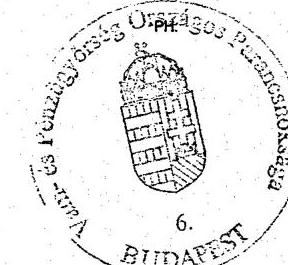

Ferd. adatok hősiességét igazolom.

Kelt. Budapest, 2006. május 25.

---

# Tanúsítvány a Mélységi Ellenőrző Csoportok egyéb tevékenységéről 2004-2005

|  Év | Szabálysértések összesen |  | Vámszabálysértés |  | Büncselekmények összesen |  | Csempészet büncselekmény |  | Szabálysértések és büncselekmények összesen |  |  |  | Létszám  |
| --- | --- | --- | --- | --- | --- | --- | --- | --- | --- | --- | --- | --- | --- |
|   | eset | elköv. érték (E Ft) |  |  | elköv. érték (E Ft) |  |  |  |  |  |  |  |   |
|  2004. | 635 | 17697,7 |  |  |  | 279 | 796 866,0 |  |  | 914 | 814 563,4 |  | 230 249,4  |
|  2005. | 3976 | 67684,6 |  |  |  | 1454 | 4082 057,0 |  |  | 5430 | 4149 741,7 |  | 1023 067,0  |

A *** -al jelölt adatok a NYOSZAD rendszerből nem válogathatók le, csupán az érintett fővármhivatalok irattárából manuálisan.

Fentiadatok hitelességét igazolom! Kelt: Budapest, 2006. augusztus 28. -n

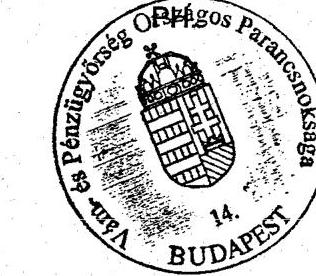

aláírás

---

Tanúsítvány a vámeljárások technológiai rendjének betartásának informatikai rendszerben rögzített adatairól 2004.05.01. - 12.31.

|  Szervezet | Vámeljárás összesen |  | Azonos előadó és szemlézz* |  | Revizor megegyezik szemlésszel, vagy ügyintézővel, vagy előadóval* |  | Vámkezelések darabszáma, amelyet a CDPS Rendszerben 1 felhasználó rögzített |   |
| --- | --- | --- | --- | --- | --- | --- | --- | --- |
|   | Export | Import | Export | Import | Export | Import | Export | Import  |
|  Közép-Magyarország régió | 90 433 | 101 984 | 82 747 | 68 364 | 88 088 | 95 223 | 22 892 | 6 493  |
|  Dél-Dunántúli régió | 22 358 | 19 920 | 16 741 | 14 729 | 20 998 | 18 109 | 9 886 | 5 181  |
|  Észak-Magyarországi régió | 17 288 | 13 512 | 11 431 | 8 861 | 16 390 | 12 627 | 5 109 | 2 010  |
|  Dél-Affókti régió | 41 228 | 24 697 | 28 435 | 14 120 | 39 189 | 21 669 | 6 229 | 3 054  |
|  Észak-Affókti régió | 51 919 | 46 393 | 34 520 | 25 430 | 47 039 | 41 984 | 8 000 | 5 729  |
|  Közép-Dunántúli régió | 25 435 | 28 288 | 19 100 | 12 594 | 24 943 | 25 430 | 11 091 | 3 269  |
|  Nyugat-Dunántúli régió | 38 925 | 35 051 | 34 910 | 24 573 | 38 246 | 31 752 | 14 104 | 1 419  |
|  VP Központi Repülőtéri Parancsnoksága | 18 164 | 47 464 | 17 242 | 34 687 | 17 916 | 44 977 | 13 905 | 1 439  |
|  Összesen: | 305 750 | 317 309 | 245 126 | 203 358 | 292 809 | 291 771 | 91 216 | 28 594  |

Megjegyzés: Az adatok időszakhoz rendelése a vámeljárás megkezdésének ideje szerint történt. Az adatok nem tartalmazzák a virtuális vámhivatalkódon feldolgozott tételeket.

- Azon eljárások darabszáma, ahol egy vámeljáráson belül teljesül a feltétel.

A fenti adatok hitelességét igazolom.

Kelt: Budapest, 2006. 07.24.

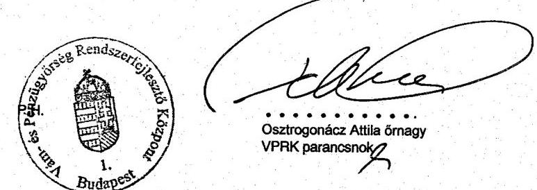

---

6/b sz. tanúsítvány a V-07-55/2006. sz. jelentéshez

### Tanúsítvány a vámeljárások technológiai rendjének betartásának informatikai rendszerben rögzített adatairól 2005.01.01. - 12.31.

|  Szervezet | Vámeljárás összesen | Azonos előadó és személy* | Revizor megegyezik személye | Revizor megegyezik személye | Vámkezelések darabszáma, amelyet a CDPS Rendszerben 1 felhasználó rögzített  |
| --- | --- | --- | --- | --- | --- |
|   | Export | Import | Export | Import | Export  |
|  Közép-Magyarország régió | 136 771 | 128 272 | 127 224 | 43 359 | 134 309  |
|  Dél-Dunántúli régió | 30 190 | 23 089 | 22 748 | 10 865 | 23 616  |
|  Észak-Magyarország régió | 26 683 | 17 375 | 20 398 | 9 847 | 26 073  |
|  Dél-Alföldi régió | 55 373 | 35 312 | 33 679 | 12 547 | 48 131  |
|  Észak-Alföldi régió | 81 644 | 77 344 | 58 414 | 45 280 | 76 248  |
|  Közép-Dunántúli régió | 38 868 | 39 420 | 32 961 | 13 844 | 38 520  |
|  Nyugat-Dunántúli régió | 55 863 | 45 940 | 49 968 | 29 011 | 55 527  |
|  VP Központi Repülőtéri Parancsnoksága | 32 361 | 75 643 | 30 360 | 23 257 | 32 003  |
|  Összesen: | 457 753 | 442 395 | 375 752 | 188 010 | 434 427  |

Megjegyzés: Az adatok időszakhoz rendelésre a vámeljárás megkezdésének ideje szerint történt. Az adatok nem tartalmazzák a virtuális vámhivatalkódon feldolgozott tételeket.

- Azon eljárások darabszáma, ahol egy vámeljáráson belül teljesül a feltétel.

A fenti adatok hitelességét igazolom.

Kelt: Budapest, 2006. 07.29.

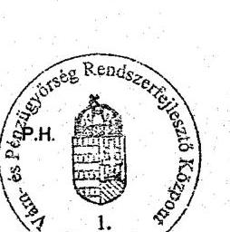

Osztrogonácz Attila Őrszegy VPRK parancsnok

---

### Tanúsítvány a vámeljáráshoz kapcsolódó közigazgatási határozatok, perek számának alakulásáról 2003-2005

|  Megnevezés | Mértékegység | 2003. év | 2004. év | 2005. év  |
| --- | --- | --- | --- | --- |
|  I. fokú határozat száma | db | 1957360 | 981216 | 442395  |
|  Fellebbezések száma | db | 2457 | 2044 | 1663  |
|  Fellebbezések aránya | % | 0,13 | 0,2 | 0,38  |
|  II. fokú határozat száma | db | 2449 | 1797 | 1658  |
|  II. fokú határozatokból helybenhagyó döntés száma | db | 1542 | 1279 | 949  |
|  II. fokú határozatokból helybenhagyó döntés aránya | % | 63 | 71 | 57  |
|  Előző időszakból áthúzódó közigazgatási perek száma | db | 394 | 452 | 524  |
|  Előző időszakból áthúzódó közigazgatási perek pertárgyértéke | EFT | 7236237 | 5332219 | 5103791  |
|  Tárgyévben indult közigazgatási perek száma | db | 228 | 215 | 234  |
|  Tárgyévben indult közigazgatási perek pertárgyértéke | EFT | 220878 | 599760 | 1538811  |
|  Összes folyamatban lévő közigazgatási per száma | db | 452 | 524 | 556  |
|  Összes folyamatban lévő közigazgatási per pertárgyértéke | EFT | 5332219 | 5103791 | 5618045  |
|  Lezárt közigazgatási per száma összesen | db | 358 | 300 | 297  |
|  Lezárt közigazgatási per pertárgyértéke | EFT | 3742900 | 2358048 | 1689513  |
|  - elveszített perek* (hatályon kívül helyezés) száma | db | 52 | 53 | 64  |
|  - elveszített perek (hatályon kívül helyezés) pertárgyértéke | EFT | 431733 | 119343 | 1054773  |
|  - megnyert perek* (helybenhagyás ill. kereset elutasítás, megváltoztatás, végzéssel zárult) száma | db | 306 | 247 | 233  |
|  - megnyert perek (helybenhagyás ill. kereset elutasítás, megváltoztatás) pertárgyértéke | EFT | 3311167 | 2238705 | 634740  |
|  - megnyert perek (helybenhagyás ill. kereset elutasítás, megváltoztatás) aránya | % | 85 | 82 | 78  |

- besorolás a VP információs rendszerének kategóriái szerint

Fenti adatok hitelességét igazolom.

Kelt: Budapest, 2006. május 26.

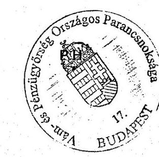

---

### 8. sz. tanúsítvány a V-07-55/2006. sz. jelentéshez

|  Regionális parancsnokság megnevezése | I. fokú határozatok száma | Tárgyidőszakban érkezett
fellebbezések száma (db) | Fellebbezések aránya (%) | II. fokon elbírált ügyek száma (db) | II. fokú határozatból helyben
hagyó döntés száma (db) | II. fokú határozatból helyben
hagyó döntés aránya (%)  |
| --- | --- | --- | --- | --- | --- | --- |
|   | 2003. év | 2004. év | 2005. év | 2003. év | 2004. év | 2005. év  |
|  Nyugat-Dunántúli Regionális
Parancsnokság aláírások | 245203 | 118388 | 45940 | 192 | 88 | 55  |
|  Közép-Dunántúli Regionális
Parancsnokság aláírások | 186353 | 92791 | 39420 | 101 | 78 | 31  |
|  Dél-Dunántúli Regionális Parancsnokság aláírások | 75970 | 46214 | 23089 | 105 | 74 | 23  |
|  Közép-Magyarországú Regionális
Parancsnokság aláírások | 957978 | 417807 | 128272 | 1426 | 1202 | 1171  |
|  Észak-Magyarországú Regionális
Parancsnokság aláírások | 105818 | 53057 | 17375 | 76 | 40 | 101  |
|  Észak-Alltódi Regionális Parancsnokság aláírások | 136415 | 93011 | 77344 | 84 | 75 | 65  |
|  Dél-Alltódi Regionális Parancsnokság aláírások | 111331 | 62271 | 35312 | 405 | 423 | 186  |
|  VP Repülőtéri Parancsnoksága | 138302 | 97677 | 75643 | 66 | 66 | 31  |
|  Összesen: | 1957360 | 981216 | 442395 | 2457 | 2044 | 1663  |

### 8. sz. tanúsítvány a V-07-55/2006. sz. jelentéshez

|  Részlet | 1. fokú határozatok száma (db) | 2. fokú határozatból helyben hagyó döntés aránya (%) | 3. fokú határozatból helyben hagyó döntés aránya (%)  |
| --- | --- | --- | --- |
|   | 2003. év | 2004. év | 2005. év  |
|  Nyugat-Dunántúli Regionális
Parancsnokság aláírások | 245203 | 118388 | 45940  |
|  Közép-Dunántúli Regionális
Parancsnokság aláírások | 186353 | 92791 | 39420  |
|  Dél-Dunántúli Regionális Parancsnokság aláírások | 75970 | 46214 | 23089  |
|  Közép-Magyarországú Regionális
Parancsnokság aláírások | 957978 | 417807 | 128272  |
|  Észak-Magyarországú Regionális
Parancsnokság aláírások | 105818 | 53057 | 17375  |
|  Észak-Alltódi Regionális Parancsnokság aláírások | 136415 | 93011 | 77344  |
|  Dél-Alltódi Regionális Parancsnokság aláírások | 111331 | 62271 | 35312  |
|  VP Repülőtéri Parancsnoksága | 138302 | 97677 | 75643  |
|  Összesen: | 1957360 | 981216 | 442395  |

### Az I. fokú határozatok száma rovat: Az adatok levélogatása a 01197-0008 nyilvántartási azonosítóval rendelkező adatbázisból történt.

### Fent adatok hitelességét igazolom.

### Kelt: Budapest, 2006. május 25.

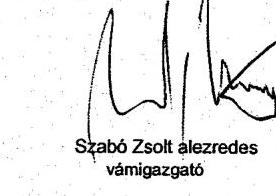

---

# Tanúsítvány

## au áturovábbítások számának alakulásáról 2004-2005

|   |  | 2004.05.01-től 2004.12.31-ig | 2005  |
| --- | --- | --- | --- |
|  |   |   |   |
|  Közösségi tranzitegyezmény alapján történt továbbítások száma (db) |  |  |   |
|   | Indítás | 184987 | 300978  |
|   | érkeztetés | 196948 | 340378  |
|  |   |   |   |
|  TIR egyezmény alapján történt továbbítások száma (db) |  |  |   |
|   | Indítás | 315532 | 451211  |
|   | érkeztetés | 402867 | 563693  |

A fenti adatok hitelességét igazolom.

Kelt: Budapest, 2006.07.19.

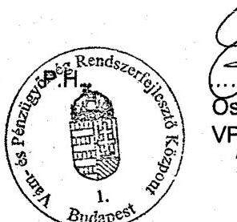

Osztrógorlácz Attila pűőr, örnagy VPRK parancsok

---

# 10. sz. tanúsítvány a V-07-55/2006. sz. jelentéshez

Összesítés Tanúsítvány CDPS Vámárunyilatkozat feldolgozó rendszerben rögzített áruvizsgálatok 2004.05.01-2005.12.31.

|  Megnevezés | 2004 |  | 2005 |   |
| --- | --- | --- | --- | --- |
|   | (db) | áruk vámértéke (E Ft) | (db) | áruk vámértéke (E Ft)  |
|  Előadó által javasolt vámvizsgálat |  |  |  |   |
|  Adminisztratív | 622170 | 9767783002 | 864471 | 9367539832  |
|  Szúróproba szerü | 1964 | 44295157 | 29758 | 712622491  |
|  Tételes | 145 | 803265 | 3205 | 18540715  |
|  Összesen | 624279 | 9812881425 | 897434 | 10098703038  |
|  Elvégzett vámvizsgálatok | 0 | 0 | 0 | 0  |
|  Adminisztratív | 556395 | 6883222585 | 784661 | 9627088267  |
|  Szúróproba szerü | 47479 | 3081874702 | 83620 | 476960006  |
|  Tételes | 22520 | 88383836 | 31713 | 118770234  |
|  Összesen | 626693 | 10054582738 | 900386 | 10224371968  |
|  Agrártermék fizikai vizsgálata | 299 | 1101614 | 392 | 1553462  |
|  Elöírások | 0 | 0 | 0 | 0  |
|  Egyéb eredmény | 0 | 0 | 0 | 0  |
|  Elutasított árunyilatkozatok száma | 339 | 2133045 | 860 | 2147833  |

Fenti adatok hitelességét igazolom. Kelt: Budapest, 2006. július 24. Megjegyzés: a Tanúsítványon feltüntetett adatok megegyeznek a korábban megadottakkal, a megnevezések pontosítása történt az Állami Számvevőszék képviselőinek 2006/07/20-i kérése alapján.

---

tanúsítvány az utólagos ellenőrzésekhez kapcsolódó hatósági tevékenység eredményességének területi alakulásáról 2003-2005 az utólagos ellenőrzésekhez kapcsolódó hatósági tevékenység eredményességének területi alakulásáról a V-07-55/2006. sz. jelentéshez az utólagos ellenőrzésekhez kapcsolódó hatósági tevékenység eredményességének területi alakulásáról

|  I. fokú határozatot hozó szerv megnevezése | I. fokú határozatok száma | Tárgyidőszakban fellebbezett I. fokú határozatok száma (db) | Fellebbezések aránya (%) | II. fokon elbírált I. fokú határozatok száma (db) | Helyben hagyott I. fokú határozatok száma (db) | Helyben hagyó II. fokú döntések aránya (%)  |
| --- | --- | --- | --- | --- | --- | --- |
|   | 2003. | 2004. | 2005. | 2003. | 2004. | 2005.  |
|  Közpoti Ellenőrzési Parancsnokság | 11717 | 6142 | 67 | 1096 | 483 | 67  |
|  Nyugat-Dunántúli Regionális Parancsnokság | - | 1091 | 1135 | - | 84 | 66  |
|  Közép-Dunántúli Regionális Parancsnokság | - | 292 | 535 | - | 0 | 3  |
|  Dél-Dunántúli Regionális Parancsnokság | - | 632 | 1206 | - | 21 | 458  |
|  Közép-Magyarországi Regionális Parancsnokság | - | 3501 | 1946 | - | 207 | 353  |
|  Észak-Magyarországi Regionális Parancsnokság | - | 161 | 858 | - | 74 | 357  |
|  Észak-Alföldi Regionális Parancsnokság | - | 2436 | 1143 | - | 28 | 89  |
|  Dél-Alföldi Regionális Parancsnokság | - | 1177 | 1189 | - | 1 | 378  |
|  Összesen: | 11717 | 15432 | 8079 | 1096 | 898 | 1771  |

Fenti adatok hitelességét igazolom.

Kelt: Budapest, 2006. június

Szabó Zsolt alezredes vámigazgató

---

### 12. sz. tanúsítvány a V-07-55/2006. sz. jelentéshez

### Tanúsítvány az utólagos ellenőrzésekhez kapcsolódó közigazgatási határozatok, perek számának alakulásáról 2003-2005

|  Megnevezés | Mértékegység | 2003. év | 2004. év** | 2005. év  |
| --- | --- | --- | --- | --- |
|  I. fokú határozat száma | db | 11717 | 15635 | 8074  |
|  Fellebbezések száma | db | 1096 | 671 | 2103  |
|  Fellebbezések aránya | % | 9,3 | 4,3 | 26  |
|  II. fokú határozat száma | db | 217 | 199 | 458  |
|  II. fokú határozatokból helybenhagyó döntés száma | db | 151 | 148 | 253  |
|  II. fokú határozatokból helybenhagyó döntés aránya | % | 69,5 | 74,3 | 55  |
|  Előző időszakból áthúzódó közigazgatási perek száma | db | 33 | 56 | 1  |
|  Előző időszakból áthúzódó közigazgatási perek pertárgyértéke | EFT | 1352972 | 1165629 | 41164  |
|  Tárgyévben indult közigazgatási perek száma | db | 50 | 49 | 14  |
|  Tárgyévben indult közigazgatási perek pertárgyértéke | EFT | 357502 | 491990 | 871914  |
|  Összes folyamatban lévő közigazgatási per száma | db | 83 | 105 | 8  |
|  Összes folyamatban lévő közigazgatási per pertárgyértéke | EFT | 1710474 | 1657619 | 471632  |
|  Lezárt közigazgatási per száma összesen | db | 27 | 52 | 6  |
|  Lezárt közigazgatási per pertárgyértéke | EFT | 545000 | 353307 | 400282  |
|  - elveszített perek* (hatályon kívül helyezés) száma | db | 1 | 24 | 3  |
|  - elveszített perek (hatályon kívül helyezés) pertárgyértéke | EFT | 37000 | 106290 | 281881  |
|  - megnyert perek* (helybenhagyás ill. kereset elutasítás, megváltoztatás, végzéssel zárult) száma | db | 26 | 28 | 4  |
|  - megnyert perek (helybenhagyás ill. kereset elutasítás, megváltoztatás) pertárgyértéke | EFT | 508000 | 247017 | 118400  |
|  - megnyert perek (helybenhagyás ill. kereset elutasítás, megváltoztatás) aránya | % | 96 | 53 | 66,6  |

- besorolás a VP információs rendszerének kategóriái szerint ** 2004. 08.01-ig II. fokon a VPOP Ellenőrzési Igazgatósága, ezután a VP KEP járt el másodtokon.

Fenti adatok hitelességét igazolom.

Kelt: Budapest, 2006. május 26.

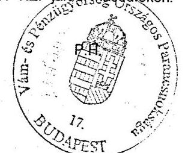

dr. Telek István alezredes ellenőrzési igazgató

---

# Tanúsítvány a külkereskedelmi tevékenységet folytató gazdálkodók számáról 

2004-2005

|  | 2004 | 2005 |  |
| :-- | --: | --: | --: |
| Régió | VPID darab | VPID darab | összesen |
| KMRP | 11301 | 12296 | 23597 |
| DDRP | 1135 | 1206 | 2341 |
| ÉMRP | 1006 | 1062 | 2068 |
| DARP | 2148 | 2361 | 4509 |
| NYDRP | 1462 | 1435 | 2897 |
| ÉARP | 1818 | 2097 | 3915 |
| KDRP | 1424 | 1566 | 2990 |
| összesen | 20294 | 22023 |  |

A fentiadatok hitelességét az adatbázisban tárolt adatok 2006. 06.23-i állapota alapján igazolom.

Budapest, 2006. június 26.
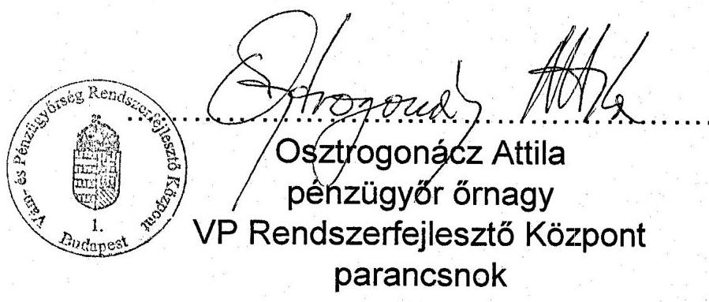
(Hivatkozott szám: 14.033/15-2006 VPOP XII.)