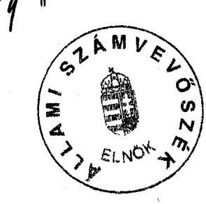
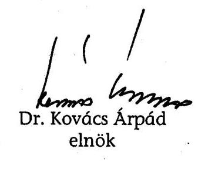
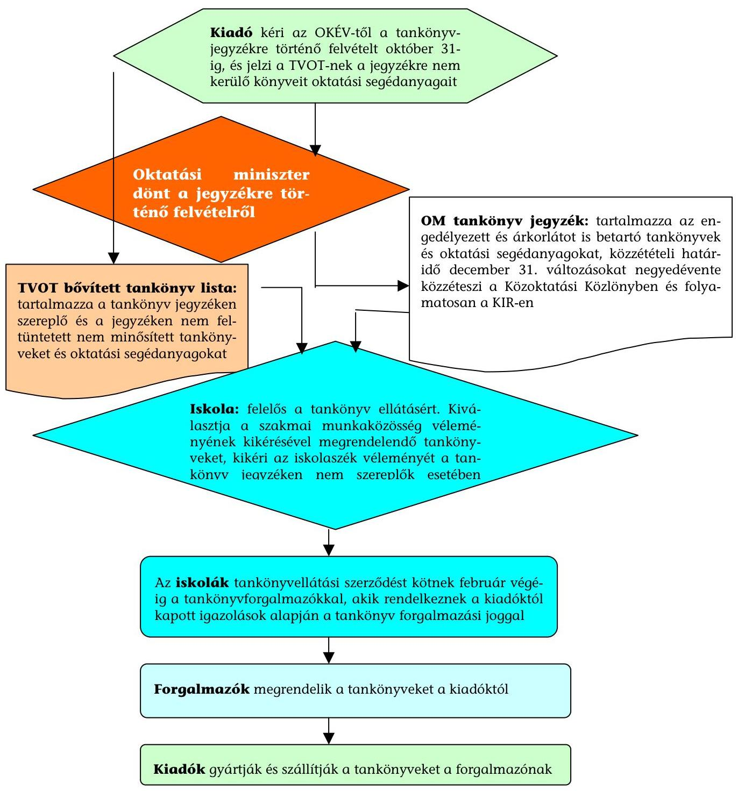
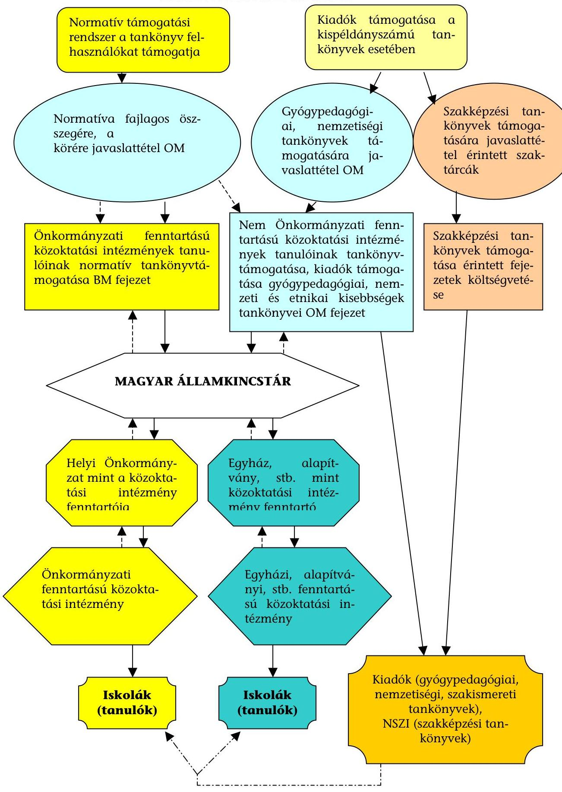

# ÁLLAMI   SZÁMVEVŐSZÉK 

## JELENTÉS

a közoktatási intézmények tankönyvellátási rendszerének ellenőrzéséről

---

2. Államháztartás Központi Szintjét Ellenőrző Igazgatóság Iktatószám: V-10-42/2006.
Témaszám: 819
Vizsgálat-azonosító szám: V-0292
Az ellenőrzést felügyelte:
Bihary Zsigmond
föigazgató
Az ellenőrzés végrehajtásáért felelős:
Hegedüsné dr. Müllern Veronika
főcsoportfőnök
Az ellenőrzést vezette:
Belovai Sándorné
osztályvezető főtanácsos
Az ellenőrzést végezték:

| Dobos András | Jankó Géza | Zagyi Judit |
| :-- | :-- | :-- |
| számvevő tanácsos | számvevő | számvevő |
| Záhonyiné Horváth | Vágó Irén |  |
| Ildikó | külső munkatárs |  |
| számvevő tanácsos |  |  |

# A témához kapcsolódó eddig készített számvevőszéki jelentések: 

címe
sorszáma
Jelentés a kötött felhasználású önkormányzati támogatások igény- 0234
lésének és felhasználásának ellenőrzéséről
Jelentés az Oktatási Minisztérium fejezet múködésének ellenőrzésé- 0534
ről
Jelentés az Állami Privatizációs és Vagyonkezelő Rt. 2004. évi mú- 0541 ködésének és a központi költségvetés végrehajtásához kapcsolódó tevékenységének ellenőrzéséről

---

# TARTALOMJEGYZÉK 

BEVEZETÉS ..... 7
I. ÖSSZEGZŐ MEGÁLLAPÍTÁSOK, KÖVETKEZTETÉSEK, JAVASLATOK ..... 10
II. RÉSZLETES MEGÁLLAPÍTÁSOK ..... 17

1. A közoktatási tankönyvellátás rendszere, ágazati felügyelete, szakmai irányítása és kontrollrendszere ..... 17
1.1. A közoktatási tankönyvellátás rendszere ..... 17
1.2. Ágazati irányítás és a tankönyvvé nyilvánítás ..... 19
1.2.1. A tankönyvvé nyilvánítás szervezeti keretei ..... 19
1.2.2. A tankönyvjegyzék szerepe, kialakításának gyakorlata ..... 21
1.2.3. A szakképzési tankönyvek ágazati felügyelete ..... 24
1.3. A Közoktatási Információs Rendszer tankönyvellátási részének működése ..... 25
1.4. Az ágazati irányítás belső kontrollrendszere ..... 28
2. A közoktatás szakmai minőségi követelményeinek érvényesítése a tankönyvek minősítési rendjében ..... 32
2.1. A közismereti tankönyvek minőségi követelményei ..... 32
2.2. A szakképzési tankönyvek minőségi követelményei ..... 37
2.3. A hatósági eljárás bevételei és ráfordításai ..... 38
2.4. A tankönyvek használhatósága ..... 39
2.5. A hazai és nemzetközi tankönyvvé nyilvánítás rendszere ..... 40
3. A közoktatási tankönyvellátás támogatási rendszere ..... 41
3.1. A tankönyvellátás normatív támogatási rendszere ..... 41
3.2. A közoktatási tankönyvkiadás és támogatási rendszere ..... 44
3.2.1. A gyógypedagógiai tankönyvkiadás ..... 44
3.2.2. A nemzetiségi és etnikai kisebbségi tankönyvkiadás ..... 45
3.2.3. A szakképzési tankönyvkiadás ..... 48
3.3. EU-s források a közoktatási tankönyvellátás rendszerében ..... 49
MELLÉKLETEK
4. sz. melléklet Jelentésre tett észrevétel az OKM miniszterétől
5. sz. melléklet A közoktatási tankönyvellátás rendszerének folyamata
6. sz. melléklet A közoktatásban résztvevő intézmények és tanulók száma a 2001-2005. tanévekben

---

4. sz. melléklet A közoktatási tankönyvek forgalmának és támogatásának alakulása a 2002-2006. években
5. sz. melléklet A közoktatási tankönyvtámogatás finanszírozási rendszerének folyamata
6. sz. melléklet A közoktatási tankönyvek költségvetési támogatásának alakulása a 2002-2006. években
7. sz. melléklet A közoktatási tankönyvtámogatás BM által finanszírozott forrásai

---

# RÖVIDÍTÉSEK JEGYZÉKE 

| Áht. | az államháztartásról szóló 1992. évi XXXVIII. törvény |
| :--: | :--: |
| Ámr. | az államháztartás múködési rendjéről szóló 217/1998. (XII. 30.) Korm. rendelet |
| ÁSZ | Állami Számvevőszék |
| BM | Belügyminisztérium |
| Educatio Kht. | Educatio Társadalmi Szolgáltató Kht. |
| ETI | Egészségügyi Szakképző és Továbbképző Intézet |
| HEFOP | Humánerőforrás-fejlesztési Operatív Program |
| IH | Irányító Hatóság |
| KIR | Közoktatási Információs Rendszer |
| Közokt. tv. | a közoktatásról szóló 1993. évi LXXIX törvény |
| Közoktatási rendelet | a közoktatásról szóló 1993. évi LXXIX. törvény végrehajtásáról szóló 20/1997. (II. 13.) Korm. rendelet |
| KSH | Központi Statisztikai Hivatal |
| KpT | Közoktatás-politikai Tanács |
| KSZI | Képzési és Szaktanácsadási Intézet |
| NSZI | Nemzeti Szakképzési Intézet |
| MKKE | Magyar Könyvkiadók és Könyvterjesztők Egyesülete |
| OKB | Országos Kisebbségi Bizottság |
| OKÉV | Országos Közoktatási és Vizsgaközpont |
| OKI | Országos Közoktatási Intézet |
| OKJ | Országos Képzési Jegyzék |
| OKM | Oktatási és Kulturális Minisztérium |
| OKNT | Országos Köznevelési Tanács |
| OM | Oktatási Minisztérium |
| OSZT | Országos Szakképzési Tanács |
| PISA | Nemzetközi Diákteljesítmény-mérési Program |
| suliNova Kht. | SuliNova Közoktatás-fejlesztési és Pedagógus- továbbképzési Kht. |
| Szakképzési tv. | a szakképzésről szóló 1993. évi LXXVI. törvény |
| SZMSZ | Szervezeti és Múködési Szabályzat |
| SZtb | Szakmai tankönyv bizottság |
| SZTTT | Szakképzési Tankönyv és Taneszköz Tanács |
| Tankönyvrendelet | a tankönyvvé nyilvánítás, tankönyvtámogatás valamint az iskolai tankönyvellátás rendjéről szóló 5/1998. (II. 18.) MKM rendelet és a 23/2004. (VIII. 27.) OM rendelet |
| TAR | Tankönyvi Adatbázis-kezelő Rendszer |
| Tprt. | a tankönyvpiac rendjéről szóló 2001. évi XXXVII. törvény |
| TTB | Országos Köznevelési Tanács Tankönyv és Taneszköz Bizottsága |
| TTI | Tankönyv és Taneszköz Iroda |
| TVOT | Tankönyves Vállalkozók Országos Testülete |

---

4

---

# ÉRTELMEZŐ SZÓTÁR 

Belső kontrollrendszer

Iskola

Közismereti tankönyv Közoktatás

Közoktatási tankönyvellátási rendszer

Közoktatási tankönyvtámogatás finanszírozási rendszere
Kulcskompetenciák

Monitoring
Monitoring rendszer

Nevelési-oktatási intézmény

Szakképzési tankönyv Tankönyv

Tankönyvvé nyilvánítási eljárás (akkreditáció)

Tankötelezettség

A szervezetirányítás eszköze, amely segítséget nyújt a vezetésnek, hogy a tevékenységét a céljai elérése érdekében szervezze meg, szabályos és hatékony módon folytassa, biztosítsa a vezetés politikájának érvényesülését, a vagyon védelmét.
Általános iskola, szakiskola, gimnázium, szakközépiskola, alapfokú múvészetoktatási intézmény.
A közismereti tantárgyak oktatására használt tankönyv. Magába foglalja az óvodai nevelést, az iskolai nevelést és oktatást, valamint a kollégiumi nevelést.
Azon tevékenységek összessége, amely biztosítja az iskolákban folyó oktató nevelő tevékenységhez szükséges tankönyveket, beleértve az engedélyezési, előállítási, forgalmazási tevékenységeket.
A közoktatási tankönyvellátási rendszer központi költségvetési támogatásának rendszere.

Az oktatás területén a társadalmi érvényesülés szempontjából legfontosabb képességek (pl. olvasás-szövegértés) és a megszerzett ismeretek gyakorlati hasznosítása.
A források, az eredmények, és a teljesítmények mindenre kiterjedő rendszeres vizsgálata.
A monitoring tevékenység elvégésében résztvevő szervezetek, intézmények, eszközök valamint ezek múködtetése érdekében foganatosított intézkedések összessége.
A közoktatás nevelő és oktató intézményei: óvoda, általános iskola, szakiskola, gimnázium, szakközépiskola, alapfokú művészetoktatási intézmény, gyógypedagógiai, konduktív pedagógiai nevelési oktatási intézmény, diákotthon és kollégium.
A szakképzési tantárgyak oktatására használt tankönyv. Az a nyomtatott formában megjelent, illetve elektronikus adathordozón rögzített könyv, amelyet külön jogszabályban meghatározott eljárás keretében tankönyvvé nyilvánítottak.
A Tprt. és a Tankönyvrendelet alapján lefolytatott eljárás, amely keretében az oktatási célú kiadványokat a nemzeti alaptantervben és a jogi irányítás egyéb eszközeiben megfogalmazott kritériumok vizsgálata alapján tankönyvvé nyilvánítják (akkreditálják).
Iskolába járással vagy magántanulóként teljesíthető, legkorábban a hatodik, legkésőbb a nyolcadik életév betöltésével kezdődik, és kérelemre (ha érettségi vizsgát tett, vagy államilag elismert szakképesítést szerzett) a tizenhatodik, legkésőbb a tizennyolcadik, sajátos nevelési igényű tanulók esetében a húszadik életév betöltésével szűnik meg.

---

.

---

# JELENTÉS 

## a közoktatási intézmények tankönyvellátási rendszerének ellenőrzéséről

## BEVEZETÉS

A tankönyvellátás a Magyar Köztársaság Alkotmánya 70/F. §-ában meghatározott művelődéshez való jog érvényesülését szolgáló olyan közfeladat, amelyben a tankönyvek előállítása és a tanulókhoz történő eljuttatása piaci viszonyok között valósul meg. A tankönyvpiac sajátossága, hogy a fogyasztó - a szülő és a tanuló - nem döntheti el szabadon, hogy kíván-e vevő lenni. A tankönyv ugyanis olyan áru, amely nélkül az iskolai tanulmányok megkezdése, sikeres folytatása nem valósulhat meg, ezek kiválasztása elsősorban a szakember feladata, ugyanakkor biztosítani kell annak lehetőségét, hogy ebbe a folyamatba a szülők és a tanulók képviselőik útján közremúködjenek. A tankönyvpiac rendjéről szóló 2001. évi XXXVII. törvény (Tprt.) szerint tankönyvként az a nyomtatott formában vagy elektronikus adathordozón rögzített könyv hozható forgalomba, amelyet külön jogszabályban meghatározott akkreditációs eljárás keretében tankönyvvé nyilvánítanak.

Magyarországon a 90-es évekig a közoktatási tankönyvellátás teljes körűen állami felelősségi körbe tartozott. Ez azt jelentette, hogy a nagy központi tantervi reformokhoz kapcsolódva az ágazati minisztérium saját fejlesztő intézetében kidolgoztatott az iskoláknak tantárgyanként és évfolyamonként 1-1 új tankönyvet. Ezeket a könyveket az állami tulajdonú tankönyvkiadó - állami dotáció mellett - kiadta, évente újranyomta, ezt követően a szintén állami tulajdonú tankönyvellátó vállalat eljuttatta az iskolákba ${ }^{1}$. A tantervi specializáció terjedésével gyorsan emelkedtek a tankönyvféleségek, illetve azok darabszáma. A felgyorsult infláció következtében a papírárak, a nyomda- és terjesztési költségek többszörösükre emelkedtek. Összességében a tankönyvellátás az oktatási költségek egyre jelentősebb tételévé vált, amelyet teljes egészében a központi költségvetés fedezett.

Az irányítási rendszer decentralizálása, az önkormányzati rendszer létrejötte lehetőséget biztosított a tankönyvellátás állami felelősségének megosztására. 1991-ben a Kormány eltörölte a tankönyvkiadás állami monopóliumát, a tankönyvpiac kialakításával szabadárassá tette a tankönyveket és kialakította a mai támogatási rendszer alapjait. Minden tankönyvvé minősített kiadvány támogatásban részesült, amit 1994-ig a kiadók, azóta pedig nagyobb részt a felhasználók kapnak. A tankönyvpiacra és a többcsatornás finanszírozásra

[^0]
[^0]:    ${ }^{1}$ A gyakorlatban azonban az új fejlesztésű könyvek több hónapos késéssel jelentek meg.

---

épülő, megosztott felelősségű közoktatási tankönyvellátás ágazati felügyeletének és szakmai irányításának mai rendszerét, annak alappilléreit a közoktatásról szóló 1993. évi LXXIX törvény (Közokt. tv.) teremtette meg.

A közoktatás rendszerének múködtetése az állam feladata. Az ingyenes és kötelező iskolai oktatásról az állami szervek és a helyi önkormányzatok az intézményfenntartói tevékenység feladatellátása keretében gondoskodnak. A közoktatásban használt tankönyvek és taneszközök beszerzésének költségei a tanulókat terheli, de a kiadások csökkentése érdekében az állam támogatást nyújt.

A tankönyvpiacnak az állam jelentős tényezője a tankönyvek megvásárlására és előállítására nyújtott támogatások, valamint az árkialakítási és tankönyvvé nyilvánítás engedélyezésében betöltött szerepe miatt. A közoktatásban használatos tankönyvek és oktatási segédanyagok két csoportba sorolhatók, egyrészt közismereti tankönyvek (közismereti tankönyvek és oktatási segédanyagok), másrészt szakképzési tankönyvek (szakképzési tankönyvek és oktatási segédanyagok). Mindkét csoportban a közoktatási tankönyvek lehetnek az engedélyezési eljárás során minősítettek (engedélyezett tankönyv), valamint nem minősítettek (nem engedélyezett tankönyv). Az engedélyezési folyamat külön szakértők és testületek által végzett minőségellenőrzési eljárás, amelyet az Országos Köznevelési Tanács (OKNT) és az Országos Kisebbségi Bizottság (OKB), Szakképzési Tankönyv és Taneszköz Tanács (SZTTT) véleményez.

A tankönyvellátás rendszerének részei a tankönyv-előállítás (megírás, jóváhagyási folyamat, kiadás), a tankönyvrendelés, a beszerzést biztosító pénzügyi források - köztük az állami támogatások -, valamint a múködést meghatározó jogszabályi háttér. A fogyasztói oldalt a közoktatási-nevelési intézmények, illetve azok tanulói, a kínálati oldalt a tankönyvkiadók és forgalmazók alkotják, a tankönyvpiacon megjelenő áru pedig maga a tankönyv. A közoktatási tankönyvellátás több, mint 1,5 millió tanulót, 165 ezer pedagógust, 5 ezer közoktatási intézményt, 114 kiadót és 227 forgalmazót érintett. Az állam szabályozó, ellenőrző funkciókat ellátó szereplőként (jogi szabályozás, engedélyezés, ágazati irányítás, ellenőrzés), illetve a központi költségvetési támogatások révén, mint a legnagyobb finanszírozó, „vevőként" jelenik meg a tankönyvpiacon. Az ágazati irányítási feladatok ellátásáért a Közokt. tv., és a szakképzésről szóló 1993. évi LXXVI. törvény (Szakképzési tv.) szerint az oktatási miniszter (a Magyar Köztársaság minisztériumainak felsorolásáról szóló 2006. évi LV. Törvény hatálybalépését követően az oktatási és kulturális miniszter) a felelős. A közoktatási tankönyvellátás rendszerét az 1. számú melléklet mutatja be.

A Közokt. tv. és a Tprt. szerint az oktatási miniszter évente jegyzéket ad ki azokról az engedélyezett közismereti és szakképzési tankönyvekről, amelyeknél a kiadók vállalják a jogszabályban meghatározott árkorlát betartását. A gyakorlatban a tankönyvjegyzék mellett - a Tankönyves Vállalkozók Országos Testületének (TVOT) közreműködésével - kialakult egy olyan kínálati lista, amely a tankönyvjegyzéken szereplő és nem szereplő oktatási célú kiadványokat egyaránt tartalmazza. A közoktatási intézmények a tankönyvjegyzék, a kínálati lista, illetve a tankönyvforgalmazók megkeresése alapján - bizonyos megszorításokkal - szabadon választhatnak a felkínált tankönyvek közül, amelyekre tankönyvellátási szerződést kötnek a forgalmazókkal.

---

A közoktatási tankönyvellátás költségvetési támogatása a közismereti és szakképzési tankönyvek esetében két csatornán keresztül valósult meg. Egyrészt a végső felhasználóknak nyújtott normatív alapú támogatással, másrészt - a kis példányszámú tankönyveknél (gyógypedagógiai, a nemzeti és etnikai kisebbségek számára készült és a szakképzési tankönyvek) - a kiadóknak nyújtott közvetlen támogatással. 2003. évtől a tanulók tankönyvvásárlásának normatív támogatása differenciálódott, 2006. évtől pedig bevezették a szociális rászorultság elvét.

A tankönyvellátás állami támogatása a mindenkori éves költségvetési törvényekben nagyobb részben a Belügyminisztérium (BM) költségvetésében (a helyi önkormányzatoknak, mint fenntartóknak a közoktatási feladatok ellátásához nyújtott normatív támogatás formájában, amely 2003-ig kötött felhasználású előirányzat volt), kisebb részben pedig az Oktatási Minisztérium (OM) költségvetésében jelent meg. A szakképzési tankönyvek kiadásának támogatásai a szakképesítésért felelős tárcák és az OM költségvetésében jelentek meg. A közoktatási tankönyvek állami támogatása a 2002. évi 3,7 Mrd Ft-ról 2005. évre 8,9 Mrd Ft-ra, 140,5\%-kal emelkedett.

Korábbi időszakban a közoktatási tankönyvellátás és támogatás rendszerét átfogóan az Állami Számvevőszék (ÁSZ) még nem vizsgálta.

Az ellenőrzés célja annak értékelése volt, hogy:

- szabályszerűen, célszerűen alakították-e ki a közoktatási tankönyvellátás ágazati felügyeletét és szakmai irányítását;
- a közoktatási tankönyvek minősítésének hatósági eljárási rendje megfelelt-e a jogszabályokban előírtaknak, célszerű volt-e az ágazati irányítás belső kontrollrendszerének kialakítása és múködtetése;
- a tankönyvellátás költségvetési támogatásának elosztási rendszere célszerűen és szabályszerűen került-e kialakításra, megfelelő volt-e a kapcsolódó monitoring rendszer kiépítettsége, múködésének eredményessége.

Az ellenőrzés keretében rendszerszemléletben vizsgáltuk az ágazati felügyelet és szakmai irányítás, valamint a feladatellátás és a forrásfelhasználás célszerűségét, a szakmai minőségi követelmények érvényesülését, az ehhez kapcsolódó hatósági eljárási rendet, valamint a támogatási rendszert.

Az ellenőrzés a 2002-2006. I. félév közötti időszakra, az OM-re, illetve a jogutódjára az OKM-re és a feladatellátásban részt vevő háttérintézményeire - az Országos Közoktatási Értékelési és Vizsgaközpont (OKÉV), a Nemzeti Szakképzési Intézet (NSZI), az Educatio Kht. és a suliNova Közoktatás-fejlesztési és Peda-gógus-továbbképző Kht. (suliNova Kht.) - terjedt ki.

Az ellenőrzés végrehajtására az Állami Számvevőszékről szóló 1989. évi XXXVIII. törvény 2. § (3) és (5) bekezdéseiben foglaltak adtak jogszabályi alapot.

A jelentést egyeztettük az OKM miniszterével, észrevételét az 1. sz. melléklet tartalmazza.

---

# I. ÖSSZEGZŐ MEGÁLLAPÍTÁSOK, KÖVETKEZTETÉSEK, JAVASLATOK 

A tankönyvellátás felelőssége a liberalizált tankönyvpiacon megosztottá vált, decentralizált rendszerú volt a szaktárca és az önkormányzatok, illetve a szakképzési tankönyveknél a szakképzésért felelős tárcák közremúködésével. Az állam, illetve az oktatási tárca teljes tankönyvellátási felelőssége a közoktatás közismereti részének tekintetében megszűnt ${ }^{2}$, állami feladatból közfeladattá vált. Az állam elsősorban szabályozási, ágazati irányítási, koordinációs és ellenőrzési feladatokat látott el, amelyekért a közoktatási tankönyvellátás tekintetében az oktatási miniszter teljes körú, a szakmai tankönyvellátás területén a szakképzésért felelős miniszterekkel megosztott felelősséget viselt. A közoktatási tankönyvellátásban a köz- és magánszféra sajátos együttmúködése valósult meg a szolgáltatás, áru szabadpiaci megvásárlásával.

A vizsgált időszakban a közoktatási tankönyvellátást meghatározó jogszabályok gyakran módosultak, a gyakori változások feltételt teremtettek a bekövetkezett szakmai koncepcióváltozások megjelenítésének. Ugyanakkor bizonytalanságot keltettek a piaci szereplőkben, a fejlesztéseket több évre tervező kiadók körében, ezzel nehezítették az eredményes feladatellátást. A közoktatás és a szakképzés területén az OM illetékes szakterületei, háttérintézményei, gazdasági társaságai, tanácsadó testületei, a szakképzési feladatokért felelős minisztériumok és azok háttérintézményei, valamint tanácsadó testületei is bekapcsolódtak a feladatellátásba. A számos közreműködő szervezet bonyolulttá, nem kellően átláthatóvá és nehezen koordinálhatóvá tette a tankönyvellátási rendszert.

A szakmai irányítás, illetve a nemzeti alaptantervben megfogalmazott szakmai, minőségi követelmények érvényesítésének egyik fontos eszköze a tankönyvvé nyilvánítási eljárás, amely hatósági eljárás ${ }^{3}$. A tankönyvvé nyilvánítási eljárás azonban az eddigi tapasztalatok szerint költséges, árfelhajtó hatású az eljárási díffizetési kötelezettség miatt, amelyet a kiadók törekednek az áraikban érvényesíteni. Lassú és bonyolult, mert a folyamatban számos intézmény, szakértő és testület vesz részt. Az engedélyezési kritérium rendszere miatt egyszerre túl- és alulszabályozott, amelynek megalapozottságát szakmai körökben is vitatják.

A tankönyvvé nyilvánítás, tankönyvtámogatás valamint az iskolai tankönyvellátás rendjéről szóló oktatási miniszteri rendeletek (Tankönyvrendelet) utolsó

[^0]
[^0]:    ${ }^{2}$ Kivételt képeznek ez alól a sajátos nevelési igényú gyerekek képzésében és a nemzetiségi oktatásban használt tankönyvek.
    ${ }^{3}$ A hatósági eljárásban szakértői testületek múködtek közre, elsősorban a miniszter tanácsadó testülete, az OKNT, illetve a közismereti tankönyvek jóváhagyási eljárásában az OKNT egyik bizottsága, a Tankönyv és Taneszköz Bizottsága (TTB), a szakképzési tankönyvek esetében a Szakképzési Tankönyv és Taneszköz Tanács (SZTTT).

---

módosításai annyiban javítottak a helyzeten, hogy több területen pontosították, helyenként részletesen konkretizálták a tankönyvvé nyilvánítási eljárást és a jóváhagyási kritériumokat. Az új eljárásrend - amelyben a bizottsági kontroll egyre kevesebb könyvre terjed ki - nem teljesen harmonizál a Közokt. tv. és a Tankönyvrendelet előírásaival (a hatósági tankönyvvé nyilvánítási eljárásban közremúködő szervezetként a jogszabályok az oktatási miniszter mellett az OKNT-t mint javaslattevőt nevesítik, helyette a gyakorlatban a TTB - az OKNT egyik bizottsága - csak a nem egységes szakértői vélemények esetében jár el; a közismereti tankönyvvé nyilvánítási eljárásból takarékossági okokból kivették a tapasztalattal rendelkező, szakmai koordinációt biztosító tantárgyi referenseket, ami a minőségi követelmények érvényesülésére kedvezőtlenül hatott). A változások hozzájárultak a terület ágazati irányításának erősítéséhez, a hatósági engedélyezési folyamat áttekinthetőbbé válásához és a tankönyvpiaci szereplők számára egyértelműbbé tették a tankönyvekkel kapcsolatos minőségi, tartalmi és formai elvárásokat. Ugyanakkor a tankönyvjóváhagyás időigényesebbé vált a kiadók, a szakértők, a hatósági feladatellátók számára.

A minőségi követelményeket erősítette, hogy elsősorban a Tankönyvrendelet kiadásával egységessé vált a közismereti és szakmai könyvek tankönyvvé nyilvánítása, a tankönyvek megszűnésének eljárásrendje és szervezeti háttere. A közismereti tankönyvek esetében azonban az új oktatáspolitikai célok, minőségi követelmények érvényesítését hátrányosan befolyásolta a Tankönyvrendelet azon módosítása ${ }^{4}$, amely értelmében a tipikusan kispéldányszámú tankönyveket igénylő közoktatási területeken a lejárt engedélyű (6-10 éve engedélyezett) tankönyvek új hosszabbítási eljárás nélkül a tankönyvlistára kerülhetnek, illetve ott maradhatnak. Ennek következménye volt a nemzetiségi és a sajátos nevelési igényű tanulók közoktatási feladatellátásában jelentkező tankönyvhiány, a szakképzési könyvek esetében ugyancsak a szintén jelentős hiány mellett - a központi költségvetésből finanszírozott könyvek esetében - kialakult jelentős készlet-felhalmozódás.

A tankönyvekről az oktatási miniszter évenként tankönyvjegyzéket adott ki, amelyekre azok a tankönyvek kerülhettek, amelyeket jogerősen tankönyvvé nyilvánítottak, és a fogyasztói ár tekintetében megfeleltek a miniszter által a TVOT véleményének kikérésével kialakított árkorlátnak (maximált fogyasztói ár). A szakképzés szakmai tankönyveinek tankönyvvé minősítéséről a szakképesítésért felelős miniszter, az árkorlátról az oktatási miniszter a szakképesítésért felelős miniszter egyetértésével dönt.

A tankönyvjegyzék a közoktatási tankönyvellátás ágazati irányításának meghatározó eszköze, amelyen keresztül az OM-nek érvényesítenie kellene az oktatáspolitika szakmai, és gazdasági elvárásait. 2003-tól kezdődően azonban folyamatosan gyengültek azok az eszközök (áfa-mentesség, állami garanciás hitelek felvételének lehetősége), amelyek érdekeltté tették a kiadókat, hogy oktatási célú kiadványaikat a jegyzékre vetessék. A tankönyvjegyzék gyakorlati haszna ugyanakkor nem érvényesül, mivel a Közokt. tv. szerint a pedagógusok szabadon választhatnak tankönyvjegyzéken nem szereplő kiadványokat is,

[^0]
[^0]:    ${ }^{4}$ Tankönyvrendelet

---

amelyek megvásárlásához az állami normatív támogatás igénybevételét jogszabály nem korlátozza. Hiteles statisztikai adatok hiányában, szakértői becslések alapján az iskolák által használt tan- és segédkönyvek 25-30\%-a nem minősített kiadvány ${ }^{5}$, tehát nem minősítették tankönyvvé.

A tankönyvjegyzékre vett tankönyvcímek száma a vizsgált időszakban végig magas volt, a közoktatási intézmények a 2006/2007. tanévre vonatkozóan 3144 tankönyvjegyzéken lévő minősített tankönyv közül választhattak. A hagyományos tankönyvek mellé a kiadók tankönyv családokat fejlesztettek ki kiegészítő segédkönyv, munkafüzet, tudásmérés, házifeladat-füzet, feladatgyűjtemény stb. formájában. Eredményeként az átlagosan egy gyermekre jutó tankönyvek darabszáma a 2002-2005. évek között 8,4-ről 12,3-ra (46,4\%-kal) emelkedett ${ }^{6}$. A tanulólétszám 3,7 \%-os csökkenése mellett megállapítható a kiadott tankönyvek darabszámának erőteljes növekedése.

A szakmai tankönyvek esetében a szakképesítésért felelős miniszter intézkedik az engedélyezési eljárás lefolytatásáról, a minőségi követelmények érvényesülésénél a garanciális elem a minisztériumtól független szakértők bevonása, akik a Szakképzési tankönyvbizottságok kontrollját biztosítják. Az SZTTT az engedélyezési folyamat javításához a tankönyvre vonatkozó jogszabálytervezetek véleményezésével, a tankönyvbírálati szempontsor fejlesztésével, valamint a tankönyv-szakértők kiválasztásával járult hozzá.

A szakmai célok és minőségi követelmények érvényesítésének kulcseleme a tankönyvbírálati szempontrendszer. A bírálati szempontokat az OM illetékes szakterületének, valamint a TTI vezetőjének közremúködésével a TTB dolgozta ki, fejlesztette tovább rendszerint egy-egy tankönyv-jóváhagyást érintő jogszabály, vagy az oktatás tartalmát szabályozó új dokumentum (Nemzeti alaptantervek 1995, 2003, Központi kerettantervek 2001) megjelenéséhez kapcsolódóan. A 2006-ban módosított Tankönyvrendelet bírálati szempontsorának azon elemei, amelyek bizonyos számszerú értékeket írtak elő a tankönyvi szövegek tekintetében, jelentősen megosztották a szakmai közvéleményt.

A tankönyvek megfelelősége a tanulók teljesítménymérésétől, a tankönyvhasználói kör (pedagógusok, szülők, tanulók) véleményének megszerzéséig terjedő módszerekkel végzett, jogszabályokban meghatározott, ún. beválás vizsgálatokkal ellenőrizhető ${ }^{7}$. Az engedélyezett és nem engedélyezett tankönyvek minőségének és beválásának összehasonlítására rendszeres vizsgálatot sem korábban, sem az ellenőrzési időszakban nem végeztek. A közoktatási tankönyvek esetében ilyen vizsgálatra még nem került sor, előzetes számítások sem készültek annak költségeiről. Az OM-hez tartozó szakképesítések szakképzési tankönyvei közül kísérleti jelleggel néhány vizsgálatot végeztek, a tapasztalatok értékelése a helyszíni ellenőrzés befejezéséig még nem zárult le. A könyvenként

[^0]
[^0]:    ${ }^{5}$ Forrás: OKI Jelentés a Magyar Közoktatás Helyzetéről 2006
    ${ }^{6}$ OKI: Jelentés a Magyar Közoktatás Helyzetéről 2006
    ${ }^{7}$ Tprt., Tankönyvrendelet

---

félmillió Ft-os költségek miatt az ilyen vizsgálatokra csak alkalomszerúen fognak sort keríteni.

Az OM kezdeményezésére kiépítették a Közoktatási Információs Rendszer keretében a Tankönyvi Adatbázis-kezelő Rendszert (TAR) annak érdekében, hogy a hivatalos közoktatási tankönyvjegyzék elektronikus formában is elérhető legyen, valamint információt biztosítson a tankönyvellátás rendszeréről, a tankönyvpiac áttekinthetőségéről, és a tanügyi igazgatási információk előállításához. A jól kiépített rendszer növelte az információszolgáltatás minőségét és mennyiségét, és a nyomda- és postaköltségek csökkentésével költségmegtakarítást is eredményezett. A kiadók érdekeltségének csökkenésével (hogy tankönyveiket felvétessék a tankönyvjegyzékre) az oktatási segédanyagok számának növekedésével, és a közvetlen értékesítési módozatok térhódításával, valamint a Közoktatási tv. módosításában a tankönyvrendelési statisztikai adatszolgáltatási kötelezettség megszűntetésével a TAR tankönyvpiacról nyújtott megbízható információt biztosító képessége megszűnt. A támogatással kifejlesztett, kezdetben jól múködő tankönyv-nyilvántartási rendszer adatállománya kibővült ugyan a szakképzési tankönyvekkel, de ez nem teljes körű, mert a tankönyvjegyzéken nem szereplő tankönyvek, oktatási segédanyagok létezéséről, forgalmáról sem a kiadók, sem a megrendelők nem adtak tájékoztatást.

A tankönyvi adatbázis üzemeltetésére és fejlesztésére fordított támogatás drasztikus csökkentése mellett (a 2006. évi támogatás az előző évi 21,5 M Ft-ról annak $15,8 \%$-ára $3,4 \mathrm{M}$ Ft-ra csökkent) az informatikai rendszer a jogszabályok által szabályozott minimum követelményeknek tud csak megfelelni. Így a TAR fejlesztése és múködtetése bizonytalanná vált, a tankönyvpiacot ellenőrző és szabályozó tevékenységhez nyújtott információt biztosító szerepe gyakorlatilag megszűnt.

A 2002-2006. évek közötti időszakban a támogatási-finanszírozási rendszer meghatározó hányadát kitevő normatív támogatások elve és rendszere többször módosult. A tanulók tankönyvvásárlásához nyújtott normatív központi költségvetési támogatás a szociális egyenlőtlenségek mérséklését célozta meg azzal, hogy a vizsgált időszak végére a tanulói könyvvásárláshoz nyújtott támogatások alanyi jogúból teljes egészében rászorultság alapúvá váltak.

A tankönyv-támogatásra kialakított normatíva változásokat megalapozott, az egyes tanulói csoportokra bontott tankönyvcsomag árak évenkénti módosulásai alapján készült részletes háttérszámításokkal nem támasztották alá, hatáselemzések, értékelések nem készültek. A normatívák mértékének és feltételeinek változása eredményeként a felhasznált költségvetési támogatás összege 2002. évhez viszonyítva 2005-ben 2,6 szorosára emelkedett, megközelítve a 8,6 Mrd Ft-ot. Az összes költségvetési támogatáson belül nőtt a normatív támogatás súlya (a 2002. évi 87,9\%-ról 2005. évi 96,3\%-ra).

A normatív támogatás kötött felhasználása feloldásának jogi szabályozása 2004-től nem biztosította a célszerinti felhasználás nyomon követését, mert az ezen a címen kapott normatívát az intézményfenntartók más közoktatási célokra is felhasználhatták. A beszámoltatás során csak a fenntartó által igénybe vett támogatás jogosultságát vizsgálta a Kincstár. Az ellenőrzések alapján nem állapítható meg, hogy a támogatás eljutott-e a végső kedvezményezetthez, és

---

az arra jogosult tanulók tankönyvtámogatása, vagy ingyenes tankönyvellátása megvalósult-e.

A közoktatási tankönyvellátási rendszer általánostól eltérő területei a sajátos nevelési igényú (vakok, siketek, gyógypedagógiai tanulók), valamint a nemzeti és etnikai oktatásban részesülő tanulók ellátása. A kispéldányszámú tankönyveknek a kifejlesztése drága, az átfutási ideje hosszú ${ }^{8}$. Ezeknek a könyveknek a kiadásánál az amúgy is speciális igényeket kielégítő kivitel, a magasabb költségek - az alacsony példányszámra vetített magas fajlagos önköltség - miatt a kiadók nem vállaltak anyagi kockázatot. Az utánnyomásoknál az OM részére kedvezőtlen helyzetet teremtett az a kialakult gyakorlat, amely szerint az állami támogatással kifejlesztett tankönyvek kiadói jogai felett a kiadók rendelkeztek.

A szakképzési tankönyvek nagy része ugyancsak kispéldányszámú tankönyv, ezért a kiadók itt sem érdekeltek kifejlesztésükben és értékesítésükben. A szakmai tankönyvellátás hiányosságát mutatta, hogy 2006. évben az OM hatáskörébe tartozó 326 tantárgyi programhoz nem állt rendelkezésre tankönyv. Ezeknél a programoknál a tanár által összeállított jegyzet, tankönyvjegyzéken nem szereplő könyv segítségével folyt az oktatás. A szakképzési tankönyvek esetében együtt jelentkezett a bőség és a hiány. Bizonyos témakörökben, pl. számítástechnika, üzleti gazdaságtan, párhuzamosan több tankönyv is rendelkezésre állt, és a pedagógus a tantervi programjának megfelelőt választhatott. Ugyanakkor fennállt a tankönyvhiány is, amelynek egyik okozója, hogy a szakképzési tankönyvek 90\%-a kispéldányszámúnak minősül és jelentkeztek az ilyen tankönyvekre jellemző problémák. Az állami támogatás mellett kifejlesztett szakképzési tankönyvek kiadói jogai felett rendelkező kiadók az utánnyomásban nem érdekeltek. Az NSZI-nél a tankönyvek utánnyomásából származó árbevétel a további utánnyomásokra is csak szűkösen nyújtott fedezetet. További gondot okozott, hogy az állami feladat módosulásával a központi költségvetésből közvetlenül nem biztosítottak fedezetet a tankönyvfejlesztésre, az erre fordítható közvetlen költségvetési támogatások csökkenését az NSZI a Szakképzési Alapból pályázati úton elnyert forrásokból részlegesen pótolta.

A közoktatási intézmények tankönyvellátási rendszeréhez kapcsolódóan EU-s források felhasználására a Nemzeti Fejlesztési Terv I-ben (NFT I.), ezen belül is a Foglalkoztatáspolitikai és Munkaügyi Minisztérium (FMM) által kezelt Humánerőforrás-fejlesztési Operatív Programok (HEFOP) keretében került sor. A központi és a kiegészítő programok megvalósítására összesen 49,9 Mrd Ft (tankönyvfejlesztéseket is érintő központi programok 17,2 Mrd Ft), a szakmai monitoring rendszer múködtetésére további 1,3 Mrd Ft támogatás áll rendelkezésre, amely 75\%-ban az Európai Szociális Alap (ESZA), 25\%-ban a hazai költségvetés vissza nem térítendő támogatása.

A központi programok megvalósítására szélesebb szakmai egyeztetés és kontroll nélkül egyedi döntéssel ${ }^{9}$, nem teljes körűen kidolgozott programtervek

[^0]
[^0]:    ${ }^{8}$ Kispéldányszámúnak minősülnek az 1000 példányszám alatti tankönyvek.
    ${ }^{9}$ 1/2004. (II. 16.) TNM-FMM-FVM-GKM-KvVM-PM együttes rendelet

---

alapján az NSZI-t és a suliNova Kht.-t kérték fel. A szerződéskötéskor a felhasználás általános szabályairól szóló rendelet nem volt hatályban, a programtervek, költségvetések nem kerültek teljes körűen megalapozásra, kidolgozásra.

A programok végrehajtása során felmerült problémák rámutattak a kiválasztás, a tervezés és a végrehajtás szakaszaiban egyaránt jelentkezett kedvezőtlen hatásokra. A szakmailag indokolt, több száz oldalas programtervek és mellékleteik a programok szükségességére, hasznosságára, a költségvetések mértékére vonatkozóan csak általános válaszokat adtak, nem tértek ki a számszerűsített célok várható és mérhető gazdasági hatásaira. A programterv és költségvetése valamint a szerződés sem ad választ arra, hogy mennyire eredményesen, hatékonyan kell felhasználni a forrásokat, ami növeli a programok megvalósításának ilyen irányú kockázatát. A keletkezett hiányosságok miatt a szerződéseket többször módosították. Az OKM nem fordított kellő figyelmet a programok nyomon követésére és az egyéb tankönyv és taneszköz fejlesztésekkel való öszszehangolására tekintettel azok szakmai jelentőségére, fontosságára, összetettségére és nagyságrendjére.

2004-ben az ágazati irányítás belső kontrollrendszerének kialakítását, követelményeinek megalapozását az OM a FEUVE rendszerének kialakításával megalapozta, gyakorlati alkalmazását azonban még a bevezető stádium jellemezte. A kockázatok felmérésére csak részlegesen, a költségvetés tervezése területén került sor, értékelésére nem tért ki. Múködését szakmai területen hátráltatták a sokszor ellentmondó szakmai szemlélet és jogszabályváltozások, az ebből eredő - a gyakorlati végrehajtásban bizonytalansági tényezőként megjelenő - eltérő értelmezések, az ellenőrzések hiánya, és mindebből következően a szabálytalanságok, amelyek következmények nélkül maradtak. A tankönyvrendelet 2006. évi módosítása pozitív elmozdulást jelenthet a belső kontrollrendszer működési feltételeiben (a minőségi követelmények szigorítása).

A helyszíni ellenőrzés megállapításainak hasznosítása mellett javasoljuk:

# az oktatási és kulturális miniszternek: 

1. ellenőriztesse és biztosítsa a tankönyvpiac rendjéről szóló 2001. évi XXXVII. törvény 2. § (1) bekezdésében foglalt tankönyv elnevezés használatának jogosultságát, mert a jelenlegi gyakorlat szerint a tankönyvjegyzéken nem szereplő egyéb könyvek is tankönyvként használatosak;
2. kezdeményezze a Tprt. 8. § felülvizsgálatát annak érdekében, hogy a tankönyvellátásra fordítható normatívát kizárólag a hivatalos tankönyvjegyzéken szereplő könyvekre használják fel;
3. intézkedjen, hogy az ingyenes tankönyvellátás normatíváját a tényleges költségek alapján részletes számításokkal alapozzák meg a költségvetés tervezése során;
4. kezdeményezze az uniós programok végrehajtásának és eredményeinek folyamatos figyelemmel kísérését és értékelését az Országos Közoktatás-politikai Tanácsban és az Országos Köznevelési Tanácsban, továbbá intézkedjen a felhasználásban résztvevő szervezetek beszámolási kötelezettségének előírására;

---

5. tekintse át a tankönyvellátás rendszerét a túl- és alulszabályozottság megszüntetésére, figyelemmel az eljárások bonyolultságának, a szervezeti rendszer túltagoltságának, és mindezek árfelhajtó hatásának egyidejú mérséklésére;
6. intézkedjen a tankönyvellátás szakmai ágazati irányítás monitoring-, informatikai- és a belső kontrollrendszer teljes körű kiépítésére és múködtetésére.

---

# II. RÉSZLETES MEGÁLLAPÍTÁSOK 

## 1. A KÖzOKTATÁSI TANKÖNYVELLÁTÁS RENDSZERE, ÁGAZATI FELÜGYELETE, SZAKMAI IRÁNYÍTÁSA ÉS KONTROLLRENDSZERE

### 1.1. A közoktatási tankönyvellátás rendszere

A vizsgált időszakban a közoktatási tankönyvellátást meghatározó jogszabályok, az abban foglalt követelmények gyakran módosultak, amelyek nehezítették az eredményes feladatellátást. Ebbe a folyamatba az OM különböző szakterületei, háttérintézményei, gazdasági társaságai, tanácsadó testületek, szakképzés területén az OM illetékes szakterületei és háttérintézményei, a felelős minisztériumok és háttérintézményei, tanácsadó testületei is rést vettek. A sokszereplős rendszer nem kellően átláthatóvá és nehezen koordinálhatóvá vált.

Az OM közremúködik a jogszabályokban meghatározott feladatok ellátásában, a jogszabályok módosításában. Szabályozza a tankönyvrendelés, támogatás, engedélyezés valamint a tankönyvjegyzéken keresztül az árképzés folyamatát. Az ágazati irányítási feladatok ellátását az OM háttérintézményei segítették így az OKÉV, az NSZI, Országos Közoktatási Intézet (OKI), suliNova Kht., Educatio Kht, valamint olyan tanácsadó szakmai véleményező és értékelő szervezetek, mint a Közoktatás-politikai Tanács (KpT) és OKNT. A szakképzés vonatkozásában a feladatot a szakképzésért felelős miniszter látja el, a tárcánként létrehozott Szakmai Tankönyv Bizottságok (Sztb-k) támogatásával. Az ágazati koordinációban - mint tanácsadó testület - az Országos Szakképzési Tanács (OSZT) vesz részt. A szakképzési tankönyvfejlesztés, kiadás folyamatába bekapcsolódnak az egyes szaktárcák háttérintézményei is (Egészségügyi Szakképző és Továbbképző Intézet (ETI); FVM Képzési és Szaktanácsadási Intézet (KSZI), Környezetgazdálkodási Intézet, VITUKI Rt., VITUKI Kht.).

A közoktatási intézményekben a nevelő-oktató munka pedagógiai program alapján folyik, amely tartalmazza a végrehajtásához szükséges nevelő-oktató munkát segítő eszközök és felszerelések jegyzékét is.

A nappali iskolai rendszerú közoktatásban az intézmények tankönyvellátási rendszere közel másfélmillió tanulót, ezek családjait, százhatvanezer pedagógust, valamivel több, mint ötezer közoktatási intézményt, és fenntartóit érint (2. számú melléklet).

A közoktatási intézmények száma a 2002-2003-as tanévben meglévő 5418 -ról a 2005-2006. tanévre 5180-ra ( $4,4 \%$-kal), a nappali képzésben résztvevő tanulók létszáma 1487,2 ezer főről 1432,1 ezer főre ( $3,7 \%$-kal) csökkent.

A tanulólétszám 3,7 \%-os csökkenése mellett mind a tankönyvek darabszáma, mind az értékesítés összege erőteljesen növekedett, 2004-re elérte a 21,1 milliós példányszámot, és a 15,4 Mrd Ft-os forgalmat (további évekre a példányszám tekintetében nem áll rendelkezésre adat, 3. számú melléklet). A Magyar Könyvkiadók és Könyvterjesztők Egyesülése (MKKE) adatai

---

szerint, a közoktatási tankönyvek és nyelvkönyvek piaca az értékesítés volumene alapján a 2002-2005. évek között 25-26\%-os piaci részesedést biztosított a teljes könyvforgalomból és a magyar könyvpiac legnagyobb szeletét jelentette.

A tankönyvpiac alakulására, az értékesítés volumenére, az eladott példányszámokra, az átlagárakra egységes megbízható adatok nem állnak rendelkezésre, a különböző szervezetek részben saját adatgyűjtésükre, felméréseikre hivatkozva teszik közzé adataikat.

A különböző forrásokból (OM; KIR; KSH; TVOT; MKKE) megszerezhető adatok esetenként jelentős mértékben eltérnek. Ennek oka, hogy az adatgyűjtés és feldolgozás nem egységes elvek szerint történik, illetve a tankönyvellátás folyamatában résztvevő szereplők adatszolgáltatása pontatlan vagy csak részleges.

A piaci körülmények között működő tankönyvellátási rendszerben a TVOT adatai alapján a regisztrált kiadók száma a 2002. évi 88 -ról 2006. évre 114-re emelkedett, a regisztrált forgalmazók száma 227 volt 2006-ban. A dinamikusan növekvő forgalom $90 \%$-ából ugyanaz a 10-12 kiadó részesedett. A piac liberalizációját követően az állami tulajdonban lévő legnagyobb kiadó piaci részesedése csökkent, ennek ellenére megközelítette a 35\%-ot. 2004-ben a kiadó többségi tulajdonát értékesítették, ezzel az állam gyakorlatilag teljes körüen kivonult a hagyományos közismereti tankönyvkiadásból ${ }^{10}$. A tankönyvellátásban érdekelt kiadók és forgalmazók különböző értékesítési technikák (árengedmények, reklám, direkt marketing, stb.), révén igyekeztek kiadványaikat megismertetni, illetve meggyőzni az iskolákat és a pedagógusokat termékeik vásárlására.

A jegyzékre vett tankönyvek száma 2002-2005. évek között végig magas volt, számuk 2843 és 2558 között változott. Ez -13 évfolyammal számolva - évfolyamonként átlagosan 218,6 és 196,8 közötti választási lehetőséget jelentett, és nem tartalmazta a jegyzéken nem szereplő tankönyvek, segédkönyvek, munkafüzetek, feladatgyűjtemények, stb. számát.

Az Országos Közoktatási Intézet és a Magyar Gallup Intézet által 2005-ben végzett közvélemény-kutatás eredménye szerint a lakosság többsége (61\%) jelentősen korlátozná a pedagógusok és iskolák tankönyvválasztási szabadságát, és úgy vélekedik, hogy a tanulóknak központilag meghatározott tankönyvből kellene tanulniuk.

2002-2004 között a KIR tankönyves adatbázis adatai alapján a megvásárolt tankönyvek átlagos ára 600,3 Ft-ról 750,9 Ft-ra, 25,1\%-kal emelkedett. A tankönyvjegyzéken szereplő könyvek esetében jelentős átrendeződés következett be a magasabb árkategóriába tartozó tankönyvek javára.

2002-ben a megrendelt tankönyvek 59,5\%-a 600 forint alatt, 36\%-a 600-1000 Ft között, 4,5\%-a 1000 Ft felett volt. 2004-ben a megrendelt tankönyvek már csak

[^0]
[^0]:    ${ }^{10} 0541$ Jelentés az Állami Privatizációs és Vagyonkezelő Rt. 2004. évi múködésének és a központi költségvetés végrehajtásához kapcsolódó tevékenységének ellenőrzéséről.

---

32\%-a volt 600 Ft alatt, 50,5\%-a 600-1000 Ft között mozgott és 17,5\%-a 1000 Ft fölé került, míg a megrendelt tankönyvek száma $47 \%$-kal emelkedett ${ }^{11}$.

A hagyományos tankönyvek mellé a kiadók tankönyv családokat fejlesztettek ki kiegészítő segédkönyvek, munkafüzet, tudásmérés, házifeladat-füzet, feladatgyűjtemény formájában. Elsősorban ennek eredményeként az átlagosan egy gyermekre jutó tankönyvek darabszáma 2002-2005. évek között 8,4-ről 12,3-ra (46,4\%-kal) emelkedett ${ }^{12}$.

Az állam a 2002-2006 években központi költségvetésből a tanulók tankönyvellátására normatív támogatást biztosított, a tankönyvkiadókat a kispéldányszámú nemzetközi, gyógypedagógiai tankönyvek esetében támogatta. 2003-ig forgóeszköz finanszírozási hitelfelvételhez nyújtott állami garanciát a kiadók részére, amely ezt követően megszűnt.

A központi költségvetésből nyújtott és azonosítható források mellett a tankönyvellátáshoz még hozzájárultak a közoktatási intézményeket fenntartó önkormányzatok és nem állami fenntartók erre a célra fordított saját forrásai, amelyekről nem állnak rendelkezésre összegző adatok.

A közoktatás területén hazánkban kevésbé használt oktatási módszerek bevezetése, az információs technológia irányába történő elmozdulása érintette a tankönyv és tananyagfejlesztéseket is. Megvalósításukra programok végrehajtása van folyamatban, jelentős (12,9 Mrd Ft) EU-s források felhasználásával.

# 1.2. Ágazati irányítás és a tankönyvvé nyilvánítás 

### 1.2.1. A tankönyvvé nyilvánítás szervezeti keretei

A tankönyvellátás felelőssége a liberalizált tankönyvpiacon megosztott, decentralizált rendszerben múködött a szaktárca és az önkormányzatok, illetve a szakképzési tankönyveknél a szakképzésért felelős tárcák közremúködésével. Az állam, illetve a tárcák teljes tankönyvellátási felelőssége a közoktatás tekintetében lényegében megszünt ${ }^{13}$, amely így állami feladatból közfeladattá vált. Az állam elsősorban szabályozási, ágazati irányítási, koordinációs és ellenőrzési feladatokat lát el, amelyekért az oktatási miniszter teljes körű, a szakképzésért felelős miniszterekkel megosztott felelősséget viselt.

A vonatkozó jogszabályok és az állami irányítás egyéb jogi eszközei gyakran módosultak, ezzel ugyan biztosították a bekövetkezett szakmai koncepcióváltozások megjelenítését, de nehezítették az eredményes feladatellátást, ugyanakkor bizonytalanságot keltettek a piaci szereplőkben.

[^0]
[^0]:    ${ }^{11}$ OKI: Jelentés a Magyar Közoktatás Helyzetéről 2006
    ${ }^{12}$ OKI: Jelentés a Magyar Közoktatás Helyzetéről 2006
    ${ }^{13}$ Kivételt képeznek ez alól a sajátos nevelési igényű gyerekek képzésében és a nemzetiségi oktatásban használt tankönyvek

---

A Tprt.-t és az oktatási miniszter által kiadott a tankönyvvé nyilvánítás, a tankönyvtámogatás, valamint az iskolai tankönyvellátás rendjéről szóló 5/1998. (II. 18.) MKM és az ezt hatályon kívül helyező 23/2004 (VIII. 27.) számú OM rendeletet (Tankönyvrendelet) 8 alkalommal módosították. A jogszabály-előkészítési feladatokat ellátó Közoktatás-fejlesztési és Értékelési Főosztály folyamatosan együttműködött az OKNT Tankönyv és Taneszköz Bizottságával (TTB), a TVOTvel a tervezett jogszabályi változások és a miniszter számára előkészítendő döntések meghozatalában, de előfordult, hogy a javaslatok nem épültek be a joganyagokba, és korrekció nélkül maradtak olyan szabályok, amelyeket egészen eltérő módon értelmeznek az OM és az OKNT, TTB, TVOT.

Az ágazati irányítás, a koordinációs, és ellenőrzési feladatok ellátása folyamatosan változott.

A tankönyvekkel kapcsolatos feladatellátásban az OM-ben közremúködött a Közoktatási Helyettes Államtitkárság keretében múködő Közoktatás-fejlesztési Főosztály, 2004-től a feladat egy része átkerült a Közigazgatási Államtitkár közvetlen felügyelete alatt működő Nemzetiségi és Etnikai Oktatási Főosztályhoz.

A sokszereplős, széttagolt döntési folyamatot a feladat és felelősségi köröket nem pontosan meghatározó szervezeti keretek között múködtették. Az OM a szakmai koordinációs feladatokat ellátó rendszerében jelentős szervezeti változtatásokat hajtott végre, de ezek nem mindig következetesen végiggondolt koncepció szerint történtek. Az ágazati koordinációs szakmai feladatokra 2003-ban biztosított két fő létszám egy főre apadt a kormányzati szerveknél zajló folyamatos létszámleépítésre tekintettel, ami a feladatellátás összetettségére és volumenére való tekintettel kevés.

Az elsőfokú hatósági feladatot az OM-től a regionális rendszerben múködő OKÉV-hez telepítették. A tankönyvi jóváhagyásban operatív feladatokat ellátó Tankönyv- és Taneszköziroda (TTI) 2003-ban a minisztériumból kiszervezték a Pedagógus-továbbképzési Módszertani és Információs Központ (PTMIK) Kht-ba, majd ugyanabban az évben annak jogutódjához a suliNova Kht-hoz, 2006-ban pedig az OKÉV-hez került. Az ellenőrzési időszakban az Iroda négyszer költözött.

A Szakképzési tv. az OM és a szakképesítésért felelős minisztériumok hatáskörébe utalta a szakképzési tankönyvek biztosításának, engedélyezésének feladatát. A törvény 2003. évi módosításával az oktatási miniszter feladatai közül kikerültek a szakképzési tankönyvek kiadásával és forgalmazásával kapcsolatos kötelezettségek.

A minisztériumok felsorolásáról szóló 2006. évi LV. törvény alapján a szakképzéssel kapcsolatos feladatok a Szociális és Munkaügyi Minisztérium (SZMM) hatáskörébe kerültek át, és megteremtették annak a feltételét, hogy a foglalkoztatáspolitikával összehangoltan fejlesztik a szakképzést és a felnőttképzést, de továbbra is megoldatlan probléma a szakképzés felügyeletének széttagoltsága.

A két miniszter 2006. június 30 -án Megállapodásban részletezte a feladatok át-adás-átvételét, amely szerint az iskolai rendszerú szakképzés a közoktatás része, a Közokt. tv.-ben meghatározott ágazati irányítási feladatok nem változnak. Megoszlik az irányítás a szakképzési évfolyamoknál, a szakképző intézmény, mint iskola a közoktatás része, a szakképzésre vonatkozó kérdések rendezése az SZMM felügyelete alá kerül. A feladatokat ellátó 26 fő áthelyezésére 2006. június 9.-én került sor, de ebből 4 fő 2006. július 1.-től visszakerült az OKM-hez.

---

A munkában jelentős számú, az egyes tárcákhoz tartozó szakterületek, és Sztb -k, minisztériumi háttérintézmények, gazdasági társaságok és külső szakértők vettek részt. Ez a közismereti tankönyvellátástól is bonyolultabbá, kevésbé átláthatóvá és koordinálhatóvá tette a rendszert. Az ágazati felügyelet és koordináció biztosításában az OM-ben a Szakképzés-fejlesztési Főosztály, a háttérintézmények közül az NSZI, az OKÉV, mint tanácsadó testület az OSZT vett részt.

Az oktatási miniszter hatáskörébe tartozó szakképesítések - összes szakképesítés mintegy kétharmada - tankönyvei tekintetében, az eljárás megegyezik a közismereti tankönyvekével. Az OKNT feladatait a szakmai tankönyvvé nyilvánításban a Szakképzési Tankönyv és Taneszköz Tanács (SZTTT) látta el.

Előtanulmány, hatásvizsgálat, hatékonysági elemzés a szervezeti változtatásokat nem előzte meg. A tankönyvellátási feladatoknak, a közremúködő szervezetek szerepének, tevékenységének átfogó felülvizsgálatára 2002-2006 I. félév között nem került sor. A folyamatos szervezeti változások, az áttételeken keresztül jelentkező feladat és hatáskör átfedések, a szabályozási hiányosságok, a hatályos szabályozás eltérő értelmezése, korrekciójának elmaradása kedvezőtlenül hatott a feladatellátásra.

A bizottsági kontroll egyre kevesebb könyvre terjed ki - ez nem teljesen harmonizál a Közokt. tv. 93. § (1) f) bekezdésével - a tankönyvvé nyilvánítást érintő valamennyi szabálymódosítás kapcsán terítéke került ez a jogszabály értelmezési kérdés, amelyre megnyugtató válasz még nem született. Hasonló jogszabályértelmezési probléma, hogy miközben a hatósági tankönyvvé nyilvánítási eljárás közremúködő szervezetként a jogszabályok minden esetben az OKNT-ét nevesítik, helyette átruházott jogkörében a TTB jár el.

# 1.2.2. A tankönyvjegyzék szerepe, kialakításának gyakorlata 

A közoktatás irányítói törekedtek a megfelelő tankönyvi kínálat, valamint a piacon megjelenő tankönyvek minőségbiztosítását jelentő akkreditációs rendszer múködtetésére úgy is, mint a megfelelő minőségű tankönyvek biztosításának ágazati kontroll eszközére. A tankönyvekről az oktatási miniszter tankönyvjegyzéket ad ki. A jegyzékre azok a tankönyvek kerülhettek, amelyeket jogerősen tankönyvvé nyilvánítottak, és a fogyasztói ár tekintetében megfeleltek a miniszter által a TVOT véleményének kikérésével kialakított árkorlátnak (maximált fogyasztói ár) ${ }^{14}$. A szakképzés szakmai tankönyveinek tankönyvvé minősítéséről a szakképesítésért felelős miniszter, az árkorlátról az oktatási miniszter a szakképesítésért felelős miniszter egyetértésével dönt.

A tankönyvjegyzékre kerülés feltételrendszerét a Tprt. 4. §-a, és a Tankönyvrendelet szabályozta. A tankönyvjegyzékre történő felvételi kérelmeket a kiadók az OKÉV-hez nyújtják be, ahol formai és tartalmi ellenőrzést követően hatósági eljárás keretében elsőfokú határozatot hoz a jegyzékre kerülésről vagy elutasításáról,

[^0]
[^0]:    ${ }^{14}$ Tprt. 4 § alapján a kiadó vállalja a tankönyvek az oktatási miniszter által meghatározott összeghatáron belüli fogyasztói áron történő értékesítését az iskolai tankönyvellátás keretében

---

másodfokú hatóságként az oktatási miniszter jár el. A jegyzéket az OM hivatalos lapjában közzéteszik, és internetes hozzáférést biztosítanak.

A tankönyvjegyzék az ágazati irányítás meghatározó eszköze, amelyen keresztül az OM-nek érvényesítenie kellene az oktatáspolitika szakmai és gazdasági elvárásait. 2003-tól folyamatosan gyengültek azok az érdekeltségi eszközök (ÁFA mentesség, állami garanciás hitelek felvételének lehetősége) amelyek érdekelté tették a kiadókat, hogy tankönyveiket a jegyzékre vétessék. A tankönyv-jóváhagyási eljárás költséges, árfelhajtó hatású, bonyolult (bürokratikus), egyszerre túl- és alulszabályozott, lassú, megalapozottságát szakmai körökben is vitatják. A tankönyvjegyzék gyakorlati haszna korlátozott, mert a Közokt. tv. szerint a pedagógusok szabadon használhatnak a tankönyvjegyzéken nem szereplő kiadványokat is, amelyek megvásárlásához az állami normatív támogatás igénybevételét a jogszabály nem tiltja. Ezért az OKM az oktatáspolitikai szakmai, és gazdasági elvárásait nem tudja maradéktalanul érvényesíteni. Hiteles statisztikai adatok hiányában, szakértői becslések alapján az iskolák által használt tan- és segédkönyvek 25-30\%-a engedélyezési eljárás keretében nem jóváhagyott kiadvány. ${ }^{15}$

Miközben az ágazati irányítás a jogi szabályozás eszközével mederbe kívánta terelni az érvényes tankönyvi minősítéssel nem rendelkező könyvek iskolai alkalmazását, egyben legitimálta is azok beszerzését. A Tprt. 8. § (3) bekezdése alapján amennyiben a munkaközösség tagjai (kisebb általános iskolákban ilyenek nem múködtek) hozzájárulnak, az iskolák megrendelhetnek gyakorlatilag bármilyen könyvet a tanulók számára, ha az iskolaszék (igen kevés iskolában múködik), vagy az e tekintetben laikusnak tekinthető, a területről ismeretekkel nem rendelkező szülői közösség, és a diákönkormányzat a választással egyetértett. Nem életszerű, hogy a szülők vagy a diákok - az általuk nem ismert minőségi követelmények védelmében - megkérdőjelezzék az iskola, a tanárok javaslatát. Előfordult, hogy a szülők az általuk drágának ítélt könyvek megvásárlása ellen tiltakoztak.

Az, hogy jó-e, megfelelő-e a tankönyv, a tanulók teljesítménymérésétől a tankönyvhasználói kör (pedagógusok, szülők, tanulók) véleményének megszerzéséig terjedő módszerekkel végzett beválás vizsgálatokkal ellenőrizhető. A jogszabályok (Tprt., Tankönyvrendelet) a tankönyveknél nem egyértelmúen meghatározott időtartamon belül és feltételek mellett gyakorlati beválás vizsgálat elvégzését írja elő. A gyakorlatban a beválás vizsgálatok elvégzése az esetek többségében attól függ, hogy az illetékes szakmai bizottság a tankönyvvé nyilvánítás meghosszabbításához azt előírja-e.

A beválási vizsgálat arra irányul, hogy mennyire használható a tankönyv, például hogyan illeszkedik, kapcsolódik a többi tantárgyhoz, megfelel-e a tanítástanulás folyamatának, jó volt-e az előzetes minősítés, van-e szükség korrekcióra, aktualizálásra stb.. A vizsgálatába legalább három, a tankönyvet legalább két évben használó iskolát kell bevonni. A szakvéleménynek tartalmaznia kell - a vizsgálat szempontjainak figyelembevételével - az érintett pedagógusok, tanulók,

[^0]
[^0]:    ${ }^{15}$ Forrás: OKI Jelentés a Magyar Közoktatás Helyzetéről 2006

---

szülők véleményét. A gyakorlati beválás vizsgálatot az OKNT által kidolgozott szempontok szerint az OKÉV-nek kell megszervezni.

Kedvezőtlen a minőségi követelmények érvényesítésére, hogy a közoktatási tankönyvek esetében ilyen vizsgálatra még nem került sor, előzetes számítások sem készültek annak költségeiről. Az OM-hez tartozó szakképesítések szakmai könyvei közül kísérleti jelleggel 17 esetben végeztek beválás vizsgálatot, a tapasztalatok értékelése a helyszíni ellenőrzés befejezéséig nem került lezárásra, a könyvenként félmillió Ft-os költségek miatt ilyen vizsgálatokra csak alkalomszerúen kerülhet sor.

A tankönyvvé nyilvánítási eljárás keretében a tankönyvet a szakértői névjegyzékről szakterületenként (egyike a tankönyv és taneszköz szakterület) kijelölt bírálók véleményezik.

Az erre vonatkozó jogszabályokat és a jogi szabályozás egyéb eszközeit nyolcszor módosították. A közismereti tankönyveknél a névjegyzékbe törtnő felvételi kérelmet az OKÉV-hez kell benyújtani. A pályázatok értékelésére, továbbá a meghosszabbítással, kiegészítéssel és törléssel összefüggő döntések előkészítésére az OKÉV kilenc tagból álló bírálóbizottságot hozott létre. A bizottság öt tagját az oktatási miniszter kéri fel, két-két tagot az OKNT és a KpT javasolt. A szakértői névjegyzékbe történő felvételekről a bírálóbizottság javaslata alapján az OKÉV főigazgatója dönt.

A szakképzési szakértői névjegyzéket az Országos Képzési Jegyzékben (OKJ) meghatározott szakmacsoportonként állítják össze. A névjegyzékbe történő felvételről a szakképesítésért felelős miniszter dönt, de ezt a jogkörét átruházhatja az általa kijelölt, felügyelete alá tartozó intézmény vezetőjére. Az OM-hez tartozó szakképesítések esetében az OKÉV látta el ezt a feladatot. A pályázatok értékelésére, továbbá a törléssel, felfüggesztéssel összefüggő döntések előkészítésére a szakképesítésért felelős miniszter öt tagból álló bírálóbizottságot hoz létre. A bizottságba be kell vonni a szakképesítésért felelős minisztert és az OSZT (kamara, szakmai szervezet, a szakképesítés tekintetében érdekelt felsőoktatási intézmény) képviselőit.

Mindkét névjegyzékbe történő felvételnél követelmény a tíz év gyakorlat, a szakterületen végzett kiemelkedő szakmai -, tudományos- és kutató munka, valamint legalább két szakmai ajánlat. 2006. januárjától már nem elegendő az akkreditált továbbképzés az Országos szakértői névjegyzékre kerüléshez, hanem pedagógus szakvizsga vagy tudományos fokozat megléte is előirás a pedagógus végzettséggel rendelkezőknél. A névjegyzék összeállítása és közzététele a közismereti tantárgyaknál, és az OKM-hez tartozó szakképesítések esetében az OKÉV, a többi szakképesítésnél a felelős miniszter feladata. Az OKM-ben a névjegyzék összeállítását és karbantartását az OKÉV Közép-dunántúli Regionális Igazgatóságán, az igazgató irányításával két köztisztviselő látja el.

Az összeférhetetlenségi szabályokat 2004-től szigorították. A névjegyzékbe történő nyilvántartásba vétel időtartama öt év, amely meghosszabbítható. Az OKÉV főigazgatójának esetleges elutasító döntése ellen az oktatási miniszternél lehet jogorvoslattal élni.

---

Az Országos közoktatási szakértői névjegyzéken szereplők száma a vizsgált időszakban 4138 és 4452 fő között változott, míg ugyanez az Országos szakmai szakértői névjegyzék esetében 551 és 646 fő között volt.

A TTI már csak azokat a szakértőket kéri fel tankönyvek minősítésére, akik a felkészítő tanfolyamaikon részt vesznek, ezek száma a helyszíni ellenőrzés idején 164 fő volt. A névjegyzékben szereplő szakértők a szakképesítésért felelős miniszter által meghatározott időközönként - legalább 3 évenként - kötelesek a továbbképzésen részt venni.

A tankönyvet minősítő szakértők száma és összetétele kedvezőtlen. A közismereti tankönyvek esetében a jegyzéken szereplő látszólag magas létszám ellenére kevés az olyan kiváló gyakorló pedagógus, aki a szigorú összeférhetetlenségi szabályok alapján, a meghatározott szakértői díjak mellett az általa ismert szakterületen részt is vesz a bírálatokban. ${ }^{16}$

A tankönyvet törölni kell a tankönyvjegyzékről, ha utólag bebizonyosodik, hogy a tankönyvjegyzékre kerülés iránti kérelmet el kellett volna utasítani, vagy a kiadó utóbb nem tesz eleget a tankönyvvé válás valamely feltételének, vagy a tankönyvvé nyilvánítás időtartama lejárt. A törlésről első fokon az OKÉV dönt, felettes szervként az oktatási miniszter jár el.

# 1.2.3. A szakképzési tankönyvek ágazati felügyelete 

Az OM szakképzési tankönyvekre vonatkozó ágazati irányítási kötelezettsége a vizsgált időszakban - 15 tárcára terjedt ki, közülük a FVM, az EüM, PM és a GKM, KvVM, a HM, az IHM saját hatáskörben végezte az ágazatába tartozó szakmai tankönyvekkel kapcsolatos minisztériumi feladatokat. A GKM a közlekedési szakképesítés területén tartotta fenn szakmai felelősségét. A többi tárca, illetve a GKM a többi szakmai területre az OM-mel történt megállapodás alapján a szakképzés tankönyvellátására az NSZI-vel kötött szerződést. Ez az NSZI-nél meglévő szakmai tapasztalat, a hatékonyabb ágazati szakmai felügyelet érvényesítése szempontjából kedvező.

Az OKJ 2005-ben az FVM ágazati, szakmai irányítása alatt 157 szakképesítést tartalmazott. Az FVM-ben az Oktatási és Kutatási Főosztály felelt a tárcára háruló feladatok elvégzéséért, ennek keretében a tankönyvellátásért. A tankönyvvé nyilvánítás, illetve a jóváhagyások meghosszabbítása 11 fős Középfokú Tankönyvbíráló Bizottság javaslatai alapján történt.

A Bizottság évente általában kétszer ülésezett, 60-70 különféle könyvet minősítettek, ebből fele az újonnan listára kerülő, illetve fele az aktualizált, korszerűsített tankönyv. Az ülések jegyzőkönyvei „tankönyvvé nyilvánítva", vagy „ideiglenes tankönyvvé nyilvánítva" javaslatokat tartalmaztak, ami alapján a miniszter - illetve leadott jogkör alapján a közigazgatási államtitkár - döntött. A Főosztály képviselte az ágazat érdekeit a Kpt-ben. Az FVM KSZI mint az FVM többcélú fej-lesztő-szolgáltató intézménye gondoskodott a tankönyvellátás feladatairól. 2001-

[^0]
[^0]:    ${ }^{16}$ Forrás: TTB ülések jegyzőkönyvei

---

2005. években közvetlenül felhasználható forrás nem állt a KSZI rendelkezésére, költségeit az előírt bevételekből, és pályázati forrásokból fedezte.

Az EüM-ben az Egészségpolitikai Főosztály végezte az ágazatába tartozó szakmai tankönyvekkel kapcsolatos minisztériumi feladatokat. Háttérintézménye az ETI az Országos szakértői névjegyzékkel kapcsolatos feladatok ellátását, a tankönyv és jegyzet fejlesztés folyamatát, az oktatási segédletek, módszertani anyagok kiadását és terjesztését biztosította. Működtette a TTB-t, továbbá vállalkozás keretében nyomdai tevékenységet is végzett.

Az Intézet 120 fős létszámából 4 fő foglalkozott tankönyvekkel. Az ETI-nek nem állt rendelkezésére 2001-2005. években közvetlenül felhasználható forrás. Az OKJ szerint 50-60 szakképesítés tankönyveiről kellett volna gondoskodnia, ebből 50\%nál hiányoztak a könyvek. A tankönyvjegyzéken 45 könyv szerepelt, elsősorban technikai jellegű képzésekhez (pl. fogász, gyógyászati segédeszköz készítő).

Az OM-ben a szakképzési helyettes államtitkár irányította a szakképzéssel kapcsolatos feladatok ellátását, valamint gondoskodott a szakképzési fejlesztési koncepciók és programok kialakításáról. Felügyelete alatt két főosztály a Szakoktatási és Szakképzési Főosztály, illetve a Szakképzés-fejlesztési Főosztály kellett, hogy kapcsolatot tartson a szakképesítésért felelős minisztériumokkal, a szakképzést folytató intézmények fenntartóival, közalapítványokkal és a gazdasági kamarákkal.

Az OM hatáskörébe tartozó szakképzési tankönyvek államigazgatási eljárással kerültek bevezetésre, az engedélyező hatóság az OKÉV volt. Az államigazgatási folyamatban jelentős szerepet játszott az NSZI, amely múködtette a TTI-t, illetve ellátta az OSZT, és az SZTTT titkársági teendőit.

# 1.3. A Közoktatási Információs Rendszer tankönyvellátási részének múködése 

A Közoktatási Információs Rendszer (KIR) a közoktatást segítő adatbázisok olyan rendszere, amelyet a győri Közoktatási Információs Iroda (Iroda) az OM háttérintézményének, az Educatio Kht.-nak a szervezeti egysége múködtetett.

A KIR fejlesztését és üzemeltetését 14 állandó alkalmazott, és feladattól függően megbízással foglalkoztatottak látták el.

A közoktatásról szóló 1993. évi LXXIX. törvény végrehajtásáról szóló 20/1997. (II. 13.) Korm. rendelet (Közoktatási rendelet) szerint a KIR kiépítése, fejlesztése az e célra biztosított költségvetési előirányzatból, továbbá az alrendszereket fenntartók és múködtetők önkéntes hozzájárulásából történik, a közoktatási közérdekű adat közléséért az adatkezelő szerv vezetője - legfeljebb a közléssel kapcsolatban felmerült költség mértékéig - költségtérítést állapíthat meg. A KIR fejlesztése és múködtetése kizárólag állami támogatásból valósult meg. A pénzügyi, gazdálkodási feladatokat az Educatio Kht. bonyolította.

Az Iroda a jogszabályban meghatározott feladatainak ellátásához szükséges informatikai rendszereket (adatbázisokat és szoftvereket) fejlesztette, üzemeltette, adatokat szolgáltatott a közoktatási felügyelet szervezete számára. Az OM

---

kezdeményezésére épült ki a KIR keretében a Tankönyvi Adatbáziskezelő Rendszer (TAR) annak érdekében, hogy a hivatalos közoktatási tankönyvjegyzék elektronikus formában is elérhető legyen, biztosítson információt a tankönyvellátás rendszerére, a tankönyvpiac áttekinthetőségére, és a tanúgy igazgatási információk előállítására. Működtetéséért az oktatási miniszter felelt. A rendszer irányítása és felügyelete az OM különböző szervezeti egységei, háttérintézményei feladata volt (TTI, suliNova Kht., OKÉV).

A TAR tartalmazza a közoktatás múködésével összefüggésben keletkező - a statisztikai adatszolgáltatás rendszerébe nem tartozó - közérdekú adatokat, információkat. A Tprt. szabályozta a tankönyvi rendszer elektronikus ügyintézésének, és engedélyezési folyamatának eljárásrendjét. Az iskolák Közoktatási rendelet mellékletében szereplő adatlapon szolgáltattak adatot az iskolai tankönyvrendelésről. A Tankönyvrendelet a tankönyvvé nyilvánításhoz és a tankönyvjegyzékre való felvételhez szükséges adatokat szabályozta, meghatározta a hiteles tankönyvi adatbázisban nyilvántartandó adatok körét és a rendszer múködését.

A rendszer kialakítását, múködését kedvezőtlenül befolyásolták a folyamatos szervezeti és jogszabályi változások, az egységes fogalomtár, és szempontrendszer meghatározásának, a felhasználó szervezetek visszacsatolásának hiánya, az iskolák tankönyvrendelésre vonatkozó adatszolgáltatásának nem Közoktatási rendelet szerinti teljesítése.

Az adatbázis felhasználói az ágazati irányítás, a közoktatási intézmények, a tankönyvkiadók, a különböző hatósági jogkörrel rendelkező szervezetek, illetve a szakterület kutatói voltak.

A rendszer a kiadványok kezeléséhez, a tankönyvvé nyilvánítás folyamatához, a kutatásokhoz, az ágazati irányításhoz szolgáltatott adatokat, támogatta a tankönyvjegyzék összeállítási, közzétételi, karbantartási, az intézmények tankönyvválasztási és rendelési feladatait.

A rendszer alkalmas a tankönyv engedélyezési eljárások lezárásakor határozatok előállítására, illetve erről a kiadókat online módon értesítik. Pozitív elem, hogy internetes rendelési jegyzék készült, amelyből a közoktatási intézmények elektronikus rendelési listát tudtak összeállítani és beküldeni. Ez növelte az információszolgáltatás minőségét és mennyiségét, valamint a rendelési listák nyomda- és postaköltségeinek csökkentésével költségmegtakarítást eredményezett.

A KIR feladata volt biztosítani a pedagógiai tevékenységgel összefüggő adatok, információk hozzáférhetőségét a közoktatási intézmények és fenntartóik, a múködésben érdekelt szervezetek, az irányításban közremúködők (pedagógusok, szülők, tanulók, és érdekképviseleti szervezeteik) részére is. Segítette a közoktatás kö-vetelmény-rendszerének megismertetését, a pedagógiai-szakmai szolgáltatások és az országos mérési feladatok végrehajtását. 2004-től az Iroda folyamatosan fejlesztette ki a TAR internetes moduljait, 2005-től a több mint $1000 \mathrm{db} \mathrm{A/4-e}$ nyomtatott oldalból álló tankönyvjegyzék helyett egyetlen CD, ill. internetes tankönyvjegyzék került kiadásra. Pl. a tankönyvek borítója és tartalomjegyzéke is elérhetővé vált. Ma már a kiadók is az elektronikus tankönyvjegyzéket használhatják, és közvetlen lehetőségük van a kiadói adatok módosítására.

---

Az intézményi megrendelések kezelésére statisztikai lekérdező modul készült, amely kizárólag speciális jogosultsággal volt használható.

A tankönyvi megrendelések statisztikai adatbázisához csak és kizárólag az OM illetékes vezetői, és a felügyeleti szerv férhetett hozzá. Az adatokon keresztül az OM pontos képet kapott a tankönyvpiacról, pl. meg tudta állapítani az áremelkedés mértékét, a tartós könyvek arányát stb.. A megrendelés statisztika pontosan tartalmazta, hogy melyik intézmény, melyik konkrét könyvből hány darabot és milyen egységáron rendelt.

A kiadók érdekeltségének csökkenésével, ${ }^{17}$ az oktatási segédanyagok számának növekedésével és a közvetlen értékesítési módozatok térhódításával, egyre növekedett a rendszerben nem nyilvántartott tankönyvek száma. Ezért a rendszer megbízhatóságának kockázata jelentősen növekedett. 2005-ben a Közoktatási rendelet módosításával megszünt az intézmények tankönyvrendeléséről szóló statisztikai adatszolgáltatási kötelezettség. A tankönyvjegyzéken nem szereplő tankönyvek, oktatási segédanyagok létezéséről, forgalmáról sem a kiadók, sem a megrendelők nem adtak tájékoztatást, azt ugyanis egyik oldalról sem motiválta semmi sem. A támogatással kifejlesztett, kezdetben jól múködő tankönyv nyilvántartási rendszer adatállománya sérült. A szűk pénzügyi keretek közötti múködéshez, a fejlesztések elmaradásához a témakörben tartott államtitkári értekezlet sem fogalmazott meg irányelveket. A TTB felvetette a nyilvántartási rendszer múködésének szükségességét és feltételeinek biztosítását, amit konkrét intézkedés, megoldási javaslat nem követett. A KIR ellenőrzésére a vizsgált időszakban nem került sor, beszámoltatása az Educatio Kht. közhasznú jelentésében, és az OM által kötött támogatási szerződések elszámoltatása során, a projekt beszámolókon keresztül valósult meg.

Az OM középtávú közoktatás-fejlesztési stratégiájában megfogalmazott cél szerint a rendszer fejlesztése segítette volna a tájékozódást, a központi és helyi döntéshozatalt. A megfogalmazott stratégiai cél, a rendszer részleges működőképessége miatt, jelenleg csak korlátozottan érvényesül, annak ellenére, hogy múködtetése a tankönyvellátási rendszer átláthatósága érdekében nélkülözhetetlen lenne.

Az ellenőrzött időszak alatt a tankönyvellátó rendszerhez kapcsolódóan az OM 11 db múködési, fejlesztési célt szolgáló támogatási szerződést kötött, amelyek nem részletezték az elvégzendő pontos feladatokat, emellett a szerződéseknél hiányosságok is tapasztalhatóak voltak.

Pl.: a szerződések létrejöttének, és aláírásának időpontjai eltértek, a kötelező részelszámolást követően történt szerződésmódosítás, a felhasználási idő korábban kezdődött, mint a szerződés létrejöttének ideje.

Az Educatio Kht. a teljes KIR üzemeltetésére és fejlesztésére 2001 és 2006. között összesen 1050,7 M Ft-támogatásban részesült, ebből a tankönyvellátás rendszerére fordított támogatás összesen 96,4 M Ft volt, az összes támogatás 9,17\%-a.

[^0]
[^0]:    ${ }^{17}$ tankönyvek jegyzékre kerülésének lehetősége biztosította az áfa mentességet, a forgóeszköz hitelekhez igénybe vehető állami kezességvállalást

---

A közoktatási tankönyvpiac átláthatósága érdekében 2001-től az akkori jogszabályi követelményeknek, és a kiadói érdekeknek is megfelelően az OM egy olyan adatbázis kezelő rendszer kifejlesztéséhez nyújtott támogatást, amely a résztvevő kiadók, közoktatási intézmények, fenntartóik közös érdekeinek megfelelően biztosított információs lehetőséget és támogatta a tankönyvellátási rendszer múködését.

A KIR támogatása a 2005. évi 270,0 M Ft-ról, 2006-ra a 44,5 \%-ára 120,1 M Ftra csökkent. Ezen belül a tankönyvi adatbázis üzemeltetésére és fejlesztésére fordított támogatás még nagyobb mértékben csökkent: a 2005. évi támogatásnak 21,5 M Ft-nak a 15,8\%-ára 3,4 M Ft-ra.

A támogatási összeg drasztikus csökkentése és a közoktatási rendeletben bekövetkezett változtatások miatt ${ }^{18}$ a rendszer nem alkalmas arra, hogy megbízható tájékoztatást adjon a tankönyvpiacról. Így a TAR fejlesztése és múködtetése bizonytalanná vált, a tankönyvpiac szereplői felé nyújtott szolgáltatások színvonala jelentősen csökkent, valamint a tankönyvpiacot ellenőrző és szabályozó tevékenységhez nyújtott információt biztosító szerepe gyakorlatilag megszünt.

A helyszíni ellenőrzés időszakában az OKÉV adminisztrációs modul fejlesztését korlátozták, nem kezeltek tankönyvi statisztikai kérdéseket, és a tankönyvi szakértők részére sem szolgáltatnak adatokat.

# 1.4. Az ágazati irányítás belső kontrollrendszere 

A tankönyvellátás rendszere ágazati irányításának folyamatát - belső kontrollját az OM a hatályos törvényi, és belső szabályozással, és annak betartatásával alakította ki.

A vizsgált időszakban a tankönyvellátás jogszabályi követelményeinek többszöri módosítását többnyire miniszteri, államtitkári értekezletek megfelelően előkészítették. Az érintett főosztályok az SZMSZ, illetve az ügyrendjükben szabályozottan hajtották végre a feladataikat.

2004-ben az ágazati irányítás belső kontroll rendszerének kialakítását, követelményeinek megalapozását, az OM a FEUVE rendszerének kialakításával alapozta meg, a szabályzat hatályba lépésének dátuma 2005. június 1. Gyakorlati alkalmazását azonban még a bevezető stádium jellemezte. A kockázatok felmérésére csak részlegesen, a költségvetés tervezése területén került sor, értékelésére nem tért ki. Az érintett főosztályok a kockázatkezelési tevékenységről, az elemzés módjáról és a szakterület által lefolytatandó ellenőrzésről a helyszíni ellenőrzés lezárásáig egy alkalommal, részlegesen készítették el az értékeléseiket.

A Közoktatás-fejlesztési és Értékelési Főosztály kockázat-nyilvántartó űrlapot töltött ki, amelyen az Uniós és hazai társfinanszírozású pályázati támogatás jogosulatlan felhasználását átlagos kockázatúnak értékelte. Az Informatikai Főosztály és a Tanügyigazgatási Főosztály nem készített értékelést. A FEUVE rendszer 2005.

[^0]
[^0]:    ${ }^{18}$ a jelentéstételi kötelezettség feloldása

---

évi múködésének kockázatkezelő és értékelő tevékenységét 2006. április 19-én államtitkári értekezlet tárgyalta, ahol meghatározták a kockázati események és érintett tevékenységek szerinti kockázati értékeket és a szervezet szempontjából legmagasabb kockázattal bíró tevékenységeket, amely szintén nem tért ki a szakmai kockázatokra.

A közoktatási tankönyvellátás belső kontrollrendszerének - a 2003. évi közokta-tás-fejlesztési stratégiában megfogalmazott célok - megvalósítását kellene biztosítania. A stratégiában leírt értékelés szerint megállapították, hogy nem alakult ki egymás hatását erősítő kapcsolat az oktatási célok, az értékelési rendszer, a fejlesztési mechanizmusok és minőségfejlesztés, illetve e rendszerek egyes szintjei között. Az oktatási rendszer pazarlóan használta fel a rendelkezésére álló erőforrásokat, a költségvetés tervezési és döntési rendszerei nem biztosították a hatékony gazdálkodást. A stratégia a tankönyvellátás kérdéseivel konkrétan nem foglalkozott, áttételesen érintette a minőségfejlesztést, a kulcskompetenciák fejlesztését. A PISA felmérés alapján az eltelt időszakban az oktatás minőségének javulása a tankönyvellátáson keresztül nem volt érzékelhető ${ }^{19}$. A közoktatás feladat-rendszerének múködtetésében érdekelt más minisztériumokkal, országos hatáskörű szervekkel a kapcsolatok kiépítése a szakképzést érintő a szakképesítés tankönyvellátási feladatai tekintetében nem volt megfelelő.

A stratégia célok között szerepelt egy oktatáspolitikai célok megvalósítását mérni hivatott monitoring jellegű értékelési rendszer kialakítása, amely megállapításaival segítette volna a fenntartói és az országos oktatásirányítási döntéshozatalt, azonban ilyen rendszert eddig nem alakítottak ki. Hatékonysági mutatókat nem alkalmaztak. Az OM hatáskörébe tartozó szakképzésekben évente kb. 262 ezer diák vett részt. 2006. évben 326 olyan OM hatáskörébe tartozó tantárgyi program volt, amelyhez nem állt rendelkezésre tankönyv.

# A tankönyvellátás rendszerének múködésében a kontroll követelmé- 

nyek kialakítására utalt, hogy nemzetközi összehasonlításokra alapozva 2005-ben sor került a minőségi kritériumok meghatározására. Jogszabály módosításokat is kezdeményeztek, azonban a rendszer szakmai kockázatainak megalapozott felmérésére, a vezetői kontroll erősítésére nem tettek kezdeményezéseket. Kedvezően hatottak a belső kontrollrendszer múködési feltételeiben, a minőségi követelmények megfogalmazásában bekövetkezett szigorítások, a Tankönyvrendelet 2006. évi módosítása, a FEUVE rendszer szabályozásának létrejötte, a kockázatok felmérésének megkezdése.

Európai Uniós, és nemzetközi összehasonlítás készült a nemzetközi tankönyvellátásról és a 70-es évek és a mai tankönyvek komplex összehasonlításának eredményeiről és tanulságairól.

[^0]
[^0]:    ${ }^{19}$ PISA „kompetencia" szintfelmérés, jelenleg ez a hivatalos felmérés tükrözi leginkább a fejlett gazdaságú országok oktatásának hatékonyságát. (Nemzetközi Diákteljesít-mény-mérési Program; Programme for International Student Assessment). A PISA 2003as vizsgálatban a 15 éves magyar diákok az olvasásmérésben 32 ország közül a 22. helyre kerültek. Az 5 teljesítmény szint közül a legmagasabbat mindössze 5\%-uk érte el, és a legalacsonyabb szinten van a magyar tanulók $25 \%$-a, miközben a nemzetközi átlag ebben a kategóriában $7 \%$ volt.

---

A belsó kontrollrendszer múködését a szakmai területen kedvezőtlenül befolyásolták a sokszor ellentmondó jogszabályváltozások, az ebből eredő gyakorlati végrehajtásban bizonytalansági tényezőként megjelenő eltérő értelmezések, az ellenőrzések hiánya, a konfliktuskerülő magatartás, a következmények nélküli szabálytalanságok.

A Tankönyvrendelet egyszerre szigorú, részletező a minőségi követelményekre vonatkozó előírásokban, de lehetőséget teremt a tankönyvjegyzéken nem szereplő könyvek támogatásból történő beszerzésére. A minőségi elvárások érvényesítésének ellenőrzését kizárólag külső szakértőkre bízta, kiiktatva a TTB ellenőrzését. Elmaradt a Tprt. könyvtári beszerzésre vonatkozó előírásainak, a jegyzéken nem szereplő tankönyvek beszerzéséhez szükséges jóváhagyások megszerzése.

A minisztérium belső kontrollrendszerének megbízható, hatékony múködését kedvezőtlenül befolyásolták a végrehajtás során sem korrigált belső szabályozási és kommunikációs hiányosságok is.

A Közoktatási-fejlesztési és Értékelési és a Tanügyigazgatási Főosztály múködésében az ügyrenden keresztül szabályozottan érvényesült a belső beszámoltatások során megvalósuló kontroll, de az egymás közötti kapcsolattartásnak, egyeztetésnek nem volt szabályozott formája. A tankönyvellátás közoktatási, szakképzési, nemzetiségi szakterületei, a feladatellátásban résztvevő háttérintézmények között a kommunikáció, az egyeztetési folyamat csak korlátozottan érvényesült azáltal, hogy az SZMSZ illetve az ügyrendjük szerint ilyen feladatuk nem volt.

Az állami támogatások felhasználásának ellenőrzése javult, szigorodott, erőfeszítések történtek az ellenőrzés hatékonyságának javítására.

A 2118/2005. (VI. 23.) Korm. határozat 2005-ben 190 M Ft költségvetési többletforrást biztosított a Kincstár és az OKÉV részére az ellenőrzési létszám bővítésére (18 illetve 8 fő), és a Kincstárnál az országos adatbázist is múködtető informatikai rendszer kialakítására, amelynek továbbfejlesztésével megteremthető az elektronikus igénylési és nyilvántartási rendszer.

# A finanszírozás területén a forrásfelhasználás hatékony múködése 

ellen hatott a tankönyvforgalmi adatokra vonatkozó átfogó és megbízható statisztikai adatok, a célszerinti felhasználás előírásának, a felülvizsgálati tevékenységhez kapcsolódó jogkörök összhangjának, az ellenőrzési jogosultságok pontos meghatározásának, a megállapított hiányosságok szankcionálási feltételeinek hiánya, a finanszírozási rendszer, a normatívák fajlagos összege meghatározásának gyakori változásai. Mindezek megnehezítették a támogatási normatívák megfelelő megalapozását, a célszerű felhasználást, ennek ellenőrzését, a feltárt hiányosságok megszüntetését.

Az igénylések esetében csak javaslattételi jogkörrel rendelkeznek a Magyar Államkincstár (Kincstár) területi Igazgatóságai (Igazgatóság), ami nem teszi lehetővé a jogosulatlan kiutalások megakadályozását. Nem alakították ki a felülvizsgálati tevékenységet támogató informatikai rendszert és egységes adatbázist.

A jogszabályi háttér a gyakori módosítások ellenére számos, elsősorban a tankönyvellátáshoz kapcsolódó technikai, kereskedelmi, közbeszerzési, pénzügyi, számviteli kérdésben nem adott egyértelmú választ, nem teremtette meg a közoktatási intézmények tankönyvrendeléséhez, a támogatás felhasználáshoz

---

kapcsolódó egyeztetések és jóváhagyások dokumentálásának egységes szabályait.

A tankönyvellátás rendszerének felügyeleti ellenőrzésére - a vizsgált időszakban a 2001. évi a közoktatási tankönyvkiadás fejezeti kezelésű előirányzat felhasználásának szabályszerűségi, és a 2002. évi az állami kezességvállalásokhoz kapcsolódó célvizsgálatot követően - nem került sor.

A normatív támogatások felhasználása területén a Közoktatási rendelet módosításának eredményeként az OKÉV 2004-től bekapcsolódott az ellenőrzési folyamatokba, a közös ellenőrzésekről megállapodást kötöttek a Kincstárral. A tankönyvellátás területén kezdeményezték a támogatásból kifejlesztett kispéldányszámú tankönyvek kiadói jogainak megtartását, hasznosítását. Az önkormányzati fenntartású közoktatási intézmények esetében a kontroll erősítését a Könyvvizsgálói Kamarával erre vonatkozó együttműködés kialakítását. A kezdeményezések kedvezőnek tekinthetők, megvalósításuk a helyszíni vizsgálat lezárásakor folyamatban volt. Szakmai felügyeleti ellenőrzést, rendszer ellenőrzést a tankönyvellátásra vonatkozóan a tárca nem végzett.

A tankönyvellátás normatív támogatásának külső ellenőrzési feladatát az Igazgatóságok, 2004-től az OKÉV és az ÁSZ végeztek. Az Igazgatóságok forrásszűke és kapacitáshiány miatt helyszíni ellenőrzést nem végeztek. Az OKÉV a jogszabályi módosítást követően hatósági helyszíni ellenőrzést a tankönyvellátáshoz kapcsolódó általános és a kiegészítő hozzájárulásra vonatkozóan 2004ben 34 (14 alapfokú és 20 középfokú) nem állami és nem önkormányzati fenntartású intézménynél végzett.

Az ellenőrzés a tanulók létszámára vonatkozóan öt intézménynél talált eltérést, a tanulók jogosultságát alátámasztó dokumentumok hiányát 7 intézmény esetében állapította meg.

# Az önkormányzatok közoktatási tankönyvtámogatásának felhasználását az ÁSZ 2002-ben 18 megye 68 településének 119 intézményénél ellenőrizte. 

Megállapította, hogy az intézmények 48\%-a nem tartotta be azt az előírást, hogy a támogatás legalább 25\%-át iskolai könyvtári állományba vételre kerülő tankönyvek, segédkönyvek kötelező olvasmányok vásárlására kell fordítani. Az intézményi könyvbeszerzések okmányokkal történő alátámasztása nem volt megfelelő, a tanulók közvetlen tankönyvvásárlási támogatásának átvételére, egységes dokumentálására nem volt szabályozás, ágazati iránymutatás. A támogatás mutatószámát és annak összegét az önkormányzatok 52\%-a nem az előírásoknak megfelelően állapította meg, az iskolaszéket, szülői szervezetet, diákönkormányzatot megillető jogok gyakorlását az intézmények egy része nem tudta dokumentálni.

Javasoltuk a támogatás felhasználás dokumentálási szabályainak egységes megteremtését, a Tprt. előírásainak be nem tartása esetén szankciók meghatá-

---

rozását (különös tekintettel az iskolai könyvtári beszerzésekre) ${ }^{20}$. A feltárt jogszabályi hiányosságok nem szüntek meg.

# 2. A KÖzOKTATÁs SZAKMAI MINŐSÉGI KÖVETELMÉNYEINEK ÉRVÉNYESÍTÉSE A TANKÖNYVEK MINŐSÍTÉSI RENDJÉBEN 

### 2.1. A közismereti tankönyvek minőségi követelményei

A tankönyvellátási rendszer átalakításakor a legjelentősebb oktatáspolitikai viták a tankönyv-engedélyezés folyamatának szabályozása körül zajlottak, de az engedélyezés szükségességét minősítő szakértők sem vitatták.

Az engedélyezés mellett szóló leggyakoribb érvek az oktatási tartalmak központi befolyásolásának lehetőségét, a tankönyvpiac szakmai ellenőrzésének és a tankönyvek minőségbiztosításának szükségességét hangoztatták.

A tankönyvek az oktatás tartalmának hordozóiként fontos közvetítői az oktatáspolitikai célok megvalósításának. A minisztérium közoktatás-fejlesztési stratégiájában kerültek megfogalmazásra az egész életen át tartó tanulás megalapozása, a kulcskompetenciák ${ }^{21}$ és az oktatás minőségének fejlesztése. A célok elérésében szerepet játszik a közoktatási tankönyvek minőségi követelményeinek meghatározása. A szakmai irányítás, illetve a tankönyvekre vonatkozó oktatáspolitikai minőségi követelmények érvényesítésének egyik fontos eszköze a tankönyvvé nyilvánítási eljárás ${ }^{22}$. A hatósági eljárásban független testületek működnek közre, elsősorban a miniszter tanácsadó testülete az OKNT, illetve a közismereti tankönyvek jóváhagyási eljárásában az OKNT egyik bizottsága a TTB, a szakképzési tankönyvek esetében az SZTTB.

A számos jogszabályváltozás biztosította a bekövetkezett szakmai koncepcióváltozások megjelenítését, de a gyakori módosítások bizonytalanságot keltettek a fejlesztéseket több évre tervező kiadók körében. Az új jogszabályok - különösen a Tankönyvrendelet utolsó módosításai - több területen pontosították, helyenként igen nagy részletezettséggel konkretizálták a minőségi követelmények érvényesítésében kulcsszerepet játszó tankönyvvé nyilvánítási eljárást és a jóváhagyási kritériumokat. A változások hozzájárultak a terület ágazati irányításának erősítéséhez és az állam költségeinek csökkentéséhez. A rendelet a tankönyvpiac szereplői számára egyértelművé tette a minőségi, tartalmi és formai elvárásokat, ugyanakkor az előzetes vélemények szerint a tankönyvjóváhagyás bonyolultabbá, időigényesebbé vált a kiadók, szakértők, a hatósági feladatellátók számára.

[^0]
[^0]:    ${ }^{20} 0234$ Jelentés a kötött felhasználású önkormányzati támogatások igénylésének és felhasználásának ellenőrzéséről
    ${ }^{21}$ kulcskompetenciák az oktatás területén a társadalmi érvényesülés szempontjából legfontosabb képességek
    ${ }^{22}$ Tprt. 2. § (1) bekezdés, Tankönyvrendelet 2. §

---

A tankönyvvé nyilvánítás rendszerében a Tankönyvrendelet hatálybalépésével a jogosultságok és felelősségek megosztása jelentősen átalakult, aminek következtében az engedélyezési folyamatban szereplők feladatai átstrukturálódtak, ez a tendencia folytatódott a rendelet 2006. évi módosításával is.

A hatályos Tpr tv. értelmében, az eljárásban közremúködött az OKNT, a TTI, a közismereti tankönyvvé nyilvánításról, és a megszüntetéséről az OKÉV döntött, felettes szerveként az oktatási miniszter járt el.

A jogszabály módosítások nyomán a minőségi követelmények érvényesülése szempontjából legjelentősebb változás, hogy az engedélyezési eljárásban közremúködő OKNT, illetve a megbízásából eljáró saját állandó bizottsága, a TTB szakmai kontrollt gyakorló szerepe - a jogi szabályozás, illetve a bírálati szempontrendszer tekintetében - megmaradt, de az egyes közismereti tankönyvvé nyilvánítási kérelmek elbírálásánál tovább szükült.

Kezdetben átruházott jogkörében a TTB tett javaslatot az oktatási miniszternek a tankönyvvé nyilvánításra, azonban az évi több száz jóváhagyási kérelem véleményezése megoldhatatlan feladat elé állította a bizottságot. Az ellenőrzési időszak közepéig a bírálói véleményeket neves szakemberek, tantárgyi referensek ellenőrizték és összegezték, s ha a négy vélemény (a tudományos, a pedagógiai, a technológiai, illetve a referensi) egybehangzó volt, a jóváhagyási vagy elutasítási javaslatot a TTI megküldte az OKÉV-nek. Ha a vélemények eltérőek voltak, a TTB egyenként tárgyalta ezeket és tett javaslatot az engedélyezésre, hosszabbításra, vagy elutasításra. A beérkezett kérelmeknek évente 10-$20 \%$-ában született tankönyvbizottsági döntés, miközben a bizottság elé nem került könyvek esetében a bizottsági tagok - szakterületüknek megfelelően szúrópróbaszerűen ellenőrizték a többi jóváhagyási eljárást. Az ellenőrzési időszak második felétől az OKÉV tudományos-szakmai, pedagógiai-didaktikai és technológiai szakértőket rendel ki a benyújtott könyv véleményezésére. Ha a vélemények egybehangzóak voltak az OKÉV saját hatáskörében döntött ${ }^{23} \mathrm{a}$ tankönyvvé nyilvánításról, ha nem, akkor megküldte az OKNT-nek.

A Tankönyvrendelet kiadásával az oktatáspolitika minőségi követelményei jobban érvényesültek, egységessé vált a közismereti és szakmai könyvek tankönyvvé nyilvánítása, a tankönyvvé nyilvánítás megszűnésének eljárásrendje és szervezeti háttere. A két területen a törvény egységes tankönyvbírálati szempontokat, a hatósági eljárásban közreműködő szervezetek tekintetében is egyezési követelményeket írt elő.

Rendelkezett a TTI-k feladatairól, amelynek eredményeként a szakképzési könyvek engedélyezési folyamatában is szükségessé vált egy ilyen szervezeti egység felállítása.

[^0]
[^0]:    ${ }^{23}$ Kivéve, ha a tankönyv a nemzeti és etnikai kisebbségi oktatás céljaira készült, mert akkor OKÉV köteles volt előzetesen kikérni az OKB javaslatát is.

---

Az új oktatáspolitikai célok, minőségi követelmények érvényesítését hátrányosan befolyásolta a Tankönyvrendelet azon módosítása, ${ }^{24}$ hogy a tipikusan kispéldányszámú, és lejárt engedélyú (6-10 éve engedélyezett) tankönyvek új eljárás nélkül a tankönyvlistán maradhattak. Ezekben a tankönyvekben nem tükröződnek az új tartalmi szabályozási dokumentumokban: a 2003-ban kiadott új Nemzeti alaptantervben, az Érettségi és vizsgaszabályzatban, a Nemzeti, etnikai kisebbség iskolai oktatása irányelvének ${ }^{25}$ módosításában, illetve a Sajátos nevelési igényű tanulók iskolai oktatásának új irányelvében ${ }^{26}$ megfogalmazott szakmai, tartalmi követelmények.

Ennek oka, a nemzetiségi és a sajátos nevelési igényű tanulók közoktatási feladatellátásában jelentkező tankönyvhiány. A szakképzési könyveket egyes területeken mutatkozó jelentős hiány, más területeken a központi költségvetésből finanszírozott könyvek jelentős készlet-felhalmozódása jellemzi. A minőségi, szakmai követelmények érvényesülésével kapcsolatban kedvezőbb a szakmai tankönyvek helyzete, mivel csak azon tankönyvek esetében engedélyezi a módosítás a 2003/2004. vagy a 2004/2005. tanév tankönyvlistán szereplő, de időközben lejárt engedélyű könyvek újbóli listára kerülését, ha az a szakképzés tekintetében legfontosabb tartalmi szabályozó eszköz (központi program), amelyhez a tankönyv ajánlott volt, nem változott 2003. január 1-jét követően. Ebben a formában a módosítás nem gátolja, hogy az új szakmai követelmények részben megjelenjenek a tankönyvekben, és lehetővé teszi, hogy az NSZI megtakaríthassa az általa kiadott közel kétezerféle tankönyv közül azon 300-400 könyv hosszabbítási kérelmének diját, amelyek engedélyének határideje évenként lejár.

Gyengítette az oktatáspolitika minőségi követelményeinek érvényesülését, hogy a szabályozás lehetővé teszi - a gyakorlatban nem érvényesülő kisebb megszorítások mellett - a tankönyvjegyzéken nem szereplő könyvek iskolai használatát, és ezek beszerzésére az állami támogatás felhasználását.

A 2004/2005-ös nem teljes körű közismereti tankönyvforgalmi adatok szerint az alsó tagozatos könyvek 19\%-a, a felső tagozatosok 12\%-a, a középiskolában használtak 6\%-a, vagyis az összes közismereti könyv 12,6\%-a, azaz 2 382,9 ezer darab diákok kezébe kerülő könyv nem szerepelt a tankönyvjegyzéken melyeknek árát közel fele részben állami támogatás fedezte.

A minőségi követelmények érvényesülését csökkentette, hogy a jogi szabályozás ellentmondásai és változásai eredményeként az engedélyezési eljárásban névlegesen közreműködő OKNT és ténylegesen résztvevő TTB szakmai kontrollt gyakorló szerepe a közismereti tankönyvvé nyilvánítási folyamatban csökkent.

A szakmai célok és minőségi követelmények érvényesítésének kulcseleme a tankönyvbírálati szempontrendszer. A bírálati szempontokat az OM illetékes szakterületének valamint a TTI vezetőjének közreműködésével a

[^0]
[^0]:    ${ }^{24}$ Tankönyvrendelet 24. § (3), (4), (5) bekezdés
    ${ }^{25}$ 32/1997. (XI. 5.) MKM rendelet
    ${ }^{26}$ 2/2005. (III. 1.) OM rendelet

---

TTB dolgozta ki, fejlesztette tovább, rendszerint egy-egy tankönyv-jóváhagyást érintő jogszabály vagy az oktatás tartalmát szabályozó új dokumentum (Nemzeti alaptantervek 1995, 2003, Központi kerettantervek 2001) megjelenéséhez kapcsolódva. A módosított Tankönyvrendelet szempontsorának azon elemei, amelyek bizonyos számszerú értékeket írnak elő a tankönyvi szövegek (oldalak) tekintetében, jelentősen megosztották a szakmai közvéleményt.

Különösen nagy ellenállást váltott ki az a vizsgálati szempont, hogy a tankönyvi oldalakon (véletlenszerúen kiválasztott minden 7. oldal páron) a 150 betűhelynél (karakterek száma szóközökkel) hosszabb mondatok \% aránya ne haladja meg évfolyamtól függően a maximum 35\%-os arányt. Ezeket a mondatarányokat meg kell vizsgálniuk a kiadóknak, hogy a könyvük biztosan megfeleljen az elvárásoknak; a kiadói lektoroknak, mert a tankönyvvé nyilvánítási kérelemhez csatolni kell az igazolásukat, hogy az ellenőrzést elvégezték a felsorolt oldalakon, a mú teljes terjedelmének legalább 15\%-án, és kontrollálni kell a pedagógiai szakértőnek, ami tetemes munkát jelent minden érintettnek. Nyelvészeti szempontból azért bírálható ez a rendszert, mert a magyar nyelvben elsősorban nem a mondatok hosszúságától függ a szövegek megértése, sokkal inkább a mondatok szerkezeti sajátosságaitól ${ }^{27}$.

A 2006. márciusi rendeletmódosítás óta maga a Tankönyvrendelet is igen részletes, kötelezően vizsgálandó szempontrendszert tartalmaz, amelynek a közismereti tankönyvjóváhagyáshoz szükséges kiegészítésével és további pontosításával kapcsolatos munkák a helyszíni ellenőrzés időszakában is folytak.

Az OM az Elhivatottság Tankönyv és Taneszköz Kutató és Fejlesztő Intézet számára megbízást adott az - elsősorban a tanulhatóságot vizsgáló - indikátor alapú tankönyvbírálati szempontsor kidolgozására. A kötelezettségvállalás a miniszteri keret terhére történt 3 M Ft értékben.

# Az egyes szaktárgyi területeket jól ismerő referensek kiemelése a tankönyvek minőségbiztosítási folyamatából gyengíti a minőségi követelmények teljesítésének kontrollját. Az intézkedés kezdeményezésére - takarékossági célból - akkor került sor, amikor a tankönyvi jóváhagyás költségeit döntő részben központi költségvetési forrásból fedezték. 

Az új eljárásrend - amelyben a bizottsági kontroll egyre kevesebb könyvre terjed ki, nem teljesen harmonizál a Közokt. tv. és a Tankönyvrendelet előírásaival (a hatósági tankönyvvé nyilvánítási eljárásban közremúködő szervezetként a jogszabályok az oktatási miniszter mellett az OKNT-t mint javaslattevőt nevesítik, helyette a gyakorlatban a TTB - az OKNT egyik bizottsága - csak a nem egységes szakértői vélemények esetében jár el.

A TTB - a 23 fős OKNT-hez, illetve a szakmai tankönyvi jóváhagyásban azonos szerepet betöltő 18 fős SZTTB-hez képest - kis létszámú, az ellenőrzési időszakban átlagosan 7-8 fővel múködő vegyes bizottság. A testület SZMSZ-e szerint a bizottság elnökének és a tagok többségének OKNT tagnak kell lennie. A 2003 októberében módosított TTB SZMSZ nem felel meg a 23/2004. (VIII. 27.) OM rendeletnek. Az SZMSZ módosításának határideje 2006. augusztus 31. volt.

[^0]
[^0]:    ${ }^{27}$ Eőry Vilma: A tankönyvszöveg megértése, 2005

---

Azzal, hogy a közismereti tankönyvvé nyilvánítási eljárásából kikerültek a tantárgyi referensek, jelentősen megnőtt a bírálati szakértők szerepe, mert így a kérelmek döntő hányada ( $90-95 \%-a$ ) az ő véleményük alapján dőltek el. A szakértőket pályázat útján választják ki. A pedagógiai-didaktikai bírálókat az Országos szakértői és az Országos vizsgáztatási névjegyzéken szereplő, a tu-dományos-szakmai szakértőket a tudományos fokozattal rendelkező jelentkezők közül. Ha valamely tantárgy, műveltségterület estében nem sikerül megfelelő pályázót találni, akkor az OKNT által javasolt szakértőt kell kirendelni.

A minőségi követelmények érvényesítése ellen hatott, hogy a szakértők nagyon nehezen utasítják el a tankönyvvé minősítést.

Több oldalas hibajegyzék, szöveges kritika mellett végső állásfoglalásukban a támogatást, vagy jobb esetben a feltételes támogatást javasolják. E tekintetben alig történt előrelépés, bár a szakértői felkészítő tanfolyamokon hangsúllyal szerepelt ez a probléma.

A minőségi követelményeknek való megfelelésről szakmailag legjobban igazolt megállapítások a tankönyvek gyakorlati beválásának vizsgálata alapján tehetők ${ }^{28}$. Ezek a vizsgálatok azonban költségesek, ezért az állami engedélyezési folyamatban más országokban is csak egy-egy tankönyv esetében használják.

# Az engedélyezett és nem engedélyezett tankönyvek minőségének és beválásának összehasonlítására rendszeres vizsgálatot sem korábban, sem az ellenőrzési időszakban nem végeztek. 

A jóváhagyási folyamat hatékony, szűrő funkciójára enged következtetni, hogy a rendszer múködése óta média nyilvánosságot kapott tankönyvbotrányokban, amelyekben elsősorban a nemzeti etnikai kisebbségre, vallási közösségre nézve sértő, gyűlöletkeltő, illetve esélyegyenlőtlenséget erősítő sztereotípiákat tartalmazó „tankönyvek" kerültetek reflektorfénybe - egyetlen engedélyezett közismereti tankönyv sem szerepelt.

Az ellenőrzött időszakban a tankönyvvé nyilvánítást elutasító határozatok indoklásában, a tanterveknek, vizsgakövetelményeknek való meg nem felelés, és szakmai pontatlanságok szerepeltek. Korlátozottan előfordultak előítéletes, reklámokat tartalmazó könyvek, plagizálás miatti elutasítások leginkább a TTB döntése alapján történt, mert a szakértők nem feltétlenül ismerik a tankönyvi kínálatot, így jóváhagyásra javasoltak olyan könyveket is, amelyek sértik a szerzői jogokat. Kedvezőtlen, hogy egyes esetekben 2-3 oldalas helyesírási hibajegyzéket készít a szakértő a jóváhagyásra benyújtott könyvről. A tanulást segítő kiadványok köréből nem sikerült kiszűrni a nyilvánvalóan csak a kiadók bevételének növelését célzó kiadványokat.

Például fogalmazás feladatgyűjtemény címén gyakran csupán a tanulók füzetét helyettesítik; megadják a fogalmazás címét egy mondatban, majd egy-két üres oldal következik, ahová a gyerekek beírhatják a fogalmazást. A könyveknek

[^0]
[^0]:    ${ }^{28}$ Tprt. 2. § (3) bekezdés, Tankönyvrendelet 17. §

---

azonban csak kis része kerül a TTB elé, amelynek nincs felhatalmazása a tankönyvpiac túlburjánzásának visszaszorítására.

# 2.2. A szakképzési tankönyvek minőségi követelményei 

A szakmai tankönyvek engedélyezési rendszere két eltérő csatornán történik. A tankönyvvé nyilvánítási kérelmet - ha nem az oktatási miniszter látja el a szakképesítésért felelős miniszter feladatait - az adott szakképesítésért felelős minisztériumnak kell elküldeni. A szakképesítésért felelős miniszter intézkedik az engedélyezési eljárás lefolytatásáról, amelyben közremúködnek a legalább 5 főből álló Szakképzési tankönyvbizottságok. Ha a könyv a Tankönyvrendeletben meghatározott kritériumoknak megfelel, a miniszter tankönyvvé nyilvánítja, és benyújtja az OKÉV-hez a tankönyvjegyzékre történő felvétel céljából. A minőségi követelmények érvényesülésénél garanciális elem a minisztériumtól független szakértők bekapcsolása a Szakképzési tankönyvbizottságokba, akik az engedélyezési folyamat külső, szakmai kontrollját biztosítják úgy, mint a közismereti könyvek esetében az OKNT.

Az új eljárásrendben ugyanazt a szerepkört töltik be a Szakképzési tankönyvbizottságok, mint a közismereti könyvek esetében az OKNT, ezzel biztosítják az engedélyezési folyamat külső, szakmai kontrollját.

Az OM hatáskörébe tartozó, az összes szakképesítés mintegy kétharmadát kitevő szakképesítések tankönyveinél az eljárásrend több ponton megegyezik a közismereti könyvekével.

A jóváhagyási kérelmet az OKÉV-hez kell benyújtani, az államigazgatási eljárásban első fokon az OKÉV, másodfokon az oktatási miniszter dönt. Az OKÉV-nek a 10/2006. (III. 27.) OM rendelet szerint a közismereti TTI-től átvett feladatait (szakértők felkérését, szakértői vélemények begyűjtését, a bírálati szempontsorok kidolgozását) a szakmai tankönyvek hatósági eljárásában az NSzl, pontosabban annak szervezeti egységeként 2005 végén létrehozott TTI látja el.

Az OKNT feladatait a szakmai tankönyvvé nyilvánításban a SZTTT látja el, tagjait az OSZT javaslatára az oktatási miniszter kéri fel. Az OSZT, különböző elnevezéssel, mintegy másfél évtizede játszik szerepet a szakmai tankönyvek minőségbiztosításában. A bizottság munkáját szakmacsoportonként szervezett eseti bizottságok segítik.

Az SZTTT nagy létszáma (18 fő) lehetővé teszi, hogy valamennyi szakmacsoport szakértője képviselve legyen a kamarai, szakszervezeti, munkaadói körből kikerülő személyek mellett. Ezért a tagok maguk is vállalnak ritkábban szakértői, gyakrabban témavezetői feladatokat.

Az SZTTT az engedélyezési folyamat javításához a tankönyvre vonatkozó jogszabálytervezetek véleményezésével, a tankönyvbírálati szempontsor fejlesztésével, valamint a tankönyv-szakértők kiválasztásával járult hozzá. A jogszabályok tekintetében csak a szakmai tankönyvekre vonatkozó külön rendelkezések tervezetét kapták meg. A tankönyvi engedélyezésre vonatkozó rendelkezések nem tükrözték kellőképpen a szakképzési specifikumokat. Az SZTTT által használt tankönyvbírálati szempontsorokat a szakképzési TTI állította össze,

---

ennek fejlesztésére a technológiai bírálati szempontokhoz készült igen részletes útmutató.

Amennyiben ellentétes szakértői vélemények esetén az SZTTT nem tud dönteni, az adott szakterületi SZTTT tag javaslatára eseti szakterületi tankönyvbizottságot állít fel. A bizottsági értékelést, 3-5 fő szakértői viták során kialakult vélemény alapozta meg.

Az OM-hez tartozó szakmai könyvek engedélyezési eljárásában problémát jelent, hogy a minősítésben jelentős szerepet játszó TTI, illetve az SZTTT Titkárság az NSZI alárendeltségében működik, amely maga is meghatározó módon, mintegy kétezer szakmai tankönyvféleséggel van jelen a szakképzési tankönyvpiacon.

# 2.3. A hatósági eljárás bevételei és ráfordításai 

Az eljárás kezdeményezőjének - a vizsgált időszakban változó mértékben a Tankönyvrendelet alapján a tankönyvvé nyilvánításért igazgatási szolgáltatási díjat kellett fizetni. Az OM előzetes számításokat végzett a hatósági díjtételek meghatározásához, amelynek alapján megemelkedtek a díjak. Tényadatok alapján vizsgálta a tankönyvvé nyilvánítással kapcsolatban felmerülő közvetlen és közvetett költségeket és ezek alapján kalkulálták ki a fizetendő eljárási díjakat.

A korábbi rendeletben meghatározott hatósági eljárási díj összege átalány-jellegű volt, szerzői ívenként a benyújtáskor érvényes minimálbér 25\%- át kellett megfizetni a kiadóknak, illetve szerzőknek. 2004-ben módosultak és emelkedtek a díjtételek, ennek alapján összesen 10 jogcímen kell eljárási díjat fizetni a kérelmezőknek (új eljárás, hosszabbítás, fellebbezés, stb.).

Az OKÉV nyilvántartása szerint 2003-ban 640, 2004-ben 917, 2005-ben 822 tankönyvvé nyilvánítási kérelmet nyújtottak be. 2004-től a tankönyvjegyzékre történő felvételi kérelmekkel kapcsolatban is az OKÉV járt el, 2004-ben 3395 kérelmet, 2005-ben 3136 kérelmet kezeltek. A tankönyvbírálattal kapcsolatos eljárási díjbevételek összege a 2002-2006. I. félév közötti időszakban 267 M Ft volt.

Az eljárási díjbevételek mellett a suliNova Kht. és az OKÉV a tankönyvvé minősítéssel kapcsolatos feladatok ellátásához költségvetési támogatást is kapott.

A suliNova Kht az OM által kiírt pályázatok lebonyolítását végezte a gyógypedagógiai és nemzetiségi tankönyvekkel kapcsolatban. 2004-ig feladata volt a tankönyvjegyzék összeállítása és kezelte a Tankönyv és Taneszköz-fejlesztési Intervenciós Alapot is. Az OKÉV 2003. június 1-től végezte a tankönyvvé minősítés hatósági feladatait, amelyre az adott évre 26,0 M Ft OM támogatásban részesült, a támogatás ezt követően a költségvetésébe beépült.

A tankönyvvé nyilvánítási eljárásból származó szolgáltatási díjak a Tankönyvrendeletben meghatározott feladatok ellátására, személyi és tárgyi kiadások fedezetére fordíthatók.

---

A suliNova Kht. a tankönyvvé minősítési eljárással kapcsolatban felmerült szakértői díjakat és múködési költségeket 2003-ban teljesen, 2004-ben már csak részben fedezte költségvetési támogatásból. 2004. évet követően a rendelkezésre bocsátott adatok szerint az eljárási díjbevételek biztosították a felmerülő kiadásokat.

Az OKÉV 2003. II. félévétől látta el a tankönyvvé nyilvánítás hatósági feladatait. A felmerült kiadásait 2003-ban támogatásból fedezte, 2005-től a kiadások 45\%-át hatósági díjból, a fennmaradó kiadásokat költségvetése terhére finanszírozta. 2006-ban a suliNovától átvett 60 M Ft és az OKÉV-hez közvetlenül befizetett kiadói díjak együttesen előzetes számítások szerint biztosítják a felmerülő kiadásokat. A 2006. évben, a TTI-nek az OKÉV-hez való áthelyezése kedvező volt, mert gyorsabb ügymenetet, átlátható szervezetet és az ellenőrzési funkciók beépítésének feltételeit teremtette meg.

# 2.4. A tankönyvek használhatósága 

A közoktatási szakmai célok és feladatok terén a nemzetközi (PISA 2000, 2003) és a hazai rendszerszintű tanulói teljesítménymérések eredményeinek ${ }^{29}$ elemzése alapján jelentős változás történt, amely szerint az ismeretek tanításáról a kulcskompetenciák (kitüntetetten az olvasás-szövegértés) fejlesztése került előtérbe. Elsősorban a „PISA 2003" teljesítménymérés a korábbinál jóval intenzívebben és új módon irányította a figyelmet az oktatásügyre és annak problémáira, amely lépéskényszerbe hozta az oktatásirányítást.

Átdolgozták az oktatás tartalmi szabályozás rendszerének két legfontosabb pillérét, így a Nemzeti alaptantervet 2003-ban, továbbá az érettségi vizsga követelményrendszert, amely szerint 2005-ben vizsgáztak először a diákok.

Bár a PISA vizsgálat a diákok teljesítményében nem tért ki a tankönyvek szerepének értékelésére, de az alkalmazóképes tudásfogalom középpontba kerülése, illetve az életben való boldoguláshoz szükséges alapkompetenciákban a magyar diákok alacsony teljesítménye kihatott nem csupán az olvasástanítás, illetve az olvasókönyvek, hanem általában a magyar közoktatás, s benne a tankönyvek ismeretközpontúságának megítélésére.

Magyarországon az iskolában közvetített múveltséget, a tanítást-tanulást a tanterveknél, irányelveknél erősebben determinálják a tankönyvek, ezért az új szakmai célok (az oktatás eredményességének javítása, a kulcskompetenciák fejlesztése) - az ágazati irányítás szerint - csak akkor teljesülhetnek, ha a tanulók fejlődés lélektani sajátosságaihoz nem igazodó, tartalmilag gyakran túlzsúfolt, elsősorban lexikális tudást nyújtó tankönyvek megváltoznak. ${ }^{30}$

[^0]
[^0]:    ${ }^{29}$ A PISA 2003-as vizsgálatban a 15 éves magyar diákok az olvasásmérésben 32 ország közül a 22. helyre kerültek. Az 5 teljesítmény szint közül a legmagasabbat mindössze $5 \%$-uk érte el, és a legalacsonyabb szinten van a magyar tanulók $25 \%$-a, miközben a nemzetközi átlag ebben a kategóriában 7\% volt
    ${ }^{30}$ Reformok az oktatásban 2002-2006

---

Az oktatási miniszter által meghirdetett és a médián keresztül jelentős nyilvánosságot kapott tankönyvi reform szakmai megalapozására, a tankönyvekkel kapcsolatos problémák azonosítására az OM 2004 második félévétől átfogó tankönyvvizsgálatokat rendelt meg külső cégektől.

2004 végén egy szerzőpáros 500 E Ft+25\% ÁFA értékben az általános iskolai olva-sás-írás tanításában leggyakrabban használt négy tankönyvcsalád feldolgozására és fejlődés lélektani szempontból történő elemzésére, a Commitment Pedagógiai Szakmai Szolgáltató Kht. 2,5 millió Ft értékben a tankönyvek használhatóságát meghatározó minőségi összetevők elemzésére és összehasonlítására kapott megbízást.

A minisztérium - ugyancsak a tankönyvekkel kapcsolatos szakmai, minőségi problémák megoldását segítő - 2005-2006-ban összesen hat, szűkebb-tágabb résztvevői körű szakértői tanácskozást hívott össze. A téma többször szerepelt a miniszteri értekezlet és az OKNT napirendjén is.

A tankönyvi engedélyezésben a törvény erejénél fogva közreműködő OKNT a tankönyvellátás aktuális problémáinak (tankönyvjóváhagyás, -kutatás, -kritika, -fejlesztés, -forgalmazás, -terjesztés) megvitatására egész napos konferenciát rendezett a tankönyvi vertikumban érintett szereplők számára, minisztériumi támogatással. A kiadók képviselői - bár a tankönyvek színvonalának emelését maguk is szorgalmazták - tiltakoztak az ellen, hogy tankönyvvizsgálati szempontok közé számszerű mutatók is bekerüljenek.

# 2.5. A hazai és nemzetközi tankönyvvé nyilvánítás rendszere 

Már 1988-ban az Európa Tanács és az Európai Közösség oktatási miniszterei leszögezték, hogy az oktatás nemzeti ügy. Az azóta eltelt időszakban - elsősorban a Lisszabonban elhatározott célok elérését segítő „Oktatás és képzés 2010" munkaprogram keretében - több területen alakult ki, illetve formálódik a közösségi oktatáspolitika, a tankönyvellátás azonban nem tartozik ezek közé. Ennek következménye, hogy sem az uniós szervezetekben, sem az oktatásügy területén nem folyik adatgyűjtés a tankönyvellátás, s ezen belül a tankönyvek minőségbiztosításának, engedélyezésének nemzetenkénti gyakorlatáról, amelyről így csak részleges, és nem naprakész információk állnak rendelkezésre.

A tankönyvek minőségbiztosításával kapcsolatos nemzeti politikákat gyakran kapcsolatba hozzák az oktatás tartalmi szabályozásának jellegzetességeivel. Kézenfekvőnek látszik, hogy azokban az országokban, amelyekben a tanterveket, pedagógiai programokat, a tanításban alkalmazandó könyveket központilag határozzák meg, azaz centralizált rendszer van, ott állami tan-könyv-jóváhagyás működik. A decentralizált irányítású rendszerekben, mint Magyarországon - ahol az iskolák szabadon alakíthatják pedagógiai programjukat, helyi tantervüket és a tantestületek vagy az egyes tanárok választhatják meg a tankönyveket - ott pedig nem.

A valóságban azonban a tankönyvek minőségét valamilyen módon minden országban megpróbálják garantálni, bár ehhez nagyon különböző utakat, módszereket használnak. Az eljárások megválasztását azonban nem determinálja egyértelmúen az oktatásirányítás jellege, de befolyásolja

---

azt a tankönyvek sajátos szerepe - a tartalmi szabályozás nemzeti rendszerében - a tanulásirányításban, továbbá a tankönyvpiac aktuális fejlettsége, nem utolsó sorban az ország hagyományok. Magyarország mellett más decentralizált oktatásirányítással jellemezhető országokban is múködik közfeladatként tankönyvjóváhagyás és tankönyvjegyzék.

Például Finnországban és Norvégiában, csakúgy, mint a kevés iskolai autonómiát engedő német oktatási rendszerben. Dániában is az oktatási tárca dönt a tankönyvjegyzékre kerülésről, ott azonban a közoktatási tankönyveket az állam meg is vásárolja, és ingyen bocsátja a tanulók rendelkezésére. A tanítást-tanulást segítő könyvek minősítését az állami tankönyv-engedélyezési eljárásban független szakértők végzik, és néhány országban - a társadalmi kontroll erősítésére - civil szervezetek is közremúködnek a jóváhagyási folyamatban.

Belgiumban a kiadók hoznak létre tankönyv-bizottságot, hogy értékeljék a tanterveket, és ezekhez tervezzék meg a tankönyveket. A tankönyvek akkor kerülhetnek a szabadpiaci forgalomba, ha az iskolai kipróbálás során elnyerik a pedagógusok támogató véleményét. Amennyiben kritikát megfogalmazó vélemények érkeznek be, a tankönyv-bizottság addig javíttatja a könyvet, amíg a hibák korrekciója meg nem történik.

Több országban (Nagy-Britanniában, Írországban, Svédországban és Franciaországban) az egyes kiadók feladata és felelőssége a minőség garantálása. Annak érdekében, hogy a könyvekkel kapcsolatos problémák időben kiderüljenek, piacra kerülés előtt gyakran tesztelik a kiadók saját könyveiket. Léteznek olyan megoldások, hogy az állam tankönyvelemzésekkel és tanulói eredménymérésekkel, beválás-vizsgálatokkal segíti a kiadókat a minőségi tankönyvek létrehozásában.

Magyarországon a tankönyv jóváhagyási rendszerének legtöbb eleme a centralizált oktatásirányítással jellemezhető és a Németországban alkalmazott eljárással mutat hasonlóságot, azzal a különbséggel, hogy ott a tankönyvek engedélyezése az egyes tartományi minisztériumok jogköre.

Németországban a tankönyv akkor hagyható jóvá, ha megfelel az alkotmánynak, illetve a tantervek által meghatározott követelményeknek. Ha egy könyvet megváltoztatva újra kiadnak, ismét jóvá kell hagyatni, de lehetséges rövidített jóváhagyási eljárás is.

# 3. A KÖzOKTATÁSI TANKÖNYVELLÁTÁs TÁMOGATÁSI RENDSZERE 

### 3.1. A tankönyvellátás normatív támogatási rendszere

2002-2006. évek között a normatív támogatás elve és rendszere is változott, a fajlagos támogatás összege többször módosult. A tanulók tankönyvvásárlásához, ingyenes tankönyvellátásához nyújtott normatív központi költségvetési támogatást a nappali közoktatásban résztvevő, a jogszabályban meghatározott jogosultsággal rendelkező tanulók után vehették igénybe az iskolák. Az egy tanulóra jutó tankönyvtámogatás fajlagos összegét, a támogatásra való jogosultság feltételeit, valamint az igénybevétel és a felhasználás vonatkozó szabályait az éves költségvetési törvények határozták meg. A közok-

---

tatás tankönyvtámogatásának finanszírozási rendszerét a 4. sz. melléklet mutatja.

A kilencvenes évektől létezett az általános hozzájárulás a tanulói tankönyvvásárláshoz, 2003. évtől fokozatosan bevezetésre került a kiegészítő hozzájárulás az ingyenes tankönyvellátáshoz, majd 2006. évtől az általános és kiegészítő támogatás megszűnt, helyét teljes egészében a rászorultság elvű ingyenes tankönyvellátás vette át. A normatívák meghatározása a vizsgált időszakban kétszer változott, amikor az egyösszegű kiegészítő támogatás differenciáltan került meghatározásra, és amikor megszűnt az általános támogatás és a differenciált normatíva helyett egyösszegű támogatás bevezetésére került sor.

A szociális egyenlőtlenségek mérséklését kívánta megcélozni azzal, hogy a vizsgált időszak végére a tanulói könyvvásárláshoz alanyi jogon nyújtott támogatások teljes egészében rászorultság alapúvá váltak.

A rászorultság elvű támogatás bevezetésével az iskolai tankönyvrendelésnek biztosítania kellett, hogy az iskolától történő kölcsönzés, a napköziben, tanulószobában elhelyezett tankönyvek igénybevétele, illetőleg a tankönyvek megvásárlásához nyújtott támogatás útján a tartósan beteg vagy fogyatékos, három vagy többgyermekes családban élő, egyedül álló szülő által nevelt, nagykorú és saját jogán családi pótlékra jogosult, rendszeres gyermekvédelmi támogatásban részesülő tanulók részére a tankönyvek ingyenesen álljanak rendelkezésre.

2002-ben az iskolai nappali rendszerú közoktatásban résztvevők tankönyvvásárlásához $2390 \mathrm{Ft} /$ tanuló/év általános normatívát biztosított a költségvetés. Ez 2003-tól $2400 \mathrm{Ft} /$ tanuló összegre emelkedett és bevezetésre került a rászorultság alapján járó, az ingyenes tankönyvellátást biztosító $5600 \mathrm{Ft} /$ tanuló/év kiegészítő támogatás. 2004 és 2005 -években az ingyenesség biztosításához a jogosultsági kategóriák szerint az általános hozzájárulás 150, 300, és 400\%-ának megfelelő kiegészítő hozzájárulás került meghatározásra. A hozzájárulás egy tanuló után egy jogcímen volt igényelhető.

2006-tól megszűnt az általános hozzájárulás és az ingyenesség rászorultság elvű biztosításához egységesen $10000 \mathrm{Ft} /$ tanuló/év fajlagos támogatás került bevezetésre (5., 6. sz. melléklet).

2003-ban az ingyenesség biztosításához átlagosan $8000 \mathrm{Ft} /$ tanuló támogatással gazdálkodhatott a fenntartó, és igénybe vehette minden nappali tagozatos tanulója után a $2400 \mathrm{Ft} /$ tanuló általános támogatást. 2004 és 2005 -években az általános támogatás igénybevételének feltétele nem változott, az ingyenesség biztosításához a kiegészítő támogatással növelt összeg az 1-4 évfolyamokon 6000 $\mathrm{Ft} /$ tanuló, az 5-8 évfolyamokon $9600 \mathrm{Ft} /$ tanuló, a 9-13 évfolyamokon illetve a nemzetiségi, gyógypedagógiai oktatásban résztvevőknél 12000 Ft/tanuló volt. Ezzel szemben 2006-ra megszűnt a kiegészítő támogatás, a normatíva összege egységesen $10000 \mathrm{Ft} /$ tanuló összegben került meghatározásra. A fenntartók által egy tanulóra átlagosan igénybevett támogatás 2005-ben az általános hozzájárulást is figyelembe véve $9496 \mathrm{Ft} /$ fő/év a 2006-ra meghatározott egységes 10000 $\mathrm{Ft} /$ fő/év fajlagos támogatással szemben.

A tankönyv-támogatásra kialakított normatíva változásokat megalapozott, az egyes tanulói csoportokra bontott tankönyvcsomag árak évenkénti változása alapján készült részletes háttérszámítások nem támasztották alá,

---

hatásaira vonatkozó elemzések, értékelések nem készültek. A tankönyvforgalmi adatokra átfogó és megbízható statisztikai adatok hiányában a normatívák fajlagos összegének meghatározása magas kockázatot jelentett a finanszírozás mértékére vonatkozóan.

A normatívák mértékének és feltételeinek változása eredményeként a felhasznált költségvetési támogatás összege 2002-évhez viszonyítva 2005-ben 2,6szorosára emelkedett, megközelítve a 8,6 Mrd Ft-ot. 2006-ban az előzetes adatok alapján a támogatás feltételrendszerének módosítása eredményeként a várható felhasználás mértéke 7,7 Mrd Ft-ra, 10,3\%-kal csökkenni fog. Az összes költségvetési támogatáson belül nőtt a normatív támogatás súlya, aránya a 2002-ben mért 87,9\%-ról 2005-ben 96,3\%-ra növekedett, ami a teljes tankönyv értékesítési forgalom 52,4\%-a.

A támogatás alapelvének átrendeződése befolyásolta az érintettek számát. 2002ben a jogosult tanulók száma 1357,4 ezer fő volt, 2005-ben ezzel közel azonos (1346,5 ezer fő) volt. A kiegészítő tankönyvellátásra jogosult tanulók száma 2005. évben 717,9 ezer fő volt, ami 2006. évben, az előzetes felmérések alapján várhatóan 742,3 ezer főre emelkedik. Ez a nappali rendszerú közoktatásban résztvevő tanulók teljes létszámának 53,3\%-a.

A támogatási rendszer átalakítása kedvezőnek értékelhető, eredményeként, a központi költségvetésből rendelkezésre álló források jelentős mértékben növekedtek, ami nem járt együtt a minőségi követelmények érvényesítésének javulásával.

A jogszabályi háttér - a gyakori módosítások ellenére - nem adott egyértelmű választ a tankönyvellátáshoz kapcsolódó technikai, kereskedelmi, közbeszerzési, pénzügyi, számviteli kérdésben, és nem teremtette meg a tankönyvrendeléshez, a támogatás felhasználáshoz kapcsolódó egyeztetések és jóváhagyások dokumentálásának egységes szabályait.

A normatív támogatások igénylésének szabályairól az önkormányzati fenntartású közoktatási intézmények az éves költségvetési törvények, az államháztartásról szóló 1992. évi XXXVIII. törvény, valamint az államháztartás múködési rendjéről szóló 217/1998. (XII. 30.) Korm. rendelet, a helyi önkormányzatok és a helyi kisebbségi önkormányzatok központi költségvetési kapcsolatokból származó forrásai igénybevétele és elszámolása szabályszerűségének felülvizsgálatáról szóló 16/2002. (IV. 12.) PM rendelet rendelkezik.

A jogi szabályozás nem biztosította annak megállapítását, hogy a támogatás eljutott-e a végső kedvezményezetthez, és az arra jogosult tanulók tankönyvtámogatása, vagy ingyenes tankönyvellátása megvalósult-e. A szabályozás nem tartalmaz szankcionálást arra vonatkozóan sem, ha az intézmények nem tartják be a Tprt. előírásait a tankönyvigénylések véleményeztetésére, és a 25\% könyvtári állomány kialakítására.

Az ellenőrzés szabályozása javult, de az a fenntartóknál, és az iskoláknál teljes körű zárt kontroll lehetőségeket az igénybevétel jogszerűségének, szabályszerűségének, célszerűségének megállapítására nem biztosított. A normatív támogatás monitoring rendszere többlépcsős felülvizsgálatot és ellenőrzést tartalmaz. Résztvevői a Magyar Államkincstár (Kincstár) illetve a területi igazgatóságai,

---

2004-től a nem állami és nem önkormányzati fenntartású intézmények esetében az OKÉV, illetve a BM és az OM mint utalványozók.

A támogatás igénylésének és elszámolásának felülvizsgálata a rendelkezésre álló adatok, az igénylésben és elszámolásban szereplő mutatószámok a közoktatási statisztikában szereplő adatokkal való összevetés alapján történt. A szabályszerűségi felülvizsgálati tevékenységet a Kincstár területi igazgatóságai a rendelkezésre álló dokumentumok, saját nyilvántartásaik, belső és idősoros elemzés, és a szükség szerint pótlólagosan bekért dokumentumok alapján folytatták le. Helyszíni vizsgálatokra a közoktatási normatív támogatásoknál csak kivételesen, a tankönyvellátás vonatkozásában egyáltalán nem került sor.

A rászorultság elvű támogatás és a forrásbővülés elsősorban a szociális kérdések megoldásához próbált hozzájárulni, de ezzel párhuzamosan nem teremtődtek meg azok a feltételek, amelyek a támogatások hatékonyabb hasznosítására ösztönözték volna a fenntartókat, az iskolákat és a tanulókat. Évente növekvő mennyiségű és értékű tankönyv került megvásárlásra anélkül, hogy ezt a későbbiek során újra hasznosítanák. Az előírt 25\%os mértékű könyvtári beszerzések helyett, a közoktatási intézmények inkább a helyi forrásokkal kiegészített ingyenes tanulói tankönyvvásárlást választották.

# 3.2. A közoktatási tankönyvkiadás és támogatási rendszere 

### 3.2.1. A gyógypedagógiai tankönyvkiadás

A Tprt. 3. § (5) bekezdése szerint az oktatási miniszter - költségvetése terhére - biztosítja a sajátos nevelési igényú tanulók tankönyvellátását. Tankönyvfejlesztésre és utánnyomás támogatására együttesen 2002-ben 115 M Ft, 2003-ban 150 M Ft, 2004-ben 180 M Ft, 2005-ben 120 M Ft, 2006-ban 92 M Ft fejezeti kezelésű előirányzat állt rendelkezésre. Az előirányzatokat nem osztották meg a két jogcímre, így átcsoportosításokat hajtottak végre.

Az OM statisztikai adatai szerint 2004/2005. tanévben általános iskolába 56922 fő, középfokú intézménybe 11809 fő sajátos nevelési igényű tanuló járt, 649 általános iskolában és 143 középiskolában volt ilyen célú oktatásra létrehozott csoport, osztály. Elvárás lett, hogy a fogyatékos gyermekeket lehetőség szerint az egészséges gyermekekkel együtt, integrált formában oktassák a tanintézetekben. Amíg 2001/2002 tanévben 8263 fogyatékos általános iskolás részesült integrált nevelésben, addig számuk a 2004/2005-ös tanévre többszörösére, 24067 főre növekedett, ami az összes sajátos nevelési igényű általános iskolás $42 \%$-a.

A gyógypedagógiai tankönyvek forgalma folyamatosan emelkedett, a 2002/2003. tanévben elért 106,1 M Ft-ról 2004/2005 tanévre 243,5 M Ft-ra, aminek oka az átlagár, és az értékesített darabszám növekedése.

Az enyhe fokban értelmi fogyatékos tanulóknak valamennyi közismereti tantárgyból készül tankönyv. A siketeknek anyanyelvi tankönyv készül az általános iskola alsó tagozata számára, a felső tagozaton a diákok integrált nevelésben részesültek. A vak tanulóknak a normál tankönyvek pontírásos átírása történt meg.

---

Az OM Közoktatás-fejlesztési Főosztálya 2001-ben tankönyvfejlesztési pályázatot írt ki az enyhe fokban értelmi fogyatékosok tankönyvellátásának biztosítására. Ez 2005-ben lezárult, és 2006-ban sor került a siketek anyanyelvi tankönyveinek a fejlesztésére. A tankönyvellátás problémája, hogy kevés az olyan szakmailag jól felkészült gyógypedagógus, aki önmaga képzésével, saját tapasztalataira támaszkodva képes megfelelő színvonalú tankönyvet írni, gondot jelentett, hogy továbbképzés sincs számukra. Egy gyógypedagógiai tankönyv kifejlesztése drága, átlagosan $3,0 \mathrm{M} \mathrm{Ft}$, és az átfutási ideje is hosszú, mintegy 2 év. A fejlesztés állami támogatás nélkül nem oldható meg, mert a kiadók nem vállalnak a speciális igényt kielégítő tankönyvek fejlesztésével kapcsolatban anyagi kockázatot. A legnagyobb állami tulajdonú kiadó - amely addig saját kockázatra vállalta fel a kispéldányszámú tankönyvgyártást - privatizációja, és a tankönyvpiac liberalizálása folytán már nem vállalt szerződéssel nem garantált tankönyvgyártást. A speciális igényeket kielégítő tankönyvek előállítási költségét növeli az is, hogy a könyvek kivitele gyakran eltér a szokásostól, mivel jellemzője pl. a lemosható borító, vastagabb papír, gyűrűskönyv, sok kép, grafika.

Az állami szerepvállalás fontos, mert csak költségvetési támogatással biztosítható, hogy áruk elérhető legyen az ebbe a kategóriába tartozó tanulók részére. A támogatás biztosítása a kiadók közvetlen támogatása, a tanulók kiemelt normatívába sorolása révén történt. A meglévő tankönyvek utánnyomásánál a tárca kedvezőtlen pozícióba került, mert a tankönyvfejlesztések ugyan állami támogatással valósultak meg, de a szerzői jogok a kiadóknál maradtak. Kettős finanszírozás is megvalósult azzal, hogy a minisztérium támogatási szerződéseket kötött a tankönyvek utánnyomására. Ezzel a kiadókat érdekeltté kívánta tenni a kiadókat a megjelentetésben, holott ezt a példányszámok nem indokolták.

2006-tól megszűnt a gyógypedagógiai 400\%-os kiegészítő tankönyvtámogatás, a kiadók ártámogatása, a tankönyvek piaci áron jelentek meg, és a normatíva egységesen 10 ezer Ft lett. Az iskolák jelzése alapján ez az összeg már kevésnek bizonyul és számítások szerint a jelenlegi normatív támogatás 150\%-a (15 ezer Ft) lenne elegendő a gyógypedagógiai tankönyvcsomagok megvásárlásához.
2006. év előtt a sajátos nevelési igényű tanulók az alap normatíva ( 2400 Ft ) mellett további $400 \%$-os kiegészítő normatívában ( 9600 Ft ) részesültek. Ez a normatíva akkor elegendőnek bizonyult, hogy az ártámogatásban részesülő, megfelelő árszinten tartott gyógypedagógiai tankönyvcsomagokat megvásárolhassák a rászorulók.

2006-tól az OKM a tankönyvfejlesztéseket új alapokra helyezte, meg kívánta szüntetni a kettős támogatást, ami a normatív támogatásban és az ártámogatásban egyidejűleg jelent meg. A fejlesztés nem csupán a tankönyv megíratására korlátozódik, hanem a szerződések elemét képezi a kiadói jog megszerzése is.

# 3.2.2. A nemzetiségi és etnikai kisebbségi tankönyvkiadás 

A nemzeti és etnikai kisebbségek jogairól szóló 1993. évi LXXVII. törvény és a Közokt. tv. együttesen biztosítják a kisebbségi oktatás kereteit. A Közokt. tv. hatályba lépése óta a kisebbségi önkormányzatoknak az oktatással összefüggő

---

kérdésben véleményezési, egyetértési joguk van, egyre inkább képesek az oktatáshoz fűződő érdekeiket érvényre juttatni. Az országos önkormányzat közreműködik a kisebbségi oktatás ellenőrzésében. Az oktatási miniszter kisebbségi oktatást érintő döntéseinek előkészítésében részt vesz az OKB, amelynek a véleményét ki kell kérni a tankönyvvé nyilvánításához így az országos kisebbségi önkormányzatokkal közösen szakmai tényezői lettek a nemzetiségi oktatás alakításának.

A kisebbségi iskolai oktatást a helyi önkormányzat köteles megszervezni, ha ezt ugyanahhoz a kisebbséghez tartozó 8 tanuló szülője kéri. Az anyanyelvi oktatásban a magyar nyelv és irodalom kivételével az oktatás a kisebbség nyelvén folyt. A kétnyelvű kisebbségi oktatásban az iskolák pedagógiai programja határozta meg, hogy mely tantárgyakat tanulják a kisebbség nyelvén.

A 2004. évi adatok szerint 418 nemzetiségi iskolából 232 múködik 150 fő alatti létszámmal. Ebből 100-150 fő közötti a létszám 97 iskolában, 30-100 fő közötti a létszám 116 iskolában és 19 iskolában nem éri el a 30 főt. A Nektv. 42. § értelmében kisebbségek által használt nyelvnek számít a bolgár, a cigány, a görög, a horvát, a lengyel, a német, az örmény, a román, a ruszin, a szerb, a szlovák, a szlovén és az ukrán nyelv. A nemzetiségi képzésben részt vevő tanulók száma a vizsgált időszak alatt $15 \%$-kal emelkedett. Évente mintegy 90-100 ezer diák nemzetiségi oktatásáról kellett gondoskodni.

Az oktatáshoz szükséges tankönyveket fejlesztéssel, utánnyomással, fordítással, illetve az anyaországból történő behozatallal biztosította az OM. A vizsgált időszak alatt a nemzetiségi tankönyvkiadással kapcsolatos feladatokat az OM Közoktatás-fejlesztési Főosztálya, majd 2004-től a Nemzetiségi és Etnikai Oktatási Főosztálya végezte.

1999-2001. évekre vonatkozó OM felmérés szerint az anyanyelv és irodalom oktatásához szükséges 530 tankönyvből 256, a közismereti tantárgyak oktatásához igényelt 479 tankönyvből 286 hiányzott. A lemaradás pótlására az OM a fejezeti kezelésű előirányzatai között 2002-ben 115 M Ft, 2003-ban 210 M Ft, 2004-ben 299 M Ft, 2005-ben 170 M Ft, 2006-ban - új finanszírozási rendszer bevezetése miatt - 100 M Ft költségvetési támogatási keretet határozott meg. Az intézmények fenntartói a tankönyveket a tanulói létszám alapján piaci áron vásárolhatják meg, és pályázat útján a teljes vételárat visszaigényelhetik, így megvalósul a nemzetiségi tankönyvek ingyenessége.

A tankönyveket 3 éves tartós használatra az iskolai könyvtár állományába kell felvenniük és a tanulóknak kölcsönzés útján eljuttatni. A támogatások folyósítását és elszámolását a 13/2006. (III. 31.) OM rendelet szabályozta, amelyet a nemzetiségi oktatás sajátosságait figyelembe véve alakítottak ki.

A nemzetiségi tankönyvkiadással foglalkozó kiadók száma - a speciális igények miatt - 4-5 kiadóra korlátozódik. A nemzetiségi tankönyvek forgalma 2002-2005 között megháromszorozódott, 28,2 M Ft-ról 89,7 M Ft-ra nőtt, a teljes tankönyvforgalom felét az alsó tagozatosok tankönyvforgalma adta. A nemzetiségi tankönyvtámogatás két eleme a kiadók támogatása, valamint a normatív támogatás volt, amely többször változott a vizsgált időszak alatt.

2002-2003-ban nem vált el a magyar anyanyelvűek normatív támogatásától, 2004-2005 között az általános normatíva mellett az igényjogosultak 400\%-os ki-

---

egészítő hozzájárulást kaptak. 2006-tól az általános normatíva 10000 Ft-ra emelkedett, amelyet nemzetiségi hovatartozás nélkül minden ingyenes tankönyvellátásra jogosult tanuló feltételhez kötötten megkapott.

A kiadók nem érdekeltek a nemzetiségi tankönyvek kiadásában a kis példányszám ${ }^{31}$ miatt, egyes kiadványok kirívóan magas áron jelentek meg (pl.: görög népismeret $25600 \mathrm{Ft} /$ példány). Probléma volt az alacsony tanulói létszám, sok olyan tanulócsoport, iskola van, amelyik 30 fő alatt múködött és részükre is biztosítani kellett az oktatás formájának megfelelő tankönyvet. A kis példányszám mellett az árkialakításnál az árkorlátot is figyelembe kellett venni. Ezen tényezők kompenzálására a kiadók a költségvetésből árkiegészítő támogatásban részesültek, amelyhez pályázati úton jutottak hozzá. A pályáztatás jelentős munka és költségterhet jelentett a kiadóknak és a támogatónak egyaránt (elszámolás, közbeszerzés, kiadói jogok kezelése). A nemzetiségi tankönyvek fejlesztésénél probléma, hogy szűkös a szerzői kapacitás, kevés a megfelelő szakmai és nyelvi felkészültségű szakember, ezért a meghirdetett pályázatok mintegy felére érkezett be jelentkezés.

Az OM 2001-ben 103 címre hirdetett meg pályázatot, amelyre 47 jelentkezés érkezett, közülük 2003-ra 34 tankönyv készült el, a fennmaradó 13 tankönyv elkészítésére 2004-ben kötöttek szerződést. A 2004-ben kiírt 108 címre meghirdetett pályázatra 49-en jelentkeztek, közülük 5 tankönyv jelent meg, és további 18-nak az OKB által jóváhagyott szerzői kézirata készült el.

A korábban állami támogatásból kifejlesztett tankönyvek utánnyomására a kiadók támogatást kaptak, amely szerint a változatlan tartalommal és formában értékesített tankönyv árának emelkedése az inflációs ráta 150\%-át nem haladhatta meg. A kiadói jogok a kiadók tulajdonát képezték, ami az OM-et hátrányos helyzetbe hozta.

Az OM hátrányos helyzetén 2005 óta úgy próbált változtatni, hogy az új tankönyvfejlesztéseknél a szerzőkkel felhasználási szerződést kötött, amely alapján a tankönyvvé nyilvánítást követő 10 éven keresztül kizárólagos felhasználási jogosultságot szerez 10 ezer példány tekintetében. A helyszíni ellenőrzés lezárásáig 16 tankönyv-fejlesztésre kötött az OM felhasználási szerződést.

A nemzetiségi tankönyvvé nyilvánítás folyamata részben eltér a közoktatásban használtakétól abban a tekintetben, hogy az OM által kiírt pályázatra a tankönyv alapjául szolgáló vázlattal (szinopszissal) is pályázhatnak a szerzők, amit az OKÉV-nak nyújtanak be előzetes formai és tartalmi ellenőrzésre.

A közbeszerzés útján kiválasztott kiadókkal kötött szerződés feltételét képezi, hogy a kiadó legalább egy, az adott nyelvet ismerő és 3 éves szakmai gyakorlattal rendelkező szerkesztőt foglalkoztasson a gyorsabb eredményesebb kommunikáció érdekében. Az OKÉV továbbítja az anyagot a TTI-nek, amely a szakmai bírálat megszervezését végzi. Szakértői vélemény és OKB jóváhagyás után OM döntés születik a kézirat kidolgoztatásáról. A kéziratot ismét szakértői vizsgálatra bocsátják (TTI) és benyújtják az OKB elé jóváhagyásra. A több áttétel növeli az amúgy is hosszú átfutási időt.

[^0]
[^0]:    ${ }^{31}$ a tankönyvpiac rendjéről szóló 2001. évi XXXVII. törvény 3. § (6).bekezdése alapján kevesebb, mint ezer példányban kell egy tanítási évben forgalmazni

---

Az OM tovább csökkentette a költségeket azzal, hogy a Tankönyvrendeletben a nemzetiségi tankönyvek első meghosszabbítási eljárása során - az OKB előzetes egyetértése alapján - nem kell szakértői véleményt bekérni, és a kiadóknak nem kell eljárási díjat fizetni.

A tankönyvek anyaországból történő behozatalára ritkán és csak az egyéb módon nem pótolható hiány esetén került sor, mivel a felmérések szerint a nemzetiségi nyelvoktatás, illetve a diákok anyanyelvtudása nem állt olyan szinten, hogy az anyaországi tankönyveket használni tudnák.

# 3.2.3. A szakképzési tankönyvkiadás 

A helyszíni ellenőrzés időszakában 1300 iskolában folyt szakoktatás, 375 ezer fős tanulói létszám mellett, $70 \%$-ban az OM hatáskörébe tartozó szakképesítéseket tanulták. A szakoktatást különböző iskolatípusokban végeztek, pl. szakiskola, szakközépiskola, speciális szakiskola, ahol az eltérő igényeknek megfelelő tankönyvek szükségesek.

Az OM a szakoktatási tankönyvellátással kapcsolatban felügyeleti, szabályozási, jogszabály-alkotó tevékenységet végzett, államtitkári értekezleten több alkalommal foglalkoztak a szakképzési tankönyvek előállításának és forgalmazásának kérdésével. Megállapították, hogy az OKJ átalakításával egy időben át kell tekinteni az új szakmaszerkezetekhez felhasználható tankönyvek állományát. A szakmai tankönyvek nagy része kis példányszámú tankönyv, vagyis ezer példány alatti, ezért a kiadók nem érdekeltek kifejlesztésükben és értékesítésükben. Az állam által elismert szakképesítéseket az OKJ tartalmazza, amely szinte évente változott.

2005-ben 21 szakmacsoporton belül 805 különféle képesítés szerepelt, ezek közül 400 félét oktattak iskolai rendszerben. A képesítések megszerzéséhez átlagosan 68 tantárgy tartozott, amelyek oktatásához a szakképzési tankönyveket biztosítani kellett. A helyszíni ellenőrzés befejezésekor is folyamatban volt az új szakmastruktúra kifejlesztése, ahol a szakképesítések száma 400-ra, az iskolai rendszerben oktatható képesítések száma várhatóan 200-230-ra fog csökkenni. Az új szakmastruktúra alapja a modularizált rendszer lesz, ami több szakmacsoportban, vagy szakmacsoporton belül több képzéshez használható alap-tankönyvek kifejlesztését jelenti.

Az NSZI feladata volt a szakképzések tartalmának folyamatos fejlesztése. Kidolgoztatta, kiadásra előkészítette és gondozta a szakképesítések és a szakmai tantárgyak központi programjait, tankönyveit és tanulmányi segédleteit, foglalkozott a már meglévő tankönyvek utánnyomásával, vállalkozási tevékenység keretében pedig tankönyvforgalmazást is végzett.

A kiadói kérelmek száma 2002-ben 32, 2003-ban 43, 2004-ben 126, 2005-ben 27, 2006-ban 18 volt. Jelentősen lassította a feladatellátást, hogy az NSZI TTI-t forrás hiányában 2003. helyett csak 2005-ben állították fel.
2006. évben OM hatáskörbe tartozó 326 szakképzési tantárgyhoz nem állt rendelkezésre tankönyv. Ezeknél a programoknál a tanár által összeállított jegyzet, tankönyvjegyzéken nem szereplő könyv segítségével folyt az oktatás.

---

A kifejlesztett tankönyvvel kapcsolatos jogok a kiadók tulajdonába kerültek annak ellenére, hogy költségvetési támogatásból valósultak meg, az NSZI kiszolgáltatott helyzetbe jutott a liberalizált tankönyvpiacon kedvező helyzetet élvező kiadókkal szemben. Az NSZI a folyamatos tankönyvellátás érdekében készleteket halmozott fel, és a helyszíni ellenőrzés időszakában mintegy 2000 tankönyv-féleség tartozik kínálatába. A Szakképzési tv. 2003. évi módosításával az oktatási miniszter feladatai közül kikerült a szaktankönyvek kiadásával és forgalmazásával kapcsolatos feladat, ami az NSZI tankönyvforgalmi adatain is lemérhető: a 2003. évi 653 M Ft és a 2004. évi 670 M Ft bevétellel szemben 2005-ben a forgalom 288 M Ft-ra, 42\%-ra esett vissza.

Az NSZI tankönyv készletének értéke 2002. december-31-én 1649 M Ft volt. A készlet 2005 év végére csak 285 M Ft-tal csökkent annak ellenére, hogy selejteztek. Az iskolák által igényelt és folyamatosan használt tankönyveket a kiadók utánnyomással, közvetlen értékesítéssel biztosítják, ezért az NSZI készletének jelentős része nem forog, illetve nem használható.

# A szakképzési tankönyvek esetében együtt jelentkezett a bőség és a 

hiány. Bizonyos témakörökben, pl. számítástechnika, üzleti gazdaságtan, több tankönyv is rendelkezésre állt, és a pedagógus a tantervi programjának megfelelőt választhat. Ugyanakkor fennállt a tankönyvhiány, aminek egyik okozója az, hogy a szakképzési tankönyvek $90 \%$-a kis példányszámúnak minősült. A tankönyvfejlesztések kiinduló pontja a tanulói létszám, ezért az alacsony tanulói létszámú képesítések esetében fejlesztésekre nem került sor.

A 6/2006. (II. 17.) OM rendelet lehetővé tette, hogy lejárt tankönyvi engedéllyel rendelkező, vagy régebbi rendszerben a miniszter által kiadott könyvek is tankönyvnek lehessen tekinteni, így az NSZI készletezett tankönyveinek meghoszszabbítási költségét megtakaríthatja.

A vizsgált időszak alatt további gondot okozott, hogy az állami feladat módosulásával a központi költségvetésből közvetlenül nem biztosítottak fedezetet a tankönyvfejlesztésre. A tankönyvfejlesztésre fordítható közvetlen költségvetési támogatások csökkenését az NSZI a Szakképzési Alapból 2002-2006. I. félévéig 7 pályázattal elnyert összesen 653 M Ft támogatással részlegesen pótolta. Ebből az összegből korszerű tankönyvfejlesztésre 527 M Ft-ot fordítottak.

Az OM-től tankönyvgyártatásra 2002-ben 37 M Ft, 2004-ben 42 M Ft támogatást kapott az NSZI, amit a tankönyv forgalmazási bevételéből egészített ki. A tankönyvek utánnyomásából származó árbevétel az utánnyomásra is csak szűkösen nyújtott fedezetet.

Elemzést készítettek arról, hogy a hiányzó 326 különféle tankönyv milyen képesítéseket érint, s hogy ezek a tankönyvek digitális ismerethordozókkal kiválthatók-e. Szakképzési Tankönyv Innovációs Program keretében áttekintették a gazdaságos fejlesztés lehetőségeit, a kapcsos könyvek, CD-ROM-ok és on-line alkalmazási lehetőségeket.

### 3.3. EU-s források a közoktatási tankönyvellátás rendszerében

A közoktatási intézmények tankönyvellátási rendszeréhez kapcsolódóan EU-s források felhasználására a Nemzeti Fejlesztési Terv I-ben (NFT I.), ezen belül is

---

a Foglalkoztatáspolitikai és Munkaügyi Minisztérium (FMM) által kezelt Hu-mánerőforrás-fejlesztési Operatív Programok (HEFOP) keretében került sor. A központi programtervek kidolgozására, céljainak meghatározására az OM-ben kialakított Program Előkészítő Munkacsoport (PEMCS) közreműködésével történt. A helyszíni vizsgálat lezárásáig a programok végrehajtása folyamatban volt. A központi és a kiegészítő programok megvalósítására összesen 49,9 Mrd Ft (tankönyvfejlesztéseket is érintő központi programok 17,2 Mrd Ft), a szakmai monitoring rendszer múködtetésére további 1,3 Mrd Ft, 75\%-ban az Európai Szociális Alap (ESZA), 25\%-ban hazai költségvetési vissza nem térítendő támogatás áll rendelkezésre.

A központi programok megvalósítására szélesebb szakmai egyeztetés és kontrol nélkül egyedi döntéssel ${ }^{32}$, nem teljes körűen kidolgozott programtervek alapján az NSZI-t és a suliNova Kht.-t kérték fel. A szerződéskötéskor a lebonyolítás szabályai nem voltak hatályban, a programterveket, költségvetéseket csak részben dolgozták ki, ami az eredményes, megfelelő minőségű végrehajtás kockázatát növelte.

Nem határozták meg pontosan a pedagógusképzésre, tréneri képzésre, mentori képzésre kifejlesztendő modulok részletes tartalmát, terjedelmét, az online adatbázisok, modell leírások, elvégzendő kutatások részletes paramétereit, a kifejlesztett oktatási és képzési programcsomagok tartalmát, terjedelmét, szerkezetét a papír alapú és a digitalizált anyagok arányát, volumenét, a kialakításra kerülő digitalizált tananyagok használatát segitő rendszerek paramétereit. Nem tér ki a számszerúsített célok várható és mérhető gazdasági hatásaira.

A programok végrehajtása során felmerült problémák rámutattak a kiválasztás, a tervezés és a végrehajtás szakaszaiban egyaránt jelentkezett kedvezőtlen hatásokra. A szakmailag indokolt több száz oldalas programtervek és mellékleteik a program szükségességére, hasznosságára, a költségvetés mértékére vonatkozóan csak általános választ adtak, nem tértek ki a számszerúsített célok várható és mérhető gazdasági hatásaira. A programterv és költségvetése valamint a szerződés sem ad választ arra, hogy mennyire eredményesen, hatékonyan kell felhasználni a forrásokat, ami növeli a programok megvalósításának ilyen irányú kockázatát. A keletkezett hiányosságok miatt a szerződéseket 4-5ször módosították, a költségvetéseket átdolgozták, a beszámolási szabályokat átalakították.

A szakképzés területén a HEFOP 3.2.1. „A szakképzés tartalmi módszertani és szerkezeti fejlesztése: Új szakképzési szerkezet" központi program általános célja a magyar foglalkoztatási szerkezet elemzése és fejlesztése, a moduláris szakképzési rendszer újonnan kidolgozott programjai alapján való megújítása, és az azt támogató intézmény rendszer fejlesztése. A digitális tananyagfejlesztés, oktatási programcsomagok révén a tankönyvellátást is érintő központi program támogatási költsége 5,3 Mrd Ft, a kapcsolódó programoké 17,7 Mrd Ft. A központi programterv kidolgozására az OM az NSZI-t kérte fel. A szerződéskötés előtti utolsó Minősítő Testületi ülés feltételes döntést hozott a programterv elfogadására vonatkozóan.

[^0]
[^0]:    ${ }^{32}$ 1/2004. (II. 16.) TNM-FMM-FVM-GKM-KvVM-PM együttes rendelet

---

A megvalósításra (2004. szeptember 24. - 2006. december 31. között) főkedvezményezettként az NSZI, kedvezményezettként az Apertus Közalapítvány, és az Educatio Kht. kötött szerződést a FMM-mel. A program a felhasznált források a taneszköz/tankönyvfejlesztéseket meghaladó célok megvalósítását, a szakképzési rendszer megújítását és a szakképzési tantárgyaknak az eddigiektől eltérő pedagógiai szemléletben és módszerekkel történő oktatását, az ehhez szükséges oktatási programcsomagok, ennek keretében digitális tananyagok kidolgozását, és Elearning tartalomkezelő rendszerben való kezelését tűzte ki célul (ennek költsége 2,2 Mrd Ft).

Az eredményes, megfelelő minőségú végrehajtás kockázatát növelte, hogy az eredetileg 36 hónap megvalósítási időtartamra kidolgozott programtervet, a szerződéskötést követően 27 hónapra módosították.

A közoktatás területén új pedagógiai szemlélet, módszerek kialakítását és a megvalósítást támogató oktatói és tanulói programcsomagok (segédletek, oktatatási anyagok, digitális tananyagok, stb.) kifejlesztését kívánják elősegíteni, két nagy program keretében, 26,9 Mrd Ft támogatás mellett. Ebből a központi programok megvalósítására 11,9 Mrd Ft, bevezetésükre, elterjesztésükre, a multiplikátor és szinergia hatás biztosítására kiegészítő programok keretében 15 Mrd Ft kerül felhasználásra.

# A HEFOP 2.1.1 „A hátrányos helyzetú tanulók esélyegyenlőségének biztosítása az oktatási rendszerben"3,5 Mrd Ft-os központi program átfogó célja, hogy hozzájáruljon a hátrányos helyzetű, kiemelten roma tanulók (A komponens) és a sajátos nevelési igényű tanulók (B komponens) esélyegyenlőségének biztosításához. 

A megvalósításra a suliNova Kht. kötött szerződést a Foglalkoztatáspolitikai és Munkaügyi Minisztériumot (FMM) képviselő Irányító Hatósággal (IH). A program 2004. augusztus 2. - 2008. augusztus 31. között valósul meg, teljes költségvetéséből az A komponens 2,575 Mrd Ft; B komponens 0,925 Mrd. Ft, a tananyagfejlesztés, kivitelezés költsége 1,032 Mrd Ft (29,5\%).

A HEFOP 3.1.1 „Pedagógusok és oktatási szakértők felkészítése a kompetencia alapú képzés és oktatás feladataira" 8,4 Mrd Ft-os központi program általános célja az egész életen át tartó tanulás megalapozása, készségek és kompetenciák fejlesztése a fiatalok munkaerő-piaci esélyeinek javítása érdekében.

A program konkrét célja a kompetencia alapú pedagógiai gyakorlat meghonosodása a közoktatási intézmények egy részében a továbbképzés és a multiplikátor hatás révén, az ehhez szükséges képzési és oktatási programcsomagok kifejlesztése, előállítása (részben digitalizálása), tesztelése, a szükséges mérési, és háttér informatikai rendszerek kidolgozása. A megvalósításra az FMM nevében eljáró IH és főkedvezményezettként a suliNova Kht., kedvezményezettként az Educatio Kht., és az OKI egy háromtagú konzorcium tagjaiként kötöttek szerződést. A program megvalósításának kezdő napja 2004. szeptember 23. lezárásának időpontja 2008. július 31.

A programok szakmai feladatait a résztvevő intézmények munkatársai és külső szakértők szerződés alapján megbízásos jogviszony, illetve szolgáltatási szerző-

---

dés keretében valósítják meg. A fejlesztések egyes elemei (jó gyakorlatok, digitális programok) megvásárlásra kerülnek külföldi vagy belföldi szállítóktól.

A programok végrehajtása során a bonyolult, nehézkes, sok dokumentációt igénylő elszámolási rendszer, csökkentett összegű és lassú forrásvisszapótlást biztosított. Ez jelentős pénzügyi kockázat növekedést eredményezett.

Az NSZI a finanszírozási problémák megoldására előterjesztést készített az OSZT részére. Kérte, hogy a Munkaerő-piaci Alap képzési alaprész 2005. évi központi keretéből 1,1 Mrd Ft áthidaló visszatérítendő támogatást kapjon.

A végrehajtás során olyan jelentős kockázatnövelő tényezők jelentek meg, mint a hasonló komplex programok lebonyolítási tapasztalatának hiánya, szervezési hiányosságok (suliNova Kht.), bonyolult, körülményes működtetési rendszer és gyakorlat, szervezeti és személyi változások (suliNova Kht.).

A korrekciók eredményeként szervezeti változtatásokra került sor a suliNovánál, módosításra, kiegészítésre, pontosításra kerültek a költségvetések, módosultak a beszámolási szabályok, újratervezték a programokat.

Az EU-s források felhasználásának szabályozását, monitoring rendszerének kialakítását és működését kedvezőtlenül befolyásolta, hogy a kezdeti időszakban egyes lényeges jogszabályok nem álltak rendelkezésre és a későbbiekben gyakran módosultak. A kialakított egyablakos rendszer múködése hátráltatja, hoszszadalmassá teszi a támogatott és az ellenőrzés részéről is az elvégzendő feladatok ellátását, növeli a hiba lehetőséget és a hiánypótlások számát, sok esetben indokolatlan időcsúszásokat eredményez.

A támogatottak negyedévente Program Előrehaladási Jelentés (PEJ) keretében számoltak be a projekt szakmai pénzügyi teljesítéséről a támogatási szerződés mellékletében meghatározott formanyomtatvány és a kitöltésére kiadott útmutató alapján. A negyedéves PEJ mellékleteivel együtt igen jelentős volumenú munkaanyagot jelent, amelynek az elkészítése, összeállítása a szükséges másolatok elkészítése jelentős munka és költségigényű.

# A szabályozás a döntés előkészítő folyamatra vonatkozóan nem te- 

kinthető zártnak a kiemelt központi döntést igénylő projektek esetében. Nincs számszerűsítve, hogy a programra vagy annak rész -, illetve kapcsolódó elemeire korábban milyen fejlesztések valósultak meg milyen forrásból, milyen eredményességgel, illetve ezek hogyan épülnek be a jóváhagyott programba.

A helyszíni vizsgálat lezárásáig az OM ágazati felügyelete, belső ellenőrzése részéről szakmai, pénzügyi vizsgálatra nem került sor. A monitoring rendszer keretében a felelős szervezetek részéről (FMM IH, OM Alapkezelő Igazgatóság, Kincstár), és a KEHI által tett ellenőrzések jelentősebb hiányosságot, szabálytalanságot nem tártak fel.

---

Az OKM nem fordított kellő figyelmet a programok nyomon követésére tekintettel azok szakmai szerepére, fontosságára, összetettségére, nagyságrendjére, a tankönyv és taneszköz fejlesztésekkel való összehangolásának szükségességére.

Budapest, 2006. december " 11 "

Melléklet: $\quad 7 \mathrm{db} \quad 4$ lap

---

# MELLÉKLETEK

---

.

---

MELLÉKLETEK

---

# Oktatási és Kulturális Minisztérium

## Miniszter

Úgyi átszám: OFM-13578-2/2006
Öppétszám: Brassó Sándor Jóv. h.

Dr. Kovács Árpád elnök
Álland Számvevőszék
1051 Budapest, Vörösmarty tér 4.

Tisztel: Elnek Úr!

A kötektetési intézmények tankönyvellátási rendszerének ellenőrzésével kapcsolatban készített jelentésüket köszönettel megkaptam.

Mivel a vizsgálatot az Önök részéről lebonyolító számvívák, illetve a minisztérium és a háttérintézményeink részéről kézreműködői szakembereink több hónapig tartó szoros együttműködésének köszönhetően a jelentés készítése közben tett észrevételeink, jóvalatáink többsége átvezetésre kerültek az anyagban, ahhoz már nem kívánok továbbá észrevételei tenné.

Budapest, 2006. december 10.

Ödvözlettel:

Dr. Hiller István

1055 Budapest, Szalay út 10-14. Telefon: 473-7377
1055 Budapest, Szalay út 10-14. Telefon: 473-7342, Fax: 269-2437

---

# A KÖZOKTATÁSI TANKÖNYVELLÁTÁS RENDSZERÉNEK FOLYAMATA 

|  |  |
| :--: | :--: |
|  |  |
| Forgalmazók, forgalmazási jogosultsággal rendelkező kiadók leszállítiák a tankönvveket az iskoláknak |
|  |  |
| Tanulók | Iskola átveszi a diákok részére történő értékesítésre |

---

# 3. sz. melléklet 

a V-10-42/2006. számú jelentéshez

## A közoktatásban résztvevő intézmények és tanulók száma a 2001-2005. tanévekben

| Évek/adatok/iskolatípus | Ált.is-   kola | Szak-   is-   kola | Spec.   szak-   iskola | Gim-ná-   zium | Szak-középisk. | Összesen |
| :--: | :--: | :--: | :--: | :--: | :--: | :--: |
| 2001-2002. tanév |  |  |  |  |  |  |
| Intézmények száma (db) | 3423 | 469 | 116 | 577 | 798 | 5383 |
| Nappali képzésben résztvevő tanulók száma összesen (ezer fö) | 944,2 | 124,0 | 6,6 | 182,3 | 238,6 | 1495,7 |
| Nappali gyógypedagógiai képzésben résztvevő tanulók száma (ezer fő) | 46,6 | 0,6 | 6,3 | 0,3 | 0 | 53,8 |
| Nappali nemzetiségi képzésban résztvevő tanulók száma (ezer fő) | 70,5 | 0 |  | 3,5 | 0,6 | 74,6 |
| 2002-2003. tanév |  |  |  |  |  |  |
| Intézmények száma (db) | 3421 | 478 | 119 | 602 | 798 | 5418 |
| Nappali képzésben résztvevő tanulók száma összesen (ezer fő) | 930,4 | 123,3 | 7,2 | 186,5 | 239,8 | 1487,2 |
| Nappali gyógypedagógiai képzésben résztvevő tanulók száma (ezer fő) | 37 | 0,3 | 7,2 | 0,1 | 0 | 44,6 |
| Nappali nemzetiségi képzésban résztvevő tanulók száma (ezer fő) | 70,7 | 0 | 0 | 3,2 | 0,7 | 74,6 |
| 2003-2004. tanév |  |  |  |  |  |  |
| Intézmények száma (db) | 3375 | 466 | 127 | 604 | 795 | 5367 |
| Nappali képzésben résztvevő tanulók száma összesen (ezer fő) | 909,8 | 123,5 | 8,1 | 190,4 | 247,6 | 1479,4 |
| Nappali gyógypedagógiai képzésben résztvevő tanulók száma (ezer fő) | 35,5 | 0,2 | 8,1 | 0,2 | 0 | 44 |
| Nappali nemzetiségi képzésban résztvevő tanulók száma (ezer fő) | 82,3 | 0 | 0 | 3,3 | 7,9 | 93,5 |
| 2004-2005. tanév |  |  |  |  |  |  |
| Intézmények száma (db) | 3293 | 475 | 126 | 614 | 794 | 5302 |
| Nappali képzésben résztvevő tanulók száma összesen (ezer fő) | 887,8 | 123,4 | 8,4 | 193,4 | 245,3 | 1458,3 |
| Nappali gyógypedagógiai képzésben résztvevő tanulók száma (ezer fő) | 32,9 | 0,4 | 8,4 | 0,2 | 0 | 41,9 |
| Nappali nemzetiségi képzésban résztvevő tanulók száma (ezer fő) | 86,6 | 0 | 0 | 3,2 | 0,5 | 90,3 |
| 2005-2006. tanév |  |  |  |  |  |  |
| Intézmények száma (db) | 3138 | 494 | 131 | 620 | 797 | 5180 |
| Nappali képzésben résztvevő tanulók száma összesen (ezer fő) | 859,3 | 122,3 | 8,8 | 197,4 | 244,3 | 1432,1 |
| Nappali gyógypedagógiai képzésben résztvevő tanulók száma (ezer fő) | 34,4 | 0 | 8,8 | 0,9 | 0 | 44,1 |
| Nappali nemzetiségi képzésban résztvevő tanulók száma (ezer fő) | 94,1 |  | 0 | 3,4 | 0,8 | 98,3 |

Forrás: OM Oktatás-statisztikai Évkönyv és 2001-2005. Tanévekre

---

# A közoktatási tankönyvek forgalmának és támogatásának alakulása a 2002-2006. években

|  Támogatás/Év | 2002
(tény) | 2003
(tény) | 2003
/2002 | 2004
(tény) | 2004/
2003 | 2005
(tény) | 2005/
2004 | 2006
(várható) | 2006/
2005  |
| --- | --- | --- | --- | --- | --- | --- | --- | --- | --- |
|  Közoktatási tankönyvek értékesítésének
volumene (M Ft) forrás MKKE; OM | 13424,0 | 14396,0 | 107,2\% | 15352,7 | 106,6\% | 16327,5 | 106,3\% | n.a. | n.a.  |
|  Közoktatási tankönyvek értékesítésének
volumene (M Ft) forrás KIR | 6769,0 | 6294,6 | 93,0\% | 14733,3 | 234,1\% | n.a. | X | n.a. | n.a.  |
|  Közoktatási tankönyvek értékesítésének
volumene (M Ft) forrás TVOT | 12500,0 | 13500,0 | 108,0\% | 15417,7 | 114,2\% | 14602,6 | 94,7 | n.a. | n.a.  |
|  Kiadott tankönyvek darabszáma (ezer db)
forrás KSH | 20921 | 11173 | 53,4\% | 9855 | 88,2\% | n.a. | X | n.a. | n.a.  |
|  Kiadott tankönyvek darabszáma (ezer db)
forrás KIR | 11276,4 | 9602,8 | 85,2\% | 19621,8 | 204,3\% | n.a. | X | n.a. | n.a.  |
|  Kiadott tankönyvek darabszáma (ezer db)
forrás TVOT | n.a. | n.a. | X | 21100,6 |  | 18907,1 | 89,6 | n.a. | n.a.  |
|  Összes normatív támogatás (M Ft) | 3244,2 | 6944,2 | 214,1\% | 8380,5 | 120,7\% | 8551,9 | 102,0\% | 7674,1 | 89,7\%  |
|  Összes kiadói támogatás (M Ft) | 445,2 | 640,6 | 143,9\% | 585,9 | 91,5\% | 329,0 | 56,1\% | 189,2 | 57,5\%  |
|  Összes költségvetési támogatás (M Ft) | 3689,4 | 7584,8 | 205,6\% | 8966,4 | 118,2\% | 8880,9 | 99,0\% | 7863,3 | 88,5\%  |
|  Támogatás százalékos aránya (Összes
támogatás/értékesítés volumene) | 27,5 | 52,7 | 191,6\% | 58,4 | 110,8\% | 54,4 | 93,1\% | X | X  |

n.a.= nem áll rendelkezésre adat

---

# A KÖZOKTATÁSI TANKÖNYVTÁMOGATÁS FINANSZÍROZÁSI RENDSZERÉNEK FOLYAMATA 

---

6. sz. melléklet a V-10-42/2006. számú jelentéshez

A közoktatási tankönyvek költségvetési támogatásának alakulása a 2002-2006. években

|  Támogatás/Év | 2002 (tény) | 2003 (tény) | 2003 /2002 | 2004 (tény) | 2004/ 2003 | 2005 (tény) | 2005/ 2004 | 2006 (várható) | 2006/ 2005  |
| --- | --- | --- | --- | --- | --- | --- | --- | --- | --- |
|  BM normatív alapú támogatása | 3244,2 | 6365,7 | 196,20% | 7600,1 | 119,40% | 7719,3 | 101,60% | 6983,6 | 90,50%  |
|  OM normatív alapú tankönyvtámogatása | 0 | 578,5 |  | 780,4 | 134,90% | 832,6 | 106,70% | 690,5 | 82,90%  |
|  OM fejezeti kezelésű előirányzatból nyújtott | 404,6 | 600 | 148,30% | 541,1 | 90,10% | 289,7 | 53,60% | 168 | 57,90%  |
|  PM fejezetből M Ft | 0 | 0 |  | 0 |  | 0 |  | 0 |   |
|  EUM fejezetből M Ft | 13,6 | 13,2 | 97,1% | 24,7 | 187,1% | 21,5 | 87,0% | 11,2 | 52,1%  |
|  FVM fejezetből M Ft | 0 | 0 |  | 0 |  | 0 |  | 0 |   |
|  HM fejezetből M Ft | 0 | 0 |  | 0 |  | 3,7 |  | 0 |   |
|  GKM fejezetből M Ft | 0 | 0 |  | 0 |  | 0 |  | 0 |   |
|  NKOM fejezetből M Ft | 0 | 0 |  | 0 |  | 0 |  | 0 |   |
|  ICSSZEM fejezetből M Ft | n.a | n.a |  | n.a |  | n.a. |  | n.a. | n.a.  |
|  KvVM fejezetből M Ft | 27,0 | 27,4 | 101,5% | 14,5 | 52,9% | 5,3 | 36,6% | 10,0 | 188,7%  |
|  IHM fejezetből M Ft | 0 | 0 |  | 4,6 |  | 8,8 | 191,3% | 0 |   |
|  Összesen | 40,6 | 40,6 | 100,0% | 43,8 | 107,9% | 39,3 | 89,7% | 21,2 | 53,7%  |
|  Összes költségvetési támogatás | 3689,4 | 7584,8 | 205,6% | 8965,4 | 118,2% | 8880,9 | 99,0% | 7863,3 | 88,5%  |

---

# A közoktatási tankönyvtámogatás BM által finanszírozott forrásai

|  Évek | Támogatás megnevezése | Érintett tanulói kör | Létszám (fő) |  | Fajlagos (Ft) | Összes támogatás /MFt |   |
| --- | --- | --- | --- | --- | --- | --- | --- |
|   |  |  | Terv | Tény |  | Terv | Tény  |
|  2002 | általános támogatás | nappali tanulók | 1399426 | 1357388 | 2390 | 3344,6 | 3244,2  |
|  2003 | általános támogatás | nappali tanulók | 1340296 | 1328473 | 2400 | 3216,7 | 3188,3  |
|   | kiegészítő támogatás ingyenes
tankönyvellátáshoz |  | 247957 | 567386 | 5600 | 1388,6 | 3177,4  |
|   | összesen |  |  |  |  | 4605,3 | 6365,7  |
|  2004 | általános támogatás | nappali tanulók | 1319189 | 1300966 | 2400 | 3166,1 | 3122,3  |
|   |  | az 1-4. évfolyamokon | 218897 | 213462 | 3600 | 788,0 | 768,5  |
|   | kiegészítő támogatás ingyenes
tankönyvellátáshoz | az 5-8. évfolyamokon | 221820 | 217457 | 7200 | 1597,1 | 1565,7  |
|   |  | a 9-13. Évfolyamokon | 224619 | 223294 | 9600 | 2156,3 | 2143,6  |
|   | összesen |  |  |  |  | 7707,5 | 7600,1  |
|  2005 | általános támogatás | nappali tanulók | 1256399 | 1263965 | 2400 | 3015,4 | 3033,5  |
|   |  | az 1-4. évfolyamokon | 212398 | 208328 | 3600 | 764,6 | 750,0  |
|   | kiegészítő támogatás ingyenes
tankönyvellátáshoz | az 5-8. évfolyamokon | 225326 | 222020 | 7200 | 1622,3 | 1598,5  |
|   |  | a 9-13. Évfolyamokon | 240801 | 243472 | 9600 | 2311,7 | 2337,3  |
|   | összesen |  |  |  |  | 7714,0 | 7719,3  |
|  2006* |  | általános iskolai nappali 1-4. évfolyamokon tanulók | 236518 | 234575 | 10000 | 2365,2 | 2345,8  |
|   |  | általános iskolai nappali 5-8. évfolyamokon tanulók | 258300 | 256437 | 10000 | 2583,0 | 2564,4  |
|   | ingyenes tankönyvellátás támogatása | középiskolai 9-13., szakiskolai 9-10. évfolyamokon tanulók | 169155 | 168160 | 10000 | 1691,6 | 1681,6  |
|   |  | szakképzési nappali évfolyamokon tanulók | 39500 | 39132 | 10000 | 395,0 | 391,3  |
|   |  | 17. af szerinti fejlesztő iskolai oktatásban | 0 | 47 | 10000 | 0,0 | 0,5  |
|   | összesen |  | 703473 | 698351 |  | 7034,8 | 6983,6  |

*tény: 2006-ban kiegészítő felmérés utáni állapot