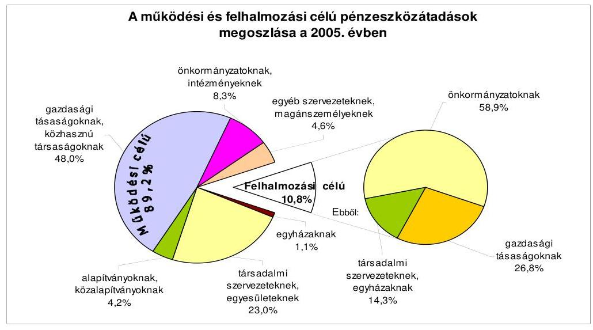
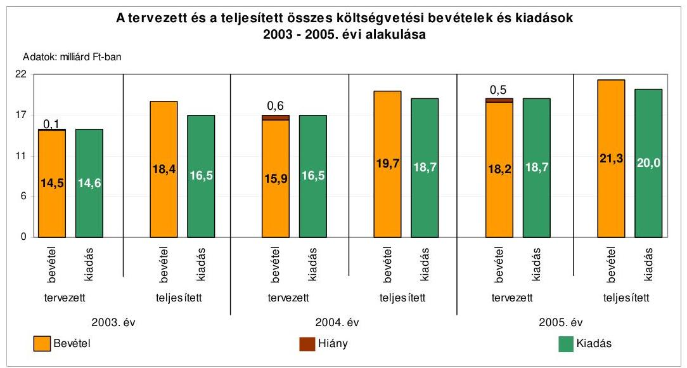
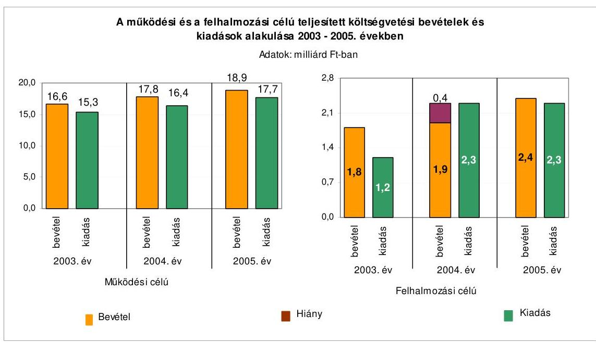
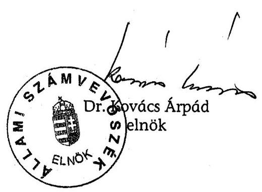
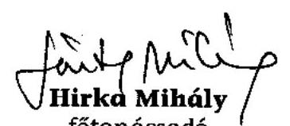
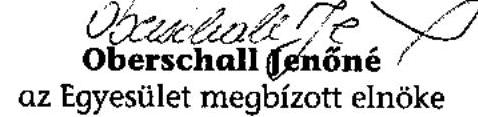
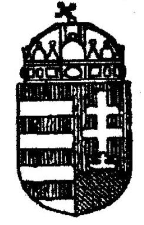

# ÁLLAMI   SZÁMVEVŐSZÉK 

## JELENTÉS

a Békéscsaba Megyei Jogú Város Önkormányzata gazdálkodási rendszerének 2006. évi átfogó ellenőrzéséről

---

3. Önkormányzati és Területi Ellenőrzési Igazgatóság
3.3. Átfogó Ellenőrzések Főcsoport
Iktatószám: V-1003-5/34/16/2006.
Témaszám: 803
Vizsgálat-azonosító szám: V0275
Az ellenőrzést felügyelte:
Dr. Lóránt Zoltán
főigazgató
Az ellenőrzés végrehajtásáért felelős:
Dr. Sepsey Tamás
főigazgató-helyettes
Az ellenőrzést vezette:
Csecserits Imréné
főcsoportfőnök-helyettes
Az ellenőrzést végezték:
Hirka Mihály Laki Dóra Vida László
főtanácsadó számvevő tanácsos számvevő tanácsos

# A témához kapcsolódó - elmúlt három évben - készített számvevőszéki jelentések: 

címe
sorszáma
Jelentés a helyi és a helyi kisebbségi önkormányzatok gazdálkodás319
sának átfogó ellenőrzéséről
Jelentés a szakképzési struktúra szerepéről a munkaerőpiaci igé0321
nyek kielégítésében
Jelentés a helyi önkormányzatoknak bérlakásépítésre és korszerűsí0349
tésre juttatott pénzügyi támogatások ellenőrzéséről
Jelentés a Magyar Köztársaság 2004. évi költségvetése végrehajtás349
sának ellenőrzéséről

- a helyi önkormányzatokat a 2004. évben megillető normatív állami hozzájárulás elszámolása
- a kötött felhasználású támogatások 2004. évi felhasználásának vizsgálata
Jelentés a középiskolai kollégiumok fenntartásának és fejlesztésé0614
nek ellenőrzéséről

---

# TARTALOMJEGYZÉK 

BEVEZETÉS ..... 5
I. ÖSSZEGZŐ MEGÁLLAPÍTÁSOK, KÖVETKEZTETÉSEK, JAVASLATOK ..... 7
II. RÉSZLETES MEGÁLLAPÍTÁSOK ..... 17

1. A költségvetés tervezésének, végrehajtásának, az Önkormányzat vagyongazdálkodásának és a zárszámadás elkészítésének szabályszerűsége ..... 17
1.1. A költségvetési rendelet jóváhagyásának, módosításának, az előirányzatok nyilvántartásának szabályszerűsége ..... 17
1.2. A gazdálkodás szabályozottsága, a bizonylati rend és fegyelem szabályszerűsége ..... 22
1.3. A pénzügyi- számviteli feladatok ellátásának informatikai támogatottsága ..... 30
1.4. Az önkormányzati vagyon nyilvántartása, számbavétele ..... 31
1.5. A vagyonnal való gazdálkodás szabályszerűsége, célszerűsége, nyilvánossága ..... 33
1.6. A céljelleggel nyújtott támogatások szabályszerűsége ..... 41
1.7. A közbeszerzési eljárások szabályszerűsége ..... 45
1.8. A zárszámadási kötelezettség teljesítésének szabályszerűsége ..... 47
1.9. A Polgármesteri hivatal helyi kisebbségi önkormányzatok gazdálkodását segítő tevékenysége ..... 49
2. Az önkormányzati feladatok és a rendelkezésre álló források összhangja ..... 50
2.1. A feladatok meghatározása és szervezeti keretei ..... 50
2.2. A költségvetés egyensúlyának helyzete ..... 53
2.3. A feladatok finanszírozása ..... 59
3. A belső irányítási, ellenőrzési rendszer működésének értékelése ..... 63
3.1. Az ellenőrzési rendszer kialakítása, működése ..... 63
3.2. A könyvvizsgálati kötelezettség teljesítése ..... 66
3.3. A korábbi számvevőszéki ellenőrzések javaslatainak hasznosulása ..... 66

---

# MELLÉKLETEK 

1. számú Az önkormányzat gazdálkodását meghatározó adatok, mutatószámok (1 oldal)
2. számú Az önkormányzati vagyon nagyságának alakulása (1 oldal)
3. számú Az Önkormányzat 2005. évi bevételeinek és kiadásainak alakulása (1 oldal)
4. számú Az egyes önkormányzati feladatok finanszírozása (1 oldal)
5. számú Helyszíni ellenőrzési jegyzőkönyv (4 oldal)
6. számú Vantara Gyula úr, Békéscsaba Megyei Jogú Város Önkormányzata polgármesterének észrevétele (1 oldal)

---

# RÖVIDÍTÉSEK JEGYZÉKE 

## Törvények

Áht.
Hat. tv.
Htv.

Kbt.
Költségvetési tv.
Ksztv.
Nek. tv.
Ötv.
Számv. tv.
Szoc. tv.

## Rendeletek:

Ámr.
Ber.
kisebbségi kormányrendelet

Vhr.
vagyongazdálkodási rendelet ${ }_{1}$
vagyongazdálkodási rendelet ${ }_{2}$

## Szórövidítések:

ÁSZ
BM
BVC Kft.
DARFT
Ellenőrzési csoport

ESZI

FEUVE
az államháztartásról szóló 1992. évi XXXVIII. törvény
a helyi adókról szóló 1990. évi C. törvény
a helyi önkormányzatok és szerveik, a köztársasági megbízottak, valamint egyes centrális alárendeltségű szervek feladat- és hatásköreiről szóló 1991. évi XX. törvény
a közbeszerzésekről szóló 2003. évi CXXIX. törvény
a Magyar Köztársaság 2005. évi költségvetéséről szóló 2004. évi CXXXV. törvény
a közhasznú szervezetekről szóló 1997. évi CLVI. törvény
a nemzeti és etnikai kisebbségek jogairól szóló 1993. évi LXXVII. törvény
a helyi önkormányzatokról szóló 1990. évi LXV. törvény
a számvitelről szóló 2000. évi C. törvény
az 1993. évi III. törvény a szociális igazgatásról és szociális ellátásokról
az államháztartás múködési rendjéről szóló 217/1998. (XII. 30.) Korm. rendelet
a költségvetési szervek belső ellenőrzéséről szóló 193/2003. (IX. 26.) Korm. rendelet
a kisebbségi önkormányzatok költségvetésének, gazdálkodásának, vagyonjuttatásának egyes kérdéseiről szóló 20/1995. (III. 3.) Korm. rendelet
az államháztartás szervezetei beszámolási és könyvvezetési kötelezettségének sajátosságairól szóló 249/2000. (XII. 24.) Korm. rendelet
az Önkormányzat 3/1999. (II. 25.) számú rendelete az önkormányzati vagyon feletti rendelkezési jog gyakorlásának szabályairól
az Önkormányzat 12/2005. (V. 19.) számú rendelete az önkormányzati vagyon feletti rendelkezési jog gyakorlásának szabályairól

Állami Számvevőszék
Belügyminisztérium
Békéscsaba Vállalkozási Centrum Kft.
Dél-Alföldi Regionális Fejlesztési Tanács
Békéscsaba Megyei Jogú Város Önkormányzata Polgármesteri Hivatal Pénzügyi és Gazdasági Irodájának Ellenőrzési Csoportja
Békéscsaba Megyei Jogú Város Önkormányzata Polgármesteri Hivatalának Egyesített Szociális Intézménye
folyamatba épített, előzetes és utólagos vezetői ellenőrzés

---

| GESZ | Békéscsaba Megyei Jogú Város Önkormányzata Polgármesteri Hivatalának Gazdasági Ellátó Szervezete |
| :--: | :--: |
| GKM | Gazdasági és Közlekedési Minisztérium |
| Gondnokság | Békéscsaba Megyei Jogú Város Önkormányzata Polgármesteri Hivatal Gondnoksága |
| GyISM | Gyermek-, Ifjúsági és Sportminisztérium |
| jegyző | Békéscsaba Megyei Jogú Város Önkormányzatának jegyzője |
| IHM | Informatikai és Hírközlési Minisztérium |
| KÉK bizottság | Békéscsaba Megyei Jogú Város Önkormányzata Közgyűlésének Kisebbségi, Érdekegyeztető és Külkapcsolati Bizottsága |
| KIS bizottság | Békéscsaba Megyei Jogú Város Önkormányzata Közgyűlésének Közművelődési, Ifjúsági és Sportbizottsága |
| kistérségi társulás | Békéscsaba és Térsége Többcélú Önkormányzati Kistérségi Társulás |
| Költségvetési csoport | Békéscsaba Megyei Jogú Város Önkormányzata Polgármesteri Hivatal Pénzügyi és Gazdasági Irodájának Költségvetési Csoportja |
| Közgyűlés | Békéscsaba Megyei Jogú Város Önkormányzatának Közgyűlése |
| OB | Békéscsaba Megyei Jogú Város Önkormányzata Közgyűlésének Oktatási Bizottsága |
| Önkormányzat | Békéscsaba Megyei Jogú Város Önkormányzata |
| Pénzügyi bizottság | Békéscsaba Megyei Jogú Város Önkormányzata Közgyűlésének Pénzügyi, Költségvetési Bizottsága |
| Pénzügyi iroda | Békéscsaba Megyei Jogú Város Önkormányzata Polgármesteri Hivatalának Pénzügyi és Gazdasági Irodája |
| polgármester | Békéscsaba Megyei Jogú Város Önkormányzatának polgármestere |
| Polgármesteri hivatal | Békéscsaba Megyei Jogú Város Önkormányzatának Polgármesteri Hivatala |
| Polgármesteri hivatal SzMSz-e | Békéscsaba Megyei Jogú Város Önkormányzata Polgármesteri Hivatalának Szervezeti és Müködési Szabályzata (2004. április 30-tól hatályos) |
| SzMSz | Békéscsaba Megyei Jogú Város Önkormányzatának 14/2003. (IV. 24.) számú rendelete a Közgyűlés Szervezeti és Müködési Szabályzatáról |
| Szociális bizottság | Békéscsaba Megyei Jogú Város Önkormányzata Közgyűlésének Szociális és Lakásügyi Bizottsága |
| TFC | Területfejlesztési céle1̃̃irányzat |
| VAK Zrt. | Vagyonkezelő Zrt. |

---

# JELENTÉS 

## a Békéscsaba Megyei Jogú Város Önkormányzata gazdálkodási rendszerének 2006. évi átfogó ellenőrzéséről

## BEVEZETÉS

Az Ötv. 92. § (1) bekezdése, az Állami Számvevőszékről szóló 1989. évi XXXVIII. törvény 2. § (3) bekezdése, valamint az Áht. 120/A. § (1) bekezdése alapján az önkormányzatok gazdálkodását az Állami Számvevőszék ellenőrzi. Az ellenőrzésre az Országgyúlés illetékes bizottságai részére is átadott, országosan egységes ellenőrzési program alapján került sor.

## Az ellenőrzés célja annak értékelése volt, hogy

- az önkormányzati gazdálkodás törvényességét ${ }^{1}$, szabályszerűségét biztosított-ták-e a tervezés, a költségvetés végrehajtása, a vagyongazdálkodás és a zárszámadás során;
- az Önkormányzat által ellátott feladatok és az azokhoz rendelkezésre álló források összhangja biztosított volt-e, különös tekintettel egyes kiemelt feladatokra;
- a gazdálkodás szabályszerűségét biztosító kontrollok² megfelelően segitettéke a végrehajtást.

Az ellenőrzött időszak: 2005. év és 2006. I. félév, az 1.5., 2.1-2.3. és 3.3 ellenőrzési programpontok esetében a 2003-2004. évek is.

A település állandó lakosainak száma 2006. január 1-jén 64327 fő volt. A 28 képviselőből és a polgármesterből álló Közgyűlés munkáját kilenc állandó bizottság segítette. Az Önkormányzat által fenntartott költségvetési intézmények száma a 2005. évben 45 (ebből 16 részben önállóan gazdálkodó) volt. Az Önkormányzat által fenntartott költségvetési intézményekben foglalkoztatott köz-

[^0]
[^0]:    ${ }^{1}$ A törvényi előírások betartásának elmulasztásakor a részletes megállapítások fejezetben egységesen a törvénysértés megjelölést alkalmazzuk, mivel az ÁSZ nem tehet különbséget a törvényi előírások között.
    ${ }^{2}$ A gazdálkodás szabályszerűségét biztosító kontroll alatt értjük a kiépített és működő belső irányítási és szabályozási rendszert, valamint a belső ellenőrzési funkciók ellátását.

---

alkalmazottak száma 3590 fő volt, az Önkormányzat hivatalban 234 fő köztisztviselő dolgozott.

A polgármester személye a vizsgált időszakban nem, a 2006. évi önkormányzati képviselő és polgármesteri választást követően változott. A vizsgált időszakban a jegyző személye változott, a jelenlegi jegyző 2006. szeptember 1-től látja el a jegyzői feladatokat. Az Önkormányzat a 2005. évben 21 298,1 millió Ft költségvetési bevételt és 20037,5 millió Ft költségvetési kiadást teljesített, a 2005. év végén a könyvviteli mérleg szerint 53877,3 millió Ft értékű vagyonnal rendelkezett. A Közgyűlés az Önkormányzat 2006. évi költségvetésének bevételi és kiadási főösszegét 20039,9 millió Ft-tal hagyta jóvá. Az Önkormányzat gazdálkodását meghatározó 2005. évi adatokat, mutatószámokat a jelentés 1-3. számú mellékletei részletezik.

Az Önkormányzatnál a 2002. évi önkormányzati választásokat követően négy kisebbségi önkormányzat (cigány, lengyel, román és szlovák) múködött.

A jelentés megállapításainak, javaslatainak egyeztetése során a polgármester úr arról adott tájékoztatást, hogy az időközben megtett intézkedésekkel a javaslatok egy részét megvalósították. Ezekben az esetekben a jelentés II. Részletes megállapítások fejezetében az adott témához kapcsolt lábjegyzetben a megtett intézkedést feltüntettük és a kapcsolódó javaslatot elhagytuk.

A jelentést az ÁSZ-ról szóló 1989. évi XXXVIII. tv. 25. § (1) bekezdése alapján észrevétel közlése céljából megküldtük a Békéscsaba Megyei Jogú Város Önkormányzata polgármesterének. A kapott észrevételt a jelentés 6. számú melléklete tartalmazza.

---

# I. ÖSSZEGZŐ MEGÁLLAPÍTÁSOK, KÖVETKEZTETÉSEK, JAVASLATOK 

Az Önkormányzat rendelkezett a Közgyűlés által elfogadott, stratégiai célokat és feladatokat meghatározó gazdasági programmal. A 2005-2006. évi költségvetési koncepciókat a helyben képződő bevételek és az ismert kötelezettségek számbavételével, valamint a gazdasági program figyelembevételével állították össze. A polgármester a 2005. és a 2006. évi költségvetési koncepciókat a Pénzügyi bizottság véleményének csatolásával az Áht. előírásait megsértve az előírt határidőn túl nyújtotta be a Közgyűlés részére. A helyi kisebbségi önkormányzatok elnökeit az Ámr-ben előírtak ellenére nem tájékoztatták a költségvetési koncepciók helyi kisebbségi önkormányzatokra vonatkozó részéről.

A Közgyűlés az Áht. előírásait megsértve nem határozta meg rendeletben az Önkormányzat költségvetésének és zárszámadásának előterjesztésekor a Közgyűlés részére tájékoztatásul bemutatandó mérlegek, kimutatások tartalmi követelményeit. A polgármester az Áht. előírásait megsértve a 2005. évi és a 2006. évi költségvetési rendelettervezetet az előírt határidőn túl nyújtotta be a Közgyűlés részére, amelyhez csatolta a Pénzügyi bizottság és a könyvvizsgáló véleményét. A költségvetési rendelettervezetek az Áht-ban és az Ámr-ben meghatározott tartalommal készültek. A költségvetési rendelettervezetekben a helyi kisebbségi önkormányzatok költségvetésének a beépítése - az Áht. előírásait megsértve - nem a helyi kisebbségi önkormányzatok költségvetési határozata alapján történt. Az Áht. előírásait megsértve a bevételek-kiadások különbségeként a hiányt nem mutatták be a költségvetési rendeletekben, továbbá a 2005. és 2006. évi költségvetési bevételek-kiadások összegében finanszírozási célú pénzügyi műveletek bevételeit-kiadásait is szerepeltették. A költségvetési rendeletekben meghatározták a költségvetés végrehajtásával összefüggő szabályokat. A költségvetések előterjesztésekor a Közgyűlés részére az Áht. előírása ellenére nem mutatták be a közvetett támogatásokat tartalmazó kimutatást szöveges indokolással, valamint a többéves kihatással járó döntések szöveges indokolását. A Közgyűlés által a költségvetési rendeletekben meghatározott „alap" elnevezés nem felelt meg az Áht-ban előírt feltételeknek, ezért a kifejezés félreérthető. A Közgyűlés a 2005. évi költségvetési rendeletben jóváhagyott előirányzatok főösszegét 18,3\%-kal módosította. Az előirányzat-változásokat hitelt érdemlően dokumentálták. A polgármester az Ámr-ben előírt követelményeket figyelmen kívül hagyva a 2005. évben és a 2006. I. félévben negyedéven belül nem kezdeményezte a kapott pótelőirányzatokkal a költségvetési rendelet módosítását.

A Polgármesteri hivatal SzMSz-ében meghatározták annak szervezeti felépítését, működésének rendszerét, a szervezeti egységeinek megnevezését, feladatait. A polgármester és a jegyző az Ámr-ben foglaltak figyelembevételével határozta meg a költségvetési gazdálkodással kapcsolatos hatásköröket. A felhatalmazásokkal kapcsolatos utólagos beszámoltatási kötelezettség előírása és a beszámoltatás elmaradt.

---

A jegyző a Htv. előírásai ellenére nem alakította ki az intézmények egységes számviteli rendjét. A jegyző elkészítette a Polgármesteri hivatal számviteli politikáját és a kapcsolódó szabályzatokat. A leltározási szabályzat a Vhr. előírásai ellenére nem tartalmazta az üzemeltetésre, kezelésre átadott eszközök leltározásának sajátos feladatait. Az Önkormányzat a Vhr. felhatalmazása alapján rendeletben döntött a kétévenkénti leltározásról, azonban ennek kezdő évét nem határozták meg. Az eszközök és források értékelési szabályzata a Vhr. előírásainak megfelelően eszközcsoportonkénti részletezésben írta elő az értékelés szabályait, az értékvesztés elszámolásának és visszaírásának rendjét. Meghatározták az egyszerűsített értékelési eljárás alá vont követelések besorolásának elveit, dokumentálásának szabályait. A pénzkezelési szabályzat indokoltsága ellenére nem tartalmazta az OTP ügyfélterminál használatának részletes szabályait, az azonosító kód alkalmazására kijelölt személyek jogosultságának feltételeit.

A Polgármesteri hivatal számlarendje tartalmazta a főkönyvi számlák tartalmára, értékváltozására vonatkozó előírásokat. Meghatározták az analitikus nyilvántartások tartalmát, formáját, a Vhr-ben foglaltak ellenére nem határozták meg a nyilvántartások egyeztetésének módját és dokumentálási formáját, az egyeztetést nem végezték el. A különböző szabályzatok előírásai a gazdasági szervezet ügyrendjével és egymással összhangban voltak. A pénzügyiszámviteli feladatokat ellátó dolgozók rendelkeztek munkaköri leírásokkal, azok tartalmazták a dolgozók feladat- és hatáskörét. Az Ámr. előírásai alapján a jegyző elkészítette a Polgármesteri hivatal ellenőrzési nyomvonalát, valamint kialakította a szabálytalanságok kezelésének eljárási rendjét és a kockázatkezelés rendjét. Az 50 ezer Ft-ot el nem érő - előzetes írásbeli kötelezettségvállalást nem igénylő - kifizetések rendjét és nyilvántartási formáját, indokoltsága ellenére nem alakították ki.

A Polgármesteri hivatalban a könyvviteli nyilvántartásokban elszámolt műveletekről, eseményekről a Számv. tv-ben előírt számviteli bizonylatokat kiállították. Az Ámr-ben foglaltak ellenére a bizonylatokon a szakmai teljesítés igazolását jegyzői kijelölés hiányában végezték, és nem tüntették fel a kötelezettségvállalás nyilvántartási sorszámát. A kiadási bizonylatok 28\%-ánál az Ámr-ben előírtak ellenére nem történt meg előzetesen az írásbeli kötelezettségvállalás. A gazdálkodási jogkörök gyakorlása során a kötelezettségvállalást az arra jogosultak végezték, azonban az Ámr-ben előírtak ellenére az utalványozás a nem termékértékesítéshez és szolgáltatás-nyújtáshoz kapcsolódó bizonylatok $28 \%$-a esetében nem történt meg, $4 \%$-ánál az utalványozás ellenjegyzése elmaradt. A munkafolyamatba épített ellenőrzési feladatuknak a kötelezettségvállalás ellenjegyzői az Ámr-ben előírt kötelezettségük ellenére a bizonylatok $28 \%$-ánál, valamint a kiadások $1,5 \%$-ánál az előirányzat túllépések esetében nem tettek eleget. Nem teljesítették az Ámr-ben előírt feladatukat az érvényesítők és az utalványozás ellenjegyzői, mert nem kifogásolták, hogy a szakmai teljesítés igazolását kijelölés hiányában végezték, nem észrevételezték, hogy az utalványokon nem tüntették fel a kötelezettségvállalás nyilvántartásba vételi sorszámát. Az Ámr. előírásai ellenére a Polgármesteri hivatalban a 2005. évben és a 2006. év I. félévben nem, hanem 2006. július 1-től vezettek a kötelezettségvállalásokról nyilvántartást. Önkormányzati szinten a kiemelt előirányzatokat betartották. A Polgármesteri hivatalban az Áht. előírását megsértve 16 feladat esetében túllépték a Közgyűlés által jóváhagyott előirányzato-

---

kat, az intézmények közül négy intézmény lépte túl egy-egy kiemelt előirányzatát. Az előirányzat túllépések okait nem vizsgálták, felelősségre vonást nem kezdeményeztek.

A Polgármesteri hivatalban a főkönyvi könyvelés és a beszámoló készítés informatikai támogatottsága biztosított volt, az analitikus nyilvántartások is számítógépen készültek. A pénzügyi-számviteli területen dolgozók számítógéppel való ellátottsága teljes, így a fejlesztések az elavult gépek cseréjét biztosították. A Polgármesteri hivatal informatikai stratégiáját elkészítették, azt a Közgyűlés jóváhagyta. Katasztrófa elhárítási tervet, valamint az üzemeltetéssel, adatvédelemmel kapcsolatos szabályzatokat nem készítette. A számítógépes hálózat beléptetési rendszerében meghatározták, hogy milyen adatokhoz ki férhet hozzá. A gazdálkodási és számviteli feladatok ellátásához használt szoftverek esetében rendelkeztek üzemeltetési dokumentációval és felhasználói leírással. A felhasználók alapfokú informatikai ismeretekkel rendelkeztek, azonban a pénzügyi-számviteli területen dolgozók $57 \%$-ának a munkaköri leírása nem tartalmazta az informatikai rendszer használatát, az általuk elvégzendő feladatok leírását.

A Polgármesteri hivatalban gondoskodtak a törzsvagyon, azon belül a forgalomképtelen és korlátozottan forgalomképes vagyon, valamint a törzsvagyonon kívüli egyéb vagyon elkülönített analitikus nyilvántartásáról, melyek adatai a főkönyvi könyvelés értékadataival 2005. december 31-én egyezőek voltak. Az ingatlanok, az üzemeltetésre, kezelésre átadott eszközök, a részesedések, értékpapírok, rövid és hosszúlejáratú követelések, kötelezettségek, valamint az aktív és passzív pénzügyi elszámolások 2005. évi leltározását elvégezték, annak végrehajtása megfelelt a Vhr-ben foglaltaknak. Az Önkormányzatnak a 20032005. években 18 gazdasági társaságban lévő részesedéseinek összege 1260,6 millió Ft volt, amelyről a Vhr-nek megfelelő analitikus nyilvántartásokat vezettek, s azok év végi értékelési feladatait elvégezték.

Az Önkormányzat a vagyongazdálkodási rendelet ${ }_{1,2}$-ben, az önkormányzati tulajdonban lévő lakások és helyiségek bérletéről és elidegenítéséről szóló rendeletében, valamint a közterületek használatáról szóló rendeletben szabályozta az önkormányzati vagyon hasznosításával, a vagyongazdálkodással kapcsolatos feladatokat, hatásköröket. Nem szabályozta az önkormányzati vagyon forgalomképesség szerinti besorolásának megváltoztatási módját, az értékpapírok vételének, eladásának és a pénzügyi befektetéseknek a rendjét. Az Áht. előírását megsértve a 2003-2004. években nem határozták meg rendeletben azt az értékhatárt, amely felett vagyont értékesíteni, vagyon feletti rendelkezési, hasznosítási, használati jogot átengedni csak versenytárgyalás útján, a legjobb ajánlatot tevő részére lehet. Az Áht. előírását megsértve lehetőséget biztosítottak a versenyeztetés nélküli értékesítésre. A vagyongazdálkodási rende-let ${ }_{2}$-ben meghatározták az ingyenes vagyonátadás módját és eseteit, valamint a követelésről történő lemondás módját. A vagyongazdálkodási rendelet ${ }_{2}$-ben 10 millió Ft feletti értékű ingatlanok esetében előírták a versenyeztetési kötelezettséget. A vagyongazdálkodási döntések során betartották a vagyongazdálkodási rendelet ${ }_{1,2}$-ben rögzített hatásköri szabályokat. Az ingatlanok értékesítése során egy esetben a pályáztatás mellőzésével megsértették az Áht. előírását. A pályáztatás nélküli értékesítés nem segítette a vagyongazdálkodás nyilvánosságát, átláthatóságát. A vagyongazdálkodási rendelet ${ }_{1,2}$-ben indokoltsága

---

ellenére nem határozták meg az értékbecslések időbeli hatályát. A jegyző nem rendelkezett a támogatási és vagyont érintő szerződések közzétételének szabályairól. Az Áht. előírását megsértve 2004-től az Önkormányzat által nyújtott nem normatív, céljellegű, fejlesztési támogatások kedvezményezettjeinek nevét, a támogatás célját, összegét, a támogatási program megvalósítási helyét nem tették közzé. Az önkormányzati tulajdonú lakások és nem lakás céljára szolgáló helyiségek hasznosítására, kezelésére, a VAK Zrt. részére adott megbízást az Önkormányzat. A megbízási szerződésben biztosított nettó elszámolási lehetőség a Számv. tv. előírásával ellentétes, valamint az eljárás nem biztosítja a Lak. tv. és az Ötv. előírása ellenére az Önkormányzat, mint bérbeadó részére a bérleti díj-bevétel saját bevételként történő elszámolásának lehetőségét.

Az Önkormányzat kedvezményes bérleti díj és térítésmentes helységhasználat biztosításával az Ötv. előírása ellenére nem közfeladat ellátásához nyújtott támogatást három párt részére, valamint nem biztosította az alkotmányos jogegyenlőséget a bérlők között. Az Önkormányzat a 2003-2006. I. félév között indokoltsága ellenére pályázat nélkül vásárolt és adott el rövid lejáratú értékpapírokat befektetési szolgáltatónak. Az értékpapírok vásárlására, eladására az Ámr. előírása ellenére arra jogosultsággal nem rendelkezők vállaltak kötelezettséget. Az államkötvények adásvétele során elért hozamok átlagosan 0,6 százalékponttal alatta maradtak az állampapír referenciahozamok szintjének, míg a diszkont kincstárjegyekkel való kereskedés a referenciahozamoknál átlagosan 0,06 százalékponttal magasabb hozamot biztosítottak. A 2001. szeptembere óta az Önkormányzat tulajdonában lévő, gázközmű vagyon alapján kapott hosszú lejáratú értékpapírokat célszerű volt megtartani, mivel hozamuk a vizsgált időszakban folyamatosan a rövid lejáratú értékpapírok hozama fölött alakult. Az értékpapírok vétele-eladása összességében jelentős - 252,6 millió Ft - bevételhez juttatta az Önkormányzatot. Az Önkormányzat a befektetési kockázat csökkentését elősegítő lehetőséggel nem élt, a befektetési szolgáltatónál nem kezdeményezte a befektetések biztonságának növelése és a kockázat csökkentése érdekében az értékpapír forgalomnak a KELER Rt-nél megnyitott, az Önkormányzat nevére szóló, együttes rendelkezésű (zárolású) értékpapír alszámla vezetését.

Az Önkormányzat a 2005. évben céljelleggel - nem szociális ellátásként - 492,5 millió Ft támogatást nyújtott különböző szervezeteknek, magánszemélyeknek összesen 692 alkalommal múködési és felhalmozási célra. A támogatásokra vonatkozó döntéshozatalnál megsértették az Ötv. előírásait, mert az alapítványok támogatásáról 33 esetben nem a Közgyűlés, hanem a bizottságok döntöttek, továbbá céljellegú támogatások nyújtásáról annak ellenére, hogy hatáskörrel nem rendelkeztek, a képviselők is döntöttek. Három intézmény - megsértve az Áht-ban foglaltakat - a Közgyűlés engedélye nélkül nyújtott támogatást társadalmi szervezeteknek. A Polgármesteri hivatalban nem határozták meg a céljellegú támogatások esetében a számadási kötelezettség teljesítésének, a rendeltetésszerú felhasználás ellenőrzésének szabályait, felelőseit. Nem alakították ki a céljellegú támogatások nyilvántartásának olyan egységes rendszerét, amelyből megállapítható, hogy mikor, kinek a döntése alapján, milyen célra, milyen forrásból, mennyi támogatást nyújtottak, a támogatottak eleget tettek-e számadási kötelezettségüknek, továbbá ki és mikor ellenőrizte a számadást, és az összeg jogszerú felhasználását. Megsértve az Áht-ban foglaltakat a képviselői alap terhére nyújtott támogatások esetben nem írtak elő számadá-

---

si kötelezettséget. Nem tettek eleget a Ksztv-ben foglaltaknak, amikor 12 esetben közhasznú szervezetek részére írásbeli szerződésben nem írták elő a támogatással való elszámolás feltételeit és módját. A támogatott szervezetek 11\%-a nem számolt el a kapott támogatással, ennek ellenére az Áht. előírását megsértve 15\%-uk részére 2006-ban is nyújtottak támogatást. Céltól eltérő felhasználást állapítottak meg a támogatottak 1,3\%-ánál, a számadás tartalmi és formai felülvizsgálatát a támogatottak 20\%-ánál végezték el. A támogatás felhasználásáról számadást nem készítők esetében a támogatás visszafizettetésének, a további támogatás felfüggesztésének, valamint a támogatások 80\%ánál az ellenőrzések elmulasztásával megsértették az Áht-ban előírtakat.

Az Önkormányzat a 2005-2006. évekre vonatkozó éves közbeszerzési terveket határidőben elkészítette. A közbeszerzési szabályzat a Kbt. előírásai ellenére nem tartalmazta a közbeszerzési eljárás belső ellenőrzésének felelősségi rendjét. A 2005. évben 30 közbeszerzésre került sor a Polgármesteri hivatalban. A beszerzések becsült értékének megállapításakor a Kbt. előírásai szerint jártak el, az egybeszámításra vonatkozó szabályt betartották, a közbeszerzési értékhatárokat elérő beszerzéseknél a közbeszerzési eljárásokat lefolytatták. A közbeszerzési eljárás szabályszerűségét a járda felújítási munkálatok megrendelése esetében vizsgáltuk részletesen, azt a Kbt. előírásainak megfelelően folytatták le. A 2005. évi közbeszerzésekről szóló éves összegzést határidőben megküldték a Közbeszerzési Tanácsnak. A belső ellenőr 2006. augusztusában ellenőrzött két, a Polgármesteri hivatal által lefolytatott közbeszerzési eljárást, az intézmények közbeszerzési eljárásait a felügyeleti ellenőrzés keretében ellenőrizték. A Közbeszerzési Döntőbizottság a Polgármesteri hivatal közbeszerzéseivel kapcsolatban 2005-2006. I. félévben elmarasztaló határozatot nem hozott, bírságot nem szabott ki, egyéb szankciókra nem került sor.

A polgármester az Áht-ban meghatározott határidőn belül terjesztette a Közgyűlés elé a 2005. évi zárszámadási rendelettervezetet, amelyet a költségvetési rendelettel összehasonlítható módon készítettek el. A zárszámadási rendelettervezet az Áht-ban és az Ámr-ben meghatározott tartalommal készült. A zárszámadás előterjesztésekor az Áht-ban előírtak ellenére a többéves kihatással járó döntésekre, és a közvetett támogatások kimutatásaihoz nem készítettek szöveges indokolást, illetve a vagyonkimutatás a Vhr-ben foglaltak ellenére nem tartalmazta a már leírt, de használatban lévő és az Önkormányzat tulajdonában lévő érték nélkül nyilvántartott eszközök állományát, valamint a mérlegben értékkel nem szereplő kötelezettségeket. Az Önkormányzati zárszámadási rendelettervezetébe az Áht. előírásai ellenére három kisebbségi önkormányzat esetében a zárszámadás beépítése nem a kisebbségi önkormányzatok képviselő-testületei zárszámadást elfogadó határozata alapján történt. A Polgármesteri hivatalnál a pénzmaradvány megállapítását, elszámolását és felhasználását a Vhr-ben és az Ámr-ben foglaltaknak megfelelően állapították meg, a zárszámadásban jóváhagyott pénzmaradvány összege megfelelt a jogszabályi előírásoknak. Az intézmények vezetőit írásban értesítették az éves beszámolójuk és működésük elbírálásáról, jóváhagyásáról, valamint a megállapított, módosított pénzmaradvány összegéről.

A településen négy kisebbségi önkormányzat múködött, melynek mindegyikével kötött az Önkormányzat együttműködési megállapodást. Az együttműködési megállapodások az Áht-nak megfelelően szabályozták a Polgármes-

---

teri hivatal felkérését a kisebbségi önkormányzat gazdálkodási tevékenységének végrehajtására, a jegyző felkérését a költségvetési, előirányzat-módosítási és zárszámadási határozattervezetek elkészítésére, rendelkeztek a költségvetések elkészítésének és az előirányzat módosításoknak a rendjéről, a zárszámadási határozatok benyújtásának határidejéről. Az SzMSz-ben meghatározták, hogy az Önkormányzat milyen módon segíti a kisebbségi önkormányzatok munkáját. A Polgármesteri hivatal a kisebbségi önkormányzatok múködésének feltételeit az együttmúködési megállapodásoknak megfelelően biztosította, ellátta az ezzel kapcsolatos feladatokat.

Az Önkormányzat az Ötv. előírása ellenére nem határozta meg, hogy a lakosság igényeitől és az Önkormányzat anyagi lehetőségeitől függően mely feladatokat milyen mértékben és módon lát el. Az Önkormányzatnál a feladatok ellátását alapvetően költségvetési intézmények útján biztosították. A szociális, az egészségügyi alapellátási és a közszolgáltatási területeken közhasznú társaság, egyéni vállalkozások, valamint önkormányzati többségi tulajdonú vállalkozások vettek részt a kötelező és önként vállalt feladatok elvégzésében. A feladatellátás szervezeti kereteiben történő változtatások a feladatok megoldásának saját intézményi területét érintették elsősorban, 14 költségvetési intézményt vontak össze a közoktatási ágazatban a vizsgált időszakban, a neveltek, oktatottak létszámának csökkenése miatt. Az Országos Szlovák Kisebbségi Önkormányzat kezdeményezésére 2005-ben egy oktatási-nevelési intézményt adott át részére az Önkormányzat. A 2003-2005. évben végrehajtott szervezeti változások végrehajtásának eredményeit a Közgyűlés nem értékelte.

Az Önkormányzat 2003-2005 közötti költségvetéseiben a költségvetési bevételek eredeti előirányzatai nem nyújtottak fedezetet a költségvetési kiadásokra, hiány minden évben a tervezett felhalmozási célú kiadásoknál volt. A tényleges költségvetési bevételek a tervezettel ellentétben minden évben meghaladták a költségvetési kiadásokat, így tényleges hiány nem keletkezett. Múködési célú költségvetési kiadásoknál hiány sem tervszinten, sem pedig tényszinten nem volt. A felhalmozási célú teljesített költségvetési bevétel a 2003. és a 2005. évben magasabb volt a felhalmozási célú költségvetési kiadásoknál, azonban a 2004. évben a felhalmozási célú költségvetési bevétel nem nyújtott fedezetet a felhalmozási célú kiadásokra. A hiányt a múködési célú bevételekből történt átcsoportosítással pótolták. A jegyző az Ámr-ben meghatározott likviditási tervet elkészítette, amelyet évközben folyamatosan aktualizált. A pénzügyi egyensúly biztosítása és fenntartása érdekében az Önkormányzat a 20032006. évek mindegyikében likvid hiteleket (folyószámlahitel, munkabérhitel) vett fel. Az adósságot keletkeztető kötelezettségvállalások során az Ötv-ben foglaltaknak megfelelően azok felső határát vizsgálták, betartották. Az adósságot keletkeztető kötelezettségvállalások nem veszélyeztették az Önkormányzat fizetőképességét, működőképességét. A Közgyűlés az 1991. évtől kezdődően az építményadó, a vállalkozók kommunális adója, az idegenforgalmi adó, valamint a helyi iparűzési adó bevezetéséről döntött. A megállapított adók mértéke 2003-2006 között nem változott. Az Önkormányzat az adóalanyok részére az építményadó, a vállalkozók kommunális adója és a helyi iparűzési adó tekintetében nyújtott a Hat. tv-ben rögzítetteken túlmenően mentességeket, kedvezményeket. Az Önkormányzat a pályázati lehetőségek minél jobb kihasználása érdekében megteremtette a pályázatok figyeléséhez, benyújtásához szükséges

---

személyi, szakmai és szervezeti feltételeket. A pályázatokon 2003-2005 között mintegy 3600 millió Ft pályázati forráshoz jutott az Önkormányzat.

A naturális mutatókkal mérhető feladatok - a bölcsődei ellátás, az óvodai nevelés, az általános- és középiskolai ellátás, nappali szociális és bentlakásos szociális intézményi ellátás - egy főre jutó kiadásai a 2003. évről a 2005. évre 6-29\%-kal emelkedtek. A legalacsonyabb emelkedés a bölcsődéknél, a legmagasabb a bentlakásos szociális intézménynél volt. A kapacitás kihasználtság bölcsődéknél és az oktatási intézményeknél nőtt, az óvodáknál és a szociális intézményeknél kismértékben csökkent. A kiadások finanszírozásában a 2005. évben az Önkormányzat részesedése 11-50\% között szóródott, legalacsonyabb a középiskolai ellátásban, legmagasabb az óvodai nevelésben volt. Az állami hozzájárulás és támogatás részaránya 50-78\% közötti értékeket mutatott, az általános iskolai oktatáshoz 64, a középiskolai oktatáshoz 78\%-ot biztosított, $50 \%$-ban járult hozzá a bölcsődei, az óvodai nevelés és a bentlakásos szociális ellátás kiadásainak forrásaihoz, míg a nappali szociális ellátást 63\%ban finanszírozta. Az intézményi saját bevétel aránya csak a nappali és a bentlakásos szociális intézményi ellátásban jelentett a 2005. évben 10\% feletti arányt (13, illetve $23 \%$-ot).

Az önként vállalt feladatok finanszírozására a költségvetési kiadások 3,3-3,1-2,9\%-át fordították a 2003-2005. években. Az önként vállalt feladatok főleg a sport, a kulturális és az oktatási intézményeknél jelentkeztek, illetve céljellegú támogatásokat tartalmaztak. Az önként vállalt feladatok az Önkormányzat múködőképességét nem veszélyeztették.

Az Önkormányzat a 2004-2005 között két felmérést készített a tulajdonában lévő középületek akadálymentesítésének biztosításáról és annak költségigényéről. A 2005. december 31-i állapotot tükröző felmérés szerint a középületek akadálymentessé tétele további 2615 millió Ft kiadást jelent. Az akadálymentesítéssel kapcsolatos feladatok kiadási előirányzatai megjelentek 20042005. évi költségvetésekben. A feladatok megvalósításához pályázatok útján a 2005. évben 20,6 millió Ft-ot, a 2006. I. félévben 2,5 millió Ft-ot kapott az Önkormányzat. Az Önkormányzat a fogyatékos személyek jogairól és esélyegyenlőségük biztosításáról szóló törvényben foglaltakat figyelmen kívül hagyva, a 2005. január 1-jei határidőre a feladatok elvégzését a 126 középületből 106-nál nem biztosította.

Az Önkormányzat kialakította a belső ellenőrzési feladatok végrehajtásához szükséges szervezeti kereteket. A feladatot a Polgármesteri hivatal két szervezeti egysége látta el, az intézmények ellenőrzését a Pénzügyi osztályhoz tartozó Ellenőrzési csoportban négy fő, a Polgármesteri hivatal belső ellenőrzését a jegyzőhöz közvetlenül tartozó egy fő belső ellenőr. A jegyző az Áht-ban foglaltak ellenére nem biztosította az Ellenőrzési csoport funkcionális függetlenségét. A Közgyűlés döntése alapján a 2006. évtől az Ellenőrzési csoport a kistérségi társulás településein is ellátja az ellenőrzési feladatokat. A két szervezeti egység számára két belső ellenőri kézikönyv készült. A Ber-ben foglaltak ellenére az Ellenőrzési csoportra vonatkozó stratégiai terv nem készült. A Polgármesteri hivatal és az intézmények 2005. évi ellenőrzési tevét elkészítették, azokat a jegyző jóváhagyta. A Polgármesteri hivatal és az intézmények 2006. évi ellenőrzési tervét a Közgyűlés fogadta el. Az elkészült éves ellenőrzési tervek nem feleltek

---

meg a Ber. előírásainak, mert a belső ellenőr munkatervében nem biztosítottak időt a soron kívüli ellenőrzési feladatokra, az Ellenőrzési csoport munkaterve pedig nem tartalmazta az ellenőrzendő időszakot, a szükséges ellenőri kapacitást, és az ellenőrzés módszereit. Az ellenőrzésekhez ellenőrzési programokat készítettek. Az intézmények ellenőrzését a munkaterv ütemezésének megfelelően hajtották végre, a Polgármesteri hivatal belső ellenőre - soron kívüli ellenőrzések miatt - a tervezett ellenőrzéseknek a felét végezte el. A Ber-ben foglaltaktól eltérően a Polgármesteri hivatalban készült ellenőri jelentések nem tartalmaztak az eredményeket és hiányosságokat összefoglaló értékelést. Az Ellenőrzési csoport 2006. évi jelentéseinek tartalma megfelelt a Ber-ben foglaltaknak. A vizsgált intézmények intézkedési terveket készítettek, melyek végrehajtásáról jelentésben számoltak be. A jegyző elkészítette a 2005. évi ellenőrzések tapasztalatairól szóló beszámolót, de az Áht. előírásai ellenére nem számolt be a FEUVE múködtetéséről. A Közgyűlés a Htv-ben foglaltak alapján áttekintette a költségvetési szervek ellenőrzésének tapasztalatait, elvárásokat nem fogalmazott meg.

Az Önkormányzat az Ötv-ben előírt könyvvizsgálati kötelezettségének eleget tett. A könyvvizsgáló kiválasztásánál és megbízásánál a szakmai követelményekre és az összeférhetetlenségre vonatkozó előírásokat betartották. A könyvvizsgáló a Polgármesteri hivatal és az intézmények összevont adatait tartalmazó éves beszámolót korlátozás nélküli hitelesítő záradékkal látta el, auditálási eltérést nem állapított meg.

Az ÁSZ a 2002-2005. években hat alkalommal folytatott vizsgálatot az Önkormányzatnál. Az ellenőrzési jelentések 16 szabályszerűségi és öt célszerűségi javaslatot tartalmaztak, amelyeket egy kivétellel megvalósítottak. Az ÁSZ a 2002. évben végezte el a gazdálkodás átfogó ellenőrzését. A jelentés 10 szabályszerűségi és egy célszerűségi javaslatot tartalmazott. A javaslatok alapján gondoskodtak a gazdasági program elkészítéséről, a költségvetési és zárszámadási rendeletek kiegészítéséről, a vagyonkimutatás Közgyűlés elé terjesztéséről, a számviteli nyilvántartásokban érték nélkül nyilvántartott ingatlanok értékének megállapításáról, a helyi kisebbségi önkormányzatokkal kötött együttműködési megállapodások aktualizálásáról, az érvényesítést végzők megfelelő képesítésének biztosításáról, a Polgármesteri hivatal SzMSz-ének elkészítéséről, a munkafolyamatba épített ellenőrzési feladatok szabályzatokban történő megjelenítéséről, a belső ellenőrzés által végzett vizsgálatokról szóló beszámoló Közgyűlés elé terjesztéséről, valamint az 50 ezer Ft egyedi beszerzési érték feletti szoftverek aktiválásáról. Javaslatunk ellenére nem történt meg a bútorok leltári számmal történő ellátása.

A bérlakásépítésre és korszerűsítésre juttatott pénzügyi támogatások ellenőrzése a 2003. évben történt, a jelentés egy szabályszerűségi javaslatot fogalmazott meg. A javaslatnak megfelelően helyesbítették a lakásalap számla egyenlegét, a tévesen terhére kifizetett bérlői rezsiköltség tartozások, és azok megtérülésének összegeivel.

A szakképzési struktúra szerepe a munkaerő piaci igények kielégítésében tárgyú 2003. évi és a középiskolai kollégiumok fenntartása és fejlesztése tárgyú 2005. évi jelentés nem tartalmazott javaslatot.

---

A kötött felhasználású támogatások 2004. évi felhasználásának ellenőrzéséről szóló 2005. évi jelentés három szabályszerűségi és egy célszerűségi, míg a 2004. évi normatív állami hozzájárulások igényléséről és elszámolásáról szóló 2005. évi jelentés két szabályszerűségi és három célszerűségi javaslatot fogalmazott meg. A javaslatok alapján gondoskodtak a közműfejlesztési hozzájárulások, valamint a pedagógus szakvizsga és továbbképzés támogatásának megfelelő elszámolásáról, az intézmények figyelmének felhívásával a támogatásokkal kapcsolatos költségek teljes körű kigyűjtéséről és nyilvántartásáról. Biztosították továbbá, hogy az Egyesített Szociális Intézménynél a működési engedélyekben feltüntetett férőhelyek számát telephelyenként se haladja meg az ellátottak száma, intézkedtek az intézményi étkeztetést nyilvántartó szoftver kijavításáról, az oktatási és a pénzügyi iroda közötti koordinációt megvalósították, a pontos intézményi adatszolgáltatás érdekében szerveztek továbbképzést, valamint a normatív állami hozzájárulások igénylésére és elszámolására vonatkozó ellenőrzéseket elvégezték.

A helyszíni ellenőrzés megállapításainak hasznosítása mellett javasoljuk:

# a polgármesternek 

a jogszabályi előírások maradéktalan betartása érdekében

1. kezdeményezze - a jegyző által elkészített előterjesztés alapján - az Önkormányzat vagyongazdálkodási rendelet,-nek a módosítását és kiegészítését annak érdekében, hogy nyilvános versenyeztetési kötelezettség alóli kivételeket csak az Áht. 108. § (1) bekezdésében szereplő esetekben biztosítson az Önkormányzat, valamint gondoskodjon a vagyon értékesítése az Áht. 108. § (1) bekezdésében előírtaknak megfelelően csak nyilvános versenytárgyalás útján a legjobb ajánlatot tevő részére történjen;
2. kezdeményezze a VAK Zrt-vel kötött megbízási szerződés módosítását annak érdekében, hogy az abban foglalt pénzügyi elszámolási kötelezettség megfeleljen az Ötv. 82. § (1) bekezdésében, valamint a Számv. tv. 15. § (9) bekezdésében előírtaknak;
3. intézkedjen a céljellegű támogatások célszerinti felhasználásról előírt számadási kötelezettség teljesítésének elmulasztása, valamint a támogatás rendeltetési céltól eltérő felhasználása esetében az Áht. 13/A. § (2) bekezdésében előírtak alapján a támogatás visszafizettetésére, és a további támogatás felfüggesztésére;
4. kezdeményezze, hogy a Közgyűlés az Ötv. 8. § (2) bekezdésében foglaltak alapján határozza meg, hogy a lakosság igényeitől és anyagi lehetőségeitől függően mely feladatokat, milyen mértékben és módon lát el az Önkormányzat;
5. gondoskodjon a középületek akadálymentessé tételéről, tekintettel arra, hogy a fogyatékos személyek jogairól és esélyegyenlőségük biztosításáról szóló 1998. évi XXVI. törvény 29. § (6) bekezdésében foglalt 2005. január 1-i határidő lejárt;
a munka színvonalának javítása érdekében
6. terjessze a számvevőszéki jelentést a Közgyűlés elé, a feltárt hiányosságok megszüntetésére készíttessen intézkedési tervet a határidők és felelősök megjelölésével;

---

7. kezdeményezze az értékpapír befektetési szolgáltató szervezetekkel kötött értékpapír vásárlási szerződéseknél a pénzügyi befektetések biztonságának növelése és a kockázat csökkentése érdekében az értékpapír forgalomnak a KELER Rt-nél megnyitott, az Önkormányzat nevére szóló, együttes rendelkezésű (zárolású) értékpapír alszámlán történő vezetését;
8. kezdeményezze, hogy a Közgyűlés tárgyalja meg a feladatellátás területén végrehajtott szervezeti változások eredményeit;

# a jegyzőnek: 

a jogszabályi előírások maradéktalan betartása érdekében

1. gondoskodjon a számlarendben előírtak alapján az analitikus nyilvántartások kapcsolódó főkönyvi nyilvántartással történő egyeztetések elvégzéséről;
2. készítse el a zárszámadási rendelettervezet előkészítésekor az Áht. 118. §-a alapján az az Áht. 116. § 10. pontja szerinti közvetett támogatásokat tartalmazó kimutatás szöveges indokolását;
3. a belső ellenőrzéssel kapcsolatban
a) kezdeményezze a Közgyűlésnél, hogy az Áht. 121/A. § (3) bekezdésében foglaltaknak megfelelően az intézmények belső ellenőrzését végző ellenőrök a jegyzőnek közvetlenül alárendelt szervezetben végezzék tevékenységüket;
b) készíttesse el és hagyja jóvá a Polgármesteri hivatal belső ellenőrzését és az intézmények ellenőrzését végző csoport összevont stratégiai tervét a Ber. 19. §ában foglaltak alapján;
c) gondoskodjon, hogy a Ber. 27. § (6) bekezdésnek megfelelően a Polgármesteri hivatal ellenőrzéséről készített jelentések tartalmazzák az eredményeket és hiányosságokat összefoglaló étékelést.

---

# II. RÉSZLETES MEGÁLLAPÍTÁSOK 

## 1. A KÖLTSÉGVEtÉs TERVEZÉSÉNEK, VÉGREHAJTÁSÁNAK, AZ ÖNKORMÁNYZAT VAGYONGAZDÁLKODÁSÁNAK ÉS A ZÁRSZÁMADÁS ELKÉSZÍTÉSÉNEK SZABÁLYSZERŰSÉGE

### 1.1. A költségvetési rendelet jóváhagyásának, módosításának, az előirányzatok nyilvántartásának szabályszerűsége

A Közgyűlés a 150/2004. (III. 25.) számú határozatával „Európa tervet" hagyott jóvá, amely tartalmát tekintve megfelelt az Önkormányzat gazdasági programjának, ezzel eleget tett az Ötv. 91. § (1) bekezdésében előírt gazdasági program meghatározási kötelezettségének.

Az „Európa terv" a város adottságainak figyelembevételével bemutatta és értékelte a humánpolitika, az infrastruktúra és termelő beruházás, a lakásprogram, valamint a közép és hosszú távú foglalkoztatási stratégia vonatkozásában a kialakult helyzetet, az elérendő stratégiai célokat és feladatokat.

A 2005. és a 2006. évi költségvetési koncepciót az Ámr. 28. § (1) bekezdésében foglaltaknak megfelelően a helyben képződő bevételek és az ismert kötelezettségek, valamint az „Európa terv" figyelembevételével állították össze. A kiadások meghatározásánál számításba vették a jogszabályok és a központi előírások változásából eredő, valamint az Önkormányzat által vállalt kötelezettségeket.

A polgármester a 2005. és 2006. évi költségvetési koncepciót az Áht. 70. §-ában foglaltakat megsértve, az előírt határidőn ${ }^{3}$ túl - 2004. december 10-én és 2005. december 9-én - nyújtotta be a Közgyűlés részére. A helyi kisebbségi önkormányzatok elnökeit az Ámr. 28. § (6) bekezdésében előírtak ellenére nem tájékoztatták a költségvetési koncepciók helyi kisebbségi önkormányzatokra vonatkozó részeiről4. A költségvetési koncepciókhoz - az Ámr. 28. § (3) bekezdésében foglaltaknak megfelelően - a polgármester csatolta a Pénzügyi bizottság véleményét.

[^0]
[^0]:    ${ }^{3}$ Az Áht. 70. § előírása szerint a költségvetési koncepciót november 30-ig, a Képviselőtestület tagjai általános választásának évében december 15-ig kell benyújtani a Közgyűlésnek.
    ${ }^{4}$ A közbenső egyeztetés során a polgármester által adott észrevétel szerint: „Intézkedtem, hogy a költségvetési rendelettervezet előkészítésekor az Ámr. 28. §. (6) bekezdésében foglaltaknak megfelelően a helyi kisebbségi önkormányzatok elnökei tájékoztatást kapjanak a költségvetési koncepció helyi kisebbségi önkormányzatokra vonatkozó részéről. Mindez már 2006. december 14-ei a költségvetési koncepciót tárgyaló közgyűlés előterjesztésekor meg fog történni."

---

A Közgyűlés a 2005. évi költségvetési koncepcióról a 690/2004. (XII. 16.), a 2006. évi koncepcióról a 672/2005. (XII. 15.) számú határozatával döntött. Ezen határozatokban az Ámr. 28. § (4) bekezdésének előírása alapján a Közgyűlés rendelkezett a költségvetés készítés további munkálatairól, meghatározta a kiadások tervezésének fő szempontjait.

A Közgyűlés - az Áht. 118. §-ának előírását megsértve - nem határozta meg rendeletben az Önkormányzat költségvetésének és zárszámadásának előterjesztésekor a Közgyűlés részére tájékoztatásul bemutatandó - az Áht. 116. § 6., 9., 10. pontja szerinti - mérlegek, kimutatások tartalmi követelményeit ${ }^{5}$.

A jegyző a 2005. és 2006. évi költségvetési rendelettervezetet egyeztette a költségvetési szervek vezetőivel, és arról az Ámr. 29. § (4) bekezdésében foglaltak szerint írásos dokumentum készült.

A polgármester az Áht. 71. § (1) bekezdésében foglaltakat megsértve, az előírt határidőn ${ }^{6}$ túl - 2005. február 18-án és 2006. február 17-én - nyújtotta be a költségvetési rendelettervezeteket a Közgyűlésnek ${ }^{7}$.

Az Ámr. 29. § (9) bekezdésében előírtaknak megfelelően a polgármester csatolta a költségvetési rendelettervezetekhez a Pénzügyi bizottság, és a könyvvizsgáló véleményét.

A Polgármesteri hivatal kiadási és bevételi előirányzatainak a meghatározása az előző évi tényadatokból kiindulva, az Ámr. 26. § (2) és (6) bekezdéseinek megfelelően a várható változások hatásainak számszerú kimunkálásával történt.

A polgármester a költségvetési rendelettervezetekkel együtt, illetve azt megelőzően - az Áht. 71. § (2) bekezdésében előírtaknak megfelelően - a Közgyűlés elé terjesztette azokat a rendelettervezeteket, amelyek a tervezett előirányzatokat

[^0]
[^0]:    ${ }^{5}$ A közbenső egyeztetés során a polgármester által adott észrevétel szerint: „Intézkedtem annak érdekében, hogy az önkormányzat költségvetésének, illetve zárszámadásának előterjesztésekor tájékoztatásul bemutatandó mérlegek, kimutatások tartalmi követelményei az Áht. 116. §. 6., 9. és 10. pontjai szerinti előírások alapján rendeletben szabályozásra és bemutatásra kerüljenek."
    ${ }^{6}$ A jegyző által elkészített költségvetési rendelettervezetet az Áht. 71. § (1) bekezdése szerint a polgármester február 15-ig nyújtja be a Közgyűlésnek.
    ${ }^{7}$ A közbenső egyeztetés során a polgármester által adott észrevétel szerint intézkedett „annak érdekében, hogy az Áht. 70. §-ában meghatározott határidőig a költségvetési koncepció, valamint az Áht. 71. §. (1) bekezdésében előírt határidőig a költségvetési rendelet-tervezet beterjesztésre kerüljön a közgyűlés elé. Mindez már érinti a 2007. évi költségvetési koncepció tárgyalását, melyre a munkaterv szerint a 2006. december 14-ei közgyűlésen fog sor kerülni."

---

megalapozták ${ }^{8}$. A költségvetési rendelettervezetek az Áht. 71. § (2)-(3) bekezdéseinek előírásával összhangban bemutatták a többéves elkötelezettséggel járó kiadási tételek későbbi évekre vonatkozó kiadásait és ezen belül a költségvetési évet követő két év várható előirányzatait.

A Közgyűlés a 2005. és a 2006. évi költségvetési rendeletekben az Áht. 67. § (3) bekezdésében előírtaknak megfelelően meghatározta a címrendet.

A költségvetési rendelettervezetek az Áht. 69. § (1) és az Ámr. 29. § (1) bekezdéseiben meghatározott tartalommal készültek, ennek megfelelően tartalmazták az Önkormányzat bevételeit forrásonként, a múködési előirányzatokat önkormányzatra összesen, továbbá önállóan és részben önállóan gazdálkodó költségvetési szervenként, a felújítási előirányzatokat célonként, a felhalmozási kiadásokat feladatonként, a létszámkeretet, a Polgármesteri hivatal költségvetését feladatonként, a tartalékot, valamint a múködési és felhalmozási célú bevételi és kiadási előirányzatokat mérlegszerűen egymástól elkülönítetten, de együttesen egyensúlyban. Elkészítették továbbá az adott év várható bevételi és kiadási előirányzatainak teljesüléséről az előirányzat felhasználási ütemtervet, illetve bemutatták az EU-s támogatással megvalósuló programprojektek bevételeit és kiadásait is.

Az Ámr. 29. § (1) bekezdésének i) pontjában előírtak alapján a költségvetési rendelettervezetek elkülönítetten tartalmazták a helyi kisebbségi önkormányzatok költségvetését. A költségvetési rendelettervezetekbe a helyi kisebbségi önkormányzatok költségvetésének a beépítése - megsértve az Áht. 65. § (3) bekezdésében előírtakat - nem a helyi kisebbségi önkormányzatok költségvetési határozata ${ }^{9}$ alapján történt ${ }^{10}$.

A Közgyűlés a 2005. évi költségvetést a 4/2005. (II. 24.) számú rendelettel 18 986,6 millió Ft, míg a 2006. évi költségvetést a 8/2006. (II. 23.) számú rendelettel 20 039,9 millió Ft bevételi és kiadási főösszeggel fogadta el. A költségveté-

[^0]
[^0]:    ${ }^{8}$ Az előterjesztések alapján az Önkormányzat elfogadta a közterület használat rendjéről szóló 39/2005. (XII. 15.) számú rendeletet, a térítési dij- és tandíjfizetési kötelezettség helyi szabályozásáról szóló 30/2005. (X. 19.) számú rendeletet, a fizető parkolóhelyek működésének és igénybevételének rendjéről szóló 38/2004. (XII. 16.) számú, valamint a 36/2005. (XII. 15) számú rendeletet, a pénzbeli és természetben nyújtott szociális ellátásokról szóló 24/2004. (VII. 8.) számú és a 26/2005. (X. 19.) számú rendeletet, valamint a gyermekek védelméről és a gyámügyi igazgatásról szóló 33/2004. (XII. 16.) számú és a 19/2005. (VII. 14.) számú rendeletet.
    ${ }^{9}$ A Cigány Kisebbségi Önkormányzat 2/2005. (III. 10.) számú és a 16/2006. (III. 29.) számú, a Lengyel Kisebbségi Önkormányzat 10/2005. (III. 9.) számú és a 13/2006. (IV. 11.) számú, a Román Kisebbségi Önkormányzat 9/2005. (III. 30.) számú és a 16/2006. (III. 29.) számú, valamint a Szlovák Kisebbségi Önkormányzat 13/2005. (III. 24.) számú, és a 22/2006. (III. 22.) számú határozatai.
    ${ }^{10}$ A közbenső egyeztetés során a polgármester által adott észrevétel szerint: „Intézkedtem annak érdekében, hogy az Áht. 65. §. (3) bekezdésében előírtak alapján az önkormányzat költségvetési rendelettervezetébe a helyi kisebbségi önkormányzatok költségvetése azok határozata alapján épüljön be, első esetben 2007. februárjában."

---

si bevételek egyik évben sem fedezték a tervezett költségvetési kiadásokat. A hiányzó összeget a 2005. évben 738,7 millió Ft, a 2006. évben 772,2 millió Ft fejlesztési hitel felvételével tervezte biztosítani a Közgyúlés. A be-vételek- kiadások különbségeként - az Áht. 8. § (1) bekezdésében foglaltakat megsértve - a hiány összegét nem mutatták be a költségvetési rendeletekben ${ }^{11}$.

A 2005. és 2006. évi költségvetésekben költségvetési bevételek és kiadások előirányzataként finanszírozási célú pénzügyi műveletek hitelek felvétele és törlesztése - bevételeit, illetve kiadásait is szerepeltették, ezzel megsértették az Áht. 8/A. § (7) bekezdésének azon előírását, amely szerint a költségvetésben nem lehet az Áht. 8/A. § (3)-(6) bekezdéseiben meghatározott finanszírozási célú műveleteket a költségvetési hiányt, illetve többletet módosító költségvetési bevételként, illetve költségvetési kiadásként elszámolni ${ }^{12}$.

A 2005. és a 2006. évi költségvetési rendeletben meghatározták a költségvetés végrehajtásával összefüggő szabályokat:

- a Közgyűlés megtartotta az előirányzatok átcsoportosítási jogát, a tartalékkal való rendelkezés jogát, valamint a költségvetési többlet felhasználásának a jogát;
- az Áht. 93. § (4) bekezdésében foglaltak alapján a 2005. évi költségvetési rendelet 3. § (8) bekezdésében, illetve a 2006. évi költségvetési rendelet 3. § (7) bekezdésében rögzítették azt, hogy az önálló és a részben önálló gazdálkodási jogkörű intézmények többletbevételeinek felhasználásáról a Pénzügyi bizottság dönt. Kivételt képez ez alól az, hogy ezen intézmények vezetői a Közgyűlés felhatalmazása alapján a többletbevételük terhére nettó 0,5 millió Ft egyedi értékhatárig felhalmozási kiadást teljesíthettek;
- az Áht. 75. §-ában előírtak alapján a 2005-2006. évi költségvetési rendeletek 4. § (6)-(7) bekezdéseiben rögzítették, hogy a fejlesztési hitelek felvételéről a Közgyűlés a költségvetési rendelet megalkotását követően egy későbbi időpontban dönt. A Közgyűlés felhatalmazta a polgármestert - a későbbiekben realizálódó bevételek átmeneti megelőlegezése miatt, a vállalt kötelezettségek határidőben történő kiegyenlítése érdekében - esetenként a 2005. évben 400 millió Ft, a 2006. évben 800 millió Ft összegű, éven belül visszafizetendő likviditási hitel felvételére.

[^0]
[^0]:    ${ }^{11}$ A közbenső egyeztetés során a polgármester által adott észrevétel szerint: „Az Áht. 8. §. (1) bekezdésében foglaltaknak megfelelően a tervezett hiány bemutatásra fog kerülni a 2007. évi költségvetési rendelettervezetben. Meg kívánom jegyezni, hogy ez így történt a költségvetés első olvasatú változatában eddig is."
    ${ }^{12}$ A közbenső egyeztetés során a polgármester által adott észrevétel szerint: „Gondoskodni fogok arról, hogy az Áht. 8/A. §. (7) bekezdése alapján a 2007. évi költségvetési rendelettervezetben a költségvetési bevétel és kiadás ne tartalmazza a finanszírozási célú pénzügyi műveletek bevételeit, illetve kiadásait."

---

A 2005-2006. évi költségvetésekben öt-öt jogcímen „alap" elnevezéssel különített el a Közgyűlés pénzösszegeket. Az „alap" elnevezés az elkülönített költségvetési keretösszegek tekintetében nem volt összhangban az Áht-ban foglaltakkal, mivel az elkülönített állami pénzalapokra, mint az államháztartási rendszer egyik alrendszerének elemére az Áht. az „alap" kifejezést használja, melyre az Áht. 54. §-a meghatározza azok létrehozásának, gazdálkodásának feltételeit is. Ezen feltételnek az Önkormányzat által létrehozott alapok nem feleltek meg, a kifejezés félreérthető volt ${ }^{13}$.

A 2005. és a 2006. évi költségvetés előterjesztésekor a Közgyűlés részére bemutatták az Áht. 118. §-ában előírt mérlegek és kimutatások közül az Áht. 116. § 6. pontja szerinti összevont mérlegeket az Önkormányzatra és elkülönítetten a helyi kisebbségi önkormányzatokra, illetve az Áht. 116. § 9. pontja szerinti kimutatást a többéves kihatással járó döntések számszerűsítéséről évenkénti bontásban. Az Áht. 118. §-ában foglaltakat megsértve a költségvetési rendelet előterjesztésekor nem mutatták be tájékoztatásul a közvetett támogatásokat tartalmazó kimutatást szöveges indokolással, valamint a többéves kihatással járó döntésekre vonatkozó szöveges indokolást ${ }^{14}$.

Az Önkormányzat a 2005. évi költségvetési rendeletét hat alkalommal ${ }^{15}$ módosította, melyek összegszerűségükben 3466,5 millió Ft-ot jelentettek, és az eredeti előirányzathoz képest 18,3\%-os növekedésnek feleltek meg.

A 2006. évi költségvetési rendeletet - 2006. június 30-ig - egy alkalommal ${ }^{16}$ módosították. A 2006. évi költségvetési rendeletben jóváhagyott előirányzatok főösszege (20 039,9 millió Ft) a módosítás következtében 5,1\%-kal nőtt. Az előirányzatok évközi módosítását - minden évben - a központi költségvetésből kapott pótelőirányzatok, a saját bevételekben bekövetkezett változások, az előző évi pénzmaradvány igénybevétele, valamint a kiadási jogcímek közötti átcsoportosítás indokolta.

[^0]
[^0]:    ${ }^{13}$ A közbenső egyeztetés során a polgármester által adott észrevétel szerint: „Egyes előirányzatok több éve alkalmazott „alap" elnevezésének megváltoztatásáról intézkedtem, s mind az 5 esetben már a 2006. évi költségvetés háromnegyed éves beszámolójának közgyűlési előterjesztésekor más néven fognak szerepelni az előirányzatok."
    ${ }^{14}$ A közbenső egyeztetés során a polgármester által adott észrevétel szerint: „Gondoskodni fogok arról, hogy már a 2007. évi költségvetési rendelettervezet tartalmazza a közvetett támogatásokat tartalmazó kimutatást, szöveges indoklással, valamint a többéves kihatással járó döntések szöveges indoklását is. Meg kívánom jegyezni, hogy a többéves kihatással járó döntéseket tartalmazó kimutatás eddig is része volt valamennyi költségvetési rendeletnek."
    ${ }^{15}$ Az Önkormányzat 2005. évi költségvetésének módosításáról szóló 11/2005. (IV. 21.), 18/2005. (VII. 14.), 23/2005. (IX. 22.), 31/2005. (X. 19.), 34/2005. (XII. 15.), 7/2006. (II. 23.) számú rendeletei.
    ${ }^{16}$ Az Önkormányzat 2006. évi költségvetésének módosításáról szóló 9/2006. (III. 23.) számú rendelete.

---

Az előirányzat módosításra irányuló előterjesztések részletes információt nyújtottak a Közgyűlés számára a pótelőirányzatok forrásairól, a módosítások okairól. Az előirányzat változtatások hitelt érdemlően dokumentáltak, az azokról vezetett nyilvántartások teljes körűek, áttekinthetőek voltak. A költségvetési rendeletek módosítására előterjesztett rendelettervezetek a költségvetéssel összehasonlítható módon tartalmazták a módosítási javaslatokat.

Az Önkormányzat nem tett eleget a - Kormány által biztosított - pótelőirányzatok miatt indokolt, az Ámr. 53. § (2) bekezdésében előírt negyedévenkénti költségvetési rendeletmódosítási kötelezettségének, mivel a 2005. február 28. és március 29. között érkezett pótelőirányzatokkal ( 86,4 millió Ft) negyedéven túl, 2005. július 14-én módosította a 2005. évi költségvetési rendeletét. A 2006. február 27. és március 27. között érkezett pótelőirányzatokkal (164,6 millió Ft) szintén negyedéven túl, 2006. július 6-án módosították a 2006. évi költségvetési rendeletet ${ }^{17}$. Az önállóan gazdálkodó költségvetési szervek saját hatáskörben előirányzat módosítást nem hajtottak végre.

A 2005. évre vonatkozó utolsó előirányzat módosítás az Ámr. 53. § (2) és (6) bekezdéseiben előírt, a költségvetési beszámoló felügyeleti szervhez történő megküldésére külön jogszabályban meghatározott február 28-i határidőt betartva történt.

A 2005. évi zárszámadási rendeletben szereplő módosított előirányzatok fő- és részösszegei megegyeztek a legutolsó költségvetési rendeletmódosítás vonatkozó adataival. A számviteli nyilvántartásokban a módosítások átvezetése megtörtént. A kisebbségi önkormányzatok költségvetést módosító határozatai alapján a módosított előirányzatokat az Önkormányzat költségvetési rendeletében átvezették.

# 1.2. A gazdálkodás szabályozottsága, a bizonylati rend és fegyelem szabályszerúsége 

A Polgármesteri hivatal SzMSz-ét - a Közgyűlés felhatalmazása alapján - a polgármester és a jegyző adta ki, melyben rögzítették a Polgármesteri hivatal szervezeti felépítését, múködésének rendszerét, a szervezeti egységek megnevezését, feladatait. A Polgármesteri hivatal SzMSz-ének tartalma nem felelt meg az Ámr. 10. § (4) bekezdése a), g), h) pontjaiban foglaltaknak, mivel nem tartalmazta az alapító okirat keltét és számát, a költségvetési szerv költségvetésének végrehajtására szolgáló számlaszámot, a költségvetési szervhez rendelt részben önállóan gazdálkodó költségvetési szervek felsorolását, valamint ezen szerveknél a pénzügyi-gazdasági tevékenységet ellátó személyek feladatkörének, munkakörének meghatározását. Nem felelt meg továbbá az Ámr. 17. §

[^0]
[^0]:    ${ }^{17}$ A közbenső egyeztetés során a polgármester által adott észrevétel szerint: „Kezdeményeztem, hogy az Ámr. 53. §. (2) bekezdésében foglalt előírások betartása érdekében a kapott pótelőirányzatok miatti előirányzat-módosítás negyedéven belül megtörténjen. Tájékoztatásul megjegyzem, hogy a közgyűlés legutóbb a 37/2006. (X. 26.) önkormányzati rendeletével fogadta el a 2006. évi költségvetés módosításáról szóló rendeletet, tehát a hibás gyakorlat már kiküszöbölésre került."

---

(4) bekezdésében előírtaknak, mert nem határozta meg a gazdasági szervezet felépítését ${ }^{18}$.

A Polgármesteri hivatal gazdasági szervezetének ügyrendjét az Ámr. 17. § (5) bekezdésének előírásait betartva elkészítették, a polgármester és a jegyző 2005. január 1-től léptette hatályba. Ez tartalmazta a gazdasági szervezet feladatait, a pénzügyi-gazdasági feladatok ellátásáért felelős személyek feladatait, a vezetők és más dolgozók feladat-, hatás- és jogkörét.

A polgármester és a jegyző belső szabályzatokban ${ }^{19}$ rögzítette a költségvetési gazdálkodással kapcsolatos hatásköröket az alábbiak szerint:

- a polgármester a kötelezettségvállalási jog gyakorlására az Ámr. 134. § (2) bekezdésében foglaltak alapján felhatalmazást adott az alpolgármestereknek, szakfeladatukat érintően az irodavezetőknek egymillió Ft összeghatárig, a Polgármesteri hivatal igazgatási kiadásait érintően pedig a jegyzőnek és az aljegyzőnek;
- a polgármester az Ámr. 136. § (2) bekezdése alapján az utalványozási jog gyakorlására az alpolgármestereket, a saját feladatkörükbe tartozó előirányzatok tekintetében az irodavezetőket, tartós távollétük esetére helyetteseiket, a Polgármesteri hivatal igazgatási kiadásaira vonatkozóan a jegyzőt és az aljegyzőt hatalmazta fel;
- a jegyző az Ámr. 134. § (2) bekezdése, valamint az Ámr. 137. § (2) bekezdése alapján a kötelezettségvállalás és az utalványok ellenjegyzésére a Pénzügyi iroda vezetőjének és helyettesének, valamint a Pénzügyi iroda három (2006. január 1-től négy) munkatársának adott felhatalmazást.

A felhatalmazások a gazdálkodási és ellenőrzési jogkörök gyakorlásával kapcsolatban utólagos beszámolási kötelezettséget nem írtak elő, beszámoltatásra nem került sor ${ }^{20}$.

A jegyző a szakmai teljesítés igazolásának módját meghatározta, azonban az Ámr. 135. § (3) bekezdésében előírtak ellenére nem jelölte ki belső szabályzatban az igazolást végző személyeket ${ }^{21}$.

[^0]
[^0]:    ${ }^{18}$ A polgármester és a jegyző a hiányolt tartalommal 2006. augusztus 23-án kiegészítette a Polgármesteri hivatal SzMSz-ét.
    ${ }^{19}$ A Polgármesteri hivatal SzMSz-ének mellékletében, a gazdasági szervezet ügyrendjének mellékletében, és 2006. január 1-től a Kötelezettségvállalási szabályzatban is.
    ${ }^{20}$ A közbenső egyeztetés során a polgármester által adott észrevétel szerint: „Az ellenjegyzésre felhatalmazottak beszámolási kötelezettségéről intézkedtem, melyre minden hónapban az osztályvezetői értekezleten kerül sor." valamint „Intézkedtem annak érdekében, hogy a kötelezettségvállalásra, utalványozásra felhatalmazottak minden hónapban az osztályvezetői értekezleten számoljanak be feladataik teljesítéséről."
    ${ }^{21}$ A jegyző a kötelezettségvállalási szabályzat 2. számú mellékletében 2006. július 25én kijelölte a szakmai teljesítést igazoló személyeket.

---

Az érvényesítésre jogosultakat a jegyző írásban bízta meg. A megbízásoknál az Ámr. 135. § (2) bekezdésében megfogalmazott iskolai végzettségre és szakmai képzettségre vonatkozó előírásokat betartotta.

A felhatalmazásoknál és az érvényesítők megbízásánál az Ámr. 135. § (5) bekezdésében, valamint a 138. § (1)-(3) bekezdésében foglalt összeférhetetlenségi követelményeket betartották.

A jegyző nem alakította ki az Önkormányzat intézményei egységes számviteli rendjét, megsértve ezzel a Htv. 140. § (1) bekezdés c) pontjában foglaltakat ${ }^{22}$. A jegyző a Polgármesteri hivatalra és a hozzá kapcsolódó részben önállóan gazdálkodó költségvetési szervekre vonatkozóan elkészítette, hatályba helyezte a számviteli politikát és a kapcsolódó szabályzatokat, számlarendet, valamint az eszközök hasznosítási és selejtezési szabályzatát. A Polgármesteri hivatal számviteli politikáját a jegyző évente a jogszabályváltozásokkal összhangban aktualizálta.

A számviteli politikában a Vhr. 8. § (5) bekezdése alapján rögzítették, hogy mit tekintenek a számviteli elszámolás és értékelés szempontjából jelentős összegnek, valamint lényegesnek. A jelentős összegű hiba nagyságát a mérleg főösszeg 2\%-ában, maximum 100 millió Ft-ban határozták meg. Rögzítették, hogy mit tekintenek figyelembe veendő szempontnak a megbízható és valós összkép kialakítását befolyásoló lényeges információk tekintetében a kis értékű tárgyi eszközök, a vagyoni értékű jogok és a szellemi termékek minősítésénél, valamint a terven felüli értékcsökkenés elszámolásánál. Az értékpapírok forgóeszközzé, vagy befektetett eszközzé történő besorolásának feltételeit meghatározták, és rögzítették a számviteli elszámolás szempontjából nem jelentősnek minősített árfolyamváltozás mértékét is. A Polgármesteri hivatal vállalkozási tevékenységet nem folytatott, ezért arra vonatkozó sajátosságokat a számviteli politikában nem kellett meghatározni.

A Vhr. 8. § (8) bekezdésében előírtaknak megfelelően határozták meg a mérlegkészítés időpontját, illetve azt az időpontot - január 31. -, ameddig a költségvetési évre vonatkozóan a könyvelésben helyesbítések végezhetők.

A Vhr. 8. § (4) bekezdése a) pontjában foglaltaknak megfelelően a jegyző 2004. október 1-től hatályba léptette a leltározási és leltárkészítési szabályzatot, melyet ezt követően minden évben aktualizált. A szabályzat tartalmazta az előkészítés, a leltározás, a leltározás ellenőrzésének szabályait, a leltár és a könyvviteli adatok egyeztetésének módját, valamint a leltárkülönbözetek megállapításának és rendezésének eljárási rendjét. A Vhr. 37. § (5) bekezdésében foglaltak ellenére nem szabályozta az üzemeltetésre, kezelésre átadott esz-

[^0]
[^0]:    ${ }^{22}$ A közbenső egyeztetés során a polgármester által adott észrevétel szerint: „Intézkedtem arra vonatkozóan, hogy a 2007. január 1-jétől alkalmazandóan a Htv. 140. §.(1) c. pontjában foglaltak alapján kerüljön kialakításra az intézmények egységes számviteli rendje."

---

közök leltározásának sajátos feladatait ${ }^{23}$. Az Önkormányzat a 2004. évi költségvetés végrehajtásáról szóló 11/2005. (IV. 21.) számú rendeletében a Vhr. 37. § (7) bekezdésének felhatalmazása alapján döntött a kétévenkénti leltározásról, azonban ennek kezdő évét nem határozták meg ${ }^{24}$.

Az eszközök és források értékelési szabályzatát a Vhr. 8. § (4) bekezdés b) pontja alapján elkészítették. Meghatározták az eszközök bekerülési értékébe beszámítandó kifizetések tartalmát, megnevezését, eszközcsoportonkénti részletezésben. Előírták az eszközök és források értékelésének szabályait. A terven felüli értékcsökkenés elszámolásának rendjét, az értékvesztés és az értékvesztés visszaírásának rendjét szabályozták. A Vhr. 8. § (18) bekezdésének előírásai alapján a szabályzatban rögzítették az egyszerűsített értékelési eljárás alá vont követelések negyedévenkénti besorolásának elveit, dokumentálásának szabályait (a minősítési kategóriák, a százalékos mutatók meghatározásának szempontjait, a százalékos mutatók felülvizsgálatának rendjét, felelő́sét). Az értékelési szabályzat szerint a Polgármesteri hivatal nem élt a piaci értékelés lehetőségével.

A házipénztár és a bankszámlák kezelésére vonatkozó előírásokat pénzkezelési szabályzatban rögzítették, amely az Ámr. 103. § (2), (6) és (7) bekezdései alapján tartalmazta a Polgármesteri hivatal által megnyitható bankszámlák körét, rendeltetését, a bankszámlák számát és az azok felett rendelkezni jogosultak megnevezését. Meghatározták a bankszámlák és a pénztár kapcsolatrendszerét. Szabályozták a készpénzfelvétel, a pénzszállítás módját, a házipénztári záró pénzkészlet összegét ( 500 ezer Ft). Rögzítették a pénzkezeléssel kapcsolatos feladatokat, a helyettesítés rendjét, az átadás-átvétel szabályait, a pénztárellenőrzés feladatait és gyakoriságát. Szabályozták az elszámolásra kiadott előlegek felvételének, nyilvántartásának és elszámolásának módját. Tartalmazta a szabályzat az értékpapírok nyilvántartásának és a szigorú számadású nyomtatványok kezelésének rendjét. A szabályzat indokoltsága ellenére nem tartalmazta az OTP ügyfélterminál használatának részletes szabályait, az azonosító kód alkalmazására kijelölt személyek jogosultságának feltételeit ${ }^{25}$.

[^0]
[^0]:    ${ }^{23}$ A közbenső egyeztetés során a polgármester által adott észrevétel szerint: „Elrendeltem az eszközök és források leltározási és leltárkészítési szabályzatának kiegészítését az üzemeltetésre, kezelésre átadott eszközök leltározásának sajátosságaival a Vhr. 37. §. (5) bekezdése alapján 2006. november 17 -ei határidővel."
    ${ }^{24}$ A közbenső egyeztetés során a polgármester által adott észrevétel szerint: „A leltározási tevékenység végrehajtásának két évenkénti gyakoriságát a közgyűlés a 11/2005. (IV. 21.) önkormányzati rendelet 11. §-ában szabályozta. Valóban nem történt meg a leltározás kezdő évének meghatározása, amelyet a közgyűlési munkaterv szerint a 2006. december 14-ei ülésen napirendként szereplő, a 2006. évi költségvetés módosításáról szóló rendelettervezetben fogunk megtenni."
    ${ }^{25}$ A közbenső egyeztetés során a polgármester által adott észrevétel szerint: „2006. november 30 -áig rögzítésre kerül a pénzkezelési szabályzatban az OTP ügyfélterminál használata, valamint az azonosító kód alkalmazására kijelölt személyek jogosultságának feltételei."

---

A 2004. október 1-től hatályba léptetett hasznosítási és selejtezési szabályzat a Vhr. 37. § (5) bekezdésében előírt kötelezettség alapján meghatározta a hasznosítás és selejtezés részletes helyi előírásait. Szabályozta a feleslegessé válás kritériumait, a feltárás módját, idejét és felelőseit, a hasznosítás során követendő eljárási rendet, az ármegállapítás szabályait. Meghatározták a selejtezési bizottság kinevezésének rendjét (a jegyző hatásköre), a selejtezési eljárás menetét, bizonylatolási rendjét, a kiselejtezett eszközökkel, illetve a vonatkozó nyilvántartásokkal kapcsolatos feladatokat.

A kisebbségi kormányrendelet alapján a kisebbségi önkormányzatok vagyoni és számviteli nyilvántartásait a Polgármesteri hivatal nyilvántartásán belül elkülönítetten vezették. A Polgármesteri hivatal pénzkezelési szabályzata tartalmazta a kisebbségi önkormányzatok bankszámláinak megnevezését, és a számlarendje rögzítette a helyi kisebbségi önkormányzatok igazgatási tevékenysége szakfeladatot.

A Vhr. 49. §-a alapján a számlarendet elkészítették. Tartalmazta a Vhr. 48. § (2) bekezdésének megfelelően minden alkalmazott főkönyvi számla, alszámla számát, megnevezését, valamint a számlaosztályok tartalmára vonatkozó előírásokat, a főkönyvi számla értéke növekedésének és csökkenésének jogcímeit, a főkönyvi számlát érintő gazdasági eseményeket, valamint a főkönyvi számlák más főkönyvi számlákkal való kapcsolatát. Az egyes főkönyvi számlákhoz kapcsolódó analitikus nyilvántartások tartalmát, vezetésének módját meghatározták. Az analitikus nyilvántartások formáját a bizonylati szabályzat tartalmazta. Az analitikus nyilvántartásoknak a főkönyvi könyveléssel való egyeztetésének gyakoriságát meghatározták, de a Vhr. 49. § (2) bekezdésében foglalt, 2005. január 1-től hatályos előírás ellenére nem határozták meg az egyeztetések módját és annak dokumentálási formáját ${ }^{26}$. Meghatározták a havi, negyedéves, féléves, éves zárlati előírásokat, módszereket, valamint az összesítő kimutatások (feladások) elkészítésének határidejét.

A számviteli politikában és a kapcsolódó szabályzatokban a feladatokat a helyi sajátosságoknak megfelelően, célszerűen határozták meg. A különböző szabályzatok előírásai a gazdasági szervezet ügyrendjével és egymással összhangban voltak.

A pénzügyi-számviteli feladatokat ellátó dolgozók rendelkeztek munkaköri leírással, melyek tartalmazták a dolgozók feladat- és hatáskörét. Rögzítették a dolgozó által ellátandó operatív gazdálkodási feladatokat, a helyettesítés rendjét. A munkaköri leírásokban előírták a főkönyvi és analitikus nyilvántartással kapcsolatos egyeztetési, ellenőrzési feladatokat is, meghatározták azok elvégzésének gyakoriságát. Rögzítették a pénztár ellenőrzési feladatok elvégzésének kötelezettségét és módját.

[^0]
[^0]:    ${ }^{26}$ A közbenső egyeztetés során a polgármester által adott észrevétel szerint: „Intézkedtem a Polgármesteri Hivatal számlarendjének kiegészítéséről, az analitikus nyilvántartások egyeztetésének módjára és az egyeztetések dokumentálására vonatkozó előírásokkal 2006. november 17 -ei határidővel."

---

A szabályzatokban és a munkaköri leírásokban meghatározott folyamatba épített ellenőrzésre, egyeztetésre vonatkozó előírások egymással összhangban voltak.

A jegyző gondoskodott a FEUVE megszervezéséről és az Ámr. 145/B. § (1)-(2) bekezdése alapján elkészítette, a Polgármesteri hivatal SzMSz-éhez mellékletként csatolta a Polgármesteri hivatal ellenőrzési nyomvonalát. Ebben kijelölte a munkafolyamatok ellenőrzési pontjait, meghatározva azok jogszabályi alapját, kijelölte az elkészítésért felelősöket, határidőket, az ellenőrzést végzőket, feladataikat, továbbá rögzítette a pénzügyi feladatok folyamatábráit. A Polgármesteri hivatal SzMSz-ének mellékletét képezte az Ámr. 145/A. § (5) bekezdése alapján elkészített szabálytalanságok kezelésének eljárási rendje. A jegyző az Ámr. 145/C. § (1)-(3) bekezdésében előírtaknak megfelelően kialakította a kockázatkezelés rendjét.

Indokoltsága ellenére nem szabályozták belső szabályzatban az Ámr. 134. § (3) bekezdése alapján az 50 ezer Ft-ot el nem érő - előzetes írásbeli kötelezettségvállalást nem igénylő - kifizetések rendjét és nyilvántartási formáját ${ }^{27}$. A kiadási bizonylatok 28\%-ánál az Ámr. 134. § (8) bekezdés előírása ellenére nem történt meg előzetesen az írásbeli kötelezettségvállalás ${ }^{28}$.

A gazdasági eseményeket magukba foglaló, a könyvviteli elszámolást közvetlenül alátámasztó bizonylatok a Számv. tv. 167. § (1) bekezdésében előírtakat megsértve, az Ámr. 134-138. §-aiban és a Polgármesteri hivatal számlarendjében foglaltak ellenére az alaki és tartalmi követelményeknek a következők miatt nem feleltek meg:

- a bevételek és kiadások esetében a szakmai teljesítés igazolását az Ámr. 135. § (3) bekezdésében előírt jegyzői kijelölés hiányában végezték el;
- az Ámr. 136. § (2) bekezdésében foglaltak ellenére a nem termékértékesítésre és szolgáltatás nyújtásra vonatkozó bizonylatok 28\%-ánál elmaradt az utal-

[^0]
[^0]:    ${ }^{27}$ A közbenső egyeztetés során a polgármester által adott észrevétel szerint: „Intézkedtem arról, hogy belső szabályzatban kerüljön meghatározásra az 50.000 Ft -ot el nem érő kifizetések rendje és nyilvántartási formája."
    ${ }^{28}$ A közbenső egyeztetés során a polgármester által adott észrevétel szerint: „Körlevélben intézkedtem arra vonatkozóan, hogy mindazon esetekben ahol eddig nem történt, az Ámr. 134. §. (8) bekezdésében előírtaknak megfelelően történjen a kötelezettségvállalások írásba foglalása."

---

ványozás ${ }^{29}$, és az Ámr. 137. § (2) bekezdésében előírtak ellenére a bizonylatok $4 \%$-ánál nem végezték el az utalványok ellenjegyzését;

- az utalványokon nem tüntették fel az Ámr. 136. § (4) bekezdés h) pontjában előírtak ellenére a kötelezettségvállalás nyilvántartásba vételi sorszámát ${ }^{30}$.

A kötelezettségvállalást, a kötelezettségvállalás ellenjegyzését az arra jogosultak végezték. A bizonylatok érvényesítését a megbízással rendelkezők látták el. A banki forgalomban a bevételek beszedésére, a kiadások teljesítésére az arra jogosultak utalványozása alapján került sor.

A munkafolyamatba épített ellenőrzési feladatok közül a kötelezettségvállalás ellenjegyző̉je a bizonylatok 28\%-ánál, valamint előirányzat túllépések esetén - a kiadások 1,5\%-ánál - nem tett eleget az Ámr. 134. § (9) bekezdésében foglalt előírásoknak. Az érvényesítők nem hajtották végre az Ámr. 135. § (1) bekezdésében meghatározott feladatukat, mert nem kifogásolták, hogy a bizonylatokon a szakmai teljesítés igazolás kijelölés nélkül történt, valamint az utalványokon elmaradt a kötelezettségvállalás nyilvántartási számának a feltüntetése. Az utalványozás ellenjegyzői az Ámr. 137. § (3) bekezdésében foglaltak ellenére nem ellenőrizték, hogy a szakmai teljesítés igazolását végzőket ki-jelölték-e, nem észrevételezték, hogy hiányzik a kötelezettségvállalás nyilvántartási sorszámának a feltüntetése.

A pénztárellenőr eleget tett munkafolyamatba épített ellenőrzési kötelezettségének, naponta ellenőrizte a bevételi és kiadási bizonylatokat, a pénztárjelentést, a záró pénzkészletet.

A gazdálkodási jogkörök gyakorlása során az Ámr. 138. § (1)-(3) és a 135. § (5) bekezdésében rögzített összeférhetetlenségi követelményeket betartották. Kötelezettségvállalás és utalványozás ellenjegyzése utasításra nem történt.

A költségvetési pénzforgalmat érintő gazdasági események bizonylatainak adatait - az idősoros könyvelés adatai szerint - a Vhr. 51. § (1) bekezdés a) pontjában előírtaknak megfelelő időben rögzítették a számviteli nyilvántartásban. A házipénztárban a pénzmozgással egy időben, a bankszámlák esetében a bankkivonat megérkezésekor. Az egyéb gazdasági események, il-

[^0]
[^0]:    ${ }^{29}$ A közbenső egyeztetés során a polgármester által adott észrevétel szerint: „Az utalványozási feladatok kifogásolt gyakorlatához kapcsolódva meg kívánom jegyezni, hogy a bizonylatok utalványozása minden esetben megtörtént, a korábbi gyakorlat szerint a pénztári forgalmat a költségvetési csoportvezető utalványozta, aki erre a szabályozás alapján valóban csak az irodavezető és annak helyettese távollétében lett volna jogosult. A munkamegosztás és a nagyon jelentős banki és pénztári forgalom okozta a leírt gyakorlatot. Az új könyvviteli program bevezetésével egyidejúleg változtak a banki és a pénztári utalványformák, azaz 2006. július 1-jétől az utalványozás már teljes mértékben megfelel a szabályzatnak, azaz ezen pontra külön intézkedést nem kellett tennem."
    ${ }^{30}$ A közbenső egyeztetés során a polgármester által adott észrevétel szerint: „Gondoskodtam a nyilvántartási sorszámok feltüntetéséről."

---

letve az analitikus nyilvántartások alapján készített összesítő kimutatások (feladások) könyvelése a tárgynegyedévet követő hónap 15. napjáig megtörtént.

A múködési és felhalmozási kiadások és bevételek könyvelése során mind a közgazdasági (költségnemek és jogcímek), mind a funkcionális (tevékenységenkénti) osztályozás szerint a Polgármesteri hivatal számlarendjének megfelelő főkönyvi számlákat és szakfeladatokat jelöltek ki.

A főkönyvi és analitikus nyilvántartások dokumentált módon történő negyedévenkénti egyeztetését - a Vhr. 49. § (2) bekezdésében előírt szabályozás hiányában - nem végezték el.

A 2005. évi költségvetési beszámoló összeállítását megelőzően a könyvviteli mérleget és a pénzforgalmi jelentést a Vhr. 17. számú melléklete szerinti - a főkönyvi könyvelésből előállított - főkönyvi kivonattal alátámasztották.

A Polgármesteri hivatalban az Ámr. 134. § (13) bekezdésében előírtak ellenére a kötelezettségvállalásokról 2006. július 1-ig nem vezettek folyamatosan, naprakészen, kiemelt előirányzatonkénti részletezettségben olyan nyilvántartást, amelyből megállapítható lett volna az évenkénti kötelezettségvállalás öszszege. A nyilvántartás hiányában - megsértve az Áht. 12/A. § (1) bekezdésében foglaltakat - nem biztosították annak feltételeit, hogy a költségvetés végrehajtása során kötelezettségvállalás és utalványozás csak a jóváhagyott kiadási előirányzatok mértékéig teljesüljön ${ }^{31}$.

Önkormányzati szinten a Közgyűlés által meghatározott kiemelt előirányzatokat betartották. A Polgármesteri hivatalban 16 feladat esetében túllépték a Közgyűlés által meghatározott előirányzatokat ${ }^{32}$. Az intézmények közül négy intézmény (az intézmények 14\%-a) egy-egy kiemelt előirányzatát lépte túl ${ }^{33}$, de a kiadási főösszeget betartották.

A Polgármesteri hivatalban a 16 feladat esetében összesen 8,7\%-kal lépték túl az előirányzatot. A túllépés százalékos mértéke 0,7 és $124,4 \%$ között, összegszerűen

[^0]
[^0]:    ${ }^{31}$ Az integrált számviteli, pénzügyi rendszer bevezetésével 2006. július 1-től folyamatosan, naprakészen, kiemelt előirányzatonként vezették a kötelezettségvállalásokról az analitikus nyilvántartást. Ebből megállapítható volt az évenkénti kötelezettségvállalások összege, így biztosította, hogy kötelezettségvállalás és utalványozás csak a jóváhagyott kiadási előirányzatok mértékéig teljesüljön.
    ${ }^{32}$ A közbenső egyeztetés során a polgármester által adott észrevétel szerint: „Intézkedtem arra vonatkozóan, hogy a Polgármesteri Hivatal az Áht. 93. §. (1) bekezdése szerint a jóváhagyott előirányzaton belül gazdálkodjon, valamint felhívtam a figyelmet arra, hogy tárgyévi fizetési kötelezettség a jóváhagyott előirányzat mértékéig vállalható."
    ${ }^{33}$ A közbenső egyeztetés során a polgármester által adott észrevétel szerint: „Intézkedtem annak érdekében, hogy az intézmények az Áht. 93. §. (1) bekezdése szerinti jóváhagyott előirányzaton belül gazdálkodjanak, valamint tartsák be az Áht. 12/A. §. (1) bekezdésében foglaltakat, amely szerint tárgyévi fizetési kötelezettség a jóváhagyott előirányzatok mértékéig vállalható. A 2005. évi túllépések okait legkésőbb 2006. december 31-éig kivizsgáltatom."

---

pedig 27 ezer Ft és 29,9 millió Ft között alakult. A legnagyobb összegű túllépés a köztisztasági előirányzatnál volt, melynek aránya 31,6\%.

Az intézmények közül három intézménynél a felújítási, egy intézménynél pedig a dologi kiadások előirányzatát lépték túl, összesen 5,9\%-os mértékben. A túllépések összege 72 ezer Ft és 422 ezer Ft közötti, mértéke pedig 1,2 és 50,6\% között szóródott.

Az előirányzat túllépésekkel a kötelezettségvállalási és utalványozási joggal rendelkezők megsértették az Áht. 93. § (1) bekezdésében foglaltakat, valamint az Áht. 12/A. § (1) bekezdésének előírását, amely szerint tárgyévi fizetési kötelezettség a jóváhagyott kiadási előirányzatok mértékéig vállalható.

Az előirányzat túllépések okait nem vizsgálták, felelősségre vonást nem kezdeményeztek.

# 1.3. A pénzügyi- számviteli feladatok ellátásának informatikai támogatottsága 

A Polgármesteri hivatalban a főkönyvi könyvelés és a beszámoló készítés informatikai támogatottsága biztosított volt. Az analitikus nyilvántartásokat számítógépen vezették. A számviteli nyilvántartások programjait a központi jogszabályváltozásoknak megfelelően módosították. A főkönyvi és az analitikus nyilvántartások programjai között nem volt közvetlen adatátadást lehetővé tevő kapcsolat, az EU támogatással megvalósult számviteli, pénzügyi integrált rendszer bevezetésével 2006. év július 1-től a programok közötti közvetlen adatátadás is megvalósult.

A pénzügyi-számviteli területen dolgozó munkatársak mindegyike rendelkezett számítógéppel, így a fejlesztések során nem a géppark bővítése, hanem az elavult gépek cseréje volt a meghatározó. A 2005. évben és a 2006. év első félévében összesen 14 db számítógép cseréjére került sor a hozzátartozó szoftverekkel. Ezen túlmenően az integrált rendszer működési feltételeinek kialakításához szoftvereket szereztek be (számvitel, pénzügy, anyag- és eszközgazdálkodás).

A Polgármesteri hivatal informatikai stratégiáját a 2004. évben készítették el a 2004-2006. évekre vonatkozóan, azt a Közgyűlés 345/2004. (VI. 24.) számú határozatával fogadta el. Ebben bemutatták a használt informatikai eszközök helyzetét, továbbá meghatározták az informatikai berendezések és az azokon használt szoftverek fejlesztési irányvonalát.

A számítógépes hálózat üzemeltetésével, adatvédelmével kapcsolatos feladatokat nem szabályozták. A Polgármesteri hivatal nem rendelkezett indokoltsága ellenére katasztrófa elhárítási tervvel és adatvédelmi szabályzat-

---

tal ${ }^{34}$. Ugyanakkor a számítógépes hálózat beléptetési rendszerében meghatározták azt, hogy mely programokhoz ki férhetett hozzá, ezen belül kinek van teljes körű hozzáférése, illetve ki az, aki csak egyes részeihez férhetett hozzá, vagy csak betekintési jogosultsága van. Az adatok mentését a rendszergazdák rendszeresen elvégezték.

A gazdálkodási és számviteli feladatok ellátásához használt szoftverekhez rendelkeztek üzemeltetési dokumentációval és felhasználói leírással. A pénzügyi-számviteli informatikai rendszert alkalmazó személyek a számítógépes feladatellátáshoz rendelkeztek alapfokú kezelői képzettséggel, részt vettek oktatásokon. Új szoftverek bevezetésekor az azt használókat felkészítették. A pénzügyi-számviteli területen dolgozók 10\%-a végezte el az ECDL start tanfolyamot. Az integrált számviteli, pénzügyi rendszer bevezetése előtt 2006-ban valamennyi pénzügyi-számviteli területen dolgozó munkatárs felkészítésére, oktatására sor került.

A pénzügyi-számviteli területen dolgozók 57\%-ának a munkaköri leírása nem tartalmazta az informatikai rendszer használatát, és az általuk végzendő feladatok leírását ${ }^{35}$.

# 1.4. Az önkormányzati vagyon nyilvántartása, számbavétele 

A Polgármesteri hivatalban a Vhr. 9. számú melléklet 1. k) pontjában foglaltaknak megfelelően a törzsvagyon (ezen belül a forgalomképtelen, illetve a korlátozottan forgalomképes), valamint az egyéb vagyon részét képező eszközök elkülönítéséről az analitikus nyilvántartásokban gondoskodtak.

Az ingatlanok, részesedések, üzemeltetésre, kezelésre átadott eszközök, rövid- és hosszú lejáratú követelések, kötelezettségek, pénzeszközök fókönyvi számláihoz kapcsolódott analitikus nyilvántartás, amelyek értékadatai 2005. december 31-én megegyeztek a főkönyvi könyvelés értékadataival.

Az Önkormányzat tulajdonában lévő üzemeltetésre, kezelésre átadott eszközök nettó értéke 2005. december 31-én 5578,3 millió Ft volt a könyvviteli mérleg szerint.

Az üzemeltetésre átadott eszközök nettó értékének 46,6\%-át a VAK Zrt-nek, 11,2\%-át a Vállalkozási Centrum Kft-nek adták át, 24,2\%-át a víziközmú vagyon képezte. Jelentősebb üzemeltető volt még az Életfa Kht. (8,2\%), a békéscsabai főiskola (3,8\%), és az Országos Szlovák Önkormányzat (2,9\%), míg a többi 3,1\%nyi részarányt 18 különböző szervezet múködtet.

[^0]
[^0]:    ${ }^{34}$ A közbenső egyeztetés során a polgármester által adott észrevétel szerint: „A Polgármesteri Hivatal informatikai rendszerének folyamatos és zavartalan múködése érdekében intézkedtem a katasztrófa elhárítási terv, valamint az adatvédelmi szabályzat elkészítéséről."
    ${ }^{35}$ A közbenső egyeztetés során a polgármester által adott észrevétel szerint: „A pénzügyi - számviteli területen dolgozók munkaköri leírásait 2006. november 17-éig kiegészítem az informatikai rendszer használatának rögzítésével."

---

A Polgármesteri hivatalban a 2005. év végi leltározáshoz a Gondnokság vezetője összeállította a leltározási ütemtervet, amelyet a jegyző hagyott jóvá. A leltározási ütemterv a leltározási és leltárkészítési szabályzatban és a Vhr. 37. § (3) bekezdésében foglaltaknak megfelelően rögzítette a feladatokat. A leltározási ütemterv tartalmazta a leltározandó eszközök és a források körét főbb csoportosításban, a leltári körzeteket, a körzeti leltárvezetők feladatait, a leltárfelvételek és kiértékelések elkészítési határidejét. A Polgármesteri hivatal kezelésében lévő ingatlanok esetében a leltározást a Vhr. 37. § (3) bekezdésében, illetve a leltározási és leltárkészítési szabályzatban foglaltak szerint mennyiségi felvétellel végezték a 2005. év végén. A leltározásnál az egyeztetések alapjául a részesedések esetében a letéti igazolások, a tulajdoni részesedést igazoló dokumentumok, értékpapírok esetében annak vásárlását igazoló dokumentumok, a vevőállománynál a vevőnek megküldött és kiegyenlítetlen számlák, a rövid- és hosszú lejáratú követeléseknél a hitelintézeti igazolások, valamint az aktív és passzív pénzügyi elszámolásokra vonatkozóan az analitikus nyilvántartások szolgáltak. Az üzemeltetésre, kezelésre átadott eszközök leltározását a Polgármesteri hivatal az üzemeltetést végző gazdálkodó szervezetekkel együttmúködve végezte el. A 2005. évben készített leltárak kiértékelése megtörtént, amelynek eredményét jegyzőkönyvben rögzítették. A leltározás során sem hiányt, sem többletet nem állapítottak meg.

A Polgármesteri hivatal 2005. évi könyvviteli mérlegében 456,8 millió Ft rövid- és hosszú lejáratú követelést mutattak ki, amely a könyvviteli mérleg főösszeg 0,8\%-a volt. A Vhr. 31/A. § (2) bekezdésében előírtakat, valamint az eszközök és források értékelési szabályzatában foglaltakat betartották, mivel a 2005. év végi értékelési feladatok keretében elvégezték az adott kölcsönök között nyilvántartott, a dolgozóknak lakáscélra nyújtott, továbbá az első lakáshoz jutóknak nyújtott, valamint ingatlanok vásárlásához és felújításához adott kölcsönök esetében az adósminősítést és az értékelést. A nyilvántartott egyéb hosszú lejáratú követelések minősítését és értékelését is elkészítették. A 2005. évben a Polgármesteri hivatalban a helyi adókból származó követelések esetében alkalmazták az egyszerúsített értékelési eljárást, és a 2005. év végén az alkalmazott számítógépes program szerinti 378 millió Ft összegú értékvesztést számoltak el ${ }^{36}$, amely indokolt volt. Az értékvesztések összegét a számviteli nyilvántartásokban rögzítették. A rövid lejáratú követelésállomány 2005. év végi értékelésekor 42,1 millió Ft-ot behajthatatlan követelést a Közgyűlés határozata alapján töröltek. A hosszú lejáratú követelésekből 11,2 millió Ft került törlésre, amely a bérlőknek értékesített önkormányzati lakások vételár hátralékának egyösszegű befizetése miatt nyújtott kedvezmény következménye ${ }^{37}$.

[^0]
[^0]:    ${ }^{36}$ Legnagyobb arányt a helyi iparűzési adó (29,3\%) képviselt, ezt követte a különböző pótlékok értékvesztése $28,6 \%$-kal, a gépjárműadó az összes értékvesztés $25,1 \%$-át tette ki, az építményadó $9,5 \%$-kal részesedett, a vállalkozások kommunális adója $1,3 \%$-ot képviselt, míg $6,2 \%$-ot a törölt bírságok tettek ki.
    ${ }^{37}$ A lakásértékesítési szerződések értelmében a vételár hátralék egyösszegű megfizetése esetén kedvezmény járt a vevőknek.

---

Az Önkormányzat a 2005. évben 18 gazdasági társaságban összesen 1260,6 millió Ft részesedéssel rendelkezett, ami a könyvviteli mérleg főöszszeg 2,3\%-a volt. Ebből nyolc részvénytársaságban ( $0,02-100 \%$-ig terjedő tulajdoni hányadokkal) 1163,7 millió Ft nyilvántartási értékű, nyolc kft-ben (3,33-100\%-ig terjedő tulajdonnal) 90,2 millió Ft nyilvántartási értékű, egy vállalatban $23,4 \%$-os tulajdoni részaránnyal, 3,7 millió Ft nyilvántartási értékű, valamint egy kht-ban, 100\%-os tulajdoni részaránnyal 3 millió Ft-os nyilvántartási értékű részesedéssel rendelkezett.

A gazdasági társaságban való részvétel 2006-ban két kft-vel bővült. Egy 2006. évi alapítású (vagyonhasznosító) kft-be 720 ezer Ft pénzbeli hozzájárulást teljesítettek - mely $24 \%$-os tulajdoni arányt jelentett -, míg egy hulladékkezelő profilú kftnek 9,8 millió Ft értékű apportot bocsátottak rendelkezésre, mely $70 \%$-os tulajdoni részaránynak felelt meg.

A tulajdoni részarányok szerint az Önkormányzat 2006-ban 25\% alatti tulajdoni részaránnyal 11 társaságban vett részt, 202,4 millió Ft részesedéssel, 25-50\% közötti tulajdonosi részaránnyal rendelkezett három gazdasági társaságban 724,5 millió Ft részesedéssel, 50-75\% közötti részaránnyal egy társaságban, 9,8 millió Ft üzletrésszel, $75 \%$ fölötti tulajdoni részaránya volt két társaságban 57,4 millió Ft részesedéssel, míg három gazdasági társaságban 100\%-os tulajdonos volt, 277 millió Ft alapítói vagyonnal.

A Polgármesteri hivatalban a Vhr. 9. számú melléklete 1. h) pontja alapján a részesedésekről analitikus nyilvántartást vezettek, amely tartalmazta az egyedi értékeléshez szükséges adatokat. A 2005. év végi értékelési feladatok keretében elvégezték a Számv. tv 16. § (1) bekezdése szerint a részesedések egyedi értékelését. A gazdasági társaságoknál a saját tőke és a jegyzett tőke arányának tartós változása miatt - amennyiben az meghaladta az eszközök és források értékelési szabályzatában meghatározott jelentős arányt, illetve összeget - értékvesztést számoltak el a 2004. évtől kezdődően. Az értékvesztés elszámolásának feltételei 2005-re vonatkozóan a részesedések esetében nem álltak fenn, ezért elszámolására nem került sor. A 2004. évben három társaság vonatkozásában került sor értékvesztés elszámolására ${ }^{38}$, azonban ezek visszaírása nem volt indokolt 2005-ben, így értékvesztés visszaírás nem történt. Az elszámolt értékvesztéseket a számviteli analitikus és főkönyvi nyilvántartásokban a Vhr. 31. § (1) bekezdésében előírtaknak megfelelően rögzítették.

# 1.5. A vagyonnal való gazdálkodás szabályszerűsége, célszerúsége, nyilvánossága 

Az Önkormányzatnál a vagyongazdálkodási rendelet,-ben, valamint a 2005. június 1-jével hatályba lépett vagyongazdálkodási rendelet ${ }_{2}$-ben, továbbá az Önkormányzatnak a tulajdonában lévő lakások és helyiségek bérletéről, valamint elidegenítéséről szóló 32/1994. (VII. 7.) számú rendeletében, továbbá a közterületek használatáról szóló 39/2005. (XII. 15.) számú rendeletében sza-

[^0]
[^0]:    ${ }^{38}$ A BVC Kft. esetében 17515 ezer Ft, a BÉKÖT Rt. esetében kétezer Ft, míg az OREX Rt. vonatkozásában 346,7 ezer Ft értékvesztés került elszámolásra.

---

bályozták az önkormányzati vagyon hasznosításával és a vagyongazdálkodással kapcsolatos feladatokat. Az értékpapírok vételével-eladásával kapcsolatos feladatokat 2006. július 6-ig nem szabályozták.

A vagyongazdálkodási rendelet ${ }_{1,2}$-ben az Ötv. 79. § (2) bekezdésében előírtak alapján meghatározták a forgalomképtelen és a korlátozottan forgalomképes törzsvagyont, illetve a törzsvagyonon kívüli egyéb vagyoni körbe tartozó forgalomképes vagyont. A vagyongazdálkodási rendelet ${ }_{1,2}$-ben az Önkormányzat összes vagyonát érintően rendelkeztek a forgalomképesség szerinti besorolásról, a besorolást vagyoncsoportonként rögzítették.

A vagyongazdálkodási rendelet ${ }_{1,2}$-ben meghatározták a vagyon használatának, illetve a vagyon feletti rendelkezési, döntési jogkörök gyakorlásának szabályait.

A vagyongazdálkodási hatásköröket vagyoncsoportonként, értékhatártól függően, a hasznosítás módjára tekintettel, differenciáltan állapították meg.

# A Közgyűlés kizárólagos hatáskörébe tartozott: 

- az önkormányzati tulajdonú ingatlan szerzése, elidegenítése, illetőleg a tulajdonjog változással járó minden más jogügylet, ötmillió Ft értékhatár felett;
- a forgalomképtelen vagyontárgyak hasznosításának, koncesszióba adásának engedélyezése, ha az a rendeltetésszerű használatukat nem akadályozza;
- önkormányzati tulajdonú ingó vagyon elidegenítése ötmillió Ft értékhatár felett;
- döntés korlátozottan forgalomképes önkormányzati vagyon szerzéséről, megterheléséről, gazdasági társaságba viteléről, használati és hasznosítási jogának átengedéséről;
- bármely követelésről történő lemondás, valamint vagyon tulajdonjogának ingyenes átruházása;
- a tulajdonosi részjogosítványok, a jogszabályban biztosított, vagy szerződésben kikötött elővásárlási jogok és a gazdasági társaságokban meglévő önkormányzati tulajdonú tőkerészesedéshez kapcsolódó társasági jogok gyakorlása.

## A Gazdasági bizottság hatáskörébe tartozott:

- az önkormányzati tulajdonú ingó vagyon elidegenítése, illetőleg a tulajdonjog változással járó minden más jogügylet, egymillió Ft és ötmillió Ft értékhatár között;
- egyetértési jog 0,5 és egymillió Ft közötti nettó értékű ingó vagyon esetében, önkormányzati intézményvezetői kezdeményezésű elidegenítési ügyekben.

---

# A polgármester hatáskörébe tartoztak: 

- az önkormányzati tulajdonú ingó vagyon elidegenítése, illetőleg a tulajdonjog változással járó minden más jogügylet, egymillió Ft értékhatárig;
- 2006. július 6-tól az értékpapírok vétele, eladása az ideiglenesen szabad pénzeszközök terhére, mely az Önkormányzat költségvetési előirányzatokat módosító 19/2006. (VII. 6.) számú rendelete alapján került hatáskörébe.

Az önkormányzati intézményvezetők hatáskörébe tartozott a használatukban lévő 0,5 millió Ft nettó forgalmi értékhatár alatti ingó vagyonelemek elidegenítésének joga, az alapfeladatok sérelme nélkül.

A vagyongazdálkodási rendelet ${ }_{2}$-ben az önkormányzati vagyon tulajdonjogának ingyenes átadását lehetővé tették a lakossági ellátást, településfejlesztési célt, munkahelyteremtést célzó beruházások esetében. Az Áht. 108. § (2) bekezdésében előírtak alapján rendeletben meghatározták a követelésről lemondás eseteit és módját. A vagyongazdálkodási rendelet ${ }_{1}$ indokoltsága ellenére nem tartalmazott értékbecslési kötelezettséget az értékesítést megelőzően, a vagyongazdálkodási rendelet ${ }_{2}$ a vagyon tulajdonjogának átadása esetére - a vagyon valós forgalmi értékének a meghatározásához - 2005. június 1-től tartalmazott értékbecslési kötelezettséget, de indokoltsága ellenére nem határozták meg az értékbecslések időbeli hatályát ${ }^{39}$.

Önkormányzati vagyont elidegeníteni, használatának, illetve hasznosításának jogát a legjobb ajánlatot tevő részére átengedni a vagyongazdálkodási rendelet ${ }_{1}$ előírása szerint az értékbecsléssel megállapított nettó 10 millió Ft értékhatár felett versenytárgyalás útján lehet. Az Áht. 108. § (1) bekezdésében foglalt előírást megsértve lehetőséget biztosítottak a versenyeztetés nélküli értékesítésre, egy éven belüli kétszeri eredménytelen árverés esetében. A szabályozás nem segítette a vagyonnal való gazdálkodás nyilvánosságát, átláthatóságát.

## A vagyongazdálkodási rendelet ${ }_{1,2}$-ben indokoltsága ellenére:

- nem szabályozták az önkormányzati vagyon vagyongazdálkodási rende-let ${ }_{1,2}$-ben meghatározott forgalomképesség szerinti besorolásának megváltoztatási módját;

[^0]
[^0]:    ${ }^{39}$ A közbenső egyeztetés során a polgármester által adott észrevétel szerint: „A közgyűlés munkatervében szereplő, 2006. december 14-ei ülés előterjesztéseként a vagyongazdálkodási rendelet módosítását kezdeményeztem az értékbecslések időbeli hatályának szabályozásával is."

---

- nem rögzítették az értékpapírok vételének, eladásának, pénzügyi befektetéseknek a rendjét ${ }^{40}$.

Megsértették az Áht. 15/A. § (1) bekezdésének előírását, mivel 2004. január 1től az Önkormányzat által nyújtott nem normatív, céljellegű, fejlesztési támogatások kedvezményezettjeinek nevét, a támogatás célját, összegét, a támogatási program megvalósítási helyét az Önkormányzat honlapján, illetve a helyben szokásos módon nem tették közzé ${ }^{41}$. A nyilvánosságra hozatali kötelezettség helyi szabályairól, teljesítésének módjáról a jegyző nem rendelkezett ${ }^{42}$.

Az Áht. 15/B. § (1) bekezdésében előírtaknak megfelelően, az Önkormányzat honlapján 2004. január 1-től közzé tették az árubeszerzésre, építési beruházásra, illetve szolgáltatás megrendelésre, vagyonértékesítésre, vagyonhasznosításra, vagyon, vagy vagyoni értékű jog átadására vonatkozó, nettó ötmillió Ft-os értékhatárt elérő, vagy azt meghaladó összegű szerződések adatait.

Az Önkormányzat könyvviteli mérleg szerinti vagyonának értéke a 20032005. évek között 7,8\%-kal 49 991,9 millió Ft-ról 53877,3 millió Ft-ra nőtt (az önkormányzati vagyon 2003-2005. közötti alakulását a jelentés 2. számú melléklete részletezi). A vagyonértékelés és az ingatlanvagyon kataszter aktualizálása 2002-2003-ban megtörtént, a vagyon értéke ebben az időszakban növekedett ( 16582,8 millió Ft-ról 49991,9 millió Ft-ra) a háromszorosára. A befektetett eszközök értéke 46362,4 millió Ft-ról 51139 millió Ft-ra, 10,3\%-kal emelkedett a 2003-2005 évek között.

Az Önkormányzat befektetett eszközeinek állománya 2003-ban 1,1 millió Fttal, 2004-ben 3,6 millió Ft-tal, 2005-ben 1,2 millió Ft-tal nőtt. A változás dinamikája különösen a 2004. évben volt jelentős, 321,9\%-os.

Az Önkormányzatnál a vagyongazdálkodás keretében a 2003-2005. években vagyonértékesítésre, vételre, bérbeadásra, selejtezésre, apportálásra és részesedés értékesítésre, követelés elengedésre került sor. Az éves költségvetési beszá-

[^0]
[^0]:    ${ }^{40}$ A közbenső egyeztetés során a polgármester által adott észrevétel szerint: „A vagyongazdálkodási rendelet kiegészítése az értékpapírok vételének, eladásának és a pénzügyi befektetések rendjének szabályozásával a közgyűlés 2006. december 14-ei ülésének napirendjén szerepel. Meg kívánom jegyezni, hogy a közgyűlés a 19/2006. (VII. 6.) rendeletének 9. §-ában felhatalmazta a polgármestert, hogy a bevételek és kiadások között keletkező átmenetileg szabad pénzeszközöket betétbe helyezze, illetve azokért a legkedvezőbb hozamú értékpapírokat vásároljon, értékesítsen."
    ${ }^{41}$ A közbenső egyeztetés során a polgármester által adott észrevétel szerint: „Intézkedtem, hogy a nem normatív, céljellegú fejlesztési támogatások kedvezményezettjeinek neve, a támogatás célja, összege, az Áht. 15/A. §. (1) bekezdése szerint közzé legyen téve a város honlapján 2006. november 10-éig. Meg kívánom jegyezni, hogy a támogatások - bár nem teljes körű - közzététele az elmúlt évek során több esetben megtörtént a Csabai Mérleg városi újságban."
    ${ }^{42}$ A közbenső egyeztetés során a polgármester által adott észrevétel szerint: „Intézkedtem a szerződések, fejlesztési célú támogatások nyilvánosságra hozatali kötelezettségének helyi szabályairól, teljesítési módjáról."

---

molókban kimutatott térítés nélküli (ingyenes) eszközátadás az Önkormányzat intézményei részére átadott, Önkormányzat által végzett felújítások értéke volt, önkormányzaton kívüli szervezet részére ingyenes vagyonátadás 2003-2006. I. félév között nem történt.

Az Önkormányzat vagyongazdálkodási döntései a gazdasági programban és az éves költségvetésekben megfogalmazott célokkal összhangban voltak, nem lakás céljára szolgáló helyiségeket, beépítetlen belterületi földingatlanokat, telkeket értékesítettek. Az Önkormányzatnak a 2003. évben ingatlan értékesítésből 468,6 millió Ft, a 2004. évben 277,0 millió Ft, a 2005. évben 331,9 millió Ft és a 2006. év I. félévében 215,2 millió Ft bevétele származott. Az ingatlanok értékesítése során betartották az értékhatár szerinti hatásköri előírást, az elidegenítésekről a Közgyúlés döntött. Az ingatlan értékesítésre vonatkozó ajánlati felhívásokat a kialakított gyakorlatban jellemzően a Békés Megyei Hírlapban és az Önkormányzat lapjában tették közzé.

- Az Önkormányzatnak a 2003. évben 167,5 millió Ft bevétele származott a 3093/3 és 3095/4 hrsz-ú $16265 \mathrm{~m}^{2}$ belterületi ingatlanok eladásából. Az ingatlanokat a Közgyűlés a 181/2002. (V. 2.) számú határozatában jelölte ki értékesítésre.

Az adásvételi eljárás értékbecslés nélkül, árverés meghirdetésével indult, melyet az Önkormányzat lapjában, illetőleg a Békés Megyei Hírlapban hirdették meg. Az árverés induló árát a Közgyűlés határozta meg a 312/2002. (VII. 11.) számú határozatában. Az árverésen egy vételi ajánlattevő nyilatkozott az árverési felhívásban foglaltak elfogadásáról, befizette az ötmillió Ft letéti összeget, így az árverés levezetője nyertesnek hirdette ki. Az adásvételi szerződést 2002. szeptember 30-án megkötötték, melynek alapján 167,5 millió Ft-ért az Önkormányzat eladta az ingatlant. A vételár megfizetése - banki kivonattal igazoltan - 2003. június 13-án megtörtént. A szerződés megkötése és a vételár megfizetése közötti közel 8,5 hónapos eltérésre, az ingatlanon tervezett áruház építéséhez szükséges engedélyek beszerzésének időtartamára a szerződés lehetőséget biztosított. Az engedélyek beszerzésének várhatóan hosszú átfutási idejét a szerződéskötéskor vélelmezték, így a szerződésben 120, illetve 150 napos határidőket tűztek ki az engedélyek beszerzésére. A vevő a tervezett ütemben rendelkezett az engedélyekkel, így érdekmúlás egyik fél részéről sem következett be. Az Önkormányzat a tulajdonjogát a vételár teljes megfizetéséig fenntartotta.

Az áruház építése céljára értékesített belterületi telek ingatlanok adásvétele kapcsán a vagyongazdálkodási rendelet; döntési hatáskörökre vonatkozó előírásait betartották, a szerződést garanciális elemmel (kötbér kikötés, valamint a teljes vételár megfizetéséig fenntartott tulajdonjog) biztosítva kötötték meg.

- 2004-ben az Almáskerti Ipari Parkban elhelyezkedő $25744 \mathbf{m}^{2}$-es területet értékesített az Önkormányzat egy gépjármú forgalmazó kft. részére, telephely létesítése céljából.

Az ingatlan értékesítési szándékát a HVG-ben, a Békés Megyei Hírlapban és az Önkormányzat lapjában megjelent hirdetésekkel, valamint egyéb hirdetésekben közzétette, azonban azok tartalma alapján (nem tartalmazott a vételi szándék benyújtására határidőt, pályáztatásra, versenyeztetésre utaló felhívást) az Áht. 108. § (1) bekezdésében előírtakat megsértve versenytárgyalás útján a legjobb ajánlatot tevő kiválasztására nem került sor. Az ingatlan megvételére az Önkor-

---

mányzathoz egy vételi ajánlat érkezett 2004. áprilisában. Az ajánlatot tevő az ingatlanon két ütemben kívánt beruházást megvalósítani, amelynek befejezését a 2007. év végére vállalta, és az első ütemben 35, a másodikban öt fő foglalkoztatását tervezte. A vételi ajánlat két részből állt, $20000 \mathrm{~m}^{2}$ területre $2500 \mathrm{Ft} / \mathrm{m}^{2}+$ áfa árat, míg $5744 \mathrm{~m}^{2}$-re (egy vízállásos területre) $2000 \mathrm{Ft} / \mathrm{m}^{2}+$ áfa árat ajánlott. A BVC Kft. (az értékesítés lebonyolítója) az ajánlatot a Gazdasági bizottság elé terjesztette, melynek támogató véleménye után, 2004. április 29-én a Közgyűlés 211/2004. (IV. 29.) számon határozatot hozott az ajánlatban szereplő feltételeknek megfelelő értékesítésről. Az adásvételi szerződést 2004. május 28-án megkötötték, a vételárat két részletben vállalta megfizetni a vevő. A szerződésben foglaltaknak úgy a vevő, mint az eladó eleget tett. A $\mathrm{m}^{2}$-enkénti ár megfelelt az értékesítéskori helyi piaci értéknek, melyet ingatlanforgalmi irodák, illetve az Illetékhivatal aktuális adatbázisából kért értékekkel a Polgármesteri hivatal Vagyonkezelő Irodájának dolgozói dokumentáltan összevetettek, azonban értékbecslés nem készült ${ }^{43}$.

A szerződés garanciális elemenként tartalmazta, hogy a projekt II. ütemének beépítésére vonatkozó határideje 2007. október 31., a határidő eredménytelen letelte után $20000 \mathrm{Ft}+$ áfa/ $\mathrm{m}^{2}$ kötbérigénnyel $-750 \mathrm{~m}^{2}$-re élhet az eladó, a 31. napon.

- 2004-ben értékesítette az Önkormányzat a gerlai Wenckheimkastélyt. Az épület $5521 \mathrm{~m}^{2}$ területú ligetes külterületen helyezkedett el, teljes alapterülete $2510,2 \mathrm{~m}^{2}$, részben kétszintes épületegyüttesben. A több éve használaton kívül álló kastély állapota a karbantartás hiánya miatt nagymértékben megromlott ${ }^{44}$. A kastély pályázat útján történő értékesítéséről a Közgyűlés határozatban döntött.

A 2004. július hóban elkészített, az Önkormányzat lapjában, valamint a Békés Megyei Hírlapban megjelent pályázati dokumentációt egyetlen pályázó vásárolta meg ( 100 ezer Ft-ért), a beadási határidőre egyetlen pályázat érkezett. A pályázat meghirdetését értékbecslés nem előzte meg. Az ajánlatbontó bizottság az ajánlatot érvényesnek minősítette. A Közgyűlés 2004. szeptember 23-án tárgyalta az ajánlatot és a 485/2004. számú határozatában döntött bruttó 1000 Ft vételáron, a pályázati kiírásban szereplő feltételek szerint történő értékesítésről. A benyújtott és elfogadott pályázat megfelelt a pályázati feltételeknek. A pályázó a tervezett felújítás pénzügyi fedezetének anyagi garanciájára ingatlanok jelzálog bejegyzését ajánlotta fel, 55 millió Ft összegre. A felújítás határidejét 2007. április 30. napjára vállalta, nyilatkozott, hogy a természetvédelmi, múemlékvédelmi kötelezettséget tudomásul vette, és a felújítási kötelezettséget elfogadja. Kötelezettséget vállalt arra, hogy a jogerős építési engedélyt legkésőbb 2005. augusztus 26-
${ }^{43}$ A vagyongazdálkodási rendelet; nem írt elő értékbecslési kötelezettséget.
${ }^{44}$ A Kulturális Örökségvédelmi Hivatal Szegedi Regionális Irodája a 490/0127/002/ 2004. számú határozatában 2004. május 24-én rögzítették, hogy a „Az épület falai felnedvesedtek, a vakolat több helyen lemállott, a lábazati téglák kifagytak. A homlokzati nyílászárók üvegezésének nagy része hiányzik, egyes tokszerkezetek tönkrementek, elkorhadtak. Az épület délkeleti szárnyának tetőfedése tönkrement, a gombafertőzött fafödém részben megsemmisült (leszakadt), megmaradt részei életveszélyes állapotban vannak. A helyreállítási munkák (a tetőszerkezet hiányosságainak megszüntetése) további halasztása a védett épületben helyrehozhatatlan károsodást idézhet elő. (Az épületszárny lezárása, körülkerítése megtörtént.)".

---

ig megszerezi. A Kulturális Örökségvédelmi Hivatal 490/0127/002/2004. számú határozatát megismerte, az abban foglaltak végrehajtását magára vállalta. Az adásvételi szerződés 4. pontja értelmében a felújítási kötelezettséggel megvásárolt kastély használatbavételi engedélyét legkésőbb 2008. augusztus 26 -ig kell megszereznie vevőnek. Amennyiben ezen feltételt a vevő nem tudja teljesíteni, úgy a szerződés 6. pontja értelmében az Önkormányzatnak visszavásárlási joga van. Az eredeti tervek szerinti időben a vevő pályázatokon támogatást nem kapott, ezért 2006. júliusában határidő módosítási kérelemmel fordult a Közgyűléshez, melyet az elutasított.

# A VAK Zrt. a Közgyúlés 404/2002. (IX. 12.) számú határozatában jó- 

váhagyott szerződésben kapott megbízást az önkormányzati tulajdonú ingatlanok hasznosítására, kezelésére. A megbízási szerződés mellékleteiben - lakás és nem lakás célú ingatlanok szerinti tagolásban - tételesen (tulajdoni lap megjelölésekkel kiegészítve) felsorolásra kerültek a hasznosításra, kezelésre átadott ingatlanok. A mellékletek tartalmát a szerződés szerint az Önkormányzat egyoldalúan bármikor jogosult módosítani.

A megbízási szerződés alapján a VAK Zrt. rendelkezett az Önkormányzatot megillető bérleti díjak beszedési jogával, s a bérleti díjbevételt a működtetésre átvett ingatlanokkal kapcsolatos kiadásai fedezetére felhasználhatta. A megbízási szerződésben biztosított nettó elszámolási lehetőséggel megsértették, a Számv. tv. 15. § (9) bekezdésének a bruttó elszámolási kötelezettségre vonatkozó előírásait, valamint az eljárás sérti a Lak. tv. 12. § (1) bekezdésében, továbbá az Ötv. 82. § (1) bekezdésében foglaltakat, melyek szerint a bérbeadó önkormányzat saját bevétele a bérleti díj.

Közgyűlési határozatok alapján a VAK Zrt., három párt részére önkormányzati tulajdonú helységek bérbeadására bérleti szerződést kötött a következő feltételekkel:

- a Szabad Demokraták Szövetsége Békés Megyei Szervezetével a Közgyűlés 43/1997. (I. 30.) számú határozata alapján 1998. március 16-án kötöttek megállapodást. A megállapodás $176 \mathrm{~m}^{2}$ alapterületre vonatkozott, „ingyenes használatba adás"-ként nevesítve, s a közműköltségeket a használó terheként megjelölve;
- a Független Kisgazda Földmunkás és Polgári Párttal 1998. október 6-án született a megállapodás a Közgyűlés 43/1997. (I. 30.) számú határozata alapján. A megállapodás szerint ingyenes használatba adták a $160,2 \mathrm{~m}^{2}$ alapterületű belvárosi ingatlant, azzal a kikötéssel, hogy a közműköltségeket a használatba vevő fizeti;
- a FIDESZ Magyar Polgári Szövetség Békéscsabai Szervezetével 2006. február 8án kötött megállapodás szerint a Közgyűlés az 590/2005. (XI. 17.) számú határozaton alapulóan $65000 \mathrm{Ft} /$ hó + áfa használati dí fejében biztosította a szervezet elhelyezését a Békéscsaba Szabadság tér 1-3. szám alatti ingatlanban. A megállapodásban szereplő használati díj értéke havonta $210 \mathrm{Ft} / \mathrm{m}^{2}+$ áfa, mely a gazdasági társaságok által az épületben bérelt területek átlagos bérleti díjainak a $7,5 \%-a^{45}$. A kedvezményes bérleti díj mellett 8327554 Ft + áfa felújítási költség is terhelte az Önkormányzatot, mivel a Közgyűlés az
${ }^{45}$ Az épületben egy áruházlánc $2889 \mathrm{Ft} / \mathrm{m}^{2}+$ áfa, egy pénzintézet $2668 \mathrm{Ft} / \mathrm{m}^{2}+$ áfa bérleti díjért bérelt ki területet 2005. januárjában.

---

590/2005. (XI. 17.) számú határozatában döntést hozott arról, hogy „A bérbeadó a helyiségeket a használó igénye szerint, felújitott állapotban adja át."

A pártok részére ingyenesen, illetve kedvezményesen nyújtott ingatlan használattal megsértették az Ötv. 78. § (1) bekezdésében foglaltakat, mivel az Önkormányzat vagyonának az önkormányzati célok megvalósulását kell szolgálnia. A bérleti díj-kedvezményen keresztül a pártok részére nyújtott közvetett támogatás nem szolgálta az önkormányzati feladatellátással kapcsolatos célokat, rendeltetését figyelembe véve a pártok támogatása nem tartozik a helyi közügyek körébe. A pártok és más - e kedvezményben nem részesülő - helyiségbérlők közötti megkülönböztetésnek elfogadható indoka nincs. Az Alkotmány 70/A. § (1) bekezdésében szereplő, a jogegyenlőség alkotmányos elvét megfogalmazó követelménybe, illetve az Ötv. 1. § (2) bekezdésében meghatározott helyi közügyekre vonatkozó előírásba ütközött az Önkormányzat részéről a pártoknak adott támogatás. Ezt támasztja alá az Alkotmánybíróság határozata ${ }^{46}$, mely szerint e szervezetek és más e kedvezményben nem részesülő helyiségbérlők közötti megkülönböztetésnek alkotmányosan megkülönböztető indoka nincs. A bérelt irodahelyiségekre jutó és kiszámlázott üzemeltetési költségeket a pártok megtérítették.

A Közgyűlés a 2003-2005. évek között összesen 406,4 millió Ft-ban nyilvántartott, a Vhr. 5. § 3. pontja alapján behajthatatlannak minősített követelést engedett el.

Az Önkormányzat a 2003-2005. évek és 2006. első féléve során 37 esetben vásárolt pályáztatás nélkül, a kiválasztott befektetési szolgáltatóktól diszkont kincstárjegyet és nyolc esetben államkötvényeket ${ }^{47}$, esetenként 50-450 millió Ft közötti értékben. Az értékpapírok vásárlására a pénzügyi irodavezető és helyettese vállalt kötelezettséget, annak ellenére, hogy arra az Ámr. 134. § (2) bekezdésében foglaltak szerint polgármesteri felhatalmazással nem rendelkeztek. A jogosulatlanul végzett kötelezettségvállalást az ellenjegyzés, érvényesítés, szakmai teljesítés igazolás folyamatba épített ellenőrzési feladatainak elvégzése során nem kifogásolták. A vizsgált időszak alatt vásárolt értékpapírokat lejáratig megtartották, a lekötési idő átlagosan 83 nap volt ${ }^{48}$. Az államkötvények vétele és eladása során az Önkormányzat által realizált hozamok átlagosan 0,6 százalékponttal elmaradtak az Államadósság Kezelő Központ Rt. által jegyzett - az adott időszaki befektetéseknek megfelelő - állampapír piaci referenciahozamoktól, míg a diszkont kincstárjegyek vétele és eladása a referenciahozamoknál átlagosan 0,06 százalékponttal magasabb hozamot biztosított az Önkormányzatnak. Az Önkormányzat a 2003. január 1. - 2006. június 30. között vásárolt értékpapírjai alapján 134,8 millió

[^0]
[^0]:    ${ }^{46}$ A helyiségbérlők megkülönböztetésének kérdésköréhez kapcsolódik az Alkotmánybíróság 47/2002. (X. 11.) számú határozata.
    ${ }^{47}$ A vásárolt államkötvények közül hét db éven belüli lejáratú, míg egy db éven túli (378 napos) lejáratú volt, 2004. március 30. vételi és 2005. április 12. eladási határidővel.
    ${ }^{48}$ A legrövidebb időtartamú befektetés öt, a leghosszabb 364 napos volt.

---

Ft hozamot ért el. A referenciahozamokkal összehasonított értékpapírokon kívül az Önkormányzat tulajdonában volt még a vizsgált időszak alatt gázközmű vagyon törvény ${ }^{49}$ alapján 2001. szeptemberében megkapott, 28780 db , egyenként 10000 Ft névértékú államkötvény, 255 millió Ft névértéken ${ }^{50}$. E hosszú lejáratú államkötvények után az Önkormányzat 2003. január 1. és 2006. június 30. között 117,8 millió Ft kamatot realizált, így összes értékpapírja 252,6 millió Ft bevételt eredményezett a vizsgált időszakban. Az összes értékpapír hozam alapján megállapítható, hogy célszerű volt a gázvagyonból származó vagyoni értékeket eredeti kötvények formájában megőrizni, mivel hozama 1-2,3\%-kal magasabb volt az Államadósság Kezelő Központ Rt. által jegyzett, az adott időszaki befektetéseknek megfelelő rövid lejáratú állampapírok referencia hozamánál. Az Önkormányzat a befektetési kockázat csökkentését elősegítő lehetőséggel nem élt, a befektetési szolgáltatónál nem kezdeményezte a befektetések biztonságának növelése és a kockázat csökkentése érdekében az értékpapír forgalomnak a KELER Rt-nél megnyitott, az Önkormányzat nevére szóló együttes rendelkezésű értékpapír alszámla vezetését.

# 1.6. A céljelleggel nyújtott támogatások szabályszerűsége 

Az Önkormányzat 2005. évi költségvetési rendelete, az Áht. 69. § (1) bekezdésében foglaltak alapján tartalmazta a speciális célú támogatásként elkülönített összegeket. Múködési célú pénzeszközátadásra 239,3 millió Ft, fejlesztési célú pénzeszközátadásra 20,1 millió Ft eredeti előirányzatot tartalmazott a 2005. évi költségvetés.

A tervezettől eltérően a 2005. évben a speciális célú támogatások a költségvetési kiadások 2,5\%-át tették ki, összegük 492,5 millió Ft (ebből 438,8 millió Ft a múködési, 53,7 millió Ft a felhalmozási célú pénzeszköz átadások összege). A költségvetési intézmények 14,6 millió Ft múködési célú pénzeszközátadásról döntöttek.

A teljesített céljellegú (nem szociális ellátásként nyújtott) támogatások összetételét a következő táblázat mutatja be:

[^0]
[^0]:    ${ }^{49}$ A gázközmű vagyonnal összefüggő önkormányzati igények rendezéséről szóló 2001. évi LVI. törvény.
    ${ }^{50}$ A kötvény portfolió öt különböző lejáratú államkötvény csomagot tartalmazott, egyenlő megosztásban. ( $5 \times 5756 \mathrm{db}$ ), 2006-2010. évi lejáratokkal. A lejárat dátuma minden évben augusztus 12-e.

---

Adatok: millió Ft-ban

| Megnevezés | 2005. évi tény |
| :-- | --: |
| Múködési célú pénzeszközátadások | 438,8 |
| - társadalmi szervezeteknek, egyesületeknek | 113,2 |
| - alapítványoknak, közalapítványoknak | 20,5 |
| - egyházaknak | 5,2 |
| - gazdasági társaságoknak, közhasznú társaságoknak | 236,2 |
| - önkormányzatoknak, intézményeknek | 41,1 |
| - egyéb szervezeteknek, magánszemélyeknek | 22,6 |
| Felhalmozási célú pénzeszközátadások ${ }^{51}$ | 53,7 |
| - gazdasági társaságoknak | 14,4 |
| - társadalmi szervezeteknek, egyházaknak | 7,7 |
| - önkormányzatoknak | 31,6 |
| Összesen | 492,5 |

A múködési és felhalmozási célú pénzeszköz átadások összetételét a 2005. évben a következő ábra szemlélteti:

A 2005. évi támogatások 89,2\%-át működési, 10,8\%-át felhalmozási célra fordították. A Közgyűlés, a bizottságok ${ }^{52}$, a polgármester és a képviselők összesen 692 alkalommal döntöttek különböző szervezetek, magánszemélyek támogatásáról.

[^0]
[^0]:    ${ }^{51}$ A felhalmozási célú pénzeszközátadások a számviteli nyilvántartásban (beszámoló 80. űrlapja) felhalmozási célú pénzeszközátadásként kimutatott összegtől eltérően nem tartalmazzák az intézmények összevonása során átadott 52,7 millió Ft-ot.
    ${ }^{52}$ KÉK bizottság, Szociális bizottság, KIS bizottság, OB.

---

A 2005. évben kifizetett céljellegű támogatások 74,9\%-áról a Közgyűlés, 22,5\%áról a bizottságok, $2,3 \%$-áról a képviselők, $0,3 \%$-áról a polgármester döntött. Az alapítványi, közalapítványi támogatásokról 33 esetben nem a Közgyűlés, hanem bizottságok döntöttek, ezzel megsértették az Ötv. 10. § (1) bekezdés d) pontjában előírtakat, amely a Közgyűlés át nem ruházható hatásköreként rögzíti a közösségi célú alapítványi forrás átadását ${ }^{53}$. A támogatások $2,3 \%$-áról - megsértve az Ötv. 9. § (3) bekezdésében foglaltakat - hatáskör hiányában döntöttek a képviselők ${ }^{54}$. Az előbbiek kivételével a támogatási döntéseket az SzMSz-ben foglaltak szerint hatáskörrel rendelkezők hozták meg.

Az Önkormányzat intézményei közül három az Áht. 94. § (1) bekezdésében előírtakat megsértve a Közgyűlés engedélye nélkül nyújtott támogatást társadalmi szervezeteknek ${ }^{55}$.

Az Önkormányzatnál a támogatott szervezetek részére - a nem szociális jelleggel - nyújtott támogatások esetében a számadási kötelezettség teljesítésének, a rendeltetésszerű felhasználás ellenőrzésének helyi szabályait, felelőseit, annak indokoltsága ellenére nem határozták meg ${ }^{56}$. Nem alakították ki a céljellegú támogatások nyilvántartásának olyan egységes rendszerét, amelyből megállapítható, hogy a támogatottak mikor, milyen döntés alapján, milyen célra, milyen forrásból, mennyi támogatásban részesültek, eleget tetteke számadási kötelezettségüknek, továbbá ki, és mikor ellenőrizte a számadást és az összeg jogszerú felhasználását ${ }^{57}$.

A támogatási célokat a sporttámogatások esetében a 2004-2007. évekre vonatkozóan elfogadott sportkoncepcióban határozták meg (diáksport, utánpótlás nevelés, szabadidősport, élsportolók, egyesületek támogatása). Ehhez hasonlóan a többi bizottság is kialakította támogatási céljait (a kulturális alapból támogathatók művészeti csoportok, kulturális tevékenységet biztosító szervezetek, rendezvények, közművelődési megállapodást kötött szervezetek). Összességében négy bi-
${ }^{53}$ A közbenső egyeztetés során a polgármester által adott észrevétel szerint: „Intézkedtem, hogy a jelentés-tervezet átvételét követően a továbbiakban alapítványoknak nyújtott támogatások odaítéléséről csak a közgyűlés döntsön."
${ }^{54}$ A közbenső egyeztetés során a polgármester által adott észrevétel szerint: „Kezdeményeztem, hogy a céljellegú támogatások odaítéléséről az Ötv. 9. §. (3) bekezdésében foglalt hatásköri előírásokat betartva kerüljön sor döntéshozatalra, a támogatások egységes nyilvántartási rendszerét 2007. január 1-jétől vezetjük be."
${ }^{55}$ A közbenső egyeztetés során a polgármester által adott észrevétel szerint: „Körlevélben felhívtam az önkormányzat intézményvezetőinek figyelmét, hogy ezt követően az Áht. 94. §. (1) bekezdésében foglaltak alapján társadalmi szervezeteknek támogatást csak a közgyűlés engedélyével nyújthatnak."
${ }^{56}$ A közbenső egyeztetés során a polgármester által adott észrevétel szerint: „Intézkedtem a céljellegú támogatások nyilvántartásának egységes rendszere 2007. január 1-jei bevezetéséről."
${ }^{57}$ Az ÁSZ ellenőrzés kérésére utólag - az ellenőrzés ideje alatt - tételes kigyűjtéssel készült a 2005. és a 2006. I. félévi támogatásokról kimutatás, mivel a rendelkezésre álló adatok bizottságonként eltérőek voltak.

---

zottság vett részt a támogatások szétosztásában. Minden bizottság pályázati felhívást tett közzé, melyben meghatározta a pályázók körét, valamint a támogatható célokat, a pályázat elnyerésének feltételeit, a számadás módját. A pályázat benyújtásához pályázati formanyomtatványt biztosítottak.

A speciális célú támogatások felhasználásakor az Áht. 12/A. § (1) és az Áht. 93. § (1) bekezdésének megfelelően betartották az éves költségvetésben meghatározott előirányzatokat.

A támogatási kerettel rendelkező bizottságok közül nem kötött a támogatottakkal szerződést a KÉK bizottság, illetve a 2005. évben a KIS bizottság a sportrendezvények támogatásánál, ezekben az esetekben a kiértesítő levélben határozták meg a számadás benyújtásának határidejét és helyét. A KIS bizottság az egyéb támogatások esetében, a Szociális bizottság és az OB minden esetben a támogatottakkal szerződést kötött. A szerződésekben a támogatás célját általánosságban fogalmazták meg (működési támogatás, rendezvénytámogatás, verseny, foglalkozások támogatása). A szerződésekben a számadások benyújtásának határidejét és helyét meghatározták. A számadás módjaként a felhasználásra vonatkozó számlamásolatok benyújtását, illetve a támogatás céljától függően szakmai beszámoló készítését írták elő.

A sportkoncepcióban foglaltak szerint kaptak támogatást az egyesületek sportlétesítmények használatához, illetve az elért eredmények alapján eredményességi támogatást. Ezek kifizetését a KIS bizottság a bérleti szerződés, illetve a mérkőzés jegyzőkönyvének bemutatásához kötötte, meghatározva azt, hogy a támogatást a sportkoncepcióban meghatározott kiadásokra, illetve költségekre fordíthatják.

Megsértették az Áht. 13/A. § (2) bekezdésében foglaltakat a képviselői alap terhére nyújtott támogatások esetében, mert nem írták elő a számadási kötelezettséget ${ }^{58}$.

A közhasznú szervezetek esetében a Ksztv. 14. § (2) bekezdésének előírását megsértve a KÉK bizottság 11 esetben, a KIS bizottság egy esetben nem írta elő szerződésben a támogatással való elszámolás feltételeit és módját ${ }^{59}$.

A céljellegú támogatásban részesült szervezetek számadási kötelezettségének határidőn belüli teljesítéséről a Szociális bizottságnál vezettek nyilvántartást. A többi bizottság esetében csak a következő évi javaslatok előterjesztése során ellenőrizték a határidőben történő elszámolást.

[^0]
[^0]:    ${ }^{58}$ A közbenső egyeztetés során a polgármester által adott észrevétel szerint: „Az Áht. 13/A. §. (2) bekezdésének betartásának érdekében intézkedtem a céljellegú támogatások számadási kötelezettségének előírásáról, az ellenőrzésre vonatkozóan pedig e feladatot beépítettem a 2007. évi ellenőrzések ütemtervébe, melyet a közgyűlés a soron következő 2006. november 16-ai ülésén tárgyal és fogad el."
    ${ }^{59}$ A közbenső egyeztetés során a polgármester által adott észrevétel szerint: „Gondoskodtam arról, hogy a közhasznú szervezetek céljellegú támogatása esetén írásbeli szerződésben legyen előírva a támogatással való elszámolás feltétele és módja."

---

A 2005. évben támogatott szervezetek 10,8\%-a ( 74 szervezet 42,5 millió Ft öszszeggel) nem számolt el a kapott támogatás felhasználásáról. A polgármester megsértve az Áht. 13/A. § (2) bekezdésében előírtakat a támogatás összegének visszafizetésére nem intézkedett, valamint a számadási kötelezettséget nem teljesítők közül 11 szervezet részére 2006-ban is nyújtottak támogatást.

A számadási kötelezettséget a támogatottak 89,2\%-a teljesítette, azonban 9\%-uk csak az előírt határidőt követően. A támogatottak éves szakmai tevékenységükről szóló beszámolót, vagy a múködéssel, fejlesztéssel összefüggő kiadások számlamásolatait nyújtották be, amelyeket az ágazati feladatokat ellátó irodák elfogadtak a számadási kötelezettség teljesítéseként. A támogatások számadásának tartalmi és formai felülvizsgálatát az Áht. 13/A. § (2) bekezdésében előírtakat megsértve, a támogatottak 80\%-ánál nem végezték el, a rendeltetési céltól eltérő felhasználást kilenc esetben állapítottak meg, az Áht. 13/A. § (2) bekezdésében előírtakat megsértve a támogatás visszafizetéséről nem intézkedtek, a támogatások felhasználását nem ellenőrizték.

Az ÁSZ vizsgálathoz kapcsolódóan az Állami Számvevőszékről szóló 1989. évi XXXVIII. tv. 2. § (5) bekezdésében foglalt felhatalmazás alapján ellenőriztük az Önkormányzat által a MÁV Nevelő és Diákotthon Diák Sport Egyesülete Mazsorett Csoportjának adott 205 ezer Ft támogatás felhasználását. A helyszínen az eredeti bizonylatok ellenőrzése alapján megállapítottuk, hogy a támogatást a szerződésben meghatározott célnak megfelelően használták fel. (Az ellenőrzés részletes megállapításait a jelentés 5. számú mellékletét képező jegyzőkönyv tartalmazza.)

# 1.7. A közbeszerzési eljárások szabályszerűsége 

Az Önkormányzat a Kbt. 18. §-ában foglalt előírásoknak megfelelően 2004. május 24-én írásban értesítette a Közbeszerzések Tanácsát arról, hogy a Kbt. 22. § (1) bekezdés d) pontja alapján a Kbt. hatálya alá tartozik.

Az Önkormányzat mint ajánlatkérő a Kbt. 5. § (1) bekezdésében meghatározott éves közbeszerzési tervet a 2005. évre vonatkozóan 2005. április 15-én, míg a 2006. évre vonatkozóan 2006. március 23-án készítette el.

A Közbeszerzési szabályzatot a Közgyűlés a Kbt. 6. § (1) bekezdése alapján a 227/2004. (IV. 29.) számú határozatával hagyta jóvá. A közbeszerzési szabályzatban meghatározták a közbeszerzési eljárások előkészítésének, lefolytatásának, elbírálásának felelősségi rendjét, továbbá az ajánlatkérő nevében eljáró, illetőleg az eljárásokba bevont személyek, szervezetek felelősségi körét és a közbeszerzési eljárás dokumentálási rendjét. A közbeszerzési szabályzat a Kbt. 6. § (1) bekezdésében előírtakat megsértve nem tartalmazta a közbeszerzési eljárás belső ellenőrzésének felelősségi rendjét ${ }^{60}$. A közbeszerzési

[^0]
[^0]:    ${ }^{60}$ A közbenső egyeztetés során a polgármester által adott észrevétel szerint: „Körlevélben felhívtam az intézményvezetők figyelmét arra, hogy a közbeszerzési szabályzatuk a Kbt. 6. §. (1) bekezdésében előírtaknak megfelelően tartalmazza a közbeszerzési eljárás belső ellenőrzésének felelősségi rendjét."

---

szabályzat hatálya kiterjedt az Önkormányzatra, a Polgármesteri hivatalra, illetve az Önkormányzat által alapított költségvetési intézmények beszerzéseire. A Közgyűlés a 175/2006. (III. 23.) számú határozatával 2006. április 1-től módosította a közbeszerzési szabályzatot. A módosított szabályzat pontosította és kiegészítette a közbeszerzési eljárások dokumentálási rendjére, valamint a döntéshozatalra vonatkozó előírásokat, de továbbra sem tért ki a közbeszerzési eljárás belső ellenőrzésének felelősségi rendjére.

A 2005. évben 30 közbeszerzési eljárást folytattak le a Polgármesteri hivatalban. A lefolytatott közbeszerzési eljárások közül három szolgáltatás a közösségi értékhatárokat elérő vagy meghaladó volt, míg hat árubeszerzés, négy szolgáltatás és hét építési beruházás a nemzeti értékhatárokat elérő vagy meghaladó. Hat építési beruházás és három szolgáltatás esetében egyszerű közbeszerzési eljárást folytattak le, míg az egyszerű tervpályázati eljárások száma egy volt. A Polgármesteri hivatal a 2005. évi beszerzései becsült értékének megállapításakor a Kbt. 36-40. §-ai szerint járt el, az egybeszámításra vonatkozó szabályt betartották, a közbeszerzési értékhatárokat elérő beszerzéseknél a közbeszerzési eljárásokat lefolytatták.

A beszerzések során a közbeszerzési eljárás fajtájának kiválasztása megfelelt a Kbt. 41. § (1) bekezdésében előírtaknak.

A közbeszerzési eljárás szabályszerűségét a „Békéscsaba Megyei Jogú Város járda felújítási munkálatainak kivitelezése" esetében vizsgáltuk meg részletesen.

A közbeszerzési eljárás lebonyolítására vonatkozó megbízási szerződést 2005. június 10 -én kötötte meg az Önkormányzat az egyszerú közbeszerzési eljárás keretében kiválasztott vállalkozással (közbeszerzési tanácsadóval). Az építési beruházás becsült értékének meghatározásakor a Kbt. 39. § (1)-(4) bekezdéseiben, illetve a 40. § (2) bekezdésében foglaltaknak megfelelően mindazon építési beruházások értékét egybeszámolták, amelyek beszerzésére egy költségvetési évben került sor, illetve egy ajánlattevővel lehetne szerződést kötni, továbbá rendeltetése azonos, vagy hasonló, illetőleg felhasználásuk egymással közvetlenül összefüggött. A Kbt. 10. § (7) bekezdésében foglaltaknak megfelelően a közbeszerzési eljárás lebonyolításával megbízott vállalkozás képviselője, valamint a közbeszerzési bíráló bizottság tagjai írásban nyilatkoztak az összeférhetetlenségről. A közbeszerzési eljárás dokumentálása megfelelt a Kbt. 7. §-ában foglaltaknak. Az ajánlati felhívásra egy ajánlat érkezett, amely érvényes volt. Az ajánlatok elbírálására a Kbt. 8. § (3) bekezdésében előírtak szerint az ajánlatkérő létrehozta a héttagú bíráló bizottságot, amely írásbeli szakvéleményt és döntési javaslatokat készített a közbeszerzési eljárást az 558/2005. (X. 19.) számú határozattal lezáró Közgyűlés részére. Az ajánlat szakmai értékelése a Kbt. 57. § (2) bekezdésének a) pontja szerinti legalacsonyabb összegű ellenszolgáltatás ajánlat bírálati szempont alkalmazásával történt. A Kbt. 60-64. §-ában előírt kizáró okok fennállását vizsgálták, valamint a Kbt. 65. §-ában foglaltaknak megfelelően az ajánlattevő alkalmasságára, annak igazolására vonatkozó előírások betartását ellenőrizték. Az eljárás eredményének kihirdetése és közzététele során betartották a Kbt. 95. §-ában az ajánlattevők meghívására vonatkozó, illetve a 96. § (1) bekezdésében az írásbeli összegzés átadására vonatkozó előírásokat. Ennek megfelelően az ajánlatkérő a 2005. október 25-i eredményhirdetéskor ismertette az összegzőben foglaltakat, azt követően tájékoztatta a jelenlévőket (bíráló bizottság tagjai, ajánlatkérő, ajánlattevő) arról, hogy az eredményhirdetésről a lebonyolító jegyzőkönyvet készít, amelyet az ajánlattevő részére megküld. A szerződés megkötésére a Kbt. 99. § (1) bekezdésében foglaltak szerint az ajánlati felhívás, a dokumentáció és az ajánlat

---

tartalmának megfelelően került sor 2005. november 2-án. A nyertes vállalkozás ajánlata nettó 10,5 millió Ft volt. A Kbt. 98. § (1)-(3) bekezdésében foglaltak betartásával az eljárás eredményéről szóló tájékoztató hirdetmény útján történő közzététele a Közbeszerzési Értesítőben 2006. január 9-én megtörtént. Szerződésmódosítás nem történt. A Kbt. 307. § (1) bekezdésében előírt, a szerződés teljesítésére vonatkozó tájékoztató hirdetmény útján történő közzétételére 2006. augusztus 17-én került sor. A tájékoztatóból megállapítható volt, hogy az építési beruházás a vállalkozási szerződésben foglalt határidőben (2005. augusztus 16.), a vállalt műszaki tartalommal és összköltséggel valósult meg.

A Polgármesteri hivatal a Kbt. 16. § (1) bekezdésében előírt éves összegzést a 2005. évi közbeszerzéseiről elkészítette, és azt az előírt határidőn ${ }^{61}$ belül 2006. május 30-án megküldte a Közbeszerzések Tanácsának.

A Kbt. 308. § (2) bekezdését megsértve a Polgármesteri hivatal belső ellenőrzése keretében a közbeszerzési eljárásokat a 2005. évben és 2006. I. félévben nem ellenőrizték. A belső ellenőr az éves ellenőrzési terv alapján 2006. év augusztusában ellenőrzött két, a Polgármesteri hivatal által lefolytatott közbeszerzési eljárást. Az intézmények felügyeleti ellenőrzése keretében ellenőrizték a közbeszerzési eljárásokat.

A Közbeszerzési Döntőbizottság a Polgármesteri hivatal közbeszerzéseivel kapcsolatban 2005-2006. I. félévben elmarasztaló határozatot nem hozott, bírságot nem szabott ki, egyéb szankciókra nem került sor.

# 1.8. A zárszámadási kötelezettség teljesítésének szabályszerűsége 

A polgármester a 2005. évi zárszámadási rendelettervezetet az Áht. 82. §-a előírásainak megfelelő határidőben ${ }^{62}$ - 2006. március 17-én - terjesztette a Közgyűlés elé, amelyről az Önkormányzat 9/2006. (III. 23.) számon alkotott rendeletet.

Az Önkormányzat a 2005. évi zárszámadást 21849,7 millió Ft bevételi, 20333,9 millió Ft kiadási főösszeggel hagyta jóvá. A 2005. évi zárszámadási rendeletben szereplő eredeti előirányzatok fő- és részösszegei megegyeztek a költségvetési rendelet vonatkozó adataival. A zárszámadásban módosított előirányzatként a legutolsó költségvetési rendeletmódosítással elfogadott előirányzatot szerepeltették. Az Áht. 18. §-ában előírtak alapján, a zárszámadási rendelettervezet a költségvetéssel összehasonlítható módon készült.

A zárszámadási rendelet az Áht. 69. § (1) bekezdés alapján és az Ámr. 29. § (1) bekezdés előírásainak megfelelően tartalmazta az Önkormányzatra össze-

[^0]
[^0]:    ${ }^{61}$ Az ajánlatkérő az éves beszerzéseiről külön jogszabályban meghatározott minta alapján statisztikai összegzést köteles készíteni, melyet legkésőbb a tárgyévet követő év május 31. napjáig meg kell küldenie a Közbeszerzések Tanácsának.
    ${ }^{62}$ Az Áht. 82. §-a alapján a zárszámadási rendelettervezetet a polgármester a költségvetési évet követően négy hónapon belül terjeszti a Közgyűlés elé.

---

sen és költségvetési szervenként a működési, fenntartási előirányzatok teljesítését és a tényleges költségvetési létszámkeretet, a felújítási előirányzatok teljesítését célonként, a felhalmozási kiadásokat feladatonként, a Polgármesteri hivatal kiadásainak teljesítését feladatonként, valamint a működési és felhalmozási célú bevételeket és kiadásokat mérlegszerűen.

A 2005. évi zárszámadási rendelettervezet előterjesztésekor a Közgyűlés tájékoztatása céljából az Áht. 118. §-a alapján bemutatták az Önkormányzat összes bevételét és kiadását, finanszírozását és pénzeszközének változását, továbbá az Áht. 118. §-ában előírt mérlegek és kimutatások közül az Áht. 116. § 6. pontja alapján az Önkormányzat összevont mérlegeit és elkülönítetten a helyi kisebbségi önkormányzatok mérlegeit, az Áht. 116. § 8. pontja alapján az Önkormányzat vagyonkimutatását, az Áht. 116. § 9. pontja szerint a többéves kihatással járó döntések számszerűsítését évenkénti bontásban, valamint összesítve, illetve az Áht. 116. § 10. pontjában előírt közvetett támogatásokat tartalmazó kimutatást. Az Áht. 118. §-ában foglaltakat megsértve a többéves kihatással járó döntések, és a közvetett támogatások kimutatásaihoz nem készítettek szöveges indokolást, továbbá a vagyonkimutatás a Vhr. 44/A. § (3) bekezdésében foglaltak ellenére nem tartalmazta a „0"-ra leírt, de használatban lévő, az Önkormányzat tulajdonában lévő érték nélkül nyilvántartott eszközök állományát, valamint a mérlegben értékkel nem szereplő kötelezettségeket ${ }^{63}$.

Az Önkormányzat 2005. évi zárszámadási rendelettervezetébe az Áht. 74. § (3) bekezdésében foglaltakat megsértve a helyi kisebbségi önkormányzatok zárszámadásának a beépítése a Cigány Kisebbségi Önkormányzat, a Lengyel Kisebbségi Önkormányzat, valamint a Román Kisebbségi Önkormányzat esetében nem a helyi kisebbségi önkormányzatok képviselőtestületei zárszámadást elfogadó határozata ${ }^{64}$ alapján történt ${ }^{65}$.

A Polgármesteri hivatalnál a zárszámadásban kimutatott, jóváhagyott pénzmaradvány a Vhr. 38-39. §-aiban, és az Ámr. 65-67. §-aiban foglaltaknak megfelelő volt. A pénzmaradványt a záró pénzkészletből kiindulva, az aktív és passzív elszámolásokkal helyesbítve, szabályszerűen vezették le. A tárgyévi he-

[^0]
[^0]:    ${ }^{63}$ A közbenső egyeztetés során a polgármester által adott észrevétel szerint: „A 2006. évi zárszámadási rendelettervezet előkészítésekor gondoskodni fogok a többéves kihatással járó döntések kimutatásáról és szöveges indoklásáról, valamint a „nullára" leírt, de használatban lévő, valamint az önkormányzat tulajdonában lévő, érték nélkül nyilvántartott eszközök állományának, továbbá a mérlegben értékkel nem szereplő kötelezettségek bemutatásáról."
    ${ }^{64}$ A Cigány Kisebbségi Önkormányzat 14/2006. (IV. 11.) számú, a Lengyel Kisebbségi Önkormányzat 11/2006. (IV. 11.) számú, a Román Kisebbségi Önkormányzat 14/2006. (III. 29.) számú, valamint a Szlovák Kisebbségi Önkormányzat 20/2006. (III. 22.) számú határozatai a zárszámadásról.
    ${ }^{65}$ A közbenső egyeztetés során a polgármester által adott észrevétel szerint: „Intézkedtem arra vonatkozóan, hogy az önkormányzat 2006. évi zárszámadási rendeletébe a helyi kisebbségi önkormányzatok zárszámadásai a testületek elfogadó határozatai alapján kerüljenek minden esetben beépítésre."

---

lyesbített pénzmaradvány összege 424,5 millió, a költségvetési pénzmaradvány összege 138,0 millió Ft volt, amely megegyezett a módosított pénzmaradvány összegével, mivel a Polgármesteri hivatal nem folytatott vállalkozási tevékenységet. A zárszámadásban kimutatott és jóváhagyott pénzmaradvány összege megegyezett a 2005. évi beszámolóban szereplő módosított pénzmaradvány összegével.

A Közgyűlés eleget téve az Ámr. 66. § (4) bekezdésében foglaltaknak a zárszámadási rendeletben a pénzmaradványt önállóan és részben önállóan gazdálkodó költségvetési szervenként határozta meg. Az Önkormányzat nem élt az Ámr. 66. § (6) bekezdés g) pontjában biztosított jogkörével, az intézményektől nem vont el pénzmaradványt.

Az intézmények 2005. évi beszámolóit a felügyeleti szerv hatáskörében eljárva, a Polgármesteri hivatal Költségvetési csoportja az Ámr. 149. § (3) bekezdésében foglaltak alapján felülvizsgálta. A felülvizsgálat határidőn belül - tárgyévet követő április 30 -áig - megtörtént, kiterjedt az eredeti és módosított előirányzatok és a teljesítési adatok egyeztetésére. Az Ámr. 149. § (5) bekezdésének megfelelően az intézmények vezetőit írásban értesítették az éves beszámolójuk és működésük elbírálásáról és jóváhagyásáról, valamint a felülvizsgálat során megállapított módosított pénzmaradvány összegéről.

A zárszámadási rendeletben jóváhagyott bevételi- kiadási főösszegek az Önkormányzat költségvetési szervei által készített elemi költségvetési beszámolók önkormányzati szintre összesített, nettósított főösszegeivel megegyeztek.

# 1.9. A Polgármesteri hivatal helyi kisebbségi önkormányzatok gazdálkodását segítő tevékenysége 

A településen a 2002. évi választások óta négy kisebbségi önkormányzat múködött. A szlovák, a román és a cigány kisebbségi önkormányzatok 1995-ben, míg a Lengyel Kisebbségi Önkormányzat 2002-ben alakult meg.

Az Önkormányzat és a helyi kisebbségi önkormányzatok közötti együttmúködési megállapodások megkötésére 2003. februárjában került sor, melyeket a Közgyűlés határozattal fogadott el. Az együttműködési megállapodások tartalmilag megfeleltek az Áht. 66. § és 68. § (3) bekezdésekben foglaltaknak, tartalmazták a Polgármesteri hivatal felkérését a kisebbségi önkormányzatok gazdálkodási tevékenységének végrehajtására, valamint az Ámr. 29. § (3) bekezdésében foglaltak alapján a jegyző felkérését a költségveté-si-, előirányzat módosítási- és zárszámadási határozattervezetek előkészítésére. Rendelkeztek az együttműködési megállapodások a költségvetések elfogadásának, az előirányzat módosításoknak a rendjéről, valamint a zárszámadási határozatok benyújtásának határidejéről.

A megállapodásokban a kötelezettségvállalás, az utalványozás, az érvényesítés és az ellenjegyzések szabályozása is megtörtént. (Ellenjegyzési jogosítványokkal megállapodás szerint a jegyző rendelkezett.)

---

A megállapodások alkalmasak voltak arra, hogy az Önkormányzat és a kisebbségi önkormányzatok együttmúködése a központi és helyi előírásoknak megfelelő legyen.

Az SzMSz-ben meghatározták, hogy milyen módon segíti az Önkormányzat a kisebbségi önkormányzatok munkáját, így a Nek.tv. 27. § (1) bekezdésében ${ }^{66}$ előírtaknak eleget tettek. A Polgármesteri hivatal az együttmúködési megállapodásoknak megfelelően biztosította a kisebbségi önkormányzatok múködésének feltételeit, ellátta az ezzel kapcsolatos teendőket, biztosította a kisebbségi önkormányzati testületek működési rendjéhez igazodó helyiséghasználatot, az adminisztrációs feladatok elvégzését és viselte mindezek költségeit.

A kisebbségi kormányrendelet 15. § (1) bekezdésében előírtak ellenére nem történt meg azon számítógépek számviteli nyilvántartásba vétele, melyeket az IHM 2003. évben meghirdetett pályázatán 2004-ben nyertek a lengyel, a román és a szlovák kisebbségi önkormányzatok ${ }^{67}$.

A Polgármesteri hivatalban kisebbségi önkormányzatonként, elkülönített szakfeladatokon számolták el a bevételeket és a kiadásokat, mely megfelelt a kisebbségi kormányrendelet 15. § (1) bekezdésében előírtaknak.

A jóváhagyott költségvetési előirányzatok alakulásáról az Áht. 103. § (1) bekezdése szerinti nyilvántartást folyamatosan vezette a Polgármesteri hivatal.

# 2. AZ ÖNKORMÁNYZATI FELADATOK ÉS A RENDELKEZÉSRE ÁLLÓ FORRÁSOK ÖSSZHANGJA 

### 2.1. A feladatok meghatározása és szervezeti keretei

Az Önkormányzat az Ötv. 8. § (2) bekezdésében előírtakat megsértve nem határozta meg, hogy a lakosság igényeitől és anyagi lehetőségeitől függően, mely feladatokat milyen mértékben és módon látja el.

Az Ötv-ben és az ágazati törvényekben előírt kötelező és önként vállalt feladatokat az Önkormányzat intézményeivel, gazdasági társaságok útján, illetve közhasznú társasággal, vállalkozásokkal kötött szerződések keretében látta el.

Az intézmények száma 14-gyel csökkent a 2003-2005. években, mely intézmény összevonások miatt következett be. Az intézmények összevonására a

[^0]
[^0]:    ${ }^{66}$ 2005. november 25 -ét megelőzően 28. §.
    ${ }^{67}$ A vizsgálat ideje alatt a számítógépek számviteli nyilvántartásba vétele megtörtént.

---

közoktatási koncepcióban meghatározottak szerint, elsősorban a gyermeklétszám csökkenése miatt került sor ${ }^{68}$.

Az oktatási intézmények száma 2003-ban hárommal, 2004-ben hattal, 2005ben öttel csökkent, ugyanakkor 2005-ben egy új oktatási intézmény alapítására is sor került, KbTISZKK néven ${ }^{69}$.

Az Önkormányzat 2006. első félévében 45 költségvetési intézményt múködtetett, melyekből 29 önálló gazdálkodási joggal felruházott, 16 pedig részben önálló jogkörű. Az Önkormányzat a közoktatási feladatellátás területén múködtette a legtöbb intézményt.

A bölcsődés korúak ellátását három önkormányzati bölcsőde biztosította az Egészségügyi Alapellátási Intézmény keretein belül. Az engedélyezett férőhelyek számát 2004-ben 200-ról 150-re csökkentették.

Kilenc tiszta profilú óvoda, további két óvoda általános iskolához integrálva, valamint egy speciális óvoda múködött a vizsgált években. A férőhelyek száma 21 telephelyen összesen 2081 fő volt. Az általános iskolai oktatás 11 önkormányzati intézményben folyt, a felvehető diáklétszám 5630 fő volt a 20032005. évek között. Összesen 12, ebből nyolc tiszta profilú középiskolában és kettő középiskola és kollégiumban, továbbá egy általános és középiskolában folytattak középfokú képzést, míg speciális középfokú oktatás egy intézményben valósult meg. A középiskolás diákok lakhatását öt önálló és két oktatási intézményhez integrált, összesen hét önkormányzati fenntartású kollégium biztosította, a férőhelyek száma 1615 volt. Az Esély Pedagógia Központ a speciális óvoda ( 10 fő), speciális általános iskola ( 150 fő), a speciális szakiskola ( 150 fő) és a Nevelési Tanácsadó összevonásával létrehozott intézmény, melyben a speciális nevelési igényű gyermekek oktatását- nevelését, valamint tanácsadó tevékenységet biztosított az Önkormányzat.

A közoktatási intézmények szervezeti változásainak gazdasági kihatásait az Önkormányzat nem elemezte, azoknak a költségvetésre gyakorolt hatásáról felmérés nem készült.

Az egészségügyi alapellátás részben az Egészségügyi Alapellátási Intézmény keretein belül, részben pedig olyan vállalkozó orvosokkal való-

[^0]
[^0]:    ${ }^{68}$ A Közgyűlés a 45/2004. (I. 29.) számú határozatában a közoktatást érintő fejlesztési és intézkedési tervet fogadott el, melyben az alábbiakat fogalmazták meg az intézmények integrációjával kapcsolatban: „Békéscsaba Megyei Jogú Város továbbra is szükségesnek tartja a beindult integrációs folyamatok folytatását az alábbi elvek mentén: gyermeklétszám csökkenés lekövetése; - területi elhelyezkedés lehetőségeinek kihasználása; - hosszú távon racionálisabb elhelyezést eredményező, magas fajlagos költségű szolgáltatás hatékonyabbá tétele; - szakmai profilok hasonlósága miatt hatékonyabb múködtetés, fejlesztés; - gazdaságos létszám és bérgazdálkodás; - nem oktatási-nevelési intézményeknek épült épületek kivonása".
    ${ }^{69}$ A KbTISZKK: Közép-békési Térségi Integrált Szakképző Központ, mely egymilliárd Ftos EU-s fejlesztési projekt, célja a szakképzés fejlesztése a Közép-békési Térségben.

---

sult meg. Az egészségügyi alapellátást 26 háziorvosi, 11 gyermekorvosi, 18 fogorvosi körzetben, egy fogorvosi ügyelettel, egy iskolaorvosi szervezettel és 28 védőnői körzetben biztosította az Önkormányzat a lakosság számára. A já-ró- és fekvőbeteg szakellátást az Önkormányzat önállóan gazdálkodó intézménye, a Réthy Pál Kórház és Rendelőintézet biztosította, 42 szakrendelésen, 22 szakambulancián két mozgó szakorvosi szolgálattal, valamint 634 kórházi ágyon. A foglalkoztatás egészségügyi ellátást az 50\%-os önkormányzati tulajdonú CSABA Foglalkozási Egészségügyi Kft. útján biztosította az Önkormányzat.

A szociális ellátást az Önkormányzat az ESZI, (mint költségvetési szerv, a „hagyományos" bentlakásos és nappali időskorúak ellátást biztosító intézmény) és a Csabai Életfa Kht. (mint emelt szintű bentlakásos ellátást biztosító intézmény) keretein belül biztosította. (A Kht. 100\%-ban az Önkormányzat tulajdona.) Az ESZI keretein belül múködött három támogató szolgálat, továbbá a jelzőrendszeres házi segítségnyújtás.

A Családsegítő és Gyermekjóléti Szolgálat, mely magába foglalja a családsegítés, a gyermekjóléti szolgálat, az adósságkezelési tanácsadás, a hajléktalanok átmeneti szállása, a nappali melegedő, a helyettes szülői hálózat és a családok átmeneti otthonának múködtetését.

Az Önkormányzat kötelezően ellátandó feladatként gondoskodott a közművelődési feladatok ellátásáról, melyek keretében négy intézményt múködtetett, melyek közül egy (az Ifjúsági Ház) gazdaságilag is önálló, a többi részben önálló gazdálkodási szervezetként kapcsolódott hozzá, szakmai és jogi önállóság mellett.

A gazdaságilag részben önálló intézmények közül az óvodák és az Egészségügyi Alapellátási Intézmény gazdálkodási feladatait a GESZ látta el.

A BVC Kft-t 1992-ben alapította az Önkormányzat, annak egyszemélyes tulajdonosa, jegyzett tőkéje jelenleg 124,2 millió Ft. A Kft. a város ipari tevékenységre alkalmas területeinek hasznosítását, munkahelyeket teremtő vállalkozások betelepítésének koordinálását és annak konkrét feladatait végzi. A Jaminai Innovációs Ingatlanhasznosító Ipari és Kereskedelmi Kft-t 2006. márciusában az 1/2006. (I. 26.) Közgyűlési határozattal alapították meg. Az Önkormányzat 24\%-os tulajdoni részaránnyal rendelkezik e kft-ben, a 720 ezer Ft-os törzsbetét arányában. A kft-nek egy megüresedett laktanya területének ipari célú hasznosítása a feladata.

A köztisztasági és településtisztasági feladatok ellátásáról az egészségügyről szóló 1997. évi CLIV. tv. 153. § (1) bekezdésének értelmében egy közés településtisztasági feladatok végzésére szakosodott kft-vel kötött szolgáltatási szerződés útján gondoskodott az Önkormányzat. A szerződést 2000-ben kötötték meg, 2001. január 1-től 15 éves időtartamra. A szelektív hulladékgyűjtés és kezelési tevékenység folytatására 2006-ban, a 279/2006. (VI. 8.) határozattal elfogadottan alapított gazdasági társaságot az Önkormányzat. A 14 millió Ft jegyzett tőkéből az Önkormányzat 9,8 millió Ft-os apporttal részesült, így tulajdoni hányada $70 \%$.

---

A lakosság egészséges ivóvíz ellátásáról a Békés Megyei Vízmúvek Rt., a köztemetők fenntartásáról a Temetkezési Vállalat, a közvilágításról a DÉMÁSZ Rt. gondoskodott.

Az oktatási intézmények átszervezési döntéseire vonatkozó határozathozatalok előtt egyeztetéseket végeztek az intézményekben foglalkoztatott közalkalmazottakkal, illetve az érintett diáksággal és a szülőkkel. Az oktatási intézmények átszervezése a 2003-2005. évek alatt folyamatos volt és összesen 14 intézménnyel csökkentette az Önkormányzat az oktatási intézmények számát.

Közhasznú szervezetet nem, gazdasági társaságot egy esetben alapított az Önkormányzat vagyonhasznosítási tevékenység végzésére. A gazdasági társaság alapításakor az Otv. 80. § (3) bekezdésében rögzített felelősségvállalásra vonatkozó korlátozást az Önkormányzat figyelembe vette.

Az Önkormányzat 2004-ben másik négy önkormányzattal megalapította a kistérségi társulást, melynek keretében belső ellenőrzési tevékenység folytatására, valamint szociális és gyermekjóléti feladatok végzésére került sor.

A kötelező feladatok körében két feladat átadás (szlovák általános és középiskola, valamint szociális és gyermekjóléti feladatok) és egy átvétel (egy középiskolai kollégium) történt a vizsgált időszakban. Megállapodás alapján az Önkormányzat 2005-ben egy oktatási- nevelési intézmény adott át az Országos Szlovák Kisebbségi Önkormányzat számára. A feladattal együtt a feladathoz kapcsolódó intézmények tulajdonjoga nem került átadásra. A Békés Megyei Önkormányzattól egy kollégium múködtetését vállalta át az Önkormányzat, mely feladat átvállalás az intézmény tulajdonjogának átvétellel párosult Az Önkormányzat 2006. január 1-től a Családsegítő és Gyermekjóléti Szolgálatot átadta a kistérségi társulásnak.

Az oktatási intézmények átszervezése döntéseire vonatkozó határozathozatalok előtt egyeztetéseket végeztek az intézményekben foglalkoztatott közalkalmazottakkal, illetve az érintett diáksággal és a szülőkkel.

# 2.2. A költségvetés egyensúlyának helyzete 

Az Önkormányzat a 2003-2005. évekre jóváhagyott költségvetéseiben a költségvetési bevételek eredeti előirányzatai nem nyújtottak fedezetet a költségvetési kiadásokra. A tervezett költségvetési kiadások a 2003. évben 115,7 millió Ft-tal, a 2004. évben 586,7 millió Ft-tal, a 2005. évben 489,7 millió Ft-tal haladták meg a tervezett költségvetési bevételeket. A tervezett hiány öszszege a költségvetési főösszegnek időrendben 0,8-3,5-2,6\%-át jelentette. A 2006. évi tervezett hiány összege 772,2 millió Ft volt, amely a költségvetési főösszegnek a 3,9\%-a. A tervezett múködési célú bevételek minden évben fedezték a múködési célú kiadásokat, így a tervezett hiány minden évben felhalmozási célú forráshiány volt.

---

A Közgyűlés által a 2003-2005 közötti években meghatározott, illetve a gazdasági programban megjelölt beruházásokhoz (Erzsébet lakópark építés I-II. ütem, Életfa nyugdíjas apartman ház bővítése, Mezőgazdasági Innovációs Központ építése, Körgát sori Idősek Otthona rekonstrukciója) a szükséges forrással nem rendelkezett az Önkormányzat. A korábbi években felvett felhalmozási célú hitelek alapján az Önkormányzatnak a 2003. évben 368,4 millió Ft, a 2004. évben 378,5 millió Ft, míg a 2005. évben 301,0 millió Ft visszafizetési kötelezettsége keletkezett. A felhalmozási kiadásoknál jelentkezett hiány kialakulásának tartós, általános, központi szabályozás módosítását igénylő oka nem volt.

Az Önkormányzat 2003-2005. évekre vonatkozó költségvetési beszámolója alapján a teljesített múködési és felhalmozási célú költségvetési bevételek és kiadások alakulását a következő táblázat mutatja be ${ }^{70}$ :

Adatok: millió Ft-ban

| Megnevezés | 2003. év   tény | 2004. év   tény | 2005. év   tény |
| :-- | :--: | :--: | :--: |
| Múködési célú költségvetési bevételek | 16643,7 | 17820,0 | 18900,7 |
| Felhalmozási célú költségvetési bevételek | 1754,0 | 1902,1 | 2397,4 |
| Összes költségvetési bevétel | $\mathbf{1 8} \mathbf{3 9 7 , 7}$ | $\mathbf{1 9 7 2 2 , 1}$ | $\mathbf{2 1 2 9 8 , 1}$ |
| Múködési célú költségvetési bevételek az összes   költségvetési bevétel \%-ában | 90,5 | 90,4 | 88,7 |
| Felhalmozási célú költségvetési bevételek az   összes költségvetési bevétel \%-ában | 9,5 | 9,6 | 11,3 |

[^0]
[^0]:    ${ }^{70}$ A bevételek és kiadások értékadata nem tartalmazza a finanszírozási célú pénzügyi műveletek - hitelek, értékpapírok, egyéb finanszírozási célú bevételek- kiadások - adatait.

---

| Megnevezés | 2003. év   tény | 2004. év   tény | 2005. év   tény |
| :-- | --: | --: | --: |
| Múködési célú költségvetési kiadások | 15299,1 | 16362,7 | 17729,6 |
| Felhalmozási célú költségvetési kiadások | 1239,5 | 2293,7 | 2307,9 |
| Összes költségvetési kiadás | $\mathbf{1 6 5 3 8 , 6}$ | $\mathbf{1 8 6 5 6 , 4}$ | $\mathbf{2 0 0 3 7 , 5}$ |
| Múködési célú költségvetési kiadások az összes   költségvetési kiadás \%-ában | 92,5 | 87,7 | 88,5 |
| Felhalmozási célú költségvetési kiadások az   összes költségvetési kiadás \%-ában | 7,5 | 12,3 | 11,5 |

A múködési célú költségvetési bevételek a 2003. évi 16 643,7 millió Ft-ról a 2005. évre 13,6\%-kal, míg a múködési célú költségvetési kiadások ugyanezen időszakban 15,9\%-kal növekedtek. A felhalmozási célú költségvetési bevételek a 2005. évben a 2003. évhez viszonyítva 36,7\%-kal, míg a felhalmozási célú költségvetési kiadások 86,2\%-kal nőttek ugyanezen időszakban.

Az összes költségvetési bevételen belül a 2003-2005. években a múködési célú költségvetési bevételek az évek sorrendjében 97,1-95,4-91,6\%-os részarányt képviseltek tervszinten, míg ténylegesen 90,5-90,4-88,7\%-ot. A 2003. évi 6,6 százalékpontos csökkenést az okozta, hogy a felhalmozási célú költségvetési bevételek a tervezett 417,4 millió Ft-ról 1754,0 millió Ft-ra nőttek ténylegesen, amely maga után vonta a múködési célú költségvetési bevételek arányának csökkenését. A múködési célú költségvetési kiadások összes költségvetési kiadáson belüli aránya terv szinten 88,1-94,9\% között változott a vizsgált években, míg ténylegesen 87,7-92,5\% közötti volt. A 2004. évi teljesített költségvetési kiadások 3,5 százalékponttal csökkentek a tervezetthez képest, melyet az okozott, hogy a felhalmozási célú költségvetési kiadások a tervezetthez (1460,2 millió Ft) képest 57,1\%-kal növekedtek.

---

A teljesített múködési célú költségvetési bevételek a múködési célú költségvetési kiadásokat a 2003-2005. közötti években 6,6-8,9\%-kal haladták meg. A felhalmozási célú költségvetési bevételek a 2003. évben 41,5\%-kal, a 2005. évben 3,9\%-kal haladták meg a felhalmozási célú költségvetési kiadásokat. A 2004. évben a felhalmozási célú költségvetési bevételek nem nyújtottak fedezetet a felhalmozási célú költségvetési kiadásokra, azokat múködési célú költségvetési bevételekkel pótolták.

A költségvetési bevételek 2003-2005 évek között 15,8\%-kal nőttek, és a tervezettel ellentétben minden évben meghaladták a költségvetési kiadásokat, így tényleges hiány nem keletkezett. A változást az eredeti költségvetésben nem tervezett, de a tárgyévekben realizált felhalmozási célú többletbevételek (felhalmozási célra átvett pénzeszközök), valamint a pénzmaradvány nem tervezett igénybevétele okozta.

A jegyző eleget téve az Ámr. 139. § (1) bekezdésében foglaltaknak, az Önkormányzat pénzállományának alakulásáról készített likviditási tervet, amelyet évközben folyamatosan aktualizáltak. A likviditási tervben a bevételek és a kiadások ütemezésénél figyelemmel voltak a helyi adókból származó bevételek és az önkormányzati egyéb sajátos bevételek beérkezésének időütemezésére.

A pénzügyi egyensúly biztosítása és fenntartása érdekben az Önkormányzat a 2003-2006. évek mindegyikében likvidhiteleket (folyószámlahitel, munkabérhitel) vett fel.

A növekvő likviditási problémák megoldására a folyószámla hitelkeret szerződés összegét folyamatosan emelték a 2003. évi 200 millió Ft-ról a 2006. évi 800 millió Ft-ra. Az Önkormányzat által felvett folyószámlahitel összege éves szinten napi átlagban a 2003. évi 22,2 millió Ft-ról 39,7 millió Ft-ra nőtt a 2005. évre. A folyószámlahitelt a 2003. évben 22, a 2004. évben 94, míg a 2005. évben 109 napon keresztül vették igénybe. A folyószámlahitel legkisebb összege 3,5-5 millió Ft között változott, míg a legnagyobb összege a 2005. évben 290 millió Ft volt. A folyószámlahitel kamat terhe 2003-2005 között 1,6 millió Ft, 2,7 millió Ft, illetve 3,0 millió Ft volt.

A folyószámlahitel mellett a 2003. évben egy alkalommal (200 millió Ft), a 2004. évben hat alkalommal (összesen 1300 millió Ft), míg a 2005. évben három alkalommal (összesen 620 millió Ft) vett fel az Önkormányzat munkabérhitelt. A felvett munkabérhitelek egy hónapon belül visszafizetésre kerültek. A 2004. december 30-án felvett 250 millió Ft-os munkabérhitelt 2005. január 3-án fizették viszsza. A felvett munkabérhitel nem játszott szerepet a következő évi hiány kialakulásában.

Az átmenetileg szabad pénzeszközöket hozambevétel elérési céllal hasznosították. A hozambevételt a forgatási célú értékpapírok (diszkont kincstárjegy, államkötvény) vásárlásával és eladásával érték el, amely összege a 2003. évben 40,5 millió Ft, a 2004. évben 53,1 millió Ft, a 2005. évben 33,0 millió Ft volt.

Az Önkormányzat a 2003-2005. évek között kötvényt nem bocsátott ki, garanciavállalást nem tett. Lízingszerződést fénymásoló beszerzésére kötöttek 2003. június 11-én, 36 hónapra és 3,1 millió Ft összegre. Az Önkormányzat a Békés-

---

csaba Vagyonkezelő Rt. által a 2004. évben felvett 30 millió Ft összegű fejlesztési célú hitelhez, illetve a 2005. évben felvett 20 millió Ft összegű áfa finanszírozási hitelhez vállalt kezességet.

Az Önkormányzat a 2003-2004-2005. években is kötött fejlesztési célú hitelszerződést. A 2003. évben négy, a 2004. évben kettő, míg a 2005. évben egy alkalommal vettek fel fejlesztési célú hitelt 39-111 hónapra, melyeknek összege az évek sorrendjében 200 millió Ft, 454,5 millió Ft, illetve 675 millió Ft volt.

A Pénzügyi bizottság az Ötv. 92. § (3) bekezdésében, illetve 2005. augusztus 31től az Ötv. 92. § (13) bekezdésében foglaltaknak megfelelően vizsgálta a hitelek felvételének indokait és gazdasági megalapozottságát. A könyvvizsgáló a költségvetési rendelettervezet véleményezésekor vizsgálta a tervezett hitelek felvételének indokoltságát. Az adósságot keletkeztető kötelezettségvállalási döntések során az Ötv. 88. § (2)-(3) bekezdésében foglaltaknak megfelelően azok felső határát vizsgálták, mely betartásra került. A számítás szerint a felső határ 57,6\%-át jelentették az adósságot keletkeztető kötelezettségvállalási döntések a 2006. évben.

Az adósságot keletkeztető kötelezettségvállalások nem veszélyeztették az Önkormányzat fizetőképességét, múködőképességét a kötelezettségvállalások éveiben és a futamidő további éveiben sem.

A Hat. tv-ben foglaltak alapján a Közgyűlés az 1991. évtől kezdődően az építményadó, a vállalkozók kommunális adója, az idegenforgalmi adó, valamint a helyi iparűzési adó bevezetéséről döntött. A Közgyűlés a 33/2006. (I. 26.) számú határozatával döntött arról, hogy 2007. január 1. napjától bevezeti a magánszemélyek kommunális adóját.

A helyi adóbevételek összege a 2003. évi 1845,8 millió Ft-ról folyamatosan nőtt, és a 2005. évre elérte a 2085,2 millió Ft-ot, amely 13,0\%-os növekedésnek felelt meg két év alatt. A helyi adóbevételeken belül a helyi iparűzési adó aránya 90,4-91,2\% volt a vizsgált években. A helyi adóbevételek aránya a saját bevételeken belül a 2003. évi 15,2\%-ról a következő évre 16,3\%-ra nőtt, majd a 2005. évre $15,7 \%$-ra esett vissza. A helyi adóbevételek aránya az összes bevételen belül a 2003. évi 8,3\%-ról 10\%-ra nőtt a következő évre, majd egy év elteltével 9,5\%-ra csökkent.

A 2003-2006. évek között a helyi adók mértéke nem változott. A megállapított adó mértéke az építményadó esetében átlag 43,7\%-a, a vállalkozók kommunális adója és a helyi iparűzési adó esetében 100\%-a, míg az idegenforgalmi adó esetében 33,3\%-a volt a Hat. tv-ben rögzített adómérték maximumának.

Az Önkormányzat az adóalanyok részére - a Hat. tv-ben rögzítetteken túlmenően - az építményadó, a vállalkozók kommunális adója és a helyi iparűzési adó tekintetében nyújtott mentességeket, kedvezményeket.

Mentesek az építményadó alól:

- a nem gazdasági tevékenység céljára szolgáló építmények.

---

Mentes a vállalkozók kommunális adója alól:

- az az adóalany, aki öregségi vagy rokkantsági nyugdíj mellett vállalkozói igazolvánnyal rendelkezik és vállalkozási tevékenységet végez;
- az a mezőgazdasági alaptevékenységet végző vállalkozó, akinek e tevékenységből származó iparűzési adó alapjául szolgáló adóalapösszege a 2,5 millió Ft-ot nem haladja meg;
- azok az adóalanyok, akik egész tanéven át szakmunkástanulót foglalkoztatnak, tanulónként 2000 Ft adókedvezményben részesülnek. Minden megkezdett és befejezett iskolai év egész évnek számít.

A konkrétan nevesített mentességeken felül az építményadóra, a vállalkozók kommunális adójára, illetve a helyi iparűzési adóra kiterjedően általános érvényű mentesség is meghatározásra került:

- az Önkormányzat illetékességi területén 1991. év után a jogelőd nélkül létrejövő vállalkozás, amely 100 millió Ft feletti e rendeletnek megfelelő termelési célú beruházást hajtott végre a beruházás rendeltetésszerű használatbavételének évében és az azt követő év december 31-ig. Ha a beruházás az ipari park területén jött létre, a mentesség további egy évvel meghosszabbodik;
- kizárólag az a vállalkozó jogosult adómentesség, adókedvezmény igénybevételére, aki 2003. március 31. napjáig jogosultságot szerzett, vagy az igénybevételre jogosító feltételek teljesítését legkésőbb 2003. december 31. napjáig megkezdte.

Az Önkormányzat által adott mentességek és kedvezmények miatt a 2003. évben 45,9 millió Ft-tal, a 2004. évben 14,4 millió Ft-tal, míg a 2005. évben 4,2 millió Ft-tal csökkent a helyi adóbevétel.

Az Önkormányzat felhalmozási, felújítási feladatainak megvalósításához külső forrásokat - átvett pénzeszközöket, támogatásokat - is igénybe vett. Az államháztartáson belülről átvett felhalmozási célú források összege a 2003-2004. évi 486,3-561,2 millió Ft-ról a 2005. évre a 614,2 millió Ft címzett támogatásnak köszönhetően 1010,3 millió Ft-ra nőtt, amely 107,8\%-os növekedésnek felelt meg két év alatt. Az államháztartáson kívülről átvett felhalmozási célú források összege a 2003. évi 184,4 millió Ft-ról 292,7 millió Ft-ra nőtt a következő évre, majd a 2005. évre 269,9 millió Ft-ra esett vissza. Az államháztartáson belülről átvett felhalmozási célú források aránya a felhalmozási célú átvett forrásokon belül a 2003. évben 72,5\%, a 2004. évben 65,7\%, míg a 2005. évben $78,9 \%$ volt.

A felhalmozási célú átvett források aránya a felhalmozási célú bevételeken belül a 2003. évi 38,2\%-ról folyamatosan nőtt és a 2005. évre elérte az 53,4\%-ot. A felhalmozási célú átvett források aránya a költségvetési bevételeken belül szintén folyamatosan nőtt a 2003. évi 3,6\%-ról 6\%-ra két év alatt.

A feladat megvalósításának finanszírozásában a 33 db szociális bérlakás építéséhez a GKM által biztosított 216,9 millió Ft támogatás $73,3 \%$-ot, a 24 db szociális bérlakás építéséhez a BM-től kapott 139,8 millió Ft támogatás $65,3 \%$-ot, az Életfa Nyugdíjas apartman ház bővítéséhez elnyert 48,7 millió Ft GKM támogatás $63,1 \%$-ot, a Mezőgazdasági Innovációs Központ építéséhez elnyert 66,8 millió Ft TFC és a 115,6 millió Ft PHARE támogatás 69,6\%-ot, az Erzsébet lakópark építéséhez biztosított 123,8 millió Ft GKM támogatás 49,9\%-ot, a Körgát sori Idősek

---

Otthona rekonstrukciójához elnyert 551,0 millió Ft címzett támogatás 83,9\%-ot, míg az Andrássy, a Kazinczy, az Illésházi és a Lencsési út útfelújításaihoz biztosított 87,1 millió Ft DARFT támogatás $44,3 \%$-ot jelentett. Az átvett források a saját forrás kiegészítéseként biztosították a tervezett feladat megvalósításához szükséges fedezetet.

Az Önkormányzat folyamatosan fejlesztette, bővítette a pályázatokkal kapcsolatos személyi, szakmai és szervezeti feltételeket. A Polgármesteri hivatalban 2006. április 1-től szervezeti átalakulás történt, amely érintette a pályázatokkal összefüggő feladatok ellátását is. Addig az időpontig a Pénzügyi és Gazdasági Iroda Fejlesztési csoportjában dolgozó egy fő feladatát képezte a megjelenő pályázati lehetőségek figyelése és az Internetről, pályázati hírlevelekből és a szakfolyóiratokból összegyűjtött aktuális információk továbbítása a szakterületileg érintett irodák, illetve a vezetői értekezlet részére. A pályázatokat az adott irodák készítették el a pályázatokat figyelő bevonásával.

A 2006. április 1-i szervezeti átalakulást követően létrejött a Stratégiai- Fejlesztési osztály, amelynek része a hat főt foglalkoztató Pályázati és Városmarketing (PVM) csoport is. A pályázati információkat az osztály vezetése a társaságok, illetve a vezetői értekezlet felé továbbította. A döntés után a pályázatot a PVM csoport munkatárai készítették el, szükség szerint bevonva a más osztályokon, intézményekben, gazdasági társaságokban dolgozó szakembereket. A PVM csoport figyelemmel kíséri a fejlesztések megvalósítását, és ellátja a támogatások lehívásával és elszámolásával kapcsolatos feladatokat is.

Az Önkormányzat törekedett a pályázati lehetőségek minél jobb kihasználására. A 2003. évben benyújtott 72 db pályázatból $40 \mathrm{db}(55,6 \%)$, a 2004. évben benyújtott 52 db pályázatból $36 \mathrm{db}(69,2 \%)$, míg a 2005 . évben benyújtott 41 db pályázatból $30 \mathrm{db}(73,2 \%)$ volt nyertes. Az Önkormányzat 2003-2005 között összesen 165 db pályázatot nyújtott be, amelyből $106 \mathrm{db}(64,2 \%)$ volt nyertes. Ezeken a pályázatokon összesen 3658,3 millió Ft pályázati forráshoz jutott az Önkormányzat. A pályázati források az egyes feladatok finanszírozásában átlagosan $68,3 \%$-os részarányt képviseltek.

A pályázati tevékenység összhangban volt a gazdasági programban és az éves költségvetésekben megfogalmazott célkitűzésekkel. A felhalmozási célú pályázati döntéseknél a központi és az önkormányzati hatásköri előírásokat betartották. A pályázatok beadásáról, illetve az önerő biztosításáról a döntést minden esetben a Közgyűlés hozta meg.

# 2.3. A feladatok finanszírozása 

A naturális mutatókkal mérhető kötelező feladatok közül a bölcsődei ellátás, az óvodai nevelés, az általános és középfokú iskolai oktatás, a nappali, valamint a bentlakásos szociális intézményi ellátás fajlagos múködési kiadásainak és ezek forrásainak alakulását vizsgáltuk, a 2003-2005. évekre vonatkozóan. A részletes adatokat a jelentés 4 . számú melléklete tartalmazza.

A kiadások és a rendelkezésre álló források alakulását befolyásolták a központi bérintézkedések - a közalkalmazottak bérének 2002. szeptember 1-jétől történt emelésének hatása, a minimálbér évenkénti emelése, a pótlékalap változása -,

---

valamint az intézkedések fedezetére biztosított normatív hozzájárulások emelése, az intézményhálózat kapacitáskihasználtsága.

A bölcsődei ellátást szolgáló férőhelyek száma a 2003-2005. években a Kép-viselő-testület intézkedésének hatására 200-ról 150-re csökkent. A kapacitáskihasználtság a 2003. évhez viszonyítva 49,2\%-kal javult, a 2005. évben $94 \%$ volt. A kapacitáskihasználtság javulásának fő oka az engedélyezett férőhelyek számának csökkentése és az ellátottak számának 11,9\%-os emelkedése volt. Az egy ellátottra jutó múködési kiadás a 2003. évi 900095 Ft/főről a 2005. évre 954156 Ft/főre, 6,1\%-kal emelkedett, az összes múködési kiadás 18,6\%-os és az ellátottak számának $11,9 \%$-os növekedésének hatására. Az állami hozzájárulás összege a 2003. évihez képest a 2005. évben 29,1\%-kal növekedett, a normatív hozzájárulások és a gyermeklétszám ( 15 fő) növekedésének hatására, így részaránya $40,7 \%$-ról $49,6 \%$-ra emelkedett. A bölcsődei ellátás kiadásait az önkormányzati források 53,6-51,9-43,5\%-ban fedezték, az aránycsökkenést a normatív hozzájárulások emelkedése tette lehetővé. Az intézményi saját bevétel összege $28,3 \%$-kal növekedett, mely miatt a kiadások forrásösszetételében részarányuk 1,2 százalékponttal volt magasabb (5,8-7,0\%). A bevételek növekedésének oka a térítési díjak 12,5\%-os emelkedése volt.

Az óvodai ellátás férőhelyeinek száma a 2003-2005. évek között 27-tel növekedett az intézményi átszervezések következtében. A kapacitás kihasználtság összességében csökkent, $94,1 \%, 96,9 \%, 86,3 \%$ volt, amit az óvodai ellátottak számának csökkenése ( $-7,1 \%$ ) és a férőhelyek számának emelése okozott. Az egy neveltre jutó kiadás a 2003. évi 402631 Ft/főről a 2005. évre 433825 Ft/főre, $7,8 \%$-kal nőtt. A kiadások növekedését a személyi juttatások és a munkaadói járulékok, továbbá a dologi kiadások emelkedése, valamint az ellátotti létszám 7,1\%-os csökkenése okozta. Az óvodai ellátás kiadásait 50,6\%, 50,3\%, 49,7\%-os arányban az önkormányzati támogatás finanszírozta a 2003-2005. években. Az aránycsökkenés a másik két összetevő aránynövekedése miatt vált lehetővé. Az önkormányzati támogatás arányának 0,9 százalékpontos csökkenése mellett (50,6\%-ról 49,7\%-ra) az állami hozzájárulások és a támogatások aránya $0,8 \%$ százalékponttal ( $49,1 \%$-ról $49,9 \%$-ra), az intézményi bevételek aránya 0,1 százalékponttal növekedett 2005. évben a 2003. évhez viszonyítva.

Az általános iskolai oktatásban a tanulócsoportok száma 11-gyel növekedett a 2003-2005. évben, annak ellenére, hogy a tanulólétszám 684 fővel csökkent $(-12,8 \%)$. Az egy tanulóra jutó kiadás a 2003. évi 297451 Ft/főről a 2005. évre 351224 Ft/főre emelkedett. A növekedést a tanulólétszám 12,8\%-os csökkenése és a múködési kiadások 297\%-os emelkedése okozta. A kiadások növekedését a személyi juttatások és a munkaadókat terhelő járulékok, valamint a dologi kiadások emelkedése befolyásolta. Az állami hozzájárulások 8,50 százalékponttal emelkedtek, és a 2003. évi $\mathbf{7 0 , 0 \%}$-kal szemben, a kiadásokat 2005. évben $\mathbf{6 4 , 3 \%}$-ban finanszírozták. A 2005. évben a kiadások finanszírozásában az önkormányzati támogatás $\mathbf{2 8 , 1 \%}$-ról $\mathbf{3 4 , 8 \%}$-ra nőtt, míg az intézményi bevételek részaránya 1,9\%-ról 0,9\%-ra csökkent. Az intézményi bevételek aránycsökkenésének oka, hogy a térítési díjak emelkedése nem kompenzálta a tanulólétszám csökkenésből adódó bevételkiesést, illetve a kiadások növekedési üteme meghaladta a bevételek növekedési ütemét.

---

A középfokú oktatásban a tanulók száma csökkent (231 fővel, 4,1\%-kal), míg a tanulócsoportoké növekedett ( 15 csoporttal). Emiatt (35-ről 26-ra) csökkent az egy a tanulócsoportra jutó átlaglétszám. Az egy középfokú oktatásban részesülőre jutó kiadás a 2003. évi 337445 Ft/főről a 2005. évre 390568 Ft/főre, $15,7 \%$-kal nőtt. A múködési kiadások növekedését a személyi juttatások és a munkaadókat terhelő járulékok, valamint a dologi kiadások emelkedése okozta. A középfokú oktatás múködési kiadásainak forrásai között a 2003. évben 77,6\%, a 2005. évben 78,3\% volt az állami támogatás, az önkormányzati támogatás részaránya $\mathbf{1 9 , 6 \%}$, illetve $\mathbf{2 0 , 5 \%}$ volt. Az intézményi saját bevételek csökkenő mértékben a 2003. évben 2,8\%-kal, a 2005. évben $1,2 \%$-kal járultak hozzá a középfokú oktatási intézmények múködésének finanszírozásához. A saját bevételek finanszírozási részaránya azért is csökkent, mert a kiadások nagyobb ütemben növekedtek, mint a térítési díjak.

A nappali szociális intézményi ellátást 2003-ban 300, 2005-ben 410 férőhelyen (136,7\%) biztosította az Önkormányzat. Az intézményi férőhelyek kihasználtsága folyamatosan csökkent a kapacitások indokolt növelése miatt ${ }^{71}$, annak ellenére, hogy az ellátottak száma folyamatosan növekedett. (Az ellátottak száma 2005-ben a 2004. évi 112\%-a volt.) A múködtetésre fordított kiadások 27,6\%-kal, az ellátottak száma 112,3\%-kal emelkedett, ennek következtében az egy ellátottra jutó kiadás 13,6\%-kal volt magasabb a 2005. évben, mint a 2003. évben. Az egy ellátottra jutó kiadás a 2003. évben $278017 \mathrm{Ft} /$ fő, a 2005. évben $315839 \mathrm{Ft} /$ fő volt. A kiadások finanszírozásában emelkedett az önkormányzati támogatás aránya 6,1\%-ról 24,0\%-ra, az állami támogatás aránya nem változott (63,3\%), az intézményi saját bevételek aránya csökkent, mivel a 2003. évben 30,6\%, a 2005. évben 12,7\% volt. Az intézményi saját bevétel aránycsökkenésének oka volt, hogy a múködési kiadások növekedési üteme $17,8 \%$-kal magasabb volt, mint a térítési díjak növekedési üteme. A múködési kiadások növekedését elsősorban a személyi juttatások és azok járulékainak emelkedése okozta.

A bentlakásos szociális intézményi ellátás férőhelyeinek számát az Önkormányzat a 2003. évi 276 -ról a 2004. évre 307 -re emelte, amit az ellátás iránti igény növekedése indokolt. Az ellátotti létszám 275 -ről 290-re, 5,5\%-kal emelkedett 2003-2005. évek között. A kapacitás nagyobb ütemben növekedett, mint az ellátotti létszám, ezért csökkent a kapacitáskihasználtság 99,6\%-ról 94,5\%ra. Az egy ellátottra jutó kiadás a 2003. évi 1119771 Ft/főről, a 2005. évre 1520593 Ft/főre, 35,8\%-kal emelkedett. A kiadások növekedésébe szerepet játszott a 2002. évben megvalósult központi béremelés, amely a szociális ágazatot is érintette. Jelentősen növelte a kiadásokat a dolgozói létszám 18 fős növekedése is, ami a kapacitásnövekedés miatt következett be 2005-ben. A kiadások forrásában az állami hozzájárulás részaránya 2003-2005 között 12,5 százalékponttal csökkent, az önkormányzati támogatás 12,6\%-ról 26,8\%ra nőtt, az intézményi saját bevételek részaránya $24,5 \%$-ról $22,8 \%$-ra csökkent. Az intézményi saját bevétel 1,7 százalékpontos csökkenését az okoz-

[^0]
[^0]:    ${ }^{71}$ 2003-ban 116,3\%-os volt a kapacitáskihasználtság, mely egyrészt zsúfoltságot okozott az intézményekben, másrészt gazdaságilag (a normatív hozzájárulás igényelhetőségének korlátjai miatt is) kedvezőtlen volt.

---

ta, hogy a térítési díjak emelésének mértéke (20,9\%) elmaradt a kiadások növekedési ütemétől.

Önként vállalt feladatokra évente növekvő összegeket biztosított az Önkormányzat. 2003-ban 542, 2004-ben 583, 2005-ben 576 millió Ft-ot tettek ki az önként vállalt feladatok kiadásai, melyek az éves költségvetési kiadásokhoz viszonyítva $3,3 \%-3,1 \%-2,9 \%$-os részaránynak feleltek meg. E kiadásokból 2003ban $14,9 \%, 2004$-ben $10,5 \%, 2005$-ben $6,7 \%$ felhalmozási célokat szolgált, jellemzően a sport területén (atlétikai pályaépítés, stadion rekonstrukció).

Az önként vállalt feladatokra fordított múködési célú kiadások között is a sporttámogatások voltak a legjelentősebbek, azoknak évente közel azonosan, 30\%-át tették ki, 145-163 millió Ft közötti összegekkel. (A békéscsabai futballcsapat, a női kézilabda szakosztály, a tornász klub és az atlétikai egyesület támogatásai voltak a legjelentősebbek.) A közművelődésre fordított összegek 17,6-13,4-13,6\%-kal részesültek a működési célú pénzátadásokból, 7081 millió Ft közötti összegek szerepeltek e feladatokat illetően. Oktatási feladatokra az önként vállalt feladatokra fordított kiadások 7,4-7,5-9,0\%-át költötték, melyek 34-48 millió Ft közötti összegeket jelentettek. Ezekből az összegekből az oktatási intézményekhez kapcsolódó rendezvények, iskolai munkaközösségek, szakkörök támogatásai valósultak meg.

Az önként vállalt feladatok nem veszélyeztették a kötelező feladatok ellátását.
Az Önkormányzat a 2004. és a 2005. évben felmérést készített a tulajdonában lévő középületek akadálymentesítésének biztosításáról és annak költségigényeiről. Az oktatást szolgáló középületek 3\%-a, a szociális ellátáshoz tartozók $33 \%$-a, az egészségügyi ellátást biztosítók $38 \%$-a, míg az igazgatási ágazathoz tartozók 70\%-a esetében került sor akadálymentesítésre 2005. december 31-ig.

Az Önkormányzat tulajdonában lévő középületek akadálymentessé tételéhez további 2614,5 millió Ft kiadás szükséges a 2005. évi felmérés szerint.

#### Abstract

A középületek akadálymentessé tétele érdekében az Önkormányzat élt a pályázat adta lehetőségekkel. A 2005. évben a tornacsarnok akadálymentessé tételére 10 millió Ft-ot (a beruházási költség 61,5\%-át), továbbá a városi sportcsarnok akadálymentesítésére 8 millió Ft-ot (a beruházási költség 41,1\%-át) a GyISM-től, illetve az Esélyegyenlőségi Kormányhivataltól a Polgármesteri hivatal földszintjén lévő vizesblokk akadálymentesítésére2,6 millió Ft-ot nyertek (a beruházási költség 100\%-át). A 2006. évben 2,5 millió Ft-ot kaptak (a beruházási költség 26,3\%a) a Fogyatékosok Esélye Közalapítványtól, a Szabó Pál téri Általános Iskola vizesblokkjának és tantermeinek akadálymentesítésére. A Polgármesteri hivatal vonatkozásában önkormányzati saját forrásból megvalósult a 2004. évben a liftépítés (a beruházási költség 13,0 millió Ft volt), valamint a 2005. évben az udvari rámpaépítés (a beruházási költség 1,9 millió Ft volt). A feladatok megvalósításához pályázatok útján a 2005. évben összesen 20,6 millió Ft-ot, a 2006.I. félévben 2,5 millió Ft-ot kapott az Önkormányzat

A középületek akadálymentesítésére a 2003. évben nem terveztek előirányzatot, és teljesített kiadás sem volt. A 2004. évben tervezett 15,0 millió Ft, valamint a 2005. évi 38,3 millió Ft ténylegesen felhasználásra került.

---

Az Önkormányzat a fogyatékos személyek jogairól és esélyegyenlőségük biztosításáról szóló 1998. évi XXVI. törvény 29. § (6) bekezdésének előírásait megsértve az akadálymentesítésre meghatározott 2005. január 1-i határidőre a középületek akadálymentes megközelíthetőségét a 126 középületből 106-nál nem biztosította.

# 3. A BELSŐ IRÁNYÍTÁSI, ELLENŐRZÉSI RENDSZER MŰKÖDÉSÉNEK ÉRTÉKELÉSE 

### 3.1. Az ellenőrzési rendszer kialakítása, múködése

Az Önkormányzat az általa alapított és fenntartott költségvetési szervek pénz-ügyi-gazdasági ellenőrzésének elvégzését a Polgármesteri hivatal két szervezeti egységében biztosította. A Polgármesteri hivatal belső ellenőrzését a jegyzőnek közvetlenül alárendelt egy fő belső ellenőr végezte. Az intézmények ellenőrzését a Pénzügyi iroda Ellenőrzési csoportja látta el. Az Áht. 121/A. § (3) bekezdésében előírtakat megsértve az intézmények ellenőrzését végző Ellenőrzési csoport funkcionális függetlenségét nem biztosították.

Az Ellenőrzési csoport tagjai az ellenőrzési feladatokon túlmenően más irányítási, végrehajtási tevékenységet nem végeztek.

A jegyző a belső ellenőrzés múködtetéséhez szükséges forrásokat a Ber. 4. § (1) bekezdésének megfelelően biztosította. A belső ellenőrzési kötelezettséget, a Polgármesteri hivatal belső ellenőrzését végző személy és az intézményi ellenőrzést ellátó Ellenőrzési csoport jogállását, feladatait a Polgármesteri hivatal SzMSz-e tartalmazta.

A Közgyűlés 2005. decemberében döntött arról, hogy az intézmények pénzügyigazdasági ellenőrzését háromévenként kell elvégezni, valamint döntött arról is, hogy a 2006. évtől az Ellenőrzési csoport ellenőrei a kistérségi társulás településein is ellátják az ellenőrzési feladatokat. A döntést követően elkészített kapacitás felmérés alapján az ellenőri létszámot nem módosították. A Polgármesteri hivatal és az intézmények ellenőrzését ellátó, összesen öt fő ellenőr közül három fő megfelelt a Ber. 11. § (1) bekezdésében megfogalmazott követelményeknek, két fő részére a jegyző 2008. december 31-ig halasztást adott az iskolai végzettség megszerzésére a Ber. 11. § (2) bekezdésében biztosított lehetőség alapján.

A két ellenőrzést végző szervezeti egység részére két belső ellenőrzési kézikönyv készült. A Polgármesteri hivatal belső ellenőre számára a belső ellenőr, az Ellenőrzési csoport részére pedig a csoport vezetője készítette el. A kézikönyvek a PM módszertani kiadványa alapján készültek, a Ber. 5. § (2) bekezdésében foglalt tartalmi követelményeknek megfelelően. A jegyző a Polgármesteri hivatal belső ellenőrének kézikönyvét 2006. április 15-én, az Ellenőrzési csoport kézikönyvét pedig 2005. november 1-jén hagyta jóvá, a jogszabályban előírt határidőt követően több mint egy éves késéssel.

A Ber. 19. §-ában előírt stratégiai tervet a Polgármesteri hivatal belső ellenőre elkészítette, jegyző általi jóváhagyása 2005. február 17-én megtör-

---

tént. Hiányossága, hogy a tervből nem állapítható meg, hogy milyen időszakra készült. A Ber. 19. §-ában foglaltak ellenére az Ellenőrzési csoport részére a csoportvezető nem készítette el a stratégiai tervet.

A Polgármesteri hivatal belsó ellenőrzésére vonatkozó 2005. és 2006. évi ellenőrzési terveket a Ber. 21. § (3) bekezdésében előírt tartalommal elkészítették, azonban a Ber. 21. § (4) bekezdésében foglaltak ellenére nem biztosítottak időt a soron kívüli ellenőrzési feladatok végrehajtására. A 2005. évi munkaterveket 2005. február 17-én a jegyző hagyta jóvá, a 2006. évi munkaterveket pedig 2005. novemberében a Közgyűlés.

Az Ellenőrzési csoport 2005. és 2006. évi munkatervei nem feleltek meg a Ber. 21. § (3) bekezdésében előírt tartalmi követelményeknek, mert nem tartalmazták a d) pontban meghatározott ellenőrzendő időszakot, az e) pontban szereplő szükséges ellenőrzési kapacitást és az f) pontban előírt ellenőrzések módszereit ${ }^{72}$. A 2005. és a 2006. évi tervekben a soron kívüli feladatok elvégzésére tartalékoltak kapacitást. A 2005. és a 2006. évi ellenőrzési terveket a jegyző előterjesztésében a Közgyűlés hagyta jóvá.

A Polgármesteri hivatali és az intézményi ellenőrzések lefolytatásához ellenőrzési programokat készítettek, melyeket a jegyző hagyott jóvá. Az ellenőröket megbízó levéllel látták el. Az ellenőrzések összehangoltan, egyeztetett időpont szerint történtek.

A Polgármesteri hivatal belső ellenőrének munkaterve a 2005. évben nyolc vizsgálatot tartalmazott, ezekből négy vizsgálatra került sor. Az ellenőr vizsgálta a címzett- és céltámogatások felhasználását, a városüzemeltetési feladatok ellátását, a munkaköri leírásokat és a kisebbségi önkormányzatoknak juttatott önkormányzati támogatások felhasználását. A múködési kiadások indokoltságának vizsgálata a tervtől eltérően nem az egész Polgármesteri hivatalra, csak a Gondnokságra terjedt ki. Elmaradt a közbeszerzési eljárások vizsgálata, a vagyonkataszter és a számviteli nyilvántartások egyezőségének, valamint a gazdálkodás szabályozottságának a vizsgálata. Ugyanakkor jegyzői, aljegyzői megbízással - bejelentés alapján - három vizsgálat lefolytatására került sor, továbbá az ellenőrzéssel kapcsolatos szabályzatok elkészítése is a 2005. évben történt meg. A 2006. év I. félévében a belső ellenőr a tervben foglaltak szerint vizsgálta a tanulmányi szerződésekkel összefüggő távollétek vezetését, a reprezentációs kiadások nyilvántartását, számviteli nyilvántartását, a támogatásként juttatott összegek felhasználását a kisebbségi önkormányzatoknál. A műszaki ellenőrzések hatékonyságának, valamint a közbeszerzési törvényben előírtak szabályszerű végrehajtásának ellenőrzésére a tervtől eltérően nem az I. félévben, hanem augusztus hónapban került sor. Rendkívüli célvizsgálatként az építéshatósági ügyintézési határidő betartását, valamint a választásokra elszámolt kiadások felhasználását ellenőrizte a belső el-

[^0]
[^0]:    ${ }^{72}$ A közbenső egyeztetés során a polgármester által adott észrevétel szerint: „A soron következő novemberi közgyűlésre általam előterjesztett belső ellenőri ellenőrzési terv már tartalmaz a soron kívüli feladatok elvégzésére időkeretet, valamint az ellenőrzési csoport munkaterve már úgy készült el, hogy tartalmazza az ellenőrzendő időszak, a szükséges ellenőrzési kapacitás, az ellenőrzések módszereinek megnevezését."

---

lenőr. A 2006. évi tervben a II. félévben az Önkormányzat által szervezett közcélú foglalkoztatás, a költségvetési bevételek alakulásának, a szabályzatok aktualizálásának, valamint a vagyonkataszter, a főkönyvi könyvelés és az analitikus nyilvántartások egyezőségének a vizsgálata szerepelt.

A Polgármesteri hivatalban és az intézményeknél elvégzett ellenőrzések 60\%-a pénzügyi és szabályszerűségi, $40 \%$-a szabályszerűségi ellenőrzés volt.

Az intézmények ellenőrzésére vonatkozó 2005. évi ellenőrzési tervben 17 intézmény pénzügyi-gazdasági ellenőrzése, és hat intézménynél célvizsgálat lefolytatása szerepelt. Az ellenőrzési feladatokat a tervnek megfelelően, az abban szereplő ütemezés szerint folytatták le. A 2006. évre tervezett kilenc pénz-ügyi-gazdasági ellenőrzésből az I. félévben öt fejeződött be, a teljesítés időarányos.

A Polgármesteri hivatal ellenőrzéséről készített jelentések a Ber. 27. § (2) bekezdésében foglaltaknak megfelelő tartalommal készültek. A jelentések azonban nem tartalmazták a Ber. 27. § (6) bekezdésében előírtak ellenére az eredményeket és a hiányosságokat összefoglaló értékelést. Javaslatokat, ajánlásokat tartalmaztak a jelentések.

Az Ellenőrzési csoportnak a 2005. évi ellenőrzésekről készített jelentései a Ber. 27. § (2) bekezdés c), g), h), j) és k) pontjaiban foglaltak ellenére nem tartalmazták az ellenőrzésre vonatkozó jogszabályi felhatalmazást, az ellenőrzés célját, feladatait, az alkalmazott ellenőrzési módszereket és eljárásokat, a következtetéseket és javaslatokat, valamint az ellenőrzött időszakban hivatalban lévő vezetők nevét, beosztását. A 2006. évi ellenőrzési jelentések a Ber. 27. § (2) bekezdésében előírt tartalommal készültek.

Az ellenőrzött szervezetek vezetői a jelentésben foglalt megállapítások megismerését a záradék aláírásával igazolták, az átvett vizsgálati jelentések megállapításaival kapcsolatosan észrevételt nem tettek. Az intézmények a pénzügyi-gazdasági ellenőrzéseket követően intézkedési tervet készítettek a megállapított hiányosságok kijavítása érdekében, melyeket az ellenőrök felülvizsgáltak. Az intézmények az intézkedési tervben foglaltak végrehajtásáról jelentést készítettek. A pénzügyi- gazdasági ellenőrzések során vizsgálták, hogy az előző vizsgálatkor megállapított hiányosságokat megszüntették-e.

A belső ellenőrzést végzők megállapításokat és ajánlásokat az ellenőrzöttek részére fogalmaztak meg, a jegyző és a polgármester intézkedésére nem volt szükség. A 2005. évi és a 2006. I. félévi ellenőrzések során büntető-, kártérítési-, illetve fegyelmi eljárás megindítására okot adó cselekményt nem tártak fel.

A jegyző az Áht. 97. § (2) bekezdésében előírtak alapján elkészítette a Polgármesteri hivatal és az intézmények 2005. évi ellenőrzésének tapasztalatairól szóló beszámolót. A jegyző megsértve az Áht. 97. § (2) bekezdésében foglaltakat

---

nem számolt be a FEUVE múködtetéséről ${ }^{73}$. A polgármester a Polgármesteri hivatal, valamint az Önkormányzat felügyelete alá tartozó költségvetési intézmények éves ellenőrzési jelentései alapján készített éves összefoglaló jelentést február hónapban terjesztette a Közgyülés elé. A Közgyűlés a 82/2006. (II. 23.) és a 86/2006. (II. 23.) számú határozataiban a jelentésekben foglaltakat tudomásul vette, az ellenőrzési munka színvonalának javítása érdekében követelményeket, elvárásokat nem fogalmazott meg sem a jegyző, sem az ellenőrzöttek számára. A Közgyűlés a Htv. 138. § (1) bekezdés g) pontjában foglaltaknak megfelelően áttekintette az általa alapított és fenntartott költségvetési szervek ellenőrzésének tapasztalatait.

# 3.2. A könyvvizsgálati kötelezettség teljesítése 

Az Önkormányzat az Ötv. 92/A. § (1) bekezdésében előírt könyvvizsgálati kötelezettségének eleget tett, a választott könyvvizsgálót az 1996. évtől kezdődően foglalkoztatta, megbízási szerződéssel. A könyvvizsgáló megbízásakor figyelemmel voltak az Ötv. 92/B. §-ában előírt szakmai és összeférhetetlenségi követelményekre. A megbízott könyvvizsgáló a Magyar Könyvvizsgálói Kamara bejegyzett, regisztrált, költségvetési minősítéssel rendelkező tagja.

A könyvvizsgáló az Ötv. 92/C. § (2) bekezdése alapján vizsgálta és írásban véleményezte a 2005. és 2006. évi költségvetési rendelettervezeteket, és a 2005. évi zárszámadási rendelettervezet. A könyvvizsgálat kiterjedt az egyszerúsített mérleg, pénzforgalmi jelentés, pénzmaradvány kimutatás, eredmény kimutatás felülvizsgálatára, továbbá a beszámoló záradékkal történő ellátására.

A könyvvizsgáló jelentésében megállapította, hogy a költségvetési beszámolót a Számv. tv. és az általános számviteli elvek figyelembevételével állították öszsze, és az Önkormányzat vagyoni, pénzügyi és jövedelmi helyzetéről megbízható és valós képet adott. A könyvvizsgáló az Önkormányzatnak a 2005. évi költségvetési beszámolóját hitelesítő záradékkal látta el, auditálási eltérést nem állapított meg.

### 3.3. A korábbi számvevőszéki ellenőrzések javaslatainak hasznosulása

Az ÁSZ a 2002-2005. években hat alkalommal folytatott vizsgálatot az Önkormányzatnál. Az ellenőrzési jelentések 16 szabályszerűségi és öt célszerűségi javaslatot tartalmaztak. A javaslatokat egy kivétellel (95\%-ban) megvalósították.

Az ÁSZ a 2002. évben a gazdálkodás átfogó ellenőrzését végezte el. A jelentés 10 szabályszerűségi és egy célszerűségi javaslatot tartalmazott. Az ellenőrzés során tett javaslatok megvalósulása érdekében felelős és határidő megje-

[^0]
[^0]:    ${ }^{73}$ A közbenső egyeztetés során a polgármester által adott észrevétel szerint: „A 2006. évi költségvetés teljesítéséről szóló beszámoló keretében be fogok számolni a Áht. 97. §. (2) bekezdése alapján a FEUVE múködtetéséről."

---

löléssel intézkedési terv készült, amelyet a Közgyűlés a 459/2002. (X. 11.) számú határozatával elfogadott.

Megvalósult javaslatok:

- gondoskodtak a gazdasági program elkészítéséről;
- csatolták a költségvetési és zárszámadási rendelethez a helyi kisebbségi önkormányzatok mérlegeit;
- megtörtént a vagyonkimutatás Közgyűlés elé terjesztése;
- megtörtént a számviteli nyilvántartásokban érték nélkül nyilvántartott ingatlanok értékelése és állományba vétele;
- aktualizálták a helyi kisebbségi önkormányzatokkal kötött együttműködési megállapodásokat;
- az előírt képesítéssel rendelkezők kaptak megbízást érvényesítésre;
- elkészítették a Polgármesteri hivatal SzMSz-ét;
- a szabályzatokban megjelenítették a munkafolyamatba épített ellenőrzési feladatokat;
- a Közgyűlés elé terjesztették a belső ellenőrzés által végzett vizsgálatokról szóló beszámolót;
- megtörtént az 50 ezer Ft egyedi beszerzési érték feletti szoftverek aktiválása.

Nem realizált javaslat:

- a tulajdonjog védelme érdekében a bútorokat nem látták el leltári számmal.

A bérlakásépítésre és korszerűsítésre juttatott pénzügyi támogatások ellenőrzése a 2003. évben történt, a jelentés egy szabályszerűségi javaslatot fogalmazott meg. A javaslatnak megfelelően helyesbítették a lakásalap számla egyenlegét a tévesen terhére kifizetett bérlői rezsiköltség tartozások, és azok megtérülésének összegeivel.

A szakképzési struktúra szerepe a munkaerő-piaci igények kielégítésében tárgyú 2003. évi jelentés nem tartalmazott javaslatot.

A kötött felhasználású támogatások 2004. évi felhasználásának ellenőrzéséről szóló 2005. évi jelentés három szabályszerűségi és egy célszerűségi, míg a 2004. évi normatív állami hozzájárulások igényléséről és elszámolásáról szóló 2005. évi jelentés két szabályszerűségi és három célszerűségi javaslatot fogalmazott meg. A két, egy időben (2005. május hó) készült jelentés javaslatainak megvalósítása érdekében a Pénzügyi iroda vezetője valamennyi önállóan és részben önállóan gazdálkodó intézmény vezetőjét tájékoztatta az ellenőrzések tapasztalatairól, valamint az azzal kapcsolatos teendőkről.

Megvalósult javaslatok:

- nyilatkoztatták a magánszemélyeket a közmúfejlesztési hozzájárulások elszámolásával kapcsolatosan;

---

- intézkedtek, hogy a pedagógus szakvizsga és továbbképzés támogatásának terhére csak a jogszabályokban előírt feltételeknek megfelelő képzési költségeket számolnak el;
- intézkedtek, hogy a közoktatáshoz kapcsolódó normatív kötött felhasználású támogatásokkal való elszámolás során a mutatószámok megállapítása a mindenkori költségvetési törvényben előírtak alapján történjen;
- felhívták az intézmények figyelmét a támogatásokkal kapcsolatos költségek teljes körű kigyűjtésére és nyilvántartására;
- gondoskodtak arról, hogy az Egyesített Szociális Intézménynél a múködési engedélyekben meghatározott férőhelyek számát telephelyenként se haladja meg a tényleges férőhelyek száma;
- kijavították az intézményi étkezést nyilvántartó szoftvert;
- az oktatási és a pénzügyi iroda közötti koordináció rendszerét kialakították,
- a pontos intézményi adatszolgáltatás érdekében az intézményvezetők és a gazdasági vezetők részére tájékoztatást nyújtottak az elvégzendő feladatokról;
- a normatív állami hozzájárulások igénylését és elszámolását felügyeleti ellenőrzések alkalmával vizsgálták.

# A középiskolai kollégiumok fenntartásának és fejlesztésének ellenőrzésére vonatkozó 2005. évi jelentés nem tartalmazott javaslatokat. 

Budapest, 2006. december " 16 "

Melléklet: $\quad 6 \mathrm{db} \quad 9$ lap

---

Békéscsaba Megyei Jogú Város Önkormányzata

# Az Önkormányzat gazdálkodását meghatározó adatok, mutatószámok 

| Megnevezés | 2005. év |
| :--: | :--: |
| A település állandó lakosainak száma (fő) 2006. év január 1-jén | 64327 |
| A Közgyűlés tagjainak a száma (fő) | 29 |
| A Közgyűlés munkáját segítő állandó bizottságok száma (db) | 9 |
| A Polgármesteri hivatalban foglalkoztatott köztisztviselők száma (fő) | 234 |
| Az összes vagyon értéke, a 2005. december 31-i számviteli mérleg szerint (millió Ft) | 53877 |
| Az adósságállomány értéke 2005. december 31-én (millió Ft) | 1571 |
| Az egy lakosra jutó adósságállomány ( Ft ) | 24422 |
| Az összes költségvetési bevétel (millió Ft) | 21298 |
| Ebből: saját bevétel (millió Ft), melyből | 13247 |
| helyi adóbevétel (millió Ft) | 2085 |
| Az egy lakosra jutó összes költségvetési bevétel (Ft) | 331090 |
| Az egy lakosra jutó saját bevétel (Ft) | 205932 |
| Az egy lakosra jutó helyi adóbevétel (Ft) | 32413 |
| Saját bevétel/Összes költségvetési bevétel (\%) | 62,2 |
| Helyi adó bevétel/Összes költségvetési bevétel (\%) | 9,8 |
| Az összes teljesített költségvetési kiadás (millió Ft) | 20038 |
| Ebből: felhalmozási célú kiadás (millió Ft) | 2551 |
| Az összes költségvetési kiadásból a felhalmozási kiadás részaránya (\%) | 12,7 |
| Az egy lakosra jutó költségvetési kiadás (Ft) | 311502 |
| Az egy lakosra jutó felhalmozási kiadás (Ft) | 39657 |
| Az Önkormányzat által fenntartott költségvetési intézmények száma (db) | 45 |
| Ebből: részben önállóan gazdálkodó (db) | 16 |
| Az Önkormányzat által fenntartott költségvetési intézményekben foglalkoztatott közalkalmazottak száma (fő) | 3590 |

---

Békéscsaba Megyei Jogú Város Önkormányzata

# Az önkormányzati vagyon nagyságának alakulása

|  Mérlegsor
megnevezése | 2003.év
(ezer Ft) | 2004. év
(ezer Ft) | 2005. év
(ezer Ft) | Változás \%-a |  |   |
| --- | --- | --- | --- | --- | --- | --- |
|   |  |  |  | 2004/2003. | 2005/2004. | 2005/2003.  |
|  Immateriális javak | 26622 | 42836 | 50834 | 160,9 | 118,7 | 190,9  |
|  Tárgyi eszközök | 39200955 | 42571369 | 43577190 | 108,6 | 102,4 | 111,2  |
|  ebből: ingatlanok | 38107206 | 41064906 | 41824433 | 107,8 | 101,8 | 109,8  |
|  beruházások | 211569 | 521805 | 707153 | 246,6 | 135,5 | 334,2  |
|  Befektetett pénzügyi eszközök | 1650877 | 1787850 | 1932741 | 108,3 | 108,1 | 117,1  |
|  Üzemeltetésre átadott eszközök | 5483924 | 5537414 | 5578270 | 101,0 | - | 101,7  |
|  Befektetett eszközök összesen | 46362378 | 49939469 | 51139035 | 107,7 | 102,4 | 110,3  |
|  Forgóeszközök összesen | 3629474 | 3344494 | 2738223 | 92,1 | 81,9 | 75,4  |
|  ebből: követelések | 639176 | 775840 | 456823 | 121,4 | 58,9 | 71,5  |
|  pénzeszközök | 1436753 | 1123853 | 1013733 | 78,2 | 90,2 | 70,6  |
|  Eszközök összesen | 49991852 | 53283963 | 53877258 | 106,6 | 101,1 | 107,8  |
|  Saját tőke összesen | 46347060 | 49435649 | 50052316 | 106,7 | 101,2 | 108,0  |
|  Tartalék összesen | 1434918 | 1296444 | 1062220 | 90,3 | 81,9 | 74,0  |
|  Kötelezettségek összesen | 2209874 | 2551870 | 2762722 | 115,5 | 108,3 | 125,0  |
|  ebből: rövid lejáratú kötelezettségek | 749261 | 997848 | 920189 | 133,2 | 92,2 | 122,8  |
|  hosszú lejáratú kötelezettségek | 452942 | 654459 | 1066014 | 144,5 | 162,9 | 235,4  |
|  Források összesen: | 49991852 | 53283963 | 53877258 | 106,6 | 101,1 | 107,8  |

Forrás: Magyar Államkincstár Fejlesztési Igazgatóság éves költségvetési beszámoló "01" számú űrlap adatai

---

Békéscsaba Megyei Jogú Város Önkormányzata

Az Önkormányzat 2005. évi bevételeinek és kiadásainak alakulása

| Mérlegsor megnevezése | Adatok: ezer Ft-ban |  |  |
| :--: | :--: | :--: | :--: |
|  | Eredeti | Módosított | Teljesítés |
|  | elöirányzat |  |  |
| Bevételek |  |  |  |
| Intézményi müködési bevételek | 1341624 | 1587714 | 1617679 |
| Kamatbevételek | 125000 | 112301 | 114539 |
| Gépjármüadó | 322000 | 322000 | 360491 |
| Helyi adók és kapcsolódó pótlékok, bírságok | 2168000 | 2168000 | 2085218 |
| Illetékek | 245000 | 245000 | 270011 |
| Személyi jövedelemadó | 2746417 | 2750748 | 2620450 |
| Egyéb átengedett adók, adójellegü bevételek | 3000 | 3275 | 1757 |
| Önkorm. megillető bírságok és egyéb sajátos bevételek | 304358 | 263158 | 301003 |
| Müködési célra átvett pénzeszközök | 4101170 | 4733724 | 4415200 |
| Költségvetési kiegészítések, visszatérülések | - | - | 331167 |
| Felhalmozási és tőkejellegü bevételek | 340000 | 345634 | 333970 |
| ebböl: |  |  |  |
| Tárgyi eszköz, immateriális javak értékesítése | 2000 | 3739 | 70090 |
| Önkorm. lakások, egyéb helyiségek ért., cseréje | 273000 | 276700 | 228979 |
| Részesedések értékesítése | 45000 | 45000 | 2960 |
| Felhalmozási célra átvett pénzeszközök | 463562 | 583005 | 624157 |
| Kölcsönök visszatérülése | 30700 | 56018 | 161725 |
| Kölcsönök igénybevétele | - | 10000 | 10000 |
| Saját bevételek összesen | 12190831 | 13180577 | 13247367 |
| Önkormányzat költségvetési támogatása | 6057040 | 6680225 | 6424457 |
| Előző évi pénzmaradvány igénybevétele | - | 1290093 | 1626325 |
| Hitelek bevételei | 738711 | 711079 | 675000 |
| Értékpapírok bevételei | - | 591097 | - |
| Egyéb finanszírozás bevételei | - | - | 123415 |
| BEVÉTELEK MINDÖSSZESEN | 18986582 | 22453071 | 21849734 |
| Kiadások |  |  |  |
| Személyi juttatások | 7911283 | 8535778 | 8162494 |
| Munkaadókat terhelő járulékok | 2696708 | 2870007 | 2685827 |
| Dologi kiadások | 4512960 | 5685473 | 5368074 |
| Egyéb folyó kiadások | 175657 | 202858 | 514288 |
| Ellátottak pénzbeli juttatása | - | 58466 | 56917 |
| Müködési célú pénzeszköz átadás | 402310 | 470448 | 438845 |
| Társadalom- és szociálpolitikai juttatások | 159106 | 462687 | 447301 |
| Tervezett maradvány, eredmény, tartalék | 642957 | 214190 | - |
| Felújítás | 346000 | 494951 | 428685 |
| Intézményi beruházási kiadások | 1829531 | 2669584 | 1558117 |
| Részesedések vásárlása | - | 49360 | 106810 |
| Felhalmozási célú pénzeszköz átadások | 20070 | 129768 | 106412 |
| Kölcsönök nyújtása | 41000 | 70296 | 163746 |
| Kölcsönök törlesztése | - | - | - |
| Hitelek törlesztése | 249000 | 499000 | 484000 |
| Értékpapírok kiadásai | - | 40205 | 59532 |
| Egyéb finanszírozás kiadásai | - | - | 247148 |
| KIADÁSOK MINDÖSSZESEN | 18986582 | 22453071 | 20333900 |

Forrás: Magyar Államkincstár Fejlesztési Igazgatóság éves költségvetési beszámoló "80" számú űrlap adatai

---

# Egyes önkormányzati feladatok finanszírozása 

| Megnevezés | 2003. év | 2004. év | 2005. év | A finanszírozási források megoszlásának változása (+/- százalékpont) |  |
| :--: | :--: | :--: | :--: | :--: | :--: |
|  |  |  |  | 2004-2003.   év | $\begin{gathered} 2005-2004 . \\ \text { év } \end{gathered}$ |
| Bölcsődei ellátás: Kapacitás kihasználtsága (\%) | 63,0 | 88,7 | 94,0 |  |  |
| Egy ellátottra jutó kiadás (Ft/fő) | 900095 | 882008 | 954156 |  |  |
| Egy ellátottra jutó kiadás változása (előző év $=100 \%$ ) |  | $98,0 \%$ | $108,2 \%$ |  |  |
| A kiadások forrásának megoszlása (\%) |  |  |  |  |  |
| - állami hozzájárulás, támogatás | 40,7 | 42,1 | 49,6 | 1,4 | 7,5 |
| - önkormányzati támogatás | 53,6 | 51,9 | 43,5 | 1,7 | 8,4 |
| - intézményi saját bevétel | 5,8 | 6,1 | 7,0 | 0,3 | 0,9 |
| Övodai nevelés:   Kapacitás kihasználtsága (\%) | $94,1 \%$ | $96,9 \%$ | $86,3 \%$ |  |  |
| Egy neveltre jutó kiadás (Ft/fő) | 402631 | 413347 | 433885 |  |  |
| Egy neveltre jutó kiadás változása (előző év $=100 \%$ ) |  | $102,7 \%$ | $105,0 \%$ |  |  |
| A kiadások forrásának megoszlása (\%) |  |  |  |  |  |
| - állami hozzájárulás, támogatás | 49,1 | 49,4 | 49,9 | 0,3 | 0,5 |
| - önkormányzati támogatás | 50,6 | 50,3 | 49,7 | 0,3 | 0,6 |
| - intézményi saját bevétel | 0,3 | 0,2 | 0,4 | 0,1 | 0,2 |
| Általános Iskolai oktatás:   Egy csoportra jutó tanulók száma (fő) | 29,2 | 28,5 | 24,0 |  |  |
| Egy oktatottra jutó kiadás (Ft/fő) | 297451 | 319024 | 351224 |  |  |
| Egy oktatottra jutó kiadás változása (előző év $=100 \%$ ) |  | $107,3 \%$ | $110,1 \%$ |  |  |
| A kiadások forrásának megoszlása (\%) |  |  |  |  |  |
| - állami hozzájárulás, támogatás | 70,0 | 67,4 | 64,3 | 2,6 | 3,1 |
| - önkormányzati támogatás | 28,1 | 30,7 | 34,8 | 2,6 | 4,1 |
| - intézményi saját bevétel | 1,9 | 1,9 | 0,9 | - | 1,0 |
| Középiskolai oktatás:   Egy csoportra jutó tanulók száma (fő) | 34,6 | 35,5 | 26,0 |  |  |
| Egy oktatott jutó kiadás (Ft/fő) | 337445 | 346250 | 390568 |  |  |
| Egy oktatottra jutó kiadás változása (előző év $=100 \%$ ) |  | $102,6 \%$ | $112,8 \%$ |  |  |
| A kiadások forrásának megoszlása (\%) |  |  |  |  |  |
| - állami hozzájárulás, támogatás | 77,6 | 83,3 | 78,3 | 5,7 | 5,0 |
| - önkormányzati támogatás | 19,6 | 14,0 | 20,5 | 5,7 | 6,5 |
| - intézményi saját bevétel | 2,8 | 2,7 | 1,2 | 0,0 | 1,5 |
| Nappali szociális intézményi ellátás: Kapacitás kihasználtsága (\%) | 116,3 | 96,2 | 95,6 |  |  |
| Egy ellátottra jutó kiadás (Ft/fő) | 278017 | 316411 | 315839 |  |  |
| Egy ellátottra jutó kiadás változása (előző év $=100 \%$ ) |  | $113,8 \%$ | $99,8 \%$ |  |  |
| A kiadások forrásának megoszlása (\%) |  |  |  |  |  |
| - állami hozzájárulás, támogatás | 63,3 | 56,0 | 63,3 | 7,3 | 7,3 |
| - önkormányzati támogatás | 6,1 | 16,3 | 24,0 | 10,2 | 7,7 |
| - intézményi saját bevétel | 30,6 | 27,7 | 12,7 | 2,9 | 15,0 |
| Bentlakásos szociális intézményi ellátás:   Kapacitás kihasználtsága (\%) | 99,6 | 98,2 | 94,5 |  |  |
| Egy ellátottra jutó kiadás (Ft/fő) | 1119771 | 1296140 | 1520593 |  |  |
| Egy ellátottra jutó kiadás változása (előző év $=100 \%$ ) |  | $115,8 \%$ | $117,3 \%$ |  |  |
| A kiadások forrásának megoszlása (\%) |  |  |  |  |  |
| - állami hozzájárulás, támogatás | 63,0 | 57,1 | 50,4 | 5,9 | 6,7 |
| - önkormányzati támogatás | 12,5 | 18,9 | 26,8 | 6,4 | 7,9 |
| - intézményi saját bevétel | 24,5 | 24,0 | 22,8 | 0,5 | 1,2 |

---

# Helyszíni ellenőrzési jegyzőkönyv 

Készült: a MÁV Nevelő és Diákotthon Diák Sport Egyesülete hivatalos helyiségében (Békéscsaba, Árpád sor 22.) 2006. szeptember 7én.

## Jelen vannak:

Hirka Mihály főtanácsadó, az Állami Számvevőszék Önkormányzati és Területi Ellenőrzési Igazgatóság Békés Megyei Ellenőrzési Irodája részéről;

Oberschall Jenőné a MÁV Nevelő és Diákotthon Diák Sport Egyesülete megbízott elnöke;

Szarvasné Bondár Irén az egyesület elnökhelyettese.
Tárgy: A MÁV Nevelő és Diákotthon Diák Sport Egyesülete részére a 2005. évben Békéscsaba Megyei Jogú Város Önkormányzata által céljelleggel nyújtott támogatás felhasználásának ellenőrzése az Állami Számvevőszékről szóló 1989. évi XXXVIII. törvény 2. § (5) bekezdésében foglalt felhatalmazás alapján.

A Békés Megyei Bíróság a MÁV Nevelő és Diákotthon Diák Sport Egyesületét (továbbiakban: Egyesület) 1992. március 24 -én jegyezte be, a társadalmi szervezetek között 864 nyilvántartási számon. Az. Egyesület célja a diáksport szervezése és támogatása. Ennek keretében müködik a Mazsorett Csoport (továbbiakban Egyesület Mazsorett Csoportja).

- Békéscsaba Megyei Jogú Város Közgyűlésének Közművelődési, Ifjúsági és Sportbizottsága az Önkormányzat Szervezeti és Müködési Szabályzatáról szóló 14/2003. (IV. 24.) számú rendelete (SzMSz) 5. számú melléklete alapján dönt a Kulturális Alap felosztásáról. A Kulturális Alap művészeti csoportok, kulturális tevékenységet biztosító szervezetek, rendezvények támogatására használható fel. A Közművelődési, Ifjúsági és Sportbizottság a nyilvántartásában szereplő - Békéscsaba város kulturális éltében kiemelkedő szerepet játszó - művészeti csoportok számára - kérelem nélkül, a pénzügyi lehetőségek függvényében - minden évben támogatást biztosít. Ennek alapján a Közművelődési, Ifjúsági és Sportbizottság 15/2005. (III. 16.) számú határozatában az Egyesület Mazsorett Csoportja számára 205 ezer Ft támogatást nyújtott a művészeti csoportok számára biztosított keretből.
- A támogatási szerződést 2005. márciusában (a nap feltüntetése hiányzik a szerződésről) kötötték meg, melyet a Közművelődési, Ifjúsági és Sportbizott-

---

ság elnöke, a támogatott szervezet részéről pedig a Mazsorett Csoport vezetője írt alá. A szerződésben meghatározott cél „múködési támogatás". A szerződés alapján:
> a pályázó kötelezi magát, hogy az összeget a szerződésben meghatározott célra használja fel;
> a támogatás pénzügyi elszámolását (számlamásolatokkal) 2006. március 31-ig eljuttatja a Polgármesteri Hivatal Oktatási, Közművelődési és Sportiroda címére;
> a pályázó tudomásul veszi, hogy amennyiben nem a támogatási szerződésben meghatározott célra használja fel az elnyert összeget, úgy azt hiánytalanul visszafizeti a Polgármesteri Hivatalnak. Ha a pénzügyi elszámolás hiányosan, illetve késve érkezik, a következő évben a támogatásból automatikus kizárja magát;
> a művészeti csoport vállalja, hogy évente három alkalommal díjmentesen közreműködik - előzetes egyeztetés alapján - a város kulturális rendezvényein.

- A támogatást a Békéscsaba Megyei Jogú Város Polgármesteri Hivatala 2005. március 31 -én utalta át az Egyesület Mazsorett Csoportja részére.
- Az Egyesület 410412 Ft nyitó pénzkészlettel kezdte a 2005. évet, bevétele 661958 Ft, kiadása 1033445 Ft , záró egyenlege 38925 Ft volt. Ebből az Egyesület Mazsorett Csoportjának bevétele a naplófőkönyv szerint 407 ezer Ft volt, melyből

Békéscsaba Megyei Jogú Város Önkormányzata által adott 205 ezer Ft
támogatás
fellépések során elért bevétele (egy-egy fellépés után 15-20 202 ezer Ft
ezer Ft)
Összesen:
Az Egyesület Mazsorett Csoportjának kiadása 413 ezer Ft volt.

- Az Egyesület Mazsorett Csoportja más támogatásban nem részesült.
- Az Egyesület Mazsorett Csoportja Békéscsaba Megyei Jogú Város Önkormányzatának három kulturális rendezvényén múködött közre (március 15-i ünnepség, ünnepi könyvhét megnyitója, karácsonyi koncert), amit az ezen rendezvényekre vonatkozó meghívók és a plakátok igazoltak.
- A Mazsorett Csoport számadási kötelezettségének 2006. január 26-án eleget tett. A számadáshoz összesen 18 db számlamásolatot csatoltak. Ezek az eredeti számlákkal egyezőek voltak. Valamennyi számla MÁV Diákotthon Mazsorett Csoportja névre volt kiállítva. A számlák a következő felhasználásokat igazolták:

---

| Számla száma | Számla kelte (2005) | Áru, szolgáltatás megnevezése | számla   bruttó   összege   (Ft) |
| :--: | :--: | :--: | :--: |
| 0046039 | 01.11. | húzózár | 990 |
| K00689 | 04.25 | ferdepánt | 4147 |
| 1055046 | 04.28 | zsinór | 3640 |
| K00717 | 04.29. | import szövet | 3600 |
| 0301559 | 05.09. | fénymásolás | 2240 |
| 0041559 | 06.03. | nyaklánc | 2970 |
| 01909780 | 06.27. | ásványvíz | 6144 |
| 1047775 | 07.07. | flitter, zsinór | 7520 |
| 0633123 | 07.07. | méterárú | 4530 |
| 12707412203 | 07.15. | üzemanyag | 9899 |
| 0596748 | 08.17. | étkezés | 3920 |
| 0596749 | 08.19. | étkezés | 4900 |
| 2005/14 | 10.15. | táncoktatói továbbképzõ tanfolyam | 65000 |
| 3491/2005 | 11.05. | flitteres textília | 55650 |
| 0345016 | 11.17. | cipő | 4490 |
| 0633185 | 11.17. | méterárú | 3900 |
| AH 492414 | 11.19. | csizma | 12390 |
| A 003991 | 11.13. | méterárú | 15340 |
|  |  | Összesen: | 211270 |

A benyújtott számlák közül az első dátuma még támogatás előtti, tehát nem igazolta a támogatás felhasználását. Ezt figyelmen kívül hagyva is a számlák 210280 Ft felhasználását igazolták. A felhasználás megoszlása:

| Megnevezés | Ft | Megoszlás \% |
| :-- | --: | --: |
| Fellépő ruhákhoz anyagvásárlás | 101297 | 48,2 |
| Csizma, cipő | 16880 | 8,0 |
| Tánctanfolyam | 65000 | 30,9 |
| Üzemanyag | 9899 | 4,7 |
| Étkezés, ásványvíz | 14964 | 7,1 |
| Fénymásolás | 2240 | 1,1 |
| Összesen: | $\mathbf{2 1 0 2 8 0}$ | $\mathbf{1 0 0 , 0}$ |

A táncoktatói továbbképző tanfolyamon az Egyesület Mazsorett Csoportjának vezetője vett részt. A méterárukat és a különböző kellékeket a mazsorett ruhák elkészítéséhez vásárolták, illetve használták fel. A cipő és a csizma vásárlások a táncosok részére egy-egy pár lábbeli pótlását biztosították. A ruhák és a lábbelik vételének szükségességét és átvételét az Egyesület Mazsorett Csoportjának vezetője írásban igazolta.

- Az eredeti bizonylatok alapján elvégzett ellenőrzés alapján megállapítható, hogy az önkormányzat által biztosított 205000 Ft támogatás felhasználása a támogatási szerződésben meghatározott célt szolgálta.

---

A jegyzőkönyvben foglaltakkal a jelenlévők egyetértenek, melyet aláírásukkal igazolnak.

Kmf.

Oberschall genőné az Egyesület megbízott elnöke

#  

Szarvasné Bondár Irén
az Egyesület elnökhelyettese

---

BÉKÉSCSABA MEGYEI JOGÚ VÁROS
POL GÁRMESTERE
Békéscsaba, Szent István tér 7.

Postacím: 5601 Pf. 112.
Telefon: (66) 523-801
Állami Számvevőszék Önkormányzati és
Területi Ellenőrzési Igazgatóság
Önkormányzatok Gazdálkodását Ellenőrző Osztály
Csecserits Imréné
főcsoportfőnök-helyettes

# Budapest 

Pf. 54
1364

Tárgy:V-1003-5/34/14/2006. iktatószámú számvevői jelentés

Tisztelt Főcsoportfőnök-helyettes Asszony!
A Békéscsaba Megyei Jogú Város Önkormányzata gazdálkodási rendszerének átfogó ellenőrzéséről készített és megküldött V-1003-5/34/14/2006. iktatószámú számvevői jelentés megállapításaira vonatkozóan észrevételt nem kívánunk tenni.

Békéscsaba Megyei Jogú Város Közgyűlésének soron következő - 2006. december 14-ei ülésére beterjesztettem az ellenőrzési jelentés összefoglaló megállapításait, valamint a hiányosságok megszüntetése érdekében teendő intézkedési tervet, amelyről szintén tájékoztatni fogjuk az Állami Számvevőszéket.

A számvevők munkáját még egyszer megköszönve, tisztelettel:

Békéscsaba, 2006. december 11.

Vantara Gyula
polgármester