# ÁLLAMI   SZÁMVEVŐSZÉK 

## JELENTÉS

az Egészségbiztosítási Alap múködésének ellenőrzéséről

---

# 2. Államháztartás Központi Szintjét Ellenőrző Igazgatóság 

2.3. Átfogó Ellenőrzési Főcsoport

Iktatószám: V-04-053/2006.
Témaszám: 811
Vizsgálat-azonosító szám: V0278

## Az ellenőrzést felügyelte:

Bihary Zsigmond
föigazgató
Az ellenőrzés végrehajtásáért felelős:
Hegedüsné dr. Müllern Veronika
főcsoportfőnök

## Az ellenőrzést vezette:

Dr. Kurucz István 2006.06.30-ig igazgatóhelyettes
Dr. Kuti Anna
számvevő tanácsos
Az ellenőrzést végezték:

| Balkay Attila számvevő tanácsos | Borsos Ferenc számvevő tanácsos, tanácsadó | Csathó Áron számvevő |
| :--: | :--: | :--: |
| Csuti Lajos számvevő tanácsos | Fodor Tivadarné számvevő tanácsos | Ganter Ildikó számvevő |
| Humli Mihályné számvevő | Dr. Király László számvevő tanácsos, tanácsadó | Kriston-Vizi János számvevő tanácsos |
| Lödiné Cser Zsuzsanna számvevő tanácsos | Dr. Mészáros Leila számvevő gyakornok | Péntek László számvevő tanácsos, irodavezető |
| Salamin Viktor számvevő gyakornok | Dr. Szávai Tamás számvevő tanácsos, főtanácsadó | Dr. Székely Edit számvevő |
| Szólya Ildikó számvevő | Zachár Péterné számvevő tanácsos | Zeke József számvevő tanácsos |

---

# A témához kapcsolódó eddig készített számvevőszéki jelentések: 

címe
sorszáma
Jelentés a társadalombiztosítás pénzügyi alapjai 2000. évi költség- 0127
vetése végrehajtásának ellenőrzéséről
Vélemény a Magyar Köztársaság 2003. évi költségvetési javaslatá- 0241
ról
Jelentés az állami és az egyházi tulajdonban lévő kórházak, egye- 0301
temi klinikák gazdálkodásának ellenőrzéséről
Jelentés az Egészségbiztosítási Alap múködésének ellenőrzéséről 0324
Jelentés a Magyar Köztársaság 2002. évi költségvetése végrehajtá- 0329
sának ellenőrzéséről
Vélemény a Magyar Köztársaság 2004. évi költségvetési javaslatá- 0338
ról
Jelentés az állami egészségügyi beruházásokra fordított pénzeszkö- 0410
zök hasznosulásának ellenőrzéséről
Jelentés az egészségügy területén megvalósult PHARE programok 0432
ellenőrzéséről
Jelentés a Magyar Köztársaság 2003. évi költségvetése végrehajtá- 0443
sának ellenőrzéséről
Jelentés a gyógyszerek támogatási és finanszírozási rendszerének, a 0448
fogyasztás helyzetének ellenőrzéséről
Vélemény a Magyar Köztársaság 2005. évi költségvetési javaslatá- 0449
ról
Jelentés az irányított betegellátási modellkísérlet ellenőrzéséről 0508
Jelentés az Egészségügyi Minisztérium fejezet múködésének ellenőr- 0523
zéséről
Jelentés a Magyar Köztársaság 2004. évi költségvetése végrehajtá- 0540
sának ellenőrzéséről
Vélemény a Magyar Köztársaság 2006. évi költségvetési javaslatá- 0550
ról
Jelentés az egészségügyi szakellátások privatizációjának ellenőrzé- 0609
séről
Jelentés a Magyar Köztársaság 2005. évi költségvetése végrehajtá- 0628
sának ellenőrzéséről
Vélemény a Magyar Köztársaság 2007. évi költségvetési javaslatá- 0641
ról

---

# TARTALOMJEGYZÉK 

BEVEZETÉS ..... 9
I. ÖSSZEGZŐ MEGÁLLAPÍTÁSOK, KÖVETKEZTETÉSEK, JAVASLATOK ..... 13
II. RÉSZLETES MEGÁLLAPÍTÁSOK ..... 25

1. Az Egészségbiztosítási Alap működési rendszere ..... 25
1.1. A kötelező egészségbiztosítás rendszere, az állam és az Alap
kezelőjének feladatai ..... 25
1.2. Az egészségbiztosítási rendszert érintő változások ..... 26
1.3. Az E. Alap pénzügyi helyzete, a hiány alakulása ..... 30
1.4. A bevételek alakulása ..... 31
1.5. A kiadások alakulása ..... 33
1.5.1. A nyugellátások és a pénzbeli ellátások alakulása ..... 34
1.5.2. A természetbeni ellátások kiadásai ..... 36
2. A szakmai feladatok ellátása ..... 38
2.1. Az ellátásokra jogosultak hiteles azonosító- és jogviszony
adatainak rendelkezésre állása és az adatok felhasználása ..... 39
2.2. A táppénz megállapítása és folyósítása ..... 43
2.3. A járó- és fekvőbeteg-szakellátás finanszírozása ..... 47
2.4. A gyógyászati segédeszközök támogatása ..... 53
2.5. Az ügyfélszolgálatok múködtetése ..... 57
3. Az Alap kezelőjének irányítási és szervezetrendszere, múködésének
tapasztalatai ..... 59
3.1. A múködéssel kapcsolatos források alakulása, a szervezetirányítás
kontrollkörnyezete ..... 59
3.2. A belső kontrollrendszer megfelelősége ..... 62
3.2.1. A kontrollkörnyezet ..... 62
3.2.2. A kontrolltevékenység ..... 64
3.2.3. A kontrollt támogató folyamatok ..... 66
3.3. Az informatikai rendszer múködése, az informatikai fejlesztésekre
fordított pénzeszközök felhasználása ..... 68
4. Az előző vizsgálataink javaslatai alapján megtett intézkedések ..... 71

---

# MELLÉKLETEK 

1. sz. Az egészségügyi miniszter levele
2. sz. Az E. Alap bevételeinek alakulása 2002-2006. I. féléve között
3. sz. Az E. Alap kiadásainak alakulása 2002-2006. I. féléve között
4. sz. Korhatár alatti rokkantak számának alakulása
5. sz. Táppénzes adatok alakulása 2002-2006. I. féléve között
6. sz. Nyilvántartott jogviszonnyal rendelkezők száma 2006-ban
7. sz. A jogviszony bejelentésre kötelezettek és a bejelentések számának alakulása
8. sz. A foglalkoztatók ellenőrzésének alakulása
9. sz. A 2005-ben végzett foglalkoztatói ellenőrzések szakigazgatási szervek szerinti bontásban

## FÜGGELÉKEK

1. sz. A biztosítottak hiteles azonosító- és jogviszony adatainak rendelkezésre állása érdekében tett intézkedések
2. sz. Az informatikai rendszer múködésének biztonsága, megbízhatósága

---

# RÖVIDÍTÉSEK JEGYZÉKE 

| APEH | Adó- és Pénzügyi Ellenőrzési Hivatal |
| :--: | :--: |
| Art. | az adózás rendjéről szóló 2003. évi XCII. törvény |
| Áfa tv. | az általános forgalmi adóról szóló 1992. évi LXXIV. törvény |
| Áht. | az államháztartásról szóló többször módosított 1992. évi XXXVIII. törvény |
| Ámr. | az államháztartás múködési rendjéről szóló 217/1998. (XII. 30.) Korm. rendelet |
| ÁNTSZ | Állami Népegészségügyi és Tisztiorvosi Szolgálat |
| ÁSZ | Állami Számvevőszék |
| Ber. | a költségvetési szervek belső ellenőrzéséről szóló 193/2003. (XI. 26.) Korm. rendelet |
| BSZJ | Bejelentett Személyek Jogviszony adatai |
| BVOP | Büntetés-végrehajtás Országos Parancsnoksága |
| CAF | Common Assesment Framework - Általános Értékelési Keretrendszer |
| E. Alap | Egészségbiztosítási Alap |
| Ebtv. | A kötelező egészségbiztosítás ellátásairól szóló 1997. évi LXXXIII. törvény |
| EEK | Európai Egészségbiztosítási Kártya |
| EET | Egészségbiztosítási Ellenőrző Testület |
| EHO | Egészségügyi hozzájárulás |
| EKG | Elektronikus Kormányzati Gerinchálózat |
| EKK | A Miniszterelnöki Hivatal Elektronikuskormányzatközpontja |
| ESKI | Egészségügyi Stratégiai Kutatóintézet |
| EU | Európai Unió |
| FEUVE | folyamatba épített, előzetes és utólagos vezetői ellenőrzés |
| FH | Foglalkoztatási Hivatal |
| FPEP | Fővárosi és Pest megyei Egészségbiztosítási Pénztár |
| GYED | Gyermekgondozási díj |
| GYES | Gyermekgondozási segély |
| GYÓGYINFOK | Népjóléti Minisztérium Gyógyító Ellátások Információs Központja |
| HBCS | Homogén Betegség Csoport |
| IBF | Informatikai Biztonsági Felügyelő |
| IBO | Informatikai Biztonsági Osztály |
| IBP | Informatikai Biztonsági Politika |
| IBR | Irányított Betegellátási Rendszer |
| IBSZ | Informatikai Biztonsági Szabályzat |
| ITB | Informatikai Tárcaközi Bizottság |
| KESZ | Kincstári Egységes Számla |

---

| KMR | Keresőképtelenségi Monitor Rendszer |
| :--: | :--: |
| Ktv. | a köztisztviselők jogállásáról szóló 1992. évi XXIII. törvény |
| MABISZ | Magyar Biztosítók Szövetsége |
| MÁK | Magyar Államkincstár |
| MEDINFO | Országos Egészségügyi Információs Intézet és Könyvtár |
| MEP | Megyei Egészségbiztosítási Pénztár |
| NM | Népjóléti Minisztérium |
| NYENYI lap | Nyugdíjbiztosítási Egyéni Nyilvántartó lap |
| NYUFIG | Nyugdíjfolyósító Igazgatóság |
| OEP | Országos Egészségbiztosítási Pénztár |
| OGY | Országgyúlés |
| ONYF | Országos Nyugdíjbiztosítási Főigazgatóság |
| OOSZI | Országos Orvosszakértői Intézet |
| OTH | Országos Tisztifőorvosi Hivatal |
| PM | Pénzügyminisztérium |
| PSZÁF | Pénzügyi Szervezetek Állami Felügyelete |
| Szaz. tv. | A személyazonosító jel helyébe lépő azonosítási módokról és az azonosító kódok használatáról szóló 1996. évi XX. törvény |
| SZMSZ | Szervezeti és Múködési Szabályzat |
| SZÜF | Számítástechnikai Üzemeltetési Főosztály |
| TAJ | társadalombiztosítási azonosító jel |
| TÁTB | Társadalombiztosítási Ár- és Támogatási Bizottság |
| TES | Terhességi gyermekágyi segély |
| TVK | teljesítményvolumen-korlát |
| Tbj. | A társadalombiztosítás ellátásaira és a magánnyugdíjra jogosultakról, valamint e szolgáltatások fedezetéről szóló 1997. évi LXXX. törvény |
| Vhr. | 217/1997. (XII. 1.) Korm. rendelet a kötelező egészségbiztosítás ellátásairól szóló 1997. évi LXXXIII. törvény végrehajtásáról |
| VTI | Vasutas Társadalombiztosítási Igazgatóság |

---

# ÉRTELMEZŐ SZÓTÁR 

| Alapdíj | Az egészségügyi szakellátásban az egységnyi teljesítmény (pl. súlyszám, pontszám, ápolási nap) forint ellenértéke |
| :--: | :--: |
| Aktív fekvőbeteg-ellátás | A fekvőbeteg-ellátó intézményben történő gyógyító, megelőző, rehabilitáló tevékenység, amelyben az ápolási idő előre tervezhető, többnyire rövid időtartamú. Az ellátásban az orvos-szakmai tevékenység a meghatározó, az ellátás célja az egészségi állapot mielőbbi helyreállítása. A besorolásban nem játszik szerepet, hogy az ellátás akut vagy krónikus betegség miatt következik-e be. |
| Biztosítási jogviszony | A társadalombiztosítás rendszerében nyilvántartott személy jövedelemszerzésének módja, a munkavégzés feltételei vagy a szociális helyzet alapján meghatározott jogviszony, amely megalapozza a személy járulék kötelezettségét és jogosultságait (a Tbj. és az Ebtv. a jogviszonyokhoz kapcsolva határozzák meg a jogokat és a kötelezettségeket). |
| Egészségügyi ellátás | A beteg adott egészségi állapotához kapcsolódó egészségügyi tevékenységek összessége. |
| Egészségügyi intézmény | Az egészségügyi szolgáltatók közül a rendelőintézeti járóbeteg-szakellátást vagy fekvőbeteg-szakellátást nyújtó szolgáltatók (a továbbiakban együtt: gyógyintézet), továbbá, az Országos Mentőszolgálat, a vérellátó szolgálat állami szervezetei, valamint az egészségügyi hatóság intézetei, amennyiben egészségügyi szolgáltatást is nyújtanak. |
| Egészségügyi szolgáltató | A tulajdoni formától és a fenntartótól függetlenül minden, egészségügyi szolgáltatás nyújtására az egészségügyi hatóság által kiadott múködési engedély alapján jogosult jogi személy, jogi személyiség nélküli szervezet és minden olyan természetes személy, aki a szolgáltatást saját nevében nyújtja. |
| Egynapos beavatkozás | Az a fekvőbeteg-ellátási eset, amikor a beteget a felvétel napján, de legkésőbb 24 órán belül hazabocsátják. |
| Ellenőrzési nyomvonal | A költségvetési szerv tervezési, pénzügyi lebonyolítási és ellenőrzési folyamatainak szöveges vagy táblázatba foglalt, vagy folyamatábrákkal szemléltetett leírása. |
| Fekvőbeteg | Minden kórházban egészségügyi szolgáltatásban részesített beteg, aki az adott intézményben az érvényes intézkedéseknek megfelelően meghatározott időnél (24 óránál) hosszabb ideig folyamatosan tartózkodott, függetlenül attól, hogy ez alatt hány osztályon ápolták. |
| Fekvőbeteg-szakellátás | A betegnek a fekvőbeteg-gyógyintézeti keretek között végzett egészségügyi ellátása. Ennek igénybevétele a beteg folyamatos ellátását végző orvos, a kezelőorvos vagy az arra feljogosított más személy beutalása, valamint a be- |

---

Felülvéleményező főorvos

Finanszírozási protokoll

Finanszírozási szerződés

Folyamatba épített, előzetes és utólagos vezetői ellenőrzés (FEUVE)

Fix díj

Homogén betegségcsoportok (HBCS)

Informatikai rendszerellenőrzés

Járóbeteg-szakellátás

Kapacitásbefogadás

Kassza

Kasszák közötti átjárás

Kockázatelemzés

Kockázatkezelés
teg jelentkezése alapján történik. A finanszírozás módja szerint lehet aktív és krónikus fekvőbeteg-ellátás.
Az OEP-pel a keresőképtelenséget felülvéleményező tevékenységre szerződött főorvos (102/1995.(VIII. 25.) Korm. rendelet szerint).
A beteg ellátásához szükséges tevékenységeknek, szakmai szabályoknak a finanszírozó által is elfogadott, rendszerezett listája
Az egészségügyi szolgáltatásra a finanszírozó és a szolgáltató között létrejött szerződés.
A szervezeten belül a gazdálkodásért felelős szervezeti egység által folytatott első szintű pénzügyi irányítási és ellenőrzési rendszer, amelynek létrehozásáért, múködtetéséért és fejlesztéséért a költségvetési szerv vezetője a felelős a pénzügyminiszter által közzétett irányelvek figyelembevételével (Áht. 121. § szerint).
Jogszabályban meghatározott összegű havi díjazás, a szolgáltatás bizonyos részének ellentételezésére.
A fekvőbeteg-ellátás finanszírozásában használt betegosztályozási rendszer. Közel azonos, átlagos gyógyítási költségigényű betegségek orvosi szempontból is elfogadható csoportjai.
A költségvetési szervnél múködő informatikai rendszerek megbízhatóságának, biztonságának, valamint a rendszerben tárolt adatok teljességének, megfelelőségének, szabályosságának és védelmének vizsgálata.
A beteg folyamatos ellátását, gondozását végző orvos beutalása vagy a beteg jelentkezése alapján, szakorvos által végzett egyszeri, illetve alkalomszerú egészségügyi ellátás, továbbá fekvőbeteg-ellátást nem igénylő krónikus betegség esetén a folyamatos szakorvosi gondozás.
Az a folyamat, amely során az egészségügyi szolgáltató fenntartójának Országos Egészségbiztosítási Pénztárhoz benyújtott pályázata alapján az általa nyújtott szolgáltatás egészségbiztosítás által finanszírozottá válik.
Az egészségbiztosítás költségvetésében a természetbeni ellátások finanszírozására szolgáló előirányzati kereten belül egy-egy szakfeladathoz (ellátási formához) rendelt előirányzat.
Az egyes kasszákon keletkező túlköltések fedezetét a más kasszákon jelentkező megtakarítás biztosítja.
Objektív módszer az ellenőrizendő területek kiválasztására, mely meghatározza a pénzügyi irányítási és ellenőrzési rendszerekben rejlő kockázatokat (193/2003. (XI. 26.) Korm. rend.).
A kockázatkezelés rendjének kialakítása során meg kell határozni azon intézkedéseket és megtételük módját, me-

---

lyek csökkentik, illetve megszüntetik a kockázatokat (Ámr. 145/C. § (3) bekezdése szerint).
Közreműködő

Protokoll

Rendszerellenőrzés

Táppénz, aktív és paszszív jogon járó

Teljesítménydíj

Teljesítményvolumen

Természetbeni ellátások

Többletkapacitás

Zárt kassza
A saját tulajdonában vagy használatában lévő eszközökkel, személyesen vagy az általa foglalkoztatott egészségügyi dolgozókkal, de a közreműködést igénybe vevő egészségügyi szolgáltató betegeinek nyújtja a közreműködésre irányuló szerződésben meghatározott egészségügyi szolgáltatásokat.
Szakmai szabályok, a beteg ellátásához szükséges tevékenységek rendszerezett listája.
Rendszerek (irányítási, végrehajtási, pénzügyi lebonyolítási, beszámolási és ellenőrzési) múködésének átfogó vizsgálata, melynek keretében a szabályszerűség, szabályozottság, gazdaságosság, hatékonyság és eredményesség kerül ellenőrzésre.
A keresőképtelenség időtartamára, naptári napokra járó keresetpótló ellátás. Táppénzre jogosult a biztosítás fennállása vagy annak megszűnését követő első, második vagy harmadik napon keresőképtelenné váló személy, aki a Tbj. szerinti egyéni egészségbiztosítási járulék fizetésére kötelezett. A biztosítási jogviszony fennállása alatt aktív jogon, azt követően passzív jogon jár az ellátás.
Az egészségügyi ellátásért az OEP által fizetendő kihirdetett díj, vagy az adott hónapban jelentett teljesítménynek és a szakfeladatra rendelkezésre álló havi előirányzatnak a hányadosa szerinti díj.
A járóbeteg-szakellátásra, valamint a CT, MRI vizsgálatokra és az aktív fekvőbeteg-szakellátásra szolgáltatónként éves szinten - az ellátási igények változásának figyelembevételével havi bontásban - meghatározott, elszámolható teljesítmény mennyisége.
Azok a természetben nyújtott szolgáltatások és támogatások, melyeket az E. Alap terhére vesz igénybe a biztosított.
Az egészségügyi szolgáltatás már meglévő ellátás kapacitásának bővítése, új, vagy a szolgáltatónál új eljárás vagy befogadásra javasolt új eszköz, jelentős többletteljesítményt indukáló, vagy a progresszivitás magasabb szintjét jelentő eszközcsere, mely a szolgáltatás magasabb összegű elszámolását, teljesítménynövekedést vagy a pályázat benyújtásának évében el nem számolható teljesítés elszámolását teszi lehetővé, ideértve a tételes elszámolás alá eső egyszer használatos eszközöket is.
Az ellátási formához költségvetési törvényben rendelt előirányzat teljesülése külön szabályozott módosítás nélkül nem térhet el a törvény szerinti előirányzattól.

---

.

---

# JELENTÉS   az Egészségbiztosítási Alap múködésének ellenőrzéséről 

## BEVEZETÉS

A Magyar Köztársaság Alkotmánya (Alkotmány) szerint „a Magyar Köztársaság területén élőknek joguk van a lehető legmagasabb szintű testi és lelki egészséghez", amelyet az egészségügyi intézmények és az orvosi ellátás megszervezésével kell megvalósítani. Rögzíti továbbá az állampolgárok jogát a szociális biztonsághoz, betegség és rokkantság esetén a megélhetésükhöz szükséges ellátáshoz, amelyet az állam a társadalombiztosítás és a szociális intézmények ellátórendszerén keresztül valósít meg ${ }^{1}$. Az Alkotmányban biztosított szociális jogokat - az Alkotmánybíróság határozata ${ }^{2}$ szerint - mindig csak a gazdasági lehetőségekkel, az ellátási rendszerek teherbíró képességével összhangban és azokkal arányban állóan lehet figyelembe venni és biztosítani. A kötelező társadalombiztosítás szabályainak megalkotása és múködtetése az Országgyúlés (OGY) és a Kormány feladata.

Az egészségbiztosítás feladata az Alkotmányban megfogalmazott jogok alapján a törvényekben meghatározott ellátások biztosítása a jogosultak számára. Az egészségbiztosítás rendszere a társadalombiztosítás ellátásaira és a magánnyugdíjra jogosultakról, valamint a szolgáltatások fedezetéről szóló 1997. évi LXXX. törvény (Tb).) alapján természetben nyújtott egészségügyi szolgáltatásokat és pénzbeli támogatást biztosít az arra jogosult személyeknek, és ezek az ellátások üzemi baleset esetén baleseti ellátásként vehetők igénybe ${ }^{3}$.

Az egészségbiztosítás ellátásaihoz való alkotmányos jogot a Magyarországon élő, belföldi magánszemély az egészségbiztosítás rendszerében való, a jogviszonyán alapuló kötelező részvétele, illetve járulékfizetési kötelezettségének teljesítése alapján gyakorolja. Az ellátások megállapításához, a rendszer múködtetéséhez elengedhetetlen a személyek és jogviszonyaik nyilvántartása, a nyilvántartásokhoz a biztosítottak, foglalkoztatók adatszolgáltatása.

Az egy főre jutó egészségügyi kiadások Magyarországon - az OECD 2006 nyarán megjelent adatai szerint - 2000 és 2004 között 55\%-kal emelkedtek, 2004-

[^0]
[^0]:    ${ }^{1}$ 1949. évi XX. törvény a Magyar Köztársaság Alkotmányáról 70/D. §, 70/E. §
    ${ }^{2}$ 54/1996. (XI. 30.) AB határozat, Indokolás III/2. pont
    ${ }^{3}$ A baleseti ellátásra jogosultakat a Tbj. szerinti biztosítottakkal azonos ellátás illeti meg (Ebtv. 6. §).

---

ben ez az összeg megegyezett az egy cseh lakosra eső kiadással, és mintegy $70 \%$-kal haladta meg az egy lengyel, illetve szlovák lakosra jutó hasonló kiadást. Hazánkban a GDP-ből az egészségügyre fordított hányad 7,1\%-ról 8,3\%ra nőtt, ami azt is jelentette, hogy a bruttó hazai termék nagyobb részét költöttük egészségügyre, mint pl. Szlovákia, Lengyelország, Csehország, Finnország.

Az állam részvétele az egészségügy finanszírozásában az 1990-es évek elejéhez képest lényegesen csökkent (1991-ben a közkiadások ${ }^{4}$ aránya még $89,1 \%$ volt, ma 71-73\% körül alakul), ami a lakosság fokozódó tehervállalását igényelte. Az egészségügyi kiadásokon belül a közkiadások aránya az említett országokban (Szlovákiát kivéve) jellemzően ennél magasabb, 80-90\% körüli. A magánkiadások nehezen mérhetők, rendszeres adatszolgáltatás csak az egészségpénztárak működéséről, kiadásairól áll rendelkezésre, a magánúton igénybe vett szolgáltatásokra, a hálapénzre vonatkozóan csak becslések készültek. Az egészségpénztári tagok száma 2005-ben közel fél millió fő volt.

A közösségi (állami) források felhasználása túlnyomórészt az Egészségbiztosítási Alapon (E. Alap) keresztül történik, amelyet törvény ${ }^{5}$ hozott létre az ellátások fedezeteként meghatározott források összegyűjtésére és az ellátások finanszírozására. A rendelkezésre álló források cél szerinti és hatékony elköltése befolyásolja a lakosság egészségügyi ellátását. Az egészségügyi szolgáltatások közül évente a járóbeteg szakellátás keretében finanszírozott esetekben az összesített betegszám mintegy 28-29 millió, a fekvőbeteg intézményekből pedig 2,7 millió ellátott beteg távozott. Az E. Alapból rokkantsági nyugdíjban közel 400 ezer fő, táppénzben naponta mintegy 100 ezer fő részesül ${ }^{6}$. A foglalkoztatók járulékfizetőként, adatszolgáltatóként kapcsolódnak az E. Alaphoz.

Az Alapból finanszírozandó ellátások körét és az ellátások fedezetére szolgáló járulékok és hozzájárulások fizetésének szabályait törvények (Tbj., Ebtv. ${ }^{7}$ ) rögzítik. A társadalombiztosítás alapelvei szerint az állam a törvényben meghatározott ellátások teljesítését akkor is biztosítja, ha az ahhoz szükséges kiadások az Alapból nem fedezhetők.

[^0]
[^0]:    ${ }^{4}$ Az egészségügyi kiadások finanszírozása oldaláról a nemzetközi statisztikai módszertan közkiadásokat (más néven államháztartási kiadásokat) és magánkiadásokat (továbbá külföldről érkező forrásokat) különböztet meg. A közkiadások körébe a központi költségvetés, a helyi önkormányzatok és a kötelező egészségbiztosítás kiadásai, a magánkiadások közé a magánbiztosítások, a háztartások, a nonprofit intézmények kiadásai tartoznak (forrás: KSH).
    ${ }^{5}$ 1988. évi XXI. törvényt módosító 1992. évi X. törvény a Társadalombiztosítási Alap 1992. évi költségvetéséről, valamint a Társadalombiztosítási Alapról
    ${ }^{6}$ Statisztikai Évkönyv, OEP 2004.
    ${ }^{7}$ 1997. évi LXXXIII. törvény (Ebtv.) a kötelező egészségbiztosítás ellátásairól

---

Az Alap felügyelete, az Alap kezelőjének irányítása állami feladat ${ }^{8}$, amit a Kormány 2002 júniusától az egészségügyi ágazatot irányító miniszter útján lát el. Az E. Alap kezelője az Országos Egészségbiztosítási Pénztár (OEP, Alapkezelő, finanszírozó), amely irányítja az egészségbiztosítással kapcsolatos ügyviteli és hatósági feladatokat, az igazgatási szerveket, ellátja az egészségbiztosítási ellátásokkal kapcsolatos szakigazgatási tevékenységet.

Az E. Alap forrásai hatékony felhasználásának ellenőrzésére a 2005 őszén létrehozott Egészségbiztosítási Ellenőrző Testület (EET) kapott törvényi felhatalmazást ${ }^{9}$. A 2006 őszén beterjesztett, az egészségbiztosítás körében végzett tevékenység felügyeletéről szóló T/1035. számú törvényjavaslat 23. §-a szerint a testület feladatait a megalakítandó egészségbiztosítási felügyeleti hatóság venné át.

Az E. Alapot átfogóan először 2002-ben ellenőriztük, amely 8 év működésére terjedt ki. Ezt követően az ellenőrzések az E. Alap éves költségvetési törvényjavaslatának véleményezésére, a költségvetés végrehajtásáról szóló törvényjavaslatok értékelésére irányultak. Témaellenőrzés keretében a kórházak finanszírozását, az egészségügyi beruházásokat, a gyógyszerfogyasztás helyzetét, finanszírozási rendszerét, az irányított betegellátási modellkísérletet és az egészségügyi szakellátások privatizációját ellenőriztük. Folyamatban van a kórházak gyógyszergazdálkodásának ellenőrzése. Az Állami Számvevőszék 2006-2010. közötti időszakra elfogadott stratégiája alapján a jövőben is kiemelt figyelmet fordítunk a nagy közösségi ellátórendszerek ellenőrzésére.

A jelenlegi ellenőrzés célja annak értékelése volt, hogy

- az E. Alap működése mennyiben tekinthető célszerűnek, eredményesnek;
- az E. Alap kezelője és igazgatási szervei miként teljesítették az egészségbiztosítási ellátásokkal kapcsolatos feladatokat;
- az OEP irányító, felügyeleti tevékenysége megfelelő volt-e, a követelmények szerint működött-e a belső kontroll, az informatikai rendszer;
- az E. Alap tekintetében, illetve az OEP és igazgatási szervei tevékenységében hasznosultak-e a korábbi számvevőszéki ellenőrzések ajánlásai.

A vizsgálat során hasznosítottuk a 2003-2004. évek zárszámadásai pénzügyiszabályszerűségi ellenőrzésének tapasztalatait, illetve közreműködtünk az E. Alap 2005. évi költségvetése végrehajtásának értékelésében.

Rendszerellenőrzés keretében átfogóan értékeltük a szakmai feladatokon belül az ellátások finanszírozását, az igazgatási szervek belső kontrollrendszerét, va-

[^0]
[^0]:    ${ }^{8}$ 1998. évi XXXIX. törvény a társadalombiztosítás pénzügyi alapjainak és a társadalombiztosítás szerveinek állami felügyeletéről
    ${ }^{9}$ A társadalombiztosítás pénzügyi alapjainak és a társadalombiztosítás szerveinek állami felügyeletéről szóló 1998. évi XXXIX. törvényt módosító 2005. évi LXXII. tv. 9/A9/C. § szerinti, 2005. szeptember 1-jével hatályos módosítása.

---

lamint az informatikai biztonság kialakítását. Véleményünket a központi igazgatási szervnél és hat területi szakigazgatási szervnél tartott helyszíni ellenőrzésre alapoztuk.

A teljesítmény-ellenőrzés módszerével értékeltük a nyilvántartási és adatszolgáltatási kötelezettség teljesítését, az ennek érdekében hozott intézkedések eredményességét. Ellenőrzési kritériumként felhasználtuk a kötelezettség teljesítésére és a végrehajtás ellenőrzésére vonatkozó előírásokat. Az eredményességet a törvényi előírások és megvalósulásuk alapján minősítettük.

Az ellenőrzés a 2003-2006. I. félév közötti időszakot fogta át. Az OGY elé 2006 őszén beterjesztett, az egészségügyi reformmal kapcsolatos törvényjavaslatok jelentősen módosítják az egészségbiztosítás rendszerét. Az átalakítások gyakorlati megvalósítását célzó intézkedések kidolgozása még nem kezdődött meg, ezért a tervezett módosításoknak az ellátórendszerre és az OEP múködésére gyakorolt hatásával az ellenőrzés nem foglalkozhatott ${ }^{10}$.

Az ellenőrzés végrehajtására az Állami Számvevőszékről szóló 1989. évi XXXVIII. törvény 2. § (3) és a 17. § (3) bekezdésében foglaltak adtak jogszabályi alapot.

A jelentést az Állami Számvevőszékről szóló 1989. évi XXXVIII. törvény 25. § (1) bekezdésének megfelelően észrevételezésre megküldtük Dr. Molnár Lajos egészségügyi miniszternek, aki a jelentésre észrevételt nem tett. Levelét a jelentés 1. számú melléklete tartalmazza.

[^0]
[^0]:    ${ }^{10}$ Például a tervezett vizitdíj, kórházi napidíj elszámolási, nyilvántartási rendszere kialakításának szabályai még nem ismertek, a szabályokon alapuló technikai megvalósítás időigénye a 2007. január 1-jei bevezetést bizonytalanná teszi. A rendszer ellenőrzése ugyancsak többletfeladatot fog jelenteni az egészségbiztosító és a létrehozandó felügyeleti hatóság számára.

---

# I. ÖSSZEGZŐ MEGÁLLAPÍTÁSOK, KÖVETKEZTETÉSEK, JAVASLATOK 

Az egészségbiztosítás ellátásait és az ellátások fedezetét meghatározó szabályozás hosszabb távon nem teremtette meg a bevételek és kiadások összhangját. Az egészségbiztosítás keretében a lényegében változatlan (mindössze 1\%-kal alacsonyabb) lélekszámú népességet változatlan kapacitásokkal múködő intézményi rendszerben látták el. Az E. Alap pénzügyi egyensúlya - a korábbi átfogó ellenőrzés lefolytatása, 2002 óta - a társadalmi, gazdasági folyamatok, valamint az ellátásokat, az igénybevétel feltételeit és a finanszírozást módosító előírások együttes hatására továbbra sem javult, az állam finanszírozási terhei tovább növekedtek. Az Alapkezelő a rá vonatkozó jogszabályok alapján kifizető pénztárként (és nem biztosítóként) múködött. A természetben nyújtott ellátás finanszírozásra történő befogadásánál vagy abból kizárásánál az ellátás tartalma és minősége szempontjából minimális mérlegelési lehetősége volt, a pénzbeli ellátás megállapításánál a járulékfizetési kötelezettség teljesítésére nem volt rálátása.

Az E. Alap bevételi föösszege 2005-ben 1204,6 Mrd Ft-ra, 2002-höz viszonyítva 17,6\%-kal emelkedett. A bevételek alakulását a bevételek mintegy kilenctizedét adó munkáltatói és biztosítotti járulékok, hozzájárulások 25,1\%-os, elsősorban a keresetek növekedéséből következő emelkedése, valamint a központi költségvetés előirányzott hozzájárulásának mintegy felére csökkentése határozta meg.

Az E. Alap kiadási föösszege 2005-ben 1579,9 Mrd Ft volt, ami 42,2\%-kal volt magasabb a 2002. évi teljesítésnél. A kiadások minden évben meghaladták az előirányzott összeget. A pénzben teljesített - rokkantsági nyugellátások és pénzbeli - ellátások 34\%-kal, az Alap több mint kétharmadát kitevő természetbeni ellátások $47 \%$-kal lettek magasabbak.

Az E. Alap bevételei, kiadásai és a hiány alakulása
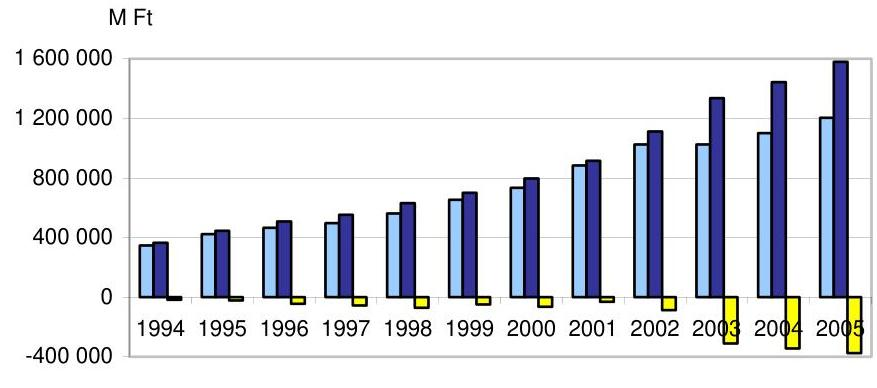
$\square$ Bevétel $\square$ Kiadás $\square$ Hiány

---

Az E. Alap hiánya a 2002. évi 86,6 Mrd Ft-ról 2003-ra 310,0 Mrd Ft-ra, 2005-re 4,3-szeresére, 375,3 Mrd Ft-ra emelkedett. A hiány növekedését kiadási oldalon elsősorban a gyógyító-megelőző ellátások és a gyógyszertámogatások növekedése okozta. Az Alap pénzügyi tartalékkal nem rendelkezett, az ellátások finanszírozásához a központi költségvetés folyamatosan, növekvő összegű hitelt nyújtott. A hiányt a költségvetés végrehajtásáról szóló törvényekben a hiteltartozás elengedésével rendezték.

Az E. Alap hiányát növelő és csökkentő tényezők
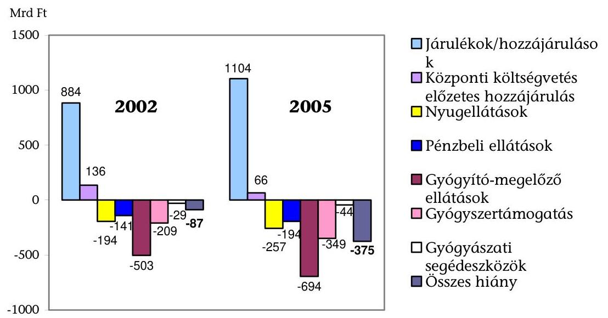

Az E. Alap állandósult és növekvő hiányát bevételi oldalon a járulékfizetői kör szűkülésére, kiadási oldalon az ellátások járulékfizetéssel nem fedezett növekvő igénybevételére, egyes ellátási kiadások aránytalan emelkedésére vezettük viszsza ${ }^{11}$. A teljes lakosság ellátását a mintegy 3,9 millió fő után fizetett járulékok és hozzájárulások 2002-ben 80\%-ban, 2005-ben 70\%-ban fedezték. A bevételeket keletkeztető járulékkötelezettségnek a növekvő kiadások fedezése helyett egyéb gazdaságpolitikai szempontok alapján (járulékcsökkentés a 90-es évek végétől a versenyképesség emelésére) történt előírása forrásokat vont el az E. Alaptól. A forráskivonás kis mértékű korrekcióját jelentette a vizsgált időszakban a munkavállalókat terhelő járulék egy százalékpontos emelése. Elmozdulást jelentett 2006-tól a kiadások járulékfedezetének megteremtésében, a biztosítási elv érvényesítésében a költségvetés számára - a kizárólag egészségügyi szolgáltatásokra jogosultak (pl. a kiskorú állampolgárok, nyugdíjasok) utáni - járulékfizetés előírása ${ }^{12}$.

A kiadások, és így hiány alakulását befolyásolta, hogy nem volt követelmény az egészségügyi szolgáltatásoknak a kasszát leginkább kímélő, szakmailag le-

[^0]
[^0]:    ${ }^{11}$ Jelentés a Magyar Köztársaság 2005. évi költségvetése végrehajtásának ellenőrzéséről (0628, 2006. augusztus)
    ${ }^{12}$ A nyugdíjas foglalkoztatottak járulékfizetési kötelezettségének a szolidaritási elvet erősítő előírásával 2006 szeptemberétől tovább bővült a járulékfizetők köre.

---

hetséges eljárás alapján történő finanszírozása, továbbá hogy az ellátások valós költségeit a díjak megállapítója nem ismerte.

A költségvetési előirányzatokat az államháztartás egyensúlyára tekintettel határozták meg, ami elsősorban egyes kiadások (pl. gyógyszer) alultervezésében mutatkozott meg. Az előirányzottnál (31,8 Mrd Ft) 2006-ra is kedvezőtlenebb pénzügyi pozíció kialakulását valószínűsítettünk ${ }^{13}$, a várható hiány nagysága 2006 őszén (a 2007. évi költségvetési törvényjavaslat véleményezésekor) megközelítette a 140 Mrd Ft-ot. A 2007-re tervezett hiány 32,2 Mrd Ft, az előirányzat teljesülése a Konvergencia programhoz igazodó intézkedések, a kiadások tervezett csökkentése szakmai megalapozását, következetes megvalósítását feltételezi ${ }^{14}$.

Az Alapkezelőnek a bevételek teljesülésére nem volt ráhatása, a járulékok beszedése és nyilvántartása 1999-től az APEH feladata volt. Az E. Alappal szembeni, 2004-ig emelkedő, 104 Mrd Ft-ot elérő hátralékállomány értékvesztésként történő, növekvő arányú - 2003-ban 53\%-os, míg 2005-ben 63\%-os leírásáról az APEH intézkedett.

Az egészségbiztosításban igénybe vehető ellátások, azok tartalma nem változott. A kiadások alakulását a társadalmi, gazdasági folyamatok (elsősorban a lakosság egészségi állapota és jövedelmi viszonyai) mellett a finanszírozandó ellátásra vonatkozó jogszabályok határozták meg. Az előírások módosításai az ellátás igénybevevője, illetve a pénzbeli ellátás megállapítója és az egészségügyi szolgáltatás nyújtója oldaláról szűkítették a finanszírozott ellátások terjedelmét. A kiadások növekedését visszafogták az ellátások finanszírozásánál egyértelműen érvényesíthető, adminisztratív jellegű korlátozások (pl. passzív táppénz, volumenkorlátos teljesítmény-elszámolás).

Az OEP-nek a finanszírozási feladatai teljesítésénél nem volt mozgástere az ellátás nyújtója, a szolgáltatók közötti választásban, valamint az ellátás indokoltságának felülbírálatában. Jogszabályi módosítások növelték az Alapkezelő mozgásterét minőségi szempontok figyelembe vételére (pl. keresőképtelenség elbírálása, járóbeteg-szakellátás Szabálykönyve).

A nyugellátások és a pénzbeli ellátások közül fokozódó mértékben (növekvő létszámban) csak a kiadások 20\%-át kitevő, a gyermek gondozásához kapcsolódó ellátásokat (terhességi-gyermekágyi segély és gyermekgondozási díj) vették igénybe, ami a kereseti hatást erősítve e kiadásokat 2005-re 72, illetve $62 \%$-kal növelte a 2002 . évi szinthez képest.

[^0]
[^0]:    ${ }^{13}$ Vélemény a Magyar Köztársaság 2006. évi költségvetési javaslatáról (0550, 2005. október)
    ${ }^{14}$ A 2006 őszétől, majd 2007-től hatályba lépő járulékszabályoknak az Alap bevételeire gyakorolt hatása összetett. A munkavállalók emelkedő arányban, a munkaadók - befizetéseik egy részének a Nyugdíjbiztosítási Alapba irányításával - csökkenő mértékben járulnak hozzá az Alap kiadásaihoz.

---

Az E. Alapból finanszírozott (nyugdíj)korhatár alatti, III. rokkantsági csoportos nyugellátások 2005-re 32\%-kal emelkedtek. Az ellátásra való jogosultság feltételei nem változtak, az ellátottak létszáma a 2003. évi 384400 fơről 2006 januárjára 2\%-kal csökkent. Az ellátórendszerbe új ellátottként év-ről-évre 2-3 ezer fővel kevesebben kerültek be. A rokkantsági ellátás, mint nyugdíjszerű ellátás kiadásainak növekedése alapvetően a mindenkori nyugdíjemelések következménye volt.

A munkaképesség értékelésének, a megváltozott munkaképességű és rokkant személyek ellátó rendszerének az OGY által 1997-ben elfogadott elvek ${ }^{15}$ szerinti, több tárca feladatkörét érintő átalakítása nem történt meg, a rehabilitáció jelenleg is megoldatlan ${ }^{16}$. A korhatár alatti III. csoportos rokkantak száma ezért továbbra is magas, ami az Alap kiadásait tartósan terheli.

Az E. Alapból ellátott rokkantak népességen belüli arányának területi alakulása a korhatár alatti (mindhárom csoportba tartozó) rokkantak ${ }^{17}$ számának területi alakulásával jellemezhető.

Ezer lakosra jutó, korhatár alatti rokkantak száma
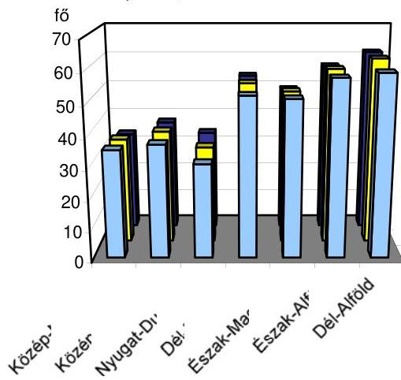
2004.jan.
2005.jan.
2006.jan.

Az ezer lakosra jutó, korhatár alatti rokkantak átlagos száma három év alatt kis mértékben (1,5\%-kal) 45 főre csökkent. Egyes régiók között az ezer lakosra jutó rokkantak számát tekintve közel kétszeres (Dél-Alföld és Nyugat-

[^0]
[^0]:    ${ }^{15}$ A megváltozott munkaképességűek és rokkantak társadalombiztosítási és szociális ellátó rendszerének átalakításáról szóló 75/1997.(VII.18.) OGY határozat a munkaképesség elbírálása elveiről, rendjéről, szervezeti feltételeiről, valamint az ellátásokról és finanszírozásukról, továbbá a rehabilitáció rendszeréről rendelkezett.
    ${ }^{16}$ A Kormány megbízásából 2006 őszén a Szociális és Munkaügyi Minisztérium az OEP és az OOSZI bevonásával munkaanyagot dolgoztatott ki a megváltozott munkaképességűek ellátó alrendszerei összehangolt átalakításának koncepciójáról, és döntött az OOSZI felügyeleti szervének változásáról.
    ${ }^{17}$ A korhatár alatti rokkantak 80-83\%-a a nem teljesen munkaképtelen, III. rokkantsági csoportba tartozó rokkant.

---

Dunántúl), egyes megyék között közel háromszoros (Békés és Zala) volt az eltérés, a területi különbségek a vizsgált időszakban fennmaradtak.

A táppénz igénybevételét szigorító, az OEP javaslatait is figyelembe vevő szabályozás és az ahhoz igazodó gyakorlat is hozzájárult ahhoz, hogy a táppénzes napok száma 2003-2005 között 17,3\%-kal kevesebb lett. A keresőképtelenség elbírálásához és felülbírálásához mérhető kritériumokat tartalmazó kézikönyv alkalmazása 2004 nyarától lett kötelező ${ }^{18}$, és lecsökkent (összességében 360 napról 90 napra) a passzív jogon igénybe vehető táppénz időtartama. A pénzbeli ellátások mintegy felét jelentő táppénzkiadások az időszak második részében is, a keresetek növelő hatása ellenére a 2003. évi szint körül alakultak (2005-ben annál 1,9\%-kal voltak alacsonyabbak).

A természetbeni ellátások közül az árhoz nyújtott támogatások körében nem sikerült a kiadások növekedését megtörni. A természetbeni ellátások emelkedését (47\%) mintegy 20 százalékponttal meghaladóan, 67\%-kal nőttek a vizsgált időszakban a gyógyszertámogatások. A finanszírozható ártámogatások rendszerét megalapozó koncepciót nem alakították ki, ami a finanszírozás területén folyamatos intézkedési kényszert váltott ki. (A gyógyszerellátás teljes rendszerére vonatkozó stratégia kidolgozását a korábban nyilvánosságra hozott jelentésünkben is szorgalmaztuk ${ }^{19}$.) A gyógyszer-gyártókkal, forgalmazókkal kötött megállapodások (pl. az állam és a gyártók között 2004-ben kötött szerződés, a támogatás-volumen szerződések) alapján az E. Alapnak bevételei keletkeztek, de az eredeti cél, a támogatások növekedési ütemének korlátozása, nem valósult meg ${ }^{20}$.

A gyógyászati segédeszközök ártámogatása másfélszeresére emelkedett, amihez hozzájárult a - korábban a gyógyszer kasszából finanszírozott - kötszertámogatás $68 \%$-os megugrása. Az OEP-nek a támogatás alapjául elfogadott ár csökkentésére irányuló, ártárgyalások tartására tett intézkedései a forgalmazók ellenérdekeltsége, a felügyeleti szervnek az eljárás beszüntetésére vonatkozó döntése miatt nem hasznosultak. Ártárgyalások és új termékek befogadásának hiányában fennmaradt egyes, a szakma szerint korszerűtlen termékek támogatása, elmaradt a választék szakmai szempontból szükséges bővítése (pl. fogászati, ortopédiai termékeknél).

Az ellenőrzések tapasztalatai alapján egyes termékek (pl. hallókészülékek, kötszerek, ortopédcipők) rendelési szabályainak szigorítására tett kezdeményezések 2006 nyaráig nem vezettek eredményre. Az eladásösztönző tevékenység til-

[^0]
[^0]:    ${ }^{18}$ 102/1995. (VIII. 25.) Korm. rendelet a keresőképtelenség és keresőképesség orvosi elbírálásáról és annak ellenőrzéséről
    ${ }^{19}$ Jelentés a Magyar Köztársaság 2005. évi költségvetése végrehajtásának ellenőrzéséről (0628, 2006. augusztus)
    ${ }^{20}$ Az egészségügyi miniszter a biztonságos és gazdaságos gyógyszer- és gyógyászati se-gédeszköz-ellátás, valamint a gyógyszerforgalmazás általános szabályairól szóló T/1037. számú törvényjavaslatban 2006 őszén kezdeményezte a gyógyszer-támogatási rendszer átalakítását.

---

tását tartalmazó jogszabályi bekezdések hatályon kívül helyezése forgalom- és ezáltal kiadásnövelő hatású volt. Az OEP-nek az eladásösztönző tevékenység újbóli tiltására vonatkozó javaslata a szabályozásba nem került be. A hosszú élettartamú és átmenetileg szükséges eszközök (pl. légzést segítő készülékek) kölcsönzésének támogatásában a tapasztalat és a támogatási eljárás hiányos szabályozása akadályozta az előrelépést.

A természetbeni kiadások kétharmadát, 2005-ben 694,5 Mrd Ft-ot a gyógyítómegelőző ellátásokra fordították. A kiadások 2002-höz viszonyított 38\%-os emelkedése elsősorban az ágazatban végrehajtott béremelés következménye volt. A kiadások éves növekedési üteme a 2003-ban mért 24\%-ról 2004-ben 5\%ra, 2005-ben 6\%-ra mérséklődött, elsősorban az ellátások finanszírozásában 2004-től bevezetett, az előirányzat tartását automatikusan biztosító eljárás (volumenkorlátos finanszírozás, TVK ${ }^{21}$ ) következtében ${ }^{22}$. A vizsgált időszak második felében születtek a kiadásokat hosszabb távon, az ellátórendszer összetételének változásán keresztül mérsékelni kívánó intézkedések (pl. az ellátórendszer magasabb szintjén nyújtott ellátást kiváltó, az alacsonyabb szinten teljesített szolgáltatás finanszírozása, járó-fekvő betegellátási díjak közelítése, összevont szakellátási előirányzat létrehozása) is, amelyek hatása még nem értékelhető.

Az ellátási kötelezettséget teljesítő intézmények lekötött kapacitásainak finanszírozása az OEP számára kötelező ${ }^{23}$. A kihasználatlan kapacitásokra vonatkozó finanszírozási kötelezettséget csak 2006-tól törölték el. A nyújtott ellátások finanszírozási szempontú, egyben az orvos-szakmai követelményekre is tekintettel lévő indokoltságának elbírálásához finanszírozási protokollok nem születtek.

Minőségi szempontok, a járó- és fekvőbeteg-szakellátás finanszírozásánál a szakmai minimumfeltételek teljesülésének figyelembe vételére 2006-tól van lehetőség. A járóbeteg-szakellátás során végzett beavatkozások, eljárások jelentésére vonatkozóan ellenőrizhető követelményeket tartalmazott a 2003 elején kiadott, új Szabálykönyv. Az OEP egyes - a járóbeteg-szakellátás beavatkozásainak minimum-idejére, a gyógyászati segédeszközök felhasználható, pl. a kötszerek rendelhető mennyiségére vonatkozó - javaslataiból nem lett hatályos előírás.

A járó- és fekvőbeteg-szakellátó intézmények száma, a két ellátási forma finanszírozására fordított összegnek a gyógyító-megelőző ellátás előirányzatán belüli, stabil aránya az ellátó struktúra változatlanságát mutatja. Az E. Alap fel-

[^0]
[^0]:    ${ }^{21}$ A 2003. évi teljesítmény 98\%-ában megállapított volumenkorlátot 2006 júliusától $5 \%$-kal csökkentették és megszűnt a korlát feletti teljesítmények degresszív finanszírozása.
    ${ }^{22}$ A gyógyító-megelőző ellátások 2006. évi eredeti előirányzatának várható túlteljesülése az alapdíjak év eleji megemelésének és a TVK szabályok csak októberŐl érvényesülő szigorításának következménye.
    ${ }^{23}$ 2001. évi XXXIV. törvény az egészségügyi szakellátási kötelezettségről, továbbá egyes egészségügyet érintő törvények módosításáról, 3. §

---

használása sokkal inkább a meglévő ellátórendszer fenntartását, mint a lakosság egészségi állapota szerint indokolt teljesítmények reális ráfordításokon alapuló finanszírozását jelentette.

Az egészségügyi szolgáltatók teljesítményelvű finanszírozásának rendszerében a szolgáltatók díjazása az átlagos ráfordítások megtérítését célozza. A szolgáltatók működési kiadásait növelő intézkedéseket (pl. béremelés, áfa kulcsok módosítása) a szolgáltatók teljesítménydíjainak emelése követte. Az új díjtételeket, alapdíjakat a 2004. februári teljesítmények elszámolásánál alkalmazták először. Az új díjak bevezetéséig az intézmények fix összegű, kiegészítő havi díjazásban részesültek. A korrekció az ellátási esetek, beavatkozások, eljárások díjtételeire (súlyszámaira, illetve pontszámaira), azok egymás közötti arányaira terjedt ki. A díjtételek forint ellenértékét, az alapdíjat többször emelték. A díjtételek módosításához hiányoztak a betegellátási esetek költségeit, ráfordításösszetételét jellemző naprakész adatok, pl. az aktív fekvőbeteg ellátás területén utoljára 1999-ben mérték fel átfogóan az ellátások költségeit.

A teljesítményfinanszírozási rendszer díjtételeinek meghatározásáról és módosításáról rendelkező jogszabály ${ }^{24}$ nem írja elő a finanszírozási paraméterek karbantartásához szükséges információk, adatok folyamatos gyűjtését. Hiányzik a különböző számviteli elszámolásokat alkalmazó szolgáltatók egységes tartalmú adatszolgáltatását és annak ellenőrzését lehetővé tevő, ágazati szintű szabályozás. A finanszírozónak nincs ismerete az egyes ellátási esetek, beavatkozások díjainak aktuális költségtartalmáról, nem megítélhető a számára, hogy az ellátásokra többet vagy kevesebbet fordít-e az E. Alap a lakosság egészségi állapota, a szolgáltatók tényleges ráfordításai alapján indokolt összegnél.

Az Alapkezelő a kiadások alakulását - a szabályozásban való közreműködése mellett - a finanszírozási és ellenőrzési feladatai szabályszerű és célszerű ellátásával befolyásolhatja. A jogszerű ellátások finanszírozása és a jogszerütlen ellátások és kifizetések megakadályozása érdekében gondoskodni kellett a szolgáltatók által jelentett teljesítmények, ellátások feldolgozásáról és ellenőrzéséről. A teljesítmények jogszerúségét a feldolgozás folyamatában és a helyszínen, a jelentett adatok valódiságát a helyszínen ellenőrizték.

A szolgáltatók, forgalmazók finanszírozását megalapozó szerződések megkötésének és ellenőrzésének folyamata szabályozott. Az ellenőrzés jogalapját az Ebtv. módosítása 2006-tól egyértelművé tette, az ellenőrzés a felek közötti polgári jogviszonyon alapul. A szankcióknak a feltárt hibák súlyossága szerinti kellő differenciálására az OEP tapasztalatai szerint nincs lehetőség.

Az egészségügyi szolgáltatók teljesítményjelentéseit, a forgalmazók (gyógyszer, gyógyászati segédeszköz) és gyógyászati ellátásokat nyújtók elszámolásait feldolgozó informatikai rendszerek formai és logikai szempontból ellenőrzik a jelentett adatokat, a hibásnak minősített tételeket nem számolják el. A jelentések országos rendszerú feldolgozása egységes szempontok érvényesítését tette lehetővé.

[^0]
[^0]:    ${ }^{24}$ 6/1998. (III. 11.) NM rendelet az egészségügyi ellátáshoz használt szakmai kódrendszerek és finanszírozási paraméterek karbantartásának jogi szabályozásáról

---

Az évente 1 millió esetet közelítő táppénz megállapításának és a keresőképesség elbírálásának informatikai eszközökkel történő, teljes körű ellenőrzési lehetőségét részlegesen használták ki. Az eltérő forrásokból származó keresőképtelenségi és táppénzes adatokat elemzési célból esetenként együtt vizsgálták, de az állományok rendszerszerű összekapcsolásának hiányában elmaradt a táppénz igénybevételnek, azon belül a kifizetőhelyek elszámolásainak független forrásból származó adatokkal történő, automatikus és teljes körű ellenőrzése.

Az összes igény 70\%-át számfejtő és folyósító kifizetőhelyek ellenőrzése elsősorban helyszíni vizsgálatokkal valósult meg, kétévente minden kifizetőhely ellenőrzésre került. A keresőképesség elbírálását felülvéleményező, átlagosan 280 főorvos 2005-ben 16\%-kal több, a keresőképtelenségi esetek nyilvántartása alapján elrendelt, célzott ellenőrzést folytatott le, mint 2003-ban.

A szakellátás jelentett teljesítményeit, a gyógyszerek és gyógyászati segédeszközök rendelését, kiszolgáltatását a helyszínen szakmai szempontból, utólagosan, a MEP-ek ellenőrzik. A mintegy 240-250 főből álló ellenőrzési apparátus részére közvetlenül nem álltak rendelkezésre a szolgáltatók szerződéses adatai, sem a jelentett és elszámolt teljesítmények adatai, ami az adatok más úton való biztosítását tette szükségessé. Az ellátások finanszírozói szempontból való indokoltságát szakmai konszenzuson alapuló finanszírozási protokollok hiányában nem vizsgálták.

A társadalombiztosítás (és a szociális ellátások) rendszerében a természetes személyek azonosítására a TAJ-szám szolgál. A kötelező egészségbiztosítás rendszerében valamennyi belföldi személy jogosult az egészségügyi szolgáltatásokra ${ }^{25}$. Az igénybevevő jogosultságának ellenőrzése a nyilvántartásban való feltüntetés tényének, a TAJ-szám érvényességének ellenőrzését jelenti.

Belső és külső ellenőrzések megállapították, hogy az OEP-nél a TAJ-szám képzésének, a TAJ-kártya kibocsátásának, a biztosítottak személyi adatai nyilvántartásának folyamata jól szervezett, informatikai rendszerét kialakították, az állományt hiteles adatokkal hetente automatikusan frissítik. A nyilvántartás felülvizsgálata és adattartalmának javítása is hozzájárult ahhoz, hogy a TAJ adatbázis teljes körű, megbízható és hiteles adatokat tartalmaz. A használatban levő TAJ-kártyák a nyilvántartással összhangban mutatják a kártya birtokosának jogosultságát.

Az OEP az ellátottak jogosultságát a TAJ adatbázis felhasználásával automatikusan ellenőrzi. Az érvénytelen TAJ-számra (pl. külföldi már érvénytelenített TAJ-száma) jelentett teljesítményt, illetve a kifizetőhely által folyósított pénzbeli ellátást a rendszer a szolgáltató, illetve a kifizetőhely finanszírozásából auto-

[^0]
[^0]:    ${ }^{25}$ A 2006 novemberében beterjesztett, az egyes, az egészségügyet érintő törvényeknek az egészségügyi reformmal kapcsolatos módosításáról szóló T/1093. sz. törvényjavaslat szerint az egészségügyi szolgáltatásokra való jogosultság feltétele kiegészül a díjfizetésre való kötelezettség teljesítésével, ami a vizitdíj és a kórházi napidíj megfizetését jelenti. A javaslat szerint a járulékot nem fizetők csak az ún. alapcsomag igénybevételére lesznek jogosultak. A változásra a Magyar Köztársaság 2007. évi költségvetési javaslatáról szóló véleményünkben hívtuk fel a figyelmet (0641, 2006. november).

---

matikusan kizárja. A TAJ-szám érvénytelensége esetén az igazgatási szerveknél sem számfejthető pénzbeli ellátás. A biztosítottak hiteles személyi és azonosító adatainak rendelkezésre állása és felhasználása érdekében tett intézkedések eredményesek voltak.

A pénzbeli ellátásokra a saját egyéni járulék fizetése jogosítja fel a biztosítottakat. A társadalombiztosítás rendszerében a biztosított járulékkötelezettségét a jogviszonyai, a pénzbeli ellátásokra való jogosultságát a járulékkötelezettség teljesítése alapozza meg. A járulékkötelezettség és a pénzbeli ellátások megállapítása és ellenőrzése céljából a foglalkoztatóknak (ide értve a rendszeres ellátásokat folyósító szerveket, pl. a NYUFIG-ot) be kell jelenteniük a foglalkoztatottak (ellátásban részesülők) jogviszony adatait az Alapkezelőnek.

A járulékokkal kapcsolatos feladatok APEH-hez kerülése óta, 1999-től a jogalkotó nem rendelkezett sem az ellátások igénybevételének a járulékkötelezettség alapján történő, sem pedig a járulékkötelezettségnek a jogviszony nyilvántartás alapján történő, automatikus ellenőrzéséről, az ehhez szükséges egyedi adatátadásokról. Törvény nem adott felhatalmazást a jogviszony adatok APEH részére, illetve a járulékadatok OEP részére történő rendszeres átadására. A jogviszony nyilvántartás felhasználásának lehetősége az OEP-nél a pénzbeli ellátások megállapítására, ellenőrzésére szűkült ${ }^{26}$. Az ellenőrzés technikai feltételeit az ellátások szakigazgatási szerveknél történő megállapításának eseteire megteremtették.

Az Alapkezelőnél a jogviszonyokra vonatkozó bejelentésekre kötelezett, közel 1,2 millió foglalkoztató naprakész ismeretének hiánya, a bejelentések elmulasztása, az évente 600-800 ezer bejelentés feldolgozásának hiányosságai miatt a jogviszony nyilvántartás megbízhatósága, minősége 2006 tavaszán nem érte el a felhasználhatóságához szükséges szintet. Az adatbázis nem hiteles adatokat is tartalmazott, nem volt teljes körű, a helyszíni vizsgálat idején 1130 ezer személyre nem tartottak nyilván jogviszony adatot. A jogosultak jogviszony adatainak rendelkezésre állására a 2000-es évek első felében tett intézkedések nem ítélhetők eredményesnek, a bejelentések megtételére és azok feldolgozására 1998 óta fordított erőforrások 2006 nyaráig nem hasznosultak. A jogviszony nyilvántartást sem a járulékkötelezettség, sem pedig a pénzbeli ellátások ellenőrzésére nem használták fel.

Az OEP 2005-ben tett, a szervezeti és szabályozási hátteret megalapozó intézkedései előkészítették a feldolgozási rendszer 2006-ban indított, az egyéni számla kialakítására és a meglévő adattartalom javítására is kiterjedő fejlesztését. A nyilvántartás minőségét a 2006 tavaszára felgyülemlett bejelentések beolvasásával, a feldolgozások naprakésszé tételével javították.

A foglalkoztatók jogviszony és egyedi járulék adatokra vonatkozó jelentési kötelezettségei 2005-ben és 2006-ban bővültek. Az ellátásokra való jogosultság, a pénzbeli ellátások megállapításának eljárási szabályai, valamint a jogviszony

[^0]
[^0]:    ${ }^{26}$ A jogviszony adatok a nyugdíjágazatban, a nyugdíjjogosultsághoz évente beküldött adatok (NYENYI lap) ellenőrzésére is felhasználhatók lettek volna, amelynek lehetőségét úgyszintén nem használták ki.

---

adatok felhasználási lehetőségére vonatkozó rendelkezések ugyanakkor nem módosultak. Az államigazgatásnak valamennyi biztosítottra kiterjedő, fokozódó információs igénye az információk felhasználási lehetőségével nincs összhangban. A bejelentések, adatszolgáltatások és az adatok kezelésének növekvő költségeire, és az adatok felhasználási lehetőségétől függő, várható megtakarításokra becslés nem készült.

A finanszírozási feladatok ellátásánál alkalmazott informatikai rendszerek biztosították a határidőben történő teljesítést, és történt előrelépés az egyes rendszerek összekapcsolásában (pl. a teljesítmény-elszámolási rendszereket a TAJ-nyilvántartással). Az Adattárháznak az ellátórendszer valamennyi szintjén nyújtott szolgáltatások 1999-ig visszamenő adataival való feltöltése az ellátások, a teljesítmények és a finanszírozás elemzéséhez szükséges adatok rendelkezésre állását biztosítja. Ugyanakkor továbbra is megtalálható egyes nyilvántartások párhuzamos vezetése (pl. a foglalkoztatókról).

Az alkalmazói rendszerek esetében egyértelműen tapasztalható a biztonságra való törekvés, azonban a kialakított kontrollok alkalmazása nem egységes elveken alapul, az előírások betartása nem következetes, és a logikai hozzáférésvédelem területén hiányosságok minden vizsgált rendszer esetén előfordultak, ami az illetéktelen hozzáférés kockázatát növelte. Az informatikai biztonság szakmai alapokon nyugvó megvalósításához az egyes területeken (szervezeti, szabályozási és informatikai szakmai) megtett lépések mellett a felső vezetés szintjén hiányzott a biztonság rendszerszemléletű kezelése.

Az informatikai költségvetés tervezése nem volt minden tekintetben megalapozott, a fejlesztési prioritások csak a tárgyévben, lényegében a költségvetés felhasználásával egyidejűleg alakultak ki. Az informatikai fejlesztések tervezhetőségét az ágazati szakmai fejlesztési elképzelések bizonytalansága mellett nehezítette, hogy a jogalkotó nem minden esetben biztosított a fejlesztések megvalósításához, alkalmazásba vételéhez reális határidőket (pl. a jogviszony adatok bejelentésére vonatkozó módosításoknál), és a feladatok megvalósításához erőforrásokat (pl. az Elektronikus Kormányzati Gerinchálózathoz történő csatlakozáshoz adatátviteli szolgáltatások beszerzése).

Az Alap felügyelete, az Alap kezelőjének irányítása állami feladat. A 2006. július 1-jétől hatályos új jogállási törvény ${ }^{27}$ és az OEP-re vonatkozó egyéb hatályos jogszabályok az Alapkezelő irányításáról, az első számú vezető kinevezéséről és felmentéséről, a költségvetésének megállapítására jogosult szervről, valamint a költségvetés helyéről eltérően rendelkeznek ${ }^{28}$.

[^0]
[^0]:    ${ }^{27}$ 2006. évi LVII. törvény a központi államigazgatási szervekről, valamint a Kormány tagjai és az államtitkárok jogállásáról
    ${ }^{28}$ Az OEP az új jogállási törvény előkészítése folyamatában jelezte a jogszabályok közötti összhang hiányát. Az EüM kérésére az Igazságügyi és Rendészeti Minisztériumtól kapott állásfoglalás az ellentmondásokat nem oldotta fel. Az ellentmondások ugyanúgy érintik az ONYF-et is.

---

Az OEP és igazgatási szerveinek múködési költségvetése a létszámleépítésekre és a kormányzati szervektől elvárt takarékosságra tekintettel alig emelkedett, nem volt összhangban a feladatbővülésekkel (pl. GYÓGYINFOK tevékenységének átvétele). Az egészségbiztosítás működési költségeinek aránya a teljes kiadás százalékában 1998 óta folyamatosan csökkent. Az el nem végzett tevékenységek az Alap kiadásainak alakulását is befolyásolták (pl. az intézmények ár- és költségadatainak rendszeres gyűjtése a szakellátás díjtételeinek korrekciójához).

Az OEP igazgatási szerveinél 2001-től végzett szervezetátvilágítások tapasztalatai alapján a mindenkori feladatokhoz igazították a rendelkezésre álló létszámokat, és a kényszerű létszámleépítések elosztása arányos volt. A többletfeladatok felmérése és elemzése azonban az OEP vezetése szintjén évről évre elmaradt, a tapasztalatok figyelembevételével elsősorban a felügyelt szerveknél javították a múködés feltételeit. Egyes szakmai feladatokhoz rendelt ágazati létszám MEP-ek közötti megoszlása 2005 végén sem volt a feladatokkal arányos (pl. nyilvántartás, szakellenőrzés).

Az Alapkezelő belső kontrollrendszerét a jogszabályi előírásokkal összhangban alakították ki, egyes kontrollelemek gyakorlati alkalmazása és múködésének nyomon követése, értékelése azonban még nem volt teljes körű (pl. a kockázatkezelés rendszerének, a szabálytalanságok kezelése eljárásrendjének alkalmazása).

Az egészségbiztosító humánerőforrás-politikája és -gyakorlata az ágazatot kedvezőtlenül érintő intézkedések (létszámleépítések, múködési költségvetés szűkülése, a teljesítmények ösztönzésének korlátozott lehetőségei stb.) ellenére biztosította az új munkatársak felvételénél az előírt képesítési követelményeknek való megfelelést, a munkatársak esetében a munkakörök ellátásához szükséges ismeretek és szakmai jártasság folyamatos bővítését. Az OEP által tervezett képzések egy részének elmaradása, részleges megvalósulása ugyanakkor a kormányzati továbbképzési programok szervezésének nehézkességét és megbízhatatlanságát jelzi (pl. egyes képzések programjai nem készültek el időben, elmaradtak).

A múködés hibáinak feltárása és kijavítása érdekében alkalmazott utólagos kontrollok feltételei a szabályozottság, a szervezeti keretek kialakítása és az új módszerek elsajátítása terén kiépültek, a belső ellenőrzés tevékenysége azonban a jogszabályban meghatározott valamennyi feladatra még nem terjedt ki (nem megoldott az informatikai terület rendszerellenőrzése, teljesítményellenőrzéseket egyelőre kísérleti jelleggel végeznek). Az ellenőrzési javaslatok hasznosulásának folyamatos követését az intézkedési tervek feladatai egységes nyilvántartási rendszerének hiánya nehezítette.

Az OEP információs rendszereiből az elvégzendő és megvalósított feladatokra és pénzügyi folyamatokra vonatkozóan rendelkezésre álló információk lehetővé tették a vezetés számára annak megítélését, hogy az egészségbiztosító teljesíti-e a vonatkozó törvényekből és más szabályokból rá háruló követelményeket.

Az OEP külső és belső kommunikációs tevékenysége, az intézmények teljesítési adatainak nyilvánossága, az igénybevett ellátások finanszírozási adatainak a

---

biztosított általi elérhetősége elősegítette a munkatársak és a közvélemény (lakosság és szakma) hiteles forrásból történő, gyors és pontos tájékoztatását.

Az Alap múködését érintő korábbi ellenőrzéseink során megfogalmazott javaslataink nyomán az egészségbiztosítás ellátási és finanszírozási rendszerének átfogó megújítására kormányzati intézkedések nem születtek. Az Alapkezelő feladatellátásában tapasztalt hiányosságok felszámolására irányuló javaslataink egy része (pl. az FPEP végleges elhelyezése) nem hasznosult. Az Irányított Betegellátási Rendszerrel kapcsolatban hiányolt jogszabályi rendelkezések hatályba léptek, és az OEP feladatellátásának belső szabályozottságában is történt előrelépés.

A helyszíni ellenőrzés megállapításainak hasznosítása mellett javasoljuk:

# a Kormánynak 

1. gondoskodjon
a) a foglalkoztatók adatszolgáltatási kötelezettségei és a szolgáltatott adatok felhasználási lehetőségei közötti összhang megvalósításáról, ennek keretében vizsgálja meg a pénzbeli ellátásoknak a rendszeresen szolgáltatott jogviszony- és kereseti adatokon alapuló megállapításának lehetőségét;
b) az Alapkezelő jogállására vonatkozó jogszabályi rendelkezések közötti ellentmondások feloldásáról;
2. intézkedjen az OEP és igazgatási szervei működésének a feladatokhoz igazodó normatív alapú finanszírozási rendszerének kidolgozásáról;

## az egészségügyi miniszternek

1. intézkedjen a gyógyászati segédeszközök (pl. kötszerek, hallókészülékek) támogatással történő rendelésének jogi szabályozásában a szakmai követelmények figyelembevételéről;
2. gondoskodjon az egészségügyi intézmények költségeinek alakulását folyamatosan megfigyelő rendszer kialakításáról és biztosítsa annak múködtetési feltételeit;
3. kezdeményezze az OEP főigazgatója felé, hogy gondoskodjon
a) a jogszabályi kötelezettségből az intézményre háruló többletfeladatok évenkénti számbavételéről és az azokból adódó személyi, tárgyi szükségletek felméréséről,
b) a szakmailag indokolt informatikai fejlesztési feladatok, azok prioritásának meghatározásáról, a pénzügyi lehetőségek függvényében a fejlesztések következetes végrehajtásáról.

---

# II. RÉSZLETES MEGÁLLAPÍTÁSOK 

## 1. Az EgészsÉgBizTosítÁsi Alap múkódési Rendszere

### 1.1. A kötelező egészségbiztosítás rendszere, az állam és az Alap kezelójének feladatai

A biztosítási és szolidaritási elv érvényesítésével a belföldi személyek jogosultak az egészségügyi szolgáltatások igénybevételére. Az egészségügyi szolgáltatások az egészségügyi állapot által indokolt mértékben vehetők igénybe. A pénzbeli ellátások a meghatározott jogviszony(ok)ban álló, járulékfizetésre kötelezett személyeket a járulék alapjául szolgáló jövedelemmel arányosan illetik meg.

Járulékfizetési kötelezettségük alapján valamennyi egészségügyi ellátásra jogosultságot szerezhetnek a Tbj. 5. §-a szerinti biztosítottak. A Tbj. meghatározza a baleseti ellátásra, illetve a járulékot személyükben nem fizető, kizárólag egészségügyi szolgáltatásokra jogosultak körét. A jogosultság megállapodás alapján, valamint nemzetközi szerződések, egyezmények alapján is fennállhat. Az egyik kategóriába sem tartozó, Magyarországon keresettel - és állandó lakhellyel rendelkező személy a 39. §. (2) bek. szerint kötelezett járulékfizetésre, ami jogszerúvé teszi számára a szolgáltatások igénybevételét. A természetbeni ellátásokra való általános jogosultságot 2006-tól a biztosított fogalmának az Ebtv-be való beemelése megerősítette.

Az Alkotmány a mindenkori kormány feladatává teszi a szociális és egészségügyi ellátás állami rendszerének meghatározását és az ellátás anyagi fedezetéröl való gondoskodást. Az ellátórendszer múködtetésére a központi költségvetéstől leválasztott, önálló E. Alap szolgál. Az Alap létrehozásának célja az ellátások fedezetére meghatározott források összegyújtése az ellátások finanszírozásához, és a központi költségvetéstől való elkülönítéssel a pénzügyi források felhalmozódásának, a tartalékképzés lehetőségének a megteremtése volt. Az Alap pénzügyi egyensúlyának megteremtését az állami garancia mellett hosszabb távon a járulékfedezeti elven való múködéstől, és a tőkeként múködtethető tartalékalaptól várták.

Az E. Alap felügyelete, az Alapkezelő irányítása és az Alaphoz tartozó vagyon tekintetében a tulajdonosi jogok gyakorlása állami feladat, melyet törvény ${ }^{29}$ szabályoz. A feladatot a Kormány - kormányrendelet ${ }^{30}$ alapján - 2002 júniusától az egészségügyi, szociális és családügyi miniszter, 2004 októberétől az egészségügyi miniszter útján látta el.

[^0]
[^0]:    ${ }^{29}$ 1998. évi XXXIX. törvény a társadalombiztosítás pénzügyi alapjainak és a társadalombiztosítás szerveinek állami felügyeletéről
    ${ }^{30}$ 131/1998. (VII.23.) Korm. rendelet a társadalombiztosítás igazgatási szerveinek irányításával kapcsolatos feladat- és hatáskörökről

---

Az Eütv. ${ }^{31}$ 150. §-a határozza meg az egészségügyet irányító miniszter feladatait. A minisztérium Szervezeti és Múködési Szabályzatának (SZMSZ) külön fejezete foglalkozik a társadalombiztosítás igazgatási szerveinek irányításával. A miniszter az OEP főigazgatójának adhat közvetlen utasítást. Az OEP irányításával kapcsolatos tevékenységben résztvevő osztályok a miniszteri döntések előkészítői, másrészt együttmúködnek az OEP-pel egyes közös feladatok végrehajtásában (pl. a költségvetési javaslat elkészítése, a finanszírozás, a gyógyszerügyek területén).

Az Alap kezelője, az OEP országos hatáskörű központi államigazgatási szerv, mely pénzügyi-gazdálkodási tevékenységét a költségvetési szervekre vonatkozó általános szabályok szerint végzi. A 2006. július 1-jétől hatályos új jogállási törvény ${ }^{32}$ és az OEP-re vonatkozó egyéb hatályos jogszabályok az Alapkezelő irányításáról, az első számú vezető kinevezéséről és felmentéséről, a költségvetésének megállapítására jogosult szervről, valamint a költségvetés helyéről eltérően rendelkeznek.

Az OEP az új jogállási törvény alapján központi hivatal, amelyet miniszter irányít. A miniszter nevezi ki és menti fel a hivatal vezetőjét, állapítja meg annak előirányzatait, és jóváhagyja szervezeti rendjét. Az egyéb hatályos szabályozás (1998. évi XXXIX. tv. 2. §. (2) bek. és 1. §. (2) bek. a) pont) szerint az OEP főigazgatóját a miniszter javaslatára a Kormány nevezi ki és menti fel. Az irányítást a Kormány az egészségügyi miniszter útján látja el. Az OEP egyben társadalombiztosítási költségvetési szerv, amelynek költségvetését az E. Alap költségvetésében kell meghatározni (1998. évi XXXIX. tv. 2. §. (3). bek.). Az OEP költségvetését az Alapkezelő az irányító miniszter közreműködésével állítja össze (Áht. 51. §, 52. § (5) bek.). Az OEP az új jogállási törvény előkészítése folyamatában jelezte a jogszabályok közötti összhang hiányát. Az EüM kérésére az Igazságügyi és Rendészeti Minisztériumtól kapott állásfoglalás az ellentmondásokat nem oldotta fel.

Fő feladata az ellátást nyújtó szolgáltatók finanszírozása, a pénzbeli ellátások megállapítása, folyósítása és ellenőrzése, nyilvántartások vezetése és adatszolgáltatások teljesítése. Ellátja az egészségbiztosítás ügyviteli és hatósági feladatait, irányítja, felügyeli az egészségbiztosítás területi igazgatási szerveit. Részt vesz az Alap költségvetésének ${ }^{33}$ tervezésében, ellátja az Áht-ben, és annak végrehajtásáról szóló kormányrendeletben meghatározott költségvetési és zárszámadási feladatokat.

# 1.2. Az egészségbiztosítási rendszert érintő változások 

Az egészségbiztosítás elveit, rendszerét érintő átfogó változás a vizsgált időszakban nem történt, viszont az egyes ellátások feltételeiben, múködtetésében módosításokra került sor, melyek az Alapkezelő feladatait is érin-
${ }^{31} 1997$ évi CLIV. törvény az egészségügyről (Eütv.)
${ }^{32}$ 2006. évi LVII. törvény a központi államigazgatási szervekről, valamint a Kormány tagjai és az államtitkárok jogállásáról
${ }^{33}$ Az E. Alap költségvetése két részből áll, egyrészt az alapvetően járulékbevételekkel fedezett ellátási kiadásokat tartalmazó ellátási költségvetésből, másrészt az ezt kezelő OEP és igazgatási szervei múködési költségvetéséből.

---

tették. Az ellátórendszer múködését feszültségek és ellentmondások terhelik, a rendszer átfogó átalakításának OGY által is elfogadott, egyetlen hatályos dokumentuma a társadalombiztosítási rendszer megújításáról szóló OGY határozat ${ }^{34}$.

Ma is napirenden lévő kérdések pl. az intézményrendszer túlméretezettsége és tagoltsága, a kapacitások elavultsága és fejlesztésük finanszírozásának megoldatlansága, az ellátást végzők létszámának, összetételének megfelelősége, az ellátások igénybevételében megmutatkozó területi különbségek kiküszöbölése, a finanszírozási rendszer és a hatékonyság követelményének összekapcsolása.

Az EüM átfogó vizsgálatáról szóló jelentésünkben ${ }^{35}$ megállapítottuk, hogy az egészségügy reformjára vonatkozó cél változatlansága mellett a reform folyamatában érdemi előrelépés nem történt. Átfogó reform koncepció kidolgozására, az ellátórendszerre és annak finanszírozására, fejlesztésére vonatkozó program OGY elé terjesztésére a vizsgálat lezárásáig ${ }^{36}$ nem került sor.

Az elmúlt évek reformkoncepciói elsősorban az egészségügy szerkezetének, finanszírozásának átalakítására irányultak. Az elképzelések a fenntartható finanszírozás mellett alapvető követelménynek tekintették az ellátások minőségének megőrzését és emelését, a betegek számára az egyenlő gyógyulási esélyek biztosítását.

Az Alap múködését továbbra is az állandósult pénzügyi egyensúlytalanság jellemzi. A társadalombiztosítási rendszerben a mintegy 10 millió magyar állampolgárból kb. 3,9 millió fő a társadalombiztosítási járulékfizetők száma.

A járulékfizetők aránya a teljes lakossághoz
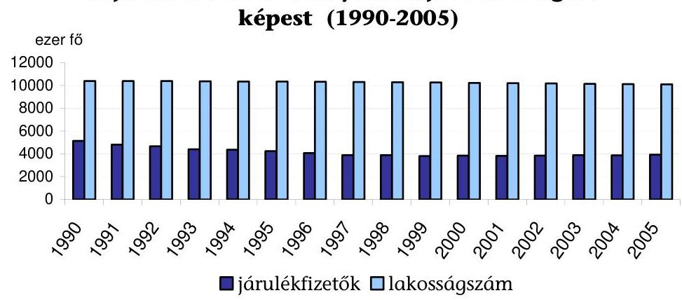

Az E. Alap egyensúlyi helyzetének javításában, a járulékfedezeti elv érvényesítésében előrelépést jelentett 2006-tól az állam járulékfizetési kötelezettségének előirása. A járulékköteles jövedelemmel nem rendelkezők

[^0]
[^0]:    ${ }^{34}$ 60/1991.(X.29.) OGY határozat a társadalombiztosítási rendszer megújításának koncepciójáról és a rövidtávú feladatokról
    ${ }^{35}$ Az EüM fejezet múködésének ellenőrzéséről szóló, 0522. számú jelentés (2005. június)
    ${ }^{36}$ A „Magyar egészségügy - Többen, jobban, tovább - Zöld könyv az egészségügyről" című kiadványt az ellenőrzés lezárása után bocsátották társadalmi vitára.

---

után a központi költségvetés törvényben megszabott módon befizetést teljesít az E. Alap javára. A befizetés mértékét, nagyságrendjét nem (mint ahogy a járulékoknál sem) az érintett lakosság ellátásához szükséges forrás alapján határozták meg.

A fizetési kötelezettség mértéke 11\%, alapja az ellátásban részesülők (pl. tanulók, nyugdíjasok, GYES-en lévők, egyetemi hallgatók) esetén a költségvetésben tervezett kiadás, egyéb esetekben a mindenkori minimálbér.

A központi költségvetés hozzájárulásának csökkentése érdekében az egyes pénzügyi tárgyú törvények módosításával ${ }^{37} 2006$ szeptemberétől bővült a járulékfizetésre kötelezettek köre.

A módosítás következtében a kötelező társadalombiztosítás hatálya alá korábban nem tartozó mezőgazdasági őstermelők és a nyugdíjas foglalkoztatottak (munkavállalók) is fizetnek járulékot a természetbeni egészségügyi ellátásokhoz való hozzájárulás érdekében.

A természetbeni ellátásokra jogosultak köre elsősorban az EU csatlakozás következtében bővült, a módosítás az ellátások igénybevételének pénzügyi elszámolásáról is rendelkezett. A csatlakozással a magyar állampolgárok EUban való ellátásának jogosultsági feltételei is változtak. A pénzbeli ellátásokra való jogosultság szabályainak változásai jellemzöen a jogosultak körének szükítéséi jelentették.

A természetbeni ellátások igénybevételére az EU polgárai is jogosultak, a magyar állampolgárok pedig az EU területén az adott ország előírásai szerint jogosultak ellátásokra. A pénzbeli ellátásokra megállapodással történő jogszerzés lehetősége 2005 novemberétől megszűnt.

Az ellátásokra való jogosultság megállapításához szükséges jogviszonyok bejelentésére vonatkozó előírások gyakori, esetenként ellentétes irányú módosításai nem segítették a kötelezettek jogszabály-követő magatartásának kialakulását. A Tbj. és az Art. 2005 nyarától elfogadott, a kötelezettséget érintő, többszöri módosítása ${ }^{38}$ az egységes járulék-nyilvántartási rendszer, az egyéni járulék számla kialakítását célozták. 2006-tól a bejelentések megtétele mellett a jogviszony adatokra vonatkozó, havi adatszolgáltatást is előírtak, 2007-től valamennyi bejelentést az APEH felé kell megtenni.

A vizsgált időszakban csökkent, majd emelkedett a bejelentések előírt gyakorisága, határideje rövidült. A foglalkoztatónak 2003-ban egyedi esetekhez kötődően kellett a jogviszony keletkezését, megszűnését, szünetelését bejelentenie, míg 2004 januárjától 2005 augusztus végéig havonta kellett az adatokat szolgáltatni. 2005 szeptemberétől újra az egyedi jogviszony-változásokhoz időzítetten kell a bejelentéseket megtenni, a korábbi 8 napos határidő helyett a jogviszony kezdetét megelőző napon.

[^0]
[^0]:    ${ }^{37}$ 2006. évi LXI. törvény az egyes pénzügyi tárgyú törvények módosításáról
    ${ }^{38}$ A Tbj. 4. §. r). bekezdése, 44. § (3) bekezdése, az Art. 16. § (4) bekezdése, amelyeket a 2006. évi LXI. törvény 101. §-a vezetett be.

---

Az előírások továbbra sem teszik lehetővé a teljesített járulékfizetés személyre bontott, OEP általi nyilvántartását, az egyéni egészségbiztosítási számlához az APEH a levont járulék bevallott adatát továbbítja. Változott a járulékfizetési kötelezettség teljesítése, valamint a biztosítotti adatok ellenőrzése érdekében együttműködő igazgatási szervek egymás felé történő adatszolgáltatási, együttműködési feladata. A bejelentésekre 2007-től érvényes szabályokban az APEH és az OEP feladat- és hatáskörének elhatárolása a foglalkoztatók adatszolgáltatási és nyilvántartási kötelezettségének ellenőrzése tekintetében nem egyértelmú.

Az APEH a havi adatszolgáltatás adatait 2006-tól, majd a bejelentések adatait 2007-től „haladéktalanul" továbbadja az OEP-nek, az OEP feladata a jogosulatlan igénybevételről az APEH-et értesíteni. A nyilvántartási kötelezettség tekintetében igazgatási szervként az APEH jár el. Ugyanakkor megmaradtak az OEP nyilvántartási, és az adatszolgáltatók, kifizetők nyilvántartásait, adatszolgáltatásait ellenőrző feladatai.

Az egészségbiztosításban érvényesített finanszírozási alapelvek ${ }^{39}$ a vizsgált időszakban nem változtak, viszont a finanszírozás általános rendelkezései körében és részletes szabályozásában több változásra és pontosításokra is sor került. 2005 végére az Ebtv-be beépültek az ellátások racionálisabb igénybevételére ösztönző, Irányított Betegellátási Rendszer (IBR) finanszírozási szabályai. A teljesítmények finanszírozhatóságának minőségi és mennyiségi feltételeiben, a kiegészítő finanszírozás alkalmazási körében bevezetett módosításokat az egyes ellátási formák kiadásainak alakulása kapcsán értékeljük.

Az egészségügyi szolgáltatások finanszírozása a ráfordítások alapján meghatározott normán, az ellátandó feladatokon, az ellátott esetek számbavételén, a fejkvótán, a nyújtott szolgáltatások teljesítmény arányain, az előbbiek kombinációján és az árhoz nyújtott támogatáson alapuló rendszerben történik. A finanszírozási technikák módosításai elsősorban a szakellátások finanszírozását érintették.

A módosítások többek között az általános rendelkezések körében pontosították a finanszírozási elszámolás fogalmát, a teljes munkaidő tartamát, az el nem számolt hibás, vagy hiányos tételekre vonatkozó eljárásrendet.

Az E. Alap által finanszírozott természetbeni szolgáltatások köre kismértékben szélesedett, pl. a mentési feladatok, valamint a ritka, kiemelkedő költségigényű, korábban a központi költségvetésben e célra elkülönített keretből finanszírozott ellátások visszakerültek az egészségbiztosítási ellátások körébe. A pénzbeli ellátások köre nem változott.

[^0]
[^0]:    ${ }^{39}$ Az egészségügyi szolgáltatások finanszírozásának fő elveit az Ebtv. 34. §-a határozza meg. A finanszírozás szabályait a társadalombiztosítás pénzügyi alapjai 1998. évi költségvetéséről szóló többször módosított 1997. évi CLIII. tv. 23-30. §-ai tartalmazzák az egyes kasszák legfontosabb finanszírozási feltételrendszere tekintetében. A finanszírozási rendszer múködésének részletes szabályait az egészségügyi szolgáltatások E. Alapból történő finanszírozásának részletes szabályairól szóló többször módosított 43/1999. (III.3.) Korm. rendelet és az egészségügyi szakellátás társadalombiztosítási finanszírozásának egyes kérdéseiről szóló 9/1993. (IV.2.) NM rendelet szabályozta.

---

# 1.3. Az E. Alap pénzügyi helyzete, a hiány alakulása 

Az E. Alap és az egészségbiztosítási költségvetési szervek tervezési és beszámolási rendjére az általános költségvetési szabályozás előírásai érvényesek. Az önálló alapként való múködés szabályai szerint az Alap beszámolóját minden évben könyvvizsgáló hitelesítette, megállapította, hogy a beszámolók megbízható, valós képet adtak az Alap pénzügyi helyzetéről. Az ÁSZ évről évre véleményezte a költségvetési és a költségvetés végrehajtásáról szóló törvényjavaslatokat.

A vizsgált időszakban a költségvetési tervezőmunkát több tényező nehezítette (pl. a tervezési köriratot késve adták ki). A szakmapolitikai szempontok a költségvetési tervezésben korlátozottan érvényesültek. Az előirányzatok kialakításánál az államháztartás egyensúlyi helyzetének elősegítése volt a meghatározó szempont, nem az egészségbiztosítás tervezett kiadásai.
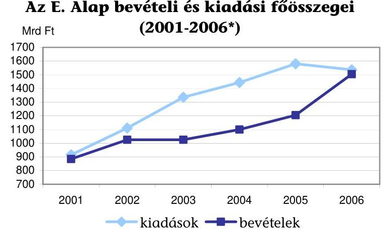
*2006. év: előirányzat
Az E. Alapnak a vizsgált időszakban nem volt elegendő belső tartaléka, finanszírozása folyamatosan növekvő mértékben igényelte a központi költségvetés beavatkozását. Az Alap kiadási és bevételi előirányzatai közötti eltérés 2006 előtt növekedett, és a kiadások növekedése ellenére a bevételi oldalt szűkítő jogszabályok kerültek elfogadásra.

A 2003-2005. években a teljesített bevételek és kiadások egyenlegében 310, 343,7, illetve 375,3 Mrd Ft hiány keletkezett. A 2006. évi tervezett hiány 31,8 Mrd Ft, mivel a járulékot nem fizetők után a központi költségvetés $304 \mathrm{Mrd} \mathrm{Ft}^{40}$ befizetést teljesít az E. Alap javára.

[^0]
[^0]:    ${ }^{40}$ A Magyar Köztársaság 2006. évi költségvetéséről szóló 2005. évi CLIII. tv. alapján a nyugdíjasok és nyugdíjszerű ellátásban részesülők, a 18 év alatti gyermekek, a felsőoktatási intézmények nappali tagozatán tanuló hallgatók, a rendszeres szociális segélyben és rendszeres ellátásban részesülők, a GYES, GYED, GYET-ben részesülők, a mezőgazdasági őstermelők, a fogvatartottak, a hajléktalanok és a jövedelemmel nem rendelkező eltartott családtagok után fizet járulékot a központi költségvetés.

---

Az alapkezelő OEP nem volt döntési pozícióban a bevételeket és a kiadásokat illetően, az E. Alap pénzügyi helyzete az Alapkezelő számára külső tényezők - jogszabályok és automatizmusok - függvénye volt. Az Alapot a vizsgált időszakban hiánnyal tervezték. A Kormány a hiány tartós rendezésére - az Áht. 86. § (9) bekezdés előírásával szemben - nem intézkedett ${ }^{41}$.

A 90-es évek elején, a társadalombiztosítás átalakításakor az Alapok finanszírozására kitűzött célok máig nem teljesültek, az E. Alap hosszabb távú pénzügyi egyensúlyát eredményező feltételek nem jöttek létre. Az Alapot nem látták el a szükséges vagyonnal. A járulékokat, illetve a központi költségvetés hozzájárulásait, pl. a kifizetett nyugdíjak után 1997-től teljesített hozzájárulásokat nem a járulékfedezeti elv (az ellátásokra a járulékoknak fedezetet kell nyújtani) érvényre juttatásával határozták meg.

A pénzügyi egyensúly rövidtávon sem valósult meg, a kiadások csak a Kincstári Egységes Számláról (KESZ) felvett kamatmentes hitellel voltak finanszírozhatók, a napi hitelállomány százmilliárd Ft-os nagyságrendű volt.

# 1.4. A bevételek alakulása 

Az E. Alap költségvetésének bevételi előirányzata 2003-2006. között 1024,9 Mrd Ft-ról 1504 Mrd Ft-ra nőtt. A bevétel főösszege 2003 és 2005 között a tervezett érték közelében teljesült. A növekedés mértéke 2003-ban 1\% alatti, 2004ben $7,3 \%$, 2005-ben pedig $9,5 \%$, a három év viszonylatában együttesen 17,57\% (2. számú melléklet) volt.

Az E. Alap bevételeinek legnagyobb hányada járulékbevétel. A járulékok és hozzájárulások a bevételek 90-93\%-át tették ki, a kiadásokhoz viszonyítva azonban az arányuk 70\% körül alakult. A helyszíni ellenőrzés időszakában hatályos szabályozás szerint a lakosság közel 40\%-a után teljesített befizetések az Alap kiadásainak 70\%-át fedezték. A járulékbevételeken és hozzájárulásokon belül a legjelentősebb a bruttó keresetektől függő munkáltatói és az egyéni egészségbiztosítási járulékok aránya. A két tétel együttesen a bevételeknek 2003-ban 70,7\%-át, 2004-ben 80,4\%-át, 2005-ben 75,5\%-át adta.

A munkabérhez kapcsolódó járulékok mértéke a munkáltatói egészségbiztosítási járulék mértéke vonatkozásában nem változott, 1999. óta 11\%. A munkavállalói egyéni járulék mérték az 1999. évi 3\%-ról 2004-től 4\%-ra emelkedett, míg a munkavállalók után fizetendő egészségügyi hozzájárulás (eho) összege az 1999. évi 3600 Ft-ról 2002-re 4500 Ft-ra emelkedett, majd a 2003-2004-ben érvényes 3450 Ft után 2005-re 1950-ra csökkent. A 2006 májusáig hatályos jogszabályok és kormányzati törekvések a járulékterhek fokozatos csökkentését tűzték ki célul. Az eho fizetésének 2006. november 1-jétől tervezett megszüntetése helyett a kötelezettség és a befizetés mértéke változatlanul fennáll.

Az egyéni járulék mértéke 2006 őszétől 6, 2007-től 7\%-ra emelkedik. A járulékkulcs emelésével párhuzamosan 2007-től a munkáltatói társadalombiztosítási já-

[^0]
[^0]:    ${ }^{41}$ Az Áht. módosításával - a Magyar Köztársaság 2006. évi költségvetéséről szóló 2005. évi CLIII. törvény alapján - 2006. január 1-jén hatályát vesztette.

---

rulékon belül 3 százalékponttal csökken az egészségbiztosítási járulék a nyugdíijárulék javára, a korábbi 18: $11 \%$ helyébe 21: $8 \%$-os arány lép.

Az egyéb járulékok és hozzájárulások közé tartozott a baleseti járulék, a megállapodás alapján fizetők járuléka, a munkáltatói táppénz-hozzájárulás, a közteherjegy után fizetett járulék és a fegyveres testületek kedvezményes nyugellátásainak kiadásához való hozzájárulás. Ezek együttes összege a vizsgált időszakban 26 és 28 Mrd Ft között mozgott. A késedelmi pótlék és bírság összege 4 és 5 Mrd Ft között ingadozott.

Az egészségbiztosítási tevékenységgel kapcsolatos egyéb bevételek elöirányzata 2002-ben 3,5 Mrd, 2003-ban 10 Mrd, 2004-ben 14,2 és 2005-ben 31,3 Mrd Ft-ra teljesült, 3 év alatt a kilencszeresére nőtt. A 2006-ra tervezett 6,7 Mrd Ft az ÁSZ véleménye szerint rendkívül alultervezettnek tűnik.

Jelentős, négyszeres volt a baleseti és egyéb kártérítési megtérítések bevétel növekedése, amelyben szerepet játszott pl. a MABISZ-szal kötött kedvezőbb megállapodás.

Vagyongazdálkodás címén, az ingyenesen juttatott, vagy jogutódlással szerzett vagyon hasznosításából, a járuléktartozás fejében átvett vagyonelemek értékesítéséből származó bevétel nem volt számottevő, abból évente mindössze 0,1-0,2 Mrd Ft bevétel származott.

A járulékok, hozzájárulások és tartozások beszedése, nyilvántartása, a fizetési kötelezettség teljesítésének ellenőrzése, a tartozások behajtása az Adóés Pénzügyi Ellenőrzési Hivatal (APEH) feladat- és hatáskörébe tartozik.

Az APEH szolgáltat információt a befizetett járulékokról. A befolyt járulékokat és hozzájárulásokat és a késedelmi pótlék és bírság jogcímen befizetett összegeket a járulékok befizetéséhez használt pénzforgalmi számlákat vezető Magyar Államkincstár (MÁK) utalja át az E. Alap lebonyolítási számlára. Az APEH, az OEP és a MÁK megállapodást kötöttek a feladatmegosztásról, az adatok valódiságáért az Ámr. ${ }^{42}$ szerint az APEH tartozik felelősséggel.

Az adóalanyokra vonatkozó nyilvántartási rendszert az APEH úgy építette ki, hogy egyaránt figyelembe vette a járulékok sajátosságait és saját meglévő rendszereit. Az ellenőrzés a foglalkoztatók adó-és járulékkötelezettsége vonatkozásában 2000. óta egységes és adóalanyonként teljes körű. Az APEH külön járulékellenőrzést nem folytat, de az adóellenőrzések során vizsgálata az adóalanyok járulék és hozzájárulás fizetési kötelezettségére is kiterjed.

Az APEH havi jelentései az OEP felé a beszedett járulékok összegét tartalmazták jogcímenként és gazdálkodási formánként megbontva. Az OEP a vizsgált időszakban nem rendelkezett információkkal sem a bevallás alapjául szolgáló jövedelmekről, sem a járulékellenőrzésekről.
${ }^{42}$ 217/1998. (XII. 30.) Korm. rendelet az államháztartás működési rendjéről, 114. § (6) bek.

---

A tervezési körirat minden évben előírta, hogy az Alap bevételeinél számolni kell a behajtási tevékenység javulásával, mégis az E. Alappal szembeni hátralék összege 2004-ig folyamatosan emelkedett, 2002-ben 78,6 Mrd, 2003-ban 88,4 Mrd, 2004-ben 104,3 Mrd Ft volt, viszont 2005-ben 96,7 Mrd Ftra csökkent. A járuléktartozások mintegy 65-70\%-a vállalkozásoknál, 25-$30 \%$-a magánszemélyeknél keletkezett.

Az APEH - az E. Alapra vonatkozó értékelési szabályzat szerint - valamennyi lejárt határidejú járuléktartozás után 20-100\%-os értékvesztést számolt el. Az ÁSZ az értékvesztés elszámolását többször kifogásolta ${ }^{43}$ (pl. a tartozás 90 napon belüli, vagy az adós költségvetési szerv ${ }^{44}$ volt). Az értékvesztésként elszámolt hányad folyamatosan emelkedett, aránya 2003-ban 53,2\%, 2004-ben $61,1 \%, 2005$-ben $63,3 \%$ volt.

# 1.5. A kiadások alakulása 

Az Alap kiadási előirányzata 2006-ban 18\%-kal volt magasabb a 2003. évi tervezettnél, 1302,1 Mrd Ft-ról 1535,9 Mrd Ft-ra emelkedett. Az Alap 2005-ben teljesített kiadásai 42,2\%-kal haladták meg a 2002. évi szintet. Az Alap kiadásain belül a pénzben folyósított (nyugellátások és pénzbeli ellátások) és a természetbeni ellátások aránya a vizsgált időszakban nem változott (3. számú melléklet). A természetbeni ellátások finanszírozása az Alap kiadásainak közel $70 \%$-át jelentette, növekedése a pénzbeli ellátások növekedési üteménél mintegy 13 százalékponttal volt magasabb.

Az E. Alap ellátásainak alakulása
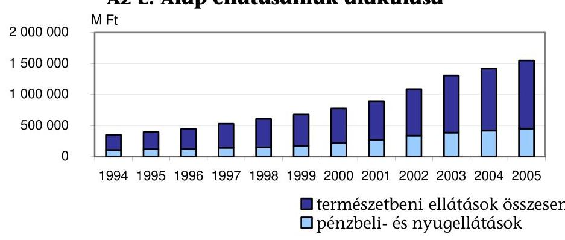
${ }^{43}$ Az ÁSZ a 2003. és 2004. évi költségvetés végrehajtásáról szóló jelentésében megállapította, hogy az értékvesztés elszámolása nem szabályos, a 249/2000. (XII. 24.) Korm. rendelet vonatkozó rendelkezése ellentétes a számviteli törvénnyel. A rendeletet módosító 319/2005. (XII. 26.) Korm. rendelet 5. §-a bevezette az egyedi értékelés elve sajátos alkalmazásának lehetőségét. Az ÁSZ a 2005. évi költségvetés végrehajtásának ellenőrzéséről szóló jelentésében a számviteli törvénnyel továbbra is ellentétesnek találta a kormányrendelet előírásain alapuló értékelési eljárást.
${ }^{44}$ Az APEH a központi költségvetési körben keletkezett köztartozások behajtása során is alkalmazza az Art. által biztosított fizetéskönnyítés engedélyezését. A hátralékok alakulásában szerepet játszhatott az adósságok automatikus átütemezésének APEH gyakorlata is.

---

# 1.5.1. A nyugellátások és a pénzbeli ellátások alakulása 

A nyugellátások közül az E. Alap finanszírozza a nyugdíjkorhatár alatti, III. rokkantsági csoportba ${ }^{45}$ tartozó rokkantak és baleseti rokkantak ellátásait, illetve a kapcsolódó hozzátartozói ellátásokat. A pénzbeli ellátások közé a betegséghez (táppénz), valamint a gyermekvállaláshoz (terhességi-gyermekágyi segély - TES, gyermekgondozási díj - GYED) kapcsolódó ellátások tartoznak.

## Az E. Alap nyugellátási és pénzbeli ellátási kiadásainak alakulása

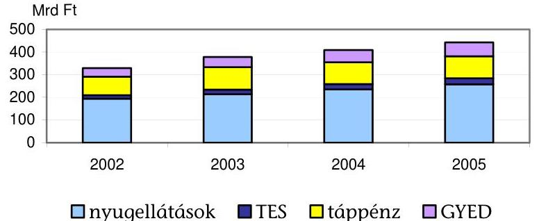

A korhatár alatti, III. rokkantsági csoportos nyugellátások nem alanyi jogon járnak. Az ellátások nem véglegesek, a jogosultságot időszakonként felülvizsgálják.

A rokkantság megállapítását az OEP igazgatási szerve, az OOSZI, a rokkantsági nyugdíjak megállapítását és folyósítását a nyugdíjbiztosítási ágazat végzi. Az elszámolási rendet az OEP és az ONYF főigazgatója megállapodásban rögzítette. Az ellátásokhoz tartoznak a baleseti nyugellátások, valamint a kapcsolódó hozzátartozói ellátások is.

A rokkantsági ellátások kiadásai az E. Alap pénzben folyósított kiadásainak több, mint $55 \%$-át jelentették. A tervezett előirányzatot a kiadás 2003-ban túl-, 2004-ben és 2005-ben alulteljesítette. Összességében három év alatt 32,5\%-kal, 194,3 Mrd Ft-ról 257,3 Mrd Ft-ra növekedett. A kiadások emelkedése alapvetően a mindenkori nyugdíjemelések következménye volt. A rokkantsági ellátások alakulását több tényező együttes hatása befolyásolta. A nyugdíjemelések és a 13. havi nyugdíj kiadásai éves szinten kiadási többletet eredményeztek, míg az ellátottak létszámváltozása, az új igénylők számának csökkenése a kiadások előirányzaton belül tartását segítette elő. Az ellátottak száma 2003 januárjában 384400 fő, 2006 januárjában 377400 fő volt, közel 2\%-kal csökkent. Az ellátás rendszerébe újonnan bekerülők száma évről-évre 2-3 ezer fővel kevesebb volt.

[^0]
[^0]:    ${ }^{45}$ A társadalombiztosítási nyugellátásról szóló 1997. évi LXXXI. törvény 29. § (1) bekezdése alapján a rokkantság fokának megfelelően I. és II. rokkantsági csoportba tartozó rokkant teljes mértékben, míg a III. csoportba tartozó rokkant nem teljesen munkaképtelen.

---

A jogosultság feltételei, a korhatár alatti rokkantak ${ }^{46}$ népességen belüli arányában meglévő területi különbségek nem változtak. A legmagasabb és legalacsonyabb arányt tekintve, a régiók között közel kétszeres (Dél-Alföld és Nyugat-Dunántúl), a megyék között közel háromszoros (Békés és Zala) az eltérés. Az ezer lakosra jutó, korhatár alatti rokkantak száma a három év alatt kismértékben ( $1,5 \%$-kal), 45 főre csökkent. A régiókon belül és a régiók között meglévő különbségek is fennmaradtak (4. számú melléklet).

A munkaképesség értékelésének, a megváltozott munkaképességű és rokkant személyek ellátó rendszerének az OGY által 1997-ben elfogadott elvek ${ }^{47}$ szerinti átalakítása nem történt meg. Az ÁSZ a több tárca feladatkörét érintő átalakítás elmaradását az E. Alap előző vizsgálatánál ${ }^{48}$ is észrevételezte. A témakört érintően egyes lépések megtörténtek, az OEP kidolgozta az orvos-szakértői eljárás, a munkaképesség minősítésének új irányelveit. A megváltozott munkaképességű munkavállalók foglalkoztatásának elősegítéséhez kialakították a foglalkoztatóknak nyújtható költségvetési támogatások rendszerét, növelték a támogatásokat, ezeket a módosításokat törvény, illetve kormányrendelet tartalmazza ${ }^{49}$. A témakör továbbra is napirenden van, a Kormány az érintett tárcák bevonásával 2006. öszén munkaanyagot dolgoztatott ki a megváltozott munkaképességűek ellátó alrendszerei összehangolt átalakításának koncepciójáról, és döntött az OOSZI felügyeletének módosításáról.

A korhatár alatti III. csoportos rokkantak magas száma, a rehabilitáció megoldatlansága az Alap kiadásait tartósan terhelte.

A táppénzkiadások a pénzbeli ellátások több mint $50 \%$-át tették ki. A táppénzkiáramlás visszafogására 2003-ban a passzív táppénz időtartamát egy évről 180 napra, majd 2004-ben 90 napra csökkentették, szigorították a keresőképesség megállapításának szabályait.

A táppénz igénybevételére hatással van a jogosultak létszáma, egészségi állapota, a keresőképtelenség elbírálása, a passzív jogú igénybevételen keresztül a foglalkoztatottság alakulása. A kiadásokat közvetlenül befolyásolja a táppénzes napok száma, a táppénz alapjául figyelembe vehető jövedelmek, a bruttó kereset alakulása.

A vizsgált időszakban összesen 4 nappal esett vissza az egy esetre jutó táppénzes napok száma, és a táppénzes esetek száma sem emelkedett. Az intézkedések eredményeképpen - a bruttó keresetek emelkedése mellett is - 2004-2005-re

[^0]
[^0]:    ${ }^{46}$ A korhatár alatti rokkantakon belül az E. Alapot érintő, III. csoportba tartozók aránya stabilan 80-83\% körül alakult.
    ${ }^{47}$ 75/1997.(VII.18.) OGY határozat a megváltozott munkaképességűek és rokkantak társadalombiztosítási és szociális ellátó rendszerének átalakításáról
    ${ }^{48}$ Az E. Alap múködésének ellenőrzéséről szóló, 0324. számú ÁSZ jelentés (2003. június)
    ${ }^{49}$ 1991. évi IV. törvény a foglalkoztatás elősegítéséről és a munkanélküliek ellátásáról, 39. §, illetve 177/2005.(IX.2.) Korm. rendelet a megváltozott munkaképességű munkavállalók foglalkoztatásához nyújtható költségvetési támogatásról

---

megállt a táppénzkiadások növekedése (5. számú melléklet). A kiadás a 2003. évi 98,9 Mrd Ft-hoz képest 2004-ben 96,2 Mrd, 2005-ben 97 Mrd Ft volt.

A táppénzhez hasonlóan a TES kiadásai az átlagkereset és az igénybevétel függvényében változtak. Az előirányzat minden évben alultervezettnek bizonyult az átlagkeresetek tervezettet meghaladó alakulása miatt. A felhasználás három év alatt 71,7\%-kal emelkedett (15,8 Mrd-Ft-ról 27,1 Mrd Ft-ra). A GYED kiadások teljesülése a tervezett érték közelében alakult. A TES-t havonta átlagosan igénybe vevők száma 17\%-kal nőtt, a GYED esetében a növekedés $24 \%$-os volt.

2003 volt az első olyan év, amikor a GYED előirányzatát a kifizetések meghaladták. A hároméves növekedési ütem 61,9\% (37,8 Mrd Ft-ról 61,2 Mrd Ft-ra) volt annak ellenére, hogy a felső határt 2006. január 1-jéig 83000 Ft-on befagyasztották, és csak 2006-tól emelték 87500 Ft-ra.

A pénzbeli ellátások kiadásai három év alatt 141,5 Mrd-ról 194 Mrd Ft-ra, 37,1\%-kal nőttek. Az előirányzat 2002-ben és 2003-ban bizonyult kevésnek, 2004-ben és 2005-ben kismértékben (kevesebb mint 1,5\%-kal) felültervezett volt.

# 1.5.2. A természetbeni ellátások kiadásai 

Az Alap összkiadásainak nagyarányú növekedését - súlyánál és emelkedési üteménél fogva - alapvetően a természetbeni ellátások kiadásainak növekedése okozta. A hároméves kiadásnövekedés mértéke 46,7\% volt.

Az alcím meghatározó előirányzatai a gyógyító-megelőző ellátások, a gyógyszertámogatások, valamint a gyógyászati segédeszköz-támogatások sorai. Közös jellemzőjük, hogy a támogatás-kiáramlás megfékezésének érdekében zárt kasszaként múködtek (2004-től ez az általános gyógyszertámogatásokra már nem volt igaz), ami a kiadások időarányos előirányzatot meghaladó alakulásánál külön intézkedést követelt.

A gyógyító-megelőző ellátások kiadásai évről évre a módosított előirányzat közelében teljesültek. A kassza részesedése a természetbeni ellátások alcímen belül csökkenő tendenciájú volt, 2003 és 2005 között 67,7\%-ról 63,1\%-ra mérséklődött. A kiadások hároméves növekedési üteme $38,1 \%$, az utolsó két évben együtt mindössze $11,5 \%$ volt.

Az időszak elején a kiadások emelkedését elsősorban az egészségügyi dolgozók 50\%-os béremelése okozta. A 2003-ra áthúzódó bérintézkedést az ÁsZ bírálta, mert az a kassza egészét tekintve nem volt egységes, és nem felelt meg a teljesítményen alapuló általános finanszírozási elveknek.

A finanszírozási szabályok módosításával automatizmust vezettek be az előirányzat betartására. 2003-ban megteremtették a teljesítmény-volumen megállapodás lehetőségét, és a teljesítményekre felső határt állapítottak meg. A határon felüli teljesítmény finanszírozását az OEP vizsgálatához kötötték. Számokban is érezhető változást azonban csak a teljesítmény-volumen megállapodások megkötése, a volumenkorlátos degresszív finanszírozás 2004. évi bevezetése

---

hozott. Az intézmények számára 100\%-osan finanszírozott teljesítmény nagyságát a 2003. évi teljesítmény 98\%-ában maximálták.

2004-ben 1999 óta először mutatott megtakarítást a kassza mindamellett, hogy nem voltak ellátási zavarok, és a díjak (forint-pont értékek) emelésére is sor kerülhetett.

A gyógyszertámogatások előirányzatának alakulása a vizsgált időszakban az egészségbiztosítási rendszer neuralgikus pontja volt. A hároméves növekedési ütem itt volt a legmagasabb, $66,9 \%$. A tervszám és a teljesítés eltérése 2003 óta évről évre nőtt, 16\%-ról 22,9\%-ra. Az előirányzat esetében a szakmai szempontokat alárendelték az államháztartási egyensúlyra való törekvésnek, ám ez a kassza jellegéből adódóan nem volt eredményes.

A gyógyszerkasszát az ÁSZ minden évben irreálisan alultervezettnek minősítette, 2002-ben és 2003-ban havonta kellett kormányhatározatokkal engedélyezni a finanszírozáshoz szükséges keretet. 2004-ben a támogatások alakulására hatást nem gyakorló zárt kassza jelleget megszüntették.

A gyógyszertámogatások kiáramlását számos tényező befolyásolta (pl. fogyasztói áremelések, új termékek befogadása, drágább készítmények elterjedése, a szerződések keretében keletkezett túlköltés). A támogatások és a gyógyszerárak befagyasztására 2003-ban és 2004 elején kormányrendelettel tettek kísérletet, kevés eredménnyel.

A szerződések eredményeképpen az Alap bevételei bővültek a gyártói befizetésekkel, a piacstabilizációt viszont a 2005. évi háromszori térítési díjemelés rövid életűvé tette. A gyártói befizetések nem ellentételezték a kiadások gyors ütemű növekedését. A megállapodásban előre rögzítették az előirányzat 2004-2006 közötti összegét, évi 5\%-os emeléssel számolva a tényleges 15-20\% helyett.

Lényeges szabályozási kérdés volt a gyógyszerek társadalombiztosítási támogatásba való befogadási eljárásának a vizsgált időszakban történő újraszabályozása ${ }^{50}$. Kiterjesztették az orvosok gyógyszerrendelési jogosultságát, amihez nyilvántartási kötelezettséget írtak elő.

Az utóbbi módosítás szerint a nem finanszírozott egészségügyi szolgáltató orvosa nemcsak általános, hanem különleges jogcímen is jogosult gyógyszer, illetve gyógyászati segédeszköz rendelésére azzal, hogy támogatással történő rendelés esetén az ellenőrzés elősegítése érdekében az orvosnak a rendelt támogatott termékről nyilvántartást kell vezetnie. Ezenkívül 2006. július 1-jét követően ezeket az adatokat havonta meg kell küldeni az illetékes MEP részére.

A gyógyászati segédeszközök ártámogatásának finanszírozására tervezett előirányzatot 2003-ban és 2004-ben megnövelték, a teljesítés egyik évben sem haladta meg a módosított előirányzatot (zárt kassza). A 2006. évi tervszám alacsonyabb a megelőző két év tényadatánál, a csökkentett előirányzat nem nyújt elegendő fedezetet az egészségügyi igények kielégítéséhez, amit a 2006. I-IX. hó közötti teljesítés is igazolt.

[^0]
[^0]:    ${ }^{50}$ 217/1997. (XII. 1.) Korm. rendelet (Vhr.) - a kötelező egészségbiztosítás ellátásairól szóló 1997. évi LXXXIII. törvény végrehajtásáról - módosításával

---

Az egészségpolitikai célok között szerepel, hogy a társadalom minél szélesebb köre vegye igénybe a szolgáltatásokat, ennek ellenére a gyógyfürdőszolgáltatás kiadásainak teljesítése egyetlen évben sem érte el az előirányzat 90\%-át. A csökkenő kiadások mögött a szabályozások és ellenőrzések szigorodása, valamint az ellátást igénybevevők számának csökkenése állt.

Az egyéb kiadások körébe a kifizetőhelyi költségtérítés, a postaköltség, egyéb ellátási kiadások, az orvosspecifikus vények és - a gyógyszergyártókkal kötött megállapodások alapján - a gyógyszergyártók ellentételezése tartozott, évi 2-5 Mrd Ft teljesítéssel.

Az Alap által ellátott feladatok rendszerébe - az alapvetően oktatási, felzárkóztatási célú tevékenységére tekintettel - nehezen illeszthető támogatási forma, 2003. óta előirányzatként 50 M Ft, a Fogyatékos Gyermekek, Tanulók Felzárkóztatásáért Országos Közalapítvány ${ }^{51}$ támogatását szolgálta.

Az éves költségvetési törvényben nevesítve szereplő összeget az OEP-pel kötött támogatási szerződés alapján pl. a fogyatékos gyermekek fejlesztő felkészítését elősegítő eszközök és berendezések beszerzésére, akadály-mentesítésre és infrastruktúra kialakítására, tanulást elősegítő eszközök beszerzésére fordították.

Az OEP 2005 augusztusában a költségvetési törvény módosítási javaslathoz az EüM állásfoglalását kérte annak érdekében, hogy az Alap 2006. évi költségvetésének előkészítésekor azt már érvényesíteni tudják. Válaszadásra a vizsgálat lezárásáig nem került sor, a támogatás a 2006. évi költségvetésben is szerepel.

A vagyongazdálkodási kiadások nagyságrendje az ellátási kiadásokhoz képest elhanyagolható mértékű (2002-2003 között 0,4-0,5 Mrd Ft, 2004-2006 között 0,1-0,2 Mrd Ft) volt. A kiadások a korábbi kötelezettségekből adódó (postabanki részvényekkel kapcsolatos viszontgarancia kötelezettségek teljesítése), valamint a bérházak üzemeltetéséhez és az egyes társasházi albetétek értékesítéséhez kapcsolódó költségeket tartalmazták.

# 2. A SZAKMAI FELADATOK ELLÁTÁSA 

A szakmai feladatok ellátásánál az Alapot terhelő kiadások közül a nyugdíjbiztosítási ágazat által megállapított és folyósított, korhatár alatti III. csoportos rokkantsági nyugellátásokkal kapcsolatos, az OOSZI által végzett orvosszakértői tevékenységet a helyszínen nem ellenőriztük. A pénzbeli és a természetbeni ellátások alakulását a legnagyobb súlyú ellátási forma, a táppénz, illetve a gyógyító-megelőző ellátások alapján értékeltük. Az ÁSZ-nak a gyógyszertámogatásokat érintő témavizsgálataira és a 2005. évi költségvetés végrehajtásának ellenőrzésére tekintettel a gyógyszertámogatások alakulására részleteiben az átfogó ellenőrzés nem terjedt ki, és hasonló okból nem foglalkoztunk külön az irányított betegellátási rendszerrel.

[^0]
[^0]:    ${ }^{51}$ A Közalapítványt a Fogyatékos Gyermekek, Tanulók Felzárkóztatásáért Országos Közalapítvány létrehozásáról szóló 164/1997. (IX. 30.) Korm. rendelet alapította a közoktatásról szóló 1993. évi LXXIX. törvény 119. § (2) bekezdésében foglaltak végrehajtásaként.

---

# 2.1. Az ellátásokra jogosultak hiteles azonosító- és jogviszony adatainak rendelkezésre állása és az adatok felhasználása 

Az egészségbiztosítási rendszerben való részvételük alapján a természetbeni ellátásokra a belföldi személyek jogosultak, a pénzbeli ellátásokat csak a személyükben járulékot fizetők vehetik igénybe. Az ellátásokra való jogosultság az egészségbiztosítási rendszerben való részvétel, illetve a járulékkötelezettség teljesítése alapján, maga a járulékkötelezettség fennállása és a pénzbeli ellátások megállapítása a kötelezettséget és az ellátást megalapozó jogviszonyok ismeretében ellenőrizhető.

A természetes személyeket 1995. óta a Társadalombiztosítási Azonosító Jel ${ }^{52}$ (TAJ-szám) azonosítja a társadalombiztosítás és a szociális ellátások körében. Az egészségbiztosítás belső nyilvántartási rendszerei a nyújtott ellátásokat, a finanszírozás adatait az igénybevevő szerinti, azaz TAJ-szám szerinti részletezettségben tartalmazzák, az elszámolásokat feldolgozó programokat az egészségbiztosításban való részvétel, a TAJ-szám szerinti ellenőrzésre felkészítették.

A Magyarországon élő magyar állampolgárokat születésüktől a halálukig azonosítja a TAJ-szám, melyet az OEP központi rendszere képez. Az Alapkezelő vezeti a személyes adatokat és a TAJ-számot, annak érvényességét tartalmazó, közhiteles nyilvántartást, a TAJ adatbázist. Az EU tagállamok Magyarországon állandó lakóhellyel rendelkező polgárai 2004. május 1-jétől belföldinek minősülnek, részükre is hatósági igazolvány (TAJ-kártya) jár. A külföldiek jogosultsága az azt megalapozó jogviszony fennállásáig tart, a jogviszony megszűnésével a TAJszámot érvénytelenítik.

A külső és belső ellenőrzések megállapításai szerint a TAJ nyilvántartás megbízható és hiteles adatokat tartalmaz. A jogosultság fennállását a TAJkártya a TAJ adatbázissal összhangban mutatja. Az OEP TAJ-kártya kibocsátása és a jogosultak hiteles személyi és azonosító adatainak rendelkezésre állása és felhasználása érdekében tett intézkedései eredményesek voltak.

A TAJ adatbázist két különböző ágon - a Központi Adatfeldolgozó, Nyilvántartó és Választási Hivatal ${ }^{53}$ Személy- és Lakcímnyilvántartás adatainak ${ }^{54}$ automatikus átvételével és az igazgatási szerveknél - rendelkezésre álló információkkal hetente teljes körűen aktualizálják. A rendszerben a jogosulatlan hozzáférés kockázata elenyésző. Az adatbázis szerint 2006 áprilisában 10137149 magyar és 177287 külföldi állampolgár rendelkezett érvényes TAJ-számmal (6. számú melléklet).

[^0]
[^0]:    ${ }^{52}$ A személyazonosító jel helyébe lépő azonosítási módokról és az azonosító kódok használatáról szóló 1996. évi XX. törvény (Szaz. tv.) 21. §-a alapján.
    ${ }^{53}$ A Hivatal korábban a Belügyminisztériumhoz, 2006. június 9-től a Miniszterelnöki Hivatalhoz tartozik.
    ${ }^{54}$ Szaz. tv. 37. §. (1). bek. b) pont

---

A TAJ nyilvántartás rendszerét az OEP belső ellenőrzése 2005-ben a központi hivatali szervnél és a MEP-eknél rendszerellenőrzés keretében vizsgálta ${ }^{55}$. Megállapították, hogy az adatbázis hiteles, a nyilvántartás az ellátások igénybevételére jogosult valamennyi belföldi és külföldi személyt tartalmazza, az adatbázis jogszerű módosításait, a TAJ-szám indokolt érvénytelenítését informatikai és ügyviteli eljárások biztosítják. Külső szakértők 2005 novemberében a rendszer auditja alapján értékelték az adatok minőségét, a rendszer megbízhatóságát ${ }^{56}$. Megállapításuk szerint az adatbázisba be nem dolgozott tételek aránya a teljes TAJ adatbázis 2,7 ezreléke, a javítandó tételek aránya 2 ezrelék.

A vizsgált időszakban a magyar állampolgárok külföldön érvényesíthető, az EU csatlakozással megváltozott jogosultságát az EU területén tanúsító nyomtatványok (E111, E101), majd az Európai Egészségbiztosítási Kártya (EEK) kiállításának rendszerét az OEP kialakította, a 2006-ra ugrásszerűen megnövekedett számú igénylők okmányait határidőben kiadta.

Az EU kártya (illetve nyomtatványok) kiadása 2004-hez képest 70-80 \%-kal emelkedett, ami az ügyfélszolgálat megerősítését igényelte.

Az egészségügyi szolgáltatóknál az ellátottak a jogosultságukat a TAJ-szám-ot tartalmazó hatósági igazolvány, a TAJ-kártya vagy TAJ igazolás felmutatásával igazolják ${ }^{57}$. Az Alapkezelő az igénybevétel jogosságát a TAJ adatbázis felhasználásával utólag, a szolgáltatók teljesítményjelentésének feldolgozásánál automatikusan ellenőrzi.

A gyógyszertámogatások elszámolását végző BÉVER rendszer 2002. óta ellenőrzi a vényen feltüntetett TAJ-szám érvényességét, az ellenőrzés 2004-től a gyógyászati segédeszköz vényekre is kiterjed. A járó- és fekvőbeteg ellátás finanszírozásánál a TAJ-szám érvényességén túl a személy és a TAJ-szám összetartozását is vizsgálják 2006-tól.

A pénzbeli ellátások igénylője köteles az igényt elbíráló MEP vagy kifizetőhely részére a biztosítási jogviszonyát igazoló dokumentumokat benyújtani. Az elbíráló szerv az iratokat a saját nyilvántartása alapján ellenőrzi. Az OEP a jogviszonyokra vonatkozó, rendszeres foglalkoztatói bejelentések adatait az ún. Bejelentett Személyek Jogviszonyai (BSZJ) országos elérésű, informatikailag a TAJrendszerhez kapcsolódó adatbázisban tárolja.

A Tbj. és végrehajtási rendelete részletesen szabályozta az információkat szolgáltató foglalkoztatók körét és nyilvántartási, adatszolgáltatási, bejelentési kötelezettségüket. A MEP-ek az általuk megállapított ellátások iratait külön nyilvántartásban őrzik.

A járulékügyek APEH-hez kerülése óta, 1999-től a jogalkotó nem gondoskodott sem az ellátások igénybevételének a járulékkötelezettség

[^0]
[^0]:    ${ }^{55}$ A hatósági igazolványok kiadása, kezelése, nyilvántartási rendszere (OEP-Központ, 2005.10.25. és OEP-Országos, 2005.11.30.)
    ${ }^{56}$ OEP - TAJ/BSZJ Adattisztítás Módszertan, Clarity Consulting Kft, 2005. dec. 9.
    ${ }^{57}$ Ebtv. 29. §. (1) bek.

---

alapján történő, sem pedig a járulék-kötelezettségnek a jogviszony nyilvántartás alapján történő, az APEH és az OEP együttműködését igénylő, automatikus ellenőrzési lehetőségének megteremtéséről. A törvény (Art., Ebtv., Tbj.) nem adott felhatalmazást az államigazgatási szervek rendszeres egymás közötti adatátadására. A járulék-kötelezettség bevallásának ellenőrzéséhez az APEH a jogviszony nyilvántartást nem hasznosította, a járulékadatok felhasználására az OEP egyedi ügyek esetén kapott felhatalmazást ${ }^{58}$. A jogviszony nyilvántartás felhasználási lehetősége az OEP számára a pénzbeli ellátások ellenőrzésére korlátozódott. Az ellenőrzés az ellátások 60-70\%-át megállapító kifizetőhelyek esetén eleve csak utólagos lehet.

A jogviszony nyilvántartás nem teljes körú, nem hiteles adatokat is tartalmaz, megbízhatóságának szintje (az adatbázisba bedolgozott mintegy 49 millió tétel $15 \%$-a hibás megjelölésű) 2006 elején még nem tette lehetővé az adatok ellenőrzési célú, rendszerszerű felhasználását. A vizsgált időszakban a nyilvántartás pontatlanságai, naprakészségének hiánya, a bejelentések akár évet meghaladó késleltetésű feldolgozása az OEP finanszírozási feladatainak ellátását nem akadályozta, de a pénzbeli ellátások ellenőrzését nem tette lehetővé, azok elemzésénél a jogosultak körének becslésére volt szükség.

A szakértői felmérés szerint a BSZJ adatbázisba bedolgozásra váró 1,2 millió tétel között is van hibás. Az adatbázis nem, vagy tévesen azonosított beküldőtől származó, és nem azonosított személyre vonatkozó adatokat is tartalmaz. Az OEP az EEK kiállításához szükséges, jogviszonyra vonatkozó információkat az igénylőtől aktuálisan bekéri, nem hagyatkozik kizárólag saját nyilvántartására.

A fentiek miatt az OEP-nek a jogosultak jogviszony adatai rendelkezésre állására tett intézkedései összességükben nem ítélhetők eredményesnek. A jogviszony adatok bejelentésére, a bejelentések feldolgozására és ellenőrzésére vonatkozó intézkedéseket részletesen az 1. számú függelék tartalmazza, az adatokat a 7. számú melléklet foglalja össze. A jogviszony nyilvántartás megbízhatóságának és hitelességének a felhasználhatóság által megkövetelt szintre emelésére az OEP 2005-től tett lépéseket, a rendszer fejlesztésére 2006-ban az E. Alap költségvetése közel 1 Mrd Ft-ot tartalmaz.

Az egészségbiztosító nem rendelkezett naprakész adatokkal a bejelentésre kötelezettek köréről. A bejelentések feldolgozásának, a foglalkoztatókkal való kapcsolattartásnak, a hibajavításnak a szakmai irányítására csak 2005. közepétől múködött külön szakterület, a tevékenység ügyviteli szabályozása 2006. tavaszán lépett hatályba. Az informatikai rendszer a bejelentésekben elkövetett hibák javítását hibalistákkal nem támogatta. A szakellenőrzési apparátus által az 1,2 millió foglalkoztatónál végzett, mindössze 9000 helyszíni ellenőrzés a bejelentési és nyilvántartási kötelezettség teljesítését alacsony számánál fogva érdemben nem befolyásolta.

A pénzbeli ellátások igénybevétele, a kifizetőhelyi megállapítások automatikus ellenőrzésénél a megfelelő jogviszony(ok) fennállását az OEP nem vizsgálja. Az ellátások MEP-eknél történő - az összes eset mintegy 30\%-

[^0]
[^0]:    ${ }^{58}$ Art. 52. §. (7) bek.

---

át adó - megállapításához az igény jogosságát alátámasztó dokumentumokat aktuálisan be kell nyújtani. A dokumentumok adattartalmát a nyilvántartott adatok alapján ellenőrzik. A tapasztalatok szerint a nyilvántartott jogviszony adatok a benyújtott dokumentumok ellenőrzésére - az adatbázisban hibásként való megjelölésük vagy a benyújtott adattól való eltérésük miatt - csak esetlegesen alkalmasak. A benyújtott dokumentumok valóságtartalma csak a helyszínen volt ellenőrizhető.

Az FPEP tapasztalata szerint 40 elbírálandó igény közül 30-nál eltérés van a közvetlenül bekért jogviszony adatok és a BSZJ adatai között ${ }^{59}$.

A pénzbeli ellátásoknál - a jogviszony adatokkal történő összevetés hiányában - a jogosultság TAJ-szám alapú ellenőrzését az informatikai rendszer (ITP2000) a MEP-ek általi megállapítás folyamatában a folyósítást megelőzően, a kifizetőhelyek által benyújtott jelentések feldolgozásánál utólag automatikusan elvégzi.

Az OEP - főleg informatikai jellegű - intézkedései következtében az elszámolások ellenőrzöttsége emelkedett. A TAJ-szám hiánya vagy érvénytelensége a természetbeni ellátás automatikus finanszírozását, a pénzbeli ellátás folyósítását meghiúsítja, illetve a már folyósított ellátás visszakövetelését eredményezi. A jogviszony nyilvántartás jelenlegi adattartalma miatt az Alap ellátási kifizetéseire nincs hatással. A BSZJ-vel ellentmondó információk tisztázását a pénzbeli ellátások megállapításának ügyrendje sem írta elő, a követett gyakorlat igazgatóságonként eltérő volt.

A felügyeleti ellenőrzések tapasztalatai szerint egyes igazgatóságokon az eltéréseket tisztázzák (pl. a Heves MEP-nél). Nem tisztázták a Szabolcs-Szatmár-Bereg megyei pénztárnál és az FPEP-nél. Az FPEP-n rövid ideig jelezte a pénzellátási szakterület a BSZJ hiányosságait a nyilvántartásnak, de létszámhiányra hivatkozással a gyakorlatot megszüntették.

A jogviszony adatok bejelentésére a Tbj. 1998 óta kötelezte a foglalkoztatókat. A bejelentéseket tartalmazó jogviszony nyilvántartás adatait végül is sem a járulékkötelezettség, sem a pénzbeli ellátások ellenőrzésére nem hasznosították. Az egyéni adó- és járulék-nyilvántartás létrehozása, a „jogosulatlan társadalombiztosítási ellátások megakadályozása, az ellátás megállapítása érdekében"60 a foglalkoztatók adatszolgáltatási kötelezettségeit 2005-től több lépésben növelték (lásd az 1.2 pont jogviszonyok bejelentésére vonatkozó részét).

A jogosulatlan igénybevétel megakadályozására az APEH-től a vonatkozási időszakot legalább egy hónapos késéssel átvett adatok nem minden esetben - pl. a kifizetőhelyi megállapításoknál sem - alkalmasak ${ }^{61}$. A

[^0]
[^0]:    ${ }^{59}$ Az FPEP-nek az Igazgatóság felügyeleti ellenőrzéséről készített Összefoglaló Ellenőri Jelentésre adott válasza, 2004. aug. 8.
    ${ }^{60}$ Tbj. 41. §. (2) bek.
    ${ }^{61}$ Az APEH a Tbj. 31. § (2) bek. alapján először 2006. augusztus 31-én esedékes adatátadást az OEP tájékoztatása szerint 2006. november 3-ig nem teljesítette.

---

fenti változásokkal együtt nem módosultak a pénzbeli ellátások megállapításának eljárási szabályai, az információk a jogviszony nyilvántartás kiegészítéséhez, az igénybevett pénzbeli ellátások utólagos ellenőrzéséhez használhatók fel. A jogalkotó továbbra sem rendelkezett a jogviszony adatoknak a járulékkötelezettség ellenőrzésére való felhasználásáról, és nem változott a természetbeni ellátásokra való jogosultság feltétele sem.

Az államigazgatásnak valamennyi biztosítottra kiterjedő, fokozódó információs igénye az információk felhasználási lehetőségével, és az eddigi felhasználással nincs összhangban. A minden biztosítottra kiterjedő bejelentés, adatszolgáltatás és az adatok kezelésének növekvő költségeire, a biztosítottak mintegy harmadát érintő folyósításoknál várható megtakarításokra becslés nem készült.

Az OEP az adatszolgáltatásai során a személyi és a biztosítási adatok felhasználására jogosult szervezetek és a számukra átadható adatok körére vonatkozó adatvédelmi előírásokat betartotta. A Tbj. és az Ebtv. rendelkezéseiben előírt, rendszeres és igény szerinti adatátadási kötelezettségeiket teljesítették (pl. az ONYF, PSZÁF, FH, ÁNTSZ és BVOP) részére.

A biztosított jogosultsági adatai lekérdezhetőségének feltételeit megteremtették. A 2003 tavaszától múködő ún. TAJ-autorizáció a TAJ-szám közvetlen ellenőrzését teszi lehetővé regisztrált felhasználók részére. A biztosítottak 2006 júliusától az OEP által nyilvántartott jogviszony adataikat is lekérdezhetik.

A vizsgált időszakban a TAJ adatbázis legnagyobb felhasználói az egészségügyi szolgáltatók voltak. Adatot szolgáltatott továbbá az OEP a napi feladatai során kezelt adatvagyonából - a jogszabályban meghatározott közfeladatok ellátásán túlmenően - vállalkozások, intézmények, szervezetek és természetes személyek részére, térítés ellenében.

A törvényben ${ }^{62}$ nem szabályozott igények kielégítése érdekében történő adatszolgáltatást 2004 júliusa óta főigazgatói utasítás szabályozza, mellyel kapcsolatban előzetesen az OEP kérte az Adatvédelmi Biztos állásfoglalását.

A vizsgált időszakban az OEP-en és a MEP-eken kialakult, tovább fejlődött az adatvédelmi szervezeti struktúra. Minden személyes adatra vonatkozó egyedi adatkérés - érdemi ügyintézés előtt - továbbításra kerül adatvédelmi ellenőrzésre a területi adatvédelmi felelőshöz.

# 2.2. A táppénz megállapítása és folyósítása 

A biztosított megélhetéséhez gyermek vállalása, illetve a keresőképtelenség miatti jövedelem-kiesés esetén a társadalombiztosítás pénzbeli ellátásokkal járul hozzá. A táppénzkiadások 2003-ban a pénzbeli ellátások 57\%-át, 2005-ben

[^0]
[^0]:    ${ }^{62}$ 1997. évi XLVII. törvény az egészségügyi és a hozzájuk kapcsolódó személyes adatok kezeléséről és védelméről

---

50\%-át tették ki. Az évente közel 1 millió ${ }^{63}$ számú táppénz ellátás megállapítását és folyósítását az OEP szakigazgatási szervei, valamint a kifizetőhelyek végzik. A feladatellátást helyszínen a kiadások 35\%-át teljesítő FPEP-n ellenőriztük.

A kifizetőhelyi feladatok ellátását a társadalombiztosítás pénzügyi alapjainak és a társadalombiztosítás szerveinek állami felügyeletéről szóló 1998. évi XXXIX. törvény írja elő a legalább 100 fő társadalombiztosítási ellátásra jogosult személyt foglalkoztató munkáltató részére. A foglalkoztató teljes körű felelősséggel tartozik az általa megállapított és folyósított ellátások jogszerűségéért a központi hivatali szerv felé. A kifizetőhelyek száma 2004-ben 6.302, a hozzájuk tartozó ellátottak létszáma 2.052 ezer fő volt. A kifizetőhelyek számfejtették 2004-ben az összes esetnek a táppénz tekintetében $72 \%$-át, a terhességi-gyermekágyi segélyek $60 \%$-át és a GYED $59 \%$-át.

A megyei pénztárak a pénzbeli ellátások - a kifizetőhelyeket nem múködtető foglalkoztatók alkalmazottai, az egyéni vállalkozók részére történő - számfejtése, utalása mellett meghozzák és továbbítják az ezen foglalkoztatókat terhelő táppénz hozzájárulási határozatokat is.

Az Alapkezelő a 2003-2005. években a szabályozásban való közreműködésével, a jogszerú igények teljesítésével és a jogosulatlan igények kiszűrésével tud hozzájárulni a kiadások növekedésének megállításához. A szakterület javaslatokat dolgozott ki a táppénz rendszer módosítására, a kiadások csökkentésére, a javaslatok egy része beépült a szabályozásba. A passzív táppénz időtartamának korlátozására tett javaslatok fokozatosan valósultak meg. A pénzbeli ellátásokra történő megállapodás lehetőségét a jogi szabályozás - a szakterület tapasztalatai alapján 2004-ben tett előterjesztésére - 2005 őszén szüntette meg.

A 2050/2004. (III. 11.) ${ }^{64}$ Korm. határozat alapján összeállított javaslat részét képezte a pénzbeli ellátásokra köthető megállapodásokra, a lehetőség megszüntetésére tett felvetés, ami bekerült a Tbj-be ${ }^{65}$. Az OEP általános tapasztalata szerint a megállapodást kötő (eltartott) személyek $80 \%$-a terhességi, gyermekágyi segélyre, gyermekgondozási díjra való jogosultságot szerzett 15\%-os járuléknak a jogosultságot megalapozó, hat hónapig tartó megfizetésével. A minimális járulékfizetés ellenében az érintettek adott esetben két évig is ellátásban részesültek.

A szakfőosztály - többek között a rendszer egyszerűsítését és egyben kisebb költségű működtetését eredményező - javaslatait a PM, a szaktárca és a foglalkoztatási tárca képviselőivel egyeztette, az egyeztetésekről dokumentum nem áll rendelkezésre. Többször fölvetették pl. a kiadások hosszabb távú mérséklésére a járulékplafon visszaállítását, a munkáltatók táppénz-hozzájárulás fizetési kötelezettségének a járulék mértékének - a kieső bevétel pótlását célzó - mintegy fél százalékos emelése melletti megszüntetését.
${ }^{63}$ Az OEP kimutatásai szerint a táppénzes esetek éves száma mintegy 1,2 millió, de ez a szám az előző évben megállapított, áthúzódó eseteket is tartalmazza.
${ }^{64}$ 2050/2004. (III. 11.) Korm. határozat az államháztartás egyensúlyi helyzetének javításához szükséges rövid és hosszabb távú intézkedésekről
${ }^{65}$ 2005. évi CXIX. törvény az adókról, járulékokról és egyéb költségvetési befizetésekről szóló törvények módosításáról, 202. § (2) bek.

---

Az összes ellátási eset mintegy $70 \%$-át számfejtő kifizetőhelyek havonta elszámoltak a MEP-ekkel, a folyósított ellátásokról részletes jelentéseket adtak. A MEP-eken és a kifizetőhelyeken folyó, az igények elbírálására, az ellátás megállapítására és folyósítására kiterjedő szaktevékenység elvi, szakmai irányítását az OEP két szakterülete végezte. A MEP-eken a kifizetőhelyeket felügyelő szakellenőrzési terület feladata volt egyben a kifizetőhelyek létesítése, megszüntetése és ellenőrzése.

A szakigazgatási szerveknél a munkafolyamat a jogi előírásokkal összhangban szabályozott, a feladatellátást az ITP2000 pénzellátási rendszer megfelelően támogatja. A szakterület az igényeket határidőben elbírálta és folyósította, a nyilvántartásai alapján ellenőrizte.

Az ügyviteli tevékenységet főigazgatói utasítás, SZMSZ és ügyrendek szabályoz-
zák. A benyújtott adatoknak - az Ebtv-ben előírt, az elbírálást megelőző, saját
nyilvántartás alapján történő - ellenőrzését az ügyviteli utasítás is előírja. A
pénzellátási és közgazdasági szakterület által kifejlesztett rendszer, az ITP 2000
elvégzi a pénzbeli ellátási igények nyilvántartását, számfejtését, utalását és az
utaláshoz kapcsolódó számviteli, statisztikai és adatszolgáltatási feladatokat,
rögzíti és naplózza a benne dolgozók tevékenységét. A havonta átlagosan 36 ezer
igény elbírálása az FPEP-n átlagosan 8-10 napig tart, és további 5-7 napon belül
utalnak.
Az egységes jogalkalmazáshoz az elvi irányító területek körleveleket, tájékoztatókat adtak ki, rendszeresen országos értekezleteket tartottak. A kifizetőhelyek tevékenységét segítő, az Ebtv-ben előírt egységes ágazati útmutató ${ }^{66}$ azonban csak 2006. június 13 -án jelent meg.

A kifizetőhelyek által folyósított ellátások jogszerűségét az OEP elsősorban a tevékenység ellenőrzésével tudta növelni. A kifizetőhelyi ellenőrzések száma - a kifizetőhelyek számának 6.800-ról 6.041-re csökkenése mellett, a feladatok ellátásában tapasztalt hiányosságok miatt - 2003-ról 2005re közel egynegyedével (3.885-re), az ellenőrzéssel érintett biztosítotti létszám másfélszeresére emelkedett. Az ellenőrzések eredményeként a tévesen megállapított pénzbeli ellátások miatti fizetési meghagyások száma $74 \%$-kal 3.061-re, összege $230 \%$-kal, 420 M Ft-ra nőtt (8. számú melléklet).

A mintegy 260 fő ellenőr szakigazgatási szervek közötti megoszlása a feladattal nem volt arányos. Az ellenőrzés iránti igény és az ellenőrök teljesítménye is nagy szórást mutatott (9. számú melléklet). Az ellenőrzés rendjét az OEP által 2000-ben kiadott, azóta az e területen rendszeresen aktualizált Ellenőrzési Szabályzat részletesen előírta. A tevékenység informatikai támogatottsága nem volt megfelelő. Az ellenőrzési nyilvántartási, ügyviteli feladatokat támogató és a szükséges adatbázisokhoz való, közvetlen hozzáférést is biztosító ELLENŐR rendszer 2006 nyarán „éles rendszerként" még nem múködött, ami a feladat ellátásához külön eljárások alkalmazását (pl. adatoknak a nyilvántartási területtől való bekérése) tette szükségessé.

[^0]
[^0]:    ${ }^{66}$ Az OEP Főigazgatójának Tájékoztatója a Társadalombiztosítási Kifizetőhelyek Részére - Eb. Közlöny különszáma, 2006. június 13.

---

Az FPEP-n az egy ellenőrre jutó foglalkoztatók, kifizetőhelyek száma jelentősen meghaladta a többi szakigazgatási szerv adatát. Míg az egy fő ellenőrre jutó foglalkoztatók száma országosan mintegy 5.000, az FPEP-n 8.300, BAZ megyében 2.500. A múködő kifizetőhelyek $39 \%$-a az FPEP illetékességi körébe tartozott. Egy ellenőrre a MEP-eknél 23, az FPEP-n 37 kifizetőhely jutott. Egy ellenőr 2005-ben átlagosan Vas megyében 13, Somogyban 76 ellenőrzést folytatott le.

A MEP-ek szakmai - ennek keretében szakellenőrzési - tevékenységének ellenőrzése a 18 fős Felügyeleti Ellenőrzési Főosztály feladata volt. A felügyeleti ellenőrzés munkaterv alapján történt, a feladatellátás étékelését országos értekezleteken ismertették.

A MEP-ek átfogó vizsgálata során szerzett általános tapasztalat volt, hogy az ellátások megállapítása, folyósítása esetében az összegszerűség megállapításánál feltárt eltérések a jogszabályok nem egységes értelmezéséből adódtak. A felügyeleti ellenőrzés a kiemelkedően magas összegű napi táppénz kifizetések megalapozottságát 2005-ben és 2006-ban is vizsgálta.

A táppénzkiadásokat befolyásoló, a keresőképtelenség elbírálási szabályokat szigorította a tevékenységet szabályozó kormányrendelet ${ }^{67} 2004$ januárjától hatályba lépő módosítása. A rendelet végrehajtásához főigazgatói utasítást jelentettek meg, és kiadták az elbírálás megújított orvos-szakmai irányelveit tartalmazó kézikönyvet.

A kormányrendelet elrendelte, hogy a keresőképtelenség megállapításának az érvényes szakmai szabályokon kell alapulniuk, meghatározta a felülvéleményező főorvosok hatáskörét, megfogalmazta a betegek jogait, kötelességeit, pontosította az adminisztrációs szabályokat, előírta, hogy a kifizetőhelyeknek értesíteniük kell az orvost a táppénzfolyósítás megszúnésének pontos idejéről stb.

A kézikönyv útmutatásai, a keresőképtelen állapothoz, betegséghez rendelhető napok számának meghatározása elvi alapot adnak a keresőképesség elbírálásához és az elbírálás felülvizsgálatához. A szabályozás és az ahhoz igazodó gyakorlat hozzájárult ahhoz, hogy összességében csökkent, egy-egy betegségcsoportban visszaesett a kiutalt napok száma, ami a táppénzkiadások alakulására kedvezően hatott.

A 2005. évi adatok szerint a keresőképtelenség időtartama mentális betegségekben országosan 5,8 nappal rövidebb, mint 2004-ben, de így is több az irányelv szerinti 28 napnál, 5-12 nappal. Gerinc- és szívbetegségekben az időtartam 1,23,9 nappal csökkent és közelebb áll az irányelv szerint meghatározotthoz. A táppénzes napok száma 2003-tól 8,3 \%-kal csökkent.

Az OEP a keresőképesség elbírálását támogató, az ún. heti keresőképtelenségi jelentésekre épülő nyilvántartási rendszert múködtet. A Keresőképtelenségi Monitor Rendszer (KMR) alkalmas az alapellátás és a járóbeteg ellátás keretében elbírált keresőképtelenségi esetek nyomon követésére, ellenőrzési szempontok és vizsgálandó esetek kijelölésére, a keresőképtelenség okainak elemzésére, az elbíráló orvos szakmai tevékenységének megítélésére. A rendszer nem

[^0]
[^0]:    ${ }^{67}$ 102/1995. (VIII. 25.) Korm. rendelet a keresőképtelenség és keresőképesség orvosi elbírálásáról és annak ellenőrzéséről

---

terjed ki a kórházban lévő biztosítottakra. A biztosítottak keresőképtelenségi és táppénzes adatait tartalmazó adatbázisok rendszerszerű összekapcsolása nem történt meg, így kihasználatlan a táppénz igénybevételnek, azon belül a kifizetőhelyi elszámolások automatikus, másik forrásból származó adatokkal történő ellenőrzésének lehetősége.

A keresőképtelenséget elbíráló orvosoknak heti jelentést kell tenniük a keresőképtelenné, illetve keresőképessé nyilvánított biztosítottakról. A KMR módot ad különböző szempontú (pl. regionalitás, nem, életkor) morbiditási elemzésekre is.

A KMR együtt tartalmazza a táppénzes és betegszabadságos adatokat, nem tartalmazza viszont a kórházi ellátások adatait. A KMR-ből csak az ITP2000 Statisztikai modulja táppénzes adatainak a TAJ-szám alapján történő, eseti összekapcsolásával választható le a táppénzre vonatkozó információ.

Az OEP Egészségügyi Szakértői Főosztálya az elbírálás ellenőrzésére országos, ún. felülvéleményező főorvosi hálózatot működtet. Az ellenőrzések humán erőforrásának biztosítása, az egészségbiztosítási szakorvosképzés egészségbiztosítással kapcsolatos feladatainak koordinálása is az OEP szakfőosztályának feladatkörébe tartozik.

A keresőképességet az arra szerződésben feljogosított orvosok bírálhatják el. Az igazgatási szerveknél alkalmazott ellenőrző főorvosok mellett megbízásos főorvosok végzik a felülvizsgálatokat. Az OEP szakfőosztálya összehangolja a táppénzes vezető főorvosok munkáját, ellenőrzi a MEP-ek felülvéleményezési munkáját, értékeli a tevékenységet.

A felülvéleményező főorvosok száma a vizsgált időszakban átlagosan 280 fő volt, a létszám mintegy fele megbízás alapján látta el a tevékenységet. Az ellenőrzési tevékenység fokozásával emelték az ellenőrzött praxisok és a KMR alapján kiválasztott esetek vizsgálatát. Az esetek 85-90\%-ában nem tártak fel hibát, tévedést az átvizsgált dokumentumok alapján. Egyre kevesebbszer tapasztaltak az elbírálást végző orvosoknál szakmai hiányosságokat, és javult a dokumentálás.

Az ellenőrzés alá vont praxisok száma 2005-ben 75.047 volt, ami 5.447-tel több a 2003. évi adatnál. A KMR célzott ellenőrzések számát 15,5\%-kal, 962.023-ra emelték. Az általános dokumentációs hiányosságok száma évről évre kevesebb volt, $35 \%$-kal csökkent, a szakmai hiányosságok száma 755 esetről 330-ra esett vissza az utóbbi három évben. Táppénzfolyósítás megszüntetésére évente mintegy 2.000 esetben került sor. A főorvosok évente 300 ezer beteget vizsgáltak meg.

# 2.3. A járó- és fekvőbeteg-szakellátás finanszírozása 

A finanszírozónak az egészségügyi szolgáltatók folyamatos finanszírozásánál az ellátórendszer múködését befolyásoló társadalompolitikai, egészségpolitikai és pénzügyi intézkedéseket párhuzamosan kellett figyelembe vennie. Az egészségügyi dolgozók 2002. őszi béremelése, az áfa-kulcsok változása a szolgáltatók múködési kiadásait módosították. A szolgáltatásoknak az alacsonyabb költségigényű ellátási formában történő igénybevételét, végső soron az ellátórendszer összetételének módosulását a finanszírozott ellátások körének bővítésével (egynapos sebészet, otthoni hospice ellátás), az egyes ellátási formák díjának köze-

---

lítésével (díjharmonizáció) és a finanszírozási rendszer rugalmasabbá tételével (összevont szakellátási előirányzat meghatározása) ösztönözték.

Az egyes gyógyító-megelőző ellátási kasszák „összevonására" (együttes kezelésére), a Gyógyító-megelőző ellátási jogcímcsoporton belül a jogcímek közötti átcsoportosításra a korábbi költségvetési törvények is lehetőséget adtak, arról a szakminiszter a pénzügyminiszter egyetértésével dönthetett. A Magyar Köztársaság 2006. évi költségvetéséről szóló 2005. évi CLIII. törvényben már az összevont szakellátás új költségvetési jogcím került meghatározásra, amelynek része a járóbeteg szakellátás, a CT-MRI szolgáltatás, az aktív fekvőbeteg-szakellátás is. A díjharmonizáció első lépéseként 74 járóbeteg műtéti beavatkozás pont-, illetve díjértékét közelítették az azonos fekvőbeteg műtéti díjrészek 65\%-nyi mértékére.

A gyógyító-megelőző ellátási kiadások több, mint 70\%-a a járóbeteg- és a fek-vőbeteg-szakellátást finanszírozza. A finanszírozási rendszernek a teljesítmények folyamatos növelésére ösztönző hatása semlegesítésére vezették be 2004től a volumenkorlátos, a korláton felüli teljesítményeket degresszíven finanszírozó szabályozást (TVK). A szabály automatikusan biztosította az elszámolt teljesítmények előre meghatározott határ alatt tartását, és ezzel az előirányzat tartását ${ }^{68}$. A teljesítménynövelés finanszírozásának intézményi szintű behatárolása belső, hatékonyságot javító intézkedések megtételét kikényszerítheti, de önmagában nem ösztönöz az intézmények közötti strukturális változásokra. A kapacitások egyes ellátási formák közötti, illetve intézmények közötti átcsoportosításának ösztönzésére 2005 nyarán, majd 2006-tól módosító rendelkezéseket léptettek életbe ${ }^{69}$.

Az intézkedések követése a szakellátás finanszírozásánál igényelte az elszámolási rendszer jelentős korrekcióját. A béremelés eltérően érintette az egyes szakmákat, annak mértéke szükségessé tette az egyes betegségek, gyógyeljárások, beavatkozások - költségtényezők figyelembevételén alapuló - díjtételeinek változtatását. A díjtételek módosításához hiányoztak a betegellátási esetek költségeit, ráfordítás-összetételét jellemző naprakész adatok. Az új díjak bevezetéséig - adatfelmérésen alapuló - kiegészítő díjat kaptak az intézmények. A díjtételek, és arányaik módosítása az egyes intézményeknek az egymáshoz viszonyított bevételi pozícióit is megváltoztatta. A módosított teljesítménydíjakat először a 2004. februári teljesítmény elszámolásánál alkalmazták.

Módosították az egyes gyógyeljárásokhoz rendelt teljesítmény nagyságát (a járóbeteg-ellátásban az esetek, beavatkozások pont értékét, az aktív fekvőbeteg ellátásban a HBCS súlyszámot). A súlyszámok és pontok módosításánál a belső

[^0]
[^0]:    ${ }^{68}$ A 2003. évi teljesítmény 98\%-ában megállapított volumenkorlátot 2006 júliusától $5 \%$-kal csökkentették, és megszűnt a korlát feletti teljesítmények degresszív finanszírozása.
    ${ }^{69} 43 / 1999$. (III. 3.) Korm. rendelet az egészségügyi szolgáltatások Egészségbiztosítási Alapból történő finanszírozásának részletes szabályairól, 27-28. §

---

aránytalanságokat korrigálták, a súlyszámokat és pontokat „visszanormálták" 70 .

Az alkalmazott rendszerben a finanszírozás összegét az ellátott esetek száma, az elszámolt súlyszám vagy pont és az alapdíj szorzata adja. A teljesítményelvű finanszírozás bevezetésekor a díjtételek ráfordításokkal arányos megállapítása volt a cél, a súlyok (és a pontok) egymáshoz viszonyított arányainak a költségarányokat kell tükrözniük. Az aktív fekvőbeteg ellátás területén utoljára 1999-ben mérték fel átfogóan az ellátások költségeit.

A teljesítmény-elszámolásnál - pl. betegségre, orvosi eljárásokra - alkalmazott kódok, a finanszírozási paraméterek rendszeres és eseti karbantartását a jogszabály ${ }^{71}$ a szakminisztérium felügyelete alá tartozó GYÓGYINFOK-hoz rendelte, az OEP a tevékenységet a GYÓGYINFOK megszüntetésekor, 2004 január közepétől vette át. A karbantartás, a módosított kódok és finanszírozási paraméterek közzététele a szakminiszter tanácsadó szervének, a Finanszírozási Kódkarbantartó Bizottságnak az előterjesztése alapján történt. A jogszabály nem írja elő a finanszírozási paraméterek módosításának szükségességét és elvégzését megalapozó információk folyamatos gyűjtését. A különböző számviteli elszámolásokat alkalmazó szolgáltatók egységes tartalmú adatszolgáltatását és annak ellenőrzését lehetővé tevő, ágazati szintű előírás nem jelent meg.

A célja szerint az átlagos ráfordításokat térítő teljesítménydíjak rendszerében a finanszírozónak nincs ismerete az egyes ellátási esetek, beavatkozások díjainak aktuális költségtartalmáról, az intézményrendszer egészének nyújtott finanszírozás és az indokolt ráfordítások viszonyáról. A Bizottság elvégezte a járóbetegellátásban a teljesítmények jelentésére, a kódok alkalmazására vonatkozó Szabálykönyv felülvizsgálatát, az új Szabálykönyv 2003 elején jelent meg.

A kódok meghatározásához szükséges adatok és számítások rendszerét a GYÓGYINFOK kialakította, azonban a folyamatos adatgyűjtésre nem állt rendelkezésre fedezet. A 2004. elejére végrehajtott átfogó karbantartáson kívül kódokat még egy-egy terület teljesítménydíjának korrigálásához, új eljárások finanszírozásba való befogadásához módosítottak.

# A GYÓGYINFOK megszüntetését és feladatainak átvételét a szaktárca 

nem készítette kellően elő. A feladatoknak a jogutódként kijelölt OEP általi átvételét egyes feladatoknak más szervezethez való továbbadása követte.

A MEDINFO (későbbi ESKI), valamint az OTH is vett át immáron az OEP-től feladatokat és erőforrásokat. A folyamat elhúzódására jellemző, hogy még 2005 márciusában is miniszteri leirat rendelkezett elmaradt feladat- és forrásátadásról.

[^0]
[^0]:    ${ }^{70}$ A visszanormálás hatására az intézményrendszer súlyszámban, pontszámban kifejezett, összesített teljesítménye csökken. Ezért nem hasonlíthatók össze közvetlenül a módosítást megelőző és az azt követő időszakok súlyszámban és pontértékben kifejezett teljesítményadatai.
    ${ }^{71}$ 6/1998. (III. 11.) NM rendelet az egészségügyi ellátáshoz használt szakmai kódrendszerek és finanszírozási paraméterek karbantartásának jogi szabályozásáról

---

A teljesítmények súlyszámban/pontszámban kifejezett éves nagyságának csökkentése, a volumenkorlátos finanszírozás érvényesítése és az előirányzat növelése lehetővé tette az alapdíjak (az egy súlyszám illetve pontszám teljesítményért járó forintösszeg) dinamikus emelését.

Teljesítmény alapdíjak alakulása (2002. jan. = 100\%)
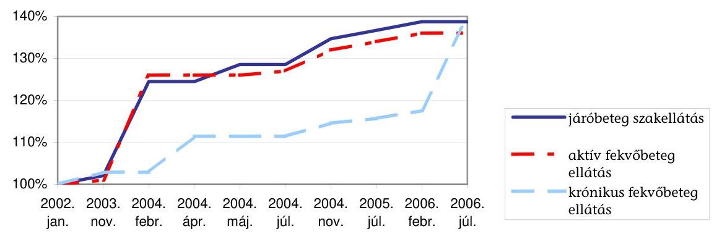

A 2003 októberétől 2006 februárjáig terjedő 30 hónap alatt több lépésben, összességében $36 \%$-kal emelték az aktív fekvőbeteg ellátás, és $39 \%$-kal a járóbeteg ellátás alapdíját. A krónikus fekvőbetegek ellátásáért fizetett napidíj ugyanebben az időszakban $18 \%$-kal nőtt.

A jelentett teljesítményeknek az ellátás minőségétől függő elbírálására az OEPnek szűk lehetősége volt. A teljesítményeknek a szakmai minimumfeltételek be nem tartása miatti korrekciójára a TVK szabályok 2006-tól adnak lehetőséget.

A finanszírozási kormányrendelet átmeneti ideig tartalmazott korlátozást ${ }^{72}$ arra, hogy az egyes járóbeteg-szakellátási beavatkozásokra meghatározandó minimum időtartamoknál is gyorsabb munkát jelentők teljesítménye nem számolható el.

A minimumidőket egy miniszteri tájékoztató közzétételével vezette volna be a rendelet, a tájékoztató azonban 2003. augusztus 1-jétől 2005. február 1-jéig nem jelent meg, amikorra a jogszabályi rendelkezést hatálytalanították. Az aktív fek-vőbeteg-szakellátásban az elbocsátott beteg „túl gyors" visszavételénél csökkentett finanszírozás jár a szolgáltatónak.

Az ellátásoknak a jelentett teljesítményeken alapuló finanszírozása mellett egyre szélesebb betegkört és szakterületet érintően alkalmaztak más finanszírozási technikát. Az integrált betegirányítási rendszerbe 2006-ra közel 2,5 millió lakos tartozik. A fix díjak 2003-ban az aktív fekvőbeteg ellátási kassza 1,6\%-át, 2005-ben közel $3 \%$-át tették $\mathrm{ki}^{73}$.

[^0]
[^0]:    ${ }^{72}$ 43/1999. (III. 3.) Korm. rendelet az egészségügyi szolgáltatások Egészségbiztosítási Alapból történő finanszírozásának részletes szabályairól, 30. § (13) bek.
    ${ }^{73}$ 9/1993. (IV. 2.) NM rendelet az egészségügyi szakellátás társadalombiztosítási finanszírozásának egyes kérdéseiről

---

Külön havi fix díjazást, progresszivitási díjat kapnak a legmagasabb szintű ellátásokat nyújtó országos gyógyintézmények, orvosegyetemek, megyei kórházak, regionális ellátást végző fővárosi kórházak évente összesen mintegy 5,2 Mrd Ft összegben. A klinikai sürgősségi szakmák kórházi osztályai 2004-től rendelkezésre állási díjat, 2005-től fix sürgősségi ellátási díjat is kapnak, a díjak 2005-ben összesen 5,2 Mrd Ft-ot tettek ki.

Az OEP szerződés-kötési kötelezettsége alapján a MEP-ek kötnek finanszírozási szerződést a helyi önkormányzat szakellátási kötelezettségét teljesítő szolgáltatókkal, valamint az egészségügyi miniszter és a pénzügyminiszter által befogadott többletkapacitással rendelkező egészségügyi szolgáltatókkal. A kötelezően és meg nem változtathatóan alkalmazandó finanszírozási szerződések iratmintáit a központi hivatali szerv a vonatkozó jogszabályoknak megfelelően alakította ki.

A szerződéseket nyilvántartó országos elektronikus adatbázis nem tartalmazza valamennyi, a szerződések részét képező információt. A nyilvántartási rendszer nem alkalmas egyes kötelezően bekért adatok, így az intézmények eszközkataszter adatai és a közremúködői szerződések adatainak ügyviteli és informatikai kezelésére, ami az adatok felhasználását akadályozza.

A finanszírozott szakellátó intézmények száma alig változott (mintegy 460 járóbeteg- és 180 fekvőbeteg- szakellátó intézmény). A közreműködői szerződéseket 2005. november 1-jétől kéri be az OEP. Az eszközkataszter jelentéseket az FPEP nem dolgozza fel.

A szolgáltatók által küldött havi teljesítményjelentések feldolgozását, a finanszírozást vizsgáló belső és külső revíziók ügyviteli leírások és dokumentációk hiányára mutattak rá (a realizálás 2006 nyarán folyamatban volt). A jelentések folyamatba épített ellenőrzése ügyviteli kezelésük és feldolgozásuk során megvalósul, a teljesítmények automatikus logikai ellenőrzésének rendszere kiépített.

A MEP-ek a járóbeteg-szakellátás intézményeinek havi teljesítményjelentéseit érkeztetik, előzetesen ellenőrzik. A fekvőbetegek ellátásáról szóló jelentéseket közvetlenül a szakfőosztályhoz kell küldeni. A fekvő elszámolásoknál vizsgálják például, hogy a jelentett betegségre lehetséges-e a jelentett orvosi eljárás alkalmazása.

A jelentett teljesítményeket utólag orvos-szakmai szempontból a MEP-ek mintegy 240-250 főből álló apparátusa (egyéb feladataik mellett) ellenőrzi. A természetbeni ellátások, a finanszírozási szerződések ellenőrzésének egységes módszerét a szakmai irányító főosztály 2006-ra dolgozta ki. A szakmai ellenőrzést végzők részére közvetlenül nem állnak rendelkezésre a szolgáltatók szerződéses adatai, sem a jelentett és elszámolt teljesítmények adatai. Az ellátások finanszírozói szempontból való indokoltságát - a szaktárca irányításával készítendő, szakmai konszenzuson alapuló - finanszírozási protokollok hiányában nem vizsgálták.

A szakmai ellenőrzést végzők közel kétharmada orvos. Az irányító főosztály 2003 óta mintegy 30 fővel múködik a társfőosztályok korábbi ellenőrzési személyzetének és feladatainak összevonásával. Kapacitásuk mintegy 4,3/3,1 \%-át fordítják a járó/fekvő szakellátást nyújtók ellenőrzésére.

---

Az ellenőrzések megállapításai alapján 2005-ben a fekvőbeteg-szakellátásban hozzávetőleg 50 M Ft -ot vontak vissza (az OEP által elrendelt 5 kórházi ellenőrzési tárgykörben), a járóbeteg-szakellátásban mintegy 100 M Ft díjat vontak le a szolgáltatóktól (hét, az OEP által kijelölt szakellátási téma vizsgálata után).

A finanszírozott kapacitások (ágyszám, heti szakorvosi óra) nagysága a három év alatt lényegében nem változott. A finanszírozásba a norma szerinti kapacitást meghaladóan befogadott ágykapacitás nem érte el a lekötött ágyszám 5\%át 2005 végén. A járóbeteg-szakellátás finanszírozásában az összes szerződött szakorvosi órához viszonyítva 5,4\%, nem szakorvosi órakapacitáshoz mérten pedig 9,6\%-os mértékű, normatíva feletti befogadás volt érvényben.

A finanszírozás a gyógyító kapacitásokat a fekvőbeteg ellátásban a kórházi ágyak száma (aktív, illetve krónikus ágyszám) ${ }^{74}$, a járóbeteg-szakellátásban a szerződött (szakorvosi és nem szakorvosi) órák száma alapján méri. Elszámolni csak az OEP-pel szerződött kapacitások kihasználásával, ténylegesen nyújtott gyógyító ellátásokat, eseteket, beavatkozásokat szabad. Az intézmények norma szerinti kapacitása a finanszírozási szerződésben 2001. január 1-jén lekötött, illetve azok szerződéses módosításaival korrigált kapacitással egyezik meg. A múködő kórházi ágyak száma 79500 és 80000 db között, a szerződött órák száma mintegy 15100 ezer óra körül volt.

A normatíva feletti kapacitások pályázatait az OEP írja ki, és múködteti a kérelmeket elbíráló bizottságot. A döntés-előkészítéshez készített javaslatok általánosan alkalmazott bírálati szempontja az ellátás területi egyenletességének (hozzáférés) javítása volt.

Jogszabályban nem szabályozott az új gyógyeljárások befogadását bíráló és az új eljárás díjtételeit megállapító bizottságok együttműködése.

Az új eljárást a kódkarbantartási munkabizottság és a kapacitásbefogadási bizottság is véleményezi, együttmúködésüket azonban az egyes bizottságok feladatait tartalmazó jogszabályok nem írják elő.

A már befogadott többletkapacitások meghosszabbításának elhúzódó miniszteri döntései többletkiadásokkal járnak. A pályázó az esetleges elutasításig (és még a döntést követő további két hónapig) jogosult folyamatos finanszírozásra. A miniszteri rendeletben előírt tevékenységhez szükséges többletkapacitások befogadásánál a bizottság szerepe formálissá válik.

A 2004-ben benyújtott, az OEP által és időben elbírált pályázatokról szóló miniszteri döntést csak 2005. november 7 -én hirdették ki. 2005-ben a bizottság egyes

[^0]
[^0]:    ${ }^{74}$ A kórházi ágyszámra több mutatót is használ a finanszírozási szakterület, pl. működő ágyak száma (a fizikailag ténylegesen „üzemelők"), szerződéses ágyak száma (OEPpel kötött finanszírozási szerződés szerintiek), engedélyezettek száma (az ÁNTSZ hatósági múködési engedélye szerinti mennyiség). Az ellenőrzés az OEP-pel szerződött kapacitásokat érti kapacitások alatt.

---

anyagcsere betegségek szűrésének bevezetéséhez ${ }^{75}$ javasolta a szükséges kapacitás befogadását.

# 2.4. A gyógyászati segédeszközök támogatása 

A vizsgált időszakban a gyógyászati segédeszközök árához nyújtott támogatások a 2003. évi 34,9 milliárd forintról 2005-re 44,1 milliárd forintra emelkedtek. Változott az előirányzat tagolása, 2004-től külön soron tartalmazza a költségvetés a kötszerek támogatását. Az Alapkezelő a kiadások alakulásának befolyásolásához - a jogszabályokban előírt feladatai alapján - a támogatások és a támogatott termékek körének megállapításában, a jogalkotásban való részvételével, a rendszer múködtetésével és a jogszerútlen igénybevétel kiszűrésével tud hozzájárulni.

Egy termék támogatásának előfeltétele a forgalmazók részvételével megtartott ártárgyalási eljárás. A támogatott gyógyászati segédeszközök köre, az árukhoz nyújtott támogatás alapja és mértéke jogszabályban való kihirdetéssel válik hatályossá. A 2006. öszén az OGY elé terjesztett T/1037. sz. tv. javaslat elfogadásával várhatóan módosul a támogatás megállapításának folyamata.

Az OEP - a támogatás (a közfinanszírozás) alapjául elfogadott ár, valamint a kölcsönzési dí kialakítására vonatkozó - az ártárgyalások megtartására ${ }^{76}$ vonatkozó kötelezettségét a forgalmazók ellenérdekeltsége és a felügyeleti szervnek az eljárás beszüntetésére vonatkozó döntése miatt nem teljesítette. Gyógyászati segédeszközökre utoljára 2002-ben folytattak ártárgyalást, az OEP által 2004 szeptemberében és 2006-ban meghirdetett eljárások sikertelenül zárultak. Az időszakban mintegy háromnegyed évig a szakminiszter intézkedésének elmaradása miatt nem indulhatott eljárás. Új termékek befogadásának elmaradása miatt egyes termékcsoportokban a termékek az OEP szakembereinek véleménye szerint korszerütlenek, választékuk nem megfelelő (pl. fogászat, egyes ortopédiai termékek).

Az ártárgyalási feltételekre a szakfőosztály által kidolgozott, és a miniszter dön-tés-előkészítő szerve, a TÁTB döntése alapján véglegesített koncepciót az OEP főigazgatója legalább négy héttel a tárgyalások megkezdése előtt az OEP hivatalos lapjában közzéteszi. 2004 nyarától 2005 április közepéig a TÁTB-nek nem volt elnöke (a miniszteri kinevezés késett), így ülésezni sem tudott. A 2004-ben kötszerekre meghirdetett tárgyalások második fordulóján a forgalmazók nem jelentek meg, ezért az eredménytelenül zárult. A 2006-ban árcsökkentésre megjelentetett felhívást a miniszter visszavonatta.

Az ÁSZ ellenőrzés számára a visszavonás előzményéről a minisztériumban biztosított dokumentumok a forgalmazók felháborodott levelei, beszélgetések jegyzőkönyvei, amelyekben a kiírás módjára vonatkozó kritikájukat fejezik ki. A szak-

[^0]
[^0]:    ${ }^{75}$ A kötelező egészségbiztosítás keretében igénybe vehető, betegségek megelőzését és korai felismerését szolgáló egészségügyi szolgáltatásokról és a szűrővizsgálatok igazolásáról szóló 51/1997. (XII. 18.) NM rendeletet módosító 67/2005. (XII. 27.) EüM rendeletben egyes veleszületett anyagcsere betegségek szűrésének bevezetése 2006. VIII. 1-től.
    ${ }^{76}$ Vhr. 10/B §.

---

tárca és a PM képviselői a TÁTB ülések során megismerték az ártárgyalási felhívás koncepcióját, ahhoz észrevételeket tehettek és a jegyzőkönyvek alapján tettek is.

A jogi szabályozás, a 2004. évi tárgyalási kísérlet, valamint a korábbi ártárgyalások hiányosságainak tapasztalatait az OEP hasznosította. A 2006. évi ártárgyalás feltételeit (egyfordulós, ár csökkentésére irányul) a kassza érdekeit is figyelembe véve, a forgalmazók közötti verseny kikényszerítésére határozták meg, a koncepciót a TÁTB is jóváhagyta. Az átlátható befogadási rendszerre való - eddig többször is elhalasztott - áttérés az ártárgyalások jelenlegi rendszerét megszünteti.

A 2002. decemberi ártárgyaláson az ajánlatok feltételeként gazdasági számítások benyújtásának elő nem írása és a nemzetközi árak ismeretének hiánya is hozzájárult, hogy a támogatás alapját képező árak - a szakfőosztály megállapítása szerint, adott termékkörben (kötszereknél) - a külföldi árakat, esetenként többszörösen meghaladják. A forgalmazó nem köteles ajánlatainak a költségekkel való alátámasztására, a benyújtott számítások erre nem alkalmasak. A nemzetközi árak rendszeres figyelemmel kísérése nem valósult meg. A szakfőosztály a kötszerek árát az angol nemzeti biztosító áraival hasonlította össze. Megítélésük szerint az árak különbözősége valószínűsítette, hogy az újabb, árcsökkentésre szóló felhívás reális.

A támogatási rendszerben - eltérően a gyógyszerek ártámogatásától a támogatás alapját képező ár és a támogatás mértékének megállapítása nem jelenti egyben a támogatott termékek fogyasztói árának rögzítését. Ha a fogyasztói ár meghaladja a támogatás alapját képező árat, a különbözet a beteget terheli. Amennyiben a beteg közgyógyellátásra jogosult, azt a költségvetés fedezi ${ }^{77}$. A jogosultak körében az árak lehetséges különbözősége nem általánosan ismert. A közgyógyellátás szabályozásának módosításával 2006. július 1-jétől az ellátás nem jelent egyben ingyenességet.

A 2005. évi CLXX. törvény 17.§-a alapján a gyógyászati segédeszközök és ellátások esetében az általános támogatáson felüli hozzájárulás mértéke a közfinanszírozás alapjául elfogadott ár erejéig vehető igénybe, ezzel a betegre terhelik a közfinanszírozás alapjául szolgáló ár és a fogyasztói ár esetleges különbözetét.

A fogyasztói áraknak a forgalmazóknál tapasztalt különbségeit a felszámított forgalmi adó eltérő mértéke is okozta. Egyes forgalmazók hibásan, nem a vényre felírt, támogatott termékre felszámítható kedvezményes áfa-kulcsot alkalmazták, ezzel is növelve a kassza és a beteg kiadásait. A szakfőosztály a vámtarifaszámok (amelyek az eszköz áfa kulcsát meghatározzák) forgalmazóktól való bekérésével esetenként megkísérelte a helyzet tisztázását ${ }^{78}$. A feladatot nehezíti, hogy nincs teljes körü, a vámtarifaszámot is tartalmazó gyógyászati segédeszköz törzsadatbázis, amelyhez az áfa tartalmat ren-

[^0]
[^0]:    ${ }^{77}$ 1993. évi III. törvény a szociális igazgatásról és szociális ellátásokról, 49. §
    ${ }^{78}$ Az áfa tv-beni kedvezményes, a gyógyászati termékek széles körére alkalmazható adókulcs 2006. szeptember 1-jei eltörlésével, az intézkedés okafogyottá vált.

---

delni lehetne. A kassza kiadásait a termékkörre kirótt, átlagosan - a gyógyszerek 5\%-os kulcsával szembeni - 12,41\%-os áfa tartalom is növeli.

Az áfa kulcsot a termék vámtarifaszáma és az áfa törvény 1. és 2. számú melléklete alapján kell megállapítani, ami a forgalmazó feladata. Bonyolítja a kérdést, hogy egyes termékek nemcsak gyógyászati, hanem pl. kényelmi célból is használhatók (pl. egyes matracok). Előfordulhat, hogy a termék és annak alkatrésze eltérő áfa tartalmú.

Az OEP a kassza védelmét is szolgáló javaslatait az ellenőrzések tapasztalatai alapján tette meg. Az egyes termékek (pl. hallókészülékek, kötszerek, ortopédcipők) rendelésére vonatkozó szabályok szigorítására vonatkozó kezdeményezései 2006 nyaráig nem vezettek eredményre. Az eladásösztönző tevékenység tiltását 2004 májusától tartalmazó bekezdések ${ }^{79}$ hatályon kívül helyezése 2005 júliusától forgalom- és ezáltal kiadásnövelő hatású volt.

Ellenőrzési tapasztalatok igazolták, hogy a kötszerek támogatásának 2003 és 2005 közötti, mintegy kétharmaddal való, 5 milliárd forintra emelkedését a kötszerek korlátozás nélküli rendelhetősége is előidézte. A támogatásokat meghatározó rendelet ${ }^{80}$ melléklete nem tartalmaz a kötszerek rendelésére sem mennyiségi, sem időbeli korlátot, a rendelés gyakorlatilag bármilyen szakvizsgával megtörténhet, és a mennyiséget nem köti a sebfelület nagyságához. Esetenként nem bizonyítható, hogy a forgalmazók által elszámolt nagy mennyiségű, drága kötszer eljut a rászoruló betegekhez. Az OEP eredménytelenül tett javaslatot a minisztérium felé a kötszerrel kapcsolatos megszorítások bevezetésére.

A gyógyászati segédeszközök eladásának ösztönzése még a támogatott termékcsoportban sem korlátozott és nem szankcionálható. Az ellenőrzések tapasztalata, hogy a forgalmazók teljes mértékben éltek is a lehetőséggel, pl. a kötszerek forgalmát a beteg által fizetendő térítési dí átvállalása is generálhatta. A gyakorlat az adott termék árának és ártól függő támogatásának felülértékeltségét is mutatta.

A gyógyászati segédeszköz kölcsönzés kialakítására fordítható költségvetési előirányzatokat nem használták fel. A nagy értékű, az egy-egy beteg általi használat idejénél lényegesen hosszabb élettartamú eszközök kölcsönzéssel való rendelkezésre bocsátása a jogosult és a kassza számára is kedvező. A rendszer kialakítására és alkalmazására tett lépések a kölcsönzési konstrukció tapasztalatainak hiánya, a jogszabályi feltételek részleges teljesülése miatt nem vezettek el a konstrukció alkalmazásához.

Hat termékcsoportban jelent meg 2005 februárjában pályázati kiírás. A meghirdetett eszközök között voltak pl. nagy értékű ápolást, mozgást, mozgatást elősegítő eszközök (betegemelők), felfekvést kezelő, megelőző matracok, gyengén vagy alig látó gyerekek olvasógépe. Három termékcsoportban az ajánlatok az OEP számára gazdaságossági szempontból nem voltak elfogadhatók. A két termék-

[^0]
[^0]:    ${ }^{79}$ Ebtv. 21. §. (3)-(5) bekezdések
    ${ }^{80}$ 19/2003. (IV. 29.) EszCsM rendelet a társadalombiztosítási támogatással rendelhető, illetve kölcsönözhető gyógyászati segédeszközökről, a támogatás összegéről és mértékéről, valamint a rendelés, forgalmazás, kölcsönzés és javítás szakmai követelményeiről

---

csoportban eredményes pályázat nyerteseit nem hirdették ki a támogatási jogszabályban. Az egyik nyertes pályázóval időközben az FPEP szerződést bontott, a forgalmazói tevékenységében az ellenőrzése során feltárt szabálytalanságok miatt. A másik esetben közvetve az eszköz és a tartozék támogatási rendszerben eltérő kezelése, a TÁTB hatáskörének a kölcsönzési ügyekre való kiterjesztésének elmaradása okozta a kölcsönzés meghiúsulását.

Az évente mintegy 5,2 millió gyógyászati segédeszköz és 480 ezer gyógyászati (gyógyfürdő) vény feldolgozása, a támogatások elszámolása, finanszírozása és ellenőrzése szempontjából jelentős lépésnek számított az egységes vényellenőrző és vénynyilvántartó program (BÉVER) 2004. július 1-jei bevezetése. A szakterület a forgalmazókról, az eszközökről és az orvosokról is vezet nyilvántartást. A támogatások alapját képező, minta alapján kötött szerződéseket a MEP-ek a központi szerv által előírt esetekben módosították. A szerződéskötésre illetékes személynek - a telephely helyett a székhely szerinti igazgatóságra - változtatása 2006-tól az egy forgalmazó, egy szerződés elvét veszi figyelembe. A korábban kötött szerződéseket e szempont szerint 2006. június végéig nem módosították, így a módosítás nem éri el célját.

Az elszámolások folyamatba épített ellenőrzése a revizor tevékenységével és az elektronikus feldolgozás során történik. Az automatikus ellenőrzések megjelölik a hibás, nem jogszerű tételeket. A rendszer a támogatások központosított utalványozását is elvégzi.

Egyes hibák miatt a tételt kizárják az elszámolásból (pl. TAJ-szám érvénytelensége), de előfordult a teljes elszámolás folyósításának megtagadása is. A program utólagos ellenőrzésre is kijelöl tételeket. A revizor a hibalista alapján hagyja jóvá az elszámolást.

A folyósításhoz szükséges fedezet rendelkezésre állása érdekében a MEP-ek havonta finanszírozási terveket állítanak össze, amelyeket a szakfőosztály összesít. A folyósítással kapcsolatos feladatok mellett elemzi a támogatás kiáramlást és a terv teljesülését. A zárt előirányzatot - a betartását automatikusan biztosító mechanizmus nélkül is, a jogcímcsoporton belüli átcsoportosítási lehetőség kihasználásával - a kiadások 2004-ben és 2005-ben nem lépték túl.

Az ellátás igénybevételét, a vények alapján nyújtott ártámogatás, az elszámolások jogszerűségét a szerződéses feltételeknek való megfelelés szempontjából utólag ellenőrzik. Az ellenőrzéseket országosan egységes módszertani útmutató alapján végzik, de az útmutató előírásaival az OEP Ellenőrzési Szabályzatának e terïletét 2000 óta nem tették naprakésszé. A szakmai irányítást végző főosztály elemzése szerint a szakapparátus végzettség szerinti összetétele az egyes szakigazgatási szerveken igen eltérő, ami - mivel egyes feladatokat csak orvos láthat el - különbségekhez vezet a leterheltségben.

A forgalmazók ellenőrzése jogszabályi feltételeinek módosítása 2006-tól az ellenőrzés jogalapját egyértelművé tette és kiterjesztette a szankció alkalmazásának lehetőségét.

A módosítás egyértelművé tette, hogy a pénztár nem hatóságként, hanem a szerződés által létrehozott polgári jogi jogviszony alapján végez ellenőrzést. A szankcionálásnak nem feltétele a károkozás, „csak" a szerződés szabályainak megszegése.

---

Az alkalmazható szankciók köre - az ellenőrzést végzők tapasztalatai szerint szűk, egyben szélsőséges, alkalmazásuk pénzben meghatározott feltételei elavultak. A szankciók nem alkalmasak a feltárt hibák súlyossága szerinti kellő differenciálásra. Az ellenőrzött időszakban 28 orvos és 2 forgalmazó szerződését mondták fel.

A szankció írásbeli figyelmeztetés vagy szerződésbontás, támogatás visszavonás lehet. Az alkalmazandó szankciót meghatározó pénzügyi tábla összeghatárait nem igazították az árak alakulásához, ezért egy nagy értékű eszköz rendelésénél egyetlen vény formailag hibás kitöltése is az orvos vényírási szerződésének felbontását vonja maga után. Az OEP többször kezdeményezte adminisztrációs hiba esetén alkalmazható, enyhébb pénzbeli szankcionálási lehetőség bevezetését.

A méltányosságra fordítható összegeket a költségvetési törvény nem külön soron, hanem a szöveges részben tartalmazza. Az előirányzott összeg a 2003. évi 0,4 Mrd Ft-ról 2005-re két és félszeresére, 1 Mrd forintra emelkedett, és évenként 1 Mrd Ft, 1,2 Mrd Ft és 1,1 Mrd Ft teljesítés történt.

A vonatkozó főigazgatói utasítás értelmében az OEP szakmai főosztályai ${ }^{81}$ bírálják el az egyedi méltányossági ügyeket, vezetik az országos nyilvántartást az engedélyezett esetekről, tervezik és figyelik a költségvetési kereteket. Az egyedi ügyek egységes nyilvántartása nem megoldott, a feladatra kifejlesztett alkalmazást (EGYEDI program) nem készítették fel a pénzügyi kötelezettségvállalás, illetve a kassza állásának napi figyelemmel kísérésére. Az egyedi kérelmek indokoltságát szakértők bírálják el. A szakértők kiválasztásának szempontjait nem rögzítették, az összeférhetetlenség szabályait 2006. június 20-tól, részlegesen - csak a kérelem tárgyához kapcsolódóan - állapították meg.

Az engedélyezési folyamatban az OEP belső ellenőrzése által 2003-ban feltárt, elsősorban munkaszervezési hiányosságokat megszüntették, az erről készített beszámolót a belső ellenőrzés elfogadta.

# 2.5. Az ügyfélszolgálatok múködtetése 

A biztosított, az egészségügyi szolgáltató, a foglalkoztató, a vállalkozó személyes jelenlétét (képviseletét) igénylő ügyintézést és a kapcsolódó ügyfélszolgálatot a megyei egészségbiztosítási pénztárak szervezik a helyi sajátosságok figyelembe vételével ${ }^{82}$. Az ügyfélszolgálati feladatok ellátásában az érintett szakterületek munkatársai vesznek részt, feladatuk ügyrendben, munkaköri leírásban szabályozott. A tájékoztatás feladatát internetes honlap múködtetésével, az ügyfelekkel való kapcsolattartást kihelyezett ügyfélszolgálattal, az ügyfélszol-

[^0]
[^0]:    ${ }^{81}$ 2006. február 15-től a feladatot a szakterületektől átvevő Méltányossági Ügyek Főosztálya látja el.
    ${ }^{82}$ Az OEP ügyfelek tájékoztatását segítő egyéb kommunikációs tevékenységét a jelentés 3.2.3. fejezete részletezi.

---

gálati tevékenységet technikai eszközök alkalmazásával (ügyfélhívó rendszer ${ }^{83}$, szoftverek) is segítik.

Az ellenőrzött pénztárak közül a Jász-Nagykun-Szolnok megyei és a Nógrád megyei múködtet, a Vas és Tolna megyei Pénztár nem múködtet kihelyezett ügyfélszolgálatot. Az elektronikus ügyfélhívó rendszer Vas megyében nem került kiépítésre, Tolna megyében 2006 januárjától alkalmazzák.

A vizsgált időszakban az ügyfélszolgálati tevékenységgel összefüggésben az Állampolgári Jogok Országgyúlési Biztosa is végzett vizsgálatot. Az ombudsman tapasztalata, és a helyszíni ellenőrzés ezzel összecsengő megállapításai szerint a feladatokat összességében a határidőket betartva, jó minőségben látják el.

Az ombudsman Vas és Nógrád MEP-nél végzett vizsgálata az ügyfélszolgálati tevékenységet jól szervezettnek minősítette, az állampolgári jogokkal összefüggésben visszásságot nem állapított meg, utóbbinál viszont felhívta a figyelmet az akadály-mentesítésre. A Jász-Nagykun-Szolnok MEP-nél megállapította, hogy az ügyfélfogadás körülményei miatt sérül az állampolgárok emberi méltósághoz való alkotmányos joga, melyre vonatkozóan intézkedést kezdeményezett.

Az FPEP-nél az illetékességébe tartozó biztosítottak, szolgáltatók és foglalkoztatók magas száma miatt a feladatok tömegszerúen merülnek föl, ami különösen az időszaki munkacsúcsok kezelésében követelt intézkedést. Az FPEP ügyfélköre az ország lakosságának mintegy $30 \%$-ra terjed ki.

Az FPEP-hez 2005. december 31-én a 9,8 millió lakosból 2,8 millió fő, a 10.600 egészségügyi szolgáltatóból 2.600 , a 2.100 patikából 600 , a 2.200 gyógyászati segédeszköz forgalmazóból 500, a 128 gyógyfürdőből 18, a 490.000 közgyógyellátottból 147.000 fő tartozott.

Az egészségbiztosító egyes feladatait (pl. nemzetközi elszámolások) az FPEP kizárólagos illetékességgel látja el. A nemzetközi egyezményekből eredő és külföldön történő ellátások, illetve a magyar állampolgárok külföldi gyógykezelésének kiadásaira 2003-ban 1,5 Mrd, 2004-ben 2,0 Mrd, 2005-ben 2,4 Mrd Ftot fordítottak.

A nemzetközi egészségügyi ellátásokkal kapcsolatos feladatok végrehajtása során, különösen a magyar állampolgárok külföldi gyógykezelésével kapcsolatban közremúködik a betegszállító szervezettel, a beteget fogadó külföldi egészségügyi intézménnyel, illetve a gyógykezelést engedélyező országos intézettel. Közremúködik a külföldről érkező számlák felülvizsgálatában, a nemzetközi egyezmények elszámolásában, a külföldön tartózkodó magyar állampolgárok sürgősségi ellátásából adódó feladatok végrehajtásában.

[^0]
[^0]:    ${ }^{83}$ Az ügyfélhívó rendszer statisztikai adatszolgáltatást biztosít az ügyintézők leterheltségére, az ügyletek minőségi jellemzőire (várakozási idő, ügyintézési idő) vonatkozóan. Az ügyfelek kiszolgálásához az ügyfélszolgálati ablakok tevékenységét az ügyterhelésnek megfelelően csoportosítják át.

---

# 3. Az Alap KeZelöjének iránvítÁsi És SZERVEZETRENDSZERE, MÜKÖDÉSÉNEK TAPASZTALATAI 

### 3.1. A múködéssel kapcsolatos források alakulása, a szervezetirányítás kontrollkörnyezete

Az E. Alap összkiadásainak és különösen az ellátási kiadásoknak a dinamikus növekedése mellett a múködési költségvetés összegében alig emelkedett, aránya a teljes kiadás százalékában 1998 óta folyamatosan csökkent. (A hároméves növekedési ütem 7,75\% volt, szemben a főösszeg 42,18\%-os mértékével.) Az OEP a vizsgált időszakban is pénztárként és nem biztosítóként múködött, feladatköre kifizető/finanszírozó, és nem (valódi) biztosítói jellegü ${ }^{84}$ volt. A más, és több feladattal járó, biztosítóként vagy egészségpénztárként való múködés a hazai és külföldi tapasztalatok szerint magasabb múködési költséggel jár.

Társadalombiztosítási, üzleti és egészségpénztári múködési költségek Magyarországon és
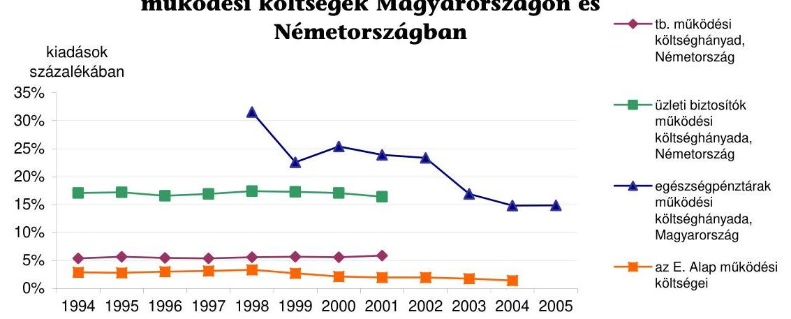

Az OEP mind a bevételi, mind a kiadási előirányzat tekintetében kényszerpályán mozgott, az E. Alap kedvezőtlen pénzügyi helyzetéért felelőssé nem volt tehetó.

A források szűkössége (különösen 2004-ben), valamint a kiadáscsoportok között az arányok kedvezőtlen irányú eltolódása rövidtávon múködési zavarokhoz vezet.

Az OEP és az igazgatási szervek múködési és felhalmozási típusú kiadásainak aránya a vizsgált időszakban a felhalmozási kiadások rovására eltolódott. A felhalmozási kiadások aránya a 2003. évi 8,2\%-ról 2004-ben 4,7\%-ra, míg 2005ben $4,5 \%$ alá csökkent.

[^0]
[^0]:    ${ }^{84}$ Ez az E. Alap korábbi, 1994-2002. közötti időszakot átfogó ÁSZ vizsgálata során is megállapítást nyert.

---

A múködés legsúlyosabb problémáját a dologi és felhalmozási kiadások előirányzatainak folyamatos csökkenése jelentette. Takarékossági intézkedésekkel (pl. gépkocsi használat újraszabályozása), átcsoportosításokkal sikerült biztosítani, hogy a források szűkössége ne tegye lehetetlenné a múködést, de már rövidtávon komoly gondokat okozhat, hogy sem az eszközök bővítésére, de még fenntartására sincs elég fedezet.

A dologi kiadások teljesítése a 2003. évi 5,9 Mrd Ft-ról 2004-ben 5,1 Mrd, 2005ben 4,6 Mrd Ft-ra csökkent.

Az OEP rendelkezésére álló múködési költségvetés 80-85\%-át a vizsgált időszakban az E. Alaptól átvett pénzeszköz, a fennmaradó részt a saját bevételek és a megelőző évi maradvány jelentették. A saját bevételeket minden évben jelentősen alultervezték (2003-ban 76,6\%-kal, 2004-ben 126,9\%-kal, 2005-ben $70,7 \%$-kal), aminek oka, hogy nem megfelelően mértek fel egyes feladatokból adódó többletbevételeket.

# Az egészségbiztosítási ágazat többletfeladataihoz szükséges mértékú forrásokat és létszámot a kormányzat elismerte, de csak részben biztosította. Az egyes feladatokhoz nyújtott létszámfejlesztési lehetőségek a kormányzati hatáskörben elrendelt, valamint az alulfinanszírozás miatti kényszerű leépítések következtében nem hoztak pozitív változásokat. Az OEP és az ágazat feladatai minden évben bővültek. 

Az elismert többletfeladatokra engedélyezett létszámnövelési lehetőség igénybevétele mellett az elrendelt 2003. évi, és a 2005. évi költségvetési megszorítások miatt végrehajtott kényszerű létszámleépítések együttes eredményeként az egészségbiztosítási szervek engedélyezett induló létszáma a 2003. évi 4356 főhöz képest a 2006. évi költségvetésben 4071 fő.

A vizsgált időszak egészében elmaradt az intézményre jogszabályi, ellátási stb. kötelezettségből háruló, minden szakterületet és szervezeti egységet érintő valamennyi többletfeladat évente történő számbavétele és azok személyi, tárgyi szükségleteinek felmérése, feladatarányos létszám meghatározás nem történt.

Előrelépést jelentett az OEP egészségügyi ellátási szakterületén 2005 augusztusában elindított, munkanap fényképezés módszerével megvalósuló tevékenység felmérés. A felmérés egész intézményre történő kiterjesztésétől és a felmérés adataira épülő célirányos elemzésektől az OEP az elvégzendő feladatok és azok személyi feltételei összhangjának mérhető módon való biztosíthatóságát várja.

Az OEP szervezeti felépítése a vizsgált időszakban többször változott, az átszervezések szakmai megalapozottsága azonban az esetek többségében nem támasztható alá. A változásokat megalapozó vezetői döntésekről írásos dokumentum nem született vagy nem lelhető fel. A többszöri szervezeti átalakítás az azzal járó adminisztrációs többletfeladatok folytán is az ellátandó feladatok megvalósítása és ellenőrizhetősége szempontjából kockázatot jelent, amit a tervezett szervezeti átalakítások hatásainak előzetes felmérésével, a döntések szakmai megalapozásával az OEP nem csökkentett.

---

Az átszervezések előkészítésének hiányát mutatja a transzparencia irányelvhez ${ }^{85}$ kapcsolódó szakmai feladatok ellátása. 2004. május 1-jével létrehozták a Transzparencia Titkárságot és a Transzparencia Fellebbviteli Titkárságot, majd 2005. április 1-jétől az önálló szervezeti egységek feladatai integrálódtak a Gyógyszerügyi, illetve az újonnan felállított Gyógyszerészeti Főosztály feladatkörébe. Utóbbi 2006. január 6-án megszűnt, a feladatot a helyszíni vizsgálat idején a 2006 elején létrehozott Fellebbviteli Főosztály látta el. Nem volt hosszú életű az irányított betegellátási feladatok ellátására 2003 végén létrehozott önálló szervezeti egység sem és a feladat 2005 áprilisában visszakerült az azt korábban is ellátó szakfőosztályok tevékenységi körébe.

Az egyes szakmai egységek főigazgató-helyettesekhez történő besorolásának/átsorolásának elvei is változtak. A szervezeti változások esetenként (pl. a gyógyszerügyi szakterület átsorolása az egészségügyi, ellátási főigazgató-helyettes felügyelete alól az általános főigazgató-helyetteshez, majd vissza) a struktúra átláthatóságát nehezítik, szakmai okokkal nem indokolhatók.

Az OEP jogszabályban meghatározott feladatait a központi hivatali szervezet egységei, valamint az irányítása alatt álló igazgatási szervei útján látja el. Igazgatási szerveinek jogállása a vizsgált időszakban csak a Vasutas Társadalombiztosítási Igazgatóság (VTI) esetében változott. Az egészségbiztosítási feladatokat hagyományosan a vasutas biztosítottak körében ellátó VTI szűk két hónapra jogszabályi rendelkezés ${ }^{86}$ folytán az OEP igazgatási szervei közül is törlésre került. Az igazgatási szerv megszűnésére, majd korábbi státuszába visszahelyezésére vonatkozó, nem kellően átgondolt kormányzati döntés az OEP számára felesleges és indokolatlan többletfeladatot és adminisztrációt jelentett (a VTI szervezeti megszüntetése és újjáalapítása, a feladatok, munkaerő és egyéb erőforrások átadás-átvétele érdekében megtett intézkedések). A VTI szakigazgatási feladatai a vizsgált időszakban folyamatosan csökkentek.

A korábban önállóan gazdálkodó, teljes jogkörű VTI 2005. január 1-jétől részben önállóan gazdálkodó, részjogkörű költségvetési szervként került besorolásra. Gazdasági szervezete megszűnt, gazdálkodási feladatait az FPEP vette át. A Magyar Köztársaság 2005. évi költségvetéséről szóló 2004. évi CXXXV. törvény 119. § (1) bekezdés e) pontja alapján a VTI ellenőrzési illetékessége körébe tartozó foglalkoztatók és társadalombiztosítási kifizetőhelyek szakellenőrzése az illetékes megyei pénztár hatáskörébe került. A gyógyszer, gyógyászati segédeszköz, gyógyfürdő szolgáltatáshoz kapcsolódó feladatok is a MEP-ek feladatkörébe integrálód-
${ }^{85}$ A törzskönyvezett gyógyszerek társadalombiztosítási támogatásba való befogadása rendjének átláthatóságát a Tanács 1988. december 21-i, az emberi felhasználásra szánt gyógyszerek árának megállapítását, valamint a nemzeti egészségbiztosítási rendszerekbe történő felvételüket szabályozó intézkedések átláthatóságáról szóló 89/105/EGK irányelve követeli meg.
${ }^{86}$ A Magyar Köztársaság 2006. évi költségvetéséről szóló 2005. évi CLIII. törvény 101. § (1) bekezdés d) pontja értelmében - az 1998. évi XXXIX. törvény 7. § b) pontja hatályon kívül helyezésével - 2006. január 1-jével a VTI törlésre került az OEP igazgatási szerveinek sorából. A 2005. évi CLIII. törvény módosításáról szóló 2006. évi XXIII. törvény 7. § (1) bekezdése nyomán a státusz 2006. február 25-ei hatállyal visszaállításra került.

---

tak. Korábban a VTI átvilágítása is számos párhuzamos feladatra mutatott rá, ezért az elmúlt években folyamatos létszámleépítést hajtottak végre.

A VTI a helyszíni vizsgálat idején az érdeklődők, szakmai partnerek tájékoztatását, a beérkező küldemények illetékes szervhez történő továbbítását látta el. A VTI megszüntetésére az OEP kezdeményezése alapján a szaktárca több ízben, eredménytelenül tett javaslatot.

Az OEP igazgatási szervei feladatellátásának szabályszerűségéről az ellenőrzés rendszeres és folyamatos kontrollt biztosított, mely egyrészt az egészségbiztosítás felügyeleti, szakmai (pénzbeli ellátások és kapcsolódó szakterületek) és hatósági ellenőrzési rendszerét működtető Felügyeleti Ellenőrzési Főosztály, másrészt a gyógyító-megelőző ellátások, a gyógyszer és gyógyászati segédeszközök vonatkozásában az Elemzési és Szakmai Ellenőrzési Főosztály tevékenységén keresztül valósult meg. Az ellenőrzések végrehajtására vonatkozó szabályzatok naprakészsége a pénzbeli ellátások és a kapcsolódó szakterületek ellenőrzési rendjének kivételével csak részben volt biztosított.

Az orvosszakmai ellenőrzés, a gyógyszer, gyógyászati segédeszköz és gyógyfürdő támogatások, valamint a keresőképtelenség elbírálása ellenőrzési rendje naprakész változatának a vonatkozó főigazgatói utasításban való megjelentetése nem történt meg. A költségvetési felügyeleti ellenőrzés rendjéről szóló, 2003-ban kiadott szabályzat ugyancsak aktualizálásra szorul.

# 3.2. A belső kontrollrendszer megfelelősége 

A belső kontrollrendszer magába foglalja a szervezet irányítási, szabályozási kereteinek, általános követelményeinek, elveinek kialakítását és érvényesítését (kontrollkörnyezet), kontrolleszközök létrehozását és működtetését (kontrolltevékenység), a kontrollt támogató folyamatokat (kockázatkezelés, információáramoltatás és kommunikáció), valamint a tevékenységek és azok irányításának, szabályozásának megfelelősége figyelemmel kísérését, értékelését (monitoring) ${ }^{87}$.

### 3.2.1. A kontrollkörnyezet

A munkatársak felvételére, képzésére, teljesítményértékelésére, előléptetésére és javadalmazására, a jogviszony megszüntetésére vonatkozó eljárásrendet az OEP Közszolgálati szabályzata tartalmazta, mely a vizsgált időszakban megfelelt a hatályos munkajogi és egyéb jogszabályoknak.

A szabályzat a köztisztviselőkkel szemben támasztott etikai követelményeket, magatartási szabályokat kizárólag a Ktv. előírásaira való hivatkozás formájában tartalmazza, ami azonban a Ktv. szerinti, a közigazgatás egészére érvényes közszolgálati Etikai kódex megalkotásáig ${ }^{88}$ nem kifogásolható. A Ber. előírásainak

[^0]
[^0]:    ${ }^{87}$ Az ÁSZ Ellenőrzési Kézikönyve alapján
    ${ }^{88}$ A Ktv. a Köztisztviselői Etikai Kódex szabályainak megállapítását és kiadását a Köztisztviselői Érdekegyeztető Tanács és az Országos Önkormányzati Köztisztviselői Érdekegyeztető Tanács feladatkörébe utalta

---

megfelelően kidolgozott belső ellenőri szakmai etikai kódex mellett az elvárt magatartási szabályokat az egészségbiztosítási ellenőrzésben résztvevő valamennyi köztisztviselőre vonatkozóan is megfogalmazták.

Az egészségbiztosító humánerőforrás-politikája és -gyakorlata az előírt képesítési követelményeknek való megfelelést az új munkatársak felvételénél és az átsorolásoknál biztosította.

Az OEP munkatársai feladatainak és a képzési igényeknek megfelelő továbbképzését biztosította. A képzések azonban a tervezetthez képest egyes központi képzési programok bizonytalanságai (pl. a képzések programjai nem készültek el időben), elmaradása vagy csúszása miatt csak részlegesen valósultak meg. Az elmaradt képzések következtében csak részben teljesült a köztisztviselők és vezetők folyamatos képzésére vonatkozó előírás ${ }^{89}$, mely szerint a vezető köztisztviselők évenként legalább egyszer kötelesek részt venni vezetőtovábbképzésben.

Az ágazati forrásból megvalósítani tervezett, illetve a kiemelt kormányzati főirányokhoz kapcsolódó, részben vagy egészben a BM célelőirányzatából finanszírozandó képzéseket a kormányzati képzési és továbbképzési ciklusnak ${ }^{90}$ megfelelően középtávú és éves továbbképzési tervekben rögzítették.
2006. évig elmaradt a korszerű munkaszervezési, minőségbiztosítási- és fejlesztési, ügyintézési, döntés előkészítési módszerek megismertetése, nem került sor vezetői készség- és képességfejlesztő, valamint vezető-utánpótlás képzésre.

A tervszerinti megvalósítás szempontjából problémát jelentett, és több esetben a képzési programok időbeli átütemezését tette szükségessé, hogy a jóváhagyott cél-előirányzati juttatás a tervkészítő OEP számára az év második felében (2003-ban például november hónapban) állt rendelkezésre.

Az előmenetel feltételét jelentő közigazgatási alap- és szakvizsga kötelezettség teljesíthetőségét az OEP szűkös pénzügyi lehetőségei nehezítették, tekintve, hogy a korábbi évek gyakorlatával és a vonatkozó jogszabályi rendelkezéssel ellentétben 2004-től a felkészítés és vizsgáztatás költségét az OEP saját forrásból finanszírozta.

A 199/1998. (XII.4.) Korm. rendelet értelmében a köztisztviselők iskolarendszeren kívüli továbbképzése (a Ktv. eleve ide sorolja az alap- és szakvizsgára való felkészítést), valamint a vizsgák és a szakvizsgára felkészítő tanfolyamok pénzügyi feltételeit a Kormánynak a BM célelőirányzataként kellett volna biztosítania.

A teljesítményértékelés rendjét kialakították, a teljesítményértékelések folyamatosságát azonban kedvezőtlenül befolyásolta egyes szakterületeken a folyamatos túlterheltség és a munkáltatói jogkör gyakorlójának személyében bekövet-

[^0]
[^0]:    ${ }^{89}$ 199/1998. (XII.4.) Korm. rendelet a köztisztviselők továbbképzéséről és a közigazgatási vezetőképzésről
    ${ }^{90}$ A köztisztviselők továbbképzése és a közigazgatási vezetőképzés középtávú tervét az 1020/2003. (III. 27.) Korm. határozat a 2003. január 1. és 2006. december 31. közötti 4 éves időszakra határozta meg.

---

kezett változások, ezért arra esetenként a megadott határidőig, vagy egyáltalán nem került sor (pl. 2003. évre vonatkozóan a gyógyszerügyi szakterületen).

Az eltérő munkateljesítmények differenciált díjazásának, a teljesítmények ösztönzésének eszközéül az anyagi fedezet hiányában szűk körben alkalmazott illetményeltérítések kis mértékben szolgáltak. A 100\%-os szinttől eltérő illetmény megállapítások teljesítményértékeléssel való alátámasztottsága, az értékelés eredménye és az eltérítés iránya közötti összhang a vizsgált esetekben általában biztosított volt.

2006-ban az OEP köztisztviselők 20\%-ának besorolása tért el a 100\%-os szinttől. Az FPEP esetében ez az arány $15,4 \%$, a Zala és Vas MEP tekintetében rendre 4,5 illetve $5 \%$ volt. A Tolna MEP-nél pénzügyi fedezet hiányában az eltérítés lehetőségével nem éltek. A mérlegelési jogkörben alkalmazott illetményeltérítések OEPnél vizsgált esetei között előfordult, hogy $90 \%$ alatti teljesítménnyel pozitív, $90 \%$ feletti teljesítménnyel negatív eltérítést alkalmaztak.

# 3.2.2. A kontrolltevékenység 

Az egészségbiztosító a hibák, szabálytalanságok elleni védelem érdekében a részletes feladat- és felelősségi köröket, eljárási szabályokat tartalmazó kötelező dokumentumokkal (SZMSZ, ügyrendek, utasítások, munkaköri leírások) rendelkezett. Azok teljes körűsége és naprakészsége a vizsgált időszakban a 2006 nyarán fennálló hiányosságok (pl. FEUVE) mellett is kedvezően alakult ${ }^{91}$.

A szabályozottság, a feladatok kiadásának (ügyrendek, munkaköri leírások) aktualizálását, a feladatoknak való teljesebb megfeleltetését a belső ellenőrzések javaslatai eredményesen szolgálták. 2004-ben a javaslatok nyomán megvalósult intézkedések 40\%-a szabályozási követelmények megoldására irányult.

A szabálytalanságok megelőzését szolgáló kontroll mechanizmusokat (pl. folyamatba épített ellenőrzési tevékenység) többségében kialakították. A szakmai és gazdálkodási folyamatokba beépülő, manuális és számítógépesített eljárásokban megvalósuló kötelező ellenőrzési pontokat rögzítették (pl. ellenőrzési nyomvonal), de ezek teljes körűsége és a folyamatba épített ellenőrzések gyakorlati megvalósítása nem minden területen biztosított.

A TAJ-BSZJ rendszer múködtetése kapcsán, pl. a rendszer múködtetési kockázatát csökkentő folyamatba épített és vezetői ellenőrzéssel szembeni követelményeket nem határozták meg az egész tevékenységre. Az FPEP-nél a folyamatba épített ellenőrzés az ügyintéző döntésén alapuló feldolgozási pontokon (pl. a biztosított beazonosítása) sem valósult meg. A szakterület feladatellátásában a vezetői és munkafolyamatba épített ellenőrzés nem maradéktalan megvalósulását esetenként a felügyeleti ellenőrzés is kifogásolta (pl. FPEP 2004. évi vizsgálata).

A szabálytalanságok kezelése eljárásrendjének kialakítása a FEUVE új elemekkel való kibővítését előíró jogszabályi rendelkezés hatályba lépéséhez (2004. január 1.), és a PM módszertani útmutató közzétételéhez (2005. január

[^0]
[^0]:    ${ }^{91}$ A szervezet szabályozottságával kapcsolatos megállapításait, kifogásait az ÁSZ éves zárszámadási jelentései részletesen tartalmazzák.

---

31.) képest is késedelmet szenvedett, gyakorlati alkalmazása még ma sem teljes körú.

Az OEP-re és igazgatási szerveire vonatkozóan egységes és érvényes elveket és kötelezettségeket rögzítő eljárásrendet 2006 nyarára kialakították. A konkrét intézkedéseket tartalmazó főosztályi és megyei eljárásrendeket a helyszíni ellenőrzés lezárásáig még nem dolgozták ki.

Az ellenőrzések megállapításai és javaslatai nyomán született intézkedési tervekben megfogalmazott feladatok nyilvántartását, folyamatos nyomon követését támogató rendszer (az FPEP kivételével) nem épült ki. Az intézkedési tervek végrehajtásának nyomon követése jelenleg az ellenőrzöttek időszakonkénti beszámoltatásával valósul meg. A nyilvántartási rendszer hiánya a szabálytalanságok megszüntetésével kapcsolatos intézkedések nyomon követését, az OEP vezetőjének ezzel kapcsolatos jelentési kötelezettségét megnehezítette és a javaslatok hasznosulása szempontjából is aggályos.

A Ber. 31. § (3) b) pontja alapján az OEP vezetőjének az éves ellenőrzési jelentésben kell számot adnia a belső ellenőrzés által tett megállapítások és javaslatok hasznosításáról, az intézkedési tervek megvalósításáról.

Az ellenőrzések javaslatainak nyomon követését támogató, az Igazgatói Titkárság vezetője által vezetett nyilvántartást az FPEP-n 2005-ben vezették be.

A vizsgált időszakot megelőző, illetve annak első éveit jellemző, ÁSZ által is kifogásolt hiányosságok ${ }^{92}$ megszüntetését követően a vizsgált időszakban az OEP a hatályos szabályozásnak (Áht., Ámr., Ber.) megfelelő belső ellenőrzési rendszert alakított ki.

Több éve fennálló hiányt szüntetett meg - tekintve, hogy a tb. igazgatási szervek belső ellenőrzési rendjét utoljára 1989-ben szabályozták - a belső ellenőrzés rendjéről szóló szabályzat és a belső ellenőrzési kézikönyv kiadása 2004-ben, akkor is, ha a szabályozások és azok alkalmazása sem teljes körú, a gyakorlati tapasztalatok és a Ber. időközbeni módosulása miatt aktualizálásra szorul.

2004-ben elkészült az ellenőrzés stratégiai céljait, az érvényesítendő prioritásokat, a vizsgálni tervezett területeket rögzítő belső ellenőrzési stratégia, tartalmában azonban nem fedte le a jogszabályban meghatározott elemek teljes körét (pl. nem tér ki a kockázati tényezőkre és értékelésükre, sem a FEUVE értékelésére; az OEP stratégiájára hivatkozik, az intézmény azonban jóváhagyott stratégiával a vizsgált időszakban nem rendelkezett).

A belső ellenőrzés 2004-től önálló szervezeti egységként, a főigazgatóhoz rendelve múködik, a tevékenység funkcionális függetlensége biztosított. Az ellenőrök képzettsége megfelelt az előírásoknak.

Az új belső ellenőrzési módszerek alkalmazásának bevezetését az önálló belső ellenőrzési egység 2004-ben történő felállítása mellett késleltette, hogy a PM által közzétett módszertani segédanyagok értelmezése és átdolgozása az Alap sa-

[^0]
[^0]:    ${ }^{92}$ Az OEP 2003. évi függetlenített belső ellenőrzési tevékenységének kockázatát az ÁSZ kockázat értékelése az éves zárszámadás keretében magasnak minősítette.

---

játosságainak megfelelően - az operatív munkavégzés mellett - jelentős időráfordítást igényelt.

A belső ellenőrzés tevékenysége a Ber-ben meghatározott valamenynyi feladatra még nem terjedt ki. Megfelelő szakértelemmel és az előírt képesítéssel rendelkező szakember hiányában nem megoldott az informatikai terület rendszerellenőrzése.

A belső ellenőrzés egyre szélesebb körben végzett rendszerellenőrzést (pl. a Tolna MEP belső ellenőre 2005-ben rendszerellenőrzés keretében vizsgálta a MEP 9 osztályán a FEUVE rendszer kialakítását és múködését), és kapacitás-, illetve a szükséges módszertani képzés hiánya miatt egyelőre kísérleti jelleggel teljesítményellenőrzéseket. Az ellenőrzések a jogszabályban és módszertani anyagokban meghatározott szempontoknak még nem feleltek meg maradéktalanul.

Az informatikai terület ellenőrzésére vonatkozóan a belső ellenőrzés többször jelezte létszámfejlesztési igényét, intézkedés erre vonatkozóan nem történt.

# 3.2.3. A kontrollt támogató folyamatok 

A kockázatelemzés módszertanának, a kockázatkezelés rendszerének kialakítása ${ }^{93}$ a vizsgálat lezárásáig nem fejeződött be. Az egészségbiztosító tevékenységét jellemző valamennyi folyamatot felölelő eljárásrendek kidolgozása és késedelmes kiadásuk miatt azok alkalmazása még nem teljes körű. A tervezést megalapozó kockázat felmérési, -elemzési módszertanok kimunkálása és gyakorlati alkalmazása az éves tervezés és az ellenőrzések előkészítése során a belső ellenőrzés vonatkozásában sem az. Kockázatelemzéssel először a belső ellenőrzés 2006. évi terveit alapozták meg.

Az OEP szervezeti egységei elkészítették kockázatkezelési szabályzatukat, annak adaptálása a megyei pénztárak tevékenységére a helyszíni vizsgálat lezárásáig nem történt meg. Az FPEP már 2004-ben elkészítette ellenőrzési nyomvonalait, melyek a később megjelent (2005) PM ajánlások kritériumainak nem felelhettek meg. Az ajánlások nyomán az OEP a nyomvonalak kidolgozását központilag szervezte meg.

A 2005-ben országosan kialakított ellenőrzési nyomvonal - bár nem fedte le valamennyi tevékenység egészét pl. a TAJ-B5ZJ rendszer múködtetését nem tartalmazta a szakterület nyomvonala - alapját képezhette a szervezet folyamatai és az azokban rejlő kockázatok azonosításának, a fő tevékenységek kockázati rangsora elkészítésének. Korábban a korábbi külső és belső ellenőrzések megállapításai, a vezetés ajánlásai és az ellenőrök tapasztalatai szolgáltak alapul az ellenőrizendő területek kiválasztásához.

Az OEP és igazgatási szerveinek belső utasításai tartalmazták a vezetők beszámoltatásának, egymás kölcsönös tájékoztatásának, a döntéshozatal előkészítésének kialakított rendszerét. A szervezeten belüli jelentési és beszámolási köte-

[^0]
[^0]:    ${ }^{93}$ Az Ámr. 145/C. §-a alapján a költségvetési szerv vezetője köteles a kockázati tényezők figyelembevételével kockázatelemzést végezni és kockázatkezelési rendszert múködtetni.

---

lezettségeket kialakították. A vezetői ellenőrzéshez, értékeléshez, az ez alapján meghozható döntésekhez szükséges információk az OEP információs rendszereiből kinyerhetők, ugyanakkor átfogó vezetői információs rendszert az időnként megjelenő törekvések ellenére nem alakítottak ki.

A vezetői értekezletek meghatározott rendben zajlottak, az elhangzottakról emlékeztető készült, a megfogalmazott feladatok figyelését napi feladatfigyelő rendszer segítette elő. A féléves munkatervekbe foglalt feladatok végrehajtásának számon kérése rendszeres főosztályi beszámoltatás útján valósult meg.

Egy integrált vezetői információs rendszer kialakítása a vezetői igényrendszer felmérését és megfogalmazását teszi szükségessé. Az OEP intézményi adattárházában fellelhető, egyelőre a szakfőosztályok napi operatív és döntés előkészítő munkáját támogató információk a különböző vezetői szintek döntéshozó munkáját közvetlenül támogató vezetői információs rendszer bázisát képezhetik. Az adattárházhoz valamennyi felsővezető rendelkezik hozzáféréssel, de a közvetlen lekérdezések lehetőségét nem használják ki.

A vezetés széles körben biztosította a szervezeten belüli vertikális és horizontális információáramlást lehetővé tevő információs eszközöket, úgy, mint az OEP belső hálózatát, melyen keresztül a munkavégzéshez szükséges információk (eljárásrendek, körlevelek stb.) a MEP-ek munkatársaihoz is eljutottak, valamint a szakmai konferenciák, belső továbbképzések rendszerét. Külső kommunikációs tevékenysége a sajtótevékenységen, a lakosság és a szakma tájékozódását szolgáló honlapon, elektronikus ügyintézésen, az OEP által múködtetett szakmai klubon keresztül múködött, elősegítette a közvélemény hiteles forrásból történő tájékoztatását, az információk gyors elérhetőségét.

Az OEP Úgyfélkapun keresztül elérhető, TAJ alapú elektronikus szolgáltatásainak (TAJ-szám érvényességének ellenőrzése, biztosítotti jogviszony és betegéletút lekérdezés) igénybevétele a lekérdezők visszajelzései alapján a mögöttes adatbázisok adatainak tisztítását, a hiányzó adatok pótlását, a finanszírozási célú jelentések kontrollját is segíti. Az FPEP tájékoztatása szerint hetente több száz visszajelzés érkezik.

A zökkenőmentes ügyfél tájékoztatás szempontjából forrás- és létszámhiány miatt évek óta problémás a társadalombiztosítási és egészségügyi szakterületen az EU csatlakozás kapcsán bekövetkező változások kommunikációját segítő telefonos EU-s tájékoztató központ ${ }^{94}$ működőképességének megőrzése.

A helyszíni vizsgálat idején a telefonos ügyfélszolgálati tevékenységet az FPEP TAJ-Nyilvántartási Osztályán 2 készülékkel 3 fő látta el, akik egyéb adatszolgáltatási tevékenységet is végeztek. A feltett kérdések száma a csatlakozás óta folyamatosan nőtt. Az induláskori (2003 április) 100 hívás/hó jelenleg több mint 2000 hívás/hó. A múködőképesség javításának, esetleg a tájékoztatási feladat kiszervezésének pénzügyi fedezete - bár azt elvben az OEP vezetése támogatta, a minisztérium jóváhagyta - az Alap költségvetésében nem biztosított.

[^0]
[^0]:    ${ }^{94}$ Az EU-tagság következményei és az ügyintézéssel kapcsolatos gyakorlati teendők szélesebb laikus és szakmai közönséggel való megismertetése az Európai Uniós csatlakozás társadalmi kommunikációjáról szóló 1198/2002. (XII.6.) Korm. határozat nyomán az egészségbiztosítónak is feladata.

---

A vezetői kontroll feladatok ellátását támogató belső ellenőrzés tevékenysége mellett a vezetés a szokásos napi irányítási tevékenysége során alkalmazta a feladatok számonkérését, a mindennapi múködés nyomon követését. Az egyes kontroll elemek nyomon követésének és értékelésének rendjét belső szabályzatokban rögzítették, gyakorlati alkalmazása azonban nem teljes kör. A vonatkozó eljárásrendek (pl. szabálytalanságok kezelése) kialakítása óta eltelt idő rövidsége miatt alkalmazásuk gyakorlati tapasztalatai még nem értékelhetők.

A helyszíni vizsgálat idején született a szabálytalanságok kezelése eljárásrendjére vonatkozó OEP utasítás, mely az OEP szervezeti egységei és igazgatási szervei vezetőinek feladatává, felelősségévé teszi a FEUVE rendszer mindhárom elemének karbantartását, a témában kiadott utasítások végrehajtását, annak folyamatos figyelemmel kísérését és a felügyeletet ellátó vezető rendszeres tájékoztatását.

A belső ellenőrök teljesítményének értékelésére sem a visszacsatolás eszközeként az ellenőrzött szervezeti egységek véleményének ellenőrzést követő felmérését (kivéve FPEP), sem a belső ellenőrzés teljesítményét megalapozó teljesítménymérési mutatók elemzését nem alkalmazták, bár a belső ellenőrzési tevékenység nyomon követése és értékelése érdekében a kontroll önértékelés, mint vizsgálati eljárás alkalmazását az OEP (a MEP-ek vonatkozásában is) megkezdte.

A belső kontrollrendszer továbbfejlesztését esetenként az OEP felső vezetésében bekövetkezett, és az egészségbiztosító jogszabályi és múködési környezetét érintő folyamatos változások hátráltatták.

Intézményi stratégia kialakítását, átfogó vezetői információs rendszer megvalósítását, valamint a CAF önértékelési kritériumrendszer bevezetését célozta 2003ban egy, az egészségügyi szakterületről kiinduló kezdeményezés. A koncepció kialakítását és megvalósítását az OEP felső vezetése támogatta, a döntés nyomán azonban előrelépés a fenti okok miatt egyik területen sem történt.

# 3.3. Az informatikai rendszer múködése, az informatikai fejlesztésekre fordított pénzeszközök felhasználása 

Az OEP fő feladata a társadalombiztosítás központi hivatali szerveként az E. Alap kezelése. Az ehhez kapcsolódó szolgáltatások színvonala, minősége csak megbízható és folyamatos informatikai támogatással biztosítható.

Az OEP az informatikai biztonság átfogó szabályozásának előfeltételeiről (teljes körű kockázatelemzés, védelmi igények meghatározása) nem gondoskodott, a kialakított szabályozás több helyen hiányos (pl. az Informatikai Biztonsági Politika nem tartalmaz alapvető fontosságú elveket), a szabályzatokat csak részlegesen aktualizálták. A biztonsági elöírások érvényesülése nem teljes körü, és a biztonsági követelmények alkalmazását nehezíti, hogy a szabályozás a felhasználók számára nehezen áttekinthető. Az előírások érvényesítését korlátozta a biztonsági tudatosság hiánya. A szabályozás végrehajtásának szervezeti, személyi és anyagi hátterét a felső vezetés teljes körűen nem biztosította, ugyanakkor még olyan elöírásokat sem tartottak be maradéktalanul, amelyeknek érdemi költségvonzata nem volt (pl. oktatások, jelszavakra vonatkozó előírások, adatosztályozás, a szabályozás rendszeres felülvizsgálata, aktualizálása).

---

Az informatikai rendszer múködésének megbízhatóságára, biztonságára vonatkozó részletes tájékoztatást és értékelést a 2. sz. függelék tartalmazza.

Az OEP 2003-ban a Magyar Információs Társadalom Stratégia részeként készítette el intézményi információs stratégiáját, mely tartalmi hiányosságai miatt nem alkalmas a vele szemben támasztott funkcionális követelmények kielégítésére. A stratégia az ágazati szemléletnek megfelelően mutatta be a kitűzött szervezeti célok megvalósításának egyes feladatait és azok becsült költségigényét, mely azonban nem képezte alapját az éves költségvetések tervezésének, az igényelt és az igazolható mértékű befektetések megítélésének. A stratégia szervezeti célokhoz, szakmai követelményekhez és pénzügyi lehetőségekhez igazodó érdemi felülvizsgálata elmaradt.

Az informatikai stratégia célja az információs rendszerek és az azt múködtető infrastruktúra olyan, középtávra szóló tervezése, amely maximálisan segíti a vezetést a szervezeti törekvések és célok megvalósításában. Kifejlesztése biztosítja, hogy az informatikában rejlő összes lehetőség hasznosításra kerüljön az említett törekvések és célok támogatásánál. Mindez azonban feltételezi, hogy az informatika elképzelt használata (pénzügyileg) megengedhető, (műszakilag) megvalósítható, irányítható és érthető legyen.

Az OEP 2003-2007. évi Informatikai Stratégiai Terve tartalmi hiányosságai miatt az informatikai fejlesztési költségvetés feladatalapú tervezését nem támogatta. A dokumentum az OEP jogszabályokban meghatározott feladatainak, adatszolgáltatási kötelezettségeinek támogatását általánosságban tudta csak kezelni. Az informatikai költségvetés tervezésében és felhasználásában, a feladatok rangsorolásában nem lehetett alkalmazni a stratégia általános vagy kiemelt feladataira meghatározott prioritásokat.

Az informatikai stratégiára jellemzőek az általános és nem számon kérhető megfogalmazások. Kapcsolódási pontjait az egészségügyi és szociális ágazati stratégiákhoz nem lehet azonosítani. A középtávú feladattervek kidolgozása nem körültekintő, a feladatlapokban a feladatok leírása kevéssé részletezett, egyes esetekben hiányos; sikerkritériumokat (indikátorok, értékek) csak négy feladathoz írtak, de ezek sem számon kérhetők. A kockázatelemzés gyakorlatilag minden esetben hiányzik. Hiányosság - azok jelentős forrásigénye miatt -, hogy az OEP hardver beruházásai nem jelentek meg a stratégiában.

A stratégia kialakítása és monitoringja az informatikai és nyilvántartási fő-igazgató-helyettes feladata, amelyben minden informatikai szakfőosztály részt vesz. A hatás- és felelősségi körök az alsóbb szinteken részletesen nem meghatározottak.

Az OEP informatikai stratégiájának kialakítását és végrehajtását megnehezítette a Kormány ágazattal összefüggő, folyamatosan napirenden lévő, nem kiszámítható fejlesztési elképzeléseiből eredő bizonytalanság, valamint a nem tervezhető, de jellemzően rövid határidővel végrehajtandó szakmapolitikai igények, elképzelések, feladatok teljesítése. Az egészségbiztosítás rendszerével összefüggő kormányzati vagy szakmapolitikai döntések hatályba lépése több esetben (pl. a jogviszony adatok bejelentésére vonatkozó módosításoknál) nem vette figyelembe a fejlesztések megfelelő előkészítésének időigényét. A nem tervezhető fejlesztések többletköltségeit az OEP - a szükséges többletforrás biztosí-

---

tásának hiányában - csak a tárgyévi előirányzatok közötti átcsoportosítással, az eredeti fejlesztési feladatok forrásainak csökkentésével tudta megteremteni.

Az informatikai üzemeltetési és karbantartási feladatok forrásigénye jól tervezhető. Az informatikai fejlesztési költségvetés tervezési és elosztási folyamatában a feladat és forrás változtatások ténye nyomon követhetö, ugyanakkor a döntések folyamata és megalapozása nem teljes mélységben dokumentált. A döntési felelősségek nem elhatároltak, a költségvetés tervezésében hozott döntések utólagos ellenőrzéséhez a nyomvonal nem biztosított.

A feladatrendszer és a finanszírozás összehangolásában alkalmazott döntési gyakorlatban nem azonosíthatóak az egyes szakterületek szakmai álláspontjait módosító tényezők, utólag nem értékelhető a döntés előkészítés megalapozottsága, nem állapítható meg az esetleges hibás döntések felelőssége. A prioritások és a feladatok fejlesztési keret felosztása során bekövetkezett változásai a szakmai és szervezeti célok pontos meghatározása nélkül utólag nem értékelhetők.

A 2003. évi költségvetés tervezése során meghatározott 1,2 Mrd Ft-os informatikai fejlesztési keretet 2002-ben jóváhagyták, ennek ellenére a rendelkezésre álló előirányzat tényleges felosztása 2003. június végéig elhúzódott. A keret 2003. júniusában jóváhagyott feladatrendszere a 2002. októberi, azonos forrásigényű feladatrendszertől jelentősen eltér. A feladatrendszerek közötti különbségek okait, indokoltságát nem teljes körűen dokumentálták.

A stratégiában állandó feladatként meghatározott komplex informatikai biztonság kialakítására irányuló törekvés, az informatikai biztonság kialakítását célzó átfogó fejlesztési feladatok nem kaptak megfelelő prioritást a 2003-2005. időszak informatikai fejlesztési költségvetésében. Csak az informatikai biztonság egyes részterületei, összetevői - általában valamilyen összetettebb fejlesztési projekt vagy feladat teljesítésének keretében kaptak elegendő eseti támogatást, jellemzően már csak a fejlesztési keret felhasználása során. Az átfogó informatikai biztonsággal összefüggő fejlesztési feladatok a szakfőosztályi tervezések és szakmai igények ellenére az elemi költségvetési keret tárgyévi újraelosztása, módosítása során törlésre, vagy nagy arányú csökkentésre kerültek.

A 2004. évi informatikai fejlesztési előirányzat jóváhagyása során az informatikai biztonsággal összefüggő projektek között megjelenő átfogó fejlesztési feladatok a 2004. április 19-i elfogadott végleges tárgyévi informatikai fejlesztési keret projektjei között már nem szerepeltek.

A 2005. évi fejlesztési keret a személyi és dologi előirányzatok mellett beruházási előirányzatot nem tartalmazott. A 84 M Ft-ra módosított előirányzat évközi felhasználásában az informatikai biztonság fejlesztése nem érvényesülhetett.

A tárgyév elején jóváhagyott informatikai fejlesztési keret felosztása hónapokig elhúzódott, függetlenül attól, hogy a jóváhagyott keret megegyezett a költségvetés tervezésekor meghatározott előirányzattal, vagy attól (a tárgyév eleji központi elvonások, egyéb módosítások miatt) jelentősen eltért. A rendelkezésre ál-

---

ló informatikai fejlesztési források felhasználása zömében az év utolsó 3 hónapjában történik.

A költségvetési tervezés jelenlegi rendszere és a közbeszerzési eljárások időigénye, illetve a Miniszterelnöki Hivatal Elektronikuskormányzat-központjával (EKK) és az ágazati informatikai koordinációs bizottsággal előírt egyeztetési kötelezettség miatt az év második felében írják ki a pályázatokat, így a nagyobb programok végrehajtása rendszeresen áthúzódik a következő évre.

Az informatikai fejlesztési keret év végi nagymértékű kötelezettségvállalása mellett a tárgyévi teljesítés 2003-ban és 2004-ben $60 \%$, míg 2005-ben $70 \%$ volt.

Az OEP-nek az Elektronikus Kormányzati Gerinchálózathoz (EKG) történő teljes körű (országos) csatlakozása a megvalósítás feltételeinek időközi módosítása, illetve a pénzügyi fedezet hiánya miatt jelentősen elhúzódik, ami a szervezet info-kommunikációs rendszerének fejlesztését, a hatékonyabb és biztonságosabb üzemeltetési rendszer kialakítását is hátráltatja.

Az EKG-hoz történő csatlakozást biztosító adatátviteli szolgáltatások beszerzése érdekében 2005-ben indított közbeszerzési eljárást az OEP pénzügyi fedezet hiányában eredménytelenül lezárta. Az eljárásban benyújtott legkedvezőbb ajánlat éves ( $25 \%$-os áfa kulccsal kalkulált) bruttó díjának összege 68,3 M Ft volt.

Az EKG hálózatgazdájaként kijelölt EKK által 2005 decemberében kötött keretszerződés értelmében az EKG-n nyújtott szolgáltatások biztosítására egyedül a Magyar Telekom Nyrt. jogosult, mely az OEP által igényelt kommunikációs kapacitás biztosítására éves ( $20 \%$-os áfa kulccsal kalkulált) bruttó 95,6 M Ft-os ajánlatot adott. Az OEP a Magyar Telekom Nyrt-vel a szolgáltatások részletes díjkalkulációján alapuló tárgyalásokat kezdeményezett, melyre a szolgáltató a helyszíni ellenőrzés lezárásáig, 2006. június 30 -ig nem válaszolt.

# 4. AZ ELŐZŐ VIZSGÁLATAINK JAVASLATAI ALAPJÁN MEGTETT INTÉZKEDÉSEK 

Az Alap múködésének korábbi (2003) átfogó ellenőrzése ${ }^{95}$ során megfogalmazott javaslataink egyrészt az egészségbiztosítás ellátási és finanszírozási rendszere megújításának szükségességére, másrészt az Alapkezelő feladatellátásában tapasztalt hiányosságok felszámolására irányultak ${ }^{96}$.

A társadalombiztosítási rendszer megújításának koncepciójáról és a rövid távú feladatokról szóló 60/1991. (X.29.) OGY határozat a máig hatályos egyetlen, OGY által elfogadott koncepcionális dokumentum. Foglalkozik a rendszer átalakításának irányaival és az alapelvekkel. Az elmúlt másfél évtizedben re-

[^0]
[^0]:    ${ }^{95}$ Az E. Alap múködésének ellenőrzéséről szóló, 0324. számú jelentés (2003. június)
    ${ }^{96}$ A javaslatok megvalósulására vagy meg nem valósulására (pl. a gyógyszertámogatási előirányzat zárt jellegének ÁSZ által is javasolt feloldására, vagy az informatikát érintő javaslataink, pl. az OEP informatikai biztonságát átfogóan érintő ellenőrzések elmaradása folytán részleges teljesülésére) a jelentés II. Részletes megállapítások fejezete is kitér.

---

formértékű lépések történtek (pl. háziorvosi rendszer kialakítása, teljesítményelvű finanszírozás bevezetése stb.), de átfogó koncepció a rendszer átalakítására a mai napig nem készült. Az E. Alap bevételeinek és kiadásainak összhangját megalapozó járulékbefizetés és a biztosított ellátások egyensúlya megteremtésének érdekében kormányzati lépések történtek (pl. a központi költségvetés járulékfizetésének előírása).

Az APEH OEP felé teljesített havi adatszolgáltatásában a munkáltatói és egyéni járulékra vonatkozó adatok megbontva szerepelnek, de az egyes szolgáltatásokra való jogosultság meghatározásához (pl. a táppénz-megállapításhoz) 2006. nyarától fokozatosan az OEP rendelkezésére kell állnia az egyes biztosítottak által fizetendő járulék alapjára és a levont járulék összegére vonatkozó adatoknak.

Az Art., és a Tbj. egyéni adó- és járulék-nyilvántartás létrehozását célzó módosítására bevezetett, a havi adóbevallás részeként teljesítendő adatszolgáltatás az igények egy részének megállapításához használható fel. Az APEH a Tbj. 31. § (2) bek. alapján először 2006. augusztus 31 -én esedékes adatátadást az OEP tájékoztatása szerint 2006. november 3-ig nem teljesítette.

Az ÁSZ Irányított Betegellátási Modellkísérlet helyzetéről szóló jelentése (2005) a modellkísérlet célját, átláthatóságát, ellenőrzési rendszerét és további sorsát illetően fogalmazott meg hiányosságokat, tennivalókat.

Az irányított betegellátási rendszer nevesítése az Ebtv. szabályai között a modellkísérlet lezárását jelentette. Megszületett az irányított betegellátási rendszerről szóló 331/2005. (XII. 29.) Korm. rendelet, amely részletes szabályozást teremt, különös tekintettel az ún. megtakarítás felhasználására ${ }^{97}$. Az OEP belső szabályait folyamatosan alakították ki, törekedtek az elszámolások átláthatóságára és követhetőségére.

Az IBR-rel kapcsolatos OEP múködési kiadásokat - az ÁSZ javaslatával szemben - nem tartják elkülönítetten nyilván. A fenti kormányrendelet részben határozta meg az IBR múködéséhez szükséges szervezeti és technikai követelményeket mind az OEP, mind az ellátásszervezők vonatkozásában.

A szervezeti és technikai hátteret a szervezők a beadott pályázatokban bemutatták, azt a pályázatok elbírálása során az OEP figyelembe vette.

Továbbra is szükséges az ellátásszervezési tevékenységben alkalmazott technikák közül a legeredményesebb, ún. „legjobb gyakorlat" általános érvényű előírása, szervezői minimum követelmények kialakítása, a rendszerben alkalmazott protokollok és az ellátás minőségét értékelő indikátorok kialakítása, teljes körűvé tétele.

[^0]
[^0]:    ${ }^{97}$ A 2007. évi költségvetési törvényjavaslat véleményezésében az ÁSZ felhívta a figyelmet arra, hogy a szervezőknek az OEP-pel nincs érvényes szerződése, továbbá vitatott a szervezőknek kifizethető megtakarítás összege, illetve maga a megtakarítás értelmezése is problematikus.

---

Az éves költségvetések véleményezése, illetve végrehajtásának ellenőrzése során az ÁSZ az előző évi javaslatok megvalósulását rendszeresen vizsgálta. Az Alap ellátó rendszereiben, azok előirányzatainak tervezési folyamatában érzékelt feszültségek és az Alap állandósult forráshiánya nyomán évről évre szorgalmazta az Áht. 86. § (9) bekezdésében foglaltak érvényesítését. 2006. január 1-jével a Kormánynak az Alap tartós egyensúlyának biztosításával kapcsolatban előírt kötelezettsége az Áht. módosításával megszűnt, a javasolt intézkedések megtétele, az ellátórendszer átfogó, reformértékű átalakítása ma is időszerű.

Az Áht. 86. § (9) bekezdése előírta, hogy „ha a pénzügyi tervekből, az elörejelzésekből és a rendszer müködéséből megállapítható, hogy az alapok bevételei - jelentős hiányt felhalmozva - tartósan nem fedezik a várható kiadásokat, a Kormánynak a társadalombiztositás müködési, ellátási és finanszirozási rendszerét módositó, a bevételek és kiadások egyensúlyát helyreállitó, a járulékok emelésével vagy egyes ellátások mérséklésével járó javaslatot kell tennie az Országgyülésnek."

Évek óta megoldandó probléma - a Kormány egyértelmű álláspontja hiányában - az FPEP végleges elhelyezése. Az időközben megtett intézkedésekkel (a pénztár bérelt épületbe került) gazdaságos és végleges megoldás nem született.

Az OEP stratégiai célja, hogy a bérelt ingatlanokat saját kezelésűekkel váltsa fel, csökkentve ezzel a múködési költségvetésre egyre nagyobb terheket rovó bérleti díj kiadásokat. Az OEP által gazdaságilag megalapozott, már rövidtávon megtérülő beruházást a kormányzat évről évre azzal az érveléssel utasította el, hogy megvalósítása egy adott év költségvetését nagymértékben megterhelné.

A múködési kiadások tervezése kapcsán érvényesülő kedvezőtlen tendenciákra (a beruházási és felújítási kiadások évek óta rendkívül alacsony összege, ugyancsak szűkös dologi előirányzatok stb.), és ennek kockázatára az egészségbiztosító megfelelő színvonalú feladatellátása szempontjából az ÁSZ ismétlődően felhívta a figyelmet. Javaslata nyomán a helyszíni vizsgálat lezárásáig nem született e témakörben kormányzati intézkedés.

A Magyar Köztársaság 2006. évi költségvetési javaslatának véleményezése során az ÁSZ, a hosszabb távon előre tervezhető gazdálkodás érdekében a múködési kiadások meghatározására alkalmas módszer kidolgozását szorgalmazta.

Budapest, 2006. december 21.
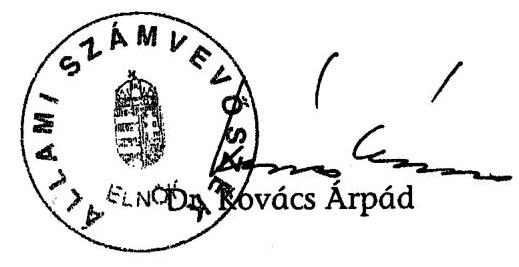

| Melléklet: | 9 db | 6 lap |
| :-- | :-- | :-- |
| Függelék | 2 db | 5 lap |

---

$$
11-04-052 / 2006
$$

# EGÉSZSÉCŐGYI MINISZTÉRIUM   MINISZTIR 

Iktatós tám: 1959:-T/2006-0005EMF
Témaf́́lelős: Wagner Féter
Telefonszám: 1571

Dr. Kovács Árpád úr
E.nök
Álami Száravevószék.
Budapest

## Tisztelt Elnök Úr!

Ae Álami Szánvevôszéknek az Egéseségbiztosíási Alap mũködésének átfogó clenốrésérćl készített jelentését köszönettel megkaptsm. Az abbar foglaltakkal krpesoiatbar észrevételt - a dr. Horváth Ágnes állatntitkśr asszony által az egyeztetés scrán jelzett és döntô hányatlban igyel zmbe vetteken tulmerően -- nerrı teszek.

Budapest, 2006. decem ser: $i$ ?
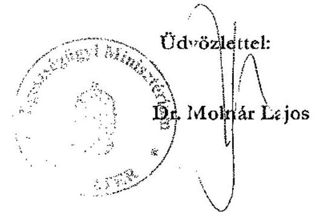

---

# Az E. Alap bevételeinek alakulása 2002-2006. I. féléve között

|  Cím-
szám | Megnevezés | 2002 | 2003 | 2004 | 2005 | 2006. évi előirányzat | 2006. I. félévi teljesítés  |
| --- | --- | --- | --- | --- | --- | --- | --- |
|   |  | évi teljesítés |  |  |  |  |   |
|  1. | Egészségbiztosítási ellátások fedezetéül szolgáló bevételek | 1023039,2 | 1023635,1 | 1097559,9 | 1201651,1 | 1502071,0 | 742575,7  |
|  1. 1. | Munkáltatói egészségbiztosítási járulék | 517978,5 | 580650,0 | 623356,5 | 680105,7 | 739615,5 | 352056,6  |
|  1. 2. | Biztosítotti egészségbiztosítási járulék | 128575,3 | 142717,3 | 198334,8 | 227707,0 | 254846,4 | 130436,4  |
|  1. 3. | Egyéb járulékok és hozzájárulások | 23001,5 | 26539,6 | 27335,9 | 27880,6 | 27287,7 | 17204,5  |
|  1. 4. | Egészségügyi hozzájárulás | 209874,6 | 173314,7 | 168553,7 | 164407,7 | 97793,0 | 56307,0  |
|  1. 5. | Késedelmi pótlék, bírság | 4251,5 | 4443,3 | 4890,8 | 4233,9 | 3866,4 | 3225,6  |
|  1. 6. | Központi költségvetési hozzájárulások | 135884,7 | 85988,1 | 60900,0 | 66050,0 | 371963,0 | 173891,0  |
|  1. 7. | Egészségbiztosítással kapcsolatos egyéb bevételek | 3473,1 | 9982,2 | 14188,3 | 31266,2 | 6699,0 | 9454,6  |
|  2. | Vagyongazdálkodás bevételei | 74,8 | 55,2 | 186,0 | 207,0 | 151,5 | 173,1  |
|  3. | Központi hivatali szerv és az igazgatási szervek bevételei | 1461,3 | 1746,9 | 2394,4 | 2739,1 | 1805,0 | 1204,9  |
|  Egészségbiztosítási Alap bevételei összesen |  | 1024575,3 | 1025437,3 | 1100140,2 | 1204597,2 | 1504027,5 | 743953,7  |

---

# Az E. Alap kiadásainak alakulása 2002-2006. I. féléve között

|  Cím-
szám | Megnevezés | 2002 | 2003 | 2004 | 2005 | 2006. évi előirányzat | 2006. I. félévi teljesítés  |
| --- | --- | --- | --- | --- | --- | --- | --- |
|   |  | évi teljesítés |  |  |  |  |   |
|  2. | Egészségbiztosítási ellátások kiadásai | 1088709,5 | 1311257,1 | 1421293,4 | 1555944,7 | 1490452,9 | 835741,2  |
|  2.1. | Nyugellátások | 194284,4 | 213888,3 | 235190,8 | 257349,5 | 274037,0 | 134967,3  |
|  2.1.2. | Korhatár alatti III. csoportos rokkantsági és baleseti rokkantsági nyugdíj | 180156,1 | 202532,4 | 218182,6 | 233906,6 | 244023,0 | 120207,5  |
|  2.1.3. | Hozzátartozói nyugellátás | 6589,0 | 7327,5 | 8068,8 | 8969,9 | 9375,6 | 4541,5  |
|  2.1.5. | Egyszeri nyugdíj | 7539,2 | 31,2 | 1,0 | 0,1 |  |   |
|  2.1.6. | 13. havi nyugdíj |  | 3997,2 | 8938,5 | 14472,9 | 20638,4 | 10218,3  |
|  2.2. | Egészségbiztosítás pénzbeli ellátásai | 141468,8 | 172495,0 | 182563,0 | 193975,3 | 196752,6 | 103462,1  |
|  2.2.1. | Terhességi-gyermekágyi segély | 15777,2 | 20206,8 | 23433,0 | 27089,7 | 28392,6 | 14354,7  |
|  2.2.2. | Táppénz | 80863,9 | 98936,3 | 96240,3 | 97023,5 | 96000,0 | 50139,5  |
|  2.2.3. | Betegséggel kapcsolatos segélyek | 843,0 | 949,5 | 1037,9 | 943,5 | 1200,0 | 539,2  |
|  2.2.4. | Kártérítési járadék | 1192,0 | 1208,8 | 1206,6 | 1203,1 | 1196,0 | 598,9  |
|  2.2.5. | Baleseti járadék | 4986,0 | 5604,7 | 6098,2 | 6537,5 | 6893,0 | 4084,5  |
|  2.2.6. | Gyermekgondozási díj | 37806,7 | 45588,9 | 54547,0 | 61178,0 | 63071,0 | 33745,3  |

---

E. Alap fejezet

1. számú melléklet a V-04-053/2006. sz. jelentéshez

|  Cím- |  | 2002 | 2003 | 2004 | 2005 | 2006. évi előirányzat | 2006. I. félévi teljesítés*  |
| --- | --- | --- | --- | --- | --- | --- | --- |
|  szám | Megnevezés |  |  |  |  |  |   |
|   |  | évi teljesítés |  |  |  |  |   |
|  2.3. | Természetbeni ellátások | 750 325,6 | 920 329,8 | 998 570,2 | 1 100 425,1 | 1 015 219,1 | 594 630,5  |
|  2.3.1. | Gyógyító-megelőző ellátások | 502 851,7 | 623 013,2 | 654 621,8 | 694 452,1 | 660 892,9 | 368 834,4  |
|  2.3.2. | Gyógyfürdő és egyéb gyógyászati ellátás támogatása | 4 223,1 | 4 463,3 | 4 861,1 | 4 758,5 | 5 108,4 | 2 436,0  |
|  2.3.3. | Anyatejellátás | 124,2 | 276,4 | 221,4 | 239,4 | 375,2 | 114,1  |
|  2.3.4. | Gyógyszertámogatás | 209 033,1 | 251 818,0 | 288 949,6 | 348 869,1 | 298 000,0 | 195 437,9  |
|  2.3.5. | Gyógyászati segédeszköz támogatás | 28 915,2 | 34 957,5 | 42 982,6 | 44 131,7 | 42 640,0 | 23 279,6  |
|  2.3.6. | Utazási költségtérítés | 4 273,8 | 4 750,1 | 5 505,9 | 6 056,1 | 6 200,0 | 3 241,6  |
|  2.3.7. | Nemzetközi egyezményből eredő és külföldön történő ellátások kiadásai | 904,5 | 1 051,3 | 1 427,9 | 1 918,2 | 2 002,6 | 1 286,8  |
|  2.4. | Egészségbiztosítás egyéb kiadásai | 2 630,7 | 4 544,0 | 4 969,3 | 4 194,8 | 4 444,2 | 2 681,4  |
|  3. | Vagyongazdálkodás kiadásai | 531,3 | 413,2 | 93,7 | 228,4 | 56,5 | 10,4  |
|  5. | Egészségbiztosítási költségvetési szervek és központi kezelésű kiadások | 21 990,7 | 23 725,8 | 22 405,8 | 23 696,7 | 24 677,9 | 13 035,1  |
|  6. | Fejezeti államháztartási tartalék |  |  |  |  | 20 677,2 |   |
|   | Egészségbiztosítási Alap kiadásai összesen | 1 111 231,5 | 1 335 396,1 | 1 443 793,0 | 1 579 869,8 | 1 535 864,5 | 848 786,7  |

2

---

# Korhatár alatti rokkantak számának alakulása 

(létszámadatok az év elején)

|  | $\begin{gathered} 2004 \\ \text { lakosság } \\ \text { száma } \\ \text { (ezer fő) } \end{gathered}$ | $\begin{gathered} 2005 \\ \text { korhatár } \\ \text { alatti } \\ \text { rokkantak } \\ \text { (fő) } \end{gathered}$ | 2005   lakosság   száma   (ezer fő) | $\begin{gathered} 2006 \\ \text { korhatár } \\ \text { alatti } \\ \text { rokkantak } \\ \text { (fő) } \end{gathered}$ | 2006   lakosság   száma   (ezer fő) | 2004   1000 lakosra jutó, korhatár   alatti rokkantak száma (fő) |  |  |
| :--: | :--: | :--: | :--: | :--: | :--: | :--: | :--: | :--: |
| Közép-Magyaro. | 2829 | 100348 | 2841 | 99697 | 2854 | 94741 | 35,5 | 35,1 |
| Közép-Dunántúl | 1114 | 41513 | 1111 | 41981 | 1110 | 41497 | 37,3 | 37,8 |
| Nyugat-Dunántúl | 1003 | 31086 | 1000 | 32474 | 999 | 33642 | 31,0 | 32,5 |
| Dél-Dunántúl | 983 | 51685 | 977 | 52459 | 971 | 51959 | 52,6 | 53,7 |
| Észak-Magyaro. | 1280 | 65961 | 1271 | 64844 | 1262 | 61660 | 51,5 | 51,0 |
| Észak-Alföld | 1547 | 89778 | 1542 | 89922 | 1534 | 87131 | 58,0 | 58,3 |
| Dél-Alföld | 1361 | 81122 | 1355 | 83513 | 1347 | 82830 | 59,6 | 61,6 |
| külföldre folyósított |  | 735 |  | 907 |  |  |  |  |
| összesen | 10117 | 462228 | 10097 | 465797 | 10077 | 453460 | 45,7 | 46,1 |
| Közép-Magyarország |  |  |  |  |  |  |  |  |
| Budapest | 1705 | 54624 | 1697 | 53887 | 1694 | 50913 | 32,0 | 31,8 |
| Pest | 1124 | 45724 | 1144 | 45810 | 1160 | 43828 | 40,7 | 40,0 |
| Közép-Dunántúl |  |  |  |  |  |  |  |  |
| Fejér | 429 | 13618 | 429 | 13825 | 429 | 13640 | 31,7 | 32,2 |
| Komárom-Esztergom | 316 | 15404 | 316 | 15451 | 316 | 15169 | 48,7 | 48,9 |
| Veszprém | 369 | 12491 | 366 | 12705 | 365 | 12688 | 33,9 | 34,7 |
| Nyugat-Dunántúl |  |  |  |  |  |  |  |  |
| Győr-Moson-Sopron | 440 | 15511 | 440 | 16364 | 441 | 17030 | 35,3 | 37,2 |
| Vas | 266 | 8321 | 265 | 8697 | 264 | 9067 | 31,3 | 32,8 |
| Zala | 297 | 7254 | 295 | 7413 | 294 | 7545 | 24,4 | 25,1 |
| Dél-Dunántúl |  |  |  |  |  |  |  |  |
| Baranya | 402 | 23848 | 400 | 24356 | 398 | 24149 | 59,3 | 60,9 |
| Somogy | 334 | 13870 | 332 | 13631 | 330 | 13147 | 41,5 | 41,1 |
| Tolna | 247 | 13967 | 245 | 14472 | 243 | 14663 | 56,5 | 59,1 |
| Észak-Magyarország |  |  |  |  |  |  |  |  |
| BAZ | 738 | 38053 | 732 | 36928 | 726 | 34652 | 51,6 | 50,4 |
| Heves | 324 | 18404 | 323 | 18419 | 321 | 17895 | 56,8 | 57,0 |
| Nógrád | 218 | 9504 | 216 | 9497 | 215 | 9113 | 43,6 | 44,0 |
| Észak-Alföld |  |  |  |  |  |  |  |  |
| Hajdú-Bihar | 550 | 29617 | 549 | 29358 | 548 | 28219 | 53,8 | 53,5 |
| Jász-Nagykun-Szolnol | 413 | 22131 | 411 | 22834 | 407 | 22303 | 53,6 | 55,6 |
| Szabolcs-Szatmár-Ben | 584 | 38030 | 582 | 37730 | 579 | 36609 | 65,1 | 64,8 |
| Dél-Alföld |  |  |  |  |  |  |  |  |
| Bács-Kiskun | 542 | 25965 | 540 | 26841 | 538 | 26914 | 47,9 | 49,7 |
| Békés | 393 | 26960 | 390 | 27576 | 386 | 27103 | 68,6 | 70,7 |
| Csongrád | 426 | 28197 | 425 | 29096 | 423 | 28813 | 66,2 | 68,5 |
| Külföldre folyósított |  | 735 |  | 907 |  |  |  |  |
| Összesen | 10117 | 462228 | 10097 | 465797 | 10077 | 453460 | 45,7 | 46,1 |

---

# Táppénzes adatok ${ }^{1}$ alakulása 2002-2006. I. féléve között

|  Év | Táppénzre
jogosultak
száma, ${ }^{2}$ ezer fő | Táppénzesek
napi átlagos
száma, ezer fő | Táppénzesek
aránya, \% | Táppénzes
esetek ${ }^{3}$ száma,
ezer | Táppénzes napok
száma, millió | Táppénzkiadás,
M Ft | Egy napra jutó
táppénzkiadás, Ft  |
| --- | --- | --- | --- | --- | --- | --- | --- |
|  2002 | 3480 | 122 | 3,5 | 1277 | 44,4 | 80864 | 1823  |
|  2003 | 3521 | 124 | 3,5 | 1320 | 45,2 | 98936 | 2189  |
|  2004 | 3485 | 107 | 3,1 | 1234 | 39,2 | 96240 | 2457  |
|  $2005^{3}$ | 3486 | 102 | 2,9 | 1252 | 37,4 | 97024 | 2595  |
|  2006. 1. félév ${ }^{4}$ |  | 102 |  | 629 | 18,4 | 50139 | 2725  |

${ }^{1}$ A Vasutas Társadalombiztosítási Igazgatóság (VTI) adataival együtt. A fegyveres erők, rendvédelmi szervek, valamint a polgári nemzetbiztonsági szolgálatok hivatásos állományú munkavállalóinak adatai nélkül. A táppénzes adatok tartalmazzák a baleseti táppénz adatait is. ${ }^{2}$ Becsült adatok ${ }^{3}$ Tartalmazza az előző év(ek)ben kezdődött és a tárgyévre áthúzódó táppénzes (baleseti táppénzes) esetek számát is. ${ }^{4}$ Előzetes adat

---

# Nyilvántartott jogviszonnyal rendelkezők száma 2006-ban 

|  | fő |
| :--: | :--: |
| Érvényes TAJ számmal rendelkező magyar állampolgárok | 10137149 |
| Érvényes TAJ számmal rendelkező külföldi állampolgárok | 177287 |
| Összes érvényes TAJ számmal rendelkező személy | 10314436 |
| Ebből 18 év alatti magyar állampolgár | 1931646 |
| 18 év alatti külföldi állampolgár | 11350 |
| Összes 18 év alatti állampolgár | 1942996 |
|  |  |
| Biztosítási jogviszonnyal rendelkező belföldiek száma | 3552221 |
| Biztosítási jogviszonnyal rendelkező külföldiek száma | 46228 |
| Egészségügyi szolgáltatásra jogosult belföldiek száma | 3623218 |
| Egészségügyi szolgáltatásra jogosult külföldiek száma | 20009 |
| 18 év alatti személyek | 1942996 |
| Jogviszonnyal rendelkező személyek száma | 9184672 |
|  |  |
| Jogviszony adattal nem rendelkezők száma | 1129764 |

---

# A jogviszony bejelentésre kötelezettek és a bejelentések számának alakulása

|   | 2003. | 2004. | 2005. | 2006.04.30  |
| --- | --- | --- | --- | --- |
|  müködő foglalkoztatók száma év végén |  |  |  |   |
|  országos | 1207562 | 1246602 | 1288861 | 1337606  |
|  FPEP | 499415 | 517816 | 541039 | 560225  |
|  MEP-ek | 708147 | 728786 | 747822 | 777381  |
|  beérkezett jelentés (floppy és nyomtatvány) (db) |  |  |  |   |
|  országos |  | 600312 | 844714 | 249270  |
|  FPEP |  | 62344 | 295124 | 85185  |
|  MEP-ek |  | 537968 | 549590 | 164085  |
|  bejelentést nem küldők száma |  |  |  |   |
|  országos | 476225 | 469238 | 444138 | 515551  |
|  FPEP | 269985 | 276693 | 235292 | 267028  |
|  MEP-ek | 206240 | 192545 | 208846 | 248523  |
|  bejelentésekben érintett személyek száma (fő) |  |  |  |   |
|  országos | 2489222 | 2611771 | 2421410 | 855961  |
|  FPEP | 623915 | 706059 | 663735 | 144967  |

---

# A foglalkoztatók ellenőrzésének alakulása

|  Év | Betöltött ellenőrt létszám (fő) | Kifizetőhelyi ellenőrzések adatai |  |  |  |  |  |  |  |  | Egyéb mun káltatóknál ellenőrzések száma | Ügyiratok |  | Összes ellenőrzés száma  |
| --- | --- | --- | --- | --- | --- | --- | --- | --- | --- | --- | --- | --- | --- | --- |
|   |  | Kifizetőhelyek száma | Ellenőrzések száma | Tévesen megállapított pénzbeli ellátások miatti |  |  |  | Mulasztási bírság határozatok |  | Ellenőrzött létszám |  |  |  |   |
|   |  |  |  | fizetési meghagyás (db) |  | pótutalások (Ft) |  | (db) | (Ft) | (fő) | (db) | beérkezett
(db) | elintézett
(db) | (db)  |
|  2003 | 272 | 6602 | 3145 | 1760 | 127202889 | 1774 | 53212298 | 613 | 29358394 | 648419 | 6665 | 32546 | 31239 | 13267  |
|  2004 | 264 | 6302 | 3408 | 1883 | 202685041 | 2260 | 67731245 | 799 | 54731100 | 760314 | 5849 | 40033 | 38508 | 12151  |
|  2005 | 259 | 6041 | 3885 | 3061 | 420075968 | 3170 | 79250708 | 827 | 62570295 | 948755 | 5233 | 44524 | 40917 | 11274  |
|  Változás 2004/2003 | 0,97 | 0,95 | 1,08 | 1,07 | 1,59 | 1,27 | 1,27 | 1,30 | 1,86 | 1,17 | 0,88 | 1,23 | 1,23 | 0,92  |
|  Változás 2005/2004 | 0,98 | 0,96 | 1,14 | 1,63 | 2,07 | 1,40 | 1,17 | 1,04 | 1,14 | 1,25 | 0,89 | 1,11 | 1,06 | 0,93  |
|  Változás 2005/2003 | 0,95 | 0,92 | 1,24 | 1,74 | 3,30 | 1,79 | 1,49 | 1,35 | 2,13 | 1,46 | 0,79 | 1,37 | 1,31 | 0,85  |

---

# A 2005-ben végzett foglalkoztatói ellenőrzések szakigazgatási szervek szerinti bontásban

|  Igazgatási szervek és
kirendeltségeik | Év végén
nyilvántartott,
működő
foglalkoztatók | Ellenőri
létszám
(fő) | Egy ellenőrre
jutó
foglalkoztatók
száma | Kifizetőhelyi
ellenőrzések
összesen | kifizetőhelyi
ellenőrzés /
ellenőr | egyéb
foglalkoztatók
ellenőrzése | egyéb
foglalkoztatói
ellenőrzés /
ellenőr | Összes
ellenőrzés /
ellenőr  |
| --- | --- | --- | --- | --- | --- | --- | --- | --- |
|  Baranya Megyei EP | 49163 | 9 | 5463 | 150 | 17 | 363 | 40 | 57  |
|  Bács-Kiskun Megyei EP | 57628 | 13 | 4433 | 149 | 11 | 25 | 2 | 13  |
|  Békés Megyei EP | 34223 | 10 | 3422 | 107 | 11 | 143 | 14 | 25  |
|  Borsod-Abaúj-Zemplén Megyei EP | 62563 | 25 | 2503 | 437 | 17 | 261 | 10 | 28  |
|  Csongrád Megyei EP | 47058 | 13 | 3620 | 135 | 10 | 62 | 5 | 15  |
|  Fejér Megyei EP | 49902 | 10 | 4990 | 202 | 20 | 258 | 26 | 46  |
|  Fővárosi és Pest Megyei EP | 541039 | 65 | 8324 | 1256 | 19 | 964 | 15 | 34  |
|  Győr-Moson-Sopron Megyei EP | 51618 | 14 | 3687 | 135 | 10 | 547 | 39 | 49  |
|  Hajdú-Bihar Megyei EP | 49935 | 14 | 3567 | 143 | 10 | 552 | 39 | 50  |
|  Heves Megyei EP | 30781 | 10 | 3078 | 58 | 6 | 280 | 28 | 34  |
|  Jász-Nagykun-Szolnok Megyei EP | 33202 | 10 | 3320 | 209 | 21 | 317 | 32 | 53  |
|  Komárom-Esztergom Megyei EP | 33136 | 9 | 3682 | 150 | 17 | 42 | 5 | 21  |
|  Nógrád Megyei EP | 16302 | 5 | 3260 | 106 | 21 | 45 | 9 | 30  |
|  Somogy Megyei EP | 45169 | 8 | 5646 | 114 | 14 | 497 | 62 | 76  |
|  Szabolcs-Szatmár-Bereg Megyei EP | 47311 | 10 | 4731 | 141 | 14 | 27 | 3 | 17  |
|  Tolna Megyei EP | 26966 | 5 | 5393 | 82 | 16 | 95 | 19 | 35  |
|  Vas Megyei EP | 28548 | 9 | 3172 | 73 | 8 | 40 | 4 | 13  |
|  Veszprém Megyei EP | 45894 | 14 | 3278 | 106 | 9 | 483 | 35 | 42  |
|  Zala Megyei EP | 38226 | 9 | 4247 | 132 | 16 | 232 | 26 | 40  |
|  ÖSSZESEN | 1288664 | 262 | 4919 | 3885 | 15 | 5233 | 20 | 35  |

---

# A biztosítottak hiteles azonosító- és jogviszony adatainak rendelkezésre állása érdekében tett intézkedések 

Külső és belső ellenőrzések megállapították, hogy a biztosítottak személyi és azonosító adatait tartalmazó TAJ adatbázis hiteles és megbízható adatokat tartalmaz. A TAJ-nyilvántartás múködtetésének feltételei a vizsgált időszakban rendelkezésre álltak, az ügyintézési feladatok ellátása szakszerű, szervezett, és megfelelően ellenőrzött volt. Az ellátásra jogosultak jogviszonyait tartalmazó nyilvántartás nem hiteles és hiányos, megbízhatósága nem érte el az ellenőrzési célú felhasználáshoz szükséges szintet. Külső vizsgálat megállapította, hogy az adatok $15 \%$-a hibás megjelölésú.

A jogviszony adatok nyilvántartásának (BSZJ) belső feltételei hiányosak voltak. A jogosultsági adatok fokozottabb felhasználásának napirendre kerülésével a BSZJ múködtetési feltételeinek javítására 2005-től több intézkedést hoztak, de a feladatellátást 2006 nyarán is nehezítette a szakterület létszámának szűkössége és az ügyviteli szabályozás teljes körűségének hiánya. A létszámgondok enyhítésére a 14 fős főosztályhoz 2006 júliusától átmenetileg további 8 főt rendeltek.

A TAJ-BSZJ - informatikailag is összekapcsolódó - rendszer szakigazgatási feladatainak szakmai irányítására 2005-től hoztak létre új főosztályt. Az ügyintézési feladatokat a MEP-ek és az FPEP nyilvántartási szakterülete végezte. A szakterület 280 -ról 313 -ra emelkedő ágazati létszáma az igazgatási szervek között 2006-ban sem feladatarányosan oszlott meg.

A 2006-ban nyilvántartott, múködő foglalkoztatók $42 \%$-a az FPEP illetékességi körébe tartozott. A szakterületen egy főre átlagosan jutó foglalkoztatók száma Somogyban mintegy 5800, Hajdú Biharban 2760, az FPEP-n 5400. Az ügyintézőnként feldolgozott jelentések száma rendre 981/913/637 volt 2006. első 4 hónapjában.

Az ügyviteli feladatok egységes ellátását csak 2006. március 1-jétől szabályozta főigazgatói utasítás ${ }^{1}$, bár tervezetét Segédletként 2005 november közepétől használhatták az igazgatási szervek. Az utasítás nem szabályozta valamennyi, a tárgykörbe tartozó, végzett tevékenységet.

Nem határozta meg pl. a bejelentések javíttatásának feladatait, a foglalkoztatók számára 2006-tól lehetővé tett elektronikus bejelentés feldolgozásának rendjét. A szakfőosztály az ügyviteli utasítás kiegészítését 2006 végére tervezte.

[^0]
[^0]:    ${ }^{1} 11 / 2006$. OEP főigazgatói utasítás a TAJ-BSZJ rendszerrel kapcsolatos ügyviteli eljárás rendjéről

---

A jogviszony bejelentések nyilvántartásának és ellenőrzésének alapvető feltétele, a bejelentésre kötelezett foglalkoztatók teljes körű ismerete és egyértelmű azonosítása nem teljesült. A foglalkoztatók nyilvántartásának rendszerét, a FOGLINFO rendszert az OEP 2000-ben bevezette, de az állomány naprakész vezetéséről nem gondoskodott. Az 1,2 millió foglalkoztatót tartalmazó állomány automatikus frissítése, az államigazgatásban vezetett cég- és egyéni vállalkozói közhiteles nyilvántartások központi átvétele - az arra nyitva álló törvényi lehetőség és a szakterület többszöri kezdeményezése ellenére, pénzügyi források hiányában - nem valósult meg, a karbantartást az igazgatási szervek részére az ügyviteli utasítás nem írta elő.

A cégadatok átvétele többször (2004 július és 2006 március) szerepelt a vezetői értekezlet napirendjén, arra szerződést azonban csak 2006 június végén kötöttek.

A kötelezettek alapadatainak beszerzéséhez az OEP a bejelentési kötelezettséget - az arra szolgáló nyomtatvány kitöltési útmutatója szerint, a Tbj. előírását meghaladóan - valamennyi foglalkoztatóra, vállalkozóra kiterjesztve értelmezte.

A közhiteles nyilvántartásokban (cégnyilvántartás, egyéni vállalkozók nyilvántartása) szereplő foglalkoztatókat és magánszemélyeket nem, csak a nyilvános regiszterekben nem szereplő szerveket, egyedeket, eltartókat terhelte a társadalombiztosításhoz való bejelentkezés kötelezettsége. Az OEP bejelentkezésre és a változások bejelentésére szolgáló nyomtatványai ugyanakkor az adatok bejelentését valamennyi foglalkoztató, vállalkozó számára előírták.

A jogosultak személyes és jogviszony adatait tartalmazó, a bejelentéseket feldolgozó, ellenőrző és biztonsággal tároló informatikai rendszert az OEP kifejlesztette, a végrehajtott módosítások a tapasztalatok és jogszabályi változások figyelembe vételét szolgálták. A rendszer használatát folyamatosan frissített felhasználói utasítás segítette, oktatást a rendszer indulásánál szerveztek.

A 2002-ben bevezetett, országosan on-line elérésű TAJ-BSZJ rendszer informatikai elvében az OEP szakértői szerint 2006-ban is elfogadható korszerűségű.

A foglalkoztatói nyilvántartás vezetésének, az adatok ellenőrzésének és feldolgozásának ügyviteli és informatikai hiányosságai, kódtáblák frissítésének elmaradása miatt azonban azonosítatlan beküldőtől származó, valamint tartalmilag a valóságnak nem megfelelő bejelentések kerültek az adatbázisba. A feldolgozási rendszer nem zárta ki több ezer bejelentett személy látszólag hibátlan adatának nem hiteles kimutatását, a személyek „idegen" foglalkoztatóhoz kapcsolását. A bejelentőre, a biztosítottra és a jogviszonyra az informatikai rendszerbe beépített - a már nyilvántartott információkkal való összevetéssel a megbízhatóságot növelő - logikai ellenőrzéseket alkalmaztak. A hibásnak minősülő, kézi adatjavítást igénylő tételek magas számához az ellenőrzési eljárások számítástechnikai megvalósítása is hozzájárult.

A jogviszony bejelentéseknél a biztosított TAJ-számán kívül csak a nevét kell megadni. Egyetlen ékezeti hibánál a tétel alanya már nem azonosítható, a javításhoz az ügyintéző beavatkozása szükséges. Nem készítették fel a rendszert a bejelentésekben elkövetett hibák, majd azok utólagos javításának kezelésére.

---

Az évente mintegy 600-800 ezer bejelentéshez (6. számú melléklet) szükséges technikai feltételeket (nyomtatvány vagy mágneslemezen való teljesítéshez szükséges számítástechnikai program) az OEP biztosította. A bejelentendő jogviszonyok köre a jogszabályok változásának megfelelően szélesedett. Az OEP 2006 tavaszán 105 féle jogviszonyt tartott nyilván.

A Tbj. 2005 végéig hatályos szövege szerint a foglalkoztató bejelenti a biztosított személyi adatait, TAJ-számát, a biztosítási jogviszony kezdetét, megszűnését és szünetelésének időtartamát, a Tbj. R. alapján 2003-tól a kifizetőhelyet múködtető foglalkoztató a biztosítás megszűnését követően folyósított ellátásokat, a magánnyugdíjpénztári tagság esetén a pénztár adatait is.

A bejelentések feldolgozásának és javíttatásának rendjét, határidejét nem határozta meg az ügyviteli utasítás. A bejelentések elmulasztásának számonkérését nehezítette, hogy a jelentés be nem küldésének ténye önmagában nem jelentette a kötelezettség elmulasztását. A teljesítés megállapítását, a hibás tételek javíttatását a feldolgozási rendszer lassúsága, nem célszerű kialakítása is nehezítette. A jelentések javíttatása csak az alapvető azonosítási és a szerkezeti hibák megszüntetésére irányult.

A nyilvántartott foglalkoztatókon belül a bejelentést be nem küldők mintegy $30 \%$-os aránya a MEP-eknél a vizsgált időszakban lényegében nem változott, az arány az FPEP-n ennek mintegy másfélszerese (2005-ban $43 \%$ ) volt. A terminálok válaszidejének csökkentését a nyilvántartás fejlesztésére készített, a vezetői értekezlet elé 2006 tavaszán terjesztett koncepció halaszthatatlannak tartotta. A rendszer a hibás tételek javíttatásához hibalistákat, formaleveleket nem készített, megfelelő lekérdezéseket a szakigazgatási szervek eseti kéréseire állítottak elő.

Az adatjavításra és pótlásra felszólító levelek kiküldésének, mulasztási bírság kiszabásának eszközével az igazgatási szervek korlátozottan éltek. A nyilvántartási szakterület egyéb tevékenysége során (az EEK kiállításakor, ellátásokra megállapodás kötésekor) keletkezett jogviszony információknak az adatbázisba kerülését - a kiskorú magyar állampolgár e címen fennálló jogviszonya kivételével - megoldották.

Az elkészült hibalisták a foglalkoztatók számára nem voltak értelmezhetők, ezért kiküldésüket az ügyviteli utasítás tiltotta. A felszólítások száma (39 ezer) a bejelentések számának $5 \%$-a alatt maradt. Mulasztási bírságot 2003-ban 8, 2005ben és 2006 áprilisáig 12-12 igazgatási szerv vetett ki. Évente mintegy 400, bírságot kivető határozatot hoztak, a bírság átlagos - 2003-ban 12 ezer Ft-os - összege 2006-ra mintegy $40 \%$-kal emelkedett. Az FPEP a feldolgozási folyamat lemaradása, és így a nem-teljesítés megállapíthatatlansága, a hibák esetenkénti azonosíthatatlansága miatt nem vetett ki mulasztási bírságot.

Az adatbázis naprakészségének hiányát - a kötelezettek mulasztásai mellett az FPEP feldolgozási problémái okozták. Az évente mintegy 250-300 ezer bejelentés feldolgozása korábban sem volt naprakész. A feldolgozás elmaradását 2006-ban a jelentések gyakoriságának, teljesítési módjának (papír helyett floppy) és a feldolgozás módjának ehhez igazodó megváltozása (szkennelés megszüntetése) is okozta. A hátralékokat 2006 őszére feldolgozták.

A 2001 és 2003 között érkezett bejelentések feldolgozása - az FPEP-től független ok, az adatbevitelre vonatkozó közbeszerzés halasztása miatt - csak 2003 nyarán

---

kezdődött meg. A felügyeleti ellenőrzés a bejelentések feldolgozásának jelentős hátralékát és azonnali intézkedés szükségességét állapította meg 2004 első félévében.

Az FPEP-s ügyintézők átlagosan 4500 jelentést dolgoztak fel, az országos átlag 3400 volt. A felügyeleti és igazgatósági belső ellenőrzés más igazgatóságokon is tapasztalt átmeneti hátralékot (Baranyában 2003-ban, Szabolcs-Szatmár-Bereg megyében 2004 májusában).

Az OEP a rendszer és a feldolgozás javítására, az adatállomány minőségének, teljességének emelésére több intézkedést tett. Az azonosítási problémák kiszűrésére az adatszolgáltatót a jelentés feldolgozásának egyre korábbi fázisában azonosító eljárásokat vezetett be. A TAJ és BSZJ adatok minőségét a meglévő adatok tisztázására, hiányzó adatok utólagos bevitelére tett eseti intézkedésekkel javította. Az EEK kiállításakor a szakterület tudomására jutó jogviszony információknak a meglévő adatok javítására való, rendszerszerű felhasználására intézkedtek. Az OEP egyéb rendszereiben (ITP2000) meglévő jogviszony adatokat ugyanakkor a BSZJ megbízhatóságának növelésére, létszámhiányra való hivatkozással nem használták fel. Ennek lehetőségéről az érintett főosztályok között egyeztetések kezdődtek.

Központilag összhangot teremtettek a BM és az OEP adatai között. Az eltéréseket (mintegy 13 ezer TAJ-tétel) a MEP-ek ügyintézői egyedileg tisztázták. A tisztázott, de az adatbázisba csak központilag beforgatható tételek bevitele a központ létszámhiánya miatt 2006 júniusában még folyamatban volt.

Az 1998-tól jelentett jogviszonyokat a 2000-ben kialakított adatbázisba 2004-re teljes körűen bedolgozták. A hiányzó jogviszonyok bejelentésére egyes kötelezettek (pl. oktatási intézmények, önkormányzatok) figyelmét felhívták, költségvetési szervekkel (HM, BM) hiányzó adataik pótlólagos jelentésére külön megállapodásokat kötöttek.

A foglalkoztatók nyilvántartási, adatszolgáltatási tevékenységét az OEP szakellenőrzési apparátusa ellenőrizte. A foglalkoztatók 4 ezrelékére kiterjedő ellenőrzéseknek irányultságuk, alacsony számuk miatt a nyilvántartási és adatszolgáltatási kötelezettség teljesítésére érdemi hatásuk nem lehetett.

Az ellenőrzések száma - az ellenőri létszám 5\%-os csökkenése mellett - kis mértékben, $7 \%$-kal csökkent. A foglalkoztatók ellenőrzésre való kiválasztása nem az adatszolgáltatási kötelezettség teljesítéséről rendelkezésre álló információk alapján történt. Az ellenőrök kapacitását egyre jobban lekötötte a kifizetőhelyek vizsgálata, amelyek alapvetően a megállapított ellátások jogosságára, öszszegszerűségének helyességére irányultak. A kifizetőhelyet nem múködtető, 1,2 millió foglalkoztatónál végzett mintegy 5000 ellenőrzésre elsősorban konkrét ügyek tisztázása végett került sor.

Az adatszolgáltatás, a nyilvántartások hiányosságai miatt 2005-ben minden ötödik ellenőrzött kifizetőhelyet elmarasztaltak. A nagyobb munkaigényű, kifizetőhelyi ellenőrzések száma $24 \%$-kal, 3885 -re emelkedett.

A foglalkoztatók egységes szempontú és módszerú ellenőrzésének szabályozási feltételei rendelkezésre álltak. A nyilvántartási és a szakellenőrzési tevékenység ügyviteli előírásai a két szakterület együttműködését is szabályozták.

---

# Az informatikai rendszer múködésének biztonsága, megbízhatósága 

Az informatikai biztonság hatályos szabályozó rendszerét az OEP 2004-ben alakította ki. Átláthatóságát, konzisztenciáját, karbantarthatóságát és számon kérhetőségét az utasítások száma (kilenc hatályban lévő OEP utasítás is érinti ezt a területet) és a köztük lévő tartalmi átfedések, az eltérő szabályozások hátrányosan befolyásolták.

Az Informatikai Biztonsági Politika (IBP) és az Informatikai Biztonsági Szabályzat (IBSZ) mellett az OEP föigazgatója hat további utasítást adott ki, amelyek részletesebb eljárásrendekkel és követelményekkel egészítik ki azokat. Ezek mellett az informatikai biztonságot érinti például a 12/2005. számú utasítás az OEP szervezeti egységei és igazgatási szervei által használatba vételre tervezett alkalmazások fejlesztési, tesztelési, bevezetési eljárási rendjéről, illetve a 11/2006. számú utasítás a TAJ-BSZJ rendszerrel kapcsolatos ügyvitel eljárásrendjéről.

Az átfedések és eltérő szabályozások leghangsúlyosabban a logikai védelem területén jelentek meg.

A szabályozások kidolgozása során alapul vett, „Az informatikai biztonság menedzselésének eljárásrendjéről" szóló MSZ ISO/IEC 17799 sz. szabvány, illetve az Informatikai Tárcaközi Bizottság (ITB) ajánlásainak ${ }^{1}$ irányelveit csak részben, illetve formálisan adaptálták, így a kontrollrendszer kialakításának módja, és ebből fakadóan maga a kontrollrendszer teljes körűen sem a szabványnak, sem az ajánlásoknak nem felel meg.

A szabályozórendszer hiányossága, hogy aktualizálása a kialakítása óta csak részlegesen valósult meg. A legutolsó belső vizsgálat óta bekövetkezett szervezeti, jogszabályi, funkcionális, személyi, biztonsági és technológiai változások többsége - melyeknél az IBSZ legalább éves gyakorisággal írja elő a szabályzat karbantartását - azt a vizsgált időszakban indokolta volna (pl. a 2004. évi CXL. törvény a közigazgatási hatósági eljárás és szolgáltatás általános szabályairól (Ket.) hatályba lépése, az informatikai főosztályokat érintő szervezeti változások).

A karbantartásra vonatkozó előírások hiányossága, hogy csak az IBSZ és az IBP felülvizsgálatát írják elő, az egész szabályozórendszer rendszeres aktualizálását nem.

[^0]
[^0]:    ${ }^{1}$ Az ITB 8. számú ajánlása az informatikai biztonsági módszertani kézikönyvről, és 12. számú ajánlása az informatikai rendszerek biztonsági követelményeiről

---

Az IBP egyes alapvető fontosságú elveket nem tartalmaz, így nem írja elő, hogy a kialakított védelem legyen kockázatarányos, zárt és teljes körű, illetve nem határozza meg az OEP főigazgatójának és az informatikán kívüli szakterületek vezetőinek felelősségét a kontrollrendszer kialakításában és múködtetésében. Az OEP sem az IBSZ, sem más, az informatikai biztonságot érintő szabályozás kialakítása előtt kockázatelemzést nem végzett. A védelmi követelményeket és előírásokat a felső vezetés úgy állapította meg, hogy a fennálló kockázatokról nem tájékozódott, és az elviselhető kockázati szintet nem határozta meg.

Az OEP az IBP vonatkozó előírása ellenére az elektronikusan tárolt adatok biztonsági osztályozását csak formálisan végezte el, ezáltal nem tette lehetővé a védelmi igények teljes körű meghatározását, a kockázatokhoz, fenyegetettségekhez és értékhez illeszkedő, differenciált biztonsági megoldások kialakítását.

Az IBSZ meghatároz ugyan két adatosztályt (alap, emelt), azonban ez a felosztási szempontrendszer az OEP által kezelt adatok valódi differenciálására nem alkalmas. Az adatosztályozásra vonatkozó előírások nem tartalmaznak differenciált szempontokat a különböző osztályba sorolt (tehát vélhetően eltérő védelmi igényű) adatok kezelésére. A szabályozás hibája, hogy az adatosztályozást csak a bizalmasság alapján kell elvégezni, holott az irányadó ajánlások a sértetlenség és rendelkezésre állás szempontjaiból is megkövetelik ezt.

Az adatok egységes védelmi szinten való kezelése a lényeges és kevésbé lényeges kockázatok összemosásához, differenciálatlan kezeléséhez vezet, amelynek eredménye a biztonsági szabályok önkényes alkalmazása, illetve a kockázatok kezelésének elhanyagolása lehet.

Az informatikai biztonsági kockázatokat növeli, hogy a biztonsági szabályokról az OEP felhasználói kézikönyvet nem készített, a felhasználók teljes körű, rendszeres oktatása nem megoldott.

Az IBSZ értelmében az informatikai biztonsági oktatások, képzések megszervezése a Humánpolitikai és Oktatási Főosztály feladata. Ilyen oktatás csak egyes MEP-eken történt, az OEP központi szervezetében nem.

Az OEP az informatikai biztonság irányításának és ellenőrzésének szervezeti feltételeit formálisan kialakította, azonban a vonatkozó előírások nem teljes mértékben konzisztensek egymással, a kialakított struktúra az általánosan elfogadott biztonsági irányelveknek nem felel meg, múködése nem tekinthető hatékonynak.

Az OEP által kialakított struktúrában fennáll annak kockázata - ami egyébként a vizsgált időszakban folyamatosan be is következett -, hogy az erőforrások elosztásánál az informatikai szakterületen belül a biztonság alacsony prioritást kap. A fennálló biztonsági kockázatokra vonatkozó rendszeres, pontos és átfogó információk hiányában a prioritások korrigálásának nincs megalapozott háttere.

Az OEP vezetése az informatikai biztonságot nem komplex szemléletben kezeli, a feladatok (fizikai és logikai védelem kialakítása, folyamatos felügyelete, adatvédelem) koordináció nélkül oszlanak meg több, eltérő felsővezetői irányítás alatt múködő szervezeti egység között.

---

Az Informatikai Biztonsági Osztály (IBO) az informatikai főigazgató-helyettes által felügyelt Számítástechnikai Üzemeltetési Főosztály (SZÜF) keretein belül múködik, a szervezet általános fizikai biztonsági kontrollrendszerének kialakításáért (pl. nyílászárók beszerzése, élőerős védelem megszervezése stb.) és felügyeletéért a közgazdasági főigazgató-helyettes által felügyelt Beruházási és Üzemeltetési Főosztály felelős. Az adatvédelmi feladatokat a főigazgató által közvetlenül felügyelt Adatvédelmi és Adatbiztonsági Önálló Osztály látja el.

Az IBO szervezeti elhelyezkedése nincs összhangban az ITB 12. sz. ajánlásával, mely szerint az informatikai biztonság menedzselésének (kontrollrendszer kialakítása, meghatározott elemeinek működtetése, folyamatos felügyelete, folyamatba épített ellenőrzése stb.) függetlennek kell lennie az informatikai szakterülettől, illetve célszerűen a szervezet első számú vezetőjének kell alárendelni.

Az OEP vezetése a vizsgált időszakban az informatikai biztonság ellátásának és felügyeletének hatékonyságát nem értékelte, a feladatok tisztázására, a párhuzamosságok kiszűrésére irányuló lépéseket nem tett. A kialakított szervezeti struktúra és a kapcsolódó szabályozások hiányossága, hogy a biztonsági felügyelet és ellenőrzés egymással összeférhetetlen feladatai összemosódnak, másrészről e feladatok több szervezeti egységnél is megjelennek.

Az OEP SZMSZ-e alapján három szervezeti egység feladatai között szerepel informatikai biztonsági vagy adatvédelmi vizsgálatok elvégzése (Belső Ellenőrzési Főosztály, IBO, Adatvédelmi és Adatbiztonsági Önálló Osztály). A Belső Ellenőrzési Főosztály esetében az informatikai rendszerellenőrzés a megfelelő szakértelemmel rendelkező személyi kapacitás hiányában nem megoldott.

Az IBSZ előírásai alapján nem egyértelmú, hogy az OEP vezetése az Informatikai Biztonsági Felügyelőnek (IBF) elsősorban felügyeleti vagy ellenőrzési szerepet szánt-e. Az IBSZ szerint az informatikai biztonsági ellenőrzések végrehajtására jogosult IBF munkakörét függetleníteni kell az informatikai főigazgató-helyettes által felügyelt szervezeti egységektől. Ennek ellentmond az IBSZ azon előírása, hogy „amíg megfelelő szervezeti és egyéb feltételek nem biztosítottak, addig az IBF feladatait a SZÜF Informatikai Biztonsági Osztályának vezetője látja el". Az IBP és az IBSZ által az IBF számára meghatározott egyes feladatok (a politika karbantartása, informatikai biztonsági nyilvántartás kialakítása) a kontrollrendszer menedzseléséhez, és nem a független ellenőri tevékenységhez kapcsolódnak.

Az IBSZ előírásaihoz részben illeszkedő, dokumentált informatikai biztonsági ellenőrzéseket az Adatvédelmi és Adatbiztonsági Önálló Osztály és az IBO hajtott végre, amelyek döntően az OEP igazgatási szerveit érintették. Az OEP informatikai biztonságát átfogóan érintő, az országos rendszerekre és érzékeny területekre koncentráló ellenőrzések nem történtek.

A részterületeken végrehajtott ellenőrzések a szervezet biztonsági menedzsmentjét érintő, rendszerbeli kockázatokra nem mutattak rá, az OEP egészének biztonságfejlesztéséhez nem járultak hozzá, a felső vezetés megfelelő tájékoztatására nem voltak alkalmasak.

A felhasználói hozzáférések igénylése és nyilvántartása szabályozott, ez a szabályozás azonban inkonzisztens és hiányos, az eljárásrend helyes múködése csak korlátozottan ellenőrizhető. A kiadott jogosultságok nyilvántartása nem általános követelmény (pl. ITP2000), a megszűnő jogosultságok értesítési rend-

---

szerét nem, vagy nem megfelelően kezelik, így nem garantált, hogy a megváltozott státuszú (pl. kilépő) dolgozók minden, vagy már nem szükséges jogosultsága megszűnik. A helyszíni ellenőrzés több szabálytalan jogosultságot is feltárt a rendszerben.

Az OEP szervezetétől 2006. január 1. után kilépő dolgozók között 12 olyan felhasználó található, akik munkaviszonyuk megszűnése után is rendelkeztek felhasználói jogosultságokkal.

Az OEP információbiztonsági szempontból kockázatos gyakorlatot folytat, amikor nem gondoskodik a fejlesztői és üzemeltetői jogosultságok határozott különválasztásáról és a fejlesztők egyedi azonosításáról, ami azt jelenti, hogy ezen felhasználók tevékenysége informatikai eszközökkel megbízhatóan nem követhető. A fejlesztők közvetlen hozzáféréssel rendelkeznek az éles rendszerekhez. Hasonló kockázatot jelent az adatbázis adminisztrátorok tevékenysége, akik adatbázis szinten rendszeres adatműveleteket (legtöbbször legyűjtéseket, statisztikák készítését) végeznek az éles rendszerekben.

Utólag számon nem kérhető műveletek elvégzésére adnak lehetőséget az olyan felhasználó azonosítók, amelyek személyhez egyértelműen nem köthetők. Ilyen felhasználói azonosító megtalálható az ITP2000 rendszerben, az Adattárházban és a BÉVER-ben is. A TAJ-BSZJ rendszert fejlesztő külső cég szakemberei csoportos felhasználói név alatt jelentkeznek be, így az utólagos számonkérés lehetősége e rendszer esetében is erősen korlátozott.

A BÉVER rendszer esetében a Békés MEP alkalmazásában álló fejlesztők teljes hozzáférési joggal rendelkeznek mind az alkalmazáshoz, mind az alatta múködő adatbázis-kezelőhöz is.

Kockázatos és az általánosan elfogadott szakmai irányelvekkel ellentétes gyakorlatot ír elő az OEP belső szabályzata, amikor minden felhasználó számára kötelezővé teszi jelszavaik papírra történő rögzítését és tárolását, ugyanakkor nem határozza meg pontosan a biztonságos tárolás követelményeit. Így a szubjektív értelmezések miatt fokozottan fennáll az illetéktelen hozzáférés kockázata.

A helyszíni ellenőrzés során felkeresett felhasználói területek egyike sem tartotta be az idézett előírást, többségében fentebb leírt biztonsági kockázatokra hivatkozva.

Az informatikai rendszerekben végzett műveletek felügyeletének és számon kérhetőségének átfogó szempontrendszerét nem alakították ki. Az IBSZ rögzíti, hogy az informatikai főigazgató-helyettes feladata meghatározni - a biztonsági kockázatok figyelembevételével - a naplózási beállítások részletességét, ami azonban nincs összhangban a kockázat alapú megközelítés elvével. Az alkalmazásokban végrehajtott műveletek számon kérhetősége elsősorban nem informatikai, hanem szakmai és biztonsági kérdés.

Az adattartalomról való döntés elsősorban az alkalmazás által támogatott folyamat szakmai kockázatai és az esetleges kiegészítő manuális kontrollok ismeretében hozható meg, amely döntés nem sorolható kizárólagosan az informatikai főigazgató-helyettes hatáskörébe.

---

A szabályozási hiányosságok ellenére a vizsgált alkalmazói rendszerek mindegyikénél tapasztalható a számon kérhetőségre való törekvés, ugyanakkor alkalmazásonként eltérő megoldások múködnek.

Az Adattárház naplójának adattartalma a végrehajtott múveletek részletes paramétereire nem terjed ki. A rendszer felhasználóinak korlátozott számon kérhetősége biztonsági kockázatot jelent, tekintettel arra, hogy az Adattárházban elérhető az OEP egyik legértékesebb adatvagyonának, a vényellenőrzési rendszernek a teljes másolata.

Az ITP2000 rendszer a múveletek végrehajtóját minden esetben rögzíti, azonban historikus naplót nem készít. Ennek hiányában az egyes felhasználók tevékenységei utólag nem elemezhetők, ami nem felel meg az ITB 12. sz. ajánlás alapbiztonsági szintjének sem.

Az OEP a központi rendszerek folyamatos múködtetése érdekében az általánosan elvárható biztonsági intézkedéseket bevezette. A biztonsági rendszer hiányossága, hogy az OEP sem általános, sem informatikai múködésfolytonossági tervekkel nem rendelkezik, így a kisebb vagy nagyobb hatású váratlan események kezelése bizonytalan kimenetelű.

Az üzemmenet-folytonossági, illetve a katasztrófa-elhárítási tervek kialakításához az OEP az alapvető követelményeket sem határozta meg. Nem határozta meg a múködtetés kulcsfontosságú összetevőit, a szolgáltatások prioritásait, és azon időtartamokat, amelyen belül a szolgáltatások múködését vissza kell állítani annak érdekében, hogy a szervezeti múködés, illetve a közszolgáltatás ne szenvedjen jelentős kárt.