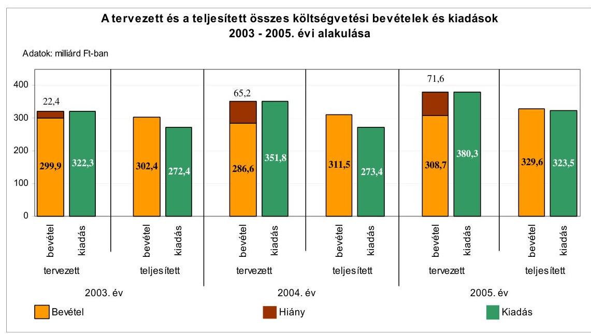
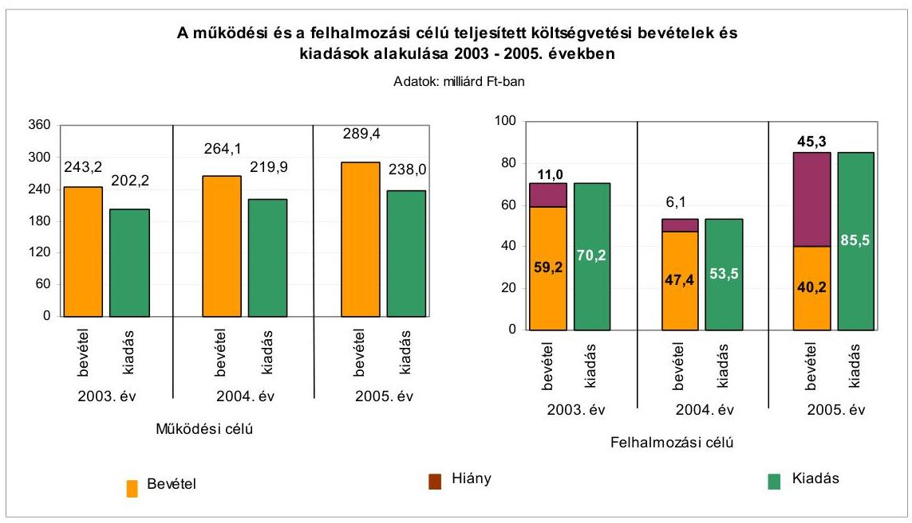
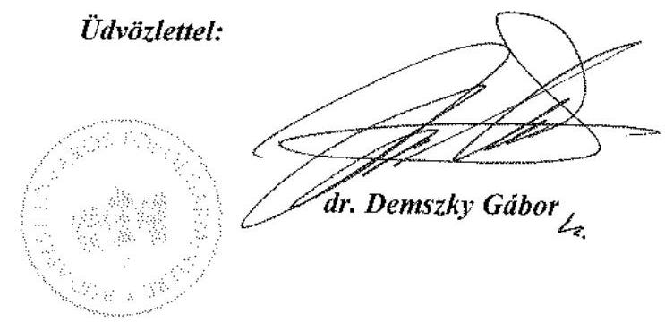

# ÁLLAMI   SZÁMVEVŐSZÉK 

## JELENTÉS

a Budapest Főváros Önkormányzatánál az önkormányzati feladatok és a rendelkezésre álló források összhangjának ellenőrzéséről

Az önkormányzati gazdálkodás átfogó ellenőrzésének IV. üteme 0652
2007. január

---

3. Önkormányzati és Területi Ellenőrzési Igazgatóság
3.3. Átfogó Ellenőrzések Főcsoport
Iktatószám: V-1003-5/20/23/2006.
Témaszám: 803
Vizsgálat-azonosító szám: V0260
Az ellenőrzést felügyelte:
Dr. Lóránt Zoltán
főigazgató
Az ellenőrzés végrehajtásáért felelős:
Dr. Sepsey Tamás
főigazgató-helyettes
Az ellenőrzést vezette:
Németh Gábor
igazgató-helyettes
Az ellenőrzést végezték:
Dr. Karáné Kőszegi Endrődy Péterné Dr. Csermák Judit
Zsuzsanna számvevő tanácsos számvevő
Köllődné Gátai Mária Kozma Gábor
számvevő számvevő

# A témához kapcsolódó eddig készített számvevőszéki jelentések: 

címe
sorszáma
Jelentés Budapest Főváros Önkormányzata gazdálkodásának utó-
0246
vizsgálatáról
Jelentés a helyi önkormányzatok egyes pénzügyi befektetésekkel
0318
történő gazdálkodásának ellenőrzéséről
Jelentés a helyi önkormányzatoknak bérlakásépítésre és korszerűsítésre juttatott pénzügyi támogatások ellenőrzéséről
Jelentés a települési önkormányzatok szennyvízközmű fejlesztési és 0416 működtetési feladatai ellátásának vizsgálatáról
Jelentés a Budapest Főváros Önkormányzatánál a beruházási 0421
rendszer múködésének ellenőrzéséről
Az önkormányzati gazdálkodás átfogó ellenőrzésének I. üteme
Jelentés a helyi önkormányzatok gyermekvédelmi szakellátási te- 0430
vékenységének ellenőrzéséről
Jelentés a Budapest Főváros Önkormányzatánál a működési célú
0450
pénzeszközátadás rendszerének ellenőrzéséről
Az önkormányzati gazdálkodás átfogó ellenőrzésének II. üteme

---

Jelentés a köztemetők fenntartásának ellenőrzéséről ..... 0504
Jelentés a címzett támogatásból finanszírozott egészségügyi beru- ..... 0523 házások, rekonstrukciók ellenőrzéséről
Jelentés a helyi önkormányzati fürdők - kiemelten a gyógyfürdők - ..... 0536 helyzete, fejlesztésének lehetőségei, hatása az idegenforgalomra és turizmusra
Jelentés a Magyar Köztársaság 2004. évi költségvetése végrehajtásának ellenőrzéséről
Függelék:

- A helyi önkormányzatokat a 2004. évben megillető normatív állami hozzájárulás elszámolása
- Kötött felhasználású támogatások 2004. évi felhasználásának ellenőrzése
Jelentés a Budapest Főváros Önkormányzatánál a vagyonnal való ..... 0569 gazdálkodás szabályszerűségének és tervszerűségének ellenőrzésé- ről.
Az önkormányzati gazdálkodás átfogó ellenőrzésének III. üteme
Jelentés a középiskolai kollégiumok fenntartásának és fejlesztésé- ..... 0614 nek ellenőrzéséről
Jelentés a Magyar Köztársaság 2005. évi költségvetése végrehajtásának ellenőrzéséről
Függelék:
- A helyi önkormányzatokat a 2005. évben megillető normatív hozzájárulás igénylésének és elszámolásának ellenőrzése
- A kötött felhasználású támogatások 2005. évi felhasználásának ellenőrzése
- A helyi önkormányzatok beruházásaihoz és rekonstrukcióihoz nyújtott 2005. évi felhalmozási célú támogatások ellenőrzése

---

# TARTALOMJEGYZÉK 

BEVEZETÉS ..... 9
I. ÖSSZEGZŐ MEGÁLLAPÍTÁSOK, KÖVETKEZTETÉSEK, JAVASLATOK ..... 11
II. RÉSZLETES MEGÁLLAPÍTÁSOK ..... 19

1. A feladatok meghatározása és szervezeti keretei ..... 19
1.1. A kötelező és önként vállalt feladatellátás mértékének és módjának meghatározása ..... 19
1.2. Az egészségügyi feladatok ..... 20
1.3. A gyermek- és ifjúságvédelemi feladatok ..... 24
1.4. Az információs- és informatikai feladatok ..... 27
1.5. A piacokkal, a vásárcsarnokokkal és a turisztikával kapcsolatos feladatok ..... 28
1.6. A környezetvédelmi feladatok ..... 30
1.7. A közlekedési feladatok ..... 34
1.8. A kulturális feladatok ..... 36
1.9. A lakásgazdálkodási feladatok ..... 41
1.10. Az oktatási- és ifjúsági feladatok ..... 45
1.11. A sportfeladatok ..... 49
1.12. A szociális feladatok ..... 52
1.13. A városrendezési feladatok ..... 56
1.14. A városüzemeltetési feladatok ..... 60
1.15. A védelmi feladatok ..... 67
2. A költségvetés egyensúlyának helyzete ..... 68
2.1. A költségvetésben tervezett és teljesített múködési célú bevételek és a múködési célú kiadások egyensúlya ..... 68
2.2. A költségvetési források növelése, a kiadások mérséklése érdekében tett intézkedések ..... 72
2.3. A pénzügyi egyensúly biztosítása a gazdálkodás során ..... 73
2.4. Az adósságot keletkeztető kötelezettségvállalásoknál az önkormányzati törvényben előírt felső határ vizsgálata, betartása a tervezés során, valamint a gazdálkodási döntéseknél ..... 76
2.5. A helyi adóbevételek szerepe, arányának változása a költségvetési bevételeken belül a 2003-2005. években ..... 77
2.6. A felhalmozási, felújítási célkitűzések megvalósítását elősegítő külső források igénybevétele, az erre irányuló döntéseknél a központi és önkormányzati szabályozásban foglalt hatásköri előírások betartása ..... 79

---

3. Az egyes naturális mutatókkal mérhető, valamint az önként vállalt feladatok finanszírozása
3.1. Az egyes, naturális mutatókkal mérhető feladatok mértéke, feltételeinek változása. A jelentős változások okainak, következményeinek elemzése, a megtett intézkedések és ezek hatásának bemutatása
3.2. Az önként vállalat feladatok ellátása pénzügyi feltételeinek biztosítása, s ezen feladatoknak az Önkormányzat kötelező feladatainak teljesítésére gyakorolt hatása

# MELLÉKLETEK 

1. számú melléklet Az Önkormányzat gazdálkodását meghatározó adatok, mutatószámok (1 oldal)
2. számú melléklet Az Önkormányzat 2005. évi bevételeinek és kiadásainak alakulása (1 oldal)
3. számú melléklet Az Önkormányzat által ellátott kötelező és önként vállalt ágazati feladatok bevételeinek és kiadásainak alakulása (1 oldal)
4. számú melléklet Egyes önkormányzati feladatok finanszírozása (1 oldal)
5. számú melléklet Kimutatás az önként vállalt ágazati feladatok költségvetési súlyáról (1 oldal)
6. számú melléklet Dr. Demszky Gábor úr, Budapest Főváros Önkormányzat főpolgármesterének észrevétele (2 oldal)

---

# RÖVIDÍTÉSEK JEGYZÉKE 

## Törvények

Áht.
Cct.
Étv.

Eü. tv.
Evt.

Fgytv.
forrásmegosztásról szóló törvény
Gyvt.

Hatv.
Hgt.
Htv.

Ket.

Kötv.

Közokt. tv.
közúti közlekedésről szóló törvény
Ksztv.
Kvt.

Lak. tv.

Ltv.

Mnyk.

Ötv.
Sport $\mathrm{tv}_{1}$
Sport $\mathrm{tv}_{2}$
Szoc. tv.

Tftv.

Tszt $_{1}$
az államháztartásról szóló 1992. évi XXXVIII. törvény
a helyi önkormányzatok címzett és céltámogatási rendszeréről szóló 1992. évi LXXXIX. törvény
az épített környezet alakításáról és védelméről szóló 1997. évi LXXVIII. törvény
az egészségügyről szóló 1997. évi CLIV. törvény
az erdőről és az erdő védelméről szóló 1996. évi LIV. törvény
a fogyasztóvédelemről szóló 1997. évi CLV. törvény
a fővárosi önkormányzat és a kerületi önkormányzatok közötti forrásmegosztásról szóló 2003. évi CXIV. törvény
a gyermekek védelméről és a gyámügyi igazgatásról szóló 1997. évi XXXI. törvény
a helyi adókról szóló 1990. évi C. törvény
a hulladékgazdálkodásról szóló 2000. évi XLIII. törvény
a helyi önkormányzatok és szerveik, a köztársasági megbízottak, valamint egyes centrális alárendeltségű szervek feladat- és hatásköreiről szóló 1991. évi XX. törvény
a közigazgatási hatósági eljárás és szolgáltatás általános szabályairól szóló 2004. évi CXL. törvény
a kulturális örökség védelméről szóló 2001. évi LXIV. törvény
a közoktatásról szóló 1993. évi LXXIX. törvény
a közúti közlekedésről szóló 1988. évi I. törvény
a közhasznú szervezetekről szóló 1997. évi CLVI. törvény
a környezet védelmének általános szabályairól szóló 1995. évi LIII. törvény
a lakások és helyiségek bérletére, valamint az elidegenítésükre vonatkozó egyes szabályokról szóló 1993. évi LXXVIII. törvény
a közokiratokról, a közlevéltárakról és a magánlevéltári anyag védelméről szóló 1995. évi LXVI. törvény
a muzeális intézményekről, a nyilvános könyvtári ellátásról és a közművelődésről szóló 1997. évi CXL. törvény
a helyi önkormányzatokról szóló 1990. évi LXV. törvény
a 2000. évi CXLV. törvény a sportról
a 2004. évi I. törvény a sportról
a szociális igazgatásról és szociális ellátásokról szóló 1993. évi III. törvény
a területfejlesztésről és a területrendezésről szóló 1996. évi XXI. törvény
a távhőszolgáltatásról szóló 1998. évi XVIII. tv.

---

| Tszt $_{2}$ | a távhőszolgáltatásról szóló 2005. évi XVIII. tv. |
| :--: | :--: |
| Ttv. | a temetőkről és a temetkezésről szóló 1999. évi XLIII. törvény |
| Tvt. | a természet védelméről szóló 1996. évi LIII. törvény |
| Vátv. | egyes állami tulajdonban lévő vagyontárgyak önkormányzatok tulajdonába adásáról szóló 1991. évi XXXIII. törvény |
| vízgazdálkodási tv. | a vízgazdálkodásról szóló 1995. évi LVII. tv. |
| Rendeletek |  |
| Ámr. | az államháztartás múködési rendjéről szóló 217/1998. (XII. 30.) Korm. rendelet |
| Vhr. | az államháztartás szervezetei beszámolási és könyvvezetési kötelezettségének sajátosságairól szóló 249/2000. (XII. 24.) Korm. rendelet |
| Önkormányzati rendeletek |  |
| közművelődési rendelet | a Fővárosi Önkormányzat művelődési feladatairól szóló 43/1998. (IX. 24.) számú önkormányzati rendelet |
| SzMSz | Budapest Főváros Önkormányzata 7/1992. (III. 26.) számú rendelete a Fővárosi Önkormányzat Szervezeti és Múködési Szabályzatáról |
| 2003. évi költségvetési rendelet | Budapest Főváros Önkormányzata 10/2003. (III. 14.) számú rendelete a 2003. évi költségvetésről |
| 2004. évi költségvetési rendelet | Budapest Főváros Önkormányzata 8/2004. (III. 19.) számú rendelete a 2004. évi költségvetésről |
| 2005. évi költségvetési rendelet | Budapest Főváros Önkormányzata 12/2005. (III. 11.) számú rendelete a 2005. évi költségvetésről |
| 2004. évi zárszámadási rendelet | Budapest Főváros Önkormányzata 32/2004. (VI. 23.) számú rendelete a 2003. évi költségvetésének végrehajtásáról |
| 2005. évi zárszámadási rendelet | Budapest Főváros Önkormányzata 32/2005. (V. 20.) számú rendelete a 2004. évi költségvetésének végrehajtásáról |
| Szórövidítések |  |
| ÁSZ | Budapest Főváros Önkormányzata 32/2005. (V. 20.) számú rendelete a 2004. évi költségvetésének végrehajtásáról |
| BDK Kft. | Budapest Főváros Önkormányzata 27/2006. (V. 18.) számú rendelete a 2006. évi költségvetésének végrehajtásáról |
| BKSZ Kht. |  |
| BKSZ | Budapest Főváros Önkormányzata 32/2005. (V. 20.) számú rendelete a 2004. évi költségvetésének végrehajtásáról |
| BKV Zrt. |  |
| BTI Rt. | Budapest Temetkezési Intézet Rt. |
| EIB | Európai Beruházási Bank |
| Európai Integrációs és Külügyi Iroda | Főpolgármesteri Hivatal Európai Integrációs és Külügyi Irodája |
| FCSM Rt. | Fővárosi Csatornázási Művek Rt. |

---

| FCSM Zrt. | Fővárosi Csatornázási Múvek Zártkörűen Múködő Részvénytársaság |
| :--: | :--: |
| FIMÜV Zrt. | Fővárosi Ingatlankezelő és Műszaki Vállalkozói Zártkörűen Múködő Részvénytársaság |
| FKF Zrt. | Fővárosi Közterület-fenntartó Zártkörűen Múködő Részvénytársaság |
| Főgáz Rt. | Fővárosi Gázmúvek Rt. |
| főjegyző | Budapest Főváros Önkormányzatának Főjegyzője |
| FŐKERT Rt. | Fővárosi Kertészeti Részvénytársaság |
| FŐKÉTÚSZ Kft. | FŐKÉTÚSZ Fővárosi Kéménysepróipari Kft. |
| főpolgármester | Budapest Főváros Önkormányzatának Főpolgármestere |
| Főpolgármesteri hivatal | Budapest Főváros Önkormányzata Közgyűlésének Főpolgármesteri Hivatala |
| FŐTÁV Zrt. | Fővárosi Távhőszolgáltató Zártkörűen Múködő Részvénytársaság |
| FTSZ Kft. | Fővárosi Településtisztasági és Környezetvédelmi Kft. |
| GKM | Gazdasági és Közlekedési Minisztérium |
| GUEST Zrt. | GUEST Szolgáltató és Idegenforgalmi Zártkörűen Múködő Részvénytársaság |
| Gyermekvédelmi ügyosztály | Főpolgármesteri Hivatal Gyermek- és ifjúságvédelmi Ügyosztálya |
| Gyógyfürdő Rt. | Budapest Gyógyfürdői és Hévizei Rt. |
| ILNET Kht. | ILNET Budapesti Illemhely Üzemeltetési Kht. |
| Informatikai ügyosztály | Főpolgármesteri Hivatal Informatikai Ügyosztálya |
| Kereskedelmi és turisztikai bizottság | Budapest Főváros Önkormányzata Közgyűlésének Kereskedelmi és Turisztikai Bizottsága |
| Kommunális ügyosztály | Főpolgármesteri Hivatal Kommunális Ügyosztálya |
| Közgyűlés | Budapest Főváros Önkormányzatának Közgyűlése |
| KvVM | Környezetvédelmi és Vízügyi Minisztérium |
| Lakás ügyosztály | Főpolgármesteri Hivatal Lakás Ügyosztálya |
| NSH | Nemzeti Sport Hivatal |
| Oktatási bizottság | Budapest Főváros Önkormányzata Közgyűlésének Oktatási Bizottsága |
| Oktatási ügyosztály | Főpolgármesteri Hivatal Oktatási Ügyosztálya |
| Önkormányzat | Budapest Főváros Önkormányzata |
| Pénzügyi bizottság | Budapest Főváros Önkormányzata Közgyűlésének Pénzügyi Bizottsága |
| Programvégrehajtó iroda | Főpolgármesteri Hivatal Főpolgármesteri Iroda Programvégrehajtó Irodája |
| Sport bizottság ${ }_{1}$ | Budapest Főváros Önkormányzata Közgyűlésének Egészségügyi és Sport Bizottsága |
| Sport bizottság ${ }_{2}$ | Budapest Főváros Önkormányzata Közgyűlésének Ifjúsági és Sport Bizottsága |
| Szociális és lakásügyi bizottság | Budapest Főváros Önkormányzata Közgyűlésének Szociális és Lakásügyi Bizottsága |

---

Védelmi ügyosztály
2005. évi vagyongazdálkodási irányelvek

Főpolgármesteri Hivatal Védelmi és Gazdasági Ügyosztálya
a Közgyűlés 770/2005. (III. 31.) számú határozata a vagyongazdálkodás 2005. évi irányelveiről

---

# ÉRTELMEZŐ SZÓTÁR 

feladatellátási hely
felhalmozás
szindikált hitel
a Közokt. tv. 121. § (1) bekezdés 35. és 44. pontjai szerint a közoktatási intézmény székhelye, illetve a székhelyen kívül működő szervezeti egység (tagintézmény, kihelyezett osztály, csoport, műhely, gyakorlóhely, iroda, napközi, tanulószoba, konyha) telephelye
fejlesztés, illetve beruházás és felújítás együttesen
a szindikált hitel olyan nagy összegű hitel, mely nyújtásának kockázatát egy bank nem tudja, vagy nem akarja felvállalni, ezért a hitel nyújtására egy bankokból álló konzorciumot - szindikátust - szervez. Egy hitelszerződés jön létre, azonban az adóssal szemben több hitelnyújtó áll, megosztva a terheket és a kockázatot.

---

.

---

# JELENTÉS 

## a Budapest Főváros Önkormányzatánál az önkormányzati feladatok és a rendelkezésre álló források összhangjának ellenőrzéséről. Az önkormányzati gazdálkodás átfogó ellenőrzésének IV. üteme

## BEVEZETÉS

Az Ötv. 92. § (1) bekezdése, az Állami Számvevőszékről szóló 1989. évi XXXVIII. törvény 2. § (3) bekezdése, valamint az Áht. 120/A. § (1) bekezdése alapján az önkormányzatok gazdálkodását az Állami Számvevőszék ellenőrzi. Az ellenőrzésre az Országgyúlés illetékes bizottságai részére is átadott ellenőrzési program alapján került sor.

A Budapest Főváros Önkormányzata gazdálkodása több évre ütemezett átfogó ellenőrzésének végrehajtása keretében IV. ütemként, az Önkormányzat kötelező és önként vállalt feladatellátásának szervezeti kereteit, megoldásait, azoknak a rendelkezésre álló források változásával összhangban történő módosítását, a költségvetés egyensúlyi helyzetét, a felhalmozási feladatoknál a külső források igénybevételének szabályszerűségét, a fajlagos múködési kiadások alakulását, valamint a kialakított rendszer célszerűségét vizsgáltuk az átfogó ellenőrzési programhoz illeszkedően.

## Az ellenőrzés célja annak értékelése volt, hogy:

- a kötelező és önként vállalt feladatokat milyen szervezeti formában látták el, azok hogyan segítették a feladatellátás szabályszerűségét ${ }^{1}$;
- az Önkormányzat által ellátott feladatok és az azokhoz rendelkezésre álló források összhangja biztosított volt-e, különös tekintettel az egyes kiemelt feladatokra;
- a Közgyűlés értékelte-e a szervezetalakítási intézkedések hatását a szakmai feladatellátásra és a források hatékonyabb felhasználására vonatkozóan.

Az ellenőrzött időszak: a 2003-tól a 2006. I. félévig terjedő időszak.

[^0]
[^0]:    ${ }^{1}$ A törvényi előírások betartásának elmulasztásakor a részletes megállapítások fejezetben egységesen a törvénysértés megjelölést alkalmazzuk, mivel az ÁSZ nem tehet különbséget a törvényi előírások között.

---

A főváros lakosainak száma 2006. január 1-jén 1690109 fő ${ }^{2}$ volt, ami 6306 fővel kevesebb a megelőző év január 1-jei állapotnál. Az Önkormányzat 66 tagú Közgyűlésének munkáját 22 állandó bizottság segítette. Feladatainak végrehajtása érdekében az Önkormányzat a 2005. évben 253 költségvetési szervet működtetett, amelyből 25 részben önállóan gazdálkodó volt. A közfeladatok ellátásában gazdasági társaságok és közhasznú társaságok is részt vettek. Az Önkormányzat költségvetési szerveinél foglalkoztatottak száma 2005. december 31-én 36560 fő volt, ebből 1224 fő köztisztviselő és 33330 közalkalmazott.

Az Önkormányzat a 2005. évi költségvetési gazdálkodása során a Magyar Államkincstár adatai szerint 626,3 milliárd Ft bevételt és 467,1 milliárd Ft kiadást teljesített, amelyet a 2005. évi zárszámadásban korrigált. Kiszűrte a költségvetés teljesítési adatokat torzító összegeket, a bevételeket 259,1 milliárd Ft-tal, a kiadásokat 130,7 milliárd Ft-tal csökkentette. A halmozódásoktól mentes teljesített bevételek főösszege 367,2 milliárd Ft, a kiadásoké 336,4 milliárd Ft. A hitelek, értékpapírok bevételeit és kiadásait nem tartalmazó összes költségvetési bevétel 329,6 milliárd Ft, a kiadás 323,5 milliárd Ft. Az ellenőrzés keretében 14 ágazat feladat ellátását tekintettük át, amelyek bevételének összege a 20032005. években az összes költségvetési bevétel $66,8-67,8-72,8 \%$-át és kiadásainak összege az összes költségvetési kiadás 90,8-91,4-91,2\%-át jelentette. A számítások során a zárszámadási rendeletek 3. számú táblázatából az intézmények és a Főpolgármesteri hivatal - ellenőrzött ágazatokhoz kapcsolódó adatait vettük figyelembe. Az Önkormányzat gazdálkodását meghatározó adatokat, mutatószámokat az 1-5. számú mellékletek tartalmazzák.

Az Állami Számvevőszék 2006. évi ellenőrzési tervének készítésekor figyelembe vettük Atkári János főpolgármester helyettesnek a Fővárosi Önkormányzat 2005. évi útfelújítási munkálatai és a kapcsolódó PR-feladatok ellátása ügyével kapcsolatos bejelentésében foglaltakat. A helyszíni vizsgálat előkészítése közben értesültünk arról, hogy a Fővárosi Főügyészség a hozzá intézett azonos tartalmú bejelentés alapján jogszabálysértést nem állapított meg, így az Állami Számvevőszék arra vonatkozó ellenőrzése okafogyottá vált.

[^0]
[^0]:    ${ }^{2}$ A BM Központi Adatfeldolgozó, Nyilvántartó és Választási Hivatal személyiadat és lakcímnyilvántartása alapján.

---

# I. ÖSSZEGZŐ MEGÁLLAPÍTÁSOK, KÖVETKEZTETÉSEK, JAVASLATOK 

Az Önkormányzat feladat- és hatáskörének, múködésének, szervezeti felépítésének alapvető szabályait az Ötv. az önkormányzati feladatok ellátását szabályozó ágazati törvények, valamint az SzMSz határozta meg. Az Önkormányzat az Ötv. előírását figyelmen kívül hagyva nem határozta meg a feladatok ellátásának mértékét és módját. Az egy önként vállalt feladatát az SzMSz melléklete tartalmazta, miszerint a pályaválasztási feladatok elvégzésére önkormányzati intézményt tart fenn. Az SzMSz-ben nem vették figyelembe a szakmai törvények kötelező és önként vállalt önkormányzati feladatokra vonatkozó előírásait. A Közgyűlés 2006. szeptemberben kilenc ${ }^{3}$ önként vállalt feladattal kiegészítette az SzMSz mellékletét.

Az Önkormányzatnál az egyes feladatok ellátása és annak szervezeti kerete a következők szerint valósult meg.

A Közgyűlés rendeletében meghatározta az egészségügyi feladatok ellátásának a főváros és a kerületi önkormányzatok közötti megosztását. Az Önkormányzat kötelező feladatként látta el a fekvőbeteg szakellátást 19 intézményben, valamint a járóbeteg szakellátást hét kerületben teljes egészében, négy kerületben a kerületi önkormányzattal megosztva. A 2003-2005. években négy intézmény múködését átalakította, egy intézmény feladatait kerületi önkormányzatnak adta át. Az Eü. tv. előírásának megfelelően biztosította a szúnyogés patkányirtást. A főváros területén lévő gyógyforrásokkal kapcsolatban az Eü. tv. előírása szerint a Közgyűlés dönt a gyógyiszap és gyógyforrástermék kitermeléséről, kezeléséről, az elismert gyógyvíz, a gyógyiszap és a gyógyforrástermék palackozásáról, csomagolásáról, valamint forgalomba hozataláról, illetve engedélyezi e tevékenységeket. A Közgyűlés ezt a hatáskört az SzMSz-ben a főpolgármesterre ruházta át. A Főpolgármester intézkedése alapján a döntés előkészítéséért a Kommunális ügyosztály volt a felelős, amelyet az nem teljesített, ezért az Eü. tv. előírása ellenére a gyógyvizekről döntés nem született.

Az Önkormányzat önként vállalt feladatként az egészségügyi bizottsági keretből egészségügyi feladatok ellátását végző civil szervezeteket támogatott, drogbetegek rehabilitációjára és mozgás-egészségügyi rehabilitációra közszolgáltatási szerződést kötött non-profit szervezetekkel. Az egészségmegőrző és beteg-

[^0]
[^0]:    ${ }^{3}$ A további önként vállalat feladatok a nappali melegedők fenntartása a szociálisan rászorultak számára, az utcai szociális munkavégzés a hajléktalanok ellátása keretében, az időskorúak gondozóházának fenntartása, a „Budapest Start" támogatás az újszülöttek részére, a fővárosi romák szociális segítése a Cigányház Romano-Kher fenntartásával, a fogyatékkal élők számítógéppel való ellátása pályázat útján, az információtechnológiai eszközök szélesebb körű lakossági hozzáférésének biztosítása pályázati rendszerben, a nagyobb forgalmú helyeken nyilvános internet-elérési helyek biztosítása, a társasházi és szövetkezeti lakóépületek felújításának támogatása.

---

ségmegelőző feladatok ellátására a Pest Megyei Önkormányzattal kht-t alapított.

A 2003-2005. években az Önkormányzat költségvetésének meghatározó része volt az egészségügyi ágazat, a 2005. évi bevételei, illetve kiadásai az összes költségvetési bevétel, illetve kiadás $25 \%$-át jelentették. Az Önkormányzat által fenntartott egészségügyi intézmények működését az Országos Egészségügyi Pénztár finanszírozta. Az egészségügyi feladatok ellátásának működési kiadása az összes egészségügyi kiadás 94-95\%-a volt. Az Önkormányzat a felhalmozási feladatokhoz a 2003-2005. évben cél- és címzett támogatást vett igénybe. Az intézmények fizetőképességének fenntartása érdekében az Önkormányzat intézményi összevonásokat végzett, és a hatékonyabb múködtetés érdekében három esetben kht. formájában történő feladatellátásról döntött. Az Önkormányzat a 2006. év első félévéig 12 kerületi önkormányzatnak adta át teljes mértékben, négy kerületi önkormányzatnak részlegesen a járóbeteg szakrendelést és gondozóintézeti ellátást. A Közgyűlés nem értékelte a szervezeti változások szakmai és gazdasági előnyeit.

Az Önkormányzat gyermek- és ifjúságvédelemmel kapcsolatos kötelező feladatként az otthont nyújtó, különleges, speciális, valamint az utógondozói ellátást, a területi gyermekvédelmi szakszolgáltatást, illetve önként vállalt feladatként a többcélú intézményekben óvodai és általános iskolai nevelést, oktatást, kollégiumi ellátást, gyermekek és családok átmeneti otthonát múködtetett. A gyermek- és ifjúságvédelmi feladatokat az Önkormányzat elsősorban intézményeivel - gyermekotthonokban és lakásotthonokban, a Területi Gyermekvédelmi Szakszolgálat tevékenységével - látta el, valamint nevelőszülői hálózatot múködtetett. Az Önkormányzat a 2006. évtől kezdődően ellátási szerződést kötött speciális gyermekvédelmi szakellátás biztosítására. A gyermek- és ifjúságvédelmi feladatok 2005. évi bevételei, illetve kiadásai az összes költségvetési bevétel, illetve kiadás 3\%-át jelentették. A gyermek- és ifjúságvédelmi feladatok szervezeti megoldásának módját a 2003-2005. évek közötti időszakban elsősorban a szakmai jogszabályok változásainak követése miatt, valamint az otthont nyújtó ellátások színvonalának emelése, illetve megtartása érdekében, továbbá gazdaságossági szempontok alapján változtatták. A 2004. évben jelentős, öszszesen 18 intézményt érintő átszervezést indítottak el, amelynek első lépéseként létrehozták az intézmények gazdálkodási feladatait ellátó gazdasági szervezetet. A végrehajtott szervezeti változások szakmai és gazdasági előnyeit a Közgyűlés rendszeresen értékelte a beszámolók alapján, amelyekben a döntések költségvetésre gyakorolt kiadás csökkentő hatását bemutatták.

Az Önkormányzat kötelező feladatként látta el a fővárosi információs rendszer működtetését, illetve a Főpolgármesteri hivatal elektronikus ügyintézési és hatósági szolgáltatási, informatikai feladatait. Önként vállalt feladatként végezte a közterületi információs terminálok üzemeltetését, a közösségi számítógépes központok kialakítását, fogyatékos személyek részére számítástechnikai eszközök beszerzését. Az átfogó jellegű informatikai fejlesztési feladatokat az Informatikai ügyosztály látta el, amely az ágazati informatikai fejlesztési feladatokat az egyes ágazatok szervezeti egységeivel együttmúködve végezte. Az informatikai feladatok 2005. évi kiadásai nem érték el az összes költségvetési kiadás 1\%-át. Az Önkormányzat az átfogó jellegű informatikai fejlesztési

---

feladatait a Budapesti Információgazdálkodási Program keretében valósította meg.

A Közgyűlés rendeletet alkotott a tulajdonában lévő piacokról és vásárcsarnokokról. Az Ötv. előírását figyelmen kívül hagyva a rendelet nem tartalmazta a piacok és vásárcsarnokok fejlesztésével kapcsolatos feladatokat. Az Önkormányzat turisztikai feladatokra vonatkozóan, rendelkezett idegenforgalmi koncepcióval és turisztikai szervezettel. Önként vállalt feladatként idegenforgalmi célra támogatást nyújtott. A kereskedelmi, turisztikai feladatok 2005. évi bevételei, illetve kiadásai az összes költségvetési bevétel, illetve kiadás közel 1\%-át jelentették. A 2003-2005. évek között a bevételek 22\%-kal, a kiadások $21 \%$-kal csökkentek.

Az Önkormányzat a környezetvédelemmel kapcsolatos kötelező feladatok ellátását kizárólagos tulajdonában lévő gazdasági társaságával és szolgáltatások vásárlásával oldotta meg. A közcélú zöldterületek fenntartására és fejlesztésére kötött közszolgáltatási szerződést indokoltsága ellenére nem aktualizálták. A védetté nyilvánított helyi jelentőségű természeti értékeket meghatározták. A védett természeti terület őrzésére vonatkozó kötelezettségének az Önkormányzat a Tvt-ben foglaltak ellenére nem tett eleget, valamint az Evt-ben előírt erdőgazdálkodási feladatait nem látta el. A környezetvédelmi feladatok 2005. évi kiadásai az összes költségvetési kiadás közel 1\%-át jelentették.

Az Önkormányzat közlekedéssel kapcsolatos kötelező feladatok ellátása keretében a tömegközlekedési feladatok végzésére egyszemélyes részvénytársaságot alapított. A tömegközlekedés fejlesztése céljából a 2003-2005. években metró vonal felújítást, villamos járműfejlesztést, forgalomirányítás fejlesztést, zajvédő fal építést, út- és hídjavítást és útépítést végeztek. Az Önkormányzat a tulajdonában lévő utak, országos közutak, közúti hidak, alul- és felüljárók, valamint a kerületi önkormányzatok tulajdonában lévő, a tömegközlekedés által igénybe vett utak üzemeltetésére, fenntartására és fejlesztésére, a forgalomtechnikai feladatok ellátására gazdasági szervezettel kötött szerződést. Rendeletében szabályozta a főváros közigazgatási területén a járművel történő várakozás rendjének egységes kialakítását, a várakozás díját és az üzemképtelen járművek tárolását. A személyszállítás érdekében a fővárosban és környékén egységes közlekedési rendszerek kialakításának feladatát látták el egy kht-vel. A helyi közforgalmú vasút működtetését a BKV Zrt. végezte. A közúti közlekedés hatósági feladatainak ellátására gazdasági társasággal szerződést kötött. A közúti közlekedés hatósági feladatok ellátása keretében rendeletben meghatározta a menetrend szerinti személyszállítás díját, valamint a személy taxi szolgáltatás díjszabásának legmagasabb hatósági árát. Az Önkormányzat önként vállalt feladatként látta el a közúti közlekedés biztonságát elősegítő nevelő feladatot, az egységes bérletek bevezetése érdekében szövetséget hozott létre. A főváros több kerületében a parkolási feladatokat saját intézményével látta el, a fővárosi őrzött P+R parkolók működtetésére és üzemeltetésére megbízási szerződést kötött. A Gyermekvasutakért Alapítvánnyal kötött közszolgáltatási szerződés keretében hozzájárult a gyermekvasút működtetéséhez. Az Önkormányzat a Stratégiai Alap létrehozásával a kerületi önkormányzatokat támogatta a kerületi tulajdonú csatornázott földutak szilárd burkolattal történő ellátása céljából. Az Önkormányzat költségvetésének meghatározó része volt a közlekedési ágazat,

---

amelynek 2005. évi bevételei 12\%-át, kiadásai 21\%-át jelentették az összes költségvetési bevételnek és kiadásnak.

A kulturális feladatok keretében az Önkormányzat kötelező feladatként az Ltv. alapján levéltárat, az Mnyk. alapján közgyűjteményi múzeumi szervezetet, könyvtárat, valamint közművelődési szakmai tanácsadással foglalkozó intézményt múködtetett. Az Mnyk. előírása szerint az Önkormányzat kötelező feladata a helyi közművelődési tevékenység támogatása, ezek törvényben felsorolt formái közül a törvényi előírás ellenére az Önkormányzat rendeletében nem határozta meg, hogy mit, milyen konkrét formában, módon és mértékben lát el kötelező feladatként. A mulasztás miatt önként vállalt feladatnak minősülő, de ellátott közművelődési és művészeti tevékenységet intézményei végezték és ilyen feladatok ellátására támogatást nyújtott. A kulturális feladatok 2005. évi bevételei, kiadásai az összes költségvetési bevétel, kiadás 6\%-át jelentették. A kulturális feladatok felhalmozási kiadásaihoz a 2004. évben minisztériumi támogatásban, a 2005. évben kettő címzett támogatásban részesült. A 2003-2005. években kettő színházi intézményt kht-vá alakítottak, ennek szakmai és gazdasági hatását a Közgyűlés nem értékelte.

Az Önkormányzat a lakásgazdálkodással kapcsolatosan alkotott rendeletei alapján végezte lakásgazdálkodási feladatait. Önként vállalt feladatként a Városrehabilitációs Keretből támogatta társasházi és szövetkezeti lakóépületek felújítását, növelte bérlakás állományát és múködtette a nyugdíjasházakban a nővérszolgálati ügyeletet. A lakásgazdálkodási feladatok 2005. évi bevételei és kiadásai az összes költségvetési bevétel és kiadás közel 1\%-át jelentették. A Lak. tv. alapján elkülönített számlán kezelt forrásokat az előírásnak megfelelően lakások fejlesztéséhez használták fel.

Az oktatással kapcsolatos feladatokat az Ötv. és a Közokt. tv. határozta meg, melyek a középiskolai, szakiskolai és kollégiumi feladatok tekintetében ellátási kötelezettséget - amennyiben a feladat ellátását a kerületi önkormányzat nem vállalja -, továbbá ifjúsági feladatokat, a közoktatási tevékenység fővárosi szintű összehangolását, a nemzeti- és etnikai kisebbségek oktatási, nevelési feladatait, valamint pedagógiai szakmai-szolgáltatási, módszertani feladatokat írtak elő az Önkormányzat számára. Az Önkormányzat az oktatási- és ifjúsági feladatait közoktatási intézményeiben látta el, továbbá a 2003-2005. évek közötti időszakban négy közalapítvánnyal, egy alapítvánnyal, a 2003-2004. években egy, a 2005. évben három kht-val kötött ellátási szerződést. Az oktatási- és ifjúsági feladatok 2005. évi bevételei és kiadásai az összes költségvetési bevétel és kiadás 16\%-át jelentették. Az oktatási- és ifjúsági feladatok szervezeti megoldásának módját a 2003-2005. évek közötti időszakban részben szakmai megfontolásokból, részben gazdaságossági szempontok alapján változtatták. Az Önkormányzat a közoktatási intézmények finanszírozását a ténylegesen ellátott feladatok változásához kötötte. A finanszírozási rendszer következményeként a közoktatási intézményeknél átszervezéseket hajtottak végre. Az Önkormányzat kerületi önkormányzatok fenntartásában lévő középiskolákat vett át a Közokt. tv-ben előírtaknak, illetve az Önkormányzat és a fővárosi kerületek közötti együttműködési megállapodásnak megfelelően. A végrehajtott szervezeti változások szakmai és gazdasági előnyeit a Közgyűlés rendszeresen értékelte, a beszámolókban a döntések költségvetésre gyakorolt kiadáscsökkentő hatását bemutatták. Az alapfeladatokat ellátó intézmények megszüntetése, át-

---

szervezése előtt, a döntés előkészítése során kikérték az igénybe vevők véleményét.

A Közgyűlés rendeletben határozta meg az Önkormányzat sporttal kapcsolatos feladatait, ezek ellátásában kettő intézménye működött közre. A kötelező testnevelési, ifjúsági és sportszervezési feladatok ellátását sportszervezetek támogatásával biztosította. A 2004. évtől az Önkormányzat támogatta a megrendezésre kerülő kiemelkedő jelentőségű nemzetközi sporteseményeket. Az Önkormányzat 15 sportcélú ingatlannal rendelkezett, amelyek közül hatot saját intézményével üzemeltetett, hat ingatlan használati jogát más sportszervezetnek adta át. Három ingatlan állaga sporttevékenység végzésére alkalmatlan. A 2003. évben az Önkormányzat egy sportcélú ingatlant értékesített. Az Önkormányzat a 2005. évi vagyongazdálkodási irányelvekben értékesítésre kijelölt ingatlan esetében nem jelezte, hogy azt ingyenes vagyonátadással kapta és a Sport $\mathrm{tv}_{2}$ előírásának megfelelően értékesítés előtt be kell szerezni az NSH elnökének egyetértését. A sporttal kapcsolatos feladatok 2005. évi bevételei és kiadásai nem érték el az összes költségvetési bevétel és kiadás 0,5\%-át.

A szociális feladatok keretében az Önkormányzat kötelező feladatként szakosított szociális ellátást végzett és pénzbeli ellátást nyújtott a hajléktalanoknak. A szakosított szociális ellátási formák közül a Szoc. tv-ben előírt szenvedélybetegek otthonát, fogyatékosok rehabilitációs intézményi ellátását és a speciális intézményi ellátást nem biztosította. A Szoc. tv-ben előírtaknak megfelelően az Önkormányzat rendelkezett szolgáltatástervezési koncepcióval, és ennek keretében ellátta a szociális szolgáltatások területi összehangolását, gondoskodott a módszertani feladatok ellátásáról. A szociális feladatok körében önként vállalt feladatként idősek gondozó házát, családsegítést szolgáló intézményt, utcai szociális munkát, hajléktalanok nappali melegedőjét és krízis fek-tető-ápolási intézményt múködtetett, valamint regionális módszertani feladatokat látott el és támogatást nyújtott a nem kötelező feladatokhoz alapítványoknak, társadalmi szervezeteknek, egyházaknak. A Vhr. előírása ellenére nem megfelelő szakfeladatra számolták el az adott támogatásokat. A szociális feladatok 2005. évi bevételei és kiadásai az összes költségvetési bevétel és kiadás 5\%-át jelentették.

Az Önkormányzat a városrendezés kötelező feladataként meghatározta a főváros városfejlesztési és városrehabilitációs programját, általános rendezési tervét, továbbá az Étv-ben foglaltak alapján a Közgyűlés rendeleteivel és határozataival megalkotta az Önkormányzat településrendezési eszközeit és rendeletet hozott azok összhangjáról. A Tftv-ben és a Kötv-ben előírt területfejlesztési, műemlékvédelmi feladatokat végzett. Az Ötv. alapján a Közgyűlés rendeletet alkotott a helyi építészeti örökség védelméről, és az Étv. alapján támogatást nyújtott a védelem ellátásához. A városrendezés önként vállalt feladatai körében az Önkormányzat gondozta a Budapest modellt, tervtanácsot múködtetett, tervpályázatokat írt ki, egyetemeket támogatott, városrehabilitációs céllal kerületeknek támogatást nyújtott. A városrendezéssel kapcsolatos feladatok 2005. évi bevételei és kiadásai nem érték el az összes költségvetési bevétel és kiadás $0,5 \%$-át.

A városüzemeltetéssel kapcsolatos kötelező feladatként gondoskodott az ivóvízellátásról, a szennyvízelvezetésről és kezelésről, a távhőszolgáltatásról, a

---

hulladékgazdálkodásról, a közterületek tisztántartásáról, a köztemetők üzemeltetéséről, a közvilágításról, valamint a kéményseprésről. A feladatok ellátásában meghatározó szerepe volt az Önkormányzat kizárólagos, illetve többségi tulajdonában lévő társaságoknak. Az Önkormányzat önként vállalt feladatként látta el a főváros egyes épületeinek és építményeinek díszvilágítását, valamint támogatásban részesítette a nyilvános illemhelyeket üzemeltető kht-t, továbbá működési és felhalmozási célú támogatást nyújtott a gyógy- és strandfürdőket, uszodákat fenntartó, kizárólagos tulajdonában lévő részvénytársaságnak. A közvilágítás ellátására kötött közüzemi szerződés a közvilágítási (kötelező feladat) és a díszvilágítási (önként vállalt feladat) szolgáltatás ellenértékének elkülönítésére vonatkozó előírást nem tartalmazott. Az Önkormányzat kizárólagos tulajdonában lévő víziközművek használatára a Közgyűlés a vízgazdálkodási tv. előírása ellenére nem kötött szerződést. A gázellátásra közszolgáltatási szerződést nem kötöttek. Az illemhelyeket üzemeltető társasággal nem kötöttek megállapodást a pénzeszközátadásról a Ksztv. előírása ellenére. A városüzemeltetéssel kapcsolatos feladatok 2005. évi bevételei 0,1\%-át, kiadásai 7\%-át jelentették az összes költségvetési bevételnek és kiadásnak. Az infrastrukturális fejlesztések forrásainak biztosításához az Önkormányzat hiteleket vett fel.

Az Önkormányzat védelmi feladatait (a katasztrófamegelőzés és elhárítás, a hivatásos tűzoltóság fenntartása, a közterületfelügyelet) intézményeivel és a Fővárosi Polgári Védelmi Igazgatóságnak nyújtott támogatással látta el. A védelmi feladatok 2005. évi bevételei és kiadásai az összes költségvetési bevétel és kiadás 3\%-át jelentették. Az Önkormányzat a XIV. kerületi önkormányzattal 2005 novemberében intézményi társulást alapított térfigyelő rendszer létrehozására és működtetésére. Az Önkormányzat a közterület-felügyeleti feladatokat a 2003. évben a X. kerületi önkormányzat részére átadta, valamint a korábban átadott feladatot a XIX. kerületi önkormányzattól a 2003. évben, a XVIII. kerületi önkormányzattól a 2006. évben visszavette. A feladatok átadása-átvétele nem járt vagyonátadással.

Az Önkormányzat költségvetésének egyensúlya a 2003-2005. években a költségvetési rendeletben nem volt biztosított, mivel a tervezett költségvetési bevételek egyik évben sem nyújtottak fedezetet a tervezett költségvetési kiadásokra. A tervezett költségvetési hiány előirányzott költségvetési kiadáshoz viszonyított aránya a 2003. évi 7\%-ról a 2005. évben 19\%-ra emelkedett. A Közgyűlés a felhalmozási célú kiadásokat a forráshiány ellenére évről-évre 14\%kal magasabb összeggel tervezte. A hiány finanszírozása céljából fejlesztési célú hitel felvételéről döntött. A költségvetési hiány alakulását a 2004. és 2005. évben érdemben nem befolyásolták a korábbi évek adósságszolgálati kötelezettségével kapcsolatos kiadások. A tervezettől eltérően a 2003-2005. évi teljesítési adatok szerint az Önkormányzatnak bevételi többlete keletkezett, amely a felhalmozási kiadások hiányát csökkentette. A kiadások teljesítése elmaradt a tervezettől. A pénzügyi egyensúly folyamatosan biztosított volt.

A Közgyűlés a 2003-2005. években az elért működési forrástöbblet mellett is a működési kiadások tervezésénél takarékossági szempontokat vett figyelembe, döntött az intézmények gazdálkodási rendjének racionalizálásáról (18 gyermekvédelmi intézmény gazdálkodási feladatát ellátó gazdasági szervezet létrehozásáról, kórházak összevonásáról), intézmények átszervezéséről (közok-

---

tatási intézmények összevonásáról, illetve megszüntetéséről), a foglalkoztatottak létszámának csökkentéséről (a közoktatási intézményeknél 234 álláshely végleges megszüntetéséről), a kht. formában történő működtetéséről (színházak, kórházak), illetve feladat szerződés útján történő ellátásáról, egy lakóépület energiatakarékos felújításáról. A bevételek növelése érdekében tárgyi eszközöket, lakásokat, részesedéseket értékesített. Az értékpapír tranzakciókkal biztosította az infrastrukturális fejlesztések folyamatos finanszírozását, az adósságszolgálati kötelezettség teljesítésének biztonságát. A főjegyző az Önkormányzat pénzügyi egyensúlyának biztosítása érdekében az Ámr. előírásának megfelelően likviditási tervet készített, amelyet folyamatosan aktualizált. Az Önkormányzat a 2003. és a 2006. első félévben egy-egy alkalommal vett fel likvid hitelt, az intézmények költségvetési támogatásának, illetve a BKV Zrt. beruházása támogatásának határidőben történő átutalása érdekében. A likvid hiteleket három, illetve tíz napon belül visszafizették.

A Közgyűlés az Önkormányzat stabil pénzügyi helyzetét az évenkénti hitelfelvétellel, a pénzügyi tartalékok igénybevételével tartotta fenn. Az infrastrukturális beruházásokhoz külföldi bankoktól vett igénybe hitelt. A Közgyűlés az Ötv. előírásának megfelelően vizsgálta az adósságot keletkeztető kötelezettségvállalás felső határát, amelyet nem haladott meg az adósságot keletkeztető kötelezettségvállalások tárgyévben esedékes együttes összege. A Pénzügyi bizottság eleget tett az Ötv. előírásának, vizsgálta a hitelfelvétel indokait és gazdasági megalapozottságát, amelyről határozatot hozott. Az adósságot keletkeztető kötelezettségvállalások nem veszélyeztették az Önkormányzat fizetőképességét és működőképességét a kötelezettségvállalás évében és a futamidő további éveiben.

Az Önkormányzat a kerületi önkormányzatokkal történt megállapodás értelmében bevezette a helyi iparúzési adót és az idegenforgalmi adót. A helyi adóbevételek a 2003-2005. években folyamatosan emelkedtek, az összes költségvetési bevétel 21-22\%-át képezték. Az Önkormányzat bevételi forrásainak növeléséhez külső (címzett és céltámogatás) forrás is hozzájárult, mely az öszszes költségvetési bevétel közel 3\%-a volt.

Az egyes naturális mutatókkal mérhető feladatok mértékének, feltételeinek változása a következők szerint alakult a 2003-2005. években. Az óvodában nevelt, általános iskolai oktatásban és nevelésben részesülő, továbbá középfokú oktatásban részesülő tanulók létszáma a 2003-2005. évek közötti időszakban összesen 5\%-kal növekedett. A növekedést elsődlegesen a kerületi önkormányzatoktól átvett középiskolák tanulólétszáma okozta, a tanulólétszám növekedéséhez az általános iskolai tanulólétszám és az óvodában nevelt gyermekek létszámának folyamatos emelkedése is hozzájárult. Az oktatási feladatokhoz kapcsolódó működési célú kiadások növekedésében az intézmények átvétele mellett meghatározó szerepe volt a közalkalmazotti béremeléseknek. A kiadások növekedését az átfogó bérpolitikai intézkedéseken túlmenően a kötelező előrelépések miatti bérnövekedés és az illetménypótlék változások, a szakképesítés megszerzése miatti bérnövekedés és a minimálbérre történő kiegészítése okozta. Az Önkormányzat az oktatási ágazatban folyamatos intézkedéseket tett a kapacitáskihasználtság javítására a ténylegesen ellátott feladatok finanszírozásához kapcsolódó tervezési rendszer alkalmazásával, illetve - elsősorban a középfokú oktatást végző intézmények körében - a költségvetési szervek ösz-

---

szevonásával és megszüntetésével. Az óvodai nevelést végző intézmények kapacitás kihasználtsága a 2003-2005. évek között öt százalékponttal javult a nevelt gyermekek létszámának 8\%-os növekedése miatt. A 2003-2005. évek között az egy tanulócsoportra jutó tanulók átlaglétszáma alapján az általános iskolai oktatást folytató intézmények kapacitás kihasználtsága 9\%-kal javult, azonban a középiskolai oktatást végző intézményeké 5\%-kal csökkent.

Az Önkormányzat nappali szociális intézményi ellátás keretében hajléktalanok ellátására nappali melegedőket múködtetett, ahol a kapacitás-kihasználtság 95\%-ról 153\%-ra növekedett a 2003. évről a 2005. évre. Az egy főre jutó kiadás csökkent $235737 \mathrm{Ft} /$ föről $100380 \mathrm{Ft} /$ főre, amely kevesebb volt a központi költségvetésből nyújtott $200000 \mathrm{Ft} /$ fő normatív hozzájárulásnál. A 2004. és 2005. években az Önkormányzat saját forrásból nem támogatta a feladat ellátását. A bentlakásos intézményi ellátás kapacitás-kihasználtsága 2\%-kal csökkent, az egy főre jutó kiadás 12\%-kal növekedett a 2003. évről a 2005. évre. A kiadások finanszírozásában a normatív hozzájárulás volt a meghatározó (46-48\%), a saját bevételek és az önkormányzati támogatás 20\%-ot meghaladó mértéke mellett.

Az önként vállalt feladatok nem veszélyeztették az Önkormányzat kötelező feladatainak teljesítését, az ellátásukra az összes költségvetési kiadás 8-7-6\%-át fordították a 2003-2005. években, felhasználásuk lakossági igények kielégítését szolgálta és nem kellett miattuk a kötelező feladatellátást korlátozni. Az önként vállalt feladatokra fordított múködési kiadások összege a három év alatt öszszességében nem változott, alakulásában meghatározó szerepe a kulturális, az oktatási, valamint a gyermek- és ifjúságvédelmi ágazatnak volt. Az önként vállalt feladatok felhalmozási célú kiadása a három év alatt 25\%-kal csökkent. Ezen kiadások közel háromnegyedét a lakásgazdálkodási, a városüzemeltetési és a kulturális ágazat kiadásai tették ki.

Az ellenőrzés során megállapított szabálytalanságok megszüntetésére a főpolgármester és a főjegyző intézkedett, az intézkedéseket a részletes megállapítások fejezetben jeleztük.

A helyszíni ellenőrzés megállapításainak hasznosítása mellett javasoljuk:

# a főpolgármesternek 

1. terjessze a számvevőszéki jelentést a Közgyűlés elé, a feltárt hiányosságok megszüntetésére készíttessen intézkedési tervet a határidők és a felelősök megjelölésével;
2. kísérje figyelemmel az ellenőrzés során megállapított szabálytalanságok megszüntetésére tett intézkedéseinek végrehajtását;

## a főjegyzönek

1. ellenőrizze a részletes megállapítások fejezetben jelzett intézkedéseik teljesítését.

---

# II. RÉSZLETES MEGÁLLAPÍTÁSOK 

## 1. A feladatok meGhatározása és szERVEZeti KERETEI

### 1.1. A kötelező és önként vállalt feladatellátás mértékének és módjának meghatározása

Az Önkormányzat feladat- és hatáskörének, múködésének, szervezeti felépítésének alapvető szabályait az Ötv. 63-65/A. §-ai, az önkormányzati feladatok ellátását szabályozó ágazati törvények, valamint az SzMSz határozta meg.

A fővárosnak az országban betöltött különleges szerepe és sajátos helyzete, kétszintű - a főváros és kerületek önkormányzataiból álló - önkormányzati rendszere az általánostól eltérő szabályozást igényel. Az Önkormányzat látja el azokat a települési önkormányzati feladat- és hatásköröket, amelyek a főváros egészét vagy egy kerületet meghaladó részét érintik, valamint amelyek a fővárosnak az országban betöltött különleges szerepköréhez kapcsolódnak.

Az SzMSz a törvényi előírásokat adaptálva általánosságban határozta meg a Közgyűlés által ellátandó feladat- és hatásköröket, melyet folyamatosan aktualizáltak. A Közgyűlés az Ötv. 8. § (2) bekezdésében foglaltakat megsértve nem határozta meg a feladatok ellátásának mértékét és módját ${ }^{4}$.

Az Önkormányzat 2006 szeptemberéig csak egy önként vállalt feladatot határozott meg az SzMSz-ben ${ }^{5}$, amely során nem vették figyelembe az ágazati törvények kötelező és önként vállalt önkormányzati feladatokra vonatkozó előírásait.

A Közgyűlés ${ }^{6} 2006$ szeptemberében kilenc önként vállalt feladattal kiegészítette az SzMSz 1. számú mellékletét.

A további önként vállalat feladatok a nappali melegedők fenntartása a szociálisan rászorultak számára, az utcai szociális munkavégzés a hajléktalanok ellátása keretében, az időskorúak gondozóházának fenntartása, a „Budapest Start" támogatás az újszülöttek részére, a fővárosi romák szociális segítése a Cigányház Romano-Kher fenntartásával, a fogyatékkal élők számítógéppel való ellátása pályázat útján, az információtechnológiai eszközök szélesebb körű lakossági hozzá-

[^0]
[^0]:    ${ }^{4}$ A közbenső egyeztetés során a főpolgármester által adott tájékoztatás szerint a főjegyző intézkedett annak érdekében, hogy készüljön az Önkormányzat feladatai ellátásának módját és mértékét meghatározó döntés-előkészítő anyag.
    ${ }^{5}$ Az SzMSz 1. számú melléklete szerint önként vállalt feladatként a pályaválasztási feladatok elvégzésére múködtette a Fővárosi Pályaválasztási Tanácsadót.
    ${ }^{6}$ Az Önkormányzat 58/2006. (IX. 18.) számú rendelete egyes önkormányzati rendeletek módosításáról.

---

férésének biztosítása pályázati rendszerben, a nagyobb forgalmú helyeken nyilvános internet-elérési helyek biztosítása, a társasházi és szövetkezeti lakóépületek felújításának támogatása.

A Közgyűlés az önkormányzati feladatok ellátását bizottságaival, a Főpolgármesteri hivatal - növekvő számú ${ }^{7}$ - ügyosztályaival, irodáival, csökkenő számú ${ }^{8}$ költségvetési intézményeivel, gazdasági társaságaival, közhasznú szervezetekkel, közalapítványokkal és egyéb szervezetekkel kötött ellátási, megbízási és vállalkozási szerződésekkel, valamint támogatások nyújtásával biztosította.

# 1.2. Az egészségügyi feladatok 

Az egészségüggyel kapcsolatos feladatokat az Ötv. 63/A. § n) pontja, az Eü. tv. 152. § (3) bekezdése valamint 153. §-a határozta meg.

Az Ötv. előírása szerint az Önkormányzat gondoskodott az alapellátást meghaladó egészségügyi fekvő- és járóbeteg szakellátásról.

A Közgyűlés rendeletében ${ }^{9}$ meghatározta az egészségügyi feladatok ellátásának a főváros és a kerületi önkormányzatok közötti megosztását. A rendelet szerint a fekvőbeteg szakellátásról az Önkormányzat köteles gondoskodni. A járóbeteg szakrendelőket, a tüdő- és ernyőképszűrő állomásokat, a gondozókat az Önkormányzat - a kerületi önkormányzatok kérelmére - kerületi feladat és hatáskörbe átadta. Hatáskör átadása esetén is fővárosi feladatként kell biztosítani a kórházak osztályos szakambulanciájának múködését.

Az Eü. tv. 152. § (3) bekezdése szerint a helyi önkormányzat biztosítja a tulajdonában vagy használatában levő járóbeteg-szakellátást, illetőleg fekvőbetegszakellátást nyújtó egészségügyi intézmények működését, a 153. § alapján a települési önkormányzat a környezet- és településegészségügyi feladatok körében biztosítja a külön jogszabályban meghatározott rovarok és rágcsálók irtását, valamint folyamatosan figyelemmel kíséri a település környezet-egészségügyi helyzetének alakulását, és ennek esetleges romlása esetén - lehetőségeihez képest - saját hatáskörben intézkedik, vagy a hatáskörrel rendelkező és illetékes hatóságnál kezdeményezi a szükséges intézkedések meghozatalát. Az Eü. tv. 153. § (2) bekezdése alapján az Önkormányzat Közgyűlése dönt a gyógyiszap és gyógyforrástermék kitermeléséről, kezeléséről, az elismert gyógyvíz, a gyógyiszap és a gyógyforrástermék palackozásáról, csomagolásáról, valamint forgalomba hozataláról, illetve engedélyezi e tevékenységeket.

[^0]
[^0]:    ${ }^{7}$ Az ügyosztályok, irodák száma a 2003. évi 30-ról, a 2005. év július 17-től 32-re emelkedett.
    ${ }^{8}$ A költségvetési intézmények száma a 2003. évi 260-ról 252-re csökkent a 2005. évben.
    ${ }^{9}$ Az Önkormányzat 23/1992. (VII. 30.) számú rendelete az egészségügyi feladatok ellátásának a fővárosi önkormányzat és a kerületi önkormányzatok közötti megosztásáról.

---

# Az Önkormányzat által ellátott kötelező feladatok: 

- A fekvőbeteg szakellátást 19 intézményben látta el. A 2003-2005. években négy intézmény múködését átalakította, egy intézmény feladatait kerületi önkormányzatnak adta át.

A 2003. évben a Csepeli Weiss Manfred Kórházat a Közgyűlés megszüntette, az ellátási területet és az ellátási feladatokat - a traumatológiai ellátás kivételével a Jahn Ferenc Dél-pesti Kórházhoz csatolta, a traumatológiai ellátást a Szent István Kórházhoz rendelte. A Schöpf-Merei Kórház és a Budai Gyermekkórház és Rendelőintézet a 2005. év óta kht. formájában látta el feladatát. A Madarász Utcai Gyermekkórház a 2005. év decemberében összevonásra került a Heim Pál gyermekkórházzal. Az Önkormányzat az Észak-pesti Kórházat megszüntette, feladatait a XV. kerületi önkormányzat egészségügyi intézménye látja el.

- A járóbeteg szakellátást hét kerületben ${ }^{10}$ teljes egészében, négy kerületben ${ }^{11}$ a kerületi önkormányzatok által át nem vett feladatokat látta el.
- Az Önkormányzat által fenntartott egészségügyi intézmények feladatainak költséghatékonyabb ellátása érdekében a beszerző és szervező feladatok elvégzésére egyszemélyes kft-t hozott létre a 2005. évben ${ }^{12}$.
- Az Eü. tv. 153. § (1) bekezdés b) pontjának megfelelően szúnyog- és patkányirtást végzett az ÁNTSZ közremúködésével.

A Közgyűlés a főváros területén lévő gyógyforrásokkal kapcsolatos döntési hatáskört az SzMSz-ben a főpolgármesterre ruházta át. A főpolgármester intézkedése ${ }^{13}$ alapján a döntés előkészítéséért a Kommunális ügyosztály a felelős. Az Eü. tv. 153. § (2) bekezdés előírása ellenére a gyógyforrásokkal kapcsolatban döntés nem született.

A közbenső egyeztetés során a főpolgármester által tett észrevétel szerint: „önmagában az a tény, hogy a gyógyiszap és gyógyforrás termék kitermeléséről, kezeléséről, az elismert gyógyvíz, a gyógyiszap és a gyógyforrás termék palackozásáról, csomagolásáról, valamint forgalomba hozataláról, illetve e tevékenységek engedélyezéséről nem hozott döntést az önkormányzat, nem jelenti a hivatkozott jogszabály megsértését, amenynyiben erre irányuló kérelem az önkormányzathoz nem érkezett."

Az észrevétel nem megalapozott, mert az Eü. tv. 153. § (2) bekezdése egyértelműen a rendeleti szabályozás kötelezettségét írja elő a gyógyiszap és gyógyforrás termék kitermeléséről, kezeléséről, az elismert gyógyvíz, a gyógyiszap és a gyógyforrás termék palackozásáról, csomagolásáról, valamint forgalomba hozataláról,

[^0]
[^0]:    ${ }^{10}$ A IV., VII., X., XII., XVII., XX., XXIII. kerületben.
    ${ }^{11}$ Az I., IX., XIII., XIV. kerületben.
    ${ }^{12}$ A Fővárosi Egészségügyi Beszerző és Szervező Kft-t.
    ${ }^{13}$ A főpolgármester 586/2005. számú intézkedése.

---

illetve e tevékenységek engedélyezéséről. A gyógyfürdőkben ezen tevékenységeket rendeleti szabályozás nélkül végzik ${ }^{14}$.

# Az Önkormányzat által ellátott önként vállalt feladatok: 

- a 2003-2005. évi költségvetési rendeletekben jóváhagyott egészségügyi bizottsági keretből egészségügyi feladatok ellátását végző civil szervezeteket támogatott pályázat útján (fogyatékos személyek számára munkaerő-piaci szolgáltatásokat nyújtó civil szervezetnek múködési vagy felhalmozási támogatás nyújtása, prevenciós program, egészségügyi szolgáltatások minőségének javítása);
- drogbetegek rehabilitációja, mozgás-egészségügyi rehabilitációs feladat ellátása non-profit szervezetekkel kötött közszolgáltatási szerződéssel;
- egészségmegőrző és betegségmegelőző feladatok ellátása a Pest Megyei Önkormányzattal 50\%-os tulajdoni hányaddal alapított kht-n keresztül ${ }^{15}$;
- állattartás egészségügyi kockázatának csökkentése.

A 2003-2005. években az Önkormányzat költségvetésének meghatározó része volt az egészségügyi ágazat, a 2005. évi bevételei, illetve kiadásai az összes költségvetési bevétel, illetve kiadás 25\%-át jelentették. Az Önkormányzat által fenntartott egészségügyi intézmények működését az Országos Egészségügyi Pénztár finanszírozta. Az egészségügyi feladatok ellátásának múködési kiadása az összes egészségügyi kiadás 94,7-94,5-93,8\%-a volt a 2003-2005. években.

Az egészségügyi ágazat a felhalmozási feladatokhoz a 2003-2005. években cél és címzett támogatást vett igénybe.

A 2004. évtől a Bajcsy-Zsilinszky Kórház 6611 millió Ft-os beruházását 5000 millió Ft címzett támogatással valósították meg. A beruházás megvalósításához szükséges önrészt a Közgyűlés ${ }^{16}$ határozatában biztosította. A rekonstrukcióhoz 2006. év első félévéig 2897 millió Ft címzett támogatást vettek igénybe. A beruházáshoz kapcsolódóan a közbeszerzési eljárást lefolytatták, a finanszírozási szerződést megkötötték, a kivitelezővel kötött vállalkozási szerződést három alkalommal módosították. A beruházás a finanszírozási szerződés alapján a 2007. évben fejeződik be. Az Önkormányzat a 2003-2005. években az egészségügyi gépmúszer beszerzésekhez céltámogatást vett igénybe, melyekhez a 60\%-os önrészt a Közgyűlés határozatban ${ }^{17}$ hagyta jóvá. A felhasznált céltámogatás 207-4381927 millió Ft volt a 2003-2005. években. A beruházásokhoz a közbeszerzéseket lefolytatták, a finanszírozási, szállítási szerződéseket megkötötték, a befejezett beszerzések esetében a szerződés teljesítését igazolták.

[^0]
[^0]:    ${ }^{14}$ A közbenső egyeztetés során a főpolgármester által adott tájékoztatás szerint a főjegyző intézkedett annak érdekében, hogy a Kommunális ügyosztály tegyen javaslatokat a gyógyforrásokkal kapcsolatos feladatokra.
    ${ }^{15}$ Az Együtt a régió egészségéért Kht-t.
    ${ }^{16}$ A Közgyűlés 45/2003. (I. 30.) számú határozata.
    ${ }^{17}$ A Közgyűlés 154-156/2003. (II. 27.), 152-154/2004. (II. 26.) számú határozata.

---

Az Önkormányzat a 2003-2005. években változtatott a feladatellátás módján és mértékén. Az intézmények fizetőképességének fenntartása érdekében intézményi összevonásokat végzett ${ }^{18}$ és a hatékonyabb múködtetés érdekében három esetben kht. formájában történő feladatellátásról ${ }^{19}$ döntött. A szakellátási kötelezettség mértékének és módjának megváltoztatása előtt az Önkormányzat előzetesen kikérte a fővárosi tisztifőorvos véleményét az egészségügyi szakellátási kötelezettségről, továbbá egyes egészségügyet érintő törvények módosításáról szóló 2001. évi XXXIV. törvény 4. § (3) bekezdése előírásának megfelelően.

Az Önkormányzat a 2006. év első félév végéig a járóbeteg szakellátást hét kerületben teljes egészében, négy kerületben részben látta el, 12 kerületi önkormányzat teljes egészében átvette, négy kerületi önkormányzat részben vette át a járóbeteg szakellátás feladatait. Az átvevő kerületi önkormányzatok a feladatellátáshoz szükséges tárgyi eszközöket ingyenesen megkapták, az ellátáshoz tartozó ingatlanok tulajdonjogával, illetve használati jogával együtt.

A végrehajtott szervezeti változások szakmai és gazdasági előnyeit a Közgyűlés nem értékelte.

A közbenső egyeztetés során a főpolgármester által tett észrevétel szerint:
„- a Közgyűlés az egészségügyi intézményekkel kapcsolatos szakmai és gazdálkodási értékeléseket a 7/1992. (III. 26.) Főv. Kgy. rendeletével az Egészségügyi Bizottságra ruházta.

- A közhasznú társaságok esetében az éves közhasznúsági jelentések tárgyalásakor történt értékelés, ennek alapján került végelszámolásra a Visegrádi Rehabilitációs Szakkórház Kht.
- a Heim Pál és a Madarász utcai gyermekkórházak egyesítése jelenleg is folyamatban van, az értékelést célszerűen csak a folyamat befejezésekor lehet megtenni."

Az észrevétel nem megalapozott, mert a Közgyűlés nem értékelte a 2003. évben történt átszervezések tervezett szakmai és gazdasági előnyeinek megvalósulását, melyek a Csepeli Weiss Manfred Kórházat, a Jahn Ferenc Dél-pesti Kórházat, valamint a Szent István Kórházat érintették, továbbá a 2005. év óta kht. formában működő Schöpf-Merei Kórház és Budai Gyermekkórház és Rendelőintézet feladatellátásának gazdaságosságáról sem készült előterjesztés. Az Önkormányzat nem adott át olyan dokumentumot, amely a szervezeti átalakítások Egészségügyi Bizottság által történő áttekintését igazolta volna. A közhasznú társaságok esetében az éves közhasznúsági jelentések tárgyalása egy-egy szervezet működéséről szól, nem fogadható el a szervezeti átalakítások célszerűségi és hatékonysági értékelésnek. Ezt bizonyítja, hogy a Visegrádi Rehabilitációs Szakkórház Kht. végel-

[^0]
[^0]:    ${ }^{18}$ A Csepeli Weiss Manfred Kórház a Jahn Frenc Dél-pesti Kórházhoz, a Madarász utcai Gyermekkórház a Heim Pál Kórházhoz került.
    ${ }^{19}$ A Budai Gyermekkórház és a Schöpf-Merei Ágoston Kórház a 2005. évtől kht. formájában múködik, a 2005. évben megalapította a Visegrádi Rehabilitációs Szakkórház Kht-t.

---

számolása a tervezett befektető hiánya miatt történt meg, az előzőekben említett kettő kórház továbbra is kht. formában múködik ${ }^{20}$.

# 1.3. A gyermek- és ifjúságvédelemi feladatok 

Az Önkormányzat gyermek- és ifjúságvédelemmel kapcsolatos feladatait az Ötv. 63/A. § n) pontja, valamint a Gyvt. 95. § (1) bekezdése határozta meg, melyek az otthont nyújtó ellátás, a területi gyermekvédelmi szakszolgáltatás voltak, illetve a Gyvt. 96. § (5) bekezdése alapján a többcélú intézményekben óvodai és általános iskolai nevelés, oktatás, kollégiumi ellátás múködött.

A gyermek- és ifjúságvédelmi feladatokat az Önkormányzat elsősorban intézményeivel ${ }^{21}$ - gyermek- és lakásotthonokban, a Területi Gyermekvédelmi Szakszolgálattal - látta el, továbbá nevelőszülői hálózatot múködtetett.

A gyermekvédelmi intézmények száma a 2003. évben 31, a 2004. évben 33, a 2005. évben 32 volt, a gyermekotthonok telephelyeinek száma a 2003. évben 29, a 2004-2005. évben 36 volt, a lakásotthonok a 2003. évben 40, a 2004. évben 43, a 2005. évben 44 telephelyen múködtek. A gyermekvédelmi intézményekben a 2003. évben 1565, a 2004. évben 1813, a 2005. évben 1790 gyermeket láttak el ${ }^{22}$. A nevelőszülői hálózatban elhelyezett gyermekek száma a 2003. évben 555, a 2004. évben 508, a 2005. évben 493 fő volt.

Az Önkormányzat a 2006. évtől kezdődően egy ellátási szerződést kötött 10 gyermek speciális gyermekvédelmi szakellátásának biztosítására ${ }^{23}$.

Az Önkormányzat a gyermek- és ifjúságvédelmi feladatok közül kötelező feladatként látta el:

- a 18. életévüket be nem töltött gyermekek otthont nyújtó ellátását gyermekotthonaiban, lakásotthonaiban és nevelőszülői hálózatában;

[^0]
[^0]:    ${ }^{20}$ A közbenső egyeztetés során a főpolgármester által adott tájékoztatás szerint a főjegyző intézkedett annak érdekében, hogy készítsenek testületi megtárgyalásra az egészségügyi intézményeket érintő eddigi szervezeti változások szakmai és gazdaságossági hatását vizsgáló értékelő anyagot, és gondoskodjanak a hatásvizsgálatok jövőbeni folyamatos elkészítéséről.
    ${ }^{21}$ Az Önkormányzat által alapított gyermek- és ifjúságvédelmi intézményeket a gyermekotthonok tekintetében a Gyvt. 57.§, a lakásotthonok tekintetében a Gyvt. 59. § (2) bekezdése alapján hozták létre.
    ${ }^{22}$ A gyermekvédelmi ágazatban elhelyezett létszámon túlmenően az oktatási ágazat intézményeiben helyeztek el sajátos nevelési igényű, különleges gondozást igénylő gyermekeket a 2003. évben 415, a 2004. évben 396, a 2005. évben 386 főt.
    ${ }^{23}$ Az Önkormányzat a Váci Egyházmegyével 2006. januárjában megkötött ellátási szerződésben a Gyvt. 53. § (2) bekezdésében meghatározott speciális ellátásoknak az egyházi fenntartású intézményben történő végzéséről állapodott meg.

---

- a 18. életévüket be nem töltött gyermekek különleges ellátását a tartósan beteg, illetve fogyatékos, továbbá a koruk miatt sajátos szükségletekkel bíró három év alatti gyermekek számára gyermekotthonaiban, lakásotthonaiban és nevelőszülői hálózatában;
- a 18. életévüket be nem töltött gyermekek speciális ellátását a súlyos személyiségfejlődési zavarokkal küzdő, illetve a súlyos beilleszkedési zavarokat tanúsító gyermekek számára gyermekotthonaiban, nevelőszülői hálózatában, a 2006. évtől kezdődően ellátási szerződéssel egy egyházi fenntartású intézményben;
- a gyermekvédelmi gondoskodásban ellátott, nagykorúvá vált 18-24 éves fiatal felnőttek utógondozói ellátását gyermekotthonainak utógondozó otthoni feladatokat ellátó intézményegységeiben, nevelőszülői hálózatában, illetve a területi gyermekvédelmi szakszolgálat által működtetett külső férőhelyeken;
- a területi gyermekvédelmi szakszolgáltatás feladatait, különösen a gondozási hely meghatározásának előkészítését, a nevelőszülői hálózat működtetését, az örökbefogadás előkészítését, eseti gondnokok, gyámi tanácsadók és hivatásos gyámok alkalmazását, ideiglenes hatállyal elhelyezett gyermekeket befogadó otthon kijelölését, gyermekvédelmi szakértői bizottság működtetését, további szakmai-módszertani tevékenységeket a Területi Gyermekvédelmi Szakszolgálat intézményben.

Az Önkormányzat önként vállalt feladata volt:

- gyermekek átmeneti otthonának és családok átmeneti otthonának működtetése kettő intézményben;
- oktatási feladatok ellátása a gyermekotthonok intézményi keretei között 12 intézményben, az érintett intézmények önálló szakmai egységeként négy óvodát, hat általános iskolát, illetve kettő általános iskolai kollégiumi ellátást biztosító intézményt múködtettek a 2003-2005. évek közötti időszakban;
- hátrányos helyzetű gyermekekkel foglalkozó alapítvány támogatása.

A gyermek- és ifjúságvédelmi feladatok 2005. évi bevételei, illetve kiadásai az összes költségvetési bevétel, illetve kiadás 3\%-át jelentették.

A gyermek- és ifjúságvédelmi feladatok összesített kiadásában meghatározó volt a működési célú kiadás aránya, amely a 2003. évi 83,5\%-ról a 2005. évi 95,0\%ra növekedett. A gyermek- és ifjúságvédelmi célú önkormányzati felhalmozási kiadások a 2003. évi 1381,3 millió Ft-ról a 2005. évi 512,3 millió Ft-ra, 62,9\%-kal csökkentek a Gyvt. előírásának megfelelő elhelyezési feltételekhez szükséges átalakítási feladatok lezárulása miatt. A 2005-ben megkezdett új gyermekotthon létesítése okozta a felhalmozási kiadások 2006. első félévi jelentős növekedését, mely 722,5 millió Ft volt.

A gyermek- és ifjúságvédelmi intézmények által igénybe vett felhalmozási célú külső források az intézmények felhalmozási kiadásait 3,2-15,5\%-ig finanszírozták a 2003-2005. évek közötti időszakban. Az intézmények fel-

---

halmozási célú pályázati döntéseinél az önkormányzati hatásköri előírásokat betartották, a külső forrás igénybevétele szabályszerűen történt.

A 2003. évben 12,2 millió Ft, a 2004. évben 50,7 millió Ft, a 2005. évben 32,4 millió Ft felhalmozási célú pénzeszközt vettek át a gyermek- és ifjúságvédelmi intézmények, amelyek a 2004. évben teljes egészében, a 2005. évben 91\%ban kettő intézménynek a PHARE program keretében elnyert támogatásából származtak.

A gyermek- és ifjúságvédelmi feladatok szervezeti megoldásának módját a 2003-2005. évek közötti időszakban elsősorban szakmai megfontolásokból (a szakmai jogszabályok változásainak követése miatt, továbbá az otthont nyújtó ellátások színvonalának emelése, illetve megtartása érdekében), továbbá gazdaságossági szempontok alapján változtatták.

A 2003. évben az Oktatási bizottság elfogadta az Önkormányzat által fenntartott gyermekek átmeneti otthonainak átalakítására vonatkozó szakmai koncepciót, amely alapján a 2004-2005. években összesen négy intézmény - ebből kettő gyermekotthonná, további kettő kollégiummá történő - átalakítását hajtották végre. Az intézmények átalakítását a Gyvt. szabályainak való megfelelés indokolta. A Főpolgármesteri hivatalon belül 2004. január 1-től végrehajtott átszervezés keretében a gyermek- és ifjúságvédelmi ágazat vette át a különleges ellátást biztosító, csecsemőket, kisgyerekeket és fogyatékosokat befogadó intézményt (az egyesített intézmény összesen hét csecsemőotthonból és négy egészségügyi gyermekotthonból állt). Az átszervezést szakmai, irányítási szempontok indokolták. Kettő utógondozó otthon 2005. január 1-től kezdődő összevonásáról döntöttek, az intézmények átalakítását szakmai szempontok (gondozási munka személyi, tárgyi feltételeinek javítása, minőségi környezet kialakítása a fiatal felnőttek részére) indokolták, továbbá az átszervezés a létszám öt fővel történő csökkentését eredményezte.

A 2004. évben jelentős, összesen 18 intézményt érintő átszervezést indítottak el, amelynek első lépéseként létrehozták az intézmények gazdálkodási feladatait ellátó gazdasági szervezetet.

Az átszervezés elsősorban az otthont nyújtó ellátások szakmai színvonalának egységesítésére, emelésére irányult a 300 millió Ft költségvetési főösszeget el nem érő intézmények körében. Az intézmények integrációját kettő ütemben hajtják végre, az első ütemben a 2005. évtől kezdődően 12 intézmény gazdálkodási feladatait vette át a gazdasági szervezet, amely 30 fő végleges létszámleépítését eredményezte. Éves szinten a múködési célú kiadások 94 millió Ft-tal történő csökkentését tervezték ${ }^{24}$.

[^0]
[^0]:    ${ }^{24}$ A második ütemben, 2007. január 1-től kezdődően további hat intézmény integrációját hajtják végre, az átszervezés további 31 fő létszám végleges leépítésével jár együtt, a tervezett múködési célú kiadási megtakarítás éves szinten 75,3 millió Ft.

---

A végrehajtott szervezeti változások szakmai és gazdasági előnyeit a Közgyúlés rendszeresen értékelte ${ }^{25}$ a beszámolók alapján, azokban bemutatták a döntések költségvetésre gyakorolt hatását.

# 1.4. Az információs- és informatikai feladatok 

Az Önkormányzat kötelező feladatként látta el a fővárosi információs rendszer múködtetésének, illetve a Főpolgármesteri hivatal elektronikus ügyintézési és hatósági szolgáltatatási, informatikai feladatait az Ötv. 63/A. § p) pontja, a 2004. évtől a Ket. 160-169. §-ai, illetve további jogszabályok ${ }^{26}$ alapján.

Az Önkormányzat átfogó jellegű informatikai fejlesztési feladatait az Informatikai ügyosztály látta el, amely az ágazati informatikai fejlesztési feladatokat az egyes ágazatok szervezeti egységeivel együttmúködve végezte.

## Az Önkormányzat kötelező feladatként látta el:

- a lakosság számára internetes tájékoztatást biztosító, illetve közérdekú adatok közzétételét lehetővé tevő Budapest portál technikai fejlesztését és üzemeltetését;
- az elektronikus ügyfélszolgálati rendszer személyes, telefonon történő, elektronikus levelezési szolgáltatásainak számítástechnikai támogatását, annak fejlesztését és üzemeltetését;
- a főváros egységes térinformatikai rendszerének fejlesztését, illetve a 2005. évtől kezdődően üzemeltetését is;
- a Főpolgármesteri hivatal informatikai hálózatának, gépparkjának átfogó fejlesztésével, a fejlesztés szabványosításával és a múködtetés egységesítésével a fővárosi információs rendszer infrastrukturális hátterének biztosítását;
- az egyes ágazatok - különösen az oktatás, szociálpolitika, egészségügy, lakásgazdálkodás - informatikai rendszereinek fejlesztését és üzemeltetését;
- a hatósági ügyek elektronikus ügyintézési rendszerének fejlesztését ${ }^{27}$.

[^0]
[^0]:    ${ }^{25}$ A Közgyűlés 1326/2004. (VI. 24.) számú határozatában döntött a gazdasági szervezet létrehozásáról, a 1326-1339/2004. (VI. 24.), a 2603-2065/2005. XI. 24.), valamint a 1212-1225/2006. (VI. 29.) számú határozataiban tekintette át az átszervezés folyamatát és döntött a további ütemekről.
    ${ }^{26}$ A személyes adatok védelméről és a közérdekú adatok nyilvánosságáról szóló 1992. évi LXIII. törvény, az elektronikus aláírásról szóló 2001. évi XXXV. törvény, valamint az elektronikus információszabadságról szóló 2005. évi XC. törvény.
    ${ }^{27}$ A Főpolgármesteri hivatal a Ket-ben előírt határidőn belül, 2005. november 1-ig elkészítette az elektronikus hatósági ügyintézés körébe tartozó ügytípusok leírását, az Informatikai ügyosztály kialakította az elektronikus ügyintézést támogató informatikai rendszert, beszerezte az ügyintézők és kiadmányozók számára az elektronikus aláíráshoz szükséges eszközöket.

---

# Az Önkormányzat önként vállalt feladata volt: 

- a lakosság számára ingyenes internet elérést nyújtó közterületi információs terminálok telepítése, üzemeltetése;
- közösségi számítógépes központok kialakítása és átadása társadalmi szervezetek részére;
- számítástechnikai eszközök beszerzése és átadása fogyatékos személyek részére.

Az informatikai feladatok ${ }^{28}$ 2005. évi kiadásai nem érték el az összes költségvetési kiadás 1\%-át. Az Önkormányzat informatikai felhalmozási kiadása a 2003. évi 843,7 millió Ft-ról a 2005. évi 628,3 millió Ft-ra, 25,5\%-kal csökkent. Az Önkormányzat az átfogó jellegű informatikai fejlesztési feladatait a Budapesti Információgazdálkodási Program keretében valósította meg.

### 1.5. A piacokkal, a vásárcsarnokokkal és a turisztikával kapcsolatos feladatok

Az Önkormányzat a piacokkal és a vásárcsarnokokkal, valamint a fogyasztóvédelemmel kapcsolatos kötelezö feladatait az Ötv. 63/A. § j) pontja szabályozta, a turisztikai feladatokat az Ötv. 63/A. § i) pontja és a Htv. 66. § határozta meg.

A kereskedelemmel kapcsolatos piacok és vásárcsarnokok létesítésére megfelelő területek kijelölésének feladatát az Önkormányzat teljesítette, meghatározta a fővárosi szabályozási kerettervben a létesítésre megfelelő övezeteket, továbbá rendeletet ${ }^{29}$ alkotott a tulajdonában lévő piacokról és vásárcsarnokokról. A rendelet tartalmazta a múködtetéssel kapcsolatos feladatokat, de az Ötv. 63/A. § j) pontja előírását megsértve ${ }^{30}$ nem tartalmazta a piacok és vásárcsarnokok fejlesztésével kapcsolatos feladatokat.

A közbenső egyeztetés során a főpolgármester által tett észrevétel szerint: „Tájékoztatom, hogy bár a többszörösen módosított 37/1994. (VI. 24.) Föv. Kgy. rendeletben szabályozottak nem az Ötv. jelentésben hivatkozott szóhasználatot alkalmazza, mégis eleget tesz az Ötv. előírásainak, figyelemmel arra, hogy a fővárosi rendelet 2. §-ban található a piacok és vásárcsarnokok üzemeltetésére vonatkozó előírások, melynél az „üzemeltetés" és „kezelés" fogalmában benne foglaltatik a fenntartás és fejlesztés is. Tehát az Ötv-ben rögzített fogalomnak (fenntartás, fejlesztés) megfelelő tartalom a fővárosi rendeletben benne van. Tájékoztatom, továbbá, hogy a CSAPI önállóan gazdál-

[^0]
[^0]:    ${ }^{28}$ A Fővárosi Önkormányzat Közigazgatás-szervezési és Informatikai Szolgálat adatai nélkül (FŐSZINFORM).
    ${ }^{29}$ Az Önkormányzat 37/1994. (VI. 24.) számú rendelete a vásárcsarnokokról, piacokról.
    ${ }^{30}$ A piacok és vásárcsarnokok fenntartásával és fejlesztésével kapcsolatos feladatokat önkormányzati rendelet helyett az azokat múködtető intézmény alapító okirata tartalmazta.

---

kodó, un. maradvány érdekeltségű költségvetési intézmény, amelynek múködését, fejlesztéseit saját forrásból valósítja meg."

Az észrevétel részben megalapozott, mert az üzemeltetés és a kezelés fogalma megfelel a fenntartás feladatának, azonban a fejlesztésnek nem. Az a tény, hogy a CSAPI olyan önállóan gazdálkodó költségvetési intézmény, mely fejlesztéseit saját forrásból valósítja meg nem mentesíti az Önkormányzatot azon kötelezettség alól, hogy az Ötv. 63/A. § j) pontja előírásának megfelelően rendeletben szabályozza a piacok és vásárcsarnokok fejlesztésével kapcsolatos feladatokat is ${ }^{31}$.

Az Önkormányzat a múködtetéssel, fenntartással, fejlesztéssel kapcsolatos feladatokat egy önállóan gazdálkodó intézményével ${ }^{32}$, valamint egy piac üzemeltetésével megbízott szervezettel biztosította ${ }^{33}$. Az üzemeltetéssel, kezeléssel kapcsolatos feladatok keretében történt az árusítóhelyek, helyiségek és a piac használójának kijelölése, a helyhasználati szerződések megkötése, a használati díjak beszedése.

Az Ötv. 63/A. § j) pontja előírta az Önkormányzatnak a fogyasztóvédelmi feladatok ellátásában való közremúködést. Az Egytv. 44. §-a tartalmazta az Önkormányzat által ellátható fogyasztóvédelmi feladatokat. A fogyasztóvédelmi feladatok ellátása keretében az Önkormányzat segítette fogyasztóvédelmi társadalmi szervezet helyi érdekérvényesítő tevékenységét, tájékoztatási feladatot teljesített azáltal, hogy az Országos Fogyasztóvédelmi Egyesület budapesti szervezetének képviselője állandó meghívottként részt vett a Kereskedelmi és turisztikai bizottság ülésein.

Az Önkormányzat ellátta a turisztikai feladatait, rendelkezett idegenforgalmi koncepcióval, amelyet a Közgyűlés döntésével megújított. A Közgyűlés határozatában döntött a főpolgármester felkéréséről arra, hogy az idegenforgalmi koncepcióban megfogalmazott célokat az érintett szakterületek az éves munkatervükben vegyék figyelembe.

A Közgyűlés által elfogadott idegenforgalmi koncepciót a Kereskedelmi és turisztikai bizottság 2003. márciusi döntése alapján kiírt nyílt pályázat nyertese, egy konzorcium készítette el. Az elfogadott idegenforgalmi koncepció ${ }^{34}$ meghatározta a főváros turisztikai stratégiáját, célkitűzéseit (minőségi és mennyiségi célok rögzítésével), valamint a turizmus 2010-ig szóló fejlesztési programját. A fejlesztési program négy fő területet fogalmazott meg: a turistafogadás feltételrendszerének továbbfejlesztését, a turisztikai vonzerő növelését, a szervezet-, intézmény- és

[^0]
[^0]:    ${ }^{31}$ A közbenső egyeztetés során a főpolgármester által adott tájékoztatás szerint a főjegyző intézkedett annak érdekében, hogy készítsék elő a vásárcsarnokokról, piacokról szóló rendelet módosítását oly módon, hogy az egyértelműen tartalmazza a fenntartási és fejlesztési feladatokra vonatkozó előírásokat.
    ${ }^{32}$ A Fővárosi Önkormányzat Csarnok és Piac Igazgatóságával.
    ${ }^{33}$ Az Önkormányzat autópiacát a Fővárosi Autópiac Kft. működtette.
    ${ }^{34}$ Budapest főváros turisztikai stratégiája és 2010-ig szóló fejlesztési programja, a Budapest mint márka marketingszempont érvényesítésével.

---

humán erőforrás-fejlesztést és a Budapest márka megalkotását, kommunikálását.

A Közgyűlés létrehozta és működtette az Önkormányzat turisztikai szervezetét ${ }^{35}$, kizárólagos tulajdonában lévő kht. formájában. A turisztikai szervezet biztosította az Önkormányzat Ötv-ben előírt feladatának ellátását a közszolgáltatási szerződésben rögzített marketing, promóciós, tudományos, kutatási, nevelési, kulturális tevékenységek végzésével.

Az Önkormányzat turisztikai szervezetével a 2003-2005. években határozott idejű (egy évre szóló) közszolgáltatási szerződést kötött, amely alapján határozták meg a kht-nak nyújtott támogatás összegét az Önkormányzat költségvetési rendeleteiben.

Az Önkormányzat önként vállalt feladatként a fővárosi idegenforgalmi célú bizottsági keretből támogatási szerződés alapján támogatást nyújtott alapítványoknak, társadalmi szervezeteknek, vállalkozásoknak az egyes években megvalósuló jelentős turisztikai vonzerővel bíró, nemzetközi rangú fővárosi helyszínú rendezvények, rendezvénysorozatok, garantált programok marketingjére és megrendezésére.

A kereskedelmi, turisztikai feladatok 2005. évi bevételei, illetve kiadásai az öszszes költségvetési bevétel, illetve kiadás közel 1\%-át jelentették.

A kereskedelmi és turisztikai feladatok teljesített bevételei a 2003-2005. évek között 4383,8 millió Ft-ról 3410,3 millió Ft-ra csökkentek, 22,2\%-kal. A bevételek az Önkormányzat vásárcsarnokait, piacait múködtető és fenntartó intézményének a bevételei voltak. A teljesített kiadások 21,1\%-kal csökkentek az időszakban (4502,5 millió Ft-ról 3550,8 millió Ft-ra). A kiadások csökkenését döntően a felhalmozási kiadások 2003. évről a 2005. évre való 76,4\%-os csökkenése határozta meg (2206,3 millió Ft-ról 521,1 millió Ft-ra). A múködési kiadások 2295,6 millió Ft-ról 3029,8 millió Ft-ra, 32,0\%-kal növekedettek.

A feladatellátás módjában nem, de a feladatellátás mértékében történt változás a 2003-2005. évek között. A kereskedelmi tevékenység keretében az Önkormányzat önállóan gazdálkodó intézményéhez kapcsolódó létesítmények száma a 2003. évben 18, a 2004. évben 17, a 2005. évben 16, a 2006. évben 15 volt. Az idegenforgalom mértékében bekövetkezett változást az idegenforgalmi adóbevétel jelezte, amely a 2003. évi 628,4 millió Ft-ról a 2005. évre 992,1 millió Ft-ra növekedett.

# 1.6. A környezetvédelmi feladatok 

Az Önkormányzat a környezetvédelemmel kapcsolatos kötelező feladatairól kizárólagos tulajdonában lévő gazdasági társaságával és szolgáltatások vásárlásával gondoskodott a következők szerint.

[^0]
[^0]:    ${ }^{35}$ A Közgyűlés 1225/2001. (VI. 28.) számú határozata a BTH Budapesti Turisztikai Szolgáltató Kht. alapításáról.

---

- A Kvt. 48. §-a előírta, hogy az Önkormányzatnak a település rendezési tervével összhangban illetékességi területére önálló települési környezetvédelmi programot kell kidolgozni kétévenkénti felülvizsgálati kötelezettséggel. Budapest Főváros Környezetvédelmi Programját - amelyet szakértő céggel készíttettek el -, valamint felülvizsgálatát a Közgyúlés ${ }^{36}$ határozatával fogadta el. A felülvizsgálat eredményeként jóváhagyott módosítást az elfogadást követő jogszabályi változások indokolták.
- A Kvt-ben kapott felhatalmazás alapján kormányrendelet ${ }^{37}$ határozta meg Budapest és vonzáskörzetére vonatkozóan a stratégiai zajtérkép és intézkedési terv készítési kötelezettséget, amely az Önkormányzat feladata. A véglegesített stratégiai zajtérkép elkészítésének határidejét a szabályozás 2007. június 30 -ában rögzítette, annak elkészíttetése pályázaton ${ }^{38}$ elnyert támogatásból folyamatban van.

A GKM a KvVM-mel közösen kiírt pályázati felhívására ${ }^{39}$ benyújtott pályázattal az Önkormányzat 680 millió Ft támogatást nyert, amelynek háromnegyed része az Európai Fejlesztési Alapból származó, 25\%-a pedig hazai központi költségvetési forrás. A támogatási szerződést 2006. március 27 -én írták alá. Az elnyert támogatási összeg $76 \%$-át kötötték le 2006. június 30 -áig. A Budapest és vonzáskörzete ${ }^{40}$ stratégiai zajtérképének elkészítésére vonatkozó szerződést a - nyílt közbeszerzési eljárás keretében kiválasztott - vállalkozóval 2006. május 11-én kötötték meg 500 millió Ft összegben, kifizetés 2006. június 30 -ig nem volt.

- Az Ötv. 63/A. § l) pontjában foglaltak szerint az Önkormányzat hatáskörébe tartozott a levegőtisztaság-védelmi feladatok ellátása. A levegőtisztaságvédelemmel kapcsolatos mérések és szakvélemények elkészítésére az Önkormányzat szerződéseket kötött, levegőtisztaság-védelmi intézkedési tervet készíttetett. A szolgáltatások ellenértéke a 2003-2005. években átlagosan évi 57 millió Ft volt. A Kvt. 48. § (3) bekezdés a) pontjában előírt -füstködriadó-terv készítési - kötelezettségének az Önkormányzat eleget tett, rendeletet ${ }^{41}$ alkotott. A füstködriadó-terv felülvizsgálatáról vállalkozással kötött szerződés útján gondoskodott.

[^0]
[^0]:    ${ }^{36}$ A Közgyűlés 735/2002. (IV. 25.), valamint 2692/2005. (11. 24.) számú határozata.
    ${ }^{37}$ A környezeti zaj értékeléséről és kezeléséről szóló 280/2004. (X. 20.) számú kormányrendelet.
    ${ }^{38}$ A Közgyűlés a 2189/2005. (IX. 29.) számú határozatában döntött a pályázat benyújtásáról.
    ${ }^{39}$ Az Európai Regionális Fejlesztési Alapból finanszírozott Környezetvédelem és Infrastruktúra Operatív Program központi projektje a levegőszennyezés és zajterhelés mérésére és Budapest és vonzáskörzete zajtérképének elkészítésére.
    ${ }^{40}$ Dunakeszi, Fót, Csömör, Kistarcsa, Kerepes, Pécel, Vecsés, Gyál, Dunaharaszti, Diósd, Érd, Szigetszentmiklós, Halásztelek, Törökbálint, Budaörs, Budakeszi, Solymár, Üröm, Budakalász, Pomáz és Szentendre.
    ${ }^{41}$ Az Önkormányzat 48/2003. (IX. 19.) számú rendelete a füstködriadó-tervről.

---

- A főváros városképe szempontjából védendő természeti környezet, közcélú zöldterület kijelölését, fenntartását és fejlesztését az Ötv. 63/A. § l) pontja jelölte meg feladatként. A Közgyűlés - az előírásnak eleget téve - a kiemelt közcélú zöldterületekről rendeletet ${ }^{42}$ alkotott, amelynek melléklete kerületenként részletezve tartalmazta a városszerkezetben elfoglalt helyük következtében fővárosi jelentőségű zöldterületeket (közparkokat, városi kerteket, sétányokat, játszótereket és utcai fasorokat). A rendeletben rögzítette, hogy a hatálya alá tartozó zöldterületek fenntartásáról és fejlesztéséről az Önkormányzat a kerületi önkormányzatokkal együttműködve gondoskodott.

Az Önkormányzat a zöldterületi közszolgáltatási feladatainak végrehajtásáról - ezen célból létrehozott, kizárólagos tulajdonában lévő FŐKERT Rt. közreműködésével gondoskodott, a feladatellátás módja a 2003-2005. évek közötti időszakban nem változott. A közcélú zöldterületek fenntartásával, védelmével és fejlesztésével kapcsolatos feladatokat az 1997. december 10-én megkötött közszolgáltatási szerződésben határozta meg. Az Önkormányzat a szerződést a 6.) pontban rögzítettek ${ }^{43}$ ellenére nem egyeztette a FŐKERT Rt-vel, annak aktualizálása elmaradt ${ }^{44}$.

Az Önkormányzatnak a zöldterületekre vonatkozó - az Ötv. 63/A. § l) pontjában előírt - kötelező feladatának végrehajtását szabályozó rendelet ${ }^{45}$ helyett a közszolgáltatási szerződés a hatályon kívül helyezett rendeletre ${ }^{46}$ hivatkozott, a fenntartási és fejlesztési feladatok meghatározásánál nem követte a hatályos rendeletnek - a parkosításra, zöldterületi szolgáltatásra a részletes szabályok között rögzített - előírását.

A kötelező zöldterület-fenntartási feladatokat a FŐKERT Rt. az Önkormányzattal megkötött éves finanszírozási szerződések alapján végezte. A 2003-2005. években erre a célra fordított összeg 1191 millió Ft, 1445 millió Ft, illetve 1532 millió Ft volt, felhalmozásra a három év alatt összesen 2024 millió Ft-ot fordítottak. A felhalmozási célú pénzeszközöket elsősorban fasor- és parkrekonstrukciókra, játszóterek európai uniós normáknak megfelelő rekonstrukciójára fordították. A FŐKERT Rt. részére különböző fejlesztési (üvegház rekonstrukció, komposzttelep bővítés, kazánrekonstrukció) célokra pénzeszközátadással támogatást nyújtottak.

[^0]
[^0]:    ${ }^{42}$ Az Önkormányzat 14/1993. (IV. 30.) számú rendelete a kiemelt közcélú zöldterületekről.
    ${ }^{43}$ A közszolgáltatási szerződés 6.) pontja szerint a felek szükség szerint, de legalább évente egyszer egyeztetik és szükség szerint közös megegyezéssel módosítják azt.
    ${ }^{44}$ A közbenső egyeztetés során a főpolgármester által adott tájékoztatás szerint a főjegyző intézkedett annak érdekében, hogy gondoskodjanak a FŐKERT Rt-vel kötött zöldterületi közszolgáltatási szerződés aktualizálásáról.
    ${ }^{45}$ Az Önkormányzat 10/2005. (III. 8.) számú rendelete a fővárosi zöldfelületi rendszerbe tartozó zöldterületek és zöldfelületek védelméről, használatáról, fenntartásáról és fejlesztéséről.
    ${ }^{46}$ Az Önkormányzat 40/1994. (VII. 8.) számú rendelete.

---

- A Tvt. előírásának megfelelően az Önkormányzat a főváros védelemre érdemes területeiről rendeletet ${ }^{47}$ alkotott, amelyben meghatározta a védetté nyilvánított helyi jelentőségü természeti értékeket. A rendeletben meghatározott területek fenntartását, természeti állapotuk fejlesztését vállalkozásokkal kötött szerződéssel végezte. A védett természeti terület őrzésére vonatkozó kötelezettségének - a Tvt. 62. § (2) bekezdésében foglaltakat megsértve - az Önkormányzat nem tett eleget. A védetté nyilvánított értékek őrzését a 2003. évben egy vállalkozás közremúködésével látta el, természetvédelmi őrszolgálatot a 2004. évtől azonban nem múködtetett ${ }^{48}$.
- Az erdőgazdálkodással kapcsolatos jogokat és kötelezettségeket az Evt. 14. § (1) bekezdése tartalmazza. Az Önkormányzat a tulajdonában lévő erdőkre vonatkozóan a törvényben előírt erdőgazdálkodási feladatait a 2003-2005. években nem látta el, ezáltal megsértette az Evt. 14. § (1) bekezdés f) pontjában foglalt - az erdő védelmének, az egyes erdőgazdálkodási munkák elvégzésének, valamint az erdő őrzésének kötelezettségére vonatkozó - előírást, egyedül a XVII. kerületben a Lőrinci út mellett található 71-es erdőtag ( 40 ha ) fenntartására, védelmére kötöttek szerződést 2005. október 28-án a FŐKERT Rt-vel.

Az Evt. előírása szerint az erdő tulajdonosa az erdőgazdálkodó. Az Önkormányzat tulajdonában 133 ha erdő van, amelyből 18 ha esetében csak a földterület van értéken nyilvántartva, az erdő értékének megállapítására intézkedtek. Az Önkormányzat a 2003-2005. években nem gondoskodott a tulajdonában lévő erdők védelméről, őrzéséről, valamint az egyes erdőgazdálkodási munkák elvégzéséről ${ }^{49}$.

Az Önkormányzat a környezetvédelem területén önként vállalat feladatként geodéziai felméréseket ${ }^{50}$ végeztetett el, környezetvédelmi információs rendszert üzemeltetett, szakértői véleményeket, tanulmányokat ${ }^{51}$ készíttetett, illetve rendezvényeket ${ }^{52}$ szervezett. A Pilisi Parkerdő Zrt-t a főváros terü-

[^0]
[^0]:    ${ }^{47}$ Az Önkormányzat 32/1999. (VII. 22.) számú rendelete Budapest helyi jelentőségű természeti értékeinek védelméről.
    ${ }^{48}$ A közbenső egyeztetés során a főpolgármester által adott tájékoztatás szerint a főjegyző intézkedett annak érdekében, hogy gondoskodjanak a védetté nyilvánított természeti területek őrzéséről.
    ${ }^{49}$ A közbenső egyeztetés során a főpolgármester által adott tájékoztatás szerint a főjegyző intézkedett annak érdekében, hogy az Önkormányzat tulajdonában lévő erdők esetében gondoskodjanak az erdőgazdálkodói feladatok ellátásáról.
    ${ }^{50}$ Az Ördögárok és a Szilas-patak Budapest területére eső szakaszának, a Hosszúréti patak Balatoni út környezetébe eső részének kiegészítő felmérése.
    ${ }^{51}$ Alternatív energia felhasználásának vizsgálata; illegális hulladéklerakók feltárása; a hazai zajvédelmi szabályozás és az új európai uniós direktíva áttekintése.
    ${ }^{52}$ Fővárosi Parlagfű Program, Autómentes Nap megrendezése.

---

letén lévő állami tulajdonú erdők kezeléséhez és fenntartásához, valamint közjóléti funkciójuk erősítéséhez támogatásban részesítette.

A környezetvédelmi feladatok 2005. évi kiadásai az összes költségvetési kiadás közel $1 \%$-át jelentették.

Ingatlanok tulajdonjog változásához kapcsolódóan a feladatellátási kötelezettség mértékében következett be változás a zöldterület fenntartás területén a 2003-2005. évek között, mivel a tulajdonjoghoz kezelési jog, vagyis fenntartási kötelezettség társult.

A 2003. évben 10 fellelt ingatlan került az Önkormányzat tulajdonába összesen 3220,6 millió Ft értékben. A 2004. évben fellelt ingatlanok értéke 5497,3 millió Ftot tett ki, ugyanakkor 1827,9 millió Ft értékű ingatlan került az Önkormányzattól a Magyar Állam tulajdonába és kezelésébe. A 2005. évben fellelt, kerületi önkormányzatoknak ingyenes átadásból adódó, illetve cserével megvalósult tulajdonváltozás egyenlege 2724,1 millió Ft értékű ingatlan növekedés volt az Önkormányzat javára.

# 1.7. A közlekedési feladatok 

Az Önkormányzat az Ötv. 63/A. § g) és h) pontjainak előírása szerint ellátja a tömegközlekedési és forgalomtechnikai feladatait, kijelöli a főútvonalakat, a tömegközlekedés által igénybe vett útvonalakat, ellátja a főváros területén az Önkormányzat tulajdonában levő országos közutak, közúti hidak, alul- és felüljárók - az autópályák és autóutak kivételével - üzemeltetését, fenntartását és fejlesztését, valamint a kerületi önkormányzatok tulajdonában levő, tömegközlekedés által igénybe vett utak üzemeltetését, fenntartását és fejlesztését. Rendeletben szabályozza a főváros parkolási és parkolásgazdálkodási rendszerét, a kiemelten védett és védett parkolási övezeteket, az alkalmazható várakozási díjak megállapítását.

## Az Önkormányzat által ellátott közlekedéssel kapcsolatos kötelező feladatok ellátására:

- a tömegközlekedési feladatok (autóbusz, villamos, trolibusz, fogaskerekű, helyi érdekű vasút, metró közlekedés) ellátására egyszemélyes részvénytársaságot alapított ${ }^{53}$, mellyel a feladat ellátására üzemeltetési, majd - a 2004. évben az európai uniós előírásokkal való összhang megteremtése érdekében - szolgáltatási szerződést kötött;
- a tömegközlekedési feladatok fejlesztése keretében a 2003-2005. években a metró vonal felújítást és fejlesztést, villamos jármúfejlesztést, forgalomirányítás fejlesztést, zajvédő fal építést, útjavítást és útépítést végzett;
- az Önkormányzat tulajdonában lévő utak, országos közutak, közúti hidak, alul- és felüljárók, valamint a kerületi önkormányzatok tulajdonában lévő tömegközlekedés által igénybe vett utak üzemeltetését, fenntartását és fej-

[^0]
[^0]:    ${ }^{53}$ A BKV Zrt-t.

---

lesztését, a forgalomtechnikai feladatok ellátását eseti szerződést, valamint az FKF Zrt-vel kötött megbízási szerződést kötött;

- az Önkormányzat az 1993. évben ${ }^{54}$ elfogadott, majd az ennek helyébe lépő 2005. évi rendeletében ${ }^{55}$ a főváros közigazgatási területén a járművel várakozás rendjének egységes kialakítását, a várakozás diját és az üzemképtelen járművek tárolását, meghatározta a védett övezeteket szabályozta;
- a BKSZ Kht. megalapításával a személyszállítás érdekében forgalmi adatgyűjtést és elemzést végzett, a fővárosban és környékén egységes közlekedési rendszerek kialakítását szervezte meg;
- a helyi közforgalmú vasutat a BKV Zrt. múködteti. A helyi közforgalmi vasút fejlesztési koncepcióját a Közgyűlés határozatban ${ }^{56}$ jóváhagyta;
- a BKV Zrt-vel kötött közszolgáltatási szerződés alapján a Fővárosi Önkormányzat Közlekedésinformációs Szolgálatát (FÖVINFORM) működtette;
- a közúti közlekedési hatósági (gépjármű elszállítás) feladat ellátására gazdasági társasággal szerződést kötött. A közúti közlekedés hatósági feladatainak ellátása keretében rendeletben a menetrend szerinti személyszállítás (villamos, fogaskerekű, troli, metró, földalatti), a helyiérdekű vasút diját, a helyi autóbusz közlekedés diját ${ }^{57}$, valamint a személytaxi szolgáltatás dijszabásának legmagasabb hatósági árát ${ }^{58}$ meghatározta.

# Az Önkormányzat önként vállalt feladat ellátására: 

- a közúti közlekedés biztonságát elősegítő nevelő feladat ${ }^{59}$ ellátására a Közlekedésbiztonsági Társasággal ${ }^{60}$ közszolgáltatási szerződést kötött;

[^0]
[^0]:    ${ }^{54}$ Az Önkormányzat 38/1993 (XII. 27.) számú rendelete Budapest főváros közterületein és erdőterületein a járművel várakozás rendjének egységes kialakításáról, a várakozás dijáról és az üzemképtelen járművek tárolásának szabályozásáról.
    ${ }^{55}$ Az Önkormányzat 19/2005 (IV. 22.) számú rendelete a Budapest főváros közigazgatási területén a járművel várakozás rendjének egységes kialakításáról, a várakozás dijáról és az üzemképtelen járművek tárolásának szabályozásáról.
    ${ }^{56}$ A Közgyűlés 830-833/2001. (V. 31.) számú határozata Budapest közlekedési rendszerének fejlesztési tervéről.
    ${ }^{57}$ Az Önkormányzat 72/2002. (XII. 20.), 68/2003 (XII. 12.), 73/2004. (XII. 31.) számú rendelete.
    ${ }^{58}$ Az Önkormányzat 31/1998 (VII. 16.) számú rendelete a személytaxi szolgáltatás dijának legmagasabb hatósági árként való megállapításáról és annak alkalmazási feltételeiről.
    ${ }^{59}$ A főváros forgalmi körülményeinek, közlekedésbiztonsági helyzetének javítása, balesetek számának csökkentése, a közlekedés ember- és környezetbarát feltételrendszerének javítása érdekében szaktáborok, foglalkoztatók, versenyek szervezése.
    ${ }^{60}$ A Közlekedésbiztonsági Társaságot 23 fővárosi kerület alapította.

---

- a főváros több kerületében a parkolási feladatok ellátását saját intézményével ${ }^{61}$, a fővárosi őrzött P+R parkolók működtetését és üzemeltetését megbízási szerződést kötött ${ }^{62}$;
- a Gyermekvasutakért Alapítvánnyal kötött közszolgáltatási szerződés keretében a gyermekvasút múködtetéséhez ${ }^{63}$ hozzájárult;
- a Stratégiai Alap létrehozásával a kerületi önkormányzatokat a kerületi tulajdonú csatornázott földutak szilárd burkolattal történő ellátása céljából támogatta;
- résztvett a közlekedés irányítás szervezési struktúra kialakításában (PRECO project), amely költségének 75\%-a vissza nem térítendő európai uniós támogatás volt;
- létrehozta a Budapesti Közlekedési Szövetség Előkészítő Irodáját, majd 2005ben a BKV Zrt-vel, Volánbusz Zrt-vel és a MÁV Zrt-vel a Budapesti Közlekedési Szövetséget;
- a 2003-2005. években 3494 fm kerékpárutat építtetett;
- a 2003-2006 I. félévének időszakában a P+R parkolóit összesen 395 férőhelylyel bővítette.

Az Önkormányzat költségvetésének meghatározó része volt a közlekedési ágazat, amelynek 2005. évi bevételei 12\%-át, kiadásai 21\%-át jelentették az összes költségvetési bevételnek és kiadásnak.

A 2004. évi múködési kiadások növekedését a BKV Zrt-nek nyújtott - 2003. évhez viszonyítva - 5937 millió Ft-tal megnövekedett tömegközlekedési hozzájárulás okozta, melyet az Önkormányzat központi költségvetésből pályázat útján nyert el. A felhalmozási kiadások a 2003. évhez viszonyítva a 2004. évben 35,7\%-kal csökkentek, 2005. évben 66,6\%-kal nőttek, amelyet a 2. számú metróvonal felújítása, a 4-es metróvonal építésének elkezdése, valamint a villamos járműfejlesztés kiadása eredményezett. Az ágazat saját bevételei egyik évben sem fedezték a kiadásokat, a hiányt hitelből és önkormányzati bevételekből fedezte.

A közlekedési ágazat feladatellátásának módja a 2003-2005. évek alatt nem változott.

# 1.8. A kulturális feladatok 

Az Önkormányzat kulturális feladatait (beleértve a közgyűjteményi, nyilvános könyvtári, közművelődési, levéltári, művészeti tevékenységet) az Ötv. 63/A. § n) és o) pontjában, az Ltv-ben, az Mnyk-ban, valamint a Kötv-ben előírtak szabályozták.

[^0]
[^0]:    ${ }^{61}$ A Fővárosi Közterületi Parkolási Társulással.
    ${ }^{62}$ Az FKF Zrt-vel kötött megbízási szerződést.
    ${ }^{63}$ A gyermekvasutasok foglalkoztatása során a gyermekek nevelését látták el.

---

# Az Önkormányzat kötelező feladatként látott el levéltári, közgyűiteményi, nyilvános könyvtári, közmúvelődési feladatokat. 

A levéltári feladatok a Htv. 108. § (2) bekezdés b) pontja alapján az Önkormányzat területén múködő, illetőleg múködött települési önkormányzati szervek és nem központi állami szervek, valamint a saját történeti értékű iratok, továbbá egyéb helyi jellegű levéltári anyag átvétele, gyűjtése, őrzése, feldolgozása és kutathatóságának biztosítása. Az Ltv. 3. § m) pontja előírása alapján a nem selejtezhető köziratokkal kapcsolatos levéltári feladatok ellátása saját önállóan gazdálkodó intézmény ${ }^{64}$ fenntartásával történt. Az intézmény feladata bővült az elektronikus iratokra, az azok átvételére vonatkozó Ltv. 3. § c) és f) pontjának módosítása ${ }^{65}$ alapján. A fővárosi közlevéltár területi általános levéltárként múködött a Htv. 108. § (3) bekezdésében előírt levéltári szervezeti formában.

A közgyűiteményi feladatok keretében a kulturális javak gyűjtését, őrzését, tudományos feldolgozását és bemutatását a Htv. 108. § (2) bekezdés a) pontja és (3) bekezdése alapján saját intézmény - múzeumi szervezet ${ }^{66}$ - múködtetésével látta el. Az Mnyk. 2. számú mellékletében az Önkormányzat intézményét országos múzeumként határozta meg. A Kötv. 7/A. § a)-c) pontja alapján a régészeti örökség felkutatására, értékelésére, számbavételére, nyilvántartására, a kiemelten vagy fokozottan védendő területek meghatározására, védetté nyilvánítására, a régészeti örökség megőrzésére vonatkozó feladatokat is biztosította a szervezettel (ásatások végzése, nyilvántartása). A múzeumi szervezetre a Kötv. 16. §-a a védetté nyilvánított régészeti lelőhelyekkel kapcsolatban teljesítette az ellenőrzésben való közreműködési kötelezettséget ${ }^{67}$.

A könyvtári ellátást az Önkormányzat az Mnyk. 64. § (3) bekezdésében, valamint 67. § (1) bekezdésében előírt önállóan gazdálkodó nyilvános könyvtár intézményi formában ${ }^{68}$ biztosította, a 2003. évben 66 tagkönyvtár múködtetésével, amelyek száma a 2005. évben 61-re csökkent. Az Mnyk. 3. számú melléklete a könyvtárat országos szakkönyvtárként határozta meg, amely meghatározás alapján az intézmény - a nyilvános könyvtár Mnyk. 55. § (1) bekezdésében előírt alapfeladatain túl - tudományos és szakkönyvtári ellátást is biztosított szakirodalmi és információs szolgáltatások végzésével, közvetítésével, a nyilvános könyvtári ellátás rendszerének múködtetését és fejlesztését segítő központi szolgáltatások ellátásával az Mnyk. 60. § (1) bekezdése előírása

[^0]
[^0]:    ${ }^{64}$ Budapest Főváros Levéltára.
    ${ }^{65}$ Az Ltv. módosítása 2006. január 1-től, a 2005. évi CXLIX. törvény 1. § (1) bekezdése c) pontjában az irat-, f) pontjában az irattár fogalmát bővítette, ami az Önkormányzat levéltárának feladatbővülését jelentette.
    ${ }^{66}$ Budapesti Történeti Múzeum.
    ${ }^{67}$ A Kulturális Örökségvédelmi Hivatal ellenőrzéseiben.
    ${ }^{68}$ Fővárosi Szabó Ervin Könyvtár.

---

alapján. Az alapfeladatokon túl az Mnyk. 65. § (2) bekezdése a)-d) pontjában és a 66. § a)-f) pontjában előírt feladatokat is teljesítette.

Az Mnyk. 65. § (2) bekezdés a)-d) pontja alapján az intézmény gyűjteményét és szolgáltatásait a helyi igényeknek megfelelően alakította ki, közhasznú információs szolgáltatást végzett, helyismereti információkat és dokumentumokat gyüjtött, szabadpolcos állományrésszel rendelkezett. Az Mnyk. 66. § a)-f) pontjában előírtak alapján ellátta a köteles példányokkal és a könyvtárközi dokumentumellátással kapcsolatos feladatokat, szervezte a területén múködő könyvtárak együttműködését, a nemzeti és etnikai kisebbséghez tartozó lakosok könyvtári ellátását, könyvtárakat segítő szolgáltatást nyújtott, szervezte a nyilvános könyvtárak adatszolgáltatását, végezte az iskolán kívüli könyvtári továbbképzést és szakképzést.

A közmúvelődési tevékenység törvényi szabályozása, valamint fogalmainak meghatározása ellentmondásos. Az Mnyk. 76. § (1) bekezdése kötelező feladatként határozta meg a helyi közművelődési tevékenység támogatását. A Htv. 121. § a) pontja önként vállalt feladatként szabályozta a művelődés támogatását. Az Ötv. 63/A. § n) pontjában művészeti és közművelődési tevékenységet, a Htv. 121. § a) pontja kulturális célokat fogalmazott meg, a b) pontban művészeti tevékenységet szabályozott.

Az Önkormányzat a közművelődési rendeletében az Mnyk. 77. § előírását megsértve nem határozta meg, hogy az Mnyk. 76. § (2) bekezdésében felsorolt közművelődési feladatokból mit, milyen konkrét formában, módon és mértékben lát el a helyi társadalom művelődési érdekeinek és kulturális szükségleteinek figyelembe vételével a helyi lehetőségek és sajátosságok alapján. A feladatellátás módjának változása miatt indokolt módosítása elmaradt ${ }^{69}$.

A közművelődési feladatokat ellátó saját fenntartású intézményként nevesítették a Petőfi Csarnok Fővárosi Ifjúsági Szabadidőközpontot, a Trafó-Kortárs Művészetek Házát, amelyeket már kht. formában múködtettek.

Az Mnyk. 84. § (2) bekezdésében előírt közművelődési szakmai tanácsadás és szolgáltatás múködési feltételeinek biztosítása feladatot az Önkormányzat egy önállóan gazdálkodó intézménye ${ }^{70}$ végezte.

Az intézmény feladatait a humánerőforrás fejlesztő munka, szakmai képzések, nemzetközi projektekben való részvétel, regionális feladatok ellátása, internetes tájékoztató portálok kialakítása elvégzésével teljesítette.

[^0]
[^0]:    ${ }^{69}$ A közbenső egyeztetés során a főpolgármester által adott tájékoztatás szerint a főjegyző intézkedett annak érdekében, hogy rendeletben határozzák meg kötelezőként az ellátandó közművelődési feladatokat, az ellátás módját, azok mértékét és aktualizálják a feladatellátás formáit.
    ${ }^{70}$ Budapesti Művelődési Központ.

---

Az Önkormányzat önként vállalt kulturális feladatokat is ellátott:
a közművelődési tevékenység keretében

- kisebbségi közművelődési feladatokat ellátó intézményt múködtetett;
- támogatta a közösségi színtér biztosítását szolgáló kht-t ;
- múködtette az állat- és növényvilágot bemutató intézményt ${ }^{71}$;
a művészeti tevékenység keretében működtetett
- kilenc önállóan gazdálkodó színházi intézményt a 2003. évben;
- egy önállóan gazdálkodó intézményt kiállítások szervezésére, amely intézmény ellátta a művészeti alkotások közterületen való elhelyezésének és eltávolításának véleményezési, valamint fenntartási és felújítási feladatát is.

Az Önkormányzat önként vállalt feladatként a művészeti és közművelődési tevékenységhez támogatást nyújtott:

- nyolc többségi tulajdonában lévő (hat színházi és kettő egyéb kulturális tevékenységet végző) kht. működtetéséhez;
- a Közgyűlés által jóváhagyott közszolgáltatási, valamint a színházi és a kulturális célú bizottsági, a nagyrendezvények keretéből támogatási szerződések alapján alapítványok, társadalmi szervezetek közművelődési és művészeti feladataihoz.

A kulturális feladatok 2005. évi bevételei, kiadásai az összes költségvetési bevétel, kiadás 6\%-át jelentették.

A kulturális feladatok ellátásában a 2003-2005. években a 2003. évben nem, azonban a 2004-2005. évben a bevételek fedezték a kiadásokat. A múködési kiadások változását 8,5\%-os növekedés (a 2003. évben 16 307,3 millió Ft, a 2005. évben 17 701,5 millió Ft), míg a felhalmozási kiadásokét 62,5\%-os csökkenés (a 2003. évben 5466,1 millió Ft, a 2005. évben 2051,6 millió Ft) jellemezte.

A kulturális feladatok felhalmozási kiadásainak forrásait a 2004. évben 17,5 millió Ft minisztériumi támogatás bővítette.

A támogatás nyújtására kormányhatározat alapján - a Milleniumi Emlékmú helyreállításának folytatására - az Önkormányzat és a minisztérium között az 1999-ben megkötött megállapodás 2004. évi módosítása alapján történt. A beruházás teljes összege 426,0 millió Ft volt, amelynek megvalósításához az önrészt az Önkormányzat biztosította 213,0 millió Ft értékben a Közgyűlés döntésével. A közbeszerzési eljárás lefolytatása megtörtént. A 17,5 millió Ft 2004. évi kifizetése az elhúzódó megvalósítás része volt, a kivitelezővel kötött vállalkozási szerződésben a teljesítés határidejét módosították. Az elvégzett munka értékét aktiválták.

[^0]
[^0]:    ${ }^{71}$ Fővárosi Állat- és Növénykert.

---

Az Önkormányzat a 2005. évben felhalmozási kiadásainak finanszírozását címzett támogatásból származó forrással bővítette, amelyet Közgyűlési döntés alapján, megfelelően nyújtott be a Cct. 1. § (1) bekezdés a) pontja alapján.

Az Önkormányzat állat- és növénykertet bemutató feladatához kapcsolódó 2517,3 millió Ft értékű beruházás önrészét (517,3 millió Ft-ot) a Közgyűlés határozatával biztosította. A közbeszerzési eljárást lefolytatták a beruházási munkák lebonyolítására és kivitelezésére. A címzett támogatásból a 2005. évben történt 6,8 millió Ft kifizetés. Az Önkormányzat felhalmozási kiadásai pénzügyi forrásait bővítette ugyancsak - a 2004. év decemberében beadott igénybejelentés alapján - a 2005. év júliusban elnyert címzett támogatás egy fiókkönyvtár létesítésére 26,1 millió Ft összegben.

Az ellátott kulturális feladatok (levéltár, múzeum, könyvtár, közművelődési szakmai tanácsadás) mértéke a 2003-2005. évek között növekedett.

A levéltári tevékenységet jellemző mutatók közül az átvett anyagok terjedelem iratfolyóméter mutatója a 2003. évről a 2005. évre 246,8-ről 229,7-ra csökkent (amelyet befolyásolt az a tény, hogy a tevékenységet ellátó intézmény a 2004. évben új épületbe költözött). Jelentős növekedést mutatott a kiadott másolatok száma, a 2003. évben 2835, a 2005. évben 4596 példány volt, míg a kutatási esetek száma nem változott jelentősen 15086 esetről 15014 esetre.

A közgyűjteményi feladatokat ellátó múzeum bevételi forrásainak növekedése mellett a feladatellátás mértékében történt változás a 2003. évről a 2005. évre. Az ásatások száma 70-ről 100-ra növekedett (2006. I. félévében már 65 ásatás volt), a látogatók száma 299807 fôről 245653 fôre csökkent.

A könyvtári ellátás bevételi forrásai növekedése mellett a feladat mértékét jellemző beiratkozott olvasók száma a 2003. évről a 2005. évre 208483 fôről 232616 fôre növekedett, míg az informatikai fejlesztés hatásaként a kölcsönzött dokumentumok száma 6132 596-ról 4743 375-ra csökkent.

A kötelezően ellátandó szakmai tanácsadás és szolgáltató feladatnál - a bevételi források növekedése mellett - a 2003. évről a 2005. évre a látogatók száma 119963 fôről 147843 fôre, a honlapok látogatóinak száma 27000 fôről 260000 fôre növekedett. Az önként vállalt közművelődési (közösségi színteret biztosító) feladatot ellátó kht. által szervezett rendezvények száma 520 -ról 610 -re emelkedett, a rendezvények látogatottsága 653459 fôről, 695658 fôre növekedett a 2003. évről a 2005. évre.

A feladatellátás módjának változása a művészeti tevékenység keretében történt. A Közgyűlés döntéseivel ${ }^{72}$ a 2003. és 2004. években egy-egy színházi intézményt szüntetett meg, amelyek helyett - a hatékonyabb feladatellátás érdekében - döntéseivel ${ }^{73}$ száz százalékos tulajdonában lévő kht-t alapított. Az Önkormányzat színházaiban (intézmények és kht-k) az előadások száma a

[^0]
[^0]:    ${ }^{72}$ A Közgyűlés 668/2003. (IV. 24.) számú határozata az Új Színház, 824/2004. (IV. 29.) számú határozata a Madách Színház megszüntetéséről.
    ${ }^{73}$ A Közgyűlés 669/2003. (IV. 24.) számú határozata az Új Színház Kht., 825/2004. (IV. 29.) számú határozata a Madách Színház Kht. létrehozásáról.

---

2003. évről a 2005. évre 4312 előadásról, 4962 előadásra, a nézők száma 1627915 főről 1786590 főre növekedett. A színházi intézmények kht-vá alakításának szakmai és gazdasági hatását a Közgyűlés nem értékelte ${ }^{74}$.

# 1.9. A lakásgazdálkodási feladatok 

A lakásgazdálkodással kapcsolatos feladatokat az Ötv. 63/A. § b) pontja, valamint a Lak. tv. határozta meg, amelyek keretszabályozó jellegü kon-cepció- és rendeletalkotási, valamint - a Vátv. alapján az Önkormányzat tulajdonába került - lakásvagyonnal való gazdálkodási kötelezettséget írtak elő.

Az Önkormányzat az Ötv. alapján a lakásépítési és lakásrehabilitációs terv elkészítését és összehangolt megvalósítását a városrehabilitációs program keretében végezte, amelynek felülvizsgálata és módosítása során a Közgyűlés elfogadta ${ }^{75}$ Budapest hosszú távú lakáskoncepcióját és középtávú lakásprogramját.

A Közgyűlés rendeleteiben meghatározta a lakásépítés támogatásának rendszerét, az önkormányzati tulajdonú lakásokra vonatkozó lakbérövezeteket, a lakbér megállapítás és a lakásfenntartási támogatás elveit ${ }^{76}$, szabályozta az önkormányzati lakáshoz jutás ${ }^{77}$ és az önkormányzati tulajdonú lakások cseréjének feltételeit ${ }^{78}$, valamint a Városrehabilitációs Keretből juttatható támogatás feltételeit ${ }^{79}$. A Városrehabilitációs Keret összegének növelése érdekében lehetővé
${ }^{74}$ A közbenső egyeztetés során a főpolgármester által adott tájékoztatás szerint a főjegyző intézkedett annak érdekében, hogy készítsenek testületi megtárgyalásra a kulturális intézményeket érintő eddigi szervezeti változások szakmai és gazdaságossági hatását vizsgáló értékelő anyagot és gondoskodjanak a hatásvizsgálatok jövőbeni folyamatos elkészítéséről.
${ }^{75}$ A Közgyűlés 2454/2005. (X. 27.) számú határozata a Budapest hosszú távú lakáskoncepciója és középtávú lakásprogramja elfogadásáról.
${ }^{76}$ Az Önkormányzat 50/1995. (X. 20.) számú rendelete az önkormányzati tulajdonban álló lakások lakbérövezeteiről, a lakbér megállapítás és a lakásfenntartási támogatás elveiről, valamint a lakásépítés támogatásának rendjéről (a Lak. tv. módosítása alapján hatályon kívül helyezve és helyette a 17/2006. (IV. 14.) számú rendelet van hatályban).
${ }^{77}$ Az Önkormányzat 35/1993. (XI. 15.) számú rendelete a fővárosi kerületi önkormányzatok tulajdonában lévő lakások bérbeadása során érvényesítendő szociális, jövedelmi, vagyoni feltételekről (a Lak. tv. módosítása alapján hatályon kívül helyezve és helyette a 17/2006. (IV. 14.) számú rendelet van hatályban).
${ }^{78}$ Az Önkormányzat 36/1993. (XI. 15.) számú rendelete a fővárosi kerületi önkormányzatok tulajdonában lévő lakások cseréje esetén a hozzájárulás, illetőleg a megtagadás feltételeiről (a Lak. tv. módosítása következtében hatályon kívül helyezve).
${ }^{79}$ Az Önkormányzat 62/2000. (XI. 30.) számú rendelete a Fővárosi Városrehabilitációs Keretből juttatható támogatás feltételeiről és a pályázati eljárás rendjéről (a Lak. tv. módosítása alapján hatályon kívül helyezve és helyette a 2/2005. (II. 10.) számú rendelet van hatályban).

---

tette a kerületi önkormányzatok részére, hogy a Lak. tv. 63. § (1) bekezdése szerinti befizetési kötelezettségüket az Önkormányzattal kötött szerződésben rögzített ütemezés szerint is teljesíthetik oly módon, hogy az első ütem befizetésének határideje a támogatási programra benyújtandó pályázatot megelőző év november 30-a.

A Közgyűlés a Lak. tv. felhatalmazása alapján szabályozta az Önkormányzat tulajdonában lévő lakások bérletét ${ }^{80}$, valamint a bérlakások eladásának feltétele$\mathrm{it}^{81}$.

Az Önkormányzat tulajdonában lévő lakásokkal való gazdálkodás kötelező feladatait a következők szerint látta el:

- a főváros különböző kerületeiben található társasházakban lévő főváros tulajdonában lévő lakások üzemeltetését közvetlenül a Lakás ügyosztály végezte;
- a lakóépületekben ${ }^{82}$ lévő lakások üzemeltetését az Önkormányzat gazdasági társaságával - a FIMÜV Zrt-vel, a nyugdíjasházak lakásainak üzemeltetését vállalkozóval - a GUEST Zrt-vel - kötött szerződés alapján végeztették;
- a kerületi önkormányzatok által befizetett privatizációs bevételeknek - a kerületi önkormányzati tulajdonú lakóépületek felújítására - pályázat útján történő felhasználását a Lakás ügyosztály bonyolította. A Lak. tv. 63. § (1) bekezdése által előírt privatizációs bevételek 50\%-ából fennálló tartozás átutalása érdekében a Közgyűlés döntése alapján ${ }^{83}$ a főpolgármester kettő kerülettel megállapodást kötött, mely által lehetővé vált, hogy a kerületi önkormányzatok a rehabilitációs programokra pályázatot ${ }^{84}$ nyújtsanak be.

# Az Önkormányzat önként vállalt feladata volt 

- a városrehabilitációs keretből a társasházi és szövetkezeti lakóépületek felújításának támogatása;

[^0]
[^0]:    ${ }^{80}$ Az Önkormányzat 19/1998. (IV. 15.) számú rendelete a Fővárosi Önkormányzat tulajdonában lévő önkormányzati lakások bérletéről, a lakbérek mértékéről, valamint a Fővárosi Önkormányzatot megillető bérlő kiválasztási jogok hasznosításának szabályairól (a Lak. tv. módosítása alapján hatályon kívül helyezve és helyette a 29/2006. (VI. 12.) számú rendelet van hatályban).
    ${ }^{81}$ Az Önkormányzat 33/1994. (VI. 10.) számú rendelete a Budapest Főváros Önkormányzata tulajdonában lévő önkormányzati bérlakások eladásának feltételeiről (a Lak. tv. módosítása alapján módosította a 30/2006. (VI. 12.) számú rendelet).
    ${ }^{82}$ Négy épületben (a VIII., XI., XIII. és a XIV. kerületben).
    ${ }^{83}$ A Közgyűlés 2436/2005. (X. 27.) és 2693/2005. (XI. 24.) számú határozata.
    ${ }^{84}$ A XIII. és a XIX. kerületi önkormányzat a 2006. évi pályázat alapján 150 millió Ft, illetve 172 millió Ft támogatásban részesült.

---

- a nyugdíjasházakban lakó idős bérlők részére ingyenesen igénybe vehető 24 órás nővérszolgálati ügyelet múködtetése a GUEST Zrt-vel, illetve négy kerületi önkormányzattal kötött megállapodás alapján;
- a bérlakás állomány növelése 15 használt lakás vásárlásával a gyermekgondozási intézményekből, anyaotthonokból kikerülők lakásproblémája megoldásának segítése érdekében, valamint a XXI. kerületi önkormányzattal kötött megállapodás alapján 43 új építésű lakásra a folyamatos bérlőkijelölési jog megszerzésével;
- az integrált szociális városrehabilitációs program modellkísérletének megindítása a 2005. évben ${ }^{85}$.

A lakásgazdálkodási feladatok 2005. évi bevételei és kiadásai az összes költségvetési bevétel és kiadás közel 1\%-át jelentették. Az Önkormányzat tulajdonában lévő lakásokhoz kapcsolódó bevételek ${ }^{86}$ folyamatosan növekedtek a 20032005. években (212,4-281,7-293,2 millió Ft) ${ }^{87}$, amely bevételek 55,8-66,059,4\%-ban fedezték a működési kiadásokat. A működtetés további és a felhalmozási kiadások fedezetét az Önkormányzat bevételéből biztosították.

Az Önkormányzat a szociális helyzet alapján megállapított alaplakbér mértékét a 2001., a 2004. és a 2005. évben emelte, amely következtében a nem szociális helyzet alapján bérbe adott lakások esetében az alaplakbér háromszorosaként megállapított bérleti díj is arányosan növekedett. A Lak. tv-t módosító 2005. évi CXXXII. törvény előírásának megfelelően kialakították a bérbeadás módja szerinti lakbérmértékeket, amelybe beépítették a 2006. évi bérleti díjemelést ${ }^{88}$.

A Lak. tv. 62. § (1) bekezdése, illetve a 63. § (1) bekezdése alapján elkülönített lakásértékesítési, valamint a városrehabilitációs számlán kezelt forrásokat ${ }^{89}$ a Lak. tv. 62. § (3), 62/B. § (1), illetve a 63. § (3) bekezdésében foglaltaknak meg-

[^0]
[^0]:    ${ }^{85}$ Az együttműködési megállapodást a Budapest Józsefvárosi Önkormányzattal 2005. október 26-án kötötték meg Józsefváros Magdolna-negyed 2005-2008. évek közötti szociális város-rehabilitációjára. A végrehajtáshoz az Önkormányzat - a hat alprogramra vonatkozóan - összesen 690 millió Ft - vissza nem térítendő támogatást biztosított a 2005. december 29-én aláírt megállapodás alapján.
    ${ }^{86}$ A lakásokhoz kapcsolódó bevételek a lakbér, valamint a szerződésben meghatározott külön szolgáltatások (felvonó használati, kapunyitási díj) díja.
    ${ }^{87}$ Ebből a lakbérbevétel 156,9-233,4-249,3 millió Ft volt.
    ${ }^{88}$ A szociális alapú lakbér az alaplakbérhez viszonyítva 60,5\%-kal növekedett, a költségelvű lakbért az alaplakbér 108,9\%-kal növelt összegében állapították meg, a piaci alapú lakbér a nem szociális helyzet alapján meghatározott bérleti díjnál 40,1\%-kal magasabb. Az új lakbér mértékeket az új szerződések esetében alkalmazzák, a meglévő szerződéseknél a 2006. december 31-ig történő felülvizsgálatot követően 2009. december 31 -ig fokozatosan vezetik be.
    ${ }^{89}$ A lakásértékesítésekből származó bevétel a 2003. évben 731,1 millió Ft, a 2004. évben 749,6 millió Ft, a 2005. évben 1206,0 millió Ft és a 2006. év első félévében 331,4 millió Ft volt.

---

felelően az Önkormányzat, illetve a kerületi önkormányzatok tulajdonában lévő lakások fejlesztésére használták fel.

Az Önkormányzat a Széchenyi-terv keretében a bérlakás állomány növelésére pályázatot nyújtott be 39 használt lakás vásárlására és felújítására 150 millió Ft vissza nem térítendő támogatásra, amelyet megnyert.

A támogatási szerződés szerinti lakásszám nem teljesült, ezért az akadályokról a támogató szervet tájékoztatták. A vásárolt 15 lakáshoz tartozó arányos támogatás igénybevétele az előírásoknak megfelelt, a támogatási szerződést a megváltozott körülmények figyelembevételével módosították. A támogatott cél teljesülését a támogatást nyújtó szervezet képviselője 2006. január 25-én a helyszínen ellenőrizte és megállapította, hogy a módosított támogatási szerződés szerinti műszaki tartalom megvalósult.

A 2003-2005. években 13 bérlakást idegenítettek el a bentlakó bérlő részére. A rendelkezésre álló források változása - a központi támogatás elnyerése - következtében 15 lakással növekedett a bérlakás állomány, mellyel hátrányos helyzetű családok lakáshoz jutását biztosították. A feladatellátásban szervezeti változás nem történt.

A 2003-2005. évek alatt kettő kerületi önkormányzat részére történt feladatváltozással járó vagyonátadás, a XIV. kerületi önkormányzat részére ingatlan csere-szerződéssel, a XXIII. kerületi önkormányzattal megállapodás alapján.

A 2005. május 6-án aláírt csereszerződés szerint az Önkormányzat a XIV. kerületi önkormányzat tulajdonába adott beépítetlen ingatlanokat, ennek ellentételezéseként a XIV. kerületi önkormányzat ingyenes, 35 évre szóló használati jogot biztosított egy, a tulajdonában lévő ingatlanra, valamint az Önkormányzat tulajdonába adott kettő ingatlant. A csereértékek azonosak voltak. A 2006. január 10én megállapodással $1 / 1$ tulajdoni arányban ingyenesen a XXIII. kerületi önkormányzat tulajdonába kerültek a XXIII. kerület Szentlő́rinci lakótelepen elfogadott térrajz alapján kialakított közterületek.

Tulajdonrendezés címén kötött megállapodást az Önkormányzat a Fővárosi Vízmúvek Rt-vel, illetve az FKF Zrt-vel. A Fővárosi Vízmúvek Rt. részére a 2005. július 26-án aláírt megállapodással 203 lakást adtak át 680 millió Ft, az FKF Zrt-vel 2004. szeptember 2-án aláírt megállapodással 12 lakást adtak át 31,9 millió Ft ellenérték fejében.

A tulajdonviszonyok rendezése érdekében az FCSM Zrt-vel kötöttek megállapodást, amely következtében az Önkormányzat bejegyzett tulajdonosává vált az összes lakóingatlannak. A XIX. kerületi önkormányzat kezdeményezésére a kispesti strandfürdő területén lévő kettő önkormányzati tulajdonú lakást cseréltek el egy lakásra, értékkülönbözet címén a XIX. kerületi önkormányzat 3,5 millió Ft vételárat fizetett. A 2003-2005. években bentlakó bérlő részére 13 lakást értékesítettek, amellyel megszűnt az Önkormányzat üzemeltetési feladata.

---

# 1.10. Az oktatási- és ifjúsági feladatok 

Az oktatással kapcsolatos feladatokat az Ötv. 63/A. § n) és o) pontjai, valamint a Közokt. tv. határozta meg ${ }^{90}$, melyek a középiskolai, szakiskolai és kollégiumi feladatok tekintetében ellátási kötelezettséget - amennyiben a feladat ellátását a kerületi önkormányzat nem vállalja -, továbbá ifjúsági feladatokat, a közoktatási tevékenység fővárosi szintű összehangolását, a nemzeti és etnikai kisebbségek oktatási, nevelési feladatait, valamint pedagógiai szakmai-szolgáltatási, módszertani feladatokat írtak elő az Önkormányzat számára.

Az Önkormányzat és a kerületi önkormányzatok a Közokt. tv. 89. §-ban foglalt felhatalmazás alapján az 1997. évben együttmúködési megállapodást kötöttek, amelyben meghatározták az egynél több kerületet érintő körzeti jellegű oktatási feladatok szervezési feladatait, illetve rögzítették az Önkormányzat és a kerületi önkormányzatok között az oktatási feladatok elosztását.

Az Önkormányzat oktatási és ifjúsági feladatait egyrészt közoktatási intézményeinek szervezeti keretei között kialakított feladatellátási helyeken biztosította.

A közoktatási intézmények száma 2003. januárban összesen 151 volt, az intézmények száma a 2003-2006. évek között jelentősen nem változott (2004. januárban 150, 2005. januárban 151, 2006. januárban 147, 2006. szeptemberben 149). A közoktatási intézményekből 13 részben önálló gazdálkodóként múködött a 2003-2005. években.

A közoktatási intézmények mellett a 2003-2005. évek közötti időszakban négy közalapítvánnyal ${ }^{91}$, egy alapítvánnyal, a 2003-2004. években egy, a 2005. évben három kht-val ${ }^{92}$ látták el az Önkormányzat oktatási és ifjúsági feladatait. Az Önkormányzat egyes oktatási és ifjúsági feladatokra pályázatokat írt ki, és közalapítványokat, alapítványokat, társadalmi szervezeteket, más önkormányzatok által fenntartott intézményeket támogatott.

Az Önkormányzat az oktatási és ifjúsági feladatok közül a 2003-2005. évek között kötelező feladatként látta el:

- az általános múveltséget megalapozó, valamint érettségire és a felsőfokú tanulmányok megkezdésére felkészítő gimnáziumi nevelés, oktatás feladatait intézményeiben, illetve többcélú intézményeiben, a 2003. évben 29, a 2004. évben 30, a 2005. évben 33 feladatellátási helyen;
- az érettségire és szakmai vizsgára, illetve a felsőfokú tanulmányok megkezdésére felkészítő, továbbá a szakképzésbe történő bekapcsolódást előkészítő szakközépiskolai nevelés, oktatás feladatait intézményeiben, illetve

[^0]
[^0]:    ${ }^{90}$ Az Önkormányzat oktatási feladatainak ellátását a Közokt. tv-ben a 86. § (3) és (4) bekezdései, továbbá a 87. § (1)-(4) bekezdései határozták meg.
    ${ }^{91}$ A közalapítványokat az Önkormányzat többoldalú szerződésekkel hozta létre.
    ${ }^{92}$ A kht-téknak az Önkormányzat 100\%-ban tulajdonosa.

---

többcélú intézményeiben a 2003. évben 89, a 2004. évben 86, a 2005. évben 82 feladatellátási helyen, továbbá kettő közalapítvány és egy alapítvány három intézményében;

- a szakiskolai nevelés, oktatás feladatait intézményeiben, illetve többcélú intézményeiben 38 feladatellátási helyen;
- a diákotthoni, kollégiumi szálláshelynyújtás feladatait intézményeiben, illetve többcélú intézményeiben 26 feladatellátási helyen;
- a nemzeti és etnikai kisebbségi oktatási, nevelési feladatokat négy nemzetiségi ${ }^{93}$ többcélú intézményben;
- az ifjúsági feladatokat (ifjúsági munka, az ifjúságsegítés, a szabadidőszervezés) valamennyi közoktatási intézményében, továbbá az ifjúsági feladatok koordinációját, a diáktanácsadói látogatások szervezését, a diák önkormányzatok szakmai támogatását, tanfolyamok szervezését egy intézményében;
- a felnőttoktatás feladatait intézményeiben, illetve többcélú intézményeiben 125 feladatellátási helyen (ebből 16 gimnáziumi, 71 szakközépiskolai, 38 szakiskolai keretek között szervezett képzés);
- a tartós gyógykezelés alatt álló gyermekek oktatását egy, erre a célra kialakított intézményében;
- azoknak a sajátos nevelési igényú gyermekeknek, akik a többi gyermekkel, tanulóval nem foglalkoztathatók együtt intézményeiben, illetve többcélú intézményeiben, az óvodai nevelését öt, az általános iskolai nevelését 15, a diákotthoni és kollégiumi ellátását 10, a speciális szakiskolában történő oktatását, nevelését nyolc feladatellátási helyen;
- a korai fejlesztést, gondozást közszolgáltatási szerződéssel egy feladatellátási helyen;
- a konduktív pedagógiai ellátást egy intézményében;
- az integráltan nevelt sajátos nevelési igényű gyermekek, tanulók oktatásának, nevelésének fővárosi szintű szakmai támogatását, illetve a gyógytestnevelési feladatok ellátásának szakmai támogatását utazó szakember hálózat biztosításával összesen 10 intézmény szervezeti keretében, a 2003. évben 41, a 2004-2005. években 59 pedagógus bevonásával;
- a gyógypedagógiai tanácsadást egy intézmény keretében;
- a tanulási képességet vizsgáló szakértői és rehabilitációs tevékenységet intézményeiben, három feladatellátási helyen;
- a fogyatékosság megállapításához szükséges országos szakértői és rehabilitációs tevékenységet intézményeiben, négy feladatellátási helyen;

[^0]
[^0]:    ${ }^{93}$ Horvát, szlovák, szerb és német nemzetiségi többcélú intézmény.

---

- a közoktatási tevékenység összehangolását, az óvodai jelentkezések és a tanköteles korba lépő tanulók beiratkozási időpontjának fővárosi szintű egységes kitűzésével, az általános iskola elvégzését követően az iskolaváltás biztosításával, a középiskolai és szakiskolai felvételekkel összefüggő tájékoztató tevékenységgel és útmutató készítésével, a fel nem vett tanulók átirányításának, elhelyezésének koordinációjával az Oktatási ügyosztály szervezeti keretén belül, illetve egy intézmény tevékenységén keresztül;
- a továbbtanulási, pályaválasztási tanácsadást egy intézményének szervezeti keretében;
- a pedagógiai szakmai-szolgáltatás nyújtását az Önkormányzat, illetve a fővárosi kerületek közoktatási intézményei részére az Oktatási ügyosztály szervezeti keretén belül, illetve intézményeiben három feladatellátási helyen, továbbá kettő közalapítvány tevékenységének keretében, valamint pályázatok kiírásával és pénzügyi támogatások nyújtásával szakmai szervezetek és szakértők részére;
- a pedagógusok fővárosi szintű állandó helyettesítési rendszerének fenntartását állásközvetítő adatbank létrehozásával, illetve a fóvárosi közoktatási információs rendszer működtetését informatikai fejlesztések segítségével, közhasznú társaságának szervezeti keretei között.

Az Önkormányzat önként vállalt feladata volt:

- általános iskolai oktatás egy intézményében ${ }^{94}$;
- pedagógus- és nővérszálló intézmény fenntartása;
- a fővárosi gyermekek részére iskolatej akció finanszírozása a 2003-2004. években;
- alapfokú művészetoktatási intézmények szövetsége által ellátott pedagógus szakmai tevékenység pénzügyi támogatása a 2004-2005. években.

Az oktatás és ifjúsági feladatok 2005. évi bevételei és kiadásai az összes költségvetési bevétel és kiadás 16,4\%-át jelentették. A oktatási ágazat költségvetésében meghatározó volt a működési kiadások aránya, amely a 2003. évi 87,4\%-ról a 2005. évi 92,0\%-ra növekedett, ugyanakkor a felhalmozási célú kiadások $31,4 \%$-kal csökkentek.

A közoktatási intézmények által igénybe vett felhalmozási célú külső források az intézmények felhalmozási célú kiadásait 33-55\%-ig finanszírozták a 2003-2005. évek közötti időszakban. Az intézmények felhalmozási célú pályázati döntéseinél az önkormányzati hatásköri előírásokat betartották, a külső forrás igénybevétele szabályszerűen történt.

[^0]
[^0]:    ${ }^{94}$ Az intézmény az 1997-ben megkötött együttműködési megállapodás előtt került az Önkormányzathoz. (A főváros és a kerületek közötti együttműködési megállapodásban rögzítettek szerint gimnáziumok átvételére akkor kerülhet sor, ha az középfokú oktatási feladatokat lát el.)

---

A 2003. évben 1470,8 millió Ft, a 2004. évben 1239,5 millió Ft, a 2005. évben 1490,1 millió Ft felhalmozási célú pénzeszközt vettek át a közoktatási intézmények, amelynek 71-79\%-a az államháztartáson kívülről, szakképzési hozzájárulásként érkezett, a fennmaradó rész az államháztartáson belülről származó pénzeszköz (decentralizált támogatások).

A közoktatási intézmények fejlesztéseihez a 2005. évtől kezdődően felhalmozási célú hitelfelvétel is kapcsolódott, amely 11 közoktatási intézmény kialakítási, bővítési, átalakítási, illetve rekonstrukciós munkáinak finanszírozására szolgált.

Az oktatási- és ifjúsági feladatok szervezeti megoldásának módját a 2003-2005. évek közötti időszakban részben szakmai megfontolásokból (az ellátás szakmai színvonalának emelése, illetve megtartása, továbbá a szakmai jogszabályok változásainak követése miatt), részben gazdaságossági szempontok alapján változtatták.

Az Önkormányzat a 2003. évben egy szakközépiskola jogutóddal történő megszüntetéséről, illetve egy kollégium és egy szakközépiskola összevonásáról döntött. Az intézkedések gazdasági és igazgatási megfontolások alapján történtek, 19 fő végleges leépítésével jártak és 44,3 millió Ft működési kiadás megtakarítását eredményezték. A 2004. évben kettő szakközépiskola és egy gimnázium megszüntetéséről, összevonásáról, általános jogutódként új intézmény alapításáról döntött. Az átszervezés 20 fő létszám végleges leépítésével járt, éves szinten 34,9 millió Ft múködési kiadás megtakarítását eredményezte. A 2004. évben egy pedagógus szakmai-szolgáltatást nyújtó intézmény átszervezéséről, feladatai egy részének más intézmények, illetve egy szakmai szervezet részére történő átadásáról döntött, az intézkedés 26 fő leépítésével járt, éves szinten 115,3 millió Ft múködési kiadás megtakarítását eredményezte. A 2005. évben döntött egy speciális szakiskola és egy gyermekvédelmi intézmény összevonásáról a hátrányos helyzetű fiatalok szakképzésének biztosítása érdekében, az intézmények összevonása öt fő létszámleépítéssel járt. A 2005. évben öt szakközépiskola jogutóddal történő megszüntetéséről döntött, a megszüntetett intézmények tevékenységéről kettő meglévő intézményben gondoskodott. Az átszervezés 76 fő végleges létszámleépítésével járt, a múködési kiadás megtakarítás éves szinten 178,7 millió Ft volt.

Az Önkormányzat a közoktatási intézmények finanszírozását a ténylegesen ellátott feladatok változásához kötötte ${ }^{95}$. A szakmai jogszabályok változásából, a pedagógiai programok indokolt változtatásából, a tantárgyfelosztás alapján kalkulálható indokolt pedagógus álláshely-számból határozták meg a finanszírozható pedagógus létszámot. A finanszírozási rendszer következményeként a közoktatási intézmények szervezetén belül átszervezéseket hajtottak végre.

A 2003. évben a 2003/2004. tanévi feladatváltozások következményeként 11 intézmény részéről 30 álláshelyet véglegesen megszüntettek, a múködési kiadás megtakarítás éves szinten 45,4 millió Ft volt. A 2004. évben a 2004/2005-ös tanév feladatváltozásainak hatásaként 11 intézménynél összesen 51 fő végleges leépítéséről döntöttek, a múködési kiadás megtakarítás éves szinten 86,3 millió Ft volt.

[^0]
[^0]:    ${ }^{95}$ A feladatok változásához kötött intézményfinanszírozási rendszert az 1999/2000. tanévtől vezette be az Önkormányzat.

---

A 2005. évben a 2005/2006-os tanév feladatváltozásainak hatásaként négy intézménynél összesen hét fő végleges leépítéséről döntöttek, a tervezett működési célú kiadási megtakarítás a 2006. évben 10,2 millió Ft.

Az Önkormányzat a szakképzést is folytató közoktatási intézményeiben (szakközépiskoláiban, szakiskoláiban) a 2005. évtől kezdődő intézményi átszervezések részeként a szakmai gyakorlati képzés igényeinek racionális kiszolgálására kettő közhasznú társaságot hozott létre.

A közhasznú társaságok megalapításával az Önkormányzat térségi integrált szakképző központok létrehozását kezdte meg. A szakmai gyakorlati képzés kettő központban történő összevonása összesen 17 közoktatási intézményt és közel 12000 tanulót érint. Az Önkormányzat a szakképző központok megvalósítására európai uniós forrásból 1878,9 millió Ft támogatást nyert el.

Az Önkormányzat a fővárosi kerületi önkormányzatok fenntartásában lévő középiskolákat vett át a Közokt. tv. 88. § (9) bekezdésében előírtaknak, illetve az Önkormányzat és a kerületi önkormányzatok közötti együttmúködési megállapodásnak megfelelően. A feladatok átvételét az intézmények fenntartói jogának egyidejű átadásával, továbbá az önkormányzati vagyon tekintetében az intézmények által használt ingatlanok tulajdonjogának, valamint a feladatellátást szolgáló ingó vagyon megállapodásba foglalt ingyenes átadásával hajtották végre.

A 2003. évben az Önkormányzat egy gimnáziumot, a 2004. évben három gimnáziumot vett át a fővárosi kerületi önkormányzatoktól. A 2005. évben nem történt feladat átvétel.

A végrehajtott szervezeti változások szakmai és gazdasági előnyeit a Közgyűlés rendszeresen értékelte ${ }^{96}$, a beszámolókban a döntések költségvetésre gyakorolt hatását bemutatták. Az alapfeladatokat ellátó intézmények megszüntetése, átszervezése előtt kikérték az igénybe vevők véleményét a döntés előkészítése során.

# 1.11. A sportfeladatok 

A sporttal kapcsolatos feladatokat az Ötv. valamint a Sport $\mathbf{t v}_{1}$ határozta meg. Az Ötv. 63/A. § n) bekezdése alapján az Önkormányzat gondoskodik a testnevelési, a sportszervezési és az ifjúsági sportfeladatokról, valamint azok fővárosi összehangolásáról. A Sport tv ${ }_{1}$ 9. §-a kötelező és önként vállalt feladatokat határozott meg a települési önkormányzatok számára.

A Sport $\mathrm{tv}_{1}$ alapján az önkormányzat meghatározza a helyi sportfejlesztési koncepciót, és gondoskodik annak megvalósításáról. Együttmüködik a helyi sportszervezetekkel, sportszövetségekkel, fenntartja és müködteti a tulajdonát képező

[^0]
[^0]:    ${ }^{96}$ A Közgyűlés 1346-1358/2004. (VI. 24.) számú határozata az oktatási intézményracionalizálásról, az 1227/2006. (VI. 28.) számú határozata a Fővárosi Szakképzési Terv elfogadásáról, valamint a 909-916/2003. (V. 29.), az 1176-1178/2003. (VI. 26.), a 813820/2004. (IV. 29.), a 883-900/2005. (IV. 27.), a 79-81/2006. (I. 26.) számú határozatok az intézmények átalakításáról.

---

sportlétesítményeket, megteremti az önkormányzati iskolai testnevelés és sporttevékenység gyakorlásának feltételeit. Biztosítja az önkormányzati iskolai sportkörök múködéséhez szükséges feltételeket, segíti a területén tevékenykedő sportszövetségek múködését, közremúködik a sportszakemberek képzésében és továbbképzésében. Segíti a sportági és iskolai területi versenyrendszerek kialakítását, illetve az e körbe tartozó sportrendezvények lebonyolítását, különös tekintettel a családok sportjára, a hátrányos helyzetú társadalmi csoportok, valamint a fogyatékosok sportjára. Adottságainak megfelelően részt vesz a nemzetközi sportkapcsolatokban, ellátja az állami sportinformációs adatszolgáltatással összefüggő területi feladatokat. Közremúködik a sport népszerúsítésében, a mozgásgazdag életmóddal kapcsolatos sporttudományos felvilágositó tevékenység szervezésében és a sportorvosi tevékenység feltételeinek biztosításában.

A Sport $\mathrm{tv}_{2}{ }^{97}$ nem kötelező és önként vállalt feladatként határozta meg az ellátandó feladatokat, hanem az 55. § (6) bekezdés szerint a tízezernél több lakosú helyi önkormányzatok rendeletben állapítják meg a helyi adottságoknak megfelelően a sporttal kapcsolatos részletes feladatokat és kötelezettségeket, valamint a költségvetésükből a sportra fordítandó összeget.

A Sport $\mathrm{tv}_{2}$ 64. § (5) bekezdésébe alapján ${ }^{98}$ az önkormányzat az ingyenesen vagy kedvezményesen tulajdonba kapott, a tulajdonátruházás időpontjában az ingatlan-nyilvántartásban sporttelepként nyilvántartott ingatlant a tulajdonszerzést követő 15 évig köteles elsődlegesen sportcélokra használni, és ezt az ingatlan másodlagos jellegú hasznosítása sem veszélyeztetheti. Az ingyenesen vagy kedvezményesen történt tulajdonszerzést követő 15 évig az önkormányzat az ingatlant csak az NSH elnökének egyetértésével idegenítheti el, illetve terhelheti meg.

A Közgyűlés rendeletben ${ }^{99}$ határozta meg az Önkormányzat sporttal kapcsolatos feladatait, a sportfeladat ellátásának elemeit és intézményeit, továbbá a tulajdonát képező sportlétesítmények, sportcélú ingatlanok múködését, fenntartását, fejlesztését, sportlétesítmények építésének feladatát.

# Az Önkormányzat által ellátott kötelező feladatok. 

Az Önkormányzat a sporttal kapcsolatos feladatainak ellátásával kettő intézményét ${ }^{100}$ bízta meg. A Városligeti Mújégpálya a saját sporttevékenységén túl az Önkormányzat tulajdonában lévő ingatlanok közül öt ${ }^{101}$, sportcélú ingatlan fenntartásáról és őrzéséről is gondoskodott.

[^0]
[^0]:    ${ }^{97}$ A Sport $\mathrm{tv}_{2}$ hatálybalépésének ideje 2004. III. 13-a volt.
    ${ }^{98}$ A Sport $\mathrm{tv}_{2}$. hatályba lépése előtt az egyes sportcélú ingatlanok tulajdoni helyzetének rendezéséről szóló 1996. évi LXV. tv. 5. § b) pontja írta elő a 15 éves elidegenítési és terhelési tilalmat tulajdonjog átruházás esetén.
    ${ }^{99}$ A Közgyűlés 35/2002. (VI.21.) számú rendelete a sportról.
    ${ }^{100}$ A Margitszigeti Atlétikai Centrummal és a Városligeti Múigégpályával.
    ${ }^{101}$ A Sujtás utcai Sport telep, a Népszigeti Csónakház, az Esztergomi Ifjúsági és Természetjáró Kemping, a Zágrábi úti Sport lőtér és a Zugligeti Lőtér őrzéséről gondoskodott.

---

A 2003-2005. években az Önkormányzat 15 sportcélú ingatlannal rendelkezett, melyek közül egyet saját intézményén keresztül üzemeltetett és hat ingatlan használati jogát más sportszervezetnek adta át, amelyeken a sportfeladatot üzemeltetési szerződés alapján látták el.

Az Önkormányzat ingatlan-nyilvántartása szerint három ingatlanon nem végeztek sportcélú tevékenységet, mert nem voltak arra alkalmas állapotban.

A Budapest X. kerület Zágrábi úti sportlőtér engedélyét a X. kerületi önkormányzat 4/2002. (I. 22.) számú rendeletében visszavonta, három éven belüli megszüntetését rendelte el. Az ingatlanon - a 2001. évi birtokbavétel óta - sporttevékenységet nem végeztek, a 2005. évi vagyongazdálkodási irányelvekben az ingatlant értékesítésre jelölték ki. Az Esztergom, Vaskapu utcai ingatlan üzemeltetését a 2004. évben a Természetbarát Szövetség visszaadta az Önkormányzatnak, amit az Önkormányzat kettő alkalommal próbált értékesíteni, eredménytelenül. A Hajógyári szigeten lévő sportingatlan felépítményét a XIII. kerületi önkormányzat térítésmentesen átadta az Önkormányzatnak 40\%-os készültségi fokban. Az ingatlan az átadott állapotában sporttevékenységre alkalmatlan, az Önkormányzat nem biztosított forrást a sporttevékenység feltételeinek kialakítására. Az ágazat egy multifunkcionális szabadidős sportközpont kialakítását tervezi a jelenleg szerkezetkész felépítmények befejezésével, illetve továbbfejlesztésével.

A Budapest III. kerület Sujtás utcai sportingatlanon csak egy sportpályát üzemeltetett az Önkormányzat, az ingatlan 28\%-án sportcélú tevékenységet nem végzett. A 2005. évi vagyongazdálkodási irányelvekben az ingatlant - a rajta lévő szállóval együtt - értékesítésre jelölték ki azzal a feltétellel, hogy az ingatlan csak sportcélú fejlesztéshez adható el.

Az Önkormányzat a 2003. évben egy nem ingyenes vagyonátadás útján tulajdonába került sportcélú ingatlant értékesített. Az Önkormányzat a 2005. évben a vagyongazdálkodási irányelvekben értékesítésre kijelölt ingatlan esetében nem jelezte, hogy azt ingyenes vagyonátadással kapta és a Sport tv 2 64. § (5) bekezdése előírásának megfelelően értékesítés előtt be kell szerezni az NSH elnökének egyetértését ${ }^{102}$.

Az Önkormányzat egyes sportfeladatok ellátására megbízási szerződést kötött, illetve támogatást nyújtott:

- a Sport bizottság ${ }_{2}$ meghatározta az egyedi elbírálás alapján nyújtható támogatás keretösszegét és döntött a támogatásokról. Az Önkormányzat az Ötvben és a Sport $\mathrm{tv}_{1,2}$-ben előírt testnevelési-, ifjúsági- és sportszervezési feladatokat a támogatott sportszervezeteken keresztül látta el;
- a Budapest Sportegyesület fenntartását, múködését támogatási szerződés alapján látta el;

[^0]
[^0]:    ${ }^{102}$ A közbenső egyeztetés során a főpolgármester által adott tájékoztatás szerint a főjegyző intézkedett annak érdekében, hogy a vagyongazdálkodási irányelvek összeállítása, módosítása során csak olyan ingyenes vagyon átadással kapott sportcélú ingatlan értékesítésére tegyenek javaslatot, amely megfelel a Sport $\mathrm{tv}_{2}$-ben foglalt feltételeknek.

---

- a prevenciós sportcélú tevékenységre, valamint a rekreációs és sport feladatok ellátására biztosított keretösszeg felhasználásáról a Sport bizottság ${ }_{2}$ döntött és kötötte meg a támogatási szerződést a non-profit szervezetekkel a sportfeladat ellátására;
- a 2003-ban létrehozott Iharos Sándor Közalapítvánnyal évente kötött sportszakmai megállapodás alapján sportegyesületi utánpótlás nevelés, szabadidős sporttevékenység, diáksport szervezetek támogatásának feladatát látta el;
- a 2004. évtől támogatta a fővárosban megrendezésre került kiemelkedő jelentőségű nemzetközi sporteseményeket, amelyekről a Közgyűlés a 2005. évben rendeletet alkotott ${ }^{103}$.

A sporttal kapcsolatos feladatok 2005. évi bevételei és kiadásai nem érték el az összes költségvetési bevétel és kiadás 0,5\%-át. A 2003-2005. években sportfeladatok ellátására hitelt nem vett fel, pályázaton támogatást nem nyert az Önkormányzat.

A 2003-2005. években kettő esetben történt tulajdonváltozással járó kötelezettségnövekedés.

A Budapest III. kerület Királyok útja 297. szám alatti ingatlant a 2003. évben az Önkormányzat ingyenes vagyonátadással kapta, ezért feladatellátási kötelezettsége keletkezett. A 2005. évtől, az ingatlan átvételét követően a sportfeladatokat az ingatlant addig is használó Ganz Villamossági és Evezős Klub látta el a Tulajdonosi bizottság határozata, illetve szerződés alapján. Az Önkormányzat 1998. évben a Kincstári Vagyonigazgatóságtól vette át a Budapest XII. kerület Zugligeti úti sportlőteret, amelyet több éves kiürítési per után a 2005. évben vett birtokba és azóta a sportlőtér üzemeltetését intézményével látja el.

# 1.12. A szociális feladatok 

Az Önkormányzatnak a szociális feladatok közül az Ötv. 63/A. § n) pontja alapján a szakosított szociális ellátást kell biztosítania. A Szoc. tv. a szakosított ellátás feladatait, formáit szabályozta, valamint bővítette az Ötv. alapján ellátandó kötelező feladatokat. A Szoc. tv. 2005. január 1-től hatályos módosításával ${ }^{104}$ beiktatta a speciális egyéni ellátást igénylő személyek részére a speciális intézmény kialakítási kötelezettséget. A következő módosításával ${ }^{105}$,

[^0]
[^0]:    ${ }^{103}$ Az Önkormányzat 57/2005 (IX. 16.) számú rendelete a Budapesten megrendezésre kerülő kiemelkedő jelentőségű nemzetközi sportesemények Fővárosi Önkormányzat általi támogatásának szabályairól.
    ${ }^{104}$ A 2003. évi IV. törvény 82. § (5) bekezdése, illetve a Magyar Köztársaság 2004. évi költségvetéséről és az államháztartás hároméves kereteiről szóló 2003. évi CXVI. tv. 104. § (1) bekezdése.
    ${ }^{105}$ A Magyar Köztársaság 2005. évi költségvetéséről szóló 2004. CXXXV. törvény 25. § (1) bekezdése.

---

amely 2005. január 1-től hatályos megváltoztatta a szakosított ellátás körét, a nappali ellátás feladatát a szociális alapszolgáltatások közé sorolta.

A pénzbeli ellátások nyújtására a Szoc. tv. 32/E. §-ában, 37/G. § (2) bekezdésében és 45. § (5) bekezdésében előírtak alapján az Önkormányzat hajléktalanok részére időskorúak járadékának, rendszeres szociális segélynek, átmeneti segélynek a folyósításáról gondoskodott.

Az Önkormányzat teljesítette a Szoc. tv. 92. § (1) bekezdésében előírt rendeletalkotási kötelezettségét, mivel rendeleteiben ${ }^{106}$ meghatározta a szakosított szociális ellátások formáit, azok igénybevételét és a térítési díjakat.

A szakosított szociális ellátás a Szoc. tv. 88. § (1) bekezdés a) pontja alapján a szakosított ellátásokból a Szoc. tv. 57. § (2) bekezdésében előírt ellátást intézményeivel biztosította:

- az ápolás, gondozás nyújtását önállóan gazdálkodó intézményeivel (16 idősek otthona, négy pszichiátriai betegek otthona, hat fogyatékos személyek otthona);
- az átmeneti elhelyezést nyújtó ellátást egy önállóan gazdálkodó intézményével, amely a Szoc. tv. 85/B. §-ában szabályozottak alapján integrált formában éjjeli menedékhelyeket és hajléktalan személyek átmeneti szállását múködtetett.

A Szoc. tv. 88. § (1) bekezdés a) pontja alapjában szabályozott szakosított ellátási formák közül a Szoc. tv. 67. § (2) bekezdése előírását megsértve az ápolást, gondozást nyújtó intézményi ellátásból az Önkormányzat a szenvedélybetegek otthona ellátását nem biztosította ${ }^{107}$.

Az Önkormányzat a Szoc. tv. 57. § (2) bekezdés b) pontjában - a pszichiátriai és szenvedélybetegek, valamint a hajléktalanok számára - előírt rehabilitációs intézményi ellátásról közszolgáltatási szerződések alapján alapítványoknak és kht-nak nyújtott támogatással gondoskodott. A Szoc. tv. 88. § (1) bekezdés a) pontjában előírtak alapján a Szoc. tv. 72. § (2) bekezdés c) pontjában foglalta-

[^0]
[^0]:    ${ }^{106}$ Az Önkormányzat 30/1993. (VIII. 1.) számú rendelete a Fővárosi Önkormányzat fenntartásában lévő személyes gondoskodást nyújtó szakosított szociális személyes gondoskodást nyújtó szakosított szociális intézmények térítési díjairól és a térítési díjakkal kapcsolatos eljárási rendről és az Önkormányzat 12/1997. (III. 20.) számú rendelete a fenntartásában lévő intézmények formáiról, azok igénybevételéről.
    ${ }^{107}$ A közbenső egyeztetés során a főpolgármester által adott tájékoztatás szerint a főjegyző intézkedett annak érdekében, hogy döntés-előkészítő anyag készüljön a szenvedélybetegek otthona intézményi ellátás biztosításának lehetőségeiről.

---

kat megsértve a fogyatékos személyek részére nem biztosította a rehabilitációs intézményi ellátást ${ }^{108}$.

Az Önkormányzat támogatást nyújtott szociális feladatok végzésére három közalapítványának, társadalmi szervezeteknek és alapítványoknak. Ezen támogatotti körnek a kötelező (hajléktalanok átmeneti ellátása) és nem kötelező (családsegítés, hajléktalanok nappali ellátása) feladatokkal kapcsolatosan nyújtottak támogatást. A támogatások elszámolásánál azonban, - függetlenül attól, hogy azt milyen célra adták - minden támogatást az átmeneti elhelyezést biztosító kötelezően ellátandó feladat szakfeladat-számra számoltak el. Ugyanígy számolták el az egy elkülönített keretből nyújtott támogatásokat. Az Önkormányzatnál nem tartották be a Vhr. 10. § (3) bekezdésében előírtakat, mivel az adott támogatásokat nem az előírt pénzügyminisztériumi tájékoztatóban foglaltak szerint, nem a megfelelő szakfeladaton számolták el ${ }^{109}$.

Az Önkormányzat megsértette a Szoc. tv. 85/C. § (5) bekezdésében előírtakat, mert nem rendelkezett az intézményi keretek között gondozható, de speciális egyéni ellátást igénylő személyek részére speciális intézménnyel ${ }^{110}$ az egyes ellátotti (különösen a súlyos pszichés vagy diszociális, magatartászavart mutató egyének számára) csoportokra.

Az Önkormányzat teljesítette a Szoc. tv. 92. § (3) bekezdésében foglaltakat, mivel elkészítette szolgáltatástervezési koncepcióját, amelyet - az előírt véleményeztetési, egyeztetési eljárás lefolytatása után - a Közgyűlés határozatával jóváhagyott, kétévente felülvizsgált és aktualizált.

A szolgáltatástervezési koncepció tartalmazta a Szoc. tv. 92. § (4) a)-d), valamint (6) bekezdésében foglaltakat: a lakosságszám alakulását, korösszetételét, a szolgáltatások iránti igényeket, az ellátási kötelezettség teljesítésének helyzetét, ütemtervet a szolgáltatások biztosításáról, a szolgáltatások működtetési, finanszírozási, fejlesztési feladatait, az esetleges együttmúködés kereteit, az egyes ellátotti csoportok sajátosságaihoz kapcsolódóan a speciális ellátási formák, szolgáltatások biztosításának szükségességét. Továbbá a fenntartott intézményrendszer struktúráját, szerkezetét, legfontosabb jellemzőit, a szakosított ellátások iránti igények alakulását, a várakozók számát, korösszetételét, legfontosabb szociális jellemzőit, az intézményrendszer korszerűsítésének irányait, a módszertani feladatok ellátására vonatkozó koncepciót.

[^0]
[^0]:    ${ }^{108}$ A közbenső egyeztetés során a főpolgármester által adott tájékoztatás szerint a főjegyző intézkedett annak érdekében, hogy döntés-előkészítő anyag készüljön a fogyatékos személyekre vonatkozó rehabilitációs intézményi ellátás biztosításának lehetőségeiről.
    ${ }^{109}$ A közbenső egyeztetés során a főpolgármester által adott tájékoztatás szerint a főjegyző intézkedett annak érdekében, hogy a szociális feladatok végzéséhez nyújtott támogatásokat a megfelelő szakfeladatra számolják el.
    ${ }^{110}$ A közbenső egyeztetés során a főpolgármester által adott tájékoztatás szerint a főjegyző intézkedett annak érdekében, hogy döntés-előkészítő anyag készüljön a speciális intézményi ellátás biztosításának lehetőségeiről.

---

Az Önkormányzat a szakosított szociális szolgáltatások területi összehangolását a Szoc. tv. 88. § bekezdés (1) bekezdése b) pontja alapján a kerületi szolgáltatástervezési koncepciók kialakításának folyamatában látta el, módszertani segítség, illetve támogatás nyújtásával, a kerületi koncepciók véleményezésével.

A módszertani feladatok ellátására a Szoc. tv. 88. § (1) bekezdése c) pontja alapján, egy ápolást-gondozást nyújtó intézményt jelölt ${ }^{111} \mathrm{ki}$. Az intézmény a szociális intézmények szakmai munkáját információszolgáltatással, szakmai programok, továbbképzések szervezésével, elemzésekkel segítette. A módszertani feladatok végzésére kijelölt intézmény részt vett a szociális intézmények szakmai ellenőrzésében.

# Az Önkormányzat önként vállalt feladatként végezte: 

- a szakosított szociális ellátást, integrált formában idősek gondozóháza múködtetésével;
- a családsegítés ellátását a szociális alapszolgáltatások köréből egy önállóan gazdálkodó intézmény működtetésével (Szoc. tv. 57. § (1) bekezdés e) pontja);

A szociális vagy mentálhigiénés problémák, illetve egyéb krízishelyzet miatt segítséget igénylő személyek, családok számára, az ilyen helyzethez vezető okok megelőzése, a krízishelyzet megszüntetése, valamint az életvezetési képesség megőrzése céljából.

- az utcai szociális munka ellátását a szociális alapszolgáltatások köréből (2005. évtől új szolgáltatási forma Szoc. tv. 57. § (1) bekezdés i) pontja) három szolgálat törtévi működtetésével az utcán tartózkodó hajléktalan személyek helyzetének, életkörülményeinek figyelemmel kísérését, szükség esetén ellátásának kezdeményezését, illetve az ellátás biztosításához kapcsolódó intézkedés megtételét integrált formában a kötelező feladatot ellátó átmeneti elhelyezést nyújtó intézményében oldotta meg;
- a hajléktalanok nappali melegedője működtetését a kötelező feladatot ellátó hajléktalanok átmeneti elhelyezését nyújtó intézményében;
- a hajléktalan személyek részére krízis fektető-ápolási részleg fenntartását;
- a regionális módszertani feladatok ellátását a hajléktalan ellátásra a régióban a Szoc. tv. 88/A. § (1) bekezdése alapján a hajléktalanok átmeneti elhelyezését biztosító intézményében;

Az intézményt az egészségügyi, szociális és családügyi miniszter 2004. június 1től elnyert pályázat alapján öt éves időtartamra jelölte ki a hajléktalan-ellátás regionális módszertani feladataira.

[^0]
[^0]:    ${ }^{111}$ A Fővárosi Önkormányzat Idősek Otthona, Budapest XVII. kerület Pesti út 117. alatti intézményben. Az intézmény kijelölését a Szociális és lakásügyi bizottság 495/2003. (XII. 16.) számú határozata alapján a Közgyűlés újabb öt évi időtartamra meghoszszabbította.

---

- a támogatás nyújtását elkülönített keretekből támogatási szerződés alapján. Ezen keretekből a kerületi önkormányzatok kötelezően ellátandó feladatait (támogató szolgálat, szociális információszolgáltatás), a kisebbségi önkormányzatokat és a kisebbségi értékeket képviselő társadalmi szervezeteket, alapítványokat, egyházakat (kisebbségi konferencia, klub, ismeretterjesztő előadások, illetve fogyatékosok és rehabilitációra szorulók szabadidőeltöltésének támogatása) támogatott.

A szociális feladatok 2005. évi bevételei és kiadásai az összes költségvetési bevétel és kiadás 5\%-át jelentették. A teljesített bevételek a 2003. évről a 2005. évre 19,7\%-kal, míg a teljesített kiadások 20,1\%-kal nőttek. A bentlakásos intézményi ellátás feladat mértéke a 2003. év 6741 fơről 6570 főre csökkent a 2005. évre.

A 2003-2005. években nem adtak át más önkormányzatnak feladatot. A 2004. évben egy 1997. évi feladatátadáshoz kapcsolódóan történt rendezés.

A Budapest XI. kerületnek az 1997. évben idősek háza - nyugdíjas ház és emelt szintű otthona működtetésére átadott feladathoz kapcsolódóan közigazgatási hivatali vizsgálat alapján a feladat ellátását is magában foglaló megállapodást kötött az Önkormányzat.

# 1.13. A városrendezési feladatok 

A városrendezéssel (ideértve a városrendezést, városfejlesztést és a településértékvédelmet) kapcsolatos feladatokat az Ötv., az Étv., a Kötv. és a Tftv. határozta meg.

Az Önkormányzat az Ötv-ben előírt városrendezéssel és -fejlesztéssel kapcsolatos kötelezö feladatát a főváros városfejlesztési és városrehabilitációs programjának meghatározásával, az általános rendezési terv (az Étv. alapján Budapest településszerkezeti terve és Fővárosi szabályozási keretterv) és Budapest városrendezési szabályzatának megalkotásával teljesítette.

A Közgyűlés által elfogadott ${ }^{112}$ városfejlesztési koncepció az Ötv. 63/A. § a) pontja alapján, mint településpolitikai dokumentum az Étv. 2. § 27. pontja alapján 15 évre jelölte ki a városfejlesztés legfontosabb stratégiai céljait. A célokat nemcsak szorosan térhez kötött fejlesztési célokban, hanem tágabban a kultúra, oktatás, szabadidő eltöltése szempontjainak figyelembe vételével határozták meg.

A hosszú távú városfejlesztési koncepcióhoz kapcsolódóan a 2005. évben a Közgyűlés döntött ${ }^{113}$ a középtávú városfejlesztés programjáról („Podmaniczky program").

[^0]
[^0]:    ${ }^{112}$ A Közgyűlés 406/2003. (III. 27.) számú határozata Budapest Városfejlesztési Koncepciójáról.
    ${ }^{113}$ A Közgyűlés 1451/2005. (VI. 29.) számú határozata Budapest Középtávú Fejlesztési Programjáról.

---

A városrehabilitációs programban a Közgyűlés meghatározta ${ }^{114}$ azokat a célterületeket, amelyeken a városrehabilitációs tevékenységet fontosnak tartotta: belső városrészek, Duna-menti területek, átmeneti zóna kiemelt projekttérségei (rozsdaövezetek), infrastrukturális fejlesztés területei. A Közgyűlés döntött a főpolgármester felkéréséről a főváros városfejlesztési koncepciója szerinti szociális városrehabilitációs modell kidolgoztatására, hogy az a 2004. évben elindulhasson.

A szociális városrehabilitációs modell kidolgozását egy vállalkozás végezte el, amely tanulmányt készített a többszörösen hátrányos és leszakadt területek leromlását okozó folyamatok megállítására és megfordítására, az adott területen lakók életminőségének és életlehetőségeinek javítására.

A Közgyűlés döntött a városrehabilitációs program felülvizsgálatának szükségességéről, amely elvégzésére szerződést kötöttek. (A feladat elvégzésének határideje 2006. év vége). A 2006. évben a város-rehabilitáció feladatát érintően a Közgyűlés döntött a kerületi önkormányzatok kérelme alapján a városrehabilitáció súlyponti területein kívüli városrehabilitációs akcióterületek kijelöléséről. A főváros egy területének rehabilitációjára és fejlesztési programjának koordinálására önkormányzati többségi tulajdonú gazdasági társaságot alapítottak ${ }^{115}$.

# Az Önkormányzat megalkotta a településrendezési eszközöket: 

- megállapította és többször módosította a fővárosi építési keretszabályzatot az Étv. 14. § (2) bekezdése alapján, az Étv. 7. § (3) bekezdés c) pontjában előírt rendelettel ${ }^{116}$;
- elkészítette és jóváhagyta a főváros településszerkezeti tervét az Étv. 14. § (4) bekezdés a) pontja alapján, az Étv. 7. § (3) bekezdés b) pontjában előírt határozattal ${ }^{117}$ és azt a 2005. évben felülvizsgálta;
- elkészítette és jóváhagyta a fővárosi szabályozási kerettervet az Étv. 14. § (4) bekezdés b) pontja alapján, az Étv. 7. § (3) bekezdés c) pontjában előírt rendelettel ${ }^{118}$. A fővárosi építési keretszabályzat tartalma a főváros területé-

[^0]
[^0]:    ${ }^{114}$ A Közgyűlés 1037/1994. (IX. 15.) számú határozata Budapest Városrehabilitációs Programjáról.
    ${ }^{115}$ A Közgyűlés 685/2006. (IV. 27.) számú határozata a Budapest Fejlesztési és Városrehabilitációs Részvénytársaság megalapításáról, amelynek feladata az Óbudai Gázgyár területére vonatkozik. A cégbejegyzés 2006. június 30 -ig nem történt meg.
    ${ }^{116}$ Az Önkormányzat 47/1998. (X. 15.) számú, 1/2003. (II. 12.) számú és 17/2005. (IV. 22.) számú rendelete a Budapesti Városrendezési és Építési Keretszabályzatról.
    ${ }^{117}$ A Közgyűlés 1125/2005. (V. 25.) számú határozatával módosította az 1997. januárban jóváhagyott Budapest Településszerkezeti tervét, amelyet megelőzően 1994-ben elfogadta Budapest Főváros Általános Rendezési Tervének Programját.
    ${ }^{118}$ Az Önkormányzat 46/1998. (X. 15.) számú rendelete a Fővárosi Szabályozási Kerettervről.

---

nek felhasználását és beépítését szabályozta, valamint a kerületek számára a kerületi szabályozási tervek és városrendezési és építési szabályzatok készítésére vonatkozó rendelkezéseket. A fővárosi szabályozási keretterv megfelelt az Étv. 14. § (5) bekezdésében előírtaknak. A 2003-2005. években a kerettervet 157 területet érintően módosították. A fővárosi településrendezési eszközök összhangjához szükséges követelményekre az Ötv. 63/C. § (3) bekezdése alapján, valamint az összehangolt nyilvántartásának szabályaira az Étv. 14. § (7) bekezdése alapján az Önkormányzat megalkotta az előírt rendeletet ${ }^{119}$. A rendelet alapján a kerületek és a főváros összhangjának biztosítására a kerületeknek a fővárosi szabályozási kerettervről keretterv kivonat szolgáltatást teljesített az Önkormányzat, a kerületi szabályozási tervek felett egyetértési jogot gyakorolt, településrendezési eszközöket véleményezett.

A rendelet tartalmazta az Ötv. 63/C. § (3) bekezdésében foglaltakat, azt hogy a kerületi és a fővárosi önkormányzatot a tervezési folyamatban, mely esetekben illeti meg véleményezési, egyetértési jog és mely esetekben kötelező a kölcsönös tájékoztatási, illetve tervezési együttmúködés.

A területfejlesztés, területrendezés Tftv. 3. § (2) bekezdésében rögzített, - valamint a 15/A. § (1)-(2) bekezdése szerinti, megyei területfejlesztési, illetve kistérségi fejlesztési tanács feladatait, - amelyeket a törvény a Közgyűlés hatáskörébe utal egy száz százalékos önkormányzati tulajdonú kht-val kötött közszolgáltatási szerződés alapján nyújtott támogatás nyújtásával oldották meg. A kht. ellátta alapító okiratban rögzített feladatát, összehasonlító kutatásokat végzett a térségben zajló társadalmi, gazdasági és környezeti folyamatok vizsgálatára, regionális összehangolására, a városi környezet interdiszciplináris összefüggéseinek feltárására, európai uniós előírásokkal összhangban lévő regionális irányítási rendszer kidolgozására.

A Közgyűlés teljesítette a Tftv. 15/B. § (1) bekezdésében foglaltakat, a KözépMagyarországi Régió Fejlesztési Tanácsával létrehozta a Budapesti Agglomerációs Fejlesztési Tanácsot. A létrehozást az Tftv. módosítása 2004. szeptember 1től rendelte el ${ }^{120}$.

A település-értékvédelmi kötelező feladatok keretében az Önkormányzat gondoskodott a tulajdonában álló múemlékek fenntartásáról a Kötv. 41. § (1) bekezdése alapján. A Főpolgármesteri hivatal megbízási szerződéseket, valamint vállalkozási szerződéseket kötött szakértői munkák elvégzésére, a múemlékek karbantartására.

A 2003-2005. években a margitszigeti domonkos apácakolostor helyreállítási munkái folytak, folyamatos karbantartás a Nagyszombat utcai Amphiteátrumnál, Aquincumban, múemlékkataszter és világörökség kezelési

[^0]
[^0]:    ${ }^{119}$ Az Önkormányzat 48/1998. (X. 15.) számú rendelete a Budapest Településszerkezeti Terve, a Budapesti Városrendezési és Építési Keretszabályzat (BVKSZ), valamint a Fővárosi Szabályozási Keretterv (FSZKT), illetve a Kerületi Szabályozási Tervek (KSZT), Kerületi Városrendezési és Építési Szabályzatok (KVSZ) összhangjához szükséges követelményekről.
    ${ }^{120}$ A 2004. évi LXXV. törvény 12. § (2) bekezdésében.

---

terv készült, köztéri szobrok, kutak karbantartását, állagmegóvását végezték, $\mathrm{OWHC}^{121}$ konferenciát és kiállításokat szerveztek.

Az Önkormányzat gondoskodott az Ötv. alapján a helyi építészeti örökség kijelöléséről és védetté nyilvánításáról rendeletében ${ }^{122}$. A múemlékek fenntartását és a helyi építészeti értékek megőrzésének támogatását biztosították a műemléki célú bizottsági keretből nyújtott támogatások (társasházak, alapítványok, társadalmi szervezetek) számára és az Étv. 57. § (3) bekezdése alapján a település értékvédelmi bizottsági keretből vissza- és vissza nem térítendő támogatás formájában társasházaknak, alapítványoknak. A múemléki fenntartási és helyi védettségi feladatokat egyaránt szolgálta egy egyesület támogatása.

A városrendezés feladatot az Önkormányzat vállalkozási, megbízási szerződések megkötésével és támogatások nyújtásával biztosította.

A városrendezés területén az Önkormányzat önként vállalt feladatokat is ellátott

- karbantartotta és fejlesztette a városrendezés dokumentációjaként megjelenő Budapest modellt ${ }^{123}$;
- az Étv. 6. § (7) bekezdése alapján az Önkormányzat szakmai véleményezésre tervtanácsot múködtetett a főépítész vezetésével, amelynek működési rendjét rendeletben állapította meg ${ }^{124}$;
- tervpályázatok kiírására és lebonyolítására került sor (Budapest Építészeti Nívódija 2005., Budapest szíve 2006.);
- egyetemek ${ }^{125}$ támogatását vállalta fel (tervezési gyakorlat, bejárás, diplomadíjak, konzultációk támogatása);
- élt az Ötv. 64. § (7) bekezdésében részére biztosított jogkörrel és a főváros különböző térségei közötti fejlettségi különbségek mérséklésére Fővárosi Stratégiai Alapot hozott létre rendeletével ${ }^{126}$. A rendelet alapján támogatást biztosítottak város-rehabilitációra (tervezési költségekre és kivitelezésre) a főváros kerületei részére. A város-rehabilitációra elkülönített keret 2722,2 millió Ft

[^0]
[^0]:    ${ }^{121}$ Világörökség Városok Szervezete Közép- és Kelet-Európai Régió Tagvárosainak konferenciája.
    ${ }^{122}$ Az Önkormányzat 54/1993. (1994. II. 1.) számú rendelete a főváros városképe és történelme szempontjából meghatározó épített környezet védelméről.
    ${ }^{123}$ A fából készített makettet a városrendezés bemutatása céljából.
    ${ }^{124}$ Az Önkormányzat 29/2000. (V. 30.) számú rendelete a Fővárosi Tervtanácsról.
    ${ }^{125}$ A Budapesti Műszaki és Gazdasági Egyetem, a Corvinus Egyetem, a Szent István Egyetem Ybl Miklós Műszaki Kar támogatásával.
    ${ }^{126}$ Az Önkormányzat 60/2000. (XI. 30.) számú rendelete a Fővárosi Stratégiai Alap múködési rendjéről.

---

volt, amelynek $91,5 \%$-át fizette ki az Önkormányzat a 2006. év júniusáig a kerületeknek támogatásként.

A városrendezéssel kapcsolatos feladatok 2005. évi bevételei és kiadásai nem érték el az összes költségvetési bevétel és kiadás 0,5\%-át.

A városrendezés feladatán belül az egyes feladatok mértéke változott. A kerületi szabályozási tervek készítéséhez a 2003. évi 113-ról a 2005. évben 153 fővárosi szabályozási keretterv kivonatot szolgáltattak. A rendelethez ${ }^{127}$ kapcsolódóan a Közgyűlés egyetértési jogkört gyakorolt a fővárosi szabályozási kerettervben megjelölt, kiemelt szabályozást igénylő fővárosi érdekű területeken a kerületi szabályozási tervek jóváhagyásához. Egyetértési jogkörében eljárva a Közgyűlés a 2003. évben 6, a 2005. évben 8 határozatot hozott. A főépítész vezette tervtanács 55-57 fő szakértővel működött a 2003. évben 103, a 2005. évben 130 tervet véleményezett.

# 1.14. A városüzemeltetési feladatok 

Az Önkormányzat városüzemeltetéssel kapcsolatos kötelező feladatait az Ötv. 63/A. § a)-f) pontjai írják elő, a teljesítésükre vonatkozó további követelményeket az ellátásukra vonatkozó törvények tartalmazzák. A feladatok ellátásában meghatározó szerepe volt az Önkormányzat kizárólagos, illetve többségi tulajdonában lévő társaságoknak.

Az Ötv 63/A. § d) pontja a közvilágítás biztosításában való közreműködést ír elő az Önkormányzat számára. A közvilágítási közfeladat ellátására közüzemi szerződést kötöttek az Önkormányzat nem többségi tulajdonában lévő ${ }^{128}$ BDK Kht-val 2000. december 20-án határozatlan időre. A közszolgáltatási szerződésben meghatározták többek között a társaság üzemidőre és üzemmódra vonatkozó üzemeltetési kötelezettségét, a díjszámítási és fizetési feltételeket, a közvilágítási (kötelező feladat) és a díszvilágítási (önként vállalt feladat) szolgáltatás ellenértékének elkülönítésére vonatkozó előírást azonban a szerződés nem tartalmazott ${ }^{129}$. A szerződés szerint a közszolgáltatás ellenértékének megfizetése a szolgáltató által minden hónap utolsó munkanapjáig kiállított közvilágítási számla alapján történt. A fővárosi dísz- és közvilágítási berendezések teljesítményéről és főbb jellemzőiről készített összesítőt, a közvilágítási díjak egységárait, valamint a közvilágítási szolgáltatás minőségének ellenőrzésére és a díjvisszatérítés megállapítására vonatkozó előírásokat a szerződés mellékletei tartalmazták. Az Önkormányzat a közvilágítási feladatának teljesítésére a 2003-2005. években évente átlagosan 4730 millió Ft-ot fordított.

[^0]
[^0]:    ${ }^{127}$ Az Önkormányzat 48/1998. (X. 15.) számú rendelete.
    ${ }^{128}$ Az Önkormányzatnak a BDK Kht-ban lévő részesedése 47\%.
    ${ }^{129}$ A közbenső egyeztetés során a főpolgármester által adott tájékoztatás szerint a főjegyző intézkedett annak érdekében, hogy a BDK Kht-val a közvilágítási közfeladat ellátására kötött közüzemi szerződést módosítsák a közvilágítási és a díszvilágítási szolgáltatás ellenértékének elkülönítésére vonatkozóan.

---

Az Ötv. 63/A. § d) pontjának előírása értelmében az egy kerületet meghaladó ivóvíz- gáz-, távhőszolgáltatási, szenny- és csapadék-vízelvezetési feladatokról az Önkormányzat gondoskodik. A vízgazdálkodási tv. 4. § (2) bekezdés a) pontja szerint a települési önkormányzat közszolgáltatásként köteles gondoskodni az ivóvízellátásról. Az Önkormányzat ezen kötelező feladatát a többségi részesedésével múködő Fővárosi Vízművek Rt. közreműködésével látta el. A társasággal 1997. április 11-én kötött szindikátusi és menedzsmentszerződésben rögzítették a társaságnak a vízszolgáltatásra vonatkozó kötelezettségét. Az Önkormányzat kizárólagos tulajdonában lévő - a víz szolgáltatás céljára szolgáló - víziközművek használatára a Közgyűlés a vízgazdálkodási tv. előírását, miszerint az önkormányzati törzsvagyonban lévő közcélú vízilétesítmények használatba adásáról az önkormányzat a vízgazdálkodási tv. 10. § (2) bekezdésében előírt tartalmú szerződést köt, megsértve nem kötött szerződést ${ }^{130}$. A főváros közigazgatási területén szolgáltatott ivóvíz legmagasabb hatósági díjának megállapítását, valamint a díjalkalmazás feltételeit rendeletben ${ }^{131}$ szabályozták a díj mértékének évenkénti módosításával.

A főváros közigazgatási területén a szennyvízelvezetést az Önkormányzat a többségi tulajdonában lévő FCSM Rt. közszolgáltatási szerződés alapján végezte. A közüzemi szolgáltatási szerződést a társasággal 1997. november 3án kötötték meg határozatlan időre, amelyben meghatározták az Önkormányzat és a társaság közüzemi szolgáltatással kapcsolatos jogait és kötelezettségeit. A szerződésben rögzítették, hogy a társaság a szerződésben vállalt kötelezettségeinek teljesítéséért díjat nem számít fel az Önkormányzatnak, valamint meghatározták a felek kártérítési felelősségét. A felhasználók által fizetendő csatornadíjat - az ivóvízdíjat is meghatározó - rendeletben szabályozták.

A kerületi önkormányzatok beruházásában megépített csatorna közmű vagyon a 2003-2005. években összesen 9724 millió Ft nettó értékben került átadásra az Önkormányzat részére. Az Önkormányzat tulajdonát képező - önkormányzati pénzeszközökből folyamatosan megvalósított - szennyvízközmű vagyon üzemeltetésére az FCSM Rt-vel bérleti és üzemeltetési keretszerződést kötöttek 2001. szeptember 7-én - a közüzemi szolgáltatási szerződés érvényességi idején belül - határozatlan időre.

A bérleti díj kialakítására, megfizetésére, elszámolására és felhasználására vonatkozó előírásokat a keretszerződésben meghatározták. A bérleti díjból az Önkormányzatnak a 2003-2005. években átlagosan évi 1910 millió Ft bevétele származott.

[^0]
[^0]:    ${ }^{130}$ A közbenső egyeztetés során a főpolgármester által adott tájékoztatás szerint a főjegyző intézkedett annak érdekében, hogy kössenek szerződést az Önkormányzat közvetlen tulajdonában lévő víziközművek használatba adására vonatkozóan.
    ${ }^{131}$ Az Önkormányzat 4/1995. (II. 13.) számú rendelete az önkormányzati tulajdonú víziközműből szolgáltatott ivóvíz, valamint az önkormányzati tulajdonú víziközmű által biztosított szennyvízelvezetés, szennyvíztisztítás és -kezelés legmagasabb hatósági díjának Budapest főváros közigazgatási területén történő megállapításáról, továbbá a díjalkalmazás feltételeiről.

---

A központi szennyvíztisztító telep és gyűjtőrendszere fejlesztésének technikai és gazdasági előkészítő munkálataira az ISPA ${ }^{132}$ előcsatlakozási alapból az Önkormányzat 1,6 millió euró támogatást kapott.

A program az Európai Bizottság és a Magyar Köztársaság között létrejött Pénzügyi Megállapodás alapján került végrehajtásra. A támogatási szerződést a Környezetvédelmi Minisztériummal, mint ISPA végrehajtó szervezettel 2003. május 14-én kötötték meg. A programhoz nyújtott közösségi támogatás mértéke a teljes kiadás $75 \%$-a, a társfinanszírozás $25 \%$-os mértékét a Magyar Állam bocsátotta rendelkezésre.

A központi szennyvíztisztító telep és gyűjtőrendszere beruházásának finanszírozására az Önkormányzat a Kohéziós Alapból is támogatásban részesült ${ }^{133}$.

A Kormány a 2061/2004. (III. 12.) számú határozatával döntött a projektjavaslatnak és a Kohéziós Alap támogatási kérelemnek az Európai Unió Bizottságához történő benyújtásáról, a kérelem benyújtására 2004. március 31-én került sor. Az Európai Közösségek Bizottságának döntése értelmében a Kohéziós Alapból való támogatás maximális összege ${ }^{134} 304,7$ millió euró. A 2010-ig tartó beruházásra a KvVM-al, mint közreműködő szervezettel a támogatási szerződést 2004. december 2-án kötötték meg, amely szerint az állami finanszírozási hányad 20\%, az Önkormányzat, mint kedvezményezett önrésze pedig $15 \%$.

A gázszolgáltatást a főváros területén az Önkormányzat résztulajdonában lévő Főgáz Rt. végezte, a társasággal a gázellátásra közszolgáltatási szerződést nem kötöttek. Jogszabály ezt a kötelezettséget nem írja elő, azonban így a gázellátás teljesítésének nincs garanciális biztosítéka, a Főgáz Rt-t nem kötelezi semmi az ellátás szabályozott feltételek közötti teljesítésére ${ }^{135}$.

A távhőszolgáltatásról az Önkormányzat a kizárólagos tulajdonában lévő FÖTÁV Zrt. útján gondoskodott. A távhőszolgáltatásra vonatkozóan az ellenőrzött időszak alatt új törvény lépett hatályba. A Tszt ${ }_{1,2}$ előírásának megfelelően az Önkormányzat rendeletben ${ }^{136}$ határozta meg a távhőszolgáltató és a fel-

[^0]
[^0]:    ${ }^{132}$ A Csatlakozást Előkészítő Strukturális Politikai Eszköz.
    ${ }^{133}$ A Közgyűlés a 625/2004. (III. 25.) számú határozatával tudomásul vette, hogy a Kormány határozata alapján a főpolgármester benyújtotta a pályázati anyagot a KvVM-nek.
    ${ }^{134}$ A projekt részére odaítélt közösségi támogatás a figyelembe vehető kiadások 468,7 millió euró maximális összegének $65 \%$-a.
    ${ }^{135}$ A közbenső egyeztetés során a főpolgármester által adott tájékoztatás szerint a főjegyző intézkedett annak érdekében, hogy készüljön döntés-előkészítő anyag a gázszolgáltatás kötelező feladatellátására vonatkozó közszolgáltatási szerződés megkötésére vonatkozóan.
    ${ }^{136}$ Az Önkormányzat 42/1999. (IX. 23.) számú rendelete a Tszt ${ }_{1}$ egyes rendelkezéseinek Budapest főváros területén történő végrehajtásáról. Az Önkormányzat 83/2005. (XII. 16.) számú rendelete a Tszt ${ }_{2}$ egyes rendelkezéseinek Budapest főváros területén történő végrehajtásáról.

---

használó közötti jogviszony részletes szabályait, az áralkalmazási és díjfizetési feltételekről külön rendeletet ${ }^{137}$ alkotott. A távhőszolgáltatási feladatok ellátására a FÖTÁV Zrt-vel kötött együttműködési megállapodás 2003. szeptember 1től volt hatályos, amelyben meghatározták a szolgáltató és az Önkormányzat feladatait, a díjjavaslat beterjesztésére és jóváhagyására vonatkozó előírásokat. Szabályozták a rászoruló lakossági távhőfogyasztók megsegítésére vonatkozó együttműködést, amely szerint kölcsönösen kötelezettséget vállaltak, hogy díjkompenzációs rendszert múködtetnek.

Az Ötv. 63/A. § d) pontja előírja, hogy a főváros ár- és belvízvédelméről, ennek keretében különösen a főváros ár- és belvízvédelmi létesítményei fenntartásáról, fejlesztéséről az Önkormányzat gondoskodik. A vízgazdálkodási törvény 4. § (1) bekezdés f) pontja szerint a települési önkormányzat feladata a helyi vízrendezés és vízkárelhárítás, az árvíz- és belvízelvezetés, a feladat ellátása a 4. § (3) bekezdés értelmében a főváros esetében a Közgyűlés hatáskörébe tartozik. Az Önkormányzat - az előírásnak eleget téve - rendeletben ${ }^{138}$ határozta meg ezen feladatokkal kapcsolatos előírásokat, amely szerint a megelőzést szolgáló fejlesztések kivételével a védekezéshez az anyagi és a személyi feltételeket az FCSM Rt. megbízás alapján biztosítja. Az ár- és belvízvédekezéssel kapcsolatos megbízási szerződést az FCSM Rt-vel 1997. november 3-án kötötték meg. A szerződés aktualizálását nem végezték el, ugyanis az a feladat ellátási kötelezettség meghatározásánál a vízgazdálkodási törvény helyett hatályon kívül helyezett törvényi ${ }^{139}$ hivatkozás tartalmazott ${ }^{140}$. A szerződésben rögzítették az ár- és belvízvédekezéssel kapcsolatos feladatokat, a fenntartási keretösszegre és fenntartási díjra vonatkozó előírásokat, az ár- és belvízvédekezés operatív feladatait, valamint a megbízott felelősségét és a szerződésszegés következményeit. Az operatív ár- és belvízvédelmi feladat ellátására az Önkormányzat a három év alatt évente átlagosan 276 millió Ft-ot fordított. Ezen kívül a Budapest XXII. kerületi, Duna-telepi elsőrendű árvízvédelmi mű megépítésével kapcsolatban 215 millió Ft kiadás merült fel a 2003-2005. években, amelynek fele a KvVM által nyújtott támogatás volt.

A KvVM 225 millió Ft pénzeszköz átadására kötött szerződést az Önkormányzattal 2004. december 28-án a Budapest XXII. kerületében a Duna-telepi gát építésére. A szerződés 2006. április 20-i módosításával a támogatási összeg 102 millió Ft-

[^0]
[^0]:    ${ }^{137}$ Az Önkormányzat 43/1999. (IX. 23.) számú rendelete a Budapest főváros területén érvényesülő távhőszolgáltatási díjak megállapításáról, valamint ár(díj)alkalmazási feltételeiről. Az Önkormányzat 84/2005. (XII. 16.) számú rendelete a lakossági távhőszolgáltatási díjakról, az áralkalmazási és díjfizetési feltételekről, valamint a távhőszolgáltatási csatlakozási díjakról.
    ${ }^{138}$ Az Önkormányzat 47/1994. (VIII. 1.) számú rendelete az árvíz- és belvízvédekezés, valamint a helyi vízkárelhárítás egyes kérdéseiről.
    ${ }^{139}$ A fővárosi és a fővárosi kerületi önkormányzatokról 1991. évi XXIV. törvény.
    ${ }^{140}$ A közbenső egyeztetés során a főpolgármester által adott tájékoztatás szerint a főjegyző intézkedett annak érdekében, hogy az FCSM Rt-vel megkötött szerződés módosítását készítsék elő.

---

ra módosult, mert az árvízvédelmi mű - nyílt közbeszerzési eljárás lefolytatását követő - kivitelezése az eredetileg tervbe vett összegnél alacsonyabb áron történt.

Az Ötv. 63/A. § e) pontja alapján a főváros területén az Önkormányzat biztosítja a településtisztaságot. A Hgt. 31. § (2) bekezdés előírásának megfelelően a közterület tisztántartási feladatait a Közgyűlés rendeletben ${ }^{141}$ határozta meg. A köztisztasági rendelet értelmében a burkolt közutak, valamint a közjárdák ${ }^{142}$ tisztán tartásáról, síkosság mentesítéséről és hóeltakarításáról az FKF Zrt., a kiemelt közcélú zöldterületek, továbbá az ezek körüli és az ezekhez átvezető szilárd és burkolatlan gyalogjárók és sétányok tisztán tartásáról a FŐKERT Rt. gondoskodott. A közszolgáltatás ellátására az Önkormányzat a rendelet előírásainak megfelelő tartalmú közszolgáltatási szerződést kötött az FKF Rt-vel 2001. április 24-én. Az ellátandó feladatok pénzügyi forrásait az éves finanszírozási szerződésekben rögzítették, feladatonként részletesen meghatározva a társaság szolgáltatási kötelezettségét és árkalkulációk alapján az ellenszolgáltatás mértékét. A FŐKERT Rt-vel kötött közszolgáltatási szerződés a kiemelt közcélú zöldterületek tisztántartására vonatkozó - a köztisztasági rendeletben előírt - kötelezettséget nem tartalmazta, azt a parkosítási és zöldterületi szolgáltatásra kötött éves szerződésekben rögzítették. A köztisztasági feladatok ellátására a három év alatt évente átlagosan 5539 millió Ft-ot fordítottak.
A kommunális szilárd és folyékony hulladék gyűjtéséről, elhelyezéséről, ártalmatlanításáról és hasznosításáról, mint kötelező feladatról az Önkormányzat az Ötv. 63/A. § e) pontja alapján gondoskodott. A Közgyűlés a Hgt. felhatalmazása alapján a települési hulladékgazdálkodással kapcsolatos feladatokról rendeleteket ${ }^{143}$ alkotott. A rendeletekben rögzítették a hulladékkezelési közszolgáltatás tartalmát, meghatározásra került, hogy a közszolgáltatás a főváros közigazgatási területére terjed ki, és a feladatot a szilárd hulladék vonatkozásában a kizárólagos tulajdonában lévő gazdálkodó szervezet útján látja el. A hulladékkezelési közszolgáltatás diját ${ }^{144}$ a rendeletek melléklete tartalmazta. A szilárdhulladék kezelési közszolgáltatás teljesítésére a társvállalkozásokkal együttesen pályázatot nyert FKF Zrt. jogosultságát határozta meg.

[^0]
[^0]:    ${ }^{141}$ Az Önkormányzat 48/1994. (VIII. 1.) számú rendelete a főváros köztisztaságáról.
    ${ }^{142}$ Az ingatlanokhoz nem csatlakozó burkolt járdák.
    ${ }^{143}$ Az Önkormányzat 60/2002. (X. 18.) számú rendelete a települési folyékony hulladék gazdálkodással összefüggő önkormányzati feladatokról, különösen a települési folyékony hulladékkal kapcsolatos hulladékkezelési közszolgáltatásról.

    Az Önkormányzat 61/2002. (X. 18.) számú rendelete a települési szilárd hulladék gazdálkodással összefüggő önkormányzati feladatokról, különösen a települési szilárd hulladékkal kapcsolatos hulladékkezelési közszolgáltatásról.
    ${ }^{144}$ A hulladékok elkülönített szelektív begyűjtésének, hasznosításra való előkészítésének ellátásához szükséges indokolt költségek és ráfordítások megtérülését a közszolgáltatási díjban biztosították. A főváros területén 14 hulladékudvart és 600 hulladékszigetet alakítottak ki.

---

A települési szilárd hulladék gyüjtését, elszállítását és ártalommentes elhelyezését biztosító komplex közszolgáltatás teljesítésére vonatkozó közszolgáltatási szerződést a pályázók képviseletében az FKF Zrt-vel 10 éves határozott időszakra 1998. július 31-én kötötték meg, majd 2002. október 30-én a Hgt. előírásának ${ }^{145}$ megfelelően módosították azt. Az FKF Zrt. - a hulladék szelektív gyüjtése és újrahasznosítása tárgyában készített alapkoncepciónak megfelelően - az 1996. évtől kezdte kiépíteni a hulladékudvarok fővárosi hálózatát, a 2001. évtől pedig hulladékgyűjtő szigeteket létesített a szelektív hulladékgyűjtés növelése érdekében. A feladat ellátásának a 2003-2004. évi - pénzeszközátadás formájában felmerült - kiadása összesen 99 millió Ft-ot volt. Az FKF Zrt. tulajdonában lévő Fővárosi Hulladékhasznosító mú rekonstrukciójára, ezen belül kiemelten a füstgáztisztító berendezés megvalósítására ugyanezen időszak alatt évente átlagosan 3496 millió Ft-ot fordítottak.

A települési folyékony hulladék összegyüjtésére, elszállítására és ártalommentes elhelyezésére - a 12 nyertes pályázó képviseletében eljáró FTSZ Kft ${ }^{146}$-vel az Önkormányzat ugyancsak 1998. július 21-én kötött szerződést. A szerződés módosítása 2002. október 18-án megtörtént. A helyi hulladékgazdálkodási tervet az Önkormányzat elkészíttette, és a Hgt. 35. § (3) bekezdés előírásának megfelelően rendeletben ${ }^{147}$ hirdette ki. Budapest Főváros Hulladékgazdálkodási tervének a 2005-2008. évekre vonatkozó intézkedési tervét a Közgyűlés határozatával ${ }^{148}$ elfogadta.

Az egyes helyi közszolgáltatások kötelező igénybevételéről szóló 1995. évi XLII. törvény 1. § (1) bekezdés előírása alapján a főváros területén a kéményseprőipari közszolgáltatás biztosítása az Önkormányzat kötelező feladata. A Közgyűlés a törvény előírásának megfelelően rendeletben ${ }^{149}$ állapította meg a közszolgáltatás ellátásának rendjét és módját, a szolgáltató és a tulajdonos ezzel összefüggő jogait és kötelezettségeit, a tulajdonost terhelő díffizetési kötelezettséget és a díj mértékét. A rendeletben rögzítette, hogy a főváros közigazgatási területén a kéményseprő-ipari közszolgáltatás teljesítésére kizárólagos jogot szerzett szolgáltató az Önkormányzat által alapított FŐKÉTÚSZ Kft. A társasággal 1997. december 30-án kötötte meg a közszolgáltatási szerződést 10 évre, amely tartalmazta a szolgáltató által ellátandó feladatokat, valamint a kötelező közszolgáltatás teljesítés igazolásának és ellenőrzésének a módját.

[^0]
[^0]:    ${ }^{145}$ A Hgt. 56. § (9) bekezdése előírja, hogy a törvény hatálybalépéséig létrejött, települési hulladékkezelési közszolgáltatás ellátására irányuló szerződések 2003. január 1. napján megszűnnek, kivéve, ha azt a szerződő felek e törvényben, illetve külön jogszabályban meghatározott feltételeknek és tartalomnak megfelelően módosították.
    ${ }^{146}$ Az Önkormányzat kizárólagos tulajdonú társasága.
    ${ }^{147}$ Az Önkormányzat 49/2004. (X. 26.) számú rendelete a Főváros Hulladékgazdálkodási Tervéről.
    ${ }^{148}$ A Közgyűlés 1488/2005. (VI. 30.) számú határozata.
    ${ }^{149}$ Az Önkormányzat 74/1997. (XII. 30.) számú rendelete a kötelező kéményseprő-ipari közszolgáltatásról.

---

A fővárosi köztemetők fenntartására, üzemeltetésére vonatkozó feladat ellátási kötelezettséget az Ötv. 63/A. § f) pontja tartalmazza. A köztemetö használatának rendjét a Ttv. előírásának eleget téve a Közgyűlés rendeletben ${ }^{150}$ szabályozta. A rendelet értelmében a köztemető fenntartási feladatok ellátására kötelezett szerv az Önkormányzat által e célra létrehozott BTI Rt., mint a köztemető ingatlan-nyilvántartás szerinti tulajdonosa. A köztemetőkre (létesítésére, bővítésére, lezárására, infrastruktúrájára) és a temetési helyekre vonatkozó előírásokat a rendeletben határozta meg. A köztemetők fenntartására és üzemeltetésére 2001. március 30-án - 10 éves időtartamra - az Önkormányzat köztemetői megállapodást és kegyeleti közszolgáltatási szerződést kötött a BTI Rt-vel a rendelet előírásaival összhangban. A köztemetői megállapodással, valamint a kegyeleti közszolgáltatási szerződéssel érintett temetőterületek jegyzékét a mellékletekben rögzítette. A szerződés szerint a szolgáltatás ellátásáért az üzemeltetőt az Önkormányzattól ellenérték nem illette meg. A közszolgáltatás szerinti feladatok ellátására a külön rendeletben ${ }^{151}$ megállapított kegyeleti közszolgáltatási díjak nyújtottak fedezetet, amelyeknek felülvizsgálatát az üzemeltető - a tevékenységgel kapcsolatos költségek önköltségelemzéssel alátámasztott változása mértékének függvényében - évente kezdeményezhette. A Közgyűlés határozatával ${ }^{152} 150$ millió Ft pénzeszközátadással megvalósuló támogatást hagyott jóvá a BTI Rt. 2002. évi beruházásainak megvalósítására, amely öszszegből 50 millió Ft - a csepeli temető bővítésére - a 2003. évben került kifizetésre.

Évente kötött vállalkozási szerződést az Önkormányzat a BTI Rt-vel a főváros köztemetőiben lévő emlékparcellák, neves- és hősi sírok fenntartási munkálatainak elvégzésére, valamint a Fiumei úti sírkertben és a Cinkotai temetőben található emlékparcellák, neves- és hősi sírok gondozására, amelyet önként vállalt feladatként végeztetett.

A főváros egyes épületeinek és építményeinek díszvilágítását az Önkormányzat önként vállalt feladatként látta el. A Közgyűlés a főváros díszvilágításáról rendeletet alkotott, amelynek mellékletében határozták meg a főváros területén működő díszvilágítási berendezéseket, és azok üzemeltetési idejére vonatkozó kötelezettséget.

Az Önkormányzat önként vállalt feladatként az ILNET Kht-t nyilvános illemhelyek üzemeltetésére a 2003-2005. években évente átlagosan 60 millió Ft támogatásban részesítette. A társasággal határozatlan időre kötött közszolgáltatási szerződés 2000. július 6-i módosítása szerint „a szolgáltatás támogatására az Önkormányzat által fizetett tőkejuttatás összegét" a mindenkori éves költségvetési rendeletben határozták meg, amely összeget az Önkormányzat negyedéves ütemezésben utalt a társaság számlájára. A társasággal a pénzesz-

[^0]
[^0]:    ${ }^{150}$ Az Önkormányzat 58/2000. (X. 26.) számú rendelete a temetőkről és a temetkezésről.
    ${ }^{151}$ Az Önkormányzat 65/2000. (XII. 19.) számú rendelete a kegyeleti közszolgáltatás díjairól.
    ${ }^{152}$ A Közgyűlés 1310/2002. (VIII. 29.) számú határozata.

---

közátadásokról szerződést nem kötöttek, az Áht. 13/A. § (2) bekezdésének, valamint a Ksztv. 14. § (2) bekezdésének előírását megsértve a támogatással való elszámolás feltételeit és módját nem határozták meg ${ }^{153}$.

Az Önkormányzat önként vállalt feladatként a kizárólagos tulajdonában lévő Gyógyfürdő Rt. által üzemeltetett gyógyfürdők, strandfürdők, uszodák múködésére támogatást nyújtott, a 2003-2005. években évente 173175 millió Ft összeggel. A társasággal kötött közfürdői közszolgáltatási megállapodás melléklete tartalmazta a szolgáltató által kötelezően ellátandó szolgáltatásokat. Az önkormányzati hozzájárulás összegét a Közgyűlés az éves költségvetési rendeletekben határozta meg, illetve hagyta jóvá. A fővárosi gyógyfürdők felújítására, rekonstrukciójára a három év alatt évente átlagosan 500 millió Ft-ot fordítottak.

A városüzemeltetéssel kapcsolatos feladatok a 2005. évi bevételei $0,1 \%$-át, kiadásai $7 \%$-át jelentették az összes költségvetési bevételnek, illetve kiadásnak.

# 1.15. A védelmi feladatok 

Az Önkormányzat védelmi feladatait az Ötv. 63/A. § c) és h) pontjai, valamint ágazati jogszabályok ${ }^{154}$ határozták meg, melyek elsődlegesen a katasztrófamegelőzés és elhárítás önkormányzati feladatait, továbbá a közterületfelügyelet szervezetének és feladatainak szabályozását ${ }^{155}$ tartalmazták.

Az Önkormányzat védelmi feladatait kettő intézményével és a Fővárosi Polgári Védelmi Igazgatóság támogatásával látta el.

## Az Önkormányzat védelmi feladatait kötelező feladatként végezte:

- hivatásos önkormányzati tüzoltóságot tartott fenn az Önkormányzat önállóan gazdálkodó intézményeként;
- biztosította a katasztrófák elleni védekezéssel összefüggő feladatok, illetve a polgári védelmi feladatok - különösen a katasztrófaelhárítási tervek elkészítése, rendvédelmi szervek együttmúködése, a riasztási rendszer múködtetése, lakosság és az anyagi javak kimenekítése, óvóhelyi védelem

[^0]
[^0]:    ${ }^{153}$ A közbenső egyeztetés során a főpolgármester által adott tájékoztatás szerint a főjegyző intézkedett annak érdekében, hogy készítsék elő az ILNET Kht. részére nyújtott támogatás szerződésbe foglalását.
    ${ }^{154}$ Az Önkormányzat védelmi feladatainak ellátását a tűz elleni védekezésről, a műszaki mentésről és a tűzoltóságról szóló 1996. évi XXXI. törvény 28. §, a polgári védelemről szóló 1996. évi XXXVII. törvény 9. § (1) bekezdése, a katasztrófák elleni védekezés irányításáról, szervezetéről és a veszélyes anyagokkal kapcsolatos súlyos balesetek elleni védekezésről szóló 1999. évi LXXIV. törvény 19-20. §-ai, valamint a közterületfelügyeletről szóló 1999. évi LXIII. törvény 1. § határozták meg.
    ${ }^{155}$ Az Önkormányzat a közterület-felügyelet szervezetét és feladatait 74/1999. (XII. 30.) számú rendeletében szabályozta.

---

biztosítása, polgári védelmi gyakorlatok lebonyolítása, polgári védelmi szervezetek létrehozása, felkészítése, tájékoztatása - ellátását a Védelmi ügyosztály tevékenységével és a Fővárosi Polgári Védelmi Igazgatósággal kötött szolgáltatási szerződés szerint nyújtott pénzügyi támogatással;

- a közterületi rend és tisztaság védelméről az Önkormányzat önállóan gazdálkodó intézményével (Fővárosi Közterület-felügyelet) gondoskodott.

A védelmi feladatok 2005. évi bevételei és kiadásai az összes költségvetési bevétel és kiadás 3\%-át jelentették. A védelmi intézmények költségvetésében meghatározó volt a múködési célú kiadások aránya, amely a felhalmozási célú kiadások növekedése miatt mérséklődött a 2003-2005. évek közötti időszakban. A Tűzoltóparancsnokság költségvetésében a múködési célú kiadások aránya a 2003. évi $95,2 \%$-ról a 2005. évi $92,5 \%$-ra csökkent. A Fővárosi Közterületfelügyelet költségvetésében a múködési célú kiadások aránya a 2003. évi 98,4\%-ról a 2005. évi 95,1\%-ra csökkent. A Fővárosi Polgári Védelmi Igazgatóság pénzügyi támogatása 73,4-92,1\%-ban múködési célokat szolgált a 20032005. évek közötti időszakban.

A Tüzoltóparancsnokság vett igénybe felhalmozási célú külső forrást a 2004-2005. években. A tűzoltó-technikai eszközök beszerzéseit a Belügyminisztérium Országos Katasztrófavédelmi Igazgatósága pályázatain elnyert támogatásokkal a 2004. évben 43,5\%-ig, a 2005. évben 27,3\%-ig finanszírozták. A felhalmozási célú pályázati döntéseknél az önkormányzati hatásköri előírásokat betartották, a külső forrás igénybevétele szabályszerűen történt.

Az Önkormányzat a XIV. kerületi önkormányzattal 2005. novemberében intézményi társulást alapított térfigyelő rendszer létrehozására és múködtetésére.

Az Önkormányzat a közterület-felügyeleti feladatokat a 2003. évben a X. kerületi önkormányzat részére átadta, valamint a korábban átadott feladatot a XIX. kerületi önkormányzattól a 2003. évben, a XVIII. kerületi önkormányzattól a 2006. évben visszavette. A feladatok átadása-átvétele nem járt vagyonátadással.

A Közgyűlés az ágazati koncepciók felülvizsgálatával egyidejűleg, az éves zárszámadási rendeletek előterjesztésében, valamint eseti döntései során - az ágazati feladatellátásnál bemutatottak szerint - értékelte a végrehajtott szervezeti változások szakmai és gazdasági hatását.

# 2. A KÖLTSÉGVEtÉS EGYENSÚLYÁNAK HELYZETE 

### 2.1. A költségvetésben tervezett és teljesített múködési célú bevételek és a múködési célú kiadások egyensúlya

A Főpolgármesteri hivatal és az önkormányzati intézmények 2005. évi költségvetési beszámolóinak önkormányzati szintre összesített adatait mutatja be a 2. számú melléklet, amely szerint a teljesített bevételek összege 626 282,3 millió Ft, a kiadások összege 467 091,2 millió Ft. Az Önkormányzat a 2005. évi zárszámadásában korrigálta az önkormányzati szintű adatokat, kiszűrte a hal-

---

mozódásból eredő, a költségvetés teljesítési adatainak torzítását eredményező pénzforgalom nélküli és pénzforgalmi adatokat. A pénzforgalom nélküli adatokat a Főpolgármesteri hivatal és az önkormányzati intézmények közötti pénzmaradvány elszámolás miatti halmozódással, a pénzforgalmi adatokat az egyéb finanszírozás bevételével, illetve kiadásával korrigálták, a teljesített bevételeket 259050,0 valamint 30,0 millió Ft-tal, a kiadásokat 129 525,0, valamint 1102,5 millió Ft-tal csökkentették. Az Önkormányzat korrigált, halmozódásoktól mentes teljesített bevételeinek, valamint kiadásainak főösszege 367 202,2, valamint 336463,6 millió Ft. A hitelek, értékpapírok bevételeit ${ }^{156}$ és kiadásait ${ }^{157}$ nem tartalmazó összes költségvetési bevétel, illetve kiadás 329 579,3, illetve 323 496,7 millió Ft.

Az Önkormányzat költségvetésének egyensúlya a 2003-2005. években jóváhagyott költségvetési rendeletek szerint nem volt biztosított, mivel a tervezett költségvetési bevételek egyik évben sem nyújtottak fedezetet a tervezett költségvetési kiadásokra.

A tervezett hiány mértéke a 2003. évben 22399,9 millió Ft, a 2004. évben 65210,3 millió Ft, a 2005. évben 71604,5 millió Ft volt, ami a tervezett költségvetési kiadások 6,9-18,5-18,8\%-ának felelt meg. A tervezett költségvetési hiány összege és aránya a 2004-2005. években emelkedett a 2003. évhez viszonyítva. A 2003-2005. évekre tervezett költségvetési hiány a múködési célú bevé-telek-kiadások tervezett többletének és a felhalmozási célú bevételek-kiadások tervezett hiányának egyenlege.

Az Önkormányzatnál a költségvetési bevételeket számításokkal alátámasztottan, de alultervezték, ugyanakkor a kiadásokat túltervezték. A 2003. évben tervezett 18699,7 millió Ft összegű működési többlet a 2004. évben 24\%-kal csökkent, a 2005. évben 37966,3 millió Ft volt, ami az előző évi összeghez viszonyítva $167 \%$-kal növekedett, amely a múködési kiadások óvatos tervezéséből származott. A tervezett felhalmozási célú kiadásokhoz a 2003-2005. években 41 099,6-79 422,6-109 570,8 millió Ft forrás hiányzott. A forráshiány ellenére a beruházásokra-felújításokra tervezett kiadásokat évről-évre 14\%-kal magasabb összeggel tervezték.

[^0]
[^0]:    ${ }^{156}$ A 2005. évben 37622,9 millió Ft-ot.
    ${ }^{157}$ A 2005. évben 12966,9 millió Ft-ot.

---

Az éves költségvetési rendeletek szerint a Közgyűlés a költségvetési egyensúly megteremtése céljából a költségvetési hiány fedezetét értékpapírok bevételeiből ${ }^{158}$, valamint fejlesztési célú hitel ${ }^{159}$ felvételéből biztosította.

A tervezettől eltérően a 2003-2005. évi teljesítési adatok szerint az Önkormányzatnak bevételi többlete volt, ez évente 29 978,0-38 050,06082,6 millió Ft-ot jelentett. A költségvetési kiadások teljesítése elmaradt (84,5-77,7-85,1\%) a tervezettől. Az összes költségvetési kiadáson belül a felújítási és beruházási célú kiadási előirányzatoknak az eredeti előirányzathoz viszonyított teljesítése $57,4-38,0-53,4 \%$ volt ${ }^{160}$.

Az Önkormányzatnak a hosszú lejáratú hitelek törlesztésével kapcsolatos kötelezettsége az összes költségvetési kiadáshoz viszonyítva 9,0-0-2,5\%, a 2003. évben 24488,2 millió Ft, a 2005. évben 7999,4 millió Ft volt. A 2003. évben az 1998. évben kibocsátott euró-kötvény beváltása okozta a nagyobb kiadást, a 2004. és a 2005. évben a hosszú lejáratú hiteltörlesztési kiadást érdemben nem befolyásolták a korábbi évek finanszírozási célú pénzügyi múveletei. A forráshiány kialakulásának nem volt tartós, általános, központi szabályozás módosítását igénylő oka.

[^0]
[^0]:    ${ }^{158}$ Az értékpapír bevételek tervezett összege a 2003-2005. években 35 633-22 67542275 millió Ft volt.
    ${ }^{159}$ A tervezett hitelfelvétel összege a 2003-2005. években 34 011-42 535-48 342 millió Ft volt.
    ${ }^{160}$ A felhalmozási feladatok alacsony pénzügyi teljesítésében jelentős szerepe volt az elhúzódó közbeszerzési eljárásoknak.

---

Az Önkormányzat 2003-2005. évi múködési és felhalmozási célú teljesített bevételeinek és kiadásainak alakulását a következő táblázat mutatja be:

Adatok: millió Ft-ban

| Megnevezés | 2003. év   tény | 2004. év   tény | 2005. év   tény |
| :-- | --: | --: | --: |
| Múködési célú költségvetési bevételek | 243203,6 | 264080,7 | 289420,7 |
| Felhalmozási célú költségvetési bevéte-   lek | 59161,1 | 47408,4 | 40158,6 |
| Összes költségvetési bevétel | $\mathbf{3 0 2 3 6 4 , 7}$ | $\mathbf{3 1 1 4 8 9 , 1}$ | $\mathbf{3 2 9 5 7 9 , 3}$ |
| Múködési célú költségvetési bevétel az   összes költségvetési bevétel \%-ában | 80,4 | 84,8 | 87,8 |
| Felhalmozási célú költségvetési bevétel   az összes költségvetési bevétel \%-ában | 19,6 | 15,2 | 12,2 |
| Múködési célú költségvetési kiadások | 202210,0 | 219894,0 | 237977,8 |
| Felhalmozási célú költségvetési kiadások | 70176,7 | 53545,0 | 85518,9 |
| Összes költségvetési kiadás | $\mathbf{2 7 2 3 8 6 , 7}$ | $\mathbf{2 7 3 4 3 9 , 0}$ | $\mathbf{3 2 3 4 9 6 , 7}$ |
| Múködési célú költségvetési kiadások az   összes költségvetési kiadás \%-ában | 74,2 | 80,4 | 73,6 |
| Felhalmozási célú költségvetési kiadás   az összes költségvetési kiadás \%-ában | 25,8 | 19,6 | 26,4 |

A tényleges múködési célú bevételek részaránya folyamatos emelkedés mellett 80,4-87,8\% között, a tényleges múködési célú kiadások részaránya 73,6-80,4\% között, míg a csökkenő összegű felhalmozási célú bevételek, illetve a változó összegű kiadások részaránya 19,6\%-26,4\% között alakult. A 2005. évben a 2003. évhez viszonyítva az összes költségvetési bevétel 9,0\%-kal, az összes költségvetési kiadás $18,8 \%$-kal emelkedett.

---

A teljesítési adatok szerint a múködési célú bevételek 120,3-120,1121,6\%-os mértékben, míg a felhalmozási célú bevételek 84,3-88,5-47,0\%os mértékben biztosítottak fedezetet az azonos célú kiadásokra. Az Önkormányzat felhalmozási kiadásaihoz rendelkezésre álló forrásait fejlesztési célú hitellel ${ }^{161}$ egészítette ki, amely a 2003-2005. években 19 285,3-23 189,619 111,7 millió Ft volt.

# 2.2. A költségvetési források növelése, a kiadások mérséklése érdekében tett intézkedések 

A Közgyűlés a 2003. évet megelőzően elrendelte az intézményi kör teljes átvilágítását a feladatfinanszírozás megvalósításának érdekében, valamint figyelemmel arra, hogy a reálértékben csökkenő forráslehetőség mellett színvonaljavulás, valamint hosszabb távon fenntartható fejlődés akkor érhető el, ha további jelentős szervezeti és intézményi racionalizálás valósul meg. Az ezen cél érdekében megvalósított szervezeti racionalizálás kezdetben a megtakarítás mellett többletköltségekkel járt, amelyhez a forrást az éves költségvetési rendeletekben biztosította, a kiadást mérséklő hatás csak a későbbi években jelentkezik.

A Közgyűlés a múködési kiadások tervezésénél a 2003-2005. években a biztonságos gazdálkodásra való törekvés mellett takarékossági szempontokat vett figyelembe.

Az intézmények működése területén a gyermek- és ifjúságvédelmi intézmények gazdálkodási rendjének racionalizálása a 2003. évben megkezdődött, mely során a 2004. évben létrehozta 12 intézmény pénzügyi-gazdasági feladatainak ellátására a gazdasági szervezetet, amely intézkedés 30 fő létszámcsökkentéssel járt. Az átszervezés következtében csökkent a fenntartásra, karbantartásra fordított összeg, azonban megtakarítás nem volt, mert a gazdasági szervezet telephelye még nem készült el, az ideiglenes helyen tartózkodásért bérleti díjat kellett fizetni. Megvalósult a 2005. évben az iskolák működtetésének racionalizálása, egy megszüntetésével, egy egyháznak történő átadásával, egy szakiskola oktatási ágazatba történő átsorolásával.

A feladatellátás racionálisabb megszervezése érdekében a Főpolgármesteri hivatal ${ }^{162}$ és az intézményekben foglalkoztatottak engedélyezett létszámát a 2003-2005. években csökkentette, melyhez pályázat útján 65,2-179,3-317,7 millió Ft létszámcsökkentési támogatásban részesült.

A 2004. évtől az Önkormányzat által finanszírozott intézményekben a költségvetési rendeletben szabályozott technikákkal (előrehozott támogatás, eseti tá-

[^0]
[^0]:    ${ }^{161}$ A hitelfelvétel mértékét a múködési többletbevétel, valamint a felhalmozási kiadásokhoz rendelkezésre álló forráshiány egyenlege határozta meg.
    ${ }^{162}$ A Főpolgármesteri hivatalban foglalkoztatottak létszáma a 2003. évi, illetve 2005. évi zárszámadási rendeletben 1584 fő, illetve 1501 fő volt, az intézmények létszáma 38989 fő, illetve 38059 fő volt.

---

mogatások az általános tartalék, a rendkívüli karbantartási kiadások céltartaléka terhére, az ágazati céltartalékok felhasználása) biztosította a működőképesség megőrzését, a határidőn túli fizetési kötelezettség elkerülését.

Egy lakóépület energiatakarékos felújítását határozta el a 2005. évben, amelyhez pályázaton 32 millió Ft támogatást nyert. A tetőszigetelés, a nyilászárók és a fényforrások energiatakarékos típusra történő cseréjével, a távfütési rendszer korszerűsítésével a fűtési energiaszükséglet várhatóan $33 \%$-kal csökken, melyből származó megtakarítás elsősorban a bérlőknél jelentkezik.

Az Önkormányzat a bevételek növelése érdekében forrásbővítő intézkedéseket is tett, mert tárgyi eszközöket, lakásokat, részesedéseket értékesített.

Az eseti bevételek lökésszerű hatásának tompítására pénzügyi tartalékot képeztek. Az értékpapírok értékesítéséből származó pénzeszközök összes bevételhez viszonyított részaránya a 2003. évi 9,9\%-ról a 2004. évben 1,2\%-ra csökkent ${ }^{163}$, a 2005. évben 5,0\%-ra növekedett. Az értékpapír tranzakciókkal biztosították a pénzügyi stabilitást, az adósságszolgálati kötelezettségek teljesítésének biztonságát, az eseti bevételek felhasználásának időbeni szétterítését, az infrastrukturális fejlesztések folyamatos finanszírozását.

Az Önkormányzatnál a pénzügyi befektetés szempontjából átmenetileg szabad pénzeszköz a kiadások ütemét jelentősen meghaladó, adott időpontban koncentráltan jelentkező bevétel (adóbefizetések, privatizációból származó bevétel) folyamatos gazdálkodáshoz szükséges összeget meghaladó része. A pénzügyi befektetések másik forrása a több hétre előre számításba nem vehető, folyamatosan realizálódó bevételek és kiadások eltérő üteméből adódó átmeneti pénztöbblet. A pénzügyi befektetés kezdeményezésének alapja a likviditási mérleg.

A kamatbevételek a 2003. évi 5685,7 millió Ft-ról a 2004. évben 8642,9 millió Ft-ra emelkedtek, a 2005. évi teljesített bevétel 6056,6 millió Ft-ra csökkent a felhalmozási kiadásokhoz igénybe vett pénzeszközök miatt.

# 2.3. A pénzügyi egyensúly biztosítása a gazdálkodás során 

Az Önkormányzat pénzügyi egyensúlyának biztosítása érdekében a főjegyző elkészítette az Ámr. 139. § (1) bekezdése előírása alapján a likviditási tervet, amelyet folyamatosan aktualizált. A likviditási terv kialakításánál figyelemmel voltak a helyi adó bevételek befizetési határidejére.

A költségvetési elszámolási számla várható bevételeit és kiadásait naponta figyelemmel kísérték. A fizetőképesség megőrzése és a folyamatos finanszírozás fenntartása érdekében minden év IV. negyedévében felmérték a felhalmozási kiadá-

[^0]
[^0]:    ${ }^{163}$ A 2003. évben vásárolt éven belül lejáró értékpapírokból a 2004. évben 18 468,1 millió Ft realizálódott. A 2004. január 1-jétől hatályos pénzügyi és számviteli jogszabályi előírások alapján az éven belüli értékpapír vásárlással összefüggő bevételek és kiadások miatt jelentkező halmozódás kiszűrése érdekében év végén az egyenlegüknek megfelelően kerültek kimutatásra a bevételek vagy a kiadások között. Az éven belüli értékpapír vásárlás a 2004. évben meghaladta a lejárat alapján befolyt bevételt, így az egyenlege, a 25869,5 millió Ft a kiadások között került elszámolásra.

---

sok várható összegét. Az Önkormányzat rendelkezésére álló tartalékok ${ }^{164}$ várható csökkenése miatt a 2005. évi költségvetés első félévi alakulásáról szóló beszámoló pénzügyi bizottsági és közgyűlési tárgyalása során kiemelt hangsúlyt kapott a főváros költségvetése likviditásának megőrzése. Az év hátralévő részében várható bevételek és kiadások összevetésével október 17-ei határidővel kimutatást készítettek, melyet a későbbiekben folyamatosan aktualizáltak. A 2005. évi költségvetés finanszírozásának aktuális kérdéseiről tájékoztatták a Pénzügyi bizottságot ${ }^{165}$, amely határozatában ${ }^{166}$ a tájékoztatót tudomásul vette és felkérte a főpolgármestert, hogy „a 2006. évi költségvetési koncepció és majd a költségvetési tervezet előkészítése során a továbbiakban is fordítsanak kiemelt figyelmet az érvényben lévő hét éves finanszírozási prognózisban szereplő - a hitelképességünket reprezentáló - mutatók betartására."

A Pénzügyi bizottság részére készített tájékoztatóban foglaltaknak megfelelően 2005. október 5-én megkezdődtek a költségvetésben szereplő 25 milliárd Ft szindikált hitel felvételével kapcsolatos előkészítési munkálatok. A közbeszerzési eljárás időigénye miatt a hitelfelvétel a 2006. évben realizálódott. A költségvetési gazdálkodás aktuális helyzetéről történő tájékoztatás érdekében a Főpolgármesteri hivatalt érintően elkészítették a 2005. év végére, illetve a 2006. év első felére vonatkozó likviditási számításokat is, amely alapján a Főpolgármesteri hivatal likviditása a 2005. év végén és a 2006. év elején biztosított volt. Ugyanakkor a 2005. év végére prognosztizált 42 milliárd Ft pénzeszköz teljes mértékben kötelezettséggel terhelt volt, mely a 2006. évre áthúzódó működési, felújítási, fejlesztési kiadások fedezetére szolgált, ezért az év végi pénzeszközállományt újabb kiadásokkal nem lehetett terhelni.

Az előrejelzés szerint a 2006. évi várható teljesítések, valamint a 2007-re áthúzódó kiadások és bevételek teljesülését követően a szabad pénzeszközállomány várhatóan 1 milliárd Ft lesz. A biztonságos gazdálkodás érdekében javasolta a részvényeladás I. ütemének mielőbbi realizálását annak érdekében, hogy 2007. év elején elegendő tartalékkal rendelkezzen az Önkormányzat, különös tekintettel arra, hogy jelentősebb működési bevételre a 2007. évben a márciusi iparűzési adóból számíthatnak először.

A 2003-2005. évi költségvetési rendeletek a likviditási hitel felvétellel kapcsolatosan a főpolgármester számára biztosították a döntés jogát esetenként a jóváhagyott költségvetési kiadások 3\%-a erejéig, a Közgyűlés tájékoztatása mellett. Az Önkormányzat által a 2003-2005. években megkötött folyószámlahitelkeret szerződéseiben a rendelkezésre tartott hitelkeret összege a 2003. évben 1500 millió Ft, a 2004. és 2005. évben 5000 millió Ft volt. A 2006. évre vonatkozóan a hitelkeret összege 10000 millió Ft.
${ }^{164}$ A 2005. év december 31-én a pénzeszközállomány egyenlege 27 456,7 millió Ft, az értékpapírok állománya 28408,6 millió Ft volt, amely összesen 55 865,2 millió Ft kötelezettséggel terhelt tartalékot jelentett a 2004. évi 89051 millió Ft tartalékkal szemben.
${ }^{165}$ A 07-813/4/2005. számú előterjesztés a Pénzügyi bizottság részére.
${ }^{166}$ A Pénzügyi bizottság 820. és 821/2005. (X. 19.) számú határozata.

---

Az Önkormányzat a 2003. és a 2006. évben vett fel likvid hitelt:

- a főpolgármester 2003. augusztus 29-től augusztus 31-ig 367,7 millió Ft likviditási hitel igénybe vételéről döntött az intézmények szeptember havi költségvetési támogatásának határidőben történő kiutalása érdekében. A hitel visszafizetése 2003. szeptember 1-én megtörtént, a fizetett kamat összege 0,3 millió Ft volt;
- a 2006. évben a 6499,6 millió Ft folyószámla hitel igénybevétele a Közgyűlés 2006. február 23-ai döntésének teljesítése miatt vált szükségessé. A Közgyűlés a BKV Zrt. 2006. évi társasági beruházásainak önkormányzati támogatásáról döntött 10000 millió Ft összegben, és egyben felkérte a főpolgármestert az erre vonatkozó pénzeszköz átadás-átvételi megállapodás aláírására, majd ezt követően a támogatás egyösszegű utalására február 28-ai határidővel. A 2006. év első két hónapjában realizált önkormányzati források nem nyújtottak teljeskörű fedezetet a 10000 millió Ft támogatás egyösszegű utalásához, így a hiányt a likvidhitellel biztosították. A 2006. március 6-tól a 2006. március 16-ig fizetett kamat összege 10,9 millió Ft volt.

Az Önkormányzat pénzügyi helyzete - a 2003-2005. években - stabil, amelyet a Közgyűlés az évenkénti hitelfelvétel és a pénzügyi tartalékok egyidejű tervezése és igénybevétele mellett tartott fenn. A felhalmozási célú, ezen belül az infrastrukturális beruházások finanszírozásához külső forrásként külföldi bankoktól hitelt vett igénybe.

A 2003. évi 19 285,3 millió Ft tényleges hitelfelvételből 6242,2 millió Ft a célhitel. Az egyes kiemelt beruházások részbeni fedezetét nyújtó EIB I. hitel 6221 millió Ftnak felelt meg, valamint 21,2 millió Ft világbanki hitelt hívtak le. A 2003. évi fejlesztések részbeni forrását képező szindikált II. hitelre decemberben kötötték meg a 100 millió euró összegű szerződést. A keret felét kitevő 50 millió euró lehívása 2003-ban megtörtént, 13043,0 millió Ft összegben.

A 2004. évben a ténylegesen felvett hitelek összege 23 189,6 millió Ft volt. Ebből 715,1 millió Ft a szennyvízcsatorna beruházások megvalósítását szolgáló világbanki hitel, 10843,1 millió Ft a 2-es metróvonal felújítását szolgáló EIB II. hitel, valamint 12346,5 millió Ft összegben történt lehívás a szindikált II. hitelszerződés alapján.

A 2005-ös 19 111,7 millió Ft tényleges hitelfelvételből 566,2 millió Ft a szennyvíz-csatorna-beruházások megvalósítását szolgáló világbanki hitel, 8817,7 millió Ft EIB II. hitel (villamos jármű fejlesztés II. ütem, 2-es metróvonal felújítása, oktatási fejlesztések), és 9727,8 millió Ft a 4-es metró beruházás korábban fővárosi saját forrásból megelőlegezett hitelösszegének visszapótlása. A 2005. évi költségvetésben betervezett forint devizanemú, 25000 millió Ft összegű, általános finanszírozási célokat szolgáló hitelszerződést 2006. március 24-én írták alá. Lehívására év közben, a fejlesztési kiadások teljesítésének függvényében kerül sor.

A 2006-ra tervezett 28400 millió Ft célhitelből 400 millió Ft a szennyvízcsatorna beruházások megvalósítását szolgáló világbanki hitel, 19700 millió Ft EIB II. hitel (infrastrukturális, egészségügyi, oktatási, villamos jármű beszerzés, 2-es metróvonal rekonstrukciója), 5300 millió Ft a 4-es metró finanszírozását szolgáló EIB hitel, 3000 millió Ft a csepeli központi szennyvíztisztító telep finanszírozását biztosító EIB hitel.

---

# 2.4. Az adósságot keletkeztető kötelezettségvállalásoknál az önkormányzati törvényben előírt felső határ vizsgálata, betartása a tervezés során, valamint a gazdálkodási döntéseknél 

A 2003-2005. évre szóló költségvetések előterjesztésekor a Közgyűlés vizsgálta az Ötv. 88. § (2) bekezdésében foglaltak betartása érdekében az adósságot keletkeztető kötelezettségvállalás felső határát, amely a bemutatott, és az Önkormányzat könyvvizsgálója által felülvizsgált számítások szerint a 2003. évben 34727,0 millió Ft, a 2004. évben 56 125,9 millió Ft, a 2005. évben 55794 millió Ft, illetve a 2006. évben 57335 millió Ft. Az adósságot keletkeztető kötelezettségvállalások tárgyévben esedékes együttes összege az éves költségvetések elfogadásakor az adósságot keletkeztető kötelezettségvállalás adott évi felső határához képest a 2003. évben 95,7\%-ot, a 2004. évben 23,2\%-ot, a 2005. évben 44,8\%-ot, illetve a 2006. évben 43,6\%-ot tett ki.

A 2003. évi részarány növekedés oka az volt, hogy az 1998. évben kibocsátott eu-ró-kötvény beváltása a 2003. évben volt esedékes ${ }^{167}$. A 2004. évi tervezett adósságszolgálat teljes összegét a kamatkiadások tették ki, mivel a hitelszerződések a 2004. évre tőketörlesztést nem írtak elő. Ennek oka, hogy a BKV Rt. részére felvett világbanki hitel teljes összegének lejárat előtti visszafizetése a 2003. évben megtörtént. A hitelszerződések szerint a 2005. évben elkezdődött a szindikált I., az EIB I., és az FCSM Rt. világbanki hitelek törlesztése. A tőketörlesztések tárgyévre előirányzott összege 8202,4 millió Ft, a kamatkiadásokra tervezett összeg 2453,6 millió Ft volt. A hitelszerződések szerint a 2006. évben tovább folytatódott a szindikált I., az EIB I., és az FCSM Rt. világbanki és elkezdődött a szindikált II. hitelek törlesztése. A tőketörlesztések tárgyévre előirányzott összege 15062,6 millió Ft, a kamatkiadásokra tervezett összeg 3897,5 millió Ft volt.

A Közgyűlés betartotta az Ötv. 88. § (2) bekezdésében előírtakat, mert az Önkormányzat adósságot keletkeztető éves kötelezettségvállalásának összege a korrigált saját folyó bevételt nem haladta meg. A 2003. és a 2005. évben a hitelen túl garancia- és kezességvállalással, kötvénykibocsátással kapcsolatos adósságot keletkeztető kötelezettséget nem vállalt.

Az Önkormányzat kibocsátói, illetve adósságminősítését ${ }^{168}$ a 2002. évre két vezető nemzetközi hitelminősítő ügynökség végezte el. Az Önkormányzat külföldi pénznemre vonatkozó hitelminősítése megegyezett a Magyar Állam részére meg-

[^0]
[^0]:    ${ }^{167}$ A központi költségvetés a BKV Rt., illetve annak kizárólagos tulajdonában lévő társaságai 2002. december 31-én fennálló adósságából 25 millió USA dollár, valamint 31067,0 millió Ft értékű hitelt járulékaival együtt, ellenérték nélkül átvállalta.
    ${ }^{168}$ A hitelminősítés a nemzetközi tőke- és pénzpiacok szereplői által széles körben elfogadott, erre szakosodott független hitelminősítő ügynökségek által alkotott vélemény arról, hogy mekkora a nem fizetés valószínúsége egy adósságot megtestesítő instrumentum élettartama alatt (adósságminősítés), illetőleg, hogy egy adós milyen valószínűséggel lesz képes és kész arra, hogy pénzügyi kötelezettségvállalásainak időben és maradéktalanul eleget tegyen (kibocsátói vagy adósminősítés). A minősítés vonatkozhat rövid, éven belüli, illetőleg hosszú lejáratra, valamint helyi, illetőleg külföldi pénznemre.

---

határozott minősítésekkel. Ez azért jelentős eredmény, mert a minősítő ügynökségek által alkalmazott módszertan szerint az adott állam minősítésénél magasabb fokozatú minősítést egy önkormányzat általános szabályként nem érhet el. Az Önkormányzat minősítését a hitelminősítő ügynökségek rendszeresen felülvizsgálták. E felülvizsgálatok során eddig kettő alkalommal került sor az Önkormányzat minősítéseinek megváltoztatására. A Standard \& Poor's a 2003. évi felülvizsgálat során az Önkormányzat helyi pénznemre vonatkozó kibocsátói minősítéseit a pénzügyi teljesítmény kedvezőtlen alakulása és az adósságállomány növekedése miatt leminősítette egy fokozattal, az Önkormányzat külföldi pénznemre vonatkozó minősítéseivel azonos szintre (A-/A2), ugyanakkor a külföldi pénznemre vonatkozó minősítést megerősítette. A Moody's a 2006. év márciusában két fokozattal A3-ról A1-re felminősítette az Önkormányzat hitelminősítésének besorolását. Az Önkormányzat minősítése jelenleg A1 (Moody's), illetve A/A2 (S\&P) azzal, hogy a Magyar Állam minősítésének megfelelően az Önkormányzat minősítései is negatív kilátást hordoznak.

A Pénzügyi bizottság az Ötv. 92. § (3) bekezdés c) pontjában foglalt előírásnak megfelelően vizsgálta a hitelfelvétel indokait és gazdasági megalapozottságát, melyről határozatot ${ }^{169}$ hozott.

Az adósságot keletkeztető kötelezettségvállalások nem veszélyeztették az Önkormányzat fizetőképességét és múködőképességét a kötelezettségvállalás évében és a futamidő további éveiben.

# 2.5. A helyi adóbevételek szerepe, arányának változása a költségvetési bevételeken belül a 2003-2005. években 

A sajátos fővárosi kétszintű önkormányzati rendszer működőképességének fenntartása, valamint az Ötv. azon rendelkezése, amely szerint az Önkormányzat képviseli a főváros egészének érdekeit, kiemelkedő fontosságúvá teszi a főváros és a kerületi önkormányzatok közötti együttműködést. A forrásmegosztásról szóló törvény az Önkormányzatot és a kerületeket osztottan megillető bevételek megosztását a 2004. évtől a fővárosi és a kerületi önkormányzatok által ténylegesen gyakorolt feladat- és hatáskör arányának figyelembevételével szabályozta.

A forrásmegosztásról szóló törvény szerint a megosztott források egyike a helyi adókból származó bevételek és az idegenforgalmi adóhoz kapcsolódó üdülőhelyi normatív hozzájárulás.

Az Önkormányzat esetében a helyi adók bevezetését, valamint az egyes adók bevezetésére jogosultak körét a Közgyűlés rendeletben, a kerületi képviselő-

[^0]
[^0]:    ${ }^{169}$ A Pénzügyi bizottság 796/2003. (XII. 10.) számú határozata a 100 millió euró összegű szindikált II. hitel felvételéről, 750/2004. (XI. 24.) számú határozata az EIB II. oktatási intézményfejlesztésekhez, 694 és 695/2005. (VIII. 31.) számú határozatai a 4-es metró és a csepeli központi szennyvíztisztító telep beruházáshoz kapcsolódóan, 168/2006. (III. 8.) számú határozata a 25000 millió Ft hosszú lejáratú hitel biztosításáról általános önkormányzati finanszírozási célra, 195/2006. (III. 29.) számú határozata az EIB II. egészségügyi fejlesztésekhez, valamint a 235/2006. (IV. 26.) számú határozata a 2-es metróvonal jármúállományának cseréje céljából történő hitel felvételéről.

---

testületek véleményének kikérését követően határozta meg. A Közgyűlés által bevezetett adót annak hatályon kívül helyezése időpontjáig a kerületi önkormányzat nem működtetheti. Budapest területén a kerületi önkormányzatokkal történt megállapodás értelmében az Önkormányzat a helyi iparűzési adót ${ }^{170}$ és az idegenforgalmi adót ${ }^{171}$ vezette be ${ }^{172}$.

Az Önkormányzat gazdasági programjának megfelelő hét éves finanszírozási prognózis és hét éves fejlesztési terv nem tartalmazott újabb helyi adónem bevezetésére vonatkozó elképzelést.

A helyi adóbevételek a 2003-2005. években folyamatosan emelkedtek, a 2003. évben 63219,7 millió Ft, a 2004. évben 66034,8 millió Ft, a 2005. évben 72 127,4 millió Ft bevételt jelentettek. A helyi adóbevételek a 2003-2005. években az Önkormányzat költségvetési bevételeinek 20,9-21,2-21,9\%-át, a saját bevételeknek 29,3-28,9-30,9\%-át képezték.

A helyi iparűzési adót 1991. szeptember 1-jétől vezették be, mértéke a 2000. évtől kezdődően $2 \%$-os, amely azonos a törvényi maximummal. Az idegenforgalmi adóról szóló rendelet 1994. július 1-jétől hatályos, mértéke 3\%, ami a törvényi $4 \%$-os maximum $75 \%$-a.

Adómentességet biztosítottak a helyi iparűzési adó fizetése alól a 2,5 millió Ft vállalkozási szintű adóalapot meg nem haladó vállalkozásokon kívül azon vállalkozásoknak, amelyek csökkentett évi nettó árbevétele a 700 ezer Ft-ot nem haladta meg. Adókedvezményben részesült a szakmunkástanulót képző, a megváltozott munkaképességű dolgozót vagy nyilvántartott munkanélkülit legalább hat hónapon keresztül foglalkoztató, az alapítványt támogató, a társasági adó alanyaként nemzetközi szerződés alapján adómentességet élvező, a beépítetlen telkek beépítésével vállalkozást létrehozó, illetve bővítő, az akadálymentesítést megvalósító vállalkozó. A mentességet és kedvezményt 2007. december 31-ig vehetik igénybe a vállalkozások. Az idegenforgalmi adó esetében a Hatv-ben meghatározott mentességeken túlmenően mentességet nem állapítottak meg.

Az Önkormányzat az adómentességek és adókedvezmények biztosításával kieső adóként a 2003. évben 1080,9 millió Ft-ot, a 2004. évben 515,3 millió Ft-ot és a 2005. évben 251,5 millió Ft-ot mutatott ki a zárszámadási rendeleteiben.

Az adóbevételek alakulását a fokozott behajtási eljárás is befolyásolta.
A 2003. évben a fokozott behajtási eljárás keretében a második félévben inkasszó alá vont adóalanyok száma 3,7-szerese volt az első félévben kezdeményezetthez viszonyítva. Az adóellenőrzésekkel feltárt adókülönbözet a 2002. évi adatokhoz viszonyítva 5,6-szeresére emelkedett. Mindezek eredményeként a hátralékból befolyt bevétel év végén 12000 millió Ft volt az első félévi 4000 millió Ft-tal szemben. A 2004. évben a fokozott behajtási eljárás keretében 11200 millió Ft folyt be

[^0]
[^0]:    ${ }^{170}$ A Közgyűlés 21/1991. (IX. 5.) számú rendelete a helyi iparűzési adóról.
    ${ }^{171}$ A Közgyűlés 31/1994. (VI. 14.) számú rendelete az idegenforgalmi adóról.
    ${ }^{172}$ A fővárosi kerületek döntő többsége bevezette az építmény-, a telekadót és a magánszemélyek kommunális adóját.

---

adóhátralékra, melyből azonnali beszedési megbízással 5100 millió Ft teljesült közel 18700 inkasszó kibocsátása révén. A 2005. évben a fokozott behajtási eljárás keretében 9700 millió Ft folyt be adóhátralékra, melyből azonnali beszedési megbízással mintegy 4000 millió Ft teljesült - közel 21000 inkasszó kibocsátása révén.

# 2.6. A felhalmozási, felújítási célkitúzések megvalósítását elősegítő külső források igénybevétele, az erre irányuló döntéseknél a központi és önkormányzati szabályozásban foglalt hatásköri előírások betartása 

Az Önkormányzat bevételi forrásainak bővítéséhez külső források is hozzájárultak. Az átvett forrásokból a 2003. évben 7839,3 millió Ft, a 2004. évben 8129,6 millió Ft, a 2005. évben 8857,2 millió Ft külső forrást vettek igénybe. A külső források jellemzően felhalmozási célú pályázatokból származtak. Az átvett források részaránya az Önkormányzat költségvetési bevételeiben a 2003. és a 2004. évben 2,6\%, a 2005. évben 2,7\% volt. A felhalmozási bevételekhez viszonyított arány a 2003-2005. évek között növekvő mértékű 13,3-$17,1-22,1 \%$ volt. A beruházási és felújítási kiadásoknak a 2003. évben 20,3\%át, a 2004. és 2005. évben 26,6\%-át finanszírozták a pályázati forrásokból és átvett pénzeszközökből.

Az Önkormányzat a 2003-2005. években címzett és céltámogatásban is részesült. Címzett támogatással valósult meg a Bajcsy Zsilinszky Kórház rekonstrukciója. Céltámogatás segítette a kórházak egészségügyi gépmúszerbeszerzéseit, valamint az Állatkert részleges rekonstrukcióját.

Az Észak-pesti szennyvíztisztító telep korszerűsítése a 2003. évben PHARE, KvVM, valamint a Világbank által nyújtott, a 2004. évtől csak világbanki támogatással valósul meg. A csepeli központi szennyvíztisztító telep építését a 2004. évtől ISPA, Kohéziós Alap, KvVM támogatás segítette. Különböző szervezetektől származó támogatás kapcsolódott a 4-es metró építéséhez, az útfelújításokhoz, az árvízvédelmi mú megépítéséhez, felújításához, a szociális bérla-kás-vásárláshoz, a gyermekotthonok, szakközépiskolák kiváltásához, az emlékmű fejújításokhoz, a díszvilágításokhoz.

Az Önkormányzat a bevételei növelése érdekében a pályázatok személyi, szakmai és szervezeti feltételeit a Főpolgármesteri hivatalon belül biztosította. A Programvégrehajtó iroda, valamint az Európai Integrációs és Külügyi iroda hangolta össze a hazai, valamint az európai uniós támogatások figyelésével, pályázatainak előkészítésével, a programok lebonyolításával kapcsolatos feladatokat.

A pályázatok benyújtása összhangban volt az éves költségvetésekben foglalt célkitűzésekkel. A külső források igénybevételénél, a pályázatok esetében a központi és a helyi szabályozásban előírt hatásköri előírások figyelembe vételével hozták meg a határozatokat.

---

# 3. Az eGyes naturális mutatókkal mérhetó, valamint az önKÉNT VÁLLALT FELADATOK FINANSZíROZÁSA 

### 3.1. Az egyes, naturális mutatókkal mérhető feladatok mértéke, feltételeinek változása. A jelentős változások okainak, következményeinek elemzése, a megtett intézkedések és ezek hatásának bemutatása

Az Önkormányzat óvodai neveléssel, általános iskolai oktatással, középiskolai oktatással, nappali, illetve bentlakásos szociális intézményi ellátással összefüggő feladatainak gazdálkodási adataiból képzett fajlagos mutatóinak a 20032005. évek közötti változását a 4. számú melléklet tartalmazza.

A közoktatási intézmények óvodában nevelt, általános iskolai oktatásban és nevelésben részesülő, továbbá középfokú oktatásban részesülő tanulólétszáma a 2003-2005. évek közötti időszakban összesen 5\%-kal növekedett. A növekedést elsődlegesen a kerületi önkormányzatoktól átvett középiskolák tanulólétszáma okozta, a tanulólétszám növekedéséhez az általános iskolai tanulólétszám és az óvodai nevelt létszám folyamatos növekedése is hozzájárult. A 2003-2005. évek közötti időszakban a létszám meghatározó része, $92 \%$-a középfokú oktatási intézményekben tanult, az általános iskolai nevelésben, oktatásban részesülők aránya $7 \%$, óvodai nevelést $1 \%$ vett igénybe ${ }^{173}$.
Az Önkormányzat oktatási feladataihoz kapcsolódó múködési célú kiadások növekedésében az intézmények átvétele mellett meghatározó szerepe volt a közalkalmazotti béremeléseknek. A kiadások növekedésében az átfogó bérpolitikai intézkedéseken túlmenően a kötelező előrelépések miatti bérnövekedés és az illetménypótlék változások, a szakképesítés megszerzése miatti bérnövekedés és a minimálbérre történő kiegészítés hatott közre. Az Önkormányzat az oktatási ágazatban folyamatos intézkedéseket tett a kapacitáskihasználtság javítására a ténylegesen ellátott feladatok finanszírozásához kapcsolódó tervezési rendszer alkalmazásával, illetve - elsősorban a középfokú oktatást végző intézmények körében - a költségvetési szervek összevonásával és megszüntetésével.

Az óvodai nevelést végző intézmények kapacitás kihasználtsága a 20032005. évek között öt százalékponttal javult a nevelt létszám 7,5\%-os növekedése miatt. A javuló kihasználtság kedvező hatása következtében, továbbá a múködési célú kiadások 2003-2005. évek közötti 2\%-os csökkenése miatt az egy nevelt gyermekre jutó kiadás $8,8 \%$-kal, a 2003. évi $814000 \mathrm{Ft} /$ fő értékről a 2005. évi $742100 \mathrm{Ft} /$ fő értékre csökkent. A finanszírozás szerkezetében meghatározó volt az önkormányzati támogatás aránya, amely kis mértékben csök-

[^0]
[^0]:    ${ }^{173}$ Az óvodai nevelés, illetve az általános iskolai nevelés, oktatás az Önkormányzat nemzetiségek részére alapított intézményeiben, illetve sajátos nevelési igényű gyermekek gondozását végző intézmények szervezeti keretében, valamint módszertani tevékenységet folytató intézményében történt.

---

kent (64,6\%-ról 58,4\%-ra) a központi költségvetés normatív hozzájárulásának a 2003-2005. évek közötti 14,3\%-os növekedése miatt.

Az általános iskolai oktatást folytató intézmények kapacitás kihasználtsága az egy tanulócsoportra jutó tanulók átlaglétszáma alapján a 2003-2005. évek között 9,4\%-kal javult (a 2003. évben 10 fő, a 2004-2005. években 11 fő). Az átlaglétszám alakulását a sajátos nevelési igényű gyermekek oktatásánál, nevelésénél alkalmazható kisebb csoportlétszámok, illetve a nemzetiségi oktatásban résztvevő tanulók átlagosnál kisebb csoportlétszámai határozták meg. A kihasználtság alakulását a tanulólétszám a 2003-2005. évek közötti 2,4\%-os növekedése kedvezően befolyásolta, a tanulócsoportok számát az Önkormányzat fokozatosan, a 2003-2005. évek között 6,4\%-kal csökkentette. A kihasználtság javulásának hatására, a múködési célú kiadások 2003-2005. évek közötti 21,4\%-os növekedése mellett az egy tanulóra jutó kiadás kisebb mértékben, 18,6\%-kal növekedett a 2003. évi 435103 Ft-ról a 2005. évi 515907 Ft-ra. A finanszírozás szerkezetében meghatározó volt a központi költségvetés normatív hozzájárulása (67,8-63,2\%). Az önkormányzati támogatás aránya növekedett $(24,6-25,7 \%)$ a 2003-2005. évek között.

A középiskolai oktatást végző intézmények kapacitás kihasználtsága az egy tanulócsoportra jutó tanulók átlaglétszáma alapján a 2003-2005. évek között 5,3\%-kal romlott. A középfokú oktatási intézmények kerületi önkormányzatoktól történő átvétele miatt a 2003-2005. évek között a tanulólétszám 5,2\%-kal, a tanulócsoportok száma 11,1\%-kal emelkedett. A gyermeklétszám növekedése nem járt együtt a kapacitás kihasználtság javulásával, annak ellenére, hogy az Önkormányzat folyamatosan intézkedéseket tett a középfokú oktatási intézmények tevékenységének átszervezésével, összevonásával, megszüntetésével, illetve az egyes intézmények feladatfinanszírozásával a tanulócsoportok számának optimális meghatározására. A tanuló létszám emelkedése miatt, illetve a kihasználtság javítására tett intézkedések hatására a múködési célú kiadások 2003-2005. évek közötti 13,7\%-os növekedése mellett az egy tanulóra jutó kiadás kisebb mértékben, 8,1\%-kal növekedett a 2003. évi 371529 Ft-ról a 2005. évi 401607 Ft-ra. A finanszírozás szerkezetében a központi költségvetés normatív hozzájárulásának aránya meghatározó volt (63-67,8\%). Az önkormányzati támogatás aránya fokozatosan csökkent (24,4-19,1\%) a 2003-2005. évek között.

Az Önkormányzat a nappali szociális intézményi ellátás szakfeladaton belül hajléktalanok részére nappali melegedőket múködtetett. A feladat kapacitás kihasználtsága változó volt a 2003-2005. években (95-129-153\%), amit befolyásolt az engedélyezett férőhelyek számának növekedése (41,7\%-kal) a 2003. évi 120 férőhelyről a 2004. évre 170 férőhelyre, és a 2005. évben az előző évihez viszonyított $41,2 \%$-os növekedés ( 240 férőhelyre). Továbbá befolyásolta a tényleges ellátottak számának az engedélyezett férőhelyek számának növekedését meghaladó ütemű növekedése az előző évhez viszonyítva 93,0\%-os (2003. év 114 fơről 2004. év 220 főre), illetve 67,2\%-os növekedése (a 2005. évre 368 főre). A 2004. és 2005. év magas kapacitás-kihasználtságát lehetővé tette az ellátási forma igénybevételének szabályozása. Az egy főre jutó kiadás az előző évhez viszonyítva jelentősen csökkent (38,2\%-kal), a 2003. évről a 2004. évre ( 235737 Ft/főről 145755 Ft/ főre). A tendencia folytatódott a 2004. évről a 2005. évre, mivel a csökkenés $31,1 \%$-os volt ( $100380 \mathrm{Ft} /$ főre). Az egy főre jutó

---

kiadás összegének változását befolyásolta az ellátottak számának növekedése, valamint a kiadások finanszírozásában jelentkező önkormányzati döntés. A 2003. évben az állami hozzájárulás a kiadások 74,7\%-át, míg az önkormányzati támogatás azok 16,7\%-át finanszírozta. A 2004. és 2005. években az állami hozzájárulás egy főre jutó összege ( $177300 \mathrm{Ft} /$ fő, illetve $200000 \mathrm{Ft} /$ fő) meghaladta az Önkormányzatnál az egy főre jutó teljesített kiadások összegét ( $145755 \mathrm{Ft} /$ fő, illetve $100380 \mathrm{Ft} /$ fő), az Önkormányzat ezen feladat ellátását nem támogatta. A saját bevételek aránya a 2003. évről a 2005. évre 6,1\%-kal növekedett ( $8,6 \%$-ról $14,7 \%$-ra).

A bentlakásos szociális intézményi ellátást az Önkormányzatnál a Szoc. tv. alapján ellátott szakosított intézményi ellátás (idősek otthonai, pszichiátriai betegek otthonai, hajléktalanok átmeneti elhelyezést nyújtó intézményei, idősek gondozóháza), valamint a Gyvt. alapján ellátott gyermekek - családok átmeneti otthonai adatai határozták meg. A feladat kapacitás-kihasználtsága a 2003. évről a 2005. évre $2 \%$-kal csökkent, amit az ellátottak számának csökkenése $0,2 \%$-kal ( 6702 fơről 6688 főre) és az engedélyezett férőhelyek számának növekedése $1,4 \%$-kal ( 6790 férőhelyről 6882 férőhelyre) befolyásolt. Az egy főre jutó kiadás a 2003. és 2005. évek között 11,9\%-kal növekedett (1 414279 Ft/főről 1582065 Ft/főre), a minimálisan csökkenő létszám mellett. A kiadások növekedésében a személyi juttatások növekedését ( $9,7 \%$ ) meghaladó mértékű dologi kiadásnövekedés (18,1\%) játszott szerepet a 2003. évről a 2005. évre. A kiadások finanszírozásában az állami hozzájárulás, támogatás volt a meghatározó 47,5-46,3-46,2\%-os részaránnyal. A támogatási részarányok meghatározó szerepét döntően az adott év költségvetési törvényében a feladathoz kapcsolódó normatív hozzájárulások mértékének növekedése okozta a növekvő fajlagos kiadások mellett. A normatív hozzájárulások, támogatások és saját bevételek meghatározták az Önkormányzat támogatásának arányát a múködési kiadások finanszírozásában, ami jelentősen nem változott a 2003. évről a 2005. évre ( $28,6 \%$-ról $29,5 \%$-ra). Ezen részarány-változást az egy főre jutó önkormányzati támogatás összegének $15,6 \%$-kal való növekedése (403 891 Ft/főről 467033 Ft/főre) befolyásolta.

# 3.2. Az önként vállalat feladatok ellátása pénzügyi feltételeinek biztosítása, s ezen feladatoknak az Önkormányzat kötelezö feladatainak teljesítésére gyakorolt hatása 

Az önként vállalt feladatok ellátásának pénzügyi forrásait mutatja be az 5. számú melléklet.

Az önként vállalt feladatokra fordított múködési kiadások összege a három év alatt gyakorlatilag nem változott, 15 098-15 090 millió Ft közötti szinten alakult. Az összes költségvetési kiadáshoz viszonyított aránya a 2003-2005. években folyamatosan csökkenő tendenciát mutatva 7,5-6,7-6,3\% volt. Az önként vállalt feladatok kiadásának alakulására meghatározó hatása volt a kulturális, a gyermek- és ifjúságvédelmi, valamint az oktatási ágazatnak, amelyek a működési kiadások 90,9-92,4-89,5\%-át tették ki A kulturális kiadások döntő többségét mindhárom évben az intézményeknek nyújtott támogatások - azon belül is a színházak részére adott támogatások - összege jelentette. Az Állatkertnek nyújtott intézményi támogatás összege a 2003. évi 1213 millió Ft-ról a

---

2005. évre 1402 millió Ft-ra emelkedett. Ezen kívül az előadó-művészeti alapítványok és közhasznú társaságok részére nyújtott támogatás volt még számottevő. Az oktatási ágazatban az önként vállalt feladatok múködési kiadásai a 2003-2005. években - az ingyenes iskolatej önkormányzat részéről történő finanszírozásának megszűnése miatt - 72\%-kal csökkentek. A gyermek- és ifjúságvédelmi ágazatban a gyermekek és családok átmeneti otthonának, valamint az oktatási feladatokat ellátó gyermekotthonok intézményeinek múködési költsége 1295-1144 millió Ft közötti összegével volt a meghatározó.

Az önként vállalt feladatok felhalmozási célú kiadása a 2003. évi 5386 millió Ft-ról 4016 millió Ft-ra, 25,4 \%-kal csökkent. Az összes költségvetési kiadáshoz viszonyított aránya a 2003-2005. években 7,7-8,8-4,7\% volt. A 2004. évi emelkedést a felhalmozási kiadások költségvetési kiadásokon belüli jelentős ( 70177 millió Ft-ról 53545 millió Ft-ra) csökkenése okozta. Az önként vállalt feladatok kiadása folyamatosan csökkenő tendenciát mutatott. Az önként vállalt feladatok felhalmozási célú kiadásának alakulásában a 20032005. években a következő három ágazatnak volt meghatározó szerepe, amelyre fordított kiadás az éves felhalmozási kiadások 71,6-62,7-72,5\%-át jelentette. A lakásgazdálkodáshoz kapcsolódóan a kerületi önkormányzatok tulajdonában lévő, valamint társasházi, szövetkezeti lakóépületek rehabilitációjához pályázat útján nyújtottak 937-1082 millió Ft támogatást. A városüzemeltetési ágazaton belül a gyógyfürdők rekonstrukciójára fordított kiadások képviseltek jelentős nagyságrendet. A kulturális ágazati kiadások meghatározó szerepét a Állatkert és a színházak államháztartáson belüli támogatása okozta. Az előző három ágazaton kívül a közlekedés fejlesztéshez kapcsolódóan a kerületekben lévő csatornázott földutak szilárd burkolattal történő ellátását támogatták a 2003. évben az Önkormányzat által létrehozott Stratégiai Alapból 750 millió Ft-tal.

A jelentős kiadást igénylő önként vállalt feladatok nem veszélyeztették az Önkormányzat kötelező feladatainak teljesítését, az ellátásukra fordított kiadások a költségvetési kiadások 7,5-7,1-5,9\%-át jelentették a 2003-2005. években.

Budapest, 2007. január „ 4 "

---

Budapest Főváros Önkormányzata

# Az Önkormányzat gazdálkodását meghatározó adatok, mutatószámok

|  Megnevezés | 2005. év  |
| --- | --- |
|  A főváros állandó lakosainak száma (fő) 2006. év január 1-jén | 1690109  |
|  A Közgyűlés tagjainak a száma (fő) | 66  |
|  A Közgyűlés munkáját segítő állandó bizottságok száma (db) | 22  |
|  A Főpolgármesteri hivatalban foglalkoztatott köztisztviselők száma (fő) | 1224  |
|  Az összes vagyon értéke, a 2005. december 31-i számviteli mérleg szerint (millió Ft) | 1963391  |
|  Az adósságállomány értéke 2005. december 31-én (millió Ft) | 96944  |
|  Az egy lakosra jutó adósságállomány (Ft) | 57360  |
|  Az összes költségvetési bevétel (millió Ft) | 329579  |
|  Ebből: saját bevétel (millió Ft), melyből | 233463  |
|  helyi adóbevétel (millió Ft) | 72127  |
|  Az egy lakosra jutó összes költségvetési bevétel (Ft) | 195004  |
|  Az egy lakosra jutó saját bevétel (Ft) | 138135  |
|  Az egy lakosra jutó helyi adóbevétel (Ft) | 42676  |
|  Saját bevétel/Összes költségvetési bevétel (\%) | 70,8\%  |
|  Helyi adó bevétel/Összes költségvetési bevétel (\%) | 21,9\%  |
|  Az összes teljesített költségvetési kiadás (millió Ft) | 323497  |
|  Ebből: felhalmozási célú kiadás (millió Ft) | 85519  |
|  Az összes költségvetési kiadásból a felhalmozási kiadás részaránya (\%) | 26,4\%  |
|  Az egy lakosra jutó költségvetési kiadás (Ft) | 191406  |
|  Az egy lakosra jutó felhalmozási kiadás (Ft) | 50600  |
|  Az Önkormányzat által fenntartott költségvetési intézmények száma (db) | 252  |
|  Ebből: részben önállóan gazdálkodó (db) | 25  |
|  Az Önkormányzat által fenntartott költségvetési intézményekben foglalkoztatott közalkalmazottak száma (fő) | 33330  |

---

# Az Önkormányzat 2005. évi bevételeinek és kiadásainak alakulása 

Adatok: ezer Ft-ban

| Mérlegsor megnevezése | Eredeti | Módosított | Teljesítés |
| :--: | :--: | :--: | :--: |
|  | elöirányzat |  |  |
| Bevételek |  |  |  |
| Intézményi müködési bevételek | 21466952 | 25394061 | 25473742 |
| Kamatbevételek | 6474451 | 6634115 | 6056648 |
| Gépjármüadó |  |  |  |
| Helyi adók és kapcsolódó pótlékok, bírságok | 72600743 | 72468131 | 72127360 |
| Illetékek | 10104000 | 10104000 | 11571935 |
| Személyi jövedelemadó | 26338338 | 26440916 | 23302347 |
| Egyéb átengedett adók, adójellegü bevételek |  |  | 586 |
| Önkorm. megillető bírságok és egyéb sajátos bevételek | 1271441 | 1284324 | 2187713 |
| Müködési célra átvett pénzeszközök | 69425855 | 72195092 | 71616314 |
| Költségvetési kiegészítések, visszatérülések |  |  | 129524986 |
| Felhalmozási és tőkejellegü bevételek | 12907269 | 14388130 | 11130471 |
| ebböl: |  |  |  |
| Tárgyi eszköz, immateriális javak értékesítése | 2589440 | 2688604 | 2374578 |
| Önkorm. lakások, egyéb helyiségek ért., cseréje | 414000 | 1094000 | 1205997 |
| Részesedések értékesítése | 4000375 | 4000375 | 437822 |
| Felhalmozási célra átvett pénzeszközök | 19798008 | 15509529 | 8857188 |
| Kölcsönök visszatérülése | 382062 | 432937 | 546638 |
| Kölcsönök igénybevétele | 1740400 | 1740400 | 592392 |
| Saját bevételek összesen | 242509519 | 246591635 | 362988320 |
| Önkormányzat költségvetési támogatása | 50496522 | 70539804 | 57900977 |
| Előző évi pénzmaradvány igénybevétele | 15715447 | 46929773 | 167740003 |
| Hitelek bevételei | 48342100 | 22999600 | 19111736 |
| Értékpapírok bevételei | 42275393 | 42275393 | 18511218 |
| Egyéb finanszírozás bevételei |  |  | 30005 |
| BEVÉTELEK MINDÖSSZESEN | 399338981 | 429336205 | 626282259 |
| Kiadások |  |  |  |
| Személyi juttatások | 88851766 | 97892528 | 92845645 |
| Munkaadókat terhelő járulékok | 29066114 | 31509629 | 29955568 |
| Dologi kiadások | 73118730 | 95125747 | 84403026 |
| Egyéb folyó kiadások | 2908657 | 6464299 | 133629096 |
| Ellátottak pénzbeli juttatása | 597650 | 713403 | 668146 |
| Müködési célú pénzeszköz átadás | 8292991 | 25899196 | 25559648 |
| Társadalom- és szociálpolitikai juttatások | 63821 | 489354 | 429261 |
| Tervezett maradvány, eredmény, tartalék | 56164152 | 14285512 | 12418 |
| Felújítás | 15624563 | 18268491 | 11804294 |
| Intézményi beruházási kiadások | 34176234 | 43078084 | 21551200 |
| Részesedések vásárlása | 6000 | 96000 | 96000 |
| Felhalmozási célú pénzeszköz átadások | 70110726 | 79174610 | 50458227 |
| Kölcsönök nyújtása | 1344577 | 3169352 | 1609225 |
| Kölcsönök törlesztése |  |  |  |
| Hitelek törlesztése | 8202400 | 8202400 | 7999365 |
| Értékpapírok kiadásai | 10810600 | 4967600 | 4967556 |
| Egyéb finanszírozás kiadásai |  |  | 1102543 |
| KIADÁSOK MINDÖSSZESEN | 399338981 | 429336205 | 467091218 |

Forrás: Magyar Államkincstár Fejlesztési Igazgatóság
éves költségvetési beszámoló "80" számú űrlap adatai

---

# Az Önkormányzat által ellátott kötelező és önként vállalt ágazati feladatok bevételeinek és kiadásainak alakulása

|  ágazat megnevezése | 2003. év |  |  |  | 2004. év |  |  |  | 2005. év |  |  |   |
| --- | --- | --- | --- | --- | --- | --- | --- | --- | --- | --- | --- | --- |
|   | bevétel | kiadás |  |  | bevétel | kiadás |  |  | bevétel | kiadás |  |   |
|   |  | müködési | felhalmozási | összesen |  | müködési | felhalmozási | összesen |  | müködési | felhalmozási | összesen  |
|  egészségügy feladatok | 79939 | 73142 | 4091 | 77233 | 81232 | 74170 | 4287 | 78457 | 81950 | 76402 | 5022 | 81424  |
|  gyermek- és ifjúságvédelemi feladatok | 7873 | 7001 | 1381 | 8382 | 9818 | 8938 | 837 | 9775 | 10537 | 9644 | 512 | 10156  |
|  információs és informatikai feladatok |  | 8 | 844 | 852 |  | 16 | 730 | 746 | 1 | 102 | 628 | 730  |
|  piacokkal, vásárcsarnokokkal és turisztikával kapcsolatos feladatok | 4384 | 2296 | 2206 | 4502 | 3329 | 2399 | 347 | 2746 | 3410 | 3030 | 521 | 3551  |
|  környezetvédelmi feladatok | 1 | 1450 | 819 | 2269 |  | 1704 | 232 | 1936 |  | 1732 | 974 | 2706  |
|  közlekedési feladatok | 14050 | 8496 | 29397 | 37893 | 17392 | 14433 | 18888 | 33321 | 39636 | 19813 | 48973 | 68786  |
|  kulturális feladatok | 20319 | 16307 | 5466 | 21773 | 20240 | 17094 | 2867 | 19961 | 20114 | 17702 | 2052 | 19754  |
|  lakásgazdálkodási feladatok | 1927 | 388 | 1767 | 2155 | 2086 | 435 | 2005 | 2440 | 2687 | 501 | 1807 | 2308  |
|  oktatási és ifjúsági feladatok | 50953 | 42801 | 6186 | 48987 | 52349 | 45723 | 5449 | 51172 | 54329 | 48834 | 4245 | 53079  |
|  sportfeladatok | 703 | 767 | 411 | 1178 | 485 | 812 | 88 | 900 | 727 | 897 | 246 | 1143  |
|  szociális feladatok | 13897 | 12908 | 1944 | 14852 | 15388 | 13938 | 3011 | 16949 | 16629 | 15045 | 2428 | 17473  |
|  vároztendezési feladatok | 67 | 302 | 434 | 736 | 67 | 320 | 1085 | 1405 | 75 | 402 | 596 | 998  |
|  városüzemeltetési feladatok | 14 | 10162 | 8629 | 18791 | 13 | 10804 | 10849 | 21653 | 1 | 11803 | 11351 | 23154  |
|  védelmi feladatok | 7893 | 7382 | 335 | 7717 | 8750 | 8159 | 410 | 8569 | 9955 | 9094 | 706 | 9800  |
|  ellenőrzött ágazati feladatok összesen | 202020 | 183410 | 63910 | 247320 | 211149 | 198945 | 51085 | 250030 | 240051 | 215001 | 80061 | 295062  |
|  összes költségvetési bevétel, illetve kiadás | 302365 | 202210 | 70177 | 272387 | 311489 | 219894 | 53545 | 273439 | 329579 | 237978 | 85519 | 323497  |
|  ágazati feladatok összesen/összes költségvetési bevétel, illetve kiadás (\%) | 66,8 | 90,7 | 91,1 | 90,8 | 67,8 | 90,5 | 95,4 | 91,4 | 72,8 | 90,3 | 93,6 | 91,2  |

---

# Egyes önkormányzati feladatok finanszírozása 

| Megnevezés | 2003. év | 2004. év | 2005. év | A finanszírozási források megoszlásának változása (+/- százalékpont) |  |
| :--: | :--: | :--: | :--: | :--: | :--: |
|  |  |  |  | 2004-2003. év | $\begin{gathered} 2005-2004 . \\ \text { év } \end{gathered}$ |
| Övodai nevelés: Kapacitás kihasználtsága (\%) | 80 | 80 | 85 |  |  |
| Egy neveltre jutó kiadás (Ft/fő) | 814000 | 745337 | 742100 |  |  |
| Egy neveltre jutó kiadás változása (előző év $=100 \%$ ) |  | 91,56 | 99,57 |  |  |
| A kiadások forrásának megoszlása (\%) |  |  |  |  |  |
| - állami hozzájárulás, támogatás | 30,60 | 36,43 | 38,60 | 5,83 | 2,16 |
| - önkormányzati támogatás | 64,65 | 61,66 | 58,40 | $-2,99$ | $-3,26$ |
| - intézményi saját bevétel | 4,75 | 1,91 | 3,00 | $-2,85$ | 1,09 |
| Általános Iskolai oktatás:   Egy csoportra jutó tanulók száma (fő) | 10 | 11 | 11 |  |  |
| Egy oktatottra jutó kiadás (Ft/fő) | 435103 | 468175 | 515907 |  |  |
| Egy oktatottra jutó kiadás változása (előző év $=100 \%$ ) |  | 107,60 | 110,20 |  |  |
| A kiadások forrásának megoszlása (\%) |  |  |  |  |  |
| - állami hozzájárulás, támogatás | 67,84 | 65,61 | 63,20 | $-2,23$ | $-2,41$ |
| - önkormányzati támogatás | 24,58 | 21,51 | 25,74 | $-3,06$ | 4,23 |
| - intézményi saját bevétel | 7,58 | 12,88 | 11,06 | 5,30 | $-1,82$ |
| Középiskolai oktatás:   Egy csoportra jutó tanulók száma (fő) | 24 | 25 | 23 |  |  |
| Egy oktatott jutó kiadás (Ft/fő) | 371529 | 409881 | 401607 |  |  |
| Egy oktatottra jutó kiadás változása (előző év $=100 \%$ ) |  | 110,32 | 97,98 |  |  |
| A kiadások forrásának megoszlása (\%) |  |  |  |  |  |
| - állami hozzájárulás, támogatás | 66,00 | 63,01 | 67,75 | $-2,99$ | 4,74 |
| - önkormányzati támogatás | 24,43 | 23,64 | 19,11 | $-0,78$ | $-4,54$ |
| - intézményi saját bevétel | 9,58 | 13,34 | 13,14 | 3,77 | $-0,20$ |
| Nappali szociális intézményi ellátás: Kapacitás kihasználtsága (\%) | 95 | 129 | 153 |  |  |
| Egy ellátottra jutó kiadás (Ft/fő) | 235737 | 145755 | 100380 |  |  |
| Egy ellátottra jutó kiadás változása (előző év $=100 \%$ ) |  | 62 | 69 |  |  |
| A kiadások forrásának megoszlása (\%) |  |  |  |  |  |
| - állami hozzájárulás, támogatás | 74,70 | 121,60 | 199,20 | 46,90 | 77,60 |
| - önkormányzati támogatás | 16,70 | $-21,80$ | $-113,90$ | $-38,50$ | $-92,10$ |
| - intézményi saját bevétel | 8,60 | 0,20 | 14,70 | $-8,40$ | 14,50 |
| Bentlakásos szociális intézményi ellátás: Kapacitás kihasználtsága (\%) | 99 | 100 | 97 |  |  |
| Egy ellátottra jutó kiadás (Ft/fő) | 1414279 | 1518992 | 1582065 |  |  |
| Egy ellátottra jutó kiadás változása (előző év $=100 \%$ ) |  | 107,40 | 104,20 |  |  |
| A kiadások forrásának megoszlása (\%) |  |  |  |  |  |
| - állami hozzájárulás, támogatás | 47,50 | 46,30 | 46,20 | $-1,20$ | $-0,10$ |
| - önkormányzati támogatás | 28,60 | 29,30 | 29,50 | 0,70 | 0,20 |
| - intézményi saját bevétel | 23,90 | 24,40 | 24,30 | 0,50 | $-0,10$ |

---

# **Kimutatás az önként vállalt ágazati feladatok költségvetési súlyáról**

|  ágazat megnevezése | 2003. év |  |  | 2004. év |  |  | 2005. év |  |   |
| --- | --- | --- | --- | --- | --- | --- | --- | --- | --- |
|   | működés | felhalmozás | összesen | működés | felhalmozás | összesen | működés | felhalmozás | összesen  |
|  egészségügyi feladatok | 350 | 33 | 383 | 282 | 98 | 380 | 327 | 100 | 427  |
|  gyermek- és ifjúságvédelemi feladatok | 1 295 | 72 | 1 368 | 1 144 | 43 | 1 187 | 1 217 | 89 | 1 306  |
|  információs és informatikai feladatok | 7 | 117 | 124 | 9 | 96 | 106 | 7 | 1 | 8  |
|  piacokkal, vásárcsarnokokkal és turisztikával kapcsolatok feladatok | 151 | 4 | 155 | 104 | 1 | 105 | 153 | 22 | 175  |
|  környezetvédelemi feladatok | 116 |  | 116 | 121 |  | 121 | 146 | 15 | 161  |
|  közlekedési feladatok | 27 | 750 | 777 | 17 | 467 | 484 | 15 | 647 | 662  |
|  kulturális feladatok | 11 690 | 1 783 | 13 473 | 11 821 | 1 210 | 13 031 | 12 084 | 1 402 | 13 486  |
|  lakásgazdálkodási feladatok | 80 | 1 394 | 1 474 | 65 | 1 178 | 1 243 | 97 | 961 | 1 058  |
|  oktatási és ifjúsági feladatok | 737 | 121 | 858 | 589 | 25 | 614 | 206 | 29 | 235  |
|  sportfeladatok |  | 105 | 105 |  |  | 0 |  |  | 0  |
|  szociális feladatok | 269 |  | 269 | 232 | 43 | 275 | 428 | 201 | 629  |
|  városrendezési feladatok | 115 | 329 | 444 | 129 | 975 | 1 104 | 152 | 2 | 153  |
|  városüzemeltetési feladatok | 260 | 677 | 938 | 78 | 556 | 634 | 258 | 548 | 806  |
|  ellenőrzött önként vállalt feladatok összesen: | 15 098 | 5 386 | 20 484 | 14 674 | 4 692 | 19 365 | 15 090 | 4 016 | 19 105  |
|  összes költségvetési kiadás | 202 210 | 70 177 | 272 387 | 219 894 | 53 545 | 273 439 | 237 978 | 85 519 | 323 497  |
|  összesen/összes költségvetési kiadás (%) | 7,5 | 7,7 | 7,5 | 6,7 | 8,8 | 7,1 | 6,3 | 4,7 | 5,9  |

---

# BUDAPEST FÖVÁROS FÖPOLGÁRMESTERE 

## Állami Számvevőszék   Dr. Kovács Árpád elnök úr részére

Tisztelt Elnök Úr!
A Budapest Főváros Önkormányzata gazdálkodása átfogó ellenőrzésének IV. üteme keretében „a Budapest Főváros Önkormányzatnál az önkormányzati feladatok és a rendelkezésre álló források összhangjának ellenőrzéséről Az önkormányzati gazdálkodás átfogó ellenőrzésének IV. üteme." tárgyú . [V-1003-5/20/21/2006. sz.]. Ön által aláírt jelentést és annak újabb észrevételezési lehetőségét köszönettel vettem.

Örömömre szolgált, hogy a véglegesített jelentés - mint ahogy azt az egyidejüleg megérkezett vizsgálatvezetői válaszlevél is megerősíti - a már megtett intézkedéseinket, s pontositó észrevételeink többségét figyelembe veszi.

Megerősítem, hogy a jelentés különösen hasznos jelen választási ciklus váltás idején, elősegiti az új testület Fővárosi Önkormányzatot terhelő döntően kötelező feladatainak áttekintését. Korábbi gyakorlatunknak megfelelően jelen esetben is - mint ahogy azt már jeleztem -, szükségesnek tartom részletes intézkedési terv elkészitését és a jelentéssel együtt annak testületi megismertetését.

A Fővárosi Önkormányzat gazdálkodásának átfogó ellenőrzése 4 esztendőre tervezett feladatai c jelentéssel történő lezárultával úgy itélem meg, hogy az átfogó vizsgálat részeként készült egyes jelentések (beruházási rendszer, müködési célú pénzeszközátadás rendszere, vagyonnal való gazdálkodás szabályszerűsége és tervszerűsége, valamint a jelen vizsgálati jelentés) részletes gondossággal mutatják be a föváros és a fővárosra vonatkozó szabályozó rendszert, annak müködési rendjét, gyakorlatát.

Pozitívnak tekintem, hogy a vizsgálatok során értékelik a korábbi vizsgálatok óta elvégzett intézkedéseinket, megfogalmazott javaslataik pedig elsődlegesen tevékenységünk jobbítására irányult. Úgy itélem meg, hogy az átfogó vizsgálat jelentései pozitív megállapításai is mutatják kiemelt figyelmünket az Önök vizsgálataira, hasznos javaslataikra, s egyben elismerteti az eddigi és jelen vizsgálatban részt vevők munkáját, szakértelmét is. A vizsgálatban részt vevők zavartalan, kölcsönös, korrekt együttműködése egyben biztosította a vizsgálatok zavartalan lefolytatását is.

---

Az átfogó és további vizsgálataikra figyelemmel szinte folyamatosnak tekinthető segítőkész jelenlétük és megállapításaik nagymértékben hozzájárultak a Fővárosi Önkormányzat gazdálkodásának szabályszerűsége, átláthatósága megítéléséhez, ellenőrizhetőségéhez.

Munkájukat elismerve ezúton ismételten kifejezem köszönetemet Önnek, és kérem szíveskedjen tolmácsolni azt a munkatársai, a Fővárosi Önkormányzatot érintő vizsgálatokban érintettek irányába is.

További eredményes együttműködésünkben bízva a következőkben is kérem kiemelt figyelmüket, tevékenységünk jobbítására irányuló javaslataikat, amelyek érdekében a szükséges intézkedéseket megteszem.

Budapest, 2007. január "C4,".

