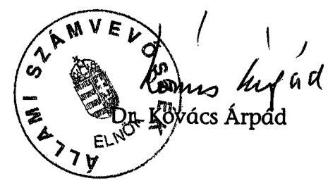
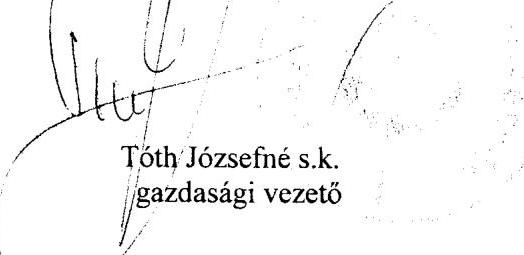

# ÁLLAMI   SZÁMVEVŐSZÉK 

## JELENTÉS

a Fidesz - Magyar Polgári Szövetség 2004-2005. évi gazdálkodása törvényességének ellenőrzéséről

---

3. Önkormányzati és Területi Ellenőrzési Igazgatóság
3.1. Szabályszerűségi Ellenőrzési Főcsoport
Iktatószám: V-1015-019/2006.
Témaszám: 832
Vizsgálat-azonosító szám: V-288
Az ellenőrzést felügyelte:
Dr. Lóránt Zoltán
főigazgató
Az ellenőrzés végrehajtásáért felelős:
Dr. Elek János
általános főigazgató-helyettes
Az ellenőrzést vezette:
Horváth Balázs
főcsoportfőnök-helyettes
Az összefoglaló jelentést készítette:
Dr. Dotterweich Antal
főtanácsadó
Az ellenőrzést végezték:
Dr. Dotterweich Antal Dr. Faragóné Tóth Benesné Baracsi főtanácsadó Mária Szilvia tanácsos számvevő

# A témához kapcsolódó eddig készített számvevőszéki jelentések: 

címe
sorszáma
Jelentés a Fiatal Demokraták Szövetsége 1991. évi gazdálkodása ..... 125
törvényességének ellenőrzéséről
Jelentés a Fiatal Demokraták Szövetsége 1992-1993. évi gazdálko- ..... 236
dása törvényességének ellenőrzéséről
Jelentés a FIDESZ-Magyar Polgári Párt 1994-1995. évi gazdálkodá- ..... 343
sa törvényességének ellenőrzéséről
Jelentés a FIDESZ-Magyar Polgári Párt 1996-1997. évi gazdálkodá- ..... 9901
sa törvényességének ellenőrzéséről
Jelentés a FIDESZ-Magyar Polgári Párt 1998-1999. évi gazdálkodá- ..... 0103
sa törvényességének ellenőrzéséről
Jelentés a FIDESZ-Magyar Polgári Párt 2000-2001. évi gazdálkodá- ..... 0308
sa törvényességének ellenőrzéséről
Jelentés a FIDESZ-Magyar Polgári Szövetség 2002-2003. évi gazdál- ..... 0454
kodása törvényességének ellenőrzéséről

---

# TARTALOMJEGYZÉK 

BEVEZETÉS ..... 5
I. ÖSSZEGZŐ MEGÁLLAPÍTÁSOK, KÖVETKEZTETÉSEK ..... 7
II. RÉSZLETES MEGÁLLAPÍTÁSOK ..... 9

1. A Párt gazdálkodásáról szóló 2004-2005. évi beszámolók ..... 9
1.1. A teljes vizsgálati időszakra érvényes megállapítások ..... 9
1.2. A 2004. és 2005. évi beszámolók ..... 10
1.2.1. Bevételek ..... 10
1.2.2. Kiadások ..... 10
2. A Pártnak a beszámoló összeállítására és az azt alátámasztó könyvvezetésre vonatkozó belső szabályozása és gyakorlata ..... 11
2.1. A belső szabályozás rendszere ..... 11
2.2. A könyvvezetés gyakorlata, ennek összhangja a jogszabályokban és a belső előírásokban előírt követelményekkel ..... 11
2.3. Analitikus nyilvántartások ..... 12
2.4. A bizonylati elv és a bizonylati fegyelem érvényesülése ..... 13
3. A Párt bevételszerző gazdálkodó tevékenysége ..... 13
4. A gazdálkodással összefüggő, egyéb jogszabályokban foglalt előírások betartása ..... 14
4.1. Személyi jellegű kifizetések ..... 14
4.2. Az adózási, társadalombiztosítási és egyéb jogszabályok rendelkezéseinek érvényesítése ..... 15
5. A Párt belső ellenőrzésének rendszere ..... 16
5.1. A belső ellenőrzés rendszerének szabályozottsága ..... 16
5.2. A belső ellenőrzés működése ..... 17
6. Az előző ellenőrzés megállapításaira tett intézkedések ..... 17

## MELLÉKLETEK

1. számú A FIDESZ Magyar Polgári Szövetség 2004. évi módosított beszámolója
2. számú A FIDESZ Magyar Polgári Szövetség 2005. évi beszámolója

---

.

---

# RÖVIDÍTÉSEK JEGYZÉKE 

| Art. | Az adózás rendjéről szóló 2003. évi XCII. törvény |
| :-- | :-- |
| ÁSZ | Állami Számvevőszék |
| KH | Központi Hivatal |
| OE | Országos Elnökség |
| OV | Országos Választmány |
| Párt | FIDESZ - Magyar Polgári Szövetség |
| Párttörvény | A pártok működéséről és gazdálkodásáról szóló - többször |
| Számviteli törvény | módosított - 1989. évi XXXIII. törvény |
|  | A számvitelről szóló - többször módosított - 2000. évi C. |
| SZB | törvény |
| Szja tv. | Számvizsgáló Bizottság |
|  | A személyi jövedelemadóról szóló - többször módosított - |
| Tbj tv. | 1995. évi CXVII. törvény |
|  | A társadalombiztosítás ellátásaira és a magánnyugdíjra |
|  | jogosultakról, valamint e szolgáltatások fedezetéről szóló |
| TKI | 1997. évi LXXX. törvény |
|  | Területi Koordinációs Iroda |
|  | Választókerületi Iroda |

---

.

---

# JELENTÉS 

## a Fidesz - Magyar Polgári Szövetség 2004-2005. évi gazdálkodása törvényességének ellenőrzéséről

## BEVEZETÉS

Az Állami Számvevőszékről szóló 1989. évi XXXVIII. törvény 5. §-a és a 16. § (2) bekezdése, valamint a pártok működéséről és gazdálkodásáról szóló - többször módosított - 1989. évi XXXIII. tv. (továbbiakban: párttörvény) 10. § (1) bekezdése alapján a pártok gazdálkodása törvényességének ellenőrzésére az Állami Számvevőszék (továbbiakban: ÁSZ) jogosult. Az ÁSZ 2006. évi ellenőrzési tervének megfelelően vizsgálta a Fidesz - Magyar Polgári Szövetség (továbbiakban: Párt) 2004-2005. évi gazdálkodása törvényességét.

Az ellenőrzés célja annak megállapítása volt, hogy:

- a Párt által készített és a Magyar Közlönyben közzétett éves beszámolók a törvényi előírásoknak megfelelnek-e, a könyvvezetéssel és a valósággal megegyező adatokat tartalmaznak-e;
- a könyvvezetés és a gazdálkodás során betartották-e a számviteli törvény és az egyéb jogszabályi rendelkezéseket, belső előírásokat;
- a Párt a működéséhez szabályszerűen igénybe vehető forrásokat használt-e fel, nem folytatott-e a párttörvény által tiltott gazdálkodó tevékenységet, nem fogadott-e el tiltott vagyoni hozzájárulást, illetőleg adományt.

Az ellenőrzés körülményeit illetően rögzíteni szükséges ${ }^{1}$, hogy

- a párttörvény 1. sz. melléklete szerinti beszámoló-mintához magyarázatot, kitöltési útmutatót nem készítettek a jogalkotók, így ennek kitöltése pártonként - a kialakított számviteli politikájuknak megfelelően - eltérő lehet;
- a beszámoló-minta a számviteli törvény rendelkezéseivel nem harmonizál, nem felel meg sem a mérleg, sem az eredmény-kimutatás követelményeinek.

[^0]
[^0]:    ${ }^{1}$ Az ÁSZ évek óta javasolja a Kormánynak a pártellenőrzésekről készített jelentéseiben a párttörvény módosítását. A Kormány 2006. évben benyújtotta a pártok működéséről és gazdálkodásáról szóló 1989. évi XXXIII. törvény és a választási eljárásról szóló 1997. évi C. törvény, valamint ezzel összefüggésben egyes más törvények módosításáról szóló T/237. számú törvényjavaslatot.

---

Az ÁSZ a párttörvény napirenden lévő módosítási javaslatának elfogadásáig a jelenleg hatályos rendelkezéseknek megfelelő - egységes módszertani alapokra helyezett - gyakorlattal folytatja a pártok gazdálkodása törvényességének ellenőrzését.

Az ellenőrzést a 13/2003. számú Elnöki utasítással kiadott „Módszertan a pártok gazdálkodása törvényességének ellenőrzéséhez" c. kiadvány és a 14/2003. számú Elnöki határozattal elfogadott segédletben foglaltak alapján végeztük.

A helyszíni ellenőrzés: 2006. szeptember 8. - október 30. között a Párt központi székházában történt, a Központi Hivatal által rendelkezésre bocsátott iratok alapján.

---

# I. ÖSSZEGZŐ MEGÁLLAPÍTÁSOK, KÖVETKEZTETÉSEK 

A Párt a vizsgált időszaki éves gazdálkodási beszámolóit mindkét évben, a párttörvényben előírt határidőn belül közzétette. A 2004. évi beszámoló 2005. április 19-én, a Magyar Közlöny 51. számában, a 2005. évi beszámoló 2006. április 14-én, a Magyar Közlöny 43. számában jelent meg. A 2004. évi beszámolót - a jogi személyektől származó hozzájárulások soron a ténylegesnél kisebb, a belföldi magánszemélyektől származó hozzájárulások 500 ezer Ft felett soron a ténylegesnél magasabb közzétett összeg miatt - a helyszíni ellenőrzést megelőzően önrevízió keretében módosították, és azt a 2005. évi beszámolóval egyidejűleg ismételten megjelentették. A beszámolókat a Párt mindkét évben internetes honlapján is nyilvánosságra hozta. A 2004. évi módosított és 2005. évi beszámolók a szabályozásnak megfelelően és a főkönyvi kivonattal egyezően, megbízható módon tartalmazták a Párt gazdasági adatait.

A Párt 2004-ben a 2001 óta hatályos számviteli politika kivételével megújította gazdálkodási szabályzatait. A számviteli politikához rendelt leltározási, értékelési és pénzkezelési szabályzatot, valamint számlarendet a számviteli törvény rendelkezéseivel összhangban, a gazdálkodási sajátosságokra figyelemmel adták ki. A törvényi követelményeken alapuló szabályozások mellett korszerűsítették a költségvetési gazdálkodási, külföldi kiküldetési, gépkocsi üzemeltetési és használati, illetve tagdíjszabályzatokat is. A Pártnál 2004. február 1-jei hatállyal a 20 területi koordinációs iroda helyett 176 választókerületi iroda alakult. A szervezeti változásnak megfelelően a belső szabályozást aktualizálták. A számlarend vállalkozások alapítására fordított összegek beszámoló sorra vonatkozó előírását az előző ÁSZ ellenőrzés felhívása alapján összhangba hozták a párttörvény rendelkezésével, így megteremtették a feltételét a szabályszerű éves beszámolásnak.

A könyvvezetés külső cég által, a kettős könyvvitel rendszerében központilag, az alapbizonylatok számítógépes feldolgozásával történt, mindkét vizsgált évben azonos számítógépes program alapján. A főkönyvi könyvelést idősorrendben, a zárlati munkálatokat a számlarendben meghatározott módon végezték. A számviteli alapelvek érvényesítését szolgálta, hogy a könyvelésre feladott alapbizonylatokat az irodák folyamatosan felülvizsgálták. Ennek eredményeként az éves beszámoló valódiságát érintő kontírozási hiba nem fordult elő, mindössze egy közüzemi számlát könyveltek más működési jogcímre.

A Párt megfelelően szabályozta a főkönyvi számlákhoz kapcsolódó analitikus nyilvántartások körét, tartalmát és vezetési rendjét. A Párt az immateriális javakról; tárgyi eszközökről; vevőkövetelésekről; adott előlegekről; a pénztár és a bankszámla tételeiről; hiteleiről, szállítókövetelésekről, szigorú számadású nyomtatványokról előírt analitikus nyilvántartásokat teljes körűen és szabályszerűen vezette. Az analitikus nyilvántartások és a főkönyvi számlák zárlati adatai megegyeztek.

A Párt a leltározási kötelezettségének mindkét vizsgált évben eleget tett. A leltározást a leltározási szabályzat előírásainak megfelelően szervezték, dokumentálták. A választókerületi irodák létrehozásakor szabályosan felvett átadás-átvételi jegyzőkönyv alapján történt a működéssel, pénzkezeléssel kapcsolatos dokumentáció átadása, továbbá elszámoltak a kiadott előlegekkel, valamint leltárral adták át az irodai és technikai berendezéseket, bútorokat. A leltárak kiértékelését határidőre elvégezték, leltári eltérés egyik évben sem merült fel.

A bizonylati rendre és az okmányfegyelemre vonatkozó belső előírásokat betartották. A könyvelt gazdasági műveleteket, eseményeket számviteli bizonylatokkal alátámasztották. Szabályozási hibából eredően nem felelt meg a bizonylatolás alaki és tartalmi követelményeinek a magántulajdonú személygépkocsi hivatali célú használatának bizonylatolása. A gépkocsi üzemeltetési és használati szabályzatot a helyszíni ellenőrzés időszakában a jogszabályi követelményeknek megfelelően módosították. A kötelezettségvállalást és utalványozást az arra jogosult vezetők gyakorolták.

A gazdálkodó és bevételszerző tevékenységgel kapcsolatos alapvető rendelkezéseket az alapszabályban, a gazdálkodási részletes szabályokat a költségvetési gazdálkodási szabályzatban a párttörvénnyel összhangban rögzítették. A Párt bevételei a 2004-2005. évi költségvetési törvényekben megállapított állami támogatáson felül szabályozott tagdíjakból, magán és jogi személyektől kapott - értékhatáron felül nevesített - hozzájárulásokból, a párttörvényben engedélyezett egyéb bevételekből, valamint hitelfelvételből származtak. A Párt könyvviteli nyilvántartásai szerint betartotta a párttörvényben előírt gazdálkodási tilalmakat és forrásszerzési korlátokat. A névtelenül, postai befizetésként beérkezett adományok 36 ezer Ft összegének kétszeresét az előírásoknak megfelelően a központi költségvetésbe befizették.

A Pártnál a személyi jellegű kifizetések rendjét belső szabályzatban rögzítették. Ezek közül a saját gépkocsi hivatali célú használatának térítése, étkezési utalvány biztosítása és munkába járással kapcsolatos költségtérítés merült fel. A személyi jellegű kifizetések a jogszabályoknak, belső előírásoknak megfelelően szabályszerűen, az Szja tv-ben megengedett adómentes normatív mértékkel teljesültek. A Párt, mint munkáltató, mindkét vizsgált évben eleget tett a társadalombiztosításról és az egészségügyi ellátásról szóló, valamint a személyi jövedelemadóról és az adózás rendjéről szóló törvények rendelkezéseinek. A kötelező nyilvántartásokat vezették, az előírt adatszolgáltatásokat teljesítették, a kifizetett munkabérekből és bérjellegű jövedelmekből az adóelőlegeket és járulékokat levonták, továbbá teljesítették bevallási és befizetési kötelezettségüket.

A gazdálkodási és számviteli tevékenység belső ellenőrzési rendszerét összehangoltan szabályozták. Az alapszabály értelmében az SZB feladatkörébe tartozott a Párt vagyonkezelésének és pénzügyeinek folyamatos ellenőrzése. A testület ügyrendi tevékenységét éves munkaterv alapján végezte. A 2004-2005. évi tevékenységéről beszámolt a Kongresszusnak. A vezetői ellenőrzés a szervezeti és működési szabályzat, illetve a számviteli szabályozások szerint teljesült. A munkafolyamatba épített kötelező egyeztetéseken, pénztárellenőrzésen túlmenően a gazdasági vezető irányításával különféle célellenőrzéseket végeztek.

A Párt szervezett belső ellenőrzése elősegítette a gazdálkodás törvényességét, illetve a számviteli előírások hatályos rendelkezésekkel való összehangolásával intézkedett a feltárt hibák megszüntetéséről.

---

# II. RÉSZLETES MEGÁLLAPÍTÁSOK 

## 1. A PÁRT GAZDÁLKODÁSÁRÓL SZÓLÓ 2004-2005. ÉVI BESZÁMOLÓK

### 1.1. A teljes vizsgálati időszakra érvényes megállapítások

A Párt 2004. évi beszámolója 2005. április 19-én, a Magyar Közlöny 51. számában jelent meg. A 2004. évi beszámolót a jogi személyektől származó hozzájárulások soron az önkormányzati tulajdonú ingatlanok kedvezményes bérleti díja és a piaci ár közötti

 különbség közlésének elmaradása miatt, továbbá a belföldi magánszemélyektől hozzájárulások 500 ezer Ft felett soron a ténylegesnél magasabb közzétett összeg miatt a helyszíni ellenőrzést megelőzően önrevízió keretében módosították és azt a 2005. évi beszámolóval egyidejűleg ismételten megjelentették. A 2005. évi beszámolót a Magyar Közlöny 2006. évi április 14-i, 43. számában tették közzé. A beszámolókat mindkét évben az internetes honlapjukon is megjelentették.

A 2004. évi beszámoló önrevízióját az alábbi levezetés mutatja be:
Adatok ezer Ft-ban

| Beszámoló sor | Eredeti | Önrevízió | Módosított |
| :-- | --: | --: | --: |
| 1. Tagdíjak | 65991 | 0 | 65991 |
| 2. Állami költségvetési támogatás | 817400 | 0 | 817400 |
| 4. Egyéb hozzájárulások | 220284 | 9660 | 229944 |
| 4.1. Jogi személyektől | 2680 | 9660 | 12340 |
| 4.2. Jogi személyiséggel nem rendelkezőktől | 887 | 0 | 887 |
| 4.3. Magánszemélyektől | 216717 | 0 | 216717 |
| 4.3.1.a. Belföldiektől (500 ezer Ft alatt) | 193265 | 891 | 194156 |
| 4.3.1.b. Belföldiektől (500 ezer Ft felett) | 22096 | -891 | 21205 |
| 4.3.2.a. Külföldiektől (100 ezer Ft alatt) | 50 | 0 | 50 |
| 4.3.2.b. Külföldiektől (100 ezer Ft felett) | 1306 | 0 | 1306 |
| 6. Egyéb bevétel | 250679 | 0 | 250679 |
| Összes bevétel | 1354354 | 9660 | 1364014 |

A Párt beszámolói elkészítése során az önrevíziót követően mindkét ellenőrzött évben teljes körűen érvényesítették a számviteli alapelveket.

---

# 1.2. A 2004. és 2005. évi beszámolók 

### 1.2.1. Bevételek

A tagdíjak beszámolókban közölt adata egyezett a Párt éves főkönyvi kivonata tagdíj adatának ezer forintra kerekített összegével. A tagdíjfizetés alapvető szabályait az Alapszabály és ennek alapján az OV határozatai rögzítették. A részletes előírásokat a Tagdíjszabályzat határozta meg. A gyakorlat összhangban volt a tételes szabályokkal. A beszámoló soron csak a tagdíjak fogalomkörébe tartozó bevételek szerepeltek mindkét évben. A könyvelt tételekhez minden esetben előírásszerűen kitöltött alapbizonylat aláírt példánya kapcsolódott.

Az állami költségvetésből származó támogatás beszámoló sor adatai egyeztek a vonatkozó főkönyvi számlára bizonylatok alapján könyvelt összeggel, továbbá a 2004. évi költségvetés végrehajtásáról szóló, illetve a 2005. évi költségvetési törvényben meghatározott összegekkel.

Az egyéb hozzájárulások, adományok beszámolósoron közölt összegek egyeztek a kapcsolódó főkönyvi számlák egyenlegének ezer forintra kerekített összegével. A beszámolósort mindkét vizsgált évben a párttörvény 1. számú melléklete szerinti minta előírásainak megfelelően tovább részletezték. A nem pénzbeli vagyoni hozzájárulások értékét mindkét évben megállapították. A megfelelő beszámolósor tartalmazta ennek összegét. A belföldiek által az egy naptári év alatt adott, 500 ezer Ft-ot meghaladó hozzájárulásokat, a hozzájárulást adó megnevezésével és az összeg megjelölésével külön tüntették fel. Az összesítéseket kimutatások támasztották alá.

Az egyéb bevételek jogcímeit a Párt számlarendje a következők szerint határozta meg: propaganda tevékenység bevétele, immateriális javak, tárgyi eszközök értékesítése, elengedett kötelezettségek, káreseményekkel kapcsolatos bevétel, kamatok, árfolyamnyereség, hitelfelvétel. A beszámolókban közzétett adatok egyeztek a kapcsolódó főkönyvi számlák és analitikus nyilvántartások zárlati adataival.

### 1.2.2. Kiadások

A „Támogatás egyéb szervezeteknek" beszámolósor adata mindkét évben megegyezett a kapcsolódó főkönyvi számla ezer forintra kerekített egyenlegével. A beszámolósoron csak szervezeteknek nyújtott támogatás szerepelt. Eszközbeszerzés címen a beszámolókban közölt összegek a kapcsolódó főkönyvi számlák adataiból levezethetők voltak. A „Működési kiadások" és a „Politikai tevékenység kiadása" beszámolósorok adata mindkét évben egyezett a Párt számlarendjében meghatározott főkönyvi számlák összegeinek összesített, ezer forintra kerekített adatával. A vizsgált években érvényesült a működési és a politikai tevékenység kiadása jogcímeinek azonossága.

Egyéb kiadások beszámolósor adata mindkét évben egyezett a Párt számlarendjében meghatározott főkönyvi számlák összegeinek összesített, ezer forintra kerekített adatával. A vizsgált években érvényesült az egyéb kiadások jogcímeinek azonossága. A hitel visszafizetés egyéb kiadások soron történő feltüntetését a Párt számlarendje előírta.

---

# 2. A PÁrtnak a beszámoló összeállítására És az azt alátÁmasztó könyvvezetésre vonatkozó belső szabályozása és gyakorlata 

### 2.1. A belső szabályozás rendszere

A Párt számviteli rendjét, sajátosságait is tükröző számviteli politika és a számviteli törvényben előírt egyéb kötelező szabályozások határozták meg.

A számviteli politika az ellenőrzött időszakban nem változott, az eszközök és források értékelési szabályzatát 2004. január 1-jével megújították. A Párt belső struktúrájának módosulása miatt 2004. február 1-jével módosították az eszközök és források leltárkészítési és leltározási, valamint a pénzkezelési szabályzatot. A kiadott szabályzatok a számviteli törvény követelményeit és a gazdasági sajátosságokat is tükrözték.

A számviteli politikához rendelt számlarendben a beszámolási követelményekhez igazodva meghatározták a beszámolósorok főkönyvi számlakapcsolatait, valamint a sajátos bevételi és kiadási jogcímek fogalmi ismérveit, besorolási kritériumait. A számlarendet az előző ellenőrzés felhívására módosították, 2004. január 1-jével léptették hatályba, így az megfelelt a törvényi előírásnak és tükrözte a szervezeti sajátosságokat. A 2005. évre azonos tartalommal új számlarendet adtak ki.

A Párt - a törvényi követelményeken alapuló szabályozásokon túlmenően - a törvényes gazdálkodás elősegítése érdekében további szabályzatokat tartott hatályban, átvezette rajtuk a szervezeti változás miatt szükségessé vált módosításokat. Ezek körébe a költségvetési gazdálkodási szabályzat, a gépkocsi üzemeltetési és használati szabályzat, a külföldi kiküldetés szabályzat, továbbá a tagdíjszabályzat tartozott.

### 2.2. A könyvvezetés gyakorlata, ennek összhangja a jogszabályokban és a belső előírásokban előírt követelményekkel

A könyvvezetést és a beszámoló összeállítását mindkét ellenőrzött évben ugyanaz a külső vállalkozás végezte határozatlan idejű megbízási szerződés alapján.

A könyvvezetés a vizsgált időszakban a kettős könyvvitel rendszerében központilag, az alapbizonylatok számítógépes feldolgozásával történt, mindkét vizsgált évben számítógépes program alapján. A könyvvezetés idősorrendben, minden esetben alapbizonylatok alapján rögzítette a gazdasági eseményeket. A főkönyvi kivonatból és főkönyvi számlákból, és a rendelkezésre bocsátott nyilvántartásokból és alapbizonylatokból minden szükséges adat visszakereshető volt. A főkönyvi számlák és az analitikus nyilvántartások kapcsolata megfelelő volt, a rendelkezésre álló dokumentumok alapján a zárlati munkálatokat szabályszerűen végezték.

---

A TKI-któl, illetve 2004. február 1-jétől a VKI-któl beérkezett alapbizonylatok munkafolyamatban történt ellenőrzését biztosították, a könyvvezetés részére ellenőrzött bizonylatokat adtak át feldolgozásra.

Az ellenőrzés a beszámolók bevételeit és kiadásait érintő kontírozási hibát nem állapított meg. A beszámolót nem érintő kontírozási hiba, hogy 2004. évben az üzemanyag központ elnevezésű főkönyvi számlára könyveltek egy 408766 Ft összegű áramdíj számlát a Közüzemi díj központ főkönyvi számla helyett.

# 2.3. Analitikus nyilvántartások 

A Párt a vizsgált időszakban hatályban volt belső szabályzataiban előírta a főkönyvi számlákhoz kapcsolódó analitikus nyilvántartások körét, tartalmát és vezetési rendjét.

Az immateriális javak és tárgyi eszköz beszerzésekről egyedileg - mennyiségben és értékben - analitikus nyilvántartást vezettek.

A Párt a szállítói és a vevői analitikus nyilvántartásokat megfelelően vezette.

Nyilvántartást vezettek a felvett hitelekről és a kapcsolódó kötelezettségekről. A bankszámlák forgalmáról évenként és számlánként vezették az előírt analitikus nyilvántartást.
2004. év január 31-ig a KH-ban és a TKI-kban házipénztárakat működtettek. A Pártnál szervezeti változás miatt 2004. január 31-ével megszűnt a 20 TKI és helyettük 176 VKI alakult. A megyei irodák megszüntetése és VKI-nak történő átadása a KH irányításával, szabályosan tételes átadás - átvételi jegyzőkönyvvel történt. Átadásra kerültek az irodák működésével kapcsolatos dokumentumok, továbbá a pénzkezelés dokumentumai (pénztár, bank). A kiadott előlegekkel elszámoltak. A 2004. február 1-jétől hatályos költségvetési gazdálkodási szabályzat - VKI-k gazdálkodására vonatkozó különös szabályai - szerint (14-15. §) a VKI-k bankszámlával nem rendelkeztek.

A Párt a házipénztárak kezelésének előírásait a 2004. február 1-jétől hatályos pénzkezelési szabályzatban a Párt sajátosságaira tekintettel módosította és annak megfelelő gyakorlatot folytatott. A pénzkezelési szabályzatnak megfelelően a KH-ban egy központi és egy választókerületi pénztárt működtettek.

Az elszámolási előlegeket a pénzügyi szabályzat előírásával összhangban utólagos elszámolásra csak beszerzésre, kiküldetésre, üzemanyag vásárlásra engedélyeztek. A szigorú számadású nyomtatványok kezelése a belső előírásoknak megfelelt.

A Párt által vezetett analitikus nyilvántartások tartalma megfelelt a törvényi követelményeknek és belső előírásoknak. Az éves záráskor az előírt egyeztetések megtörténtek.

---

A Párt a leltározási kötelezettségnek mindkét vizsgált évben, a jogszabályoknak és a belső előírásoknak megfelelően tett eleget. A szervezeti átalakulás miatt a megyei szervezetek a 2004. február 1-jén alakult VKI-knak leltárral átadták az irodai technikai berendezéseket, bútorokat. A 2004-2005. év végén az ellenőrzésnek átadott dokumentumok szerint, a KH-ban és a VKI-kban a Párt eszközeit és forrásait leltározással felmérték. A leltár tételeinek értékelése az eszközök és források értékelési szabályzatában foglalt előírások betartásával történt. A leltározás során leltárkülönbözetet nem tártak fel.

# 2.4. A bizonylati elv és a bizonylati fegyelem érvényesülése 

A Párt a jogszabályi előírásoknak és belső sajátosságainak megfelelően rögzítette a bizonylati elvvel és fegyelemmel kapcsolatos követelményeket. A szabályozás kiterjedt az aláírási, utalványozási jogosultak körére, valamint e jogosítványok értékhatáraira.

A Párt kötelezettségvállalási és utalványozási jogkörének gyakorlása a vizsgált években a belső előírásoknak megfelelt.

A Számviteli törvény 167. § (1) bekezdésben felsorolt, számviteli bizonylatokra vonatkozó alaki és tartalmi követelményei érvényesültek. Az ellenőrzött időszakban a Párt - a magántulajdonú személygépkocsik hivatali célú használatának bizonylatolása kivételével - betartotta a törvények bizonylati elv és bizonylati fegyelemre vonatkozó előírásait.

A gépkocsi üzemeltetési és használati szabályzat a bizonylatolást illetően nem tett különbséget a munkavállalók és az egyéb személyek gépjármű használata között.

A magántulajdonú gépjármű hivatali használata esetében a tételek egy ötödénél a kiküldetési rendelvényt alkalmazták a törvényben előírt útnyilvántartás vagy menetlevél vezetése helyett.

A szabályzatot a helyszíni ellenőrzés időszakában a jogszabályi követelményeknek megfelelően módosították.

## 3. A PÁRT bevételszerző gazdálkodó tevékenysége

A gazdálkodó tevékenység alapvető rendelkezéseit a vizsgált időszak kezdetén hatályos 2003. május 17-i kelű, majd ez követően a 2005. június 11-jétől hatályos alapszabályban rögzítették.

A fogalomkör a párttörvény előírásaival összhangban került meghatározásra. A Párt gazdálkodására vonatkozó részletes szabályokat a költségvetési és gazdálkodási szabályzat tartalmazta.

A Párt bevételei a vizsgált években a következő jogcímekből származtak: tagdíjbevétel, központi költségvetési támogatás, egyéb hozzájárulások. A párttörvény 6. § (1) bekezdése alapján a tulajdonában álló ingókat értékesített, politikai céljainak és tevékenységének megismertetése érdekében kiadványokat jelentetett meg.

---

Az éves beszámolókban az egyéb bevétel összegeit az alábbi táblázat részletezi:
Adatok ezer Ft-ban

| Megnevezése | 2004. év | 2005. év |
| :-- | --: | --: |
| Propaganda tevékenység bevétele | 137730 | 39220 |
| Immat. javak tárgyi eszköz értékesítése | 13690 | 3020 |
| Elengedett kötelezettségek | 15 | 0 |
| Káresemény miatti bevétel | 70 | 0 |
| Egyéb bevétel | 1054 | 217 |
| Pénzintézettől kapott kamat | 1540 | 2727 |
| Valuta, devizaárfolyam nyeresége | 80 | 98 |
| Hitel felvétel ${ }^{1}$ | 96500 | 750000 |
| Összesen | $\mathbf{2 5 0 6 7 9}$ | $\mathbf{7 9 5 2 8 2}$ |

${ }^{1}$ A Párt számlarendje kifejezett előírást tartalmaz a hitelfelvételek egyéb bevételek közt történő felvételére.

A gazdálkodó tevékenységre vonatkozó, annak jogszerűségét igazoló szerződések, egyéb dokumentumok rendelkezésre álltak.

A
 Párt vagyonának elemei a párttörvény 4. § (1) bekezdése szerinti bevételekből tevődtek össze. A hivatkozott törvény 4. § (2) bekezdésében felsorolt nem megengedett forrásból származó pénzbeli és nem pénzbeli, valamint más államtól származó vagyoni hozzájárulást nem fogadott el, tiltott gazdálkodó tevékenységet nem folytatott, részvényt nem vásárolt. Gazdasági társaságot nem alapított, abban részesedést nem szerzett.

A párttörvény 4. § (3) bekezdése szerint a Párt névtelen adományt nem fogadhat el. A 2005. évi beszámolóhoz kapcsolódó Egyéb kiadások főkönyvi számla rögzítette a Párthoz névtelenül, postai befizetésként beérkezett több kis összegű adomány – mindösszesen 36 ezer Ft összegének – kétszeresét. A 72 ezer Ft-ot a Pénzügyminisztérium által megjelölt számlaszámra utalták át, az összeget a beszámoló tartalmazta.

# 4. A GAZDÁLKODÁSSAL ÖSSZEFÜGGŐ, EGYÉB JOGSZABÁLYOKBAN FOGLALT ELŐÍRÁSOK BETARTÁSA 

### 4.1. Személyi jellegű kifizetések

A Párt a külföldi kiküldetések szabályzatát 2004. február 1-jétől úgy módosította, hogy csak a repülőjegy megtérítését engedélyezte, a gyakorlat megfelelt az előírásnak.

A Párt feladatainak teljesítéséhez a tömegközlekedési eszközökön történt utazás térítésén túlmenően a Párt tulajdonában lévő gépjárműveket vették

---

igénybe, továbbá magántulajdonú gépjármű Párt céljaira történő használatát engedélyezték.

A Párt a KH-ban foglalkoztatott dolgozóinak 2004. évben a közigazgatási határon kívülről történő munkába járással összefüggő költségtérítést, valamint helyi utazásra szolgáló bérlet hozzájárulást fizetett. A kifizetéseket a munkába járással kapcsolatos utazási költségtérítésről szóló 78/1993. (V. 12.) Korm. rendelet 3. § (1) bekezdés b) pontjában előírt mértékkel teljesítették, a helyi bérlet kifizetését a lejárt bérletszelvény leadásához kötötték.

A Párt tulajdonában lévő gépjárműveket a tagok a szabályozás szerint csak hivatalos célú utazásaikhoz használták, a szabályzatban megjelölt arra jogosult személynek engedélyezésével, a menetlevél vezetés kötelezettsége mellett. A Párt tulajdonában álló gépkocsi futásteljesítményéről vezetett menetlevelek, a gépkocsi tárolási helyét is figyelembe véve megfeleltek a kizárólagos hivatali használat dokumentálását biztosító, az Szja tv. 70. §-ában és 5. számú mellékletének II. 7. pontjában meghatározott adatkövetelményeknek. A kizárólagos hivatalos célú használat miatt a Pártnak cégautó adó fizetési kötelezettsége nem keletkezett.

A magántulajdonú személygépkocsik hivatali célú használatának költségelszámolásához az Szja tv-ben meghatározott igazolás nélkül elszámolható költségek közül üzemanyag felhasználást, valamint üzemeltetési költséget számoltak el. Az üzemeltetési költség meghatározása az általános személygépkocsi normaköltség ( $3 \mathrm{Ft} / \mathrm{km}$ ) alapján történt. A gépjármű használatához további kapcsolódó egyéb kiadások merültek fel (úthasználatra jogosító bérlet, jegy, parkolási díj). Ezeket a kiadásokat az általános normaköltségen felül a Párt érdekében történt felhasználás igazolásával költségként elszámolták.

A Párt a munkavállalók részére az étkezési költségek megtérítéséhez hozzájárulást fizetett. A juttatást hideg étkezési jegy formában biztosították, mértéke nem haladta meg az Szja tv-ben meghatározott adómentes értékhatárt.

A személyi jellegű kifizetések a jogszabályoknak, belső előírásoknak megfelelően szabályszerűen, az Szja tv-ben megengedett adómentes normatív mértékkel teljesültek.

# 4.2. Az adózási, társadalombiztosítási és egyéb jogszabályok rendelkezéseinek érvényesítése 

A Párt munkáltatói jogkörében adó- és járulékfizetési kötelezettséggel járó munkaszerződést és megbízásos jogviszonyt 2004. és 2005. évben is létesített. Ezzel összefüggésben a Párt az adózási és társadalombiztosítási jogszabályokban előírt kötelezettségeinek eleget tett.

A Párt a Tbj tv. 44. § (5) valamint 2005. szeptember 1-jétől a (3) bekezdésében foglaltaknak eleget téve határidőben bejelentette a foglalkoztatottak biztosítási jogviszonyában történt változásokat. Az adózással és a társadalombiztosítással kapcsolatos kötelező nyilvántartásokat vezették, azok megegyeztek a főkönyvi könyveléssel és a bevallásokkal. A könyvelés adatait rendszeresen egyeztették a nyilvántartásokkal és az APEH folyószámla kivona-

---

tal. Nyilvántartása szerint 2004. és 2005. évben hátraléka nem keletkezett. Az ellenőrzött időszakban a társadalombiztosítási egyéni nyilvántartó lapot a Tbj tv. 46. §-a szerint vezette és arról az igazgatási szervnek adatszolgáltatást teljesített.

A Párt gondoskodott az Art 46. § (1) bekezdésben, valamint a Tbj tv. 47. § (3) bekezdésében előírt igazolások határidőben történő kiadásáról.

A Párt az ellenőrzött időszakban a levont adót és járulékot az Art. alapján havonta megfizette és bevallotta. A Tbj tv. 51. § (1) bekezdését betartotta és a levont magán-nyugdijpénztári tagdíjat havonta, magánnyugdijpénztáranként bevallotta és átutalta.

A Pártnál a 2006. évben a Fővárosi és Pest Megyei Egészségbiztosítási Pénztár ellenőrizte egy biztosított esetében a pénzbeli ellátások vonatkozásában az egészségbiztosítási járulékfizetési kötelezettséget, valamint az ezzel összefüggő nyilvántartási, bevallási, adatszolgáltatási és igazolás kiállítási kötelezettség teljesítését. A jegyzőkönyv hiányosságot nem állapított meg.

A politikai tevékenység kiadásai között elszámolt reprezentációs költségek mértéke a vizsgált években nem érte el az Szja tv-ben foglalt értékhatárt, így közteher fizetési kötelezettsége nem keletkezett.

# 5. A PÁRT BELSŐ ELLENŐRZÉSÉNEK RENDSZERE 

### 5.1. A belső ellenőrzés rendszerének szabályozottsága

A Párt gazdálkodásának, pénzügyi és számviteli tevékenységének belső ellenőrzési rendszerét hatályos alapdokumentumok (alapszabály, szervezeti és működési szabályzat) valamint a költségvetési gazdálkodási szabályzat és a pénzkezelési szabályzat rögzítette.

A Párt alapszabályában foglaltak szerint a Párt vagyonkezelésének és pénzügyeinek folyamatos ellenőrzését – a kongresszus által megválasztott öttagú testület – az SZB látta el. Az SZB az alapszabállyal összhangban lévő ügyrendjében határozta meg feladatait, hatáskörét, valamint működésének és eljárásának rendjét. Az SZB feladata volt a Párt vagyonkezelésének és pénzügyeinek folyamatos ellenőrzése.

A munkafolyamatba épített és a vezetői ellenőrzés egyes elemeiről a különféle belső szabályzatok megfelelően rendelkeztek. A költségvetési gazdálkodási szabályzat, továbbá a pénzkezelési szabályzat előírta a vezetői ellenőrzés feladatkörét, a kötelezettség-vállalási, utalványozási, aláírási jog gyakorlásának feltételeit. A belső számviteli szabályok előírták a munkafolyamatba épített ellenőrzés pontjait, az egyeztetések módját, gyakoriságát.

A gazdasági és pénzügyi ellenőrzés megszervezése, folyamatos működése, valamint annak irányítása a költségvetési gazdálkodási szabályzat szerint a gazdasági vezető felelősségi körébe tartozott.

---

# 5.2. A belső ellenőrzés működése 

A SZB tevékenységét éves munkaterve alapján végezte, amelyben rögzítette az adott évben elvégzendő ellenőrzési feladatokat, a teljesítési határidőt, valamint az ellenőrzés végrehajtásának módját. Az SZB 2004. és 2005. évben elkészítette és elfogadta az éves munkatervét. Az SZB beszámolt a 2004-2005 között végzett tevékenységéről a Párt 2005. évi Kongresszusának. A beszámolóban foglaltak szerint figyelemmel kísérte, folyamatos konzultációval segítette a Párt szervezeti rendszerének átalakítását, továbbá likviditásának megőrzését. Az SZB értékelte a megváltozott szervezeti struktúrához igazodó új tagdíjnyilvántartási rendszert, az átalakulással járó adminisztratív többletmunkát. Továbbá beszámolt a 2004-2005. évi munkatervben megjelölt feladatok elvégzéséről, valamint arról, hogy munkájáról az OV-t és az OE-t folyamatosan tájékoztatta. Az SZB nem észlelt olyan szabálytalanságot, amely nyomán intézkedést kellett volna kezdeményeznie.

A vezetői és munkafolyamatba épített belső ellenőrzési rendszer megszervezése, működtetése a belső előírások rendelkezései szerint történt. A munkafolyamatba épített ellenőrzés keretében a belső előírásokban rögzített egyeztetési, ellenőrzési feladatokat folyamatosan dokumentáltan ellátták. Ennek keretében többek között a KH-ban elszámolt, illetve a VKI-k által beküldött bizonylatokat kifizetés, illetve a könyvekben történt rögzítés előtt a hivatal kijelölt dolgozói, illetve a főkönyvelő ellenőrizte. A pénztárellenőrzés a belső szabályoknak megfelelően, dokumentáltan történt.

A vezetői ellenőrzés az utalványozással és az aláírási jog előírásoknak megfelelő gyakorlásával, költségvetési gazdálkodási szabályzatban és a pénzkezelési szabályzatban meghatározott értékhatárok betartásával érvényesült.

A KH-ban különféle gazdasági területeket érintően célellenőrzéseket végeztek a hivatal kijelölt munkatársai, a könyvelést végző szolgáltató közreműködésével. Az ellenőrzések a bérköltség elszámolására, levonások átutalására, kifizetések dokumentálására, az előző évi átmenő könyvelési tételek ellenőrzésére, a gépjármű benzinköltségeinek elszámolására, az elszámolási előlegek ellenőrzésére terjedt ki. Az ellenőrzés során szabálytalanságot nem tártak fel.

## 6. AZ ELŐZŐ ELLENŐRZÉS MEGÁLLAPÍTÁSAIRA TETT INTÉZKEDÉSEK

A Párt a 0454 sorszámú jelentésében foglalt felhívásra a szükséges intézkedést megtette. A hatályos számlarendben a Vállalkozás alapítására fordított összeg főkönyvi számla tartalmát a párttörvény 6. § (3) bekezdés rendelkezésével összhangban határozta meg.

Budapest, 2007. január 11.

Melléklet: $\quad 2 \mathrm{db}$

---

# A Fidesz - Magyar Polgári Szövetség 2004. évi beszámolója 

## Bevételek

1. Tagdíjak ..... 65.991
2. Állami költségvetésből származó támogatás ..... 817.400
3. Képviselőcsoportnak nyújtott állami támogatás
4. Egyéb hozzájárulások, adományok ..... 229.944
4.1. Jogi személyektől ..... 12.340
4.1.1a Belföldiektől (500eFt alatt)** 8.439
4.1.1b Belföldiektől (500eFt felett)* 3.901

- Bp. III. Óbuda-Békásmegyer Önkormányzata ..... 760
- Bp. V. Belváros-Lipótváros Vagyonkezelő Rt. ..... 989
- Bp. VII. Erzsébetvárosi Önkormányzati Vagyonkezelő Rt. ..... 610
- Bp. Főváros XI. Újbuda Önkormányzata ..... 845
- Bp. Főváros Kispest Önkormányzat Polgármesteri Hivatal ..... 697
4.2. Jogi személyiséggel nem rendelkezőktől ..... 887
4.2.1 Belföldiektől ..... 887
4.3. Magánszemélyektől ..... 216.717
4.3.1a Belföldiektől (500eFt alatt) ..... 194.156
4.3.1b Belföldiektől (500eFt felett) ..... 21.205
- Arnóth Sándor ..... 910
- Bauer Zsolt ..... 550
- Bitay Márton ..... 520
- Goógl Árpád ..... 543
- Gyimesi Endre ..... 681
- Hargitai János ..... 1.300
- Juhos Katalin ..... 1.100
- Kiss Attila ..... 890
- Kocsis Róbert ..... 770
- Kubatov Gábor ..... 800
- Mátrai Márta ..... 527
- Menyhárt Éva ..... 538
- Molnár Ágnes ..... 510
- Pelczné G. Ildikó ..... 920
- Pósán László ..... 873
- Puskás András ..... 751
- Répássy Róbert ..... 940
- Simon István ..... 2.000
- Szájer József ..... 2.322
- Szakács Imre ..... 510
- Szűcs Lajos ..... 720
- Tasó László ..... 730
- Tuza Györgyné ..... 900
- Vitányi István ..... 900

---

4.3.2a Külföldiektől (100eFt alatt) ..... 50
4.3.2b Külföldiektől (100eFt felett) ..... 1.306

- Alexander De Gelsey ..... 440
- William De Gelsey ..... 460
- Ferenc Pető ..... 206
- László Rédey ..... 200

5. A párt által alapított vállalat és korlátolt felelősségű társaság nyereségéből származó bevétel
6. Egyéb bevétel ..... 250.679
ebből hitel felvétel ..... 96.500
Összes bevétel a gazdasági évben ..... 1.364.014
Kiadások
7. Támogatás a párt országgyűlési csoportja számára
8. Támogatás egyéb szervezetnek ..... 3.110
9. Vállalkozások alapítására fordított összeg
10. Működési kiadások ..... 526.106
11. Eszközbeszerzés ..... 38.962
12. Politikai tevékenység kiadásai ..... 958.852
13. Egyéb kiadások ..... 283.219
ebből hitel visszafizetés ..... 230.383
Összes kiadás a gazdasági évben ..... 1.810.249
Budapest, 2006. április 11.
Tőth Józsefné s.k. gazdasági vezető
Priszter Erzsébet s.k. főkönyvelő

Megjegyzés: A Szövetség beszámolójának *-gal jelzett sora csak számított adatot tartalmaz, a **-gal jelzett sora 5.759 eFt számított adatot tartalmaz.

---

# A Fidesz - Magyar Polgári Szövetség 2005. évi beszámolója 

## Bevételek

1. Tagdíjak ..... 102.218
2. Állami költségvetésből származó támogatás ..... 817.400
3. Képviselőcsoportnak nyújtott állami támogatás ..... -
4. Egyéb hozzájárulások, adományok ..... 119.484
4.1. Jogi személyektől ..... 11.733
4.1.1a Belföldiektől (500eFt alatt)** 7.388
4.1.1b Belföldiektől (500eFt felett)* 4.345

- Bp. V. Belváros-Lipótváros Vagyonkezelő Rt. ..... 1.037
- Bp. VII. Erzsébetvárosi Önkormányzati Vagyonkezelő Rt. ..... 653
- Bp. Főváros XI. Újbuda Önkormányzata ..... 881
- Palota Holding Rt.(Bp. XV. Önkormányzat) ..... 528
- Bp. Főváros Kispest Önkormányzat Polgármesteri Hivatal ..... 731
- Bp. Pesterzsébeti Városüzemeltetési Rt. ..... 515
4.2. Jogi személyiséggel nem rendelkezőktől ..... 1.139
4.2.1a Belföldiektől (500eFt alatt) ..... 139
4.2.1b Belföldiektől (500eFt felett) ..... 1.000
- Artinpress Bt 1.000
4.3. Magánszemélyektől ..... 106.612
4.3.1a Belföldiektől (500eFt alatt) ..... 90.230
4.3.1b Belföldiektől (500eFt felett) ..... 16.382
- Bába Iván ..... 1.000
- Becsey Zsolt ..... 600
- Dobó László ..... 553
- Firtl Mátyás ..... 1.000
- Fülöp István ..... 1.030
- Goógl Árpád ..... 667
- Gyimesi Endre ..... 1.140
- Hende Csaba ..... 509
- Járóka Lívia ..... 533
- Király Nóra ..... 720
- Kovács Ferenc .....

 800
- Lengyel Zoltán ..... 990
- Molnár Ágnes ..... 2.100
- Nagy Sándor ..... 650
- Navracsics Tibor ..... 800
- Nógrádi Zoltán ..... 540
- Pataki Eszter ..... 900
- Rogán Antal ..... 1.000
- Varga Szilvia ..... 850

---

5. A párt által alapított vállalat és korlátolt felelősségű társaság nyereségéből
származó bevétel
6. Egyéb bevétel ..... 795.282
ebből hitel felvétel ..... 750.000
Összes bevétel a gazdasági évben ..... 1.834.384
Kiadások
7. Támogatás a párt országgyűlési csoportja számára ..... -
8. Támogatás egyéb szervezetnek ..... 37.040
9. Vállalkozások alapítására fordított összeg ..... -
10. Működési kiadások ..... 503.143
11. Eszközbeszerzés ..... 24.622
12. Politikai tevékenység kiadásai ..... 546.883
13. Egyéb kiadások ..... 392.704
ebből hitel visszafizetés ..... 316.189
Összes kiadás a gazdasági évben ..... 1.504.392
Budapest, 2006. április 11.

Priszter Erzsébet s.k.
gazdasági vezető
főkönyvelő
Megjegyzés: A Szövetség beszámolójának *-gal jelzett sora csak számított adatot tartalmaz, a **-gal jelzett sora 4.583 eFt számított adatot tartalmaz.
