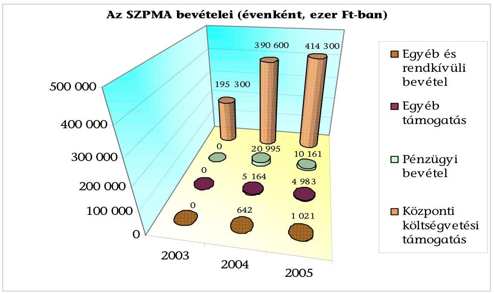
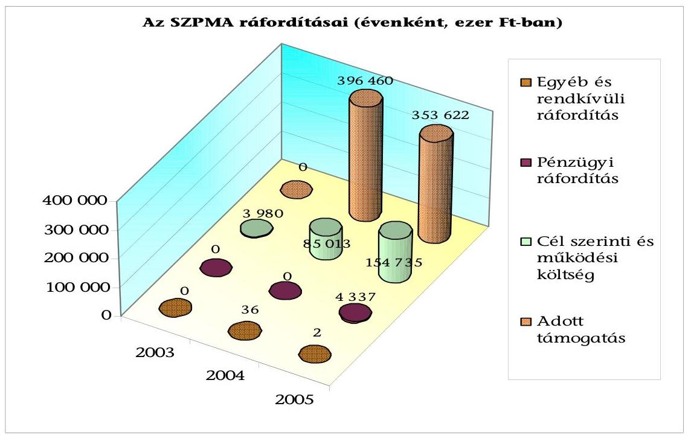
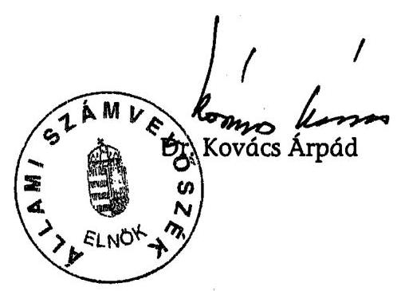

# ÁLLAMI   SZÁMVEVŐSZÉK 

## JELENTÉS

a Szövetség a Polgári Magyarországért Alapítvány 2003-2005. évi gazdálkodása törvényességének ellenőrzéséről

---

3. Önkormányzati és Területi Ellenőrzési Igazgatóság
3.1. Szabályszerűségi Ellenőrzések Főcsoport
Iktatószám: V-1013-48/2006.
Témaszám: 828
Vizsgálat-azonosító szám: V0291
Az ellenőrzést felügyelte:
Dr. Lóránt Zoltán
főigazgató
Az ellenőrzés végrehajtásáért felelős:
Dr. Elek János
főigazgató-helyettes
Az ellenőrzést vezette:
Solymár Ágnes
számvevő főtanácsos
Az ellenőrzést végezték:
Brebán Andrea Sas Imréné Szappanos Júlia
számvevő számvevő tanácsadó számvevő tanácsos

# A témához kapcsolódó eddig készített számvevőszéki jelentések: 

címe
sorszáma
Jelentés a Szabó Miklós Szabadelvű Alapítvány 2003-2004. évi ..... 0559
gazdálkodása törvényességének ellenőrzéséről
Jelentés a Táncsics Mihály Alapítvány 2003-2004. évi gazdálkodá- ..... 0566
sa törvényességének ellenőrzéséről

---

# TARTALOMJEGYZÉK 

BEVEZETÉS ..... 3
I. ÖSSZEGZŐ MEGÁLLAPÍTÁSOK, KÖVETKEZTETÉSEK, JAVASLATOK ..... 5
II. RÉSZLETES MEGÁLLAPÍTÁSOK ..... 9

1. A gazdálkodás szabályozottsága és szabályossága ..... 9
1.1. A törvényi előírások teljesülése az alapító okiratban ..... 9
1.2. A szervezeti és működési szabályzat ..... 10
1.3. A kuratórium vagyonkezelési tevékenysége ..... 10
2. Az éves beszámolók ..... 11
2.1. A beszámolók szabályossága ..... 11
2.2. A mérleg ..... 13
2.3. Az eredmény-kimutatás ..... 13
2.3.1. Az alapítvány bevételei ..... 13
2.3.2. Az alapítvány ráfordításai ..... 15
3. A könyvvezetés szabályozottsága ..... 17
4. A könyvvezetés gyakorlata ..... 19
4.1. A könyvvezetés szabályossága ..... 19
4.2. Az analitikus nyilvántartások ..... 20
4.3. A bizonylati elv és fegyelem érvényesülése ..... 21
5. Az adó és járulék fizetési kötelezettségek teljesítése ..... 22
6. Az alapítvány ellenőrzési rendszere ..... 24
7. A Polgári Szemle Alapítvány ..... 24

## MELLÉKLETEK

1. számú Az alapítvány 2003. évi mérlege
2. számú Az alapítvány 2003. évi eredmény-kimutatása
3. számú Az alapítvány 2004. évi mérlege
4. számú Az alapítvány 2004. évi eredmény-kimutatása
5. számú Az alapítvány 2005. évi mérlege
6. számú Az alapítvány 2005. évi eredmény-kimutatása

---

# RÖVIDÍTÉSEK JEGYZÉKE 

| ÁSZ | Állami Számvevőszék |
| :-- | :-- |
| ÁSZ törvény | az Állami Számvevőszékről szóló 1989. évi XXXVIII. törvény |
|  |  |
| FB | Szövetség a Polgári Magyarországért Alapítvány felügye- |
|  | lő bizottsága |
| Kincstár | Magyar Államkincstár |
| pártalapítványi törvény | a pártok működését segítő tudományos, ismeretterjesztő, |
|  | kutatási, oktatási tevékenységet végző alapítványokról |
|  | szóló 2003. évi XLVII. törvény |
| párttörvény | a pártok működéséről és gazdálkodásáról szóló 1989. évi |
|  | XXXIII. törvény |
| Ptk. | a Polgári Törvénykönyvről szóló 1959. évi IV. törvény |
| Szja törvény | a személyi jövedelemadóról szóló 1995. évi CXVII. törvény |
| SZMSZ | Szervezeti és Működési Szabályzat |
| SZPMA | Szövetség a Polgári Magyarországért Alapítvány |
| Szt. | a számvitelről szóló 2000. évi C. törvény |
| Tbj. | a társadalombiztosítás ellátásaira és a magánnyugdíjra |
|  | jogosultakról, valamint e szolgáltatások fedezetéről szóló |
|  | 1997. évi LXXX. törvény |

---

# JELENTÉS 

## a Szövetség a Polgári Magyarországért Alapítvány 2003-2005. évi gazdálkodása törvényességének ellenőrzéséről

## BEVEZETÉS

Az Országgyűlés a pártok Alkotmányban biztosított, a népakarat kialakításában és kinyilvánításában történő közreműködésének elősegítése, az állampolgári tájékoztatás szélesítése, a politikai kultúra fejlesztése érdekében történő politikai képzés, kutatás, tudományos és ismeretterjesztő tevékenység támogatására a pártalapítványi törvénnyel lehetővé tette, hogy a parlamenti pártok költségvetési támogatásra jogosult alapítványokat hozzanak létre. A Fidesz Magyar Polgári Szövetség a pártalapítványi törvényben biztosított lehetőséggel élve létrehozta a Szövetség a Polgári Magyarországért Alapítványt, amelyet a Fővárosi Bíróság 9016. sorszámon, 2003. november 5-én jogerőssé vált végzésével vett nyilvántartásba.

Az SZPMA célja a politikai kultúra fejlesztése a nemzeti elkötelezettség és a kereszténydemokrata eszmekör jegyében, az ország határain belül, illetve a határon túli magyarság lakta területeken tudományos, kutatási tevékenység szervezése, oktatási, ismeretterjesztő tevékenység végzése, a professzionális politika tudományos igényű vizsgálata, ennek eredményeként javaslatok, új módszerek, eljárások kidolgozása.

A kuratórium az SZPMA céljaival összhangban álló havi gazdasági-társadalmi folyóirat megjelentetése céljából ötmillió Ft induló vagyonnal létrehozta a Polgári Szemle Alapítványt.

A pártalapítványi törvény 3. § (6) bekezdése szerint az alapítvány céljára legalább a párttörvény 9/A. § (5) bekezdés a) pontja szerinti alaptámogatás 1\%-ának megfelelő összegű vagyont kell rendelni. Az alapítvány a párttörvény 9/A. § (5) bekezdés alapján alaptámogatásban, mandátumarányos kiegészítő támogatásban és eseti támogatásban részesülhet. A támogatás összegét a költségvetésről szóló törvény évenként állapítja meg.

A pártalapítványi törvény 4. § (2) bekezdése alapján az alapítvány gazdálkodása törvényességének ellenőrzésére az ÁSZ jogosult, ugyanezen törvény 4. § (4) bekezdése alapján az ÁSZ kétévenként ellenőrzi azoknak az alapítványoknak a gazdálkodását, amelyek e törvény szerint állami költségvetési támogatásban részesültek.

Ellenőrzésünk célja volt törvényességi szempontból értékelni, hogy

---

- a kuratórium az induló vagyonnal, a központi költségvetési támogatással, az egyéb támogatással és az alapítvány egyéb bevételeivel, a párttörvénynek és a pártalapítványi törvénynek, valamint az alapító okiratban megjelölt céloknak megfelelően gazdálkodott-e;
- az alapítvány alapító okirata és belső szabályzatai megteremtették-e az induló vagyon és a központi költségvetési támogatás felhasználásának törvényes kereteit;
- a kuratórium biztosította-e az alapítvány könyvvezetésének és éves beszámolóinak törvényességét.

Az ellenőrzés az alapítvány megalakulásától a 2005. december 31-ig tartó időszakra terjedt ki.

A SZPMA ellenőrzésére első alkalommal került sor, így az eredendő és belső kontroll kockázatot magasnak minősítettük, ez alapján az alapítványi bevételeket, a kuratórium vagyonkezelést és gazdálkodást érintő döntéseit tételesen, az alapítvány költségeit és ráfordításait reprezentatív minta alapján ellenőriztük.

---

# I. ÖSSZEGZŐ MEGÁLLAPÍTÁSOK, KÖVETKEZTETÉSEK, JAVASLATOK 

A Szövetség a Polgári Magyarországért Alapítványt a Fidesz - Magyar Polgári Szövetség a párttörvény és pártalapítványi törvény előírásának megfelelően, 600 ezer Ft induló vagyonnal hozta létre. A 2003-2005. évekre összesen 1000200 ezer Ft központi költségvetési támogatást kapott, amelynek mértéke megfelelt a párttörvény által meghatározott alap-, és mandátumarányos kiegészítő támogatás együttes értékének, eseti támogatásban nem részesült. A csatlakozó szervezetek és magánszemélyek 10147 ezer Ft támogatást nyújtottak, elfogadásukról a törvényi, és az alapító okirat előírásának megfelelően a kuratórium döntött, a támogatást minden esetben az alapítvány pénzforgalmi számlájára folyósították. A támogatók azonosításához szükséges adatok az alapítványnál megtalálhatóak voltak, az alapítvány a törvény szerinti közzétételi kötelezettségét teljesítette. A támogatásokon kívül bevétel csak az átmenetileg szabad pénzeszközök lekötéséből származott, vállalkozási tevékenységet nem folytatott az alapítvány.

A kuratórium az ellenőrzött években realizált bevétel 96\%-át (998 185 ezer Ft) használta fel a 2005. év végéig alapítványi célok megvalósítására és az alapítvány működésére. Az alapító okirat előírásainak megfelelően a kuratórium az alapítvány céljait szervezetek és magánszemélyek részére továbbadott támogatások, továbbá az alapítvány szervezeti keretei között végzett tevékenységgel valósította meg. A kuratórium által nyújtott támogatások, és az alapítvány szervezeti keretei között megvalósított programok a pártalapítványi törvényben és az alapító okiratban rögzített célok megvalósítására irányultak. A támogatások odaítéléséről és a cél szerinti tevékenységekről - a határozathozatal módjára és a határozatképességre vonatkozó, alapító okiratban rögzített előírások betartásával - minden esetben a kuratórium döntött. A támogatottakkal a kuratórium elnöke, akadályoztatása esetén a főigazgató támogatási szerződést kötött, a támogatottak eredeti számlák bemutatásával és szakmai beszámolók benyújtásával számoltak el, a kuratórium döntött az elszámolások elfogadásáról és a szerződéstől eltérő teljesítés esetén szankciók alkalmazásáról.

Az SZPMA az ellenőrzött években az egyszerűsített éves beszámolókat elkészítette, és a Magyar Közlöny Hivatalos Értesítőjében közzétette. A beszámolók tartalma kielégítette a valódiság követelményét. A beszámolókat leltár és főkönyvi kivonat, a főkönyvi kivonatokat szintetikus és analitikus nyilvántartás támasztotta alá. A 2005. évben a tárgyi eszközök leltára eltért a leltárkészítési és leltározási szabályzattól, mivel az abban előírt fordulónapi leltározással szemben a tárgyi eszközökről folyamatos nyilvántartást vezettek mennyiségben és értékben, amely a mérlegsoron kimutatott értékkel megegyezett. A 2003. évi beszámolóban eredmény, saját tőkét növelő-csökkentő hiba nem volt. A 2004. és 2005. évi beszámolókban és az azt alátámasztó könyvvezetésben feltárt hibák mérleg főösszegre vetített értéke egyik évben sem érte el a számviteli politikában meghatározott (2%-os) jelentős összegű hibahatárt, így azok a megbízható és valós képet nem befolyásolták.

---

Az alapítványi vagyon felhasználásának kereteit a pártalapítványi törvény és az alapító okirat, részletes szabályait az alapítvány belső szabályzatai rögzítették. Az alapító okirat az alapítvány célját, a cél elérése érdekében meghatározott tevékenységeket a pártalapítványi törvény, a képviseleti és a bankszámla feletti rendelkezési jogot a Ptk. előírásainak megfelelően tartalmazta. A kuratórium a működés szervezeti kereteit és rendjét SZMSZ-ben rögzítette, ebben az alapító okirattól eltérően, a főigazgatónak lehetőséget adott a bankszámla feletti rendelkezési jog saját hatáskörben történő meghatározására (erre az ellenőrzött években nem került sor). A kuratórium a vagyont érintő gazdasági döntéseit az alapító okirattal és az SZMSZ-szel összhangban, határozatképes üléseken hozta meg, a kuratóriumi ülésekről készített jegyzőkönyvek, és a határozatok tára megfelelt az alapító okirat és az SZMSZ vonatkozó előírásainak. A kuratórium az alapító okirat előírásának megfelelően éves költségvetés alapján gazdálkodott, az alapítványi vagyon kezeléséről és felhasználásáról évente beszámolt az alapítónak.

Az SZPMA rendelkezett - a számviteli törvényben előírt - a könyvvezetés és beszámoló készítés rendjét meghatározó számviteli szabályzatokkal, a kuratórium azokat jóváhagyta. A számviteli politika, a számlarend, valamint az eszközök és források leltárkészítési és leltározási szabályzata nem igazodtak az alapítvány gazdálkodásának sajátosságaihoz. A számviteli politika nem tartalmazta a terv szerinti és terven felüli értékcsökkenés elszámolásának szabályait, a könyvviteli zárlathoz kapcsolódó feladatok és időbeli elhatárolások körét, nem határozta meg konkrétan az éves beszámoló választott formáját. A pénzkezelési szabályzat nem tartalmazta a banki átutalások utalványozásának, az elektronikus átutalások és a bankkártyák használatának rendjét (utóbbit a kuratórium elnöke - az alapítvány belső szabályzataival összhangban - meghatalmazásban rögzítette). A szabályzatok hiányosságai is hozzájárultak a könyvvezetésben feltárt hibákhoz.

A könyvvezetést a kettős könyvvitel rendszerében, számítógépes programmal végezték, a gazdasági eseményeket idősorrendben, az Szt. előírásainak megfelelő alapbizonylatokkal alátámasztva rögzítették. Az SZPMA az alapítványok gazdálkodásáról szóló kormányrendelettől eltérően számviteli nyilvántartásában nem különítette el teljes körűen az alapítvány cél szerinti tevékenysége közvetlen, az alapítvány kezelő szervének közvetett, és az egyéb közvetett költségeit. A főkönyvi nyilvántartásban esetenként - téves számlakijelölés miatt - a tartalmukban azonos gazdasági eseményeket eltérően számolták el (a részletekben folyósított támogatást eltérő számlákra, a nyomdaköltséget téves számlára, a szakmai rendezvényekhez kapcsolódó terembérleti díjat és szállásköltséget nem azonos költségszámlákra könyvelték). A 2004. évben az immateriális javak és tárgyi eszközök 12,7\%-át, 2005-ben 1,2\%-át tévesen számolták el, így a számviteli politika előírásától eltérően az 50 ezer forint egyedi beszerzési érték alatti eszközök egy részénél használatba vételkor nem számolták el egy összegben az értékcsökkenést, az SZPMA honlap értékét a szoftverek helyett tévesen a költségek között számolták el. A téves elszámolások az eredmény és a saját tőke összegét lényeges szinten nem befolyásolták. Az immateriális javak és tárgyi eszközök egyharmadánál az analitikus nyilvántartás nem felelt meg az egyedi értékelés elvének, mivel a rendeltetésükben és értékükben eltérő eszközökről összevont nyilvántartást vezettek.

---

A házipénztári nyilvántartások vezetése, a pénztárellenőrzés szabályszerű volt, az elszámolásra kiadott
 előlegekkel elszámoltak, a szigorú számadás alá vont bizonylatokat nyilvántartották. A kötelezettségvállalási és utalványozási jogot az arra felhatalmazottak gyakorolták, az utalványozás módja azonban eltért a pénzkezelési szabályzat előírásától, mivel a kifizetés alapbizonylata helyett a kiadási pénztárbizonylaton utalványoztak. Az utalványozott pénzforgalmi bizonylatokhoz minden esetben csatolták az alapbizonylatokat, amelyek alapján minden kifizetés beazonosítható volt.

Az alapítvány munkáltatói jogkörében eleget tett az adózási és társadalombiztosítási jogszabályok rendelkezéseinek, az előírt nyilvántartásokat vezette, az adatszolgáltatásokat teljesítette. A kifizetett bér- és bérjellegű jövedelmekből a magánszemélyeket terhelő adóelőleget és járulékokat levonta, a munkáltatót terhelő költségvetési befizetési kötelezettséget előírta és határidőben befizette. Azon alkalmazottaknál, akiknél az éves nyugdíjárulék köteles jövedelem a járulékfizetési felső határt meghaladta, a havi nyugdíjárulék elszámolása nem felelt meg a törvényi előírásnak, mivel az alapítvány a biztosítottakat terhelő járulékot nem a tárgyhónapban kifizetett teljes jövedelem, hanem a járulékfizetési felső határ egy naptári napra meghatározott összege után állapította meg. Emiatt az alkalmazottakat terhelő járulék megállapítása és befizetése havonta nem a kötelező mértékben teljesült, csak a tárgyévek végére rendeződött. Az alapítvány a külföldi kiküldetések napidíja, a saját gépjármű hivatali célú használata miatt kifizetett útiköltség térítés, és a természetbeni juttatások után az adó- és járulékfizetési kötelezettséget teljesítette. Az elszámolt reprezentáció és üzleti ajándék értéke nem érte el az adóköteles mértéket.

A 2004. évben az alapítvány tulajdonában lévő személyautót a főigazgató hivatali és magáncélra egyaránt használhatta, ennek megfelelően az SZPMA a cégautó adót és a kapcsolódó járulékot megfizette. A gépjármű használatáról szóló 2005. januártól hatályos elnöki utasítás a törvényi előírástól eltérően a munkába járást az alapítvány érdekében történő használatnak minősítette. A kuratóriumi elnök gépjármű tárolására vonatkozó nyilatkozata, és az útnyilvántartások alapján a főigazgató az alapítvány tulajdonában álló személyautót munkába járásra nem használta. A 2005. évben a gépjármű magáncélú használatát a kuratórium elnöke egy alkalommal engedélyezte. A főigazgató a használat során felmerült költségeket (üzemanyag költség, parkolási díj, autópályadíj) megfizette, a vonatkozó törvény szerinti ún. normaköltséget (kilométerenkénti 3 Ft) azonban nem térítette meg az alapítványnak. Emiatt az alapítványnak cégautó adó fizetési kötelezettsége keletkezett 2005. július hónapra, amelyet nem teljesített. A 2005. évben vezetett útnyilvántartások a felkeresett üzleti partnerek megnevezését a törvényi előírástól eltérően nem minden esetben, csak mintegy 25%-ban tartalmazták.

Az alapító az alapítvány működésének és gazdálkodásának ellenőrzésére háromfős felügyelő bizottságot jelölt ki. A bizottság az alapító okiratban és saját ügyrendjében foglalt feladatait teljesítette, véleményezte az alapítvány éves költségvetéseit és beszámolóit, belső szabályzatait, ellenőrizte az alapítványi rendezvények pénzügyi elszámolását. Az éves beszámolókat az ellenőrzött években független könyvvizsgáló hitelesítette. A belső ellenőrzés a vezetői és a munkafolyamatba épített ellenőrzésen keresztül, a képviseleti- és utalványozási

---

jog gyakorlása, a számlák ellenőrzése, és a kifizetések engedélyezése során megfelelően működött.

A helyszíni ellenőrzés megállapításainak hasznosítása mellett javasoljuk:

# az alapítvány kuratóriumának 

1. Módosítsa és egészítse ki az alapítvány belső szabályzatait a következők figyelembevételével:
a) törölje az SZMSZ-ből a főigazgatónak a bankszámla feletti rendelkezés meghatározására vonatkozó hatáskörét;
b) pontosítsa a számviteli politikában az éves beszámoló formáját és tartalmát, határozza meg az alapítványi célú tevékenység közvetlen költségeibe, illetve a működési költségekbe tartozó költségek körét, elkülönítésük módját, a zárlati munkák, az időbeli elhatárolások körét, szabályozza az értékcsökkenés elszámolását, pontosítsa a kis értékű immateriális javak és tárgyi eszközök elszámolásának szabályait, az alapítványi sajátosságoknak megfelelően módosítsa az eszközök és a források értékelésének szabályait;
c) módosítsa a számlarendet az alapítvány gazdálkodására jellemző, sajátos elszámolások figyelembevételével;
d) egészítse ki a pénzkezelési szabályzatot a banki átutalások utalványozási rendjére, az elektronikus átutalásokra és a bankkártyák használatára vonatkozóan;
e) módosítsa a leltárkészítési és leltározási szabályzatot az alapítványi gazdálkodás sajátosságainak megfelelően;
f) gondoskodjon a szabályzatok előírásainak betartatásáról.
2. Biztosítsa a könyvvezetésben az azonos tartalmú gazdasági események következetes elszámolását, továbbá érvényesítse az immateriális javak és tárgyi eszközök analitikus nyilvántartásában az egyedi értékelés elvét.
3. Gondoskodjon a foglalkoztatottak nyugdíjjárulékának a társadalombiztosítás ellátásaira és a magánnyugdíjra jogosultakról, valamint e szolgáltatások fedezetéről szóló 1997. évi LXXX. törvény 50. § (1) bekezdése szerinti levonásáról és befizetéséről, továbbá vizsgálja felül a 2004. és 2005. évi nyugdíjjárulék elszámolását, és tegyen eleget az abból adódó kötelezettségének.
4. Hozza összhangba az alapítvány tulajdonában álló gépjármű használatának szabályozását a személyi jövedelemadóról szóló 1995. évi CXVII. törvény 70. § (1) bekezdésével, továbbá követelje meg az útnyilvántartás hivatkozott törvény 5. számú melléklete szerinti vezetését. Önellenőrzés keretében tegyen eleget a 2005. július havi cégautó adó és kapcsolódó járulék befizetési kötelezettségének.

---

# II. RÉSZLETES MEGÁLLAPÍTÁSOK 

## 1. A GAZDÁLKODÁS SZABÁLYOZOTTSÁGA ÉS SZABÁLYOSSÁGA

### 1.1. A törvényi előírások teljesülése az alapító okiratban

Az alapítványt a Fidesz - Magyar Polgári Szövetség a pártalapítványi törvény alapján hozta létre, a Fővárosi Bíróság 9016. sorszámon, 2003. november 5-én jogerőssé vált végzéssel vette nyilvántartásba.

Az alapítvány célja és a cél elérése érdekében az alapító okiratban meghatározott tevékenységek megfeleltek a Ptk., a párttörvény és a pártalapítványi törvény rendelkezéseinek. Az alapító okirat szerint az alapítvány célja a politikai kultúra fejlesztése, a nemzeti elkötelezettség és a kereszténydemokrata eszmekör jegyében, az ország határain belül, illetve a határon túli magyarság lakta területeken tudományos, kutatási tevékenység szervezése, oktatási, ismeretterjesztő tevékenység végzése, a professzionális politika tudományos igényű vizsgálata, ennek eredményeként javaslatok, új módszerek, eljárások kidolgozása.

Az alapító okiratot az ellenőrzött időszakban az alapító két alkalommal módosította, 2003-ban az alapítvány székhelye, egy kurátor személyi adataiban bekövetkezett változás, illetve a vállalkozási tevékenység folytatásáról szóló bekezdés törlése, 2005-ben az alapító címe, az alapítvány tevékenységi területének kiterjesztése (a határon túli magyarság lakta területekre), a bankszámla feletti rendelkezési jog pontosítása miatt.

A képviseleti és a bankszámla feletti rendelkezési jog alapító okiratbeli szabályozása megfelelt a Ptk. 29. § (3) bekezdésében foglaltaknak. Az alapító okirat 12. pontja az alapítvány képviseletével a kuratórium elnökét, akadályoztatása esetén a kurátori tisztséget is betöltő főigazgatót hatalmazta fel. Rögzítette továbbá, hogy az alapítvány bankszámlája felett a kuratóriumi elnök és a főigazgató, 2005-től két, képviseleti joggal felruházott személy rendelkezik. Az alapító a Ptk. 74/C. § (4) bekezdése előírásának megfelelően, az alapító okiratban élt azzal a lehetőséggel, hogy a kuratórium az alapítvány alkalmazottja számára is biztosíthat képviseleti jogot, és a képviseleti jog terjedelmét és gyakorlásának módját a kuratórium elnökével megegyezően határozta meg.

Az alapító 600 ezer Ft induló vagyont bocsátott az alapítvány rendelkezésére, és az alapítványi vagyon kezelésére, ötéves időtartamra öttagú kuratóriumot bízott meg. A kuratórium személyi összetétele megfelelt a pártalapítványi törvény 3. § (7) bekezdése és a Ptk. 74/C. § (3) bekezdésében foglaltaknak, mivel az alapító a kuratóriumban a vagyon felhasználására meghatározó befolyást nem gyakorolt.

---

# 1.2. A szervezeti és működési szabályzat 

A kuratórium a szervezeti és működési szabályzatot az alapító okirattal összhangban az alapítvány létrehozásával egyidejűleg elkészítette, majd azt követően két alkalommal módosította.

Az SZMSZ teljes körűen meghatározta az alapítvány belső jogviszonyait, szervezeti és irányítási rendszerét, ezen belül a kuratórium feladat-, hatás- és jogkörét, működési rendjét. Rögzítette a munkaszervezet felépítését, a Védnöki Tanács tevékenységét, a jogi képviselő és a könyvvizsgáló feladat- és hatáskörét, az FB működését. Szabályozta a kötelezettségvállalások és a kifizetések aláírásának rendjét, továbbá a munkavállalók részére nyújtott természetbeni juttatások körét.

Az ellenőrzött időszakban az SZMSZ az alapító okirattól eltérő rendelkezést tartalmazott, mivel a főigazgató számára is lehetőséget biztosított a bankszámla feletti rendelkezési jog saját hatáskörben történő meghatározására. Az ellenőrzött időszakban a főigazgató ezzel a hatáskörrel nem élt, így nem került sor az alapító okirattól eltérő gyakorlatra.

Az SZMSZ 6.14. pontja alapján a bankszámla felett két, képviseleti joggal felruházott személy rendelkezhet. A pénzügyi átutalások esetében a kuratórium elnöke, a főigazgató és a szervezési igazgató írnak alá. Minden további aláíró megnevezése a főigazgató jogkörébe tartozik.

Az ellenőrzött időszakban a banki átutalás elektronikus úton történt. A banki aláírás bejelentő karton alapján a bankszámla felett rendelkezni jogosultak köre megfelelt az alapító okirat és az SZMSZ vonatkozó előírásainak.

A bankszámla feletti rendelkezésre a kuratórium elnöke, az alapítvány főigazgatója és szervezési igazgatója voltak jogosultak, és a banki aláírás ennek megfelelően történt.

### 1.3. A kuratórium vagyonkezelési tevékenysége

Az SZPMA a párttörvény 9/A. §-ában meghatározott mértékű, rendszeres költségvetési támogatást kapott, amelyet a kuratórium kizárólag az alapító okiratban meghatározott célok megvalósítására fordította. Az alapítványi vagyon felhasználásának kereteit a pártalapítványi törvény, az alapító okirat, az SZMSZ, illetve az alapítvány belső szabályzatai tartalmazták.

A kuratórium az ellenőrzött időszakban az alapító okirattal és az SZMSZ-szel összhangban hozta meg a vagyont érintő gazdasági döntéseit.

A kuratórium 2003-ban egy, 2004-ben hét, 2005-ben nyolc alkalommal ülésezett. Valamennyi kuratóriumi ülésről jegyzőkönyv készült, amely tartalmazta a napirend alapján elhangzott viták legfontosabb megállapításait és a határozatokat. A kuratóriumi ülésekről készített jegyzőkönyvek, valamint a határozatok tára minden esetben megfelelt az alapító okirat 9.5., illetve az SZMSZ 1.3.3. pontokban foglalt jegyzőkönyv-készítési, hitelesítési és nyilvántartási előírásoknak.

---

A kuratórium - az alapító okirat vonatkozó előírásának megfelelően - a 2004-2005. évekre egyhangúlag elfogadta az alapítvány költségvetését. A részletes költségvetés tartalmazta az alapítvány éves gazdálkodási és munkatervét is.

Az alapító okirat 5.8. pontja értelmében az alapítvány éves költségvetés alapján gazdálkodik, a 8.3. pontja pedig a kuratórium jogkörébe rendelte az alapítvány munkatervének, gazdálkodási tervének, költségvetésének, beszámolójának elfogadását és jóváhagyását.

Az alapítványi vagyon kezeléséről és felhasználásáról a kuratórium évente beszámolt az alapítónak. A beszámolók elsősorban az alapítvány szakmai tevékenységére terjedtek ki, ezekben a működési költségek alakulását a kuratórium csak részben követte nyomon.

Az alapítvány működési költségeit a kuratórium elnöke, a főigazgató és a szervezési igazgató analitikus nyilvántartás alapján figyelemmel kísérte - többek között - annak érdekében, hogy a következő évi költségvetés elkészítésekor az előző évi tényadatokhoz igazodva tervezzenek.

# 2. Az ÉVES BESZÁMOLÓK 

Az SZPMA az ellenőrzött időszak mindhárom évében eleget tett beszámoló készítési kötelezettségének. Az éves beszámolókat a számviteli politikájában megjelölt határidőre elkészítette, és azokat a Magyar Közlöny Hivatalos Értesítőjében közzétette.

Az SZPMA egyszerűsített éves beszámolója mérlegből és eredmény-kimutatásból állt.

Az éves beszámolókat - az alapító okirat előírásának megfelelően - az SZPMA felügyelő bizottsága véleményezte és elfogadásra javasolta. A könyvvizsgáló az éves beszámolókról jelentést készített és azokat hitelesítő záradékkal látta el. A kuratórium a beszámolókat minden évben határozattal elfogadta.

### 2.1. A beszámolók szabályossága

Az SZPMA az egyszerűsített éves beszámolói összeállítása során az Szt.-ben foglalt számviteli alapelveket érvényesítette. A 2003. évi beszámolóban eredményt, saját tőkét növelő-csökkentő hiba nem volt. A 2004-2005. években a téves könyvvezetés miatti - eredményt, saját tőkét növelő-csökkentő - hibák mérleg főösszegre vetített értéke nem haladta meg a 2%-os jelentős összegű hibahatárt, ezáltal a beszámolók valódiságát és megbízhatóságát nem befolyásolták.

A feltárt hibák együttes értéke a
 2004. évben 2899 ezer Ft (1,89%), ezen belül tárgyi eszközöket és immateriális javakat érintő hiba 2897 ezer Ft, kerekítési és összeadási hiba 2 ezer Ft volt. A 2005. évben feltárt hiba 31 ezer Ft (0,03%) volt, és teljes mértékben az immateriális javakat érintette.

Az SZPMA könyvvezetésében a 2004. évben az immateriális javak és tárgyi eszközök 12,7%-át, a 2005. évben az immateriális javak 1,2%-át tévesen számolta el.

---

A beszámoló sorokat érintő hibák:

- Az alapítvány az Szt. 25. § (7) és a 26. § (5) bekezdésekben foglaltaktól eltérően a 2004. évben beszerzett 515 ezer Ft értékű szoftvert az immateriális javak helyett, a tárgyi eszközök, a 2005. évben 106 ezer Ft értékű számítógépet a tárgyi eszközök helyett az immateriális javak között mutatott ki. A könyvvezetési hibák a mérlegben a befektetett eszközök és a saját tőke értékét egyik évben sem módosították.
- Az Szt. 25. § (7) bekezdésben foglaltaktól eltérően a 2004. évben az alapítványi honlap elkészítésének értékét, 575 ezer Ft-ot az igénybe vett szolgáltatások között költségként számolták el, így azt a mérlegben kimutatott immateriális javak értéke nem tartalmazta. A könyvvezetési hiba miatt az eredmény-kimutatásban a jelzett összeggel magasabb ráfordítást, illetve alacsonyabb eredményt mutattak ki.
- Az alapítvány a számviteli politika előírásától eltérően az 50 ezer forint egyedi beszerzési érték alatti eszközöknél - a 2004. évben 2322 ezer Ft, a 2005. évben 31 ezer Ft - azok használatba vételekor nem számolta el egy összegben az értékcsökkenést, és a mérlegben a befektetett eszközök között mutatta ki. A könyvvezetési hiba miatt ezen évek eredmény-kimutatásai alacsonyabb ráfordítást, illetve magasabb eredményt tartalmaztak.

Az Szt. 80. § (2) bekezdése szerint az 50 ezer forint egyedi beszerzési érték alatti vagyoni értékű jogok, szellemi termékek, tárgyi eszközök bekerülési értéke - a vállalkozó döntésétől függően - a használatbavételkor értékcsökkenési leírásként egy összegben elszámolható, az SZPMA számviteli politikája pedig előírta használatba vételkor az egyösszegű értékcsökkenésként való elszámolást.

- Az alapítvány 2004. évi beszámolójának összes bevétel sora kerekítési és összeadási hiba miatt 2 ezer Ft-tal kisebb értéket tartalmazott a főkönyvi kivonat és a főkönyvi számlák adataiból levezethető értéknél, emiatt a beszámolóban kimutatott eredmény alacsonyabb volt.

A 2003. évi eredmény-kimutatást a főkönyvi kivonat alátámasztotta. A 2004-2005. években az eredmény-kimutatás sorai - az anyag- és a személyi jellegű ráfordítások sorok kivételével - a főkönyvi kivonattal megegyeztek. Az eltérés a 2004. évben 384 ezer Ft, a 2005. évben 120 ezer Ft volt, amely a ráfordítások végösszegét, és az eredmény értékét egyik évben sem érintette.

A 2004. évben az eltérés abból adódott, hogy a cégautó személyi jövedelemadója (384 ezer Ft) a főkönyvi kivonatban helyesen a személyi jellegű ráfordítások, míg az eredmény-kimutatásban tévesen az anyagjellegű ráfordítások között szerepelt.

A 2005. évben a munkába járással kapcsolatos költségtérítést (233 ezer Ft) a főkönyvi kivonatban tévesen az anyagjellegű, az eredmény-kimutatásban helyesen a személyi jellegű ráfordítások, továbbá az egyéb személyi jellegű kifizetések személyi jövedelemadóját (113 ezer Ft) az eredmény-kimutatásban tévesen az anyagjellegű, a főkönyvi kivonatban helyesen a személyi jellegű ráfordítások tartalmazták. A főkönyvi kivonat és az eredmény-kimutatás közötti eltérés (120 ezer Ft) a két hiba különbségéből (233 ezer - 113 ezer) adódott.

---

# 2.2. A mérleg 

Az ellenőrzött időszak egyszerűsített éves beszámolóinak mérlegsorai a főkönyvi kivonat, továbbá főkönyvi számlák adataiból levezethetők voltak.

Az alapítvány mérlegében kimutatott főösszeg a 2003. évben 198055 ezer Ft, a 2004. évben 152626 ezer Ft, a 2005. évben 92943 ezer Ft volt.

Az ellenőrzött években a mérleg sorok adatai az analitikus és főkönyvi nyilvántartások összesített adataival megegyeztek. A mérlegben kimutatott eszközök értékét leltárakkal alátámasztották, azonban a tárgyi eszközök leltárral való alátámasztása a 2005. évben eltért a leltárkészítési és leltározási szabályzat előírásától.

Az SZPMA leltárkészítési és leltározási szabályzata a tárgyi eszközöknél évente, fordulónapra vonatkozó leltározást írt elő, és a leltár mellé csatolni kellett a leltár felvételéről szóló jegyzőkönyvet. A 2005. évben fordulónapra összeállított, tételes, mennyiségi és értékadatokat tartalmazó leltárt, és a leltár felvételről leltározási jegyzőkönyvet nem készítettek. Az alapítvány a tárgyi eszközökről a mennyiségben és értékben vezetett egyedi nyilvántartás alapján helyiségenként, illetve személyenként folyamatos mennyiségi nyilvántartást vezetett.

Az ellenőrzött években az immateriális javak és tárgyi eszköz beszerzések értéke összesen 28160 ezer Ft volt. A beszerzett eszközök az alapítvány működését, célszerinti feladatai ellátását szolgálták. Az SZPMA a beszerzések során betartotta az SZMSZ-ben rögzített kötelezettségvállalási szabályokat.

Az ellenőrzött években az alapítvány mérlegében kimutatott induló vagyon összege (600 ezer Ft) megfelelt a pártalapítványi törvény 3. § (6) bekezdésében és a párttörvény 9/A. § (5) bekezdés a) pontjában előírt mértéknek, és megegyezett az alapító okiratban rögzített induló vagyon értékével.

Az SZPMA mérlegeit az 1., 3. és 5. számú mellékletek tartalmazzák.

### 2.3. Az eredmény-kimutatás

### 2.3.1. Az alapítvány bevételei

Az ellenőrzött években az alapítvány összes bevétele a főkönyvi kivonatok alapján 1043166 ezer Ft volt, ennek 95,9%-át a központi költségvetési támogatás, 1,1%-át a szervezetektől, magánszemélyektől kapott támogatás és egyéb bevétel, 3,0%-át a pénzügyi műveletek bevételei tették ki.

Az SZPMA a 2004. évi eredmény-kimutatásban kerekítési és összeadási hiba miatt, a főkönyvi kivonat adataitól 2 ezer Ft-tal kevesebb bevételt mutatott ki.

Az ellenőrzött években az alapítvány az eredmény-kimutatásaiban kimutatott költségvetési támogatást az egyéb támogatásoktól és bevételektől elkülönítette a könyvvezetésében, a kimutatott költségvetési támogatás megegyezett a bankkivonatok alapján összesített értékkel.

---

Az alapítvány számára évenként biztosított költségvetési támogatás mértéke megfelelt a párttörvény által meghatározott alap-, és mandátumarányos kiegészítő támogatás együttes összegének. A pártalapítványok központi költségvetési támogatásra jogosultságáról, a támogatás formáiról és mértékéről, a párttörvény 9/A. § (5) bekezdése rendelkezett. Az ellenőrzött időszakban az alapítvány központi költségvetésből származó összes bevétele 1000200 ezer Ft, ezen belül a 2003. év második félévre 195300 ezer Ft, a 2004. évre 390600 ezer Ft, a 2005. évre 414300 ezer Ft volt. Az éves költségvetési törvényben kiemelt célra rendelt eseti támogatást az alapítvány nem kapott.

Az alapítvány a 2003-2005. évekre a párttörvénynek megfelelően 152100 ezer Ft alaptámogatásra és a Fidesz - Magyar Polgári Szövetség parlamenti frakció létszáma (164 fő) alapján 848100 ezer Ft mandátumarányos kiegészítő támogatásra volt jogosult.

A 2003. évi időarányos támogatás biztosítására a Kormány a pártalapítványi törvény 5. § (5) bekezdése alapján kapott felhatalmazást. A 2004. évi költségvetési törvény az Országgyűlés fejezeten belül egy összegben tartalmazta a pártalapítványok támogatását, amelynek felosztását a pártalapítványok támogatásának felosztásáról szóló 2004/2004. (I. 31.) Korm. határozat szabályozta, ez az SZPMA számára 390600 ezer Ft támogatást biztosított. A 2005. évi költségvetési törvény az Országgyűlés fejezeten belül 414300 ezer Ft támogatást különített el az SZPMA részére.

A 2003. évben a Miniszterelnökség fejezet a 2003. évi időarányos támogatást egy összegben 2003. december 15-én folyósította, az alapítvány jogerős bírósági nyilvántartásba vételét követő tizenöt napon túl.

A pártalapítványi törvény 5. § (3) bekezdése alapján a 2003. évi időarányos támogatást egy összegben, az alapítvány nyilvántartásba vételét követő tizenöt napon belül kellett volna rendelkezésre bocsátani. Az alapítványt a Fővárosi Bíróság 2003. november 5-én vette nyilvántartásba, bankszámláját 2003. november 27-én nyitotta meg.

A költségvetési támogatás folyósítása - a 2004. első negyedév kivételével - a 2004. és 2005. évben a pártalapítványi törvény 2. § (1) bekezdésének megfelelő ütemezésben történt, a Kincstár a támogatást a negyedév első napjaiban, egyenlő részletekben utalta. A 2004. év első negyedévi támogatást 2004. február 11-én folyósította, mivel az Országgyűlés által egy összegben elfogadott támogatásnak a pártalapítványok közötti felosztásáról a Kormány 2004. január 31-én határozott.

Az ellenőrzött időszakban az alapítvány 11808 ezer Ft egyéb bevételt realizált, ezen belül az alapítványhoz csatlakozó szervezetek és magánszemélyek által nyújtott támogatás 10147 ezer Ft. Az eredmény-kimutatásban az egyéb bevételként kimutatott értékadat minden évben megegyezett a könyvelési alapbizonylatok (bankkivonatok, pénztárbizonylatok) összesített értékével, kivéve a 2004. évet, ahol kerekítési hiba miatt 1 ezer Ft-tal kisebb érték szerepelt.

Az SZPMA-hoz csatlakozó magánszemélyektől és szervezetektől kapott támogatások elfogadását a pártalapítványi törvény 3. §-ának és az alapító okirat előírásának megfelelően a kuratórium határozattal hagyta jóvá. A támogatók azonosításához szükséges adatok az alapítványnál rendelkezésre álltak, a támo-

---

gatások folyósítása az SZPMA pénzforgalmi számlájára történt, a közzétételi kötelezettségének az alapítvány eleget tett. Az SZPMA a csatlakozó támogatók közül egy szervezettel kötött szerződést, és a szerződésben megjelölt célra nyújtott támogatás felhasználásáról elszámolt.

Az SZPMA pénzforgalmi számlájára a 2004. évben belföldi támogatóktól 250 ezer Ft, a külföldi támogatótól 4914 ezer Ft, 2005. évben a külföldi támogatótól 4983 ezer Ft, összesen 10147 ezer Ft támogatás folyt be.

Az átmenetileg szabad pénzeszközök egy évnél rövidebb időtartamú lekötésével a 2004. és 2005. évben összesen 31156 ezer Ft kamatbevétel származott. Az éves eredmény-kimutatásban a pénzügyi műveletek bevételei között kimutatott kamatbevétel a bankkivonatok összesített adataival megegyezett. Az ellenőrzött időszakban az alapítvány összes rendkívüli bevétele 2 ezer Ft volt.

A bevételek évenkénti összetételét a következő diagram mutatja be.

# 2.3.2. Az alapítvány ráfordításai 

Az SZPMA céljait egyrészt a kuratórium által megítélt, továbbadott támogatások útján, másrészt saját szervezeti keretei között végzett tevékenységével valósította meg. Az ellenőrzött években realizált bevételeinek 95,7%-át használta fel 2005. december utolsó napjáig.

Az 2003-2005. években az SZPMA a saját szervezeti keretein belül végzett tevékenységével és működésével kapcsolatban költségként összesen 243728 ezer Ft-ot (24,4%) számolt el, ezen belül 141721 ezer Ft-ot anyagjellegű, 93043 ezer Ft-ot személyi jellegű ráfordításként, továbbá 8964 ezer Ft-ot értékcsökkenésként mutatott ki. A kuratórium határozattal döntött az alapítvány

---

saját szervezeti keretein belül végzett cél szerinti tevékenységeiről, és a finanszírozás feltételeiről, amelyek az alapító okirat céljaival összhangban álltak.

Az alapítványok gazdálkodási rendjéről szóló 115/1992 (VII. 23.) Korm. rendelet 3. § (2) bekezdése és az 5. § előírásaitól eltérően az SZPMA számviteli nyilvántartásában nem különítette el teljes körűen az alapítvány cél szerinti tevékenysége közvetlen, az alapítvány kezelő szervének közvetett, továbbá az egyéb közvetett költségeit. Az SZPMA saját rendezvények szervezésével, nemzetközi kapcsolatok építésével, képzések szervezésével és egyéb tevékenységgel (kiadványok, fordítások, kutatások, tanulmányok megrendelése) látta el az alapítvány cél szerinti tevékenységét, a főkönyvi könyvelésben azonban csak a saját rendezvények költségeit különítette el.

Az ellenőrzött években az alapítvány egyéb ráfordításként 750118 ezer Ft-ot (75,2%) számolt el, ezen belül a kuratórium 750082 ezer Ft támogatást nyújtott. Az eredmény-kimutatásban kimutatott érték a vonatkozó főkönyvi számlák és a könyvelési alapbizonylatok (banki kivonatok, pénztárbizonylat, támogatási szerződések) adataival megegyezett.

Az alapítvány a 2003. évben nem nyújtott támogatást. A magánszemélyeknek és szervezeteknek kifizetett támogatás a 2004. évben 396460 ezer Ft, a 2005. évben 353622 ezer Ft volt. Az egyéb ráfordításokon belül az
 egyéb kifizetés (bírság, késedelmi kamat) 36 ezer Ft-ot tett ki.

A kuratórium az alapító okirattal összhangban támogatást nyújtott magánszemélyeknek és szervezeteknek különféle programok (kutatási tevékenység, felnőttképzés, kiadvány, könyvkiadás, ismeretterjesztés, rendezvény, stb.) megvalósításához. A támogatásokat az alapító okirat előírása szerint pályázatok kiírása útján, kuratóriumi kezdeményezés alapján és egyedi kérelemre nyújtotta. A kuratórium az alapító okirattal összhangban a támogatásokról határozattal döntött, ennek során a határozathozatal módjára és a határozatképességre vonatkozó alapító okiratban rögzített előírásokat betartotta.

Az alapító okirattal összhangban a támogatottakkal az alapítvány képviseletében a kuratórium elnöke illetve akadályoztatása esetén a főigazgató a határozattal összhangban álló támogatási szerződést kötött. A szerződés tartalmazta a támogatás célját, mértékét, folyósításának és elszámolásának módját, határidejét. A támogatások folyósítása a könyvelési alapbizonylatok alapján a megkötött szerződések szerint valósult meg. A támogatottak a támogatás cél szerinti felhasználásáról az eredeti számlák bemutatásával, és szakmai beszámolók benyújtásával számoltak el. A kuratórium döntött az elszámolás elfogadásáról, a hiányos elszámolás megjelölt határidőre történő kiegészítéséről, a szerződéstől eltérő teljesítés esetén a fel nem használt és a szerződéstől eltérően felhasznált támogatás visszafizettetéséről. A támogatottak az ellenőrzött években összesen 6726 ezer Ft támogatást fizettek vissza.

Az ellenőrzött években az alapítvány összesen 4337 ezer Ft-ot (0,4%) pénzügyi ráfordítást és 2 ezer Ft-ot rendkívüli ráfordítást számolt el. Az eredménykimutatásában kimutatott érték a vonatkozó főkönyvi számlák, és könyvelési alapbizonylatok adataival megegyezett.

Az SZPMA eredmény-kimutatásait a 2., 4. és 6. számú mellékletek tartalmazzák.

---

A ráfordítások évenkénti összetételét a következő diagram mutatja be.

# 3. A KÖNYVVEZETÉS SZABÁLYOZOTTSÁGA 

Az SZPMA gazdálkodásának, éves beszámolói elkészítésének és könyvvezetésének belső szabályozási rendszere az Szt. által kötelezően előírt szabályozáson alapult. Az Szt. 14. § (3-5) bekezdései szerint el kellett készíteni a számviteli politikát, azon belül az eszközök és a források leltárkészítési és leltározási-, az eszközök és a források értékelési-, és a pénzkezelési szabályzatokat, valamint a 161. § szerint a számlarendet.

Az SZPMA a szabályzatokat a számlarend kivételével határidőben elkészítette, számlarenddel - az Szt. által előírt, a 2003. november 5-ei megalakulás időpontjától számított 90 napon túl - 2005. májustól rendelkezett. A könyvelő program törzsadat állományként tartalmazta a számlatükröt, a könyvelés - az alapítvány létrehozásától kezdődően - az abban rögzített főkönyvi számlákra történt. A kuratórium a szabályzatokat és azok módosításait elfogadta.

A hatályos számviteli politikában meghatározták a számviteli elszámolás és az értékelés szempontjából lényeges és jelentős összegű hiba mértékét. A szabályzatban nem határozták meg egyértelműen a beszámoló választott formáját, mivel az 1.1 pontban az Szt. szerinti, a 2. pontban pedig a számviteli törvény szerinti egyéb szervezetek beszámolókészítési és könyvvezetési kötelezettségének sajátosságairól szóló 224/2000. (XII. 19.) Korm. rendelet szerinti egyszerűsített éves beszámolót jelölték meg, amely mérlegből és eredménykimutatásból állt. Kiegészítő mellékletet nem kellett készíteni, az alapítvány nem is készített, ugyanakkor a számviteli politika a beszámoló részeként jelölte azt meg.

---

A számviteli politika nem tartalmazta az alapítvány gazdálkodására jellemző, sajátos elszámolásokat.

A számviteli politika nem tartalmazta például az alapítványi célú tevékenység közvetlen, és a közvetett (működési) költségek körét és tartalmát, elkülönítésük módját (az alapítványok gazdálkodási rendjéről szóló 115/1992. (VII. 23.) Korm. rendelet 3. § (2) bekezdése és 5. §-a, valamint az alapító okirat egyaránt előírta), az alapítvány számára adott támogatásoknak a pártalapítványi törvénynek megfelelő, a támogatások összege, illetve belföldi vagy külföldi támogatók szerinti kimutatását.

A számviteli politikában nem határozták meg az éves könyvviteli zárlathoz kapcsolódó, kiegészítő, helyesbítő, egyeztető könyvelési feladatok és az időbeli elhatárolások körét, nem rendelkeztek a számlák technikai lezárásáról, amelynek követelményeit az Szt. 164. § (1) bekezdése rögzíti. (A gyakorlatban a főkönyvi számlákat év végén lezárták.) Nem tartalmazta a számviteli politika a tervszerinti és terven felüli értékcsökkenés elszámolásának konkrét szabályait, nevezetesen azt, hogy ki jogosult, milyen jellemzők és tényezők figyelembevételével megállapítani az egyes eszközök (eszközcsoportok) maradvány értékét, hasznos élettartamát, az alkalmazott leírási kulcsokat.

Az eszközök és a források értékelésének szabályait a számviteli politika tartalmazta. A szabályzat olyan tételeket is tartalmazott, amelyek az alapítványnál nem értelmezhetőek.

A szabályzatban a negatív előjelű, vagy jegyzett tőke alatti saját tőke esetére előírt pótbefizetési, tőkeemelési, tőke leszállítási, stb. kötelezettség az alapítványoknál nem értelmezhető. A szabályzat szerint saját tőkeként a mérlegben csak olyan tőkerészt szabad kimutatni, amelyet a tulajdonos bocsátott az alapítvány rendelkezésére, amíg az alapítványoknál a saját tőke részét képező induló tőkét az alapító bocsátja rendelkezésre.

A leltárkészítési és leltározási szabályzat a leltározással kapcsolatos fogalmakat, folyamatokat, előírásokat nem az alapítvány szervezeti felépítésének és működésének megfelelően tartalmazta. Az alapítvány könyvvezetésében nem szereplő eszközök (pl. anyag, bolti, áru és raktári készlet) leltározásának folyamatát is részletesen szabályozta, ennek során a leltározás személyi feltételei között az alapítványnál nem létező szervezeti egységeket (pl. áruforgalmi, anyaggazdálkodási), munkaköröket (pl. vállalkozás vezetője, főkönyvelő, termelési-, kereskedelmi igazgató) jelölt meg, illetve nem létező szabályzatra (kollektív szerződés) hivatkozott. Az alapítvány mérlegében nem szerepeltethető tételeket (jegyzett tőke, tőketartalék, céltartalék) is tartalmazott.

A pénzkezelési szabályzat tartalmazta a házipénztár vezetésére és kezelésére vonatkozó előírásokat és a pénztári kifizetések utalványozási rendjét, nem tartalmazta a banki átutalások utalványozásának, a bankkártyák használatának, és az elektronikus átutalások rendjének szabályait. A kuratórium elnöke külön meghatalmazásban szabályozta a bankkártya használatát. A meghatalmazás összhangban volt a kuratórium által elfogadott szervezeti és működési-, valamint pénzkezelési szabályzatok vonatkozó előírásaival.

---

Az alapítványnál a készpénzforgalom egy részét (pénzfelvétel házipénztárba, személygépkocsi üzemeltetéssel összefüggő és reprezentációs kifizetések) bankkártyákkal bonyolították, a banki átutalásokat pedig elektronikus úton végezték.

A számlarend tartalmazta a főkönyvi számlák megnevezését, tartalmát, a számla értéke növekedésének, csökkenésének jogcímeit, az egyes számlákat érintő főbb gazdasági eseményeket, azoknak más számlákkal való kapcsolatát, bizonylati alátámasztását, a főkönyvi- és az analitikus nyilvántartás kapcsolatát. A számlarend a számlákat és azokat érintő főbb gazdasági eseményeket nem az alapítványi sajátosságoknak megfelelően tartalmazta, így például nem tartalmazta a saját tőke részeként a tőkeváltozást, az egyéb ráfordítások között a kuratórium által nyújtott (továbbadott) támogatások, illetve a bevételek között a költségvetési és egyéb támogatások elszámolásának szabályait. A számlarendben a tárgyi eszköz beszerzés elszámolásánál tévesen az áfa számla alkalmazását is megjelölték, holott az alapítvány alanyi adómentes volt. Az SZPMA általános forgalmi adót nem igényelhetett, és nem is igényelt vissza. A főkönyvi számlák részletezését a számlatükör tartalmazta. A 2005. évben a bevételeken belül az állami és az alapítványi támogatás elszámolására kijelölt főkönyvi számlák tekintetében a számlatükör nem volt összhangban a számlarenddel.

# 4. A KÖNYVVEZETÉS GYAKORLATA 

### 4.1. A könyvvezetés szabályossága

Az ellenőrzött időszakban az SZPMA könyvvezetését és éves beszámolóinak összeállítását ugyanazon megbízott külső könyvelő végezte. A számviteli szolgáltatást végző rendelkezett az Szt. 151. § (1) bekezdésben előírt képesítéssel és szerepelt a Pénzügyminisztérium által vezetett könyvviteli szolgáltatást végzők nyilvántartásában.

A könyvvezetést a kettős könyvvitel rendszerében, az alapbizonylatok számítógépes feldolgozásával, az ellenőrzött időszakban azonos könyvelési programmal végezték. A kialakított számítógépes könyvelési rendszerből az ellenőrzéshez szükséges adatokat biztosították.

Az Szt.-ben rögzített előírásoknak megfelelően a gazdasági eseményeket idősorrendben, megfelelő alapbizonylatokkal alátámasztva rögzítették, a bizonylatok alaki és tartalmi követelményeit a könyvvezetésben érvényesítették.

A könyvvezetésben - a következő esetekben - a tartalmukban azonos gazdasági eseményeket eltérő módon rögzítették, az eltérő elszámolási módok alkalmazása az eredményt, a saját tőke összegét, valamint az éves beszámoló valódiságát és megbízhatóságát nem befolyásolta:

- A 2005. évben egy szerződés alapján két részletben átutalt támogatást a bevételek között két különböző főkönyvi számlán rögzítették, az eredménykimutatás sorait ez nem befolyásolta.

20 ezer euró összegű támogatás első részletét az alapítványi támogatás, a második részletét az egyéb kapott támogatás megnevezésű számlára könyvelték.

---

- Az alapítvány cél szerinti tevékenysége keretében a kiadványokhoz kapcsolódó nyomdai szolgáltatást téves költségszámlára könyvelték, az eredménykimutatás sorait ez nem befolyásolta.

A 358/2005. számú számla szerinti nyomdai szolgáltatást (237 ezer Ft) az igénybevett szolgáltatások helyett tévesen az anyag költségek között könyvelték.

- A szakmai rendezvényekhez (konferenciák, képzések) kapcsolódó terembérleti díj és szállás költség elszámolása a könyvvezetésben nem volt egységes.

A terembérleti díjat részben az anyagjellegű ráfordítások (ezen belül bérleti díjak), másrészt a személyi jellegű ráfordítások (ezen belül reprezentációs költségek), a szállásköltséget részben az anyagjellegű ráfordítások (ezen belül kiküldetési költségek), másrészt a személyi jellegű ráfordítások (ezen belül reprezentációs költségek) között mutatták ki.

A szakmai rendezvényeken a reprezentáció értékébe nem kell beszámítani azoknak a juttatásoknak a költségét, amelyek a rendezvény lebonyolításának feltételeit képezik (pl. terembérleti díj, a hivatalból résztvevők utazási és szállásköltsége). Ezeken a rendezvényeken az étel-ital, a szabadidőprogram költségek, a szakmai programban nem érintett személyek (pl. hozzátartozók, díszvendégek) miatti utazási és szállásköltségek tartoznak a reprezentáció értékébe (2002/18. számú adózási kérdés).

Az éves beszámolók elkészítését megelőzően a könyvviteli zárlattal kapcsolatos feladatokat elvégezték. A 2005. éves terv szerinti értékcsökkenés elszámolás azonban hiányos volt, mivel a 2005. októberben leszámlázott, üzemeltetett internetes honlap (bekerülési értéke 1500 ezer Ft) után nem számoltak el időarányos értékcsökkenést.

Az SZPMA üzembe helyezéskor nem határozta meg az amortizációs kulcsot, így az el nem számolt értékcsökkenés összege nem volt számszerűsíthető.

# 4.2. Az analitikus nyilvántartások 

Az SZPMA az Szt. 161. § (2) bekezdés c) pontjának megfelelően, számlarendjében szabályozta a főkönyvi számlákhoz rendelt analitikák körét, tartalmát és vezetésük rendjét.

Az immateriális javak, tárgyi eszközök analitikus nyilvántartása csak részben felelt meg az egyedi értékelés elvének, mivel az eszközök mintegy egyharmadát érintően az egymástól értékükben és rendeltetésükben eltérő eszközöket összevontan tartottak nyilván.

Az analitikus nyilvántartásban például egy nyilvántartólapon irodai berendezések megnevezéssel különböző jellemzőkkel és értékkel rendelkező szekrényeket és íróasztalokat; számítástechnikai eszközök megnevezéssel számítógépeket, nyomtatókat, szoftvert, telefonkészüléket; lámpák, szőnyeg megnevezéssel egymástól eltérő világítótesteket és szőnyegeket; szekrények megnevezéssel asztalokat, székeket, kanapékat, stb. tartottak nyilván.

Az összevontan nyilvántartott, de különböző eszközök maradványértékét egy összegben állapították meg, a terv szerinti értékcsökkenést összevontan számolták el, és a számviteli politika előírásától eltérően nem érvényesítették az öt-

---

ezer forint alatti egyedi beszerzési értékű eszközök értékcsökkenésének használatba vételkor való egy összegű elszámolását.

Az Szt. 16. § (1) bekezdésének előírása szerint az eszközöket a könyvvezetés során egyedileg kell rögzíteni és értékelni, az 52. § (2) bekezdése értelmében az értékcsökkenés évenkénti összegét az egyedi eszköz várható használata, élettartama, fizikai elhasználódása és erkölcsi avulása figyelembevételével kell megtervezni.

A szállítókkal szembeni kötelezettséget a főkönyvi könyvelés keretében tételesen vezették.

A magánszemélyek és szervezetek részére, a kuratórium által nyújtott támogatásokról tételes, támogatási szerződések szerinti kimutatást vezettek, amely tartalmazta a kuratórium által megítélt és az alapítvány által kifizetett, és ki nem fizetett támogatások mindenkori értékét.

A házipénztári nyilvántartások vezetését és ellenőrzését a pénzkezelési szabályzat előírásainak megfelelően végezték. A szabályzatban előírt nyilvántartások vezetése teljes körű volt. A heti pénztári zárásokat szabályszerűen dokumentálták. A pénzkészlet záró állománya az ellenőrzött időszakban az
 engedélyezett mérték alatt volt. Az utólagos elszámolásra kiadott előlegek kifizetéséhez sorszámozott szabvány nyomtatványt használtak, a felvett összeggel az előírt határidőn belül elszámoltak.

A szigorú számadás alá vont bizonylatok körét a pénzkezelési szabályzatban meghatározták, azokat nyomtatványféleségenként - az Szt. 168. § (3) bekezdésének megfelelően - nyilvántartották.

# 4.3. A bizonylati elv és fegyelem érvényesülése 

Az alapítvány betartotta az Szt. 165-167. §-ok előírásait, a bizonylati rend és okmányfegyelem érvényesült a bizonylatok alaki és tartalmi előírásainak betartásában, és a bizonylatok feldolgozásának időrendiségében. A könyvelt tételek alapbizonylatai a valóságban megtalálhatóak voltak, a bizonylatokon a könyvelés tényét és időpontját igazolták. A pénzforgalmi bizonylatokhoz a kifizetés alapbizonylatai, a vegyes bizonylatok alapján könyvelt tételekhez részletező kimutatások, bizonylatok kapcsolódtak.

A kuratórium a kötelezettségvállalás rendjéről az SZMSZ-ben rendelkezett. A szabályozás kiterjedt a kifizetések aláírására jogosultak körére és értékhatáraira. A kötelezettségvállalás a szabályozásnak megfelelően történt.

A kuratórium az utalványozás rendjéről a pénztári kifizetésekre vonatkozóan a pénzkezelési szabályzatban rendelkezett. Az utalványozás módja tekintetében nem érvényesült teljes körűen a pénzkezelési szabályzat vonatkozó előírása. A szabályzat arról rendelkezett, hogy a pénzforgalmi bizonylathoz kell csatolni az utalványozott alapbizonylatot. A gyakorlatban pedig az utalványozást nem az alapbizonylaton, hanem a kiadási pénztárbizonylaton végezték, és az utalványozott pénzforgalmi bizonylatokhoz minden esetben csatolták az alapbizonylatokat. A csatolt alapbizonylatok alapján minden pénztári kifizetés beazonosítható volt. A banki átutalásokra vonatkozóan a pénzkezelési szabályzat

---

nem tartalmazott előírást, a banki átutalásoknál az utalványozás az átutalás engedélyezésével történt. A bankkártyás kifizetéseknél nem teljesült az utalványozás, a kifizetett számlákat utólag sem igazolták. Az ellenőrzés ezeknél a kifizetéseknél nem állapított meg alapítványi céltól eltérő felhasználást.

# 5. AZ ADÓ ÉS JÁRULÉK FIZETÉSI KÖTELEZETTSÉGEK TELJESÍTÉSE 

Az SZPMA a hatályos jogszabályokban meghatározott adat-bejelentési kötelezettségnek - egy kivétellel - eleget tett.

Az SZPMA az alapítványi bankszámlanyitás adóhatóság felé történő közlési kötelezettségének késedelmesen tett eleget. Emiatt az adóhatóság mulasztási bírságot szabott ki, amelyet az alapítvány megfizetett.

Munkáltatói jogkörében az SZPMA eleget tett a személyi jövedelemadóról, a társadalombiztosítás ellátásaira és a magánnyugdíjra jogosultakról, valamint e szolgáltatások fedezetéről, az egészségügyi hozzájárulásról és az adózás rendjéről szóló hatályos törvényi előírásoknak. A munkáltatói és kifizetői feladatokhoz rendelt nyilvántartásokat vezette, az előírt adatszolgáltatásokat teljesítette.

A bér- és bérjellegű jövedelmekből - munkabér, megbízási díj - a magánszemélyeket terhelő levonásokat teljesítették, a munkáltatót terhelő költségvetési befizetési kötelezettséget előírták, havi rendszerességgel, határidőben befizették. Azon alkalmazottaknál, akiknél az éves nyugdíjárulék köteles jövedelem a járulékfizetési felső határt meghaladta, a járulék megállapítása és megfizetése nem felelt meg a Tbj. 50. § (1) bekezdésében foglaltaknak, amely szerint a foglalkoztató a biztosítottnak a tárgyhónapban kifizetett, járulékalapot képező jövedelme alapján köteles a járulékok összegét megállapítani, a biztosítottat terhelő járulékot levonni. A nyugdíjáruléknak a Tbj. 19. § (2) bekezdés a) pontjában előírt 8,5%-os mértékét ezeknél az alkalmazottaknál nem a tárgyhónapban kifizetett jövedelem után számolták el, hanem a járulékfizetési felső határ egy naptári napra meghatározott összege alapján havonta állapították meg. Emiatt az alkalmazottakat terhelő járulék megállapítása és befizetése havonta nem a kötelező mértékben teljesült, csak a tárgyévek végére rendeződött. A Tbj. előírása alapján ezen alkalmazottak esetében mindaddig 8,5%-os járulékot kellett volna elszámolni, ameddig jövedelmük eléri az éves járulékalap felső határát, azt követően pedig a biztosított egyéni járulékot nem fizet.

A külföldi kiküldetések napidíja után az adó- és járulékfizetési kötelezettséget teljesítették.

A külföldi kiküldetések elrendelése és elszámolása megfelelt a 2004. évi elnöki utasításnak.

Az alapítvány útiköltség térítést fizetett saját tulajdonú gépkocsi hivatali célú használatával összefüggésben. Az alapítvány főigazgatója a gépkocsi tulajdonosával megállapodást kötött, és a költséget igazolt útnyilvántartás alapján, a vonatkozó előírásokkal összhangban, adómentes mértékben térítette meg.

Az alapítvány az alkalmazottak részére természetbeni juttatásként védőszemüveget, étkezési hozzájárulást és a főigazgató kivételével helyi utazásra

---

szolgáló bérletet biztosított, amelyek elszámolása során betartotta az Szja törvény vonatkozó előírásait.

Az alkalmazottak részére adott természetbeni juttatások az alapítvány belső szabályzataiban és a munkaszerződésekben foglaltakkal összhangban, illetve kuratóriumi határozat alapján kerültek elszámolásra.

Az alapítvány az ellenőrzött időszakban egy cégautóval rendelkezett. A 2004. évben a gépjárművet a kuratóriumi elnök engedélye alapján kizárólag a főigazgató használhatta alapítványi és magáncélra egyaránt. Az SZPMA 2004. december 31-ig a cégautó adót és a kapcsolódó járulékot a gépjármű után megfizette.

A 2005. évben az alapítvány cégautó adót és kapcsolódó járulékot nem fizetett. A 2005. januártól hatályos, az SZPMA tulajdonában álló gépjármű használatáról szóló 1/2005. (III. 17.) számú elnöki utasítás a 2004. évi szabályozást módosította. Az elnöki utasítás az Szja törvény 70. § (1) bekezdésétől eltérően a munkába járást az alapítvány érdekében történő használatnak minősítette. A kuratóriumi elnök gépjármű tárolására vonatkozó nyilatkozata, és az útnyilvántartások alapján a főigazgató az alapítvány tulajdonában álló személyautót munkába járásra nem használta.

Az Szja törvény 70. § (1) bekezdése alapján személyes használatnak minősül különösen a munkahelyre, a székhelyre vagy a telephelyre a lakóhelyről történő bejárás, kivéve, ha az említett útvonalon történő használat kiküldetés (kirendelés), külföldi kiküldetés, külszolgálat keretében történik.

A gépjármű használatára jogosult főigazgató a hivatali (alapítványi) célú utazásokról útnyilvántartást vezetett, a felhasznált üzemanyagköltséget az alapítvány nevére kiállított számlával számolta el, a gépjárművet az SZPMA székhelyén tárolta. Az elnöki utasítás a cégautó magáncélú használatát kizárólag a kuratórium elnökének előzetes hozzájárulásához kötötte. A kuratórium elnöke a gépjármű magáncélú használatára külön engedélyt egy alkalommal adott (2005. július 19-27. közötti időszakra). A magáncélú használat időtartama alatt a felmerült költségeket (üzemanyag költség, parkolási díj, autópályadíj) a főigazgató megfizette. Az Szja törvény 70. § (12) bekezdésében előírt, az általános személygépkocsi normaköltség figyelembe vételével kiszámított összeget (kilométerenkénti 3 Ft) azonban nem térítette meg az alapítványnak, így az SZPMA-nak 2005. július hónapra cégautó adót és kapcsolódó járulékot kellett volna fizetnie, amelyet nem teljesített.

A 2005. évben vezetett útnyilvántartás csak részben felelt meg az Szja törvény 5. számú melléklete II. 7. pontjának, mivel nem tartalmazta minden esetben a felkeresett üzleti partner megnevezését.

Az Szja törvény 5. számú melléklete II. 7. pontja rögzíti, hogy az útnyilvántartásnak tartalmaznia kell az utazás időpontját, az utazás célját (honnan-hova történt az utazás), a felkeresett üzleti partner(ek) megnevezését, a közforgalmú útvonalon megtett kilométerek számát.

A reprezentáció és a tízezer forint egyedi értéket meg nem haladó üzleti ajándék együttes értéke az alapítványnál a 2003-2005. években az adóköteles mértéket nem érte el.

---

# 6. Az alapítvány ellenőrzési rendszere 

Az alapító okiratban az alapító az alapítvány működésének és gazdálkodásának ellenőrzésére háromtagú felügyelő bizottságot jelölt ki. Az FB az alapító okirat előírásaival összhangban jóváhagyás előtt véleményezte az éves beszámolókat, arról a kuratóriumot tájékoztatta, az SZMSZ-szel és saját ügyrendjével összhangban az éves könyvvizsgálói jelentéseket és az alapítvány tervezett éves költségvetéseit véleményezte.

Az FB - saját munkarendje alapján - a 2005. évben ellenőrizte az alapítvány szabályzatait, továbbá saját rendezvényeinek pénzügyi elszámolását, utóbbit szúrópróbaszerű ellenőrzés keretében. Az ellenőrzésről készült jegyzőkönyv szerint az Szt. 14. § (5) bekezdése szerinti szabályzatokat megfelelőnek értékelte, és kezdeményezte a cégautó használatára vonatkozó szabályzat elkészítését, amelynek elnöki utasítás formában az alapítvány eleget tett. Az FB a saját rendezvények dokumentációjának ellenőrzése során azt megfelelőnek találta, és folytatandónak javasolta azt a gyakorlatot, hogy a kuratórium a rendezvények pénzügyi zárása után tájékoztatást kapjon.

A belső ellenőrzési rendszer kialakítására és működtetésére vonatkozóan sem az alapító okirat, sem az SZMSZ nem tartalmazott előírást. Az alapítványnál független belső ellenőr nem dolgozott. A belső ellenőrzés a munkafolyamatba épített ellenőrzésen keresztül valósult meg, amelynek keretében a számlák ellenőrzésére és a teljesítés igazolására a pénztári kifizetések esetében azok engedélyezésével, a banki kifizetéseknél a banki aláírással került sor. 2005. októberében a teljesítés igazolására az alapítvány formanyomtatvány használatát vezette be.

Az alapítvány számviteli nyilvántartásainak vezetését külső szervezet végezte, az éves beszámolókat független könyvvizsgáló ellenőrizte. A külső szervezettel megkötött szerződés részletesen meghatározta a könyvelő cég feladatait, ezek között ellenőrzési tevékenység nem szerepelt. A könyvelő cég a gyakorlatban a főigazgató észrevétele alapján - a könyvelési bizonylatok alaki helyességét, az utalványozottságot, továbbá a támogatások dokumentációját ellenőrizte, a támogatások utalását nyomon követte és egyeztette a munkaszervezettel. A könyvvizsgálóval megkötött szerződés részletesen tartalmazta a könyvvizsgáló éves beszámolók ellenőrzésével kapcsolatos feladatait, amelynek a könyvvizsgáló eleget tett.

Az SZPMA a cél szerinti tevékenységével összefüggésben megkötendő szerződések mintapéldányát és az eseti szerződéseket jogi képviselőjével törvényességi szempontból véleményeztette.

Az ellenőrzött években az alapítvány pénzkezelési szabályzatának megfelelően a mérleg fordulónapjára vonatkozó pénztár ellenőrzés megtörtént.

## 7. A Polgári Szemle Alapítvány

Az SZPMA a Polgári Szemle Alapítványt ötmillió Ft induló vagyonnal hozta létre 2004. decemberben. A Fővárosi Bíróság a 9.Pk.61.077/2004/4 számú határozatával közhasznú szervezetként bejegyezte. Az SZPMA az alapítványt a saját

---

céljaival összhangban álló Polgári Szemle elnevezésű havi gazdasági-társadalmi folyóirat megjelentetése céljából alapította.

Az SZPMA kuratóriuma - mint alapító, a Ptk. vonatkozó előírásainak megfelelően - döntött az alapítvány induló vagyonának nagyságáról, alapító okiratának elfogadásáról, valamint a kezelő szervének kijelöléséről.

Az SZPMA kuratóriuma 2004. október 29-ei 80/2004 számú határozatával ötmillió Ft-ot szavazott meg az alapítvány létrehozására, és kijelölte a Polgári Szemle Alapítvány kuratóriumának tagjait három éves időtartamra.

Az alapító az induló vagyont 2004. november 5-én az alapítvány részére átutalta.

Az alapítvány - az induló vagyonon felül - a folyóirat kiadásával és terjesztésével kapcsolatos költségeire támogatási szerződéssel 13 millió Ft-ot kapott az alapítótól. Az alapítvány a kapott támogatással a szerződés előírásainak megfelelően, határidőben elszámolt, és a támogatást a szerződésben meghatározott célra fordította.

A szakmai beszámoló szerint a folyóiratot 2005. februárról kezdődően havi rendszerességgel, nyomtatott formában és internetes változatban megjelentették. A pénzügyi beszámoló alapján a kapott támogatás 70%-át a nyomdai szolgáltatás, 30%-át a folyóirat megjelentetés egyéb költségei (hirdetés, posta, telefon, Internet, stb.) és az alapítvány egyéb működési költségei (bérleti díj, irodai tevékenység, számviteli szolgáltatás, stb.) tették ki.

Budapest, 2007. január 24

Melléklet: $\quad 6 \mathrm{db} \quad 6$ lap

---

1. számú melléklet a V-1013-48/2006 sz. jelentőshez

Szövetség a Polgári Magyarországért Alapítvány Egyéb szervezetek egyszerűsített éves beszámoló - Médeg

|  Ssz. |  | Megnevezés/EH | 2003.10.03 | Ellenőrzés | 2003  |
| --- | --- | --- | --- | --- | --- |
|   |  |  |  | hatása |   |
|  1 | A. BEFEKTETETT ESZKÖZÖK |  | 0 | 0 | 10 044  |
|  2 | I. BIRATERIÁLIS JAVAK |  | 0 | 0 | 0  |
|  3 | II. TÁRGYI ESZKÖZÖK |  | 0 | 0 | 10 044  |
|  4 | III. BEFEKTETETT PÉNZÜGYI ESZKÖZÖK |  | 0 | 0 | 0
  |
|  5 | IV. FÖRGŐSZKÖZÖK |  | 600 | 0 | 189 811  |
|  6 | I. KÉSZLETEK |  | 0 | 0 | 0  |
|  7 | II. KÖVETELÉSEK |  | 0 | 0 | 0  |
|  8 | III. ÉRTÉKPAPÍROK |  | 0 | 0 | 0  |
|  9 | IV. PÉNZESZKÖZÖK |  | 600 | 0 | 189 811  |
|  10 | C. AKTÍV IDŐBELI ELHATÁROLÁSOK |  | 0 | 0 | 0  |
|  11 | ESZKÖZÖK ÖSSZESÉN |  | 600 | 0 | 189 855  |
|  12 | D. BAJÁT TŐKE |  | 600 | 0 | 181 923  |
|  13 | I. MÓLÓ TŐKE / JEGYZETT TŐKE |  | 600 | 0 | 855  |
|  14 | II. TŐKEVÁLTOZÁS / NÖVEKMÉNY |  | 0 | 0 | 0  |
|  15 | III. LENÖVEKEDETT TARTALÉK |  | 0 | 0 | 0  |
|  16 | IV. ÉRTÉKNÖVELÉSI TARTALÉK |  | 0 | 0 | 0  |
|  17 | V. TÁRGYÉVI ÉREMÉNY ALAPTÖKENÖVEKMÉNY |  | 0 | 0 | 191 228  |
|  18 | VI. TÁRGYÉVI ÉREMÉNY VÁLLALKOZÁSI TEVÉKENYSÉGBŐL |  | 0 | 0 | 0  |
|  19 | E. JELZETT TARTALÉKOK |  | 0 | 0 | 0  |
|  20 | F. KÖTELEZETTSÉGEK |  | 0 | 0 | 2 372  |
|  21 | I. HATÁROZOTT KÖTELEZETTSÉGEK |  | 0 | 0 | 0  |
|  22 | II. MÓLÓ LEJÁRATÚ KÖTELEZETTSÉGEK |  | 0 | 0 | 0  |
|  23 | III. HOVÁ LEJÁRATÚ KÖTELEZETTSÉGEK |  | 0 | 0 | 3 572  |
|  24 | G. PASSZÍV IDŐBELI ELHATÁROLÁSOK |  | 0 | 0 | 663  |
|  25 | FORRÁSOK ÖSSZESÉN |  | 600 | 0 | 198 035  |

2006.10.01 1. V. 1013-48/2006 Szövetség a Polgári Magyarországért Alapítvány

Könyvvizsgálói lehetséges, alapján igazolások.

Mikheletvize: 04800 803257

Szövetség a Polgári Magyarországért Alapítvány 1026 Budapest, Gábor Áron 12. 40. Adószám: 18192087-1-42

---

## 2. számú melléklet a V-1013-48/2006 sz. jelentéshez

|  Szövetség a Polgári Magyarországért Alapítvány |  |  |  |  |  |  |  |  |  |   |
| --- | --- | --- | --- | --- | --- | --- | --- | --- | --- | --- |
|   |  |  |  | Egyéb szervezetek egyszerűsített éves beszámoló - Érszefelépítésmutatás |  |  |  |  |  |   |
|   |  |  |  | 2005.10.22 |  |  |  |  |  | 2005.  |
|  Dsz. |  | Megnevezés / E Ft | Alapítvány | Vállalkozási tevékenység | Összesen | Alapítvány | Vállalkozási tevékenység | Összesen | Alapítvány | Vállalkozási tevékenység  |
|  1 |  | 1. GAZDASÁGI ÉLET ÁRJEGYZÉKE |  |  |  |  |  |  |  |   |
|  2 |  | 2. AKTIVÁLT BAJÁT TELJESÍTMÉNYEK ÉRTÉKE |  |  |  |  |  |  |  |   |
|  3 |  | 3. EGYÉB BEVÉTELEK |  |  |  |  |  |  |  |   |
|  4 |  | - elégítői |  |  |  |  |  |  |  |   |
|  5 |  | - központi költségvetésből |  |  |  |  |  |  |  |   |
|  6 |  | - helyi önkormányzati |  |  |  |  |  |  |  |   |
|  7 |  | - egyéb |  |  |  |  |  |  |  |   |
|  8 |  | 4. PÉNZÜGYI MŰVELETEK BEVÉTELEI |  |  |  |  |  |  |  |   |
|  9 |  | 5. PÉNZÜGYI MŰVELETEK |  |  |  |  |  |  |  |   |
|  10 |  | - elégítői |  |  |  |  |  |  |  |   |
|  11 |  | - központi költségvetésből |  |  |  |  |  |  |  |   |
|  12 |  | - helyi önkormányzati |  |  |  |  |  |  |  |   |
|  13 |  | - egyéb |  |  |  |  |  |  |  |   |
|  14 |  | 6. TÁMOGATÁSOK |  |  |  |  |  |  |  |   |
|  15 |  | A. ÖSSZES BEVÉTEL |  |  |  |  |  |  |  |   |
|  16 |  | 7. KÁRVÉDELMI HÁPOROÍTÁSOK |  |  |  |  |  |  |  |   |
|  17 |  | 8. SZÉKELY JELLEGŰ HÁPOROÍTÁSOK |  |  |  |  |  |  |  |   |
|  18 |  | 9. ERITROVÖSZKHENÉSI LISKAS |  |  |  |  |  |  |  |   |
|  19 |  | 10. EGYÉB HÁPOROÍTÁSOK |  |  |  |  |  |  |  |   |
|  20 |  | 11. PÉNZÜGYI MŰVELETEK HÁPOROÍTÁSA |  |  |  |  |  |  |  |   |
|  21 |  | 12. PÉNZÜGYI MŰVELETES HÁPOROÍTÁSOK |  |  |  |  |  |  |  |   |
|  22 |  | 13. ÖSSZES HÁPOROÍTÁS |  |  |  |  |  |  |  |   |
|  23 |  | 14. GAZDASÁGI ÉLET KÖLTSÉGEK |  |  |  |  |  |  |  |   |
|  24 |  | 15. LÁSZLÓRÉS ÉRZETŐS KÖLTSÉGEK |  |  |  |  |  |  |  |   |
|  25 |  | 16. LÁSZLÓRÉS ÉRZETŐS KÖLTSÉGEK |  |  |  |  |  |  |  |   |
|  26 |  | 17. LÁSZLÓRÉS ÉRZETŐS KÖLTSÉGEK |  |  |  |  |  |  |  |   |
|  27 |  | 18. LÁSZLÓRÉS ÉRZETŐS KÖLTSÉGEK |  |  |  |  |  |  |  |   |
|  28 |  | 19. LÁSZLÓRÉS ÉRZETŐS KÖLTSÉGEK |  |  |  |  |  |  |  |   |
|  29 |  | 20. LÁSZLÓRÉS ÉRZETŐS KÖLTSÉGEK |  |  |  |  |  |  |  |   |
|  30 |  | 21. LÁSZLÓRÉS ÉRZETŐS KÖLTSÉGEK |  |  |  |  |  |  |  |   |
|  31 |  | 22. LÁSZLÓRÉS ÉRZETŐS KÖLTSÉGEK |  |  |  |  |  |  |  |   |
|  32 |  | 23. LÁSZLÓRÉS ÉRZETŐS KÖLTSÉGEK |  |  |  |  |  |  |  |   |
|  33 |  | 24. LÁSZLÓRÉS ÉRZETŐS KÖLTSÉGEK |  |  |  |  |  |  |  |   |
|  34 |  | 25. LÁSZLÓRÉS ÉRZETŐS KÖLTSÉGEK |  |  |  |  |  |  |  |   |
|  35 |  | 26. LÁSZLÓRÉS ÉRZETŐS KÖLTSÉGEK |  |  |  |  |  |  |  |   |
|  36 |  | 27. LÁSZLÓRÉS ÉRZETŐS KÖLTSÉGEK |  |  |  |  |  |  |  |   |
|  37 |  | 28. LÁSZLÓRÉS ÉRZETŐS KÖLTSÉGEK |  |  |  |  |  |  |  |   |
|  38 |  | 29. LÁSZLÓRÉS ÉRZETŐS KÖLTSÉGEK |  |  |  |  |  |  |  |   |
|  39 |  | 30. LÁSZLÓRÉS ÉRZETŐS KÖLTSÉGEK |  |  |  |  |  |  |  |   |
|  40 |  | 31. LÁSZLÓRÉS ÉRZETŐS KÖLTSÉGEK |  |  |  |  |  |  |  |   |
|  41 |  | 32. LÁSZLÓRÉS ÉRZETŐS KÖLTSÉGEK |  |  |  |  |  |  |  |   |
|

  42 |  | 33. LÁSZÓRÉSZ ÉRZETŐS HÉSZTÉK |  |  |  |  |  |  |  |   |
|  43 |  | 34. LÁSZÓRÉSZ ÉRZETŐS HÉSZTÉK |  |  |  |  |  |  |  |   |
|  44 |  | 35. LÁSZÓRÉSZ ÉRZETŐS HÉSZTÉK |  |  |  |  |  |  |  |   |
|  45 |  | 36. LÁSZÓRÉSZ ÉRZETŐS HÉSZTÉK |  |  |  |  |  |  |  |   |
|  46 |  | 37. LÁSZÓRÉSZ ÉRZETŐS HÉSZTÉK |  |  |  |  |  |  |  |   |
|  47 |  | 38. LÁSZÓRÉSZ ÉRZETŐS HÉSZTÉK |  |  |  |  |  |  |  |   |
|  48 |  | 39. LÁSZÓRÉSZ ÉRZETŐS HÉSZTÉK |  |  |  |  |  |  |  |   |
|  49 |  | 40. LÁSZÓRÉSZ ÉRZETŐS HÉSZTÉK |  |  |  |  |  |  |  |   |
|  50 |  | 41. LÁSZÓRÉSZ ÉRZETŐS HÉSZTÉK |  |  |  |  |  |  |  |   |
|  51 |  | 42. LÁSZÓRÉSZ ÉRZETŐS HÉSZTÉK |  |  |  |  |  |  |  |   |
|  52 |  | 43. LÁSZÓRÉSZ ÉRZETŐS HÉSZTÉK |  |  |  |  |  |  |  |   |
|  53 |  | 44. LÁSZÓRÉSZ ÉRZETŐS HÉSZTÉK |  |  |  |  |  |  |  |   |
|  54 |  | 45. LÁSZÓRÉSZ ÉRZETŐS HÉSZTÉK |  |  |  |  |  |  |  |   |
|  55 |  | 46. LÁSZÓRÉSZ ÉRZETŐS HÉSZTÉK |  |  |  |  |  |  |  |   |
|  56 |  | 47. LÁSZÓRÉSZ ÉRZETŐS HÉSZTÉK |  |  |  |  |  |  |  |   |
|  57 |  | 48. LÁSZÓRÉSZ ÉRZETŐS HÉSZTÉK |  |  |  |  |  |  |  |   |
|  58 |  | 49. LÁSZÓRÉSZ ÉRZETŐS HÉSZTÉK |  |  |  |  |  |  |  |   |
|  59 |  | 50. LÁSZÓRÉSZ ÉRZETŐS HÉSZTÉK |  |  |  |  |  |  |  |   |
|  60 |  | 51. LÁSZÓRÉSZ ÉRZETŐS HÉSZTÉK |  |  |  |  |  |  |  |   |
|  61 |  | 52. LÁSZÓRÉSZ ÉRZETŐS HÉSZTÉK |  |  |  |  |  |  |  |   |
|  62 |  | 53. LÁSZÓRÉSZ ÉRZETŐS HÉSZTÉK |  |  |  |  |  |  |  |   |
|  63 |  | 54. LÁSZÓRÉSZ ÉRZETŐS HÉSZTÉK |  |  |  |  |  |  |  |   |
|  64 |  | 55. LÁSZÓRÉSZ ÉRZETŐS HÉSZTÉK |  |  |  |  |  |  |  |   |
|  65 |  | 56. LÁSZÓRÉSZ ÉRZETŐS HÉSZTÉK |  |  |  |  |  |  |  |   |
|  66 |  | 57. LÁSZÓRÉSZ ÉRZETŐS HÉSZTÉK |  |  |  |  |  |  |  |   |
|  67 |  | 58. LÁSZÓRÉSZ ÉRZETŐS HÉSZTÉK |  |  |  |  |  |  |  |   |
|  68 |  | 59. LÁSZÓRÉSZ ÉRZETŐS HÉSZTÉK |  |  |  |  |  |  |  |   |
|  69 |  | 60. LÁSZÓRÉSZ ÉRZETŐS HÉSZTÉK |  |  |  |  |  |  |  |   |
|  70 |  | 61. LÁSZÓRÉSZ ÉRZETŐS HÉSZTÉK |  |  |  |  |  |  |  |   |
|  71 |  | 62. LÁSZÓRÉSZ ÉRZETŐS HÉSZTÉK |  |  |  |  |  |  |  |   |
|  72 |  | 63. LÁSZÓRÉSZ ÉRZETŐS HÉSZTÉK |  |  |  |  |  |  |  |   |
|  73 |  | 64. LÁSZÓRÉSZ ÉRZETŐS HÉSZTÉK |  |  |  |  |  |  |  |   |
|  74 |  | 65. LÁSZÓRÉSZ ÉRZETŐS HÉSZTÉK |  |  |  |  |  |  |  |   |
|  75 |  | 66. LÁSZÓRÉSZ ÉRZETŐS HÉSZTÉK |  |  |  |  |  |  |  |   |
|  76 |  | 67. LÁSZÓRÉSZ ÉRZETŐS HÉSZTÉK |  |  |  |  |  |  |  |   |
|  77 |  | 68. LÁSZÓRÉSZ ÉRZETŐS HÉSZTÉK |  |  |  |  |  |  |  |   |
|  78 |  | 69. LÁSZÓRÉSZ ÉRZETŐS HÉSZTÉK |  |  |  |  |  |  |  |   |
|  79 |  | 70. LÁSZÓRÉSZ ÉRZETŐS HÉSZTÉK |  |  |  |  |  |  |  |   |
|  80 |  | 71. LÁSZÓRÉSZ ÉRZETŐS HÉSZTÉK |  |  |  |  |  |  |  |   |
|  81 |  | 72. LÁSZÓRÉSZ ÉRZETŐS HÉSZTÉK |  |  |  |  |  |  |  |   |
|  82 |  | 73. LÁSZÓRÉSZ ÉRZETŐS HÉSZTÉK |  |  |  |  |  |  |  |   |
|  83 |  | 74. LÁSZÓRÉSZ ÉRZETŐS HÉSZTÉK |  |  |  |  |  |  |  |   |
|  84 |  | 75. LÁSZÓRÉSZ ÉRZETŐS HÉSZTÉK |  |  |  |  |  |  |  |   |
|  85 |  | 76. LÁSZÓRÉSZ ÉRZETŐS HÉSZTÉK |  |  |  |  |  |  |  |   |
|  86 |  | 77. LÁSZÓRÉSZ ÉRZETŐS HÉSZTÉK |  |  |  |  |  |  |  |   |
|  87 |  | 78. LÁSZÓRÉSZ ÉRZETŐS HÉSZTÉK |  |  |  |  |  |  |  |   |
|  88 |  | 79. LÁSZÓRÉSZ ÉRZETŐS HÉSZTÉK |  |  |  |  |  |  |  |   |
|  89 |  | 80. LÁSZÓRÉSZ ÉRZETŐS HÉSZTÉK |  |  |  |  |  |  |  |   |
|  90 |  | 81. LÁSZÓRÉSZ ÉRZETŐS HÉSZTÉK |  |  |  |  |  |  |  |   |
|  91 |  | 82. LÁSZÓRÉSZ ÉRZETŐS HÉSZTÉK |  |  |  |  |  |  |  |   |
|  92 |  | 83. LÁSZÓRÉSZ ÉRZETŐS HÉSZTÉK |  |  |  |  |  |  |  |   |
|  93 |  | 84. LÁSZÓRÉSZ ÉRZETŐS HÉSZTÉK |  |  |  |  |  |  |  |   |
|  94 |  | 85. LÁSZÓRÉSZ ÉRZETŐS HÉSZTÉK |  |  |  |  |  |  |  |   |
|  95 |  | 86. LÁSZÓRÉSZ ÉRZETŐS HÉSZTÉK |  |  |  |  |  |  |  |   |
|  96 |  | 87. LÁSZÓRÉSZ ÉRZETŐS HÉSZTÉK |  |  |  |  |  |  |  |   |
|  97 |  | 88. LÁSZÓRÉSZ ÉRZETŐS HÉSZTÉK |  |  |  |  |  |  |  |   |
|  98 |  | 89. LÁSZÓRÉSZ ÉRZETŐS HÉSZTÉK |  |  |  |  |  |  |  |   |
|  99 |  | 90. LÁSZÓRÉSZ ÉRZETŐS HÉSZTÉK |  |  |  |  |  |  |  |   |
|  100 |  | 91. LÁSZÓRÉSZ ÉRZETŐS HÉSZTÉK |  |  |  |  |  |  |  |   |
|  101 |  | 92. LÁSZÓRÉSZ
 ÉRZETES HÉSZTÉK |  |  |  |  |  |  |  |   |
|  102 |  | 93. LÁSZÓRÉS ÉRZETES HÉSZTÉK |  |  |  |  |  |  |  |   |
|  103 |  | 94. LÁSZÓRÉS ÉRZETES HÉSZTÉK |  |  |  |  |  |  |  |   |
|  104 |  | 95. LÁSZÓRÉS ÉRZETES HÉSZTÉK |  |  |  |  |  |  |  |   |
|  105 |  | 96. LÁSZÓRÉS ÉRZETES HÉSZTÉK |  |  |  |  |  |  |  |   |
|  106 |  | 97. LÁSZÓRÉS ÉRZETES HÉSZTÉK |  |  |  |  |  |  |  |   |
|  107 |  | 98. LÁSZÓRÉS ÉRZETES HÉSZTÉK |  |  |  |  |  |  |  |   |
|  108 |  | 99. LÁSZÓRÉS ÉRZETES HÉSZTÉK |  |  |  |  |  |  |  |   |
|  109 |  | 100. LÁSZÓRÉS ÉRZETES HÉSZTÉK |  |  |  |  |  |  |  |   |
|  110 |  | 101. LÁSZÓRÉS ÉRZETES HÉSZTÉK |  |  |  |  |  |  |  |   |
|  111 |  | 102. LÁSZÓRÉS ÉRZETES HÉSZTÉK |  |  |  |  |  |  |  |   |
|  112 |  | 103. LÁSZÓRÉS ÉRZETES HÉSZTÉK |  |  |  |  |  |  |  |   |
|  113 |  | 104. LÁSZÓRÉS ÉRZETES HÉSZTÉK |  |  |  |  |  |  |  |   |
|  114 |  | 105. LÁSZÓRÉS ÉRZETES HÉSZTÉK |  |  |  |  |  |  |  |   |
|  115 |  | 106. LÁSZÓRÉS ÉRZETES HÉSZTÉK |  |  |  |  |  |  |  |   |
|  116 |  | 107. LÁSZÓRÉS ÉRZETES HÉSZTÉK |  |  |  |  |  |  |  |   |
|  117 |  | 108. LÁSZÓRÉS ÉRZETES HÉSZTÉK |  |  |  |  |  |  |  |   |
|  118 |  | 109. LÁSZÓRÉS ÉRZETES HÉSZTÉK |  |  |  |  |  |  |  |   |
|  119 |  | 110. LÁSZÓRÉS ÉRZETES HÉSZTÉK |  |  |  |  |  |  |  |   |
|  120 |  | 111. LÁSZÓRÉS ÉRZETES HÉSZTÉK |  |  |  |  |  |  |  |   |
|  121 |  | 112. LÁSZÓRÉS ÉRZETES HÉSZTÉK |  |  |  |  |  |  |  |   |
|  122 |  | 113. LÁSZÓRÉS ÉRZETES HÉSZTÉK |  |  |  |  |  |  |  |   |
|  123 |  | 114. LÁSZÓRÉS ÉRZETES HÉSZTÉK |  |  |  |  |  |  |  |   |
|  124 |  | 115. LÁSZÓRÉS ÉRZETES HÉSZTÉK |  |  |  |  |  |  |  |   |
|  125 |  | 116. LÁSZÓRÉS ÉRZETES HÉSZTÉK |  |  |  |  |  |  |  |   |
|  126 |  | 117. LÁSZÓRÉS ÉRZETES HÉSZTÉK |  |  |  |  |  |  |  |   |
|  127 |  | 118. LÁSZÓRÉS ÉRZETES HÉSZTÉK |  |  |  |  |  |  |  |   |
|  128 |  | 119. LÁSZÓRÉS ÉRZETES HÉSZTÉK |  |  |  |  |  |  |  |   |
|  129 |  | 120. LÁSZÓRÉS ÉRZETES HÉSZTÉK |  |  |  |  |  |  |  |   |
|  130 |  | 121. LÁSZÓRÉS ÉRZETES HÉSZTÉK |  |  |  |  |  |  |  |   |
|  131 |  | 122. LÁSZÓRÉS ÉRZETES HÉSZTÉK |  |  |  |  |  |  |  |   |
|  132 |  | 123. LÁSZÓRÉS ÉRZETES HÉSZTÉK |  |  |  |  |  |  |  |   |
|  133 |  | 124. LÁSZÓRÉS ÉRZETES HÉSZTÉK |  |  |  |  |  |  |  |   |
|  134 |  | 125. LÁSZÓRÉS ÉRZETES HÉSZTÉK |  |  |  |  |  |  |  |   |
|  135 |  | 126. LÁSZÓRÉS ÉRZETES HÉSZTÉK |  |  |  |  |  |  |  |   |
|  136 |  | 127. LÁSZÓRÉS ÉRZETES HÉSZTÉK |  |  |  |  |  |  |  |   |
|  137 |  | 128. LÁSZÓRÉS ÉRZETES HÉSZTÉK |  |  |  |  |  |  |  |   |
|  138 |  | 129. LÁSZÓRÉS ÉRZETES HÉSZTÉK |  |  |  |  |  |  |  |   |
|  139 |  | 130. LÁSZÓRÉS ÉRZETES HÉSZTÉK |  |  |  |  |  |  |  |   |
|  140 |  | 131. LÁSZÓRÉS ÉRZETES HÉSZTÉK |  |  |  |  |  |  |  |   |
|  141 |  | 132. LÁSZÓRÉS ÉRZETES HÉSZTÉK |  |  |  |  |  |  |  |   |
|  142 |  | 133. LÁSZÓRÉS ÉRZETES HÉSZTÉK |  |  |  |  |  |  |  |   |
|  143 |  | 134. LÁSZÓRÉS ÉRZETES HÉSZTÉK |  |  |  |  |  |  |  |   |
|  144 |  | 135. LÁSZÓRÉS ÉRZETES HÉSZTÉK |  |  |  |  |  |  |  |   |
|  145 |  | 136. LÁSZÓRÉS ÉRZETES HÉSZTÉK |  |  |  |  |  |  |  |   |
|  146 |  | 137. LÁSZÓRÉS ÉRZETES HÉSZTÉK |  |  |  |  |  |  |  |   |
|  147 |  | 138. LÁSZÓRÉS ÉRZETES HÉSZTÉK |  |  |  |  |  |  |  |   |
|  148 |  | 139. LÁSZÓRÉS ÉRZETES HÉSZTÉK |  |  |  |  |  |  |  |   |
|  149 |  | 140. LÁSZÓRÉS ÉRZETES HÉSZTÉK |  |  |  |  |  |  |  |   |
|  150 |  | 141. LÁSZÓRÉS ÉRZETES HÉSZTÉK |  |  |  |  |  |  |  |   |
|  151 |  | 142. LÁSZÓRÉS ÉRZETES HÉSZTÉK |  |  |  |  |  |  |  |   |
|  152 |  | 143. LÁSZÓRÉS ÉRZETES HÉSZTÉK |  |  |  |  |  |  |  |   |
|  153 |  | 144. LÁSZÓRÉS ÉRZETES HÉSZTÉK |  |  |  |  |  |  |  |   |
|  154 |  | 145. LÁSZÓRÉS ÉRZETES HÉSZTÉK |  |  |  |  |  |  |  |   |
|  155 |  | 146. LÁSZÓRÉS ÉRZETES HÉSZTÉK |  |  |  |  |  |  |  |   |
|  156 |  | 147. LÁSZÓRÉS ÉRZETES HÉSZTÉK |  |  |  |  |  |  |  |   |
|  157 |  | 148. LÁSZÓRÉS ÉRZETES HÉSZTÉK |  |  |  |  |  |  |  |   |
|  158 |  | 149. LÁSZÓRÉS ÉRZETES HÉSZTÉK |  |  |  |  |  |  |  |   |
|  159 |  | 150. LÁSZÓRÉS ÉRZETES HÉSZTÉK |  |  |  |  |  |  |  |   |
|  160 |  | 151. LÁSZÓRÉS ÉRZETES HÉSZTÉK |  |  |

  |  |  |  |  |   |
|  161 |  | 152. LÁSZÓRÉSZ ÉRZETŐS HÉSZTÉK |  |  |  |  |  |  |  |   |
|  162 |  | 153. LÁSZÓRÉSZ ÉRZETŐS HÉSZTÉK |  |  |  |  |  |  |  |   |
|  163 |  | 154. LÁSZÓRÉSZ ÉRZETŐS HÉSZTÉK |  |  |  |  |  |  |  |   |
|  164 |  | 155. LÁSZÓRÉSZ ÉRZETŐS HÉSZTÉK |  |  |  |  |  |  |  |   |
|  165 |  | 156. LÁSZÓRÉSZ ÉRZETŐS HÉSZTÉK |  |  |  |  |  |  |  |   |
|  166 |  | 157. LÁSZÓRÉSZ ÉRZETŐS HÉSZTÉK |  |  |  |  |  |  |  |   |
|  167 |  | 158. LÁSZÓRÉSZ ÉRZETŐS HÉSZTÉK |  |  |  |  |  |  |  |   |
|  168 |  | 159. LÁSZÓRÉSZ ÉRZETŐS HÉSZTÉK |  |  |  |  |  |  |  |   |
|  169 |  | 1510. LÁSZÓRÉSZ ÉRZETŐS HÉSZTÉK |  |  |  |  |  |  |  |   |
|  170 |  | 152. LÁSZÓRÉSZ ÉRZETŐS HÉSZTÉK |  |  |  |  |  |  |  |   |
|  171 |  | 153. LÁSZÓRÉSZ ÉRZETŐS HÉSZTÉK |  |  |  |  |  |  |  |   |
|  172 |  | 154. LÁSZÓRÉSZ ÉRZETŐS HÉSZTÉK |  |  |  |  |  |  |  |   |
|  173 |  | 155. LÁSZÓRÉSZ ÉRZETŐS HÉSZTÉK |  |  |  |  |  |  |  |   |
|  174 |  | 156. LÁSZÓRÉSZ ÉRZETŐS HÉSZTÉK |  |  |  |  |  |  |   |
|  175 |  | 157. LÁSZÓRÉSZ ÉRZETŐS HÉSZTÉK |  |  |  |  |  |  |  |   |
|  176 |  | 158. LÁSZÓRÉSZ ÉRZETŐS HÉSZTÉK |  |  |  |  |  |  |  |   |
|  177 |  | 159. LÁSZÓRÉSZ ÉRZETŐS HÉSZTÉK |  |  |  |  |  |  |  |   |
|  178 |  | 1510. LÁSZÓRÉSZ ÉRZETŐS HÉSZTÉK |  |  |  |  |  |  |   |
|  179 |  | 1511. LÁSZÓRÉSZ ÉRZETŐS HÉSZTÉK |  |  |  |  |  |  |   |
|  180 |  | 152. LÁSZÓRÉSZ ÉRZETŐS HÉSZTÉK |  |  |  |  |  |  |   |
|  181 |  | 152. LÁSZÓRÉSZ ÉRZETŐS HÉSZTÉK |  |  |  |  |  |  |   |
|  182 |  | 153. LÁSZÓRÉSZ ÉRZETŐS HÉSZTÉK |  |  |  |  |  |   |
|  183 |  | 153. LÁSZÓRÉSZ ÉRZETŐS HÉSZTÉK |  |  |  |  |  |  |   |
|  184 |  | 154. LÁSZÓRÉSZ ÉRZETŐS HÉSZTÉK |  |  |  |  |  |   |
|  185 |  | 155. LÁSZÓRÉSZ ÉRZETŐS HÉSZTÉK |  |  |  |  |  |   |
|  186 |  | 156. LÁSZÓRÉSZ ÉRZETŐS HÉSZTÉK |  |  |  |  |  |   |
|  187 |  | 157. LÁSZÓRÉSZ ÉRZETŐS HÉSZTÉK |  |  |  |  |  |   |
|  188 |  | 158. LÁSZÓRÉSZ ÉRZETŐS HÉSZTÉK |  |  |  |  |  |   |
|  189 |  | 158. LÁSZÓRÉSZ ÉRZETŐS HÉSZTÉK |  |  |  |  |  |   |
|  190 |  | 159. LÁSZÓRÉSZ ÉRZETŐS HÉSZTÉK |  |  |  |  |  |   |
|  191 |  | 159. LÁSZÓRÉSZ ÉRZETŐS HÉSZTÉK |  |  |  |  |   |
|  192 |  | 159. LÁSZÓRÉSZ ÉRZETŐS HÉSZTÉK |  |  |  |  |  |   |
|  193 |  | 159. LÁSZÓRÉSZ ÉRZETŐS HÉSZTÉK |  |  |  |  |   |
|  194 |  | 159. LÁSZÓRÉSZ ÉRZETŐS HÉSZTÉK |  |  |  |  |   |
|  195 |  | 159. LÁSZÓRÉSZ ÉRZETŐS HÉSZTÉK |  |  |  |  |   |
|  196 |  | 159. LÁSZÓRÉSZ ÉRZETŐS HÉSZTÉK |  |  |  |  |  |   |
|  197 |  | 159. LÁSZÓRÉSZ ÉRZETŐS HÉSZTÉK |  |  |  |  |   |
|  198 |  | 159. LÁSZÓRÉSZ ÉRZETŐS HÉSZTÉK |  |  |  |  |  |   |
|  199 |  | 159. LÁSZÓRÉSZ ÉRZETŐS HÉSZTÉK |  |  |  |  |  |   |
|  100 |  | 159. LÁSZÓRÉSZ ÉRZETŐS HÉSZTÉK |  |  |  |  |  |   |
|  101 |  | 159. LÁSZÓRÉSZ ÉRZETŐS HÉSZTÉK |  |  |  |  |  |   |
|  102 |  | 159. LÁSZÓRÉSZ ÉRZETŐS HÉSZTÉK |  |  |  |  |  |   |
|  103 |  | 159. LÁSZÓRÉSZ ÉRZETŐS HÉSZTÉK |  |  |  |  |  |   |
|  104 |  | 159. LÁSZÓRÉSZ ÉRZETŐS HÉSZTÉK |  |  |  |  |   |
|  105 |  | 159. LÁSZÓRÉSZ ÉRZETŐS HÉSZTÉK |  |  |  |  |   |
|  106 |  | 159. LÁSZÓRÉSZ ÉRZETŐS HÉSZTÉK |  |  |  |  |   |
|  107 |  | 159. LÁSZÓRÉSZ ÉRZETŐS HÉSZTÉK |  |  |  |  |   |
|  108 |  | 159. LÁSZÓRÉSZ ÉRZETŐS HÉSZTÉK |  |  |  |  |  |   |
|  109 |  | 159. LÁSZÓRÉSZ ÉRZETŐS HÉSZTÉK |  |  |  |  |  |   |
|  110 |  | 159. LÁSZÓRÉSZ ÉRZETŐS HÉSZTÉK |  |  |  |  |   |
|  1111 |  | 159. LÁSZÓRÉSZ ÉRZETŐS HÉSZTÉK |  |  |  |  |   |
|  1112 |  | 159. LÁSZÓRÉSZ ÉRZETŐS HÉSZTÉK |  |  |  |  |   |
|  1113 |  | 159. LÁSZÓRÉSZ ÉRZETŐS HÉSZTÉK |  |  |  |  |   |
|  113 |  | 159. LÁSZÓRÉSZ ÉRZETŐS HÉSZTÉK |  |  |  |  |   |
|  113 |  | 159. LÁSZÓRÉSZ ÉRZETŐS HÉSZTÉK |  |  |  |  |   |
|  114 |  | 159. LÁSZÓRÉSZ ÉRZETŐS HÉSZTÉK |  |  |  |  |   |
|  114 |  | 159. LÁSZÓRÉSZ ÉRZETŐS HÉSZTÉK |  |  |  |  |   |
| 115 |  | 159. LÁSZÓRÉSZ ÉRZETŐS HÉSZTÉK |  |  |  |  |   |
| 115 |  | 159. LÁSZÓRÉSZ ÉRZETŐS HÉSZTÉK |  |  |  |  |   |
|  116 |  | 159. LÁSZÓRÉSZ ÉRZETŐS HÉSZTÉK |  |  |  |  |   |
| 117 |  | 159. LÁSZÓRÉSZ ÉRZETŐS HÉSZTÉK |  |  |  |   |
| 118 |  | 159. LÁSZÓRÉSZ ÉRZETŐS HÉSZTÉK |  |  |  |  |   |
| 118 |  | 159. LÁSZÓRÉSZ ÉRZETŐS HÉSZTÉK |  |  |  |  |   |
| 119 |  | 159. LÁSZÓRÉSZ ÉRZETŐS HÉSZTÉK |  |  |  |   |
| 120 |  | 159. LÁSZÓRÉSZ ÉRZETŐS HÉSZTÉK |  |  |  |  |   |
| 121 |  | 159. LÁSZÓRÉSZ ÉRZETŐS HÉSZTÉK |  |  |  |   |
| 121 |  | 159. LÁSZÓRÉSZ ÉRZETŐS HÉSZTÉK |  |  |  |  |   |
| 123 |  | 159. LÁSZÓRÉSZ ÉRZETŐS HÉSZTÉK |  |  |  |  |   |
| 123 |  | 159. LÁSZÓRÉSZ ÉRZETŐS HÉSZTÉK |  |  |  |  |  

 |
| 124 |  | 159. LÁSZLÓRÉSZ ÉRZETŐS HÉSZTÉK |  |  |  |   |
| 124 |  | 159. LÁSZLÓRÉSZ ÉRZETŐS HÉSZTÉK |  |  |  |  |   |
| 125 |  | 159. LÁSZLÓRÉSZ ÉRZETŐS HÉSZTÉK |  |  |  |   |
| 125 |  | 159. LÁSZLÓRÉSZ ÉRZETŐS HÉSZTÉK |  |  |  |  |   |
| 126 |  | 159. LÁSZLÓRÉSZ ÉRZETŐS HÉSZTÉK |  |  |  |  |   |
| 127 |  | 159. LÁSZLÓRÉSZ ÉRZETŐS HÉSZTÉK |  |  |  |   |
| 127 |  | 159. LÁSZLÓRÉSZ ÉRZETŐS HÉSZTÉK |  |  |  |   |
| 128 |  | 159. LÁSZLÓRÉSZ ÉRZETŐS HÉSZTÉK |  |  |  |   |
| 129 |  | 159. LÁSZLÓRÉSZ ÉRZETŐS HÉSZTÉK |  |  |  |   |
| 130 |  | 159. LÁSZLÓRÉSZ ÉRZETŐS HÉSZTÉK |  |  |  |   |
| 131 |  | 159. LÁSZLÓRÉSZ ÉRZETŐS HÉSZTÉK |  |  |  |  |   |
| 131 |  | 159. LÁSZLÓRÉSZ ÉRZETŐS HÉSZTÉK |  |  |  |   |
| 132 |  | 159. LÁSZLÓRÉSZ ÉRZETŐS HÉSZTÉK |  |  |  |   |
| 132 |  | 159. LÁSZLÓRÉSZ ÉRZETŐS HÉSZTÉK |  |  |  |   |
| 133 |  | 159. LÁSZLÓRÉSZ ÉRZETŐS HÉSZTÉK |  |  |  |   |
| 134 |  | 159. LÁSZLÓRÉSZ ÉRZETŐS HÉSZTÉK |  |  |  |   |
| 134 |  | 159. LÁSZLÓRÉSZ ÉRZETŐS HÉSZTÉK |  |  |  |   |
| 135 |  | 159. LÁSZLÓRÉSZ ÉRZETŐS HÉSZTÉK |  |  |  |   |
| 136 |  | 159. LÁSZLÓRÉSZ ÉRZETŐS HÉSZTÉK |  |  |  |   |
| 137 |  | 159. LÁSZLÓRÉSZ ÉRZETŐS HÉSZTÉK |  |  |  |   |
| 138 |  | 159. LÁSZLÓRÉSZ ÉRZETŐS HÉSZTÉK |  |  |  |   |
| 139. LÁSZLÓRÉSZ ÉRZETŐS HÉSZTÉK |  |  |  |   |
| 140 |  | 159. LÁSZLÓRÉSZ ÉRZETŐS HÉSZTÉK |  |  |  |   |
| 140 |  | 159. LÁSZLÓRÉSZ ÉRZETŐS HÉSZTÉK |  |  |  |   |
| 150 |  | 159. LÁSZLÓRÉSZ ÉRZETŐS HÉSZTÉK |  |  |  |   |
| 151 |  | 159. LÁSZLÓRÉSZ ÉRZETŐS HÉSZTÉK |  |  |  |   |
| 151 |  | 159. LÁSZLÓRÉSZ ÉRZETŐS HÉSZTÉK |  |  |  |   |
| 152 |  | 159. LÁSZLÓRÉSZ ÉRZETŐS HÉSZTÉK |  |  |  |   |
| 160 |  | 159. LÁSZLÓRÉSZ ÉRZETŐS HÉSZTÉK |  |  |  |   |
| 160 |  | 151 |  | 151 |  | 151 |  | 160 |  | 160 |  | 160 |  | 161 | 161 | 161 | 161 | 162 | 162 | 163 | 162 | 163 | 163 | 163 | 164 | 164 | 164 | 164 | 162 | 164 | 165 | 165 | 165 | 165 | 165 | 166 | 165 | 166 | 166 | 166 | 166 | 166 | 167 | 162 | 167 | 162 | 167 | 167 | 167 | 168 | 167 | 168 | 168 | 169 | 160 | 168 | 169 | 160 | 161 | 167 | 168 | 16161 | 161 | 161 | 161 | 161 | 161 | 161 | 161 | 161 | 161 | 161 | 161 | 161 | 161 | 161 | 161 | 161 | 161 | 161 | 161 | 161 | 161 | 161 | 161 | 161 | 161 | 161 | 161 | 161 | 161 | 161 | 

---

## 3. számú melléklet a V-1013-48/2006 sz. jelentéshez

|  Számvevőszék a Polgári Magyarországért Alapítvány |  |  |  |  |   |
| --- | --- | --- | --- | --- | --- |
|  Egyéb szervezetek egyszerűsített éves beszámoló - Magyar |  |  |  |  |   |
|  Szó | Megnevezés / E Ft. | 2003 | 2004 | 2005 | 2006  |
|  1 | A. BEFEKTETETT ESZKÖZÖK | 10 044 | 0 | 27 728 | 27 728  |
|  2 | L. IMMATERIÁLIS JAVAK | 0 | 0 | 2 720 | 2 720  |
|  3 | B. TÁNGIBLE ESZKÖZÖK | 10 044 | 0 | 10 996 | 10 996  |
|  4 | M. BEFEKTETETT PÉNZÜGYI ESZKÖZÖK | 0 | 0 | 5 000 | 5 000  |
|  5 | B. FORGÓESZKÖZÖK | 108 811 | 0 | 122 967 | 122 967  |
|  6 | I. NÉKSZÁLLÍTÓK | 0 | 0 | 0 | 0  |
|  7 | II. KÖVETELÉSEK | 0 | 0 | 1 521 | 1 521  |
|  8 | III. ÉRTÉKPAPÍROK | 0 | 0 | 0 | 0  |
|  9 | IV. PÉNZESZKÖZÖK | 109 011 | 0 | 121 045 | 121 045  |
|  10 | V. RÖVIDTÁVÚ ELNÁXÁBULÁSOK | 0 | 0 | 1 523 | 1 523  |
|  11 | ESZKÖZÖK ÖSSZESSÉGE | 109 030 | 0 | 122 620 | 122 620  |
|  12 | D. BAJÁT TŐKE | 191 930 | 0 | 137 610 | 137 610  |
|  13 | I. BEFIZEETT TŐKE/ JEGYZETT TŐKE | 600 | 0 | 600 | 600  |
|  14 | II. TÖNNYELEMSZÁLAS/ ERÉZMÉNY | 0 | 0 | 191 320 | 191 320  |
|  15 | III. LEKÖTÖTT TARTALÉK | 0 | 0 | 0 | 0  |
|  16 | IV. ÉRTÉKVESZTÉSI TARTALÉK | 0 | 0 | 0 | 0  |
|  17 | V. TÁRUÉVI ERÉZMÉNY ÁLLAPOTVÁLTOZÁS/ESÉGIKÓ | 191 320 | 0 | -64 110 | -64 110  |
|  18 | VI. TÁRUÉVI ERÉZMÉNY VÁLLALKOZÁSI TEVÉKENYSÉGKÓ | 0 | 0 | 0 | 0  |
|  19 | G. KELTARTALÉKOK | 0 | 0 | 0 | 0  |
|  20 | H. NÉTELEZETTSÉGEK | 8 572 | 0 | 23 849 | 23 849  |
|  21 | I. NÁTRASOSOKT NÉTELEZETTSÉGEK | 0 | 0 | 0 | 0  |
|  22 | II. HOZZÓI LEJÁRATÚ NÉTELEZETTSÉGEK | 0 | 0 | 0 | 0  |
|  23 | III. RÖVID LEJÁRATÚ NÉTELEZETTSÉGEK | 8 572 | 0 | 23 849 | 23 849  |
|  24 | C. PÁRSZÍV IDŐBESÍ ELNÁXÁBULÁSOK | 283 | 0 | 1 162 | 1 162  |
|  25 | FORGÓESZKÖZÖK ÖSSZESSÉGE | 108 020 | 0 | 122 620 | 122 620  |

2003. február 2

Számvevőszék a Polgári Magyarországért Alapítvány (2003.) 2004. február 40. Móly Zsilán

Köznyilvánosságra jelentésem alapján igazolni!

Márkóvaló Gázló, P. 020 835287

---

## 4. számú melléklet a V-1013-48/2006 sz. jelentéshez

|  Szövetség a Polgári Magyarországért Alapítvány |  |  |  |  |  |  |  |  |  |   |
| --- | --- | --- | --- | --- | --- | --- | --- | --- | --- | --- |
|   | Egyéb szervezetek egyszerűsített éves beszámoló - Evadománykímutatás |  |  |  |  |  |  |  |  |   |
|   |  |  |  |  |  | Előző évek helyesbítésével |  |  | 2014 |   |
|  Sz. | Megnevezés / Ér | Alapterméknyelg | Vállalkozási
terméknyelg | Összesen | Alapterméknyelg | Vállalkozási
terméknyelg | Összesen | Alapterméknyelg | Vállalkozási
terméknyelg | Összesen  |
|  0 | 1. ÉRTÉKESÍTÉS NETTÓ ÁRBEVÉTELE | 0 | 0 | 0 | 0 | 0 | 0 | 0 | 0 | 0  |
|  2 | 2. ELADÁSÁRBAN TELJESÍTETT SZOLGÁLTATÁSOK ÉRTÉKE | 0 | 0 | 0 | 0 | 0 | 0 | 0 | 0 | 0  |
|  3 | 3. EGYÉB BEVÉTELEK | 169 300 | 0 | 169 300 | 0 | 0 | 0 | 206 426 | 0 | 206 426  |
|  4 | - alapítói | 0 | 0 | 0 | 0 | 0 | 0 | 0 | 0 | 0  |
|  5 | - képzési költségvetési | 0 | 0 | 0 | 0 | 0 | 0 | 350 638 | 0 | 350 638  |
|  6 | -  benyújtott kormányzati | 0 | 0 | 0 | 0 | 0 | 0 | 0 | 0 | 0  |
|  7 | - egyéb | 150 300 | 0 | 150 300 | 0 | 0 | 0 | 5 825 | 0 | 5 825  |
|  8 | 4. EGYÉB NÖVEKMÉNYEK BEVÉTELEI | 0 | 0 | 0 | 0 | 0 | 0 | 20 925 | 0 |

 | 20 925  |
|  9 | 5. ÍRÓNOKIVÁLT BEVÉTELEK | 0 | 0 | 0 | 0 | 0 | 0 | 0 | 0 | 0  |
|  10 | - alapítói | 0 | 0 | 0 | 0 | 0 | 0 | 0 | 0 | 0  |
|  11 | - képzett költségvetési | 0 | 0 | 0 | 0 | 0 | 0 | 0 | 0 | 0  |
|  12 | - helyi önkormányzati | 0 | 0 | 0 | 0 | 0 | 0 | 0 | 0 | 0  |
|  13 | - egyéb | 0 | 0 | 0 | 0 | 0 | 0 | 0 | 0 | 0  |
|  14 | 6. ÍRÁSOK | 0 | 0 | 0 | 0 | 0 | 0 | 0 | 0 | 0  |
|  15 | 7. ÍRÁSOK | 159 300 | 0 | 159 300 | 0 | 0 | 0 | 417 320 | 0 | 417 320  |
|  16 | 7. ÍRÁSKISÁBLERGŐ RÁPORSIKÁSOK | 1 100 | 0 | 1 100 | 0 | 0 | 0 | 45 492 | 0 | 45 492  |
|  17 | 8. ÍSZEMŐ, 11. JELLEGŰ RÁPORSIKÁSOK | 2 607 | 0 | 2 607 | 0 | 0 | 0 | 33 047 | 0 | 33 047  |
|  18 | 9. ÍDÍTEKCSÓKRISKÉSI LÉRÁS | 0 | 0 | 0 | 0 | 0 | 0 | 4 874 | 0 | 4 874  |
|  19 | 10. ÍSÍTÉR RÁPORSIKÁSOK | 0 | 0 | 0 | 0 | 0 | 0 | 326 405 | 0 | 326 405  |
|  20 | 11. ÍRÓASZÁSYÁRÓVÉLEZEN RÁPORSIKÁSZ | 0 | 0 | 0 | 0 | 0 | 0 | 0 | 0 | 0  |
|  21 | 12. ÍRÓNOKÍVÁSZ RÁPORSIKÁSOK | 0 | 0 | 0 | 0 | 0 | 0 | 0 | 0 | 0  |
|  22 | 13. ÍSZESZER RÁPORSIKÁS | 3 980 | 0 | 3 980 | 0 | 0 | 0 | 481 828 | 0 | 481 828  |
|  23 | 14. ÍSZESZER ÉLŐTTI ÉRÉGIRÉNY | 191 200 | 0 | 191 200 | 0 | 0 | 0 | 44 110 | 0 | 44 110  |
|  24 | 15. ÍSZÖRÖRTÉSI KÖTTÁSZSZTÉRŐ | 0 | 0 | 0 | 0 | 0 | 0 | 0 | 0 | 0  |
|  25 | 16. ÍZÁSÁRASZOSZTÉRSZÁKÉR | 0 | 0 | 0 | 0 | 0 | 0 | 0 | 0 | 0  |
|  26 | 17. ÍTÁBORÓSI ÉRÉGIRÉNY | 2 700 210 210 210 210 210 210 210 210 210 210 210 210 210 210 210 210 210 210 210 210 210 210 210 210 210 210 210 210 210 210 210 210 210 210 210 210 210 210 210 210 210 210 210 210 210 210 210 210 210 210

---

5. számú melléklet a V-1013-48/2006 sz. jelentéshez

Szövetsége Polgári Magyarországért Alapítvány Egyéb szervezetek egyszerűsített éves beszámoló - Méring

|  Sz. |  | Megnevezés T-PI | 2004 | Ellenőrzés | 2005  |
| --- | --- | --- | --- | --- | --- |
|   |  |  |  | hatása |   |
|  1 | A. BEFENTETETT ESZKÖZÖK |  | 27 725 | 0 | 15 600  |
|  2 | I. BÁNATERÁLIS JAVAK |  | 2 720 | 0 | 2 600  |
|  3 | II. TÁROLÓI ESZKÖZÖK |  | 12 200 | 0 | 14 600  |
|  4 | III. BEFENTETETT PÉNZÜGYI ESZKÖZÖK |  | 5 300 | 0 | 600  |
|  5 | B. FORGÓESZKÖZÖK |  | 122 247 | 0 | 71 002  |
|  6 | I. KÉSZLETEK |  | 0 | 0 | 0  |
|  7 | II. KÖVETELÉSEK |  | 1 201 | 0 | 57  |
|  8 | III. ÉRTÉKPAPÍROK |  | 0 | 0 | 0  |
|  9 | IV. PÉNZESZKÖZÖK |  | 121 646 | 0 | 71 000  |
|  10 | C. AKTUÁLIS ÉRTÉK ELMATARÍOLÁSA |  | 1 923 | 0 | 2 521  |
|  11 | ESZKÖZÖK ÖSSZESEN |  | 122 838 | 0 | 92 643  |
|  12 | D. BAJÁT TŐKE |  | 127 370 | 0 | 43 579  |
|  13 | I. INKULÓ TŐKE / JEGYZETT TŐKE |  | 600 | 0 | 600  |
|  14 | II. TŐKEVÁLTOZÁS / EREDMÉNY |  | 198 300 | 0 | 127 210  |
|  15 | III. LENŐTÖTT TARTALÉK |  | 0 | 0 | 0  |
|  16 | IV. ÉRTÉKELÉSI TARTALÉK |  | 0 | 0 | 0  |
|  17 | V. TÁROLÓ EREDMÉNY ALAPTŐKENYISEGBŐL |  | -64 110 | 0 | -62 231  |
|  18 | VI. TÁROLÓ EREDMÉNY VÁLLALKOZÓ TŐKENYISEGBŐL |  | 0 | 0 | 0  |
|  19 | E. CÉLTARTALÉKOK |  | 0 | 0 | 0  |
|  20 | F. KÖTELEZETTSÉGEK |  | 23 549 | 0 | 45 266  |
|  21 | I. HATRAGOROLT KÖTELEZETTSÉGEK |  | 0 | 0 | 0  |
|  22 | II. HOSSZÚ LEJÁRATÚ KÖTELEZETTSÉGEK |  | 0 | 0 | 0  |
|  23 | III. RÖVID LEJÁRATÚ KÖTELEZETTSÉGEK |  | 23 643 | 0 | 45 266  |
|  24 | G. RABISZV AKTUÁLIS ÉRTÉK ELMATARÍOLÁSA |  | 1 157 | 0 | 1 350  |
|  25 | FORRÁSOK ÖSSZESEN |  | 152 628 | 0 | 92 343  |

2006. február 14.

Szövetség a Polgári Magyarországért Alapítvány Székesfehérvár

Könyvvizsgáló jelentésem alapján igazolom:

M. Szővetszőki (1) 02. 083257

Magyar Szakértői Holding 1110. Elveigbévő, Clopai o. 4. 91. Könyvvizsgálat Tárkódzáig Nyilvántartási szám: 002002

---

## 6. számú melléklet a V-1013-48/2006 sz. jelentéshez

|  Szövetség a Polgári Magyarországért Alapítvány |  |  |  |  |  |  |  |  |  |   |
| --- | --- | --- | --- | --- | --- | --- | --- | --- | --- | --- |
|   |  |  |  |  | Egyéb szervezetek egyszerűsített éves beszámoló - Eredménykimutatás |  |  |  |  |   |
|   |  |  |  |  | 2004 |  |  |  | 2005 |   |
|  Sz. | Megnevezés FE/Ft | Alapítvány | Alapítvány | Összesen | Alapítvány | Alapítvány | Összesen | Alapítvány | Alapítvány | Összesen  |
|  1 | 1. ZENŐKOSYÓS HOTELÁRÁNYÉZELÉ | 0 | 0 | 0 | 0 | 0 | 0 | 0 | 0 | 0  |
|  2 | 2. HATZVÁLT SAJÁT TELJESÍTMÉNYEK ÉRTÉKÉRE | 0 | 0 | 0 | 0 | 0 | 0 | 0 | 0 | 0  |
|  3 | 3. SZÉLES BENÉTELEN | 350 400 | 0 | 350 400 | 0 | 0 | 0 | 420 850 | 0 | 420 850  |
|  4 | - Alapító | 0 | 0 | 0 | 0 | 0 | 0 | 0 | 0 | 0  |
|  5 | - Idegen kölcsönvetési | 200 000 | 0 | 200 000 | 0 | 0 | 0 | 414 300 | 0 | 414 300  |
|  6 | - Indul felfordulhatási | 0 | 0 | 0 | 0 | 0 | 0 | 0 | 0 | 0  |
|  7 | - Ágrik | 0 | 0 | 0 | 0 | 0 | 0 | 0 | 0 | 0  |
|  8 | 4. PÉNZGÖTÉMÉNÉLEZER BENÉTELEI | 20 000 | 0 | 20 000 | 0 | 0 | 0 | 10 150 | 0 | 10 150  |
|  9 | 5. PÉNZGÖZI BENÉTELEN | 0 | 0 | 0 | 0 | 0 | 0 | 0 | 0 | 0  |
|  10 | - Alapító | 0 | 0 | 0 | 0 | 0 | 0 | 0 | 0 | 0  |
|  11 | - Idegen kölcsönvetési | 0 | 0 | 0 | 0 | 0 | 0 | 0 | 0 | 0  |
|  12 | - Indul felfordulhatási | 0 | 0 | 0 | 0 | 0 | 0 | 0 | 0 | 0  |
|  13 | - Ágrik | 0 | 0 | 0 | 0 | 0 | 0 | 0 | 0 | 0  |
|  14 | 6. TÁBLÁZAT | 0 | 0 | 0 | 0 | 0 | 0 | 0 | 0 | 0  |
|  15 | 4. ZÁKÓSIS KÉNÉTEL | 412 300 | 0 | 412 300 | 0 | 0 | 0 | 430 400 | 0 | 430 400  |
|  16 | 7. KAPÁRSZÉLEGŐ RÁPORZTÁSON | 40 400 | 0 | 40 400 | 0

 | 0 | 0 | 94 100 | 0 | 94 100  |
|  17 | 8. SZENYEI JELLEGŰ RÁPORTOZÁSON | 30 600 | 0 | 30 600 | 0 | 0 | 0 | 50 000 | 0 | 50 000  |
|  18 | 9. SZÉTKÖSZÖHÉZNÉG LÉGÁS | 4 874 | 0 | 4 874 | 0 | 0 | 0 | 4 000 | 0 | 4 000  |
|  19 | 10. SZÉTSI RÁPORTOZÁSON | 300 400 | 0 | 300 400 | 0 | 0 | 0 | 300 600 | 0 | 300 600  |
|  20 | 11. PÉNZÜGYI MŰVELETEKRE RÁPORTOZÁSON | 0 | 0 | 0 | 0 | 0 | 0 | 4 300 | 0 | 4 300  |
|  21 | 12. PÉNZÜGYI RÁPORTOZÁSON | 491 500 | 0 | 491 500 | 0 | 0 | 0 | 312 696 | 0 | 312 696  |
|  22 | 13. SZÁMSZERŰ KÉZETI KÖRISZMONY | 49 110 | 0 | 49 110 | 0 | 0 | 0 | 42 231 | 0 | 42 231  |
|  23 | 14. SZÖVETKEZETI KÖYELÉSZTÉSES | 0 | 0 | 0 | 0 | 0 | 0 | 0 | 0 | 0  |
|  24 | 15. SZÖVETKEZETI TÖSZTÁSZ | 0 | 0 | 0 | 0 | 0 | 0 | 0 | 0 | 0  |
|  25 | 16. TÁPORÉVI ÉRZÉKELÉS | -44 110 | 0 | -44 110 | 0 | 0 | 0 | -42 231 | 0 | -42 231  |

2006. február 14.

Szőveszeg a Polgári Magyarországért Alapítvány Balog Zoltán

Nőnyeszegítő jelenlétére alapján igazoljon:

Magyar Szakértői Holding 1110 Budapest, Csaló
