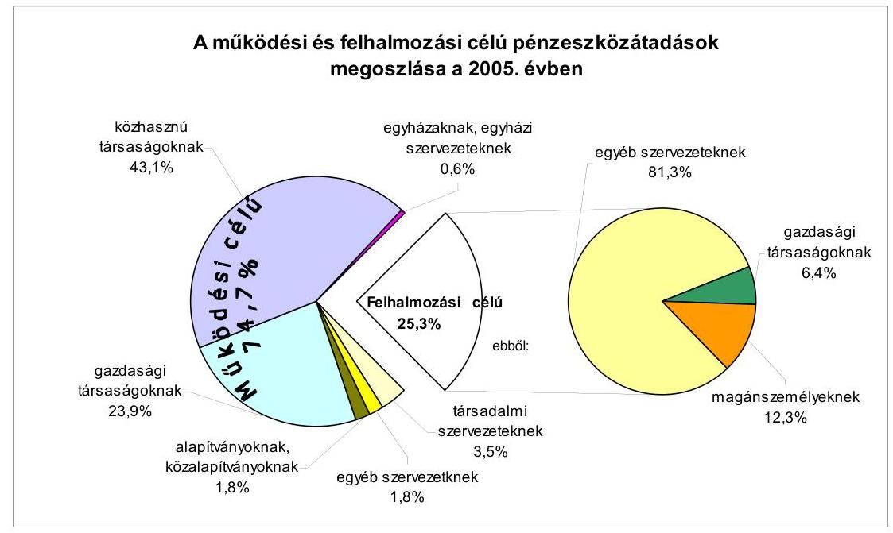
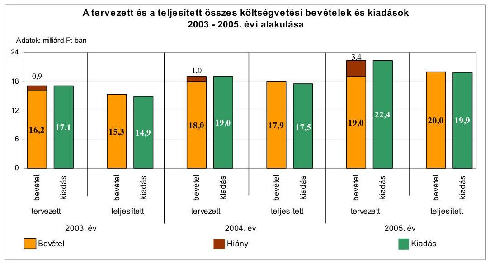
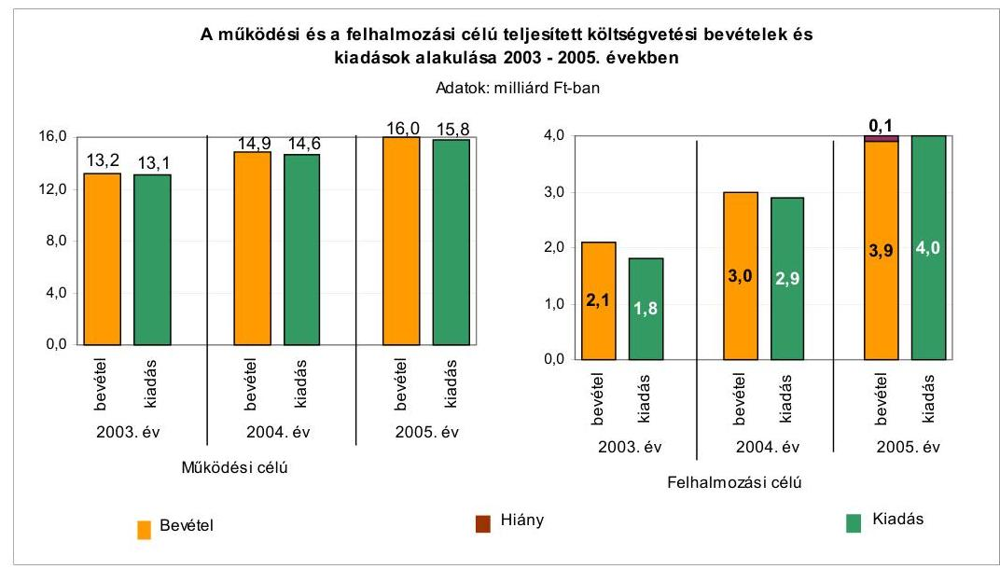
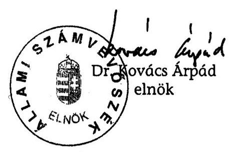
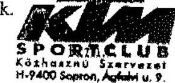
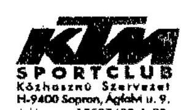
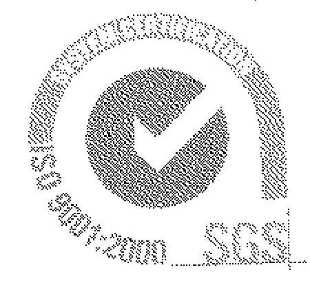
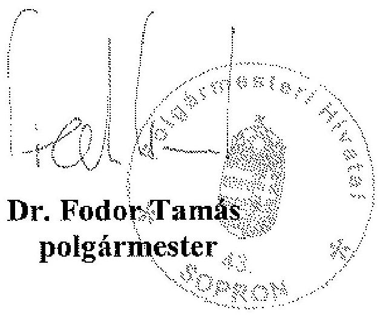

# ÁLLAMI   SZÁMVEVŐSZÉK 

## JELENTÉS

a Sopron Megyei Jogú Város Önkormányzata gazdálkodási rendszerének 2006. évi átfogó ellenőrzéséről

---

3. Önkormányzati és Területi Ellenőrzési Igazgatóság
3.3. Átfogó Ellenőrzések Főcsoport
Iktatószám: V-1003-5/33/33/2006.
Témaszám: 803
Vizsgálat-azonosító szám: V0276
Az ellenőrzést felügyelte:
Dr. Lóránt Zoltán
főigazgató
Az ellenőrzés végrehajtásáért felelős:
Dr. Sepsey Tamás
főigazgató-helyettes
Az ellenőrzést vezette:
Csecserits Imréné
főcsoportfőnök-helyettes
Az ellenőrzést végezték:
Berényi Magdolna
főtanácsadó
Dr. Fátrainé Zsebedics Katalin
tanácsadó
Dr. Lacó Bálintné
főtanácsadó
A témához kapcsolódó - elmúlt három évben - készített számvevőszéki jelentések:
címe
sorszáma
Jelentés a Nyugat-dunántúli környezetvédelmi beruházások ellenőrzéséről
Jelentés a helyi és a helyi kisebbségi önkormányzatok gazdálkodásának átfogó ellenőrzéséről
Jelentés a Fertő tó térség természetvédelmének ellenőrzéséről ..... 0339
Jelentés a települési önkormányzatok szennyvízközmű fejlesztési és ..... 0416
működtetési feladatai ellátásának vizsgálatáról
Jelentés a középfokú oktatás feltételei alakulásának ellenőrzéséről ..... 0445

---

# TARTALOMJEGYZÉK 

BEVEZETÉS ..... 7
I. ÖSSZEGZŐ MEGÁLLAPÍTÁSOK, KÖVETKEZTETÉSEK, JAVASLATOK ..... 9
II. RÉSZLETES MEGÁLLAPÍTÁSOK ..... 23

1. A költségvetés tervezésének, végrehajtásának, az önkormányzat vagyongazdálkodásának és a zárszámadás elkészítésének szabályszerűsége ..... 23
1.1. A költségvetési rendelet jóváhagyásának, módosításának, az előirányzatok nyilvántartásának szabályszerűsége ..... 23
1.2. A gazdálkodás szabályozottsága, a bizonylati rend és fegyelem szabályszerűsége ..... 29
1.3. A pénzügyi-számviteli feladatok ellátásának informatikai támogatottsága ..... 37
1.4. Az önkormányzati vagyon nyilvántartása, számbavétele ..... 38
1.5. A vagyonnal való gazdálkodás szabályszerűsége, célszerűsége, nyilvánossága ..... 41
1.6. A céljelleggel nyújtott támogatások szabályszerűsége ..... 51
1.7. A közbeszerzési eljárások szabályszerűsége ..... 56
1.8. A zárszámadási kötelezettség teljesítésének szabályszerűsége ..... 60
1.9. A Polgármesteri hivatal helyi kisebbségi önkormányzatok gazdálkodását segítő tevékenysége ..... 62
2. Az önkormányzati feladatok és a rendelkezésre álló források összhangja ..... 64
2.1. A feladatok meghatározása és szervezeti keretei ..... 64
2.2. A költségvetés egyensúlyának helyzete ..... 68
2.3. A feladatok finanszírozása ..... 76
3. A belső ellenőrzési rendszer működésének értékelése ..... 79
3.1. Az ellenőrzési rendszer kialakítása, működése ..... 79
3.2. A könyvvizsgálati kötelezettség teljesítése ..... 83
3.3. A korábbi számvevőszéki ellenőrzések javaslatainak hasznosulása ..... 83

---

# MELLÉKLETEK 

1. számú Az Önkormányzat gazdálkodását meghatározó adatok, mutatószámok (1 oldal)
2. számú Az önkormányzati vagyon nagyságának alakulása (1 oldal)
3. számú Az Önkormányzat 2005. évi bevételeinek és kiadásainak alakulása (1 oldal)
4. számú Egyes önkormányzati feladatok finanszírozása (1 oldal)
5. számú Helyszíni ellenőrzési jegyzőkönyv (6 oldal)
6. számú Az Önkormányzat 1997. évi portfoliókezelési szerződésének következményei (8 oldal)
7. számú Dr. Fodor Tamás polgármester úr észrevétele (1 oldal)

---

# RÖVIDÍTÉSEK JEGYZÉKE 

## Törvények:

Áht.
Htv.

Hat.
Kbt.
Költségvetési törvény
Ksztv.
Ktv.
Nek. tv.
Ötv.
Számv. tv.
Szoctv.
Vt.

## Rendeletek:

2004. évi költségvetési rendelet
2005. évi költségvetési rendelet
2005. évi zárszámadási rendelet
2006. évi költségvetési rendelet
Ámr.
Ber.
kisebbségi kormányrendelet

Önkormányzat SzMSz-e
vagyongazdálkodási rendelet $_{1}$
az államháztartásról szóló 1992. évi XXXVIII. törvény
a helyi önkormányzatok és szerveik, a köztársasági megbízottak, valamint egyes centrális alárendeltségű szervek feladat- és hatásköreiről szóló 1991. évi XX. törvény
a helyi adókról szóló 1990. évi C. törvény
a közbeszerzésekről szóló 2003. évi CXXIX. törvény
A Magyar Köztársaság 2005. évi költségvetéséről szóló 2004. évi CXXXV. törvény
a közhasznú szervezetekről szóló 1997. évi CLVI. törvény
a köztisztviselők jogállásáról szóló 1992. évi XXIII. törvény
a nemzeti és etnikai kisebbségek jogairól szóló 1993. évi LXXVII. törvény
a helyi önkormányzatokról szóló 1990. évi LXV. törvény
a számvitelről szóló 2000. évi C. törvény
a szociális igazgatásról és a szociális ellátásokról szóló 1993. évi III. törvény
a vízgazdálkodásról szóló 1995. évi LVII. törvény

Sopron Megyei Jogú Város Önkormányzatának 4/2004. (III. 1.) számú rendelete

Sopron Megyei Jogú Város Önkormányzatának 12/2005. (III. 7.) számú rendelete

Sopron Megyei Jogú Város Önkormányzatának 13/2006. (V. 8.) számú rendelete

Sopron Megyei Jogú Város Önkormányzatának 4/2006. (III. 9.) számú rendelete
az államháztartás működési rendjéről szóló 217/1998. (XII. 30.) Korm. rendelet
a költségvetési szervek belső ellenőrzéséről szóló 193/2003. (XI. 26.) Korm. rendelet
a kisebbségi önkormányzatok költségvetésének, gazdálkodásának, vagyonjuttatásának egyes kérdéseiről szóló 20/1995. (III. 3.) Korm. rendelet
Sopron Megyei Jogú Város Önkormányzatának az önkormányzat és szervei Szervezeti és Működési Szabályzatáról szóló 40/2003. (X. 31.) számú rendelete
Sopron Megyei Jogú Város Önkormányzatának 8/1997. (III. 25.) számú rendelete az önkormányzat vagyonáról, a vagyontárgyak feletti tulajdonosi jogok gyakorlásáról, hatályos 2006. május 31-ig

---

vagyongazdálkodási rendelet ${ }_{2}$

Vhr.

## Szórövidítések:

ÁSZ
Bíráló bizottság
DOMB Rt.
Döntéselőkészítő bizottság
Egyetem
Erzsébet Kórház

Főépítészi iroda
GYIK Kht.
Házgondnokság
Holding Zrt.
Hulladékgazdálkodási társulás
Idegenforgalmi és kulturális bizottság
jegyző
Jegyzői iroda
Jogi és ügyrendi bizottság
KDB
Kistérségi társulás
Konferencia Központ Kft.
Költségvetési iroda
közbeszerzési szabályzat
Közgyűlés
MÁK

Sopron Megyei Jogú Város Önkormányzatának 19/2006. (VI. 1.) számú rendelete az önkormányzat vagyonáról, a vagyon feletti tulajdonosi jogok gyakorlásának és a vagyon kezelésének szabályozásáról,
az államháztartás szervezetei beszámolási és könyvvezetési kötelezettségének sajátosságairól szóló 249/2000. (XII. 24.) Korm. rendelet

Állami Számvevőszék
Sopron Megyei Jogú Város Önkormányzatának Bíráló Bizottsága
DOMB Gazdasági Tanácsadó Részvénytársaság
Sopron Megyei Jogú Város Önkormányzatának Döntéselőkészítő Bizottsága
Nyugat-Magyarországi Egyetem
Sopron Megyei Jogú Város Erzsébet Kórház, a Debreceni Egyetem Orvos- Egészségtudományi Centrum Oktató Kórháza
Sopron Megyei Jogú Város Önkormányzata Polgármesteri Hivatalának Főépítészi Irodája
Gyermek és Ifjúsági Központ Közművelődési Közhasznú Társaság
Sopron Megyei Jogú Város Önkormányzata Polgármesteri Hivatal Polgármesteri Irodájának Házgondnoksága
Sopron Holding Vagyonkezelő Zártkörűen Működő Részvénytársaság
Sopron Térségi Hulladékgazdálkodási Önkormányzati Társulás
Sopron Megyei Jogú Város Önkormányzata Közgyűlésének Idegenforgalmi és Kulturális Bizottsága
Sopron Megyei Jogú Város Önkormányzatának jegyzője
Sopron Megyei Jogú Város Önkormányzata Polgármesteri Hivatalának Jegyzői Irodája
Sopron Megyei Jogú Város Önkormányzata Közgyűlésének Jogi és Ügyrendi Bizottsága
Közbeszerzések Tanácsa Közbeszerzési Döntőbizottsága
Sopron és Környéke Kistérségi Társulás
SOPRONI KONFERENCIA KÖZPONT, Turizmus és Szolgáltató Korlátolt Felelősségű Társaság
Sopron Megyei Jogú Város Önkormányzata Polgármesteri Hivatalának Költségvetési Irodája
Sopron Megyei Jogú Város Önkormányzata Polgármesteri Hivatalának Közbeszerzési Szabályzata
Sopron Megyei Jogú Város Önkormányzatának Közgyűlése
Magyar Államkincstár Területi Igazgatósága

---

| Oktatási, sport és ifjúsági bizottság | Sopron Megyei Jogú Város Önkormányzata Közgyűlésének Oktatási, Sport és Ifjúsági Bizottsága |
| :--: | :--: |
| OTP | Országos Takarékpénztár és Kereskedelmi Bank Részvénytársaság |
| Önkormányzat | Sopron Megyei Jogú Város Önkormányzata |
| Pénzügyi bizottság | Sopron Megyei Jogú Város Önkormányzata Közgyűlésének Pénzügyi Bizottsága |
| polgármester | Sopron Megyei Jogú Város Önkormányzatának polgármestere |
| Polgármesteri hivatal | Sopron Megyei Jogú Város Önkormányzatának Polgármesteri Hivatala |
| Polgármesteri hivatal SzMSz-e | Sopron Megyei Jogú Város Önkormányzatának Polgármesteri Hivatala részére a polgármester által 2001. augusztus 30-i hatállyal jóváhagyott 40153-9/2001. számú Szervezeti és Működési Szabályzat |
| Polgármesteri iroda | Sopron Megyei Jogú Város Önkormányzata Polgármesteri Hivatalának Polgármesteri Irodája |
| Pro Kultura Kht. | PRO KULTURA SOPRON Színházi és Kulturális Közhasznú Társaság |
| Raabersport Kft. | RAABERSPORT Sporttevékenységet Végző és Szolgáltató Korlátolt Felelősségű Társaság |
| RDMB Kft. | RDMB Szállodafejlesztő Korlátolt Felelősségű Társaság |
| SIK Kft. | Soproni Ingatlankezelő Korlátolt Felelősségű Társaság |
| Sportclub | Heavy Tools Sportclub |
| Sportfelügyeleti csoport | Sopron Megyei Jogú Város Önkormányzata Polgármesteri Hivatal Polgármesteri Irodájának Sportfelügyeleti Csoportja |
| Sportrendelet | Sopron Megyei Jogú Város Önkormányzatának a helyi sportélet támogatásáról szóló 2/2002. (I. 31.) számú rendelete |
| SVÜ Kft. | Soproni Városüzemeltetési Korlátolt Felelősségű Társaság |
| Többcélú kistérségi társulás | Sopron-Fertőd Többcélú Kistérségi Társulás |
| Tulajdonosi bizottság | Sopron Megyei Jogú Város Önkormányzata Közgyűlésének Tulajdonosi Bizottsága |
| Városfejlesztési bizottság | Sopron Megyei Jogú Város Önkormányzata Közgyűlésének Városfejlesztési Bizottsága |
| Városüzemeltetési iroda | Sopron Megyei Jogú Város Önkormányzata Polgármesteri Hivatalának Városüzemeltetési Irodája |
| Vízmű Rt. | Sopron és Környéke Víz- és Csatornamű Részvénytársaság |

---

# 6

---

# JELENTÉS 

## a Sopron Megyei Jogú Város Önkormányzata gazdálkodási rendszerének 2006. évi átfogó ellenőrzéséről

## BEVEZETÉS

Az Ötv. 92. § (1) bekezdése, az Állami Számvevőszékről szóló 1989. évi XXXVIII. törvény 2. § (3) bekezdése, valamint Áht. 120/A. § (1) bekezdése alapján az önkormányzatok gazdálkodását az Állami Számvevőszék ellenőrzi. Az ellenőrzés elvégzése az Országgyűlés illetékes bizottságai részére is átadott, országosan egységes ellenőrzési program alapján történt.

## Az ellenőrzés célja annak értékelése volt, hogy:

- az önkormányzati gazdálkodás törvényességét, ${ }^{1}$ szabályszerűségét biztosították-e a tervezés, a költségvetés végrehajtása, a vagyongazdálkodás és a zárszámadás során;
- az Önkormányzat által ellátott feladatok és az azokhoz rendelkezésre álló források összhangja biztosított volt-e, különös tekintettel az egyes kiemelt feladatokra;
- a gazdálkodás szabályszerűségét biztosító belső kontrollok ${ }^{2}$ lehetővé tették-e a szabálytalanságok, hiányosságok, gazdaságtalan megoldások feltárását, megelőzését;

Az ellenőrzött időszak: a 2005. év és a 2006. I. félév, az 1.5, 2.1-2.3 és 3.3 ellenőrzési programpontok esetében ezen túlmenően a 2003-2004. évek is.

Sopron megyei jogú város Győr-Moson-Sopron megye második legnagyobb települése. A város lakosainak száma 2006. január 1-jén 55860 fő volt. A Közgyűlés tagjainak száma 26 fő, munkáját kilenc állandó bizottság támogatja.

[^0]
[^0]:    ${ }^{1}$ A törvényi előírások betartásának elmulasztásakor a részletes megállapítások fejezetben egységesen a törvénysértés megjelölést alkalmazzuk, mivel az ÁSZ nem tehet különbséget a törvényi előírások között.
    ${ }^{2}$ A gazdálkodás szabályszerűségét biztosító kontroll alatt értjük a kiépített és működő belső irányítási és szabályozási rendszert, valamint a belső ellenőrzési funkciók ellátását.

---

A városban két településrészi ${ }^{3}$ és öt kisebbségi ${ }^{4}$ önkormányzat működik.
A polgármester a 2002. év óta töltötte be tisztségét, tevékenységét kettő főállású alpolgármester, valamint az Önkormányzat SzMSz-ének 24. §-ában foglaltak alapján öt tanácsadó segítette. A 2006. évi önkormányzati képviselő és polgármesteri választásokat követően a polgármester személye változott.

A 2002. évi önkormányzati képviselő választások óta a jegyző személyében három alkalommal történt változás. A jelenlegi jegyző 2006. március 1. óta vezeti a Polgármesteri hivatalt. Az Önkormányzat a 2005. évben 22103 millió Ft bevételből gazdálkodott, a teljesített kiadás 20242,3 millió Ft, melynek 77%-át működési, 23%-át felhalmozási célra fordították. A könyvviteli mérlegben kimutatott vagyon értéke 2005. december 31-én 51093 millió Ft volt.

Az Önkormányzat a 2005. évben összesen 36 (ebből 13 részben önálló gazdálkodási jogkörrel rendelkező) intézményt tartott fenn. Ezen kívül 13 gazdasági társaságban rendelkezett tulajdoni részesedéssel és kettő közhasznú társaságnak 100%-ban a tulajdonosa. A Polgármesteri hivatalban foglalkoztatottak létszáma 2005. december 31-én 224 fő, az intézményekben foglalkoztatottak létszáma 2601 fő volt. Az Önkormányzat gazdálkodását meghatározó adatokat, mutatószámokat a jelentés 1-3. számú mellékletei tartalmazzák.

A Polgármesteri hivatal a 2001. évben megszerezte az EN ISO 9001:2000 előírásainak megfelelő minőségbiztosítási tanúsítványt.

A jelentés megállapításainak, javaslatainak egyeztetése során a polgármester úr arról adott tájékoztatást, hogy az időközben megtett intézkedésekkel a javaslatok egy részét megvalósították. Ezekben az esetekben a jelentés II. Részletes megállapítások fejezetében az adott témához kapcsolt lábjegyzetben a megtett intézkedést feltüntettük és a kapcsolódó javaslatot elhagytuk.

A jelentést az ÁSZ-ról szóló 1989. évi XXXVIII. tv. 25. § (1) bekezdése alapján észrevétel közlése céljából megküldtük a Sopron Megyei Jogú Város Önkormányzata polgármesterének. A kapott észrevételt a jelentés 7. számú melléklete tartalmazza.

[^0]
[^0]:    ${ }^{3}$ Sopron-Balf, Brennbergbánya-Ó-Hermes-Új-Hermes-Görbehalom.
    ${ }^{4}$ Bolgár, cigány, görög, horvát, német.

---

# I. ÖSSZEGZŐ MEGÁLLAPÍTÁSOK, KÖVETKEZTETÉSEK, JAVASLATOK 

Az Önkormányzat 2005. július 1-től rendelkezik gazdasági programmal, amelyben meghatározták a stratégiai célokat, a fejlesztendő területeket, a célok elérése érdekében szükséges intézkedéseket.

A polgármester a 2005. és a 2006. évi költségvetési koncepciókat az Áht-ban előírt határidőben terjesztette a Közgyűlés elé. A koncepciókat azonban az Ámr. előírása ellenére nem a helyben képződő bevételek és ismert kötelezettségek figyelembevételével állították össze. A kisebbségi önkormányzatok elnökeit tájékoztatták a költségvetési koncepciókban foglaltakról. Az előterjesztésekhez az Ámr.
 előírása ellenére a polgármester nem csatolta a kisebbségi önkormányzatok és a Pénzügyi bizottság véleményét, az utóbbit a bizottság elnöke a Közgyűlésen szóban ismertette. A költségvetési koncepciók alapján a Közgyűlés döntött a költségvetés készítésének további munkálatairól, melyet a Polgármesteri hivatal a költségvetési rendelettervezetek készítésénél figyelembe vett.

A polgármester a 2005. évi és a 2006. évi költségvetési rendelettervezeteket az Áht-ban előírt határidőn belül terjesztette a Közgyűlés elé. A polgármester az Ámr. előírása ellenére a költségvetési rendelettervezetekhez nem csatolta a Pénzügyi bizottság véleményét és a könyvvizsgáló írásos jelentését, mely utóbbit a Közgyűlésen osztottak ki. Az Áht-ben előírt kötelezettség ellenére rendeletben nem határozták meg a költségvetés és a zárszámadás előterjesztésekor tájékoztatásul bemutatandó mérlegek, kimutatások tartalmi követelményeit. A költségvetési rendeletekben - az Áht-ben foglaltakat megsértve - a költségvetési bevételek és kiadások között finanszírozási célú pénzügyi műveleteket szerepeltettek, a hiány összegét nem mutatták be. A 2005. és a 2006. évi költségvetési rendeletekből - az Ámr-ben előírtak ellenére - nem állapítható meg önkormányzati szinten a működési- és fenntartási előirányzatok kiemelt előirányzatonkénti bontásban. Az Áht-ben előírtak ellenére a költségvetés előterjesztésekor elmaradt a közvetett támogatások, valamint azokról és a többéves kihatással járó döntések számszerű kimutatásáról a szöveges indoklás bemutatása. A Közgyűlés a költségvetésről szóló rendeleteiben meghatározta a költségvetés végrehajtásának szabályait.

Az Önkormányzat a 2005. évi költségvetéséről szóló rendeletét három alkalommal módosította, a módosítások során az eredeti előirányzatok főösszegét 9%-kal növelte. A 2006. évi költségvetést a Közgyűlés - az I. félév végéig - egyszer módosította, a módosítással a költségvetési bevételek és kiadások összege 3%-kal nőtt. A költségvetési rendeletek módosítása során az Ámr-ben előírt határidőket nem tartották be, a polgármester nem intézkedett negyedéven belül a költségvetési rendeleteknek a központi költségvetésből engedélyezett pótelőirányzatokkal történő módosítására, valamint a Közgyűlés a 2005. évi költségvetési rendelet utolsó módosításáról a Vhr-ben rögzített határidőn túl döntött. Az előirányzatok módosítására vonatkozó előterjesztések megfelelő információt

---

biztosítottak a Közgyűlés számára a módosítás indokairól, azok az eredeti költségvetéssel összehasonlítható módon készültek.

A Polgármesteri hivatal rendelkezett SzMSz-szel, amely azonban az Ámr. előírásai ellenére nem tartalmazta az alapító okirat keltét, számát, a költségvetés végrehajtására szolgáló számlaszámot, a Polgármesteri hivatalhoz rendelt, részben önállóan gazdálkodó szervezetek felsorolását, valamint nem történt meg a gazdasági szervezet kijelölése. A gazdasági szervezeti feladatokat ellátó szervezeti egység (Költségvetési iroda) rendelkezett ügyrenddel. A költségvetési gazdálkodást érintő gazdálkodási jogkörök szabályozását a polgármester és a jegyző együttes utasításban rögzítette. A jegyző az Ámr-ben előírtak ellenére a szakmai teljesítés igazolásra jogosultakat, és a kötelezettségvállalás ellenjegyzésére felhatalmazottakat, valamint a polgármester a kötelezettségvállalásra felhatalmazottakat nem személyre szólóan, hanem a munkakörök megnevezésével jelölte ki, hatalmazta fel, valamint a jegyző a szakmai teljesítés igazolásának módját nem határozta meg. Az érvényesítést végzők megbízása megtörtént, amelynek során az érvényesítők iskolai végzettségére és szakmai képesítésére vonatkozó előírásokat a jegyző betartotta. A gazdálkodási jogkörök gyakorlására történő felhatalmazásoknál utólagos beszámoltatási kötelezettséget nem írtak elő, beszámoltatásra nem került sor.

A jegyző a Htv-ben foglaltak ellenére nem alakította ki az önkormányzati költségvetési szervek egységes számviteli rendjét. A jegyző elkészítette a Polgármesteri hivatal számviteli politikáját és a kapcsolódó szabályzatokat, amelyeket Polgármesteri hivatalhoz rendelt részben önállóan gazdálkodó költségvetési szervekre is kiterjesztett, azonban ehhez a Vhr. előírása ellenére a Közgyűlés egyetértésével nem rendelkezett. A leltározás rendjéről szóló szabályzatban a Vhr. előírása ellenére a tárgyi eszközök leltározására nem évenkénti, hanem 5 évenkénti mennyiségi felvétellel történő leltározást írtak elő. A Vhr. előírása ellenére nem szabályozták az üzemeltetésre átadott eszközök leltározásával kapcsolatos teendőket. Az adók módjára behajtható követelések kivételével a követelések egyedi értékelését írták elő. A Vhr. előírása ellenére nem rögzítették az egyszerűsített értékelési eljárás alá vont adókövetelések negyedévenkénti besorolásának elveit, dokumentálásának szabályait, az áruszállításból és szolgáltatás nyújtásból származó követelés értéke meghatározásának módját, a számlázás és a követelésekkel kapcsolatos adatok nyilvántartásának rendjét, az adósminősítés szempontjait, a kis összegű követelések év végi meghatározásának elveit, dokumentálásának szabályait. A Vhr. előírása ellenére az egyszerűsített értékelési eljárás alá vont adókövetelések negyedévenkénti besorolásának elveit, dokumentálásának szabályait, valamint az adók és adók módjára behajtható köztartozásokkal kapcsolatos követelések értékelésére az értékvesztési mutatókat adónemenként, minősítési kategóriánként, tapasztalati adatok alapján nem határozták meg. A Polgármesteri hivatal rendelkezett számlarenddel. A Vhr-ben foglaltak ellenére a számlarend és a számviteli politika sem rendelkezett arról, hogy az abban foglaltak alkalmazandók-e és milyen eltéréssel a kisebbségi önkormányzatok számviteli elszámolásaira.

A Polgármesteri hivatalban az Ámr-ban előírtaknak megfelelt a költségvetés tervezési és beszámolási folyamatára elkészített ellenőrzési nyomvonal. Az Ámr. előírása ellenére azonban a jegyző nem készített a Polgármesteri hivatal pénzügyi lebonyolítási és ellenőrzési folyamataira ellenőrzési nyomvonalat,

---

nem alakította ki a tevékenységben, gazdálkodásban rejlő kockázatokra a kockázatkezelés helyi rendjét, a gazdálkodás során nem működtette az Áht. előírásától eltérve a folyamatba épített, előzetes és utólagos vezetői ellenőrzést. A pénzügyi-számviteli dolgozók munkaköri leírásában a gazdálkodással összefüggő hatáskörök gyakorlásával összefüggő, a főkönyvi és analitikus nyilvántartások egyeztetésével kapcsolatos feladatokat előírták, az ellenőrzési pontokat azonban nem határozták meg.

A könyvviteli nyilvántartásokban elszámolt gazdasági műveletekről, eseményekről a Számv. tv-ben előírt számviteli bizonylatokat kiállították, azonban a könyvviteli nyilvántartást közvetlenül alátámasztó bizonylatok a Számv. tvben foglaltakat megsértve nem tartalmazták a könyvviteli rögzítés időpontját, a könyvviteli rögzítés elvégzésének igazolását. Az Ámr-ben foglaltak ellenére a kötelezettségvállalás nyilvántartásba vételének sorszámát nem tüntették fel az utalványrendeleteken. A költségvetést terhelő kötelezettségvállalások 72%-át elsősorban az 50 ezer Ft alatti kifizetéseknél - az Ámr. előírása ellenére nem foglalták írásba.

A bizonylatok 100%-ánál elmaradt a szakmai teljesítés igazolása, amely esetekben az Ámr-ben foglalt előírás ellenére nem végezték el a kiadások teljesítésének és a bevételek beszedésének elrendelése előtt az ellenőrzési feladatokat, az érvényesítő nem tett eleget az Ámr-ben foglalt munkafolyamatba épített ellenőrzési kötelezettségének, annak ellenére érvényesítette ezen kiadási bizonylatokat, hogy hiányzott a szakmai teljesítés igazolása. Az utalványozás ellenjegyzője az utalványrendeleteket aláírásával ellátta, azonban elmulasztotta az Ámr-ben előírt ellenőrzési feladatok elvégzését, mivel nem észrevételezte az írásbeli kötelezettségvállalás és annak ellenjegyzésének, valamint az elvégzett kötelezettségvállalás nyilvántartásba vételi sorszámának a hiányát az utalványrendeleten, a szakmai teljesítés igazolásának és az érvényesítésnek a hiányát a bizonylatok 100, illetve 28%-ánál, továbbá a szakmai teljesítés igazolási mód meghatározásának a hiányát. A nem termékértékesítésből és szolgáltatásból befolyó bevételek és kiadások 27%-ánál utalványrendelet az Ámr. előírása ellenére nem készült. A Polgármesteri hivatalban a gazdálkodási és ellenőrzési jogköröket a pénztári és a bankszámla pénzmozgások bizonylatain, illetve az utalványrendeleteken az arra jogosultak igazolták.

A Polgármesteri hivatal a kiadásokat és bevételeket a főkönyvi könyvelésben a közgazdasági és funkcionális osztályozási mód szerint elszámolta, azokat a költségvetés szerkezeti rendjében meghatározottak figyelembevételével könyvelték. A Polgármesteri hivatalban a kötelezettségvállalásokról rendelkeztek nyilvántartással, de abból az Ámr-ben foglaltak ellenére nem volt megállapítható az éves kötelezettségvállalások, illetve a rendelkezésre álló, kötelezettségvállalással nem terhelt előirányzatok összege, nem volt biztosított annak feltétele, hogy a költségvetés végrehajtása során a kötelezettségvállalás és utalványozás csak a jóváhagyott kiadási előirányzatok mértékéig teljesüljön. Önkormányzati szinten a 2005. évi kiemelt előirányzatokon belül gazdálkodtak, a költségvetési szervek a kiemelt előirányzatokat betartották.

A Polgármesteri hivatalban az analitikus nyilvántartásokat számítógépes programok segítségével vezették. A főkönyvi könyvelés és a beszámoló a 2005. január 1-jén bevezetett új integrált könyvelési, pénzügyi rendszer műkö-

---

désének problémái miatt részben számítógépes feldolgozással, részben kézi összesítéssel készült. A Polgármesteri hivatal rendelkezett a Közgyűlés által jóváhagyott informatikai stratégiával, a polgármester által jóváhagyott informatikai és biztonsági szabályzattal, katasztrófa elhárítási tervvel. Az informatikai biztonsági szabályzat nem tartalmazta az Internet használatára vonatkozó szabályozást, a személyi biztonsági kérdéseket, a vírusok elleni védekezést. A számítógépekhez és a programokhoz való illetéktelen hozzáférés kizárásához a jogosultsági rendszert kialakították, azonban nem dokumentálták, hogy az egyes programok kezelésére mely munkakörökben foglalkoztatottak jogosultak. A pénzügyi-számviteli területen alkalmazott főkönyvi és pénzügyi modulhoz nem rendelkeztek felhasználói leírással és üzemeltetési dokumentációval. A pénzügyi-számviteli programokat alkalmazók a számítógépes feladat ellátásához szükséges alapfokú informatikai ismeretekkel rendelkeztek, munkaköri leírásaik azonban nem tartalmazták a számítástechnikai rendszer használatát és az elvégzendő feladatokat.

Az önkormányzati vagyont forgalomképesség szerint elkülönítetten tartották nyilván. A 2005. évi leltározási tevékenység végrehajtása az ingatlanok és az üzemeltetésre, kezelésre átadott eszközök esetében nem felelt meg a Vhr-ben foglaltaknak, mivel ezen vagyontárgyak leltározása nem mennyiségi felvétellel történt. A követelések esetében egyenlegközlő levél alapján, annak egyeztetésével végezték a leltározást. A negyedévenkénti értékvesztések megállapításához a százalékos értékvesztési mutatókat adónemenként, minősítési kategóriánként tapasztalati adatok alapján a Vhr-ben foglaltak ellenére nem határozták meg. A követelések értékvesztésének megállapítását nem a Vhr-ben előírt határidőben végezték. A helyi adók és adók módjára behajtandó köztartozások év végi értékelése keretében értékvesztésként leírt követelések esetében a Vhr. előírása ellenére a behajthatatlanság tényét és mértékét nem bizonyították. A Számv. tv. előírása ellenére a 2003-2005. évek között nem végezték el az év végi értékelést. Az 50%-nál alacsonyabb tulajdoni részesedést biztosító társaságok értékelésének elvégzéséhez szükséges pénzügyi beszámolókkal nem rendelkeztek. Az 50%-nál magasabb önkormányzati részesedésű gazdasági társaságoknál az értékeléshez szükséges információk rendelkezésre álltak, ennek ellenére az értékelést nem végezték el, az adatok alapján értékvesztés elszámolása nem volt indokolt.

Az Önkormányzat a vagyonával való gazdálkodás szabályait vagyongazdálkodási rendeletben, valamint a lakások és helyiségek elidegenítéséről, a lakás és nem lakás céljára szolgáló helyiségek bérletéről szóló külön rendeletekben rögzítette. A vagyongazdálkodási rendeletben a vagyon forgalomképesség szerinti besorolásának megváltoztatási módját a korlátozottan forgalomképes vagyontárgyakra nem szabályozták. A vagyongazdálkodási hatásköröket értékhatártól függően, a hasznosítás módjára tekintettel differenciáltan állapították meg. A vagyonhasznosítás nyilvánossága érdekében előírták, hogy 10 millió Ft feletti vagyon értékesítése pályáztatás útján, vagy liciteljárás keretében történhet. A vagyongazdálkodási rendelet 1,2-ben az önkormányzati vagyon elidegenítésére, használatának, hasznosítási jogának átengedésére az Áht. előírását megsértve meghatározott esetekben lehetővé tették a versenyeztetés mellőzését. A szabályozás nem segítette a vagyongazdálkodás átláthatóságát, nyilvánosságát. Az Áht. előírását megsértve nem határozták meg az ingyenes vagyonátadás eseteit, továbbá a követelésről való lemondás módját és eseteit.

---

Az ingatlanok tulajdonjogának átadásához előírták a forgalmi érték megállapításának értékbecslési kötelezettségét, az üzletrészek értékesítésekor az értékelési kötelezettséget, továbbá az értékpapírok értékelésének módját.

A vagyongazdálkodás során a polgármester megsértette az Áht. előírását vagyon ingyenes átadásával, mivel a vagyongazdálkodási rendelet nem tartalmazta az ingyenes vagyonátadás eseteit, és a követelés ingyenes átadását felhatalmazás, hatáskör hiányában végezte. A Közgyűlés a vagyongazdálkodási rendeletben korlátozottan forgalomképes törzsvagyonba tartozónak minősített ingatlan értékesítését engedélyezte anélkül, hogy az elidegenítési döntést megelőzően a vagyongazdálkodási rendelet módosításával az ingatlant forgalomképessé átminősítették volna. Az üzletrészek értékesítésénél egy esetben, továbbá az ingatlanok elidegenítésénél, az Áht. előírását megsértve az értékesítésről a Közgyűlés a versenyeztetési eljárás mellőzésével, az üzletrész esetében 9,1
 millió Ft vagyonvesztéssel döntött. A versenyeztetés nélküli elidegenítés nem segítette a vagyongazdálkodás átláthatóságát, nyilvánosságát. A vagyongazdálkodási rendelet előírása ellenére nem végeztek értékbecslést a mobil műjégpályáért csereszerződés keretében elidegenített ingatlanok közül négy ingatlan esetében, valamint a mobil műjégpálya beszerzése nem szerepelt az éves költségvetésben meghatározott célkitűzések között. A pártok részére kedvezményesen nyújtott ingatlanhasználattal megsértették az Ötv-t, mivel a pártok támogatása nem tartozik a helyi közügyek körébe, a bérleti díjkedvezményen keresztül számukra nyújtott közvetett támogatás az önkormányzati feladatellátással kapcsolatos célokat nem szolgálja. A Polgármesteri hivatal a 2004-2005. évben egy-egy alkalommal államkötvényt vásárolt, amelynek hozama meghaladta az adott időszakra vonatkozó referencia hozamot. Az Önkormányzat az értékpapírok vásárlása során a befektetési kockázat csökkentését elősegítő lehetőséggel nem élt, a befektetési szolgáltatónál nem kezdeményezte a befektetések biztonságának növelése és a kockázat csökkentése érdekében az értékpapír forgalomnak a KELER Zrt-nél megnyitott, az Önkormányzat nevére szóló, együttes rendelkezésű (zárolású) értékpapír alszámla vezetését.

Az Önkormányzat portfolió kezeléshez kapcsolódó gazdasági és jogi ügyleteknél a Polgármesteri hivatalban nem tartották be a vagyongazdálkodási rendelet üzleti értékelésre és nyilvános versenyeztetésre vonatkozó előírásait, mivel a társasági részesedésekről az értékesítéseket megelőzően üzleti értékelések nem készültek; az értékpapírok és részesedések értékesítésére nyilvános versenytárgyalást nem folytattak le. A portfoliókezelő által el nem ismert követelést a Számv. tv. előírása ellenére szerepeltették az 1998-2004. évek könyvviteli mérlegeiben. A Vhr. előírása ellenére a 2002. évtől elmulasztották a követelések előírt értékelését. A portfolió kezeléséhez kapcsolódó vagyonelem az Önkormányzat könyvviteli mérlegében a 2004. évtől már nem szerepelt, a gazdasági és jogi ügyletek 1116,0 millió Ft összegű bevételeinek és 1646,5 millió Ft összegű kiadásainak a különbözete 530,5 millió Ft volt.

Az Önkormányzatnál a céljellegű támogatások egységes pályáztatási, igénylési rendszerét nem alakították ki. A támogatott szervezetek részére - a nem szociális jelleggel - nyújtott támogatások folyósításának szabályait, a számadási kötelezettség teljesítésének, a rendeltetésszerű felhasználás ellenőrzésének helyi szabályait, felelőseit, a kapcsolódó analitikus nyilvántartás vezetésének tartalmi követelményeit - indokoltsága ellenére - nem szabályozták. A

---

támogatások feletti rendelkezésre jogosultak körét, a költségvetési rendelet tartalmazta. Az Önkormányzat a 2005. évi költségvetéséből gazdasági társaságoknak, közhasznú társaságoknak, alapítványoknak, közalapítványoknak, egyházaknak, egyesületeknek, magánszemélyeknek összesen 1427 millió Ft céljellegű támogatást adott, a támogatás 77%-a működési, 23%-a felhalmozási célokat szolgált. A támogatásokra vonatkozó döntésnél a bizottságok és a polgármester megsértették az Ötv. előírását, mivel alapítványok és közalapítványok részére nyújtott támogatásokról döntöttek. A támogatások 50%-ára, az Áht. előírását megsértve nem határozták meg a támogatás célját és nem írtak elő számadási kötelezettséget, nem határozták meg a számadási kötelezettség módját, határidejét. Az előírt számadási kötelezettség teljesítését sem kísérték figyelemmel, a számadásokat és a támogatások cél szerinti felhasználását az Áht. előírásait megsértve nem ellenőrizték, a számadási kötelezettséget határidőre nem teljesítők esetében nem intézkedtek a támogatás összegének visszafizetésére, valamint a további támogatás felfüggesztésére. Megsértették a Ksztv-t, mert a közhasznú szervezeteknek nyújtott támogatások esetében nem rögzítették írásban a támogatás felhasználásának feltételeit.

A közbeszerzési eljárás szabályainak meghatározására a polgármester és a jegyző által jóváhagyott szabályzatot készítettek, melyben meghatározták a közbeszerzési eljárás előkészítésével, lefolytatásával, ellenőrzésével kapcsolatos felelősségi és dokumentálási rendet. A 2005. évben az Önkormányzat 35 közbeszerzési eljárást indított. A közbeszerzési eljárások során a Kbt. előírásai ellenére az ajánlatok elbírálásáról készített írásbeli összegzést a távollévő ajánlattevőknek két napon belül nem küldték meg, az eljárás eredményét a Közbeszerzési Értesítőben nem tették közzé, nem tartották be a közbeszerzési eljárás dokumentálására vonatkozó helyi szabályozást. A közbeszerzési eljárás során vizsgálták az előkészítésben résztvevők összeférhetetlenségét, az eljárást lezáró döntést a helyi szabályozásban foglaltaknak megfelelően a polgármester hozta meg. A szerződéskötés az ajánlati felhívás tartalmának, illetve az adott ajánlat tartalmának megfelelően történt. Szerződésmódosításra nem került sor. A közbeszerzési tevékenység ellenőrzését a Kbt. és a helyi közbeszerzési szabályzat előírása ellenére nem végezték el. A KDB három alkalommal hozott intézkedést az Önkormányzat által indított közbeszerzési eljárásokkal kapcsolatban, egy alkalommal marasztalta el az Önkormányzatot a Kbt. megsértése miatt.

A polgármester a 2005. évi zárszámadási rendelettervezetet az Áht-ben előírt határidőn belül terjesztette a Közgyűlés elé, azonban ahhoz, az Ámr-ben előírtak ellenére, nem csatolta a Pénzügyi bizottság véleményét. A zárszámadási rendelettervezetet az Áht. előírása ellenére nem a költségvetéssel összehasonlítható módon készítették el. Az előterjesztés a költségvetési rendelettel ellentétben nem tartalmazta az önkormányzati feladatok többéves kihatását bemutató költségvetési előirányzatokat, a Polgármesteri hivatal kiemelt előirányzatainak teljesítését összesítve, valamint az EU támogatásával megvalósuló projektek előirányzatainak teljesítését. Az Áht. előírása ellenére a zárszámadási rendelet előterjesztésekor tájékoztatásul nem mutatták be a közvetett támogatásokat tartalmazó kimutatást, annak szöveges indoklását, valamint a több éves kihatással járó döntések számszerűsítését évenkénti bontásban és összesítve, szöveges indoklással. A 2005. évi zárszámadási rendeletben jóváhagyott bevételek és kiadások, valamint a pénzügyi információ keretében közölt önkormányzati szintű bevételek és kiadások adatai között eltérés volt, mivel a

---

zárszámadási rendeletben a vagyonmozgással kapcsolatos pénzforgalom nélküli bevételeket és kiadásokat nem szerepeltették. A Polgármesteri hivatal az intézmények vezetőit az éves beszámolójuk és működésük elbírálásáról, jóváhagyásáról, a jóváhagyott pénzmaradvány összegéről írásban tájékoztatta.

Az Önkormányzat a Nek. tv-ben foglaltak ellenére nem rögzítette az Önkormányzat SzMSz-ében a kisebbségi önkormányzatok testületi működéséhez szükséges feltételek biztosításának módját. Az Önkormányzat az Áht-ban előírt együttműködési megállapodásokat a kisebbségi önkormányzatokkal megkötötte. Az együttműködési megállapodások a hiányosságok ellenére elősegítették az Önkormányzat és a kisebbségi önkormányzatok központi és a helyi előírásoknak megfelelő együttműködését a költségvetés tervezése, a zárszámadás elkészítése és az operatív gazdálkodás területén. A megállapodások nem tartalmazták a kisebbségi önkormányzatok költségvetéssel kapcsolatos határozatainak meghozatalára és átadására vonatkozó időpontokat. A gazdálkodás ellenőrzésével kapcsolatos jogköröket a szakmai teljesítések igazolásának kivételével az Ámr. előírásainak megfelelően szabályozták. Az Ámr. előírása ellenére a kisebbségi önkormányzatok kötelezettségvállalásairól nem vezettek olyan nyilvántartást, amelyből megállapítható a kötelezettségvállalással nem terhelt szabad előirányzatok összege. A Polgármesteri hivatal az Ámr. előírását betartva elkülönítetten vezette a kisebbségi önkormányzatok vagyoni és számviteli nyilvántartásait, a Nek. tv. alapján biztosította a helyi kisebbségi önkormányzatok működésével kapcsolatos feltételeket, feladatokat.

Az Önkormányzat az Ötv. előírása ellenére nem határozta meg, hogy a lakosság igényeitől és anyagi lehetőségeitől függően mely feladatokat, milyen mértékben és módon lát el. A feladatok ellátását alapvetően költségvetési intézmények működtetésével biztosították. Az Önkormányzat a Szoc. tv-ben foglalt előírás ellenére nem gondoskodott a jelzőrendszeres házi segítségnyújtás megszervezéséről, nem működtette a szenvedélybetegek átmeneti otthonát. A közművelődési, sport, ifjúsági, egészségügyi alapellátási és a közszolgáltatási területeken közhasznú társaságok, egyéni vállalkozások, valamint önkormányzati többségi tulajdonú társaságok is részt vettek a feladatok elvégzésében. A racionálisabb feladatellátás érdekében 2003-2005 között két költségvetési intézményt megszüntettek, a közoktatási intézmények kapacitását az ellátotti létszámváltozással összhangban csökkentették. A végrehajtott szervezeti változások eredményeit a Közgyűlés azonban nem értékelte. A Többcélú kistérségi társulás feladatainak ellátásában - megállapodás alapján - az Önkormányzat intézményei is részt vállaltak.

Az Önkormányzat gazdálkodásának pénzügyi egyensúlya az elmúlt három évben a tervezéskor nem volt biztosított, a költségvetési rendeletekben tervezett bevételek nem nyújtottak fedezetet a tervezett kiadásokra, a hiány alapvetően a felhalmozási kiadásokat érintette. A fejlesztéseket, beruházásokat a pályázati úton elnyert pénzeszközökből, hitel felvételével és a saját bevételek bevonásával tervezték megvalósítani. A teljesítési adatok szerint az Önkormányzatnál a működési bevételek minden évben meghaladták a működési célú kiadásokat, a tervezett beruházások jelentős időbeli késéssel valósultak meg. Az Önkormányzatnál 2003-2005 között a forráshiány állandósult, melyben szerepet játszott a korábbi években felvett hitelek, kibocsátott kötvények visszafizetése is. A felhalmozási kiadások finanszírozásához felvett hiteleken túl a növekvő lik-

---

viditási problémák megoldására a folyószámla hitelkeretet évente növelték. Az adósságot keletkeztető kötelezettségvállalásoknál az Ötv-ben előírt felső határt betartották. A Közgyűlés több esetben vállalt - a tulajdoni részesedésével működő gazdasági társaságok által felvett hitelekért - készfizető kezességet. Kezesség beváltása miatt az Önkormányzatnak a 2004. évben 600 millió Ft fizetési kötelezettsége keletkezett, melyet újabb hitel felvételével egyenlített ki. A pénzügyi egyensúly javítása érdekében az Önkormányzat több alkalommal hozott kiadáscsökkentő és forrásbővítő intézkedéseket. Az Önkormányzat a Hat-ben foglalt felhatalmazás alapján építményadót, iparűzési adót, a vállalkozások kommunális adóját, valamint idegenforgalmi adót vezetett be. A 2005. évben a helyi adóból származó bevételek tették ki az összes költségvetési bevétel 13%-át. Az iparűzési adónál a törvényi maximumot alkalmazták, a többi adónemnél az adó mértékét a törvény szerint alkalmazható felső érték alatti összegben határozták meg. A Hat-ban meghatározottakon túlmenően is megállapítottak adókedvezményeket, mentességeket. A 2003-2005. években az Önkormányzat saját bevételeit pályázati forrásokkal egészítette ki. A felhalmozási célra átvett pénzeszközök aránya az összes költségvetési bevételen belül a 2003. évben 4%, a 2004. évben 2%, a 2005. évben 10% volt.

A naturális mutatókkal mérhető feladatok (bölcsődei ellátás, óvodai nevelés, általános- és középiskolai oktatás-nevelés, bentlakásos szociális intézményi ellátás) egy főre jutó kiadásai a 2003. évről a 2005. évre 5-23%-kal emelkedtek. A legalacsonyabb emelkedés a bölcsődei ellátásnál (5%), a legmagasabb az általános iskolai oktatásnál volt. A kiadások finanszírozásában a 2005. évben az önkormányzati saját források részesedése 50%-ot meghaladó a bölcsődei ellátásnál volt, az állami hozzájárulás és támogatás az általános iskolai oktatáshoz 70%-ot, a középiskolai oktatáshoz 67%-ot biztosított.

Az önként vállalt feladatok finanszírozására 2003-2005 között a költségvetési kiadások 7-10%-át fordították. Az önként vállalt feladatok főleg a kulturális, sport és ifjúsági területeken a nem feladatellátási szerződéseken alapuló céljellegű támogatásokkal, a nem kötelező feladathoz kapcsolódó beruházások megvalósításával kapcsolatosak. Az önként vállalt feladatok az Önkormányzat működőképességét nem veszélyeztették.

Az Önkormányzat a mozgásukban korlátozott személyek biztonságos és akadálymentes közlekedésének biztosítására a 2000-2005. évekre kiterjedő programot dolgozott ki, amelynek becsült költsége 479 millió Ft. Az Önkormányzat a fogyatékos személyek jogairól és esélyegyenlőségük biztosításáról szóló törvényben előírtakat figyelmen kívül hagyva a 2005. január 1-jei határidőre a feladatok elvégzését az intézményi telephelyek 92%-ánál (71 intézményi telephelynél) nem biztosította.

Az Önkormányzat kialakította a belső ellenőrzési kötelezettség teljesítéséhez szükséges szervezeti kereteket, gondoskodott az ellenőrzési feladatok megszervezéséről és végrehajtásáról. A Polgármesteri hivatal belső ellenőrzési és a saját intézmények pénzügyi ellenőrzési feladatainak ellátására az 1990. évben önálló Ellenőrzési irodát hoztak létre. Az ellenőrzési feladatokat az irodán belül négy fő látta el. Az Ellenőrzési iroda az Áht-ban foglaltaknak megfelelően közvetlenül a jegyzőnek alárendelve végezte feladatait, biztosították a belső el-

---

lenőrök Áht. által előírt funkcionális függetlenségét. A belső ellenőrzési vezető a Ber-ben foglaltaknak megfelelően elkészítette a belső ellenőrzési kézikönyvet.

A 2005. évben öt alkalommal végeztek belső ellenőrzést. A Polgármesteri hivatal belső ellenőrzései a gazdálkodásának általános szervezettségére és a pénzügyi szabályozás hatására, a karbantartási feladatok tervezésére, végrehajtására, pénzügyi elszámolására, illetve a munkaerő és bérgazdálkodására terjedtek ki.
 Áthúzódó vizsgálatként fejeződött be a kisebbségi önkormányzatokkal kötött együttműködési megállapodások tartalmának és betartásának vizsgálata.

A jegyző tájékoztatta a Közgyűlést a Polgármesteri hivatalnál és az intézményeknél végzett ellenőrzések, valamint a belső ellenőrzés tapasztalatairól, azonban az Áht-ban foglaltak ellenére a folyamatba épített, előzetes és utólagos vezetői ellenőrzés működtetéséről nem számolt be. A Közgyűlés a Htv-ben foglaltaknak megfelelően áttekintette az általa alapított intézményeknél és a Polgármesteri hivatalban végzett belső ellenőrzések tapasztalatait, az ellenőrzéssel kapcsolatos feladatot, követelményt, elvárást nem fogalmazott meg.

Az Önkormányzat az Ötv. előírása alapján könyvvizsgálatra volt kötelezett. A könyvvizsgáló kiválasztásánál és megbízásánál a szakmai követelményekre és az összeférhetetlenségre vonatkozó Ötv. előírásokat betartották. A könyvvizsgáló a Polgármesteri hivatal és intézményei összevont adatait tartalmazó 2005. évi egyszerűsített költségvetési beszámolót korlátozás nélküli hitelesítő záradékkal látta el, a 2005. évi könyvviteli mérleg adatainál 2793 ezer Ft auditálási eltérést állapított meg egy intézménynél.

Az elmúlt három évben öt alkalommal folytatott az ÁSZ vizsgálatot az Önkormányzatnál. A gazdálkodás átfogó ellenőrzéséről készített jelentésben megfogalmazott javaslatok 33%-a valósult meg. A költségvetés tervezése során érvényesítették az óvatosság számviteli törvény alapelvét, felülvizsgálták az ingatlanvagyon kataszter nyilvántartását (tartalma egyezik a számviteli nyilvántartásokkal), vezetését átadták az Önkormányzat gazdasági társaságának. A Globex Rt-vel szembeni követelésállomány a 2004. évi könyvviteli mérlegben nem szerepel, a szabályozási terveknél a közbeszerzési törvény értékhatárra vonatkozó előírásait betartották, elkészítették a gazdasági programot. Részben valósult meg a számviteli politika és a számlarend aktualizálása, a kisebbségi önkormányzatokkal kötött együttműködési megállapodások felülvizsgálata és módosítása, egy intézmény kivételével betartották a költségvetési előirányzatokat. Az Áht-ban előírt mérlegek és kimutatások teljes körűen nem készültek el, nem szabályozták a követelésekről történő lemondás módját és eseteit. Nem rögzítették a kötelező és az önként vállalt feladatok körét, nem vizsgálták felül az önként vállalt feladatok körét és mértékét, az intézmények hatékonysági vizsgálatát külső szervvel elvégeztették, azonban a Közgyűlés nem tárgyalta meg. Nem készítették el a Soproni Ipari és Innovációs Park Kft. beruházás folytatásának, üzemeltetésének és hasznosításának hosszú távú elemzését. A korábbi ÁSZ vizsgálatok megállapításairól a Közgyűlést nem tájékoztatták, és nem tették meg a szükséges intézkedéseket.

A szennyvízközmű fejlesztési és működtetési feladatok ellenőrzése során megfogalmazott két szabályszerűségi javaslat hatására megtörtént a környezetvédelmi jogszabályok megsértése esetén a szennyvízcsatornára való bekötés el-

---

rendelése és intézkedtek a szennyvízcsatornára való rákötés növelése érdekében. A középfokú oktatás feltételeinek alakulásáról készült jelentés négy célszerűségi javaslatot fogalmazott meg, melyek nem valósultak meg. Nem tekintették át középfokú oktatás helyzetét, nem erősítették meg az intézmények felügyeletét és az intézményirányítói munka személyi feltételeit. A Fertő-tó térség természetvédelmének ellenőrzési jelentése két szabályszerűségi és egy célszerűségi javaslata ellenére nem történt meg a fertőrákosi tájrendezés aktiválása, nem kísérték figyelemmel az utókezelési tervben előírtakat, és nem tartották be a szennyvíz kibocsátásánál az OVH rendelkezésben foglaltakat. A Nyugatdunántúli környezetvédelmi beruházások ellenőrzéséről készült jelentés két célszerűségi javaslatából egy valósult meg. Meghatározták az energiafelelős feladatait, azonban a beruházások előkészítésénél nem készültek energia megtakarítási és környezetvédelmi elemzések.

A helyszíni ellenőrzés megállapításainak hasznosítása mellett javasoljuk

# a polgármesternek 

a jogszabályi előírások maradéktalan betartása érdekében:

1. gondoskodjon az Ámr. 28. § (3) bekezdés alapján a költségvetési koncepció előterjesztéséhez a kisebbségi önkormányzatok arról alkotott véleményének csatolásáról, valamint az Ámr. 29. § (9) bekezdésében, az Ötv. 92/A. § (1) bekezdésében foglaltak alapján a zárszámadási rendelettervezetekhez a Pénzügyi bizottság véleményének és a könyvvizsgálói jelentésnek a csatolásáról;
2. intézkedjen, hogy az Ámr. 134. § (8) bekezdésében foglaltaknak megfelelően a kötelezettségvállalások írásba foglalása, valamint az Ámr. 136. § (2) bekezdés szerinti utalványozás a nem termékértékesítésből, szolgáltatásból befolyó bevételeknél megtörténjen;
3. kezdeményezze a vagyongazdálkodási rendelet ² módosítását annak érdekében, hogy az ne tartalmazzon az Áht. 108. § (1) bekezdésében előírtaktól eltérő esetekben a versenyeztetési kötelezettség alól felmentést lehetővé tevő szabályozást;
4. írjon elő az Áht. 13/A. § (2) bekezdése alapján a nem szociális céljellegű támogatások esetében számadási kötelezettséget a juttatott összeg rendeltetésszerű felhasználásáról, a számadási kötelezettséget határidőre nem teljesítők esetében intézkedjen a támogatás összegének visszafizetésére, valamint a további támogatást függessze fel;
5. biztosítsa, hogy az alapítványoknak nyújtott támogatások odaítéléséről az Ötv. 10. § (1) bekezdésének d) pontja alapján a Közgyűlés döntsön;
6. kezdeményezze a Nek. tv. 27. § (1) bekezdésének megfelelően az Önkormányzat SzMSz-ének kiegészítését annak meghatározásával, hogy az Önkormányzat milyen módon biztosítja a kisebbségi önkormányzatok testületi működésének feltételeit;
7. kezdeményezze, hogy a Közgyűlés az Ötv. 8. § (2) bekezdésében foglaltak alapján határozza meg, hogy a lakosság igényeitől és anyagi lehetőségeitől függően mely feladatokat milyen mértékben és módon lát el;

---

8. gondoskodjon a középületek akadálymentessé tételéről, tekintettel arra, hogy a fogyatékos személyek jogairól és esélyegyenlőségük biztosításáról szóló 1998. évi XXVI. tv. 29. § (6) bekezdésében előírt 2005. január 1-i határidő lejárt;
a munka színvonalának javítása érdekében:
9. kezdeményezze, hogy a számvevőszéki ellenőrzés tapasztalatait a Közgyűlés tárgyalja meg és a feltárt hiányosságok megszüntetése érdekében készíttessen intézkedési tervet;
10. számoltassa be a felhatalmazottakat a kötelezettségvállalási és az utalványozási jogkörök gyakorlásáról;
11. kezdeményezze, hogy a Közgyűlés rendeletben szabályozza a korlátozottan forgalomképes vagyon forgalomképesség szerinti besorolásának megváltoztatási módját, és biztosítsa az abban foglaltak végrehajtását;
12. kezdeményezze az értékpapír befektetési szolgáltató szervezetekkel kötött értékpapír vásárlási szerződéseknél a pénzügyi befektetések biztonságának növelése és a kockázat csökkentése érdekében az értékpapír forgalomnak a KELER Rt-nél megnyitott, az Önkormányzat nevére szóló, együttes rendelkezésű (zárolású) értékpapír alszámlán történő vezetését;

# a jegyzőnek: 

a jogszabályi előírások maradéktalan betartása érdekében:

1. biztosítsa a költségvetési rendelettervezet előkészítésekor, hogy az Áht. 8. § (1) bekezdése és a 8/A. § (7) bekezdése alapján a költségvetési bevétel és költségvetési kiadás ne tartalmazzon finanszírozási célú bevételeket és kiadásokat, valamint azok különbségeként a tervezett hiány bemutatásra kerüljön;
2. kezdeményezze rendelettervezet előkészítésével az Ámr. 53. § (2) bekezdésében foglalt előírások betartása érdekében, hogy a kapott pótelőirányzatok miatti előirányzatmódosítás negyedéven belül megtörténjen, valamint kezdeményezze, hogy a költségvetési rendelet utolsó módosításáról a Vhr. 10. § (1) bekezdésében rögzített február 28-i határidőn belül döntsön a Közgyűlés;
3. a költségvetési gazdálkodás szabályozottsága, a gazdálkodási és a kapcsolódó ellenőrzési jogkörök gyakorlása, szabályszerűségének biztosítása érdekében:
a) alakítsa ki a Htv. 140. § (1) bekezdés c) pontja alapján az Önkormányzat költségvetési szerveinek egységes számviteli rendjét, valamint kezdeményezze a Vhr. 8. § (13) bekezdés alapján a Közgyűlés egyetértését a számviteli politika és a kapcsolódó szabályzatok kiterjesztéséhez a Polgármesteri hivatalhoz tartozó részben önállóan gazdálkodó költségvetési szervekre;
b) biztosítsa a Vhr. 37. § (5) bekezdés alapján, hogy a leltározás rendjéről szóló szabályzat tartalmazza az üzemeltetésre átadott eszközök leltározásának feladatait, valamint rendelje el a leltározás rendjéről szóló szabályzat módosításával a

---

Vhr. 37. § (3) bekezdésében foglaltaknak megfelelően az ingatlanok és az üzemeltetésre átadott eszközök évente, mennyiségi felvétellel történő leltározását;
c) határozza meg a Vhr. 8. § (17) bekezdés b-d.) pontjaiban foglaltakra tekintettel az áruszállításból és szolgáltatás nyújtásból származó követelés értéke meghatározásának módját, a számlázás és a követelésekkel kapcsolatos adatok nyilvántartásának rendjét, az adósminősítés szempontjait, követeléstípusonként a kis összegű követelések év végi meghatározásának elveit, dokumentálásának szabályait;
d) határozza meg a Vhr. 31/A. § (1) bekezdésében rögzített követelések esetében a Vhr. 8. § (18) bekezdésében előírtak alapján az egyszerűsített értékelési eljárás alá vont adókövetelések negyedévenkénti besorolásának elveit, dokumentálásának szabályait, valamint a Vhr. 31/A. § (3) bekezdésben előírtaknak megfelelően az adók és adók módjára behajtható köztartozásokkal kapcsolatos követelések értékelésére az értékvesztési mutatókat adónemenként, minősítési kategóriánként, tapasztalati adatok alapján, továbbá intézkedjen, hogy az értékvesztés összegét év közben a Vhr. 31/A. § (2) bekezdésében előírtak alapján állapítsák meg;
e) határozza meg a Vhr. 8. § (3) bekezdés és a Vhr. 49. § (3) bekezdésében foglaltaknak megfelelően a kisebbségi önkormányzatok elszámolására alkalmazandó számviteli politika és számlarend előírásait;
f) intézkedjen az Ámr. 145/B. § (1) bekezdésében foglaltak alapján az ellenőrzési nyomvonal pénzügyi lebonyolítás területére történő kiegészítéséről, valamint gondoskodjon az Ámr. 145/A. § (1) bekezdése és az Áht. 97. § (2) bekezdése alapján a folyamatba épített, előzetes és utólagos vezetői ellenőrzés működtetéséről;
4. biztosítsa, hogy a Számv. tv. 167. § (1) bekezdés i) és h) pontjában foglaltakat tartsák be, a könyvviteli rögzítés időpontját és a könyvviteli rögzítés elvégzésének igazolását a bizonylatokon rögzítsék;
5. intézkedjen az Ámr. 135. § (1) bekezdésében előírtak betartása érdekében arról, hogy a kiadások teljesítésének és a bevételek beszedésének elrendelése előtt a szakmai teljesítés igazolására kijelölt személy okmányok alapján ellenőrizze, szakmailag igazolja azok jogosultságát, összegszerűségét, a szerződés, megrendelés, megállapodás teljesítését, az érvényesítő ennek alapján végezze el az Ámr. 135. § (1) bekezdésben előírt feladatát és azt aláírásával igazolja;
6. biztosítsa, hogy az Ámr. 136. § (2) bekezdésben előírtaknak megfelelően a nem termékértékesítésből, szolgáltatásból befolyó bevételek és a kiadások esetében az utalványozás az utalványrendeleten történjen, valamint intézkedjen hogy a kötelezettségvállalások nyilvántartásba vételének sorszámát az Ámr. 136. § (4) bekezdés h) pontjában foglaltaknak megfelelően az utalványrendeleteken tüntessék fel, továbbá a kötelezettségvállalás és az utalvány ellenjegyzője végezze el az Ámr. 137. § (3) bekezdésben előírt ellenőrzési feladatokat és az annak során tapasztalt hiányosságokról az Ámr. 134. § (11) bekezdésben foglaltak alapján írásban tájékoztassa az utalványozót, illetve a jegyzőt;
7. gondoskodjon a kötelezettségvállalások Ámr. 134. § (13) bekezdésében foglalt nyilvántartási rendszerének kialakításáról, hogy a Polgármesteri hivatalnál és a kisebbsé-

---

gi önkormányzatoknál megállapítható legyen az évenkénti kötelezettségvállalások, illetve a rendelkezésre álló, kötelezettségvállalással nem terhelt, szabad előirányzatok összege;
8. biztosítsa, hogy az Ámr. 134. § (2) bekezdésében foglaltak alapján a kötelezettségvállalás ellenjegyzése a részesedések, adásvételi, opciós, engedményezési, kötelmi jogutódlási szerződéseknél megtörténjen;
9. gondoskodjon a Vhr. 5. § 3. pontjában előírtak alapján a behajthatatlanság miatt leírt követelések esetében a behajthatatlanság tényének és mértékének dokumentált bizonyításáról;
10. gondoskodjon arról, hogy a Számv. tv. 54. § (1) bekezdésében foglaltakat betartva a részesedések év végi értékelését végezzék el;
11. a szabályszerű vagyongazdálkodás érdekében:
a) gondoskodjon arról, hogy az értékesítést megelőzően a forgalomképesség vagyongazdálkodási rendeletben rögzített módjának megváltoztatása megtörténjen;
b) biztosítsa, hogy a vagyongazdálkodási rendeletben előírt értékbecslési kötelezettséget az ingatlan értékesítéseknél végezzék el;
c) gondoskodjon arról, hogy az üzletrészek értékesítése az Áht. 108. § (1) bekezdésében előírtak alapján a vagyongazdálkodási rendeletben meghatározott értékhatár felett nyilvános, indokolt esetben zártkörű pályáztatással történjen;
d) kezdeményezze, hogy az Áht. 108. § (2) bekezdésében foglaltak alapján rendeletben szabályozzák a követelések elengedésének módját és eseteit, az ingyenes átruházás eseteit, valamint biztosítsa a meghatározott feltételek betartását;
12. gondoskodjon a Ksztv. 14. § (2) bekezdésében előírtak betartása érdekében arról, hogy a közhasznú szervezetek céljellegű támogatása esetén szerződésben írják elő a támogatással való elszámolás feltételeit és módját;
13. biztosítsa az Áht. 13/A. § (2) bekezdése
 alapján a céljellegű támogatások számadásának és rendeltetés szerinti felhasználásának az ellenőrzését;
14. a közbeszerzések szabályszerűsége érdekében:
a) biztosítsa, hogy a Kbt. 96. § (1) bekezdésében foglalt határidőt betartva, az ajánlatok elbírálásáról készített írásbeli összegzést a távollevő ajánlattevőknek haladéktalanul, de legkésőbb kettő munkanapon belül küldjék meg;
b) gondoskodjon arról, hogy a Kbt. 98. §-ában foglaltak betartása érdekében a közbeszerzési eljárás eredményét a Közbeszerzési Értesítőben közzé tegyék;
c) intézkedjen a Kbt. 308. § (2) bekezdésében és a közbeszerzési szabályzat 8.4 pontjában előírtaknak megfelelően a közbeszerzési eljárások ellenőrzéséről;

---

d) gondoskodjon a közbeszerzési eljárás során a közbeszerzési szabályzat dokumentálásra vonatkozó szabályainak betartásáról;
15. biztosítsa, hogy a zárszámadási rendelettervezet az Áht. 18. §-ában foglaltaknak megfelelően a költségvetéssel összehasonlítható módon kerüljön összeállításra, valamint tartalmazza a Polgármesteri hivatal kiemelt előirányzatainak teljesítését összesítve, és az EU támogatással megvalósuló projektek előirányzatainak teljesítését;
16. gondoskodjon az Ámr. 135. § (3) bekezdésében előírtaknak megfelelően a kisebbségi önkormányzatoknál a szakmai teljesítést igazoló személy kijelölésére;
17. intézkedjen az önkormányzati kötelező feladatok körében a Szoc. tv. 86. § (2) bekezdés c)-d) pontjaiban előírt jelzőrendszeres házi segítségnyújtás és a szenvedélybetegek átmeneti otthona ellátásának megszervezéséről;
18. tegyen eleget az Áht. 97. § (2) bekezdésében foglalt kötelezettségének, számoljon be a folyamatba épített, előzetes és utólagos vezetői ellenőrzés működtetéséről;
a munka színvonalának javítása érdekében:
19. szabályozza az operatív gazdálkodási, ellenjegyzési jogkörrel felhatalmazottak beszámoltatásának módját és gondoskodjon annak érvényesüléséről;
20. gondoskodjon a pénzügyi-számviteli dolgozók munkaköri leírásában az ellenőrzési pontok meghatározásáról;
21. gondoskodjon a pénzügyi-számviteli programokhoz a felhasználói leírás és üzemeltetési dokumentáció beszerzéséről, továbbá az egyes programok kezelésére vonatkozó jogosultságok dokumentálásáról és a számviteli feladatokat ellátók munkaköri leírásának számítástechnikai feladatokkal történő kiegészítéséről;
22. gondoskodjon az integrált könyvelési, pénzügyi rendszer programjának alkalmazásánál felmerült hiányosságok megszüntetésével a főkönyvi könyvelés és a költségvetési beszámoló vegyes - számítógépes és manuális - feldolgozásának, összesítésének megszüntetéséről;
23. alakítsa ki a céljellegű támogatások egységes pályáztatási, igénylési rendszerét, határozza meg a nem szociális jelleggel nyújtott támogatások folyósításának, a támogatás rendeltetésszerű felhasználásának ellenőrzési szabályait, felelőseit, a kapcsolódó nyilvántartás vezetésének tartalmi követelményeit.

---

# II. RÉSZLETES MEGÁLLAPÍTÁSOK 

## 1. A KÖLTSÉGVETÉS TERVEZÉSÉNEK, VÉGREHAJTÁSÁNAK, AZ ÖNKORMÁNYZAT VAGYONGAZDÁLKODÁSÁNAK ÉS A ZÁRSZÁMADÁS ELKÉSZÍTÉSÉNEK SZABÁLYSZERŰSÉGE

### 1.1. A költségvetési rendelet jóváhagyásának, módosításának, az előirányzatok nyilvántartásának szabályszerűsége

Az Önkormányzat gazdasági programmal 2005. július 1-től rendelkezett.

A Közgyűlés 2005. június 30-i ülésén vitatta meg és fogadta el a gazdaságfejlesztési koncepcióját ${ }^{5}$. A koncepció az adottságokat elemezve felvázolta Sopron jövőképét, kijelölte a fejlesztendő ágazatokat, a kívánt cél eléréséhez az Önkormányzat részéről szükséges intézkedéseket.

A gazdaságfejlesztési koncepcióban meghatározott célkitűzéseket a 2006. évi költségvetés tervezésénél megvalósítandó feladatként vették figyelembe.

A polgármester a 2005. évi és a 2006. évi jegyző által elkészített költségvetési koncepciókat az Áht. 70. §-ában előírt határidőt ${ }^{6}$ betartva, 2004. november 18-án, illetve 2005. november 10-én nyújtotta be a Közgyűlésnek. A kisebbségi önkormányzatok elnökeit tájékoztatták az Ámr. 28. § (6) bekezdése alapján a költségvetési koncepció-tervezetek vonatkozó célkitűzéseiről, a kisebbségi önkormányzatok költségvetési koncepcióról hozott határozatait azonban - az Ámr. 28. § (3) bekezdésben előírtak ellenére - a polgármester a költségvetési koncepciók előterjesztéseihez nem csatolta.

A költségvetési koncepciók tervezetét az Önkormányzat bizottságai - köztük a Pénzügyi bizottság - előzetesen megismerték, véleményüket határozatokban rögzítették, melyeket az Ámr. 28. § (3) bekezdésében foglaltak ellenére a polgármester nem csatolt az előterjesztésekhez ${ }^{7}$. A bizottságok elnökei a

[^0]
[^0]:    ${ }^{5}$ A gazdaságfejlesztési koncepció jóváhagyásáról a Közgyűlés 183/2005. (VI. 30.) számú határozatával döntött.
    ${ }^{6}$ Az Áht. 70. §-a szerint a következő évre vonatkozó költségvetési koncepciót november 30-ig, a helyi önkormányzati képviselő-testület tagjainak választásának évében legkésőbb december 15-ig kell a Közgyűlésnek benyújtani.
    ${ }^{7}$ A jegyző a 2006. augusztus 16-án kiadott 40149-13/2006. számú utasításával elrendelte, hogy a bizottságok, különösen a Pénzügyi bizottság véleményét a költségvetési koncepcióról, az éves költségvetésről szóló előterjesztésekhez csatolni kell, anélkül az előterjesztés nem tárgyalható.

---

költségvetési koncepciókról szóló határozataikat a Közgyűlésen szóban ismertették.

A költségvetési koncepciókat nem az Ámr. 28. § (1) bekezdésében előírt tartalommal, nem a helyben képződő bevételek, az ismert kötelezettségek figyelembevételével állították össze, arra vonatkozóan összesített, részletező számszaki adatokat az előterjesztések nem tartalmaztak ${ }^{8}$.

A 2005. évi költségvetési koncepcióról szóló előterjesztésben a központi költségvetési kapcsolatokból származó források jogcímeit, az illetékek, egyéb bevételek, központi költségvetés és önkormányzatok közötti megosztásának szabályait ismertették. A 2006. évi költségvetési koncepció ezen túlmenően tartalmazta a helyi önkormányzatok támogatását érintő országos szintű adatokat. A 2006. évi költségvetési koncepció az előző évről áthúzódó, illetve a következő évek költségvetését terhelő beruházásokkal, felújításokkal és a lakásalappal kapcsolatos kötelezettségvállalásokat mutatta be.

A költségvetési koncepciókban - a helyben képződő bevételek, a vállalható kötelezettségvállalásokra vonatkozó adatok nélkül - megállapították, hogy a feladatok ellátásához szükséges működési feltételek nem biztosítottak, a költségvetés összeállítására a szűkös pénzügyi környezet feltételei között van lehetőség.

A költségvetési koncepciókról szóló határozatokban ${ }^{9}$ az Ámr. 28. § (4) bekezdésében előírtakra figyelemmel a Közgyűlés határozott a költségvetés készítésének további munkálatairól.

Az Önkormányzat SzMSz-ének 39. § (1) bekezdése alapján a rendeleteket, így az éves költségvetést is kétfordulós közgyűlési tárgyalásra kell előkészíteni. Az első fordulóra a költségvetési rendelettervezeteket a polgármester az Áht. 71. § (1) bekezdésében előírt határidőn belül ${ }^{10}$ 2005. február 6-án, illetve 2006. február 1-jén nyújtotta be.

A jegyző a költségvetési rendelettervezeteket egyeztette a költségvetési szervek vezetőivel, melynek eredményét az Ámr. 29. § (4) bekezdésében foglaltak alapján írásban rögzítették.

A 2005. évi költségvetési rendelet az Önkormányzat 2005. évi költségvetésének bevételi és kiadási főösszegét 22 024,9 millió Ft-ban, a 2006. évi költségvetési rendelet a 2006. évi költségvetés bevételeit és kiadásait 23 835,2 millió Ft-ban határozta meg.

[^0]
[^0]:    ${ }^{8}$ A jegyző a 2006. augusztus 16-án kiadott 40149-13/2006. számú utasításával elrendelte, hogy a költségvetési koncepció tartalmazzon a helyben képződő forrásokra és a kötelezettségekre részletes számszaki adatokat.
    ${ }^{9}$ A Közgyűlés a 2005. évi költségvetési koncepcióról 370/2004. (XI. 30.) számú, a 2006. évi költségvetési koncepcióról a 376/2005. (XI. 24.) számú határozatot hozta.
    ${ }^{10}$ Az Áht. 71. § (1) bekezdése szerinti határidő február 15.

---

A költségvetési rendelettervezetek előterjesztéseihez - az Ámr. 29. § (9) bekezdésében előírtak ellenére - a polgármester nem csatolta a Pénzügyi bizottság véleményét, valamint az Ötv. 92/A. § (1) bekezdése alapján elkészített könyvvizsgálói jelentést, ez utóbbit a Közgyűlésen osztották ki a képviselők részére. A Pénzügyi bizottság a 2005. évi költségvetési rendelettervezetet nem véleményezte, mert az azt tárgyaló ülés nem volt határozatképes. Ezzel a Pénzügyi bizottság megsértette az Ötv. 92. § (13) bekezdésében előírtakat, mivel nem végezte el a költségvetés véleményezésére vonatkozó feladatát.

A polgármester előterjesztésének hiányában az Áht. 118. §-ában előírt kötelezettséget megsértve az Önkormányzat rendeletben nem határozta meg az Áht. 118. §-ában előírt mérlegek, kimutatások tartalmi követelményeit. A polgármester az Áht. 71. § (2) bekezdésében előírtaknak megfelelően a költségvetési rendelettervezetek előterjesztését megelőzően a Közgyűlés elé terjesztette azokat a rendeleteket, amelyek a tervezett előirányzatokat megalapozták ${ }^{11}$.

A költségvetési rendeletek előterjesztésékor az Áht. 8/A. § (7) bekezdésében foglaltakat megsértve a költségvetési bevételek és költségvetési kiadások között finanszírozási célú pénzügyi műveleteket vettek figyelembe. A bevételek-kiadások különbözetét jelentő hiány összegét az Áht. 8. § (1) bekezdés előírását megsértve nem mutatták be ${ }^{12}$.

A költségvetési rendeletben a 2005. évben a költségvetési bevételek között 1,5 millió Ft működési célú, 2,4 millió Ft felhalmozási célú, a 2006. évben 2,3 millió Ft működési célú és 4,0 millió Ft felhalmozási célú hitel felvételét tervezték. A költségvetési kiadások között a 2005. évben 1,0 millió Ft működési célú, 0,3 millió Ft fejlesztési célú, a 2006. évben 1,5 millió Ft működési célú, és 0,4 millió Ft fejlesztési célú hiteltörlesztést vettek figyelembe.

Az éves költségvetési rendeletekben az Áht. 67. § (3) bekezdésében előírtaknak megfelelően a Közgyűlés meghatározta a címrendet.

A költségvetési rendeletekben bemutatták az Áht. 71. § (2) bekezdésében foglaltak szerint a többéves elkötelezettséggel járó kiadási tételek későbbi évekre vo-

[^0]
[^0]:    ${ }^{11}$ Az Önkormányzatnak a lakások és helyiségek elidegenítéséről szóló 9/2004. (III. 26), a 38/2005. (IX. 30.) számú, a lakbér mértékéről, a lakbértámogatásról és a különböző szolgáltatások díjáról szóló 49/2005. (XII. 21.) számú, a helyi iparűzési adóról szóló 36/2004. (X. 1.) számú, az építményadóról szóló 46/2004. (XII. 23.) számú; a vállalkozók kommunális adójáról szóló 44/1995. (XII. 19.) számú; az idegenforgalmi adóról szóló, többször módosított 45/1995. (XII. 19.) számú; a személyes gondoskodást nyújtó szociális ellátásokról, azok igénybevételéről, valamint a fizetendő térítési díjakról szóló 50/2005. (XII. 21.) számú; a személyes gondoskodást nyújtó gyermekjóléti ellátásokról, azok igénybevételéről, valamint a fizetendő intézményi térítési díjakról szóló 51/2005. (XII. 21) számú; a közoktatási intézményekben fizetendő térítési díjakról, tandíjakról szóló 52/2005. (XII. 21.) számú rendeletei.
    ${ }^{12}$ A jegyző 2006. augusztus 14-én kiadott 40149-13/2006. számú utasításban elrendelte, hogy a 2007. évtől a költségvetés tervezése során a tervezett hiány összegét be kell mutatni.

---

natkozó kihatásait, az Áht. 71. § (3) bekezdése szerint a költségvetési évet követő két év várható előirányzatait.

A 2005. évi és a 2006. évi költségvetési rendeletek az Áht. 69. § (1) bekezdésében és az Ámr. 29. § (1) bekezdésében foglaltaknak megfelelően tartalmazták:

- a felújítási és felhalmozási kiadásokat célonként és feladatonként;
- a céltartalékot, ezen belül az államháztartási tartalék összegét;
- az éves létszámkeretet költségvetési szervenként;
- a többéves kihatással járó feladatok előirányzatait éves bontásban;
- az Önkormányzat működési és felhalmozási célú bevételi és kiadási előirányzatait tájékoztató jelleggel, mérlegszerűen egymástól elkülönítetten, de - a finanszírozási műveleteket is figyelembe véve - együttesen;
- a helyi kisebbségi önkormányzatok előirányzatait összesítve és kisebbségenként, a kisebbségi önkormányzatok által hozott határozatok szerint;
- az előirányzat teljesítési- és felhasználási ütemtervet önkormányzati szinten összesítve;
- az Európai Uniós támogatással megvalósuló projektek bevételeit és kiadásait.

A 2006. évi költségvetés részét képezi a Kistérségi társulás és a Hulladékgazdálkodási társulás (a Polgármesteri hivatal részben önállóan gazdálkodó költségvetési intézményei) költségvetése is.

A 2005. és a 2006. évi költségvetési rendeletekben az Önkormányzat költségvetési szerveinek bevételeit, működési, fenntartási előirányzatait az Ámr. 29. § (1) bekezdés a) és b) pontjaiban foglaltak ellenére nem főbb jogcímcsoportonként és kiemelt előirányzatonként mutatták be ${ }^{13}$.

Az előterjesztésekből az Ámr. 29. § (1) bekezdés b) pontjában foglaltak ellenére önkormányzati szinten nem állapítható meg a működési kiadásokon belül a kiemelt előirányzatok (a személyi jellegű kiadások, a munkaadót terhelő járulékok, a dologi kiadások, az ellátottak juttatásai és a speciális célú támogatások) összege.

A Polgármesteri hivatal költségvetését a Közgyűlés
 az Ámr. 29. § (1) bekezdés e) pontjában foglaltak ellenére nem feladatonként hagyta jóvá, az kizárólag a Polgármesteri hivatal – mint igazgatási szervezet – működtetésével kapcsolatos kiadásokat és bevételeket tartalmazta. Nem tartalmazta az egyéb feladatok – szociális, városüzemeltetési, közhasznú, egyéb szervezetekkel megállapodás alapján ellátott feladatok, támogatások – bevételeit, kiadásait.

# A Közgyűlés a költségvetési rendeletekben meghatározta a költségvetés végrehajtási szabályait: 

[^0]
[^0]:    ${ }^{13}$ A jegyző a 2006. augusztus 14-én kiadott, 40149-13/2006. számú utasításában elrendelte, hogy a költségvetési rendeleteket az Ámr. előírásainak megfelelő szerkezetben kell előkészíteni.

---

- az Áht. 74. § (2) bekezdésében foglaltak alapján előirányzat-átcsoportosítási jogkörrel hatalmazta fel a polgármestert a költségvetés főösszegének esetenként egy százalékán belüli – a 2005. évben 22,0 millió Ft-ot, a 2006. évben 23,8 millió Ft-ot meg nem haladó – összegben;
- az Ámr. 53. § (4) bekezdés alapján meghatározták, hogy az intézmények a költségvetés kiemelt előirányzatai között előirányzat-átcsoportosítást csak közgyűlési jóváhagyással végezhetnek. Az egyes részelőirányzatokat saját hatáskörben megváltoztathatják;
- az Áht. 73. § (3) bekezdésében foglaltakra tekintettel a költségvetésben jóváhagyott céltartalék előirányzatok feletti rendelkezési jogkört, az általa meghatározott keretek között bizottságaira és a polgármesterre ruházta át;
- az Áht. 75. §-ában foglaltak alapján a hitel felvételével kapcsolatos hatáskört a Közgyűlés megtartotta és előírta az előterjesztésekhez a Pénzügyi bizottság, valamint az Önkormányzat könyvvizsgálójának erre vonatkozó írásos véleményének csatolását;
- az Áht. 93. § (1) bekezdésében foglaltakra tekintettel rögzítették, hogy az önállóan gazdálkodó költségvetési szervek bevételi többlete miatti előirányzat-módosításról a Közgyűlés a költségvetési rendeletek 21. § (2) bekezdése indokolt esetben a munkaterv szerinti gyakorisággal dönt;
- figyelemmel az előirányzatok felhasználására átadott jogkörökre – a költségvetési előirányzatok módosításáról június 30-ig, illetve legkésőbb a költségvetési beszámoló felügyeleti szervhez történő megküldésének határidejéig – december 31-i hatállyal – dönt a Közgyűlés.

A Közgyűlés tájékoztatása céljából a költségvetés előterjesztésekor bemutatták az Áht. 118. §-a alapján az Áht. 116. § 6. pont szerinti összevont mérleget, továbbá az Áht. 116. § 9. pont szerint a többéves kihatással járó döntések számszerűsítését tartalmazó kimutatást évenkénti bontásban és összesítve, azonban az utóbbit az Áht. 118. §-ában foglaltakat megsértve szöveges indoklás nélkül. Az Áht. 118. §-ában foglaltakat megsértve elmaradt az Áht. 116. § 10. pont szerinti közvetett támogatások szöveges indoklással együtt történő bemutatása ${ }^{14}$.

Az Önkormányzat a 2005. évi költségvetésről szóló rendeletét három alkalommal módosította ${ }^{15}$. A 2006. évi költségvetési rendelet módosításáról a Közgyűlés 2006. június 22-i ülésén döntött. Az Önkormányzat költségvetési elszámolási számláján a 2005. évben január, február hónapban 31,6 millió Ft, a 2006. évben január, február hónapban 24,2 millió Ft központi költségvetésből

[^0]
[^0]:    ${ }^{14}$ A jegyző a 2006. augusztus 14-én kiadott, 40149-13/2006. számú utasításában 2006. december 31-i határidővel elrendelte az Áht. 118. §-a alapján a költségvetésben és a zárszámadásban bemutatandó mérlegek tartalmi követelményeinek meghatározását, a költségvetési, zárszámadási rendeletekben a közvetett támogatások bemutatását, annak szöveges indoklását.
    ${ }^{15}$ Az Önkormányzat 27/2005. (VI. 30.) számú, 40/2005. (XI. 5.) számú, 3/2006. (III. 9.) számú rendeletei.

---

származó pótelőirányzat került jóváírásra. A pótelőirányzatok engedélyezéséről a polgármester a Közgyűlést nem tájékoztatta, valamint az Ámr. 53. § (2) bekezdésében foglaltak ${ }^{16}$ ellenére a költségvetési rendeletek pótelőirányzat engedélyezését követő negyed éven belül történő módosítására nem intézkedtek. A 2005. évi költségvetési rendelet utolsó módosításáról a Közgyűlés a 2006. március 2-i ülésén döntött, ezzel túllépték az Ámr. 53. § (2) bekezdésében hivatkozott külön jogszabályban előírt február 28-i határidőt.

A költségvetési előirányzatok módosítása kapcsán a kiadások és bevételek főösszegét a 2005. évben a Közgyűlés összesen 2023,9 millió Ft-tal növelte, amely az eredeti előirányzathoz mérten 9,2%-os emelkedést jelentett. Az előirányzatok évközi módosítását a központi költségvetési kapcsolatokból származó támogatások növekedése, a saját bevételekben bekövetkezett változások, az előző évi pénzmaradvány igénybevétele, valamint a kiadási jogcímek közötti átcsoportosítások indokolták. A költségvetési bevételek módosítása a 2005. évben 19,6%-ban az Önkormányzat költségvetési támogatásának eredeti előirányzathoz viszonyított emelkedéséből adódott. Az előirányzat-módosítások eredményeként a működési kiadások előirányzatai a 2005. évben 8,3%-kal, a felhalmozási kiadások, valamint az e címen tervezett pénzeszközátadások összege 11,1%-kal nőtt. A 2006. évi költségvetés főösszegét a Közgyűlés a 27/2006. (VI. 29.) számú rendeletével módosította, a polgármester az Ámr. 53. § (2) bekezdésében foglaltak ellenére a pótelőirányzat engedélyezését követő negyed éven belül a költségvetési rendelet módosítását nem kezdeményezte. A módosítással a költségvetési kiadások, bevételek főösszegét 820,1 millió Ft-tal (3,4%-kal) növelték, ezen belül az Önkormányzat költségvetési támogatása 127,7 millió Ft-tal nőtt.
A költségvetési előirányzatok módosítására előterjesztett rendelettervezetek az eredeti költségvetéssel összehasonlítható módon tartalmazták a módosítási javaslatokat, az előterjesztésekben a Közgyűlés számára megfelelő információkat biztosítottak a költségvetési rendeletek módosításához.

A helyi kisebbségi önkormányzatok 2005. és 2006. évi költségvetési előirányzatait az Áht. 74. § (3) bekezdésében foglaltaknak megfelelően, a kisebbségi önkormányzatok határozatai alapján módosították. A jóváhagyott előirányzatokról, az azokban bekövetkezett változásokról a számviteli nyilvántartásokat vezették.

[^0]
[^0]:    ${ }^{16}$ Az Ámr. 53. § (2) bekezdése szerint a képviselő-testület negyedévenként, de legkésőbb a költségvetési szerv számára a költségvetési beszámoló felügyeleti szervhez történő megküldésének külön jogszabályban meghatározott határidejéig, december 31-i hatállyal dönt költségvetési rendeletének módosításáról. A külön jogszabály, a Vhr. 10. § (1) bekezdése az államháztartás szervei beszámoló jelentésének felügyeleti szerv részére történő megküldésének, így az előirányzatok módosításának végső határidejét a naptári évet követő év február 28-án határozza meg.

---

# 1.2. A gazdálkodás szabályozottsága, a bizonylati rend és fegyelem szabályszerűsége 

A Polgármesteri hivatal SzMSz-ét a Közgyűlés által átruházott hatáskörben a polgármester hagyta jóvá. A szabályozás nem tartalmazta az Ámr. 10. § (4) bekezdés a), g), h) pontjaiban előírtak ellenére az alapító okirat keltét, számát, a költségvetés végrehajtására szolgáló számlaszámot, a Polgármesteri hivatalhoz rendelt, részben önállóan gazdálkodó szervezetek felsorolását. A Polgármesteri hivatal SzMSz-ében az Ámr. 10. § (4) bekezdés f) pontjában foglaltaknak megfelelően rögzítették a Polgármesteri hivatal szervezeti felépítését, a szervezeti egységek megnevezését.

A Polgármesteri hivatalon belül az Ámr. 17. § (1) bekezdésében foglaltak ellenére nem jelölték ki a gazdasági szervezetet ${ }^{17}$. A gazdasági szervezeti feladatokat ellátó szervezeti egység (Költségvetési iroda) rendelkezett ügyrenddel, melyben meghatározták e szervezet egységeit, a pénzügyi-gazdasági feladatok ellátásáért felelős személyek feladatait, a vezetők és más dolgozók feladat-, hatás- és jogkörét.

A költségvetési gazdálkodást érintő jogköröket – kötelezettségvállalás, utalványozás, ezek ellenjegyzése, a szakmai teljesítés igazolása, érvényesítés – közös polgármesteri és jegyzői szabályzatban ${ }^{18}$ határozták meg.

A szabályzatban foglaltak szerint:

- kötelezettségvállalásra a kiadások és bevételek jellegétől, – személyi juttatás, dologi (ezen belül reprezentációs), városüzemeltetési, speciális, fejlesztési, lakástámogatási kiadások, intézményfinanszírozás, önkormányzati támogatás – valamint értékhatártól függően a jegyző, a szakmailag illetékes alpolgármesterek, és a Polgármesteri hivatal illetékes irodavezetői kaptak felhatalmazást;
- a kötelezettségvállalások ellenjegyzésére a Költségvetési iroda vezetője kapott felhatalmazást;
- az önkormányzati támogatások, a felújítási, fejlesztési, lakástámogatási és lakásalappal kapcsolatos kiadások utalványozására a Költségvetési iroda név szerint megjelölt helyettes vezetője, egyéb esetekben az utalványozási jogkör gyakorlására a számviteli csoportvezetője kapott felhatalmazást. Kisebbségi önkormányzatok előirányzatai feletti utalványozási jogkörrel a kisebbségi önkormányzat elnöke vagy az általa megbízott személy rendelkezett;

[^0]
[^0]:    ${ }^{17}$ A jegyző a 2006. augusztus 14-én kiadott, 40191-13/2006. számú utasításával kezdeményezte a Polgármesteri hivatal SzMSz-ének kiegészítését, intézkedett a gazdasági szervezet (Költségvetési iroda) kijelöléséről.
    ${ }^{18}$ A polgármester és a jegyző által 2005. április 1-i hatállyal kiadott 40152/2005. számú, valamint a 40152-15/2003. számú szabályzatok a kötelezettségvállalások rendjéről.

---

- az utalvány ellenjegyzésére a Költségvetési irodán két fő kapott felhatalmazást;
- a szakmai teljesítés igazolására a szakmailag illetékes irodák vezetői jogosultak, a kijelölést az érintettek munkaköri leírásaiban tartalmazták, de az Ámr. 135. § (3) bekezdésében foglaltak ellenére a jegyző nem határozta meg a szakmai teljesítés igazolásának módját ${ }^{19}$;
- az érvényesítés ellátásával megbízott személyek munkaköri leírása a feladatokat tartalmazta, a megbízások során az Ámr. 135. § (2) bekezdésében az érvényesítők iskolai végzettségére és szakmai képesítésére vonatkozó előírásokat a jegyző betartotta.

A kötelezettségvállalásokra és a kötelezettségvállalások ellenjegyzésére vonatkozó felhatalmazások nem személyre, hanem munkakörökre szóltak, amely ellentétes az Ámr. 134. § (2) és (8) bekezdéseiben foglalt előírásokkal, mivel a hatáskörrel rendelkezők által írásban felhatalmazott személyek nem kerültek kijelölésre kötelezettségvállalásra, illetve annak ellenjegyzésére ${ }^{20}$.

A gazdálkodási jogkörökkel való felhatalmazásoknál és kijelöléseknél biztosították az Ámr. 135. § (5) bekezdésében és az Ámr. 138. § (1)-(3) bekezdésében rögzített összeférhetetlenségi követelmények érvényesülését. A felhatalmazások, a gazdálkodási és ellenőrzési jogkörök gyakorlásával kapcsolatban, utólagos beszámolási kötelezettséget nem írtak elő, beszámoltatásra nem került sor.

A kötelezettségvállalások rendjéről szóló, a polgármester és a jegyző által közösen kiadott szabályzat rögzíti a helyi kisebbségi önkormányzatok költségvetési gazdálkodást érintő gazdálkodási jogköreit. A szabályozást az Önkormányzat helyi kisebbségi önkormányzatokkal kötött megállapodása is tartalmazza. A kötelezettségvállalások rendjéről szóló szabályzat, valamint a megállapodásban foglaltak összhangja nem biztosított, a szabályozás hiányos ${ }^{21}$.

A kötelezettségvállalás ellenjegyzésére a szabályzat szerint a kisebbségi önkormányzat által írásban megbízott személy jogosult, az együttműködési megállapodás szerint a jogkör gyakorlóját a jegyző jelöli ki.

A jegyző a Htv. 140. § (1) bekezdés c) pontjában foglaltakat megsértve nem alakította ki az önkormányzati költségvetési szervek egységes szám-

[^0]
[^0]:    ${ }^{19}$ A jegyző a 2006. augusztus 14-én kiadott, 40149-13/2006. számú utasításában elrendelte, hogy az aljegyző 2006. december 31-ig a Költségvetési iroda vezetőjével közösen dolgozza ki a szakmai teljesítések igazolásának módját.
    ${ }^{20}$ A jegyző a 2006. augusztus 14-én kiadott, 40149-13/2006. számú utasításában elrendelte az egyes jogkörök gyakorlásával kapcsolatos külön írásbeli felhatalmazás kiadását.
    ${ }^{21}$ A 4114-4/2006. számú jegyzői utasítás 2006. december 31-i határidővel rendelkezik a kisebbségi önkormányzatokkal az új megállapodások előkészítéséről, a megállapodásokban a gazdálkodási jogkörök jogszabályi előírásoknak megfelelő szabályozásáról.

---

viteli rendjét. A Polgármesteri hivatalra vonatkozóan a jegyző elkészítette a számviteli politikát és a kapcsolódó szabályzatokat, valamint a számlarendet. A számviteli politika és a kapcsolódó szabályzatok hatályát a Vhr. 8. § (11) bekezdés előírásai alapján a jegyző kiterjesztette a Polgármesteri hivatal részben önállóan gazdálkodó (Kistérségi társulás, Hulladékgazdálkodási társulás) költségvetési szerveire, ehhez azonban a Vhr. 8. § (13) bekezdésében előírtak ellenére nem rendelkezett a Közgyűlés, mint felügyeleti szerv egyetértésével.

A számviteli politikában rögzítették a mérlegkészítés időpontját, a könyvekben végezhető helyesbítés határidejét február 15-én határozták meg. A számviteli politika előírása szerint a kisebbségi önkormányzatok könyvvezetésével kapcsolatos feladatokat a polgármester és a helyi kisebbségi önkormányzatok elnökei által megkötött együttműködési megállapodásokban rögzítették. A kisebbségi önkormányzatokkal kötött együttműködési megállapodások alapján a kisebbségi önkormányzatok költségvetési gazdálkodási feladatait
 az Ámr. 12. § (3) bekezdésében foglaltaknak megfelelően a Polgármesteri hivatal látja el. A Polgármesteri hivatal számviteli politikájában, számlarendjében - a Vhr. 8. § (3) bekezdésében és a Vhr. 49. § (3) bekezdésében előírtak ellenére - nem rendelkeztek arról, hogy az abban foglaltak alkalmazandók-e, illetve milyen eltéréssel a kisebbségi önkormányzatok elszámolásaira.

A jegyző, a Vhr. 8. § (4) bekezdésében foglaltakra tekintettel, a számviteli politika keretében elkészítette a leltározási és a leltárkészítési, az eszközök és források értékelési, az önköltségszámítási, valamint a pénzkezelési szabályzatot.

A leltározás részletes szabályait a Vhr. 37. § (5) bekezdésének előírása alapján a leltározás rendjéről ${ }^{22}$ szóló, a polgármester és a jegyző által kiadott együttes szabályzatban rögzítették. Meghatározták a leltározás elvégzésének ütemezését, a leltározás módját, az értékelés szabályait. Rögzítették a leltárral szemben támasztott tartalmi és alaki követelményeket. Az Önkormányzat a Vhr. 37. § (7) bekezdésében ${ }^{23}$ biztosított lehetőségével nem élt, nem alkotott rendeletet az eszközök Vhr. 37. § (1)-(3) bekezdéseiben előírtól eltérő leltározására, ennek ellenére az ingatlanokra ötévenkénti, gépekre, berendezésekre, járművekre, képzőművészeti alkotásokra, szakkönyvek állományára hétévenkénti mennyiségi felvétel útján történő leltározást írták elő ${ }^{24}$. A leltározás rendjéről szóló szabályzat kitért az idegen tulajdonban lévő eszközök leltározásával kapcsolatos feladatokra, de a Vhr. 37. § (5) bekezdésben foglaltak ellenére nem szabályozta az üzemeltetésre átadott eszközök leltározásával kapcsolatos teendőket. A leltározási szabályzatban rögzítették a leltározás és a könyvvitel adatai egyeztetésének, az értékelések ellenőrzésének módját, a leltárkülönbözetek (hiányok, többletek) megállapításával, rendezésével kapcsolatos feladatokat.

Az eszközök- és források értékelési szabályzata szerint az eszközök nyilvántartásba vétele fő szabályként bekerülési értéken történik. Rögzítették az eszközök bekerülési értékébe számító kifizetések tartalmát és megnevezését eszközcsoportonkénti részletezésben. Meghatározták a követelések „ellenében" átvett, a csere útján beszerzett, a térítés nélkül átvett eszközök értékelésének szabályait. A szabályzat szerint a gazdasági társaságban lévő tulajdonosi részesedést a befektetés során történt vásárlás, illetve apport értéken, korrigálva az évenkénti értékvesztés, illetve visszaírás összegével kell nyilvántartásba venni. Rögzítették, hogy az immateriális javak és a tárgyi eszközök esetében a piaci értékelés lehetőségével nem élnek, értékvesztést e vagyoni körben nem számolnak el, a terven felüli értékcsökkenési leírást - a Számv. tv-ben nevesített eseteket kivéve - nem alkalmazzák. A Vhr. 31. § (1) bekezdésében foglaltaknak megfelelően előírták az eszközök és források értékelési szabályzatában a tulajdoni részesedést jelentő befektetéseknél, az egy évnél hosszabb lejáratú értékpapíroknál, készleteknél, követeléseknél az értékvesztés, és az értékvesztés visszaírása elszámolásának feltételeit. Az adók módjára behajtandó követelések kivételével a követelések egyedi értékelését írták elő. A Vhr. 8. § (17) bekezdés b)-d) pontjai ellenére nem rögzítették az áruszállításból és szolgáltatásnyújtásból származó követelés értékének meghatározásának módját, a számlázás és a követelésekkel kapcsolatos adatok nyilvántartásának rendjét, az adós minősítés szempontjait, a kis összegű követelések év végi meghatározásának elveit, dokumentálásának szabályait. A Vhr. 31/A. § (1) bekezdésében rögzített követelések (adók, adók módjára behajtandó köztartozásokkal kapcsolatos követelések) esetében egyszerűsített értékelési eljárást (csoportos értékelést) határoztak meg, az egyszerűsített értékelési eljárás alá vont adókövetelések negyedévenkénti minősítésének elveit, dokumentálásának szabályait a Vhr. 8. § (18) bekezdésében előírtak ellenére nem rögzítették.

A jegyző a Vhr. 8. § (4) bekezdésében előírtak szerint elkészítette az önköltségszámítási szabályzatot, amely 2005. július 1-jén lépett hatályba ${ }^{25}$. A Polgármesteri hivatal 2005. július 1-jét megelőzően önköltségszámítási szabályzattal nem rendelkezett. A szabályzatban rögzítették a Polgármesteri hivatal alaptevékenysége keretében végezhető szolgáltatások (üléstermek hasznosítása, családi eseményekhez kapcsolódó szolgáltatások, mobil hirdetőtáblák bérbeadása, üdülőhasznosítás, közérdekű adatszolgáltatás) körét. Meghatározták az önköltségszámítás formáját, a költségtényezők tartalmát, az önköltségszámítás módszerét, a közérdekű adatszolgáltatásra vonatkozó költségtérítés megállapításának szabályait, az önköltség megállapításához szükséges dokumentumokat, az elszámolási bizonylatok alaki, tartalmi kellékeit.

A Polgármesteri hivatal pénz- és értékpapír kezeléséről szóló szabályzatát ${ }^{26}$ 2006. április 20-i hatállyal módosították, bővítették a házipénztáron kívüli pénzkezelő helyekre, bevételi beszedési jogcímekre vonatkozó előírásokkal, meghatározták a közterület-felügyelők pénzkezelésére vonatkozó előírásokat.

A házipénztáron kívül állandó ellátmányt kezelnek a Sportfelügyeleti csoportnál. Házipénztáron kívül készpénzbefizetések begyűjtésével és átvételével kapcsolatos felhatalmazással rendelkeznek a Városüzemeltetési iroda közterületfelügyelői, az étkezési díjak kezelésével kapcsolatosan a Házgondnokság megbízott ügyintézője.

A szabályzatban rögzítették az Ámr. 103. § (2), (6) és (7) bekezdései alapján megnyitott bankszámlák körét, rendeltetését. Indokoltsága ellenére nem határozták meg az azok felett rendelkezni jogosultakat, nem sorolták fel azon bankszámlákat, amelyekről készpénz vehető fel. Szabályozták az ügyfélterminál használatának rendjét. Meghatározták a készpénz felvételének és szállításának szabályait, a bankkártyával történő készpénzfelvétel és fizetés rendjét. A napi pénztárzárlat után a házipénztárban tartható pénzállomány összegét 300 ezer Ft-ban rögzítették. Meghatározták a készpénz felvételének és szállításának rendjét, a pénztáros feladatait, az utólagos elszámolásra átadott összegek (előlegek) jogcímeit, nyilvántartásának, elszámolásának rendjét. A pénz- és értékpapír kezelési szabályzatban nem szabályozták a pénztáros helyettesítésének rendjét, a pénztár átadásának, átvételének szabályait, a pénztár ellenőrzésével kapcsolatos teendőket, annak gyakoriságát ${ }^{27}$. A szabályzat kitért a helyi kisebbségi önkormányzatok és a Kistérségi társulás pénzkezelési szabályaira, mely szerint a készpénz kezelése a Polgármesteri hivatal házipénztárában, a helyi kisebbségi önkormányzatok, illetve a Kistérségi társulás költségvetési számlájáról történik, és a kapcsolatos készpénzforgalomról külön pénztárjelentést készítenek.

A vagyontárgyak hasznosítási, selejtezési szabályzata ${ }^{28}$ tartalmazta a feleslegessé vált vagyontárgyak hasznosításának, selejtezésének kezdeményezésére jogosultak körét. Meghatározták a feleslegessé vált vagyontárgyak hasznosításának formáit (értékesítés, bérbeadás, térítés nélküli átadás), a hasznosítás során követendő eljárást. Az értékesítési ár megállapításával kapcsolatosan rögzítették, hogy figyelembe kell venni a vagyontárgyak elhasználódásának mértékét, korszerűségét, gépek esetében értékbecslés szükséges, az értékesítésről és az értékesítési árról a Selejtezési bizottság javaslata alapján a Polgármesteri hivatal kezelésében lévő vagyontárgyak esetében a jegyző, más vagyontárgyak esetében a polgármester jogosult dönteni. A szabályzatban rögzítették, hogy vagyontárgyak térítés nélküli átadására oktatási és múzeumi célra, költségvetési szervek részére kerülhet sor, képzőművészeti alkotás nem selejtezhető. Előírták a selejtezés módját (haszonanyagként történő értékesítés, megsemmisítés), amelyet eszközönként tételesen kell rögzíteni. Meghatározták a selejtezésnél alkalmazandó nyomtatványok körét, a vonatkozó nyilvántartásokkal kapcsolatos feladatokat.

A Polgármesteri hivatal a Számv. tv. 161. § (1)-(2), valamint a Vhr. 49. § (1)-(2) bekezdésében foglaltaknak megfelelően rendelkezett számlarenddel. A 2001. január 1-től hatályos számlarendet két alkalommal - 2002. december 27-én és 2004. szeptember 1-jén - módosították. A számlarend tartalmazta az alkalmazott főkönyvi számlák, alszámlák számát, megnevezését, tartalmát, értékváltozásainak jogcímeit, alapbizonylatait, a főkönyvi számlákat érintő főbb gazdasági eseményeket, a számlák kapcsolatát. A számlarend, a bizonylati album vagyonelemenként rögzítette az analitikus nyilvántartások körét, tartalmát, formáját, vezetésének módját, alapbizonylatait, a főkönyvi számla és az analitikus nyilvántartás kapcsolatát, dokumentálásának módját. A számlarendben rögzítették a havi, negyedéves, éves zárlati feladatokat, a feladatok elvégzésének határidejét és annak felelőseit.

A számvitel rendjét, a gazdálkodási jogköröket meghatározó szabályzatok előírásai - a kötelezettségvállalás rendje, valamint a kisebbségi önkormányzatokkal kötött megállapodások közötti ellentmondások kivételével - összhangban voltak.

A Polgármesteri hivatalban a pénzügyi-számviteli dolgozók munkaköri leírásait a Ktv. 1. § (7) bekezdés a) pontjában és a Ktv. 11. § (6) bekezdésében foglalt előírásoknak megfelelően elkészítették. A pénzügyi-számviteli dolgozók munkaköri leírásaiban az ellenjegyzési, ellenőrzési feladatok között szerepeltették:

- az utalványozás, érvényesítés és ellenőrzési jogkör gyakorlásával kapcsolatos feladatokat;
- a főkönyvi könyvelés és az analitikus nyilvántartások egyeztetését, az intézményi beszámolók, a beérkező számlák felülvizsgálatát, a nyilvántartások egyeztetését;
- meghatározták a szervezeti egységen belüli, a Polgármesteri hivatal szervezeti egységei közötti, a más szervezetekkel való munkakapcsolat és az egyeztetések feladatait, de a konkrét ellenőrzési pontokat nem határozták meg.

A jegyző a FEUVE megszervezésével kapcsolatos feladatok ellátására utasította a Polgármesteri hivatal irodavezetőit. Az Ámr. 145/B. § (1) bekezdésében foglaltakra tekintettel a FEUVE keretében kidolgozták a költségvetés készítésének és a beszámolás folyamatainak ellenőrzési nyomvonalát, annak keretében rögzítették az egyes eljárási cselekményeket, azok ellenőrzési pontjait, jogszabályi alapját, a keletkező dokumentumokat, a határidőket, felelősöket, a kockázat megnevezését, minősítését. A jegyző a pénzügyi lebonyolítás folyamataira ellenőrzési nyomvonalat az Ámr. 145/B. § (1) bekezdésében előírtak ellenére nem készített. Az ellenőrzés folyamatát a kockázat minősítését táblázatban foglalták össze, mely az ellenőrzési nyomvonallal együtt 2006. március 1-től képezi a Polgármesteri hivatal SzMSz-ének mellékletét. A jegyző az Ámr. 145/A. § (5) bekezdésében foglaltak alapján 2005. május 1-i hatállyal adta ki a szabálytalanságok kezelésének eljárásrendjére vonatkozó utasítását, ${ }^{29}$ mely szintén a Polgármesteri hivatal SzMSz-ének mellékletét képezi. A jegyző a folyamatba épített, előzetes és utólagos vezetői ellenőrzést a Polgármesteri hivatalban az Ámr. 145/A. § (1) bekezdésében foglaltak ellenére, és az Áht. 97. § (1) bekezdésében előírtakat megsértve nem működtette.

Az Ámr. 134. § (3) bekezdésében megfogalmazott lehetőséggel élve a jegyző a Polgármesteri hivatal gazdálkodási szabályzatában úgy rendelkezett, hogy az 50 ezer Ft alatti kiadások közül csak a bel- és külföldi kiküldetések esetében nem kötelező az előzetes írásbeli kötelezettségvállalás.

A Polgármesteri hivatalban a gazdálkodási és ellenőrzési jogkörök gyakorlása során a kötelezettségvállalást és utalványozást az arra jogosultak végezték, a pénztári és bankszámla mozgások bizonylatain, valamint az utalványrendeleteken a kötelezettségvállalás és utalványozás ellenjegyzését, a szakmai teljesítés igazolását, az érvényesítést az arra jogosultak igazolták.

A könyvviteli nyilvántartásban elszámolt gazdasági műveletekről, eseményekről a Számv. tv. 165. § (1)-(2) bekezdésében előírt számviteli bizonylatokat kiállították, azok tartalmazták a Számv. tv. 167. § (1) bekezdés e) pontjában foglaltak alapján a gazdasági műveletek leírását, értékét.

A gazdasági eseményeket magukba foglaló, a könyvviteli elszámolást közvetlenül alátámasztó
 bizonylatok, figyelemmel az Ámr. 134-138. §-aiban foglaltakra, a következők miatt nem feleltek meg a Számv. tv. 167. § (1) bekezdésében előírt alaki és tartalmi követelményeknek:

- az Ámr. 134. § (8) bekezdésében foglaltak ellenére a költségvetést terhelő kötelezettségvállalások 72,4%-át (elsősorban az 50 ezer Ft alatti kifizetéseknél) nem foglalták írásba, és nem történt meg a kötelezettségvállalás ellenjegyzése;
- az Ámr. 136. § (4) bekezdés h) pontjában foglaltak ellenére a kötelezettségvállalás nyilvántartásba vételének sorszámát nem tüntették fel az utalványrendeleteken;
- az Ámr. 135. § (1) bekezdésében foglaltak ellenére elmaradt a bizonylatokon a szakmai teljesítések igazolása, az Ámr. 136. § (4) bekezdés g) pontjában foglaltak ellenére az utalványozó aláírása a bizonylatok 33,9%-ánál nem történt meg;
- az érvényesítési feladattal megbízottak a bizonylatok 27,6%-ánál az Ámr. 135. § (2) bekezdésében előírtak ellenére nem végezték el az érvényesítői feladatokat;
- a nem termékértékesítésből és szolgáltatásnyújtásból befolyó bevételek és a kiadások 26,6%-ánál az Ámr. 136. § (3) bekezdésben előírtak ellenére utalványrendelet nem készült;

[^0]
[^0]:    ${ }^{29}$ A polgármester, a jegyzővel közösen kiadott 40152-2/2005. számú szabályzata a szabálytalanságok kezeléséről.

---

- a Számv. tv. 167. § (1) bekezdés i) és j) pontjában foglaltakat megsértve a bizonylatok nem tartalmazták a könyvviteli rögzítés időpontját és a könyvviteli rögzítés elvégzésének igazolását.

A munkafolyamatba épített ellenőrzési kötelezettség teljesítése során az Ámr. előírásait nem tartották be, mivel az utalvány ellenjegyzője elmulasztotta az Ámr. 137. § (3) bekezdésében előírt ellenőrzési feladatának elvégzését, nem észrevételezte az írásbeli kötelezettségvállalás és annak ellenjegyzésének, valamint az utalványrendeleteken a kötelezettségvállalás nyilvántartásba vételi sorszámának hiányát, a szakmai teljesítés igazolásának és az érvényesítésnek a hiányát a bizonylatok 100, illetve 27,6%-ánál, továbbá a szakmai teljesítés igazolási mód meghatározásának a hiányát.

A Polgármesteri hivatalnál az összeférhetetlenségi szabályok érvényesülését az Ámr. 135. § (5) bekezdésében, valamint az Ámr. 138. § (1)-(3) bekezdésében foglaltaknak megfelelően a gazdálkodási, ellenőrzési jogkörök gyakorlása során biztosították. Kötelezettségvállalás ellenjegyzése és utalványozás ellenjegyzése utasításra nem történt.

A költségvetési pénzforgalmat érintő gazdasági események bizonylatainak adatait - az idősoros könyvelés adatai szerint - a Vhr. 51. § (1) bekezdésében előírtaknak megfelelő időben, a házipénztárban a pénzmozgással egyidőben, a bankszámlák esetében a pénzintézeti értesítés megérkezésekor rögzítették a számviteli nyilvántartásban. Az egyéb gazdasági események könyvelése a tárgynegyedévet követő hónap 15. napjáig megtörtént.

A Polgármesteri hivatal a működési és a felhalmozási célú kiadásokat/bevételeket a főkönyvi könyvelésben a közgazdasági és funkcionális osztályozási mód szerint elszámolta, amelyeket a költségvetés szerkezeti rendjében meghatározottak figyelembevételével és a belső szervezeti kódok szerint alábontott számlákon könyveltek.

A főkönyvi és analitikus nyilvántartások közötti egyeztetés a számlarendben foglaltak szerint legalább negyedévente dokumentáltan megtörtént. A 2005. évi beszámoló összeállítását megelőzően a könyvviteli mérleget és a pénzforgalmi kimutatást a Vhr. 17. számú melléklete szerinti főkönyvi kivonattal alátámasztották.

A Polgármesteri hivatal 2005. évi és a 2006. I. félévi kötelezettségvállalásokról vezetett nyilvántartásából - az Ámr. 134. § (13) bekezdésében foglaltak ellenére - nem volt megállapítható a kötelezettségvállalások, illetve a rendelkezésre álló kötelezettségvállalással nem terhelt, szabad előirányzatok összege, a kiemelt előirányzatok felhasználása. Így a nyilvántartás nem biztosított megfelelő információt a döntést hozók (kötelezettségvállalók és ellenjegyzők) számára a már vállalt kötelezettségvállalások mértékéről, nem volt biztosított annak feltétele, hogy a költségvetés végrehajtása során kötelezettségvállalás és utalványozás csak a jóváhagyott kiadási előirányzatok mértékéig teljesüljön.

A 2005. évben önkormányzati szinten a Közgyűlés által jóváhagyott előirányzatokon belül gazdálkodtak, egy intézmény - Intézményi Gondnokság - a fel-

---

halmozási kiadást, mint kiemelt előirányzatot túllépte. Az előirányzat túllépés összege 35 ezer Ft volt, a módosított kiadási előirányzat egy ezrelékét sem érte el. A túllépés okát annak alacsony összege miatt nem vizsgálták, felelősségre vonást nem kezdeményeztek.

# 1.3. A pénzügyi-számviteli feladatok ellátásának informatikai támogatottsága 

A Polgármesteri hivatalban a pénzügyi és számviteli feladatok ellátásához külső fejlesztésű integrált ügyviteli rendszert alkalmaznak. A főkönyvi könyvelés számítógépes feldolgozással történt. A költségvetési integrált ügyviteli rendszer egységei között a - a készletnyilvántartást kivéve - a közvetlen adatátvitel biztosított, azonban a rendszer nem alkalmas arra, hogy a főkönyvi könyvelés adataiból előállítsa a költségvetési beszámoló űrlapjainak megfelelő adatokat. A költségvetési beszámoló űrlapjainak kitöltéséhez az adatokat kézi kigyűjtéssel összesítették.

A Polgármesteri hivatalban 2005. január 1-től vezették be az új integrált könyvelési, pénzügyi rendszert, párhuzamos adatfeldolgozás mellőzésével, kizárólag az új program alkalmazásával. A program működésének problémái miatt a 2005. évi beszámoló részben kézi összesítéssel készült.

A 2005. év végi könyvviteli mérleg a programból nyerhető főkönyvi kivonatból készült el.

A számviteli nyilvántartások számítógépes feldolgozását biztosító szoftvereket a központi jogszabály-változásoknak megfelelően módosították. A számviteli politika, számlarend és az analitikus nyilvántartás követelményeinek változásait, a számviteli folyamatokat támogató informatikai rendszerek követték, a szoftverek frissítése havonta történt.

A pénzügyi-számviteli feladatok ellátásához a 2005. évben 39 számítógép állt a Polgármesteri hivatal rendelkezésére, melyből ötöt a 2005. évben szereztek be. A gépek 13%-a egy évesnél fiatalabb, míg 87%-a három évnél idősebb. A 2005. évben a pénzügyi, számviteli munkát segítő szoftver beszerzésére, meglevők fejlesztésére, kiegészítésére 12513 ezer Ft-ot fordítottak.

A Polgármesteri hivatal 2005-2007. évekre szóló informatikai stratégiája - melyet a jegyző 2005. márciusában hagyott jóvá - meghatározta az Önkormányzat fejlesztési célkitűzéseit.

A Polgármesteri hivatalban és ezen belül a pénzügy-számvitel területén célként tűzték ki az egy Gbit-es hálózat kialakítását. Ennek érdekében felmérés és kialakítási javaslat készült a számítógép hálózat továbbfejlesztésére. A 2006. évi cél a hálózati eszközpark cseréje és a nagyobb hálózati sebességre való átállás. A terv tartalmazta az önkormányzati feladatok hatékony elvégzéséhez szükséges hardver és felhasználói programok fejlesztési terveit, meghatározta a megvalósításhoz és működtetéshez szükséges erőforrásokat, továbbá kijelölte a fejlődés irányát.

A polgármester 2000. november 15-én hagyta jóvá a Polgármesteri hivatal informatikai biztonsági szabályzatát. A szabályzat nem tartalmazza az In-

---

ternet használatára vonatkozó szabályozást, a személyi biztonsági kérdéseket, a vírusok elleni védekezést ${ }^{30}$. A Polgármesteri hivatal katasztrófa-elhárítási terve 2005. február 1-jén lépett hatályba, melyben rögzítették a váratlan események bekövetkezésekor szükséges teendőket és felelőseit. Az informatikai rendszer biztonsága érdekében szükséges mentéseket a 2004. január 5-én hatályba lépett mentési rend tartalmazza, amely magában foglalja a pénzügyi és számviteli rendszerek működését biztosító szervereken elvégzendő mentések gyakoriságát is.

Az adatok védelme, biztonsága érdekében a hozzáférési jogosultságokat a 2004. március 1-jén hatályba lépett Informatikai Rendszer Jogosultsági Rendjében határozták meg. Ebben a hálózati és az egyedi jogosultságok meghatározásának feltételeit rögzítették. A Polgármesteri hivatalban az informatikai rendszer programrészletezésű jogosultsági rendszerét kialakították, azt azonban nem dokumentálták, hogy az egyes programok kezelésére mely munkakörökben foglalkoztatottak jogosultak.

Az integrált ügyviteli rendszerhez tartozó modulok közül a számlázás, szerződés, a szerződés-folyamatkezelő, valamint az eszköz-készlet modulhoz elkészültek a felhasználói leírások és az üzemeltetési dokumentációk. A főkönyvi és a pénzügyi modulhoz nem állt rendelkezésre a felhasználói leírás és az üzemeltetési dokumentáció.

A pénzügyi-számviteli programokat alkalmazók rendelkeztek a számítógépes feladat ellátásához szükséges alapfokú informatikai ismeretekkel, az alkalmazott programok használatához szükséges - a szoftverforgalmazók által tartott tanfolyamokon részt vettek.

Az Ellenőrzési-, Költségvetési- és Intézményfelügyeleti irodák dolgozóinak munkaköri leírása nem tartalmazta a munkaköri feladatainak ellátásához szükséges informatikai rendszer használatát, az általuk végzendő feladat leírását.

# 1.4. Az önkormányzati vagyon nyilvántartása, számbavétele 

A Polgármesteri hivatalban a Vhr. 9. számú melléklet 1. k) pontjában foglaltaknak megfelelően a törzsvagyon (ezen belül forgalomképtelen, illetve korlátozottan forgalomképes), valamint az egyéb vagyon részét képező eszközök elkülönítéséről a főkönyvi számlák további bontásával és az analitikus nyilvántartásokban is gondoskodtak.

Az ingatlanok, részesedések, értékpapírok, üzemeltetésre, kezelésre átadott eszközök, a rövid- és hosszú lejáratú követelések, kötelezettségek és pénzeszközök

[^0]
[^0]:    ${ }^{30}$ A közbenső egyeztetés során a polgármester által adott észrevétel szerint a jegyző a 40152-13/2006. ügyiratszámú utasítás módosításával és a végrehajtására vonatkozó 40149-20/2006. ügyiratszámú utasítás kiadásával gondoskodott a biztonságos feladatellátást segítő üzemeltetés érdekében az informatikai és biztonsági szabályzatok Internet-használatra, biztonsági kérdésekre, vírusok elleni védekezésre vonatkozó kiegészítéséről.

---

főkönyvi számláihoz a számlarendben meghatározott analitikus nyilvántartásokat vezették. Az analitikus nyilvántartás érték adatai 2005. december 31-én számszerűen megegyeztek a főkönyvi könyvelésben nyilvántartott adatokkal.

Az Önkormányzat tulajdonában levő üzemeltetésre, kezelésre átadott eszközök értéke 2005. december 31-én 7258 millió Ft volt a könyvviteli mérleg szerint, amely az Önkormányzat összes vagyonértékének 20%-át tette ki.

A SVÜ Kft. részére buszvárók, illemhelyek, gyepmesteri telep; a GYIK Kht. részére épület, telek, építmény; a SIK Kft. részére az önkormányzati lakások és mobil műjégpálya; a Raabersport Kft. részére épület, építmény; a Pro Kultura Kht-nak a színház, a Liszt Ferenc Művelődési Központnak a Festőterem ingatlanjai; az Egyetemnek építmény; a Fertő-tavi Vitorlás Szövetségnek épület, építmény, bútor; a Vízmű Rt-nek víz-, szennyvízrendszer, földterületek, épületek, építmények, gépek, irányítástechnikai eszközök; a Lővér Fürdőépítmény, Tómalom és a Fertő-tavi létesítmények kerültek üzemeltetésre átadásra.

Az üzemeltetésre, kezelésre átadott eszközök az Önkormányzat számviteli nyilvántartásaiban a Vhr. 20. § (1) bekezdésében foglaltaknak megfelelően szerepeltek. Az Önkormányzatnak más önkormányzatokkal közös tulajdonban lévő üzemeltetésre, kezelésre átadott eszköze a Vízmű Rt-ben van.

Az Önkormányzat 100%-kal öt víz- és csatornahálózati rendszerben, 89,3%-kal a Sopron térség vízellátó rendszerben, 91,3%-kal a Sopron, Ágfalva szennyvízelvezető és tisztító rendszerben, 41,1%-kal a Fertőrákos szennyvízelvezető rendszerben, 6,4%-kal a Fertőmenti térség vízellátó rendszerben, 68,75%-kal a Balfi szennyvízelvezető rendszerben rendelkezett tulajdonnal.

Az Önkormányzat beruházásában a 2003-2005. években összesen 427 millió Ft összegű víziközmű fejlesztés valósult meg. Vízrendszer építésére 111 millió Ft-ot, szennyvízcsatorna hálózat építésére és csapadékvíz elvezetésére 316 millió Ft-ot fordítottak, melyet az üzemeltetésre átadott eszközök között mutattak ki. A Polgármesteri hivatalban a víziközmű vagyon számviteli nyilvántartásban történő rögzítése megfelelt a Vhr. 18. § (1), illetve 20. § (1) bekezdéseiben foglaltaknak, mivel azokat az üzemeltetésre, kezelésre átadott eszközök között tartották nyilván.

A 2005. évi leltározási tevékenység végrehajtására 2005. december 15-én a jegyző által jóváhagyott körlevelet ${ }^{31}$ adtak ki. Az ingatlanok, üzemeltetésre, kezelésre átadott eszközök mennyiségi leltárfelvétel útján történő leltározását a Vhr. 37. § (1) bekezdésében előírtak ellenére nem végezték el, azok év végi állományát az analitikus és a főkönyvi nyilvántartás egyeztetése alapján állapították meg. A kötelezettségek, részesedések és értékpapírok esetében az alapbizonylatok analitikus és főkönyvi nyilvántartással történő egyeztetésével a leltározást a Vhr. 37. § (3) bekezdésében foglalt előírás szerint elvégezték. A követelések közül a vevőkkel szembeni követelés összegét a vevőkkel történt egyeztetés alapján leltározták. A leltározás kiértékelése során megállapított leltáreltéréseket a számviteli nyilvántartásokban rendezték.

[^0]
[^0]:    ${ }^{31}$ A 40150-7/2005. számú jegyzői körlevél a 2005. évi leltározásról.

---

A Vhr. 31/A. § (3) bekezdésében foglalt előírás ellenére az adók és adók módjára behajtható köztartozásokkal kapcsolatos követelések értékelésére értékvesztési mutatókat (arányszámokat), adónemenként, minősítési kategóriánként, tapasztalati adatok alapján nem határoztak meg. Emiatt az értékvesztés
 összegének megállapítására a Vhr. 31/A. § (2) bekezdésében előírtaktól eltérően 2005. első háromnegyed évében nem került sor. A helyi adók és adók módjára behajtandó köztartozások év végi értékelése keretében a megszűnt vállalkozások és az elhunyt magánszemély adósokkal szembeni követelést, mint behajthatatlan követelés összegét értékvesztés címén leírták. Az értékelési eljárás nem terjedt ki a Vhr. 5. § 3. pontjában meghatározott behajthatatlanság tényének és mértékének bizonyítására. Az adósok és magánszemélyek adóhátralékainak értékelését a Vhr. 31. § (2) bekezdésében foglaltak ellenére nem végezték el, még a felszámolási eljárás alatt álló gazdasági társaságok esetében sem. Az értékelési eljárás nem felelt meg a Vhr. egyszerűsített értékelési eljárásra vonatkozó 31/A. § (3) bekezdésében foglaltaknak és a Vhr. 31. § (2) bekezdésében rögzített egyedi értékelésnek ${ }^{32}$.

A helyi adók és adók módjára behajtandó követelések 2005. évi értékelése során 100%-os mértékű értékvesztést számoltak el 12 millió Ft összegben, melyből a megszűnt adózók tartozása 7 millió Ft, az elhunyt adózók örököseivel szembeni követelés összege 5 millió Ft volt.

A vevőkkel és az adósokkal szembeni követelések értékelését a 2005. évi könyvviteli mérlegkészítéskor elvégezték. A követelések év végi értékének megállapításához a szükséges információk rendelkezésre álltak. A vevőkkel szembeni követeléseket a vevők elismerték, ezt a kiküldött év végi folyószámla egyeztetők igazolták, a 2005. december 31-én fennálló követelések után értékvesztés elszámolása nem volt indokolt.

Értékvesztés visszaírására a 2005. évben az analitikus nyilvántartás szerint egy esetben került sor, az erre vonatkozó dokumentációt az értékvesztés visszaírásához csatolták.

A Donáció Szövetkezet 1,4 millió Ft tűzvédelmi bírságtartozását tartották nyilván követelésként, melyre a 2004. évben 50% értékvesztést számoltak el. A szövetkezet a 2005. évben a tartozás teljes összegét befizette az Önkormányzatnak, így az elszámolt értékvesztést visszaírták.

Az Önkormányzat a 2005. év végén 13 gazdasági társaságban rendelkezett részesedéssel. Kettő gazdasági társaságban 100%, hat gazdasági társaságban 75% feletti, négy gazdasági társaságban 25%, illetve 25% feletti, egy gazdasági társaságban 25% alatti részesedések összértéke a 2005. évi könyvviteli mérleg szerint összesen 1220,1 millió Ft volt. A Számv. tv. 54. § (1) bekezdésében foglaltakat megsértve a részesedések év végi értékelését a 2003. a 2004. és a 2005. években nem végezték el annál az öt társaságnál, amelyekben az Önkormányzat részesedése nem érte el az 50%-ot, ezekben az esetekben az értékelés elvégzéséhez szükséges pénzügyi beszámolókkal sem rendelkeztek.

[^0]
[^0]:    ${ }^{32}$ A jegyző a 40149-15/2006. számú utasításával elrendelte az értékelés szabályozásának felülvizsgálatát.

---

Annál a nyolc társaságnál, amelyekben az Önkormányzat 50%-nál magasabb részesedéssel rendelkezett, értékvesztés elszámolása a saját tőke és a jegyzett tőke aránya alapján nem volt indokolt.

A helyszíni ellenőrzés ideje alatt beszerzett információk alapján az Önkormányzat 100%-os tulajdonában lévő Pro Kultura Kht. 2004. december 31-i könyvviteli mérlege alapján a saját tőke és a jegyzett tőke aránya 356,4%, a GYIK Kht-nál 122,6% volt, így értékvesztést nem kellett elszámolniuk.

Az Önkormányzat a 2005. évi könyvviteli mérlegében 0,9 millió Ft bekerülési értékű tartós hitelviszonyt megtestesítő értékpapír állományt mutatott ki, melyet 1998. december 17-én vásárolt 0,9 millió Ft-ért. Értéke a 2005. december 31-i egyenlegértesítő szerint 1,8 millió Ft, így értékvesztés elszámolása nem volt indokolt.

# 1.5. A vagyonnal való gazdálkodás szabályszerűsége, célszerűsége, nyilvánossága 

Az Önkormányzat a Htv. 138. § (1) bekezdésének j) pontja alapján a vagyongazdálkodási rendelet ${ }_{1}$-ében rögzítette az önkormányzati vagyonnal történő gazdálkodás szabályait, nevesítette az Önkormányzat összes vagyonát. Az Önkormányzat tulajdonában lévő lakások és a nem lakás céljára szolgáló helyiségek bérletét, az önkormányzati lakások és helyiségek elidegenítését külön rendeletekben szabályozták. A vagyongazdálkodási rendelet mellékletében az ingatlanvagyon szerepelt forgalomképesség szerinti csoportosításban, a korlátozottan forgalomképes törzsvagyonban szerepelnek a közüzemi tevékenységet ellátó vállalkozásokban és közhasznú társaságokban lévő önkormányzati részesedések, az alapítványok használatában lévő, üzemeltetésre átadott vagyon, a sportpályák és a sportcélú létesítmények, valamint a kommunális hulladéklerakó telep. Az Önkormányzat vagyongazdálkodási rendeletében úgy rendelkezett, hogy az ingatlan forgalomképtelensége megszűnik, amennyiben a külön jogszabály alapján lefolytatott telekrendezési eljárásban a közterület jellege változik, továbbá a Közgyűlés a Tulajdonosi bizottság javaslata és előterjesztése alapján korábban forgalomképtelen vagyon körébe tartozónak minősített vagyontárgyat korlátozottan forgalomképes vagyonná nyilvánít. Amennyiben az Önkormányzat tulajdonába a vagyongazdálkodási rendeletbe nem sorolt vagyontárgy kerül, azt a tulajdonba vétellel egyidejűleg a Közgyűlésnek minősítenie kell. A Közgyűlés nem rendelkezett a korlátozottan forgalomképes vagyon átminősítésének szabályairól.

A gazdálkodási hatáskörök szabályozása szerint a tulajdonnal való rendelkezési jog alapvetően a Közgyűlést illette meg.

A Közgyűlés hatáskörébe tartozott:

- az ötmillió Ft érték feletti ingyenes vagyonátruházás, illetve a tartós használatba adás;
- a forgalomképtelen önkormányzati törzsvagyon működtetésének koncessziós szerződés keretében történő átengedése, a pályázat kiírása, elbírálása;

---

- a korlátozottan forgalomképes vagyontárgyak megterhelése, bérleti vagy használati jogának átengedése 25 millió Ft értéket meghaladóan;
- a gazdasági társaságokban a törzstőke felemelése és leszállítása, az egyes részvényfajtákhoz fűződő jogok megváltoztatása;
- vételi, illetve csereszerződés megkötése 50 millió Ft forgalmi érték feletti vagyon esetében.

A Tulajdonosi bizottságot jogosították fel a korlátozottan forgalomképes törzsvagyon megterhelésére, bérleti vagy használati jogának átengedésére - a vagyongazdálkodási rendelet ${ }_{1}$-ben meghatározott kivételekkel - 10-25 millió Ft között, a szakmailag illetékes önkormányzati bizottság előzetes véleményezésével;

A Közgyűlés a következő tulajdonosi részjogosítványok gyakorlását a polgármesterre ruházta át:

- a jogszabály által hatósági eljárásokban megkívánt tulajdonosi hozzájárulást, a megtagadást;
- a korlátozottan forgalomképes vagyontárgyak megterhelését, bérleti vagy használati jogának átengedését 10 millió Ft értékhatárig;
- az elővásárlási jogra vonatkozó nemleges nyilatkozat, vagy elfogadó nyilatkozat megtételét és a szerződés megkötését 50 millió Ft értékhatárig;
- a gazdasági társaságokban meglévő önkormányzati tulajdonú tőkerészesedéshez kapcsolódó, tulajdonjog változással nem járó tagsági jogok gyakorlását;
- a vételi, illetve csereszerződés megkötését 50 millió Ft forgalmi értékig valamennyi vagyontárgy esetében;
- a vagyongazdálkodási rendelet mellékleteiben szereplő elidegeníthető forgalomképes ingatlanok elidegenítése esetén az adásvételi szerződés megkötését értékhatár nélkül;
- a Tulajdonosi bizottság javaslata alapján az ingyenes vagyonátruházást, illetve tartós használatba adást ötmillió Ft forgalmi értékig.

A vagyongazdálkodási rendelet ${ }_{1}$ 7. §-ában foglaltak szerint az önkormányzati vagyon körébe tartozó vagyontárgy értékesítésére, illetve egyéb módon történő hasznosítására és megterhelésére irányuló döntéshez előírták, hogy:

- ingatlanvagyon esetében hat hónapnál nem régebbi értékbecslést kell készíttetni;
- értékpapír esetében, ha az a Budapesti Értéktőzsdén jegyzett vagy forgalmazott kategóriában szerepel, úgy a tőzsdén kialakult tőzsdei árfolyamon, tőzsdén kívüli másodlagos értékpapír piacon forgalmazott értékpapírnál az értékpapír kereskedők által a sajtóban közzétett vételi középárfolyam alapján történhet az értékesítés;
- egyéb társasági részesedés esetén hat hónapnál nem régebbi üzleti értékelés alapján kell meghatározni az értékesítés, illetve a hasznosítás ellenértékét.

A vagyongazdálkodási rendelet ${ }_{1}$ 7. § (2) bekezdés alapján értékbecslésnek vagy üzleti értékelésnek a döntést megelőzően aktualizált változata is elfogadható.

---

Az Áht. 108. § (2) bekezdésében foglaltakat megsértve az ingyenes vagyonátruházás eseteit és a követelés elengedés eseteit és módját nem határozták meg.

A vagyongazdálkodási rendelet ${ }_{1}$ 14. § (4) bekezdésében a 10 millió Ft feletti forgalmi értékű ingatlanok, ingóságok értékesítésekor, használatba adásakor nyilvános pályáztatási kötelezettséget írt elő. Az értékhatárt a vagyongazdálkodási rendelet ${ }_{2}$-ben nem módosították. Az Áht. 108. § (1) bekezdésében foglaltakat megsértve a vagyongazdálkodási rendelet ${ }_{1}$ 14. §-a a következő esetekben lehetővé tette a versenyeztetés mellőzését:

- a 14. § (12) bekezdésében a licittárgyalás és pályáztatás mellőzését tették lehetővé a 100 millió Ft értékhatár alatti vagyontárgyak esetében, ha a polgármester döntése alapján az elidegenítés, illetve bérbeadás közérdekű, illetve várospolitikai célt szolgál; a licittárgyalás, illetve pályázati kiírás eredménytelen maradt és három hónapon belül vételi ajánlat érkezik; az elidegenítés eredményeként a szomszédos ingatlanok közötti telekhatár rendezés a hatályos rendezési terv szerinti telek kialakítását eredményezi;
- a 14. § (13) bekezdésében foglaltak alapján a vagyontárgy értékétől függetlenül licittárgyalás vagy pályáztatás mellőzhető, ha a Közgyűlés az előterjesztő által indokolt esetben a vételi, illetve a bérbevételi ajánlatot elfogadja.

A vagyongazdálkodási rendelet ${ }_{2}$ 24. § (2) bekezdés b)-f), h) és j)-m) pontjaiban is az Áht. 108. § (1) bekezdését megsértve lehetővé tették a versenyeztetési eljárás mellőzését a következő esetekben:

- ha az ingatlant vagy ingatlanrészt licit, vagy pályázat útján hat hónapon belül másodszori kiírás esetén sem sikerült értékesíteni;
- önkormányzati lakásépítés, vagy az Önkormányzat által támogatott kedvezményes lakásépítés céljára biztosított telek esetében;
- állami vagy önkormányzati feladatot ellátó szerv részére ingatlan, vagy ingatlanrész használatának biztosításánál;
- osztatlan közös tulajdonú felépítmény alatti önkormányzati telek vagy telekrész használatba adásánál, vagy a felépítmény tulajdonosa részére történő elidegenítésénél;
- építési tilalom miatt szükséges kisajátítás során csereingatlan biztosításánál;
- termőföld, kert haszonbérbe adásánál;
- ha a Közgyűlés a vételi, illetve a bérbevételi ajánlatot elfogadja.

A szabályozásban a versenyeztetés mellőzésének lehetővé tétele nem segítette a vagyonnal való gazdálkodás átláthatóságát, nyilvánosságát.

Az Önkormányzat az Áht. 15/A. § és 15/B. § előírását betartotta, az általa nyújtott nem normatív, céljellegű fejlesztési támogatásokkal, illetve a nettó ötmillió Ft értékhatár feletti árubeszerzéssel, szolgáltatásvásárlással, beruházással és vagyongazdálkodással összefüggően megkötött szerződéseket közzé tették az Önkormányzat honlapján. A 2004. évi szerződéseket az év végén utólag tették közzé, a 2005. évtől a közzétételi kötelezettséget folyamatosan teljesítették. Az Áht. 15/A. § (2) bekezdésében foglaltakkal élve az éves költségvetési rendeletekben szabályozták, hogy az éves szinten összesen 200 ezer Ft alatti nem normatív, céljellegű fejlesztési támogatásra vonatkozó szerződéseket nem teszik közzé. A nyilvánosságra hozatali kötelezettség belső szabályairól, teljesítésének módjáról, felelőseinek kijelöléséről a jegyző szabályzatban ${ }^{33}$ rendelkezett.

Az Önkormányzat vagyona a 2003-2005. évek között a könyvviteli mérleg szerint 47288 millió Ft-ról 51093 millió Ft-ra, 3805 millió Ft-tal nőtt. Az összes vagyon 8,0%-os növekedésén belül a befektetett eszközök nettó értéke 10,2%-kal, ezen belül az üzemeltetésre, kezelésre átadott eszközök állománya 61,2%-kal (elkészült víziközmű vagyon és új lakások átadása) emelkedett, a követelések állománya 63,0%-kal csökkent. A forgóeszközök állományán belül a pénzeszközök állománya 97,2%-kal nőtt, a forgóeszköz állomány 15,3%-os csökkenése mellett. Az Önkormányzat vagyonának 2003-2005. évi alakulását a 2. számú melléklet adatai szemléltetik.

A befektetett eszközök 2005. évi könyvviteli mérleg szerinti értékét, a beruházási tevékenységekből, értékesítésekből, apportálásból és selejtezésből származó állományváltozások együttesen alakították ki. Az önkormányzati vagyon értékét növelő beruházások és felújítások közül az alábbiak voltak a jelentősebbek.

A 2003. évben 208 millió Ft-ot fordítottak garzonlakások építésére, orvosi rendelő felújítása 49 millió Ft, a Polgármesteri Hivatal felújítása 55 millió Ft, a számítástechnikai eszközök hálózat-felújítása 150 millió Ft volt.

A 2004. évben önkormányzati tulajdonú lakóház felújítására 171 millió Ft, az önkormányzati lakások homlokzatának felújítására 43 millió Ft, csapadékvízelvezető hálózat kiépítésére 42 millió Ft, a vízhálózat kiépítésére 39 millió Ft, a városi könyvtár felújítással történő kialakítására 40 millió Ft kiadást
 teljesítettek.

A 2005. évben mobil műjégpálya építésére 140 millió Ft-ot, mélygarázs építésére 143 millió Ft-ot, lakóházak építésére 692 millió Ft-ot, az önkormányzati lakások építésére 383,5 millió Ft-ot fordítottak.

Nem lakás céljára szolgáló helyiségeket, telkeket, mezőgazdasági földterületeket értékesítettek. Az Önkormányzatnak a 2003. évben ingatlan értékesítésből 82,4 millió Ft, a 2004. évben 167 millió Ft, a 2005. évben 992,2 millió Ft bevétele származott. A nem lakás céljára szolgáló helyiségek bérleti jogviszony keretében történő hasznosítása során a 2003. évben 206,6 millió Ft, a 2004. évben 403,9 millió Ft, a 2005. évben 331,5 millió Ft bevételt realizáltak.

Az Önkormányzatnál a vagyongazdálkodás keretében a 2003-2005. években elsősorban vagyonértékesítésre, vételre, bérbeadásra, selejtezésre, apportálásra, részesedés vásárlására és értékesítésére került sor, ezen időszakban követelés elengedésre egy esetben, a 6. számú mellékletben szereplő portfoliókezelési szerződéssel összefüggő követelés kapcsán került sor. A követelés elengedésével megsértették az Áht. 108. § (2) bekezdésében foglaltakat, mivel nem önkormányzati rendeletben meghatározott esetben történt a követelés elengedése. Az éves költségvetési beszámolókban kimutatott térítés nélküli (ingyenes) eszközátadások - egy kivétellel - a beruházások, felújítások intézmények részére történt átadásai voltak.

Az Önkormányzat vagyongazdálkodási rendeletében az önkormányzati vagyon ingyenes átadásának esetét nem határozta meg, így a Közgyűlés az Áht. 108. § (2) bekezdését megsértve döntött az ingyenes eszközátadásról.

A Közgyűlés a 412/2003. (XII. 18.) számú határozatában az Önkormányzat és a Győr-Moson-Sopron Megyei Rendőr-főkapitányság között kötött 133-59/2003/2004. számú megállapodásra hivatkozva nyolc személygépkocsi térítésmentes átadásáról döntött. A személygépkocsik együttes bruttó értéke 25 millió Ft volt, az átadás-átvétel a Győr-Moson-Sopron Megyei Rendőr-főkapitányság részére, 2003. december 29-én és 2004. január 12-én megtörtént.

Az Önkormányzat a vagyongazdálkodási rendeletében a korlátozottan forgalomképes vagyon megterhelését, bérleti vagy használati jogának átengedését értékhatártól függően a polgármester, a Tulajdonosi bizottság és a Közgyűlés hatáskörébe utalta. Az Önkormányzat a 2003. évben értékesített korlátozottan forgalomképes ingatlant, az értékesítés előtt nem minősítette át forgalomképessé.

Az Önkormányzat vagyongazdálkodási rendeletének 2. számú melléklete tartalmazta a korlátozottan forgalomképes ingatlanok jegyzékét. E melléklet 83. sorszáma alatt szerepelt a 7213/1 helyrajzi számú, belterületi, uszoda megjelölésű ingatlan.

Az ingatlanra a Thermál-Bau Kft. és az Informert Bt. 2002. szeptember 18-án kérelmet intézett a polgármesterhez, melyben jelezték vételi szándékukat a „volt parkoló területére", azzal, hogy tulajdonukban lévő szomszédos 7213/2 helyrajzi számú telken lévő étterem átalakítását tervezik apartman házzá. A kért terület a 7213/1 helyrajzi számú, összesen három hektár 1784 m² területű uszodához tartozó telek részét képezte. Ebből csak a volt parkoló területét kívánták megvásárolni, illetve értékesíteni, ezért a telket megosztották. A megosztással létrejött terület a rendezési terv alapján önállóan nem beépíthető, ezért a vagyongazdálkodási rendelet előírásai alapján versenyeztetés mellőzésével volt értékesíthető. A Vagyongazdálkodási iroda 2002. október 7-én a forgalmi érték megállapítására értékbecslést kért, abban 20,6 millió Ft-ban állapították meg az ingatlan értékét. A főépítész a tervezett telekalakítással egyetértett, a telekhatár rendezési vázrajz alapján. 2003. április 5-én újabb értékbecslést kértek, melyben az ingatlan forgalmi értékét 22,3 millió Ft értékben állapították meg. A Tulajdonosi bizottság a 106/2003. (IV. 15.) számú határozatában az ingatlan megosztásáról és eladásáról szóló előterjesztést nem támogatta. A Közgyűlés a 156/2003. (IV. 24.) számú határozatával a 2003. áprilisi értékbecslésben meghatározott forgalmi értéken az Áht. 108. § (1) bekezdésében előírtakat megsértve az ingatlan értékesítéséről versenytárgyalás mellőzésével döntött. Az adásvételi szerződést 2003. június 5-én megkötötték, az ingatlanrész vételár kiegyenlítése az Önkormányzat költségvetési elszámolási számlájára 2003. június 26. napján megtörtént. A polgármester a vételár kiegyenlítése egyidejűleg hozzájárult a tulajdonjog átvezetéséhez.

Az Önkormányzat a 2005. évben közbeszerzési eljárás kiírásával 333/2005. (X. 13.) számú határozatával mobil műjégpálya beszerzéséről döntött. A beszerzést csereszerződéssel valósították meg, mely során az Önkormányzat 111,8 millió Ft beszerzési érték ellenében forgalomképes telkeket adott cserébe. Az Önkormányzat az ingatlanok értékének megállapításánál nem tartotta be a vagyongazdálkodási rendelet 7. § (1) bekezdés a) pontjában előírt értékbecslési kötelezettséget. A mobil műjégpálya beszerzésével kapcsolatos önkormányzati tulajdonban levő ingatlanok közül négy ingatlan forgalmi értékére nem készült hat hónapnál nem régebbi forgalmi értékbecslés.

A közbeszerzési eljárásról készített összegzés szerint az érvényes ajánlatot tevő ellenszolgáltatásként az 5249/23, 5337/1, 4356/14-17 helyrajzi számon található ingatlanok tulajdonjogának átruházásával jutott a közbeszerzés tárgyát képező mobil műjégpálya eszközök ellenértékéhez. A szállítási szerződés alapján a szállító a felajánlott ingatlanok tulajdonjogát csere jogcímén a mobil műjégpálya sikeres üzembe helyezése napján megszerzi. A mobil műjégpálya szállítás ellenértéke 111,8 millió Ft + 25% áfa volt. Ellenszolgáltatásként a szerződésben az Önkormányzat hat - helyrajzi szám és m² megjelöléssel - telekingatlan tulajdonjogát ruházta át. A szerződés az ingatlanok egyedi értékét nem, kizárólag a szállító által felsorolt eszközöket, és azok értékét tüntette fel. Az Önkormányzat a vétel ellenértékeként az ajánlattételi felhívásban szereplő kettő ingatlanra készíttetett értékbecslést. A szállítási szerződésben szereplő további négy ingatlanról a vagyongazdálkodási rendelet előírása ellenére értékbecslés nem készült, így az ellenszolgáltatás valós értéke a szerződésből nem állapítható meg. A 2005. május 4-én készített értékbecslésben, az ajánlattételi felhívásban jelzett 5249/23 helyrajzi számú ingatlan értékét 25,9 millió Ft + áfa összegben, az 5337/1 helyrajzi számú ingatlan értékét az értékbecslő 7,9 millió Ft + áfa összegben állapította meg. A szállítási szerződés megkötését, a szerződés teljesítését követően a polgármester intézkedett a földhivatalnál az ingatlanok tulajdonjogának szállító részére történő bejegyzéséről. A mobil műjégpálya vételi szándéka az éves költségvetésben nem szerepelt, valamint az éves közbeszerzési terv sem tartalmazta a mobil műjégpálya beszerzéséhez kapcsolódó közbeszerzési eljárás lefolytatását. Az ingatlanok versenyeztetés nélküli értékesítésével megsértették az Áht. 108. § (1) bekezdésében előírtakat.

A lakások elidegenítését az Önkormányzat a lakások és helyiségek elidegenítéséről szóló 7/1999. (V. 3.) számú rendeletében szabályozta. Az üres helyiségek elidegenítésének feltételeként a licit útján történő értékesítést írták elő, az induló árat az értékbecslésben meghatározott forgalmi értékben határozták meg. Amennyiben a helyiséget az elővásárlási jog jogosultja vásárolja meg, két értékbecslést kell készíteni, a helyiség vételára a magasabb forgalmi értéket tartalmazó értékbecslésben meghatározott összeg. Az ennél - a vevő által kezdeményezett - alacsonyabb vételáron történő elidegenítéshez a Tulajdonosi bizottság döntése szükséges.

Az Önkormányzat Sopron, 84/A/1 helyrajzi számon levő üzlethelyiségét a FŐFOTÓ Kft. bérelte. A Vagyongazdálkodási iroda 2002. szeptemberében jelezte értékesítési szándékát és kérte, hogy a vevő jelezze az elővásárlási jogával kapcsolatos szándékát. A vevő elővásárlási jogával élni kívánt, ezt levélben jelezte a Polgármesteri hivatalnak. Ezt megelőzően 2002. augusztus 12-én és augusztus 25-én a lakások és helyiségek elidegenítéséről szóló rendeletben előírt két forgalmi értékbecslést készíttettek. Az egyik értékbecslés 15 millió Ft, a másik 24,2 millió Ft forgalmi értéket állapított meg. A lakások és helyiségek elidegenítéséről szóló rendelet előírását betartva az elővásárlási jogra vonatkozó nyilatkozat megkérése előtt a bérlőt a magasabb vételárról tájékoztatták. Ezt követően 2003. december 3-án az értékelést a 2002. év szeptemberében értékbecslést készítő gazdasági társasággal felülvizsgáltatták, annak módosítását az értékbecslő nem tartotta indokoltnak. Az adásvételi szerződést 2004. január 9-én megkötötték, 24,6 millió Ft vételárral, egyben kikötötték, hogy a műemléki védettség alatt álló ingatlan tulajdonjogát érintő bármilyen változást célzó jogügylet érvényességéhez szükséges a Kulturális Örökségvédelmi Hivatal jóváhagyása, ennek hiányában a jogügylet érvénytelen. A Kulturális Örökségvédelmi Hivatal 2004. február 9-én kelt levelében a létrejött adásvételi szerződés szerinti értékesítést jóváhagyta és a Magyar Államot megillető elővásárlási jogáról lemondott. A vevő a teljes vételárat 2004. január 23-án kiegyenlítette. A vételár kiegyenlítése után a Polgármesteri hivatal a körzeti földhivatalnál 2004. január 27-én megadta hozzájárulását a tulajdonjog átvezetéséhez. A körzeti földhivatal a tulajdonjogot a Kulturális Örökségvédelmi Hivatal jóváhagyását követően jegyezte át.

Az Önkormányzat a korlátozottan forgalomképes műemléki védettség alá tartozó ingatlan értékesítésekor betartotta a kulturális örökség védelméről szóló 2001. évi LXIV. tv. 44. § (1) bekezdés b) pontjában foglalt előírást, továbbá az értékesítés során a lakások és helyiségek elidegenítéséről szóló rendeletében foglaltak szerint járt el.

Az önkormányzati lakások és helyiségek bérletéről szóló 43/2000. (XII. 1.) számú rendeletében az Önkormányzat helyiségek licittárgyalás útján történő hasznosításáról döntött.

Az Önkormányzat a Sopron, Hátulsó út 10-12. szám alatti épületek földszintjén és a Táncsics út 17. szám alatti épületek földszintjén kialakított üzletek bérbeadásáról döntött. A Vagyongazdálkodási iroda a Szuperinfóban és a Polgármesteri hivatal hirdetőtábláján megjelentette a hirdetéseket, melyekben jelezték, hogy a bérbevétel feltételeit a Polgármesteri hivatal földszinti előterében kifüggesztett hirdetmények tartalmazzák. A bérleti díj alsó határát mindkét ingatlannál 14 ezer Ft/m²/év + áfa összegben jelölték meg. Előírták, hogy a licitálónak sem magánszemélyként, sem gazdasági társaság tagjaként az önkormányzat felé tartozása nem lehet. Az igazolásokat a licit kezdetekor be kell mutatni, továbbá 50 ezer Ft bánatpénz befizetését írták elő. A 2005. június 15-én megtartott licittárgyalásra egy fő fizette be a bánatpénzt és mutatta be az előírt igazolásokat, vele - a bérleti díj alsó határával - a bérleti szerződést megkötötték a Táncsics M. út 17. szám alatti helyiségre. A Hátulsó út 10-12. szám alatti üzletekre licitáló nem jelent meg, 2005. augusztus 30-án a Vagyongazdálkodási iroda újabb hirdetményt tett közzé, melyben a bérleti díj alsó határát 10 ezer Ft/m²/év + áfa összegben írták ki. A 2005. szeptember 16-án megtartott licittárgyalás eredménytelen volt. Ezt követően 2005. október 5-én kérelem érkezett a Polgármesteri hivatalhoz az üzlethelyiség bérletére. A bérleti szerződést 2005. október 19-én a hirdetményben jelzett 10 ezer Ft/m²/év + áfa összegben megkötötték.

Az Önkormányzat az üzlethelyiségek bérbeadásánál a lakások és helyiségek bérletére vonatkozó önkormányzati rendelet előírásait betartotta.

A bérleti szerződésekbe az Önkormányzat érdekeit védő garanciális elemeket beépítették, szankcióként késedelmes fizetés esetére késedelmi kamat felszámítását, a bérleti díj meg nem fizetése esetére a bérleti jogviszony felmondását - határidők megjelölésével - fogalmazták meg. Ezen túlmenően a szerződésben rendelkeztek a bérleti jogviszony felmondása esetén történő bérlemény átadás feltételeiről.

A vizsgált időszakban a részesedések állománya a 2002. év végi 1841 millió Ftról a 2005. év végére 178 millió Ft-tal - 9,4%-kal - csökkent, a könyvviteli mérlegben kimutatott értéke 1663 millió Ft volt. A részesedések állománya üzletrészvásárlás kapcsán 11 millió Ft-tal, törzstőke emelés miatt 10 millió Ft-tal, részvényvásárlás következtében 15,3 millió Ft-tal növekedett. Az Önkormányzat a vizsgált időszakban 208 millió Ft-értékű üzletrészt értékesített, részvényértékesítés és a részvény névértékének csökkenése miatt a részesedések állománya 2,6 millió Ft-tal csökkent, átalakulás miatti törzstőke csökkenés 4,2 millió Ft volt.

Az üzletrész értékesítés során az Önkormányzat nem tartotta be a vagyongazdálkodási rendelet 14. § (4) bekezdésében foglaltakat, valamint az
 Áht. 108. § (1) bekezdésben előírtakat, mivel az értékesítésre nyilvános pályázatot nem írt ki.

Az üzletrészek vásárlása során az Önkormányzat a 2003. évben 358/2003. (XI. 27.) számú határozatával a JAKAB Vendéglátó és Kereskedelmi Kft.-től a Konferencia Központ Kft.-ben már tulajdonában lévő 10 millió Ft-on nyilvántartott üzletrész mellé 10 millió Ft névértékű üzletrészt vásárolt hatmillió Ft-ért. Még ugyanabban az évben a Közgyűlés 408/2003. (XII. 18.) számú határozata alapján további - a Konferencia Központ Kft.-ben lévő - 15 millió Ft névértékű üzletrészt 12 millió Ft-ért vásárolt a THERMA 92 Vendéglátóipari és Kereskedelmi Kft.-től. Az Önkormányzat a 2004. évben a Konferencia Központ Kft.-ben lévő, 28 millió Ft-on nyilvántartott üzletrészét értékesítette. A Közgyűlés 87/2004. (III. 31.) számú határozata alapján az Önkormányzat üzletrészét 18,9 millió Ft-ért a vagyongazdálkodási rendelet 14. § (4) bekezdésében előírtak ellenére és az Áht. 108. § (1) bekezdésében foglaltakat megsértve - pályáztatás nélkül - a TERCIA Kereskedelmi és Vendéglátó Kft.-nek adta el. Az értékesítés az Önkormányzatnak 9,1 millió Ft vagyonvesztést okozott.

A gazdasági társaságban lévő üzletrészek vásárlásánál az Önkormányzat vagyongazdálkodási rendeletében rögzített döntéshozatal hatásköri szabályait betartották.

Az Önkormányzat a 2003. és a 2005. évben üzletrészeket vásárolt sportszervezetekben. A Közgyűlés 248/2003. (VI. 26.) számú határozata alapján a MATÁV SC-től ötmillió Ft összegért vásárolták meg a MATÁV Futball Kft. hárommillió Ft névértékű üzletrészét. A Raabesport Kft.-ben (351/2003. (X. 30.) számú határozat) törzstőke emeléssel jutott üzletrészhez ötmillió Ft értékben, melyet pénzbeli hozzájárulással teljesített. A 2005. évben a F.K.L. Sportszolgáltató Kft.-ben a Közgyűlés 313/2005. (X. 29.) számú határozata alapján törzstőke-emelést hajtottak végre; az ötmillió Ft összegű törzstőke-emelést pénzbeli hozzájárulással teljesítették. Az üzletrészek vételi áráról a Közgyűlés döntött.

Az Önkormányzat 2004. november 15-én MÁK 2005/E értékpapírt vásárolt 902,2 millió Ft névértéken. A határidős ügylet értéknapja 2005. február 14. volt, mely napon az értékpapírt az Önkormányzat értékesítette, az ügylet hozama 9,95% volt. Az értékesítéssel egyidejűleg 300 millió Ft összegben MÁK 2008/C értékpapírt vásároltak, melyet a határidős ügylet értéknapján - 2005. május 17-én - 8,31%-os hozammal értékesítettek. Az államkötvények vásárlásával az Önkormányzat magasabb hozamot ért el, mint az adott időszakra vonatkozó referencia hozam. Az Önkormányzat az értékpapírok vásárlása során a befektetési kockázat csökkentését elősegítő lehetőséggel nem élt, a befektetési

---

szolgáltatónál nem kezdeményezte a befektetések biztonságának növelése és a kockázat csökkentése érdekében az értékpapír forgalomnak a KELER Zrt.-nél megnyitott, az Önkormányzat nevére szóló, együttes rendelkezésű (zárolású) értékpapír alszámla vezetését.

Az Önkormányzat a 2005. évben a 2000. augusztus 23-án fejlesztési célra kibocsátott 150 millió Ft névértékű kötvényt váltott be. A dematerializált kötvény kibocsátásáról a Közgyűlés 55/2000. (III. 30.) számú határozatával döntött. A kötvényt az Önkormányzat a lejárat határidején belül 2005. június 17-én váltotta be, kamatozását évi fix 9,8%-ban állapították meg.

Az Önkormányzatnál a 2003-2005. években a felesleges vagyontárgyak feltárását követően a nullára leírt, gazdaságosan már fel nem újítható gépeket, berendezéseket, ügyviteli és számítástechnikai eszközöket a selejtezési szabályzatban foglaltaknak megfelelően selejteztek, a nyilvántartásokból történő kivezetésükről gondoskodtak. A selejtezési tevékenységet a selejtezési szabályzat előírása alapján a Házgondnokság végezte. A selejtezési bizottságot kijelölték, a bizottság által elvégzett selejtezés végrehajtásáról, a selejt hasznosításáról és megsemmisítéséről a selejtezési szabályzatban rögzített hatáskörrel rendelkezők döntöttek. A selejtezésről a selejtezési szabályzatban foglaltaknak megfelelően jegyzőkönyvet készítettek, melyben rögzítették a selejtezés helyét, idejét, a selejtezett eszközök azonosító adatait, továbbá a selejtezési bizottság döntését a hasznosítás illetve megsemmisítés módjáról.

Az Önkormányzat a 2003-2005. években ingatlan (irodahelyiség) kedvezményes bérbeadásával részesített támogatásban pártokat.

Az Önkormányzat a 43/2000. (XII. 1.) számú rendeletében a helyiségbérletet külön szabályozta a pártokra és egyesületekre, mely szerint a Közgyűlésben képviselettel rendelkező pártok és egyesületek, valamint az országgyűlésben frakció alakításra jogosult pártok részére a Polgármesteri hivatal - a polgármesterrel történt előzetes egyeztetés után - iroda céljára a lehetőségek figyelembevételével helyiséget biztosít.

Az FIDESZ, az MDF, az MSZP és az SZDSZ városi szervezetével - mint bérlőkkel - a helyiségeket üzemeltető SIK Kft. kötött helyiségbérleti szerződést, mely szerint a bérlő a szerződésben megjelölt helyiségekben biztosítja a pártok működéséhez szükséges irodahelyiséget. A vizsgált időszakban a pártok részére bérbe adott helyiségek nagysága nem változott, $305 \mathrm{~m}^{2}$ volt. A bérleti díjak összegét a 2003-2005. években az önkormányzati lakások és helyiségek bérletéről szóló rendeletben meghatározott mérték alatt állapították meg. A pártok részére megállapított bérleti díj a város adott övezetében alkalmazott bérleti díj 1,0%-a volt a 2003-2005. években. (A bérleti díjak mértéke áfa nélkül a 2005. évben 11,6-13,1 Ft/m²/hó volt.) Az Önkormányzat rendeletében meghatározott, adott övezetre vonatkozó bérleti díj figyelembevételével a kedvezményes bérleti díj igénybevételével a pártok 2003-2005 között összesen 10 millió Ft támogatásban részesültek. ${ }^{34}$

[^0]
[^0]:    ${ }^{34}$ A közbenső egyeztetés során a polgármester által adott észrevétel szerint az önkormányzati rendeletet a Közgyűlés a 2006. november 9-i ülésén módosította.

---

Az Önkormányzat vagyonával való gazdálkodásnak - vagyon hasznosítása során nyújtott kedvezmények és támogatások esetében is - az önkormányzati feladatellátással kapcsolatos célokhoz kell igazodnia. A pártok támogatása nem tartozik a helyi közügyek körébe, a bérleti díjkedvezményen keresztül számukra nyújtott közvetett támogatás az önkormányzati feladatellátással kapcsolatos célokat nem szolgálja. A pártok részére kedvezményesen nyújtott ingatlanhasználattal megsértették az Ötv. 78. § (1) bekezdésében foglaltakat ${ }^{35}$. Az Alkotmány 70/A. §-ában szereplő jogegyenlőség általános elvét megfogalmazó alkotmányos követelménybe, illetve az Ötv. 1. § (2) bekezdésében meghatározott helyi közügyekre vonatkozó előírásba ütközik az Önkormányzat részéről a pártoknak adott támogatás. Ezt támasztja alá az Alkotmánybíróság határozata ${ }^{36}$, mely szerint e szervezetek és más, e kedvezményben nem részesülő helyiségbérlők közötti megkülönböztetésnek alkotmányosan elfogadható oka nincs.

Az Állami Számvevőszék az Önkormányzatnál az 1999. és a 2002. években végzett átfogó ellenőrzések keretében is vizsgálta az értékpapírokkal való gazdálkodást. Az Önkormányzat által kötött portfoliókezelési szerződéssel és annak következményeivel kapcsolatos részletes megállapításokat - a korábbi ellenőrzésekről készített számvevői jelentésekben foglaltakat is figyelembe véve - a jelentés 6. számú melléklete tartalmazza. Az Önkormányzat a belterületi földérték alapján kapott értékpapírjainak kezelésére 1997. október 31-én portfoliókezelési szerződést kötött a Globex Brókerház Rt.-vel. A kezelésre átadott portfolió árfolyamértéke a szerződéskötést követően 3029 millió Ft-ra változott. A portfoliókezelő az 1998. évben az értékpapír vagyon meglétét nem tudta igazolni, ezért az Önkormányzat annak érdekében, hogy a kezelésre átadott portfolió értékének megfelelő vagyon értékét „visszakapja”, különböző jogügyletek keretében részvényeket, üzletrészeket vásárolt és értékesített, készfizető kezességet vállalt.

Az egyes jogügyletek, gazdasági események során a polgármester megsértette a vagyongazdálkodási rendelet 16. § (2) bekezdésében, valamint az Áht. 108. § (2) bekezdésében foglaltakat, mivel 413,3 millió Ft értékű követelésállomány ingyenes átadásáról a Közgyűlés előzetes jóváhagyása, és hatáskör nélkül, nem önkormányzati rendeletben meghatározott esetben döntött. ${ }^{37}$ A társasági részesedésekről az értékesítéseket megelőzően üzleti értékelés a vagyongazdálkodási rendelet 17. § (1) bekezdés c) pontjában foglaltak ellenére nem készült. Megsértették a Számv. tv. 65. § (1) bekezdésében előírtakat azzal, hogy nem elismert követelést szerepeltettek 1998-2004 között az Önkormányzat összevont könyvviteli mérlegében. A követelésállomány év végi értékelését a Polgármesteri hivatalban nem végezték el, annak ellenére, hogy a Vhr. 31. § (1) bekezdése ezt a kötelezettséget 2002. január 1-től előírta. Megsértették az Áht. 108. § (1) bekezdésében foglaltakat, mivel az értékpapírok, részesedések értékesítésére nyilvános versenytárgyalást a vagyongazdálkodási rendeletben meghatározott 10 millió Ft feletti esetekben nem folytattak le. A portfolió megtartásához, visszaszerzéséhez kapcsolódó jogügyletekben résztvevő önkormányzati tulajdonú gazdasági társaságok részére nyújtott működési támogatásoknál a polgármester az Áht. 13/A. § (2) bekezdésében foglaltakat megsértve a támogatottak részére számadási kötelezettséget nem írt elő. A részesedések adásvételi, opciós, engedményezési, kötelmi jogutódlás szerződéseknél az Ámr. 134. § (2) bekezdése ellenére a kötelezettségvállalás ellenjegyzése elmaradt.

A Polgármesteri hivatal 1998. évi könyvviteli mérlegében 3442,7 millió Ft - a portfolió-kezelést végző Globex Brókerház Rt.-vel szemben fennálló - követelés szerepelt, melyből 413,3 millió Ft-ot a portfolió-kezelő nem ismert el.

Az Önkormányzatnak a portfoliókezelésre az 1997. évben átadott portfolió értékének visszaszerzésével összefüggő jogügyletekhez kapcsolódóan a Polgármesteri hivatal pénzforgalmi kimutatása szerint 1998-2006. I. félév közötti időszakban 1646,5 millió Ft kiadása és 1116,0 millió Ft bevétele, ezek különbségeként 530,5 millió Ft többletkiadás keletkezett, amelyet növel a 2009-ig kifizetendő 208,1 millió Ft kamat.

# 1.6. A céljelleggel nyújtott támogatások szabályszerűsége

Az Önkormányzat 2005. évi költségvetési rendelete tartalmazta a speciális, nem szociális célú támogatások keretösszegét. A költségvetési rendeletben elosztva, több keretben (általános támogatások egyes tételei, pályázati támogatások, fejlesztési célú kiadások) szerepeltek speciális, nem szociális célú támogatások. A speciális célú támogatások 2005. évi költségvetésben tervezett eredeti előirányzata ${ }^{38} 1206$ millió Ft volt, melyből fejlesztési célra 325 millió Ft-ot irányoztak elő. Az előirányzatokat növelte a céltartalékként tervezett előirányzat, melyben a polgármesteri keret eredeti előirányzata 10 millió Ft, a képviselők kerete összesen 4,5 millió Ft volt ${ }^{39}$. Az előirányzatok között szerepeltették a saját intézmények részére nyújtott, az Önkormányzat pályázatán elnyert támogatásokat is.

A támogatási keretek felett rendelkezésre jogosultak körét a 2005. évi költségvetési rendeletben az alábbiak szerint határozták meg:

- a polgármester dönt a céltartalékban szereplő „Rendkívüli feladat” és a „Polgármesteri keret” felhasználásáról, illetve átcsoportosításáról, valamint „Választói körzeti keret” felhasználásáról a képviselők írásos javaslata alapján. A pol-

[^0]
[^0]:    ${ }^{35}$ A jegyző a 2006. augusztus 21-én kiadott 40149-15/2006. számú utasításában elrendelte a szabályozás felülvizsgálatát.
    ${ }^{36}$ Az Alkotmánybíróság önkormányzati rendelet törvényességének és alkotmányosságának vizsgálatára irányuló indítvány alapján meghozott 47/2202. (X. 11.) számú határozata, mely szerint e szervezetek és más e kedvezményben nem részesülő helységbérlők közötti megkülönböztetésének alkotmányosan elfogadható oka nincs. A bérelt irodahelyiségek üzemeltetési költségeit a pártok finanszírozták.
    ${ }^{37}$ A közbenső egyeztetés során a polgármester által adott észrevétel szerint vagyongazdálkodási rendeletben előírták a követelés elengedés módját, hatásköri szabályait.

---

gármester a polgármesteri keret felhasználásáról köteles a Közgyűlést tájékoztatni;

- az általános támogatások előirányzata között szereplő „egyéb kulturális feladatok” keret előirányzatra beérkezett írásos igényekről az Idegenforgalmi és kulturális bizottság dönt;
- a pályázati támogatások előirányzatainak (2005. évben 55 millió Ft) felhasználására vonatkozó közös szabályokat a 2005. évi költségvetési rendelet 25. számú melléklete tartalmazta. A szabályozás szerint a támogatásokat a döntéshozatalra feljogosított állandó bizottságok által megfogalmazott pályázati felhívásban közölt célokra

[^0]
[^0]:    ${ }^{38}$ Az előirányzat összege külön kigyűjtéssel, az egyes tételek bontásával volt megállapítható.
    ${ }^{39}$ A képviselői keretek esetében a 2005. évi költségvetési rendelet 21. §-a szerint a képviselők javaslata alapján a polgármester döntött a támogatásokról.

---
 igényelhetik az Önkormányzat illetékességi területén működő szervezetek és magánszemélyek. A pályázati támogatások jellemző formái a szociálpolitikai támogatás, nyugdíjas szervezetek támogatása, közoktatási-, közművelődési-, ifjúságpolitikai-, idegenforgalmi-, kiadványi támogatás, testvérvárosi kapcsolatok támogatása, és sporttámogatás. A támogatott személyes vagy anyagi közreműködése a támogatott cél megvalósításában a támogatás igénybevételének feltétele.

A 2005. évi költségvetési rendelet 24. § (7) bekezdése tartalmazta továbbá, hogy az önkormányzati támogatás kifizetésének feltétele, hogy az Önkormányzat nevében eljáró és a támogatott között a megállapodás - ami kiemelten kell, hogy tartalmazza a támogatott számadási kötelezettségét - aláírásra kerüljön.

A céljelleggel - nem szociális ellátásként - nyújtott önkormányzati támogatásokat a 2005. évben - a számviteli nyilvántartások alapján - a következő jogcímeken és összegben ${ }^{40}$ biztosították.

| Megnevezés | millió Ft |
| :-- | --: |
| Működési célú pénzeszközátadások | $\mathbf{1 1 0 1}$ |
| - közhasznú társaságoknak | 635 |
| - gazdasági társaságoknak | 352 |
| - alapítványoknak, közalapítványoknak | 27 |
| - egyházaknak, egyházi szervezeteknek | 9 |
| - társadalmi szervezeteknek | 51 |
| - egyéb szervezeteknek, magánszemélyeknek | 27 |
| Felhalmozási célú pénzeszközátadások | $\mathbf{3 7 3}$ |
| - gazdasági társaságoknak | 24 |
| - egyéb szervezeteknek | 303 |
| - magánszemélyeknek | 46 |
| Mindösszesen | $\mathbf{1 4 7 4}$ |

[^0]
[^0]:    ${ }^{40}$ A táblázat nem tartalmazza az átadott pénzeszközök között a szociális jellegű juttatásokat, a kisebbségi önkormányzatoknak, a Többcélú kistérségi társulásnak adott támogatásokat. A felhalmozási támogatások között nem szerepel a lakosságnak igénylés alapján nyújtott közműfejlesztési hozzájárulás.

---

Az Önkormányzat által nyújtott pénzeszköz átadások 2005. évi teljesítése önkormányzati szinten 1474 millió Ft volt, amelynek 74,7%-a működési, 25,3%-a fejlesztési célokat szolgált. A támogatások szervezeti típusonkénti megoszlását a következő ábra szemlélteti:

A működési célú támogatások 57,7%-át közhasznú társaságok kapták, melynek döntő hányada ( $99,6 \%$-a) az Önkormányzat által alapított két közhasznú társasággal kötött szerződéses kötelezettség teljesítéséhez kapcsolódott ${ }^{41}$. A működési támogatás 32%-ával gazdasági társaságok feladatellátását segítették, melyből 51,1%-ot ( 180 millió Ft-ot) a városi versenysport támogatására sportszolgáltatóknak nyújtottak ${ }^{42}$. A városi tömegközlekedést biztosító Kisalföld Volán Rt. a helyi közlekedés támogatására 76 millió Ft (21,6%) működési célú támogatásban részesült. A Városi TV és a Soproni Újság támogatására 2525 millió Ft-ot (együttesen 14%) biztosítottak. Az Önkormányzat által alapított SIK Kft. a stadion üzemeltetéséhez 39 millió Ft (11%) támogatást kapott, a további 7 millió Ft-tal tíz gazdasági társaság egyedi feladatait, kiadványait támogatta az Önkormányzat.

Az alapítványok és közalapítványok működésének támogatására (27 millió Ft) az összes támogatás 2,5%-át fordították. Az alapítványokat, közalapítványokat több keretből (általános támogatások, polgármesteri keret) támogatták. Az alapítványi támogatások 41,5%-áról az Ötv. 10. § (1) bekezdés d) pontjában foglalt előírást megsértve nem a Közgyűlés, hanem a támogatások feletti rendelkezési jog átruházását követően a Közgyűlés bizottságai és a polgármester döntött. A döntéshozók között koordinációra nem

[^0]
[^0]:    ${ }^{41}$ A Pro Kultúra Kht. és a GYIK Kht. közművelődési feladatokat látnak el.
    ${ }^{42}$ FC Sopron Futball Sportszolgáltató Kft., MATÁV Futball Sportszolgáltató Kft., Raabersport Kft., Férfi Kosárlabda Sportszolgáltató Kft., BDI Hungary Kft.

---

került sor, így a támogatott szervezetek - az alapítványok, közalapítványok is az év folyamán több alkalommal, több jogcímen részesültek támogatásban.

A Közgyűlés által meghatározott támogatási célú keretekből 2005. évben 171 szervezet részére 300 alkalommal fizettek ki céljellegű támogatást. Ezen belül 29 alapítvány, közalapítvány részesült 60 alkalommal 20-3158 ezer Ft közötti támogatásban. Legtöbbször - öt alkalommal - az Ifjú Fúvósokért Alapítvány kapott, összesen 1140 ezer Ft működési célú támogatást.

Az Önkormányzat költségvetési intézményei a 2005. évben nem támogatták a társadalmi szervezeteket, alapítványokat.

A felhalmozási célú pénzeszköz átadások 80,4%-át (300 millió Ft) az Egyetem kapta infrastrukturális fejlesztésre, a Közgazdaságtudományi kar elhelyezésére, a gazdasági informatikus szak beindítására.

A 2003. évben megkötött támogatási szerződésben az Egyetem elszámolási kötelezettségének határideje 2008. december 31.

A Vízmű Rt-vel kötött megállapodás a közművek rekonstrukciós munkáit követő út és járdaburkolat kiépítésére szól, melynek összegéhez megállapodás alapján az Önkormányzat 23,5 millió Ft támogatást biztosított. Magánszemélyek első lakáshoz jutásának támogatására 46,2 millió Ft-ot fizettek ki, a Pedagógusok Művelődési Háza felújítását 2,2 millió Ft, a Fertőrákosi Községi Önkormányzat szennyvízderítője melletti vízzáró építését egymillió Ft összeggel támogatta az Önkormányzat.

Az Önkormányzatnál a speciális célú támogatások előirányzatának felhasználásakor betartották az éves költségvetésben ${ }^{43}$ meghatározott előirányzatokat. A céljellegű támogatásokról szóló döntéseket a 2005. évben a támogatási összeg 3,8%-a esetében az éves költségvetési rendeletben hatáskörrel felhatalmazott bizottságok, 0,8%-a esetében a polgármester hozta. A megállapított támogatások 95,4%-a a Közgyűlés döntésén alapult.

A támogatott szervezetek, illetve magánszemélyek részére számadási kötelezettséget a működési célú támogatások 50,3%-ánál (151 támogatás, 811,3 millió Ft esetében), megsértve az Áht. 13/A. § (2) bekezdésében és a 2005. évi költségvetési rendelet 24. § (7) bekezdésében előírtakat nem írtak elő. A felhalmozási célú támogatások esetében a megállapodások tartalmazták a számadási kötelezettség előírását.

Az Oktatási, sport és ifjúsági bizottság a 2005. évben eredményességi támogatás címén 22 sportszervezetnek 4610 ezer Ft, tartalék címén 28 szervezetnek 1621 ezer Ft támogatást hagyott jóvá. A támogatott sportszervezetek részére az Áht. 13/A. § (2) bekezdésében előírtakat megsértve a támogatás nyújtásakor számadási kötelezettséget nem írtak elő.

[^0]
[^0]:    ${ }^{43}$ A 2005. évi költségvetésből kigyűjtéssel megállapított előirányzatokat

---

A polgármester hatáskörében 45 szervezetnek illetve magánszemélynek nyújtott összesen 11,8 millió Ft támogatás esetében 41 támogatott, valamint az Idegenforgalmi és kulturális bizottság hatáskörében, az egyéb kulturális feladatok keretből nyújtott 17 támogatás (összesen 4,8 millió Ft) esetében az Áht. 13/A. § (2) bekezdésében előírtakat megsértve nem írtak elő számadási kötelezettséget.

Egy közhasznú szervezet részére nyújtott támogatás során megsértették a Ksztv. 14. § (2) bekezdését ${ }^{44}$, mert a támogatásban részesített - helyszíni vizsgálatra kijelölt - közhasznú szervezet két támogatásával kapcsolatban nem kötöttek írásban szerződést.

A támogatott szervezetekkel, illetve magánszemélyekkel kötött írásos megállapodásokban a támogatás célját, összegét, felhasználásáról a számadási kötelezettség módját, határidejét és az előírt számadás finanszírozó általi ellenőrzésének lehetőségét is rögzítették. A támogatási megállapodások közel 50%-ában támogatási célként „a pályázatban megjelölt cél" megnevezést rögzítették. Azon szervezetek számára, melyek konkrét feladat megvalósításához - nem az éves működési költségeik fedezetére - részesültek támogatásban, szakmai beszámoló készítési kötelezettséget határoztak meg.

Számadást kértek 2006. április hóban azon szervezetektől, amelyek támogatása során nem írtak elő számadási kötelezettséget, illetve amelyek az előírt határidőre nem adtak számadást a 2005. évi támogatásokról. A támogatott szervezetek, illetve magánszemélyek közül 166 támogatással (58,3%) a kapott 302,7 millió Ft támogatással nem számolt el. Egy támogatott a fel nem használt támogatás összegét határidőn túl (2006. július 20-án) az Önkormányzat számlájára visszafizette.

A Polgármesteri hivatalban a támogatásokról egységes nyilvántartást nem vezettek, az egyes irodák a feladatkörükbe tartozó támogatásokat eltérő módon kísérték figyelemmel, azonban a számadási kötelezettség határidejéről nyilvántartást nem vezettek.

A polgármesteri hatáskörben hozott 45 működési célú támogatásból 11 (24%) támogatással elszámoltak. Az Egészségügyi és szociális bizottság hatáskörébe tartozó pályázati keretekből nyújtott támogatásokról az érintettek elszámoltak. Az elszámolást követően az aktákat irattárba helyezték. A kialakult gyakorlat szerint a pályázat, a támogatásról szóló megállapodás és az elszámolás különböző iktatószámot kapott, így egy támogatás iratanyaga három aktában található.

A Polgármesteri hivatalban az Áht. 13/A. § (2) bekezdésében foglaltakat megsértve ellenőrzési kötelezettségének nem tettek eleget, mivel a támogatásokról készült számadásokat és a támogatások cél szerinti felhasználását nem ellenőrizték, a számadási kötelezettséget elmulasztók esetében a céltól eltérő, jogsértő felhasználást nem állapították meg, a számadási kötelezettségüket határidőre nem teljesítő támogatásban részesülők ese-

[^0]
[^0]:    ${ }^{44}$ A jegyző a 2006. augusztus 14-én kiadott 40149-13/2006. számú utasításában elrendelte a céljellegű támogatások kezelésével, nyilvántartásával, követésével kapcsolatos szabályzat elkészítését.

---

tében a támogatás visszafizetéséről nem rendelkeztek, a további támogatást nem függesztették fel.

Az Önkormányzat ellenőrzésével egy időben számvevőszéki ellenőrzésre került sor a Sportclubnál. Az ellenőrzés részletes megállapításait a jelentés 5. számú melléklete tartalmazza. Az Önkormányzat a Sportclub részére a 2005. évben összesen 1297 ezer Ft támogatást nyújtott, azonban számadási kötelezettséget csak az alaptámogatás címén biztosított 700 ezer Ft esetében írt elő részére az Önkormányzat írásos megállapodásban, melyben a támogatás célja, a számadási kötelezettség határideje, az elszámolás módja is rögzítésre került. A Sportclub a megállapodásban előírt határidőben a támogatás felhasználásáról készített kimutatással és számlamásolatokkal teljesítette a számadási kötelezettségét. A helyszíni ellenőrzés során megállapítást nyert, hogy a cél szerinti felhasználás nem állapítható meg, mivel a megállapodásban nem szerepelt a szakosztályonkénti elszámolási kötelezettség, így a két szakosztályra kapott 500 ezer és 200 ezer Ft-ról összevontan számoltak el. A számadáshoz csatolt számlákból - a szakmai teljesítés igazolásának hiánya miatt - nem állapítható meg az esemény, a verseny ideje, valamint az sem, hogy melyik szakosztály tevékenységével kapcsolatosak. A Polgármesteri hivatal a számadást és a támogatás rendeltetésszerű felhasználását az Áht. 13/A. § (2) bekezdésében foglaltakat megsértve nem ellenőrizte, a támogatás visszafizetésére a támogatottat nem szólították fel, a további támogatás folyósítását nem függesztették fel.

# 1.7. A közbeszerzési eljárások szabályszerűsége 

Az Önkormányzat a Kbt. 22. § (1) bekezdésének d) pontja alapján a törvény alanyi hatálya alá tartozik, melyről a polgármester a Kbt. 18. §-ban előírt kötelezettségének eleget téve határidőn belül ${ }^{45}$ 2004. május 14-i levelében tájékoztatta a Közbeszerzések Tanácsát.

Az Önkormányzat a törvény alanyi hatálya alá tartozását külön jelentette be az önkormányzati közbeszerzésekre és a Polgármesteri hivatal közbeszerzéseire, így a Kbt. 16. §-ában előírt összegzéseket és az előzetes éves közbeszerzési tervet (a 2006. évre) is mint két jogalany nyújtotta be.

A Kbt. 6. § (1) bekezdésében foglaltakat végrehajtva a polgármester és a jegyző 2004. május 1. hatállyal jóváhagyta a Polgármesteri hivatal közbeszerzési szabályzatát ${ }^{46}$.

A szabályzat hatálya alá tartoznak az Önkormányzat és a Polgármesteri hivatal, mint az ajánlatkérők nevében eljáró, illetve a közbeszerzési eljárásba bevont személyek vagy szervek. A közbeszerzési szabályzatban a Kbt. 6. § (1) bekezdésében foglaltaknak megfelelő tartalommal rögzítették a közbeszerzési el-

[^0]
[^0]:    ${ }^{45}$ A Kbt. 2004. május 1-i hatálybalépését követő 30 nap.
    ${ }^{46}$ A Kbt-nek való maradéktalan megfelelés és az első év tapasztalatai alapján a közbeszerzési szabályzatot három alkalommal megújították, kiegészítették, a módosított szabályzat 2005. december 1-jén lépett hatályba.

---

járások előkészítésének, lebonyolításának, belső ellenőrzésének felelősségi és dokumentálási rendjét, az ajánlatkérő nevében eljáró, illetve az eljárásokba bevont személyek felelősségi körét és az eljárások dokumentálásának rendjét. A közbeszerzési szabályzatban előírták a Bíráló bizottság összetételét az önkormányzati, a polgármesteri hivatali és a tervpályázati eljárásoknál, rögzítették
 a Bíráló bizottság működésének szabályait. Az eljárásban döntéshozóként önkormányzati közbeszerzés esetén a polgármestert, polgármesteri hivatali közbeszerzés esetén a jegyzőt jelölték meg.

A közbeszerzési szabályzatban előírták az eljárásokban közreműködők részére írásbeli összeférhetetlenségi és titoktartási nyilatkozat megtételének kötelezettségét.

A Kbt. 5. § (1) bekezdésében foglaltaknak megfelelve az Önkormányzat elkészítette a 2005. évi közbeszerzési tervét. A Kbt. 42. § (1) bekezdésében foglaltaknak megfelelően 2005. április 15-ig összeállították a 2005. évi közbeszerzésekről szóló előzetes tájékoztatót, a Kbt. 43. § (1) bekezdésében előírtakat megsértve, a tájékoztatót hirdetmény útján nem tették közzé.

A 2006. évi közbeszerzésekről szóló előzetes tájékoztatót hirdetmény útján közzétették, az 2006. március 13-án a Közbeszerzési Értesítő 31. számában megjelent.

Az Önkormányzat nevében a 2005. évben 27, a Polgármesteri hivatal nevében nyolc közbeszerzési eljárást indítottak. A lefolytatott eljárások közül tíz nyílt, 25 egyszerű közbeszerzési eljárás volt, árubeszerzésre 11, építési beruházásra nyolc, szolgáltatás megrendelésére 16 közbeszerzési eljárást irányult. A lefolytatott közbeszerzési eljárásokból központi beszerző szervezet közbeszerzési eljárásával 27 millió Ft értékben történt árubeszerzés.

A 2005. évi beszerzések becsült értékének megállapításakor a Kbt. 36-40. §-ai szerint jártak el, az egybeszámítási szabályt betartották. A közbeszerzési eljárást a Kbt. hatálya alá tartozó beszerzésre alkalmazták, közbeszerzési eljárás mellőzésére nem került sor.

A közbeszerzési eljárás szabályszerűségét a következő közbeszerzési eljárás alapján vizsgáltuk részletesen:

Az Önkormányzat, mint ajánlatkérő 2005. december 2-án a Kbt. 299. § (1) bekezdés b) pontja alapján egyszerű közbeszerzési eljárást indított „Soproni játszótér építése pályázat" tárgyában. A közbeszerzés értéke nem érte el a Kbt. 402. § (2) bekezdés b) pontjában előírt nemzeti értékhatár (70 millió Ft) felét, így a Közbeszerzési Értesítőben az ajánlattételi felhívást hirdetmény útján nem kellett közzétenni. A Kbt. 299. § (1) bekezdés b) pontjában foglaltaknak eleget tettek, egyidejűleg hat vállalkozásnak küldték meg az ajánlattételi felhívást.

Részfeladatokra is adható ajánlattétel lehetőségét biztosították öt (Jereván lakótelepi, Gyóni Gy. utcai, József Attila lakótelepi, Jókai utcai, valamint a Gesztenyés krt. és Kisház utca által határolt területen lévő) új építésű közterületi játszótér kialakítására.

Az ajánlattételi felhívás formai hiányosság esetére biztosította a hiánypótlás lehetőségét. A bírálat szempontja az ajánlattételi felhívás szerint az összegében

---

legkedvezőbb ajánlat volt. Az értékelés szempontjainak súlyozottságánál a műszaki tartalom (70 pont), ezen belül az épített játszótér játszóeszköz funkcióinak számát (50 pont) írták elő.

A Döntéselőkészítő bizottság tagjai az Önkormányzat közbeszerzési szabályzatában foglaltaknak megfelelően a Tulajdonosi-, a Pénzügyi és a Városfejlesztési bizottság elnöke, döntéshozó a polgármester volt. Az eljárásban résztvevő személyek a Kbt. 10. § (7) bekezdésében foglaltaknak megfelelően írásban nyilatkoztak arról, hogy velük szemben az eljárás kapcsán összeférhetetlenség nem áll fenn. Az ajánlati kiírás tartalmának meghatározásakor a beruházás becsült értékét a Kbt. 39. §-ában foglalt előírások figyelembevételével határozták meg. Az ajánlati kiírásban közölt határidőig - 2005. december 19. - az ajánlattételi felhívást kapott hat cég nyújtotta be ajánlatát, a borítékok felbontása az ajánlattételi felhívásban előírt időpontban megtörtént, az ajánlatok felbontásáról és ismertetéséről készített jegyzőkönyvet az ajánlattevőknek határidőn belül megküldték.

A Döntéselőkészítő bizottság a Kbt. 57. §-a alapján meghatározott bírálati szempontok figyelembevételével az ajánlattételi felhívásban előírt határidőn belül elkészítette a pályázatok értékelését. Az értékelés során vizsgálták, hogy a pályázókat érintő kizáró okok vannak-e a Kbt. 60-64. §-ában előírtak szerint. Az ajánlati kiírásban meghatározott követelmények betartását a Kbt. 65. §-ában foglalt előírásoknak megfelelően ellenőrizték. A benyújtott hat pályázat közül egy pályázót 2005. december 28-án hiánypótlásra szólítottak fel, melynek a felszólított eleget tett, azonban annak megérkezését a közbeszerzési szabályzatban foglaltak ellenére nem dokumentálták. A Bíráló bizottság az ajánlatokat 2005. december 29-én bírálta, az ajánlatok elbírálása során megállapította, hogy valamennyi ajánlattétel megfelelt az ajánlattételi felhívásban rögzített tartalmi és formai követelményeknek.

Az értékelés eredményeként a Bíráló bizottság elkészítette döntési javaslatát és azt a döntésre feljogosított személy elé terjesztette. A polgármester a döntést a Bíráló bizottság javaslata alapján hozta meg, a nyertes ajánlattevő az 1176 Játszótér Építő Kft, mind az öt játszótérre a bírálati szempontoknál meghatározott legmagasabb pontszámot érte el. A nyertes ajánlattevővel a vállalkozási szerződést a Kbt. 99. § (1) bekezdésében foglaltak alapján az ajánlati felhívás, a dokumentáció és az ajánlat tartalmának megfelelően az Önkormányzat nevében a polgármester 2006. március 30-án megkötötte, a szerződés szerinti befejezési határidő 2006. április 30. volt. A szerződést nem módosították. A KDB-nél az egyik ajánlattevő jogorvoslati eljárást kezdeményezett, melyet a KDB a D.18/8 számú határozatával, a jogorvoslati kérelem visszavonására tekintettel, megszüntetett. Ezt megelőzően a KDB 2006. január 10-én a közbeszerzési eljárást lezáró szerződés megkötését megtiltotta.

A Kbt. 95. §-ában foglaltaknak megfelelően az eredményhirdetésre az ajánlattevőket meghívták, de a közbeszerzési eljárás lebonyolítása során a Kbt. 96. § (1) bekezdésében foglalt előírást megsértve, az ajánlatok elbírálásáról készített írásbeli összegzést a távollevő ajánlattevőknek haladéktalanul, de legkésőbb

---

két munkanapon belül nem küldték meg ${ }^{47}$. A Kbt. 98. §-ában foglaltakat megsértve az eljárás eredményét a Közbeszerzési Értesítőben nem tették közzé.

A Kbt. 16. § (1) bekezdésében előírt kötelezettségének megfelelően a Városüzemeltetési iroda vezetője az előírt határidőt ${ }^{48}$ betartva 2006. május 16-án küldte meg a 2005. évi összegzést a lefolytatott közbeszerzésekről a Közbeszerzések Tanácsának.

A beszerzések során a közbeszerzési eljárás fajtájának kiválasztása megfelelt a Kbt. 41. § (1) bekezdésében foglaltaknak. A közbeszerzési eljárásokat a Kbt. 7. §-ában és a közbeszerzési szabályzatban rögzítettek szerint, a hiánypótlást kivéve dokumentálták. Az ajánlatok elbírálására a Kbt. 8. § (3) bekezdésében foglaltaknak megfelelően az ajánlatkérők a háromtagú Bíráló bizottságot létrehozták, a bizottságok írásbeli szakvéleményt, döntési javaslatot készítettek a döntést hozó személy részére.

A polgármesteri hivatalnál a felügyeleti és belső ellenőrzés keretében 2005. évben a közbeszerzési eljárás ellenőrzésére ${ }^{49}$ annak ellenére nem került sor, hogy a közbeszerzési szabályzat előírása szerint a közbeszerzési eljárások szabályszerűségének ellenőrzését a Polgármesteri hivatal Ellenőrzési Irodája a munkatervében foglaltak alapján végzi. A 2005. évi ellenőrzési ütemterv ezt a feladatot nem tartalmazta. Az ellenőrzés elmulasztásával megsértették a Kbt. 308. § (2) bekezdésében előírt ellenőrzési kötelezettséget.

A KDB három alkalommal hozott intézkedést az Önkormányzat által indított közbeszerzési eljárásokkal kapcsolatban:

Az Önkormányzat 2005. július 5-én nyílt közbeszerzési eljárást indított a város útépítési munkái tárgyban. Az ajánlati felhívás módosítása 2005. augusztus 8-án jelent meg a Közbeszerzési Értesítő 80. számában. A közbeszerzési eljárás nyertesével a szerződést 2005. szeptember 26-án kötötték meg 160872 ezer Ft + áfa ajánlati árral, 2006. június 30-i befejezési határidővel. A KDB elnöke 2006. január 31-én a Kbt. 329. § (1) bekezdése alapján hivatalból indított jogorvoslati eljárást, amelyben kezdeményezte az eljárás jogalapjának vizsgálatát. Az eljárás indításának indoka az volt, hogy a rendelkezésre bocsátott iratokból nem volt egyértelműen megállapítható a hirdetmény nélküli tárgyalásos eljárás alkalmazásának jogalapja. A KDB megállapította, hogy a kivitelezési munka jellegére tekintettel a munkafolyamatok egymásra épülnek, ezért azok műszaki szempontból szorosan összefüggenek, a közbeszerzési eljárás becsült értéke nem haladja meg a nyílt közbeszerzési eljárás eredményeképpen megkötött szerződés értékének (nettó) 50%-át. Megállapította továbbá, hogy a Kbt. 125. § (3) bekezdés a) pontjában támasztott feltételek fennállnak, és a Kbt. 318. § (1) bekezdésében biztosított hatáskörében eljárva a Kbt. 340. § (2) bekezdés b) pontja alapján a jogorvoslati eljárást megszüntette.

[^0]
[^0]:    ${ }^{47}$ A 2005. december 31-i határidőt elmulasztva, 2006. január 5-én küldték meg az írásbeli összegzést.
    ${ }^{48}$ A Kbt. 16. § (1) bekezdésében előírt határidő a tárgyévet követő év május 31-e.
    ${ }^{49}$ A jegyző a 40149-15/2006. számú utasításában a szabályzat felülvizsgálatát írta elő.

---

A KDB elutasította az orvosi műszerek beszerzése tárgyú közbeszerzési eljárás ellen benyújtott kérelmet. Az ajánlatkérő az EU hivatalos lapjában 2005. augusztus 20. napján ajánlati felhívást tett közzé a Kbt. IV. fejezete szerinti nyílt eljárás megindítására, a rendelkező részben megjelölt tárgyban. A kérelmező sérelmezte ajánlata érvénytelenné nyilvánítását. A KDB megállapította, hogy a kérelmező ajánlata nem felelt meg a felhívás és a dokumentáció előírásainak, ezért az ajánlatkérő Önkormányzat jogszerűen nyilvánította a kérelmező ajánlatát a Kbt. 88. § (1) bekezdés f) pontjára tekintettel a Kbt. 81. § (3) bekezdése alapján érvénytelennek.

Az Önkormányzat új mentőállomás megépítésére vonatkozó közbeszerzési eljárása ellen egy ajánlattevő kezdeményezett 2005. május 12-én jogorvoslati eljárást. A KDB D/330/3/2005. számú határozatával a Kbt. 332. § (2) bekezdés a) pontja alapján ideiglenes intézkedéssel a közbeszerzési eljárás felfüggesztését rendelte el 2005. május 18-án. Megállapította, hogy az ajánlatkérő a Kbt. 1. § (2) bekezdés és a 112. § (1) bekezdés előírása ellenére nem biztosított a referenciák tekintetében hiánypótlási lehetőséget. Az Önkormányzat 2005. május 26-án kérte a KDB-t, hogy a kérelmező jogorvoslati kérelmét, mint részben megalapozatlant és mint részben időben elkésett kérelmet utasítsa el. A KDB 2005. június 16-án a D/330/7/2005. számú határozatával a kérelmező (ajánlattevő) jogorvoslati kérelmének részben helyt adott és megállapította, hogy az Önkormányzat - mint ajánlatkérő - megsértette a Kbt. 112. § (1) bekezdését, ezért az eljárást lezáró döntést megsemmisítette, továbbá az ajánlatkérőt 0,5 millió Ft pénzbírság megfizetésére, továbbá a kérelmező részére 0,2 millió Ft igazgatási szolgáltatási díj megfizetésére kötelezte. Az Önkormányzat - mint felperes - 2005. június 30-án a KDB határozatának felülvizsgálatát kérte a Fővárosi Bíróságtól. A Fővárosi Bíróság a felperes keresetét elutasította, megállapította, hogy a KDB (alperes) határozata nem volt jogszabálysértő. Az Önkormányzat 2006. április 3-án fellebbezést nyújtott be a Fővárosi Ítélőtáblához a KDB ellen a döntőbizottsági határozat felülvizsgálata érdekében. A Fővárosi Ítélőtábla 2006. április 26-án kelt végzésében a fellebbezési kérelmet megküldte az alperesnek (KDB) azzal, hogy a másodfokú bíróságnál ellenkérelmet terjeszthet elő. A fellebbezési ellenkérelmet az alperes 2006. május 5-én benyújtotta a Fővárosi Ítélőtáblához.

# 1.8. A zárszámadási kötelezettség teljesítésének szabályszerűsége 

Az Önkormányzat 2005. évi zárszámadásáról szóló rendelettervezetet a polgármester az Áht. 82. §-ban meghatározott határidőn belül ${ }^{30}$, 2006. április 11-én terjesztette a Közgyűlés elé. A 2005. évi zárszámadásról szóló rendelettervezetet és az egyszerűsített éves beszámolót a könyvvizsgáló az Ötv. 92/A. § (1) bekezdés és a 92/C. § (2) bekezdésében előírtak alapján felülvizsgálta, amelyről 2006. március 29-én kelt jelentésében adott számot, azt elfogadásra javasolta. A könyvvizsgálói jelentést a polgármester a rendelettervezettel együtt a Közgyűlés elé terjesztette. A zárszámadási rendelethez az Ámr. 29. § (9) bekezdésében előírtak ellenére a polgármester nem csatolta a Pénzügyi bizottság véleményét. Az Önkormányzat a 2005. évi zárszámadásról és a pénz-

[^0]
[^0]:    ${ }^{30}$ Az Áht. 82. §-a alapján a polgármester a zárszámadási rendelet-tervezetet, a könyvvizsgálói záradékkal ellátott, az önkormányzat intézményei adatait összevontan tartalmazó

 éves pénzforgalmi jelentést, a könyvviteli mérleget, pénzmaradvány-kimutatást a költségvetési évet követő négy hónapon belül terjeszti a Közgyűlés elé.

---

maradvány elszámolásáról a 13/2006. (V. 8.) számú rendeletben döntött, a költségvetés teljesítését 22305 millió Ft bevétellel és 20284 millió Ft kiadással fogadta el. A zárszámadási rendeletben foglaltak szerint önkormányzati szinten a tervezett bevételek 92,8%-ra teljesültek, a kiadások 15,6%-kal maradtak el a módosított előirányzattól.

A zárszámadási rendelettervezet az Áht. 18. §-ában foglaltakat megsértve nem a költségvetéssel összehasonlítható módon készült. A zárszámadási rendelettervezet a költségvetési rendeletekkel ellentétben nem tartalmazta az önkormányzati feladatok többéves kihatását bemutató költségvetési előirányzatokat, az adósságot keletkeztető kötelezettségvállalások többéves kihatásának bemutatását, valamint az EU támogatással megvalósuló projektek előirányzatainak teljesítését. A zárszámadási rendelettervezetben bemutatták a bevételi előirányzatok fő összegét módosító tételeket, a költségvetési intézményekben megvalósított beruházásokat, az önkormányzati szervek által ellátott feladatok mutatószámait.

A zárszámadási rendelet költségvetési szervenként tartalmazta a személyi jellegű kiadások, a munkaadókat terhelő járulékok, a dologi jellegű kiadások, a támogatások előirányzatait, a felhalmozások (beruházások, felújítások) előirányzatait és teljesítését. A Polgármesteri hivatal vonatkozásában az Áht. 69. § (1) bekezdésében előírtakat megsértve a kiemelt előirányzatok teljesítésének összesítve történő bemutatása nem történt meg. A zárszámadás előterjesztésekor a Közgyűlés részére az Áht. 118. §-ában foglaltaknak megfelelően bemutatták az Áht. 116. § 6. és 8. pontjában előírt, az önkormányzat összevont mérlegeit, a vagyonkimutatást. Az Áht. 118. §-ában előírtakat megsértve elmaradt az Áht. 116. § 9-10. pontjai alapján a többéves kihatással járó döntések számszerűsítésének évenkénti bontásban és összesítve történő bemutatása szöveges indoklással, valamint a közvetett támogatásokat tartalmazó kimutatások szöveges indoklással történő bemutatása.

A zárszámadás összeállítása keretében az Intézményfelügyeleti iroda a felügyeleti szerv hatáskörében eljárva az Ámr. 149. § (3) bekezdésében foglaltak alapján felülvizsgálta az intézmények beszámolóit, és az Ámr. 67. § (1) bekezdésében foglaltakra tekintettel a pénzmaradványok elszámolását. A Polgármesteri hivatal az intézmények vezetőit az Ámr. 149. § (5) bekezdésének megfelelően az éves beszámolójuk és működésük elbírálásáról, jóváhagyásáról, a jóváhagyott, elvont pénzmaradvány összegéről írásban értesítette.

Az Önkormányzat a 2005. évi zárszámadási rendeletében az Áht. 74. § (3) bekezdésében foglaltaknak megfelelően a helyi kisebbségi önkormányzatok zárszámadását a helyi kisebbségi önkormányzatok képviselő-testületei zárszámadást elfogadó határozatai $^{51}$ alapján építette be.

[^0]
[^0]:    $^{51}$ A Bolgár Kisebbségi Önkormányzat 7/2006. (IV. 13.) számú, a Cigány Kisebbségi Önkormányzat 9/2006. (IV. 18.) számú, a Görög Kisebbségi Önkormányzat 9/2006. (IV. 13.) számú, a Horvát Kisebbségi Önkormányzat 8/2006. (IV. 18.) számú, a Német Kisebbségi Önkormányzat 4/2006. (IV. 25.) számú határozata.

---

A Vhr. 38-39. §-ban, és az Ámr. 65-67. §-ban foglaltaknak megfelelően a Közgyűlés az önállóan gazdálkodó és részben önállóan gazdálkodó intézmények és a Polgármesteri hivatal pénzmaradványát a 2005. évi zárszámadási rendelet 5. §-ában jóváhagyta. A Közgyűlés élt az Ámr. 67. § (2) bekezdésében biztosított jogkörével, pénzügyi helyzetére tekintettel korlátozta az intézményeket megillető pénzmaradvány felhasználását, számukra csak a kötelezettségvállalással terhelt pénzmaradvány összegét engedélyezte.

A Polgármesteri hivatal pénzmaradványát az Önkormányzat zárszámadási rendelete 1448,4 millió Ft összegben hagyta jóvá. A pénzmaradványon belül meghatározták a kisebbségi önkormányzatokat, a részben önállóan gazdálkodó költségvetési szerveket megillető pénzmaradvány összegét is. A pénzmaradvány jóváhagyott összege tartalmazta az előző évről áthúzódó fel nem használt pénzmaradvány összegét is. A Polgármesteri hivatal pénzmaradványának összegét a záró pénzkészletből kiindulva állapították meg az aktív és passzív elszámolásokkal, a költségvetési többlettámogatás miatti befizetéssel és a költségvetési kiutalatlan támogatásokkal, valamint a pénzmaradványt terhelő elvonásokkal korrigálva. A helyesbített pénzmaradvány megegyezett a főkönyvi könyvelésben a tárgyévi költségvetési tartalék záró egyenlegével, valamint a könyvviteli mérlegben szereplő összeggel.

A zárszámadási rendelet adatait, kimutatásait a számviteli nyilvántartás adataiból nyert, külön e célra az Önkormányzat által készíttetett számítógépes program segítségével állították össze. Ennek ellenére a 2005. évi zárszámadásról szóló rendeletben a Közgyűlés által jóváhagyott bevételek összege 201,5 millió Ft-tal, a kiadások összege 41,5 millió Ft-tal haladta meg a pénzügyi információ keretében közölt önkormányzati szintű költségvetési beszámoló adatait. Az eltérést az Önkormányzat könyvvizsgálója is rögzítette az éves zárszámadáshoz készített jelentésében. A zárszámadási rendelet és az éves beszámoló adatai közötti eltérést részben az indokolta, hogy a zárszámadási rendeletben az Önkormányzat a pénzforgalommal összefüggő bevételeit és kiadásait a likviditási hitel, függő tételek előző év végi állományi számláiból kiindulva (azt bevételként kimutatva) a tárgyévi állományi számla összegének (azt kiadásként szerepeltetve) figyelembevételével határozták meg. A tartalmi eltérést az adatok között az okozta, hogy a zárszámadási rendeletben a pénzforgalom nélküli, vagyonmozgással kapcsolatos kiadások, valamint azzal azonos nagyságrendű (1 299,6 millió Ft) bevételek nem kerültek bemutatásra.

# 1.9. A Polgármesteri hivatal helyi kisebbségi önkormányzatok gazdálkodását segítő tevékenysége 

A városban a 2002. évi választások óta öt helyi kisebbségi önkormányzat működik. Az Önkormányzat megsértette a Nek. tv. 27. §. (1) bekezdésében $^{52}$ foglaltakat, mert az Önkormányzat SzMSz-ében nem rögzítette a kisebbségi önkormányzatok testületi működéséhez szükséges feltételek biztosításának módját.

[^0]
[^0]:    $^{52}$ 2005. november 25-ét megelőzően 28. §.

---

A kisebbségi önkormányzatok a Közgyűlésnél az Ötv. 102/B. § (4) bekezdésében lehetővé tett, a Nek. tv. 27. § (1) bekezdésében rögzített önkormányzati rendeletalkotást nem kezdeményeztek, a feladataik törvényes végrehajtásához szükséges keretek szabályozását a megállapodásban rögzítették.

Az Önkormányzat valamennyi helyi kisebbségi önkormányzattal megkötötte az Áht. 66. §, 68. § (3) bekezdésében, valamint az Ámr. 29. § (10) bekezdésében előírt együttműködési megállapodást, amelynek megkötésére a Közgyűlés $^{53}$ felhatalmazta a polgármestert. Az együttműködési megállapodás-tervezeteket a helyi kisebbségi önkormányzatok testületei elfogadták.

A megállapodások tartalmazták a Polgármesteri hivatal felkérését a kisebbségi önkormányzati gazdálkodás végrehajtására, valamint az Ámr. 29. § (3) bekezdésében előírtak szerint a jegyző megbízását a kisebbségi önkormányzatok költségvetési (zárszámadási) határozattervezetének előkészítésére.

Az Ámr. 29. § (10) bekezdésében előírtak alapján a megállapodásokban meghatározták a kisebbségi önkormányzati költségvetési (zárszámadási) határozatok megalkotásának és átadásának határidejét, a költségvetési előirányzatok módosításának rendjét. A kisebbségi önkormányzat határozatainak meghozatalára és átadására vonatkozó időpontok azonban nem konkrétak, a megállapodás szerint a kisebbségi önkormányzat a költségvetési határozatát úgy fogadja el, hogy az Önkormányzat tájékoztatási kötelezettségének eleget tudjon tenni. A megállapodások - annak indokoltsága ellenére - nem tartalmazták az előirányzat-módosításokról szóló határozatok átadásának időpontját, továbbá a jegyző által elkészítendő költségvetési, előirányzat-módosítási, zárszámadási határozattervezetek kisebbségi önkormányzatok részére történő átadásának időpontját.

A megállapodások szerint a költségvetés végrehajtása során a kötelezettségvállalásra, utalványozásra a kisebbségi önkormányzat elnöke vagy az általa felhatalmazott kisebbségi önkormányzati képviselő jogosult. A kötelezettségvállalás, utalványozás ellenjegyzésére a jegyző vagy az általa felhatalmazott jogosult, érvényesítést a Polgármesteri hivatal ezzel megbízott dolgozója végzi. A szakmai teljesítés igazolásának módját nem szabályozta a jegyző, és a - Német Kisebbségi Önkormányzatot kivéve - a belső szabályzatokban nem jelölte ki a szakmai teljesítés igazolását végző személyeket, annak ellenére, hogy ezt az Ámr. 135. § (3) bekezdése előírja.

Az együttműködési megállapodások megállapított hiányosságai $^{54}$ a költségvetés tervezését, a zárszámadás elkészítését és az operatív gazdálkodást nem akadályozták.

[^0]
[^0]:    $^{53}$ Az Önkormányzat 2003. évi költségvetéséről szóló 10/2003. (II. 28.) számú rendelet 24. § (2) bekezdés.
    $^{54}$ A 40194-4/2006. számú, 2006. február 1-jén kelt jegyzői utasítás 2006. december 31-i határidővel rendelkezik a kisebbségi önkormányzatokkal az új megállapodások előkészítéséről, a megállapodásokban a gazdálkodási jogkörök jogszabályi előírásoknak megfelelő szabályozásáról, összhangban az Önkormányzat belső szabályzataival.

---

Az Ellenőrzési iroda 2005-ben vizsgálta a kisebbségi önkormányzatokkal kötött együttműködési megállapodásokat és azok gyakorlati megvalósulását. Az ellenőrzés által megállapított hibák, hiányosságok kijavítására, új megállapodások elkészítésére a jegyző utasítást adott ki, felelősök és határidő megjelölésével.

A Polgármesteri hivatal a Nek. tv. 27. § (1) bekezdésének $^{55}$ rendelkezése alapján biztosította a kisebbségi önkormányzatok működésének feltételeit, ellátta az ezekkel kapcsolatos postai, kézbesítési, sokszorosítási feladatokat. Az Önkormányzat biztosított helyiséget a kisebbségi önkormányzatok számára, melyet a Bolgár Kisebbségi Önkormányzat nem vett igénybe.

A kisebbségi önkormányzatok vagyoni és számviteli nyilvántartásait a Polgármesteri hivatal nyilvántartásain belül kisebbségi önkormányzatonként elkülönítetten vezették. A kisebbségi önkormányzatok bevételeit és kiadásait külön szakfeladaton számolták el. A Polgármesteri hivatalban kisebbségi önkormányzatonként elkülönítetten vezették a tárgyi eszközök és az előirányzatok analitikus nyilvántartását. A 2005. évben az Áht. 103. § (1) bekezdésében előírtakat megsértve a kisebbségi önkormányzatok kötelezettségvállalásairól analitikus nyilvántartást nem vezettek. A helyi kisebbségi önkormányzatok kötelezettségvállalásairól a 2006. évtől rendelkeznek nyilvántartással, azonban az Ámr. 134. § (13) bekezdésében foglaltak ellenére a nyilvántartásból nem állapítható meg a kötelezettségvállalással nem terhelt, szabad előirányzatok összege.

# 2. AZ ÖNKORMÁNYZATI FELADATOK ÉS A RENDELKEZÉSRE ÁLLÓ FORRÁSOK ÖSSZHANGJA 

### 2.1. A feladatok meghatározása és szervezeti keretei

Az Önkormányzat az Ötv. 8. § (2) bekezdésében foglaltakat megsértve nem határozta meg, hogy a lakosság igényeitől és anyagi lehetőségeitől függően mely feladatokat, milyen mértékben és módon lát el.

A feladatok ellátásában meghatározó a szerepe a költségvetési intézményeknek. A 2005. évben az Önkormányzat 25 önállóan gazdálkodó és 12 részben önálló gazdálkodási jogkörű költségvetési szervet működtetett. A feladatok ellátásában részt vállaltak továbbá az Önkormányzat által alapított, kizárólagos, illetve résztulajdonában álló gazdasági társaságok, valamint a nonprofit szervezetek. A 2003-2005. évek között a Közgyűlés két intézmény megszüntetéséről, egy intézmény alapításáról döntött. Az Önkormányzat az ellátandó feladatok, a lakossági igények alapján egyes intézmények feladatkörét bővítette, óvodák, bölcsődék kapacitásait csökkentette, intézmények között feladatátcsoportosításokat hajtott végre, megváltoztatta a feladatellátás módját. A működési célú bevételek tervezett szinten nem, de a teljesítési adatok alapján fedezetet biztosítottak a működési célú kiadásokra,

[^0]
[^0]:    $^{55}$ 2005. november 25-ét megelőzően 28. §.

---

így a feladatellátás mértékének, módjának változását nem a működési forráshiány, hanem a kiadások csökkentése motiválta.

Az Önkormányzat megsértve az Ötv. 8. § (1) bekezdésében, az azt kiegészítő szakmai törvényekben előírtakat, kötelező feladatai közül nem tett eleget a Szoc. tv. 86. § (2) bekezdés c) és d) pontjában előírtaknak, nem gondoskodott a jelzőrendszeres házi segítségnyújtás megszervezéséről, nem működtette a szenvedélybetegek átmeneti otthonát.

Az egészségügyi alapellátás keretében a 2003-2005. években két gyermekorvosi, három iskolaorvosi szolgálat kivételével a feladatokat vállalkozó orvosokkal kötött megállapodás alapján látták el. Az Egészségügyi Alapellátási Igazgatóság - mint részben önállóan gazdálkodó költségvetési szerv - látta el a védőnői, iskola-egészségügyi feladatokat. A racionálisabb feladatellátásra való hivatkozással a Közgyűlés a 2005. évben határozott $^{56}$ a központi ügyelet, a mentőállomás működtetésének Egészségügyi Alapellátási Igazgatóságtól az Erzsébet Kórházhoz történő szervezéséről. A fekvőbeteg, a járó beteg, valamint a fogorvosi szakellátást, az egyéb humán egészségügyi ellátást, ezen túlmenően a 2005. évtől a Központi Ügyeletet és a mentőállomás működtetésével kapcsolatos feladatokat is az Erzsébet Kórház látta el. Az Önkormányzat az elmúlt években az intézmény gép-műszer beszerzéséhez biztosított
 forrást.

A szociális alap és szakosított, valamint a bölcsődei ellátást, a gyermekjóléti szolgáltatást az Önkormányzat a 2005. évben négy önálló és egy részben önállóan gazdálkodó intézmény működtetésével biztosította. Az önállóan gazdálkodó intézmények keretében gondoskodtak az idősek, a pszichiátriai betegek és a fogyatékosok bentlakásos ellátásáról. A Közgyűlés a 2005. évben hozott döntést a pszichiátriai betegek, a fogyatékosok nappali ellátásának, valamint a támogató szolgálatnak a megszervezéséről. A feladatok ellátásával a már működő bentlakásos szociális intézmények tevékenységi körét bővítették ${ }^{57}$.

Az önállóan gazdálkodó Családsegítő Intézet keretében látták el a 2003-2005. években a szociális alap-, és szakellátások közül a szociális étkeztetést, a házi segítségnyújtást, a támogató-, a családsegítő szolgálatot. A Családsegítő Intézet működtette az időskorúak gondozóházát, a népkonyhát az idősek klubjait (mely a város négy különböző területén fogadja az ellátást igénybe vevőket), a hajléktalan személyek számára az éjjeli menedékhelyet, az átmeneti szállást, ellátta az utcai szociális munkát. A 2006. évtől az Önkormányzat és a Többcélú kistérségi társulás között létrejött megállapodás alapján a Családsegítő Intézet a társult településekre vonatkozóan is ellátja a támogató szolgálatot, a hajléktalan személyek átmeneti szállása, éjjeli menedékhelye, idősek gondozóháza feladatait. A megváltozott képességű személyek foglalkoztatását önállóan gazdálkodó költségvetési intézményben biztosítják. Az Egyesített Bölcsődék - mint

[^0]
[^0]:    ${ }^{56}$ A Közgyűlés 426/2005. (XII. 15.) számú határozata a központi ügyelet, a mentőállomás feladatainak átszervezéséről.
    ${ }^{57}$ A Közgyűlés 224/2005. (VI. 30.) számú határozata a NapSzak Integrált Intézmény alapító okiratának módosításáról.

---

önállóan gazdálkodó intézmény - a három éven aluli gyermekek napközbeni ellátását, a fogyatékos gyermekek korai rehabilitációs nevelését, időszakos gyermekfelügyeletét biztosítják. A bölcsődei férőhelyek számát a 2003-2005. években nem változtatták. A gyermekjóléti feladatok szakszerűbb ellátása érdekében az Önkormányzat a 2003. évben részben önálló gazdálkodási jogkörrel rendelkező költségvetési intézmény létrehozásáról döntött ${ }^{58}$. A Gyermekjóléti Központ biztosítja a gyermekjóléti szolgáltatást, a gyermekek átmeneti gondozását, működteti a házi gyermekfelügyeletet, a helyettes szülői hálózatot. A szakmai feladatok körének bővítésével az intézmény a Közgyűlés határozata alapján ${ }^{59}$ a 2004. évtől kapcsolattartási ügyeletet és készenléti szolgálatot is ellát.

A legtöbb intézményt az Önkormányzat a közoktatási feladatellátás területén működtette. Az alap- és középfokú oktatással kapcsolatos feladatellátást a 2005/2006. tanévben 24 költségvetési intézményben végeztek, ebből 10 intézmény rendelkezett önálló gazdálkodási jogkörrel. Az óvodák, általános iskolák, középfokú oktatási intézmények, középiskolai diákotthonon túlmenően a városban önállóan gazdálkodó alapfokú művészetoktatási intézmény működött. A nevelési-, pszichológiai-, gyógypedagógiai tanácsadást, a korai fejlesztést és gondozást, a logopédiai szakszolgálat működését a részben önállóan gazdálkodó Pedagógiai Szakszolgálati Központ keretében biztosították. A Közgyűlés az óvodáskorú gyermekek létszámának csökkenése miatt az óvodai férőhelyek számát a 2003-2005. évek között 80 férőhellyel csökkentette. A férőhelyek számának csökkentése következtében javult (a 2003. évben 72,7%, a 2005. évben 99,5%) az intézmények férőhely-kihasználtsága. A csökkenő gyermeklétszám miatt a 2005/2006. tanévtől egy óvoda és általános iskolaként működő, többcélú közoktatási intézményt megszüntettek. Az általános iskolai osztályok számát a 2003/2004. tanévi 136-ról, a 2005/2006. tanévre 139-re emelték.

A középiskolai tanulók száma a 2003/2004. tanévi 2288 főről a 2004/2005. tanévre az előző tanévhez mérten 98 fővel nőtt, a 2005/2006. tanévben 336 fővel csökkent. A létszám figyelembevételével az osztályok számát 13, illetve hét tanulócsoporttal csökkentették. Így az egy csoportra jutó tanulók átlagos létszáma a 2003/2004. tanévi 24,3 fő/tanulócsoportról a 2004/2005. tanévre 29,5 fő/tanulócsoportra változott, a 2005/2006. tanévben 27,7 fő/tanulócsoport volt. A kollégiumi férőhelyek kapacitáskihasználtságának javítása érdekében 2004. augusztus 31-gyel a középiskolai kollégiumi férőhelyek számát 100-al csökkentették.

A közgyűjteményi feladatokat a Széchenyi István Városi Könyvtár részben önállóan gazdálkodó költségvetési intézményként végzi. A közművelődési feladatokat a Közgyűlés által alapított közhasznú szervezetekkel (Pro Kultúra Sopron Kht, GYIK Kht.) látják el. A Pro Kultúra Kht. működteti az állandó társulattal rendelkező Petőfi Színházat, a Soproni Kisszínházat, a Fertőrákos község tulajdonában, de az Önkormányzat használatában lévő Barlangszínházat, a Festőtermet, a Konferencia Központot, látja el a Soproni

[^0]
[^0]:    ${ }^{58}$ A Közgyűlés 3/2003. (IV. 24.) számú határozata.
    ${ }^{59}$ A Közgyűlés 419/2004. (XII. 16.) számú határozata a Gyermekjóléti Központ alapító okiratának módosításáról.

---

a Festőtermet, a Konferencia Központot, látja el a Soproni Idegenforgalmi Igazgatóság feladatait. A GYIK Kht. a gyermekek, az ifjúsági korosztály kulturális, szórakoztatási programjait szervezi, bonyolítja.

Az Önkormányzat tulajdonában lévő sportlétesítményeket (sportcentrum, tornacsarnok, sporttelepek, tekepálya, szabadtéri pályákat) a 2003. év végéig az Önkormányzat által alapított költségvetési intézmény működtette. Feladatellátással kapcsolatos intézményracionalizálási és költségtakarékossági szempontokra hivatkozással a 2003. évben a Közgyűlés döntött a sportlétesítményeket fenntartó költségvetési intézmény működtetésének megszüntetéséről. A létesítmények működtetését a 2004. évtől a Közgyűlés döntése, a megkötött megállapodás alapján részben a Raabersport Kft., részben a SIK Kft. működteti.

A Városi Tűzoltóságot önállóan gazdálkodó jogkörű költségvetési intézményként működtetik. A településüzemeltetési feladatokat az Önkormányzat tulajdonában lévő gazdasági társaságok közszolgálati szerződés alapján látják el. A településüzemeltetéssel összefüggő speciális feladatok ellátására gazdasági társaságokkal kötöttek - közbeszerzési eljárás alapján - vállalkozási szerződéseket. Az önkormányzati tulajdonú és kezelésű temetők üzemeltetését és fenntartását az IRISZ Temetkezési Kft. végzi szerződés alapján.

A szilárd hulladék gyűjtésével és kezelésével kapcsolatos feladatokat a 2003. évtől az Önkormányzat többségi tulajdonában lévő Hulladékgazdálkodási Kft-vel kötött közszolgáltatási szerződés alapján látják el. A víz-, csatornaszolgáltatást és fürdővagyon üzemeltetését a Vízmű Rt. végzi.

Az Önkormányzat a gazdasági társaságok létrehozásáról, az abban való részvételről hozott döntéseinél betartotta az Ötv. 80. § (3) bekezdésében rögzített azon korlátozást, mely szerint kizárólag olyan vállalkozásban vesz részt, amelyben felelőssége nem haladja meg vagyoni hozzájárulásának mértékét. A 2003-2005. évek között az Önkormányzat új közhasznú szervezetet nem hozott létre. A 2003. évben a MATÁV Futball Sportszolgáltató Kft-ben és a Raabersport Kft-ben, a 2004. évben az F.K.L. Sportszolgáltató Kft-ben vásárolt 5-5 millió Ft üzletrésszel a gazdálkodó szervezetekben az Önkormányzat 25%, 43%, illetve 25% üzletrészhez jutott. A közgyűlési előterjesztésekben foglaltak alapján a gazdasági társaságokban való részvétel célja az volt, hogy e szervezeteken belül támogassa az Önkormányzat a város sportéletét, az eddig is kiemelt eredményeket elért versenysportot, az utánpótlás nevelését. A 2005. évben hozta létre az Önkormányzat a Sopron Holding Zrt-t. Az Önkormányzat négy 99,5% részaránnyal tulajdonában lévő gazdasági társaság Holding keretében történő működtetésétől a közgyűlési előterjesztés alapján azt várja, hogy az eredmény visszaforgatásával a 2007. évtől jelentős megtakarítást érnek el a városüzemeltetéssel összefüggő költségvetési kiadásoknál, mely hozzájárul a pénzügyi egyensúly javításához.

A Többcélú kistérségi társulásnak - amelyben 34 önkormányzat vesz részt - az Önkormányzat 2004. július 1-től tagja. A Többcélú kistérségi társulás által felvállalt feladatok közül az Önkormányzattal kötött megállapodás alapján belső ellenőrzési, szociális, valamint pedagógiai szakszolgálati feladatok ellátásában vesznek részt az Önkormányzat költségvetési intézményei, a Polgármesteri hivatal kijelölt dolgozói.

---

Az Önkormányzat és a Győr-Moson-Sopron Megyei Önkormányzat között a 2003-2005. években feladat átadás-átvételre nem került sor, új megyei feladatként előírt közszolgáltatást nem szerveztek.

A 2003-2005. években végrehajtott szervezeti változásokat megelőzően az érintettekkel, a szolgáltatást igénybe vevőkkel egyeztettek, javaslataikat a testületi döntések előkészítésénél figyelembe vették. Az átszervezések szakmai feladatellátásra gyakorolt hatását, a tényleges költségmegtakarítás mértékét a Közgyűlés nem értékelte. A kötelező és az önként vállalt feladatok mértékére, arányára nem végeztek részletes elemzést, nem vizsgálták, hogy az Önkormányzat többségi tulajdonában lévő gazdasági társaságok, közhasznú szervezetek milyen szerepet töltenek be és hatékony megoldást jelentenek-e az önkormányzati feladatok ellátásában.

# 2.2. A költségvetés egyensúlyának helyzete 

Az Önkormányzat a 2003-2005. évi költségvetési rendeleteiben forráshiányt, a hiány fedezetére hitelfelvételt tervezett. A 2003. évben a tervezett forráshiány 878 millió Ft, a 2004. évben 1023,1 millió Ft, a 2005. évben 3351,5 millió Ft volt. A költségvetési főösszegnek ez időrendben 5,1-5,4-15,0%-át jelentette. A költségvetési rendeletekben a tervezett hiányok a működési és a felhalmozási célú kiadásokat is érintették. A finanszírozási célú bevételek és kiadások előirányzatainak figyelembe vétele nélkül a tervezett működési célú bevételeket a működési célú kiadások a 2003-2005. években 5,8-2,3-5,4%-kal haladták meg. A felhalmozási célú bevételeknél a tervezett hiány mértéke a 2003. évben 3,8%, a 2004. évben 16,8%, a 2005. évben már 40,7% volt.

A tervezettől eltérően a 2003. évi, a 2004. évi és a 2005. évi zárszámadási rendeletekben szereplő teljesítési adatok alapján az Önkormányzatnak nem volt forráshiánya, a költségvetési bevételek összességében fedezetet nyújtottak a költségvetési kiadásokra.

A 2003. évben a tervezett költségvetési bevételek 94,5%-ra, a költségvetési kiadások 86,9%-ra, a 2004. évben a költségvetési bevételek 99,8%-ra, a költség-

---

vetési kiadások 91,9%-ra teljesültek. A 2005. évben a költségvetési bevételek 5%-kal haladták meg a tervezett értéket, a kiadásoknál azonban a tervezetthez mérten 10,9% lemaradás jelentkezett. A kiadásoknál a tervezetthez viszonyított alacsonyabb teljesítést az indokolta, hogy a beruházások, fejlesztések a költségvetési rendeletekben tervezett ütemhez mérten jelentős késéssel valósultak meg.

A nagyobb volumenű fejlesztések közül a 2003. évben az újonnan induló beruházásokkal kapcsolatos pénzügyi teljesítés 59,7% volt. A 2004. évről a tervezett tűzoltógépjármű vásárlás a 2005. évre áthúzódott, a mentőállomás létesítésével kapcsolatos, 2004. évre tervezett pénzügyi teljesítés 37,2% volt. A 2005. évben az Önkormányzat által megvalósításra kerülő két nagy fejlesztési projekt közül a Sopron régiós szennyvízcsatorna és szennyvíztisztító beruházással kapcsolatos pénzügyi teljesítés az előirányzott összeg 28,8%-a, a Deák téri parkrekonstrukció beruházásnál pedig mindössze 5% volt. A körforgalmi csomópontok tervezése, engedélyeztetése a 2005. évben megtörtént, a kiviteli munkák azonban a 2006. évre áthúzódtak.

Az Önkormányzat teljesített működési célú költségvetési bevétele a 2003. évben 134,0 millió Ft-tal, a 2004. évben 312,8 millió Ft-tal, a 2005. évben pedig 192,3 millió Ft-tal haladta meg a működési célú költségvetési kiadások összegét. A felhalmozási célú bevételek a 2003. évben 342,7 millió Ft-tal, a 2004. évben 142,9 millió Ft-tal haladták meg az e címen elszámolt költségvetési kiadásokat. A 2005. évben a felhalmozási célú költségvetési bevételek és kiadások különbözeteként jelentkezett hiány összege 154,4 millió Ft volt, melyet a működési célú költségvetési bevételekből fedeztek.

Az Önkormányzat működési és felhalmozási célú teljesített költségvetési bevételeinek és kiadásainak 2003-2005. évi alakulását a következő táblázat ${ }^{60}$ mutatja be.

Adatok millió Ft-ban

| Megnevezés | 2003. év   tény | 2004. év   tény | 2005. év   tény |
| :-- | :--: | :--: | :--: |
| Működési célú költségvetési bevételek | 13214 | 14865 | 16031 |
| Felhalmozási célú költségvetési bevételek | 2131 | 3041 | 3926 |
| Összes költségvetési bevétel | $\mathbf{1 5 3 4 5}$ | $\mathbf{1 7 9 0 6}$ | $\mathbf{1 9 9 5 7}$ |
| Működési célú költségvetési

 bevételek az   összes költségvetési bevétel %-ában | 86,1 | 83,0 | 80,3 |
| Felhalmozási célú költségvetési bevételek az   összes költségvetési bevétel %-ában | 13,9 | 17,0 | 19,7 |

[^0]
[^0]:    ${ }^{60}$ A bevételek és kiadások értékadata nem tartalmazza a finanszírozási célú pénzügyi műveletek - hitelekkel, értékpapírokkal, egyéb finanszírozással kapcsolatos műveletek - adatait.

---

| Megnevezés | 2003. év   tény | 2004. év   tény | 2005. év   tény |
| :-- | :--: | :--: | :--: |
| Működési célú költségvetési kiadások | 13080 | 14552 | 15839 |
| Felhalmozási célú költségvetési kiadások | 1788 | 2898 | 4080 |
| Összes költségvetési kiadás | $\mathbf{1 4 8 6 8}$ | $\mathbf{1 7 4 5 0}$ | $\mathbf{1 9 9 1 9}$ |
| Működési célú költségvetési kiadások az   összes költségvetési kiadás %-ában | 88,0 | 83,4 | 79,5 |
| Felhalmozási célú költségvetési kiadások az   összes költségvetési kiadás %-ában | 12,0 | 16,6 | 20,5 |

A 2003-2005. évek között a költségvetési bevételek 30%-kal emelkedtek, ezen belül a működési célú költségvetési bevételek 21,3%-kal, a felhalmozási célú költségvetési bevételek 84,2%-kal. A ténylegesen realizálódott költségvetési bevételből a saját bevételek aránya a 2003. évben 73,6%, a 2004. évben 76,6%, a 2005. évben 79,0% volt. A saját bevételeken belül a 2003-2005. években az intézmények működési bevétele 1,2%-kal, a helyi adók aránya 1,9 százalékponttal csökkent. A felhalmozási célú bevételeken belül a felhalmozásra átvett pénzeszközök összege több mint háromszorosára, a 2003. évi 605 millió Ft-ról 2029 millió Ft-ra nőtt, mely a pályázati úton elnyert támogatások növekedését mutatja.

A 2003-2005. években a teljesített költségvetési kiadások összege 33,9%-kal nőtt. A működési költségvetési kiadások emelkedése 21,1% volt, elmaradt az összes költségvetési kiadás növekedésétől, részaránya a 2003. évi 88,0%-ról a 2005. évre 79,5%-ra csökkent.

Az Önkormányzat év végi hitelállománya a 2003-2005. évek között emelkedett. A 2005. év végi hitelállomány 3444,6 millió Ft volt, 2476,6 millió Ft-tal haladta meg a 2003. év végi hitelállomány összegét. A forráshiány kialakulásában szerepet játszott a finanszírozási célú műveletek hatása is. A hitelállomány növekedésével emelkedett az évi törlesztési kötelezettség, a hitel igénybevételével kapcsolatosan felmerült egyéb kiadások összege. Az Önkormányzat által kamat címén kifizetett összeg a 2003. évben 68,9 millió Ft, a 2004. évben 232,6 millió Ft, a 2005. évben 209,3 millió Ft, a 2006. év I. félévében 108,1 millió Ft volt.

Az Önkormányzat a 2003-2005. években a hiány mérséklésére több esetben hozott költségcsökkentő intézkedéseket. Ezen intézkedések keretében:

- a Közgyűlés 2004. augusztus 31-i hatállyal elrendelte a középiskolai kollégium átszervezését, a kollégiumi férőhelyek 100 fővel, a foglalkoztatottak létszámának 24 fővel történő csökkentését ${ }^{61}$;
- a Sportlétesítményeket Fenntartó Szervezet megszüntetése kapcsán 21 fő létszámleépítéséről hozott határozatot a Közgyűlés ${ }^{62}$;
- a feladatellátás racionálisabb megszervezése érdekében a Polgármesteri hivatal létszámát a 2005. évtől 10 fővel csökkentették ${ }^{63}$;
- a költségvetési egyensúly megtartása, a likviditás biztosítása érdekében az Önkormányzat az Erzsébet Kórház kivételével 1999. óta kiskincstári rendszerben finanszírozza intézményeit. Erről a Közgyűlés a 184/1999. (VI. 24.) számú határozatával döntött.

Az Önkormányzat a pénzügyi helyzet javítása érdekében forrásbővítő intézkedéseket is tett. A legfontosabb intézkedések a következők voltak:

- a saját bevételek növelése érdekében a helyi adórendeleteket, az adók mértékét a 2003-2005. években felülvizsgálták, növelték;
- saját pénzeszközeiket pályázati forrásokkal egészítették ki. A pályázatok figyelésének, koordinálásának személyi feltételeit a Polgármesteri irodán belül kettő fő pályázati koordinációs és uniós nemzetközi referens álláshely létesítésével biztosították;
- a tárgyi eszközök, részesedések értékesítéséből a 2003. évben 379,8 millió Ft, a 2004. évben 174,8 millió Ft, a 2005. évben 515,3 millió Ft bevételt realizáltak.

A 2003-2005. években a költségvetés tervezése során nem, de a pénzügyi teljesítés adatai alapján az Önkormányzat működési bevételei fedezetet biztosítottak a működési kiadásokra. Működési forráshiány címén ÖNHIKI, fizetésképtelenség miatt egyéb központi támogatást az Önkormányzat nem igényelt.

A pénzállomány várható alakulásáról a bevételek tervezett teljesüléséről, annak felhasználásáról a jegyző az Ámr. 139. § (1) bekezdésében előírtaknak megfelelően a 2003-2005. években likviditási tervet készített, melynek aktualizálásáról az önkormányzati szintű pénzügyi információ keretében gondoskodott. A likviditási terv összeállításánál a jegyző figyelembe vette a helyi adókból származó bevételek realizálódásának várható időpontját.

Az Önkormányzat fizetőképességét megőrizte, de ennek biztosításához növekvő összegű likvid hitelt vett igénybe. Költségvetési rendeleteiben a 2003. és 2004. években 1045 millió Ft, a 2005. évben 1500 millió Ft, a 2006. évre pedig 2385 millió Ft rövidlejáratú hitel bevételként való figyelembevételével számolt. Az Önkormányzatnál a finanszírozási igények és a pénzügyi lehetőségek közötti eltérést jelzi, hogy az Önkormányzat gazdálkodásához folyamatosan és növekvő mértékben folyószámla-hitel igénybevételére volt szükség.

A Polgármesteri hivatal a 2003. évben 213 munkanapon, a 2004-2005. években és 2006. I. félévben valamennyi munkanapon vett fel likviditási hitelt, melynek átlagos napi állománya a 2003. évben 410,9 millió Ft, a 2004. évben 644,7 millió Ft, a 2005. évben 929,1 millió Ft, a 2006. I. félévben 1303 millió Ft volt.

A folyószámlahitelt az év végével sem fizették vissza, annak állománya folyamatosan nőtt, így az tartós forráshiányt finanszíroz. A 2003-2005. évek végén a fennálló folyószámlahitel összege az évek sorrendjében 840,1 millió Ft, 1041,9 millió Ft, 1400,8 millió Ft volt.

A legkisebb összegű folyószámlahitel igénybevételére 2003. május 30-án 4,3 millió Ft, 2004. március 29-én 59,1 millió Ft, 2005. március 19-én 57,6 millió Ft, a legmagasabb összegű hitelfelvételre 2003. szeptember 5-én 938 millió Ft, 2004. december 31-én 1042 millió Ft, 2005. augusztus 23-án 1497 millió Ft összegben került sor.

Az Önkormányzat likviditási helyzete a 2006. évben sem javult. A 2006. I. félévében is minden munkanapon szükség volt a folyószámlahitel igénybevételére, melynek átlagos állománya 1303 millió Ft volt, a legmagasabb összegű hitelfelvétel június 30-án 2215 millió Ft összegben történt.

A felvett folyószámla és a korábbi években már igénybe vett hiteleken felül az Önkormányzat fejlesztési, beruházási feladatainak megvalósításához, kezességvállalásának teljesítéséhez a 2003-2005. években a következő hitelszerződéseket kötötte:

- a 2003. évben a Káposztás úti stadion beruházási munkálataira 40 millió Ft fejlesztési hitelt vettek fel;
- a 2004. évben 1552,8 millió Ft fejlesztési célú hitel felvételéről döntött a Közgyűlés, amelyből 353,5 millió Ft-ot kórházi gép-műszer beszerzésre, 250 millió Ft-ot mélygarázs építésére, 350 millió Ft-ot több beruházást magába foglaló fejlesztési projektre vettek igénybe. 600 millió Ft hitel felvételét pedig az RDMD Kft. részére nyújtott kezességvállalás érvényesítése tette indokolttá;
- a 2005. évben 2232,4 millió Ft fejlesztési hitel igénybevételére került sor, ebből 259,4 millió Ft a bérlakásépítést segítette, 500 millió Ft több létesítmény megvalósítását szolgáló beruházási célhitel, 1473 millió Ft pedig MFB infrastruktúra hitel volt.

---

A hitel felvételéről minden alkalommal a Közgyűlés döntött. A hitelfelvételhez kapcsolódóan az Önkormányzat egy alkalommal, a 2005. évben, - 1473,0 millió Ft összegű, az MFB infrastruktúra fejlesztési célú hitel felvételénél - folytatott le közbeszerzési eljárást. A Kbt. előírásainak megfelelően lebonyolított közbeszerzési eljárás eredményeként az OTP-vel kötötték meg a kölcsönszerződést.

A 2006. évi költségvetési rendeletében az Önkormányzat 4028 millió Ft felhalmozási célú hitel felvételét tervezte. A 2006. I. félévében a felhalmozási célú hitel felvétele helyett svájci frank alapú kötvény kibocsátására került sor 2913,3 millió Ft összegben a Közgyűlés határozata alapján. A kibocsátott kötvény az EU támogatással megvalósuló beruházás (parkrekonstrukció) saját forrás fedezetét, beruházási célprogramok, "Panel-Plusz program" megvalósítását szolgálja.

Lízingszerződésből adódó kötelezettsége 3,3 millió Ft összegben az Önkormányzatnak légszennyezés-mérő beszerzéséből adódott, a lízingdíj összege a 2003-2006. években terheli az Önkormányzat költségvetését.

Kezességvállalásról a Közgyűlés a 2003. évben 436,3 millió Ft, a 2005. évben 700 millió Ft összegben döntött. Kezességet az Önkormányzat a tulajdoni részesedésével működő gazdasági társaságok által felvett hitel visszafizetésére vállalt.

Az Önkormányzat könyvvizsgálója az Ötv. 92/C. § (3) és (4) bekezdésében előírtaknak megfelelően a hosszú távú kötelezettségvállalásokhoz kapcsolódóan írásos véleményt adott a Közgyűlés részére a hitel felvételével kapcsolatos felső határ betartásáról, a Pénzügyi bizottság a hitel felvételével kapcsolatos közgyűlési előterjesztéseket véleményezte. Az Ötv. 88. § (3) bekezdésében meghatározott tartalommal vizsgálták az adósságot keletkeztető kötelezettségvállalás felső határát, azt betartották.

A számított hitelfelvételi felső határ összege a 2003. évben 1701 millió Ft, a 2004. évben 1462 millió Ft, a 2005. évben 1187 millió Ft volt, a 2006. évben pedig 1195 millió Ft volt. Az adósságot keletkeztető tárgyévi kötelezettségvállalás - a tartósan igénybe vett likviditási hitel figyelembevétele nélkül - az éves hitelfelvételi határ összegének időrendi sorrendben 20,6-27,3-36,2%-a volt.

Kezesség érvényesítésére az Önkormányzattal szemben a 2004. évben került sor 600 millió Ft összegben. Az Önkormányzat tulajdoni részesedésével működő RDMB Kft. a 2004. évben esedékes hitelét nem tudta törleszteni, ezért az Önkormányzatnak, mint kezesnek kellett a hitelt visszafizetni. Kötelezettségének az Önkormányzat hitel felvételével tudott eleget tenni.

A felvett hitelek, egyéb kötelezettségek állományának a 2003-2005. évek közötti növekedése következtében a 2005. évben a fejlesztési kiadások fedezete, az egyensúlyi működés fenntartása az előző évekhez képest még inkább a hitelek függvényévé vált.

Az Önkormányzat pénzügyi egyensúlyának, vagyoni helyzetének és gazdálkodási feltételeinek vizsgálatára - az Önkormányzat megrendelése alapján - a 2003. évben a Dipológ Tanácsadó Kft. készített jelentést. A jelentés a pénzügyi egyensúly javítása érdekében azonnali intézkedések megtételét, stabilizációs program kidolgozását javasolta. A jelentést nem terjesztették a Közgyűlés elé. A

---

javaslatokban megfogalmazottakra intézkedési terv nem készült. A költségvetési hiány csökkentése, a pénzügyi egyensúly javítása céljából az Önkormányzat kiadásait kötelező és önként vállalt feladatok oldaláról nem tekintette át, a szabályozásban és a végrehajtásban ezeket nem különítették el.

Az Önkormányzat pénzügyi helyzetéből adódóan átmenetileg szabad pénzeszközökkel korlátozottan rendelkezett. A kamatbevételek összege a 2003. évben 79,6 millió Ft, a 2004. évben 111,9 millió Ft, a 2005. évben 68,6 millió Ft volt. A 2004. évi kamatbevétel 22,6%-át, a 2005. évi kamatbevétel 68%-át az indokolta, hogy az Önkormányzat az RDMB Kft-ben lévő üzletrészének értékesítési bevételét háromhavonta ismétlődően betétként lekötötte, illetve az elérhető kedvezőbb kamatkondíció esetén fix kamatozású, határidős MÁK értékpapírt vásárolt.

Az Önkormányzat a Hat. 1. §-ában foglalt felhatalmazás alapján 1996. január 1-jével bevezette az idegenforgalmi és a vállalkozók kommunális adóját. A 2000. évtől intézkedtek az építményadó, a 2001. évtől a helyi iparűzési adó bevezetéséről ${ }^{64}$. A 2003-2005. években új helyi adó bevezetéséről nem intézkedtek.

Az Önkormányzat helyi adóból származó bevétele a 2003-2005. évek
 között 24,9%-kal nőtt. Emelkedett az adóbevételek kapcsán beszedett bírságok, pótlékok összege, melyek a 2003. évben a helyi adóbevételek 0,1%-át, a 2005. évben 0,5%-át jelentették. Az Önkormányzat költségvetési bevételeinek a 2003. évben 13,5%-a származott a helyi adóbevételből, saját bevételen belüli aránya 18,4% volt. A helyi adóbevételek súlya, aránya a 2003-2005. évek között csökkent. A 2005. évi költségvetési beszámoló adatai szerint a költségvetési bevételek 13%-a, a saját bevételek 16,5%-a realizálódott a helyi adóból.

Az építményadó mértékét a 2003-2005. évek között növelték. Az adó mértéke valamennyi adótárgy esetében az alkalmazható felső érték alatti összegben került meghatározásra.

Az Önkormányzat a 2005. évben a helyi építményadó mértékét lakások esetében a Hat. 16. § a) pontjában meghatározott érték 27%-ában, üdülők esetében 45%-ában, vállalkozást szolgáló építményeknél 72%-ában, minden más építmény, illetve helyiség esetében 36%-ában határozta meg.

Az idegenforgalmi adó mértékét személyenként és vendégéjszakánként 2004. december 31-ig 300 Ft-ban, a 2005. évben 314 Ft-ban, a 2006. évben 335 Ft-ban - a Hat. 6. § c), valamint a 33. § a) pontjai alapján kivethető felső határ összegében állapították meg.

A vállalkozók kommunális adójának mértékét az Önkormányzat illetékességi területén foglalkoztatottak átlagos statisztikai állományi létszámára vetítve 1500 Ft/főben (a Hat-ban meghatározott felső érték 75%-ában) rögzítették.

[^0]
[^0]:    ${ }^{64}$ Az Önkormányzat 45/1995. (XII. 19.) számú rendelete az idegenforgalmi adóról, 44/1995. (XII. 21.) számú rendelete a vállalkozók kommunális adójáról, 37/1999. (XII. 23) számú rendelete az építményadóról, 56/2000. (XII. 21.) számú rendelete a helyi iparűzési adóról.

---

Az Önkormányzat rendelete a helyi iparűzési adó mértékét az állandó jelleggel végzett iparűzési tevékenység esetén 2%-ban (a Hat-ban rögzített maximális mértékben) határozta meg. Az ideiglenes jelleggel végzett iparűzési tevékenység esetén az adó mértékét, megsértve a Hat. 40. § (2) bekezdés a) pontjában foglalt $1000 \mathrm{Ft} /$ nap helyett egységesen napi 4000 Ft-ban rögzítette. ${ }^{65}$

A Hat-ban foglaltakon túl az iparűzési adóból további mentességet az Önkormányzat adókedvezményt a rendelet az 50 millió Ft-ot meghaladó beruházást megvalósító vállalkozások részére, határozott időtartamra biztosított.

Az építményadóból mind az adó tárgya, mind az adó alanya tekintetében további mentességeket határozott meg. Az Önkormányzat rendelete szerint mentes az építményadó alól valamennyi lakás - komfortfokozattól függetlenül $100 \mathrm{~m}^{2}$-ig, valamint a mozgáskorlátozottak tulajdonában lévő, a mozgáskorlátozott személy szállítására szolgáló egy gépjármű tárolására használt gépjárműtároló, a magánszemély tulajdonában lévő borospince, ha alapterülete nem haladja meg a $30 \mathrm{~m}^{2}$-t, mentesülnek az adó megfizetése alól az Önkormányzat által alapított alapítványok, a vállalkozás céljára szolgáló épületet beruházó vállalkozó a használatbavételi engedély keltét követő egy évig.

Az idegenforgalmi adónál a Hat-ban foglaltakon túlmenően nem állapítottak meg mentességet.

Az iparűzési adóból, valamint a vállalkozók kommunális adójából meghatározott kedvezmény határozott időre szólt.

Az Önkormányzat saját bevételeit átvett pénzeszközökkel, pályázati forrásokkal egészítette ki. Pályázatokon elnyert többletforrásokból működési célra a 2003. évben 3375,6 millió Ft-ot, a 2004. évben 3535,5 millió Ft-ot, a 2005. évben 3799,3 millió Ft-ot vettek át, amely időrendi sorrendben a költségvetési működési kiadások 25,8-24,3-24,0%-át finanszírozta. Felhalmozási célra elnyert pályázati pénzeszközök összege a 2003. évben 605,7 millió Ft, a 2004. évben 235,5 millió Ft, a 2005. évben 2028,7 millió Ft volt, amely időrendi sorrendben a felhalmozási célú bevételek 28,4%-8,3%-51,7%-a. A tervezett beruházásokhoz, fejlesztésekhez a Polgármesteri hivatal a 2003. évben 25, a 2004. évben 77, a 2005. évben 105 pályázatot nyújtott be, melyből a nyertes pályázatok száma időrendi sorrendben 12-59-51. Az elnyert pályázati összegek a fejlesztések tervezett előirányzatainak 57,8-76,6-69,7%-ához biztosítottak pénzügyi fedezetet. Pályázat keretében Phare támogatásból a 2003. évben 25 millió Ft-ot nyertek konferenciák, szemináriumok rendezésével kapcsolatos költségekre, a 2004. évben ipari park létesítéséhez 12,5 millió Ft-ot, a Deák tér rehabilitációjához EU támogatásból 598 millió Ft-ot, a VÁTI-tól 92 millió Ft-ot. A 2005. évben a regionális fejlesztési alapból kerékpárutak építéséhez kapott támogatás 106 millió Ft, a Soproni Széchenyi Gimnázium átalakításához, tetőtér beépítéséhez az Országos Területfejlesztési Hivataltól elnyert támogatás összege 543,7 millió Ft volt.

[^0]
[^0]:    ${ }^{65}$ Az Önkormányzat 56/2000. (XII. 21.) számú rendelete a helyi iparűzési adóról.

---

Az igénybe vett céltámogatás összege egészségügyi gép-műszer beszerzésre a 2004. évben 199,6 millió Ft, szennyvízcsatorna-hálózat építésére a 2005. évben 35,2 millió Ft volt. Mindkét beruházásnál az igénybevétel a tervezett ütemhez képest egyéves késéssel történt. Címzett támogatásban az Önkormányzat a 2003. évben részesült 2911 millió Ft összegben. A támogatás igénybevételével befejeződött a zeneiskola átalakítása. Címzett, valamint VICE támogatással valósult meg a Lehár Ferenc út - Thököly tér és Lachner Kristóf út - Ikva patak SLC pálya által határolt területek csapadékvíz elvezetése. A megvalósított beruházásokhoz a lakosságtól, az építőközösségektől a 2003. évben 82,4 millió Ft-ot, a 2004. évben 47,3 millió Ft-ot, a 2005. évben pedig 46,5 millió Ft-ot vettek át. Az átvett pénzeszközök létesítményenként eltérő mértékben, 6,2-100%-ban járultak hozzá a feladatok megvalósítási költségéhez.

Az Önkormányzat a pályázatok figyelésének és előkészítésének személyi feltételeit megteremtette, a Polgármesteri irodán belül két referens végezte az ezzel kapcsolatos feladatokat, akik esetenként az Önkormányzat intézményei által benyújtott pályázatok elkészítéséhez is segítséget nyújtottak.

# 2.3. A feladatok finanszírozása 

Az Önkormányzat által biztosított naturális mutatókkal mérhető feladatok fajlagos kiadásait és ezek forrásainak alakulását a 2003-2005. évek között a bölcsődei ellátásnál, az óvodai nevelésnél, az általános- és középiskolai oktatás-nevelésnél, a nappali és a bentlakásos szociális intézményi ellátásnál vizsgáltuk. (A részletes adatokat a 4. számú melléklet tartalmazza.) A kiadások és a rendelkezésre álló források alakulását befolyásolták a központi intézkedések - a minimálbér évenkénti emelkedése, a közalkalmazotti béremelés, a pótlékalap változása - a normatív állami hozzájárulások, egyéb központi támogatások módosulása, az intézményhálózat kapacitáskihasználtsága.

A bölcsődei ellátás engedélyezett férőhelyszáma a 2003-2005. évek között nem változott (220 férőhely), a felvett gyermeklétszám növekedése miatt a kapacitáskihasználtság, a 2003. évi 80%-ról a 2005. évre 82,7%-ra emelkedett. A működési kiadások abszolút értékben a 2003-2005. évek között 8,4%-kal növekedtek, a férőhely-kihasználtság javulása miatt a fajlagos kiadások összege ennél kisebb mértékben nőtt. Az egy ellátottra jutó kiadás összege a 2005. évben 1266,5 ezer Ft/fő volt, 4,8%-kal magasabb, mint a 2003. évben. A felmerült kiadások finanszírozásában az állami hozzájárulások, támogatások aránya a 2003. évben 30,5%, a 2005. évben 37,1% volt. A finanszírozásban az önkormányzati támogatás aránya magas, a 2003. évben 57,8%, a 2005. évben 56,8% volt, mely a 2003. évben gyermekenként 698,5 ezer Ft-ot, a 2005. évben 709,3 ezer Ft-ot jelentett. Az intézményi saját bevételek aránya csökkent (a 2003. évben 14,8%, a 2005. évben 6,0% volt) az ingyenes bölcsődei étkeztetés bevezetése miatt.

Az óvodák számára engedélyezett férőhelyek számát az Önkormányzat a 2003-2005. évek között 80 férőhellyel csökkentette, az alacsony férőhelykihasználtság miatt két tagóvoda működtetését szüntették meg. A férőhelyek számának csökkentése az ellátottak számának minimális (a 2003-2005. évek között 1,7%) növekedése következtében önkormányzati szinten az intézmények kapacitás-kihasználtsága javult, a 2003. évben 72,7%, a 2005. évben megközelítette a 100%-ot (99,5%). Az egy ellátottra jutó fajlagos kiadások volumene 9,9%-kal, a 2003. évi 401,7 ezer Ft/főről a 2005. évre 441,5 ezer Ft/főre nőtt. A kiadások finanszírozásában az állami hozzájárulások, támogatások aránya a 2003-2004. évek között 0,9 százalékponttal csökkent, a 2004-2005. évek között 1,6 százalékponttal nőtt. Az önkormányzati hozzájárulások aránya a kiadások finanszírozásához a 2003. évi 50,9%-ról a 2005. évre 47,6%-ra csökkent, amely meghatározó részben az intézményi saját bevételek aránya - a 2003. évi 1,9%-ról a 2005. évre 4,5%-ra - növekedésének eredménye.

Az Önkormányzat fenntartásában működő általános iskolák tanulóinak száma a 2003-2005. években 83 fővel csökkent, a tanulócsoportok száma hárommal nőtt. A fajlagos kiadások - egy oktatottra jutó kiadás - a 2003-2005. évek közötti 22,5%-os növekedésében a tanulólétszám csökkenése mellett közrejátszott az intézmények dologi fenntartási kiadásainak emelkedése. A működési kiadások 19,4%-os növekedésétől elmaradt az állami hozzájárulások, támogatások volumenének emelkedése. A feladat ellátására fordított pénzügyi forrásokon belül az állami hozzájárulások aránya a 2005. évben 5,4%-kal volt alacsonyabb a 2003. évinél, az önkormányzati támogatás mértéke, aránya ugyanakkor emelkedett. A 2003. évben az egy tanulóra jutó kiadás (274,2 ezer Ft/fő) 20%-át, 54,8 ezer Ft-ot, a 2005. évben (335,9 ezer Ft/fő) 24,8%-át, 83,3 ezer Ft-ot biztosítottak az általános iskolai oktatásban részesülő tanulók oktatás-nevelésére önkormányzati forrásból.

Az önkormányzati intézményekben a középiskolai oktatásban részesülő tanulók száma a 2003. évi 2288 főről a 2005. évre 2050 főre csökkent (a változás %-a 89,6%). A tanulócsoportok száma ugyanezen időszak alatt 20 csoporttal csökkent, ami az egy tanulócsoportra jutó átlaglétszám (3,4 fő) növekedését eredményezte. A jobb kapacitáskihasználtság ellenére az egy középfokú képzésben részesülő tanulóra fordított ráfordítások összege a 2005. évben 422,8 ezer Ft/fő volt, a 2003. évi fajlagos kiadásokhoz mérten 17,7%-kal növekedett. A finanszírozásban az állami hozzájárulások, támogatások aránya a 2003. évben 67,5%, a 2005. évben 67,2% volt. Az intézmények által elnyert sikeres pályázatok eredményeként az intézményi saját bevételek aránya a 2003-2005. évek között 3,5 százalékponttal emelkedett.

Nappali szociális intézményi ellátást az Önkormányzat az idősek klubjaiban, a fogyatékosok pszichiátriai betegek intézetében és a nappali melegedőben a 2003. évben 120, a 2005. évben 150 férőhelyen biztosított. Az ellátottak száma 89,3%-kal nőtt, melynek eredményeként a 2003. évi 70%-os kapacitáskihasználtság a 2005. évre 99,3%-ra nőtt. A kapacitás-kihasználtság javulása mellett az egy ellátottra jutó kiadások összege a 2003. évi 542,0 ezer Ft/főről 472,2 ezer Ft/főre csökkent.

A bentlakásos szociális ellátás keretében az időskorúak gondozását az Egyesített Szociális Intézmény keretében 235 férőhelyen, a pszichiátriai betegek fogyatékosok ellátását a Napszak integrált intézményben 140 férőhelyen biztosították, a hajléktalanok éjjeli menedékhelyét és átmeneti szállását a Családsegítő Intézetben működtették. Az engedélyezett férőhelyek száma a 2003-2005. években nem változott, 470 fő volt. Az egy ellátottra jutó kiadás a 2005. év végére (1631,3 ezer Ft/fő) a 2003. évhez viszonyítva 295,7 ezer Ft/fővel (22,1%-kal) nőtt. A kiadások finanszírozásában 5,9 százalékponttal csökkent az állami hozzájárulások, támogatások aránya, ezzel egyidejűleg a 2003-2005. évek között emelkedett az intézményi saját bevételek aránya (a 2003. évben 28,4%, a 2005. évben 34,4%).

Az önként vállalt működési és felhalmozási feladatokra az Önkormányzat a 2003. évben 971 millió Ft-ot, a 2005. évben 2044 millió Ft-ot fordított, mely az összes költségvetési kiadásnak a 2003. évben 6,5%-át, a 2005. évben 10,2%-át jelentette.

A 2003-2005 között 52,7%-kal nőtt a vállalkozások működési célú támogatására fordított költségvetési előirányzatok összege. A 2003. évben a vállalkozások támogatására 646 millió Ft-ot, a teljesített költségvetési kiadások 4,34%-át, a 2005. évben 987 millió Ft-ot, a teljesített
 költségvetési kiadások 4,96%-át biztosították.

Nem kötelező feladatként az Önkormányzat a 2005. évben mintegy 700 millió Ft-tal támogatta a kulturális feladatok ellátását, programok szervezését, ennek keretében a Fertőrákosi Barlangszínház, az Idegenforgalmi Központ működését, a Sopron városi televíziót, a kiemelt nagyrendezvényeket, a városmarketing feladatok ellátását.

A 2005. évben az önként vállalt feladatok aránya az összes költségvetési kiadások 10,2%-a volt, ezen belül a működési költségvetési kiadások 7,0%-át, a fejlesztési költségvetési kiadások 22,9%-át fordították önként vállalt feladatokra.

# Az önként vállalt feladatok ellátása a 2003-2005. években nem veszélyeztette a kötelező feladatok ellátását. Az önként vállalt feladatokra fordított kiadások fedezetét a központi költségvetéstől átvett pénzeszközök, az Önkormányzat saját bevételei mellett növekvő hitel igénybevételével tudták biztosítani. 

Az Önkormányzat önként vállalt támogatást biztosított az Egyetem részére, mobil műjégpályát, személygépkocsikat, ügyrendi-ügyviteli integrált programokat vásárolt, áruház építését támogatta, diszkont létesített, bérlakásokat, mélygarázst építtetett, felújíttatta a Polgármesteri hivatal épületét, mentőállomást épített és EU támogatással parkrekonstrukciót valósít meg.

A fogyatékos személyek jogairól és esélyegyenlőségük biztosításáról szóló 1998. évi XXVI. tv. rendelkezései alapján az Önkormányzat a mozgásukban korlátozott személyek biztonságos és akadálymentes közlekedésének megvalósítására programot dolgozott ki.

#### Abstract

A program összeállításánál figyelembe vették a Közgyűlés által a közoktatás fejlesztésének irányait meghatározó határozatát is, így a programban több épületet nem vagy csak a tervezési ciklus végén szerepeltettek. A program az elvégzendő munkák becsült költségét a 2000. évi árszinten, a 2000-2005. évek között 478,7 millió Ft-ban határozta meg. A Közgyűlés a programot jóváhagyó 385/1999. (XII. 16.) számú határozatban felkérte a polgármestert, hogy a programban jóváhagyott feladatokat az éves költségvetés összeállításakor a költségvetési rendelet-tervezetben szerepeltesse. A határozat szerint a feladatok indítására a források biztosítása után kerülhet sor, előírta továbbá, hogy a programot minden év november 30-ig aktualizálni kell. Ennek ellenére akadálymentesítés címén a 2003-2005. évi költségvetési rendeletekben előirányzatot nem terveztek. A 2006. már-

---

cius 21-i dátummal készült felmérés alapján a Polgármesteri hivatal és intézményei használatában lévő épületekből kettő intézményben (Erzsébet Kórház, Szociális Foglalkoztató), valamint a központi és fogászati ügyeleten, két háziorvosi szolgálat esetében biztosított a teljes körű akadálymentesítés. A többi intézményben, és a Polgármesteri hivatal épületében az akadálymentesítés megoldása érdekében különféle munkák elvégzése szükséges (lift-, rámpa építése, mozgáskorlátozottak részére vízesblokk kialakítása). A felmérés az elvégzendő munkálatokat, feladatokat rögzíti, a megvalósítás költségeit azonban nem határozták meg.

A fogyatékos személyek jogairól és esélyegyenlőségük biztosításáról szóló 1998. évi XXVI. tv. 29. § (6) bekezdésében előírtaknak az Önkormányzat nem tett eleget, mivel a 77 intézményi telephely 92,2%-ánál, 71 intézményi telephelynél az akadálymentessé tételt a meghatározott 2005. január 1-i határidőre nem biztosította.

# 3. A BELSŐ ELLENŐRZÉSI RENDSZER MŰKÖDÉSÉNEK ÉRTÉKELÉSE 

### 3.1. Az ellenőrzési rendszer kialakítása, működése

Az Önkormányzat kialakította a belső ellenőrzési kötelezettség teljesítéséhez szükséges szervezeti kereteket, gondoskodott az ellenőrzési feladatok megszervezéséről és végrehajtásáról, biztosította a belső ellenőrzési egység működtetéséhez szükséges forrásokat. A belső ellenőrzési tevékenység szervezeti struktúrájának kialakítására már a Ber. hatályba lépését megelőző évtizedben sor került. Az ellenőrök közvetlenül a jegyzőnek alárendelve látták el ellenőrzési feladataikat.

A jegyző az Áht. 97. § (1) bekezdésében és a Htv. 140. § (1) bekezdés e) pontjában foglalt kötelezettsége alapján az Önkormányzat által alapított és fenntartott költségvetési intézmények, valamint a Polgármesteri hivatal ellenőrzési feladatait, a Polgármesteri hivatalban önálló szervezeti egységként működő Ellenőrzési irodán keresztül látta el. Az ellenőrzési feladatokat egy fő belső ellenőrzési vezető, három fő ellenőrzési munkatárs látta el.

A Polgármesteri hivatal SzMSz-ének 2006. március 1-jén hatályba lépett módosítása szabályozta a Ber. 4. § (2) bekezdésében foglaltaknak megfelelően az Ellenőrzési iroda jogállását, feladatait. A Polgármesteri hivatal SzMSz-ét a Közgyűlés felhatalmazása alapján a polgármester hagyta jóvá, ezt megelőzően az ellenőrzési kézikönyvben, belső ellenőrzési alapszabályban rögzítették az Ellenőrzési iroda jogállását és feladatait. Meghatározták a Ber. 18-32. §-ainak megfelelően a belső ellenőrzés eljárási és végrehajtási helyi rendjét. Rendelkeztek a Ber. 12. §-ának megfelelően a belső ellenőrzési vezető feladatainak ellátásáért felelős személyről. A belső ellenőrzési tevékenység végzése mellett egyéb feladatok ellátására nem kaptak megbízást a belső ellenőrök.

Az ellenőrök az Áht. 121/A. § (3) bekezdésében foglaltaknak megfelelően közvetlenül a jegyzőnek alárendelve végezte feladatait. A belső ellenőrzést végzők Áht. 121/A. § (4) bekezdése által előírt funkcionális függetlenségének követelménye teljesült. A jegyző - az éves terv összeállításakor, az ellenőrzési módszer kiválasztásakor, a jelentések elkészítésekor, az ajánlások kidolgozásakor - biztosította a belső ellenőrök függetlenségét.

---

A belső ellenőrzési feladatot ellátó négy fő képzettsége és képesítése, valamint szakmai gyakorlata megfelelt a Ber. 11. § (1) bekezdésében előírt követelményeknek.

Az Önkormányzatnál foglalkoztatott belső ellenőrök számát a Ber. 4. § (6) bekezdése alapján kapacitás-felméréssel, a hatályos jogszabályi előírásoknak megfelelő vizsgálatok elvégzéséhez szükséges létszám figyelembevételével, az ellátandó feladatok arányában határozták meg.

A belső ellenőrzési vezető a Ber. 5. § (1) bekezdésében előírt belső ellenőrzési kézikönyvet elkészítette, amelyet a jegyző és a polgármester 2004. július 1-jén jóváhagyott. A jogszabályi változások figyelembevételével az ellenőrzési kézikönyv előírásait 2005. szeptember 20-i hatállyal módosították.

A jegyző a Ber. 19-20. §-aiban foglaltaknak megfelelő tartalmú stratégiai tervet jóváhagyta. Az éves ellenőrzési tervet a belső ellenőrzési vezető elkészítette, melyet a 2004-2005. években a jegyző hagyott jóvá. A 2006. évi belső ellenőrzési tervet, az Ötv. 92. § (6) bekezdésében foglaltaknak megfelelően a Közgyűlés 402/2005. (XI. 24.) számú határozatával elfogadta. Az éves ellenőrzési terv tartalmazta a Ber. 21. § (3) bekezdés d) és g) pontjában előírt ellenőrizendő időszak megjelölését, az ellenőrzések ütemezését és a soron kívüli feladatokra tervezett időkapacitást. Az ellenőrzési terv alapján készítette el az Ellenőrzési iroda vezetője az ellenőrzések éven belüli ütemezését.

A 2005. évben a Polgármesteri hivatalban szabályszerűségi-, pénzügyi-, rendszer- és teljesítményvizsgálatot terveztek.

A szabályszerűségi ellenőrzés a terv szerint a Polgármesteri hivatal gazdálkodásának általános szervezettségére és a központi pénzügyi szabályozás hatására terjedt ki. Pénzügyi ellenőrzés keretében a Polgármesteri hivatal karbantartási feladatai tervezését, végrehajtását, pénzügyi elszámolását vizsgálták. Teljesítményellenőrzést a Polgármesteri hivatal munkaerő-, és bérgazdálkodására irányoztak elő.

A 2005. évben az ellenőrzési tervben szereplő négy vizsgálatot elvégezték és befejezték az előző évről áthúzódó, a kisebbségi önkormányzatokkal kötött együttműködési megállapodások és azok gyakorlati megvalósulásának ellenőrzését.

A Polgármesteri hivatalban a jegyző a belső ellenőrzés által feltárt hiányosságok megszüntetésére készített intézkedési tervet jegyzői utasításként adta ki. A feladatok végrehajtását a Polgármesteri hivatalban működő Önkormányzati Munkát Támogató Számítógépes Rendszeren (ÖMTR) - a jegyzői utasításnak megfelelően - az aljegyző kísérte figyelemmel.

A belső ellenőrzés által feltárt hiányosságok kapcsán végrehajtandó intézkedési tervről szóló 40149-4/2005. ügyiratszámú jegyzői utasításban előírt feladatokat a felelősök teljesítették.

Az önkormányzati intézményeknél rendszerellenőrzéseket és megbízhatósági ellenőrzéseket terveztek.

---

A rendszerellenőrzésként öt önkormányzati intézmény (három oktatási intézmény, az Erzsébet Kórház és a Széchenyi István Városi Könyvtár) vizsgálatát tervezték. Két oktatási intézményben a korábbi rendszerellenőrzés javaslataira készített intézkedési terv végrehajtásának ellenőrzését tervezték.

A 2005. évi ellenőrzési tervben megfogalmazott feladatok a végrehajtás során módosultak, öt nem tervezett ellenőrzést hajtottak végre, két vizsgálat áthúzódott a következő évre. A nem tervezett ellenőrzéseket a polgármester kezdeményezésére végezték el.

Nem tervezett feladatként jelentkezett a Többcélú kistérségi társulás és az Önkormányzat között létrejött - a Közgyűlés 252/2005. (VIII. 26.) számú határozatával jóváhagyott - „Együttműködési Megállapodásban" foglalt ellenőrzési feladat. Ez öt költségvetési intézmény belső ellenőrzését jelentette. Az Erzsébet Kórház rendszerellenőrzése, valamint „A megszűnt víziközmű-társulások tagjai hiteltörlesztésének kezelése" - ami a 2004. évi ellenőrzési tervben volt beütemezve - címú vizsgálatok befejezése 2006. évre húzódott át.

Az intézmények gazdálkodásában feltárt hiányosságok megszüntetéséről utóellenőrzéssel győződtek meg. Az utóellenőrzéssel érintett két oktatási intézményben a korábbi ellenőrzés során feltárt hibák egy része (30%, illetve 90%) ismételten megállapításra került.

A vizsgált általános iskolában az utóellenőrzés által megállapított hiányosságok megszüntetésére a 2005. évben tett intézkedésekről (leltározási, házipénztári, önköltség-számítási, eszközök és források értékelési szabályzat kiegészítése) az intézményvezető 2005. december 9-én beszámolt. Az intézmény beszámolója által nem érintett információkra (jelentős összegű hiba meghatározása, jogszabálytól eltérő értékcsökkenési leírás elszámolásának bizonylata) vonatkozóan 2006. január 31-ig kiegészítő jelentést kért az aljegyző. A középiskolában - mivel a hibák kijavítása nem történt meg - a 2006. évi ellenőrzési tervben ismét szerepelt az intézkedési terv utóellenőrzése.

A 2006. évben a belső ellenőrzés keretében szabályszerűségi-, pénzügyi-, rendszer-, teljesítmény-, és megbízhatósági ellenőrzéseket, valamint informatikai ellenőrzést terveztek.

A szabályszerűségi ellenőrzésként a Polgármesteri hivatalban az intézményi költségvetési tervezési tevékenység felügyeleti tevékenységének vizsgálatát tervezték. A pénzügyi ellenőrzések során a Polgármesteri hivatalban bevezetett integrált ügyviteli rendszer vizsgálatát és az Önkormányzat adósságot keletkeztető kötelezettségvállalások vizsgálatát határozták meg. A FEUVE rendszer bevezetésének tapasztalatait megbízhatósági ellenőrzés keretében tervezték vizsgálni. Rendszerellenőrzést az Intézményfelügyeleti irodánál terveztek. Teljesítményellenőrzésre a Közgyűlés a 2005. évre vonatkozó intézményi átszervezési és polgármesteri hivatali létszám-leépítési döntéseinek ellenőrzését rögzítették.

Az éves ellenőrzési terv alapján készített ütemezésnek megfelelően 2006. június 30-ig a Polgármesteri hivatalban folyamatban volt az intézményi költségvetési tervezés felügyeleti tevékenységének és a Közgyűlés 2005. évre vonatkozó intézményi átszervezési és a Polgármesteri hivatal létszám-leépítési döntéseinek ellenőrzése.

A 2006. évi ellenőrzési tervben az önkormányzati intézményekben rendszer-, teljesítmény- és megbízhatósági-, valamint informatikai ellenőrzést terveztek.

---

Rendszerellenőrzést hét intézményben terveztek. A FEUVE rendszer bevezetésének tapasztalatait valamennyi költségvetési intézménynél megbízhatósági ellenőrzés keretében tervezték vizsgálni. Teljesítményellenőrzés keretében két intézménynél a Közgyűlés 2005. évre vonatkozó intézményi átszervezési döntéseit tervezték ellenőrizni. Egy oktatási intézményben az „Intézkedési terv" végrehajtásának ellenőrzését tervezték. Informatikai ellenőrzésként az Erzsébet Kórház informatikai rendszerének vizsgálatát határozták meg.

Az ellenőrzések ütemezésének megfelelően 2006. június 30-ig megvalósult két intézmény rendszerellenőrzése, a polgármester kezdeményezésére az Intézményi Gondnokság szabályszerűségi ellenőrzése, folyamatban volt egy oktatási intézmény rendszerellenőrzése. Az Ellenőrzési iroda a 2005. évben a Polgármesteri hivatalban és az intézményekben 11 ellenőrzést végzett, amelyekhez ellenőrzési program és megbízólevél készült.

Az Ellenőrzési iroda ellenőrei a jelentéseket az ellenőrzési tervekben és a terven felüli ellenőrzések végrehajtása során a Ber. 27. § (2) bekezdésében foglaltaknak megfelelő tartalommal készítették el. A jelentések javaslatai a gazdálkodás szabályszerűségének javítására, a gazdaságosság, a hatékonyság és az eredményesség érvényesülésének előmozdítására alkalmasak voltak.

A jelentéseket a Ber. 28. § (1) bekezdésében foglaltak alapján egyeztetés céljából megküldték az ellenőrzött szervek vezetőinek, akik a jelentésben foglalt megállapítások megismerését a záradék aláírásával igazolták. Az átvett vizsgálati jelentések megállapításaival kapcsolatban nem tettek észrevételt. A végrehajtott ellenőrzések esetében intézkedési terv készítését határidő megjelölésével kérték. Az Ellenőrzési iroda vezetője a feltárt hibák, hiányosságok megszüntetésére javaslatokat, ajánlásokat fogalmazott meg a polgármester részére. Az ajánlásokban megfogalmazottak alapján a polgármester figyelemfelhívást intézett az intézmények felé. Az Ellenőrzési iroda a 2004-2005. években nem tett felelősségre vonás kezdeményezésére javaslatot.

A jegyző megsértette az Áht. 97. § (2) bekezdésében foglalt kötelezettségét,
 mivel az éves költségvetési beszámoló keretében csak a Polgármesteri hivatalnál, az Önkormányzat intézményeinél végzett szabályszerűségi-, pénzügyi-, rendszer- és teljesítmény-ellenőrzések, valamint a belső ellenőrzés tapasztalatairól számolt be, a folyamatba épített, előzetes és utólagos vezetői ellenőrzés működtetéséről nem. A polgármester a zárszámadási rendelettel egyidejűleg a Közgyűlés elé terjesztette a tárgyévre vonatkozó éves ellenőrzési jelentést. Az éves tájékoztatók részletesen tartalmazták az ellenőrzések során tett megállapításokat, a feltárt hiányosságokat.

A Közgyűlés a Htv. 138. § (1) bekezdés g) pontjában foglaltaknak megfelelően áttekintette az általa alapított intézményeknél és a Polgármesteri hivatalban végzett belső ellenőrzések tapasztalatait. A Közgyűlés a jegyzőnek, az ellenőrzést végzőknek, valamint az ellenőrzöttek számára az ellenőrzési munkával kapcsolatos feladatot, követelményeket, elvárásokat nem fogalmazott meg.

---

# 3.2. A könyvvizsgálati kötelezettség teljesítése 

Az Önkormányzat az Ötv. 92/A. § (1) bekezdésében foglaltak alapján folyamatos könyvvizsgálatra kötelezett, amelyet egy könyvvizsgáló társaság lát el. A Közgyűlés 264/2003. (VIII. 28.) számú határozatában a könyvvizsgálói feladatok ellátására 2003. szeptember 1-jétől 2006. május 31-ig adott megbízást. Az Önkormányzatnál 2001. június 1. óta ugyanaz a könyvvizsgáló társaság látja el a könyvvizsgálói feladatokat. A május 31-én lejárt szerződést a Közgyűlés 2006. augusztus 30-ig meghosszabbította. Egyúttal rendelkezett a 2006. szeptember 1. - 2009. augusztus 31. közötti időtartamra közbeszerzési eljárás keretében könyvvizsgáló kiválasztásáról és a szerződés megkötéséről.

A feladat ellátására kötött megbízási szerződésben az Ötv. 92/B. § (3) bekezdésében foglaltaknak megfelelően megnevezték a könyvvizsgálatot végző természetes személyt. A könyvvizsgáló rendelkezik a Magyar Könyvvizsgálói Kamara „költségvetési” minősítésével, és nyilatkozatot tett arról, hogy az Ötv. 92/B. § (2) bekezdése szerinti összeférhetetlenség sem társasága, sem személye esetében nem áll fenn.

A 2005. évi összevont, egyszerűsített beszámolót a könyvvizsgáló korlátozás nélküli hitelesítő záradékkal látta el.

Az auditálás során 2793 ezer Ft eltérést állapított meg egy intézménynél, ami a rövidlejáratú kötelezettségek között szereplő szállítók, valamint a dolgozói lakásépítési kölcsönök helytelen elszámolásából adódott. Intézkedést igénylő javaslatot, ajánlást nem tett.

### 3.3. A korábbi számvevőszéki ellenőrzések javaslatainak hasznosulása

Az Állami Számvevőszék az Önkormányzat gazdálkodását a 2002. évben ellenőrizte átfogó jelleggel és azt követően négy témában tartott még vizsgálatot. A Fertő tó térség természetvédelmét, a középfokú oktatás feltételeinek alakulását, az önkormányzat szennyvízközmű fejlesztési és működtetési feladatainak ellátását és a Nyugat-dunántúli környezetvédelmi beruházásokat ellenőrizte az ÁSZ. Az ÁSZ ellenőrzésekről készített jelentéseket a Közgyűlés nem tárgyalta meg, a megállapított hiányosságok kijavítására intézkedési tervet nem fogadott el.

A helyi és helyi kisebbségi önkormányzatok 2001. évi gazdálkodásának átfogó ellenőrzése során 10 szabályszerűségi és nyolc célszerűségi javaslatot tartalmazott a számvevői jelentés.

A javaslatok közül hét megvalósult, három részben valósult meg és nyolc javaslat realizálása elmaradt.

Megvalósult javaslatok voltak:

- a költségvetési bevételek tervezése során az óvatosság számviteli alapelve érvényesült;

---

- az önkormányzat ingatlanvagyon kataszter nyilvántartását a módosított 147/1992. (XI. 6.) Korm. rendeletnek megfelelően felülvizsgálták, tartalma egyezik a számviteli nyilvántartással;
- az Önkormányzat a 2004. évben engedményezési szerződést kötött a 413,3 millió Ft könyvviteli mérlegben kimutatott Globex követelés állomány DOMB Rt. részére történő engedményezésére, melynek következtében a követelésállományt a 2004. évi könyvviteli mérlegből kivezették;
- a szabályozási tervek vonatkozásában a Kbt-ben foglalt értékhatárt betartották;
- elkészítették az új gazdasági programot;
- az Önkormányzat ingatlanvagyon kataszter nyilvántartását a SIK Kft. vezeti;
- az intézmények egy kivételével a kiemelt előirányzatokon belül gazdálkodtak. Az Intézményi Gondnokság a felhalmozási kiadási előirányzatot 35 ezer Ft-tal - ami a módosított előirányzat egy ezrelékét nem érte el - túllépte.

Részben megvalósult javaslatok:

- a Görög Kisebbségi Önkormányzat, valamint a többi kisebbségi önkormányzat és a települési Önkormányzat közötti együttműködést felülvizsgálták, módosították, azonban nem határozták meg konkrétan a kisebbségi önkormányzati költségvetési és a zárszámadási határozatok átadásának határidejét;
- a számviteli politikát és a számlarendet aktualizálták, azonban a számviteli politikában nem határozták meg, hogy a megbízható és valós összkép kialakításához mi tekinthető lényeges információnak.

Nem valósultak meg:

- az Áht. 118. §-ában előírt kimutatások közül nem tartalmazta a zárszámadás a több éves kihatással járó döntések számszerűsített adatait évenkénti bontásban és a közvetett támogatásokat, valamint szöveges indoklásukat;
- nem szabályozták a követelésekről történő lemondás módját és eseteit;
- nem rögzítették az Önkormányzat SzMSz-ében a kötelező és önként vállalt feladatok körét;
- nem vizsgálták felül az önként vállalt feladatok körét és mértékét;
- az intézmények hatékonysági vizsgálatát külső szervezettel elvégeztették, azonban a Közgyűlés azt nem tárgyalta meg;
- a Soproni Ipari és Innovációs Park Kft. beruházás további folytatásának, majd üzemeltetésének és hasznosításának hosszú távú átfogó elemzését nem végezték el;
- a korábbi ÁSZ vizsgálatokra vonatkozó intézkedési tervek végrehajtását nem vizsgálták felül, a szükséges intézkedéseket nem tették meg;
- a Közgyűlés a számvevői jelentésben foglaltakat nem tárgyalta meg, a megszüntetésére intézkedési tervet nem készítettek.

A középfokú oktatás feltételei alakulásának vizsgálati jelentésében négy célszerűségi javaslat szerepelt, melyek az oktatáspolitikai célok megvalósulását, az oktatás színvonalának javítását célozták.

---

A javaslatok nem valósultak meg:

- a középiskolai oktatás helyzetének áttekintése - különös tekintettel a kiemelt oktatáspolitikai célokra - az intézmények feladatainak meghatározása;
- a központi és a helyi oktatáspolitikai célok megvalósításának figyelemmel kísérése, az intézmények felügyeletének, beszámoltatásának erősítése;
- határozottabb felügyeleti, intézményirányítói munka személyi feltételeinek Polgármesteri hivatalon belüli megteremtése;
- az intézmények állapotának, felszereltségének javítása.

Az Önkormányzat szennyvízközmű fejlesztési és működtetési feladatainak ellenőrzése során az ÁSZ a szennyvízcsatornára rákötéssel kapcsolatosan két szabályszerűségi javaslatot fogalmazott meg.

Mindkét javaslatot megvalósították:

- az Önkormányzat talajterhelési díjról szóló 30/2004. (VII. 1.) számú rendeletével megvalósult a környezetvédelmi jogszabályok megsértése esetén az ingatlanok szennyvízcsatornára való bekötésének elrendelése a tulajdonos költségére;
- intézkedtek a szennyvízcsatornára való rákötésekről.

A Fertő tó térség természetvédelmének ellenőrzéséről szóló számvevőszéki jelentés két szabályszerűségi és egy célszerűségi javaslatot tartalmazott, melyek a tájrendezés aktiválásával kapcsolatosan a számviteli fegyelem betartására, az utókezelési tervben foglaltak figyelemmel kísérésére és a szennyvízkibocsátás OVH rendelkezésben foglalt határértékének betartására irányultak.

A javaslatok ellenére nem valósult meg:

- a KAC támogatásból megvalósult fertőrákosi tájrendezés aktiválása, melyhez szükséges bizonylatokat az Önkormányzat nem kérte meg a bonyolítást végző minisztériumtól. A pénzügyi teljesítéseket a Környezetvédelmi Fejlesztési Intézet végezte, az Önkormányzat kivitelezési szerződéssel nem rendelkezett;
- a tájrendezéshez kapcsolódó utókezelés figyelemmel kísérése;
- a sopronkőhidai szennyvíztisztító szennyvízkibocsátásánál nem tartották be a 3/1984. (II. 7.) OVH rendelkezésben foglalt határértéket. A Vízmű Rt, melyhez a sopronkőhidai szennyvíztisztító tartozik az Önkormányzat és 40 települési önkormányzat tulajdona. A több tanulmányban is alkalmatlannak minősített szennyvíztisztító telep felszámolására a városi szennyvíztisztító üzembe helyezésekor sor kerül, a sopronkőhidai ipari szennyvizet a városi tisztítóba vezetik.

A Nyugat-Dunántúli Környezetvédelmi beruházások ellenőrzéséről készült jelentés két célszerűségi javaslatot fogalmazott meg. Megvalósult az energetikai ügyintéző kinevezése, aki a munkaköri leírásában rögzítettek szerint energiafelelősi feladatokat is ellát, a beruházásoknál az energia-megtakarítási és környezetvédelmi elemzések készítése.

Az Önkormányzatnál a számvevői ellenőrzést megelőző négy évben végzett ellenőrzések szabályszerűségi javaslatainak 50%-át teljes mértékben, 21%-át részben hajtották végre, amelynek eredményeképpen javult a feladatellátás

---

szabályszerűsége és célszerűsége. A célszerűségi javaslatok 8%-át teljes mértékben, 13%-át részben teljesítették.

Budapest, 2007. január 22.

Melléklet: $\quad 7 \mathrm{db} \quad 19$ lap

---

Sopron Megyei Jogú Város Önkormányzata

# Az Önkormányzat gazdálkodását meghatározó adatok, mutatószámok 

| Megnevezés | 2005. év |
| :--: | :--: |
| A település állandó lakosainak száma 2006. év január 1-jén (fő) | 55860 |
| A Közgyűlés tagjainak a száma (fő) | 26 |
| A Közgyűlés munkáját segítő állandó bizottságok száma (db) | 9 |
| A Polgármesteri hivatalban foglalkoztatott köztisztviselők száma (fő) | 224 |
| Az összes vagyon értéke, a 2005. december 31-i számviteli mérleg szerint (millió Ft) | 51093 |
| Az adósságállomány értéke 2005. december 31-én (millió Ft) | 5592 |
| Az egy lakosra jutó adósságállomány ( Ft ) | 100107 |
| Az összes költségvetési bevétel (millió Ft) | 22103 |
| Ebből: saját bevétel (millió Ft), melyből | 15771 |
| helyi adóbevétel (millió Ft) | 2595 |
| Az egy lakosra jutó összes költségvetési bevétel (Ft) | 395686 |
| Az egy lakosra jutó saját bevétel (Ft) | 282331 |
| Az egy lakosra jutó helyi adóbevétel (Ft) | 46455 |
| Saját bevétel/Összes költségvetési bevétel (\%) | 71 |
| Helyi adó bevétel/Összes költségvetési bevétel (\%) | 12 |
| Az összes teljesített költségvetési kiadás (millió Ft) | 20242 |
| Ebből: felhalmozási célú kiadás (millió Ft) | 4080 |
| Az összes költségvetési kiadásból a felhalmozási kiadás részaránya (\%) | 20 |
| Az egy lakosra jutó költségvetési kiadás (Ft) | 362370 |
| Az egy lakosra jutó felhalmozási kiadás (Ft) | 73040 |
| Az Önkormányzat által fenntartott költségvetési intézmények száma (db) | 36 |
| Ebből: részben önállóan gazdálkodó (db) | 12 |
| Az Önkormányzat által fenntartott költségvetési intézményekben foglalkoztatott közalkalmazottak száma (fő) | 2601 |

---

# Az önkormányzati vagyon nagyságának alakulása

|  Mérlegsor
megnevezése | 2003.év
(ezer Ft) | 2004. év
(ezer Ft) | 2005. év
(ezer Ft) | Változás %-a |  |   |
| --- | --- | --- | --- | --- | --- | --- |
|   |  |  |  | 2004/2003. | 2005/2004. | 2005/2003.  |
|  Immateriális javak | 40747 | 229625 | 237067 | 563,5 | 103,2 | 581,8  |
|  Tárgyi eszközök | 36293833 | 37461350 | 38360205 | 103,2 | 102,4 | 105,7  |
|  ebből: ingatlanok | 33066894 | 33880973 | 34070487 | 102,5 | 100,6 | 103,0  |
|  beruházások | 1959660 | 1622354 | 2353913 | 82,8 | 145,1 | 120,1  |
|  Befektetett pénzügyi eszközök | 2466846 | 1879008 | 1864995 | 76,2 | 99,3 | 75,6  |
|  Üzemeltetésre átadott eszközök | 4502204 | 5417968 | 7258033 | 120,3 | - | 161,2  |
|  Befektetett eszközök összesen | 43303630 | 44987951 | 47720300 | 103,9 | 106,1 | 110,2  |
|  Forgóeszközök összesen | 3983893 | 3072365 | 3373119 | 77,1 | 109,8 | 84,7  |
|  ebből: követelések | 2655799 | 939130 | 982035 | 35,4 | 104,6 | 37,0  |
|  pénzeszközök | 1075989 | 978497 | 2121477 | 90,9 | 216,8 | 197,2  |
|  Eszközök összesen | 47287523 | 48060316 | 51093419 | 101,6 | 106,3 | 108,0  |
|  Saját tőke összesen | 44063947 | 43339963 | 43695178 | 98,4 | 100,8 | 99,2  |
|  Tartalék összesen | 805605 | 679136 | 1806081 | 84,3 | 265,9 | 224,2  |
|  Kötelezettségek összesen | 2417971 | 4041217 | 5592160 | 167,1 | 138,4 | 231,3  |
|  ebből: rövid
 lejáratú kötelezettségek | 1571761 | 1972106 | 3083396 | 125,5 | 156,4 | 196,2  |
|  hosszú lejáratú kötelezettségek | 439310 | 1620187 | 2043833 | 368,8 | 126,1 | 465,2  |
|  Források összesen: | 47287523 | 48060316 | 51093419 | 101,6 | 106,3 | 108,0  |

Forrás: Magyar Államkincstár Fejlesztési Igazgatóság éves költségvetési beszámoló "01" számú űrlap adatai

---

# Az Önkormányzat 2005. évi bevételeinek és kiadásainak alakulása 

|  |  |  | Adatok: ezer Ft-ban |
| :--: | :--: | :--: | :--: |
| Mérlegsor megnevezése | Eredeti | Módosított | Teljesítés |
|  | előirányzat |  |  |
| Bevételek |  |  |  |
| Intézményi működési bevételek | 2225435 | 1836796 | 1826480 |
| Kamatbevételek | 24400 | 27469 | 68570 |
| Gépjárműadó | 245000 | 245000 | 264324 |
| Helyi adók és kapcsolódó pótlékok, bírságok | 2591000 | 2591000 | 2595186 |
| Illetékek | 421000 | 421000 | 447976 |
| Személyi jövedelemadó | 2188909 | 2161784 | 2039016 |
| Egyéb átengedett adók, adójellegű bevételek | 2020 | 2020 | 977 |
| Önkorm. megillető bírságok és egyéb sajátos bevételek | 225406 | 749059 | 744302 |
| Működési célra átvett pénzeszközök | 3551711 | 3801942 | 3799322 |
| Költségvetési kiegészítések, visszatérülések | - | - | 158952 |
| Felhalmozási és tőkejellegű bevételek | 1546004 | 1632710 | 1534395 |
| ebből: |  |  |  |
| Tárgyi eszköz, immateriális javak értékesítése | 616760 | 501025 | 515274 |
| Önkorm. lakások, egyéb helyiségek ért., cseréje | 912344 | 722500 | 639573 |
| Részesedések értékesítése | 13400 | 13400 | 13400 |
| Felhalmozási célra átvett pénzeszközök | 768787 | 1098689 | 2028734 |
| Kölcsönök visszatérülése | 75687 | 79476 | 28786 |
| Kölcsönök igénybevétele | - | - | 234227 |
| Saját bevételek összesen | 13865359 | 14646945 | 15771247 |
| Önkormányzat költségvetési támogatása | 3126145 | 3522038 | 3475013 |
| Előző évi pénzmaradvány igénybevétele | 216477 | 837230 | 710722 |
| Hitelek bevételei | 3885416 | 3840416 | 1215788 |
| Értékpapírok bevételei | 931502 | 1202210 | 907210 |
| Egyéb finanszírozás bevételei | - | - | 23025 |
| BEVÉTELEK MINDÖSSZESEN | 22024899 | 24048839 | 22103005 |
| Kiadások |  |  |  |
| Személyi juttatások | 6202228 | 6260711 | 6192515 |
| Munkaadókat terhelő járulékok | 2025633 | 2057579 | 2020243 |
| Dologi kiadások | 4928269 | 5785986 | 5349663 |
| Egyéb folyó kiadások | 311715 | 535417 | 470924 |
| Ellátottak pénzbeli juttatása | 1390 | 3073 | 2454 |
| Működési célú pénzeszköz átadás | 887603 | 1186068 | 1163194 |
| Társadalom- és szociálpolitikai juttatások | 361570 | 497346 | 411727 |
| Tervezett maradvány, eredmény, tartalék | 823427 | 423549 | - |
| Felújítás | 957010 | 1092641 | 606478 |
| Intézményi beruházási kiadások | 3503352 | 3842776 | 2906202 |
| Részesedések vásárlása | - | 30000 | 29900 |
| Felhalmozási célú pénzeszköz átadások | 583455 | 629617 | 524627 |
| Kölcsönök nyújtása | - | 12938 | 12766 |
| Kölcsönök törlesztése | - | - | 228429 |
| Hitelek törlesztése | 1289247 | 1241138 | 173191 |
| Értékpapírok kiadásai | 150000 | 450000 | 150000 |
| Egyéb finanszírozás kiadásai | - | - | 28 |
| KIADÁSOK MINDÖSSZESEN | 22024899 | 24048839 | 20242285 |

Forrás: Magyar Államkincstár Fejlesztési Igazgatóság éves költségvetési beszámoló "80" számú űrlap adatai

---

# Egyes önkormányzati feladatok finanszírozása

|  Megnevezés | 2003. év | 2004. év | 2005. év | A finanszírozási források megoszlásának változása (+/- százalékpont) |  |   |
| --- | --- | --- | --- | --- | --- | --- |
|   |  |  |  | $\begin{gathered} 2004-2003 . \ \text { év } \end{gathered}$ | $\begin{gathered} 2005-2004 . \ \text { év } \end{gathered}$ |   |
|  Bölcsődei ellátás:
Kapacitás kihasználtsága (\%) | 80,0 | 83,2 | 82,7 |  |  |   |
|  Egy ellátottra jutó kiadás (Ft/fő) | 1208455 | 1233699 | 1266593 |  |  |   |
|  Egy ellátottra jutó kiadás változása (előző év $=100 \%$ ) |  | 2,1 | 2,7 |  |  |   |
|  A kiadások forrásának megoszlása (\%) |  |  |  |  |  |   |
|  - állami hozzájárulás, támogatás | 30,5 | 30,4 | 37,1 | -0,1 | 6,7  |
|  - önkormányzati támogatás | 54,7 | 55,8 | 56,8 | 1,1 | 1,0  |
|  - intézményi saját bevétel | 14,8 | 13,8 | 6,0 | -1,0 | -7,8  |
|  Övodai nevelés:
Kapacitás kihasználtsága (\%) | 72,7 | 95,4 | 99,5 |  |  |   |
|  Egy neveltre jutó kiadás (Ft/fő) | 401650 | 427183 | 441452 |  |  |   |
|  Egy neveltre jutó kiadás változása (előző év $=100 \%$ ) |  | 6,4 | 3,3 |  |  |   |
|  A kiadások forrásának megoszlása (\%) |  |  |  |  |  |   |
|  - állami hozzájárulás, támogatás | 47,2 | 46,3 | 47,8 | -0,9 | 1,6  |
|  - önkormányzati támogatás | 50,9 | 49,7 | 47,6 | -1,3 | -2,1  |
|  - intézményi saját bevétel | 1,9 | 4,0 | 4,5 | 2,2 | 0,5  |
|  Általános Iskolai oktatás:
Egy csoportra jutó tanulók száma (fő) | 24,1 | 23,6 | 23,0 |  |  |   |
|  Egy oktatottra jutó kiadás (Ft/fő) | 274152 | 312846 | 335862 |  |  |   |
|  Egy oktatottra jutó kiadás változása (előző év $=100 \%$ ) |  | 14,1 | 7,4 |  |  |   |
|  A kiadások forrásának megoszlása (\%) |  |  |  |  |  |   |
|  - állami hozzájárulás, támogatás | 74,4 | 68,4 | 69,0 | -6,1 | 0,7  |
|  - önkormányzati támogatás | 20,0 | 24,3 | 24,8 | 4,3 | 0,5  |
|  - intézményi saját bevétel | 5,5 | 7,3 | 6,2 | 1,8 | -1,1  |
|  Középiskolai oktatás:
Egy csoportra jutó tanulók száma (fő) | 24,3 | 29,5 | 27,7 |  |  |   |
|  Egy oktatott jutó kiadás (Ft/fő) | 359174 | 358112 | 422823 |  |  |   |
|  Egy oktatottra jutó kiadás változása (előző év $=100 \%$ ) |  | -0,3 | 18,1 |  |  |   |
|  A kiadások forrásának megoszlása (\%) |  |  |  |  |  |   |
|  - állami hozzájárulás, támogatás | 67,6 | 70,3 | 67,2 | 2,7 | -3,1  |
|  - önkormányzati támogatás | 27,0 | 24,7 | 23,9 | -2,3 | -0,9  |
|  - intézményi saját bevétel | 5,5 | 5,0 | 8,9 | -0,5 | 4,0  |
|  Nappali szociális intézményi ellátás:
Kapacitás kihasználtsága (\%) | 70,0 | 86,7 | 99,4 |  |  |   |
|  Egy ellátottra jutó kiadás (Ft/fő) | 542024 | 546144 | 472189 |  |  |   |
|  Egy ellátottra jutó kiadás változása (előző év $=100 \%$ ) |  | 0,8 | -13,5 |  |  |   |
|  A kiadások forrásának megoszlása (\%) |  |  |  |  |  |   |
|  - állami hozzájárulás, támogatás | 39,0 | 46,9 | 50,3 | 7,9 | 3,4  |
|  - önkormányzati támogatás | 50,3 | 42,8 | 40,0 | -7,6 | -2,8  |
|  - intézményi saját bevétel | 10,7 | 10,3 | 9,7 | -0,4 | -0,6  |
|  Bentlakásos szociális intézményi ellátás:
Kapacitás kihasználtsága (\%) |  |  |  |  |  |   |
|  Egy ellátottra jutó kiadás (Ft/fő) | 1335648 | 1534695 | 1631313 |  |  |   |
|  Egy ellátottra jutó kiadás változása (előző év $=100 \%$ ) |  | 14,9 | 6,3 |  |  |   |
|  A kiadások forrásának megoszlása (\%) |  |  |  |  |  |   |
|  - állami hozzájárulás, támogatás | 52,6 | 47,4 | 46,7 | -5,2 | -0,8  |
|  - önkormányzati támogatás | 19,0 | 26,1 | 19,0 | 7,0 | -7,1  |
|  - intézményi saját bevétel | 28,4 | 26,5 | 34,3 | -1,8 | 7,8  |

---

# Helyszíni ellenőrzési jegyzőkönyv 

Készült: A KTM Sportclub (a 2005. évben Heavy Tools Sportclub) könyvelését végző Rechnung Kereskedelmi, Könyvelési és Adótanácsadó Bt. Irodájában (Sopron, Patak u. 11.) 2006. július 31-én.

## Jelen vannak:

Berényi Magdolna számvevő főtanácsadó, az Állami Számvevőszék Győr-Moson-Sopron Megyei Ellenőrzési Iroda részéről;

Hanzséros Ágnes címzetes főtanácsos a Sopron Megyei Jogú Város Önkormányzata Polgármesteri Hivatala részéről;

Lénárt László elnök a KTM Sportclub (2005. évben Heavy Tools Sportclub) részéről

Hogyinszki Andrásné a Rechnung Kereskedelmi, Könyvelési és Adótanácsadó Bt. részéről.

Tárgy: A Heavy Tools Sportclub közhasznú szervezetnek a 2005. évben Sopron Megyei Jogú Város Önkormányzata által céljelleggel nyújtott támogatások felhasználásának ellenőrzése az Állami Számvevőszékről szóló 1989. évi XXXVIII. törvény 2. § (5) bekezdésében adott felhatalmazása alapján.

## MEGÁLLAPÍTÁSOK

A Heavy Tools Sportclub (továbbiakban:
 Sportclub) 1993. december 28-án alakult meg két (hegyikerékpár, snowboard) szakosztállyal, mint sporttevékenységgel foglalkozó társadalmi szervezet. Közhasznú szervezetként 2001. november 1-jén került bejegyzésre. A Sportclubnak a 2005. évben öt (mountain bike, freestyle, snowboard, tenisz, windsurf) szakosztálya, 64 igazolt versenyzője és 30-36 fő amatőr sportolója volt.

1. A Sportclub a 2005. évben négy alkalommal kért Sopron Megyei Jogú Város Önkormányzatától (továbbiakban: Önkormányzat) támogatást a következő célokra:
a) 2005. február 28-án a polgármesteri keretből 200 ezer Ft-ot a május 8-án Sopronban megrendezésre került Nemzetközi Mountain Bike Marathon sikeres lebonyolításához;

---

b) Az Önkormányzat sport támogatásából¹:

- 2005. április 15-én alaptámogatás címén nevezési díjakra, utaztatásra és a versenyzők étkeztetésére, öt szakosztályra összesen 1588 ezer Ft-ot;
- 2005. október 12-én tartalék címén a nemzetközi versenyeken való részvétel megnövekedett költségire 308 ezer Ft-ot;
- 2005. november 29-én a versenyeken elért eredmények alapján eredményesség címén, azonban összeget nem határoztak meg.

2. A Sportclub a 2005. évben az Önkormányzattól összesen 2197 ezer Ft támogatásban részesült az alábbiak szerint:
a) a polgármesteri keret terhére 200 ezer Ft a nemzetközi Mountain Bike Marathon rendezvény megszervezésének támogatására, melynek átutalására 2004. április 1-jén került sor;
b) A 2005. évi költségvetésben a pályázati támogatások keretében sport feladatokra előirányzott keretből az Önkormányzat Közgyűlésének Oktatási, sport és ifjúsági bizottsága

- 43/2005. (IV. 20.) számú határozata alapján versenyeztetés költségeire a hegyi kerékpár szakosztály 500 ezer Ft, a freestyle szakosztály 200 ezer Ft alaptámogatást, melynek átutalása 2005. június 2-án megtörtént;
- 113/2005. (X. 19.) számú határozat alapján tartalékalapból 150 ezer Ft támogatást, a mountain bike szakosztálynak két fő EB és egy fő VB részvételére. Az összeg átutalása 2005. november 23-án történt meg;
- 132/2005. (XII. 7.) számú határozat alapján 247 ezer Ft eredményességi támogatást biztosított a Sportclub 2005. évben figyelembe vett eredményei alapján, az eredményesség megítéléséhez szükséges pontszámítás módszer meghatározásával.

A sport feladatokra előirányzott és a polgármesteri keret terhére biztosított támogatásokról az önkormányzati szabályozásnak megfelelő döntési hatásköröket betartva, a polgármester valamint az Önkormányzat Közgyűlésének Oktatási, sport és ifjúsági bizottsága döntött.
3. Az Önkormányzat megsértve a közhasznú szervezetekről szóló 1997. évi CLVI. törvény 14. § (2) bekezdésében és az Önkormányzat 2005. évi költségvetési rendeletének 24. § (7) bekezdésében, valamint annak 25. számú mellékletében előírtakat, a biztosított támogatásokról - az alaptámogatás címén juttatott 700 ezer Ft-ot kivéve - írásbeli szerződésben nem határozta meg a támogatással való elszámolás feltételeit és módját.
A két szakosztály versenyzési költségeire biztosított 700 ezer Ft támogatásról szóló megállapodásban - megfelelve az Áht. 13/A. § (2) bekezdésében foglaltaknak - a céljelleggel juttatott támogatás felhasználásáról szóló számadási kötelezettséget előírták, valamint rögzítették annak módját, határidejét. A megállapodás szerint a támogatást a Sportclub versenyzési költségekre fordíthatta.
A megállapodás szerint a támogatás célszerinti felhasználásáról a támogatottnak főkönyvi számlaszám szerinti összesítő alapján kellett elszámolást készítenie, melyhez csatolnia kellett az elszámolt tételek számlamásolatait. A számadás elkészítésének határidejét a tevékenység befejezését követő 30 napon belül, illetve legkésőbb január 31-i időpontban határozták meg. Az elszámolás szakosztályonkénti részletezési igényét nem írták elő.
A polgármesteri keretből biztosított 200 ezer Ft esetében az összeg felhasználásáról számlamásolattal (másolatokkal), illetve a rendezvény rövid leírásával a rendezvényt követő 30 napon belül kérték a számadást.
A 150 ezer Ft tartalék címén és a 247 ezer Ft eredményesség címén biztosított támogatások esetén nem készült írásos megállapodás, az Önkormányzat nem írta elő a támogatással való elszámolás feltételeit és módját.

- A támogatott a részére biztosított 700 ezer Ft alaptámogatás felhasználásáról, a Sportclub nevére kiállított, együttesen 737 ezer Ft összegről szóló 50 számlamásolat csatolásával az előírt határidőt betartva nyújtotta be számadását. Az elszámolásban, melyet nem bontottak meg szakosztályok szerint az alábbi kiadások szerepeltek:

Szállás költség, 16 számla, összesen 193 ezer Ft;
Nevezési díjak, 20 számla, összesen 262 ezer Ft;
Rendezvény díjak, 11 számla, összesen 234 ezer Ft;
Versenyzők ellátása, 3 számla, összesen 48 ezer Ft.
A számlákon a szakmai teljesítés igazolását nem végezték el, nem tüntették fel, hogy melyik versenyen való részvételhez szükséges a számlán szereplő áru, szolgáltatás kifizetése, nem tüntették fel a verseny színhelyét továbbá azt, hogy melyik támogatás terhére történt a kifizetett összeg elszámolása. A számlákról nem állapítható meg, hogy a kifizetett összegek a két szakosztály versenyzőinek versenyeztetéséhez szükségesek voltak.
A 200 ezer Ft felhasználásáról a 2005. május 8-án megtartott rendezvényt követő 30 napon belül nem, csak a Polgármesteri hivatal 2006. április 11-i felszólító levele után számolt el a Sportclub.
A benyújtott számadásban az alábbiak szerint összesített számlamásolatok szerepeltek:

---

| Megnevezés | Számla érték |
| :--: | :--: |
| Lapcom Lapkiadó és Nyomdaipari Kft, Sopron hirdetés | 9375 |
| Lizorett Bt, Budapest anyag vásárlás | 54031 |
| Black Show Kft. Budapest sportfelszerelés 5 db póló, 12 db sapka | 38170 |
| Tesco Áruház, Sopron élelmiszer, anyag vásárlás | 59197 |
| Black Show Kft. Budapest 6 db póló, 6 db sort | 42000 |
| Összesen | 202773 |

A számlákon a szakmai teljesítés igazolását nem végezték el, nem tüntették fel a verseny nevét, színhelyét, idejét továbbá azt, hogy a számlákat a polgármesteri keretből biztosított támogatásból egyenlítették ki. Nem állapítható meg, hogy a kifizetett összegekből vásárolt áruk, szolgáltatások a nemzetközi Moutain Bike Marathon rendezvényhez szükségesek voltak.

- A 150 ezer Ft tartalék címén és a 247 ezer Ft eredményesség címén biztosított támogatások felhasználásáról számadás nem készült. A számadás hiányát a 2005. évben a Polgármesteri hivatalban nem állapították meg. Az Önkormányzat a biztosított támogatások célszerinti felhasználását a helyszínen nem ellenőrizte.
- A Sportclub az Önkormányzaton kívül a Wesselényi Közalapítványhoz és a Nemzeti Sporthivatalhoz nyújtott be pályázatot, mely alapján a 2005. évben a Wesselényi Miklós Sport Közalapítványtól 110 ezer Ft, a Nemzeti Sporthivataltól 500 ezer Ft támogatást kapott. Az ezen támogatások elszámolásához benyújtott számlák az Önkormányzathoz beadott számadásban nem szerepeltek. A Sportclub 2005. évi beszámolója szerint jogi személyiségű gazdasági társaságoktól 655 ezer Ft sport szponzori támogatásban részesült, melynek felhasználásáról a támogatók elszámolást nem kértek.

Az Önkormányzattól kapott támogatással együtt a Sportclub összesen 4094 ezer Ft bevétellel rendelkezett:

- tagdíj bevétel
- önkormányzati támogatás
- vállalkozásoktól kapott támogatás
- pályázaton nyert támogatás
- nevezési díjbevételek
- SZJA 1\%-os támogatás
- bankkamat, egyéb bevételek
összesen:
- vállalkozási tevékenység bevétele

72 ezer Ft
1297 ezer Ft
655 ezer Ft
610 ezer Ft
927 ezer Ft
27 ezer Ft
6 ezer Ft
3594 ezer Ft
500 ezer Ft

---

A Sportclub a 224/2000. (XII. 19.) számú Korm. rendelet szerint egyszeres könyvviteli nyilvántartást vezet, a 2005. évi egyszerűsített éves beszámolóját ennek megfelelően állította össze. A beszámoló szerint a Sportclub a közhasznú tevékenység céljaira a 2005. évben 3473 ezer Ft-ot számolt el az alábbi részletezésben:

- vásárolt anyagok és fogyóeszközök
- szállásköltség
- versenyzők ellátása
- versenyengedélyek, nevezési díjak, tagdíj
- bérleti díj
- szolgáltatások
- értékcsökkenési leírás
- közhasznú tevékenység céljaira összesen
- vállalkozási tevékenység kiadása

1779 ezer Ft
255 ezer Ft
141 ezer Ft
700 ezer Ft
204 ezer Ft
297 ezer Ft
97 ezer Ft
3473 ezer Ft
259 ezer Ft

A Sportclub közhasznú tevékenységének 121 ezer Ft, vállalkozási tevékenységének 241 ezer Ft volt az eredménye a 2005. évben.
A Sportclub a 2005. évben dolgozókat nem foglalkoztatott, vezető tisztségviselő részére díjazást nem fizetett. Az éves közhasznúsági jelentés közzétételéről törvényi kötelezettségének megfelelően, határidőben gondoskodott.
A Sportclub az Önkormányzattól kapott, összesen 1297 ezer Ft rendeltetés szerinti felhasználását nem igazolta.

A jelenlevők a jegyzőkönyvben rögzített megállapításokat egyeztették, egyetértésüket aláírásukkal igazolták.

Berértyi Magdolna

Hanzséros Aínés

Hogyinszki Andrásné

---

# Kiegészítést 

A 2006. év július 31.-én kelt helyszíni ellenőrzési jegyzőkönyvhöz az alábbi kiegészítést teszem:

A Sopron Megyei Jogú Város Önkormányzatától 2005. évben kapott összesen 1297 ezer Ft működési célú támogatás rendeltetés céljának megfelelő felhasználását az Önkormányzat felé igazoltuk, amit az Önkormányzat megfelelőnek talált.

Sopron, 2006. november 13.

Lénárt László
KTM Sportclub

---

# Az Önkormányzat 1997. évi portfoliókezelési szerződésének következményei 

Az Állami Számvevőszék az 1999. és a 2002. években vizsgálta az önkormányzatok átfogó ellenőrzése keretében az Önkormányzat értékpapírokkal való gazdálkodását. Az Önkormányzat 1997. október 31-én a belterületi földérték alapján kapott értékpapírjainak kezelésére portfoliókezelési szerződést kötött a Globex Brókerház Rt-vel. A szerződés megkötésekor 2730 millió Ft árfolyamértékű értékpapír került átadásra, mely állomány a szerződést követően átadott részvényekkel (MATÁV, ÉGÁZ, Kisalföld Füszért) még ugyanebben az évben bővült, így azok árfolyamértéke 1997. év végén 3029 millió Ft-ra változott. Az Önkormányzat az értékpapír portfólió vagyont egyetlen korlátozással adta át a portfoliókezelőnek, mely szerint a Globex Értékpapírforgalmazó és Befektetési Rt és/vagy többségi tulajdonosa (Globex Holding AG) által kibocsátott értékpapírok, vagy e két gazdasági társaság meghatározó irányítása alatt álló cégek által kibocsátott értékpapírok aránya a portfoliókezelés során nem haladhatta meg a portfólió 20\%-át. Az Önkormányzat a portfolió kezelőjének kiválasztásánál nem járt el kellő körültekintéssel, mivel a jelentkező portfoliókezelőkről céginformációt nem kért, a pályázók által adott referenciákat nem ellenőrizte.

A szerződéskötést követően a portfoliókezelő az 1997. évi garantált (25\%) hozamfizetési és elszámolási kötelezettségének eleget tett, az 1998. évi elszámolásokkal késett, a garantált hozamot határidőre nem utalta. A rendszertelenül kapott évközi elszámolásokból, beszámolókból látható volt, hogy a tényleges hozam nem érte el a garantált hozamot, több esetben veszteséget mutatott, ezért a polgármester folyamatosan jelezte aggályait a Közgyűlésnek. A polgármester szerződésmódosítást kezdeményezett, miután az Önkormányzat által bevont külső jogi szakértő megállapította, hogy a portfoliókezelő az értékpapír vagyon meglétét nem tudta igazolni. A portfoliókezelő a javasolt szerződésmódosítást nem fogadta el, mivel az a korlátlan portfoliókezelést korlátozta volna, ehelyett a megállapodás felmondását kezdeményezte 1998. szeptember 1-jén.

Ezt követően az Önkormányzat annak érdekében, hogy a kezelésre átadott portfolió értékének megfelelő vagyon értékét „visszakapja" különböző jogügyletek keretében részvényeket, üzletrészeket vásárolt és értékesített, készfizető kezességet vállalt. Az Önkormányzat a Globex Holding AG-től biztosítékként kapott ingatlant - a Budapest, II. kerület, Vérhalom u. 17-19. szám alatt található üdülőt és a hozzá tartozó 14519/1. helyrajzi számon nyilvántartott telek 53/100-ad részét kívánta tehermentesként megőrizni. Ezért törekedett ezen ingatlan mindenkori tulajdonjogát gyakorló gazdasági társaságok tulajdonjogának megszerzésére és működőképességének fenntartására, valamint ennek érdekében ezen gazdasági társaságoknak folyamatosan működési támogatást nyújtott.

---

A Polgármesteri hivatal pénzforgalmi kimutatása szerint a portfolió értékének megtartása, visszaszerzése érdekében a következő kifizetések történtek, továbbá az egyes jogügyletekből az alábbi bevételek származtak:

1. A polgármester a Közgyűlés 434/1999. (XII. 28.) számú határozatában adott engedély alapján 1999. december 28-án a Hunguest Vagyonkezelő Rt-vel opciós szerződést kötött, az RDMB Szállodafejlesztő Kft. Hunguest Vagyonkezelő Rt. tulajdonában lévő 1400 millió Ft névértékű üzletrészének
 1200 millió Ft-ért történő vételére, amelyre a vételi jog 2000. július 1-jén nyílt meg. A szerződésben kikötött 328 millió Ft opciós díjat az Önkormányzat 2000. január 5-én Hunguest Vagyonkezelő Rt.-nek kifizette. Az RDMB Szállodafejlesztő Kft. tulajdonában volt a Budapest II. kerület Vérhalom u. 17-19. szám alatti 14519/1 hrsz-ú, $22785 \mathrm{~m}^{2}$ alapterületű telek és a rajta lévő felépítmény. A Közgyűlés egy évvel később, a 490/2000. (XII. 21.) számú határozatával arról döntött, hogy a vételi joggal nem kíván élni.
2. A polgármester a Hunguest Vagyonkezelő Rt.-vel közel egy év múlva, 2001. november 15-én újabb vételi jogot alapító szerződést kötött, melyet a Közgyűlés a szerződés aláírását követően a 482/2001. (XI. 29.) számú határozatával jóváhagyott. A szerződés megkötésekor a Hunguest Vagyonkezelő Rt. a tulajdonát képező 1400 millió Ft névértékű RDMB Szállodafejlesztő Kft. üzletrész vételárát 950 millió Ft-ban állapította meg. A vételárat az Önkormányzat három részletben fizette ki. Az első részletet az Önkormányzat - mint az opció jogosultja - 330 millió Ft egy összegben történő banki átutalással, az RDMB Szállodafejlesztő Kft.-nek az MKB Rt.-vel szembeni 300 millió Ft jelzáloghitel átvállalásával tekintette megfizettetnek. Második részletként a 2000. január 5-én kifizetett 328 millió Ft opciós díjat az üzletrész vételárba 320 millió Ft összegben számították be. Harmadik részletként a Közgyűlés a 485/2001. (XII. 6.) számú határozatával elrendelte a 330 millió Ft vételár-rész átutalását a Hunguest Vagyonkezelő Rt.-nek. A Polgármesteri hivatal a 330 millió Ft vételárrészt 2001. december 13-án átutalta a Hunguest Vagyonkezelő Rt.-nek. A vételár fedezetét az Önkormányzat 2001. évi költségvetési rendeletében elfogadott általános tartalékában a 900900630 számú és a céltartalék fejlesztési - 903901620 számú - előirányzat terhére biztosították. Az opciós szerződéseket az Önkormányzat részéről mint kötelezettségvállaló a polgármester írta alá, a kötelezettségvállalás ellenjegyzése az Ámr. 134. § (2) bekezdés előírása ellenére elmaradt. A kifizetések bizonylatain a szakmai teljesítés igazolása, az érvényesítés, az utalványozás és az ellenjegyzés megtörtént, azokat az arra jogosultak végezték el, azonban nem jelezték a kötelezettségvállalás ellenjegyzésének a hiányát.
3. A Közgyűlés a 353/2000. (IX. 28.) számú határozatában részvényletéti szerződésből eredő kötelezettség teljesítése érdekében 3-3 millió Ft, összesen 12 millió Ft összegű támogatás nyújtásáról döntött az Önkormányzat 100%-os tulajdonában lévő négy gazdasági társaságnak és egyben felhatalmazta a polgármestert ezen társaságok által kötött letéti szerződés aláírására.

A Magyar Értékpapírforgalmazó- és Befektetési Rt., mint letéteményes, valamint a Hunguest Vagyonkezelő Rt., a Hunguest Travel Utazási Rt., a Hunguest Info-Tech Kft., a Hunguest Infocontroll Kft., mint letétők, a Soproni Ingatlankezelő Kft., a Soproni Fürdőüzemeltető és Kereskedelmi Kft., a Soproni Építő és Asztalosipari Kft., és a Soproni Távhőszolgáltató Kft., mint kedvezményezettek 1999. március 25-én részvényletéti szerződést kötöttek a Hotel Rózsadomb Szállodaipari Rt. által kibocsátott 2000 millió Ft össznévértékű részvényre.

A részvényletéti szerződés határozott időre szólt, a részvények eladására a szerződő felek között nem került sor, így a szerződés meghiúsult. A letéteményes emiatt 12 millió Ft díjazásra volt jogosult, mely díj a részvényletéti szerződés megszűnésével vált esedékessé.
4. Az Önkormányzat a követelésállományát kezelő Erzsébet Üzletház Kft., az RDMB Szállodafejlesztő Kft. és a DOMB Rt. részére a 2000. évben és a 2002-2004. években működési támogatást biztosított. Az Önkormányzat közel 100%-os tulajdonában lévő gazdasági társaságok működtetésének célja a portfolió kezeléshez kapcsolódó önkormányzati követelésállomány „visszaszerzése” volt. Az Önkormányzattól az Erzsébet Üzletház Kft. az 1999-2000. évben 4,6 millió Ft támogatásban, az RDMB Szállodafejlesztő Kft. a 2002. évben 44,3 millió Ft működési támogatásban részesült. Az Önkormányzat a DOMB Rt. részére a 2002. évben 14,1 millió Ft, a 2003. évben 10,4 millió Ft, a 2004. évben 2,0 millió Ft működési célú támogatást nyújtott. A támogatás összegét és címzettjét az évenkénti költségvetési rendeletek tartalmazták[^0]. Az Önkormányzat a költségvetési rendeleteiben előírtak ellenére, és megsértve az Áht. 13/A. § (2) bekezdésében előírtakat a támogatott szervezetekkel írásbeli szerződést nem kötött, és részükre számadási kötelezettséget nem írt elő.
5. A Közgyűlés a 209/1999. (VI. 24.) számú határozatával a Hotel Rózsadomb Rt. a Magyar Takarékszövetkezeti Bank Rt.-től felvett 150 millió Ft és járuléka kölcsönének visszafizetésére készfizető kezességet vállalt. Az 1999. december 13-i zárt ülésen a 361/1999. (XII. 13.) számú és a 362/1999. (XII. 13.) számú határozatokkal vállalták, hogy ezen kölcsön tőke összege után fizetendő kamatterheket az Önkormányzat viseli, és a készfizető kezességet 2000. május 20. napjáig meghosszabbították. Az 1999. december 17-én kelt felhatalmazó levélben tájékoztatták a számlavezető pénzintézetet, hogy a Magyar Takarékszövetkezeti Bank Rt. jogosult az Önkormányzat pénzforgalmi számláján a készfizető kezességgel kapcsolatos azonnali beszedési megbízás benyújtására. Az Önkormányzat 2000. áprilisában zárolt letéti számlát nyitott a kölcsönt nyújtó Magyar Takarékszövetkezeti Rt.-nél, mely számlán 11,5 millió Ft-ot helyezett el. Az Önkormányzat ezen számláját a kölcsön részfelmondása következtében a Magyar Takarékszövetkezeti Bank Rt. 4,8 millió Ft-tal megterhelte. Az Önkormányzat 2000. augusztus 22-én ezen számlát megszüntette, a számlán lévő 7,1 millió Ft-ot (6,7 millió Ft tőke + kamata) a Magyar Takarékszövetkezeti Bank Rt. az Önkormányzat költségvetési elszámolási számlájára átutalta.

[^0]:
[^0]:    ${ }^{1}$ Az Önkormányzat költségvetéséről szóló 11/2000. (III. 13.) számú, a 4/2002. (II. 18.) számú, a 10/2003. (III. 28.) számú és a 4/2004. (III. 1.) számú rendeletek.

---

6. A Közgyűlés a 43/2002. (I. 31.) számú határozatában készfizető kezességet vállalt az RDMB Szállodafejlesztő Kft. által felvett 600 millió Ft hitel és járulékai teljes visszafizetéséért. Az RDMB Szállodafejlesztő Kft.-t a részére hitelt nyújtó pénzintézet 2002. március 5-én felszólította a hitelösszeg utáni kamat és kezelési költség megfizetésére. A felszólítást alapján a polgármester engedélyezte, hogy az RDMB Szállodafejlesztő Kft.-nek a 2002. évi költségvetési rendeletben tervezett 66 millió Ft hitelkamat támogatási összeg terhére a hitel kamat és járulék 25,7 millió Ft összegét a Polgármesteri hivatal utalja át a hitelt nyújtó pénzintézetnek. Az Önkormányzat a 2003. évi költségvetési rendeletében a RDMB Szállodafejlesztő Kft. működési célú támogatására 71 millió Ft támogatást hagyott jóvá, melyből 54,9 millió Ft-ot fizettek ki a hitel kamataira és járulékaira. Az RDMB Szállodafejlesztő Kft. által felvett hitel lejáratának időpontja 2004. február 15-e volt. A Közgyűlés a 20/2004. (I. 29.) számú határozatával 600 millió Ft célhitel felvételéről rendelkezett. A célhitel igénybevételéről a 2004. február 11-én megkötött hitelszerződésben kikötötték, hogy a hitel célja az RDMB Szállodafejlesztő Kft. által felvett 600 millió Ft összegű hitel tőketörlesztése, melyre az Önkormányzat készfizető kezességet vállalt. A célhitel felvételének indoka az volt, hogy az RDMB Szállodafejlesztő Kft. a hitelt nem törlesztette, az Önkormányzat pedig nem rendelkezett pénzügyi fedezettel a készfizetői kezesség megfizetéséhez. A célhitel felvétele alapján az Önkormányzat számlavezető pénzintézete 2004. február 17-én 600 millió Ft-tal megterhelte az Önkormányzat költségvetési elszámolási számláját. A célhitel lejárata 2009. szeptember 25. Az Önkormányzat a készfizető kezesség kifizetésére felvett 600 millió Ft hitel után a 2003. évben 54,9 millió Ft, a 2004. évben 10,3 millió, a 2005. évben 41,9 millió, a 2006. év június 30-ig 25,9 millió Ft kamat és járulék költséget fizetett meg, a hitel lejáratáig 208,1 millió Ft további kamat és járulékfizetési kötelezettsége van. Az RDMB Szállodafejlesztő Kft. által felvett hitel után az Önkormányzat által a 2002. évtől kezdődően fizetett kamat, valamint az Önkormányzat által a kezességvállalás miatt fizetési kötelezettségre felvett hitel után 2004-2009 között fizetendő kamat együttes összege 434,8 millió Ft.
7. A Közgyűlés 272/2002. (VIII. 29.) számú határozatával a DOMB Rt., amely a Hotel Rózsadomb Rt. jogutódja, 50%-os 180 millió Ft névértékű részvénycsomagjának megvásárlásáról döntött. A 2002. szeptember 10-én megkötött részvény adásvételi és engedményezési szerződést az Önkormányzat mint vevő, és a Hunguest Vagyonkezelő Rt., mint eladó kötötték meg. A szerződő felek 50-50%-ban voltak részvényesei a DOMB Rt.-nek. A részvények vételárát 169 millió Ft-ban állapították meg, melyből 10 millió Ft vételárrészt az Önkormányzat a szerződésben meghatározott határidőben 2002. szeptember 17-én átutalt a Hunguest Vagyonkezelő Rt.-nek. A vételárból a további 159 millió Ft megfizetését feltételekhez kötötték, mely szerint az Önkormányzat a DOMB Rt.-ből és annak részvényeiből a szerződés aláírását követően elért jövedelmeiből az 50 millió Ft-ot meghaladó összegnek a 30%-át volt köteles a Hunguest Rt.-nek hátraléktörlesztésként megfizetni. Az Önkormányzat a 159 millió Ft hátralék megfizetésére ezen szerződésben meghatározott forráson kívüli forrásból nem volt köteles. A szerződésben meghatározott jövedelem az Önkormányzatnak a DOMB Rt.-től nem keletkezett, így hátralékfizetési kötelezettsége nem keletkezett. A 159 millió Ft vételár hátralékot ennek ellenére a Polgármesteri hivatal számviteli nyilvántartásában az egyéb kötelezettségek között tartották nyilván. A részvénycsomag 10 millió Ft vételár részletének költségvetési fedezetét a 2002. évi költségvetés általános tartalékából biztosították. A részvény-adásvételi- és engedményezési szerződést annak ellenére aláírta a polgármester, hogy a kötelezettségvállalás ellenjegyzése az Ámr. 134. § (2) bekezdés előírása ellenére elmaradt. A kifizetéseknél a szakmai teljesítés igazolását, az érvényesítést, utalványozást, ellenjegyzést az arra jogosultak elvégezték, de nem jelezték a kötelezettségvállalás ellenjegyzés hiányát.
8. A polgármester megbízási szerződéseket kötött ügyvédi irodákkal a portfóliókezelési szerződés és a kapcsolódó dokumentumok felülvizsgálatára, a vagyontárgyak meglétének ellenőrzésére, a szerződéssel kapcsolatos javaslatok elkészítésére, a tárgyalásokon a megbízó képviseletének ellátására és a tárgyban döntő Közgyűléseken való szakértői részvételre. A Közgyűlés a 361/1998. (XII. 3.) számú, a 411/1999. (XII. 16.) számú, a 491/2000. (XII. 21.) számú, a 40/2002. (I. 31.) számú, a 12/2004. (I. 29.) számú és a 13/2004. (I. 29.) számú határozataival felhatalmazta az ügyvédi irodákat, hogy az Önkormányzat jogait és jogos érdekeit szem előtt tartva tegyenek javaslatot jogszerű intézkedésre annak érdekében, hogy az Önkormányzat a portfóliókezelési szerződés keretében átadott vagyonát visszakapja. A megkötött megbízási szerződések alapján 52,7 millió Ft megbízási díjat fizetett ki az Önkormányzat 1998. október 7. - 2004. szeptember 14. között. A kifizetéseknél a szakmai teljesítés igazolását, az érvényesítést, az utalványozást és annak ellenjegyzését az arra jogosultak elvégezték, de nem jelezték a kötelezettségvállalás ellenjegyzésének a hiányát.
9. Az Önkormányzat a különböző jogügyletekhez kapcsolódóan egyéb kiadásként 0,1 millió Ft felszámolás nyilvántartásba vételi díjat, a portfoliókezeléssel kapcsolatban megkötött könyvvizsgálói feladatokra 6,6 millió Ft-ot, továbbá a DOMB Rt.-nél megrendelt tulajdonosi ellenőrzésre 0,4 millió Ft-ot, összesen 7,1 millió Ft-ot fizetett ki.
10. A polgármester 2004. július 30-án engedményezési szerződést kötött a DOMB Rt.-vel, melyben az Önkormányzat 413,3 millió Ft értékű követelését - mint kifejezetten bizonytalan követelést - engedményezett a DOMB Rt.-re. Ez a követelésállomány a Globex Brókerház Rt.-vel kötött portfoliókezelési szerződés alapján számított, de a portfoliókezelési szerződés 1998. szeptember 1-i portfoliókezelő általi felmondásáig elmaradt garantált hozam
 volt, mely követelést az adós nem ismerte el, nem fogadott el, így a Polgármesteri hivatal 1999-2003 közötti éves könyvviteli mérlegeiben történő szerepeltetésével megsértették a Számv. tv. 65. § (1) bekezdésében előírtakat. Ezen követelésállomány év végi értékelését nem végezték el, annak ellenére, hogy a Vhr. 31. § (1) bekezdése ezt a kötelezettséget 2002. január 1-től előírta. A követelések engedményezéséért a DOMB Rt. ellenértéket nem fizetett, így az tartalma alapján ingyenes vagyonátadásnak minősült. A polgármester az engedményezési szerződés aláírásakor nem tartotta be a vagyongazdálkodási rendelet 6. § (2) bekezdésében foglaltakat, a követelésállomány ingyenes átadásáról a Közgyűlés nem döntött, és megsértette az Áht. 108. § (2) bekezdésében előírtakat, mert önkormányzati rendeletben nem meghatározott esetben döntött ingyenes vagyonátadásról.
11. A Közgyűlés a 263/2000. (VI. 29.) számú határozatával az RDMB Szállodafejlesztő Kft. összes, (a törzstőke teljes egészét kitevő) üzletrészének a SHK Invest Ltd. részére történő értékesítéséről döntött. A vevő a szerződés aláírását megelőzően bánatpénzként átutalt 72 millió Ft-ot az RDMB Szállodafejlesztő Kft.-nek, mely a szerződés aláírásával foglalónak minősült. A 2000. július 2-án megkötött üzletrész adásvételi szerződésben a vételárat 3600 millió Ft-ban állapították meg. A vevő a szerződésben előírt határidőig fizetési kötelezettségét nem teljesítette, így az Önkormányzat a Közgyűlés 264/2000. (VI. 29.) számú határozata alapján a szerződéstől elállt. Az RDMB Szállodafejlesztő Kft.-től a bánatpénz Önkormányzatot megillető 50%-a 36 millió Ft 2000. szeptember 4-én a Polgármesteri hivatal költségvetési számláján jóváírásra került.
12. Az Önkormányzat a Közgyűlés 222/2002. (VII. 9.) számú határozata alapján, mint eladó 2002. július 9-én az RDMB Szállodafejlesztő Kft. üzletrészének eladása céljából adásvételi szerződést kötött az RDMB Holding 2002 Ingatlanfejlesztő és Szolgáltató Kft.-vel. Az adásvételi szerződést abból a célból kötötték, hogy az RDMB Holding 2002 Ingatlanfejlesztő és Szolgáltató Kft. tulajdonjogot szerezzen az RDMB Szállodafejlesztő Kft. 100% üzletrészén és ezzel kizárólagos, közvetett tulajdont szerezzen az ingatlanon, továbbá az üzletrész tulajdonjogának átszállásakor az RDMB Szállodafejlesztő Kft.-nek kizárólag az ingatlan legyen a tulajdonában, semmilyen más vagyona és tartozása ne legyen. Az üzletrész vételárat 1300 millió Ft fix vételárrészletben és 500 millió Ft vételár-garancia címen fizetendő összegben határozták meg. Az RDMB Holding 2002 Ingatlanfejlesztő és Szolgáltató Kft. a vételárból 180 millió Ft-ot átutalt az Önkormányzatnak, mely összeg a szerződés szerint foglalónak minősült. A további 1120 millió Ft vételár részt és az 500 millió Ft vételár garanciát nem fizette meg az Önkormányzatnak, így a Közgyűlés a 101/2003. (III. 26.) számú határozatával a szerződéstől elállt.
13. A Közgyűlés a 196/2004. (V. 28.) számú határozatával kötelmi jogutódlásról, engedményezésről és tartozásátvállalásról döntött. Az Önkormányzat 2004. július 30-án szerződést kötött a PRO-HILL Ingatlanfejlesztő és Vagyonkezelő Kft.-vel. Az Önkormányzatnak az RDMB Holding 2002 Ingatlanfejlesztő és Szolgáltató Kft.-vel a 2002. július 9-én kötött üzletrész adásvételi szerződésből adódóan 1620 millió Ft követelése volt. A kötelmi jogutódlási szerződésben az Önkormányzat a PRO-HILL Kft.-re engedményezte a követelést. Az RDMB Holding 2002 Ingatlanfejlesztő és Szolgáltató Kft. által fizetett 180 millió Ft foglaló tárgyában a 2004. évi szerződés megkötésekor peres eljárás volt folyamatban. A PRO-HILL Ingatlanfejlesztő és Vagyonkezelő Kft. a foglaló visszafizetésének kötelezettsége esetén vállalta a foglaló és járulékainak visszafizetését (tartozásátvállalás). A szerződésben az RDMB Holding 2002 Ingatlanfejlesztő és Szolgáltató Kft.-vel szembeni önkormányzati követelés engedményezésének ellenértékeként - a tartozásátvállalásra is tekintettel - 900 millió Ft-ban állapodtak meg. A 900 millió Ft ellenérték 2004. augusztus 14-én befolyt az Önkormányzat költségvetési elszámolási számlájára. Az Önkormányzat megsértette az Áht. 108. § (1) bekezdésében foglaltakat, mivel az üzletrész értékesítésre nyilvános versenytárgyalást egyik esetben sem folytatott le. Megsértette a Ptk. 330. § (2) bekezdésében foglaltakat, mivel az ellenérték fejében való engedményezésre az adásvétel szabályait kell alkalmazni.
14. A Közgyűlés 196/2004. (V. 28.) számú határozatával döntött a DOMB Rt. törzsrészvényeinek a BARTINA Invest Szolgáltató Rt. részére történő értékesítéséről. A részvények értéke az Önkormányzat 2003. évi könyvviteli mérlegében 169 millió Ft-tal - a 2002. szeptember 12-i vételárral azonosan - szerepelt. Az üzletrész adásvételi szerződést a Globex Brókerház Rt.-vel kötött portfoliókezelési szerződés alapján számított 1999. évi garantált hozamra vonatkozó követelés engedményezési szerződés megkötésének napján, 2004. július 30-án kötötték meg, melyben az eladási árat tízezer Ft-ban állapították meg. A vevő a vételárat 2004. augusztus 12-én kiegyenlítette.

A DOMB Rt. saját tőkéje a 2002. és a 2003. években negatív volt. A jegyzett tőkéjét a 2002. évben a 2001. év végi eredménytartalék -1684,4 millió Ft-os negatív összege miatt 2000 millió Ft-ról 360 millió Ft-ra leszállították. A DOMB Rt. a 2003. év végén befektetett eszközzel nem rendelkezett; a forgóeszközök 8,8 millió Ft állományával szemben 44,5 millió Ft kötelezettségállománya volt. A DOMB Rt. a 2003. évi könyvviteli mérlege szerint saját vagyonnal nem rendelkezett, annak számított értéke -33,5 millió Ft volt a magas kötelezettségállomány miatt. A gazdasági társaság Felügyelő bizottsága 2004. május 14-i ülésén tárgyalta a 2003. évi beszámolót. A Felügyelő bizottság 27/2004. (V. 14.) számú határozatával a társaság 2003. évi beszámolóját az évek óta tartó és áthúzódó hatású bizonylati hiányokra és a könyvvizsgáló ismételt korlátozó záradékára tekintettel a Közgyűlésnek feltételekkel és korlátozásokkal javasolta elfogadásra. A Felügyelő bizottság a 2003. évi beszámoló adatait nem tartotta megbízhatónak, mivel azok véleménye szerint nem tükrözték ténylegesen a 2002. és az azt megelőző években folytatott tevékenység pénzügyi helyzetét. Javasolta a társaság legfőbb szervének, a Közgyűlésnek ismeretlen tettes ellen a 2002. és az ezt megelőző évek során tapasztalt számviteli, szerződéskori és együttműködési hiányosságok és gondatlanságok miatt büntető feljelentés megtételét csalás, sikkasztás, hűtlen kezelés és számviteli fegyelem megsértése alapos gyanújára hivatkozással. Tekintettel arra, hogy a társaság tényleges gazdasági tevékenységet nem folytatott, javasolta, hogy utasítsák a 2003. január 28-át követően megválasztott új vezérigazgatót a társaság valós helyzetének további tisztázására. A Közgyűlés a 191/2004. (V. 27.) számú határozatában a büntető feljelentésről döntött, felkérte a polgármestert a büntető feljelentés előkészítésére és megtételére. A polgármester a Közgyűlés határozatát nem hajtotta végre.

Az Önkormányzatnál nem tartották be a vagyongazdálkodási rendelet 7. § (1) bekezdés c) pontjában foglaltakat, mivel a társasági részesedés értékéről az értékesítést megelőzően üzleti értékelés nem készült. A vagyongazdálkodási rendelet 14. §-ában előírt nyilvános pályáztatási, illetve licittárgyalásra vonatkozó előírásokat az üzletrészek értékesítésének során nem tartották be.

Az Önkormányzat 1998. évi könyvviteli mérlegében a portfolió-kezeléshez kapcsolódóan 3442,7 millió Ft követelést mutatott ki, melyből 413,3 millió Ft-ot a portfoliókezelő nem ismert el. A jelen mellékletben bemutatott jogügyletekhez kapcsolódóan az Önkormányzat a 2004. évi könyvviteli mérlegében a portfoliókezeléssel összefüggésben követeléseket nem mutatott ki.

Az Önkormányzatnak a portfolió-kezeléssel összefüggő jogügyletekhez kapcsolódóan 1998-2006. I. félév között a Polgármesteri hivatal pénzforgalmi kimutatása, valamint a jelen melléklet 1., 2., 3., 4., 5., 6., 7., 8., 9. pontjaiban részletezettek alapján 1646,5 millió Ft kiadása és a jelen melléklet 11., 12., 13., 14. pontjaiban részletezettek alapján 1116,0 millió Ft bevétele keletkezett. A portfoliókezelési szerződés 1998. évi lezárása az Önkormányzatnak 530,5 millió Ft többletkiadást jelentett eddig, amely összeget a 6. pontban részletezett hitelfelvételhez kapcsolódóan 2009. szeptember 25-ig kifizetendő 208,1 millió Ft kamatfizetési kötelezettség növel még.

A portfolió-kezelésre az 1997. évben átadott, 3029 millió Ft árfolyamértékű értékpapírokat az Önkormányzat nem kapta vissza a portfolió-kezelőtől. A részben helyette kapott társasági üzletrészekkel - annak érdekében, hogy az átadott vagyon értékét valamilyen formában „visszakapja" - 1999-2006. I. félév között különböző intézkedéseket tett. A pénzforgalmi kimutatás szerint a kiadásokon belül a két legnagyobb összeget a volt „Hotel Rózsadomb” ingatlan tulajdonjogával rendelkező gazdasági társaság 100%-os tulajdonjogának megszerzése, valamint ezen társaság által felvett hitel kézfizető kezesként történő törlesztésének vállalása jelentette. A bevételen belül a legnagyobb tételt ugyanezen gazdasági társaság eladásából érte el az Önkormányzat.

# SOPRON MEGYEI JOGÚ VÁROS 

## Dr. FODOR TAMÁS

polgármester

7. számú melléklet
a V-1004-5/33/2006. számú jelentéshez

Ügyiratszám: 40215/2007.
Tárgy: ÁSZ jelentés

## Dr. Kovács Árpád elnök   Állami Számvevőszék

## Tisztelt Elnök Úr!

A Sopron Megyei Jogú Város Önkormányzata gazdálkodási rendszerének 2006. évi átfogó ellenőrzéséről szóló jelentést kézhezvettem, az abban foglaltakat tudomásul veszem és észrevételt nem kívánok tenni. A jelentést megtárgyalásra Sopron Megyei Jogú Város Közgyűlése elé terjesztem, és a jelentésben foglalt javaslatok alapján intézkedési terv elfogadását kezdeményezem.

Sopron, 2007. január 3.

