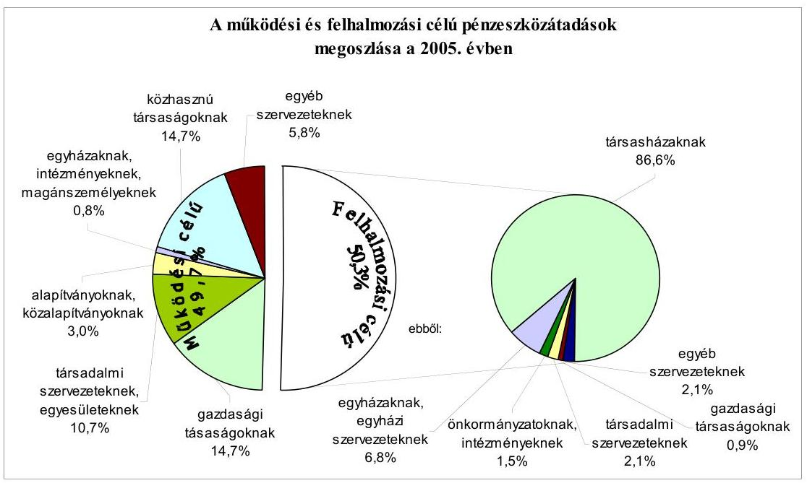
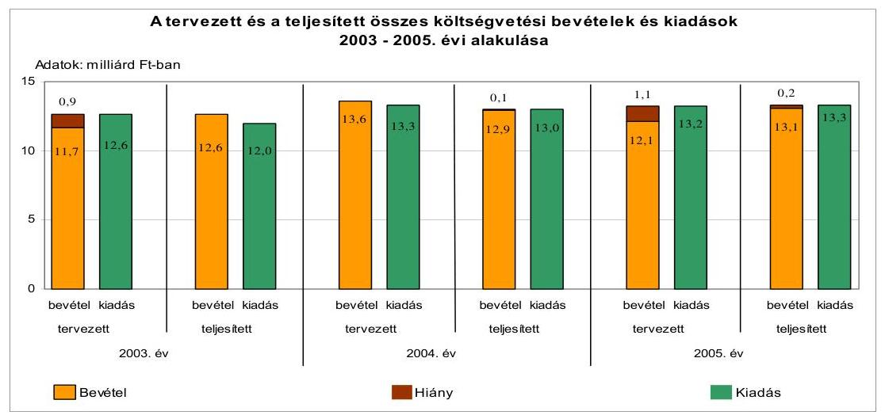
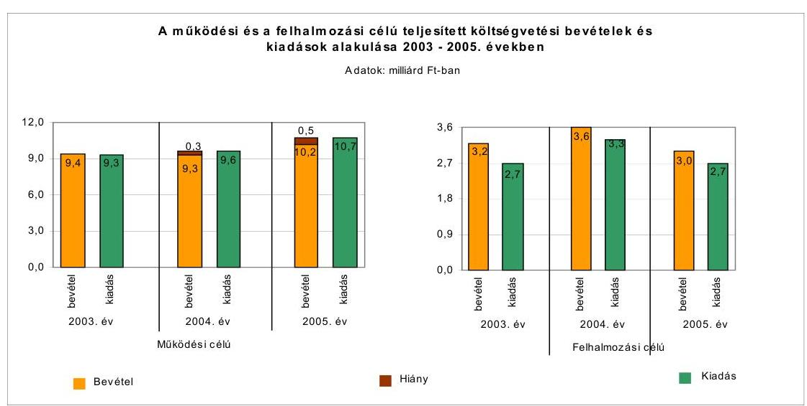
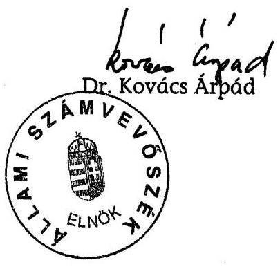
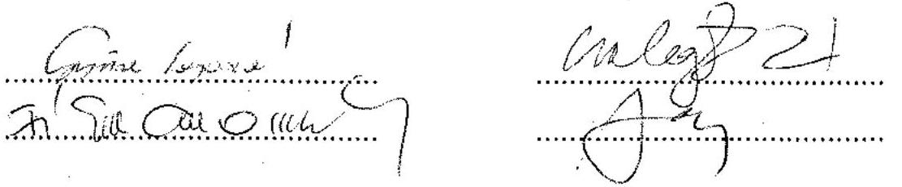
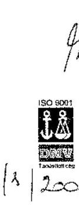
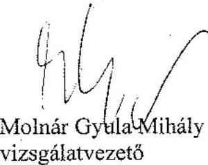
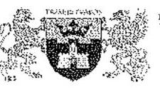
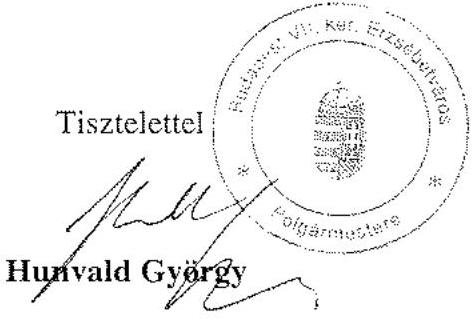
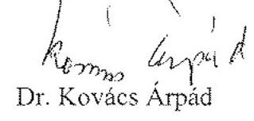

# JELENTÉS 

a Budapest Főváros VII. kerület Erzsébetváros Önkormányzata gazdálkodási rendszerének 2006. évi átfogó ellenőrzéséről

---

# 3. Önkormányzati és Területi Ellenőrzési Igazgatóság 

3.3. Átfogó Ellenőrzések Főcsoport

Iktatószám: V-1003-5/29/31/2006.
Témaszám: 803
Vizsgálat-azonosító szám: V0264

## Az ellenőrzést felügyelte:

Dr. Lóránt Zoltán
főigazgató
Az ellenőrzés végrehajtásáért felelős:
Dr. Sepsey Tamás
főigazgató-helyettes
Az ellenőrzést vezette:
Molnár Gyula Mihály
osztályvezető főtanácsos
Az ellenőrzést végezték:

| Gyüre Lajosné | Dr. Kiss Károly | Nagy Ervin Barnabás |
| :-- | :-- | :-- |
| számvevő tanácsos | számvevő tanácsos | számvevő |

A témához kapcsolódó - elmúlt három évben - készített számvevőszéki jelentés:
címe
sorszáma
Jelentés a helyi és a helyi kisebbségi önkormányzatok gazdálkodásának átfogó ellenőrzéséről

---

# TARTALOMJEGYZÉK 

BEVEZETÉS ..... 7
I. ÖSSZEGZŐ MEGÁLLAPÍTÁSOK, KÖVETKEZTETÉSEK, JAVASLATOK ..... 9
II. RÉSZLETES MEGÁLLAPÍTÁSOK ..... 20

1. A költségvetés tervezésének, végrehajtásának, az Önkormányzat vagyongazdálkodásának és a zárszámadás elkészítésének szabályszerűsége ..... 20
1.1. A költségvetési rendelet jóváhagyásának, módosításának, az előirányzatok nyilvántartásának szabályszerűsége ..... 20
1.2. A gazdálkodás szabályozottsága, a bizonylati rend és fegyelem szabályszerűsége ..... 27
1.3. A pénzügyi-számviteli feladatok ellátásának informatikai támogatottsága ..... 38
1.4. Az önkormányzati vagyon nyilvántartása, számbavétele ..... 39
1.5. A vagyonnal való gazdálkodás szabályszerűsége, célszerűsége, nyilvánossága ..... 42
1.6. A céljelleggel nyújtott támogatások szabályszerűsége ..... 49
1.7. A közbeszerzési eljárások szabályszerűsége ..... 57
1.8. A zárszámadási kötelezettség teljesítésének szabályszerűsége ..... 60
1.9. A Polgármesteri hivatal helyi kisebbségi önkormányzatok gazdálkodását segítő tevékenysége ..... 62
2. Az önkormányzati feladatok és a rendelkezésre álló források összhangja ..... 63
2.1. A feladatok meghatározása és szervezeti keretei ..... 63
2.2. A költségvetés egyensúlyának helyzete ..... 67
2.3. A feladatok finanszírozása ..... 75
3. A belső ellenőrzési rendszer működésének értékelése ..... 78
3.1. Az ellenőrzési rendszer kialakítása, működése ..... 78
3.2. A könyvvizsgálati kötelezettség teljesítése ..... 81
3.3. A korábbi számvevőszéki ellenőrzések javaslatainak hasznosulása ..... 82

---

# MELLÉKLETEK 

1. számú Az Önkormányzat gazdálkodását meghatározó adatok, mutatószámok (1 oldal)
2. számú Az önkormányzati vagyon nagyságának alakulása (1 oldal)
3. számú Az Önkormányzat 2005. évi bevételeinek és kiadásainak alakulása (1 oldal)
4. számú Egyes önkormányzati feladatok finanszírozása (1 oldal)
5. számú Helyszíni ellenőrzési jegyzőkönyv (15 oldal)
6. számú Hunvald György úr, a Budapest Főváros VII. kerület Erzsébetváros Önkormányzatának polgármestere által adott észrevétel (2 oldal)
7. számú Válasz Hunvald György úr, a Budapest Főváros VII. kerület Erzsébetváros Önkormányzatának polgármestere által adott észrevételére (3 oldal)

---

# RÖVIDÍTÉSEK JEGYZÉKE 

## Törvények

Alkotmány
Áht.
Hatv.
Htv.

Kbt.
Ksztv.
Nek. tv.
Számv. tv.
Ötv.

## Rendeletek

Ámr.
Ber.
Vhr.

20/1995. (III. 3.) Korm. rendelet

224/2000. (XII. 19.)
Korm. rendelet
SzMSz
2005. évi költségvetési rendelet
2006. évi költségvetési rendelet
2005. évi zárszámadási rendelet
bérbeadási rendelet ${ }_{1}$
a Magyar Köztársaság Alkotmányáról szóló 1949. évi XX. törvény
az államháztartásról szóló 1992. évi XXXVIII. törvény
a helyi adókról szóló 1990. évi C. törvény
a helyi önkormányzatok és szerveik, a köztársasági megbízottak, valamint egyes centrális alárendeltségű szervek feladat- és hatásköreiről szóló 1991. évi XX. törvény
a közbeszerzésekről szóló 2003. évi CXXIX. törvény
a közhasznú szervezetekről szóló 1997. évi CLVI. törvény
a nemzeti és etnikai kisebbségek jogairól szóló 1993. évi LXXVII. törvény
a számvitelről szóló 2000. évi C. törvény
a helyi önkormányzatokról szóló 1990. évi LXV. törvény
az államháztartás működési rendjéről szóló 217/1998. (XII. 30.) Korm. rendelet
a költségvetési szervek belső ellenőrzéséről szóló 193/2003. (IX. 26.) számú Korm. rendelet
az államháztartás szervezetei beszámolási és könyvvezetési kötelezettségének sajátosságairól szóló 249/2000. (XII. 24.) számú Korm. rendelet
a kisebbségi önkormányzatok költségvetésének, gazdálkodásának, vagyonjuttatásának egyes kérdéseiről szóló 20/1995. (III. 3.) Korm. rendelet
a számviteli törvény szerinti egyes egyéb szervezetek beszámoló készítési és könyvvezetési kötelezettségének sajátosságairól szóló 224/2000. (XII. 19.) Korm. rendelet
Budapest Főváros VII. kerület Erzsébetváros Önkormányzatának Szervezeti és Működési Szabályzatáról szóló 6/2000. (V. 22.) számú rendelete
Budapest Főváros VII. kerület Erzsébetváros Önkormányzatának 2/2005. (III. 8.) számú rendelete a 2005. évi költségvetésről és végrehajtási szabályairól
Budapest Főváros VII. kerület Erzsébetváros Önkormányzatának 5/2006. (II. 27.) számú rendelete a 2006. évi költségvetésről és végrehajtási szabályairól
Budapest Főváros VII. kerület Erzsébetváros Önkormányzatának 18/2006. (V. 1.) számú rendelete a 2005. évi költségvetési zárszámadásról
Budapest Főváros VII. kerület Erzsébetváros Önkormányzatának 28/2000. (XII. 23.) számú rendelete az Önkormányzat tulajdonában álló nem lakás céljára szolgáló helyiségek bérbeadásának feltételeiről

---

bérbeadási rendelet ${ }_{2}$
elidegenítési rendelet
építményadó rendelet
telekadó rendelet
vagyongazdálkodási rendelet

## Szórövidítések

ÁSZ
ERVA Zrt.
Erzsébetváros Kft.
Erzsébetvárosi Közrendvédelmi Kht.
FEUVE
GAMESZ
gazdálkodási jogkörök szabályzata

Gazdasági bizottság
Informatikai csoport
jegyző
Képviselő-testület
Kerületfejlesztési bizottság
Kincstár
Közbeszerzési Döntőbizottsága

Budapest Főváros VII. kerület Erzsébetváros Önkormányzatának 29/2000. (XII. 23.) számú rendelete az Önkormányzat tulajdonában álló lakások bérletéről és bérbeadásának feltételeiről
Budapest Főváros VII. kerület Erzsébetváros Önkormányzatának 27/2000. (XII. 23.) számú rendelete az Önkormányzat tulajdonában álló lakások és nem lakás céljára szolgáló helyiségek elidegenítésének feltételeiről
Budapest Főváros VII. kerület Erzsébetváros Önkormányzatának többször módosított 12/1996. (IV. 26.) számú rendelete az építményadóról
Budapest Főváros VII. kerület Erzsébetváros Önkormányzatának többször módosított 16/2001. (IV. 20.) számú rendelete a telekadóról
Budapest Főváros VII. kerület Erzsébetváros Önkormányzatának 30/2000. (XII. 23.) számú rendelete az Önkormányzat tulajdonában lévő vagyonnal való rendelkezés szabályairól

Állami Számvevőszék
Erzsébetvárosi Önkormányzati Vagyonkezelő Zártkörű Részvénytársaság
Erzsébetvárosi Kereskedelmi és Szolgáltató Kft.
Erzsébetvárosi Közrendvédelmi, Közbiztonsági, Vagyonvédelmi és Szolgáltató Kht.
folyamatba épített, előzetes és utólagos vezetői ellenőrzés
Budapest Főváros VII. kerület Erzsébetváros Önkormányzat Gazdasági és Műszaki Ellátó Szervezete
Budapest Főváros VII. kerület Erzsébetváros Önkormányzatának Polgármestere és Jegyzője által a Polgármesteri Hivatal Ügyrendjének 14. számú mellékletében kiadott utasítás a Polgármesteri Hivatal pénzgazdálkodásával kapcsolatos utalványozás és érvényesítés rendjéről
Budapest Főváros VII. kerület Erzsébetváros Önkormányzatának Gazdasági Bizottsága
Budapest Főváros VII. kerület Erzsébetváros Önkormányzatának Polgármesteri Hivatalának EU Integrációs és Informatikai Csoportja
Budapest Főváros VII. kerület Erzsébetváros Önkormányzatának Jegyzője
Budapest Főváros VII. kerület Erzsébetváros Önkormányzatának Képviselő-testülete
Budapest Főváros VII. kerület Erzsébetváros Önkormányzatának Kerületfejlesztési Bizottsága
Magyar Államkincstár
Közbeszerzések Tanácsa Közbeszerzési Döntőbizottsága

---

| Közösségi Ház | Erzsébetvárosi Közösségi Ház |
| :--: | :--: |
| Közrendvédelmi és Kör-   nyezetvédelmi bizottság | Budapest Főváros VII. kerület Erzsébetváros Önkormányzatának Közrendvédelmi és Környezetvédelmi Bizottsága |
| Múvelődési bizottság | Budapest Főváros VII. kerület Erzsébetváros Önkormányzatának Múvelődési Bizottsága |
| Önkormányzat | Budapest Főváros VII. kerület Erzsébetváros Önkormányzata |
| Pénzügyi bizottság | Budapest Főváros VII. kerület Erzsébetváros Önkormányzatának Pénzügyi Bizottsága |
| Pénzügyi iroda | Budapest Főváros VII. kerület Erzsébetváros Önkormányzat Polgármesteri Hivatalának Pénzügyi Irodája |
| polgármester | Budapest Főváros VII. kerület Erzsébetváros Önkormányzatának Polgármestere |
| Polgármesteri hivatal | Budapest Főváros VII. kerület Erzsébetváros Önkormányzatának Polgármesteri Hivatala |
| ügyrend | Budapest Főváros VII. kerület Erzsébetváros Önkormányzat Polgármesteri Hivatalának Ügyrendje |
| Polgármesteri kabinet | Budapest Főváros VII. kerület Erzsébetváros Önkormányzat Polgármesteri Hivatalának Polgármesteri Kabinete |
| Szociális bizottság | Budapest Főváros VII. kerület Erzsébetváros Önkormányzatának Szociális Bizottsága |
| Vagyongazdálkodási iroda | Budapest Főváros VII. kerület Erzsébetváros Önkormányzat Polgármesteri Hivatalának Vagyongazdálkodási Irodája |

---

.

---

# JELENTÉS 

## a Budapest Főváros VII. kerület Erzsébetváros Önkormányzata gazdálkodási rendszerének 2006. évi átfogó ellenőrzéséről

## BEVEZETÉS

Az Ötv. 92. § (1) bekezdése, az Állami Számvevőszékről szóló 1989. évi XXXVIII. törvény 2. § (3) bekezdése, valamint az Áht. 120/A. § (1) bekezdése alapján az önkormányzatok gazdálkodását az Állami Számvevőszék ellenőrzi.

## Az ellenőrzés célja annak értékelése volt, hogy:

- az önkormányzati gazdálkodás törvényességét, szabályszerűségét biztosították-e a tervezés, a költségvetés végrehajtása, a vagyongazdálkodás és a zárszámadás során;
- az Önkormányzat által ellátott feladatok és az azokhoz rendelkezésre álló források összhangja biztosított volt-e, különös tekintettel az egyes kiemelt feladatokra;
- a gazdálkodás szabályszerűségét biztosító belső kontrollok lehetővé tették-e a szabálytalanságok, hiányosságok, gazdaságtalan megoldások feltárását, megelőzését.

Az ellenőrzött időszak: a 2005. év, valamint a 2006. I. negyedév, az 1.5., 2.1-2.3. és a 3.3. programpontok tekintetében a 2003-2004. évek is.

Budapest Főváros VII. kerületét három városrész alkotja. A kerület lakosainak száma 2006. január 1-én 59166 fő volt.

Az Önkormányzat 28 tagú Képviselő-testületének munkáját 10 állandó bizottság segítette. A polgármester a 2002. évi választások óta tölti be tisztségét, a jegyző személye az 1998. évtől nem változott.

[^0]
[^0]:    ${ }^{1}$ A törvényi előírások betartásának elmulasztásakor a részletes megállapítások fejezetben egységesen a törvénysértés megjelölést alkalmazzuk, mivel az ÁSZ nem tehet különbséget a törvényi előírások között.
    ${ }^{2}$ A gazdálkodás szabályszerűségét biztosító kontroll alatt értjük a kiépített és működő belső irányítási és szabályozási rendszert, valamint a belső ellenőrzési funkciók ellátását.
    ${ }^{3}$ Belső Erzsébetváros, Középső Erzsébetváros és Külső Erzsébetváros.

---

Az Önkormányzat feladatainak végrehajtása érdekében 29 költségvetési szervet működtet, amelyekből 10 önállóan gazdálkodik. A feladatok ellátásában részt vesz két közhasznú társasága és két közalapítványa, továbbá három gazdasági társasága. A feladatok ellátására az Önkormányzat költségvetési szerveinél a 2005. év végén foglalkoztatott közalkalmazottak száma 725 fő, a köztisztviselők száma 238 fő volt. Az Önkormányzat a 2005. évben 13864 millió Ft bevételt ért el és 13562 millió Ft kiadást teljesített, a 2005. év végén 47323 millió Ft értékű könyvviteli mérleg szerinti vagyonnal rendelkezett. Az Önkormányzat gazdálkodását meghatározó adatokat, mutatószámokat az 1-3. számú mellékletek tartalmazzák.

A kerületben a 2002. évi választásokig hat, a 2002. évi választásokat követően tíz a megválasztott és működő kisebbségi önkormányzatok száma.

A jelentés megállapításainak, javaslatainak egyeztetése során a polgármester arról adott tájékoztatást, hogy az időközben megtett intézkedésekkel a javaslatok egy részét megvalósították. Ezekben az esetekben a jelentés II. Részletes megállapítások fejezetében az adott témához kapcsolt lábjegyzetben a megtett intézkedést feltüntettük és a kapcsolódó realizált javaslatot elhagytuk.

A jelentést az ÁSZ-ról szóló 1989. évi XXXVIII. törvény 25. § (1) bekezdése alapján észrevétel közlése céljából megküldtük Budapest Főváros VII. kerület Erzsébetváros Önkormányzat polgármesterének. A kapott észrevételt a jelentés 6. számú melléklete, az arra adott választ a 7. számú melléklet tartalmazza. A számvevőszéki jelentésben a polgármester által továbbra is fenntartott észrevételeket és az arra adott válaszokat szerepeltetjük.

[^0]
[^0]:    ${ }^{4}$ Horvát, német, örmény, roma, román, szerb kisebbségi önkormányzat.
    ${ }^{5}$ Bolgár, görög, horvát, lengyel, német, roma, román, ruszin, szerb, szlovák kisebbségi önkormányzat.

---

# I. ÖSSZEGZŐ MEGÁLLAPÍTÁSOK, KÖVETKEZTETÉSEK, JAVASLATOK 

Az Önkormányzat az Ötv-ben előírt, a gazdasági programjának meghatározására vonatkozó kötelezettségének eleget tett.

A 2005. és a 2006. évi költségvetési koncepciókat a polgármester az Áht-ban előírt határidőben - a Pénzügyi bizottság, valamint a kisebbségi önkormányzatok véleményének csatolásával - terjesztette a Képviselő-testület elé. A 2005. és a 2006. évi költségvetési koncepciókat a helyben képződő bevételek és az ismert kötelezettségek figyelembevételével, a költségvetés készítés további munkálataira vonatkozó előírásokat meghatározva fogadta el a Képviselőtestület.

A polgármester az Áht-ban előírtak ellenére, a 2005. és a 2006. évi költségvetési rendelettervezeteket késedelmesen, nem az előírt határidőn belül nyújtotta be a Képviselő-testületnek. Az Ámr. előírása ellenére a bevételi és kiadási előirányzatok mérlegszerű kimutatásában az iparűzési adóbevétel egy részét felhalmozási célú bevételként tervezték. Az Önkormányzat meghatározta az Áht. alapján a költségvetés és a zárszámadás előterjesztésekor bemutatandó mérlegek, kimutatások tartalmi követelményeit. A költségvetési rendelettervezetek nem tartalmazták az Áht-ban előírtak ellenére, a közvetett támogatásokról a kimutatást és a szöveges indoklást. A 2005. évi költségvetési rendeletben az Áht. előírásait megsértve, a költségvetési kiadások finanszírozási célú pénzügyi
 műveletet, a tervezett hiteltörlesztést is tartalmazták. A Képviselő-testület által a 2005. évi költségvetési rendeletben meghatározott „Képviselői Alap kerete" elnevezése nem felelt meg az Áht-ban előírt feltételeknek, a kifejezés félreérthető. A Képviselő-testület a 2005. évi költségvetési rendeletében jóváhagyott előirányzatokat öt alkalommal módosította. A 2005. évben az Áht. előírása ellenére, három esetben a kisebbségi önkormányzatok költségvetési előirányzatainak módosítása nem a kisebbségi önkormányzat határozata alapján történt.

A Polgármesteri hivatal tevékenységét az „ügyrend" alapján végezte, amely az Ámr. előírása ellenére nem tartalmazta a gazdasági szervezet felépítését és feladatait. A gazdasági szervezet a helyszíni vizsgálat ideje alatt készítette el az Ámr. előírása alapján az ügyrendjét. Az Ámr-ben foglalt előírásoknak megfelelően a polgármester és a jegyző a távollétekre és az összeférhetetlenségre tekintettel a gazdálkodási jogkörök szabályzatában rögzítette a kötelezettségvállalásra, az utalványozásra és az ellenjegyzésre vonatkozó felhatalmazásokat. A jegyző írásban bízta meg az előírt iskolai végzettséggel és szakmai képesítéssel rendelkező, érvényesítési feladatokat végzőket, továbbá kijelölte a szakmai teljesítést igazoló személyeket. Az Ámr. előírása ellenére a jegyző belső szabályzatban nem rendelkezett a bevételek esetében a szakmai teljesítés igazolásának módjáról, ezen kötelezettségének a helyszíni vizsgálat ideje alatt eleget tett. A gazdálkodási jogkörök szabályzatában éltek az Ámr-ben biztosított lehetőséggel, miszerint az 50 ezer Ft-ot el nem érő kifizetések esetében nem szükséges előzetes írásbeli kötelezettségvállalás, azonban ennek rendjét és nyilvántartási formáját csak a helyszíni vizsgálat ideje alatt rögzítették. A gazdálkodási és el-

---

lenőrzési jogkörök gyakorlásáról a felhatalmazottakat nem számoltatták be, a beszámoltatás formáját és gyakoriságát nem szabályozták.

A jegyző a Htv. előírása alapján meghatározta a költségvetési szervek egységes számviteli rendjét, jóváhagyta a Polgármesteri hivatal számviteli politikáját, amely összhangban volt a Vhr. előírásaival. Elkészítették a leltározási szabályzatot, amely tartalmazta a leltározás előkészítésével, megszervezésével és végrehajtásával kapcsolatos feladatokat, a leltározás módját, a résztvevők felelősségét. Az eszközök és források értékelési szabályzatában - a Vhr. előírásai szerint - eszközcsoportonkénti részletezettségben írták elő az értékelés szabályait, az értékvesztés elszámolásának és visszaírásának rendjét, a terven felüli értékcsökkenés elszámolásának feltételeit. A pénztári és pénzkezelési szabályzatban rögzítették a bankszámlaforgalommal, a bankkártyával és az ügyfélterminál kezelésével, valamint a készpénzforgalommal kapcsolatos szabályokat. Elkészítették a felesleges vagyontárgyak feltárásáról, hasznosításáról, a selejtezés rendjéről szóló szabályzatot, melyben előírták az eljárási rendet, annak bizonylatait, meghatározták a minősítésre, döntésre jogosultakat.

A számlarendben előírták az analitikus nyilvántartások vezetésének, főkönyvi könyveléssel való egyeztetésének kötelezettségét. Az egyeztetések dokumentálási módját, továbbá az analitikus nyilvántartások adataiból készített összesítő feladások elkészítésének határidejét a helyszíni vizsgálat ideje alatt szabályozta a jegyző. A Polgármesteri hivatal szabályzatai egymással és a jogszabályi előírásokkal összhangban voltak. A Polgármesteri hivatalban a gazdálkodási feladatokat ellátó dolgozók munkaköri leírásai - a helyszíni vizsgálat ideje alatt történt kiegészítések figyelembevételével - tartalmazták a feladatokat és hatásköröket. A jegyző az Áht. előírása alapján gondoskodott a FEUVE megszervezéséről, elkészítette a Polgármesteri hivatal ellenőrzési nyomvonalát és kialakította a kockázatkezelés rendjét.

A gazdasági eseményeket magukba foglaló számviteli bizonylatok 23%-a nem felelt meg a Számv. tv. előírásai szerinti alaki és tartalmi követelményeknek, mivel a bizonylatokon - a bevételi bizonylatok 60%-a esetében - az Ámr. előírása ellenére hiányzott a szakmai teljesítést igazoló aláírása, továbbá az utalványrendeleteken a kötelezettségvállalás nyilvántartásba vételi sorszámát a kiadási bizonylatok 47%-ánál az Ámr. előírása ellenére nem tüntették fel. A kötelezettségvállalás ellenjegyzője a bizonylatok 1%-ánál (egy kötelezettségvállalás esetében) az ellenjegyzést megelőzően nem győződött meg arról, hogy a kötelezettségvállalás tárgyával összefüggő kiadási előirányzat rendelkezésre állt-e, továbbá, hogy a kötelezettségvállalás nem sérti-e a gazdálkodásra vonatkozó szabályokat. A gazdálkodási és ellenőrzési jogkörök gyakorlása során a szakmai teljesítés igazolását a bizonylatok 3%-ánál, a „Képviselői Alap kerete" terhére kifizetett támogatások esetében az Ámr-ben előírt jegyzői kijelölés nélkül, jogosulatlanul a Képviselő-testület tagjai végezték el. Ezen hiányosságok esetében a gazdálkodási és ellenőrzési jogkörök gyakorlói (a kötelezettségvállalás ellenjegyzői, a szakmai teljesítés igazolói, az érvényesítők és az utalvány ellenjegyzői) az Ámr-ben előírt, munkafolyamatba épített ellenőrzési feladataikat nem látták el. A gazdasági események bizonylatainak könyvvitelben rögzítése a kötelezettségvállalások esetében nem a Vhr-ben előírt határidőben történt meg. Az önkormányzat által a társasházi felújításokra célkeretből nyújtott támogatások összegét a kiadások teljesítésekor nem a Vhr. előírásainak megfelelően történő

---

lelő főkönyvi számlákon rögzítették. A kötelezettségvállalásokról vezetett analitikus nyilvántartás - a kisebbségi önkormányzatok kötelezettségvállalásai kivételével - megfelelt az Ámr. előírásainak. A költségvetési szervek közül 16 intézmény az Áht. előírását megsértve nem tartotta be a 2005. évi költségvetésben részére jóváhagyott kiemelt előirányzatokat. A belső ellenőrzés ezen intézmények előirányzat túllépéseit vizsgálta és megállapította a túllépés összegét, felelősségre vonás nem történt.

Az Önkormányzat rendelkezett több évre vonatkozó informatikai stratégiával. A számviteli analitikus nyilvántartások vezetése számítástechnikai programok felhasználásával történt, de azok nem integrált rendszerben kapcsolódtak a főkönyvi könyveléshez. A Polgármesteri hivatalnál rendelkeztek az informatikai rendszer működésének feltételeit meghatározó szabályzatokkal. Az adatbiztonság, a mentési rendszer, a vírusvédelem, a fizikai és logikai védelmi rendszer, a hozzáférési jogosultság, a katasztrófa elhárítás rendje az Informatikai és Védelmi Szabályzatban szerepelt. A pénzügyi-számviteli informatikai rendszert alkalmazók rendelkeztek a számítógépes feladat ellátásához szükséges felhasználói szintű informatikai ismeretekkel, azonban a munkaköri leírások az informatikai programok használatát konkrét megjelöléssel nem tartalmazták.

A Polgármesteri hivatalban az önkormányzati vagyont a Vhr-ben foglalt előírásnak megfelelően forgalomképesség szerint elkülönítetten tartották nyilván. A 2004. és a 2005. évben a Vhr-ben és a vagyongazdálkodási rendeletben foglalt előírásnak megfelelően az ingatlanok és az üzemeltetésre, kezelésre átadott eszközök esetében a kétévenkénti mennyiségi leltározást elvégezték. A követelések, az értékpapírok, a részesedések és a kötelezettségek 2005. évi leltározását egyeztetéssel végezték el. A követelések, részesedések és értékpapírok értékeléséhez szükséges információk - két gazdasági társaságban lévő üzletrész kivételével - rendelkezésre álltak, amelyek alapján a könyvviteli mérleg készítésekor elvégezték a Számv. tv-ben előírt értékelést és az indokolt esetekben elszámolták az értékvesztést, illetve a korábbi években elszámolt értékvesztések visszaírását. Az Önkormányzat 2005. évi könyvviteli mérlegében egyéb tartós részesedések között mutattak ki alapítványok részére nyújtott, összesen 1,1 millió Ft-os „alapító tőkét", ami nem felelt meg a Vhr-ben foglalt - vállalkozásban lévő tulajdoni részesedésre vonatkozó - előírásnak.

A vagyongazdálkodással kapcsolatos feladatokat és döntési hatásköröket önkormányzati rendeletben szabályozták. A vagyonnal való döntési hatásköröket célszerűen alakították ki. A vagyongazdálkodási rendeletben 2004. július 15-ig főszabályként előírták, hogy a vagyon elidegenítése 30 millió Ft-os értékhatár felett, továbbá használatba vagy bérbeadása egyéb módon történő hasznosítása éves nettó 15 millió Ft-os bevétel felett versenyeztetési eljárás során történhet. Rögzítették azonban, hogy a versenyeztetésre vonatkozó előírások alkalmazásától a Képviselő-testület minősített többségű döntéssel eltérhet. A versenyeztetés kötelező lefolytatására vonatkozó értékhatárt 2004. július 16-tól megemelték, értékesítés esetében 1000 millió Ft-ban, egyéb hasznosítás esetében éves nettó 100 millió Ft bevételi összegben határozták meg. Az Önkormányzat a minősített többségű döntéssel való, indokolás nélküli eltérést lehetővé téve - az Áht-ban foglaltakat megsértve - lehetőséget biztosított a versenyeztetési eljárás mellőzésére. A szabályozás, valamint az indokolatlanul ma-

---

gas értékhatár előírása nem segítette a köztulajdonnal való gazdálkodás nyilvánosságát, átláthatóságát. A vagyongazdálkodási rendeletben a 2005. évtől a kötelező versenyeztetés értékhatárát a vagyonértékesítések esetében 20 millió Ft-ra változtatták. A 2003-2004. években a versenyeztetési kötelezettségnek 28 ingatlan értékesítése esetében nem tettek eleget, megsértve ezzel az Áht-ban foglaltakat. Az Önkormányzat a 2005. évtől az ingatlan elidegenítések során a pályáztatási kötelezettségének eleget tett. A vagyongazdálkodási döntések során a Képviselő-testület által meghatározott hatásköri előírásokat betartották. Az ingatlanok értékesítéséhez, hasznosításához kapcsolódó szerződésekben szerepeltek az Önkormányzat érdekeit védő garanciális elemek. Az ingatlanértékesítések lebonyolítása, valamint a helyiségek bérbeadása során érvényesültek a vagyongazdálkodási rendelet előírásai. Az Áht-ban foglaltak alapján a vagyongazdálkodási rendeletben meghatározták a vagyon tulajdonjoga ingyenes átruházásának módját és eseteit. A követelések elengedésének szabályozása a költségvetési rendeletben történt meg. Eleget tettek az Önkormányzat által nyújtott nem normatív, céljellegű fejlesztési támogatások, illetve a nettó öt millió Ft-ot meghaladó értékű szerződések egyes adatainak közzétételére vonatkozóan az Áht-ban foglalt előírásoknak. Az Önkormányzat a kerületben működő politikai pártok részére kedvezményes bérleti díj ellenében, illetve térítésmentesen biztosított helyiségeket, ez sérti az alkotmányos jogegyenlőséget, továbbá az Ötv-ben foglalt előírást, mivel a pártokat közvetett anyagi támogatásban részesítették. Az átmenetileg szabad pénzeszközök éven belüli, forgatási célú értékpapír befektetésekkel történő hasznosítására a polgármester rendelkezett döntési jogosultsággal, a befektetések célszerűek, eredményesek és biztonságosak voltak, a szerződésekben a KELER Rt-nél vezetett értékpapír számlán való zárolt elhelyezést kikötötték.

Az Önkormányzat a 2005. évben működési és felhalmozási célokra 662 millió Ft összegben nyújtott támogatást különböző szervezetek és magánszemélyek részére. A céljellegű támogatások 53%-a képviselő-testületi döntésen alapult, 2%-ánál a támogatott szervezetről és a támogatás összegéről a polgármester, 45%-a esetében a hatáskörrel rendelkező bizottságok döntöttek. A döntések - a társasházi ingatlanok halaszthatatlan felújítási feladatainak cél előirányzata terhére megvalósított működési célú támogatás kivételével - a 2005. évi költségvetési rendeletben meghatározott hatásköri előírásoknak megfelelően történtek. A halaszthatatlan felújítási előirányzatok terhére, működési célú támogatásra teljesített kötelezettségvállalással a polgármester megsértette az Áht. azon előírását, amely szerint tárgyévi fizetési kötelezettség a jóváhagyott kiadási előirányzatok mértékéig vállalható. A támogatásban részesített szervezetek 99%-ával (1053 szervezet, illetve magánszemély) a polgármester támogatási szerződést, illetve megállapodást kötött, amelyekben meghatározták a támogatás célját, előírták a számadási kötelezettséget. A támogatottak 1%-ának (kilenc támogatott) az Áht-ban foglaltakat megsértve nem írtak elő számadási kötelezettséget. A számadási kötelezettséget az előírt határidőben 1037 szervezet, illetve magánszemély teljesítette. A Polgármesteri hivatal által kiküldött felszólítások eredményeként további 17 támogatott tett eleget számadási kötelezettségének. Nyolc szervezet nem számolt el a támogatás felhasználásáról, ebből két szervezet a Polgármesteri hivatal felszólítására visszautalta a fel nem használt összeget, hat támogatott a számadás benyújtására későbbi időpontra kapott határidőt. A támogatottak által benyújtott számlamásolatok alapján az Áht. előírásának megfelelően - három határidőn túl benyújtott számadás kivé-

---

telével - elvégezték a számadások tartalmi és formai ellenőrzését, valamint a felhasználást is ellenőrizték. Céltól eltérő felhasználást egy szervezet esetében állapítottak meg, a támogatottat a Polgármesteri hivatal felszólította a támogatás visszafizetésére.

A polgármester és a Művelődési bizottság két alapítvány támogatásáról az Ötv. előírásainak megsértésével döntött, a támogatásokat a Képviselő-testület utólag, a folyósítást követően hagyta jóvá. Az ÁSZ által helyszínen ellenőrzött alapítvány részére - a Ksztv. előírása ellenére - szerződésben nem határozták meg a 2,5 millió Ft összegű támogatással való elszámolás feltételeit és módját, továbbá az Áht. előírását megsértve nem írtak elő számadási kötelezettséget. A Tegyünk Együtt az Ifjúságért Alapítvány részére nemzetközi ifjúsági találkozó szervezésére, valamint további hat szervezet részére jóváhagyott támogatás összegét - a támogatás odaítéléséről szóló döntéssel ellentétesen - nem a támogatottak számlájára, hanem befogadó nyilatkozat alapján a Közösségi Ház
 költségvetési elszámolási számlájára utalta át a Polgármesteri hivatal, azonban a könyvviteli nyilvántartásokban és a 2005. évi zárszámadásban a gazdasági eseményeket és az intézményi átutalásról szóló számviteli bizonylatokat a civil szervezetek részére nyújtott működési célú pénzeszközátadások között rögzítették, illetve szerepeltették, ezzel megsértették a Számv. tv. valódiság elvére vonatkozó előírását. A Tegyünk Együtt az Ifjúságért Alapítvány és a további hat támogatott részére jóváhagyott támogatás önkormányzati intézmény költségvetési elszámolási számlájára - intézményi költségvetési előirányzat hiányában - történő átutalásával megsértették az Áht. azon előírását is, amely szerint az államháztartás alrendszereiben minden pénzeszközről el kell számolni. A Tegyünk Együtt az Ifjúságért Alapítvány részére jóváhagyott támogatásból, 0,1 millió Ft rendeltetésszerű felhasználását, a támogatást befogadó Közösségi Ház számlákkal nem igazolta, ezért az összeg tekintetében a Közösségi Házat az Áht-ban foglaltak alapján visszafizetési kötelezettség terhelte, amit a polgármester tájékoztatása szerint az intézmény a helyszíni vizsgálatot követően teljesített.

Az Önkormányzat a 2005. évi összesített közbeszerzési tervét elkészítette. A polgármester és a jegyző együttes utasításban rendelkezett az Önkormányzat és a Polgármesteri hivatal esetében alkalmazandó közbeszerzési eljárási szabályokról. Az Önkormányzat a 2005. évi beszerzései becsült értékének megállapításakor a Kbt. előírásai szerint járt el, az egybeszámításra vonatkozó szabályt betartották. A közbeszerzési eljárást a Kbt. hatálya alá tartozó beszerzésekre alkalmazták, eljárás mellőzésére nem került sor. Az ÁSZ ellenőrzés által részletesen vizsgált közbeszerzési eljárás során a Kbt. előírásait betartották. A közbeszerzéseket, illetve a közbeszerzési eljárásokat a Polgármesteri hivatalnál belső ellenőrzés, valamint az Önkormányzat költségvetési szerveinél felügyeleti ellenőrzés keretében nem vizsgálták, ezért a Kbt-ben előírtakat megsértették. A Közbeszerzési Döntőbizottság a 2005. évben egy alkalommal indított eljárást az Önkormányzat ellen a közbeszerzési eljárásra vonatkozó szabályok megsértése miatt, az Önkormányzat a Közbeszerzési Döntőbizottság döntése ellen bírósági úton jogorvoslattal élt.

A 2005. évi zárszámadási rendelettervezetet a polgármester az Áht-ban előírt határidőn belül terjesztette a Képviselő-testület elé. A zárszámadás előterjesztésekor a Képviselő-testület részére bemutatták az Áht. szerinti összevont mérlegeket, a többéves kihatással járó döntéseket, továbbá a közvetett támogatásokat szöveges indoklással együtt, az Áht-ban foglaltak ellenére a vagyonkimutatást nem mutatták be. A zárszámadási rendelet a költségvetési rendelettel összehasonlítható módon készült. A Képviselő-testület a zárszámadási rendelet elfogadásával egy időben határozatban hagyta jóvá a Polgármesteri hivatal, az önállóan és a részben önállóan gazdálkodó költségvetési intézmények pénzmaradványát. Ugyanezen a képviselő-testületi ülésen a jóváhagyott és a 2006. évi költségvetésben felhasználható pénzmaradványok összegét a 2006. évi költségvetési rendeletbe - rendeletmódosítás keretében - beépítették. A Polgármesteri hivatal pénzmaradványának megállapítása során a Vhr-ben foglaltak ellenére nem vették figyelembe a 2004. év végén fennálló kötött felhasználású támogatások maradványát. Az intézmények költségvetési beszámolóit a Polgármesteri hivatal az Ámr. szerinti határidőben felülvizsgálta, és az intézményeket az éves számszaki beszámolóik és működésük elbírálásáról, jóváhagyásáról értesítették.

Az Önkormányzat illetékességi területén működő 10 helyi kisebbségi önkormányzattal a polgármester megkötötte az együttműködési megállapodásokat, amelyekben részletesen rögzítették a költségvetés tervezése, annak végrehajtása és a zárszámadási beszámoló vonatkozásában az együttműködés rendjét és szabályait. Az együttműködési megállapodásokat a 2005. évre vonatkozóan felülvizsgálták és az Ámr-ben előírt január 15-i határidőt megelőzően módosították. A Polgármesteri hivatalban elkülönítetten vezették a kisebbségi önkormányzatok vagyoni és számviteli nyilvántartásait, de az Ámr-ben foglaltak ellenére nem vezettek analitikus nyilvántartást kisebbségi önkormányzatonként a kötelezettségvállalásokról. A polgármester tájékoztatása szerint a nyilvántartás vezetéséről a jegyző a helyszíni ellenőrzést követően intézkedett. Az Önkormányzat gondoskodott a kisebbségi önkormányzatok testületi működésének tárgyi feltételeiről, működésüket önkormányzati pénzeszközök juttatásával is segítették, melynek mértékéről a Képviselő-testület a 2005. évi költségvetési rendeletben határozott.

A Képviselő-testület nem határozta meg - az Ötv. előírásai ellenére - a kötelező és önként vállalt feladatai ellátásának módját és mértékét. Az Önkormányzat az Ötv-ben előírt kötelező és önként vállalt feladatait az általa alapított költségvetési szervekkel, valamint gazdasági társaságokkal, közhasznú és egyéb szervezetekkel kötött ellátási, illetve vállalkozási szerződésekkel biztosította. A Képviselő-testület az ellátotti létszámhoz is igazodva, de elsősorban a feladatellátás hatékonyabb szervezeti megoldása érdekében a 2003-2005. években különböző, az intézményrendszer felépítését érintő - intézmény megszüntetést, összevonást, a bölcsődei, óvodai és iskolai ellátásban telephely és ellátotti csoport csökkentést jelentő, közalapítványokat összevonó és megszüntető - intézkedéseket hozott. Kötelező, illetve nem kötelező feladatot ellátó önkormányzati intézmény fenntartási és tulajdonjogának átadására nem került sor. A 2005. évben meghozott döntés alapján a gimnáziumi oktatási feladatot 2006. július 1-el átadták a Budapest Főváros Önkormányzatának. Az átadás és a működtetés kérdéseit megállapodásban rögzítették.

Az Önkormányzat 2003. és 2005. évi költségvetési rendeleteiben a tervezett költségvetési bevételek nem fedezték a tervezett költségvetési kiadásokat, a hiányzó forrást hitel felvételével, értékpapír eladásával, illetve a működési hiány egy részét a felhalmozási bevételekből tervezte biztosítani a Képviselő-testület. A működési forráshiány létrejöttének elsődleges oka az volt, hogy az Önkormányzatot a forrásmegosztás keretében megillető iparűzési adó bevételekből a 2003. évben 984,5 millió Ft-ot, a 2004. évben 1000 millió Ft-ot, a 2005. évben 910 millió Ft-ot fejlesztési és felújítási kiadások fedezeteként vették számításba. A 2003. évben a gazdálkodás során biztosították a bevételek és a kiadások egyensúlyát, a 2004-2005. években a realizált költségvetési bevételek nem fedezték a teljesített költségvetési kiadásokat, a költségvetés egyensúlya likvid, illetve felhalmozási célú hitellel és értékpapír eladásával volt biztosított. A költségvetés egyensúlyának javítása érdekében az önkormányzati feladatellátás hatékonyságát, az intézmények kapacitás kihasználtságát vizsgálták és intézmény átszervezésekről döntöttek. Az Önkormányzat a pénzügyi helyzet javítása érdekében forrásbővítő intézkedéseket - adóbevétel növelés, pályázati pénzeszközök bevonása - is tett. Az Önkormányzat 2003-2004. években meghatározott fejlesztési kiadásaihoz - iskola beruházáshoz, önkormányzati bérlakás és lakásépítési program megvalósításához - vett fel hosszú lejáratú hiteleket. Az adósságot keletkeztető kötelezettségvállalásoknál az Ötv-ben előírt felső határt betartották. Az Önkormányzat a feladatellátás finanszírozásához rendelkezésre álló forrásait a 2003-2005. évek között külső, ezek között pályázati úton elnyert forrásokkal növelte. A pénzállomány alakulásáról az Ámr. előírásai szerint a jegyző likviditási tervet készített, amit havonta aktualizáltak. A Polgármesteri hivatal a 2005. évi gazdálkodás során likvid hitelt vett fel a működéshez, ennek egy részét 2005. december 31-ig nem fizették vissza, amely a 2006. évi gazdálkodás terheit növelte.

Az egyes, naturális mutatókkal mérhető kötelező feladatok esetében a feladatok finanszírozását a fajlagos kiadások változása, az ellátottak számának és a kapacitások kihasználtságának alakulása határozta meg. A nevelési-oktatási feladatok esetében jelentősen (a bölcsődei ellátásban 9%-kal, az óvodai nevelésben 12%-kal, az általános iskolai oktatásban 20%-kal, a középiskolai oktatásban 5%-kal) emelkedtek az egy főre számított kiadások. A bentlakásos szociális intézményi ellátás fajlagos kiadásai - a csökkenő kapacitáskihasználtság ellenére - ezen időszakban 9%-kal, a nappali szociális intézményi ellátásban 22%-kal mérséklődtek. A kiadások finanszírozásában a központi költségvetési hozzájárulás, támogatás részaránya a 2003. és 2005. években egyedül az általános iskolai oktatás esetében csökkent. A bölcsődei ellátásban, az óvodai nevelésben, a középiskolai oktatásban 0-6 százalékponttal, a bentlakásos és a nappali szociális intézményi ellátásban 9-31 százalékponttal növekedett az állami működési források részaránya. Az önként vállalt feladatok megvalósítására a 2003-2005. években az éves költségvetési kiadás 17-19%-át fordították, ami nem veszélyeztette a kötelező feladatok megvalósítását. Az Önkormányzat a Fot-ban előírt határidőre a középületei akadálymentesítésének kilenc épületnél nem tett eleget.

Az Önkormányzatnál a 2005. évben kialakították a belső ellenőrzési feladatok végrehajtásának szervezeti kereteit, gondoskodtak annak működtetéséhez szükséges források biztosításáról. A belső ellenőrzés eljárási és végrehajtási rendjét a belső ellenőrzési kézikönyvben határozták meg, amelynek tartalma megfelelt a Ber. előírásainak. A 2004-2008. évekre vonatkozó stratégiai tervet és a 2005. évi ellenőrzési tervet a Ber-ben foglalt előírásnak megfelelően a jegyző hagyta jóvá. A jegyző a 2005. évben az Önkormányzat belső ellenőrzése keretében - az Ötv-ben foglalt előírás alapján - gondoskodott a költségvetési szervek ellenőrzéséről. A Polgármesteri hivatalnál és az intézményeknél az ellenőrzési tervben foglalt feladatokat - egy ellenőrzés kivételével - elvégezték. A 2005. évi ellenőrzésekről készített jelentéseket a Ber. követelményeinek megfelelő tartalommal készítették el. Az ellenőrzöttek intézkedési tervet készítettek a hiányosságok megszüntetésére, az abban szereplő határidőt követően írásban tájékoztatták a jegyzőt az intézkedési tervben foglaltak megvalósításáról, a javaslatok realizálásáról az ellenőrzést végzők utóellenőrzés keretében győződtek meg. A belső ellenőrzést végzők egy intézmény ellenőrzése során fegyelmi eljárás megindítására okot adó cselekményt tártak fel. A jegyző az Áht-ban foglalt előírás alapján a 2005. évi költségvetési beszámoló keretében beszámolt a belső ellenőrzés működtetéséről, azonban az Áht. előírását megsértve, a FEUVE működtetése tekintetében nem tett eleget beszámolási kötelezettségének. A polgármester a 2005. évi zárszámadási rendelettervezettel egyidejűleg a Képviselőtestület elé terjesztette az éves ellenőrzési jelentést a belső ellenőrzési tevékenységről, amit a Képviselő-testület jóváhagyott.

Az Önkormányzatnál eleget tettek az Ötv-ben előírt könyvvizsgálati kötelezettségnek. A könyvvizsgáló a 2005. évi mérleg adataira és a 2005. évi pénzmaradvány összegére vonatkozóan a mérleg főösszegének a 0,001%-át jelentő auditálási eltérést állapított meg, a Polgármesteri hivatal és az önkormányzati intézmények adatait összevontan tartalmazó 2005. évi egyszerűsített költségvetési beszámolót hitelesítő záradékkal látta el.

Az ÁSZ az Önkormányzat gazdálkodását átfogó jelleggel a 2002. évben ellenőrizte, a 2003. évtől 2005. évig terjedő időszakban az Önkormányzatnál ellenőrzést nem végzett. Az Önkormányzat gazdálkodásának vizsgálatáról készült számvevői jelentés javaslatainak hasznosítására intézkedési tervet készítettek, a javaslatok - két, részben megvalósult javaslat kivételével - hasznosultak. Az ÁSZ ellenőrzés során megfogalmazott javaslatok figyelembevételével gondoskodtak a költségvetési rendelettervezetek költségvetési szervek vezetőivel történő egyeztetésének írásban rögzítéséről, a költségvetési rendeletekben a címrend felépítési elveinek pontosításáról. Elkészítették a Polgármesteri hivatal alapító okiratát. Megvalósították a számviteli politika és a kapcsolódó szabályzatok korszerűsítésére irányuló javaslatokat, kialakították az önkormányzati költségvetési szervek egységes számviteli rendjét. Kijelölték az operatív gazdálkodási és ellenőrzési jogkörök gyakorlására felhatalmazott személyeket, a munkaköri leírásokban rögzítették a jogkörök tartalmát, a gazdálkodási jogkörök szabályzatát kiegészítették az 50 ezer Ft-ot el nem érő kifizetésekre vonatkozó előírásokkal. Biztosították az operatív gazdálkodás során a munkafolyamatok megszervezését, helyes sorrendjét, továbbá a tartalmi követelményeknek megfelelő utalványrendelet alkalmazását. Rendelkezett a Képviselő-testület az átmenetileg szabad pénzeszközök rövid lejáratú értékpapír befektetésben történő hasznosítása esetén a hatáskör polgármester részére történő átruházásáról. Intézkedtek az önkormányzati törzsvagyon és a törzsvagyonon kívüli vagyon elkülönítéséről a számviteli nyilvántartásokban. Kialakították a belső ellenőrzés rendszerét és biztosították annak működését, teljesítették a költségvetési szervek ellenőrzési tapasztalatainak áttekintésére irányuló javaslatot. Részben hajtották végre a zárszámadási rendelettervezet benyújtásával kapcsolatos javaslatokat, a 2005. évi zárszámadási rendelettervezethez nem csatolták a vagyonkimutatást.

A helyszíni ellenőrzés megállapításainak hasznosítása mellett javasoljuk:

# a polgármesternek 

a jogszabályi előírások maradéktalan betartása érdekében

1. nyújtsa be a költségvetési rendelettervezet az Áht. 71. § (1) bekezdésében előírt határidőn belül a Képviselő-testületnek;
2. gondoskodjon arról, hogy versenyeztetési kötelezettségnek minden vagyonértékesítés esetében
 eleget tegyenek, betartva az Áht. 108. § (1) bekezdésében és az Önkormányzat vagyongazdálkodási rendeletében foglaltakat;
3. biztosítsa az éves költségvetési rendeletben kapott - a támogatási döntések meghozatalára és az előirányzatok átcsoportosítására vonatkozó - hatáskörének gyakorlása során, hogy kötelezettségvállalásra kizárólag a célnak megfelelő kiadási előirányzat költségvetési rendeletben való rendelkezésre állása esetében kerüljön sor az Áht. 12/A. § (1) és az Áht. 93. § (1) bekezdésében foglalt előírások betartása érdekében;
4. gondoskodjon az Áht. 13/A. § (2) bekezdésében előírtak betartása érdekében, arról, hogy az Önkormányzat által juttatott céljellegű támogatásokról számadási kötelezettséget írjanak elő, továbbá biztosítsa, hogy az alapítványoknak nyújtott támogatások odaítéléséről az Ötv. 10. § (1) bekezdésének d) pontja alapján minden esetben a Képviselő-testület döntsön;
5. kezdeményezze, hogy a Képviselő-testület az Ötv. 8. § (2) bekezdésében foglaltak alapján határozza meg, hogy az Önkormányzat anyagi lehetőségeitől és a lakosság igényeitől függően mely feladatokat milyen mértékben és módon lát el;
6. gondoskodjon a középületek akadálymentessé tételéről tekintettel arra, hogy a Fot. 29. § (6) bekezdésében foglalt 2005. január 1-i határidő lejárt;
a munka színvonalának javítása érdekében
7. gondoskodjon a kötelezettségvállalásra és utalványozásra felhatalmazott személyek beszámoltatásáról;
8. kezdeményezze a számvevőszéki ellenőrzés tapasztalatainak képviselő-testületi megtárgyalását, és a feltárt hiányosságok megszüntetése érdekében készíttessen intézkedési tervet;

## a jegyzőnek

a jogszabályi előírások maradéktalan betartása érdekében

1. a költségvetési rendelettervezet előkészítésekor:
a) gondoskodjon az Ámr. 29. § (1) bekezdés a) pontja alapján arról, hogy a költségvetési rendeletben a bevételi források között az iparűzési adóbevétel a pénzügy-

---

miniszter által a költségvetés összeállítására vonatkozó tájékoztatójában rögzítettek szerint kerüljön tervezésre;
b) biztosítsa, hogy a Képviselő-testület részére az éves költségvetési rendelettervezet előterjesztésekor az Áht. 118. §-a alapján a közvetett támogatásokat tartalmazó kimutatást és annak szöveges indoklását bemutassák;
2. gondoskodjon az Áht. 74. § (3) bekezdésében foglalt előírás betartása érdekében arról, hogy az Önkormányzat költségvetési rendeletébe beépített helyi kisebbségi önkormányzati előirányzatokat kizárólag a helyi kisebbségi önkormányzatok határozata alapján módosítsák;
3. a költségvetési gazdálkodás szabályozottsága, a gazdálkodási és a kapcsolódó ellenőrzési jogkörök gyakorlása szabályszerűségének biztosítása érdekében:
a) gondoskodjon a Pénzügyi iroda - gazdasági szervezet - felépítésének és feladatainak a Polgármesteri hivatal szervezeti és működési szabályzatát helyettesítő ügyrendben történő rögzítéséről az Ámr. 17. § (4) bekezdésének előírása alapján;
b) intézkedjen az Ámr. 135. § (1) és (3) bekezdésében előírtak betartása érdekében arról, hogy a bevételek beszedésének elrendelése előtt az okmányok alapján a jegyző által írásban kijelölt személyek ellenőrizzék, szakmailag igazolják azok jogosságát, összegszerűségét, a szerződés, a megrendelés, megállapodás teljesítését, ezen feladatok elvégzését aláírásukkal igazolják, ezáltal biztosítsák a Számv. tv. 167. § (1) bekezdés c) pontjában foglalt előírások betartását;
c) tegyen eleget - az Áht. 12/A. § (1) és az Áht. 93. § (1) bekezdésében foglalt előírások betartása érdekében - az Ámr. 134. § (7) és (9) bekezdésében előírt folyamatba épített ellenőrzési feladatainak, az ellenjegyzést megelőzően győződjön meg arról, hogy a kötelezettségvállalás tárgyával összefüggő kiadási előirányzat rendelkezésre áll-e, hogy az előirányzat-felhasználási terv szerint a kifizetés időpontjában a fedezet biztosított-e, továbbá, hogy a kötelezettségvállalás a gazdálkodásra vonatkozó szabályokat nem sérti-e;
d) gondoskodjon arról, hogy az érvényesítők tegyenek eleget az Ámr. 135. § (1) bekezdésében előírt munkafolyamatba épített ellenőrzési feladataiknak, a szakmai teljesítésigazolás alapján ellenőrizzék az összegszerűséget, a fedezet meglétét, és az előírt alaki követelmények betartását;
e) biztosítsa a folyamatba épített ellenőrzési feladatok elvégzésével, illetve elvégeztetésével, hogy az utalvány ellenjegyzői az Ámr. 137. § (3) bekezdésének előírásai alapján az utalványrendelet aláírása előtt ellenőrizzék, hogy a kötelezettségvállalás céljának megfelelő pénzügyi fedezet rendelkezésre áll-e, továbbá bizonyosodjanak meg arról, hogy az utalványozás a gazdálkodásra vonatkozó szabályokat nem sérti-e, illetve, hogy a szakmai teljesítés igazolása az arra jogosultak által megtörtént-e;
4. intézkedjen, hogy a társasházak részére felújítási célra nyújtott támogatások összegét a pénzintézeti értesítés megérkezésekor a felhalmozási célú végleges pénzeszközátadás főkönyvi számlán rögzítsék a Vhr. 9. számú melléklet 3. e) pontjában foglalt előírásnak megfelelően;

---

5. biztosítsa, hogy az Önkormányzat könyvviteli mérlegében az egyéb tartós részesedések között ne mutassanak ki alapítványi „alapító tőkét" a Vhr. 19. § (2) és (3) bekezdésében foglalt - vállalkozásban lévő tulajdoni részesedésekre vonatkozó - előírás betartása érdekében;
6. gondoskodjon arról, hogy a Ksztv. 14. § (2) bekezdésében foglaltaknak megfelelően valamennyi támogatott közhasznú szervezet esetében a támogatással való elszámoltatás feltételeit és módját szerződésben rögzítsék;
7. biztosítsa a Számv. tv. 15. § (3) és az Áht. 12. § (1) bekezdésében foglalt előírások betartása érdekében, hogy valamennyi céljelleggel nyújtott önkormányzati támogatást összhangban a támogatás jóváhagyását tartalmazó döntéssel, a támogatott részére folyósítsanak, ennek megfelelően a tényleges gazdasági események és az arról kiállított számviteli bizonylatok a könyvviteli nyilvántartásokban és a beszámolóban rögzített tételek összhangban legyenek;
8. biztosítsa, hogy a Kbt. 308. § (2) bekezdése alapján a közbeszerzési eljárásokat a felügyeleti és a belső ellenőrzés rendszerében ellenőrizzék;
9. biztosítsa, hogy a Képviselő-testület részére a zárszámadáskor az Áht. 118. §-a alapján mutassák be a vagyonkimutatást;
10. intézkedjen, hogy a Vhr. 38. § (1) bekezdésében, valamint a 39. § (1) és (5) bekezdéseiben foglaltak betartása érdekében a Polgármesteri hivatal pénzmaradvány kimutatása tartalmazza azokat a módosító tételeket, amelyek figyelembevétele után megállapítható a költségvetési tartalék;
11. számoljon be az éves költségvetési beszámoló keretében a Polgármesteri hivatal folyamatba épített, előzetes és utólagos vezetői ellenőrzésének működtetéséről az Áht. 97. § (2) bekezdésében foglalt előírás betartása érdekében;
a munka színvonalának javítása érdekében
12. kezdeményezze, hogy a költségvetési rendelet előkészítése során a speciális célú támogatások között az „alap” megnevezést ne alkalmazzák;
13. gondoskodjon a kötelezettségvállalás ellenjegyzésére és az utalványozás ellenjegyzésére felhatalmazott személyek beszámoltatásáról, a beszámoltatás formájának és gyakoriságának szabályozásáról;
14. intézkedjen arról, hogy a pénzügyi-számviteli feladatok ellátását végző munkatársak munkaköri leírása tartalmazza a szakmai tevékenységük során használandó számítástechnikai programok megnevezését, az ellátandó feladatok konkrét megjelölését.

---

# II. RÉSZLETES MEGÁLLAPÍTÁSOK 

## 1. A KÖLTSÉGVETÉS TERVEZÉSÉNEK, VÉGREHAJTÁSÁNAK, AZ ÖNKORMÁNYZAT VAGYONGAZDÁLKODÁSÁNAK ÉS A ZÁRSZÁMADÁS ELKÉSZÍTÉSÉNEK SZABÁLYSZERŰSÉGE

### 1.1. A költségvetési rendelet jóváhagyásának, módosításának, az előirányzatok nyilvántartásának szabályszerűsége

Az Önkormányzat egyes kiemelt feladatokra, ágazatokra - képviselő-testületi határozat formájában - koncepciókat (programokat, intézkedési terveket) hagyott jóvá ${ }^{6}$. Ezen dokumentumok tartalmaztak hosszabb távra vonatkozóan meghatározott feladatokat, prioritásokat. Az Önkormányzat az Ötv. 91. § (1) bekezdésében előírt, a gazdasági programjának meghatározására vonatkozó kötelezettségének eleget tett.

Az Ámr. 28. § (1) bekezdésében foglaltak - a helyben képződő bevételek, a központi költségvetésből származó források, továbbá a várható kiadási tételek, ismert kötelezettségek - figyelembe vételével készítették el a 2005. és a 2006. évre vonatkozó költségvetési koncepciókat. A koncepciókról - a helyi kisebbségi önkormányzatokra vonatkozó részekről - a kisebbségi önkormányzatok elnökeit az Ámr. 28. (6) bekezdésében foglaltaknak megfelelően tájékoztatták. A költségvetési koncepciókat a polgármester az Áht. 70. §-ában előírt határidőn ${ }^{7}$ belül - a 2004. november 19-i, illetve a 2005. november 18-i képviselő-testületi ülésekre - nyújtotta be. A Pénzügyi bizottság koncepciókról alkotott véleményét az Ámr. 28. § (3) bekezdésében foglaltak szerint a koncepciók előterjesztéséhez csatolták. A költségvetési koncepciókról a kisebbségi önkormányzatok véleményét kikérték. A költségvetési koncepcióról a 2005. évre vonatkozóan négy kisebbségi önkormányzat, a 2006. évre vonatkozóan öt kisebbségi önkormányzat nem nyilvánított véleményt ${ }^{8}$. A polgármester a koncepció tervezetekhez az arról véleményt nyilvánító kisebbségi önkormányzatok véleményét csatolta, az Ámr. 28. § (3) bekezdésében foglaltak alapján. A Képviselő-testület a 2005. évi

[^0]
[^0]:    ${ }^{6}$ Erzsébetváros 2004. évtől 2010. évig szóló Környezetvédelmi Programja, a 2003-2006. évi Lakásgazdálkodási Koncepció, a 2003-2006. évek időszakára vonatkozó Oktatáspolitikai Koncepció, a 2003-2006. időszakra vonatkozó Kulturális Koncepció, Egészségügyi Koncepció, a 2004-2007. közötti időszakra vonatkozó Középtávú Informatikai Stratégia, a 2003-2006. időszakra vonatkozó Kerületfejlesztési Program, Szociális Szolgáltatástervezési Koncepció.
    ${ }^{7}$ Az Áht. 70. §-a szerint a határidő november 30., a helyi önkormányzati képviselőtestület tagjai általános választásának évében december 15.
    ${ }^{8}$ A 2005. évben nem nyilvánított véleményt a koncepcióról a lengyel, a német, a román, valamint a szlovák kisebbségi önkormányzat, a 2006. évben a görög, a lengyel, a roma, a román és szlovák kisebbségi önkormányzat.

---

költségvetési koncepcióról az 595/2004. (XI. 19.) számú határozatával, a 2006. évi költségvetési koncepcióról az 583/2005. (XI. 18.) számú határozatával döntött. A költségvetés készítés további munkálataira vonatkozó előírásokat - az Ámr. 28. § (4) bekezdésében foglaltak figyelembe vételével - meghatározta a Képviselő-testület.

A 2005. évi, illetve a 2006. évi költségvetési rendelettervezetet a jegyző a költségvetési szervek vezetőivel - az Ámr. 29. § (4) bekezdésében foglaltaknak megfelelően - egyeztette, amelyet intézményenként írásban rögzítettek.

A Képviselő-testület az Áht. 118. §-ában foglaltakat megsértve, előterjesztés hiányában a 2005. évi és a 2006. évi költségvetési rendelettervezetek előterjesztését megelőzően nem határozta meg rendeletben a költségvetés és a zárszámadás előterjesztésekor tájékoztatásul bemutatandó önkormányzati összevont mérleg, valamint a többéves kihatással járó döntésekről és a közvetett támogatásokról készítendő kimutatások tartalmi követelményeit, azokat a 2005. és a 2006. évi költségvetési rendelettervezetekben azok elfogadásakor hagyta jóvá. A vagyonkimutatás tartalmi követelményeit a vagyongazdálkodási rendeletben határozta meg.

A polgármester az Áht. 71. § (1) bekezdésében előírtakat megsértve, a 2005. és a 2006. évi költségvetési rendelettervezeteket az előírt határidőn ${ }^{9}$ túl, késedelmesen - 2005. március 8-án, illetve 2006. február 27-én - nyújtotta be a Képviselő-testületnek. A költségvetési rendelettervezetekhez a Pénzügyi bizottság véleményét, valamint a könyvvizsgálói jelentést - az Ámr. 29. § (9) bekezdésében foglaltaknak megfelelően - csatolta. A költségvetési rendelettervezetek benyújtását megelőzően a Képviselő-testület megalkotta (módosította) azokat a rendeleteket ${ }^{10}$, amelyek a javasolt előirányzatokat megalapozzák.

A költségvetési rendelettervezetek mellékletét képezték a többéves kötelezettséggel járó kiadási tételek későbbi évekre vonatkozó kihatásait ${ }^{11}$, továbbá a költségvetési évet követő két év várható előirányzatait bemutató táblázatok.
${ }^{9}$ Az Áht. 71. § (1) bekezdése szerint a határidő a tárgyév február 15-e.
${ }^{10}$ A 2005. évi költségvetés tekintetében a 27/2004. (XII. 1.) számú rendelet az Önkormányzat tulajdonában álló lakások bérletéről és bérbeadási feltételeiről szóló rendelet módosítása, a 31/2004. (XII. 20.) számú rendelet az Önkormányzat tulajdonában álló lakások és nem lakás céljára szolgáló helyiségek elidegenítési feltételeiről szóló rendelet módosítása, a 34/2004. (XII. 20.) számú rendelet az adósságkezelési szolgáltatásokról. A 2006. évi költségvetés tekintetében a 2/2006. (I. 23.) számú rendelet a társasházaknak nyújtandó visszatérítendő kamatmentes és vissza nem térítendő rehabilitációs támogatásról szóló rendelet módosítása, a 7/2006. (II. 27.) számú rendelet a közterületen a járművel várakozás rendjéről, a lakossági várakozási hozzájárulás díjáról szóló rendelet módosításáról, a 10/2006. (II. 27.) számú rendelet a szociális ellátások helyi szabályairól szóló rendelet módosításáról.
${ }^{11}$ Több éves kötelezettségként mutatták ki az önkormányzati intézmények, közutak, parkok, valamint
 a lakóépületek felújításának pénzügyi terheit, a bérlakásépítések felhalmozási előirányzatát.

---

A költségvetési rendeletekben az Áht. 67. § (3) bekezdésében foglaltaknak megfelelően a címrendet meghatározták.

A Polgármesteri hivatal, az önállóan gazdálkodó szervként működő költségvetési intézmények, valamint a GAMESZ-hez tartozó részben önállóan gazdálkodó intézmények, külön-külön címet alkottak.

A 2005. és a 2006. évi költségvetési rendeletek az Áht. 69. § (1) bekezdésében és az Ámr. 29. § (1) bekezdésében foglaltak figyelembe vételével tartalmazták:

- Az Önkormányzat bevételeit, a pénzügyminiszter elemi költségvetés összeállítására vonatkozó tájékoztatójában rögzített főbb jogcímenkénti részletezettséggel. Azonban az iparűzési adó bevétel tervezése nem volt összhangban az Ámr. 29. § (1) bekezdésének a) pontjában foglaltakkal, mivel az iparűzési adó bevételből mindkét évben 910 millió Ft-ot a felhalmozási bevételeknél vettek számításba.

A költségvetési rendeletekben az iparűzési adó bevételt az Önkormányzat működési és felhalmozási célú bevételi és kiadási előirányzatait mérlegszerűen bemutató táblában a működési és felhalmozási bevételek között megosztották, és a tervezett hiányt ennek figyelembevételével mutatták ki.

A közbenső egyeztetés során a polgármester által tett észrevétel szerint: „A hivatkozott Ámr. 29. § (1) bekezdés a) pontjában foglaltakat maradéktalanul végrehajtottuk, a jogszabályi előírást nem sértettük meg. Az iparűzési adóbevételt szabályosan a pénzügyminisztérium elemi költségvetés összeállítására vonatkozó tájékoztatóban előírtak szerint terveztük meg. Ennek bizonyításaként mellékletként csatoljuk a 2005. évi és 2006. évi önkormányzati költségvetések, 2/2005. (III. 8.) önkormányzati rendelet 1. és 4. számú, valamint az 5/2006. (II. 27.) önkormányzati rendelet 1. és 4. számú táblázatait (3., 4., 10., 11. számú mellékletek). A rendeleti táblákból egyértelműen kitűnik, hogy az iparűzési adóbevétel teljes összegét (2005. évben 3.483.829 E Ft, 2006. évben 3.241.277 E Ft) az „Önkormányzatok sajátos működési bevételei" között terveztük meg. Ezt az állításunkat tovább igazolja, hogy az iparűzési adóbevétel tervezhető összege az önkormányzat költségvetésében, az Ámr. 43. § (3) bekezdése alapján a Kincstár Területi Igazgatóságához benyújtott űrlapokon is a „Helyi adók" soron, valamint az „Önkormányzatok sajátos működési bevételei" között szerepelnek. 2005. évi adatszolgáltatás: 07. űrlap „Működési bevételek előirányzata és teljesítése" 37. sor 6.642.653 E Ft (5. számú melléklet), 16. űrlap „Helyi önkormányzatok sajátos bevételeinek részletezése" 9. sor 3.483.829 E Ft, 25. sor 6.642.653 E Ft (6. számú melléklet), 22. űrlap „Bevételek tevékenységenként" 5. sor, 751966 számú szakfeladat 6.642.653 E Ft (7. számú melléklet), 25. űrlap „A helyi önkormányzat adósságot keletkeztető Ötv. 88. § (2) bekezdése szerinti éves kötelezettségvállalásának (hitelképességének) felső határa" 2. sor a „Helyi adók" 3.888.829 E Ft, ebből iparűzési adó 3.483.829 E Ft (8. számú melléklet), 80. űrlap „Költségvetési jelentés" 70. sor 3.483.829 E Ft (9. számú melléklet). 2006. évi adatszolgáltatás: 16. űrlap „Helyi önkormányzatok sajátos bevételeinek részletezése" 9. sor 3.241.277 E Ft (iparűzési adó) és 26. sor 6.451.847 E Ft „Helyi önkormányzatok sajátos bevételei" (12. számú melléklet), 22. űrlap „Bevételek tevékenységenként" 9. sor, 751966 szakfeladat 6.451.847 E Ft (13. számú melléklet), 25. űrlap „A helyi önkormányzat adósságot keletkeztető Ötv. 88. § (2) bekezdése szerinti éves kötelezettségvállalásának (hitelképességének) felső határa" 2. sor „Helyi adók" 3.695.777 E Ft, ebből iparűzési adó 3.241.277 E Ft (14. számú melléklet), 80. űrlap „Önkormányzati költségvetési jelentés" 82. sor iparűzési adó 3.241.277 E Ft (15. számú melléklet). Az Ámr. 29. § (1) bekezdés h) pontja írja elő „a működési és a felhalmozási célú bevételi és kiadási előirányzatok mérlegszerű bemutatása tájékoztató jellegű táblázat elkészítését, melynek szerkezetére, tartalmára vonatkozóan nincs részletes központi útmutatás. Nem véletlen,

---

hogy az Áht. 118. §-a alapján a helyi önkormányzatok saját rendeletben határozhatják meg a tájékoztató jellegű táblázat tartalmát, szerkezetét. A mi logikánk a fővárosi önkormányzat és a kerületi önkormányzatok közötti forrásmegosztásról szóló 2003. évi CXIV. törvényre épült, amelynek 13. §-a kimondja, hogy „A kiadási szükséglet az e törvény 1. számú mellékletének 2. pontja szerinti, továbbá a 9. § (2)-(4) bekezdése szerinti alapfeladatonkénti és az e törvény 2. számú melléklet 2., 4-6 pontja szerinti, működési kiadási szükségletek, valamint a 3. számú melléklet 4. pontja szerinti felújítási szükségletek és a 12. § szerinti a fővárosi önkormányzatra és kerületi önkormányzatonként számított fejlesztési szükségletek összessége." Ezért a főbb kiadási típusok aránya alapján osztottuk fel a jóváhagyott iparűzési adót. A forrásmegosztási törvény alapján a megosztható bevételek (iparűzési adó) felosztása a kiadási deficitek arányában történik. A kiadási deficitek mértéke pedig a törvény 13. § alapján a kiadási szükségletek és a 14. § (a) bekezdés szerinti forrásmegosztásban figyelembe vett bevételek különbözete. Konkrét számokkal bemutatva a 2005. évi Fővárosi Közgyűlés forrásmegosztási rendelete alapján:

| Működési kiadási szükséglet | 7346 ezer Ft | $73,9 \%$ |
| :-- | --: | --: |
| Felújítási kiadási szükséglet | 2185 ezer Ft |  |
| Fejlesztési kiadási szükséglet | 428 |  |
| Felhalmozási szükséglet összesen | 2613 | $26,1 \%$ |
| Kiadási szükséglet összesen: | 10009 | $100,0 \%$ |

A kiadási deficit arányában meghatározott iparűzési adó összege 3.483.829 E Ft, mely összegből - a törvény előírását szó szerint értelmezve - 26,1 %-ot, 910 millió Ft-ot a fejlesztési és felújítási kiadások fedezeteként vettünk számításba. Meggyőződésünk, hogy a működési és felhalmozási célú bevételek és kiadások mérlegszerű bemutatásánál ez a gyakorlat biztosítja a képviselő-testület forrásmegosztási törvény szerinti, valós tájékoztatását. Tájékoztatásul csatoljuk a Budapest Főváros Közgyűlésének 8/2005. (III. 8.) önkormányzati rendelete alapján az osztottan megillető bevételek e témakörhöz kapcsolódó táblázatait (16-19. számú mellékletek)."

Az észrevétel nem megalapozott, mivel a fővárosi önkormányzat és a kerületi önkormányzatok közötti forrásmegosztás keretében átadott iparűzési adóbevétel egy részének fejlesztési, illetve felújítási célra történő tervezése, a működési és felhalmozási bevételek, valamint kiadások mérlegszerű kimutatása nem volt összhangban a költségvetési rendeletek bevételeket részletező tábláival, valamint a Magyar Államkincstár részére benyújtott költségvetési űrlapok adataival. A számvevőszéki vizsgálat ezen gyakorlatot amiatt is kifogásolta, hogy a költségvetési rendeletekben kimutatott működési, illetve felhalmozási hiány - a működési és felhalmozási bevételeket, valamint kiadásokat mérlegszerűen bemutató táblázat alapján - az iparűzési adóbevétel kifogásolt tervezési technikája miatt nem a költségvetési rendeletek mellékletét képező bevételi táblázatok alapulvételével került bemutatásra. A polgármester által hivatkozott Áht. 118. §-ának előírásai nem vonatkoznak az Ámr. 29. § (1) bekezdés h) pontjában előírt működési és a felhalmozási célú bevételi és kiadási előirányzatok bemutatásáról szóló mérlegszerű kimutatás tartalmi követelményeire. A hivatkozott mérlegszerű kimutatás pontos tartalmi részleteit a Magyar Államkincstár felé benyújtott költségvetés 43. számú űrlapja rögzíti. Ezen űrlapon a sajátos működési bevételek között kell szerepeltetni az Önkormányzat iparűzési adóbevételeit. A költségvetési rendelet működési és a felhalmozási célú bevételi és kiadási előirányzatokat bemutató mérlegszerű kimutatásának egyeznie kell a Magyar Államkincstár felé benyújtott költségvetés 43. számú űrlapjának adataival. Az észrevételben hivatkozott, a fővárosi önkormányzat és a kerületi önkormányzatok közötti forrásmegosztásról szóló 2003. évi CXIV. törvény az iparűzési adóbevétel tervezése szempontjából nem releváns, a forrásmegosztásról szóló törvény a fővárosi önkormányzat és a

---

kerületi önkormányzatok közötti forrásmegosztás normatív módszereinek szabályozására vonatkozik.

- A működési előirányzatokat az Önkormányzatra összesen, továbbá az önállóan és a részben önállóan gazdálkodó költségvetési szervenként, valamint a Polgármesteri hivatal költségvetését kiemelt előirányzatonkénti bontásban, továbbá a létszámkereteket.
- A felhalmozási kiadásokat feladatonként, a felújítási előirányzatokat célonként.
- Mindkét költségvetésben terveztek általános, illetve céltartalékot. Az államháztartási céltartalékot - a 2005. évben 153,5 millió Ft-ot, a 2006. évben 45,7 millió Ft-ot - a céltartalékon belül elkülönítették.
- A speciális célú támogatásokat a költségvetési rendeletek külön mellékletében részletezték. A 2005. évi költségvetésen belül „Képviselői Alap kerete" elnevezéssel különítettek el 17,7 millió Ft keretösszeget. Ezen előirányzat elnevezése nincs összhangban az Áht-ban foglaltakkal, mert az elkülönített állami pénzalapokra, mint az államháztartási rendszer egyik alrendszerének elemére használja az Áht. röviden az „alap" kifejezést. Az Áht. 54. §-a ezen alapok létrehozásának, gazdálkodásának feltételeit is meghatározza. Ezen feltételeknek az Önkormányzat által létrehozott alap nem felelt meg, ezért ez esetben az „alap" kifejezés félreérthető. Az államháztartás rendszerében a meghatározott feltételekhez kötött fogalmak eltérő tartalmú alkalmazása bizonytalanságot, az egyértelműség hiányát okozza.
- A működési és felhalmozási célú bevételi és kiadási előirányzatokat mérlegszerűen elkülönítetten, de együttes egyensúlyban.

A költségvetési rendeletek elkülönítetten tartalmazták a kisebbségi önkormányzatok költségvetéseit, amelyet az Ámr. 32. § (1) bekezdésében előírtaknak megfelelően a kisebbségi önkormányzat által elfogadott határozatok alapján építették be a költségvetési rendeletekbe.

A 2005. és a 2006. év várható bevételi és kiadási előirányzatai teljesüléséről az Ámr. 29. § (1) bekezdés j) pontjában foglaltak alapján - előirányzat felhasználási ütemtervet csatoltak a költségvetési rendeletekhez.

Az Áht. 8/A. § (7) bekezdésében foglaltakat megsértették, mivel a 2005. évi költségvetési rendeletben $^{12}$ finanszírozási célú pénzügyi műveletet (hitel visszafizetést) mutattak ki költségvetési kiadásként $^{13}$. A költségvetési rendeletekben a költségvetési bevételek között finanszírozási célú pénzügyi műveletet nem mutattak ki, a 2006. évi költségvetésben a 187,8 millió Ft összegű hitel visszafizetését a költségvetési kiadások között nem szerepeltették.

[^0]
[^0]:    $^{12}$ A 2005. évi költségvetési rendelet első, a 10/2005. (IV. 18.) számú rendelettel történő módosításakor a hitel visszafizetést már nem költségvetési kiadásként mutatták ki.
    $^{13}$ A 2005. évi költségvetési kiadások között hiteltörlesztést állítottak be 143,2 millió Ft összegben. A hiteltörlesztés a Rózsa utcai óvoda beruházására felvett hitelből állt.

---

Az Önkormányzat a 2005. évi költségvetését a 2/2005. (III. 8.) számú rendeletével, a 2006. évi költségvetést az 5/2006. (II. 27.) számú rendeletével fogadta el. A Képviselő-testület a 2005. évi költségvetési rendeletben a bevételek főösszegét 12064,5 millió Ft-ban, a kiadások főösszegét 13397,7 millió Ft-ban, a 2006. évi költségvetési rendeletekben a bevételi főösszeget 14610,9 millió Ft-ban, a kiadási főösszeget 16050 millió Ft-ban állapította meg. A bevételek-kiadások főösszegének különbségeként - az Áht. 8. § (1) bekezdésében foglaltaknak megfelelően - a hiányt bemutatták a költségvetési rendeletekben. A költségvetési hiány összegét - a 2005. évben 1333,2 millió Ft-ot, a 2006. évben 1439,2 millió Ft-ot - hitel felvételével és a 2005. évben rövid lejáratú értékpapír értékesítésével tervezte fedezni a Képviselő-testület.

A 2005. évi, valamint a 2006. évi költségvetési rendeletek a költségvetés végrehajtására vonatkozóan a következő szabályozást tartalmazták:

- A Képviselő-testület élt az Áht. 74. § (2) bekezdésében biztosított átruházási lehetőséggel és egyes önkormányzati szintű előirányzatok $^{14}$ évközi megváltoztatásával kapcsolatos átcsoportosítás jogát átruházta a polgármesterre, illetve a Művelődési bizottságra.
- Az önállóan és részben önállóan gazdálkodó költségvetési szervek előirányzat módosítási jogkörével kapcsolatosan a költségvetési rendeletek a polgármester számára adtak felhatalmazást a költségvetési szervek bevételi és kiadási főösszegét érintő módosítások, valamint a kiemelt előirányzatok közötti átcsoportosítások tekintetében.
- Az önállóan és részben önállóan
 gazdálkodó intézmények jóváhagyott bevételi előirányzatain felüli többlet bevételeinek intézményi hatáskörben való felhasználását a Képviselő-testület nem engedélyezte, az intézményi többletbevételek jóváhagyására, illetve felhasználására vonatkozóan az intézmények részére előírta, hogy az önállóan gazdálkodó intézmények a Polgármesteri hivatalon keresztül kötelesek kezdeményezni a költségvetési előirányzataik módosítását, amely módosításokról a polgármester - átruházott hatáskörben - dönt.
- Az általános tartalék előirányzata feletti rendelkezési jogot - a következő képviselő-testületi ülésig nem halasztható intézkedésekhez szükséges előirányzat felhasználása esetén - a polgármesterre ruházták. A céltartalékok feletti rendelkezés jogát egyes címek esetében szintén a polgármesterre ruházták át az Áht. 73. § (3) bekezdésének megfelelően.

[^0]
[^0]:    ${ }^{14}$ A polgármester átcsoportosítási jogkört kapott a központilag kezelt felújítási előirányzatok, az önállóan gazdálkodó intézmények kiemelt kiadási előirányzatai között. A Művelődési Bizottság a központilag kezelt oktatási, közművelődési és sport pályázati keretek közötti átcsoportosítására kapott felhatalmazást.

---

- Meghatározott mérték ${ }^{15}$ előírásával az Áht. 75. §-ában foglaltak alapján, éven belüli likviditási hitel felvételéhez döntési jogot biztosított a polgármester részére.
- Előírta az önkormányzati intézmények, a helyi kisebbségi önkormányzatok finanszírozásának részletes rendjét a kiskincstári rendszer működtetésével.
- A 2005. és a 2006. évi költségvetési rendeletekben szabályozták - az Áht. 8/A. § (1) bekezdésében foglaltak figyelembe vételével - az átmenetileg szabad pénzeszközök felhasználásának módját, mely szerint a polgármester jogosult ezen pénzeszközök betétként, illetve állampapírokba történő befektetésére.

Mindkét évben a költségvetés előterjesztésekor bemutatták az Áht. 118. §-ban előírt összevont mérlegeket az Önkormányzatra és elkülönítetten a kisebbségi önkormányzatokra, a több éves kihatással járó döntések számszerűsítését évenkénti bontásban, összesítve és szöveges indoklással. A költségvetési rendeletek előterjesztéseiben nem mutatták be a Képviselő-testület tájékoztatása céljából az Áht. 116. § 10. pontjában előírt közvetett támogatásokat tartalmazó kimutatást és szöveges indoklást, ezzel megsértették az Áht. 118. §-ában előírtakat.

Az Önkormányzat a 2005. évi költségvetését öt alkalommal ${ }^{16}$ módosította. A 2005. évi eredeti bevételi és kiadási előirányzat 2949,4 millió Ft-tal (22\%-kal) növekedett. A bevételi előirányzat változások összetevői a következők voltak: az Önkormányzat intézményi működési bevétele 214,8 millió Ft-tal (27\%), a sajátos bevételek 352,9 millió Ft-tal (5,3\%), az Önkormányzat költségvetési támogatása 163,2 millió Ft-tal (9,3\%), az átvett pénzeszközök 48,8 millió Ft-tal (6,2\%), a felhalmozási és tőke jellegű bevételek 1732,5 millió Ft-tal (89,8\%), a kölcsönök visszatérülése 15,8 millió Ft-tal (9,6\%), a finanszírozási bevételek 84,6 millió Ft-tal (6,3\%) történő növekedése, valamint az előző évi pénzmaradvány összegének (336,8 millió Ft) felosztása. A kiadási előirányzat módosulását eredményezte a működési kiadások előirányzatának 966,2 millió Ft-tal (11,5\%) a végleges pénzeszköz átadások, támogatások 635,3 millió Ft-tal (47,1\%), ellátottak pénzbeli juttatása 54,8 millió Ft-tal (62,2\%), kölcsönök nyújtása és törlesztése 148,7 millió Ft-tal (93,4\%), a finanszírozási kiadások 400 millió Ft-tal (379\%), valamint a felhalmozási és felújítási kiadások előirányzatának 804,1 millió Ft-tal (61,6\%) történő növekedése, illetve a céltartalék 59,7 millió Ft-tal (17,6\%) történő csökkenése.

A költségvetési előirányzatok módosítására előterjesztett rendelettervezetek a költségvetéssel összehasonlítható módon, az Áht. 69. § (1) és az Ámr. 29. § (1)

[^0]
[^0]:    ${ }^{15}$ A Képviselő-testület a polgármester számára a likviditási célú folyószámla hitel felvételét a 2005. évi költségvetési rendeletében a költségvetési kiadások 3\%-áig, a 2006. évi költségvetési rendeletben 1 milliárd Ft összeghatárig engedélyezte.
    ${ }^{16}$ Az Önkormányzat 10/2005. (IV. 18.) számú, a 17/2005. (V. 21.) számú, a 30/2005. (IX. 19.) számú, a 45/2005. (XII. 19.) számú, valamint a 4/2006. (II. 27.) számú rendeleteivel.

---

bekezdésének megfelelő szerkezetben tartalmazták a módosítással érintett előirányzatokat. Az analitika és az abban rögzített változásokat megalapozó iratok révén az előirányzat változások hitelt érdemlően dokumentáltak voltak.

A 2005. évi költségvetési rendelet utolsó módosítására a polgármester az Ámr. 53. § (2) bekezdésben előírt határidőn ${ }^{17}$ belül, a 2005. február 27-i képviselő-testületi ülésre terjesztette be az előirányzat változtatásokról (a központi pótelőirányzatokat, egyes kisebbségi önkormányzatok előirányzatát, valamint az intézményi hatáskörben végrehajtott előirányzat változásokat érintően) a módosító rendelettervezetet. A polgármester az általa, valamint a bizottságok által átruházott hatáskörben végrehajtott - ideértve a költségvetési szervek kezdeményezése alapján engedélyezett előirányzat változtatásokat is - előirányzat módosításokról a Képviselő-testületet a költségvetési rendeletben előírtak ${ }^{18}$ alapján havonta tájékoztatta.

A 2005. évi költségvetési rendeletbe beépített helyi kisebbségi önkormányzati előirányzatok módosításának költségvetési rendeleten történő - Ámr. 53. § (8) bekezdésében előírt - átvezetése során három esetben a Képviselő-testület az előirányzatokat nem a helyi kisebbségi önkormányzatok határozata alapján módosította ${ }^{19}$, ezzel megsértették az Áht. 74. § (3) bekezdésének előírását, miszerint a helyi kisebbségi önkormányzati előirányzat kizárólag a kisebbségi önkormányzat határozata alapján módosítható.

A 2006. évi költségvetési rendeletet 2006. április 30-ig egy alkalommal módosították a 17/2006. (IV. 21) számú rendelettel. Az előirányzat módosítást a 2005. évi pénzmaradvány intézmények közötti felosztása, a központi költségvetéstől kapott pótelőirányzatok, valamint az átruházott hatáskörben végrehajtott előirányzat módosítások indokolták.

# 1.2. A gazdálkodás szabályozottsága, a bizonylati rend és fegyelem szabályszerűsége 

A Polgármesteri hivatal szervezeti felépítését, működésének rendszerét, a szervezeti egységek - ezen belül a gazdasági szervezet - megnevezését, az alapító

[^0]
[^0]:    ${ }^{17}$ A költségvetési beszámoló felügyeleti szervhez történő megküldésének külön jogszabályban meghatározott határidejéig, amely a Vhr. 10. § (1) bekezdése alapján február 28-a.
    ${ }^{18}$ A 2005. évi költségvetési rendelet 12. § (1) bekezdése alapján a polgármester a Képviselő-testület rendes ülését megelőző hónapban végrehajtott előirányzat módosításokról köteles tájékoztatást adni.
    ${ }^{19}$ A 30/2005. (IX. 9.) számú költségvetési rendeletmódosításban a Roma Kisebbségi Önkormányzat dologi kiadási előirányzatát 1211 ezer Ft-tal növelték a Képviselői Alapból átadott pénzeszközökkel. A 4/2006. (II. 27.) számú rendeletmódosításban a Görög Kisebbségi Önkormányzat dologi kiadásainak terhére 150 ezer Ft-ot a pénzeszköz átadások (támogatások) előirányzatra csoportosítottak át. A Roma Kisebbségi Önkormányzat dologi kiadási előirányzatát és a támogatások előirányzatát érintően 1180 ezer Ft átcsoportosítását vezették át a 2005. évi költségvetési rendeletben.

---

okirat keltét és számát, továbbá a költségvetés végrehajtására szolgáló számlaszámot az Ámr. 10. § (4) bekezdés a), f) és g) pontjában foglaltaknak megfelelő tartalommal az „ügyrendben"20 rögzítették. A Pénzügyi iroda - gazdasági szervezet - felépítését és feladatait az Ámr. 17. § (4) bekezdésének előírása ellenére az „ügyrendben" nem rögzítették, a gazdasági szervezet az Ámr. 17. § (5) bekezdésében foglalt előírás ellenére ügyrendet nem készített. A Pénzügyi iroda a helyszíni vizsgálat ideje alatt ${ }^{21}$ készítette el a pénzügyi-gazdasági feladatok ellátásáért felelős személyek által ellátandó feladatokat, a vezetők és más dolgozók feladat-, hatás- és jogkörét szabályozó ügyrendjét.

Az operatív gazdálkodással összefüggő gazdálkodási és ellenőrzési jogköröket a polgármester és a jegyző az ügyrend 14. számú mellékletében, a gazdálkodási jogkörök szabályzatában rögzítette.

- A polgármester az Ámr. 134. § (2) bekezdése alapján kötelezettségvállalásra - a Polgármesteri hivatal és a Képviselő-testület működtetési kiadásai tekintetében - összeghatár nélkül felhatalmazta a jegyzőt, a jegyző távollétében az aljegyzőt.
- Az utalványozási jogkör gyakorlására az Ámr. 136. § (1) bekezdése alapján a polgármester - a feladatok és a kiadási jogcímek megjelölésével összeghatár nélkül hatalmazta fel a jegyzőt és a feladatkörükbe tartozó előirányzatok tekintetében az irodavezetőket.
- A jegyző a kötelezettségvállalások ellenjegyzésére az Ámr. 134. § (2) bekezdésében foglaltak alapján, a Polgármesteri hivatal és a Képviselőtestület működtetési kiadásai tekintetében a Pénzügyi iroda vezetőjét, távollétében a Pénzügyi irodavezető helyettest hatalmazta fel.
- A jegyző az Ámr. 137. § (2) bekezdésében biztosított lehetőséggel élve az utalványozás ellenjegyzésére a Pénzügyi irodavezető, távollétében a Pénzügyi irodavezető helyettes részére adott felhatalmazást.
- A szakmai teljesítés igazolására a jegyző az ágazatilag érintett irodák vezetőit jelölte ki, rendelkezett a kiadások szakmai teljesítés igazolásának módjáról, azonban az Ámr. 135. § (3) bekezdésében foglalt előírás ellenére a bevételek szakmai teljesítés igazolásának módjáról nem rendelkezett. A jegyző a gazdálkodási jogkörök szabályzatát a bevételekre vonatkozóan a szakmai teljesítés igazolás módjának szabályaival 2006. június 7-én kiegészítette.
- Az érvényesítőket a jegyző írásban bízta meg és a kijelölés során betartotta az Ámr. 135. § (2) bekezdésében foglalt - iskolai végzettségre és pénzügyiszámviteli képesítésre vonatkozó - előírást.

[^0]
[^0]:    ${ }^{20}$ Az ügyrendet az SzMSz 48. § (4) bekezdésében történt hatáskör átruházás alapján a jegyző és a polgármester hagyta jóvá.
    ${ }^{21}$ A gazdasági szervezet ügyrendjét a jegyző 2006. június 1-én hagyta jóvá.

---

A gazdálkodási és ellenőrzési jogkörök felhatalmazottainak kijelölésénél az Ámr. 135. § (5) bekezdésében és a 138. § (1)-(3) bekezdéseiben foglaltak szerinti összeférhetetlenségi követelmények érvényesülését biztosították.

A gazdálkodási jogkörök szabályzatában éltek az Ámr. 134. § (3) bekezdésében biztosított lehetőséggel, miszerint nem szükséges előzetes, írásbeli kötelezettségvállalás az 50 ezer Ft-ot el nem érő kifizetések esetében, azonban az Ámr. 134. § (3) bekezdésének előírása ellenére ennek rendjét és nyilvántartási formáját belső szabályzatban nem rögzítették. A jegyző 2006. június 7-én a számlarendet kiegészítette az 50 ezer Ft-ot el nem érő kifizetések nyilvántartási rendjével. A gazdálkodási és ellenőrzési jogkörök gyakorlásáról a felhatalmazottakat nem számoltatták be, a beszámoltatás formáját és gyakoriságát nem szabályozták.

A jegyző az önállóan gazdálkodó költségvetési szervek részére előírta ${ }^{22}$ a számviteli politika készítésének kötelezettségét, meghatározta azokat a követelményeket, amelyeket érvényesíteni kell az egységes számviteli rend kialakítása érdekében, ezzel eleget tett a Htv. 140. § (1) bekezdés c) pontjában foglalt előírásnak. A Polgármesteri hivatal 2005. évben hatályos számviteli politikájában ${ }^{23}$ a Vhr. 8. § (5) bekezdésében foglaltak alapján meghatározták, hogy a számviteli elszámolás és értékelés szempontjából, mit tekintenek lényegesnek, továbbá jelentős összegnek. A jelentős összegű hiba, valamint a megbízható, valós képet lényegesen befolyásoló hiba arányát, nagyságrendjét a Vhr. 5. § 8. és 10. pontjában foglaltakkal azonosan határozták meg. Rögzítették, hogy mit tekintenek figyelembe veendő szempontnak a megbízható és valós összkép kialakítását befolyásoló lényeges információk tekintetében, a kis értékű vagyoni értékű jogok, a szellemi termékek és a tárgyi eszközök minősítésénél, az értékpapírok forgóeszközzé, vagy befektetett eszközzé minősítésénél. A Vhr. 8. § (8) bekezdésének megfelelően kijelölték a mérlegkészítés időpontját, - február 28-át - ameddig az értékelési feladatokat el kell végezni, illetve amíg a költségvetési évre vonatkozóan a könyvekben helyesbítések végezhetők. A számviteli politika tartalmazta a terven felüli értékcsökkenés és az értékvesztés, valamint azok visszaírásának szabályait. Rögzítették, hogy nem kívánnak élni - a Számv. tv. 57. § (3) bekezdésében, valamint a Vhr. 32/A. § (5) bekezdésében biztosított - a piaci értékelés lehetőségével.

A leltározási szabályzat ${ }^{24}$ tartalmazta a leltározás előkészítésével,
 megszervezésével és végrehajtásával kapcsolatos feladatokat, valamint a leltározási ütemterv tartalmi követelményeit, készítésének és jóváhagyásának rendjét. Meghatározták a leltározás módját és az értékelés szabályait, a leltározás és a könyvvitel adatainak egyeztetési feladatait, a leltározás során alkalmazandó nyomtatványok körét és azok kezelésével kapcsolatos szabályokat. Előírták a

[^0]
[^0]:    ${ }^{22}$ A II-12/197/2004. és a II-12/585/2005. számú jegyzői levelekben.
    ${ }^{23}$ A jegyző 2004. december 31-én adta ki a Polgármesteri hivatal számviteli politikáját, amit a jogszabályi változások figyelembevételével 2006. március 31-én módosított.
    ${ }^{24}$ A jegyző 2004. december 1-i hatállyal adta ki a leltározási szabályzatot, amelyet a leltározás módjának meghatározása tekintetében 2005. január 17-én módosított.

---

leltározás és az értékelés ellenőrzésének, továbbá a leltárkülönbözetek megállapításának és rendezésének módját. A szabályzat tartalmazta a könyvviteli mérlegben értékkel nem szereplő új vagy használt és használatban lévő készletek leltározásának idejét és módját, azonban nem rendelkezett az üzemeltetésre, kezelésre átadott eszközök leltározásához kapcsolódó sajátos szabályokról. Az üzemeltetésre, kezelésre átadott eszközök leltározásának rendjét a jegyző a helyszíni vizsgálat ideje alatt meghatározta ${ }^{25}$. Az ingatlanok, a gépek, berendezések és felszerelések, valamint a járművek esetében a Vhr. 37. § (7) bekezdésében meghatározott lehetőséggel élve kétévenként írtak elő mennyiségi felvétellel történő leltározást, a kétévenkénti leltározást a vagyongazdálkodási rendelet 8. §-ában szabályozták. A további vagyonelemek tekintetében a leltározási szabályzat megfelelt a Vhr. 37. § (1) és (3) bekezdéseiben foglalt előírásoknak.

Az eszközök és források értékelési szabályzata ${ }^{26}$ a Vhr. 8. § (17) bekezdés a)-d) pontjai előírásainak megfelelően tartalmazta a jogszabályon alapuló jogerős követelések értékelésének elveit, az áruszállításból és szolgáltatásnyújtásból származó követelések vevő általi elismerése igazolásának, a követelés értéke meghatározásának módját, a számlázás és a követelésekkel kapcsolatos adatok nyilvántartásának rendjét, az adós minősítés szempontjait, valamint követeléstípusonként a kisösszegű követelések év végi meghatározásának elveit, dokumentálásának szabályait. Az eszközök és források értékelési szabályzatában - a Vhr. 31/A. § (1) bekezdésében biztosított lehetőséggel élve - az adókövetelések esetében az egyszerűsített (csoportos) értékelési eljárást választották. A Vhr. 31/A. § (2)-(3) bekezdései szerint előírták a negyedévenkénti besorolás elveit, az egyes minősítési kategóriák meghatározásának szabályait, az előző évi tapasztalati adatok alapján a százalékos mutatók meghatározásának módszerét. Rögzítették az eszközök bekerülési értékébe beszámítandó kifizetések, kiadások tartalmát, megnevezését, eszközcsoportonkénti részletezettségben.

A Polgármesteri hivatal saját kivitelezésben nem végzett beruházást, nem állított elő terméket, nem értékesített és nem nyújtott szolgáltatást, ezért önköltség számítási szabályzatot nem készített.

A jegyző a pénztári és pénzkezelési szabályzatot 2005. január 1-én léptette hatályba. A pénztári és pénzkezelési szabályzat tartalmazta az Ámr. 103. § (2), (6) és (7) bekezdése alapján megnyitható bankszámlák körét, rendeltetését és az azok feletti rendelkezésre jogosultak megnevezését. Felsorolták azokat a bankszámlákat, amelyekről készpénz vehető fel és szabályozták a bankszámlák és a pénztár kapcsolatrendszerét. A szabályzatban rögzítették a készpénzfelvétel, a pénztári átadás-átvétel szabályait, a pénztáros és a pénztárellenőr feladatait, a pénztárellenőrzés gyakoriságát, a helyettesítések rendjét, az előlegek igénybevételének, nyilvántartásának, elszámolásának részletes szabályait. A napi záró pénzkészlet maximális értékét a pénzforgalom figye-

[^0]
[^0]:    ${ }^{25}$ A jegyző 2006. június 7-én adta ki a leltározási szabályzat módosítását.
    ${ }^{26}$ A jegyző 2004. december 1-én adta ki az eszközök és források értékelési szabályzatát, amelyet a követelések értékelési szabályai tekintetében 2006. január 1-i hatállyal módosított.

---

lembevételével 400 ezer Ft-ban határozták meg. Előírták a házipénztáron kívüli pénzkezelés és elszámolás szabályait, továbbá a szigorú számadás alá vont nyomtatványok, nyilvántartások kezelésével, elszámolásával kapcsolatos teendőket. A szabályzatban rögzítették a bankkártyával történő készpénzfelvétel rendjét és az ügyfélterminál használatának szabályait.

A Vhr. 37. § (5) bekezdésében foglalt felhatalmazás alapján elkészített selejtezési szabályzat ${ }^{27}$ tartalmazta a minősítési jogokat gyakorló munkaköröket, a hasznosítás során követendő eljárási rendet, az ármegállapítás szabályait, a selejtezés bizonylati rendjét, a kiselejtezett eszközökkel, illetve a vonatkozó nyilvántartásokkal kapcsolatos feladatokat. A selejtezési szabályzatban a selejtezés esetében a döntéshozatalra jogosult - a selejtezési bizottság javaslata alapján - a jegyző.

A számlarend ${ }^{28}$ tartalmazta a Számv. tv. 161. § (2) bekezdés a-c) pontjaiban előírtaknak megfelelően az alkalmazásra kijelölt főkönyvi számlák számjelét, megnevezését, tartalmát, értékváltozásainak jogcímeit. Rögzítették a számlarendben a főkönyvi számlákat érintő gazdasági eseményeket, azoknak más számlákkal való kapcsolatát. A Vhr. 49. § (2) bekezdésében foglaltak alapján előírták az analitikus nyilvántartások vezetésének kötelezettségét, meghatározták azok formáját és tartalmát, az analitikus nyilvántartások főkönyvi könyveléssel való egyeztetésének gyakoriságát, azonban nem rögzítették az egyeztetések dokumentálási módját. Előírták az egyeztetési, zárlati teendők rendszerességét, meghatározták annak módját. A számlarendben szabályozták a főkönyvi számla és az analitikus nyilvántartás kapcsolatát, azonban nem határozták meg a Vhr. 49. § (4) bekezdésének előírása ellenére az analitikus nyilvántartások adataiból készített összesítő bizonylatok (feladások) elkészítésének határidejét. A számlarendet a jegyző a 2006. június 7-én kiegészítette az egyeztetések dokumentálási szabályaival és az összesítő feladások elkészítési határidejének előírásával. A számlarendben - a Vhr. 9. számú melléklete 1. k) pontjának előírása alapján - rögzítették, hogy a főkönyvi számlák alábontásával és analitikus nyilvántartások vezetésével biztosítani kell az önkormányzati törzsvagyon (ezen belül a forgalomképtelen, illetve a korlátozottan forgalomképes), valamint a nem törzsvagyon részét képező eszközök elkülönített nyilvántartását.

A Polgármesteri hivatal pénztári és pénzkezelési szabályzata tartalmazta a kisebbségi önkormányzatok bankszámláinak megnevezését, és a számlarendje rögzítette a helyi kisebbségi önkormányzatok igazgatási tevékenysége elnevezésű szakfeladatot, továbbá a főkönyvi számlák alábontását kisebbségi önkormányzatonként. A Polgármesteri hivatal számviteli politikája a Vhr 8. § (3) bekezdésének előírása ellenére nem tartalmazta a kisebbségi önkormányzati gazdálkodással - leltározással, pénzkezeléssel - összefüggő sajátos feladatokat. A kisebbségi önkormányzatok gazdálkodásával összefüggő sajátos feladatokat a

[^0]
[^0]:    ${ }^{27}$ A selejtezési szabályzatot a jegyző 2004. december 1-én adta ki.
    ${ }^{28}$ A számlarendet a jegyző 2004. december 1-én adta ki.

---

helyszíni vizsgálat ideje alatt szabályozták ${ }^{29}$. A kisebbségi önkormányzatok vagyoni és számviteli nyilvántartásait a Polgármesteri hivatal nyilvántartásán belül elkülönítetten vezették, ezáltal eleget tettek a 20/1995. (III. 3.) Korm. rendelet 15. §-ában foglaltaknak.

A pénzügyi-számviteli területen dolgozók rendelkeztek a munkaköri feladataikat meghatározó munkaköri leírással, melyekben előírták a főkönyvi-analitikus nyilvántartás egyeztetési, ellenőrzési kötelezettséget, a helyettesítések rendjét, a dolgozók hatáskörét és felelősségét. A munkaköri leírások - az utalványozás, az utalvány ellenjegyzés és a szakmai teljesítés igazolás feladatai kivételével - tartalmazták az operatív gazdálkodási, a folyamatba épített ellenőrzési és az egyeztetési feladatokat, eltérés esetére előírták a jelzési kötelezettséget. A jegyző az irodavezetők munkaköri leírásait 2006. június 7-én kiegészítette a felhatalmazás, illetve megbízás alapján gyakorolható gazdálkodási és ellenőrzési feladatokkal és felelősségi körrel. Az operatív gazdálkodás és a számviteli politika különböző területeinek rendjét meghatározó szabályzatok elkészítése, illetve a 2006. június 7-ig történő kiegészítése során a helyi sajátosságokat, így a Polgármesteri hivatal szervezeti felépítését is figyelembe vették. A szabályzatok és a munkaköri leírások folyamatba épített ellenőrzésre, egyeztetésre vonatkozó előírásai egymással és az ügyrendben meghatározott feladatokkal összhangban voltak.

A jegyző az Áht. 97. § (1) bekezdésében foglaltaknak megfelelően gondoskodott a folyamatba épített előzetes és utólagos vezetői ellenőrzés megszervezéséről és - a bevételek szakmai teljesítés igazolása kivételével - a működtetéséről. A jegyző az Ámr. 145/B. § (1) ${ }^{30}$ és (2) bekezdéseiben foglalt előírásoknak 2006. április 11-én, a Polgármesteri hivatal ellenőrzési nyomvonalának elkészítésével és az ügyrendhez csatolásával ${ }^{31}$ eleget tett. A pénzügyi lebonyolítási és ellenőrzési folyamatokat a belső ellenőrzési kézikönyvben szövegesen és folyamatábrákkal szemléltetve szabályozták. A jegyző az Ámr. 145/C. § (1) ${ }^{32}$-(3) bekezdéseiben előírt kötelezettségének 2005. április 28-án tett eleget a kockázatkezelés rendjének kialakításával, melynek során meghatározta azon intézkedéseket és megtételük módját, melyek csökkentik, illetve megszüntetik a kockázatokat.

A költségvetést terhelő kötelezettségvállalásokat az Ámr. 134. § (8) bekezdésének előírása alapján írásba foglalták. A könyvviteli nyilvántartásokban elszámolt gazdasági műveletekről a Számv. tv. 165. § (1) bekezdésében előírt

[^0]
[^0]:    ${ }^{29}$ A jegyző a számlarend és a számviteli politika módosítását 2006. június 7-én adta ki.
    ${ }^{30}$ Az Ámr. 145/B. § (1) bekezdése 2004. január 1-től előírja, hogy a költségvetési szerv vezetője köteles elkészíteni a költségvetési szerv ellenőrzési nyomvonalát.
    ${ }^{31}$ A jegyző az ügyrend 28. számú mellékletében adta ki a Polgármesteri hivatal ellenőrzési nyomvonalát.
    ${ }^{32}$ Az Ámr. 145/C. § (1) bekezdése alapján a költségvetési szerv vezetője 2004. január 1-től köteles a kockázati tényezők figyelembevételével kockázatelemzést végezni, és kockázatkezelési rendszert működtetni.

---

bizonylatokat kiállították. A gazdasági eseményeket magukba foglaló bizonylatok 22,5%-a nem felelt meg a Számv. tv. 167. § (1) bekezdés c) pontjában előírt alaki és tartalmi követelményeknek, mivel a bevételi bizonylatok 59,5%-a esetében - az Ámr. 135. § (1) bekezdésében foglaltak ellenére - hiányzott a szakmai teljesítést igazoló aláírása. A Polgármesteri hivatalban a banki és a pénztári bizonylatok utalványozására utalványrendeletet alkalmaztak, melyen feltüntették az Ámr. 136. § (4) bekezdés a)-g) pontjában előírt megnevezéseket, dátumokat és aláírásokat. A kötelezettségvállalás nyilvántartásba vételének sorszámát a kiadási bizonylatok 47,4%-ánál - az Ámr. 136. § (4) bekezdés h) pontjában előírtak ellenére - nem tüntették fel az utalványrendeleteken ${ }^{33}$. A kötelezettségvállalás nyilvántartásba vételének sorszámát az utalványrendeletek az Ámr. 136. § (4) bekezdés h) pontjában előírtaknak megfelelően akkor tartalmazták, ha szerződés, vagy megállapodás alapján 50 ezer Ft feletti kifizetés történt.

A Polgármesteri hivatalban a gazdálkodási és ellenőrzési jogkörök gyakorlása során a pénztári és a bankszámla pénzmozgások bizonylatain, illetve az utalványrendeleteken a kötelezettségvállalást, a kötelezettségvállalás ellenjegyzését, az érvényesítést, az utalvány ellenjegyzését és az utalványozást az arra jogosultak látták el. A szakmai teljesítés igazolását a bizonylatok 3,4%-ánál - a „Képviselői Alap kerete" ${ }^{34}$ terhére kifizetett támogatások esetében rendszeresen - a jegyző kijelölése nélkül, jogosulatlanul a Képviselőtestület tagjai végezték el, ezáltal nem tartották be az Ámr. 135. § (3) bekezdésében foglalt azon előírást, amely szerint a szakmai teljesítés igazolását a jegyző által belső szabályzatban kijelölt személyek végezhetik.

A munkafolyamatba épített ellenőrzési feladatát nem látta el a kötelezettségvállalás ellenjegyzője, a szakmai teljesítést igazoló, az érvényesítő és az utalvány ellenjegyzője, mivel:

- A kötelezettségvállalás ellenjegyzője a bizonylatok 99,5%-ánál eleget tett az Ámr. 134. § (7) és (9) bekezdésében előírt munkafolyamatba épített ellenőrzési feladatainak. Az Ámr. 134. § (7) és (9) bekezdésében előírt munkafolyamatba épített ellenőrzési feladatait egy céljelleggel nyújtott támogatás esetében nem teljesítette a kötelezettségvállalás ellenjegyzője, mivel az ellenjegyzést megelőzően nem győződött meg arról, hogy a kötelezettségvállalás tárgyával összefüggő kiadási előirányzat rendelkezésre áll-e, hogy az előirányzat-felhasználási
 terv szerint a kifizetés időpontjában a fedezet rendelkezésre áll-e, továbbá, hogy a kötelezettségvállalás nem sérti-e a gazdálkodásra vonatkozó szabályokat. A jóváhagyott kiadási előirányzat

[^0]
[^0]:    ${ }^{33}$ A közbenső egyeztetés során a polgármester által adott tájékoztatás szerint a jegyző a II-2836/2006. számú intézkedésében előírta a kötelezettségvállalások nyilvántartásba vételi sorszámának utalványrendeleteken történő feltüntetését.
    ${ }^{34}$ Az Önkormányzat a 16/2005. (VI. 18.) számú rendelettel módosított 11/2000. (V. 5.) számú rendeletben döntött a Képviselői-és választókörzeti Alap létrehozásáról. A rendelet előírása szerint az Alap felhasználásáról a képviselők javaslatai alapján a polgármester dönt.

---

hiányában tett kötelezettségvállalásokkal a polgármester megsértette az Áht. 12/A. § (1) és az Áht. 93. § (1) bekezdésében foglaltakat.

A polgármester a társasházi ingatlanok halaszthatatlan felújítási feladatainak célelőirányzata terhére, a 2005. évi költségvetési rendelet 10. § (1) bekezdés a) pontjában és (4) bekezdésében rögzített előirányzat átcsoportosításra vonatkozó hatásköri szabállyal ellentétesen 2,5 millió Ft összegben hozott döntést működési célú támogatás jóváhagyásáról a Tegyünk Együtt az Ifjúságért Alapítvány részére. A polgármesteri döntés alapján rögzített kötelezettségvállalást a jegyző ellenjegyezte, annak ellenére, hogy a 2005. évi költségvetésben, a kifizetés időpontjában ${ }^{35}$ a kötelezettségvállalás tárgyával összefüggő kiadási előirányzat nem állt rendelkezésre, mivel a 2005. évi költségvetési rendelet 10. § (1) bekezdés a) pontjában és (4) bekezdésében meghatározott átcsoportosítási hatáskör a felújítási feladatok előirányzataira vonatkozott.

A közbenső egyeztetés során a polgármester által tett észrevétel szerint: „Az önkormányzatnál fedezet nélküli kötelezettségvállalás illetve ellenjegyzés nem történt. A Te Is Alapítvány esetében a polgármester a költségvetési rendeletben megfogalmazott képviselő-testületi felhatalmazás, illetve az Ad hoc bizottság 2005. augusztus 24-i javaslata alapján kivételesen, a sürgősségre való tekintettel egyetértett az előirányzat engedélyezésével 2.500 E Ft összegben. A polgármester alapítványi támogatás javaslatát a Képviselő-testület a soron következő testületi ülésen 2005. szeptember 16-án jóváhagyta. (A támogatás gyors odaítélésében az játszott közre, hogy az alapítvány a nemzetközi ifjúsági tábort 2005. szeptember 10. és 18. között rendezte és abban meghívottként részt vettek a kerület testvérvárosaiból érkező ifjúsági csoportok is.) Az Erzsébetvárosi Közösségi Ház költségvetési elszámolási számlájára az átutalás szeptember 13-án megtörtént és együttműködési megállapodás, illetve befogadó nyilatkozat alapján az intézmény bonyolította a kifizetéseket, melyek döntően a képviselő-testületi jóváhagyást követően történtek."

Az észrevétel nem megalapozott, mivel a számvevői jelentésben rögzített támogatás esetében az Áht. 93. § (1) bekezdésében foglalt előírás ellenére jóváhagyott kiadási előirányzat hiányában történt kötelezettségvállalás. A Tegyünk Együtt az Ifjúságért Alapítvány 2,5 millió Ft összegű működési célú támogatására a kötelezettségvállalás ellenjegyzését és a kötelezettségvállalást megelőzően az Ámr. 134. § (9) bekezdésében előírtak ellenére nem állt rendelkezésre a kötelezettségvállalás tárgyával összefüggő kiadási előirányzat a 2005. évi költségvetési rendeletben a működési célú pénzeszközátadások között. A támogatás fedezetéül a polgármesteri döntésben a halaszthatatlan felújítási feladatok előirányzatát jelölték meg. A polgármester levelében foglaltak szerint: „... a költségvetési rendeletben megfogalmazott képviselő-testületi felhatalmazás, illetve az Ad hoc bizottság 2005. augusztus 24-i javaslata alapján kivételesen, a sürgősségre való tekintettel egyetértett az előirányzat engedélyezésével 2.500 E Ft összegben". A 2005. évi költségvetési rendelet 10. § (1) bekezdés a) pontjának, illetve (4) bekezdésének előírásai szerint a polgármester döntési hatáskörrel, illetve az Ad hoc bizottság javaslattételi jogkörrel kizárólag a felújítási előirányzatokon belül rendelkezett, ezáltal a támogatásról szóló kötelezettségvállalásra, a támogatás összegének folyósítására 2005. szeptember 13-án az Áht. 12/A. § (1) bekezdésének előírását megsértve az e célra jóváhagyott kiadási előirányzat hiányában került sor. A támogatás fedezetét biztosító előirányzatot a Képviselő-testület utólag a 30/2005. (IX. 19.) számú költségvetési
${ }^{35}$ A Képviselő-testület a támogatás fedezetéül szolgáló kiadási előirányzatot a 2005. évi költségvetési rendelet módosításáról szóló 30/2005. (IX. 19.) számú rendeletében utólag biztosította.

---

rendeletben hagyta jóvá. A költségvetési szervek gazdálkodására vonatkozó szabályok betartása a rendkívüli, sürgős esetekben hozott döntések esetén is kötelező, ennek érdekében szükséges a mindenkori költségvetési rendelet hatásköri szabályainak pontos, egyértelmű és jogszerű megfogalmazása a helyi sajátosságok figyelembevételével.

- A szakmai teljesítés igazolására kijelölt személyek a bizonylatok 22,5%-ánál - a szabályozás hiányossága ${ }^{36}$ miatt - nem végezték el a szakmai teljesítés igazolását, így nem tettek eleget az Ámr. 135. § (1) bekezdésében előírt ellenőrzési kötelezettségüknek, mivel a bevételek beszedése előtt, okmányok alapján nem ellenőrizték, szakmailag nem igazolták azok jogosultságát, összegszerűségét a szerződés, megrendelés, megállapodás teljesítését.
- Az érvényesítők - Ámr. 135. § (1) bekezdésében előírtak ellenére - a bizonylatok 0,5%-ánál nem ellenőrizték a fedezet meglétét, továbbá a bizonylatok 48,2%-ánál az előírt alaki követelmények betartását, így azokat annak ellenére érvényesítették, hogy hiányzott az utalványrendeleteken a kötelezettségvállalás-nyilvántartásba vételi sorszámának feltüntetése, továbbá a szakmai teljesítés igazolása, valamint nem arra kijelölt személy végezte a szakmai teljesítés igazolását. Az érvényesítők a pénzforgalmat érintő gazdasági események bizonylatain a gazdasági események szakfeladati besorolását és a főkönyvi számlák kijelölését az Ámr. 135. § (4) bekezdésében előírtaknak megfelelően elvégezték.
- Az utalvány ellenjegyzői az Ámr. 137. § (3) bekezdésének előírásai ellenére az utalványrendelet aláírása előtt a bizonylatok 0,5%-ánál nem ellenőrizték, hogy a pénzügyi fedezet rendelkezésre áll-e, továbbá a bizonylatok 48,2%-ánál nem bizonyosodtak meg arról, hogy az utalványozás a gazdálkodásra vonatkozó szabályokat - köztük az Ámr. 136. § (4) bekezdés h) pontjában, valamint a 2005. évi költségvetési rendeletben előírtakat - nem sérti-e, továbbá, hogy a szakmai teljesítés igazolása az arra jogosultak által megtörtént-e.

A házipénztárban a pénztárellenőr a pénztári és pénzkezelési szabályzatban előírt ellenőrzési feladatainak eleget tett, a bevételi és a kiadási pénztárbizonylatok, továbbá a napi pénztárjelentések ellenőrzésének elvégzését aláírásával igazolta. A pénztáros a pénztárjelentést - a pénztári és pénzkezelési szabályzat előírása alapján - naponta zárta, a házipénztári keret maximális összegét nem lépték túl. Az elszámolásra kiadott előlegekről a pénztáros - a pénzkezelési szabályzatban meghatározott tartalommal - analitikus nyilvántartást vezetett. A házipénztárból kifizetett előlegekkel a dolgozók az előírt határidőn belül elszámoltak.

A gazdálkodási jogkörök gyakorlása során az Ámr. 135. § (5) bekezdésében és a 138. § (1)-(3) bekezdéseiben rögzített összeférhetetlenségi követelménye-

[^0]
[^0]:    ${ }^{36}$ A bevételek szakmai teljesítés igazolásának módjáról a jegyző belső szabályzatban 2006. június 7-ig nem rendelkezett.

---

ket betartották. Kötelezettségvállalás és utalványozás ellenjegyzése utasításra nem történt.

A költségvetési pénzforgalmat érintő gazdasági események bizonylatainak adatait a bankszámlák esetében a pénzintézeti értesítés megérkezésekor, készpénzforgalom esetében a pénzmozgással egyidejűleg rögzítették a könyvviteli nyilvántartásban a Vhr. 51. § (1) bekezdés a) pontjának előírása alapján. Az egyéb gazdasági eseményeket az analitikus nyilvántartásokból készített összesítő bizonylatok (feladások) alapján - a kötelezettségvállalások kivételével - a Vhr. 51. § (1) bekezdés b) pontjában foglalt előírás szerint a tárgynegyedévet követő hónap 15. napjáig rögzítették a könyvvitelben. A kötelezettségvállalások állományváltozásait - a Vhr. 51. § (1) bekezdés b) pontjában foglalt előírás ellenére - a tárgynegyedévet követő hónap 15. napját követően ${ }^{37}$ rögzítették a könyvvitelben ${ }^{38}$. A kiadások és a bevételek előirányzatait, azok teljesítését a főkönyvi könyvelésben közgazdasági osztályozás szerint költségnemenként, funkcionális osztályozás szerint tevékenységenként és szakfeladatonként rögzítették. A teljesített kiadások elszámolása a főkönyvi számlákon a célkeretből ${ }^{39}$ megvalósuló felújítási célú társasházi támogatások esetén nem a Vhr. 9. számú mellékletének a számlaosztályok tartalmára vonatkozó előírásai szerint történt. A társasházi felújítások célkeretéből teljesített támogatások összegét - a Vhr. 51. § (1) bekezdés a) pontjában előírt időpontban - a felújítási kiadások között számolták el, nem a felhalmozási célú végleges pénzeszközátadás főkönyvi számlán rögzítették, ezáltal nem tettek eleget a Vhr. 9. számú melléklet 3. e) pontjában foglalt előírásnak.

A főkönyvi és az analitikus nyilvántartások, valamint a bizonylatok adatai közötti egyeztetési pontokat kialakították. A főkönyvi és az analitikus nyilvántartások egyeztetése a számlarend előírásainak megfelelően negyedévente megtörtént, az egyeztetéseket dokumentálták. A mérlegjelentéshez készített összesítő bizonylatokon (feladásokon) az analitikus nyilvántartó és a főkönyvi könyvelő az egyeztetés és az egyezőség tényét dátummal ellátott kézjegyével igazolta. Az éves beszámoló összeállítását megelőzően a könyvviteli mérleget és a pénzforgalmi kimutatást a Vhr. 17. számú melléklete szerinti főkönyvi kivonattal alátámasztották. A negyedéves mérlegjelentéseket a főkönyvi kivonat állományi számláiból állították össze.

A költségvetési előirányzatokat terhelő kötelezettségvállalásokról az analitikus nyilvántartást - a kisebbségi önkormányzatok kötelezettségvállalásai kivételével - kiemelt előirányzatonként, ezen belül költségvetési soron-

[^0]
[^0]:    ${ }^{37}$ A kötelezettségvállalások állományváltozásait 2005. május 9-én, július 28-án, október 25-én és 2006. január 20-án rögzítették a főkönyvi számlákon.
    ${ }^{38}$ A közbenső egyeztetés során a polgármester által adott tájékoztatás szerint a jegyző a II-2836/2006. számú intézkedésében előírta, hogy a kötelezettségvállalások állományváltozásait a tárgynegyedévet követő hónap 15. napjáig rögzítsék a könyvviteli nyilvántartásokban.
    ${ }^{39}$ A 2005. évi költségvetési rendelet 10. számú mellékletében a 6403 b. számú, cím terhére teljesített kifizetések.

---

ként vezették, abban folyamatosan, naprakészen nyomon követték a jóváhagyott és a szabad előirányzatokat. A nyilvántartás - a szabályozás hiánya ellenére - tartalmazta az 50 ezer Ft-ot el nem érő kötelezettségvállalásokat is, amelyeket a számlák teljesítésével egyidejűleg rögzítettek az analitikus nyilvántartásban. A kötelezettségvállalások nyilvántartása az Áht. 12/A. § (1) bekezdésének előírása alapján, biztosította annak lehetőségét, hogy a költségvetés végrehajtása során kötelezettségvállalás és utalványozás csak a jóváhagyott kiadási előirányzatok mértékéig teljesüljön, továbbá az Ámr. 134. § (13) bekezdésében foglalt előírásnak megfelelően a nyilvántartásból megállapítható volt az évenkénti kötelezettségvállalás összege.

A 2005. évi zárszámadási rendelet szerint önkormányzati szinten a költségvetési rendelet módosított előirányzatait a teljesítési adatok nem haladták meg. A Polgármesteri hivatal és a költségvetési intézmények - négy önállóan gazdálkodó és két részben önállóan gazdálkodó intézmény kivételével - az éves költségvetésükben jóváhagyott módosított előirányzatokon belül gazdálkodtak. Az egyes kiemelt előirányzatait 16 intézmény lépte túl, mellyel megsértették az Áht. 93. § (1) bekezdésében foglalt, a jóváhagyott előirányzatokon belüli gazdálkodásra vonatkozó kötelezettséget, valamint az Áht. 12/A. § (1) bekezdésének azon előírását, amely szerint tárgyévi fizetési kötelezettség a jóváhagyott kiadási előirányzatok mértékéig vállalható és kifizetés is ezen összeghatárig rendelhető el.

A 2005. évi költségvetési kiadási előirányzatát a GAMESZ központ 2,4%-kal (4,3 millió Ft-tal), a Madách Imre Gimnázium 0,1%-kal (0,8 millió Ft-tal), az Egészségügyi Szolgálat 1,4%-kal (4,1 millió Ft-tal), a Közterület Felügyelet 5,9%-kal (9,7 millió Ft-tal), a Nefelejcs Óvoda 0,1%-kal (0,04 millió Ft-tal) lépte túl. Az intézményeknél a kiemelt előirányzatok túllépésének ${ }^{40}$ aránya a személyi jellegű kiadások esetében 1,1-9,4%, a munkaadókat terhelő járulékok tekintetében 0,4-13,6%, a dologi kiadásoknál 0,2-13,9%, az ellátottak pénzbeli juttatásai esetében 0,5-745,9%, a felújítási kiadások tekintetében 7,0-8,0% és a felhalmozási kiadásoknál 73,1-152,6% között volt.

Az Áht. 121/A. §
 (2) bekezdése alapján a belső ellenőrzés az önállóan gazdálkodó költségvetési intézmények 2005. évi pénzmaradványát megvizsgálta, az intézményeknél az előirányzat-túllépéseket - az Áht. 93. § (1) bekezdésében foglaltak megsértését - megállapította és a jegyző részére javasolta, hogy „a vizsgálat során feltárt hibák és hiányosságok megszüntetése, a szükséges intézkedések megtétele érdekében az intézmények írásban értesítést, illetve tájékoztatást kapjanak". Az intézményi előirányzatok túllépése miatt felelősségre vonás nem történt ${ }^{41}$.

[^0]
[^0]:    ${ }^{40}$ A személyi jellegű kiadások kiemelt előirányzatait öt intézmény, a munkaadókat terhelő járulékok előirányzatait hat intézmény, a dologi kiadások előirányzatait nyolc intézmény, az ellátottak pénzbeli juttatásait hét intézmény, a felújítási kiadások előirányzatait két intézmény és a felhalmozási kiadások előirányzatait négy intézmény lépte túl.
    ${ }^{41}$ A közbenső egyeztetés során a polgármester által adott tájékoztatás szerint a polgármester a II-12/2837/2006. számú levelében az önállóan gazdálkodó költségvetési intézmények felé rendelkezett a költségvetési előirányzatok betartásáról.

---

# 1.3. A pénzügyi-számviteli feladatok ellátásának informatikai támogatottsága 

A Polgármesteri hivatalban az önkormányzati feladatok számítástechnikai eszközök segítségével való ellátásának technikai feltételeit az informatikai rendszer biztosította. A pénzügyi-számviteli szakterületen a főkönyvi könyvelést számítógépes programok használatával végezték. A kapcsolódó analitikus nyilvántartások vezetését számítógép használatával, egyedi programok alkalmazásával biztosították, a külső fejlesztésű szoftverek egy-egy részterülethez kapcsolódtak. A költségvetési beszámoló készítésének számítógépes támogatottsága biztosított volt. A főkönyvi és az analitikus nyilvántartások programjai egymással konzisztensek voltak, de az egyedi rendszerek nincsenek integrálva. Az analitikus nyilvántartás és a főkönyvi könyvelés összhangját a számítógépes feldolgozások esetében is az adatok hagyományos (manuális) egyeztetésével biztosították.

A Polgármesteri hivatalban a 2005. évben és a 2006. év I. negyedévében összesen 184 millió Ft értékben hajtottak végre informatikai fejlesztéseket. Ügyviteli és számítástechnikai eszközökre 180,2 millió Ft-ot, különböző szoftverek, kiegészítő programok vásárlására 3,8 millió Ft-ot fordítottak. A számítástechnikai célú fejlesztésekből (gép és szoftver beszerzések) a Polgármesteri hivatal gazdálkodását végző pénzügyi-számviteli szakterület 7,2%-os arányban részesedett. (A 2005. évben a Pénzügyi iroda teljes számítógépes állománya lecserélésre került.)

Az Önkormányzat a 2003-2007. közötti időszakra vonatkozó célkitűzéseket tartalmazó Középtávú Informatikai Stratégiával rendelkezett, ezzel összhangban határozták meg a 2005. és a 2006. évi költségvetésekben az adott évi informatikai fejlesztési célkitűzéseket. A több évre vonatkozó informatikai stratégiai célkitűzéseket tartalmazó fejlesztési koncepciót a Képviselő-testület a 2004. június 18-i ülésen megtárgyalta és határozattal ${ }^{42}$ elfogadta. Az informatikai rendszer működésének feltételeit meghatározó és megalapozó informatikai biztonsági szabályokat - ennek részeként a katasztrófaelhárítás feladatait is - az Informatikai Védelmi Szabályzatban ${ }^{43}$ rögzítették.

A legfontosabb adatvédelmi követelményeket, az adatok mentésének, archiválásának rendjét, a vírusvédelemre vonatkozó kötelezettségeket, a számítógépes környezettel kapcsolatos adatbiztonsági intézkedéseket, valamint a felhasználókra vonatkozó jogosultsági előírásokat a szabályzat, illetőleg a számítógépes rendszer üzemeltetési dokumentációja tartalmazta. Meghatározták a hozzáférési jogosultságot biztosító adatbiztonsági rendszert, ezen belül az adatok fizikai és logikai védelmét, valamint az adatkezelést, az adatmentési eljárásokat, azok gyakoriságát és felelőseit.

[^0]
[^0]:    ${ }^{42}$ A Képviselő-testület 383/2004. (VI. 18.) számú határozata.
    ${ }^{43}$ Az ügyrend 11. számú melléklete, hatályos 2003. november 15-től.

---

A Polgármesteri hivatalban a pénzügyi és számviteli területen alkalmazott felhasználói programok működtetéséhez szükséges részletes üzemeltetési dokumentációval és felhasználói leírásokkal rendelkeztek. A használt programokkal kapcsolatos engedélyezési jogosultságokat, a felhasználók kijelölését és a rendszerben lévő adatokért felelős személyek körét dokumentálták. A jogszabályok, illetőleg a helyi szabályzatok módosításával összhangban folyamatosan elvégezték a pénzügyi-számviteli feladatok ellátását segítő számítógépes programok aktualizálását.

A pénzügyi-számviteli feladatellátást végző, az informatikai rendszert folyamatosan alkalmazó munkatársak rendelkeztek a számítógéppel végzett tevékenységhez szükséges alapfokú informatikai képzettséggel, hat fő ECDL, vagy azzal azonos szintű vizsgát tett. A Pénzügyi iroda munkatársai a feladatellátás során alkalmazott számítástechnikai programok használatát a bevezetéskor felhasználói céltanfolyamokon sajátították el. A pénzügyi-számviteli munkakörök esetében a felhasználók munkaköri leírása az informatikai rendszer használatát igen, az általuk számítógépes program segítségével ellátandó feladat leírását konkrétan megjelölve azonban nem tartalmazta.

# 1.4. Az önkormányzati vagyon nyilvántartása, számbavétele 

A Polgármesteri hivatal számviteli nyilvántartásaiban a Vhr. 9. számú melléklet 1. k) pontjában foglaltaknak megfelelően az önkormányzati törzsvagyon (ezen belül a forgalomképtelen, illetve a korlátozottan forgalomképes), valamint a nem törzsvagyon részét képező eszközök elkülönítéséről a főkönyvi számlák további bontásával és a számlákhoz kapcsolódó analitikus nyilvántartások vezetésével is gondoskodtak.

Az ingatlanok analitikus nyilvántartását főkönyvi számlánkénti részletezésben, a számlarendben előírt tartalommal vezették, annak értékadatai a 2005. évi záráskor a főkönyvi számlákkal számszerűen megegyeztek. A részesedések, az értékpapírok, az üzemeltetésre, kezelésre átadott eszközök, a rövid- és hosszúlejáratú követelések, kötelezettségek és a pénzeszközök főkönyvi számláihoz a számlarendben foglaltaknak megfelelő tartalommal kapcsolódott analitikus nyilvántartás, azok értékadatai 2005. december 31-én számszerűen megegyeztek.

Az üzemeltetésre, kezelésre átadott eszközöket ${ }^{44}$ az Önkormányzat 2005. évi mérlegében 12054,7 millió Ft összegben - az összes vagyonérték 25,5%-ában - mutatták ki a Vhr. 20. § (1) bekezdésének megfelelően. A lakás és nem lakás céljára szolgáló helyiségek, valamint a térfigyelő rendszer eszközeinek analitikus nyilvántartásait az üzemeltetők vezették, az analitikus nyilvántartások főkönyvi számlákkal történő negyedéves egyeztetését a Polgármesteri

[^0]
[^0]:    ${ }^{44}$ Az Önkormányzat üzemeltetésre, kezelésre a lakásokat és a nem lakáscélú helyiségeket az ERVA Zrt. részére, a térfigyelő rendszer eszközeit az Erzsébetvárosi Közrendvédelmi Kht. részére adta át. Az üzemeltetési feladatok ellátásra az Önkormányzat 2004. március 31-én és 2005. május 20-án, illetve 2005. október 4-én szerződést kötött az üzemeltetőkkel.

---

hivatal elvégezte. Az Önkormányzat más önkormányzattal közös tulajdonban lévő üzemeltetésre, kezelésre átadott eszközzel nem rendelkezett. Önkormányzati forrásból víziközmű fejlesztés a 2003. év óta nem valósult meg.

A leltározást a 2005. évben a Számv. tv. 69. § (1) bekezdésében, a Vhr. 37. § (3) és (7) bekezdésében foglalt előírásnak megfelelően, a leltározási szabályzatban előírt módon végezték el. A Polgármesteri hivatal 2005. év végi leltározásához a leltározás vezetője - a Vagyongazdálkodási iroda vezetője - összeállította a leltározási ütemtervet, azt a jegyző jóváhagyta. Az ingatlanok és az üzemeltetésre, kezelésre átadott eszközök esetében a kétévenkénti mennyiségi felvétellel történő leltározás feltételeit biztosították. A vagyongazdálkodási rendelet 8. §-ában előírtaknak megfelelően az ingatlanok mennyiségi felvétellel történő leltározását 2004. december 31-i fordulónappal végezték, a 2005. mérlegforduló napjára vonatkozó leltárt a 2004. évi leltár, valamint az analitikus nyilvántartások - 2004. december 31. és 2005. december 31. közötti időszak - változásai alapján állították össze. Az üzemeltetésre, kezelésre átadott eszközök mennyiségi leltározását 2005. december 31-i fordulónappal hajtották végre. A részesedések, az értékpapírok, a rövidlejáratú és hosszúlejáratú követelések és kötelezettségek 2005. évi leltározását egyeztetéssel végezték el. Az egyeztetések alapjául a részesedések esetében a részvényeket kezelők letéti igazolásai és a tulajdonosi részesedést igazoló dokumentumok, értékpapírok esetében azok vásárlását és letétbe helyezését igazoló dokumentumok, a vevők állományánál a vevőknek megküldött számlák, a hosszú és rövid lejáratú követeléseknél a kiegyenlítetlen számlák, valamint az analitikus nyilvántartások szolgáltak. A leltározási és leltárkészítési szabályzat előírásainak megfelelően a leltározással megbízott köztisztviselők a főkönyvi számlák és az analitikus nyilvántartások egyeztetésének elvégzését aláírásukkal és dátummal igazolták. A leltár kiértékelése és ellenőrzése során leltárhiányt nem mutattak ki.

A követelések, részesedések és értékpapírok értékeléséhez szükséges információk - az Alba Regia Rt. részvények és az Olimpia Kft-ben lévő üzletrészek kivételével ${ }^{45}$ - rendelkezésre álltak. A vevőkkel szembeni követelésekből adódó hátralékkal rendelkezők tartozás egyenlegét egyenlegközlő levelekben egyeztették. A 2005. évi helyi adóhátralék a helyi adók zárási összesítő adataival megegyezett. A Polgármesteri hivatal a Vhr. 9. számú melléklete 1. h) és 2. d) pontja alapján a részesedésekről és az értékpapírokról olyan analitikus nyilvántartást vezetett, amelyből részesedés típusonként, valamint értékpapíronként megállapíthatók voltak az egyedi értékeléshez szükséges adatok. A könyvviteli mérleg készítésekor a követelések, az értékpapírok és a részesedések tekintetében - az Alba Regia Rt. részvények és az Olimpia Kft-ben lévő üzletrész-

[^0]
[^0]:    ${ }^{45}$ A Polgármesteri hivatal az Alba Regia Rt-től és az Olimpia Kft-től, továbbá a Cégbíróságtól írásban többször - utolsó alkalommal 2006. január 24-én - eredménytelenül kérte az értékeléshez szükséges adatokat tartalmazó mérlegeket. A hiteles másolatok iránti kérelmet a 2006. május 25-én és 2006. június 12-én kelt III-4/525/2006. és III-4/698/2006. számú levélben megismételték, az értékeléshez szükséges adatokat a gazdasági társaságok a helyszíni vizsgálat ideje alatt nem küldték meg.

---

szek kivételével - elvégezték a Számv. tv. 16. § (1) bekezdésében előírt egyedi értékelést.

A követelések 2005. év végén nyilvántartott értéke 812,7 millió Ft volt. Az ezt megelőző években a követelések esetében összesen 498,2 millió Ft összegben számoltak el értékvesztést. A Számv. tv. 55. § (1)-(3) bekezdései alapján a 2005. évben a mérlegkészítés időpontjáig nem rendezett követeléseknél 180,2 millió Ft értékvesztést számoltak el. A vevőkkel szembeni követelések és a helyi adón kívüli adósok esetében az értékvesztés összegének meghatározása - az eszközök és források értékelési szabályzatában előírtak ${ }^{46}$ szerint - a rendelkezésre álló dokumentumok alapján, illetve a követelések nyilvántartásba vételi értékének százalékában történt. A helyi adók tekintetében az adósok minősítésekor az összes helyi adóhátralékból - a Vhr. 31/A. § (1)-(3) bekezdésében biztosított lehetőséggel élve - egyszerűsített értékelési eljárással, az adóbeszedés eredményeinek előző évekre vonatkozó tapasztalati adatai alapján kialakított, az egyes minősítési kategóriákhoz rendelt százalékos mutatók alapján határozták meg és számolták el az értékvesztés összegét. A korábbi években elszámolt értékvesztés visszaírásának szükségességét vizsgálták, a Számv. tv. 55. § (3) bekezdésében és a Vhr. 31. § (4) bekezdésében előírtak, továbbá az eszközök és források értékelési szabályzatában foglalt előírásoknak megfelelően, a 2005. évben a követeléseknél összesen 288,2 millió Ft összegű értékvesztés visszaírását rögzítették a nyilvántartásokban.

Az Önkormányzatnak a 2005. év végén 15 gazdasági társaságban 428,3 millió Ft értékű részesedése volt. A nyilvántartott részvények, üzletrészek értékelését - két gazdasági társaság ${ }^{47}$ kivételével - a Számv. tv. 54. § (2) bekezdésében foglaltak figyelembevételével elvégezték. A saját tőke és a jegyzett tőke arányának változása miatt a 2005. évben két gazdasági társaság ${ }^{48}$ esetében volt indokolt a Számv. tv. 54. § (1) bekezdésében előírtak szerint értékvesztés elszámolása, ennek megfelelően összesen 38,8 millió Ft értékvesztést számoltak el. A többi részesedés esetében értékvesztés elszámolása nem volt indokolt. A korábbi években elszámolt értékvesztés visszaírásának szükségességét - az Olimpia Kft. üzletrészei kivételével - vizsgálták, amely esetekben a Számv. tv. 54. § (3) és a Vhr. 31. § (1) bekezdése alapján értékvesztés visszaírása nem volt indokolt.

Az Önkormányzat 2005. évi könyvviteli mérlegében egyéb tartós részesedések között mutattak ki alapítványok részére nyújtott, összesen

[^0]
[^0]:    ${ }^{46}$ Az eszközök és források értékelési
 szabályzatában előírták, hogy az éven túli, lejárt követelések és egyéb követelések esetében a nagy értékű tételeket egyenként, az egyéb tételeket (100 ezer Ft alatti tételek) csoportosan kell értékelni.
    ${ }^{47}$ Az Alba Regia Rt. és az Olimpia Kft.
    ${ }^{48}$ A saját tőke és a jegyzett tőke aránya mindkét gazdasági társaságnál két éven át folyamatosan csökkent, a visszaírás időpontjában az Erlak Kft. esetében -336,1\% a ProTertia Kft. esetében 87,5\% volt.

---

1,1 millió Ft-os „alapító tőkét”, ami nem felelt meg a Vhr. 19. § (2) ${ }^{49}$ és (3) bekezdésében foglalt - vállalkozásban lévő tulajdoni részesedésekre vonatkozó előírásnak. Az eltérés nem jelentős összegű a Polgármesteri hivatal számviteli politikájában meghatározott jelentős összegű hiba mértékéhez viszonyítva.

A Polgármesteri hivatal 2005. évi könyvviteli mérlegében a tartós hitelviszonyt megtestesítő értékpapírok 15,8 millió Ft értékét az önkormányzati lakások értékesítése során kapott kárpótlási jegyek állománya képezte. A 2005. évi mérleg készítésekor a Számv. tv. 54. § (4)-(6) bekezdésében, a Vhr. 31. § (1) bekezdésében és a számviteli politikában foglalt előírásoknak megfelelően a kárpótlási jegyek piaci értékadatai ${ }^{50}$ figyelembevételével a korábbi években elszámolt 7,4 millió Ft összegű értékvesztést teljes összegben, az értékpapírok címletértékéig (15,8 millió Ft-ig) visszaírással csökkentették.

# 1.5. A vagyonnal való gazdálkodás szabályszerűsége, célszerűsége, nyilvánossága 

Az Önkormányzat a tulajdonában lévő vagyonnal való gazdálkodás szabályait részletesen tartalmazó vagyongazdálkodási rendeletet alkotott, ezzel eleget tett a Htv. 138. § (1) bekezdés j) pontjában előírtaknak. A vagyongazdálkodási rendeletnek a döntési hatáskörök megosztására, a vagyonhasznosítás nyilvánosságának biztosítására meghatározott szabályai vonatkoztak az Önkormányzat tulajdonában álló lakás és nem lakás céljára szolgáló helyiségek külön (bérbeadási, illetve elidegenítési rendeletben) szabályozott bérbeadására, valamint elidegenítésére is.

A vagyongazdálkodási rendelet hatálya kiterjedt a teljes vagyoni körre, az Önkormányzat tulajdonában lévő ingatlan és ingó vagyon-elemekre egyaránt. Az Ötv. 79. §-ában foglalt előírásokkal összhangban történt az önkormányzati vagyonnak - a vagyongazdálkodási rendelet szabályainak megfelelő - besorolása a törzsvagyon, illetőleg a törzsvagyon körébe nem tartozó vagyontárgyak csoportjába. A vagyonelemek forgalomképesség szerinti besorolása megváltoztatásának módját az SzMSz-ben rögzítették, a Képviselő-testület minősített többségű döntéssel határoz ilyen kérdésben.

A vagyonnal való rendelkezési jogokat célszerűen megosztották a Képviselő-testület, a Gazdasági bizottság, a polgármester és a vagyont használó költségvetési szervek vezetői között:

- a forgalomképtelen ingatlan vagyon három évet meg nem haladó idejű hasznosítása, valamint a korlátozottan forgalomképes ingatlan vagyon fe-

[^0]
[^0]:    ${ }^{49}$ Az egyéb tartós részesedés mérlegtétel minden olyan tulajdoni részesedést jelentő befektetést (részvényeket, üzletrészeket, vagyoni befektetéseket) tartalmaz, ahol a vállalkozásban lévő tulajdoni részesedés tartós jövedelmet vagy befolyásolási, irányítási ellenőrzési lehetőséget biztosít az államháztartás szervezetének.
    ${ }^{50}$ A Budapesti Értéktőzsdén jegyzett árfolyamértékek figyelembevételével az értékpapírok piaci értéke egy éven túl meghaladta a könyvszerinti értéket (a mérlegkészítés időpontjában 6%-kal).

---

letti rendelkezési jog öt millió Ft-ig a Gazdasági bizottságot, ezen érték felett a Képviselő-testületet illette;

- a forgalomképes vagyonra vonatkozóan 50 millió Ft-ot meghaladó forgalmi értékű vagyonügylet esetén a tulajdonosi jog gyakorlásának hatáskörét a Képviselő-testület magánál tartotta, az 50 millió Ft forgalmi értékű és az alatti forgalmi értékű vagyonügylet esetén a Gazdasági bizottság rendelkezett döntési jogosultsággal;
- vagyonkezelésre adott megbízásról, apportálásról, valamint a vagyon ingyenes, vagy kedvezményes átruházásáról a Képviselő-testület dönthetett;
- az ingó vagyon elidegenítésére, hasznosítására vonatkozóan a polgármester, illetve a vagyontárgyat használó szerv vezetője volt jogosult dönteni a Képviselő-testület illetékes bizottsága véleményének figyelembevételével;
- gazdasági társaságokban a tulajdonosi jogok gyakorlása, ha a részesedés a 91%-ot és az 50 millió Ft-ot nem haladja meg, a Gazdasági bizottság hatáskörébe tartozott, ezen felül a Képviselő-testületé volt a jogosultság;
- az Önkormányzat részére történő vagyonszerzés, vagyonjuttatás esetében az elidegenítésre vonatkozó hatásköri előírásokat kellett alkalmazni.

Az Önkormányzat vagyona feletti rendelkezési jog gyakorlása valamennyi önkormányzati vagyonelem esetében megillette a rendeletben megjelölt tulajdonosi joggyakorlót. A szabályozás vonatkozott az értékesítésre, a tulajdonjog adásvétel útján való megszerzésére, a cserére, a bérbeadásra, a használatba adásra, a vagyon megterhelésére, illetve a vagyont érintő egyéb döntések meghozatalára.

Az önkormányzati vagyonhasznosítás nyilvánosságának biztosítása érdekében a vagyongazdálkodási rendelet 2004. július 15-ig úgy rendelkezett, hogy versenyeztetési eljárás során történhet a vagyon elidegenítése 30 millió Ft-os értékhatár felett, továbbá ha a vagyontárgy használatba vagy bérbeadása, egyéb módon történő hasznosítása esetén elért éves nettó bevétel meghaladja a 15 millió Ft-ot. A versenyeztetési kötelezettségre vonatkozó előírások alkalmazásától a Képviselő-testület minősített többségű döntéssel, indoklás nélkül eltérhetett. Az Önkormányzatnál azzal, hogy a vagyongazdálkodási rendeletben lehetőséget biztosítottak a versenyeztetés nélküli értékesítésre, hasznosításra, megsértették az Áht. 108. § (1) bekezdésében foglalt előírást. A vagyongazdálkodási rendeletet ezt követően úgy módosították ${ }^{51}$, hogy a kötelezően előírt versenyeztetési értékhatárt értékesítés esetében 1000 millió Ft-ban, a hasznosítás vonatkozásában évi 100 millió Ft bevételi összegben határozták meg és a szabályok alkalmazásától való eltérés lehetőségét megszüntették. A módosítással a versenyeztetési kötelezettség alóli minősített többségű döntéssel való mentesítés lehetőségét megszüntették, ugyanakkor az értékhatár irreálisan magas összegben történő meghatározása nem segítette a közvagyonnal való gazdálkodás hatékonyságát, nyilvánosságát és átlátható-

[^0]
[^0]:    ${ }^{51}$ Az Önkormányzat 20/2004. (VII. 15.) számú rendelete tartalmazta a módosítást.

---

ságát. Az értékhatár 2005. január 1-től ${ }^{52}$ - ami felett a versenyeztetés lefolytatása kötelező - 20 millió Ft-ra változott, az Önkormányzatnál a vagyongazdálkodási rendeletet ennek megfelelően módosították ${ }^{53}$. A versenyeztetésre vonatkozó részletes szabályokat a versenyeztetési rendelet ${ }^{54}$, majd 2005. április 15-től a Versenyeztetési Szabályzat ${ }^{55}$ tartalmazta.

A Képviselő-testület, illetve átruházott hatáskörben a Gazdasági bizottság a 2003-2006. I. negyedév időszakában összesen 73 nem lakás célú helyiség, illetve 40 egyéb (telek és felépítményes) ingatlan és ingatlanrész értékesítéséről hozott döntést. Az Önkormányzatnál 2004. július 15. és 2004. december 31. között három ingatlan elidegenítéséről született döntés, amelyek vételára összesen nettó 236,2 millió Ft-ot tett ki ${ }^{56}$. A 2005. január 1. és április 18. közötti időszakban ingatlan értékesítéséről nem döntöttek. A nem lakás célú helyiségek közül, az értékhatár miatt két esetben volt pályáztatási kötelezettség, azonban ez alól mentesültek, mert a korábbi bérlő vásárolta meg elővásárlási jogával élve az ingatlant. Az egyéb ingatlan értékesítésekre vonatkozóan 38 esetben volt pályáztatási kötelezettség, ebből 10 esetben történt a vevő kiválasztása nyilvános versenytárgyalás útján. Az Önkormányzatnál a versenyeztetési kötelezettség elmulasztásával megsértették az Áht. 108. § (1) bekezdésében foglaltakat. A 2005-2006. I. negyedévben - a vagyongazdálkodási rendeletben előírt 20 millió Ft-os értékhatár miatti - kötelezően előírt nyilvános pályáztatási kötelezettségének az Önkormányzat eleget tett.

Az Önkormányzatnál az ingatlanvagyon hasznosítását jellemző adatok szerint a 2003-2006. I. negyedév időszakában összesen 1321 esetben volt lakásértékesítés. Lakás bérbeadásról 458 esetben, nem lakás célú helyiség bérbeadásról 131 esetben született döntés. A három év alatt az Önkormányzat összes ingatlanbérleti díj bevétele 3209,3 millió Ft, az önkormányzati ingatlanok értékesítéséből realizált bevételek összege 5483,3 millió Ft volt.

A hat hónapnál nem régebben elkészített, illetve aktualizált értékbecslési kötelezettséget a vagyongazdálkodási rendelet 7. §-a tartalmazta, az ingatlanértékesítéseket megelőzően ennek minden esetben eleget tettek. Az Önkormányzatnál a nem normatív, céljellegű fejlesztési támogatások, illetve az Önkormányzat pénzeszközei felhasználásával, vagyonával történő gazdálkodással összefüggő nettó öt millió Ft-ot elérő, vagy azt meghaladó értékű árubeszerzésre, építési beruházásra, szolgáltatás megrendelésre, vagyon értékesítésre, va-

[^0]
[^0]:    ${ }^{52}$ A Magyar Köztársaság 2005. évi költségvetéséről szóló 2004. évi CXXXV. törvény 7. § (1) bekezdésének előírása alapján.
    ${ }^{53}$ A módosítást az Önkormányzat 12/2005. (IV. 18.) számú rendelete tartalmazta.
    ${ }^{54}$ Az Önkormányzat 32/2000. (XII. 23.) számú rendelete a versenyeztetési eljárás szabályairól.
    ${ }^{55}$ A Képviselő-testület 198/2005. (IV. 15.) számú határozatával fogadta el.
    ${ }^{56}$ A Budapest, VII. kerület Klauzál u. 10. szám alatti ingatlant 127,6 millió Ft, a Budapest, VII. kerület Klauzál u. 8. szám alatti ingatlant 67 millió Ft és a Budapest, VII. kerület Rózsa F. u. 18/a. szám alatti ingatlant 41,6 millió Ft vételáron értékesítették.

---

gyon hasznosításra, vagyon vagy vagyoni értékű jog átadására vonatkozó szerződések egyes adatainak közzétételi kötelezettségét a Központi Ügyleti Nyilvántartás vezetéséről szóló utasítás ${ }^{57}$ keretében szabályozták. Az Önkormányzatnál az Áht. 15/A. § (1) bekezdésében és a 15/B. § (1) bekezdésében foglaltak alapján a kötelező közzétételre vonatkozó előírásoknak 2004. január 1-től kezdődően az Önkormányzat internetes honlapján történő elhelyezéssel eleget tettek.

Az Önkormányzat forgalomképtelen, illetve korlátozottan forgalomképes vagyont nem idegenített el. Apportálásra egy esetben került sor, arra vonatkozóan a döntéshozatal hatásköri szabályait betartották.

A Képviselő-testület a 47/2006. (I. 20.) számú határozatával döntött arról, hogy egy vállalkozással közös gazdasági társaságot hoz létre, az önkormányzati tulajdonban álló Budapest, VII. kerület Akácfa utca 61. szám alatti felépítményes ingatlanon egy 600 m²-es idősek napközi otthona létrehozása érdekében. Ebbe a közös alapítású gazdasági társaságba apportálták az ingatlant a könyvvizsgáló által meghatározott 176 millió Ft apportértéken.

Az önkormányzati vagyonértékesítési és vagyonhasznosítási eljárások szabályszerűségének, célszerűségének ellenőrzése négy ingatlan-értékesítési jogügylet és két nem lakás céljára szolgáló helyiség bérbeadása, illetve a tartós hitelviszonyt megtestesítő értékpapírok eladása lebonyolításának részletes vizsgálatával történt meg:

A Budapest, VII. kerület Király utca 15. sz. alatti (kivett lakóház, udvar telekkönyvi megjelölésű) lakott ingatlan - mely 3602 m² lakás és 1118 m² nem lakás célú helyiséget foglalt magában - megvásárlására a vevő 2004. március 23-án vételi ajánlatot tett bruttó 222,7 millió Ft-os vételáron. Az ingatlanszakértő az ingatlan forgalmi értékét 547,3 millió Ft + áfa összegben határozta meg. Az ingatlan értékesítéséről az Önkormányzat 2004. áprilisában döntött ${ }^{58}$. Az értékesítésre vonatkozóan - megsértve az Áht. 108. § (1) bekezdésének előírását - versenyeztetési eljárást nem folytattak le, a pályáztatás mellőzésére a Képviselő-testület minősített többségű döntése alapján lehetőséget biztosított a vagyongazdálkodási rendelet. A vevő elfogadta az Önkormányzatnak az értékbecslésen alapuló ajánlatát. Az adásvételi szerződést a felek 2004. július 14-én megkötötték. Az elővásárlási jog tárgyában megkeresték a Budapest Főváros Önkormányzatát és a Kulturális Örökségvédelmi Hivatalt, akik válaszukban e jogukról lemondtak. A szerződésben a felek megállapodtak az ingatlan kiürítésére vonatkozó feltételekben, az ezzel kapcsolatos kiadások vételár terhére való elszámolási feltételeiben ${ }^{59}$, a kikötött határidőkben és az Önkormányzat érdekeit részletesen tartalmazó fenntartásokban.

[^0]
[^0]:    ${ }^{57}$ A 3/2004. számú Polgármesteri és Jegyzői együttes utasítás a Központi Ügyleti Nyilvántartás vezetéséről.
    ${ }^{58}$ A Képviselő-testület 280/2004. (IV. 30.) számú határozatában.
    ${ }^{59}$ Az adásvételi szerződés szerint, ha a vevő hitelt érdemlően igazolja, hogy a bérlők részére fizetett

 pénzbeli térítés (és a cserelakásokra fordított összeg) együttesen meghaladja a teljes nettó vételárat, akkor az adásvételi szerződés módosításában nettó vételárként a teljesített vételárrész együttes összege kerül rögzítésre.

---

A Budapest, VII. kerület Rákóczi út 62. sz. alatti, két albetétből álló, $479 \mathrm{~m}^{2}$ és 24 $\mathrm{m}^{2}$ alapterületű ingatlanok, valamint az összesen 1160/10000 közös tulajdoni hányad értékesítéséről a Képviselő-testület a 389/2005. (VI. 17.) számú határozatával döntött. Az ingatlant a 2005. június 1-én készített ingatlanszakértői értékbecslés összesen 117,6 millió Ft + áfa összegre értékelte. A vevő kiválasztására nyilvános pályázat alapján került sor. A pályázati kiírás 2005. augusztus 8-án és 10-én jelent meg a Magyar Nemzetben, a benyújtási határidőig egy pályázat érkezett, melyet a Gazdasági Bizottság érvényesnek nyilvánított. A vételi ajánlatot - mely az értékbecslésben meghatározott forgalmi értéknek felelt meg - a Képviselő-testületnek elfogadásra javasolták. A szerződés megkötésére 2005. szeptember 30-án került sor a teljes vételár kiegyenlítésével egyidejűleg. A vevő tulajdonjogának földhivatali bejegyzéséhez való önkormányzati hozzájárulás megadása az adásvételi szerződés aláírásával megtörtént.

A Budapest, VII. kerület Klauzál utca 15. sz. alatti 28 albetétből álló, $887 \mathrm{~m}^{2}$ alapterületű felépítményt $+871 \mathrm{~m}^{2}$ alapterületű telek ingatlant, a 19. sz. alatti 28 albetétből álló, $1004 \mathrm{~m}^{2}$ alapterületű felépítményt $+879 \mathrm{~m}^{2}$ alapterületű telek ingatlant és a 21. sz. alatti 36 albetétből álló, $1426 \mathrm{~m}^{2}$ alapterületű felépítményt + $945 \mathrm{~m}^{2}$ alapterületű telek ingatlant az Önkormányzat a 2005. évben jelölte ki értékesítésre. A leromlott műszaki állapotú - jellemzően komfort nélküli és félkomfortos, kis alapterületű bérlakásokból álló - épületek teljes rehabilitációjához önkormányzati források, illetve a bérlők elhelyezésére cserelakások nem álltak rendelkezésre. Az ingatlan forgalmi értékét a 2005. november 17-én elvégzett ingatlanszakértői értékbecslés összesen 433,8 millió Ft + áfa összegben határozta meg. A Képviselő-testület az értékesítésre nyilvános pályázat kiírását határozta el. A pályázati kiírást két alkalommal közzétették a Népszavában. A megjelölt határidőig két érvényes ajánlat érkezett. A nyertes ajánlattevőt a Képviselő-testület a 12/2006. (I. 20.) számú határozatában kihirdette. A polgármester a testületi felhatalmazás alapján 2006. február 22-én megkötötte az adásvételi szerződést, amely vételárként a három ingatlanra együttesen 500 millió Ft + áfa összeget tartalmazott. A szerződés szerint az ingatlanok kiürítését követően történik a vételár megfizetése az elszámolásra előírt részletező feltételek figyelembevételével. Az Önkormányzat az ingatlanokban található bérlemények bérlőivel a bérletet megszüntető és az ingatlan elhagyását előíró szerződések megkötését 66 hónapon belül vállalta, azzal a kitétellel, hogy amennyiben a kiürítés költsége a vételárat meghaladja, a különbözetet a vevő megtéríti. A szerződésben a birtokbaadás és a későbbi ingatlan-beépítés feltételei, az esetleges elállási körülmények és az Önkormányzat tulajdonosi érdekeinek védelmét szavatoló kitételek rögzítésre kerültek.

A Budapest, VII. kerület Csengery utca 28. sz. alatti épületben található, 49 albetétből álló, összesen $1548 \mathrm{~m}^{2}$ alapterületű ingatlanra vonatkozóan a Képviselő-testület 27/2002. (I. 24.) számú határozatában döntött arról, hogy a helyiségcsoportot a bérlő vállalkozás részére elidegeníti. Az ingatlan forgalmi értékét meghatározó ingatlanszakértői értékbecslés alapján a Képviselő-testület az ingatlan vételáraként 94,3 millió Ft + áfa összeget határozott meg. Ennek alapján tettek a bérlő részére javaslatot, majd az elfogadott ajánlat alapján kötötték meg 2005. július 4-én az adásvételi szerződést. Az értékesítési döntést megalapozó eljárás lefolytatása összhangban volt a vagyongazdálkodási rendelet előírásaival. A vételárat a vevő határidőben, a szerződés megkötésével egyidejűleg megfizette az Önkormányzat megbízásából eljáró ERVA Zrt. részére.

A Budapest, VII. kerület Kazinczy utca 51. sz. alatti épületben lévő $215 \mathrm{~m}^{2}$ alapterületű utcai, pinceszinti $+199 \mathrm{~m}^{2}$ alapterületű földszinti helyiségcsoport bérbeadása a helyiséget bérlőtársi jogviszonyban használó bérlők részére történt 2005. november 7-én. A helyiség bérbeadásáról hozott döntés az Önkormányzat nem

---

lakás célú helyiségeinek bérbeadását szabályozó rendelet előírásainak megfelelt. A helyiségre pályázati kiírási kötelezettség nem merült fel (az éves bérleti díjbevétel összege 4,2 millió Ft), a Gazdasági bizottság hatáskörében eljárva a 648/2005. (VI. 15.) számú határozatában döntött a bérbeadásról. A szerződést a határozatban foglaltaknak megfelelően, öt éves határozott időre, az önkormányzati rendeletben előírt mértékű bérleti díj és az adott bérleményre elkészített ingatlanforgalmi értékbecslés alapján meghatározott összegű bérleti jog ellenérték megfizetésének előírásával kötötték meg, további öt évre szóló előbérleti jog biztosításával.

A Budapest, VII. kerület Erzsébet körút 52. sz. alatti $410 \mathrm{~m}^{2}$ alapterületű galériás, utcai bejáratú földszinti és pinceszinti, valamint a földszinti helyiségből nyíló 60 $\mathrm{~m}^{2}$ alapterületű pinceszinti, nem lakás céljára szolgáló helyiségcsoport bérbeadására 2005. június 17-én a korábbi bérlővel kötöttek bérleti szerződést. A érvényben lévő helyiségbérleti szerződést a tulajdonos Önkormányzat felmondta. A Gazdasági bizottság 275/2005. (IV. 13.) számú határozatával döntött a bérleti szerződés új feltételekkel történő megkötéséről. A döntés az önkormányzati bérbeadás szabályainak megfelelt, a 6,2 millió Ft összegű éves bérleti díj az önkormányzati rendeletben előírt mérték szerint szerepelt a szerződésben.

A Képviselő-testület a 42/2006. (I. 20.) számú határozatában döntött arról, hogy a 15,8 millió Ft össznévértékű kárpótlási jegy állományát értékesíti. Az elidegenítésről szóló adásvételi szerződést a Képviselő-testület döntésének megfelelően a polgármester kötötte meg. Az értékesítés a címletérték 117%-át kitevő vételi árfolyamon 2006. február 14-én realizálódott. Az Önkormányzat számlájára az ellenértékként kikötött 18,5 millió Ft 2006. február 15-én átutalásra került. A kárpótlási jegyek értékesítéséről a Képviselő-testület döntött a vagyongazdálkodási rendelet előírása alapján. Az értékesítési eljárás során négy ajánlat alapján történt a legelőnyösebb ajánlatot tevő vevő kiválasztása, így betartották a vagyongazdálkodási rendelet azon előírását, miszerint legalább három pénzügyi befektetési vállalkozástól kell értékesítési ajánlatot kérni.

Az önkormányzati vagyon elidegenítése, hasznosítása során a Képviselőtestület, illetve a Gazdasági bizottság betartotta a vagyongazdálkodási rendeletben meghatározott értékesítési szabályokat. Az elidegenítésekre az értékhatár miatt kötelezően előírt versenyeztetési eljárás elmulasztásával azonban megsértették az Áht. 108. § (1) bekezdésében foglaltakat. Az előterjesztések a döntéshozatalhoz szükséges információkat tartalmazták, bemutatták az előzményeket, a körülményeket, a döntéshozatalra vonatkozó jogszabályi előírásokat, gazdasági számításokat és az esetleges döntési alternatívákat. A döntések az Önkormányzat költségvetési rendeletében rögzített ingatlanértékesítési bevételi előirányzat teljesítése szempontjából indokoltak és célszerűek voltak.

Az értékesítésre kijelölt ingatlanokra vonatkozóan a hat hónapnál nem régebbi értékbecslést a vagyongazdálkodási rendeletben meghatározottak szerint, megbízott külső szakértőkkel elvégeztették, ami a döntésre jogosult testület kiválasztásának, valamint az eladási ár meghatározásának az alapját képezte. Az elidegenítést tartalmazó szerződésekben az Önkormányzat érdekeit védő garanciális elemek - a földhivatali tulajdoni bejegyzés feltételei, a késedelmes fizetés szankciói, a szerződéstől való esetleges elállási feltételek - szerepeltek. Az önkormányzati vagyon szerzésére, elidegenítésére, illetőleg hasznosítására kötött szerződéseket az önkormányzat Központi Úgyleti Nyilvántartásában folyamatosan rögzítették.

---

Az Önkormányzat hét, a kerületben működő pártszervezet${ }^{60}$ részére biztosított különböző alapterületű helyiséget működésükhöz. A pártszervezetek az általuk használt helyiségekért - a Képviselő-testület döntése alapján - kedvezményes, a 2005. évben 0-223 Ft/m²/hó összegű bérleti díjat fizettek. Az adott helyiségekkel azonos paraméterekkel rendelkező bérlemények esetében érvényesített bérleti díjak alapján számítva, a pártok által igénybe vett bérlemények használatáért az Önkormányzat a 2003-2005. évek között összesen 36,3 millió Ft összegű bérleti díjbevételt nem realizált, ilyen mértékű közvetett támogatást nyújtott a pártoknak. Az Önkormányzat az Ötv. 1. § (1) bekezdése alapján önállóan jár el a feladat- és hatáskörébe tartozó helyi érdekű közügyekben. Az Alkotmánybíróság álláspontja szerint a pártok támogatása nem minősül ilyennek, így a díjkedvezményen keresztül nekik nyújtott közvetett támogatás az önkormányzati feladatellátással kapcsolatos célokat nem szolgálta. Az Alkotmány 70/A. §-ában, illetve az Ötv. 1. § (2) bekezdésében és a 78. §-ának (1) bekezdésében foglaltakba ütközik az Önkormányzat részéről ilyen formában adott támogatás. Ezt támasztja alá az Alkotmánybíróság határozata${ }^{61}$ is, mely szerint e szervezetek és más, ilyen kedvezményben nem részesülő helyiségbérlők közötti megkülönböztetésnek alkotmányosan elfogadható indoka nincs${ }^{62}$.

A 2003-2005. években az átmenetileg szabad önkormányzati pénzeszközök egy évnél rövidebb időtartamú, eseti befektetéséről (42 esetben állampapírok, 3 esetben betétlekötés) a polgármester hozott döntést, az éves költségvetési rendeletekben rögzített képviselő-testületi felhatalmazásnak megfelelően, az utólagos tájékoztatási kötelezettség betartásával.

A három év alatt történt pénzügyi befektetések alkalmanként 50-600 millió Ft közötti értéket jelentettek. A befektetési döntéseket minden esetben több ajánlat bekérésével támasztották alá, az ajánlatokat a nettó hozamok, illetve a kockázat minimalizálás elsődleges figyelembevételével értékelték. Az államkötvények és diszkont kincstárjegyek vásárlására és értékesítésére vonatkozó értékpapír-ügyletek esetében a lekötési időtartam 19-144 napos volt, a realizált hozam összesen 134 millió Ft összegű bevételt jelentett. A realizált kamat mértéke éves szintre vetítve átlagosan a vizsgált években $13,8 \%$-ot, $10,9 \%$-ot, illetve $6,7 \%$-ot tett ki és minden egyes tranzakció esetében meghaladta a számlavezető banknál az adott időszakban a nap végi záró egyenleg lekötése után járó kamatbevétel mértékét, valamint az aktuálisan figyelembe vehető referencia-hozamot.

A 2003-2005. években az Önkormányzat éven belüli értékpapír befektetései célszerűek voltak, az elért hozamok megfelelő eredményességet

[^0]
[^0]:    ${ }^{60}$ Erzsébetvárosi Szociáldemokraták, FIDESZ VII. kerületi Szervezete, SZDSZ VII. kerületi Szervezete, MIÉP VII. kerületi Szervezete, Munkáspárt VII. kerületi Szervezete, MSZP Erzsébetvárosi Szervezete, Szabadságpárt.
    ${ }^{61}$ Az Alkotmánybíróság 47/2002. (X. 11.) számú határozata indokolásának III. fejezete.
    ${ }^{62}$ A közbenső egyeztetés során a polgármester tájékoztatása szerint a polgármester a III-4/855/06. számú levelében utasította a vagyonkezelő ERVA Zrt. vezérigazgatóját, hogy a pártszervezetek részére biztosított helyiségek bérleti díjára vonatkozó, a jogszabályoknak megfelelő előterjesztést készítsen a Gazdasági bizottság soron következő ülésére.

---

biztosítottak, meghaladták az adott befektetési időszakokra figyelembe vehető, kockázatmentes befektetéssel elérhető referencia-hozamok mértékét. A biztonságot minden esetben kiemelt szempontként kezelték, kizárólag állampapírokra kötöttek adásvételi megállapodásokat. Az államkötvény ügyletekre vonatkozó értékpapír óvadéki „repo” szerződésekben a KELER Rt-nél vezetett értékpapír-számlán való zárolt elhelyezést kikötötték.

Az Önkormányzat könyvviteli mérlegben kimutatott (2. számú melléklet szerinti) vagyona a 2003. évi 47789,1 millió Ft-ról a 2004. évre 47617,9 millió Ft-ra, 0,4%-kal, a 2005. évben 47322,9 millió Ft-ra, újabb 0,6%-kal csökkent. A két év alatt bekövetkezett változást a befektetett eszközök 0,6%-os növekedése és a forgóeszközök 29,2%-os csökkenése együttesen okozta.

Az Önkormányzatnál nem a vagyongazdálkodási rendeletben, hanem az éves költségvetési rendeletek végrehajtási előírásai keretében rögzítették - a követelések elengedésére vonatkozó, értékhatároktól függő jogosultsági szabályok${ }^{63}$ meghatározásával - a követelésekről történő lemondás módját és a követelések elengedésének eseteit, ezáltal eleget tettek az Áht. 108. § (2) bekezdésében foglaltaknak. A 2005. évben az Önkormányzatnál követelésről történő lemondás nem volt.

Az ingyenes vagy kedvezményes vagyonátruházást az Áht. 108. § (2) bekezdésében foglaltak alapján szabályozták. Az ingyenes vagyonátadás lehetséges eseteként a vagyongazdálkodási rendelet 16. §-ában egy másik önkormányzat, illetve a kerületben lévő társasház javára történő vagyonjuttatásokat rögzítették. A döntés jogát a Képviselő-testület 50 millió Ft egyedi érték felett magánál tartotta, az alatt a Gazdasági bizottság
 részére engedte át. A 2003-2005. években térítésmentesen kizárólag társasházak részére adtak át négy esetben hasznosításra alkalmatlan állagú és elhelyezkedésű pincehelyiségeket. Az Önkormányzat térítésmentes átadással kapcsolatos döntései a vagyongazdálkodási rendelet előírásainak megfeleltek.

A Polgármesteri hivatalban a felesleges vagyontárgyak feltárását követően a 2004. és a 2005. évben egy-egy alkalommal selejteztek, melynek során betartották a selejtezési szabályzat előírásait, a 2003. évben nem volt selejtezés. A selejtezési eljárás során a vagyonnyilvántartásból történő kivezetésről a számviteli előírásoknak megfelelően gondoskodtak, a selejtezés miatti csökkenés bruttó értéke a 2004. évben 59,1 millió Ft, a 2005. évben 33,7 millió Ft volt.

# 1.6. A céljelleggel nyújtott támogatások szabályszerűsége 

Az Önkormányzat 2005. évi költségvetési rendelete az Áht. 69. § (1) bekezdése előírásának megfelelően a speciális célú támogatások előirány-

[^0]
[^0]:    ${ }^{63}$ Követelés elengedésére a Pénzügyi bizottság egyetértésével 10 ezer Ft értékhatárig a jegyző, 10-200 ezer Ft között a polgármester jogosult. A követelések elengedéséről 200 ezer Ft értékhatár felett a Képviselő-testület dönthet.

---

zatait ${ }^{64}$ működési és felhalmozási célú pénzeszköz átadások részletezésben tartalmazta, ezen belül elkülönítetten szerepeltették a pályázat útján felosztható támogatások előirányzatait. A 2005. évi költségvetési beszámolóban a kiadási főösszeg 9,9%-át kitevő, összesen 1338,8 millió Ft pénzeszközátadásról adtak számot.

A céljellegű - nem szociális ellátásként - nyújtott önkormányzati támogatásokat a 2005. évben a következő jogcímeken és összegekben biztosították.

Adatok: millió Ft-ban

| Megnevezés | 2005. év |
| :-- | :--: |
| Működési célú pénzeszközátadások | $\mathbf{328,6}$ |
| - társadalmi szervezeteknek, egyesületeknek | 71,1 |
| - alapítványoknak, közalapítványoknak | 19,7 |
| - egyházaknak, intézményeknek, magánszemélyeknek | 5,0 |
| - gazdasági társaságoknak | 97,0 |
| - közhasznú társaságoknak | 97,3 |
| - egyéb szervezeteknek | 38,5 |
| Felhalmozási célú pénzeszközátadások | $\mathbf{332,9}$ |
| - gazdasági társaságoknak | 3,1 |
| - társadalmi szervezeteknek | 6,9 |
| - egyházaknak, egyházi szervezeteknek | 22,7 |
| - önkormányzatoknak, intézményeknek | 5,1 |
| - társasházaknak | 288,1 |
| - egyéb szervezeteknek | 7,0 |
| Összesen ${ }^{65}$ | $\mathbf{661,5}$ |

A 2005. évben nyújtott önkormányzati nem szociális jellegű támogatások 49,7%-át működési, 50,3%-át felhalmozási célra fordították a támogatottak. Az 1062 támogatott szervezetből ${ }^{66}$, illetve magánszemélyből működési célú támo-

[^0]
[^0]:    ${ }^{64}$ Az Önkormányzat a 2005. évi költségvetési rendeletében működési célú pénzeszközátadásra 853,3 millió Ft, felhalmozási célú pénzeszközátadásra 152,6 millió Ft előirányzatot tervezett.
    ${ }^{65}$ Az adatok - a 2005. évi költségvetési beszámoló 80. űrlapján elszámolt működési és felhalmozási célú pénzeszközátadások (1338,8 millió Ft) közül - nem tartalmazzák az önkormányzati tulajdonú lakások (működési célú pénzeszközátadásként tévesen elszámolt) társasházi közös költségeit (627 millió Ft-ot), a versenyek díjazására, címek adományozására kifizetett 9,4 millió Ft-ot, egy önkormányzati intézmény működéséhez biztosított 0,8 millió Ft-ot, a kisebbségi önkormányzatoknak átadott 2,1 millió Ft önkormányzati támogatást, a pályázati önrészek összegeit (16,9 millió Ft-ot), a gyermekek védelméről és a gyámügyi igazgatásról szóló 1997. évi XXXI. tv. alapján a gondozási díjak 60%-ának 0,3 millió Ft összegű átutalását, a lakóház felújítás tulajdoni hányadát (8,8 millió Ft-ot), a fiatal házasoknak első lakás megszerzéséhez nyújtott 0,3 millió Ft összegű támogatást, a lakásvásárláshoz, építéshez nyújtott munkáltatói támogatást (11,5 millió Ft-ot), valamint a honvédelmi minisztériumi és a belügyminisztériumi lakások eladása utáni befizetési kötelezettséget (0,2 millió Ft-ot).
    ${ }^{66}$ A támogatott szervezetek között 701 társasházi támogatás szerepelt a 2005. évben.

---

gatásban 389, felhalmozási célú támogatásban 673 szervezet, illetve magánszemély részesült.

Az Önkormányzat pályázat útján nyújtott támogatást a társasházak felújítása, továbbá növényesítés céljából a kerület városképének, az épületek homlokzati látványának szebbé tétele érdekében. Az Önkormányzat által biztosított támogatások a kerület közművelődési, kulturális és sport programjainak, eszközbeszerzéseinek megvalósítását segítették. A szociális feladatok körében, ellátási szerződés alapján támogatást nyújtottak gyermekek, családok, hajléktalanok átmeneti otthonainak és támogató szolgálatainak működtetéséhez, továbbá a közcélú és a közhasznú foglalkoztatás elősegítéséhez. Erzsébetváros közterületi rendjének javítása, a közbiztonság szilárdítása érdekében polgárőr szervezetek és a rendőrség működéséhez biztosítottak támogatást.

A működési és a felhalmozási célú pénzeszköz-átadások összetételét a 2005. évben a következő ábra szemlélteti:

A céljellegű támogatásokról szóló döntéseket a 2005. évben a támogatási összeg 53,2%-a esetében a Képviselő-testület, 44,9%-ában az éves költségvetési rendeletben hatáskörrel felhatalmazott bizottságok és 1,9%-a esetében a polgármester hozta. A döntések - a Tegyünk Együtt az Ifjúságért Alapítvány támogatása kivételével - a 2005. évi költségvetési rendeletben meghatározott előírások figyelembevételével történtek. A polgármester a Tegyünk Együtt az Ifjúságért Alapítvány működési célú támogatása esetében a 2005. évi költségvetési rendeletben meghatározott hatásköri előírásokkal ellentétesen a társasházi ingatlanok halaszthatatlan felújítási feladatainak előirányzata terhére hozott döntést. A 2005. évi költségvetési rendelet 10. §. (1) bekezdés a) pontjában és (4) bekezdésében a felújítási feladatok előirányzatairól a működési célú pénzeszköz átadások előirányzataira a polgármester nem kapott átcsoportosítási hatáskört.

A közbenső egyeztetés során a polgármester által tett észrevétel szerint:„Budapest Főváros VII. Kerület Erzsébetváros Önkormányzat 2/2005. (III. 08.) rendelete a Buda-

---

pest Főváros VII. Kerület Erzsébetváros Önkormányzata 2005. évi költségvetéséről 10. § (1) bekezdés a-i pontjai, valamint a (2)-(5) bekezdések szabályozzák a polgármesterre átruházott előirányzat átcsoportosítási jogot. Előirányzat-átcsoportosítás kizárólag e szabályozás szerint történt, amelyet minden különösebb vagy hosszas indoklás nélkül bizonyít az a tény, hogy a Képviselő-testület ezekről havonta, illetve a rendeletmódosítások alkalmával tájékoztatva lett, s a végrehajtott átcsoportosításokat helyben hagyta, valamint a testületi jegyzőkönyvek tanúsága szerint kifogás soha nem merült fel. A (4) bekezdés konkrétan kimondja, hogy az önkormányzati felújítási feladatokon belül tervezett előirányzat felhasználásáról az Ad hoc bizottság javaslata alapján a polgármester dönt. A fentiek azt bizonyítják, hogy az előirányzatok feletti rendelkezési jogosultságot mind az átruházó testület, mind az átruházott jogkörrel rendelkező polgármester egyformán értelmezte. Az önkormányzati törvény a hatásköri átruházást biztosítja. Észrevételezzük azt a szokatlan álláspontot, amely ott talál kivetni valót, ahol nincs. Nem tudjuk értelmezni, hogy az önkormányzat számára közérthető megfogalmazást miben ért kritika. Véleményünk szerint az önkormányzat szuverenitását biztosítja az, hogy saját rendeleteit a számára megfelelő módon fogalmazza meg. Kizárólag a fennálló törvények rendelkezéseivel ellentétes szabályozást érheti bírálat."

Az észrevétel nem megalapozott, mivel a Tegyünk Együtt az Ifjúságért Alapítvány 2,5 millió Ft összegű működési célú támogatásáról annak ellenére született polgármesteri döntés, hogy a 2005. évi költségvetési rendeletben a Képviselőtestület a felújítási kiadási előirányzatokról, a speciális célú támogatások előirányzatára történő átcsoportosítás jogát nem ruházta át a polgármesterre. A polgármester levelében arról tájékoztatott, hogy a költségvetési rendelet hatáskör átruházási szabályait mind az átruházó Képviselő-testület, mind az átruházott jogkörrel rendelkező polgármester egyformán értelmezte; hogy a felújításokról a működési célú pénzeszköz átadásokra az előirányzat átcsoportosítás „kizárólag a szabályozás szerint történt". A polgármester észrevételében hivatkozott 2005. évi költségvetési rendelet 10. § (1) bekezdés a) pontja szerint: „... Az ágazati felújítási feladatok közötti előirányzat-mozgatást 10 millió forint egyedi értékhatárig engedélyezi, amely szükség esetén új feladatra történő átcsoportosításra is irányulhat", továbbá a 10. § (4) bekezdése kimondja, hogy: „Az önkormányzati felújítási feladatokon belül tervezett 178.000 ezer Ft halaszthatatlan felújítási feladatok előirányzat felhasználásáról Ad hoc bizottság javaslata alapján a Polgármester dönt". Az átcsoportosítási hatáskör mindkét esetben a felújítási célú kiadási előirányzatokon belül illette meg a polgármestert. Az Önkormányzat költségvetési rendeletét az Áht. 69. §-ában felsorolt előirányzatok bemutatásával kell megalkotnia, így az Áht. 74. § (2) bekezdésében lehetővé tett átcsoportosítási jogot is az előirányzatok egyértelmű megnevezésével kell meghatározni, ezzel biztosítva a helyi és a központi jogszabályok összhangját.

A 2005. évben a Művelődési bizottság egy alapítványt ${ }^{67} 0,5$ millió Ft összeggel, míg a polgármester egy alapítványt ${ }^{68} 2,5$ millió Ft-tal támogattak, melynek során megsértették az Ötv. 10. § (1) bekezdés d) pontjában előírtakat, amely szerint alapítvány és alapítványi forrás átadása és átvétele a Képviselő-testület kizárólagos hatáskörébe tartozik, a döntési hatáskör nem ruházható át. Mindkét támogatás esetében a támogatásról szóló döntést a kifize-

[^0]
[^0]:    ${ }^{67}$ A Jövőnkért a Rottenbiller Alapítvány a Művelődési bizottság 75/2005. (V. 11.) számú határozata alapján 0,5 millió Ft összegű működési célú támogatásban részesült.
    ${ }^{68}$ A Tegyünk Együtt az Ifjúságért Alapítvány részére 2,5 millió Ft összegű támogatást hagyott jóvá a polgármester.

---

tést követően ${ }^{69}$ vette tudomásul a Képviselő-testület. Az Önkormányzat költségvetési szervei a 2005. évben nem támogattak társadalmi szervezeteket.

A 2005. évben a céljelleggel nyújtott speciális célú támogatások előirányzatainak felhasználásakor - egy szervezet támogatása kivételével - betartották az Áht. 12/A. § (1) és az Áht. 93. § (1) bekezdésében foglaltakat, az éves költségvetésben meghatározott előirányzatokon belül gazdálkodtak. A felújítási előirányzatok terhére, működési célú támogatásokra teljesített kötelezettségvállalással megsértették az Áht. 12/A. § (1) és az Áht. 93. § (1) bekezdésében foglaltakat, mivel - a támogatási célnak megfelelő - kiadási előirányzat a támogatásról szóló kötelezettségvállalás időpontjában a 2005. évi költségvetési rendeletben nem állt rendelkezésre.

A céljellegű támogatások jóváhagyásának, folyósításának, felhasználásának és elszámolásának szabályait a 2005. évi és a 2006. évi költségvetési rendeletekben meghatározták. A 2005. évi költségvetési rendeletben jóváhagyott előirányzatok terhére támogatott szervezetek 99,1%-a részére az Áht. 13/A. § (2) bekezdésében foglaltak alapján előírták a támogatás felhasználásáról való számadási kötelezettséget, annak módját, határidejét. A számadás módjaként a támogatás felhasználásáról szóló számlamásolatok benyújtását, illetve a támogatás céljától függően szakmai beszámoló készítését írták elő. Számadási kötelezettséget a támogatottak 0,9%-ánál, kilenc támogatott esetében nem írtak elő, ezzel megsértették az Áht. 13/A. § (2) bekezdésben foglaltakat.

A közhasznú szervezetek esetében - egy, a helyszínen is ellenőrzött szervezet támogatása kivételével - Ksztv. 14. § (2) bekezdésében foglaltaknak megfelelően szerződésben határozták meg a támogatással való elszámolás feltételeit és módját.

Az Önkormányzatnál a céljellegű támogatásokról a szakmai irodákon egymástól elkülönítetten vezettek nyilvántartást. Az irodánként - nem egységesen - kialakított nyilvántartások tartalmazták támogatott szervezetenként a támogatás célját, összegét és az elszámolási határidőket. A Polgármesteri hivatalban a támogatások nyilvántartásának olyan egységes rendszerét nem alakították ki, amelyből megállapítható, hogy a támogatottak mikor, milyen döntés alapján, milyen célra, milyen forrásból, mennyi támogatásban részesültek, eleget tettek-e számadási kötelezettségüknek, továbbá a számadások és a rendeltetésszerű felhasználás ellenőrzésével kapcsolatos dokumentumok kelte és megállapításai. A helyszíni ellenőrzés ideje alatt tételes kigyűjtéssel egységes kimutatás készült a 2005. évben és a 2006. I. negyedévben folyósított támogatásokról, amelyet mint egységes nyilvántartást a Polgármesteri hivatal irodái a 2006. évtől vezetnek.

A 2005. évben támogatásban részesített 1062 szervezet 2,3%-a (25 szervezet) határidőben nem számolt
 el a kapott támogatás felhasználásáról. A Polgármesteri hivatal az elszámolást nem teljesítő szervezetek felé intézke-

[^0]
[^0]:    ${ }^{69}$ A Képviselő-testület a 2005. évi költségvetési rendelet módosításáról szóló 30/2005. (IX. 19.) számú rendeletben.

---

dett a számadás pótlásáról. A felszólított szervezetek közül 17 támogatott pótlólag eleget tett számadási kötelezettségének. A számadást nem teljesítő szervezetek részére hat támogatott esetében határidő-módosítást hagytak jóvá, két szervezet ${ }^{70}$ felé a jegyző az Áht. 13/A. § (2) bekezdésében előírtak alapján intézkedett a támogatás összegének visszafizetéséről.

A benyújtott számadások felülvizsgálatát a Polgármesteri hivatalban a számlamásolatok tartalmi és formai ellenőrzésével - három számadás ${ }^{71}$ kivételével - az Áht. 13/A. § (2) bekezdésében foglalt előírások alapján elvégezték. A 2005. évi támogatások rendeltetésszerű felhasználását a helyszínen 977 támogatott szervezetnél, illetve magánszemélynél (a támogatottak 92%-ánál) ellenőrizte a Polgármesteri hivatal, köztük a növényesítési, a társasház-felújítási, a kaputelefon- és a vízóra-pályázatok keretében nyújtott támogatások felhasználása tekintetében a támogatottak teljes körénél, a folyósítást megelőzően a helyszínen dokumentáltan megtörtént az ellenőrzés. A Polgármesteri hivatal céltól eltérő és jogsértő felhasználást egy támogatott ${ }^{72}$ esetében állapított meg és az Áht. 13/A. § (2) bekezdésében előírtak alapján kezdeményezte a támogatás visszafizetését, ezt a szervezetet a 2006. évben nem részesítette az Önkormányzat céljellegű támogatásban.

Az Önkormányzat a Tegyünk Együtt az Ifjúságért Alapítvány számára a 2005. évi zárszámadási rendelet szerint összesen 3 millió Ft támogatást nyújtott egy nyári sporttábor és egy nemzetközi ifjúsági tábor szervezése céljára. A 2006. január 2-án és a 2006. június 6-án benyújtott számadást és a felhasználás jogszerűségét az ÁSZ a helyszínen ellenőrizte. (A részletes megállapításokat az 5. számú mellékletként csatolt jegyzőkönyv tartalmazza.)

- A Képviselő-testület a Tegyünk Együtt az Ifjúságért Alapítvány által benyújtott pályázat alapján a 263/2005. (V. 20.) számú határozatában 0,5 millió Ft összegű támogatást hagyott jóvá nyári sporttábor dologi kiadásainak (szállás, étkeztetés, utaztatás, programszervezés) finanszírozására. A támogatás összegét, célját, és a támogatott számadási kötelezettségét, az elszámolás feltételeit és módját - a Ksztv. 14. § (2) bekezdés előírásának megfelelően - a 2005. május 30-án aláírt támogatási szerződésben határozták meg, ezzel eleget tettek az Áht. 13/A. § (2) bekezdésében foglalt számadási kötelezettség előírásának is. A támogatás felhasználásáról

[^0]
[^0]:    ${ }^{70}$ A Magányos Farkasok Sport Egyesület a Polgármesteri hivatal felszólítását követően a fel nem használt 2005. évi támogatás összegét (163 ezer Ft-ot) 2006. március 22-én visszafizette. Az 56-os Szövetség VII. Kerületi Szervezete 2006. április 15-én 126 ezer Ft fel nem használt támogatást visszautalt a finanszírozó részére.
    ${ }^{71}$ A késedelmesen (2006. június hónapban) benyújtott számadások ellenőrzése az ÁSZ vizsgálat ideje alatt nem zárult le.
    ${ }^{72}$ A Bűnmegelőzési Polgárőr Egylet által elszámolás keretében benyújtott számlák egy részét (összesen 303,2 ezer Ft-ról szóló számlák) a Polgármesteri hivatal a támogatási megállapodásban előírtak figyelembevételével, céltól eltérő felhasználás miatt nem fogadta el. A Bűnmegelőzési Polgárőr Egylet - a Polgármesteri hivatal 2006. március 7-én kelt felszólító levele ellenére - a céltól eltérően felhasznált támogatás összegét 2006. június 10-éig nem fizette vissza.

---

szóló elszámolást (két db hitelesített számlamásolatot és rövid szöveges beszámolót) a Tegyünk Együtt az Ifjúságért Alapítvány 2006. január 2-án nyújtotta be az Önkormányzathoz. A Polgármesteri hivatal az elszámolást a számlamásolatok alapján ellenőrizte és célnak megfelelő felhasználást állapított meg. Az önkormányzati támogatás felhasználásáról a Tegyünk Együtt az Ifjúságért Alapítvány által benyújtott számlák másolatai az eredetivel megegyeztek. A támogatást a felhasználásáról szóló elszámolásban szereplő számlák szerint a támogatási célnak megfelelően, a pályázatban megjelölt tábor dologi kiadásainak (szállás, programszervezés) finanszírozására fordították, rendeltetésszerűen használták fel.

- A polgármester - az Ötv. 10. § (1) bekezdés d) pontjában előírtakat megsértve - a Tegyünk Együtt az Ifjúságért Alapítvány kérelme alapján 2005. szeptember 13-án 2,5 millió Ft összegű támogatás jóváhagyásáról döntött egy nemzetközi ifjúsági tábor megszervezésére. A Tegyünk Együtt az Ifjúságért Alapítvány részére a Ksztv. 14. § (2) bekezdésének előírását megsértve szerződésben nem határozták meg a támogatással való elszámolás feltételeit és módját, az Áht. 13/A. § (2) bekezdésében foglalt előírást megsértve nem írtak elő számadási kötelezettséget, a támogatottat a polgármesteri döntésről írásban nem tájékoztatták. A Tegyünk Együtt az Ifjúságért Alapítvány részére jóváhagyott támogatás összegét - a támogatás odaítéléséről szóló döntéssel ellentétesen - nem a támogatott számlájára, hanem egy önkormányzati költségvetési intézmény, a Közösségi Ház, mint „befogadó" költségvetési elszámolási számlájára utalta át a Polgármesteri hivatal, ezért a helyszíni vizsgálat a Közösségi Ház nyilvántartásaira is kiterjedt ${ }^{73}$. Az önkormányzati intézmény elszámolási számlájára teljesített átutalásokat, mint gazdasági eseményeket és az azokról kiállított számviteli bizonylatokat a Polgármesteri hivatal a könyvviteli nyilvántartásokban a civil szervezetek támogatása főkönyvi számlán rögzítette, a 2005. évi zárszámadási rendeletben a működési célú pénzeszközátadások között szerepeltette. Ezzel megsértették a Számv. tv. 15. § (3) bekezdésében előírt, valódiságra vonatkozó számviteli alapelvet, amely szerint a könyvvitelben rögzített és a beszámolóban szereplő tételeknek a valóságban is megtalálhatónak, bizonyíthatónak kell lenniük. A Tegyünk Együtt az Ifjúságért Alapítvány és a további hat támogatott részére jóváhagyott támogatás önkormányzati intézmény számlájára történő átutalásával megsértették továbbá az Áht. 12. § (1) bekezdésében foglalt azon előírást, amely szerint az államháztartás alrendszerében minden pénzmozgásról el kell számolni, és nem biztosították a Közösségi Ház gazdálkodásában az Ámr. 134-137. §-aiban foglalt előírások betartását, mivel a költségvetési szerv 2005. évi költségvetési előirányzataiban a 2,5 millió Ft, továbbá a hat szervezet részére átutalt, összesen 0,7 millió Ft összegű támogatás nem szerepelt. A támogatás felhasználásáról szóló elszámolást (a Közösségi Ház nevére szóló számlák hitelesített másolatát és a kötelezettségvállalások dokumentumait) a Közösségi Ház késedelmesen, 2006. június 6-án adta át a Polgármesteri hivatal részére. A Tegyünk Együtt

[^0]
[^0]:    ${ }^{73}$ A Közösségi Ház költségvetési elszámolási számlájára befogadó nyilatkozat alapján a 2,5 millió Ft támogatáson túl további hat szervezet támogatását, összesen 720 ezer Ft-ot utalt át a Polgármesteri hivatal.

---

az Ifjúságért Alapítvány részére jóváhagyott 2,5 millió Ft összegű önkormányzati támogatást a Közösségi Ház által benyújtott számadásban szereplő számlák szerint 2409322 Ft összegben - a támogatott kérelmében és a polgármesteri döntésben foglalt támogatási cél figyelembevételével - a támogatási célnak megfelelően nemzetközi ifjúsági tábor szervezéséhez használta fel a Közösségi Ház és nem a döntésben szereplő támogatott. A Tegyünk Együtt az Ifjúságért Alapítvány részére jóváhagyott támogatásból, 90678 Ft rendeltetésszerű felhasználását, a támogatást befogadó Közösségi Ház számlákkal nem igazolta, ezért az összeg tekintetében a Közösségi Házat az Áht 13/A. § (2) bekezdésében foglalt előírás alapján visszafizetési kötelezettség terheli, amit az Áht. 13/A. § (2) bekezdésében előírtakat megsértve nem teljesített ${ }^{74}$.

A közbenső egyeztetés során a polgármester által tett észrevétel szerint:„Az Erzsébetvárosi Közösségi Ház 2005. május 20-i módosítást követő, jelenleg érvényes egységes szerkezetű alapító okirata alaptevékenységként tartalmazza a 92182-6 közösségi szintérek használata szakfeladatot. „Ezen belül elsősorban a VII. kerületi lakosság civil szervezeteinek, önszerveződő és művelődési kezdeményezéseinek segítése, számukra közösségi szintért biztosítása, az erzsébetvárosiak számára közművelődési szolgáltatások biztosítása, alkotó műhelyek, művészeti klubok, körök, kulturális egyesületek támogatása, külső programok szervezése." A „Civil Ház" ezen túlmenően elhelyezést biztosít a civil szervezetek számára, így irodákat, helyiségeket bérelnek, közösségi életüket az Erzsébetvárosi Közösségi Házban folytatják. Az alapítói cél az elhelyezés biztosításán túl ezen szervezetek adminisztrációs, pénzügyi lebonyolítási feladatainak esetenkénti ellátását is képezte, ugyanis számos szervezet nem rendelkezik a pénzügyi műveletek bonyolításához szükséges bankszámlával sem (például Erzsébetvárosiak Klubja, egyéb szervezetek, támogatott magánszemély). Az intézmény nem volt címzettje a pénzeszközátadásoknak, a pénzügyi bonyolítást végezték, így a számviteli nyilvántartásokban átfutó tételként rögzítették a pénzmozgásokat. A helyszíni vizsgálat során tapasztalt pénzügyi bonyolítás kivételével az előírt elszámolásoknak a Közösségi Ház eleget tett. Az önkormányzat számára biztonságos, számon kérhető felhasználást, valamint a támogatott programok megvalósítását garantálta ez a gyakorlat."

Az észrevétel nem megalapozott, mivel az önkormányzati költségvetési szerv költségvetési elszámolási számlájára történő átutalásokkal nem érvényesültek a Számv. tv. 15. § (3) és a 16. § (3) bekezdéseiben rögzített számviteli - a valódiság és a tartalom elsődlegessége a formával szemben - alapelvek. A Tegyünk Együtt az Ifjúságért Alapítvány és további hat támogatott támogatása esetén a kifizetés alapjául szolgáló döntések, a Polgármesteri hivatal könyvviteli nyilvántartásai és a 2005. évi zárszámadás az alapítvány, illetve a civil szervezetek működési célú pénzeszköz-átadásait tartalmazzák, ezzel szemben a megvalósított gazdasági események a Polgármesteri hivatal bankszámlakivonatai szerint költségvetési intézmény - Közösségi Ház - részére történő átutalások voltak. A Közösségi Ház nem volt címzettje a pénzeszköz-átadásoknak, az intézmény költségvetése ezeket az előirányzatokat nem tartalmazta, ezáltal a költségvetési előirányzat (fedezet) hiánya miatt az intézmény vezetője nem rendelkezhetett ezen pénzeszközök felett. A Közösségi Ház gazdálkodásában a más szervezetek pénzeszközeinek „pénzügyi bonyolítása" során a költségvetési előirányzatok hiányában nem érvényesül-

[^0]
[^0]:    ${ }^{74}$ A közbenső egyeztetés során a polgármester tájékoztatása szerint a Közösségi Ház a Tegyünk Együtt az Ifjúságért Alapítvány részére nemzetközi ifjúsági találkozó megszervezésére a 2005. évben jóváhagyott 2,5 millió Ft-ból 2006. június 27-én visszafizette a fel nem használt összeget a Polgármesteri hivatal elszámolási számlájára.

---

tek az Ámr. 134-137. §-aiban rögzített operatív gazdálkodással kapcsolatos szabályok. Az Önkormányzat felügyelete alá tartozó intézmény költségvetési elszámolási számlája az Ámr. 104. § (1) bekezdés szabályozása szerint a költségvetési szerv pénzeszközeinek kezelését, költségvetésének végrehajtását szolgálja, azon alapítvány és más szervezetek pénzeszközei nem kezelhetők.

# 1.7. A közbeszerzési eljárások szabályszerűsége 

Az Önkormányzat a Kbt. 22. § (1) bekezdés d) pontja alapján a Kbt. alanyi hatálya alá tartozik, erről a Kbt. 18. §-ában foglaltak szerint a polgármester 2004. május 25-én kelt levelében a Közbeszerzések Tanácsát értesítette. Az Önkormányzat - eleget téve a Kbt. 5. § (1) bekezdésének a közbeszerzési terv készítésére vonatkozó előírásainak - mint ajánlatkérő a 2005. éves összesített közbeszerzési tervét ${ }^{75}$ elkészítette.

A Kbt. 6. § (1) bekezdésében foglaltak alapján, az ott előírt tartalommal, a polgármester és a jegyző a 6/2004. számú együttes utasításban - amely 2004. október 15-én lépett hatályba - rendelkezett a közbeszerzési eljárás szabályairól.

Az együttes utasításban ajánlatkérőként az Önkormányzat szerepelt, az ajánlatkérő nevében eljáró személy a polgármester. Részletesen szabályozták a bíráló bizottság működését, feladatait. A közbeszerzési eljárás előkészítésének, lefolytatásának, belső ellenőrzésének, valamint az egyes eljárások felelősségi, dokumentálási rendjét szabályozták.

A közbeszerzési szabályzat alanyi hatályát az Önkormányzatra és a Polgármesteri hivatalra terjesztették ki, az önálló gazdálkodási jogkörű önkormányzati költségvetési szervek közbeszerzési eljárásaikat saját hatáskörben bonyolították
 le.

A polgármester - az Önkormányzat nevében eljáró ajánlatkérőként - a 2005. évben összesen 56 közbeszerzési eljárást indított, amelyből:

- a közösségi értékhatárt elérő vagy meghaladó értékű közbeszerzés három volt, egy árubeszerzés, egy építési beruházás, valamint egy szolgáltatás;
- a nemzeti értékhatárt elérő vagy azt meghaladó értékű közbeszerzések száma négy - valamennyi építési beruházás - volt;
- egyszerű közbeszerzési eljárásra 49 esetben került sor.

Az Önkormányzat irodaszer, nyomtatvány, bútor beszerzéseit, informatikai fejlesztéseit központosított közbeszerzés keretében bonyolították le.

Az Önkormányzat a 2005. évi beszerzései becsült értékének megállapításakor a Kbt. 36-40. §-ai szerint járt el, az egybeszámításra vonatkozó szabályt

[^0]
[^0]:    ${ }^{75}$ A Képviselő-testület az Önkormányzat 2005. évi közbeszerzési tervét a 203/2005. (IV. 15.) számú határozatával hagyta jóvá és az év folyamán két alkalommal aktualizálta (kiegészítette).

---

betartották. A közbeszerzési eljárást a Kbt. hatálya alá tartozó beszerzésekre alkalmazták, eljárás mellőzésére nem került sor.

A közbeszerzési gyakorlat szabályszerűségének ellenőrzését a „Janikovszky Éva Művészeti Általános Iskola meglévő épületének teljes körű külső-belső felújítása, korszerűsítése és átalakítása" építési munkára irányuló közbeszerzési eljárás lebonyolításának tételes vizsgálatával végeztük.

A közbeszerzési eljárásban a Kbt. 8. § (3) bekezdés alapján az ajánlatok elbírálására a háromtagú bíráló bizottságot létrehozták, a megfelelő szakértelem - pénzügyi, jogi, műszaki - biztosítása érdekében a Polgármesteri hivatal szakmai irodáinak köztisztviselőit jelölték ki. A közbeszerzési eljárásba bevont személyek - a bíráló bizottság tagjai, a közbeszerzési tanácsadó, a beruházási csoport vezetője - írásban nyilatkoztak a Kbt. 10. § (7) bekezdésében foglaltak alapján, hogy a közbeszerzési eljárásban összeférhetetlenség személyükkel kapcsolatban nem áll fenn.

A közbeszerzési eljárás dokumentálása a Kbt. 7. §-ában, valamint a polgármester és a jegyző együttes utasításában rögzítetteknek megfelelően történt.

A választott - nemzeti értékhatárt elérő nyílt - közbeszerzési eljárás a Kbt. 402. § (2) bekezdés b) pontjában foglaltaknak megfelelt, mivel a beruházás becsült értéke 700 millió Ft volt, ami meghaladta az építési beruházásokra vonatkozó nemzeti értékhatárt ${ }^{76}$.

A közbeszerzési eljárás az ajánlati felhívás és ajánlati dokumentáció elfogadásával indult 2005. június 15-én a Kbt. 48-54. §-aiban foglaltaknak megfelelően. Az ajánlati felhívást 2005. június 17-én továbbították a Közbeszerzési Értesítő Szerkesztő bizottságának. A hirdetmény 2005. július 13-án jelent meg a Közbeszerzési Értesítőben ${ }^{77}$ a Kbt. 48. § (1) bekezdésében foglaltaknak megfelelően. Az ajánlattételi határidő meghatározásakor a Kbt. 74. § (1) bekezdésében előírt minimális időtartamot ${ }^{78}$ betartották. A dokumentációt hét vállalkozás vásárolta meg, s az ajánlattételi határidő lejártáig hat vállalkozás nyújtotta be ajánlatát. Az ajánlatok felbontásánál a Kbt. 80. §-ában foglalt előírások szerint jártak el, a bontásról jegyzőkönyv készült, amit a bontáson jelen lévő valamennyi ajánlattevő megkapott. A bíráló bizottság 2005. szeptember 9-én tárgyalta a közbeszerzési tanácsadó által elkészített értékelést és három ajánlattevő ajánlatát a Kbt. 88. § (1) bekezdés c), illetve f) pontja alapján érvénytelennek nyilvánította. A Kbt. 60-64. §-aiban foglaltak alapján a bírálatkor a kizáró okok fennállását vizsgálták. A Kbt. 65. §-a alapján az ajánlatkérők alkalmasságára, annak igazolására vonatkozó előírások betartását vizsgálták. Megállapították egyidejűleg a nyertes legjobb ajánlattevőt. Az ajánlatok elbírálása a Kbt. 57. § (3) bekezdése alapján meghatározott bírálati szempontoknak megfelelően történt. A bíráló bizottság döntését

[^0]
[^0]:    ${ }^{76}$ Az építési beruházások nemzeti értékhatára a 2005. évben 70 millió Ft volt.
    ${ }^{77}$ A Közbeszerzési Értesítő 79/2005. számában közölték a 10412/2005. számú felhívást.
    ${ }^{78}$ A Kbt. 74. § (1) bekezdése szerint az ajánlatkérő az ajánlatok benyújtására vonatkozó határidőt nem határozhatja meg az ajánlati felhívást tartalmazó hirdetmény feladásának napjától számított 52 napnál rövidebb időtartamban. Az ajánlattételi határidő 2005. augusztus 24-e volt.

---

követő eredményhirdetésre az ajánlati felhívásban rögzített időpontban, 2005. szeptember 12-én került sor, amelyre a Kbt. 95. §-ában foglaltaknak megfelelően az ajánlattevőket meghívták. Az ajánlatkérő elkészítette a Kbt. 93. § (2) bekezdésében előírt összegzést az eljárásról, amit az ajánlattevőknek átadták (megküldtek) a Kbt. 96. § (1) bekezdésében előírtak szerint. Az összegzést az eredményhirdetéstől számított öt munkanapon belül ${ }^{79}$ adták fel a Közbeszerzési Értesítő szerkesztő bizottságának, a Kbt. 98. § (2) bekezdésében foglaltak szerint.

A vállalkozási szerződés megkötésére a Kbt. 99. § (2) bekezdésében foglaltak időkereten ${ }^{80}$ belül, 2005. szeptember 20-án került sor, az ajánlati felhívás, a dokumentáció és az ajánlat szerinti tartalommal.

A megkötött vállalkozási szerződést 2006. június 23-ig nem módosították. Az Önkormányzatnak a Kbt. 307. § (1) bekezdésében előírt éves tájékoztatás készítési kötelezettsége - szerződés módosítás, illetve szerződéses teljesítés hiányában - nem volt.

A Kbt. 16. § (1) bekezdésében előírt kötelezettségének eleget téve az előírt határidőt ${ }^{81}$ betartva, a 2005. évben lefolytatott közbeszerzésekről az írásos összegzést a Közbeszerzések Tanácsának - 2006. április 18-án - megküldték.

A közbeszerzéseket, illetve a közbeszerzési eljárásokat a Polgármesteri hivatalnál belső ellenőrzés, valamint az Önkormányzat költségvetési szerveinél felügyeleti ellenőrzés keretében nem vizsgálták, ezért a Kbt. 308. § (2) bekezdésében előírtakat - mely szerint a költségvetési szervek belső ellenőrzési rendszerében a közbeszerzéseket, illetőleg a közbeszerzési eljárásokat ellenőrizni kell - megsértették.

A Közbeszerzési Döntőbizottság előtt a 2005. évben egy alkalommal indult eljárást az Önkormányzat ellen ${ }^{82}$ a közbeszerzési eljárásra vonatkozó szabályok megsértése miatt.

A Közbeszerzési Döntőbizottság határozatában a közbeszerzésre vonatkozó részvételi felhívást megsemmisítette, valamint 1 millió Ft pénzbírság megfizetésére kötelezte az ajánlatkérőt. Az Önkormányzatot elmarasztaló döntésre a Kbt. alábbi előírásainak megsértése miatt került sor:

- a részvételi felhívásban az ajánlatkérő nem biztosította a Kbt. 49. §-ában előírtak ellenére, hogy a részvételre jelentkezők egyenlő eséllyel, megfelelő részvételi jelentkezést nyújthassanak be;
- az Önkormányzat nem biztosított lehetőséget arra, hogy a műszaki alkalmasság meglétét a Kbt. 68. § (1) bekezdés b) pontja alapján nyilatkozattal igazolják;
${ }^{79}$ Az összegzést 2005. szeptember 16-án fax útján küldték meg.
${ }^{80}$ Az eredményhirdetést követő 8-60 nap között kell a vállalkozási szerződést megkötni építési beruházás esetében.
${ }^{81}$ A Kbt. 16. § (1) bekezdésében előírt határidő a tárgyévet követő év május 31-e.
${ }^{82}$ Az Önkormányzat által „Internet szolgáltatás megrendelése" tárgyában kiírt közbeszerzési eljárás ellen indult - bejelentés alapján - jogorvoslati eljárás.

---

- egyes bírálati részszempontokat nem a Kbt. 57. § (4) bekezdés c) pontjában foglaltak figyelembevételével határozta meg az ajánlatkérő;
- az ajánlatkérő a részvételi jelentkezések felbontásának időpontját a Kbt. 110. § (1) bekezdésében foglaltakkal ellentétesen nem a részvételi határidő lejáratának időpontjában határozta meg.

Az Önkormányzat a Közbeszerzési Döntőbizottság határozatának felülvizsgálatát kérte a Fővárosi Bíróságtól. A bírósági eljárás még nem zárult le.

# 1.8. A zárszámadási kötelezettség teljesítésének szabályszerűsége 

A polgármester az Önkormányzat 2005. évi zárszámadási rendelettervezetét az Áht. 82. §-ában előírt határidőn ${ }^{83}$ belül, a 2006. április 28-i ülésre terjesztette a Képviselő-testület elé. A zárszámadási rendelettervezethez csatolták a könyvvizsgálói záradékkal ellátott egyszerűsített költségvetési beszámolót. A Képviselő-testület a 2005. évi zárszámadást a 18/2006. (V. 1.) számú rendeletével fogadta el.

A zárszámadási rendelet az Áht. 18. §-ában foglaltak betartásával a költségvetési rendelettel összehasonlítható módon készült. A 2005. évi zárszámadásról szóló rendelettervezet az Áht. 69. § (1) bekezdésének megfelelően kiemelt előirányzatonként tartalmazta a működési és felhalmozási bevételeket és kiadásokat az Önkormányzatra és költségvetési szerveire, valamint a helyi kisebbségi önkormányzatokra. Az Ámr. 29. § (1) bekezdésében meghatározott előírásokat figyelembe vették. A zárszámadási rendeletben szereplő eredeti előirányzatok összegei megegyeztek a költségvetési rendelet adataival. A zárszámadásban módosított előirányzatként a legutolsó költségvetési rendeletmódosítással ${ }^{84}$ elfogadott előirányzatot szerepeltették.

A zárszámadási rendelet előterjesztésekor a Képviselő-testület részére bemutatták az Önkormányzatra vonatkozó összevont mérleget és elkülönítetten a helyi kisebbségi önkormányzatok mérlegét, valamint szöveges indoklásaikkal együtt az Áht. 116. § 9. pontjában, valamint 10. pontjában előírt, a többéves kihatással járó döntéseket évenkénti bontásban, illetve a közvetett támogatásokat tartalmazó kimutatást. Az Áht. 118. §-ában foglaltakat megsértve nem mutatták be az Áht. 116. § 8. pontjában előírt vagyonkimutatást.

A kisebbségi önkormányzatok zárszámadását határozataik alapján építették be a zárszámadási rendeletbe.

A Képviselő-testület a zárszámadási rendelet elfogadásával egyidőben - a 2006. április 28-i képviselő-testületi ülés önálló napirendi előterjesztése alapján - a 203/2005. (IV. 28.) számú határozatában hagyta jóvá a Polgármesteri hivatal, az önállóan gazdálkodó költségvetési szervek és részben önállóan gazdálkodó

[^0]
[^0]:    ${ }^{83}$ A költségvetési évet követő négy hónapon belül.
    ${ }^{84}$ Az Önkormányzat 4/2006. (II. 27.) számú rendelete.

---

költségvetési szervek pénzmaradványát, az Ámr. 66. § (4) bekezdésében foglaltak alapján. Ugyanezen a képviselő-testületi ülésen a jóváhagyott és a 2006. évi költségvetésben felhasználható pénzmaradványok összegét a 2006. évi költségvetési rendeletbe - rendeletmódosítás keretében - beépítették. A Képviselőtestület élt az Ámr. 66. § (6) bekezdés g) pontjában biztosított jogkörével és a 2005. évi költségvetési rendeletében szabályozta a felügyelete alá tartozó költségvetési szervek pénzmaradvány elszámolására vonatkozó előírásokat ${ }^{85}$. A pénzmaradvány elszámolás során a Képviselő-testület az önkormányzati intézmények jóváhagyott pénzmaradványát terhelő befizetési kötelezettség ${ }^{86}$ - elvonás - összegét 54121 ezer Ft-ban állapította meg. A Képviselő-testület döntése értelmében az intézményektől elvont pénzmaradványt érintő összegek a Polgármesteri hivatal pénzmaradványát növelték.

A Polgármesteri hivatal negatív összegű (-65,2 millió Ft) pénzmaradványának megállapítása során a Vhr. 38. § (1) bekezdésében, valamint a 39. § (1) és (5) bekezdésében foglaltak ellenére a költségvetési befizetés többlettámogatás soron nem vették figyelembe a 2004. év végén fennálló kötött felhasználású támogatások maradványát (436 ezer Ft).

A Polgármesteri hivatal a 2005. évben vállalkozási tevékenységet nem folytatott.

A zárszámadás megbízhatóságának céljából a Pénzügy iroda kijelölt munkatársa a zárszámadási rendelettervezet összeállítása előtt az Ámr. 149. § (3) bekezdésében ${ }^{87}$ foglaltak alapján felülvizsgálta az intézmények költségvetési beszámolóit. A költségvetési szerveket az éves számszaki beszámolójuk és működésük elbírálásáról, jóváhagyásáról, valamint a jóváhagyott pénzmaradványaikról levélben értesítették, figyelembe véve az Ámr. 149. § (5) bekezdésében foglaltakat. A 2005. évi zárszámadási rendelet és az elemi beszámoló számszaki adatainak - a kiemelt előirányzatok, az eredeti előirányzatok, a módosított előirányzatok és a teljesítési adatok vonatkozásában - összhangját biztosították.

[^0]
[^0]:    ${ }^{85}$ A 2005. évi költségvetési rendelet 16. § (2) bekezdésében foglalt szabályozás értelmében költségvetési szervektől a pénzmaradvány elszámolása során elvonásra kerül a meghatározott célra rendelkezésre bocsátott összeg feladatra fel nem használt része, a végleges feladatelmaradás miatti maradvány, a tartósan üres álláshelyekre jutó személyi juttatások négy hónapot meghaladó előirányzati összege, valamint a gazdálkodási szabályok megsértéséből származó maradvány.
    ${ }^{86}$ A pénzmaradványt terhelő befizetési kötelezettségek a meghatározott célra rendelkezésre bocsátott, áthúzódó, pénzügyi teljesítés nélküli összegek maradványai, valamint a GAMESZ-ből kiváló - önálló gazdálkodási jogkörűvé váló - intézmények áthúzódó tételeinek maradványai voltak.

 ${ }^{87}$ A tárgyévet követő év április 30-ig kell a felügyeleti szervnek a felülvizsgálatot elvégeznie.

---

# 1.9. A Polgármesteri hivatal helyi kisebbségi önkormányzatok gazdálkodását segítő tevékenysége 

A kerületben a 2005. évben 10 helyi kisebbségi önkormányzat működött. Az Önkormányzatnál az SzMSz-ben meghatározták - a Nek. tv. 27. § (1) bekezdésének ${ }^{88}$ megfelelően -, hogy az Önkormányzat hogyan segíti az illetékességi területén megválasztott kisebbségi önkormányzatok munkáját. A kisebbségi önkormányzatok nem kezdeményezték az Ötv. 102/B. § (4) bekezdés ${ }^{89}$ által lehetővé tett külön önkormányzati rendeleti szabályozást. Az Önkormányzat helyi rendeletben nem határozta meg a kisebbségi önkormányzatokat megillető jogok biztosításának formáját és kereteit.

Az Önkormányzat a kerületben működő valamennyi helyi kisebbségi önkormányzattal megkötötte az Áht. 66. §-ában és 68. § (3) bekezdésében előírt együttműködési megállapodást. Az Önkormányzat ${ }^{90}$ és a kisebbségi önkormányzatok képviselő-testületei határozattal hagyták jóvá az együttműködési megállapodásokat. Az együttműködési megállapodásokat a 2005. évre vonatkozóan felülvizsgálták és az Ámr. 29. § (11) bekezdésében előírt január 15-i határidőt megelőzően módosították.

A megállapodásokban rögzítették, hogy a Polgármesteri hivatal részéről milyen módon segítik a kisebbségi önkormányzatok munkáját, részletesen meghatározták az együttműködésre vonatkozó szabályokat, a munkamegosztást és az eljárási rendet. Szerepelt a megállapodásokban, hogy a kisebbségi önkormányzati gazdálkodás végrehajtó szerve - az Áht. 66. §-ában előírtaknak megfelelően - a Polgármesteri hivatal. A megállapodások tartalmazták a jegyző felkérését a költségvetési, előirányzat-módosítási és zárszámadási határozat-tervezetek előkészítésére, amint azt az Ámr. 29. § (3) bekezdése előírja. A megállapodásokban rögzítették a költségvetési, az előirányzatmódosítási és a zárszámadási határozatok elfogadási rendjét, a benyújtásra, a határozathozatalra és az átadásra vonatkozó határidőket.

A kisebbségi önkormányzatokkal megkötött megállapodások alkalmasak voltak arra, hogy az Önkormányzat és a kisebbségi önkormányzatok együttműködése a költségvetési tervezés, az operatív gazdálkodás és a zárszámadás területén az előírásoknak megfelelő legyen.

A kisebbségi önkormányzatokra vonatkozóan a jegyző rendelkezett - az Ámr. 135. § (3) bekezdésében foglaltak szerint - a szakmai teljesítés igazolásának módjáról, a feladat ellátására a kisebbségi önkormányzatok elnökeit jelölte ki. Az érvényesítési feladatot a Polgármesteri hivatal részéről az előírt képesítéssel rendelkező dolgozó látta el, a jegyző erre vonatkozó írásbeli megbízása alapján, amint azt az Ámr. 135. § (2) bekezdése előírja. A pénzgazdálkodási jogkörök közül a kötelezettségvállalást, utalványozást a kisebbségi önkormányzatok elnökei, elnökhelyettesei végezték. Az ellenjegyzési feladatokat a kisebbségi önkormányzati testületek erre felhatalmazott tagjai, az Áht. 74/A. § (3) bekezdésében előírtaknak megfelelően gyakorolták, ezt a megállapodásokban rögzítették.

Az Önkormányzat a helyi kisebbségi önkormányzatok részére helyiséget biztosított - két kisebbség esetében külön helyiséget, a többi számára a Polgármesteri hivatal épületében a testületi ülésekhez szükség szerint helyiséghasználatot - a testületi működéshez szükséges technikai és adminisztratív feltételekkel együtt. A Képviselő-testület a kisebbségi önkormányzatok részére egyenlő arányban felosztva a 2005. évben 10 millió Ft, a 2006. évben 9 millió Ft működési célú önkormányzati támogatást nyújtott.

A Polgármesteri hivatalban a kisebbségi önkormányzatok számviteli és pénzügyi nyilvántartásait elkülönítetten vezették. A 20/1995. (III. 5.) Korm. rendeletben előírtakat az Önkormányzat részéről betartották, annak ellenére, hogy az Önkormányzat szabályzatai erre vonatkozó előírásokat nem tartalmaztak ${ }^{91}$. A kisebbségi önkormányzatok költségvetési beszámolóit úgy készítették el, hogy azok az Önkormányzat költségvetési beszámolójával egybeépíthetők voltak. Külön szakfeladaton, kisebbségenkénti alábontással számolták el a kisebbségi önkormányzatok bevételeit és kiadásait. Külön nyilvántartást vezettek elkülönítetten a kisebbségi önkormányzatok használatában lévő tárgyi eszközökről. Nem vezettek analitikus nyilvántartást - az Áht. 103. § (2) bekezdésében foglaltak ellenére - kisebbségi önkormányzatonként a kötelezettségvállalásokról ${ }^{92}$. A jóváhagyott költségvetési előirányzatok alakulását elkülönítetten tartották nyilván az Áht. 103. § (2) bekezdésében előírtaknak megfelelően.

# 2. AZ ÖNKORMÁNYZATI FELADATOK ÉS A RENDELKEZÉSRE ÁLLÓ FORRÁSOK ÖSSZHANGJA 

### 2.1. A feladatok meghatározása és szervezeti keretei

Az Önkormányzatnál a kötelező ${ }^{93}$ és az önként vállalt feladatok ellátását az Ötv-ben rögzítettek alapján, az ágazati törvények előírásainak figyelembevételével szervezték meg. Az Önkormányzat a feladatok ellátását az általa

[^0]
[^0]:    ${ }^{88}$ 2005. november 25-ig 28. §.
    ${ }^{89}$ Hatályon kívül helyezve 2005. november 25-től.
    ${ }^{90}$ A Képviselő-testület a 631/2003. (XII. 19.) számú határozatával, illetve a 2005. évtől érvényes módosított megállapodásokat a 655/2004. (XII. 17.) és a 656/2004. (XII. 17.) számú határozataival fogadta el.

---

alapított költségvetési szervei, gazdasági társaságai, közhasznú szervezetei, valamint egyéb szervezetek és vállalkozások tevékenysége útján biztosította.

Az ellátandó önkormányzati feladatokat a saját alapítású költségvetési szervek, szervezetek egyedi alapító okirataiban meghatározták. A kötelező és önként vállalt önkormányzati feladatokat a szakmai koncepciókban, valamint a költségvetési rendeletekben kiemelt előirányzatonként rögzítették. A Képviselőtestület nem határozta meg a kötelező és az önként vállalt feladatai ellátásának módját és mértékét, ezáltal megsértette az Ötv. 8. § (2) bekezdésében foglaltakat.

Az Önkormányzat feladatainak ellátásában meghatározó szerepe volt az általa alapított - a 2003. évben 8 önálló és 26 részben önálló gazdálkodási jogkörrel rendelkező - költségvetési szerveknek. A 2005. évre az önálló intézmények száma 9-re, a részben önállóak száma 19-re változott.

Az Önkormányzat a szociális alap- és szakosított ellátást, valamint a gyermekjóléti szolgáltatást hat részben önállóan gazdálkodó intézményének keretei között, illetve ellátási szerződésekkel biztosította. Gondoskodtak a szociális étkeztetésről, a házi, valamint a jelzőrendszeres házi segítségnyújtásról. Az Önkormányzat saját intézményein keresztül biztosította a családsegítést, a szociális információs szolgáltatást és gondoskodott a nappali szociális ellátásról. Kötelező feladatként működtették az átmeneti elhelyezést nyújtó, valamint a tartós bentlakásos önkormányzati intézményeket. A fogyatékos személyek nappali intézményi feladatainak megoldása intézményi ellátásként folyik. Biztosították - egy Kht-val ${ }^{94}$ kötött közszolgáltatási szerződés alapján - a közcélú és közhasznú foglalkoztatás megszervezését a kerületben. A támogató szolgáltatás, az utcai szociális munka, valamint a hajléktalanok nappali ellátása biztosítására szolgáltatási megállapodásokat kötöttek. A gyermekvédelmi ellátások közül saját intézményben gondoskodtak a gyermekjóléti feladatok ellátásáról. Ellátási szerződéssel biztosították a gyermekek átmeneti otthonába, illetve a családok átmeneti otthonába történő elhelyezési kötelezettség ellátását.

Az Önkormányzat a bölcsődei ellátást kötelező feladatként a részben önállóan gazdálkodó költségvetési szerve útján oldotta meg.

Az egészségügyi alapellátást az Egészségügyi Szolgálat, önállóan gazdálkodó költségvetési intézmény útján és vállalkozóként tevékenykedő orvosok megbízásával biztosította. A kerületben befejezték a háziorvosi és a fogorvosi ellátás teljes körű funkcionális privatizációját. A háziorvosi szolgálatot, valamint a felnőtt fogászati alapellátást az orvosok vállalkozási szerződés alapján látták el, míg a hat gyermek fogorvosi körzetben a hat orvos közalkalmazottként foglalkoztatott. A védőnői szolgálatot közalkalmazottként foglalkoztatott munkatársakkal, az iskola-egészségügyi ellátást közalkalmazottak és vállalkozóként tevékenykedő gyermekorvosok biztosították.

[^0]
[^0]:    ${ }^{94}$ KAMILLA Kht.

---

Az Önkormányzat a nevelési és alapfokú oktatási feladatok ellátása érdekében jelenleg hét óvodát részben önálló, öt iskolát önálló gazdálkodási formában működtet. Az Önkormányzat középfokú oktatást egy gimnáziumában, valamint három alap- és középfokú oktatást egyaránt ellátó egyéb iskolájában látott el, önállóan gazdálkodó intézmények formájában, önként vállalt feladatként. Az alapfokú zeneművészeti oktatást önként vállalt feladatként, önkormányzati zeneiskola részben önállóan gazdálkodó intézmény működtetésével végezték. A nevelési-oktatási feladatok ellátását az Önkormányzat két részben önállóan gazdálkodó intézménye segítette (Nevelési Tanácsadó, Pedagógiai Szolgáltató Központ).

A közművelődési feladatok ellátását önállóan gazdálkodó önkormányzati költségvetési intézményként a Közösségi Ház szolgálta, illetve ilyen célokra minden évben támogatások formájában is teljesítettek kiadásokat. A sportfeladatok ellátásáról az Önkormányzat különböző jellegű támogatások nyújtásával, működési és felhalmozási célú pénzeszközátadások formájában gondoskodott.

A kommunális feladatok köréből az ivóvíz szolgáltatás, a szennyvízelvezetés és tisztítás, valamint a szemétszállítás feladatainak ellátását a Budapest Főváros Önkormányzata gazdasági társaságaival megkötött szerződések alapján biztosították. A kerületi saját kezelésben lévő helyi közutak karbantartását az Önkormányzat vállalkozók megbízásával látta el. A közterületek tisztántartását, valamint a parkok takarítását, felújítását is különböző vállalkozói szerződésekkel biztosították.

Az Önkormányzat a lakás és nem lakás céljára szolgáló helyiségek üzemeltetési, karbantartási, felújítási, bérbeadási feladatainak ellátásáról, a társasházakban a tulajdonosi képviselet biztosításáról két ${ }^{95}$ gazdasági társasága közreműködésével gondoskodott. A kerületben lévő piacok működtetését az Önkormányzat saját, 100%-os tulajdonában álló gazdasági társaság ${ }^{96}$ tevékenységével biztosították. Az Önkormányzat a közbiztonság helyi feladatainak ellátására saját alapítású közhasznú szervezetet működtetett. Ezen feladatok és a környezetvédelem helyi támogatására hozták létre a Közrendvédelmi és Környezetvédelmi Közalapítványt.

Az Önkormányzat a 2003-2005. évek időszakában átfogóan nem, de az egyes részterületeket illetően több esetben is vizsgálta és értékelte a feladatellátás mértékét és minőségét, az intézményi kapacitások kihasználását, az intézmények feladat- és hatáskörét, szervezeti felépítését. A Képviselő-testület intézményrendszerre vonatkozó, az egyes intézmények működését közvetlenül érintő döntései során a cél minden esetben a feladatellátás struktú-

[^0]
[^0]:    ${ }^{95}$ Az ERVA Zrt. az Önkormányzat 100%-os tulajdonú gazdasági társasága; az Erzsébetváros Kft-ben az önkormányzati részesedés 10%, a többi 90% - az ERVA Zrt. tulajdonában van.
    ${ }^{96}$ Erzsébetvárosi Piacokat Működtető Kereskedelmi és Szolgáltató Kft.

---

rájának a feladatokhoz igazodó optimális alakítása, a hatékonyabb és gazdaságosabb működési rend biztosítása volt.

A szervezeti változtatások elemző értékelését a Képviselő-testület a döntéselőkészítés során előzetesen, illetve az adott ágazathoz kapcsolódó koncepciók, intézkedési tervek elfogadásával, időszakos felülvizsgálatával utólag biztosította. A 2003-2005. évek során megtett intézkedések után is megmaradt az Önkormányzat feladatellátó rendszerében az önkormányzati intézmények meghatározó szerepe, az egyéb szervezeti formák keretében ellátott feladatok köre lényegében nem változott.

Az Önkormányzat nem vállalt át feladatot a Budapest Fővárosi, illetve más kerületi Önkormányzattól és nem is adott át részükre feladatot. (A gimnáziumi feladat átadásáról a 2005. évben született döntés, a tényleges átadás 2006. július 1-el történt meg.)

A Képviselő-testület a 2003-2005. évben gazdasági társaságot nem alapított, egy közhasznú társaságot ${ }^{97}$, illetve két közalapítványt (korábbi két-két közalapítványa összevonásával) hozott létre és egy közalapítványa ${ }^{98}$ megszüntetéséről döntött. Az Önkormányzat két önkormányzati társulásban vesz részt ${ }^{99}$.

A 2003-2005. években az Önkormányzat az alábbi, az intézményhálózatát érintő változtatásokról döntött, a feladatellátás hatékonyabb szervezeti megoldásának biztosítása érdekében:

- Az ellátási feladat csökkenése miatt, a hatékonyság javítása érdekében a Képviselő-testület a 649/2003. (XII. 19.) számú, valamint a 110-től 112/2003. (III. 28.) számú határozataiban arról döntött, hogy a részben önállóan gazdálkodó költségvetési intézményei közül egy általános iskolát megszüntet, két általános iskola esetében pedig tevékenységüket egy intézménybe integrálja.

[^0]
[^0]:    ${ }^{91}$ A helyszíni vizsgálat ideje alatt a hiányosságot pótolták, a jegyző 2006. június 7-én módosította a számviteli politikát és a számlarendet.
    ${ }^{92}$ A közbenső egyeztetés során a polgármester által adott tájékoztatás szerint a jegyző a II-2836/2006. számú intézkedésében intézkedett a kisebbségi önkormányzatok kötelezettségvállalás nyilvántartásának 2006. évi felfektetéséről és folyamatos vezetéséről.
    ${ }^{93}$ Az Ötv. 8. § (1), (4) és a 63. § (1), (2) bekezdéseiben előírtaknak megfelelően.

 A döntést az érintettekkel egyeztették.
- A Képviselő-testület a 115/2003. (III. 28.) számú, a 651-től 656/2003. (XII. 19.) számú határozataiban úgy döntött, hogy a részben önállóan gazdálkodó költségvetési intézményei közül egy óvodát megszüntet, két-két óvodát pedig összevon, miután az ellátotti kört jelentő gyermek-korosztály létszáma a kapacitások mérséklését indokolta. A döntést az érintettekkel egyeztették.

[^0]
[^0]:    ${ }^{97}$ Erzsébetvárosi Közrendvédelmi Kht.
    ${ }^{98}$ Létrehozták a Kulturális, Ifjúsági és Sport Közalapítványt és a Közrendvédelmi és Környezetvédelmi Közalapítványt, illetve megszüntették az Erzsébetvárosi Róth Miksa Alapítványt.
    ${ }^{99}$ Fővárosi Önkormányzatok Parkolási Társulása; Területi- és Városrész-fejlesztési Rehabilitációs Önkormányzati Társulás.

---

- A Képviselő-testület a 178/2003. (IV. 25.) számú határozatában arról döntött, hogy a közterület felügyelettel kapcsolatos feladatok ellátására önálló gazdálkodási jogkörrel rendelkező önkormányzati intézményt ${ }^{100}$ hoz létre.
- Az egyes önkormányzati intézmények gazdálkodási jogkörét, gazdálkodási kapcsolataikat érintő átfogó strukturális döntéseket a Képviselő-testület az 515-től 529/2005. (X. 21.) számú határozataiban hozta meg. A döntés értelmében minden iskolája (a korábbi három mellett még kettő) önálló gazdálkodási jogkörű lett és ezek az intézmények látják el - a GAMESZ helyett - az óvodák, a Zeneiskola, a PSZK és a Nevelési Tanácsadó gazdálkodási feladatait.
- A Képviselő-testület a 424/2005. (IX. 16.) számú határozatában úgy döntött, hogy - önként vállalt feladatai közül - a Madách Imre Gimnázium által ellátott középfokú közoktatási feladatot 2006. július 1-el átadja a Budapest Főváros Önkormányzatának. A feladatellátáshoz kapcsolódó épület ingyenes használatba adását és az intézmény egyéb működtetési kérdéseit megállapodásban rögzítették. A döntést alapvetően az indokolta, hogy évek óta az intézményben tanuló diákok mindössze 5-10%-a rendelkezik kerületi állandó lakcímmel. A döntést megelőzően az előírt módon egyeztettek, kikérték az érintettek ${ }^{101}$ véleményét.

# 2.2. A költségvetés egyensúlyának helyzete 

Az Önkormányzat 2003. és 2005. évi költségvetési bevételei eredeti előirányzatai nem nyújtottak fedezetet a költségvetési kiadásokra ${ }^{102}$. A tervezett költségvetési hiány összege a 2003. és a 2005. években a költségvetési főösszeg 7,8%-ának, illetve 8,9%-ának felelt meg. A hiányzó forrást hitel felvételével, értékpapír eladásával, illetve a működési hiány egy részét a felhalmozási bevételekből tervezte biztosítani a Képviselő-testület.

A 2003-2005. évi költségvetésekben magasabb működési célú kiadásokat terveztek, mint amennyire a tervezett működési célú bevétel fedezetet nyújtott, a tervezett működési hiány 657,1 millió Ft, 412,0 millió Ft, illetve 978,7 millió Ft volt. A működési forráshiány létrejöttének elsődleges oka az volt, hogy az Önkormányzatot a forrásmegosztás keretében megillető iparűzési adó bevételekből a 2003. évben 984,5 millió Ft-ot, a 2004. évben 1000 millió Ft-ot, a 2005. évben 910 millió Ft-ot fejlesztési és felújítási kiadások fedezeteként vették számításba. A tervezett költségvetési hiány kialakulásában szerepet játszott még:

[^0]
[^0]:    ${ }^{100}$ Erzsébetvárosi Közterület-felügyelet.
    ${ }^{101}$ Alkalmazotti közösség, szülői közösség, diákönkormányzat, közalkalmazotti érdekegyeztető fórumok.
    ${ }^{102}$ A 2003. és a 2005. évi költségvetési bevételek tervezett összege 11658,5 millió Ft és 12064,5 millió Ft, a költségvetési kiadások tervezett összege 12645,9 millió Ft és 13251,7 millió Ft volt.

---

- Az Önkormányzat önként vállalt feladatai közül a társasházak felújítására támogatás, kölcsön formájában az Önkormányzat a 2003. évben 253 millió Ft-ot, a 2004. évben 252 millió Ft-ot, a 2005. évben 291 millió Ft-ot különített el. Ezen tervezett támogatások az egyes években a költségvetési kiadások 2,0%, 1,8%, illetve 2,2%-át tették ki.
- A működési kiadások növekedése meghaladta a működési bevételek növekedési ütemét a 2004/2005. évek viszonylatában ${ }^{103}$.
- A 2003. és a 2005. évben a tervezett felújítási feladatok, beruházások a tervezett felhalmozási célú bevételeket meghaladták, a 2003. évben 330,3 millió Ft-tal, a 2005. évben 208,5 millió Ft-tal.
- Az Önkormányzat által felvett hitelek állományának változása miatt a kamatterhek (a 2003. évben 55,8 millió Ft, a 2004. évben 60 millió Ft, a 2005. évben 96 millió Ft) növekedtek.
- A 2005. évben a szociális jellegű kiadások tervezett előirányzata az előző évhez képest 13,3%-kal (42,5 millió Ft-tal) emelkedett.

Az Önkormányzat a működési bevételek-kiadások egyensúlyát a 2003-2005. években a felhalmozási célú bevételekből, illetve a 2005. évben hosszúlejáratú hitel felvételével tervezte megoldani.

A 2003-2005. években a működési és felhalmozási célú bevételek és kiadások alakulását a következő diagram szemlélteti:

Az Önkormányzat realizált költségvetési bevételei a 2003. évben fedezték a költségvetési kiadásokat, a 2004. és a 2005. évben a költségvetési gazdálkodás során 35,6 millió Ft, illetve 136,6 millió Ft költségvetési hiány jött létre. A tényleges hiány a 2004. évben a teljesített éves kiadások 0,3%-a, a 2005. évben az 1%-a volt.

[^0]
[^0]:    ${ }^{103}$ A 2004/2005. évek viszonylatában a tervezett működési bevételek 0,1%-kal emelkedtek, míg a tervezett működési kiadások 6,1%-kal.

---

A 2003-2005. években a költségvetési rendeletekben tervezett hiányokhoz képest a tényleges költségvetési hiányok alakulását a következő tényezők befolyásolták:

- A működési célú bevételek az eredeti előirányzathoz képest a 2003. évben 110,3%-ra, a 2004. évben 104,4%-ra, a 2005. évben 114,1%-ra teljesültek. A vizsgált években az Önkormányzat költségvetési támogatása - 10,3%-kal, 15%-kal, illetve 9%-kal - meghaladta a tervezettet. A 2003. és a 2005. években a helyi adóknál és a kapcsolódó pótlékoknál, bírságoknál bevételi túlteljesítés - az egyes években 5,7%, illetve 8,8% közötti - volt.
- Az előző évi pénzmaradvány felhalmozási, illetve működési célra történő igénybevétele csökkentette a tervezett hiányt.
- A dologi kiadások az előirányzathoz képest alacsonyabb teljesítést mutattak ${ }^{104}$, ez a 2003. és a 2004. évben a tervezett hiányt csökkentette.
- A felhalmozási kiadásokon belül a beruházási, felújítási feladatok teljesítése - beruházási, felújítási feladatok elmaradása, illetve következő évre történő áthúzódása miatt - 31,3%-kal, 24,5%-kal, illetve 28,0%-kal maradt el az eredeti előirányzathoz képest.

Az Önkormányzat 2003-2005. évekre vonatkozó költségvetési beszámolói alapján a teljesített működési és felhalmozási célú bevételek és kiadások alakulását a következő táblázat mutatja be ${ }^{105}$:

Adatok: millió Ft-ban

| Megnevezés | 2003. év   tény | 2004. év   tény | 2005. év   tény |
| :-- | :--: | :--: | :--: |
| Működési célú költségvetési bevételek | 9415,9 | 9296,8 | 10165,7 |
| Felhalmozási célú költségvetési bevételek | 3211,9 | 3639,8 | 2965,2 |
| Összes költségvetési bevétel | $\mathbf{1 2 627,8}$ | $\mathbf{1 2 936,6}$ | $\mathbf{1 3 130,9}$ |
| Működési célú költségvetési bevétel az   összes költségvetési bevétel %-ában | 74,6 | 71,9 | 77,4 |
| Felhalmozási célú költségvetési bevétel   az összes költségvetési bevétel %-ában | 25,4 | 28,1 | 22,6 |
| Működési célú költségvetési kiadások | 9347,6 | 9644,2 | 10627,7 |
| Felhalmozási célú költségvetési kiadások | 2658,6 | 3328,0 | 2639,8 |
| Összes költségvetési kiadás | $\mathbf{1 2 006,2}$ | $\mathbf{1 2 972,2}$ | $\mathbf{1 3 267,5}$ |
| Működési célú költségvetési kiadások az   összes költségvetési kiadás %-ában | 77,9 | 74,3 | 80,1 |
| Felhalmozási célú költségvetési kiadás   az összes költségvetési kiadás %-ában | 22,1 | 25,7 | 19,9 |

[^0]
[^0]:    ${ }^{104}$ A dologi kiadások a tervezett előirányzathoz képest a 2003. évben 91,8%-ra, a 2004. évben 95,9%-ra teljesültek.
    ${ }^{105}$ A bevételek és a kiadások értékadata nem tartalmazza a finanszírozási célú pénzügyi műveletek - hitelek, értékpapírok, egyéb finanszírozás - adatait.

---

Az elért működési célú bevételek a 2004. és a 2005. évben nem fedezték a működési célú kiadásokat. A realizált működési célú bevételek a 2004. évben 96,4%-ban és a 2005. évben 95,7%-ban nyújtottak fedezetet a működési célú kiadásokhoz, a hiányzó fedezetet a felhalmozási célú bevételekből, valamint a 2005. évben 198,2 millió Ft likviditási hitel - munkabér és folyószámla hitel - igénybevételével fedezték. A 2004. évben a megelőző évihez viszonyítva a működési célú bevételek 1,3%-kal csökkentek. Ennek elsődleges oka a forrásmegosztás keretében kapott iparűzési adóbevétel - forrásmegosztás korrekció miatt - 329,9 millió Ft-tal történő csökkenése volt. A 2005. évi működési bevételek a 2004. évhez képest 9,3%-kal növekedtek, az intézményi működési bevételek, a helyi adóbevételek, a működési célú pénzeszköz átvételek emelkedésének hatására.

A felhalmozási célú bevételek részaránya az összes bevételen belül a 2004. évben volt a legmagasabb (28,1%). A 2004. évben összegét tekintve is a legnagyobb volt a felhalmozási bevétel, amelyet az eredményezett, hogy a vizsgált időszakban ekkor realizálták a legmagasabb bevételt a kölcsönök - a társasházak részére nyújtott felújítási kölcsönök, a fiatal házasok kölcsönei visszatérülése, valamint a felhalmozási célú pénzeszköz átvételek címein (145,1 millió Ft, illetve 375,9 millió Ft). Az előző évi pénzmaradványból is ebben az évben volt a legnagyobb összegű igénybevétel felhalmozási célokra (203,4 millió Ft).

A felhalmozási bevételek mindhárom évben fedezetet nyújtottak a felhalmozási kiadásokra. A felhalmozási célú bevételek a megelőző évihez képest a 2004. évben 13,3%-kal nőttek, míg a 2005. évben 18,5%-kal csökkentek. A felhalmozási célokra fordított kiadások összege a felhalmozási források módosulásával összhangban változott, az összes kiadáshoz viszonyítva a felhalmozási célú kiadások aránya és összege a 2004. évben volt a legmagasabb (3328 millió Ft, 25,7%).

A működési és a felhalmozási célú teljesített költségvetési bevételek és kiadások alakulását az alábbi diagram szemlélteti:

---

Az Önkormányzat a 2003-2005. években hiteleket vett igénybe fejlesztési kiadásaihoz: 184,4 millió Ft, 404,5 millió Ft, illetve 400,3 millió Ft összegben. A teljesített összes költségvetési kiadáshoz viszonyítva a hitelfelvételből származó forrás aránya 1,5%, 3,1%, illetve 3% volt. A Képviselő-testület a 2003. évben a Rózsa utcai Óvoda beruházásához, a 2004. és a 2005. évben a Madách Imre Gimnázium felújításához, valamint a 2005. évben a Jósika utca 22. szám alatti lakásépítéshez vette igénybe a hitelt.

Az Önkormányzat pénzügyi egyensúlyának javításában közrejátszott a feladatellátás racionalizálására, a takarékosságra irányuló törekvés, ami az intézményeket érintően a 2003-2005. években végrehajtott intézkedésekben jelentek meg.

Az oktatási-nevelési ágazatban a 2003. évben az intézményi megszüntetések, összevonások, valamint óvodai, iskolai gyermek létszámok csökkenése következtében összesen 21 fővel csökkentették a dolgozói létszámot. A létszámcsökkentés éves - a 2004. évben jelentkező - kihatása 50,1 millió Ft bér és járulék kiadás-megtakarítás volt. A Képviselő-testület a 2004. évben az oktatási-nevelési intézményeknél a 2004/2005-ös nevelési, illetve oktatási évre vonatkozóan az engedélyezett foglalkoztatotti létszámot - az intézmény hálózatot érintő változtatásokhoz és az ellátott gyermeklétszámhoz igazítva - 76,5 fővel csökkentette. A szociális ágazatban bölcsődei
 telephely megszüntetése, valamint az egységes családsegítő intézmény létrehozása - az előzően működött két családsegítő szolgálat összevonásával - összesen 25 fős létszámcsökkenést eredményezett. A létszámcsökkentések éves szinten 218 millió Ft megtakarítást jelentettek. A 2005. évben összesen 19 fővel - az oktatási intézmények létszámát három fővel, az Almássy téri Szabadidőközpont átszervezésével létrehozott Erzsébetvárosi Közösségi Ház engedélyezett létszámát 16 fővel - csökkentette a Képviselő-testület. A létszámcsökkentés hatásaként a 2006. évben - éves szinten - 85,1 millió Ft megtakarítást terveztek.

Az Önkormányzat a pénzügyi helyzet javítása érdekében forrásbővítő intézkedéseket is tett:

- Adóköteles körbe vonták - 2005. január 1-től - azon lakásokat, amelyeket életvitelszerűen a tulajdonos vagy egyenes ági rokona lakóhelyként nem használt. Az adótárgyak köre az új szabályozás eredményeként - magánszemélyeknél - 1866 db-bal bővült és a kivetett adó összege 60,2 millió Ft volt.
- A 2003-2005. évben vagyonértékesítés keretében önkormányzati lakások, nem lakás céljára szolgáló helyiségek, valamint egyéb ingatlanok értékesítésére is sor került, ebből az Önkormányzat a 2003. évben 1931,1 millió Ft, a 2004. évben 1862,3 millió Ft, a 2005. évben 1689,9 millió Ft bevételt realizált.
- Az Önkormányzat a feladatok megvalósításához működési és felhalmozási célú pénzeszközöket a 2003. évben 523 millió Ft, a 2004. évben 781,3 millió Ft, a 2005. évben 840,5 millió Ft összegben vett át. Az átvett források a működési feladatok megvalósításának finanszírozásához a 2003. évben 4,9%-kal, a 2004. évben 4,2%-kal, a 2005. évben 6,7%-kal, a felhalmozási feladatok megvalósításához a 2003. évben 2,2%-kal, a 2004. évben 10,6%-kal, a 2005. évben 4,2%-kal járultak hozzá. A 2003-2005. évek közötti időszakban az államháztartáson belülről (az OEP finanszírozással együtt) 2073,3 millió Ft, az államháztartáson kívülről 71,5 millió Ft átvett pénzeszközben részesült az Önkormányzat.

- A pályázati lehetőségek kihasználásával a működési, illetve felhalmozási célú pályázatokon elnyert pénzeszközök is növelték az Önkormányzat bevételeit.

Az Önkormányzat a 2003-2005. években nem részesült az önhibájukon kívül hátrányos helyzetben lévő, a tartósan fizetésképtelen helyzetbe került önkormányzatok és a működésképtelen önkormányzatok egyéb támogatásában. Az Önkormányzat a vizsgált időszakban csőd helyzetbe nem került, adósság rendezési eljárást nem kezdeményeztek ellene.

Az Önkormányzatnál működtetett kiskincstári rendszer alapelveire épülő finanszírozással a pénzkezelés centralizált volt, a pénzállomány alakulását napi rendszerességgel figyelték. A költségvetésben tervezett feladatok megvalósításának folyamatos pénzellátása érdekében - az Ámr. 139. § (1) bekezdésében előírt likviditási tervet az Önkormányzat pénzállományának alakulásáról a jegyző elkészítette. A költségvetési folyamatok alakulásának évközi ütemezéséhez, megfigyeléséhez elkészített likviditási tervben reálisan vették számításba a havonta várható bevételeket és kiadásokat. A likviditási tervet havonta aktualizálták.

Az Önkormányzat a számlavezető banknál a 2005. november 16-án megkötött szerződés alapján 400 millió Ft összegű folyószámla hitelkerettel rendelkezett. Az Önkormányzat az átmeneti finanszírozási zavarok megoldására a 2005. évben mindössze két alkalommal $^{106}$ vett igénybe folyószámlahitelt. Az Önkormányzatnak 2005. december 31-én 46,5 millió Ft likviditási hitel visszafizetési kötelezettsége volt. A 2006. évi költségvetésben tervezett hiány kialakulásakor az év végén fennálló likvidhitel nem játszott meghatározó szerepet (a tervezett hiány 3,2%-át tette ki). Az Önkormányzat a 2003-2005. években egy alkalommal vett igénybe - 2005. július 29-én, 151,7 millió Ft összegben munkabér hitelt, amelyet 2005. október 10-én törlesztettek.

Az Önkormányzatnál az átmenetileg szabad pénzeszközöket mindhárom évben a számlavezető pénzintézetnél rövidlejáratú betétként kötötték le, ezen lekötések révén az egyes években 38,9 millió Ft, 49,8 millió Ft és 33,2 millió Ft kamatbevételt realizáltak.

Az Önkormányzat a 2003-2005. években adósságot keletkeztető kötelezettségvállalás keretében felhalmozási célú feladatok megvalósításához hitelt vett igénybe. A Pénzügyi bizottság az Ötv. 92. § (13) bekezdése c) pontjában előírtak alapján a hitelfelvételek indokait és megalapozottságát vizsgálta és véleményét kialakította $^{107}$.

- A Képviselő-testület a 176/2003. (IV. 25.), valamint a 44/2004. (II. 20.) számú határozatában döntött arról, hogy a „Beruházás a 21. századi iskolában" pályázat keretében a Madách Imre Gimnázium felújítására 623,7 millió Ft hosszúlejáratú hitelt vesz igénybe. A hitelt folyósító pénzintézettel a polgármester - a Képviselő-testület felhatalmazása alapján - 2004. március 31-én kötötte meg a hitelszerződést. A Képviselő-testület elé kerülő előterjesztés részét képezte a korrigált saját bevétel levezetését tartalmazó számítás, ezáltal hitelfelvételnél a kötelezettségvállalások felső határát - 3669,7 millió Ft - bemutatták. A Képviselő-testület a hitelfelvételről a kötelezettségvállalás felső határának ismeretében, annak betartásával döntött.
- Az önkormányzati bérlakás és lakásépítési program megvalósításához a Képviselő-testület 1000 millió Ft összegű hitelkeret megnyitásáról döntött a 359/2004. (VI. 18.) számú határozatával. A hitelkeret nagyságának meghatározása - az előterjesztett kötelezettségvállalási határ, 3728 millió Ft - figyelembevételével, annak betartásával történt.

Az Önkormányzat a fejlesztési célú hitelfelvételek mellett a 2005. évben készfizető kezességi nyilatkozatot $^{108}$ tett. A kezességvállaláskor a becsatolt kimutatás alapján az adósságot keletkeztető kötelezettségvállalás felső határát - jelen kezességvállalásnál 3513,2 millió Ft - vizsgálták és betartották. Az Önkormányzat a 2003-2005. években kötvényt nem bocsátott ki, lizingszerződést nem kötött, garanciavállalást nem tett.

Az Önkormányzat költségvetési év végén fennálló, hosszúlejáratú adósságszolgálati kötelezettsége a 2003-2005. években folyamatosan emelkedett: a 2003. évben 500,4 millió Ft, a 2004. évben 691,1 millió, a 2005. évben 948,2 millió Ft volt. Az egyes években fennálló adósságszolgálati kötelezettségek $^{109}$ - a hitelek törlesztő részletei és kamatai - az adott évben az Önkormányzat fizetőképességét, működőképességét a kiadásokhoz viszonyított arányukat $^{110}$ tekintve nem veszélyeztették, azonban a vizsgált időszakot megelőzően, illetve a 2003-2005. években vállalt adósságot keletkeztető kötelezettségvállalások futamideje a jelenlegi választási ciklust meghaladják, ezzel a következő választási ciklusban működő Képviselő-testület mozgásterét is behatárolják.

Az Önkormányzat a Hatv. 1. § (1) bekezdésében foglalt felhatalmazás alapján az építményadót, és a telekadót vezette be. A helyi adóbevételek - ideértve a forrásmegosztás keretében realizált iparűzési adót is - szerepe az összes bevételen belül a 2003-2004. évek viszonylatában csökkent, majd a 2005. évben az előző évhez viszonyítva emelkedett, a 2003. évben az összes önkormányzati bevétel 31,2%-a, a 2004. évben 28,9%-a, a 2005. évben 31,6%-a származott a helyi adók bevételeiből. A helyi adókból származó bevételek a 2003. évben 37,9%-os, a 2004. évben 35,3%-os, a 2005. évben 38,2%-os részarányt képviseltek a saját bevételekből.

Az építményadó mértéke - 2001. január 1-től - az adóköteles építmény kerületi elhelyezkedésétől függően 900 Ft/m²/év, illetve 750 Ft/m²/év, a Hatv. szerinti adómérték felső határához $^{111}$ képest 95,5%-os, illetve 79,6%-os volt. Az Önkormányzatnál a 2003. évben 401,5 millió Ft, a 2004. évben 468,7 millió Ft, a 2005. évben 532 millió Ft építményadó bevétel teljesült. A telekadó mértéke a vizsgált időszakban 200 Ft/m²/év, a Hatv. szerinti adómérték felső határának 100%-a volt, az Önkormányzat éves szinten a 2003. évben 4,1 millió Ft, a 2004. évben 7,1 millió Ft, a 2005. évben 5,3 millió Ft telekadó bevételt realizált.

A telekadó rendeletben a Hatv-ben rögzített adómentességen túl további kedvezményeket nem biztosítottak. Az építményadó rendeletben az adózók részére a Hatv-ben rögzítetteken túlmenően adómentességeket biztosítottak.

Adómentességet biztosítottak annak a magánszemélynek, akinek az ingatlana az ingatlan-nyilvántartásban lakásként van bejegyezve és azt kizárólag az adóalany vagy egyenes ági rokona életvitelszerűen, lakóhelyként használja. Az egyéb kedvezmények körét a 2003. május 27-i rendeletmódosítást követően a hadigondozott, illetve vak adóalanyokra - 100%-os kedvezmény formájában - korlátozták.

Az építményadó rendeletben biztosított mentességek, kedvezmények miatt a 2003-2005. évek között ezen adóbevétel nem csökkent. A telekadó bevétel a 2005. évben az előző évhez képest az adótárgyak számának változása - a telkek folyamatos beépítése - miatt csökkent és nem a mentességek hatására.

Az Önkormányzat a feladatellátás finanszírozásához rendelkezésre álló forrásait a 2003-2005. évben külső, ezek között pályázati úton elnyert forrásokkal növelte. Felhalmozási célra a 2003. évben 62,2 millió Ft, a 2004. évben 375,8 millió Ft, a 2005. évben 117,9 millió Ft pénzeszközt vettek át, ami az összes költségvetési bevételnek a 0,5%-át, 2,9%-át, illetve 0,9%-át jelentette. A felhalmozási célú költségvetési bevételeken belül a pénzeszköz átvétel aránya 1,9%-ot, 10,3%-ot, illetve 3,9%-ot tett ki. Az Önkormányzat fejlesztéseihez a 2003-2005. évben elnyert külső források eltérő arányú fedezetet biztosítottak, segítségükkel összesen 728,1 millió Ft összegű beruházás, felújítás valósult meg. Az Önkormányzat által pályázaton elnyert források között a legjelentősebbek $^{112}$ a Fővárosi Stratégiai Alapból elnyert támogatások voltak, melyek 85-90%-ban nyújtottak fedezetet a különböző beruházási feladatokra. Az Önkormányzat a bevételek növelése érdekében a pályázati munka személyi, szakmai és szervezeti feltételeit kialakította, a pályázatok előkészítésével, írásával kapcsolatos teendőket az EU integrációs és informatikai csoporton belül a csoportvezető és két fő köztisztviselő végezte. Emellett a szakmai irodákon a pályázatokkal kapcsolatos közreműködői teendőket egy-egy dolgozó részfeladataként határozták meg. A pályázati tevékenység összhangban volt az éves költségvetések célkitűzéseivel. A pályázatok benyújtásához kapcsolódó döntések meghozatalakor a központi és önkormányzati szabályozásban foglalt hatásköri előírásokat betartották. A pályázati úton elnyert támogatások segítették a költségvetési rendeletekben meghatározott célkitűzések, illetve feladatok teljesítését.

# 2.3. A feladatok finanszírozása 

Az Önkormányzat egyes naturális mutatóval jellemezhető feladatai fajlagos kiadásainak vizsgálata, a bölcsődei ellátás, az óvodai nevelés, az általános iskolai oktatás, a középiskolai oktatás, a nappali szociális intézményi ellátás és a bentlakásos szociális intézményi ellátás tevékenységek 2003-2005. évek közötti költségvetési gazdálkodási működésre vonatkozó adatainak felhasználásával történt. A fajlagos kiadások és a finanszírozó források alakulását részletező adatokat a jelentés 4.
 számú melléklete mutatja.
A feladatonkénti fajlagos kiadásokat a működési kiadások alakulása mellett a feladathoz rendelkezésre álló kapacitások kihasználtságának változása is befolyásolta.
A bölcsődei ellátásnál a kapacitáskihasználtság a 2003. évről a 2005. évre 7,5%-kal (64,7%-ról 69,6%-ra) nőtt, amit az engedélyezett férőhelyszámok 12,7%-os (275-ről 240 férőhelyre), valamint a ténylegesen ellátottak számának 6,2%-os (178-ról 167 főre) történt csökkenése okozott. Az egy ellátottra jutó kiadás a 2003. évben 1098410 Ft/fő, a 2005. évben 1201617 Ft/fő volt, 9,4%-kal emelkedett. A működési kiadások volumenének változása ezzel párhuzamosan alakult, a teljes időszakban 2,6%-os növekedés történt. A kiadások pénzügyi finanszírozásában meghatározó volt az önkormányzati támogatás szerepe, bár csökkenő részarányban, a 2003. évben 63,8%, a 2005. év 57,5% volt. A feladatellátáshoz kapcsolódó állami hozzájárulás, támogatás részaránya az időszakban 6,3 százalékponttal megnőtt, a 2003. évi 33,7%-hoz képest a 2005. évben 40%-ot mutatott. A saját bevételek részesedése nem változott (2,5%, 2,4%, illetve 2,5% volt).

Az óvodai nevelés esetében az engedélyezett intézményi kapacitást 90 férőhellyel mérsékelték, a nevelt gyermeklétszám azonban ezt jóval meghaladó mértékben, 153 fővel csökkent, ennek következtében a kapacitás-kihasználtsági

[^0]
[^0]:    ${ }^{112}$ A 2003-2005. évek folyamán a Fővárosi Stratégiai Alapból összesen 427,1 millió Ft forráshoz jutott az Önkormányzat. A Stratégiai Alapból kapott támogatás felhasználásával valósították meg többek között a park felújításokat, a Király utca átépítését, az Erzsébet körút járda átépítését, a Rózsák tere rekonstrukcióját.

---

mutató a 2003. évi 97,8%-ról a 2005. évre 91,8%-ra csökkent. Az egy ellátottra jutó kiadás összege a 2005. évben 564082 Ft/fő volt, amely 11,6%-kal magasabb a 2003. évi 505465 Ft/fő értéknél. A fajlagos kiadás emelkedését az összes működési kiadások 3,3%-os csökkenése és ezzel egyidejűleg a neveltek számának 13,3%-os csökkenése együttesen okozta. Az Önkormányzat a kiadások finanszírozását változatlan arányban (a 2003. évben 63,1%, a 2004. évben 62%, a 2005. évben 63%) fedezte saját forrásaiból. Az állami hozzájárulás aránya 36,8%-ról 36,9%-ra emelkedett, az intézmények saját bevételeinek aránya mindössze 0,1-0,2%-os volt a 2003-2005. évek időszakában.

Az általános iskolai oktatásban résztvevő gyermekek száma a vizsgált években 15,1%-kal (447 fővel) csökkent. A tanulócsoportok száma ezen időszakban egy tanulócsoporttal emelkedett. A kapacitás-kihasználtsági mutató a 2003. évi magas 29 fő/tanulócsoportról a 2005. évre 24 fő/tanulócsopotra változott. Az összes működési kiadás növekedése az időszak egészében 1,6%-os volt, ennek ellenére a növekedés az egy általános iskolai tanulóra jutó fajlagos kiadás a 2003. évi 367832 Ft/főről a 2005. évre 439938 Ft/főre, 19,6%-kal emelkedett. A kiadások finanszírozásában az állami hozzájárulás, részaránya fokozatosan csökkent (a 2003. évben 54%, a 2004. évben 49,2%, a 2005. évben 49,1% volt). Az önkormányzati támogatás ugyanilyen arányban emelkedett (a 2003. évben 45%, a 2004. évben 49,3%, a 2005. évben 49,7% volt). Az intézményi saját bevétel részaránya 1%-1,5% között mozgott.
A középiskolai oktatásban a tanulócsoportok számát a 2003-2005. évek közötti időszakban két tanulócsoporttal bővítették (35-ről 37-re), míg a tanulók száma 1006 főről 1065 főre emelkedett. A kapacitás-kihasználtsági mutató nem változott, az időszak elején és végén egyaránt 29 fő/tanulócsoport volt. Az egy tanulóra jutó kiadás 2005. évi összege 388583 Ft/fő volt, ez 4,9%-kal magasabb a 2003. évi 370529 Ft/fő értéknél. A fajlagos kiadások emelkedését az összes működési kiadás (ezen belül elsősorban a béremelések és járulékok) 11%-os és a tanulólétszám 5,9%-os növekedésének együttes hatása okozta. A kiadások forrásaiban a központi költségvetési támogatás részaránya 6,7 százalékponttal, a 2003. évi 66,7%-ról a 2005. évben 73,4%-ra emelkedett. Az önkormányzati finanszírozás részaránya ezzel párhuzamosan folyamatosan csökkent 28,5%-ról 24,7%-ra. Az intézményi saját bevételek részaránya 4,8%-ról 1,9%-ra mérséklődött.
A nappali szociális intézményi ellátás férőhelyeinek száma a 2003-2005. években 60-nal növekedett, a 2005. évben 680 fő volt. Az ellátottak száma csak a 2004. évben maradt el az engedélyezett férőhelyektől, a kapacitáskihasználtsági mutató így a 2004. évben 99%, a többi években 100% volt. A teljes kapacitáskihasználtság mellett a működési kiadások is kedvezően alakultak és így az egy ellátottra jutó fajlagos kiadás a 2003. évi 345782 Ft/főről a 2005. évre 244579 Ft/főre, 29,3%-kal csökkent. A kiadások finanszírozását a legnagyobb részarányban (a 2003. évben 51,2%, a 2004. évben 60,8%, a 2005. évben 82,3%-os mértékben) az állami hozzájárulás biztosította. Az önkormányzati támogatás részaránya a 2003. évi 25,5%-ról a 2005. évre 5,2%-ra csökkent. Az intézményi saját bevétel részaránya átmeneti emelkedést követően a 2005. évben ismét csökkent (a 2003. évben 23,3%, a 2004. évben 31,4%, a 2005. évben 12,5%), mivel a térítési díjbevételek alakulását az ellátottak szociális helyzete és a díjfizetési előírás mértéke alapvetően befolyásolta.

---

A bentlakásos szociális intézményi ellátás kapacitás-kihasználtsága a 2003-2005. évek közötti időszakban folyamatosan mérséklődött, 95,8%-ról 90,6%-ra. A változást befolyásolta az engedélyezett férőhelyek számában bekövetkezett növekedés (48-ról 53-ra). Az ellátást igénybe vevők száma a 2003. évről a 2005. évre 4,3%-kal nőtt. Az egy ellátottra jutó kiadás fajlagos összegének változását (1839196 Ft/főről 1607688 Ft/főre) a működési kiadások átmeneti emelkedést követő jelentős mérséklődése (a 2003. évről a 2005. évre 8,8%-os csökkenés volt), és az ellátottak számának 4,3%-os növekedése eredményezte. A feladat finanszírozásában növekvő szerepe volt az állami hozzájárulásoknak, támogatásoknak, ezek együttesen a 2003. évben 40,2%-os, a 2005. évben 49,5%-os részarányt képviseltek. Az Önkormányzat szerepvállalása jelentősen csökkent az időszakban (45,2%-ról 29,8%-ra). Az intézményi saját bevételek aránya 6,1 százalékponttal emelkedett (2003. év 14,6%; 2004. év 17,1%; 2005. év 20,7%).
A Képviselő-testület a kapacitáskihasználtság javítása, a finanszírozásra rendelkezésre álló források kedvezőbb hasznosulása érdekében intézkedéseket tett, egyrészt az intézményi kapacitásoknak a feladatellátás által igényelt mértékhez való igazításával, másrészt szervezet-racionalizálási döntésekkel.

Az Önkormányzat a kötelező feladatai mellett önként vállalt feladatokat is ellátott. Az önként vállalt feladatok egy részét saját intézményekkel (gimnázium, szakközépiskola, közösségi- és sportközpont, szociális, közgyűjteményi és művészetoktatási feladatok), más részét pénzeszköz átadás útján (feladatellátási megállapodások alapján) és támogatások formájában (társadalmi szervezetek, egyesületek, alapítványok, civil szervezetek, egyházak, vállalkozások részére) oldotta meg. Az önként vállalt feladatok megvalósítására a 2003-2005. években az éves költségvetési kiadások 17,4%-át, 18,5%-át és 18,6%-át fordították. Összegük folyamatosan emelkedett, a 2003. évi 2087,9 millió Ft-ról 2400,9 millió Ft-ra, majd a 2005. évben 2414,5 millió Ft-ra.

Az önként vállalt feladatok működési kiadásai a 2004. évben 11,9%-kal, a 2005. évben pedig 0,4%-kal haladták meg az előző évit. A működési kiadások 40,3%-át, 40,4%-át, 42%-át a nem kötelező oktatási, kulturális, művelődési, sport feladatok ellátására és támogatására fordították. A kiadások 31,6%-át, 29,2%-át, 30,5%-át a társasházi feladatok, míg 28,1%-át, 30,4%-át, 27,5%-át az egyéb vállalt kötelezettségek, működési célú pénzeszközátadások finanszírozása jelentette. Az Önkormányzat a 2003-2005. évi költségvetési kiadásainak 2,1%-át, 2,7%-át és 2,8%-át fordította önként vállalt feladataihoz kapcsolódó felhalmozási kiadásokra. A 2003. és 2005. évek viszonylatában a felhalmozási célú kiadások (felhalmozási célú pénzeszközátadások) 100,8 millió Ft-tal, 39%-kal emelkedtek.

Az Önkormányzat által önként vállalt feladatok ellátása a 2003-2005. években nem veszélyeztette a kötelező feladatok megvalósítását.

Az Önkormányzatnál a középületek akadálymentessé tétele érdekében a 2000. évben elvégezték az előírt helyzetelemző vizsgálatot. A vizsgálat szerint összesen 31 középület esetében volt szükség az akadálymentesítési feladatok elvégzésére, a szükséges kiadások összege költségbecslés alapján mintegy 500 millió Ft volt. Az Önkormányzat éves költségvetései külön előirányzatot nem tartalmaztak a középületek akadály-mentesítését szolgáló feladatok megvalósítására. A 2003. évben 20,3 millió Ft-ot, a 2004. évben pedig 48,5 millió Ft-ot fordítottak az önkormányzati épületek akadálymentesíté-

---

sére. A 2005. évben az Erzsébetvárosi Sportközpont beruházás esetében költöttek - nagyrészt EU-s támogatásból - jelentős összeget e feladat megvalósítására, az éves összes akadálymentesítési jellegű kiadások becsült összege 30,7 millió Ft volt. Az Önkormányzat - a 2004. december 31-i állapot szerint - 31 középületének 71%-át (22 intézmény) tette akadálymentessé, esetükben a beruházás, felújítás részét képezte az akadálymentesítés, amelynek kiadásait elkülönítetten nem mutatták ki. Az Önkormányzat a Fot. 29. § (6) bekezdésében előírt határidőre a középületei akadálymentesítésének kilenc épületnél nem tett eleget.

# 3. A BELSŐ ELLENŐRZÉSI RENDSZER MŰKÖDÉSÉNEK ÉRTÉKELÉSE 

### 3.1. Az ellenőrzési rendszer kialakítása, működése

A Képviselő-testület az SzMSz 3. számú mellékletében a Polgármesteri hivatal szervezeti tagozódása keretében nevesítette a „Belső ellenőr, intézményi ellenőr" elnevezésű szervezeti egységet, ezáltal döntött arról, hogy az Önkormányzatnál a belső ellenőrzés ellátásáról a Képviselő-testület hivatala útján gondoskodnak. Az Önkormányzat az Ötv. 92. § (2) bekezdése alapján feladatkörébe utalt belső ellenőrzési feladatok ellátására a Polgármesteri hivatalon belüli szervezeti egységet hozott létre. A Polgármesteri hivatalban egy fő belső ellenőrt megbízásos jogviszonyban alkalmaztak, aki a Polgármesteri hivatal ellenőrzési feladatait látta el. Az Önkormányzat által alapított és fenntartott költségvetési szervek pénzügyi-gazdasági ellenőrzési feladatainak - a Htv. 140. § (1) bekezdés e) pontja alapján történő - ellátására egy fő köztisztviselőt foglalkoztattak, ezen túl a feladatok ellátására eseti megbízási szerződéseket kötöttek ${ }^{113}$. Az Önkormányzat önállóan gazdálkodó költségvetési intézményei közül egy intézményhez, a GAMESZ-hez tartoztak a részben önállóan gazdálkodó költségvetési szervek, mely intézmény egy fő belső ellenőrt ${ }^{114}$ foglalkoztatott. A belső ellenőrzés működtetéséhez szükséges forrásokat az Önkormányzat 2005. évi és a 2006. évi költségvetési rendeletében - az Ötv 92. § (2) és (3) bekezdésében, illetve a Ber. 4. § (1) bekezdésében előírt kötelezettség alapján biztosították.

A belső ellenőrzési kötelezettséget, az ellenőrzést végző személyek jogállását és feladatait - a Ber. 4. § (2) bekezdésében foglaltak alapján - az „ügyrend" 22. számú mellékletében - 2004. július 19-én - kiadott belső ellenőrzési kézikönyvben írták elő. A Ber. 18-32. §-aiban foglalt belső ellenőrzések tervezési, eljárási és végrehajtási rendjét, valamint a belső ellenőrzési vezető feladatait a belső ellenőrzési kézikönyvben határozták meg. A Ber. 12. §-ában előírt belső ellenőrzési vezetői feladatok ellátásáért a Ber. 2. § n) pontja értelmében a Polgármesteri hivatalban az egy fő - köztisztviselőként alkalmazott belső ellenőr volt a felelős.

[^0]
[^0]:    ${ }^{113}$ A 2005. évben 15 ellenőrzést eseti megbízási szerződések alapján végeztek el.
    ${ }^{114}$ A Ber. 36. § (2) bekezdésében foglaltak alapján együttműködési megállapodásban rögzítették, hogy az önállóan gazdálkodó költségvetési szerv ellátja a részben önállóan gazdálkodó költségvetési szerveknél is a belső ellenőrzési feladatokat.

---

A foglalkoztatott belső ellenőrök számát a Ber. 4. § (6) bekezdésének előírása szerint kapacitás felmérés alapján állapították meg, a létszám az eseti megbízású ellenőrökkel ${ }^{115}$ együtt arányban állt az ellátandó feladatokkal. A foglalkoztatott

 belső ellenőrök iskolai végzettsége, szakmai képesítése megfelelt a Ber. 11. § (1) bekezdésében foglalt követelményeknek, a belső ellenőrzési vezető részére a Ber. 11. § (2) bekezdése alapján a jegyző 2008. december 31-ig mentesítést adott a képesítés megszerzése alól. A belső ellenőrök szervezeti függetlenségét a jegyző a Ber. 6. § (1)-(2) bekezdésében foglalt előírás alapján biztosította, a belső ellenőrök közvetlenül a jegyzőnek alárendelve végezték tevékenységüket. A belső ellenőrök feladatköri függetlensége az éves ellenőrzési terv kidolgozásakor, az ellenőrzési program elkészítésekor és végrehajtásakor, az ellenőrzési módszerek kiválasztásakor, a következtetések és az ajánlások kidolgozásakor, valamint az ellenőrzési jelentések elkészítésekor az Áht. 121/A. § (4) bekezdésében foglalt előírásoknak megfelelően érvényesült. A belső ellenőröket más irányítási, végrehajtási tevékenység ellátásába nem vonták be.

A Ber. 5. § (1) bekezdésében és a 12. § a) pontjában előírtak alapján a belső ellenőrzési vezető által elkészített és a jegyző által jóváhagyott belső ellenőrzési kézikönyv a Ber. 5. § (2) bekezdésében foglaltakat tartalmazta. A belső ellenőrzési vezető a 2004-2008. évekre vonatkozó stratégiai ellenőrzési tervet, valamint a 2005. évi és a 2006. évi ellenőrzési terveket elkészítette. A stratégiai tervet és a 2005. évi ellenőrzési tervet a Ber. 18. §-ában foglalt előírásnak megfelelően a jegyző hagyta jóvá. A 2005. és a 2006. évre szóló ellenőrzési terv tartalma megfelelt a Ber. 21. § (3) bekezdésében foglalt előírásoknak. Az éves ellenőrzési tervet - a Ber. 21. § (4) bekezdésében foglalt előírás ellenére - a 2005. évben, a Polgármesteri hivatal ellenőrzései tekintetében nem úgy állították össze, hogy szükség esetén az abban nem szereplő soron kívüli ellenőrzési feladatok is végrehajthatóak legyenek, mivel a Polgármesteri hivatal pénzgazdálkodásának ellenőrzése helyett soron kívül a szociális alapszolgáltatási feladatok normatív hozzájárulásának tervezésének és elszámolásának vizsgálatát végezték el, az elmaradt ellenőrzés a 2006. évi ellenőrzési tervben szerepel. A Képviselő-testület az Ötv. 92. § (6) bekezdésében foglalt előírás alapján jóváhagyta ${ }^{116}$ a 2006. évi ellenőrzési tervet, amely megfelelt a Ber. 21. § (4) bekezdésében foglalt előírásnak.

A jegyző - az Ötv. 92. § (5) bekezdésében foglalt előírás alapján - a 2005. évben gondoskodott az Önkormányzat belső ellenőrzése keretében a költségvetési szervek ellenőrzéséről. Az ellenőrzésekhez ellenőrzési programokat készítettek, a belső ellenőrzést ellátó személyeket megbízó levéllel látták el. Az ellenőrzések végrehajtása során a Ber. 25. § (5) bekezdésében foglaltaknak megfelelően a vizsgálatvezető gondoskodott az ellenőrzések összehangolt, az ütemezés szerinti egyeztetett időpontban történő lefolytatásáról. A 2005. évben

[^0]
[^0]:    ${ }^{115}$ A 2005. évben az intézményi ellenőrzések elvégzésére hét - eseti megbízású - ellenőrt vettek igénybe. A 2006. évre szóló ellenőrzési tervet megalapozó munkaidő mérleg szerint a 2006. évre tervezett 435 ellenőri napból 253 napot külső kapacitás igénybe vételével terveztek.
    ${ }^{116}$ A Képviselő-testület a 2006. évi ellenőrzési tervet a 607/2005. (XI. 18.) számú határozatában hagyta jóvá.

---

tervezett 20 ellenőrzésből 19 az ütemezésnek megfelelően megvalósult, továbbá elvégeztek öt munkaterven kívüli ellenőrzést. A 2005. évben elvégzett ellenőrzések közül négy a Polgármesteri hivatal szervezeti egységeinek munkáját, 20 vizsgálat az önkormányzati intézményeit érintette. A Ber. 9. §-a alapján a belső ellenőrzési tevékenység során szabályszerűségi, pénzügyi, rendszer- és megbízhatósági ellenőrzéseket, illetve informatikai rendszerellenőrzéseket végeztek.

A 2005. évben - a belső ellenőrzés keretében - az intézményi ellenőrzés során elvégezték a GAMESZ pénzügyi-gazdasági ellenőrzését, vizsgálták az önállóan gazdálkodó intézményeknél a 2004. évi pénzmaradvány-elszámolását, három intézménynél az intézményi térítési díjak kezelésével összefüggő feladatok ellátását, két intézménynél a személyi jellegű kiadások előirányzatainak tervezését és felhasználását, egy intézménynél a 2005. évi költségvetés tervezésének megalapozottságát, egy intézménynél az intézmény pénzügyi helyzetét és három intézménynél a megbízási és a bérleti szerződések szabályszerűségét, továbbá a FEUVE működtetését. A belső ellenőrök a Polgármesteri hivatal belső ellenőrzése során vizsgálták a 2004. december 5-én megtartott országos népszavazáshoz biztosított pénzeszközök felhasználását, a 2005 évi személyi juttatásokkal kapcsolatos adatszolgáltatásokat, az alapító okiratokkal kapcsolatos korábbi ${ }^{117}$ belső ellenőri jelentésben foglalt javaslatok realizálását, a személyes gondoskodást nyújtó ellátások önkormányzati szabályozását, valamint a szociális alapszolgáltatási feladatok normatív hozzájárulásának tervezését és elszámolását. Utóellenőrzést az előző ellenőrzés által feltárt hiányosságok megszüntetése érdekében négy intézménynél és a Polgármesteri hivatalnál tartottak. Az ellenőrzések során feltárt hibák, hiányosságok 76,6%-át kijavították, pótolták.

Az elvégzett ellenőrzésekről a jelentések a Ber. 27. § (2) és (6) bekezdésében előírt tartalmi követelményeknek megfelelően készültek. A belső ellenőrök az ellenőrzési programnak megfelelő megállapításokat, következtetéseket és javaslatokat tettek a jegyző, a polgármester, illetve az ellenőrzött szervezet vezetője részére. Az ellenőrzési jelentéseket az ellenőrzési kézikönyv előírása alapján a Pénzügyi bizottság az ellenőrzött költségvetési szerv vezetőjének jelenlétében megtárgyalta. A belső ellenőrzést végzők ${ }^{118}$ a 2005. évben a IV. számú Gondozási Központ ellenőrzése során fegyelmi eljárás megindítására okot adó cselekményt tártak fel ${ }^{119}$. A belső ellenőrök jelentéseiben rögzített megállapítások és ajánlások a IV. számú Gondozási Központ intézményi bevételeinek beszedésével kapcsolatos vizsgálatról szóló ellenőrzési jelentés esetében indokolták, hogy a polgármester az Ötv. 92. § (9) bekezdésében foglaltak alap-

[^0]
[^0]:    ${ }^{117}$ A II-12/3408/2003. számú jelentés.
    ${ }^{118}$ A Polgármesteri hivatal és a GAMESZ belső ellenőrei.
    ${ }^{119}$ A belső ellenőrzést végzők az intézményi térítési díjak bevételeinek beszedésével, elszámolásával és nyilvántartásával kapcsolatos számviteli szabályok megsértését állapították meg. A 2005. évi belső ellenőrzési tevékenységről szóló éves ellenőrzési jelentés szerint: „...a legfőbb hiányosság abban mutatkozott, hogy az intézmények által vezetett étkezők nyilvántartásának egyeztetése, ellenőrzése a havi befizetések alkalmával rendszeresen nem történt meg. Ezt támasztja alá az a tény, hogy a IV. számú Gondozási Központnál a térítési díjak elszámolásánál visszaélés, hamisítás gyanúja merült fel. Az ügy kivizsgálása folyamatban van."

---

ján a Képviselő-testület soron következő ülésére előterjesztést készítsen. A polgármester előterjesztése ${ }^{120}$ nyomán lefolytatott fegyelmi eljárást követően a Képviselő-testület az intézményvezető magasabb vezetői megbízását - közalkalmazotti jogviszonyából eredő lényeges kötelezettségének vétkes megszegése miatt - visszavonta ${ }^{121}$, egyidejűleg felhatalmazta a polgármestert a vezetői pótlék megvonására.

Az ellenőrzöttek által - a Ber. 28. § (3) bekezdése alapján - tett észrevételeket követően a jegyző a belső ellenőrzési kézikönyv előírásának megfelelően realizáló értekezletet hívott össze a megállapítások és következtetések egyeztetése céljából. Az ellenőrzött szervek vezetői a Ber. 29. § (1) bekezdésének megfelelően intézkedési tervet készítettek és az abban szereplő határidőt követően írásban tájékoztatták a jegyzőt az intézkedési tervben foglaltak megvalósításáról ${ }^{122}$.

A jegyző az Áht. 97. § (2) bekezdésében foglalt előírás alapján a 2005. évi költségvetési beszámoló keretében beszámolt a belső ellenőrzés működtetéséről, azonban az Áht. 97. § (2) bekezdésének előírását megsértve, a FEUVE működtetése tekintetében nem tett eleget beszámolási kötelezettségének. A polgármester az Ötv. 92. § (10) bekezdésének előírása alapján a 2005. évre vonatkozó zárszámadási rendelettervezettel egyidejűleg a Képviselő-testület elé terjesztette az éves ellenőrzési jelentést a 2005. évi belső ellenőrzési tevékenységről. A Képviselő-testület áttekintette az általa alapított és fenntartott költségvetési szervek ellenőrzésének tapasztalatait, ezzel eleget tett a Htv. 138. § (1) bekezdés g) pontja előírásának. A Képviselő-testület a 2005. évre vonatkozó belső ellenőrzési jelentést a 207/2006. (IV. 28.) számú határozatával elfogadta, ellenőrzéssel kapcsolatos követelményeket, elvárásokat nem fogalmazott meg.

# 3.2. A könyvvizsgálati kötelezettség teljesítése 

Az Önkormányzat az Ötv. 92/A. § (1) bekezdésében előírt kötelezettségének eleget téve - közbeszerzési eljárás keretében kiválasztott - könyvvizsgálót bízott meg a folyamatos könyvvizsgálat feladataival. A könyvvizsgáló kiválasztásánál és megbízásánál a szakmai követelményekre és az összeférhetetlenségre vonatkozó - Ötv. 92/B. §-a szerinti - előírásokat betartották.

Az Önkormányzatnál érvényesült az Ötv. 92/B. § (1) bekezdésében foglalt előírás, mivel a könyvvizsgálattal, az egyszerűsített költségvetési beszámoló felülvizsgálatával megbízott könyvvizsgáló szerepelt a Magyar Könyvvizsgálói Kamara által vezetett könyvvizsgálói névjegyzékben, továbbá rendelkezett az előírt „költségvetési" minősítéssel. A könyvvizsgálói megbízási szerződésben az Ötv. 92/B. § (3) bekezdésében foglalt előírásnak megfelelően megnevezték a könyvvizsgálatot ellátó

[^0]
[^0]:    ${ }^{120}$ A polgármester 2005. szeptember 12-én IV-2/408/2005. számon nyújtott be előterjesztést a Képviselő-testület részére a IV. számú Gondozási Központnál feltárt hiányosságok vizsgálata és vizsgálóbiztos kijelölése céljából.
    ${ }^{121}$ A Képviselő-testület 578/2005. (X. 21.) számú határozatában.
    ${ }^{122}$ Az írásbeli tájékoztatási kötelezettséget a belső ellenőrzési kézikönyv írta elő.

---

természetes személyt. A Képviselő-testület a könyvvizsgáló kiválasztásánál vizsgálta az összeférhetetlenséget és betartotta az Ötv. 92/B. § (2) bekezdésében előírtakat.

A könyvvizsgáló a Polgármesteri hivatal és az önkormányzati intézmények adatait összevontan tartalmazó 2005. évi egyszerűsített költségvetési beszámolót hitelesítő záradékkal látta el, a 2005. évi önkormányzati szintű pénzmaradvány összegében 436 ezer Ft auditálási eltérést ${ }^{123}$ állapított meg. Az auditálási eltérés a mérleg főösszeg 0,001%-át jelentette.

A könyvvizsgáló megállapításairól a folyamatos kapcsolattartás keretében írásos jelentéseiben tájékoztatta az Önkormányzatot, javaslatait figyelembe vették, hasznosították.

A könyvvizsgáló írásban véleményezte az éves költségvetés készítésével kapcsolatos előterjesztéseket, rendelettervezeteket, valamint a költségvetési rendeletmódosításokat. Felülvizsgálta a költségvetés végrehajtásáról szóló előterjesztést, a zárszámadási rendelettervezetet.

# 3.3. A korábbi számvevőszéki ellenőrzések javaslatainak hasznosulása 

Az Önkormányzat gazdálkodását az ÁSZ átfogó jelleggel a 2002. évben ellenőrizte, a 2003. évtől 2005. évig terjedő időszakban az Önkormányzatnál ellenőrzést nem végzett. Az ÁSZ az Önkormányzat gazdálkodásának ellenőrzéséről készült jelentésben rögzített hiányosságok megszüntetése érdekében összesen 27 szabályszerűségi és 11 célszerűségi javaslatot tett. Az Önkormányzat gazdálkodásának vizsgálatáról készült számvevői jelentés javaslatainak hasznosítására intézkedési tervet készítettek a felelősök és a határidők megjelölésével. Az intézkedési tervet a Képviselő-testület megtárgyalta és a 68/2003. (II. 28.) számú határozatában jóváhagyta. Az ellenőrzés javaslatait 94,7%-ban realizálták, részben valósult meg két javaslat.

Az ÁSZ javaslatainak figyelembevételével gondoskodtak az Ötv. előírása alapján az Önkormányzat gazdasági programjának meghatározásáról. Intézkedtek az Ámr. előírásának megfelelően a 2005. évi és a 2006. évi költségvetési rendelettervezetek költségvetési szervek vezetőivel történő egyeztetésének írásban történő rögzítéséről, a címrend felépítési elveinek pontosításáról. Elkészítették az Áht. és az Ámr. előírása alapján a Polgármesteri hivatal alapító okiratát. Megvalósították a számviteli politika és a kapcsolódó szabályzatok korszerűsítésére irányuló javaslatokat, kialakították az önkormányzati költségvetési szervek egységes számviteli rendjét, intézkedtek az értékelési és a helyesbítési feladatok elvégzési időpontjának kijelöléséről. Biztosították az Ámr. előírásainak megfelelően az operatív gazdálkodás során a munkafolyamatok megszer-

[^0]
[^0]:    ${ }^{123}$ Az Önkormányzat a költségvetés felé teljesítendő befizetési kötelezettségben nem szerepeltette a 2004. évről a 2005. évre áthúzódó kötött felhasználású támogatások összegét.

---

vezését, megfelelő sorrendjét, továbbá a tartalmi követelményeknek megfelelő utalványrendelet alkalmazását. Szabályozták az operatív gazdálkodási és ellenőrzési jogkörök felhatalmazottainak kijelölését, a munkaköri leírásokban rögzítették a jogkörök tartalmát, a gazdálkodási jogkörök szabályzatát kiegészítették az
 50 ezer Ft-ot el nem érő kifizetésekre vonatkozó előírásokkal. Elkészítették az informatikai feladatok belső szabályozottsága érdekében az informatikai stratégiát. Rendelkezett a Képviselő-testület az átmenetileg szabad pénzeszközök rövid lejáratú értékpapír befektetésben történő hasznosítása esetén a hatáskör polgármester részére történő átruházásáról. Gondoskodtak az eszközök értékcsökkenésének elszámolásakor a Vhr. előírásainak betartásáról, a befektetett pénzügyi eszközök értékvesztésének elszámolásakor a Számv. tv. előírásainak érvényesítéséről. A Vhr. előírásainak megfelelően elkészítették az ingatlanvagyon-katasztert, intézkedtek az önkormányzati törzsvagyon és a törzsvagyonon kívüli vagyon elkülönítéséről a számviteli nyilvántartásokban. Gondoskodtak az immateriális javak és tárgyi eszközök egységes nyilvántartásáról. Az Ötv. előírása alapján kialakították a belső ellenőrzés rendszerét, és biztosították annak működését, teljesítették a költségvetési szervek ellenőrzési tapasztalatainak áttekintésére irányuló javaslatot. Részben valósultak meg az Áht. előírása alapján megfogalmazott zárszámadási rendelettervezet benyújtásával kapcsolatos javaslatok, a 2005. évi zárszámadási rendelettervezethez nem csatolták a vagyonkimutatást.

Budapest, 2007. január „ 42 „

Melléklet: $\quad 7 \mathrm{db} \quad 24$ lap

---

Budapest Főváros VII. Kerület Erzsébetváros Önkormányzata

# Az Önkormányzat gazdálkodását meghatározó adatok, mutatószámok 

| Megnevezés | 2005. év |
| :--: | :--: |
| A település állandó lakosainak száma (fő) 2006. év január 1-jén | 59166 |
| A Képviselő-testület tagjainak a száma (fő) | 28 |
| A Képviselő-testület munkáját segítő állandó bizottságok száma (db) | 10 |
| A Polgármesteri hivatalban foglalkoztatott köztisztviselők száma (fő) | 238 |
| Az összes vagyon értéke, a 2005. december 31-i számviteli mérleg szerint (millió Ft) | 47323 |
| Az adósságállomány értéke 2005. december 31-én (millió Ft) | 948 |
| Az egy lakosra jutó adósságállomány ( Ft) | 16023 |
| Az összes költségvetési bevétel (millió Ft) | 13131 |
| Ebből: saját bevétel (millió Ft), melyből | 10881 |
| helyi adóbevétel (millió Ft) | 4152 |
| Az egy lakosra jutó összes költségvetési bevétel (Ft) | 221935 |
| Az egy lakosra jutó saját bevétel (Ft) | 183906 |
| Az egy lakosra jutó helyi adóbevétel (Ft) | 70175 |
| Saját bevétel/Összes költségvetési bevétel (%) | 83 |
| Helyi adó bevétel/Összes költségvetési bevétel (%) | 32 |
| Az összes teljesített költségvetési kiadás (millió Ft) | 13268 |
| Ebből: felhalmozási célú kiadás (millió Ft) | 2640 |
| Az összes költségvetési kiadásból a felhalmozási kiadás részaránya (%) | 20 |
| Az egy lakosra jutó költségvetési kiadás (Ft) | 224250 |
| Az egy lakosra jutó felhalmozási kiadás (Ft) | 44620 |
| Az Önkormányzat által fenntartott költségvetési intézmények száma (db) | 28 |
| Ebből: részben önállóan gazdálkodó (db) | 19 |
| Az Önkormányzat által fenntartott költségvetési intézményekben foglalkoztatott közalkalmazottak száma (fő) | 725 |

---

Budapest Főváros VII. Kerület Erzsébetváros Önkormányzata

Az önkormányzati vagyon nagyságának alakulása

|  Mérlegsor megnevezése | 2003.év
(ezer Ft) | 2004. év
(ezer Ft) | 2005. év
(ezer Ft) | Változás %-a |  |   |
| --- | --- | --- | --- | --- | --- | --- |
|   |  |  |  | 2004/2003. | 2005/2004. | 2005/2003.  |
|  Immateriális javak | 69419 | 129508 | 113793 | 186,6 | 87,9 | 163,9  |
|  Tárgyi eszközök | 29081524 | 31067009 | 31480196 | 106,8 | 101,3 | 108,2  |
|  ebből: ingatlanok | 27879057 | 29102302 | 30116162 | 104,4 | 103,5 | 108,0  |
|  beruházások | 729396 | 1480931 | 922372 | 203,0 | 62,3 | 126,5  |
|  Befektetett pénzügyi eszközök | 1756478 | 1948912 | 1898364 | 111,0 | 97,4 | 108,1  |
|  Üzemeltetésre átadott eszközök | 14373980 | 12429952 | 12054687 | 86,5 | 97,0 | 83,9  |
|  Befektetett eszközök összesen | 45281401 | 45575381 | 45547040 | 100,6 | 99,9 | 100,6  |
|  Forgóeszközök összesen | 2507749 | 2042471 | 1775899 | 81,4 | 86,9 | 70,8  |
|  ebből: követelések | 1039554 | 962222 | 812722 | 92,6 | 84,5 | 78,2  |
|  pénzeszközök | 410622 | 207524 | 191300 | 50,5 | 92,2 | 46,6  |
|  Eszközök összesen | 47789150 | 47617852 | 47322939 | 99,6 | 99,4 | 99,0  |
|  Saját tőke összesen | 45462324 | 45514268 | 44724054 | 100,1 | 98,3 | 98,4  |
|  Tartalék összesen | 454584 | 132030 | 59885 | 29,0 | 45,4 | 13,2  |
|  Kötelezettségek összesen | 1872242 | 1971554 | 2539000 | 105,3 | 128,8 | 135,6  |
|  ebből: rövid lejáratú kötelezettségek | 1161455 | 969260 | 1274898 | 83,5 | 131,5 | 109,8  |
|  hosszú lejáratú kötelezettségek | 300225 | 556495 | 765956 | 185,4 | 137,6 | 255,1  |
|  Források összesen: | 47789150 | 47617852 | 47322939 | 99,6 | 99,4 | 99,0  |

Forrás: Magyar Államkincstár Fejlesztési Igazgatóság éves költségvetési beszámoló "01" számú űrlap adatai

---

# Az Önkormányzat 2005. évi bevételeinek és kiadásainak alakulása 

|  |  |  | Adatok: ezer Ft-ban |
| :--: | :--: | :--: | :--: |
| Mérlegsor megnevezése | Eredeti | Módosított | Teljesítés |
|  | előirányzat |  |  |
| Bevételek |  |  |  |
| Intézményi működési bevételek | 792855 | 967377 | 1016812 |
| Kamatbevételek | 200 | 40418 | 41022 |
| Gépjárműadó | 195000 | 196436 | 201415 |
| Helyi adók | 3888829 | 4143925 | 4151811 |
| Illetékek | - | - | - |
| Személyi jövedelemadó | 1187041 | 1176051 | 1022541 |
| Egyéb átengedett adók, adójellegű bevételek | - | - | - |
| Önkorm. megillető bírságok és egyéb sajátos bevételek | 1371783 | 1479134 | 1494557 |
| Működési célra átvett pénzeszközök | 656818 | 678105 | 722548 |
| Költségvetési kiegészítések, visszatérülések | - | - | 211607 |
| Felhalmozási és tőkejellegű bevételek | 1928506 | 3661052 | 1704611 |
| ebből: |  |  |  |
| Tárgyi eszköz, immateriális javak értékesítése | 1444506 | 3015880 | 750167 |
| Önkorm. lakások, egyéb helyiségek ért., cseréje | 484000 | 645172 | 939784 |
| Részesedések értékesítése | - | - | - |
| Felhalmozási célra átvett pénzeszközök | 128526 | 156058 | 117973 |
| Kölcsönök visszatérülése | 164563 | 180363 | 196255 |
| Kölcsönök igénybevétele | - | - | - |
| Saját bevételek összesen | 10314121 | 12678919 | 10881152 |
| Önkormányzat költségvetési támogatása | 1750407 | 1913612 | 1913612 |
| Előző évi pénzmaradvány igénybevétele | - | 336826 | 336146 |
| Hitelek bevételei | 983179 | 917793 | 598469 |
| Értékpapírok bevételei | 350000 | 500000 | 100000 |
| Egyéb finanszírozás bevételei | - | - | 34784 |
| BEVÉTELEK MINDÖSSZESEN | 13397707 | 16347150 | 13864163 |
| Kiadások |  |  |  |
| Személyi juttatások | 3772836 | 4039808 | 4033745 |
| Munkaadókat terhelő járulékok | 1221560 | 1329054 | 1317887 |
| Dologi kiadások | 3263603 | 3688555 | 3457285 |
| Egyéb folyó kiadások | 141421 | 308249 | 306079 |
| Ellátottak pénzbeli juttatása | 88107 | 142917 | 128505 |
| Működési célú pénzeszköz átadás | 853328 | 1065449 | 968174 |
| Társadalom- és szociálpolitikai juttatások | 341900 | 459172 | 416042 |
| Tervezett maradvány, eredmény, tartalék | 340900 | 281235 | - |
| Felújítás | 1575840 | 1552569 | 979462 |
| Intézményi beruházási kiadások | 1343212 | 2167418 | 1101266 |
| Részesedések vásárlása | - | 3000 | 3000 |
| Felhalmozási célú pénzeszköz átadások | 152550 | 458419 | 370578 |
| Kölcsönök nyújtása | 156500 | 305197 | 185513 |
| Kölcsönök törlesztése | 2750 | 2750 | 2750 |
| Hitelek törlesztése | 143200 | 143200 | 294934 |
| Értékpapírok kiadásai | - | 400158 | 158 |
| Egyéb finanszírozás kiadásai | - | - | 3574 |
| KIADÁSOK MINDÖSSZESEN | 13397707 | 16347150 | 13561804 |

Forrás: Magyar Államkincstár Fejlesztési Igazgatóság éves költségvetési beszámoló "80" számú űrlap adatai

---

# Egyes önkormányzati feladatok finanszírozása

|  Megnevezés | 2003. év | 2004. év | 2005. év | A finanszírozási források megoszlásának változása (+/- százalékpont) |   |
| --- | --- | --- | --- | --- | --- |
|   |  |  |  | 2004-2003. év | 2005-2004. év  |
|  Bölcsődei ellátás:
Kapacitáskihasználtsága (%) | 64,7 | 72,5 | 69,6 |  |   |
|  Egy ellátottra jutó kiadás (Ft/fő) | 1098410 | 1078500 | 1201617 |  |   |
|  Egy ellátottra jutó kiadás változása (előző év =100%) |  | 98,2 | 111,4 |  |   |
|  A kiadások forrásának megoszlása (%) |  |  |  |  |   |
|  - állami hozzájárulás, támogatás | 33,7 | 35,1 | 40,0 | 1,4 | 4,9  |
|  - önkormányzati támogatás | 63,8 | 62,5 | 57,5 | 1,3 | 5,0  |
|  - intézményi saját bevétel | 2,5 | 2,4 | 2,5 | 0,1 | 0,1  |
|  Ovodai nevelés:
Kapacitáskihasználtsága (%) | 97,8 | 92,9 | 91,8 |  |   |
|  Egy ellátottra jutó kiadás (Ft/fő) | 505465 | 515602 | 564082 |  |   |
|  Egy ellátottra jutó kiadás változása (előző év =100%) |  | 102,0 | 109,4 |  |   |
|  A kiadások forrásának megoszlása (%) |  |  |  |  |   |
|  - állami hozzájárulás, támogatás | 36,8 | 37,8 | 36,9 | 1,0 | 0,9  |
|  - önkormányzati támogatás | 63,1 | 62,0 | 63,0 | 1,1 | 1,0  |
|  - intézményi saját bevétel | 0,1 | 0,2 | 0,1 | 0,1 | 0,1  |
|  Általános Iskolai oktatás:
Egy csoportra jutó tanulók száma (fő) | 29 | 25 | 24 |  |   |
|  Egy ellátottra jutó kiadás (Ft/fő) | 367832 | 413762 | 439938 |

 |   |
|  Egy ellátottra jutó kiadás változása (előző év $=100 \%$ ) |  | 112,5 | 106,3 |  |   |
|  A kiadások forrásának megoszlása (\%) |  |  |  |  |   |
|  - állami hozzájárulás, támogatás | 54,0 | 49,2 | 49,1 | 4,8 | 0,1  |
|  - önkormányzati támogatás | 45,0 | 49,3 | 49,7 | 4,3 | 0,4  |
|  - intézményi saját bevétel | 1,0 | 1,5 | 1,2 | 0,5 | 0,3  |
|  Középiskolai oktatás:
Egy csoportra jutó tanulók száma (fő) | 29 | 28 | 29 |  |   |
|  Egy ellátottra jutó kiadás (Ft/fő) | 370529 | 403231 | 388583 |  |   |
|  Egy ellátottra jutó kiadás változása (előző év $=100 \%$ ) |  | 108,8 | 96,4 |  |   |
|  A kiadások forrásának megoszlása (\%) |  |  |  |  |   |
|  - állami hozzájárulás, támogatás | 66,7 | 62,8 | 73,4 | 3,9 | 10,6  |
|  - önkormányzati támogatás | 28,5 | 31,5 | 24,7 | 3,0 | 6,8  |
|  - intézményi saját bevétel | 4,8 | 5,7 | 1,9 | 0,9 | 3,8  |
|  Nappali szociális intézményi ellátás:
Kapacitáskihasználtsága (\%) | 100,0 | 98,8 | 100,0 |  |   |
|  Egy ellátottra jutó kiadás (Ft/fő) | 345782 | 293591 | 244579 |  |   |
|  Egy ellátottra jutó kiadás változása (előző év $=100 \%$ ) |  | 84,9 | 83,3 |  |   |
|  A kiadások forrásának megoszlása (\%) |  |  |  |  |   |
|  - állami hozzájárulás, támogatás | 51,2 | 60,8 | 82,3 | 9,6 | 21,5  |
|  - önkormányzati támogatás | 25,5 | 7,8 | 5,2 | 17,7 | 2,6  |
|  - intézményi saját bevétel | 23,3 | 31,4 | 12,5 | 8,1 | 18,9  |
|  Bentlakásos szociális intézményi ellátás:
Kapacitáskihasználtsága (\%) | 95,8 | 92,5 | 90,6 |  |   |
|  Egy ellátottra jutó kiadás (Ft/fő) | 1839196 | 1797367 | 1607688 |  |   |
|  Egy ellátottra jutó kiadás változása (előző év $=100 \%$ ) |  | 97,7 | 89,4 |  |   |
|  A kiadások forrásának megoszlása (\%) |  |  |  |  |   |
|  - állami hozzájárulás, támogatás | 40,2 | 42,6 | 49,5 | 2,4 | 6,9  |
|  - önkormányzati támogatás | 45,2 | 40,3 | 29,8 | 4,9 | 10,5  |
|  - intézményi saját bevétel | 14,6 | 17,1 | 20,7 | 2,5 | 3,6  |

---

# Helyszíni ellenőrzési jegyzőkönyv 

Készült: Erzsébetvárosi Közösségi Ház (Budapest, Wesselényi u. 17.) helyiségében 2006. június 19-én.

## Jelen vannak:

Gyüre Lajosné számvevő tanácsos
Fitosné Z. Zsuzsanna
Pénzügyi irodavezető
Csalagovits Zóra
Kuratórium elnöke
Váczi András
intézményvezető

Állami Számvevőszék
Polgármesteri hivatal
Tegyünk Együtt az Ifjúságért Alapítvány
Erzsébetvárosi Közösségi Ház

Tárgy: A Tegyünk Együtt az Ifjúságért Alapítványnak a 2005. évben Budapest Főváros VII. kerület Erzsébetváros Önkormányzata által céljelleggel nyújtott támogatás felhasználásának ellenőrzése az Állami Számvevőszékről szóló 1989. évi XXXVIII. törvény 21. §-ának felhatalmazása alapján.

## MEGÁLLAPÍTÁSOK

A Tegyünk Együtt az Ifjúságért Alapítványt (továbbiakban: Alapítvány) 2004. március 22-én hozták létre kulturális-ismeretterjesztő- és sportprogramok, táborok, nemzetközi ifjúsági csereprogramok, kulturális események látogatásának szervezése, nyelvvizsgára és felvételi előkészítő tanfolyamok szervezése, hátrányos helyzetű fiatalok segítése céljára. Az Alapítványt, mint közhasznú szervezetet, a Fővárosi Bíróság 16. Pk. 60.213/2004/2. számú végzésében a 9180. sorszám alatt vette nyilvántartásba.

Az Alapítvány részére az Önkormányzat a 2005. évben összesen 3 millió Ft céljellegű támogatást hagyott jóvá:

- Nyári sporttábor megszervezésére a Képviselő-testület a 263/2005. (V. 20.) számú határozatában $\mathbf{0,5}$ millió Ft összegű támogatásról döntött az Alapítvány által benyújtott pályázat alapján.
- Nemzetközi ifjúsági tábor megszervezésére a polgármester 2005. szeptember 13-án 2,5 millió Ft összegű támogatás jóváhagyásáról döntött az Alapítvány kérelme alapján.

---

# 1. NYÁRI SPORTTÁBOR MEGSZERVEZÉSÉHEZ BIZTOSÍTOTT TÁMOGATÁS NYÚJTÁSA ÉS ELSZÁMOLÁSA 

1. Az Alapítvány az Önkormányzat által kiírt pályázat keretében, 2005. április 24-én pályázatot nyújtott be az Önkormányzathoz, nyári sporttábor megszervezéséhez támogatás elnyerése céljából. A pályázati adatlapon 0,5 millió Ft támogatás megítélését kérték az erzsébetvárosi gyermekek szőlősardói táboroztatására. A benyújtott pályázatban 2 millió Ft saját erőt tüntettek fel. A Művelődési bizottság 66/2005. (V. 11.) számú határozatában rögzített javaslata alapján a Képviselő-testület a 263/2005. (V. 20.) számú határozatában 0,5 millió Ft összegű támogatást hagyott jóvá a pályázatban megjelölt tábor dologi kiadásainak (szállás, étkeztetés, utaztatás, programszervezés) finanszírozására. A támogatás összegét, célját, és a támogatott számadási kötelezettségét, az elszámolási feltételeket és módját a Közhasznú szervezetekről szóló 1997. évi CLVI. törvény 14. § (2) bekezdésének előírásának megfelelően 2005. május 30-án - támogatási szerződésben határozták meg. A támogatási szerződésben előírt elszámolási határidő 2005. december 31. volt. A támogatás összegét a Polgármesteri hivatal 2005. június 3-án utalta át az Alapítvány számlájára.
2. A 0,5 millió Ft összegű támogatás felhasználásáról szóló elszámolást (két db hitelesített számlamásolatot és rövid szöveges beszámolót) az Alapítvány 2006. január 2-án nyújtotta be az Önkormányzathoz. A Polgármesteri hivatal 2006. január 17-én az elszámolást a számlamásolatok alapján ellenőrizte és célnak megfelelő felhasználást állapított meg. A Polgármesteri hivatal az Áht. 13/A. § (2) bekezdésében foglalt előírás ellenére a támogatás rendeltetésszerű felhasználását nem ellenőrizte.
3. Az önkormányzati támogatás felhasználásáról az Alapítvány által benyújtott számlák az alábbi adatokat tartalmazták:

| Számla   kiállítója | Kelte | Száma | Megnevezés | Összeg   (Ft) |
| :-- | :--: | :--: | :--: | :--: |
| Szabados Csaba   vállalkozó | 2005.07.29. | 0430811 | programszervezés | 350000 |
| Szabados Csaba   vállalkozó | 2005.07.29. | 0391106 | szálláshely szolg. | 150000 |
| Összesen: | - | - | - | $\mathbf{500000}$ |

A számlák másolatai az eredetivel megegyeztek. Az eredeti számlákon feltüntették, hogy a táboroztatási pályázat elszámolásához felhasználva. Az ellenőrzés részére bemutatott dokumentumok - szöveges beszámoló, résztvevő gyermekek névsora, megvalósított programok leírása - szerint a szőlősardói tábor két turnusban (2005. július 11-20-ig és 2005. július 20-29-ig) 52 fő, illetve 48 fő táborozó részvételével valósult meg. A tábort üzemeltető vállalkozó (továbbiakban: vállalkozó) 2005. április 20-án kelt nyilatkozata szerint: az Alapítvány által megszervezett két turnusos szőlősardói gyermektábor résztvevői részére táborozási lehetőséget biztosít; a táborozók a tábor ideje alatt a szállást önköltségi áron vehetik igénybe (bruttó 150 ezer Ft); a programok biztosítása térítés

---

ellenében történik (a tábor teljes programja bruttó 350 ezer Ft); az étkeztetéshez önellátási lehetőséget ad a vállalkozó. A megvalósított programok leírása szerint a vállalkozó a programszervezés keretében a táborozók részére mindkét turnusban 10-10 óra lovagolást és lovas kocsis kirándulást, barlangi táborvezetést, játékvezetést és kézműves foglalkozásokat a szükséges anyagokkal együtt biztosította. Az Alapítvány elnöke által - a vállalkozó listaára és a résztvevők száma alapján - készített kimutatás szerint: a két turnus mindösszesen 2,5 millió Ft-ba került volna, a szállást ezzel szemben önköltségi áron biztosította a vállalkozó (összesen 150 ezer Ft), a rendezvényszervezésért 350 ezer Ft-ot fizettek, az ellátást pedig önállóan oldották meg (főzés, bográcsozás, kerti sütés). Az étkeztetéshez szükséges anyagokat egyrészt a résztvevők befizetéseiből, másrészt a tábor üzemeltetője, mint adományozó biztosították. Az Alapítványnál rendelkezésre álló dokumentumokból, illetve az Alapítvány nyilvántartásaiból a résztvevők befizetései és a vállalkozó által biztosított adományok összege nem állapítható meg.

# 2. NEMZETKÖZI IFJÚSÁGI TÁBOR MEGSZERVEZÉSÉRE JÓVÁHAGYOTT ÖNKORMÁNYZATI TÁMOGATÁS NYÚJTÁSA ÉS ELSZÁMOLÁSA 

1. Az Önkormányzat az Alapítvány 2005. augusztus 18-án kelt kérelme alapján 2005. szeptember 13-án 2,5 millió Ft összegű támogatást nyújtott egy nemzetközi multilaterális ifjúsági tábor megszervezéséhez. Az önkormányzati támogatásról szóló döntést a polgármester 2005. augusztus 24-én hozta. Az Alapítvány az Önkormányzat által jóváhagyott 2,5 millió Ft összegű támogatásból, továbbá pályázati úton elnyert pénzeszközből 2005. szeptember 10-18-ig multilaterális ifjúsági cserét (ifjúsági találkozót) bonyolított le Zebegényben kilenc európai ország fiataljainak részvételével. A rendezvény céljára az Európai Közösség IFJÚSÁG 2000-2006. programjának keretében pályázat útján további 3,8 millió Ft támogatásban részesült a Kultúrák és szubkultúrák című program megvalósítására a Mobilitás központi költségvetési intézménytől.
2. A polgármesteri döntésről az Alapítványt írásban nem tájékoztatták. A közhasznú szervezetekről szóló 1997. évi CLVI. törvény 14. § (2) bekezdésének előírása szerint a közhasznú szervezet az államháztartás alrendszereitől - a normatív támogatás kivételével - csak írásbeli szerződés alapján részesülhet támogatásban. A szerződésben meg kell határozni a támogatással való elszámolás feltételeit és módját. Ezt a törvényi előírást az Önkormányzat és az Alapítvány nem tartotta be, mivel írásbeli szerződést nem kötöttek.
3. Az Alapítvány részére jóváhagyott támogatás összegét 2005. szeptember 13-án nem a támogatott (Alapítvány) számlájára, hanem az Erzsébetvárosi Közösségi Ház (továbbiakban: Közösségi Ház) elszámolási számlájára utalta át a Polgármesteri hivatal, ezért a helyszíni ellenőrzés kiterjedt a támogatás felhasználására a Közösségi Ház nyilvántartásaiban is. A Polgármesteri hivatal pénzügyi teljesítésének dokumentumai az utalványrendelethez kapcsolódóan az alábbiak voltak:

- A polgármester a 2005. szeptember 6-án kelt levelében, hivatkozva az Alapítvány részére jóváhagyott támogatásról szóló - 2005. augusztus 24-i -

---

döntésére, a Vagyongazdálkodási iroda vezetőjének intézkedését kérte, hogy a 2,5 millió Ft összegű támogatás kifizetése a Közösségi Ház elszámolási számlájára történjen. A polgármester rendelkezése ellentétes volt a támogatás odaítéléséről szóló határozatával, mivel a támogatás címzettje a döntés szerint az Alapítvány volt.

- Az Alapítvány és a Közösségi Ház 2005. szeptember 7-én együttműködési megállapodást kötött, amelynek keretében az Alapítvány „megfelelő gazdasági és adminisztratív háttér" hiányára hivatkozva felkérte a Közösségi Házat a 2,5 millió Ft összegű önkormányzati „kiegészítő támogatás" kezelésére. A megállapodásban a Közösségi Ház vállalta, hogy az Önkormányzat által az Alapítványnak nyújtott támogatást „befogadja" és a támogatási összeg felhasználásáról a Közösségi Ház nevére szóló számlákkal elszámol.
- A Közösségi Ház vezetője és gazdasági vezetője 2005. szeptember 9-én egy „Befogadó nyilatkozat" elnevezésű formanyomtatványt írt alá, amelyben nyilatkozott, hogy az Alapítvány részére - „Nemzetközi Ifjúsági Tábor" program megvalósítása céljából - jóváhagyott 2,5 millió Ft összegű támogatást a Közösségi Ház elszámolási számlájára
 befogadja, vállalta, hogy az átvett pénzeszközt kizárólag a „pályázat kiírásban meghatározott célra fordítja", továbbá, hogy a támogatási összeg felhasználásáról legkésőbb 2005. december 31-ig számlamásolatokkal elszámol.

A fent ismertetett - támogatás kifizetése alapjául szolgáló - dokumentumok (befogadó nyilatkozat, megállapodás, polgármesteri levél) a Közösségi Ház tekintetében nem feleltek meg az Ámr. 134-137. §-aiban foglalt (gazdálkodási és ellenőrzési jogkörök gyakorlására vonatkozó) előírásoknak, mivel a Közösségi Ház költségvetési előirányzataiban a 2,5 millió Ft támogatás nem szerepelt, ezáltal a részére átutalt pénzeszköz felett jogszerűen, a költségvetési szerv nem rendelkezhetett. A dokumentumok aláírásával, az alapítványi támogatás önkormányzati intézmény részére történő átutalásával nem biztosították a 224/2000. (XII. 19.) Korm. rendelet 17. § (3) és (8) bekezdéseiben előírtak betartását. Az egyszeres könyvvitelt vezető alapítványoknak a bevételeit legalább a kapott támogatások (alapítói, központi költségvetési, helyi önkormányzati, egyéb), valamint az egyéb bevételek csoportosításban kell bemutatnia, az Alapítvány oly módon köteles nyilvántartási rendszerét kialakítani, hogy abból a közpénzek felhasználásával, átláthatóbbá tételével kapcsolatos információk rendelkezésre álljanak.
4. A 2,5 millió Ft összegű támogatás felhasználásáról szóló szöveges beszámolót az Alapítvány elnöke 2005. október 28-án megküldte a polgármester és a Közösségi Ház vezetője részére. A beszámoló tartalmazta az ifjúsági csere résztvevőinek jelenléti íveit, (kilenc országból 53 fő) adatait, aláírását és a programról szóló tartalmi értékeléseket magyarul és angol nyelven.
5. A Közösségi Ház vezetője 2005. október 20-án levélben kérte a polgármestertől az Önkormányzat által nyújtott 2,5 millió Ft összegű támogatásról szóló elszámolás benyújtási határidejének 2006. április 30-ra történő módosítását, amit az étkezés kiadásai utáni kifizetői adó és az egészségügyi hozzájárulás 2006. évi elszámolásával indokolt. Az elszámolási határidő módosítására vonatkozó dokumentumot az ÁSZ ellenőrzés részére nem mutattak be,

---

az intézményvezető tájékoztatása szerint a határidő módosítását a polgármester szóban engedélyezte.
6. A támogatás felhasználásáról szóló elszámolást (egy db elszámoló lapot, két db névsort, 20 db hitelesített számlamásolatot, továbbá hat db megrendelőt és egy db szerződést) a Közösségi Ház késedelmesen a 2005. december 31. (illetve a polgármester által szóban engedélyezett 2006. április 30.) határidő helyett 2006. június 6-án adta át a Polgármesteri hivatal Művelődési irodája részére. A Művelődési iroda vezetője az elszámolásra az átvétel időpontját és az „Áttekintve, az iroda részéről további felülvizsgálatot igényel" megjegyzést rögzítette.
7. A Közösségi Ház az intézmény elszámolási számlájára átutalt alapítványi támogatás összegét, az intézmény átfutó bevételei között számolta el. Az Alapítvány által megrendezett nemzetközi ifjúsági találkozó lebonyolításához kapcsolódó számlák összegét az átfutó bevételek főkönyvi számláin bevételcsökkentő tételként rögzítette a Közösségi Ház. Az intézményi költségvetés részét nem képező bevétel és a kiadások főkönyvi könyvelésben történő rögzítése nem felelt meg a Számv. tv. előírásainak, mivel a gazdasági események valós tartalmuk szerint alapítványi működési célú támogatás és annak felhasználásai voltak, továbbá a Vhr. 9. számú mellékletében foglalt előírásoknak, mivel a bizonylatok (számlák) a Közösségi Ház árubeszerzéseiről és szolgáltatás igénybevételről szóltak. A Közösségi Ház a program kiadásainak elkülönített nyilvántartását a főkönyvi számlákhoz rendelt törzsszám alábontással biztosította, az Alapítvánnyal kötött megállapodásban foglalt elkülönített nyilvántartási kötelezettségének eleget téve. A Közösségi Ház főkönyvi könyvelésében (az átfutó bevételek főkönyvi számláin) az Alapítvány 2,5 millió Ft összegű támogatásán túl, hasonlóan befogadó nyilatkozat alapján összesen 0,7 millió Ft összegben öt szervezet önkormányzati támogatása és annak felhasználása szerepelt, annak ellenére, hogy az intézményi költségvetés ezen előirányzatokat sem tartalmazta.

Az alapítványi támogatás felhasználásáról a Közösségi Ház által benyújtott számlák másolatai az eredetivel megegyeztek, az alábbi adatokat tartalmazták.

| Számla kiállítója | Kelte | Száma | Megnevezés | Összeg (Ft) |
| :--: | :--: | :--: | :--: | :--: |
| Office Depot Hungary Kft. | 2005.09.08. | B561425 | írószer, papíráru | 51793 |
| Alpár Péterné | 2005.09.09. | 2005/08952 | papír-írószer áru | 10968 |
| Fakutya Bt. | 2005.09.11. | 0233894 | előadóművész | 60000 |
| Reactor Kft. | 2005.09.02. | 2005/06042 | film levilágítás | 1825 |
| Faludiné Kmetty Éva | 2005.09.10. | 2005/00534 | étel, ital | 1830 |
| Faludiné Kmetty Éva | 2005.09.14. | 2005/00548 | élelmiszer | 8573 |
| Faludiné Kmetty Éva | 2005.09.14. | 2005/00549 | gyümölcs | 2124 |
| Faludiné Kmetty Éva | 2005.09.13. | 2005/00544 | tej, kenyér, sajt | 3772 |

---

| Számla kiállítója | Kelte | Száma | Megnevezés | Összeg (Ft) |
| :--: | :--: | :--: | :--: | :--: |
| Nagymaros Trade Ker. Szolg. Kft. | 2005.09.14. | 0231 | élelmiszer áru | 8142 |
| Magyar Államvasutak Rt. | 2005.09.18. | 4902052 | 60 km-es menetjegy | 16896 |
| Balázs Róbertné | 2005.09.14. | 0369840 | élelmiszer | 1614 |
| Igrinyi Cukrászda | 2005.09.17. | 1853864 | torta | 4470 |
| Schell Hungary Rt. | 2005.09.10. | 0173/5/019714 | üzemanyag | 14687 |
| Jet Töltőállomás | 2005.09.15. | 000284 | üzemanyag | 5001 |
| Vakondgyár Bt. | 2005.09.23. | 0088453 | felsőruházat | 106000 |
| Sárai Ferenc | 2005.09.23. | 0990582 | személyszállítás autóbusszal | 300000 |
| Daláry Ákos | 2005.09.18. | 559549 | személyszállítás | 85000 |
| Szőnyi István Baráti Kör | 2005.09.26. | 0131214 | nemzetközi kulturális ifj. program részvételi díja | 666240 |
| Elza Air Kft. | 2005.09.06. | 126/2005. | menetrend szerinti légi szem. szállítás | 514800 |
| XADOR Bt. | 2005.09.20. | 5610051 | étkeztetés | 351992 |
|  |  |  | kifizetői adó (kifiz. 2006.) | 154876 |
|  |  |  | EHO | 38719 |
| Összesen: | - | - | - | 2409322 |

Az elszámolásban szereplő számlák a kifizető által levont személyi jövedelemadó (154876 Ft) és az egészségügyi hozzájárulás (38719 Ft) összegével növelten összesen 2409322 Ft-ról - a Közösségi Ház nevére - szóltak. A kötelezettségvállalásokat (szerződést, megrendelőket) egy megrendelő kivételével a Közösségi Ház vezetője és az Alapítvány elnöke írta alá, azokat a Közösségi Ház nevében rögzítették. Egy megrendelőt az Önkormányzat nevében rögzítettek, amit a polgármester és az Alapítvány elnöke írt alá, amelyben 2005. szeptember 5-én (a támogatás folyósítását megelőzően) négy db repülőjegyet rendeltek meg a Kisinyov-Budapest (2005. szeptember 10.) és a Budapest-Kisinyov (2005. szeptember 18.) járatra. Az Alapítvány elnökének tájékoztatása szerint a rendezvény moldáv résztvevőinek (4 fő) utaztatási költségeit önkormányzati támogatásból fedezték, mivel a moldáv résztvevők utazási költsége az IFJÚSÁG 2000-2006. pályázata keretében elnyert pénzeszközből Moldávia esetében nem volt finanszírozható. Az Alapítvány részére jóváhagyott támogatás felhasználásához kapcsolódó kötelezettségvállalások nem feleltek meg az Ámr. 134. § (1)-(8) bekezdéseiben foglalt előírásoknak, mivel a Közösségi Ház költségvetési előirányzatai között az alapítványi támogatás előirányzata - tekintettel arra, hogy a támogatás címzettje az Alapítvány - nem szerepelt. Az Ámr. 134. § (7) bekezdése előírja, hogy a kötelezettségvállalásnak előirányzat

---

felhasználási terven kell alapulnia. Az alapítványi támogatásból megvalósított rendezvény kiadásaira vonatkozó - Közösségi Ház nevére szóló - számlák kifizetésére az Alapítvány elnökének teljesítés igazolása alapján került sor.

A támogatás el nem számolt, fel nem használt összegét (90678 Ft-ot) a Közösségi Ház - az Áht. 13/A. § (2) bekezdésében előírtakat megsértve - nem fizette vissza az Önkormányzat részére, hanem 2006. június 1-jén kelt levelében intézményi kiadás finanszírozására kérte jóváhagyni. Az Önkormányzat a helyszíni ellenőrzés napjáig az intézményvezető levelére nem válaszolt. A Közösségi Ház vezetőjének kérése ellentétes az Áht. 13/A. § (2) bekezdésében foglalt előírással, amely szerint a támogatás nem rendeltetésszerű felhasználása esetén a felhasználót visszafizetési kötelezettség terheli.

# 3. AZ ÖNKORMÁNYZATI TÁMOGATÁSBÓL FINANSZÍROZOTT PROGRAMOK ELSZÁMOLÁSA A TÁMOGATOTT NYILVÁNTARTÁSAIBAN 

Az Alapítvány könyvelését az egyszeres könyvelésen alapuló naplófőkönyv alkalmazásával végezte. A főkönyvi könyvelés bizonylatokkal alátámasztott, az idősoros naplóforgalom adatai az önkormányzat által átutalt 0,5 millió Ft összegű támogatás felhasználásáról szóló számviteli bizonylatokkal (számlákkal) egyezőséget mutattak. Az Alapítvány a 2005. évben nem tett eleget a 224/2000. (XII. 19.) Korm. rendelet 17. § (3) és (8) bekezdéseiben foglalt elkülönített nyilvántartási kötelezettségének, mivel bevételeit és annak felhasználását a kapott támogatások alapítói, központi költségvetési, helyi önkormányzati és egyéb csoportosításban nem mutatta be.

Az Alapítvány 2005. január 1-jei nyitó pénzkészlete 97747 Ft, a 2005. évi bevétele 4854681 Ft, a kiadások összege 4047318 Ft volt. Az Alapítvány az Önkormányzat által átutalt támogatással együtt az alábbi bevételekkel rendelkezett:

Előző évi pénzmaradvány:
97747 Ft
Bankkamat:
931 Ft
Önkormányzati támogatás VII. kerület:
500000 Ft
MOBILITÁS támogatások:
4353750 Ft
Összesen:
4952428 Ft
Az Alapítvány elszámolt bevételei között az Önkormányzattól pályázat útján kapott 0,5 millió Ft támogatás, illetve az alapítványi kiadások között annak felhasználása szerepelt. A 0,5 millió Ft összegű önkormányzati támogatás felhasználásáról szóló számlák az Alapítvány nevére szóltak, azokon feltüntették, hogy a „táboroztatási pályázat elszámolásához felhasználva". Az Alapítvány nyilvántartása (naplófőkönyv) szerint a szőlősardói gyermektábor megszervezéséhez az Alapítvány az önkormányzati 0,5 millió Ft összegű támogatáson túl más költségvetési szervtől az államháztartás alrendszeréből, illetve egyéb szervezettől nem kapott támogatást. Az Alapítvány a tábor megszervezéséhez a részére juttatott adományokat nem vette nyilvántartásba, ezzel megsértette a Ksztv. 13. §-ában foglalt előírást.

---

Az Alapítvány elszámolt bevételei között az Önkormányzat által, részére jóváhagyott 2,5 millió Ft összegű támogatás, illetve a kiadások között annak felhasználása nem szerepelt, mivel a támogatást nem az Alapítvány, mint támogatott részére utalta át az Önkormányzat, ennek következtében a támogatás felhasználásáról szóló számlák nem az Alapítvány nevére szólnak, ezáltal az Alapítvány nem tartotta be a 224/2000. (XII. 19.) Korm. rendelet 17. § (3) és (8) bekezdésében foglalt előírásokat.

Az IFJÚSÁG 2000-2006 pályázaton elnyert 3,8 millió Ft összegű támogatás bevételét a naplófőkönyvben 2005. szeptember 6-án az adó alapjába be nem számító bevételek között rögzítették. A pályázati pénzeszköz felhasználásának tételei a naplófőkönyvben nem egyeztethetők, mivel az Alapítvány a pénzügyi-számviteli nyilvántartásaiban nem dokumentálta, hogy az adott bizonylaton szereplő kiadást mely támogatásból finanszírozta, illetve mely támogatással való elszámolásban vette figyelembe. A támogatóval (Mobilitás) 2005. augusztus 8-án kötött támogatási szerződés alapján a felhasználásról a támogató felé, 2006. január 31-én számlamásolatokkal és szöveges beszámolóval elszámolt. A támogatótól az elszámolás felülvizsgálatáról, annak elbírálásáról a helyszíni ellenőrzés napjáig az Alapítvány értesítést nem kapott. A pályázati úton elnyert támogatás felhasználásáról szóló elszámolásban szereplő számlák (45 db számla) között az önkormányzati támogatás felhasználására vonatkozó - az Önkormányzat felé 2006. június 6-án, Közösségi Ház által benyújtott elszámolás részét képező - számla nem szerepelt.

Az Alapítvány által Önkormányzattól pályázat útján elnyert 0,5 millió Ft összegű támogatást a felhasználásáról szóló elszámolásban szereplő számlák szerint a támogatási célnak megfelelően a pályázatban megjelölt tábor dologi
 kiadásainak (szállás, programszervezés) finanszírozására fordították, rendeltetésszerűen használták fel.

Az Alapítvány részére jóváhagyott 2,5 millió Ft összegű önkormányzati támogatás esetében a Közösségi Ház által benyújtott számadásban szereplő számlák szerint 2409322 Ft összegben - az Alapítvány kérelmében és a polgármesteri döntésben foglalt támogatási cél figyelembevételével - a támogatási célnak megfelelően a támogatást nemzetközi ifjúsági tábor szervezéséhez használta fel a Közösségi Ház és nem a döntésben szereplő támogatott. Az Alapítvány részére jóváhagyott támogatásból 90678 Ft rendeltetésszerű felhasználását, a támogatást befogadó Közösségi Ház számlákkal nem igazolta, ezért az összeg tekintetében a Közösségi Házat az Áht. 13/A. § (2) bekezdésében foglalt előírás alapján visszafizetési kötelezettség terheli, amit a Közösségi Ház az Áht. 13/A. § (2) bekezdésében foglalt előírást megsértve, a helyszíni vizsgálat napjáig nem teljesített.

Kmf.

---

Budapest Főváros VII. ker. Erzsébetváros Önkormányzat Képviselő-testületének Polgármesteri Hivatala

PÉNZÜGYI IRODA
1073 Budapest, Erzsébet krt. 6.
Tel: 462-3234 E-mail: penzugy@erzsebetvaros.hu

Állami Számvevőszék
Önkormányzati és Területi Ellenőrzési Igazgatóság
Önkormányzatok Gazdálkodását Ellenőrző Osztály
Molnár Gyula Mihály vizsgálatvezető úr
részére

Budapest
Pf. 54.
1364

V-1003-5129143/2006

Tisztelt Vizsgálatvezető Úr!

Az Állami Számvevőszék - a továbbiakban: ÁSZ - által a „Tegyünk Együtt az Ifjúságért Alapítvány" részére Budapest Főváros VII. kerület Erzsébetváros Önkormányzata által 2005. évben céljelleggel nyújtott támogatás felhasználásának ellenőrzése során készített helyszíni ellenőrzési jegyzőkönyvhöz az alábbi kiegészítéseket teszem:

KIEGÉSZÍTÉS

1. NYÁRI SPORTTÁBOR MEGSZERVEZÉSÉHEZ BIZTOSÍTOTT TÁMOGATÁS
NYÚJTÁSA ÉS ELSZÁMOLÁSA

2. pont

Ebben a pontban az ÁSZ kifogásolja, hogy az Önkormányzat nem tett eleget az államháztartásról szóló 1992. évi XXXVIII. törvény - a továbbiakban: Áht. - 13/A. § (2) bekezdésében foglalt ellenőrzési kötelezettségének.

A hivatkozott jogszabályhely a következő rendelkezést tartalmazza:

,, 13/A. §

(2) Az államháztartás alrendszereiből, továbbá az EU forrásokból finanszírozott vagy támogatott szervezetek, illetve magánszemélyek számára számadási kötelezettséget kell előírni a részükre céljelleggel - nem szociális ellátásként - juttatott összegek rendeltetésszerű felhasználásáról. A finanszírozó köteles ellenőrizni a felhasználást és a számadást. Amennyiben a finanszírozott vagy támogatott szervezet, illetve magánszemély az előírt számadási kötelezettségének határidőben nem tesz eleget, e kötelezettségének teljesítéséig a további finanszírozást, támogatást fel kell függeszteni. A támogatások jogszabálysértő vagy nem rendeltetésszerű felhasználása esetén a

---

felhasználót - külön jogszabályokban meghatározottak szerint - visszafizetési kötelezettség terheli."

Megállapítható, hogy az idézett jogszabályhely nem határozza meg a rendeltetésszerű felhasználás ellenőrzésének a módját. (Teljesen indokoltan, hiszen az ellenőrzés módja a számos támogatott célok természetéhez igazodóan szintén sokféle lehet.)

Ugyanezen 2. pontnak az ellenőrzési kötelezettség elmulasztását megállapító mondatát megelőző mondata ugyanakkor a következőket állapítja meg.: „A Polgármesteri Hivatal 2006. január 17-én az elszámolást a számlamásolatok alapján ellenőrizte és a célnak megfelelő felhasználást állapított meg.
Vagyis a jegyzőkönyv rögzíti, hogy a Polgármesteri Hivatal megállapította, hogy a támogatás felhasználása a célnak megfelelően történt, amely megállapítást szükségszerűen meg kellett, hogy előzzön egy ellenőrzés, amelynek az eredménye a Polgármesteri Hivatal által tett, szóban forgó megállapítás.

Tekintettel arra, hogy az Áht.-nak az ÁSZ által hivatkozott 13/A. § (2) bekezdése nem határozza meg a rendeltetésszerű felhasználás ellenőrzésének a módját, nem értek egyet az ÁSZ azon megállapításával, mely szerint a Polgármesteri Hivatal az Áht. 13/A. § (2) bekezdésében foglalt előírás ellenére a támogatás rendeltetésszerű felhasználását nem ellenőrizte.

Annál inkább nem fogadható el ezen megállapítás, mivel magának a jegyzőkönyvnek „Az önkormányzati támogatásból finanszírozott programok elszámolása a támogatott nyilvántartásaiban" címet viselő 3. pontjában a következők szerint maga az ÁSZ is megállapítja, hogy a támogatás rendeltetésszerűen került felhasználásra:
,, Az Alapítvány által Önkormányzattól pályázat útján elnyert 0,5 millió Ft. összegű támogatást a felhasználásról szóló elszámolásban szereplő számlák szerint a támogatási célnak megfelelően a pályázatban megjelölt tábor dologi kiadásainak (szállás, programszervezés) finanszírozására fordították, rendeltetésszerűen használták fel."

# 3. pont 

A jegyzőkönyv megállapításainak ezen pontja az ÁSZ által az Önkormányzat részére nyújtott tájékoztatásként értelmezhető, tekintettel arra, hogy az ebben a pontban rögzített megállapítások egy nem önkormányzati tulajdonú alapítvány könyvelésével kapcsolatos megállapításokat tartalmaznak.
Erre tekintettel az ebben a pontban foglaltakkal kapcsolatban állásfoglalásra nincs lehetőségem.

## 2. NEMZETKÖZI IFJÚSÁGI TÁBOR MEGSZERVEZÉSÉRE JÓVÁHAGYOTT ÖNKORMÁNYZATI TÁMOGATÁS NYÚJTÁSA ÉS ELSZÁMOLÁSA

## 2. pont

Ezen pontban az ÁSZ megállapítása szerint az Önkormányzat és az Alapítvány nem tartotta be a Közhasznú szervezetekről szóló 1997. évi CLVI. törvény 14. §-ának (2) bekezdését, amely a következőképpen rendelkezik:

---

„(2) A közhasznú szervezet az államháztartás alrendszereitől - a normatív támogatás kivételével - csak írásbeli szerződés alapján részesülhet támogatásban. A szerződésben meg kell határozni a támogatással való elszámolás feltételeit és módját."
(Megjegyzem, hogy a jegyzőkönyvben az idézett jogszabály helyett elírás következtében az Országos Magyar Vadászkamaráról szóló 1997. évi XLVI. törvény száma került feltüntetésre.)

Az Alapítvány az Erzsébetvárosi Közösségi Házzal - a továbbiakban: Közösségi Ház - írásban kötött együttműködési megállapodás alapján részesült önkormányzati támogatásban, amely tény a jegyzőkönyv 3. pontjában rögzítésre is került.

A Közösségi Háznak, mint önkormányzati intézménynek, az Alapító okiratában is rögzített egyik tevékenységi köre az Önkormányzat által nyújtott egyes támogatások pénzügyi bonyolításában, azok elszámolásában való közreműködés.
E tevékenység rendeltetése, hogy lehetőséget biztosítson olyan szervezetek számára is egyes önkormányzati támogatások igénybevételére, amelyek - mint a szóban forgó Alapítvány is - nem rendelkeznek a "megfelelő gazdasági és adminisztratív háttérrel", ahogyan azt az Alapítvány a kérelmében megfogalmazta.

A fent leírtakra tekintettel nem értek egyet az ÁSZ azon megállapításával, mely szerint az Önkormányzat és az Alapítvány nem tartotta be a közhasznú szervezetekről szóló 1997. évi CLVI. tv. 14. § (2) bekezdésében foglalt rendelkezéseket.
3. pont.

A jegyzőkönyv 7. pontjában megállapította, hogy a Közösségi Ház az alapítványi támogatás összegét az intézmény átfutó bevételei között számolta el, aminek indoka a 2. pontban ismertetésre került.
Ennek megfelelően a Közösségi Ház költségvetésében a támogatás nem is jelenhetett meg, ezért nem értek egyet az ÁSZ azon megállapításával mely szerint az alkalmazott eljárás nem felelt meg az államháztartás működési rendjéről szóló 217/1988.(XII.30.) Korm. rendelet 134-137. §-aiban foglalt előírásoknak, továbbá azzal a megállapítással sem, mely szerint az alapítványi támogatás önkormányzati intézmény részére történő átutalásával nem biztosították a 224/2000.(XII.19.) Korm. rendelet 17. § (3) és (8) bekezdéseiben foglaltak betartását.

# 7. pont 

Az Alapítvány által fel nem használt támogatás összegének az Önkormányzat részére történő visszafizetési kötelezettség teljesítésére a Polgármesteri Hivatal Művelődési Irodája 2006. június 16-án kelt levelében felszólította a Művelődési Házat. A fel nem használt támogatás a Közösségi Ház és az Önkormányzat között 2006. június 26. napján megtörtént.

## 3. AZ ÖNKORMÁNYZATI TÁMOGATÁSBÓL FINANSZÍROZOTT PROGRAMOK ELSZÁMOLÁSA A TÁMOGATOTT NYILVÁNTARTÁSÁBAN

A jegyzőkönyv megállapításaival kapcsolatos álláspontom megegyezik a jegyzőkönyv 1. 3. pontjánál írtakkal.

---

# Összegzés: 

- Megállapítható, hogy a támogatás könyvelése a Közösségi Ház részéről nem megfelelő módon történt, valamint a támogatás elszámolására szolgáló számlák megrendelőjeként az Alapítvány helyett a Közösségi Ház került feltüntetésre.
- Hangsúlyozandó, hogy az Önkormányzat által 2005. évben több mint ezer esetben nyújtott támogatás közül mindössze ebben az esetben került sor hiányosság megállapítására.
Ezen túlmenően kiemelendő továbbá, hogy a jelen vizsgálat tárgyát képező esetben is arra a célra került felhasználásra a támogatás, amely célra azt az Önkormányzat nyújtotta.
- A fentieken túl a számvevői jelentésre tett önkormányzati észrevételeknek a jelen jegyzőkönyv megállapításaival kapcsolatos részei természetesen vonatkoznak a jegyzőkönyvben foglaltakra is.

A tárgybeli jegyzőkönyvben foglalt megállapításokat a fent ismertetett fenntartásokkal, illetve ezen fenntartásoknak a jegyzőkönyvhöz történő csatolásával írtam alá.

Budapest, 2006. augusztus 24.

---

# Fitosné Zemanovics Zsuzsa úrhölgy, 

irodavezető

## Budapest Főváros VII. kerület Erzsébetváros Önkormányzat Képviselő-testületének Polgármesteri Hivatala   Pénzügyi Iroda

## Budapest

Erzsébet krt. 6.
1073

## Tisztelt Irodavezető Úrhölgy!

A Budapest Főváros VII. kerület Erzsébetváros Önkormányzata gazdálkodási rendszerének 2006. évi átfogó ellenőrzéséről szóló számvevői jelentést a vizsgálatot végző számvevők 2006. július 12-én az Önkormányzat polgármestere részére átadták. A számvevői jelentés 6. számú mellékletében csatolt helyszíni ellenőrzési jegyzőkönyvhöz tett 2006. augusztus 24-én kelt kiegészítésével kapcsolatban az alábbiakról tájékoztatom:

A nyári sporttábor megszervezéséhez biztosított támogatás nyújtása és elszámolása címú részben foglalt megállapításokat az ÁSZ továbbra is fenntartja, a kiegészítésben foglaltakkal nem értünk egyet, mivel a támogatás rendeltetés(cél) szerinti felhasználása csupán a számadásban szereplő számlamásolatok felülvizsgálata alapján nem állapítható meg. Az Áht. 13/A. (2) bekezdése szerint „A finanszírozó köteles ellenőrizni a felhasználást és a számadást". A számadás ellenőrzése a Polgármesteri hivatal által a számlamásolatok ellenőrzése útján megtörtént. A felhasználás ellenőrzését a finanszírozónak az eredeti dokumentumok (megrendelők, szerződések, számlák, résztvevők névsora, programok leírása) alapján kellett volna elvégeznie, amelyek alapján megállapítható, hogy a támogatott a részére folyósított támogatást a célnak megfelelően használta-e fel. Az Ön által leírt vélemény is azt rögzíti, hogy a célnak megfelelő felhasználásra vonatkozó polgármesteri hivatali megállapítást szükségszerűen meg kellett előznie egy ellenőrzésnek. A helyszíni ellenőrzés során erre vonatkozó dokumentumot az ÁSZ részére nem mutattak be, továbbá a Polgármesteri hivatal által a céljellegű támogatások nyújtásáról és ellenőrzéséről kiállított tanúsítvány is arról tanúskodik, hogy a támogatás rendeltetésszerű felhasználását a Polgármesteri hivatal ezen támogatás esetében nem ellenőrizte. A fentiek szerint a Polgármesteri hivatal a támogatás célnak megfelelő felhasználásáról szóló megállapítását ellenőrzéssel nem támasztotta alá. Az ÁSZ a támogatás felhasználását a helyszínen az eredeti dokumentumok alapján ellenőrizte és megállapította, hogy a támogatást a célnak megfelelően használta fel a támogatott. A rendeltetésszerű felhasználás ténye nem zárja ki és az nem ellentétes az ÁSZ azon megállapításával, amely szerint a célszerinti felhasználást a Polgármesteri hivatal nem ellenőrizte.

---

A jegyzőkönyv 1.3., illetve 3. pontjában foglalt megállapításokkal kapcsolatos kiegészítése - „....az ebben a pontban rögzített megállapítások egy nem önkormányzati tulajdonú alapítvány könyvelésével kapcsolatos megállapításokat tartalmaznak. Erre tekintettel az ebben a pontban foglaltakkal kapcsolatban állásfoglalásra nincs lehetőségem." - nem felel meg az Áht. 13/A. § (2) bekezdésében foglalt előírásnak, amely szerint a finanszírozónak (nemcsak lehetősége) kötelessége ellenőrizni a támogatás felhasználását. Az Áht-ban előírt ellenőrzési kötelezettség valamennyi támogatott szervezet (nemcsak az önkormányzati tulajdonú szervezetek) esetében fennáll, amely során a támogatott köteles a felhasználás ellenőrzésével kapcsolatos teljes körű eredeti dokumentációt a finanszírozó részére bemutatni. Ezt biztosítja az Alapítvánnyal 2005. május 30-án kötött támogatási szerződés is, amelynek 3. pontjában a felek rögzítették, hogy a támogatási cél megvalósításának ellenőrzését a Polgármesteri hivatal végzi.

A nemzetközi ifjúsági tábor megrendezésére nyújtott 2,5 millió Ft összegű támogatással kapcsolatos megállapításokat továbbra is fenntartjuk. A közhasznú szervezetekről szóló 1997. évi CLVI. törvény 14. § (2) bekezdésében foglalt előírást az Önkormányzat és a Tegyünk Együtt az Ifjúságért Alapítvány megsértette, mivel az Önkormányzat mint támogató és az Alapítvány mint támogatott nem kötöttek szerződést a támogatás nyújtására. Ezen előírásnak továbbá a jegyzőkönyvben rögzített jogszabályi előírásoknak nem felel meg az Alapítvány és a Közösségi Ház között létrejött együttműködési megállapodás az alábbiak miatt:

Az Alapítvány támogatása esetén a kifizetés alapjául szolgáló döntés, a Polgármesteri hivatal könyvviteli nyilvántartásai és a 2005. évi beszámoló az Alapítvány
 részére nyújtott működési célú pénzeszközátadást tartalmaznak, ezzel szemben a megvalósított gazdasági esemény a Polgármesteri hivatal bankszámla kivonata szerint költségvetési intézmény részére történő átutalás volt. A Közösségi Ház és az Alapítvány között létrejött együttműködési megállapodás alapján teljesített átutalással a fentiek miatt nem érvényesültek a Számv. tv. 15. § (3) és a 16. § (3) bekezdéseiben rögzített számviteli - a valódiság és a tartalom elsődlegessége a formával szemben - alapelvek. A Közösségi Ház gazdálkodásában az Alapítvány pénzeszközeinek „pénzügyi bonyolítása" során az intézményi költségvetési előirányzatok hiánya miatt nem érvényesültek az Ámr. 134. §-aiban rögzített operatív gazdálkodással és ellenőrzéssel kapcsolatos szabályok. Az önkormányzat felügyelete alá tartozó intézmény költségvetési elszámolási számlája az Ámr. 104. § (1) bekezdés szabályozása szerint a költségvetési szerv pénzeszközeinek kezelését, költségvetésének végrehajtását szolgálja, azon alapítvány pénzeszközei nem kezelhetők. A fenti okok miatt az Ön által hivatkozott tevékenységi kör - „A Közösségi Háznak, mint önkormányzati intézménynek, az Alapító okiratában is rögzített egyik tevékenységi köre az Önkormányzat által nyújtott egyes támogatások pénzügyi bonyolításában, azok elszámolásában való közreműködés." - nem szerepelhet (nem is szerepelt) a Közösségi Ház 2005. évben hatályos Alapító okiratában. A Közösségi Ház 2005. évben hatályos Alapító okirata az intézmény alaptevékenységi körében tartalmazza a közösségi színterek tevékenysége című szakfeladatot, amely szerint: „elsősorban a VII. kerületi lakosság civil szervezeteinek önszerveződő és művelődési kezdeményezéseinek segítése, számukra közösségi színtér biztosítása, az erzsébetvárosiak számára közművelődési és szolgáltatások biztosítása, alkotó műhelyek, művészeti klubok, körök, kulturális egyesületek támogatása, közös programok szervezése."

Az Alapítvány által fel nem használt támogatás összegének visszafizetésére vonatkozó tájékoztatását köszönettel vettük. A számvevői jelentésben a jegyző részére megfor-

---

galmazott 8. számú javaslatot a Polgármester úr 2006. július 21-én kelt levelében foglalt tájékoztatás alapján a számvevőszéki jelentésben töröltük. A polgármester által 25. számú mellékletben csatolt dokumentum (a Művelődési iroda 2006. június 16-án kelt levele) a helyszíni ellenőrzés ideje alatt nem állt az ellenőrzést végző számvevők rendelkezésére.

Budapest, 2006. szeptember ," ${ }^{16}$,

Tisztelettel:

---

# Budapest Főváros, VII.kerület Erzsébetváros Önkormányzata 

Polgármester
1073 Budapest, Erzsébet krt. 6.
1073 Budapest, Erzsébet krt. 6.

Telefon: 462-3204, 462-3205
Fax: 342-4732

Iktatószám: $\quad 11-12 / 5554 / 2006$
Tel / Fax: $\quad 462-3234 /$ fax $/ 342-2965$
Tárgy: Észrevétel
Hiv. szám: V-1003-5/29/26/2006

Állami Számvevőszék Elnöke
dr. Kovács Árpád
részére

Budapest 4.
Pf. 54.
1364

## Tisztelt Elnök Úr!

Az Állami Számvevőszék Önkormányzati és Területi Ellenőrzési Igazgatósága Budapest Főváros VII. Kerület Erzsébetváros Önkormányzatánál 2006. május 9. - június 23. között végzett helyszíni ellenőrzést. Nagy örömünkre szolgált, hogy a vizsgálat lezárásakor, a szóbeli egyeztetésen elismerően nyilatkoztak munkánkról, jó színvonalúnak minősítették az önkormányzat illetve a Polgármesteri Hivatal tevékenységét, gazdálkodását.

Az ellenőrzés tapasztalatai alapján tett javaslatokat köszönettel vesszük, azokat felhasználjuk a színvonal további javítása érdekében. Néhány kérdésben változatlanul eltérő álláspontot képviselünk, amelyekre ezúton tesszük meg észrevételünket.

A polgármesternek a jogszabályi előírások maradéktalan betartása érdekében tett javaslatokkal kapcsolatban:
3.) pont:

A jelentésben tárgyalt polgármesteri hatáskörgyakorlás a 2005. évet érintette. Ezekről az előirányzat-módosításokról a képviselő-testület a 2005. évi költségvetési rendelet módosításai alkalmával minden esetben pozitív döntést hozott. A képviselő-testület jóváhagyását követően az átruházott hatáskörű előirányzat-módosítások a 2005. évi költségvetési rendelet részét képezték. A fentiek alapján valamennyi átruházott hatáskörű módosítás jogszerű.
4.) pont:

Az ellenőrzés közhasznú szervezet támogatásával kapcsolatos megállapításai egyetlen alapítványra és nem általános gyakorlatra vonatkoznak. Megjegyezni kívánjuk, hogy az éves szinten több mint ezer támogatott esetében illetve több év vonatkozásában ez volt az egyetlen, az előírásoknak nem mindenben megfelelő támogatás.

---

A jegyzőnek a jogszabályi előírások maradéktalan betartása érdekében tett javaslatokkal kapcsolatban:
1.) a) pont:

Az Önök által hivatkozott Ámr. 29. § (1) bekezdés a) pontjával kapcsolatos álláspontunk nem változott, azt az önkormányzat betartotta. Az iparűzési adóbevételt szabályosan a Pénzügyminisztérium részletes költségvetésére vonatkozó tájékoztatóban előírtak szerint terveztük meg.
A működési és felhalmozási célú bevételi és kiadási előirányzatok mérlegszerű bemutatása tájékoztató jellegű. Az Ámr. 29. § h) bekezdése az „együttesen egyensúlyban" megkötést tartalmazza, kötelező tartalmi előírást egyetlen jogszabály sem határoz meg. Olyan előírást sem ismerünk, amely tiltaná, hogy működési célú bevételt felhalmozási célú kiadások fedezeteként vegyünk figyelembe.
3.) pont alpontjai:

Döntően a bevétel beszedésének elrendelése előtti előzetes szakmai teljesítés igazolásának elmaradását a gazdálkodás menetében vezetik végig. Elismertük az e téren történt hiányosságot, azonban - ismereteim szerint az államháztartás keretei között gazdálkodó más szervezetek esetében is - gondot okoz, hogy az előírás szabályszerű végrehajtásával kapcsolatban nem biztosított a központi szakmai iránymutatás.
4.) pont:

Az előző észrevételhez hasonlóan fenntartjuk véleményünket, hogy a társasházak közös költségének könyvelésénél az Szt. és a Vhr. valamennyi előírását figyelembe vettük. Az Önök által hivatkozott Vhr. 9. melléklet 9. c. pontjában foglaltak alapján jártunk el.
7.) pont:

Az Erzsébetvárosi Közösségi Ház intézmény alapító okirata tartalmazza a civil szervezetek működésének segítését. Néhány, bankszámlával nem rendelkező civil szervezet részére, vagy egy-egy kivételesen indokolt esetben az intézményen keresztül oldható meg a támogatási cél megvalósítása. 2006. évtől erre lehetőséget biztosít a költségvetési szervek részletes költségvetési előirányzatainak összeállításához kiadott PM tájékoztató, a „Továbbadási (lebonyolítási) célú működési/felhalmozási kiadás illetve bevétel (államháztartáson kívülre)" címek alkalmazása.

Tisztelt Elnök Úr!
Kérem észrevételünk elfogadását és a számvevőszéki jelentéssel együtt nyilvánosságra hozatalát.

Budapest, 2006. november 7.

---

# Hunvald György úr, 

polgármester

## Budapest Főváros VII. kerület Erzsébetváros Önkormányzata

## Budapest

Erzsébet krt. 6.
1073

## Tisztelt Polgármester Úr!

Köszönettel megkaptam Budapest Főváros VII. kerület Erzsébetváros Önkormányzata gazdálkodási rendszerének 2006. évi átfogó ellenőrzéséről készült számvevőszéki jelentéshez kapcsolódóan megküldött - 2006. november 7-én kelt II-12/2006. számú levelét, amelyben tájékoztatott arról, hogy az ÁSZ javaslatait a gazdálkodás színvonalának további javítása érdekében hasznosítják, azonban néhány kérdésben (hat javaslat tekintetében) változatlanul eltérő álláspontot képviselnek és fenntartják a korábban tett észrevételeiket.

Tájékoztatom, hogy a számvevői jelentéshez tett korábbi észrevételekből azokat, amelyeket a második észrevételezés során nem tartott fenn, továbbá a jegyző részére tett 4. számú javaslat első részét a számvevőszéki jelentésből elhagytuk. A jegyző részére tett 4. számú javaslat első részére (a társasházi közös költségek főkönyvi könyvelésére) vonatkozó észrevételt a Vhr. 9. számú melléklet 9. c) pontjában foglaltakra figyelemmel az ÁSZ elfogadja. A polgármester részére tett 3. és 4. számú javaslattal, valamint a jegyző részére megfogalmazott 1. a), 3. és 7. számú javaslatokkal kapcsolatban fenntartott észrevételeit az alábbi indokok miatt megalapozatlanok:

A számvevőszéki jelentésben a polgármester részére, az átruházott előirányzat-átcsoportosítási hatáskör betartásával kapcsolatosan megfogalmazott 3. számú javaslatot és a vonatkozó megállapításokat az ÁSZ továbbra is fenntartja. Az ÁSZ megállapította, hogy a Tegyünk Együtt az Ifjúságért Alapítvány 2,5 millió Ft összegű működési célú támogatásáról a polgármester a felújítási kiemelt előirányzatok terhére annak ellenére hozott döntést, hogy a 2005. évi költségvetési rendeletben a Képviselő-testület a felújítási kiadási előirányzatokról, a speciális célú támogatások előirányzatára történő átcsoportosítás jogát nem ruházta át részére. A 2005. évi költségvetési rendelet 10. § (1) bekezdés a) pontja, továbbá a 10. § (4) bekezdése szerinti átcsoportosítási hatáskör mindkét esetben a felújítási célú kiadási előirányzatokon belül illette meg a polgármestert. A kötelezettségvállalás tárgyának megfelelő - működési célú pénzeszköz átadási előirányzatot a Képviselő-testület utólag, a kötelezettségvállalást és a kifizetést követően a költségvetést módosító 30/2005. (IX. 19.) számú rendeletben hagyta jóvá. A polgármesteri észrevétel szerint: „...A képviselő-testület jóváhagyását követően az átruházott hatáskörű előirányzat-módosítások a 2005. évi költségvetési rendelet részét képezték". Ez a - számvevőszéki jelentésben is rögzített - tény azonban nem zárja ki

---

az ÁSZ megállapítását, amely szerint a támogatás nyújtásáról szóló polgármesteri döntés meghozatalára (a kötelezettségvállalásra) a 2005. évi költségvetési rendelet hatásköri előírásaival ellentétesen, ezáltal a támogatás folyósítására a kötelezettségvállalás tárgyával összefüggő kiadási előirányzat hiányában, az Áht. 12/A. § (1) és az Áht. 93. § (1) bekezdésében foglaltakat megsértve került sor. A Tegyünk Együtt az Ifjúságért Alapítvány 2,5 millió Ft összegű működési célú támogatására a kötelezettségvállalás ellenjegyzését és a kötelezettségvállalást megelőzően az Ámr. 134. § (9) bekezdésében előírtak ellenére nem állt rendelkezésre a kötelezettségvállalás tárgyával összefüggő kiadási előirányzat a 2005. évi költségvetési rendeletben a működési célú pénzeszközátadások között.

A polgármesternek tett 4. számú javaslathoz kapcsolódó észrevételt az ÁSZ nem fogadja el, a javaslatot továbbra is fenntartja, mivel a számvevőszéki jelentésben rögzített eseti (nem rendszerjellegű) hiányosságot a Polgármester Úr is elismerte levelében. Az alapítványok támogatására vonatkozóan az ÁSZ - a hiányosság eseti jellegére tekintettel - a javaslatban úgy fogalmaz, hogy: „,...az alapítványoknak nyújtott támogatások odaítéléséről az Otv. 10. § (1) bekezdés d) pontja alapján minden esetben a Képviselő-testület döntsön; ".

A jegyzőnek a jogszabályi előírások betartása érdekében tett 1. a). számú javaslattal kapcsolatos észrevételt az ÁSZ nem fogadja el, a javaslatot továbbra is fenntartja, mivel az Ámr. 29. § (1) bekezdés h) pontjában előírt működési és a felhalmozási célú bevételi és kiadási előirányzatok bemutatásáról szóló mérlegszerű kimutatás pontos tartalmi részleteit a Magyar Államkincstár felé benyújtott költségvetés 43. számú űrlapja rögzíti. Ezen űrlapon a Pénzügyminisztérium által - a költségvetési szervek részletes költségvetési előirányzatainak összeállításához - kiadott tájékoztató szerint a sajátos működési bevételek között kell szerepeltetni az Önkormányzat iparűzési adóbevételeit. A költségvetési rendelet működési és a felhalmozási célú bevételi és kiadási előirányzatokat bemutató mérlegszerű kimutatásának egyeznie kell a Magyar Államkincstár felé benyújtott költségvetés 43. számú űrlapjának adataival.

A számvevőszéki jelentésben a jegyzőnek tett 3. számú javaslattal - a bevételek szakmai teljesítés igazolásának elvégzésével - kapcsolatos észrevételt az ÁSZ nem fogadja el, mivel a javaslat az Önök által is elismert hiányosságok pótlására irányul. A bevételek szakmai teljesítés igazolásának módját központi jogszabály nem rögzíti, annak részletes szabályairól az Ámr. 135. § (3) bekezdésében foglalt előírás szerint a jegyzőnek kell rendelkeznie. Az ÁSZ javaslata a bevételek szakmai teljesítés igazolásának elvégzésére vonatkozik, amelynek rendjét a jegyző a helyszíni vizsgálat ideje alatt kialakította.

A jegyző részére megfogalmazott, a céljelleggel nyújtott támogatások folyósításával és a támogatások címzettje általi felhasználással kapcsolatos 7. számú javaslatra vonatkozó észrevételt az ÁSZ nem fogadja el. Szükségesnek tartjuk az ÁSZ javaslatának realizálását, a jegyző intézkedését a Számv. tv. 15 § (3) és a 16. § (3) bekezdéseiben rögzített számviteli - a valódiság és a tartalom elsődlegessége a formával szemben - alapelvek betartása érdekében, hogy az Önkormányzat által jóváhagyott céljellegű támogatásokat minden esetben a pénzeszköz átadásáról szóló döntésnek megfelelően a támogatás címzettje részére folyósítsák. Az Önkormányzat felügyelete alá tartozó intézmény költségvetési elszámolási számlája az Ámr. 104. § (1) bekezdés szabályozása szerint a költségvetési szerv pénzeszközeinek kezelését, költségvetésének végrehajtását szolgál-

---

ja, azon alapítvány és más szervezetek pénzeszközei nem kezelhetők. Az önkormányzati költségvetési szerv az Áht. 12/A. § (1) bekezdésének előírása szerint kizárólag az intézmény költségvetésében jóváhagyott előirányzatok terhére - más szervezetet megillető pénzeszközök
 terhére nem vállalhat kötelezettséget, erre nem biztosít lehetőséget a Pénzügyminisztérium által a költségvetési szervek részletes költségvetési előirányzatainak összeállításához kiadott tájékoztatóban szereplő „Továbbadási (lebonyolítási) célú működési/felhalmozási kiadás illetve bevétel (államháztartáson kívülre)” elnevezésű sorokban foglaltak alkalmazása sem.

Kérem fentiek szíves elfogadását.
Budapest, 2006. december „ 4 „

Tisztelettel:

