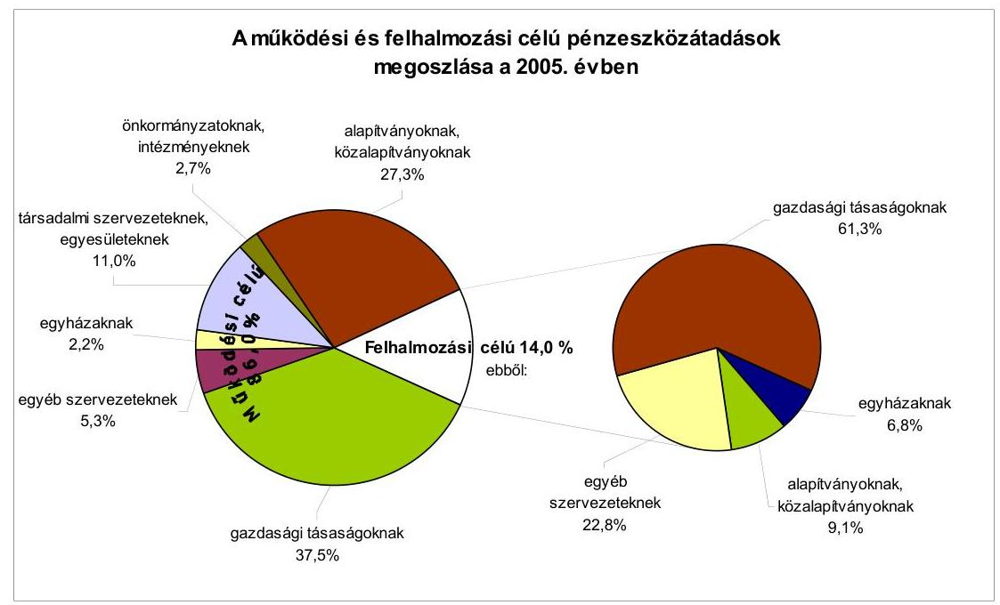
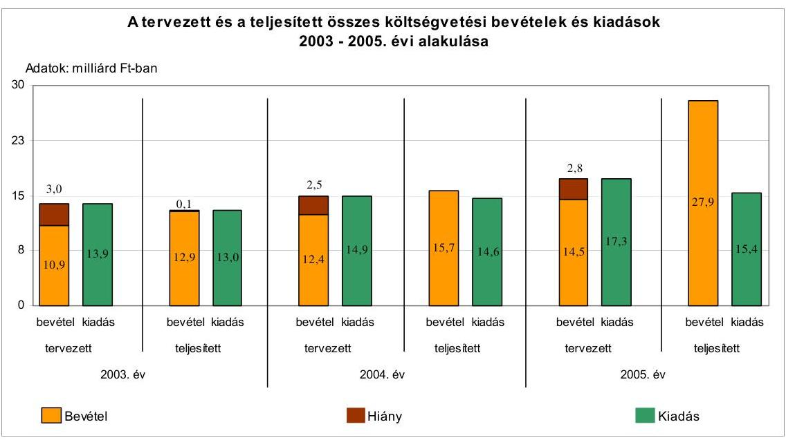
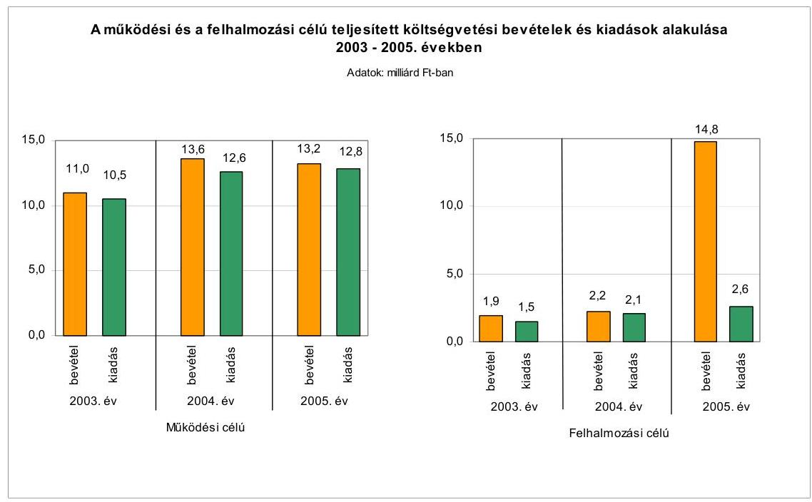
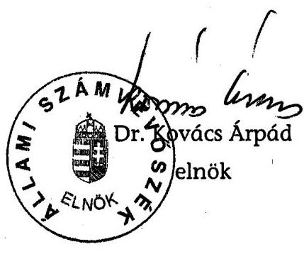
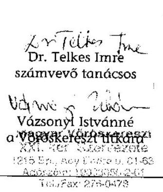
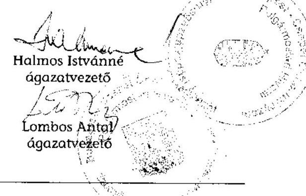
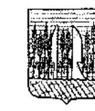
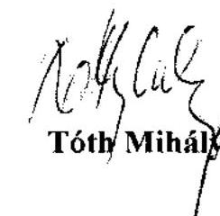

# JELENTÉS 

a Budapest Főváros XXI. kerület Csepel Önkormányzata gazdálkodási rendszerének 2006. évi átfogó ellenőrzéséről

---

# 3. Önkormányzati és Területi Ellenőrzési Igazgatóság 

3.3. Átfogó Ellenőrzések Főcsoport

Iktatószám: V-1003-5/32/24/2006.
Témaszám: 803
Vizsgálat-azonosító szám: V0266

## Az ellenőrzést felügyelte:

Dr. Lóránt Zoltán
főigazgató
Az ellenőrzés végrehajtásáért felelős:
Dr. Sepsey Tamás
főigazgató-helyettes
Az ellenőrzést vezette:
Molnár Gyula Mihály
osztályvezető főtanácsos
Az ellenőrzést végezték:
Bauer Lajosné Kozma Gábor
főtanácsadó
számvevő
Schósz Attiláné
Dr. Telkes Imre
számvevő tanácsos
A témához kapcsolódó - elmúlt három évben - készített számvevőszéki jelentések:
címe
sorszáma
Jelentés a helyi és a helyi kisebbségi önkormányzatok gazdálkodás0220
sának átfogó ellenőrzéséről
Jelentés a helyi önkormányzatoknak bérlakásépítésre és korszerűsí0349
tésre juttatott pénzügyi támogatások ellenőrzéséről
Jelentés a Magyar Köztársaság 2004. évi költségvetése végrehajtás0540
sának ellenőrzéséről
Függelék:

- A kötött felhasználású támogatások 2004. évi felhasználásának ellenőrzése
- A helyi önkormányzatokat a 2004. évben megillető normatív állami hozzájárulás elszámolásának ellenőrzése

---

# TARTALOMJEGYZÉK 

BEVEZETÉS ..... 7
I. ÖSSZEGZŐ MEGÁLLAPÍTÁSOK, KÖVETKEZTETÉSEK, JAVASLATOK ..... 9
II. RÉSZLETES MEGÁLLAPÍTÁSOK ..... 20

1. A költségvetés tervezésének, végrehajtásának, az Önkormányzat vagyongazdálkodásának és a zárszámadás elkészítésének szabályszerűsége ..... 20
1.1. A költségvetési rendelet jóváhagyásának, módosításának, az előirányzatok nyilvántartásának szabályszerűsége ..... 20
1.2. A gazdálkodás szabályozottsága, a bizonylati rend és fegyelem szabályszerűsége ..... 26
1.3. A pénzügyi-számviteli feladatok ellátásának informatikai támogatottsága ..... 32
1.4. Az önkormányzati vagyon nyilvántartása, számbavétele ..... 33
1.5. A vagyonnal való gazdálkodás szabályszerűsége, célszerűsége, nyilvánossága ..... 34
1.6. A céljelleggel nyújtott támogatások szabályszerűsége ..... 42
1.7. A közbeszerzési eljárások szabályszerűsége ..... 46
1.8. A zárszámadási kötelezettség teljesítésének szabályszerűsége ..... 48
1.9. A Polgármesteri hivatal helyi kisebbségi önkormányzatok gazdálkodását segítő tevékenysége ..... 51
2. Az önkormányzati feladatok és a rendelkezésre álló források összhangja ..... 52
2.1. A feladatok meghatározása és szervezeti keretei ..... 52
2.2. A költségvetés egyensúlyának helyzete ..... 55
2.3. A feladatok finanszírozása ..... 63
3. A belső ellenőrzési rendszer múködésének értékelése ..... 66
3.1. Az ellenőrzési rendszer kialakítása, működése ..... 66
3.2. A könyvvizsgálati kötelezettség teljesítése ..... 69
3.3. A korábbi számvevőszéki ellenőrzések javaslatainak hasznosulása ..... 70

---

# MELLÉKLETEK 

1. számú Az Önkormányzat gazdálkodását meghatározó adatok, mutatószámok (1 oldal)
2. számú Az önkormányzati vagyon nagyságának alakulása (1 oldal)

2/a. számú Kiegészítő tanúsítvány Budapest-Csepel Önkormányzata térítésmentes vagyonátadásáról (1 oldal)
3. számú Az Önkormányzat 2005. évi bevételeinek és kiadásainak alakulása (1 oldal)
4. számú Egyes önkormányzati feladatok finanszírozása (1 oldal)
5. számú Helyszíni ellenőrzési jegyzőkönyv (2 oldal)
6. számú Kimutatás a jelentősebb önként vállalt feladatok költségvetési súlyáról (1 oldal)
7. számú Tóth Mihály úr, a Budapest Főváros XXI. kerület Csepel Önkormányzatának polgármestere által adott észrevétel (4. oldal)

---

# RÖVIDÍTÉSEK JEGYZÉKE 

## Törvények

Áht.
Fot.

Hatv.
Htv.

Kbt.
Ksztv.
Ktv.
Ltv.

Nek. tv.
Ötv.
Ptv.
Számv. tv.
2005. évi költségvetési törvény

## Rendeletek

Ámr.
Ber.
Vhr.

Vhr. 9. számú melléklete
20/1995. (III. 3. ) Korm. rendelet
2005. évi költségvetési rendelet
2006. évi költségvetési rendelet
az államháztartásról szóló 1992. évi XXXVIII. törvény
a fogyatékos személyek jogairól és esélyegyenlőségük biztosításáról szóló 1998. évi XXVI. törvény
a helyi adókról szóló 1990. évi C. törvény
a helyi önkormányzatok és szerveik, a köztársasági megbízottak, valamint egyes centrális alárendeltségű szervek feladat- és hatásköreiről szóló 1991. évi XX. törvény
a közbeszerzésekről szóló 2003. évi CXXIX. törvény
a közhasznú szervezetekről szóló 1997. évi CLVI. törvény
a köztisztviselők jogállásáról szóló 1992. évi XXIII. törvény
a lakások és helyiségek bérletére, valamint az elidegenítésükre vonatkozó egyes szabályokról szóló 1993. évi LXXVIII. törvény
a nemzeti és etnikai kisebbségek jogairól szóló 1993. évi LXXVII. törvény
a helyi önkormányzatokról szóló 1990. évi LXV. törvény
a pártok múködéséről és gazdálkodásáról szóló 1989. évi XXXIII. törvény
a számvitelről szóló 2000. évi C. törvény
a Magyar Köztársaság 2005. évi költségvetéséről szóló 2004. évi CXXXV. törvény
az államháztartás működési rendjéről szóló 217/1998. (XII. 30.) Korm. rendelet
a költségvetési szervek belső ellenőrzéséről szóló 193/2003. (XI. 26.) Korm. rendelet
az államháztartás szervezetei beszámolási és könyvvezetési kötelezettségének sajátosságairól szóló 249/2000. (XII. 24.) Korm. rendelet
az államháztartás szervezetei beszámolási és könyvvezetési kötelezettségének sajátosságairól szóló 249/2000. (XII. 24.) Korm. rendelet 9. számú melléklete, a számlake-ret-tükör
a kisebbségi önkormányzatok költségvetésének, gazdálkodásának, vagyonjuttatásának egyes kérdéseiről szóló 20/1995. (III. 3.) Korm. rendelet
Budapest Főváros XXI. kerület Csepel Önkormányzata 6/2005. (III. 8.) számú rendelete a 2005. évi költségvetésről
Budapest Főváros XXI. kerület Csepel Önkormányzata 2/2006. (II. 21.) számú rendelete a 2006. évi költségvetésről

---

adórendelet
bérbeadási rendelet ${ }_{1}$
bérbeadási rendelet ${ }_{2}$
elidegenítési rendelet ${ }_{1}$
elidegenítési rendelet ${ }_{2}$
vagyongazdálkodási rendelet ${ }_{1}$
vagyongazdálkodási rendelet ${ }_{2}$
rendelet ${ }_{2}$
vagyongazdálkodási rendelet ${ }_{3}$
zárszámadási rendelet

## Szórövidítések

ÁSZ
CSEPP TV Kft.
CSEVAK Kft.
értékelési szabályzat
FEUVE
Fővárosi Önkormányzat
gazdálkodási jogkörök-
ről szóló közös utasítás

Budapest Főváros XXI. kerület Csepel Önkormányzata 12/2003. (V. 27.) számú rendelete az építményadóról
Budapest Főváros XXI. kerület Csepel Önkormányzatának 4/1996. (II. 6.) számú rendelete az Önkormányzat tulajdonában álló nem lakás céljára szolgáló helyiségek bérbeadásának feltételeiről
Budapest Főváros XXI. kerület Csepel Önkormányzatának 7/2006. (III. 21.) számú rendelete az Önkormányzat tulajdonában álló lakások bérbeadásának feltételeiről
Budapest Főváros XXI. kerület Csepel Önkormányzatának 3/1996. (II. 06.) számú rendelete az Önkormányzat tulajdonában álló nem lakás céljára szolgáló helyiségek elidegenítéséről
Budapest Főváros XXI. kerület Csepel Önkormányzatának 32/2003. (XI. 25.) számú rendelete az Önkormányzat tulajdonában álló lakás céljára szolgáló ingatlanok elidegenítéséről
Budapest Főváros XXI. kerület Csepel Önkormányzatának 6/2001. (III. 20.) számú rendelete az Önkormányzat vagyonáról és a vagyona feletti tulajdonosi jogok gyakorlásáról
Budapest Főváros XXI. kerület Csepel Önkormányzatának 30/2004. (VI. 29.) számú rendelete az Önkormányzat vagyonáról és a vagyona feletti tulajdonosi jogok gyakorlásáról
Budapest Főváros XXI. kerület Csepel Önkormányzatának 38/2005. (XII. 13.) számú rendelete az Önkormányzat vagyonáról és a vagyona feletti tulajdonosi jogok gyakorlásáról
Budapest Főváros XXI. kerület Csepel Önkormányzata 9/2006. (IV. 25.) számú rendelete a 2005. évi zárszámadásról

Állami Számvevőszék
Csepp-TV Dél-Pesti Televízió Stúdió Korlátolt Felelősségű Társaság
Budapest Főváros XXI. kerület Csepel Önkormányzatának Vagyonkezelő és Vagyonhasznosító Korlátolt Felelősségű Társasága
eszközök és források értékelési szabályzat
folyamatba épített, előzetes és utólagos vezetői ellenőrzés
Budapest Főváros Önkormányzata
a polgármester és a jegyző 2/2003. (VII. 1.) számú közös utasítása a Polgármesteri hivatal költségvetésében meghatározott bevételek és kiadások gazdálkodásával kapcsolatos jogkörök szabályozásáról

---

gazdasági szervezet
GVOP
hivatali SzMSz
igazgatási szervezeti egység
jegyzó
KCSZM
Képviselő-testület
közbeszerzési szabályzat
leltározási szabályzat
Önkormányzat önkormányzati SzMSz

Pénzügyi bizottság
polgármester
Polgármesteri hivatal
Vöröskereszt

Budapest Főváros XXI. kerület Csepel Önkormányzata
Polgármesteri Hivatalának Városgazdálkodási Ágazata
Gazdasági Versenyképesség Operatív Program
Budapest Főváros XXI. kerület Csepel Önkormányzata Szervezeti és Múködési Szabályzatáról szóló 5/1995. (III. 7.) számú rendeletének 5. számú melléklete a Polgármesteri Hivatal ügyrendjéről
Budapest Főváros XXI. kerület Csepel Önkormányzata
Polgármesteri Hivatalának Igazgatási Ágazata
Budapest Főváros XXI. kerület Csepel Önkormányzatának
jegyzóje
Kisebbségi és Civil Szervezeti Munkacsoport
Budapest Főváros XXI. kerület Csepel Önkormányzatának Képviselő-testülete
a polgármester és a jegyző 5/2004. (VI. 15.) számú közös utasítása a közbeszerzés szabályozásáról
eszközök és források leltározási és leltárkészítési szabályzata
Budapest Főváros XXI. kerület Csepel Önkormányzata
Budapest Főváros XXI. kerület Csepel Önkormányzata 5/1995. (III. 7.) számú rendelete a Szervezeti és Müködési Szabályzatáról
Budapest Főváros XXI. kerület Csepel Önkormányzata Képviselő-testületének Pénzügyi, Költségvetési és Közbeszerzési Bizottsága
Budapest Főváros XXI. kerület Csepel Önkormányzatának polgármestere
Budapest Főváros XXI. kerület Csepel Önkormányzatának Polgármesteri Hivatala
Magyar Vöröskereszt Budapest XXI. Kerületi Szervezete

---

.

---

# JELENTÉS 

## a Budapest Főváros XXI. kerület Csepel Önkormányzata gazdálkodási rendszerének 2006. évi átfogó ellenőrzéséről

## BEVEZETÉS

Az Ötv. 92. § (1) bekezdése, az Állami Számvevőszékről szóló 1989. évi XXXVIII. törvény 2. § (3) bekezdése, valamint az Áht. 120/A. § (1) bekezdése alapján az önkormányzatok gazdálkodását az Állami Számvevőszék ellenőrzi. Az ellenőrzési feladatot országosan egységes, az Országgyűlés illetékes bizottságai részére is átadott ellenőrzési program alapján elvégeztük.

## Az ellenőrzés célja annak értékelése volt, hogy:

- az önkormányzati gazdálkodás törvényességét ${ }^{1}$, szabályszerűségét biztosított-ták-e a tervezés, a költségvetés végrehajtása, a vagyongazdálkodás és a zárszámadás során;
- az Önkormányzat által ellátott feladatok és az azokhoz rendelkezésre álló források összhangja biztosított volt-e, különös tekintettel az egyes kiemelt feladatokra;
- a gazdálkodás szabályszerűségét biztosító belső kontrollok ${ }^{2}$ lehetővé tették-e a szabálytalanságok, hiányosságok, gazdaságtalan megoldások feltárását, megelőzését;

Az ellenőrzött időszak: a 2005. év és a 2006. év első negyedéve, az 1.5; 2.12.3; és 3.3 programpontok esetében a 2003-2004. évek is.

A kerület lakosainak száma 2006. január 1-jén 77728 fő volt. Az Önkormányzat 29 tagú Képviselő-testületének munkáját kilenc állandó bizottság, a polgármester munkáját három alpolgármester segítette. A polgármester az 1994. évi önkormányzati képviselő választástól tölti be tisztségét, a jegyző a 2000. évtől látja el feladatait.

[^0]
[^0]:    ${ }^{1}$ A törvényi előírások betartásának elmulasztásakor a részletes megállapítások fejezetben egységesen a törvénysértés megjelölést alkalmazzuk, mivel az ÁSZ nem tehet különbséget a törvényi előírások között.
    ${ }^{2}$ A gazdálkodás szabályszerűségét biztosító kontroll alatt értjük a kiépített és működő belső irányítási és szabályozási rendszert, valamint a belső ellenőrzési funkciók ellátását.

---

A 2005. évben az Önkormányzat a Polgármesteri hivatalon kívül nyolc önállóan és 40 részben önállóan gazdálkodó költségvetési szervet múködtetett, négy gazdasági társaságban rendelkezett tulajdoni részesedéssel. A feladatok ellátására az Önkormányzat intézményeinél a 2005. év végén 2132 főt foglalkoztattak, a Polgármesteri hivatal köztisztviselőinek száma 212 fő volt. Az Önkormányzat a 2005. évben 28017 millió Ft bevételt ért el és 15658 millió Ft kiadást teljesített.

Az Önkormányzat a 2005. december 31-i könyvviteli mérlege szerint 88070 millió Ft értékű vagyonnal rendelkezett, amelyből a rövid- és hosszúlejáratú kötelezettségeinek az összege 4237 millió Ft. Az Önkormányzat gazdálkodását meghatározó adatokat, mutatószámokat az 1-3. számú mellékletek tartalmazzák.

Az Önkormányzat illetékességi területén a 2002. évi önkormányzati választásokig négy ${ }^{3}$, a 2002. évi választásokat követően nyolc ${ }^{4}$ a megválasztott és múködő helyi kisebbségi önkormányzatok száma.

A jelentés megállapításainak, javaslatainak egyeztetése során a polgármester arról adott tájékoztatást, hogy az időközben megtett intézkedésekkel a javaslatok egy részét megvalósították. Ezekben az esetekben a jelentés II. Részletes megállapítások fejezetében az adott témához kapcsolt lábjegyzetben a megtett intézkedést feltüntettük, és a kapcsolódó javaslatot elhagytuk.

A jelentést az ÁSZ-ról szóló 1989. évi XXXVIII. tv. 25. § (1) bekezdése alapján észrevétel közlése céljából megküldtük a Budapest Főváros XXI. kerület Csepel Önkormányzata polgármesterének. A kapott észrevételt a jelentés 7. számú melléklete tartalmazza.
${ }^{3}$ Bolgár, cigány, német és örmény kisebbségi önkormányzat.
${ }^{4}$ Bolgár, cigány, görög, lengyel, német, román, ruszin, örmény kisebbségi önkormányzat.

---

# I. ÖSSZEGZŐ MEGÁLLAPÍTÁSOK, KÖVETKEZTETÉSEK, JAVASLATOK 

Az Önkormányzat a 2003. évben elfogadott, gazdasági programnak megfelelő középtávra szóló kerületfejlesztési koncepcióval rendelkezett, ezzel a Képviselőtestület eleget tett az Ötv-ben előírt kötelezettségnek. A polgármester a 2005. és a 2006. évi költségvetési koncepciót határidőben, a Pénzügyi bizottság véleményének csatolásával együtt terjesztette a Képviselő-testület elé. Az Ámr-ben előírtaktól eltérve nem csatolta a kisebbségi önkormányzatok koncepcióról alkotott véleményét, a kisebbségi önkormányzatok elnökeit a jegyző a 2005. és a 2006. évi koncepciónak a helyi kisebbségi önkormányzatra vonatkozó részéről nem tájékoztatta. A polgármester a költségvetési rendelettervezetet a 2005. évben határidőn túl, a 2006. évben határidőben, a Pénzügyi bizottság, valamint a könyvvizsgáló véleményének csatolásával terjesztette elő. Az Áht. előírása ellenére a 2005. évi és a 2006. évi költségvetési rendelet nem tartalmazta az ellátottak pénzbeli juttatásai kiemelt kiadási előirányzatot. A Polgármesteri hivatal költségvetésén belül alap elnevezéssel különítettek el különböző feladatokra kiadási előirányzatot, azoknak alapként történő elnevezése az Áht-ban meghatározott feltételeknek nem felelt meg, a kifejezés félreérthető. Az Áht. előírása teljesítéséhez a Képviselő-testület a 2006. évi költségvetési rendelet módosításakor, 2006. június 13-án meghatározta a költségvetés (zárszámadás) előterjesztésekor a Képviselő-testület részére tájékoztatásul bemutatandó mérlegek, kimutatások tartalmi követelményeit.

A 2005. és a 2006. évi költségvetési rendeletekben a költségvetési hiány megállapításakor a költségvetés bevételi és kiadási főösszegében - megsértve az Áht-ban előírtakat - finanszírozási célú pénzügyi műveleteket vettek figyelembe. A költségvetési rendeletekben az Önkormányzat meghatározta a költségvetés végrehajtásának szabályait. A Képviselő-testület tájékoztatása céljából a költségvetési rendelet-tervezetek előterjesztése tartalmazta az Áht-ban előírt összevont mérlegeket Önkormányzatra és elkülönítetten a kisebbségi önkormányzatokra, valamint a többéves kihatással járó döntések bemutatását számszerúsítve évenkénti bontásban és összesítve szöveges indokolással együtt, az Áht. előírásával szemben azonban nem tartalmazta a közvetett támogatások kimutatását és szöveges indokolását. A 2005. évi költségvetési rendeletmódosítások következtében az eredeti előirányzatok főösszege 73\%-kal emelkedett. Az évközi módosítások közül nagyságrendjében legjelentősebb volt a négy ingatlan értékesítéséből származó 11370 millió Ft bevétellel összefüggő előirányzat módosítás, ami az összes módosítás $89 \%$-ának felelt meg. A módosításra előterjesztett rendelettervezetek a költségvetéssel összehasonlítható módon tartalmazták a módosítási javaslatokat. Az előirányzat-változtatásokat hitelt érdemlő dokumentumokkal alátámasztották. A 2005. évi költségvetési rendelet utolsó módosításakor betartották az Ámr-ben meghatározott határidőt.

A hivatali SzMSz az Ámr-nek megfelelően tartalmazta a Polgármesteri hivatal szervezeti felépítését és múködésének rendszerét, a szervezeti egységek, ezen belül a gazdasági szervezet megnevezését, azonban nem tartalmazta az Ámr-ben foglaltak ellenére az alapító okirat keltét, számát, a te-

---

lephelyek felsorolását, illetve a Polgármesteri hivatal költségvetésének végrehajtására szolgáló számlaszámot. A Polgármesteri hivatal gazdasági szervezete nem rendelkezett az Ámr-ben meghatározott ügyrenddel. A költségvetési és gazdálkodási jogkörök szabályozását a polgármester és a jegyző közös utasítása tartalmazta. A jegyző a Polgármesteri hivatal feladatai vonatkozásában szabályozta a szakmai teljesítés igazolásának módját és kijelölte az azt végző személyeket, azonban az Ámr-ben foglaltak ellenére nem rendelkezett a helyi kisebbségi önkormányzatok szakmai teljesítésigazolásának módjáról és az azt végző személyek kijelöléséről. A jegyző írásbeli megbízást adott az érvényesítők részére. A polgármester és a jegyző a gazdálkodási jogkörök átadásával összefüggő felhatalmazásoknál, megbízásoknál és kijelöléseknél biztosították az Ámr. szerint meghatározott összeférhetetlenségi követelmények érvényesülését. A polgármester és a jegyző nem szabályozta a kötelezettségvállalásra, utalványozásra és azok ellenjegyzésére felhatalmazottaknak az elvégzett feladatokról történő beszámoltatását.

A jegyző kialakította a Polgármesteri hivatal és az intézmények számviteli rendjét a Htv-nek megfelelően. A feladatokat a helyi sajátosságoknak megfelelően, célszerűen határozták meg a számviteli politikában és a kapcsolódó szabályzatokban. A számviteli politika keretében kiadott szabályzatok előírásai egymással összhangban voltak. A munkaköri leírásokban a munkafolyamatba épített ellenőrzési, egyeztetési feladatokat konkrétan, egyértelműen, célszerűen rögzítették. Az eszközök és források értékelési szabályzatában nem szabályozták követelés típusonként a kisösszegű követelések év végi meghatározásának elveit, dokumentálásának szabályait. A pénzkezelési szabályzatban nem alakították ki a bankkártyával történő készpénzfelvétel rendjét. A számlarendben nem határozták meg a Vhr-ben előírtak ellenére a törzsvagyon nyilvántartás rendjét. A jegyző az Áht. előírásainak megfelelően gondoskodott a FEUVE megszervezéséről és működtetéséről, illetve az Ámr-ben foglaltaknak megfelelően elkészítette a Polgármesteri hivatal ellenőrzési nyomvonalát, azonban nem alakította ki a kockázatkezelés rendjét. A kötelezettségvállalásokat az Áht-ban előírtaknak megfelelően írásba foglalták. A könyvviteli nyilvántartásokban elszámolt gazdasági műveletekről, eseményekről a Számv. tvben előírt bizonylatokat kiállították. A gazdasági eseményeket magukba foglaló bizonylatok $88 \%$-ban megfeleltek a Számv. tv-ben és a Polgármesteri hivatal számlarendjében foglalt alaki és tartalmi követelményeknek. A bankszámla és a pénztár forgalmához kapcsolódó munkafolyamatba épített ellenőrzési feladatokat a kötelezettségvállalás ellenjegyzője, a szakmai teljesítést igazoló, az érvényesítő, az utalvány ellenjegyzője és a pénztárellenőr 5-12\%-ban nem teljesítette. A gazdálkodási jogkörök gyakorlása során az Ámr-ben, illetve a kiadott közös utasításban szabályozott összeférhetetlenségek kizárásának követelményeit betartották.

A költségvetési pénzforgalmat érintő gazdasági események bizonylatainak adatait - készpénzforgalom esetében a pénzmozgással egy időben, bankszámlák esetében a pénzintézeti értesítés megérkezésekor - a Vhr-nek megfelelően rögzítették a könyvviteli nyilvántartásokban. A főkönyvi és az analitikus nyilvántartások egyeztetése havi gyakorisággal, a számlarendben meghatározott időpontokban és módon megtörtént. A kötelezettségvállalásokról folyamatosan, naprakészen, kiemelt előirányzatonkénti részletezettségben analitikus nyilvántartást vezettek, a nyilvántartásból megállapítható volt az éves kötele-

---

zettségvállalás összege. A Képviselő-testület által a 2005. évre meghatározott kiemelt előirányzatokat a Polgármesteri hivatal és az intézmények betartották.

A Polgármesteri hivatalban az analitikus nyilvántartásokat számítógépes programok segítségével vezették. A főkönyvi és az analitikus nyilvántartások közötti adatforgalmat megszervezték, azonban az adatfeldolgozási rendszerek integrációja nem történt meg. Az Önkormányzat rendelkezett a hosszú távú célkitűzéseket tartalmazó informatikai stratégiával. A rendkívüli események bekövetkezésekor teendő intézkedéseket meghatározó katasztrófa elhárítási tervet nem készítettek. Az adatvédelmi szabályzat nem tartalmazta, hogy a felhasználói igényeket ki jogosult elbírálni. A Polgármesteri hivatalban rendelkeztek a gazdálkodási és számviteli feladatokhoz használt szoftverek üzemeltetési dokumentációjával és felhasználói leírásával.

Az önkormányzati vagyont forgalomképesség szerint elkülönítetten tartották nyilván, ezzel eleget tettek a Vhr-ben foglalt előírásnak. A főkönyvi számlák és a kapcsolódó analitikus nyilvántartások értékadatai 2005. december 31-én számszerűen megegyeztek. A könyvviteli mérleget a Vhr. előírásainak megfelelően leltárral alátámasztották. Az Önkormányzat értékpapírral nem rendelkezett. A követelések és részesedések év végi értékelését elvégezték. Az értékeléshez szükséges információk rendelkezésre álltak. Az indokolt értékvesztéseket a részesedések és a követelések esetében a Számv. tv. előírásainak megfelelően elvégezték, a visszaírás szükségessége nem merült fel.

Az Önkormányzat a Htv. előírásának eleget téve megalkotta vagyongazdálkodási rendeletét. A vagyongazdálkodási rendelet ${ }_{2,3}$, a bérbeadási rendelet és az elidegenítési rendelet hatálya együttesen kiterjedt a teljes vagyoni körre. A vagyongazdálkodási rendelet ${ }_{1}$ hatálya nem terjedt ki az Önkormányzat által megvalósított beruházásokra, ezért annak szabályai nem vonatkoztak a teljes vagyoni körre. Ezt a hiányosságot a vagyongazdálkodási rendelet ${ }_{2}$ hatályba léptetésével megszüntették. A vagyongazdálkodási rendeletekben nem határozták meg a vagyon forgalomképesség szerinti besorolás megváltoztatásának módját. A vagyonnal való rendelkezési, döntési jogköröket értékhatár megjelölésével célszerűen szabályozták. Meghatározták az ingyenes vagyonátadás eseteit és módját. A 2003-2005. években, 21 esetben megsértve az Ötv. előírását, a Képviselő-testület felhatalmazása nélkül ingyenes közmű és egyéb vagyon tulajdonjog átruházás történt. A polgármester és a jegyző felelősek azért, mert a Képviselő-testület rendelkezésének hiányában közművagyon tulajdonjogát, illetve a vagyongazdálkodási rendeletben előírtakkal ellentétesen a Képviselőtestület döntése nélkül közmú és egyéb vagyon tulajdonjogát ingyenesen átruházták. A polgármester és a jegyző felelősek azért is, mert 21 eset közül 20 esetben - megsértve az Áht. előírását - nem csak a vagyongazdálkodási rendeletben meghatározott ingyenes vagyonátruházási esetekben ruházták át közmú és egyéb vagyon tulajdonjogát. A vagyon tulajdonjogának ingyenes átruházása során felelősek azért is, mert a gazdasági társaságok részére törzsvagyonba tartozó víziközmű vagyont ruháztak át. Víziközmű vagyont ruháztak át ingyenesen a Fővárosi Csatornázási Művek Rt. részére, négy esetben összesen 120,5 millió Ft nettó értékben, illetve a Fővárosi Vízmúvek Rt. részére, három esetben összesen 36,4 millió Ft nettó értékben, melyeket a vagyongazdálkodási rendelet nem tett lehetővé, valamint ezekkel a vagyonátruházásokkal megsértették az Ötv. és a vízgazdálkodásról szóló 1995. évi törvény előírásait, mivel mindkét

---

jogszabály előírása szerint az önkormányzati törzsvagyon része a víziközmű. Az elidegenítéssel és a bérbeadással kapcsolatos döntések során betartották a hatásköri szabályokat, érvényesültek továbbá a vagyongazdálkodási rendelet és a bérbeadási rendelet előírásai. Az értékesítéseknél a piaci forgalmi értékbecslést az ár kialakításánál figyelembe vették. Az Önkormányzat az Ltv. előírását megsértve nem adta át a Fővárosi Önkormányzatnak az önkormányzati lakások elidegenítéséből származó bevételeknek a kapcsolódó költségek levonása utáni $50 \%$-át, azt a 2005. évi könyvviteli mérlegben a kötelezettségek között 1499 millió Ft összegben kimutatták. Az Önkormányzat irodahelyiségek kedvezményes bérbeadásával a 2004. évig az Ötv. előírása ellenére nyújtott közvetett támogatást hat pártnak és egy ifjúsági szervezetnek, amely helyzetet a bérleti szerződések felmondásával megszüntetett. Egy pártszervezet többszöri felszólítása ellenére nem adta még vissza az általa korábban bérelt helyiséget.

Az Önkormányzat a 2005. évben gazdasági társaságoknak, alapítványoknak, közalapítványoknak, egyházaknak, társadalmi szervezeteknek, egyesületeknek, és önkormányzatoknak összesen 314 millió Ft céljellegú támogatást adott. A támogatásokra vonatkozó 2005. évi döntéseknél megsértették az Ötv. előírását, mert az alapítványok részére nyújtott támogatásokról a KCSZM döntött, annak ellenére, hogy az alapítványok támogatása a Képviselő-testület kizárólagos hatáskörébe tartozik. A Képviselő-testület azzal, hogy a KCSZM-et a 2005. és a 2006. évben a pályázati támogatásokkal kapcsolatos döntések meghozatalára felhatalmazta, megsértette az Ötv. előírását, mivel döntési hatásköre munkacsoportra nem ruházható át. A KCSZM által támogatásban részesített 41 társadalmi szervezet és hét helyi kisebbségi önkormányzat részére meghatározták a támogatás célját, összegét, felhasználásáról való számadási kötelezettség teljesítésének módját és határidejét. A Képviselő-testület 179 szervezetet támogatott. A támogatottak részére 59 alkalommal, az esetek 33\%-ában nem írtak elő számadási kötelezettséget, megsértve ezzel az Áht. előírását. A 220 támogatott szervezet közül 54 nem készített számadást, egy támogatott számadása hiányos volt. A számadást elmulasztó szervezetek esetében az Áht. előírását megsértve nem intézkedtek a támogatás 2005. évben történő felfüggesztéséről, valamint visszafizettetéséről. A számadást elmulasztó szervezetek a 2006. évben nem részesültek újabb támogatásban. A számadások tartalmi és formai ellenőrzését elvégezték, azonban a támogatások rendeltetés szerinti felhasználását az Áht. előírását megsértve nem ellenőrizték.

A közbeszerzési eljárások előkészítésének, lefolytatásának, belső ellenőrzésének felelősségi rendjét a Kbt-ben foglaltaknak megfelelően közbeszerzési szabályzatban határozták meg. A 2005. évi közbeszerzési tervben és a 2005. évi költségvetési rendeletben szereplő, ténylegesen megindított beszerzésekhez kapcsolódó közbeszerzési eljárásokat a Kbt. alapján lefolytatták. A tervezés során a beszerzések becsült értékének meghatározásánál betartották a Kbt-ben foglaltakat, a közbeszerzési terv összeállítása során az egybeszámítás követelményét érvényesítették. Az ellenőrzött egyszerű közbeszerzési eljárás lebonyolítása során a Kbt. előírásait betartották. A közbeszerzési eljárásokat a felügyeleti és belső ellenőrzés rendszerében a Polgármesteri hivatalban nem, az intézményeknél két esetben ellenőrizték a 2005. évben.

A polgármester a 2005. évi zárszámadási rendelettervezetet az Áht-ban előírt határidőn belül terjesztette a Képviselő-testület elé. A zárszámadást az Áht-

---

ban foglaltaknak megfelelően az elfogadott költségvetéssel összehasonlítható módon állították össze. Az Áht-ban előírtakat megsértve a zárszámadásban jóváhagyott költségvetési bevételek, illetve költségvetési kiadások összegében finanszírozási célú pénzügyi műveleteket vettek figyelembe. A zárszámadási rendelet nem tartalmazta az Áht. előírásával szemben az ellátottak pénzbeli juttatása kiemelt kiadási előirányzatot és annak teljesítését, valamint az Ámr. előírása ellenére az európai uniós támogatással megvalósított programok, projektek bevételeinek és kiadásainak elkülönített bemutatását. A zárszámadás előterjesztésekor a Képviselő-testület részére az Áht-ban előírtakat betartva bemutatták az Önkormányzat és a kisebbségi önkormányzatok összevont mérlegeit, az Önkormányzat vagyonkimutatását, szöveges indoklással együtt a többéves kihatással járó döntéseket számszerúsítve, évenkénti bontásban és összesítve, valamint a közvetett támogatásokat tartalmazó kimutatást és annak szöveges indokolását. A zárszámadási rendelettel jóváhagyott pénzmaradvány összege nem felelt meg az Ámr-ben és a Vhr-ben előírtaknak, mert tartalmazta önkormányzati szinten és költségvetési szervenként az előző években képzett és fel nem használt tartalékot, továbbá a Polgármesteri hivatal jóváhagyott pénzmaradványa nem tartalmazta az intézményektől elvont pénzmaradvány összegét. Az Ámr-ben előírtakat betartva határidőben elvégezték az intézmények költségvetési beszámolóinak a felülvizsgálatát, azok elfogadásáról, múködésük elbírálásáról, a jóváhagyott pénzmaradványról értesítették az intézményeket.

Az Önkormányzat az Áht-ban előírt együttműködési megállapodásokat a kisebbségi önkormányzatokkal megkötötte és azokat évente a felülvizsgálat után január 15-ig módosították. Az együttmúködési megállapodások tartalmuk alapján biztosították, hogy a központi és a helyi előírásoknak megfelelő legyen az együttmúködés a költségvetés tervezése, az operatív gazdálkodás és a zárszámadás területén. A Polgármesteri hivatal az Ámr. előírását betartva elkülönítetten vezette a kisebbségi önkormányzatok vagyoni és számviteli nyilvántartásait.

Az Önkormányzat az Ötv-ben és az ágazati törvényekben előírt kötelező és önként vállalt feladatai ellátását intézményei útján, gazdasági társaságaival, gazdasági társaságok részére adott megbízásokkal és vállalkozási szerződésekkel, közhasznú szervezetekkel, közalapítványokkal és egyéb szervezetekkel kötött ellátási szerződésekkel biztosította. Az Ötv. előírása ellenére a Képviselőtestület nem határozta meg a kötelezően és az önként ellátott feladatainak mértékét és módját. A feladatok szervezeti megoldásának módját a 2003-2005. évek közötti időszakban részben ágazati, szakmai megfontolásokból, részben gazdaságossági, pénzügyi szempontok alapján változtatták. A 2003-2005. évek között indokoltak voltak a múködési célú kiadások csökkentésére tett, a feladatellátás szervezeti rendszerét érintő lépések. A végrehajtott szervezeti változások szakmai és gazdasági előnyeit a Képviselő-testület a vonatkozó előterjesztések alapján folyamatosan értékelte.

Az Önkormányzat költségvetésének egyensúlya a 2003-2006. években jóváhagyott költségvetési rendeletek szerint nem volt biztosított. A tervezett hiány mértéke a tervezett költségvetési kiadások 21-17-16-18\%-ának felelt meg. A hiánynak a 23-23-50-83\%-át a tervezett múködési célú bevételek és kiadások különbözete tette ki. A tervezett hiány kialakulásában szerepet játszott a saját be-

---

vételek alultervezése mellett a kiadások túltervezése, illetve az önként vállalt feladatok kiadásigénye, amely a tervezett összkiadáshoz képest 31-39\% között szóródott. A tervezetthez képest kedvezőbben alakult az Önkormányzat költségvetési hiánya, mert a 2003-2005. évek közül csak a 2003. év költségvetésének teljesítését zárták hiánnyal. Az Önkormányzat gazdálkodásához mind a három évben vettek fel likviditást biztosító hiteleket, melyeket az adott éven belül visszafizettek. A Képviselő-testület az ellenőrzött években felvett fejlesztési célhitelekről a 2002. évben, illetve a 2004. évben döntött, más adósságot keletkeztető kötelezettségvállalásról nem határoztak.

Az Önkormányzat illetékességi területén lévő építményeket az 1992. évtől adóztatják építményadóval, további helyi adót nem vezettek be. Az építményadó mértéke a 2003-2004. években a Hatv-ben rögzített felső határnak a $67 \%$-át, a 2005. évben $64 \%$-át érte el, az adórendelet a Hatv-ben rögzítetteken túl mentességeket, kedvezményeket biztosított az adóalanyok részére. A 20032005. évek közötti időszakban a helyi adóbevételek részaránya - iparűzési adóval együtt - az összes múködési célú költségvetési bevételen belül csökkent, 34-$37-30 \%$ volt.

Az Önkormányzat a feladatellátás finanszírozásához rendelkezésre álló forrásait működési és felhalmozási célú külső forrásokkal növelte. A felhalmozási bevételeken belül a külső forrás aránya a 2003-2005. években 54-30-11\%-ot tett ki. A felhalmozási célra átvett források 74-66-61\%-ához pályázati úton jutott az Önkormányzat. A pályázatok, illetve megállapodások alapján átvett forrásoknak a 66\%-át a Fővárosi Önkormányzat, 29\%-át a Gazdasági és Közlekedési Minisztérium nyújtotta. A megvalósított felhalmozási kiadások közül a legjelentősebbek a közművek kiépítéséhez, felújításához, a bérlakás építési program, illetve a GVOP adatvagyon másodlagos hasznosítása program megvalósításához kapcsolódtak.

Az ellenőrzött időszak alatt a fajlagos kiadás a bölcsődei ellátás, az óvodai nevelés, az általános iskolai, a középiskolai oktatás, a nappali szociális intézményi ellátás területén $0,2-39,4 \%$-kal növekedett, a bentlakásos szociális intézményi ellátás területén $0,3 \%$-kal csökkent. Az ellátott feladatok, és az azokhoz rendelkezésre álló források összhangja biztosított volt, az önkormányzati hozzájárulás mértéke a 2003. évben 26,8-70,7\%, a 2005. évben 22,6-63\% volt.

Az önként vállalt feladatok ellátására fordított kiadások aránya jelentős volt, az összes költségvetési kiadás több mint egyharmadát tette ki. Az önként vállalt feladatok a 2003-2005. években - a költségvetések teljesítési adatai alapján - nem veszélyeztették az Önkormányzat kötelező feladatainak ellátását, viszont az önként vállalt feladatok kiadásai hozzájárultak a 2003. évi tényleges forráshiány kialakulásához.

Az Önkormányzat a Fot. előírásai ellenére nem biztosította a 2005. január 1-i határidőre az önkormányzati középületek akadálymentes megközelíthetőségét. A 2002. évi felmérések alapján szükséges kiadások 94\%-át nem teljesítették.

A belső ellenőrzés ellátásának módjáról a Képviselő-testület nem döntött, melylyel megsértették az Ötv. előírását. A hivatali SzMSz-ben nem írták elő a belső

---

ellenőrzési kötelezettséget, az ellenőrzést végző személyek jogállását és feladatait, mely ellentétes a Ber-ben foglalt előírással. A 2005. évben a három belső ellenőri álláshelyből kettő volt betöltve, az üres álláshelyre pályázatot a 2005. évben nem írtak ki. A foglalkoztatott belső ellenőrök számát a Ber-ben foglaltak ellenére nem kapacitás-felmérés alapján állapították meg, az ellenőri létszám nem állt arányban az ellátandó feladatokkal. A belső ellenőrök szervezeti függetlensége 2005. december 13-tól érvényesült. A 2005. évi ellenőrzési tervet a Ber. előírása alapján a jegyző, a 2006. évi ellenőrzési tervet az Ötv-ben foglaltak alapján a Képviselő-testület hagyta jóvá. A jegyző az Áht-ban foglalt előírást megsértve nem számolt be a 2005. évi költségvetési beszámoló keretében a FEUVE, valamint a belső ellenőrzés múködtetéséről. A polgármester az Ötv. előírását betartva a 2005. évre vonatkozó zárszámadási rendelettervezettel egyidejúleg a Képviselő-testület elé terjesztette a belső ellenőrök által készített éves ellenőrzési jelentést.

Az Önkormányzat az Ötv-ben előírt könyvvizsgálati kötelezettségét teljesítette, a könyvvizsgálattal költségvetési minősítésű könyvvizsgálót bízott meg. A könyvvizsgáló a Polgármesteri hivatal és az önkormányzati intézmények adatait összevontan tartalmazó 2005. évi egyszerűsített költségvetési beszámolót hitelesítő záradékkal látta el, auditálási eltérést nem állapított meg.

Az Önkormányzat gazdálkodását az ÁSZ a 2002. évben átfogó jelleggel ellenőrizte, amely mellett a 2003-2005. években a bérlakásépítésre és korszerűsítésre juttatott pénzügyi támogatásokkal kapcsolatban, valamint a Magyar Köztársaság 2004. évi költségvetése végrehajtásának ellenőrzése keretében a kötött felhasználású támogatások, valamint a normatív állami hozzájárulások 2004. évi igénylése, felhasználása és elszámolása témájában tartott vizsgálatot. A négy jelentés összesen 41 javaslatot tartalmazott az önkormányzati gazdálkodás szabályszerűségének és a végzett munka színvonalának javítása céljából. A javaslatok több mint háromnegyedét teljesen hasznosították, hét javaslatra részben intézkedtek, három javaslatra nem intézkedtek. A helyszíni ellenőrzés megkezdéséig az Áht. előírását megsértve az Önkormányzat rendeletben nem határozta meg a költségvetés, illetve a zárszámadás előterjesztésekor a Képvise-lő-testület részére bemutatandó, az Áht-ban előírt mérlegek, kimutatások tartalmát, nem intézkedtek továbbá az Ltv. előírásának betartása érdekében az önkormányzati bérlakások elidegenítéséből származó bevételekből a Fővárosi Önkormányzatot megillető 50\%-nak az átutalásáról, nem teljesült az önkormányzati vagyonkezelő gazdasági társasággal egységes, a vagyonkezelőre bízott valamennyi típusú vagyonra kiterjedő vagyonkezelői szerződéskötésre irányuló célszerűségi javaslat. A javaslatok hasznosításával javult az Önkormányzat költségvetése tervezésének, végrehajtásának, a költségvetési beszámolásnak, a vagyongazdálkodásnak, a zárszámadásnak a szabályszerűsége. A kötött felhasználású támogatások, valamint a normatív állami hozzájárulások és támogatások igénylésével, nyilvántartásával és elszámolásával kapcsolatos javaslatokra tett intézkedésekkel gondoskodtak a központi költségvetés és az Önkormányzat közötti elszámolás pontosságáról és áttekinthetőségéről.

---

A helyszíni ellenőrzés megállapításainak hasznosítása mellett javasoljuk:

# A Képviselő-testületnek 

1. fontolja meg a polgármester és a jegyző felelősségre vonását a 2003-2005. években közmű és egyéb vagyonnak a Képviselő-testület rendelkezése nélkül, illetve a vagyongazdálkodási rendeletben előírtakkal ellentétesen, hatáskör hiányában történt ingyenes átruházása, továbbá a törzsvagyonba tartozó víziközmű vagyonnak az Ötv. 79. § (1)-(2) bekezdése előírását és a vízgazdálkodásról szóló 1995. évi LVII. törvény 6. § (3) bekezdése előírását sértő ingyenes átruházása miatt.

## a polgármesternek

a jogszabályi előírások maradéktalan betartása érdekében
1. a költségvetési gazdálkodás jogszabályszerű kereteinek kialakítása során
a) gondoskodjon az Ámr. 28. § (6) bekezdésében előírtak betartásához arról, hogy a kisebbségi önkormányzatok elnökei kapjanak tájékoztatást a költségvetési koncepciónak a kisebbségi önkormányzatokra vonatkozó részéről;
b) csatolja az Ámr. 28. § (3) bekezdésében előírtak betartása érdekében a költségvetési koncepció előterjesztéséhez a kisebbségi önkormányzatoknak a koncepcióról alkotott véleményét;
2. gondoskodjon arról, hogy az Ötv. 79. § (2) bekezdése és a vízgazdálkodásról szóló 1995. évi LVII. törvény 6. § (3) bekezdése előírásainak megfelelően a 2003-2005. években ingyenesen átruházott víziközművek önkormányzati tulajdonba kerüljenek vissza;
3. tartsa be az Áht. 108. § (2) bekezdésének és a vagyongazdálkodási rendelet 27. § (1) bekezdésének előírását, miszerint önkormányzati vagyonnak ingyenes és kedvezményes átruházására a vagyongazdálkodási rendeletben nevesített esetekben és 27. § (2) bekezdésében előírtaknak megfelelően a Képviselő-testület döntése alapján kerüljön sor;
4. kezdeményezze a Képviselő-testületnél, hogy az Ltv. 63. § (1) bekezdésében előírtaknak megfelelően a jegyző intézkedhessen az önkormányzati lakások elidegenítéséből származó bevételből az Ltv. 62. § (5) bekezdése alapján a Fővárosi Önkormányzatot megillető bevételrésznek a Fővárosi Közgyűlés számlájára történő befizetéséről;
5. kezdeményezze, hogy a Képviselő-testület az Ötv. 8. § (2) bekezdésében foglaltaknak megfelelően határozza meg - a lakosság igényei alapján, anyagi lehetőségeitől függően - a kötelezően és önként vállalt feladatai ellátásának mértékét és módját;
6. gondoskodjon a középületek akadálymentessé tételéről, tekintettel arra, hogy a Fot. 29. § (6) bekezdésében foglalt 2005. január 1-i határidő lejárt;

---

a munka színvonalának javítása érdekében
7. kezdeményezze a számvevőszéki ellenőrzés tapasztalatainak képviselő-testületi megtárgyalását, és a feltárt hiányosságok megszüntetése érdekében készíttessen intézkedési tervet;
8. kezdeményezze a Képviselő-testületnél, hogy a költségvetési egyensúlyi helyzet biztosítása érdekében tekintse át az önként vállalt feladatok költségvetési kihatását, azok múködtetésének, fenntartásának szükségességét.

# a jegyzönek 

a jogszabályi előírások maradéktalan betartása érdekében
1. a költségvetési, illetve a zárszámadási rendelettervezet előkészítése során
a) intézkedjen az Áht. 8/A. § (7) bekezdésében előírtak betartása érdekében arról, hogy a költségvetési, illetve a zárszámadási rendelettervezetben ne vegyenek figyelembe költségvetési bevételként, valamint költségvetési kiadásként költségvetési hiányt, illetve költségvetési többletet módosító finanszírozási célú pénzügyi múveleteket;
b) gondoskodjon az Áht. 69. § (1) bekezdésében, illetve az Ámr. 29. § (1) bekezdése b) pontjában előírtak betartása végett, hogy a kiemelt kiadási előirányzatok között az ellátottak pénzbeli juttatásai előirányzatot szerepeltessék, illetve mutassák be annak tervezett előirányzatát, valamint zárszámadáskor annak teljesítését;
c) intézkedjen az Ámr. 29. § (1) bekezdése k) pontjának betartásához arról, hogy a zárszámadásban mutassák be elkülönítetten az európai uniós támogatással megvalósított programok, projektek bevételeinek és kiadásainak alakulását;
d) intézkedjen, hogy a költségvetés előterjesztésekor mutassák be az Áht. 116. § 10. pontjában foglalt közvetett támogatásokra vonatkozó kimutatást az Áht. 118. §ában előírt szöveges indoklással együtt;
e) intézkedjen a Vhr. 38. § (1) és (10) bekezdései, illetve az Ámr. 65. §-a előírásainak betartásához arról, hogy a zárszámadási rendelettervezetben az Önkormányzat, illetve a költségvetési szervenként jóváhagyott pénzmaradvány összege az éves költségvetés végrehajtásával kapcsolatos pénzmaradványnak feleljen meg, és ne tartalmazza az előző években képzett és fel nem használt tartalékot, valamint a Polgármesteri hivatal pénzmaradványában szerepeltessék az intézményektől elvont pénzmaradvány összegét;
2. alakítsa ki az Ámr. 145/C. § (1)-(3) bekezdéseinek megfelelően a Polgármesteri hivatal kockázatkezelési rendjét;

---

3. a folyamatba épített ellenőrzés elvégzése érdekében
a) gondoskodjon a Számv. tv. 167. § (1) bekezdésében foglalt alaki és tartalmi követelményeknek megfelelő számviteli bizonylatok kiállításáról;
b) biztosítsa, hogy az Ámr. 134. § (9) bekezdésében előírt ellenőrzési feladatot a kötelezettségvállalások ellenjegyzői valamennyi kötelezettségvállaláshoz kapcsolódóan elvégezzék;
c) intézkedjen, hogy az Ámr. 135. § (1) bekezdésében előírt ellenőrzési feladatokat valamennyi bizonylathoz kapcsolódóan a szakmai teljesítést igazolók és az érvényesítők elvégezzék;
d) biztosítsa, hogy az Ámr. 137. § (3) bekezdésében előírt ellenőrzési feladatot az utalványok ellenjegyzői valamennyi bizonylathoz kapcsolódóan elvégezzék;
e) gondoskodjon arról, hogy a pénztárellenőr lássa el a pénzkezelési szabályzatban előírtaknak megfelelően a munkafolyamatba épített ellenőrzési feladatokat;
4. tartsa be a vagyongazdálkodási rendelet ${ }_{3}$ 27. § (1) bekezdésének előírását, miszerint önkormányzati vagyonnak ingyenes és kedvezményes átruházására a vagyongazdálkodási rendeletben nevesített esetekben, a Képviselő-testület döntése alapján kerüljön sor;
5. gondoskodjon az Áht. 13/A. § (2) bekezdésében foglaltak alapján arról, hogy a céljellegú támogatásban részesülők esetében ellenőrizzék a támogatás rendeltetésszerű felhasználását;
6. a belső ellenőrzés jogszabályszerű kereteinek kialakítása érdekében:
a) gondoskodjon arról, hogy a foglalkoztatott belső ellenőrök számát a Ber. 4. § (6) bekezdésében foglalt előírás alapján kapacitás felmérés alapján állapítsák meg;
b) gondoskodjon arról, hogy a belső ellenőrzési vezető az éves ellenőrzési tervet a Ber 12. § b) pontja alapján támassza alá kockázatelemzéssel;
c) számoljon be az Áht. 97. § (2) bekezdésében foglalt előírás alapján az éves költségvetési beszámoló keretében a FEUVE, valamint a belső ellenőrzés múködtetéséről;
a munka színvonalának javítása érdekében
7. a gazdálkodás célszerű kereteinek kialakítása során
a) kezdeményezze a költségvetési rendelettervezet előkészítése során a jogszabályi felhatalmazás nélkül létrehozott önkormányzati alapok félreérthető elnevezésének a megváltoztatását;

---

b) gondoskodjon a Polgármesteri hivatal informatikai rendszerére vonatkozóan a folyamatos és zavartalan múködés érdekében szükséges katasztrófa elhárítási terv készíttetéséről, valamint egészítse ki az adatvédelmi szabályzatot a felhasználói igények elbírálására jogosultak kijelölésével;
c) gondoskodjon a belső ellenőri üres álláshely mielőbbi betöltéséről;
d) intézkedjen jogi úton annak érdekében, hogy a felbontott bérleti szerződés alapján a pártszervezet az általa korábban használt helyiséget a Polgármesteri hivatalnak visszaadja.

---

# II. RÉSZLETES MEGÁLLAPÍTÁSOK 

## 1. A KÖLTSÉGVETÉS TERVEZÉSÉNEK, VÉGREHAJTÁSÁNAK, AZ ÖNKORMÁNYZAT VAGYONGAZDÁLKODÁSÁNAK ÉS A ZÁRSZÁMADÁS ELKÉSZÍTÉSÉNEK SZABÁLYSZERŰSÉGE

### 1.1. A költségvetési rendelet jóváhagyásának, módosításának, az előirányzatok nyilvántartásának szabályszerűsége

A Képviselő-testület az Ötv. 91. § (1) bekezdésében előírt gazdasági programkészítési kötelezettségének választási ciklusonként Középtávú Városfejlesztési Program elfogadásával ${ }^{5}$ tett eleget.

A Középtávú Városfejlesztési Programban rögzítették a városfejlesztés, a közműellátottság, a közoktatás, a közművelődés, a sport, a szociális- és egészségügyi ellátás, a közrend és közbiztonság területén elérendő célokat, az Önkormányzat, illetve a Polgármesteri hivatal múködésével kapcsolatos fejlesztési elgondolásokat.

A polgármester a 2005. évi és a 2006. évi költségvetési koncepciót - betartva az Áht. 70. §-ában előírt határidőt ${ }^{6}$ - 2004. november 2-án, illetve 2005. november 7-én a Képviselő-testület elé terjesztette. Az Önkormányzatnál a 2005. és a 2006. évi költségvetési koncepciót a készítése időpontjában ismert információk alapján az Ámr. 28. § (1) bekezdésében foglaltaknak megfelelően a helyben képződő bevételek és az ismert kötelezettségek, valamint a Középtávú Városfejlesztési Programban foglaltak figyelembe vételével állították össze. Az Ámr. 28. § (6) bekezdésében foglaltak ellenére nem tájékoztatták a kisebbségi önkormányzatok elnökeit a 2005. és a 2006. évi koncepciónak a helyi kisebbségi önkormányzatra vonatkozó részéről.

A Képviselő-testület az Ámr. 28. § (4) bekezdésében előírtakat betartotta, megtárgyalta a 2005. évi, illetve a 2006. évi költségvetési koncepciót, az 570/2004. (XI. 16.) számú, illetve az 541/2005. (XI. 22.) számú határozattal a költségvetési koncepciót az éves költségvetési rendelet elkészítésének alapjául elfogadta, illetve meghatározta a költségvetés-készítés további munkálatait. A költségvetési koncepciók tervezetét az Önkormányzatnál múködő bizottságok megtárgyalták, véleményüket határozatban rögzítették. Az Ámr. 28. § (3) bekezdésében előírtakat betartva a polgármester a 2005. és a 2006. évi költségvetési koncepcióhoz csatolta a Pénzügyi bizottság koncepcióról alkotott

[^0]
[^0]:    ${ }^{5}$ A Képviselő-testület 75/2003. (II. 25.) számú határozata tartalmazta a programot, amelyben, illetve annak előterjesztésében a záróévet külön nem rögzítették.
    ${ }^{6}$ Az Áht. 70. §-a szerint a következő évre vonatkozó költségvetési koncepciót a polgármester november 30-ig, a helyi önkormányzati képviselő-testület tagjai általános választásának évében legkésőbb december 15-ig nyújtja be a képviselő-testületnek.

---

véleményét, elmaradt azonban az Ámr. 28. § (3) bekezdésében előírtak ellenére a kisebbségi önkormányzatok koncepcióról alkotott véleményének a csatolása.

Az Áht. 118. §-ában előírtakat megsértve a Képviselő-testület rendeletben nem határozta meg a költségvetés előterjesztésekor, illetőleg a zárszámadáskor a Képviselő-testület részére tájékoztatásul bemutatandó mérlegek, kimutatások, valamint a számszerúsített többéves kihatással járó döntések és a közvetett támogatások esetében a szöveges indokolás tartalmi követelményeit. Ezt a szabályozási mulasztást a helyszíni ellenőrzés ideje alatt megszüntették, a 2006. évi költségvetési rendeletet módosították ${ }^{7}$, annak 18/A. § (3) bekezdése a)-g) pontjaiban rögzítette a Képviselő-testület a költségvetéskor, illetve a zárszámadáskor bemutatandó mérlegek, összesítő kimutatások tartalmára vonatkozó előírásait.

A 2005. és a 2006. évi költségvetési rendelettervezeteket a jegyző egyeztette a költségvetési szervek vezetőivel, a 2005. évben az egyeztetések eredményét írásban nem rögzítették, a 2006. évben az Ámr. 29. § (4) bekezdésében előírtaknak megfelelően dokumentálták az elvégzett egyeztetést.

A polgármester a 2005. évi költségvetési rendelettervezetet az Áht. 71. § (1) bekezdésében meghatározott határidőn túl ${ }^{8}$ - 2005. február 28-án - nyújtotta be, viszont a 2006. évi költségvetési rendelettervezetet határidőben, 2006. február 13-án benyújtotta a Képviselő-testület részére. Az Ámr. 29. § (9) bekezdésében előírtakat betartva a 2005. évi, illetve a 2006. évi költségvetési rendelettervezet előterjesztéséhez a polgármester csatolta a Pénzügyi bizottság véleményét ${ }^{9}$, illetve a könyvvizsgáló tájékoztatóját a költségvetési rendelettervezet véleményezéséről. A kisebbségi önkormányzatok költségvetési határozatát az Ámr. 32. §-ában előírtaknak megfelelően változatlan formában tartalmazta a 2005. évi, illetőleg a 2006. évi költségvetési rendelettervezet.

A 2005. évi, illetve a 2006. évi költségvetési rendelet 4. §-ában helyi kisebbségi önkormányzatonként, költségvetési határozatszám hivatkozással rögzítették a bevételi és kiadási főösszeget, továbbá a 11. számú mellékletben bemutatták kisebbségi önkormányzatok szerinti részletezésben költségvetéseik kiemelt előirányzatonkénti alakulását.

Az Áht. 71. § (2) bekezdésében foglaltaknak megfelelően a polgármester a költségvetési rendelettervezetekkel együtt, illetve azt megelőzően a Képviselő-

[^0]
[^0]:    ${ }^{7}$ Az Önkormányzat 11/2006. (VI. 13.) számú rendelete szerint.
    ${ }^{8}$ Az Áht. 71. § (1) bekezdése szerint a határidő a tárgyév február 15-e.
    ${ }^{9}$ A Pénzügyi bizottság 15-16/2005. (II. 28.) számú, illetve 10/2006. (II. 13.) számú határozatai tartalmazták a bizottsági véleményt, illetve javaslatot.

---

# testület elé terjesztette azokat a rendelettervezeteket ${ }^{10}$, amelyek a javasolt előirányzatokat megalapozták. 

A költségvetési rendelettervezetekben a polgármester bemutatta a többéves elkötelezettséggel járó kiadási tételek későbbi évekre vonatkozó kihatásait, illetve az Áht. 71. § (3) bekezdésében előírtakkal összhangban a költségvetési évet követő két év várható előirányzatait.

A Képviselő-testület az Áht. 67. § (3) bekezdésében előírtaknak eleget téve a 2005. évi, illetve a 2006. évi költségvetési rendeletben - a 3. §-ok szerint meghatározta a költségvetés címrendjét.

A 2005. évi és a 2006. évi költségvetési rendelet az Áht. 69. § (1) bekezdésében előírtaknak megfelelően tartalmazta a működési és felhalmozási célú bevételeket és kiadásokat, ezen belül - az Önkormányzatra összesítetten és költségvetési szervenként elkülönítetten - a személyi jellegű kiadásokat, a munkaadókat terhelő járulékokat, a dologi jellegű kiadásokat, a támogatási céllal átadott pénzeszközöket, illetve a kijelölt felhalmozási célú előirányzatokat. Az Áht. 69. § (1) bekezdésében előírtakat megsértve a 2005. évi és a 2006. évi költségvetési rendelet nem tartalmazta az ellátottak pénzbeli juttatásai elnevezésű kiemelt kiadási előirányzatot, illetve a 2006. évi költségvetési rendeletben elmaradt a Polgármesteri hivatal és az Önkormányzat költségvetési létszámkeretének a bemutatása. A hiányosságot megszüntették, a helyszíni ellenőrzés ideje alatt a 2006. évi költségvetési rendelet módosításakor ${ }^{11}$ rögzítették a Polgármesteri hivatal, illetve az Önkormányzat éves létszámkeretét.

Az éves költségvetési rendeletek szerkezete megfelelt az Ámr. 29. § (1) bekezdése a) pontjában előírtaknak, bemutatta az Önkormányzat bevételeit forrásonként főbb jogcím-csoportonkénti részletezettséggel. Az Ámr. 29. § (1) bekezdés b) pontjának előírása szerint tartalmazta a múködési, fenntartási előirányzatokat önállóan és részben önállóan gazdálkodó költségvetési szervenként, azon belül kiemelt előirányzatonkénti részletezésben. A 2005. és a 2006. évi költségvetési rendelet az Ámr. 29. § (1) bekezdése c) és d) pontjának megfelelően az Önkormányzat felújítási előirányzatait célonként, a felhalmozási kiadásait feladatonként tartalmazta. Az éves költségvetési rendeletekben a Polgármesteri hivatal költségvetése feladatonként szerepelt, elkülönítve tartalmazta az általános tartalékot, a múködési célú és a felhalmozási célú tartalékokat az Ámr. 29. § (1) bekezdés e) pontjának megfelelően. A 2005. évi költségvetési törvény 51. § (2) bekezdése b) pontjában előírtaknak megfelelően a 2005. évi

[^0]
[^0]:    ${ }^{10}$ Az Önkormányzat 50/2004. (XII. 14.) számú, az étkezési térítési díjak mértékéről szóló, a 37/2005. (XII. 13.) számú, a nevelési-oktatási intézményekben alkalmazandó étkezési térítési díjakról szóló, a 21/2005. (VI. 21.) számú, az Önkormányzat által fenntartott nevelési-oktatási intézményekben alkalmazandó térítési díjak és tandíjak megállapításának szabályairól szóló, a 15/2004. (III. 23.) számú, a lakbérek mértékéről szóló, a 42/2004. (XI. 16.) számú, az önkormányzat tulajdonában álló egyes lakások bérbeadásának feltételeiről szóló, illetve a 30/2005. (XI. 15.) számú, a nem lakás céljára szolgáló helyiségek bérleti díjának mértékéről szóló rendeletek tervezeteit.
    ${ }^{11}$ Az Önkormányzat 11/2006. (VI. 13.) számú rendelete szerint.

---

költségvetési rendelet céltartalék előirányzatként tartalmazta az Önkormányzatot érintően meghatározott ${ }^{12}$ államháztartási tartalék összegét.

Az Ámr. 29. § (1) bekezdés g)-h) pontjának megfelelően a 2005. és a 2006. évi költségvetési rendelet tartalmazta a többéves kihatással járó feladatok előirányzatait éves bontásban, valamint tájékoztató jelleggel a múködési és felhalmozási célú bevételi és kiadási előirányzatokat mérlegszerűen, egymástól elkülönítetten, de - a finanszírozási múveleteket is figyelembe véve - együttesen egyensúlyban lévő állapotban. Az Ámr. 29. § (1) bekezdésének i) pontjában előírtakat betartva a 2005. és a 2006. évi költségvetési rendelet elkülönítetten tartalmazta a kisebbségi önkormányzatok költségvetését, melyeket a kisebbségi önkormányzatok határozatai alapján építettek be a költségvetésekbe.

A 2005. és a 2006. évi költségvetési rendeletekben a költségvetés bevételi és kiadási főösszegének, illetve költségvetési hiányának megállapításakor ${ }^{13}$ - megsértve az Áht. 8/A. § (7) bekezdésében előírtakat - finanszírozási célú pénzügyi múveleteket vettek figyelembe költségvetési hiányt módosító költségvetési bevételként, illetve költségvetési kiadásként. A 2005. évi költségvetési rendelet költségvetési bevételi főösszege 130,8 millió Ft felhalmozási célú hitelbevételt, illetve a költségvetési rendeletek kiadási főösszege finanszírozási célú pénzügyi műveletként a 2005. évben 127,4 millió Ft, a 2006. évben 145,1 millió Ft felhalmozási célú hiteltörlesztést tartalmazott.

Az éves költségvetések végrehajtásához a hiányzó forrást a Képviselő-testület a költségvetési rendeletek 2. §-a (7) bekezdésének a) és b) pontja szerint rövid lejáratú hitel felvételével, illetve az Ltv. „62. és 63. §-aira tekintettel az elidegenitési bevételből képzett tartalékok ideiglenes bevonásával" tervezte biztosítani.

A költségvetési rendeletek tartalmazták a költségvetés végrehajtási szabályait, azok között a Képviselő-testület:

- az Áht. 74. § (2) bekezdése alapján - az általa meghatározott keretek szerint - a jóváhagyott előirányzatok között átcsoportosítási jogot biztosított a polgármesternek. Az intézmények közötti feladatátrendezés miatt indokolt esetekben a polgármester előirányzat átcsoportosítási hatáskörrel rendelkezett;
- az önállóan gazdálkodó költségvetési szervei részére meghatározta az Ámr. 53. § (4) bekezdése szerinti előirányzat módosítási jogkör gyakorlásának a feltételeit. A Képviselő-testület a polgármesternek adott hatáskört az intéz-

[^0]
[^0]:    ${ }^{12}$ A 2005. évi költségvetési törvény 51. § (2) bekezdésének a) pontja tartalmazta az államháztartási tartalék önkormányzatonkénti összege megállapításának, illetve a c) pont az önkormányzatonkénti összeg közzétételének a szabályozását.
    ${ }^{13}$ A 2005. évi, illetve a 2006. évi költségvetési rendeletekben a Képviselő-testület a bevétel főösszegét 14 666,1 millió Ft-ban, illetve 13 361,5 millió Ft-ban; a kiadás főösszegét 17 458,1 millió Ft-ban, illetve 16 358,7 millió Ft-ban határozta meg. A hiány összegét 2792,1 millió Ft-ban, illetve 2997,3 millió Ft-ban állapították meg.

---

ményi költségvetések kiemelt előirányzatai között, valamint a Polgármesteri hivatal feladatai és kiemelt előirányzatai között az előirányzatok módosítására;

- meghatározta az általános és céltartalék előirányzatok feletti rendelkezés jogosultjait, tételesen szabályozta a tartalék előirányzatok felhasználására vonatkozó előírásokat;
- az Áht. 93. § (4) bekezdésében és az Ámr. 53. § (4) bekezdésében foglaltaknak megfelelően szabályozta az intézményi hatáskörben felhasználható többletbevételek körét, mértékét, meghatározta az intézményi költségvetési főösszeg, illetve a kiemelt előirányzatok módosításának feltételeit;
- az Áht. 75. §-ában előírtaknak megfelelően meghatározta a hitelmúveletekkel kapcsolatos hatáskört, mely szerint beszámolási kötelezettség előírása mellett döntési jogot biztosított a polgármester részére likviditási, illetve munkabérhitel felvételéhez;
- rendelkezett - betartva az Áht. 8/A. § (1) bekezdésben előírtakat - az évközi költségvetési többlet felhasználásáról, miszerint az év közben realizálódó, nem céljellegú önkormányzati többletbevételt a forráshiány csökkentésére kell fordítani;
- meghatározta az átmenetileg szabad pénzeszközök hasznosításával kapcsolatos szabályokat, miszerint a polgármester rendelkezhetett - értékhatár meghatározása nélkül - az átmenetileg szabad pénzeszközöknek betétben való lekötéséről, illetve egy évnél rövidebb államilag garantált értékpapír vásárlással történő hasznosításáról.

A Képviselő-testület tájékoztatása céljából - az Áht. 118. §-ában előírt rendeleti szabályozás hiánya ellenére - a költségvetési rendelettervezetek előterjesztése mindkét évben tartalmazta az Áht. 116. § 6. pontja szerinti összevont mérlegeket Önkormányzatra és elkülönítetten a kisebbségi önkormányzatokra, valamint az Áht. 116. § 9. pontja szerint a több éves kihatással járó döntések számszerúsítését évenkénti bontásban, összesítve, illetve az Áht. 118. §-ában előírtaknak megfelelően szöveges indokolással együtt. A költségvetési rendelettervezet elöterjesztésekor nem mutatták be az Áht. 116. § 10. pontjában elöírt, az Önkormányzat által nyújtott közvetett támogatásokra vonatkozó kimutatást szöveges indoklással, ezzel megsértették az Áht. 118. §-ában előírtakat.

A Képviselő-testület a 2005. és a 2006. évi költségvetésben egy-egy jogcímen ${ }^{14}$ „alap" elnevezéssel különített el pénzösszegeket. Az „alap" elnevezés az elkülönített költségvetési keretösszegek tekintetében nem volt összhangban az Áht-ban foglaltakkal, mivel az elkülönített állami pénzalapokra, mint az államháztartási rendszer egyik alrendszerének elemére az Áht. az „alap" kifejezést használja, melyre az Áht. 54. §-a meghatározza azok létrehozásának, gaz-

[^0]
[^0]:    ${ }^{14}$ A 2005. évi költségvetésben Város-rehabilitációs alap címen 5 millió Ft, a 2006. évi költségvetésben Infrastruktúra Alap címen 90 millió Ft előirányzat szerepelt a céltartalékok között.

---

dálkodásának feltételeit is. E feltételeknek az Önkormányzat által létrehozott alapok nem feleltek meg, ezért a kifejezés használata félreérthető.

Az Önkormányzat a 2005. évi költségvetési rendeletét négy alkalommal ${ }^{15}$ módosította. A jóváhagyott előirányzatok főösszege a módosítások következtében 12 765,3 millió Ft-tal, 73,1\%-kal emelkedett. Az évközi módosítások közül nagyságrendjében legjelentősebb volt a kerület északi részén lévő négy ingatlan értékesítéséből származó 11370 millió Ft bevétellel összefüggő előirányzat módosítás, ami az összes módosítás 89,1\%-ának felelt meg. A költségvetési főösszegen belüli előirányzat átcsoportosítások összege 3370,4 millió Ft volt, ami az előirányzatok 19,4\%-ánál azok költségvetésen belüli helyének a megváltoztatását jelentette az eredeti előirányzathoz viszonyítva. A 2006. évi költségvetési rendeletét a helyszíni ellenőrzés ideje alatt, 2006. június 13-án módosította ${ }^{16}$ a Képviselő-testület. A költségvetési előirányzatok módosítására előterjesztett rendelettervezetek a költségvetéssel összehasonlítható módon tartalmazták a módosítási javaslatokat. A költségvetés módosításáról szóló rendeletekben az aktuális módosítást megelőző módosított előirányzatokat és a változásokat szerepeltették. Az előirányzat-változtatásokat hitelt érdemlő dokumentumokkal alátámasztották.

A 2005. évi költségvetési rendeletmódosításokban a központi költségvetésből biztosított pótelőirányzatok szerepeltek, az év közben kapott központi pótelőirányzatok miatt előírt negyedévenkénti rendelet-módosításról az Ámr. 53. § (2) bekezdése előírásának megfelelően gondoskodtak ${ }^{17}$. A Képviselő-testület a 2005. évi költségvetési rendeletét utolsó alkalommal, 2005. december 31-i hatállyal 2006. február 21-én módosította, ezzel betartotta az Ámr. 53. § (2) bekezdésében előírt, a költségvetési beszámoló felügyeleti szervhez történő megküldésére külön jogszabályban, a Vhr. 10. § (1) bekezdésében meghatározott február 28-i határidőt.

A költségvetési rendeletmódosításra benyújtott előterjesztések az Ámr. 53. § (6) bekezdése előírásai közül, annak megfelelve tartalmazták az önállóan gazdálkodó költségvetési szervek saját hatáskörben végrehajtott előirányzatváltoztatásait. Az Ámr. 53. § (6) bekezdése további előírása ${ }^{18}$ ellenére a 2005. évben elmaradt - egy eset, a 2005. május 17-i képviselő-testületi ülés kivételével - az önállóan gazdálkodó költségvetési szervek saját hatáskörben végrehajtott

[^0]
[^0]:    ${ }^{15}$ Az Önkormányzat 19/2005. (VI. 21.), 28/2005. (X. 18.), 34/2005. (XII. 13.) és a 3/2006. (II. 21.) számú rendeletei.
    ${ }^{16}$ Az Önkormányzat 11/2006. (VI. 13.) számú rendeletével.
    ${ }^{17}$ A 2005. és a 2006. évben a központi költségvetésből első alkalommal március hóban kapott pótelőirányzatról értesítést az Önkormányzat 146 ezer Ft, illetve 81 ezer Ft igényelt központosított előirányzattal kapcsolatosan.
    ${ }^{18}$ Az Ámr. 53. § (6) bekezdése szerint a jegyző előkészítésében a polgármester 30 napon belül tájékoztatja a Képviselő-testületet az önállóan gazdálkodó költségvetési szervek által saját hatáskörben végrehajtott előirányzat módosításairól.

---

előirányzat változtatásairól a Képviselő-testület polgármester által történő tájékoztatása.

A 2006. évben a Képviselő-testület tájékoztatása a költségvetési rendelet elfogadását követően az április, május és június havi üléseken megtörtént, továbbá a Képviselő-testület a módosított 2006. évi költségvetési rendeletének a 9. § (3) bekezdésében a tájékoztatási kötelezettséget előírta.

A kisebbségi önkormányzatok költségvetést módosító határozatait az Ámr. 53. § (8) bekezdésében előírtaknak megfelelően átvezették a költségvetési rendelet módosításai során.

# 1.2. A gazdálkodás szabályozottsága, a bizonylati rend és fegyelem szabályszerúsége 

A hivatali SzMSz tartalmazta az Ámr. 10. § (4) bekezdése f) pontjának megfelelően a Polgármesteri hivatal szervezeti felépítését és múködésének rendszerét, szervezeti egységei, ezen belül a gazdasági szervezete megnevezését, azonban nem tartalmazta telephelyei felsorolását. A hivatali SzMSz az Ámr. 10. § (4) bekezdése a) és g) pontjaiban foglaltak ellenére nem tartalmazta az alapító okirat keltét, számát, illetve a Polgármesteri hivatal költségvetésének végrehajtására szolgáló számlaszámot ${ }^{19}$. A Polgármesteri hivatalhoz részben önállóan gazdálkodó költségvetési szervek nem tartoztak. A Polgármesteri hivatal gazdasági szervezete - a Városgazdálkodási ágazat - nem rendelkezett az Ámr. 17. § (5) bekezdésében előírt tartalmú ügyrenddel ${ }^{20}$.

A polgármester és a jegyző a gazdálkodási jogkörökről szóló közös utasításban rendelkezett a gazdálkodási jogkörökröl. A polgármester a Polgármesteri hivatal költségvetésében megtervezett előirányzatok feletti rendelkezési - kötelezettségvállalási, utalványozási - joggal az Ámr. 134. § (2) bekezdésének és 136. § (1) bekezdésének előírása alapján:

- egy millió Ft összeghatár feletti kötelezettségvállalásra és utalványozásra az alpolgármestereket és a jegyzőt,
- egy millió Ft összeghatár alatti kötelezettségvállalásra és utalványozásra az aljegyzőt, az ágazatvezetőket és az irodavezetőket hatalmazta fel.

A jegyző az Ámr. 134. § (2) bekezdése és a 137. § (2) bekezdése alapján felhatalmazást adott a kötelezettségvállalás és az utalványozás ellenjegyzésére:

[^0]
[^0]:    ${ }^{19}$ A polgármester által adott mellékelt tájékoztató szerint: „...az önkormányzat Szervezeti és Múködési Szabályzatáról szóló - többször módosított - rendeletét a képviselőtestület 2006. szeptember 19-én a 22/2006.(IX.19.) Budapest-Csepel Önkormányzata Kt. rendelettel módosította."
    ${ }^{20}$ A polgármester által adott mellékelt tájékoztató szerint: „...a jegyző az 5/2006. (X.10.)számú jegyzői utasításban határozta meg a hivatal gazdasági szervezetének, a Városgazdálkodási Ágazatának az ügyrendjét."

---

- egy millió Ft összeghatár feletti kötelezettségvállalás és utalványozás ellenjegyzésére az aljegyzőt és a gazdasági szervezet vezetője,
- egy millió Ft összeghatár alatti kötelezettségvállalás és utalványozás ellenjegyzésére a gazdasági szervezet vezetője részére.

A jegyző szabályozta a szakmai teljesítés igazolásának módját és kijelölte az azt végző személyeket a Polgármesteri hivatal szervezeti egységeiben, azonban nem rendelkezett az Ámr. 135. § (3) bekezdésében foglaltak ellenére a helyi kisebbségi önkormányzatok szakmai teljesítésigazolásának módjáról és az azt végző személyek kijelöléséről ${ }^{21}$. A jegyző írásbeli megbízást adott az érvényesítők részére, a megbízás során betartotta az Ámr. 135. § (2) bekezdése előírásait az iskolai és szakmai végzettségre vonatkozóan. A polgármester és a jegyző a gazdálkodási jogkörök átadásával összefüggő felhatalmazásoknál, megbízásoknál és kijelöléseknél biztosította az Ámr. 138. § (1)-(3) bekezdései és 135. § (5) bekezdése szerint meghatározott összeférhetetlenségi követelmények érvényesülését. A polgármester és a jegyző nem szabályozta a kötelezettségvállalásra, utalványozásra és azok ellenjegyzésére felhatalmazottaknak az elvégzett feladatokról történő beszámoltatását ${ }^{22}$. A gazdálkodási jogkörökről szóló közös utasításban szabályozták az Ámr. 134. § (3) bekezdése alapján az előzetes írásbeli kötelezettségvállalást nem igénylő, 50000 Ftot el nem érő kifizetések nyilvántartásának rendjét és a nyilvántartás formáját.

A jegyző kialakította a Polgármesteri hivatal és az intézmények számviteli rendjét a Htv. 140. § (1) bekezdés c) pontjának megfelelően. A Polgármesteri hivatal számviteli politikáját ${ }^{23}$ a Vhr. 8. § (3) bekezdése alapján kialakították, ahhoz kapcsolódóan a Vhr. 8. § (4) bekezdése alapján elkészítették az eszközök és források leltározási és leltárkészítési szabályzatát, az eszközök és források értékelési szabályzatát, a pénzkezelési szabályzatot, továbbá a felesleges vagyontárgyak hasznosításának és selejtezésének szabályzatát. Vállalkozási tevékenységet, rendszeres termékértékesítést és szolgáltatásnyújtást, saját kivitelezésű beruházást a Polgármesteri hivatal nem folytatott, ezért önköltség számítási szabályzatot nem készített. A Polgármesteri hivatal nem élt az eszközök piaci értékelésének lehetőségével. A feladatokat a helyi sajátosságoknak megfelelően, célszerúen határozták meg a számviteli politikában és a kapcsolódó szabályzatokban. A számviteli politikában rögzítették a megbízható és valós összkép kialakítását befolyásoló lényeges információk szem-

[^0]
[^0]:    ${ }^{21}$ A polgármester által adott mellékelt tájékoztató szerint: „...a polgármester és a jegyző a 7/2006. (X.2.) számú polgármesteri és jegyzői közös utasításban módosította a Polgármesteri Hivatal költségvetési gazdálkodásával kapcsolatos jogkörök szabályozásáról szóló 3/2006. (III.31.) számú utasítást."
    ${ }^{22}$ A polgármester által adott mellékelt tájékoztató szerint: „...a polgármester és a jegyző a 7/2006. (X.2.) számú polgármesteri és jegyzői közös utasításban módosította a Polgármesteri Hivatal költségvetési gazdálkodásával kapcsolatos jogkörök szabályozásáról szóló 3/2006. (III.31.) számú utasítást."
    ${ }^{23}$ A számviteli politikát és a hozzá kapcsolódó szabályzatokat a módosításokkal egységes szerkezetben, 2005. január 1-i hatállyal a jegyző adta ki.

---

pontjait, a jelentős és nem jelentős összegű hiba értékét, a megbízható és valós képet lényegesen befolyásoló hiba mértékét, a kis értékű, vagyoni értékű jogok és szellemi termékek, tárgyi eszközök minősítésénél figyelembe veendő szempontokat, a jelentős összegű eltérés értékét és százalékos mértékeit. A számviteli politikában rögzítették továbbá azt az időpontot ${ }^{24}$, ameddig az értékelési feladatokat el lehet végezni, illetve meghatározták a terven felüli értékcsökkenés, illetve az értékvesztés és azok visszaírásának szabályait.

Az eszközök és források leltározási és leltárkészítési szabályzatában meghatározták a leltározás elvégzésének ütemezését, a leltározás módját és az értékelés szabályait, a leltározás és a könyvvitel adatai egyeztetésének, a leltározás és az értékelés ellenőrzésének, továbbá a leltárkülönbözetek megállapításának és rendezésének módját. Az eszközök és források leltározási és leltárkészítési szabályzatában az eszközök kétévenkénti leltározásának előírása megfelelt a Vhr. 37. § (7) bekezdésében foglaltaknak, az előírt feltételek fennálltak, az eszközökről és azok állományában bekövetkezett változásokról folyamatosan részletező nyilvántartást vezettek mennyiségben és értékben, továbbá az Önkormányzat a 2005. évi költségvetési rendeletében az eszközök kétévenkénti leltározásáról döntött. A jegyző meghatározta a kis értékű tárgyi eszközök, illetve a könyvviteli mérlegben értékkel nem szereplő új vagy használt és használatban lévő készletek leltározásának idejét és módját. A jegyző szabályozta az üzemeltetésre, kezelésre átadott eszközök leltározásának módját, az üzemeltető részére a Polgármesteri hivatal leltározási időpontjához igazodó, kétévenként mennyiségi felvétellel végrehajtandó leltározást írt elő, továbbá az ingatlanok, vagyoni értékű jogok változásáról negyedévenkénti adatszolgáltatási kötelezettséget határozott meg.

Az eszközök és források értékelési szabályzatában meghatározták a jogszabályi előíráson alapuló jogerős követelések (adósok) értékelésének elveit, illetve az adósok minősítési szempontjait, továbbá az áruszállításból és szolgáltatásnyújtásból származó követelések vevő általi elismerése igazolásának, a követelés értéke meghatározásának módját, a számlázás és a követelésekkel kapcsolatos adatok nyilvántartási rendjét. A Vhr. 8. § (17) bekezdés d) pontja ellenére nem szabályozták követelés típusonként (vevőcsoportonként) - az adósok kivételével - a kisösszegú követelések év végi meghatározásának elveit, dokumentálásának szabályait ${ }^{25}$. A szabályzatban eszközcsoportonkénti részletezettségben határozták meg az eszközök bekerülési (beszerzési) értékébe beszámítandó kifizetések, kiadások konkrét tartalmát, megnevezését, illetve az értékvesztés és az értékvesztés visszaírásának rendjét, továbbá szabályozták a terven felüli értékcsökkenés elszámolását.

A pénzkezelési szabályzatban részletesen meghatározták az Ámr. 103. § (2), (6)-(7) bekezdése alapján megnyitható bankszámlák körét, rendeltetését, az

[^0]
[^0]:    ${ }^{24}$ A tárgyévet követő második hó 25. napja.
    ${ }^{25}$ A polgármester által adott mellékelt tájékoztató szerint: „...a Polgármesteri Hivatal „Eszközök és Források Értékelési Szabályzata" módosításra került, amely tartalmazza a kisösszegű követelések év végi meghatározásának elveit, dokumentálásának szabályait."

---

azok feletti rendelkezésre jogosultak megnevezését, illetve azoknak a bankszámláknak a felsorolását, amelyekről készpénz vehető fel, továbbá a bankszámlák és a pénztár kapcsolatrendszerét. Önállóan kiadott szabályzatban részletesen meghatározták az ügyfélterminál használatának rendjét. Szabályozták a készpénz felvételének rendjét, a házipénztári keret összegét ( 0,5 millió Ft), a kapcsolódási és elszámolási szabályokat, az előzetes és utólagos pénztári ellenőrzés módját, feladatait, az ellenőrzésért felelős munkaköröket (pénzügyi előadók), a pénztár ellenőrzéssel kapcsolatos teendőket, azok gyakoriságát, továbbá a pénztáros helyettesítésének rendjét, a pénztár átadásának, átvételének szabályait, valamint az előlegek, utólagos elszámolásra átadott összegek nyilvántartásának, elszámolásának rendjét. Meghatározták továbbá a házipénztáron kívüli pénzkezelés szabályait, a kapcsolódási és elszámolási szabályokat, illetve a szigorú számadás alá vont nyomtatványok, nyilvántartások kezelésével, elszámolásával kapcsolatos teendőket. A Polgármesteri hivatal bankszámlájához kapcsolódóan bankkártyát bocsátott ki a számlavezető hitelintézet, azonban nem szabályozták a bankkártyával történő készpénzfelvétel rendjét ${ }^{26}$.

A feleslegessé vált eszközök hasznosítási, selejtezési szabályzatában a selejtezési bizottságban a minősítést végzők kijelölése - a feleslegessé vált eszközöket kezelő ágazatvezetők közül - a jegyző feladatkörébe tartozott. A felesleges eszközök feltárása a Polgármesteri hivatal Üzemeltetési csoportjának volt feladata. A szabályozás szerint a selejtezési bizottság döntési javaslatát szakértők bevonásával alakítja ki, a döntés a jegyző hatásköre. Részletesen szabályozták a hasznosítás során követendő eljárási rendet, az ármegállapítás szabályait, a selejtezés bizonylati rendjét, illetve a kiselejtezett eszközökkel, a vonatkozó nyilvántartásokkal kapcsolatos feladatokat.

A Polgármesteri hivatal számviteli politikája, számlarendje tartalmazta a kisebbségi önkormányzati gazdálkodással összefüggő sajátos feladatokat, az elkülönített bankszámla forgalmával összefüggő könyvelés, illetve az elkülönített pénztár elszámolási és analitikus nyilvántartás rendjét, valamint az átadott vagyonelemek leltározásának szabályait.

A számlarend tartalmazta az alkalmazni kívánt főkönyvi számla számát, megnevezését és tartalmát, a főkönyvi számla értéke növekedésének és csökkenésének jogcímeit, alapbizonylatait, a főkönyvi számlát érintő gazdasági eseményeket, a főkönyvi számlák más főkönyvi számlákkal való kapcsolatát, valamint a főkönyvi számla és az analitikus nyilvántartás kapcsolatát a Számv. tv. 161. § (1) és (2) bekezdésének megfelelően. A számlarendben rögzítették továbbá az analitikus nyilvántartások adataiból készített összesítő kimutatások, feladások elkészítésének határidejét a Vhr. 49. § (4) bekezdésének megfelelően. Részletesen szabályozták az analitikus nyilvántartások formáját, azok tartalmát, vezetésük módját, illetve a főkönyvi könyveléssel való havi gyakoriságú egyeztetését és ennek módját, illetve dokumentálását a Vhr. 49. § (2) bekezdé-

[^0]
[^0]:    ${ }^{26}$ A polgármester által adott mellékelt tájékoztató szerint: „...a Polgármesteri Hivatal Pénzkezelési szabályzatának módosítása tartalmazza a bankkártyával történő készpénzfelvétel rendjét."

---

sének megfelelően. A számlarendben meghatározták az egyeztetés és a zárlat havi, negyedéves és év végi feladatait. A számlarendben nem határozták meg a Vhr. 9. számú melléklet 1. k) pontjában előírtak ellenére a törzsvagyon nyilvántartás rendjét ${ }^{27}$.

A számviteli politika keretében kiadott szabályzatok előírásai egymással összhangban voltak. A munkaköri leírásokban a munkafolyamatba épített ellenőrzési, egyeztetési feladatokat (egyeztetési pontokat) konkrétan, egyértelmúen, célszerűen határozták meg. A számviteli politika keretében kiadott szabályzatok és a munkaköri leírások folyamatba épített ellenőrzésre, egyeztetésre vonatkozó előírásai egymással összhangban voltak.

A jegyző az Áht. 97. § (1) bekezdése előírásának megfelelően gondoskodott a FEUVE megszervezéséről és múködtetéséről, illetve az Ámr. 145/B. § (1)(2) bekezdésében foglaltaknak megfelelően elkészítette a Polgármesteri hivatal ellenőrzési nyomvonalát, azonban az Ámr. 145/C. § (1)-(3) bekezdéseiben előírtak ellenére nem alakította ki a kockázatkezelés rendjét.

A kötelezettségvállalásokat az Ámr. 134. § (8) bekezdésében előírtaknak megfelelően írásba foglalták. Az előzetes írásbeli kötelezettségvállalást nem igénylő, 50000 Ft-ot el nem érő kifizetéseket - az Ámr. 134. § (3) bekezdésében foglaltaknak, továbbá a gazdálkodási jogkörökről szóló közös utasításban szabályozottaknak megfelelően - nyilvántartásba vették.

A könyvviteli nyilvántartásokban elszámolt gazdasági múveletekről, eseményekről a Számv. tv. 165. § (1)-(2) bekezdésében előírt számviteli bizonylatokat kiállították. A gazdasági eseményeket magukba foglaló bizonylatok 88,1\%-ban feleltek meg a Számv. tv. 167. § (1) bekezdésében és a Polgármesteri hivatal számlarendjében foglalt alaki és tartalmi követelményeknek. A Számv. tv. 167. § (1) bekezdésében foglalt alaki és tartalmi követelményeket megsértve a számviteli bizonylatok 2,1\%-a nem tartalmazta a bizonylatot kiállító megjelölését és igazoló aláírását, a kötelezettségvállalást tartalmazó bizonylatok 5,3\%-a a kötelezettségvállalás ellenjegyzőjének, a pénzforgalmi bizonylatok 10,3\%-a a szakmai teljesítés igazolójának, 1,6\%-a az érvényesítő aláírását. A számviteli bizonylatok 2,1\%-án elmaradt az utalványozás és az utalványozó ellenjegyzőjének aláírása. A pénztári bizonylatok 7,4\%-án hiányzott a pénztárellenőr aláírása.

A pénztári és a bankszámla pénzmozgások bizonylataihoz tartozó utalványrendeleteken, a gazdasági eseményeket rögzítő egyéb összesítő bizonylatokon, könyvelési feladásokon az arra jogosultak, illetve felhatalmazottak igazolták aláírásukkal a feladat elvégzését. Az arra jogosultak vállaltak kötelezettséget, végezték el a kötelezettségvállalás ellenjegyzését, az érvényesítést, az utalvány ellenjegyzését és az utalványozást. A szakmai teljesítést a he-

[^0]
[^0]:    ${ }^{27}$ A polgármester által adott mellékelt tájékoztató szerint: „...a Polgármesteri Hivatal Számviteli szabályzata kiegészítésre került. A kiegészítés tartalmazza a törzsvagyon elkülönített nyilvántartási rendjének meghatározását."

---

lyi kisebbségi önkormányzatok elnökei a pénzforgalmi bizonylatokon felhatalmazás nélkül igazolták.

A bankszámla és a pénztár forgalmához kapcsolódó munkafolyamatba épített ellenőrzési feladatokat nem teljesítette:

- a kötelezettségvállalás ellenjegyző́je a kötelezettségvállalást tartalmazó bizonylatok 5,3\%-ánál, a személyi kiadásokhoz kapcsolódó kötelezettségvállalások körében, az Ámr. 134. § (9) bekezdésében előírt ellenőrzési feladatok - a fel nem használt, le nem kötött, a kötelezettségvállalás tárgyával öszszefüggő kiadási előirányzat, az előirányzat felhasználási ütemterv szerinti fedezet rendelkezésre állása, a kötelezettségvállalásnak a vonatkozó gazdálkodási jogszabályoknak való megfelelése - tekintetében;
- a szakmai teljesítést igazoló a pénzforgalmi bizonylatok 10,3\%-ánál, a havi rendszerességgel jelentkező kiadási tételek (közüzemi számlák, postai díjak, pénzforgalmi kiadások) körében, illetve a kisebbségi önkormányzatok pénzforgalmában, az Ámr. 135. § (1) bekezdésében előírt ellenőrzési feladatok - a bevétel beszedését, a kiadás teljesítését igazoló okmányok alapján azok jogosultságának, összegszerűségének, a szerződés, megrendelés, megállapodás teljesítésének ellenőrzése - tekintetében;
- az érvényesítő a pénzforgalmi bizonylatok 10,3\%-ánál, mivel a szakmai teljesítés igazolásának hiányában érvényesített az utalványrendeleteken az Ámr. 135. § (1) bekezdésében foglaltak ellenére;
- az utalvány ellenjegyzöje a pénzforgalmi bizonylatok 11,9\%-ánál, mivel a szakmai teljesítés igazolása, illetve az érvényesítés hiányában ellenjegyzett az utalványrendeleteken az Ámr. 137. § (3) bekezdésében foglaltak ellenére;
- a pénztárellenőr a pénztári bizonylatok 7,4\%-ánál, a számlavezető pénzintézettől felvett készpénzellátmány bevételi bizonylatán, a pénzkezelési szabályzatban meghatározott ellenőrzési feladatai tekintetében.

A kötelezettségvállalások nyilvántartásba vételének sorszámát feltüntették a bankszámla és a pénztár forgalmához kapcsolódó bizonylatok utalványrendeletein az Ámr. 136. § (4) bekezdés h) pontjának megfelelően. A gazdálkodási jogkörök gyakorlása során az Ámr. 135. § (5), valamint a 138. § (1)-(3) bekezdéseiben előírt, illetve a gazdálkodási jogkörökről szóló közös utasításban szabályozott összeférhetetlenségek kizárásának követelményeit a költségvetés végrehajtása során betartották. Utasításra történő ellenjegyzés a kötelezettségvállalásokhoz és az utalványozásokhoz kapcsolódóan nem fordult elő.

A költségvetési pénzforgalmat érintő gazdasági események bizonylatainak adatait - készpénzforgalom esetében a pénzmozgással egy időben, bankszámlák esetében a pénzintézeti értesítés megérkezésekor - a Vhr. 51. § (1) bekezdés a) pontjának megfelelően rögzítették a könyvviteli nyilvántartásokban. Az egyéb gazdasági múveletek bizonylatainak adatait, illetve az analitikus nyilvántartásokból készített összesítő bizonylatok adatait - a gazdasági események megtörténte után - legkésőbb a tárgy negyedévet követő hó 15. napjáig, a Vhr. 51. § (1) bekezdés b) pontjának megfelelően rögzítették a könyvviteli nyilvántartásokban. A költségvetés szerkezeti rendjének és a Vhr. 9. számú mel-

---

lékletében előírtaknak megfelelően, a kiadások és bevételek közgazdasági és funkcionális osztályozása szerint történt a gazdasági események főkönyvi elszámolása.

A fókönyvi és az analitikus nyilvántartások egyeztetése havi gyakorisággal, a számlarendben meghatározott időpontokban és módon megtörtént, ezzel eleget tettek a Vhr. 49. § (2) bekezdésében foglaltaknak. A Vhr. 50. § (1) bekezdésében foglaltakat betartva az év végi könyvviteli zárlat keretében a 2005. évi beszámoló összeállítását megelőzően elkészítették a könyvviteli mérleg és a pénzforgalmi jelentés bizonylati alátámasztásaként a Vhr. 17. számú melléklete szerinti főkönyvi kivonatot.

A kötelezettségvállalásokról folyamatosan, naprakészen, kiemelt előirányzatonkénti részletezettségben analitikus nyilvántartást vezettek, a nyilvántartásból megállapítható volt az éves kötelezettségvállalás összege az Ámr. 134. § (13) bekezdésének megfelelően. A nyilvántartások vezetését számítástechnikai program segítségével oldották meg. A nyilvántartás folyamatos vezetésével biztosították annak feltételeit, hogy a költségvetés végrehajtása során kötelezettségvállalás és utalványozás csak a jóváhagyott előirányzatok mértékéig teljesüljön. A Képviselő-testület által a 2005. évre meghatározott önkormányzati szintű kiemelt előirányzatokat az Áht. 12/A. § (1) bekezdésének megfelelően betartották, továbbá a költségvetési szervek az Áht. 93. § (1) bekezdésének megfelelően a kiemelt előirányzataikon belül gazdálkodtak.

# 1.3. A pénzügyi-számviteli feladatok ellátásának informatikai támogatottsága 

A Polgármesteri hivatalban a gazdálkodáshoz kapcsolódó analitikus nyilvántartásokat teljes körűen számítógépen, egymással össze nem kapcsolt programok segítségével vezették. A főkönyvi könyvelés és a beszámoló készítés számítógépes feldolgozással történt. A főkönyvi és az analitikus nyilvántartások közötti adatforgalmat megszervezték, azonban az adatfeldolgozási rendszerek integrációja nem történt meg.

A Polgármesteri hivatalban informatikai fejlesztésekre 43,1 millió Ft-ot fordítottak a 2005. évben. A vásárolt hardverekből két, összesen 1 millió Ft értékű eszköz a pénzügyi-számviteli feladatok ellátását szolgálta. Azt megelőzően az előirányzatokkal való gazdálkodásra és a kötelezettségvállalás nyilvántartására a 2003. évben egységes pénzügyi számítástechnikai rendszer moduljait vásárolták meg, amelyet a 2004. évben továbbfejlesztettek annak érdekében, hogy az Áht-ban és az Ámr-ben foglalt előírásoknak megfelelően tegyenek eleget nyilvántartás vezetési kötelezettségüknek, valamint, hogy a rendszert a Képviselő-testület által igényelt információk gyűjtésére és kimutatására alkalmassá tegyék.

Az Önkormányzat rendelkezett a hosszú távú célkitűzéseket tartalmazó informatikai stratégiával, amelyben meghatározták a 2004-2010. években e területen elérendő célokat. Informatikai katasztrófa elhárítási tervet nem készítettek, számítástechnikai adatvédelmi szabályzattal rendelkeztek, melyet a jegyző a 7/2001. (VI. 14.) számú utasítással adott ki, annak álló-

---

mánymentési tervét minden évben aktualizálta. Az adatvédelmi szabályzat nem tartalmazta a felhasználói igények elbírálására jogosult személyeket, ezért a szabályozás során a biztonságos és a feladatellátást segítő üzemeltetés feltételeiről nem gondoskodtak. A gyakorlatban az ágazatvezetők döntöttek a megfelelő programokhoz való hozzáférés engedélyezéséről. A döntések alapján a rendszergazda tartotta nyilván a jogosultak nevét és jogkörét. A Polgármesteri hivatalban 100\%-ban rendelkeztek a gazdálkodási és számviteli feladatokhoz használt szoftverek üzemeltetési dokumentációjával és felhasználói leírásával.

A gazdálkodási területen a pénzügyi-számviteli programokat alkalmazók a számítógépes feladat ellátásához szükséges alapfokú informatikai képzettséggel rendelkeztek, az alkalmazott programok használatához tanfolyamokon vettek részt, a dolgozók 18\%-a tett ECDL vizsgát. A gazdálkodási területen dolgozók munkaköri leírásai tartalmazták a kapcsolódó számítástechnikai rendszer használatát és az elvégzendő feladatokat.

# 1.4. Az önkormányzati vagyon nyilvántartása, számbavétele 

A Polgármesteri hivatalban a törzsvagyon elkülönített nyilvántartásáról a fókönyvi számlák forgalomképesség szerinti alábontásával gondoskodtak, melyeket a Vhr. 9. számú melléklet 1. k) pontja szerinti analitikus nyilvántartások alátámasztottak, annak ellenére, hogy a számlarendben a vonatkozó szabályozás elmaradt. A nyilvántartásokban az egyéb vagyonon belül megkülönböztettek stratégiai ${ }^{28}$ és egyéb forgalomképes vagyont. Az Önkormányzat által üzemeltetésre, kezelésre átadott ingatlanvagyont forgalomképesség szerinti bontásban is kimutatták.

Az ingatlanok, részesedések, üzemeltetésre, kezelésre átadott eszközök, rövid- és hosszúlejáratú követelések, kötelezettségek és pénzeszközök főkönyvi számláihoz analitikus nyilvántartás kapcsolódott és a 2005. december 31-i állapot szerinti értékadataik számszerúen megegyeztek. A Polgármesteri hivatal 2005. évi könyvviteli mérlege szerint tartós hitelviszonyt megtestesítő és forgatási célú értékpapírral az Önkormányzat nem rendelkezett.

Az Önkormányzat rendelkezett üzemeltetésre, kezelésre átadott eszközökkel. A 2005. évi könyvviteli mérlegben üzemeltetésre átadott eszközként a Vhr. 20. § (1) bekezdésének megfelelően az Önkormányzat vagyonkezelő szervezete, a CSEVAK Kft. által múködtetett vagyont szerepeltették 35458 millió Ft összegben. Az Önkormányzatnak más önkormányzattal közös tulajdonban lévő üzemeltetésre, kezelésre átadott eszköze nem volt.

Az Önkormányzat a 2003-2005. években víziközmű beruházást valósított meg. Az Önkormányzat és a Fővárosi Önkormányzat között 2006. március 17-én

[^0]
[^0]:    ${ }^{28}$ A vagyongazdálkodási rendelet szerint stratégiai az a vagyon, mely az Önkormányzat számára a közszolgáltatás ellátása, a kerület várospolitikai és hosszabb távú üzletpolitikai céljaira tekintettel nélkülözhetetlen, kiemelkedő jelentőségű és hasznosítása erre tekintettel történhet. A stratégiai vagyont a vagyongazdálkodási rendelet ${ }_{1,2,3} 1$. számú függeléke tartalmazza.

---

létrejött megállapodás alapján 169,7 millió Ft befejezetlen állományú és 931,2 millió Ft aktivált állományú bruttó értékű víziközmúveket adott át ${ }^{29}$ a Fővárosi Önkormányzatnak térítésmentesen.

A Polgármesteri hivatalban az ingatlanok, a részesedések, az üzemeltetésre, kezelésre átadott eszközök, a rövidlejáratú és a hosszúlejáratú követelések és a kötelezettségek leltározását - a számítástechnikai eszközöket mennyiségi felvétellel, a többi eszközt egyeztetéssel - szabályszerűen a Számv. tv. 69. § (1) bekezdése és a Vhr. 37. §-a valamint az Önkormányzat leltározási szabályzatában előírt módon a 2005. évi könyvviteli mérleg alátámasztására elvégezték. A leltárak kiértékelése megtörtént, a 46 ezer Ft értékű leltárhiányt rendezték. Az eset kapcsán felelőségre vonás kezdeményezése nem történt.

A Polgármesteri hivatalban rendelkezésre álltak a részesedések és a követelések értékeléséhez szükséges információk. A részesedéseket a gazdasági társaságoktól bekért információk alapján értékelték. A 2005. évi beszámoló készítés zárásakor a részesedések kimutatott összege 158,8 millió Ft volt. Az egyik gazdasági társaságban meglévő érdekeltségnél számoltak el 3,3 millió Ft értékvesztést ${ }^{30}$, mivel a saját tőke összege a jegyzett tőke összege alá csökkent. Az értékvesztés elszámolása a Számv. tv. 54. § (1) bekezdése és a Vhr. 31. § (1) bekezdésének előírása alapján indokolt volt, mivel a részesedések könyv szerinti értéke és piaci értéke közötti veszteségjellegű különbözet tartós és jelentős volt. Egyedi értékelés alapján az adósok esetében 801,2 millió Ft értékvesztést számoltak el. Az értékeléshez szükséges információk rendelkezésre álltak, az értékvesztés elszámolása indokolt volt. Az elszámolás megfelelt a Számv. tv. 55. § (1) bekezdésében és a Vhr. 31. § (2) bekezdésében foglalt előírásoknak. A vevők esetében nem volt indokolt értékvesztés elszámolása. A Vhr. 31/A. §-ában lehetővé tett csoportos értékeléssel nem éltek. A részesedések és a követelések értékelése során vizsgálták az értékvesztés visszaírásának szükségességét, amely nem volt indokolt.

# 1.5. A vagyonnal való gazdálkodás szabályszerűsége, célszerúsége, nyilvánossága 

Az Önkormányzat a Htv. 138. § (1) bekezdés j) pontjában előírt kötelezettségét teljesítve megalkotta vagyongazdálkodási rendeletét ${ }_{1,2,3}$. A vagyongazdálkodási rendelet ${ }_{2,3}$, a bérbeadási rendelet ${ }_{1,2}$ és az elidegenítési rendelet ${ }_{1,2}$ hatálya együttesen kiterjedt a teljes vagyoni körre.

[^0]
[^0]:    ${ }^{29}$ A Képviselő-testület 480/2004. (IX. 21.) számú határozatával döntött arról, hogy a megépült szennyvízcsatorna hálózatot térítésmentesen a Fővárosi Önkormányzat tulajdonába adja. A szennyvízcsatorna hálózat átvételéről a Fővárosi Közgyűlés a 49/2006. (I. 26.) számú határozatában döntött.
    ${ }^{30}$ A 3,3 millió Ft összegű értékvesztést az Önkormányzatnak a Syntán Vegyianyaggyártó Kft-ben meglévő 7,9\%-os tulajdoni arány alapján meglévő 9,6 millió Ft összegű részesedésüknél számolták el.

---

A vagyongazdálkodási rendelet ${ }_{1}$ hatálya nem terjedt ki az Önkormányzat által megvalósított beruházásokra, ezért a vagyongazdálkodási rendelet ${ }_{1}$ szabályai nem vonatkoztak a teljes vagyoni körre. A beruházási vagyonnal való gazdálkodás 2003. január 1-e és 2004. június 28-a között nem volt szabályozott. Ezt a hiányosságot a vagyongazdálkodási rendelet ${ }_{2}$ 2004. június 29-i hatálybaléptetésével megszüntették.

A vagyongazdálkodási rendeletben ${ }_{1,2,3}$ nevesítették az Önkormányzat összes vagyonát, a törzsvagyont és az egyéb vagyont is. Az Önkormányzat az Ötv. 79. § (2) bekezdés b) pontjában foglalt lehetőséggel nem élt, nem rendelkezett a vagyon forgalomképesség szerinti besorolás megváltoztatásának módjáról ${ }^{31}$.

A vagyonnal való rendelkezési jog szabályozása kiterjedt az értékesítésre, az apportálásra, a bérbeadásra, az ingyenes (térítésmentes) átadás eseteire és módjára, a követelésekről való lemondás esetére és módjára. A rendelkezési, döntési hatásköröket célszerúen alakították ki.

A döntési jogkör a Képviselő-testület hatáskörébe tartozott:

- a forgalomképtelen vagyon megszerzése;
- a törzsvagyon részét képező helyi közutak és műtárgyaik időleges koncesszióba adása;
- a forgalomképes vagyontárgyak gazdasági társaságba való bevitele;
- a vagyon jelzáloggal való megterhelése;
- a forgalomképes és a korlátozottan forgalomképes vagyonra vonatkozó döntések tekintetében 20 millió Ft értékhatár felett;
- a stratégiai vagyon hasznosítása eseteiben.

A döntési jogkör a Pénzügyi bizottság hatáskörébe tartozott az egyéb vagyon körébe tartozó vagyontárgyak hasznosítása ${ }^{32}$ esetében 10 millió Ft és 20 millió Ft értékhatár között.

A döntési jogkör a polgármester hatáskörébe tartozott:

- a forgalomképtelen vagyon tulajdonjogát nem érintő hasznosítása esetén, a Pénzügyi bizottság véleményének figyelembevételével;
- az egyéb vagyon körébe tartozó döntések tekintetében 10 millió Ft értékhatárig;

[^0]
[^0]:    ${ }^{31}$ A polgármester által adott mellékelt tájékoztató szerint: „...a 23/2006. (IX.19.) Buda-pest-Csepel Önkormányzata Kt. rendelettel módosításra került az önkormányzat vagyonáról és a vagyona feletti tulajdonosi jogok gyakorlásáról szóló önkormányzati rendelete."
    ${ }^{32}$ A vagyongazdálkodási rendelet szerint hasznosítás alatt a bérbe, használatba adás és elidegenítés értendő.

---

- a gazdasági társaságokban a tulajdonosi jogok gyakorlásával kapcsolatosan a Pénzügyi bizottság előzetes egyetértésével.

A vagyongazdálkodási rendelet ${ }_{1,2} 14$. § (2) bekezdésében az Önkormányzat a 2003-2004. évekre vonatkozóan 250 millió Ft-ban határozta meg azt az értékhatárt, amely felett nyilvános pályázat útján lehetett vagyont értékesíteni, a használat jogát átadni. Az előírás a gyakorlatban érvényesült. Az értékhatárt azonban túl magas forgalmi értékben állapították meg, mellyel nem segítették a közvagyonnal való gazdálkodás nyilvánosságát, átláthatóságát. A 2005. évi költségvetési törvény előírásának 2005. június 21-én, a vagyongazdálkodási rendelet ${ }_{2}$ módosításával - a 21. § (3) bekezdése szerint - tettek eleget, amikor a 20/2005. (VI. 21.) számú önkormányzati rendeletmódosítással 20 millió Ft-ban határozták meg azt az értékhatárt, mely felett versenyeztetés útján a legjobb ajánlattevő részére történhet a vagyon hasznosítása. Az új értékhatárra vonatkozó előírás a hasznosítás gyakorlatában érvényesült.

Az Önkormányzat az általa nyújtott céljellegű fejlesztési támogatásokat, illetve az 5 millió Ft feletti nettó értékű árubeszerzéseket, szolgáltatásnyújtással, beruházással és vagyongazdálkodással összefüggően megkötött szerződéseket az Áht. 15/A. § (1) bekezdés és 15/B. § (1) bekezdés előírásainak megfelelően 2004. január 1-e után honlapján közzétette.

Az Önkormányzatnál a követelés elengedés eseteit a vagyongazdálkodási rendeletben ${ }_{1,2,3}$ szabályozták, miszerint a követelésről lemondani a Képviselőtestület döntése alapján lehetett: csődegyezségi megállapodásban, bírói egyezség keretében, felszámolási eljárás során, a felszámoló által adott nyilatkozat alapján, ha a követelés várhatóan nem térül meg, ha a követelés igazoltan csak veszteséggel, illetőleg aránytalan költségráfordítással érvényesíthető, ha a követelés kötelezettje nem lelhető fel, és az dokumentumokkal, hitelt érdemlően bizonyított. Az elengedésről a Képviselő-testület egyszerű többséggel döntött. A 2003-2005. években az Önkormányzatnál követelés elengedés a jegyző részéről történt. A jegyző a helyi adók tekintetében az adózás rendjéről szóló 2003. évi XCII. törvény 134. § (1) és (3) bekezdésében kapott felhatalmazás alapján a 2003. évben 4,9 millió Ft, a 2004. évben 2,2 millió Ft és a 2005. évben 1,5 millió Ft helyi adó, pótlék és bírságtartozás méltányosság alapján történő elengedéséről rendelkezett. Behajthatatlanság címén ${ }^{33}$ a 2003. évben 7 millió Ft, a 2004. évben 1,3 millió Ft és a 2005. évben 8,9 millió Ft követelés került törlésre. Az összes követeléstörlés a könyvviteli mérleg $1 \%$-át nem érte el. A követeléstörlésekre a Képviselő-testület tájékoztatásával, annak jóváhagyásával került sor.

Az Önkormányzat a vagyongazdálkodási rendeleteiben ${ }_{1,2,3}$ - betartva az Áht. 108. § (2) bekezdésének előírását - szabályozta a vagyon tulajdonjoga és vagyonkezelői joga ingyenes átruházásának eseteit és módját. A vagyongazdálkodási rendelet ${ }_{1,2,3} 13 . \S$ (1) bekezdése, illetve a 23. § (1) bekezdése előírása szerint: „Az önkormányzati vagyon tulajdonjogát, illetve ennek használatát

[^0]
[^0]:    ${ }^{33}$ Lakbér, bérleti díj, közüzemi díjhátralék törtélésre került sor, amely a Vhr. 5. § 3. pontjában meghatározott követeléstörlés volt, nem jelentett követelés elengedést.

---

- amennyiben jogszabály eltérően nem rendelkezik - ingyenesen vagy kedvezményesen átruházni
a) közérdekü kötelezettségvállalás céljára,
b) közalapítvány javára alapítványrendelés és alapítványi hozzájárulás címén,
c) egyházak részére - elsősorban az Ötv. végrehajtása érdekében -,
d) más önkormányzat részére, feladat és hatáskör átadása esetén,
e) ingatlanok tulajdonjogi helyzetének rendezése kapcsán lehet."

A vagyongazdálkodási rendelet szerint az önkormányzati vagyon tulajdonjoga, vagy használata átruházásáról a Képviselő-testület dönt a polgármester előterjesztése alapján.

Az Önkormányzatnál a jelentés 2/a. számú mellékleteként csatolt tanúsítvány szerint a 2003-2005. években összesen 21 esetben 1086,9 millió Ft nettó értékú közmú és egyéb vagyon ${ }^{34}$ tulajdonjogát ruházták át ingyenesen, a 2003. évben 186,2 millió Ft, a 2004. évben 43,6 millió Ft és a 2005. évben 857,1 millió Ft nettó értéken. A jelentés 2/a. számú mellékleteként csatolt tanúsítványnak a 2003. évi adatok 5. sorában, illetve a 2005. évi adatok 7. sorában hivatkozott 480/2004. (IX. 21.) számú határozata nem tartalmazta, hogy a Képviselő-testület melyik és milyen értéken nyilvántartott vagyonának tulajdonjogát, kinek a részére ruházta át ingyenesen. Az ingyenes tulajdonjog átruházások közül a vagyonátruházás 20 esetben gazdasági társaságok, egy esetben a Fővárosi Önkormányzat részére történt. Az ingyenes vagyonátruházásokhoz a polgármester és a jegyző nem rendelkezett a Képviselő-testület felhatalmazásával, a Képviselő-testület az ingyenes vagyonátruházásokról döntést nem hozott. A vizsgált három év alatt a polgármester és a jegyző összesen 21 esetben 1086,9 millió Ft nettó értékű önkormányzati vagyon tulajdonjogát ruházta át ingyenesen. A 21 ingyenes vagyonátruházás közül 2003. január 1-je és 2004. június 28-a között három esetben tárgyi eszközként nyilvántartott vagyont a vagyongazdálkodási rendelet; 13. § (2) bekezdése előírásával ellentétesen, hét esetben beruházással létesített vagyont az Áht. 108. § (2) bekezdésében előírtakat megsértve a Képviselő-testület rendelkezésének hiányában, továbbá 2004. június 29-e és 2005. november 18-a között 11 esetben a vagyongazdálkodási rendelet; 23. § (2) bekezdésének előírásával szemben a Képviselő-testület döntése nélkül történt a vagyonátruházás ${ }^{35}$. A polgármester és a jegyző felelősek azért, mert a 2003-2005. években 21 esetben az Ötv. 9. § (1) bekezdése előírását megsértve hatáskört vontak el a Képviselő-testülettől, amikor ingyenesen közmű és egyéb vagyont ruháztak át a Képviselő-testület rendelkezése nélkül, továbbá az ingyenes vagyonátruházás ellentétes volt a vagyongazdálkodási rendelet ${ }_{1,2}$ 13. § (2) bekezdése, illetve 23. § (2) bekezdése szerinti előírással. Felelősek azért is, mert megsértették az Áht.

[^0]
[^0]:    ${ }^{34}$ A 2003-2005. években átadott vagyonból: 940 millió Ft csatornázási, 83,1 millió Ft közvilágítási, 48,9 millió Ft vízellátási és felszíni vízelvezetési és 14,9 millió Ft közlekedési feladatokat szolgált.
    ${ }^{35}$ A polgármester által adott mellékelt tájékoztató szerint: „A képviselő-testület a 370/2006. (IX.19.) Kt. számú határozattal utólagosan jóváhagyta a 2003-2004-2005. években, kiegészítve a 2006. évben megépített közmú beruházások és közmú vagyontárgyak térítés nélküli átadását."

---

108. § (2) bekezdésének az előírását, mivel a 21 ingyenes vagyonátruházás közül 20 esetben nem a vagyongazdálkodási rendelet ${ }_{1,2}$ 13. § (1) bekezdésében, illetve 23. § (1) bekezdésében meghatározott esetekben került sor az ingyenes vagyonátruházásra ${ }^{36}$.

A polgármester és a jegyző a 21 eset közül egy esetben 831,9 millió Ft nettó értékű csatornavagyon tulajdonjogát a Fővárosi Önkormányzat részére ruházta át. A vagyonátruházás, megfelelt a vagyongazdálkodási rendelet ${ }_{2}$ 23. § (1) bekezdés d) pontja előírásának, valamint az Ötv. 79. §-ában és a vízgazdálkodásról szóló 1995. évi LVII. törvény 9-10. §-ában foglaltaknak, ugyanis a csatornavagyon a továbbiakban is önkormányzati tulajdonban maradt, és annak üzemeltetéséről az Ötv. 63/A. § d) pontja alapján a Fővárosi Önkormányzat gondoskodik.

A gazdasági társaságok részére történt ingyenes vagyonátruházások közül hét esetben összesen 156,9 millió Ft értékű törzsvagyonba tartozó víziközmú vagyont ruháztak át ingyenesen. A törzsvagyonba tartozó víziközmű vagyon ingyenes átruházásából négy esetben összesen 120,5 millió Ft nettó értékben a Fővárosi Csatornázási Művek Rt. részére, három esetben összesen 36,4 millió Ft nettó értékben a Fővárosi Vízmúvek Rt. részére történt a tulajdonjog átruházás, melyeket a vagyongazdálkodási rendelet ${ }_{1}$ 13. § (1) és a vagyongazdálkodási rendelet ${ }_{2}$ 23. § (1) bekezdésének előírása nem tett lehetővé, valamint ezekkel a vagyonátruházásokkal megsértették az Ötv. 79. § (1)-(2) bekezdése és a vízgazdálkodásról szóló 1995. évi LVII. törvény 6. § (3) bekezdése előírásait, mivel mindkét jogszabályhely szerint az önkormányzati törzsvagyon része a víziközmú.

A 2003-2005. években 21 esetben történt közmú és egyéb vagyon tulajdonjogának ingyenes vagyonátruházásával kapcsolatos jogsértésekért a polgármester és a jegyző, mint a kifogásolt esetekben a vagyonátruházásról szóló dokumentumok aláírói felelősek.

A Polgármesteri hivatalban a vizsgált három év alatt a felesleges vagyontárgyak feltárását követően nullára leírt és gazdaságosan fel nem újítható bútorokat, számítástechnikai eszközöket, a selejtezési szabályzatban foglalt előírásoknak megfelelően - a minősítési előírásokat és a döntési jogosultságokat betartva - selejteztek, a nyilvántartásokból való kivezetésükről gondoskodtak.

Az Önkormányzatnál a 2003-2005. években volt vagyonértékesítés, bérbeadás. Apportálás nem történt. Az Önkormányzatnak az ingatlanok értékesítéséből és bérbeadásából a 2003. évben 872,7 millió Ft, a 2004. évben 878,8 millió Ft és a 2005. évben 10419,3 millió Ft bevétele keletkezett, ebből a bérbeadás aránya $49,2 \%, 56,4 \%$ és $5,5 \%$-ot képezett. A 2005. évi kiugróan magas ingatlanértéke-

[^0]
[^0]:    ${ }^{36}$ Az ÁSZ a „Jelentés az egészségügyi szakellátások privatizációjának ellenőrzéséről" szóló, 0609 számú jelentésének megállapításai alapján javasolta az egészségügyi feladatellátást szolgáló vagyonnal kapcsolatosan a Kormánynak "Kezdeményezze - az egészségpolitikai koncepcióval összefüggésben - a korlátozott forgalomképességú ingatlanvagyonnal való rendelkezés törvényi újraszabályozását annak érdekében, hogy az ellátási kötelezettség fennállásáig az ellátást szolgáló ingatlan ne legyen elidegeníthető, elajándékozható."

---

sítési bevétel 87,3\%-a a négy észak-csepeli ingatlanértékesítésből származott. A vagyon értékének és összetételének változását befolyásoló döntések szakmailag megalapozottak és célszerűek voltak.

Az Önkormányzat az Ltv. 63. § (1) bekezdésében foglaltakat megsértve nem adta át az önkormányzati lakások elidegenítéséhez közvetlenül kapcsolódó költségek levonása után származó bevételeinek az Ltv. 62. § (5) bekezdése alapján számított részét - a kötelezettségek között kimutatott 1498,8 millió Ft-ot - a Fővárosi Önkormányzat részére.

Az Önkormányzat ingatlanértékesítéseinek és ingatlan bérbeadásainak szabályosságát konkrét adásvételek és bérbeadások vizsgálata alapján értékeltük.

A CSEVAK Kft. az Önkormányzat megbízása alapján 2003. január 17-én pályázatot írt ki a forgalomképes 208495/33 helyrajzi számú $1485 \mathrm{~m}^{2}$ területű, illetve az ahhoz a 208495/32 helyrajzi szám alatti ingatlan alakítását követően „kiszabályozott" $1115 \mathrm{~m}^{2}$ területnek a 208196/33 helyrajzi számú ingatlannal összevonásra kerülő telekingatlan értékesítésére.

A vagyongazdálkodási rendelet ${ }_{1}$ 14. § (3) bekezdésének előírása alapján az értékesítést meghirdették ${ }^{37}$. A közlemény szerint az ingatlan induló ára 57,2 millió Ft volt. A pályázati dokumentációt öten vásárolták meg, de csak ketten pályáztak. A pályázatokat a bíráló bizottság érvénytelennek minősítette, mivel az ajánlattevők nem mellékelték az előírt referencia igazolásokat, valamint a mérleg adatokat. A hiánypótlásra új határidőt tűztek ki. Az egyik pályázó visszalépett, a másik teljesítette a hiánypótlást. A bíráló bizottság arra tett javaslatot, hogy az Önkormányzat a telekingatlant az egyetlen érvényes ajánlatot tevő pályázónak értékesítse az általa megajánlott 60,7 millió Ft vételi áron.

Az Önkormányzat betartotta a döntéshozatali szabályokat, mivel az ingatlan szerepelt a Képviselő-testület által kijelölt értékesítési listán. Az ingatlanértékesítést a vagyongazdálkodási rendelet ${ }_{1}$ 9. § (2) bekezdés a) pontja előírásában foglalt értékbecslés alapján hirdették meg. A szerződést a Képviselő-testület felhatalmazása alapján a CSEVAK Kft. ügyvezető igazgatója írta alá. A szerződésben szerepeltek az Önkormányzat érdekeit védő garanciális elemek. Az ingatlan tulajdonjogát a vételár teljes kifizetése után ruházták át a vevőre, a vevő a pályázatban vállalt beépítési kötelezettségének teljesítését a szerződésben is vállalta.

A Képviselő-testület a 489/2003. (X. 21.) számú határozatában a tulajdonát képező 210235/5 és a 210235/6 helyrajzi számú $17278 \mathrm{~m}^{2}$ területű telekingatlanait értékesítésre nyílt pályáztatással kijelölte.

A hirdetményt a vagyongazdálkodási rendelet ${ }_{1}$ 14. § (3) bekezdés előírása szerint közzé tették, mely az ajánlattétellel és az értékeléssel kapcsolatos minden fontos

[^0]
[^0]:    ${ }^{37}$ A felhívást közzé kellett tenni a Csepel című újságban, a Csepp Tv-ben, valamint ki kellett függeszteni a Polgármesteri hivatal ügyfélszolgálatánál, a 10 millió Ft értékhatár felett háromszori megjelenéssel közzé kellett tenni országos napilapban is.

---

információt ${ }^{38}$ tartalmazott. Az induló versenyár 300 millió Ft + áfa összegben lett megjelölve. A pályázati dokumentációt hat gazdasági társaság vásárolta meg, négy szervezet nyújtott be érvényes pályázatot. A pályázatok bontására bizottság előtt, 2004. november 2-án került sor. A bíráló bizottság a pályázatokat értékelte és a Képviselő-testület részére rangsort készített, mely jóváhagyásra került. A nyertes pályázóval (a legjobb ajánlattevővel) a polgármester megkötötte az adásvételi szerződést. A versenyeztetés során az ingatlanok 341 millió Ft + áfa eladási áron keltek el.

Az eljárás során betartották a vagyongazdálkodási rendelet ${ }_{1}$ 14. § (2) bekezdésének előírását, mely szerint 250 millió Ft értékhatár felett vagyont értékesíteni csak nyilvános versenytárgyalás útján a legjobb ajánlatot tevő részére lehetett. Az értékesítés során ingatlanforgalmi értékbecslést külön nem készíttettek. Az induló versenyárat a szomszédos önkormányzati telek egy korábbi értékbecslésének aktualizálásával 300 millió Ft-ban állapították meg. A szerződésben érvényesültek az Önkormányzat érdekeit védő garanciális elemek (az eladó a vételár teljes kifizetéséig a tulajdonjogát fenntartja, a birtokbaadás a vételár teljes kifizetését követő 72 órán belül történik, ha a vevő a beépítési kötelezettségét a vállalt határidőig nem teljesíti, az szerződésszegésnek minősül és az eladó viszszavásárlási jogát érvényesíti).

A Képviselő-testület a 326 és a 327/2005. (VI. 21.) számú határozatai szerint az észak-csepeli fejlesztésre kijelölt területből első ütemben a 209990/2, a 209988, a 209978 és a 209975 helyrajzi számú telekingatlanokat, melyeknek összterülete $819765 \mathrm{~m}^{2}$, pályázat útján történő együttes értékesítésre kijelölte.

Az ingatlanokat a vagyongazdálkodási rendelet ${ }_{2}$ 22. § (1) bekezdésében foglalt előírás alapján meghirdették. Az ingatlanok minimális eladási árát $8000 \mathrm{Ft}+$ áfa $/ \mathrm{m}^{2}$ összegben határozták meg. A pályázati kiírásra beérkezett három db ajánlatot a bíráló bizottság értékelte és annak formai okok miatti ${ }^{39}$ érvénytelenné nyilvánítását javasolta. A Képviselő-testület a 383/2005. (IX. 20.) számú határozatával a pályázatot érvénytelennek nyilvánította és lehetőséget biztosított a három pályázónak ajánlattételük kiegészítésére. A meghívás alapján mindhárom pályázó beadta ajánlatát. Az ajánlatok közjegyző és az érdekelt pályázók képviselőinek jelenlétében felbontásra kerültek, melyeket jegyzőkönyvben rögzítettek. A bíráló bizottság a pályázatokat értékelte és rangsorolta. A Képviselőtestület döntött a pályázat nyerteséről. A nyertes pályázóval a polgármester az adásvételi szerződéseket ingatlanonként 2005. november 17-én írta alá.

A szerződésben figyelembe vették a Fővárosi Önkormányzat jogszabályon alapuló elővásárlási jogát. A vevő vállalta, hogy a 11370 millió Ft bruttó vételárat 2005. december 15. napjáig egy összegben átutalja, melyet teljesített. Az eladó tájékoztatta a vevőt, hogy a pályázat vesztese az Önkormányzat eljárásával

[^0]
[^0]:    ${ }^{38}$ Az ingatlanra vonatkozó beépítési kötelezettséget, beépítési szabályokat, városrendezési elvárásokat.
    ${ }^{39}$ Vételárra vonatkozó banki garancia nem egyértelmű, aláírási címpéldány nem lett csatolva, a vétel árajánlat - bruttó-nettó - megjelölése nem egyértelmű.

---

kapcsolatban a Fővárosi Bíróságon ${ }^{40}$ keresetet nyújtott be, melyet a Fővárosi Bíróság 2005. október 5-én kelt nem jogerős végzésével idézés kibocsátása nélkül elutasított. A Fővárosi Önkormányzat a 2873/2005. (XII. 20.) számú határozata szerint nem élt elővásárlási jogával. Az Önkormányzat betartotta a döntéshozatali szabályokat, az értékhatárra tekintettel az értékesítés a Képviselőtestület hatáskörében történt. Az eljárás során figyelembe vették a vagyongazdálkodási rendelet ${ }_{3}$ versenyeztetésre vonatkozó előirásait. Az ingatlanok fajlagos forgalmi értékét három hónapnál nem régebbi forgalmi értékbecslés alapján az értékbecslő szervezet $9911 \mathrm{Ft} / \mathrm{m}^{2}$ bruttó összegben állapította meg. A létrejött adásvételi szerződés alapján az Önkormányzat $13869 \mathrm{Ft} / \mathrm{m}^{2}$ bruttó vételárat realizált. A szerződésben a vevő az Önkormányzat által a pályázati felhívásban szereplő minden feltétel teljesítését vállalta, teljesültek az Önkormányzat érdekeit védő garanciák.

A vevő vállalta, hogy az ingatlanokat harmadik személy részére tíz éven belül beépítés nélkül nem értékesíti, az eladó a tulajdonjogát a teljes vételár megfizetéséig fenntartja, a birtokbavétellel kapcsolatos költségek és az ingatlannyilvántartásba való bejegyzés költségei a vevőt terhelik, a vevő kötelezettséget vállalt arra, hogy az ingatlanokon megvalósítandó fejlesztések előkészítése és megvalósítása során együttmúködik az Önkormányzattal.

A bérbeadási rendelet ${ }_{1}$ 11. § (2) bekezdés előírása alapján az Önkormányzat megbízása szerint a CSEVAK Kft. Budapest, XXI. kerület Rákóczi Ferenc utca 93105. szám alatti négy db nem lakás célú helyiség bérbeadására 2004. február 26-án nyilvános versenytárgyalási felhívást tett közzé.

A helyiségek mérete: három db $41,4 \mathrm{~m}^{2}$-es és $1 \mathrm{db} 43,5 \mathrm{~m}^{2}$, melyeket Ü-5, Ü-6, Ü-7 és Ü-11. számú azonosítókkal láttak el. A hasznosítás kereskedelmi, szolgáltatási és irodahelyiségnek javasolt. Három pályázó nyújtott be ajánlatot. Az Ü-5 helyiségre három ajánlat érkezett. A versenytárgyalás vezetője a 2004. március 26-án $1200 \mathrm{Ft} / \mathrm{m} 2 /$ hó + áfa indulóárat 50 Ft egységenként emelte. A résztvevők közül az 1. sorszámú pályázó $1350 \mathrm{Ft} / \mathrm{m} 2 /$ hó + áfa ajánlatával nyerte meg a versenytárgyalást, amely $55890 \mathrm{Ft}+13975 \mathrm{Ft}$ áfa $=69865 \mathrm{Ft}$ fizetendő havi bérleti dijat jelentett. Az Ü-6 és Ü-7 számú helyiségre egy-egy pályázat érkezett az Ü-11 számú helyiségre nem nyújtottak be pályázatot. Az Ü-7 számú helyiség pályázója viszszalépett. Az Ü-6 számú helyiség $1200 \mathrm{Ft} / \mathrm{m} 2 /$ hó + áfa alapáron elkelt. A versenytárgyalás eredményét a bérbeadási rendelet ${ }_{1}$ 16. § (1) bekezdése szerint közjegyző által hitelesített jegyzőkönyvben rögzítették.

A hasznosítás során betartották a bérbeadási rendelet ${ }_{1}$ 10. § (1) bekezdésének előírását, mivel a bérlőt versenytárgyalás útján választották ki, és a nyertes vállalta a legmagasabb összegű bérleti díj megfizetését. A bérbeadási rendelet ${ }_{1} 3 . \S$ (1) bekezdésének előírása alapján a bérbeadói jogokat a polgármester gyakorolta. A polgármester által kiadott igazolás alapján és a Képviselő-testülettől kapott felhatalmazás alapján a bérleti szerződést a CSEVAK Kft. ügyvezető igazgatója írta alá. A helyiségbérleti szerződésekben az Önkormányzat érdekeit védő garanciális elemek szerepeltek. A bérleti jogot még a szerződés határozott idejének lejártáig sem lehet átadni. A bérleti díjat január 1-jétől évente a Kép-

[^0]
[^0]:    ${ }^{40}$ A második helyezett a pályázat első fordulójában benyújtott ajánlattételének érvénytelenségét vitatta, ugyanis annak érvényessége esetén ő a nyertes.

---

viselő-testület rendeletében meghatározott mértékben emelik. Ha a bérlő határidőben nem teljesít, késedelmi kamatot köteles fizetni, illetve a bérleti jogviszony rendkívüli felmondással megszüntethető, ha az üzlethelyiség 60 napnál hosszabb ideig zárva tart.

Az Önkormányzat hat pártszervezetnek és egy ifjúsági szervezetnek biztosított 0,62-1,75 $\mathrm{Ft} / \mathrm{m}^{2}$ hó bérleti dijért működésükhöz helyiségeket ${ }^{41}$. Az Önkormányzat az ifjúsági szervezettel 2003. év végén, négy pártszervezettel 2004. április 1jével, két pártszervezettel 2004. szeptember 1-jével felbontotta a bérleti szerződést. A szerződésbontás után a pártszervezetek visszaadták a bérleményeket. Az FKGP már nem használja a helyiséget, de a szerződésbontás ellenére még nem adta vissza. A Polgármesteri hivatal már több alkalommal felszólította a pártszervezetet a helyiség kiürítésére, de az nem járt eredménnyel, jogi utat még nem vettek igénybe. Az Önkormányzat a 2004. évben megszüntette a pártok közvetett támogatását, azóta ingatlanok kedvezményes bérbeadásával és más módon nem részesített támogatásban pártszervezeteket, így érvényt szerzett a Ptv. 4. § (2) bekezdésében megfogalmazott tilalomnak.

# 1.6. A céljelleggel nyújtott támogatások szabályszerűsége 

A 2005. évi költségvetési rendelete az Áht. 69. § (1) bekezdése előírásának megfelelően a speciális célú támogatásokat működési és felhalmozási célú pénzeszközátadások részletezésben tartalmazta. Ezen kívül a pályázat útján felosztandó támogatásokat az Ámr. 29. § (1) bekezdés e) 2. pontja szerinti céltartalékként szerepeltették.

A céljellegú támogatásokról szóló döntéseket a 2005. évben a támogatási öszszeg 95,2\%-a esetében a Képviselő-testület, 4,8\%-a esetében a KCSZM a Képviselő-testület által történt felhatalmazás alapján hozta meg, a 2005. évi költségvetési rendeletben jóváhagyott céloknak megfelelően. A Képviselőtestület a KCSZM felhatalmazásával megsértette az Ötv. 9. § (3) bekezdésének előírását, mivel a jogszabály szerint a Képviselő-testület egyes hatásköreit csak a bizottságokra, a polgármesterre, részönkormányzat testületére, a helyi kisebbségi önkormányzat testületére és a törvényben meghatározottak szerint társulásokra ruházhatja, a KCSZM az előbbi felsorolt kategóriákba nem sorolható, mivel ad hoc munkacsoport ${ }^{42}$.

[^0]
[^0]:    ${ }^{41}$ Az Önkormányzat az SZDSZ, az MSZP, a Munkáspárt, a Csepeli Ifjúsági Társulás, a MIÉP, az FKGP és a FIDESZ helyi szervezetei számára biztosított helyiségeket múködésükhöz.
    ${ }^{42}$ A polgármester által adott mellékelt tájékoztató szerint: „...az önkormányzat Szervezeti és Múködési Szabályzatáról szóló - többször módosított - rendeletét a képviselőtestület 2006. szeptember 19-én a 22/2006.(IX.19.) Budapest-Csepel Önkormányzata Kt. rendelettel módosította."

---

A 2005. évben céljelleggel az Önkormányzat - nem szociális ellátásként - a következő jogcímeken és összegekben ${ }^{43}$ adott át pénzeszközöket:

Adatok: millió Ft-ban

| Megnevezés | 2005. év |
| :-- | --: |
| Müködési célú pénzeszközátadások | 269,6 |
| - gazdasági társaságoknak | 117,5 |
| - alapítványoknak, közalapítványoknak | 85,7 |
| - egyházaknak | 7,0 |
| - társadalmi szervezeteknek, egyesületeknek | 34,4 |
| - önkormányzatoknak, intézményeknek | 8,3 |
| - egyéb szervezeteknek | 16,7 |
| Felhalmozási célú pénzeszközátadások | 43,9 |
| - gazdasági társaságoknak | 26,9 |
| - alapítványoknak, közalapítványoknak | 4,0 |
| - egyházaknak | 3,0 |
| - egyéb szervezeteknek | 10,0 |
| Mindösszesen | 313,5 |

A 2005. évben a KCSZM 10 alapítványt összesen 1,7 millió Ft összegben támogatott, melynek során megsértették az Ötv. 10. § (1) bekezdés d) pontjában előírtakat, mely szerint alapítvány és alapítványi forrás átadása és átvétele a Képviselő-testület kizárólagos hatáskörébe tartozik, az nem ruházható át ${ }^{44}$. A 2006. évben nem történt jogszabálysértés, mert a KCSZM pályázat útján 11 alapítványnak összesen 2,1 millió Ft támogatást javasolt, melyet a Képviselőtestület a 325/2006. (VI. 13.) számú határozatával jóváhagyott.

Az Önkormányzat költségvetési intézményei nem támogattak társadalmi szervezeteket. Az Önkormányzat a speciális célú támogatások felhasználásakor betartotta az Áht. 12/A. § (1) és az Áht. 93. § (1) bekezdésének megfelelően a 2005. évi költségvetési rendeletben meghatározott előirányzatokat.

[^0]
[^0]:    ${ }^{43}$ A táblázat nem tartalmazza az átadott pénzeszközök között a szociális jellegű juttatásokat, a Fővárosi Közterület-felügyeletnek, a Ferencvárosi Önkormányzatnak szabálysértési feladatellátásra, a BM-nek szolgálati lakások értékesítésének elszámolásaként átadott pénzeszközöket, valamint az első lakáshoz jutók támogatását.
    ${ }^{44}$ A 2005. évben további három alapítvány a Képviselő-testület döntése szerint az Ötv. 10. § (1) bekezdés d) pontja alapján részesült támogatásban.

---

Az Önkormányzat által nyújtott támogatások múködési, felhalmozási célokat szolgáltak, a támogatások cél szerinti és szervezeti típusonkénti megoszlását a következő ábra szemlélteti:

Az összes pénzeszközátadáson (céljelleggel nyújtott támogatás) belül a múködési célú támogatás részesedése $\mathbf{8 6 , 0 \%}$, míg a felhalmozási célú támogatás részesedése $\mathbf{1 4 , 0 \%}$ volt. Az összes pénzeszköz átadásból az Önkormányzat két saját tulajdonú Kft-je (CSEVAK Kft. és CSEPP TV Kft.) összesen 46,0\%-kal részesedett. Az Önkormányzat vagyonkezelő szervezete a CSEVAK Kft. 26,9 millió Ft összegű felhalmozási célú támogatásban részesült, amelyből utcai és járdatakarító gépeket vásároltak. Az alapítványok és közalapítványok részesedése $28,6 \%$-ot ért el. A felhalmozási célú pénzeszköz átadáson belül a társasházak 13,7\%-kal részesedtek. A társasházak helyi támogatása igazodott a fővárosi rendszerhez, melynek során a társasházak a kerülettel együttesen a felújítási költségek 50\%-át pályázat útján nyerték el.

A KCSZM által a 2005. évben támogatásban részesített 41 szervezet és hét helyi kisebbségi önkormányzat részére előírták a támogatás célját, összegét, az öszszeg felhasználásáról való számadási kötelezettség teljesítésének módját és határidejét. Mindegyik szervezettel támogatási szerződést kötöttek. A Képviselőtestület 179 szervezetet támogatott. A támogatottak részére 59 alkalommal az esetek 32,9\%-ában nem írták elő a támogatás célját, összegének felhasználásáról való számadási kötelezettség teljesítésének módját és határidejét, megsértve ezzel az Áht. 13/A. § (2) bekezdésének előírását ${ }^{45}$.

[^0]
[^0]:    ${ }^{45}$ A polgármester által adott mellékelt tájékoztató szerint: „A szerződéskötések rendjéről és a megkötött szerződések nyilvántartásáról szóló 5/2006. (VII.28.) számú polgármesteri és jegyzői közös utasítás IV./2. pontja szabályozza az önkormányzat részéről támogatást nyújtó szerződések tartalmát."

---

Az 220 támogatott szervezet közül 34 volt közhasznúnak minősített, esetükben a Ksztv. 14. § (2) bekezdésében foglalt előírást betartották, velük támogatási szerződést kötöttek, melyben meghatározták a támogatással való elszámolás feltételeit és módját.

A támogatásban részesült szervezetek számadási kötelezettségének határidőn belüli teljesítéséről a Polgármesteri hivatal nyilvántartást nem vezetett. A teljesítések adatait a 2005. évi zárszámadás készítése során és a jelenlegi ÁSZ ellenőrzéséhez kapcsolódóan összesítették.

A 220 támogatott szervezet közül 54 (24,5\%) nem készített számadást, egy számadás hiányos volt. Egy szervezet elszámolási határidőben jelezte, hogy nem tudta felhasználni a támogatást, ezért annak összegét visszautalta. A számadási kötelezettséget nem teljesítő 54 és egy hiányosan teljesítő támogatott esetében, megsértve az Áht. 13/A. § (2) bekezdésében foglalt előírást, nem intézkedtek a visszafizetési kötelezettség, illetve a felfüggesztés elrendeléséről. A számadást elmulasztó szervezetek a 2006. évben támogatásban nem részesültek.

A támogatottak 75,5\%-a eleget tett számadási kötelezettségének. A számadások felülvizsgálatát a Polgármesteri hivatalban ${ }^{46}$ hitelesített számlamásolatok tartalmi és formai ellenőrzésével elvégezték, céltól eltérő, jogsértő felhasználást nem állapítottak meg. A számadások, illetve a benyújtott szöveges beszámolók alapján a támogatások felhasználása szabályosan a megállapodásokban meghatározott céloknak megfelelően történt. A támogatások rendeltetés szerinti felhasználását az Áht. 13/A. § (2) bekezdésében foglaltakat megsértve a Polgármesteri hivatal részéről nem ellenőrizték.

Képviselő-testületi döntés alapján a 2005. évi költségvetési rendeletben 1,6 millió Ft támogatást hagytak jóvá a Vöröskereszt részére. A támogatottnál a felhasználás jogszerúségét a helyszínen ellenőriztük. A Vöröskereszt és az Önkormányzat a 2000. évben együttmúködési megállapodást kötöttek, melyet 2006. évben megújítottak. A 2005. évi támogatás konkrét célját, az öszszeg utalásának ütemezését és a számadás készítés konkrét határidejét a megállapodás nem tartalmazta. A támogatás utalása egyeztetés után 2005. május 10-én történt. A szerződést kötő felek a megállapodás szerint az együttműködést minden év március 1-ig értékelték. Ehhez a határidőhöz igazodva készítette el a Vöröskereszt a számadását a támogatás felhasználásáról. A számadás a működéshez szükséges közüzemi számlák hitelesített másolatát tartalmazta. Az 1,6 millió Ft felhasználása nem a megállapodásban vállalt önkormányzati feladatellátást szolgálta, hanem a Vöröskereszt múködési célú kiadásaira fordították, így csak részben felelt meg a megállapodásban foglalt támogatási céloknak. A megállapodás 4. pontja szerint az együttmúködés hatékonyságát a Vöröskereszt vezetősége, valamint az Önkormányzat Szociális és Egészségügyi Bizottsága évente értékeli. A 2005. évi beszámolót a Vöröskereszt veze-

[^0]
[^0]:    ${ }^{46}$ A felülvizsgálatban a Városgazdálkodási Ágazat, a Humánpolitikai és Üzemeltetési Ágazat, az Oktatási és Sport Ágazat, a Főépítészeti Iroda és Esélyegyenlőségi Iroda és a CSEVAK Kft. munkatársai vettek részt.

---

tősége és közgyűlése megtárgyalta és jóváhagyta. A beszámolót a Vöröskereszt átadta a Polgármesteri hivatal Szociális és Egészségügyi Ágazat szervezeti egységének, mely a megállapodásban foglaltak ellenére elmulasztotta a beszámolót az Önkormányzat Szociális és egészségügyi bizottsága elé terjeszteni.

# 1.7. A közbeszerzési eljárások szabályszerűsége 

Az Önkormányzat a Kbt. 22. § (1) bekezdés d) pontja alapján a törvény alanyi hatálya alá tartozik, ezért erről a Kbt. 18. § előírásainak megfelelően értesítette a Közbeszerzések Tanácsát. Az Önkormányzat a 2005. évi összesített közbeszerzési tervét 2005. április 8 -án készítette el a Kbt. 5. § (1) bekezdésében foglaltaknak megfelelően. A polgármester és a jegyző a közbeszerzési szabályzatban határozták meg a Kbt. 6. § (1) bekezdésében foglaltaknak megfelelő tartalommal a közbeszerzési eljárás előkészítésének, lefolytatásának, belső ellenőrzésének felelősségi rendjét, a nevében eljáró, illetőleg az eljárásba bevont személyek, szervezetek felelősségi körét és közbeszerzési eljárásai dokumentálási rendjét, egyidejűleg gondoskodtak a közbeszerzési rendelet hatályon kívül helyezéséről.

Az Önkormányzat vizsgálta és szabályozta az önkormányzati költségvetési szervek ajánlatkérői minőségét. A jegyző gondoskodott az önállóan gazdálkodó költségvetési szervek tekintetében a Közbeszerzések Tanácsa értesítéséről.

A Polgármesteri hivatal a 2005. évben öt, a közösségi értékhatárokat meghaladó beszerzést tervezett a 2005. évi költségvetésében, illetve a 2005. évi közbeszerzési tervében, amelyből egyet valósítottak meg. A nemzeti értékhatárokat meghaladó 10 tervezett beszerzésből négyet, az egyszerű eljárás értékhatárait meghaladó 34 tervezett beszerzésből 25 -öt valósítottak meg.

A 2005. évi közbeszerzési tervben és a 2005. évi költségvetési rendeletben szereplő, ténylegesen megindított beszerzésekhez kapcsolódó közbeszerzési eljárásokat a Kbt. 2. § (1) bekezdése alapján lefolytatták. A tervezés során a beszerzések becsült értékének meghatározásánál betartották a Kbt. 36-40. §aiban foglaltakat, a közbeszerzési terv összeállítása során az egybeszámítás követelményét érvényesítették a Kbt. 40. § (1) és (2) bekezdésének megfelelően.

A közbeszerzési eljárások szabályszerűségi ellenőrzését a „Polgármesteri hivatal egyes helyiségeinek és a Csepeli Galéria és Iskolaépület felújítása" tárgyában kiírt közbeszerzés lebonyolításának vizsgálatával végeztük el.

Az ajánlatkérő nevében eljáró és eljárásba bevont személyek a 2005. június 24én kiadott megbízólevelükhöz kapcsolódóan írásban nyilatkoztak arról, hogy a Kbt. 10. § (7) bekezdésében meghatározott összeférhetetlenség nem állt fenn.

A közbeszerzési eljárás dokumentálása a Kbt. 7. §-ában és a közbeszerzési szabályzat VII. „Egyszerü közbeszerzési eljárás során alkalmazandó szabályok" fejezetében rögzítetteknek megfelelt.

---

Az ajánlatok elbírálására a Kbt. 8. § (3) bekezdése alapján az ajánlatkérő öttagú bizottságot hozott létre. A bizottság 2005. július 7-én megtartott első ülésére döntési javaslatot készítettek elő az ajánlattételi felhívás szövegéről, melynek módosított változatát a bizottság határozatban ${ }^{47}$ fogadta el.

Az ajánlattételi felhívás szövege lehetőséget adott a Kbt. 299. § (3) bekezdés i) pontja alapján hiánypótlásra. A bizottság a három ajánlatot a minősített szállító körből kérte meg, az ajánlatok bontását 2005. augusztus 4-i ülésén végezte el, egy pályázóra vonatkozóan hiánypótlásról határozott ${ }^{48}$.

A bizottság 2005. augusztus 9-én elvégezte a pályázatok értékelését a Kbt. 81. § elöírásainak és az ajánlattételi felhívásban rögzített részletes feltételeknek megfelelően:

Az ajánlattételi felhívásban az ajánlatok bírálati szempontjaként a legalacsonyabb összegű ellenszolgáltatást határozták meg a Kbt. 57. § (2) bekezdés a) pontja alapján. A bizottság az eljárás nyertesének a legalacsonyabb ellenszolgáltatást tartalmazó ajánlatot javasolta határozatában ${ }^{49}$, melyet az ajánlatkérő nevében a polgármester fogadott el. Az ajánlatkérő az ajánlattételi felhívásban nem élt az egyszerű közbeszerzési eljárás során a Kbt. 299. § (4) bekezdése alapján biztosított, a Kbt. 60-62. § szerinti kizáró okok meghatározására vonatkozó lehetőséggel. A bizottság ellenőrizte az ajánlattételi felhívásban a Kbt. 65. § előírásai alapján meghatározott, az ajánlattevők alkalmasságára vonatkozó követelményeket és az ennek igazolásához szükséges dokumentumokat. Az egyszerű eljárás eredményét tartalmazó összegzést - a bizottsági ülést és a polgármesteri döntést követően - 2005. augusztus 9-én készítették el és küldték meg az ajánlattevőknek a Kbt. 300. § (4) bekezdésének megfelelően. A vállalkozói szerződés megkötésére a Kbt. 99. § (1) bekezdésében foglaltak alapján az ajánlattételi felhívás, a dokumentáció és a nyertes ajánlat tartalmának megfelelően 2005. augusztus 16-án került sor. A Kbt. 300. § (4) bekezdése alapján az összegzés megküldését a Közbeszerzések Tanácsa nem kérte, illetve az ajánlatkérő nem élt az egyszerű eljárás eredményének közzétételére vonatkozó lehetőséggel. A vállalkozói szerződést a munkák kivitelezése során nem módosították, a kivitelező a szerződést az ajánlati árnak megfelelően, a vállalt határidőben teljesítette. A megrendelő a munkát 2005. december 5-én átvette, a teljesítést elismerte és igazolta. A szerződés teljesítéséről szóló hirdetmény közzétételéről öt munkanapon belül gondoskodtak a Kbt. 307. § (1) bekezdése előírásának megfelelően. Az ajánlattevő egyetértő nyilatkozatát is tartalmazó tájékoztató a Közbeszerzési Értesítöben 2006. január 20-án jelent meg.

Az Önkormányzat elkészítette a 2005. évi beszerzéseiről a Kbt. 16. § (1) bekezdésében előírt statisztikai összegzést és határidőn belül, 2006. május 26-án megküldte a Közbeszerzések Tanácsának.

[^0]
[^0]:    ${ }^{47}$ A Közbeszerzési Bíráló Bizottság 1/2005. (VII. 7.) számú határozata.
    ${ }^{48}$ A Közbeszerzési Bíráló Bizottság 3/2005. (VIII. 4.) számú határozata.
    ${ }^{49}$ A Közbeszerzési Bíráló Bizottság 4/2005. (VIII. 9.) számú határozata.

---

A felügyeleti és belsó ellenőrzés rendszerében a közbeszerzési eljárásokat a Polgármesteri hivatalban nem, az intézményeknél két esetben ellenőrizték a 2005. évben.

A felügyeleti jellegű, átfogó ellenőrzések szempontrendszere kiterjedt a közbeszerzési eljárásokra. A vizsgálatok három, a 2005. évben Közbeszerzési Tervet készítő önállóan gazdálkodó intézményből kettőre terjedtek ki, azok közbeszerzési eljárásait szúrópróbaszerűen kiválasztott beszerzésekre vonatkozóan vizsgálták. Az ellenőrzés egy intézmény közbeszerzési tervére, továbbá egy intézmény egyszerű közbeszerzési eljárása során a hiánypótlások dokumentálására vonatkozóan állapított meg hiányosságot.

A Közbeszerzési Döntőbizottság a 2005. évben az önkormányzati infrastruktúrafejlesztési hitel nyújtására kiírt közbeszerzési eljárással összefüggésben a Kbt. 81. § (3) bekezdésének és a Kbt. 91. § (1) megsértése miatt elmarasztaló határozatot hozott 2005. november 7 -én, az Önkormányzatnak az eljárást lezáró határozatát megsemmisítette és 0,5 millió Ft bírságot szabott ki. Az Önkormányzat a határozatot bírósági jogorvoslat keretében megtámadta, a Fővárosi Bíróság a határozatot 2006. május 11-én megváltoztatta - az Önkormányzatot mentesítette a bírság megfizetése alól -, az ítélet nem jogerős.

# 1.8. A zárszámadási kötelezettség teljesítésének szabályszerűsége 

A polgármester a Pénzügyi bizottság ${ }^{50}$ által véleményezett, valamennyi bizottság által megtárgyalt 2005. évi zárszámadási rendelettervezetet és a könyvvizsgálói hitelesítő záradékkal ellátott egyszerűsített tartalmú költségvetési beszámolót az Áht. 82. §-ában előírt határidőn belül ${ }^{51}$, 2006. április 11én terjesztette a Képviselő-testület elé. A zárszámadás elfogadásáról a Képviselő-testület a 2006. április 25-i ülésén döntött, a zárszámadási rendeletben az Önkormányzat költségvetésének teljesítését 28053,4 millió Ft bevétellel és 15516,1 millió Ft kiadással, valamint 12537,4 millió Ft pénzmaradványnyal ${ }^{52}$ elfogadta. Az Áht. 8/A. § (7) bekezdésében előírtakat megsértve a zárszámadásban jóváhagyott költségvetési bevétel, illetve költségvetési kiadás föösszegében finanszírozási célú pénzügyi múveleteket vettek figyelembe, a bevétel főösszegében 133,4 millió Ft hitelbevételt, illetve a kiadás főösszegében 98,6 millió Ft hiteltörlesztést, a kiadások főösszege viszont nem tartalmazott 0,4 millió Ft pénzforgalom nélküli kiadást.

[^0]
[^0]:    ${ }^{50}$ A Pénzügyi bizottság 28/2006. (IV. 10.) határozata szerint.
    ${ }^{51}$ A zárszámadási rendelettervezet Képviselő-testület elé terjesztésének határideje az Áht. 82. §-a szerint a költségvetési évet követő 4 hónapon belüli időpont.
    ${ }^{52}$ A 2005. évi költségvetési beszámoló összesített adatai szerint az Önkormányzat 2005. évi költségvetési bevételeinek főösszege 27920 millió Ft, költségvetési kiadásainak főösszege 15417,9 millió Ft, többlete 12502,1 millió Ft, ténylegesen felvett felhalmozási célú hitele 133,4 millió Ft volt.

---

A zárszámadást az Áht. 18. §-ában foglaltaknak megfelelően az elfogadott költségvetéssel összehasonlítható módon állították össze. Az Áht. 69. § (1) bekezdésében, valamint az Ámr. 29. § (1) bekezdés a)-f) pontjában előírtaknak megfelelően tartalmazta a zárszámadási rendelet Önkormányzatra és költségvetési szerveire, valamint a kisebbségi önkormányzatokra elkülönítetten és öszszesítve együttesen a múködési és felhalmozási célú bevételeket és kiadásokat, ezen belül költségvetési szervenként a személyi jellegű kiadásokat, a munkaadókat terhelő járulékokat, a dologi kiadásokat, a speciális támogatásokat, a költségvetési létszámkeret, illetve az Önkormányzat által kijelölt felhalmozások előirányzatait és teljesítését. Az Áht. 69. § (1) bekezdésében előírtakat megsértve a zárszámadási rendelet nem tartalmazta az ellátottak pénzbeli juttatása kiemelt kiadási előirányzatot, illetve annak teljesítését

Az ellátottak pénzbeli juttatásai kiadás módosított előirányzatát, 3,6 millió Ft-ot, illetve a teljesítés összegét, 3,4 millió Ft-ot, a társadalom és szociálpolitikai juttatások kiadása jogcímen számolták el.

Az Ámr. 29. § (1) bekezdésének g)-i) pontjában előírtaknak megfelelően tartalmazta a 2005. évi zárszámadás a többéves kihatással járó döntések számszerűsítését, a múködési-felhalmozási célú bevételek és kiadások alakulását mérlegszerűen, egymástól elkülönítetten, illetve elkülönítetten a kisebbségi önkormányzatok - zárszámadási határozattal elfogadott - költségvetésének teljesítését. Az Ámr. 29. § (1) bekezdése k) pontjában előírtaktól eltérve nem tartalmazta a zárszámadási rendelet elkülönítetten az európai uniós támogatással megvalósított programok, projektek bevételeinek és kiadásainak az alakulását.

A zárszámadás előterjesztése szerint az európai uniós pályázattal kapcsolatosan - a Budapest-Csepel Önkormányzata adatvagyonának másodlagos hasznosítása projekt (beruházás) - az Önkormányzat a ténylegesen teljesített 87,2 millió Ft kiadásához a 2005. évben 32,8 millió Ft támogatáshoz jutott hozzá, a többit, az 53,4 millió Ft támogatást annak 2006. április havi teljesüléséig, megelőlegezte.

A zárszámadási rendeletben a Képviselő-testület részére bemutatták az Áht. 116. § 6. pontja alapján az Önkormányzat és a kisebbségi önkormányzatok összevont mérlegeit, az Áht. 116. § 8. pontjában előírt vagyonkimutatást ${ }^{53}$. Az Áht. 116. §-a 9. és 10. pontjában előírtak alapján a többéves kihatással járó döntéseket számszerúsítve, évenkénti bontásban és összesítve, illetve a közvetett támogatásokat tartalmazó kimutatást, valamint azok Áht. 118. §-a szerint szöveges indoklását.

Az Ámr. 66. § (4) bekezdésében előírtakat betartva a Képviselő-testület a zárszámadási rendeletével egy időben jóváhagyta az Önkormányzat pénzmaradványát, döntött a pénzmaradvány felhasználásáról. A zárszámadásban a Polgármesteri hivatal részére jóváhagyott pénzmaradvány összege nem

[^0]
[^0]:    ${ }^{53}$ A zárszámadáshoz csatolt vagyonkimutatás megfelelt a 2005. évtől hatályos, a Vhr. 44/A. §-a szerinti előírásoknak, bemutatta a könyvviteli mérlegben szereplő eszközökön és kötelezettségeken kívül a „0"-ra leírt, de használatban lévő, illetve használaton kívüli eszközök állományát.

---

felelt meg a Vhr. 38. § (1) és (10) bekezdései, illetve az Ámr. 65. §-a szerinti elszámolásnak: a jóváhagyott pénzmaradvány 11491,8 millió Ft volt, ami tartalmazta az elszámolásra előírtaknak megfelelően az intézmények 2005. évi alulfinanszírozásával, a központi költségvetéssel történt elszámolás alapján az Önkormányzatot megillető költségvetési támogatást ${ }^{54}$, az elszámolásra előírtakkal szemben tartalmazta az előző években képzett és fel nem használt tartalékot ${ }^{55}$, nem tartalmazta viszont az önkormányzati intézményektől elvont - 187,6 millió Ft - pénzmaradvány összegét. A 2005. évi pénzmaradvány számított helyes összege 11431,3 millió Ft.

A Polgármesteri hivatal jóváhagyott pénzmaradványából 2583,3 millió Ft-ot az áthúzódó feladatok, kötelezettségek teljesítéséhez, 1637,5 millió Ft-ot új feladatokra, illetve 1700,5 millió Ft-ot korábbi, képviselő-testületi határozattal megerősített kötelezettségvállalásokra ${ }^{56}$ biztosított a Képviselő-testület. A fel nem osztott pénzmaradvány összegét, amely a 2005. évi rendkívüli telekértékesítési bevételből realizálódott, felhalmozási felhasználásra céltartalékba helyezte a Képviselőtestület.

A Képviselő-testület az Ámr. 66. § (6) bekezdés g) pontjában biztosított jogköre alapján 187,6 millió Ft összegű pénzmaradványt vont el az önkormányzati intézményektől, a pénzmaradványt az Ámr. 66. § (4) bekezdésében előírtaknak megfelelően költségvetési szervenkénti részletezésben hagyta jóvá. Az intézmények jóváhagyott pénzmaradványa is tartalmazta a tárgyidőszakot megelőző években képzett és fel nem használt, mindösszesen 2,9 millió Ft tartalékot, ami nem a 2005. évi költségvetés teljesítésével összefüggésben keletkezett pénzmaradványra vonatkozott, ezért nem felelt meg a Vhr. 39. § (1) és (4) bekezdésében a tárgyévi pénzmaradvány megállapítására vonatkozó előírásnak. A Polgármesteri hivatal nem folytatott a 2005. évben vállalkozási tevékenységet.

Az Ámr. 149. § (3) bekezdésében előírt határidőn belül a Polgármesteri hivatalnál elvégezték az intézmények 2005. évi költségvetési beszámolóinak felülvizsgálatát. Az intézményeket a költségvetési beszámolóik elfogadásáról, működésük elbírálásáról, jóváhagyásáról, illetve az intézményi felhasználásra jóváhagyott pénzmaradvány összegéről, az Ámr. 149. § (5) bekezdésében előírtaknak megfelelően értesítették.

A Vhr. 10. § (1) és (5) bekezdése szerinti határidőben elkészített és az államháztartás információs rendszere keretében továbbított költségvetési szervenkénti 2005. évi költségvetési beszámolók, illetve a zárszámadási rendelet számszaki

[^0]
[^0]:    ${ }^{54}$ A kiutalatlan támogatás összeg 517,1 millió Ft volt. A központi költségvetésből a költségvetési beszámolóban történt elszámolás szerint 3,8 millió Ft illette meg az Önkormányzatot.
    ${ }^{55}$ A Polgármesteri hivatal 2005. évi költségvetési beszámolója szerint a megelőző években képzett, de fel nem használt költségvetési tartalék összege 248,1 millió Ft.
    ${ }^{56}$ A Képviselő-testület 173/2006. (IV. 25.) számú határozata szerint.

---

adatai közötti összhangot, az eredeti és módosított előirányzatok, illetve azok teljesítése vonatkozásában biztosították.

# 1.9. A Polgármesteri hivatal helyi kisebbségi önkormányzatok gazdálkodását segítő tevékenysége 

Az Önkormányzat a Nek. tv. 27. § (1) bekezdésében ${ }^{57}$ foglaltakat teljesítve az önkormányzati SzMSz-ben rögzítette a kisebbségi önkormányzatok működése segítésének szabályait. A kisebbségi önkormányzatok nem kezdeményezték az Ötv. 102/B. § (4) bekezdése ${ }^{58}$ által lehetővé tett rendeleti szabályozást.

Az Önkormányzat a kisebbségi önkormányzatokkal az Áht. 66. és 68. § (3) bekezdésében foglalt előírásokat betartva együttmüködési megállapodásokat kötött. A megállapodások felülvizsgálata megtörtént, az Ámr. 29. § (11) bekezdésének előírása szerinti módosításokat január 15-ig elvégezték. Az együttműködési megállapodásokat az Önkormányzat és a kisebbségi önkormányzatok képviselő-testületei megtárgyalták, és jóváhagyó határozatokkal elfogadták. Az Áht. 66. §-ában foglaltak szerint az együttműködési megállapodásokban rögzítették, hogy a kisebbségi önkormányzatok gazdálkodásának végrehajtó szerve a Polgármesteri hivatal. A kisebbségi önkormányzatok az Ámr. 29. § (3) bekezdésében biztosított lehetőséggel élve felkérték a jegyzőt a költségvetési határozat tervezet elkészítésére és ezt az együttműködési megállapodásban is rögzítették. Az együttműködési megállapodások az előirányzat módosításra és a zárszámadási határozat tervezetek előkészítésére vonatkozó jegyzői felkérést nem tartalmaztak. A gyakorlatban azonban ezek előkészítése is a jegyző által megbízott munkatárs közreműködésével történt.

Az együttműködési megállapodások az Áht. 68. § (3) és az Ámr. 29. § (10) bekezdés előírásain alapultak, mivel tartalmazták a költségvetési határozatok benyújtási határidejét, a költségvetési előirányzatok módosításának rendjét, a zárszámadási határozatok benyújtási rendjét, továbbá az előbbiekről való helyi kisebbségi önkormányzati határozatok Önkormányzat részére történő átadásának határidejét. Az együttműködési megállapodásokban a kötelezettségvállalás és az utalványozás ellenjegyzésével - az Áht. 74/A. § (2) bekezdése alapján - a helyi kisebbségi önkormányzat gazdálkodását végrehajtó szerv vezetőjét, a jegyzőt bízták meg. Az együttmüködési megállapodások tartalmuk alapján alkalmasak voltak arra, hogy a központi és helyi előírásoknak megfelelő legyen az Önkormányzat és a kisebbségi önkormányzatok múködése a költségvetés tervezése, az operatív gazdálkodás és a zárszámadás területén.

A Polgármesteri hivatal a Nek. tv. 27. § (1) bekezdés ${ }^{59}$ előírása alapján biztosította a kisebbségi önkormányzatok testületi múködésének feltét-

[^0]
[^0]:    ${ }^{57}$ Az előírást 2005. november 25 -ét megelőzően a Nek. tv. 28. §-a tartalmazta.
    ${ }^{58}$ Hatályon kívül helyezve 2005. november 25 -től.
    ${ }^{59}$ Az előírást 2005. november 25 -ét megelőzően a Nek. tv. 28. §-a tartalmazta.

---

eleit és ellátta az ezzel kapcsolatos teendőket, különösen a helyi kisebbségi önkormányzati testület múködésének rendjéhez igazodó helyiséghasználatot, a postai, kézbesítési, gépelési, sokszorosítási feladatokat, ideértve az ezzel járó költségek viselését is.

A 20/1995. (III. 3.) Korm. rendelet 15. § (1) bekezdése előírását betartva a Polgármesteri hivatal elkülönítetten vezette a kisebbségi önkormányzatok vagyoni és számviteli nyilvántartását. Elkülönített szakfeladaton számolták el a kisebbségi önkormányzatok bevételeit és kiadásait. Vezették a kis értékű tárgyi eszközök nyilvántartását, valamint a kötelezettségvállalásokról és a jóváhagyott költségvetési előirányzatok alakulásáról az Áht. 103. § (1) bekezdésében előírt nyilvántartást.

# 2. AZ ÖNKORMÁNYZATI FELADATOK ÉS A RENDELKEZÉSRE ÁLLÓ FORRÁSOK ÖSSZHANGJA 

### 2.1. A feladatok meghatározása és szervezeti keretei

Az Önkormányzat a 2003-2006. évek között rendeleteiben, szakmai koncepcióiban határozta meg a kötelezố ${ }^{60}$ és az önként vállalt feladatait, azonban az Ötv. 8. § (2) bekezdésében foglaltakat megsértve nem határozta meg a feladatok ellátásának mértékét és módját.

Az Önkormányzat a kötelezö és önként vállalt feladatai ellátását költségvetési szerveivel, gazdasági társaságaival, valamint megbízási és vállalkozási szerződésekkel, továbbá közhasznú szervezetekkel, közalapítványokkal és egyéb szervezetekkel kötött ellátási szerződésekkel biztosította.

Az Önkormányzat a szociális alap- és szakosított ellátást három, részben önálló intézményével biztosította ${ }^{61}$. A gondozási központként szervezett intézmény keretei között látták el a házi segítségnyújtás, a jelzőrendszeres házi segítségnyújtás, az étkeztetés, a fogyatékosokat támogató szolgáltatás, az idősek, illetve fogyatékosok nappali ellátása feladatait. A gondozási központhoz három idősek klubja és egy fogyatékosok napközi otthona, továbbá egy, az idősek átmeneti bentlakásos elhelyezését biztosító gondozóház tartozott. A családsegítés feladataira szervezett intézmény három munkacsoporttal, a családgondozás, a foglalkoztatási problémák, illetve az eladósodott családok problémáinak kezelése terén nyújtott segítséget. Az ágazathoz tartozott a gyermekjóléti feladatokat ellátó intézmény. További szociális feladatokat vállalt az Ön-

[^0]
[^0]:    ${ }^{60}$ Az Ötv. 8. § (1) és (4) bekezdéseiben, illetve az Ötv. 63. § (1) bekezdésében meghatározott feladatok alapján.
    ${ }^{61}$ Az Önkormányzat az egészségügyi és szociális ellátással összefüggő feladatokat a Polgármesteri hivatalban egy ágazatba szervezte, az egészségügyi feladatok ellátására létrehozott önállóan gazdálkodó intézményhez tartozott három, a szociális feladatokat ellátó részben önállóan gazdálkodó intézmény. A szociális jellegű feladatellátás intézményi és szervezeti kereteit a 2004. novemberében elkészült „Szociális és gyermekjóléti szolgáltatástervezési koncepcióban" rögzítették.

---

kormányzat ellátási szerződések megkötésével. Egy közhasznú társasággal kötött megállapodás alapján a tartósan munkanélküli, szociális segélyre jogosult személyek számára az Önkormányzat közhasznú, illetve közcélú munkát ajánlott fel a Kht. szervezésében. Az Önkormányzat egyéb szervezettel kötött két ellátási szerződése keretei között családok átmeneti elhelyezését, hajléktalanok részére éjjeli menedékhelyet, átmeneti szállót, nappali melegedőt biztosított, továbbá az egyéb szervezet segítségével látta el az utcai szociális munka kötelező feladatait. Az Önkormányzat szoros kapcsolatot tartott fenn egy, a családok érdekvédelmét és támogatását szervező egyesülettel, továbbá egy, a hátrányos helyzetű gyermekek számára iskolát, illetve otthont biztosító alapítvánnyal, valamint egy, elsősorban az idősek részére otthoni ápolást biztosító egyesülettel.

Az egészségügyi alap- és szakellátást az Önkormányzat önállóan gazdálkodó intézményével biztosította a védőnői szolgálat, az ifjúság-egészségügyi szolgálat és a gyermekfogászat tekintetében. A háziorvosi, illetve a házi gyermekorvosi szolgálat, továbbá a fogászati ellátás privatizációs formában múködött, a rendelőket, illetve az ellátás feltételeinek koordinációját az Önkormányzat, illetve önálló intézménye biztosította. A járóbeteg szakellátások és a gondozóintézet az Önkormányzat önálló intézményének szervezeti keretei között múködtek önként vállalt feladatként. A bölcsődei ellátást az Önkormányzat egy önállóan és egy részben önállóan gazdálkodó intézményével biztosította.

Az oktatási és nevelési, illetve közmúvelődési feladatait hét önállóan gazdálkodó, illetve az ezekhez kapcsolt, összesen 35 részben önállóan gazdálkodó intézményével szervezte meg az Önkormányzat. Fenntartott 16 óvodát, 15 általános iskolát, két középiskolát, négy művelődési intézményt (ezek közül egy oktatási, nevelési és művészetoktatási feladatokat is ellát), öt egyéb célú intézményt (pedagógiai szakmai szolgáltatást végző szervezetet, a részben önálló intézmények részére szolgáltatást nyújtó önálló intézményt, műszaki ellátást biztosító szolgálatot, nevelési tanácsadást végző intézményt, továbbá tanuszodát). Az Önkormányzat intézményeiben alapfeladatként látták el az óvodai nevelést, az alapfokú nevelést-oktatást, a német nemzetiségi óvodai és általános iskolai oktatást. A Fővárosi Önkormányzattal az 1997. évben megkötött együttműködési megállapodás alapján kötelező feladatként látták el az enyhe értelmi fogyatékos tanulók általános iskolai oktatását, az alapfokú művészetoktatást, a nevelési tanácsadást, a logopédiai szolgáltatást és a gyógy-testnevelést. Az Önkormányzat önként vállalt feladatként látta el a középfokú oktatás és szakképzés feladatait, illetve a pedagógus-szakmai, módszertani munkát. Az Önkormányzat kulturális, közművelődési, tájékoztatási feladatainak ellátását egy, a helyi televíziót működtető, önkormányzati tulajdonú gazdasági társaság segítette. Az Önkormányzat a helyi közművelődést segítő közalapítványt hozott létre, melyet támogatásban részesített. Az Önkormányzat a sporttal kapcsolatos feladatait egy alapítvány, illetve kerületi sportegyesületek támogatásával látta el.

A településfejlesztés, a településrendezés, az épített és természeti környezet védelme, a lakásfejlesztés feladatai ellátásáról a Polgármesteri hivatal feladatai keretében gondoskodtak. A saját kezelésben lévő helyi közutak, járdák fenntartásáról, a lefolyástalan mélyterületek vízszállításáról, a parkok, út menti sorfák fenntartási feladatairól és a közterületi szemétszállításról az

---

Önkormányzat által alapított gazdasági társaság gondoskodott. A gazdasági társaság látta el a vagyonkezelési feladatokat, ennek keretében az önkormányzati tulajdonú ingatlanok kezelését, a lakás- illetve nem lakáscélú helyiségek hasznosítását, továbbá a beruházási feladatokat. A szikkasztórendszerek, földutak karbantartásának feladatait az Önkormányzat vállalkozók megbízásával látta el. Az Önkormányzat az általa alapított gazdasági társaságával működtette a helyi piacokat.

A kommunális feladatok közül az egészséges ivóvíz szolgáltatást, a szennyvíztisztítást és elvezetést, a lakossági szemétszállítást, továbbá a helyi tömegközlekedést a Fővárosi Önkormányzat gazdasági társaságai biztosították. A közbiztonság helyi feladatainak ellátását az Önkormányzat közalapítvány létrehozásával és támogatásával, illetve a Polgárőrség helyi szervezetének támogatásával segítette elő. A szabálysértési ügyeket 1990 óta igazgatási társulás formájában a Budapest Főváros IX. kerület Önkormányzata szabálysértési hatósága látta el.

A feladatok szervezeti megoldásának módját a 2003-2005. évek közötti időszakban részben ágazati, szakmai megfontolásokból (az ellátás szakmai színvonalának emelése, illetve megtartása, továbbá az ágazati-, szakmai jogszabályok változásainak követése miatt), részben gazdaságossági, pénzügyi szempontok alapján megváltoztatták:

Az oktatási ágazatban a 2003. évben egy általános iskola megszüntetéséről döntöttek. A megszűnést a tanulólétszám csökkenése indokolta, az alsó és felső tagozatos tanulókat a szomszédos beiskolázási körzetek általános iskolái vették át a 2003/2004-es tanévtől kezdődően, illetve az iskola beiskolázási körzetét a szomszédos iskolai körzetek között osztották fel. A napközis tábor megszüntetéséről döntöttek a 2003. év végén, a tábor feladatait és eszközeit az újonnan létrehozott sportcentrum vette át, továbbá a 2004. év végén döntöttek a Pedagógus Szálló jogutód nélküli megszüntetéséről. A 2003. évben végrehajtott iskola megszüntetés a 2004. évben 61,5 millió Ft, a 2005. évben 69,5 millió Ft működési célú költségvetési kiadás csökkenést eredményezett. A napközis tábor megszüntetése és sportcentrumba történő áthelyezése a szakmai munka színvonalának emelését szolgálta, nem járt kiadás csökkenéssel. A Pedagógus Szálló megszüntetésének tényleges pénzügyi hatása az ingatlanvagyon értékesítését, illetve hasznosítását követően értékelhető. A 2005. évben az őrzés-védelem és az állagmegóvás ráfordításai jelentkeztek, melyek a korábbi intézményi összkiadás felét tették ki, az intézményi bevételek elmaradása miatt azonban a 2005. évben nem mutatható ki költségvetési megtakarítás.

A szociális és egészségügyi ágazatban a szakellátás színvonalának megőrzése és fejlesztése érdekében 2004. áprilisában az Önkormányzat átvette Budapest Főváros Önkormányzatától a járóbeteg szakellátás valamennyi feladatát, eszközállományát és ingatlanait. A megkötött megállapodás alapján az önkormányzatok közös finanszírozásában a szakellátás korszerűsítését célzó beruházást indítottak el, amely 2006. áprilisában fejeződött be. Az egészségügyi ágazatban a fogtechnikai labort a 2004. évben vállalkozásba adták, a fogorvosi praxisokat a 2005. évben privatizálták. A szociális ágazatban a 2004. évben átszervezések történtek, a korábbi intézmények összevonásával gyermekjóléti és gondozási központokat alakítottak ki. Az egészségügyi ágazatban a járóbeteg szakellátás valamennyi feladatának átvétele miatt a 2004. évben az Önkormányzatnak a múködési célú kiadások finanszírozásával összefüggésben 76,9 millió Ft, a 2005. évben 67,7 millió Ft többletkiadása keletkezett. A fogorvosi ellátás privatizációjá-

---

nak hatása a 2006. évben jelentkezik, a várható költségvetési megtakarítás 55 millió Ft. A szociális ágazatban az átszervezések a szakmai munka szempontjai szerint történtek, költségvetési megtakarítás nem mutatható ki.

A 2003-2005. évek között az Önkormányzat pénzügyi nehézségek mellett gazdálkodott, ezért indokoltak voltak a múködési célú kiadások csökkentésére tett lépések. A végrehajtott szervezeti változások szakmai és gazdasági elő́nyeit a Képviselő-testület folyamatosan értékelte az ágazatok előterjesztései és beszámolói alapján, de azokban a döntések konkrét, a költségvetésre gyakorolt hatását nem mutatták be. Az alapfeladatokat ellátó intézmények megszüntetése, átszervezése előtt kikérték az igénybe vevők véleményét a döntés előkészítése során.

Az Önkormányzat a 2003-2005. évek között nem hozott létre és nem szüntetett meg közhasznú szervezetet, nem döntött gazdasági társaság létrehozásáról és megszüntetéséről, abban való részvételről, illetve részesedése értékesítéséről, nem kötött és nem mondott fel szolgáltatási, feladat ellátási szerződést, továbbá nem csatlakozott újabb önkormányzati társuláshoz.

# 2.2. A költségvetés egyensúlyának helyzete 

Az Önkormányzat költségvetésének egyensúlya a 2003-2006. években jóváhagyott költségvetési rendeletek szerint nem volt biztosított, mivel a tervezett költségvetési bevételek egyik évben sem nyújtottak fedezetet a tervezett költségvetési kiadásokra.

A tervezett hiány mértéke a 2003. évben 2958,4 millió Ft, a 2004. évben 2481,3 millió Ft, a 2005. évben 2795,3 millió Ft, a 2006. évben 2852,2 millió Ft volt, ami a tervezett költségvetési kiadások 21,3-16,7-16,1-17,6\%-ának felelt meg. A tervezett költségvetési hiány összege és aránya a 2004-2006. években csökkent a 2003. évhez viszonyítva. A 2003-2006. évekre tervezett költségvetési kiadásokhoz viszonyított számottevő arányú hiány összegéből 23,4-22,8-50,1$82,5 \%$ a múködési célú bevételek-kiadások tervezett hiányából származott, összege 692,2-566,1-1401,2-2351,9 millió Ft-ot tett ki. A tervezett költségvetési hiány kialakulásában döntő szerepet játszott az Önkormányzat teherbíró képességét meghaladó önként vállalt feladatok kiadásigénye, amely a költségvetési kiadásokon belül a 2003-2006. években 39-35-37-31\%-os részarányt jelentett. Az összes költségvetési kiadáson belül az önként vállalt múködési feladatok költségvetési súlya a 2003. évben $24 \%$-os, a többi elemzett évben 26\%-os volt, ami 3330-3872-4506-4216 millió Ft-nak felelt meg.

Az Önkormányzatnál a költségvetési bevételeket számításokkal alátámasztottan, de alultervezték, ugyanakkor a kiadásokat túltervezték. Az éves költségvetésekben tervezett tartalék előirányzatok összege évről évre emelkedett, az ellenőrzött években 1700,1-2141,5-2293,7 millió Ft volt. A forráshiány alakulását befolyásolta, hogy az előző évhez viszonyítva a múködési kiadások növekedési üteme magasabb volt a múködési bevételek növekedésénél, a 2004. évben 2,2 százalékponttal, a 2005. évben 6,8 százalékponttal. A tervezett felhalmozási célú kiadásokhoz a 2003-2005. években 2266,2-1915,2-1394,2 millió Ft forrás hiányzott. A tervezett beruházási, felújítási feladatokhoz 557,8-

---

284,5-477,8 millió Ft hiányzott, illetve a felhalmozási célú tartalék címén tervezett ${ }^{62}$ 1458,2-1295,2-1497,1 millió Ft kiadásnak felhalmozási célú saját forrásból nem volt fedezete az Önkormányzatnak. A forráshiány ellenére a 2005. évben az előző évhez képest a beruházásokra-felújításokra tervezett kiadásokat 79\%-kal magasabb összeggel tervezték. A 2005. évi hiteltörlesztéssel kapcsolatos kötelezettség több mint háromszorosára növekedett (313,6\%), bár ennek összege a költségvetési kiadásokhoz képest nem számottevő (30,8 millió Ft, illetve 127,4 millió Ft). Az éves költségvetési rendeletek szerint a Képviselő-testület a költségvetési egyensúly biztosítása céljából a költségvetési hiány fedezetére az ellenőrzött években hitel felvételét határozta el, illetve bevonta a gazdálkodáshoz az önkormányzati bérlakások értékesítéséből származó, a Fővárosi Önkormányzatot megillető, de át nem utalt bevételt, továbbá folyószámlahitel, munkabérhitel szükség szerinti felvételét engedélyezte.

A ténylegesen teljesített költségvetési adatok alapján a tervezetthez képest kedvezöbben alakult az Önkormányzat költségvetési hiánya, a három év közül a 2003. év költségvetésének teljesítését zárták 141,4 millió Ft hiánnyal. A tervezettől eltérően a 2004-2005. évi teljesítési adatok szerint az Önkormányzatnak bevételi többlete volt, a költségvetési többlet 1133,6 millió Ft-ot, illetve 12 502,1 millió Ft-ot tett ki. A pénzügyi egyensúlyi helyzetet kedvezően befolyásolta, hogy a módosított költségvetési előirányzatokhoz viszonyítva a költségvetési bevételi előirányzatokat az elemzett években közel 100\%-ra (99,8-102,2-100,5\%-ra) teljesítették, ettől a költségvetési kiadások teljesítése elmaradt (83,3-84,7-51,2\% ${ }^{63}$ ). Az összes költségvetési kiadáson belül a fel-

[^0]
[^0]:    ${ }^{62}$ A felhalmozási tartalékok összegében szerepelt a Fővárosi Önkormányzatot megillető, de át nem utalt lakásértékesítési bevétel összege, ami az előző évi ténylegesen teljesült bevételek alapján a 2003-2005. években 1043,0-1178,5-1333,2 millió Ft-ot tett ki.
    ${ }^{63}$ A 2005. évi teljesítés $82,2 \%$, amennyiben a kiadások módosított előirányzatánál nem vesszük figyelembe a 2005. év végén ingatlanértékesítésből származó 11370 millió Ft bevétellel összefüggő és a 2005. évben nem teljesült kiadásokat.

---

halmozási feladatok vonatkozásában a felújítási és beruházási célú kiadási előirányzatoknak a módosított előirányzathoz viszonyított teljesítése $66,6 \%$ és 92,9\% között szóródott ${ }^{64}$. Az Önkormányzatnak a hosszú lejáratú hitelek törlesztésével kapcsolatos kötelezettsége az összes költségvetési kiadáshoz viszonyítva nem számottevő arányú, egyik évben sem érte el az 1\%-ot, a 2003. évben 6,8 millió Ft, a 2004. évben 30,8 millió Ft, illetve a 2005. évben 98,6 millió Ft volt, ezért a költségvetési hiány alakulását érdemben nem befolyásolták a korábbi évek adósságszolgálati kötelezettségével kapcsolatos kiadások. A forráshiány kialakulásának tartós, általános, központi szabályozás módosítását igénylő oka nem volt.

Az Önkormányzat 2003-2005. évi múködési és felhalmozási célú teljesített bevételeinek és kiadásainak ${ }^{65}$ alakulását a következő táblázat mutatja:

Adatok: millió Ft-ban

| Megnevezés | 2003. év   tény | 2004. év   tény | 2005. év   tény |
| :-- | :--: | :--: | :--: |
| Múködési célú költségvetési bevételek | 11005,0 | 13580,9 | 13153,6 |
| Felhalmozási célú költségvetési bevételek | 1850,8 | 2167,4 | 14766,4 |
| Összes költségvetési bevétel | $\mathbf{1 2 8 5 5 , 8}$ | $\mathbf{1 5 7 4 8 , 3}$ | $\mathbf{2 7 9 2 0 , 0}$ |
| Múködési célú költségvetési bevétel az   összes költségvetési bevétel \%-ában | 85,6 | 86,2 | 47,1 |
| Felhalmozási célú költségvetési bevétel az   összes költségvetési bevétel \%-ában | 14,4 | 13,8 | 52,9 |
| Múködési célú költségvetési kiadások | 10535,6 | 12527,2 | 12818,5 |
| Felhalmozási célú költségvetési kiadások | 2461,6 | 2087,5 | 2599,4 |
| Összes költségvetési kiadás | $\mathbf{1 2 9 9 7 , 2}$ | $\mathbf{1 4 6 1 4 , 7}$ | $\mathbf{1 5 4 1 7 , 9}$ |
| Múködési célú költségvetési kiadás az   összes költségvetési kiadás \%-ában | 81,1 | 85,7 | 83,1 |
| Felhalmozási célú költségvetési kiadás az   összes költségvetési kiadás \%-ában | 18,9 | 14,3 | 16,9 |

A tényleges múködési célú bevételek részaránya 85,6-47,1\% között, a tényleges múködési célú kiadások részaránya 81,1-83,1\% között, míg a felhalmozási célú bevételek, illetve kiadások részaránya 13,8-52,9\%, illetve 14,3-18,9\% között alakult az ellenőrzött években. A 2005. évben a 2003. évhez viszonyítva az öszszes költségvetési bevétel 117,2\%-kal emelkedett, ezen belül a múködési célú bevételek 19,5\%-kal, a felhalmozási célú bevételek 441\%-kal növekedtek. A 2005. évi kiugró teljesítést telekingatlan értékesítésből származó

[^0]
[^0]:    ${ }^{64}$ A módosított előirányzathoz képest a teljesítés a felújításoknál 83,2-66,6-87,6\%, a beruházásoknál 92,9-92,4-78,8\% volt.
    ${ }^{65}$ A bevételek-kiadások összegei nem tartalmazzák az Áht. 8/A. § (3) bekezdése szerinti finanszírozási célú pénzügyi múveleteket, a hitelek felvételét és visszafizetését.

---

11370 millió Ft rendkívüli bevétel eredményezte, ami jelentősen megváltoztatta a 2005. évi múködési-felhalmozási célú bevételeknek a 2003-2004. évekhez viszonyított részarányát.

A teljesítési adatok szerint a múködési célú bevételek 104,5-108,4-102,6\%-os mértékben, míg a felhalmozási célú bevételek ingadozásokkal, 75,2-103,8-568,1\%-os mértékben biztosítottak fedezetet az azonos célú kiadásokra.

A 2005. évben a múködési költségvetési bevételek 335,1 millió Ft-tal meghaladták a múködési célú költségvetési kiadásokat, azonban a bevételek összege tartalmazott 498 millió Ft kapott kölcsönt ${ }^{66}$, ennek hatását kiszúrve 162,9 millió Ft a múködési célú kiadásra fedezet azonos célú bevételből nem volt biztosított.

A 2003. évhez viszonyítva a 2005. évben az összes költségvetési kiadás 18,6\%-kal, ezen belül a múködési kiadások 13,4\%-kal, a felhalmozási kiadások 9,3\%-kal növekedtek. A múködési kiadások növekedése 2,2 százalékponttal magasabb, mint a múködési bevételek növekedése.

Az Önkormányzat múködési kiadásai közül a személyi jellegú juttatások és járulékok aránya a kiadás 938,2 millió Ft növekedése mellett a 2003. évi 63,1\%ról a 2005. évre 3,9 százalékponttal csökkent. A dologi kiadások aránya a 2003. évi 28,1\%-ról a 2005. évre 0,4 százalékponttal, 709,5 millió Ft-tal növekedett. A társadalom és szociálpolitikai juttatások aránya az elemzett években $4 \%$ körül (4,1-4-4,1\%) alakult, összege a 2005. évre 104 millió Ft-tal emelkedett.

[^0]
[^0]:    ${ }^{66}$ A Fővárosi Önkormányzattól kapott kölcsönt - megállapodás alapján - 2006. június 30-ig, havi 83 millió Ft-os részletekben fizeti vissza az Önkormányzat.

---

Az Önkormányzat felhalmozási kiadásaihoz rendelkezésre álló forrásait célhitellel egészítette ki, amely a 2003-2005. években 903,3-201,4-133,4 millió Ft volt. A teljesített felhalmozási célú költségvetési kiadáshoz képest a hitelből származó forrás aránya tendenciájában csökkent, $36,7 \%, 9,6 \%$, illetve $5,1 \%$ volt.

Az Önkormányzat a 2003-2005. években az éves költségvetések készítése során a múködési kiadások tervezésénél a biztonságos gazdálkodásra való törekvés mellett takarékossági szempontokat vett figyelembe, továbbá több alkalommal külön is tárgyalta a költségvetési, pénzügyi helyzet alakulását. A Képviselőtestület a 2003. évben részletes, elemző előterjesztés alapján foglalkozott a költségvetés egyensúlyi helyzetével, illetve annak javítására vonatkozó döntéseket hozott ${ }^{67}$, ezek végrehajtásaként intézkedési tervet fogadott el ${ }^{68}$ az egyensúlyi helyzet javítására. A Képviselő-testület költségvetést érintő döntéseinek kihatását az intézményi költségvetések tervezésekor, illetve a tervezett előirányzatokat alátámasztó számítások felülvizsgálatánál figyelembe vették.

Az egyensúlyi helyzet javítására elfogadott intézkedési terv tartalmazta a követelés állomány csökkentése érdekében a lakás és nem lakás célú ingatlanok kezelésével, hasznosításával, az adóztatással, illetve más hatósági és egyéb tevékenységekkel kapcsolatos kintlévőségek hatékonyabb behajtásának szükségességét, vagyonhasznosítási elveket határozott meg. A racionalizálási intézkedések előkészítéséhez az önkormányzati feladatellátást külső szakértővel átvilágíttatták a 2004. évben. A szakértői anyagot a Képviselő-testület megismerte, annak főbb megállapításait további vizsgálatra alkalmasnak tartotta ${ }^{69}$, illetve intézkedési tervet fogadott el. Egyik feladataként a Képviselő-testület számba vette az intézményi, illetve más formában ellátott önként vállalt feladatokat és azok költségvetési kihatását, amelyet elkülönítetten, a 2006. évi költségvetési rendelet 15. számú mellékletében tételesen kimutatott, a feladatellátás átláthatósága, illetve a további döntések megalapozása érdekében. Az Önkormányzat a 2003-2005. években költségcsökkentő intézkedései keretében megszüntették a 2003. évben egy általános iskola, a 2004. évben a pedagógus szálló múködtetését, a 2005/2006-os tanévben a megelőző tanévhez képest 19-cel kevesebb általános és középiskolai tanulócsoportot indítottak, a pedagógus álláshelyek száma 23 -mal csökkent. A szakértői átvilágítási anyag, illetve az elfogadott intézkedési terv alapján a 2005. évben hozott döntést a Képviselő-testület ${ }^{70}$ egy többirányú oktatást folytató intézményét érintően az általános iskolai intézményegysége fenntartói jogának a 2006. évben történő átadásáról.

[^0]
[^0]:    ${ }^{67}$ A Képviselő-testület 468-471/2003. (X. 21.) számú határozatai szerint.
    ${ }^{68}$ A Képviselő-testület 610/2003. (XI. 25.) számú határozatával.
    ${ }^{69}$ A Képviselő-testület 16/2005. (I. 25.), 134/2005. (III. 8.), 513/2005. (XI. 15.) számú határozatai szerint.
    ${ }^{70}$ A Képviselő-testület 603/2005. (XII. 13.) határozat szerint.

---

A 2005. évben a 2004. évi forrásmegosztás korrekciója ${ }^{71}$ alapján 820,9 millió Ft elvonás érintette az Önkormányzatot az eredetileg tervezett előirányzathoz képest. A Képviselő-testület a 2005. évi bevétel-kiesés miatt a kiadási előirányzatok, feladatok felülvizsgálatával végrehajtott 352,7 millió Ft kiadási előirányzat csökkentést, ami 76,8 millió Ft-tal, 21,8\%-ban a múködési, 225,9 millió Ft-tal, $64 \%$-ban a felhalmozási célú kiadásokat, 50 millió Ft-tal, 14,2\%-ban a pályázati önrész-biztosítás tartalék előirányzatát érintette.

A költségvetési folyamatok alakulásának évközi ütemezéséhez, megfigyeléséhez a jegyző az Ámr. 139. § (1) bekezdésében előírtaknak megfelelően az Önkormányzat pénzállományának alakulásáról likviditási tervet készített, amelyet év közben szükség szerint, a 2005. évben három alkalommal aktualizált. A likviditási tervben reálisan vették számba, a bevételek és kiadások teljesítési határideje alapján, a havonta várható bevételeket ${ }^{72}$ és kiadásokat. Az Önkormányzatnál múködtetett kincstári típusú finanszírozással koncentrált volt a pénzkezelés.

Az Önkormányzat gazdálkodásában jelentkeztek fizetési nehézségek, a vizsgált években 178,162 , illetve 159 napon át folyó-számla hitelt vettek igénybe. A folyó-számla hitel egy napra eső összege ingadozott, 266,5-386,7-323,6 millió Ft volt, a 2005. évben mérséklődött az előző évhez képest. Munkabér-hitele is volt az Önkormányzatnak, évente négy, négy, illetve három hónapban, összege 772,5-859-654,6 millió Ft-ot tett ki. Az év közben felvett likviditást biztosító hiteleket az adott éven belül visszafizették, a 2003-2005. évek végén az Önkormányzatnak rövidlejáratú hitelállománya nem volt. Az Önkormányzatnál az átmenetileg szabad pénzeszközöket kamatbevétel elérési céllal hasznosították, az elért kamatbevétel összege ingadozott, a 2003. évben 28 millió Ft, a 2004. évben 80,6 millió Ft, illetve a 2005. évben 42,1 millió Ft volt. A kamatbevételeknek a múködési költségvetési bevételekhez viszonyított aránya nem jelentős, nem érte el az egy százalékot. A kamatbevételeknek a 61,8-43-47,5\%-át a pénzintézeti számlák napvégi egyenlegére nyújtott kamatokkal érték el. Betéti lekötésből származott a 2004. és a 2005. évben a kamatbevétel 40-32,5\%-a, az egyéb jogcímeken elért kamatok aránya a 2003-2005. években 38,2-17-20\%ot tett ki.

A 2006. év első félévében 175,7 millió Ft volt az Önkormányzat kamatbevétele, amelyet a 2005. év végén teljesített, átmenetileg szabad ingatlanértékesítési bevételnek a hasznosításával, betéti lekötésével ért el.

[^0]
[^0]:    ${ }^{71}$ A 2004. évi önkormányzati beszámolók adatai alapján újraszámolta a Fővárosi Önkormányzat a kerületi önkormányzatokat osztottan megillető bevételeket, amellyel kapcsolatos rendelkezéseket Budapest Főváros Önkormányzatának a Fővárosi Önkormányzatot és a kerületi önkormányzatokat osztottan megillető bevételek 2005. évi megosztásáról szóló 8/2005. (III. 8.) számú rendelet módosítása, az 52/2005. (VII. 20.) számú rendelete tartalmazott.
    ${ }^{72}$ Így azt is, hogy a helyi adókból származó bevételek döntő része a fizetési határidőhöz igazodóan március, és szeptember hónapban várható.

---

A Képviselő-testület az ellenőrzött években igénybe vett célhitelek felvételét a 2002. évben, illetve a 2004. évben határozta el. A hitel felvételen túl más adósságot keletkeztető kötelezettségvállalásról döntést nem hozott. A pénzintézet által teljesítményarányosan folyósított fejlesztési célú hiteleket az Önkormányzat a feladattal kapcsolatos kiadások teljesítéséhez használta fel.

A Képviselő-testület a 207/2002. (V. 7.) számú határozatában 1000 millió Ft hitel felvételéről döntött a 2002. évi, általa jóváhagyott fejlesztési feladatok megvalósításához, továbbá a 382/2002. (VIII. 27.) és a 29/2004. (I. 27.) számú határozatokban a Széchenyi Terv lakásprogramja keretében megvalósuló, költségalapon meghatározott lakbérú bérlakások létesítéséhez 400 millió Ft, illetve 138 millió Ft hitel felvételéről határozott. A 2002. évi 1000 millió Ft fejlesztési célhitelből a 2002. évben megvalósult a Zeneiskola épületének rekonstrukciója, út-, közmú-, zennyvízcsatorna építések egy része, a 2003-2005. évben folytatódott az út-, köz-mű-, szennyvízcsatorna építés, játszó-pihenőparkot alakítottak ki, elvégezték a Csepeli Szakorvosi Rendelőintézet rekonstrukcióját.

Az Önkormányzatnál az adósságot keletkeztető kötelezettségvállalások felső határának az Ötv. 88. § (2) bekezdése szerinti alakulását az éves, a Pénzügyi bizottság által véleményezett költségvetési rendelettervezetek előterjesztésében mutatták be a Képviselő-testület részére. A 2004. évi felső határ az eredeti költségvetési előirányzatok alapján ${ }^{73} 3573,7$ millió Ft-nak felelt meg. A 2004. évi hitel felvételről szóló képviselő-testületi döntést megelőzően, annak előkészítéséhez, a hitel felvételének indokait és gazdasági megalapozottságát tartalmazó előterjesztést a Pénzügyi bizottság támogatta ${ }^{74}$, ezzel az Önkormányzatnál betartották az Ötv. 92. § (3) ${ }^{75}$ bekezdése c) pontjában előírtakat. A 2004. évi költségvetési rendeletben finanszírozási célú kiadásként figyelembe vették az adósságot keletkeztető kötelezettségvállalással kapcsolatos, az adott évre eső fizetési kötelezettséget. A 2004. évi költségvetési beszámoló szerint az Önkormányzat hitelképességi megfelelése $1 \%{ }^{76}$ volt. Az Önkormányzatnál az adósságot keletkeztető kötelezettségvállalásoknál betartották az Ötv. 88. § (2)(3) bekezdése szerint számított felső határt.

Az Önkormányzatnak 2005. december 31-én fennálló hitel- és kölcsönállománya 1743,5 millió Ft volt, amelyből a 2005-2018. közötti években lejáró hitelállomány 1245,4 millió Ft, a 2005. évben visszafizetendő kölcsönállomány 498 millió Ft. Az adósságot keletkeztető kötelezettségvállalások nem veszélyeztették az Önkormányzat fizetőképességét a kötelezettségvállalás évében és a futamidőből már eltelt törlesztési években.

[^0]
[^0]:    ${ }^{73}$ Az elemi költségvetés 25. számú űrlapja szerint.
    ${ }^{74}$ A Pénzügyi bizottság javaslatát a 12/2004. (I. 12.) számú határozat tartalmazta.
    ${ }^{75}$ A bekezdés számozása 2005. augusztus 31-től (13)-ra változott.
    ${ }^{76}$ A hitelképességi megfelelés a tárgyévi kötelezettségnek, 36,3 millió Ft-nak az arányát mutatja az adósságot keletkeztető kötelezettségvállalás felső határához - ami a teljesítési adatok alapján számítva 3879,4 millió Ft - képest.

---

A Képviselő-testület 1992. július 1-jétől a Hatv. alapján bevezethető ${ }^{77}$ helyi adók közül bevezette az építményadót, azóta az Önkormányzatnál nem változott a helyi adók köre. A gazdasági program ${ }^{78}$ nem tartalmazott a helyi adókkal, adóztatással kapcsolatos célkitűzéseket, a Képviselő-testület a 2003-2005. években nem mérlegelte további helyi adó bevezetését. Az építményadó mértéke a 2001. évtől nem változott, $600 \mathrm{Ft} / \mathrm{m}^{2} /$ év. A 2003-2005. évek közötti időszakban a helyi adóbevételek összege az iparűzési adóval együtt 3709,9-5066,4-3880,8 millió Ft-ot tett ki, részaránya az összes múködési célú költségvetési bevételen belül csökkent, 33,7-37,3-29,5\% volt. A 2005. évi helyi adóbevétel csökkenés a 2004. évhez képest az iparűzési adóban következett be.

Az Önkormányzat által bevezetett építményadó mérték $5000 \mathrm{~m}^{2}$ alapterületig a 2003-2004. években a Hatv-ben rögzített felső határnak a 66,7\%-át, a 2005. évben $63,7 \%$-át érte el ${ }^{79}$. A helyi adómértéket sávosan degresszív módon állapította meg a Képviselő-testület, ami kedvezményt jelentett a nagy alapterületű építményekkel rendelkező adózók részére.

Az adómérték $5001 \mathrm{~m}^{2}$ és $50000 \mathrm{~m}^{2}$ közötti részre $450 \mathrm{Ft} / \mathrm{m}^{2} /$ év, az $50001 \mathrm{~m}^{2}$ feletti részre $350 \mathrm{Ft} / \mathrm{m}^{2} /$ év volt.

Az adórendelet szerint a Képviselő-testület - a Hatv-ben rögzítetteken túlmenően - mentességeket és kedvezményeket biztosított az adóalanyok részére.

A 2003-2005. években nem voltak építményadó kötelesek az Önkormányzat illetékességi területén a magántulajdonban lévő lakások, garázsok, közművelődési, valamint tömegsport céljára szolgáló és céljának megfelelően használt építmények, műemléképítmények. Az adórendelet szerint a hétvégi házak után az egyébként járó adó $50 \%$-át kell megfizetni. Két éves adómentesség illette meg a legalább 10 fő részére új munkahelyet létesítő építmény tulajdonosait, amely kedvezményt a 2005. évben lehetett utoljára igénybe venni.

A 2003-2005. években a megállapított építményadót az adórendelet alapján csökkentették az építményadó lajstrom szerint 103,8-110,1-108,1 millió Ft-tal. Méltányosság címén a vizsgált években elengedtek az építményadóból, gépjárműadóból, a megállapított pótlékokból és bírságokból 5-2,2-1,5 millió Ft-ot.

Az Önkormányzat a feladatellátás finanszírozásához rendelkezésre álló forrásait - a vagyonértékesítésből származó és egyéb saját bevételek növelésén túl a 2003-2005. évek között külső, ezek között pályázati úton elnyert múködési

[^0]
[^0]:    ${ }^{77}$ A főváros illetékességi területén - a Hatv. 1. § (2), (3) bekezdése, illetve a 7. § d) pontja alapján - az iparűzési, illetve az idegenforgalmi adót jogosultsága alapján a Fővárosi Önkormányzat vezette be, a kerületi önkormányzatok a forrásmegosztás keretében részesülnek az iparűzési, illetve az idegenforgalmi adóbevételből.
    ${ }^{78}$ A Középtávú Városfejlesztési Program.
    ${ }^{79}$ A Hatv. 16. § a) bekezdése szerint az építményadó felső határa a 2003-2004. évben $900 \mathrm{Ft} / \mathrm{m}^{2} /$ év, míg a 2005. évben a Hatv. 6. §-a c) pontja értelmében az építményadóban megállapítható adómaximum $942 \mathrm{Ft} / \mathrm{m}^{2} /$ év volt.

---

és felhalmozási célú forrásokkal növelte. Felhalmozási célra a 2003. évben 990,2 millió Ft, a 2004. évben 652,1 millió Ft, a 2005. évben 1565,5 millió Ft forrást vettek át, ami az összes költségvetési bevételnek a 7,7-4,1-5,6\%-a volt. A felhalmozási bevételeken belül a külső forrás aránya $\mathbf{5 3 , 5 \% - o t ,} \mathbf{3 0 , 1 \% - o t}$, illetve $\mathbf{1 0 , 6 \% - o t}$ tett ki. A felhalmozási célra átvett források 73,5-66,2-60,8\%ához pályázati úton jutott az Önkormányzat. A felhalmozási célra eredményes pályázatok, illetve megállapodás alapján átvett pénzeszközök felhasználásával a 2003. évben 1396,6 millió Ft, a 2004. évben 1011 millió Ft, a 2005. évben 1603,1 millió Ft értékű beruházást-felújítást valósítottak meg.

A felhalmozási célra pályázatok, illetve megállapodások alapján átvett forrásoknak a $66,3 \%$-át, 1672,8 millió Ft-ot a Fővárosi Önkormányzat ${ }^{80}$, 28,7\%-át, 724,8 millió Ft-ot a Gazdasági és Közlekedési Minisztérium (lakásépítési programhoz, illetve GVOP adatvagyon másodlagos hasznosítása program megvalósításához) nyújtotta. A külső források részaránya a feladatok tervezett vagy tényleges összkiadásához képest a három év távlatában a 73 lakásos bérlakás építési programnál $52,1 \%$-ot, a 43 lakásos bérlakás építési programnál $58,9 \%$-ot, a szakorvosi rendelőintézet kialakításánál $47,4 \%$-ot jelentett, míg az út- és járdaépítéseknél, felújításoknál, illetve a szennyvíz-csatorna beruházásnál 16-90\% között szóródott.

Az Önkormányzatnál a külső források bevonásának elősegítése érdekében a pályázati munka személyi, szakmai és szervezeti feltételeinek kialakításáról gondoskodtak.

Egy fő köztisztviselőként, egy fő megbízási szerződés alapján látott el pályázatokkal kapcsolatos feladatokat, továbbá a szakmai ágazatok vezetői figyelemmel kísérték a szakmai, a múködésüket elősegítő, továbbfejlesztő pályázati kiírásokat. A pályázatok benyújtásához kapcsolódó döntések meghozatalakor, a külső források igénybevételekor, a központi és a helyi szabályozás szerinti hatásköri előírásokat betartották. A pályázatok benyújtására, illetve az önkormányzati fedezet biztosításához a Képviselő-testület az éves költségvetési rendeletekben céltartalékot különített el, amely felett a polgármester rendelkezett döntési jogosultsággal ${ }^{81}$. A pályázatok benyújtásánál a pályázati felhívások, illetve a gazdálkodással kapcsolatos hatásköri szabályozás szerint jártak el.

# 2.3. A feladatok finanszírozása 

Az Önkormányzat bölcsődei ellátással, óvodai neveléssel, általános iskolai oktatással, középiskolai oktatással, nappali, illetve bentlakásos szociális intézményi ellátással összefüggő feladatainak gazdálkodási adataiból képzett fajlagos mutatóinak a 2003-2005. évek közötti változását a jelentés 4. számú melléklete tartalmazza. Az Önkormányzat kiemelt feladatai mértékében, ellátási feltétele-

[^0]
[^0]:    ${ }^{80}$ Lakásépítési programhoz 330 millió Ft-ot, szakorvosi rendelő kialakításához 801 millió Ft-ot, szennyvíz-csatorna-, út- és járda építésekhez, közterületek felújításához 541,8 millió Ft-ot.
    ${ }^{81}$ A tartalék felhasználásának szabályozását a 2005. évi költségvetési rendelet 8. § (1) bekezdésének a) pontja tartalmazta, a céltartalék összege a 2/a. számú melléklet I/1. sora szerint 67,5 millió Ft volt.

---

iben, múködési célú kiadásainak növekedésében meghatározó szerepe volt a közalkalmazotti béremeléseknek, ezen belül az alapilletmények növelésének, az illetménypótlék változásoknak. A bölcsődei és óvodai ellátások után nagyobb igény jelentkezett, ez a kapacitáskihasználtság, illetve a fajlagos mutatók átmeneti jellegű kedvezőbb alakulásához vezetett a 2004. és 2005. években. A kapacitáskihasználtság és a fajlagos kiadások alakulását az általános iskolai és középiskolai tanulólétszám csökkenésének az Önkormányzatnál is jelentkező tendenciája kedvezőtlenül befolyásolta. Az Önkormányzat az oktatási ágazatban folyamatos intézkedéseket tett a kapacitáskihasználtság és a finanszírozási feltételek javítására a tanulócsoportok számának változtatásával ${ }^{82}$. A szociális intézmények teljes kihasználtsága a szolgáltatások iránti jelentős társadalmi igényt jelzett.

A bölcsődei ellátás kapacitás kihasználtsága a 2003-2005. évek között 5,2 százalékponttal javult. Elsődlegesen a javuló kihasználtság miatt, továbbá a működési célú kiadások 2003-2005. évek közötti mérsékelt, 6,7\%-os növekedése miatt az egy ellátottra jutó kiadás a 2005. évben nem növekedett jelentősen a 2003. évhez viszonyítva ( 1455070 Ft-ról 1447789 Ft-ra, a növekedés 0,2\%). A finanszírozás szerkezetében meghatározó volt az önkormányzati támogatás aránya, amely fokozatosan csökkent ( $70,7 \%$-ról $63 \%$-ra) a központi költségvetés normatív hozzájárulásának a 2003-2005. évek közötti jelentős, 28,2\%-os növekedése miatt.

Az óvodai nevelést biztosító intézmények kapacitás kihasználtsága a 20032005. évek között 4,1 százalékponttal javult. Elsődlegesen a javuló kihasználtság kedvező hatása miatt, továbbá a működési célú kiadások 2003-2005. évek közötti 10,3\%-os növekedése miatt az egy nevelt gyermekre jutó kiadás a 2005. évben mérsékelten, 6,1\%-al növekedett a 2003. évhez viszonyítva ( 535030 Ftról 567748 Ft-ra). A finanszírozás szerkezetében meghatározó volt az önkormányzati támogatás aránya, amely kis mértékben csökkent (55,8\%-ról 53,6\%ra) a központi költségvetés normatív hozzájárulásának a 2003-2005. évek közötti $13 \%$-os növekedése miatt.

Az általános iskolai oktatást biztosító intézmények kapacitás kihasználtsága az egy tanulócsoportra jutó tanulók átlaglétszáma alapján a 2003-2005. évek között kis mértékben, 0,4 százalékponttal romlott. A kihasználtság alakulását a tanulólétszám a 2003-2005. évek közötti 3,9\%-os csökkenése kedvezőtlenül befolyásolta, azonban a tanulócsoportok számát az Önkormányzat fokozatosan, a 2003-2005. évek között 2,5\%-kal csökkentette, ezek az intézkedések mérsékelték a kapacitás kihasználtság romló tendenciájának ütemét. A kihasználtság kisebb mértékű romlása ellenére, a működési célú kiadások 20032005. évek közötti 10,9\%-os növekedése miatt az egy tanulóra jutó kiadás a 2005. évben a 2003. évhez viszonyítva jelentősen, 15,4\%-kal növekedett 450265 Ft-ról 519633 Ft-ra. A finanszírozás szerkezetében a központi költség-

[^0]
[^0]:    ${ }^{82}$ A tanévindítás előkészítéséről, illetve a tanév zárásáról az oktatási ágazat előterjesztéseket készített a Képviselő-testület részére, amelyben vizsgálták az intézmények tanulócsoportjainak átlaglétszámát és javaslatot tettek az indokolt tanulócsoport számra, továbbá a megszüntethető pedagógus álláshelyekre. A javaslatokról a Képviselőtestület határozatokban döntött.

---

vetés normatív hozzájárulása (49,5-47,8\%) és az önkormányzati támogatás aránya (46,3-44,2\%) kiegyenlített volt, a 2003-2005. évek között a finanszírozás szerkezete jelentősen nem változott.

A középiskolai oktatást biztosító intézmények kapacitás kihasználtsága az egy tanulócsoportra jutó tanulók átlaglétszáma alapján a 2003-2005. évek között kis mértékben, 1,4 százalékponttal csökkent. A kihasználtság alakulását a tanulólétszám a 2003-2005. évek közötti jelentős, 19,4\%-os csökkenése kedvezőtlenül befolyásolta, azonban a tanulócsoportok számát az Önkormányzat fokozatosan, a 2003-2005. évek között 15,8\%-kal csökkentette, ezek az intézkedések mérsékelték a kapacitás kihasználtság romló tendenciájának ütemét. A kihasználtság alakulásának kedvezőtlen tendenciája, illetve a múködési célú kiadások 2003-2005. évek közötti 12,3\%-os növekedése miatt az egy tanulóra jutó kiadás a 2005. évben 503935 Ft volt, amely a 2003. évi 361613 Ft-hoz viszonyítva kiemelkedő mértékben, 39,4\%-kal növekedett. A finanszírozás szerkezetében a központi költségvetés normatív hozzájárulásának aránya meghatározó volt, azonban fokozatosan a 2003. évi 70,2\%-ról a 2005. évi 58,2\%-ra csökkent.

A nappali szociális intézményi ellátást biztosító intézmények kapacitás kihasználtsága az engedélyezett férőhelyszám alapján a 2003-2005. évek között nem változott, a kihasználtság teljes ( $100 \%$-os) volt. A múködési célú kiadások 2003-2005. évek közötti 5\%-os növekedése miatt az egy ellátottra jutó kiadás is hasonló mértékben növekedett 450208 Ft -ról 472667 Ft -ra (az engedélyezett férőhelyek száma, illetve az ellátottak száma a 2003-2005. évek között nem változott). A finanszírozás szerkezetében a központi költségvetés normatív hozzájárulásának aránya jelentős volt, illetve fokozatosan növekvő arányt képviselt, a 2003. évi 48,9\%-ról a 2005. évi 51,7\%-ra növekedett.

A bentlakásos szociális intézményi ellátást biztosító intézmények kapacitás kihasználtsága az engedélyezett férőhelyszám alapján a 2003-2005. évek között nem változott, a kihasználtság teljes ( $100 \%$-os) volt. A múködési célú kiadások 2003-2005. évek között 0,3\%-os csökkenése miatt az egy ellátottra jutó kiadás is hasonló mértékben csökkent 1557500 Ft -ról 1553200 Ft -ra (az engedélyezett férőhelyek száma, illetve az ellátottak száma a 2003-2005. évek között nem változott). A finanszírozás szerkezetében a központi költségvetés normatív hozzájárulásának aránya jelentős volt, illetve fokozatosan növekvő arányt képviselt, a 2003. évi 46,5\%-ról a 2005. évi 49,5\%-ra növekedett.

Az Önkormányzat költségvetésében az önként vállalt feladatok ellátására fordított múködési célú kiadások fokozatosan növekvő részarányt képviseltek, a 2003. évben az összes költségvetési kiadás 24\%-át, a 2004. és a 2005. években $26-26 \%$-át érték el. A jelentősebb önként vállalt feladatok költségvetési súlyának bemutatását a jelentés 6 . számú melléklete tartalmazza.

Az oktatási ágazat önként vállalt feladatainak múködési célú kiadásai az összes költségvetési kiadás 15-13\%-át, az egészségügyi ágazat járóbeteg szakellátásra fordított múködési célú kiadásai összes költségvetési kiadás 1-3\%-át, az összes költségvetési kiadás egy százalékát el nem érő összegű önként vállalt feladatok múködési célú kiadásai együttesen az összes költségvetési kiadás 8-10\%-át tették ki.

---

Az Önkormányzat költségvetésében az önként vállalt feladatok ellátására fordított felhalmozási célú kiadások csökkenő részarányt képviseltek, a 2003. évben az összes költségvetési kiadás $15 \%$-át, a 2004. és a 2005. években 9-11\%-át érték el. Az önként vállalt feladatok ellátására fordított múködési célú kiadások jelentős, 24-26\%-os aránya az összes költségvetési kiadáson belül hozzájárult ahhoz a tendenciához, hogy az Önkormányzat a költségvetését múködési forráshiánnyal tervezte meg. Az önként vállalat feladatok a 2003-2005. években - a költségvetések teljesítési adatai alapján - nem veszélyeztették az Önkormányzat kötelező feladatainak ellátását.

Az önként vállalt feladatok felhalmozási célú kiadásai között a bérlakásépítésre (a 2003. évben az összes költségvetési kiadás 7\%-a), a járóbeteg szakrendelés rekonstrukciójára fordított kiadások (a 2005. évben az összes költségvetési kiadás 7\%-a) jelentős részarányt tettek ki.

Az Önkormányzat a középületek akadálymentessé tétele érdekében 2002. májusában döntött a szükséges felmérések elkészítéséről és a finanszírozási források biztosítása érdekében pénzügyi ütemtervet készített. A felmérések alapján a 2005. december 31-i állapot szerint 877 millió Ft összegű további kiadást jelentett a feladat megvalósítása. A középületek akadálymentesítésére a 2003. évi költségvetésben 3,9 millió Ft kiadási előirányzatot terveztek, melyet nem teljesítettek. A 2004. évben tervezett 3 millió Ft kiadási előirányzatot 14\%-ra, a 2005. évi 51 millió Ft előirányzatot 99\%-ra teljesítették. Az Önkormányzat a Fot. 29. § (6) bekezdésben előírtakat megsértve nem biztosította a 2005. január 1-i határidőre a felmérések alapján szükségessé vált összes kiadás 94,2\%-a tekintetében az akadálymentesítéssel kapcsolatos feladatok teljes körű végrehajtását.

# 3. A BELSŐ ELLENŐRZÉSI RENDSZER MŰKÖDÉSÉNEK ÉRTÉKELÉSE 

### 3.1. Az ellenőrzési rendszer kialakítása, múködése

A belső ellenőrzés ellátásának módjára vonatkozó előírást az önkormányzati SzMSz nem tartalmazott, illetve a Képviselő-testület e vonatkozásban rendeletet nem alkotott, határozatot nem hozott, ezért a belső ellenőrzési feladat ellátásának módja - megsértve az Ötv. 92. § (8) bekezdésében ${ }^{83}$ foglalt előírást - nem alapult képviselő-testületi döntésen ${ }^{84}$.

[^0]
[^0]:    ${ }^{83}$ Az Ötv. 92. § (8) bekezdése 2005. augusztus 31-től hatályos.
    ${ }^{84}$ A polgármester által adott mellékelt tájékoztató szerint: „...az önkormányzat Szervezeti és Működési Szabályzatáról szóló - többször módosított - rendeletét a képviselőtestület 2006. szeptember 19-én a 22/2006.(IX.19.) Budapest-Csepel Önkormányzata Kt. rendelettel módosította."

---

Az Önkormányzat az Ötv. 92. § (2) bekezdése ${ }^{85}$ alapján a feladatkörébe utalt belső ellenőrzési feladatok ellátásához ellenőrzési szervezetet, vagy szervezeti egységet nem hozott létre. A Polgármesteri hivatalban két fő köztisztviselőt foglalkoztattak belső ellenőrként, akik ellátták a Polgármesteri hivatal gazdálkodásának, valamint az Önkormányzat által alapított és fenntartott költségvetési szervek pénzügyi-gazdasági ellenőrzését. Az Önkormányzat a 2005. évi és a 2006. évi költségvetési rendeletben - az Ötv. 92. § (2) bekezdésében, illetve a Ber. 4. § (1) bekezdésében előírt kötelezettség alapján - biztosította a belső ellenőrzés múködtetéséhez szükséges forrásokat.

A hivatali SzMSz-ben a Ber. 4. § (2) bekezdésében foglaltak ellenére nem írták elő a belső ellenőrzési kötelezettséget, az ellenőrzést végző személyek jogállását és feladatait ${ }^{86}$. A Ber. 18-32. §-aiban foglalt belső ellenőrzés eljárási és végrehajtási rendjét 2006. április 15-én - a belső ellenőrzési kézikönyv hatályba lépésekor - határozták meg. A jegyző 2006. március 8-án jelölte ki a Ber. 12. §ában előírtak alapján belső ellenőrzési vezető feladatainak ellátásáért felelős személyt, amely a Ber. 2. § n) pontja szerinti, a kijelölésre vonatkozó előírásnak a 2005. október 14-i hatályon kívül helyezését követően történt ${ }^{87}$.

A 2005. évben a három belső ellenőri álláshelyből kettő volt betöltve, az üres álláshelyre pályázatot a 2005. évben nem írtak ki. A foglalkoztatott belső ellenőrök számát a Ber. 4. § (6) bekezdésében foglalt előírás ellenére nem ka-pacitás-felmérés alapján állapították meg. A belső ellenőri létszám nem állt arányban - a nyolc önállóan és a 40 részben önállóan gazdálkodó költségvetési intézmény számához és a végzett tevékenység sokrétűségéhez képest - az ellátandó feladatokkal.

A foglalkoztatott belső ellenőrök iskolai végzettsége, szakmai képesítése megfelelt a Ber. 11. § (1) bekezdésében foglalt követelményeknek. A belső ellenőrök szervezeti függetlenségét a jegyző - megsértve az Áht. 121/A. § (3) bekezdés a)-d) pontjaiban foglalt előírásokat - 2005. december 13-ig nem biztosította, mert a belső ellenőrök az igazgatási szervezeti egységen belül múködtek. Szervezeti függetlenségüket 2005. december 14-től biztosította, a belső ellenőrök közvetlenül a jegyzőnek alárendelve végezték tevékenységüket. A belső ellen-

[^0]
[^0]:    ${ }^{85}$ Az Ötv. 92. § (2) bekezdése 2005. augusztus 31-ig előírta: „A saját intézmények ellenőrzését a helyi önkormányzat látja el. A helyi önkormányzat gondoskodik gazdálkodásának belső ellenőrzéséről jogszabályban meghatározott képesítésű ellenőr útján." Az Ötv. 92. § (3) bekezdése 2005. augusztus 31-től előírja: „A helyi önkormányzat belső pénzügyi ellenőrzését...belső ellenőrzés útján biztosítja."
    ${ }^{86}$ A polgármester által adott mellékelt tájékoztató szerint: „...az önkormányzat Szervezeti és Müködési Szabályzatáról szóló - többször módosított - rendeletét a képviselőtestület 2006. szeptember 19-én a 22/2006.(IX.19.) Budapest-Csepel Önkormányzata Kt. rendelettel módosította."
    ${ }^{87}$ A 2005. október 15-étől hatályos Ber. 2. § n) pontja szerint belső ellenőrzési vezető: „a költségvetési szerv belső ellenőrzési egységének vezetője. Amennyiben a költségvetési szervnél egy fő látja el a belső ellenőrzést, elvégzi e rendelet 12. §-ában foglalt tevékenységeket".

---

őrök feladatköri függetlensége érvényesült az éves ellenőrzési terv kidolgozásakor, az ellenőrzési program elkészítésekor és végrehajtásakor, az ellenőrzési módszerek kiválasztásakor, a következtetések és az ajánlások kidolgozásakor, valamint az ellenőrzési jelentések elkészítésekor az Áht. 121/A. § (4) bekezdésében foglalt előírásoknak megfelelően. A belső ellenőröket más irányítási, végrehajtási tevékenység ellátásába nem vonták be. A Ber. 12. § a) pontjában előírt belső ellenőrzési kézikönyv készítési kötelezettségnek 2006. április 15-én tettek eleget. A jegyző a Ber. 5. § (5) bekezdésében foglalt előírás alapján 2006. április 27 -én jóváhagyta a belső ellenőrzési kézikönyvet, mely tartalmában megfelelt a Ber. 5. § (2) bekezdésében foglaltaknak.

Az Önkormányzatnál a 2005-2006. évekre a Ber. 12. § b) pontjában foglalt előírás ellenére kockázatelemzéssel alátámasztott stratégiai tervvel nem rendelkeztek. A belső ellenőrzési vezető a Ber. 12. § b) pontja alapján 2006. június 15 -én elkészítette a 2006-2010. évekre vonatkozó stratégiai tervet, melyet a jegyző jóváhagyott. A 2005. évi ellenőrzési tervet a Ber. 18. §-ának előírása alapján a jegyző, a 2006. évi ellenőrzési tervet az Ötv. 92. § (6) bekezdésének előírása alapján a Képviselő-testület hagyta jóvá.

A jegyző - a Htv. 140. § (1) bekezdés e) pontja alapján, valamint a 2005. augusztus 31-től hatályos Ötv. 92. § (5) bekezdésében foglalt előírás alapján - a 2005. évben gondoskodott a költségvetési szervek ellenőrzésének végrehajtásáról. Az ellenőrzéseket az éves ellenőrzési tervnek megfelelően teljesítették. A Ber. 9. §-a alapján a belső ellenőrzési tevékenység során szabályszerűségi, pénzügyi, rendszer- és teljesítmény- ellenőrzéseket, illetve informatikai rendszerellenőrzéseket végeztek.

A 2005. évi ellenőrzési tervben 15 ellenőrzési feladatot terveztek, melyből az ellenőrzött szerv 12 esetben intézmény, három esetben a Polgármesteri hivatal volt. A tervezett ellenőrzés az intézmények esetében a gazdálkodás szabályozottságára, a normatív, kötött és központosított előirányzatok elszámolására, munkaügyi és bérnyilvántartások vizsgálatára, az étkezési és térítési díjak, szociális támogatások nyilvántartására, selejtezésre, valamint a múködési kiadásokkal való gazdálkodásra vonatkozott. A Polgármesteri hivatal gazdálkodásának belső ellenőrzése keretében tervezték az Önkormányzat 2004. évi beszámolójának, valamint létszám- és bérgazdálkodásának vizsgálatát. A Polgármesteri hivatalnál és az intézményeknél a követelések behajtására tett intézkedések és a kötelezettségvállalás nyilvántartásának ellenőrzését tervezték.

Az ellenőrzési tervben szereplő feladatokat végrehajtották és egy soron kívüli vizsgálatot is lefolytattak. Az elvégzett 16 ellenőrzésből 11 szabályszerűségi, egy pénzügyi, egy rendszer- és három teljesítmény-ellenőrzés volt. A szabályszerűségi ellenőrzések hat vizsgálatnál rendszer- és teljesítmény-ellenőrzéssel, négy vizsgálatnál pénzügyi ellenőrzéssel egészültek ki. Informatikai rendszerellenőrzéseket két szabályszerűségi és egy teljesítmény ellenőrzés keretében végeztek.

A 2006. évi ellenőrzési terv 14 ellenőrzési feladatot tartalmazott. Az intézményeknél lefolytatandó 10 ellenőrzés a munkaruha juttatás szabályozására, elszámolására, nyilvántartására, a normatív, kötött és központosított előirányzatok elszámolására, a FEUVE rendszer kiépítésére, múködtetésére, a leltározás végrehajtására, a főkönyvi könyvelés és az analitikus nyilvántartások egyeztetésére, valamint az ápolási díjak megállapítására, az adatvédelem szabályozottságára vonatkozott. A Polgármesteri hivatal gazdálkodásának belső ellenőrzése kereté-

---

ben az adók és adók módjára behajtandó köztartozások, az előirányzat módosítások, a vagyongazdálkodás, valamint az emberi erőforrások vizsgálatát tervezték.

Az ellenőrzésekhez programokat készítettek, az ellenőrzési jelentések a Ber. 27. § (2) és (6) bekezdéseiben előírt követelmények figyelembe vételével készültek. A belső ellenőrök az ellenőrzési jelentésekben megállapításokat és ajánlásokat fogalmaztak meg a polgármester, a jegyző, illetve az ellenőrzött szervezetek vezetői részére. A belső ellenőrök az ellenőrzések során a 2005. évben és a 2006. év I. negyedévében nem tártak fel büntető-, szabálysértési-, kártérítési-, illetve fegyelmi eljárás megindítására okot adó cselekményt, mulasztást, vagy hiányosságot.

Az ellenőrzöttek a 2005. évben a Ber. 28. § (2) bekezdése alapján hét esetben észrevételt tettek, melyet követően realizáló értekezletet hívott össze a jegyző. Az ellenőrzött szervek vezetői a Ber. 29. § (1) bekezdésének megfelelően intézkedési tervet készítettek, és az abban szereplő határidőt követően írásban tájékoztatták a jegyzőt az intézkedési tervben foglaltak megvalósításáról. A 2005. évben feltárt hiányosságok megszüntetéséről a 2006. évi ellenőrzési terv szerint három esetben utóellenőrzést terveztek. A Polgármesteri hivatal gazdálkodásának ellenőrzése során a 2005. évben feltárt hibák, hiányosságok 75\%-át kijavították, pótolták az éves ellenőrzési jelentés szerint.

A 2005. évi költségvetési beszámoló keretében a jegyző megsértve az Áht. 97. § (2) bekezdésében foglalt előírást nem számolt be a FEUVE, valamint a belső ellenőrzés múködtetéséről.

A polgármester a 2005. évre vonatkozó zárszámadási rendelettervezettel egyidejúleg a Képviselő-testület elé terjesztette a belső ellenőrök által készített „2005. évi belső ellenőrzésekről szóló beszámolót", mely tartalma alapján - az Ötv. 92. § (10) bekezdésében ${ }^{88}$ foglalt előírásnak megfelelően - éveses összefoglaló ellenőrzési jelentés volt. Ennek alapján a Képviselő-testület a Htv. 138. § (1) bekezdés g) pontjában előírtakat betartva áttekintette az általa alapított és fenntartott költségvetési szervek éves ellenőrzésének tapasztalatait. Az éves öszszefoglaló ellenőrzési jelentést a 175/2006. (IV. 25.) számú határozatával elfogadta, ellenőrzéssel kapcsolatos követelményeket, elvárásokat a jegyző, az ellenőrzést végzők, illetve az ellenőrzöttek részére nem fogalmazott meg.

# 3.2. A könyvvizsgálati kötelezettség teljesítése 

Az Önkormányzat az Ötv. 92/A. § (1) bekezdésében előírt könyvvizsgálati kötelezettségét könyvvizsgáló megbízásával teljesítette. Az 1996. évben pályázat útján választott könyvvizsgáló személy legutóbbi megbízása a Képviselőtestület 417/2004. (VI. 29.) számú határozata szerint 2009. június 30-ig érvényes. Az Önkormányzatnál a könyvvizsgáló kiválasztása és megbízása során betartották az Ötv. 92/B. §-a szerinti, a szakmai követelményekre és összeférhetetlenségre vonatkozó előírásokat.

[^0]
[^0]:    ${ }^{88}$ Az Ötv. 92. § (10) bekezdése 2005. augusztus 31-től hatályos.

---

A könyvvizsgáló megfelelt az Ötv. 92/B. § (1) bekezdésében előírtaknak, szerepelt a Magyar Könyvvizsgálói Kamara által vezetett könyvvizsgálói névjegyzékben, rendelkezett az előírt költségvetési minősítéssel. A Képviselő-testület a könyvvizsgáló kiválasztásánál vizsgálta az összeférhetetlenséget, ezzel betartotta az Ötv. 92/B. § (2) bekezdésében előírtakat.

A könyvvizsgáló a Polgármesteri hivatal és az önkormányzati intézmények adatait összevontan tartalmazó 2005. évi egyszerűsített költségvetési beszámolót hitelesítő záradékkal látta el, a könyvviteli mérleg főösszegét 88070 millió Ft-tal auditálta, az egyszerűsített tartalmú könyvviteli mérlegben, pénzforgalmi jelentésben, pénzmaradvány és eredmény kimutatásban nem állapított meg auditálási eltérést.

# 3.3. A korábbi számvevőszéki ellenőrzések javaslatainak hasznosulása 

Az ÁSZ az Önkormányzat gazdálkodását a 2002. évben ellenőrizte átfogó jelleggel, amely mellett a bérlakásépítésre és korszerűsítésre juttatott pénzügyi támogatásokkal kapcsolatban, valamint a Magyar Köztársaság 2004. évi költségvetése végrehajtásának ellenőrzése keretében a kötött felhasználású támogatások, valamint a normatív állami hozzájárulások 2004. évi igénylése, felhasználása és elszámolása témájában tartott vizsgálatot a 2003-2005. években. Az ellenőrzésekről készített számvevői jelentések szabályszerűségi és célszerűségi javaslatokat tartalmaztak ${ }^{89}$. A Képviselő-testület a polgármester előterjesztésében, mind a négy esetben tájékoztatást kapott az ellenőrzések megállapításairól. Az ÁSZ javaslatok alapján, kivéve a bérlakásépítésre és korszerűsítésre juttatott pénzügyi támogatásokkal kapcsolatos javaslatokat ${ }^{90}$, a Képviselő-testület elfogadta a polgármester által benyújtott, felelősöket és a határidőket is tartalmazó intézkedési tervet, egyidejűleg határidő megjelölésével előírta a polgármester és a jegyző beszámolási kötelezettségét az intézkedési tervben foglaltak végrehajtásáról.

A gazdálkodás 2002. évi átfogó ellenőrzéséről készített jelentés 17 szabályszerűségi és 10 célszerűségi javaslatot tartalmazott. A javaslatok 70,4\%-át teljesen, 25,9\%-át részben realizálták, egy szabályszerűségi javaslatra - részaránya 3,7\% - nem intézkedtek.

Hasznosították a következő szabályszerűség javítására irányuló 10 javaslatot:

- a 2003. évtől biztosították az összhangot az Önkormányzat költségvetési rendelete és az államháztartás információs rendszere keretében az Ámr. 43. § (3) bekezdése előírása alapján teljesített költségvetési adatszolgáltatás között;
- a 2002. évi zárszámadási rendelettervezet előterjesztéséhez, illetve a további eltelt években, csatolták az Áht. 116. § 6., 8., 9. és 10. pontja szerinti mérlege-

[^0]
[^0]:    ${ }^{89}$ A négy jelentésben összesen 27 szabályszerűségi és 14 célszerűségi javaslat szerepelt.
    ${ }^{90}$ A bérlakásépítésre és korszerűsítésre juttatott pénzügyi támogatások ellenőrzésével kapcsolatban tett ÁSZ javaslatokra a polgármester adott ki intézkedési tervet határidő és felelősök meghatározásával.

---

ket, illetve kimutatásokat, a többéves elkötelezettségeket és kihatásait, illetve a közvetett támogatásokat szöveges indokolással együtt mutatták be az Áht. 118. §-ában előírtaknak megfelelően;

- a 2002. évi költségvetési beszámoló elkészítését megelőzően korrigálták a Vhr. 19. § (2) bekezdése és az Ltv. 63. §-a alapján a Polgármesteri hivatal számviteli mérlegében a részesedések és a rövid lejáratú kötelezettségek értékét a Vhr. 9. § (10) bekezdése előírásának teljesülése érdekében;
- a 2002. évi zárszámadástól kezdődően az egyszerűsített költségvetési beszámoló tartalmára és formájára vonatkozóan betartották a Vhr. 10. § (11) bekezdésében ${ }^{91}$ előírtakat;
- a 2002. évi zárszámadástól kezdődően gondoskodtak a Vhr. 10. § (11) bekezdése további előírásának betartása érdekében arról, hogy a Képviselő-testület döntsön az Önkormányzat és intézményei adatait összevontan tartalmazó egyszerúsített költségvetési beszámoló elfogadásáról, a 2002. évi egyszerűsített költségvetési beszámoló elfogadását a Képviselő-testület 212/2003. (IV. 29.) számú határozata tartalmazta;
- az előirányzatok feletti rendelkezési jogosultságot, az előirányzat átcsoportosítási és módosítási hatáskört a mindenkori éves költségvetési rendelet előírásai szerint gyakorolták, a 2005. évben és a 2006. év első negyedévében ezzel kapcsolatos hiányosságot az ÁSZ ellenőrzés nem állapított meg;
- az Áht. 12/A. §-a előírásának betartásához 2003. június hóban a polgármester figyelemfelhívó levelet intézett az önkormányzati költségvetési szervek vezetőihez, ennek eredményeképpen a 2005. évben előirányzat túllépés nem volt, az Önkormányzatnál az arra feljogosítottak a jóváhagyott előirányzatok mértékéig vállaltak kötelezettséget;
- módosították az Áht. 68. és 79. §-ainak megfelelően a költségvetés készítésével, illetve a gazdálkodással kapcsolatos tájékoztatási kötelezettség teljesítéséhez kapcsolódó feladatok rögzítésével az Örmény Kisebbségi Önkormányzat és az Önkormányzat közötti együttmúködési megállapodást;
- gondoskodtak a Polgármesteri hivatalnál az Áht. 103. § (1) és (2) bekezdéseiben előírtaknak megfelelő előirányzat és kötelezettségvállalási nyilvántartás vezetéséről, e célra egy vásárolt számítógépes programot használnak;
- a polgármester és a jegyző a kötelezettségvállalás és annak ellenjegyzése, az utalványozás és annak ellenjegyzése, az érvényesítés helyi rendjét a 2003. évben újra szabályozták, az Ámr. 134-138. §-iban előírtaknak megfelelően a gazdálkodási jogkörökről szóló közös utasításban. Abban figyelembe vették az ÁSZ javaslatai alapján az összeférhetetlenség szabályozására előírtakat. A helyi utalványrendelet tartalmát kiegészítették a megterhelendő, jóváírandó bankszámla száma és megnevezése feltüntetésének előírásával, meghatározták az 50000 Ft-ot el nem érő, előzetes írásbeli kötelezettségvállaláshoz nem kötött kötelezettségvállalások rendjét és nyilvántartási formáját, előírták az utasításban foglaltak maradéktalan betartását. Az utasítást az eltelt évek alatt többször módosították.

Az Önkormányzatnál részben intézkedtek a következő hat szabályszerúségi javaslatra:

[^0]
[^0]:    ${ }^{91}$ A jogszabályi előírás helye megváltozott: 2004. január 1-től a Vhr. 11. § (4) bekezdése tartalmazza a vonatkozó rendelkezést.

---

- a költségvetési koncepciót az Ámr. 28. § (1)-(3) bekezdésében előírtak alapján állították össze, számba vették a helyben képződő bevételeket és az ismert kötelezettségeket, csatolták a polgármesteri előterjesztéshez a Pénzügyi bizottság véleményét, viszont az Ámr. előírása és az ÁSZ javaslata ellenére nem csatolták a kisebbségi önkormányzatok koncepcióról alkotott véleményét;
- a költségvetés előkészítésével kapcsolatosan gondoskodtak az Áht. 115. §aiban foglaltak betartásáról, a költségvetési rendelettervezet előterjesztésében bemutatták az előző évi költségvetés várható adatain túl az azt megelőző év tényadatait is, csatolták az Áht. 118. §-ában előírtak közül, a 116. § 6. és 9. pontja szerinti mérlegeket, kimutatásokat, a 116. § 10. pontja szerinti előírást megsértve a közvetett támogatásokat szöveges indokolással együtt nem mutatták be;
- a polgármester az éves költségvetési rendelettervezet benyújtásakor az Áht. 71. § (1) bekezdésében a benyújtásra előírt február 15-i határidőt a 2003-2005. években nem tartotta be, viszont a 2006. évben betartotta;
- a költségvetési rendelettervezet tartalmával és szerkezetével kapcsolatos hiányosságokat egy kivétellel megszüntették, az Áht. 69. § (1) bekezdésének előírásai közül az ellátottak pénzbeli juttatásai kiadási előirányzatot kiemelten továbbra sem tartalmazták az éves költségvetési rendeletek;
- a jegyző az Ámr. 135. § (3) bekezdése alapján a szakmai teljesítés igazolásának módjáról belső szabályzatban rendelkezett, az azt végző személyek kijelölése során azonban nem gondoskodott a kisebbségi önkormányzatok gazdálkodásához kapcsolódóan a szakmai teljesítésigazolás ellátását végző személy kijelöléséről;
- az Ötv. 10. § (1) bekezdésének d) pontjában és az Áht. 94. § (1) bekezdésében foglaltak betartásáról részben gondoskodtak, a 2005. évben 95,2\%-ban a Kép-viselő-testület döntött a közösségi célú alapítvány és alapítványi forrás átadása témákban, a társadalmi szervezetek támogatásáról szóló 2005. évi döntések azonban továbbra sem feleltek meg a jogszabályi rendelkezéseknek. A Képvi-selő-testület egy munkacsoportot - KCSZM - hozott létre a társadalmi szervezetek támogatásával kapcsolatos feladatok ellátására, köztük a döntéshozatalra. Az Áht. 94. § (1) bekezdése szerint a társadalmi szervezet támogatására a Képviselő-testület jogosult, ez a hatásköre az Ötv. 9. § (3) bekezdésében előírtak alapján a polgármesterre, vagy bizottságaira ruházható út. A munkacsoport nem bizottság, az önkormányzati SzMSz-ben nem szerepelt, ezért a társadalmi szervezetek támogatásával kapcsolatban hozott 2005. évi döntések sértették az Áht. 94. § (1) bekezdésének előírását.

A szabályszerűségi javaslatok közül egy javaslatra nem intézkedtek:

- az Önkormányzat az Áht. 118. §-a előírásának betartása érdekében rendeletben nem határozta meg a költségvetés, illetve a zárszámadás előterjesztésekor a Képviselő-testület részére bemutatandó, az Áht. 116. § 6., 8., 9. és 10. pontjában előírt mérlegek, kimutatások tartalmát;

A munka színvonalának javításával kapcsolatosan hasznosítottak kilenc célszerűségi javaslatot:

- az önkormányzati SzMSz-t a feladatokat megvalósító költségvetési szervezeti (intézményi) struktúra bemutatásával, a kötelező és az önként vállalt feladatok meghatározásával kiegészítették, továbbá az önként vállalt feladatokat s költségvetési súlyuk bemutatásával a 2006. évi költségvetési rendeletben részletezték;

---

- az éves költségvetési rendeletek a költségvetés végrehajtásához egyértelmű szabályokat tartalmaztak;
- a Pénzügyi bizottság az Ötv. 92. § (3) bekezdése ${ }^{92}$ előírásának teljesülése érdekében önálló napirendi pontként elemezte és értékelte ${ }^{93}$ az önkormányzati vagyonváltozás alakulását;
- meghatározták az Önkormányzat közbeszerzéseinek koordinálásával kapcsolatos feladatokat, kijelölték a feladat ellátásáért felelős személyt;
- meghatározták és kialakították az értékelési szabályzatban a részesedések értékvesítése elszámolásának dokumentumait, előírták a részesedések nyilvántartásában a tulajdoni részarány feltüntetésének a kötelezettségét, illetve fel is tüntették azt;
- a Polgármesteri hivatal számlarendjében rögzítették a már munkaállomáson használatban lévő informatikai eszközök Polgármesteri hivatalon belüli mozgatásához használatos dokumentumokat, a szervezeti egységek ezzel kapcsolatos feladatait;
- a leltározási szabályzatot a követelések és kötelezettségek leltárainak formai és tartalmi előírásával, valamint a vagyonkezelő gazdasági társaság által nyilvántartott eszközök leltározási módja meghatározásával kiegészítették;
- a jegyző a pénzintézeti ügyfélterminál használatának rendjét 2003. június 2ától utasításban szabályozta;
- gondoskodtak az operatív gazdálkodási feladatok ellátásában közreműködők munkaköri leírásainak a ténylegesen ellátott feladatokkal, illetve a használt számítógépes programok megjelölésével történő kiegészítéséről.

A munka színvonalának javításával kapcsolatosan részben hasznosítottak egy célszerűségi javaslatot:

- meghatározták a 2004-2010. évekre szólóan az informatikai stratégiát, az adatvédelmi szabályzatot évente aktualizálták, viszont továbbra sem rögzítették abban a felhasználói igények elbírálásának rendjét.

A helyi önkormányzatok bérlakásépítésre és korszerűsítésre juttatott pénzügyi támogatások ellenőrzéséről készített jelentés két szabályszerűségi és egy célszerűségi javaslatot tartalmazott. A realizált javaslatok aránya $66,7 \%$-ot tett ki, egy javaslat végrehajtása érdekében nem intézkedtek.

A szabályszerűségi javaslatok alapján:

- a lakások elidegenítéséből származó bevételeknek elkülönített pénzintézeti számlán való elhelyezéséhez az Ltv. 62. § (1) bekezdése előírásának eleget tettek és intézkedtek az elkülönített számla megnyitásáról;
- nem teljesítették az ÁSZ javaslatát, illetve az Ltv. 63. § (1) bekezdése szerinti előírást, az önkormányzati bérlakások elidegenítéséből származó bevételekből a Fővárosi Önkormányzatot megillető 50\%-nak az átutalására nem intézked-

[^0]
[^0]:    ${ }^{92}$ A bekezdés számozását (13)-ra változtatta az Ötv-ét módosító 2005. évi XCII. törvény 4. §-a.
    ${ }^{93}$ A Pénzügyi bizottság 94/2005. (VI. 16.), illetve 55/2006. (VI. 6.) számú határozatai szerint.

---

tek, az összeg visszatartásával likviditási gondjait mérsékelte az Önkormányzat.

A célszerűségi javaslatok alapján:

- megvizsgálták az önkormányzati vagyonkezelő gazdasági társasággal egységes, a vagyonkezelőre bízott valamennyi típusú vagyonra kiterjedő vagyonkezelői szerződés megkötésének a célszerűségét. A Képviselő-testület a 244/2006. (V. 16.) számú határozatában a részletes vagyonkezelési megállapodás kidolgozására és megkötésére a 2006. június 30 -i határidőt írta elő, erre figyelemmel az ÁSZ javaslat végrehajtása folyamatban volt a helyszíni ellenőrzés idején.

A kötött felhasználású támogatások 2004. évi felhasználásának ellenőrzéséről készített jelentés négy szabályszerűségi és három célszerűségi javaslatot tartalmazott, a javasoltakat hasznosította az Önkormányzat.

A szabályszerűségi javaslatok alapján:

- a számvevői jelentés átvételét követően a kamat mérséklése érdekében az Országgyűlés döntését megelőzően, 2005. május 20-án intézkedtek a központi költségvetésbe visszajáró 5,5 millió Ft normatív, kötött felhasználású támogatás visszafizetéséről;
- az időskorúak járadéka szociális ellátáshoz igényelhető központi költségvetési támogatás 2005. igénylésekor figyelemmel voltak a Magyar Köztársaság 2005. évi költségvetéséről szóló 2004. évi CXXXV. törvény 8. számú melléklete II.1. pontja előírására, a 2005. évben a központi költségvetésből az időskorúak járadékában részesülő személyek részére kifizetett összeg 90\%-ára nyújtottak be igénylést;
- intézkedtek annak érdekében, hogy a központosított, illetve a normatív kötött felhasználású támogatásoknak, köztük a szakmai fejlesztési feladatok, illetve a szociális továbbképzés és szakvizsga támogatásának az éves költségvetési beszámolóban történő elszámolásakor a mindenkori költségvetési törvény előírásai szerint járjanak el;
- a kötött felhasználású normatív támogatások igénylése, nyilvántartása, felhasználása és elszámolása szabályszerűsége érdekében intézkedésben felhívták a figyelmet az adott évre vonatkozó költségvetési törvény előírásainak betartására.

A célszerűségi javaslatok alapján:

- a lakossági közműfejlesztési támogatással kapcsolatban vezetett nyilvántartást kiegészítették, a nyilvántartás tartalmazza a támogatás kifizetésének az időpontját;
- a szociális feladatokhoz a központi költségvetésből biztosított kiegészítő támogatásokkal összefüggésben vezetett nyilvántartást kiegészítették, szociális ellátásonként külön-külön nyilvántartják a jogosulatlanul felvett és visszafizetett összegeket, a nyilvántartásban feltüntetik a szociális ellátás kifizetésének időpontjában érvényes központi költségvetési teherviselési arányt a visszafizetési kötelezettség pontos összegű teljesítéséhez;
- a 2004. és a 2005. évi könyvtári állománygyarapításra fordított összegről értesítették a területileg illetékes könyvtárat, amely alapján a 2005-2006. évre eredményesen pályáztak a könyvtári érdekeltségnövelő támogatásra, a 2005. évben 2,6 millió Ft, a 2006. évben 2,4 millió Ft támogatást kaptak.

---

A helyi önkormányzatokat a 2004. évben megillető normatív állami hozzájárulás elszámolásának ellenőrzéséről készített jelentés négy szabályszerűségi javaslatot tartalmazott, amelyek végrehajtása érdekében intézkedtek az Önkormányzatnál.

A szabályszerűségi javaslatok alapján:

- a számvevői jelentés átvételét követően a kamat enyhítése érdekében az Országgyűlés döntését megelőzően, 2005. május 25 -án intézkedtek a központi költségvetésbe visszajáró 10,2 millió Ft normatív állami hozzájárulás visszafizetéséről;
- a normatív állami hozzájárulások igénylésével és elszámolásával összefüggésben elvégezték az intézményi adatok felülvizsgálatát, a Képviselő-testület a tényleges helyzetnek megfelelően módosította az érintett költségvetési intézmények alapító okiratait;
- intézkedést adtak ki a tanügyi nyilvántartások naprakész, pontos, jogszabályi előírásoknak megfelelő vezetésére, figyelemmel a 11/1994. (VI. 8.) MKM rendelet előírásaira;
- intézkedést adtak ki az óvodavezetők részére a közoktatási törvény három éves felvételi korhatárt előíró 24. §-ának a betartására, továbbá a szervezett intézményi étkeztetésben résztvevők nyilvántartására a költségvetési törvény vonatkozó szabályozásának megfelelő egységes nyilvántartást alakítottak ki, és elrendelték annak kötelező használatát.

A négy jelentésben az ÁSZ összesen 41 javaslatot tett az önkormányzati gazdálkodás szabályszerűségének és a végzett munka színvonalának javítása céljából. A javaslatok 75,6\%-át teljesen, 17,1\%-át részben hasznosították, három javaslatra nem intézkedtek, ami a javaslatok 7,3\%-ának felelt meg.

Budapest, 2007. január" 22 "

Melléklet: $\quad 8 \mathrm{db} \quad 12$ lap

---

# Budapest Főváros XXI. kerület Csepel Önkormányzata 

## Az Önkormányzat gazdálkodását meghatározó adatok, mutatószámok

| Megnevezés | 2005. év |
| :--: | :--: |
| A kerület állandó lakosainak száma (fő) 2006. év január 1-jén | 77728 |
| A Képviselő-testület tagjainak a száma (fő) | 29 |
| A Képviselő-testület munkáját segítő állandó bizottságok száma (db) | 9 |
| A Polgármesteri hivatalban foglalkoztatott köztisztviselők száma (fő) | 212 |
| Az összes vagyon értéke, a 2005. december 31-i számviteli mérleg szerint (millió Ft) | 88070 |
| Az adósságállomány értéke 2005. december 31-én (millió Ft) | 1743 |
| Az egy lakosra jutó adósságállomány ( Ft$)$ | 22424 |
| Az összes költségvetési bevétel (millió Ft) | 27920 |
| Ebből: saját bevétel (millió Ft), melyből | 22909 |
| helyi adóbevétel (millió Ft) | 3880 |
| Az egy lakosra jutó összes költségvetési bevétel (Ft) | 359201 |
| Az egy lakosra jutó saját bevétel (Ft) | 294733 |
| Az egy lakosra jutó helyi adóbevétel (Ft) | 49918 |
| Saját bevétel/Összes költségvetési bevétel (\%) | 82 |
| Helyi adó bevétel/Összes költségvetési bevétel (\%) | 14 |
| Az összes teljesített költségvetési kiadás (millió Ft) | 15418 |
| Ebből: felhalmozási célú kiadás (millió Ft) | 2599 |
| Az összes költségvetési kiadásból a felhalmozási kiadás részaránya (\%) | 17 |
| Az egy lakosra jutó költségvetési kiadás (Ft) | 198357 |
| Az egy lakosra jutó felhalmozási kiadás (Ft) | 33442 |
| Az Önkormányzat által fenntartott költségvetési intézmények száma (db) | 48 |
| Ebből: részben önállóan gazdálkodó (db) | 40 |
| Az Önkormányzat által fenntartott költségvetési intézményekben foglalkoztatott közalkalmazottak száma (fő) | 2132 |

---

Budapest Főváros XXI. kerület Csepel Önkormányzata

Az önkormányzati vagyon nagyságának alakulása

|  Mérlegsor megnevezése | 2003.év
(ezer Ft) | 2004. év
(ezer Ft) | 2005. év
(ezer Ft) | Változás \%-a |  |   |
| --- | --- | --- | --- | --- | --- | --- |
|   |  |  |  | 2004/2003. | 2005/2004. | 2005/2003.  |
|  Immateriális javak | 43114 | 111574 | 148384 | 258,8 | 133,0 | 344,2  |
|  Tárgyi eszközök | 36290984 | 37042576 | 37865537 | 102,1 | 102,2 | 104,3  |
|  ebből: ingatlanok | 35123907 | 35805210 | 35270643 | 101,9 | 98,5 | 100,4  |
|  beruházások | 735715 | 804682 | 2192401 | 109,4 | 272,5 | 298,0  |
|  Befektetett pénzügyi eszközök | 1543216 | 1326983 | 1268143 | 86,0 | 95,6 | 82,2  |
|  Üzemeltetésre átadott eszközök | 39700846 | 39026722 | 35458041 | 98,3 | - | 89,3  |
|  Befektetett eszközök összesen | 77578160 | 77507855 | 74740105 | 99,9 | 96,4 | 96,3  |
|  Forgóeszközök összesen | 1859678 | 2089332 | 13329921 | 112,3 | 638,0 | 716,8  |
|  ebből: követelések | 756292 | 812316 | 833530 | 107,4 | 102,6 | 110,2  |
|  pénzeszközök | 751205 | 1032522 | 12109233 | 137,4 | 1172,8 | 1612,0  |
|  Eszközök összesen | 79437838 | 79597187 | 88070026 | 100,2 | 110,6 | 110,9  |
|  Saját tőke összesen | 75647296 | 75298269 | 71352979 | 99,5 | 94,8 | 94,3  |
|  Tartalék összesen | 773444 | 962818 | 12134937 | 124,5 | 1260,4 | 1568,9  |
|  Kötelezettségek összesen | 3017098 | 3336100 | 4582110 | 110,6 | 137,3 | 151,9  |
|  ebből: rövid lejáratú kötelezettségek | 1547900 | 1809571 | 2991734 | 116,9 | 165,3 | 193,3  |
|  hosszú lejáratú kötelezettségek | 1154290 | 1228192 | 1245406 | 106,4 | 101,4 | 107,9  |
|  Források összesen: | 79437838 | 79597187 | 88070026 | 100,2 | 110,6 | 110,9  |

Forrás: Magyar Államkincstár Fejlesztési Igazgatóság éves költségvetési beszámoló "01" számú űrlap adatai

---

## Kiegészítő tanúsítvány

Budapest-Csepel Önkormányzata térítésmentes vagyonátadásáról a V-1003-5-32-2006. számú ÁSZ-jelentéshez

2/a számú melléklet kiegészítése a V-1003-5/32/2006. számú jelentéshez

|  Sorszám | Átadás
módja | Vagyontárgy megnevezése | Nettó érték
ezer Ft. | Kedvezményezett
szervezet | Döntési jogkört
gyakorló | Döntés időpontja  |
| --- | --- | --- | --- | --- | --- | --- |
|  1 | aktivált | közvilágítás | (Táncsics-Ády út) | 2 925 | BDK Kft. | polgármester, jegyző  |
|  2 | beruházás | vízvezeték | (Csepeli út) | 25 134 | FVM Rt. | polgármester, jegyző  |
|  3 | beruházás | közvilágítás | (Szent István-Táncsics u.) | 4 358 | BDK Kft. | polgármester, jegyző  |
|  4 | beruházás | közvilágítás | (Karácsony Sándor u.) | 20 991 | BDK Kft. | polgármester, jegyző  |
|  5 | beruházás | szennyvízálemelő | (Hollandi út) | 107 990 | FCSM Rt. | 480/2004(IX 21.)Kt. hat.  |
|  6 | beruházás | közvilágítás | (Csepeli út) | 12 519 | BDK Kft. | polgármester, jegyző  |
|  7 | beruházás | közvilágítás | (Csepeli út) | 12 301 | ELMÜ Rt. | polgármester, jegyző  |
|   |  | 2003. év összesen |  | 186 218 |  |   |
|  1 | beruházás | vízvezeték | (Tögyes u.) | 10 690 | FVM Rt. | polgármester, jegyző  |
|  2 | aktivált | közvilágítás | (Karácsony Sándor u.) | 8 825 | BDK Kft. | polgármester, jegyző  |
|  3 | aktivált | vízvezeték | (Vasút u.) | 575 | FVM Rt. | polgármester, jegyző  |
|  4 | aktivált | közvilágítás | (Zrínyi u. 6.) | 399 | BDK Kft. | polgármester, jegyző  |
|  5 | aktivált | közvilágítás | (Repkény u. 21-25.) | 749 | BDK Kft. | polgármester, jegyző  |
|  6 | beruházás | közlekedési jelzőlámpák | (Szent István-Táncsics u.) | 14 938 | Fővárosi Önkormányzat | polgármester, jegyző  |
|  7 | beruházás | felszíni vízelvezetés | (Petz F. u.) | 7 461 | FCSM Rt. | polgármester, jegyző  |
|   |  | 2004. év összesen |  | 43 637 |  |   |
|  1 | aktivált | közvilágítás (Szent László Kapos Berek Óvoda Kárpát u.) |  | 2 249 | BDK Kft. | polgármester, jegyző  |
|  2 | aktivált | közvilágítás | (Festő-Erdősor u.) | 426 | BDK Kft. | polgármester, jegyző  |
|  3 | aktivált | közvilágítás | (Kisnyirfa-Akácfa u.) | 14 372 | BDK Kft. | polgármester, jegyző  |
|  4 | aktivált | felszíni vízelvezetés | (Óvoda-Nyirfa u.) | 4 831 | FCSM Rt. | polgármester, jegyző  |
|  5 | beruházás | közvilágítás | (Táncsics M. u.10.) | 3 031 | ELMÜ Rt. | polgármester, jegyző  |
|  6 | aktivált | felszíni vízelvezetés | (Csalitos u.) | 213 | FCSM Rt. | polgármester, jegyző  |
|  7 | aktivált | csatornavagyon átadás fővárosnak |  | 831 982 | Fővárosi Önkormányzat | 480/2004(IX 21.)Kt. hat.  |
|   |  | 2005. év összesen |  | 857 104 |  |   |
|   |  | 2003-2004-2005. évnek összesen |  | 1 086 959 |  |   |
|  rövidítések: |  |  |  |  |  |   |
|  BDK Kft. |  | Budapesti Dísz- és Közvilágítási Kft. |  |  |  |   |
|  FVM Rt. |  | Fővárosi Vízművek Rt. |  |  |  |   |
|  FCSM Rt. |  | Fővárosi Csatornázási Művek Rt. |  |  |  |   |
|  ELMÜ Rt. |  | Budapesti Elektromos Művek Rt. |  |  |  |   |
|  Budapest, 2006. augusztus 29. |  |  |  | Városgazdálkodási Ágazatvezető |  |   |

Városgazdálkodási Ágazatvezető

jegyző

---

# Az Önkormányzat 2005. évi bevételeinek és kiadásainak alakulása 

Adatok: ezer Ft-ban

| Mérlegsor megnevezése | Eredeti | Módosított | Teljesítés |
| :--: | :--: | :--: | :--: |
|  | elöirányzat |  |  |
| Bevételek |  |  |  |
| Intézményi müködési bevételek | 905811 | 3162141 | 3159019 |
| Kamatbevételek | 30548 | 42131 | 42132 |
| Gépjármüadó | 370000 | 357960 | 357960 |
| Helyi adók | 4647515 | 3880834 | 3880834 |
| Illetékek | - | - | - |
| Személyi jövedelemadó | 1378678 | 1376275 | 1192640 |
| Egyéb átengedett adók, adójellegü bevételek | - | 155 | 154 |
| Önkorm. megillető bírságok és egyéb sajátos bevételek | 511358 | 697699 | 697699 |
| Müködési célra átvett pénzeszközök | 769877 | 991501 | 991501 |
| Költségvetési kiegészítések, visszatérülések | - | - | 653436 |
| Felhalmozási és tőkejellegü bevételek | 1139753 | 9845846 | 9845846 |
| ebböl: |  |  |  |
| Tárgyi eszköz, immateriális javak értékesítése | 919753 | 9448856 | 9448857 |
| Önkorm. lakások, egyéb helyiségek ért., cseréje | 220000 | 396990 | 396989 |
| Részesedések értékesítése | - | - | - |
| Felhalmozási célra átvett pénzeszközök | 1224635 | 1565477 | 1565477 |
| Kölcsönök visszatérülése | 16063 | 23821 | 23820 |
| Kölcsönök igénybevétele | - | 498000 | 498000 |
| Saját bevételek összesen | 10994238 | 22441840 | 22908518 |
| Önkormányzat költségvetési támogatása | 3541053 | 3713435 | 3646285 |
| Előző évi pénzmaradvány igénybevétele | - | 1617123 | 1365230 |
| Hitelek bevételei | 2922802 | 2450951 | 133381 |
| Értékpapírok bevételei | - | - | - |
| Egyéb finanszírozás bevételei | - | - | 36838 |
| BEVÉTELEK MINDÖSSZESEN | 17458093 | 30223349 | 28016576 |
| Kiadások |  |  |  |
| Személyi juttatások | 5766652 | 6153878 | 5721647 |
| Munkaadókat terhelő járulékok | 1867950 | 1983693 | 1866598 |
| Dologi kiadások | 3624264 | 6308824 | 3691789 |
| Egyéb folyó kiadások | 225907 | 888438 | 861813 |
| Ellátottak pénzbeli juttatása | - | 3637 | 3428 |
| Müködési célú pénzeszköz átadás | 404517 | 368007 | 354586 |
| Társadalom- és szociálpolitikai juttatások | 648565 | 536156 | 536113 |
| Tervezett maradvány, eredmény, tartalék | 2293675 | 9377910 | 383 |
| Felújítás | 427792 | 604730 | 529596 |
| Intézményi beruházási kiadások | 1831383 | 2241734 | 1764451 |
| Részesedések vásárlása | - | - | - |
| Felhalmozási célú pénzeszköz átadások | 239939 | 1645637 | 75351 |
| Kölcsönök nyújtása | - | 12152 | 12141 |
| Kölcsönök törlesztése | - | - | - |
| Hitelek törlesztése | 127449 | 98553 | 98552 |
| Értékpapírok kiadásai | - | - | - |
| Egyéb finanszírozás kiadásai | - | - | 142041 |
| KIADÁSOK MINDÖSSZESEN | 17458093 | 30223349 | 15658489 |

Forrás: Magyar Államkincstár Fejlesztési Igazgatóság éves költségvetési beszámoló "80" számú űrlap adatai

---

Budapest Főváros XXI. kerület Csepel Önkormányzata
Egyes önkormányzati feladatok finanszírozása

| Megnevezés | 2003. év | 2004. év | 2005. év | A finanszírozási források megoszlásának változása (+/- százalékpont) |  |
| :--: | :--: | :--: | :--: | :--: | :--: |
|  |  |  |  | $\begin{gathered} 2004-2003 . \\ \text { es } \end{gathered}$ | $\begin{gathered} 2005-2004 . \\ \text { es } \end{gathered}$ |
| Bölcsődei ellátás: |  |  |  |  |  |
| Kapacitás kihasználtsága (\%) | 80,0 | 80,4 | 85,2 | 0,4 | 4,8 |
| Egy ellátottra jutó kiadás (Ft/fő) | 1445070 | 1523796 | 1447789 | 105,5 | 95,1 |
| Egy ellátottra jutó kiadás változása (előző év $=100 \%$ ) | 100,0 | 105,4 | 95,0 | 5,4 | $-10,4$ |
| A kiadások forrásának megoszlása (\%) |  |  |  |  |  |
| - állami hozzájárulás, támogatás | 25,3 | 24,4 | 32,4 | $-0,9$ | 8,0 |
| - önkormányzati támogatás | 70,7 | 70,8 | 63,0 | 0,1 | $-7,8$ |
| - intézményi saját bevétel | 4,0 | 4,8 | 4,6 | 0,8 | $-0,2$ |
| Óvodai nevelés:   Kapacitás kihasználtsága (\%) | 91,7 | 91,1 | 95,5 | $-0,6$ | 4,4 |
| Egy neveltre jutó kiadás (Ft/fő) | 535030 | 575435 | 567748 | 107,6 | 98,7 |
| Egy neveltre jutó kiadás változása (előző év $=100 \%$ ) | 100,0 | 107,5 | 98,6 | 7,5 | $-8,9$ |
| A kiadások forrásának megoszlása (\%) |  |  |  |  |  |
| - állami hozzájárulás, támogatás | 38,5 | 38,3 | 41,0 | $-0,2$ | 2,7 |
| - önkormányzati támogatás | 55,8 | 56,5 | 53,6 | 0,7 | $-2,9$ |
| - intézményi saját bevétel | 5,7 | 5,2 | 5,4 | $-0,5$ | 0,2 |
| Általános Iskolai oktatás:   Egy csoportra jutó tanulók száma (fő) | 23,2 | 22,9 | 22,5 | 98,7 | 98,3 |
| Egy oktatottra jutó kiadás (Ft/fő) | 450265 | 499464 | 519633 | 111,0 | 104,1 |
| Egy oktatottra jutó kiadás változása (előző év $=100 \%$ ) | 100,0 | 110,9 | 104,0 | 10,9 | $-6,9$ |
| A kiadások forrásának megoszlása (\%) |  |  |  |  |  |
| - állami hozzájárulás, támogatás | 49,3 | 47,8 | 49,5 | $-1,5$ | 1,7 |
| - önkormányzati támogatás | 45,0 | 46,3 | 44,2 | 1,3 | $-2,1$ |
| - intézményi saját bevétel | 5,7 | 5,9 | 6,3 | 0,2 | 0,4 |
| Középiskolai oktatás:   Egy csoportra jutó tanulók száma (fő) | 31,3 | 29,8 | 29,9 | 95,2 | 100,4 |
| Egy oktatott jutó kiadás (Ft/fő) | 361613 | 414228 | 503935 | 114,6 | 121,7 |
| Egy oktatottra jutó kiadás változása (előző év $=100 \%$ ) | 100,0 | 114,5 | 121,6 | 14,5 | 7,1 |
| A kiadások forrásának megoszlása (\%) |  |  |  |  |  |
| - állami hozzájárulás, támogatás | 70,2 | 66,0 | 58,2 | $-4,2$ | $-7,8$ |
| - önkormányzati támogatás | 26,8 | 30,8 | 38,5 | 4,0 | 7,7 |
| - intézményi saját bevétel | 3,0 | 3,2 | 3,3 | 0,2 | 0,1 |
| Nappali szociális intézményi ellátás: Kapacitás kihasználtsága (\%) | 100,0 | 100,0 | 100,0 | 0,0 | 0,0 |
| Egy ellátottra jutó kiadás (Ft/fő) | 450208 | 495533 | 472667 | 110,1 | 95,4 |
| Egy ellátottra jutó kiadás változása (előző év $=100 \%$ ) | 101,8 | 110,1 | 95,4 | 8,3 | $-14,7$ |
| A kiadások forrásának megoszlása (\%) |  |  |  |  |  |
| - állami hozzájárulás, támogatás | 48,9 | 44,9 | 51,7 | $-4,0$ | 6,8 |
| - önkormányzati támogatás | 37,6 | 41,6 | 36,9 | 4,0 | $-4,7$ |
| - intézményi saját bevétel | 13,5 | 13,5 | 11,4 | 0,0 | $-2,1$ |
| Bentlakásos szociális intézményi ellátás: Kapacitás kihasználtsága (\%) | 100,0 | 100,0 | 100,0 | 0,0 | 0,0 |
| Egy ellátottra jutó kiadás (Ft/fő) | 1557500 | 1522500 | 1553200 | 97,8 | 102,0 |
| Egy ellátottra jutó kiadás változása (előző év $=100 \%$ ) | 115,4 | 97,7 | 102,0 | $-17,7$ | 4,3 |
| A kiadások forrásának megoszlása (\%) |  |  |  |  |  |
| - állami hozzájárulás, támogatás | 46,5 | 48,4 | 49,5 | 1,9 | 1,1 |
| - önkormányzati támogatás | 33,5 | 28,8 | 22,6 | $-4,7$ | $-6,2$ |
| - intézményi saját bevétel | 20,0 | 22,8 | 27,9 | 2,8 | 5,1 |

---

# HELYSZÍNI ELLENŐRZÉSI JEGYZŐKÖNYV 

Készült: a Magyar Vöröskereszt Budapest XXI. Kerületi Szervezete 1215 Budapest, Ady Endre út 61. szám alatti helyiségében 2006. június 27 -én.

## Jelen vannak:

Dr. Telkes Imre számvevő tanácsos: az Állami Számvevőszék Önkormányzati és Területi Ellenőrzési Igazgatóság részéről;

Vázsonyi Istvánné titkár: a Vöröskereszt XXI. Kerületi Szervezete részéről, mint támogatott;

Halmos Istvánné ágazatvezető: a Polgármesteri Hivatal Városgazdálkodási Ágazat részéről, mint támogató;

Lombos Antal ágazatvezető: a Polgármesteri Hivatal Szociális és Egészségügyi Ágazat részéről, mint támogató.

Tárgy: Budapest, XXI. kerület Csepeli Önkormányzat (továbbiakban: Önkormányzat) által céljelleggel juttatott 2005. évi támogatás felhasználásának ellenőrzése az Állami Számvevőszékről szóló 1989. évi XXXVIII. törvény 2. § (5) bekezdésében kapott felhatalmazás alapján.

## Megállapítások:

1. Az Önkormányzat és a Magyar Vöröskereszt Budapest XXI. kerületi Szervezete (továbbiakban: Vöröskereszt) 2000. december 19-én határozatlan idejű együttműködési megállapodást (továbbiakban: megállapodást) kötöttek.
2. A Vöröskereszt a megállapodásban vállalta, hogy a következő közhasznú tevékenységekben együttműködik az Önkormányzat feladatának ellátásában:

- szociális tevékenység, családsegítés;
- időskorúak gondozása;
- egészségmegőrzés, betegségmegelőzés, egészségügyi rehabilitációs tevékenység;
- nevelés és oktatás, képességfejlesztés, ismeretterjesztés;
- gyermek és ifjúságvédelem;
- hátrányos helyzetű csoportok társadalmi esélyegyenlőségének elősegítése;
- a munkaerőpiacon hátrányos helyzetű rétegek képzésének, foglalkoztatásnak elősegítése.

3. Az Önkormányzat a megállapodásban az Áht. 13/A. (2) bekezdésének előírását megsértve nem írta elő a támogatás konkrét célját és a számadási kötelezettség teljesítésének módját. A Vöröskereszt által vállalt feladatellátás általános, feladatmutatókhoz nem volt köthető. A megállapodás 4. pontjában foglalt támogatási cél - az Önkormányzat támogatást nyújt a Vöröskereszt tevékenységéhez - általános megfogalmazás. A Vöröskeresztnek a helyszíni ellenőrzési jegyzőkönyv 2. pontjában részletezett önkormányzati feladatellátása túlzottan széleskörű és nem arányos az Önkormányzat által nyújtott 2005. évi 1,6 millió Ft támogatással.
4. A szerződő felek vállalták, hogy az együttmúködés során feladattervet készítenek és annak teljesítését a tárgyévet követő március 1-ig értékelik. Az Önkormányzat nem vett részt a feladatterv elkészítésében és az elvégzett feladatok értékelése is a Vöröskereszt beszámolóján keresztül valósult meg. A Vöröskereszt 2005. évi munkájáról készített beszámoló alapján megállapítást nyert, hogy a szervezet az 1,6 millió Ft önkormányzati támogatást

---

a müködéséhez szükséges (fütésszerelés és korszerűsítés, fűtésszámla, nyílászáró szigetelés) kiadásokra fordította, résztvett az önkormányzati feladatellátásban is, annak mértéke azonban feladatmutatók hiányában nem értékelhető.
5. Az Önkormányzat megállapodásban vállalta, hogy az éves költségvetési rendeletben meghatározott mértékủ pénzügyi támogatást nyújt a Vöröskereszt tevékenységéhez. A 2005. évi költségvetési rendelet 1,6 millió Ft támogatást irányzott elő. A támogatás utalása kölcsönös egyeztetés után 2005. május 10 -én történt.
6. A megállapodásban az elszámolás határidejére utalásszerű határidőt jelöltek meg. A szerződést kötő felek a megállapodás szerint az együttműködést minden év március 1-ig értékelik. Ehhez a határidőhöz igazodva készítette el a Vöröskereszt a támogatás felhasználásáról a számadását. A számadás a müködéshez szükséges közüzemi számlák hitelesített másolatát tartalmazta 1,7 millió Ft összegben. A számlák tartalmi és formai felülvizsgálata során megállapítottuk, hogy a támogatást a Vöröskereszt müködési kiadásaira fordította, amely részben felelt meg a megállapodásban foglalt támogatási célnak.
7. A megállapodás 4. pontja szerint az együttműködés hatékonyságát a Vöröskereszt vezetősége, valamint az Önkormányzat Szociális és Egészségügyi Bizottsága évente értékeli. A 2005. évi beszámolót a Vöröskereszt vezetősége és közgyűlése megtárgyalta és jóváhagyta. A beszámolót a Vöröskereszt átadta a Polgármesteri Hivatal Szociális és Egészségügyi Ágazat szervezeti egységének. Az Önkormányzat a megállapodásban foglaltak ellenére elmulasztotta a beszámolót a Szociális és Egészségügyi Bizottsága elé terjeszteni.
8. A Vöröskereszt a 2005. évben 5994,3 ezer Ft-tal gazdálkodott. Bevételei a következőkből keletkeztek: szociális tevékenységből 200 ezer Ft, XXI. kerületi önkormányzat támogatása 1600 ezer Ft, magánszemélyek támogatása 5,1 ezer Ft, egyéb támogatás 250 ezer Ft, munkahelyi tanfolyamok 910 ezer Ft, gyermek elsősegély tanfolyam 195 ezer Ft, könyv értékesítés 245,5 ezer Ft, külföldi szervezetektől kapott támogatás 303,9 ezer Ft, tagdíjakból 385,4 ezer Ft, szociális árusításból 1764,9 ezer Ft, kamatbevétel 114,9 ezer Ft, és egyéb bevétel 19,6 ezer Ft..
9. A bevételi szerkezet alapján $26,7 \%$-os részesedésével jelentős súlyt képviselt a Vöröskereszt müködésében az Önkormányzattól kapott 2005. évi 1,6 millió Ft támogatás. A helyszíni vizsgálat során meggyőződtünk arról, hogy a kapott támogatást a Vöröskereszt müködési célú kiadásaira fordította.
10. Az Önkormányzat a Vöröskereszttel kötött korábbi 2000. évi megállapodását megújította, azt a Képviselő-testület 2006. június 13-i ülésén 318/2006. (VI. 13.) számú határozattal jóváhagyta és felhatalmazta a polgármestert az együttműködési megállapodás aláírására.
11. A megújított megállapodás tartalmában azonos a korábbival. Érvényességét 2010. december 31-i határozott időben állapították meg és a szakmai beszámoló, valamint a pénzügyi elszámolás határidejét március 31-e helyett a tárgyévet követő év január 31ében határozták meg.

A jegyzőkönyvben foglaltakkal a megjelentek egyetértenek, melyet aláírásukkal igazolnak.

K.m.f.

---

# Budapest Főváros XXL kerület Csepel Önkormányzata 

## Kimutatás a jelentősebb önként vállalt feladatok költségvetési súlyáról

| Megnevezés |  | 2003. évi teljesítés |  | 2004. évi teljesítés |  | 2005. évi teljesítés |  |
| :--: | :--: | :--: | :--: | :--: | :--: | :--: | :--: |
|  |  | összege (E Ft) | arány (\%) | összege (E Ft) | arány (\%) | összege (E Ft) | arány (\%) |
| 1. | Összes költségvetési kiadás összesen: | 12997168 | 100,00 | 14614724 | 100,00 | 15417896 | 100,00 |
| 2. | Ebből:   a) az éves teljesített összes (nettó) költségvetési kiadás $1 \%$-át el nem érő összegủ önként vállalt feladatok kiadásai összesen | 1420950 | 10,93 | 1875750 | 12,83 | 2017553 | 13,09 |
| a) | b) az éves teljesített összes (nettó) költségvetési kiadás $1 \%$-át elérő és meghaladó összegủ önként vállalt: intézményi feladatok költségvetési kiadásai: |  |  |  |  |  |  |
|  | Övodai nevelés 3-5 év | 860979 | 6,62 | 942399 |  | 958712 | 6,22 |
|  | Sajátos nev.ig.iskola | 345102 | 2,66 | 364611 |  | 377711 | 2,45 |
|  | Nappali Gimn.nevelés oktatás | 203417 | 1,57 | 218090 |  | 297742 | 1,93 |
|  | Nappali rendsz.szakközépisk.okt. | 190185 | 1,46 | 198786 |  | 137769 | 0,89 |
|  | Alapfoku Műv.Oktatás | 290829 | 2,24 | 313680 |  | 278062 | 1,80 |
|  | Járóbeteg szakellátás | 164815 | 1,27 | 359652 |  | 527578 | 3,42 |
|  | Polgármesteri Hivatal |  | 0,00 |  | 0,00 |  | 0,00 |
|  | - Plútó u. Csepeli u.II.ütem útépítés | 422103 | 3,25 |  | 0,00 |  | 0,00 |
|  | - Hollandi u. csatornaépítés | 209537 | 1,61 |  | 0,00 |  | 0,00 |
|  | - Széchenyi u. lakásépítés ( 73 db ) | 913257 | 7,03 | 174027 | 1,19 |  | 0,00 |
|  | - Széchenyi u. lakásépítés ( 43 db ) |  | 0,00 | 553946 | 3,79 |  | 0,00 |
|  | - Bérleti jog megváltás |  | 0,00 | 148463 | 1,02 |  | 0,00 |
|  | - Szakorvosi Rendelő rekonstrukció nem kötelező feladathoz kapcsolódó múködési célú pénzeszköz-átadás államháztartáson kívülre: |  |  |  | 0,00 | 1141631 | 7,40 |
| c) | nem kötelező feladathoz kapcsolódó felhalmozási célú pénzeszköz átadás államháztartáson kívülre: |  |  |  |  |  |  |
|  |  |  | 0,00 |  | 0,00 |  | 0,00 |
|  | A jelentősebb önként vállalt feladatok: |  |  |  |  |  |  |
| 3. | - múködési kiadásai összesen | 3114001 | 23,96 | 3762233 | 25,74 | 3971441 | 25,76 |
| 4. | - felhalmozási kiadásai összesen | 1907173 | 14,67 | 1387171 | 9,49 | 1765317 | 11,45 |

---

Budapest-Csepel Önkormányzata
POL GÁRMESTER

Ügyiratszám:17-279-11/2006.
Hivatkozási szám: V-1003-5/32-22/2006.

# Dr. Kovács Árpád úr, elnök 

Állami Számvevőszék

## Budapest

## Tisztelt Elnök Úr!

Budapest-Csepel Önkormányzata gazdálkodási rendszerének 2006. évi átfogó ellenőrzéséről szóló jelentést 2006. október 10 -én kézhez vettem. A Jelentésben foglaltakkal kapcsolatban észrevételt, kifogást nem kívánok tenni.

Tájékoztatom Önt, hogy a munkatársai által lefolytatott helyszíni vizsgálat óta, valamint az előzetes Számvevői Jelentésben meghatározottak alapján, a megállapított hiányosságok, hibák megszüntetése érdekében az elmúlt időszakban több területen intézkedtünk. A megtett intézkedésekről mellékelem a részletes tájékoztatót.

A Jelentésben megfogalmazott további javaslatok, valamint a megállapításokban meghatározottak figyelembe vételével intézkedési tervben rögzítjük - határidő és felelős megjelölésével - a javaslatok végrehajtásának konkrét feladatait, melyet az Állami Számvevőszék Jelentésével együtt terjesztek a Képviselőtestület elé.

Örömmel értesültem leveléből, hogy az időközben megtett intézkedéseket a Jelentésben feltüntetik, illetve az arra vonatkozó javaslatokat elhagyják.

A Képviselő-testületnek a Jelentésben meghatározottakkal kapcsolatos döntéséről és az elfogadott intézkedési tervről írásban adok tájékoztatást.

---

Végül megköszönöm az Állami Számvevőszéknek az önkormányzatunk gazdálkodási tevékenysége javítását szolgáló megállapításait, javaslatait és segítő közremüködését.

Budapest, 2005. október 17.

Tisztelettel:

Melléklet: 1 db + mellékletei

---

# Intézkedések a 2006. október 10-én megküldött átfogó ellenörzésröl szóló jelentéshez 

1.) A jelentés 16. és 17. oldalán a polgármesternek tett javaslat 3. és 13.pontjában meghatározottakkal kapcsolatban a 23/2006. (IX.19.) BudapestCsepel Önkormányzata Kt. rendelettel módosításra került az önkormányzat vagyonáról és a vagyona feletti tulajdonosi jogok gyakorlásáról szóló önkormányzati rendelete.
A képviselő-testület a 370/2006. (IX.19.) Kt. számú határozattal utólagosan jóváhagyta a 2003-2004-2005. években, kiegészítve a 2006. évben megépített közmủ beruházások és közmủ vagyontárgyak térítés nélküli átadását.
2.) A jelentés 16. oldalán a polgármesternek tett javaslat 4. pontjában meghatározottak alapján „A szerződéskötések rendjéről és a megkötött szerződések nyilvántartásáról" szóló 5/2006. (VII.28.) számú polgármesteri és jegyzői közös utasítás IV./2. pontja szabályozza az önkormányzat részéről támogatást nyújtó szerződések tartalmát.
3.) A jelentés 16. és 17. oldalán a polgármesternek tett javaslat 5. és 10. pontja, valamint a jelentés 18. és 19. oldalán a jegyzőnek tett javaslat 2/a. és 6/a. pontja alapján az önkormányzat Szervezeti és Müködési Szabályzatáról szóló - többször módosított - rendeletét a képviselő-testület 2006. szeptember 19-én a 22/2006.(IX.19.) Budapest-Csepel Önkormányzata Kt. rendelettel módosította.
4.) A jelentés 17. oldalán a polgármesternek tett javaslat 12. pontja, valamint a jelentés 18. és 19. oldalán a jegyzőnek tett javaslat 2/c. és 7/b. pontja alapján a polgármester és a jegyző a 7/2006. (X.2.) számú polgármesteri és jegyzői közös utasításban módosította a Polgármesteri Hivatal költségvetési gazdálkodásával kapcsolatos jogkörök szabályozásáról szóló 3/2006. (III.31.) számú utasítást.
5.) A jelentés 18. oldalán a jegyzőnek tett javaslat 2/b. pontban meghatározottak alapján a jegyző az 5/2006. (X.10.)számú jegyzői utasításban határozta meg a hivatal gazdasági szervezetének, a Városgazdálkodási Ágazatának az ügyrendjét.
6.) A jelentés 18. oldalán a jegyzőnek tett javaslat 2/d. pontjában meghatározottakat is figyelembe véve a Polgármesteri Hivatal „Eszközök és Források Értékelési Szabályzata" módosításra került, amely tartalmazza a

---

kisösszegű követelések év végi meghatározásának elveit, dokumentálásának szabályait.
7.) A jelentés 18. oldalán a jegyzőnek tett javaslat 2/e. pontjában meghatározottakat is figyelembe véve a Polgármesteri Hivatal Számviteli szabályzata kiegészítésre került. A kiegészítés tartalmazza a törzsvagyon elkülönített nyilvántartási rendjének meghatározását.
8.) A jelentés 19. oldalán a jegyzőnek tett javaslat 7/c. pontjában meghatározottakat is figyelembe véve a Polgármesteri Hivatal Pénzkezelési szabályzatának módosítása tartalmazza a bankkártyával történő készpénzfelvétel rendjét.

A fentiekben meghatározottakat tartalmazó képviselő-testületi előterjesztések, önkormányzati rendeletek és a polgármesteri hivatali utasítások, szabályzatok hitelesített másolatait mellékelten csatolom.

Budapest, 2006. október 17.
