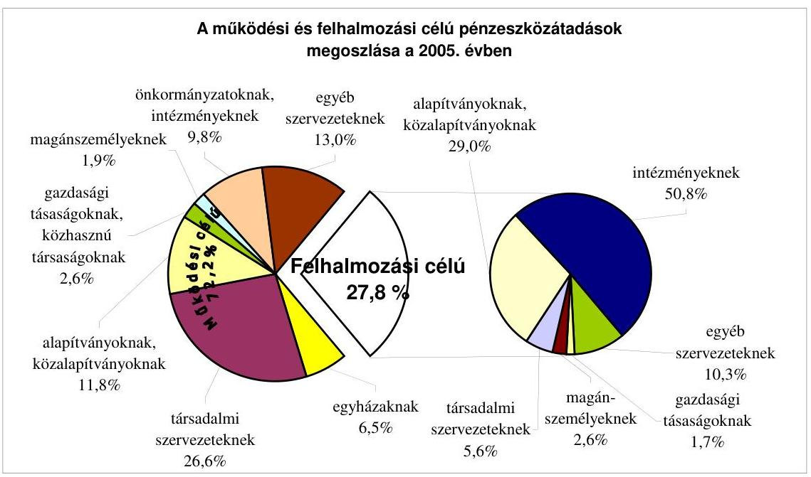
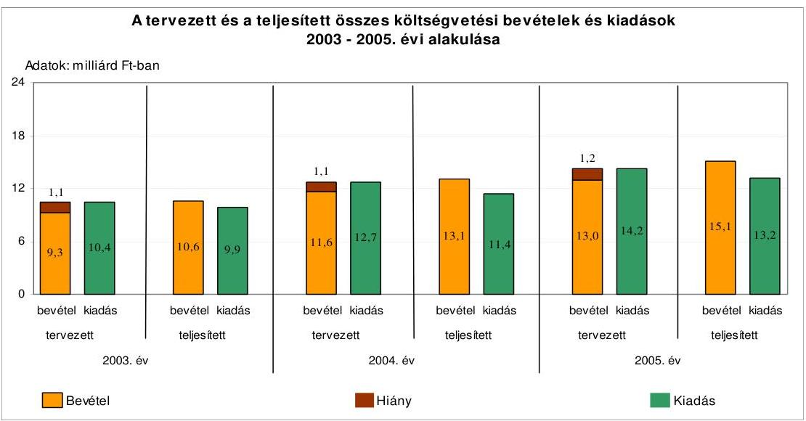
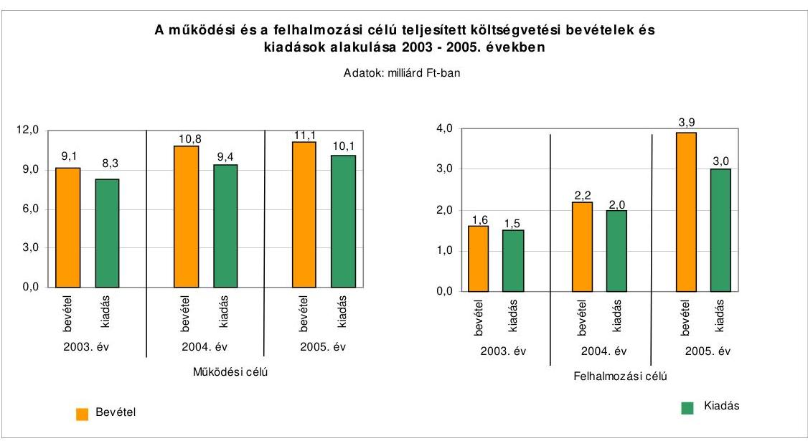
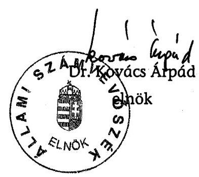
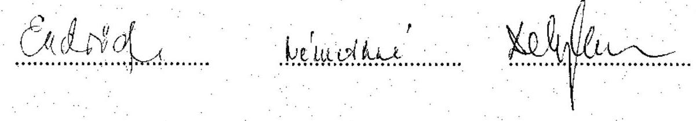

# JELENTÉS 

Budapest Főváros XVII. kerület Önkormányzata gazdálkodási rendszerének 2006. évi átfogó ellenőrzéséről

---

# 3. Önkormányzati és Területi Ellenőrzési Igazgatóság 

3.3. Átfogó Ellenőrzések Főcsoport

Iktatószám: V-1003-5/31/14/2006.
Témaszám: 803
Vizsgálat-azonosító szám: V026

## Az ellenőrzést felügyelte:

Dr. Lóránt Zoltán
főigazgató
Az ellenőrzés végrehajtásáért felelős:
Dr. Sepsey Tamás
főigazgató-helyettes
Az ellenőrzést vezette:
Molnár Gyula Mihály
osztályvezető főtanácsos
Az ellenőrzést végezték:
Endrődy Péterné Kisgergely István Schósz Attiláné számvevő tanácsos számvevő számvevő tanácsos

A témához kapcsolódó eddig készített számvevőszéki jelentések:
címe
sorszáma
Jelentés a helyi és a helyi kisebbségi önkormányzatok gazdálkodás319
sának átfogó ellenőrzéséről
Jelentés a középfokú oktatás feltételei alakulásának ellenőrzéséről ..... 0445
Jelentés a Magyar Köztársaság 2004. évi költségvetése végrehajtás540
sának ellenőrzéséről

- II. számú függelék a kötött felhasználású támogatások 2004. évi felhasználásának vizsgálatáról
- III. számú függelék a helyi önkormányzatok beruházásaihoz és rekonstrukcióihoz nyújtott 2004. évi felhalmozási célú támoga- tások ellenőrzéséről

---

# TARTALOMJEGYZÉK 

BEVEZETÉS ..... 7
I. ÖSSZEGZŐ MEGÁLLAPÍTÁSOK, KÖVETKEZTETÉSEK, JAVASLATOK ..... 9
II. RÉSZLETES MEGÁLLAPÍTÁSOK ..... 20

1. A költségvetés tervezésének, végrehajtásának, az Önkormányzat vagyongazdálkodásának és a zárszámadás elkészítésének szabályszerűsége ..... 20
1.1. A költségvetési rendelet jóváhagyásának, módosításának, az előirányzatok nyilvántartásának szabályszerűsége ..... 20
1.2. A gazdálkodás szabályozottsága, a bizonylati rend és fegyelem szabályszerűsége ..... 24
1.3. A pénzügyi-számviteli feladatok ellátásának informatikai támogatottsága ..... 32
1.4. Az önkormányzati vagyon nyilvántartása, számbavétele ..... 34
1.5. A vagyonnal való gazdálkodás szabályszerűsége, célszerűsége, nyilvánossága ..... 36
1.6. A céljelleggel nyújtott támogatások szabályszerűsége ..... 44
1.7. A közbeszerzési eljárások szabályszerűsége ..... 48
1.8. A zárszámadási kötelezettség teljesítésének szabályszerűsége ..... 51
1.9. A Polgármesteri hivatal helyi kisebbségi önkormányzatok gazdálkodását segítő tevékenysége ..... 53
2. Az önkormányzati feladatok és a rendelkezésre álló források összhangja ..... 54
2.1. A feladatok meghatározása és szervezeti keretei ..... 54
2.2. A költségvetés egyensúlyának helyzete ..... 58
2.3. A feladatok finanszírozása ..... 64
3. A belső ellenőrzési rendszer múködésének értékelése ..... 67
3.1. Az ellenőrzési rendszer kialakítása, működése ..... 67
3.2. A könyvvizsgálati kötelezettség teljesítése ..... 69
3.3. A korábbi számvevőszéki ellenőrzések javaslatainak hasznosulása ..... 70

---

# MELLÉKLETEK 

1. számú Az Önkormányzat gazdálkodását meghatározó adatok, mutatószámok (1 oldal)
2. számú Az önkormányzati vagyon nagyságának alakulása (1 oldal)
3. számú Az önkormányzat 2005. évi bevételeinek és kiadásainak alakulása (1 oldal)
4. számú Egyes önkormányzati feladatok finanszírozása (1 oldal)
5. számú Helyszíni ellenőrzési jegyzőkönyv (3 oldal)

---

# RÖVIDÍTÉSEK JEGYZÉKE 

## Törvények

Áht.
Fot.

Hatv. tv.
Htv.

Kbt.
Ksztv.
Nek. tv.

Ötv.
Számv. tv.
vízgazdálkodásról szóló törvény

## Rendeletek

Ámr.
Ber.
20/1995. (III. 3.) Korm. rendelet

2005. évi költségvetési rendelet

2006. évi költségvetési rendelet

2005. évi zárszámadási rendelet
önkormányzati SzMSz
vagyongazdálkodási rendelet ${ }_{1}$
vagyongazdálkodási rendelet ${ }_{2}$
az államháztartásról szóló 1992. évi XXXVIII. törvény
a fogyatékos személyek jogairól és esélyegyenlőségének biztosításáról szóló 1998. évi XXVI. törvény
a helyi adókról szóló 1990. évi C. törvény
a helyi önkormányzatok és szerveik, a köztársasági megbízottak, valamint egyes centrális alárendeltségű szervek feladat- és hatásköreiről szóló 1991. évi XX. törvény
a közbeszerzésekről szóló 2003. évi CXXIX. törvény
a közhasznú szervezetekről szóló 1997. évi CLVI. törvény
a nemzeti és etnikai kisebbségek jogairól szóló 1993. évi LXXVII. törvény
a helyi önkormányzatokról szóló 1990. évi LXV. törvény
a számvitelről szóló 2000. évi C. törvény
a vízgazdálkodásról szóló 1995. évi. LVII. törvény
az államháztartás múködési rendjéről szóló 217/1998. (XII. 30.) Korm. rendelet
a költségvetési szervek belső ellenőrzéséről szóló 193/2003. (XI. 26.) Korm. rendelet
a kisebbségi önkormányzatok költségvetésének, gazdálkodásának, vagyonjuttatásának egyes kérdéseiről szóló 20/1995. (III. 3.) Korm. rendelet
Budapest Főváros XVII. kerület Önkormányzatának 11/2005. (III. 4.) számú rendelete a 2005. évi költségvetésről és végrehajtási szabályairól
Budapest Főváros XVII. kerület Önkormányzatának 5/2006. (III. 9.) számú rendelete a 2006. évi költségvetésről és végrehajtási szabályairól
Budapest Főváros XVII. kerület Önkormányzatának 19/2006. (V. 22.) számú rendelete a 2005. évi költségvetési zárszámadásról
Budapest Főváros XVII. kerület Önkormányzatának 21/2003. (V. 7.) számú rendelete az Önkormányzat Szervezeti és Múködési Szabályzatáról
Budapest Főváros XVII. kerület Önkormányzatának 30/1996. (V. 24.) számú rendelete az Önkormányzat vagyonáról való rendelkezési jog gyakorlásának szabályairól
budapest Főváros XVII. kerület Önkormányzatának 52/2004. (X. 27.) számú rendelete az Önkormányzat vagyonáról való rendelkezési jog gyakorlásának szabályairól

---

Vhr.

## Szórövidítések

ÁSZ
ÉP-17 Kft.
FEUVE
Fővárosi Önkormányzat
Gazdasági iroda
hivatali SzMSz
jegyző
Jegyzői iroda
Képviselő-testület
kisebbségi önkormányzatok
Közbeszerzési Döntőbizottság
közbeszerzési szabályzat
Kőbányai Önkormányzat
Lakás-17 Kft.
MÁK
Múvelődési bizottság
Önkormányzat
Pénzügyi bizottság
Pénzügyi csoport
polgármester
Polgármesteri hivatal
Számviteli csoport

Szolgáltató Központ
az államháztartás szervezetei beszámolási és könyvvezetési kötelezettségének sajátosságairól szóló 249/2000. (XII. 24.) Korm. rendelet

Állami Számvevőszék
ÉP-17 Építőipari Kivitelező, Karbantartó és Szolgáltató Kft. folyamatba épített előzetes és utólagos vezetői ellenőrzés
Budapest Főváros Önkormányzata
Budapest Főváros XVII. kerület Önkormányzata Polgármesteri Hivatalának Gazdasági Irodája
Budapest Főváros XVII. kerület Önkormányzata Polgármesteri Hivatalának Szervezeti és Múködési Szabályzata (a Képviselő-testület a 124/2005. (III. 17.) számú határozatával hagyta jóvá)
Budapest Főváros XVII. kerület Önkormányzatának jegyzője
Budapest Főváros XVII. kerület Önkormányzata Polgármesteri Hivatalának Jegyzői Irodája
Budapest Főváros XVII. kerület Önkormányzatának Kép-viselő-testülete
Budapest Főváros XVII. kerület Kisebbségi Önkormányzatai
Közbeszerzések Tanácsa Közbeszerzési Döntőbizottsága
Budapest Főváros XVII. kerület Önkormányzatának közbeszerzési szabályzata
Budapest Főváros X. kerület Kőbánya Önkormányzata
Lakás-17 Vagyonkezelő Kft.
Magyar Államkincstár
Budapest Főváros XVII. kerület Önkormányzat Képviselőtestületének Múvelődési Bizottsága
Budapest Főváros XVII. kerület Önkormányzata
Budapest Főváros XVII. kerület Önkormányzat Képviselőtestületének Pénzügyi Bizottsága
Budapest Főváros XVII. kerület Önkormányzata Polgármesteri Hivatalának Gazdasági Irodájának Pénzügyi Csoportja
Budapest Főváros XVII. kerület Önkormányzatának polgármestere
Budapest Főváros XVII. kerület Önkormányzatának Polgármesteri Hivatala
Budapest Főváros XVII. kerület Önkormányzata Polgármesteri Hivatalának Gazdasági Irodájának Számviteli Csoportja
Budapest Főváros XVII. kerület Önkormányzat Egyesített Szolgáltató Központ

---

| Területfejlesztési bizottság | Budapest Főváros XVII. kerület Önkormányzat Képviselőtestületének Terület- és Városfejlesztési Bizottsága |
| :--: | :--: |
| ügyrend | Budapest Főváros XVII. kerület Önkormányzat Polgármesteri Hivatal gazdasági szervezetének ügyrendje (2005. április 15 -től hatályos) |
| Vagyongazdálkodási bizottság | Budapest Főváros XVII. kerület Önkormányzat Képviselőtestületének Vagyongazdálkodási Bizottsága |
| Városigazgatási iroda | Budapest Főváros XVII. kerület Önkormányzata Polgármesteri Hivatalának Városigazgatási Irodája |

---

.

---

# JELENTÉS   a Budapest Főváros XVII. kerület Önkormányzata gazdálkodási rendszerének 2006. évi átfogó ellenőrzéséről 

## BEVEZETÉS

Az Ötv. 92. § (1) bekezdése, az Állami Számvevőszékről szóló 1989. évi XXXVIII. törvény 2. § (3) bekezdése, valamint az Áht. 120/A. § (1) bekezdése alapján az önkormányzatok gazdálkodását az Állami Számvevőszék ellenőrzi. Az ellenőrzésre az Országgyúlés illetékes bizottságai részére is átadott, országosan egységes ellenőrzési program alapján került sor.

## Az ellenőrzés célja annak értékelése volt, hogy:

- az önkormányzati gazdálkodás törvényességét ${ }^{1}$, szabályszerűségét biztosított-ták-e a tervezés, a költségvetés végrehajtása, a vagyongazdálkodás és a zárszámadás során;
- az Önkormányzat által ellátott feladatok és az azokhoz rendelkezésre álló források összhangja biztosított volt-e, különös tekintettel az egyes kiemelt feladatokra;
- a gazdálkodás szabályszerűségét biztosító kontrollok ${ }^{2}$ megfelelően segítettéke a végrehajtást.

Az ellenőrzött időszak: a 2005. és a 2006. év első negyedéve, az 1.5; 2.1-2.3; és 3.3 programpontok esetében a 2003-2004 évek is.

Budapest Főváros XVII. kerületét kilenc településrész ${ }^{3}$ alkotja. A kerület lakosainak száma 2006. január 1-jén 81430 fő volt.

[^0]
[^0]:    ${ }^{1}$ A törvényi előírások betartásának elmulasztásakor a részletes megállapítások fejezetben egységesen a törvénysértés megjelölést alkalmazzuk, mivel az ÁSZ nem tehet különbséget a törvényi előírások között.
    ${ }^{2}$ A gazdálkodás szabályszerűségét biztosító kontroll alatt értjük a kiépített és múködő belső irányítási és szabályozási rendszert, valamint a belső ellenőrzési funkciók ellátását.

    3 Akadémiaújtelep, Rákoscsaba, Rákoscsaba-Újtelep, Rákoshegy, Rákoskeresztúr, Rákoskert, Rákosliget, Madárdomb, Régiakadémiatelep.

---

Az Önkormányzat 29 tagú Képviselő-testületének munkáját 14 állandó bizottság segítette. A polgármester személye a 2002. évi választásokat követően változott, a jegyző személye 1994. óta változatlan.

Az Önkormányzat feladatainak ellátására a 2005. évben a Polgármesteri hivatalon kívül két önálló és 41 részben önállóan gazdálkodó költségvetési szervet múködtetett, valamint két gazdasági társasága vett részt a feladatok végrehajtásában. Intézményeinél 2005. december 31-én 1784 főt foglalkoztattak, a Polgármesteri hivatalban 313 köztisztviselő dolgozott.

Az Önkormányzat a 2005. évben 15062 millió Ft költségvetési bevételt, és 13155 millió Ft költségvetési kiadást teljesített. A 2005. év végén 57902 millió Ft könyvviteli mérleg szerinti vagyonnal rendelkezett. Az Önkormányzat gazdálkodását jellemző adatokat és mutatószámokat az 1-3. számú mellékletek részletesen tartalmazzák.

A kerületben a 2002. évi önkormányzati választásokat követően nyolc ${ }^{4}$ helyi kisebbségi önkormányzat múködött.

A jelentés megállapításainak, javaslatainak egyeztetése során a polgármester arról adott tájékoztatást, hogy az időközben megtett intézkedésekkel a javaslatok egy részét megvalósítottuk. Ezekben az esetekben a jelentés II. Részletes megállapítások fejezetében az adott témához kapcsolt lábjegyzetben a megtett intézkedést feltüntettük, és a kapcsolódó javaslatot elhagytuk.

A jelentést az ÁSZ-ról szóló 1989. évi XXXVIII. tv. 25. § (1) bekezdése alapján észrevétel közlése céljából megküldtük a Budapest Főváros XVII. kerület Önkormányzata polgármesterének, aki nem tett észrevételt.

[^0]
[^0]:    ${ }^{4}$ Bolgár, cigány, görög, lengyel, német, román, ruszin és szlovák.

---

# I. ÖSSZEGZŐ MEGÁLLAPÍTÁSOK, KÖVETKEZTETÉSEK, JAVASLATOK 

A polgármester a Htv. előírását megsértve nem terjesztette a 2005. márciusában elkészített gazdasági program-tervezetet a Képviselő-testület elé, ezáltal az Önkormányzat - az Ötv. előírását megsértve - nem határozta meg gazdasági programját. A polgármester - az Áht-ban előírt határidőt betartva - nyújtotta be a Képviselő-testületnek a 2005. és a 2006. évi költségvetési koncepciókat. A Képviselő-testület rendeletben nem határozta meg a költségvetés előterjesztésekor, illetve a zárszámadáskor a Képviselő-testület részére tájékoztatásul bemutatandó mérlegek, kimutatások tartalmi követelményeit, mely nem felelt meg az Áht. előírásának.

A 2005. és a 2006. évi költségvetési rendelettervezeteket a polgármester az Áhtban előírt határidőt betartva terjesztette a Képviselő-testület elé. A 2005. és a 2006. évi költségvetési rendeletek tartalmazták a múködési és felhalmozási célú bevételeket és kiadásokat, bemutatták az Önkormányzat és intézményei bevételeit főbb jogcím-csoportonkénti részletezettségben, a múködési-fenntartási előirányzatokat önállóan és részben önállóan gazdálkodó költségvetési szervenként. A 2005. és a 2006. évi költségvetési rendeletek nem tartalmazták elkülönítetten a kisebbségi önkormányzatok költségvetését, mivel a bevételek elkülönített bemutatása elmaradt, ezáltal a kisebbségi önkormányzatok költségvetését az Ámr. előírása ellenére nem változatlan formában építették be az Önkormányzat költségvetésébe. Megsértve az Áht-ban foglalt előírásokat a 2005. és a 2006. évi költségvetési rendeletekben a költségvetési bevételek és kiadások között finanszírozási célú pénzügyi műveleteket szerepeltettek, a tervezett költségvetési hiányt nem mutatták be. A költségvetés előterjesztésekor egyik évben sem mutatták be a közvetett támogatásokat és azok szöveges indoklását, mely nem felelt meg az Áht. előírásának. A költségvetési előirányzatok módosítására előterjesztett rendelettervezetek a költségvetéssel összehasonlítható módon tartalmazták a módosítási javaslatokat. Az Önkormányzat a 2005. évi költségvetési rendeletében jóváhagyott előirányzatokat hét alkalommal módosította, melynek során a kiadások és bevételek főösszegét $22 \%$-kal, 3130 millió Ft-tal növelte.

A hivatali SzMSz és a gazdasági szervezet ügyrendje az Ámr-ben foglalt előírásoknak megfelelt. A polgármester és a jegyző az Ámr. alapján felhatalmazást adott kötelezettségvállalásra, utalványozásra, valamint ellenjegyzésre, melyek során az összeférhetetlenségi követelmények érvényesülését biztosították. A jegyző nem alakította ki az önállóan gazdálkodó költségvetési szervek számviteli rendjét, mellyel megsértette a Htv. előírását. A számviteli politikában szabályozták, hogy a számviteli elszámolás és értékelés szempontjából mit tekintenek lényegesnek, illetve jelentős összegnek. Rögzítették, mi tekintendő figyelembe veendő szempontnak a megbízható és valós összkép kialakítását befolyásoló lényeges információk tekintetében. A leltározási és leltárkészítési szabályzat tartalmazta a leltározás előkészítésével, megszervezésével és végrehajtásával kapcsolatos feladatokat. Az értékelési szabályzatban rögzítették a követelések értékelésének elveit, az adósminősítés szempontjait, az eszközök bekerü-

---

lési értékébe beszámítandó kifizetések tartalmát, megnevezését. A pénzkezelési szabályzatban meghatározták a bankszámlák és a pénztár kapcsolatrendszerét, a készpénz felvételének rendjét, a pénztáros feladatait. A napi záró pénzkészlet maximális értéke vagyonvédelmi szempontból indokolatlanul magas volt. A selejtezési szabályzat tartalmazta a minősítési jogokat gyakorló munkaköröket, a hasznosítás során követendő eljárási rendet, az ármegállapítás szabályait. A számlarendben rögzítették a főkönyvi számlákat érintő gazdasági eseményeket, azoknak más számlákkal való kapcsolatait, az analitikus nyilvántartások vezetésének kötelezettségét. A számviteli politika és a pénzkezelési szabályzat nem tartalmazta a Vhr. előírása ellenére a kisebbségi önkormányzati gazdálkodással összefüggő sajátos feladatokat.

A munkafolyamatokba épített ellenőrzési feladatokat a munkaköri leírásokban konkrétan, egyértelműen és célszerűen rögzítették. A jegyző a bevételek szakmai teljesítés igazolása esetében nem, ezen túl gondoskodott a FEUVE megszervezéséről és múködtetéséről az Áht-ban foglalt előírások alapján. A gazdasági eseményeket magukba foglaló bizonylatok 10\%-a - a Számv. tv. előírását megsértve - nem felelt meg az alaki és tartalmi követelményeknek, mivel az Ámr. előírása ellenére a költségvetést terhelő kötelezettségvállalások 3\%-át nem foglalták írásba, valamennyi bevételi bizonylat esetében elmaradt az utalványozás és annak ellenjegyzése, valamint a szakmai teljesítés igazolása. A kötelezettségvállalás ellenjegyzője a bizonylatok $1 \%$-a esetében nem teljesítette az Ámr-ben foglalt ellenőrzési feladatait, mivel az ellenjegyzést megelőzően nem győződött meg arról, hogy a kötelezettségvállalás tárgyával összefüggő kiadási előirányzat rendelkezésre áll-e és a kötelezettségvállalás nem sérti-e a gazdálkodásra vonatkozó szabályokat. Az utalványozásra az Áht. előírását megsértve az e célra jóváhagyott kiadási előirányzat hiányában került sor. Ezen hiányosságok esetében a szakmai teljesítést igazolók, az érvényesítők és az utalvány ellenjegyzői nem tettek eleget a munkafolyamatba épített ellenőrzési feladataiknak.

A költségvetési pénzforgalmat érintő gazdasági események bizonylatainak adatait a bankszámlák és a készpénzforgalom esetében a Vhr. előírásainak megfelelő időpontban rögzítették a könyvviteli nyilvántartásban. A kiadások elszámolása a főkönyvi számlákon egy magánszemélynek adott céljellegú támogatás esetében nem a Vhr. előírása alapján történt. A kötelezettségvállalásokról vezetett analitikus nyilvántartás biztosította annak feltételeit, hogy kötelezettségvállalás és utalványozás csak a jóváhagyott kiadási előirányzatok mértékéig teljesüljön. A 2005. évi zárszámadási rendelet szerint önkormányzati szinten a költségvetési rendelet módosított előirányzatait a teljesítési adatok nem haladták meg, a költségvetési szervek kiemelt előirányzataikon belül gazdálkodtak.

A Polgármesteri hivatalban a kötelezettségvállalás és a kis értékú tárgyi eszköznyilvántartást kézzel, a többi analitikus nyilvántartást számítógépes programok segítségével vezették. A főkönyvi könyvelés és a beszámoló készítés informatikai támogatottsággal történt. Az Önkormányzat nem rendelkezett informatikai stratégiával és katasztrófa elhárítási tervvel. A védelmi szabályzat nem tartalmazta, hogy a felhasználói igényeket ki jogosult elbírálni. A Gazdasági iroda dolgozóinak munkaköri leírásai tartalmazták a kapcsolódó számítástechnikai rendszer használatát és az elvégzendő feladatokat.

---

A vagyon nyilvántartásáról a Vhr. előírásainak megfelelően gondoskodtak. Az ingatlanok, a részesedések, az értékpapírok, a rövid- és hosszú lejáratú követelések, kötelezettségek, valamint a pénzeszközök analitikus nyilvántartása a főkönyvi számlákkal a 2005. év végi záráskor egyezőséget mutatott. Az üzemeltetésre átadott eszközök analitikus nyilvántartását az üzemeltető Lakás-17 Kft. vezette, a főkönyvi könyvelés és az analitikus nyilvántartásból a társaság által készített összesítő kimutatás egyezőségéről gondoskodtak. Az ingatlanok menynyiségi felvétele a Vhr., valamint a leltározási és leltárkészítési szabályzat előírása ellenére elmaradt. Az üzemeltetésre átadott eszközök leltározását nem a Vhr. előírásának megfelelően hajtották végre. Az értékvesztés elszámolásának szükségességét a részesedések esetében vizsgálták, a követelések értékeléséhez szükséges információk azonban nem álltak rendelkezésre. A vevők, adósok értékvesztésének elszámolását - a Számv. tv. előírásait megsértve - nem végezték el. A kárpótlási jegyekre - az indokolatlanság ellenére, a Számv. tv. előírásával ellentétesen - értékvesztést számoltak el, valamint a Vhr-ben foglaltak ellenére nem végezték el az elszámolt értékvesztés visszaírását.

A vagyongazdálkodással kapcsolatos feladatokat és döntési hatásköröket az Önkormányzat rendeletekben szabályozta. A vagyongazdálkodási rendeletekben a forgalomképesség szerinti besorolás megváltoztatásának módjáról nem rendelkeztek. A tulajdonnal való rendelkezési hatásköröket értékhatárhoz kötötten, célszerűen megosztották a Képviselő-testület, a Vagyongazdálkodási bizottság és a polgármester között. Az értékesítések esetében nyilvános versenyeztetési kötelezettséget - az Áht. előírását megsértve - csak 2004. március 1jétől írtak elő, a felmentés eseteinek széles körét meghatározva, ez ellentétes volt a törvény előírásaival és nem segítette elő a vagyongazdálkodás átláthatóságát. A vagyon kezelésének, használatának, illetve a hasznosítás jogának átengedésére - az Áht-t megsértve - a nyilvános versenyeztetési kötelezettséget nem terjesztették ki. A víziközmű hálózat közüzemi társaság részére történő ingyenes tulajdonba adás lehetőségét biztosító szabályozással az Önkormányzat megsértette az Ötv. és a vízgazdálkodásról szóló törvény előírását. A követelésről való lemondás és ingyenes átadás eseteit és módját a vagyongazdálkodási rendeletekben meghatározták. Az Önkormányzat a vagyonával történő gazdálkodással (árubeszerzés, építési beruházás, szolgáltatás megrendelés, vagyonértékesítés, vagyonhasznosítás, vagyon vagy vagyoni értékű jog átadás, valamint koncesszióba adás) összefüggő - nettó ötmillió Ft-ot elérő, vagy azt meghaladó értékű - szerződések közzétételi kötelezettségének eleget tett, a nem normatív, fejlesztési célú támogatások közzétételét azonban kilenc esetben - az Áht. előírását megsértve - elmulasztották.

A vételi szándékot bejelentő vevők részére - a döntési hatáskörre vonatkozó előírásokat betartva - értékesítettek telekingatlanokat. Az értékesítések során a vagyongazdálkodási rendeletek értékbecslési kötelezettségre vonatkozó előírását nem tartották be, továbbá megsértették az Áht. nyilvános versenytárgyalásra vonatkozó előírását. A szerződésekbe az Önkormányzat érdekeit védő garanciális elemeket beépítették. Az Önkormányzat tulajdonában lévő részvények értékesítése a helyi szabályozásnak megfelelően történt. A selejtezést - a selejtezési bizottság kijelölésének kivételével - a selejtezési szabályzatban foglaltaknak megfelelően hajtották végre. Az Önkormányzat kedvezményes bérleti díj alkalmazásával közvetett támogatásban részesített négy pártszervezetet, ezáltal nem biztosította az alkotmányos egyenlőséget a bérlők között, és nem tett

---

eleget az Ötv. előírásainak. Tisztségviselők és a Polgármesteri hivatal köztisztviselője hatáskör nélkül - az Ötv. és vízgazdálkodásról szóló törvény előírásait megsértve - adtak az üzemeltető Fővárosi Vízmúvek Rt. tulajdonába víziközmú beruházást. A vagyongazdálkodási rendeletek szerződéssel történő átadásra vonatkozó előírását sem tartották be, mert a térítésmentes átadás múszaki át-adás-átvételi jegyzőkönyv alapján történt a víziközmú és közvilágítás bővítési beruházás esetében az üzemeltető társaság részére. Az Áht. előírását megsértve került térítésmentesen átadásra gázvezeték beruházás a Fővárosi Gázmúvek Rt. részére, mert a vagyongazdálkodási rendelet ezt a térítésmentes átadás esetei között nem nevesítette. Az ingyenes átadásnál a hatáskört túllépő köztisztviselőt és alpolgármestereket a jegyző, illetve a polgármester írásbeli figyelmeztetésben részesítette. A vagyongazdálkodási rendelet ${ }_{2}$ előírását betartva adta át az Önkormányzat a szennyvízcsatorna beruházást megállapodással a Fővárosi Önkormányzat részére.

Az Önkormányzat a 2005. évi költségvetési rendeletében felhalmozási és múködési célú támogatásokat hagyott jóvá címzetten, valamint támogatásra szolgáló előirányzatokat különített el általános gazdálkodási tartalékként és céltartalékként. Az Önkormányzat a 2005. év folyamán 167,4 millió Ft összegben 350 esetben adott céljellegú támogatást. A támogatási döntéseket a helyi szabályozásnak és az Ötv. előírásainak megfelelően hozták meg, a támogatások 16\%-ánál a Képviselő-testület, 35\%-ánál a döntési hatáskörrel felruházott bizottságok, 49\%-ánál a polgármester döntött. Az Önkormányzat a támogatott szervezetekkel minden esetben szerződést, illetve megállapodást kötött a számadási kötelezettség meghatározásával. A megállapodások a támogatott cél megvalósításáról szóló szöveges beszámoló készítésére vonatkozó előírást nem tartalmaztak, a számadásokhoz szöveges beszámolót csak a bizottságok által jóváhagyott támogatások esetében mellékeltek. A számadásokat a Polgármesteri hivatal munkatársai szakmai és pénzügyi szempontból is ellenőrizték, céltól eltérő felhasználást nem állapítottak meg. A támogatások összesített nyilvántartását nem alakították ki. A számadás hiánya, valamint nem megfelelő elszámolás miatt a kiutalt összeg teljes, illetve részleges visszafizetésére kötelezett az Önkormányzat négy szervezetet, amelyek visszafizetési kötelezettségüknek eleget tettek. A felújításra, beruházásra adott támogatások esetében a felhasználást a támogatott szervezeteknél a helyszínen ellenőrizték, a többi támogatás esetében a cél szerinti felhasználás ellenőrzése - az Áht. előírását megsértve - elmaradt.

Az Önkormányzat a 2005. éves összesített közbeszerzési tervét, valamint a Polgármesteri hivatal a közbeszerzési szabályzatát elkészítette, amelynek végrehajtására polgármesteri, illetve jegyzői utasítást adtak ki. A 2005. évben a becsült értékek meghatározásánál betartották a Kbt-ben előírtakat. Az egybeszámítás követelményét két esetben nem érvényesítették, azonban a beruházások esetében a Kbt. előírásai szerint jártak el, a közbeszerzési eljárást mindkét építési beruházás esetében lefolytatták. Az ÁSZ ellenőrzés által vizsgált közbeszerzési eljárás során a Kbt. előírásait egy esetben megsértették, mert nem határozták meg az ajánlati felhívásban - csak az ajánlati dokumentációban - az ajánlatok részszempontok szerinti tartalmi elemeinek értékelése során adható pontszám alsó és felső határait. A közbeszerzéseket, illetve a közbeszerzési eljárásokat a Polgármesteri hivatalnál belső ellenőrzés, valamint az Önkormányzat költségvetési szerveinél felügyeleti ellenőrzés keretében - a Kbt-ben előírta-

---

kat megsértve - nem vizsgálták. A Közbeszerzési Döntőbizottság a 2005. évben egy alkalommal indított eljárást az Önkormányzat ellen, a jogszabálysértést megállapította, azonban bírság kiszabására nem került sor.

Az Önkormányzat 2005. évi gazdálkodásáról szóló zárszámadási rendelettervezetet a polgármester - az Áht-ban foglalt határidőt betartva - terjesztette a Képviselő-testület elé. Az Áht. előírását megsértve a jóváhagyott kiadási főöszszeg a költségvetési kiadási főösszegtől eltért, mivel tartalmazta a hitelek törlesztését is. A kisebbségi önkormányzatokra vonatkozóan a 2005. évi zárszámadási rendelet nem tartalmazta elkülönítetten a bevételeket, mely nem felelt meg az Áht. előírásának. A rendelettervezet tartalmazta a múködési és felhalmozási célú bevételeket az Önkormányzatra és költségvetési szerveire. A rendelettervezet előterjesztésekor - az Áht. előírásaival ellentétesen - elmaradt a közvetett támogatások szöveges indoklásának bemutatása. A Képviselő-testület a 2005. évi zárszámadási rendeletben a Vhr-nek és az Ámr-nek megfelelően hagyta jóvá a Polgármesteri hivatal és az önállóan gazdálkodó intézmények tárgyévi pénzmaradványát. Az intézményeket az éves számszaki beszámolóik és múködésük elbírálásáról, jóváhagyásáról az Ámr-ben foglalt előírások alapján, írásban értesítették.

Az Önkormányzat illetékességi területén múködő nyolc kisebbségi önkormányzattal a polgármester - az Ötv. előírását megsértve - felhatalmazás nélkül írta alá az együttmúködési megállapodásokat. Az együttmúködési megállapodásokban részletesen rögzítették a költségvetés tervezése, annak végrehajtása vonatkozásában az együttmúködés rendjét és szabályait. Nem tartalmazták - az Ámr. előírásai ellenére - a megállapodások a zárszámadási hatá-rozat-tervezetek előkészítésének rendjét, valamint a költségvetési, zárszámadási határozatok Önkormányzat részére történő átadásának határidejét. Az együttműködési megállapodásokat a 2005. évre vonatkozóan az előírt határidőn belül felülvizsgálták, módosításukra nem került sor. A Polgármesteri hivatalban elkülönítetten vezették a kisebbségi önkormányzatok vagyoni és számviteli nyilvántartásait. Az Önkormányzat gondoskodott a kisebbségi önkormányzatok testületi múködésének tárgyi feltételeiről.

A Képviselő-testület - az Ötv. előírásai ellenére - a lakossági igények és az Önkormányzat anyagi lehetőségeitől függően nem határozta meg a feladatai ellátásának módját és mértékét. Az Önkormányzat a kötelező és önként vállalt feladatainak ellátását költségvetési szervekkel, valamint gazdasági társaságokkal, közhasznú és egyéb szervezetekkel kötött ellátási, illetve vállalkozási szerződésekkel biztosította. A Képviselő-testület az ellátotti létszámhoz is igazodva, de elsősorban a feladatellátás hatékonyabb szervezeti megoldása érdekében a 2003-2005. években különböző, az intézményrendszer átalakítását érintő intézkedéseket hozott. Kötelező, illetve nem kötelező feladatot ellátó önkormányzati intézmény fenntartási- és tulajdonjogának átadására nem került sor.

Az Önkormányzat költségvetésének egyensúlya - a 2003-2005. években jóváhagyott költségvetési rendeletek szerint - nem volt biztosított. A tervezett hiány mértéke a tervezett költségvetési kiadások 11\%-ának, 8\%-ának, valamint $8 \%$-ának felelt meg. A tervezettől eltérően a teljesítési adatok szerint az Önkormányzatnak költségvetési többlete volt mindhárom évben. Az Önkor-

---

mányzat a 2003. és a 2004. évben az átmeneti finanszírozási zavarok megoldására folyószámlahitelt vett fel. Az Önkormányzat adósságot keletkeztető kötelezettségvállalás keretében a 2003. évben felhalmozási célú feladat megvalósításához kölcsönt vett igénybe és líingszerződést kötött, a 2004. évben készfizető kezességet vállalt, melyek azonban nem veszélyeztették az Önkormányzat fizető- és működőképességét. Az Önkormányzat 1997. január 1-jétől vezette be az építmény- és a telekadót, a Hatv-ben rögzítetteken túlmenően mentességeket és kedvezményeket biztosított. A 2003-2005. évek közötti időszakban a helyi adóbevételek összege 3537 millió Ft-ot, 4445 millió Ft-ot, illetve 4522 millió Ftot tett ki, részaránya az összes költségvetési bevételen belül a 2003. évben 33\%, a 2004. évben $34 \%$ és a 2005. évben $30 \%$ volt. Az Önkormányzat a feladatellátás finanszírozásához rendelkezésre álló forrásait a 2003-2005. évek között pályázati úton elnyert 3402 millió Ft-tal növelte, mely 50\%-ban nyújtott fedezetet a megvalósított beruházásokhoz.

Az egyes, naturális mutatókkal mérhető kötelező feladatok esetében a feladatok finanszírozását a fajlagos kiadások változása, az ellátottak számának és a kapacitások kihasználtságának alakulása határozta meg. A nevelési-oktatási feladatok esetében jelentősen, 15-38\%-kal emelkedtek az egy főre jutó kiadások, a nappali szociális intézményi ellátás fajlagos kiadásai $4 \%$-kal mérséklődtek. A bentlakásos szociális intézményi ellátás fajlagos kiadásai - a csökkenő kapacitáskihasználtság miatt - ezen időszakban 47\%-kal nőttek. A kiadások finanszírozásában a központi költségvetési hozzájárulás, támogatás részaránya a 2003. és a 2005. években a bölcsődei és a nappali szociális intézményi ellátás eseteiben növekedett, az óvodai nevelés, általános- és középiskolai oktatás, valamint a bentlakásos szociális intézményi ellátás esetében csökkent. Az Önkormányzat önként vállalt feladatok megvalósítására a 2003-2005. években az éves költségvetési kiadásainak közel azonos arányát, 9-10\%-át fordította, melynek összege 898-1247 millió Ft-ot tett ki. A nem kötelező feladatok ellátása a 2003-2005. években nem veszélyeztette a kötelező feladatok megvalósítását. A Fot. előírása ellenére az Önkormányzat nem biztosította 81 középület akadálymentesítését.

Az Önkormányzat a Polgármesteri hivatalon belül kialakította a belső ellenőrzés szervezeti keretét, de a Belső ellenőrzési csoport létszámát a Ber. előírása ellenére nem kapacitás felmérés alapján állapították meg, a létszám nem állt arányban a szervezet által ellátandó feladatokkal. A foglalkoztatott belső ellenőrök közül egy fő nem rendelkezett az előírt iskolai végzettséggel. A belső ellenőrzés szervezeti függetlenségét - az Áht. előírása ellenére - nem biztosították, mert a Belső ellenőrzési csoport a Jegyzői iroda keretén belül az iroda vezetőjének szakmai irányításával működött. A hosszú távú célkitűzéseket tartalmazó stratégiai tervet és az éves ellenőrzési terveket a Ber-ben előírtak ellenére nem kockázatelemzés alapján készítette el a belső ellenőrzési vezető. A stratégiai tervben foglaltak ellenére a vagyongazdálkodás ellenőrzését az éves ellenőrzési tervekbe nem építették be. A 2005. évi ellenőrzési tervben előirányzott 37 ellenőrzés $57 \%$-a az intézmények és a Polgármesteri hivatal gazdálkodásának pénzügyi és szabályszerűségi ellenőrzését jelentette, amelyek közül öt ellenőrzés elmaradt a panaszbejelentésekhez kapcsolódó célvizsgálati igények felmerülése miatt. Az ellenőrzésekről a Ber. előírásainak megfelelő tartalmú jelentések készültek, a feltárt hiányosságok megszüntetése érdekében intézkedési terveket készítettek, amelyek végrehajtásáról beszámolók alapján győződtek meg. Az

---

éves összefoglaló jelentés tudomásul vételéről a Képviselő-testület határozattal döntött. A belső ellenőrzés múködtetéséről az éves költségvetési beszámoló keretében a jegyző - az Áht. előírását megsértve - nem számolt be.

Az Önkormányzat az Ötv-ben előírt könyvvizsgálati kötelezettségnek eleget tett. A könyvvizsgáló a 2005. évi egyszerűsített beszámolót hitelesítő záradékkal látta el, auditálási eltérést nem állapított meg.

Az ÁSZ az Önkormányzat gazdálkodását a 2002. évben átfogó jelleggel ellenőrizte. A Magyar Köztársaság 2004. évi költségvetése végrehajtásának ellenőrzése keretében került sor a kötött felhasználású támogatások 2004. évi felhasználásának, valamint a beruházásokhoz és rekonstrukciókhoz nyújtott 2004. évi felhalmozási célú támogatások ellenőrzésére a 2005. év folyamán. A 2004. évben vizsgálta az ÁSZ a középfokú oktatás feltételeinek alakulását az Önkormányzatnál. A négy ellenőrzésről készített jelentés összesen 16-16 szabályszerűségi, illetve célszerűségi javaslatot tartalmazott, amelyeknek $85 \%$-át megvalósították, két-két javaslatot nem, illetve részben hasznosítottak. A gazdasági program készítésére vonatkozó javaslat nem teljesült, illetve nem valósult meg a szennyvízközmű Fővárosi Önkormányzat részére történő átadásról hozott kép-viselő-testületi határozat és a vagyongazdálkodási rendelet ${ }_{2}$ felülvizsgálata. Részben hasznosult a Pénzügyi bizottság feladattervére, valamint a kisebbségi önkormányzatokkal kötött együttműködési megállapodások kiegészítésére irányuló javaslat. Az intézkedésekkel javult a költségvetés tervezésének, a zárszámadásnak és az operatív gazdálkodásnak a szabályszerűsége, valamint a belső ellenőrzés színvonala. A kötött felhasználású támogatások, illetve a beruházásokhoz nyújtott támogatások ellenőrzéséhez kapcsolódó javaslatok realizálásának eredményeként a szabályozás területén tapasztalt hiányosságokat megszüntették.

A helyszíni ellenőrzés megállapításainak hasznosítása mellett javasoljuk:

# a polgármesternek 

a jogszabályi előírások maradéktalan betartása érdekében
1. a költségvetési gazdálkodás jogszabályszerű kereteinek kialakítása során
a) terjessze a Htv. 139. § (1) bekezdés a) pontja alapján a Képviselő-testület elé az Ötv. 91. § (1) bekezdésében foglalt előírás teljesülése érdekében elfogadásra a gazdasági programot;
b) kezdeményezze, hogy a Képviselő-testület rendeletben határozza meg az Áht. 118. §-ában foglalt előírás teljesülése érdekében, az éves költségvetési és zárszámadási rendelettervezet előterjesztésekor tájékoztatásul bemutatott összevont mérlegek, többéves kihatással járó döntések számszerúsítését, valamint a közvetett támogatásokat tartalmazó kimutatások és szöveges indoklásuk tartalmi követelményeit;
2. gondoskodjon az Áht. 12/A. § (1) bekezdésének előírása alapján arról, hogy utalványozásra a jóváhagyott kiadási előirányzatok mértékéig kerüljön sor;

---

3. a szabályszerű vagyongazdálkodás érdekében
a) kezdeményezze a vagyongazdálkodási rendelet ${ }_{2}$ módosítását a víziközmű vagyon közszolgáltató részére történő ingyenes átadásának megszüntetésére vonatkozóan az Ötv. 79. § (2) bekezdés és a vízgazdálkodásról szóló törvény 6. § (3) bekezdés előírásának betartása érdekében;
b) kezdeményezze a vagyongazdálkodási rendelet ${ }_{2}$ kiegészítését a versenyeztetési kötelezettség hasznosításra, vagyonkezelés átengedésére és használatba adására vonatkozó előírásával, és módosítását annak érdekében, hogy ne tartalmazzon az Áht. 108. § (1) bekezdésében előírtaktól eltérő - a versenyeztetési kötelezettség alól felmentést lehetővé tevő - szabályozást;
c) biztosítsa az ingatlanértékesítések során a vagyongazdálkodási rendeletben ${ }_{2}$ előírt kötelezettség betartását az értékbecslés készítésre vonatkozóan;
d) gondoskodjon a pártok közvetett támogatásának megszüntetéséről azzal, hogy az ingatlanok pártszervezetek részére történő bérbeadásánál a bérleti díj a Képvi-selő-testület 160/2004. (IV. 15.) számú határozatának megfelelően kerüljön meghatározásra az Ötv. 78. § (1) bekezdésében foglaltak betartása érdekében;
e) gondoskodjon arról, hogy az Ötv. 79. § (2) bekezdése és a vízgazdálkodásról szóló törvény 6. § (3) bekezdése előírásainak megfelelően a térítésmentesen átadott víziközművek önkormányzati tulajdonba kerüljenek és egyéb közművek térítésmentes átadására csak megállapodással, a vagyongazdálkodási rendeletben ${ }_{2}$ rögzített esetekben kerüljön sor az Áht. 108. § (2) bekezdésében foglaltak betartása érdekében;
4. biztosítsa, hogy a Képviselő-testület az Ötv. 9. § (1) bekezdésében foglaltak alapján a kisebbségi önkormányzatokkal kötött együttműködési megállapodásokat tárgyalja meg;
5. kezdeményezze, hogy a Képviselő-testület az Ötv. 8. § (2) bekezdésében foglaltak alapján határozza meg, hogy a lakosság igényeitől és az Önkormányzat anyagi lehetőségeitől függően, mely feladatokat milyen mértékben és módban lát el;
6. gondoskodjon a középületek akadálymentessé tételéről, tekintettel arra, hogy a Fot. 29. § (6) bekezdésében foglalt 2005. január 1-jei határidő lejárt;
a munka színvonalának javítása érdekében
7. kezdeményezze a számvevőszéki ellenőrzés tapasztalatainak képviselő-testületi megtárgyalását, és a feltárt hiányosságok megszüntetése érdekében készíttessen intézkedési tervet;
8. kezdeményezze a vagyongazdálkodási rendelet kiegészítését a vagyonelemek forgalomképesség szerinti megváltoztatása módjának és eseteinek meghatározásával;

---

# a jegyzőnek 

a jogszabályi előírások maradéktalan betartása érdekében

1. intézkedjen a költségvetési, illetve a zárszámadási rendelettervezet előkészítése során az Áht. 118. § előírásának betartása érdekében, hogy a költségvetés előterjesztésekor, illetve a zárszámadáskor a közvetett támogatásokat mutassák be szöveges indoklással együtt;
2. szabályozza a Vhr. 8. § (3) bekezdésében előírtak teljesülése érdekében a számviteli politikában és a pénzkezelési szabályzatban a kisebbségi önkormányzatok gazdálkodásával összefüggő sajátosságokat;
3. alakítsa ki a Htv. 140. § (1) bekezdés c) pontja alapján az önállóan gazdálkodó költségvetési szervek számviteli rendjét;
4. a szabályszerű költségvetési és operatív gazdálkodás érdekében
a) biztosítsa az Ámr. 134. § (8) bekezdésében foglalt előírás alapján, hogy a kötelezettségvállalások írásba foglalása minden esetben történjen meg;
b) gondoskodjon arról, hogy a teljesített kiadások elszámolására minden esetben kerüljön sor a főkönyvi számlákon a Vhr. 9. számú mellékletének a számlaosztályok tartalmára vonatkozó előírásai alapján;
c) gondoskodjon a Számv. tv. 167. § (1) bekezdésének előírása alapján arról, hogy az Ámr. 136. § (1) bekezdése alapján a bevételek utalványozása, továbbá a 137. § (3) bekezdése alapján az utalványozás ellenjegyzése és a 135. § (1) bekezdésének előírása alapján a szakmai teljesítés igazolása megtörténjen, és ezáltal az utalvány ellenjegyzője, valamint a szakmai teljesítés igazoló tegyen eleget munkafolyamatba épített ellenőrzési feladatainak;
d) gondoskodjon az Ámr. 134. § (9) bekezdésében foglalt előírás betartása érdekében arról, hogy a kötelezettségvállalás ellenjegyzője az ellenjegyzést megelőzően győződjön meg arról, hogy a kötelezettségvállalás tárgyával összefüggő kiadási előirányzat rendelkezésre áll-e, és a kötelezettségvállalás nem sérti-e a gazdálkodásra vonatkozó szabályokat;
e) gondoskodjon az Ámr. 135. § (1) bekezdése alapján arról, hogy az érvényesítő ellenőrizze a fedezet meglétét, továbbá az előírt alaki követelmények betartását;
5. a szabályszerű vagyongazdálkodás érdekében
a) gondoskodjon az ingatlanok leltározási és leltárkészítési szabályzatban előírt mennyiségi felvétellel történő leltározásáról és az üzemeltetésre átadott eszközök leltározásáról a Vhr. 37. § (3) bekezdésében foglaltak betartása érdekében;
b) biztosítsa a vevők, adósok értékvesztésének elszámolását az értékelési szabályzatban és a Vhr. 31. § (2) bekezdés előírásának betartása érdekében;

---

c) gondoskodjon az Áht. 15/A. § (1) bekezdésében előírt közzétételi kötelezettség teljesítéséről a nem normatív céljellegú fejlesztési célú támogatásoknak az Önkormányzat honlapján történő megjelentetésével;
d) gondoskodjon a selejtezés szabályszerű végrehajtásáról a selejtezési bizottság selejtezési szabályzatban előírt kijelölésével;
6. gondoskodjon az Áht. 13/A. § (2) bekezdésében foglaltak alapján arról, hogy ellenőrizzék a céljellegú támogatások rendeltetésszerű felhasználását;
7. gondoskodjon a Kbt. 57. § (3) bekezdés c) pontjának betartása érdekében, hogy a közbeszerzési eljárások során az ajánlati felhívásban közöljék az ajánlatok részszempontok szerinti tartalmi elemeinek értékelése során adható pontszámok alsó és felső határait;
8. gondoskodjon a Kbt. 308. § (2) bekezdésében előírtak betartása érdekében a közbeszerzések, illetve a közbeszerzési eljárások a Polgármesteri hivatalnál belső ellenőrzés, valamint az Önkormányzat költségvetési szerveinél felügyeleti ellenőrzés keretében történő vizsgálatáról;
9. kezdeményezze a kisebbségi önkormányzatokkal kötött együttmúködési megállapodások kiegészítését az Ámr. 29. § (3) bekezdésében foglaltak alapján a zárszámadási határozat tervezetek előkészítésével, továbbá az Ámr. 29. § (10) bekezdésében foglaltak betartása érdekében a költségvetési- és a zárszámadási határozatok Önkormányzat részére történő átadási határidejének meghatározásával;
10. a belső ellenőrzés jogszabályszerű kereteinek kialakítása érdekében
a) biztosítsa a belső ellenőrzés szervezeti függetlenségét a közvetlen jegyzői irányítás megteremtésével az Áht. 121/A. § (3) és (4) bekezdés előírásainak érvényesülése érdekében;
b) intézkedjen arra vonatkozóan, hogy a Belső ellenőrzési csoport létszáma kapacitás felmérés alapján kerüljön megállapításra a Ber. 4. § (6) bekezdésben foglaltaknak megfelelően;
c) tegyen eleget a Ber. 11. § (1) bekezdésében foglaltaknak a belső ellenőr előírt iskolai végzettségére vonatkozóan;
d) gondoskodjon a stratégiai és az éves ellenőrzési tervek kockázatelemzés alapján történő elkészítéséről, a Ber. 12. § b) pontjában foglaltak betartása érdekében;
e) gondoskodjon a FEUVE rendszer, valamint a belső ellenőrzés múködtetésének az éves költségvetési beszámoló keretében történő beszámolásáról az Áht. 97. § (2) bekezdésében előírtaknak megfelelően;
a munka színvonalának javítása érdekében
11. gondoskodjon az Önkormányzat informatikai stratégiájának, informatikai katasztrófa elhárítási tervének elkészíttetéséről, valamint egészítse ki a védelmi szabályzatot a felhasználói igények elbírálására jogosultak kijelölésével;

---

12. alakítsa ki a céljelleggel nyújtott támogatások összesítő nyilvántartását az elszámolási kötelezettség időpontjára és teljesítésére vonatkozóan, és intézkedjen, hogy a cél szerint felhasználás ellenőrzése érdekében a szerződésekben és megállapodásokban a szöveges beszámoló készítési kötelezettség előírásra kerüljön;
13. gondoskodjon arról, hogy a vagyongazdálkodásra vonatkozó ellenőrzési feladatok az éves ellenőrzési tervben meghatározásra kerüljenek a stratégiai tervben foglalt célkitűzéseknek megfelelően.

---

# II. RÉSZLETES MEGÁLLAPÍTÁSOK 

## 1. A KÖLTSÉGVETÉS TERVEZÉSÉNEK, VÉGREHAJTÁSÁNAK, AZ ÖNKORMÁNYZAT VAGYONGAZDÁLKODÁSÁNAK ÉS A ZÁRSZÁMADÁS ELKÉSZÍTÉSÉNEK SZABÁLYSZERŰSÉGE

### 1.1. A költségvetési rendelet jóváhagyásának, módosításának, az előirányzatok nyilvántartásának szabályszerűsége

Az Önkormányzat nem határozta meg gazdasági programját, mellyel megsértette az Ötv. 91. § (1) bekezdésében foglalt kötelezettségét. A jegyző a Htv. 140. § (1) bekezdés a) pontjában foglaltak alapján 2004. augusztus végére elkészítette az Önkormányzat 2005-2006. évekre szóló gazdasági program tervezetét, melyet a polgármester egyeztetett az ágazatokért felelős alpolgármesterekkel. Az egyeztetéseknek megfelelő átdolgozásokat a Polgármesteri hivatal elvégezte. A végleges tervezet 2005. március 29 -én készült el, melyet a polgármester a Htv. 139. § (1) bekezdés a) pontjában foglaltakat megsértve nem terjesztett a Képviselő-testület elé.

A polgármester az Áht. 70. §-ában előírt határidőt ${ }^{5}$ betartva - 2004. november 25 -én, illetve 2005. november 17 -én - benyújtotta a Képviselőtestületnek a 2005. és a 2006. évi költségvetési koncepciókat, melyekhez csatolta a Pénzügyi bizottság véleményét. A kisebbségi önkormányzatok véleményét a koncepció tervezetről mindkét évben kikérték. A kisebbségi önkormányzatok a 2005. évi koncepció tervezetről nem alkottak véleményt, a 2006. évi koncepció tervezetet 2005. december 1-jén tárgyalták, jegyzőkönyvbe foglalt véleményüket a polgármester hét nappal a képviselő-testületi ülés előtt továbbította a képviselőknek.

A 2005. és a 2006. évi költségvetési koncepciókat az Ámr. 28. § (1) bekezdésében foglaltakat betartva a helyben képződő bevételek és az ismert kötelezettségek figyelembevételével állították össze. A Képviselőtestület a 2005. évi költségvetési koncepciót a 639/2004. (XII. 16.), a 2006. évi költségvetési koncepciót az 564/2005. (XII. 8.) számú határozataival fogadta el és egyben döntött a költségvetés készítés további munkálatairól. A kisebbségi önkormányzatok elnökeit az Ámr. 28. § (6) bekezdésében foglaltaknak megfelelően tájékoztatták a költségvetési koncepció kisebbségi önkormányzatokra vonatkozó részéről.

A Képviselő-testület rendeletben nem határozta meg a költségvetés előterjesztésekor, illetve a zárszámadáskor a Képviselő-testület részére tájékoztatásul

[^0]
[^0]:    ${ }^{5}$ Az Áht. 70. §-a szerint a következő évre vonatkozó költségvetési koncepciót november 30-ig, a helyi önkormányzati képviselő-testület tagjai választásának évében legkésőbb december 15 -ig kell a Képviselő-testületnek benyújtani.

---

bemutatandó - az Áht. 116. § 6., 9., 10. pontja szerinti - mérlegek, kimutatások tartalmi követelményeit, mellyel megsértették az Áht. 118. §-ában foglaltakat.

A jegyző a 2005. és a 2006. évi költségvetési rendelettervezeteket egyeztette a költségvetési szervek vezetőivel, melynek eredményét az Ámr. 29. § (4) bekezdésében foglaltak alapján írásban rögzítették.

A 2005. és a 2006. évi költségvetési rendelettervezeteket a polgármester az Áht. 71. § (1) bekezdésében előírt február 15-i határidőt betartva - 2005. február 14-én, valamint 2006. február 14-én - terjesztette a Képviselőtestület elé. A rendelettervezetek előterjesztéséhez csatolta az Ötv. 92/C. § (2) bekezdése alapján elkészített könyvvizsgálói jelentést. A polgármester az Ámr. 29. § (9) bekezdésében foglalt - pénzügyi bizottsági vélemény csatolási - kötelezettségének mindkét évben hét nappal a képviselő-testületi ülés előtt tett eleget.

A polgármester az Áht. 71. § (2) bekezdésében foglaltaknak megfelelően a költségvetési rendelettervezetek beterjesztését megelőzően előterjesztette azokat a rendelettervezeteket, amelyek a javasolt előirányzatokat megalapozták ${ }^{6}$ és bemutatta a többéves elkötelezettséggel járó kiadási tételek későbbi évekre vonatkozó kihatásait, valamint az Áht. 71. § (3) bekezdése alapján a tárgyévet követő két év várható előirányzatait. Az Önkormányzat költségvetési rendelete tartalmazta a címrend meghatározását az Áht. 67. § (3) bekezdésében foglalt előírásnak megfelelően.

A 2005. és a 2006. évi költségvetési rendeletek - az Áht. 69. § (1) bekezdésében foglalt előírást megsértve - nem tartalmazták elkülönítetten a kisebbségi önkormányzatok költségvetését, mivel csak a kiadásokat mutatták be kisebbségi önkormányzatonként kiemelt előirányzatok szerinti bontásban, a bevételek elkülönített bemutatása elmaradt ${ }^{7}$. A 2005., valamint a 2006. évi költségvetési rendelet tartalmazta a múködési és felhalmozási célú bevételeket és kiadásokat önkormányzatra összesítve, ezen belül a személyi jellegú kiadásokat, a munkaadókat terhelő járulékokat, a dologi jellegú kiadásokat, a speciális célú támogatásokat és a létszámkeretet. Bemutatták az Önkormányzat és az intézmények bevételeit - a pénzügyminiszter elemi költségvetés összeállítá-

[^0]
[^0]:    ${ }^{6}$ Az Önkormányzat 55/2004. (XI. 30.) és a 45/2005. (XII. 22.) számú rendelete az Újlaki utcai Uszoda belépőjegyeinek áráról és különféle szolgáltatásainak díjairól, az 53/2004. (XI. 30.) és az 51/2005. (XII. 14.) számú rendelete a vásárokról és piacokról, a 68/2004. (XII. 23.) és a 46/2005. (XI. 18.) számú rendelete a közterületek használatáról és rendjéről, az 54/2004. (XI. 30.) számú rendelete a Családi és Társadalmi Rendezvények Háza és a Házasságkötő Terem helyiségeinek bérleti díjairól, a 49/2004. (X. 27.) számú rendelete az Önkormányzat által megvalósult és megvalósuló út-, járda- és közmúépítési beruházásokhoz történő lakossági hozzájárulásról, valamint a 61/2005. (XII. 14.) számú rendelete a szociális igazgatásról és szociális ellátásról.
    ${ }^{7}$ A közbenső egyeztetés során a polgármester által adott tájékoztatás szerint az Önkormányzat 2006. évi költségvetésének 29/2006. (VIII. 25.) számú módosításával a kisebbségi önkormányzatok költségvetése külön mellékletként is bemutatásra került, amely már részletesen tartalmazza a kisebbségi önkormányzatok bevételeit is.

---

sára vonatkozó tájékoztatóban rögzített - főbb jogcím-csoportonkénti részletezettségben, a működési-fenntartási előirányzatokat önállóan és részben önállóan gazdálkodó költségvetési szervenként, azon belül kiemelt előirányzatonként. Tartalmazták a rendeletek a felújítási előirányzatokat célonként, a felhalmozási kiadásokat feladatonként részletezve, továbbá a Polgármesteri hivatal költségvetését feladatonként, és külön tételben az általános és céltartalékot az Ámr. 29. § (1) bekezdés a)-g) pontjainak megfelelően.

Az Ámr. 29. § (1) bekezdés h) pontjában foglalt előírásnak megfelelően a 2005. és a 2006. évi költségvetési rendelettervezetekben bemutatták a múködési és felhalmozási célú bevételi és kiadási előirányzatokat mérlegszerűen, egymástól elkülönítetten, de együttesen egyensúlyban. A kisebbségi önkormányzatok költségvetési határozatát - mely tartalmazta kiemelt előirányzatonként mind a bevételeket, mind a kiadásokat - az Ámr. 32. § (1) bekezdésében foglalt előírás ellenére nem változatlan formában építették be.

Az Önkormányzat a 2005. évi költségvetését a 11/2005. (III. 4.) számú rendelettel, 14330,1 millió Ft bevételi és kiadási főösszeggel, a 2006. évi költségvetését az 5/2006. (III. 9.) számú rendelettel, 14275,1 millió Ft bevételi és kiadási főösszeggel fogadta el. A 2005. és a 2006. évi költségvetési rendeletben az Áht. 8/A. § (7) bekezdésének előírását megsértve a költségvetési bevételek és a költségvetési kiadások között finanszírozási célú pénzügyi múveleteket szerepeltettek. A bevételek között a 2005. évben 1285,7 millió Ft, a 2006. évben 1979,6 millió Ft hitel felvételt, a kiadási oldalon a 2005. évben 84 millió Ft, a 2006. évben 32,2 millió Ft hiteltörlesztést terveztek. A finanszírozási célú pénzügyi műveletek nélkül a 2005. és a 2006. évi költségvetési rendeletekben a tervezett költségvetési bevételek nem fedezték a költségvetési kiadásokat. A költségvetési bevételek-kiadások különbségeként - az Áht. 8. § (1) bekezdésében foglaltakat megsértve - a költségvetési hiányt nem mutatták be a 2005. és a 2006. évi költségvetési rendeletekben ${ }^{8}$.

A 2005. és a 2006. évi költségvetési rendeletben a Képviselő-testület meghatározta a költségvetés végrehajtási szabályait:

- az Áht. 74. § (2) bekezdésében foglaltak alapján átcsoportosítási joggal ruházta fel a polgármestert a karbantartási kiadások részelőirányzatai között;
- az önállóan gazdálkodó költségvetési szervek előirányzat módosítási jogkörét az Ámr. 53. § (4) bekezdése alapján határozta meg, ennek alapján módosíthatja bevételi és kiadási főösszegét, a kiemelt előirányzatokat és a részelőirányzatokat felemelheti a Képviselő-testület tájékoztatása mellett;
- az Áht. 73. § (3) bekezdése alapján - összeghatár megjelölése mellett - a polgármesterre, illetve a szakmai bizottságokra ruházta az általános tartalék előirányzata feletti rendelkezési jogot. A Képviselő-testület a céltartalékok

[^0]
[^0]:    ${ }^{8}$ A közbenső egyeztetés során a polgármester által adott tájékoztatás szerint az Önkormányzat 2006. évi költségvetéséről szóló 5/2006. (III. 9.) számú rendeletének a 29/2006. (VIII. 25.) számú módosításával a költségvetési bevételek és kiadások közötti különbségként a költségvetési hiány összege bemutatásra került.

---

közül a szociális célú, a választókerületi általános- és fejlesztési céltartalék feletti rendelkezési jogot összeghatár megjelölése mellett a polgármesterre ruházta. A Képviselő-testület az oktatási, a lakásépítési, illetve a közrend védelmére szolgáló céltartalék feletti rendelkezési jogot magánál tartotta. A céljellegű támogatásokra elkülönített előirányzatok felhasználásáról az illetékes szakbizottságok, az intézmények rendezvényeinek támogatására elkülönített összeg felhasználásáról a polgármester dönt pályázati kiírási kötelezettség mellett;

- az Áht. 93. § (4) bekezdésében biztosított lehetőséggel a Képviselő-testület nem élt, nem szabályozta az intézményi többletbevételek feletti rendelkezési jogosultságot;
- a költségvetés hiányának finanszírozásával összefüggő hitelműveleti hatásköröket a Képviselő-testület az Áht. 75. §-a alapján magánál tartotta;
- a költségvetési többlet - az Áht. 8/A. § (2) bekezdésében meghatározott - finanszírozási célú pénzügyi műveletek útján történő hasznosítására vonatkozó hatáskört a polgármesterre ruházta, aki az átmenetileg szabad pénzeszközöket államilag garantált rövid lejáratú, hitelviszonyt megtestesítő értékpapírokba fektethette.

A Képviselő-testület tájékoztatása céljából a költségvetési rendelettervezetek előterjesztései a 2005. és a 2006. évben tartalmazták az Áht. 116. § 6. pontja szerint az Önkormányzat összevont mérlegét, a 9. pontja szerinti kimutatást a több éves kihatással járó döntések számszerűsítéséről évenkénti bontásban, valamint összesítve szöveges indokolással. Az Áht. 118. § előírását megsértve elmaradt az Áht. 116. § 10. pontja szerinti közvetett támogatások és azok szöveges indoklásának bemutatása.

Az Önkormányzat a 2005. évi költségvetési rendeletében jóváhagyott előirányzatokat hét ${ }^{9}$ alkalommal módosította, melynek során a kiadások és bevételek főösszegét 21,8\%-kal, 3130,5 millió Ft-tal növelte. Az előirányzatok évközi módosítását a központi költségvetési támogatások növekedése, a saját bevételekben bekövetkező változások, az előző évi pénzmaradvány igénybevétele, az év közben hozott képviselő-testületi határozatok, valamint a kiadási jogcímek közötti átcsoportosítás indokolta. A költségvetési előirányzatok módosítására előterjesztett rendelettervezetek a költségvetéssel összehasonlítható módon tartalmazták a módosítási javaslatokat. Az előterjesztésben részletes számadatokkal indokolták a módosítás okait, és a Képviselőtestület számára megfelelő információkat biztosítottak a 2005. évi költségvetési rendelet módosításához. A végrehajtott előirányzat-változtatásokat folyamatosan nyilvántartották, és hitelt érdemlően dokumentálták.

A polgármester évközben az Ámr. 53. § (2) bekezdésében foglaltak szerint, a központi költségvetési fejezettől és az elkülönített állami pénzalapoktól kapott

[^0]
[^0]:    ${ }^{9}$ Az Önkormányzat 2005. évi költségvetésének módosításáról szóló 18/2005. (IV. 26.), 25/2005. (V. 24.), 29/2005. (VI. 21.), 35/2005. (VIII. 31.), 38/2005. (X. 26.), 52/2005. (XII. 14.), 4/2006. (II. 20.) számú rendeletek.

---

pótelőirányzatok összegéről negyedévenként, az önállóan gazdálkodó intézmények saját hatáskörben végrehajtott előirányzat módosításairól az Ámr. 53. § (6) bekezdésében előírt 30 napon belül tájékoztatta a Képviselőtestületet, és azokkal a 2005. évi költségvetési rendeletet módosították. A kisebbségi önkormányzatok 2005. évi költségvetési előirányzatait az Áht. 74. § (3) bekezdésében foglaltak alapján a kisebbségi önkormányzatok határozatai alapján módosították. Az Önkormányzat a 2005. évi költségvetésének előirányzatait utolsó alkalommal a 2006. február 16-i ülésén módosította, az Ámr. 53. § (2), (6) és (8) bekezdéseiben előírt határidőt ${ }^{10}$ betartva.

# 1.2. A gazdálkodás szabályozottsága, a bizonylati rend és fegyelem szabályszerúsége 

A - Képviselő-testület által jóváhagyott - hivatali SzMSz az Ámr. 10. § (4) bekezdés a), f)-h) pontjainak megfelelően tartalmazta az alapító okirat keltét és számát, a szervezeti felépítést és a múködés rendszerét, a szervezeti egységek megnevezését, a költségvetés végrehajtására szolgáló számlaszámot, valamint a Polgármesteri hivatalhoz rendelt részben önállóan gazdálkodó költségvetési szervek felsorolását, a pénzügyi-gazdasági tevékenységet ellátó személyek feladat- és munkakörét. A gazdasági szervezet - Gazdasági iroda - felépítését és feladatait az Ámr. 17. § (4) bekezdésének előírása alapján a hivatali SzMSz-ben rögzítették. Az ügyrendben ${ }^{11}$ az Ámr. 17. § (5) bekezdésében foglaltaknak megfelelően szabályozták a Gazdasági iroda és szervezeti egységei, továbbá a hozzá rendelt részben önállóan gazdálkodó költségvetési szervek által ellátandó feladatokat, a vezetők és más dolgozók feladat-, hatás- és jogkörét.

A polgármester a Polgármesteri hivatal költségvetésében tervezett elöirányzatok feletti rendelkezési jogot - az Ámr. 134. § (2) bekezdése és a 136. § (2) bekezdése alapján - a 2/2005. számú utasításban ${ }^{12}$ szabályozta. Kötelezettségvállalásra és utalványozásra adott felhatalmazást:

- hatósági ügyekben keletkezett határozatok esetében az éves költségvetési rendeletben meghatározott előirányzatok felett a kiadmányozásra felhatalmazott irodavezetőknek és csoportvezetőknek értékhatár nélkül;
- az alpolgármestereknek az ügykörükbe tartozó feladatok esetében az éves költségvetési rendeletben meghatározott előirányzatok tekintetében összeghatár nélkül;

[^0]
[^0]:    ${ }^{10}$ A költségvetési beszámoló felügyeleti szervhez történő megküldésének külön jogszabályban meghatározott határidejéig, amely a Vhr. 10. § (1) bekezdése alapján február 28.
    ${ }^{11}$ 2005. április 15-e előtt a 2004. március 31-én kiadott ügyrend volt hatályban.
    ${ }^{12}$ A 2/2005. számú polgármesteri utasítás 2005. március 24-től hatályos, előtte az 1/2005. számú polgármesteri utasítás volt hatályban.

---

- az ügykörükbe tartozó feladatok esetében az éves költségvetési rendeletben meghatározott előirányzatok felett a csoportvezetőknek 300 ezer Ft-ig, az irodavezetőknek és a főépítésznek 500 ezer Ft-ig.

A jegyző a kötelezettségvállalás ellenjegyzésére az Ámr. 134. § (2) bekezdése, az utalványozás ellenjegyzésére a 137. § (2) bekezdése alapján a 6/2005. számú utasításban ${ }^{13}$ adott felhatalmazást:

- a Gazdasági iroda vezetőjének, valamint a pénzügyi-, illetve a számviteli csoportvezetőnek összeghatár nélkül;
- a vezető könyvelőnek, két pénzügyi előadónak, és egy könyvelőnek 5000 ezer Ft értékhatárig.

A szakmai teljesítés igazolására a jegyző - a 7/2005. számú utasításban ${ }^{14}$ - a szervezeti egységek vezetöit jelölte ki. A szakmai teljesítés igazolásának a módját a kiadások esetében szabályozták, míg a bevételek esetében elmaradt, mely nem felelt meg az Ámr. 135. § (3) bekezdésében foglalt előírásnak, mivel az Ámr. 135. § (1) bekezdése alapján a bevételek beszedésének elrendelése előtt is el kell végezni a szakmai teljesítés igazolást. A hiányosságot a jegyző 2006. június 26-án, a 14/2006. számú utasításban pótolta.

Az érvényesítőket a jegyző írásban bízta meg, melynek során egy fő esetében ${ }^{15}$ nem tartotta be az Ámr. 135. § (2) bekezdésében foglalt - iskolai végzettségre és pénzügyi-számviteli képesítésre vonatkozó - előírást. A nem megfelelő képesítéssel rendelkező köztisztviselőtől a jegyző a 15/2006. számú utasításban 2006. június 26-án visszavonta az érvényesítésre vonatkozó megbízást.

A felhatalmazásoknál, megbízásoknál és kijelöléseknél biztosították az Ámr. 135. § (5) bekezdésének, valamint 138. § (1)-(3) bekezdéseinek megfelelően az összeférhetetlenségi követelmények érvényesülését. A gazdálkodási és ellenőrzési jogkörök gyakorlásáról a felhatalmazottak negyedévente „iroda értekezleteken" számoltak be.

A Polgármesteri hivatalhoz rendelt részben önállóan gazdálkodó költségvetési szervek gazdálkodási jogköre gyakorlásának szabályait a felelősségvállalás és a munkamegosztás rendjéről szóló megállapodás tartalmazta, amelyet az Ámr. 14. § (5) bekezdés b) pontja alapján a Képviselő-testület, mint felügyeleti szerv a 182/2004. (IV. 15.) számú határozatával jóváhagyott. A jegyző nem alakította ki az önállóan gazdálkodó költségvetési szervek számviteli rendjét, ezzel megsértette a Htv. 140. § (1) bekezdés c) pontjában előírtakat.

[^0]
[^0]:    ${ }^{13}$ A 6/2005. számú jegyzői utasítás 2005. március 3-tól hatályos.
    ${ }^{14}$ A 7/2005. számú jegyzői utasítás március 3-án lépett hatályba, előtte a jegyző belső szabályzatban nem rendelkezett a szakmai teljesítés igazolás módjáról és az azt végző személyek kijelöléséről.
    ${ }^{15}$ Egy érvényesítőnek „középfokú jegyzőkönyvvezető gyorsíró, gépíró" képesítése volt.

---

A 2005. január 1-jétől hatályos számviteli politika a Polgármesteri Hivatalra és a hozzárendelt részben önállóan gazdálkodó költségvetési szervekre terjedt ki a Vhr. 8. § (11) bekezdésében foglalt előírásnak megfelelően, melyhez rendelkeztek a Vhr. 8. § (13) bekezdésében foglaltak alapján a Képviselő-testület, mint felügyeleti szerv egyetértésével. Rögzítették, hogy a Polgármesteri hivatal vállalkozási tevékenységet nem végez. A számviteli politikában - a Vhr. 8. § (5) bekezdésében foglaltak alapján - meghatározták, hogy a számviteli elszámolás és értékelés szempontjából mit tekintenek lényegesnek, nem lényegesnek, jelentős, illetve nem jelentős összegnek. A jelentős összegű hiba nagyságát a mérleg főösszeg 2\%-ában, maximum 100 millió Ft-ban szabályozták a Vhr. 5. § 8. pontjában meghatározott módon. Rögzítették, mi tekintendő figyelembe veendő szempontnak a megbízható és valós összkép kialakítását befolyásoló lényeges információk tekintetében, továbbá a kis értékű tárgyi eszközök, a vagyoni értékű jogok és a szellemi termékek minősítésénél. Szabályozták az értékpapírok forgóeszközzé, vagy befektetett eszközzé való minősítését. A jelentősnek minősített árfolyamváltozás összegének meghatározásánál figyelembe veendő szempontokat nem szabályozták, mely hiányosságot a 2006. évre vonatkozó számviteli politikában pótoltak. A mérlegkészítés időpontjának vagyis ameddig az értékelési feladatokat el lehet végezni, illetve a költségvetési évre vonatkozóan a könyvekben helyesbítések végezhetők - március 10-ét jelölték meg, melynek során nem vették figyelembe a Vhr. 8. § (8) bekezdésében foglalt, a költségvetési beszámoló elkészítésének határidejére ${ }^{16}$ vonatkozó előírást. A 2006. július 5-én kiadott új számviteli politikában a mérlegkészítés időpontjának meghatározásánál figyelembe vették a Vhr. 8. § (8) bekezdésének előírását. Szabályozták a terven felüli értékcsökkenés, illetve az értékvesztés és azok visszaírásának előírásait. Rögzítették, hogy nem kívánnak élni - a Számv. tv. 57. § (3) bekezdésében, valamint a Vhr. 32. § (7) bekezdésében biztosított - piaci értékelés lehetőségével.

A 2004. november 15-től hatályos eszközök és források leltározási és leltárkészítési szabályzata tartalmazta a leltározás előkészítésével, megszervezésével és végrehajtásával kapcsolatos feladatokat, a leltározási ütemterv és leltározási utasítás tartalmi követelményeit. Meghatározták a leltározás módját és az értékelés szabályait, a leltározás és a könyvvitel adatainak egyeztetését, a leltározás és az értékelés ellenőrzésének, valamint a leltárkülönbözetek megállapításának és rendezésének módját. Szabályozták a könyvviteli mérlegben értékkel nem szereplő új, vagy használt és használatban lévő készletek leltározásának idejét és módját. A szabályzat nem tartalmazta az üzemeltetésre, kezelésre átadott eszközök leltározásához kapcsolódó sajátos szabályokat. A 2006. július 5-én kiadott leltározási és leltárkészítési szabályzatban a hiányosságot pótolták. A Vhr. 37. § (1) és (3) bekezdéseiben foglalt előírásoknak megfelelően, évenkénti gyakorisággal, mennyiségi felvétellel történő leltározást írtak elő az eszközökre, - kivéve az immateriális javakat és a követeléseket - valamint egyeztetéssel történő leltározást írtak elő a csak értékben kimutatott eszközökre és forrásokra.

[^0]
[^0]:    ${ }^{16}$ A költségvetési beszámoló felügyeleti szervhez történő küldésének határideje a Vhr. 10. § (1) bekezdése alapján február 28.

---

A 2004. május 18-tól hatályos eszközök és források értékelésének szabályzata a Vhr. 8. § (17) bekezdés a)-c) pontjainak megfelelően tartalmazta a követelések értékelésének elveit, a követelések vevő általi elismerése igazolásának, a követelés értéke meghatározásának módját, az adatok nyilvántartási rendjét, valamint az adós minősítési szempontjait. A Vhr. 8. § (17) bekezdés d) pontjában foglalt előírás ellenére nem rendelkeztek követeléstípusonként a kisösszegű követelések év végi meghatározásának elveiről, dokumentálásának szabályairól, mely hiányosságot a 2006. július 5-én kiadott új értékelési szabályzatban pótoltak. Rögzítették az eszközök bekerülési értékébe beszámítandó kifizetések, kiadások tartalmát, megnevezését eszközcsoportonkénti részletezettségben.

A Polgármesteri hivatal saját kivitelezésben nem végzett beruházást, nem állított elő terméket, nem értékesített és nem nyújtott szolgáltatást, ezért önköltségszámítási szabályzatot nem készített.

A pénzkezelési szabályzatban ${ }^{17}$ meghatározták az Ámr. 103. § (6)-(7) bekezdései alapján a megnyitható bankszámlák körét, rendeltetését és az azok feletti rendelkezésre jogosultak megnevezését. Felsorolták azokat a bankszámlákat, amelyekről készpénz vehető fel. Szabályozták a bankszámlák és a pénztár kapcsolatrendszerét, a készpénz felvételének rendjét, az ügyfélterminál használatát. A napi záró pénzkészlet maximális értéke 1,5 millió Ft volt, mely vagyonvédelmi szempontból indokolatlanul magas ${ }^{18}$. A pénzkezelési szabályzat tartalmazta a pénztáros feladatait, a pénztár ellenőrzés módját, feladatait és azok gyakoriságát, az ellenőrzésért felelős munkaköröket. Szabályozták a pénztáros helyettesítésének rendjét, a pénztári átadás-átvétel szabályait. Rögzítették az előlegek igénybevételének, nyilvántartásának, elszámolásának részletes rendjét, valamint a házipénztáron kívüli pénzkezelés szabályait. A szigorú számadás alá vont nyomtatványok, nyilvántartások kezelésével, elszámolásával kapcsolatos teendőket a bizonylati szabályzatban rögzítették.

A Vhr. 37. § (5) bekezdésében foglalt felhatalmazás alapján elkészített felesleges vagyontárgyak hasznosításának, selejtezésének szabályzata ${ }^{19}$ tartalmazta a minősítési jogokat gyakorló munkaköröket, a hasznosítás során követendő eljárási rendet, az ármegállapítás szabályait, a selejtezés bizonylati rendjét, a kiselejtezett eszközökkel, illetve a vonatkozó nyilvántartásokkal kapcsolatos feladatokat. A szabályzatban a selejtezés esetében a döntéshozatalra jogosult a selejtezési bizottság volt, melynek tagjait a Polgármesteri hivatal

[^0]
[^0]:    ${ }^{17}$ A pénzkezelési szabályzat 2004. május 7-től hatályos. Felülvizsgálták: 2005. május 9én és 2006. május 10-én.
    ${ }^{18}$ A közbenső egyeztetés során a polgármester által adott tájékoztatás szerint a megfelelő vagyonvédelem biztosítása érdekében a pénztár páncélszekrénnyel és riasztóval ellátott helyiségben van kialakítva, továbbá a hivatal épületében 24 órás folyamatos portaszolgáltat múködik.
    ${ }^{19}$ A felesleges vagyontárgyak hasznosításának és selejtezésének szabályzata 2004. november 15 -től 2005. november 23 -ig volt hatályos, ezen időponttól új szabályzatot adtak ki.

---

esetében a jegyző, az intézmények esetében az intézményvezető bízta meg. Hasznosítási formaként az értékesítést és a térítésmentes átadást jelölték meg. Az ár megállapítására a szabályzat szerint a Polgármesteri hivatal esetében a jegyző, az intézmények esetében az intézményvezetők jogosultak.

A 2005. január 1-jétől hatályos számlarend tartalmazta a Számv. tv. 161. § (2) bekezdés a)-d) pontjaiban foglalt előírásoknak megfelelően az alkalmazásra kijelölt főkönyvi számlák számjelét, megnevezését, tartalmát, értékváltozásának jogcímeit, továbbá a bizonylati rendet. Rögzítették a fókönyvi számlákat érintő gazdasági eseményeket, a főkönyvi számláknak más főkönyvi számlákkal való kapcsolatait. A Vhr. 49. § (4) bekezdésének előírása ellenére nem határozták meg az analitikus nyilvántartások adataiból készült összesítő bizonylatok (feladások) elkészítésének határidejét. A 2006. július 5-én kiadott új számlarendben az összesítő bizonylatok elkészítésének határidejét a tárgynegyedévet követő hónap 12. napjában határozták meg, ezzel eleget tettek a Vhr. 49. § (4) bekezdésében foglalt előírásnak. Az Ámr. 134. § (3) bekezdésében biztosított 50 ezer Ft-ot el nem érő, előzetes írásbeliséget nem igénylő kötelezettségvállalások rendjének és nyilvántartási formájának szabályozási lehetőségével nem éltek. Rögzítették a főkönyvi számla és az analitikus nyilvántartás kapcsolatát. Előírták az analitikus nyilvántartások vezetésének kötelezettségét és a bizonylati szabályzatban rögzítették azok formáját és tartalmát. Az analitikus nyilvántartás főkönyvi könyveléssel való egyeztetésének gyakoriságát és módját - az üzemeltetésre, kezelésre átadott eszközök kivételével - szabályozták, azonban a Vhr. 49. § (2) bekezdésében foglalt előírás ellenére nem szabályozták az egyeztetés dokumentálásának módját. A 2006. július 5-én kiadott új számlarendben rendelkeztek az üzemeltetésre, kezelésre átadott eszközök egyeztetésének gyakoriságáról és módjáról, valamint a Vhr. 49. § (2) bekezdésében foglalt előírás alapján szabályozták az egyeztetés dokumentálásának módját. A Vhr. 9. számú melléklet 1. k) pontja alapján rendelkeztek a számlarendben a törzsvagyon nyilvántartásának forgalomképtelen és korlátozottan forgalomképes bontásban történő vezetéséről vagyonfajtánként. Az egyeztetési zárlati teendők elvégzésére negyedéves gyakoriságot írtak elő és meghatározták annak módjait is.

A számlarendben rögzítették a kisebbségi önkormányzatok igazgatási tevékenysége elnevezésű szakfeladatot. Az eszközök és források leltározási és leltárkészítési szabályzatában a kisebbségi önkormányzatokra külön leltározási körzeteket hoztak létre. A számviteli politika és a pénzkezelési szabályzat nem tartalmazta a kisebbségi önkormányzati gazdálkodással összefüggő sajátos feladatokat - beleértve a bankszámlavezetést, a pénztári- és számlapénz kezelést -, figyelmen kívül hagyva a Vhr. 8. § (3) bekezdésének előírását.

A közbenső egyeztetés során a polgármester a következő észrevételt tette: „A 217/1998. (XII. 30.) Korm. rendelet 103. § (6) bekezdés c) pontja alapján a kisebbségi önkormányzat az önkormányzat számlájához kapcsolódó alszámlát nyithat. Célszerü lenne a 217/1998. (XII. 30.) Korm. rendelet 103. § (10) bekezdésére tekintettel a kisebbségi önkormányzatok döntése alapján alkalmazni ezen szabályt, ugyanis tapasztalat szerint a legtöbb kisebbségi önkormányzat csekély, 2 M Ft összeg alatti éves költségvetési kerettel rendelkezik, hiszen az állami támogatásuk összege is csak 640 E Ft 2006. évben. Ekkora összeg felhasználását megfelelő analitikus nyilvántartás alapján jól el lehet különíteni, a külön alszámlák nyitása és a külön pénztári nyilvántartás kialakítása

---

az adminisztrációt növeli. Véleményünk szerint a kisebbségek önálló gazdálkodása ezzel nem sérül."

Az észrevétel nem megalapozott, mivel az önálló költségvetési elszámolási számla, vagy az Ámr. 103. § (6) bekezdés c) pontja szerinti alszámla nyitása nélkül a kisebbségi önkormányzatok Nek. tv.-ben foglalt önállósága, rendelkezési joga sérül. A kisebbségi önkormányzat elnöke nem rendelkezhet az Önkormányzat költségvetési elszámolási számlája felett, csak a kisebbségi önkormányzat számlája vagy alszámlája felett. Az Ámr. 103. § (2) bekezdésében foglalt - számlanyitásra vonatkozó előírások - a kisebbségi önkormányzatokra is vonatkoznak.

A kisebbségi önkormányzatok vagyoni és számviteli nyilvántartásainak - a Polgármesteri hivatal nyilvántartásán belüli - elkülönített vezetését szervezeti kód alkalmazásával biztosították, ezáltal eleget tettek a 20/1995. (III. 3.) Korm. rendelet 15. § (1) bekezdésében foglaltaknak.

Az operatív gazdálkodás, a számviteli politika és a kapcsolódó szabályzatok készítése során - az egyes szabályozási területeknél leírt hiányosságok miatt - a helyi sajátosságokat nem vették figyelembe, ezáltal azokat nem célszerűen határozták meg. A különböző szabályzatok előírásai a hivatali SzMSz-szel, az ügyrenddel és egymással összhangban voltak.

A munkafolyamatba épített ellenőrzési, egyeztetési feladatokat (teljesítés igazolási, érvényesítési és ellenjegyzési feladatok, a pénztár ellenőrzésére, valamint a főkönyv és az analitika egyeztetésére vonatkozó feladatok) a munkaköri leírásokban konkrétan, egyértelműen és célszerűen rögzítették, amelyek a szabályzatokban foglaltakkal összhangban voltak.

A jegyző az Áht. 97. § (1) bekezdésében előírtak alapján - a bevételek szakmai teljesítés igazolásának kivételével - gondoskodott a FEUVE megszervezéséről és múködtetéséről, 2005. július 1. napjával szabályzatot adott ki a FEUVE rendszeréről, melynek részét képezte:

- az ellenőrzési nyomvonal, mely az Ámr. 145/B. § (1) bekezdésében foglalt előírásnak megfelelően a Polgármesteri hivatal tervezési, pénzügyi lebonyolítási és ellenőrzési folyamatait táblázatba foglalva mutatta be;
- a kockázatkezelés rendje, melyben az Ámr. 145/C. § (3) bekezdésében foglalt előírás alapján meghatározták azon intézkedéseket és megtételük módját, melyek csökkentik, illetve megszüntetik a kockázatokat, továbbá
- a szabálytalanságok kezelésének eljárásrendje az Ámr. 145/A. § (5) bekezdésében foglaltak alapján.

A FEUVE rendszeréről szóló szabályzatban rendelkeztek arról, hogy az Ámr. 145/B. § (2) bekezdése alapján az ellenőrzési nyomvonal a hivatali SzMSz mellékletét képezi ${ }^{20}$.

[^0]
[^0]:    ${ }^{20}$ A Képviselő-testület a 453/2005. (X. 20.) számú határozatával hagyta jóvá a hivatali SzMSz módosítását.

---

A könyvviteli nyilvántartásokban elszámolt gazdasági műveletekről a Számv. tv. 165. § (1) bekezdésében előírt bizonylatokat kiállították. A gazdasági eseményeket magukba foglaló bizonylatok 10,4\%-a - a Számv. tv. 167. § (1) bekezdésében foglalt előírást megsértve - nem felelt meg az alaki és tartalmi követelményeknek az alábbiak miatt:

- a költségvetést terhelő kötelezettségvállalások 3,3\%-át az Ámr. 134. § (8) bekezdésében foglalt előírás ellenére nem foglalták írásba ${ }^{21}$;
- a bevételi bizonylatok teljes körénél ${ }^{22}$ elmaradt az utalványozás az Ámr. 136. § (1) bekezdésében foglalt előírás ellenére, az utalványozás ellenjegyzése az Ámr. 137. § (3) bekezdésében foglaltak, valamint a szakmai teljesítés igazolása az Ámr. 135. § (1) bekezdésében foglalt előírás ellenére;
- a szakmai teljesítés igazolását a 2005. évben a bizonylatok 5,4\%ánál - az egyéb dologi kiadások esetében - kijelölés nélkül, jogosulatlanul gyakorolta egy köztisztviselő, mely nem felelt meg az Ámr. 135. § (3) bekezdésében foglalt előírásnak. A jegyző a 8/2006. (III. 13.) számú utasításban szakmai teljesítés igazolására kijelölte a köztisztviselőt.

A Polgármesteri hivatalban a gazdálkodási és ellenőrzési jogkörök gyakorlása során a pénztári és a bankszámla pénzmozgások bizonylatain, illetve az utalványrendeleteken a kötelezettségvállalást, a kötelezettségvállalás ellenjegyzését, az érvényesítést, az utalvány ellenjegyzését és az utalványozást az arra jogosultak látták el.

Az utalványrendeleteken az Ámr. 136. § (4) bekezdés h) pontjának előírása alapján feltüntették a kötelezettségvállalás nyilvántartásba vételi sorszámát ${ }^{23}$.

A munkafolyamatba épített ellenőrzési feladataikat a kötelezettségvállalás ellenjegyzője, a szakmai teljesítés igazolók, az érvényesítők, valamint az utalvány ellenjegyzői nem látták el, mivel:

- a kötelezettségvállalás ellenjegyzője a bizonylatok 1,3\%-a esetében nem teljesítette az Ámr. 134. § (9) bekezdéseiben előírt munkafolyamatba épített ellenőrzési feladatait, az ellenjegyzést megelőzően nem győződött meg arról, hogy a kötelezettségvállalás tárgyával összefüggő kiadási előirányzat rendelkezésre áll-e és a kötelezettségvállalás nem sérti-e a gazdálkodásra vonatkozó szabályokat. Nem állt rendelkezésre a kötelezettségvállalás tárgyával

[^0]
[^0]:    ${ }^{21}$ Az írásbeli kötelezettségvállalás rendszerszerűen a 10 ezer Ft alatti kiadások esetében maradt el.
    ${ }^{22}$ Kivéve a termékértékesítésből, szolgáltatásból - számla, egyszerűsített számla, számlát helyettesítő okirat, átutalási postautalvány alapján - befolyó bevétel beszedését, melyet az Ámr. 136. § (6) bekezdése alapján nem kell külön utalványozni.
    ${ }^{23}$ Azokban az esetekben, ahol előzetes írásbeli kötelezettségvállalás nem történt, a benyújtott számla alapján vezették fel a kötelezettségvállalás összegét a nyilvántartásba, ezáltal biztosították a sorszám feltüntetését az utalványrendeleteken.

---

összefüggő kiadási előirányzat a 2005. évi költségvetési rendeletben a társadalmi események ünneplésére a személyi jellegű juttatások, a köztisztviselők napjára, az udvarhelyi koncertek rendezvényre, valamint az utak, járdák fenntartási kiadásaira a pénzeszköz átadások között. Ezáltal az utalványozásra az Áht. 12/A. § (1) bekezdésében foglalt előírást megsértve az e célra jóváhagyott kiadási előirányzat hiányában került sor. A kötelezettségvállalás fedezetét biztosító előirányzatot a Képviselő-testület utólag a 4/2006. (II. 20.) számú rendeletében hagyta jóvá;

- a szakmai teljesítés igazolására kijelölt személyek a bizonylatok 5,8\%-ánál nem tettek eleget az Ámr. 135. § (1) bekezdésében foglalt ellenőrzési kötelezettségüknek, mert a bevételek beszedése előtt okmányok alapján nem ellenőrizték, szakmailag nem igazolták azok jogosultságát, összegszerűségét a szerződés, megállapodás teljesítését, továbbá nem győződtek meg a kötelezettségvállalás írásba foglalásáról;
- az érvényesítők - az Ámr. 135. § (1) bekezdésében előírtak ellenére - nem ellenőrizték a bizonylatok 1,3\%-ánál a fedezet meglétét, továbbá a bizonylatok $10,4 \%$-ánál az előírt alaki követelmények betartását, mert annak ellenére érvényesítettek, hogy hiányzott a bevételi bizonylatoknál a szakmai teljesítés igazolása, valamint az egyéb dologi kiadások esetében nem arra kijelölt személy végezte, továbbá a kiadási bizonylatoknál nem győződtek meg a kötelezettségvállalás írásba foglalásáról. A pénzforgalmat érintő gazdasági események bizonylatain az érvényesítők a főkönyvi számlákat az Ámr. 135. § (4) bekezdésében előírtaknak megfelelően kijelölték;
- az utalvány ellenjegyzői a bizonylatok 1,3\%-ánál nem ellenőrizték a fedezet meglétét, továbbá a bizonylatok $10,4 \%$-a esetében nem bizonyosodtak meg az Ámr. 137. § (3) bekezdésében foglalt előírás ellenére arról, hogy a szakmai teljesítés igazolása az arra jogosultak által megtörtént-e, továbbá nem győződtek meg a kötelezettségvállalás írásba foglalásáról.

A házipénztárban a pénztárellenőr a pénzkezelési szabályzatban előírt ellenőrzési feladatainak eleget tett, a bevételi és kiadási pénztárbizonylatok, a napi pénztárjelentések ellenőrzésének elvégzését, a pénztár átadásátvétel szabályszerűségét aláírásával igazolta. A pénztáros a pénztárjelentést a pénzkezelési szabályzat előírásának megfelelően naponta zárta, az elszámolásra kiadott előlegekről a pénzkezelési szabályzatnak megfelelő tartalmú analitikus nyilvántartást vezetett. A házipénztárból kifizetett előlegekkel a dolgozók az előírt határidőn belül elszámoltak.

A gazdálkodási jogkörök gyakorlása során az Ámr. 135. § (5) bekezdésében és a 138. § (1)-(3) bekezdéseiben rögzített összeférhetetlenségi követelményeket betartották. Kötelezettségvállalás ellenjegyzése és utalványozás ellenjegyzése utasításra nem történt.

A költségvetési pénzforgalmat érintő gazdasági események bizonylatainak adatait a bankszámlák esetében a pénzintézeti értesítés megérkezésekor, készpénzforgalom esetében a pénzmozgással egyidejűleg rögzítették a könyvviteli nyilvántartásban a Vhr. 51. § (1) bekezdés a) pontjának előírása alapján. Az egyéb gazdasági eseményeket - az analitikus nyilvántartásokból készített összesítő bizonylatok (feladások) alapján - a Vhr. 51. § (1) bekezdés b)

---

pontjában foglalt előírás szerint a tárgynegyedévet követő hónap 15. napjáig rögzítették a könyvviteli nyilvántartásban. A kiadások és bevételek előirányzatait, azok teljesítését a főkönyvi könyvelésben közgazdasági osztályozás szerint költségnemenként, funkcionális osztályozás szerint tevékenységenként és szakfeladatonként rögzítették. A teljesített kiadások elszámolása a főkönyvi számlákon egy magánszemélynek adott céljellegú támogatás esetében a Vhr. 9. számú mellékletének a számlaosztályok tartalmára vonatkozó 3. e) pontjának előírásaival ellentétesen történt.

A Művelődési bizottság az 57/2005. (V. 10.) számú határozatával 50 ezer Ft céljellegú támogatás odaítéléséről döntött egy magánszemély részére. A Gazdasági iroda a támogatást a házipénztárból fizette ki a magánszemély részére, és a múködési célú pénzeszközátadás főkönyvi számla helyett egyéb dologi kiadás főkönyvi számlára kontírozták és könyvelték le a gazdasági eseményt.

A fókönyvi és az analitikus nyilvántartások, valamint a bizonylatok adatai közötti egyeztetési pontokat a számlarendben foglaltak szerint kialakították. A gazdasági eseményeket rögzítő főkönyvi könyvelésből azonosítható az összesítő bizonylat és visszakereshető az analitikus nyilvántartási tétel. A főkönyvi és az analitikus nyilvántartás egyeztetése a számlarend előírásának megfelelően negyedévente megtörtént. Az üzemeltetésre, kezelésre átadott eszközök analitikus nyilvántartásának a főkönyvi könyveléssel való egyeztetése a szabályozás hiányossága miatt a Vhr. 49. § (2) bekezdésében foglalt előírás ellenére elmaradt. A mérlegjelentéshez készített összesítő bizonylatokon (feladásokon) az analitikus nyilvántartó és a főkönyvi könyvelő az egyeztetés és az egyezőség tényét dátummal ellátott kézjeggyel igazolta. Az éves beszámoló öszszeállítását megelőzően a könyvviteli mérleget és a pénzforgalmi kimutatást a Vhr. 17. számú melléklete szerinti főkönyvi kivonattal alátámasztották.

A Polgármesteri hivatalban a kötelezettségvállalásokról az analitikus nyilvántartást költségvetési soronként vezették. A nyilvántartás az Áht. 12/A. § (1) bekezdésének előírása alapján biztosította annak feltételeit, hogy a költségvetés végrehajtása során kötelezettségvállalás és utalványozás csak a jóváhagyott kiadási előirányzatok mértékéig teljesüljön. A nyilvántartásból megállapítható az Ámr. 134. § (13) bekezdésében foglalt előírásnak megfelelően az évenkénti kötelezettségvállalások, illetve a rendelkezésre álló - kötelezettségvállalással nem terhelt - szabad előirányzatok összege. A 2005. évi zárszámadási rendelet szerint önkormányzati szinten a költségvetési rendelet módosított előirányzatait a teljesítési adatok nem haladták meg. A költségvetési szervek éves költségvetésükön, ezen belül kiemelt előirányzataikon belül gazdálkodtak.

# 1.3. A pénzügyi-számviteli feladatok ellátásának informatikai támogatottsága 

A Polgármesteri hivatalban a kötelezettségvállalás- és a kis értékű tárgyi eszköznyilvántartást kézzel, a többi analitikus nyilvántartásokat számítógépen, programok segítségével vezették. A fókönyvi könyvelés és a beszámoló készítés számítógépes feldolgozással történt.

---

A Polgármesteri hivatalban egységes integrált pénzügyi rendszert alkalmaztak a költségvetési előirányzatok és azok teljesülésének követésére, a számla kiállítására, az utalványrendelet nyomtatására, a kontírozásra és főkönyvi könyvelésre, valamint az analitikus nyilvántartásokra. Ezek a programok támogatták a MÁK részére történő tájékoztatók, beszámolók, valamint a Képviselő-testület részére a beszámolók készítését. Az egységes integrált pénzügyi rendszer és a banki utalások közötti adatátvitelt megszervezték és múködtették.

A Polgármesteri hivatalban a 2005. évben a pénzügyi-számviteli feladatokat érintően 1,4 millió Ft-ot fordítottak ${ }^{24}$ informatikai fejlesztésekre. Pénzügyi, számviteli feladatellátáshoz kapcsolódó szoftver beszerzés a 2005. évben nem volt, oktatásra, továbbképzésre nem került sor.

Az Önkormányzat nem rendelkezett - a hosszú távú célkitűzéseket tartalmazó - informatikai stratégiával, valamint a váratlan események bekövetkezésekor teendő intézkedéseket meghatározó informatikai katasztrófa elhárítási tervvel.

A közbenső egyeztetés során a polgármester az alábbi észrevételt tette: „Informatikai rendszer helyi szabályozására (így stratégia elkészitésére) jogszabályi elöirás nincs, megfontolás tárgyává tesszük a Számitástechnikai Védelmi Szabályzat kiegészitése mellett hosszú távú célkitúzéseket tartalmazó stratégia elkészitését, figyelemmel az önkormányzat anyagi lehetőségeire."

A tájékoztatásban a polgármester helyesen mutatott rá, hogy az informatikai rendszer helyi szabályozására nincs törvényi előírás, ugyanakkor a jól működő informatikai rendszerhez a szabályozás szükséges és elengedhetetlen. Ezért az Állami Számvevőszék a munka színvonalának javítása érdekében tett javaslatát továbbra is fenntartja.

A védelmi szabályzatban az adatok napi mentésének kötelezettségét írták elő. Nem szabályozták, hogy a felhasználói igényeket ki jogosult elbíálni. A gyakorlatban az irodavezetők döntöttek a megfelelő programokhoz való hozzáférés engedélyezéséről. A döntések alapján a rendszergazda tartotta nyilván a jogosultak nevét és jogkörét. A Polgármesteri hivatalban a gazdálkodási és számviteli feladatokhoz használt szoftverek üzemeltetési dokumentációjával és felhasználói leírásával rendelkeztek.

A Gazdasági irodán a pénzügyi-számviteli programokat alkalmazók harmada rendelkezett a számítógépes feladat ellátásához szükséges alapfokú informatikai képzettséggel. Az alkalmazott programok használatához szükséges tanfolyamokon a Gazdasági iroda dolgozóinak fele vett részt. A munkaköri leírások tartalmazták a kapcsolódó számítástechnikai rendszer használatát és az elvégzendő feladatokat.

[^0]
[^0]:    ${ }^{24}$ Öt számítógépet, kilenc monitort, kettő nyomtatót és kettő notebookot vásároltak.

---

# 1.4. Az önkormányzati vagyon nyilvántartása, számbavétele 

Az önkormányzati vagyon számviteli nyilvántartásáról a Vhr. 49. §-ában foglaltaknak megfelelően - a főkönyvi számlák és az azokhoz kapcsolódó analitikus nyilvántartások vezetésével - gondoskodtak. A forgalomképtelen és a korlátozottan forgalomképes törzsvagyon értékének elkülönített kimutatását a Vhr. 9. számú melléklete 1. k) pontjában előírt analitikus nyilvántartások vezetésével oldották meg.

Az ingatlanok, a részesedések, az értékpapírok, a rövid- és hosszúlejáratú követelések, kötelezettségek, valamint a pénzeszközök főkönyvi számláit a Gazdasági iroda által vezetett analitikus nyilvántartások támasztották alá, amelyek a 2005. év végi záráskor a főkönyvi számlákkal egyezőséget mutattak. A Polgármesteri hivatal mérlegében üzemeltetésre, kezelésre átadott eszközként mutatták ki az Önkormányzat tulajdonában lévő lakás és nem lakás céljára szolgáló helyiségek 1179,7 millió Ft értékét, amelyek analitikus nyilvántartásáról ezen vagyoni kört üzemeltető Lakás-17 Kft. gondoskodott, a vagyonváltozás (értékesítés, értékcsökkenés elszámolás, felújítás) főkönyvi elszámolása a Polgármesteri hivatalban a társaság adatszolgáltatása alapján történt. A Polgármesteri hivatalnál az üzemeltetésre átadott eszközök analitikus nyilvántartása nem állt rendelkezésre, a főkönyvi könyvelés és az analitikus nyilvántartásból a Lakás-17 Kft. által készített összesített kimutatás egyezőségéről gondoskodtak.

Az Önkormányzatnak más önkormányzattal közös tulajdonban lévő üzemeltetésre, kezelésre átadott eszköze nem volt. A szennyvízközmú fejlesztések önkormányzati forrásból és állami támogatásból valósultak meg, a beruházások befejezését követően a létesítmények a Fővárosi Önkormányzat részére szerződéssel átadásra kerültek.

A 2005. évi könyvviteli mérleg alátámasztásául szolgáló leltározást december 31-i fordulónappal elvégezték. Az eszközök leltározása során az ingatlanok és az üzemeltetésre átadott eszközök leltározása egyeztetéssel történt. Az ingatlanok esetében az Önkormányzat nem tartotta be a leltározási és leltárkészítési szabályzatnak, valamint a Vhr. 37. § (3) bekezdésének a mennyiségi leltározásra vonatkozó előírását, az üzemeltetésre, kezelésre átadott eszközök leltározásánál pedig - a helyi szabályozás hiányából adódóan - nem tett eleget a Vhr. 37. § (3) bekezdésében foglaltaknak. A részesedések, értékpapírok, rövid- és hosszúlejáratú követelések, kötelezettségek leltározása a jogszabályi és a helyi előírásnak megfelelően történt. Az Önkormányzat társaságaiban lévő üzletrészek, a dematerializált ELMŰ Rt. részvények, a rövid- és hosszúlejáratú követelések és kötelezettségek leltározása egyeztetéssel történt. A Polgármesteri hivatal pénztárában elhelyezett kárpótlási jegyek leltározását mennyiségi felvétellel végezték. Forgatási célból vásárolt értékpapírral az Önkormányzat a 2005. év végén nem rendelkezett.

A leltározási utasítást a jegyző 2005. december 6-án adta ki. A leltározást a Polgármesteri hivatal - a leltározási szabályzat 6. számú mellékletében meghatározott - leltározási körzeteire kiadott ütemterv szerint végezték. A leltár kiértékelése megtörtént, a leltározási záró jegyzökönyv szerint eltérést nem állapítottak meg.

---

Az Önkormányzat a 2005. év végén 28860 ezer Ft részesedéssel rendelkezett, ami az OTP Bank Rt-nél értékpapírszámlán elhelyezett 11360 ezer Ft névértékű ELMŰ Rt. részvényekből és az Önkormányzat 100\%-os tulajdonában lévő társaságok üzletrészeiből ${ }^{25}$ tevődött össze. Az értékeléshez szükséges információk a részesedések esetében rendelkezésre álltak, az értékvesztés elszámolásának szükségességét ennek alapján vizsgálták. A Pénzügyi csoport vezetője - az értékelési szabályzatban előírt határidőt betartva - 2006. január 31én elkészítette az Önkormányzat tulajdonában lévő értékpapírok és üzletrészek piaci értékének vizsgálatát. A rendelkezésre álló információk alapján a részesedések esetében értékvesztés elszámolás nem volt indokolt.

Az Önkormányzat kizárólagos tulajdonában lévő társaságok esetében a könyvviteli mérleg szerinti saját tőke/jegyzett tőke arány ${ }^{26}$ alakulása alapján értékvesztés elszámolási kötelezettség nem merült fel. A tőzsdei forgalomba bevezetett ELMŰ Rt. részvényeknél az értékpapírszámlát kezelő pénzintézet forgalmi kimutatásában közölt piaci ár és árfolyamérték alapján értékvesztés elszámolás nem volt indokolt.

A Polgármesteri hivatal 2005. évi könyvviteli mérlegében tartós hitelviszonyt megtestesítő nyitó állományi értékként 169 ezer Ft nyilvántartási értékű kárpótlási jegyet mutatott ki. A kárpótlási jegyek piaci értékének megállapítása nem megfelelő információk alapján történt. A folyamatban lévő forgalomból való kivonásra hivatkozással a 2005. évi beszámoló összeállításakor 168 ezer Ft értékvesztést számoltak el. Az Állami Privatizációs és Vagyonkezelő Rt. 2003. július 20-án lezárta ugyan a Forrás Vagyonkezelési és Befektetési Rt. részvényeinek kárpótlási jegy ellenében történő értékesítését, a Budapesti Értéktőzsde részvény szekcióban kereskedett értékpapírok között a kárpótlási jegy azonban a 2006. év közepén is szerepelt, a 2005. évi beszámoló készítésének időszakában az árfolyama 1100-1200 Ft között volt. Az értékvesztés elszámolás feltételei ezáltal nem álltak fenn, ezért megsértették a Számv. tv. 54. § (4) bekezdésének előírását. Az Önkormányzat - a Vhr. 31. § (1) bekezdésében foglaltak ellenére a kárpótlási jegyekre a 2001. év végén elszámolt 234 ezer Ft értékvesztés visszaírását, a nyilvántartásba vételkor megállapított bekerülési értékre történő visszaírást nem végezte el, ezáltal megsértette a Számv. tv. 54. § (6) bekezdésében foglaltakat ${ }^{27}$.

Az adósok és vevők - értékelési szabályzatban meghatározott szempontok szerinti - minősítését a mérlegkészítés időpontját megelőzően az értékelési szabályzatban előírtak ellenére nem végezték el. A helyi szabályozás szerint 65\%os értékvesztést kell elszámolni a „rossz adós, vevő"-ként minősítettekkel szembeni követelések esetében. Ezen kategóriába azt az adóst sorolták, aki kötele-

[^0]
[^0]:    ${ }^{25}$ Lakás-17 Kft-ben 8500 ezer Ft, Ép-17 Kft-ben 9000 ezer Ft.
    ${ }^{26}$ A 2003. évben az Ép-17 Kft. 26159 ezer/9000 ezer Ft, Lakás-17 Kft. 31003 ezer/8500 ezer Ft; a 2004. évben Ép-17 Kft. 28332 ezer/9000 ezer Ft, Lakás-17 Kft. 33551 ezer/8500 ezer Ft.
    ${ }^{27}$ A közbenső egyeztetés során a polgármester által adott tájékoztatás szerint a 2006. évi I. félévi mérleg elkészítésénél az elszámolt értékvesztés visszaírásra került.

---

zettségének többszöri felszólítás ellenére 360 napon túl nem tett eleget, továbbá valószínűsíthető, hogy a kötelezettségét nem tudja teljes egészében kiegyenlíteni. A vevők, adósok értékeléséhez szükséges információkat nem dolgozták fel. Értékvesztés elszámolás a vevők (bérleti díj követelések) a helyi adók és adók módjára behajtható követelések (építés végrehajtási bírság, igazgatási bírság, közműfejlesztési hozzájárulás) között előforduló több éves hátralék ellenére nem történt, ezáltal nem tartották be a Vhr. 31. § (2) bekezdésében és az értékelési szabályzatban foglalt előírásokat és megsértették a Számv. tv. 55. § (1) bekezdésében foglaltakat.

# 1.5. A vagyonnal való gazdálkodás szabályszerúsége, célszerúsége, nyilvánossága 

A Képviselő-testület - eleget téve a Htv. 138. § (1) bekezdés j) pontjában foglaltaknak - az Önkormányzat tulajdonában álló vagyonnal való rendelkezés szabályairól vagyongazdálkodási rendeletet ${ }_{1,2}$ alkotott. A lakások és nem lakás céljára szolgáló helyiségekkel, a vásárcsarnokokkal és piacokkal kapcsolatos előírásokat külön rendeletekben ${ }^{28}$ határozták meg. Ezen rendeletek hatálya kiterjedt a teljes vagyoni körre. A vagyongazdálkodási rendelet ${ }_{1,2}$-ben a forgalomképtelen és a korlátozottan forgalomképes törzsvagyont a forgalomképes vagyontól elkülönítve meghatározták. A forgalomképesség szerinti besorolás megváltoztatásának módjáról nem rendelkeztek.

A vagyongazdálkodás rendeletben ${ }_{2}$ a döntési hatásköröket célszerűen határozták meg, a szabályozás a tulajdonosi jogokat alapvetően a Képviselőtestülethez, átruházott hatáskörben - értékhatárhoz kötötten - a polgármesterhez, illetve a Vagyongazdálkodási bizottsághoz rendelte a következők szerint:

## A Képviselő-testület hatásköre:

- a korlátozottan forgalomképes törzsvagyon körébe tartozó ingatlanok tulajdonjogának megszerzése, átruházása és határozatlan időre történő használatba adása;
- a mezőgazdasági rendeltetésű földterületek bérbeadásánál a hasznosítás időtartamának meghatározása;
- a forgalomképes önkormányzati vagyon elidegenítése 25 millió Ft értékhatár felett;
- az 1 millió Ft egyedi értéket meghaladó behajthatatlan követelés mérséklése, illetve elengedése.

## A Vagyongazdálkodási bizottságot jogosították fel:

- a tulajdonosi jogok gyakorlására a Területfejlesztési bizottság véleményezése mellett a forgalomképes önkormányzati vagyon körébe tartozó 5 millió Ft fe-

[^0]
[^0]:    ${ }^{28}$ Az Önkormányzat 14/1997. (III. 21.) számú rendelete a lakások és helyiségek bérletére, valamint elidegenítésükre vonatkozó helyi szabályokról. Az Önkormányzat 26/1995. (VII. 1.) számú rendelete a vásárcsarnokokról és piacokról.

---

letti legfeljebb 25 millió Ft értékű vagyontárgy esetében naptári évenként legfeljebb 100 millió Ft értékhatárig.

# A polgármesterre ruházták át: 

- a 0,1 millió Ft-ot el nem érő behajthatatlan követelés elengedését, illetve mérséklését, a 0,1-1 millió Ft értékhatár között pedig a Vagyongazdálkodási bizottság előzetes véleményezése mellett;
- az 5 millió Ft alatti forgalomképes vagyon elidegenítését naptári évenként legfeljebb 50 millió Ft értékig;
- forgalomképes önkormányzati vagyon hasznosítását, egy éven túli hasznosítás esetén a Vagyongazdálkodási bizottság és az érintett egyéni választókerületben megválasztott képviselő véleményezése mellett.

A forgatási céllal vásárolt értékpapírok vásárlására és értékesítésére vonatkozó előírást a költségvetési rendeletek tartalmazták, az egy évnél rövidebb lejáratú, államilag garantált, hitelviszonyt megtestesítő értékpapírok vásárlására a Kép-viselő-testület a polgármestert hatalmazta fel.

A vagyon ingyenes átadásának eseteit és módját a vagyongazdálkodási rendeletben ${ }_{2}$ az alábbiak szerint határozták meg:

- forgalomképes vagyontárgy tulajdonjoga vagy használati joga annak a társadalmi szervezetnek, egyháznak, alapítványnak, köztestületnek, közhasznú társaságnak adható át, amelyik az Ötv-ben meghatározott kötelező vagy az önkormányzat által önként vállalt feladatot vesz át, és annak folyamatos ellátását minimum 15 éven keresztül az Önkormányzattal kötött szerződésben vállalja;
- a forgalomképtelen vagyontárgyak közül a közutak, terek, parkok és azok műtárgyai szerződéssel a Fővárosi Önkormányzat részére;
- a szennyvízcsatorna hálózat és annak mútárgyai szerződéssel a Fővárosi Önkormányzat részére;
- az ivóvíz közmű és elektromos közmű szerződéssel a közüzemi szolgáltató részére. Az ivóvíz közmű hálózat közüzemi társaság részére térítésmentes tulajdonba adás lehetőségét biztosító rendeleti szabályozással az Önkormányzat megsértette az Ötv. 79. § (2) bekezdése, valamint a vízgazdálkodásról szóló törvény 6. § (3) bekezdésének előírásait, mivel mindkét jogszabály szerint önkormányzati törzsvagyon része a víziközmű.

Az ingyenes átadásokra vonatkozó döntési hatáskört a Képviselő-testület magánál tartotta.

Az értékesítésre vonatkozó nyilvános árverési kötelezettséget csak 2004. március 1-jétől írtak elő a vagyongazdálkodási rendeletben ${ }_{1}$. Az értékhatárt, amely felett az értékesítés kizárólag árverés útján történhet, 1 millió forintban rögzítették. Az árverési kötelezettség alól a felmentés eseteinek széles körét határoz-

---

ták meg ${ }^{29}$. A nyilvános versenyeztetési kötelezettség nem terjedt ki a vagyon használatának, illetve a hasznosítás jogának, valamint a vagyonkezelés átengedésére a vagyongazdálkodási rendeletben ${ }_{1,2}$. Az Önkormányzat a versenyeztetési kötelezettség 2004. március 1-jétől történő előírásával, és a vagyongazdálkodási rendeletben ${ }_{1,2}$ a hiányos - csak az értékesítésre kiterjedő -, valamint a felmentéseket adó szabályozásával megsértette az Áht. 108. § (1) bekezdésének - a nyilvános versenyeztetési kötelezettségre vonatkozó - előírását.

Az Önkormányzat a pénzeszközei felhasználásával, a vagyonával történő gazdálkodással (árubeszerzés, építési beruházás, szolgáltatás megrendelés, vagyonértékesítés, vagyonhasznosítás, vagyon vagy vagyoni értékű jog átadás, valamint koncesszióba adás) összefüggő - nettó ötmillió Ft-ot elérő, vagy azt meghaladó értékű - szerződések, illetve az Önkormányzat által nyújtott nem normatív, céljellegú fejlesztési támogatások egyes adatainak az Önkormányzat honlapján történő közzétételi rendjét - az Áht. 15/A. (1) bekezdésében és a 15/B. § (1) bekezdésében foglaltak alapján - a Képviselő-testület határozatának ${ }^{30}$ megfelelően kiadott polgármesteri utasítás ${ }^{31}$ szabályozta. Az Önkormányzat 2005. évi szerződések adataira vonatkozó közzétételi kötelezettségének - az Áht. 15/B. § (1) bekezdésében előírtaknak megfelelően eleget tett. A nem normatív, céljellegú fejlesztési célú támogatások közzétételét hét a Képviselő-testület által jóváhagyott nagyobb összegű - támogatás ${ }^{32}$ esetében elmulasztották, ezzel megsértették az Áht. 15/A. § (1) bekezdésének előírásait.

Az Önkormányzat könyvviteli mérleg szerinti vagyona a 2003-2005. közötti években 48771,9 millió Ft-ról 57902,2 millió Ft-ra növekedett. Az Önkormányzat vagyonának összetételét, valamint 2003-2005. évi alakulását a 2. számú melléklet mutatja. Az összes vagyon 18,7\%-os emelkedésében a forgóeszközök növekedésének volt meghatározó szerepe, amelyen belül a pénzeszközök értéke közel 2,5-szeresre emelkedett. A forgóeszközök állományváltozása elsősorban az Önkormányzat tulajdonában lévő - befektetett eszközök között kimutatott - részvények 2005. évi értékesítéséhez, valamint a követelésállomány jelentős növekedéséhez kapcsolódott. Az Önkormányzat vagyonának

[^0]
[^0]:    ${ }^{29}$ Az ingatlan idegen tulajdonú felépítménnyel terhelt; az ingatlan telekrész szabályozás útján jött létre és önmagában nem értékesíthető; az ingatlan meghatározott közösségi célt, vagy közhasznú feladatot szolgál; az értékesítés a Képviselő-testület döntése alapján meghatározott feltételekkel pályázati úton történik.
    ${ }^{30}$ A Képviselő-testület 576/2003. (VIII. 28.) számú határozata a közpénzek felhasználásával, a köztulajdon használatával, átláthatóvá tételével és ellenőrzésének bővítésével összefüggő egyes törvények módosításáról szóló 2003. évi XXIV. tv. végrehajtására vonatkozó elvekről.
    ${ }^{31}$ A polgármester 5/2003. számú utasítása a közpénzek felhasználásával, a köztulajdon használatával, átláthatóbbá tételével kapcsolatos feladatok végrehajtására.
    ${ }^{32}$ Ezek összege a 2005. évben 39 millió Ft volt, a fejlesztési célra nyújtott támogatások $84 \%$-át tette ki.

---

forrásaiban a saját tőke részaránya 4,3 százalékponttal ( $97,7 \%$-ról $93,4 \%$-ra) csökkent a tartalékok két és félszeresére, a kötelezettségek ötszörösére történő növekedése mellett.

Az Önkormányzat a 2003-2005. évekre vonatkozó vagyongazdálkodási koncepcióval nem rendelkezett, a vagyongazdálkodási döntéseket vagyonpolitikai irányelvek, célkitűzések hiányában hozták meg. Az Önkormányzatnak a 20032005. évben telekértékesítésből 747 millió Ft bevétele származott. A telekingatlan értékesítések közül három tranzakció szabályszerűségének ellenőrzését végeztük el. Az értékesítések a vevők kezdeményezésére történtek, az ellenőrzött értékesítések során a vagyongazdálkodási rendeletekben ${ }_{1,2}$ meghatározott döntési hatásköröket betartották. A 2003. évben értékesített két ingatlan eladása nyilvános pályáztatás nélkül történt, az Áht. 108. § (1) bekezdésének előírását megsértve.

A vételi szándékot bejelentő vevő részére - nyilvános pályáztatás mellőzésével - értékesítették a Budapest XVII. kerület Strázsahegy u. 6. szám alatti ingatlant a döntési hatáskör szerint illetékes Vagyongazdálkodási bizottság határozata alapján.

A 138217/86 hrsz. (Budapest XVII. kerület Strázsahegy utca 6.) építési telekre 2003. január 2-án jelentettek be vételi szándékot. Az ingatlanforgalmi szakértő 2003. február 28-án adott szakértői véleményében - 6637500 Ft-ban állapította meg az ingatlan forgalmi értékét $12500 \mathrm{Ft} / \mathrm{m}^{2}$ ár mellett. Az értékesítési szándékról nem tettek közzé felhívást, és nem árverés útján értékesítették az ingatlant. Az értékesítésről a döntési hatáskör szerint illetékes Vagyongazdálkodási bizottság döntött, az 51/2003. (III. 5.) számú határozatában rögzítette, hogy az ingatlant az értékbecslésben meghatározott forgalmi értéken értékesíti a vételi szándékot bejelentők részére. Az - $531 \mathrm{~m}^{2}$ területú ingatlan - adásvételi szerződést 2003. április 23-án kötötték meg a határozatban rögzített feltételeknek megfelelően.

A döntési hatáskör szerint illetékes Vagyongazdálkodási bizottság határozata alapján értékbecslés és nyilvános pályáztatás nélkül értékesítették a Budapest XVII. kerület Nagyszékes u. 15. szám alatti építési telket a vételi szándékot bejelentő vevők részére, ezáltal nem tartották be a vagyongazdálkodási rendelet ${ }_{1}$ előírását és az Áht. 108. § (1) bekezdésében foglaltakat.

A Budapest XVII. kerület Nagyszékes u. 15. szám alatti építési telekre 2002. április 3-án érkezett vételi szándékra vonatkozó bejelentés az alpolgármester részére. A Vagyongazdálkodási bizottság részére 2002. április 9-én készített előterjesztés határozati javaslatai között rögzítették, hogy az értékesítés lebonyolításával megbízott Lakás-17 Kft. a szerződés megkötése előtt köteles értékbecslést készíttetni. A döntésre illetékes Vagyongazdálkodási bizottság a 94/2002. (IV. 10.) számú határozatában döntött az ingatlannak a vételi szándékot bejelentők részére - Nagyszékes u. 17. szám alatti ingatlan vételárával megegyező $\mathrm{m}^{2}$ áron - történő értékesítéséről. Az ingatlan piaci értékét alátámasztó értékbecslés a vagyongazdálkodási rendelet ${ }_{1}$ előírása és a határozati javaslat ellenére nem készült, az ár összehasonlítására szolgáló ingatlan vételáráról 2001. december 5-én döntöttek. Öt nappal később a Vagyongazdálkodási bizottság az árra vonatkozó határozatát visszavonta, és a két ingatlan közötti $30 \mathrm{~m}^{2}$ különbség alapján az eladási árat 6,5 millió Ft-ban konkretizálta. A $839 \mathrm{~m}^{2}$ területú ingatlan adásvételi szerződését 2003. december 12-én kötötték meg a haszonélvezeti jog törlését követően.

---

A Budapest XVII. kerület Cséplő utcai 125872 hrsz-ú ingatlan értékesítése során a vagyongazdálkodási rendelet, értékbecslés készítésre vonatkozó előírását nem tartották be. Az értékesítésről a döntési hatáskörre vonatkozó előírásának megfelelően a Képviselő-testület döntött.

Az Angyalföldi Ingatlanfejlesztő Kft. 2003. szeptember 9-én vételi szándékot jelentett be a Budapest XVII. kerület Cséplő utcai 125872 hrsz-ú közkert besorolású $11690 \mathrm{~m}^{2}$ területú ingatlanra. Az ingatlan vételáraként 85 millió Ft-ot ajánlott meg azzal, hogy a vételáron felül vállalja az övezeti besorolás módosításához szükséges dokumentációk és tervanyagok elkészítését. Vételi ajánlatát 2004. február 4-én megerősítette. A Képviselő-testület részére - 2004. május 25-én - készített előterjesztésben rögzítették, hogy az ingatlan a vagyongazdálkodási rendelet szerint a korlátozottan forgalomképes kategóriába sorolt. A Területfejlesztési Bizottság abban az esetben támogatta a terület értékesítését, ha a terület övezeti átsorolásához szükséges módosításokat Budapest Főváros Közgyűlése jóváhagyja. A Képviselő-testület a 325/2004. (VI. 17.) számú határozatával a korlátozottan forgalomképes kategóriába sorolt ingatlant a forgalomképes kategóriába átsorolta, és döntött az ingatlan - 85 millió Ft induló áron - licit útján történő értékesítéséről, a pályázat kiírásáról. Az ingatlant a forgalomképes vagyon tételei között a vagyongazdálkodási rendelet, 42/2004. (VIII. 31.) számú módosításával rögzítették. Az ingatlan piaci értékének megállapítására szakvélemény készítési kötelezettséget nem írtak elő, értékbecslés nem készült. A licit eljárásról - 2004. október 7-én közjegyző által - készített jegyzőkönyv szerint a pályázati felhívás az Expressz és a Hírhozó című újságokban jelent meg, valamint a Polgármesteri hivatal ügyfélszolgálati irodáján volt megtekinthető. Egy pályázó, az ingatlanra vételi szándékot bejelentő társaság tett ajánlatot, megajánlva az induló licitárat. A pályázóval az adásvételi szerződést - a Fővárosi Önkormányzat elő́vásárlási jogának rögzítésével - a 325/2004. (VI. 17.) számú határozat alapján kötötték meg 85 millió Ft bruttó (áfa-t is tartalmazó) áron 2004. november 30-án. A Fővárosi Közgyűlés Tulajdonosi Bizottsága a 37/2005. (I. 18.) számú határozatában úgy döntött, hogy az Önkormányzat felhívására élni kíván elő́vásárlási jogával. Ennek alapján kötötték meg az ingatlan adásvételére vonatkozó szerződést a Fővárosi Önkormányzattal 2005. február 28-án 85 millió Ft áron.
Az ingatlan értékesítésre kötött adásvételi szerződésekben az Önkormányzat érdekeit védő garanciális elemeket rögzítették. A tulajdonos változás földhivatali bejegyzéséhez csak a vételár teljes összegének kifizetését követően járultak hozzá.

Az Önkormányzat részéről apportálás a 2003-2005. években nem történt.
A Polgármesteri hivatal és a hozzá tartozó részben önállóan gazdálkodó intézmények mind a három évben hajtottak végre selejtezést, a három év alatt összesen 61,2 millió Ft bruttó értékben. A leselejtezett gépek, berendezések és szellemi termékek nettó értéke 1,7 millió Ft volt. A selejtezési eljárás szabályszerűségét a Polgármesteri hivatalban teljesen leírt - 19 millió Ft bruttó értéket kitevő - számítástechnikai eszközök (szerver, asztali számítógépek, monitorok, nyomtatók, számítógép alkatrészek) 2004. évben végrehajtott selejtezésénél ellenőriztük. A jegyző a Számviteli csoport két munkatársát jelölte ki selejtezési bizottsági tagként, de a selejtezési bizottság elnökét nem nevezte meg. A selejtezési jegyzőkönyvben foglaltak szerint a selejtezési bizottság a számítástechnikai munkatársakkal együtt öt főből állt. Az eljárás során nem tartották be a selejtezési szabályzat azon előírását, miszerint a legalább háromfős selejtezési bi-

---

zottság tagjainak és a selejtezési bizottság elnökének kijelölése a jegyző hatáskörébe tartozik.

A selejtezési jegyzékben felsorolt számítástechnikai eszközök selejtezését 2004. október 29-én kérték a jegyzőtől. A szakvéleményt kiállító cég 2004. november 20án írásban tanúsította, hogy az eszközök javítása gazdaságtalan, elavultságuk miatt a javításhoz szükséges alkatrészek beszerzése nem megoldható, ezért selejtezésük javasolt. A selejtezési eljárásról a helyi szabályozásnak megfelelően jegyzőkönyv készült, ami tartalmazta a bizottság döntését a selejtezési szabályzat előírásának megfelelően. A haszonanyagként és hulladékként sem felhasználható eszközök megsemmisítéséről jegyzökönyvet vettek fel.

A polgármester a Képviselő-testület döntését követően értékesítette a 2005. évben három társaság - az Önkormányzat tulajdonában lévő - részvényeit. A Képviselő-testület 121/2005. (III. 17.) számú határozata szerint az Önkormányzat tulajdonát képező részvények közül - a tőzsdére bevezetett - OTP Rt., MATÁV Rt. és MOL Rt. részvényeket szándékozott értékesíteni 2005. április 30-i határidővel, és adott egyidejúleg felhatalmazást a polgármesternek a részvények értékesítésére. A bizományosi szerződést mindhárom részvénycsomagra 2005. március 30-án kötötte meg a polgármester az értékpapír számlákat kezelő pénzintézettel az alábbi limitáras feltételekkel:

- 35000 db 100 Ft névértékú MATÁV részvényt 902 Ft árfolyamon;
- 2820 db 1000 Ft névértékű MOL részvényt 15100 Ft árfolyamon;
- 91840 db 100 Ft névértékű OTP részvényt 6355 Ft árfolyamon.

A Polgármesteri hivatal számviteli nyilvántartásában névértéken szereplő öszszesen 15,5 millió Ft értékű részvényt kivezették. Az Önkormányzatnak a részvények értékesítéséből 644 millió Ft többletbevétele volt, amit összesen 600 ezer Ft jutalék terhelt.

Az Önkormányzat tulajdonában lévő ingatlanokban négy pártszervezet ${ }^{33}$ múködött a 2003-2005. években $52-138 \mathrm{~m}^{2}$ alapterületen.

A Magyar Szocialista Munkáspárttal 1990. február 12-én kötöttek bérleti szerződést 3500 Ft/hó bérleti dí ellenében ideiglenes használatra, 1990. április 30ig terjedő időszakra. A szerződést nem módosítottak, ezáltal 1990. májusától jogalap nélkül történt a helyiség bérlése. A Magyar Igazság és Élet Pártja 1999. január 19-től-2004. január 15-ig terjedő időszakra kötött helyiséghasználati szerződés alapján - ingyenesen használta az Önkormányzat tulajdonában álló helyiséget. A használati idő lejártát követően - a 2004-2006. években jogalap nélkül használta továbbra is ingyenesen a Magyar Igazság és Élet Pártja az önkormányzati ingatlant. A Független Kisgazda Földmunkás és Polgári Párt 2004. áprilisig 3917 Ft/hó, 2004. májusától 30333 Ft/fő, a FIDESZ Magyar Polgári Szövetség pedig $7250 \mathrm{Ft} /$ hó bérleti díjat fizetett, szerződésük 2005. december 31-én szűnt meg.

[^0]
[^0]:    ${ }^{33}$ FIDESZ Magyar Polgári Szövetség, Független Kisgazda Földmunkás és Polgári Párt, Munkáspárt, Magyar Igazság és Élet Pártja.

---

Budapest Főváros Közigazgatási Hivatala az Önkormányzat tulajdonában álló helyiségek politikai pártoknak jelképes bérleti díj ellenében történő bérbe adása miatt törvényességi észrevételt tett a 2004. év elején. A Képviselő-testület a 160/2004. (IV. 15.) számú határozatával felkérte a polgármester, hogy a kerületben működő pártok bérleti szerződéseit vizsgálja felül és a Lakás-17 Kft. útján 2004. május 1-jétől módosítsa úgy, hogy a bérleti díj a nem lakás céljára szolgáló helyiségek helyben szokásos díjaival egyezzen. A képviselő-testületi döntés ellenére piaci díj alkalmazására csak a Független Kisgazda Földmunkás és Polgári Párt esetében került sor 2004. májusától.

A Magyar Igazság és Élet Pártja rendelkezésére bocsátott $57 \mathrm{~m}^{2}$-es ingatlanért a 2003-2005. években bérleti díjat nem kértek. Két párt (FIDESZ, Munkáspárt) esetében a hasonló adottságú ingatlanok bérleti díja (583, illetve $833 \mathrm{Ft} / \mathrm{m}^{2} / \mathrm{hó}$ ) a 2005. évben jelentősen meghaladta ezen ingatlanok bérleti díját, annak hét, illetve 14-szerese. A Függetlenen Kisgazda Földmunkás és Polgári Párt 2004. áprilisáig a piaci ár $13 \%$-áért bérelte a helyiséget.

Az Önkormányzat a tulajdonában lévő helyiségek ingyenes, illetve kedvezményes bérleti díj ellenében történő használatba adásával közvetett támogatásban részesített négy pártszervezetet, amellyel megsértette az Ötv. 78. § (1) bekezdésének előírását - miszerint a helyi önkormányzatok vagyona az önkormányzati célok megvalósítását szolgálja, - valamint nem érvényesítette az Alkotmány 70/A. § (1) bekezdésében megfogalmazott jogegyenlőség követelményét. A pártok közvetett támogatása nem tartozik a helyi közügyek körébe, önkormányzati feladatellátással kapcsolatos célokat nem szolgál. Az Alkotmánybíróság határozata ${ }^{34}$ szerint ezen szervezetek és más - kedvezményben nem részesülő - helyiségbérlők közötti megkülönböztetésnek alkotmányosan elfogadható indoka nincs.

Az Önkormányzatnál a helyi adóból származó hátralék esetében volt követelés elengedés méltányossági címen, a 2003. évben 1,9 millió Ft, a 2004. évben 0,4 millió Ft, a 2005. évben 1,8 millió Ft összegben. A követelés elengedésére az adózás rendjéről szóló 2003. évi XCII. törvény 134. § (1) bekezdés alapján került sor, az egyedi kérelmek elbírálásáról a jegyző döntött. A helyi adó követelésből a 2003-2005. években méltányosság címen elengedett összeg az év eleji nyitó állomány $1,6 \%, 0,4 \%$ és $0,5 \%$-át tette ki növekvő követelésállomány mellett. Az Önkormányzatnál egyéb követelés elengedésére a 20032005. években nem került sor.

Ingyenes vagyonátadás a 2003-2005. években közműberuházások (vízvezeték, közvilágítás, gázvezeték, csatorna beruházás) esetében történt:

- víziközmú beruházást adtak a Fővárosi Vízmúvek Rt., mint üzemeltető tulajdonába a 2003. évben 2,6 millió Ft, a 2004. évben 1,8 millió Ft értékben. A vagyongazdálkodási rendelet; értelmében ivóvíz közmű térítésmentesen a közüzemi szolgáltató részére szerződéssel átadható. A térítés-

[^0]
[^0]:    ${ }^{34}$ Az Alkotmánybíróság önkormányzati rendelet törvényességének és alkotmányosságának vizsgálatára irányuló indítvány alapján meghozott 47/2002. (X. 11.) számú határozata.

---

mentes átadás - az Önkormányzat (beruházó), a kivitelező és az üzemeltető műszaki képviselői által aláírt műszaki átadás-átvételi jegyzőkönyv alapján - az ingyenesen tulajdonba átadott-átvett létesítményekről - kiállított számlát helyettesítő okmány aláírásával történt, a Képviselő-testület az ingyenes vagyonátadásról döntést nem hozott. A térítésmentes átadás-átvétel dokumentumait az Önkormányzat részéről az alpolgármesterek és a Gazdasági iroda vezetője írták alá, az Ötv. 9. § (1) bekezdésében foglaltakat megsértve hatáskört vontak el a Képviselő-testülettől. Az Önkormányzat nem tartotta be a vagyongazdálkodási rendelet ${ }_{1,2}$ szerződéssel történő térítésmentes átadásra vonatkozó előírását, és megsértette az Ötv. 79. § (2) bekezdése, valamint a vízgazdálkodásról szóló törvény 6. § (3) bekezdésének előírásait, mivel mindkét jogszabály szerint önkormányzati törzsvagyon része a víziközmű, ezért a Fővárosi Vízművek Rt. tulajdonába nem adható;

- a főváros közvilágítási hálózatát kezelő és üzemeltető Budapesti Dísz és Közvilágitási Kft-nek térítésmentesen került átadásra a 2004. és a 2005. évben megvalósított közvilágitás bővítés 2 millió Ft , illetve 5,5 millió Ft értékben. A vagyongazdálkodási rendelet ${ }_{2}$ értelmében elektromos közmú a közüzemi szolgáltató részére szerződéssel térítésmentesen átadható. A számviteli nyilvántartásból történő kivezetés alapja a térítésmentes átadásátvételről szóló jegyzőkönyv, amit hatáskörüket túllépve az illetékes alpolgármester és a Gazdasági iroda vezetője írtak alá a Képviselő-testület ingyenes átadásra vonatkozó döntése nélkül, ezáltal megsértették az Ötv. 9. § (1) bekezdésének előírását. Az Önkormányzat eljárásával nem tartotta be a vagyongazdálkodási rendelet ${ }_{2}$ szerződéssel történő átadásra vonatkozó előírását;
- a vagyongazdálkodási rendelet ${ }_{2}$ a ingyenes vagyonátadás esetei között a gázvezeték átadást nem nevesíti. Ennek ellenére került a 2004. évben térítésmentesen tulajdonba és üzemeltetésre 2,9 millió Ft értékű gázvezetéket a Fővárosi Gázmúvek Rt. részére a szakmailag illetékes alpolgármester és a Gazdasági iroda vezetőjének nyilatkozata és a hozzá mellékelt műszaki átadás-átvételi jegyzőkönyv alapján. Az ingatlan vagyonátruházásáról a nyilatkozatot aláirók a Képviselő-testület felhatalmazásával nem rendelkeztek, ezáltal az Ötv. 9. § (1) bekezdésének előírását megsértve hatáskört vontak el a Képviselő-testülettől. Az eljárással megsértették az Áht. 108. § (2) bekezdésében foglalt előírást, miszerint a helyi önkormányzatnál vagyon tulajdonjogát ingyenesen átruházni a helyi önkormányzat rendeletében meghatározott módon és esetekben lehet;
- a Képviselő-testület az 581/2001. (XI. 15.) számú határozatával döntött, hogy az 1997. óta elkészült, „az épités alatt lévő, valamint a jövőben megvalósuló szennyvízcsatorna hálózatokat és mütárgyakat könyv szerinti értéken, befejezetlen beruházásként tulajdonba és üzemeltetésre átadja Budapest Főváros Önkormányzatának". Központi és fővárosi céltámogatással megvalósult szennyvízcsatorna beruházás a 2004. évben 1390 millió Ft, a 2005. évben 1297 millió Ft értékben került átadásra Budapest Főváros Önkormányzata részére a vagyongazdálkodási rendelet; döntési hatáskörre vonatkozó előírását betartva. A polgármester és a főpolgármester-helyettes által aláírt megállapodásokban rögzítették, hogy az átvett befejezetlen beruházást a

---

használatba vétel időpontjának megfelelően, mint aktivált vagyont a Fővárosi Önkormányzat vagyonmérlegében megjeleníti.

A 2687 millió Ft értékű szennyvízcsatorna hálózat térítésmentes vagyonátadása szabályszerűen történt. A 14,8 millió Ft értéket kitevő egyéb közmű (víz-, gáz-, közvilágítás) ingyenes átadásánál a hatáskört túllépő köztisztviselőt és az alpolgármestereket a polgármester és a jegyző írásbeli figyelmeztetésben részesítette, amelynek során figyelembe vette, hogy velük szemben első ízben alkalmazott intézkedést.

# 1.6. A céljelleggel nyújtott támogatások szabályszerűsége 

Az Önkormányzat 2005. évi költségvetési rendelete az Áht. 69. § (1) bekezdésében előírtaknak megfelelően tartalmazta a speciális célú támogatásokat. A Képviselő-testület múködési célú támogatásként 98,5 millió Ft, felhalmozási célú támogatásként 133 millió Ft előirányzatot hagyott jóvá.

A múködési célú támogatásból a közbiztonsági feladatok biztosítására a szervezet nevének és a támogatás összegének meghatározásával 18,2 millió Ft, alapítványok és közalapítványok részére címzetten 10,9 millió Ft, az Önkormányzat felügyeleti körén kívüli oktatási szervezetek megjelölésével 27,3 millió Ft előirányzatot hagyott jóvá a Képviselő-testület. A költségvetési rendelet a címzetten meghatározott támogatásokon kívül pályázati kereteket tartalmazott sportegyesületek, környezetvédelmi feladatok és múvészeti tevékenység támogatására.

A felhalmozási célú támogatáson belül a Gózon Gyula Kamaraszínház Alapítvány részére meghatározott 2 millió Ft támogatáson kívül lakásépítésre, lakásfelújításra, társasházak vissza nem térítendő támogatására és közműépítések lakossági támogatására hagyott jóvá kereteket a Képviselő-testület.

Az általános célú gazdálkodási tartalék (24,5 millió Ft) és a választókerületek múködési céltartaléka ( 42,5 millió Ft) tartalmazott továbbá támogatásra szolgáló előirányzatot. Az általános célú gazdálkodási tartalék bizottságokra való felosztását a 2005. évi költségvetési rendelet, a keretek pénzeszközeinek felhasználását pedig önkormányzati rendelet ${ }^{35}$ szabályozta. A szabályozás szerint támogatást a bizottságok csak írásbeli kérelemre adhatnak, a támogatni kívánt cél megvalósítása érdekében egyidejúleg csak egy bizottság fogadhat be kérelmet. A bizottságok által nyújtott támogatásokról - a rendelet 5. §-ában előírt - nyilvántartást nem vezették, azt a helyszíni ellenőrzés ideje alatt a 2006. évtől kezdődően alakították ki.

[^0]
[^0]:    ${ }^{35}$ Az Önkormányzat 7/2004. (I. 27.) számú rendelete az Önkormányzat bizottságai általános célú gazdálkodási tartalék keretét képező pénzeszközeinek felhasználásáról.

---

Az Önkormányzat a 2005. évben költségvetéséből múködési célú pénzeszköz átadásokra 120,9 millió Ft, felhalmozási célú pénzeszköz átadásokra 46,5 millió Ft-ot fordított ${ }^{36}$ a következő részletezés szerint:

Adatok: millió Ft-ban

| Megnevezés | 2005. év |
| :--: | :--: |
| Müködési célú pénzeszközátadások | 120,9 |
| - gazdasági társaságoknak, közhasznú társaságoknak | 4,3 |
| - társadalmi szervezeteknek | 44,6 |
| - alapítványoknak, közalapítványoknak | 19,8 |
| - egyházaknak | 10,9 |
| - önkormányzatoknak, intézményeknek | 16,3 |
| - egyéb szervezeteknek | 21,8 |
| - magánszemélyeknek | 3,2 |
| Felhalmozási célú pénzeszközátadások | 46,5 |
| - gazdasági társaságoknak | 0,8 |
| - társadalmi szervezeteknek | 2,6 |
| - alapítványoknak, közalapítványoknak | 13,5 |
| - intézményeknek | 23,6 |
| - egyéb szervezeteknek | 4,8 |
| - magánszemélyeknek | 1,2 |
| Összesen | 167,4 |

Az Önkormányzatnál a 2005. év folyamán összesen 350 támogatásra vonatkozó döntést hoztak, az átlagos támogatási összeg 478 ezer Ft volt. Az átlag körüli szóródás meglehetősen nagy, az Önkormányzat által nyújtott támogatás legkisebb összege 20 ezer Ft, a legnagyobb 12945 ezer Ft volt. A 100 ezer Ft alatti támogatások aránya $44,3 \%$, amelyek esetenként több választókerület céltartalék keretének felhasználásából tevődtek össze. A költségvetési rendelet végrehajtására vonatkozó előírások között ugyanis - a bizottsági keretek felhasználását meghatározó előírásokkal ellentétben - nem zárták ki azonos cél több választókerület által történő együttes támogatását.

[^0]
[^0]:    ${ }^{36}$ A táblázat nem tartalmazza a lakásértékesítésből származó bevételeknek a Fővárosi Önkormányzat részére átutalt 50\%-os részarányát, a közmúfejlesztési hozzájárulás befizetések visszatérítéseit, a szociális célú támogatásokat, valamint az Önkormányzat intézményeinek nyújtott támogatásokat.

---

A támogatási döntéseket a helyi szabályozásnak megfelelően hozták meg, a 2005. évi költségvetési rendelet előírásait az általános célú gazdálkodási tartalék és választókerületi céltartalék felhasználásánál betartották. A speciális célú támogatásokra vonatkozó döntéseket a támogatások 16,3\%-ánál a Kép-viselő-testület, 39,7\%-ánál a döntési hatáskörrel felruházott bizottságok, 44\%ánál a polgármester hozta meg.

Az Önkormányzat által nyújtott támogatások kulturális, sport és egyéb rendezvények, kerületi nyugdíjas találkozók megvalósítását, a kerületi közművelődési munka színvonalának emelését, önszerveződő közösségek és egyéb szervezetek múködésének támogatását, egyházi rendezvények megszervezését, gyermek- és ifjúsági táboroztatás célját szolgálta. A múködési és felhalmozási támogatások cél szerinti és szervezeti típusonkénti megoszlását a következő ábra szemlélteti:

Az alapítványoknak, közalapítványoknak juttatott támogatás összege 33,3 millió Ft, amelynek $60 \%$-a múködési célú támogatás volt. Támogatásukról - az Ötv. 10. § (1) bekezdés d) pontjában foglaltaknak megfelelően - minden esetben a Képviselő-testület döntött.

Társadalmi szervezetek önkormányzati intézmény általi támogatására nem került sor. A speciális célú támogatások felhasználásakor a 2005. évi költségvetési rendeletben meghatározott előirányzatokat betartották. A múködési célú támogatások módosított előirányzata 93\%-ra teljesült, a felhalmozási célú támogatások tekintetében a teljesítés $47 \%$ volt.

A támogatott szervezetekkel a döntést követően minden esetben szerződést, illetve megállapodást kötöttek. A támogatási megállapodásokban - az Áht. 13/A. § (2) bekezdésében előírtakat betartva - a számadási kötelezettséget a teljesítés módjának és határidejének megjelölésével előírták, a támogatott cél megvalósításáról szóló szöveges beszámoló készítésére vonatkozó előírást azonban nem tartalmaztak. A megállapodásokban rögzítették, hogy a támogatás a meghatározott célra használható fel, a megállapodásban foglaltaktól

---

eltérő felhasználás következményeit meghatározták. Előírták továbbá, hogy a támogatott köteles a támogatás összegét egyéb pénzeszközeitől elkülönítetten kezelni, illetve a felhasználást nyilvántartani. Több támogatott program terhére történő elszámolás elkerülése érdekében az elszámolásra benyújtott eredeti bizonylatra rá kellett vezetni, hogy az összeg a nevezett támogatásból került felhasználásra. Az elszámoláshoz csatolt másolatra „a másolat az eredetivel megegyezik" szöveg felvezetésének kötelezettségét írták elő.

A közhasznú szervezeteknek nyújtott támogatások esetében - a Ksztv. 14. § (2) bekezdésében foglaltaknak megfelelően - szerződésben rögzítették a támogatások elszámolásával kapcsolatos feltételeket és az elszámolás módját.

A támogatásban részesült szervezetekről, az elszámolási kötelezettség időpontjáról és annak teljesítéséről összesítő nyilvántartást a Polgármesteri hivatalban nem vezettek. A számadásokat szakmai szempontból a Polgármesteri hivatal referensei ellenőrizték, a pénzügyi felülvizsgálatot a Pénzügyi csoport munkatársai végezték el. A számadásokhoz szöveges beszámolót előírás hiányában a bizottságok által jóváhagyott támogatások kivételével nem mellékeltek. Az elszámolások alapján a Polgármesteri hivatal dolgozói céltól eltérő felhasználást nem állapítottak meg. A támogatás felhasználását a támogatott szervezeteknél helyszínen az építés jellegű - felújításra, illetve beruházásra adott támogatások esetében az Önkormányzat megbízásából a Lakás 17 Kft . ellenőrizte. Az egyéb támogatások esetében megsértették az Áht. 13/A. § (2) bekezdésének előírását, mert nem történt meg a felhasználás ellenőrzése.

A támogatott szervezetek a számadásokat az előírt határidőre elkészítették. A kapott támogatás összegének teljes, illetve részleges visszafizetésére kötelezett az Önkormányzat négy szervezetet az elmulasztott, illetve hiányos elszámolás miatt.

A Tombella Bt. több részletben összesen 550 ezer Ft támogatást kapott az Önkormányzattól on-line rádió elindításához 2005. december 15. és 2006. január 31. elszámolási határidő meghatározásával. A társaságnak a megadott határidőre nem sikerült a rádiót elindítani, így a támogatásként kapott összeget az Önkormányzat számlájára visszafizette.

A Rákosligeti Magyarok Nagyasszonya Római Katolikus Plébánia a 2005. évi egyházi rendezvények támogatására kiírt pályázaton elnyert 50 ezer Ft támogatással nem számolt el, ezért az összeget a Polgármesteri hivatal pénztárába viszszafizette.

Két támogatottat (Szent Erzsébet Római Katolikus Plébánia, Budapest Rákoshegy Református Egyházközség) a fel nem használt összeg visszafizetésére köteleztek.

Az ÁSZ vizsgálathoz kapcsolódóan az Állami Számvevőszékről szóló 1989. évi XXXVIII. tv. 2. § (5) bekezdésében foglalt felhatalmazás alapján ellenőriztük az Önkormányzat által a Rákosmenti Zenebarátok Egyesülete (továbbiakban: Egyesület) részére - programok (Udvarházi Koncertek és Nyári Fuvallat rendezvény, illetve csereprogramok) megvalósítására és a Rákosmenti Zenebarátok Városi Fúvószenekar múködésének támogatására - a 2005. évben kifizetett 2 millió Ft felhasználását. Az Egyesület a támogatás felhasználásáról szóló számadásokat a szerződésben rögzített határidőben megküldte a Polgármesteri

---

hivatalba, amelyet felülvizsgáltak és elfogadtak. Az Egyesület elszámolását a helyszínen is ellenőriztük az eredeti bizonylatok alapján és megállapítottuk, hogy az elszámoláshoz mellékelt számlamásolatok az eredetivel megegyeztek, és a cél szerinti felhasználást igazolták. A támogatás felhasználása vendégművészek szállásköltségére, hangszerszállításra, eszközbeszerzésre, szórólapnyomtatásra és élelmiszer beszerzésre, étkeztetésre történt. A helyszíni ellenőrzés megállapításait az 5 . számú melléklet tartalmazza.

# 1.7. A közbeszerzési eljárások szabályszerűsége 

Az Önkormányzat a Kbt. 22. § (1) bekezdés d) pontja alapján a Kbt. alanyi hatálya alá tartozik és erről, a Közbeszerzések Tanácsát a Kbt. 18. §-ának előírását betartva, 2004. május 27 -én értesítette, ajánlatkérőként nevesítve a Polgármesteri hivatalt. A Kbt. 5. § (1) bekezdésében meghatározott éves összesített közbeszerzési tervet a 2005 és a 2006. évekre tervezett közbeszerzéseikről április 15 -ig elkészítették.

A Képviselő-testület a Kbt. 6. § (1) bekezdésének megfelelően 2004. június 17-én elfogadta a közbeszerzési szabályzatát ${ }^{37}$. A közbeszerzési szabályzat végrehajtására polgármesteri, illetve jegyzői utasítást adtak ki ${ }^{38}$. A közbeszerzési szabályzat hatálya kiterjedt az Önkormányzat és az általa alapított költségvetési intézmények közbeszerzéseire. Az Önkormányzat költségvetési szerveinek ajánlatkérői minőségét nem vizsgálták, a költségvetési szervek közbeszerzéseit az Önkormányzat bonyolította. A közbeszerzési szabályzat tartalmazta a közbeszerzési eljárás előkészítésének, lefolytatásának, dokumentálásának és belső ellenőrzésének felelősségi rendjét. A szabályzat meghatározta az ajánlatkérő nevében eljáró és az eljárásba bevont személyek, szervezetek felelősségi körét.

Az Önkormányzat a közbeszerzési értékhatárt elérő vagy azt meghaladó beszerzés esetén minden esetben lefolytatta a közbeszerzési eljárást. Az Önkormányzat a 2005. évben összesen 26 közbeszerzési eljárást indított, amelyből:

- egy szolgáltatás esetében volt közösségi értékhatárt elérő vagy meghaladó értékú közbeszerzés;

[^0]
[^0]:    ${ }^{37}$ A Képviselő-testület a szabályzatot a 351/2004. (VI. 17.) számú határozatával fogadta el. A szabályzatot kétszer módosították az 515/2004. (IX. 16.) számú és a 161/2005. (IV. 21.) számú határozatokkal.
    ${ }^{38}$ A polgármesteri utasítás hatálya kiterjedt az Önkormányzat költségvetésének felhalmozási jellegú kiadásaira, a fejezeti szintű kiadásokra, valamint mindazon előirányzatok felhasználására, amelyek felett a részben önállóan gazdálkodó költségvetési intézmények nem rendelkeznek. Ezen beszerzések felelőse a Jegyzői, valamint a Városigazgatási iroda vezetője volt. A jegyzői utasítás a címében tévesen a Polgármesteri hivatal Közbeszerzési Szabályzatáról szólt. A jegyzői utasítás hatálya kiterjedt a Polgármesteri hivatal múködésével összefüggő árubeszerzésekre és szolgáltatásokra. A Polgármesteri hivatal beszerzéseiért a Jegyzői iroda vezetője volt a felelős. Az ÉP-17 Kft., illetve a Lakás 17 Kft . az általa lebonyolított közbeszerzésekre külön szabályozást készített.

---

- a nemzeti értékhatárt elérő vagy azt meghaladó értékú közbeszerzések száma 11 - egy szolgáltatás, 10 építési beruházás - volt;
- egyszerú közbeszerzési eljárásra 13 esetben került sor;
- tervpályázati eljárásra egy esetben került sor.

A 2005. évben az Önkormányzatnál a közbeszerzési értékhatárokat elérő vagy azt meghaladó árubeszerzés, építés beruházás, illetve szolgáltatás megrendelése esetén a becsült értékek meghatározásánál betartották a Kbt. 36-38. §-ában foglaltakat. Az egybeszámítás követelményét két építési beruházás esetében nem érvényesítették ${ }^{39}$, azonban a Kbt. 40. § (4) bekezdésében előírtak szerint a közbeszerzési eljárást mindkét építési beruházás esetében lefolytatták.

A közbeszerzési eljárás szabályszerűségének ellenőrzését a „Budapest XVII. kerület Útépités 3. Rákosliget" építési munkára irányuló közbeszerzési eljárás lebonyolításának tételes vizsgálatával végeztük.

A Kbt. 8. § (2) bekezdés alapján a közbeszerzési eljárás lebonyolításával kapcsolatos feladatok ellátására megfelelő szakértelemmel rendelkező hat fős munkacsoportot, az ajánlatok elbírálására a Kbt. 8. § (3) bekezdése alapján háromtagú bíráló bizottságot - amelynek tagjait a polgármester jelölte ki - hoztak létre. A közbeszerzési eljárásba bevontak - a bíráló bizottság és a munkacsoport tagjai - írásban nyilatkoztak a Kbt. 10. § (7) bekezdésében foglaltak alapján, hogy a közbeszerzési eljárásban összeférhetetlenség személyükkel kapcsolatban nem áll fenn. A közbeszerzési eljárás dokumentálása a Kbt. 7. § (1) bekezdésében a közbeszerzési szabályzatban valamint, a polgármesteri és a jegyzői utasításban rögzítetteknek megfelelően történt.

A választott - nemzeti értékhatárt elérő nyílt - közbeszerzési eljárás a Kbt. 244. § (1) bekezdésében foglaltaknak megfelelt, mivel a beruházás becsült értéke a nemzeti értékhatár feletti ${ }^{40}, 208$ millió Ft volt.

Az ajánlati felhívást 2005. május 5-én továbbították a Közbeszerzési Értesítő Szerkesztő Bizottságának. A hirdetmény megjelent 2005. június 3-án a Közbeszerzési Értesítőben ${ }^{41}$ a Kbt. 48. § (1) bekezdésében foglaltaknak megfelelően.

A beruházás célja a XVII. kerületben a FŐMTERV Rt. 23. 04. 027. tervszámú kiviteli terve alapján megvalósuló útépítés volt a hozzá tartozó csapadékvízelvezetéssel együtt.

Az ajánlati felhívásban bírálati szempontnak az összességében legelőnyösebb ajánlatot választották a Kbt. 57. § (2) bekezdés b) pontja alapján. Meghatározták a részszempontokat és az azok súlyát meghatározó szorzószámokat. Az

[^0]
[^0]:    ${ }^{39}$ Az Aranykút utcai játszótér építésére 2005. márciusában, a Kaszáló téri játszótér felújítására 2005. júniusában egyszerű közbeszerzési eljárást írtak ki.
    ${ }^{40}$ A nemzeti értékhatár a 2005. évben építési beruházás esetén 70 millió Ft volt.
    ${ }^{41}$ A Közbeszerzési Értesítő 62/2005. számában közölték a 7351/2005. számú felhívást.

---

ajánlati dokumentáció tartalmazta az ajánlatok részszempontok szerinti tartalmi elemeinek értékelése során adható pontszám alsó és felső határát, azonban az ajánlati felhívásban ezt nem határozták meg, ezáltal megsértették a Kbt. 57. § (3) bekezdés c) pontját.

A megfelelő ajánlattétel érdekében ajánlattételi dokumentációt készítettek, amit a Kbt. 54-55. §-aiban foglaltak szerinti tartalommal állítottak össze. A dokumentációt nyolc vállalkozás vásárolta meg, s az ajánlattételi határidő lejártáig két vállalkozás nyújtotta be ajánlatát. Az érdeklődők számára az ajánlati szakaszban konzultációt nem tartottak. Egy vállalkozás tett fel írásban kérdést, amelyre a Kbt. 56. § (3) bekezdése alapján a választ minden érintett vállalkozás részére megküldték. Az ajánlatok felbontásánál a Kbt. 80. §-ában foglalt előírások szerint jártak el, a bontásról jegyzőkönyv készült, amit a bontáson jelen lévő valamennyi ajánlattevő megkapott.

A bíráló bizottság 2005. augusztus 1-jén tárgyalta a munkacsoport által elkészített értékelést és mindkét benyújtott ajánlatot érvényesnek találta. A Kbt. 6062. §-aiban foglaltak alapján a bírálatkor a kizáró okok fennállását vizsgálták. Az ajánlatok elbírálása a Kbt. 57. §-a alapján meghatározott bírálati szempontoknak megfelelően történt. Az ajánlattevők alkalmasságára vonatkozó, a Kbt. 65. § (1) bekezdésében rögzített előírások betartását ellenőrizték. A bíráló bizottság javaslatára a döntést a polgármester hozta meg a közbeszerzési szabályzatban foglaltaknak megfelelően. Az eredményhirdetésre az ajánlati felhívásban rögzített időpontban, 2005. augusztus 4-én került sor, ami megfelelt a Kbt. 94. § (1) bekezdésében foglaltaknak.

Az eredmény kihirdetése során betartották a Kbt. 95. §-ában foglalt ajánlattevők meghívására vonatkozó előírást. Az ajánlatkérő elkészítette a Kbt. 93. § (2) bekezdésében előírt összegzést az eljárásról, amit az ajánlattevőknek átadtak a Kbt. 96. § (1) bekezdésében előírtak szerint. A nyílt közbeszerzési eljárás eredményéről szóló tájékoztatást a Kbt. 98. § (1)-(3) bekezdésben foglaltak szerint az eredményhirdetéstől számított öt munkanapon belül ${ }^{42}$ adták fel a Közbeszerzési Értesítő Szerkesztő Bizottságának.

A vállalkozási szerződés megkötésére a Kbt. 99. § (2) bekezdéseiben foglalt határidőn belül, 2005. augusztus 15-én került sor, az ajánlati felhívás, a dokumentáció és az ajánlat szerinti tartalommal. A szerződést három alkalommal módosították. A szerződésmódosítások során a Kbt. 303. §-ában meghatározott feltételek fennálltak.

Az első módosításra 2005. szeptember 15-én került sor, amelyben a befejezési határidőt szeptember 15-ről október 15-re módosították. A határidő módosítást az indokolta, hogy hat utca esetében a nyomvonalat felül vizsgálták, ezért tervmódosítás vált szükségessé, valamint a rendkívüli esőzések a kivitelezés megkezdését jelentősen akadályozták. A szerződés második módosítására 2005. október 14-én került sor, melynek eredményeképpen a befejezési határidőt 2005. október 31ében határozták meg. A módosítást a tervező, műszaki ellenőr által elrendelt pótmunkák indokolták, öt utca építése esetében a kiviteli terv kiegészítésére, mó-

[^0]
[^0]:    ${ }^{42}$ Az összegzést 2005. augusztus 8-án küldték meg.

---

dosítására volt szükség a tervtől eltérő helyzetű közművek (víz, szennyvíz, csapadékcsatorna, gázvezeték, távvezetési kábel) kiváltása miatt. A harmadik módosításra 2005. október 27 -én került sor a tartalékkeret összegének felhasználása miatt, amelyet az első két szerződés-módosítás műszaki tartalmi változtatásai eredményeképpen elrendelt pótmunkák indokoltak. A szerződés-módosítások a vállalkozási szerződésben eredetileg rögzített 224,9 millió Ft összeget nem változtatták.

A szerződésmódosításokat a Kbt. 307. § (1) bekezdése alapján határidőben megküldték a Közbeszerzési Értesítő Szerkesztősége Szerkesztő Bizottsága részére. A Kbt. 16. § (1) bekezdésében előírt éves statisztikai összegzést a 2005. év folyamán lefolytatott közbeszerzésekről az Önkormányzat határidőben megküldte a Közbeszerzések Tanácsa részére ${ }^{43}$.

A közbeszerzéseket, illetve a közbeszerzési eljárásokat a Polgármesteri hivatalnál belső ellenőrzés, valamint az Önkormányzat önállóan gazdálkodó költségvetési szerveinél felügyeleti ellenőrzés keretében nem vizsgálták, megsértve a Kbt. 308. § (2) bekezdésében előírtakat, mely szerint a költségvetési szervek belső ellenőrzési rendszerében a közbeszerzéseket, illetőleg a közbeszerzési eljárásokat ellenőrizni kell.

A Közbeszerzési Döntőbizottság a 2005. évben egy alkalommal indított eljárást az Önkormányzat ellen és a jogszabálysértést megállapította. A Közbeszerzési Döntőbizottság nem szabott ki bírságot, mert úgy ítélte meg, hogy az ajánlatkérő által lefolytatott kiegészítő hirdetmény nélküli közbeszerzési eljárás felhívásában megvalósított jogsértéseknek az eljárást lezáró érdemi döntésre nem volt közvetlen kihatása.

Az Önkormányzat útépítési és a hozzá tartozó vízelvezetési munkáinak elkészítése és a Dormánd utca járda építése, kivitelezésének kiegészítő munkálataira hirdetmény közzététele nélküli tárgyalásos közbeszerzési eljárást folytatott le. Az eljárás során az Önkormányzat megsértette a Kbt. 133. § (1) bekezdés h), l) és u) pontjait, mert az ajánlattételi felhívásban nem határozta meg az ellenszolgáltatás teljesítésének feltételeit, az alkalmassági követelményeket, valamint az eredményhirdetés és a szerződéskötés időpontját. Az Önkormányzat megsértette a Kbt. 81. § (3) bekezdését, mert nem állapította meg, hogy mely ajánlatok érvényesek.

# 1.8. A zárszámadási kötelezettség teljesítésének szabályszerúsége 

Az Önkormányzat 2005. évi gazdálkodásáról szóló zárszámadási rendelettervezetet a polgármester az Áht. 82. §-ában meghatározott határidőn

[^0]
[^0]:    ${ }^{43}$ Az éves statisztikai összegzést 2006. május 31-én küldték el. Az éves statisztikai öszszegzést módosították a módosítás eredményét 2006. június 6-án újra elküldték.

---

belül ${ }^{44}$, 2005. április 27-én terjesztette elő. A zárszámadási rendelettervezethez csatolták a könyvvizsgálói záradékkal ellátott egyszerúsített költségvetési beszámolót. A Képviselő-testület a 19/2006. (V. 22.) számú rendeletével alkotta meg a 2005. évi zárszámadási rendeletet, mely szerint az Önkormányzat és intézményei 2005. évi költségvetésének teljesítését 15 061,8 millió Ft bevétellel és 13 184,3 millió Ft kiadással hagyta jóvá. A jóváhagyott bevételi főösszeg a költségvetési bevételek összegét mutatta, nem tartalmazta az egyéb finanszírozás bevételeit. A jóváhagyott kiadási főösszeg a költségvetési kiadási főösszegtől 28,9 millió Ft eltérést mutatott, mivel - megsértve az Áht. 8/A. § (7) bekezdésének előírását - tartalmazta a költségvetési hiányt módosító kiadásként elszámolt hitelek törlesztését.

A zárszámadási rendelettervezetet az Áht. 18. §-a szerint a 2005. évi költségvetési rendelettel összehasonlítható módon állították össze. A rendelettervezet az Áht. 69. § (1) bekezdésének megfelelően kiemelt előirányzatonként tartalmazta a múködési és felhalmozási célú bevételeket és kiadásokat az Önkormányzatra és költségvetési szerveire. Bemutatták a Polgármesteri hivatal kiadásait feladatonként, az Önkormányzat, valamint az önállóan gazdálkodó költségvetési szervek bevételeit forrásonkénti bontásban, a felújítási előirányzatok teljesítését célonként, a felhalmozási kiadásokat feladatonként. Az Ámr. 29. § (1) bekezdés h) pontjában foglalt előírásnak megfelelően a zárszámadási rendelettervezetben bemutatták a múködési és felhalmozási célú bevételi és kiadási előirányzatokat mérlegszerűen, egymástól elkülönítetten, de együttesen egyensúlyban. A 2005. évi zárszámadási rendelet az Áht. 69. § (1) bekezdésében foglalt előírást megsértve a kisebbségi önkormányzatokra vonatkozóan nem tartalmazta elkülönítetten a bevételeket, mivel csak a kiadásokat mutatták be kisebbségi önkormányzatonként kiemelt előirányzatok szerinti bontásban.

A 2005. évi zárszámadási rendelettervezet előterjesztésekor a Képviselő-testület tájékoztatása céljából bemutatták az Áht. 118. §-ában foglaltak alapján az Önkormányzat összes bevételét és kiadását, finanszírozását, pénzeszközének változását és a hitelállományt, továbbá a 116. § 6. pontja szerinti összevont mérlegeket, a 8. pontja szerinti vagyonkimutatást. Az Áht. 118. §-ában foglaltak alapján bemutatták a 116. § 9. pontja szerinti többéves kihatással járó döntések számszerúsítését évenkénti bontásban, továbbá összesítve és szöveges indokolással. Bemutatták a közvetett támogatásokat, azonban az Áht. 118. § előírását megsértve elmaradt annak szöveges indokolása.

A Képviselő-testület a 2005. évi zárszámadási rendeletben jóváhagyta a Vhr. 38-39. §-aiban és az Ámr. 65-67. §-aiban foglaltaknak megfelelően a Polgármesteri hivatal és az önállóan gazdálkodó intézmények tárgyévi pénzmaradványát. A módosított pénzmaradvány összegét - költségvetési

[^0]
[^0]:    ${ }^{44}$ Az Áht. 82. §-a alapján a költségvetési évet követő négy hónapon belül terjeszti a polgármester a képviselő-testület elé a jegyző által elkészített zárszámadási rendelettervezetet, valamint a könyvvizsgálói záradékkal ellátott, az önkormányzat intézményei adatait összevontan tartalmazó éves pénzforgalmi jelentést, könyvviteli mérleget, pénzmaradvány- és eredmény kimutatást.

---

szervenként - a záró pénzkészletből kiindulva állapították meg, az aktív és passzív elszámolásokkal és a költségvetési többlettámogatás miatti befizetéssel korrigálva. A Polgármesteri hivatal módosított pénzmaradványát 1820,9 millió Ft-tal, az önállóan gazdálkodó intézmények módosított pénzmaradványát 40,5 millió Ft-tal fogadták el. A Képviselő-testület az Ámr. 66. § (6) bekezdés g) pontjában biztosított jogkörével nem élt, nem vont el pénzmaradványt az intézményektől. A Képviselő-testület költségvetési szervenkénti részletezésben hagyta jóvá a pénzmaradványt.

A Gazdasági iroda az intézmények 2005. évi költségvetési beszámolóit az Ámr. 149. § (3) bekezdésében előírt határidőn belül felülvizsgálta. Az intézményeket az éves számszaki beszámolóik és működésük elbírálásáról, jóváhagyásáról az Ámr. 149. § (5) bekezdésében előírtak alapján írásban értesítették. A 2005. évi zárszámadási rendelet és a központi információs rendszer keretében elkészített költségvetési beszámolók tartalmi összhangját biztosították.

# 1.9. A Polgármesteri hivatal helyi kisebbségi önkormányzatok gazdálkodását segítő tevékenysége 

Az Önkormányzat területén nyolc kisebbségi önkormányzat működött. Az önkormányzati SzMSz-ben határozták meg a Nek. tv. 27. § (1) bekezdésében foglaltaknak megfelelően a Polgármesteri hivatal kisebbségi önkormányzatokat segítő tevékenységét ${ }^{45}$.

A polgármester a Képviselő-testület felhatalmazása nélkül - megsértve az Ötv. 9. § (1) bekezdését - írta alá a kisebbségi önkormányzatokkal az együttmúködési megállapodásokat. A hatályban lévő együttmúködési megállapodások szükséges felülvizsgálatát minden év december 15-én elvégezték, módosításukra azonban nem került sor.

Az együttműködési megállapodások tartalmazták a Polgármesteri hivatal felkérését a kisebbségi önkormányzat gazdálkodásának végrehajtására az Áht. 66. §-ában foglaltak alapján. Rendelkeztek a megállapodásokban a költségve-tési- és az előirányzat módosítási határozat-tervezetek előkészítéséről az Ámr. 29. § (3) bekezdésének megfelelően. Nem határozták meg az együttmúködési megállapodásokban - az Ámr. 29. § (3) bekezdés előírása ellenére a zárszámadási határozat-tervezet előkészítésének, valamint a költségvetési előirányzatok módosításának rendjét, illetve - az Ámr. 29. § (10) bekezdésének előírása ellenére - az arról szóló kisebbségi önkormányzati határozatok Önkormányzat részére történő átadásának határidejét.

Az együttműködési megállapodásokban rendelkeztek a kötelezettségvállalás és az utalvány ellenjegyzésének jegyző általi gyakorlásáról az Áht. 74/A. § (2) bekezdésének megfelelően.

Az együttmúködési megállapodások - a zárszámadás területét kivéve alkalmasak voltak arra, hogy a központi és a helyi előírásoknak meg-

[^0]
[^0]:    ${ }^{45}$ 2005. november 25-ig Nek. tv. 28. §.

---

felelő legyen az Önkormányzat és a kisebbségi önkormányzatok együttmüködése a költségvetés tervezése, az operatív gazdálkodás területén.

A Polgármesteri hivatal a Nek. tv. 27. § (1) ${ }^{46}$ bekezdésének megfelelően biztosította a kisebbségi önkormányzatok testületi múködésének feltételeit. Az együttműködési megállapodásokban biztosították a kisebbségi önkormányzatok részére a testületi múködés rendjéhez igazodóan a helyiséghasználatot és az adminisztrációs feladatok ellátását ${ }^{47}$.

A Polgármesteri hivatalban elkülönített szakfeladaton és szervezeti kóddal számolták el a kiadásokat és a bevételeket, így betartották a 20/1995. (III. 3.) Korm. rendelet 15. § (1) bekezdésében előírtakat. Külön nyilvántartást vezettek kisebbségi önkormányzatonként a kis értékű tárgyi eszközökről, kötelezettségvállalásokról, a jóváhagyott költségvetési előirányzatok alakulásáról, az elkülönített szakfeladaton elszámolt kiadásokról és bevételekről az Áht. 103. § (1)(2) bekezdése előírásainak betartásával.

# 2. AZ ÖNKORMÁNYZATI FELADATOK ÉS A RENDELKEZÉSRE ÁLLÓ FORRÁSOK ÖSSZHANGJA 

### 2.1. A feladatok meghatározása és szervezeti keretei

Az ellátandó önkormányzati feladatokat a költségvetési intézmények alapító okirataiban meghatározták. A kötelező és önként vállalt önkormányzati feladatokat a szakmai koncepciókban, valamint a költségvetési rendeletekben kiemelt előirányzatonként rögzítették, azonban az Önkormányzat a lakossági igények és az anyagi lehetőségei függvényében nem határozta meg feladatai ellátásának módját és mértékét, ezáltal megsértette az Ötv. 8. § (2) bekezdésében foglaltakat.

Az Önkormányzatnál a kötelező feladatok ellátását az Ötv-ben ${ }^{48}$ rögzítettek alapján, az ágazati törvények előírásainak figyelembevételével szervezték meg. Az Önkormányzat a feladatok ellátását költségvetési szervei, gazdasági társaságai, közhasznú szervezetei, valamint szolgáltatások megrendelésével biztosította.

Az Önkormányzat feladatainak ellátásában meghatározó szerepe volt a 2003. évben három önálló és 41 részben önálló gazdálkodási jogkörrel rendelkező - költségvetési szerveknek. A 2003-2005. években az önálló és a részben önálló intézmények száma nem változott.

[^0]
[^0]:    ${ }^{46}$ 2005. november 25 -ig Nek. tv. 28. §.
    ${ }^{47}$ Az Önkormányzat biztosította, hogy igény szerint a közigazgatási eljárás során használt nyomtatványok a kisebbségi anyanyelven is rendelkezésre álljanak.
    ${ }^{48}$ Az Ötv. 8. § (1), (4), és 63. § (1) bekezdéseiben foglaltaknak megfelelően.

---

Az Önkormányzat a szociális alap- és szakosított ellátást, valamint a gyermekjóléti szolgáltatást három részben önállóan gazdálkodó intézményének keretei között, illetve ellátási szerződésekkel biztosította. Gondoskodtak a szociális étkeztetésről, a házi segítségnyújtásról. A jelzőrendszeres házi segítségnyújtást egy gazdasági társasággal kötött megállapodás alapján biztosították. Az utcai szociális munka kialakítását a 2005. évben megkezdték. Az Önkormányzat saját intézményein keresztül biztosította a családsegítést, a szociális információs szolgáltatást és gondoskodott a nappali szociális ellátásról. A Szolgáltató Központon keresztül biztosították a támogató szolgálatot, ellátásokat, fogyatékos személyek és az idősek otthonát, valamint a közcélú és közhasznú foglalkoztatás megszervezését. Szakosított ellátásként kötelező feladatként múködtették az átmeneti elhelyezést nyújtó, valamint a tartós bentlakásos önkormányzati intézményeket. A gyermekvédelmi ellátások közül saját intézményben gondoskodtak a gyermekjóléti feladatok ellátásáról.

Az Önkormányzat a bölcsődei ellátást kötelező feladatként, a Szolgáltató Központon keresztül négy bölcsődével biztosította. A gyermekek védelmével kapcsolatos feladatokat az Önkormányzat a Gyermekjóléti Központ útján, a családok átmeneti otthonát a „Rés" Szociális és Kulturális Alapítvánnyal kötött szerződés alapján látta el. A gyermekek átmeneti otthona helyett az Önkormányzat helyettes szülői szolgálatot biztosított.

Az egészségügyi alapellátást az Egészségügyi Szolgálat, önállóan gazdálkodó költségvetési intézmény útján és vállalkozóként tevékenykedő orvosok megbízásával biztosította. A háziorvosi szolgálatot, házi gyermekorvosi, valamint a felnőtt fogászati alapellátást az orvosok vállalkozási szerződés alapján látták el. Az alapellátáshoz kapcsolódó ügyeleti ellátást közbeszerzés keretében kiválasztott orvosok végezték. A védőnői szolgálatot közalkalmazottként foglalkoztatott munkatársakkal, az iskola-egészségügyi ellátást a kerületben dolgozó házi gyermekorvosok látták el részfoglalkozás keretében.

Az Önkormányzat a nevelési és alapfokú oktatási feladatok ellátása érdekében 2005. évben 17 óvodát, kilenc általános iskolát, egy módszertani intézményt, amely alapfokú oktatási feladatokat is ellát, részben önálló gazdálkodási formában múködtet. (A 2003. évben 17 részben önállóan gazdálkodó óvodát, 10 részben önállóan gazdálkodó általános iskolát, valamint két alapés középfokú oktatást, illetve egy alapfokú oktatást és múvészeti képzést ellátó önállóan gazdálkodó intézményt tartottak fenn.) Az Önkormányzat középfokú oktatást egy gimnáziumában, valamint egy alap- és középfokú oktatást egyaránt ellátó iskolájában látott el, részben önállóan gazdálkodó intézményi formában, önként vállalt feladatként. Az alapfokú zenemúvészeti oktatást a Fővárosi Önkormányzattal 1997-ben kötött megállapodás alapján önként vállalt feladatként - részben önállóan gazdálkodó intézmény múködtetésével végezték. A nevelési-oktatási feladatok ellátását az Önkormányzat két részben önállóan gazdálkodó intézménye segítette. A Pedagógiai Központ a pedagógiai szakmai szolgáltatást látta el, a Pedagógiai Szakszolgáltató Központ a pedagógiai szakszolgálatot.

A közmúvelődési feladatok ellátása a Polgármesteri hivatalon belül történt. Az Önkormányzat a helyi kulturális élet elősegítésére önként vállalt feladat keretében önállóan gazdálkodó önkormányzati költségvetési intézményként a

---

Dózsa Művelődési Házat múködtette a hozzá tartozó négy részben önállóan gazdálkodó intézménnyel együtt. A sportfeladatok ellátásáról az Önkormányzat a sportról szóló 2004. évi I. törvény 55. § (6) bekezdésében foglaltak alapján rendeletet alkotott ${ }^{49}$. Az Önkormányzat három sportintézményt múködtetett és a sporttal kapcsolatos feladatok ellátására és segítése érdekében két közalapítványt hozott létre.

A kommunális feladatok köréből az ivóvíz szolgáltatás, a szennyvízelvezetés és tisztítás, valamint a szemétszállítás feladatainak ellátását a Fővárosi Önkormányzat gazdasági társaságaival megkötött szerződések alapján biztosították. A helyi közutak karbantartását, valamint a parkok takarítását, felújítását az Önkormányzat által alapított gazdasági társaságok látták el. A közterületek tisztántartására a Fővárosi Önkormányzat társaságával kötöttek megállapodást.

Az Önkormányzat a lakás és nem lakás céljára szolgáló helyiségek üzemeltetési, karbantartási, felújítási, bérbeadási feladatainak ellátásáról, az általa alapított két gazdasági társasága közremúködésével gondoskodott. A kerületben lévő piac múködtetését a Polgármesteri hivatal biztosította. Az Önkormányzat a közbiztonság helyi feladatainak segítésére közalapítványt hozott létre.

A 2003-2005. években az Önkormányzat az intézményhálózatát érintő változtatásokról döntött, a feladatellátás hatékonyabb szervezeti megoldásának biztosítása érdekében:

- a Képviselő-testület a 159/2005. (IV. 21.) számú határozatával döntött arról, hogy a Móra Ferenc Általános Iskola a gyógypedagógiai nevelési oktatási feladatok ellátása mellett a gyógypedagógiai módszertani feladatokat is ellátja 2005. szeptember 1-jétől. A módszertani intézmény kialakításában szerepet játszott, hogy az iskola így hatékonyabban tudna részt venni a fogyatékos személyek rehabilitációs folyamatában, amelyet a megemelkedett ilyen irányú fejlesztésre szoruló gyermekek száma indokolt. Az intézmény személyi és tárgyi feltételei nem változtak. A döntést az érintettek kezdeményezték;
- a Képviselő-testület, mint a Rákosmente Rádió Kht. egyszemélyes alapítója a 803/2003. (X. 16.) számú határozatával döntött a Rákosmente Rádió és Músorszolgáltató Korlátolt Felelősségű Társaság törzstőkéjében a Rákosmente Rádió Kht. tulajdonát képező 25\%-os tulajdonrész értékesítéséről. Rákosmente Rádió és Músorszolgáltató Kft-nek négy tulajdonosa volt, közte a Rákosmente Rádió Kht. Két tulajdonos a tulajdonrészének értékesítéséről döntött, és így a Rákosmente Rádió Kht. a Rákosmente Rádió és Músorszolgáltató Kft-n belül kisebbségbe került. A többségi tulajdonos vételi szándékot nyújtott be az Önkormányzat felé, és az elfogadásra került;

[^0]
[^0]:    ${ }^{49}$ Az Önkormányzat 47/2002. (IX. 30.) számú rendelete a sportról.

---

- a Képviselő-testület 665/2004. (XII. 16.) számú határozatával döntött a Bartók Zeneház Közalapítvány létrehozásáról a kerület kulturális értékeinek gyarapítására, valamint a kerület zenei életének támogatására;
- a gyermekek védelméről és a gyámügyi igazgatásról szóló 1997. évi XXXI. törvény 48. § (1) bekezdésében foglaltak alapján a gyermekek átmeneti gondozását az Önkormányzat családok átmeneti otthonának működtetésével oldotta meg. A Képviselő-testület a 458/2005. (X. 20.) számú határozatával a családok átmeneti otthonának kialakítása érdekében szerződést kötött a „Rés" Szociális és Kulturális Alapítvánnyal;
- a Képviselő-testület a „Fészek Egyesülettel" a gyermekek átmeneti otthonának biztosítására kötött szerződést felmondta, és az 510/2005. (XI. 17.) számú határozatával a helyettes szülői szolgálatot a Gyermekjóléti Szolgálat keretein belül biztosította;
- az Önkormányzat a 2004. évben együttműködési megállapodást kötött a Kőbányai Önkormányzattal 2003. szeptember 1-jétől a tankötelezettség teljesítéséhez szükséges általános iskolai oktatás hatékonyabb ellátása érdekében. A Képviselő-testület kötelezettséget vállalt arra, hogy a Kőbányai Önkormányzat fenntartásában működő Keresztury Dezső Általános Iskola tagiskolája múködési költségeit az ott tanuló, XVII. kerületben lakó tanulók után a 2004. évi költségvetésbe és az azt követő évek költségvetéseibe betervezi, figyelembe véve a tanulók kimenő rendszerét;
- az Önkormányzat közoktatási megállapodást kötött a Római Katolikus Egyházzal a Pál Apostol Általános Iskola és Gimnázium, a Református Egyházközséggel a Betlehem Óvoda fenntartására.

A Képviselő-testület a 2003-2005. évben gazdasági társaságot nem alapított.
A szervezeti változtatások értékelését a Képviselő-testület a döntés-előkészítés során előzetesen, illetve az adott ágazathoz kapcsolódó koncepciók, intézkedési tervek elfogadásával, időszakos felülvizsgálatával utólag biztosította. A 20032005. évek során megtett intézkedések után is megmaradt az Önkormányzat feladatellátó rendszerében az önkormányzati intézmények meghatározó szerepe, az egyéb szervezeti formák keretében ellátott feladatok köre lényegében nem változott.

Az Önkormányzat nem vállalt át és nem is adott át feladatot a Fővárosi Önkormányzatnak a vizsgált időszakban. Az Önkormányzat önkormányzati társulásban nem vett részt. Alapfeladatot ellátó intézmény megszüntetésére nem került sor. A Móra Ferenc Általános Iskola feladatbővülését az érintett intézmény kezdeményezte, így a döntés szakmai előkészítését az érintettek végezték el.

Az Önkormányzat a 2003-2005. évek időszakában átfogóan nem, de az egyes részterületeket illetően vizsgálta és értékelte a feladatellátás mértékét és minőségét. Az intézményi beszámolók alapján döntött a szükséges szervezeti és szerkezeti változásokról. A Képviselő-testület intézményrendszerre vonatkozó, az egyes intézmények működését közvetlenül érintő döntései során a cél a feladatellátás struktúrájának a feladatokhoz igazodó optimális

---

alakítása, valamint a hatékonyabb és gazdaságosabb múködési rend biztosítása volt.

# 2.2. A költségvetés egyensúlyának helyzete 

Az Önkormányzat 2003-2005. évi költségvetési rendeleteiben a tervezett költségvetési bevételek nem nyújtottak fedezetet a tervezett költségvetési kiadásokra. Az Önkormányzat költségvetésének egyensúlya a 20032005. években jóváhagyott költségvetési rendeletek szerint nem volt biztosított. A költségvetési bevételek és kiadások a tervezés során tartalmazták a finanszírozási célú bevételeket és kiadásokat is. A finanszírozási célú bevételek és kiadások tervezett előirányzatainak figyelembevétele nélkül a költségvetési hiány a 2003. évben 1104,4 millió Ft, a 2004. évben 1046,9 millió Ft, a 2005. évben 1201,7 millió Ft volt, amely a költségvetési kiadási főösszegeknek a 10,7\%, $8,2 \%$, és $8,4 \%$-át jelentette. Az Önkormányzat a költségvetési bevételekkiadások különbségét jelentő hiányt finanszírozási célú művelettel, hitel felvételével tervezte biztosítani.

A 2003. évben a tervezett múködési célú bevételek nem fedezték a múködési célú kiadásokat, melynek elsődleges oka a társadalom- és szociálpolitikai juttatások $14,4 \%$-os túltervezése volt. A tervezett múködési célú bevételek a 20042005. évben meghaladták a múködési célú kiadásokat, - a 2004. évben 41,5 millió Ft-tal ( $0,4 \%$-kal), a 2005. évben 171,7 millió Ft-tal ( $1,6 \%$-kal) - így a hiány a fejlesztési célú kiadásokat érintette, melynek elsődleges oka a beruházási kiadások túltervezése volt. A tervezéskor a felhalmozási célú bevételek a 2003. évben 77,3\%-ban, a 2004. évben 64,2\%-ban, a 2005. évben 61\%ban nyújtottak fedezetet a felhalmozási célú kiadásokra. A 2005. évben a költségvetési bevételek ${ }^{50}$ eredeti előirányzata 13044,4 millió Ft volt, melynek 83,5\%-át képezték a múködési célú bevételek, és 14246,1 millió Ft volt a költségvetési kiadás, melynek $75,3 \%$-a volt a múködési célú kiadás. A tervezett költségvetési hiány további okai voltak:

- mindhárom évben a kamatbevételek alultervezése, mely a 2003. évben 111,1\%-ra, a 2004. évben 377,6\%-ra és a 2005. évben 568,1\%-ra teljesült;
- az Önkormányzat önként vállalt feladatainak kiadásigénye, amely a költségvetési kiadásokon belül a 2003. és a 2004. években 9-9\%-os, a 2005. évben $9,5 \%$-os részarányt képviselt;
- a bentlakásos szociális intézmény alacsony kihasználtsága - 54,2\%, 41,7\%, $46,4 \%$ - a 2003-2005. években;
- a 2004-2005. években a kamatkiadások 45,4\%-os, illetve 82,2\%-os túltervezése;
- mindhárom évben elmaradt az előző évi pénzmaradvány igénybe vételének tervezése.

Az Önkormányzat 2003-2005. évekre vonatkozó költségvetési beszámolója

[^0]
[^0]:    ${ }^{50}$ Hitel bevételei és törlesztése nélküli adatok.

---

alapján a múködési és felhalmozási célú költségvetési bevételek, valamint kiadások alakulását a következő táblázat szemlélteti:

Adatok: millió Ft-ban

| Megnevezés ${ }^{51}$ | 2003. év   tény | 2004. év   tény | 2005. év   tény |
| :-- | --: | --: | --: |
| Múködési célú költségvetési bevételek | 9051,7 | 10841,8 | 11142,5 |
| Felhalmozási célú költségvetési bevéte-   lek | 1585,6 | 2227,2 | 3919,3 |
| Összes költségvetési bevétel | $\mathbf{1 0 6 3 7 , 3}$ | $\mathbf{1 3 0 6 9 , 0}$ | $\mathbf{1 5 0 6 1 , 8}$ |
| Múködési célú költségvetési bevétel az   összes költségvetési bevétel \%-ában | 85,1 | 83,0 | 74,0 |
| Felhalmozási célú bevétel az összes költs-   ségvetési bevétel \%-ában | 14,9 | 17,0 | 26,0 |
| Múködési célú költségvetési kiadások | 8334,8 | 9395,3 | 10074,4 |
| Felhalmozási célú költségvetési kiadások | 1549,7 | 2033,7 | 3081,0 |
| Összes költségvetési kiadás | $\mathbf{9 8 8 4 , 5}$ | $\mathbf{1 1 4 2 9 , 0}$ | $\mathbf{1 3 1 5 5 , 4}$ |
| Múködési célú költségvetési kiadás az   összes költségvetési kiadás \%-ában | 84,3 | 82,2 | 76,6 |
| Felhalmozási célú költségvetési kiadás   az összes költségvetési kiadás \%-ában | 15,7 | 17,8 | 23,4 |

A tervezettől eltérően a teljesítési adatok szerint az Önkormányzatnak költségvetési többlete volt a 2003-2005. években, amely 752,8 millió Ft-ot, 1640 millió Ft-ot, illetve 1906,4 millió Ft-ot tett ki. A költségvetési többlet keletkezésének elsődleges oka az előző évi pénzmaradvány igénybevétele volt, mely a 2003. évben 368,8 millió Ft-ra, a 2004. évben 752,8 millió Ft-ra és a 2005. évben 1784 millió Ft-ra teljesült. A költségvetési kiadások teljesítése mindhárom évben elmaradt a tervezettől, 95,4\%-ra, 90,1\%-ra, valamint 92,3\%ra teljesültek. Ennek oka, hogy a beruházási feladatok teljesítése - a feladatok elmaradása, illetve a következő évre történő áthúzódása miatt - 20,9\%-kal, $34,3 \%$-kal, valamint $11,5 \%$-kal maradt el az eredeti előirányzathoz képest.

A tervezett és a teljesített költségvetési bevételek és kiadások alakulását a következő diagram szemlélteti:

[^0]
[^0]:    ${ }^{51}$ A költségvetési bevételek és kiadások nem tartalmazzák a finanszírozási célú (hitelekkel, értékpapírokkal, egyéb finanszírozással kapcsolatos) múveleteket.

---

A gazdálkodás során a múködési célú bevételek minden évben meghaladták a múködési célú kiadásokat, a 2003. évben 716,8 millió Ft-tal, a 2004. évben 1446,5 millió Ft-tal, míg a 2005. évben 1068 millió Ft-tal. A felhalmozási célú bevételek mindhárom évben fedezték a felhalmozási célú kiadásokat. A múködési célú bevételek a 2003. évről a 2005. évre 23,1\%-kal növekedtek, az összes költségvetési bevételen belüli részarányuk csökkenő tendenciájú volt, a 2003. évi 85,1\%-ról a 2005. évre 74\%-ra csökkent. Az összes költségvetési kiadáson belül a múködési célú kiadások voltak a jelentősek, de a 2003-2005. években részarányuk 84,3\%-ról 76,6\%-ra csökkent. A múködési célú kiadások a 2003. és a 2005. évek között - a bevétel növekedésétől elmaradva - 20,9\%-kal emelkedtek. A felhalmozási célú bevételek az érintett időszakban dinamikusan növekedtek, a 2005. évben realizálódott bevétel 147,2\%-kal volt magasabb, mint a 2003. évben. A növekedésben meghatározó volt a szennyvízcsatorna beruházáshoz kapott állami céltámogatás és fővárosi céltámogatás 2005. évi 924,3 millió Ft-os összege.

---

Az Önkormányzat a 2004. évben felhalmozási célú kiadásaihoz 160 millió Ft hitelt vett igénybe. A teljesített költségvetési kiadáshoz viszonyítva a hitelfelvételből származó forrás aránya $1,4 \%$ volt.

Az Önkormányzat a tervezett hiány csökkentése érdekében önként vállalt feladatait nem csökkentette, megtakarítást célzó intézkedésként a 2004. évben a középiskolai tanulócsoportok számát eggyel csökkentette.

Az Önkormányzat a pénzügyi helyzet javítása érdekében forrásbővítő intézkedéseket tett:

- a 2003. évtől megemelte a lakbéreket, az uszoda belépőjegyek árát, valamint a piac bérleti díjtételeit, melynek hatására a 2003. évről a 2005. évre $12,6 \%$-kal, 20,3 millió Ft-tal emelkedett meg ezen forrásokból a bevétele;
- az iparűzési adó tervszám csökkenése miatt kieső bevétel ellensúlyozására a Fővárosi Önkormányzat 150 millió Ft összegű - a 2006. évben visszafizetendő kamatmentes - kölcsönt nyújtott az Önkormányzatnak a 2005. évben;
- együttműködési megállapodást kötött 2006. január 2-án a területileg illetékes önálló bírósági végrehajtóval a követelések behajtására.

A pénzállomány várható alakulásáról a jegyző az Ámr. 139. § (1) bekezdésében előírtaknak megfelelően a 2003-2005. években likviditási tervet készített, annak folyamatos aktualizálásáról gondoskodott. Figyelemmel voltak arra, hogy a helyi adókból származó bevételek többsége márciusban és szeptemberben érkezik az Önkormányzat számlájára.

Az Önkormányzat a számlavezető banknál a 2002. október 2-án megkötött szerződés alapján 700 millió Ft folyószámla hitelkerettel rendelkezett. A hitelkeretet a 2003. augusztus 15-én megkötött szerződés szerint 900 millió Ft-ra emelték. Az Önkormányzat az átmeneti finanszírozási zavarok megoldására a 2003. évben összesen 3306,3 millió Ft, a 2004. évben 114,7 millió Ft folyószámlahitelt vett igénybe, melyeket az adott éven belül visszafizettek. A 2004. évben az igénybevett folyószámlahitel legkisebb napi összege 1,1 millió Ft, legnagyobb napi összege 80,4 millió Ft, átlagos napi hitelösszeg 9,6 millió Ft volt. A 2003. évben egy alkalommal vettek igénybe munkabér hitelt, 2003. augusztus 4-én 126,7 millió Ft összegben, amelyet 2003. augusztus 26-ig törlesztettek.

Az Önkormányzatnál az átmenetileg szabad pénzeszközöket kamatbevétel elérési céllal hasznosították, melynek összege a 2003. évről a 2004. évre $468,1 \%$-kal, a 2004. évről a 2005. évre 50,5\%-kal növekedett. A 2003. évben a pénzintézeti számlák napvégi egyenlegére nyújtott kamatok 11,1 millió Ft, a 2004. évben 41,6 millió Ft, a 2005. évben 24,4 millió Ft bevételt eredményeztek. Az átmenetileg szabad pénzeszközök betétként való elhelyezéséből a 2004. évben 33,9 millió Ft, a 2005. évben 99,2 millió Ft kamatbevételt realizáltak.

Az Önkormányzat a 2003. évben adósságot keletkeztető kötelezettségvállalás keretében felhalmozási célú feladat megvalósításához kölcsönt vett igénybe és lízingszerződést kötött. A Pénzügyi bizottság az Ötv. 92. §

---

(3) bekezdés ${ }^{52}$ c) pontjában előírtak alapján a kölcsönfelvétel és líingszerződés indokait és megalapozottságát vizsgálta, véleményét a 65/2003. (VI. 26.) számú határozatában kialakította. Az adósságot keletkeztető kötelezettségvállalás felső határát - ami az Ötv. 88. § (3) bekezdés a) pontjában meghatározott tartalommal számított korrigált saját folyó bevétel - vizsgálták, azt a döntés során betartották.

A Képviselő-testület a 869/2003. (XI. 20.) számú határozatában döntött arról, hogy a Hősök Terei Általános Iskola (építmény) beruházásához líingszerződést, továbbá az építmény bővítéséhez szükséges építési telkek megvásárlásához deviza alapú kölcsönszerződést köt. A polgármester a kölcsönszerződést a négy építési telek megvásárlása céljából 2003. december 5. és 2004. július 23. között különkülön kötötte meg, összesen 160 millió Ft értékben. A líingszerződés megkötésére 2003. december 5-én került sor 1033,6 millió Ft összegben. Az adósságot keletkeztető kötelezettségvállalásokból a 2003. évben fizetési kötelezettség nem keletkezett, mivel a kölcsön törlesztési kötelezettsége a 2004. évben, a pénzügyi lízing törlesztési kötelezettsége a 2006. évben kezdődött. A kölcsön futamideje öt év, a pénzügyi lízing futamideje 10 év.

Az adósságot keletkeztető kötelezettségvállalás felső határát a 2004. évi költségvetési rendelettervezet előterjesztése során bemutatták, annak összege 3096,6 millió Ft volt, melyhez képest a tárgyévi fizetési kötelezettség 0,3\%. A Képviselő-testület az 559/2004. (X. 21.) számú határozatában készfizető kezességet vállalt a 2005. évtől kezdődően a tulajdonában lévő épületek és épületrészek távhőszolgáltatási díjaiból adódó lakossági hátralékok megfizetésére a Budapesti Távhőszolgáltató Rt. felé. A 2005. évi költségvetési rendeletben kötelezettségének teljesítésére 15 millió Ft-ot, a 2006. évi költségvetési rendeletben 10 millió Ft-ot terveztek, melyből a 2005. évben 4,1 millió Ft-ot teljesítettek, 2006. év I. negyedévében kiadás ezen a jogcímen nem volt. A Képviselő-testület a készfizető kezesség vállalásakor - az Ötv. 88. § (2)-(3) bekezdéseiben előírtakat betartva - az adósságot keletkeztető kötelezettségvállalás felső határának ismeretében döntött. Az Önkormányzat a 2003-2005. években kötvényt nem bocsátott ki, garanciavállalást nem tett.

Az adósságot keletkeztető kötelezettségvállalások a 2003-2005. években nem veszélyeztették az Önkormányzat fizető- és múködőképességét. Az évenkénti törlesztő részletek a 2004. évi 15,9 millió Ft-ról a 2005. évre 28,9 millió Ft-ra emelkedtek, a 2006. évtől - a pénzügyi lízing évenkénti törlesztő részletei következtében - jelentős növekedés következik be, az adósságszolgálati kötelezettség a 2006-2010. években éves szinten 107,1 millió Ft és 130,7 millió Ft között lesz.

Az Önkormányzat 1997. január 1-jétől a Hatv. alapján bevezethető ${ }^{53}$ helyi adók közül az építményadót és a telekadót vezette be. A Képviselő-

[^0]
[^0]:    ${ }^{52}$ Számozása 2005. augusztus 31-től (13) bekezdésre módosult.
    ${ }^{53}$ A főváros illetékességi területén - a Hatv. 1. § (2), (3) bekezdése, illetve a 7. § d) pontja alapján - az iparűzési, illetve az idegenforgalmi adót jogosultsága alapján a Fővárosi Önkormányzat vezette be, a kerületi önkormányzatok a forrásmegosztás keretében részesülnek az iparűzési, illetve az idegenforgalmi adóbevételből.

---

testület a 2003-2005. években nem mérlegelte további helyi adó bevezetését és annak mértékét nem emelte. A 2003-2005. évek közötti időszakban a helyi adóbevételek összege és az iparűzési adó együtt 3537,2 millió Ft-ot, 4445 millió Ft-ot, továbbá 4521,6 millió Ft-ot tett ki, részaránya az összes költségvetési bevételen belül a 2003. évben 33,3\%, a 2004. évben $34 \%$ és a 2005. évben $30 \%$ volt. A helyi adókból származó bevételek a 2003. évben 48,6\%-os, a 2004. évben $49,5 \%$-os, valamint a 2005 . évben $47,1 \%$-os részarányt képviseltek a saját bevételekből. Részarányuk a múködési célú költségvetési bevételen belül csökkent, a 2003. évben 58,4\%, a 2004. évben $41 \%$ és a 2005. évben 40,6\% volt.

Az Önkormányzat által bevezetett építményadó mértéke $300 \mathrm{Ft} / \mathrm{m}^{2}$ évente, mely a 2003-2004. években a Hatv-ben rögzített felső határnak a 33,3\%-át, a 2005. évben $31,8 \%$-át érte el ${ }^{54}$. A telekadó mértéke $100 \mathrm{Ft} / \mathrm{m}^{2} 1500 \mathrm{~m}^{2}$-ig ${ }^{55}$, mely a Hatv-ben rögzített felső határnak az 50\%-a. A helyi adórendelet szerint az Önkormányzat - a Hatv-ben rögzítetteken túlmenően - mentességeket és kedvezményeket biztosított az adóalanyok számára.

Mentes az építményadó alól a lakás céljára szolgáló építmény, továbbá az a vállalkozó adóalany, aki 2003. március 31-ig adóköteles építmény létesítésével új munkahelyet teremtett, vagy 2003. december 31-ig megkezdte új munkahely teremtését. Adókedvezmény illeti meg a mezőgazdasági hasznosítású külterületen, továbbá a külterületi mezőgazdasági célú rekreációs fejlesztési területen fekvő, 2002. december 31-ig engedéllyel létesített építményeket, továbbá a 2003. december 31-ig megvalósított környezetvédelmi beruházással érintett építményeket. Mentes a telekadó alól az a telek, amely nagysága, alakja miatt nem építhető be, amely helyi védettség alatt áll, vagy amelyen helyileg védett növény, vagy növényegyüttes található, továbbá az építési telek az építési engedély jogerőre emelkedésétől számított két évig.

A helyi adórendeletben biztosított mentességek, kedvezmények ellenére a 2003-2005. évek között az adóbevételek nem csökkentek. A 2003. évről a 2005. évre az építményadó $21,6 \%$-kal ( 15,6 millió Ft-tal), a telekadó $519,1 \%$ kal ( 48,8 millió Ft-tal) növekedett.

Felhalmozási célra a 2003. évben 371,3 millió Ft, a 2004. évben 740,9 millió Ft, a 2005. évben 690,6 millió Ft pénzeszközt vettek át, ami az összes költségvetési bevételnek a $3,5 \%-a, 5,7 \%-a$ és $4,6 \%-a$ volt. A felhalmozási bevételeken belül a felhalmozási célra átvett pénzeszköz aránya $23,4 \%$-ot, $35,5 \%$-ot, illetve $17,6 \%$ ot tett ki. Az Önkormányzat fejlesztési célú költségvetési támogatása a 2003. évben 349,8 millió Ft, a 2004. évben 717,7 millió Ft, a 2005. évben 839,7 millió Ft volt, ami az összes költségvetési bevételnek a $3,3 \%-a, 5,5 \%-a$ és $3,4 \%-a$ volt. A felhalmozási bevételen belül az Önkormányzat fejlesztési célú költségvetési támogatásának aránya a 2003-2005. évek között 22,1\%, 12,9\%, 21,4\% volt. Az Önkormányzat a feladatellátás finanszírozásához rendelkezésre álló forrásait a

[^0]
[^0]:    ${ }^{54}$ A Hatv. 16. § a) bekezdése szerint az építményadó felső határa a 2003-2004. évben $900 \mathrm{Ft} / \mathrm{m}^{2} /$ év, a 2005 . évben az adó maximum $942 \mathrm{Ft} / \mathrm{m}^{2} /$ év volt.
    ${ }^{55} 1501 \mathrm{~m}^{2}$-től $2000 \mathrm{~m}^{2}$-ig 150000 Ft és az $1501 \mathrm{~m}^{2}$ feletti rész után $80 \mathrm{Ft} / \mathrm{m}^{2}, 2001 \mathrm{~m}^{2}$-től $3000 \mathrm{~m}^{2}$-ig 190000 Ft és a $2001 \mathrm{~m}^{2}$ feletti rész után $50 \mathrm{Ft} / \mathrm{m}^{2}, 3001 \mathrm{~m}^{2}$-től 240000 Ft és a $3001 \mathrm{~m}^{2}$ feletti rész után $20 \mathrm{Ft} / \mathrm{m}^{2}$.

---

2003-2005. évek között pályázati úton elnyert forrásokkal növelte. A felhalmozási célra átvett pénzeszközök és fejlesztési célú költségvetési támogatásának $81,7 \%, 95,9 \%$ és $92,4 \%$-ához pályázati úton jutott hozzá az Önkormányzat. Az eredményes pályázatok, illetve megállapodások alapján átvett pénzeszközök összesen 3402,3 millió Ft-ot jelentettek, mely 49,7\%-ban nyújtott fedezetet a megvalósított beruházásokhoz.

A megvalósított felhalmozási kiadások közül a legjelentősebb a szennyvízcsatorna beruházás volt, mely a 2001. évtől kezdődően több ütemben épül. A beruházáshoz állami céltámogatást és fővárosi céltámogatást vettek igénybe. A 20032005. években a pályázatokra átvett forrásoknak a $46,3 \%$-át ( 1240,9 millió Ft-ot) az állami céltámogatás, $53,7 \%$-át ( 1442,1 millió Ft-ot) a fővárosi céltámogatás nyújtotta. Az elemzett években a céltámogatások aránya a szennyvízberuházás esetében a tényleges összkiadáshoz képest $78,7 \%$-ot jelentett.

Az Önkormányzat a bevételei növelése érdekében a pályázatok személyi és szakmai feltételeit a Polgármesteri hivatalon belül biztosította, ilyen célból külön szervezeti egységet nem hozott létre, a szakmai irodákon a pályázatokkal kapcsolatos teendőket egy-egy dolgozó részfeladataként határozták meg. A pályázati tevékenység összhangban volt az éves költségvetések célkitűzéseivel. A pályázatok benyújtásához kapcsolódó döntések meghozatalakor a központi és önkormányzati szabályozásban foglalt hatásköri előírásokat betartották. A pályázati úton elnyert támogatások segítették a költségvetési rendeletekben meghatározott célkitúzések, illetve feladatok teljesítését.

# 2.3. A feladatok finanszírozása 

Az Önkormányzat egyes naturális mutatóval jellemezhető feladatai fajlagos kiadásainak vizsgálata, a bölcsődei ellátás, az óvodai nevelés, az általános iskolai oktatás, a középiskolai oktatás, a nappali szociális intézményi ellátás és a bentlakásos szociális intézményi ellátás tevékenységek 2003-2005. évek közötti költségvetési gazdálkodás múködésre vonatkozó adatainak felhasználásával történt. Az Önkormányzat egyes naturális mutatókkal mérhető feladatainak meghatározó jellemzőit - kapacitás-kihasználtság, fajlagos kiadás és változása, pénzügyi források megoszlása - a számvevői jelentés 4. számú melléklete tartalmazza.

A bölcsődei ellátás esetében a kapacitáskihasználtság a 2003. évről a 2005. évre $3 \%$-kal ( $69 \%$-ról $72 \%$-ra) nőtt, amit a változatlan férőhely mellett a ténylegesen ellátottak számának 4,7\%-os (193-ról 202 főre) növekedése okozott. Az egy ellátottra jutó kiadás - a 2003. évben 1119907 Ft/ellátott, a 2005. évben 1379738 Ft/ellátott volt - az előző évhez viszonyítva a 2004. évre 12,5\%-kal, a 2005. évre 9,5\%-kal emelkedett. A múködési kiadások volumenének változása ezzel párhuzamosan alakult, a teljes időszakban 28,9\%-os növekedés történt. A kiadások pénzügyi finanszírozásában meghatározó volt az önkormányzati támogatás, azonban a 2005. évben csökkent (a 2003. évben 61,8\%, 2004. évben $63,2 \%$ és a 2005. évben $59,3 \%$ volt). A feladatellátáshoz kapcsolódó állami hozzájárulás a 2005. évben jelentősen $26,5 \%$-kal nőtt az előző évhez és $29,2 \%$ kal a 2003. évihez viszonyítva (a 2003. évben 32,2\%-ot, a 2004. évben 29,6\%ot, a 2005. évben $34,1 \%$-ot mutatott). A saját bevételek részesedése jelentősen nem változott ( $6 \%, 7,2 \%$, illetve $6,6 \%$ volt) a 2003-2005. évek időszakában.

---

Az óvodai nevelés kapacitás-kihasználtsága a 2003-2005. években meghaladta a 100\%-ot (a 2003. évben 107,7\%, a 2004. évben 104,6\%, a 2005. évben 105,8\%). A 2004. és a 2005. évi kapacitás kihasználtság csökkenését az engedélyezett férőhelyek számának a növelése okozta (2004-ben 30, 2005-ben 25 férőhellyel). Az egy neveltre jutó kiadás nőtt a vizsgált időszakban, a 2003. évről a 2004. évre 11,8\%-kal ( 462769 Ft/gyermekről, 517237 Ft/gyermekre), a 2005. évre 3\%-kal (532 908 Ft/gyermekre). Az egy gyermekre jutó kiadás növekedését befolyásolta az időszak első két éve között a múködési kiadásokon belül a személyi juttatások kiadásainak növekedése. A kiadások finanszírozásában meghatározó volt az önkormányzati támogatás a 2003-2005. években ( $47,8 \%$, $51,2 \%, 48,2 \%)$. Az intézményi saját bevételek részesedése jelentősen nem változott a 2003-2005. években $(7,4 \%, 7,7 \%, 7,9 \%)$.

Az általános iskolai oktatásban résztvevő gyermekek száma a vizsgált években 5,4\%-kal csökkent ( 6333 fơről 5994 főre). Az általános iskolákban indított tanulócsoportok száma ugyanakkor ezen időszakban 10 tanulócsoporttal emelkedett (253-ról 263 tanulócsoportra). A kapacitás-kihasználtsági mutató a 2003. évi 25 fő/tanulócsoportról ennek következtében a 2005. évre 23 fő/tanulócsoportra változott. Az összes múködési kiadás növekedése mellett az egy főre jutó fajlagos kiadás a 2003. évről a 2005. évre 493129 Ft-ra, 25,2\%-kal emelkedett. A kiadások finanszírozásában az állami hozzájárulás, támogatás részaránya a 2003. évről a 2005. évre csökkent (a 2003. évben 58\%, a 2004. évben $49,3 \%$, a 2005 . évben $51,6 \%$ volt), mellyel párhuzamosan az önkormányzati támogatás ugyanilyen arányban emelkedett (a 2003. évben 36,2\%, 2004. évben $45,5 \%$ és 2005 . évben $43,3 \%$ volt). Az intézményi saját bevétel részaránya $5,8 \%-5,1 \%$ között mozgott.

A középiskolai oktatásban a tanulócsoportok számát a 2003-2005. évek közötti időszakban egy tanulócsoporttal csökkentették, míg a középfokú képzésben résztvevő tanulók száma 448 fơről 438 főre csökkent. A kapacitáskihasználtsági mutató gyakorlatilag nem változott (20-21 fő volt). Az egy tanulóra jutó kiadás 2005. évi összege 542817 Ft/fő volt, ez 37,9\%-kal magasabb a 2003. évi 393665 Ft/fő értéknél. A fajlagos kiadások emelkedését az összes múködési kiadás (ezen belül elsősorban a béremelések és járulékok) 34,8\%-os növekedése és a tanulók számának a csökkenése okozta. A kiadások forrásaiban a központi költségvetés támogatásának az aránya a 2005. évben az előző évihez viszonyítva $8,7 \%$ százalékponttal csökkent, a 2004. évi 65,3\%-ról a 2005. évben 56,6\%-ra. Az önkormányzati finanszírozás részaránya ezzel párhuzamosan folyamatosan nőtt $30,9 \%$-ról $38,8 \%$-ra. Az intézményi saját bevételek részaránya $5,8 \%$-ról $4,6 \%$-ra mérséklődött.

A nappali szociális intézményi ellátás férőhelyeinek száma a 2003-2005. években 10 fővel növekedett, a 2005. évben 290 fő volt. Az ellátottak száma folyamatosan emelkedett ( 271 fơről 284 fơre), azonban mindhárom évben elmaradt az engedélyezett férőhelyektől, a kapacitás-kihasználtsági mutató így a 2003-2005. években $96,8 \%, 93,6 \%$ és $97,9 \%$ volt. Az egy ellátottra jutó fajlagos kiadás a 2003. évi 279339 Ft/főről a 2005. évre 4,6\%-kal csökkent. A kiadások finanszírozását a legnagyobb részarányban (a 2003. évben 68,9\%, a 2004. évben $67,5 \%$, a 2005. évben $84,6 \%$-os mértékben) az állami hozzájárulás biztosította. Az önkormányzati támogatás részaránya a 2003. évi 18,9\%-ről a 2005. évre 4,5\%-ra csökkent. A 2003. és a 2004. évben a nappali szociális intézmény-

---

ben jelentős mértékű felújítási feladatok elvégzésére került sor az épület akadálymentesítése érdekében. Ezek egyszeri kiadásként részben a 2003. évben, részben a 2004. évben jelentkeztek, emiatt a feladatra jutó önkormányzati támogatás összege megemelkedett. Az intézményi saját bevétel részaránya fokozatosan csökkent (a 2003. évben 12,1\%, a 2004. évben 11,4\%, a 2005. évben $10,9 \%$ ), mivel a térítési díjbevételek alakulását az ellátottak szociális helyzete és a díjfizetési előírás mértéke alapvetően befolyásolta.

A bentlakásos szociális intézményi ellátás kapacitás-kihasználtsága a 2003-2005. években alacsony volt. (2003. évben 54,2\%-os, 2004. évben 41,7\%os, 2005. évben 46,4\%-os volt). A kapacitás-kihasználtság csökkenését az engedélyezett férőhelyek számának 2005. évi növekedése (24 fơről 28 főre) és a ténylegesen ellátottak számának a csökkenése (2003. évi 13 fơről 2004. évben 10 főre) okozta. A férőhelybővítés az értelmi fogyatékosak ellátásának javítása érdekében történt 2005. évben. A kiadások fajlagos összegének 2114077 Ft/főről 3108461 Ft/főre bekövetkezett 47\%-os változását a múködési kiadások fokozatos emelkedése, és az ellátottak számának ugyanezen időszakban bekövetkezett változása eredményezte. A feladat finanszírozásában növekvő szerepe volt az Önkormányzat által adott támogatásoknak, ezek együttesen a 2003. évben $51,9 \%$-os, a 2005. évben $63 \%$-os részarányt képviseltek. Az állami hozzájárulás mértéke jelentősen csökkent a 2003. évről a 2005. évre (34,3\%-ról $25,5 \%$-ra). Az intézményi saját bevételek aránya jelentősen nem változott (2003. év 13,8\%, 2004. év 10,5\%, 2005. év 11,5\%).

A Képviselő-testület a kapacitáskihasználtság javítása, a finanszírozásra rendelkezésre álló források kedvezőbb hasznosulása érdekében a középiskolai oktatás esetében csökkentette a tanulócsoportok számát. A bentlakásos szociális intézményi ellátás esetében nem a kapacitáskihasználtság növelése érdekében intézkedett az engedélyezett férőhelyek számának növelésével, mivel a ténylegesen ellátottak száma csökkent.

Az Önkormányzat a kötelező feladatai mellett önként vállalt feladatokat is ellátott. Az önként vállalt feladatok egy részét saját intézményekkel (gimnázium, közösségi házak, múzeum), más részét támogatások formájában (társadalmi szervezetek, egyesületek, alapítványok, civil szervezetek, egyházak, vállalkozások részére) valósította meg. Az önként vállalt feladatok megvalósítására a 2003-2005. években az éves költségvetési kiadások $9 \%$-át, $9 \%$-át és $9,5 \%$-át fordították. Összegük folyamatosan emelkedett, a 2003. évi 898 millió Ft-ról 1030,9 millió Ft-ra, majd a 2005. évben 1247 millió Ft-ra. Az Önkormányzat által önként vállalt feladatok ellátása a 20032005. években nem veszélyeztette a kötelező feladatok megvalósítását.

Az Önkormányzatnál a középületek akadálymentessé tétele érdekében a 2001. évben végeztek felmérést. A felmérés csak a szociális intézményekre terjedt ki. A felmérés eredményeképpen 13 intézmény akadálymentesítéséről döntöttek. A becsült költségeket 43 millió Ft-ban állapították meg. A Képviselőtestület a 2001. évben a 115/2001. (III. 13.) számú határozatával döntött az évi kötelezettségvállalás mértékéről, amelyet 12 millió Ft-ban határoztak meg. A Lakás-17 Kft. által készített 2004. évi állapotfelmérés szerint 93 középület esetében kellett az akadálymentesítési feladatokat elvégezni. A feladatokra vonatkozóan a kiadások összege a 2004. évi költségbecslés alapján

---

653,3 millió Ft volt. Ténylegesen a 2003. évben 1,87 millió Ft-ot, a 2004. évben 21,1 millió Ft-ot és 2005. évben 16,5 millió Ft-ot fordítottak az önkormányzati épületek akadálymentesítésének kialakítására. Az Önkormányzat - a 2004. december 31-i állapot szerint - 93 középülete közül 81 intézmény esetében az akadálymentesítés elmaradt. Az Önkormányzat megsértette a Fot. 29. § (6) bekezdésében előírtakat, mert az önkormányzati intézmények akadálymentessé tételére meghatározott 2005. január 1-jei határidőre középületei akadálymentes megközelíthetőségét nem biztosította.

# 3. A BELSŐ ELLENŐRZÉSI RENDSZER MŰKÖDÉSÉNEK ÉRTÉKELÉSE 

### 3.1. Az ellenőrzési rendszer kialakítása, múködése

Az Önkormányzat a jogszabályok által feladatkörébe utalt belső ellenőrzési feladatok végrehajtásához szükséges szervezeti keret kialakításáról Belső ellenőrzési csoport létrehozásával gondoskodott. A Polgármesteri hivatal szervezetéről, munkarendjéről és ügyfélfogadási rendjéről szóló 25/1996. (V. 17.) számú rendeletben határozták meg a belső ellenőrzés ellátásának módját, miszerint a Belső ellenőrzési csoport a Jegyzői iroda keretében múködik. A rendelet alapján elkészített hivatali SzMSz-nek - az egyes részlegek feladatait meghatározó - III. fejezetében rögzítették, hogy a Jegyzői iroda „ellátja a hivatal, az önálló és részben önálló költségvetési szervek tevékenységének pénzügyi, gazdasági ellenőrzésével, a hivatal államigazgatási ügyintézésének, ügyvitelének ellenőrzésével kapcsolatos feladatokat". A belső ellenőrzés ellátásának módja - az Ötv. 92. § (8) bekezdésének előírását betartva képviselő-testületi döntésen alapult. A belső ellenőrzés eljárási és végrehajtási rendjét a belső ellenőrzési vezető által elkészített belső ellenőrzési kézikönyv tartalmazza.

A hat fős Belső ellenőrzési csoport létszámát - a Ber. 4. § (6) bekezdésében foglaltak ellenére - nem kapacitás felmérés alapján állapították meg, a létszám - hatósági ügyintézésre vonatkozó ellenőrzési feladatok és panasz kivizsgálások magas száma (a 2005. évben 22 db ) miatt - nem állt arányban a szervezet által ellátandó feladatokkal. A foglalkoztatott belső ellenőrök közül egy fő felsőfokú iskolai végzettség hiányában nem felelt meg a Ber. 11. § (1) bekezdésében előírt szakmai követelményeknek.

A hivatali SzMSz szerint a Belső ellenőrzési csoport a Jegyzői iroda keretén belül múködik az iroda vezetőjének irányításával, ezáltal megsértették az Áht. 121/A. § (3) és (4) bekezdésének előírásait. A belső ellenőrök feladatköri függetlensége az éves ellenőrzési terv kidolgozása, az ellenőrzési program elkészítése és végrehajtása, az ellenőrzési módszerek kiválasztása és az ellenőrzési jelentés elkészítése során a Ber. 6. § (2) bekezdésében foglaltaknak megfelelően érvényesült. A belső ellenőrzést végzőket más - ellenőrzésen kívüli - tevékenység ellátásába nem vonták be.

A Belső ellenőrzési csoport vezetője által elkészített belső ellenőrzési kézikönyvet a jegyző a Ber. 5. § (1) bekezdésében foglaltaknak megfelelően 2005. december 15-én jóváhagyta. A hosszú távú célkitűzéseket tartalmazó stratégiai tervet, valamint a 2005. és a 2006. évi éves ellenőrzési tervet - kockázatelemzési módszertan, illetve a gyakorlatban múködő kockázatelemzés hiányában - a

---

Belső ellenőrzési csoport vezetője nem - a Ber. 12. § b) pontjában előírt - kockázatelemzés alapján készítette el. A 2006. évi éves ellenőrzési tervet a Képviselő-testület a 462/2005. (X. 20.) számú határozatával hagyta jóvá. A polgármester és jegyző által jóváhagyott 2005. évi ellenőrzési tervben 37 ellenőrzést irányoztak elő, amelyből 21 (57\%) az intézmények és a Polgármesteri hivatal gazdálkodásának pénzügyi és szabályszerűségi ellenőrzését célozta. Az ellenőri kapacitás fennmaradó hányadát tervezték a hatósági jogkör gyakorlásának ellenőrzésére fordítani. A stratégiai tervben a hosszú távú célkitűzések között rögzítették többek között a vagyongazdálkodás általános ellenőrzését, a vagyonhasznosítás ellenőrzését, valamint a beruházások ellenőrzését, amelyekre vonatkozóan azonban vizsgálatot a 2005. és a 2006. évre nem terveztek, illetve ellenőrzést nem végeztek. A soron kívüli feladatokra - a Ber. 21. § (4) bekezdésének előírását betartva - az éves ellenőrzési tervekben kapacitást határoztak meg, ezen feladatokra a 2005. évre vonatkozóan 105 revizori munkanapot, a 2006. évre pedig 110 revizori munkanapot tartalékoltak.

Az Önkormányzat által alapított és fenntartott költségvetési szervek ellenőrzésének végrehajtásáról a jegyző - a Htv. 140. § (1) bekezdés e) pontjában foglalt előírásoknak eleget téve - gondoskodott. A 2005. évben a Belső ellenőrzési csoport 10 intézmény gazdálkodásának átfogó ellenőrzését végezte el a tervezett 14 ellenőrzéssel szemben. A munkatervtől való eltérés oka a terven felüli - elsősorban panaszbejelentésekhez kapcsolódó - célvizsgálati igények felmerülése volt. Az intézmények gazdálkodásának pénzügyi ellenőrzése állandó - a belső ellenőrzési kézikönyvben meghatározott - program ${ }^{56}$ szerint történt. A normatív állami támogatások és hozzájárulások teljes körűen (összesen 41 részben önálló intézménynél) végrehajtott ellenőrzései során a támogatások alapját képező - az intézmények által szolgáltatott - mutatószámok felülvizsgálatára került sor. A Polgármesteri hivatal gazdálkodására vonatkozóan három ${ }^{57}$ ellenőrzést végeztek, a szabályozottság tervezett ellenőrzése elmaradt. A végrehajtott belső ellenőrzési vizsgálatok szabályszerűségi és pénzügyi ellenőrzések voltak. Az ellenőrzésekről a Ber. 27. § (2) bekezdésében előírtaknak megfelelő tartalmú jelentések készültek, amelyek következtetéseket és az ellenőrzöttek számára javaslatokat tartalmaztak. Az ellenőrzések során tett megállapításokat és javaslatokat az ellenőrzött intézmények és szervezeti egységek észrevétel nélkül elfogadták.

A belső ellenőrzést végzők az ellenőrzések során büntető-, szabálysértési-, illetve kártérítési eljárás megindítására okot adó cselekményt, mulasztást, vagy hiányosságot nem tártak fel. A Polgármesteri hivatal egyik köztisztviselője ellen hatósági ellenőrzéshez kapcsolódóan folytattak le fegyelmi eljárást. Ezen ellenőrzéshez kapcsolódóan a belső ellenőrök - az Ötv. 92. § (9) bekezdésében rögzí-

[^0]
[^0]:    ${ }^{56}$ Az ellenőrzési program az intézmények múködésének, a gazdálkodás szabályozottságának, költségvetés teljesítésének, a létszám és személyi juttatások felhasználásának, valamint a vagyonnyilvántartásnak az ellenőrzésére terjedt ki.
    ${ }^{57}$ A 2004. december 5-i népszavazás lebonyolításának ellenőrzése; A 2004. évi karbantartási keret felhasználásának ellenőrzése; A 2004. évi zöldterület fenntartási keret felhasználásnak ellenőrzése.

---

tettek alapján - a jegyző számára ajánlásokat, megállapításokat fogalmaztak meg.

Az intézmények gazdálkodásában feltárt hiányosságok megszüntetése érdekében intézkedési tervek készültek. Az intézkedési tervek végrehajtásáról az intézmények beszámolói alapján győződtek meg. Utóellenőrzésre a 2005. év folyamán egy intézmény esetében került sor. A Polgármesteri hivatalnál végzett ellenőrzések javaslatot nem tartalmaztak, a megállapítások intézkedési terv készítését nem indokolták.

A 2005. évi költségvetési beszámoló keretében a jegyző - az Áht. 97. § (2) bekezdésének előírását megsértve - nem számolt be a FEUVE, valamint a belső ellenőrzés múködtetéséről.

A polgármester a 2005. évi zárszámadási rendelet-tervezettel egyidejúleg beterjesztette az Ötv. 92. § (10) bekezdés alapján az éves összefoglaló ellenőrzési jelentést. A Képviselő-testület a 2006. június 15 -i ülésen áttekintette és a 360/2006. (VI. 15.) számú határozatával vette tudomásul az Önkormányzat felügyelete alá tartozó költségvetési szervek éves ellenőrzési jelentései alapján készített éves összefoglaló jelentést a Htv. 138. § (1) bekezdés g) pontjában foglaltaknak megfelelően. Az ellenőrzési munka színvonalának javítása érdekében követelményeket, elvárásokat nem fogalmazott meg az ellenőrzöttek számára.

# 3.2. A könyvvizsgálati kötelezettség teljesítése 

Az Önkormányzat az Ötv. 92/A. § (1) bekezdése alapján volt köteles könyvvizsgálót foglalkoztatni. A megbízási szerződést a könyvvizsgálói tevékenység ellátására a polgármester 2005. március 1-jén kötötte meg egy könyvszakértő és adótanácsadó céggel.

A könyvvizsgáló társaságot közzététel nélküli egyszerű közbeszerzési eljárás lefolytatásával választották ki. A döntést a Képviselő-testület 89/2005. (II. 17.) számú határozatával hozta meg.

A könyvvizsgáló kiválasztásánál és megbízásánál a szakmai követelményekre és az összeférhetetlenségre vonatkozó előírásokat betartották.

A könyvvizsgálóval kötött szerződésben az Ötv. 92/B. § (3) bekezdésében foglalt előírásnak megfelelően megnevezték a könyvvizsgálatot ellátó természetes személyt. A könyvvizsgáló a Magyar Könyvvizsgálói Kamara bejegyzett, költségvetési minősítéssel rendelkező tagja, és nyilatkozott arról, hogy az Ötv. 92/B. § (2) bekezdése szerinti összeférhetetlenség nem áll fenn.

A könyvvizsgáló az Önkormányzat 2005. évi egyszerűsített költségvetési beszámolóját hitelesítő záradékkal látta el, auditálási eltérést nem állapított meg.

---

# 3.3. A korábbi számvevőszéki ellenőrzések javaslatainak hasznosulása 

Az Önkormányzatnál a 2002-2005. években négy ÁSZ ellenőrzés volt. A jelentésekben megfogalmazott szabályszerűségi és célszerűségi javaslatok végrehajtására intézkedési tervek készültek felelősök és határidők megjelölésével.

Az ÁSZ az Önkormányzat gazdálkodását a 2002. évben ellenőrizte átfogó jelleggel, az ellenőrzéséről készített jelentés 13 szabályszerűségi és nyolc célszerűségi javaslatot tartalmazott. A javaslatok egy része jogszabályi (Kbt., Ber.) változás miatt aktualitását vesztette.

A szabályszerűségi javaslatok közül
Megvalósult javaslatok voltak:

- az Önkormányzat felügyelete alá tartozó költségvetési szervek ellenőrzésének tapasztalatairól szóló beszámolót a polgármester a Képviselő-testület elé terjesztette;
- az üzemeltetésre átadott eszközök értékcsökkenését az előírásoknak megfelelően számolták el;
- a zárszámadási rendelet-tervezetet a költségvetéssel összehasonlítható módon készítették el;
- az önállóan gazdálkodó intézmények előirányzat módosításának szabályszerű végrehajtásáról gondoskodtak;
- az intézmények múködési előirányzatait - a karbantartási kiadásokat is figyelembe véve - teljes körűen mutatták be a költségvetésben;
- a pénzkezelési szabályzat ellenőrzésre vonatkozó előírásait maradéktalanul betartották;
- a számlakijelölés érvényesítés keretében történő végrehajtásáról gondoskodtak;
- a gépek, berendezések leltározását a leltározási szabályzatban foglaltaknak megfelelően végezték el.

Részben hasznosult két javaslat:

- a kezdeményezés ellenére a Pénzügyi bizottság feladattervvel nem rendelkezik, holott ügyrendjében foglaltak szerint éves feladatterv alapján múködik;
- a kisebbségi önkormányzatokkal kötött együttmúködési megállapodások nem tartalmazzák a költségvetésre, az előirányzat módosításokra és zárszámadásra vonatkozó határozatok Önkormányzat részére történő átadásának határidejét.

Nem teljesült a gazdasági program készítésére vonatkozó javaslat.
A célszerűségi javaslatokat megvalósították a következők szerint:

- az önkormányzati ingatlanvagyon értéken történő felvételéről és az ingatlankataszter vezetésében érintett szervezeti egységek közötti információáramlás szabályozásáról gondoskodtak;

---

- a belső ellenőrzések szakmai színvonala javult, az ellenőrzések hibafeltáró jellege erősödött;
- a kisebbségi önkormányzatok gazdálkodásához kapcsolódó ellenjegyzési és érvényesítési feladatokkal megbízott személyek munkaköri leírásában a feladat és az azzal kapcsolatos felelősség rögzítésre került;
- a számviteli-pénzügyi nyilvántartások kisebbségi önkormányzatokkal történő egyeztetésének rendjét kialakították.

A középfokú oktatás feltételei alakulásának ellenőrzéséről készített jelentés javaslatot nem tartalmazott.

A Magyar Köztársaság 2004. évi költségvetése végrehajtásának ellenőrzése keretében az Önkormányzatnál a következő két ellenőrzésre került sor a 2005. év folyamán.

A kötött felhasználású támogatások 2004. évi felhasználásának ellenőrzéséről készített jelentésben a számvevők három-három szabályszerűségre vonatkozó és célszerűségi javaslatot tettek.

Mind a három szabályszerűségi javaslatot megvalósították:

- a pedagógiai szakszolgálathoz kapcsolódóan jogosulatlanul felvett támogatást visszafizették;
- a magánszemélyek közműfejlesztési hozzájárulással kapcsolatos nyilatkoztatásának rendjét kialakították;
- a gyermekvédelmi támogatásokat a jogosultak részére pótlólag kifizették, és erről az Állami Számvevőszéket tájékoztatták.

A célszerűségi javaslatok alapján a következő intézkedéseket tették:

- a közcélú foglalkoztatás területeit, időtartamát, az elvégzett munka dokumentálásának módját a 3/2005. számú polgármesteri utasítással szabályozták;
- az Önkormányzat intézményeinél a foglalkoztatott közalkalmazottak naprakész létszámnyilvántartását - költségvetési támogatással megvásárolt szoftver alkalmazásával - kialakították;
- a lakásfenntartási támogatásokról vezetett nyilvántartásban az államilag finanszírozottak körének a helyi támogatásban részesülőktől való elkülönítése megtörtént.

A helyi önkormányzatok beruházásaihoz és rekonstrukcióihoz nyújtott 2004. évi felhalmozási célú támogatások ellenőrzéséről készített jelentés öt célszerűségi javaslatot tartalmazott, amelyek közül négy megvalósult a következők szerint:

- a polgármester tájékoztatta a Képviselő-testületet a számvevői jelentés megállapításairól, a javaslatok megvalósítására készített intézkedési tervet kép-viselő-testületi határozattal hagyták jóvá;

---

- a kerületben még csatornázatlan településrészek szennyvízcsatorna hálózatának folyamatos megvalósítása érdekében külső források bevonására a pályázati lehetőségeket folyamatos kihasználják;
- a szennyvízközmű fejlesztésekről a Képviselő-testületet a féléves és az éves költségvetési beszámolóban külön mellékletben tájékoztatták;
- az elkészült szennyvízcsatorna hálózatok Fővárosi Önkormányzatnak történő térítésmentes átadásáról a Képviselő-testületet a zárszámadásban tájékoztatták.

Nem valósult meg a szennyvízközmű Fővárosi Önkormányzat részére történő átadásról hozott képviselő-testületi határozat ${ }^{58}$ és a vagyongazdálkodási rendelet ${ }_{2}$ felülvizsgálata az egységes és azonos tartalmú - az átadásra, a számviteli nyilvántartásból való kivezetésre vonatkozó - szabályozás érdekében.

A három jelentésben megfogalmazott javaslatok 84,6\%-át megvalósították, két-két javaslatot (7,7-7,7\%) nem, illetve részben hasznosítottak.

Budapest, 2007. január „ 25 ,

Melléklet: $\quad 5 \mathrm{db} \quad 7$ lap

[^0]
[^0]:    ${ }^{58}$ A Képviselő-testület 581/2001. (XI. 15.) számú határozata az elkészült, az építés alatt lévő, valamint a jövőben megvalósuló szennyvízcsatorna hálózatok és műtárgyak a Fővárosi Önkormányzat részére befejezetlen beruházásként történő tulajdonba és üzemeltetésre átadásáról.

---

# Budapest Főváros XVII. kerület Önkormányzata 

## Az Önkormányzat gazdálkodását meghatározó adatok, mutatószámok

| Megnevezés | 2005. év |
| :--: | :--: |
| A kerület állandó lakosainak száma (fő)2006. év január 1-jén | 81430 |
| A Képviselő-testület tagjainak a száma (fő) | 29 |
| A Képviselő-testület munkáját segítő állandó bizottságok száma (db) | 14 |
| A Polgármesteri hivatalban foglalkoztatott köztisztviselők száma (fő) | 313 |
| Az összes vagyon értéke, a 2005. december 31-i számviteli mérleg szerint (millió Ft) | 57902 |
| Az adósságállomány értéke 2005. december 31-én (millió Ft) | 1056 |
| Az egy lakosra jutó adósságállomány ( Ft ) | 12967 |
| Az összes költségvetési bevétel (millió Ft) | 15062 |
| Ebből: saját bevétel (millió Ft), melyből | 9609 |
| helyi adóbevétel (millió Ft) | 4522 |
| Az egy lakosra jutó összes költségvetési bevétel (Ft) | 184969 |
| Az egy lakosra jutó saját bevétel (Ft) | 118003 |
| Az egy lakosra jutó helyi adóbevétel (Ft) | 55532 |
| Saját bevétel/Összes költségvetési bevétel (\%) | $63,79 \%$ |
| Helyi adó bevétel/Összes költségvetési bevétel (\%) | $30,02 \%$ |
| Az összes teljesített költségvetési kiadás (millió Ft) | 13155 |
| Ebből: felhalmozási célú kiadás (millió Ft) | 3081 |
| Az összes költségvetési kiadásból a felhalmozási kiadás részaránya (\%) | $23,42 \%$ |
| Az egy lakosra jutó költségvetési kiadás (Ft) | 161554 |
| Az egy lakosra jutó felhalmozási kiadás (Ft) | 37836 |
| Az Önkormányzat által fenntartott költségvetési intézmények száma (db) | 44 |
| Ebből: részben önállóan gazdálkodó (db) | 41 |
| Az Önkormányzat által fenntartott költségvetési intézményekben foglalkoztatott közalkalmazottak száma (fő) | 1784 |

---

Budapest Főváros XVII. kerület Önkormányzata

Az önkormányzati vagyon nagyságának alakulása

|  Mérlegsor megnevezése | 2003.év
(ezer Ft) | 2004. év
(ezer Ft) | 2005. év
(ezer Ft) | Változás \%-a |  |   |
| --- | --- | --- | --- | --- | --- | --- |
|   |  |  |  | 2004/2003. | 2005/2004. | 2005/2003.  |
|  Immateriális javak | 121644 | 94346 | 80877 | 77,6 | 85,7 | 66,5  |
|  Tárgyi eszközök | 46444385 | 50441433 | 53592518 | 108,6 | 106,2 | 115,4  |
|  ebből: ingatlanok | 44531803 | 48680588 | 51283749 | 109,3 | 105,3 | 115,2  |
|  beruházások | 1651258 | 1501612 | 2026626 | 90,9 | 135,0 | 122,7  |
|  Befektetett pénzügyi eszközök | 138157 | 117280 | 106141 | 84,9 | 90,5 | 76,8  |
|  Üzemeltetésre átadott eszközök | 581893 | 1157387 | 1179705 | 198,9 | - | 202,7  |
|  Befektetett eszközök összesen | 47286079 | 51810446 | 54959241 | 109,6 | 106,1 | 116,2  |
|  Forgóeszközök összesen | 1485827 | 2779904 | 2942966 | 187,1 | 105,9 | 198,1  |
|  ebből: követelések | 447068 | 743427 | 825866 | 166,3 | 111,1 | 184,7  |
|  pénzeszközök | 868846 | 1984223 | 2065625 | 228,4 | 104,1 | 237,7  |
|  Eszközök összesen | 48771906 | 54590350 | 57902207 | 111,9 | 106,1 | 118,7  |
|  Saját tőke összesen | 47647220 | 52224402 | 54108902 | 109,6 | 103,6 | 113,6  |
|  Tartalék összesen | 752766 | 1784044 | 1877476 | 237,0 | 105,2 | 249,4  |
|  Kötelezettségek összesen | 371920 | 581904 | 1915829 | 156,5 | 329,2 | 515,1  |
|  ebből: rövid lejáratú kötelezettségek | 85927 | 212397 | 620281 | 247,2 | 292,0 | 721,9  |
|  hosszú lejáratú kötelezettségek | - | 117074 | 1055924 | - | 901,9 | -  |
|  Források összesen: | 48771906 | 54590350 | 57902207 | 111,9 | 106,1 | 118,7  |

Forrás: Magyar Államkincstár Fejlesztési Igazgatóság éves költségvetési beszámoló "01" számú űrlap adatai

---

# Az Önkormányzat 2005. évi bevételeinek és kiadásainak alakulása 

Adatok: ezer Ft-ban

| Mérlegsor megnevezése | Eredeti | Módosított | Teljesítés |
| :--: | :--: | :--: | :--: |
|  | elöirányzat |  |  |
| Bevételek |  |  |  |
| Intézményi müködési bevételek | 596736 | 662169 | 693659 |
| Kamatbevételek | 20000 | 113581 | 113622 |
| Gépjármüadó | 380000 | 480000 | 461350 |
| Helyi adók és kapcsolódó pótlékok, bírságok | 4848649 | 4523745 | 4521640 |
| Illetékek | - | - | - |
| Személyi jövedelemadó | 1478854 | 1478854 | 1269612 |
| Egyéb átengedett adók, adójellegü bevételek | - | 1530 | 1530 |
| Önkorm. megillető bírságok és egyéb sajátos bevételek | 217000 | 217000 | 303220 |
| Müködési célra átvett pénzeszközök | 315580 | 411590 | 408633 |
| Költségvetési kiegészítések, visszatérülések | - | - | 4254 |
| Felhalmozási és tőkejellegü bevételek | 606176 | 1258305 | 939558 |
| ebböl: |  |  |  |
| Tárgyi eszköz, immateriális javak értékesítése | 75000 | 75000 | 144 |
| Önkorm. lakások, egyéb helyiségek ért., cseréje | 521176 | 521176 | 266139 |
| Részesedések értékesítése | - | 659459 | 659459 |
| Felhalmozási célra átvett pénzeszközök | 1077924 | 1287708 | 690627 |
| Kölcsönök visszatérülése | 18426 | 18426 | 37970 |
| Kölcsönök igénybevétele | - | 163000 | 163000 |
| Saját bevételek összesen | 9559345 | 10615908 | 9608675 |
| Önkormányzat költségvetési támogatása | 3485031 | 3739012 | 3669070 |
| Előző évi pénzmaradvány igénybevétele | - | 1784044 | 1784044 |
| Hitelek bevételei | 1285698 | 1321588 | - |
| Értékpapírok bevételei | - | - | - |
| Egyéb finanszírozás bevételei | - | - | 13243 |
| BEVÉTELEK MINDÖSSZESEN | 14330074 | 17460552 | 15048546 |
| Kiadások |  |  |  |
| Személyi juttatások | 4947884 | 5005498 | 4865194 |
| Munkaadókat terhelő járulékok | 1637034 | 1663916 | 1583513 |
| Dologi kiadások | 3234292 | 3570849 | 2966649 |
| Egyéb folyó kiadások | 76931 | 118841 | 87512 |
| Ellátottak pénzbeli juttatása | - | 552 | 822 |
| Müködési célú pénzeszköz átadás | 86263 | 164983 | 149453 |
| Társadalom- és szociálpolitikai juttatások | 407900 | 433169 | 421301 |
| Tervezett maradvány, eredmény, tartalék | 477875 | 1046373 | - |
| Felújítás | 58940 | 896940 | 133759 |
| Intézményi beruházási kiadások | 3170955 | 4162986 | 2805233 |
| Részesedések vásárlása | - | - | - |
| Felhalmozási célú pénzeszköz átadások | 53000 | 212945 | 105182 |
| Kölcsönök nyújtása | 95000 | 99500 | 36786 |
| Kölcsönök törlesztése | - | - | - |
| Hitelek törlesztése | 84000 | 84000 | 28909 |
| Értékpapírok kiadásai | - | - | - |
| Egyéb finanszírozás kiadásai | 14330074 | 17460552 | 13183534 |
| KIADÁSOK MINDÖSSZESEN |  |  |  |

---

# Egyes önkormányzati feladatok finanszírozása 

|  | Megnevezés | 2003. év | 2004. év | 2005. év | A finanszírozási források megoszlásának változása (+/- százalékpont) |  |
| :--: | :--: | :--: | :--: | :--: | :--: | :--: |
|  |  |  |  |  | $\begin{gathered} 2004-2003 . \\ \text { év } \end{gathered}$ | $\begin{gathered} 2005-2004 . \\ \text { év } \end{gathered}$ |
| 1 | Bölcsódei ellátás:   Kapacitáskihasználtsága (\%) | 69,0 | 69,6 | 72,0 |  |  |
|  | Egy ellátottra jutó kiadás (Ft/fő) | 1119907 | 1259733 | 1379738 |  |  |
|  | Egy ellátottra jutó kiadás változása (zlőző év = 100\%) | - | 112,5 | 109,5 |  |  |
|  | A kiadások forrásának megoszlása (\%) | 100,0 | 100,0 | 100,0 |  |  |
|  | - állami hozzájárulás, támogatás | 32,2 | 29,6 | 34,1 | 2,6 | 4,5 |
|  | - önkormányzati támogatás | 61,8 | 63,2 | 59,3 | 1,4 | 3,9 |
|  | - intézményi saját bevétel | 6,0 | 7,2 | 6,6 | 1,2 | 0,6 |
| 2 | Övodai nevelés:   Kapacitáskihasználtsága (\%) | 107,7 | 104,6 | 105,8 |  |  |
|  | Egy ellátottra jutó kiadás (Ft/fő) | 462769 | 517237 | 532908 |  |  |
|  | Egy ellátottra jutó kiadás változása (zlőző év = 100\%) | - | 111,8 | 103,0 |  |  |
|  | A kiadások forrásának megoszlása (\%) | 100,0 | 100,0 | 100,0 |  |  |
|  | - állami hozzájárulás, támogatás | 44,8 | 41,1 | 42,9 | 3,7 | 1,8 |
|  | - önkormányzati támogatás | 47,8 | 51,2 | 48,2 | 3,4 | 3,0 |
|  | - intézményi saját bevétel | 7,4 | 7,7 | 7,9 | 0,3 | 0,2 |
| 3 | Általános Iskolai oktatás:   Egy csoportra jutó tanulók száma (fő) | 25 | 25 | 23 |  |  |
|  | Egy ellátottra jutó kiadás (Ft/fő) | 393664 | 453637 | 493129 |  |  |
|  | Egy ellátottra jutó kiadás változása (zlőző év = 100\%) |  | 115,2 | 108,7 |  |  |
|  | A kiadások forrásának megoszlása (\%) | 100,0 | 100,0 | 100,0 |  |  |
|  | - állami hozzájárulás, támogatás | 58,0 | 49,3 | 51,6 | 8,7 | 2,3 |
|  | - önkormányzati támogatás | 36,2 | 45,5 | 43,3 | 9,3 | 2,2 |
|  | - intézményi saját bevétel | 5,8 | 5,2 | 5,1 | 0,6 | 0,1 |
| 3 | Középiskolai oktatás:   Egy csoportra jutó tanulók száma (fő) | 20 | 21 | 21 |  |  |
|  | Egy ellátottra jutó kiadás (Ft/fő) | 393665 | 412991 | 542817 |  |  |
|  | Egy ellátottra jutó kiadás változása (zlőző év = 100\%) |  | 104,9 | 131,4 |  |  |
|  | A kiadások forrásának megoszlása (\%) | 100,0 | 100,0 | 100,0 |  |  |
|  | - állami hozzájárulás, támogatás | 63,3 | 65,3 | 56,6 | 2,0 | 8,7 |
|  | - önkormányzati támogatás | 30,9 | 29,0 | 38,8 | 1,9 | 9,8 |
|  | - intézményi saját bevétel | 5,8 | 5,7 | 4,6 | 0,1 | 1,1 |
| 4 | Nappali szociális intézményi ellátás:   Kapacitáskihasználtsága (\%) | 96,8 | 93,6 | 97,9 |  |  |
|  | Egy ellátottra jutó kiadás (Ft/fő) | 279339 | 295435 | 267003 |  |  |
|  | Egy ellátottra jutó kiadás változása (zlőző év = 100\%) |  | 105,7 | 90,4 |  |  |
|  | A kiadások forrásának megoszlása (\%) | 100,0 | 100,0 | 100,0 |  |  |
|  | - állami hozzájárulás, támogatás | 68,9 | 67,5 | 84,6 | 1,4 | 17,1 |
|  | - önkormányzati támogatás | 18,9 | 21,1 | 4,5 | 2,2 | 16,6 |
|  | - intézményi saját bevétel | 12,1 | 11,4 | 10,9 | 0,7 | 0,5 |
| 5 | Bentlakásos szociális intézményi ellátás:   Kapacitáskihasználtsága (\%) | 54,2 | 41,7 | 46,4 |  |  |
|  | Egy ellátottra jutó kiadás (Ft/fő) | 2114077 | 3373600 | 3108461 |  |  |
|  | Egy ellátottra jutó kiadás változása (zlőző év = 100\%) |  | 159,6 | 92,1 |  |  |
|  | A kiadások forrásának megoszlása (\%) | 100,0 | 100,0 | 100,0 |  |  |
|  | - állami hozzájárulás, támogatás | 34,3 | 22,0 | 25,5 | 12,3 | 3,5 |
|  | - önkormányzati támogatás | 51,9 | 67,5 | 63,0 | 15,6 | 4,5 |
|  | - intézményi saját bevétel | 13,8 | 10,5 | 11,5 | 3,3 | 1,0 |

---

# HELYSZÍNI ELLENŐRZÉSI JEGYZŐKÖNYV 

Készült: Rákosmenti Zenebarátok Egyesülete Budapest XVII. Pesti út 80. szám alatti helyiségében 2006. július 3-án

Jelen vannak: Endrődy Péterné számvevő tanácsos: az Állami Számvevőszék Önkormányzati és Területi Ellenőrzési Igazgatósága részéről,

Dely Csaba főtitkár: a Rákosmenti Zenebarátok Egyesülete részéről, mint támogatott,

Némethné Sári Irén Pénzügyi csoport vezető: a Polgármesteri hivatal Gazdasági irodája részéről, mint támogató.

Tárgy: A Rákosmenti Zenebarátok Egyesületének a 2005. évben Budapest Főváros XVII. kerület Önkormányzata (továbbiakban: Önkormányzat) által céljelleggel nyújtott támogatások felhasználásának ellenőrzése az Állami Számvevőszékről szóló 1989. évi XXXVIII. tv. 2. § (5) bekezdésében kapott felhatalmazás alapján.

## MEGÁLLAPÍTÁSOK

A Rákosmenti Zenebarátok Egyesülete (továbbiakban: Egyesület) 1986-ban alakult, a Fővárosi Bíróság Pk. 62893/1990/1. számú határozatával a 2226. sorszám alatt vette társadalmi szervezetként nyilvántartásba. Az Egyesület célja a nem hivatásos zenészek együtt zenélésének elősegítése, valamint a RÁZENE fúvószenekar fenntartása a zenekultúra terjesztése és ápolása mellett. Az Egyesület a Bartók Béla Állami Zeneiskolával közösen 1991-ben létrehozta a közhasznú szervezetként működő Zenével a Jövő Emberéért Alapítványt (továbbiakban: Alapítvány).

Az Önkormányzat a következő négy célkitűzés megvalósításának elősegítésére hagyott jóvá és folyósított támogatást:

- A fennállásának 30. évfordulóját ünneplő RÁZENE Fúvószenekarra alapazva megalakult Rákosmenti Zenebarátok Városi Fúvószenekar múködési kiadásainak fedezetére 1 millió Ft-ot;

---

- Csereprogrammal kapcsolatos kiadások fedezésének támogatására 16. és 17. számú választókerületi tartalék keret terhére 0,2 millió Ft-ot;
- A Bartók Béla Zeneiskolával és Művészeti Iskolával 2005. július - augusztus hónapokban közösen megrendezett Udvarház Koncertek és a Nyári Fuvallat rendezvénysorozat támogatására 0,7 millió Ft-ot;
- A „Bartók Béla népdalgyűjtő útja és koncertkörútja nyomában" elnevezésű csereprogram támogatására az 5. számú választókerületi tartalék keret terhére 0,1 millió Ft-ot;

Az Egyesület főtitkára és a polgármester mindegyik támogatásról megállapodást írt alá, amelyben előírták, hogy a támogatás a szerződésben nevesített célra használható fel, a szerződésben foglaltaktól eltérő felhasználás következményeit meghatározták. Rögzítették továbbá, hogy a támogatott köteles a támogatás összegét egyéb pénzeszközeitől elkülönítetten kezelni, illetve a felhasználást nyilvántartani. A felhasználásra vonatkozó pénzügyi elszámolás módját és határidejét meghatározták. Több támogatott program terhére történő elszámolás elkerülése érdekében az elszámolásra benyújtott eredeti bizonylatokra rá kellett vezetni, hogy az összeg a nevezett támogatásból került felhasználásra. A pénzügyi beszámolóhoz csatolt másolatra „a másolat az eredetivel megegyezik" szöveg felvezetésének kötelezettségét írták elő.

Az egyszeres könyvvitelt vezető Egyesület a bevételeiről - a számviteli törvény szerinti egyes egyéb szervezetek beszámoló készítési és könyvvezetési kötelezettségének sajátosságairól szóló 224/2000. (XII. 19.) Korm. rendelet 17. § (3) bekezdésében előírt - nyilvántartást vezetett, amelyből megállapítható volt a kapott támogatások összege. A támogatások felhasználásról - a megállapodásban foglaltaknak ellenére - elkülönített nyilvántartást nem vezetett, az Önkormányzat által nyújtott támogatások felhasználása csak kigyűjtéssel állapítható meg.

Az Egyesület 2005. évi pénzügyi beszámolójában 8 millió Ft kiadást és 7,2 millió Ft bevételt mutatott ki, A bevételek 67\%-a ( 4,9 millió Ft) támogatásokból tevődött össze, kiszámlázott művészeti tevékenységből 2 millió Ft bevétele származott. A beszámolója és a számviteli nyilvántartása szerint az Alapítványtól 1,4 millió Ft támogatásban részesült. Az Önkormányzat számviteli nyilvántartásában rögzített - Egyesület részére nyújtott - 2 millió Ft támogatással szemben a támogatott összesen 3,5 millió Ft önkormányzati támogatást mutatott ki a 2005. évben. Az eltérés oka, hogy az Egyesület a 15. alkalommal megrendezésre kerülő három napos RÁZENE Fesztivál rendezvény megrendezésére utalt 1,5 millió Ft-ot is támogatásként számolta el, annak ellenére, hogy az számla ellenében került kifizetésre a megállapodásban rögzítetteknek megfelelően.

Az Egyesület a pénzügyi elszámolásokat az előírt határidőre elkészítette és benyújtotta az Önkormányzat részére. Szöveges beszámolót - készítési kötelezettség hiányában - a számadáshoz nem csatoltak. Az elkészített elszámolások eredeti bizonylatainak ellenőrzése során megállapítottuk, hogy a számlák másolatai az eredetivel megegyeztek, a támogatásra történő elszámolás

---

tényét - a megállapodásban előírtaknak megfelelően az eredeti bizonylatokon feltüntették.

A támogatások cél szerinti felhasználását az ellenőrzés igazolta, a különböző́ támogatások terhére az alábbi kifizetések történtek:

- A csereprogramok 100 ezer Ft, illetve 200 ezer Ft összegű támogatását zenekari tagok autóbusszal történő utaztatására fordították, a külföldre történő személyszállítás 513 ezer Ft-os számlájából a fennmaradó rész az Egyesület költségvetéséből került kifizetésre;
- Az Udvarházi Koncertek és a Nyári Fuvallat rendezvénysorozat rendezési kiadásaihoz nyújtott 700 ezer Ft támogatás vendégművészek szállásköltségének fedezetére ( 117 ezer Ft), hangszerszállítás ( 89 ezer Ft), kis értékű tárgyi eszköz beszerzés ( 52 ezer Ft), élelmiszer beszerzés és étkeztetés kiadásainak ( 424 ezer Ft), valamint szórólapok nyomdai költségének ( 25 ezer Ft) fedezetére szolgált;
- A Rákosmenti Zenebarátok Városi Fúvószenekar múködésének támogatására kapott 1 millió Ft támogatást színpadi hangtechnika kiadásaira ( 150 ezer Ft), külföldre történő személyszállításra ( 450 ezer Ft), szállásköltségre ( 17 ezer Ft), művészek előadói díjára ( 152 ezer), étel, ital beszerzésre és étkeztetésre ( 174 ezer Ft), telefon költség ( 16 ezer Ft) fedezetére, valamint nyomtatvány beszerzésre ( 49 ezer Ft) fordították;

Az elszámolásokat szakmailag a Polgármesteri hivatal referensei, pénzügyi szempontból pedig a Pénzügyi csoportja ellenőrizték, amelynek tényét aláírásukkal igazolták.
kmf.
