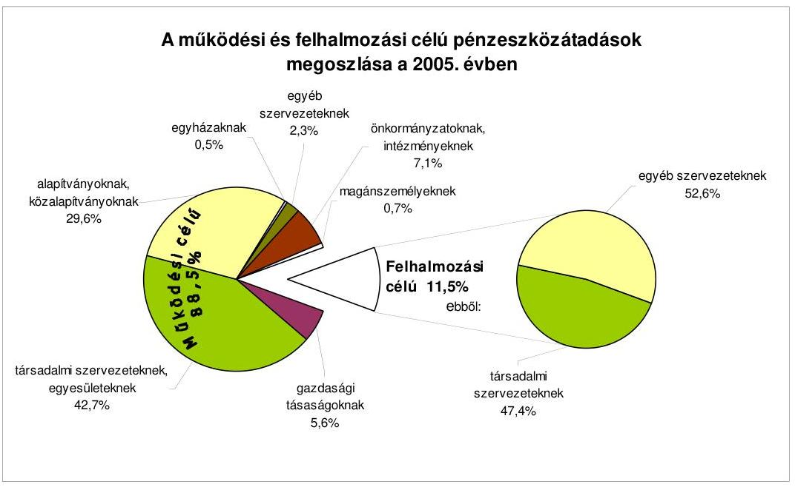
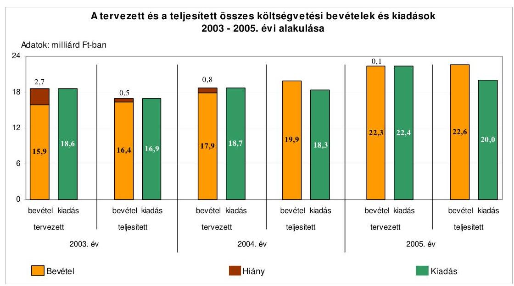
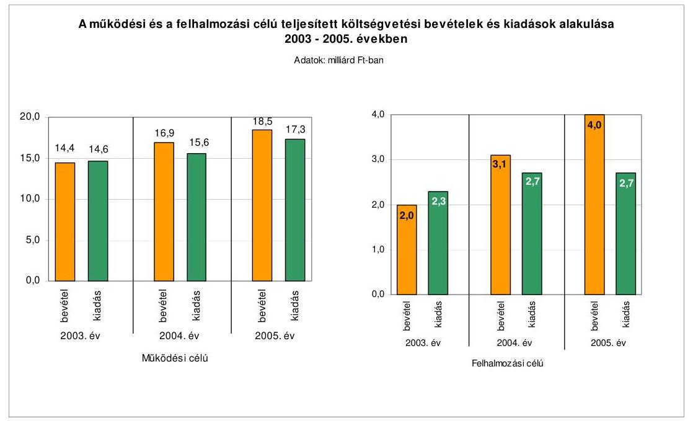
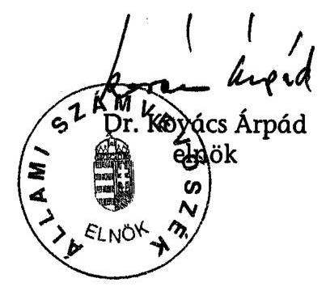
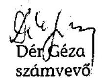

# ÁLLAMI   SZÁMVEVŐSZÉK 

## JELENTÉS

a Budapest Főváros XIV. kerület Zugló Önkormányzata gazdál-
kodási rendszerének 2006. évi átfogó ellenőrzéséről

---

3. Önkormányzati és Területi Ellenőrzési Igazgatóság
3.3.3. Fővárosi Ellenőrzési Osztály
Iktatószám: V-1003-5/30/17/2006.
Témaszám: 803
Vizsgálat-azonosító szám: V0262
Az ellenőrzést felügyelte:
Dr. Lóránt Zoltán
főigazgató
Az ellenőrzés végrehajtásáért felelős:
Dr. Sepsey Tamás
főigazgató-helyettes
Az ellenőrzést vezette:
Molnár Gyula Mihály
osztályvezető főtanácsos
Az ellenőrzést végezték:
Dr. Karáné Kőszegi Zsuzsanna
számvevő tanácsos
Dr. Csermák Judit
számvevő
Dér Géza
számvevő

# A témához kapcsolódó eddig készített számvevőszéki jelentések: 

## címe

Jelentés a helyi és a helyi kisebbségi önkormányzatok gazdálkodásának átfogó ellenőrzéséről
Jelentés a 2003. április 12-én megtartott országos népszavazás le-
bonyolításához felhasznált pénzeszközök elszámolásának ellenőrzéséről
Jelentés a középfokú oktatási feltételek alakulásáról 0445
Jelentés a Magyar Köztársaság 2004. évi költségvetése végrehajtásának ellenőrzéséről,
Függelék:

- A helyi önkormányzatokat a 2004. évben megillető normatív állami hozzájárulás elszámolása

---

# TARTALOMJEGYZÉK 

BEVEZETÉS ..... 7
I. ÖSSZEGZŐ MEGÁLLAPÍTÁSOK, KÖVETKEZTETÉSEK, JAVASLATOK ..... 9
II. RÉSZLETES MEGÁLLAPÍTÁSOK ..... 18

1. A költségvetés tervezésének, végrehajtásának, az Önkormányzat vagyongazdálkodásának és a zárszámadás elkészítésének szabályszerűsége ..... 18
1.1. A költségvetési rendelet jóváhagyásának, módosításának, az előirányzatok nyilvántartásának szabályszerűsége ..... 18
1.2. A gazdálkodás szabályozottsága, a bizonylati rend és fegyelem szabályszerűsége ..... 23
1.3. A pénzügyi-számviteli feladatok ellátásának informatikai támogatottsága ..... 32
1.4. Az önkormányzati vagyon nyilvántartása, számbavétele ..... 34
1.5. A vagyonnal való gazdálkodás szabályszerűsége, célszerűsége, nyilvánossága ..... 37
1.6. A céljelleggel nyújtott támogatások szabályszerűsége ..... 41
1.7. A közbeszerzési eljárások szabályszerűsége ..... 44
1.8. A zárszámadási kötelezettség teljesítésének szabályszerűsége ..... 47
1.9. A Polgármesteri hivatal helyi kisebbségi önkormányzatok gazdálkodását segítő tevékenysége ..... 49
2. Az önkormányzati feladatok és a rendelkezésre álló források összhangja ..... 51
2.1. A feladatok meghatározása és szervezeti keretei ..... 51
2.2. A költségvetés egyensúlyának helyzete ..... 55
2.3. A feladatok finanszírozása ..... 61
3. A belső ellenőrzési rendszer múködésének értékelése ..... 63
3.1. Az ellenőrzési rendszer kialakítása, működése ..... 63
3.2. A könyvvizsgálati kötelezettség teljesítése ..... 67
3.3. A korábbi számvevőszéki ellenőrzések javaslatainak hasznosulása ..... 68

---

# MELLÉKLETEK 

1. számú Az Önkormányzat gazdálkodását meghatározó adatok, mutatószámok (1 oldal)
2. számú Az önkormányzati vagyon nagyságának alakulása (1 oldal)
3. számú Az Önkormányzat 2005. évi bevételeinek és kiadásainak alakulása (1 oldal)
4. számú Egyes önkormányzati feladatok finanszírozása (1 oldal)
5. számú Helyszíni ellenőrzési jegyzőkönyv (4 oldal)
6. számú Dr. Weinek Leonárd úr, Budapest Főváros XIV. kerület Zugló Önkormányzatának polgármestere által adott észrevétel (1 oldal)

---

# RÖVIDÍTÉSEK JEGYZÉKE 

## Törvények

Áfa tv.
Az általános forgalmi adóról szóló 1992. évi LXXIV. törvény
Áht.
Az államháztartásról szóló 1992. évi XXXVIII. törvény
Fot.
a fogyatékos személyek jogairól és esélyegyenlőségük biztosításáról szóló 1998. évi XXVI. törvény
Gytv.
a gyermekek védelméről és a gyámügyi igazgatásról szóló 1997. évi XXXI. törvény
Hatv.
a helyi adókról szóló 1990. évi C. törvény
Htv.
a helyi önkormányzatok és szerveik, a köztársasági megbízottak, valamint egyes centrális alárendeltségú szervek feladat- és hatásköreiről szóló 1991. évi XX. törvény
Kbt.
a közbeszerzésekről szóló 2003. évi CXXIX. törvény
Ksztv.
a közhasznú szervezetekről szóló 1997. évi CLVI. törvény
Ltv.
a lakások és helyiségek bérletére, valamint az elidegenítésükre vonatkozó egyes szabályokról szóló 1993. évi LXXVIII. törvény
Nek tv.
a nemzeti és etnikai kisebbségekről szóló 1993. LXXVII. törvény
Ötv.
a helyi önkormányzatokról szóló 1990. évi LXV. törvény
Ptv.
a pártok múködéséről és gazdálkodásáról szóló 1989. évi XXXIII. törvény
Számv. tv.
a számvitelről szóló 2000. évi C. törvény
Sztv.
a szociális igazgatásról és szociális ellátásokról szóló 1993. III. törvény

## Rendeletek

Ámr.
az államháztartás múködési rendjéről szóló 217/1998. (XII. 30.) Korm. rendelet
Ber.
a költségvetési szervek belső ellenőrzéséről szóló 193/2003. (IX. 26.) számú Korm. rendelet
bérbeadási rendelet ${ }_{1}$
Budapest Főváros XIV. kerület Zugló Önkormányzatának 4/1998. (II. 9.) számú rendelete a Budapest Zugló Önkormányzata tulajdonában lévő lakások és nem lakás céljára szolgáló helyiségek bérletének szabályozásáról
bérbeadási rendelet ${ }_{2}$
Budapest Főváros XIV. kerület Zugló Önkormányzatának 18/2005. (V. 2.) számú rendelete a Budapest Zugló Önkormányzata tulajdonában álló nem lakás céljára szolgáló helyiségek bérletének szabályozásáról
építményadó rendelet
Budapest Főváros XIV. kerület Zugló Önkormányzatának 10/2002. (IV. 9.) számú rendelete az építményadóról
közterület hasznosítási rendelet
Budapest Főváros XIV. kerület Zugló Önkormányzatának 25/2005. (VII. 1.) számú rendelete az Önkormányzat tulajdonában álló közterületek használatáról és rendjéről

---

vagyongazdálkodási rendelet $_{1}$

vagyongazdálkodási rendelet $_{2}$

Vhr.

20/1995. (III. 3.) Korm. rendelet

2005. évi költségvetési rendelet

2005. évi zárszámadási rendelet

2006. év költségvetési rendelet

## Szórövidítések

APEH
ÁSZ
Bíráló bizottság
Ellenőrzési osztály
FEUVE
Fővárosi Önkormányzat gazdálkodási jogkörök szabályzata

GVOP
Informatikai osztály
jegyző
Közbeszerzési bizottság
Képviselő-testület

Budapest Főváros XIV. kerület Zugló Önkormányzatának 37/1995 (X. 30.) számú rendelete az önkormányzati vagyonról való rendelkezési jog szabályairól
Budapest Főváros XIV. kerület Zugló Önkormányzatának 14/2004 (III. 29.) számú rendelete az önkormányzat vagyonáról, a vagyontárgyak feletti tulajdonosi jogok gyakorlásáról
az államháztartás szervezetei beszámolási és könyvvezetési kötelezettségének sajátosságairól szóló 249/2000. (XII. 24.) Korm. rendelet
a kisebbségi önkormányzatok költségvetésének, gazdálkodásának, vagyonjuttatásának egyes kérdéseiről szóló 20/1995. (III. 3.) Korm. rendelet
Budapest Főváros XIV. kerület Zugló Önkormányzata Képviselő-testületének 9/2005. (III. 9.) sz. rendelete a 2005. évi költségvetésről

Budapest Főváros XIV. kerület Zugló Önkormányzata Képviselő-testületének 12/2006. (IV. 28.) rendelete a 2005. évi költségvetés végrehajtásáról szóló zárszámadásról
Budapest Főváros XIV. kerület Zugló Önkormányzata Képviselő-testületének 6/2006. (III. 14.) sz. rendelete a 2006. évi költségvetésről

Adó- és Pénzügyi Ellenőrzési Hivatal
Állami Számvevőszék
Budapest Főváros XIV. kerület Zugló Önkormányzat Kép-viselő-testületének Bírálóbizottsága
Budapest Főváros XIV. kerület Zugló Önkormányzat Polgármesteri hivatalának Ellenőrzési osztálya
folyamatba épített, előzetes és utólagos vezetői ellenőrzés
Budapest Főváros Önkormányzata
Budapest Főváros XIV. kerület Zugló Önkormányzatának Polgármestere és Jegyzője által kiadott 1/2004., 1/2005. és 2/2005. számú együttes utasítása az önkormányzati kötelezettségvállalás, érvényesítés, utalványozás és ellenjegyzés rendjéről
Gazdasági Versenyképesség Operatív Program
Budapest Főváros XIV. kerület Zugló Önkormányzat Polgármesteri hivatalának Informatikai osztálya
Budapest Főváros XIV. kerület Zugló Önkormányzatának Jegyzője
Budapest Főváros XIV. kerület Zugló Önkormányzat Kép-viselő-testületének Közbeszerzési Bizottsága
Budapest Főváros XIV. kerület Zugló Önkormányzatának Képviselő-testülete

---

| Közbeszerzési Döntőbizottság | Közbeszerzések Tanácsa Közbeszerzési Döntőbizottsága |
| :--: | :--: |
| közbeszerzési szabályzat | Budapest Főváros XIV. kerület Zugló Önkormányzat Kép-viselő-testületének 855/2004. (IX. 21.) számú határozata a közbeszerzési szabályzatról |
| OMB | Budapest Főváros XIV. kerület Zugló Önkormányzat Kép-viselő-testületének Oktatatási és Múvelődési Bizottsága |
| Önkormányzat | Budapest Főváros XIV. kerület Zugló Önkormányzata |
| Pénzügyi bizottság | Budapest Főváros XIV. kerület Zugló Önkormányzatának Pénzügyi Bizottsága |
| pénzügyi csoportvezető | Budapest Főváros XIV. kerület Zugló Önkormányzat Polgármesteri Hivatal Pénzügyi osztályának pénzügyi csoportvezetője |
| Pénzügyi osztály | Budapest Főváros XIV. kerület Zugló Önkormányzat Polgármesteri Hivatalának Pénzügyi osztálya |
| pénzügyi osztályvezető | Budapest Főváros XIV. kerület Zugló Önkormányzat Polgármesteri Hivatal Pénzügyi osztályának pénzügyi osztályvezetője |
| polgármester | Budapest Főváros XIV. kerület Zugló Önkormányzatának Polgármestere |
| Polgármesteri hivatal | Budapest Főváros XIV. kerület Zugló Önkormányzatának Polgármesteri Hivatala |
| SIB | Budapest Főváros XIV. kerület Zugló Önkormányzat Kép-viselő-testületének Sport és Ifjúsági Bizottsága |
| TKB | Budapest Főváros XIV. kerület Zugló Önkormányzat Kép-viselő-testületének Társadalmi Kapcsolatokért felelős Bizottsága |
| ügyrend | Budapest Főváros XIV. kerület Zugló Önkormányzat Polgármesteri Hivatalának Úgyrendje |
| vagyonkezelő zrt. | Zuglói Vagyonkezelő Zrt. |
| Városüzemeltetési osztály | Budapest Főváros XIV. kerület Zugló Önkormányzat Polgármesteri hivatalának Városüzemeltetési osztálya |
| VTKB | Budapest Főváros XIV. kerület Zugló Önkormányzat Kép-viselő-testületének Vagyongazdálkodási, Településfejlesztési, Környezetvédelmi Bizottsága |

---

.

---

# JELENTÉS 

## a Budapest Főváros XIV. kerület Zugló Önkormányzata gazdálkodási rendszerének 2006. évi átfogó ellenőrzéséről

## BEVEZETÉS

Az Ötv. 92. § (1) bekezdése, az Állami Számvevőszékről szóló 1989. évi XXXVIII. törvény 2. § (3) bekezdése, valamint az Áht. 120/A. § (1) bekezdése alapján az önkormányzatok gazdálkodását az Állami Számvevőszék ellenőrzi. Az ellenőrzésre az Országgyúlés illetékes bizottságai részére is átadott, országosan egységes ellenőrzési program alapján került sor.

## Az ellenőrzés célja annak értékelése volt, hogy:

- az önkormányzati gazdálkodás törvényességét ${ }^{1}$, szabályszerűségét biztosítot-ták-e a tervezés, a költségvetés végrehajtása, a vagyongazdálkodás és a zárszámadás során;
- az Önkormányzat által ellátott feladatok és az azokhoz rendelkezésre álló források összhangja biztosított volt-e, különös tekintettel az egyes kiemelt feladatokra;
- a gazdálkodás szabályszerűségét biztosító belső kontrollok² megfelelően segí-tették-e a végrehajtást.

Az ellenőrzött időszak: a 2005. év és a 2006. év első negyedéve, az 1.5.; 2.12.3. és 3.3. programpontok tekintetében a 2003-2004. évek is.

A kerület lakosainak száma 2006. január 1-én 109873 fő volt. Az Önkormányzat 35 tagú Képviselő-testületének munkáját 12 állandó bizottság segítette. A polgármester a 2002. évi választások óta tölti be tisztségét, a jegyző személye az 1996. évtől nem változott.

Az Önkormányzat feladatainak végrehajtása érdekében 57 költségvetési szervet múködtetett, amelyekből 11 önállóan gazdálkodott. A feladatok ellátásában

[^0]
[^0]:    ${ }^{1}$ A törvényi előírások betartásának elmulasztásakor a részletes megállapítások fejezetben egységesen a törvénysértés megjelölést alkalmazzuk, mivel az ÁSZ nem tehet különbséget a törvényi előírások között.
    ${ }^{2}$ A gazdálkodás szabályszerűségét biztosító kontroll alatt értjük a kiépített és működő belső irányítási és szabályozási rendszert, valamint a belső ellenőrzési funkciók ellátását.

---

részt vett két közhasznú társasága, öt közalapítványa, egy gazdasági társasága, továbbá kettő önkormányzati társulása. A feladatok ellátására az Önkormányzat költségvetési szerveinél 2005. december 31-én foglalkoztatott közalkalmazottak száma 2935 fő, a köztisztviselők száma 291 fő volt. Az Önkormányzat a 2005. évben 22761 millió Ft bevételt ért el és 20115 millió Ft kiadást teljesített, 2005. december 31-én 87418 millió Ft értékű könyvviteli mérleg szerinti vagyonnal rendelkezett. Az Önkormányzat gazdálkodását meghatározó adatokat, mutatószámokat az 1-3. számú mellékletek tartalmazzák.

A kerületben a 2002. évi választásokat követően 11 a megválasztott és működő helyi kisebbségi önkormányzatok ${ }^{3}$ száma.

A jelentés megállapításainak, javaslatainak egyeztetése során a polgármester arról adott tájékoztatást, hogy az időközben megtett intézkedésekkel a javaslatok egy részét megvalósították. Ezekben az esetekben a jelentés II. Részletes megállapítások fejezetében az adott témához kapcsolt lábjegyzetben a megtett intézkedést feltüntettük, és a kapcsolódó javaslatokat elhagytuk.

A jelentést az ÁSZ-ról szóló 1989. évi XXXVIII. tv. 25. § (1) bekezdése alapján észrevétel közlése céljából megküldtük a Budapest Főváros XIV. kerület Zugló Önkormányzata polgármesterének. A kapott észrevételt a jelentés 6. számú melléklete tartalmazza.

[^0]
[^0]:    ${ }^{3}$ Bolgár, cigány, görög, horvát, lengyel, német, örmény, román, ruszin, szerb és szlovák kisebbségi önkormányzat.

---

# I. ÖSSZEGZŐ MEGÁLLAPÍTÁSOK, KÖVETKEZTETÉSEK, JAVASLATOK 

Az Önkormányzat egyes ágazatokra, jelentősebb feladatokra vonatkozó hoszszabb távú koncepcióinak, programjainak, intézkedési terveinek Képviselőtestület általi elfogadásával teljesítette az Ötv-ben előírt gazdasági program meghatározását. A 2005. és 2006. évi költségvetési koncepciókat, valamint a költségvetési rendelettervezeteket a polgármester határidőben terjesztette a Képviselő-testület elé. A költségvetési koncepciókhoz, és a 2005. és 2006. évi költségvetési rendelettervezethez a polgármester az Ámr-ben előírtaktól eltérve nem csatolta a Pénzügyi bizottság véleményét, illetve a helyi kisebbségi önkormányzatok koncepcióról alkotott véleményét. A kisebbségi önkormányzatok elnökeit a jegyző a 2005. és 2006. évi koncepciónak a helyi kisebbségi önkormányzatra vonatkozó részéről tájékoztatta. A Képviselő-testület nem tartotta be az Áht. előírását, mivel önkormányzati rendeletben nem határozta meg az előírt mérlegek és kimutatások, valamint a szöveges indoklások tartalmi követelményeit.

A 2005. és 2006. évi költségvetési rendeletekben megsértették az Áht. előírásait, mivel a költségvetési bevételek és kiadások között finanszírozási célú pénzügyi műveleteket szerepeltettek, és nem mutatták be a tervezett hiány öszszegét. A Képviselő-testület tájékoztatása céljából a költségvetési rendelettervezetek előterjesztése tartalmazta az Áht-ban előírt összevont mérlegeket az Önkormányzatra és elkülönítetten a helyi kisebbségi önkormányzatokra, a több éves kihatással járó döntések bemutatását számszerúsítve évenkénti bontásban és összesítve, valamint a közvetett támogatások kimutatását. Az Áht. előírását nem tartották be, mivel a több éves kihatással járó döntések, valamint a közvetett támogatásokat tartalmazó kimutatások szöveges indoklása elmaradt. A Képviselő-testület a 2005. évi költségvetési rendeletében elfogadott eredeti előirányzatokat módosításaival 8\%-kal megemelte. Az előirányzat-módosítások hitelt érdemlően dokumentáltak, alátámasztottak voltak. A polgármester nem tájékoztatta a Képviselő-testületet az Ámr-ben előírt határidőn belül az intézményi saját hatáskörben végrehajtott előirányzat-módosításokról, az Önkormányzat nem tartotta be az Ámr-ben előírt határidőt a 2005. évi költségvetési rendelet utolsó módosításánál.

A Polgármesteri hivatal - az Ámr. előírása ellenére - nem rendelkezett a Képvi-selő-testület által jóváhagyott szervezeti és múködési szabályzattal. A Polgármesteri hivatal ügyrendjét jegyzői intézkedéssel szabályozták, ami nem tartalmazta az alapító okirat keltét, számát, valamint a költségvetés végrehajtására szolgáló számlaszámot. Az Ámr. előírása ellenére a Polgármesteri hivatal gazdasági szervezete nem rendelkezett ügyrenddel. Az operatív gazdálkodási és ellenőrzési jogköröket a polgármester és a jegyző közös utasításban szabályozta. A kötelezettségvállalásra felhatalmazottaknál meghatározták az elvégzett feladatokról történő beszámolást, az utalványozásra, a kötelezettségvállalás és az utalványozás ellenjegyzésére felhatalmazottaknál azonban nem írták elő a beszámolási kötelezettséget. A jegyző nem az Ámr. előírásának megfelelően határozta meg a szakmai teljesítésigazolás módját, mivel az nem terjedt ki

---

a bevételek teljesítésére, azonban 2006. szeptember 1-től a szabályozást kiegészítette. A jegyző az érvényesítők részére írásbeli megbízást adott. Az operatív gazdálkodással kapcsolatos felhatalmazásoknál, megbízásoknál a pénzügyi osztályvezető érvényesítéssel való megbízásánál nem biztosították az Ámr-ben előírt összeférhetetlenségi követelmény teljesítését.

A jegyző a Htv. előírása alapján kialakította a Polgármesteri hivatal és az intézmények számviteli rendjét. Elkészítette a Polgármesteri hivatal számviteli politikáját és a kapcsolódó szabályzatokat. A számviteli politikában az éves költségvetési beszámoló benyújtására előírt határidőként a Vhr. előírásának ellentmondó dátumot határoztak meg, nem rögzítették az általános kiadások megosztásának módját és a számviteli elszámolás és értékelés szempontjából jelentős és nem jelentős összeget. Az eszközök és források leltározási és leltárkészítési szabályzatában nem határozták meg az ingatlanok mennyiségi felvétellel való leltározását, és az üzemeltetésre, kezelésre átadott eszközök leltározásának sajátos szabályait. Az értékelési szabályzat nem tartalmazta a Vhr-ben előírtak ellenére a jogerős követelések értékelésének elveit, a vevőkövetelések vevő általi elismerése igazolásának módját, az adós minősítési szempontjait, valamint követelés típusonként a kisösszegű követelések év végi meghatározásának elveit, dokumentálásának szabályait. A pénzkezelési szabályzat nem tartalmazta az előzetes pénztárellenőrzés módját, amelyet a jegyző előírt 2006. szeptember 1-től. A házi pénztári keret napi összegét vagyonvédelmi szempontból indokolatlanul magas értékben határozták meg. A számlarendben a jegyző - a Vhr. előírása ellenére - nem szabályozta az alapbizonylatok körét, az analitikus bizonylatok formáját, tartalmát, vezetésének módját, és az egyeztetés dokumentálásának módját, valamint az analitikus nyilvántartásokból készített összesítő kimutatások elkészítésének határidejét. A jegyző a számviteli politikát és a kapcsolódó szabályzatokat 2006. augusztus 1-től a Vhr-ben előírtaknak megfelelően módosította. A jegyző utasításaiban gondoskodott az Áhtban előírt FEUVE rendszer szabályozásáról, mivel az Ámr. előírásának megfelelően elkészítette a Polgármesteri hivatal ellenőrzési nyomvonalát és kialakította a kockázatkezelés rendjét. Az Ámr-ben foglaltakat nem tartotta be, mert az ellenőrzési nyomvonal nem az ügyrend mellékletét képezte.

A Polgármesteri hivatalban - az Ámr. előírása ellenére - nem foglalták írásba a kötelezettségvállalások 3\%-át. Megsértették a Számv. tv-t, mivel az előírt bizonylatokat a gazdasági események 0,3\%-ánál nem állították ki. A Számv. tvben előírt alaki és tartalmi követelményeket megsértve a bizonylatok nem tartalmazták a könyvviteli nyilvántartásokban való rögzítés időpontját és annak igazolását, a bizonylatok 9-33\%-a a gazdálkodási jogkörök gyakorlóinak aláírását, valamint $71 \%$-a a kötelezettségvállalás-nyilvántartásba vételi sorszámot. A gazdálkodási és ellenőrzési jogkörök gyakorlói a banki és pénztári bizonylatokon, utalványrendeleteken az arra jogosultak voltak. A Polgármesteri hivatalban nem tartották be az Ámr-ben előírtakat, mivel az érvényesítés keretében a könyvviteli elszámolásra utaló főkönyvi számlaszám kijelölése nem az érvényesítésre írásban kijelölt dolgozó által történt a kiadási pénzforgalmi bizonylatoknál. A bankszámla- és a pénztárforgalomhoz kapcsolódó munkafolyamatba épített ellenőrzési feladatát az érvényesítő nem teljesítette, mivel nem jelölte ki a könyvviteli elszámolásra utaló főkönyvi számlaszámot. A kötelezettségvállalás ellenjegyzője a bizonylatok 9\%-ánál, a szakmai teljesítést igazoló a bizonylatok 33\%-ánál, az utalvány ellenjegyzője a bizonylatok

---

79\%-ánál nem végezte el munkafolyamatba épített ellenőrzési feladatát. A pénztárellenőr teljesítette ellenőrzési kötelezettségét. A gazdálkodási, ellenőrzési jogkörök gyakorlása során betartották az Ámr-ben szabályozott összeférhetetlenségi előírásokat.

A költségvetési pénzforgalmat érintő gazdasági események bizonylatainak adatait a Vhr-ben szabályozott időben rögzítették a könyvviteli nyilvántartásokban. Az egyéb gazdasági eseményeknél év közben az adós- és vevőköveteléseknél, a szállítói kötelezettségeknél nem teljesítették a Vhr. előírását, mivel az előírt határidőig a változásokat nem vezették be a könyvviteli nyilvántartásokba, csak év végével, vagy több negyedév adatát összevonva könyvelték (adós- és vevőkövetelések, szállítói kötelezettségek, kárpótlási jegyek, és a dolgozóknak tartósan nyújtott lakásépítési kölcsönök). A Vhr-ben előírt költségvetés szerkezeti rendjének ellentmondóan történt a felhalmozási célra átvett pénzeszközök, a szociális juttatások, az intézményfinanszírozás és a kamatbevétel elszámolása. A főkönyvi könyvelés és az analitikus nyilvántartások negyedévenkénti egyeztetése a Vhr. előírása ellenére elmaradt a dolgozóknak tartósan nyújtott lakásépítési kölcsönöknél, az adós- és vevőköveteléseknél, és a szállítói kötelezettségeknél. Az Ámr. előírása ellenére a költségvetési előirányzatokat terhelő kötelezettségvállalásokról nem vezettek folyamatosan, naprakészen, kiemelt előirányzatonkénti részletezettségben olyan nyilvántartást, amelyből az évenkénti kötelezettségvállalás összege megállapítható volt. A Képviselő-testület által a 2005. évre meghatározott kiemelt előirányzatokat az Önkormányzat három önállóan gazdálkodó intézménye nem tartotta be. Az előirányzat-túllépés okait nem vizsgálták, felelősségre vonás nem történt.

A Polgármesteri hivatal számviteli rendszerének informatikai támogatása biztosított volt, azonban a gazdálkodási, számviteli feladatok végzése nem egymásra épülő integrált rendszerek alkalmazásával történt. A Képviselőtestület a középtávú informatikai stratégia célkitűzéseit határozattal fogadta el. A Polgármesteri hivatal rendelkezett katasztrófa elhárítási tervvel, valamint meghatározták a hozzáférési jogosultsági rendszert. A pénzügyi-számviteli területen rendelkeztek az alkalmazott informatikai rendszer üzemeltetési dokumentációjával és a felhasználók részére készített leírással. A Pénzügyi osztály dolgozóinak munkaköri leírása tartalmazta a munkakörük ellátásához szükséges informatikai rendszer használatának előírását és a felhasználói jogosultságot.

Az Önkormányzatnál a vagyon nyilvántartása a Vhr. előírásainak nem felelt meg, mivel az üzemeltetésre, kezelésre átadott eszközök közül nyolc szervezet részére átadott eszközöket nem elkülönítve, hanem a tárgyi eszközök között tartották nyilván. Önkormányzati forrásokból víziközmű vagyon beruházás aktiválása történt a 2005. évben, de az nem növelte az önkormányzati vagyon értékét, mert azt térítésmentesen átadták a Fővárosi Önkormányzat részére. A Polgármesteri hivatal a 2005. évi leltározási kötelezettségének nem tett eleget, mivel az ingatlanok leltározása nem mennyiségi felvétellel történt, hanem egyeztetéssel, annak ellenére, hogy a Vhr. mennyiségi felvételt írt elő. A vizsgálat időtartama alatt a szabályzatot módosították. Az önkormányzati vagyon értékelését a 2005. évben a követelések esetében nem végezték el és értékvesztést - a Számv. tv. előírásai ellenére - nem számoltak el. A részesedések értékeléséhez szükséges információk rendelkezésre álltak, de a Számv. tv. előírásának nem tettek eleget, mivel az indokolt értékvesztést nem számolták el.

---

Az Önkormányzat a vagyonnal történő gazdálkodását két rendeletben szabályozta. A lakás és nem lakás céljára szolgáló helyiségek és a közterületek hasznosítását külön rendeletben szabályozták. A vagyongazdálkodási rendelet ${ }_{1-2}$ a teljes vagyoni körre kiterjedt, elkülönítette a forgalomképes és a törzsvagyon körét, ezzel eleget tettek a Htv-ben és Ötv-ben előírtaknak. Célszerűen szabályozták - értékhatárhoz kötve - a rendelkezési jogokat, a Képviselő-testület, a bizottságok és a polgármester hozta meg a döntéseket. A vagyongazdálkodási rendelet ${ }_{1-2}$-ben az Áht. előírását megsértették, mivel az ingyenes vagyonátadás módját és a követelésről történő lemondás eseteit nem határozták meg. A nyilvános versenytárgyalási értékhatárt 2004. március 29-től öt millió Ft-ban határozták meg, a 2003. január 1-e és 2004. március 29-e közötti időszakban megsértve az Áht. előírását nem határozták meg ezt az értékhatárt. A közzétételi kötelezettséget az Áht. előírását betartva szabályozták. A nem normatív, céljellegú fejlesztési támogatások és a 100 ezer Ft feletti nettó értékű árubeszerzésekkel, szolgáltatásokkal, beruházásokkal és vagyongazdálkodással kapcsolatos szerződéseket a honlapjukon közzétették. A 2003-2005. években az Önkormányzat vagyonának értéke nem csökkent. Az Önkormányzat érdekeit biztosító értékbecslésre vonatkozó előírásokat betartották és a jogi garanciális elemeket beépítették a szerződésekbe.

Az értékpapír gazdálkodást tartalmazó nyilvántartások rendelkezésre álltak, a vétel és eladás szabályszerűen történt, a rövidtávú befektetésekre vonatkozó döntési jogot a polgármesterre ruházta a Képviselő-testület, azzal a kikötéssel, hogy csak államilag garantált értékpapír vásárlás történhet. Ezt a jogkörét a polgármester a 2004-2005. években - az Ötv. előírását megsértve - túllépte, mivel bankbetétek elhelyezéséről rendelkezett, a szabályozást a 2006. évi költségvetési rendeletben módosították. Az értékpapír gazdálkodás során az eredményességre törekedtek, de az egy éven belüli lekötéseket a kötelezettségvállalások teljesítése után felszabaduló, átmenetileg szabad pénzeszközök összegéig tudták teljesíteni. A jövedelmező részesedéseiket megtartották, a rövidtávú értékpapír forgalmazás éves átlaghozama a 2003-2005. években a 6\%-ot meghaladta. Az Önkormányzat a kerületben múködő pártszervezetek közül egy pártszervezet részére közvetett támogatást nyújtott kedvezményes bérleti díj fizetésének megállapításával, ami ellentétes a Ptv. és az Ötv. előírásaival.

A 2003-2005. években követelésekről való lemondás nem történt. Ingyenes vagyonátadás a 2005. évben megépített szennyvízcsatorna átadására kötött megállapodás alapján a Fővárosi Önkormányzat részére volt, amely során betartották az Ötv. előírásait.

Az Önkormányzat a 2005. évben külső szervezetek részére 194,9 millió Ft múködési célú és 25,3 millió Ft összegű felhalmozási célú támogatást nyújtott nem szociális ellátásként. A speciális célú támogatásokra elkülönített összegeket a 2005. évi költségvetés tartalmazta. Az Önkormányzat 196 szervezet részére nyújtott támogatást, a döntéseket minden esetben az arra jogosultak hozták meg, az Ötv. előírásainak megfelelően. A Polgármesteri hivatalnál a támogatási megállapodásokban meghatározták a támogatás célját, összegét a számadás módját és határidejét. A kifizetések során az éves költségvetés módosított előirányzat összegeit nem lépték túl. Az Áht. előírását megsértve a támogatások rendeltetésszerű felhasználását nem ellenőrizték. Az ÁSZ vizsgálat kereté-

---

ben alkotóművész részére biztosított támogatást ellenőriztük, céltól eltérő felhasználás megállapítására nem került sor.

Az Önkormányzat a Kbt. alanyi hatálya alá tartozik, erről a Közbeszerzések Tanácsát értesítette. A Polgármesteri hivatalban elkészítették az Önkormányzat közbeszerzési szabályzatát, valamint az összesített közbeszerzési tervet, amelyben meghatározták a közbeszerzési eljárás előkészítésének, lefolytatásának, dokumentálásának és elbírálásának rendjét, valamint az eljáró személyek alkalmazására vonatkozó szabályokat. A 2005. évben 58 közbeszerzési eljárást folytattak le, amelyek árubeszerzésekből, építési beruházásokból, szolgáltatásból és központosított beszerzésekből tevődtek össze. A becsült érték meghatározására és az egybeszámításra vonatkozó Kbt. előírásokat betartották. Az ellenőrzött közbeszerzési eljárás megfelelt a Kbt. szabályainak. A Kbt. előírásának megfelelően elkészítették az éves statisztikai összegzést, amelyet határidőn belül megküldtek a Közbeszerzések Tanácsának. A közbeszerzési eljárásokat az Ellenőrzési osztály az Önkormányzat intézményeinél ellenőrizte, ezzel teljesítette a Kbt. előírását, a Polgármesteri hivatalnál a Kbt. előírása ellenére a közbeszerzések ellenőrzését nem végezték el. A Közbeszerzések Tanácsa Elnöke a 2005. évben egy alkalommal kezdeményezett jogorvoslati eljárást az Önkormányzat ellen, ennek során 500 ezer Ft bírság került megállapításra.

A 2005. évi zárszámadási rendelettervezetet - ami az elfogadott költségvetési rendelettel összehasonlítható módon tartalmazta a teljesítési adatokat - a polgármester az Áht-ban előírt határidőn belül terjesztette a Képviselő-testület elé, az Ötv-ben előírt könyvvizsgálói véleménnyel együtt. A zárszámadási rendelet szerkezete megfelelt az Ámr. előírásának, azonban nem tartalmazta a többéves kihatással járó döntések és a közvetett támogatások szöveges indoklását az Áht. előírása ellenére. Az Önkormányzatnál - az Ámr. előírása ellenére a helyi kisebbségi önkormányzatok zárszámadási adatait nem a meghozott határozatok alapján építették be a 2005. évi zárszámadási rendeletbe. A zárszámadási rendeletben a Polgármesteri hivatal jóváhagyott költségvetési pénzmaradványának összege nem felelt meg a Vhr-ben foglaltaknak, mivel nem tartalmazta a központi költségvetésbe való befizetési kötelezettség összegét. Az intézményektől elvont, kötelezettségvállalással nem terhelt pénzmaradvány összegét nem mutatták be a Polgármesteri hivatal, illetve az intézmények pénzmaradványát növelő, illetve csökkenő tételként. A Polgármesteri hivatalban határidőben elvégezték az intézmények elemi beszámolóinak számszaki felülvizsgálatát, azonban nem tartották be a szakmai teljesítés értékelésére, a pénzügyi teljesítés és a feladatmegvalósítás összhangjának felülvizsgálatára vonatkozó Ámr. előírását. A költségvetési szerveket éves számszaki beszámolóik és múködésük elbírálásáról - az Ámr. előírása ellenére - írásban nem értesítették. A 2005. évi zárszámadási rendelet és az elemi beszámolók számszaki adatainak összhangját nem biztosították a kamatbevételeknél és a költségvetési pénzmaradványnál.

Az Önkormányzat megkötötte a helyi kisebbségi önkormányzatokkal az együttműködési megállapodást, amely tartalmazta, hogy a helyi kisebbségi önkormányzat kérésére a jegyző készíti elő a költségvetési határozat tervezetét. Az előirányzat módosítási és a zárszámadási határozattervezetek esetében - az Ámr. előírása ellenére - nem határozták meg a jegyző feladatait, ezáltal a megállapodások nem voltak alkalmasak arra, hogy a központi és a helyi elő-

---

írásoknak megfelelő legyen az Önkormányzat és a helyi kisebbségi önkormányzatok együttmúködése. A Polgármesteri hivatalban a helyi kisebbségi önkormányzatok vagyoni és számviteli nyilvántartásait elkülönítetten vezették, azonban a kötelezettségvállalásokról - az Áht. előírását megsértve - elkülönített analitikus nyilvántartást nem vezettek.

Az Önkormányzat az általa ellátott feladatait rendeletekben, szakmai koncepciókban rögzítette. A 2006. évi költségvetési rendelethez csatolták a kötelező és önként vállalt feladatok előirányzatait tartalmazó kimutatást. A Képvi-selő-testület nem vette figyelembe az Ötv-ben foglaltakat, mivel a lakosság igényeitől és az Önkormányzat anyagi lehetőségeitől függően nem határozta meg feladatai ellátásának módját és mértékét. Az Önkormányzat feladatai ellátását az általa alapított intézmények, gazdasági társaságok, közalapítványok, önkormányzati társulások, valamint egyéb szervezetek útján biztosította, melyek önként vállalt feladatokat is elláttak. Az intézmények számában a 2003-2005. években változás nem volt. Egy intézmény feladatkörének módosításáról hozott képviselő-testületi döntéssel, miszerint a feladatot nem a költségvetési szerv keretében, hanem Kht. alapításával kívánták megoldani, a szakmai véleményezők nem értettek egyet a gazdaságtalan múködtetés miatt. A Képviselő-testület a közbiztonság növelése céljából térfigyelő rendszer létesítésére a Fővárosi Önkormányzattal közös intézményi társulás létrehozásáról döntött. Az előterjesztés alternatív javaslata ellenére a Képviselő-testület jóváhagyta az intézményi társulás létrehozásáról szóló megállapodást. A Képviselőtestület részterületenként áttekintette a feladatok szervezeti megoldását, melynek következtében módosította a Polgármesteri hivatal szervezeti struktúráját, az intézmények alapító okiratait, valamint a vállalkozói szerződéseket. Az oktatási intézmények esetében nem hozott döntést a tanulói létszámcsökkenés által indokolt szervezeti módosításokról. A Képviselő-testület nem értékelte a változások konkrét szakmai és gazdasági hatását a módosításokat követő években.

Az Önkormányzatnál a pénzügyi egyensúly a tervezett eredeti előirányzatoknál nem volt biztosított a 2003-2005. évek költségvetéseiben. A költségvetésben tervezetthez képest a költségvetés végrehajtása során a költségvetési egyensúly nem állt fenn a 2003. évben, a 2004. és 2005. években azonban a teljesített költségvetési bevételek fedezték a költségvetési kiadásokat. A teljesített múködési célú költségvetési bevételek a 2003. évben nem, a 2004. és 2005. években azonban fedezetet biztosítottak a teljesített múködési célú kiadásokra. Az Önkormányzat vagyonának értékesítésével a 2003-2005. évek között bevételi forrásait 5600 millió Ft-tal növelte. A felhalmozási célú költségvetési bevételekben csökkenő arányban szerepeltek a pályázaton elnyert pénzeszközök. Az Önkormányzat likvid hitelt csak a 2003. évben vett fel, amit egy hónapon belül visszafizetett. Az átmenetileg szabad pénzeszközök lekötéséből származó bevétel a 2003. évről a 2005. évre 239 millió Ft-ról 180 millió Ft-ra csökkent. Az Önkormányzatnál felhalmozási célú hitel felvételéről döntöttek. Az adósságot keletkeztető kötelezettségvállalás felső határát a hitelek felvételénél a Pénzügyi bizottság a 2005. évben az Ötv-ben foglaltak ellenére nem vizsgálta. Az adósságot keletkeztető kötelezettségvállalások nem veszélyeztették az Önkormányzat fizetőképességét a kötelezettségvállalás évében és a futamidő további éveiben. Az adósságszolgálati kötelezettség év végén fennálló összege 427 millió Ftról 370 millió Ft-ra csökkent a 2003. évről a 2005. évre. A Hatv-ben szabályo-

---

zottakon túli mentességeket és kedvezményeket határoztak meg az építmény adó helyi szabályozásában. A helyi adóbevételek aránya a 2003-2005. évek között a költségvetési bevételeken belül 26-28-24\% volt.

Az Önkormányzat a 2003-2005. években a vizsgált öt feladatot nem fejlesztette, intézményi kapacitás megszüntetésére nem került sor. A bölcsődei ellátás, a nappali szociális intézményi ellátás kapacitás mutatói változatlanok voltak, az óvodai nevelés, az általános iskolai és a középiskolai oktatás feladatmutatói 99\%-104\% között változtak. A múködési kiadások a 2003. évről 2005. évre négy feladatnál $25 \%$-ot meghaladóan nőttek, a középiskolai oktatás kiadásának növekedése a 2003. évről a 2005. évre $12 \%$ volt. Az intézmények kapacitáskihasználtsága - a bölcsődei ellátást kivéve, amely $80 \%$-os volt - 93-100\% között alakult. A fajlagos kiadások változása az adott kapacitás kihasználtság mellett a múködési kiadások növekedési ütemét követte. A finanszírozási források közül az önkormányzati támogatás részaránya 40-60\% között alakult, az állami hozzájárulás részaránya $50 \%$ alatt maradt, de az általános iskolai oktatás esetében a $79 \%$-ot is meghaladta. A jelentősebb önként vállalt feladatok (a középfokú oktatás, önkormányzati szolgáltatás, egészségügyi szolgáltatás) ellátására fordított kiadások az Önkormányzat költségvetésében csökkenő arányt képviseltek, a 2003. évben 15\%, a 2004. évben 14\% és a 2005. évben $13 \%$ volt. Az Önkormányzat önként vállalt feladatainak kiadásai nem veszélyeztették a kötelező feladatok ellátását. A Polgármesteri hivatalban a középületek akadálymentes megközelíthetőségének biztosítására vonatkozó feladatok 1999. évi felmérése szerint 61 középület akadálymentesítését kellett elvégezni. A 2005. év végéig az Önkormányzat 25 középület akadálymentessé tételét nem végezte el, ezzel nem tett eleget a Fot. előírásának.

Az Önkormányzat kialakította a belső ellenőrzési kötelezettség teljesítéséhez szükséges szervezeti kereteket. Az Ellenőrzési osztály feladata volt a költségvetési intézmények, valamint a Polgármesteri hivatal belső ellenőrzése. A foglalkoztatott belső ellenőrök számát kapacitás felmérés alapján állapították meg. A belső ellenőrök szervezeti függetlenségét az Ellenőrzési osztály feladat és hatásköri jegyzékében - az Áht. előírása ellenére - a jegyző nem biztosította, mert a polgármestert is felhatalmazta a belső ellenőrök irányítására és számukra belső ellenőrzési feladat meghatározására. A belső ellenőrzési vezető a Ber. előírása ellenére nem készített stratégiai tervet. A 2005. és a 2006. évi ellenőrzési tervek összeállítása kockázat elemzésen alapult. A 2005. évi ellenőrzési tervet a Ber. előírása alapján a jegyző, a 2006. évi ellenőrzési tervet az Ötv.ben foglaltaknak megfelelően a Képviselő-testület hagyta jóvá. A Polgármesteri hivatalban a belső ellenőrzés keretében nem tettek eleget a Kbt. közbeszerzések ellenőrzési kötelezettségére vonatkozó előírásának. A soron kívüli ellenőrzés esetében a megbízólevél tartalmazta az ellenőrzési feladatot, azonban a Ber. előírása ellenére ellenőrzési programot nem készítettek. Az elvégzett ellenőrzésekről a Ber-ben foglaltaknak megfelelő tartalmú ellenőrzési jelentéseket készítettek, amelyekben nem tártak fel büntető, kártérítési, illetve fegyelmi eljárás megindítására okot adó cselekményt. Az ellenőrzött intézmények mindegyike készített intézkedési tervet. A belső ellenőrzési vezető az észrevételek véleményezéséről írásban tájékoztatta az ellenőrzött szerv vezetőjét. A korábbi években feltárt hiányosságok megszüntetéséről utóellenőrzéssel győződtek meg. A jegyző beszámolt a 2005. évi költségvetési beszámoló keretében a belső ellenőrzés múködtetéséről, az Áht-ban foglalt előírást megsértve azonban nem szá-

---

molt be a FEUVE rendszer múködtetéséről. A Képviselő-testület a Htv-ben foglaltaknak megfelelően áttekintette az ellenőrzések tapasztalatait és a jelentést határozattal elfogadta.

Az Önkormányzat költségvetési minősítésű könyvvizsgáló megbízásával teljesítette az Ötv-ben előírt könyvvizsgálati kötelezettségét. A Polgármesteri hivatal és az intézmények adatait összevontan tartalmazó 2005. évi egyszerűsített éves beszámolót - az Ötv. előírása alapján - a könyvvizsgáló felülvizsgálta és hitelesítő záradékkal látta el, auditálási eltérést nem állapított meg.

Az ÁSZ az Önkormányzat gazdálkodását a 2002. évben ellenőrizte átfogó jelleggel és azt követően a 2003-2005. években a 2003. április 12-én megtartott országos népszavazás lebonyolításához felhasznált pénzeszközök elszámolásának, a középfokú oktatási feltételek alakulásának, továbbá a helyi önkormányzatok 2004. évi normatív állami hozzájárulás igénylésének és elszámolásának ellenőrzését végezte el. A négy jelentés összesen 23 javaslatot tartalmazott az önkormányzati gazdálkodás szabályszerűségének és a végzett munka színvonalának javítása céljából. A javaslatok közel kétharmadát teljesen hasznosították, három javaslatra részben intézkedtek, öt javaslat nem hasznosult. A helyszíni ellenőrzés megkezdéséig a kötelezettségvállalás, a kötelezettségvállalás ellenjegyzése és az érvényesítés nem az Ámr-ben előírtak szerint történt, a részesedések és a kárpótlási jegyek esetében a 2004. és a 2005. években az értékvesztés elszámolását nem végezték el, az intézmények beszámolójának és pénzmaradványának jóváhagyásáról írásbeli értesítést nem küldtek az intézményeknek. Az ingatlanok esetében nem valósult meg a leltározási szabályzatban a mennyiségi felvétel gyakoriságának meghatározására, valamint a vagyonkezelő zrt. és az Önkormányzat között létrejött szerződésekben rögzített - az Önkormányzat szempontjából hátrányos - negyedéves elszámolási rend megváltoztatására irányuló célszerűségi javaslat. A normatív állami hozzájárulások igénylésével, nyilvántartásával és elszámolásával kapcsolatos javaslatokra tett intézkedésekkel gondoskodtak a központi költségvetés és az Önkormányzat közötti elszámolás pontosságáról és áttekinthetőségéről. Az Önkormányzatnál a számvevőszéki ellenőrzések szabályszerűségi és célszerűségi javaslatainak végrehajtása eredményeképpen javult a feladatellátás törvényessége, szabályszerűsége.

---

A helyszíni ellenőrzés megállapításainak hasznosítása mellett javasoljuk:

# a polgármesternek 

a jogszabályi előírások maradéktalan betartása érdekében

1. gondoskodjon a középületek akadálymentessé tételéről, tekintettel arra, hogy a Fot. 29. § (6) bekezdésében foglalt határidő lejárt;
a munka színvonalának javítása érdekében
2. terjessze a számvevőszéki jelentést a Képviselő-testület elé, a feltárt hiányosságok megszüntetésére - az előző számvevőszéki jelentésben megfogalmazott, de érdemben még nem hasznosított javaslatokra is figyelemmel - készíttessen intézkedési tervet a határidők és a felelősök megjelölésével;
3. kísérje figyelemmel az ellenőrzés során megállapított szabálytalanságok megszüntetésére tett intézkedések végrehajtását;

## a jegyzőnek

a munka színvonalának javítása érdekében

1. ellenőrizze a részletes megállapítások fejezetben jelzett intézkedéseik teljesítését.

---

# II. RÉSZLETES MEGÁLLAPÍTÁSOK 

## 1. A KÖLTSÉGVETÉS TERVEZÉSÉNEK, VÉGREHAJTÁSÁNAK, AZ ÖNKORMÁNYZAT VAGYONGAZDÁLKODÁSÁNAK ÉS A ZÁRSZÁMADÁS ELKÉSZÍTÉSÉNEK SZABÁLYSZERŰSÉGE

### 1.1. A költségvetési rendelet jóváhagyásának, módosításának, az előirányzatok nyilvántartásának szabályszerúsége

Az Önkormányzat egyes ágazatokra, jelentős feladatokra rendelkezett a Képvi-selő-testület által elfogadott koncepciókkal, programokkal, intézkedési tervekkel ${ }^{4}$. Ezekben meghatározták azon célkitúzéseket, feladatokat, amelyek hoszszabb távra biztosítják az Önkormányzat által nyújtandó feladatok ellátását. Az Önkormányzat az Ötv. 91. § (1) bekezdésében foglalt előírást a gazdasági program meghatározására ezen dokumentumok képviselő-testületi elfogadásával teljesítette.

A 2005. évi és a 2006. évi költségvetési koncepciót a polgármester az Áht. 70. §-ában előírt határidőn belül ${ }^{5}$ mindkét évben november 30-án benyújtotta a Képviselő-testületnek.

A 2005. és 2006. évi költségvetési koncepciókat a helyben képződő bevételek, az ismert kötelezettségek és az ágazati programokban rögzített elvek, feladatok alapján állították össze az Ámr. 28. § (1) bekezdése alapján.

A 2005. és 2006. évi költségvetési koncepciót a Képviselő-testület elfogadta és határozataival ${ }^{6}$ döntött a költségvetés készítés további munkálatairól.

A költségvetési koncepciókban főbb költségvetési tervezési irányelvként határozták meg a kötelezően ellátandó feladatok színvonalas múködtetését, működési hitel felvételének elkerülésével, az önként vállalt feladatok ésszerűsítését, az egyes kiadások felülvizsgálatának szükségességét a ki-

[^0]
[^0]:    ${ }^{4}$ Az Önkormányzat főbb ágazati koncepciói, programjai, intézkedési tervei: a Képviselőtestület 820/2003. (XII. 16.) számú határozata Budapest-Zugló Egészségügyi Szolgálat 20042008. évekre vonatkozó szakmai terveiről, a 28/2004. (I. 27.) számú határozata BudapestZugló közoktatási intézkedési tervéről, a 769/2004. (VI. 22.) számú határozata BudapestZugló ingatlangazdálkodási koncepciójáról, a 11/2004. (XI. 16.) számú határozata Zugló szolgáltatástervezési koncepciójáról, a 828/2005. (V. 21.) számú határozata a kerületfejlesztési koncepció stratégiai anyagáról, és 18 egyéb feladatot érintő koncepciók határozatai.
    ${ }^{5}$ Az Áht. 70. §-ában szabályozott határidő november 30., a helyi önkormányzati képviselőtestület tagjai általános választásának évében legkésőbb december 15.
    ${ }^{6}$ A Képviselő-testület a 1269/2004. (XII. 21.) számú határozatával a 2005. évi költségvetési koncepcióról, a 1170/2005. (XII. 20.) számú határozatával a 2006. évi költségvetési koncepcióról döntött.

---

adások csökkentése érdekében, a megkezdett önkormányzati beruházások befejezését, a vagyongazdálkodás célszerűvé tételét, a pályázati források fokozott bevonását.

A helyi kisebbségi önkormányzatok elnökeit a költségvetési koncepciók helyi kisebbségi önkormányzatra vonatkozó részéről tájékoztatták az Ámr. 28. § (6) bekezdése alapján. A költségvetési koncepció előterjesztéséhez nem csatolták a helyi kisebbségi önkormányzatok véleményét az Ámr. 28. § (3) bekezdése ellenére ${ }^{7}$.

A 2005. és 2006. évi költségvetési koncepciók tervezetét a bizottságok megtárgyalták. A Pénzügyi bizottság határozatokkal ${ }^{8}$ elfogadott véleményét azonban a polgármester nem csatolta a költségvetési koncepció tervezetekhez az Ámr. 28. § (3) bekezdése előírása ellenére ${ }^{9}$. A Pénzügyi bizottság elnöke a bizottság véleményét - amelyet a Képviselő-testület ülésén osztottak ki - a képvi-selő-testületi ülésen szóban ismertette.

Az Önkormányzat megsértette az Áht. 118. § elöírását, mivel - előterjesztés hiányában - rendeletben nem határozta meg a költségvetés előterjesztésekor, illetőleg a zárszámadáskor a Képviselő-testület részére tájékoztatásul bemutatandó mérlegek és kimutatások, valamint a több éves kihatással járó döntések és a közvetett támogatások szöveges indoklásának tartalmát ${ }^{10}$.

A 2005. és 2006. évi költségvetési rendelettervezeteket a jegyző a költségvetési szervek vezetőivel egyeztette, az egyeztetés eredményét az Ámr. 29. § (4) bekezdése alapján írásba foglalták.

A 2005. és 2006. évi költségvetési rendelettervezetek benyújtásánál a polgármester betartotta az Áht. 71. § (1) bekezdésében előírt határidőt ${ }^{11}$, mivel azokat 2005. február 14-én, illetve 2006. február 15-én terjesztette be a Képviselő-testület felé. A költségvetési rendelettervezetekhez csatolta a könyv-

[^0]
[^0]:    ${ }^{7}$ A közbenső egyeztetés során a polgármester által adott tájékoztatás szerint a jegyző intézkedett annak érdekében, hogy a költségvetési koncepció tervezethez csatolják a helyi kisebbségi önkormányzatok koncepció tervezetről alkotott véleményét.
    ${ }^{8}$ A Pénzügyi bizottság a 356/2004. (XII. 16.) számú határozatával, illetve az 572/2005. (XII. 15.) számú határozatával döntött véleményéről.
    ${ }^{9}$ A közbenső egyeztetés során a polgármester által adott tájékoztatás szerint a jegyző intézkedett annak érdekében, hogy a Pénzügyi bizottság véleményét csatolják a költségvetési koncepció tervezetekhez.
    ${ }^{10}$ A közbenső egyeztetés során a polgármester által adott tájékoztatás szerint a jegyző intézkedett annak érdekében, hogy az átmeneti gazdálkodásról szóló rendelettervezetbe építsék be az Áht. 118. §-ában előírt mérlegek és kimutatások tartalmi követelményeit.
    ${ }^{11}$ Az Áht. 71. § (1) bekezdésében előírt határidő tárgyév február 15.

---

vizsgáló véleményét, azonban elmaradt ${ }^{12}$ a Pénzügyi bizottság véleményének csatolása az Ámr. 29. § (9) bekezdése ellenére ${ }^{13}$. A Pénzügyi bizottság a véleményét a képviselő-testületi üléseken szóban ismertette.

A polgármester betartotta az Áht. 71. § (2) bekezdése előírását, mivel a 2005. és 2006. évi költségvetési rendelet benyújtása előtt elöterjesztette a javasolt előirányzatokat megalapozó rendelettervezeteket ${ }^{14}$, valamint bemutatta a többéves elkötelezettséggel járó kiadási tételek későbbi évekre vonatkozó kihatásait és - az Áht 71. § (3) bekezdése alapján - a tárgyévet követő két év előirányzatait.

A Képviselő-testület által elfogadott 2005. évi költségvetési rendeletben a bevételi és kiadási föösszeget 22508,7 millió Ft-ban, a 2006. évi költségvetési rendeletben 22743,9 millió Ft-ban határozták meg. A 2005. és 2006. évi költségvetési rendelet megalkotásakor megsértették az Áht. 8. § (1) bekezdése és 8/A. § (7) bekezdése előírását, mivel a költségvetési bevételek és kiadások között finanszírozási célú pénzügyi múveleteket (hitelfelvételt és hiteltörlesztést) mutattak ki, és a költségvetési bevételek és kiadások különbözeteként a hiány összegét nem mutatták be ${ }^{15}$.

A 2005. és 2006. évi költségvetési rendeletekben a Képviselő-testület az Áht. 67. §-ában foglaltak betartásával meghatározta a címrendet.

A 2005. és 2006. évi költségvetési rendeletekben az Áht. 69. § (1) bekezdése előírása alapján meghatározták a múködési és felhalmozási célú bevételeket és kiadásokat, ezen belül a személyi jellegű kiadásokat, a munkaadókat

[^0]
[^0]:    ${ }^{12}$ A 2006. évi költségvetési rendelettervezet Képviselő-testület elé történő benyújtásakor a polgármester nem csatolta a Pénzügyi bizottság véleményét, mivel az a 2006. évi költségvetési rendelettervezetet véleményező üléseit többször elnapolta és végleges véleményét a képviselő-testületi tárgyalás napján hozta meg.
    ${ }^{13}$ A közbenső egyeztetés során a polgármester által adott tájékoztatás szerint a jegyző intézkedett annak érdekében, hogy a Pénzügyi bizottság véleményét csatolják a költségvetési rendelettervezetekhez.
    ${ }^{14}$ Az Önkormányzat 59/2004. (XII. 29.) számú rendelete a talajterhelési díjjal kapcsolatos helyi szabályok megállapításáról, 61/2004. (XII. 29.) és 50/2005. (2006. II. 1.) számú rendelete a gyermekek napközbeni ellátását biztosító intézményi étkeztetés térítési díjairól, 62/2004. (XII. 29.) és 49/2005. (2006. II. 1.) számú rendelete az egyes intézményeknél folyó munkahelyi étkeztetés igénybevételéről, 65/2004. (XII. 29.) számú rendelete az építményadóról, 1/2005. (II. 1.) számú rendelete a lakásépítés-, vásárlás támogatásáról, 1/2006. (I. 2.) számú rendelete az önkormányzat tulajdonában álló ingatlan korlátozott forgalomképességének törléséről és a forgalomképes vagyontárgyak közé való felvételéről.
    ${ }^{15}$ A közbenső egyeztetés során a polgármester által adott tájékoztatás szerint a 2006. évi költségvetési rendelet 2006. szeptember 5-i módosításakor intézkedtek annak érdekében, hogy a költségvetési bevételek és kiadások között nem mutattak ki finanszírozási célú pénzügyi műveleteket, valamint bemutatták a költségvetési bevételek és kiadások különbözeteként a hiány összegét.

---

terhelő járulékokat, a dologi jellegű kiadásokat, az ellátottak pénzbeli juttatásait, a speciális támogatásokat, a költségvetési létszámkeretet. Az Ámr. 29. § (1) bekezdés (a)-(g) pontjai előírásának megfelelően a bevételi forrásokat főbb jogcímforrásonként, a működési, fenntartási előirányzatokat kiemelt előirányzatonként önállóan és részben önállóan gazdálkodó költségvetési szervenként, a felújítási előirányzatokat célonként, a felhalmozási kiadásokat feladatonként, a Polgármesteri hivatal költségvetését feladatonként, elkülönítve az általános és céltartalék összegét (benne elkülönítve az államháztartási tartalékot).

A 2005. és 2006. évi költségvetési rendeletekben bemutatták az Ámr. 29. § (1) bekezdés h) pontjában előírt működési és felhalmozási célú bevételi és kiadási előirányzatokat mérlegszerűen egymástól elkülönítetten és együttesen egyensúlyban. A költségvetési rendeletek tartalmazták elkülönítetten is a helyi kisebbségi önkormányzatok költségvetését az Ámr. 29. § (1) bekezdés i) pontjának megfelelően, a helyi kisebbségi önkormányzatok határozatai alapján.

Az Önkormányzat 2005. és 2006. évi költségvetési rendeleteiben betartotta az Ámr. 29. § (1) bekezdés k) pontjának előírását, mivel elkülönítetten bemutatták az EU-s támogatással megvalósuló program projektek bevételeit és kiadásait.

A költségvetés végrehajtásával összefüggő főbb helyi szabályokat a költségvetési rendeletekben - az Áht. 75. § előírásának megfelelően - rögzítették. A Képviselő-testület a 2005. évi költségvetési rendeletében szabályozta és testületi hatáskörben tartotta meg a közép- és hosszú lejáratú hitelek felvételének jogát, azonban a rövidlejáratú hitel felvételének döntési jogát 200 millió Ft értékhatárig a polgármesterre ruházta át. Meghatározták az intézményi többletbevételek feletti rendelkezési jogosultságot az Áht. 93. § (4) bekezdése alapján. A céltartalékkal való rendelkezés jogát - az Áht. 73. § (3) bekezdése alapján - a Pénzügyi bizottságra ruházták át. A Képviselő-testület bizottságokat hatalmazott fel egyes célfeladatra, feladatra tervezett előirányzatok felhasználására, valamint szabályozták az önállóan gazdálkodó költségvetési szervek előirányzatmódosítási jogköreit az Ámr. 53. § (4) bekezdése előírása alapján. A 2006. évi költségvetési rendeletben azonos szabályokat fogadtak el a költségvetés végrehajtásával kapcsolatban, csak a rövidlejáratú hitel felvételéről való döntési keretet változtatták meg 400 millió Ft-ra.

A Képviselő-testület tájékoztatására - az Áht. 118. §-ában előírt rendeleti szabályozás hiánya ellenére - a 2005. és 2006. évi költségvetési rendelettervezetek előterjesztésekor bemutatták az Áht. 116. § 6. pontja szerinti Önkormányzat összevont mérlegét, elkülönítetten a kisebbségi önkormányzatok mérlegeit. Az előterjesztések tartalmazták az Áht. 116. §. 9. pontja alapján a több éves kihatással járó döntések számszerúsítését évenkénti bontásban és összesítve, valamint az Áht. 116. 10. pontjában előírt közvetett támogatásokra vonatkozó kimutatást, azonban megsértették az Áht. 118. § előírását, mivel a kimutatások szöveges indoklása elmaradt ${ }^{16}$.

[^0]
[^0]:    ${ }^{16}$ A közbenső egyeztetés során a polgármester által adott tájékoztatás szerint a jegyző intézkedett annak érdekében, hogy a többéves kihatással járó döntések számszerúsítését évenkénti bontásban és összesítve, valamint a szöveges indoklást is csatolják a költségvetési rendelettervezethez.

---

Az Önkormányzat a 2005. évi költségvetési rendeletében a Képviselő-testület által elfogadott előirányzatokat hat alkalommal ${ }^{17}$ módosította, a bevételek és kiadások főösszegét 1898,1 millió Ft-tal, 8,4 \%-kal megemelte. Az előirány-zat-módosítások fő okai a céltartalék felhasználása, az előző évi pénzmaradvány igénybevétele, a saját bevételek előirányzatának módosulása, a központi támogatások előirányzatának változása voltak.

A 2005. évi költségvetési rendeletet módosító rendelettervezetekben meghatározott előirányzat-módosítások hitelt érdemlően dokumentáltak voltak, azokat az előterjesztésekben szövegesen és számadatokkal megindokolták, alátámasztották. A költségvetési rendeletet módosító rendelettervezetek a költségvetéssel összehasonlítható módon tartalmazták az előirányzat módosítási javaslatokat. A jóváhagyott előirányzatokról és változásaikról a Pénzügyi osztályon feladatonkénti, kiemelt előirányzatonkénti, önkormányzati szintű és intézményenkénti nyilvántartást vezettek.

Az előirányzatokat módosító rendeletek elfogadása során betartották az Ámr. 53. § (2) bekezdése előírását, mivel a központi költségvetés és az elkülönített állami pénzalapok által biztosított pótelőirányzatokról a polgármester a Képviselő-testületet negyedévente tájékoztatta.

Az Ámr. 53. § (6) bekezdése előírása ellenére az Önkormányzat intézményei saját hatáskörben végrehajtott előirányzat-változásairól a polgármester a Képvi-selő-testületet nem tájékoztatta 30 napon belül ${ }^{18}$.

Az Önkormányzatnál nem tartották be az Ámr. 53. § (2) és (6) bekezdésében előírt határidőt ${ }^{19}$, mivel a 2005. évi költségvetési rendelet utolsó módosításának ideje 2006. március 28. volt ${ }^{20}$.

A helyi kisebbségi önkormányzatok előirányzatainak módosítását az Ámr. 53. § (8) bekezdése alapján költségvetésüket módosító határozataik alapján építették be a 2005. évi költségvetési rendeletet módosító rendeletekbe.

[^0]
[^0]:    ${ }^{17}$ Az Önkormányzat 12/2005. (IV. I.) számú rendelete, 14/2005. (V. 2.) számú rendelete, 30/2005. (VII. 11.) számú rendelete, 33/2005. (IX. 30.) számú rendelete, 47/2005. (2006. I. 2.) számú rendelete és 7/2006. (III. 28.) számú rendelete a 2005. évi költségvetésről.
    ${ }^{18}$ A közbenső egyeztetés során a polgármester által adott tájékoztatás szerint a jegyző intézkedett annak érdekében, hogy az Önkormányzat intézményei saját hatáskörben végrehajtott előirányzat változásairól a tájékoztatást 30 napon belül a Képviselőtestület számára be kell nyújtani.
    ${ }^{19}$ Az Ámr. 53. § (2) és (6) bekezdése a költségvetési rendelet módosításának legkésőbbi időpontját a költségvetési beszámoló felügyeleti szervhez történő megküldésének külön jogszabályban (Vhr. 10. § (1) bekezdés) meghatározott határidejéig (költségvetési évet követő február 28-ig) határozza meg.
    ${ }^{20}$ A közbenső egyeztetés során a polgármester által adott tájékoztatás szerint a jegyző intézkedett annak érdekében, hogy a költségvetési rendelet utolsó módosítását minden év február 15-ig el kell készíteni.

---

# 1.2. A gazdálkodás szabályozottsága, a bizonylati rend és fegyelem szabályszerűsége 

A Polgármesteri hivatal az Ámr. 10. § (4) bekezdése ellenére nem rendelkezett a Képviselő-testület által jóváhagyott szervezeti és múködési szabályzattal. A Polgármesteri hivatal ügyrendjéről szóló 13/1996. számú jegyzői intézkedéssel szabályozták a szervezeti felépítést és múködésének rendszerét, a szervezeti egységek megnevezését. Az ügyrend tartalmazta a gazdasági szervezet felépítését és feladatait, nem tartalmazta azonban az Ámr. 10. § (4) bekezdés a) pontja ellenére az alapító okirat keltét, számát, g) pontja ellenére a költségvetési szerv költségvetésének végrehajtására szolgáló számlaszámot. A Polgármesteri hivatalhoz nem tartozott részben önállóan gazdálkodó költségvetési szerv. Az Önkormányzatnál nem tartották be az Ámr. 17. § (5) bekezdése előírását, mivel a gazdasági szervezet nem rendelkezett ügyrenddel ${ }^{21}$.

Az Önkormányzatnál a gazdálkodási jogkörök szabályzatában meghatározták az operatív gazdálkodással kapcsolatos döntési hatásköröket és felelősségi köröket ${ }^{22}$.

A polgármester élt az Ámr. 134. § (2) és 136. § (2) bekezdésében részére biztosított joggal, és felhatalmazást adott kötelezettségvállalásra és utalványozásra:

- kötelezettségvállalásra hatalmazta fel a jegyzőt fél millió Ft összeghatár felett a dologi kiadásoknál, az egyes szervezeti egységek vezetőit fél millió Ft összeghatár alatt a dologi kiadásoknál és egy millió Ft összeghatárig a beruházásoknál, felújításoknál, az alpolgármestereket egyes kiemelt előirányzatoknál;
- utalványozásra hatalmazta fel a jegyzőt egyes kiemelt előirányzatoknál, a pénzügyi osztályvezetőt a polgármester és az alpolgármesterek által, valamint egyes szervezeti egységvezetőket az általuk vállalt kötelezettségek tekintetében, egy millió Ft összeghatárig a főépítészt.

A jegyző élt az Ámr. 134. § (2) és 137. § (2) bekezdésében részére biztosított jogokkal és a Polgármesteri hivatal költségvetésében megtervezett előirányzatok feletti kötelezettségvállalás és utalványozás ellenjegyzési jogának gyakorlására felhatalmazást adott:

- kötelezettségvállalás ellenjegyzésére hatalmazta fel az aljegyzőt egyes kiemelt előirányzatoknál, a pénzügyi csoportvezetőt fél millió Ft összeghatárig

[^0]
[^0]:    ${ }^{21}$ A közbenső egyeztetés során a polgármester által adott tájékoztatás szerint a jegyző intézkedett annak érdekében, hogy el kell készíteni a Polgármesteri hivatal szervezeti és múködési szabályzatát, amelynek tartalmaznia kell az alapító okirat keltét, számát, valamint a költségvetési szerv költségvetésének végrehajtására szolgáló számla számot, illetve részét kell képezze a Pénzügyi osztály ügyrendje.
    ${ }^{22}$ A 2005. évet és a 2006. év I. negyedévét érintően: a polgármester és a jegyző 1/2004., 1/2005. és 2/2005. számú együttes utasítása az önkormányzati kötelezettségvállalás, érvényesítés, utalványozás és ellenjegyzés rendjéről.

---

a Polgármesteri hivatal dologi kiadásainál, a pénzügyi osztályvezetőt minden más esetben;

- utalványozás ellenjegyzésére hatalmazta fel a pénzügyi csoportvezetőt a polgármester és alpolgármesterek általi, valamint az üzemeltetési kiadások kötelezettségvállalásaihoz kapcsolódóan, az aljegyzőt a helyi kisebbségi önkormányzatok kiadásainál, a pénzügyi osztályvezetőt minden más esetben.

A kötelezettségvállalásra felhatalmazottaknál meghatározták az elvégzett feladatokról történő beszámolást, amelyet egy felhatalmazott teljesített. Az utalványozásra és a kötelezettségvállalás és utalványozás ellenjegyzésére felhatalmazottakra nem határoztak meg beszámolási kötelezettséget, ilyen beszámolás nem történt ${ }^{23}$.

A jegyző előírta a szakmai teljesítés igazolásának módját és kijelölte az azt végző személyeket ${ }^{24}$ a kiadások teljesítésére, azonban ez nem terjedt ki a bevételek teljesítésére az Ámr. 135. § (1) bekezdésében foglaltak ellenére ${ }^{25}$. A jegyző 2006. szeptember 1-től a bevételek teljesítésének szakmai teljesítés igazolás módját előírta és kijelölte az azt végző személyeket.

Az Ámr. 135. § (2) bekezdésének megfelelően a jegyző írásbeli megbízást adott az érvényesítők részére, az érvényesítők az előírt iskolai végzettséggel és szakmai képesítéssel rendelkeztek.

Az operatív gazdálkodással kapcsolatos felhatalmazásoknál, megbízásoknál és kijelöléseknél biztosították az Ámr. 135. § (5) bekezdésében, valamint 138. § (1) és (3) bekezdésében előírt összeférhetetlenségi követelményeket. A pénzügyi osztályvezető érvényesítéssel való megbízásánál nem biztosították az összeférhetetlenséget az Ámr. 138. § (2) bekezdésében előírtak ellenére, mivel ő kötelezettségvállalásra és utalványozásra is felhatalmazott volt, ugyanakkor a költségvetés végrehajtása során a pénzügyi osztályvezető betartotta az érvényesítés összeférhetetlenségi szabályait. A jegyző 2006. szeptember 1-től előírta az összeférhetetlenségi követelményt az érvényesítésnél az utalványozásra, de elmulasztotta előírni a kötelezettségvállalásra az Ámr. 138. § (2) bekezdésében foglaltak ellenére ${ }^{26}$.

[^0]
[^0]:    ${ }^{23}$ A közbenső egyeztetés során a polgármester által adott tájékoztatás szerint a jegyző intézkedett annak érdekében, hogy az utalványozásra és a kötelezettségvállalás és az utalványozás ellenjegyzésére felhatalmazottakra határozzanak meg beszámolási kötelezettséget.
    ${ }^{24}$ Az együttes utasítás V. fejezete tartalmazta a szakmai teljesítésigazolás módját, 5. sz. melléklete szervezeti egységekhez és feladatokhoz rendelten a kijelölt személyeket.
    ${ }^{25}$ A közbenső egyeztetés során a polgármester által adott tájékoztatás szerint a jegyző intézkedett annak érdekében, hogy a szakmai teljesítés-igazolást az Ámr. 135. § (1) bekezdésében foglaltaknak megfelelően a bevételekre tekintettel is el kell végezni.
    ${ }^{26}$ A közbenső egyeztetés során a polgármester által adott tájékoztatás szerint a jegyző intézkedett annak érdekében, hogy a pénzügyi osztályvezető érvényesítéssel való megbízásánál betartásra kerüljenek az összeférhetetlenségi követelmények.

---

A jegyző betartotta a Htv. 140. § (1) bekezdése c) pontjában foglaltakat, mivel kialakította a Polgármesteri hivatal és az intézmények egységes számviteli rendjét ${ }^{27}$.

A jegyző elkészítette a Polgármesteri hivatal számviteli politikáját ${ }^{28}$ és a kapcsolódó szabályzatokat. A számviteli politikában a Vhr. 8. § (5) bekezdése alapján meghatározta a megbízható és valós összkép kialakítását befolyásoló lényeges információk szempontjait, valamint a lényeges eltérés és lényeges hiba mértékét. Nem határozták meg a jelentős összegű és nem jelentős összegű eltérés értékét az Vhr. 8. § (5) bekezdése ellenére. Szabályozták, mi tekintendő figyelembe veendő szempontnak a kis értékű vagyoni értékű jogok, tárgyi eszközök, szellemi termékek minősítésénél, a terven felüli értékcsökkenés elszámolásánál, visszaírásánál, az értékvesztés elszámolása és visszaírása, valamint az értékpapírok forgóeszközzé, vagy befektetett eszközzé való minősítése tekintetében. A Polgármesteri hivatal nem élt a piaci értéken való értékelés lehetőségével. Nem szabályozták a figyelembe veendő szempontokat a Vhr. 8. § (5) bekezdés e) pontja ellenére az általános kiadások megosztási módszerének kiválasztásánál. Meghatározták azon időpontot, ameddig a mérleg összeállítás befejezése előtt értékelési és helyesbítési feladatok elvégezhetők, azonban a beszámoló benyújtására előírt határidőként olyan időpontot - tárgyévet követő év március 8 -át - rögzítettek, ami ellentmond a Vhr. 8. § (8) bekezdésében az éves költségvetési beszámoló leadására előírt február 28-i határidőnek. Rögzítették, hogy a Polgármesteri hivatal nem végzett vállalkozási tevékenységet. A Polgármesteri hivatalhoz részben önállóan gazdálkodó költségvetési szerv nem kapcsolódott. A jegyző 2006. augusztus 1-től a Vhr. 8. § (8) bekezdésében előírtaknak megfelelően jelölte ki a mérlegkészítés határidejét és kiegészítette a számviteli politikát a jelentős és nem jelentős összegű eltérés értékével és százalékos mértékével, valamint az általános kiadások megosztásának módszerével.

Az eszközök és források leltározási és leltárkészítési szabályzatát ${ }^{29}$ elkészítették a Vhr. 8. § (4) bekezdés a) pontja alapján, amely tartalmazta a leltározás elvégzésének ütemezését, a leltározás módját és az értékelés szabályait, a leltározás és a könyvvitel adatainak egyeztetési rendjét, a leltárkülönbözetek megállapításának és rendezésének, a leltározás és az értékelés ellenőrzésének módját. Továbbá tartalmazta a könyvviteli mérlegben értékkel nem szereplő készletek leltározásának idejét és módját. A mennyiségi felvétellel leltározandó eszközkörben nem szerepeltették az ingatlanokat. A szabályzat nem tért ki az üzemeltetésre, kezelésre átadott eszközök leltározásához szükséges sajátos szabályokra. A jegyző 2006. július 1-től rendelkezett az ingatlanok mennyiségi felvétellel való szabályozásáról. Az üzemeltetésre, kezelésre átadott eszközök leltározásához szükséges sajátos szabályokat a jegyző 2006. augusztus 1-től a számlarendben előírta.

[^0]
[^0]:    ${ }^{27}$ A jegyző 4/2005. számú intézkedése Budapest-Zugló Önkormányzata és intézményeinek számviteli rendjéről.
    ${ }^{28}$ Az ügyrend 22. számú melléklete tartalmazta a számviteli politikát.
    ${ }^{29}$ Az ügyrend 21. számú melléklete.

---

Az értékelési szabályzatban ${ }^{30}$ meghatározták az eszközök bekerülési értékének tartalmát, azonban A Vhr. 8. § (17) bekezdés a) pontja ellenére nem határozták meg a jogerős követelések értékének elveit, b) pontja ellenére a vevőkövetelések vevő általi elismerése igazolásának módját, c) pontja ellenére az adós minősítési szempontjait, valamint d) pontja ellenére követelés típusonként a kisösszegű követelések év végi meghatározásának elveit, dokumentálásának szabályait. A jegyző 2006. augusztus 1-től kiegészítette az értékelési szabályzatot a Vhr. 8. § (17) bekezdés a), b), c), és d) pontjaiban előírtaknak megfelelően.

A Polgármesteri hivatal nem volt kötelezett az önköltségszámítás rendjére vonatkozó szabályzat elkészítésére, mivel a Vhr. 8. § (4) bekezdés c) pontban előírt kötelezettség feltételei nem álltak fenn.

A pénzkezelési szabályzat ${ }^{31}$ tartalmazta az Ámr. 103. § (2), (6) és (7) bekezdései alapján megnyitható bankszámlák körét, rendeltetését, kijelölve azokat a bankszámlákat, amelyekről készpénz vehető fel. A házi pénztári keret összegét és az elszámolási szabályokat meghatározták. A 2,5 millió Ft-ban rögzített házi pénztári keret - a házipénztár átlagos napi pénztárforgalma alapján - vagyonvédelmi szempontból indokolatlanul magas volt ${ }^{32}$.

Szabályozták az utólagos pénztárellenőrzés módját, feladatait, gyakoriságát, az ellenőrzésért felelős munkaköröket (pénzügyi előadó, pénzügyi csoportvezető), a pénztáros helyettesítésének rendjét, a pénztár átadásának, átvételének szabályait. Rögzítették az előlegek, utólagos elszámolásra átadott összegek nyilvántartásának, elszámolásának rendjét, a házi pénztáron kívüli pénzkezelés szabályait, a bankszámlák feletti rendelkezésre jogosultakat, a bankszámlák és a pénztár kapcsolatrendszerét, a készpénz felvételének rendjét, valamint az ügyfélterminál használatának rendjét. A szabályzat tartalmazta a szigorú számadás alá vont nyomtatványok, valamint az értékpapírok nyilvántartásának kezelésével, elszámolásával kapcsolatos teendőket. Az Önkormányzat bankkártyával nem rendelkezett. A szabályzat nem tartalmazta az előzetes pénztárellenőrzés módját, amelyet a jegyző 2006. szeptember 12-től előírt.

A felesleges vagyontárgyak hasznosításának és selejtezésének szabályzatát ${ }^{33}$ elkészítették a Vhr. 37. § (5) bekezdése előírása alapján. A szabályzat tartalmazta a minősítési jogokat gyakorló munkaköröket, a hasznosítás során követendő eljárási rendet, az ármegállapítás szabályait, a selejtezés

[^0]
[^0]:    ${ }^{30}$ Az ügyrend 22. számú melléklete 4. sz. mellékletében.
    ${ }^{31}$ Az ügyrend 20. számú melléklete.
    ${ }^{32}$ A közbenső egyeztetés során a polgármester által adott tájékoztatás szerint a jegyző intézkedett annak érdekében, hogy a házipénztár keretét csökkentették, valamint a polgármesteri épület betöréses lopás- és rablás biztosítása a fokozott vagyonvédelem érdekében kiterjed a páncélszekrényben állandó jelleggel tartott pénzkészletre, értékcikkre.
    ${ }^{33}$ Az ügyrend 17. számú melléklete.

---

bizonylati rendjét, a kiselejtezett eszközökkel, illetve a vonatkozó nyilvántartásokkal kapcsolatos feladatokat, valamint a jegyzőt jelölte ki döntéshozatalra.

A Polgármesteri hivatal számlarendjét ${ }^{34}$ a jegyző a Vhr. 49. § (1) bekezdésében foglaltak alapján elkészítette. A számlarend nem tartalmazta egy helyi kisebbségi önkormányzat főkönyvi számláját. Tartalmazta az alkalmazni kívánt főkönyvi számla, főkönyvi alszámla számát, megnevezését a számlát érintő gazdasági eseményeket, azok más számlával való kapcsolatát, a főkönyvi számla és az analitikus nyilvántartás kapcsolatát, valamint az egyeztetési, zárlati teendők rendszerességét, módjának meghatározását. A számlarend nem tartalmazta minden főkönyvi számla tartalmát, azonban azok elnevezéséből a Számv. tv. 161. § (2) bekezdés b) pontja alapján a tartalom egyértelmú volt. A számlarendben nem szabályozták az alapbizonylatok körét, az analitikus nyilvántartások formáját, tartalmát, vezetésének módját, a főkönyvi nyilvántartásokkal való egyeztetés módját, és az egyeztetés dokumentálásának módját a Vhr. 49. § (2) bekezdése ellenére. Nem tartották be a Vhr. 49. § (4) bekezdése előírását, mivel nem határozták meg a számlarendben az analitikus nyilvántartásokból készített összesítő kimutatások elkészítésének határidejét. A számlarend megfelelt a Vhr. 9. számú melléklete 1. k) pontja előírásának, mivel az abban szabályozott számlatükör olyan elkülönítést tartalmazott, amely alapján a törzsvagyon részét képező eszközök (ezen belül a forgalomképtelen, illetve korlátozottan forgalomképes) eszközök értéke meghatározható volt. A jegyző 2006. augusztus 1-től kiegészítette a számlarendet a hiányzó helyi kisebbségi önkormányzat főkönyvi számlájával, az alapbizonylatok meghatározásával, valamint előírta az analitikus nyilvántartások vezetésének formáját, tartalmát, vezetésének módját, a főkönyvi nyilvántartásokkal való egyeztetés módját, az egyeztetés dokumentálását és az analitikus nyilvántartásokból készített összesített kimutatások elkészítésének határidejét.

A jegyző elvégezte a Vhr. 49. § (5) bekezdésében foglaltakra tekintettel a számlarend folyamatos karbantartását. A számviteli politika és a számlarend a Vhr. előírásai alapján tartalmazta a helyi kisebbségi önkormányzatokkal összefüggő sajátos feladatokat. A Polgármesteri hivatalban a számviteli politika keretében elkészített szabályzatokban a helyi sajátosságokat figyelembe vették.

A pénzügyi, gazdálkodási és számviteli szabályzatok előírásai egymással összhangban voltak. Az ellenőrzési pontokat a pénzügyi, számviteli területen dolgozók munkaköri leírásai nem minden munkavállalóra tartalmazták, ezért a munkaköri leírások folyamatba épített ellenőrzésre, egyeztetésre vonatkozó előírásai a szabályzatokkal nem voltak összhangban. Hiányzott az érvényesítés munkafolyamatba épített ellenőrzési feladat kijelölése három dolgozó, a kötelezettségvállalás és utalványozás ellenjegyzése ellenőrzési feladat kijelölése egyegy dolgozó munkaköri leírásából, amit 2006. július 1., illetve 2006. szeptember 11. dátummal, új munkaköri leírásokkal pótoltak.

A Polgármesteri hivatal vezetője a FEUVE rendszer kialakításához a 2005. évben szabályozta a szabálytalanságok kezelésének rendjét és a kockázatkezelési

[^0]
[^0]:    ${ }^{34}$ Az ügyrend 22. számú melléklete.

---

eljárást utasításaiban ${ }^{35}$. A 2006. május 23-án kiadott 5/2006. számú utasításával gondoskodott a FEUVE rendszer megszervezéséről az Áht. 97. § (1) bekezdése alapján, mivel az Ámr. 145/B. § (1) bekezdésének megfelelően elkészítette a Polgármesteri hivatal ellenőrzési nyomvonalát szöveges és táblázatba foglalt formában, és az Ámr. 145/C. § (1) bekezdése előírásának megfelelően kialakította a kockázatkezelés rendjét. Az Önkormányzat nem tartotta be az Ámr. 145/B. § (2) bekezdése előírását, mivel az ellenőrzési nyomvonal nem az ügyrend mellékletét képezte ${ }^{36}$.

A kötelezettségvállalások 2,7\%-át nem foglalták írásba ${ }^{37}$ az Ámr. 134. § (8) bekezdésében foglaltak ellenére, mivel az Önkormányzat nem élt az Ámr. 134. § (3) bekezdésében foglalt lehetőséggel, az 50 ezer Ft-ot el nem érő kötelezettségvállalásoknál az előzetes írásbeli kötelezettségvállalás szabályozásával.

Az Önkormányzatnál a Számv. tv. 165. § (1) bekezdésében előírt bizonylatokat a gazdasági események $0,3 \%$-ára nem állították ki, mivel a harmadik negyedévben elszámolt egyéb gazdasági események közül a dolgozók részére nyújtott lakásépítési kölcsönök könyvelése megalapozó bizonylat hiányában történt ${ }^{38}$.

A gazdasági eseményeket magukba foglaló bizonylatok kiállításakor megsértették a Számv. tv. 167. § (1) bekezdésében foglaltakat, mivel:

- A Számv. tv. 167. § (1) bekezdésének c) pont előírása ellenére a kiadási pénzforgalmi bizonylatok $8,6 \%$-a nem tartalmazta a kötelezettségvállalás ellenjegyzőjének aláírását, a pénzforgalmi bizonylatok 32,5\%-a a szakmai teljesítést igazoló aláírását, $32,8 \%$-a az érvényesítő aláírását, $14,5 \%$-a az utalvány ellenjegyzőjének aláírását, $15,1 \%$-a az utalványozó aláírását ${ }^{39}$;
${ }^{35}$ A jegyző 9/2005. számú utasítása a szabálytalanságok kezeléséről (hatályos 2005. október 25-től), és 13/2005. számú utasítása a kockázatkezelési eljárásról (hatályos 2005. november 1-től).
${ }^{36}$ A közbenső egyeztetés során a polgármester által adott tájékoztatás szerint a jegyző intézkedett annak érdekében, hogy az ellenőrzési nyomvonal a Polgármesteri hivatal szervezeti és működési szabályzatának részét képezze.
${ }^{37}$ A közbenső egyeztetés során a polgármester által adott tájékoztatás szerint a jegyző intézkedett annak érdekében, hogy a vállalt kötelezettségeket minden esetben írásba kell foglalni.
${ }^{38}$ A közbenső egyeztetés során a polgármester által adott tájékoztatás szerint a jegyző intézkedett annak érdekében, hogy a dolgozók részére nyújtott lakásépítési kölcsönök könyvelését megalapozó bizonylatokat minden esetben készítsék el.
${ }^{39}$ A közbenső egyeztetés során a polgármester által adott tájékoztatás szerint a jegyző intézkedett annak érdekében, hogy a gazdasági eseményeket magukba foglaló bizonylatokat a szakmai teljesítésen alapuló utalványozás és ellenjegyzés aláírása után lehet kifizetésre átadni, az aláírások meglétét minden esetben ellenőrizni kell.

---

- A Számv. tv. 167. § (1) bekezdés i) pont előírása ellenére a bizonylatokon nem jelölték a könyvviteli nyilvántartásokban történt rögzítés időpontját és annak igazolását;
- A bankszámlát és a készpénzforgalmat érintő gazdasági eseményeknél utalványrendeletet alkalmaztak, amely tartalmazta az Ámr. 136. § (4) bekezdése a)-g) pontjában előírtakat. Az Ámr. 136. § (4) bekezdése h) pontjában előírt kötelezettségvállalás-nyilvántartásba vételi sorszámot azonban az utalványrendeletek a gazdasági események 71,0\%-ánál nem tartalmazták. A jegyző 2006. szeptember 1-től előírta a gazdálkodási jogkörök szabályzatában az utalványrendeleten a kötelezettségvállalás nyilvántartásba vételi sorszámát, valamint kijelölte a könyvviteli nyilvántartásokban való rögzítést és annak igazolását.

A Polgármesteri hivatalban a 2005. év április 1-től új kötelezettségvállalás nyilvántartásba vételi számítógépes programot vezettek be. Az új program alapján készült utalványrendeleteken már következetesen feltüntették a kötelezettségvállalás nyilvántartásba vételi sorszámát.

A gazdálkodási és ellenőrzési jogkörök gyakorlói a banki és pénztári bizonylatokon, utalványrendeleteken a kötelezettségvállalás, a kötelezettségvállalás ellenjegyzése, a szakmai teljesítésigazolás, az utalvány ellenjegyzése, és az utalványozás esetében az arra jogosultak voltak. Az érvényesítés Ámr. 135. § (1) és (4) bekezdéseiben előírt feladatait két külön személy végezte el a pénzforgalmi gazdasági eseményekre. A Polgármesteri hivatalban nem tartották be az Ámr. 135. § (2) bekezdése előírását, mivel az érvényesítés keretében a könyvviteli elszámolásra utaló főkönyvi számlaszám kijelölése nem az érvényesítésre írásban kijelölt dolgozó által történt a kiadási pénzforgalmi bizonylatokon.

A munkafolyamatba épített ellenőrzési feladatok ellátása során:

- A kötelezettségvállalás ellenjegyző́je a bankszámlához és készpénzhez kapcsolódó kiadási gazdasági események bizonylatainak 8,6\%-ánál nem teljesítette az Ámr. 134. § és (9) bekezdése b) és c) pontjában előírt munkafolyamatba épített ellenőrzési kötelezettségét, mivel nem vizsgálta a fedezet meglétét, valamint azt, hogy a kötelezettségvállalás gazdálkodásra vonatkozó jogszabályokat sért-e;
- A szakmai teljesítést igazolók a bizonylatok 32,5\%-ánál nem végezték el az Ámr. 135. § (1) bekezdésében foglalt ellenőrzési feladatukat, mivel a kiadások 2,2\%-ánál, valamint a bevételi bizonylatok 31,3\%-ánál - a szabályozás hiányosságából eredően - nem ellenőrizték, szakmailag nem igazolták azok jogosultságát, összegszerűségét, valamint a szerződés, megállapodás teljesítését ${ }^{40}$;

[^0]
[^0]:    ${ }^{40}$ A közbenső egyeztetés során a polgármester által adott tájékoztatás szerint a jegyző intézkedett annak érdekében, hogy a szakmai teljesítést igazolók végezzék el az ellenőrzési feladatokat.

---

- Az érvényesítés munkafolyamatba épített ellenőrzési feladatát az Ámr. 135. § (4) bekezdésének nem megfelelően végezték el a kiadási pénzforgalmi bizonylatoknál (67,2\%), mivel az előírt könyvviteli elszámolásra utaló főkönyvi számlaszámot nem rögzítették. Az érvényesítés során az írásban ki nem jelölt személyek jegyezték fel a könyvviteli elszámolásra utaló főkönyvi számla számot. Elmaradt az összegszerűség, fedezet meglétének ellenőrzése a bevételi bizonylatokra (a pénzforgalmi bizonylatok 30,9\%-ára), valamint a kiadási bizonylatok 1,9\%-ánál. Az érvényesítők nem végezték el az Ámr. 135. § (1) bekezdésében szabályozott alaki követelmények betartásának ellenőrzését, mivel az utalványrendeleteket a kötelezettségnyilvántartásba vételi sorszám, kötelezettségvállalás, kötelezettségvállalás ellenjegyzése és szakmai teljesítésigazolás hiánya ellenére érvényesítették ${ }^{41}$;

A Polgármesteri hivatalban az érvényesítésnél az érvényesítésre kijelölt személyek az előirányzati főkönyvi számlaszámot jelölték ki, nem az Ámr. 135. § (4) bekezdésében előírt elszámolásra utaló főkönyvi számlaszámot.

- Az utalvány ellenjegyzöi nem teljesítették munkafolyamatba épített ellenőrzési feladatukat az Ámr. 134. § (9) bekezdésében, valamint az Ámr. 137. § (3) bekezdésében foglaltak ellenére, mivel a bizonylatok 78,5\%-ára nem ellenőrizték a pénzügyi fedezet rendelkezésre állását, az érvényesítés és a szakmai teljesítésigazolás elvégzését, az érvényesítés jogosultak által való teljesítését ${ }^{42}$;
- A pénztárellenőr pénzkezelési szabályzatban előírt ellenőrzési kötelezettségének eleget tett, mivel a napi pénztárjelentések ellenőrzésének elvégzését aláírásával igazolta. A bevételi és kiadási pénztárbizonylatokon a pénztárellenőr aláírásával hiánytalanul igazolta a gazdasági esemény megtörténtét.

A gazdálkodási, ellenőrzési jogkörök gyakorlása során betartották az Ámr. 135. § (5) és 138. § (1)-(3) bekezdésében foglalt összeférhetetlenségi követelményeket. A Polgármesteri hivatalban kötelezettségvállalás ellenjegyzése és utalvány ellenjegyzése utasításra nem történt.

A költségvetési pénzforgalmat érintő gazdasági események bizonylatainak adatait a készpénzforgalom esetében a pénzmozgással egy időben, bankszámlát érintő gazdasági eseményeknél a pénzintézeti értesítés megérkezésekor rögzítették a könyvviteli nyilvántartásokban a Vhr. 51. § (1) bekezdés a) pontja alapján. Az egyéb gazdasági múveletek bizonylatainak adatait a Vhr. 51. § (1) b) bekezdése alapján a tárgynegyedévet követő hó 15 . napjáig ${ }^{43}$ beve-

[^0]
[^0]:    ${ }^{41}$ A közbenső egyeztetés során a polgármester tájékoztatása szerint az utalvány rendeletet előállító szoftvert úgy módosították, hogy az biztosítsa a megbízott érvényesítő általi könyvviteli elszámolásra utaló főkönyvi számla kijelölését.
    ${ }^{42}$ A közbenső egyeztetés során a polgármester által adott tájékoztatás szerint a jegyző intézkedett annak érdekében, hogy az utalvány ellenjegyzői teljesítsék a munkafolyamatba épített ellenőrzési feladatukat.
    ${ }^{43}$ A Vhr. 2005. december 31-ig hatályos szabályozása szerint.

---

zették a főkönyvi nyilvántartás rendszerébe. A Vhr. 51. § (1) bekezdés b) pontjában előírtak nem teljesültek az analitikus nyilvántartásokból készített összesítő kimutatásoknál. Elmaradt a Polgármesteri hivatalban az adós- és vevőkövetelések jogcímenkénti változásának negyedévenkénti könyvelése a Vhr. 9. számú melléklet 2. c) pontja ellenére, valamint a szállítói kötelezettségek jogcímenkénti változásának könyvelése a Vhr. 9. számú melléklet 4. d) pontja ellenére. Az adós- és vevőköveteléseket és a szállítói kötelezettségeket érintő gazdasági eseményeket csak a negyedik negyedév végén rögzítették a főkönyvi könyvelésben. A Vhr. 9. számú melléklet 2. d) pontjában előírtak ellenére nem felelt meg a harmadik negyedévben a kárpótlási jegyeket érintő gazdasági események könyvelése, mivel azokat összevontan az első három negyedév adatai alapján rögzítették, nem folyamatosan, továbbá a dolgozóknak tartósan nyújtott lakásépítési kölcsön, mivel gazdasági eseményeit az első két negyedév összevont adatai alapján könyvelték ${ }^{44}$.

A költségvetés szerkezeti rendjének nem megfelelően történt a gazdasági események elszámolása a Vhr. 9. számú mellékletének számlatükre ellenére, mivel két felhalmozási célra átvett pénzeszköz 36,3 millió Ft értékét működési célú pénzeszköz átvételeként rögzítették. A Vhr. 9. számú melléklet 3. f) pontja ellenére nem szociális juttatásként számolták el, a szociális célú gyermekétkeztetés támogatását, hanem múködési célú pénzeszközátadásként és a 15\%-os lakossági közműfejlesztési támogatást felhalmozási célú pénzeszközátadásként. A drogprogramhoz kapcsolódó támogatás könyvelésénél a Vhr. 9. számú melléklet 14. pont előírását nem tartották be, mivel intézményfinanszírozás helyett múködési célú pénzeszközátadásként mutatták ki. (A három tétel együttes értéke 5,1 millió Ft). A költségvetés szerkezeti rendjének megfelelően történt 194,7 millió Ft értékű államháztartáson kívülről származó kamatbevétel elszámolása, azonban a 2005. évi éves költségvetési beszámolóban államháztartáson belülről származó kamatbevételként mutatták ki ${ }^{45}$.

A főkönyvi könyvelés és az analitikus nyilvántartások negyedévenkénti egyeztetése elmaradt a dolgozóknak tartósan nyújtott lakásépítési kölcsönöknél, az adós- és vevőköveteléseknél, és a szállítói kötelezettségeknél a Vhr. 49. § (2) bekezdésében foglaltak ellenére a számlarendben nem szabályozták a főkönyvi könyvelés és az analitikus nyilvántartások egyeztetésének rendjét ${ }^{46}$.
${ }^{44}$ A közbenső egyeztetés során a polgármester által adott tájékoztatás szerint a jegyző intézkedett annak érdekében, hogy az adós- és vevő követeléseket, a szállítói kötelezettségeket, valamint a kárpótlási jegyeket, a dolgozóknak tartósan nyújtott lakásépítési kölcsönöket érintő gazdasági eseményeket a Vhr. előírásainak megfelelően könyveljék.
${ }^{45}$ A közbenső egyeztetés során a polgármester által adott tájékoztatás szerint a jegyző intézkedett annak érdekében, hogy a számlatükörben biztosítsák a költségvetés szerkezeti rendjének megfelelő teljesítési adatok bemutatását.
${ }^{46}$ A közbenső egyeztetés során a polgármester által adott tájékoztatás szerint a jegyző intézkedett annak érdekében, hogy teljesüljön az analitikus nyilvántartások főkönyvi könyveléssel való egyeztetése és annak dokumentálása.

---

Az éves költségvetési beszámoló összeállítását megelőzően a könyvviteli mérleget és a pénzforgalmi kimutatást a Vhr. 17. számú mellékletében előírt főkönyvi kivonattal alátámasztották.

A költségvetési előirányzatokat terhelő kötelezettségvállalásokról az Ámr. 134. § (13) bekezdése előírása ellenére nem vezettek folyamatosan, naprakészen, kiemelt előirányzatonkénti részletezettségben olyan nyilvántartást, amelyből az évenkénti kötelezettségvállalás összege megállapítható lenne. A Polgármesteri hivatalban a 2005. év folyamán elindított új kötelezettségnyilvántartási rendszer biztosította annak feltételeit, hogy a költségvetés végrehajtása során kötelezettségvállalás és utalványozás az egyes kötelezettségvállalásokra csak a jóváhagyott kiadási előirányzatok mértékéig teljesüljön az Áht. 12/A. § (1) bekezdésében foglaltaknak megfelelően, de a kiemelt előirányzatonkénti részletezettségű bemutatást nem biztosította ${ }^{47}$.

A 2005. évi zárszámadási rendelet alapján az önkormányzati szinten nem történt módosított előirányzatokat meghaladó túllépés. A módosított elöirányzatokat meghaladta három költségvetési intézmény egyes kiemelt előirányzatoknál a költségvetés végrehajtása során, így megsértették az Áht. 93. § (1) bekezdése előírását a jóváhagyott előirányzatokon belül való gazdálkodási kötelezettségről, valamint az Áht. 12/A. § (1) bekezdése előírását, miszerint tárgyévi fizetési kötelezettség csak a jóváhagyott kiadási előirányzatok mértékéig vállalható és kifizetés ezen összeghatárig rendelhető el. Az intézményi elői-rányzat-túllépések okait nem vizsgálták, felelősségre vonás nem történt. ${ }^{48}$

A 2005. évi zárszámadási rendeletben foglaltak szerint a módosított előirányzatot meghaladó teljesítés történt három önállóan gazdálkodó intézménynél. Az egyik oktatási intézménynél a beruházási kiadásoknál 24,9\% (389 ezer Ft), a másik oktatási intézménynél $24,1 \%$ ( 335 ezer Ft), a felújítási kiadásoknál 4,2\% (209 ezer Ft) volt a túllépés. Egy egészségügyi intézménynél a múködési célra átadott pénzeszközök módosított előirányzatát 3,3\%-kal (92 ezer Ft-tal) haladta meg a teljesítés.

# 1.3. A pénzügyi-számviteli feladatok ellátásának informatikai támogatottsága 

A Polgármesteri hivatal számviteli rendszerének informatikai támogatása biztosított volt, azonban a gazdálkodási, számviteli feladatok végzése nem egy-

[^0]
[^0]:    ${ }^{47}$ A közbenső egyeztetés során a polgármester által adott tájékoztatás szerint a jegyző intézkedett annak érdekében, hogy a folyamatosan vezetett kötelezettségvállalás nyilvántartásba vételi rendszer múködtetése alapján megállapítható legyen az évenkénti kötelezettségvállalás összege.
    ${ }^{48}$ A közbenső egyeztetés során a polgármester tájékoztatást kért az intézményvezetőktől az előirányzat túllépések okairól és felszólította őket arra, hogy fokozott figyelmet fordítsanak a költségvetési gazdálkodásra vonatkozó előírások, valamint a jóváhagyott előirányzatok betartására.

---

másra épülő integrált rendszerek alkalmazásával történt ${ }^{49}$. Az informatikai eszközök és rendszerek átgondolt és tervszerű fejlesztését a 2003. évtől folyamatosan végezték.

Az analitikus nyilvántartásokat számítógépes programok segítségével, az ingatlan-nyilvántartást és az ingatlanokhoz kapcsolódó befejezetlen beruházásokat, felújításokat manuálisan vezették. A főkönyvi könyvelés és a beszámoló készítés számítógépes feldolgozással történt. A főkönyvi könyvelés és az analitikus nyilvántartások programjai között nem volt közvetlen adatátadást lehetővé tevő kapcsolat, az analitikus nyilvántartásokból a feladásokat manuálisan készítették el.

A Polgármesteri hivatalban a 2005. évben vásárolt eszközökből 12 db (4263 ezer Ft értékben), a programokból egy db (1217 ezer Ft értékben) a pénz-ügyi-számviteli feladatok ellátását szolgálta.

A Képviselő-testület középtávú informatikai stratégia célkitűzéseit határozattal ${ }^{50}$ fogadta el, melyben a meglévő adottságok figyelembevételével meghatározták az integrált rendszer megvalósításának lépéseit és kialakították az informatikai biztonsági dokumentációs rendszert.

Az ügyrend mellékletét képezte a számítástechnikai védelmi szabályzat ${ }^{51}$, amely a titokvédelmen, az üzemeltetésen túl tartalmazta a vagyon- és tüzvédelemre vonatkozó intézkedéseket, az adatállományok tartalmi és formai épségének megőrzését, biztonságos mentését. A Polgármesteri hivatal 2006. január 20-tól rendelkezett katasztrófa elhárítási tervvel, mely tartalmazta váratlan esemény bekövetkezésekor a katasztrófa elhárítás vezetőjének, az Informatikai osztály vezetőjének és munkatársainak teendőit, felelősségét, valamint a katasztrófa elhárítási eljárásokat.

A Polgármesteri hivatalban meghatározták a hozzáférési jogosultsági rendszert. A szervezeti egységek vezetői által meghatározott jogosultságok alapján a jogosultságok beállítása az Informatikai osztály ezzel a feladattal megbízott dolgozóinak feladata volt. Az informatikai rendszer működésének feltételeit meghatározó szabályzatok tartalmazták a biztonságos és a feladatellátást segítő üzemeltetés feltételeit. A folyamatban lévő korszerű integrált rendszer fejlesztése ${ }^{52}$ esetében csak részlegesen álltak rendelkezésre az üzemeltetési dokumentációk.

[^0]
[^0]:    ${ }^{49}$ A közbenső egyeztetés során a polgármester által adott tájékoztatás szerint a jegyző intézkedett annak érdekében, hogy a gazdálkodási, számviteli feladatok végzése egymásra épülő integrált informatikai rendszerek alkalmazásával történjen.
    ${ }^{50}$ A Képviselő-testület 32/2004. (I. 27.) számú határozata.
    ${ }^{51}$ A jegyző a Polgármesteri hivatal 1997. január 2-án hatályba lépett Számítástechnikai Védelmi Szabályzatát utoljára 2005. október 5-én aktualizálta.
    ${ }^{52}$ A 2004. évi GVOP támogatással megvalósuló „Önkormányzatok információszolgáltató tevékenység fejlesztése" tárgyú fejlesztés.

---

A pénzügyi-számviteli területen rendelkeztek az alkalmazott informatikai rendszer üzemeltetési dokumentációjával és a felhasználók részére készített leírással. A Pénzügyi osztályon a pénzügyi-számviteli informatikai rendszert alkalmazók közül ketten végeztek számítógép-kezelői alaptanfolyamot, egy fő ECDL vizsgát tett, továbbá részt vettek az alkalmazott programok használatához szükséges tanfolyamokon. A Pénzügyi osztály dolgozóinak munkaköri leírása tartalmazta a munkakörük ellátásához szükséges rendszer megnevezését és a felhasználói jogosultságot.

# 1.4. Az önkormányzati vagyon nyilvántartása, számbavétele 

A Polgármesteri hivatalban a vagyon nyilvántartás feladatait a számviteli rendszerében, az analitikus nyilvántartások, a főkönyvi számlák vezetésével és az ingatlanvagyon kataszteri nyilvántartás segítségével oldották meg.

A számviteli nyilvántartás megszervezésénél a Vhr. 9. számú melléklete 1. k) pontjában foglaltaknak megfelelően kialakították a törzsvagyon (ezen belül a forgalomképtelen, illetve korlátozottan forgalomképes), valamint a nem törzsvagyon részét képező eszközök elkülönítését, ezt a főkönyvi számlák alábontásával biztosították.

Az ingatlanok, részesedések, értékpapírok, a rövid és hosszúlejáratú követelések, kötelezettségek, illetve a pénzeszközök fókönyvi számláihoz analitikus nyilvántartások kapcsolódtak, amelyeket folyamatosan vezettek, azok a 2005. december 31-i záráskor a főkönyvi számlákkal egyezőséget mutattak.

Az Önkormányzat befektetett eszközei közül 14,9\% (12 367 millió Ft) üzemeltetésre, kezelésre átadott eszközként szerepel a 2005. évi számviteli mérlegben, amelyet a vagyonkezelő zrt-nél tartanak nyilván és a nyilvántartások alapján általuk elkészített adatközlési okmány szerinti összeget állították be a mérleg megfelelő sorába, valamint könyvelték le a főkönyvi számlán.

A vagyonkezelő zrt. által nyilvántartott (kezelt) lakások és helyiségek analitikus nyilvántartását nem a Polgármesteri hivatalnál vezették, arról a negyedévente kapott adatközlés szerint a főkönyvi számlákra könyveltek. Év végén az üzemeltető által elkészített leltárral alátámasztott vagyonértéket a vagyonkezelő zrt. határozta meg.

A Polgármesteri hivatal más szervek részére is adott át üzemeltetésre, kezelésre eszközöket, de azokat a Vhr. 20. § (1) bekezdésében előírtak ellenére nem az üzemeltetésre, kezelésre átadott eszközként szerepeltette a számviteli nyilvántartásában, hanem a tárgyi eszközök között tartották nyilván ${ }^{53}$. A nyolc szerve-

[^0]
[^0]:    ${ }^{53}$ A közbenső egyeztetés során a polgármester által adott tájékoztatás szerint a jegyző intézkedett annak érdekében, hogy a Polgármesteri hivatal a más szervek részére üzemeltetésre átadott eszközöket a jogszabályi előírásoknak megfelelően szerepeltesse a számviteli nyilvántartásában.

---

zet ${ }^{54}$ részére átadott eszközök értéke 6,5 millió Ft volt, a 2005. évi számviteli mérlegben. A vagyonvédelemről gondoskodtak, az eszközök év végi állományáról a kezelő szervezetek tárolási nyilatkozatot adtak a tulajdonos Önkormányzat részére.

Más önkormányzattal közös tulajdonban lévő üzemeltetésre, kezelésre átadott eszközt nem tartott nyilván az Önkormányzat és a 2003-2005. években készített könyvviteli mérlegében nem mutatott ki.

Az önkormányzati forrásokból megvalósult víziközmú fejlesztés a 20032005. években 48878 ezer Ft összegben került aktiválásra, de ez az Önkormányzat vagyonát nem növelte, mivel a vagyont teljes összegben ellenérték nélkül tulajdonba adták a Fővárosi Önkormányzat részére.

A Fővárosi Önkormányzat megállapodás alapján az ingyenesen átvett víziközmű vagyont a fővárosi egységes csatornaüzemeltetési rendszer biztosítása érdekében aktiválta, a 2005. évi vagyonmérlegében megjelenítette és az üzemeltetésről a Fővárosi Csatornázási Múvek Részvénytársassággal megkötött bérleti és üzemeltetési keretszerződés módosítása szerint gondoskodott.

A Polgármesteri hivatal a 2005. évben a leltározási kötelezettségének nem eleget tett, a jegyző az év végi leltározási feladatok végrehajtására a 7/2005. számú utasítást 2005. október 4-én adta ki, ami nem felelt meg a Vhr. 37. § (3) bekezdésében előírtaknak.

A Vhr. 37. § (3) bekezdése az eszközök leltározását mennyiségi felvétellel írja elő, a kivételek között nem sorolja fel az ingatlanok egyeztetéssel történő leltározás végrehajtását, a Leltározási Szabályzat és a 2005. évi 7/2005. számú jegyzői utasítás rendre egyeztetést írt elő. A vizsgálat ideje alatt a szabályzat módosítását elvégezték.

A feleslegessé vált vagyontárgyak feltárására vonatkozó szabályzat a jogosultaknak az eszközök feleslegessé válását jelölte meg selejtezési határidőnek, valamint a leltározás megkezdését megelőző 60 napot. A 7/2005. számú jegyzői utasítás a 2005. év végi leltározási feladatként rendelte el a selejtezést, mert év közben a feleslegessé válás feltárása nem történt meg.

A könyvviteli mérlegben szereplő értékadatokat leltárral, illetve az egyeztetésről készített összesítő kimutatással támasztották alá. A tárgyi eszközök közül az ingatlanok leltározását nem a Vhr. 37. § (3) bekezdésében előírt mennyiségi felvétellel végezték el, hanem a nyilvántartások egyeztetésével ${ }^{55}$. Egyeztetéssel hajtották végre a leltározást a részesedések, értékpapírok, üzemeltetésre, kezelésre átadott eszközök, a rövid és hosszúlejáratú követelések, a pénz

[^0]
[^0]:    ${ }^{54}$ Állatorvosi rendelő, Bosnyák téri templom, Fővárosi Közhasznú Szolgálat, Herminamező Polgári Kör, Román Kisebbségi Önkormányzat, Zuglói Polgárőrség, Zugló TV. és XIV/5 Idősek Klubja.
    ${ }^{55}$ A közbenső egyeztetés során a polgármester által adott tájékoztatás szerint a módosított Leltározási Szabályzat alapján adta ki a jegyző a 2006. év végi leltározási feladatok végrehajtására a 14/2006. számú utasítását.

---

és bankszámlák, valamint a kötelezettségek esetében. A leltárak feldolgozása és kiértékelése megtörtént. A megállapított eltérések számviteli rendezését elvégezték, jelentős összegű (nem rendezett) hiány megállapítást nem tartalmaztak a leltárak, ezért felelősségre vonás nem volt. Az Ellenőrzési osztály a 2005. év végi leltározási feladatainak végrehajtását ellenőrizte, kifogást tartalmazó megállapítás nem volt.

A követelések 2005. év végi értékelését az adókövetelések esetében adónemenként elvégezték, a Vhr. 31/A. §-ában foglalt egyszerűsített értékelési eljárással, a vevőköveteléseknél az egyedi értékelést alkalmazták. A vagyonkezelő zrt. által kezelt nem lakás célú ingatlanok, lakások bérletéhez kapcsolódó követelések értékelését a 2005. évi beszámolóhoz elkészítették, megbontva az előző időszak követelés állományának értékvesztését összesen 102,0 millió Ft-ot és a 2005. évi követelés állományának értékvesztését összesen 44,0 millió Ft-ot, ezen összegek értékvesztéskénti számviteli elszámolása a 2005. évi számviteli nyilvántartásokban megtörtént, a Számv. tv. 55. § (1)-(2) bekezdéseiben előírtaknak megfelelően. Az egyéb követelések esetében az egyedi értékelést nem végezték el, a 2005. évi beszámoló követelés állomány értékének alátámasztása érdekében, ez ellentétes a Vhr. 31. § (1) bekezdésében foglaltakkal és megsértették a Számv. tv. 3. § (3) bekezdés 5. pontjában előírt megbízható és valós kép elvét. A Polgármesteri hivatalnál 52,5 millió Ft építésrendészeti bírságot és 108,9 millió Ft fakivágási engedély megváltási követelést mutattak ki a 2005. évi könyvviteli mérlegben, amelyek értékelése nem történt meg. A nyilvántartott követelések összegéből 132,5 millió Ft előírása 2005. év első negyedév vége előtt történt (2000. évben előírt összegek is a nyilvántartásban szerepelnek), tehát a követelés fennállásának időtartama meghaladta a 365 napot. Az értékvesztés elszámolása a Számv. tv. 55. § (1)-(2) bekezdéseiben foglaltakat megsértve nem történt meg, holott az indokolt volt ${ }^{56}$.

Az Önkormányzatnál az üzletrészekről, részvényekről és értékpapírokról egyedi nyilvántartást vezettek, amelynek értéke a 2005. december 31-i mérlegben 733,4 millió Ft volt, egyezően a leltárakkal, amelyet a letéti igazolások és számla-kivonatok alapján készítettek el.

A részesedések és az értékpapírok értékeléséhez szükséges információk ${ }^{57}$ rendelkezésre álltak, a 2003-2005. években vizsgálták az értékvesztés elszámolás szükségességét - azt a Képviselő-testület elé terjesztették jóváhagyásra - részletes elemzés alapján. A Képviselő-testület az 1033/2004. (X. 19.) számú határozatában a 15 részesedésből, 11 esetében értékvesztést nem számolt el, ez nem is volt indokolt, mivel a Számv. tv. 54. § (2) bekezdés c) pontjában előírtak alapján - befektetés piaci értéke meghatározásakor - figyelembe kell venni a gazdasági társaság saját tőkéje és a jegyzett tőkéje arányát, ami nem vesztességjellegű különbözetet tartalmazott. Három részesedés esetében - az

[^0]
[^0]:    ${ }^{56}$ A közbenső egyeztetés során a polgármester által adott tájékoztatás szerint a jegyző intézkedett annak érdekében, hogy a követeléseknél az értékvesztés elszámolása megtörténjen.
    ${ }^{57}$ A BÉT árfolyam listái, számlakivonatok az állományváltozásokról és a társaságok mérlegadatai a saját tőke és jegyzett tőke arány vizsgálatához.

---

ÁSZ 2002. évben tett javaslatai ${ }^{58}$ ellenére - az 1998. évtől a részesedéseknél nem számoltak el értékvesztést, a részesedések kivezetéséről döntöttek 86,4 millió Ft értékben. Egy 100\%-os tulajdonú részesedés esetében a saját tőke a 2003. év óta $65 \%$ alatt ${ }^{59}$ maradt, megsértve a Számv. tv. 54. § (1)-(2) bekezdés előírását, értékvesztést nem számoltak el ${ }^{60}$.

Az Önkormányzat könyvviteli mérlegében 2005. december 31-én értékpapírként 372 ezer Ft szerepelt, az önkormányzati lakások értékesítése alkalmával kapott kárpótlási jegyek állományaként. A 2005. évi mérleg készítésekor értékvesztés és annak visszaírása nem volt indokolt, mivel a 2004. évben az értékvesztést és annak visszaírását elszámolták az értékpapír névértékéig, a mérlegben ezen az értéken szerepeltették.

# 1.5. A vagyonnal való gazdálkodás szabályszerűsége, célszerúsége, nyilvánossága 

Az Önkormányzat a vagyonnal történő gazdálkodás szabályait vagyongazdálkodási rendelet ${ }_{1-2}$ - ben határozta meg a Htv. 138. § (1) bekezdés j) pontjában előírtak alapján, a rendeletek hatálya a teljes vagyoni körre kiterjedt. A vagyongazdálkodási rendelet ${ }_{1-2}$ szabályait akkor kellett alkalmazni, ha a közterület hasznosítási rendelet és a bérbeadási rendelet ${ }_{1-2}$ eltérően nem rendelkeznek.

A vagyongazdálkodási rendelet ${ }_{1-2}$-ben az Önkormányzat meghatározta a forgalomképes és a törzsvagyon körét, a forgalomképesség megváltoztatásának módját ${ }^{61}$ rögzítették az Ötv. 79. § (2) bekezdés b) pontjában előírtaknak megfelelően. A vagyonnal való rendelkezési, döntési hatásköröket szabályozták. Az Önkormányzatnál a tulajdonosi jogokat a Képviselő-testület, a bizottságok és a polgármester, illetve az intézményvezetők gyakorolták.

A Képviselő-testület dönt:

- a forgalomképtelen törzsvagyon hasznosításáról,
- a korlátozottan forgalomképes vagyontárgyak megszerzéséről, elidegenítéséről, megterheléséről,
- a forgalomképes ingatlan megszerzéséről, elidegenítéséről és hasznosításáról 150 millió Ft egyedi értékhatár felett,
- a forgalomképes ingó vagyontárgyak beszerzéséről, elidegenítéséről, megterheléséről és hasznosításáról 100 millió Ft egyedi értékhatár felett,

[^0]
[^0]:    ${ }^{58}$ Az Ász V-1018-1-22/2002 sorszámú számvevői jelentése.
    ${ }^{59}$ A 2003. évben 53,5\%, a 2004. évben 48,8\% és a 2005. évben 63,7\% volt.
    ${ }^{60}$ A közbenső egyeztetés során a polgármester által adott tájékoztatás szerint a jegyző intézkedett annak érdekében, hogy megtörténjen az értékvesztés elszámolása a részesedéseknél.
    ${ }^{61}$ A Képviselő-testület minősített szavazattöbbséget igénylő döntésével.

---

- a portfólió megszerzéséről és eladásáról 100 millió Ft értékhatár felett.

A VTKB dönt:

- a forgalomképes ingatlan megszerzéséről, elidegenítéséről és hasznosításáról 150 millió Ft egyedi értékhatárig,
- a forgalomképes ingó vagyontárgyak beszerzéséről, elidegenítéséről, megterheléséről és hasznosításáról 5 millió és 100 millió Ft közötti értékhatárig.

A Pénzügyi bizottság dönt a portfolió megszerzéséről és eladásáról 100 millió Ft értékhatárig.

A polgármester dönt:

- a közterületeken közmű létesítése miatti kártalanításról,
- a forgalomképes ingó vagyontárgyak beszerzéséről, elidegenítéséről, megterheléséről és hasznosításáról 5 millió Ft egyedi értékhatárig.

Az intézményvezető dönt a forgalomképes ingó vagyontárgyak beszerzéséről, elidegenítéséről, megterheléséről és hasznosításáról 5 millió Ft egyedi értékhatárig.

A 2003. és a 2004. évben a 2004. március 29-ig hatályos vagyongazdálkodási rendelet ${ }_{1}$ alacsonyabb értékhatárokat tartalmazott.

A vagyongazdálkodási rendelet ${ }_{1-2}$-ben szabályozták az ingyenes vagyonátadás eseteit ${ }^{62}$, de módját nem rögzítették, a követelésről történő lemondás módját ${ }^{63}$ szabályozták, de a lemondás eseteit nem határozták meg, ezért megsértették az Áht. 108. § (2) bekezdésben előírtakat ${ }^{64}$.

A vagyongazdálkodási rendelet ${ }_{2}$ 13. §-ában 2004. március 29-től 5 millió Ftban határozták meg azt az értékhatárt, amely felett csak nyilvános versenytárgyalás útján lehet vagyont értékesíteni. Megsértették az Áht. 108. § (1) bekezdésben előírtakat azzal, hogy 2004. március 29-ig az értékhatárt nem írták elő.

Az Önkormányzatnál a vagyonváltozásokra vonatkozó döntéseket az arra jogosultak hozták meg, ez összhangban volt a vagyongazdálkodási rendeletben előírtakkal.

[^0]
[^0]:    ${ }^{62}$ Ajándékozás, közérdekű kötelezettségvállalási cél, egyházaknak, más önkormányzatnak és közszolgáltató részére átadás eseteiben.
    ${ }^{63}$ A vagyongazdálkodási rendelet ${ }_{2}$ szerint a tulajdonosi jogokat gyakorló a Képviselőtestület, valamint a VTKB.
    ${ }^{64}$ A közbenső egyeztetés során a polgármester által adott tájékoztatás szerint a jegyző intézkedett annak érdekében, hogy a vagyonrendelet módosítása a jogszabályi előírásoknak megfelelően megtörténjen.

---

A Polgármesteri hivatalnál intézkedtek 2005. január 1-től kezdődően az Áht. 15/A. § (1) bekezdése és 15/B. § (1) bekezdésében előírtak végrehajtására. Az Önkormányzatnál az általa nyújtott nem normatív céljellegú fejlesztési támogatásokat, illetve a nettó 100 ezer Ft feletti nettó értékű árubeszerzéseket, szolgáltatással, beruházással és a vagyongazdálkodással kapcsolatosan megkötött szerződéseket az Önkormányzat honlapján közzétették.

A könyvviteli mérlegadatok ${ }^{65}$ szerint az Önkormányzat vagyonának értéke a 2005. évben a 2003. évi vagyon értékhez viszonyítva 0,8\%-kal csökkent. Az eszközök összetételében változás a befektetett pénzügyi eszközök, értékpapírok és a pénzeszközök vonatkozásában volt, ez nyilvántartási előírás változás következtében és kedvezőbb kamat bevétel elérése érdekében történő betétállomány ${ }^{66}$ változtatás miatt alakult ki.

A vagyonértékesítések során a vagyongazdálkodási rendeletben előírtakat - a döntéshozatal szabályait, az értékbecslésre és a versenytárgyalásra vonatkozó előírásokat - betartották, az adásvételi szerződésekben az Önkormányzat érdekeit védő garanciális elemeket rögzítették (a földhivatali bejegyzés feltételeit, a birtokba adás időpontját, az elállási feltételeket és a késedelmes fizetés szankcióit). A forgalomképtelen törzsvagyon és korlátozottan forgalomképes vagyon elidegenítésére, használatba adására nem került sor. A selejtezések dokumentálása előírás szerint történt, a döntést a jegyző hozta meg.

A vagyonértékesítések az Önkormányzat érdekeit szolgálták és célszerűek voltak.

A VTKB a 323/2003. (VI. 25.) határozatában döntött a 31024/1 hrsz. lakóház, udvar megnevezésű ingatlan adásvételi előszerződéssel történő értékesítéséről. Az ingatlanon álló épületben 6 db lakott önkormányzati bérlakás volt, amelyek kiürítését és lebontását vállalta a vevő két éven belül. A lakottságot figyelembe vevő értékbecslés a piaci értéket 6 millió Ft-ban állapította meg, a VTKB döntése szerint a vételár 10 millió Ft volt, amelynek megfizetése az adásvételi előszerződésben három részletben került meghatározásra. Az eladó a vevő javára a tulajdonjog bejegyzéséhez a vételár teljes kiegyenlítését követően járult hozzá.

Tulajdonrendezés céljából a Képviselő-testület a 32243/8 hrsz. számú ipartelep művelési ágú ingatlant értékesítésre jelölte ki a használó részére, aki az önkormányzati tulajdonú szomszédos telket 1980. évtől használta. A szerződő felek a használt telek birtoklását adásvételi szerződéssel kívánták rendezni. A VTKB 587/2004. (VI. 30.) számú határozatában 72,5 millió Ft+ áfa eladási árról döntött két értékbecslés ${ }^{67}$ alapján (az értékbecslések 66,0 millió Ft, illetve 73,1 millió Ft piaci értéket tartalmaztak), az adásvételi szerződést 2005. március 17-én írták alá.
${ }^{65}$ A 2. számú mellékletben részletezve.
${ }^{66}$ A 2004. évi állampapír állományból 2400 millió Ft-ot értékesítettek és bankbetétben helyezték el a 2005. évben.
${ }^{67}$ A vagyongazdálkodási rendelet ${ }_{2}$ 17/A § (2) bekezdése az egyéb módon történő értékesítéskor előírja, hogy a forgalmi értéket értékbecslő által meghatározott piaci érték alapján kell kialakítani.

---

A Budapest XIV. ker. Öv utca 124-132 szám (hrsz. 31267/112) alatti szabályozatlan ingatlan területéből $6000 \mathrm{~m}^{2}$ területü ingatlant, a telekalakítást követően (földhivatali záradékolás után) a 715/2005. (IX. 16.) számú VTKB határozatnak megfelelően az Önkormányzat pályázati úton értékesítette. Az ingatlan két 60 napnál nem régebbi értékbecslés alapján $15800 \mathrm{Ft} / \mathrm{m}^{2}$ induló licit ár 94,8 millió Ft +áfa piaci érték volt. A pályázat nyertese a legmagasabb vételárat ( 126,1 millió Ft -ot) ajánló pályázó lett, vele az adásvételi szerződést az ajánlati vételáron megkötötték, amelyben rögzítették a fizetési feltételeket.

A Budapest XIV. Öv u. 53. sz. alatti 39805/1 hrsz., $646 \mathrm{~m}^{2}$ alapterületű üres telekingatlan bérbeadásáról a VTKB 135/1997. (II. 25.) számú határozatban döntött 25 évre 300 ezer Ft/év bérleti díj meghatározásával, amelyet évente a KSH által meghatározott infláció mértékével emelt. A bérleti szerződést a bérbeadási rende-let,-ben előírtaknak megfelelően kötötték meg. A bérleti szerződés módosításáról a felek 2003. szeptember 17-én, illetve 2004. május 6-án döntöttek. Az eredeti szerződésben megállapított bérleti díj a VTKB 319/2003. (VI. 25.) számú határozata alapján 942 ezer Ft/év összegre változott, mivel a bérbeadó hozzájárult, hogy a távközlési szolgáltató a területen átjátszó állomást és földkábelt építsen ki. A módosított szerződésben a bérleti díj növeléséről döntött a polgármester, a másik távközlési szolgáltató műszaki fejlesztéssel történő bekapcsolódása miatt. Az éves bérleti díj 2004. január 1-től 1208 ezer Ft+áfa összeg volt.

A Polgármesteri hivatalnál a forgatási célú értékpapírok állománya a 2003. év végén 1931,1 millió Ft, a 2004. év végén 3000,0 millió Ft volt, amelyből 2005. évben 2400,0 millió Ft összegű értékpapírt értékesítettek. Az értékpapírokat öt pénzintézettel ${ }^{68}$ fenntartott kapcsolat alapján forgatták a szabaddá vált pénzeszközök befektetésével, valamint figyelemmel a fizetési kötelezettségek teljesítésének biztosítására. A Képviselő-testület a 2005. évi költségvetési rendeletének 17. § (1) bekezdésében a polgármesterre ruházta át az átmenetileg szabaddá vált pénzeszközök lekötési jogát, értékhatár nélkül, azzal a kikötéssel, hogy kizárólag állam által garantált értékpapír vásárolható. A polgármester a 2004. és 2005. években a rövidtávú betét lekötésekor a 2004. és a 2005. évi költségvetési rendelet 17. § (1) bekezdésében kapott jogkörét túllépte, megsértette az Ötv. 9. § (1) bekezdés ${ }^{69}$ előírását, mivel nem államilag garantált bankbetétek elhelyezéséről intézkedett. A Képviselő-testület a 2006. évi költségvetési rendelet 17. § (1) bekezdésében módosította az átmenetileg szabaddá váló pénzeszközök lekötési jogát, amelyet kiterjesztett a bankbetétbe történő elhelyezésre is.

A Polgármesteri hivatal az Önkormányzat befektetéseit bonyolító pénzintézetekkel kötött megállapodásokban rögzítette azokat a megoldásokat, amelyek biztosítják az értékpapírok kezelésének, vételének és eladásának (együttes aláírása mellett) önkormányzati érdeket szolgáló garanciáit. Értékpapírtárolás a KELER Rt-nél értékpapírszámlán letétben történt, névre szóló alszámlán az értékpapír tulajdonosi rendelkezés alkalmazásával.

[^0]
[^0]:    ${ }^{68}$ OTP Bank Rt., HVB Bank Hungary Rt., Raiffeisen Bank Rt., Magyar Külkereskedelmi Bank Rt. és az ERSTE Bank Befektetési Rt.
    ${ }^{69}$ Az át nem adott önkormányzati feladat- és hatáskörök a Képviselő-testületet illetik meg.

---

A három év alatt a rövidtávú értékpapír forgalom hozama, a reálkamat mértékek éves szintre vetítve átlagban az egyes években $6,99 \%$-ot, $8,26 \%$-ot és $6,08 \%$-ot tettek ki. A hozamok meghaladták a számlavezető banknál az adott időszakban lekötés után járó kamat mértékét.

A bankbetét elhelyezéseket minden esetben négy ajánlatkéréssel alapozták meg. A likviditási terv adatai alapján meghatározták a szabad pénzeszközállomány összegét és a szabad rendelkezés időtartamát. Ajánlati felhívást intéztek a pénzintézetekhez, az ajánlatok értékelése alapján döntöttek a betét elhelyezéséről. A lekötéseket a polgármester írásban, ellenjegyzés mellett kötötte meg a kiválasztott pénzintézettel. A 2003-2005. években az Önkormányzat rövidtávú befektetései célszerűek voltak, mivel a kockázatmentes befektetést kiemelt szempontként kezelték, az elért hozamok a szabad pénzeszközök lekötésével az Önkormányzatnak bevételi forrást biztosítottak. A Polgármesteri hivatalnál a kötelezettségvállalások teljesítése miatt a befektetések állományát csökkentették.

Az Önkormányzat a kerületben működő pártok közül egy részére ${ }^{70}$ biztosított kedvezményes bérbeadással iroda helyiséget. A kedvezmény évenkénti összege a 2003. évben 1 ezer Ft, a 2004. évben 47 ezer Ft és a 2005. évben 58 ezer Ft volt. A párt részére nyújtott közvetett támogatás ellentétes a Ptv. 4. § (2) bekezdésében megfogalmazott céllal, valamint az Ötv. 78. § (1) bekezdésében foglaltakkal, mivel a pártszervezet támogatása nem szolgál az önkormányzati feladat ellátással kapcsolatos célokat, erre az Alkotmánybíróság határozatában ${ }^{71}$ rámutatott ${ }^{72}$. A párt az általa bérelt helyiség múködési költségeit 100\%-ban megtérítette.

A 2003-2005. években az Önkormányzatnál követelésről történő lemondás nem volt. A Képviselő-testület a 2005-ben megépített szennyvízcsatorna átadásáról döntött a Fővárosi Önkormányzat részére, megállapodás alapján 48,9 millió Ft összegben, amely jogszerú volt.

# 1.6. A céljelleggel nyújtott támogatások szabályszerűsége 

Az Önkormányzat 2005. évi költségvetési rendelete tartalmazott - az Áht. 69. § (1) bekezdése és az Ámr. 29. § (1) bekezdés e) 2. pontja szerint - speciális célú támogatási előirányzatokat. Ezek múködési és felhalmozási támogatási címen 172 millió Ft, illetve 9 millió Ft összeget tettek ki, amelyek együtt az eredeti költségvetési kiadás összegének $0,8 \%$-át jelentették.

[^0]
[^0]:    ${ }^{70}$ Munkáspárt XIV. ker. Szervezete.
    ${ }^{71}$ Az Alkotmánybíróság önkormányzati rendelet törvényességének és alkotmányosságának vizsgálatára irányuló indítvány alapján meghozott 47/2002. (X. 11.) számú határozta.
    ${ }^{72}$ A közbenső egyeztetés során a polgármester által adott tájékoztatás szerint a 3/5/5/2006. számú levelében intézkedett a bérleti szerződés módosításáról.

---

Az Önkormányzat céljelleggel - nem szociális ellátásként - az alábbi kiadási jogcímeken és összegben adott át pénzeszközöket ${ }^{73}$ a 2005. évben társadalmi szervezeteknek, egyesületeknek, alapítványoknak, gazdasági társaságoknak egyéb szervezeteknek és a lakosságnak:

| Megnevezés | Millió Ft | Megoszlás \%.   ban |
| :-- | --: | --: |
| Müködési célú pénzeszközátadások | $\mathbf{1 9 4 , 9}$ | $\mathbf{1 0 0}$ |
| társadalmi szervezeteknek, egyesületeknek | 94,0 | 48,2 |
| alapítványoknak, közalapítványoknak | 65,3 | 33,5 |
| egyházaknak | 1,0 | 0,5 |
| magánszemélyeknek | 1,5 | 0,8 |
| gazdasági társaságoknak | 12,4 | 6,4 |
| önkormányzatoknak, intézményeknek | 15,7 | 8,1 |
| egyéb szervezeteknek | 5,0 | 2,5 |
| Felhalmozási célú pénzeszközátadások | $\mathbf{2 5 , 3}$ | $\mathbf{1 0 0}$ |
| alapítványoknak, közalapítványoknak | 13,3 | 52,6 |
| társadalmi és egyéb szervezeteknek ${ }^{74}$ | 12,0 | 47,4 |
| Mindösszesen: | $\mathbf{2 2 0 , 2}$ | $\mathbf{1 0 0}$ |

A támogatási döntéseket a helyi szabályozásnak megfelelően hozták meg, ami szerint a speciális támogatások odaítélésére a Képviselő-testület és három bizottság rendelkezett döntési jogosultsággal. A bizottságok döntései során odaítélhető támogatások éves keret összegét a Képviselő-testület a költségvetési rendeletben meghatározta.

Az Önkormányzatnál a 2005. évben 196 céljellegú támogatásról döntöttek, ebből 181 múködési célú, 15 felhalmozási támogatás volt. A támogatásokról a Képviselő-testület 25\%-ban, valamint a TKB 46,4\%-ban, a SIB 24\%-ban és az OMB 4,6\%-ban döntött, amelyek a 2005. évi költségvetési rendeletben meghatározott szabályozás szerint történtek

Az Önkormányzat által biztosított támogatások a lakosság jobb ellátását, egészséges életmód kialakítását, ifjúsági és gyermeküdülést, a közbiztonságot, idős emberek programjait, árvízkárosultakat, sport és egyéb rendezvényeket, egyházak múködését, egészség megőrzését és kulturális programok megvalósulását segítették.

Az átadott pénzeszközök 88,5\%-át múködési célra, 11,5\%-át felhalmozási célra biztosította az Önkormányzat a támogatott szervezeteknek. Az adott támogatásokat a Polgármesteri hivatalban átadott pénzeszközként számolták el a számviteli nyilvántartásban.

[^0]
[^0]:    ${ }^{73}$ A táblázat nem tartalmazza az átadott pénzeszközök között a szociális juttatásokat, a kisebbségi önkormányzatok múködési támogatását, a közösen fenntartott intézmények múködtetésére nyújtott támogatást, továbbá a fejlesztési célú támogatások nem tartalmazzák a lakosságnak igénylés alapján nyújtott közmúfejlesztési támogatás összegét az önkormányzati lakások társasházi közös költségeit. A felhalmozási támogatás adatát növelte a tévesen múködési célra elszámolt felhalmozási célra átadott összeg.
    ${ }^{74} 13$ egyház részére 9 millió Ft felújítási célú támogatást nyújtott az Önkormányzat.

---

A múködési célú pénzeszköz átadás körében a 2005. évben 113 társadalmi szervezetet, egyesületet, 35 alapítványt és közalapítványt, kilenc egyházat, kilenc magánszemélyt, nyolc gazdasági társaságot, hat más önkormányzati intézményt és egy egyéb szervezetet részesítettek céljellegú támogatásban, felhalmozási célú pénzeszköz átadás egy alapítvány részére és 14 társadalmi és egyéb szervezet részére történt.

Az alapítványok és közalapítványok támogatásáról mind a 35 esetben a Képvi-selő-testület döntött, 65,3 millió Ft odaítélésével, amely a múködési támogatás 33,5\%-a volt, betartva ezzel az Ötv. 10. § (1) bekezdés d) pontjában előírtakat, miszerint ez a hatáskör alapítványok esetében nem ruházható át. Az Önkormányzat költségvetési szervei nem támogattak társadalmi szervezeteket, a 2005. évi költségvetési rendelet 14. § (5) bekezdésének megfelelően.

A Polgármesteri hivatalnál a céljellegú támogatások módosított előirányzatainak felhasználásakor - az Áht. 12/A. § (1) és az Áht. 93. § (1) bekezdésének megfelelően - betartották a költségvetésben rögzített elöirányzatokat.

A céljellegú támogatásokra vonatkozó megállapodásokban rögzítették a döntést hozó - Képviselő-testület, bizottság - határozat számát, a támogatás célját, összegét, szükség esetén a kifizetés határidejét. A támogatási megállapodások minden esetben tartalmazták az összeg felhasználásáról a számadási kötelezettség előírását ${ }^{75}$.

A közhasznúnak minősített szervezetek támogatására írásbeli szerződésben határozták meg az elszámolás feltételeit és módját, amely megfelelt a Ksztv. 14. § (2) bekezdésében meghatározott tartalomnak.

[^0]
[^0]:    ${ }^{75}$ A számlák hitelesített másolatának benyújtását határozták meg.

---

A Polgármesteri hivatalban a számadási kötelezettség határidőben történő teljesítését a támogatások nyilvántartásában dokumentálták.

A támogatott szervezetek számadásainak tartalmi és formai felülvizsgálatát az Áht. 13/A. (2) bekezdésében előírtak szerint - a Polgármesteri hivatalban elvégezték, a támogatások felhasználásának célját az illetékes szakosztályok, szakmai referensek vizsgálták és készítettek róla értékelést. A számadások bizonylatokkal való alátámasztásáról és összegszerűségének egyeztetéséről a Pénzügyi osztály munkatársa gondoskodott. Az ellenőrzést végző megállapítása szerint a 2005. évben folyósított támogatások felhasználása a megállapodásokban foglaltaknak megfelelően - szabályosan, a meghatározott célokra történt. Céltól eltérő, jogsértő felhasználás nem volt, a Polgármesteri hivatalnál nem intézkedtek támogatás visszafizetésére, a következő évi támogatás felfüggesztésére.

Az Önkormányzat az Áht. 13/A. § (2) bekezdésének előírását megsértette azzal, hogy a támogatásban részesített szervezeteknél a céljelleggel nyújtott támogatások felhasználását nem ellenőrizték ${ }^{76}$.

A vizsgálathoz kapcsolódóan az Állami Számvevőszékről szóló 1989. évi XXXVIII. törvény 2. § (5) és (9) bekezdéseiben foglalt felhatalmazás alapján, az Áht. 13/A. §-ában előírtaknak megfelelően ellenőriztük az Önkormányzat által Molnár Gabriella alkotóművész (támogatott magánszemély) részére a 2005. évben nyújtott 150 ezer Ft támogatás felhasználását. Az Önkormányzat a 2005. évben „Zuglói művészek és művészeti csoportok támogatása" címen pályázatot írt ki. Molnár Gabriella alkotóművész 10 db saját tervezésű kép anyagszükségletére kért és az OMB 381/2005. (X. 11.) számú határozata alapján kapott támogatást, amelyről támogatási megállapodást kötöttek. A támogatott az előírt határidőben elkészítette és benyújtotta elszámolását. A Polgármesteri hivatalban azt felülvizsgálták és elfogadták. Az elvégzett ellenőrzésünk alapján a támogatás a célnak megfelelően került felhasználásra, a megállapodásban vállalt 10 db kép elkészült. A készpénzes számlák a Számv. tv. 167. § (1) bekezdésében előírt tartalmi és formai követelményeknek megfeleltek. A vásárlásra fordított összeg az elszámolás szerint 4,4 ezer Ft-tal meghaladta a támogatás összegét, az alkotások kiállításokon bemutatásra kerültek.

# 1.7. A közbeszerzési eljárások szabályszerűsége 

Az Önkormányzat a Kbt. 22. § (1) bekezdésének d) pontja alapján a törvény alanyi hatálya alá tartozik, amelyről a polgármester a Kbt. 18. §-ában előírt határidőn belül ${ }^{77}$, 2004. május 17 -én kelt levelében tájékoztatta a Közbeszerzések Tanácsát. A Polgármesteri hivatal - eleget tett a Kbt. 5. § (1) bekezdésében előírt a közbeszerzési terv elkészítésére vonatkozó kötelezettségének - mint

[^0]
[^0]:    ${ }^{76}$ A közbenső egyeztetés során a polgármester által adott tájékoztatás szerint a jegyző intézkedett annak érdekében, hogy a céljelleggel nyújtott támogatások megfelelő felhasználását ellenőrizzék.
    ${ }^{77}$ A Kbt. 2004. május 1-i hatálybalépést követő 30 nap

---

ajánlatkérő a 2005. évi éves, összesített közbeszerzési tervét elkészítette 2005. február 14-én.

A Kbt. 6. § (1) bekezdésében foglaltakat végrehajtották azzal, hogy a Képviselőtestület a 885/2004. (IX. 21.) számú határozatával az Önkormányzat közbeszerzési szabályzatát jóváhagyta, amelyet 2006. I. negyed év végéig nem módosítottak.

A közbeszerzési szabályzatban ajánlatkérőként az Önkormányzat szerepelt, az ajánlatkérő nevében, annak jogait és kötelezettségeit a Közbeszerzési bizottság gyakorolja. Az ajánlatkérő nevében eljáró személyek és szervezetek: a Közbeszerzési bizottság, a Bíráló bizottság, a Polgármesteri hivatal és külső jogi szakértő. Részletesen szabályozták a Bíráló bizottság múködését, feladatait, a közbeszerzési eljárás előkészítésének, lefolytatásának, belső ellenőrzésének, valamint az egyes eljárások felelősségi, dokumentálási rendjét.

A közbeszerzési szabályzat alanyi hatályát az Önkormányzatra és a Polgármesteri hivatalra terjesztették ki, az önálló gazdálkodási jogkörű önkormányzati költségvetési szervek közbeszerzési eljárásaikat saját hatáskörben bonyolították le.

A 2005. évi költségvetési és zárszámadási rendelet adatai alapján minden esetben eleget tettek a közbeszerzés lebonyolítási kötelezettségnek. Az Önkormányzat nevében eljáró ajánlat kérőnek a 2005. évben 58 közbeszerzési eljárást indított, amelyből:

- A közösségi értékhatárt elérő vagy meghaladó értékú közbeszerzés 15 volt, három árubeszerzés, 11 építési beruházás, valamint egy szolgáltatás;
- a nemzeti értékhatárt elérő vagy azt meghaladó közbeszerzések száma hat volt, négy építési beruházás, kettő szolgáltatás;
- egyszerú közbeszerzési eljárásra 37 esetben került sor.

Az Önkormányzat az informatikai fejlesztéseit központosított közbeszerzés keretében bonyolította le, a 2005. évben nyolc eljárásban.

A 2005. évben az Önkormányzatnál a közbeszerzési értékhatárokat elérő, valamint az értékhatár alatti árubeszerzés, építési beruházás, illetve szolgáltatás megrendelése esetén a becsült érték meghatározásánál betartották a Kbt. 3638. § és 40. §-aiban foglaltakat, az egybeszámítás követelményét.

A közbeszerzési gyakorlat szabályszerűségének ellenőrzését a Munkácsy Mihály Általános Iskola tanterem-bővítés emelet-ráépítéssel építési generál kivitelezési munkára irányuló közbeszerzési eljárás lebonyolításának vizsgálatával végeztük.

---

A Közbeszerzési bizottság a 426/2005. (XI. 23.) számú határozatában döntött a hirdetmény közzétételével induló egyszerű közbeszerzési eljárásról. ${ }^{78}$ A Bíráló bizottság három tagjának megválasztásáról a Kbt. 8. § (2) bekezdésben előírtaknak megfelelően, a szakértők biztosításáról gondoskodtak, mivel a Polgármesteri hivatal szakmai irodáinak két köztisztviselőjét és a külső jogi szakértőt választották meg a bizottság tagjának. A közbeszerzési eljárásba bevontak írásban nyilatkoztak a Kbt. 10. § (7) bekezdésében foglaltak alapján, hogy a közbeszerzési eljárásban összeférhetetlenség személyükkel kapcsolatban nem állt fenn.

A közbeszerzési eljárás dokumentálása a Kbt. 7. § (1) bekezdésében, valamint a közbeszerzési szabályzatban rögzítetteknek megfelelően írásban történt.

A választott - nemzeti értékhatár felét meghaladó érték alapján - egyszerű közbeszerzési eljárás a Kbt. 299. § (1) bekezdés a) pontjában foglaltaknak megfelelt, mivel a beruházás becsült értéke a nemzeti értékhatár felét meghaladta, ${ }^{79}$ a nettó érték 38 millió Ft volt.

A hirdetmény a 22 593/2005. számú felhívásként 2005. december 6-án jelent meg a Közbeszerzési Értesítőben. Az ajánlattételi felhívásban előírták a részvételi feltételeket a Kbt. 61-62. §-aiban foglaltak szerint, a megfelelő ajánlattétel érdekében ajánlattételi dokumentációt állítottak össze. A bírálatot a felhívás szerint az ajánlati ár, a teljesítési határidő és a késedelmi kötbér alapján kívánták a közzétett súlyszámok alkalmazásával elvégezni, az összességében a legelőnyösebb ajánlatot kiválasztani. Az ajánlattételi határidő meghatározásakor a Kbt. 74. § (2) bekezdésében előírt minimális időtartamot ${ }^{80}$ betartották. A dokumentációt öt vállalkozás vásárolta meg, az ajánlattételi határidő lejártáig öt vállalkozás nyújtotta be ajánlatát. Az ajánlatok felbontásáról a Kbt. 80. § (4) bekezdésében foglalt előírások szerint jegyzőkönyv készült, amit valamennyi ajánlattevő megkapott. Az ajánlatok elbírálása a Kbt. 57. §-a alapján meghatározott bírálati szempontoknak megfelelően történt. A Kbt. 65. § előírása szerint az ajánlattevő alkalmasságának igazolására vonatkozó előírások betartását ellenőrizték. A Bíráló bizottság 2006. január 11-én a Kbt. 60-62. §-aiban foglalt kizáró okok fennállását vizsgálta, egyidejűleg a nyertes, legjobb ajánlattevőt megállapította. A javaslat alapján a Közbeszerzési bizottság azt elfogadva döntött a nyertes pályázóról. Eredményhirdetésre az ajánlati felhívásban rögzített időpontban került sor, ami megfelelt a Kbt. 94. § (1) bekezdésében foglaltaknak. Az ajánlatkérő elkészítette a Kbt. 300. § (4) bekezdésében előírt összegzést, amit az ajánlattevőknek megküldtek a Kbt. 96. § (1) bekezdésében előírtak szerint. Az összegzést az eredményhirdetéstől számított öt munkanapon belül adták fel a Közbeszerzési Értesítő szerkesztő bizottságának a Kbt. 98. § (2) bekezdésében foglaltaknak megfelelően. A szerződéskötés időpontja 2006. január 30-a volt, a Kbt. 99. § (2) bekezdésében foglalt

[^0]
[^0]:    ${ }^{78}$ A Közbeszerzési bizottság 425/2005. (XI. 23.) számú határozatban döntött, hogy ajánlati felhívás alapján hirdetmény közzétételével egyszerű közbeszerzési eljárást indít.
    ${ }^{79}$ A nemzeti értékhatár fele a 2005. évben 35 millió Ft volt.
    ${ }^{80}$ A Kbt. 74. § (2) bekezdése szerint az ajánlatkérő az ajánlatok benyújtására vonatkozó határidőt nem határozhatja meg az ajánlati felhívás feladásának napjától számított 36 nappal rövidebb időtartamban, az ajánlattételi határidő 2006. január 11-e volt.

---

időkereten- belül, az ajánlati felhívás, a dokumentáció és az ajánlat szerinti tartalommal.

A megkötött vállalkozási szerződést 2006. július 20-ig nem módosították, ezért az Önkormányzatnak a Kbt. 307. § (1) bekezdésében előírt éves tájékoztatás készítési kötelezettsége - szerződésmódosítás, szerződéses teljesítés és szerződés részteljesítés hiányában - nem volt.

A Polgármesteri hivatal a Kbt. 16. § (1) bekezdésében előírt kötelezettségének eleget tett, mivel az előírt beszerzésekről a statisztikai összegzést elkészítette és azt a Közbeszerzések Tanácsának megküldte.

A közbeszerzési eljárásokat az Ellenőrzési osztály a 2005. évi ellenőrzési terv szerint az Önkormányzat önállóan gazdálkodó intézményeinél felügyeleti ellenőrzés keretében vizsgálta, a Polgármesteri hivatal esetében azonban a közbeszerzések ellenőrzését nem végezték el, megsértve a Kbt. 308. § (2) bekezdésében előírtakat.

A Közbeszerzések Tanácsa Elnöke a 2005. évben egy alkalommal kezdeményezett jogorvoslati eljárást az Önkormányzat ellen a közbeszerzési eljárással kapcsolatban. A Közbeszerzési Döntőbizottság határozatában a közbeszerzésre vonatkozó ajánlati felhívás elkészítésére, valamint 500 ezer Ft pénzbírság megfizetésére kötelezte az ajánlatkérőt. Az Önkormányzat a Közbeszerzési Döntőbizottság határozatának felülvizsgálatát nem kezdeményezte. Az Önkormányzatot elmarasztaló döntésre a Kbt. alábbi előírásainak megsértése miatt került sor:

- az ajánlatkérő az ajánlattételi határidő lejártáig módosíthatja az ajánlati felhívást a Kbt. 76. § (1) bekezdése szerint, a módosított feltételekről új hirdetményt kell közzétenni, amelyben új ajánlattételi határidőt kell megállapítani, a határidő nem lehet a Kbt. 74. § (1)-(2) bekezdésében foglaltaknál rövidebb, az ajánlatkérő ezt a rövidebb határidővel megsértette;
- jogsértést követett el az ajánlatkérő az Európai Unió hivatalos lapja felé történő közzététel elmulasztásával, amit a Kbt. 98. (2) bekezdése szerinti tájékoztatás közzé tételével teljesíteni kellett volna.

# 1.8. A zárszámadási kötelezettség teljesítésének szabályszerűsége 

A polgármester az Önkormányzat 2005. évi gazdálkodásáról szóló zárszá-
madási rendelettervezetet az Áht. 82. § előírásában rögzített határidőn
belül ${ }^{82}$, 2005. április 19-én terjesztette a Képviselő-testület elé. A Képviselő-
testület a 2005. évi költségvetés végrehajtásáról rendeletet alkotott ${ }^{83}$, amelyben
az Önkormányzat 2005. évi költségvetésének végrehajtását 22 760,8 millió Ft

[^0]
[^0]:    ${ }^{81}$ Az eredményhirdetést követő 8-60 nap között kell a vállalkozási szerződést megkötni.
    ${ }^{82}$ Az Áht. 82. §-a a polgármester részére a költségvetési évet követően 4 hónapon belül írja elő a zárszámadási rendelet Képviselő-testület elé való terjesztésének kötelezettségét.
    ${ }^{83}$ Az Önkormányzat 12/2006. (IV. 28.) számú rendelete a 2005. évi zárszámadásról.

---

bevétel és 20114,8 millió Ft kiadás teljesítési főösszeggel hagyta jóvá. A polgármester csatolta a zárszámadási rendelettervezet előterjesztésekor a könyvvizsgáló írásos véleményét.

Az Önkormányzat 2005. évi zárszámadási rendeletét a Képviselő-testület a költségvetési rendelettel összehasonlítható módon fogadta el az Áht. 18. § előírása alapján. A zárszámadási rendelet megalkotása során betartották az Áht. 69. § (1) bekezdésében foglaltakat, mivel meghatározták a múködési és felhalmozási célú bevételeket és kiadásokat, ezen belül a személyi jellegú kiadásokat, a munkaadókat terhelő járulékokat, a dologi jellegű kiadásokat, az ellátottak pénzbeli juttatásait, a speciális támogatásokat, a költségvetési létszámkeretet. Az Ámr. 29. § (1) bekezdés (a)-(g) pontjai előírásának megfelelően a zárszámadási rendelet tartalmazta a bevételi forrásokat főbb jogcímforrásonként, a működési, fenntartási előirányzatokat kiemelt előirányzatonként és önállóan és részben önállóan gazdálkodó költségvetési szervenként, a felújítási előirányzatokat célonként, a felhalmozási kiadásokat feladatonként, a Polgármesteri hivatal költségvetését feladatonként, elkülönítve az általános és céltartalék összegét (benne elkülönítve az államháztartási tartalékot).

A 2005. évi zárszámadási rendeletben bemutatták az Ámr. 29. § (1) bekezdés h) pontjában előírt működési és felhalmozási célú bevételi és kiadási előirányzatokat mérlegszerűen egymástól elkülönítetten és együttesen egyensúlyban. A zárszámadási rendelet tartalmazta elkülönítetten is a helyi kisebbségi önkormányzatok költségvetésének teljesítését az Ámr. 29. § (1) bekezdés i) pontjának megfelelően.

A Képviselő-testület tájékoztatására a 2005. évi zárszámadás előterjesztésekor bemutatták az Áht. 116. § 6. pontja alapján az Önkormányzat összevont mérlegét, elkülönítetten a helyi kisebbségi önkormányzatok mérlegeit, valamint az Áht. 116. § 8. pontja alapján vagyonkimutatását ${ }^{84}$. Bemutatták az Áht. 116. § 9. és 10. pontjának megfelelően a több éves kihatással járó döntések számszerúsítését évenkénti bontásban és összesítve, valamint a közvetett támogatásokat tartalmazó kimutatást, azonban azok szöveges indoklása elmaradt az Áht. 118. § előírását megsértve. A helyi kisebbségi önkormányzatok zárszámadása az Önkormányzat 2005. évi zárszámadási rendeletébe nem zárszámadási határozataik alapján épült be, az Ámr. 32. § (1) bekezdése előírása ellenére ${ }^{85}$.

A 2005. évi zárszámadási rendeletben ${ }^{86}$ a Képviselő-testület az Önkormányzat pénzmaradványát költségvetési szervenkénti részletezésben hagyta jóvá az Ámr. 66. § (4) bekezdésének megfelelően. A Polgármesteri hivatal zárszámadásban jóváhagyott pénzmaradványának 2357,6 millió Ft összegét nem a

[^0]
[^0]:    ${ }^{84} \mathrm{~A}$ vagyonkimutatás a Vhr. 44/A. § ellenére nem tartalmazta a könyvviteli mérlegben szereplő eszközökön és kötelezettségeken kívül előírtakat.
    ${ }^{85}$ A közbenső egyeztetés során a polgármester által adott tájékoztatás szerint a jegyző intézkedett annak érdekében, hogy a helyi kisebbségi önkormányzatok zárszámadási adatai a határozataik alapján épüljenek be a zárszámadási rendelettervezetbe.
    ${ }^{86}$ A 2005. évi zárszámadási rendelet 12. számú mellékletében.

---

Vhr. 38. § és 39. § alapján határozták meg, mivel az nem tartalmazta a pénz-maradvány-kimutatásban rögzített, központi költségvetésbe többlettámogatás miatt befizetendő 44,3 millió Ft értékét ${ }^{87}$. Az Önkormányzat élt az Ámr. 66. § (6) bekezdés g) pontjában biztosított jogkörével az intézmények pénzmaradványának megállapításánál, ennek keretében az intézményektől elvont 161,2 millió Ft intézményi kötelezettségvállalással nem terhelt pénzmaradványt. Ezt az összeget azonban nem vették számba sem a Polgármesteri hivatal pénzma-radvány-kimutatásában növelő tételként, sem az intézményi pénzmaradvány kimutatásokban csökkenő tételként.

A Polgármesteri hivatal nem végzett vállalkozási tevékenységet, ezért ered-mény-kimutatás készítésére nem volt kötelezett.

A Polgármesteri hivatalban elvégezték az intézmények elemi beszámolóinak számszaki összefüggés felülvizsgálatát, az Ámr. 149. § (3) bekezdése c) és d) pontjai előírásának eleget téve, amit dokumentáltak. A felülvizsgálat azonban nem terjedt ki az Ámr. 149. § (3) bekezdése a) és b) pontjában előírt szakmai teljesítés értékelésére, a pénzügyi teljesítés és a feladatmegvalósítás összhangjára. A költségvetési szerveket éves számszaki beszámolóik és múködésük elbírálásáról az Ámr. 149. § (5) bekezdése ellenére írásban nem értesítették ${ }^{88}$.

A 2005. évi zárszámadási rendelet és az elemi beszámolók számszaki adatainak összhangját nem biztosították a kamatbevételeknél és a költségvetési pénzmaradványnál.

# 1.9. A Polgármesteri hivatal helyi kisebbségi önkormányzatok gazdálkodását segítő tevékenysége 

Az Önkormányzat a Nek. tv. 27. § (1) bekezdésének ${ }^{89}$ előírása alapján biztosította az ügyrendben a helyi kisebbségi önkormányzatok testületi múködésének feltételeit, amelyek végrehajtásáról a Polgármesteri hivatal gondoskodott.

A Polgármesteri kabinet feladata volt a helyi kisebbségi önkormányzatokkal való kapcsolattartás, üléseiken, programjaikon való részvétel, a múködési feltételeik biztosítása, segítségnyújtás a felmerült problémák megoldásában. A Pénzügyi osztály készítette elő a költségvetési koncepció összeállítása előtti egyeztetést, valamint ellátta a helyi kisebbségi önkormányzatok gazdálkodási feladatait.

[^0]
[^0]:    ${ }^{87}$ A közbenső egyeztetés során a polgármester által adott tájékoztatás szerint a jegyző intézkedett annak érdekében, hogy biztosítsák az összhangot a költségvetési pénzmaradvány összegének meghatározásánál a zárszámadási rendelet és az éves költségvetési beszámoló pénzmaradvány- kimutatás adatai között, gondoskodjanak arról, hogy a költségvetési pénzmaradványt az előírásoknak megfelelően határozzák meg.
    ${ }^{88}$ A közbenső egyeztetés során a polgármester által adott tájékoztatás szerint a jegyző intézkedett annak érdekében, hogy a Polgármesteri hivatalban végezzék el az intézmények elemi beszámolóinak felülvizsgálata során értékeljék a szakmai tevékenységüket és erről írásban értesítsék az intézményeket.
    ${ }^{89}$ Az előírást 2005. november 25 -ét megelőzően a Nek. tv. 28. §-sa tartalmazta.

---

Az Önkormányzat megkötötte a helyi kisebbségi önkormányzatokkal az Áht. 66. §a és 68. § (3) bekezdése által előírt együttmúködési megállapodást a gazdálkodási feladatok végrehajtása érdekében.

Az együttműködési megállapodásokat a helyi kisebbségi önkormányzatok testületei az Ötv. 102/C. § (1) bekezdése ${ }^{90}$ alapján - a 2002. november 14. és 2003. január 14. között ${ }^{91}$ az Ámr. 29. § (11) bekezdés szerinti határidőben - megtárgyalták és határozatban döntöttek az elfogadásról. A Képviselő-testület a 2003. január 21-i ülésén ${ }^{92}$ fogadta el a megállapodásokat. Ezt követően a megállapodásokat nem módosították a 2004-2006. években.

Az együttműködési megállapodások az Áht. 66. § előírásának megfelelően tartalmazták, hogy a helyi kisebbségi önkormányzatok gazdálkodásának végrehajtásával kapcsolatos feladatokat a Polgármesteri hivatal látja el. A megállapodásokban az Ámr. 29. § (3) bekezdésének megfelelően rögzítették, hogy a helyi kisebbségi önkormányzat kérésére a jegyző készíti elő a helyi kisebbségi önkormányzat költségvetési határozattervezetét. Az Ámr. 29. § (3) bekezdésének előírása ellenére nem határozták meg a jegyző feladatait az előirányzat módosítási és a zárszámadási határozattervezetek előkészítése esetében ${ }^{93}$. Az együttmúködési megállapodások szerint az elnöknek a költségvetésről szóló határozatot február 10-ig, a költségvetési előirányzatot módosító határozatot a határozat meghozatalát követő tíz napon belül, az éves beszámoló elfogadásáról szóló határozatot március 15-ig kell eljuttatnia a polgármester részére.

A megállapodásokban rendelkeztek a gazdálkodási jogkörök gyakorlásáról, a kötelezettségvállalás és az utalványozás ellenjegyzésére az Áht. 74/A. § (2) bekezdése alapján az aljegyző kapott felhatalmazást. A megállapodások a költségvetési tervezés esetében alkalmasak voltak, az előirányzat módosítások és a zárszámadás vonatkozásában nem voltak alkalmasak arra, hogy a központi és helyi előírásoknak megfelelő legyen az Önkormányzat és a helyi kisebbségi önkormányzatok együttmúködése.

A Polgármesteri hivatal a Nek. tv. 27. § (2) bekezdésének előírása alapján helyiség és egyéb eszközhasználat biztosításával gondoskodott a helyi kisebbségi önkormányzatok testületi múködésének feltételeiről ${ }^{94}$. Külön ingatlanban biztosították a helyi kisebbségi önkormányzatok elhelyezését, melynek működési költsé-

[^0]
[^0]:    ${ }^{90}$ Az előírást 2005. november 25 -ét követően a Nek. tv. 24/B. § (2) bekezdése tartalmazza.
    ${ }^{91}$ A 2002. novemberben átadott számvevői jelentés megállapításai alapján új együttműködési megállapodásokat kötöttek.
    ${ }^{92}$ A Képviselő-testület 40/2003. (I. 21.) számú határozata.
    ${ }^{93}$ A közbenső egyeztetés során a polgármester által adott tájékoztatás szerint a jegyző intézkedett annak érdekében, hogy a helyi kisebbségi önkormányzatokkal kötött együttműködési megállapodást egészítsék ki az előirányzat módosítási és a zárszámadási határozat tervezetek szerkezetére vonatkozó jogszabályi előírásoknak megfelelően.
    ${ }^{94}$ Az Önkormányzat 8/1999. (V. 5.) számú rendeletének III. és IV. fejezetében meghatározott módon.

---

geit (Polgármesteri hivatal létszámkerete terhére foglalkoztatott köztisztviselők bérét, a postai kézbesítési, a gépelési, a sokszorosítási feladatok ellátását) az Önkormányzat költségvetése tartalmazta.

A helyi kisebbségi önkormányzatok vagyoni és számviteli nyilvántartásait a Polgármesteri hivatal nyilvántartásain belül, kisebbségi önkormányzatonként elkülönítetten vezették. A kisebbségi önkormányzatok bevételeit és kiadásait külön szakfeladaton a 20/1995. (III. 3.) Korm. rendelet 15. § (1) bekezdésének, valamint az Ámr. 57. § (5) bekezdésének előírása szerint számolták el. A Polgármesteri hivatalban kisebbségi önkormányzatonként elkülönítetten vezették a kis értékú tárgyi eszközök analitikus nyilvántartását is. A Polgármesteri hivatal az Áht. 103. § (2) bekezdés előírását megsértve a helyi kisebbségi önkormányzatok kötelezettségvállalásairól azonban elkülönített analitikus nyilvántartást nem vezetett ${ }^{95}$.

# 2. AZ ÖNKORMÁNYZATI FELADATOK ÉS A RENDELKEZÉSRE Álló FORRÁSOK ÖSSZHANGJA 

### 2.1. A feladatok meghatározása és szervezeti keretei

Az Önkormányzat a 2003-2006. évek között az általa ellátott feladatait rendeletekben, szakmai koncepciókban rögzítette. A Képviselő-testület a 2006. évi költségvetési koncepció tárgyalásakor döntött ${ }^{96}$ arról, hogy a 2006. évi költségvetés tervezésének megkezdése előtt pontosan meg kell határozni a kötelező és az önként vállalt feladatok körét és azt a költségvetési rendeletben is elkülönítetten kell tervezni. A Képviselő-testület határozatának megfelelően a 2006. évi költségvetési rendelethez csatolták ${ }^{97}$ a kötelező és önként vállalt feladatok előirányzatait tartalmazó kimutatást. A Képviselő-testület az Ötv. 8. § (2) bekezdésében foglaltakat megsértve nem határozta meg feladatai ellátásának módját és mértékét ${ }^{98}$.

Az Önkormányzat az Ötv-ben és az ágazati törvényekben előírt kötelező feladatai ellátását a 2005. december 31-i állapot szerint az általa alapított 11 önállóan gazdálkodó és 46 részben önállóan gazdálkodó intézmény, gazdasági

[^0]
[^0]:    ${ }^{95}$ A közbenső egyeztetés során a polgármester által adott tájékoztatás szerint a jegyző intézkedett arról, hogy a helyi kisebbségi önkormányzatok kötelezettségvállalásainak írásba foglalása megtörténjen az elkülönített nyilvántartás vezetése érdekében.
    ${ }^{96}$ A Képviselő-testület 1171/2005. (XII. 20.) számú határozata.
    ${ }^{97}$ A 2006. évi költségvetési rendelet 7. számú melléklete.
    ${ }^{98}$ A közbenső egyeztetés során a polgármester által adott tájékoztatás szerint a jegyző intézkedett annak érdekében, hogy a gazdasági program részeként határozzák meg az önkormányzat által ellátott feladatok módját és mértékét.

---

társaság, közalapítvány ${ }^{99}$, önkormányzati társulás ${ }^{100}$, valamint egyéb szervezetek útján biztosította, melyek önként vállalt feladatokat is elláttak.

Az Önkormányzat a szociális alap- és szakosított ellátást és a gyermekjóléti szolgáltatást négy részben önállóan gazdálkodó intézményének keretei között, illetve ellátási szerződésekkel biztosította. A 2004. december óta múködő Ifjúsági Információs és Tanácsadó Iroda nyújtotta a szociális információs szolgáltatást. A napi háromszori, illetve egyszeri meleg étkeztetésről szolgáltatóktól vásárolt élelem útján gondoskodtak. A házi segítségnyújtást négy gondozási központ kialakításával látták el, melyhez kapcsolódóan kiegészítő szolgáltatásként a 2005. év novembertől múködtették a jelzőrendszeres házi segítségnyújtást. Önként vállalt feladatként látták el a Fővárosi Önkormányzattal kötött megállapodás alapján a XIV. kerület területén működő három nyugdíjasházban a 24 órás nővérszolgálatot.

A családsegítésről saját intézményben gondoskodtak, a nappali ellátást hat idősek klubja, a csökkent munkaképességűek és fogyatékos személyek munkaterápiáját a szociális foglalkoztató múködtetésével biztosították. A halmozottan sérült fogyatékosok nappali intézményi ellátásáról a Budapest Főváros XV. kerület Önkormányzatával kötött megállapodás alapján a XV. kerületi gondozó központban gondoskodtak a Képviselő-testület 753/2005. (VI. 21.) számú határozata alapján. Az utcai szociális munkát 2004. januártól egyházi szervezet végezte az Önkormányzattal kötött ellátási szerződésben foglaltak szerint. A közhasznú és közcélú foglalkoztatásról évente aktualizált közszolgáltatási szerződés útján gondoskodtak.

Az Önkormányzat a Gytv. 42. §-a alapján gondoskodott a három éven aluli gyermekek napközbeni ellátásáról az egyesített bölcsődék intézményében. A családok átmeneti otthonának múködtetését, a gyermekek átmeneti gondozását a helyettes szülői szolgáltatással, az eseti gondnok, valamint a hivatásos gondnoki tevékenységet szerződések útján biztosította.

A Képviselő-testület a 2005. július 1. napján hatályba lépett Gytv. 94. §-a előírásának megfelelően gyermekjóléti központot ${ }^{101}$ hozott létre, amely a törvényben előírt feladatait részben az intézményben, részben pedig három együttműködési megállapodás alapján látta el.

Az egészségügyi ellátásról egy intézmény múködtetésével és vállalkozóként tevékenykedő orvosok megbízásával gondoskodtak.

[^0]
[^0]:    ${ }^{99}$ Kerületőrség Közalapítvány, Tűzvédelemért Közalapítvány, Zuglói Közbiztonsági Közalapítvány, Zuglóiak Egymásért Alapítvány, a 2003. évben létrehozott Zöld Zugló Környezetvédelmi Közalapítvány.
    ${ }^{100}$ Budapesti Gyűrű Szövetség Önkormányzatok Közjogi Társulása, Zugló és Városliget Térfigyelő Rendszer Társulás.
    ${ }^{101}$ A Képviselő-testület a Zuglói Családsegítő és Gyermekjóléti Szolgálatot 2005. december 1. napjával Családsegítő és Gyermekjóléti Központtá alakította.

---

A Képviselő-testület ${ }^{102}$ az egészségügyi tevékenység önállóságára, a gazdálkodási feladatok összetettségére tekintettel 2004. január 1-i hatállyal a részben önállóan gazdálkodó Zuglói Egészségügyi Szolgálatot önállóan gazdálkodó költségvetési szervvé alakította.

A Képviselő-testület döntésével a 2006. évben a foglalkozás egészségügyi szolgáltatás bővítése és az ifjúság-egészségügyi ellátás biztosítása következtében módosította az intézmény alapító okiratát. Az ügyeleti szolgálatot megállapodás alapján külső szervezettel látták el. A lakosság szájsebészeti ellátása érdekében heti tíz óra szájsebészeti kapacitást adtak át a 2004. évben a Fővárosi Önkormányzat által fenntartott Szent István Kórháznak.

Az Önkormányzat az alapfokú közoktatási feladatok ellátása érdekében 24 óvodát részben önállóan, öt általános iskolát önállóan, 11 általános iskolát részben önállóan gazdálkodó intézménnyel múködtetett. Alapfokú művészetoktatás kettő általános iskolában és egy szakközépiskolában folyt. A nemzetiségi óvodai nevelésről és általános iskolai oktatásról német nyelven, a görög kisebbségi nyelvoktatásról délutáni munkarend szerint gondoskodtak. A pedagógiai szakszolgálati feladatok, valamint a pedagógiai szakmai szolgáltatások ellátásáról egy önállóan és három részben önállóan gazdálkodó intézménnyel gondoskodott. Az Önkormányzat a középfokú oktatást egy önállóan gazdálkodó, illetve egy részben önállóan gazdálkodó gimnáziumban, egy összetett iskolában, valamint egy szakközépiskolában látott el önként vállalt feladatként. Az intézmények számában a 2003-2005. évek között változás nem volt.

A közmúvelődési feladatok ellátását négy részben önállóan gazdálkodó intézmény szolgálta. A Képviselő-testület a Zuglói Sport és Szabadidő Központ intézményének alapító okiratát módosította annak érdekében, hogy a gyógytestnevelés feladat ellátása a jogszabályi előírásoknak megfelelő és a központi normatív hozzájárulás igényelhető legyen. Az Önkormányzat minden évben támogatta a Fővárosi Szabó Ervin Könyvtár zuglói egységét, valamint a kerületi kulturális életben részt vállaló civil szervezetek, klubok, alapítványok tevékenységét.

A Szent István Király Zeneművészeti Szakközépiskola és Alapfokú Művészetoktatási Intézmény az egyéb kiegészítő tevékenysége keretében látta el a fenntartó támogatásával a Szent István Király Oratóriumkórus és a Szent István Király Szimfonikus Zenekar múködtetésének szakmai feladatait. A Képviselő-testület a kórus és a szimfonikus zenekar intézményen kívüli múködtetéséről hozott döntést. A Képviselő-testület a 2005. február 22-i ülésén az intézmény külső szakmai szakértői vizsgálatát rendelte el ${ }^{103}$. A 2005. december 7-i ülésre beterjesztett előterjesztés nem volt kellően megalapozott, az abban foglaltakkal - a költségvetési szerv helyett Kht. szervezeti forma ${ }^{104}$ - a gazdaságtalan múködés miatt sem a

[^0]
[^0]:    ${ }^{102}$ A Képviselő-testület 653/2003. (X. 21.) számú határozata.
    ${ }^{103}$ A Képviselő-testület 169-171/2005. (II. 22.) számú határozatai.
    ${ }^{104}$ Az előterjesztés szerint az intézményi formában történő működtetés költsége 3445,4 ezer Ft/év, a Képviselő-testület 1127/2005. (XII. 7.) számú határozata szerint a Kht. jegyzett tőkéje 20000 ezer Ft, az apportált eszközök értéke 10990 ezer Ft. A Khtnak nyújtott 2006. évi támogatás 13000 ezer Ft.

---

jogszabályi előírásoknak való megfelelést vizsgáló személy, sem a Pénzügyi osztály vezetője nem értett egyet. Ennek ellenére a Képviselő-testület a kórus és a szimfonikus zenekar Kht. formában történő működtetéséről döntött ${ }^{105}$.

A sportfeladatok ellátásáról intézményén keresztül, valamint támogatás nyújtásával gondoskodott.

A városüzemeltetési feladatokon belül az Önkormányzat különböző vállalkozói szerződésekkel látta el a parkok, játszóterek, sportpályák és fasorok felújítását, karbantartását, útburkolat megerősítéseket, járdák, parksétányok vízelvezetők, víznyelők építését, valamint az illegális közterületi szemétlerakóhelyek felszámolását. Az Önkormányzat heti egy alkalommal önkormányzati piacot múködtetett. A lakás és nem lakás céljára szolgáló helyiségek vagyonkezelési, karbantartási, felújítási, értékesítési feladatainak ellátásáról, a társasházakban a tulajdonosi képviselet biztosításáról az Önkormányzat 100\%-os tulajdonában álló gazdasági társaság útján gondoskodott.

A közbiztonság helyi feladatainak ellátására saját alapítású közhasznú szervezeteket múködtetett. A Képviselő-testület a közterületeken elkövetett bűncselekmények megelőzése, illetve a közterületek rendjének ellenőrzése, a közbiztonság növelése céljából térfigyelő rendszer létesítésére, fenntartására és múködtetésére a Fővárosi Önkormányzattal közös intézményi társulás létrehozásáról döntött.

Az előterjesztés alternatív javaslatot tartalmazott, bemutatva a várható döntés költségvetési hatásvizsgálatát, miszerint a közhasznú társasági forma esetén a beruházás áfája egyszeri 15 millió Ft, a múködés költségeinek áfája évente 9 millió Ft állandó megtakarítást jelent, valamint az alaptevékenység mentes a társasági adó alól, ezért a Kht. formában történő feladatellátás gazdaságosabb, mint a költségvetési intézményi forma.

A Képviselő-testület - az előterjesztésben bemutatott gazdaságossági szempontokat figyelmen kívül hagyva - jóváhagyta ${ }^{106}$ a térfigyelő rendszer társulás létrehozásáról szóló megállapodást és az intézmény alapító okiratát.

A környezetvédelmi feladatok ellátásában való közreműködés céljából a Képviselő-testület a 2003. évben közalapítványt hozott létre. Az európai uniós forrásokra történő eredményes pályázatok benyújtása céljából a több kerületet érintő területfejlesztési, környezetvédelmi és város rehabilitációs beruházások összehangolása, a partnerségi szemlélet megvalósítása érdekében az Önkormányzat csatlakozott a Fővárosi Önkormányzat és másik öt kerületi önkormányzattal ${ }^{107}$ együtt megalapított Budapesti Gyűrű Szövetség nevű önkormányzati társuláshoz.

[^0]
[^0]:    ${ }^{105}$ A Képviselő-testület 1126-1135/2005. (XII. 7.) számú határozatai.
    ${ }^{106}$ A Képviselő-testület 1000-1001/2005. (X. 25.) számú határozatai.
    ${ }^{107}$ A társulásban a VIII., a IX., a X., a XI., a XIII. és a XIV. kerületi, valamint a Fővárosi Önkormányzat vesz részt.

---

A Képviselő-testület a 2003-2005. években az ágazati koncepciók elfogadásakor, illetve módosításakor, a feladatellátásról szóló szakmai beszámolók napirendre túzésével részterületenként áttekintette a feladatok szervezeti megoldásának módját, melynek következtében módosította a párhuzamos feladatellátás megszüntetésével a Polgármesteri hivatal szervezeti struktúráját, a jogszabályváltozásnak való megfelelés, a színvonalasabb feladatellátás érdekében az intézmények alapító okiratait, valamint a vállalkozói szerződéseket. Az intézmények kihasználtságáról folyamatosan tájékoztatást kapott, az oktatás területén azonban nem hozott döntést a tanulói létszámcsökkenés ${ }^{108}$ által indokolt szervezeti módosításokról ${ }^{109}$. Az Önkormányzat megállapodás alapján nem vállalt át feladatot más kerületi önkormányzattól. A Fővárosi Önkormányzatnak a szájsebészeti ellátás feladatot adta át.

A végrehajtott változások az Önkormányzat részére az oktatás területén lehetővé tették a központi normatív hozzájárulás igénybevételét. A Képviselőtestület nem értékelte a változások konkrét szakmai és gazdasági hatását a módosításokat követő években ${ }^{110}$.

# 2.2. A költségvetés egyensúlyának helyzete 

Az Önkormányzatnál a pénzügyi egyensúly nem volt biztosított a 20032005. évek költségvetési előirányzatainál, mivel a tervezett eredeti költségvetési bevételi előirányzatok nem nyújtottak fedezetet a költségvetési kiadási előirányzatokra.

A tervezett költségvetési hiány a 2003. évben 2681,6 millió Ft, a 2004. évben 856,7 millió Ft, a 2005. évben 0,1 millió Ft volt, a tervezett költségvetési kiadásokhoz viszonyítva, arányuk 14,4-4,6-0,4\%-ot tett ki. A tervezett költségvetési hiányt befolyásolta mind a három évben a tervezett múködési célú költségvetési kiadások múködési célú bevételeket meghaladó értéke, valamint a 2003. és 2004. években a tervezett felhalmozási célú kiadások tervezett felhalmozási célú bevételeket meghaladó értéke. A hiányzó pénzügyi forrásokat a Képviselő-testület hitel felvételéből, értékpapírok értékesítéséből tervezte kiegészíteni.

A tervezett költségvetési hiány kialakulásában szerepet játszott a költségvetési kiadásoknál a tervezési munka során azok túltervezése, teljesítési szintjük a

[^0]
[^0]:    ${ }^{108}$ Az általános és középiskolák kihasználtsági mutatója a 2005. évre 81\%-ra csökkent, ezen belül a Kaffka Margit Általános Iskola 58\%-os, a Móra Ferenc Általános Iskola 59\%-os, a Heltai Gáspár Általános Iskola 63\%-os kihasználtsággal múködött.
    ${ }^{109}$ A közbenső egyeztetés során a polgármester által adott tájékoztatás szerint a jegyző intézkedett annak érdekében, hogy az oktatási intézmények esetében a létszámcsökkenés által indokolt szervezeti módosításokra irányuló kezdeményezést a költségvetési koncepcióban szerepeltessék.
    ${ }^{110}$ A közbenső egyeztetés során a polgármester által adott tájékoztatás szerint a jegyző intézkedett annak érdekében, hogy készüljön előterjesztés a feladatellátás során meghozott szervezeti változások konkrét szakmai és gazdasági hatásáról.

---

2003. évben 90,7\%, a 2004. évben 97,5\%, a 2005. évben 89,4\% volt. A tervezett költségvetési bevételek az eredeti előirányzathoz képest a három évben túlteljesültek, 2,9\%-kal, 11,5\%-kal, illetve 1,2\%-kal. Befolyásolta továbbá a tervezett hiány kialakulását a tervezett felhalmozási célú költségvetési kiadások felhalmozási célú költségvetési bevételeket meghaladó mértékű növekedése a 2004. évről a 2005. évre. (A tervezett bevételek 24,6\%-kal, míg a tervezett kiadások 49,2\%-kal emelkedtek.) Ebben szerepet játszott az intézményi beruházások előző évi előirányzatának 50 millió Ft-tal való emelése, valamint új induló beruházások tervezése 420 millió Ft értékben.

A költségvetésben tervezett költségvetési hiányhoz képest a költségvetés végrehajtása során a költségvetési egyensúly nem volt biztosított a 2003. évben, mivel a költségvetési bevételek nem nyújtottak fedezetet a költségvetési kiadásokra. A 2004. és 2005. években a teljesített költségvetési bevételek fedezték a teljesített költségvetési kiadásokat. A 2003. évben 495,2 millió Ft-tal volt kevesebb a teljesített költségvetési bevétel a kiadásnál, a 2004. évben és 2005. években a teljesített költségvetési bevétel meghaladta a teljesített költségvetési kiadásokat 1664,0 illetve 2559,6 millió Ft-tal. A teljesített költségvetés föösszegéhez viszonyítva a hiány aránya 3,0\% volt a 2003. évben, a többlet aránya a 2004. évben 8,0\%-ot, a 2005. évben 7,1\%-ot tett ki.

A költségvetési egyensúly nem volt biztosított a teljesített múködési célú költségvetési bevételek (14 401,3 millió Ft) és kiadások (14 641,8 millió Ft), és a felhalmozási célú költségvetési bevételek (2013,0 millió Ft) és kiadások (2267,7 millió Ft) esetében a 2003. évben, mivel a bevételek nem nyújtottak fedezetet az azonos célú kiadásokra. A 2004. és 2005. években a múködési-felhalmozási egyensúly biztosított volt.

---

Az Önkormányzat múködési és felhalmozási célú költségvetési bevételeit és kiadásait a 2003-2005. évekre vonatkozó teljesítési adatok alapján a következő tábla mutatja ${ }^{111}$ :

Adatok: millió Ft-ban

| Megnevezés | 2003. év   tény | 2004. év   tény | 2005. év   tény |
| :-- | --: | --: | --: |
| Múködési célú költségvetési bevételek | 14401,3 | 16875,2 | 18537,7 |
| Felhalmozási célú költségvetési bevételek | 2013,0 | 3071,3 | 4020,1 |
| Összes költségvetési bevétel | $\mathbf{1 6 4 1 4 , 3}$ | $\mathbf{1 9 9 4 6 , 5}$ | $\mathbf{2 2 5 5 7 , 8}$ |
| Múködési célú költségvetési bevétel az   összes költségvetési bevétel \%-ában | 87,7 | 84,6 | 82,2 |
| Felhalmozási célú költségvetési bevétel az   összes költségvetési bevétel \%-ában | 12,3 | 15,4 | 17,8 |
| Múködési célú költségvetési kiadások | 14641,8 | 15602,0 | 17313,7 |
| Felhalmozási célú költségvetési kiadások | 2267,7 | 2680,4 | 2684,4 |
| Összes költségvetési kiadás | $\mathbf{1 6 9 0 9 , 5}$ | $\mathbf{1 8 2 8 2 , 4}$ | $\mathbf{1 9 9 9 8 , 1}$ |
| Múködési célú költségvetési kiadás az   összes költségvetési kiadás \%-ában | 86,6 | 85,3 | 86,6 |
| Felhalmozási célú költségvetési kiadás az   összes költségvetési kiadás \%-ában | 13,4 | 14,7 | 13,4 |

A múködési célú költségvetési bevételek aránya a teljesített költségvetési bevételeken belül csökkent 87,7\%-ról 82,2\%-ra. A múködési célú költségvetési kiadások aránya közel azonos volt. A felhalmozási célú költségvetési bevételek aránya a költségvetési bevételeken belül megnőtt (a 2003. évben 12,3\%-os részarányt képviselt, a 2005. évben 17,8\%-ot), míg a teljesített felhalmozási célú költségvetési kiadások közel azonos aránya jellemezte az időszakot.

A teljesített múködési célú költségvetési bevételek a teljesített múködési célú költségvetési kiadásokra a 2003. évben 98,6\%-os, a 2004. évben 108,3\%-os, a 2005. évben 106,9\%-os mértékben biztosítottak fedezetet. A teljesített felhalmozási célú költségvetési bevételek az azonos célú kiadásokat 87,0-114,8-$148,1 \%$-osan fedezték a vizsgált három évben.

[^0]
[^0]:    ${ }^{111}$ A költségvetési bevételek és kiadások a finanszírozási célú pénzügyi múveleteket, — amelyek hitelekkel, értékpapírokkal, egyéb finanszírozással kapcsolatosak - nem tartalmazzák.

---

Az Önkormányzatnál működési célú költségvetési bevételt nem fordítottak felhalmozási célú költségvetési kiadásra, valamint felhalmozási célú költségvetési bevételt nem fordítottak múködési célú költségvetési kiadásra a 2003-2005. években.

Az Önkormányzat vagyonának értékesítésével 5600,0 millió Ft-tal növelte bevételi forrásait. A 2003. évben a tárgyi eszközök, immateriális javak eladásából 721,5 millió Ft, a 2004. évben 1426,9 millió Ft, a 2005. évben 1507,1 millió Ft bevétele származott, amelyeken belül meghatározó részarányt képviseltek a földterületek értékesítéséből származó bevételek (66,6-80,8-99,4\%-ot a három évben). Az önkormányzati lakások értékesítéséből származó bevételek 586,2 millió Ft-tal, 829,1 millió Ft-tal, illetve 528,8 millió Ft-tal növelték a vizsgált időszak bevételi forrásait. A lakások értékesítéséből származó bevételekből a Fővárosi Önkormányzatnak a 2003. évben 66,6 millió Ft-ot, a 2004. évben 83,5 millió Ft-ot, a 2005. évben 79,7 millió Ft-ot fizettek az Ltv. 63. § (1) bekezdése értelmében.

Az Önkormányzat költségvetési egyensúlyának helyzetét befolyásolta, hogy a kiadáscsökkentés érdekében a 2003. évben megkezdték az intézmények energetikai korszerűsítését. A korszerűsítés eredményének kiadáscsökkentő hatását még nem vizsgálták ${ }^{112}$. A bevételek és kiadások tartós egyensúlyának megteremtése érdekében a szükséges szerkezetváltozásokra történő átvilágítás eredményéről döntött ${ }^{113}$ a Képviselő-testület az ellátott szociális, oktatási, vagyongazdálkodási feladatok és szervezetük tekintetében, a Polgármesteri hivatal szervezetének megváltoztatásáról és költségvetési rendeleteiben a létszám

[^0]
[^0]:    ${ }^{112}$ A beruházás jellegéből adódóan két-három éves időintervallum üzemeltetési adatai alapján érdemes értékelni.
    ${ }^{113}$ A Képviselő-testület 52/2004. (I. 27.) számú határozatával döntött.

---

csökkentéséről. Az engedélyezett létszám az Önkormányzat szintjén a 2003. évi 3331 fơről a 2005. évre 3226 főre, míg a Polgármesteri hivatalban 315 főról 291 főre csökkent. A létszámcsökkentésekhez kapcsolódóan a központi költségvetésből a 2004. évben 31,9 millió Ft támogatásban részesültek.

A költségvetési egyensúly megtartása érdekében a vagyonértékesítésből származó bevételeken túl növelték egyes bevételi jogcímek nagyságrendjét, valamint új bevételi forrás lehetőséget kerestek.

A pavilonok alatti közterület bérbeadásból származó bevétel a 2003. évi 111,5 millió Ft-ról 2005. évre 143,1 millió Ft-ra nőtt. A 2004. évben szerződést kötöttek a hírközlési eszközök létesítése miatti kártalanításra, a 9,5 millió Ft bevétel a 2005. évre 15 millió Ft-ra nőtt.

Az Önkormányzat pénzügyi helyzetét rontotta a felhalmozási célra átvett pénzeszközök összegének csökkenése. A felhalmozási célú pénzeszközátvételek az Önkormányzat költségvetési bevételeinek 2,0-0,9-0,5\%-át képezték a 2003-2005. években, a felhalmozási célú költségvetési bevételeken belül csökkenő - 16,6\%, 6,0\%, illetve 2,7\% - arányt képviseltek. A felhalmozási célra átvett pénzeszközök értékét döntően a pályázatokon elnyert pénzeszközök biztosították. Az Önkormányzat a 2003. évben 284,5 millió Ft-ot, a 2004. évben 146,7 millió Ft-ot, a 2005. évben 90,3 millió Ft-ot vett át elnyert pályázati pénzeszközként. A 2003. és 2004. években meghatározóak a Stratégiai Alapból elnyert csatornaépítés, útépítés, a Széchenyi pályázaton elnyert lakásépítés átvett pénzeszközei voltak. A 2005. évben csak a Fővárosi Önkormányzattól vettek át pénzeszközöket.

A Képviselő-testület döntésével ${ }^{114}$ a 2003. évben a Polgármesteri hivatalon belül új szervezeti egységet, Európai Uniós Irodát hozott létre, amelyet a 2004. évben átszervezett. Ezen irodán belül az európai uniós pályázatokkal kapcsolatos teendők ellátását egy személlyel biztosította, aki az egyéb pályázatok esetében is segítséget nyújtott. A Stratégiai Alap pénzeszközeiből megvalósított beruházások finanszírozásában az átvett forrás a 2003. évben 99,9\%-os részarányt, a Széchenyi-terv pályázatból történő beruházások finanszírozásában 76,9\%-os részarányt képviselt, amelyek a megvalósításhoz kapcsolódó fedezetet döntően biztosították. A pályázatokról hozott döntéseket a központi szabályozásnak megfelelően hozták meg, helyi szinten nem szabályozták. A 2003. és a 2005. évek között az Önkormányzat egy intézménye vett át államháztartáson kívülről pénzeszközöket, vállalkozásoktól felhalmozási célra.

Az Önkormányzat pénzügyi egyensúlyának biztosítása érdekében a jegyző elkészítette az Ámr. 139. § (1) bekezdése előírása alapján a likviditási tervet, amelyet az év folyamán aktualizált. A likviditási terv kialakításánál figyelemmel voltak az Önkormányzat által kivetett helyi adó (építményadó) és a gépjárműadó előírt befizetési határidejére. Likvid hitel felvétele csak a 2003. évben történt, köztisztviselői illetmények rendezésére. A 328,8 millió Ft értékű likvid

[^0]
[^0]:    ${ }^{114}$ A Képviselő-testület 407/2003. (V. 27.) számú határozatával.

---

hitelt az Önkormányzat egy hónapon belül visszafizette ${ }^{115}$. Az Önkormányzat átmenetileg szabad pénzeszközeinek lekötéséből (betétlekötésből és értékpapír-forgalmazásból) a 2003-2005. években csökkenő mértékű kamatbevételt realizált, a 2003. év 239,1 millió Ft bevétele a 2005. évre 24,9\%-kal 179,5 millió Ft-ra csökkent.

Az Önkormányzat a 2003-2005. években döntött költségvetési rendeleteiben felhalmozási célú hitel felvételéről. A 2003. évben 110,8 millió Ft, a 2004. évben 88,3 millió Ft, a 2005. évben 223,5 millió Ft hitelt vettek fel az önkormányzati tulajdonú lakások felújításához, korszerűsítéséhez - kedvezményes kamatozása miatt - a Képviselő-testület határozatai ${ }^{116}$ alapján. A Pénzügyi bizottság vizsgálta a hitel felvételének indokait és megalapozottságát, és határozataival ${ }^{117}$ támogatta azt a 2003. és 2004. években, nem vizsgálta azonban a 2005. évben megsértve az Ötv. 92. § (13) bekezdés c) pontja ${ }^{118}$ előírását ${ }^{119}$.

Az adósságot keletkeztető kötelezettségvállalás felső határát a hitelek felvételénél vizsgálták és betartották az Ötv. 88. § (2)-(3) bekezdése alapján. Az adósságot keletkeztető kötelezettségvállalások nem veszélyeztették az Önkormányzat fizetőképességét és múködőképességét a kötelezettségvállalás évében és a futamidő további éveiben.

Az Önkormányzatnál a többéves kihatással járó adósságszolgálati kötelezettség év végén fennálló összege csökkent 426,7 millió Ft-ról 369,9 millió Ft-ra a 2003. évről a 2005. évre, aránya az összes költségvetési kiadáson belül 2,5\%-ot, illetve $1,7 \%$-ot tett ki. Az Önkormányzat kötvényt nem bocsátott ki, lízingszerződést nem kötött és nem tett garancia- és kezességvállalást.

Az Önkormányzat a 2003-2005. években nem vezetett be helyi adót. A megelőző időszak szabályozása alapján ${ }^{120}$ az építményadóból és a főváros és a kerületek közötti forrásmegosztásból adódóan az iparűzési adóból származott helyi adóbevétel. A helyi adóbevétel aránya az Önkormányzat költségvetési bevételeiben a 2003. évről a 2004. évre 26,0\%-os részarányról 28,4\%-os részarányra nőtt, a 2005. évre $23,6 \%$-ra csökkent. A saját bevételeken belül a helyi adóbe-

[^0]
[^0]:    ${ }^{115}$ A likvidhitel felvétele az OTP Kereskedelmi Bank Rt-től 2003. február 28-án történt, amit az Önkormányzat 2003. március 26-i dátummal visszafizetett.
    ${ }^{116}$ A Képviselő-testület 485/2003. (VI. 24.) számú, 616/2004. (VI. 22.) számú határozataival döntött a hitel felvételéről.
    ${ }^{117}$ A Pénzügyi bizottság 127/2003. (VI. 19.) számú, 232/2004. (VI. 17.) számú határozataival döntött a hitel felvételéről.
    ${ }^{118}$ Hatályos 2005. augusztus 31-től, előtte az Ötv. 92. § (3) bekezdés c) pontja.
    ${ }^{119}$ A közbenső egyeztetés során a polgármester által adott tájékoztatás szerint a jegyző intézkedett annak érdekében, hogy a Pénzügyi bizottság minden esetben vizsgálja a hitelfelvétel indokait és megalapozottságát.
    ${ }^{120}$ Az Önkormányzat 10/2002. (IV. 9.) számú rendelete az építményadóról.

---

vétel szerepe növekedett, aránya a 2003. évben 34,5\%, a 2004. évben 36,6\%, a 2005. évben $36,1 \%$ volt.

Az Önkormányzat az építményadó mértékének meghatározásánál a Hatv. 16. § a) pontja alapján meghatározott maximális $900 \mathrm{Ft} / \mathrm{m}^{2}$ értéket állapította meg a 2003. és 2004. években. A 2005. évre éltek a Hatv. 6. § c) biztosított lehetőséggel, amely alapján az építményadó mértékének $940 \mathrm{Ft} / \mathrm{m}^{2}$ értékre való növeléséről döntött a Képviselő-testület ${ }^{121}$. Az Önkormányzat építményadóból származó bevétele a 2003. évben 732,9 millió Ft, a 2004. évben 863,1 millió Ft, a 2005. évben 847,1 millió Ft volt. A teljesített bevételek nagyságrendjét befolyásolták a Hatv-ben rögzítetteken túlmenően biztosított mentességek és kedvezmények, amelyek értéke a 2003. évi 278,7 millió Ft-ról a 2005. évre 433,1 millió Ft-ra ( $55,4 \%$-kal) nőtt. Az építményadóból származó bevétel csökkenését nem az adott mentességek, kedvezmények értékének növekedése, hanem a Hatv. 3. § (2) bekezdésében szabályozott közszolgáltató adóalany 2005. évre - veszteséges gazdálkodása miatt - megnyíló adómentessége okozta.

Az építményadó szabályozásánál mentességet, kedvezményt biztosítottak a Hatvben szabályozottakon túl a magánszemély tulajdonában álló lakások és üdülőépületek kiegészítő helyiségei, az állattenyésztésre, növénytermesztésre használt épületek, bérbe nem adott garázsok, garázsegységek, lakások, lakóházak, valamint kényszerbérbe adott lakások után. Továbbá a társasházi, lakásszövetkezeti tulajdonban lévő gondnoki, házfelügyelői lakások után, bérbeadás útján nem hasznosított helyiség után, valamint a vállalkozók tulajdonában lévő építmények után, ha azokban kulturális, művelődési, művészeti, sport tevékenységet folytatnak. Alanyi mentességet élveznek a kiskorúak és a nyugdíjasok, mindaddig, amíg az épület hasznosításából bevételük nem származik.

Az Önkormányzatot az iparűzési adóból a fővárosi forrásmegosztás keretében a 2003. évben 3468,0 millió Ft, a 2004. évben 4794,0 millió Ft, a 2005. évben 4469,2 millió Ft illette meg.

# 2.3. A feladatok finanszírozása 

Az Önkormányzat egyes naturális mutatóval jellemezhető feladatai fajlagos kiadásainak vizsgálata, a bölcsődei ellátás, az óvodai nevelés, az általános iskolai oktatás, a középiskolai oktatás és a nappali szociális intézményi ellátás tevékenységek 2003-2005. évek közötti költségvetési, gazdálkodási múködésre vonatkozó adatainak felhasználásával történt. A fajlagos kiadások és a finanszírozást biztosító források alakulását részletező adatokat a 4. számú melléklet tartalmazza.

A kiadások növekedésében meghatározó szerepe volt a közalkalmazotti béremelésnek, a dologi kiadások növekedését az üzemeltetési költségek emelkedése okozta. A feladatonkénti fajlagos kiadásokat, a múködési kiadások növekedése mellett a feladathoz rendelkezésre álló kapacitások kihasználtságának változása befolyásolta.

[^0]
[^0]:    ${ }^{121}$ Az Önkormányzat 65/2004. (XII. 29.) számú rendeletének 1. §-ában.

---

A bölcsődei feladat ellátás során a kapacitáskihasználtság a 2003. évről a 2005. évre 3,9\%-kal nőtt, amit a ténylegesen ellátottak számának 3,9\%-os növekedése eredményezett, mivel az engedélyezett férőhelyek száma a három évben nem változott. A feladatellátás esetében kialakult alacsony ( $81,0 \%$ alatti) kapacitáskihasználtságot a gyermekek számának csökkenése eredményezte. Az egy ellátottra jutó kiadás a 2005. évben 1425040 Ft/fő volt, amely a 2003. évhez viszonyítva $21,0 \%$-kal emelkedett. A kiadások forrását 57,1-57,3\%-ban az önkormányzati támogatás biztosította, 29,7-32,7\% közötti volt az állami hozzájárulás mértéke, a saját bevétel 10,2-13,1\% között jelentett fedezetet.

Az óvodai nevelés esetében az engedélyezett intézményi kapacitás a 2004. évről, a 2005. évre 4,5\%-kal (146 fővel) nőtt ${ }^{122}$, az ellátottak számának növekedése 2,7\% volt, a kapacitáskihasználtság 93,0-95,0\% között alakult. Az egy ellátottra jutó kiadás összege a 2005. évben 555367 Ft/fő volt, amely 21,8\%-kal magasabb a 2003. évi 455833 Ft/fő értéknél. A fajlagos kiadásemelkedést a személyi juttatások és a dologi kiadások növekedése eredményezte. Az Önkormányzat a kiadások finanszírozását 55,0-61,0\%-os mértékben vállalta, az állami hozzájárulás 37,7-43,7\%-os mértékben biztosította a múködés feltételét, amely utóbbi arány fokozatosan csökkent. Az intézményi bevételek 1,3-1,6\%os részarányt képviseltek.

Az általános iskolai oktatásban részt vevő gyermekek száma az ellenőrzött években 4,7\%-kal (362 fővel) csökkent, szintén csökkentették az általános iskolában indított tanulócsoportok (négy tanulócsoport) számát. Az egy tanulócsoportra jutó tanulók száma 23-24 fő volt. A múködési kiadásnövekedés a három év alatt $32,8 \%$ volt, amelyet a 2005. évben központilag kiadott két módosító besorolási bértáblázat okozott, amelyre a fenntartó biztosított fedezetet. Az egy általános iskolai tanulóra jutó fajlagos kiadás a 2003. évről a 2005. évre 39,4\%-kal, 374383 Ft/főre emelkedett. A kiadások finanszírozásában az állami hozzájárulás részaránya csökkent, 2003. évben 92,2\%, 2005. évben 78,9\% volt. Az Önkormányzat a 2003. évben 4,7\%-os, a 2005. évben 17,6\%-os forrást biztosított. Az intézményi saját bevétel részaránya 3,1-3,5\% között változott.

A középiskolai oktatásban a tanulócsoportok számát a 2003-2005. évek között két tanulócsoporttal bővítették (51-ről 53-ra), a képzésben részt vevő tanulók száma 1646 fơről 1789 főre emelkedett. Az egy tanulócsoportra jutó gyermekek száma 4,6\%-kal (2 fő) nőtt, így 34 fő/tanulócsoport volt. Az egy tanulóra jutó kiadás 2005. évi összege $602801 \mathrm{Ft} /$ fő volt, ez 3,1\%-kal volt magasabb a 2003. évi 584860 Ft/fő értéknél, a fajlagos kiadás mérsékelt növekedése a múködési kiadás növekedési ütemének csökkenése és a tanulók számának 8,7\%-os (143 tanuló) növekedésének hatásaként alakult ki. A kiadások forrásaiban a központi költségvetési támogatás részaránya 15,3\%-kal, a 2003. évi 44,7\%-ról a 2005. évben 50,0\%-ra emelkedett. Az Önkormányzat finanszírozási részaránya folyamatosan csökkent 48,8\%-ról 42,3\%-ra, az intézményi saját bevételek a 2003. évben 6,5\%-ban, a 2005. évben 7,7\%-ban fedezték a kiadásokat.

[^0]
[^0]:    ${ }^{122}$ Az óvodák alapító okiratait (adatait) újra hitelesítették, és ahol az épület befogadó kapacitása lehetővé tette 25 fős csoport létszámot alakítottak ki, a korábbi 20 fő alattiak helyett.

---

A nappali szociális intézményi ellátás férőhelyeinek száma a 2003-2005. években változatlanul 270 fő volt. A kapacitás kihasználtság 98,0-99,0\%-os szintet ért el. A teljesített kapacitás kihasználtsággal az egy ellátottra jutó fajlagos kiadás a 2003. évről a 2005. évre $25,1 \%$-kal, $456114 \mathrm{Ft} /$ főre növekedett. A kiadások forrását biztosító támogatások összetételében az állami támogatás részaránya $48,3 \%$-ról $43,8 \%$-ra csökkent a 2003 . évről a 2005 . évre, az intézményi saját bevétel $13,0 \%$-ról $8,5 \%$-ra mérséklődött, az önkormányzati támogatás részaránya $38,7 \%$-ról $47,7 \%$-ra növekedett.

Az Önkormányzat a kötelező feladatai mellett önként vállalt feladatokat is ellátott. Az önként vállalt feladatok egy részét saját intézményekkel (gimnázium, zene- és szakközépiskola, elektronikus önkormányzati szolgáltatás, egészségügyi szolgálat múködtetése) más részét pénzeszköz átadás (feladat ellátási megállapodások alapján), és támogatások formájában oldotta meg. Az önként vállalt feladatok megvalósítására a 2003-2005. években az éves költségvetési kiadások $14,9 \%$-át, $14,1 \%$-át és $12,6 \%$-át fordították, a 2003. évben 2518,5 millió Ft, a 2004. évben 2584,9 millió Ft és a 2005. évben 2523,8 millió Ft volt.

Az Önkormányzatnál az önként vállalt feladatok ellátása a 2003-2005. években nem veszélyeztette a kötelező feladatok ellátását.

Az Önkormányzatnál a középületek akadálymentessé tétele érdekében 1999. évben elvégezték a helyzetelemző vizsgálatot, amely alapján tervjavaslatot készítettek. Összesen 61 középület esetében volt szükséges az akadálymentesítési feladatok elvégzése. Az átalakítási költségeket a 2004. évi árszinten 475 millió Ft-ban határozták meg. Az Önkormányzat a 2003. évi költségvetésében külön előirányzatot nem tervezett a középületek akadálymentesítését szolgáló feladatok megvalósítására. A 2003. évben felújítások, beruházások keretében két intézményben a felvonó beruházás 4,8 millió Ft összegben megvalósult. A Polgármesteri hivatal és az önkormányzati intézmények akadálymentesítésének megvalósítására a 2004. évben 47,6 millió Ft, a 2005. évben 161,3 millió Ft eredeti előirányzatot terveztek. Az akadálymentesítésre a 2004. évben 0,6 millió Ft kifizetés történt, a 2005. évben a kifizetés 74,6 millió Ft volt. A műszaki teljesítés a kifizetés arányát meghaladta, mert az intézmények 69\%-a (36 intézmény) esetében elkészült az átalakítás, azonban a kifizetés a következő évre áthúzódott. Az Önkormányzat megsértette a Fot. 29. § (6) bekezdésében előírtakat, mivel 25 középület akadálymentessé tételét a 2005. január 1-jei határidőig nem biztosította.

# 3. A BELSŐ ELLENŐRZÉSI RENDSZER MŰKÖDÉSÉNEK ÉRTÉKELÉSE 

### 3.1. Az ellenőrzési rendszer kialakítása, múködése

Az Önkormányzat kialakította az Ötv. 92. § (2) bekezdésében ${ }^{123}$ meghatározott belső ellenőrzési kötelezettség teljesítéséhez szükséges szervezeti kereteket. A

[^0]
[^0]:    ${ }^{123}$ Az Ötv. 92. § (2) bekezdése 2005. augusztus 31-ig előírta: „A saját intézmények ellenőrzését a helyi önkormányzat látja el. A helyi önkormányzat gondoskodik gazdálkodásának

---

Képviselő-testület határozatban ${ }^{124}$ döntött a belső ellenőrzés ellátásának módjáról, miszerint a belső ellenőrzés ellátására a Polgármesteri hivatalon belül önálló szervezeti egységet hozott létre. Az Ellenőrzési osztály feladata volt az Önkormányzat által alapított és fenntartott költségvetési intézmények, valamint a Polgármesteri hivatal belső ellenőrzése. A 2005. évben a rendelkezésre álló erőforrás három fő köztisztviselő és egy megbízásos jogviszonyban alkalmazott belső ellenőrből állt. A belső ellenőrzés múködtetéséhez szükséges forrásokat az Önkormányzat a 2005. és a 2006. évi költségvetési rendeletében - a Ber. 4. § (1) bekezdésében előírt kötelezettség alapján - biztosította.

A belső ellenőrzési kötelezettséget, az ellenőrzést végző személyek jogállását és feladatait - a Ber. 4. § (2) bekezdésében foglaltak alapján - az ügyrendben, az Ellenőrzési osztály feladat- és hatásköri jegyzékében írták elő. A belső ellenőrzés eljárási és végrehajtási rendjét, a belső ellenőrzési vezető feladatait a Belső ellenőrzési kézikönyvben határozták ${ }^{125}$ meg. A belső ellenőrzési vezetői feladatok ellátásáért az Ellenőrzési osztály vezetője volt a felelős, amely feladatot tartalmazta az ügyrend 7. pontja és az osztályvezető munkaköri leírása.

A foglalkoztatott belső ellenőrök számát kapacitás felmérés alapján, az ellátott feladatokkal arányban határozták meg a 2005. évben. A Képviselőtestület a 2006. évi ellenőrzési terv elfogadásakor többlet feladatot írt elő ${ }^{126}$ a belső ellenőrzés számára. A belső ellenőrzési vezető tájékoztatta a polgármestert és a jegyzőt, hogy a többlet feladatokat a rendelkezésre álló létszámmal nem tudják elvégezni ${ }^{127}$. A foglalkoztatott belső ellenőrök közül két fő szakirányú felsőfokú végzettséggel rendelkezett, egy fő a jogszabályban előírt 2008. évi határidőig felsőfokú iskolai végzettséget szerez a meglévő felsőfokú szakképesítései mellé, ami megfelelt a Ber. 11. §-ban előírtaknak.

A belső ellenőrök szervezeti függetlenségét a jegyző nem biztosította. Az Ellenőrzési osztály feladat- és hatásköri jegyzékének 7. pontja szerint a belső ellenőrzési vezető - az ellenőrzési osztályvezető - „a polgármester és a jegyző kettős irányítása alá tartozik, ellenőrzési feladatot csak a jegyző és a polgármester adhat számára". Ez a szabályozás sérti az Áht. 121/A. § (3) bekezdésében előírtakat, valamint ellentétes a Ber. 6. § (1)-(2) bekezdésében és az Ellenőrzési osztály fel-adat- és hatásköri jegyzékének 5. és 6. pontjában foglaltakkal, amely a jegyző át nem ruházható felelősségeként írja elő a belső ellenőrök feladatköri és szer-
belső ellenőrzéséről jogszabályban meghatározott képesítésű ellenőr útján." Az Ötv. 92. § (3) bekezdése 2005. augusztus 31-től előírja: „A helyi önkormányzat belső pénzügyi ellenőrzését ... belső ellenőrzés útján biztosítja."
${ }^{124}$ A Képviselő-testület 490/2004. (V. 18.) számú határozata.
${ }^{125}$ A Belső ellenőrzési kézikönyvet a polgármester és a jegyző együttesen hagyta jóvá.
${ }^{126}$ A Képviselő-testület 1066/2005. (XI. 22.) számú határozata.
${ }^{127}$ A belső ellenőrzési vezető 1/1859/2/2005. számú, 2005. december 12-én kelt levele a polgármester és a jegyző részére.

---

vezeti függetlenségének biztosítását, valamint meghatározza, hogy a belső ellenőr a tevékenységét közvetlenül a jegyzőnek alárendelve végzi ${ }^{128}$.

A belső ellenőrök feladatköri függetlensége az Áht. 121/A. § (4) bekezdésében foglaltaknak megfelelően érvényesült az éves ellenőrzési terv kidolgozásakor, az ellenőrzési program elkészítésekor és végrehajtásakor, valamint az ellenőrzési jelentések elkészítésekor. A belső ellenőröket más irányítási, végrehajtási tevékenység ellátásába nem vonták be.

A belső ellenőrzési vezető elkészítette és a jegyző 2004. augusztus 1-jén jóváhagyta a Belső ellenőrzési kézikönyvet, azonban a Ber. 12. § b) pontja előírása ellenére nem készített stratégiai tervet ${ }^{129}$.

A 2005. és a 2006. évi belső ellenőrzési tervek összeállítása kockázat elemzésen alapult. A 2005. évi belső ellenőrzési tervet a jegyző, a 2006. évi ellenőrzési tervet a Képviselő-testület az Ötv. 92. § (6) ${ }^{130}$ bekezdésében foglalt előírás figyelembevételével a 2005. novemberi ülésén hagyta jóvá.

A jegyző - a Htv. 140. § (1) bekezdés e) pontja, valamint a 2005. augusztus 31től hatályos Ötv. 92. § (5) bekezdésében foglalt előírás alapján - gondoskodott a felügyelt költségvetési szervek ellenőrzéséről.

A 2005. évi ellenőrzési tervben 24 ellenőrzési feladatot terveztek, melyből az ellenőrzött szerv 21 esetben intézmény, három esetben a Polgármesteri hivatal volt. A tervezett ellenőrzés az intézmények esetében a normatív, kötött- és központosított előirányzatok elszámolására, a gazdálkodás szabályozottságára, a gazdasági feladatok jogszabályokban foglaltak szerinti ellátására, a költségvetési pénzeszközökkel való ellátottság és a szakmai feladatellátás összhangjára, az éves költségvetési előirányzatok rendeltetésszerű felhasználására, a hatékonysági, célszerúségi és takarékossági szempontok figyelembevételére, a számviteli rend és a bizonylati fegyelem érvényesítésére, valamint a belső ellenőrzés gyakorlati megvalósítására vonatkozott. A Polgármesteri hivatal gazdálkodásának belső ellenőrzése keretében tervezték a leltározási tevékenységnek, a közbeszerzési eljárások szabályszerűségének, valamint a bírságok beszedésének vizsgálatát.

Az ellenőrzési tervben szereplő feladatokat egy belső ellenőr hosszantartó betegsége miatt úgy hajtották végre, hogy az intézményeknél kettő esetben meghosszszabbították az ellenőrzés befejezésének határidejét és egy általános iskolai ellenőrzést a következő évre átütemeztek. A 2005. évi ellenőrzési tervtől való eltérés a Polgármesteri hivatalban a közbeszerzési eljárások szabályszerűségi ellenőrzésénél történt. A Polgármesteri hivatal külső közbeszerzési tanácsadót bízott meg a közbeszerzési eljárások szabályszerű lebonyolításával, így célszerűtlennek tartották az ellenőrzés lefolytatását. Az ellenőrzés elmulasztásával megsértették a Kbt.

[^0]
[^0]:    ${ }^{128}$ A közbenső egyeztetés során a polgármester által adott tájékoztatás szerint a jegyző intézkedett annak érdekében, hogy a belső ellenőrzési vezető készítse el a belső ellenőrök szervezeti függetlenségére vonatkozóan a Belső Ellenőrzési Kézikönyv módosítását.
    ${ }^{129}$ A közbenső egyeztetés során a polgármester által adott tájékoztatás szerint a jegyző intézkedett annak érdekében, hogy belső ellenőrzési vezető készítse el a stratégiai tervet.
    ${ }^{130}$ Az Ötv. 92. § (6) bekezdése 2005. augusztus 31-től hatályos.

---

308. § (2) bekezdésének a közbeszerzések, illetve a közbeszerzési eljárások belső ellenőrzési rendszerben történő ellenőrzési kötelezettségre vonatkozó előírását ${ }^{131}$.

A 2005. évben elvégzett 10 soron kívüli ellenőrzésből kettőt panasz bejelentés alapján intézményben, hetet a Polgármesteri hivatalban, egyet a vagyonkezelő zrt-ben folytattak le. A tartalék idő terhére elvégzett soron kívüli kilenc célvizsgálat és egy pénzügyi ellenőrzés esetében a megbízólevél tartalmazta az ellenőrzési feladatot, azonban a Ber. 23. § (1) bekezdésének előírása ellenére ellenőrzési programot nem készítettek ${ }^{132}$.

A 2005. évben az intézményekben összesen 22, a Polgármesteri hivatalban kilenc szabályszerűségi, pénzügyi, a vagyonkezelő zrt-nél ${ }^{133}$ egy szabályszerűségi ellenőrzést végeztek.

A 2006. évi ellenőrzési terv 28 ellenőrzési feladatot tartalmazott. Az intézményeknél tervezett 19 ellenőrzésből 15 szabályszerűségi, pénzügyi, egy a normatív állami hozzájárulások felhasználásának szabályszerűségi és három intézmény utóellenőrzésére vonatkozott. A Polgármesteri hivatal gazdálkodásának belső ellenőrzése keretében a vagyonkezelő zrt. ellenőrzése befejezésének, a FEUVE szabályzatok elkészítésének, a leltározás végrehajtásának, a céljelleggel juttatott támogatások felhasználásának, a beruházások előkészítésének, a gépkocsi használatnak, a reprezentációs költségek felhasználásának, a munkaidő nyilvántartásának, a közhasznú és közcélú munkaerő foglalkoztatás és az informatikai célú pályázat szabályszerűségének vizsgálatát tervezték.

A tervezett ellenőrzésekből a 2006. év első negyedévében öt intézmény, a Polgármesteri hivatalban három feladat helyszíni ellenőrzése befejeződött, kettő intézmény ellenőrzése folyamatban volt.

Az éves tervben szereplő ellenőrzésekhez ellenőrzési programokat készítettek, a belső ellenőrzést ellátó személyeket megbízó levéllel látták el. Az elvégzett ellenőrzésekről a Ber. 27. § (2) és (6) bekezdésében foglaltaknak megfelelő tartalmú ellenőrzési jelentéseket készítettek. A belső ellenőrzést végzők az ellenőrzések során nem tártak fel büntető, kártérítési, illetve fegyelmi eljárás megindítására okot adó cselekményt. A belső ellenőrzést végzők az ellenőrzött intézményvezetők, valamint a jegyző részére fogalmaztak meg a jelentésben megállapításokat és ajánlásokat. Az ellenőrzött intézményvezetők kettő esetben tettek észrevételt. Az észrevétel elfogadásáról, illetve elutasításáról a Ber. 28. § (5) bekezdésének megfelelően a vizsgálatvezető döntött, amelyről az érintetteknek írásbeli tájékoztatást adott. Az ellenőrzési jelentéshez csatolták a Ber. 28. § (7) bekezdésének megfelelően az észrevételt és a vizsgálatvezető válaszát.

[^0]
[^0]:    ${ }^{131}$ A közbenső egyeztetés során a polgármester által adott tájékoztatás szerint a jegyző intézkedett annak érdekében, hogy biztosítsák a közbeszerzések és a közbeszerzési eljárások belső ellenőrzését.
    ${ }^{132}$ A közbenső egyeztetés során a polgármester által adott tájékoztatás szerint a jegyző intézkedett annak érdekében, hogy valamennyi soron kívüli ellenőrzés esetében ellenőrzési program készüljön.
    ${ }^{133}$ Az ellenőrzés befejezési határidejét 2006. január 30-ig meghosszabbították.

---

Minden ellenőrzött intézmény készített intézkedési tervet, melyet megküldtek a belső ellenőrzési vezető részére. Az intézkedési tervekben az ellenőrzött szervezet vezetői a már megtett intézkedésekről is beszámoltak. A belső ellenőrzési vezető az intézkedési terv véleményezéséről (elfogadásáról, kiegészítéséről) írásban tájékoztatta az ellenőrzött szerv vezetőjét.

Az intézmények gazdálkodásában a korábbi években feltárt hiányosságok megszüntetéséről - a 2005. évben kettő intézmény esetében - az ellenőrzési terv szerint utóellenőrzéssel, valamint a szabályszerűségi-pénzügyi ellenőrzések ellenőrzési programja alapján végzett utóellenőrzéssel győződtek meg.

A Polgármesteri hivatal gazdálkodásának belső ellenőrzése során feltárt hiányosságokat a jegyző megszüntette, amelyről a 2005. évről szóló éves összefoglaló jelentéssel egyidejúleg számolt be a Képviselő-testületnek, azonban megsértve az Áht. 97. § (2) bekezdésében foglalt - a Polgármesteri hivatal FEUVE múködtetéséről szóló - beszámolási kötelezettséget nem teljesítette a költségvetési beszámoló keretében ${ }^{134}$.

A polgármester a 2005. évre vonatkozó zárszámadási rendelettervezettel egyidejúleg a Pénzügyi bizottság véleményének ${ }^{135}$ csatolásával a Képviselő-testület elé terjesztette a Polgármesteri hivatal éves ellenőrzési, valamint a költségvetési szervek éves ellenőrzési jelentései alapján készített éves összefoglaló ellenőrzési jelentést. A Képviselő-testület a Htv. 138. § (1) bekezdés g) pontjában előírtakat betartva áttekintette az általa alapított és fenntartott költségvetési szervek ellenőrzésének tapasztalatait és a jelentést határozattal ${ }^{136}$ elfogadta, ellenőrzéssel kapcsolatos követelményeket, elvárásokat nem fogalmazott meg.

# 3.2. A könyvvizsgálati kötelezettség teljesítése 

Az Önkormányzat teljesítette az Ötv. 92/A. § (1) bekezdésében foglaltakat, mivel a folyamatos könyvvizsgálói feladatok ellátására könyvvizsgálót bízott meg. A könyvvizsgáló kiválasztásánál és megbízásánál betartották az Ötv. 92/B. § (1) bekezdésének előírását, a könyvvizsgálattal és a költségvetési beszámoló felülvizsgálatával megbízott könyvvizsgáló szerepelt a Magyar Könyvvizsgálói Kamara névjegyzékében és rendelkezett költségvetési minősítéssel. Az Önkormányzat betartotta az Ötv. 92/B. § (2) bekezdése előírását az összeférhetetlenségre vonatkozó előírások vizsgálatával.

A könyvvizsgáló az Ötv. 92/A. § (2) bekezdésében foglaltak alapján az Önkormányzat 2005. évi egyszerűsített tartalmú éves beszámolóját felülvizsgálta, auditálási eltérést állapított meg, a Vhr. 46/A. §-ában előírt könyvvizsgálói je-

[^0]
[^0]:    ${ }^{134}$ A közbenső egyeztetés során a polgármester által adott tájékoztatás szerint a jegyző intézkedett annak érdekében, hogy a FEUVE rendszer múködtetéséről készüljön beszámoló és azt csatolják a zárszámadási rendelettervezethez.
    ${ }^{135}$ A PB 161/2006. (IV. 20.) számú határozata.
    ${ }^{136}$ A Képviselő-testület 671/2006. (IV. 25.) számú határozata.

---

lentést elkészítette, valamint a Vhr. 46/B. § előírása szerinti hitelesítő záradékot fogalmazott meg.

# 3.3. A korábbi számvevőszéki ellenőrzések javaslatainak hasznosulása 

Az ÁSZ az Önkormányzat gazdálkodását a 2002. évben ellenőrizte átfogó jelleggel és azt követően három témában tartott vizsgálatot. A 2003-2005. években a 2003. április 12-én megtartott országos népszavazás lebonyolításához felhasznált pénzeszközök elszámolásának, a középfokú oktatási feltételek alakulásának, továbbá a helyi önkormányzatok 2004. évi normatív állami hozzájárulás igénylésének és elszámolásának ellenőrzését végezte el.

A helyi és helyi kisebbségi önkormányzatok gazdálkodásának átfogó ellenőrzése során 13 szabályszerűségi és öt célszerűségi javaslatot tartalmazott a számvevői jelentés. Az Önkormányzat gazdálkodásának vizsgálatáról készült számvevői jelentés javaslatainak hasznosítására 2003. január 20-án intézkedési tervet készítettek, amely realizálásáról 2003. szeptember 24-én tájékoztatták az ÁSZ-t.

A javaslatok közül 12 megvalósult, egy részben valósult meg, és öt javaslat realizálása elmaradt.

Megvalósult szabályszerűségi javaslatok:

- az Áht. 108. § (1)-(2) bekezdés szerinti értékhatárt és a nyilvános pályázat módját meghatározták;
- a költségvetési rendelettervezet költségvetési szervek vezetőivel történt egyeztetését írásban rögzítették;
- a költségvetési rendelettervezet a többéves kihatással járó döntések számszerúsítését évenkénti bontásban, valamint összesítését tartalmazta;
- a költségvetési rendelet módosításakor az érintett összes paragrafust módosították;
- a parkok értékétől elkülönítették az épületek értékét, és az építmények után az értékcsökkenést elszámolták;
- a könyvviteli mérlegben a forgóeszközök között csak a következő évben esedékes lakásértékesítésből származó követelést mutatták ki;
- a közbeszerzési értékhatárt meghaladó egybeszámított becsült érték esetén a közbeszerzési eljárást lefolytatták;
- a kisebbségi önkormányzatokkal megkötött együttmúködési megállapodásokat aktualizálták, a költségvetési gazdálkodásra vonatkozó határidőket meghatározták;
- az intézmények a saját hatáskörben végrehajtott előirányzat módosításról a tájékoztatást az előírt határidőben küldték meg.

Részben valósították meg a zárszámadáshoz kapcsolódó szabályszerűségi javaslatot, mert a zárszámadáshoz csatolták az Áht. 118. §-ában meghatározott mérlegeket és kimutatásokat, azonban nem mutatták be a több éves kihatással járó döntések és a közvetett támogatások szöveges indoklását.

---

Nem valósultak meg a következő szabályszerűségi javaslatok:

- a kötelezettségvállalás, a kötelezettségvállalás ellenjegyzése és az érvényesítés nem az Ámr. 134. § (2), (3) és a 135. § (1), (3) bekezdésében előírtak szerint történt;
- a részesedések esetében a 2004. és a 2005. években az értékvesztés elszámolását nem végezték el;
- az intézmények beszámolójának és pénzmaradványának jóváhagyásáról írásbeli értesítést nem küldtek az intézményeknek.
A munka színvonalának javítása érdekében megvalósult célszerűségi javaslatok:
- a közbeszerzési eljárás egyes kérdéseiről szóló 5/1996. (II. 14.) számú rendelet 2003. VI. 24-én történt módosításában meghatározták a Kbt. előírásának megfelelően az azonos tárgyú beszerzések esetében a becsült érték egybeszámításának módszereit;
- a számviteli nyilvántartásokban és az ingatlankataszterben szereplő értékadatok egyeztetéséről gondoskodtak;
- az informatikai stratégia és katasztrófa elhárítási tervet elkészítették.

Nem valósultak meg a következő célszerűségi javaslatok.

- a leltározási szabályzatban az ingatlanok esetében a mennyiségi felvétel gyakoriságát nem határozták meg;
- a vagyonkezelő zrt. és az önkormányzat között létrejött szerződésekben rögzített - az Önkormányzat szempontjából hátrányos - negyedéves elszámolási rendet nem változtatták meg.

A 2003. április 12-én megtartott országos népszavazás lebonyolításához felhasznált pénzeszközök elszámolásának, a középfokú oktatási feltételek alakulásának ellenőrzésénél a számvevői jelentés nem tartalmazott javaslatot.

A 2004. évi normatív állami hozzájárulás igénylésének és elszámolásának ellenőrzéséről készült számvevői jelentés négy szabályszerűségi és egy célszerűségi javaslatot tartalmazott. A javaslatok hasznosítása érdekében a jegyző körlevélben intézkedett ${ }^{137}$ az intézményvezetők felé a normatív hozzájárulás igénylése és elszámolásának ellenőrzése során feltárt hiányosságok megszüntetése érdekében.

Megvalósult szabályszerűségi javaslatok:

- a gyógypedagógiai oktatásban részesülő tanulók esetében a rehabilitációs bizottság szakvélemények határidőre történő beszerzéséről gondoskodtak;
- a maximális osztálylétszám túllépése esetében a szakhatóságtól megkérték az engedélyt;
- a zenei oktatás normatívájának igénylése és elszámolása a belső ellenőrzés által végzett ellenőrzés szerint megfelelt a 2005. évi költségvetési törvény előírásainak;

[^0]
[^0]:    ${ }^{137}$ A jegyző 1/1847/0/2005. számú, 2005. augusztus 29-én kelt levele az intézmények igazgatóinak.

---

Részben valósult meg a normatív állami hozzájárulással kapcsolatos javaslat, mert a feltárt hiányosságok megszüntetése érdekében a jegyző́ nem készített intézkedési tervet, hanem körlevelet adott ki minden intézményvezető részére, mely tartalmazta a felelős megnevezését, a teljesítés határidejét azonban nem.

A munka színvonalának javítása érdekében tett célszerűségi javaslat alapján a 2006. évben ellenőrizték a 2005. évi normatív állami hozzájárulás igénylését és elszámolását, melyről jelentést készítettek, azonban a belső ellenőrzés által végzett vizsgálat is talált a létszámok esetében eltérést.

Az Önkormányzatnál a számvevőszéki ellenőrzések összesen 23 szabályszerűségi és célszerűségi javaslatainak $65 \%$-át teljes mértékben, $13 \%$-át részben hajtották végre, amelynek eredményeképpen javult a feladatellátás törvényessége, szabályszerűsége. Nem gondoskodtak a javaslatok 22\%-ának megvalósításáról.

Budapest, 2007. január " 24 "

Melléklet: $\quad 6 \mathrm{db} \quad 9$ lap

---

Budapest Főváros XIV. kerület Zugló Önkormányzata

# Az Önkormányzat gazdálkodását meghatározó adatok, mutatószámok 

| Megnevezés | 2005. év |
| :--: | :--: |
| A település állandó lakosainak száma (fő) 2006. év január 1-jén | 109873 |
| A Képviselő-testület tagjainak a száma (fő) | 35 |
| A Képviselő-testület munkáját segítő állandó bizottságok száma (db) | 12 |
| A Polgármesteri hivatalban foglalkoztatott köztisztviselők száma (fő) | 291 |
| Az összes vagyon értéke, a 2005. december 31-i számviteli mérleg szerint (millió Ft) | 87418 |
| Az adósságállomány értéke 2005. december 31-én (millió Ft) | 370 |
| Az egy lakosra jutó adósságállomány ( Ft ) | 3368 |
| Az összes költségvetési bevétel (millió Ft) | 22558 |
| Ebből: saját bevétel (millió Ft), melyből | 14724 |
| helyi adóbevétel (millió Ft) | 5316 |
| Az egy lakosra jutó összes költségvetési bevétel (Ft) | 205310 |
| Az egy lakosra jutó saját bevétel (Ft) | 134009 |
| Az egy lakosra jutó helyi adóbevétel (Ft) | 48383 |
| Saját bevétel/Összes költségvetési bevétel (\%) | 65,3 |
| Helyi adó bevétel/Összes költségvetési bevétel (\%) | 23,6 |
| Az összes teljesített költségvetési kiadás (millió Ft) | 19998 |
| Ebből: felhalmozási célú kiadás (millió Ft) | 2684 |
| Az összes költségvetési kiadásból a felhalmozási kiadás részaránya (\%) | 13,4 |
| Az egy lakosra jutó költségvetési kiadás (Ft) | 182010 |
| Az egy lakosra jutó felhalmozási kiadás (Ft) | 24428 |
| Az Önkormányzat által fenntartott költségvetési intézmények száma (db) | 57 |
| Ebből: részben önállóan gazdálkodó (db) | 46 |
| Az Önkormányzat által fenntartott költségvetési intézményekben foglalkoztatott közalkalmazottak száma (fő) | 2935 |

---

Budapest XIV. kekrület Zugló Önkormányzat

# Az önkormányzati vagyon nagyságának alakulása

|  Mérlegsor
megnevezése | 2003.év
(ezer Ft) | 2004. év
(ezer Ft) | 2005. év
(ezer Ft) | Változás \%-a |  |   |
| --- | --- | --- | --- | --- | --- | --- |
|   |  |  |  | 2004/2003. | 2005/2004. | 2005/2003.  |
|  Immateriális javak | 83954 | 118966 | 91005 | $141,7 \%$ | $76,5 \%$ | $108,4 \%$  |
|  Tárgyi eszközök | 67958577 | 67645726 | 67735212 | $99,5 \%$ | $100,1 \%$ | $99,7 \%$  |
|  ebből: ingatlanok | 66499607 | 66403633 | 65896539 | $99,9 \%$ | $99,2 \%$ | $99,1 \%$  |
|  beruházások | 903239 | 595902 | 1007489 | $66,0 \%$ | $169,1 \%$ | $111,5 \%$  |
|  Befektetett pénzügyi eszközök | 2721174 | 5754406 | 2958273 | $211,5 \%$ | $51,4 \%$ | $108,7 \%$  |
|  Üzemeltetésre átadott eszközök | 13203409 | 12986500 | 12366797 | $98,4 \%$ | $95,2 \%$ | $93,7 \%$  |
|  Befektetett eszközök összesen | 83967114 | 86505598 | 83151287 | $103,0 \%$ | $96,1 \%$ | $99,0 \%$  |
|  Forgóeszközök összesen | 4172090 | 2513288 | 4266758 | $60,2 \%$ | $169,8 \%$ | $102,3 \%$  |
|  ebből: követelések | 718265 | 986833 | 661377 | $137,4 \%$ | $67,0 \%$ | $92,1 \%$  |
|  pénzeszközök | 622599 | 656031 | 2757586 | $105,4 \%$ | $420,3 \%$ | $442,9 \%$  |
|  Eszközök összesen | 88139204 | 89018886 | 87418045 | 101,0\% | 98,2\% | 99,2\%  |
|  Saját tőke összesen | 86064382 | 83983325 | 83029151 | $97,6 \%$ | $98,9 \%$ | $96,5 \%$  |
|  Tartalék összesen | 510809 | 3536397 | 2641745 | $692,3 \%$ | $74,7 \%$ | $517,2 \%$  |
|  Kötelezettségek összesen | 1564013 | 1499164 | 1747149 | $95,9 \%$ | $116,5 \%$ | $111,7 \%$  |
|  ebből: rövid lejáratú kötelezettségek | 369904 | 386569 | 602298 | $104,5 \%$ | $155,8 \%$ | $162,8 \%$  |
|  hosszú lejáratú kötelezettségek | 203456 | 146370 | 207184 | $71,9 \%$ | $141,5 \%$ | $101,8 \%$  |
|  Források összesen: | 88139204 | 89018886 | 87418045 | 101,0\% | 98,2\% | 99,2\%  |

Forrás: Magyar Államkincstár Fejlesztési Igazgatóság éves költségvetési beszámoló "01" számú űrlap adatai

---

# Az Önkormányzat 2005. évi bevételeinek és kiadásainak alakulása 

| Mérlegsor megnevezése | Adatok: ezer Ft-ban |  |  |
| :--: | :--: | :--: | :--: |
|  | Eredeti | Módosított | Teljesítés |
|  | elöirányzat |  |  |
| Bevételek |  |  |  |
| Intézményi müködési bevételek | 3142370 | 3223842 | 2986749 |
| Kamatbevételek | 204000 | 204008 | 205504 |
| Gépjármüadó | 520000 | 560000 | 565021 |
| Helyi adók és kapcsolódó pótlékok, bírságok | 5827002 | 5420651 | 5316350 |
| Illetékek |  |  |  |
| Személyi jövedelemadó | 1851729 | 1851728 | 1634627 |
| Egyéb átengedett adók, adójellegü bevételek |  |  | 13 |
| Önkorm. megillető bírságok és egyéb sajátos bevételek | 116900 | 116900 | 185340 |
| Müködési célra átvett pénzeszközök | 1328559 | 1405828 | 1442073 |
| Költségvetési kiegészítések, visszatérülések |  |  | 215449 |
| Felhalmozási és tőkejellegü bevételek | 2584000 | 2815109 | 2046180 |
| ebböl: |  |  |  |
| Tárgyi eszköz, immateriális javak értékesítése | 1829000 | 2109949 | 1507132 |
| Önkorm. lakások, egyéb helyiségek ért., cseréje | 750000 | 700160 | 528763 |
| Részesedések értékesítése |  |  |  |
| Felhalmozási célra átvett pénzeszközök | 331927 | 597300 | 79708 |
| Kölcsönök visszatérülése | 47100 | 57576 | 46915 |
| Kölcsönök igénybevétele |  |  |  |
| Saját bevételek összesen | 15953587 | 16252942 | 14723929 |
| Önkormányzat költségvetési támogatása | 4235083 | 4297433 | 4297433 |
| Előző évi pénzmaradvány igénybevétele | 2100000 | 3536397 | 3536397 |
| Hitelek bevételei | 220000 | 320000 | 223515 |
| Értékpapírok bevételei |  |  |  |
| Egyéb finanszírozás bevételei |  |  | 20522 |
| BEVÉTELEK MINDÖSSZESEN | 22508670 | 24406772 | 22760752 |
| Kiadások |  |  |  |
| Személyi juttatások | 7411009 | 7964731 | 7741886 |
| Munkaadókat terhelő járulékok | 2458349 | 2629479 | 2502821 |
| Dologi kiadások | 6166091 | 6686745 | 5790125 |
| Egyéb folyó kiadások | 113707 | 132579 | 326628 |
| Ellátottak pénzbeli juttatása | 68880 | 111402 | 100959 |
| Müködési célú pénzeszköz átadás | 189304 | 252291 | 231148 |
| Társadalom- és szociálpolitikai juttatások | 764162 | 739554 | 636367 |
| Tervezett maradvány, eredmény, tartalék | 3092226 | 1114894 |  |
| Felújítás | 593757 | 1465866 | 822981 |
| Intézményi beruházási kiadások | 1159263 | 2117657 | 1141384 |
| Részesedések vásárlása |  | 20000 | 20000 |
| Felhalmozási célú pénzeszköz átadások | 286000 | 935166 | 601262 |
| Kölcsönök nyújtása | 55000 | 85476 | 73041 |
| Kölcsönök törlesztése | 9502 | 9502 | 9502 |
| Hitelek törlesztése | 141420 | 141420 | 141420 |
| Értékpapírok kiadásai |  | 10 | 5 |
| Egyéb finanszírozás kiadásai |  |  | 24765 |
| KIADÁSOK MINDÖSSZESEN | 22508670 | 24406772 | 20114764 |

Forrás: Magyar Államkincstár Fejlesztési Igazgatóság éves költségvetési beszámoló "80" számú űrlap adatai

---

# Egyes önkormányzati feladatok finanszírozása

|  Megnevezés | 2003. év | 2004. év | 2005. év | A finanszírozási források megoszlásának változása (+/- százalékpont) |   |
| --- | --- | --- | --- | --- | --- |
|   |  |  |  | $\begin{gathered} 2004-2003 . \ \text { év } \end{gathered}$ | $\begin{gathered} 2005-2004 . \ \text { év } \end{gathered}$  |
|  Bölcsődei ellátás:
Kapacitás kihasználtsága (\%) | 77 | 81 | 80 |  |   |
|  Egy ellátottra jutó kiadás (Ft/fő) | 1178006 | 1238953 | 1425040 |  |   |
|  Egy ellátottra jutó kiadás változása (előző év $=100 \%$ ) |  | 105,1 | 115,0 |  |   |
|  A kiadások forrásának megoszlása (\%) |  |  |  |  |   |
|  - állami hozzájárulás, támogatás | 30,6 | 29,7 | 32,7 | 0,9 | 3,0  |
|  - önkormányzati támogatás | 57,3 | 57,2 | 57,1 | 0,1 | 0,1  |
|  - intézményi saját bevétel | 12,1 | 13,1 | 10,2 | 1,0 | 2,9  |
|  Óvodai nevelés:
Kapacitás kihasználtsága (\%) | 94 | 95 | 93 |  |   |
|  Egy neveltre jutó kiadás (Ft/fő) | 455833 | 486533 | 555367 |  |   |
|  Egy neveltre jutó kiadás változása (előző év $=100 \%$ ) |  | 106,7 | 114,1 |  |   |
|  A kiadások forrásának megoszlása (\%) |  |  |  |  |   |
|  - állami hozzájárulás, támogatás | 43,7 | 40,7 | 37,7 | 3,0 | 3,0  |
|  - önkormányzati támogatás | 55,0 | 57,7 | 61,0 | 2,7 | 3,3  |
|  - intézményi saját bevétel | 1,3 | 1,6 | 1,3 | 0,3 | 0,3  |
|  Általános Iskolai oktatás:
Egy csoportra jutó tanulók száma (fő) | 24 | 23 | 23 |  |   |
|  Egy oktatottra jutó kiadás (Ft/fő) | 268627 | 299666 | 374383 |  |   |
|  Egy oktatottra jutó kiadás változása (előző év $=100 \%$ ) |  | 111,6 | 124,9 |  |   |
|  A kiadások forrásának megoszlása (\%) |  |  |  |  |   |
|  - állami hozzájárulás, támogatás | 92,2 | 91,2 | 78,9 | 1,0 | 12,3  |
|  - önkormányzati támogatás | 4,7 | 5,4 | 17,6 | 0,7 | 12,2  |
|  - intézményi saját bevétel | 3,1 | 3,4 | 3,5 | 0,3 | 0,1  |
|  Középiskolai oktatás:
Egy csoportra jutó tanulók száma (fő) | 32 | 32 | 34 |  |   |
|  Egy oktatott jutó kiadás (Ft/fő) | 584860 | 606565 | 602801 |  |   |
|  Egy oktatottra jutó kiadás változása (előző év $=100 \%$ ) |  | 103,7 | 99,4 |  |   |
|  A kiadások forrásának megoszlása (\%) |  |  |  |  |   |
|  - állami hozzájárulás, támogatás | 44,7 | 47,5 | 50,0 | 2,8 | 2,5  |
|  - önkormányzati támogatás | 48,8 | 45,2 | 42,3 | 3,6 | 2,9  |
|  - intézményi saját bevétel | 6,5 | 7,3 | 7,7 | 0,8 | 0,4  |
|  Nappali szociális intézményi ellátás:
Kapacitás kihasználtsága (\%) | 98 | 99 | 98 |  |   |
|  Egy ellátottra jutó kiadás (Ft/fő) | 364591 | 412789 | 456114 |  |   |
|  Egy ellátottra jutó kiadás változása (előző év $=100 \%$ ) |  | 113,2 | 110,5 |  |   |
|  A kiadások forrásának megoszlása (\%) |  |  |  |  |   |
|  - állami hozzájárulás, támogatás | 48,3 | 43,0 | 43,8 | 5,3 | 0,8  |
|  - önkormányzati támogatás | 38,7 | 45,7 | 47,7 | 7,0 | 2,0  |
|  - intézményi saját bevétel | 13,0 | 11,3 | 8,5 | 1,7 | 2,8  |
|  Bentlakásos szociális intézményi ellátás:
Kapacitás kihasználtsága (\%) |  |  |  |  |   |
|  Egy ellátottra jutó kiadás (Ft/fő) |  |  |  |  |   |
|  Egy ellátottra jutó kiadás változása (előző év $=100 \%$ ) |  |  |  |  |   |
|  A kiadások forrásának megoszlása (\%) |  |  |  |  |   |
|  - állami hozzájárulás, támogatás |  |  |  | - | -  |
|  - önkormányzati támogatás |  |  |  | - | -  |
|  - intézményi saját bevétel |  |  |  | - | -  |

---

# HELYSZÍNI ELLENŐRZÉSI JEGYZŐKÖNYV 

Készült: Budapest-Zugló Polgármesteri Hivatal Budapest, 1145 Pétervárad u. 2. sz. alatti épület I. emeleti 118. sz. helyiségében 2006. szeptember 28-án.

## Jelen vannak:

Dér Géza számvevő az Állami Számvevőszék Fővárosi Ellenőrzési Osztálya részéről,

Molnár Gabriella KAŚTÁR (Kassák Alkotó Művészek Társasága Egyesület) tagja támogatott,

Szabóné Gégény Mónika gazdasági ügyintéző Budapest-Zugló Polgármesteri Hivatal Pénzügyi Osztály támogató részéről

Tárgy: Budapest-Zugló Polgármesteri Hivatal (továbbiakban: polgármesteri hivatal) által cél jelleggel Molnár Gabriella alkotóművész részére jutatott 2005. évi támogatás felhasználásának ellenőrzése, az Állami Számvevőszékről szóló 1989. évi XXXVIII. törvény 2. § (5) és (9) bekezdésében, kapott felhatalmazás alapján, valamint az Államháztartásról szóló 1992. évi XXXVIII tv. 13/A. §-ban elöirtak szerint.

## MEGÁLLAPÍTÁSOK

Molnár Gabriella alkotóművész 2005. szeptember 9-én „Zuglói művészek és művészeti csoportok támogatása" című pályázatra 10 darab saját tervezésű képanyag szükségletére kért támogatást, amelyben részletezte a felhasználandó anyagok csoportjait.

Budapest-Zugló Önkormányzatának Oktatási és Művelődési Bizottsága (továbbiakban: OMB) felül vizsgálta a kérelmet és meghozta a 381/2005.(X.11.) OMB számú határozatát arról, hogy az alkotóművészt 150000 Ft , azaz egyszáz-ötvenezer forint összegű működési támogatásban részesíti. A támogatás célja csak a kérelemben meghatározottak lehetnek. A támogatás forrása az Önkormányzat 2005. évi költségvetésében múködési célra átadott pénzeszközök tételei között „Zuglói művészek és művészeti csoportok támogatása" előirányzatán 1500000 Ft , azaz egymillió-ötszázezer forint.

---

Az OMB által megítélt támogatás felhasználásáról megállapodást kötöttek 2005. november 9 -én, amelyben részletezték:

- a támogatott részére történő átutalás határidejét;
- az átvevő nyilatkozatát arra vonatkozóan, hogy a támogatás összegét kizárólag csak a meghatározott célra fordítja, a képek elkészítési határidejét a megállapodásban nem rögzítették;
- az elszámolás határidejét (2006. 6. 30.) és módját (hitelesített számla másolatok);
- a támogatott kötelezettségvállalását arra, hogy az eredeti számlát más szervtől kapott támogatásnál nem használja fel.

Az elkészített számadások és az eredeti bizonylatok, dokumentumok ellenőrzése során az alábbiakat állapítottuk meg:

- az alkotóművész munkájának támogatására a 150000 Ft , azaz egyszázötvenezer forint összeget 2005. december 23 -án utalták 11773140-12424739 számú számlájára;
- a támogatott az alkotások létrehozásához készpénzes vásárlással szerezte be az alapanyagokat 2005. október 28 -tól - 2006. június 25 között,
- a vásárlás 13 darab számlával teljesült, 2 darab számla, hímző-céma (52 db) és gyapjúfonal ( 2 kg ) $50360 \mathrm{Ft}, 7$ darab számla képkeretezés ( 11 db ) 80 900 Ft és 4 darab számla gobelin anyag ( $9,6 \mathrm{~m}$ ) 23218 Ft , összesen 154478 Ft , amely a támogatáshoz viszonyítva $3 \%$-al több volt;

| Számla szám | Dátum | C é g | Megnevezés | Összeg Ft |
| :--: | :--: | :--: | :--: | :--: |
| 1823 | 2006. 03. 24. | Flap and House Bt. | Himzôcérna | 4940 |
| KB 30734454 | 2006. 04.01. | Omnis Bt. | Gyapjú fonal | 45420 |
|  |  |  | Összesen: | 50360 |
| RA | 2005. 10. 28. | Rákosy László Kép- | Képkeretezés | 4600 |
| 0143639 |  | keretező és Üvegező |  |  |
| SA | 2006. 02. 03. | Rákosy László Kép- | Képkeretezés | 8800 |
| 0796797 |  | keretező és Üvegező |  |  |
| AJ | 2006. 03. 10. | Rákosy László Kép- | Képkeretezés | 7400 |
| 331319 |  | keretező és Üvegező |  |  |
| AJ | 2006. 03. 24. | Rákosy László Kép- | Képkeretezés | 7500 |
| 331331 |  | keretező és Üvegező |  |  |

---

| Számla szám | Dátum | Cég | Megnevezés | Összeg Ft |
| :--: | :--: | :--: | :--: | :--: |
| VV-AK-6 | 2006. 04.03. | Székely Attila | Képkeretezés | 16000 |
| 6129979 |  |  |  |  |
| Al | 2006. 04. 25. | Rákosy László Kép- | Képkeretezés | 20600 |
| 331403 |  | keretező és Üvegező |  |  |
| VVAK-6 | 2006. 05. 02. | Székely Attila | Képkeretezés | 16000 |
| 6129980 |  |  |  |  |
|  |  |  | Összesen: | 80900 |
| TK | 2006. 01. 24. | Foltvarázs Kft. | Gobelin anyag | 5098 |
| 42995826 |  |  |  |  |
| IK | 2006. 01. 27 | Zig-zag Bt. | Gobelin anyag | 5960 |
| 679121 |  |  |  |  |
| DB | 2006. 06. 09. | Balázs János | Gobelin anyag | 6400 |
| 2219440 |  |  |  |  |
| DB | 2006. 06. 25. | Balázs János | Gobelin anyag | 5760 |
| 91117 |  |  |  |  |
|  |  |  | Összesen: | 23218 |

- az eredeti számlákról tételes kimutatást készített a támogatott, a kimutatás az eredeti bizonylatok számlaszámát, dátumát, az eladót és az anyag megnevezését tartalmazta;
- az eredeti bizonylatok ellenőrzésekor, azok tartalmi és formai előírásaival kapcsolatosan kifogás nem volt megállapítható és az egyes bizonylatokon feltüntetett összegek tételesen megegyeztek az elszámolási kimutatáson szerepeltetett adatokkal;
- a 10 db kép 2006. július 10-ig elkészült.

A támogatott a támogatásról az előírt határidőn belül számadást adott, a számszaki elszámoláshoz csatolta az eredeti bizonylatok hitelesített másolatát. Az elszámolást a támogató elfogadta, mivel a bemutatott dokumentumok alapján a támogatás célszerinti felhasználása biztosított volt, hét darab kép 2006. április 26-án megnyitott Bolgárkertész Óvoda 50. évfordulójára rendezett kiállításon bemutatásra került.

A Budapest-Zugló Önkormányzat által biztosított támogatás és a teljesített kiadások között 4478 Ft különbséget a támogatott saját pénzből fedezte, más szervtől támogatásban nem részesült.

---

Az alkotóművész a bemutatott számlákon rögzítette, hogy azok az eredetivel mindenben megegyeznek, valamint azok eredeti példányát más szervtől származó támogatás elszámolásánál nem használta fel.
K.m.f.

Szabóné Gégény Mónika gazdasági ügyintéző
Pénzügyi Osztály

Molnár Gabriella
KASTÁR tagja, támogatott