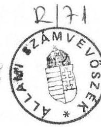
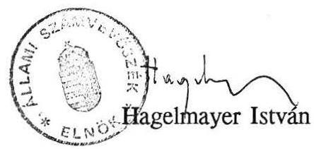

# Állami Számvevőszék

## JELENTÉS

a Magyar Köztársaság Szovjetunióban működő
külképviseleteinek 1991. évi
pénzügyi-gazdasági ellenőrzéséről

---

# Az ellenőrzést végezték:

| Bodonyi Miklós | számvevő-tanácsos |
| :-- | :-- |
| dr. Csemniczky Jánosné | számvevő-tanácsos |
| Deák Tamásné | számvevő |
| Fekete Imréné | főcsoportfőnök-helyettes |
| Horváth Sándor | számvevő-tanácsos |
| dr. Mihály Sándor | számvevő-tanácsos |
| Rádfai Tibor | főtanácsos |

## Az ellenőrzést vezette:

Bihary Zsigmond
főcsoportfőnök

---

# Jelentés

a Magyar Köztársaság Szovjetunióban működő külképviseleteinek 1991. évi pénzügyi-gazdasági ellenőrzéséről

A Magyar Köztársaság Szovjetunióban működő külképviseletei az 1990. évben mintegy 300 millió Ft kiadással, 900 millió Ft értékű vagyonnal, 330 fő kiküldötti, családtagi és egyéb (külföldi) létszámmal gazdálkodtak.

Az érintett fejezetek költségvetési tervezési és elszámolási (számviteli) rendszere nem teszi lehetővé, hogy az egyes relációkban működő külképviseletek működtetésének teljes költsége pontosan kimutatható legyen.

Az ellenőrzés célja a külképviseletek költségvetési tervezésének és felhasználásának, az ellátandó feladatok és erőforrások összhangjának, a kiadások törvényességének, célszerűségének és eredményességének vizsgálata, a kincstári vagyon működésének és védelmének, valamint a fejezetek gazdasági-pénzügyi irányító tevékenységének értékelése volt.

A helyszíni ellenőrzés - amely döntően az 1989. január - 1991. március közötti időszak gazdálkodására irányult - a nagykövetségre, a moszkvai, leningrádi és kijevi konzulátusokra, a moszkvai kereskedelmi képviseletre, a leningrádi és kijevi kereskedelmi kirendeltségekre, a moszkvai kulturális, tudományos és tájékoztatási központra, és a moszkvai katonai attaséi hivatalra terjedt ki. A helyszíni ellenőrzéseket a külképviseletek munkáját irányító minisztériumoknál végzett tájékozódás és ellenőrzés egészítette ki.

---

# I. Következtetések és javaslatok

A Szovjetunióban működő külképviseletek feladataikat bonyolult, egyre nehezedő körülmények között oldják meg. Ez a pénzügyi-gazdasági tevékenységükre is rányomja bélyegét. A közismert áruellátási, beszerzési, inflációs problémák mellett a gazdálkodást befolyásolják:

- A külföldieket érintő sajátos belföldi árrendszer, pl. alacsony hivatalos, jóval magasabb szabadpiaci árak mellett csak a külföldiekre érvényes díjszabások (hotel, közlekedés stb.).
- Az elszámolások USD alapra helyezésével összefüggő olyan problémák, mint pl. a SUR árfolyam jegyzésének megszüntetése, a SUR összegek korlátozott felhasználhatósága, az USD/SUR átváltás kettős (olykor hármas) árfolyama, a SUR készpénzként, illetve bankszámlapénzként való felhasználásának eltérő lehetőségei, ezzel a SUR készpénzkészletek jelentős leértékelődése.

A képviseletek anyagi helyzete, személyi és dologi feltételei - az egyes részletkérdések differenciált megítélése ellenére - az 1989-1990. években általában kiegyensúlyozott és egészében stabil volt. Az 1991. év hátralévő időszakában is hasonló helyzet várható azzal, hogy az egyensúly egyre inkább a szervezeti és gazdálkodási tartalékok határozottabb feltárása mellett biztosítható. A régebben működő képviseletek (pl. nagykövetség, kereskedelmi képviselet) a növekvő nehézségek ellensúlyozásához még rendelkeznek mobilizálható tartalékokkal.

#### Abstract

A SUR jelenlegi kettős árfolyama és az USD/SUR átváltás kedvező módja lehetővé teszi további tartalékok képzését (pl. jelentős előirányzati megtakarításokat, maradványokat), illetve a többletköltségek ellensúlyozását. A korábbi helyzetnek megfelelően kialakított, de célszerűtlen és a mai követelményekhez képest túlméretezett épületek fenntartása egyrészről ugyan többletköltséget jelent, de a felszabaduló, illetve más működő kapacitások hasznosításában további bevételi lehetőségek rejlenek. Egyedi megoldásként Moszkvában a nagykövetség magyar iskolát működtet, aminek a költségeit teljes egészében az állami költségvetés viseli.

A külképviseletek gazdálkodásában a célszerűség és szabályszerűség túlnyomórészt érvényesült és ez megfelelő feltételeket biztosított a szakmai feladatok ellátásához. Ugyanakkor a szakmai és gazdasági szempontok egyaránt indokolják a fokozatos strukturális változásokat, az együttműködés szélesítését, a profilok (párhuzamosan, vagy egymással átfedésben végzett feladatok) rendezését.

---

Nem kielégítő pl. a felhalmozódott SUR készpénzkészletek hasznosítása, a reprezentációs és fogadási kapacitás-feltételek, a gépjárműgazdálkodás összehangolása.

A nehezedő körülmények - az átmeneti, esetenként kiszámíthatatlan helyi intézkedések, korlátozások - általában a mozgékonyabb, a lehetőségekre gyorsan reagáló gazdálkodói magatartás igényét erősítették. Nőtt a gazdálkodók operatív terhelése. A szabályozottság szintje nem kielégítő, a változásokhoz nem igazodik.

A szabályzatok csaknem kivétel nélkül elavultak, hiányosak, sőt hiányoznak. Még az aktuális döntésekhez szükséges kiegészítő utasítások is késve érkeznek. Legfeljebb egy-egy helyen lehet egy-egy részkérdés megfelelő, aktuális szabályozottságát megállapítani (pl. nagykövetségnél az alkalmazottak járandóságainál). Az NGKM 1991-től pl. a gazdálkodás rovati kötöttségeit megszüntette, de a korszerű gazdálkodási szabályzat kiadásával adós maradt.

A nagyobb mozgástér a gazdálkodási elvek és keretek liberálisabb, de határozott rögzítését, a gyakorlati megoldások tekintetében pedig több konkrét iránymutatást tett volna szükségessé. A helyileg eldöntendő kérdések (pl. kötelezettségvállalási, utalványozási jogok) szabályozása is gyakran hiányzik. A szabályozottság hiánya miatt a képviseletek gazdálkodási önállóságának keretei továbbra is bizonytalanok, az irányításban túlsúlyban találhatók a "kézi vezérlés" megoldásai, a részkérdéseket érintő központi döntések stb. Az ilyen megoldásokkal azonban nem követhetők a helyi feladatok, ezért a közvetlen irányítás sok tekintetben látszólagos és valójában a kiküldöttek elképzelései, adottságai a meghatározóak.

Nem engedhető meg, hogy a gazdálkodási és elszámolási rend kizárólag a helyi munkatársak felkészültségének, ötletességének függvénye legyen. Általános tapasztalat ugyanis, hogy az érintett fejezetek szervező, szabályozó, ellenőrző tevékenysége hiányos és az elmúlt években sem fejlődött.

A HM kivételével a korábbi ellenőrzések megállapításait követő intézkedések elmaradtak. Nem reagáltak az olyan új problémákra sem, mint pl. az USD-alapú elszámolások bevezetése, a változó árfolyamok kérdése.

A Moszkvai Kereskedelmi Képviselet Üzemeltetési és Ellátási Igazgatóságának alapító levelét, működési és szervezeti szabályzatát eddig nem alakították ki és nem hagyták jóvá. Az Igazgatóság elvileg a képviselet szervezeti egységeként működik. Ténylegesen azonban ellentmondásos helyzet alakult ki. Az Igazgatóság felügyeletét a képviselet vezetője látja el. Ugyanakkor az Igazgatóság működése

---

egészében költségvetésen kívüli gazdálkodásnak minősül. Az ellentmondásokat leginkább a következők jellemzik:

- Az Igazgatóság 1990. évi költségei 7,7 millió SUR-t tettek ki. A fejezet költségvetésében a képviselet csak a 680,8 ezer SUR kiadásnak megfelelő összeggel szerepel.
- Az Igazgatóság bevételei 1990-ben 8,5 millió SUR-t, a bevételi többlet 826,2 ezer SUR-t tett ki. Az állami költségvetés bevételeként azonban nem kerültek elszámolásra és a képviselet kiadásainak fedezésében is csak részben, jórészt közvetett módon vettek részt.
- A képviselet (Igazgatóság) épületének és első berendezési költségeinek értékét (mintegy 540,0 millió Ft értékben) a költségvetési fejezet vagyonaként a fejezeti mérlegben tartják nyilván. Az azóta eszközölt befektetéseket, továbbá az anyag, fogyóeszköz és pénzkészletek túlnyomó részét már csak az Igazgatóság vagyonaként szerepeltetik.

Az Igazgatóság mérlegében nem szereplő "képviseleti" vagyon 1990 végén 693,0 ezer SUR volt. Az Igazgatóság mérleg szerinti vagyona pedig (40,3 millió SUR) sem a kincstári, sem más állami vagyonkimutatásban nem szerepel.

Az ellenőrzés tapasztalatai alapján javaslataink a következők:

# 1. A felügyeleti szervet érintően:

a/ Indokolt megteremteni annak szervezeti és szabályozási feltételeit,

- hogy a magyar külképviseletek szakmai és gazdasági együttműködése szélesedjen;
- a felügyeleti szervek követelményei (szabályozásai) egységesebbek és szakszerűbbek legyenek.
- Helyes lenne lépéseket tenni a külképviseletek gazdasági, tájékoztatási stb. profiljainak olyan rendezésére is, hogy a jelenlegi szervezeti párhuzamok felszámolhatók legyenek.
b/ Intézkedni indokolt a külképviseletek költségvetési tervező munkájának fejlesztésére. Az érintett fejezetek költségvetési tervezési és elszámolási rendszereik továbbfejlesztésével és összehangolásával (egységesítésével) biztosítsák, hogy

---

- javuljon a költségvetési előirányzatok megalapozottsága;
- a képviseletek fenntartásának és működtetésének költségei és bevételei teljeskörűen tervezhetők és kimutathatók legyenek;
- a bevételek térítményezése szűnjön meg, a bevételek maradéktalanul kerüljenek megtervezésre;
- a bevételek, valamint a kiadások felmerülési helye, valutaigénye figyelembevételével készüljön képviseletenként egy finanszírozási terv (ellátmány mértéke, ütemezése, a kiadások HUF, SUR, USD stb. fedezete), amely biztosítja a költségvetés és pénzellátás közötti összhangot;
- az 1991. évi költségvetési előirányzatokat az USD elszámolásra való átállás következményei miatt általában, a Szovjetunióban kialakult SUR/USD "szürke"-árfolyamra tekintettel pedig konkrétan is indokolt felülvizsgálni, hogy biztosítani lehessen a valóságos többletköltségek és tartalékok megismerését, az 1991. évi beszámolás és 1992. évi tervezés reálisabb feltételeit.
c/ A külképviseletek gazdálkodásának egységes, aktuális elveken és törvényeken alapuló szabályozását haladéktalanul napirendre kell tűzni. Ennek keretében
- a sajátos feladatok mellett - az egységes, egyeztetett megoldásokra, a gazdálkodási önállóság növelésére kell a hangsúlyt helyezni;
- a külképviseleteket felügyelő minisztériumok szervező, ellenőrző tevékenységét határozottabbá és hatékonyabbá szükséges fejleszteni.
d/ A felügyeleti szervek
- fordítsanak nagyobb figyelmet a külképviseletek konkrét és haladéktalan eligazítására pl. a szovjetunióbeli SUR/USD árfolyam problémák, a sajátos fizetési feltételek, a bankszámlaforgalommal kapcsolatos új szabályok miatt;
- úgy fejlesszék tovább a külképviseletek számvitelét, hogy egyrészt az átváltásokból eredő nyereségek/veszteségek elkülönítve kerüljenek kimutatásra, másrészt a költségvetési bevételek és kiadások egy egységes (reális) "elszámolási" árfolyamon kerüljenek elszámolásra, illetve átszámításra (forintosításra);

---

- következetesebben követeljék meg a bizonylati fegyelmet, a nyilvántartási és számviteli rend maradéktalan érvényesítését, a szervezett és szabályszerűen kiértékelt leltározásokat stb.;
- rendezzék az idegen tulajdonokon (bérleményeken) végzett beruházások elszámolását és nyilvántartását;
- tegyenek lépéseket annak érdekében, hogy a külképviseletek gazdálkodását lebonyolító munkatársak megfelelő előképzettség alapján és kiképzés után foglalják el beosztásukat.
e/ A felügyeleti szervek
- közösen rendezzék - a kialakult sajátos helyzetre tekintettel - a külképviseletek különböző valutanemben történő ésszerű és összehangolt pénzellátását, figyelemmel a helyszíni bevételekre, elsősorban a képviseletnél felhalmozódott nagy készpénzkészletre és az egymás közötti racionális pénzforgalmi lehetőségekre:
- a jelentősen felemelt épület- és lakásbérleti díjakra tekintettel - a szervezeti és létszámváltozásokkal is összhangban - vizsgálják felül a bérleményeket, a kisebb alapterületű lakások arányának növelése, a közösen hasznosítható létesítmények jobb kihasználása érdekében.

# 2. A Külügyminisztérium hatáskörében:

a/ A nagykövetség létszámát az ellátandó feladatokhoz kell igazítani és az ezáltal elérhető megtakarításból fedezhető a konzuli tevékenység decentralizálása miatti létszámigény.

- A leningrádi főkonzul átsorolását haladéktalanul el kell végezni azért is, hogy járandóságai szabályszerűen és szabályos forrásokból legyenek fedezhetők.
- Sürgősen rendezni indokolt a nagykövetségen beosztást nyert KHVM megbízott státuszát, járandóságainak és költségeinek szabályszerű finanszírozását.
b/ A nagykövetségnél és a konzulátusoknál a dolgozók által fizetett költségtérítéseket felül kell vizsgálni és azokat USD-ban megállapítva az indokolt mértékre kell emelni.

---

c/ A nagykövetségi sajtó és tájékoztatási munkában új, korszerűbb és ésszerűbb módszerekre van szükség (pl. kulturális központ és a nagykövetség tájékoztatási feladatainak integrálása, számítógépre alapozott sajtó-archívum kiépítése, a magyar sajtótermékek és kiadványok gyakran késedelmes, hiányos kijuttatásának megoldása, a magyar kolónia tájékoztatásának általános javítása).
d/ A nagykövetségi közösségi konyhájának elszámolási rendjét úgy kell átalakítani, hogy az étkezést igénybe vevők, valamint a nagykövetség hozzájárulása egyértelműen kimutatható legyen.
e/ A nagykövetségi épület és a telken épült lakóház tulajdonára vonatkozó nemzetközi megállapodások dokumentumait és a jogi helyzetére vonatkozó egyéb okmányokat a Minisztérium haladéktalanul gyűjtse össze és rendezze kezelhető formába.
f/ A nagykövetségi ingatlanon további lakóépület(-ek) építését indokolt napirendben tartani és ha a technikai és gazdaságossági akadályok elhárulnak, a megoldás lehetőségét kihasználni.
g/ A nagykövetség költségvetési forrásaiból működtetett magyar iskola fenntartási költségeit egy-két éven belül a szülőkre indokolt hárítani.

# 3. Nemzetközi Gazdasági Kapcsolatok Minisztérium hatáskörében:

a/ A Magyar Köztársaság Moszkvai Kereskedelmi Képviselete Üzemeltetési és Ellátási Igazgatóságának jogállását, erre alapozva pedig egész gazdálkodását úgy indokolt újraszabályozni, hogy

- a gazdálkodó szervezet a kereskedelmi képviselet legyen;
- a költségvetésen kívüli gazdálkodás, valamint annak jogi és szervezeti feltételei felszámolásra kerüljenek;
- a
 képviselet és az Igazgatóság összes kiadása (költsége) és bevétele egységes rendben - már az 1991. évi költségvetésben - a képviselet kiadásaként és bevételeként kerüljön elszámolásra;
- az Igazgatóság vagyona a képviselet vagyonával együtt egységes számvitel alapján közös mérleg- és vagyonkimutatásban, kincstári vagyonként maradéktalanul elszámolásra kerüljön;

---

- azt is figyelembe kell venni, hogy az Igazgatóságnál, a költségvetési szempontból sajátos feladatokra is tekintettel, az államháztartás elszámolási követelményeit szem előtt tartó, de speciális elszámolási és érdekeltségi megoldásokra is szükség lehet (pl. többletbevételek, amortizációs alap). Erre az NGKM a Pénzügyminisztériummal egyeztetett megoldásokat dolgozza ki.
b/ A Minisztérium gondoskodjon az Igazgatóság által 1991. január 16-án hibásan könyvelt 67,4 ezer USD elszámolásának helyesbítéséről. Az összeg hazautalása, vagy a külképviseletek ellátmányaként való igénybevétele lehet a helyes megoldás.
c/ Az Igazgatóság által 1990 végén hazautalt összesen 2.600 ezer, itthon tartott SUR 50%-ának szabályszerű (költségvetési bevételként való) elszámolásáról és az összeg költségvetési tartalékszámlára történő befizetéséről haladéktalanul gondoskodni kell.
d/ Elsősorban az Igazgatóságnál, de a kirendeltségeknél is indokolt a vállalati képviseletek bérleti szerződéseivel és díjaival kapcsolatos nyilvántartási rendet korszerűsíteni.
e/ A bevételek beszedésének rendjét szigorítani szükséges. Az Igazgatóságnál a jelentős hátralékok behajtása érdekében, illetve hátralékok újabb keletkezése ellen intézkedéseket kell tenni.
f/ Az Igazgatóságnál a számviteli nyilvántartásokban és a mérlegben nem szerepeltetett jelentős készletek leltározásáról és egyeztetéséről, valamint haladéktalan nyilvántartásba vételéről gondoskodni kell.
g/ Intézkedni szükséges a képviselet (Igazgatóság) számvitelének egységesítése érdekében (képviselet és Igazgatóság, SUR és USD elszámolások, vagyonnyilvántartások, kiadások és költségek stb.).

# 4. Művelődési és Közoktatási Minisztérium hatáskörében: 

- A Magyar Köztársaság külföldi kulturális központjainak felügyeletét a szakszerűbb és hatékonyabb megoldás érdekében célszerű a Minisztérium Művelődésgazdasági főosztályának hatáskörébe utalni;
- a kulturális központhoz 1990 közepén kiszállított mobiliák új leltározásáról (egyeztetéséről) és nyilvántartásba vételéről haladéktalanul gondoskodni kell. Az 1990. októberi leltár eltéréseit ki kell vizsgálni és a 75,6 ezer Ft értékű hiányért a kártérítési igényt érvényesíteni kell.

---

# II. Részletes megállapítások 

## 1. A külképviseletek költségvetési előirányzatainak megalapozottsága

A külképviseletek részére a gazdálkodást megalapozó, reális és teljes költségvetések - korábbi javaslataink ellenére - máig sem készülnek. A külképviseletek költségvetései

- nem tartalmazzák áttekinthetően és egy okmányban egy-egy külképviselet működésének összes költségét (pl. a főkiküldöttek bérét, társadalombiztosítási járulékát, a központi beszerzéseket, a korábbi intézkedések szerint 1991. január 1-től megszüntetett, de ennek ellenére változatlanul kezelt KüM tájékoztatási keretet), a különböző külképviseletek érdekében (pl. itthon) felmerült költségek elhatárolása, felosztása sem történik meg;
- a költségvetésekben nem tervezik a bevételek jelentős részét, a kiadások valóságos összege pedig a bruttó elszámolás elvének sérelme, a bevételek térítményként való elszámolásának gyakorlata miatt sem állapítható meg, de tetemes bevételeket és kiadásokat (elsősorban az Igazgatóságnál) költségvetésen kívül kezelnek;
- a tervezésben továbbra is egyértelműen bázisszemlélet érvényesül, a pénzügyi-gazdasági szempontok általában háttérbe szorultak. Végül
- a költségvetési tervek általában - elsősorban a bevételek tervezésének elégtelensége és szabálytalansága miatt - alkalmatlanok a takarékos pénzellátás megtervezésére és gyakorlására.

E problémákat a szovjet relációra jellemző körülmények felerősítették. Az 1985-1990. években - a viszonylag stabil ár- és bérviszonyok, a kiadások determináltsága, a korábbi jelentős befektetések hosszú távú költségkihatásai, illetve lehetőségei, a felhalmozott tartalékok miatt - a szakmai feladatok és ráfordítások összefüggéseinek elemzésére nem került sor és a költségvetési tervezési munka a megszokott, főként formális módon folyt.

Az 1991. évi költségvetések tervezését az 1990-ben már megváltozott gazdálkodási és szervezeti feltételek (pl. infláció, USD-alapú elszámolási rend, a szervezeti átalakulások) tovább nehezítették.

Ilyen okokra hivatkozva pl. a kulturális központ 1991. évi költségvetését 1991. júniusáig még nem hagyták jóvá.

---

Az elszámolások USD-alapra helyezésével a külképviseletek gazdálkodásában jelentős szerephez jutottak az árfolyamok, az átváltási feltételek. A különféle valutanemekben, a hivatalos és a "szürke" árfolyamok variációi között folytatott gazdálkodás pénzügyileg és számvitelileg szabálytalan, anarchikus. Az átváltási nyereségekkel, illetve veszteségekkel a költségvetési tervekben sem számolhattak. (Az elszámolási kérdéseket a felügyeleti szervek még saját számvitelükben sem rendezték.)

Az 1991-es előirányzatok nem számolhattak ilyen mértékű árfolyamváltozással. Ennek következtében a költségvetésben ma jelentős, az áremeléssel és feketepiaci árakkal nem indokolható tartalékok vannak. A megváltozott körülmények között nehézséget jelentett az új szervezetek reális előirányzatainak meghatározása.

A külképviseletek birtokában lévő SUR pénzkészletek 1991-ben elvesztették "belső konvertibilitásukat". A korlátozott mennyiségű és általában nem növelhető SUR bankszámlapénzek ugyan még 1991-ben is felhasználhatók voltak (1,67-1,73 SUR/USD árfolyamon) a közületekkel szemben fennálló tartozások kiegyenlítésére. A növekvő SUR készpénzkészletek felhasználhatósága azonban erősen korlátozott és az 5,60-27,60 SUR/USD árfolyam mellett ezek erősen leértékelődtek.

Az egységes árfolyam hiánya miatt az Igazgatóság a pénztárban elfekvő több milliós SUR pénzkészlete ellenére USD-t vált át SUR-ra. A helyi élelmiszerbeszerzésekre pl. 1991. május 31-ig összesen 1.400 USD-t váltottak át azért, mert az átváltásból származó SUR összegből vásárolt élelmiszerek - kalkulációkban figyelembe vett beszerzési ára csak 18%-a a pénztárból kivett azonos SUR összeg USD-ra átszámított értékének.

Az 1991. évi USD-elszámolásokra felkészülve a külképviseletek 1991. évi kiadásaik jelentős részét (pl. lakbérek, üzemanyag-utalványok) még 1990-ben és SUR-ban kiegyenlítették. Ez egyrészről jelzi a meglévő tartalékokat, míg másrészről helyes, takarékos lépés volt. A tervezésnél azonban nem vették figyelembe azt, hogy az 1991. évi kiadási előirányzatok jelentős költségektől mentesültek. Így a keretek ez évre fellazultak.

A képviselet és az Igazgatóság gazdálkodása nagymértékben összefonódott, az elkülönítés csak formálisan és kényszeredetten (pl. csak munkabérek, reprezentációs kiadások és bizonyos készletek tekintetében) lehetséges. Ilyen körülmények között a képviselet gazdálkodásának tervezése csak néhány kiadási előirányzat esetében értékelhető. A működési kiadások többsége ugyanis az adott évi mérlegeléstől is függő költségelhatárolás szerint alakul.

---

Pl. A képviselet a kincstári vagyont képező saját épületében ugyan az Igazgatóságnak irodabérleti díjat fizet, de létszám- és bérköltségeinek egy részét (az 1990. évben pl. 26 fő után 142,0 ezer SUR-t, 16,0 ezer USD-t és 1.405,4 ezer Ft-ot, összesen mintegy 5,4 millió Ft-ot) az Igazgatóság viselte. 1989-ben pl. 509,2 ezer SUR irodabérlet, az irodaszer szükséglet (kb. 6 ezer USD), a gépkocsi fenntartás és üzemeltetés költségei az Igazgatóságot terhelték.

# 2. A bevételek és a külképviseletek pénzellátása 

A külképviseletek pénzellátásában általában a költségvetési ellátmányok játszák a meghatározó szerepet. A saját bevételek döntően a konzuli bevételekből és az Igazgatóság bevételeiből származnak.

A központilag tervezett konzuli bevételek a nemzetközi megállapodások, a forgalom és az árfolyamok függvényében ingadoznak. Ez jellemezte a szovjet relációt is (pl. izraeli kivándorlási forgalom, a vízumdíjak emelése, USD-alapra helyezése, vízumkényszer megszüntetése). Az ellenőrzött esetekben e bevételek elszámolását, befizetését rendben találtuk.

Ugyanakkor azt a lehetőséget, mely szerint a konzuli bevételek még 1991-ben is bankszámlára befizethetők voltak, nem használták ki maradéktalanul. (Jó példát a moszkvai nagykövetségen észleltünk.)

Az Igazgatóság bevételei 1990-ben csaknem 47%-kal haladták meg az előző évit és elérték a 8,5 millió SUR összeget, amivel - az Igazgatóság szabályozatlan helyzete folytán - költségvetésen kívül gazdálkodnak. A képviselet finanszírozásánál azonban ezeket a bevételeket, illetve többletbevételeket főként csak "rejtve", nyíltan csak esetenként és kis mértékben vették igénybe.

Az 1989-1990. években a Minisztérium a képviselet részére SUR-ellátmányt ugyan nem utalt ki, de csak 1990-ben pl. a képviselet mégis 1.135,2 ezer SUR ellátmányban részesült azáltal, hogy az Igazgatóság főkiküldöttei részére Budapesten számfejtett illetmények és tb-járulékok értékét az Igazgatóság Moszkvában számolta el a képviselet javára.

Ezek az átutalások a képviselet tényleges kiadásait rendszeresen meghaladják és miután térítményként kerülnek elszámolásra, ennek eredményeként az NGKM Külkereskedelmi Szolgálat cím moszkvai során költség helyett számottevő költségcsökkentő ellentétel jelentkezik.

---

Az Igazgatóság itthoni beszerzései fedezetére

- 1990. február-augusztus hónapjaiban 3 tételben együtt 1.500 ezer SUR-t utalt haza. Ezt egészítette ki további 1.431,4 ezer SUR-nak megfelelő, 28.493,3 ezer Ft-ot kitevő összeggel, amelyet úgy helyeztek budapesti számlájukra, hogy a Moszkvában irodát bérlő vállalatokkal a bérleti díjat Budapesten fizettették ki.
- 1990. októberében 400 ezer, 1990. november 26-án 2.200 ezer SUR-t küldtek, illetve utaltak haza. Ezek fejében összesen 390,1 ezer USD-t utaltak ki számukra. A fennmaradó 1.300 ezer SUR-nak megfelelő 24,7 millió Ft értéket a Minisztérium részére átadott pénzeszközként "kezelik". A Minisztérium pedig a visszatartott összegeket nem bevételként számolta el, hanem letéti számlára helyezte.

A költségvetésen kívüli gazdálkodás eseteként említhető a leningrádi főkonzulátus korábbi gyakorlata is. Itt a helységbérleti díjak egy részét (2,5 ezer SUR-t) 1990. januárjától a pénztári számadásokba nem vételezték be, hanem közös kiadások fedezetére elkülönítve kezelték és költötték. A maradványt ellenőrzésünk vételeztette be.

A bevételek előírása és beszedése az esetek többségében rendben folyt. A költségvetésen kívüli gazdálkodás említett esetein túl a továbbiakra kell a figyelmet felhívni:

- A különféle térítményeknél az indokoltnál mérsékeltebb díjat érvényesítenek (pl. a moszkvai nagykövetség területén lakók 1991. márciusig villanyáram fogyasztás címén nem fizettek térítést, a nagyköveti lakás után máig nincs ilyen megállapítva).
- A térítéseket továbbra is SUR-ban fizettetik (pl. a nagykövetségnél), máshol a fűtési és melegvíz szolgáltatási díjakat 3-6 USD/hó mértékben a korábbi SUR díjak egyszerű átszámításával állapították meg, bár azok közben háromszorosukra emelkedtek (pl. nagykövetség, leningrádi, kijevi konzulátusok).
- A kereskedelmi kirendeltségeknél a vállalati bérleti díjak jelentősek. A bevételi előírások és szerződések, valamint a befizetések nyilvántartási feltételei a nagyobb forgalmat lebonyolító helyeken (pl. Igazgatóság) tökéletesítésre szorulnak, az ellenőrzéshez a szerződések nem állnak maradéktalanul rendelkezésre (pl. leningrádi kereskedelmi kirendeltség), a bevételek beszedésénél is indokolt szigorúbb feltételeket szabni.

---

Az Igazgatóságnál pl. ellenőrzésünkkor garázs- és szervizmunkák miatt 12 ezer USD (6 ezer USD egy hónapnál régebbi), irodabérleti díjakból 104,4 ezer USD (40,4 ezer USD túlfizetés mellett), lakbérek esetében 171,2 ezer USD tartozás állt fenn.

A külképviseletek pénzellátása zavartalan volt, sőt több helyen szerzett tapasztalatok szerint jelentős ellátmánytartalékok fekszenek részben SUR-ban, újabban már USD-ban is (pl. kijevi konzulátusnál és kirendeltségnél, a leningrádi alkirendeltségnél és mindenekelőtt az Igazgatóságnál). A pénzellátás tekintetében is hiányzik általában a külképviseletek és felügyeleti szerveik együttműködése. E szempontból kedvező, hogy az NGKM Költségvetési Önálló Osztályának a Képviselet és az Igazgatóság 1991. januárjától havonta részletes tájékoztatást küld pénzügyi helyzetéről. A továbbiakban ebben lehetne megjelölni az ellátmány igényt, amely a hatékonyabb és takarékosabb gazdálkodást jobban segítené. A bevételek (elsősorban készpénzbevételek) igénybevétele más szervezetek finanszírozására még csak kivételes jelenség. (Néhány alkalomszerű esettel - az Igazgatóság, a moszkvai képviselet, valamint a kijevi és leningrádi kirendeltségek kapcsolatában - találkoztunk).

E tekintetben a szervezett együttműködés szükségességét jelzi az a tény, hogy miközben az Igazgatóság pénztárában több millió SUR készpénz feküdt el, a kijevi és leningrádi alkirendeltségek 1991. májusáig összesen 2.600 USD-t, a nagykövetség ösztöndíj-pénztára 10.400 USD-t váltott át SUR készpénzre.

Az Igazgatóságnál a mintegy 2-3 millió SUR-t kitevő készpénzkészlet felhalmozása - az Igazgatóság jogállásával is összefüggésbe hozható pénzgazdálkodás következménye. (Megjegyezzük, hogy kisebb nagyságrendben hasonló gyakorlat a
 nagykövetségnél is megfigyelhető volt.) Az Igazgatóság részére az 1988-1989. években átlagosan a 7-8 millió SUR bankszámlapénz mellett 200-600 ezer SUR készpénz állt rendelkezésre. A pénzkészleteket azonban 1990-től mind nagyobb hányadban pénztárban kezelik. E helyzet kialakulásához több ok vezetett:

- a PK forgalom keretében eszközölt átutalásokat elősorban bankszámláról teljesítették. Így a mai viszonyok között is felhasználható SUR-egyenleg kizárólag emiatt 1,4 millió SUR-ral csökkent. A PK-t illető befizetések viszont rendre a pénztárba folytak be;
- nem figyelték ebből a szempontból a vállalati képviseletek és dolgozók pénzügyi kötelezettségeinek teljesítését sem. A vállalatok által bérelt lakások lakbére, telefon és egyéb költségei pl. csak az érintett bankszámláról voltak kiutalhatók. (Csak 3 vállalatnak van bankszámlája.) A vállalatok befizetési kötelezettségeiket a pénztárba teljesítették.

---

A vállalatok és dolgozók 1990. évben - jórészt év vége felé - összesen 144 személygépkocsi árát fizették be készpénzben a pénztárba, összesen 1,6 millió SUR összegben. Ez az UPDK részére bankszámláról került átutalásra. Hasonló hatást váltott ki több más megoldás is, pl. a benzinjegy vásárlások, a szállodafoglalások, az Ikarus kijevi lakbérének kifizetése.

Tekintve, hogy a készpénzben fekvő SUR készlet ma már legfeljebb 3 Ft/SUR-ban értékelhető, az elmúlt év második felétől a pénztárba fokozatosan átcsoportosított és leértékelődött SUR készletek miatt mintegy 40-50 millió Ft veszteséggel lehet számolni.

# 3. A kiadások cél- és szabályszerűsége 

Az ellenőrzött külképviseletek kiadási előirányzataik keretei között általában szabályszerűen és takarékosan gazdálkodtak. Pazarló gazdálkodás, indokolatlan igény szint kielégítése kirívó, vagy ismétlődő esetekben nem volt tapasztalható. Ugyanakkor nem voltak érzékelhetők a költségek csökkentése érdekében tett határozottabb lépések sem. Erre a helyi gazdasági körülmények sem késztették a képviseleteket. Változatlan a tartalékolási törekvés és lassan halad a szervezetek korszerűsítése.

A képviselet kiadásai közül - az Igazgatóság térítményein felül is - egyre többet számolnak el az Igazgatóság terhére. Így pl. az 1989. évben 72,3 ezer SUR összegben felmerült külföldi alkalmazotti bér 1990. évben már tervezésre sem került. Az 1991. évi irodabérleti díjak közül 509,2 ezer SUR-t nem, 412,0 ezer USD-t csak kis részben "fizetteti meg" az Igazgatóság. A teljes irodaszer-ellátást, a képviselet személygépkocsijainak fenntartását és üzemeltetését is az Igazgatóság fedezi.

A kijevi kirendeltség fenntartásának költségeit is háromnegyed részben a vállalatoktól beszedett (és térítményként elszámolt) bevételek fedezik.

## a/ Létszám- és bérgazdálkodás, személyi jellegű kiadások

A külképviseletek létszámgazdálkodásában, a személycseréken kívül, a megváltozott feladatokhoz való igazodás még kevésbé érzékelhető és a külképviseletek feladatainak, létszámának integrációja is várat magára. (Az attaséi hivatalnál, annak feladatköréhez igazodóan, szemléletesen csökkent és csökken a létszám.)

- Lényeges létszámcsökkentésre (pl. nagykövetség) nem került sor. A viszonylag új leningrádi főkonzulátus létszámát sem átcsoportosítással fedezték. (A kereskedelmi kirendeltség tervezett decentralizációja során viszont ilyen megoldással számolnak);

---

- a nagykövetség a külföldi alkalmazottak számát 18-20 %-kal csökkentette. Erre a kultúrális központ esetében is mód nyílik, melynél jelenleg 6 főt foglalkoztatnak teljes munkaidőben;
- nem egy munkakörben főkiküldöttek dolgoznak, ahol nagyobb számban házastársak lennének foglalkoztathatók (pl. TÜK kezelés). A konzuli bevételek és feladatok csökkenésével az ott foglalkoztatott főkiküldött adminisztrátorok is részmunkaidősökkel lennének felválthatók.

Néhány bérprobléma sürgős megoldásra vár.
A leningrádi főkonzult 1991. januárjában kinevezték, átsorolására azonban a vizsgálat idejéig - közel fél év alatt - sem került sor. A főkonzul részére ezért országon belüli kirendelés címén 1990. szeptembere óta 40 % napidíjat folyósítanak. Ennek kifizetése 1991-ben a főkonzulátus USD-ban nem is tervezett utazási költségkeretét terheli.

A nagykövetségen a KHVM megbízottja feladatkörének meghatározása a nagykövet hatáskörébe került, miután megbízták a nagykövetség gazdasági elemző osztálya vezetésével. Fizetését és gépkocsiellátását még a kiküldő minisztérium fedezi, a többi költség finanszírozása jelenleg megoldatlan. Az illető Külügyminisztérium státuszba helyezése 1991 eleje óta húzódik. A Külügyminisztérium és a KHVM között még nem született megállapodás a kiküldött átvételére vonatkozóan. (A KHVM 1991. márciusában közös foglalkoztatást és költségviselést javasolt.)

A külföldi munkavállalókkal megkötött szerződések - az ellenőrzött esetekben szabályosak voltak és a bérek számfejtését is rendben találtuk. Nem merültek fel észrevételeink a kiküldetésekkel, a hivatali- és magánszemélygépkocsik igénybevételével kapcsolatban sem.

A magánszemélygépkocsik használatának - helyeselhető - elterjedésével kapcsolatban azonban a személygépkocsik és gépkocsivezetők száma felülvizsgálatra szorul, illetve - a kultúrális központnál már jelenleg is - csökkenthető.

Általában a reprezentációs kiadások alakulására is a takarékos és mértéktartó gazdálkodás volt jellemző. Kerettúllépést sehol sem tapasztaltunk. Néhány esetben azonban a takarékossági és szabályszerűségi követelmények sérelmet szenvedtek.

A nagykövetségen pl. - a nagyköveti intézkedés ellenére - máig sem egységes a reprezentációk elszámolásának rendje, a rendszertelen adatokból, okmányokból a valóság nem rekonstruálható. A keretet belső (nőnapi, szilveszteri stb.) rendezvények fogyasztásával is terhelték, az 1989-1990-ben pedig év végén még 1.000-1.200 palack különféle italt ajándékoztak el.

---

A kijevi kirendeltségen a készletek nyilvántartása áttekinthetetlen, a bevételezések nem mindig történtek meg, így a felhasználás megnyugtatóan nem is volt vizsgálható.

A moszkvai képviselet a reprezentációs készleteit és kiadásait - az Igazgatóságétól szigorúan elkülönítve - szabályszerűen tartja nyilván. Az 1989. évi reprezentációs költsége 11 ezer SUR, az 1990. évi 9 ezer SUR volt. E viszonylag szerény tételeken felül azonban az Igazgatóság jelentős - kb. 10 évre elegendő - készleteket tárol.

Az Igazgatóságnál 1990. december 29-én "étkeztetési készletcsökkentésként", (az étkeztetéstől való átvétellel és elszámolással) 105,0 ezer SUR összegű reprezentációs célokat szolgáló termék megvásárlására került sor. E készletet elkülönítetten tárolják, csak mennyiségben (analitikusan) tartják nyilván, értékben készletként sehol sem szerepeltetik és a felhasználását sem könyvelik.

# b/ Beszerzések, készletek 

A hazai és helyi beszerzések indokoltsága elsősorban a helyi ellátási helyzet, illetve az 1991. évi USD elszámolási rendre való áttérés körülményeinek figyelembevételével értékelhető. A külképviseletek többsége az 1990. évi beszerzési lehetőségeket - erőforrásai átcsoportosításával és tartalékai mozgósításával - még a SUR elszámolások keretében célszerűen igyekezett bővíteni. A beszerzések általában indokoltak voltak, még ha átmenetileg magasabb készleteket is eredményeztek (pl. üzemanyagok, gépkocsialkatrészek). Voltak azonban meggondolatlan vagy kevésbé sikeres lépések is.

A leningrádi főkonzulátus leltárában pl. több olyan nagyértékű berendezés (színes TV, fénymásoló, villanybojler stb.) szerepel, amelyek tervezve nem voltak és a vásárlás indokoltsága is kétséges.

A kijevi főkonzulátus 1990 végén 760 ezer Ft-ért vásárolta meg egy még ki sem bérelt 4 szobás lakás berendezését, amelynek mintegy fele azóta is használaton kívül van.

A kijevi kereskedelmi kirendeltség költségvetését 1,0 millió Ft értékű berendezési és 3,1 millió Ft-nyi egyéb költség terhelte, miután az ukrán diplomataellátó hibájából az új székház átvétele meghiúsult (a kártérítésért pert indítottak).

---

A nagykövetségen az 1990-ben beszerzett, illetve többségében átvett 9 db személyi számítógép hasznosságáról eltértek a tapasztalatok. Ugyanitt az az egyébként helyes törekvés, hogy munkatársaikat személygépkocsival lássák el, csak részleges eredményt hozott. Az 1990-ben beszerzett 28 személygépkocsi vásárlójából jelenleg csak 12 dolgozik a követségen.

Szervezettebb elszámolással és belső ellenőrzéssel a gazdálkodás célszerűsége javítható.

# c/ Az elhelyezések, berendezések színvonala. Felújítások 

A saját és bérelt épületek, valamint a lakások a külképviseletek működéséhez - a helyi körülményeket tekintve - általában megfelelő feltételeket biztosítanak. Színvonalas, ha nem is célszerű, a nagykövetség elhelyezése. A képviselet és az Igazgatóság lehetőségei más magyar külképviseletek előnyére (pl. kultúrális központ, nagykövetség) is kihasználhatók lennének.

A leningrádi kirendeltség elhelyezése szűkös és a kijevi kirendeltség elhelyezése (a jelentős költségekkel kialakított kereskedelmi központ átvételének meghiúsulása miatt) megoldatlan.

Az ellenőrzött esetekben a hivatalok és lakások berendezését is kielégítőnek találtuk. (Kivételekkel a kijevi főkonzulátuson, a kultúrális központ igazgatói lakásánál találkoztunk.)

A lakásbérleti szerződéseket rendben találtuk, azokat évente megújítják. Az 1990. évben három-ötszörösre emelt lakásbérleti díjak miatt a bérlemények számának (létszámfelülvizsgálathoz is kapcsolódó) csökkentése szükséges és lehetséges. A személycserék és a megváltozott körülmények miatt a nagy lakások jelentős része kisebbre lenne cserélhető.

A nagykövetségnél pl. 35 bérelt lakás közül 6 lakásban nem kihelyezett dolgozó lakik (a Magyar Hírlap, a TESCO munkatársai részére bérelt lakások indokoltsága különösen megkérdőjelezhető).

A kultúrális központnál az igazgatói lakás 1990. decembere óta áll üresen. Az MKM a lakás bevételszerző, eseti kiadását nem engedélyezte, azt esetenként hivatalos kiutazói ingyenesen használták. (Az igazgató kinevezésére és ezzel a lakás igénybevételére az ellenőrzést követően került sor.)

A nagy lakások bérlete a nagykövetség területén felülvizsgálatra szorul, miután regisztrált vendéglátás a lakásokon elvétve fordul elő (1990-ben pl. összesen csak 20 esetben számoltak el költséget ilyen címen).

---

Az ellenőrzött időszakban a külképviseletek közül a nagykövetségnél, az Igazgatóságnál és a kultúrális központnál végeztek jelentősebb felújítást.

A nagykövetség magyar tulajdonú épületének felújítása - amelynek költségei között több számos beruházási tételt is elkönyveltek - 1991-ben zárult úgy, hogy biztonsági okokból 1991-ben az egy-két évvel ezelőtti munkákat nemegyszer újra át kellett alakítani.

Az Igazgatóság amortizációs költségeiből és állóeszköz értékesítési bevételeiből 1981-1990. években 1.514,5 ezer SUR ún. értékcsökkenési alapot képzett, amiből 820,9 ezer SUR-t használt fel. (A régebbi alapképzés és felhasználás adatait nem sikerült rekonstruálni.) Az 1990. év végi egyenleg ezer 321,7 SUR volt.

Az 1990. évben a vendégház felújítására fordított 288,5 ezer SUR-ból 243,6 ezer SUR a felújításhoz beszerzett anyagok értéke volt, amit helytelenül a beépítéstől függetlenül elszámoltak az alap terhére. A meglévő és tárolt anyagokról szabályszerű analitikus nyilvántartást nem vezetnek, azok értéke (költségként elszámolva) a mérlegben nincs vagyonként kimutatva. (A mennyiségről és összetételről csak egy jegyzőkönyv áll rendelkezésre.)

A kultúrális központ bérelt épületének felújítási munkái döntően 1989. évben folytak jelentős határidő módosításokkal (a kivitelező megbízhatatlansága és az elvégzett munkák minőségi kifogásai, a fővállalkozó és az alvállalkozók közötti problémák stb. miatt).

A felújítás során felmerült többletmunkák kifizetését nem teljesítették, azt a minőségi kifogásokkal kompenzálták. A felújítással kapcsolatos számlákat - egy-két kivétellel - kollációzták ugyan, azonban ez - egy számla kivételével - érdemleges módosításokkal nem járt.

A felújítás során jelentős költséggel azóta is túlnyomórészt kihasználatlan létesítmények (pl. mozi- vagy színházterem) is kialakításra kerültek.

Az 1990. év közepén kiszállított mobiliák nyilvántartásba vételét elmulasztották. A leltárfelvételre 1990 októberben került sor. A leltárösszesítők és a főkönyvi könyvelés között az állóeszközök és a fogyóeszközök esetében egyaránt eltérés mutatkozott, melyet sürgősen tisztázni kell. Néhány hangtechnikai eszköz (erősítő, hangfal, mikrofon stb.), mely a műszaki átadási jegyzőkönyv részét képezi, a leltárban még mindig nem szerepel. A megállapított hiány (video-hangtechnika 75,6 ezer Ft) kivizsgálására és kártérítési eljárásra intézkedés fél év óta sem történt.

---

Ilyen körülmények között még feltűnőbb, hogy az ellenőrzött időszak alatt bekövetkezett igazgatóváltás során a vagyontárgyakra vonatkozó átadás-átvételi leltárt nem készítettek. Ez a felmerült hiánnyal kapcsolatos felelősség megállapítását is nehezíti.

# d/ Egyéb kiadások, költségek 

A nagykövetség tájékoztatási keretét a Külügyminisztérium továbbra is évente külön, a költségvetéstől elkülönítve határozza meg (1991. évre pl. 10 ezer USD). A felhasználás takarékos volt és a keret terhére kiküldött anyagok is általában használhatóak voltak.

Néhány kiadvány késedelmes
 kiérkezés miatt tartalmilag elavult. Nehézkes és alacsony hatásfokú a videokazetták terjesztése is.

A magyar állami ösztöndíjas hallgatók ösztöndíj folyósítását a még érvényben lévő 116/1982. (MK.14.) MM sz. utasítás szabályozza. Az 1991. évtől életbe lépett dollár elszámolás miatt a PM 120 USD/hó/fő ösztöndíj kifizetésére adott engedélyt. Ennek ellenére a sajátos helyzet - szovjet bankrendszer hiányosságai, a hallgatók szétszórt elhelyezkedése, valamint a jelenlegi kedvező árfolyam miatt az ösztöndíjakat továbbra is SUR-ban fizetik ki. 1991. II. negyedévtől (a tanév lezárásáig) 500 SUR/hó/fő összegben. Ez a biztosított 120 USD helyett 17-18 USD-ból fedezhető. Az USD-t készpénzben, futárral kijuttaták.

Az ösztöndíjak kifizetése nem igényelne külön USD átváltást, arra - megfelelő minisztériumi együttműködés esetén - a külképviseleten felhalmozódott SUR készletek fedezetet nyújtanak.

Az ésszerű takarékosságot szolgálta, hogy a nagykövetség (és részben az Igazgatóság) költségvetési forrásaiból működtetett magyar iskola bérelt területét, szovjet alkalmazottainak számát (a tanulólétszám csökkenése miatt) mérsékelték. Az iskola további fenntartása indokolt, de a fejlesztés és fenntartás költségeit egy-két éven belül a szülőkre indokolt hárítani.

A külképviseleteken dolgozó magyar gyermekes kiküldöttek egyetlen relációban sem kapnak állami támogatást az iskoláztatási költségeihez. Kivételt képez Moszkva, ahol a kiküldöttek igen nagy számára tekintettel magyar iskolát létesítettek és annak minden költségét a Külügyminisztérium viseli.

A nagykövetségen működő (napi 100 adagos) ún. közösségi konyha gazdálkodása, a költségek elosztása és elkülönítése nem szabályszerű. Jelenleg nem állapítható meg, hogy a nagykövetség milyen költségeket és milyen mértékben visel.

---

# e/ Érték- és vagyonkezelés, számviteli rend 

A külképviseletek érték- és vagyonkezelése általában elfogadható. A tapasztalt hibák túlnyomórészt a számvitel hiányára, vagy szakszerűtlen (esetenként hanyag) megoldásokra, az ellenőrzés gyengeségeire voltak visszavezethetők.

Az új szervezeteknél több hibát találtunk. A kultúrális központ pl. a szakszerűtlen és az e kérdéseket lebecsülő vezetés mellett a felügyeleti munka hiányosságaira is visszavezethetően 1990 végéig elfogadhatatlan módon vezette (illetve nem vezette) számvitelét. A nagyértékű felújítási munkával növelt gazdasági feladatokat napi 6 órában, szerződéses alkalmazásban foglalkoztatott dolgozó végzi.

A külképviseletek számvitele általában is továbbfejlesztésre szorul. Néhány aktuális probléma sürgős megoldásra vár. A szervezetek közül az Igazgatóság vezeti a legbonyolultabb és legszervezettebb számvitelt. Az itt található gondok általánosítható tapasztalatokkal is szolgálnak:

- Az Igazgatóság és a képviselet jogi, szervezeti helyzetének rendezése után a jelenleg részben elkülönült számvitel (bank- és pénztárforgalom, kiadások, költségek, készlet- és állóeszköz-analitikák, mérleg- és elszámolórendszer) egységesítésére van szükség.
- A képviselet vagyona, készpénz- és bankforgalma az Igazgatóságéval összeépül, csak a kiadások, költségek elszámolása válik el. Az Igazgatóság NGKM elszámolási számlájának forgalma azonban a jelenlegi formában nem egyeztethető az NGKM megfelelő rovatelszámolásaival.
- Az egységes számvitelt az árfolyamproblémák is nehezítik. Az állóeszközök, készletek és a pénzvagyon egy részét (átértékelés után) és az 1991. évi beszerzéseket USD-ban tartják nyilván és számolják el. Az 1991. évi SUR-ért eszközölt beszerzéseket azonban SUR-ban, részben USD-ban tartják nyilván

Pl. az élelmezési árak USD-ban vannak megállapítva, de a helyi dolgozók térítései SUR-ban jelentkeznek. A SUR bankszámlapénz és készpénz értéke az eltérő árfolyamok miatt USD-ra átszámítva nem azonos. Ettől is eltér az USD-ból váltott SUR értéke. Így az általában USD-ban vezetett könyvelés mellett legalább három árfolyammal kellene számolni.

- Az Igazgatóság mérleg- és beszámolási rendszere sem egységes és teljes. A képviselet a Minisztérium felé a megszabott keretek között valóságos gazdálkodásának csak töredékéről ad számot. Az Igazgatóság ettől függetlenül összeállított mérlege és beszámolója nem kapcsolódik az állami költségvetési beszámolási rendszerhez.

---

A külképviseletek számvitelének egyik aktuális gondja a SUR és USD elszámolások és ezek itthoni forintkönyvelése aktuális összhangjának biztosítása. (Az Igazgatóságnál vetődtek fel legélesebben ezek a problémák.)

A külképviseletek pénztárellenőrzései - kisebb változásokból eredő eltérésekkel egyezőséget mutattak. A bankszámlák forgalmazásánál vezetett nyilvántartásokat is rendben találtuk. A pénztárak a biztonságos pénzkezelés feltételeinek lényegében megfeleltek.

Az időszak sajátos helyzetéből adódik, hogy pl. az Igazgatóság pénztárában a megengedettnél jóval nagyobb összeget kezeltek. Ellenőrzésünkkor pl. kb. 4,1 millió SUR és 63,6 ezer USD feküdt a pénztárban. Ekkora készpénz-készlet kezelésére a pénzszekrények csak nehézkesen alkalmasak és ehhez a megkívánt egyéb őrzési feltételek (pl. pénztárhelyiség, pénzszállítmányok fegyveres őrzése) sem oldhatók meg.

Más külképviseleteknél korábban tett ellenőrzési megállapítások ellenére továbbra is általános, hogy a pénztárakban hosszú ideig és jelentős értékben bonokat kezelnek elszámolási előlegek, szabályos nyilvántartások helyett.

Így pl. az Igazgatóság pénztáraiban összesen 175,5 ezer SUR, a kijevi főkonzulátusnál 1,2 ezer SUR értékben. Az Igazgatóság SUR pénztárában nem egy esetben az is előfordult, hogy jelentős összeget folyósítottak bonra anélkül, hogy az előző összeggel az érintett személy elszámolt volna.

A pénzkezelés biztonságát a banki szolgáltatások gyenge színvonala, kötöttségei kedvezőtlenül befolyásolják. A készpénzforgalom és -kezelés az indokoltnál jóval nagyobb. A pénztári számadások vezetését csak a szervezetek egy részénél találtuk rendben (pl. nagykövetség, kijevi főkonzulátus, Igazgatóság).

A kultúrális központnál az 1988. február végi 2,6 ezer USD összegű ellátmányt csak 1989. június végén vételezték be.

A kultúrális központ igazgatója pl. még 1988. évi kiadásokra - bon ellenében - vett fel készpénzt a nagykövetségtől. A kiadásokat ugyan könyvelték, az ellátmányt azonban csak 1989. márciusában vételezték be. Egy esetben pedig a bankszámláról felvett ellátmányt bevételezés helyett közvetlenül költötték el.

Több hiányosság fordult elő a készletek nyilvántartásában. Legtöbbször a beszerzett készletek bevételezése maradt el (pl. kijevi főkonzulátus, Igazgatóság), de helyenként a számvitel kialakított rendszere is kifogásolható (pl. Igazgatóság).

---

A nagykövetségnél pl. a reprezentációs és a gépkocsi alkatrész készletek 40-50 %-ánál volt eltérés tapasztalható. Az elszámolt gépkocsialkatrészek indokoltsága is felülvizsgálatra szorul. A garázsmester a benzinjegyekről nem vezet nyilvántartást (ellenőrzésünkkor pl. 95 liter többlete volt).

Az állóeszközök nyilvántartási problémái közel azonosak. Nem megnyugtató a magyar tulajdon okmányi alátámasztottsága. A külképviseletek többsége bérelt épületben működik. A moszkvai nagykövetség és képviselet (Igazgatóság) azonban saját költségen épült, magyar tulajdonú épületekben nyert elhelyezést. A nagykövetség ingatlanán egy 12 lakásos lakóház is felépült.

E telkeket a Szovjetunió Kormánya - viszonossági alapon - térítésmentesen és meghatározatlan időre bocsátotta a Magyar Kormány rendelkezésére. A kereskedelmi képviselet telkének juttatásáról és az irodaház építéséről szóló okmány és jegyzőkönyv az NGKM birtokában van. A nagykövetségi ingatlannal kapcsolatos okmányokat ezzel szemben a KüM - ismételt kérésre - nem tudta bemutatni.

Rendezendő az idegen állóeszközökön végzett beruházások nyilvántartása és okmányainak kezelése is.

Az Igazgatóság a képviselet épülete előtt őrzött, zárt parkolót épített. A felmerült költségeket - így pl. az 1989-ben épített kerítést - költségként és nem beruházásként számolták el. De hasonlók tapasztalhatók a kultúrális központ bérelt épületének felújítása során is.

A külképviseleteknél több kifogás merült fel a leltározási gyakorlattal szemben is. Ezekre általában a szervezetlen előkészítés és gyakran a szakszerűtlen végrehajtás volt jellemző (pl. a nagykövetségnél). A bizonylatolási, nyilvántartási hiányokból is adódó eltérések kivizsgálása többnyire elmaradt. A számvitel bizonylati alátámasztásának további hiányosságai:

- a bizonylatok kiállítása, mellékletei nem biztosítják a gazdasági események rögzítését, rekonstrukcióját (pl. nagykövetség, kultúrális központ, kijevi kirendeltség), általános hiányosság, hogy hiányzik a bizonylatok, csatolt okmányok magyar fordítása.

Sajátos beszerzési körülmények folytán az Igazgatóságnál a helyben beszerzett gépkocsialkatrészekről hivatalos számlákkal, bizonylatokkal nem rendelkeznek. A "szabadpiacon" kialkudott, de a hivatalos árnál jóval magasabb árakon beszerzett gépkocsialkatrészek mennyiségéről és áráról az anyagbeszerző állít össze elszámolást.

---

Számos számvitelszervezési gond és szabályozási hiányosság jellemzi az analitikus nyilvántartásokat is. (pl. az Igazgatóságnál már említett reprezentációs és felújítási készletek).

A külképviseleteknél a belső - különösen a tevékenységek folyamatba épített és a vezetői - ellenőrzés is továbbfejlesztésre szorul. Így pl.:

- a kiadások utalványozására gyakran (pl. nagykövetség, kultúrális központ) csak utólag kerül sor;
- a pénztárak előírt gyakoriságú ellenőrzése rendszeresen elmarad (pl. nagykövetség, Igazgatóság, kultúrális központ). Megoldatlan a konzuli pénztárak ellenőrzése is.

Budapest, 1991. augusztus

