# ÁLLAMI   SZÁMVEVŐSZÉK 

## JELENTÉS

a Múvészetek Palotája megvalósításának és múködésének ellenőrzéséről

---

# 2. Államháztartás Központi Szintjét Ellenőrző Igazgatóság 

2.1 Teljesítmény Ellenőrzési Főcsoport

Iktatószám: V-8-81/2006.
Témaszám: 817
Vizsgálat-azonosító szám: V0280

## Az ellenőrzést felügyelte:

Bihary Zsigmond
föigazgató
Az ellenőrzés végrehajtásáért felelős:
Kemény Emil
főcsoportfőnök
Az ellenőrzést vezette:
Bittó Zoltán
számvevő igazgatóhelyettes
Az összefoglaló jelentést készítették:
Bittó Zoltán
számvevő igazgatóhelyettes
Deák Tamásné
számvevő tanácsos, főtanácsadó
Horváthné Herbáth Mária
számvevő
Samu István
számvevő
Az ellenőrzést végezték:

| Deák Tamásné | Dr. Novák Zsuzsanna | Eötvös Magdolna |
| :-- | :-- | :-- |
| számvevő tanácsos, | Csilla | számvevő tanácsos |
| főtanácsadó | számvevő tanácsos |  |
| Horváthné Herbáth | Samu István | Patonai Dénes DLA |
| Mária | számvevő | magasépítési szakértő |
| számvevő |  |  |

## Zepkó Ferenc

belsőépítészeti szakértő

---

# TARTALOMJEGYZÉK 

BEVEZETÉS ..... 5
I. ÖSSZEGZŐ MEGÁLLAPÍTÁSOK, KÖVETKEZTETÉSEK, JAVASLATOK ..... 8
II. RÉSZLETES MEGÁLLAPÍTÁSOK ..... 18

1. Az állami és vállalkozói szféra együttműködésével megvalósult projekt előkészítésének és lebonyolításának értékelése ..... 18
1.1. A Művészetek Palotája projekt állami megrendelői előkészítése ..... 18
1.2. A Művészetek Palotája projekt előkészítésének szabályozási feltételei, jogi megalapozottsága ..... 21
1.3. A finanszírozási konstrukció megalapozottsága, optimalizálása a projekt előkészítésekor ..... 22
1.4. A Megrendelő igényeinek, szakmai szempontjainak érvényesülése a Múvészetek Palotája tervezése és kivitelezése során ..... 24
1.5. A kötelező műszaki előírások, a megállapodás szerinti határidők betartása, valamint beruházás-gazdaságossági szempontok figyelembevétele ..... 27
1.6. A projektfolyamatok felügyelete az előkészítés és megvalósítás során ..... 29
2. Az együttműködési konstrukció változtatásának megalapozottsága, megfelelése az állami érdekeknek ..... 31
2.1. A pénzügyi konstrukció átalakításának értékelése ..... 31
2.2. Az állami érdekek és célok megjelenése a kockázatok viselésében ..... 33
2.3. Az állami érdekek érvényesülése a szolgáltatásvásárlási szerződésben ..... 36
2.4. A rendelkezésre állási díj tervezhetősége, megalapozottsága ..... 38
2.5. A szolgáltatásvásárlási konstrukció hatásai ..... 41
3. A projekt üzemeltetésének, múködtetésének értékelése ..... 43
3.1. A létesítmény műszaki üzemeltetésének megvalósulása a megrendelő és a hasznosító intézmények elvárásai alapján ..... 43
3.2. A szerződéses feltételek teljesítésének nyomon követése ..... 45
3.3. A megrendelő és a szakmai működtetők által kitűzött kulturális, gazdasági célok teljesülése ..... 46

---

# MELLÉKLETEK 

1. sz. melléklet: Észrevételek
2. sz. melléklet: A Múvészetek Palotája beruházásának és múködtetésének szervezeti ábrája
3. sz. melléklet: Az ellenőrzött szervezetek jegyzéke
4. sz. melléklet Tanúsítványok jegyzéke

5/a. sz. melléklet: A Múvészetek Palotája fajlagos fejlesztési/beruházási költségeinek kimutatása
5/b. sz. melléklet: A Művészetek Palotája fajlagos generál-kiviteli költségeinek kimutatása
6. sz. melléklet: Hangversenytermek beruházási költségeinek nemzetközi összehasonlítása
7. sz. melléklet: Összefoglaló táblázat a pénzügyi konstrukciókról
8. sz. melléklet: A Művészetek Palotája projekt pénzügyi konstrukcióinak összehasonlítása
9. sz. melléklet: A Művészetek Palotája közmú díjai és a szakmai múködtetés állami támogatása
10. sz. melléklet: A rendelkezésre állási díj (RÁD) alakulása 30 éves időszakra
11. sz. melléklet: Diagramok a Művészetek Palotája megvalósításának és múködtetésének ellenőrzéséről
12. sz. melléklet: Kérdőíves válaszok a Művészetek Palotája megvalósításáról és múködtetéséről
13. sz. melléklet: Kérdések, kritériumok és adatforrások a Művészetek Palotája megvalósításának és múködésének ellenőrzéséhez
14. sz. melléklet: Fényképek a Művészetek Palotájáról

## FÜGGELÉKEK

Függelék: Nemzetközi kitekintés, összehasonlítás a hangversenytermekről

---

# RÖVIDÍTÉSEK JEGYZÉKE 

| Áht. | Az államháztartásról szóló 1992. évi XXXVIII. törvény |
| :--: | :--: |
| ÁSZ | Állami Számvevőszék |
| BUBOR | Budapesti bankközi referencia jellegú kamatláb (Budapest Interbank Offered Rate) |
| EDP | Túlzott hiány eljárás (Excessive Deficit Procedure) |
| ESA | Európai Uniós Nemzeti Számla Módszertan (European System of Accounts) |
| EUR | Euró |
| EURIBOR | Európai bankközi referencia jellegú kamatláb (Euro Interbank Offered Rate) |
| Eurostat | Európai Unió Statisztikai Hivatala |
| FIABCI | Nemzetközi Ingatlanszakmai Szövetség (Internationale des Administrateurs de Biens Conseils Immobiliers) |
| FIDIC | Tanácsadó Mérnökök Nemzetközi Szövetsége (Fédération internationale des ingénieurs conseils) |
| GKM | Gazdasági és Közlekedési Minisztérium |
| HH | Hagyományok Háza |
| HICP | Harmonizált fogyasztóiár-index (Harmonised Index of Consumer Prices) |
| Kbt. | A közbeszerzésekről szóló 2003. évi CXXIX. törvény |
| Kft. | Korlátolt felelősségú társaság |
| Kht. | Közhasznú társaság |
| KSH | Központi Statisztikai Hivatal |
| MKB Rt. | Magyar Külkereskedelmi Bank Rt. |
| MMMM | Modern Magyar Múvészetek Múzeuma |
| NAO | Egyesült Királyság Számvevőszéke (National Audit Office) |
| NF | Nemzeti Filharmónia |
| NFZÉK | Nemzeti Filharmonikus Zenekar, Énekkar és Kottatár Kht. |
| NKÖM | Nemzeti Kulturális Örökség Minisztériuma |
| OTP Rt. | Országos Takarékpénztár és Kereskedelmi Bank Rt. |
| PFI | Magán Finanszírozási Kezdeményezés (Private Finance Initiative) |
| PPP | Köz- és magánszféra együttmúködése (Public Private Partnership) |
| PSC | Közszféra összehasonlító érték (Public Sector Comparator) |
| RÁD | Rendelkezésre állási díj |
| RÁSZ | Rendelkezésre állási szerződés |
| RRT | Részletes Rendezési Terv |
| Rt. | Részvénytársaság |

---

4

---

# JELENTÉS 

## a Művészetek Palotája megvalósításának és múködésének ellenőrzéséről

## BEVEZETÉS

A Művészetek Palotája megvalósulása és működtetése az állami és magánszféra együttműködésének eredménye. A PPP (Public Privat Partnership) típusú konstrukcióban a magánpartner a létesítményt a szerződésben meghatározott időre a közszféra rendelkezésére bocsátja. A PPP fogalom a köz- és magánszféra partnerségének különböző típusait foglalja magába, melyek alapvetően az együttműködő felek feladat- és kockázatmegosztásában különböznek.

A PPP együttműködések hazai bevezetése és szabályozása érdekében a Kormány 2003-ban megalkotta az állami és magánszektor közötti fejlesztési, illetve szolgáltatási együttműködés újszerű formáinak alkalmazásáról szóló 2098/2003. (V. 29.) Korm. határozatot. Az alkalmazás törvényi kereteit a koncesszióról szóló 1991. évi XVI. törvény és a közbeszerzésekről szóló 2003. évi CXXIX. törvény adja.

A Művészetek Palotája projekt előzménye, hogy a pesti Duna-parton a Duna Sétány Székház Kft. és a TriGránit Fejlesztési Rt. Millenniumi Városközpont elnevezéssel kulturális létesítményeket is magában foglaló ingatlanfejlesztési programot indított. A Nemzeti Kulturális Örökség Minisztériuma (NKÖM) 2000-ben csatlakozott a magánbefektetők által kezdeményezett programhoz, melyet a Kormány is támogatott.

A múzeumot, hangverseny- és színháztermet magában foglaló kulturális létesítmény megvalósítását a NKÖM és a magánbefektetők között létrejött együttműködési szerződések alapozták meg. Ennek keretében alapvetően a magánpartner vállalta a beruházás lebonyolítását és a projekt finanszírozását, a NKÖM (mint Megrendelő) által kidolgozandó szakmai programok alapján.

A beruházás lebonyolítását a NKÖM és a telektulajdonos Duna Sétány Székház Kft. által alapított három projekttársaság végezte, melyekben a NKÖM minimális (100-100 E Ft névértékű) üzletrésze biztosította a társasági szerződés alapján a beruházási döntések feletti állami ellenőrzést és vétójogot.

Az eredeti együttmüködési megállapodások szerint a - döntően magánpartner tőkebefektetésével létrejött - projekttársaságok közvetlen költségvetési hozzájárulás nélkül, 70\% hitel és 30\% saját erő igénybevételével felépítik az ingatlant. Az állami szerepvállalás az épület elkészültéig az építészeti tervezés alapját képező programok kidolgozására és a beruházási folyamatok felügyeletére, ellenőrzésére terjedt ki. Az átadást követően a NKÖM által alapított Kultúr-Part Kft. (ké-

---

sőbbi nevén Művészetek Palotája Kft.) tízéves időtartamra bérbe veszi a beruházóktól az épületet és üzemelteti a létesítményt. A bérleti dij nyújtott volna fedezetet a beruházók által felvett tízéves futamidejú hitel törlesztésére. Az állam számára az ingatlan tulajdonjogának - közvetett úton történő - megszerzését a magánpartner projekttársaságokban levő üzletrészeinek részletekben történő megvásárlása biztosította volna. A bérleti dijban megtestesülő fizetési és az üzletrész-vásárlási kötelezettségek teljesítésére 52,0 Mrd Ft összegű állami kezességvállalási szerződés nyújtott biztosítékot.

A megvalósuláshoz közeli időszakban, a 2004. év második felében az állami fél részéről felmerült az eredeti együttmüködési forma hosszú távú szolgáltatásvásárlási konstrukcióvá történő átalakításának igénye. A módosítást a fizetési kötelezettségek - finanszírozási nehézségek miatti - elhalasztása, szétterítése, valamint a fejlesztési összeg állami költségvetésen kívüli elszámolhatóságának megteremtésével a költségvetési dokumentumokban az államháztartásról szóló 1992. évi XXXVIII. törvény 8. és 12. §-a előírásai szerint feltüntetett hiány növekedésének elkerülése - a kedvezőbb prezentáció szándéka - indokolta. A Magyar Köztársaság 2005. évi költségvetéséről szóló 2004. évi CXXXV. évi törvény ${ }^{1}$ felhatalmazása, valamint az 1026/2005. (III. 11.) Korm. határozat alapján 2005. április 1-jén a projekttársaságok és a NKÖM 30 évi időtartamra szóló rendelkezésre állási szerződést kötöttek.

Az új együttműködési konstrukcióban a magánpartner vállalta a szerződés időtartamára az épület rendelkezésre tartását, amely magában foglalja az elkészült létesítmény használatba adását, az épület üzemeltetését, valamint a szükséges pótlások, felújítások elvégzését is. Az állami Megrendelő ezért rendelkezésre állási díjat fizet, ami biztosítja a magánpartner számára a fejlesztési, üzemeltetési, karbantartási és felújítási ráfordítások megtérülését.

Az együttműködési forma megváltozatásával egyidejűleg sor került a projekttársaságok által felvett hitelkonstrukció módosítására, mely szerint a megnövekedett fejlesztési összeg 90\%-át hitel, 10\%-át magánerő finanszírozza.

A beruházás eredményeként létrejött épületegyüttest 2005. március 15 -én adták át, amelyben a művészeti ágak együttes jelenlétét képviseli a Ludwig Múzeum - Kortárs Művészeti Múzeum, a Nemzeti Filharmonikus Zenekar, Énekkar és Kottatár Kht., valamint a Nemzeti Táncszínház Kht. A létesítmény szakmai üzemeltetését, teljes körű kulturális hasznosítását, programjainak összehangolását a korábban üzemeltetési feladatok ellátására létrehozott Művészetek Palotája Kft. végzi.

A Művészetek Palotája beruházásának és működtetésének szervezeti ábráját az 2. sz. melléklet szemlélteti.

[^0]
[^0]:    ${ }^{1}$ A Magyar Köztársaság 2005. évi költségvetése végrehajtásának ellenőrzéséről szóló 0628. sorszámú ÁSZ jelentés (2006. augusztus) megállapította, hogy az Áht. 116. § (9) bekezdésének megfelelően a többéves kihatással járó döntések számszerűsítését, évenkénti bontásban összesítve a költségvetés végrehajtásáról szóló törvény nem tartalmazza.

---

Az ellenőrzés célja annak értékelése volt, hogy:

- az állami és a vállalkozói szféra együttműködésében létesült Művészetek Palotája projekt előkészítése során az állami szerepvállalás célszerűen, eredményesen, optimális kockázatvállalással valósult-e meg;
- a projekt társaságok beruházásában megvalósított létesítmény tervezése, kivitelezése során rövid és hosszú távon eredményesen történt-e az állami érdekek érvényesítése, gazdaságos volt-e a létrejött szerződéses konstrukció, különös tekintettel a konstrukcióváltozásra;
- a többfunkciós kulturális létesítmény múködtetése, üzemeltetése, hasznosítása a 2005. évi átadást követően eredményes és gazdaságos-e.

Az ellenőrzés a 2001. január 1. - 2006. július 31. közötti időszakra irányult. A helyszíni ellenőrzés a NKÖM állami megrendelői, partneri együttműködői és felügyeleti tevékenységére, a létesítményt hasznosító intézményekre (Művészetek Palotája Kft., Ludwig Múzeum - Kortárs Művészeti Múzeum, a Nemzeti Filharmonikus Zenekar, Énekkar és Kottatár Kht., a Nemzeti Táncszínház Kht.), valamint kapcsolódó ellenőrzés keretében az együttműködésben részt vevő, a megvalósításra és üzemeltetésre létrejött gazdasági társaságokra terjedt ki. Az ellenőrzött szervezetek felsorolását a 3. sz. melléklet tartalmazza.

Az ellenőrzés a teljesítmény-ellenőrzés módszerével történt. Az ellenőrzés szempontjainak megalapozását szolgáló kérdéseket, kritériumokat és adatforrásokat a 13. sz. melléklet rögzíti. A helyszíni ellenőrzés összegző megállapításainak kialakításához hozzájárult az ellenőrzésben érintett szervezetek vezető beosztású képviselőiből álló fókuszcsoport.

Az ellenőrzés végrehajtására az Állami Számvevőszékről szóló 1989. évi XXXVIII. törvény 2. § (3), (5), (9), a 17. § (3) bekezdéseiben, valamint a közpénzek felhasználásával, a köztulajdon használatának nyilvánosságával, átláthatóbbá tételével és ellenőrzésének bővítésével összefüggő egyes törvények módosításáról szóló 2003. évi XXIV. törvény („üvegzseb törvény") 1., 4. §-aiban foglaltak adtak jogszabályi alapot.

A jelentés-tervezetet egyeztettük az oktatási és kulturális miniszterrel. (Levele másolatát, s arra adott válaszunkat az 1. sz. melléklet tartalmazza).

---

# I. ÖSSZEGZŐ MEGÁLLAPÍTÁSOK, KÖVETKEZTETÉSEK, JAVASLATOK 

A Művészetek Palotája projekt előkészítése és kivitelezése magánkezdeményezésre indult. Az állami megrendelő nem egy előzetesen kidolgozott létesítményfejlesztési tervhez keresett beruházót, hanem 2000 októberétől egy kulturális létesítményeket is magában foglaló ingatlanfejlesztési programhoz csatlakozott. A Kormány határozatban ${ }^{2}$ támogatta a NKÖM kezdeményezését.

A projekt előkészítése és végrehajtása folyamatát a koncepcionális megalapozás hiánya miatt végigkísérték a kulturális-szakmai, az ezzel összefüggő építésiműszaki változtatások, valamint a pénzügyi konstrukció - alapvetően költségvetési prezentációs szempontok miatti - módosítása.

A köz- és magánszféra partneri együttműködésének szabályozottsága az ellenőrzött időszakban állami oldalról nem volt kielégítő. A koncessziós és közbeszerzési törvényi keretek ${ }^{3}$ mellett nem valósult meg a PPP típusú együttmúködések általános jogi szabályozása ${ }^{4}$, hiányzik az egységes állami eljárásrend ${ }^{5}$, ami biztosítja a projektek elbírálását. A Művészetek Palotája megvalósításával kapcsolatos PPP típusú együttmúködésre a 2001. és 2002. évi, valamint a 2005. évi költségvetési törvény adott a Kormánynak felhatalmazást.

Az állami kezességvállalás, valamint a projekttársaságok és a NKÖM közötti együttműködési, üzletrész adás-vételi és bérleti szerződések megfeleltek a fennálló jogszabályi előírásoknak, azonban egységes előírások hiányában a megkötött szerződések nem biztosították maradéktalanul az állami megrendelői érdekek érvényesülését. A szerződések az együttmüködési kockázatok megosztását nem tartalmazták.

[^0]
[^0]:    ${ }^{2}$ A Milleniumi Városközpont Kulturális Tömb megvalósításával kapcsolatos intézkedésekről szóló 1118/2001. (X. 19.) Korm. határozat.
    ${ }^{3}$ A koncesszióról szóló 1991. évi XVI. törvény és a közbeszerzésekről szóló 2003. évi CXXIX. törvény.
    ${ }^{4}$ Kivétel a 2098/2003. (V. 29.) Korm. határozat, amely létrehozta a PPP Tárcaközi Bizottságot és feladatául szabta a PPP projekttervek véleményezését, a projektek megvalósulásának nyomon követését.
    ${ }^{5} 2006$ márciusában a GKM részéről előterjesztés készült a Kormány részére az állami és a magánszektor közötti fejlesztési, illetve szolgáltatási együttmúködés (PPP) jogi szabályozásával és a PPP Tárcaközi Bizottság múködését támogató szervezeti rendszer kialakításával kapcsolatos egyes feladatokról, de az előterjesztést a Kormány nem tárgyalta meg.

---

A projekt előkészítésére irányuló kormányzati előterjesztések és kormányhatározatok ${ }^{6}$ nem voltak megalapozottak. A NKÖM költségvetésében csak a Művészetek Palotája beruházás finanszírozásához szükséges összegeket szerepeltették, de a majdani létesítmény múködtetéséhez szükséges összeget nem biztosították.

A projekt megalapozásához piacfelmérést, a megvalósítás lehetőségeiről hatástanulmányt, gazdaságossági és költség-összehasonlító számításokat ${ }^{7}$ nem készítettek. A gazdasági társaságok bonyolítására építő beruházási koncepció adta lehetőségekkel élve, s így jogszabályi kötelezettség hiányában ${ }^{8}$ a Megrendelő (NKÖM) nem írt ki pályázatot többfunkciós kulturális létesítmény megépítésére.

# A beruházást megelőzően nem készült számításokkal megalapozott fejlesztési terv. A projekt létrehozását sem kormányprogram, sem a NKÖM fejlesztési koncepciója nem tartalmazta. A projekt alapját a kulturális funkciók biztosítására az előkészítés szakaszában kialakított, különböző szintű és mélységű szakmai programok rögzítették. A Megrendelő - folyamatosan változó szakmai programokon keresztül a magánszférával folytatott konstruktív tervezői és kivitelezői együttmúködés során - összességében érvényesíteni tudta az igényeit. 

A közpénzek felhasználásának hatékonyságát hátrányosan befolyásolta az előkészítés és a beruházás folyamatában jelentkező több lebonyolítás-ütemezési lépés, mivel a kialakított beruházási programot többször módosítani kellett a szakmai programok egyes részeinek kidolgozatlansága miatt. A tervmódosítások NKÖM általi hosszadalmas jóváhagyása hátráltatta az építés-beruházás folyamatát. A projekt előkészítése során az állami szerepvállalás nem megfelelően megalapozott, hiányzott a megfelelő előkészítettség, a beruházási folyamat menetközben kialakított, „aktualizált" célkitüzések szerint zajlott.

A közös tulajdonú projekttársaságok koordinálásában végzett beruházás során az állami érdekérvényesítés képviseleti folyamatossága egyenetlen volt. Az állami projektmenedzselésből a gyakran változó és nem megfelelő döntési kompetenciával rendelkező képviselet miatt hiányoztak az irányítási, ellenőrzési feladatok felelősségéhez igazodó gyors döntések, intézkedések. Az állami szakmai felülvizsgálat csak 2003. évtől erősödött.

[^0]
[^0]:    ${ }^{6}$ Az 1118/2001. (X. 19.) és az 1135/2001. (XII. 18.) Korm. határozatok.
    ${ }^{7}$ A PPP forma költséghatékonyság elemzésének lehetséges eszköze a PSC (Public Sector Comparator) érték számítása. A PSC a projekt nettó jelenértékét adja meg a hagyományos állami beruházás és üzemeltetés esetén, ezt az értéket kell összevetni a PPPkonstrukció nettó jelenértékével.
    ${ }^{8}$ Az előkészítés szakaszában hatályos, a közbeszerzésekről szóló 1995. évi XL. törvény szerint - a létrehozott gazdasági társaságok vagyonának egyharmadát meg nem haladó állami hozzájárulás esetén - nem kellett közbeszerzési eljárást lefolytatni.

---

A beruházást előkészítő fejlesztési programterv hiányában a szakmai-építési program nem tette lehetővé az igények és a területi adottságok összhangba hozását. Ez okozta a területi adottságokat túlfeszítő programot, valamint a beruházási, pénzügyi keret tarthatósága érdekében szükségessé vált műszaki-építési kompromisszumokat. A kivitelezés során eltértek az eredeti tervektől, elmaradtak munkarészek, de ezek a végeredményében világszínvonalú, a legmagasabb nemzetközi elismerést is elnyert kulturális-szakmai feltételrendszerre, a komplexum múködtetési adottságaira lényeges hatással nem voltak. A kevésbé sikerült épületrész a háromszintes mélygarázs, a forgalomtechnikai és szellőzési problémák miatt. A parkolási, közlekedési és megközelíthetőségi gondok a terület 100\%-os kihasználtságából, valamint a létesítmény környezetének területrendezési hiányosságaiból, elmaradt fejlesztésekből ${ }^{9}$ adódnak, annak ellenére, hogy a létesítmény tervezett és megvalósított funkciója összhangban van a városrészt érintő részletes rendezési tervvel. Szűk keresztmetszet az öltözői és a raktározási kapacitás, a Ludwig Múzeumban az irodahelyiségek elégtelensége. Átadáskor a hatóságok és a beköltöző intézmények egyaránt elfogadták a létesítmény technikai-műszaki tartalmát.

A Művészetek Palotája projekt eltérő finanszírozási konstrukciók alkalmazásával valósult meg.

A 2001-ben kialakított konstrukció szerint a magánpartner 30\%-ban saját tőke befektetésével, 70\%-ban bankhitel igénybevételével megépíti a létesítményt. Az együttműködési megállapodás nem foglalta magában az üzemeltetést és a szakmai múködtetést, ez állami feladatként jelentkezett. A NKÖM által alapított Kultúr-Part Kft. 10 éves időtartamra bérelte volna az épületet a magánpartner projekttársaságokban lévő üzletrészének 3 éves résztörlesztéssel történő megvásárlásával egyidejűleg. A 10 éves futamidejú konstrukció 52 Mrd Ft-os állami kötelezettségvállalást jelentett a 10 évre szóló bérleti díj, a hozzá kapcsolódó áfa, valamint az üzletrészvásárlás fedezetére. A fejlesztési költségek megtérülését a beruházók a bérleti dijból tervezték biztosítani.

Az állami és magánszférának a közös projekt létrehozására irányuló együttműködését - a kulturális életből hiányzó többfunkciós létesítmény és nemzetközi színvonalú hangversenyterem hiánya mellett - az állami pénzek rövid távú megtakarítási lehetősége és a magánpartner innovatív szerepvállalása indokolta.

[^0]
[^0]:    ${ }^{9}$ Az eredeti tervek szerint egyes funkciókat - pl. parkolás, vendéglátás - a Művészetek Palotája közelében tervezett, de meg nem épült további létesítmények elégítették volna ki.

---

A 10 éves konstrukció szerződés szerinti pénzáramlása (43,9 Mrd Ft+áfa, összesen 52 Mrd Ft nominál értéken)

■ Bérleti díj ■ Üzletrész vásárlás
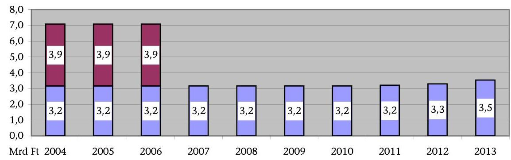

Megjegyzés: a szerződésen felüli üzemeltetési, múködtetési fizetési kötelezettség az üzleti tervek szerint évi 5 Mrd Ft lett volna.

Az építés-kivitelezés befejezéséhez közeledve 2004. év második felében az állami oldal PPP-konstrukcióváltást kezdeményezett, amelynek célja a szerződéses fizetési kötelezettségek elhalasztása, szétterítése, további kockázatok átadása, valamint a beruházás központi költségvetésen kívüli elszámolhatóságának biztosításával a költségvetési hiány növekedésének elkerülése volt. A PPPkonstrukció változtatás előkészítése során a NKÖM 2+10 éves fizetési futamidőre tett javaslatot.

A 2+10 éves konstrukció pénzáramlása
(összesen 66,1 Mrd Ft nominál értéken, álu nélkül)
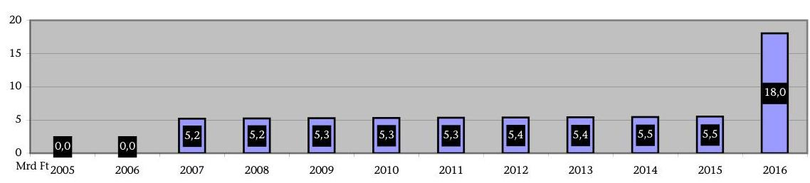

Az Országgyűlés Költségvetési és pénzügyi bizottsága 30 éves hosszú távú konstrukciót javasolt. Az Országgyűlés a 30 évre szóló 97,9 Mrd Ft-os nettó jelenértékű ${ }^{10}$ beruházási és múködési kötelezettségvállalásról döntött a 2005. évi költségvetési törvényben. A szolgáltatásvásárlási konstrukcióvá való átalakítást - kötelező benyújtás hiányában - a Tárcaközi Bizottság nem véleményezte.

[^0]
[^0]:    ${ }^{10}$ A jelenérték azt fejezi ki, hogy mennyi a jövőben kapott pénz jelenlegi értéke. A jelenérték számításnál alkalmazott diszkonttényező azon átváltási arány, amelyen a különböző időszakbeli pénzek gazdát cserélnek, a diszkonttényező meghatározása során használt kamatláb a diszkontráta.

---

30 éves PPP pénzáramlása, üzemeltetéssel
(összesen 206,9 Mrd Ft nominál értéken, áfa nélkül)
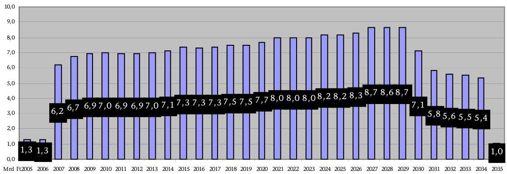

A konstrukcióváltás állami megrendelői előnyeként mutatkozott, hogy a magánpartner számára további kockázatokat adtak át, a szerződéses fizetési kötelezettségeket szétterítették, aminek éves átlagos összege - az összehasonlítható tételek figyelembevételével ${ }^{11}-4,4$ Mrd Ft helyett 3,5 Mrd Ft, s ez közel 1 Mrd Fttal alacsonyabb az eredeti konstrukciónál. Az új változat hátránya, hogy az a rendelkezésre állási szerződésben (RÁSZ) alkalmazott diszkontráták mellett - a különböző tartalmú konstrukciók összehasonlítható tételeinek figyelembevételével -, a tízévenként változó 8-7-6\%-on 6,9 Mrd Ft-tal, 5,25\%-on 17,0 Mrd Fttal több kiadást jelent 2004. évi jelenértéken ${ }^{12}$, mint az eredeti konstrukció. A magánpartner által alkalmazott 10\%-os diszkontrátán - ami a RÁSZ-ban nem szerepel - 164 M Ft-tal kedvezőbb az új konstrukció a korábbinál. A különböző diszkontráták ${ }^{13}$ jelentősen módosítják az egyes változatok jelenértékét. A változtatás a rendelkezésre állási szerződésben rögzített kondíciók szerint - a konstrukciók jellegének különbözősége, ebből következően a magasabb jelenérték miatt - az eredeti megállapodáshoz képest többletkiadást eredményezett.

A 2005 áprilisában megkötött RÁSZ-ban részletezett „szolgáltatásvásárlási konstrukció" értelmében az állam - a fejlesztési és üzemeltetési ráfordítások ellentételezéseként - 30 éven át, rendelkezésre állási díjat (RÁD) fizet a magán-

[^0]
[^0]:    ${ }^{11}$ A különböző pénzügyi konstrukciók összehasonlítható tételei: adósságszolgálat, fejlesztői tőkehozam, adminisztráció és adó. Mivel az üzemeltetési kiadások csak a PPPkonstrukcióban jelentek meg, ezért ez a tétel az összehasonlításban nem szerepel.
    ${ }^{12}$ A TriGránit Fejlesztési Rt. álláspontja szerint az azonos alapú összehasonlításhoz a PPP-konstrukciónál az adósságszolgálatot csökkenteni kell a fejlesztési összegen felüli projektköltségek összegével, ami az első két év csökkentett rendelkezésre állási díjának kiegészítésére szolgál. A magánpartner által javasolt azonos alapú összehasonlítás esetén a PPP verzió jelenértéke az eredeti változatnál 5,25\%-os diszkontrátával 9,2 Mrd Fttal, a tízévenként változó 8-7-6\%-on 1,0 Mrd Ft-tal magasabb.
    ${ }^{13}$ A projekt befejezését követően született meg a nettó jelenérték számításnak módszertanáról és az alkalmazandó diszkonttényezőről szóló 161/2005. (VIII. 16.) Korm. rendelet, amely szerint a 2005. szeptemberben alkalmazandó diszkontráta 4,6\%$5,8 \%$ közötti érték volt.

---

szektor számára. Az építési kockázatot - a RÁSZ megkötése előtt - a magánpartner viselte. Az üzemeltetési és finanszírozási (hitel és kamat) kockázatok a magánszférát, a keresleti és az ún. makrogazdasági kockázatok többsége - infláció, árfolyamváltozás - az állami megrendelő́t terhelik. A maradványérték állami kockázata - az előre rögzített 10 eurós üzletrész vételár melletti tulajdonosváltozás nyomán - tényleges terhet nem jelent. A szerződéses kockázatmegosztásban a nem megfelelő teljesítés miatti és a karbantartási kockázat viselését a megállapodás szerinti szankciós rendszer nevesítette.

A beruházást végző projekttársaságokkal kötött RÁSZ díjtartalma több ponton eltér a közbeszerzési pályázatra benyújtott nyertes ajánlattól a rövid tárgyalási és szerződéskötési időtartam, továbbá a magánszféra erős alkupozíciója miatt. A végleges ajánlat egyaránt járt műszaki tartalom csökkenéssel és növekedéssel. Ez alapján a RÁD nem tartalmazza a közüzemi díjakat, ennek helyére a rendelkezésre állási díjba a pótlási és felújítási alapok díjtételei kerültek. A RÁD összegszerűen nem haladja meg a törvényi kötelezettségvállalási szintet, de a szerződésből - értékarányos ellentételezés mellett - kiemelt közüzemi díjak jelenértéken további 6,3 Mrd Ft kiadást jelentenek az államnak. A felek kizárták a RÁSZ rendes felmondásának lehetőségét. Szerződésmódosításra előre nem látható ok következtében beállott körülmény esetén, a díjazás mértékének újratárgyalására az üzemeltetés műszaki követelményeinek és a szerződésben rögzített tényezők megváltozása esetén van mód.

A rendelkezésre állási díj tartalmazza az évenkénti adósságszolgálat ${ }^{14}$ fedezetét, azon belül - az állami hitelfelvétellel közel azonos ${ }^{15}-6 \%$-os kamatszintet. A RÁD a magánszektor 10\%-os saját tőkerészére 12\%-os hozamot tartalmaz. A projektben megfizetett átlaghozam (6,6\%) - a RÁSZ feltételei szerint - az átlagos ingatlanpiaci hozamnak felel meg. A szakmai múködtetés költségeit az előterjesztések és más dokumentumok végig külön kezelték, amely alapján előkészítési, megfogalmazási pontatlanságként értékelhető a költségvetési törvényben megjelenő „múködési" kötelezettségvállalás. Így viszont a 2005. évi költségvetési törvényben jóváhagyott kötelezettségvállalási összeg nem tartalmazta a projekt 30 éves múködtetésének teljes pénzügyi szükségletét.

A RÁSZ-ban foglalt rendelkezésre állási díj 48\%-át a befektetők saját tőkerészének visszafizetése és az adósságszolgálati tényezők, 52\%-át az üzemeltetésifelújítási tételek teszik ki. A RÁD-ba beépített üzemeltetési, karbantartási költségek tételeit a szolgáltatók ajánlatukban részletes számításokkal nem támasztották alá, így annak megalapozottsága nem bizonyított. A felújítási és pótlási alapok díjtételeinek számításai megalapozottak.

Az állam számára a Művészetek Palotája projekt várható pénzáramlása nominálértéken - RÁD, közüzemi díjak és szakmai múködtetés állami támogatása -

[^0]
[^0]:    ${ }^{14}$ Az új konstrukción belül a projektköltségeket tovább növelte a futamidő első két évében, 2005-2006-ban a NKÖM által fizetett, a csökkentett és a tervezett RÁD közötti öszszeg különbözete, amit hitelfelvételből fedeztek.
    ${ }^{15}$ Az Állami Adósságkezelő Központ által, az ellenőrzés rendelkezésére bocsátott hosszú távú hitelfelvételi kamatszintek alapján.

---

a RÁSZ-ban alkalmazott EUR-árfolyamtól függően ${ }^{16}$ nettó 335,2-346,7 Mrd Ft 30 év alatt. A RÁD-ra és a közüzemi díjakra számított áfa további 44,346,6 Mrd Ft-ot, azaz összesen közel 400 Mrd Ft-os fejezeti szintű költségvetési terhet jelent. A nem megalapozott előkészítés, valamint az ebből következő funkció- és finanszírozási konstrukcióváltás a megvalósítás gazdaságosságát és hatékonyságát hátrányosan befolyásolta. Az eredeti és a megváltozott pénzügyi megvalósítási konstrukció közötti költségvetési ráfordítások különbsége az összehasonlítható tételek figyelembevételével, nominálértéken $66,6 \mathrm{Mrd} \mathrm{Ft}^{17}$, vagyis a projekt a terhek szétterítése és államadósság növekedésének elkerülése miatt ennyivel többe került.

A Művészetek Palotája projekt teljes pénzáramlásának megoszlása
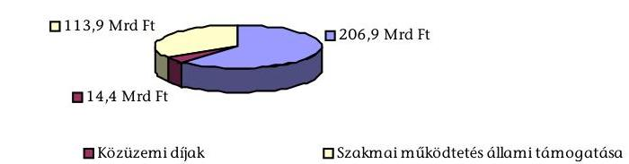

A projekt műszaki üzemeltetése, szakmai múködtetése megfelel a létesítményt használó kulturális intézmények feladatteljesítési elvárásainak. Kivitelezési, műszaki hiányosságként jelentkezik a légkezelő berendezések nem megfelelő működése. A hő-visszanyerő berendezések - a Szolgáltató és a Megrendelő közös megállapodása szerinti - elhagyása energiahatékonysági és gazdaságossági problémát eredményez, aminek következményeként állami többletkiadások merülnek fel.

A RÁSZ előkészítése és megkötése során nem határozták meg teljes körűen az üzemeltetési szolgáltatás tartalmát, paramétereit. A szankciós pontok mérését ellenőrizhetően biztosító módszerek hiánya akadályozza a szerződés szerinti levonások érvényesíthetőségét. A RÁSZ az üzemeltetési díjtétel összetevőinek gazdasági számításokkal alátámasztott, kontrollálható kibontását nem tartalmazza. Az ajánlati felhívásban és az ide vonatkozó közbeszerzési rendelkezésekben sem határozták meg a részletezettség mértékét. Az ajánlatkérő utólag sem igényelte e tételek részletezését. A létesítmény egyedisége, továbbá az öszszehasonlítható adatok hiánya miatt az üzemeltetési díjtétel megalapozottságának értékelése csak független szakértői felülvizsgálatot követően tehető meg.

A Művészetek Palotája eddigi üzemeltetési szakaszában az államot terhelő makrogazdasági kockázati elemek - infláció, árfolyamváltozás - kedvezőtlenül

[^0]
[^0]:    ${ }^{16}$ A RÁSZ-ban alkalmazott EUR-árfolyam 250-265 Ft/€ között volt, az ettől eltérő árfolyam befolyásolja a várható pénzáramlás nominálértékét.
    ${ }^{17}$ A pénzügyi konstrukciók összehasonlításáról szóló 8. sz. melléklet „IV. 30 éves végleges" táblázata összesen és az „I. 10 éves" táblázat összesen sorai különbözete.

---

alakultak. A szolgáltatók az épületet rendelkezésre tartották, a létesítmény rendeltetésszerú használatát akadályozó üzemeltetési hiányosság nem merült fel, ezért díjcsökkentés nem volt. A RÁSZ-ban rögzített szankciós pontrendszer gyakorlati érvényesítésére a Megrendelő nem alakított ki kontrollálható módszereket. A RÁSZ-ban rögzített díjelemek változása esetén mindkét félnek lehetősége van a rendelkezésre állási díj módosításának kezdeményezésére. A díjfizetést érintő változások nyomon követését, gyakorlatát eddig nem alakította ki a NKÖM.

A létesítmény egészének szakmai múködésére csak a beköltöző intézmények készítettek számszerúsített terveket, fejezeti szinten ilyen nem készült. Az intézményeknél készített tervek sem voltak megalapozottak a múködési és üzemeltetési rend kialakulatlansága miatt. A kezdeti bizonytalanságok ellenére a szakmai múködtetés, hasznosítás eredményes módját sikerült kialakítani. A Művészetek Palotájának a nyitás óta eltelt másfél év alatt 1166000 fő látogatója volt, akik az intézményi felmérések szerint elégedettek az épülettel és a programok színvonalával. A látogatók száma mindhárom intézménynél magasabb volt a tervezettnél. A jegybevételek összességében alatta maradtak a tervezettnek a közönségépítési kedvezmények és a látogatói összetétel változása miatt (Ludwig Múzeum - Kortárs Művészeti Múzeum).

A rendelkezésre álló technikai felszereltség magas színvonalú, amelyet a kulturális intézmények kihasználnak. Az új létesítmény a beköltöző intézmények számára nagyobb kulturális-szakmai lehetőségeket biztosított. A kulturális hasznosító szervezetek múködési költségei a produkciós kiadások emelkedése miatt növekedtek előző múködési helyükön végzett tevékenységükhöz viszonyítva. 2006. évben a múködési célú állami támogatás a Nemzeti Filharmonikus Zenekar, Énekkar és Kottatár Kht.-nál csökkent, a Nemzeti Táncszínház Kht.-nál és a Ludwig Múzeum - Kortárs Művészeti Múzeumnál feladatellátásuk bővülése következtében jelentősen nőtt.

A Művészetek Palotája Kft. a látogatottsági és kihasználtsági mutatók alapján eredményes szakmai múködtetést és koordinálást végez a létesítményben, amely kulturális produkciói és látogatottsága révén a hazai és fővárosi kulturális élet elismert intézményévé vált.

Összességében a PPP-konstrukciótól várt előnyök részben teljesültek. A létesítmény innovatív megvalósítása sikerrel járt. A beruházás folyamán pótés többletmunka, abból származó többletköltség nem merült fel. A magánpartner szerepvállalását nehezítette a különböző szemléletű újabb és újabb partnerekkel való együttműködés, az eljáró állami szervek részéről kezdeményezett lényeges funkcióváltozás, a létesítményeket használó szervezetekben bekövetkezett változás és a pénzügyi konstrukció alapvető megváltoztatása. Ezért a beruházás befejezésére kitűzött határidő nem teljesült, 2002. november 30. helyett a Művészetek Palotáját többszöri határidő módosítás után 2005. március 15 -én adták át. A dokumentumokból kitünik, hogy időről időre inkább a magánpartner elkötelezettsége, mint tudatos állami akarat lendítette a megvalósulás felé az Európában is egyedülálló többfunkciós múvészeti komplexum beruházását.

---

Az eredeti konstrukció szerződéseiben a fejlesztés államháztartáson kívüli elszámolásának lehetőségét nem vették figyelembe, és mivel ez nem volt alapvető cél, így a kockázatok megosztását sem rögzítették. A 2005-ben megkötött az Eurostat által is PPP-nek minősített - szerződésben a rendelkezésre állási kockázatok többségét a magánpartner viseli. Az Eurostat 2005. évi állásfoglalása ennek ellenére, az eredeti konstrukció alapján költségvetési hiányt növelő tételnek minősítette a beruházást, tehát a költségvetési hiány elkerülése - ami a PPP konstrukcióra való áttérés egyik fő indoka volt - nem teljesült ${ }^{18}$.

# Az állami- és magánszféra együttmúködése a Múvészetek Palotája 

projekt megvalósításával funkcióit betöltő, magas színvonalú kulturális létesítményt eredményezett. A 2005. év elején átadott létesítmény megfelelő feltételeket biztosít a kulturális események színvonalas megtartására. Magas színvonalú infrastruktúrával rendelkezik és ez alapvetően alkalmas a kulturális, szakmai, háttér- és egyéb, kiszolgáló tevékenységek elvégzésére. A magyar zenei élet gazdagodott egy kiemelkedő akusztikájú, nemzetközi színvonalú hangversenyteremmel. A beruházás - az alapterület $17000 \mathrm{~m}^{2}$-es növekedése, a műszaki tartalom egyidejű csökkentése mellett - a tervezett 31,3 Mrd Ft-os költségkereten belül valósult meg. A fejlesztési összeg 49,9\%-át kitevő hangversenyterem fajlagos beruházási költségei nemzetközi összehasonlításban is megfelelőek, átlag alattiak ( 3104 euro $/ \mathrm{m}^{2}$ ). A létesítmény 2006. évben a „nagyközönségnek nyújtott termékei és szolgáltatásai" alapján elnyerte a „FIABCI Prix d' Excellence 2006" nemzetközi ingatlanfejlesztési nívódíjat.

Hangversenytermek fajlagos beruházási költségei (nemzetközi összehasonlítás alapján)
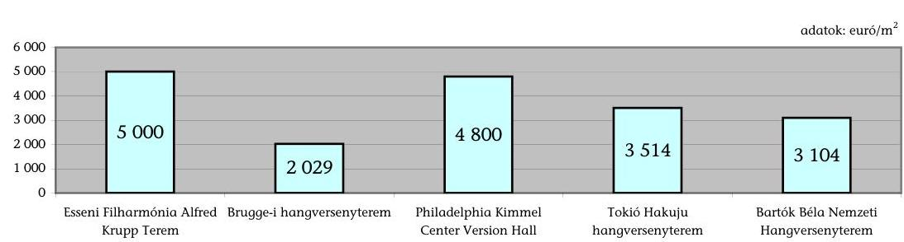

A projekt megvalósítása során a kulturális-szakmai érdekek érvényesítése a szakmai koncepció és a funkciók tisztázatlansága miatt nem teljes körú́ eredményességgel valósult meg.

[^0]
[^0]:    ${ }^{18}$ Az Eurostat jelentése szerint az eredeti szerződéses konstrukcióban a projekttársaságokat kifejezetten e beruházás megvalósítására hozták létre, és a Kormány ellenőrzése alatt álló egységeket arra kötelezték, hogy előre meghatározott időben és összegért megvásárolja a társaságok üzletrészeit. Az Európai Uniós nemzeti számla módszertan szerinti pénzügyi lízing konstrukcióban 2005-re már megépült létesítményt állami beruházásként kellett figyelembe venni. A KSH a projekt költségeket - beruházási költségek, valamint a futamidő első két évében a csökkentett és a tervezett RÁD közötti öszszeg különbözete - 177,3 M €-ot ( $250 \mathrm{Ft} / €$ árfolyamon $44,3 \mathrm{Mrd}$ Ft-ot) hiányként elszámolta.

---

A Művészetek Palotája projekt teljes pénzáramlása
(összesen 335,2 Mrd Ft; ebből RÁD 206,9 Mrd Ft, közüzemi díjak 14,4 Mrd Ft, szakmai múködtetés állami támogatása 113,9 Mrd Ft nominál értéken, áfa nélkül)
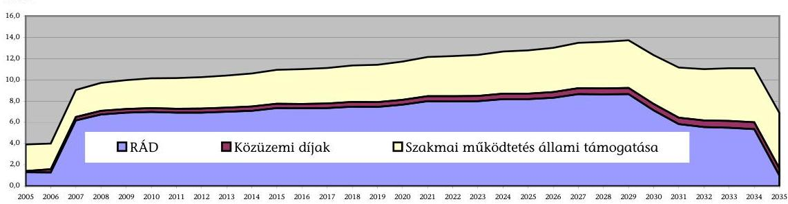

A helyszíni ellenőrzés megállapításainak hasznosítása mellett javasoljuk:

# a Kormánynak: 

1. Készítse elő az államháztartásról szóló törvény és végrehajtási szabályainak módosítását, melyek a PPP formában megvalósuló beruházásokról, együttműködésekről rendelkeznek, tekintettel e háttérszabályozás hatályos jogrendszerünkből való hiányára.
2. Szabályozza a PPP-konstrukció egységes eljárásrendjét, ennek keretében következetesen érvényesítse az állam megrendelői szerepét; kötelezően írja elő a projekttervek egységes bírálati szempontjai között a megvalósíthatósági hatástanulmányok, a közszféra összehasonlító érték (PSC) számítással megalapozott finanszírozási, döntési változatok elkészítését, egységes módszertani eljárás alkalmazását, valamint - az Eurostat eddigi állásfoglalásait elemezve - kockázat-megosztási modell kialakítását.

## az oktatási és kulturális miniszternek:

1. Kezdeményezze a rendelkezésre állási szerződés üzemeltetéssel összefüggő feltételeinek a pontos meghatározását, ellenőrizhető adatok hiányában az üzemeltetési díjtételek független szakértő általi felülvizsgálatát.
2. Alakíttasson ki
a) megfelelő monitoring, értékelő és ellenőrzési rendszert, a díjfizetést érintő üzemeltetési változások nyomon követésére;
b) teljesítésigazolási rendet és kontrollálható módszert a nem megfelelő teljesítés miatti szankciók szerződés szerinti érvényesítésére.

---

# II. RÉSZLETES MEGÁLLAPÍTÁSOK 

## 1. Az állami És VÁllalKOZÓi SZFÉra EGYÜTTMŰKÖDÉSÉVEL MEGVALÓSULT PROJEKT ELŐKÉSZÍTÉSÉNEK ÉS LEBONYOLÍTÁSÁNAK ÉRTÉKELÉSE

### 1.1. A Művészetek Palotája projekt állami megrendelői előkészítése

A projekt előkészítése során az állami szerepvállalás és érdekérvényesítés részben volt eredményes. A beruházást előkészítő programterv hiánya miatt a létesítmény megvalósulásának folyamatát szakmai koncepcióváltozás és funkcióváltozás egyaránt jellemezte.

Az állami kulturális célokat, prioritásokat kormányprogramok rögzítették, amelyekben kifejezésre jutott, hogy serkenteni kell a kulturális javak iránti igényt, és gondoskodni kell e kulturális igények - magas színvonalon történő kielégítéséről.

A kormányprogramokhoz kapcsolódóan létesítményfejlesztési koncepciót a Nemzeti Kulturális Örökség Minisztériuma (továbbiakban: NKÖM) nem készített. A középtávú beruházási programban összesen 32,6 Mrd Ft összegű fejlesztés - múzeumi rekonstrukciók, örökségvédelmi beruházások, kastélyprogram folytatása, stb. - szerepelt. Ez a fejlesztési program nem tartalmazta a Múvészetek Palotája projektet.

A TriGránit cégcsoport a pesti Duna-parton Millenniumi Városközpont elnevezéssel 2000-ben ingatlanfejlesztési programot indított, mely sokfunkciós, kulturális, szabadidős és turisztikai központ megteremtését tűzte ki célul ${ }^{19}$. A NKÖM támogatta a befektetői szándékot, és a 2000. év során folytatott megbeszélések eredményeként döntött arról, hogy részt vesz a fejlesztésben.

A projekt megvalósításának lehetőségeiről megalapozott gazdasági számításokkal alátámasztott hatástanulmány, a hagyományos állami beruházás és üzemeltetés hipotetikus értékével történő összehasonlító érték (PSC) számítás a Megrendelő részéről nem készült. A lehetséges konstrukciókat előzetesen értékelték, nem hasonlították össze egymással, a ráfordításokat és hatásokat nem határozták meg. A projekt előkészítésének szakaszában pályázatot, tendert - jogszabályi kötelezettség hiányában nem írtak ki, a beruházás megvalósítását gazdasági társaságok bonyolításában, magántelken tervezték.

[^0]
[^0]:    ${ }^{19}$ A TriGránit csoporthoz tartozó Duna Sétány Székház Kft. 2000. március 30-án megvásárolta a Nemzeti Színház szomszédságában lévő 38017/35 helyrajzi számú területet további 11 telekkel együtt 2,4 Mrd Ft-ért a Kincstári Vagyon Igazgatóságtól.

---

# A NKÖM egy kulturális létesítményeket is magában foglaló ingatlanfejlesztési programhoz csatlakozott, nem egy előzetesen kidolgozott létesítményfejlesztési elképzeléshez keresett beruházót vagy kivitelezőt 

#### Abstract

A 2000. október 31-én aláírt első együttműködési megállapodás még csak a Modern Magyar Művészetek Múzeumának (MMMM) felépítéséről szólt, majd az alig másfél hónap múlva - 2000. december 7-én - megkötött újabb megállapodás már a Hagyományok Háza (HH) megépítését is tervbe vette. 2001 júniusában pedig a Nemzeti Filharmonikus Zenekar, Énekkar és Kottatár Kht. elhelyezésére szolgáló épületrészt is beillesztették a fejlesztési programba.

A projekt kezdeti stádiumában a majdani létesítményben múködő kulturális intézményeket közvetlenül nem keresték meg, az első tájékoztatókat 2001. kora őszén tartották. A beköltözők lehetséges körét sem az előkészítés első lépéseként határozták meg.

## A projekt indításakor a minisztérium nem rendelkezett megalapozott, részletesen kimunkált szakmai koncepcióval.

A Duna Sétány Székház Kft., a TriGránit Fejlesztési Rt., valamint a NKÖM között 2000-ben kötött együttmúködési szerződésekben a minisztérium vállalta, hogy 2000. december 15-ig az építészeti tervezés alapját képező részletes szakmai programot készít és ad át a szerződő partnerek részére, melynek megvalósulását folyamatosan ellenőrzi. A 2001. június 25 -én létrejött együttmúködési szerződésben a szakmai program átadásának időpontja 2001. július 10-e volt.

A minisztérium megbízásából szakértők által készített, különálló szakmai programok eltérő szinten és részletezettséggel fogalmazták meg a Megrendelő által elvárt igényeket. Elmaradt annak vizsgálata, hogy a három külön-külön elkészített program megvalósítható-e a kijelölt építési ingatlanon. A szakértők megbízásának alapjául szolgáló szakmai célok, követelmények dokumentumai, illetve megbízási szerződéseik a minisztériumban nem voltak fellelhetők.

A szakmai programok a beruházás befejezéséig többször is módosultak, ennek megfelelően az intézmények közötti területmegosztás is folyamatosan változott. A programokat alapvetően a 2002. évi kormányváltás után módosították. A NKÖM szakértő grémiumokat kért fel a szakmai programok véleményezésére, átdolgozására, melyekben már a majdan beköltöző intézmények képviselői is részt vettek.

A Modern Magyar Művészetek Múzeumába eredetileg a Vasilescu-hagyaték bemutatását és XX. századi magyar művek állandó kiállítását tervezték. A kormányváltást követően ez a koncepció megváltozott. Döntés született arról, hogy a Ludwig Múzeum - Kortárs Művészeti Múzeum költözik a létesítménybe. A koncepcióváltás következtében az épületet áttervezték, külön bejáratot kapott a múzeum, nőtt a kiállítási terület, megváltozott a kiállítótér megközelítése.

A Hagyományok Háza szakmai koncepcióját az intézmény miniszteri biztosa készítette, további szakértők bevonásával. Különböző időszakok döntései alapján a tervezett kézmúves műhelyek kikerültek, majd visszakerültek az épületbe, beépítésre került a könyvtár.

---

A Nemzeti Filharmonikus Zenekar, Énekkar és Kottatár Kht.-nak a létesítményben történő elhelyezéséről azzal a megkötéssel döntöttek, hogy a Nemzeti Koncertterem „befogadó" jelleggel múködik. Az eredeti tervekben szereplő kórus próbatermek a projekt megvalósítása során kikerültek a programból, végül mégis visszakerültek, hogy biztosított legyen a zenekar és az énekkar együttes elhelyezése.

A funkcionális változásokkal összefüggésben jelentősen növekedett a beépítendő összes terület.

2001-ben a miniszter 37415 bruttó $\mathrm{m}^{2}$-ben maximálta az épület alapterületét. A NKÓM különálló szakmai programjait azonban ekkora épület nem tudta befogadni. 2001. év végén 41271 bruttó $\mathrm{m}^{2}$-ben határozták meg a szükségletet, ami a szakmai és múködési igények figyelembevételével 2003. évben $44432 \mathrm{~m}^{2}$-re bővült. A létesítmény végleges bruttó alapterülete parkolók nélkül $53170 \mathrm{~m}^{2}$, parkolókkal együtt $76403 \mathrm{~m}^{2}$.

A műszaki tartalom ezzel párhuzamosan csökkent. Egyes műszaki megoldások elmaradtak (pl. múzeumi rámpa, klímahomlokzat), a függőleges közlekedési útvonalak is módosultak, a liftek által kiszolgált szintek száma csökkent.

Az épületegyüttes szakmai programjaként szolgáló egységes beruházási előkészítő programterv hiánya okozta a terület $\mathbf{1 0 0 \%}$-os beépítési adottságát teljesen kitöltő, azt magassági irányban meghaladó épületkubaturát, a program megvalósítási időszakra tolódott további bővülését, majd a maximális fejlesztési összeg tarthatósága érdekében végrehajtott racionalizálást.

A fejlesztésre vonatkozó megállapodások megkötésekor nem volt egyértelmúen kialakított koncepció a többfunkciós létesítmény szakmai müködtetésének módjáról.

A kormányváltás előtt és azt követően több tervezet is született szakmai körökben a három önálló intézmény otthonát biztosító létesítmény - kiemelten a Nemzeti Koncertterem - szakmai múködtetésével kapcsolatban. Ezekben elsősorban a bent lakó intézményeket javasolták programszervezői feladatok ellátására, koordinációs feladatokat ellátó Igazgatói Tanáccsal, de felmerült az önálló Programigazgatóság ötlete is.

A szakmai müködtetés módjára vonatkozó döntés 2003-ban született meg. Eszerint az eredetileg műszaki üzemeltetést ellátó Művészetek Palotája Kft. (korábbi nevén Kultúr-Part Kft.) feladatává vált az épületegyüttes intézményi használatba nem adott területeinek szakmai müködtetése, gazdaságos hasznosítása. A kibővült feladatkör együtt járt a kft. dolgozói létszámának, és ez által férőhely- igényének növekedésével is.

A beköltöző intézmények önállóságuk csorbításától tartottak az intézkedés következtében. A minisztérium kifejezésre juttatta, hogy garantálja a beköltöző intézmények szakmai, szervezeti önállóságát, a területek egy részével - a gazdaságos üzemeltetés, a szabad kapacitások maximális kihasználása érdekében - azonban nem kizárólagosan rendelkeznek.

---

A kizárólagos használatú terület csökkenése miatt 2004-ben a HH kezdeményezte a kulturális örökség miniszterénél a korábbi - Corvin téri - székházukban való múködés folytatását, melyet a tárca vezetője jóváhagyott. Ennek következtében nem költözött be a HH a szakmai programjuk alapján tervezett épületrészbe, azt a Nemzeti Táncszínház használja. A műszaki átadás előtt alig fél évvel át kellett gondolni, és a lehető legkevesebb átalakítással megoldani a speciálisan a HH céljaira kialakított terület hasznosítását.

A HH elhelyezését biztosító épületrész átalakítása - a lehetőségekhez képest megoldódott. Van azonban olyan helyiség (pl. a könyvtár), melyet kifejezetten a HH céljaira alakítottak ki, és jelenleg nem megfelelően hasznosul. A szakmai múködtetésre vonatkozó koncepció késői, 2004. évi kialakítása az állami érdekek szempontjából hátrányos volt.

# 1.2. A Művészetek Palotája projekt előkészítésének szabályozási feltételei, jogi megalapozottsága 

A Művészetek Palotája projekt indításakor 2000-ben a köz- és magánszféra együttműködésének jogszabályi kereteit nem alakították ki. A koncessziós és közbeszerzési törvényi keretek mellett nincsen speciális törvényi szintű PPP-szabályozás, hiányzik az ezzel összefüggő állami eljárási rend, ami biztosítja az egységes projektelbírálást.

A Kormány az állami és a magánszektor közötti fejlesztési, illetve szolgáltatási együttműködés (PPP) újszerű formáinak szabályozott keretek közötti bevezetése érdekében 2003-ban alkotta meg a 2098/2003. (V. 29.) Korm. határozatot, mely alapján létrehozta a PPP Tárcaközi Bizottságot.

A Bizottság feladata az érdekelt minisztériumokkal és országos hatáskörű szervekkel egyeztetve előkészíteni a szükséges jogi szabályozási javaslatokat, véleményezni a PPP projekt terveket, és figyelemmel kísérni, valamint értékelni azok megvalósítását. A kormányhatározat nem tette és jelenleg sem teszi kötelezővé a PPP projektek Bizottság általi véleményezését.

A Bizottság 2003. augusztus 11-én jelentést készített a Gazdasági Kabinet részére. Ebben javasolták, hogy a PPP projektek társ-előterjesztője a pénzügyminiszter legyen, és minden PPP projektről a Kormány döntsön. A javaslatok nem hasznosultak, a Kormány nem módosította a 2098/2003. (V. 29.) Korm. határozatot, és eljárásrendet szabályozó Korm. rendelet sem készült.

A köz- és magánszféra együttmúködésének nem megfelelő szabályozottsága, az állami eljárásrend hiánya nem biztosította a projekt előkészítése során az állami érdekek teljes körú̉ érvényesítését. A köz- és magánszféra együttmúködésének jogi szabályozottsága jelenleg sem kielégítő.

A Tárcaközi Bizottság - kötelező benyújtás hiányában - nem véleményezte a Művészetek Palotája beruházás köz- és magánpartnerség (PPP) keretében megvalósuló szolgáltatásvásárlási konstrukcióvá történő átalakításának dokumentumait.

---

A Művészetek Palotája projekttel kapcsolatban 2001-2005. évek között keletkezett kormány-előterjesztések az Együttmúködési Szerződésekben foglaltak megvalósítására irányultak. Az előterjesztések alapján az alábbi kormányzati döntések születtek:

1118/2001. (X. 19.) Korm. határozat kijelölte a projekt alapvető kereteit, jóváhagyta a kijelölt területet, a felépítendő épületegyüttest, a beruházást végrehajtó projekt társaságok alapítóit. Felhatalmazta a pénzügyminisztert a beruházás megvalósításának finanszírozását biztosító kormányzati kezességvállaláshoz szükséges intézkedések megtételére.

1135/2001. (XII. 18.) Korm. határozat a projekt megvalósításához és üzemeltetéséhez készfizető kezességet biztosított 52 Mrd Ft értékhatárig. A Korm. határozat meghozatalára a Kormányt a 2000. évi CXXXIII. törvény 109. § (9) bekezdés hatalmazta fel.

1034/2002. (IV. 12.) Korm. határozat arról döntött, hogy a NKÖM által létrehozott üzemeltető kft. törzstőke-emelésének forrását a NKÖM fejezetében, az ott megjelölt összegben, éves bontásban kell betervezni. 1106/2002. (VI. 14.) Korm. határozat hatályon kívül helyezte a 1034/2002. (IV. 12.) Korm. határozatot.

1026/2005. (III. 11.) Korm. határozat engedélyezte a Művészetek Palotája beruházás köz- és magánpartnerség keretében megvalósuló szolgáltatásvásárlási konstrukcióvá történő átalakítását, 30 éves futamidejú rendelkezésre állási szerződéssel.

A Művészetek Palotája beruházás eredeti koncepciójában az Együttmúködési Megállapodásokat bérleti és üzletrész adásvételi szerződések egészítették ki.

A bérleti és üzletrész adásvételi szerződéseket 2001. december 19-én kötötték meg a felek. A bérleti szerződések szerint a NKÖM által alapított Kultúr-Part Kft., az átadást követő 10 évre bérbe veszi az épületegyüttest a Projekttársaságoktól.

Az üzletrész adásvételi szerződések alapján a Kultúr-Part Kft. az épület átadásától számított 3 éven belül megvásárolja a Duna Sétány Székház Kft.-nek a Projekttársaságokban fennálló üzletrészét, így megszerzi az épület tulajdonjogát is, ennek következtében az épület közvetetten az állam tulajdonába kerül.

A Múvészetek Palotája megvalósulását segítő előterjesztések, határozatok nem voltak minden esetben megalapozottak, ugyanis azok a Múvészetek Palotája beruházás finanszírozásához és a létesítmény múködtetéséhez szükséges évenkénti összegek együttes fedezetét a NKÖM költségvetésében nem biztosították.

# 1.3. A finanszírozási konstrukció megalapozottsága, optimalizálása a projekt előkészítésekor 

Az eredeti pénzügyi változat teljes egészében növelte volna a költségvetési hiányt, a köz- és magánszféra együttmúködésében kialakított konstrukció nem volt optimális. Az eredeti bérleti dí fizetési és üzletrész vásárlási konstrukciónál a kockázatok megosztását a szerződésekben nem rögzítették - a beruházási kockázatot ténylegesen a magánpartner viselte -,

---

ebben az esetben pénzügyi lízingről volt szó. Az európai uniós nemzeti számla módszertan (ESA '95) szerinti pénzügyi lízing esetében a projektet állami beruházásként kell elszámolni, és teljes összegében növeli a költségvetési hiányt.

A beruházás kiadási többletigénye a múködtetéssel együtt - a fejezeti költségvetés főösszegének közel egyötöde - a költségvetés bázisszemléletű logikáját követve nem, vagy csak a fenntartott intézményrendszer egészének múködését tartósan hátrányosan érintő intézkedésekkel lett volna finanszírozható.

A Művészetek Palotája projektnél a lízingbe vevő, a Magyar Állam választotta ki az eszközt, amit az eladó közvetlenül neki szállított le. A bérbeadó a szerződés lejártakor nem kapja vissza az eszközt, az közvetve az állam tulajdonába kerül. Az ESA ' 95 szerint az operatív lízing konstrukció esetén a beruházás nem növeli a költségvetési hiányt, de a bérbeadó a szerződés lejártakor visszakapja az eszközt, ami az állam számára nem kedvező feltétel.

A Magyar Állam 2001-ben készfizető kezességet vállalt 52 Mrd Ft értékben a bérleti díj fizetésére és projekttársaságok üzletrészeinek megvásárlására. Az Eurostat ajánlása szerint a kezességvállalás önmagában nem jelenti az eszköz besorolásának alapját, mert az ESA ' 95 rendszerében az ilyen garanciákat feltételes kötelezettségnek tekintik, ugyanakkor a garancia lehívása átsorolást von maga után.

Az Együttmúködési Szerződésben a projekt költségvetését nem határozták meg, azt az üzleti tervekben rögzítették. A maximális fejlesztési költség 31298 M Ft + áfa volt, melynek 70\%-át ( 21,9 Mrd Ft) bankhitel, 30\%-át ( 9,4 Mrd Ft) saját erő alkotta.

A hitelt a magánpartner vette fel az OTP Kereskedelmi Bank Rt.-től és az MKB Rt.-től 10 éves futamidőre, 2005-2014-es törlesztési idővel, az éves kamatláb háromhavi EURIBOR és a vonatkozó kamatfelár volt. Az állam fix 5\%-os kamatot fizetett volna a magánpartnernek, ami az Államadósság Kezelő Központ adatai alapján megfelelő mértékű volt.

Az eredeti együttmúködési konstrukció szerint a beruházási összeget a Magyar Állam bérleti díj ( 40,2 Mrd Ft) és üzletrész vételár ( 11,8 Mrd Ft) formájában törlesztette volna. A projektek megvalósítására létrehozott Projekttársaságok alapításkori jegyzett tőkéje társaságonként 10 M Ft volt, amelyből a NKÖM 100 E Ft-ot biztosított.

A Művészetek Palotája projekt eredeti pénzügyi konstrukciója
adatok: M Ft

|  | Duna   Múzeum | Hagyományok   Háza | Nemzeti   Filmharmónia | Összesen |
| :-- | --: | --: | --: | --: |
| 1.Adósságszolgálat | 6967,4 | 7665,6 | 14604,9 | 29238,9 |
| 2.Adók+biztosítás+adminisztráció | 954,3 | 868,2 | 1127,1 | 2949,6 |
| 3.Áfa | 1980,5 | 2133,5 | 3932,9 | 8046,9 |
| I. Bruttó max. bérleti díj   (2004-2013) 1-3. | 9902,2 | 10667,3 | 19664,9 | 40234,4 |
| II. Max. üzletrész vételár   (2004-2006) | 2795,5 | 3064,1 | 5894,4 | 11754,0 |
| Összesen (I-II) | $\mathbf{1 2 6 9 7 , 7}$ | $\mathbf{1 3 7 3 1 , 4}$ | $\mathbf{2 5 5 5 9 , 3}$ | $\mathbf{5 1 9 8 8 , 4}$ |

---

Az üzletrész adásvételi szerződésekben rögzítettek szerint a Duna Sétány Kft. vállalta, hogy a Duna Múzeum Ingatlanfejlesztő Kft. törzstőkéjét 2465,8 M Ft-ra, a Hagyományok Háza Ingatlanfejlesztő Kft.-jét 2239,3 M Ft-ra és a Nemzeti Filharmónia Ingatlanfejlesztési Kft.-jét 4684,2 M Ft-ra, összesen 9389,3 M Ft-ra emeli fel.

Az eredeti pénzügyi változat szerint a létesítményhez szükséges parkolók megépíttetése a Duna Sétány Székház Kft. által alapított, Duna Parkoló Ingatlanfejlesztő Kft. feladata. A parkolóhelyeket a projekttársaságok 1,5 M Ft + áfa összegért váltották volna meg. A jelzett összeg a projektköltségek részét képezte. A NKÖM újabb elképzelése szerint azonban a Parkoló projektet integrálták a Művészetek Palotája projektbe, oly módon, hogy a Duna Parkoló Ingatlanfejlesztő Kft. üzletrészei a projekttársaságok tulajdonába kerültek.

# 1.4. A Megrendelő igényeinek, szakmai szempontjainak érvényesülése a Múvészetek Palotája tervezése és kivitelezése során 

A Művészetek Palotáját alkotó egyes elkülönült funkciójú épületek tekintetében beruházóként a Duna Sétány Székház Kft. és a NKÖM által 2002 elején megalapított speciális projekttársaságok, azaz a Duna Múzeum Ingatlanfejlesztő Kft., a Hagyományok Háza Ingatlanfejlesztő Kft. és a Nemzeti Filharmónia Ingatlanfejlesztési Kft. (továbbiakban: Projekttársaságok) feladatát képezte, az épületegyüttes megépíttetése. A Projekttársaságokban a NKÖM üzletrésze a társasági szerződés alapján biztosította a vétójogot, és ezzel az állami érdekérvényesítés lehetőségét.

A beruházó a 2000. év őszén hirdette meg a tervezői pályázatot ${ }^{20}$, míg a szakmai programok ezt követően készültek el. Ebből következően az épület funkcióit - a műszaki tartalmat részletesen meghatározó dokumentációkat - a pályázati kiírás nem tartalmazta.

A vállalkozói szerződéses megállapodást 2002. március 21-én írták alá. A projekt kulcsrakész kivitelezését a Projekttársaságok az Arcadom Rt.-re bízták. A szerződés feltételei a FIDIC elvekre épültek.

Az építkezés megkezdése után elkezdődött a tervmódosítások előkészítése, ennek megfelelően a létesítményben elhelyezett intézmények közötti területmegosztás folyamatosan változott az egységes beruházási programterv és a kialakulatlan szakmai elképzelés hiánya miatt.

A szakmai testületek által megfogalmazott igények érvényesítésére a minisztériumnak az aláírt szerződések keretein belül volt módja. A kivitelező azonban kifejezte készségét a megrendelő által megfogalmazott változtatási igények beruházási programba történő beillesztésére. Előfordult azonban, hogy a tervellá-

[^0]
[^0]:    ${ }^{20}$ A Duna Sétány Székház Kft. a tervezői pályázat alapján a Zoboki, Demeter és Társaik Építészirodával kötött tervezési szerződést azzal, hogy a tervezéssel kapcsolatban az NKÖM ellenjegyzési joggal rendelkezik.

---

tás - és így a megvalósítás - ütemében késedelmet okozott a NKÖM jóváhagyásának (vétójog) elhúzódása.

A beruházó a tervek átdolgozásával folyamatosan dokumentálta a változásokat, amelyekkel történő egyetértést az érintett intézmények vezetői aláírásukkal igazoltak.

A szakmai programok többszöri változása, valamint a funkcionális változások NKÖM általi jóváhagyásának esetenkénti elhúzódása hátrányosan befolyásolta a közpénzek felhasználásának hatékonyságát. Összességében azonban a megrendelői igények, valamint azok módosulásai a beruházás múszaki tervezésében, a megvalósult épület múszaki előkészítésében és a kivitelezésben érvényre jutottak.

A kulturális szakmai programok alapvetően teljesültek; az a cél, hogy színvonalas kulturális és művészeti központ jöjjön létre, megvalósult. A multifunkcionális épület és annak technikai felszereltsége lehetőséget nyújt, alkalmas a kulturális események rendezvények színvonalas megtartására.

Az épületnek - a művészeti ágak együttes jelenlétét megfogalmazó alapkoncepciónak megfelelően - állandó lakói: a Ludwig Múzeum - Kortárs Művészeti Múzeum, a Nemzeti Filharmonikus Zenekar, Énekkar és Kottatár Kht., valamint a Nemzeti Táncszínház Kht. A közös, impozáns előcsarnok, a büfék, az étterem, a kávéház, a cd- és könyvesboltok, a panoráma teraszok a közönség számára egész napos programlehetőségeket kínálnak.

A Ludwig Múzeum - Kortárs Művészeti Múzeum Magyarország egyetlen olyan múzeuma, amely kizárólag kortárs művészetet gyűjt és mutat be, s jelentős nemzetközi és magyar képzőművészeti gyűjteménnyel rendelkezik.

A múzeum épületen belüli tér kialakításában a célszerűségre, áttekinthetőségre és a funkcionális flexibilitásra törekedtek. A funkcionális lehetőségeket a természetes és mesterséges fények ideális arányán túl, a terek változtathatósága, a tágas kiállítási terület biztosítja. Szakértői vélemények szerint a múzeumtechnikai infrastruktúra megfelel a nemzetközi múzeumtechnológiai elvárásoknak.

Nemzeti Filharmonikus Zenekar Énekkar és Kottatár Kht. elhelyezése, működése megoldódott a létesítmény megvalósulásával. A koncertterem minden korszak műveinek bemutatásához kiemelkedő akusztikai körülményeket biztosít.

A minőségi akusztikát szolgálja a zenekari pódium és a nézőtér fölé is benyúló három, külön-külön mozgatható elemből álló hangvető ernyő. Az ernyő a magasságának megfelelő beállításával teljesen különböző hangszerelésű zeneművek számára is ideális akusztikai viszonyok teremthetők meg. Ugyancsak a változtatható akusztikát szolgálja a pódium és az oldalfalak mentén elhelyezkedő 48 zengőkamra. Ezek a nagyméretű ajtók mozgatásával a koncertterem térfogatát, ezáltal az utórezgési időt is módosítják. A koncertterem teljes körbefüggönyözésével „hangstúdióként" is funkcionál.

A Nemzeti Táncszínház Kht.-nak a Művészetek Palotájában telephelye van, ahol éves szinten 100 (próba és előadás) nappal rendelkezik. A Színház akusztikai kialakításának köszönhetően a táncprodukciók mellett alkalmas

---

komolyzenei koncertek, kamaraoperák, dzsesszműsorok befogadására és prózai előadások megtartására is.

A Fesztivál Színház $750 \mathrm{~m}^{2}$-es színpada, oldalszínpaddal, vetítésre alkalmas hátsó színpaddal és a díszletezést szolgáló felső gépészettel rendelkezik, amely színpadsüllyesztőkkel és forgószínpad berendezéssel egészül ki. A színházterem menynyezete nyitható, különlegessége a mobil színpadnyílás, amelynek mérete - az aktuális produkció igénye szerint - változtatható.

# A Múvészetek Palotája nemzetközi elismerését jelenti, hogy elnyerte az ingatlanfejlesztési Oscar-díjként számon tartott „FIABCI Prix d' Excellence 2006" kitüntetést az úgynevezett „specialized" kategóriában, melyben a nagyközönségnek termékeket és szolgáltatásokat kínáló épületeket díjazzák. 

#### Abstract

A FIABCI minden évben megrendezi a Nemzetközi Ingatlanfejlesztési Nívódíj Pályázatot (Prix d' Excellence), amelynek célja a legsikeresebb ingatlanfejlesztések kiválasztása. Az elbírálás fő szempontja a FIABCI alapelveinek megfelelően az, hogy "az adott ingatlanfejlesztés milyen színvonalon és hogyan szolgálja a társadalmi érdekek érvényesülését".

## A létesítmény összességében megfelelő feltételeket biztosít a kulturális események színvonalas megtartására, hozzájárul a látogatók múélvezetének biztosításához.

Alapvetően alkalmas a kulturális szakmai háttér- és egyéb kiszolgáló tevékenységek elvégzésére. Az épület strukturális adottságaiból következő szűkös helykialakítás miatt nem kielégítőek az öltözés, pihenés, próbák feltételei.

Ugyanakkor, a használó intézmények részéről vannak olyan szakmai elvárások, amit a megvalósításkor nem tudtak érvényesíteni, vagy a múködés során jelentkeztek olyan technikai hiányosságok, melyek a beruházás kivitelezéséből származnak.

A Ludwig Múzeum - Kortárs Művészeti Múzeumnál elmaradt a fotóműterem, nem teremtődtek meg a rezidencia program megvalósításához szükséges feltételek. A raktárak ma még megfelelnek az igényeknek, de gondot okoz a göngyölegtároló hiánya. Az irodahelyiség kevés és szűkös, nincs tárgyaló, gondot okoz a munkatársak, valamint a gyakornokok és a külföldi kurátorok elhelyezése. Rossz az épület külső és belső feliratozása, hiányoznak a megfelelő útbaigazító feliratok és táblák.

A Nemzeti Filharmonikus Zenekar, Énekkar és Kottatár Kht.-nál a pihenésre rendelkezésre álló társalgó az átlagosan 80 fős zenekari létszámból mindössze kb. 20 fő befogadására alkalmas. A kórusnak nincs társalgója. A megfogalmazott szakmai elvárásokból a tágasabb szólampróba helyiségek igénye nem teljesült. A raktározási igény az épületen belül nem megoldott.

A Nemzeti Táncszínház Kht. 452 fős nézőterén csak 350 helyről lehet jól látni az előadást. A láthatóság javítására belsőépítészeti eszközökkel keresnek megoldást, kialakítására még nincs megfelelő terv. A Fesztivál Színház utólagosan kialakított büféjéhez nincsen megfelelő méretű társalgó. Az egész napos próbák

---

vagy dupla előadások alkalmával a művészek csak az öltözőkben pihenhetnek, várakozhatnak. Nincsen lehetőség a színpadon kívüli operatív megbeszélésre.

A látogatók kényelmét kedvezőtlenül befolyásolja a vendégforgalom vertikális közlekedésének problémája és a mélygarázs működése.

A liftek kapacitása csúcsidőben nem elégséges, gyakori a szűk lépcsőházakban való fel- és lemenetel. Az épületen belül a vendégforgalom függőleges közlekedési útvonalai az eredeti engedélyezési tervhez képest módosultak. A liftek számát a kontrolling jelentésben foglaltak szerint a tervezett 23-ról 18-ra csökkentették, végeredményben a szintek között szűkös kapacitású közlekedési lehetőségek alakultak ki.

Az épület alatti 3 szintes mélygarázs múködése, forgalmi rendje nehézséget okoz. A használatbavételtől eltelt időszak alatt hozott intézkedések (sorompók áthelyezése, nagyszámú kisegítő személyzet alkalmazása, tájékoztató rendszer kiegészítése, a falakra tájékoztató jelzések felfestése, védőeszközök elhelyezése) a közlekedést és annak balesetmentességét segítették elő, de a probléma végleges megoldását nem eredményezték.

A garázs ürítését jelentősen lassítja a közvetlen környék közúti kapcsolati szerkezetének megoldatlansága, az itt szükséges átfogó fejlesztések elmaradása is. Az eredeti tervek szerint ugyanis egyes funkciókat - pl. parkolás, vendéglátás a Művészetek Palotája közelébe tervezett, de meg nem épült további létesítmények (Kongresszusi Központ, Szálloda, Kaszinó) elégítették volna ki. Problémát jelent a közúti kapcsolatoknak a környék közlekedési rendszerébe való integrálása, valamint az ilyen léptékű létesítmények forgalmát kezelni képes közlekedésfejlesztés hiánya, elmaradása.

# 1.5. A kötelező műszaki előírások, a megállapodás szerinti határidők betartása, valamint beruházás-gazdaságossági szempontok figyelembevétele 

A telek beépítési tervére a városrészt érintő, a Világkiállítási Törvényben kijelölt terület, többször módosított, részletes rendezési tervének szabályai (továbbiakban: RRT) voltak az irányadók. A létesítmény tervezett és megvalósított funkciója alapvetően megfelelt az RRT-nek. Az RRT egyes (zöldtetőre és párkánymagasságra vonatkozó) előírásainak alkalmazása alól felmentést kaptak. Az építési engedélyeket és a használatbavételi engedélyt megkapta a létesítmény.

Az RRT-nek a területre vonatkozó előírásai kimondják, hogy: Nem magas tetővel fedett tetőkön tetőkert kötelező. Engedély csak az egész területre kiterjedő építészeti látványterv alapján adható (RRT. 8. és 9. §) Az RRT által megengedett párkánymagasságok északi oldal $31 \mathrm{~m}<\mathrm{pm}<40 \mathrm{~m}$, déli oldal $25 \mathrm{~m}<\mathrm{pm}<28 \mathrm{~m}$. A szabályozási terv által megengedett párkánymagasságokat az elkészült engedélyezési tervek jelentősen túllépték. Az északi oldalon teljesült az előírás, de a déli oldalon $12 \%-36 \%$-os túllépés van.

A létesítmény megkapta a használatba vételi engedélyt, azonban az engedélyezett tervektől eltérő megvalósítás, minőségi eltérések és elmaradt munkafázisok is megállapíthatók.

---

A főbb hiányosságok: a mélygarázs forgalomtechnikai megoldása, a felvonók elmaradása, a mozgólépcsők alulméretezettsége, a légtechnikai rendszer gyenge energiahatékonysága, az egész épület, valamint a koncertterem és színházterem bevezető ajtóinak szúkös áteresztő képessége. Nem megoldott a VIP vendégek elkülönített mozgása az épületben, az akadálymentesség nem teljes körú.

Az épület funkciójában, a használó szervezetekben állami oldal kezdeményezésére bekövetkezett változások és a pénzügyi konstrukcióváltás miatt az eredeti határidő, 2002. november 30-a helyett a Múvészetek Palotáját 2005. március 15 -én adták át.

Az együttmúködési megállapodást módosító szerződésben 2001. közepén a beruházás befejezésének határidejét 2003. december 31-re módosították. Az épület kivitelezésének - 2002. március 21 -én kelt - ajánlati felhívásában a megvalósítás időszakát 24 hónapban határozták meg. A kivitelezői szerződések módosításaiban a Művészetek Palotája birtokba adásának dátumát 2005. január első napjában, végül 2005. április 1-jében jelölték meg.

A beruházás az üzleti tervekben rögzített 31,3 Mrd Ft maximális fejlesztési keretösszeget nem lépte túl. A hagyományos állami beruházásoknál jellemző a pót- és többletmunka ${ }^{21}$.

A maximális fejlesztési összegen belül 79,1\%-ot képviseltek a kemény költségek (építési szerelési költségek, külső munkák, közmúvek, speciális technológia), 17,5\%-ot a puha költségek (jogi költségek, biztosítás, ingatlanadó, fejlesztési díj, projekttársaságok múködési költségei, parkoló megváltás, bankhitellel kapcsolatos finanszírozás). A megnyitást megelőző próbaüzemeltetés a beruházás $2 \%$-át, a tőkésített kamat $1,4 \%$-át tette ki.

Az elérhető beruházási adatok tükrében a budapesti Múvészetek Palotája és azon belül is - a terület 41,3\%-át, a fejlesztési összeg 49,9\%át jelentő - a Nemzeti Hangversenyterem beruházási költsége (3104 $\boldsymbol{\epsilon} / \mathrm{m}^{2}$ ) nemzetközi összehasonlításban megfelelő, átlagos szint alatti volt (5., 6. sz. melléklet) ${ }^{22}$.
${ }^{21}$ A kulturális területen a múzeumi rekonstrukciós projektek közül a Magyar Nemzeti Múzeum II. ütemét az eredeti vállalás ár 16\%-át meghaladó árért, a Szépmúvészeti Múzeum kivitelezési szerződését 22,5\%-kal magasabb összegért, a Magyar Természettudományi Múzeum kivitelezését 11\%-kal magasabb áron valósították meg. Megállapította a múzeumi rekonstrukcióra előirányzott pénzeszközök hasznosításának ellenőrzéséről szóló 0401. sorszámú ÁSZ-jelentés (2004. február).
${ }^{22}$ A TriGránit Fejlesztési Rt. adatai szerint - forrás: az EC Harris 2003. december 30-i keltezéssel kiadott, a Hagyományok Háza Kft. által készítettetett jelentése - NagyBrittaniában a Waterfront Hall, Belfast ( 2200 fős koncertterem) külső munkák nélküli építési költsége $3585 £ / \mathrm{m}^{2}=1347135 \mathrm{Ft}$, a The Lowry Centre, Manchester ( 1400 fős színház) külső munkák nélküli beruházási költsége $3854 £ / \mathrm{m}^{2}=1448218 \mathrm{Ft}$ volt (a költségek 2003. év IV. negyedévre igazított árak, $1 £=375,77 \mathrm{Ft}$ ). A Nemzeti Hangversenyterem fejlesztési költsége $3104 € / \mathrm{m}^{2}=673258 \mathrm{Ft}(1 €=216,9 \mathrm{Ft})$, ami az 5. és 6 . sz. mellékletben szereplő, valamint a fenti adatokkal összehasonlítva is átlag alatti szintnek felel meg.

---

A kivitelezési szerződést 4 alkalommal módosították, ami 3,58\%-os növekedést eredményezett a vállalási díjban, melynek végleges összege $24887,9 \mathrm{M}$ Ft volt. A projektnél $8 \%$-os tartalékkeretet állapítottak meg. A fejlesztési összeg 49,9\%-át az NF, 26,3\%-át a HH (jelenleg Fesztivál Színház), 23,8\%-át a Ludwig Múzeum megépítése jelentette.

# A létesítmény technikai felszereltsége kulturális szakmai lehetőségek szempontjából kiemelkedő színvonalú, a költségmegtakarítások alapvetően nem az épület szakmai múködését érintették. 

### 1.6. A projektfolyamatok felügyelete az előkészítés és megvalósítás során

## A projekt szakmai felügyeletét a NKÖM kezdetben a közigazgatási államtitkárság, illetve kabinetfőnök, majd miniszteri biztos, miniszteri meghatalmazott útján, szakértők bevonásával gyakorolta.

Feladatukat képezte a Művészetek Palotája létrehozása érdekében alapvetően a minisztériumra háruló feladatok ellátásának koordinációja, irányítása annak érdekében, hogy a beruházás a szerződésekben, a tervdokumentációban rögzített minőségben és határidőre megvalósuljon. A tevékenységi kör részét képezte a NKÖM képviseletének ellátása, javaslattétel, véleményalkotás mindazokban a beruházást érintő ügyekben, amelyekkel kapcsolatban a döntési jogkör a minisztériumot illette meg. A miniszteri biztos feletti szakmai felügyeletet a miniszter látta el.

A miniszteri biztos/meghatalmazott/megbízott hatásköre a projekttel kapcsolatos minisztériumi adminisztráció befolyásolására, valamint a kapcsolódó gazdasági kérdések közvetlen eldöntésére nem terjedt ki. A létesítmény megvalósulása során folyamatosan hiányoztak a projekt szokványostól eltérő jellegéhez, irányítási-ellenőrzési feladatainak felelősségéhez igazodó gyors döntések és intézkedések. A projektmenedzselés belső feltételeinek megteremtéséhez szükség lett volna a miniszteri biztos részére meghatározott szintű döntési hatáskört nem biztosítottak.

A felügyeleti joggyakorlás egyik eszköze volt a beruházó részéről megvalósult időközi beszámoló, amelyet a Duna Sétány Székház Kft. készített a miniszteri biztos kérésére. A beszámoló a beruházási kiadásokról szóló elemzést tartalmazta.

A létesítmény tervezése és kivitelezése során a Magyar Állam érdekeinek képviselete érdekében a Projekt létrehozásáról, illetve a konstrukció-változás következtében a múködtetésre vonatkozó szerződésről szakértői jelentések készültek.

A három kulturális intézmény elhelyezését szolgáló beruházás programjának jogi, szakmai és pénzügyi vizsgálatával, valamint az esetleges változtatásokra vonatkozó kormányzati mozgástér feltárásával megbízott szakértő cég (Budapest Investment Rt.) több olyan javaslatot fogalmazott meg a jelentésében,

---

amelynek megvalósítása a beruházás funkció- és költségmutatóinak javítását célozták.

Az épületegyüttes tulajdonlásával kapcsolatosan indokoltnak minősítette a szakértői vélemény - az épület tulajdonba vételétől függetlenül - a három létesítményfejlesztő projekttársaság egyesítésének vizsgálatát. A projekttársaságokat nem egyesítették.

A költségek csökkentése érdekében áttekintésre javasolta az adófizetési kötelezettségeket (előirányzat 1,5 Mrd Ft), a Projekttársaságok fenntartási költségeit ( 720 M Ft), a fejlesztési díj ( 870 M Ft ) számításának alapját és módját, amelyeket nem változtattak meg.

A NKÖM a beruházásra vonatkozó hosszú távú érdekeinek érvényesítőjeként 2001-ben létrehozta a Kultúr-Part Kft.-t. Az eredeti elképzelések szerint a kft. látta volna el a Művészetek Palotája ingatlanüzemeltetési feladatait is. A kft. - mint leendő üzemeltető - egyik fő feladata volt a beruházás építésének figyelemmel kísérése, folyamatos konzultáció folytatása a kivitelezővel.

A 2001. és 2002. években a kft. tevékenysége a beruházási folyamat figyelemmel kísérésére, a megvalósulás műszaki és gazdasági ellenőrzését célzó szakértői szerződések előkészítésére, a NKÖM és a projekttársaságok közötti kapcsolattartásra terjedt ki.

2003-ban a kft. 2 éves átfogó programtervet készített melyben célként jelölte meg a beruházókkal folytatott konzultációkat, ajánlások készítését a létesítmény tulajdonságainak javítása érdekében, a beruházás nyomon követését, az intézmény arculatának, marketingjének összehangolását.

Meghatározták a cél elérésének feltételeit és azok költségkihatásait is (saját szervezet kiépítése, kontrolling megteremtése, üzemeltetési modellek kidolgozása, üzemeltetési szakterületek megszervezése, szolgáltatások kiépítése).

2003-ig nem álltak a kft. rendelkezésére megfelelő személyi és tárgyi feltételek a beruházási folyamat figyelemmel kísérésére, a megrendelői érdekek megfelelő érvényesítésére. 2003-tól a létesítmény átadásáig programterv készítésével, szakértői, kontrolling megbízásokkal és saját részvétellel támogatták a beruházás szakmai felügyeletét, kialakították a szervezeti és múködési rendet, előkészítették, megszervezték és összehangolták a kulturális programokat.

A Kultúr-Part Kft.-től a műszaki és pénzügyi szakértői feladatok, felügyelet ellátására (controlling) a „Kreatív 2000" Kft. kapott megbízást. Feladatának ellátása alapján szerzett tapasztalatairól észrevételeket, javaslatokat, valamint havi jelentéseket (zéró riport, 20 tanácsadói jelentés, záró riport) készített. A szakértők és szakértő szervezetek bevonásával feltárt műszaki és egyéb hibákat vagy hiányosságokat felülvizsgáltatta, azokról a NKÖM és Művészetek Palotája (korábban Kultúr-Part) Kft. vezetőit tájékoztatta.

---

# 2. AZ EGYÜTTMŰKÖDÉSI KONSTRUKCIO VÁLTOZTATÁSÁNAK MEGALAPOZOTTSÁGA, MEGFELELÉSE AZ ÁLLAMI ÉRDEKEKNEK 

### 2.1. A pénzügyi konstrukció átalakításának értékelése

A 2004. évben, a beruházási folyamat befejező szakaszában megfogalmazódott a konstrukció átalakítása iránti igény. Az együttmüködési forma módosítását finanszírozási problémák miatt a szerződéses fizetési kötelezettségek elhalasztása, szétterítése, valamint a konstrukció központi költségvetésen kívüli elszámolása - ehhez kapcsolódóan a magánpartner számára további kockázatok átadása - indokolta.

A 2004. júniusi kormány-előterjesztés indoklása szerint a beruházás összege átadáskor növeli a költségvetési hiányt. A beruházás eredeti konstrukcióban történő finanszírozásához a 2005-2007 közötti időszakban évente 8 Mrd Ft , ezt követően 2014-ig évente 4 Mrd Ft szükséges, a létesítmény működtetése - az üzleti tervek szerint - évente további 5 Mrd Ft -ba kerül, amelynek fedezete a tárca költségvetésében nem szerepel.

A finanszírozási nehézségek egyik megoldásaként vetődött fel a 30 éves futamidejű, PPP jellegű szolgáltatásvásárlási konstrukció, melynek számítási anyagait a magánpartner dolgozta ki. Eszerint a befektető az épületet a megrendelő rendelkezésére bocsátja és üzemelteti, az állam rendelkezésre állási díjat fizet. Alternatív megoldásként az eredeti pénzügyi lízing 2 év türelmi idővel kibővített változatát is kidolgozták (1., 2. sz. diagram).

A nemzeti kulturális örökség minisztere a $2+10$ éves változat megvalósítására tett javaslatot kormány-előterjesztés tervezet formájában. Az Országgyűlés Költségvetési és Pénzügyi Bizottsága 2004 decemberében azonban a 30 éves szolgáltatásvásárlási konstrukció elfogadását javasolta az Országgyűlésnek. A bizottsági módosító javaslat indoklása szerint az állami kezességvállalás megszűnik a konstrukció átalakításával; kizárólag az éves díj összege kerül a költségvetésbe; az üzemeltetés, felújítás kockázata a Szolgáltatóké; a futamidő végén az ingatlan közvetve az állam tulajdonába kerül (7. sz. melléklet).

A pénzügyi konstrukciók összehasonlítása

| Megnevezés | Eredeti konstrukció | II. változat | Szolgáltatásvásárlási konstrukció |
| :--: | :--: | :--: | :--: |
| Futamidő | 10 év | 2 év türelmi idő + 10 év | 30 év |
| Cash Flow | 43,9 Mrd Ft | 66,1 Mrd Ft | 206,9 Mrd Ft |
| Összehasonlítható adatok* | 43,9 Mrd Ft | 66,1 Mrd Ft | 110,6 Mrd Ft |
| Jelenérték 2004-ben $(5,25 \%)$ | 36,9 Mrd Ft | 43,6 Mrd Ft | 53,9 Mrd Ft |
| Törlesztés módja | Bérleti dí fizetés, üzletrész-, vételár | Bérleti dí fizetés, üzletrész-, vételár | Rendelkezésre állási díj |
| Törlesztés tartalma | Adósságszolgálat és töketörlesztés | Adósságszolgálat és töketörlesztés | Adósságszolgálat, töketörlesztés, üzemeltetés |
| Hitel/saját erő | 70/30 (\%) | 70/30 (\%) | 90/10 (\%) |
| Saját tőkére vetített hozam | $8 \%$ | $8 \%$ | $12 \%$ |

---

| Üzemeltetés | Állami | Állami | Magán |
| :-- | :--: | :--: | :--: |
| Üzemeltetésre vetített   hozam | - | - | $3 \%$ (egyéb szolg. 1\%) |
| Állami tulajdonjog szerzés | 3 év után | 12 év után | 30 év után |

*Adósságszolgálat, fejlesztői tőkehozam, adminisztráció és adó összege (üzemeltetés nélkül)

A Magyar Köztársaság 2005. évi költségvetésről szóló 2004. évi CXXXV. törvény 50. §-a (5) bekezdésében az Országgyưlés felhatalmazta a Kormányt, hogy a Múvészetek Palotája beruházást és annak múködtetését köz- és magánpartnerség (PPP) keretében megvalósuló szolgáltatásvásárlási konstrukcióvá alakítsa át.

A beruházásra és a múködtetésre vonatkozó kötelezettségvállalás 2004. évi nettó jelenértéke: 97,9 Mrd Ft.

A 2005. április 1-jén megkötött RÁSZ szerint 5,25\%-os diszkontráta mellett a végleges szolgáltatásvásárlási konstrukció jelenértéke $97,1 \mathrm{Mrd}$ Ft, teljes pénzáramlása 206,9 Mrd Ft.

A költségvetési törvényben meghatározott, kötelezettségvállalás jelenértékének számításához alkalmazott 5,25\%-os diszkontrátával számítva, összehasonlítható tételek alapján, 2004. évi jelenértéken közel 17,0 Mrd Ft-os többletkiadást jelent az eredeti változathoz képest (8. sz. melléklet).

A TriGránit Fejlesztési Rt. álláspontja szerint, az azonos alapú összehasonlításhoz a PPP-konstrukciónál az adósságszolgálatot csökkenteni kell a fejlesztési összegen felüli projektköltségek összegével, ami az első két év csökkenetett RÁD-jának kiegészítésére szolgál.

A magánpartner által javasolt azonos alapú összehasonlítás esetén a PPP verzió jelenértéke az eredeti változatnál 5,25\%-os diszkontrátával 9,2 Mrd Ft-tal, 8-7-$6 \%$-os rátájával 1,0 Mrd Ft-tal magasabb.

A Múvészetek Palotája projektnél háromféle diszkontrátát alkalmaztak, ami nem biztosította a különböző futamidejú konstrukciók nettó jelenértékének megfelelő összehasonlítását. A magánpartner $10 \%$-os, az állami oldal 8-7-6\%, és 5,25\%-os diszkontrátát határozott meg.

A különböző diszkontráták jelentősen módosítják az egyes változatok jelenértékét. A RÁSZ mellékletében 8-7-6\%-os diszkontráta esetén is kiszámították a jelenértéket. Így számítva, összehasonlítható tételeket figyelembe véve 6,9 Mrd Ft-tal alacsonyabb, 10\%-os ráta mellett 164 M Ft-tal magasabb összegű az eredeti pénzügyi lízing, mint a rendelkezésre állási szerződés szerinti PPP konstrukció (3., 4. sz. diagram).

A diszkontráta megfelelő mértékének tárgyában a felek nem tettek semmilyen dokumentált megállapítást és nem rögzítették a mindegyik fél számára elfogadható, szakmailag is megalapozott mértéket sem, ugyanakkor a RÁSZ-t a felek elfogadták és aláírták. A fentiek értelmében a diszkontráta jelentős hatással van a pénzügyi számítások összehasonlítására.

---

A különböző diszkontráták oka az állami és a magánszféra eltérő kockázatvállalási szintje. A Művészetek Palotája esetében az állam viseli a keresleti kockázatot és a rendelkezésre állási kockázatok kisebb részét. A magánpartner kockázatvállalási szintje magasabb, mivel a rendelkezésre állási kockázatok többsége a befektetőt terheli.

A TriGránit Fejlesztési Rt. részére az Ernst \& Young cég által készített jelentésben meghatározták a 2006-ra vonatkozó diszkontrátát a tőkepiaci árfolyamok modellje (Capital Assets Pricing Modell: $\mathrm{rf}+\beta^{*}(\mathrm{rm}-\mathrm{rf})+\mathrm{magyar}$ kockázati dij) alapján, melynek mértéke 7-9\%. A modellben a kockázatmentes hozamot (rf) a 10 éves euró kötvény alapján 3,67\%-ban jelölték.

A modellben az euró zóna kockázati díja (rm - rf) 6,58\%, a piaci kockázat mérőszáma (ß) nemzetközi befektetők adatai alapján 0,5-0,9, az ország kockázati díja $0,89 \%$.

A projekt befejezését követően született meg a többéves fizetési kötelezettséggel járó kötelezettségvállalások nettó jelenérték számításának módszertanáról, valamint az alkalmazandó diszkonttényezőről szóló 161/2005. (VIII. 16.) Korm. rendelet. E szerint a Pénzügyminisztérium az Államadósság Kezelő Központ adatai alapján negyedévente közzéteszi a hosszú távú kötelezettségvállalással járó projektek nettó jelenértékének számításához szükséges diszkontrátát.

A Pénzügyminisztérium honlapján közzétett hosszú távú kötelezettségvállalásokra vonatkozó diszkontráta kizárólag a kockázatmentes hozamnak megfelelő értékkel számol (piaci kockázat mérőszáma, $\beta=0$ ), ami viszont csak abban az esetben igaz, ha az összes PPP kockázati elemet (építési, üzemeltetési, keresleti) a magánpartner viselné.

A RÁSZ-ban rögzített teljes projekt költség 177,3 M € (44,32 Mrd Ft) volt, aminek $90 \%$-át ( $159,5 \mathrm{M} €, 39,9 \mathrm{Mrd} \mathrm{Ft})$ bankhitel, $10 \%$-át ( $17,75 \mathrm{M} €, 4,4 \mathrm{Mrd} \mathrm{Ft}$ ) saját erő finanszírozta.

A projektköltség - változatlan fejlesztési keretösszeg mellett - magában foglalja a tranzakciós költségeket, valamint a futamidő első két évének csökkentett rendelkezésre állási díja miatt, az erre az időszakra eső kamat, adósságszolgálati alapfeltöltés, fejlesztői tőkehozam, üzemeltetetés, adminisztráció és adó összegét.

# 2.2. Az állami érdekek és célok megjelenése a kockázatok viselésében 

A szerződésmódosítás egyik célja olyan PPP szolgáltatásvásárlási szerződés kimunkálása volt, mely az államháztartási hiány szempontjából a lehető legkedvezőbb ESA 95' rendszer szerinti statisztikai besorolást eredményez.

Az eredeti konstrukció szerződéseiben a kockázatok megosztását mivel nem volt alapvető cél - nem rögzítették, és a költségvetési hiány elkerülésének szempontját sem vették figyelembe. A 2005-ben megkötött - az Eurostat által is PPP-nek minősített - szerződésben a rendelkezésre állási kockázatok többségét a magánpartner viseli. Az Eurostat 2005. évi állásfoglalása ennek ellenére, az eredeti konstrukció alapján költségvetési hiányt növelő tételnek minősítette a beruházást. A költségvetési hiány növekedé-

---

sének elkerülése - ami a PPP konstrukcióra való áttérés egyik fő indoka volt nem teljesült.

Az Eurostat 2004. február 11-i ajánlása szerint a PPP projektek akkor minősülnek államháztartáson kívüli beruházásnak, amennyiben a magánpartner viseli az építési kockázatot és a keresleti vagy rendelkezésre állási kockázatok legalább egyikét. A kockázatmegosztás alapja, hogy annak a félnek kell viselni a kockázatokat, amelyik jobban képes azokat kezelni.

# A rendelkezésre állási szerződéshez kapcsolódóan készült kockázati mátrix nem teljes körú, mivel a keresleti kockázat viselését külön nem kezeli. 

Az építési kockázatot - mely magába foglalta a tervezés, kivitelezés, az időbeli csúszás, a költségtúllépés kockázatát, valamint a beruházási időszakhoz kapcsolódó finanszírozási kockázatot - a magánpartner viselte. Az állami oldal részéről a beruházás átadása előtt pénzügyi teljesítés nem volt. Az eredeti pénzügyi konstrukció szerint a keresleti, valamint teljes üzemeltetési kockázat az állami felet terheli.

A 2004. évi költségvetési törvény a XXIII. Nemzeti Kulturális Örökség Minisztériuma fejezetben „Millenniumi Városközpont Kulturális Tömbbel kapcsolatos kiadások" alcímen 7,9 Mrd Ft felhalmozási kiadást, 2005. évben „Múvészetek Palotája megvalósításával és múködtetésével kapcsolatos kiadások" jogcímcsoporton 9,1 Mrd Ft összeget tartalmazott. A konstrukcióváltoztatás következtében a NKÖM a Művészetek Palotája Kulturális Szolgáltató Kft. múködéséhez 2004. évben 811 M Ft összegű költségvetési pénzeszközt biztosított (tőkejuttatás és múködési támogatás formájában), 2005. évben a létesítmény múködtetésével összefüggésben 5,1 Mrd Ft kiadást teljesített (1. sz. tanúsítvány).

A szolgáltatásvásárlási konstrukcióra való áttéréssel csökkent az állam kockázatvállalási szintje. A készfizető kezességvállalás a rendelkezésre állási szerződés hatálybalépésével együtt 2005. április 1-jével megszűnt (a 1135/2001. (XII. 18.) Korm. határozat szerint a kezesség érvényesítésének valószínűsége évenként 0 volt). A PPP-konstrukcióban a magánpartner viseli az üzemeltetési kockázatok többségét.

A keresleti kockázatot teljes mértékben az állam viseli. A rendelkezésre állási kockázatok megosztását a közbeszerzési eljárás során alakították ki, alapvetően abból a szempontból, hogy a beruházás megfeleljen az Eurostat ajánlásának. A rendelkezésre állási kockázatok többségét a kockázati mátrix szerint a magánpartner viseli.

Az üzemeltetési költségek túllépésének általános kockázata, a közmű szolgáltatások rendelkezésre állási kockázata, a rejtett hibák kockázata, a rendelkezésre állási időszakban megvalósuló felújítások, cserék költségtúllépésének kockázata a magánpartnert terheli. A közterhek változásának kockázatát, a biztosítási dijváltozásból adódó kockázatot és az általános jogszabályváltozás kockázatát a közszféra és a magánszféra megosztva viseli. A feleknek és a felek érdekkörébe tartozó személyeknek felróható okból történő károkozás kockázatát az adott fél viseli.

A rendelkezésre állási időszakhoz kapcsolódó finanszírozási kockázatot a szerződés szerint a magánpartner viseli, mivel az állam fix 6\%-

---

os kamatot fizet a magánpartnernek a felvett hitel után, a magánpartner viszont változó kamatot fizet a finanszírozó bankoknak.

A RÁSZ 8.4 sz. melléklete rögzíti a rendelkezésre állási díj azon elemeit, melyeket minden évben, a hivatalos statisztikában kimutatott inflációnak megfelelően aktualizálni kell (a pénzügyi modellben a szerződéskötéskor elérhető adatok alapján tervezett inflációval számoltak). Az infláció kockázata tehát az államot terheli. Az árfolyamkockázat az euró bevezetéséig mindkét felet terheli, mivel a RÁSZ 8.9 pont szerint a rendelkezésre állási díj nettó összegét euróban kell megfizetni. Megállapítható, hogy a makrogazdasági kockázatok többségét az állam viseli. Hozzá kell tenni azonban, hogy a makrogazdasági kockázatok állami viselése kifejezetten jellemző a PPP projektekre függetlenül azok típusától, tárgyától és földrajzi elhelyezkedésétől.

A nem megfelelő teljesítés miatti és karbantartási kockázat viselését a kockázati mátrixban külön nem nevesítették, erre a 11.21 sz. melléklet szerinti szankciós pontrendszer szolgál.

Hibás teljesítés esetén büntető pontok adhatók, melyek a rendelkezésre állási díj igazolásakor kerülnek elszámolásra. 10 hibapontonként a díj Üzemeltetési és Karbantartási díj költségeleme havi nettó összegének $1 \%$-a, de havonta maximum a rendelkezésre állási díj $11 \%$-a vonható le. A $11 \%$-os korlát miatt esetleg be nem számítható díjigény a további hónapokban érvényesíthető. 10 hibapont alatt levonás nem történik.

A szankciós pontrendszer kialakítását az Eurostat PPP besorolási elveinek történő megfelelés alapozta meg. Az Eurostat álláspontja szerint a nem megfelelő minőségű és mennyiségű szolgáltatás miatti díjcsökkentés nem lehet szimbolikus, annak jelentős hatást kell gyakorolnia a magánpartner bevételeire.

Egyes szolgáltatások magas színvonalának biztosítására a pontrendszer nem tartalmaz megfelelő szankciókat.

Az őrzés-védelemmel kapcsolatos szolgálati utasítás megsértése - kiemelt területeken - havonta akár 5 alkalommal is előfordulhat úgy, hogy nem éri el a rendelkezésre állási díj levonásával járó ponthatárt. A takarításnál csak a kiemelt területeken történő hibás teljesítésre vonatkozik szankció, emellett havi 15 hiba felett azonos pontlevonás jár 16 és 25 hiba esetén is. A 11.21 sz. melléklet az épület megközelíthetőségének biztosítására vonatkozóan nem tartalmaz követelményeket, illetve szankciókat.

A létesítmény megnyitása óta eltelt időszakban büntetőpontokat nem adtak, a felmerült hibák kezelése a Megrendelő képviselője és az üzemeltető közötti követően ügyintézés révén megtörtént.

A maradványérték kockázata a szerződés lejárta előtti adásvétel esetében az államot terheli, mivel előre nem látható, de az esemény bekövetkezte esetén pontosan kiszámítható értéken kell az épületet megvennie. A megkötött rendelkezésre állási szerződés lejártát követő tulajdonváltás díját előre 10 euróban rögzítették, ez esetben az állam kockázatot nem vállal.

A Művészetek Palotája eddigi üzemeltetési szakaszában az államot terhelő makrogazdasági kockázati elemek kedvezőtlenül alakultak,

---

# a Szolgáltatók viselték a finanszírozási kockázatot, az épületet rendelkezésre tartották, díjcsökkentés nem volt. 

A NKÖM a 2005. évben összesen 1625,4 M Ft, a 2006. év első öt hónapjában 661,5 M Ft rendelkezésre állási díjat fizetett ki a magánpartnernek (2. sz. tanúsítvány).

A rendelkezésre állási időszakra vonatkozó makrogazdasági kockázatok közül a pénzügyi modellben alkalmazott $250 \mathrm{Ft} / €$ árfolyamhoz képest a 2005 . évben $249,1 \mathrm{Ft} / €$, a 2006. év június 30 -ig $259,1 \mathrm{Ft} / €$ átlagárfolyamon teljesítette a NKÖM a RÁD-ot a szolgáltatók felé.

A hitelszerződés szerint a magánpartner EURIBOR + kamatfelárat fizet az euró hitel után és a BUBOR + kamat a forintösszegű hitel után. A 3 havi EURIBOR mértéke 2006. I. félévében emelkedő tendenciát mutatva 3\%, a három havi BUBOR 6\% felett alakult.

Az Eurostat adatai alapján az Euro HICP infláció, amit a RÁD pénzügyi modelljében az üzemeltetési költségek indexszálására alkalmaztak magasabb volt a tervezetnél. A modellben a 2005. évre 1,7\%-os inflációval számoltak, a tényleges adat $2,2 \%$ volt. A 2006. év I. félévében $1,8 \%$-os inflációt terveztek, amelyet meghaladóan 2,2-2,5\% közötti volt az átlagos áremelkedés.

### 2.3. Az állami érdekek érvényesülése a szolgáltatásvásárlási szerződésben

A 2005. április 1-jén aláírt Rendelkezésre Állási Szerződés (továbbiakban: RÁSZ) nem biztosítja teljes körűen az állami érdekek érvényesülését.

A RÁSZ kizárja a rendes felmondás lehetőségét, adásvételi kötelezettséget ír elő ingatlankárosodás, a szolgáltató szerződésszegése, valamint a RÁSZ érvénytelensége esetén.

A szerződés megkötése utáni változások érvényesítésére a RÁSZ XXVIII. fejezetében rögzítetteknek megfelelően a Közbeszerzési Törvény 303. §-ában (vagy a helyébe lépő más jogszabály) megfelelő szakaszában meghatározottak alapján van lehetőség.

A Kbt. 303. §-a szerint: A felek csak akkor módosíthatják a szerződésnek a felhívás, a dokumentáció feltételei, illetőleg az ajánlat tartalma alapján meghatározott részét, ha a szerződéskötést követően - a szerződéskötéskor előre nem látható ok következtében - beállott körülmény miatt a szerződés valamelyik fél lényeges jogos érdekét sérti.

A RÁSZ VIII. fejezetének 8.13 és 8.14 . pontjában rögzítettek szerint a rendelkezésre állási díj meghatározott elemeinek (pl. egyes közterhek, biztosítási díjak, jogszabályváltozásból adódóan a szolgáltatók múködésével összefüggésben jelentkező költségek) változása esetén mód van a szerződéses feltételek módosítására.

---

A szerződés XI. fejezetének 11.2. pontja alapján - a hosszú futamidőre való hivatkozással - lehetőség van arra, hogy az üzemeltetés műszaki követelményeinek megváltozása esetén az üzemeltetési feladatok körét és ehhez kapcsolódóan a díjazás mértékét újratárgyalják. A rendelkezésre állási díj mértékének megváltoztatására a Szolgáltatók egyoldalúan nem jogosultak.

# A RÁSZ-ban nem rendelkeztek az ingatlan tulajdonjogáról, a szerződés lejárta után az ingatlan állami tulajdonba kerülését - közvetett módon - üzletrész adásvételi szerződés biztosítja. 

A 1118/2001. (X. 19.) Korm. határozat 2. pontjában fogalmazták meg egyértelműen azt, hogy a fejlesztési időszak befejezését követően az épület három év alatt kerül a Magyar Állam tulajdonába. A RÁSZ hatálybalépésével egyidejúleg, 2005. április 1-jével a Korm. határozat hatályát vesztette.

A RÁSZ aláírásával egyidőben - 2005. április 1. - üzletrész adásvételi szerződést kötött az MP Projekt Kft. és a NKÖM.

A projekt társaságok üzletrészeinek a NKÖM tulajdonában levő 100-100 E Ftnévértékű üzletrészen felüli hányada MP Projekt Kft. tulajdonát képezi.

Az adásvétel a RÁSZ-ban meghatározott rendelkezésre állási időszak lejárta (2035. év) és ennek folytán a RÁSZ megszűnése esetén válik hatályossá, feltéve, hogy a RÁSZ a lejárat előtt nem kerül felmondásra a RÁSZ-ban rögzített szabályok alapján. További feltétel, hogy a NKÖM a RÁSZ szerinti valamennyi, a megszűnés időpontjáig esedékessé vált fizetési kötelezettségének eleget tett. Az eladásra kerülő üzletrész vételára $10 €$.

Az eladó üzletrész tulajdonjoga a futamidő lejártának időpontjában, és feltételek bekövetkezésével száll át a Vevőre. Ez egyben az állam számára az ingatlan tulajdonjogának közvetett megszerzését is jelenti.

A szolgáltatásvásárlási konstrukcióban - az állami érdekérvényesítés szempontjából - kiemelt szerepe van az elvárt szolgáltatási paraméterek, valamint az ettől eltérő teljesítéshez kapcsolódó ösztönzők pontos meghatározásának.

A RÁSZ 11.1 számú melléklete felsorolja az üzemeltetési szolgáltatások elemeit (takarítás, rovar- és rágcsálóirtás, növényápolás, épületfenntartás, őrzésvédelem, garanciális és beruházási bonyolítás, informatikai rendszerek üzemeltetése, épületdekoráció, elsősegély szolgáltatás múködtetése, az alvállalkozói személyzet rendelkezésre-állása).

A felsorolt szolgáltatások egy részénél a szolgáltatás tartalma viszonylag pontosan meghatározott. Több esetben a melléklet szerinti részletezés nem elsősorban az elvégzendő feladatok, a nyújtandó szolgáltatások pontos - ezáltal kontrollálható - paramétereinek meghatározására, hanem annak rögzítésére irányult, hogy a RÁSZ szerinti üzemeltetési díjhányad mire nyújt fedezetet (pl. garanciális és beruházási bonyolítás, őrzés védelem).

Egyes szolgáltatások meghatározása általános, kevés konkrétumot tartalmaz (pl. növényápolás, épületdekoráció). A közterület kultúrált állapotának fenntartását biztosító szolgáltatásokat nem sorolták fel. A szerződés előkészítése és megkötése során teljes körűen az üzemeltetési szol-

---

gáltatás tartalmát, paramétereit pontosan nem határozták meg, mely - a Művészetek Palotája üzemeltetési komplexitását figyelembe véve - a megrendelői érdekek következetes érvényesítésének feltétele.

A nem megfelelő, hibás teljesítés esetén alkalmazható szankciókat a RÁSZ 11.21 sz. melléklete tartalmazza. Amennyiben a Szolgáltatók a felsorolt szolgáltatásokat a mellékletben meghatározott szinteket el nem érően nyújtják, illetve bizonyos meghibásodások a megállapodásnál gyakrabban fordulnak elő, a Megrendelőnek lehetősége van büntető pontokkal történő szankcionálásra.

A szankciórendszer eltérő büntetőpontokat határoz meg a létesítmény „kiemelt" és „általános" területein. A „kiemelt" és „általános" területek definiálását azonban sem a szerződés értelmező része ( 1.1 pont), sem a 11.21 számú melléklet nem tartalmazza. Ugyancsak hiányzik „a rendeltetésszerú múködést akadályozó „hibák pontos meghatározása. A szerződésben a hőmérséklet, páratartalom és légmennyiség betartására vonatkozóan nem határoznak meg konkrét értékeket.

A szankciórendszer értelmező rendelkezéseinek, valamint egyes esetekben a szolgáltatási paraméterek egyértelmú meghatározásának hiánya akadályozza a kontrollálhatóságot és az érvényesíthetőséget.

A pontrendszer súlyozása a hibák fajtája szerint aszimmetrikus, részben mivel a három különböző felhasználó prioritása sem azonos súlyú (pl. az őrzés-védelmi igény és szint), másrészt a gyengeáramú rendszerek múködési zavara esetén kiróható büntetőpont túlzott a színvonalas múködést biztosító takarítási és hulladékkezelési pontokhoz képest. Szakértői vélemény szerint az épületszerkezeti és belsőépítészeti hibák kijavítási ciklusideje viszont szűkösnek tűnik azok mesterségbeli tudásigénye, költségigénye és a javítást előkészítő tevékenység átfutási idejéhez képest.

Az elvárt szolgáltatási paraméterek és a szankciós pontrendszer teljes körú és részletes meghatározásának hiánya akadályozza a megrendelői érdekek megfelelő érvényesítését.

# 2.4. A rendelkezésre állási díj tervezhetősége, megalapozottsága 

A rendelkezésre állási díj (a továbbiakban: RÁD) megfelelően tervezhető. A RÁSZ 8.4 sz. melléklete tartalmazza a pénzügyi modellt, ami évekre, azon belül negyedévekre bontva tartalmazza a RÁD elemeit és azok összegét.

Rendelkezésre állási díj összetevői

| Megnevezés | $\mathbf{M} \mathbf{€}$ | $\mathbf{M} \mathbf{F t}$ | Megoszlás (\%) |
| :-- | --: | --: | --: |
| Tranzakciós költségek | 2,34 | 585,0 | 0,3 |
| Adminisztráció/adó (I, J) | 55,37 | 13842,5 | 6,5 |
| Fejlesztői tőkehozam (B, C) | 94,91 | 23727,5 | 11,2 |
| Felújítás (E, F, G) | 214,18 | 42325,0 | 25,3 |
| Üzemeltetési költségek (D, H) | 169,30 | 53545,0 | 20,0 |
| Adósságszolgálat (A) | 311,84 | 77960,0 | 36,8 |
| Összesen | $\mathbf{8 2 7 , 7 0 *}$ | $\mathbf{2 0 6 9 2 5 , 0}$ | $\mathbf{1 0 0 , 0}$ |

*A rendelkezésre állási díj végösszegének és halmozott részösszegeinek különbségét az első két év csökkentett RÁD-ja jelenti. Az első két évben, 2005-2006-ban évente egy alacsonyabb díjat kell a NKÖM-nek fizetnie, aminek az összege 5,2 M € + áfa évente.

---

RÁD elemei: (A) Adósságszolgálat törlesztése, (B) Szolgáltató Saját Tőke visszafizetés, (C) Szolgáltató Saját Tőke hozamfizetés, (D) Üzemeltetési karbantartási költségek, (E) Eszköz Pótlásai alap feltöltés, (F) Bútor és Aprócikk Pótlási alap feltöltés, (G) Speciális Technológiai alap feltöltés, (H) Szolgáltató üzemeltetési díjkomponens, (I) Cégadminisztráció, (J) Adók.

Az adósságszolgálat $311,8 \mathrm{M} €$ összegéből $159,4 \mathrm{M} €$ a tőketörlesztés, $152,4 \mathrm{M} €$-t a $6 \%$-os kamat teljesítése jelent. A fejlesztői tőkehozam a $17,75 \mathrm{M} €$ saját erő visszafizetését és $77,16 \mathrm{M} € 12 \%$-os reálkamat törlesztését tartalmazza.

A RÁD a saját erőre ( $17,75 \mathrm{M} €$ ) 12\%-os hozamot, az üzemeltetési költségre 3\%-os, a közmú jellegú szolgáltatásokra 1\%-os hozamot tartalmaz. A felvett hitel után 6\%-os fix kamatot kell fizetni. A projekt - szerződéses feltételek alapján meghatározott átlaghozama (6,6\%) - megfelelt az átlagos ingatlanpiaci hozamnak.

Az ingatlan befektetési piacon 2005. I. félévében az irodaházak hozama 7,75\%, az ipari ingatlanok esetében 10\% körül mozogtak. Az Erkel Színház és a Kongresszusi Központ projekt-tervezeteknél 12\%-os befektetői hozamelvárással számoltak a 10\%-os saját erőre az állami oldal részéről. Az Egyesült Királyság Számvevőszéke (NAO) által vizsgált szigetországi PFI projektek belső megtérülési rátája $7-22 \%$ között volt ${ }^{23}$.

A 2005. év áprilisában az új finanszírozási konstrukciónak megfelelően, a magánpartner a kereskedelmi bankokkal refinanszírozási hitel megállapodást kötött $159,5 \mathrm{M} €$ és 500 M Ft összegre. Az új konstrukciónak megfelelő hitel futamideje 25 év, kamatlába változó, az euró hitelkeretre 3 havi EURIBOR ${ }^{24}$ és a vonatkozó kamatfelár, a forint hitelkeret esetében 3 havi BUBOR volt.

Az Államadósság Kezelő Központ adatai szerint a vizsgált időszakban a Magyar Állam közvetlenül fix kamatozásra max. 16 éves futamidejú euró hitelt vett fel, melyeknek kamatai $4-7 \%$ között változtak, tehát a 6\%-os kamat megfelelő mértékú volt, bár a változó kamatra vonatkozó 3 havi EURIBORt lényegesen meghaladta.

A rendelkezési állási díjba beépített üzemeltetési és karbantartási költségek tételét az ajánlattevő szolgáltatók részletes számítási kalkulációval nem támasztották alá. Az ajánlattételi felhívásban előre rögzített részletességi szint, ajánlati forma vagy e témára vonatkozó követelményrendszer nem volt konkrétan meghatározva.

A közbeszerzési ajánlat mellékletét képező üzemeltetési költségvetést a Múvészetek Palotája Kulturális Szolgáltató Kft. által elkészített előzetes üzemeltetési terv

[^0]
[^0]:    ${ }^{23}$ National Audit Office report (HC 1040, 2005-06): Update on PFI debt refinancing and the PFI equity market.
    ${ }^{24}$ EURIBOR - euro interbank offered rate - az a kamat, melyen az I. osztályú bank hitelt nyújt euróban egy másik első osztályú banknak, a maximum 12 hónap lejáratú bankközi betétek napi elszámolásával.

---

alapján állították össze. Az előzetes üzemeltetési terv készítői becsült adatokat használtak a számításaikhoz, mivel sem a beépített alapterületre, sem a gépészeti és elektromos berendezések számára, teljesítményére vonatkozóan nem kaptak pontos adatokat. Az alku mechanizmus során, a pénzügyi tanácsadó javaslatára az üzemeltetési díjtételt elemeire bontották, elkülönítették a felújítási tételeket az üzemeltetéstől.

A közbeszerzési ajánlat kidolgozásakor nem álltak rendelkezésre bázisadatok az üzemeltetési terv megalapozásához. A létesítmény egyedisége miatt a szolgáltatási díjjal összevethető piaci árak nem voltak fellelhetőek. A minisztérium részéről létesítménygazdálkodásban, műszaki üzemeltetésben jártas, kompetens külső szakértő nem véleményezte a szolgáltató ajánlatát. A közbeszerzési ajánlat elbírálására rendelkezésre álló időintervallum szűkös volt. A rendelkezésre állási díj üzemeltetési díjtétele a költségnemenkénti fajlagos költségek és a tervezett volumen kibontásának hiánya miatt nem volt ellenőrizhető.

A közbeszerzési ajánlathoz viszonyítva a végleges ajánlat egyaránt járt múszaki tartalom csökkenéssel és növekedéssel. Az első ajánlat szerint nominál értékben a RÁD teljes futamidejére ( 30 évre) számított üzemeltetés, felújítás, adminisztráció együttes szolgáltatási díja 454,6 M €/113,6 Mrd Ft. Az elfogadott végleges ajánlatban a felújítás, az üzemeltetés, a tranzakciós költségek, adminisztráció adó tétele együttesen $441 \mathrm{M} € / 110,3$ Mrd Ft-ot tesz ki. A különbözet nem jelent díjcsökkenést, mert a közbeszerzési javaslatban a RÁD tartalmazza a közüzemi díjakat is a végleges, elfogadott ajánlat azonban nem.

A szerződéskötést követően ezt a NKÖM a RÁD-tól elkülönülten, azon túlmenően fizeti meg, a ténylegesen fogyasztás függvényében 1\%-os számlázási költséggel. A közüzemi díjak kiemelése a RÁD-on felül külön költséget jelent a minisztériumnak, ugyanakkor erősíti az elszámolás átláthatóságát és megalapozottságát, mely az állami oldal érdekeit szolgálja.

Műszaki tartalomban növekedés jelent az, hogy a felújítások tételébe bekerült a produk ciós technológia felújítására és pótlására képzett Speciális Technológia Alap.

A közüzemi díj kiemelése műszaki tartalom csökkenést jelent, ennek hatása nominál értékben $76 \mathrm{M} € / 19$ Mrd Ft. Ha ezt figyelembe vesszük, a végleges ajánlat szerint az üzemeltetés, felújítás, adminisztráció együttes tétele 62,4 M €/15,7 Mrd Ft összeggel magasabb az eredeti ajánlatnál. A leírtak alapján a műszaki tartalom növekedést megtéríti a minisztérium.

A pótlási és felújítási alapok képzését az egyeztetések, tárgyalások révén alakították ki, azért hogy az ingatlan és a használatra átvett eszközök állaga, megfelelő műszaki színvonala folyamatosan biztosított legyen. Az alapok képzésének díjtételeit a beruházási költségekre vetítetten az avulásnak megfelelő amortizációs kulcsok figyelembevételével alakították ki. A RÁD pótlási és felújítási alapok díjtételeit a számítások megalapozzák.

A tranzakciós költségek összege azokat a költségeket tartalmazza, melyek a korábbi finanszírozási struktúra lezárásával és az új struktúra kialakításával

---

kapcsolatban merültek fel. A közbeszerzési ajánlatban e költségek összege 3,4 M € volt, ami az elfogadott végleges ajánlatban 2,34 M €-ra módosult.

A tranzakciós költségek magukba foglalják az ajánlattevő rendelkezésére álló műszaki, technikai tanácsadók díjait, akik a kivitelezéssel, felújítással, az üzemeltetéssel és karbantartással kapcsolatos elemzéseket, becsléseket végezték. Itt jelenik meg a finanszírozó bankokkal kötött megállapodások kialakításában résztvevő jogi és banki tanácsadók díja.

Az ajánlat e tételét részletes számításokkal, a pénzügyi tanácsadó többszöri javaslata ellenére sem támasztották alá, így annak megalapozottsága nem ítélhető meg.

Az adminisztráció, adó (társasági és helyi adó) tételét az ajánlat első változatában nem részletezték. A pénzügyi modell különböző változatai szerint nagyságrendje közel azonos maradt, a kiindulási ajánlatban szereplő 57,9 M €-ról, 57,5 M €-ra, azaz 14,4 Mrd Ft-ra változott. Ide tartoznak azok a költségek, melyek a projekt társaságok fenntartásával, függnek össze. A szerződésben rögzítették, hogy a RÁD adó tételét a tényleges adó befizetések alapján korrigálják, az eljárás alapján a díjtétel megalapozott.

# 2.5. A szolgáltatásvásárlási konstrukció hatásai 

Összességében a PPP-konstrukciótól várt előnyök - a magánpartner innovatív megoldásai, költségvetési hiány növekedésének elkerülése, a beruházási kiadások szétterítése - csak részben teljesültek.

A beruházás folyamán az épület funkciójában, a használó szervezetekben bekövetkezett változások és a pénzügyi konstrukcióváltás miatt a létesítményt 2002. november 30. helyett 2005. március 15 -én adták át. A folyamatos programváltozások miatt a magánpartner az eredeti átadási határidőt nem tudta teljesíteni.

Az Eurostat 2005. évi vizsgálata során a Művészetek Palotája projektet állami beruházásnak minősítette, aminek az összege, 31,3 Mrd Ft az ESA 95 szerinti hiányt növeli 2002-2005 között ${ }^{25}$. Így a költségvetési hiány növelésének elkerülése, ami a PPP konstrukcióra való áttérés egyik fő indoka volt nem teljesült.

A KSH elnökének 2005. év márciusában adott állásfoglalása szerint a projekt magánberuházásnak minősíthető. A közbeszerzési eljárás folyamatában a KSH is részt vett szakértőként. A projekt besorolását, a kockázatok megosztását illetően a KSH és a NKÖM között folyamatos egyeztetések zajlottak.

Az Eurostat azt a következtetést vonta le, hogy a régi szerződés értelmében, a komplexum építésében érintett partnerek, valamint a kormány között nem kerültek átruházásra sem a kockázatok, sem a nyereség. Az érintett vállalkozásokat kifejezetten erre a célra hozták létre, és a kormány ellenőrzése alatt álló

[^0]
[^0]:    ${ }^{25}$ Eurostat: EDP Mission Report, 2005. szeptember 14.

---

egységet arra kötelezték, hogy egy előre meghatározott időben vásárolja meg a beruházást lebonyolító társaságok üzletrészeit, előre meghatározott összegért. Az épületegyüttest az eredeti szerződés szerint építették 2001-2004 között és a 2005. évben életbe lépett új szerződés az, ami PPP-nek tekinthető. Az Eurostat szokatlan elemként értékelte, hogy a köz- és magánpartner együttműködése az épület felépítését követően alakult át PPP jellegű vállalkozássá.

# A 2005. évi EDP Mission Report-ban az Eurostat álláspontja részletes indoklást nem tartalmazott. Az állam részéről a jelentést elfogadták. 

A TriGránit Fejlesztési Rt. álláspontja szerint az Eurostat vizsgálata nem volt megalapozott. Az Eurostat külön-külön vizsgálta a projekt eredeti (bérleti és üz-letrész-vásárlási) és az új (PPP) szerződését. Egymástól függetlenül vonták le azt a következtetést, hogy a projekt állami beruházás az első szerződéses változat szerint és PPP projekt az új szerződés alapján. A társaság véleménye szerint a szerződéseket együtt kell vizsgálni, mivel egy létesítményről szólnak, a szerződő felek megállapodása szerint ugyanazzal a céllal, de más konstrukcióban jöttek létre.

A TriGránit Fejlesztési Rt. célszerűnek tartja, hogy az Eurostat jelentéssel kapcsolatban, a projektben érintett felek kezdjenek konzultációt.

A konstrukcióváltás előnyei, hogy a szerződéses fizetési kötelezettséget szétterítették, aminek éves átlagos összege - az összehasonlító tételek figyelembevételével - közel 1 Mrd Ft-tal alacsonyabb az eredeti konstrukciónál. A PPPkonstrukcióval az állam kockázatvállalási szintje csökkent, az állami üzemeltetés helyett a rendelkezésre állási kockázatok többségét a magánpartner vállalta, a készfizető kezességvállalás megszűnt.

A változtatás pénzügyi szempontból, a rendelkezésre állási szerződésben rögzített kondíciók szerint többletkiadást eredményezett. A új változat hátránya, hogy a RÁSZ-ban alkalmazott diszkontráták ${ }^{26}$ mellett, 5,25\%-on 17,0 Mrd Ft, 8-7-6\%-on 6,9 Mrd Ft többletkiadást jelent 2004. évi jelenértéken, mint az első konstrukció. Nominálértéken az eredeti és a végleges pénzügyi konstrukció közötti költségvetési ráfordítások különbsége az összehasonlító tételek figyelembevételével 66,6 Mrd Ft ${ }^{27}$.

A végleges ajánlat pénzáramlása a rendelkezésre állási szerződés 30 éves időtartamára 206,9 Mrd Ft (827,7 M €), ami nem tartalmazza az áfá-t, a közüzemi díjakat és a szakmai üzemeltetés költségét.

A RÁD a beruházási összeg megtérítését és a műszaki üzemeltetés díját tartalmazza. A szakmai múködtetés költsége a RÁD-ban nem szerepel.

[^0]
[^0]:    ${ }^{26}$ A projekt befejezését követően született meg a nettó jelenérték számításának módszertanáról és az alkalmazandó diszkonttényezőről szóló 161/2005. (VIII. 16.) Korm. rendelet.
    ${ }^{27}$ A pénzügyi konstrukciók összehasonlításáról szóló 8. sz. melléklet IV. 30 éves végleges" táblázata összesen és az „I. 10 éves" táblázat összesen sorai különbözete.

---

A szakmai működtetést végző Művészetek Palotája Kulturális Szolgáltató Kft. 2005. évi állami támogatása 1526,5 M Ft volt, 970,3 M Ft állami tőkejuttatás mellett, a 2006. évi üzleti terv 2400 M Ft állami támogatást tartalmazott

A 2006. évi tervezett állami támogatás összegét a RÁSZ-ban alkalmazott forint inflációval 30 évre korrigálva a szakmai múködtetés várható kiadása 113,9 Mrd Ft (9. sz. melléklet). Ennek jelenértéke 50,3 Mrd Ft. A RÁD öszszegszerúen nem haladja meg a törvényi kötelezettségvállalási szintet, de a szerződésből - értékarányos ellentételezés mellett - kiemelt köziuzemi díjak jelenértéken további 6,3 Mrd Ft kiadást jelentenek az államnak.

Az állam számára a Művészetek Palotája projekt várhatóan nettó 335,2 346,7 Mrd Ft összegbe kerül 30 év alatt (10. sz. melléklet és 5. sz. diagram). A RÁD-ra és a közüzemi díjakra számított áfa további 44,3 - 46,6 Mrd Ft-ot jelent. A jóváhagyott kötelezettségvállalás összege nem tartalmazta a projekt 30 éves múködtetésének teljes pénzügyi szükségletét.

# 3. A PROJEKT ÜZEMELTETÉSÉNEK, MÜKÖDTETÉSÉNEK ÉRTÉKELÉSE 

### 3.1. A létesítmény múszaki üzemeltetésének megvalósulása a megrendelő és a hasznosító intézmények elvárásai alapján

A használó intézmények szerint az ingatlan műszaki üzemeltetése megfelel az elvárásoknak. Rendezvények meghiúsulását, vagy eltolódását okozó műszaki meghibásodás nem volt.

A RÁSZ 14.3 pontjában meghatározott - egyedi feltételeket szabályozó együttműködési megállapodások - az eltelt időszak alatt nem jöttek létre, azonban a Müködési Rendben szabályozták az egymás közötti viszonyokat.

A Működési Rend a használó szervezetek, egymással, továbbá a Művészetek Palotája Kulturális Szolgáltató Kft.-vel, mint a megrendelő jogainak gyakorlójával való együttműködést hívatott meghatározni. A szabályozás kitér a szervezetek kizárólagosan használt területének meghatározására, rögzíti a különféle szolgáltatások igénybevételének rendjét.

Az üzemeltetéssel kapcsolatos problémák többsége a kivitelezés hibáiból fakad. A leggyakrabban felmerülő hiányosság a légkezelő berendezések múködéséből adódik. A légtechnika színvonala nem felel meg a mai kor követelményeinek, nem működik megfelelően a légbefúvás vagy a fűtés, a levegő túl száraz, a légkondicionálás csak korlátozottan szabályozható helyiségenként.

A légtechnika nem megfelelő működéséhez kapcsolódik a beruházás tervezésekor a NKÖM által elfogadott műszaki tartalom csökkentés, melynek során elmaradtak a hővisszanyerő berendezések. A múszaki változás a hatékony energiagazdálkodást is kedvezőtlenül befolyásolja. A hővisszanyerők, keverőelemek, nedvesítő elemek elhagyását a kontrolling szervezet is kifogásolta, energiapazarlást előidéző jelentős műszaki visszalépésként ítélte meg.

---

A Ludwig Múzeum - Kortárs Művészeti Múzeumnál a légtechnika működése - az intézkedések ellenére - jelenleg még mindig nem megfelelő, mivel közös rendszeren vannak a különböző funkciójú helyiségek (a gyűjteményi raktárak és a műhelyek).

A Nemzeti Filharmonikus Zenekar, Énekkar és Kottatár Kht. vezetőjének üzemeltetésre vonatkozó észrevételei is a légtechnika hiányosságaira vonatkoztak.

A Nemzeti Táncszínház Kht. vezetőjének véleménye szerint a kezdeti stádiumban abból adódtak nehézségek, hogy a működés próbaüzemelési időszak nélkül indult.

A magas technikai színvonal elsősorban a koncertterem és a színházterem technikai felszereltségében nyilvánul meg. A speciális, produkciókat támogató kiszolgáló technikák szakmai üzemeltetését és karbantartását, valamint a rendszerek és berendezéseik állagmegóvását, karbantartását a Művészetek Palotája Kulturális Szolgáltató Kft. végzi. Ide tartoznak a produkciók hátterének támogatásával összefüggő műszaki teendők és a produkciókkal közvetlen öszszefüggésben lévő feladatok (pl.: a színházi hatáshang, hatásvilágítási rendszerek, színpadgépészet, színházi ügyelői hívó és üzemi duplex rendszerek, a multimédiás megjelenítések, hang videó közvetítés, videó rögzítés és feldolgozás professzionális rendszerei).

# A rendelkezésre álló magas színvonalú technikai felszereltséget kihasználják. Ez színvonalasabb szakmai múködést eredményez, de költségmegtakarítás nem mutatható ki. 

A Ludwig Múzeum - Kortárs Művészeti Múzeum színvonalas múzeumtechnológiai infrastruktúráját (speciális klíma- és világítási rendszer) a napi múködésben folyamatosan igénybe veszik. A múzeum kiállítótermeit világítómennyezetekkel látták el, amelyek a hideg-meleg színek megfelelő keverésére alkalmasak.

A Nemzeti Filharmonikusok Zenekar, Énekkar és Kottatár Kht. részéről a koncertterem technikai lehetőségeit különösen akkor használják ki, ha lemezfelvételt készítenek. A színpadi pódiumbővítési lehetőséget, süllyedőt, kóruspódium emelőt kihasználják.

A Nemzeti Táncszínház Kht. szervezésében előadásra kerülő produkciók a Fesztivál Színház hang-, fény- és színpadtechnikai rendszereit magas szinten kihasználják. A személyi-, és utcasüllyesztőket, a színpad méretének változtatását, az operafóliára mindkét oldalról való vetítést, füst-, és ködgépeket, az ABC sorok kiemelhetőségét, a fénypult programozását egyaránt igénybe veszik. A fellépő együttesek és művészek a magyar színpadokon ritkán találkoznak a technikai lehetőségek ilyen széles választékával. A Nemzeti Táncszínház művészeti stratégiája azért is épít egy új repertoárt (nagyobb létszámú táncmúsorok a színpad méretének kihasználásához) a Fesztivál Színház színpadára, hogy a nézők számára a mai korszerű igényeknek megfelelő produkciókat mutassanak be.

A hasznosító intézmények költségvetését, illetve üzleti tervét az ingatlan műszaki üzemeltetésének költsége nem terheli, mivel a műszaki üzemeltetést a RÁSZ értelmében a Szolgáltató projekttársaságok végzik.

A kulturális hasznosító szervezetek állományi létszámában az ingatlan múszaki üzemeltetésével foglalkozó alkalmazott munkatárs

---

# nincs, a múszaki-technikai személyzet a szakmai produkciós tevékenységet szolgálja. 

A költségvetési intézmény (Ludwig Múzeum - Kortárs Művészeti Múzeum), illetve a közhasznú társaságok (Nemzeti Filharmonikusok Zenekar, Énekkar és Kottatár Kht., Nemzeti Táncszínház Kht.) múködési költségei - korábbi múködésükhöz viszonyítva - növekedtek, ami a produkciós kiadások növekedésével áll összefüggésben.

#### Abstract

A Ludwig Múzeum - Kortárs Művészeti Múzeumnál a teljesített múködési kiadások 2005 évben 149,0 M Ft-tal 48\%-al haladták meg az előző évit, mivel bővült az alapító okirat szerinti alaptevékenység, a kiállítási terület közel ezer $\mathrm{m}^{2}$-rel növekedett.

A Nemzeti Filharmonikusok Zenekar, Énekkar és Kottatár Kht. múködési ráfordításai 2005. évben kis mértékben, 2\%-kal, 39,0 M Ft-tal emelkedtek, az előző évihez viszonyítva. Az üzemeltetési és fenntartási költségek olyan költségtípusokból (hangszer- és eszközkarbantartás, posta és kommunikációs költségek, számítástechnikai szolgáltatás költségei) tevődtek össze, amely a szervezet önálló múködésével függenek össze és nem a létesítmény üzemeltetésével.

A Nemzeti Táncszínház Kht. a Fesztivál Színház igénybevételével szakmai programjainak bővítésére kapott új lehetőséget. A társaság múködési kiadásai 2005ben 171,0 M Ft-tal 29\%-kal növekedtek az előző évhez képest. A tanúsítványi adatok alapján az üzemeltetési és fenntartási kiadások közel azonos szinten maradtak, a 2005. évi teljesítés mindössze 1,8\%-kal haladta meg az előző évit.

### 3.2. A szerződéses feltételek teljesítésének nyomon követése

A rendelkezésre állási díj, szerződésben meghatározott elemeinek csökkenése esetén a Megrendelő kezdeményezheti a szolgáltatónál a díj mérséklését. A díjfizetést érintő változások nyomon követésére vonatkozóan a minisztérium eddig nem alakított ki gyakorlatot. Ennek oka - a NKÖM tájékoztatása szerint - az, hogy az elmúlt időszak egyfajta próbaüzem volt. A tapasztalatok ismeretében a minisztérium szervezetében kell nevesíteni azt a szervezeti egységet, amelyik a monitoringért felelni fog.

A Művészetek Palotája 2005. szeptember 29-én jóváhagyott Működési Rendjében rögzítettek szerint a Megrendelö (NKÖM) a szükséges teljesítés elszámolások ellenőrzésének jogát a Múvészetek Palotája (korábbi nevén Kultúr-Part) Kulturális Szolgáltató Kft.-re ruházta át.

## A Múvészetek Palotája Kulturális Szolgáltató Kft. a szolgáltatások teljesítését folyamatosan, sokoldalúan ellenőrzi.

A felmerülő hibákat, hiányosságokat a létesítmény használói a Szolgáltatók által üzemeltetett diszpécser központban jelentik be többnyire telefonon, esetenként e-mailen. A diszpécser-szolgálat a bejelentést egy, e célra kifejlesztett szoftver támogatásával számítógépen rögzíti. A rendszer segítségével az elvégzett és az elvégzendő feladatok egyaránt lekérdezhetők.

---

A Szolgáltatók a létesítmény területén folyamatos ellenőrzést végeznek (világításról, légtechnikai állapotokról, takarításról stb.). Az ellenőrzési listákat a Megrendelő képviselőinek rendelkezésére bocsátják. A rendezvényeken felmerülő üzemeltetési problémákat ügyelői jelentésekben rögzítik. Hetente operatív értekezletet tartanak a szakmai múködtetők és műszaki üzemeltetők képviselőinek együttes részvételével a létesítmény múködéséről.

Az üzemeltetési naplóban (létesítménynaplóban) havonta csak egy alkalommal rögzített bejegyzések szerint eddig a létesítmény rendeltetésszerú használatát akadályozó üzemeltetési hiányosságot nem tapasztaltak a Megrendelő képviselői.

A rendelkezésre állási szolgáltatás ellenőrzése folyamatos, az eseti naplójelentések áttekintésével megállapítható, hogy a hibák többségét rövid időn belül kijavítják. A munkák elvégzésének elhúzódása többnyire a garanciális jellegű hibák javításánál fordult elő.

A rendelkezésre állási szolgáltatások RÁSZ-ban meghatározott értékelésére, a szankciós pontrendszer érvényesítésére vonatkozóan azonban nincsenek kialakítva kontrollálható, szabályzatban is rögzített módszerek.

A rendelkezésre állási szolgáltatások ellenőrzését a NKÖM ténylegesen az I/2006. (III. 20) számú alapítói határozatban ruházta át. Az alapítói határozatban a Művészetek Palotája Kft.-re átruházott feladatok nem teljesen azonosak a Múködési Rendben rögzítettekkel, nem jelenik meg benne, pl. a teljesítés elszámolások ellenőrzése.

A Művészetek Palotája Kulturális Szolgáltató Kft.-nél a szolgáltatások értékelésére vonatkozó szabályzat hiányát azzal indokolták, hogy kidolgozására - a RÁSZszal kapcsolatos teendők részletezését tartalmazó alapítói határozatot megelőzően, jogalap hiányában nem kerülhetett sor.

# 3.3. A megrendelő és a szakmai múködtetők által kitűzött kulturális, gazdasági célok teljesülése 

A megrendelő által kitűzött célok, melyek alapvetően a szakmai programokban, valamint az intézmények jóváhagyott programjaiban fejeződtek ki, összességében teljesültek.

Az ország gyarapodott egy közel 1700 főt befogadó, kiemelkedő akusztikájú hangversenyteremmel, egy 452 férőhelyes színházteremmel, mely prózai és táncelőadások, kamaraoperák és koncertek, jazzelőadások, világzenei és könynyüzenei produkciók befogadására egyaránt alkalmas. Az épülettömb részeként megépült a $3496 \mathrm{~m}^{2}$ kiállítótérrel, korszerű múzeumtechnológiai megoldásokkal rendelkező, elvárásoknak megfelelő múzeum.

A multifunkcionális kulturális létesítmény különböző művészeti ágak széles palettáját nyújtja a látogatók számára. A létesítmény tágas terei, a korszerű színházi, akusztikai és a múzeumi technológia hozzájárulnak ahhoz, hogy a Művészetek Palotája jelentős kulturális központtá váljon.

---

A létesítmény programjainak összehangolására és a szakmai üzemeltetésre alapított Múvészetek Palotája Kulturális Szolgáltató Kft. az eddigi múködés során a magyar művészeti élet jeles tagjai mellett a világ minden részéből vendégül látott művészeket, együtteseket.

A belépődíjas programok mellett ingyenes gyermek- és családi programokat, a közönségforgalmi területeken koncerteket és kiállításokat, szervezett háznézéseket is rendeztek. A kft. vezetése fontos céljának tartja a közönségépítést, különösen a fiatalok megnyerését. Ennek érdekében ismeretterjesztéssel egybekötött kedvezményes programokat szerveznek (pl. pedagógus program, orvos- gyógyszerész program, ifjúsági program).

Hasonló rendezvényeket szervez a házban lakó többi intézmény is, gyakori a közös szervezésű program (pl. múzeumpedagógiai foglalkozások, ifjúsági koncertek, interaktív családi program Cifra Palota elnevezéssel).

# A létesítmény egészének szakmai múködésére vonatkozóan számszerúsített tervek fejezeti szinten nem készültek. 

A szakmai múködtetésre és üzemeltetésre vonatkozó terveket a létesítményben működő intézmények: a Művészetek Palotája Kulturális Szolgáltató Kft., a Ludwig Múzeum - Kortárs Művészeti Múzeum, a Nemzeti Filharmonikus Zenekar, Énekkar és Kottatár Kht. és a Nemzeti Táncszínház Kht. elkészítették. A múködési és üzemeltetési rend viszonylag késői, 2005. évi kialakulása azonban nem tette lehetővé a beköltöző intézmények számára a megalapozott tervezést.

A 2005. évben az Művészetek Palotájában 471 nyilvános kulturális és 102 üzleti rendezvényt bonyolítottak le, a létesítmény látogatóinak száma 2005-ben 716 ezer volt. A 2006. I. félévében 576 nyilvános kulturális rendezvényt és 99 üzleti rendezvényt tartottak. A látogatók száma 2006 I. félévében 450 ezer fő volt.

2005-ben a programok 33\%-a komolyzenei koncert, 21\%-a tánc-, 11\%-a családi, ifjúsági rendezvény, $8 \%$ könnyűzene, $7 \%$-a világzene, $6 \%$-a opera-, illetve színházi előadás, $5 \%$-a jazz, $9 \%$-a pedig üzleti rendezvény volt.

A 2006. I. félévében is a komolyzenei rendezvények tették ki a Művészetek Palotája programjainak legnagyobb részét (31\%). 28\%-ra növekedett a tánc-, 13\%-ra a családi és ifjúsági programok részesedése. Azonos arány ( $7 \%$-ot) képviselt a könynyúzene és a világzene, $6 \%$ a jazzprogramok, $4 \%$ az opera- és színházi előadások részesedése. Az üzleti rendezvények aránya $4 \%$ volt.

A Művészetek Palotája Kulturális Szolgáltató Kft. a nyitás óta 2 alkalommal végzett nem reprezentatív, egy alkalommal reprezentatív felmérést a látogatók körében, melyben az épülettel és a programokkal kapcsolatos véleményüket kérdezték. A felmérések megkérdezettjeinek négyötöde a Nemzeti Hangversenytermet látogatja, a Fesztivál Színház a válaszadók közel felét, míg a Ludwig Múzeum kevesebb, mint ötödét érdekli.

A látogatók többsége a parkolók helyzetét, valamint az épület megközelítését tekintette problémaforrásnak. A látogatók egy része több mosdót igényelne,

---

felmerült az információs táblák, és a padok hiánya is. A programkínálattal mindkét felmérésben a válaszadók több mint 50\%-a elégedett volt.

A szakmai múködtetést végző Múvészetek Palotája (korábbi nevén Kultúr-Part) Kulturális Szolgáltató Kft. tevékenysége hozzájárult ahhoz, hogy a Múvészetek Palotája az átadási időpontok változása, a múködési, üzemeltetési konstrukció átadás utáni módosulása ellenére rövid idő alatt magas látogatottságú, színvonalas programokat kínáló kulturális intézménnyé vált. (A Művészetek Palotája fényképeit a 14. sz. melléklet mutatja be.)

A Kultúr-Part Kft. feladatát, szerepét koncepcionálisan 2004-ben módosították. Ez döntést jelentett arról, hogy az épületüzemeltetés feladatait a kft. szervezetében kialakított, de onnan kiváló személyzet egy másik - a Szolgáltatók által megbízott - társaság keretei között végzi. 2004. július 22-én bejegyezték a kft. új elnevezését: „Múvészetek Palotája Kulturális Szolgáltató Kft.", egyúttal fő tevékenységi köre múvészeti szolgáltató tevékenységre változott. Megkezdődött a funkcionális és szakmai feladatok ellátásához szükséges technikai és személyi feltételek kialakítása. Elkészült az átfogó marketing stratégia, megindult annak végrehajtása, valamint a 2005. évi kulturális programok megszervezése.

# A 2005. évben marketingtevékenységgel, változatos múfajú, színvonalas kulturális rendezvényekkel, a használó intézmények számára produk ciós üzemeltetési szolgáltatásokkal járult hozzá a kft. a kitüzött kulturális célok megvalósulásához. 

A nyitás éve 2005. Művészetek Palotája Kulturális Szolgáltató Kft. számára jelentős feladatokat, ezzel együtt a ráfordítások további emelkedését jelentette. 2005-ben - pénzforgalmi szemléletben vizsgálva - a kft. bevételeinek 25,4\%-a saját bevételből, 74,6\%-a különböző formában (tőkejuttatás, működési támogatás) rendelkezésre bocsátott alapítói juttatásból származott. Az eredménykimutatás - üzemgazdasági szemléletben összeállított - adatait elemezve megállapítható, hogy a saját bevétel a 2005. évi ráfordítások 28,5\%-ára nyújtott fedezetet.

2005-ben a saját szervezésű produkciók jegybevétele a produk ciós ráfordításoknak átlagosan $27,8 \%$-ára nyújtott fedezetet. A jegybevételek a ráfordításokat meghaladó mértékűek ( $124,2 \%$ ) csak a saját rendezvények $16 \%$-át kitevő világzenei produkcióknál voltak. A kiadások elenyésző hányadát (5,85\%-át) fedezte a jegybevétel a - gyakran ingyenes vagy kedvezményes - családi és ifjúsági rendezvényeknél. Alacsony (11,5\%) ez az arány komolyzenei rendezvényeknél is. E két rendezvénytípus a saját programok $41 \%$-át teszi ki.

A Művészetek Palotája eddigi múködése a bevételi és látogatottsági adataik alapján eredményes volt.

A Múvészetek Palotája Kulturális Szolgáltató Kft. alaptevékenységének bevétele a saját és befogadott produkciók jegybevételéből (48\%), a kiszámlázott produk ciós, üzemeltetési szolgáltatások bevételéből (32,2\%), a bérleti teremhasználati díjbevételből (19,7\%), valamint kiadványok értékesítéséből ( $0,1 \%$ ), tevődik össze (4/d. sz. tanúsítvány).

---

2005. március 14-től az év végéig 117 saját szervezésű előadást bonyolított le a kft. A rendezvények látogatóinak száma 25,8\%-kal haladta meg a tervezettet, a saját szervezésú rendezvények jegybevétele 35,5 M Fttal, 14\%-kal alacsonyabb volt a tervezettnél (3/d. sz. tanúsítvány).

# A 2006. év I. félévében a kft. alaptevékenységének bevétele 41,1\%-kal haladta meg a tervezettet, azonban 4,8\%-kal alacsonyabb az előző évi időarányos teljesítésnél. 

A saját bevételek alakulásának megbízható értékelésére csak teljes éves adatok összehasonlításával lesz lehetőség. 2006. I. félévében a Művészetek Palotája Kulturális Szolgáltató Kft. 101 saját szervezésű rendezvényt szervezett. A látogatottság a 2005. évhez hasonlóan magasabb az előirányzottnál ( $24,5 \%$-kal), a jegybevétel azonban 2006 I. félévében is elmaradt a tervezettől (13\%-kal). Ennek oka, hogy a tervezésnél nem számoltak a közönségépítést szolgáló kedvezményes programok (pedagógus-program, diákjegyek) alacsonyabb jegybevételével.

A tervezettnél lényegesen magasabb a könnyűzenei és a komolyzenei programok látogatóinak száma ( 143,0 és $127,0 \%$ ). A jegybevétel a tervezettnél magasabb a családi és ifjúsági rendezvényeknél ( $124,0 \%$ ), a tervezettnél jóval alacsonyabb a jazz programoknál ( $71,0 \%$ ).

## A Múvészetek Palotája Kulturális Szolgáltató Kft. saját szervezésú programjainak látogatottsága (a férőhelyek telítettsége) 2005-ben átlagosan $83,9 \%$-os volt.

A Ludwig Múzeum - Kortárs Művészeti Múzeum alaptevékenysége bevételeinek 2005. évre vonatkozó tervezésekor figyelembe vette az átköltözés miatti negyedéves múködés-kiesést. Saját bevételeit a múzeum a 2004. évi összeg 58,4\%-ának megfelelő összegben tervezte, melyet csak 92,6\%-ra teljesített. A 2006. évi bevételi tervet az előző évi mértéknek megfelelően határozták meg. Az első félévben teljesített alaptevékenységi és egyéb bevétel az éves tervnek $35,1 \%$-a, jelentősen elmaradt az időarányos mértéktől.

A múzeum belépőjegyekből származó bevétele 2005. évben a tervezettnek 67,7\%-a, a 2004.évi jegybevételnek csak 62,1\%-a volt, annak ellenére, hogy a látogatók száma 7\%-kal magasabb volt, mint 2004-ben.

Ennek okát a múzeum vezetői abban látják, hogy az új, megváltozott helyszínen változott a látogatók összetétele. A korábbi telephelyen a Budavári Palotában sok turista látogatta meg a múzeumot, akik megnézték a bevételt jelentő időszaki kiállításokat is. Az új múzeum nyitását követően a magyar közönség nagy érdeklődéssel kereste fel az épületet, de a látogatók 74,7\%-a az ingyenes állandó kiállítást tekintette meg. Ez az arány 2006. I. félévben tovább nőtt (78,2\%). Az ingyenes kiállításokat látogatók a korábbi helyszínen 2004.-ben az összes látogatók $42,1 \%$-át tették ki.

A 2006. I. félévi jegybevétel azonos mértékű, a látogatottság 10,6\%-kal magasabb volt a 2005. évi időarányos teljesítéshez viszonyítva (3/a; 4/a sz. tanúsítványok).

A múzeum 2005-ben az állandó kiállítása mellett 7 időszaki kiállítást tervezett és teljesített, 2006. évre 11 időszaki kiállítást terveztek, amelyből 8 teljesült az

---

első félévben. A kiállítások mellett egyéb rendezvényeket (pl. múzeumpedagógiai programokat) is tartanak, ezek azonban jellemzően ingyenesek.

A Nemzeti Filharmonikus Zenekar Énekkar és Kottatár Kht. az alaptevékenységből származó bevételeinek tervét 2005-ben 27,7\%-kal túlteljesítette. A tanúsítványi adatok szerint 2006 első félévben az alaptevékenység bevételei $2,3 \%$-kal haladták meg az időarányos tervet ( $4 / \mathrm{b}$ sz. tanúsítvány).

A Művészetek Palotájában tartott rendezvények jegybevétele 2005-ben 57,9 M Ft, a tervezett összeg 99,0\%-a volt.

A 2004/2005. évad tavaszi bérleteit a tervezettnél kisebb számban tudták értékesíteni, mivel bérlethirdetéskor még nem volt ismert a terem nézőtérkiosztása, a közönség egy része eleinte nem ismerte az új helyszínt. A vártnál kisebb jegyeladás miatt a társaság vezetősége kedvezményes jegyvásárlási lehetőséget tett lehetővé, pl. a Nemzeti Filharmonikusok Baráti köre és a Nagycsaládosok Egyesülete részére. A 2006. I. félévi jegybevétel 5,3\%-kal haladta meg az időarányos tervet.

A nyitás évében a művészeti együtteseknek a tervezett 20 koncert helyett 21 fellépése volt a Nemzeti Koncertteremben. Az előadásokat 26489 néző látogatta, mely $5,2 \%$-kal magasabb volt a tervezettnél. A 2006. évben az időszaki tervnek megfelelően 10 koncert hangzott el a Művészetek Palotájában, amelyeken az időarányos tervnél $2,8 \%$-kal több néző ( 12831 fő) vett részt ( $3 / \mathrm{b}$ sz. tanúsítvány).

A 2005-2006. évi programok sikerességét alátámasztja a férőhelyek 90,2\%-os, illetve $92,6 \%$-os kihasználtsága ( $3 / \mathrm{b}$ sz. tanúsítvány).

A Nemzeti Táncszínház Kht. 2005-ben alaptevékenységéből származó bevétele 154,2 M Ft, illetve 2006. I. félévben 98,3 M Ft volt, amely $30,7 \%$-kal, illetve $32,8 \%$-kal magasabb volt a tervezettnél. A tanúsítványi adatok szerint a táncszínházi előadások jegybevételének 40,5\%-a (48,6 M Ft), a 2006. év I. félévében 34,6\%-a (23,3 M Ft) a Művészetek Palotájában tartott produkciókból származik. A Művészetek Palotája előadásainak bevétele 2005-ben 73,5\%-kal magasabb volt a tervezettnél, míg 2006. I. félévben mindössze 6,3\%-kal haladta meg az időarányos tervet. Ennek oka, hogy a 2006. évi tervet az előző évi teljesítés alapján határozták meg, amelyre 2005-ben tapasztalati adat hiányában nem volt mód.

A 2005. évben a Művészetek Palotájának Fesztivál Színházában 66, 2006. I. félévben 50 táncszínházi előadás volt, melyet a tervezettnél 22,4\%-kal, 24672 fő, illetve 6,9\%-kal, 17500 fő több néző látogatott. A Fesztivál Színházban (a jó látási viszonyokat biztosító, teljes áron eladható nézőtéri férőhelyeket alapul véve) a férőhelyek kihasználtsága 2005. évben 90,0\%-os, 2006. évben 85,0\%-os volt, amely a Nemzeti Táncszínház Kht. átlagos férőhely-kihasználtság mutatóját ( $85,0 \%$, illetve $80,0 \%$ ) meghaladja ( $3 / \mathrm{c}$ sz. tanúsítvány).

A létesítmény adta lehetőségek kihasználását az eltelt időszakban az intézményeknek nyújtott állami támogatás biztosította, figyelemmel az alaptevékenységi és egyéb saját bevételek alacsony részarányára.

---

A Ludwig Múzeum - Kortárs Művészeti Múzeumban 2005. évben 4,8\%, 2006. év I. félévben 3,3\%; a Nemzeti Filharmonikus Zenekar, Énekkar és Kottatár Kht. esetében 10,4\%, illetve 12,6\%, valamint a Nemzeti Táncszínház Kht-nál 34,6\%, illetve $19,8 \%$ a saját bevételek aránya az állami támogatáshoz képest.

Az állami támogatás a Művészetek Palotája megnyitása óta az intézményeknél - a Nemzeti Filharmonikus Zenekar, Énekkar és Kottatár Kht. kivételével - folyamatosan nőtt a létesítmény adta új lehetőségek kihasználásával.

A Ludwig Múzeum - Kortárs Művészeti Múzeumnak nyújtott állami támogatás 2005. évben 41,4\%-kal volt magasabb a 2004. évi összegnél (247,6 M Ft). A 2006. évi tervezett támogatás az előző évi teljesítést ( 350,2 M Ft ) további 6,8\%-kal haladja meg (4/a. sz. tanúsítvány).

A Nemzeti Filharmonikus Zenekar, Énekkar és Kottatár Kht. 2005. évi 1610,0 M Ft összegű támogatása 3,4\%-kal maradt el az előző évi mértéktől. A 2006. I. félévi támogatás ( $934,5 \mathrm{M} \mathrm{Ft}$ ) 7\%-kal meghaladta az időarányos tervet.

A Nemzeti Táncszínház Kht. 2005. évi múködési támogatása 36,2\%-kal nőtt az előző évi juttatáshoz ( 431,1 M Ft) viszonyítva. A 2006. I. félévi NKÖM és pályázati támogatás összege 340,2 M Ft, ami 4,7\%-kal haladta meg az időarányos tervet (4/c. sz. melléklet).

Budapest, 2007. január 4

| Melléklet: | 14 db | 41 lap |
| :-- | --: | --: |
| Függelék: | 1 db | 6 lap |

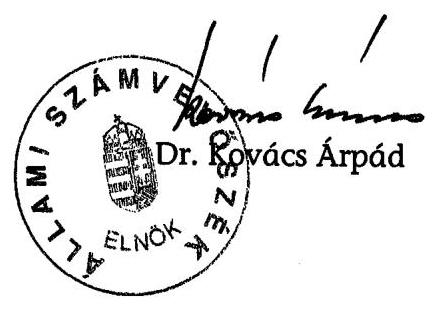

---

# MELLÉKLETEK

---

# ÉSZREVÉTELEK

---

# Oktatási és Kulturális Minisztérium Miniszter 

## OKM-617/2007.

Állami Számvevőszék
Dr. Kovács Árpád
elnök úr részére

Tisztelt Elnök Úr!
Köszönettel megkaptam a Művészetek Palotája megvalósitásának és müködésének ellenőrzéséről készített ÁSZ jelentés tervezetét. Az alapos helyszíni ellenőrzés, a fókuszcsoportos ellenőrzési módszer, valamint az érintett felek együttműködése lehetővé tette a Művészetek Palotája projekt több szempontból történő rendkívül alapos elemzését, és a projekt kiemelt jellegének megfelelő kezelését.
A jelentés részletes megállapításaira, következtetéseire nem kívánok észrevételt tenni, azonban az ezek figyelembe vételével az oktatási és kulturális miniszter számára megfogalmazott 1. számú javaslat újragondolását kezdeményezem. Ezen feladat végrehajtása jelentős mértékủ forrásigényt keletkeztetne, amelynek célszerüsége, hatékonysága véleményem szerint nem kellően megalapozott.

Budapest, 2007. január 45.
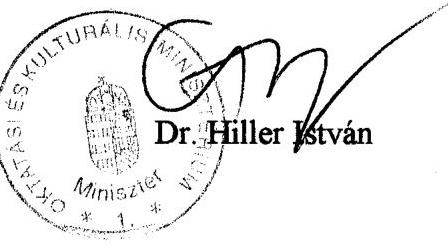

---

# Dr. Hiller István úr miniszter 

Oktatási és Kulturális Minisztérium

Budapest

Tisztelt Miniszter Úr!

Köszönettel kézhez vettem 2007. január 15-i levelét, amelyben elfogadja a Művészetek Palotája megvalósításának és müködésének ellenőrzéséről készített jelentésünk megállapításait és következtetéseit.

Levelében foglalt felvetése alapján elhagyjuk a létesítmény hővisszanyerő rendszere kiépítését, s az ehhez szükséges finanszírozási megoldás kialakítását célzó javaslatunkat. Megjegyzem azonban, hogy a hővisszanyerő rendszer hiánya megnöveli az objektum müködtetésének energia igényét. Ezért célszerűnek tartanám, ha a tárca gazdaságossági számításokkal alapozná meg a kérdésről alkotott véleményét.

Kérem tájékoztatásom szíves tudomásulvételét.
Budapest, 2007. január 22.
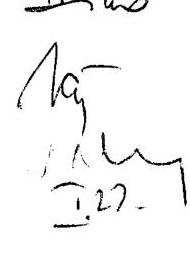

Tisztelettel:
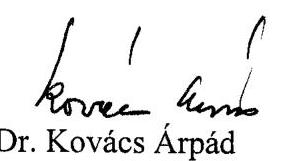

---

2. sz. melléklet a V-8-81/2006. sz. jelentéshez

A Művészetek Palotája beruházásának és működtetésének szervezeti ábrája

Állami szféra

(NKÖM
(megrendelő)

Alapítás

Kultúr-Part Ingatlanüzemeltető Kft.
2004. évtől névváltozással,
Művészetek Palotája Kft.
(szakmai üzemeltető)

Kulturális hasznosító szervezetek

Nemzeti Filharmonikus Zenekar,
Énekkar és Kottatár Kht.

Ludwig Múzeum

Nemzeti Táncszínház Kht.

Projekttársaságok
(beruházók, szolgáltatók)

Duna Múzeum Ingatlanfejlesztő Kft.

Törzsbetét:
- NKÖM 100 E Ft
- Duna Sétány Kft. 2 239 200 E Ft

Hagyományok Háza Ingatlanfejlesztő Kft.

Törzsbetét:
- NKÖM 100 E Ft
- Duna Sétány Kft. 2 465 700 E Ft

Nemzeti Filharmónia Ingatlanfejlesztési Kft.

Törzsbetét:
- NKÖM 100 E Ft
- Duna Sétány Kft. 4 648 100 E Ft

Duna Parkoló Ingatlanfejlesztő Kft.

Magánszféra

TriGránit Fejlesztési Rt.
(tulajdonos)

Duna Sétány Székház Kft.
(beruházó, telektulajdonos)

MP Projekt Kft.
(a projekttársaságok többségi tulajdonosa)

Arcadom Építőipari Rt.
(generálkivitelező)

Future Palace Kft.
(műszaki üzemeltető)

---

# Az ellenőrzött szervezetek jegyzéke 

## Helyszíni ellenőrzésbe vont állami szervezetek:

- Oktatási és Kulturális Minisztérium (jogelőd: Nemzeti Kulturális Örökség Minisztériuma)
- Művészetek Palotája Kft. és jogelődje a Kultúr-Part Ingatlan-üzemeltető Kft.
- Nemzeti Filharmonikus Zenekar, Énekkar és Kottatár Kht.
- Ludwig Múzeum - Kortárs Művészetek Múzeuma
- Nemzeti Táncszínház Kht.

Az állami megrendelői igények teljesítésében résztvevő, és a közpénzek felhasználásában részesülő társaságok:

A köz- és magánpartnerségi együttmúködésben résztvevő társaságok:

- Duna Sétány Székház Kft.
- TriGránit Fejlesztési Rt.
- Arcadom Építőipari Rt.
- MP Projekt Kft.
- Future Palace Kft.

Az együttmúködésben résztvevő, rendelkezésre állási díjban részesülő projekttársaságok:

- Nemzeti Filharmónia Ingatlanfejlesztési Kft.
- Hagyományok Háza Ingatlanfejlesztő Kft.
- Duna Múzeum Ingatlanfejlesztő Kft.
- Duna Parkoló Ingatlanfejlesztő Kft.

---

# Tanúsítványok jegyzéke 

| 1. sz. tanúsítvány: | Összesítő adatok a Művészetek Palotája projekttel kapcsolatos NKÖM fejezet költségvetéséből juttatott pénzeszközök felhasználásáról |
| :--: | :--: |
| 2. sz. tanúsítvány: | Teljesítési adatok a rendelkezésre állási szerződés szerinti kifizetésekről |
| 3/a. sz. tanúsítvány: | Szakmai teljesítménymutatók a Ludwig Múzeumnál |
| 3/b. sz. tanúsítvány: | Szakmai teljesítménymutatók a Nemzeti Filharmonikus Zenekar, Énekkar és Kottatár Közhasznú társaságnál |
| 3/c. sz. tanúsítvány: | Szakmai teljesítménymutatók a Nemzeti Táncszínház Közhasznú társaságnál |
| 3/d. sz. tanúsítvány: | Szakmai teljesítménymutatók a Múvészetek Palotája Kft. saját szervezésú rendezvényeinél |
| 4/a. sz. tanúsítvány: | A Ludwig Múzeum intézmény költségvetési adatai |
| 4/b. sz. tanúsítvány: | A Nemzeti Filharmonikus Zenekar, Énekkar és Kottatár Kht. bevételi és kiadási adatai |
| 4/c. sz. tanúsítvány: | A Nemzeti Táncszínház Kht. bevételi és kiadási adatai |
| 4/d. sz. tanúsítvány: | A Művészetek Palotája Kht. bevételi és kiadási adatai |

---

Szervezet neve: Nemzeti Kulturális Örökség Minisztériuma

Kitöltésért felelős: dr. Kovács Zita

Telefon: 484-7976

# Összesítő adatok

a Művészetek Palotája projektiai kapcsolatos

NKÖM fejezet költségvetéséből juttatott pénzeszközök felhasználásáról

|  Sor-
szám | Év | Összeg (E Ft) | Felhasználási jogcímcsoport * | Támogatott/Felhasználó szervezet  |
| --- | --- | --- | --- | --- |
|  0 | 1 | 2 | 3 | 4  |
|   | 2001 | 3000 | alapítás | Kultur-Part Kft.  |
|   | összesen | 3000 |  |   |
|   | 2002 | 0 |  |   |
|   | összesen | 0 |  |   |
|   | 2003 | 20000 | működési támogatás | Kultur-Part Kft.  |
|   |  | 18000 | működési támogatás | Kultur-Part Kft.  |
|  |   |   |   |   |
|  |   |   |   |   |
|  |   |   |   |   |
|   | összesen | 38000 |  |   |
|   | 2004 | 809662 | működési támogatás | Kultur-Part Kft.  |
|   |  | 1200 | működési támogatás-szakértői díj fedezete | Művészetek Palotája Kft.  |
|  |   |   |   |   |
|   | összesen | 810862 |  |   |
|   | 2005 | 970342 | tőkejutatás a likviditás biztosítása érdekében | Művészetek Palotája Kft.  |
|   |  | 100000 | Ludwig Múzeum költőzés | Ludwig Múzeum  |
|   |  | 61000 | szakértői díjak | Gazdálkodási Főosztály  |
|   |  | 54960 | működési támogatás- Ludwig Múzeum őrzési költségek | NKÖV Kht.  |
|   |  | 178000 | működési kiadások | Nemzeti Táncszínház Kht.  |
|   |  | 2200000 | üzemeltetési kiadások (rendelkezésre állási díj, közüzemi díjak) | Gazdálkodási Főosztály  |
|   |  | 376727 | működési támogatás | Művészetek Palotája Kft.  |
|   |  | 44800 | működési támogatás | Művészetek Palotája Kft.  |
|   |  | 1104932 | működési támogatás | Művészetek Palotája Kft.  |
|  |   |   |   |   |
|   | összesen | 5090761 |  |   |
|   | 2006. I. félév | 1200000 | működési támogatás | Művészetek Palotája Kft.  |
|  |   |   |   |   |
|   | összesen | 1200000 |  |   |

- Lehetséges felhasználási jogcímek:
- társaságok alapítása
- szakértői díjak
- egyéb megbízási díjak
- tőketartalékra forrás
- működési támogatás
- rendelkezésre állási díj
- közüzemi díjak
- stb.

Igazolom, hogy a tanúsítványban szereplő adatok nyilvántartásainkkal megegyeznek.

Budapest, 2006. június

P.H.

Kovács Zita

---

Szerezet neve: Nemzeti Kulturális Örtőrség Minisztériuma Kötöbését felelős: Kövőes Lézzölné Telefon: 484-7100

2. sz. tanúsítvány

Teljessítési adatok a rendelkezésre állási szerződés szerinti kifizetésekről (2005. március 15 - 2006. június 30.)

|  Sor-szám | Számlázott időszak (hó) | RÁD* eurában utalt része |  | RÁD* forintban utalt része |  | RÁD* összesen |  | Közmű díjak E Ft-ban | Bankköltségek E Ft-ban | Egyéb E Ft-ban | Mindösszesen E Ft-ban  |
| --- | --- | --- | --- | --- | --- | --- | --- | --- | --- | --- | --- |
|   |  | EU | E Ft | EU | E Ft | EU | E Ft |  |  |  |   |
|  1 | 2005. március |  |  |  |  |  |  |  |  |  |   |
|   | 2006. április |  |  |  |  |  |  |  |  |  |   |
|   | 2005. május |  |  |  |  |  |  |  |  |  |   |
|   | 2005. június |  |  | 1631250 | 407201 | 1631250 | 407201 |  |  |  | 407201  |
|   | 2005. július |  |  | 815825 | 204192 | 815825 | 204192 | 55975 |  |  | 260167  |
|   | 2005. augusztus | 652500 | 159894 | 163125 | 40308 | 815825 | 205200 | 20885 | 5 |  | 231090  |
|   | 2005. szeptember | 652500 | 159124 | 163125 | 39843 | 815825 | 198967 | 123 | 5 |  | 199099  |
|   | 2005. október | 652500 | 165464 | 163125 | 39734 | 815825 | 205198 | 41365 | 17 |  | 246580  |
|   | 2005. november | 652500 | 163476 | 163125 | 40729 | 815825 | 204207 | 2821 | 17 |  | 267045  |
|   | 2005. december | 652500 | 164816 | 163125 | 40608 | 815825 | 205424 | 19808 | 1033 |  | 226265  |
|   | 2005. összesen | 3262500 | 812776 | 3262500 | 812613 | 6525000 | 1625369 | 140977 | 1077 | 0 | 1767443  |
|  2 | 2006. január | 412801 | 103423 | 103199 | 25965 | 616000 | 129388 | 40 | 17 |  | 129468  |
|   | 2006. február | 447199 | 112350 | 68800 | 17199 | 515999 | 129549 | 18606 | 17 |  | 148172  |
|   | 2006. március | 430001 | 108696 | 85999 | 21615 | 516000 | 130311 | 11454 | 17 |  | 141782  |
|   | 2006. április | 430001 | 115524 | 85999 | 21871 | 516000 | 137395 | 141730 | 16 |  | 279141  |
|   | 2006. május | 430001 | 112028 | 85999 | 22883 | 516000 | 134911 | 12962 | 457 |  | 148330  |
|   | 2006. június | 430001 | 115735 | 85999 | 22382 | 516000 | 138117 | 24261 | 20 |  | 162398  |
|   | 2006. összesen | 2580004 | 667756 | 515995 | 131915 | 3085999 | 799671 | 269106 | 544 | 0 | 1009321  |
|  Mindösszesen |  | 5842504 | 1480532 | 3779495 | 944528 | 9620999 | 2425060 | 350063 | 1621 | 0 | 2776764  |

- RÁD - Rendelkezésre állási díj

Igazolom, hogy a tanúsítványban szereplő adatok nyilvántartásaikát megegyeznek.

Budapest, 2006. július 05.

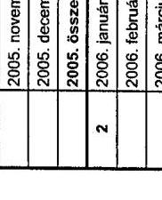

---

Szervezet neve: Ludwig Múzeum Kítöltésért felelős: Néray Katalin, igazgató Telefon: 555-3456

## Szakmai teljesítménymutatók a Ludwig Múzeumnál

|  Megnevezés | Mérték
egység | 2004 | 2005 |  | 2006 |   |
| --- | --- | --- | --- | --- | --- | --- |
|   |  |  | terv | teljesítés | 2006. terv | elj. 2006.1. fév  |
|  Kiállítások száma | db | 24 | 8 | 8 | 12 | 9  |
|  - időszaki | db | 23 | 7 | 7 | 11 | 8  |
|  - állandó | db | 1 | 1 | 1 | 1 | 1  |
|  Egyéb rendezvények száma | db | 216 | 350 | 275 | 300 | 298  |
|  Látogatók száma (kiállításokon) összesen | fő | 50 255 | 60 000 | 53 805 | 60 000 | 29 763  |
|  - teljes áru jegyet vásárlók | fő | 16 323 |  | 7 264 |  | 4 110  |
|  - kedvezményes áru belépődíjat fizetők | fő | 12 763 |  | 6 332 |  | 2 377  |
|  - ingyenes látogatók | fő | 21 169 |  | 40 209 |  | 2 327  |
|  Egy kiállításra jutó látogatók száma | fő | 2 094 |  | 6 726 |  | 3 307  |
|  Egy egyéb rendezvényre jutó látogatók száma | fő | 15-20 |  | 18-25 |  | 15-25  |
|  A kiállítások és rendezvények jegybevétele összesen | E Ft | 13 614 | 12 500 | 8 460 | 12 500 | 4 289  |
|  Egy kiállításra és rendezvényre jutó bevétel | E Ft | 57 | 38 | 30 |  | 14  |
|  Kiállítási terület | m³ | 2500 |  | 3 496 |  | 3 496  |

Megjegyzés: a Művészetek Palotájába történő átköltözés utáni kiállítási terület nm-t tüntettük fel 2005-ben.

Az egyéb rendezvények jellemzően ingyenesek, ezesetben nem mindig van regisztráció vagy "ingyenes" jegykibocsátás, ezért az egyéb rendezvények látogatóinak átlagos számát becsléssel állapítottuk meg.

Igazolom, hogy a tanúsítványban szereplő adatok nyilvántartásaink.

Budapest, 2006. augusztus 3.

---

Szervezet neve: Magyar Nemzeti Filharmonikus Zenekar, Énekkar és Kottatár Kht. 3/b. sz. tanúsítvány

Kitöltésért felelős: Nagy Ilona Telefon: 411-6646

Szakmai teljesítménymutatók a Magyar Nemzeti Filharmonikus Zenekar, Énekkar és Kottatár Közhasznú társaságnál

|  Megnevezés | Mérték-
egység | 2004.
teljesítés | 2005.
téljesítés | 2006.
teljesítés | 2007.
teljesítés | 2008. L-VI. hó  |
| --- | --- | --- | --- | --- | --- | --- |
|   |  |  |  |  |  | időszaki terv  |
|   |  |  | Művészetek
Palotája | Egyéb
helyen | Művészetek
Palotája | Egyéb
helyen  |
|  Saját rendezésű belföldi koncertek száma | db | 24 | 20 | 20 | 21 | 19  |
|  Nézők száma | fő | 23 727 | 25 174 | 12 946 | 26 489 | 12 361  |
|  Egy előadásra jutó nézők száma | fő | 959 | 1 259 | 647 | 1 261 | 651  |
|  A rendezvények jegybevétele összesen | E Ft | 38 907 | 58 474 | 24 770 | 57 898 | 20 901  |
|  Egy előadásra jutó bevétel | E Ft | 1 621 | 2 924 | 1 239 | 2 757 | 1 100  |
|  Férőhelyek száma | db | 25 559 | 27 970 | 14 384 | 29 370 | 13 665  |
|  Férőhelyek kihasználtsága | % | 92,8 | 90,0 | 90,0 | 90,2 | 90,5  |

a Fesztiválszínház az egyéb helyszínek között szerepel MüPa osztopban a Nemzeti Koncerfterem. I. színpaddal bővítve - adatai szerepelnek

Igazolom, hogy a tanúsítványban szereplő adatok nyilvántartásainkkal megegyeznek.

Budapest, 2006. augusztus 02.

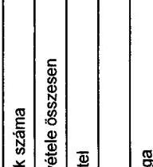

---

Szervezet neve: Nemzeti Táncszínház Kht. Kítőtésért felelős: Török Jolán - ügyvezető igazgató Telefon: 06-1-201-8202

Szakmai teljesítménymutatók a Nemzeti Táncszínház Közhasznú társaságnál

|  Megnevezés | Márték-
egység | 2004 | 2005 |  |  |  | 2006. I. félév |  |  |   |
| --- | --- | --- | --- | --- | --- | --- | --- | --- | --- | --- |
|   |  |  | terv |  | teljesítés |  | teljesítés |  | terv |   |
|   |  |  | összesen | Művészetek
Palotája | összesen | Művészetek
Palotája | összesen | Művészetek
Palotája | összesen | Művészetek
Palotája  |
|  Táncszínház előadások száma | db | 361 | 263 | 63 | 420 | 66 | 293 | 70 | 163 | 50  |
|  Nézők száma | fő | 79 931 | 72 960 | 20 160 | 105 046 | 24 672 | 74 900 | 25 193 | 41 275 | 17 500  |
|  Egy előadásra jutó nézők száma | fő | 221 | 277 | 320 | 239 | 374 | 256 | 360 | 253 | 350  |
|  Az előadások jegybevétele összesen | E Ft | 88 555 | 108 000 | 28 000 | 120 101 | 48 592 | 77 205 | 41 466 | 67 500 | 23 333  |
|  Férőhelyek száma * | db |  |  | 452 |  | 398 vagy 348 |  | 398 vagy 348 |  | 452  |
|  Férőhelyek kihasználtsága | % | 91 | 80 | 80 | 85 | 90 | 82 | 87 | 80 | 85  |

- nem alkalmazható:
- A Művészet Palotája Fesztivál Színháztermének befogadóképezsége 452 fő abban az esetben, ha nem vesszük igénybe az előszínpadot. Tánc esetében azonban legtöbbször ki kell venni az A, B, C sorokat, így a befogadóképezzég 402 főre csökken. Ebből 54 hely "nem-", vagy "rosszul látó", tehát a teljes áron esedható jegyek száma legtöbb esetben 348 db.
- A Nemzeti Táncszínházban az előadások három helyszínen valósulnak meg (színházterem, refektórium, Karmelita Lióvar), a emellett számos vidéki helyszínen is bemutatásra kerülnek szervezésünkben táncművészeti előadások, amely helyszínek befogadóképezsége is más és más.

Igazolom, hogy a tanúsítványban szereplő adatok nyilvántartásainkkal megegyeznek.

Budapest, 2006. július 26.

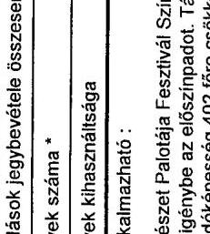

---

Szervezet neve: Művészetek Palotája Kft. 3/d. sz. tanúsítvány

Kitöltésért felelős: Csillagné Virágh Zsuzsa 1. oldal Telefon: 555-3061, 06-30-200-0070

Szakmai teljesítménymutatók a Művészetek Palotája Kft. saját szervezésű rendezvényeinél (2005-ben)

2005. március 14-december 21. között időszak

|  Műfaj | Előadásszám
db | Jegybevétel | Teljesítés
aránya | Látogatók száma | Látogatótcság | Becsült
látogatók  |
| --- | --- | --- | --- | --- | --- | --- |
|   |  | Tervezett | Tényleges |  | Tervezett | Tényleges  |
|  Romolyzene | 13 | 74 120 970 Ft | 59 029 043 Ft | 80% | 10640 | 14126  |
|  Családi és ifjúsági | 14 | 1 794 000 Ft | 2 749 739 Ft | 153% | 3558 | 4237  |
|  Opera, színház | 18 | 48 120 065 Ft | 22 384 087 Ft | 47% | 7884 | 9921  |
|  Világzene | 27 | 87 315 178 Ft | 86 622 522 Ft | 99% | 17388 | 22586  |
|  Könnyűzene | 22 | 20 010 448 Ft | 25 412 565 Ft | 127% | 8398 | 11637  |
|  Jazz | 13 | 12 667 143 Ft | 8 611 826 Ft | 68% | 5570 | 4938  |
|  Tánc | 10 | 1 013 774 Ft | 4 790 087 Ft | 473% | 2814 | 3322  |
|  Előadások összesen | 11 | 14 120 970 Ft | 10 588 885 Ft | 99% | 10 588 | 10 588  |
|  Círia Palota és egyéb belépőjegy nélküli családi programok |  |  |  |  |  |   |
|  Közönségforgalmi területen megrendezésre kerülő koncertek és kiállítások |  |  |  |  |  |   |
|  Szervezett fiúznézéseken résztvevők száma |  |  |  |  |  |   |
|  Összesen becsült látogatók száma |  |  |  |  |  |   |

Ipszolom, hogy a tanúsítványban szereplő adatok nyilvántartásainkkal megegyeznek.

Budapest, 2006. június 08.

P.H.

MÜVÉSZETEK PALOTÁJA KFT

10/20/2021.

---

Szervezet neve: Művészetek Palotája Kft. 3d. sz. tanúsítvány Kötítésért felelős: Callagné Virágh Zsuzsa 2. oldal Telefon:555-3081, 08-30-200-0070 Szakmai teljesítménymutatók a Művészetek Palotája Kft. saját szervezésű rendszvényelnél (2006. I. fölév)*

2006. január 1-június 30. közötti időszak

|  Múltaj | Előadásszám
dk | Jegybevétel | Teljesítés
aránya
% | Látogatók száma | Látogatottság | Becsült
látogatók
száma  |
| --- | --- | --- | --- | --- | --- | --- |
|   |  | Tervezett | Tényleges | Tervezett | Tényleges | %  |
|  Komolyzene | 20 | 54 465 716 Ft | 47 108 035 Ft | 86% | 20126 | 25571  |
|  Csatádi és ifjúsági | 12 | 2 494 029 Ft | 3 096 074 Ft | 124% | 4070 | 4304  |
|  Üzere, színház | 6 | 24 067 410 Ft | 21 508 261 Ft | 89% | 4478 | 5463  |
|  Világzene | 18 | 48 350 942 Ft | 43 890 955 Ft | 91% | 11227 | 13164  |
|  Könnyüzene | 16 | 26 221 816 Ft | 22 703 565 Ft | 87% | 7164 | 10221  |
|  Jazz | 11 | 11 675 924 Ft | 8 311 566 Ft | 71% | 4436 | 5334  |
|  Támc | 18 | 23 937 403 Ft | 19 968 435 Ft | 83% | 8125 | 10200  |
|  Előadások összesen | 584 | 195 213 242 Ft | 150 563 531 Ft | 87% | 65636 | 74257  |

Cifra Palota és egyéb belépőjegy nélküli csatádi programok 52099 Köztinségforgalmi területen megrendezésre kerülő koncertek és kiállítások 75000 Szervezett háznézéseken résztvevők száma 12685

Száma 12685

Száma 12685

Száma 12685

Száma 12685

Igazolom, hogy a tanúsítványban szereplő adatok nyilvántartásainkkal megegyeznek.

Budapest, 2006. július 24.

---

Szervezet neve: Ludwig Múzeum - Kortárs Művészeti Múzeum 4/a. sz. tanúsítvány

Kitöltésért felelős: Baánné dr. Jakab Anna gazd. ig. Telefon: 555 - 3475 Adatok: E Ft-ban

A Ludwig Múzeum intézmény költségvetési adatai

|  Megnevezés | 2004 |  | 2005 |  | 2006. |   |
| --- | --- | --- | --- | --- | --- | --- |
|   | terv | tény | terv | tény | terv 2006. évX | tény 2006. I. fév  |
|  I. Bevételek | 320 525 | 320 326 | 493 261 | 490 442 | 440 290 | 241 366  |
|  Működési bevételek | 294 088 | 294 593 | 480 922 | 477 959 | 409 693 | 213 069  |
|  ezen belül: |  |  |  |  |  |   |
|  - alaptevékenység bevétele | 15 500 | 14 796 | 16 000 | 12 366 | 16 048 | 4 908  |
|  - állami támogatás | 247 568 | 247 568 | 350 150 | 350 150 | 374 088 | 191 306  |
|  - egyéb bevételek | 15 636 | 16 342 | 2 200 | 4 495 | 2 052 | 1 451  |
|  működési célú átvett pénzeszköz | 30 884 | 30 683 | 112 572 | 110 948 | 17 505 | 15 404  |
|  Felhalmozási bevételek | 3 900 | 3 900 | 4 900 | 5 044 | 4 600 | 2 300  |
|  ebből felhalmozási célú külső átvett pénzeszk | 0 | 0 | 500 | 644 | 0 | 0  |
|  Előző évi pénzmaradvány | 7037 | 7 037 | 7 439 | 7 439 | 25 997 | 25 997  |
|  II. Kiadások | 320 525 | 312 887 | 493 261 | 464 445 | 440 290 | 216 019  |
|  Működési kiadások | 316 446 | 311 902 | 484 867 | 456 051 | 428 628 | 206 871  |
|  Dologi kiadások | 158 960 | 156 518 | 314 700 | 285 914 | 190 711 | 103 567  |
|  ezen belül: |  |  |  |  |  |   |
|  - üzemeltetési és fenntartási kiadások | 33 023 | 34 501 | 41 537 | 40 248 | 27 788 | 11 528  |
|  - ebből: bérleti és lizingdíj | 1 580 | 1 579 | 1 832 | 1 831 | - | 398  |
|  szállítási szolgáltatás | 6 000 | 6 124 | 16 454 | 16 121 | 19 533 | 3 965  |
|  villamos energia felhasználás | 6 500 | 6 062 | 3 255 | 3 255 | - | -  |
|  távfütes, melegvíz szolgáltatás | 6 000 | 6 957 | 5 227 | 5 226 | - | -  |
|  víz és csatornadíj | 800 | 658 | 219 | 219 | - | -  |
|  épület karbantartás | 700 | 2 777 | 2 165 | 2 165 | - | -  |
|  számítógép karbantartás | 200 | 381 | 32 | 32 | 600 | -  |
|  sokszorosítási eszk. karbantart. | 600 | 798 | 478 | 477 | 300 | 183  |
|  kommunikációs eszk. karbantart. | 400 | 730 | 692 | 2 362 | 100 | 759  |
|  járművek karbantartása | 800 | 573 | 1 053 | 1 052 | 800 | 205  |
|  egyéb gép, ber. karbantartása | 2 458 | 264 | 855 | 185 | - | 503  |
|  postaköltség | 1 400 | 2 526 | 2 503 | 2 301 | 2 200 | 2 019  |

---

|  egyéb üzemeltetési kiadások (szemétdíj, rovarítás, ügyvédi díj, portaszolgálat, munkavédelmi szolgáltatás) | 5 585 | 5 070 | 6 772 | 6 019 | 4 255 | 3 496  |
| --- | --- | --- | --- | --- | --- | --- |
|  Felhalmozási kiadások | 4 079 | 985 | 8 394 | 8 394 | 11 662 | 9 148  |

Megjegyzés: 2006. június végén bejött az július havi állami támogatás ellátmány (30 847 000.- Ft) melyet kivettünk a ténylegesen befolyt állami támogatási összegből az összehasonlíthatóság érdekében.

X 2006. évi módosított tervet (előirányzatot) a 2006.06.30.-i állapot szerint állítottuk be.

Igazolom, hogy a tanúsítványban szereplő adatok nyilvántartása (típusfelügyítnénk).

Budapest, 2006. augusztus 3.

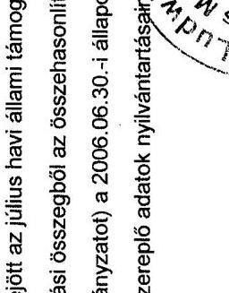

---

Szervezet neve: Magyar Nemzeti Filharmonikus Zenekar, Énekkar és Kottatár Kht. 4/b. sz. tanúsítvány Kítöítésért felelős: Nagy Ilona Telefon: 411-6646

A Magyar Nemzeti Filharmonikus Zenekar, Énekkar és Kottatár Kht. bevétel és ráfordítás adatai

|  Megnevezés | 2004. |  | 2005. |  | 2006. |   |
| --- | --- | --- | --- | --- | --- | --- |
|   | terv | tény | terv | tény | éves terv | L-VI. havi tény  |
|  I. Bevételek | 1 775 089 | 1 883 637 | 1 732 694 | 1 790 896 | 1 869 525 | 1 051 796  |
|  Működési bevételek | 1 775 089 | 1 880 989 | 1 732 694 | 1 786 117 | 1 869 525 | 1 051 796  |
|  ezen belül: |  |  |  |  |  |   |
|  - alaptevékenység bevételei | 109 089 | 199 935 | 116 694 | 149 071 | 221 525 | 115 956  |
|  - állami támogatás | 1 666 000 | 1 666 000 | 1 610 000 | 1 610 000 | 1 638 000 | 934 500  |
|  - egyéb más bevételek |  | 15 054 | 6 000 | 27 046 | 10 000 | 1 340  |
|  II. Ráfordítások | 1 775 089 | 1 958 015 | 1 732 694 | 1 969 400 | 1 869 525 | 869 356  |
|  Működési ráfordítások / écs-en kívüli ráfordítások | 1 733 089 | 1 882 419 | 1 698 327 | 1 921 096 | 1 823 525 | 846 672  |
|  * Dologi költségek / anyagjellegű ráfordítások | 515 588 | 554 980 | 345 036 | 561 648 | 333 347 | 280 776  |
|  ezen belül: |  |  |  |  |  |   |
|  - koncert helyszín bérleti díja + hostess szolgálat | 15 576 | 13 984 | 14 960 | 13 055 | 13 062 | 3 356  |
|  - egyéb helyiségbérleti költségek | 40 551 | 59 327 | 23 883 | 9 342 | 4 785 | 2 431  |
|  - üzemeltetési és fenntartási költségek | 32 800 | 33 216 | 28 500 | 33 249 | 34 655 | 13 572  |

Igazolom, hogy a tanúsítványban szereplő adatok nyilvántartásainkkal megegyeznek.

Budapest, 2006. augusztus 02.

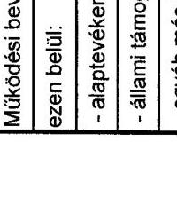

---

Szervezet neve: Nemzeti Táncszínház Kht. 4/c. sz. tanúsítvány Kítöltésért felelős: Szamosvári Antalné Telefon: 375-8184

A Nemzeti Táncszínház Kht. bevételi és kiadási adatai

|  Megnevezés | 2004 |  | 2005 |  | 2006. I. félév |   |
| --- | --- | --- | --- | --- | --- | --- |
|   | terv | tény | terv | tény | terv | tény  |
|  I. Bevételek | 472 750 | 609 829 | 733 000 | 790 254 | 399 000 | 612 520  |
|  Működési bevételek | 472 750 | 609 829 | 733 000 | 790 254 | 399 000 | 612 520  |
|  ezen belül: |  |  |  |  |  |   |
|  - alaptevékenység bevétele | 86 250 | 122 107 | 118 000 | 154 167 | 74 000 | 98 290  |
|  - állami támogatás (OKM, pályázati és egyéb) | 386 500 | 431 074 | 615 000 | 587 091 | 325 000 | 511 230  |
|  - egyéb bevételek | 0 | 56 648 | 0 | 48 996 | 0 | 3 000  |
|  II. Kiadások | 472 750 | 588 867 | 733 000 | 759 758 | 399 000 | 453 505  |
|  Működési kiadások | 472 750 | 588 867 | 733 000 | 759 758 | 399 000 | 453 505  |
|  Dologi kiadások | 324 479 | 440 749 | 576 017 | 577 674 | 299 250 | 357 661  |
|  ezen belül: |  |  |  |  |  |   |
|  - üzemeltetési és fenntartási kiadások | 132 179 | 222 578 | 193 017 | 226 157 | 113 250 | 116 273  |

Igazolom, hogy a tanúsítványban szereplő adatok nyilvántartásainkkal megegyeznek.

Budapest, 2006. július 26.

---

# A Müvészetek Palotája Kft. bevételi és kiadási adatai

|  Megnevezés | 2004 |  | 2005 |  | 2006. 01-06. hó |   |
| --- | --- | --- | --- | --- | --- | --- |
|   | terv | tény | terv | tény | terv | tény  |
|  I. Bevételek |  |  |  |  |  |   |
|  Müködési bevételek | 909662 | 511314 | 3003410 | 3217792 | 1441027 | 1552098  |
|  ezen belül: |  |  |  |  |  |   |
|  - alaptevékenység bevétele | 100000 | 100000 | 454639 | 700886 | 236527 | 333718  |
|  ebből: szolgáltatások |  |  | 0 | 224450 |  |   |
|  terembérlet |  |  | 133825 | 138056 |  |   |
|  jegybevétel |  |  | 245042 | 336743 |  |   |
|  egyéb vendéglátó jut. stb |  |  | 75772 | 1637 |  |   |
|  pénzügyi |  |  |  |  |  |   |
|  - állami támogatás müködési támogatás | 809662 | 65957 | 2452000 | 1526459 | 1200000 | 1200000  |
|  - állami támogatás tőkejuttatás |  | 315000 |  | 970342 |  |   |
|  - egyéb bevételek | 0 | 30357 | 86771 | 20105 | 4500 | 18380  |
|  ebből: pénzügyi |  |  | 10000 | 13792 |  |   |
|  egyéb |  |  | 76771 | 6313 |  |   |
|  Fizetendő Áfa | 25000 | 25192 | 110848 | 144047 |  |   |
|  II. Kiadások |  |  |  |  |  |   |
|  Müködési kiadások (Dologi+Személyi) | 760003 | 369642 | 2866705 | 2445172 | 1246315 | 1237742  |
|  Dologi kiadások | 536779 | 149332 | 1900317 | 1569629 | 958694 | 857006  |
|  ezen belül: |  |  |  |  |  |   |
|  - üzemeltetési és fenntartási kiadások | 50919 | 41574 | 1702150 | 1334984 | 958694 | 857006  |

|  Személyi jellegú kiadások | 223224 | 220309 | 966388 | 795542  |
| --- | --- | --- | --- | --- |
|  Levonható Áfa | 135541 | 33270 | 395553 | 235334  |
|  Arányosított ÁFA |  | 20897 |  | 74672  |

Igazolom, hogy a tanúsítványban szereplő adatok nyilvántartásainkkal megegyeznek.

Budapest, 2006. június 07

P.H.

[^0] [^0]: ${ }^{*}$ a 2005. évi jegybevétel tény összege tartalmazza a befogadott rendezvények

---

# A MÜVÉSZETEK PALOTÁJA

fajlagos fejlesztési/beruházási költségeinek kimutatása

|  Intézmény | Nettó térszín feletti alapterület | Nettó térszín alatti (parkoló) alapterület | Nettó terület összesen, parkolókkal/ Fajlagos beruházási ktg. | Fajlagos fejlesztési/ beruházási költség (216 Ft/EUR átlag árfolyamon) | Fejlesztési (beruházási) összegek  |
| --- | --- | --- | --- | --- | --- |
|   | $\mathbf{m}^{2}$ | $\mathbf{m}^{2}$ | $\mathbf{m}^{2}$ |  | eFt  |
|   |  |  | $\boldsymbol{e F t} / \mathbf{m}^{\mathbf{2}}$ | euro/m ${ }^{2}$ |   |
|  NF - Bartók Béla Nemzeti Hangversenyterem | 14327 | 8869 | 23196 |  | 15613976  |
|   |  |  | 673 | 3104 |   |
|  HH - Fesztivál Színház | 11401 | 7550 | 18951 |  | 8219509  |
|   |  |  | 434 | 2001 |   |
|  LM - Ludwig Múzeum | 8944 | 9400 | 18344 |  | 7464545  |
|   |  |  | 407 | 1876 |   |
|  Müvészetek Palotája - összesítve | 34672 | 25819 | 60491 |  | 31298030  |
|   |  |  | 517 | 2386 |   |

## Megjegyzések:

## Létesítmény kiviteli költségek tartalma:

Kemény költségek (építés-szerelés, külső munkák, közművek, technológia, berendezések), + tervezési, konzulensi, szakértői költségek

## Nem tartalmaz:

Földhasználat, jogi költségek, biztosítási költségek, ingatlanadó, fejlesztési díj, működési költségek, parkoló megváltás, finanszírozás kamat nélküli költsége, egyéb költségek promoció, stb.), tartalék, tőkésített kamat

Fejlesztési költség adatok és nettó terület adatok forrása (Kreatív 2000. - Zéró riport 2. és 3. számú mellékletek) Generál költség adatok forrása (2. számú szerződés módosítása - Kelt: 2003. május 30.) *Parkoló (térszín alatti) területekre ellentmondó adatok vannak, jelen adat forrása (Kreatív 2000. - Zéró riport 3. számú melléklet)

---

# A MÜVÉSZETEK PALOTÁJA

fajlagos generál-kiviteli költségeinek kimutatása

|  Intézmény | Nettó területek összesen/
Fajlagos kiviteli ktg. | Fajlagos generál-kiviteli költség (216 Ft/EUR átlag árfolyamon) | Generál kiviteli összegek  |
| --- | --- | --- | --- |
|   | $\mathbf{m}^{2}$ |  | eFt  |
|   | $\boldsymbol{e F t} / \boldsymbol{m}^{2}$ | euro/m ${ }^{2}$ |   |
|  NF - Bartók Béla Nemzeti Hangversenyterem | 14327 |  | 11740856  |
|   | 819 | 3776 |   |
|  HH - Fesztivál Színház/Hagyományak Háza | 11401 |  | 6188413  |
|   | 543 | 2504 |   |
|  LM - Ludwig Múzeum/Modern Magyar Művészetek Múzeum | 8944 |  | 5435914  |
|   | 608 | 2803 |   |
|  Parkolók (térszín alatti területek) * | 25819 |  | 1322806  |
|   | 51 | 235 |   |
|  Múvészetek Palotája - összesítve | 60491 |  | 24687989  |
|   | 408 | 1881 |   |

## Megjegyzések:

## Létesítmény kiviteli költségek tartalma:

Kemény költségek (építés-szerelés, külső munkák, közművek, technológia, berendezések), + tervezési, konzulensi, szakértői költségek

## Nem tartalmaz:

Földhasználat, jogi költségek, biztosítási költségek, ingatlanadó, fejlesztési díj, működési költségek, parkoló megváltás, finanszírozás kamat nélküli költsége, egyéb költségek promoció, stb.), tartalék, tőkésített kamat

Fejlesztési költség adatok és nettó terület adatok forrása (Kreatív 2000. - Zéró riport 2. és 3. számú mellékletek) Generál költség adatok forrása (2. számú szerződés módosítása - Kelt: 2003. május 30.) *Parkoló (térszín alatti) területekre ellentmondó adatok vannak, jelen adat forrása (Kreatív 2000. - Zéró riport 3. számú melléklet)

---

# Hangversenytermek beruházási költségeinek nemzetközi összehasonlítása

|  Intézmény | Bruttó alapterület | Nettó alapterület | Előadóterem alapterülete | Koncertterem befogadóképesség | Bekerülési összeg | Megjegyzés  |
| --- | --- | --- | --- | --- | --- | --- |
|  mértékegység | $\mathrm{m}^{2}$ | $\mathrm{m}^{2}$ | $\mathrm{m}^{2}$ | fő | euro |   |
|  fajlagos költség | euro/m2 | euro/m2 | euro/m2 | euro/fö | euro |   |
|  Esseni Filharmónia | 21721 | 13000 | 1600 | 1900 | 65000000 | Teljeskörü rekonstrukció!  |
|  Alfred Krupp Terem | 2992 | 5000 | 40625 | 34211 |  |   |
|  Brügge-i hangversenyterem | 21563 | 17251 |  | 1200 | 35000000 |   |
|   | 1623 | 2029 |  | 29167 |  |   |
|  Philadelphia Kimmel Center Version Hall | 53000 | $\begin{gathered} 42400 \ 9383 \end{gathered}$ | 9383 | 2545 | 203517400 |   |
|   | 3840 | 4800 | 21690 | 79968 |  |   |
|  Tokió |  | 740 |  | 300 | 2600000 | Teljeskörü rekonstrukció!  |
|  Hakuju hangversenyterem |  | 3514 |  | 8667 |  |   |
|  Casa Hangversenyterem | 23000 |  |  | 1300 | 50000000 | Parkolóházzal  |
|  Porto | 2174 |  |  | 38462 |  |   |
|  Bartók Béla |  | 23196 | 1885 | 1699 |  | 1563 ülőhely 136 állóhely  |
|  Nemzeti Hangversenyterem * |  | 3104 | 38191 | 42372 | 71990299 | 190 pódiumülés  |
|   |  | 18951 |  |  |  |   |
|  Fesztivál Színház * |  | 18344 |  |  |  |   |
|  Ludwig Múzeum * |  | 60491 |  |  | 144323204 |   |
|  Összesen (Múvészetek Palotája): * |  | 2386 |  |  |  |   |

*216 Ft/ EUR árfolyamon átszámolva.

---

# Összefoglaló táblázat a pénzügyi konstrukciókról

|  Megnevezés | Eredeti konstrukció | II. változat | Szolgáltatásvásárlási konstrukció  |
| --- | --- | --- | --- |
|  Futamidő | 10 év | 2 év türelmi idő+10 év | 30 év  |
|  Cash Flow | 43,9 Mrd Ft | 66,1 Mrd Ft | 206,9 Mrd Ft  |
|  Összehasonlítható adatok* | 43,9 Mrd Ft | 66,1 Mrd Ft | 110,6 Mrd Ft  |
|  Jelenérték 2004-ben (5,25\%) | 36,9 | 43,6 | 53,9  |
|  Törlesztés módja | Vételár- és bérleti dí fizetés | Vételár- és bérleti dí fizetés | Rendelkezésre állási díj  |
|  Törlesztés tartalma | Adósságszolgálat és tőketörlesztés | Adósságszolgálat és tőketörlesztés | Adósságszolgálat, tőketörlesztés, üzemeltetés  |
|  Hitel/saját erő | 70/30 (\%) | 70/30 (\%) | 90/10 (\%)  |
|  Saját tőkére vetített hozam | $8 \%$ | $8 \%$ | $12 \%$  |
|  Üzemeltetés | Állami | Állami | Magán  |
|  Üzemeltetésre vetített hozam | - | - | 3\% (egyéb szolg. 1\%)  |
|  Állami tulajdonjog szerzés | 3 év után | 12 év után | 30 év után  |

*Adósságszolgálat, fejlesztői tőkehozam, adminisztráció és adó, üzemeltetés nélkül

---

# A Múvészetek Palotája projekt pénzügyi konstrukcióinak összehasonlítása

## I. 10 éves

|  Adósság-
szolgálat | Töke | Adminisztráció/
adó | Összesen
$\mathbf{E} \boldsymbol{\epsilon}$ | Összesen*
M Ft | $\mathbf{1 0 \%}$ | 8-7-6\% | 5,25\% | Évek | Időszak  |
| --- | --- | --- | --- | --- | --- | --- | --- | --- | --- |
|   |  |  |  |  | díszkontráta |  |  |  |   |
|   |  |  |  | e | $\mathrm{f}=\mathrm{e} /(1+10 \%)^{1}$ | $\mathrm{g}=\mathrm{e} /(1+8-7-6 \%)^{1}$ | $\mathrm{h}=\mathrm{e} /(1+5,25 \%)^{1}$ | i | j  |
|   |  |  |  | 7083 | 7083 | 7083 | 7083 | 0 | 2004  |
|   |  |  |  | 7083 | 6439 | 6558 | 6730 | 1 | 2005  |
|   |  |  |  | 7083 | 5854 | 6072 | 6394 | 2 | 2006  |
|   |  |  |  | 3165 | 2378 | 2512 | 2714 | 3 | 2007  |
|   |  |  |  | 3165 | 2162 | 2326 | 2579 | 4 | 2008  |
|   |  |  |  | 3165 | 1965 | 2154 | 2450 | 5 | 2009  |
|   |  |  |  | 3165 | 1786 | 1994 | 2328 | 6 | 2010  |
|   |  |  |  | 3213 | 1649 | 1875 | 2246 | 7 | 2011  |
|   |  |  |  | 3293 | 1536 | 1779 | 2187 | 8 | 2012  |
|   |  |  |  | 3538 | 1500 | 1770 | 2232 | 9 | 2013  |
|  *áfa nélkül |  |  |  | 43951 | 32351 | 34123 | 36943 | Jelenérték 2004-ben |   |

II. 12 éves

|  Adósság-
szolgálat | Töke | Adminisztráció/
adó | Összesen
$\mathbf{E} \boldsymbol{\epsilon}$ | Összesen*
M Ft | $\mathbf{1 0 \%}$ | 8-7-6\% | 5,25\% | Évek | Időszak  |
| --- | --- | --- | --- | --- | --- | --- | --- | --- | --- |
|  a | b | c | $\mathrm{d}=\mathrm{a}+\mathrm{b}+\mathrm{c}$ | $\mathrm{e}=\mathrm{d} * 250$ | $\mathrm{f}=\mathrm{e} /(1+10 \%)^{1}$ | $\mathrm{g}=\mathrm{e} /(1+8-7-6 \%)^{1}$ | $\mathrm{h}=\mathrm{e} /(1+5,25 \%)^{1}$ | i | j  |
|  Türelmi idő |  |  |  |  |  |  |  |  | 2005  |
|  Türelmi idő |  |  |  |  |  |  |  |  | 2006  |
|  15120 | 4213 | 1436 | 20769 | 5192 | 4720 | 4808 | 4933 | 1 | 2007  |
|  15120 | 4297 | 1490 | 20907 | 5227 | 4320 | 4481 | 4718 | 2 | 2008  |
|  15120 | 4383 | 1551 | 21054 | 5264 | 3955 | 4178 | 4515 | 3 | 2009  |
|  15120 | 4471 | 1613 | 21204 | 5301 | 3621 | 3896 | 4320 | 4 | 2010  |
|  15120 | 4560 | 1678 | 21358 | 5340 | 3315 | 3634 | 4134 | 5 | 2011  |

---

|  15120 | 4651 | 1745 | 21516 | 5379 | 3036 | 3390 | 3957 | 6 | 2012  |
| --- | --- | --- | --- | --- | --- | --- | --- | --- | --- |
|  15120 | 4744 | 1815 | 21679 | 5420 | 2781 | 3162 | 3788 | 7 | 2013  |
|  15120 | 4839 | 1887 | 21847 | 5462 | 2548 | 2951 | 3627 | 8 | 2014  |
|  15120 | 4936 | 1963 | 22019 | 5505 | 2335 | 2754 | 3473 | 9 | 2015  |
|  15120 | 54999 | 2041 | 72161 | 18040 | 6955 | 8356 | 10815 | 10 | 2016  |
|   |  |  |  | 66129 | 37586 | 41610 | 48281 | Jelenérték 2006-ban |   |
|   |  |  |  |  | 31063 | 35674 | 43584 | Jelenérték 2004-ben |   |

III. 30 éves (2004. nov.)

|  Adósság-
szolgálat | Töke | Adminisztráció/
adó | Összesen
$\mathbf{E} \boldsymbol{\epsilon}$ | Összesen*
M Ft | $\mathbf{1 0 \%}$ | 8-7-6\%
diszkontráta | 5,25\% | Évek | Időszak  |
| --- | --- | --- | --- | --- | --- | --- | --- | --- | --- |
|  a | b | c | $\mathrm{d}=\mathrm{a}+\mathrm{b}+\mathrm{c}$ | $\mathrm{e}=\mathrm{d}^{*} 250$ | $\mathrm{f}=\mathrm{e} /(1+10 \%)^{1}$ | $\mathrm{g}=\mathrm{e} /(1+8-7-6 \%)^{1}$ | $\mathrm{h}=\mathrm{e} /(1+5,25 \%)^{1}$ | i | j  |
|   |  |  |  | 0 | 0 | 0 | 0 | 1 | 2005  |
|   |  |  |  | 0 | 0 | 0 | 0 | 2 | 2006  |
|  12928,6 | 2328,9 | 541,9 | 15799 | 3950 | 2968 | 3136 | 3388 | 3 | 2007  |
|  12928,6 | 2375,4 | 562,5 | 15867 | 3967 | 2709 | 2916 | 3232 | 4 | 2008  |
|  12928,6 | 2423,0 | 585,5 | 15937 | 3984 | 2474 | 2712 | 3085 | 5 | 2009  |
|  12928,6 | 2471,4 | 609,0 | 16009 | 4002 | 2259 | 2522 | 2944 | 6 | 2010  |
|  12928,6 | 2520,8 | 633,3 | 16083 | 4021 | 2063 | 2346 | 2810 | 7 | 2011  |
|  12928,6 | 2571,3 | 658,6 | 16159 | 4040 | 1885 | 2182 | 2683 | 8 | 2012  |
|  12928,6 | 2622,7 | 685,0 | 16236 | 4059 | 1721 | 2031 | 2561 | 9 | 2013  |
|  12928,6 | 2675,1 | 712,4 | 16316 | 4079 | 1573 | 1889 | 2445 | 10 | 2014  |
|  12928,6 | 2728,6 | 740,9 | 16398 | 4100 | 1437 | 1775 | 2335 | 11 | 2015  |
|  12928,6 | 2783,2 | 770,5 | 16482 | 4121 | 1313 | 1667 | 2230 | 12 | 2016  |
|  12928,6 | 2838,9 | 801,3 | 16569 | 4142 | 1200 | 1566 | 2130 | 13 | 2017  |
|  12928,6 | 2895,7 | 833,4 | 16658 | 4164 | 1097 | 1472 | 2034 | 14 | 2018  |
|  12928,6 | 2953,6 | 866,7 | 16749 | 4187 | 1002 | 1383 | 1944 | 15 | 2019  |
|  12928,6 | 3012,6 | 901,4 | 16843 | 4211 | 916 | 1300 | 1857 | 16 | 2020  |
|  12928,6 | 3072,9 | 937,5 | 16939 | 4235 | 838 | 1222 | 1774 | 17 | 2021  |
|  12928,6 | 3134,4 | 975,0 | 17038 | 4260 | 766 | 1148 | 1696 | 18 | 2022  |
|  12928,6 | 3179,0 | 1014,0 | 17122 | 4280 | 700 | 1078 | 1619 | 19 | 2023  |
|  12928,6 | 3261,0 | 1054,5 | 17244 | 4311 | 641 | 1015 | 1549 | 20 | 2024  |

---

|  12928,6 | 3326,2 | 1096,7 | 17352 | 4338 | 586 | 964 | 1481 | 21 | 2025  |
| --- | --- | --- | --- | --- | --- | --- | --- | --- | --- |
|  12928,6 | 3392,7 | 1140,6 | 17462 | 4365 | 536 | 915 | 1416 | 22 | 2026  |
|  12928,6 | 3460,6 | 1186,2 | 17575 | 4394 | 491 | 869 | 1354 | 23 | 2027  |
|  12928,6 | 3529,8 | 1233,6 | 17692 | 4423 | 449 | 825 | 1295 | 24 | 2028  |
|  12928,6 | 3600,4 | 1283,0 | 17812 | 4453 | 411 | 784 | 1239 | 25 | 2029  |
|   | 6620,7 | 1334,3 | 7955 | 1989 | 167 | 330 | 526 | 26 | 2030  |
|   | 5930,3 | 1387,7 | 7318 | 1830 | 140 | 286 | 460 | 27 | 2031  |
|   | 5211,1 | 1443,2 | 6654 | 1664 | 115 | 246 | 397 | 28 | 2032  |
|   | 4462,2 | 1500,9 | 5963 | 1491 | 94 | 208 | 338 | 29 | 2033  |
|   | 3682,8 | 1560,9 | 5244 | 1311 | 75 | 172 | 282 | 30 | 2034  |
|   |  |  |  | 104368 | 30625 | 38957 | 51106 | Jelenérték 2004-ben |   |

IV. 30 éves végleges

|  Adósság-
szolgálat | Töke | Adminisztráció/
adó | Összesen
$\mathbf{E} \boldsymbol{\epsilon}$ | Összesen*
M Ft | $\mathbf{1 0 \%}$ | 8-7-6\% |  |  | Évek | Időszak  |
| --- | --- | --- | --- | --- | --- | --- | --- | --- | --- | --- |
|   |  |  |  |  |  | diszkontráta |  |  |  |   |
|  a | b | c | $\mathrm{d}=\mathrm{a}+\mathrm{b}+\mathrm{c}$ | $\mathrm{e}=\mathrm{d}^{*} 250$ | $\mathrm{f}=\mathrm{e} /(1+10 \%)^{\prime}$ | $\mathrm{g}=\mathrm{e} /(1+8-7-6 \%)^{\prime}$ | $\mathrm{h}=\mathrm{e} /(1+5,25 \%)^{\prime}$ | i |  |   |
|   |  |  |  | 0 | 0 | 0 | 0 | 1 |  | 2005  |
|   |  |  |  | 0 | 0 | 0 | 0 | 2 |  | 2006  |
|  12764 | 2224 | 647 | 15634,4058 | 3909 | 2937 | 3103 | 3352 | 3 |  | 2007  |
|  12764 | 2267 | 1739 | 16769,4892 | 4192 | 2863 | 3082 | 3416 | 4 |  | 2008  |
|  12764 | 2312 | 2127 | 17202,3208 | 4301 | 2670 | 2927 | 3330 | 5 |  | 2009  |
|  12764 | 2358 | 2159 | 17281,0404 | 4320 | 2439 | 2722 | 3178 | 6 |  | 2010  |
|  12763 | 2405 | 1662 | 16830,5714 | 4208 | 2159 | 2455 | 2941 | 7 |  | 2011  |
|  12764 | 2454 | 1413 | 16630,4468 | 4158 | 1940 | 2246 | 2761 | 8 |  | 2012  |
|  12763 | 2503 | 1427 | 16693,4743 | 4173 | 1770 | 2088 | 2633 | 9 |  | 2013  |
|  12763 | 2553 | 1522 | 16837,6722 | 4209 | 1623 | 1950 | 2523 | 10 |  | 2014  |
|  12763 | 2604 | 2260 | 17627,5419 | 4407 | 1545 | 1908 | 2510 | 11 |  | 2015  |
|  12764 | 2656 | 1868 | 17287,5423 | 4322 | 1377 | 1749 | 2339 | 12 |  | 2016  |
|  12763 | 2709 | 1664 | 17136,1986 | 4284 | 1241 | 1620 | 2203 | 13 |  | 2017  |
|  12763 | 2763 | 1905 | 17431,2104 | 4358 | 1148 | 1540 | 2129 | 14 |  | 2018  |
|  12763 | 2818 | 1483 | 17064,8059 | 4266 | 1021 | 1409 | 1980 | 15 |  | 2019  |
|  12764 | 2875 | 2020 | 17658,7328 | 4415 | 961 | 1363 | 1947 | 16 |  | 2020  |

---

|  12763 | 2932 | 2966 | 18661,0252 | 4665 | 923 | 1346 | 1955 | 17 | 2021  |
| --- | --- | --- | --- | --- | --- | --- | --- | --- | --- |
|  12763 | 2991 | 2583 | 18337,1206 | 4584 | 825 | 1236 | 1825 | 18 | 2022  |
|  12763 | 3051 | 2269 | 18083,2974 | 4521 | 739 | 1139 | 1710 | 19 | 2023  |
|  12764 | 3112 | 2771 | 18646,2575 | 4662 | 693 | 1098 | 1675 | 20 | 2024  |
|  12763 | 3174 | 2394 | 18330,9743 | 4583 | 619 | 1018 | 1565 | 21 | 2025  |
|  12763 | 3174 | 2394 | 18330,9743 | 4583 | 563 | 960 | 1487 | 22 | 2026  |
|  12763 | 3302 | 3579 | 19644,2822 | 4911 | 548 | 971 | 1514 | 23 | 2027  |
|  12764 | 3368 | 3077 | 19209,5009 | 4802 | 488 | 896 | 1406 | 24 | 2028  |
|  12763 | 3436 | 2806 | 19004,1821 | 4751 | 439 | 836 | 1322 | 25 | 2029  |
|  3191 | 6045 | 3340 | 12575,5343 | 3144 | 264 | 522 | 831 | 26 | 2030  |
|   | 6105 | 1069 | 7173,28751 | 1793 | 137 | 281 | 450 | 27 | 2031  |
|   | 5426 | 396 | 5822,55377 | 1456 | 101 | 215 | 347 | 28 | 2032  |
|   | 4720 | 557 | 5277,73961 | 1319 | 83 | 184 | 299 | 29 | 2033  |
|   | 3985 | 412 | 4397,09133 | 1099 | 63 | 145 | 237 | 30 | 2034  |
|   | 710 | 71 | 781,462628 | 195 | 10 | 24 | 40 | 31 | 2035  |
|   |  |  |  | 110590 | 32187 | 41029 | 53907 | Jelenérték 2004-ben |   |

|  Változatok | 10\% | 8-7-6\% | 5,25\%  |
| --- | --- | --- | --- |
|  I. 10 éves | 32351 | 34123 | 36943  |
|  II. 12 éves | 31063 | 35674 | 43584  |
|  III. 30 éves (2004. nov.) | 30625 | 38957 | 51106  |
|  IV. 30 éves végleges | 32187 | 41029 | 53907  |
|  I-IV. különbség | -164 | 6906 | 16965  |

---

# A Művészetek Palotája közmú díjai és a szakmai müködtetés állami támogatása 

| Közmú díjak ${ }^{1}$ | Forint infláció ${ }^{2}$ | $\begin{gathered} \text { Közmú díjak } \\ 30 \text { évre }^{\mathbf{1}} \end{gathered}$ | 10\% | 8-7-6\% | 5,25\% | Évek | Időszak |
| :--: | :--: | :--: | :--: | :--: | :--: | :--: | :--: |
| a | b | $\mathrm{c}=\mathrm{a}^{*} \mathrm{~b}_{\mathrm{n}-1}$ | $\mathrm{d}=\mathrm{c} /(1+10 \%)^{2}$ | $\mathrm{e}=\mathrm{c} /(1+8-7-6 \%)^{2}$ | $\mathrm{f}=\mathrm{c} /(1+5,25 \%)^{2}$ | g | h |
| 112781,6 | 1,0148 | 112782 | 102529 | 104427 | 107156 | 1 | 2005 |
| 308075,0 | 1,0580 | 308075 | 254607 | 264125 | 278107 | 2 | 2006 |
| 308075,0 | 1,0977 | 325934 | 244879 | 258737 | 279552 | 3 | 2007 |
| 308075,0 | 1,1334 | 338162 | 230969 | 248559 | 275573 | 4 | 2008 |
| 308075,0 | 1,1674 | 349172 | 216809 | 237641 | 270352 | 5 | 2009 |
| 308075,0 | 1,1995 | 359633 | 203003 | 226630 | 264562 | 6 | 2010 |
| 308075,0 | 1,2295 | 369529 | 189627 | 215617 | 258282 | 7 | 2011 |
| 308075,0 | 1,2602 | 378767 | 176698 | 204636 | 251533 | 8 | 2012 |
| 308075,0 | 1,2917 | 388250 | 164656 | 194222 | 244970 | 9 | 2013 |
| 308075,0 | 1,3240 | 397942 | 153424 | 184324 | 238561 | 10 | 2014 |
| 308075,0 | 1,3571 | 407891 | 142963 | 176572 | 232328 | 11 | 2015 |
| 308075,0 | 1,3911 | 418088 | 133216 | 169146 | 226257 | 12 | 2016 |
| 308075,0 | 1,4258 | 428555 | 124137 | 162038 | 220353 | 13 | 2017 |
| 308075,0 | 1,4614 | 439254 | 115669 | 155218 | 214588 | 14 | 2018 |
| 308075,0 | 1,4980 | 450235 | 107783 | 148690 | 208982 | 15 | 2019 |
| 308075,0 | 1,5355 | 461491 | 100434 | 142437 | 203521 | 16 | 2020 |
| 308075,0 | 1,5738 | 473045 | 93589 | 136451 | 198210 | 17 | 2021 |
| 308075,0 | 1,6132 | 484854 | 87205 | 130708 | 193025 | 18 | 2022 |
| 308075,0 | 1,6535 | 496976 | 81259 | 125211 | 187982 | 19 | 2023 |
| 308075,0 | 1,6949 | 509400 | 75719 | 119945 | 183070 | 20 | 2024 |
| 308075,0 | 1,7372 | 522153 | 70559 | 115989 | 178293 | 21 | 2025 |
| 308075,0 | 1,7806 | 535188 | 65746 | 112155 | 173628 | 22 | 2026 |
| 308075,0 | 1,8251 | 548568 | 61263 | 108452 | 169092 | 23 | 2027 |
| 308075,0 | 1,8708 | 562282 | 57086 | 104871 | 164674 | 24 | 2028 |
| 308075,0 | 1,9175 | 576359 | 53196 | 101412 | 160376 | 25 | 2029 |
| 308075,0 | 1,9655 | 590748 | 49567 | 98060 | 156181 | 26 | 2030 |
| 308075,0 | 2,0146 | 605517 | 46187 | 94822 | 152100 | 27 | 2031 |
| 308075,0 | 2,0651 | 620654 | 43038 | 91691 | 148126 | 28 | 2032 |
| 308075,0 | 2,1166 | 636192 | 40105 | 88667 | 144261 | 29 | 2033 |
| 308075,0 | 2,1695 | 652075 | 37369 | 85736 | 140486 | 30 | 2034 |
| 308075,0 | 2,2101 | 668377 | 34822 | 82905 | 136816 | 31 | 2035 |
|  |  | 14416151 | 3558115 | 4690098 | 6260996 | Jelenérték 2004-ben |  |

[^0]
[^0]:    ${ }^{1}$ A kifizetett közmú díjak nettó összege a 2005. évben 112 781,6 E Ft, a 2006. I. félévében 154 037,5 E Ft volt.
    ${ }^{2}$ A RÁSZ pénzügyi modelljében alklamazott forint infláció.

---

| Szakmai müködtetés ${ }^{3}$ | Forint infláció ${ }^{2}$ | Szakmai mük. 30 évre ${ }^{3}$ | 10\% | 8-7-6\% | 5,25\% | Évek | Időszak |
| :--: | :--: | :--: | :--: | :--: | :--: | :--: | :--: |
| a | b | $\mathrm{c}=\mathrm{a}^{*} \mathrm{~b}_{\mathrm{n}-1}$ | $\mathrm{d}=\mathrm{c} /(1+10 \%)^{9}$ | $\mathrm{e}=\mathrm{c} /(1+8-7-6 \%)^{9}$ | $\mathrm{f}=\mathrm{c} /(1+5,25 \%)^{9}$ | g | h |
| 2496801 | 1,0148 | 2496801 | 2269819 | 2311853 | 2372257 | 1 | 2005 |
| 2400000 | 1,0580 | 2400000 | 1983471 | 2057613 | 2166542 | 2 | 2006 |
| 2400000 | 1,0977 | 2539126 | 1907683 | 2015640 | 2177799 | 3 | 2007 |
| 2400000 | 1,1334 | 2634387 | 1799322 | 1936353 | 2146798 | 4 | 2008 |
| 2400000 | 1,1674 | 2720162 | 1689006 | 1851296 | 2106125 | 5 | 2009 |
| 2400000 | 1,1995 | 2801653 | 1581460 | 1765516 | 2061017 | 6 | 2010 |
| 2400000 | 1,2295 | 2878747 | 1477252 | 1679721 | 2012096 | 7 | 2011 |
| 2400000 | 1,2602 | 2950716 | 1376531 | 1594180 | 1959524 | 8 | 2012 |
| 2400000 | 1,2917 | 3024586 | 1282720 | 1513046 | 1908390 | 9 | 2013 |
| 2400000 | 1,3240 | 3100096 | 1195221 | 1435944 | 1858464 | 10 | 2014 |
| 2400000 | 1,3571 | 3177598 | 1113729 | 1375554 | 1809905 | 11 | 2015 |
| 2400000 | 1,3911 | 3257038 | 1037793 | 1317704 | 1762615 | 12 | 2016 |
| 2400000 | 1,4258 | 3338578 | 967067 | 1262329 | 1716620 | 13 | 2017 |
| 2400000 | 1,4614 | 3421926 | 901100 | 1209199 | 1671711 | 14 | 2018 |
| 2400000 | 1,4980 | 3507474 | 839661 | 1158345 | 1628032 | 15 | 2019 |
| 2400000 | 1,5355 | 3595161 | 782412 | 1109630 | 1585494 | 16 | 2020 |
| 2400000 | 1,5738 | 3685165 | 729090 | 1062999 | 1544120 | 17 | 2021 |
| 2400000 | 1,6132 | 3777166 | 679356 | 1018259 | 1503724 | 18 | 2022 |
| 2400000 | 1,6535 | 3871595 | 633037 | 975435 | 1464434 | 19 | 2023 |
| 2400000 | 1,6949 | 3968385 | 589875 | 934412 | 1426171 | 20 | 2024 |
| 2400000 | 1,7372 | 4067733 | 549675 | 903590 | 1388955 | 21 | 2025 |
| 2400000 | 1,7806 | 4169284 | 512180 | 873724 | 1352618 | 22 | 2026 |
| 2400000 | 1,8251 | 4273516 | 477258 | 844875 | 1317277 | 23 | 2027 |
| 2400000 | 1,8708 | 4380354 | 444718 | 816978 | 1282858 | 24 | 2028 |
| 2400000 | 1,9175 | 4490016 | 414410 | 790029 | 1249382 | 25 | 2029 |
| 2400000 | 1,9655 | 4602109 | 386142 | 763917 | 1216696 | 26 | 2030 |
| 2400000 | 2,0146 | 4717162 | 359814 | 738694 | 1184906 | 27 | 2031 |
| 2400000 | 2,0651 | 4835091 | 335281 | 714303 | 1153947 | 28 | 2032 |
| 2400000 | 2,1166 | 4956137 | 312432 | 690741 | 1123834 | 29 | 2033 |
| 2400000 | 2,1695 | 5079868 | 291120 | 667911 | 1094433 | 30 | 2034 |
| 2400000 | 2,2101 | 5206864 | 271271 | 645857 | 1065838 | 31 | 2035 |
|  |  | 113924491 | 29189907 | 38035648 | 50312584 | Jelenérték 2004-ben |  |

[^0]
[^0]:    ${ }^{3}$ A Művészetek Palotája Kft. a 2005. évben 2496801 E Ft állami támogatásban részesült (ebből 970342 E Ft tőkejuttatás), a 2006. évre 2400000 E Ft állami támogatást terveztek .

---

# A rendelkezésre állási díj (RÁD) alakulása 30 éves időszakra 

| RÁD   M € | Ft/€   árfolyam | RÁD   M Ft | Áfa   M Ft | Ft/€   árfolyam | RÁD   M Ft | Áfa   M Ft | Időszak |
| :--: | :--: | :--: | :--: | :--: | :--: | :--: | :--: |
| 5,22 | 250,00 | 1305,00 | 326,25 | 254,50 | 1328,49 | 332,12 | 2005 |
| 5,16 | 250,00 | 1290,00 | 258,00 | 256,10 | 1321,48 | 264,30 | 2006 |
| 24,74 | 250,00 | 6185,00 | 1237,00 | 251,00 | 6209,74 | 1241,95 | 2007 |
| 26,98 | 250,00 | 6745,00 | 1349,00 | 252,50 | 6812,45 | 1362,49 | 2008 |
| 27,62 | 250,00 | 6905,00 | 1381,00 | 259,50 | 7167,39 | 1433,48 | 2009 |
| 27,91 | 250,00 | 6977,50 | 1395,50 | 265,00 | 7396,15 | 1479,23 | 2010 |
| 27,67 | 250,00 | 6917,50 | 1383,50 | 265,00 | 7332,55 | 1466,51 | 2011 |
| 27,69 | 250,00 | 6922,50 | 1384,50 | 265,00 | 7337,85 | 1467,57 | 2012 |
| 27,98 | 250,00 | 6995,00 | 1399,00 | 265,00 | 7414,70 | 1482,94 | 2013 |
| 28,36 | 250,00 | 7090,00 | 1418,00 | 265,00 | 7515,40 | 1503,08 | 2014 |
| 29,38 | 250,00 | 7345,00 | 1469,00 | 265,00 | 7785,70 | 1557,14 | 2015 |
| 29,29 | 250,00 | 7322,50 | 1464,50 | 265,00 | 7761,85 | 1552,37 | 2016 |
| 29,38 | 250,00 | 7345,00 | 1469,00 | 265,00 | 7785,70 | 1557,14 | 2017 |
| 29,93 | 250,00 | 7482,50 | 1496,50 | 265,00 | 7931,45 | 1586,29 | 2018 |
| 29,82 | 250,00 | 7455,00 | 1491,00 | 265,00 | 7902,30 | 1580,46 | 2019 |
| 30,67 | 250,00 | 7667,50 | 1533,50 | 265,00 | 8127,55 | 1625,51 | 2020 |
| 31,94 | 250,00 | 7985,00 | 1597,00 | 265,00 | 8464,10 | 1692,82 | 2021 |
| 31,89 | 250,00 | 7972,50 | 1594,50 | 265,00 | 8450,85 | 1690,17 | 2022 |
| 31,92 | 250,00 | 7980,00 | 1596,00 | 265,00 | 8458,80 | 1691,76 | 2023 |
| 32,76 | 250,00 | 8190,00 | 1638,00 | 265,00 | 8681,40 | 1736,28 | 2024 |
| 32,74 | 250,00 | 8185,00 | 1637,00 | 265,00 | 8676,10 | 1735,22 | 2025 |
| 33,23 | 250,00 | 8307,50 | 1661,50 | 265,00 | 8805,95 | 1761,19 | 2026 |
| 34,65 | 250,00 | 8662,50 | 1732,50 | 265,00 | 9182,25 | 1836,45 | 2027 |
| 34,53 | 250,00 | 8632,50 | 1726,50 | 265,00 | 9150,45 | 1830,09 | 2028 |
| 34,63 | 250,00 | 8657,50 | 1731,50 | 265,00 | 9176,95 | 1835,39 | 2029 |
| 28,53 | 250,00 | 7132,50 | 1426,50 | 265,00 | 7560,45 | 1512,09 | 2030 |
| 23,35 | 250,00 | 5837,50 | 1167,50 | 265,00 | 6187,75 | 1237,55 | 2031 |
| 22,21 | 250,00 | 5552,50 | 1110,50 | 265,00 | 5885,65 | 1177,13 | 2032 |
| 22,00 | 250,00 | 5500,00 | 1100,00 | 265,00 | 5830,00 | 1166,00 | 2033 |
| 21,45 | 250,00 | 5362,50 | 1072,50 | 265,00 | 5684,25 | 1136,85 | 2034 |
| 4,07 | 250,00 | 1017,50 | 203,50 | 265,00 | 1078,55 | 215,71 | 2035 |
| 827,70 |  | 206 925,00 | 41 450,25 |  | 218 404,25 | 43 747,27 | Összesen |

---

# DIAGRAMOK   a Múvészetek Palotája megvalósításának és múködtetésének ellenőrzéséről 

1. sz. diagram: Pénzügyi konstrukciók pénzáramlásai
2. sz. diagram: A pénzügyi konstrukciók pénzáramlásai összahasonlíható tételek figyelembevételével
3. sz. diagram: Pénzügyi konstrukciók jelenértékei összehasonlítható tételek alapján (5,25\%-os diszkontrátával)
4. sz. diagram: Pénzügyi konstrukciók jelenértékei összehasonlítható tételek alapján (eltérő mértékű diszkontrátákkal)
5. sz. diagram: A Művészetek Palotája projekt teljes pénzáramlása

---

1. sz. diagram a V-8-81/2006. sz jelentéshez

# Pénzügyi konstrukciók pénzáramlásai

Adatok: Mrd Ft

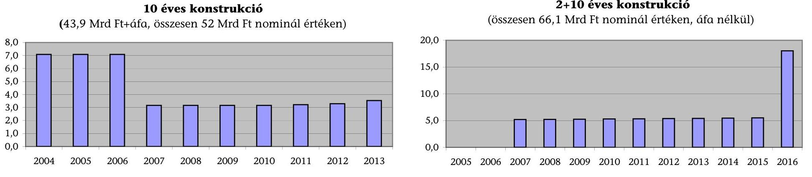

## 10 éves konstrukció

(43,9 Mrd Ft+áfa, összesen 52 Mrd Ft nominál értéken)

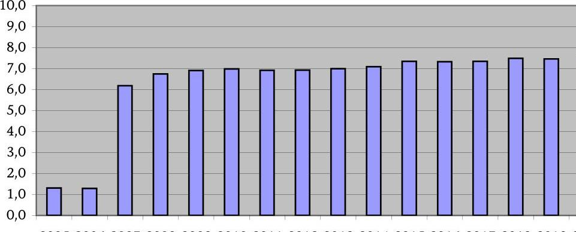

## 2+10 éves konstrukció

(összesen 66,1 Mrd Ft nominál értéken, áfa nélkül)

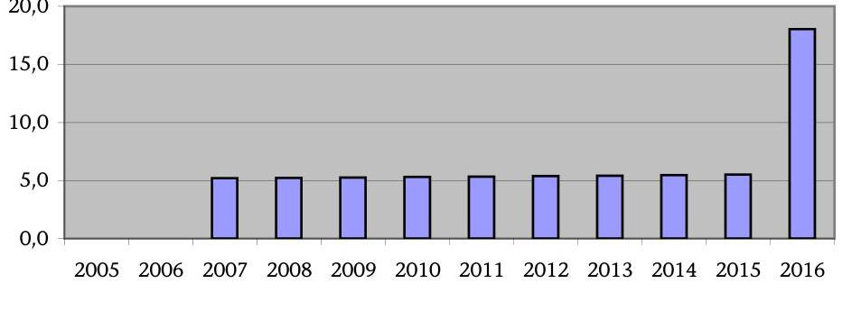

## 30 éves PPP, üzemeltetéssel

(összesen 206,9 Mrd Ft nominál értéken, áfa nélkül)

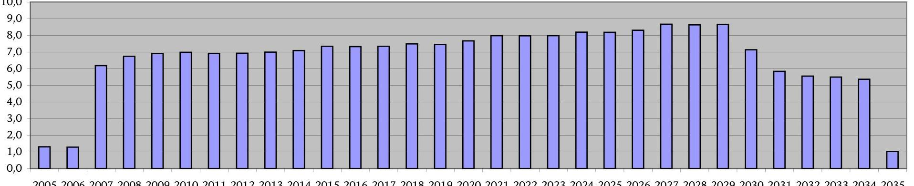

Adatforrás: 1135/2001. (XII.18.) Korm. határozat, Művészetek Palotája projekt útstrukturálása (TriGránit Fejlesztési Rt.), RÁSZ

---

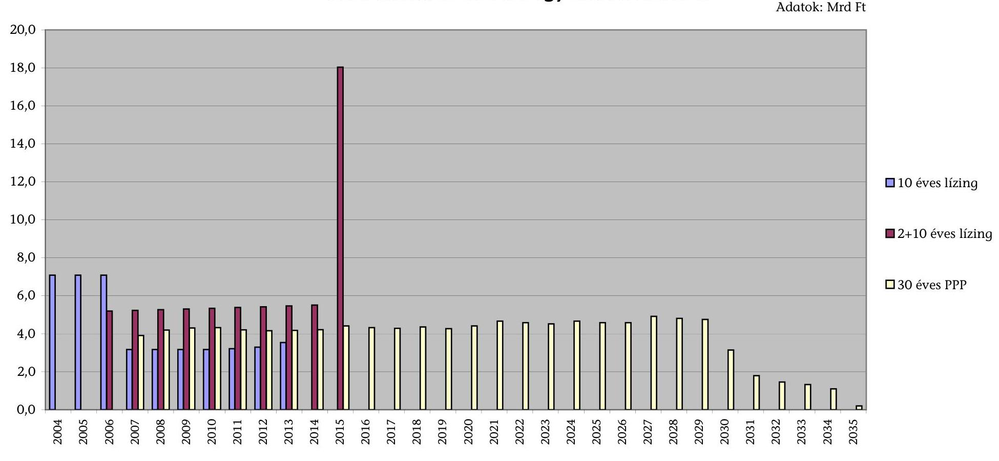

# A pénzügyi konstrukciók pénzáramlásai összehasonlító tételek figyelembevételével*

Adatok: Mrd Ft

- 10 éves lízing
- 2+10 éves lízing
- 30 éves PPP

*Adósságszolgálat, fejlesztői tőkehozam, adminisztráció és adó; üzemeltetés nélkül (nominál értéken, áfa nélkül) Adatforrás: 7. sz. melléklet

---

# Pénzügyi konstrukciók jelenértékei összehasonlítható tételek alapján (5,25\%-os diszkontrátával)* 

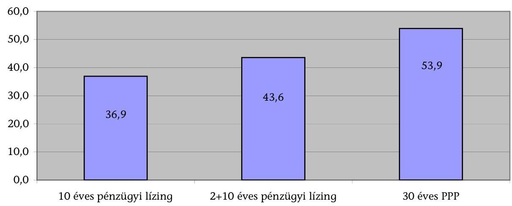
*Adósságszolgálat, fejlesztői tőkehozam, adminisztráció és adó; üzemeltetés nélkül
4. sz. diagram
a V-8-81/2006. sz jelentéshez

## Pénzügyi konstrukciók jelenértékei összehasonlítható tételek alapján (eltérő mértékű diszkontrátákkal)*

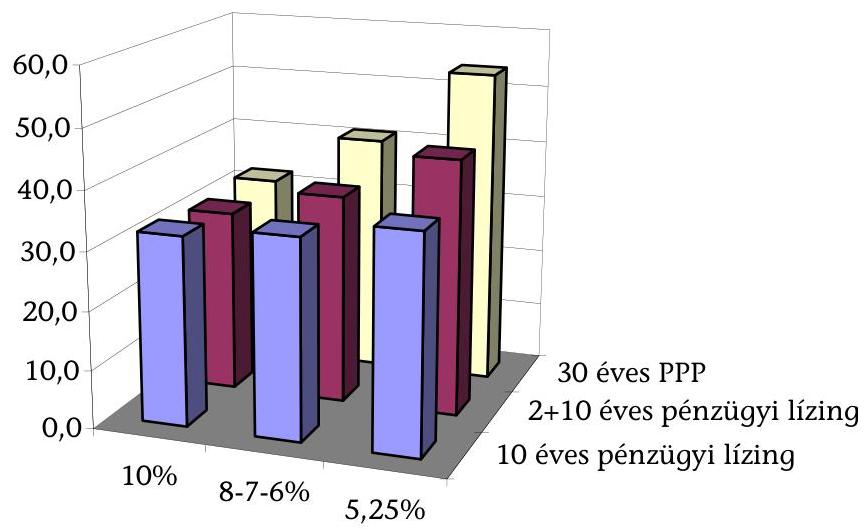
*Adósságszolgálat, fejlesztői tőkehozam, adminisztráció és adó; üzemeltetés nélkül Adatforrás: 7. sz. melléklet

---

5. sz. diagram a V-8-81/2006. sz jelentéshez

# A Művészetek Palotája projekt teljes pénzáramlása

(összesen 335,2 Mrd Ft; ebből: RÁD 206,9 Mrd Ft, közüzemi díjak 14,4 Mrd Ft, szakmai működtetés állami támogatása 113,9 Mrd Ft nominál értéken, áfa nélkül)

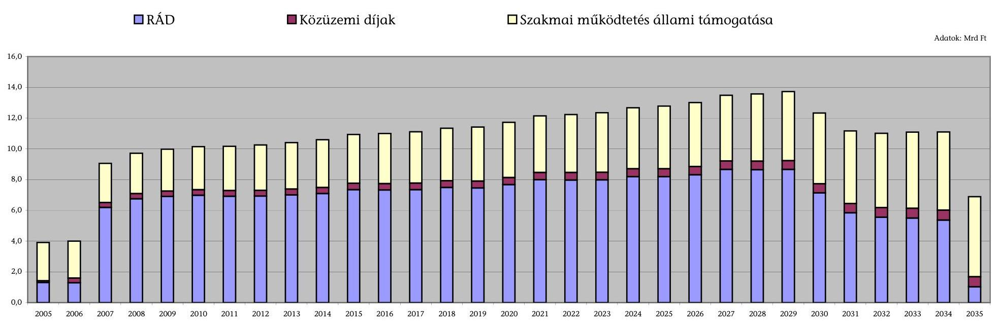

Adatforrás: 8. sz. melléklet és RÁSZ

---

# KÉRDŐÍVES VÁLASZOK   a Művészetek Palotája megvalósításáról és múködtetéséról 

12/a. sz. melléklet: Kérdőív a szakmai működtető szervezet részére
12/b. sz. melléklet: Kérdőív a kulturális hasznosító intézmények részére

---

# KÉRDŐíV 

a szakmai múködtető szervezet részére

---

MÜVÉSZETEK PALOTÁJA KFT.

---

Gazdasági társaság neve: Müvészetek Palotája Kft. PIR száma: nincs Kitöltésért felelős: Somorjai Imre Telefon: 555-3013

# KÉRDŐÍV 

a Müvészetek Palotája megvalósításának és müködésének ellenőrzéséhez a szakmai müködtető szevezet részére

1. A Müvészetek Palotája Kft. kialakította-e a.) szakmai müködtetés koncepcióját; b.) az elérni kívánt célokat számszerúsítették-e?

- igen
- nem
- részben
a
$\mathbf{x}$
b
$\mathbf{x}$
2. Készítettek-e a.) éves; b.) féléves; c.) negyedéves rendezvény- és bevételi tervet?
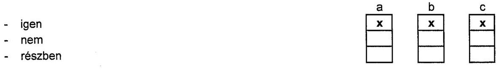

3. A létesítmény és annak infrastruktúrája megfelelő körülményeket biztosít-e a szakmai müködtetés eredményes és biztonságos folytatására?

- igen
- nem
- részben
$\square$

4. A rendezvény- és bevételi tervet sikerült-e megvalósítani?

- igen
- nem
- részben
$\square$

5. Történt-e költség túllépés a produkciók megvalósítása során?

- igen, jelentős mértékben
- igen, kis mértékben
- nem történt
$\square$

6. A létesítmény műszaki üzemeltetése megfelelően biztosíja-e a szakmai müködtetői tevékenységet?

- igen
- nem
- részben
$\square$

1. oldal, összesen: 2

---

7. Történt-e az üzemeltetés során olyan műszaki meghibásodás, ami miatt a Kft. teljesítésigazolása alapján a szankciós pontrendszert alkalmazták?

- igen történt
- nem történt $\square$

8. A létesítmény szakmai működtetésében érvényesül-e program-koordinációs tevékenység?

- igen, érvényesül
- nem érvényesül
- részben érvényesül $\square$

9. Kérjük, hogy röviden indokolják meg az 1., 4., 7. pontra adott válaszaikat:
10. A Művészetek Palotája Kft. a.) a létesítmény működtetését a 2004-2007 évi, három évet átfogó koncepció és üzleti terv alapján végzi. b.)a létesítmény megnyitása óta minden működési évét programtervre alapozott gazdasági terv alapján építi fel és hajt végre.
11. A a rendezvénytervet minőségébben és mennyiségében sikerült megvalósítani, szerkezetében a késői évadkezdés miatt jelentős változásokat kellett végrehajtani. A bevételi tervet a műsorszerkezeti változtatások mellet is többlettel teljesítettük
12. A 2005. évi átadást követően nem történt olyan műszaki meghibásodás, ami miatt a Kft. teljesítés igazolása alapján a szankciós pontrendszert alkalmazták.

Budapest, 2006. június 8.
P.H.
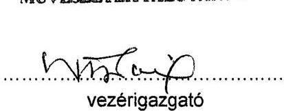

---

# KÉRDŐíV 

a kulturális hasznosító intézmények részére

---

LUDWIG MÚZEUM - KORTÁRS MÜVÉSZETI MÚZEUM

---

# KÉRDŐÍV

a Művészetek Palotája megvalósításának és működésének ellenőrzéséhez a kulturális hasznosító intézmények részére

|  Intézmény kódja |  |  |  |  |  |  |  |  |  |  |  |  |  |  |  |  |  |  |  |  |  |  |  |  |  |  |  |  |  |  |  |  |  |  |  |  |  |  |  |  |  |  |  |  |  |  |  |  |  |  |  |  |  |  |  |  |  |  |  |  |  |  |  |  |  |  |  |  |  |  |  |  |  |  |  |  |  |  |  |  |  |  |  |  |  |  |  |  |  |  |  |  |  |  |  |  |  |  |  |  | 

---

Intézmén: Ludwig Múzeum - Kortárs Művészeti Múzeum PIR szám 329134 Kitöltésér Néray Katalin igazgató Telefon: 5 553 456

# KÉRDŐÍV

## a Művészetek Palotája megvalósításának és működésének ellenőrzéséhez a kulturális hasznosító intézmények részére

1. Az intézményt a Nemzeti Kulturális Örökség Minisztériuma (NKÖM) előzetesen tájékoztatta-e a Művészetek Palotája beruházás kulturális szakmai koncepciójáról?

- igen
- nem
- részben

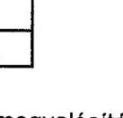

2. A tájékoztatás megfelelő részletességű volt-e a beruházás a.) céljáról; b.) megvalósításáról; c.) működítéséről?

- igen
- nem
- részben

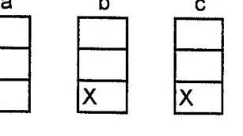

3. Kérte-e véleményüket a.) NKÖM; b.) tervező; c.) kivitelező a beruházás kulturális szakmai követelményeinek kialakításához?

- igen
- nem

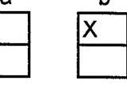

4. Megfogalmaztak-e szakmai elvárásokat, igényeket a beruházással kapcsolatban?

- igen
- nem

5. Figyelembe vették-e a.) tervezésnél; b.) kivitelezésnél a szakmai elvárásaikat, igényeiket?

- igen
- nem
- részben

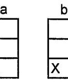

6. Megvalósultak-e az intézmény által meghatározott kulturális szakmai követelmények?

- igen
- nem
- részben

---

7. Az intézmények "otthont adó" épületrész és annak infrastruktúrája alkalmas-e a kulturális események színvonalas megtartására?

- igen
- nem
- részben
8. Az intézmény kihasználja-e a rendelkezésre álló magas technikai színvonalú infrastruktúrát?
- igen
- nem
- részben
9. Az intézménynek ezáltal lett-e kimutatható élő- vagy holtmunka megtakarítása?
- igen
- nem
- részben
10. Az intézmény fajlagos üzemeltetési költségei a korábbiaknál alacsonyabbak lettek-e?
- igen, alacsonyabb lett
- nem változott
- nőttek a költségek
11. Az épületrész és az infrastruktúra megfelelő körülményeket biztosít-e a szakmai háttértevékenységek (próbák, öltözés, pihenés, mütárgyak bemutatása, raktározása, restaurálása, mütárgy- és díszletmozgatás, adminisztratív tevékenység végzése) eredményes és biztonságos folytatására?
- igen
- nem
- részben
12. A létesítmény műszaki üzemeltetése megfelel-e az elvárásaiknak?
- igen
- nem
- részben

| X |
| :-- |
|  |
|  |
|  |

13. Történt-e az üzemeltetés során olyan műszaki meghibásodás, ami miatt rendezvényük elmaradt?

- igen
- nem

---

14. Az intézmény a rendelkezésére álló meghatározott számú előadásnap-keretet teljes mértékben kihasználta-e, vagy kitudta-e használni?

- igen
- nem
- részben

15. Az intézmény előadásainak, rendezvényeinek, kiállításainak látogatottsága mérhetően nött-e az új helyszín következtében?

- igen, jelentősen
- igen, kismértékben
- nem

16. A belépójegyek ára emelkedett-e annak következtében, hogy az intézmény kulturális/művészeti rendezvényeinek helyszíne a Müvészetek Palotája?

- igen, jelentősen
- igen, kismértékben
- nem

17. Az intézmény véleménye szerint a létesítmény hozzájárul-e a látogatók múélvezetének, kényelmének biztosításához?

- igen, hozzájárul
- nem változtatott

18. Kérjük, hogy röviden indokolják meg a 8., 11., 12. pontra adott válaszaikat:

A múzeumtechnikai infrastruktúra megfelel a nemzetközi elölrásoknak. A raktárak ma még megfelelnek az igényeknek, de gond a manipulációs tér, a göngyöleg tároló és a fotóműterem hiánya. Az iroda kevés és szűkös, nincs tárgyaló, gondot okoz a munkatársak, valamint a gyakornokok és külföldi kurátorok elhelyezése. Az üzemeltetéssel kapcsolatos problémák többsége a kivitelezés hibáiból fakad, a megoldás késik. Rossz az épület külső és belső feliratozása, pontosaban hiányzanak a megfelelő útbaigazító feliratok és táblák.

A válaszokat az üres mezőkbe tett x jellel, illetve rövid indoklással kérjük megadni. Amennyiben valamelyik kérdés nem vonatkoztatható az intézményre, kérjük a kérdés mellett a "nem alkalmazható" megjegyzés feltüntetését.

Budapest 2006. június 12.
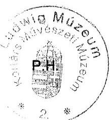

Neray Katalin
intézményvezető

---

MAGYAR NEMZETI FILHARMONIKUS ZENEKAR, ÉNEKKAR ÉS KOTTATÁR KHT.

---

# KÉRDŐÍV 

a Művészetek Palotája megvalósításának és müködésének ellenőrzéséhez a kulturális hasznosító intézmények részére

| Intézmény kódja |
| :--: |
| az Állami Számvevőszék tölti ki |

A kérdőív kitöltésének koordinálásáért felelős személy

Neve:
Nagy llona

Irányítószám:
Út, utca (hsz.):
Város (község):
Budapest
Komor Marcell utca 1.

Telefonszám:
Fax szám:
E-mail címe:

| 0 | 6 | - | 0 | 1 | - | 4 | 1 | 1 | 6 | 6 | 4 | 6 |
| :-- | :-- | :-- | :-- | :-- | :-- | :-- | :-- | :-- | :-- | :-- | :-- | :-- |
| 0 | 6 | - | 0 | 1 | - | 4 | 1 | 1 | 6 | 6 | 4 | 4 |
|  |  |  |  |  |  |  |  |  |  |  |  |  |

Gazdasági társaság adatai

Gazdaság társaság
neve:
Magyar Nemzeti Filharmonikus Zenekar, Énekkar és Kottatár Kht.

Irányítószám:
Út, utca (hsz.):
Város (község):
Budapest
Komor Marcell utca 1.
(körzetszámmal)
(körzetszámmal)

Telefonszám:
Fax szám:
Adószám:
PIR törzsszám:

| 0 | 6 | - | 0 | 1 | - | 4 | 1 | 1 | 6 | 6 | 0 | 0 |
| :-- | :-- | :-- | :-- | :-- | :-- | :-- | :-- | :-- | :-- | :-- | :-- | :-- |
| 0 | 6 | - | 0 | 1 | - | 4 | 1 | 1 | 6 | 6 | 9 | 9 |
| 2 | 1 | 1 | 8 | 6 | 3 | 2 | 3 | - | 2 | - | 4 | 3 |

A csatolt kérdőív adatait a gazdasági társaság nyilvántartásai alapján töltöttük ki.

Budapest, 2006. június 08.
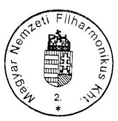
intézményvezető

---

Intézmény neve: Magyar Nemzeti Filharmonikus Zenekar, Énekkar és Kottatár Kht. PIR száma: k64 Kitöltésért felelős: Szabó Attila Telefon: 411-6640

# KÉRDŐÍV

## a Művészetek Palotája megvalósításának és működésének ellenőrzéséhez a kulturális hasznosító intézmények részére

1. Az intézményt a Nemzeti Kulturális Örökség Minisztériuma (NKÖM) előzetesen tájékoztatta-e a Művészetek Palotája beruházás kulturális szakmai koncepciójáról:
2. igen
3. nem
4. részben

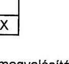

1. A tájékoztatás megfelelő részletességű volt-e a beruházás a.) céljáról; b.) megvalósításáról; c.) működtetéséről?
2. igen
3. nem
4. részben

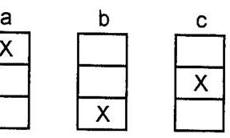

1. Kérte-e véleményüket a.) NKÖM; b.) tervező; c.) kivitelező a beruházás kulturális szakmai követelményeinek kialakításához?
2. igen
3. nem

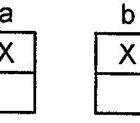

1. Megfogalmaztak-e a szakmai elvárásokat, igényeket a beruházással kapcsolatban?
2. igen
3. nem

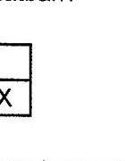

1. Figyelembe vették-e a.) tervezésnél; b.) kivitelezésnél a szakmai elvárásaikat, igényeiket?
2. igen
3. nem
4. részben

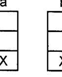

1. Megvalósultak-e az intézmény által meghatározott kulturális szakmai követelmények?
2. igen
3. nem
4. részben

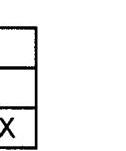

---

7. Az intézmények "otthont adó" épületrész és annak infrastruktúrája alkalmas-e a kulturális események színvonalas megtartására?

- igen
- nem
- részben
$\square$
8. Az intézmény kihasználja-e a rendelkezésre álló magas technikai színvonalú infrastruktúrát?
- igen
- nem
- részben
$\square$
9. Az intézménynek ezáltal lett-e kimutatható élő- vagy holtmunka megtakarítása?
- igen
- nem
- részben
$\square$

10. Az intézmény fajlagos üzemeltetési költségei a korábbiaknál alacsonyabbak lettek-e?

- igen, alacsonyabb lett
- nem változott
- nőttek a költségek
- nőttek a költségek

11. Az épületrész és az infrastruktúra megfelelő körülményeket biztosít-e a szakmai háttértevékenységek (próbák, öltözés, pihenés, mütárgyak bemutatása, raktározása, restaurálása, mütárgy- és díszletmozgatás, adminisztratív tevékenység végzése) eredményes és biztonságos folytatására?

- igen
- nem
- részben
$\square$

12. A létesítmény műszaki üzemeltetése megfelel-e az elvárásaiknak?

- igen
- nem
- részben
$\square$
13. Történt-e az üzemeltetés során olyan műszaki meghibásodás, ami miatt rendezvényük elmaradt?
- igen
- nem
$\square$

---

14. Az intézmény a rendelkezésére álló meghatározott számú előadásnap-keretet teljes mértékben kihasználta-e, vagy kitudta-e használni?
- igen
- nem
- részben
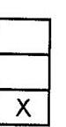
15. Az intézmény előadásainak, rendezvényeinek, kiállításainak látogatottsága mérhetően nőtt-e az új helyszín következtében?
- igen, jelentősen
- igen, kismértékben
- nem
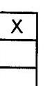
16. A belépőjegyek ára emelkedett-e annak következtében, hogy az intézmény kulturális/művészeti rendezvényeinek helyszíne a Müvészetek Palotája?
- igen, jelentősen
- igen, kismértékben
- nem
17. Az intézmény véleménye szerint a létesítmény hozzájárul-e a látogatók müélvezetének, kényelmének biztosításához?
- igen, hozzájárul
- nem változtatott
18. Kérjük, hogy röviden indokolják meg a $8 ., 11 ., 12$. pontra adott válaszaikat:

A koncertteremben a színpadtechnika nem alkalmas a díszletek állítására.
A társaság raktározási igénye az épületen belül nem megoldott.
A liftek kapacitása csúcsidőben nem elégséges.
A légtechnika színvonala nem felel meg a mai kor követelményeinek, túl száraz a levegő, és a légkondícionálás csak korlátozottan szabályozható helyiségenként.
A dohányzásra kijelölt helyek füstelszívása nem megoldott. Nincs elszívás, az ablakok pedig nem nyithatók.
A szakaszoló ajtók, az irodai ajtók és ablakok gyakran meghibásodnak.

A válaszokat az üres mezőkbe tett x jellel, illetve rövid indoklással kérjük megadni. Amennyiben valamelyik kérdés nem vonatkoztatható az intézményre, kérjük a kérdés mellett a "nem alkalmazható" megjegyzés feltüntetését.

Budapest, 2006. június 08.
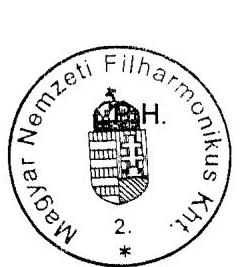
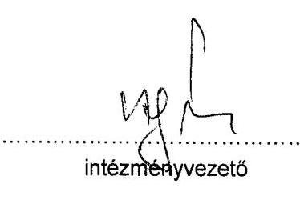

---

NEMZETI TÁNCSZÍNHÁZ KHT.

---

# KÉRDŐÍV

a Művészetek Palotája megvalósításának és működésének ellenőrzéséhez a kulturális hasznosító intézmények részére

|  Intézmény kódja |  |  |  |  |  |  |  |  |  |  |  |  |  |  |  |  |  |  |  |  |  |  |  |  |  |  |  |  |  |  |  |  |  |  |  |  |  |  |  |  |  |  |  |  |  |  |  |  |  |  |  |  |  |  |  |  |  |  |  |  |  |  |  |  |  |  |  |  |  |  |  |  |  |  |  |  |  |  |  |  |  |  |  |  |  |  |  |  |  |  |  |  |  |  |  |  |  |  |  | 

---

# KÉRDŐÍV

a Művészetek Palotája megvalósításának és működésének ellenőrzéséhez a kulturális hasznosító intézmények részére

1. Az intézményt a Nemzeti Kulturális Örökség Minisztériuma (NKÖM) előzetesen tájékoztatta-e a Művészetek Palotája beruházás kulturális szakmai koncepciójáról?

- igen
- nem
- részben

(mivel csak 2004 második felében kapcsolódtunk be)

1. A tájékoztatás megfelelő részletességű volt-e a beruházás a.) céljáról; b.) megvalósításáról; c.) működtetéséről?

|   | a | b | c  |
| --- | --- | --- | --- |
|  - igen |  |  |   |
|  - nem |  |  |   |
|  - részben |  |  |   |
|  (mivel csak 2004 második felében kapcsolódtunk be) |  |  |   |

1. Kérte-e véleményüket a.) NKÖM; b.) tervező; c.) kivitelező a beruházás kulturális szakmai követelményeinek kialakításához?

|   | a | b | c  |
| --- | --- | --- | --- |
|  - igen |  |  |   |
|  - nem |  |  |   |
|  - részben |  |  |   |
|  (mivel csak 2004 második felében kapcsolódtunk be) |  |  |   |

1. Megfogalmaztak-e szakmai elvárásokat, igényeket a beruházással kapcsolatban?

|  - igen |   |
| --- | --- |
|  - nem |   |

1. Figyelembe vették-e a.) tervezésnél; b.) kivitelezésnél a szakmai elvárásaikat, igényeiket?

|   | a | b  |
| --- | --- | --- |
|  - igen |  |   |
|  - nem |  |   |
|  - részben |  |   |

1. Megvalósultak-e az intézmény által meghatározott kulturális szakmai követelmények?

---

- igen
- nem
- részben
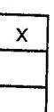
7. Az intézmények "otthont adó" épületrész és annak infrastruktúrája alkalmas-e a kulturális események színvonalas megtartására?
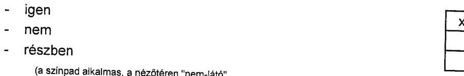
8. Az intézmény kihasználja-e a rendelkezésre álló magas technikai színvonalú infrastruktúrát?
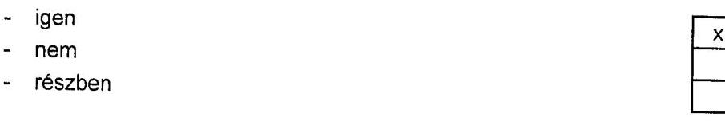
9. Az intézménynek ezáltal lett-e kimutatható élő- vagy holtmunka megtakarítása? nem alkalmazható
- igen
- nem
- részben
10. Az intézmény fajlagos üzemeltetési költségei a korábbiaknál alacsonyabbak lettek-e? nem alkalmazható
- igen, alacsonyabb lett
- nem változott
- nőttek a költségek
11. Az épületrész és az infrastruktúra megfelelő körülményeket biztosít-e a szakmai háttértevékenységek (próbák, öltözés, pihenés, mütárgyak bemutatása, raktározása, restaurálása, mütárgy- és díszletmozgatás, adminisztratív tevékenység végzése) eredményes és biztonságos folytatására?
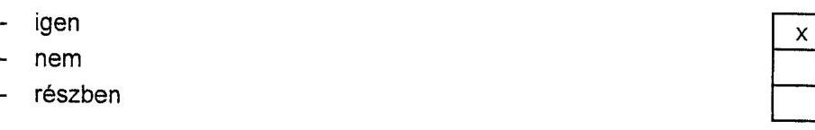
12. A létesítmény műszaki üzemeltetése megfelel-e az elvárásaiknak?
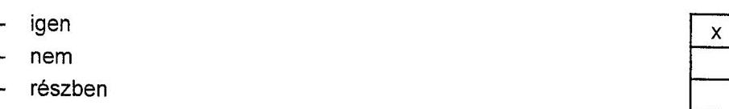
13. Történt-e az üzemeltetés során olyan műszaki meghibásodás, ami miatt rendezvényük elmaradt?

---

- igen
- nem $\square$
14. Az intézmény a rendelkezésére álló meghatározott számú előadásnap-keretet teljes mértékben kihasználta-e, vagy kitudta-e használni?
- igen
- nem
- részben $\square$

15. Az intézmény előadásainak, rendezvényeinek, kiállításainak látogatottsága mérhetően nőtt-e az új helyszín következtében?

- igen, jelentősen
- igen, kismértékben
- nem $\square$

16. A belépőjegyek ára emelkedett-e annak következtében, hogy az intézmény kulturális/müvészeti rendezvényeinek helyszíne a Müvészetek Palotája?

- igen, jelentősen
- igen, kismértékben
- nem $\square$

17. Az intézmény véleménye szerint a létesítmény hozzájárul-e a látogatók múélvezetének, kényelmének biztosításához?

- igen, hozzájárul
- nem változtatott
- részben $\square$

18. Kérjük, hogy röviden indokolják meg a 8., 11., 12. pontra adott válaszaikat:
19. 

A Nemzeti Táncszínház - azaz a táncmüvészet - infrastruktúrában kapott nagyobb lehetőséget a Fesztivál Színházterem színháztechnikája által. A Várszínházban kisebb színpaddal rendelkezünk. A Müvészetek Palotájában a technikai lehetőségek figyelembevételével új repertoárt építettünk fel.
11.

A Nemzeti Táncszínháznak a Müvészetek Palotájában telephelye van, ahol éves szinten 100 nappal rendelkezik. A keretszámhoz igazodva, megfelelőek a munkakörülmények. A 4. emeleti próbateremhez most alakítják ki az öltözési lehetőséget, így a próbaterem akkor is tud müködni, ha mindkét előadóteremben előadás van.

---

12. 

A müködés próbaidőszak nélkül, élesben indult! Nem volt olyan probléma azonban, amelyet ne oldottunk volna meg. A Fesztivál Színházteremben folyamatos a korrekció a magas színvonalú müködés érdekében.

A válaszokat az üres mezőkbe tett $x$ jellel, illetve rövid indoklással kérjük megadni. Amennyiben valamelyik kérdés nem vonatkoztatható az intézményre, kérjük a kérdés mellett a "nem alkalmazható" megjegyzés feltüntetését.

Budapest, 2006. június 7.
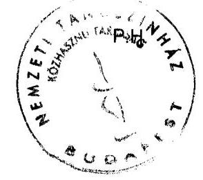

Török Jolán J ugyvezető igazgató

---

# Kérdések, kritériumok és adatforrások a Művészetek Palotája megvalósításának és müködésének ellenőrzéséhez

Fő kérdés: Az állami szerepvállalás és érdekérvényesítés eredményesen, optimális kockázattal, a gazdaságosság szempontjainak figyelembevételével valósult e meg a köz-és magánszféra együttműködésével kialakított konstrukcióban?

|  Kérdések |  | Kritériumok | Adatforrások  |
| --- | --- | --- | --- |
|  1. | Az állami és vállalkozói szféra együttmúködésében létesült Múvészetek Palotája projekt előkészítése során az állami szerepvállalás és érdekérvényesítés célszerűen, eredményesen, kevés kockázattal valósult-e meg? |  |   |
|  1.1 | A projekt előkészítése az állami érdekek szempontjából eredményesen, gazdaságosan valósult-e meg? |  |   |
|  1.1.1 | A projektcélok és követelmények összhangban voltak-e az állam által kitűzött kulturális és gazdasági célokkal, prioritásokkal? A leendő kulturális centrum illeszkedett-e az NKÖM létesítményfejlesztési koncepciójához? | A projekttel elérni kívánt állami célok egyértelmű megfogalmazása.
Az együttműködési megállapodások és az állam által elérni kívánt célok összhangja. | Kormányprogram, kultúrpolitikai célok
Fejezeti létesítményfejlesztési koncepció
Projektterv  |
|  1.1.2 | Készítettek-e hatástanulmányt a projekt által elérendő célokról, azok megvalósítási lehetőségeiről? Készítettek-e számítást arra vonatkozóan, hogy milyen költségkihatásokkal járt volna a projekt állami beruházás és üzemeltetés esetén (PSC)? Megalapozott volt-e a PSC számítás? Megtörtént-e a lehetséges megvalósítási konstrukciók összehasonlítása, előzetes értékelése, a hozamok és ráfordítások meghatározása? | Megalapozott, gazdasági számításokkal alátámasztott hatástanulmány készítése a projekt megvalósítás lehetőségeiről.
A köz- és magánszféra együttműködésével megvalósuló konstrukció előnyének beigazolódása. | Hatástanulmány
Együttmüködési megállapodások, és az azokat megalapozó előterjesztések dokumentumai, számításai
Közszféra összehasonlító érték (Public Sector Comparator - PSC) számítás
Az állami beruházás és a PPP konstrukció nettó jelenértékének összehasonlítása  |
|  1.1.3. | A projekt megvalósításához a leghatékonyabb szervezeti formát alakították-e ki? | A projekt megvalósulását leghatékonyabban segítő szervezet kialakítása. | Projekt társaságok alapító okiratai, tervei  |

---

|  Kérdések |  | Kritériumok | Adatforrások  |
| --- | --- | --- | --- |
|  1.2 | A szabályozási feltételek, valamint a figyelembevételükkel meghozott döntések elősegítették-e az állami szféra számára előnyös együttműködési forma kialakítását? |  |   |
|  1.2.1 | A köz- és magánszféra együttműködésének jogi szabályozottsága, eljárásrendje elősegítette-e az állami érdekek érvényesítését? | A PPP konstrukciók kidolgozását elősegítő jogszabályok, intézményrendszer megléte.
Eljárási szabályok, szerződésminták (típusszerződések) kidolgozása. | Az állami és magánszféra együttműködésére vonatkozó jogszabályok, határozatok, eljárásrendek
A Tárcaközi Bizottság dokumentációi  |
|  1.2.2 | A projekthez kapcsolódó kormányelőterjesztések, határozatok megalapozottak voltak-e? | Az együttműködéshez kapcsolódó kormányhatározatok megalapozottsága. | kormányhatározatok, előterjesztések  |
|  1.2.3 | A projektet megalapozó döntések, szerződések a közbeszerzési előírások figyelembevételével, versenyfeltételek mellett jöttek-e létre? A szerződések és az állami kezességvállalás megfeleltek-e a jogszabályi követelményeknek? | Verseny érvényesülése, közbeszerzési szabályok betartása.
Ajánlatok közötti választás lehetősége, a legjobb ajánlat kiválasztása, az állam alkupozíciója. | Közbeszerzés kiírása
Ajánlatok
Az eljárás dokumentációi
Szakértői vélemények  |
|  1.3 | Az együttműködési konstrukció kialakításakor megtörtént-e az állami szerepvállalás - célkitűzésekkel összhangban lévő - optimalizálása? |  |   |
|  1.3.1 | A kockázatok viselését, megosztását az állami érdekek és célok figyelembevételével alakították-e ki? Készítettek-e teljes körű kockázati mátrixot? Minden egyes kockázati elemet pontosan rögzítettek? Az építési kockázat és a rendelkezésre állási kockázat a magánpartnert terheli-e? A keresleti, finanszírozás és egyéb kockázatokat optimálisan megosztották-e? | A kockázatok optimális allokációja. | Kockázati mátrix
Együttműködési és rendelkezésre állási szerződés(ek)
A nem megfelelő teljesítés szankciórendszere  |

---

|  Kérdések |  | Kritériumok | Adatforrások  |
| --- | --- | --- | --- |
|  1.3.2 | Készült-e megalapozott számítási anyag a projekt forrásigényének meghatározásához? A finanszírozási konstrukciót és annak módosítását optimálisan, átláthatóan, megfelelő állami érdekérvényesítéssel alakították-e ki? Pontosan rögzítették-e a szolgáltatásvásárlás előnyeit az eredeti tervezethez képest? | Megalapozott költségterv készítése.
Az állami érdekérvényesítést tükröző finanszírozási konstrukció.
A szerződés vagyoni és szolgáltatási elemeinek átláthatósága. | Költségterv
Kockázati mátrix
A konstrukcióváltozás költségei  |
|  1.3.3 | A rendelkezésre állási díjfizetés megfelelően tervezhető-e? A projekt megvalósításához igénybevett vállalkozói hitel feltételei az állami hitelfelvételnél kedvezőbbek voltaké? A saját tőkére és az üzemeltetésre vetített profit megfelel-e az átlagos ingatlanpiaci befektetés hozamának? A diszkontálási ráta meghatározása reális-e a nettó jelenérték számításokban? | A rendelkezésre állási díj megalapozottsága.
Az igénybevett hitel indokoltsága.
A legkedvezőbb hitelkonstrukció választása.
Diszkontálási ráta megfelelő megválasztása. | Rendelkezésre állási díj (RÁD) összetevői, RÁD analízis
Ingatlanpiaci információk
KSH és Eurostat szakvélemény, besorolás
Nettó jelenérték számítások  |
|  1.3.4 | A rendelkezésre állási díjba beépített üzemeltetési és karbantartási költségek gazdasági számításokkal megalapozottak-e? A piaci viszonyok változása esetén a szerződésben lehetőség van-e ezek újratárgyalására, módosítására? A pótlási alapokra előirányzott összeg összhangban van-e az eszközök fizikai, erkölcsi avulásának mértékével? | Üzemeltetési és karbantartási költségek megalapozottsága, módosítási lehetősége.
Az eszközök pótlására előirányzott összeg megfelelősége. | Rendelkezésre állási szerződés (RÁSZ) pénzügyi modellje, szakértői vélemények
Rendelkezésre állási szerződés  |
|  1.4 | Megtörtént-e az előkészítés során az állami megrendelői szerep érvényesítése: a létesítmény szakmai követelményeinek és az elvárt szolgáltatások pontos meghatározása? |  |   |
|  1.4.1 | Megfelelően meghatározta-e a megrendelő a létesítménnyel elérni kívánt szakmai célokat, követelményeket? | Az építészeti tervezés alapját képező - megrendelői igények szerinti - részletes szakmai célok, programok kidolgozása. | NKÖM szakmai programjai
Rendelkezése állási szerződés  |

---

|  Kérdések |  | Kritériumok | Adatforrások  |
| --- | --- | --- | --- |
|  1.4.2 | Rögzítették-e a projektszerződésekben az elvárt szolgáltatási paramétereket, és az ettől eltérő teljesítéshez kapcsolódó szankciókat, illetve ösztönzőket? | Az épülettel, infrastruktúrával, valamint az elvárt szolgáltatásokkal szembeni követelményrendszer pontos meghatározása.
Részletes szankció, illetve bónuszrendszer kidolgozása. | Az intézmény szakmai üzemeltetőjének, használóinak véleménye
Rendelkezésre állási szerződés, és azon belül értékelési és ösztönzési rendszer  |
|  1.4.3 | Meghatározták-e az együttműködő felek a szerződés utáni változások nyomon követésére, a teljesítés értékelésére vonatkozó módszereket? | A szerződésekben a feltételek változásának nyomon követése, kezelésének rögzítése.
Egyértelműek a teljesítés értékelésének szempontjai, a felelősség és a kockázat. | Rendelkezésre állási szerződés
Külön megállapodások, rendelkezések a teljesítménymérésről  |
|  2. | A projekttársaságok beruházásában megvalósított létesítmény tervezése, kivitelezése során rövid- és hosszú távon eredményesen történt-e az állami érdekek érvényesítése, gazdaságos volt-e a létrejött szerződéses konstrukció? |  |   |
|  2.1 | A létesítmény tervezése a szolgáltatást megrendelő érdekeinek, szakmai szempontjainak szem előtt tartásával valósult-e meg? |  |   |
|  2.1.1 | A megrendelői igények egyértelmű meghatározása elősegítette-e a beruházás műszaki tervezését? A tervezés során figyelembe vették-e a megrendelői igények módosulását? | A kulturális szakmai igények, valamint a pénzügyi korlátok egyértelmű rögzítése.
A projektre fordítható források meghatározása
A szakmai programok és az építészeti koncepció összhangja. | Beruházási program, projektterv, engedélyezési és kivitelezési tervek
NKÖM szakmai programjai
Jegyzőkönyvek, feljegyzések  |
|  2.1.2 | A szakmai követelmények kialakítása és az épület tervezése során történt-e egyeztetés, igényfelmérés a létesítményben múködő kulturális intézmények képviselőivel? | A létesítményben elhelyezendő kulturális intézmények igényeinek figyelembevétele a tervezésnél. | Kérdőív  |

---

|  Kérdések |  | Kritériumok | Adatforrások  |
| --- | --- | --- | --- |
|  2.1.3 | Megvalósult-e a létesítmény tervezése és kivitelezése során a Magyar Állam érdekeinek képviselete, a projekt szakértői felügyelete? | Az állami érdekeket képviselő műszaki, jogi és pénzügyi szakértők bevonása.
Az építészeti program műszaki, gazdasági megalapozottsága. | Szakértői megbízások
Szakértői vélemények, állásfoglalások  |
|  2.2 | A beruházás megvalósulásához kapcsolódó jogi aktusok biztosították-e az állami érdekek rövid- és hosszú távú érvényesülését? |  |   |
|  2.2.1 | A beruházás megvalósulását megalapozó szerződések és azok változásai biztosították-e az állami érdekek érvényesülését? | A Szolgáltatók és Megrendelő, valamint a Szolgáltatók és az alvállalkozó közötti szerződésekben, a projekthez kapcsolódó határozatokban az állami érdekek érvényesülése. | Bérleti, üzletrész-átruházási és rendelkezésre állási szerződés
Alvállalkozói szerződések
A konstrukcióváltozás dokumentumai  |
|  2.2.2 | A projektszerződésben, vagy egyéb megállapodásban egyértelműen és az állami érdekeknek megfelelően rendelkeztek-e az ingatlan tulajdonjogáról, a rendelkezésre állási időszak lejáratát követően? | Az állami érdekeknek megfelelő megállapodás az ingatlan tulajdonjogáról a rendelkezésre állási szerződés időtartama alatt és azt követően. | Kezességvállalás, határozatok
Rendelkezésre állási szerződés
Üzletrész adásvételi szerződés  |
|  2.3 | A kulturális létesítmény a megállapodás szerinti határidőre, az állam által meghatározott kulturális funkcióknak és a műszaki előírásoknak megfelelően, gazdaságosan készült-e el? |  |   |
|  2.3.1 | Teljesültek-e a megrendelő és a hasznosítók által meghatározott kulturális szakmai követelmények a létesítmény kivitelezése során? Az épület és annak infrastruktúrája alkalmas-e az ott rendezendő kulturális események, rendezvények színvonalas megtartására, valamint a kulturálisszakmai háttértevékenységek eredményes, biztonságos folytatására (előadások, pró- | A multifunkcionalitás kialakítása.
A létesítmény és annak infrastruktúrája megfelel a cél szerinti szakmai követelményeknek.
Innovatív megvalósítás. | Átadás-átvételi jegyzőkönyvek
Használatbavételi engedély
Az intézmény szakmai múködtetőinek véleménye
Üzleti terv és annak teljesülése  |

---

|  Kérdések |  | Kritériumok | Adatforrások  |
| --- | --- | --- | --- |
|   | bák, pihenés-öltözés, színpadok, műtárgyak bemutatására, raktározására, restaurálására, műtárgy- és díszletmozgatás, adminisztratív tevékenység végzése)? A létesítmény hozzájárul-e a látogatók műélvezetének, kényelmének biztosításához? |  | Átadás-átvételi jegyzőkönyvek
Használatbavételi engedély
Az intézmény szakmai működtetőinek véleménye
Üzleti terv és annak teljesülése  |
|  2.3.2 | A kivitelezés megfelelte a műszaki terveknek, valamint a kötelező építészeti-építési előírásoknak? Történt-e bármely okból ha-táridő-módosítás? | A kivitelezés a terveknek, valamint az építészeti-építési előírásoknak, szabályoknak megfelelő.
A létesítmény tervezett határidőre történő elkészítése. | Átadás-átvételi jegyzőkönyvek
Használatbavételi engedély
Műszaki szakértői vélemények  |
|  2.3.3 | A beruházást gazdaságossági szempontok figyelembevételével, a tervezett költségkereten belül valósították-e meg? Nemzetközi összehasonlításban a beruházás bekerülési költsége nem haladja-e meg a hasonló funkciójú, színvonalú létesítményekét? | A beruházás kivitelezése során nincs költségkeret túllépés.
A beruházás bekerülési költsége nem haladja meg a hasonló funkciójú, színvonalú létesítményekét. | Beruházáshoz kapcsolódó bizonylatok
A Szolgáltatók könyvei
Üzleti terv és annak teljesülése
Nemzetközi összehasonlító költségelemzések  |
|  2.4 | A módosult szakmai program megvalósítása során a kockázat-megosztási tervek és a szolgáltatásvásárlás előnyei teljesültek-e? |  |   |
|  2.4.1 | Az építési kockázatot a megvalósítás szakaszában ténylegesen a magánpartner viselte? Történt-e pénzügyi teljesítés a beruházás átadása előtt? A beruházás szakmai programja módosulásához igazodó kivitelezés a tervezett költségkereten belül való-sult-e meg? Az esetlegesen felmerülő többletköltséget a magánpartner viselte-e? | Az építési kockázatot a magánpartner viseli.
Nincs kifizetés teljesítés a beruházás átadása előtt. | Költségvetési törvények  |

---

|  Kérdések |  | Kritériumok | Adatforrások  |
| --- | --- | --- | --- |
|  2.4.2 | Teljesültek-e a szolgáltatásvásárlástól várt előnyök? Csak a tárgyévi törlesztő részlet számít-e bele az államadósságba? Csök-kent-e az állam által vállalt kockázati szint? Érvényesült-e a beruházás megvalósításában (költség, idő) a magánszféra hatékonyabb, innovatív szerepvállalása? | A kockázati elemeket a magánpartner viseli (Eurostat állásfoglalás).
A beruházás idő és költségtúllépés nélküli megvalósítása. | Szerződések, kormányhatározatok
KSH állásfoglalása  |
|  3. | A többfunkciós kulturális létesítmény müködtetése, üzemeltetése, hasznosítása a 2005. évi átadást követően eredményesen és gazdaságosan tör-ténik-e? |  |   |
|  3.1 | Az üzemeltetés és a szakmai müködtetés előkészítése megalapozott, a megrendelői érdekeknek megfelelő volt-e? |  |   |
|  3.1.1 | Elkészítették-e az állami tulajdonú kft. műszaki üzemeltetése esetére az üzemeltetési tervet, költségvetést? Az üzemeltetés projekttársaságokhoz történő áthelyezése gazdaságosabb, eredményesebb üzemeltetést tesz-e lehetővé? | Üzemeltetési terv alternatíváinak kidolgozása.
A projekttársaságok általi üzemeltetés előnyeinek előzetes számításokkal történő alátámasztása. | Projektterv
Számítások  |
|  3.1.2 | Az állami érdekek szempontjából megalapozott volt-e a szakmai üzemeltetés, hasznosítás kft. formában történő megoldása (előnyei a költségvetési szervezeti formában való müködéshez képest)? | A kft-ben történő műszaki üzemeltetés nagyobb hatékonysága. | A Művészetek Palotája Kft. üzleti tervei, hasonló költségvetési intézmények összehasonlításra alkalmas adatai
Döntés-előkészítő elemzések, számítások  |
|  3.1.3 | Kialakítottak-e fejezeti szinten és a létesítményt használó, hasznosító intézmények szintjén a szakmai müködtetéshez kapcsolódó koncepciókat, számszerúsített célokat, terveket? Megtervezték-e a létesítmény műszaki üzemeltetésének költségeit fejezeti szinten és a hasznosító intézményeknél? | A kulturális tárca, valamint a létesítményt használó, hasznosító intézmények megalapozott, számításokkal alátámasztott koncepcióinak, szakmai és költségvetési terveinek megléte. | A NKÖM kultúrpolitikai koncepciója
Fejezeti és intézményi szintű költségvetési előirányzatok, tervek  |

---

|  Kérdések |  | Kritériumok | Adatforrások  |
| --- | --- | --- | --- |
|  3.2 | A működtetésre, üzemeltetésre vonatkozó szerződések, megállapodások biztosítják-e az állami érdekek megfelelő érvényesülését? |  |   |
|  3.2.1 | A műszaki üzemeltetésre, működtetésre vonatkozó szerződések, szabályzatok egyértelmű teljesítménykövetelményeket, felelősségi szabályokat tartalmaznak-e? A szerződésekben lehetőség van-e a műszaki követelmények megváltoztatása esetén a szerződéses feltételek újratárgyalására? | Teljesítménykövetelmények, felelősségi szabályok meghatározása szerződésekben, szabályzatokban
A feltételek, követelmények változása esetén a szerződés újratárgyalási lehetősége. | Rendelkezésre állási szerződés, belső szabályzatok, házirend  |
|  3.2.2 | Rendelkeznek-e a szerződések a pénzpiaci feltételek megváltozása esetén a refinanszírozási nyereség megosztásáról? | Rendelkezés a refinanszírozási nyereség megosztásáról. | Rendelkezésre állási szerződés  |
|  3.2.3 | A szerződésestől eltérő szolgáltatásnyújtás szankciói, bónuszai kellően visszatartók-e, illetve ösztönzők-e a magánpartner számára? | A szolgáltatásnyújtás szerződéses megfelelősége. | Rendelkezésre állási szerződés és annak 11.21 számú melléklete  |
|  3.3 | A létesítmény műszaki üzemeltetése eredményesen, gazdaságosan, a megrendelő és a használó, hasznosító intézmények elvárásainak megfelelően valósult-e meg? |  |   |
|  3.3.1 | A műszaki üzemeltetés mindhárom kulturális szakmai részterületen megfelel-e a megrendelő és a hasznosító intézmények elvárásainak? | Mindhárom kulturális részterületen a sajátos üzemeltetési feltételek kialakítása.
A műszaki üzemeltetés eredményes, gazdaságos, hatékony megvalósulása. | A létesítmény szakmai működtetőinek véleménye Üzemeltetési napló, jegyzőkönyvek  |
|  3.3.2 | Az intézmény szakmai működtetői a „többletköltségekkel" biztosított magas technikai színvonalú infrastruktúrát kihasználják-e? Érnek-e el ez által kimutatható élő- vagy holtmunka megtakarítást? | Az innovatív technológia kihasználtsága megfelelő
Költségmegtakarítás vagy nagyobb hatékonyság elérése. | Tapasztalatok, az intézmény szakmai működtetőinek véleménye
Műszaki szakértői vélemények  |

---

|  Kérdések |  | Kritériumok | Adatforrások  |
| --- | --- | --- | --- |
|  3.3.3 | A működési tapasztalatok alapján a létesítményt használó intézmények fajlagos üzemeltetési költségei a korábbiaknál alacsonyabbak-e? | A létesítményt használó költségvetési szervek fajlagos üzemeltetési költségeinek csökkenése. | Költségvetési beszámolók, számviteli adatok  |
|  3.3.4 | A Művészetek Palotája üzemeltetése során a kockázatok kezelése a tervezettnek megfelelően alakult-e? A rendelkezésre állási szankciós pontrendszert alkalmazták-e? A rendelkezésre állási díjból volt-e jelentős mértékű levonás? A finanszírozási és egyéb kockázati elemek tényleges megosztása az állam számára megfelelően alakult-e? | Rendelkezésre állási szolgáltatás folyamatos ellenőrzése.
Hibás vagy hiányos teljesítés esetén szankcionálás.
A rendelkezésre állási díjba beépített üzemeltetési költségek mérhetők, reálisak, ellenőrizhetők.
Az üzemeltetési naplóba a hibás teljesítést bejegyezték, vagy jegyzőkönyvet vettek fel.
Pontlevonás alkalmazása, csökkentették a rendelkezésre állási díjat. | Rendelkezésre állási szerződés, üzemeltetési napló
Jegyzőkönyvek, RÁD számlái
A rendelkezésre állási díjba épített szolgáltatások piaci ára
Teljesítésigazolások
Teljesített rendelkezésre állási díj  |
|  3.4 | A szolgáltatásvásárlási (PFI) konstrukcióban megvalósult létesítmény hozzájárult-e a megrendelő, valamint a szakmai üzemeltetők által kitűzött kulturális és gazdasági célokhoz? |  |   |
|  3.4.1 | A NKÖM gondoskodott-e a projekt minisztériumi felügyeletéről, ellenőrzéséről? Meg-történt-e a tényleges teljesítmények és a ráfordítások folyamatos nyomon követése (monitorizálása)? A megrendelő ellenőriz-te-e a rendelkezésre állási szolgáltatások alvállalkozói szerződéseit, a díj megállapításának bizonylatait? | A projekt megfelelő minisztériumi felügyelete, ellenőrzése.
Teljesítmények és ráfordítások kontrollja.
Díj megállapítások ellenőrzése. | Miniszteri biztosok beszámolói
Művészetek Palotája Kft. beszámolói, taggyűlési jegyzőkönyvek
Számlák, bizonylatok  |

---

|  Kérdések |  | Kritériumok | Adatforrások  |
| --- | --- | --- | --- |
|  3.4.2 | A többfunkciós kulturális létesítménnyel megvalósultak-e a megrendelő által kitűzött kultúrpolitikai és egyéb (turisztikai, gazdasági) célkitűzések? A célkitűzések szerint alakult-e a létesítmény látogatottsága, megfelelő-e a látogatók elégedettsége? | Kultúrpolitikai célkitűzések és a projektcélok megvalósulása.
Tényleges és tervezett bevételek alakulása.
Látogatók száma (tényleges/tervezett \%, a külföldi látogatók, visszatérő látogatók aránya, egy rendezvényre jutó látogatók száma). A tényleges programok száma/tervezett programok száma (kulturális területenként). A programok tervezett és tényleges összetétele. | Kultúrpolitikai célok, projektterv
Tanúsítványok a látogatottságról és a rendezvényekről (Művészetek Palotája Kft. és a költségvetési intézmények)  |
|  3.4.3 | Eredményesen és gazdaságosan járul-e hozzá a szakmai üzemeltető (a Művészetek Palotája Kft.) tevékenysége a kulturális célok megvalósításához? Érvényesül-e a kulturális miniszter felügyeleti tevékenysége a Kft. müködésében? | A Művészetek Palotája Kft. gazdálkodásának eredményessége. | Múvészetek Palotája Kft. beszámolója, főkönyvi kivonatai  |
|  3.4.4 | A létesítményben múködő kulturális költségvetési intézmények bevétele, látogatottsága a terveknek megfelelően alakult-e? | A kulturális költségvetési intézmények látogatottsága és bevétele tervezettnek megfelelő alakulása. | A létesítményben múködő költségvetési intézmények beszámolói, tanúsítványai  |

---

# FÉNYKÉPEK   a Művészetek Palotájáról

---

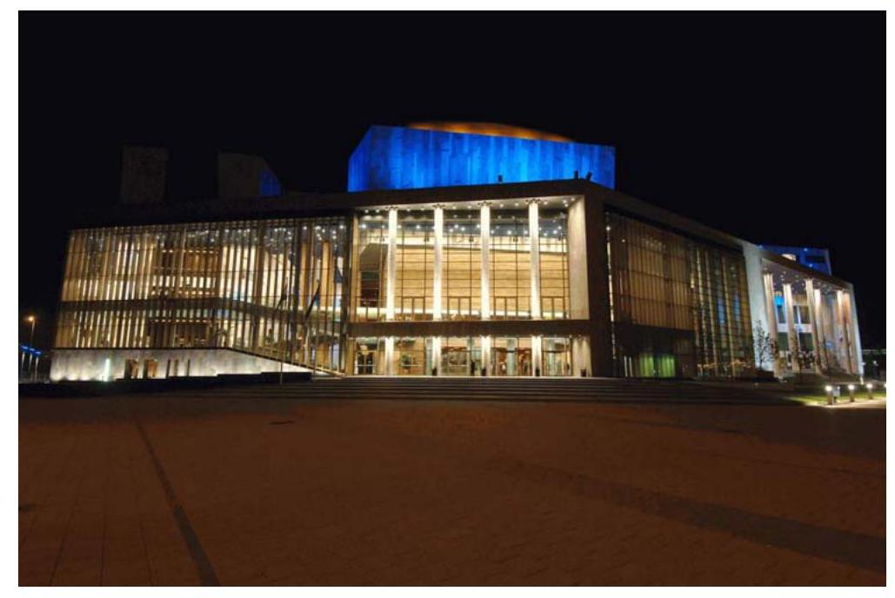

A Művészetek Palotája látképe
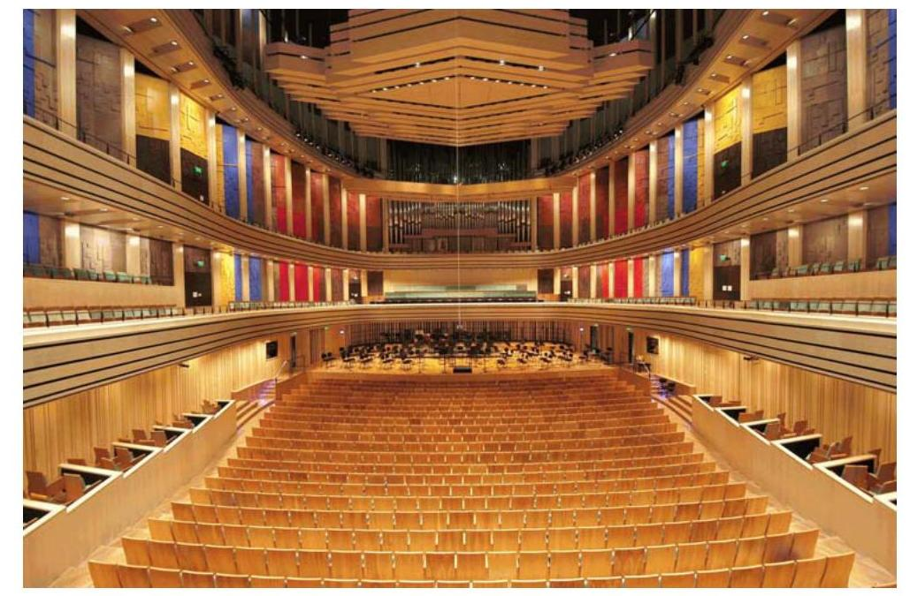

A Bartók Béla Nemzeti Hangversenyterem

---

# FÜGGELÉK

---

# NEMZETKÖZI KITEKINTÉS, ÖSSZEHASONLÍTÁS A HANGVERSENYTERMEKRŐL 

Városok, régiók életének jelentős eseménye, ha intézményeinek sora kulturális épülettel bővül. Ezek sorában is viszonylag ritka új hangversenyterem létesítése. A Művészetek Palotájában megvalósult Bartók Béla Nemzeti Hangversenyterem Magyarország első kimondottan egyfunkciós, hangversenyek megtartására épült terme.

A hangversenytermeket a terem formáját tekintve két nagy csoportba lehet sorolni: a „shoebox", azaz „cipős doboz", valamint a „vineyard", vagyis „szőlőskert" kialakítású terem. A shoebox jellegű tér hosszú és magas, a zenekar az egyik határoló fal előtt foglal helyet, ehhez a típushoz tartozik a bécsi Musikvereinsaal. A vineyard jellegű térben szinte a terem középpontjában foglal helyet a zenekar, erre legjellemzőbb példa a Hans Scharoun és Edgar Wisniewski 1963-ban átadott berlini filharmónia épülete. Ez az épület mérföldkő a hangversenytermek tervezésében, minden előadótermet tervező építészekre valamilyen hatással volt, megkerülhetetlen alkotás.

Az alábbiakban rövid áttekintést szeretnénk adni az elmúlt évtizedben megépült hangverseny termekről. Áttekintésünk semmiképp nem teljeskörű, csupán néhány jelentős hangversenyterem rövid leírását adja. A nemzetközi kitekintés során nem csak gazdaságossági (bekerülési költség) szempontból vizsgáltuk a referencia épületeket, hanem kulturális szakmai, technológiai, technikai és funkcionális vetületeit is áttekintettük annak érdekében, hogy a budapesti MP épületét teljesebb mértékben értékelhessük. A nemzetközi összehasonlításban szereplő épületek az alábbiak: Santa Cecilia Hangversenyterem Róma; Alfred Krupp Terem Essen; Hangversenyterem Bügge; Version Hall Philadelphia; Nicolo Paganini Terem Párma; Casa hangversenyterem Porto; Kongreszszusi Központ Luzern; Walt Disney Hangversenyterem Los Angeles; Hakuju Hangversenyterem Tokió; Sibelius Hangversenyterem Lahti.

A rendelkezésre álló adatokból összehasonlító táblázatot állítottunk össze (lásd: 6. sz. melléklet). Az egyes intézmények leírásainak forrásai: The Architectural Review; Detail; Deutsche Bauzeitschrift; valamint építészeti honlapok és tervezőcégek honlapjai.

Az épületek összehasonlító vizsgálata során általában a fő alapterületi, a beépített légköbméter, valamint a funkcióra vetített adatokat szokás összehasonlítani. Esetünkben vizsgáltuk az épületkomplexum bruttó/nettó alapterületét valamint beépített térfogatát, az előadótermek alapterületét/beépített térfogatát és az előadótermek befogadóképességét. A konkrét adatokat tartalmazó információkat két táblázatban foglaltuk össze. Az első adatsor euro alapon veti össze az esseni, brügge-i, philadelphiai, tokiói és portói termek jellemző adatsorait, míg a második táblázat forintra vetített fajlagos mutatói a hazai építőipari piac szokásos árviszonyaihoz hasonlítja a megvalósult MP objektumot.

Az elérhető beruházási adatok tükrében a budapesti Művészetek Palotája és azon belül is a Nemzeti Hangversenyterem beruházási költsége nem tekinthető

---

magasnak, inkább az alsó régióban helyezkedik el. A fejlesztés kezdeti stádiumában rögzített két főszám, épített négyzetméter és bekerülési költség oldalról ismert keretszámok jelentősen nem változtak. Kijelenthetjük, hogy a megvalósult létesítmény kulturális szakmai szempontból világszínvonalú, a költségmegtakarítások alapvetően nem az épület szakmai megvalósulását érintették.

# Santa Cecilia Hangversenyterem Róma 

Építész: Renzo Piano
Akusztikai tervező: Müller BBM Akusztikai Mérnökiroda
Megvalósulás: 1997-2002.
A kulturális központ a római Santa Cecilia Zenekarnak is helyet adó Santa Cecilia Hangversenyterem, egy 1200 főt befogadó előadóterem, valamint 700 fős színházterem együtteséből áll. A három nagytermet külön épülettömbben helyezték el a tervezők, ezeket szabadtéri rendezvények megtartására alkalmas amfiteátrum kapcsolja össze.

A Santa Cecilia Hangversenyterem 2800 hallgató és 250 fős zenekar befogadására alkalmas. Ez a teremnagyság a természetes akusztikájú terek határát súrolja. A zenekar mellé és mögé helyezett széksorokkal érhető el, hogy a legnagyobb távolság a zenekar és a hallgató között nem több mint 45 m . A 19 m -es magasságú, cseresznyefával burkolt terem térhatása igen jelentős.

Az akusztikus tervezőt a kezdeti fázistól bevonták a tervezés menetébe. A terv fejlődése során 1:50 és 1:20 méretarányú modellek készültek. A vizsgálati eredmények alapján alakították ki a terem végleges számítógépes modelljét.

A Santa Cecilia Hangversenyterem különlegessége a mennyezet kialakítása, ez a különböző formájú és nagyságú, fából kézzel megmunkált elemekből kialakított héj. Ezeknek az elemeknek, melyek között $250 \mathrm{~m}^{2}$-es is van, különböző akusztikai funkciójuk van. A központi $20 \times 45 \mathrm{~m}$-es elem az elsődleges hangvisszaverő felület. A $1,5 \mathrm{~m}$-es szélső mennyezeti elemek a falmélyedésekkel együtt diffúz hangteret hoznak létre. A zenekar fölötti különösen nagy hangvető elemekkel a térmagasság csökkenthető, így biztosítható a zenészek között közvetlen kapcsolat. Számos hangvető elem számítógép által vezérelve forog és magasságilag állítható. Az utózengés a teli teremben 2,2 sec.

## Alfred Krupp Terem Essen

Építész: Peter Gussmann, Godfried Haberer
Akusztika: Karlheinz Müller
Megvalósulás: 2002-2004.
1864 óta negyedszer építették át és bővítették a koncertházat. A jelenlegi hangversenytermi szárny kialakításában a külső falak és az épület sarkain álló lépcsőházak maradtak meg. Az épület homlokzatai nagyrészt megtartották 1950es megjelenésüket.

---

A terem „cipős doboz" forma 1900 férőhelyes. Az újonnan kialakított alagsori szintre került a színpad és a nézőtér. A második szint, a nagy térfogat és a befüggesztett hangvető ernyő biztosítja a diffúz hangteret, a hosszú utózengést.

A külső, valamint az épületbeli üzemi zajoktól való leszigetelés elsődleges fontosságú.

Az alaphangzást a terem faburkolata is befolyásolja. A megfelelő hangvisszaverődés érdekében a színpad és a hangversenyorgona háttérfalán és mellette oldalt felfutó burkolaton, valamint a többi burkolaton a hang megtörik. Az erős tagolás diffúz hangteret eredményez.

A falelemek kismértékű előre- és hátrahúzásával, a kiugró oldalerkélyekkel, valamint a megfelelően mozgatható különböző színpadi berendezésekkel szimfonikus zenekari hangzásnál 1,8-2,0 sec-os optimális utózengés érhető el.

# Hangversenyterem Bügge 

Építész: Paul Robrecht, Hilde Daem
Akusztika: Arup Acustics
Átadás: 2002.
Flandria legnagyobb hangversenyterme a történelmi városrészben található.
Az épület méretei $120 \times 56 \mathrm{~m}$, magassága 37 m . Az épület forgalmas utcára nyílik, és az Ostende légikikötő leszálló övezete alatt fekszik. A termet puffer zóna védi a többi helyiségtől.

A külső falaktól 3 m -re befelé dőlő befüggesztett falak készültek. Az emeleti mellvédek vastagsága 17 cm , gipsszel vannak kitöltve. Felületük a megfelelő utózengési idő elérése érdekében hullámos.

Klasszikus zenei hangversenyen a színpadi torony (hangkürtő) 37 m -es felső része hangvető ernyővel választható el. Zárt állapotban megnő az utózengési idő. Továbbá nagy felületű hangvető reflektál az előszínpad fölött. Ezzel szemben opera előadásoknál a tornyot kinyitják és a falak elé akusztikai hangelnyelő függönyök kerülnek, ezáltal csökken az utózengési idő.

Míg 1200 férőhelyével a terem a belga viszonyok között hatalmasnak tűnik, addig a kamarazenei terem szinte intimnek hat. A színpad nélküli egyszerú, közel négyzetes 12 m magas teret három és fél szinten rámpák veszik körül. Befogadó képessége 300 fő. A hangvetőkkel és az üvegszerkezetek előtti függönyökkel az utózengési idő 1,2 sec-ra csökken.

## Version Hall Philadelphia

Építész: Rafael Violy
Akusztika: Russel Johnson
Átadás: 2001.

---

A $3939 \mathrm{~m}^{2}$ alapterületű Kimmel Center egyik részében a hangversenyterem, másik részében a Pertelmann Színház helyezkedik el. A két épülettömb felett közös tetőszerkezet készült.

A nyolcszögletű épülettestben lehetőség kínálkozott a terem csellóalakú kialakítására, a zenekar ott foglal helyet, ahol a „húrok a hangszertesthez" kapcsolódnak. A nézőtér befogadó képessége 2545 fő.

Akusztikailag ez a teremforma is éppoly „cipős doboz", mint a klasszikus oktaéder.

A hang visszaverődése 0,05-0,08 sec késleltetéssel érkezik a hallgatóhoz, megnövekszik a beszédérthetőség és - ha a visszaverődés az oldalfalakról érkezik akusztikai térélménnyé válik.

A Version Hallban szintenként 100 olyan ajtó van a belső falban, amelyek a zengőkamrákat nyitják. A köztes terektől elválasztó zengőkamrák nyitásával a térfogat $30 \%$-kal megnövelhető ( $25060 \mathrm{~m}^{3}$ ). Zárt ajtóknál az utózengés 1,6 sec, $45^{\circ}$-ban nyitott ajtóknál 1,7 sec. Optimális esetben ez az érték 2 sec körüli.

Az utózengési idő csökkentéséhez a koncertteremben velúr és vászon hangelnyelő sávokat alkalmaznak. Gregorián énekhez hosszú, míg kamarazenénél kisebb utózengési idő a szükséges.

A színpad felett három részes fa panelekből kialakított hangvisszaverő ernyő rendszert - canopy - helyeztek el. Ez a hangot a hallgatóság felé vetíti és biztosítja, hogy a zenekari művészek jól hallják egymást. Minden panel egyenként állítható. A színpad fölötti magasság megduplázható a koncerttermi hangzásnak megfelelően.

Az egyes előadás típusokhoz a megfelelő akusztika beállítása hosszú, 14 hónapig tartó folyamat volt.

Az akusztikusok és zenészek ebben a folyamatban együtt dolgoztak. A Version Hall-ban 6 beállítás áll rendelkezésre a kamara zenétől a nagyzenekarig.

# Nicolo Paganini Terem Párma 

Építész: Renzo Piano
Akusztikai tervező: Müller BBM Akusztikai Mérnökiroda
Megvalósítás: 1999-2001.
Párma városközpontjának egyik parkjában áll az Eridania cukorgyár régi épülete. A kő és vasszerkezetű épület a XIX. századi ipari építészet szép emléke. Ezt alakított át Renzo Piano a régió és a város hangversenytermévé.

A hangversenyterem a gyár legnagyobb épületébe került. A belső födémeket és az osztófalakat teljesen kibontották, csak a homlokzati falakat és a fedélszéket tartották meg. A homlokzati szerkezeteket merevítették, a vasszerkezetű fedélszéket felújították.

---

Piano meg akarta őrizni a tér bűvös hatását, kapcsolatát a parkkal. Ezért a térelhatárolásként több helyen üveget alkalmazott.

Az előtér kétszintes, a foyert üvegfal választja el a hangversenyteremtől.
A terem 30 m széles és 90 m hosszú. Az ipari épület egyszerű, kemény, puritán jellege érvényesül a teremben. A falakon gipsz burkolat van, a mennyezetre hangvetőket szereltek.

A zenekar és a kórus számára $250 \mathrm{~m}^{2}$-es színpad áll rendelkezésre. A terem 780 férőhelyes.

A terem akusztikailag érdekes módon megfelelő, bár az utózengési idő nem hosszú.

Szokatlan az, hogy a hallgató kiláthat a parkra. A keleti oldal kivételével ahol is a kiszolgáló helyiségek kapcsolódnak - az összes ablakot megtartották. Természetesen a nyílások függönyözhetők, de a tér igen attraktívvá válik, amikor a nap besüt.

# Casa hangversenyterem Porto 

Építész: OMA Rotterdamm - Rem Koolhaas, Fernando Romero Akusztika: TNO
Átadás: 2001.
A városközpont kör alakú terén létesült a hangversenyterem. Az épületben a nagytermen kívül 350 főt befogadó kamaraterem, zenetermek, hangstúdiók, étterem, kávéház, zenebolt mellett 600 autót befogadó parkolóház készült. A létesítményben helyezték el a Portói Filharmonikusokat.

Az épület vázát 40 cm -es vasbeton kéreg alkotja, ezt belül diafragmák merevítik.

A központi foyerből a promenád téren keresztül érhető el a hangversenyterem. A terem befogadóképessége 1300 fő. A terem szögletes „cipős doboz" forma.

A terem végfalait üvegfalak alkotják. A színpad mögött feltárul Porto látképe. A szemközti üvegfal mögött már a büfé van és e mögött a parkolóház. Az oldalfalak sem teljesen tömörek, hanem több hullámos üvegmezőt építettek be. Ez vizuális kapcsolatot teremt a promedáddal.

A termet csíkozott fagyapot táblákkal burkolták.

## Kongresszusi Központ Luzern

Építész: Jean Nouvel
Akusztika: Russel Johnson
Megvalósulás: 1993-1999.

---

A regionális jelentőségű Kulturális és Kongresszusi Központ Vierwäldstadti tó partján áll. Az épületegyüttes három fő részre tagolódik - koncertterem foyerval, előadóterem és kongresszusi központ -, ezeket egy nagytető fogja össze. Az előadóterem és a kongresszusi rész fölötti Művészeti Múzeum megnyitása óta az épület minden része üzemel.

A tó felőli oldalon a markáns tetőtúlnyúlása, mely az átlóban eléri a $45 \mathrm{~m}-\mathrm{t}$, óriási pengeként lebeg az épület felett.

A tópartról nézve a városkép jelentős elemévé vált, noha az épülettömb többnyire árnyékban van. Az épület tagolása, színei csak közelről érzékelhetők. A hosszú konzol alatti terület is az épület lényeges részévé vált. A három épületrész teraszai a tóra néznek.

A tető külső oldalát rézlemez borítja. A tető alsó oldali fémlemez felülete víztükör ellenpárjaként visszatükrözi a környezetet. A tető kinyúló része négyzetes tartórácsból hegesztett szelvényekből készült, raszter mérete $5,4 \mathrm{~m}$, magassága $3,7 \mathrm{~m}$, ez a tetőszéle felé lecsökken. Átlósan három tartó merevíti. A fa elemeken lévő deszkázat hordja a rézlemez fedést. Az alakváltozást minimumra kellett leszorítani, hogy a $7000 \mathrm{~m}^{2}$-es alumínium szendvics elemekből kialakított alsó tetőrész hosszú ideig tartós maradjon. A koncertterem felett 32 m hosszú rácsos tartó készült. A múzeumi területnél 27 m hosszú hengerelt szelvények képezik a főtartókat. A tetőszerkezet természetesen átszellőztetett. A tető széle az átfagyás megelőzése érdekében fűtött.

# Walt Disney Hangversenyterem Los Angeles 

Építész: Frank Gehry
Akusztika: Nagata Acustics
Megvalósulás: 1989-1996-2004.
Kritikusai „dekonstruktív" vagy „új modern" szuper expresszionista épületekként jellemzik Frank Gehry munkáit.

Az impozáns és joggal világhírű bilbaoi Guggenheim Múzeumhoz hasonlatos hatalmas fémlemezzel burkolt acélszerkezetű szoborként készült el Gehry hangversenyterme. A belső térben templomhajószerű terek, alpesi hidak, lépcsők irracionális képe hökkenti meg a látogatót. A külső formák gazdagsága a belső térre is jelentőségteljesen hatnak.

Az épületelemekkel Gehry úgy bánik, mint a szabó a kelmével. Természetesen a szerkezeti számítások és a kivitelezés megkívánta a számítógépes technikát. Agyagmodelljét szenzorok tapogatták le, hogy tervekbe konvertálják át. A fémés kőelem szabását ipari robotok végezték.

Az épület diagonális szerkesztésű. A hangversenytermen kívül a közönségforgalmi terek - foyer, étterem, kávézó - mellett gyakorló termeket, öltözőket, irodákat, technikai helyiségeket foglal magába az épület, ezen kívül szabadtéri színpadot alakítottak ki a kertben.

---

Az akusztikai kialakításhoz 1:10 méretarányú modell készült, így tesztelték a hangminőséget. A hallgatóság és a színpad fölötti akusztikai mennyezet vitorlaszerű, a nézőtér felé meredeken lefut. Ez a burkolat egyrészt visszaveri a hangot, másrészt eltakarja a gépészeti hálózatokat. A terem 2265 fős.

A terem legattraktívabb eleme a 2004-ben felépített orgona.

# Hakuju Hangversenyterem Tokió 

Építész: Atlantis Associates Co. Ltd.
Akusztika: Takenaka Corporation
Átadás: 2003.
Orvosi eszközöket gyártó cég székhelyének 7. emeletén található a hangversenyterem. Az építészek 300 főt befogadó termet alakítottak ki.

Mivel az irodaépület igen forgalmas utca mellett áll, a tervezők olyan megoldást kerestek, amely a városi zajt és az irodaépület üzemeltetési zaját kizárják úgy, hogy a koncertteremben teljes csönd legyen. Ez a kialakítás a „ház a házban" elv szerint valósult meg. A gumikapcsolatok és a háttérszerkezet kialakítása következtében a szerkezetek függetlenek egymástól. A külső váztól való elválasztás mellett meg kellett tartani a földrengésállóságot, valamint a terem flexibilitását. A terem szinte lebeg az épületben.

A koncertterem „cipős doboz" kialakítású. Az akusztikai számítások szerint 20 tercsávban kell a teremnek megfelelnie. Az 1,6 sec-os utózengési időt nem a teremtérfogat megválasztásával, hanem különböző akusztikai eszközök alkalmazásával érik el. Az építészek és akusztikusak nagyméretű modellben különböző fal és födémfelületeket vizsgáltak a visszaverő felületek és holtterek formája és nagysága alapján. A terem feletti hangvető ernyő fém függesztő szerkezetét a födémhez rögzítették.

A hangvető ernyő két szimmetrikusan kialakított 3 rétegű üvegszál erősítésű cementlapból áll. A $4,50 \times 21,0 \mathrm{~m}$ méretű hangvető mögött 8 légkamra van. A modellkísérletek eredménye a hangvető ernyő formája és a légkamrák kialakítása is.

A színpadtérnél a falvastagság 50 cm -re kiszélesedik. A faltól akusztikailag független az üvegszál erősítésű cementlapok, ezek kőszerű felületének hatása olyan, mint egy szakrális téré. Pikkelyszerű elrendezésnek köszönhetően a falelemek a hanghullámok egy részét a színpad felé sugározzák. Öt hullámos fúga szakítja meg a falburkolatot, ez a színpadnál kiszélesedik. Az akusztikusok javaslatára - a megfelelő hangvisszaverés érdekében - balkon készült a hátfalnál éppúgy, mint a bécsi Brahms teremnél, amely a Hakuju Hangversenyterem akusztikai előképe volt.

---

# Sibelius Hangversenyterem Lahti 

Építész: Hanno Tikka, Kimmo Lintula
Átadás: 2000.
Lahti városa két lépcsős európai pályázatot írt ki a város kongresszusi központjának és hangversenytervének megtervezésére. Helyszíneként a Vesijärvi tó partját jelölték ki, a régi kikötőt, ahol az ipari tevékenységet már abba hagyták, és lakónegyedként szeretnék tovább hasznosítani ezt a vidéket. Így ez a terület felértékelődik, ezáltal „közelebb kerül" a város központjához.

A műemléki védettségű üveg- és faipari épületeknek új funkcióját kellett megtalálni.

A pályázatkiírók a tervek elkészítésének feltételeként szabták a helyszínen álló asztalos műhely épületének újbóli jelentőségteljes hasznosítását, valamint a fa sokrétű felhasználását. Az asztalos műhelyt különböző rendeltetéssel 1985-ig használták.

A győztes terv hangsúlyos tere az erdőszerű előcsarnok, ami a fenyőerdők hangulatára emlékeztet, és a látogatót az „erdőn keresztül" a tóhoz és a zenéhez vagy más rendezvényekhez vezeti. A foyerhoz különböző karakterű és funkciójú épületrészek kapcsolódnak, így egyszerre több különböző rendezvényt is tarthatnak. Az épületrészek hosszanti elhelyezésével biztosítható, hogy az egyes traktusok a tóra nézzenek.

A monumentális, üveggel burkolt hangversenytermi épülettömb, melynek formája kikötött bárkára utal, a kongresszusi szárny előtt áll. A foyer másik oldalán az 1908-ban épült asztalos műhely áll. A nyers téglahomlokzat, a vasbeton dongafödém és a főtartók gondos helyreállításával az épület karaktere megmaradt. A beépített udvar kibontásával nyári szabadtéri rendezvények számára alkalmas helyet alakítottak ki, ezáltal az oldalszárnyak természetes megvilágítása is biztosítható.

A foyer nagyvonalú üvegezésével a régi épület középső traktusából szép fények és a környék látványa tárul fel. A régi épületben kiállító, irodák, zenekari próbaterem, öltözők, szauna egység, étterem és hangversenyterem főbejárata, valamint kapcsolódó mellékhelyiségek kaptak helyet.

A nagyterem szerkezeti kialakítását az egész tervezést kísérő és átfogó kutatási és fejlesztési munka kísérte. Ez a ragasztott és a rétegelt faelemekre, valamint a furnér lapokra, illetve a különböző ragasztási technikákra, mechanikus kapcsolatokra, az alkalmazandó faelemek akusztikai és épületfizikai tulajdonságaira és ezek előállítására irányult.

A régi ipari kikötők hangulatából és a régi gyárépületek szerkezetéből kiindulva a kongresszusi központ fa tartószerkezete a hagyományos ácstechnikát is átvette.

Az 13,5 m belmagasságú előcsarnok tartószerkezetét 9 ragasztott fa oszlop alkotja, tetején fachwerk jellegű „faágakkal", méretűk $11,2 \times 11,2 \mathrm{~m}$. A mennye-

---

zetet akusztikailag perforált, cseresznye színű furnérlapok burkolják, a sötét mennyezettel a szabad ég alatti erdő hangulatát kelti az előcsarnok.

A hangversenyterem alapelve Russell Johnson által kifejlesztett koncepción nyugszik. A terembelső és a falszerkezet közötti 9 m -es tér zengőkamraként a terem térfogatát növeli, változtatható utózengési időt biztosít. Fontos követelmény - különösen hangfelvételek esetén - a terem teljes zajmentessége. A hangversenyterem szerkezete 6 kettős ragasztott keretből áll, a keret vastagsága 430 mm , a fesztávolság 36 m , a tengelytávolság 9 m , a terem tiszta belmagassága 19 m . A keretek magassága a tetőtérben eléri a $4 \mathrm{~m}-\mathrm{t}$, és az oldalsó kinyúlással együtt adódik a 36 m -es összhossz. A mozgások csökkentése céljából a keretet statikailag túlméretezték, ez tűzvédelmi szempontból is előnyös. A kerettámaszok az oldalsó zengőkamrákban vannak, ezeken nyugszanak az erkélyek. A kerettámaszok közé 21 m magas ferde fal került, több alternatíva felülvizsgálata után homokkal töltött faelemekből készült.

A hangvető ernyő 9 m széles, $1,8 \mathrm{~m}$ magas, tömege $7000 \mathrm{~kg}, 69$ és 51 mm -es fenyőlapokból alakították ki, 180 mm vastagságú szárított homokkal töltötték meg a helyszínen. Az elemek külső oldalát 150 mm ásványgyapottal látták el, a hangvető ernyő körtefa látszóburkolatot kapott.

A megfelelő utózengés a 188 ajtóval nyitható-zárható zengőkamrákkal biztosítható. Az ajtók háromrétegű szerkezetek, régi vonós hangszerek színét idéző rétegelt felülettel. További lehetőség a falra kétoldalt felfüggesztett, mozgatható hangelnyelő gyapjú függöny.

| Bruttó szintterület: | régi műhelyépület | $5540 \mathrm{~m}^{2}$ |
| :-- | :-- | --: |
|  | új épület | $7680 \mathrm{~m}^{2}$ |
|  | összes | $\mathbf{1 0 5 6 5} \mathbf{~ m}^{2}$ |
| Nettó szintterület: | régi műhelyépület | $4818 \mathrm{~m}^{2}$ |
|  | új épület | $5747 \mathrm{~m}^{2}$ |
| Beépített térfogat: | régi műhelyépület | $23700 \mathrm{~m}^{3}$ |
|  | új épület | $66700 \mathrm{~m}^{3}$ |
|  | összesen | $\mathbf{9 0 4 0 0} \mathbf{~ m}^{3}$ |

Építési idő: 1,5 év

Budapest, 2007. január