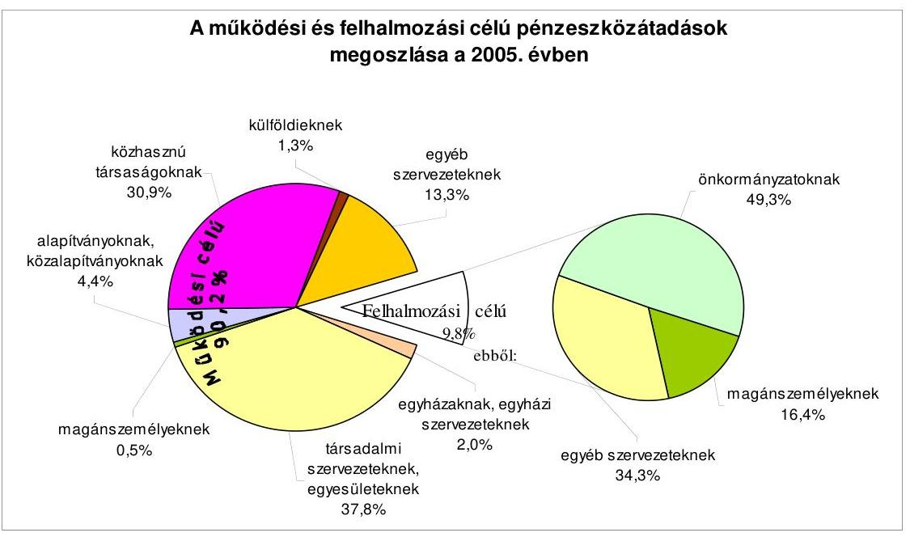
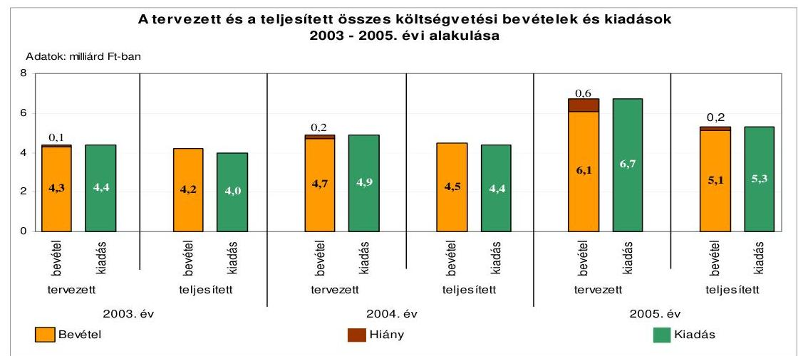
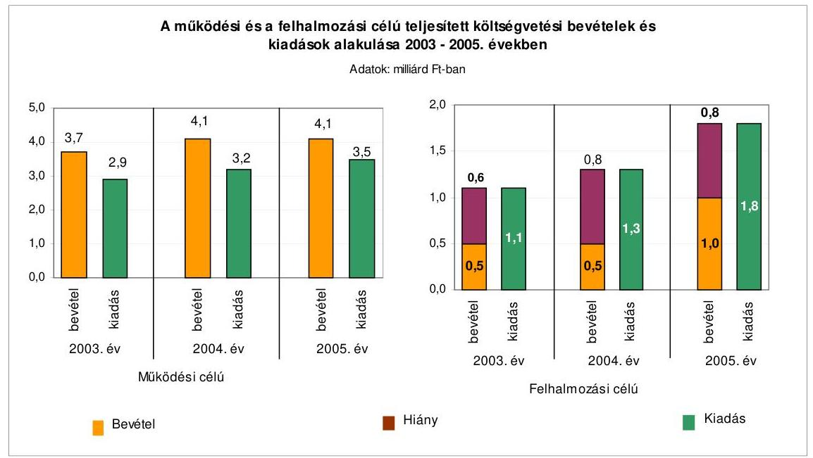
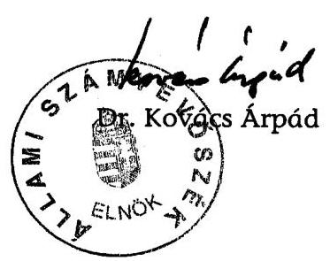
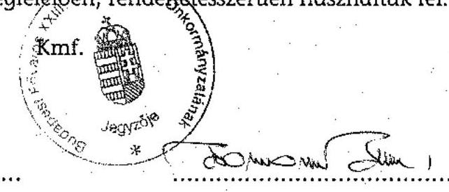
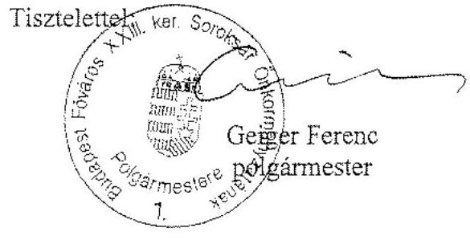
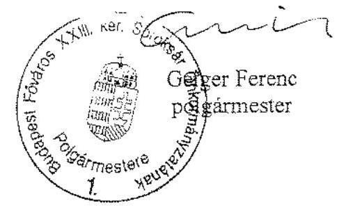
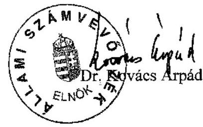

# JELENTÉS 

a Budapest Főváros XXIII. kerület Soroksár Önkormányzata gazdálkodási rendszerének 2006. évi átfogó ellenőrzéséről

---

3. Önkormányzati és Területi Ellenőrzési Igazgatóság
3.3. Átfogó Ellenőrzések Főcsoport
Iktatószám: V-1003-5/37/26/2006.
Témaszám: 803
Vizsgálat-azonosító szám: V0265
Az ellenőrzést felügyelte:
Dr. Lóránt Zoltán
főigazgató
Az ellenőrzés végrehajtásáért felelős:
Dr. Sepsey Tamás
főigazgató-helyettes
Az ellenőrzést vezette:
Molnár Gyula Mihály
osztályvezető főtanácsos
Az ellenőrzést végezték:
Vojcsekné Szabó Ágnes
számvevő tanácsos
Schósz Attiláné
számvevő tanácsos
Tóth László
számvevő

# A témához kapcsolódó eddig készített számvevőszéki jelentés: 

címe
sorszáma
Jelentés a helyi és a helyi kisebbségi önkormányzatok gazdálkodásának átfogó ellenőrzéséről

---

# TARTALOMJEGYZÉK 

BEVEZETÉS ..... 7
I. ÖSSZEGZŐ MEGÁLLAPÍTÁSOK, KÖVETKEZTETÉSEK, JAVASLATOK ..... 9
II. RÉSZLETES MEGÁLLAPÍTÁSOK ..... 21

1. A költségvetés tervezésének, végrehajtásának, az Önkormányzat vagyongazdálkodásának és a zárszámadás elkészítésének szabályszerűsége ..... 21
1.1. A költségvetési rendelet jóváhagyásának, módosításának, az előirányzatok nyilvántartásának szabályszerűsége ..... 21
1.2. A gazdálkodás szabályozottsága, a bizonylati rend és fegyelem szabályszerűsége ..... 26
1.3. A pénzügyi-számviteli feladatok ellátásának informatikai támogatottsága ..... 35
1.4. Az önkormányzati vagyon nyilvántartása, számbavétele ..... 36
1.5. A vagyonnal való gazdálkodás szabályszerűsége, célszerűsége, nyilvánossága ..... 38
1.6. A céljelleggel nyújtott támogatások szabályszerűsége ..... 48
1.7. A közbeszerzési eljárások szabályszerűsége ..... 52
1.8. A zárszámadási kötelezettség teljesítésének szabályszerűsége ..... 56
1.9. A Polgármesteri hivatal helyi kisebbségi önkormányzatok gazdálkodását segítő tevékenysége ..... 58
2. Az önkormányzati feladatok és a rendelkezésre álló források összhangja ..... 60
2.1. A feladatok meghatározása és szervezeti keretei ..... 60
2.2. A költségvetés egyensúlyának helyzete ..... 63
2.3. A feladatok finanszírozása ..... 71
3. A belső ellenőrzési rendszer működésének értékelése ..... 73
3.1. Az ellenőrzési rendszer kialakítása, működése ..... 73
3.2. A könyvvizsgálati kötelezettség teljesítése ..... 77
3.3. A korábbi számvevőszéki ellenőrzések javaslatainak hasznosulása ..... 78

---

# MELLÉKLETEK 

1. számú Az Önkormányzat gazdálkodását meghatározó adatok, mutatószámok (1 oldal)
2. számú Az önkormányzati vagyon nagyságának alakulása (1 oldal)
3. számú Az Önkormányzat 2005. évi bevételeinek és kiadásainak alakulása (1 oldal)
4. számú Egyes önkormányzati feladatok finanszírozása (1 oldal)
5. számú Helyszíni ellenőrzési jegyzőkönyv (2 oldal)
6. számú Geiger Ferenc úr, a Budapest Főváros XXIII. kerület Soroksár Önkormányzatának polgármestere által adott észrevétel (2 oldal)
7. számú Geiger Ferenc úr, a Budapest Főváros XXIII. kerület Soroksár Önkormányzatának polgármestere által adott észrevétel kiegészítés (2 oldal)
8. számú Geiger Ferenc úr, a Budapest Főváros XXIII. kerület Soroksár Önkormányzatának polgármesterének írt válaszlevél (1 oldal)

---

# RÖVIDÍTÉSEK JEGYZÉKE 

## Törvények

Áht.
Fot.

Hatv. tv.
Htv.

Kbt.
Ksztv.
Ltv.

Nek. tv.
Ötv.
Ptk.
Számv. tv.

## Rendeletek

Ámr.
Ber.
helyi adórendelet
helyiség bérbeadási rendelet $_{1}$
helyiség bérbeadási rendelet $_{2}$
helyiség elidegenítési rendelet

20/1995. (III. 3.) Korm. rendelet

2006. évi költségvetési rendelet
az államháztartásról szóló 1992. évi XXXVIII. törvény
a fogyatékos személyek jogairól és esélyegyenlőségük biztosításáról szóló 1998. évi XXVI. törvény
a helyi adókról szóló 1990. évi C. törvény
a helyi önkormányzatok és szerveik, a köztársasági megbízottak, valamint egyes centrális alárendeltségű szervek feladat- és hatásköreiről szóló 1991. évi XX. törvény
a közbeszerzésekről szóló 2003. évi CXXIX. törvény
a közhasznú szervezetekről szóló 1997. évi CLVI. törvény
a lakások és helyiségek bérletére, valamint elidegenítésükre vonatkozó egyes szabályokról szóló 1993. évi LXXVIII. törvény
a nemzeti és etnikai kisebbségek jogairól szóló 1993. évi LXXVII. törvény
a helyi önkormányzatokról szóló 1990. évi LXV. törvény
a Polgári Törvénykönyvről szóló 1959. évi IV. törvény
a számvitelről szóló 2000 . évi C. törvény
az államháztartás múködési rendjéről szóló 217/1998. (XII. 30.) Korm. rendelet
a költségvetési szervek belső ellenőrzéséről szóló 193/2003. (XI. 26.) Korm. rendelet

Budapest Főváros XXIII. kerület Soroksár Önkormányzatának 38/2002. (XII. 20.) számú rendelete a helyi adókról
Budapest Főváros XXIII. kerület Soroksár Önkormányzatának 15/1996. (III. 18.) számú rendelete az Önkormányzat tulajdonában álló nem lakás céljára szolgáló helyiségek bérbeadásának feltételeiről
Budapest Főváros XXIII. kerület Soroksár Önkormányzatának 30/2004. (VI. 23.) számú rendelete az Önkormányzat tulajdonában álló nem lakás céljára szolgáló helyiségek bérbeadásának feltételeiről
Budapest Főváros XXIII. kerület Soroksár Önkormányzatának 29/2004. (VI. 23.) számú rendelete az Önkormányzat tulajdonában lévő nem lakás céljára szolgáló helyiségek elidegenítéséről
a kisebbségi önkormányzatok költségvetésének, gazdálkodásának, vagyonjuttatásának egyes kérdéseiről szóló 20/1995. (III. 3.) Korm. rendelet
Budapest Főváros XXIII. kerület Soroksár Önkormányzatának 8/2006. (III. 19.) számú rendelete a 2006. évi költségvetésről és végrehajtási szabályairól

---

2005. évi költségvetési rendelet

2005. évi zárszámadási rendelet
lakás bérbeadási rende$\operatorname{let}_{1}$
lakás bérbeadási rende$\operatorname{let}_{2}$
lakás elidegenítési rendelet $_{2}$
lakás elidegenítési rendelet $_{2}$
önkormányzati SzMSz
támogatási rendelet
temetőkről szóló Korm. rendelet
vagyongazdálkodási rendelet $_{1}$
vagyongazdálkodási rendelet $_{2}$
versenyeztetési rendelet

Vhr.

## Szórövidítések

ÁSZ
ESZI
FEUVE
Fővárosi Önkormányzat

Budapest Főváros XXIII. kerület Soroksár Önkormányzatának 11/2005. (IV.3.) számú rendelete a 2005. évi költségvetésről és végrehajtási szabályairól
Budapest Főváros XXIII. kerület Soroksár Önkormányzatának 15/2006. (IV. 22.) számú rendelete a 2005. évi költségvetési zárszámadásról
Budapest Főváros XXIII. kerület Soroksár Önkormányzatának 13/1996. (III. 18.) számú rendelete az Önkormányzat tulajdonában álló lakások bérbeadásának feltételeiről Budapest Főváros XXIII. kerület Soroksár Önkormányzatának 39/2004. (V. 26.) számú rendelete az Önkormányzat tulajdonában álló lakások bérbeadásának feltételeiről
Budapest Főváros XXIII. kerület Soroksár Önkormányzatának 49/1996. (X. 11.) számú rendelete az Önkormányzat tulajdonában álló lakások elidegenítésének feltételeiről
Budapest Főváros XXIII. kerület Soroksár Önkormányzatának 31/2004. (IV. 23.) számú rendelete az Önkormányzat tulajdonában álló lakások elidegenítésének feltételeiről
Budapest Főváros XXIII. kerület Soroksár Önkormányzatának 50/2004. (VI. 18.) számú rendelete az Önkormányzat Szervezeti és Múködési Szabályzatáról
Budapest Főváros XXIII. kerület Soroksár Önkormányzatának 5/2005. (VI. 19.) számú rendelete a civil szervezetek pénzügyi támogatásának rendjéről
a temetőkről és a temetkezésről szóló 1999. évi XLIII. törvény végrehajtásáról szóló 145/1999. (X. 1.) Korm. rendelet
Budapest Főváros XXIII. kerület Soroksár Önkormányzatának 2/1997. (I. 31.) számú rendelete az Önkormányzat vagyonáról, a vagyontárgyak feletti jog gyakorlásáról
Budapest Főváros XXIII. kerület Soroksár Önkormányzatának 32/2004. (IV. 23.) számú rendelete az Önkormányzat vagyonáról, a vagyontárgyak feletti jog gyakorlásáról
Budapest Főváros XXIII. kerület Soroksár Önkormányzatának 15/2004. (III. 63.) számú rendelete az Önkormányzat vagyonának értékesítése, hasznosítása során alkalmazandó versenyeztetési eljárás szabályairól
az államháztartás szervezetei beszámolási és könyvvezetési kötelezettségének sajátosságairól szóló 249/2000. (XII. 24.) Korm. rendelet

Állami Számvevőszék
Budapest Főváros XXIII. kerület Soroksár Önkormányzatának Egészségügyi és Szociális Intézménye
folyamatba épített előzetes és utólagos vezetői ellenőrzés
Budapest Főváros Önkormányzata

---

| Galéria Kht. | Galéria '13 Soroksár Kulturális Szolgáltató Közhasznú Társaság |
| :--: | :--: |
| Gazdasági bizottság | Budapest Főváros XXIII. kerület Soroksár Önkormányzat Képviselő-testületének Gazdasági és Vagyonkezelő Bizottsága |
| gazdálkodási jogkörök   szabályzata | Hivatali SzMSz II/8. számú melléklete - Szabályzat Budapest Főváros XXIII. kerület Soroksár Önkormányzat Polgármesteri Hivatalának a kötelezettségvállalás, a szakmai teljesítésigazolás, az érvényesítés, az utalványozás és az ellenjegyzés rendjéről |
| hivatali SzMSz | Budapest Főváros XXIII. kerület Soroksár Önkormányzata Polgármesteri Hivatalának Szervezeti és Múködési Szabályzata (a jegyző 2005. január 1-jén adta ki, a polgármester átruházott hatáskörben hagyta jóvá) |
| jegyző | Budapest Főváros XXIII. kerület Soroksár Önkormányzatának jegyzője |
| Képviselő-testület | Budapest Főváros XXIII. kerület Soroksár Önkormányzatának Képviselő-testülete |
| kisebbségi önkormányzatok | Budapest Főváros XXIII. kerület Kisebbségi Önkormányzatai |
| Közbeszerzési Döntőbizottság | Közbeszerzések Tanácsa Közbeszerzési Döntőbizottsága |
| közbeszerzési szabályzat | Budapest Főváros XXIII. kerület Soroksár Önkormányzatának közbeszerzési szabályzata |
| KÖZGÉP Rt. | KÖZGÉP Gép- és Fémszerkezetgyártó Rt. |
| MÁK | Magyar Államkincstár |
| MÖS | Magyar Ökumenikus Segélyszervezet |
| Népjóléti osztály | Budapest Főváros XXIII. kerület Soroksár Önkormányzata Polgármesteri Hivatalának Népjóléti Osztálya |
| Önkormányzat | Budapest Főváros XXIII. kerület Soroksár Önkormányzata |
| Önkormányzati Társulás | Kisdunáért Önkormányzati Társulás |
| Pénzügyi bizottság | Budapest Főváros XXIII. kerület Soroksár Önkormányzat Képviselő-testületének Pénzügyi Bizottsága |
| Pénzügyi osztály | Budapest Főváros XXIII. kerület Soroksár Önkormányzata Polgármesteri Hivatalának Pénzügyi-gazdasági Osztálya |
| polgármester | Budapest Főváros XXIII. kerület Soroksár Önkormányzatának polgármestere |
| Polgármesteri hivatal | Budapest Főváros XXIII. kerület Soroksár Önkormányzatának Polgármesteri Hivatala |
| SBKÖ | Budapest Főváros XXIII. Kerület Soroksár Bolgár Kisebbségi Önkormányzat |
| SNKÖ | Budapest Főváros XXIII. Kerület Soroksár Német Kisebbségi Önkormányzat |
| SRKÖ | Budapest Főváros XXIII. Kerület Soroksár Roma Kisebbségi Önkormányzat |
| Szociális Foglalkoztató | Soroksári Szociális Foglalkoztató Közhasznú Társaság |

---

| ügyrend | Budapest Főváros XXIII. kerület Soroksár Önkormányzatának Polgármesteri Hivatala Pénzügyi-gazdasági Osztályának Ugyrendje (2003. szeptember 1-jétől hatályos) |
| :--: | :--: |
| Vagyongazdálkodási osztály | Budapest Főváros XXIII. kerület Soroksár Önkormányzata Polgármesteri Hivatalának Vagyongazdálkodási Osztálya |
| Városfejlesztési osztály | Budapest Főváros XXIII. kerület Soroksár Önkormányzata Polgármesteri Hivatalának Városfejlesztési osztálya |

---

# JELENTÉS 

## a Budapest Főváros XXIII. kerület Soroksár Önkormányzata gazdálkodási rendszerének 2006. évi átfogó ellenőrzéséről

## BEVEZETÉS

Az Ötv. 92. § (1) bekezdése, az Állami Számvevőszékről szóló 1989. évi XXXVIII. törvény 2. § (3) bekezdése, valamint az Áht. 120/A. § (1) bekezdése alapján az önkormányzatok gazdálkodását az Állami Számvevőszék ellenőrzi. Az ellenőrzésre az Országgyűlés illetékes bizottságai részére is átadott, országosan egységes ellenőrzési program alapján került sor.

## Az ellenőrzés célja annak értékelése volt, hogy:

- az önkormányzati gazdálkodás törvényességét ${ }^{1}$, szabályszerűségét biztosított-ák-e a tervezés, a költségvetés végrehajtása, a vagyongazdálkodás és a zárszámadás során;
- az Önkormányzat által ellátott feladatok és az azokhoz rendelkezésre álló források összhangja biztosított volt-e, különös tekintettel az egyes kiemelt feladatokra;
- a gazdálkodás szabályszerűségét biztosító kontrollok ${ }^{2}$ megfelelően segitettéke a végrehajtást.

Az ellenőrzött időszak: a 2005. év és a 2006. év első félév, az 1.5; 2.1-2.3; és 3.3 programpontok esetében a 2003-2004. évek is.

A kerület lakosainak száma 2006. január 1-én 21873 fő volt.
Az Önkormányzat 20 tagú Képviselő-testületének munkáját hét állandó bizottság segítette. A polgármester 1994. december 10. óta tölti be tisztségét, a jegyző személye 1995. február 1-től nem változott.

[^0]
[^0]:    ${ }^{1}$ A törvényi előírások betartásának elmulasztásakor a részletes megállapítások fejezetben egységesen a törvénysértés megjelölést alkalmazzuk, mivel az ÁSZ nem tehet különbséget a törvényi előírások között.
    ${ }^{2}$ A gazdálkodás szabályszerűségét biztosító kontroll alatt értjük a kiépített és működő belső irányítási és szabályozási rendszert, valamint a belső ellenőrzési funkciók ellátását.

---

Az Önkormányzat feladatainak végrehajtása érdekében 12 költségvetési szervet múködtetett, amelyekből három önállóan gazdálkodott. A feladatok ellátásában részt vett két közhasznú társasága is. Az Önkormányzat költségvetési szerveinél a 2005. december 31-én foglalkoztatott közalkalmazottak száma 517 fő, a köztisztviselők száma 133 fő volt. Az Önkormányzat a 2005. évben 5094 millió Ft költségvetési bevételt ért el és 5279 millió Ft költségvetési kiadást teljesített, a 2005. év végén 15337 millió Ft értékű könyvviteli mérleg szerinti vagyonnal rendelkezett. Az Önkormányzat gazdálkodását meghatározó adatokat, mutatószámokat az 1-3. számú mellékletek tartalmazzák.

A kerületben a 2002. évi választásokig kettő ${ }^{3}$, a 2002. és a 2006. évi választásokat követően három ${ }^{4}$ a megválasztott és múködő kisebbségi önkormányzatok száma.

A jelentés megállapításainak, javaslatainak egyeztetése során a polgármester arról adott tájékoztatást, hogy az időközben megtett intézkedésekkel a javaslatok egy részét megvalósították. Ezekben az esetekben a jelentés II. Részletes megállapítások fejezetében az adott témához kapcsolt lábjegyzetben a megtett intézkedést feltüntettük, és a kapcsolódó javaslatot elhagytuk.

A jelentést az ÁSZ-ról szóló 1989. évi XXXVIII. tv. 25. § (1) bekezdése alapján észrevétel közlése céljából megküldtük a Budapest Főváros XXIII. kerület Soroksár Önkormányzata polgármesterének. A kapott észrevételeket a jelentés 6. és 7. számú melléklete, az azokra adott választ a 8. számú melléklete tartalmazza.
${ }^{3}$ Soroksári Cigány Kisebbségi Önkormányzat, Soroksári Német Kisebbségi Önkormányzat.
${ }^{4}$ Soroksári Bolgár Kisebbségi Önkormányzat, Soroksári Cigány Kisebbségi Önkormányzat, Soroksári Német Kisebbségi Önkormányzat.

---

# I. ÖSSZEGZŐ MEGÁLLAPÍTÁSOK, KÖVETKEZTETÉSEK, JAVASLATOK 

Az Önkormányzat a 2004-2006. évekre szólóan gazdasági programmal rendelkezett, eleget tett az Ötv-ben előírt kötelezettségének. A 2005. és a 2006. évi költségvetési koncepciók tartalma nem felelt meg az Ámr-ben foglaltaknak, mivel nem tartalmazták - a helyi adóktól eltekintve - a helyben képződő bevételek, a 2006. évben az ismert kötelezettségek számszaki bemutatását. A 2007. évi költségvetési koncepció készítése során a hiányosságokat pótolták.

A polgármester a költségvetési rendelettervezetek beterjesztését megelőzően előterjesztette azokat a rendelettervezeteket, amelyek a javasolt előirányzatokat megalapozták. A polgármester a költségvetési rendelettervezetet mindkét évben a Pénzügyi bizottság, valamint a könyvvizsgáló véleményének csatolásával, de - az Áht-ban foglaltak ellenére - határidőn túl terjesztette elő. A 2005. és a 2006. évi költségvetési rendelet nem tartalmazta az Áht-ban foglaltak ellenére Önkormányzatra összesítve a személyi, a dologi és egyéb folyó kiadásoknak, az ellátottak pénzbeli juttatásainak, a munkaadókat terhelő járulékoknak a kiemelt előirányzati adatait. Nem tartalmazták a rendelettervezetek az Ámrben előírtaktól eltérően a múködési, fenntartási előirányzatokat összesítve önállóan és részben önállóan gazdálkodó költségvetési szervenként. Az Áht. előírása ellenére rendeletben nem határozták meg a költségvetés (zárszámadás) előterjesztésekor a Képviselő-testület részére tájékoztatásul bemutatandó mérlegek, kimutatások tartalmi követelményeit. A címrendben foglaltak ellenére a Polgármesteri hivatal gazdálkodásának adatai nem tartalmazták a hozzárendelt részben önállóan gazdálkodó költségvetési intézmények adatait.

A 2005. és a 2006. évi költségvetési rendeletekben - az Áht-ban előírtaknak megfelelően - bemutatták a hiányt. A 2005. évi költségvetési rendeletben a költségvetési bevételek és kiadások között, a 2006. évi költségvetési rendeletben a költségvetési kiadások között - megsértve az Áht-ban előírtakat - finanszírozási célú pénzügyi múveleteket vettek figyelembe. A költségvetési rendeletekben az Önkormányzat meghatározta a költségvetés végrehajtásának szabályait. A Képviselő-testület tájékoztatása céljából a költségvetési rendelettervezetek előterjesztése tartalmazta az Önkormányzat összevont mérlegét, a többéves kihatással járó döntések bemutatását számszerúsítve évenkénti bontásban és összesítve szöveges indoklással együtt, az Áht. előírásával szemben azonban nem tartalmazta a közvetett támogatások kimutatását és szöveges indoklását. A 2005. évi költségvetési rendeletmódosítások következtében az eredeti előirányzatok föösszege $0,3 \%$-kal csökkent. A módosításra előterjesztett rendelettervezetek a költségvetéssel összehasonlítható módon tartalmazták a módosítási javaslatokat. Az előirányzat változtatásokat hitelt érdemlő dokumentumokkal alátámasztották. A Képviselő-testület a 2005. évi költségvetési rendeletének egyes kiemelt előirányzatait, valamint a kisebbségi önkormányzatok előirányzatait az Ámr-ben előírt határidőn túl módosította.

A hivatali SzMSz és a gazdasági szervezet ügyrendje megfelelt az Ámr-ben foglalt előírásoknak. A Polgármesteri hivatalban az operatív gazdálkodással és a

---

munkafolyamatba épített ellenőrzéssel összefüggő feladat- és hatásköröket a gazdálkodási jogkörök szabályzatában rögzítették. A polgármester és a jegyző az Ámr. alapján felhatalmazást adott kötelezettségvállalásra, utalványozásra, valamint ellenjegyzésre, melyek során az összeférhetetlenségi követelmények érvényesülését biztosították. A jegyző a kiadások esetében szabályozta a szakmai teljesítés igazolásának módját, míg ez a bevételek esetében elmaradt, mely nem felelt meg az Ámr-ben foglalt előírásnak. Az érvényesítők megbízása során a jegyző nem tartotta be az Ámr. pénzügyi-számviteli képesítésre vonatkozó előírását. A gazdálkodási és ellenőrzési jogkörök gyakorlásáról a felhatalmazottak nem számoltak be, a beszámoltatás formáját és gyakoriságát nem szabályozták.

A Polgármesteri hivatal számviteli politikája keretében elkészítették az eszközök és források leltározási és selejtezési szabályzatát, az eszközök és források értékelési szabályzatát, a pénzkezelési szabályzatot, valamint az önköltségszámítási szabályzatot. A Vhr. előírásait betartva elkészítették a Polgármesteri hivatal számlarendjét. A számviteli politikában nem szabályozták a jelentősnek minősített árfolyamváltozás összege meghatározásának szempontjait. A számviteli politika a Vhr. előírása ellenére nem tartalmazta a kisebbségi önkormányzati gazdálkodással összefüggő sajátos feladatokat. A szabályzatokban feltárt hibákat és hiányosságokat az ÁSZ helyszíni ellenőrzése idején kijavították, illetve pótolták.

A jegyző gondoskodott a FEUVE megszervezéséről, de az Áht-ban előírtakat megsértve nem gondoskodott annak hatékony múködtetéséről, mivel az ellenőrzési nyomvonal előírásait, valamint a kockázatkezelés rendjére vonatkozószabályokat nem alkalmazták. A költségvetést terhelő kötelezettségvállalásokat írásba foglalták, az elszámolt gazdasági múveletekről a bizonylatokat kiállították. A Számv. tv-t megsértve a gazdasági eseményeket magukba foglaló bizonylatok nem feleltek meg az alaki és tartalmi követelményeknek. Az Ámrben foglaltak ellenére a kötelezettségvállalást tartalmazó bizonylatok 9\%-áról hiányzott a kötelezettségvállalás ellenjegyzőjének aláírása, a bizonylatok 32\%ban nem tartalmazták a szakmai teljesítés igazoló aláírását, 10\%-ánál a szakmai teljesítés igazolását jogosulatlanul gyakorolták. A bizonylatok 38\%-án nem szerepelt az érvényesítő aláírása, 15\%-án az utalvány ellenjegyzőjének és az utalványozónak az aláírása. A Számv. tv-t megsértve a bizonylatok 94\%-a nem tartalmazta a könyvviteli nyilvántartásokban történt rögzítés időpontját és a rögzítés igazolását, továbbá $98 \%$-a esetében nem végezték el az elszámolásra szolgáló könyvviteli számlák kijelölését. Az utalványrendeleteken az Ámr. előírása ellenére az esetek 19\%-ában nem tüntették fel a kötelezettségvállalás nyilvántartásba vételi sorszámát.

A munkafolyamatba épített ellenőrzési feladataikat az Ámr. előírásai ellenére a kötelezettségvállalás ellenjegyzője a bizonylatok $9 \%$-a esetében, a szakmai teljesítésigazolók $40 \%$-a, az érvényesítők $53 \%$-a, valamint az utalvány ellenjegyzői $58 \%$-a esetében nem látták el. A házipénztárban a pénztárellenőr a pénzkezelési szabályzatban előírt ellenőrzési feladatainak eleget tett. A gazdálkodási, ellenőrzési jogkörök gyakorlása során betartották az Ámr-ben foglalt összeférhetetlenségi követelményeket.

---

A gazdasági események bizonylatainak adatait a Vhr-ben foglalt időpontoknak megfelelően rögzítették a könyvviteli nyilvántartásban. A főkönyvi és az analitikus nyilvántartás egyeztetése a számlarend előírásának megfelelően negyedévente megtörtént. Az egyes jövedelempótló támogatások esetében az Ámr-ben előírtak ellenére nem vezették a kötelezettségvállalásokról az analitikus nyilvántartást. A nyilvántartás - az egyes jövedelempótló támogatásoktól eltekintve - biztosította annak feltételeit, hogy a költségvetés végrehajtása során kötelezettségvállalás és utalványozás csak a jóváhagyott kiadási előirányzatok mértékéig teljesüljön. Az egyes jövedelempótló támogatásoknál a nyilvántartásból nem állapítható meg az évenkénti kötelezettségvállalások összege. A 2005. évi zárszámadási rendelet szerint önkormányzati szinten a költségvetési rendelet módosított előirányzatait a teljesítési adatok nem haladták meg, a költségvetési intézmények kiemelt előirányzataikon belül gazdálkodtak. A Polgármesteri hivatal az Áht. előírásait megsértve a speciális célú támogatások esetében a jóváhagyott kiadási előirányzatát $1,3 \%$-kal ( 1,7 millió Ft-tal) túllépte. Ennek okait nem vizsgálták, felelősségre vonás nem történt.

A Polgármesteri hivatalban a főkönyvi könyvelés és a beszámoló készítés számítógépes feldolgozással történt. A kapcsolódó analitikus nyilvántartások közül 13-at manuálisan vezettek. A főkönyvi és a számítógépes analitikus nyilvántartások közötti adatforgalmat megszervezték, azonban az adatfeldolgozási rendszerek integrációja nem történt meg. Az Önkormányzat rendelkezett a kö-zép- és hosszú távú célkitűzéseket tartalmazó informatikai koncepcióval. Az informatikai biztonsági szabályokat, valamint annak részeként a katasztrófa elhárítás feladatait, az informatikai rendszer hozzáférési jogosultjainak program részletezésű nyilvántartását, illetve rendjét a hivatali SzMSz mellékleteit képező Informatikai Üzemeltetési Szabályzatban, valamint Adatvédelmi és Adatbiztonsági Szabályzatban írták elő. A Polgármesteri hivatalban bemutatták a gazdálkodási és a számviteli feladatokhoz használt programok üzemeltetési dokumentációját és felhasználói leírását. A Pénzügyi osztály dolgozói rendelkeztek a programok használatához szükséges felhasználói ismeretekkel, munkaköri leírásaik tartalmazták programonként részletezve az informatikai rendszer használatának kötelezettségét.

A Polgármesteri hivatal számviteli nyilvántartásaiban a Vhr-ben foglaltaknak megfelelően az önkormányzati törzsvagyon elkülönítéséről gondoskodtak. Az Önkormányzatnak két 100\%-os tulajdonú közhasznú társasága volt, azonban a Vhr-ben foglalt előírás ellenére a Szociális Foglalkoztató törzstőkéjéből a pénzbeli vagyoni betétet nem egyéb tartós részesedésként vették nyilvántartásba, továbbá a nem pénzbeli betétet, valamint a Galéria Kht. törzstőkéjét nem vették nyilvántartásba és nem szerepeltették a mérlegben. Az eltérés nem jelentős összegű a számviteli politikában meghatározott jelentős összegű hiba mértékéhez képest. A leltározást a 2005. évben a Vhr. előírásainak megfelelően, a leltározási és selejtezési szabályzatban előírt módon végezték el. A követelések és részesedések értékeléséhez szükséges információk rendelkezésre álltak. A 2005. évben a mérlegkészítés időpontjáig nem rendezett követeléseknél a Vhr-ben és a számviteli politikában foglalt előírással ellentétben az értékvesztés elszámolásának szükségességét nem vizsgálták és nem számoltak el annak ellenére, hogy az egy éven túl fennálló követelések összege 2005. december 31-én 92 millió Ft volt, mely az Önkormányzat összes követelésének 38\%-át tette ki.

---

A vagyongazdálkodással kapcsolatos feladatokat és döntési hatásköröket az Önkormányzat rendeletekben szabályozta. A vagyonnal való rendelkezési jogokat értékhatárhoz kötötten, 2004. március 26 -tól osztották meg célszerűen a Képviselő-testület, a Gazdasági bizottság, a Pénzügyi bizottság, a polgármester, valamint az intézmények vezetői között. Az értékhatárhoz kötött döntési hatáskörök gyakorlásának 2004. március 25 -ig nem volt meg az alapja, mivel nem írtak elő az ingatlanok forgalmi értékének megállapítására vonatkozó szabályokat, illetve az Önkormányzat nem állapította meg - a lakások kivételével - azt az értékhatárt, amely felett csak nyilvános pályázat útján lehet a vagyont értékesíteni, a használat jogát átadni, mellyel megsértették az Áht. előírását. A versenyeztetési rendeletben - 2004. március 26. napjától - ingatlanvagyon esetében nettó 5 millió Ft-ban, ingó vagyon esetében nettó 3 millió Ft-ban állapították meg azt az értékhatárt, ami felett versenyeztetési eljárást kell lefolytatni. A versenyeztetési rendelet előírása lehetőséget biztosított - az Áht-ban foglaltakat megsértve - a versenyeztetés nélküli elidegenítésre, hasznosításra. Az Önkormányzat megsértette az Áht. előírását, mivel az általa nyújtott nem normatív, céljellegú fejlesztési támogatások közzététele a támogatási program megvalósítási helyére vonatkozó adatokat nem tartalmazta.

Az Önkormányzat a versenyeztetési rendelet hatályba lépését követően két esetben nem folytatott le versenyeztetési eljárást, megsértve az Áht-ban foglalt előírást. A Képviselő-testület egy ingatlan értékesítés esetében nem célszerű, egy másik esetben gazdaságilag nem megalapozott döntést hozott. A vagyongazdálkodási rendelet ${ }_{1}$ hatásköri szabályait egy esetben nem vették figyelembe. Az Önkormányzat a temetőkről szóló Korm. rendelet előírása ellenére lezárt, de ki nem ürített temetőt adott bérbe, illetve értékesített, mely esetekben a megkötött bérleti, illetve adásvételi szerződés a Ptk. előírása alapján semmis. A 20032005. évek között a Gazdasági bizottság forgalomképtelen törzsvagyon körébe tartozó közterületet idegenített el, mellyel megsértette a Ptk. és az Ötv. előírását. Az apportálás és a haszonbérleti szerződések esetében a döntéshozatal a vagyongazdálkodási rendelet ${ }_{1,2}$ előírásainak betartásával történt. Az Önkormányzat egy gazdasági társaságban lévő törzsrészvényét - az értékhatár meghatározásának hiánya miatt - versenyeztetési eljárás elmulasztásával értékesített, megsértve az Áht. előírását. A polgármester egy részvényértékesítésre a Képviselő-testület döntésétől eltérő szerződést kötött. A 2003-2005. években az Önkormányzat éven belüli pénzügyi befektetései célszerűek voltak, az elért hozamok megfelelő eredményességet biztosítottak. Kizárólag állampapírokra kötöttek adásvételi szerződéseket, azonban nem rendelkeztek alszámla nyitásról és az értékpapír-számlán való zárolt elhelyezésről, mellyel a befektetés kockázata mérsékelhető, biztonsága növelhető lett volna. A selejtezést a leltározási és selejtezési szabályzat előírásainak megfelelően végezték el. Az Önkormányzat a 2003-2005. években nem nyújtott közvetett támogatást a kerületben múködő pártszervezetek részére. Az Önkormányzat az Ltv. előírását megsértve nem adta át a Fővárosi Önkormányzatnak az önkormányzati lakások elidegenítéséből származó bevételek 50\%-át. A 2003-2006. I. félévben összesen 1148 millió Ft nettó értékű vagyon tulajdonjogát ruházták át ingyenesen. Az Önkormányzat víznyomócső tulajdonjogának ingyenes átadásáról döntött a Fővárosi Vízmúvek Rt. részére, mellyel megsértették az Ötv. és a vízgazdálkodásról szóló 1995. évi LVII. törvény előírásait, mivel mindkét jogszabályhely szerint az önkormányzati törzsvagyon része a víziközmú. A Budapesti Rendőrfőkapitányság, az

---

Állami Népegészségügyi és Tisztiorvosi Szolgálat, valamint a Fővárosi Önkormányzat részére történt ingyenes átadások megfeleltek az előírásoknak.

Az Önkormányzat 2005. évi költségvetési rendelete az Áht. előírásának megfelelően a speciális célú támogatások előirányzatait működési és felhalmozási célú pénzeszköz átadások részletezésben tartalmazta. A 114 támogatott szervezetből, illetve magánszemélyből múködési célú támogatásban 66, felhalmozási célú támogatásban 48 szervezet, illetve magánszemély részesült. A polgármester megsértette az Ötv. előírásait, mivel alapítvány támogatásáról hozott döntést. Számadási kötelezettséget 14 támogatott esetében nem írtak elő, megsértve az Áht-ban foglaltakat. A közhasznú szervezetek harmadánál nem tettek eleget a Ksztv. előírásának, mivel nem határozták meg szerződésben a támogatással való elszámolás feltételeit és módját. A 2005. évben támogatásban részesített szervezetek és magánszemélyek közül négy határidőben nem számolt el a kapott támogatás felhasználásáról, az Áht-ban előírtakat megsértve nem intézkedtek a támogatás összegének visszafizettetéséről. Az Önkormányzat a Soroksári Férfikar részére a 2005. évben 0,2 millió Ft támogatást, a polgármester 0,1 millió Ft támogatást nyújtott fellépő ruha vásárlása céljára. A 2005. június 21 -én benyújtott számadást és a felhasználás jogszerűségét az ÁSZ a helyszínen ellenőrizte. A támogatást - a felhasználásáról szóló elszámolásban szereplő számla, továbbá a helyszíni ellenőrzés alapján - a támogatási célnak megfelelően, rendeltetésszerúen használták fel.

Az Önkormányzat a Kbt. alanyi hatálya alá tartozik, és erről a Közbeszerzések Tanácsát értesítette. Az Önkormányzat a 2005. évi összesített közbeszerzési tervét, valamint a közbeszerzési szabályzatát elkészítette. A 2005. évben öszszesen 52 közbeszerzési eljárást indítottak. Az Önkormányzat megsértette a Kbt-ben foglalt előírásokat, mert három, a közbeszerzési értékhatárt elérő, vagy azt meghaladó beszerzés esetén nem folytatta le a közbeszerzési eljárást, és a három beszerzésből kettő vállalkozással kötött szerződések és megrendelések esetében nem érvényesítették az egybeszámítás követelményét, ezért az ÁSZ az ellenőrzés során a Közbeszerzési Döntőbizottság eljárását kezdeményezte. Az ÁSZ ellenőrzés által vizsgált közbeszerzési eljárás során a Kbt. előírásait betartották. A közbeszerzéseket, illetve a közbeszerzési eljárásokat a Polgármesteri hivatalnál belső ellenőrzés, valamint az Önkormányzat költségvetési szerveinél felügyeleti ellenőrzés keretében a Kbt-ben előírtakat megsértve nem vizsgálták. A Közbeszerzési Döntőbizottság a 2005. évben nem indított eljárást az Önkormányzat ellen. A 2006. évben egy esetben indult eljárás, de a Közbeszerzési Döntőbizottság a jogorvoslati kérelmet elutasította.

A polgármester a 2005. évi zárszámadási rendelettervezetet az Áht-ban előírt határidőn belül terjesztette a Képviselő-testület elé. A zárszámadás az Áhtban foglaltak ellenére nem a költségvetéssel összehasonlítható módon készült, mivel a köztisztviselők és a közalkalmazottak létszámának változását, valamint a múködési és felhalmozási célú bevételeknek és kiadásoknak az alakulását mérlegszerűen bemutató mellékletek nem tartalmazták az eredeti előirányzati adatokat. A zárszámadási rendelet nem tartalmazta az Áht. előírásával ellentétesen a múködési kiadások kiemelt előirányzati és teljesítési adatait Önkormányzatra összesítve. A zárszámadás előterjesztésekor a Képviselő-testület részére az Áht-ban előírtakat betartva bemutatták az Önkormányzat és a kisebbségi önkormányzatok összevont mérlegeit, az Önkormányzat vagyonkimu-

---

tatását. Az Áht. előírása ellenére nem mutatták be szöveges indoklással együtt a többéves kihatással járó döntéseket számszerúsítve, évenkénti bontásban és összesítve, valamint a közvetett támogatásokat tartalmazó kimutatást szöveges indoklással.

A Képviselő-testület a zárszámadási rendelettel egyidőben az Ámr-ben foglaltakkal ellentétben határozatában nem a Polgármesteri hivatal és az önállóan gazdálkodó intézmények Vhr-ben és Ámr-ben előírtak szerint meghatározott pénzmaradványát hagyta jóvá, hanem az intézmények és a Polgármesteri hivatal feladattal terhelt pénzmaradványát fogadta el. Az Ámr-ben előírtakat betartva határidőben elvégezték az intézmények költségvetési beszámolóinak a felülvizsgálatát, azok elfogadásáról, múködésük elbírálásáról, a feladattal terhelt pénzmaradványról értesítették az intézményeket. Nem biztosították a 2005. évi zárszámadási rendelet és a központi információs rendszer keretében elkészített, a Polgármesteri hivatalra vonatkozó beszámoló tartalmi összhangját, mivel a zárszámadásban a Polgármesteri hivatal adatai nem tartalmazták a hozzárendelt részben önállóan gazdálkodó intézmények adatait.

Az Önkormányzat a 2002. évben mindhárom kisebbségi önkormányzattal megkötötte az együttmúködési megállapodást a gazdálkodási feladatok végrehajtására. Az együttmúködési megállapodások szükséges felülvizsgálatát minden évben elvégezték, a 2004. és a 2005. években a megállapodásokat az előírt határidőig módosították. Az együttmúködési megállapodások tartalmazták az Ámr. előírásainak megfelelően a jegyző felkérését a költségvetési- és a zárszámadási határozat-tervezetek előkészítésére, valamint a költségvetésről és a zárszámadásról szóló kisebbségi önkormányzati határozatoknak a kisebbségi önkormányzatok Képviselő-testülete részére történő benyújtási határidejét. Indokoltsága ellenére nem tartalmazták a költségvetési előirányzat módosítások rendjét, továbbá az arról szóló kisebbségi önkormányzati határozatok Önkormányzat részére történő átadásának határidejét. A kisebbségi önkormányzatok vagyoni és számviteli nyilvántartásait a Polgármesteri hivatal nyilvántartásain belül kisebbségi önkormányzatonként elkülönítetten vezették. A 2006. évtől a kisebbségi önkormányzatok esetében kötelezettségvállalás-nyilvántartást vezettek. A Polgármesteri hivatal biztosította a kisebbségi önkormányzatok testületi múködésének feltételeit.

Az Önkormányzat nem határozta meg a lakossági igényektől és anyagi lehetőségeitől függően a feladatai ellátásának mértékét és módját, mellyel megsértette az Ötv-ben foglalt előírást. A feladatok ellátását költségvetési szerveivel, közhasznú társaságaival, valamint megbízási és vállalkozási, továbbá közhasznú szervezetekkel kötött ellátási szerződésekkel biztosította. Az Önkormányzat feladatainak ellátásában meghatározó szerepe volt az általa alapított - kettő önálló és a Polgármesteri hivatalhoz tartozó kilenc részben önálló gazdálkodási jogkörrel rendelkező - költségvetési szervnek. A 2003-2005. évek között egy önkormányzati társulást hoztak létre. Az Önkormányzat a 2003-2005. évek időszakában átfogóan nem, de az egyes részterületeket illetően különkülön vizsgálta és értékelte a feladatellátás mértékét és minőségét.

A Képviselő-testület az Önkormányzat 2003-2005. évi költségvetési rendeleteiben a költségvetés egyensúlyát hitel felvételével tervezte biztosítani. A költségvetési hiány összege folyamatosan nőtt, 119 millió Ft, 179 millió Ft és

---

629 millió Ft volt. Aránya a kiadási főösszeg 3\%-át, 4\%-át és 9\%-át jelentette, amelynek oka az volt, hogy a felhalmozási célú bevételek 54\%-ban, 60\%-ban, illetve 71\%-ban nyújtottak fedezetet a felhalmozási célú kiadásokra. A Képvise-lő-testület a tervezett múködési többletet felhalmozási célú kiadásokra kívánta fordítani. A tervezetthez képest kedvezőbben alakult az Önkormányzat gazdálkodása, a 2003. és a 2004. években biztosították a bevételek és a kiadások egyensúlyát, a 2005. évben a realizált költségvetési bevételek nem fedezték a teljesített költségvetési kiadásokat a felhalmozási hiány miatt, a költségvetés egyensúlyát felhalmozási célú hitel felvételével teremtették meg. A költségvetés egyensúlyának, a pénzügyi helyzet javításának érdekében forrásbővítő, költségmegtakarító intézkedéseket - adóbevétel növelés, lakás- és nem lakás céljára szolgáló helyiségek, telkek értékesítése, pályázati pénzeszközök bevonása, kiemelt múködési előirányzatokat érintő takarékossági intézkedések elrendelése, a beruházási-, felújítási feladatok ideiglenes leállítása - tettek. Az Önkormányzat a 2005. évben vett fel fejlesztési célú hitelt az út- és csatornahálózat építési feladatainak a kiadásaihoz, vállalt kezességet az önkormányzati társulás hitelfelvételéhez. A Képviselő-testület az adósságot keletkeztető kötelezettségvállalásokról az Ötv-ben előírt felső határ betartása mellett döntött. A Pénzügyi bizottság eleget tett az Ötv-ben előírt kötelezettségének, kialakította a hitelfelvétellel, valamint a kezességvállalással kapcsolatos véleményét. A pénzállomány alakulásáról a jegyző likviditási tervet a 2006. évre készített, amelynek aktualizálása az Ámr-ben foglaltak ellenére elmaradt. Az Önkormányzat gazdálkodásához mind a három évben vettek fel likviditást biztosító hiteleket, amelyeket az adott éven belül visszafizettek.

Az Önkormányzat illetékességi területén építményadót és telekadót vetett ki. A helyi adóbevételek - az iparűzési adóval együtt - szerepe az összes bevételen belül a 2003. és 2004. évek összehasonlításában nőtt, majd a megelőző évekhez viszonyítva a 2005. évben csökkent, a 2003. évben az összes önkormányzati bevétel $32 \%$-a, a 2004. évben $36 \%$-a, a 2005. évben $26 \%$-a származott a helyi adók bevételéből. A helyi adórendelet a Hatv-ben rögzítetteken túl mentességeket és kedvezményeket biztosított az adóalanyok részére.

Az Önkormányzat a feladatellátás finanszírozásához rendelkezésre álló forrásait múködési és felhalmozási célú külső forrásokkal növelte. A felhalmozási bevételeken belül a külső forrás aránya a 2003-2005. években $84 \%$-ot, $73 \%$ ot, $64 \%$-ot tett ki. A felhalmozási célra biztosított külső források $79 \%$-a, $80 \%$-a, $71 \%$-a pályázati úton jutott az Önkormányzathoz. A pályázatok alapján átvett források 33\%-át a Fővárosi Önkormányzat, 29\%-át a Környezetvédelmi és Vízügyi Minisztérium nyújtotta a csatornahálózat fejlesztéséhez.

Az egyes naturális mutatókkal mérhető kötelező feladatok esetében a feladatok finanszírozását a fajlagos kiadások változása, az ellátottak számának és a kapacitások kihasználtságának alakulása határozta meg. Az egy ellátottra jutó kiadás a 2003. évről a 2005. évre a nappali szociális intézmény esetében növekedett a legnagyobb mértékben, $74 \%$-kal, valamint a kapacitáskihasználtság is ezen ellátási formánál volt a legkisebb, 2003-ban 63\%, 2005-ben 50\%. A kiadások finanszírozásában a központi költségvetési hozzájárulás, támogatás részaránya a 2003. és a 2005. években a bölcsődei, az óvodai ellátás esetében növekedett, az általános iskolai oktatás, valamint a nappali szociális- és a bentlakásos szociális intézményi ellátásnál csökkent. Az Önkormányzat az ön-

---

ként vállalt feladatok megvalósítására a 2003-2005. években az éves költségvetési kiadások 8\%-át, 7\%-át és 6\%-át fordította. Összegük folyamatosan emelkedett, a 2003. évi 320 millió Ft-ról 345 millió Ft-ra, majd a 2005. évben 362 millió Ft-ra. Az Önkormányzat által önként vállalt feladatok ellátása a 2003-2005. években nem veszélyeztette a kötelező feladatok megvalósítását. A Fot. előírása ellenére az Önkormányzat nem biztosította 25 középület akadálymentesítését.

Az Önkormányzatnál a belső ellenőrzés ellátásának módja nem a Képviselőtestület döntésén alapult, megsértve ezzel az Ötv-ben foglalt előírást. Az Önkormányzat a Polgármesteri hivatalon belül kialakította a belső ellenőrzés szervezeti keretét, az ellenőrzési feladatok elvégzése érdekében egy fő belső ellenőrt foglalkoztatott. Az Önkormányzatnál a belső ellenőrök számát a Ber. előírása ellenére nem kapacitás-felmérés alapján állapították meg. A rendelkezésre álló belső ellenőri kapacitás nem állt arányban az ellátott ellenőrzési feladat mennyiségével és sokrétűségével. Az Önkormányzatnál a belső ellenőrzés funkcionális függetlenségét biztosították. A Ber. előírása ellenére a belső ellenőr által elkészített éves ellenőrzési terveket kockázatelemzéssel nem támasztották alá. A 2005. évi ellenőrzési tervben 18 ellenőrzési feladatot terveztek, melyeket elvégeztek és emellett nyolc soron kívüli ellenőrzést is lefolytattak. Az elvégzett 26 ellenőrzés $65 \%$-a átfogó - szabályszerűségi és pénzügyi - jellegű ellenőrzés, $8 \%$-a szabályszerűségi vizsgálat és $27 \%$-a pénzügyi ellenőrzés volt. Az elvégzett ellenőrzésekről készített jelentések tartalma megfelelt a Ber-ben előírtaknak. Az ellenőrzöttek a Ber-ben előírtak ellenére intézkedési tervet nem készítettek. A belső ellenőr a 2005. évben egy esetben tárt fel kártérítési és egy esetben fegyelmi eljárás megindítására okot adó cselekményt. Az éves ellenőrzési jelentés nem felelt meg a Ber-ben foglalt tartalmi követelményeknek, mivel nem tartalmazta a belső ellenőrzés által tett megállapítások és javaslatok hasznosítását. A jegyző a 2005. évi költségvetési beszámoló keretében beszámolt a belső ellenőrzés működéséről, azonban az Áht-ban foglalt előírást megsértve a FEUVE múködése tekintetében nem tett eleget beszámolási kötelezettségének. A polgármester a belső ellenőrzés 2005. évi munkájáról szóló éves ellenőrzési jelentést előterjesztette a Képviselő-testületnek, melyet az tudomásul vett.

Az Önkormányzat eleget tett az Ötv-ben előírt könyvvizsgálati kötelezettségének. A könyvvizsgáló a Polgármesteri hivatal és az önkormányzati intézmények adatait összevontan tartalmazó 2005. évi egyszerűsített költségvetési beszámolót hitelesítő záradékkal látta el, auditálási eltérést nem állapított meg.

Az ÁSZ az Önkormányzat gazdálkodását átfogó jelleggel a 2002. évben ellenőrizte, a 2003. évtől a 2005. évig terjedő időszakban más ellenőrzést nem végzett. Az Önkormányzat gazdálkodásának vizsgálatáról készült számvevői jelentés javaslatainak hasznosítására intézkedési tervet készítettek, a javaslatok közel kétharmad része hasznosult, egy javaslatra nem intézkedtek. Az ÁSZ ellenőrzés során megfogalmazott javaslatok figyelembevételével gondoskodtak a költségvetési rendelettervezetek költségvetési szervek vezetőivel történő egyeztetésének írásbeli rögzítéséről, meghatározták az Önkormányzat gazdasági programját, a zárszámadási rendelet előterjesztésekor a Képviselő-testület részére bemutatták az Önkormányzat vagyonkimutatását, a Polgármesteri hivatalban eleget tettek az egyeztetéssel történő leltározási kötelezettségnek. Részben

---

hajtották végre a közbeszerzési eljárás szabályszerű lefolytatására tett javaslatokat, mivel kettő esetben nem tartották be a részekre bontás tilalmát. A közbeszerzési eljárás mellőzésével lefolytatott három beszerzés esetében nem biztosítottak azonos feltételeket az esetleges ajánlattevőknek. A költségvetési, valamint a zárszámadási rendelettervezet benyújtásával kapcsolatos javaslatok részben hasznosultak, mivel a 2005. évi zárszámadási rendelet két melléklete nem a költségvetési rendelettel összehasonlítható módon készült, a 2005. évi költségvetési rendelet nem, csak a 2006. évi tartalmazta elkülönítetten a kisebbségi önkormányzatok költségvetését a kisebbségi önkormányzati határozatok szerint, változatlan formában. Az Önkormányzat nem utalta át a Fővárosi Önkormányzat elkülönített számlájára a 2003-2005. években a lakásértékesítésből realizált bevétel $50 \%$-át.

A helyszíni ellenőrzés megállapításainak hasznosítása mellett javasoljuk:

# a polgármesternek 

a jogszabályi előírások maradéktalan betartása érdekében
1. a költségvetési gazdálkodás szabályszerű kereteinek kialakítása során
a) nyújtsa be a jegyző által elkészített költségvetési rendelettervezetet az Áht. 71. § (1) bekezdésében előírt határidő betartásával a Képviselő-testületnek;
b) kezdeményezze, hogy a költségvetési rendelet módosítására - a jegyző által előkészített előterjesztés alapján - az Ámr. 53. § (6) bekezdésében előírt határidőn belül kerüljön sor;
c) kezdeményezze, hogy a Polgármesteri hivatalnak és az önállóan gazdálkodó intézményeknek a Vhr. 38-39. §-aiban és az Ámr. 65-67. §-aiban foglaltak szerint meghatározott tárgyévi pénzmaradványát hagyja jóvá a Képviselő-testület a zárszámadási rendeletével egyidejűleg;
2. gondoskodjon az Ámr. 136. § (2) bekezdésében előírtak alapján a bizonylatok hiánytalan utalványozásáról;
3. a szabályszerű vagyongazdálkodás érdekében
a) biztosítsa a vagyongazdálkodási rendelet ${ }_{2}$ értékhatárhoz kötött hatásköri szabályainak betartását a vagyonértékesítések során;
b) intézkedjen a Ptk. 200. § (2) bekezdésében foglaltakra tekintettel a lezárt temetőkre kötött adásvételi, illetve bérleti szerződés felülvizsgálatáról;
c) gondoskodjon arról, hogy az Ötv. 79. § (1)-(2) bekezdése és a vízgazdálkodásról szóló 1995. évi LVII. törvény 6. § (3) bekezdése előírásainak megfelelően az ingyenesen átruházott víziközművek önkormányzati tulajdonba kerüljenek;
d) kezdeményezze a Képviselő-testületnél, hogy az Ltv. 63. § (1) bekezdésében előírtaknak megfelelően az Önkormányzat adja át a Fővárosi Önkormányzatnak az

---

önkormányzati lakások elidegenítéséből származó bevételnek az Ltv. 62. § (5) bekezdése alapján a Fővárosi Önkormányzatot megillető bevételrészt;
4. terjessze a Képviselő-testület elé döntéshozatal céljából az alapítványok támogatási kérelmét az Ötv. 10. § (1) bekezdésében foglalt előírás betartása érdekében;
5. gondoskodjon a középületek akadálymentessé tételéről, tekintettel arra, hogy a Fot. 29. § (6) bekezdésében foglalt 2005. január 1-jei határidő lejárt;
a munka színvonalának javítása érdekében
6. kezdeményezze a számvevőszéki ellenőrzés tapasztalatainak képviselő-testületi megtárgyalását, és a feltárt hiányosságok megszüntetése érdekében készíttessen intézkedési tervet;
7. biztosítsa, hogy a Képviselő-testület határozata szerint kerüljön sor a részvényértékesítési szerződések megkötésére;
8. gondoskodjon arról, hogy az értékpapír befektetési szolgáltató szervezetekkel kötött értékpapír vásárlás-eladás szerződéseknél az Önkormányzat kérje a KELER Rt-nél alszámla nyitását és az alszámla feletti biztonságos önkormányzati rendelkezés együttes zárolás-feloldás - biztosítását;

# a jegyzőnek 

a jogszabályi előírások maradéktalan betartása érdekében
1. a költségvetési, illetve a zárszámadási rendelettervezet előkészítése során
a) gondoskodjon az Áht. 69. § (1) bekezdésében előírtak betartásáról, hogy a költségvetési rendeletben és a zárszámadásban mutassák be Önkormányzatra összesítve, együttesen is a személyi, a dologi és egyéb folyó kiadásoknak, a munkaadókat terhelő járulékoknak, az ellátottak pénzbeni juttatásainak a kiemelt előirányzati, valamint teljesítési adatait;
b) intézkedjen az Ámr. 29. § (1) bekezdés b) pontjában foglaltak betartásáról, hogy a költségvetési rendelettervezetben mutassák be a múködési, fenntartási előirányzatok összegét önállóan és részben önállóan gazdálkodó költségvetési szervenként;
c) biztosítsa az Áht. 18. §-ában előírtak érvényesülése céljából, hogy a zárszámadási rendeletet a költségvetési rendelettel összehasonlítható módon készítsék el;
d) intézkedjen az Áht. 8/A. § (7) bekezdésében előírtak betartása érdekében arról, hogy a költségvetési rendelettervezetben ne vegyenek figyelembe költségvetési kiadásként költségvetési hiányt módosító finanszírozási célú pénzügyi múveletet, hiteltörlesztést;
e) intézkedjen, hogy az Áht. 118. §-ában előírtak alapján a költségvetés és a zárszámadás előterjesztésekor mutassák be a közvetett támogatásokra vonatkozó kimutatást szöveges indoklással, a zárszámadás előterjesztésekor a többéves kiha-

---

tással járó döntések számszerűsítését évenkénti bontásban, valamint összesítve szöveges indoklással együtt;
2. a szabályszerű költségvetési és operatív gazdálkodás érdekében
a) biztosítsa, hogy az érvényesítési feladatok ellátásával az Ámr. 135. § (2) bekezdésében foglaltaknak megfelelő pénzügyi-számviteli képesítésű dolgozót bízzon meg;
b) gondoskodjon az Áht. 97. § (1) bekezdésében előírtak szerint a FEUVE hatékony múködtetéséről;
c) gondoskodjon a Számv. tv. 167. § (1) bekezdés h) és i) pontjainak előírása alapján arról, hogy a bizonylatokra vezessék fel az elszámolásra szolgáló könyvviteli számlákra történő hivatkozást, a könyvviteli nyilvántartásokban történt rögzítésük időpontját és a rögzítés igazolását;
d) gondoskodjon arról, hogy az Ámr. 134. § (2), (7) és (9) bekezdéseiben foglaltak alapján a kötelezettségvállalás ellenjegyzése, az Ámr. 135. § (1) bekezdése alapján a szakmai teljesítés igazolása, az érvényesítés, a 137. § (2) és (3) bekezdései alapján az utalványozás ellenjegyzése minden esetben megtörténjen és ezáltal a kötelezettségvállalás ellenjegyzője, a szakmai teljesítés igazoló, az érvényesítő, valamint az utalvány ellenjegyzője tegyen eleget munkafolyamatba épített ellenőrzési feladatainak;
e) gondoskodjon arról, hogy az Ámr. 135. § (4) bekezdésében előírtak szerint a pénzforgalmat érintő gazdasági események bizonylatain az érvényesítők a főkönyvi számlák kijelölését elvégezzék;
f) gondoskodjon arról, hogy az Ámr. 136. § (4) bekezdés h) pontjának előírása alapján az utalványokon tüntessék fel a kötelezettségvállalás-nyilvántartásba vételének sorszámát;
g) gondoskodjon az Ámr. 134. § (13) bekezdésében foglalt előírás alapján az egyes jövedelempótló támogatások esetében a kötelezettségvállalás nyilvántartásának vezetéséről;
h) gondoskodjon az Áht. 12/A. § (1) bekezdésében és a 93. § (1) bekezdésében előírtak betartása érdekében arról, hogy a Polgármesteri hivatal költségvetésének végrehajtása során a tárgyévi fizetési kötelezettséget a jóváhagyott kiadási előirányzatok mértékéig vállaljanak, fedezet nélküli kötelezettség vállalására ne kerüljön sor, továbbá az előirányzatok túllépése esetén vizsgáltassa ki annak okait és indokolt esetben kezdeményezzen felelősségre vonást;
3. a szabályszerű vagyongazdálkodás érdekében
a) gondoskodjon a Vhr. 31. § (2)-(4) bekezdéseiben, valamint a számviteli politikában foglalt előírások szerint a követelések értékvesztésének elszámolásáról;
b) gondoskodjon az Áht. 15/A. § (1) bekezdésében foglalt előírás betartása érdekében arról, hogy az Önkormányzat által nyújtott nem normatív, céljellegú fejlesz-

---

tési támogatások közzététele a támogatási program megvalósítási helyére vonatkozó adatokat is tartalmazza;
c) biztosítsa, hogy az Ötv. 79. § (2) bekezdésének a) pontjában meghatározott forgalomképtelen vagyoni körbe tartozó ingatlanokat ne értékesítsenek;
4. gondoskodjon az Áht. 13/A. § (2) bekezdésében foglaltak alapján arról, hogy a támogatottak részére írjanak elő számadási kötelezettséget, valamint az elszámolást nem teljesítő szervezetek felé minden esetben intézkedjenek a támogatás összegének visszafizettetéséről, továbbá a Ksztv. 14. § (2) bekezdésében foglalt előírás alapján közhasznú szervezet esetében szerződésben határozzák meg a támogatással való elszámolás feltételeit és módját;
5. a közbeszerzésekhez kapcsolódóan
a) gondoskodjon a Kbt. 2. § (1) és (2) bekezdésben foglalt előírás érvényesítése érdekében arról, hogy a közbeszerzési értékhatárt elérő vagy azt meghaladó beszerzések esetén a közbeszerzési eljárást lefolytassák;
b) gondoskodjon a Kbt. 40. § (1) és (2) bekezdésében foglalt, az egybeszámítás követelményét rögzítő előírás érvényesítéséről;
c) biztosítsa a Kbt. 308. § (2) bekezdésében előírtak betartása érdekében, hogy a közbeszerzések, illetve a közbeszerzési eljárások vizsgálata a Polgármesteri hivatalnál belső ellenőrzés, az Önkormányzat költségvetési szerveinél felügyeleti ellenőrzés keretében megtörténjen;
6. gondoskodjon az Áht. 139. § (1) bekezdésében foglaltak szerint a likviditási terv szükség szerinti aktualizálásáról;
a munka színvonalának javítása érdekében
7. biztosítsa, hogy a költségvetési rendeletben, valamint a zárszámadásban a Polgármesteri hivatal gazdálkodásának terv- és tényadatai között mutassák be a címrendben foglaltak szerint a hozzá rendelt részben önállóan gazdálkodó költségvetési intézmények adatait, a zárszámadási rendelet és a központi információs rendszer keretében elkészített, a Polgármesteri hivatalra vonatkozó költségvetési beszámoló összhangját;

---

# II. RÉSZLETES MEGÁLLAPÍTÁSOK 

## 1. A KÖLTSÉGVEtÉs TERVEZÉSÉNEK, VÉGREHAJTÁSÁNAK, AZ ÖNKORMÁNYZAT VAGYONGAZDÁLKODÁSÁNAK ÉS A ZÁRSZÁMADÁS ELKÉSZÍTÉSÉNEK SZABÁLYSZERŰSÉGE

### 1.1. A költségvetési rendelet jóváhagyásának, módosításának, az előirányzatok nyilvántartásának szabályszerűsége

Az Önkormányzat a 6/2004. (I. 20.) számú határozatával meghatározta a 2004-2006. évekre vonatkozó gazdasági programját, ezzel eleget tett az Ötv. 91. § (1) bekezdésében előírt kötelezettségének.

A polgármester a 2005. évre, illetve a 2006. évre szóló költségvetési koncepciót az Áht. 70. §-ában előírt határidőn belül ${ }^{5}$ - 2004. október 29-én, illetve 2005. november 4-én - nyújtotta be a Képviselő-testület részére. A 2005. és a 2006. évi költségvetési koncepció tartalma nem felelt meg az Ámr. 28. § (1) bekezdésében foglaltaknak, mivel a 2005. és 2006. évre vonatkozóan nem tartalmazta ${ }^{6}$ - a helyi adóktól eltekintve - a helyben képződő bevételek, a 2006. évre az ismert kötelezettségek számszaki bemutatását. A koncepciókat a gazdasági program figyelembevételével állították össze.

A koncepciók kisebbségi önkormányzatokra vonatkozó részéről a kisebbségi önkormányzatok elnökeit az Ámr. 28. § (6) bekezdésében foglaltaknak megfelelően tájékoztatták. A polgármester az Ámr. 28. § (3) bekezdésében foglaltak szerint a 2005. és a 2006. évi költségvetési koncepció előterjesztéséhez csatolta a Pénzügyi bizottság, valamint a kisebbségi önkormányzatok koncepció tervezetről alkotott véleményét.

A Képviselő-testület a 2005. évi koncepcióról a 422/2004. (XI. 9.) számú, a 2006. évi koncepcióról a 483/2005. (XI. 15.) számú határozattal döntött. A határozatokban az Ámr. 28. § (4) bekezdésében előírtakra figyelemmel a Képvi-selő-testület meghatározta a költségvetés-készítés további munkálatait.

[^0]
[^0]:    ${ }^{5}$ Az Áht. 70. §-a szerint általános határidő a költségvetési koncepció benyújtására november 30-a, kivéve a helyi önkormányzati választás éve, amikor a határidő december 15-e.
    ${ }^{6}$ A közbenső egyeztetés során a polgármester által adott tájékoztatás szerint az 537/2006. (XI. 7.) számú határozattal elfogadott 2007. évi költségvetési koncepció tartalmazta a helyben képződő bevételek és az ismert kötelezettségek számszaki bemutatását.

---

A jegyző az Ámr. 29. § (4) bekezdésében előírtak szerint gondoskodott a 2005. évi, illetve a 2006. évi költségvetési rendelettervezet költségvetési intézmények vezetőivel történő egyeztetéséről, annak írásba rögzítéséről.

A Képviselő-testület rendeletben nem határozta meg a költségvetés előterjesztésekor, illetve a zárszámadáskor a Képviselő-testület részére tájékoztatásul bemutatandó - az Áht. 116. § 6., 9., 10. pontja szerinti - mérlegek, kimutatások tartalmi követelményeit, mellyel megsértették az Áht. 118. §-ában foglaltakat. Az Önkormányzat a költségvetési és zárszámadási rendelet tartalmáról, a mellékleteiről és a szöveges indoklásról szóló 37/2006. (XI. 17.) számú rendeletében szabályozta a költségvetési és zárszámadási rendelet tartalmi előírásait, amelyben nem tértek ki az Önkormányzat összevont mérlegei, valamint elkülönítetten a helyi kisebbségi önkormányzatok mérlegei, a többéves kihatással járó döntések számszerúsítését évenkénti bontásban és összesítve bemutató-, valamint a közvetett támogatásokat tartalmazó kimutatások tartalmi követelményeinek meghatározására ${ }^{7}$. A vagyonkimutatás tartalmát a vagyongazdálkodási rendeletben ${ }_{2}$ írták elő.

A polgármester az Áht. 71. § (1) bekezdésében előírtakat megsértve, a 2005. és a 2006. évi költségvetési rendelettervezeteket az előirt határidőn ${ }^{8}$ túl - 2005. március 4-én és 2006. március 3-án - nyújtotta be a Képviselőtestületnek. A rendelettervezetek előterjesztéséhez a polgármester az Ámr. 29. § (9) bekezdésében foglaltaknak megfelelően csatolta a Pénzügyi bizottság véleményét és a könyvvizsgáló „Tájékoztató" feljegyzését. A költségvetési rendelettervezetek beterjesztését megelőzően a polgármester az Áht. 71. § (2) bekezdésében foglaltaknak megfelelően előterjesztette azokat a rendelettervezeteket, amelyek a javasolt előirányzatokat megalapozták ${ }^{9}$, és bemutatta a többéves elkötelezettséggel járó kiadási tételek későbbi évekre vonatkozó hatásait ${ }^{10}$, valamint az Áht. 71. § (3) bekezdése alapján a tárgyévet követő két év várható előirányzatait. Az Önkormányzat 2005. és 2006. évi költségvetési rendelete tartalmazta a címrend meghatározását az Áht. 67. § (3) bekezdésében foglalt előírásnak megfelelően. A címrendben foglaltak ellenére a Pol-

[^0]
[^0]:    ${ }^{7}$ A közbenső egyeztetés során a polgármester által adott tájékoztatás szerint az Önkormányzat a 2/2007. (I. 26.) számú rendeletében meghatározta a költségvetés előterjesztésekor, illetve a zárszámadáskor a Képviselő-testület részére tájékoztatásul bemutatandó - az Áht. 116. § 6., 9., 10. pontja szerinti - mérlegek, kimutatások tartalmi követelményeit.
    ${ }^{8}$ Az Áht. 71. § (1) bekezdése szerint a határidő a tárgyév február 15-e.
    ${ }^{9}$ Az Önkormányzat 69/2004. (XII. 19.) számú rendelete a talajterhelési díjról, a 71/2004. (XII. 19.) számú rendelete az Önkormányzat tulajdonában álló lakások bérbeadásának feltételeiről, a 68/2004. (XII. 19.) számú és a 47/2005. (XII. 18.) számú rendelete a helyi adókról, valamint a 36/2005. (X. 24.) számú rendelete a térítési díj és a tandíj összege megállapításának szabályozásáról.
    ${ }^{10}$ Többéves kötelezettségként mutatták ki mindkét évben a hitelek tőketörlesztési és kamatfizetési terheit, a 2006. évben az út- és csatornaépítések tárgyévben felmerülő kiadási előirányzatait.

---

gármesteri hivatal gazdálkodásának adatai nem tartalmazták a hozzárendelt részben önállóan gazdálkodó költségvetési intézmények adatait.

A 2005. és a 2006. évi költségvetési rendelet az Áht. 69. § (1) bekezdésében előírtaknak megfelelően tartalmazta önállóan és részben önállóan gazdálkodó intézményenként a múködési és felhalmozási célú bevételeket és kiadásokat, ezen belül a személyi jellegű kiadásokat, a munkaadókat terhelő járulékokat, a dologi jellegű kiadásokat, a múködési célra átadott pénzeszközöket, a költségvetési létszámkeretet, valamint a kijelölt felhalmozási célú előirányzatokat. Az Áht. 69. § (1) bekezdésében előírtakat megsértve a 2005. és a 2006. évi költségvetési rendeletben nem szerepeltették Önkormányzatra összesítve, együttesen is a személyi, a dologi és egyéb folyó kiadásoknak, a munkaadókat terhelő járulékoknak, az ellátottak pénzbeni juttatásainak a kiemelt előirányzati adatait, a 2005. évi költségvetési rendelet nem tartalmazta az ellátottak pénzbeli juttatásai kiemelt előirányzatot, elkülönítetten a kisebbségi önkormányzatok költségvetését. Az Ámr. 32. § (1) bekezdésében foglaltak ellenére a kisebbségi önkormányzatok költségvetési határozatait nem változatlan formában építették be a 2005. évi költségvetési rendeletbe. A hiányosságokat a 2006. évi költségvetési rendeletben megszüntették, az tartalmazta az ellátottak pénzbeni juttatásai kiemelt előirányzatot, elkülönítetten a kisebbségi önkormányzatok költségvetését az Áht. 69. § (2) bekezdésében meghatározott szerkezetben elfogadott kisebbségi önkormányzati határozatok alapján az Ámr. 29. § (1) bekezdés i) pontjában foglaltak szerint.

A 2005., valamint a 2006. évi költségvetési rendelet tartalmazta az Önkormányzat és az intézmények bevételeit főbb jogcím csoportonkénti részletezettségben, a felújítási előirányzatokat célonként, a felhalmozási kiadásokat feladatonként, a Polgármesteri hivatal költségvetését feladatonként és külön tételben az általános- és céltartalékot, az éves létszámkeretet önállóan és részben önállóan gazdálkodó költségvetési szervenként, a többéves kihatással járó feladatok előirányzatait éves bontásban, a múködési és felhalmozási célú bevételi és kiadási előirányzatokat mérlegszerűen, egymástól elkülönítetten, de együttesen egyensúlyban az Ámr. 29. § (1) bekezdés a), c-h) pontjaiban foglaltaknak megfelelően.

Nem tartalmazták a rendelettervezetek az Ámr. 29. § (1) bekezdés b) pontjában előírtaktól eltérően a múködési, fenntartási előirányzatok összegét önállóan és részben önállóan gazdálkodó költségvetési szervenként. A 2005. évi költségvetési rendelettervezet az Ámr. 29. § (1) bekezdés e) 2. pontjában foglaltak ellenére nem a céltartalékon belül, hanem az általános tartalékok között elkülönítetten tartalmazott az államháztartási tartalék képzésére szolgáló előirányzatot. A 2005. évi költségvetési rendelet módosításakor ${ }^{11}$ a Képviselő-testület döntött az előirányzat átcsoportosításáról.

[^0]
[^0]:    ${ }^{11}$ Az Önkormányzat 31/2005. (IX. 25.) számú rendelete.

---

A 2005. évi, illetve a 2006. évi költségvetési rendeletekben a Képviselő-testület a bevétel főösszegét ${ }^{12} 6093,4$ millió Ft-ban, illetve 5771,5 millió Ft-ban, a kiadás főösszegét 6793,4 millió Ft-ban, illetve 6582,5 millió Ft-ban határozta meg. A hiány összegét 700 millió Ft-ban, valamint 811 millió Ft-ban hagyta jóvá. A költségvetési bevétel és a kiadási főösszeg különbségeként - az Áht. 8. § (1) bekezdésében foglaltaknak megfelelően - a hiányt bemutatták a költségvetési rendeletekben. A költségvetések végrehajtásához a hiányzó forrást hitelből tervezték biztosítani.

Az Áht. 8/A. § (7) bekezdésében foglaltakat megsértették, mivel a 2005. és a 2006. évi költségvetési rendeletben ${ }^{13}$ finanszírozási célú pénzügyi múveleteket - a 2005. évben 700 millió Ft hitelfelvételt és 81 millió Ft hiteltörlesztést, a 2006. évben 85,5 millió Ft hiteltörlesztés - mutattak ki költségvetési bevételként, valamint költségvetési kiadásként.

A közbenső egyeztetés során a polgármester a következő észrevételt tette: „A jegyző már 2005-ben megtette a szükséges intézkedést, és azóta nem fordult elő ez a hiba.", ezért a vizsgálati jelentés javaslatai közül kérte törölni, hogy a jegyző „intézkedjen az Áht. 8/A. § (7) bekezdésében elöírtak betartása érdekében arról, hogy a költségvetési rendelettervezetben ne vegyenek figyelembe költségvetési kiadásként költségvetési hiányt módosító finanszírozási célú pénzügyi múveletet, hiteltörlesztést."

Az észrevétel nem megalapozott, mivel a 2006. évi költségvetési rendeletben finanszírozási célú pénzügyi műveletet - 85,5 millió Ft hiteltörlesztést - mutattak ki költségvetési kiadást módosító tételként az Áht. 8/A. § (7) bekezdésében foglaltakat megsértve.

A 2005. évi, valamint a 2006. évi költségvetési rendeletben a Képviselő-testület meghatározta a költségvetés végrehajtási szabályait.

- A Képviselő-testület élt az Áht. 74. § (2) bekezdésében biztosított átruházási lehetőséggel és a jóváhagyott kiadási előirányzatok közötti átcsoportosítás jogát a költségvetési rendeletek 1. számú mellékletében felsorolt „fejezeteken" - az intézmények, valamint a Polgármesteri hivatal múködési kiadási, a felhalmozási kiadások és a céltartalékok - belül átruházta a polgármesterre keretösszeg megjelölése nélkül, 2005. szeptember 29-től előterjesztésenként 100 millió Ft összeghatárig.
- Az önállóan gazdálkodó költségvetési szervek esetében az előirányzat módosítás és átcsoportosítás jogát a Képviselő-testület fenntartotta magának egyes bevételi és kiadási előirányzatok - közüzemi szolgáltatások, telefonhasználat, biztosítás, felújítás, élelmiszerek és a Junior élelmezés kiadási előirányzatai, az adók bevételi előirányzatai - esetében az Ámr. 53. § (4) bekezdése alapján.
- A Képviselő-testület engedélyezte az intézmények november 30-ig realizált többletbevételeinek saját hatáskörben történő felhasználását.

[^0]
[^0]:    ${ }^{12}$ A költségvetési rendeletekben a költségvetési bevételt bevételi főösszeg elnevezéssel hagyták jóvá.
    ${ }^{13}$ A 2005. évi költségvetési rendelet ötödik, a 31/2005. (IX. 25.) számú rendelettel történő módosításakor a 700 millió Ft hitelfelvételt már nem költségvetési bevételként mutatták ki.

---

- A Képviselő-testület a céltartalék feletti rendelkezési jogot a 2005. évben - a következő képviselő-testületi ülésig nem halasztható intézményi karbantartási feladatok ellátásához rendelt elkülönített előirányzat feletti polgármesteri döntési jogkör kivételével - fenntartotta magának. A 2006. évben a Képvi-selő-testület kibővítette a polgármester céltartalék feletti döntési jogkörét az „intézményi müködési tartalék", valamint az „intézményi egyéb tartalék" jogcímen elkülönített előirányzatok feletti rendelkezés jogával az Áht. 73. § (3) bekezdésének megfelelően.
- Éven belüli visszafizetési kötelezettség mellett, összeghatár előírása nélkül likvid hitel felvételére hatalmazta fel a Képviselő-testület a polgármestert az Áht. 75. §-ában foglaltak alapján.
- A költségvetési rendeletekben szabályozták - az Áht. 8/A. § (1) bekezdésében foglaltak figyelembevételével - az átmenetileg szabad pénzeszközök felhasználásának módját, amely szerint a polgármester jogosult ezen pénzeszközök betétként, valamint állampapírokban történő elhelyezésére.

A Képviselő-testület tájékoztatása céljából a költségvetési rendeletek előterjesztései a 2005. és a 2006. évben tartalmazták az Áht. 116. § 6. pontja szerint az Önkormányzat összevont mérlegét és a 2006. évben elkülönítetten a kisebbségi önkormányzatok mérlegét, az Áht. 116. § 9. pontja szerint a többéves kihatással járó döntések számszerúsítését évenkénti bontásban, valamint összesítve és szöveges indoklással. A költségvetési rendeletek előterjesztéseiben nem mutatták be a Képviselő-testület tájékoztatása céljából az Áht. 116. § 10. pontjában előírt közvetett támogatásokat tartalmazó kimutatást és szöveges indoklást, a 2005. évben az Áht. 116. § 6. pontja szerint elkülönítetten a kisebbségi önkormányzatok mérlegeit, ezzel megsértették az Áht. 118. §-ában előírtakat.

Az Önkormányzat a 2005. évi költségvetését 10 alkalommal ${ }^{14}$ módosította. A jóváhagyott előirányzatok főösszege a módosítások következtében 17,4 millió Ft-tal, $0,3 \%$-kal csökkent.

Az évközi módosítások közül nagyságrendjében a legjelentősebb volt bevételi oldalon a felhalmozási és tőkejellegű bevételek előirányzatának 62\%-os, a felhalmozási célú átvett pénzeszközök előirányzatának 12,5\%-os és a helyi adóbevételek előirányzatának 10\%-os csökkentése, a költségvetési támogatások előirányzatának $36,8 \%$-os növekedése, valamint az előző évi pénzmaradvány összegének ( 39 millió Ft) felosztása; kiadási oldalon a felújítási kiadások 26,5\%-os, a múködési célú pénzeszközátadás előirányzatának $26 \%$-os csökkentése, valamint a személyi juttatások és járulékaik előirányzatának 8,5\%-os növelése, a kölcsönök nyújtása 48,1 millió Ft összegben.

A költségvetési előirányzatok módosítására előterjesztett rendelettervezetek a költségvetéssel összehasonlítható módon tartalmazták a módosítási javaslatokat. Az előterjesztésekben részletes számadatokkal indokolták a módosítások okait, a Képviselő-testület számára megfelelő információkat biz-

[^0]
[^0]:    ${ }^{14}$ Az Önkormányzat 2005. évi költségvetésének módosításáról szóló 21/2005. (V. 22.), 23/2005. (VI. 19.), 26/2005. (VII. 15.), 30/2005. (IX. 25.), 31/2005. (IX. 25.), 35/2005. (X. 24.), 42/2005. (XI. 27.), 2/2006. (II. 1.), 3/2006. (II. 26.), 7/2006. (III. 19.) számú rendeletek.

---

tosítottak a 2005. évi költségvetési rendelet módosításához. A végrehajtott előirányzat módosításokat a változásokat megalapozó iratokkal, az analitikus nyilvántartás vezetésével hitelt érdemlően dokumentálták.

A polgármester év közben az Ámr. 53. § (2) bekezdésében foglaltak szerint a központi költségvetési fejezetből és az elkülönített állami pénzalapokból kapott pótelőirányzatok összegéről negyedévenként, az önállóan gazdálkodó intézmények saját hatáskörben végrehajtott előirányzat módosításairól az Ámr. 53. § (6) bekezdésében előírt 30 napon belül tájékoztatta a Képviselőtestületet, illetve előterjesztette a 2005. évi költségvetési rendelet módosítását.

A polgármester a 2005. évi költségvetési rendeletet az Ámr. 53. § (6) bekezdésében előírt határidő ${ }^{15}$ ellenére a 2006. március 9-i képviselő-testületi ülésre terjesztette elő módosításra. Ebben a polgármester a 2005. évi költségvetési rendelet 2054 ezer Ft-tal történő módosítására - csökkentésére - tett javaslatot az ESZI „átvett pénzeszközök" előirányzatát érintő módosításának a 2005. évi költségvetési rendeleten történő átvezetése céljából. A kisebbségi önkormányzatok a 2005. évi költségvetésüket egy alkalommal módosították ${ }^{16}$ 2005. december 31-i hatállyal, az Ámr. 53. § (6) bekezdésében előírt határidőtől eltérően az előirányzat módosítások költségvetési rendeleten történő átvezetése a zárszámadásban ${ }^{17}$ történt meg.

# 1.2. A gazdálkodás szabályozottsága, a bizonylati rend és fegyelem szabályszerúsége 

A Polgármesteri hivatal - mint önállóan gazdálkodó költségvetési szerv az Ámr. 17. § (4) bekezdésében foglaltak szerint rendelkezett szervezeti és múködési szabályzattal ${ }^{18}$. A hivatali SzMSz az Ámr. 10. § (4) bekezdés a), f) és g) pontjainak megfelelően tartalmazta a költségvetési szerv szervezeti felépítését, múködésének rendszerét, a szervezeti egységek - ezen belül a gazdasági szervezet - megnevezését, a telephelyeinek felsorolását, a költségvetési szerv alapító okiratának keltét és számát, továbbá a költségvetése végrehajtására szolgáló számlaszámot.

A Pénzügyi osztály, mint gazdasági szervezet az Ámr. 17. § (5) bekezdésében foglalt előírás szerint ügyrenddel rendelkezett, amelyben meghatározták a szervezet, szervezeti egységei és a pénzügyi-gazdasági feladatok ellátásáért fele-

[^0]
[^0]:    ${ }^{15}$ A költségvetési rendelet módosításának határideje a költségvetési beszámoló felügyeleti szervhez történő megküldésének külön jogszabályban meghatározott időpontja, amely a Vhr. 10. § (1) bekezdése alapján február 28.
    ${ }^{16}$ A SBKÖ a 4/2006. (I. 25.) számú, az SNKÖ a 3/2006. (I. 26.) számú és az SRKÖ 4/2006. (I. 24.) számú határozatában.
    ${ }^{17}$ Az Önkormányzat 15/2006. (IV. 22.) számú rendelete.
    ${ }^{18}$ A Polgármesteri hivatal SzMSz-ét és annak módosításait - élve az Önkormányzat által az 50/2004. (VI. 18.) számú rendelet 66. § (3) bekezdés 5. pontjában foglalt átruházott hatáskörrel - a polgármester hagyta jóvá.

---

lős személyek feladatait, illetve a Polgármesteri hivatalhoz rendelt részben önállóan gazdálkodó költségvetési szervek ellátandó feladatait, valamint a vezetők és más dolgozók feladat-, hatás- és jogkörét.

A Polgármesteri hivatalban az operatív gazdálkodással és a munkafolyamatba épített ellenőrzéssel összefüggő feladat- és hatásköröket a gazdálkodási jogkörök szabályzatában rögzítették:

- A polgármester az Ámr. 134. § (2) bekezdése és a 136. § (2) bekezdése alapján kötelezettségvállalásra és utalványozásra hatalmazta fel akadályoztatása esetén az alpolgármestereket az éves költségvetési rendeletben meghatározott előirányzatok tekintetében összeghatár nélkül, a Népjóléti osztály osztály- és csoportvezetőjét. A gazdálkodási jogkörök szabályzatában rögzítették, hogy élnek az 50 ezer Ft-ot el nem érő kifizetések esetén az Ámr. 134. § (3) bekezdésében biztosított lehetőséggel, miszerint nem szükséges előzetes írásbeli kötelezettségvállalás a gazdasági eseményenként 50 ezer Ft-ot el nem érő kifizetések esetében. Rögzítették ennek rendjét, és nyilvántartásának formáját.
- A jegyző a kötelezettségvállalás és az utalványozás ellenjegyzésére az Ámr. 134. § (2) bekezdése, valamint a 137. § (2) bekezdése alapján az aljegyzőnek, a pénzügyi osztályvezetőnek, a számviteli csoportvezetőnek, a kötelezettségvállalás ellenjegyzésére a Vagyongazdálkodási osztály feladatkörében a három millió Ft-ot el nem érő szerződések esetében a vagyongazdálkodási osztályvezetőnek és a helyettesének adott felhatalmazást.
- A szakmai teljesítés igazolására a jegyző belső szabályzatban a polgármestert, az alpolgármestereket és az aljegyzőt jelölte ki. A jegyző a 2006. évtől a költségvetési rendelet szerinti feladatok ellátásáért felelős keretgazdákat is kijelölte a szakmai teljesítés igazolására. A szakmai teljesítés igazolásának módját a kiadások esetében szabályozták, míg a bevételek esetében elmaradt, mely nem felelt meg az Ámr. 135. § (3) bekezdésében foglalt előírásnak ${ }^{19}$.
- Az érvényesítőket a jegyző írásban bízta meg, melynek során kettő fő esetében ${ }^{20}$ nem tartotta be az Ámr. 135. § (2) bekezdésében foglalt pénzügyiszámviteli képesítésre vonatkozó előírást.

A felhatalmazásoknál, megbízásoknál és kijelöléseknél biztosították az Ámr. 135. § (5) bekezdésének, valamint 138. § (1)-(3) bekezdéseinek megfelelően az összeférhetetlenségi követelmények érvényesülését. A gazdálkodási és

[^0]
[^0]:    ${ }^{19}$ A közbenső egyeztetés során a polgármester által adott tájékoztatás szerint a gazdálkodási jogkörök szabályzatának 2006. december 1-jén hatályba lépett módosításában rendelkeztek a bevételek esetében a szakmai teljesítés igazolásának módjáról.
    ${ }^{20}$ A Polgármesteri hivatal bevételeinek érvényesítésével megbízott köztisztviselő gimnáziumi érettségivel, míg a részben önállóan gazdálkodó költségvetési intézmények bevételeinek érvényesítésére kijelölt köztisztviselő szakközépiskolai érettségivel rendelkezett. Jelenleg mindkettő köztisztviselő OKJ-s pénzügyi-számviteli ügyintézői képzésen vesz részt.

---

ellenőrzési jogkörök gyakorlásáról a felhatalmazottak nem számoltak be, a beszámoltatás formáját és gyakoriságát nem szabályozták ${ }^{21}$.

A jegyző kialakította a Polgármesteri hivatal és a hozzá tartozó részben önállóan gazdálkodó költségvetési intézmények számviteli rendjét ${ }^{22}$, de az önállóan gazdálkodó költségvetési szervek egységes számviteli rendjét - megsértve a Htv. 140. § (1) bekezdés c) pontjában előírtakat - nem alakította ki, mely hiányosságokat pótolta. A jegyző az önállóan gazdálkodó intézmények vezetőit 2006. szeptember 22-én kelt levelében felkérte a számviteli rend felülvizsgálatára, és az önkormányzati szinten egységes számviteli szemlélet - szabályzatokban való - kialakítására.

A Polgármesteri hivatal számviteli politikáját a Vhr. 8. § (3) bekezdésének megfelelően írásban szabályozták. A Vhr. 8. § (4) bekezdése és 37. § (5) bekezdése szerint a számviteli politika keretében elkészítették az eszközök és források leltározási és selejtezési szabályzatát, az eszközök és források értékelési szabályzatát és a pénzkezelési szabályzatot, valamint az önköltségszámítási szabályzatot. A Vhr. 49. § (1) bekezdésének előírásait betartva elkészítették a Polgármesteri hivatal számlarendjét.

A számviteli politikában ${ }^{23}$ a Vhr. 8. § (5) bekezdése szerint meghatározták, hogy a számviteli elszámolás és értékelés szempontjából mit tekintenek lényegesnek, illetve nem lényegesnek, továbbá jelentős, illetve nem jelentős összegnek. A jelentős összegű hiba, valamint a megbízható és valós képet lényegesen befolyásoló hiba mértékét a Vhr 5. § 8. és 10. pontjában foglaltaknak megfelelően határozták meg. A 2005. évben hatályos számviteli politikában rögzítették, hogy mi tekintendő figyelembe veendő szempontnak a megbízható és valós összkép kialakítását befolyásoló lényeges információk tekintetében, a kis értékű tárgyi eszközök, vagyoni értékű jogok, szellemi termékek minősítésénél, a terven felüli értékcsökkenés elszámolása tekintetében. A 2006. évtől hatályos szabályzatból ezeket a szempontokat a Vhr. 8. § (5) b) és g) pontjaiban foglaltak ellenére kihagyták. A számviteli politika 2006. november 1-től hatályos módosításában a hiányosságot pótolták. A Polgármesteri hivatal vállalkozási tevékenységet nem folytatott. A Vhr. 15. § (4) bekezdésében foglaltakkal ellentétesen nem határozták meg az értékpapírok forgóeszközzé, vagy befektetett eszközzé minősítésénél figyelembe veendő szempontokat, mely hiányosságot a számviteli politika 2006. november 1-től hatályos módosításában pótolták. Annak ellenére, hogy az Önkormányzat devizaszámlával és valutapénztárral

[^0]
[^0]:    ${ }^{21}$ A közbenső egyeztetés során a polgármester által adott tájékoztatás szerint a gazdálkodási és ellenőrzési jogkörök gyakorlására felhatalmazottak beszámoltatásának formájáról és gyakoriságáról a 2006. december 1-jei hatállyal kiadott szabályzatban rendelkeztek, a felhatalmazottak a 2005. december 14-én tartott vezetői értekezleten az ellenőrzési jogkörök gyakorlásáról beszámoltak.
    ${ }^{22}$ A jegyző 2006. január 3-i hatállyal új számviteli politikát és annak keretében új szabályzatokat léptetett hatályba.
    ${ }^{23}$ A számviteli politika 2005. január 3-tól volt hatályos, 2006. január 3-tól új számviteli politikát léptetett hatályba a jegyző.

---

rendelkezett, nem szabályozták a jelentősnek minősített árfolyamváltozás öszszege meghatározásának szempontjait ${ }^{24}$. A Vhr. 8. § (8) bekezdésében foglalt előírással összhangban a 2006. évtől minden év január 31-ében határozták meg a mérlegkészítés időpontját, azt az időpontot, ameddig az értékelési feladatokat el lehet végezni, illetve a költségvetési évre vonatkozóan helyesbítések végezhetők. A számviteli politika tartalmazta az értékvesztés, valamint az értékvesztés visszaírásának szabályait. Rögzítették, hogy nem kívánnak élni a Számv. tv. 57. § (3) bekezdésében, valamint a Vhr. 32. § (7) bekezdésében biztosított - piaci értékelés lehetőségével. A Polgármesteri hivatalhoz tartozó részben önállóan gazdálkodó költségvetési intézmények gazdálkodásának egységes elvek szerinti szabályozása megtörtént, a részben önállóan gazdálkodó intézményekre kiterjesztették a Polgármesteri hivatal számviteli politikáját és a hozzá kapcsolódó szabályzatok hatályát.

Az Önkormányzat az eszközök és források leltározási és leltárkészítési szabályait, valamint a felesleges vagyontárgyak hasznosításának és selejtezésének szabályait egy szabályzatban, a leltározási és selejtezési szabályzatban írta elő. A szabályzat tartalmazta a leltározás előkészítésével, megszervezésével és végrehajtásával kapcsolatos feladatokat, a leltározás elvégzésének ütemezését, a leltározási ütemterv tartalmi követelményeit, készítésének rendjét. A Vhr. 37. § (1) bekezdésének megfelelően évenkénti leltározási kötelezettséget írtak elő, a leltározás módját a Vhr. 37. § (3) bekezdésének előírásait figyelembe véve határozták meg. Előírták az értékelés szabályait, a leltározás és az értékelés ellenőrzésének módját, a leltárkülönbözetek megállapításának és rendezésének módját. A Vhr. 37. § (6) bekezdésének előírása alapján meghatározták a könyvviteli mérlegben értékkel nem szereplő új, vagy használt és használatban lévő készletek leltározásának idejét és módját. A szabályzatban nem rögzítették a leltározás és a könyvvitel adatainak egyeztetési szabályait, és a Vhr. 37. § (5) bekezdésében foglaltak ellenére nem tartalmazta az üzemeltetésre, kezelésre átadott eszközök leltározásának sajátos szabályait, mely hiányosságokat a leltározási és selejtezési szabályzat 2006. november 1től hatályos módosításában pótolták.

A felesleges vagyontárgyak hasznosításával és selejtezésével kapcsolatban a szabályzatban kijelölték a minősítési jogokat gyakorló munkaköröket. A selejtezés és a hasznosítás esetében a döntéshozatalra jogosult - a selejtezési bizottság javaslata alapján - a jegyző volt. Rögzítették a selejtezés és a hasznosítás során követendő eljárási rendet, a hasznosítás és a selejtezés lebonyolítására a pénzügyi vezető irányítása mellett - a gondnokot jelölték ki. Hasznosítási formaként az értékesítést, a bérbeadást és a térítésmentes átadást jelölték meg. A szabályzat szerint az értékesítési árat a jegyző határozta meg az eszköz nyilvántartási árának, az elhasználódottsága mértékének és a keresletnek a figyelembevételével. Rendelkeztek a selejtezés bizonylati rendjéről, a kiselejtezett eszközökkel kapcsolatos feladatokról, de a vonatkozó nyilvántartásokkal kap-

[^0]
[^0]:    ${ }^{24}$ A közbenső egyeztetés során a polgármester által adott tájékoztatás szerint a számviteli politika 2006. december 1-jén hatályba lépett módosításában rendelkeztek a jelentősnek minősített árfolyamváltozás összege meghatározásának szempontjairól.

---

csolatos feladatokat nem írták elő, mely hiányosságot a leltározási és selejtezési szabályzat 2006. november 1-től hatályos módosításában pótolták.

Az eszközök és források értékelési szabályzatában a Vhr. 8. § (17) bekezdésének a)-d) pontjaiban foglaltak ellenére nem határozták meg a követelések értékelésének elveit; az áruszállításból és szolgáltatásnyújtásból származó követelések vevő általi elismerése igazolásának, a követelés értéke meghatározásának módját, a számlázás és a követelésekkel kapcsolatos adatok nyilvántartásának rendjét és az adós minősítési szempontjait; követeléstípusonként a kis összegű követelések év végi meghatározásának elveit, dokumentálásának szabályait. Az eszközök és források értékelési szabályzatának 2006. november 1-től hatályos módosításában a hiányosságokat pótolták. Meghatározták az eszközök bekerülési és előállítási értékébe beszámítandó kifizetések, kiadások tartalmát, megnevezését, a források értékelésének szabályait. Előírták a terven felüli értékcsökkenés elszámolásának rendjét, továbbá az értékvesztés és az értékvesztés visszaírásának eszközcsoportonkénti rendjére vonatkozó szabályokat.

Az önköltségszámítási szabályzatban rögzítették a beruházás teljesít-mény-értékének, az eszköz és a szolgáltatás bekerülési értékének megállapítására vonatkozó részletes előírásokat, meghatározták az önköltségszámítás során figyelembe vett adatok dokumentálásának rendjét, az adatok főkönyvi számlákkal, analitikus nyilvántartásokkal és a beszámolóval való kapcsolatát.

A Vhr. 8. § (4) bekezdés d) pontjának előírása alapján elkészítették a pénzkezelési szabályzatot, amelyben az Ámr. 103. § (2), (6) és (7) bekezdése alapján rögzítették a megnyitandó bankszámlák körét és rendeltetését. Meghatározták a bankszámlák és a pénztár kapcsolatrendszerét, felsorolták azokat a bankszámlákat, amelyekről készpénz vehető fel. A szabályzatban előírták a készpénz felvételének szabályait, és az ügyfélterminál használatának rendjét. Rögzítették az előlegek és az utólagos elszámolásra adott összegek nyilvántartásának és elszámolásának rendjét, a házipénztáron kívüli pénzkezelés szabályait, a kapcsolódási és elszámolási szabályokat. Meghatározták a napi záró pénzkészlet maximális értékét ${ }^{25}$, a pénztáros helyettesítésének rendjét, a pénztár átadásának, átvételének szabályait, a pénztárellenőr személyét ${ }^{26}$. Előírták a pénztárellenőrzéssel kapcsolatos teendőket, napi gyakoriságát, az előzetes és utólagos pénztári ellenőrzés módját, feladatait. Rendelkeztek a szigorú számadás alá vont nyomtatványok, nyilvántartások kezelésének feladatairól.

A számlarend a Számv. tv. 161. § (2) bekezdés a-c) pontjaiban foglalt előírásoknak megfelelően tartalmazta az alkalmazásra kijelölt főkönyvi számlák, alszámlák számát, megnevezését, tartalmát és értékváltozásuk jogcímeit, alapbizonylatait, a főkönyvi számlákat érintő gazdasági eseményeket, azoknak

[^0]
[^0]:    ${ }^{25}$ A pénzkezelési szabályzatban rögzített napi záró pénzkészlet maximális értékét a Polgármesteri hivatal esetében 500 ezer Ft-ban, a valutapénztár esetében 300 ezer Ft-ban határozták meg.
    ${ }^{26}$ A jegyző a pénztár ellenőrzésére a számviteli csoportvezetőt jelölte ki.

---

más számlákkal való kapcsolatait. Rögzítették a Vhr. 49. § (4) bekezdésének előírása szerint az analitikus nyilvántartások adataiból készített összesítő bizonylatok (feladások) elkészítésének határidejét. Előírták az analitikus nyilvántartások vezetésének kötelezettségét, és rögzítették azok formáját, tartalmát, főkönyvi könyveléssel való egyeztetésének gyakoriságát, de a Vhr. 49. § (2) bekezdésében foglalt előírás ellenére nem határozták meg az egyeztetés módját, valamint dokumentálását, mely hiányosságot a számlarend 2006. november 1-től hatályos módosításában pótolták. Szabályozták az analitikus nyilvántartás és a főkönyvi könyvelés kapcsolatát. A Vhr. 9. számú melléklet 1. k) pontja alapján a számlarend tartalmazta a nyilvántartás olyan rendjét, amely alkalmas a törzsvagyon - ezen belül a forgalomképtelen és a korlátozottan forgalomképes törzsvagyon - részét képező eszközök értékének bemutatására. Előírták az egyeztetési, zárlati feladatok elvégzésének rendszerességét és módját.

A Polgármesteri hivatal számviteli politikája a Vhr. 8. § (3) bekezdésének előírása ellenére nem tartalmazta a kisebbségi önkormányzati gazdálkodással összefüggő sajátos feladatok közül a leltározással, selejtezéssel kapcsolatos teendőket ${ }^{27}$. A pénzkezelési szabályzat tartalmazta a kisebbségi önkormányzatok elszámolási számláinak számát és megnevezését. A számlarendben rögzítették a „kisebbségi önkormányzatok igazgatási tevékenysége" elnevezésű szakfeladatot, a főkönyvi számlák alábontását kisebbségi önkormányzatonként. Eleget tettek a 20/1995. (III. 3.) Korm. rendelet 15. § (1) bekezdésében előírt, a kisebbségi önkormányzatok számviteli nyilvántartásainak elkülönített vezetésével kapcsolatos feladatnak, a kisebbségi önkormányzatok külön szakfeladaton szerepeltek.

Az operatív gazdálkodás, a számviteli politika és a kapcsolódó szabályzatok készítése során - az egyes szabályozási területeknél leírt hiányosságok miatt - a helyi sajátosságokat nem vették figyelembe, ezáltal azokat nem célszerűen határozták meg ${ }^{28}$. A különböző szabályzatok előírásai a hivatali SzMSz-szel, az ügyrenddel és egymással összhangban voltak.

A pénzügyi-számviteli területen dolgozók rendelkeztek a munkaköri feladataikat meghatározó munkaköri leírással, melyek tartalmazták a dolgozók feladatait, hatáskörét és felelősségét. A munkaköri leírások konkrétan és egyértelműen tartalmazták a főkönyvi és az analitikus nyilvántartások egyeztetési, ellenőrzési kötelezettségét, a helyettesítések rendjét, továbbá az ellenjegyzés, a szakmai teljesítésigazolás és az érvényesítés munkafolyamatba épített ellenőrzési feladatait, ezáltal a szabályzatok és a munkaköri leírások egymással összhangban voltak.

[^0]
[^0]:    ${ }^{27}$ A közbenső egyeztetés során a polgármester által adott tájékoztatás szerint a leltározási és selejtezési szabályzat 2006. december 1-jén hatályba lépett módosításában rendelkeztek a kisebbségi önkormányzati gazdálkodással összefüggő sajátos feladatok esetében a leltározással, selejtezéssel kapcsolatos teendőkről.
    ${ }^{28}$ Az operatív gazdálkodás, a számviteli politika és a kapcsolódó szabályzatok módosításával a helyi sajátosságokat figyelembe vették.

---

A jegyző az Áht. 97. § (1) bekezdésében előírtak alapján gondoskodott a FEUVE megszervezéséről, a hivatali SzMSz mellékleteként szabályzatot adott ki a FEUVE rendszeréről, melynek részét képezte:

- az ellenőrzési nyomvonal, mely az Ámr. 145/B. § (1) bekezdésében foglalt előírásnak megfelelően a Polgármesteri hivatal tervezési, pénzügyi lebonyolítási és ellenőrzési folyamatait táblázatba foglalva mutatta be;
- a kockázatkezelés rendje, melyben az Ámr. 145/C. § (3) bekezdésében foglalt előírás alapján meghatározták azon intézkedéseket, melyek csökkentik, illetve megszüntetik a kockázatokat, továbbá
- a szabálytalanságok kezelésének rendje az Ámr. 145/A. § (5) bekezdésében foglaltak alapján.

A jegyző az Áht. 97. § (1) bekezdésében foglaltakat megsértve nem gondoskodott a FEUVE hatékony múködtetéséről, mivel az ellenőrzési nyomvonal előírásait, és a kockázatkezelés rendjére vonatkozó szabályokat a gyakorlatban nem alkalmazták.

A közbenső egyeztetés során a polgármester a következő észrevételt tette: „a jegyző írásban tett intézkedést a FEUVE múködés felmérésére, és az arról szóló beszámoló elkészitésére", ezért a vizsgálati jelentés javaslatai közül kérte törölni, hogy a jegyző „gondoskodjon az Áht. 97. § (1) bekezdésében elöírtak szerint a FEUVE hatékony müködtetéséről."

Az észrevétel nem megalapozott, mivel a FEUVE múködésének felmérése érdekében történt intézkedés nem azonos annak hatékony múködtetésével.

A költségvetést terhelő kötelezettségvállalásokat az Ámr. 134. § (8) bekezdésében foglaltak szerint írásba foglalták. A könyvviteli nyilvántartásokban elszámolt gazdasági műveletekről a Számv. tv. 165. § (1) bekezdésében előírt bizonylatokat kiállították. A gazdasági eseményeket magukba foglaló bi-zonylatok- a Számv. tv. 167. § (1) bekezdésében foglalt előírást megsértve nem feleltek meg az alaki és tartalmi követelményeknek az alábbiak miatt:

- a kötelezettségvállalást tartalmazó bizonylatok 8,9\%-áról az Ámr. 134. § (2) bekezdésben foglaltak ellenére hiányzott a kötelezettségvállalás ellenjegyzőjének aláírása;
- a bizonylatok az Ámr. 135. § (1) bekezdésének előírása ellenére 32,4\%-ban nem tartalmazták a szakmai teljesítés igazoló aláírását, továbbá a bizonylatok 10,2\%-ánál a szakmai teljesítés igazolását a 2005. évben kijelölés nélkül, jogosulatlanul gyakorolták a keretgazdák, mely nem felelt meg az Ámr. 135. § (3) bekezdésében foglalt előírásnak;
- a bizonylatok az Ámr. 135. § (1) bekezdésében előírtak ellenére 37,5\%-ban nem tartalmazták az érvényesítő aláírását;
- a bizonylatok 14,7\%-ban nem tartalmazták az Ámr. 137. § (2) bekezdésében előírtak ellenére az utalvány ellenjegyzőjének, és az Ámr. 136. § (2) bekezdésében előírtak ellenére az utalványozó aláírását;

---

- a bizonylatokon a Számv. tv. 167. § (1) bekezdés h) és i) pontjaiban foglaltak ellenére 97,6\%-ban nem szerepelt az elszámolásra szolgáló könyvviteli számlákra történő hivatkozás, továbbá a bizonylatok 93,8\%-ban nem tartalmazták a könyvviteli nyilvántartásokban történt rögzítés időpontját és a rögzítés igazolását.

Az utalványrendeleteken az Ámr. 136. § (4) bekezdés h) pontjának előirása ellenére $18,7 \%$-ban nem tüntették fel a kötelezettségvállalás nyilvántartásba vételi sorszámot.

A Polgármesteri hivatalban a gazdálkodási és ellenőrzési jogkörök gyakorlása során a pénztári és a bankszámla pénzmozgások bizonylatain, illetve az utalványrendeleteken a kötelezettségvállalást, a kötelezettségvállalás ellenjegyzését, az érvényesítést, az utalvány ellenjegyzését és az utalványozást az arra jogosultak látták el.

A munkafolyamatba épített ellenőrzési feladataikat a kötelezettségvállalás ellenjegyzője, a szakmai teljesítésigazolók, az érvényesítők, valamint az utalvány ellenjegyzői nem látták el:

- a kötelezettségvállalás ellenjegyzője a bizonylatok 8,9\%-a esetében nem teljesítette az Ámr. 134. § (7) és (9) bekezdéseiben előírt munkafolyamatba épített ellenőrzési feladatait, nem győződött meg arról, hogy a kötelezettségvállalás tárgyával összefüggő kiadási előirányzat rendelkezésre áll-e, hogy az előirányzat felhasználási terv szerint a kifizetés időpontjában a fedezet rendelkezésre áll-e és a kötelezettségvállalás nem sérti-e a gazdálkodásra vonatkozó szabályokat;
- a szakmai teljesítés igazolására kijelölt személyek a bizonylatok 40,1\%-ánál nem tettek eleget az Ámr. 135. § (1) bekezdésében foglalt ellenőrzési kötelezettségüknek, mert a kiadás teljesítése és a bevételek beszedése előtt okmányok alapján nem ellenőrizték, szakmailag nem igazolták azok jogosultságát, összegszerűségét a szerződés, megállapodás teljesítését, továbbá nem győződtek meg a kötelezettségvállalás ellenjegyzésének elvégzéséről;
- az érvényesítők - az Ámr. 135. § (1) bekezdésében előírtak ellenére - a bizonylatok $52,8 \%$-ában nem végezték el az érvényesítési feladatot, mivel a bizonylatok $37,5 \%$-ban nem tartalmazták az érvényesítő aláírását, illetve $18,8 \%$-ában nem ellenőrizték a bizonylatok előírt alaki követelményeinek betartását. Így annak ellenére érvényesítettek, hogy hiányzott a szakmai teljesítés igazolása, valamint azt nem az arra kijelölt személy végezte, továbbá a kiadási bizonylatok esetében nem győződtek meg a kötelezettségvállalás ellenjegyzésének megtörténtéről. A pénzforgalmat érintő gazdasági események bizonylatain az érvényesítők a főkönyvi számlák kijelölését az Ámr. 135. § (4) bekezdésében előírtak ellenére 97,6\%-ban nem végezték el.
- az utalvány ellenjegyzői a bizonylatok 58\%-ánál nem tettek eleget munkafolyamatba épített ellenőrzési feladataiknak, mivel a bizonylatok 14,7\%-ban nem tartalmazták az utalvány ellenjegyzőjének aláírását, 46,6\%-ban nem győződtek meg a kötelezettségvállalás ellenjegyzésének megtörténtéről, továbbá nem bizonyosodtak meg az Ámr. 137. § (3) bekezdésében foglalt elő-

---

írás ellenére arról, hogy a szakmai teljesítés igazolása és az érvényesítés az arra jogosultak által megtörtént-e.

A házipénztárban a pénztárellenőr a pénzkezelési szabályzatban előírt ellenőrzési feladatainak eleget tett, a bevételi és kiadási pénztárbizonylatok, a napi pénztárjelentések ellenőrzésének elvégzését aláírásával igazolta. A pénztáros a pénztárjelentést a pénzkezelési szabályzat előírásának megfelelően naponta zárta, az elszámolásra kiadott előlegekről analitikus nyilvántartást vezetett.

A gazdálkodási, ellenőrzési jogkörök gyakorlása során betartották az Ámr. 135. § (5) és 138. § (1)-(3) bekezdésében foglalt összeférhetetlenségi követelményeket. A Polgármesteri hivatalban kötelezettségvállalás ellenjegyzése és utalvány ellenjegyzése utasításra nem történt.

A költségvetési pénzforgalmat érintő gazdasági események bizonylatainak adatait a bankszámlák esetében a pénzintézeti értesítés megérkezésekor, készpénzforgalomnál a pénzmozgással egyidejúleg rögzítették a könyvviteli nyilvántartásban a Vhr. 51. § (1) bekezdés a) pontjának előírása alapján. A 2006. évben az egyéb gazdasági események bizonylatainak adatait a Vhr. 51. § (1) bekezdés b) pontjában foglalt előírás szerint a tárgynegyedévet követő hónap 12. napjáig rögzítették a könyvviteli nyilvántartásban.

A kiadások és bevételek előirányzatait, azok teljesítését a főkönyvi könyvelésben közgazdasági osztályozás szerint költség nemenként, funkcionális osztályozás szerint tevékenységenként és szakfeladatonként rögzítették. A fókönyvi és az analitikus nyilvántartások, valamint a bizonylatok adatai közötti egyeztetési pontokat a számlarendben foglaltak szerint kialakították. A gazdasági eseményeket rögzítő főkönyvi könyvelésből azonosítható az összesítő bizonylat és visszakereshető az analitikus nyilvántartási tétel. A főkönyvi és az analitikus nyilvántartás egyeztetése a számlarend előírásának megfelelően negyedévente megtörtént. Az éves beszámoló összeállítását megelőzően a könyvviteli mérleget és a pénzforgalmi kimutatást a Vhr. 17. számú melléklete szerinti főkönyvi kivonattal alátámasztották.

A Polgármesteri hivatalban a kötelezettségvállalásokról kiemelt előirányzatonként részletezve - kisebbségi önkormányzatonként, illetve részben önállóan gazdálkodó költségvetési szervenként, a Polgármesteri hivatal tekintetében keretgazdánként - analitikus nyilvántartást vezettek. A Népjóléti osztályhoz tartozó egyes jövedelempótló támogatások esetében - az Ámr. 134. § (13) bekezdésében előírtak ellenére - nem vezették a kötelezettségvállalásokról az analitikus nyilvántartást. A nyilvántartás - eltekintve az egyes jövedelempótló támogatásoktól - az Áht. 12/A. § (1) bekezdésének előírása alapján biztosította annak feltételeit, hogy a költségvetés végrehajtása során kötelezettségvállalás és utalványozás csak a jóváhagyott kiadási előirányzatok mértékéig teljesüljön. Az egyes jövedelempótló támogatások nélkül a nyilvántartásból megállapítható az Ámr. 134. § (13) bekezdésében foglalt előírásnak megfelelően az évenkénti kötelezettségvállalások összege.

---

A közbenső egyeztetés során a polgármester a következő észrevételt tette: „Kérjük a jövedelempótló támogatások analitikus nyilvántartására vonatkozó megállapítások törlését, mert manuális nyilvántartással rendelkezünk, melynek igazolására csatolom a 2005. és 2006. évi nyilvántartások másolatát."

Az észrevétel nem megalapozott, mert a megküldött, a jövedelempótló támogatások „manuális nyilvántartása" tartalmában nem felelt meg a kötelezettségvállalás nyilvántartás vezetése kritériumainak, mivel az nem a jogosultságot megállapító határozatokban vállalt kötelezettségek folyamatos rögzítését tartalmazta jogosultak szerinti részletezettségben éves szintre összesítve, hanem a teljesített kifizetések összegét a teljesítés ütemében éves szintre összesítve.

A 2005. évi zárszámadási rendelet szerint önkormányzati szinten a költségvetési rendelet módosított előirányzatait a teljesítési adatok nem haladták meg, és a költségvetési intézmények éves költségvetésükön belül gazdálkodtak. A Polgármesteri hivatal az Áht. 12/A. § (1) bekezdésében és az Áht. 93. § (1) bekezdésében foglalt előírásokat megsértette, mivel a speciális célú támogatások esetében a jóváhagyott kiadási előirányzatát 1,3\%-kal (1,7 millió Ft-tal) túllépte. A kiemelt előirányzat-túllépések okait nem vizsgálták, felelősségre vonás nem történt.

# 1.3. A pénzügyi-számviteli feladatok ellátásának informatikai támogatottsága 

A Polgármesteri hivatalban a fókönyvi könyvelés és a beszámoló készítés számítógépes feldolgozással történt. Manuálisan vezették a hitelek, az illetményelőlegek, az utólagos elszámolásra kiadott pénzeszközök, az előirányzat módosítások, a munkatársak részére biztosított étkezési utalványok, üdülési csekkek, beiskolázási támogatás, a beruházások, a speciális célú, -intézményi és kisebbségi önkormányzati támogatások, a munkáltatói kölcsönök, az áfa fizetési kötelezettség, a hivatali gépkocsi magáncélú használatának, a pályázati úton nyert pénzeszközök felhasználásának analitikus nyilvántartásait. A többi analitikus nyilvántartás vezetését számítógépes programok használatával biztosították. A fókönyvi és az analitikus nyilvántartások programjai egymáshoz nem illeszkedtek, az egyedi programok között az adatok átadás-átvételének lehetőségét nem alakították ki.

A Polgármesteri hivatalban a 2005. évben és a 2006. I. félévében összesen 10,3 millió Ft-ot fordítottak informatikai fejlesztésre, 65 db személyi számítógépet vásároltak, amelyből a pénzügyi-számviteli terület öt db gépet kapott.

A Képviselő-testület a 274/2003. (VI. 10.) számú határozatával elfogadta az Önkormányzat informatikai koncepcióját, amely közép (2003-2006. évekre) és hosszú távra (2012. évig) határozta meg a feladatokat.

Az informatikai rendszer múködésének feltételeit meghatározó és megalapozó informatikai biztonsági szabályokat - ennek részeként a katasztrófa elhárítási feladatokat is - az Adatvédelmi és Adatbiztonsági Szabályzatban, valamint az Informatikai Üzemeltetési Szabályzatban rögzítették, amelyek a hivatali SzMSz mellékletei. Az Üzemeltetési Szabályzatban rögzítették az

---

informatikai hálózat és a központi szerverek üzemeltetésének, a meghibásodás elleni védelemnek a feladatait, a folyamatos múködtetés biztosításához szükséges intézkedéseket. Az Adatvédelmi és Adatbiztonsági Szabályzat 3. számú melléklete az informatikai rendszer hozzáférési jogosultjainak program részletezésű nyilvántartása. A Polgármesteri hivatalban a gazdálkodási és számviteli feladatokhoz használt programok 100\%-ánál rendelkeztek üzemeltetési dokumentációval és felhasználói leírással.

A pénzügyi-számviteli feladatokat ellátó munkatársak 42,9\%-ának volt alapfokú informatikai képzettsége, a programokat használók rendelkeztek a szükséges alkalmazási ismeretekkel. A Pénzügyi osztály dolgozóinak munkaköri leírásai a felhasználók esetében tartalmazták az informatikai rendszer használatát programonként részletezve.

# 1.4. Az önkormányzati vagyon nyilvántartása, számbavétele 

A Polgármesteri hivatal számviteli nyilvántartásaiban a Vhr. 9. számú melléklet 1. k) pontjában foglaltaknak megfelelően az önkormányzati törzsvagyon (ezen belül a forgalomképtelen, illetve a korlátozottan forgalomképes), valamint a nem törzsvagyon részét képező eszközök elkülönítéséről a főkönyvi számlák további bontásával gondoskodtak.

Az ingatlanok analitikus nyilvántartását főkönyvi számlánkénti részletezésben, a számlarendben előírt tartalommal vezették, annak értékadatai a 2005. évi záráskor a főkönyvi számlákkal számszerűen megegyeztek. Értékpapírokkal 2005. december 31-én nem rendelkezett az Önkormányzat. Az üzemeltetésre, kezelésre átadott eszközök, a rövid- és hosszúlejáratú követelések, kötelezettségek és a pénzeszközök főkönyvi számláihoz a számlarendben foglaltaknak megfelelő tartalommal kapcsolódott analitikus nyilvántartás, azok értékadatai 2005. december 31-én megegyeztek.

Az Önkormányzatnak két 100\%-os tulajdonú közhasznú társasága volt (a Szociális Foglalkoztató törzstőkéje 5,7 millió Ft, a Galéria Kht. törzstőkéje 3 millió Ft volt). A Szociális Foglalkoztató törzstőkéjéből a Vhr. 9. számú mellékletének 1. h) pontjában foglalt előírás ellenére 1,7 millió Ft pénzbeli vagyoni betétet nem egyéb tartós részesedésként, hanem „alapítás-átszervezés aktivált értékeként" vettek nyilvántartásba 2003. január 1-jén ${ }^{29}$. A Szociális Foglalkoztató nem pénzbeli betétjét, valamint a Galéria Kht. törzstőkéjét nem vették nyilvántartásba a Vhr. 49. § (1) bekezdésében foglalt előírás ellenére ${ }^{30}$, valamint nem szerepeltették a könyvviteli mérlegben a Vhr. 19. § (2)-(3) bekezdéseiben foglalt tulajdoni részesedésre vonatkozó előírás ellenére. Az eltérés

[^0]
[^0]:    ${ }^{29}$ Az Önkormányzat 2005. évi könyvviteli mérlegében az alapítás-átszervezés aktivált értéke mérlegsoron 0,9 millió Ft értéket szerepeltettek.
    ${ }^{30}$ A közbenső egyeztetés során a polgármester által adott tájékoztatás szerint a közhasznú társaságok törzstőkéjét 2006. november 29-én egyéb tartós részesedésként nyilvántartásba vették.

---

nem jelentős összegű a számviteli politikában meghatározott jelentős összegű hiba mértékéhez képest ${ }^{31}$.

Az üzemeltetésre, kezelésre átadott eszközöket ${ }^{32}$ az Önkormányzat 2005. évi mérlegében 957,9 millió Ft összegben mutattak ki a Vhr. 20. § (1) bekezdésének megfelelően. Az Önkormányzat más önkormányzattal közös tulajdonban lévő üzemeltetésre, kezelésre átadott eszközzel nem rendelkezett. Az 1998. évtől kezdődően több ütemben víziközmű (szennyvízcsatorna hálózat) fejlesztést valósítottak meg. A Fővárosi Önkormányzat tulajdonába ingyenesen 1222,4 millió Ft bruttó értékű, továbbá üzemeltetésre, kezelésre 1082,7 millió Ft bruttó értékű szennyvízcsatorna hálózatot adott át az Önkormányzat a 2005. augusztus hónapban megkötött megállapodás alapján.

A leltározást a 2005. évben a Vhr. 37. § (3) bekezdésében foglalt előírásoknak megfelelően, a leltározási és selejtezési szabályzatban előírt módon végezték el. A Polgármesteri hivatal 2005. év végi leltározásához a Pénzügyi osztály vezetője összeállította a leltározási ütemtervet, melyet a jegyző az 58/2005. számú utasítással jóváhagyott. Az ingatlanokat és az üzemeltetésre, kezelésre átadott eszközöket mennyiségi felvétellel leltározták. A rövid- és hoszszúlejáratú követelések és kötelezettségek leltározását egyeztetéssel végezték el. A leltározási és selejtezési szabályzat előírásainak megfelelően a leltározással megbízott köztisztviselők a főkönyvi számlák és az analitikus nyilvántartások egyeztetésének elvégzését aláírásukkal és dátummal igazolták. A leltár kiértékelése és ellenőrzése során leltárhiányt nem mutattak ki.

A követelések és részesedések értékeléséhez szükséges információk rendelkezésre álltak.

- A vevőkkel szembeni követelésekből adódó hátralékkal rendelkezők tartozását egyenlegközlő levelekben egyeztették. A 2005. évi helyi adóhátralék a helyi adók zárási összesítő adataival megegyezett. A követelések 2005. év végén nyilvántartott értéke 240,1 millió Ft volt. A 2005. évben a mérlegkészítés időpontjáig a nem rendezett követeléseknél a Vhr. 31. § (2)-(4) bekezdéseiben és a számviteli politikában foglalt előírással ellentétben az értékvesztés elszámolásának szükségességét nem vizsgálták és nem számoltak el annak ellenére, hogy az egy éven túl fennálló követelések összege 2005. december 31-én 91,8 millió Ft volt ${ }^{33}$, mely az Önkormányzat összes követelésének 38,2\%-át tette ki.
- A Szociális Foglalkoztató és a Galéria Kht. megküldte az Önkormányzat részére az éves beszámolóját, azonban az értékvesztés elszámolásának szüksé-

[^0]
[^0]:    ${ }^{31}$ A számviteli politikában meghatározott jelentős összegű hiba 100 millió Ft.
    ${ }^{32}$ Az Önkormányzat üzemeltetésre, kezelésre a szennyvízcsatorna hálózatot a Fővárosi Önkormányzat részére, egy épületet a Szociális Foglalkoztató részére, valamint tárgyi eszközt, személygépkocsit a XXIII. kerületi Rendőrkapitányság részére adott át.
    ${ }^{33}$ A 91,8 millió Ft nem tartalmazza a gépjárműadó követelést, melyet a Vhr. 34. § (7) bekezdésében foglalt előírás alapján teljes összegben kell kimutatni.

---

gességét nem vizsgálták. A mérlegadatok alapján értékvesztés elszámolása nem volt indokolt.

Az előző években értékvesztést nem számoltak el, ezért a Számv. tv. 54. § (3) bekezdése és a Számv. tv. 55. § (3) bekezdésére figyelemmel értékvesztés visszaírására nem volt szükség.

# 1.5. A vagyonnal való gazdálkodás szabályszerűsége, célszerúsége, nyilvánossága 

Az Önkormányzat a Htv. 138. § (1) bekezdés j) pontjában előírt kötelezettségét teljesítve megalkotta a vagyongazdálkodási rendeletet a lakás bérbeadási rendeletet, a helyiség bérbeadási rendeletet, a lakás elidegenítési rendeletet, valamint a helyiség elidegenítési rendeletet, melyek hatálya kiterjedt a teljes vagyoni körre. A vagyongazdálkodási rendelet ${ }_{1,2}$ meghatározta a törzsvagyon forgalomképtelen és korlátozottan forgalomképes, valamint a törzsvagyon körébe nem tartozó forgalomképes vagyoni elemeket. A szabályozásban nem éltek az Ötv. 79. § (2) bekezdésében biztosított lehetőséggel, nem rendelkeztek a forgalomképesség szerinti besorolás megváltoztatásának módjáról. Az Önkormányzat a 34/2006. (XI. 17.) számú rendeletével kiegészítette a vagyongazdálkodási rendeletet ${ }_{2}$, mely szerint a vagyontárgyak forgalomképesség szerinti besorolásának megváltoztatásáról a - forgalomképesség és érték alapján meghatározott - tulajdonosi jog gyakorlója dönt telekszabályozás, megosztás, egyesítés, határrendezés, átalakítás, valamint közterületből való lejegyzési eljárás során.

A vagyonnal való rendelkezési jogokat 2004. március 26-tól osztották meg célszerúen a Képviselő-testület, a Gazdasági bizottság, a Pénzügyi bizottság, a polgármester, valamint az intézmények vezetői között.

A Képviselő-testület hatáskörébe tartozott:

- a korlátozottan forgalomképes vagyon megszerzése, elidegenítése, gazdasági társaságba vitele 10 millió Ft értékhatár felett;
- a költségvetési szerv használatában lévő korlátozottan forgalomképes vagyon bérbeadása egy évnél hosszabb időszakra, vagy határozatlan időre, illetve az épület, építmény esetén, ha a bérbeadás mértéke az épület alapterületének $10 \%$-át meghaladja;
- a forgalomképes ingatlan és ingó vagyon feletti rendelkezési jog gyakorlása - a bérbeadás kivételével - 10 millió Ft értékhatár felett;
- a részesedésekkel való rendelkezés;
- az értékpapírok vétele és eladása - az átmenetileg szabad pénzeszközök kincstárjegybe való befektetése kivételével -, ha annak összege a mindenkori költségvetési főösszeg 1\%-át meghaladja.

A Gazdasági bizottság döntése jogkörébe tartozott:

---

- a korlátozottan forgalomképes vagyon megszerzése, elidegenítése, gazdasági társaságba vitele 10 millió Ft értékhatárig;
- a forgalomképes ingatlan és ingó vagyon feletti rendelkezési jog gyakorlása - a bérbeadás kivételével - 10 millió Ft értékhatárig.

A Pénzügyi bizottság döntési jogkörébe tartozott a mindenkori költségvetési főösszeg 1\%-át meg nem haladó összegben az értékpapírok vétele és eladása a szabad pénzeszközök kincstárjegybe való befektetése kivételével.

A polgármester döntési jogkörébe tartozott:

- a forgalomképtelen vagyon tulajdonjogát nem érintő hasznosítása;
- a forgalomképes vagyon bérbeadása mezőgazdasági haszonbérlet esetén a Gazdasági bizottság által meghatározott bérleti dí alapján. Ingatlan bérbeadása 2004. november 25-ig a Képviselő-testület által-, 2004. november 26tól a Gazdasági bizottság által meghatározott bérleti dí alapján;
- az átmenetileg szabad pénzeszközök kincstárjegybe való befektetése.

Az intézményvezetők döntési jogkörébe tartozott a költségvetési szerv használatában lévő korlátozottan forgalomképes vagyon bérbeadása, ha annak időtartama az egy évet, illetve az épület, építmény alapterületének 10\%-át nem haladja meg.

Az értékhatárhoz kötött döntési hatáskörök gyakorlásának nem volt meg az alapja, mivel az ingatlanok forgalmi értékének megállapítására vonatkozó szabályokat a lakások kivételével - 2004. március 25 -ig, a versenyeztetési rendelet hatályba lépéséig - nem írtak elő.

Az Önkormányzat az Áht. 108. § (2) bekezdése alapján szabályozta a vagyon ingyenes átadásának eseteit és módját:

Az önkormányzati vagyon tulajdonjogát, illetve használatát ajándékozás, közérdekú kötelezettségvállalás, közalapítvány javára és alapítványi hozzájárulás jogcímén lehet átengedni, más önkormányzat, kisebbségi önkormányzat, illetve állami szerv részére a feladat- és hatáskör átadása, ingatlanok tulajdonjogi helyzetének rendezése kapcsán. A vagyongazdálkodási rendelet ${ }_{1}$ szerint a döntést a Képviselő-testület határozattal, a vagyongazdálkodási rendelet ${ }_{2}$ szerint minősített többségű döntésével hozza meg.

Az Önkormányzatnál az éves költségvetési rendeletben és az önkormányzati SzMSz-ben rögzítették a követelésekről történő lemondás módját és a követelések elengedésének eseteit, mellyel eleget tettek az Áht. 108. § (2) bekezdésében foglaltaknak.

Behajthatatlan fizetési kötelezettség mérséklése, illetve elengedése a 2003-2004. években 100 ezer Ft-ig, a 2005. évben 500 ezer Ft-ig terjedő egyedi értékhatárig a polgármester, a 2003-2004. években 100 ezer Ft-tól 500 ezer Ft-ig, a 2005. évben 500 ezer Ft-tól 1 millió Ft-ig a Pénzügyi bizottság, e fölött a Képviselő-testület hatáskörébe tartozott. A közterület-használati díj elengedése közcélú, közérdekú tevékenység esetén a polgármester és a Gazdasági bizottság megosztott hatáskörébe, a haszonbérleti díj mérséklése a Gazdasági bizottság hatáskörébe tartozott.

---

Az Önkormányzat 2004. március 25 -ig nem állapította meg - a lakások kivételével - azt az értékhatárt, amely felett csak nyilvános pályázat útján lehet a vagyont értékesíteni, a használat jogát átadni, mellyel megsértették az Áht. 108. § (1) bekezdésének előírását. A versenyeztetési rendeletben - 2004. március 26. napjától - ingatlanvagyon esetében nettó 5 millió Ft-ban, ingó vagyon esetében nettó 3 millió Ft-ban állapították meg azt az értékhatárt, ami felett versenyeztetési eljárást kell lefolytatni. A lakás elidegenítési rendeletben ${ }_{1,2}$ szabályozták, hogy ha az Önkormányzat tulajdonában lévő lakás megüresedik, a Képviselő-testület dönt arról, hogy a további hasznosítás bérbeadás, vagy elidegenítés útján történjen. Elidegenítés esetén a lakásokat versenytárgyalás, vagy pályáztatás útján kell értékesíteni. A lakás elidegenítési rendeletben ${ }_{1,2}$ és a versenyeztetési rendeletben forgalmi értékbecslés készítését írták elő.

A versenyeztetési rendelet előírása lehetőséget biztosított - az Áht. 108. § (1) bekezdésében foglaltakat megsértve - a versenyeztetés nélküli elidegenítésre, hasznosításra, üzletrész-, részvény-, ingatlancsere esetén ${ }^{34}$, valamint akkor, ha a versenyeztetéssel történő értékesítés hat hónapon belül meghiúsult. Az Önkormányzat a versenyeztetési rendeletét a 35/2006. (XI. 17.) számú rendeletével módosította, és hatályon kívül helyezte a versenyeztetéssel történő értékesítés hat hónapon belüli meghiúsulására vonatkozó kivételt lehetővé tevő szabályozását. A versenyeztetési rendelet hatályba lépését követően az Önkormányzat nem folytatott le versenyeztetési eljárást a 195849/36 és a 195847/26 helyrajzi számú, 5 millió Ft-os értékhatárt meghaladó ingatlan értékesítés eseteiben, mellyel megsértette az Áht. 108. § (1) bekezdésében foglalt előírást.

Az Önkormányzat az Áht. 15/B. § (1) bekezdésének előírása alapján 2004. január 1-jétől kezdődően a Soroksári Hírlapban közzétette a pénzeszközei felhasználásával, vagyonával történő gazdálkodással összefüggő nettó 5 millió Ft-ot elérő, vagy azt meghaladó értékű árubeszerzésre, építési beruházásra, szolgáltatás megrendelésre, vagyon értékesítésre, vagyon hasznosításra, vagyon, vagy vagyoni értékű jog átadására vonatkozó szerződések adatait. Az Önkormányzat eleget tett - a közalkalmazottak munkáltatói kölcsönének és a közműtámogatásnak a kivételével - az Áht. 15/A. § (1) bekezdésében foglalt nem normatív, céljellegú, fejlesztési támogatások közzétételi kötelezettségének. A közalkalmazottak munkáltatói kölcsönét és a közműtámogatást 2006. szeptember 22-én a Soroksári Hírlapban 2004. január 1-ig visszamenőleg közzétette, azonban megsértette az Áht. 15/A. § (1) bekezdésében foglalt előírást, mivel a támogatási program megvalósítási helyére vonatkozó adatokat a közzététel nem tartalmazott.

Az Önkormányzat könyvviteli mérleg szerinti vagyona a 2003-2005. közötti években 13584,1 millió Ft-ról 15336,8 millió Ft-ra növekedett. Az Önkormányzat vagyonának összetételét, valamint 2003-2005. évi alakulását a 2. számú melléklet mutatja. Az összes vagyon 12,9\%-os növekedésében a befekte-

[^0]
[^0]:    ${ }^{34}$ A közbenső egyeztetés során a polgármester által adott tájékoztatás szerint az Önkormányzat a 12/2007. (I. 26.) számú rendeletében hatályon kívül helyezte az üzletrész-, részvény-, ingatlancsere esetében a versenyeztetés mellőzésére vonatkozó szabályokat.

---

tett eszközök nettó értéke 13,1\%-kal, míg a forgóeszközök értéke 9,2\%-kal emelkedett. A víziközmú vagyon a Fővárosi Önkormányzat részére üzemeltetésre, kezelésre történő átadás miatt a 2003. évi 27,7 millió Ft-ról a 2005. évre 957,9 millió Ft-ra nőtt. Az Önkormányzat vagyonának forrásai között a 2003. évről a 2005. évre a saját tőke részaránya 3,5 százalékponttal ( $95 \%$-ról 91,5\%ra) csökkent. A tartalékok 80,3\%-kal, a kötelezettségek 94,1\%-kal növekedtek a 2003. évről a 2005. évre.

A Képviselő-testület, illetve átruházott hatáskörben a Gazdasági bizottság a 2003-2006. I. félévében összesen 68 telek, telekrész, 11 lakás, egy nem lakás célú helyiség, valamint egy házas ingatlan értékesítéséről hozott döntést. Lakás bérbeadásról 10 esetben, földterület bérbeadásáról 21 esetben született döntés. A három év alatt az Önkormányzatnak összesen 349,7 millió Ft bevétele származott az értékesítésekből, az ingatlanbérleti díj bevétele 54,9 millió Ft volt.

Az önkormányzati vagyonértékesítési és vagyonhasznosítási eljárások szabályszerűségének, célszerűségének ellenőrzése hat ingatlan-értékesítési jogügylet, három földterület bérbeadása, egy apportálás, valamint részvények- és kárpótlási jegyek értékesítése lebonyolításának részletes vizsgálatával történt:

A 184126 helyrajzi számú, $5097 \mathrm{~m}^{2}$ nagyságú önkormányzati földterületen található felépítmények tulajdonjogát magánszemélyek megvásárolták a Dunaferr Dunai Vasmú Részvénytársaságtól és 2001. november 5 -én vételi szándékot jelentettek be a földterületre. Az elidegenítésről a döntést - a vagyongazdálkodási rendeletben, foglalt értékhatár szerinti hatásköri előírást betartva - a Képviselő-testület hozta meg. Az ingatlan értékesítés nem volt célszerú, mivel az eladási ár meghatározását értékbecslés nem előzte meg, a vételár 50\%-ára a vevőknek öt éves részletfizetést biztosítottak, továbbá a Kép-viselő-testület módosította határozatát, melyben a vételár előleg megfizetését a vevők számára kedvezően, későbbi időpontban jelölte meg. Az eladási árat megállapító döntés és az adásvételi szerződés megkötése között két év és hét hónap telt el.

A Képviselő-testület a 265/2002. (V. 14.) számú határozatában döntött a földterület értékesítéséről a felépítmény tulajdonosok részére $4000 \mathrm{Ft} / \mathrm{m}^{2}$-es áron, melyből az adásvételi szerződés megkötésekor 50\%-ot egyösszegben, a fennmaradó 50\%ot öt év alatt egyenlő részletekben kell megfizetni, melyre felszámításra kerül a tárgyévet megelőző év jegybanki átlagkamata. A döntés szerint a vevők kötelesek megfizetni továbbá $20 \mathrm{Ft} / \mathrm{m}^{2} /$ év bérleti díjat a birtokba lépés napjától az adásvételi szerződés megkötésének napjáig. A határozat szerint a földterületből a ténylegesen használt, rendezési tervnek megfelelő ${ }^{35}$ földterületet értékesíti az Önkormányzat, azonban ennek nagyságát a határozat nem tartalmazta. A Képviselő-

[^0]
[^0]:    ${ }^{35}$ Az 1979. január 3-án jóváhagyott Részletes Rendezési és Szabályozási Terv 15 méter széles parti sétányt jelölt ezen a területen. Az épített környezet alakításáról és védelméről szóló 1997. évi LXXVIII. törvény 60. § (3) bekezdése szerint a településrendezési terveket a módosításukig változatlanul alkalmazni kellett a fővárosi kerületek esetében legfeljebb 2003. december 31-ig. A Városrendezési és Építési Szabályzatot az Önkormányzat a 25/2003. (VII. 18.) számú rendeletével fogadta el, mely rendelet 2003. szeptember 1-jén lépett hatályba. A Városrendezési és Építési Szabályzatban ezen területen már nem szerepel parti sétány.

---

testület 2003. május 5-én módosította a 265/2002. (V. 14.) számú határozatát, a vételárelőleg megfizetési határidejét 2003. szeptember 1-ben határozta meg és rögzítette, hogy értékesítésre kizárólag a jelenleg használt és bekerített terület kerül. Ezen határozat már nem tartalmazott előírást a rendezési terv figyelembe vételére annak ellenére, hogy az 2003. szeptember 1-ig hatályban volt. A Képviselőtestület - a polgármester tájékoztatására, miszerint a vevők a vételárelőleget nem fizették meg teljes egészében - a 63/2004. (IV. 13.) számú határozatában újból módosította a 265/2002. (V. 14.) számú határozatát és a vételárelőleg megfizetési határidőt 2004. június 30 -ában állapította meg és egyben utasította a polgármestert, hogyha a vevők ezen határidőre a teljes vételárelőleget nem fizetik meg, ne kössön adásvételi szerződést a földterületre.

A vevők 2004. június 30 -ig ${ }^{36}$ megfizették a teljes vételárelőleget, a polgármester a 2005. január 25-én megkötött adásvételi szerződésben ennek tényét elismerte. Az Önkormányzat érdekeit védő garanciális elemeket nem körültekintően választották meg, mivel a polgármester a szerződés aláírásával hozzájárult a vevő tulajdonjogának ingatlan-nyilvántartásba történő bejegyzéséhez amellett, hogy a vételár fennmaradó $50 \%$-ára biztosított részletfizetés miatt a szerződés alapján az Önkormányzat javára elidegenítési és terhelési tilalmat jegyeztek be.

A MERVI 95 Kft. 2003. január 10-i levelében tájékoztatta a polgármestert, hogy a 184117 helyrajzi számú, $2447 \mathrm{~m}^{2}$ nagyságú önkormányzati földterületen található szabadidő- és sport célokra használható felépítmények tulajdonjogát megvásárolta az Erzsébeti Spartacus Munkás Testedző Körtől és vételi szándékot jelent be a földterületre. A polgármester a Gazdasági bizottság elé terjesztette a kérelmet és javasolta a telek értékesítését $4000 \mathrm{Ft} / \mathrm{m}^{2}$ összegért ( 9,8 millió Ft) azzal az indokkal, hogy a 2002. évben e területrészen a felépítmény tulajdonosainak ezen az áron értékesítették a földterületeket. A 184117 helyrajzi számú földterület egy 1999. november 24-én készült ingatlanforgalmi értékbecslés alapján $5056 \mathrm{Ft} / \mathrm{m}^{2}$ értékű ( 12,4 millió Ft) volt, melynek figyelembe vételével a döntés nem a Gazdasági bizottság, hanem a Képviselő-testület hatáskörébe tartozott a vagyongazdálkodási rendelet, előírása szerint. A Gazdasági bizottság az 5/2003. (I. 14.) számú határozatában döntött a földterület értékesítéséről a kérelmező részére $4000 \mathrm{Ft} / \mathrm{m}^{2}$-es áron, öt havi kamatmentes részletfizetést engedélyezve. A 2003. április 4-én megkötött adásvételi szerződésben az Önkormányzat érdekeit védő - a tulajdonjog bejegyzésére vonatkozó - garanciális elemként szerepeltették, hogy az ingatlan-nyilvántartási bejegyzéshez az Önkormányzat csak a teljes vételár kiegyenlítését követően külön okiratban járul hozzá. A vevő a törlesztéseket késve teljesítette, ezért a szerződésben vállalt késedelmi kamatként 267846 Ft-ot fizetett. Az ingatlan értékesítés gazdaságilag nem volt megalapozott, mivel értékbecslés alatti áron értékesítették.

[^0]
[^0]:    ${ }^{36}$ A vételár előleg megfizetése 2003. szeptember 16-án és 2004. június 30-án történt meg.

---

A bérlő 2003. november 25 -én vételi szándékot jelentett be - telephely kialakítása céljából - a 195621/1. helyrajzi számú, $26993 \mathrm{~m}^{2}$ nagyságú lezárt ${ }^{37}$, de teljesen ki nem ürített ${ }^{38}$ temetőre. A Képviselő-testület a 458/2003. (XII. 9.) számú határozatában döntött a terület értékesítéséről a temetőkről szóló Korm. rendelet 20. § (1) bekezdésében foglaltak ellenére, amely szerint a temető területét más célra hasznosítani a temetési helyek kiürítését követően lehet. A 2005. május 2-án megkötött adásvételi szerződés a Ptk. 200. § (2) bekezdése alapján mivel a szerződés jogszabályba ütközik - semmis.

A Képviselő-testület a bérlő részére eladási árként az ingatlanforgalmi értékbecslésben szereplő 40,5 millió Ft-ot jelölte meg, mely a szerződés aláírásakor egy öszszegben volt esedékes. A Képviselő-testület a vevő kérelmére 2004. július 8-án módosította határozatát, a vételár kiegyenlítésére a szerződés aláírásakor 4 millió Ft, és további 12 havi egyenlő részlet megfizetését írta elő kamatfizetési kötelezettség megállapításával. A Képviselő-testület a 4/2005. (I. 18.) számú határozatában a végrehajtási határidőt 2005. február 28-ára változtatta, azonban a polgármester ezen határidőt követően, 2005. május 2-án kötötte meg a vevővel az adásvételi szerződést, melyben elismerte a 4 millió Ft megfizetését.

A Gazdasági Bizottság a 101/2005. (V. 31.) számú határozatában döntött a 184125 helyrajzi számú, $969 \mathrm{~m}^{2}$ nagyságú földterület árverés útján történő értékesítéséről. A 2005. augusztus 29-én készült értékbecslés szerint az ingatlan értéke 4,8 millió Ft volt. A Gazdasági bizottság az értékbecslés alapján az ingatlan kikiáltási árát $5000 \mathrm{Ft} / \mathrm{m}^{2}$-ben határozta meg a 115/2005. (IX. 6.) számú határozatában. A 2005. október 3-án megtartott árverésen az ingatlanért 8 millió Ft-ot ajánlottak. A polgármester a szerződést 2005. október 6-án kötötte meg. Az értékesítés szabályszerűen, a vagyongazdálkodási rendeletben ${ }_{2}$ meghatározott hatásköri szabályok, valamint a versenyeztetési rendelet előírása alapján értékbecslés készítésével és versenyeztetés útján történt.

A 184382 helyrajzi számú, $267 \mathrm{~m}^{2}$ nagyságú (lakóház, udvar, gazdasági épület megnevezésű) ingatlan 422/1000-ed részben egy magánszemély, 578/1000-ed részben az Önkormányzat tulajdonában volt. Az Önkormányzat tulajdoni hányadát képező komfort nélküli szoba, konyha, nyári konyha helyiségek eladásáról a Képviselő-testület a 330/2004. (VI. 8.) számú határozatában döntött. A 2004. augusztus 23-i értékbecslés szerint az Önkormányzat tulajdoni hányadának értéke 2,7 millió Ft + áfa volt. A Gazdasági bizottság a 118/2004. (IX. 7.) számú határozatában - majd két eredménytelen versenytárgyalás után az 51/2005. (IV. 5.) számú határozatában újból - a lakás versenytárgyalás útján történő értékesítéséről döntött, kiindulási árként az értékbecslésben szereplő árat jelölte meg. A 2005. május 2-án megtartott versenytárgyaláson két pályázó vett részt, a legmagasabb ajánlat 2,8 millió Ft + áfa volt. A tulajdonostársak elővásárlási jogukkal nem kívántak élni, így a polgármester 2005. június 13-án szerződést kötött a versenytárgyalás győztesével 2,8 millió Ft + áfa összegben.

[^0]
[^0]:    ${ }^{37}$ Az ingatlanvagyon-kataszteri nyilvántartás szerint a lezárt temető forgalomképes egyéb vagyon.
    ${ }^{38}$ A Budapesti Temetkezési Intézet Rt. - mint a temető volt kezelője - 2004. január 7-i keltezésű levelében nyilatkozott, hogy a temető teljes kiürítése nem történt meg.

---

Az Önkormányzat a szerződés aláírásával hozzájárult a tulajdonjog Földhivatal által történő bejegyzéséhez, mivel a vételár kiegyenlítésre került. Az értékesítés szabályszerűen, a lakás elidegenítési rendeletben ${ }_{2}$ foglalt hatásköri szabályok betartásával történt, az értékbecslésben meghatározott forgalmi érték figyelembe vételével. Az elidegenítés célszerú volt, mivel a komfort nélküli lakás felújításra szorult, továbbá az értékesítéssel a közös tulajdon megszűnt.

A 2003-2005. években a Gazdasági bizottság az Ötv. 79. § (2) bekezdésének a) pontjában foglaltakat megsértette, mivel forgalomképtelen törzsvagyon körébe tartozó közterület ${ }^{39}$ elidegenítéséről döntött:

#### Abstract

A Gazdasági bizottság a 237/2000. (X. 10.) számú határozatában döntött az Önkormányzat tulajdonát képező 184111 helyrajzi számú, $279 \mathrm{~m}^{2}$ nagyságú közterület - „beépítetlen területté történő minősitése után" - értékesítéséről, a közterülettel határos ingatlantulajdonos részére, annak kérelmére. A Gazdasági bizottság eladási árként $2778 \mathrm{Ft} / \mathrm{m}^{2}-\mathrm{t}$ ( 0,8 millió Ft ) határozott meg, melyet értékbecslés nem alapozott meg. A Városfejlesztési osztály a VIII-321/2001. számú, 2001. január 24-i keltezésű egyszerűsített határozatával az „ingatlan közterületi jellegét megszüntette". A polgármester 2003. április 17-én megkötötte az adásvételi szerződést, melyben elismerte, hogy a vevő a vételárat megfizette.

A Ptk. 173. § (1) bekezdés b) pontja és (2) bekezdése, valamint a 200. § (2) bekezdése alapján az Ötv. 79. § (2) bekezdés a) pontjában meghatározott forgalomképtelen ingatlanok elidegenítése semmis. A forgalomképtelen törzsvagyonba tartozó közterület esetében fennállt az elidegenítési tilalom, értékesítésükkel a Gazdasági bizottság megsértette a Ptk. 173. § (1) bekezdés b) pontjában és a (2) bekezdésében foglaltakat.

Apportálás a 2003. évben volt. Az Önkormányzat a 455/2002. (IX. 10.) számú határozatában döntött a Szociális Foglalkoztató létrehozásáról. Az alapító okiratban - a 627/2002. (XII. 10.) számú képviselő-testületi határozat alapján a nem pénzbeli vagyoni betét értékét 4 millió Ft-ban határozták meg, mely (tárgyi eszközök és egy jármű) forgalmi értékét a könyvvizsgáló tanúsította. Az apport tárgyát képező eszközök átadására 2003. január 1-jei fordulónappal került sor. A döntéshozatal a vagyongazdálkodási rendelet ${ }_{1}$ előírásának betartásával, a Képviselő-testület hatáskörében történt.

A vizsgált három haszonbérleti szerződés megkötése a vagyongazdálkodási rendelet ${ }_{1,2}$ hatásköri előírásának betartásával, a Gazdasági bizottság által meghatározott - területfelosztás szerinti besorolásnak megfelelő áron történt.

[^0]
[^0]:    ${ }^{39}$ Az ingatlanvagyon-kataszteri nyilvántartás szerint a 184111 helyrajzi számú ingatlan közlekedési terület, kiépítetlen út, jellege forgalomképtelen törzsvagyon.

---

2003. november 25 -én egy magánszemély ideiglenes telephely céljára kérte a 186553 helyrajzi számú, $7295 \mathrm{~m}^{2}$ nagyságú lezárt ${ }^{40}$, de teljesen ki nem ürített ${ }^{41}$ temető haszonbérbeadását. A kérelemben vállalta a területen felhalmozódott lakossági szemét, hulladék, építési törmelék elszállítását és a terület folyamatos gyomtalanítását. A polgármester 2003. december 19-én bérleti szerződést kötött a kérelmezővel a terület egy részére, $6000 \mathrm{~m}^{2}-\mathrm{re}, 15 / \mathrm{Ft} / \mathrm{m}^{2} / \mathrm{év}$ ( 90000 Ft ) áron.

A 186553 helyrajzi számú lezárt temető területének bérbeadása a temetőkről szóló Korm. rendelet 20. § (1) bekezdésében foglaltak ellenére történt, mivel a temető területét más célra hasznosítani a temetési helyek kiürítését követően lehet. A 2003. december 19-én megkötött bérleti szerződés a Ptk. 200. § (2) bekezdése alapján - mivel a szerződés jogszabályba ütközik - semmis.

A 187268 helyrajzi számú és a 195472 helyrajzi számú ingatlanok esetében a bérleti dí alapját képező földterület értéke nem érte el a nettó 5 millió Ft-ot, ezért a haszonbérbeadásra nem kellett versenyeztetési eljárást lefolytatni. A szerződésekben az Önkormányzat érdekeit védő garanciális elemként rögzítették az azonnali hatállyal való felmondás eseteit nem fizetés, valamint nem megfelelő művelés esetére.

Egy magánszemély 2004. június 30 -án kérelemmel fordult a polgármesterhez, hogy a Budapest XXIII. kerület Sodronyos utca környékén szeretne földterületet haszonbérbe venni. A polgármester 2004. július 1-jén a 187268 helyrajzi számú, $464 \mathrm{~m}^{2}$ nagyságú földterületre kötött szerződést a kérelmezővel $15 \mathrm{Ft} / \mathrm{m}^{2} / \mathrm{év}$ ( 6960 Ft ) áron.

Egy magánszemély 2005. szeptember 30-án kérelemmel fordult a polgármesterhez, hogy méhészeti tevékenység céljából földterületet biztosítsanak számára bérleti szerződéssel. A polgármester a 195472 helyrajzi számú, erdő művelési ágú, $4454 \mathrm{~m}^{2}$ nagyságú területből $450 \mathrm{~m}^{2}$-t adott bérbe 2006. január 9-én, $18 \mathrm{Ft} / \mathrm{m}^{2} / \mathrm{év}$ ( 8100 Ft ) áron.

Az Önkormányzatnak a 2003-2005. években részvény-, valamint kárpótlási jegy értékesítésből összesen 18,7 millió Ft bevétele származott. Az Önkormányzat 2004. március 25 -ig - az értékhatár meghatározásának hiánya miatt - a KÖZGÉP Rt-ben lévő törzsrészvényeit versenyeztetési eljárás elmulasztásával értékesítette, ezzel megsértette az Áht. 108. § (1) bekezdésében foglalt előírást. A DÉMÁSZ, a TITÁSZ, a DÉDÁSZ és az ÉDÁSZ részvények, valamint a kárpótlási jegyek értékesítésére a versenyeztetési rendelet hatályba lépését követően került sor, mely esetekben az értékesítés nem érte el azt az összeghatárt, amely felett versenyeztetési eljárást kellett volna lefolytatni.

- Az Önkormányzat a KÖZGÉP Rt-ben lévő 6 \%-os tulajdoni hányaddal, 156 db 100000 Ft névértékű törzsrészvénnyel rendelkezett. A KÖZGÉP Rt. 12 millió Ft-os vételi ajánlata alapján a Képviselő-testület a 323/2003. (VII. 5.) számú határozatában 13 millió Ft-on ( 83333 Ft-os árfolyamon) történő el-

[^0]
[^0]:    ${ }^{40}$ Az ingatlanvagyon-kataszteri nyilvántartás szerint a lezárt temető forgalomképes egyéb vagyon.
    ${ }^{41}$ A Budapesti Temetkezési Intézet Rt. 2004. január 7-i keltezésű levelében nyilatkozott, hogy a temető teljes kiürítése nem történt meg.

---

adásról döntött, melyből 7 millió Ft-ot a szerződés aláírásakor, 6 millió Ft-ot 2004. december 31-ig a jegybanki alapkamattal növelten kellett megfizetni. A polgármester az adásvételi szerződést nem a határozat tartalmának megfelelően kötötte meg, mivel abban a 7 millió Ft fizetési határidejét a szerződést követő öt munkanapon belül határozták meg. A KÖZGÉP Rt. a 7 millió Ft-ot nem fizette meg a szerződésben vállalt határidőre, 2003. október 31-ig 3 millió Ft-ot fizetett be. A Képviselő-testület a 438/2003. (XI. 11.) számú határozatában a fennmaradó összeg fizetési határidejét 2003. november 30-ban jelölte meg. A KÖZGÉP Rt. ezen határidőre 2 millió Ft-ot fizetett meg, 2 millió Ft-ot késve teljesített. A 6 millió Ft-ot a határozatban foglalt határidőn belül, 2004. december 23-án megfizette. A késedelmes fizetés után járó, valamint a 6 millió Ft-ra jutó kamat összege 989178 Ft volt, melyből a KÖZGÉP Rt 734999 Ft-ot fizetett meg. A polgármester az ÁSZ helyszíni ellenőrzésének ideje alatt - 2006. október 17-én - intézkedett a KÖZGÉP Rt. felé a kamatkülönbözet megfizetésére.

- Az Önkormányzatnak a DÉMÁSZ Rt-ben nyolc db, a TITÁSZ Rt-ben 258 db, a DÉDÁSZ Rt-ben 30 db és az ÉDÁSZ Rt-ben 169 db 10000 Ft névértékű törzsrészvénye, valamint $288 \mathrm{db}, 1000 \mathrm{Ft}$ címletértékű kárpótlási jegye volt, melyek értékesítéséről a vagyongazdálkodási rendelet ${ }_{2}$ hatásköri előírásait betartva a Képviselő-testület döntött. A kárpótlási jegyeket 2004. június 14én a tőzsdei árfolyamnak megfelelő 1150 Ft-os árfolyamon értékesítették. A TITÁSZ, DÉDÁSZ és ÉDÁSZ részvényeket 2005. január 12-én és 13-án a Kép-viselő-testület által meghatározott áron, összesen 5,2 millió Ft-ért ${ }^{42}$ értékesítették - a részvénytársaságok közvetlen irányítását biztosító befolyással rendelkező részvényes kötelező nyilvános vételi ajánlatát követően 0,7 millió Ft-os nyereséget biztosítva a névértékhez képest. A DÉMÁSZ részvényekből hat db-ot 18025 Ft-os, kettő db-ot 18020 Ft-os árfolyamon értékesítettek 2005. november 29-én, mely megfelelt a tőzsdei árfolyamnak.

A 2003-2005. években az átmenetileg szabad önkormányzati pénzeszközök egy évnél rövidebb időtartamú, eseti befektetéséről a polgármester hozott döntést átruházott hatáskörben. Kizárólag állampapírokra kötöttek adásvételi szerződéseket, azonban az Önkormányzat nevére szóló értékpapír alszámla nyitásról és a KELER Rt-nél vezetett értékpapír-számlán való zárolt elhelyezésről nem rendelkeztek, mellyel a befektetés kockázata mérsékelhető, biztonsága növelhető lett volna. A diszkont kincstárjegyek vásárlására és értékesítésére vonatkozó értékpapír-ügyletek lekötési időtartama 2-84 nap között mozgott. A realizált hozam összesen 12,1 millió Ft bevételt jelentett, mértéke éves szintre vetítve átlagosan a vizsgált években $8,4 \%$-ot, $10,6 \%$-ot, illetve $9,3 \%$-ot tett ki, összességében 0,3 százalékponttal haladta meg a figyelembe vehető referenciahozamokat, ezáltal megfelelő eredményességet biztosítottak, a pénzügyi befektetések célszerüek voltak.

[^0]
[^0]:    ${ }^{42}$ A TITÁSZ Rt-ben lévő részvényeket 10433 Ft-os árfolyamon, a DÉDÁSZ Rt-ben lévő részvényeket 10346 Ft-os árfolyamon, az ÉDÁSZ Rt-ben lévő részvényeket 13093 Ft-os árfolyamon értékesítették.

---

A Polgármesteri hivatal és a hozzá tartozó részben önállóan gazdálkodó intézmények mind a három évben hajtottak végre selejtezést összesen 23,5 millió Ft bruttó értékben. A leselejtezett gépek, berendezések és immateriális javak nettó értéke 0,2 millió Ft volt. A selejtezést a leltározási és selejtezési szabályzat előírásainak megfelelően a selejtezési bizottság javaslata alapján a jegyző engedélyezte. A selejtezésről és a megsemmisítésről a helyi szabályozásnak megfelelően jegyzőkönyvet vettek fel. A leselejtezett eszközöket a nyilvántartásokból kivezették.

Az Önkormányzat a 2003-2005. években nem nyújtott közvetett támogatást a kerületben múködő pártszervezetek részére.

Az Önkormányzat az Ltv. 63. § (1) bekezdésében foglaltakat megsértve nem adta át az önkormányzati lakások elidegenítéséből származó bevételeinek 50\%-át a Fővárosi Önkormányzat részére.

Az Önkormányzatnál a helyi adókból származó hátralék (adó, pótlék, bírság) esetében volt követelés elengedés méltányossági címen, a 2003. évben 7,4 millió Ft, a 2004. évben 2,6 millió Ft, a 2005. évben 2,4 millió Ft öszszegben. A követelés elengedésére az adózás rendjéről szóló 2003. évi XCII. törvény 134. § (1) és (3) bekezdései alapján került sor, az egyedi kérelmek elbírálásáról a jegyző döntött. Az év eleji helyi adókövetelés nyitó állomány 2,1\%, $0,8 \%$ és $1,2 \%$-át tette ki a 2003-2005. években méltányosság címén elengedett összeg. Az Önkormányzatnál egyéb követelés elengedésére a 2003-2005. években nem került sor.

Az Önkormányzat a 2003-2006. I. félévben összesen hat esetben 1147,6 millió Ft nettó értékú vagyon (közmű, ingatlan, gép) tulajdonjogát ruházta át ingyenesen. Az ingyenes tulajdonjog átruházások közül a vagyonátruházás három esetben gazdasági társaságnak, két alkalommal állami szerveknek, valamint egy esetben a Fővárosi Önkormányzat részére történt:

- Az Önkormányzat a Budapesti Rendőrfőkapitányság részére egy (nettó 13 millió Ft értékű) épületet, az Állami Népegészségügyi és Tisztiorvosi Szolgálat részére számítástechnikai gépeket (nettó 1 millió Ft értékben) adott át ingyenesen (térítésmentesen). A vagyonátruházások a vagyongazdálkodási rendeletben ${ }_{1,2}$ meghatározott állami szervek részére történt, melyről mindkét esetben a Képviselő-testület határozott.
- A Szociális Foglalkoztató részére az ESZI vezetője adott át ingyenesen (térítésmentesen) számítástechnikai gépeket, berendezéseket és szellemi termékeket (nettó 0,3 millió Ft értékben ${ }^{43}$ ), mely döntésével az ESZI vezetője hatáskört vont el a Képviselő-testülettől megsértve az Ötv. 9. § (1) bekezdésének elöírását. Az ingyenes (térítésmentes) átadás nem felelt meg továbbá a vagyongazdálkodási rendelet; előírásainak, mivel a szabályozásban felsorolt szervezetek között a gazdasági társaságok nem szerepeltek. A Képviselő-testület az 551/2006. (XI. 7.) számú határozatában hozzájárult a

[^0]
[^0]:    ${ }^{43}$ A térítésmentesen átadott vagyon értéke 2005. november 8-ától „0" Ft.

---

Szociális Foglalkoztató részére történő ingyenes (térítésmentes) vagyonátadáshoz, továbbá a 34/2006. (XI. 17.) számú rendeletével az Önkormányzat módosította a vagyongazdálkodási rendeletét ${ }_{2}$, mely szerint az önkormányzati vagyon tulajdonjogát, illetve használatát ingyenesen lehet átengedni az Önkormányzat által alapított gazdasági társaságok részére.

- A Képviselő-testület 350/2004. (VII. 6.) és 40/2005. (III. 16.) számú határozatai, valamint a 2005. augusztus hónapban kötött megállapodás alapján 1103,9 millió Ft nettó értékű szennyvízcsatorna vagyon ingyenes (térítésmentes) átadására került sor a Fővárosi Önkormányzat részére. A vagyonátruházás megfelelt a vagyongazdálkodási rendelet ${ }_{2}$ előirásának, valamint az Ötv. 79. §-ában és a vízgazdálkodásról szóló 1995. évi LVII. törvény 9-10. §-ában foglaltaknak, ugyanis a csatornavagyon a továbbiakban is önkormányzati tulajdonban maradt, és annak üzemeltetéséről az Ötv. 63/A. § d) pontja alapján a Fővárosi Önkormányzat gondoskodik.
- A kerületi szennyvízcsatorna hálózat bővítése során a Fővárosi Vízmúvek Rt. tulajdonában lévő víznyomócső átépítésének igénye merült fel a megváltozott ellátási kapacitáshoz igazodva. A Fővárosi Vízmúvek Rt. a víznyomócső átépítéséhez és üzembe helyezéséhez azzal a feltétellel járult hozzá, hogy azt az Önkormányzat a beruházás befejezését követően a tulajdonába visszaadja. A Képviselő-testület a 351/2003. (VII.8.) és a 371/2003. (IX. 16.) számú határozataiban a víznyomócső tulajdonjogának ingyenes (térítésmentes) átadásáról döntött, összesen nettó 29,4 millió Ft értékben. A vagyonátruházással megsértették az Ötv. 79. § (1)-(2) bekezdése és a vízgazdálkodásról szóló 1995. évi LVII. törvény 6. § (3) bekezdése előírásait, mivel mindkét jogszabályi hely szerint az önkormányzati törzsvagyon része a víziközmú vagyon, illetve annak részeként a víznyomócső.

# 1.6. A céljelleggel nyújtott támogatások szabályszerűsége 

Az Önkormányzat 2005. évi költségvetési rendelete az Áht. 69. § (1) bekezdése előírásának megfelelően a speciális célú támogatások előirányzatait működési és felhalmozási célú pénzeszköz átadások részletezésben tartalmazta, egyrészt megnevezve, mely szervezeteket milyen összegű támogatásban részesít, másrészt az egyházak, az alapítványok támogatására, az ifjúsági és sportcélokra, valamint az „egyéb pénzeszköz átadásokra" vonatkozóan keretösszeget határozott meg. Az Önkormányzat a sportcélok támogatására biztosított keret feletti rendelkezési joggal az önkormányzati SzMSz-ben a polgármestert ruházta fel.

A 2005. évi költségvetési beszámolóban a kiadási főösszeg 7 \%-át kitevő, összesen 382,7 millió Ft pénzeszközátadásról adtak számot.

---

A céljelleggel - nem szociális ellátásként - nyújtott önkormányzati támogatásokat a 2005. évben a következő jogcímeken és összegekben biztosították ${ }^{44}$ :

Adatok: millió Ft-ban

| Megnevezés | 2005. év |
| :-- | :--: |
| Múködési célú pénzeszközátadások | 134,5 |
| - társadalmi szervezeteknek, egyesületeknek | 56,4 |
| - alapítványoknak, közalapítványoknak | 6,6 |
| - egyházaknak, egyházi szervezeteknek | 3,0 |
| - magánszemélyeknek | 0,7 |
| - közhasznú társaságoknak | 46,0 |
| - egyéb szervezeteknek | 19,8 |
| - külföldieknek | 2,0 |
| Felhalmozási célú pénzeszközátadások | 14,6 |
| - önkormányzatoknak | 7,2 |
| - magánszemélyeknek | 2,4 |
| - egyéb szervezeteknek | 5,0 |
| Összesen | 149,1 |

A 2005. évben nyújtott önkormányzati nem szociális jellegű támogatások 90,2\%-át működési, 9,8\%-át felhalmozási célra fordították a támogatottak. A 114 támogatott szervezetből, illetve magánszemélyből működési célú támogatásban 66, felhalmozási célú támogatásban 48 szervezet, illetve magánszemély részesült.

A családsegítés és gyermekvédelmi feladatok ellátásához, valamint a közcélú és a közhasznú foglalkoztatás elősegítéséhez - pályáztatás nélkül - nyújtottak támogatást civil szervezeteknek, alapítványoknak a feladat ellátásához. Soroksár közterületi rendjének javítása, a közbiztonság szilárdítása érdekében a rendőrség működéséhez biztosítottak támogatást. Továbbá támogatták két közhasznú társaságuk múködését, valamint egyházak, egyházi szervezetek múködését is. Az Önkormányzat pályázat útján nyújtott támogatást a közalapítványok, civil szervezetek, egyesületek részére. A támogatások a kerület közművelődési, kulturális és sport programjainak, eszközbeszerzéseinek megvalósítását segítették.

[^0]
[^0]:    ${ }^{44}$ Az adatok a 2005. évi költségvetési beszámoló 80. űrlapján elszámolt múködési célú pénzeszközátadások ( 368,1 millió Ft) közül nem tartalmazzák a társadalmi és szociálpolitikai juttatásokra biztosított 232 millió Ft-ot, a Bursa Hungarica ösztöndíj rendszerre fordított 0,4 millió Ft-ot, valamint a kisebbségi önkormányzatoknak átadott 1,2 millió Ft-ot. A felhalmozási célú pénzeszközátadások ( 14,6 millió Ft) közül nem tartalmazzák 0,04 millió Ft értékben a gázközmű fejlesztési hozzájárulást.

---

A múködési és a felhalmozási célú pénzeszközátadások összetételét a 2005. évben a következő ábra szemlélteti:

Az Önkormányzat a 2006. évi költségvetési rendeletében 189,3 millió Ft céljellegű támogatást tervezett, melyből 2006. I. félévben 110,2 millió Ft kifizetést teljesített.

A céljellegű támogatásokról szóló döntéseket a 2005. évben a támogatási öszszeg 77,4\%-a esetében a Képviselö-testület, 22,6\%-ánál a polgármester hozta. A 2006. I. félévben a támogatási összeg $80 \%$-a esetében a Képviselőtestület, $20 \%$-ában a polgármester döntött.

A polgármester a 2005. évben és 2006. I. félévben két alapítványt összesen 0,3 millió Ft-tal támogatott, melynek során megsértette az Ötv. 10. § (1) bekezdés d) pontjában előírtakat, amely szerint alapítvány és alapítványi forrás átadása és átvétele a Képviselő-testület kizárólagos hatáskörébe tartozik, a döntési hatáskör nem ruházható át. A polgármester megsértve az Ötv. 9. § (1) bekezdésében foglalt előírást, hatáskört vont el a Képviselő-testülettől, mivel a 2005. évben négy szervezetet és egy magánszemélyt 1,5 millió Ft, a 2006. I. félévben egy szervezetet 0,5 millió Ft támogatásban részesített katalógus, könyv- és CD kiadás, valamint fellépő ruha céljára annak ellenére, hogy az önkormányzati SzMSz-ben csak a sportkeret feletti rendelkezési joggal hatalmazta fel a Képviselő-testület. Az Önkormányzat a 32/2006. (XI. 17.) számú rendeletével módosította a 2006. évi költségvetési rendeletét, melyben a rendezvény keretből 3 millió Ft-ot csoportosított át támogatások nyújtására polgármesteri különkeretként.

Önkormányzati költségvetési szerv nem támogatott társadalmi szervezetet.
A Képviselő-testület a 2005. évben a civil szervezeteknek és az alapítványoknak nyújtott nem szociális jellegű támogatások esetében - a 236/2005. (V. 10.) számú határozatában - a számadási kötelezettséget számla benyújtásával írta elő,

---

elő, és utasította a polgármestert a támogatási szerződések megkötésére. A 2006. évben pályázat útján nyújtott támogatások jóváhagyásának, folyósításának, felhasználásának és elszámolásának rendjét a támogatási rendelet tartalmazta. A 2005. évi költségvetési rendeletben jóváhagyott előirányzatok terhére támogatott szervezetek 87,7\%-a részére az Áht. 13/A. § (2) bekezdésében foglaltak alapján előírták a támogatás felhasználásáról való számadási kötelezettséget, annak módját, határidejét. A számadás módjaként a támogatás felhasználásáról szóló számla benyújtását, illetve a támogatás céljától függően szakmai beszámoló készítését írták elő. Számadási kötelezettséget a támogatottak 12,3\%-ánál, 14 támogatott esetében nem írtak elő, ezzel megsértették az Áht. 13/A. § (2) bekezdésben foglaltakat.

A közhasznú szervezeteknek nyújtott támogatások 30,8\%-ában megsértették a Ksztv. 14. § (2) bekezdésében foglalt előírást, mivel nem határozták meg szerződésben a támogatással való elszámolás feltételeit és módját.

Az Önkormányzatnál a céljellegú támogatások közül a pályázatra adott támogatásokról vezettek nyilvántartást. A Polgármesteri hivatalban nem alakították ki a támogatások nyilvántartásának egységes rendszerét, amelyből megállapítható, hogy a támogatottak mikor, milyen döntés alapján, milyen célra, milyen forrásból, mennyi támogatásban részesültek, eleget tetteke számadási kötelezettségüknek, továbbá amelyekből kiderül a számadás és a felhasználás ellenőrzésével kapcsolatos dokumentumok kelte és megállapításai. A helyszíni ellenőrzés ideje alatt tételes kigyűjtéssel egységes kimutatás készült a 2005. évben és a 2006. I. félévben folyósított támogatásokról, amelyet mint egységes nyilvántartást a Polgármesteri hivatal 2006. II. félévétől vezet.

A 2005. évben támogatásban részesített szervezetek és magánszemélyek 3,5\%-a (négy támogatott) határidőben nem számolt el a kapott támogatás felhasználásáról. A Polgármesteri hivatal az elszámolást nem teljesítő szervezetek felé nem intézkedett a számadás pótlásáról és a támogatás összegének visszafizettetéséről, mellyel megsértették az Áht. 13/A. § (2) bekezdésében előírtakat.

A benyújtott számadások felülvizsgálatát a Polgármesteri hivatalban a számlák tartalmi és formai ellenőrzésével elvégezték, azonban a támogatások felhasználását nem ellenőrizték, mellyel megsértették az Áht. 13/A. § (2) bekezdésében foglalt előírást. A Polgármesteri hivatal céltól eltérő és jogsértő felhasználást nem állapított meg. Az Önkormányzat a 33/2006. (XI. 17.) számú rendeletében a támogatások felhasználásának ellenőrzésére vonatkozó előírásokkal egészítette ki a támogatási rendeletét.

Az Önkormányzat a Soroksári Férfikar részére a 2005. évben 0,2 millió Ft támogatást, a polgármester 0,1 millió Ft támogatást nyújtott fellépő ruha vásárlása céljára. A 2005. június 21-én benyújtott számadást és a felhasználás jogszerüségét az ÁSZ a helyszínen ellenőrizte. (A részletes megállapításokat az 5. számú mellékletként csatolt jegyzőkönyv tartalmazza.)

A Képviselő-testület a Soroksári Férfikar által benyújtott pályázat alapján a 264/2005. (V. 10.) számú határozatában 0,2 millió Ft összegű támogatást ha-

---

gyott jóvá fellépő ruha vásárlása céljából. A 2005. május 10-én aláírt támogatási szerződésben előírták a számadási kötelezettséget, ezzel eleget tettek az Áht. 13/A. § (2) bekezdésében foglalt előírásnak. A polgármester a Soroksári Férfikar szóbeli kérelme alapján 2005. június 20 -án 0,1 millió Ft összegű támogatás jóváhagyásáról döntött fellépő ruha készítéséhez, mely döntésével megsértette az Ötv. 9. § (1) bekezdésében foglalt előírást, hatáskört vont el a Képviselőtestülettől. Megsértette továbbá a polgármester az Áht. 13/A. § (2) bekezdésében foglalt előírást, mivel nem írt elő számadási kötelezettséget.

A Soroksári Férfikar énekkar vezetője 2005. június 21-én benyújtott az Önkormányzathoz egy darab 0,3 millió Ft-ról, a Soroksári Férfikar nevére szóló számlát. A Polgármesteri hivatal házipénztárából a benyújtott és ellenőrzött számla alapján 2005. június 22-én a megítélt támogatásokat kifizették. A felhasználás ellenőrzése a Soroksári Férfikar fellépése során megtörtént.

A támogatást a felhasználásáról szóló elszámolásban szereplő számla, továbbá a helyszíni ellenőrzés alapján a támogatási célnak megfelelően rendeltetésszerúen használták fel, a pályázatban megjelölt fellépő ruha finanszírozására fordították.

# 1.7. A közbeszerzési eljárások szabályszerűsége 

Az Önkormányzat a Kbt. 22. § (1) bekezdés d) pontja alapján a Kbt. alanyi hatálya alá tartozik, és erről a Közbeszerzések Tanácsát a Kbt. 18. §-a előírását betartva 2004. május 27 -én értesítette. Az Önkormányzat vizsgálta költségvetési szerveinek ajánlatkérői minőségét, és ajánlatkérőként nevesítette a Polgármesteri hivatalt, illetve az önálló gazdálkodási jogkörrel rendelkező ESZI-t. A Kbt. 5. § (1) bekezdésében meghatározott éves összesített közbeszerzési tervet a 2005. és a 2006. évekre tervezett közbeszerzéseikről április 15-ig elkészítették.

A Képviselő-testület felhatalmazást adott a polgármesternek a közbeszerzési szabályzat megalkotására. A polgármester a Kbt. 6. § (1) bekezdésében előírtak alapján meghatározta a közbeszerzési eljárás rendjét, 2004. december 1-jei hatállyal utasítást adott ki az Önkormányzat és szervei közbeszerzési szabályairól ${ }^{45}$. A közbeszerzési szabályzat hatálya kiterjedt az Önkormányzat Képviselő-testületére, a Polgármesteri hivatalra, a nem önállóan gazdálkodó költségvetési intézményeire és azokra az önállóan gazdálkodó költségvetési szervekre, amelyek a Kbt. 18. §-a alapján nem jelentkeztek be a Közbeszerzések Tanácsánál, mint önálló ajánlatkérők. A közbeszerzési szabályzat tartalmazta a közbeszerzési eljárás előkészítésének, lefolytatásának, dokumentálásának és belső ellenőrzésének felelősségi rendjét, előírták az eljárások során érvényes felelősségi szabályokat.

[^0]
[^0]:    ${ }^{45}$ A 6/2004. (XI. 30.) számú polgármesteri utasítás tartalmazta a közbeszerzések szabályozását. A polgármester 4/2006. (IV. 6.) számú utasításával új közbeszerzési szabályzatot adott ki.

---

Az Önkormányzat a 2005. évben összesen 52 közbeszerzési eljárást indított, amelyből:

- a közösségi értékhatárt elérő vagy meghaladó értékű közbeszerzés kettő szolgáltatás esetében volt;
- a nemzeti értékhatárt elérő vagy azt meghaladó értékű közbeszerzések száma hét - egy szolgáltatás, hat építési beruházás - volt;
- egyszerű közbeszerzési eljárásra 38 esetben került sor;
- építési beruházáshoz kapcsolódó terv készítése céljából öt közbeszerzési eljárásra került sor.

Az Önkormányzat megsértette a Kbt. 2. § (1) bekezdésben foglalt előírást, mert három, a közbeszerzési értékhatárt elérő vagy azt meghaladó beszerzés esetén nem folytatta le a közbeszerzési eljárást.

Az Önkormányzat 1997. május 5-én - közbeszerzési eljárás lefolytatását követően - határozatlan idejű vállalkozási keretszerződést kötött a Lián Kertészeti Kht-val az Önkormányzat tulajdonában és kezelésében lévő közparkok, utcai fasorok parkfenntartási és fasori munkáinak ellátására. Az 1997. évben rendelkezésre álló keretösszeg 7 millió Ft volt. A felek a megbízási szerződést 2005. március 3-i hatállyal módosították a parkfenntartási és fasori munkákkal érintett önkormányzati területek bővülése miatt. A vállalkozási szerződésmódosításban meghatározott általános forgalmi adó nélküli vállalkozási ár - a 2005. január 1. és december 31. közötti időszakra - 46,2 millió Ft volt, a feladat ellátásáért a megbízottnak - a benyújtott számlák alapján - nettó 60,7 millió Ft-ot fizettek ki. A parkfenntartási és fasori munkák ellátása a közbeszerzési értékhatárt ${ }^{46}$ meghaladó értékú szolgáltatásvásárlás volt. Az Önkormányzat a szolgáltatás megrendelése során a közbeszerzési eljárást jogosulatlanul mellőzte, ezért a Kbt. 2. § (1) és (2) bekezdéseiben foglaltakra tekintettel megsértették a Kbt. 240. § (1) bekezdés a) pontjában foglaltakat.

A 2005. évben az Önkormányzatnál a közbeszerzési értékhatárokat elérő vagy azt meghaladó árubeszerzés, építés beruházás, illetve szolgáltatás megrendelése esetén a becsült értékek meghatározásánál betartották a Kbt. 36-39. §-ában foglaltakat. Az egybeszámítás követelményét kettő vállalkozással kötött szerződések és megrendelések esetében nem érvényesítették, ezzel megsértették a Kbt. 40. § (1) és (2) bekezdésében foglalt szabályt. Az Önkormányzat a szolgáltatás megrendelések során a közbeszerzési eljárást jogosulatlanul mellőzte, ezért megsértették a Kbt. 2. § (1) és (2) bekezdéseiben foglaltakra tekintettel a Kbt. 299. § (1) bekezdés a), illetve b) pontjában foglaltakat.

Az Önkormányzat a 2005. évben - szerződések, megrendelők alapján - 34 esetben, összesen 15,9 millió Ft általános forgalmi adó nélkül számított értékben rendelt meg felújításokhoz kapcsolódó szolgáltatásokat a Péhl Építőipari Kft-től. A szolgáltatások megrendelésekor az Önkormányzat megsértette a Kbt. 40. § (1) és (2) bekezdéseiben foglalt részekre bontás tilalmát. A szolgáltatások megrende-

[^0]
[^0]:    ${ }^{46}$ A Kbt. 402. § (2) d) pontjának előírása szerint a Kbt. VI. fejezete alkalmazásában a nemzeti közbeszerzési értékhatár 2005. január 1-jétől 2005 december 31-ig szolgáltatás megrendelése esetén 20 millió Ft volt.

---

lése a közbeszerzési értékhatárt ${ }^{47}$ meghaladó értékű szolgáltatásvásárlás volt. Az Önkormányzat a szolgáltatás megrendelése során a közbeszerzési eljárást jogosulatlanul mellőzte, ezért a Kbt. 2. § (1) és (2) bekezdéseiben foglaltakra tekintettel megsértették a Kbt. 299. § (1) bekezdés a) pontjában foglaltakat.

Az Önkormányzat a 2005. évben - szerződések, megrendelők alapján - hat esetben, összesen 5,1 millió Ft általános forgalmi adó nélkül számított értékben rendelt meg faipari munkákhoz kapcsolódó szolgáltatásokat az Ayesha Nemzetközi Ipari Kereskedelmi Kft-től. A szolgáltatások megrendelésekor az Önkormányzat megsértette a Kbt. 40. § (1) és (2) bekezdéseiben foglalt részekre bontás tilalmát. A szolgáltatások megrendelése a közbeszerzési értékhatárt meghaladó értékű szolgáltatásvásárlás volt. Az Önkormányzat a szolgáltatás megrendelése során a közbeszerzési eljárást jogosulatlanul mellőzte, ezért a Kbt. 2. § (1) és (2) bekezdéseiben foglaltakra tekintettel megsértették a Kbt. 299. § (1) bekezdés b) pontjában foglaltakat.

Az ÁSZ az ellenőrzési tevékenysége során három esetben tudomására jutott törvénybe ütköző magatartás miatt a Kbt. 327. § (1) bekezdés b) pontja alapján a Közbeszerzési Döntőbizottság hivatalból való eljárását kezdeményezte.

A közbeszerzési gyakorlat szabályszerűségének ellenőrzését a „Budapest XXIII. ker. Hősök tere 12. szám alatti önkormányzati irodaház építés" érdekében lefolytatott közbeszerzési eljárás lebonyolításának tételes vizsgálatával végeztük el. A választott nyílt közbeszerzési eljárás megfelelt a Kbt. 244. § (1) bekezdésében foglaltaknak, mert a beruházás teljes becsült értéke meghaladta a nemzeti értékhatárt ${ }^{48}, 150$ millió Ft volt.

A Kbt. 8. § (2) bekezdésében foglaltak alapján a közbeszerzési eljárás lebonyolításával kapcsolatos feladatok ellátására öt fős munkacsoportot - eseti közbeszerzési bizottságot - hoztak létre. Az ajánlatok elbírálását a Kbt. 8. § (3) bekezdése alapján bíráló bizottság végezte. Az eseti közbeszerzési bizottságban, illetve a bíráló bizottságban való részvételre a tagokat a polgármester kérte fel, a megfelelő szakértelem - közbeszerzési, pénzügyi, jogi, műszaki - biztosítása mellett. A közbeszerzési eljárásba bevont személyek írásban nyilatkoztak a Kbt. 10. § (7) bekezdése alapján, hogy velük szemben a közbeszerzési eljárásban öszszeférhetetlenség nem áll fenn. A közbeszerzési eljárás dokumentálása a Kbt. 7. $\S$-ában, valamint a közbeszerzési szabályzatban foglalt előírásoknak megfelelően történt.

Az eseti közbeszerzési bizottság elkészítette, majd jóváhagyta az ajánlati felhívás szövegét, elfogadta a részletes ajánlatkérési dokumentációt. Az ajánlati felhívást 2005. szeptember 22-én továbbították a Közbeszerzési Értesítő Szerkesztő Bizottságának, a hirdetmény 2005. október 7-én jelent meg a Közbeszerzési Értesítőben a Kbt. 48. § (1) bekezdésében foglaltaknak megfelelően.

[^0]
[^0]:    ${ }^{47}$ A Kbt. 402. § (4) c) pontjának előírása szerint a Kbt. VI. fejezete alkalmazásában az egyszerű közbeszerzési értékhatár 2005. január 1-jétől 2005 december 31-ig szolgáltatás megrendelése esetén 2 millió Ft volt.
    ${ }^{48}$ A 2005. évi nemzeti értékhatár építési beruházás esetében 70 millió Ft volt.

---

A Kbt. 57. § (2) bekezdés b) pontja alapján az ajánlati felhívásban bírálati szempontnak az összességében legelőnyösebb ajánlatot választották. Meghatározták a részszempontokat, azok súlyát meghatározó szorzószámokat és az ajánlatok értékelése során adható pontszám alsó és felső határát.

A megfelelő ajánlattétel érdekében a Kbt. 54-55. §-aiban foglaltaknak megfelelő tartalommal ajánlattételi dokumentációt készítettek. Az ajánlattételi határidő lejártáig négy vállalkozás nyújtotta be ajánlatát. Az ajánlatok bontása során a Kbt. 80. § (1)-(4) bekezdéseiben foglalt előírások szerint jártak el, a bontásról jegyzőkönyvet készítettek, amelyet a bontáson jelen lévő négy ajánlattevő megkapott.

A bíráló bizottság 2005. november 23-án tárgyalta az eseti közbeszerzési bizottság által elkészített értékelést és mind a négy benyújtott ajánlatot érvényesnek találta. A Kbt. 60-64. §-aiban foglaltak alapján a bírálatkor a kizáró okok fennállását vizsgálták. Az ajánlatok elbírálása a Kbt. 57. §-a alapján meghatározott bírálati szempontoknak megfelelően történt. Az ajánlattevők alkalmasságára vonatkozó, a Kbt. 65. § (1)-(2) bekezdéseiben rögzített előírások betartását ellenőrizték. A bíráló bizottság javaslatának megfelelő döntést a polgármester hozta meg a közbeszerzési szabályzatban foglaltaknak megfelelően. Az eredményhirdetésre az ajánlati felhívásban rögzített időpontban, 2005. november 28-án került sor, ami megfelelt a Kbt. 94. § (1) bekezdésében foglaltaknak. Az eredmény kihirdetése során betartották a Kbt. 95. §-ában foglalt ajánlattevők meghívására vonatkozó előírást. Az ajánlatkérő elkészítette a Kbt. 93. § (2) bekezdésében előírt összegzést az eljárásról, amit az ajánlattevőknek átadtak, illetve megküldtek a Kbt. 96. § (1) bekezdésében előírtak szerint. A nyílt közbeszerzési eljárás eredményéről szóló tájékoztatást a Kbt. 98. § (1)-(3) bekezdésben foglaltak szerint az eredményhirdetéstől számított öt munkanapon belül ${ }^{49}$ adták fel a Közbeszerzési Értesítő Szerkesztő Bizottságának.

A vállalkozási szerződés megkötésére a Kbt. 99. § (2) bekezdéseiben foglalt határidőn belül, 2005. december 7-én került sor, az ajánlati felhívás, a dokumentáció és az ajánlat szerinti tartalommal. A szerződést egy alkalommal módosították. A szerződésmódosítás során a Kbt. 303. §-ában meghatározott feltételek fennálltak.

A szerződés módosítására 2006. május 30-án került sor, amelyben a befejezési határidőt 2006. május 30-ról szeptember 30-ra módosították. A határidő módosítását egyrészt a szokatlanul hosszú és hideg tél miatt késve elkezdett alapozási munkák, másrészt a két szomszédos épületen végzett - a vártnál lényegesen roszszabb műszaki állapot miatti - jelentős megerősítési munkák indokolták, amelyeket az építési napló bejegyzései igazoltak. A szerződés módosításáról szóló hirdetményt a Közbeszerzési Értesítő Szerkesztő Bizottságának megküldték, 2006. július 19-én a 14022/2006. számú hirdetményben megjelentették. A hirdetmény tartalmazta az ajánlattevő egyetértő nyilatkozatát. A Közbeszerzések Döntőbizottsága a hirdetmény alapján nem kezdeményezett eljárást a szerződésmódosítás körülményeinek kivizsgálása érdekében. A szerződésmódosítás során a vállalkozási szerződésben eredetileg rögzített 149,9 millió Ft összeget nem változtatták.

[^0]
[^0]:    ${ }^{49}$ Az összegzést 2005. december 5-én küldték meg.

---

A Kbt. 16. § (1) bekezdésében előírt éves statisztikai összegzést a 2005. év folyamán lefolytatott közbeszerzésekről az Önkormányzat határidőben megküldte a Közbeszerzések Tanácsa részére ${ }^{50}$.

A közbeszerzéseket, illetve a közbeszerzési eljárásokat a Polgármesteri hivatalnál belső ellenőrzés, valamint az Önkormányzat önállóan gazdálkodó költségvetési szerveinél felügyeleti ellenőrzés keretében nem vizsgálták, megsértve a Kbt. 308. § (2) bekezdésében előírtakat, mely szerint a költségvetési szervek belső ellenőrzési rendszerében a közbeszerzéseket, illetőleg a közbeszerzési eljárásokat ellenőrizni kell.

A közbenső egyeztetés során a polgármester a következő észrevételt tette: „2005ben egy darab célvizsgálat történt, amely a közbeszerzés szabályozottságát, a közbeszerzési tervet és a közbeszerzési terv költségvetésnek való megfelelőségét vizsgálta."

Az észrevétel nem megalapozott, mert a célvizsgálat során a Kbt. 308. § (2) bekezdésében előírt követelmény ellenére a közbeszerzéseket, illetőleg a lefolytatott közbeszerzési eljárásokat nem ellenőrizték.

A Közbeszerzési Döntőbizottság a 2005. évben nem indított eljárást az Önkormányzat ellen. A 2006. évben egy esetben, a „Budapest XXIII. kerület, Köves utca, Tartsay utca, Pásztortáska utca szennyvízcsatorna épitése" tárgyú közbeszerzési eljárása esetében indult eljárás. A Közbeszerzési Döntőbizottság a jogorvoslati kérelmet elutasította.

# 1.8. A zárszámadási kötelezettség teljesítésének szabályszerűsége 

Az Önkormányzat 2005. évi gazdálkodásáról szóló zárszámadási rendelettervezetet a polgármester az Áht. 82. §-ában meghatározott határidőn belül ${ }^{51}$, 2006. március 31-én terjesztette a Képviselő-testület elé. A Képvi-selő-testület a zárszámadási rendelettervezettel egyidejűleg tárgyalta a könyvvizsgálói záradékkal ellátott egyszerűsített költségvetési beszámolót. A Képvise-lő-testület az egyszerűsített mérleget, a pénzforgalmi jelentést és a pénzmaradvány kimutatást a 2005. évi zárszámadási rendeletével fogadta el.

A zárszámadási rendelet 10. számú melléklete - kimutatás a köztisztviselők és közalkalmazottak létszámának alakulásáról -, valamint a 11. számú melléklete - mérlegszerű kimutatás a működési és felhalmozási célú bevételek és kiadások alakulásáról - nem tartalmazta az eredeti előirányzati adatokat, ezért

[^0]
[^0]:    ${ }^{50}$ Az éves statisztikai összegzést 2006. május 30 -án küldték el, majd azt a módosítás után 2006. június 6-án újra elküldték.
    ${ }^{51}$ Az Áht. 82. §-a alapján a költségvetési évet követő négy hónapon belül terjeszti a polgármester a Képviselő-testület elé a jegyző által elkészített zárszámadási rendelettervezetet, valamint a könyvvizsgálói záradékkal ellátott, az Önkormányzat és intézményei adatait összevontan tartalmazó éves pénzforgalmi jelentést, könyvviteli mérleget, pénzmaradvány- és eredmény kimutatást.

---

a 2005. évi költségvetési rendelettel össze nem hasonlítható módon készült, megsértve az Áht. 18. §-ában foglalt előírást.

A közbenső egyeztetés során a polgármester a következő észrevételt tette: „37/2006. (XI.17.) sz. rendelet 5.§ (3) bekezdése rendelkezett az összehasonlíthatóságról", ezért a vizsgálati jelentés javaslatai közül kérte törölni, hogy a jegyző „biztosítsa az Áht. 18. §-ában előírtak érvényesülése céljából, hogy a zárszámadási rendeletet a költségvetési rendelettel összehasonlítható módon készítsék el."

Az észrevétel nem megalapozott, mivel a költségvetési és a zárszámadási rendelet összehasonlítható módon történő elkészítésének rendeleti előirása nem azonos annak gyakorlati érvényesülésével.

A 2005. évi zárszámadásról szóló rendelettervezetben az Áht. 69. § (1) bekezdésében előírtakat megsértve nem mutatták be Önkormányzatra összesítve, együttesen is a személyi, a dologi és egyéb folyó kiadásoknak, a munkaadókat terhelő járulékoknak, az ellátottak pénzbeni juttatásainak a kiemelt előirányzati adatait. A zárszámadási rendeletben szereplő eredeti előirányzatok összegei megegyeztek a költségvetési rendelet adataival. A zárszámadásban módosított előirányzatként a legutolsó költségvetési rendeletmódosítással elfogadott előirányzatot szerepeltették.

A zárszámadási rendelet előterjesztésekor a Képviselő-testület részére bemutatták az Önkormányzatra vonatkozó összevont mérleget és elkülönítetten a kisebbségi önkormányzatok mérlegét az Áht. 116. § 6. pontjában, valamint az Önkormányzatnak a - Vhr. 44/A. § (1)-(3) bekezdései alapján elkészített - vagyonkimutatását az Áht. 116. § 8. pontjában előírtak szerint. Az Áht. 118. §ában foglaltakat megsértve nem mutatták be az Áht. 116. § 9. és 10. pontjában előírt többéves kihatással járó döntések számszerúsítését évenkénti bontásban, valamint összesítve szöveges indoklással együtt, továbbá a közvetett támogatásokat tartalmazó kimutatást szöveges indoklással.

A kisebbségi önkormányzatok zárszámadását határozataik ${ }^{52}$ alapján építették be a zárszámadási rendeletbe.

A Képviselő-testület a zárszámadási rendelet elfogadásával egyidejűleg - a 2006. április 11-i képviselő-testületi ülés önálló napirendi előterjesztése alapján - a 140/2006. (IV. 11.) számú határozatában hagyta jóvá az Önkormányzat pénzmaradványát. A Képviselő-testület az Ámr. 66. § (4) bekezdésében foglaltak ellenére a zárszámadási rendeletével egyidejűleg határozatában nem hagyta jóvá a Polgármesteri hivatalnak és az önállóan gazdálkodó intézményeknek a Vhr. 38-39. §-aiban és az Ámr. 65-67. §-aiban foglaltak szerint meghatározott tárgyévi pénzmaradványát. Az előterjesztésben nem mutatták be a módosított pénzmaradvány összegét - költségvetési szervenként - a záró pénzkészletből kiindulva, az aktív és passzív elszámolásokkal, a finanszírozási tételekkel korrigálva. Helyette az intézmények és a Polgármes-

[^0]
[^0]:    ${ }^{52}$ Az SBKÖ 7/2006. (II. 16.) számú határozata, az SNKÖ 67/2006. (III. 9.) számú határozata és az SRKÖ 8/2006. (II. 20.) számú határozata.

---

teri hivatal feladattal terhelt pénzmaradványát terjesztették elő és a Képviselőtestület határozatában azt fogadta el ${ }^{53}$. A 2006. évi költségvetési rendelet második módosításakor a Képviselő-testület a felhasználható pénzmaradványként az intézmények részére a feladattal terhelt pénzmaradványt ${ }^{54}$ hagyta jóvá.

A Pénzügyi osztály az intézmények 2005. évi költségvetési beszámolóját az Ámr. 149. § (3) bekezdésében előírt határidőn belül felülvizsgálta. Az intézményeket az Ámr. 149. § (5) bekezdésében előírtak alapján írásban értesítették az éves számszaki beszámolóik és múködésük elbírálásáról, jóváhagyásáról, valamint a feladattal terhelt pénzmaradványról. A 2005. évi zárszámadási rendelet és a központi információs rendszer keretében elkészített költségvetési beszámoló tartalmi összhangját nem biztosították a Polgármesteri hivatalra vonatkozóan. A 2005. évi zárszámadásban a Polgármesteri hivatal gazdálkodásának adatai nem tartalmazták - a címrendben foglaltak ellenére - a hozzárendelt részben önállóan gazdálkodó költségvetési intézmények adatait.

# 1.9. A Polgármesteri hivatal helyi kisebbségi önkormányzatok gazdálkodását segítő tevékenysége 

Az Önkormányzat területén három kisebbségi önkormányzat múködött. Az önkormányzati SzMSz-ben meghatározták a Nek. tv. 27. § (1) bekezdésében ${ }^{55}$ foglaltaknak megfelelően a Polgármesteri hivatal kisebbségi önkormányzatokat segítő tevékenységét.

Az Önkormányzat a 2002. évben mindegyik kisebbségi önkormányzattal megkötötte az Áht. 66. §-a és 68. § (3) bekezdés előírása alapján az együttmúködési megállapodást a gazdálkodási feladatok végrehajtására. Az együttműködési megállapodások felülvizsgálatát elvégezték, a 2004. és a 2005. években a megállapodásokat az Ámr. 29. § (11) bekezdésében foglaltaknak megfelelően az előírt január 15-ei határidőig módosították. Az együttmúködési megállapodásokat és azok módosításait a kisebbségi önkormányzatok Képviselő-testülete és a Képviselő-testület megtárgyalta.

[^0]${ }^{55}$ 2005. november 25-ig Nek. tv. 28. §.

[^0]:    ${ }^{53}$ Az Önkormányzat feladattal terhelt pénzmaradványát intézményenként részletezve az előterjesztés 1. számú melléklete szerint fogadta el a Képviselő-testület. A Képviselőtestület határozatában a Polgármesteri hivatal kötelezettségvállalással terhelt előirányzat maradványát az előterjesztés 2. számú melléklete szerint 2,6 millió Ft-ban állapította meg az „ápolási díj, ellátottak pénzbeli juttatásai" jogcímen, 0,8 millió Ft-ban a „pályázati maradvány" jogcímen és 37,7 millió Ft-ban - szállítónkénti részletezettségben a „felhalmozási kiadások" jogcímen, összességében 41,1 millió Ft-ban, amely 25,4 millió Ft-tal eltért az előterjesztés 1. számú mellékletében szerepeltetett és elfogadott összegtől.
    ${ }^{54}$ A Képviselő-testületet továbbra sem tájékoztatták a Polgármesteri hivatal és az önállóan gazdálkodó intézmények pénzmaradványáról.

---

Az együttműködési megállapodások tartalmazták a Polgármesteri hivatal felkérését a kisebbségi önkormányzat gazdálkodásának végrehajtására az Áht. 66. §-ában foglaltak alapján, a jegyző felkérését a költségvetési- és a zárszámadási határozat-tervezetek előkészítésére az Ámr. 29. § (3) bekezdésének megfelelően. A megállapodások tartalmazták az Ámr. 29. § (10) bekezdésének előírása szerint a költségvetésről és a zárszámadásról szóló kisebbségi önkormányzati határozatok a kisebbségi önkormányzatok Képviselő-testülete részére történő benyújtásának határidejét. Indokoltsága ellenére nem tartalmazták a költségvetési előirányzat módosítások rendjét, továbbá az arról szóló kisebbségi önkormányzati határozatok Önkormányzat részére történő átadásának határidejét ${ }^{56}$.

Az együttműködési megállapodásokban az Áht. 74/A. § (2)-(3) bekezdései szerint rendelkeztek a kötelezettségvállalás és az utalvány ellenjegyzésének jegyző általi gyakorlásáról.

Az együttmúködési megállapodások a költségvetés tervezése, az operatív gazdálkodás és a zárszámadás tekintetében alkalmasak voltak arra, hogy a központi és a helyi előírásoknak megfelelő legyen az Önkormányzat és a kisebbségi önkormányzatok együttmúködése.

A Polgármesteri hivatal a Nek. tv. 27. § (1) ${ }^{57}$ bekezdésének megfelelően biztosította a kisebbségi önkormányzatok testületi múködésének feltételeit. Az együttműködési megállapodásokban biztosították a kisebbségi önkormányzatok részére a helyiséghasználatot, az adminisztrációs feladatok ellátását, és az ezzel járó költségek viselését.

A kisebbségi önkormányzatok vagyoni és számviteli nyilvántartásait a Polgármesteri hivatal nyilvántartásain belül, kisebbségi önkormányzatonként elkülönítetten vezették. A kisebbségi önkormányzatok bevételeit és kiadásait a 20/1995. (III. 3.) Korm. rendelet 15. § (1) bekezdésének megfelelően külön szakfeladaton számolták el. A Polgármesteri hivatalban kisebbségi önkormányzatonként elkülönítetten vezették a kis értékú tárgyi eszközök analitikus nyilvántartását. A Polgármesteri hivatalban az Áht. 103. § (2) bekezdés előírását megsértve a kisebbségi önkormányzatok kötelezettségvállalásairól a 2005. évben elkülönített analitikus nyilvántartást nem vezettek. A 2006. évtől a kisebbségi önkormányzatok esetében kötele-zettségvállalás-nyilvántartást vezettek. A jóváhagyott költségvetési előirányzatok alakulásáról az Áht. 103. § (1) bekezdés előírásának megfelelően folyamatos analitikus nyilvántartást vezettek.

[^0]
[^0]:    ${ }^{56}$ A közbenső egyeztetés során a polgármester által adott tájékoztatás szerint a kisebbségi önkormányzatokkal 2006. november 10-én megkötött együttmúködési megállapodások tartalmazták a költségvetési előirányzat módosításának rendjét, az arról szóló kisebbségi önkormányzati határozatok Önkormányzat részére történő átadásának határidejét.
    ${ }^{57}$ 2005. november 25-ig Nek. tv. 28. §.

---

# 2. Az ÖNKORMÁNYZATI FELADATOK ÉS A RENDELKEZÉSRE Álló FORRÁSOK ÖSSZHANGJA 

### 2.1. A feladatok meghatározása és szervezeti keretei

Az Önkormányzat nem határozta meg - a lakossági igényektől és anyagi lehetőségeitől függően - feladatai ellátásának mértékét és módját, melylyel megsértette az Ötv. 8. § (2) bekezdésében foglalt előírást ${ }^{58}$.

Az Önkormányzat a kötelező feladatai ellátását - az Ötv-ben ${ }^{59}$, valamint az ágazati törvényekben rögzítettek alapján - költségvetési szerveivel, közhasznú társaságaival, valamint megbízási és vállalkozási szerződésekkel, továbbá közhasznú szervezetekkel kötött ellátási szerződésekkel biztosította. Az Önkormányzat feladatainak ellátásában meghatározó szerepe volt az általa alapított - kettő önálló és a Polgármesteri hivatalhoz tartozó kilenc részben önálló gazdálkodási jogkörrel rendelkező - költségvetési szerveknek.

Az Önkormányzat a szociális alap- és szakosított ellátásról, valamint a gyermekjóléti szolgáltatásról és a bölcsődei ellátásról önállóan gazdálkodó intézményének (ESZI) keretei között, továbbá közhasznú társasága útján, illetve közszolgáltatási szerződéssel gondoskodott. Az Önkormányzat intézményén keresztül biztosította az alapellátások közül a szociális étkeztetést, a házi, valamint a jelzőrendszeres házi segítségnyújtást, továbbá a nappali szociális ellátást, a szakosított ellátások közül az idősek átmeneti elhelyezését. A Szociális Foglalkoztató az elhelyezés nélküli szociális ellátásokról gondoskodott. A családsegítést és a szociális információs szolgáltatást ellátási szerződés alapján a MÖS végezte. A 2003-2006. években a MÖS ellátási szerződés nélkül, 2007. január 1-jétől szerződéssel biztosítja a szenvedélybetegek nappali ellátását.

A közcélú és közhasznú foglalkoztatás megszervezését a Fővárosi Közhasznú Foglalkoztatási Szolgálat Kht-val kötött közszolgáltatási szerződés alapján biztosították a kerületi munkanélküliek számára. Az ehhez kapcsolódó ügyfélszolgálat múködtetését a Polgármesteri hivatal látta el.

A gyermekvédelmi feladatok közül a gyermekek napközbeni ellátását bölcsőde működtetésével az ESZI, a gyermekjóléti feladatokat ellátási szerződés alapján a MÖS végezte.

[^0]
[^0]:    ${ }^{58}$ A közbenső egyeztetés során a polgármester által adott tájékoztatás szerint a Képvise-lő-testület a 12/2007. (I. 16.) számú határozatában meghatározta a kötelező és önként vállalt feladatait, azok ellátásának mértékét és módját.
    ${ }^{59}$ Az Ötv. 8. § (1), (4) és 63. § (1) bekezdésében foglaltaknak megfelelően.

---

Önállóan gazdálkodó költségvetési intézménye (ESZI) útján biztosította az Önkormányzat az egészségügyi alapellátások közül a védőnői szolgálatot, a gyermek fogorvosi ellátást, valamint az iskola-egészségügyi ellátást, a szakosított ellátások közül az otthoni szakápolást. A háziorvosi és házi gyermekorvosi szolgálatot, valamint a felnőtt fogorvosi ellátást az orvosok vállalkozási szerződés alapján látták el.

Az Önkormányzat a nevelési és alapfokú oktatási feladatok ellátása érdekében három óvodát és négy általános iskolát részben önállóan gazdálkodó, egy általános iskolát önállóan gazdálkodó költségvetési szervként múködtetett. Az alapfokú zenemúvészeti oktatást önként vállalt feladatként, részben önállóan gazdálkodó intézmény múködtetésével végezték. Az Önkormányzat a pedagógiai szakszolgálatot - a nevelési-, oktatási feladatot ellátó - önállóan gazdálkodó költségvetési szerv útján, a pedagógiai szakmai szolgáltatást a Polgármesteri hivatalon keresztül biztosította. Az Önkormányzat által a 2001. évben létrehozott Soroksár Művészeti Oktatásáért Közalapítvány feladata volt a diákok képességfejlesztése, valamint tehetség gondozása.

A közmúvelődési feladatok ellátását részben önállóan gazdálkodó költségvetési intézményként a Művelődési Ház szolgálta, továbbá a közművelődés támogatásáról az Önkormányzat által 2002-ben létrehozott Klébl Márton Közalapítvány gondoskodott. A Galéria Kht. alapfeladata volt a lakosság kulturális és közösségi-művelődési igényeinek kielégítése. A sportfeladatok ellátásáról az Önkormányzat támogatások nyújtásával, múködési és felhalmozási célú pénzeszközátadások formájában gondoskodott, továbbá a Soroksár Sportjáért Közalapítvány feladata volt az iskolai sporttevékenység segítése, a kerületi sport támogatása.

A kommunális feladatok köréből az ivóvíz szolgáltatás, a szennyvízelvezetés és tisztítás, valamint a szemétszállítás feladatainak ellátását a Fővárosi Önkormányzat gazdasági társaságaival megkötött szerződések alapján biztosították. A kerületi saját kezelésben lévő helyi közutak karbantartását az Önkormányzat vállalkozók megbízásával látta el. A közterületek tisztántartását, valamint a parkok takarítását, felújítását vállalkozói szerződésekkel biztosították.

A lakás és nem lakás céljára szolgáló helyiségek karbantartási, felújítási feladatainak ellátása vállalkozók megbízásával történt, a bérbeadási feladatokat a Polgármesteri hivatal látta el. Az Önkormányzat a közbiztonság helyi feladatainak ellátásáról támogatások nyújtásával, üzemeltetésre, kezelésre átadott eszközök biztosításával, valamint bűnmegelőzési és közbiztonsági referens alkalmazásával gondoskodott. Az épített és természeti környezet védelmére a Soroksár Városfejlesztéséért Közalapítványt, a környezetvédelmi feladatok ellátására a Soroksári Dunáért Közalapítványt a 2000. évben hozták létre.

---

Az Önkormányzat Alsónémedi, Taksony és Dunaharaszti Önkormányzatokkal közösen 2004. szeptember 22-én önkormányzati feladatok ellátására ${ }^{60}$ létrehozta a Kisdunáért Önkormányzati Társulást.

Az Önkormányzat az alapító okiratot a 333/2004. (VI. 8.) számú határozatával hagyta jóvá. A Kisdunáért Önkormányzati Társulás múködéséről szóló beszámolót az Önkormányzat az 500/2005. (XI. 15.) számú határozatával jóváhagyta. A beszámoló szerint a Kisdunáért Önkormányzati társulás a Nemzetközi Duna Nap alkalmából nyílt fórumot szervezett a civil szervezetek, a települések szakemberei és vezetői részére. Állást foglaltak a Közép-magyarországi Régió Stratégiai Tervének készítésekor és hozzájárultak ahhoz, hogy a Ráckevei-Soroksári Duna kiemelt területként szerepeljen. „A 2007-2013-as fejlesztési időszakra vonatkozó Nemzeti Fejlesztési Terv, valamint a Kohéziós Alap részeként megvalósitandó kiemelt jelentőségü projektek azonosítására és előkészitésére" kiírt pályázaton 11,8 millió Ft-ot nyertek. Elvállalták a Ráckevei-Soroksári Duna környezeti rehabilitációjához vezető munkálatok gesztorálását. Főépítészi találkozót szerveztek a Ráckevei-Soroksári Duna Terv megismertetése céljából.

Az Önkormányzat a 2003-2005. évek időszakában átfogóan nem, de az egyes részterületeket illetően külön-külön vizsgálta és értékelte a feladatellátás mértékét és minőségét.

A jegyző a Polgármesteri hivatal munkájáról minden évben beszámolt a Képvise-lő-testületnek. A 2003. évről készült beszámolót a Képviselő-testület a 26/2004. (II. 17.) számú határozatával elfogadta, a 2004-2005. évekről szóló beszámolókat határozathozatal nélkül tudomásul vette. A nevelési-oktatási intézmények, valamint az ESZI a 2003-2005. években folytatott tevékenységükről, gazdálkodásukról számot adtak, a beszámolókat minden esetben határozattal fogadta el a Képviselő-testület. A finanszírozásra rendelkezésre álló források kedvezőbb hasznosulása érdekében a 2004. évben egy, a 2006. évben négy álláshely csökkentéséről ${ }^{61}$ döntött a Képviselő-testület.

A 2003-2005. évek között alapfeladatot ellátó intézmény létrehozására, megszüntetésére nem került sor. Az Önkormányzat közalapítványt, egyesületet, gazdasági társaságot nem hozott létre, szolgáltatási, feladat ellátási szerződést nem kötött. A Fővárosi, illetve más kerületi önkormányzattól nem vállalt át és nem is adott át részükre feladatot.

[^0]
[^0]:    ${ }^{60}$ Településfejlesztéssel, egészségügyi, szociális feladatokkal, gyermek- és ifjúságvédelemmel, közoktatási- közművelődési feladatokkal, településfejlesztéssel, természet-és környezetvédelemmel, közlekedéssel, vízgazdálkodással, valamint közrend- és közbiztonsággal kapcsolatos feladatok összehangolása, pályázati lehetőségek kihasználása, fejlesztési lehetőségek vizsgálata.
    ${ }^{61}$ A 405/2004. (X. 12.) számú határozatban a Táncsics Mihály Művelődési Ház esetében a dekoratőri státusz megszüntetéséről, a 382/2006. (VII. 14.) számú határozatában a Mikszáth Kálmán Általános Iskola esetében négy pedagógus álláshely megszüntetéséről döntöttek.

---

# 2.2. A költségvetés egyensúlyának helyzete 

Az Önkormányzat költségvetésének egyensúlya a 2003-2005. években nem volt biztosított ${ }^{62}$. Az Önkormányzat a hiányt hitelből tervezte finanszírozni, amelynek összege és aránya számításaink szerint folyamatosan nőtt, 119 millió Ft, 179 millió Ft és 629 millió Ft volt. Ezen összegek a költségvetési kiadás 2,7\%; 3,6\%; 9,4\%-át jelentették. A költségvetési hiány a 2003-2005. években a felhalmozási bevételek és kiadások tervezett hiányából, a felhalmozási kiadások túltervezéséből adódott. A felhalmozási célú bevételek $53,6 \%, 59,7 \%, 70,8 \%$-ban nyújtottak fedezetet a felhalmozási célú kiadásokra ${ }^{63}$, a tervezett felhalmozási célú kiadásokhoz a 2003-2005. években 643 millió Ft, 659,3 millió Ft és 852,7 millió Ft forrás hiányzott. A költségvetések tervezése során a 2003. évhez viszonyítva a 2004. és 2005. évben csökkenő hitel- és kamattörlesztési kötelezettséggel (a 2003. évben 144,7 millió Ft, a 2004. évben 133,7 millió Ft, a 2005. évben 133,4 millió Ft) számoltak, mértékük a kiadási főösszeghez képest nem volt jelentős, $3,2 \% ; 2,6 \%$ és $2 \%$-ot tett ki, ezért a tervezett hiány alakulásában nem volt meghatározó szerepe a korábbi évek adósságszolgálati kötelezettséggel kapcsolatos kiadásainak. A 2003-2005. években a tervezett múködési célú bevételek meghaladták a múködési célú kiadásokat, a 2003. évben 524,1 millió Ft-tal (17,2\%-kal), a 2004. évben 480,3 millió Ft-tal ( $14,6 \%$-kal), a 2005. évben 223,7 millió Ft-tal (5,9\%-kal). A múködési többletet a felhalmozási hiány csökkentésére kívánták fordítani.

A tervezettől eltérően a teljesítési adatok szerint az Önkormányzatnak költségvetési többlete keletkezett a 2003. és 2004. évben, amely 248,3 millió Ft, illetve 98,4 millió Ft volt. A költségvetési többlet azért keletkezett, mert a tervezetthez képest a költségvetési kiadások csökkenésének üteme magasabb volt a költségvetési bevételek visszaesésének mértékénél, a 2003. évben 7 százalékponttal, 303,5 millió Ft-tal, a 2004. évben 4,4 százalékponttal, 214,6 millió Ft-tal. A 2005. évben a költségvetés hiánya a tervezettnél kedvezöbben alakult, 70,7\%-kal csökkent, 184,5 millió Ft volt. A tényleges hiány a 2005. évben a teljesített kiadási főösszeg 3,4\%-a volt.

[^0]
[^0]:    ${ }^{62}$ A Képviselő-testület a költségvetési bevétel és a kiadási főösszeg különbségeként a hiány összegét a 2003. évben 200 millió Ft-ban, a 2004. évben 250 millió Ft-ban, a 2005. évben 700 millió Ft-ban állapította meg.
    ${ }^{63}$ A hiteltörlesztési kötelezettség figyelembevétele nélkül.

---

Az Önkormányzat 2003-2005. évekre vonatkozó költségvetési beszámolója alapján a teljesített múködési és felhalmozási célú bevételek és kiadások alakulását a következő táblázat mutatja be:

Adatok: millió Ft-ban

| Megnevezés ${ }^{64}$ | 2003. év   tény | 2004. év   tény | 2005. év   tény |
| :-- | --: | --: | --: |
| Múködési célú költségvetési bevételek | 3666,7 | 4082,7 | 4058,8 |
| Felhalmozási célú költségvetési bevéte-   lek | 532,0 | 453,0 | 1035,2 |
| Összes költségvetési bevétel | $\mathbf{4 1 9 8 , 7}$ | $\mathbf{4 5 3 5 , 7}$ | $\mathbf{5 0 9 4 , 0}$ |
| Múködési célú költségvetési bevétel az   összes költségvetési bevétel \%-ában | 87,3 | 90,0 | 79,7 |
| Felhalmozási célú költségvetési bevétel   az összes költségvetési bevétel \%-ában | 12,7 | 10,0 | 20,3 |
| Múködési célú költségvetési kiadások | 2870,6 | 3186,3 | 3525,2 |
| Felhalmozási célú költségvetési kiadások | 1079,8 | 1251,0 | 1753,4 |
| Összes költségvetési kiadás | $\mathbf{3 9 5 0 , 4}$ | $\mathbf{4 4 3 7 , 3}$ | $\mathbf{5 2 7 8 , 6}$ |
| Múködési célú költségvetési kiadások az   összes költségvetési kiadás \%-ában | 72,7 | 71,8 | 66,8 |
| Felhalmozási célú költségvetési kiadás   az összes költségvetési kiadás \%-ában | 27,3 | 28,2 | 33,2 |

A 2003-2005. években a költségvetési rendeletekben tervezett hiányokhoz képest a tényleges költségvetési többletek, hiány alakulását a következő tényezők befolyásolták:

- A múködési célú költségvetési bevételek az eredeti előirányzathoz képest a 2003. évben 103\%, a 2004. évben 108,6\%, a 2005. évben 100,8\%-ra teljesültek. A múködési célra átvett pénzeszközök 168,2\%-kal, 61,6\%-kal, illetve 164,5\%-kal meghaladták a tervezettet. Az Önkormányzat a tervezetthez képest az egyes években $16,1 \%$, illetve $20 \%$ között részesült költségvetési többlet támogatásban, a gépjármúadóból a 2003. évben 14,4\%-kal, a 2004. évben $17,7 \%$-kal teljesült több bevétel. A helyi adóknál és a kapcsolódó pótlékoknál, bírságoknál a bevétel $84,2 \% ; 95,8 \%$, valamint $83,1 \%$-ra teljesült.
- A felhalmozási célú költségvetési bevételek az eredeti előirányzathoz képest $71,7 \% ; 46,4 \%$; valamint $50,1 \%$-ra teljesültek. A felhalmozási célra átvett pénzeszközök bevétele $83,6 \%$, illetve $21,1 \%$ között realizálódott. Az Önkormányzat a telkek értékesítéséből származó bevételi tervét mindössze 27\%; $25,9 \%$ és $2,8 \%$-ra teljesítette.

[^0]
[^0]:    ${ }^{64}$ A költségvetési bevételek és kiadások nem tartalmazzák a finanszírozási célú (hitelekkel, értékpapírokkal, egyéb finanszírozással kapcsolatos) múveleteket.

---

- Az előző évi pénzmaradvány igénybevétele csökkentette a tervezett hiányt.
- A múködési célú költségvetési kiadásoknál 5,4\%; 2,8\%, valamint 7,3\%-os, a dologi és egyéb folyó kiadásoknál, a múködési célú pénzeszközátadásoknál 8,6\%; illetve $28,8 \%$ közötti volt a megtakarítás. Ez mindhárom évben a tervezett hiányt csökkentette.
- A felhalmozási célú költségvetési kiadások eredeti előirányzatát 80\%; 76,4\%, illetve $60,1 \%$-ra teljesítették. A beruházási feladatok teljesítése - elsődlegesen út-, közüzemi csatornahálózat építési feladatok elmaradása, valamint a következő évre történő áthúzódása miatt - 30,2\%-kal (357,6 millió Ft), 38,5\%$\mathrm{kal}(571$ millió Ft), 42,7\%-kal (1018,9 millió Ft) maradt el az eredeti előirányzathoz képest.

A tervezett ${ }^{65}$ és a teljesített költségvetési bevételek és kiadások alakulását a következő diagram szemlélteti:

A gazdálkodás során a múködési célú bevételek minden évben meghaladták a múködési célú kiadásokat, a 2003. évben 796,2 millió Ft-tal, a 2004. évben 896,4 millió Ft-tal, míg a 2005. évben 533,6 millió Ft-tal. A múködési célú bevételek a bázisévnek tekintett 2003. évhez viszonyítva a 2004. évre 11,3\%kal, a 2005. évre 10,7\%-kal nőttek, az összes költségvetési bevételen belüli részarányuk a 2004. évre 2,7 százalékponttal 90\%-ra nőtt, míg a 2005. évre 79,7\%ra esett vissza. Ennek elsődleges oka az előző évi pénzmaradvány igénybevételének csökkenése volt 78,9\%-kal, 145,8 millió Ft-tal. A felhalmozási célú bevételek a 2003. évben a felhalmozási kiadások 49,3\%-ra, a 2004. évben 36,2\%-ra, a 2005. évben pedig 59\%-ra nyújtottak fedezetet. A felhalmozási célú bevételek részaránya az összes költségvetési bevételen belül a 2005. évben volt a legmagasabb (20,3\%). A 2005. évben összegét tekintve is a legnagyobb volt a felhalmozási célú bevétel, amelyet az eredményezett, hogy ekkor realizálták a legnagyobb bevételt a felhalmozási és a tőkejellegú bevételek címein - a telekértékesítésből 216,4 millió Ft bevétel származott -, a központi

[^0]
[^0]:    ${ }^{65}$ A költségvetési rendeletekben finanszírozási célú pénzügyi múveletet - hitelfelvételt mutattak ki költségvetési kiadásként. A diagram a korrigált adatokat tartalmazza.

---

költségvetési támogatásból. A felhalmozási célra fordított kiadások összege az előző évhez viszonyítva a 2004. évre 15,9\%-kal, a 2005. évre 40,2\%-kal nőtt, az összes költségvetési kiadáshoz viszonyítva a felhalmozási célú kiadások aránya és összege a 2005. évben volt a legnagyobb (1753,4 millió Ft, 33,2\%).

A múködési és a felhalmozási célú teljesített költségvetési bevételek és kiadások alakulását az alábbi diagram szemlélteti:

Az Önkormányzat felhalmozási kiadásaihoz ${ }^{66}$ rendelkezésre álló forrásait a müködési bevételeiből egészítette ki, amely a 2003-2005. években 547,8 millió Ft, 798 millió Ft és 118,5 millió Ft volt. Az Önkormányzat a 2005. évben felhalmozási célú kiadásai - út- és csatornahálózat építési feladatok - finanszírozásához célhitelt is igénybe vett 588,6 millió Ft összegben, amely a költségvetési kiadás $\mathbf{1 1 , 2 \%}$-át jelentette.

Az Önkormányzat a pénzügyi helyzet javítása érdekében forrásbővítő és kiadáscsökkentő intézkedéseket tett:

- a 2003. évtől többször megemelte a lakás- és nem lakás céljára szolgáló helyiségek, földterületek bérleti díjait, amelynek hatására a 2003. évről a 2005. évre 4,6\%-kal, 0,7 millió Ft-tal emelkedtek meg ezen forrásokból a bevételek;
- a 2004. évtől megszüntette az övezetenkénti adóztatást az építményadó esetében és mértékét a 2004. évben a törvényi maximumban, a 2005. évben annak 99,7\%-ában határozta meg;
- a felhalmozási források növelése érdekében a 2003-2005. évben a lakás- és nem lakás céljára szolgáló helyiségek, telkek értékesítéséből 349,7 millió Ft bevételt realizáltak.

[^0]
[^0]:    ${ }^{66}$ Finanszírozási célú pénzügyi múveletek nélkül számolva.

---

- az iparűzési adó tervszám csökkenése miatt kieső bevétel ellensúlyozására a Fővárosi Önkormányzat 114 millió Ft, a 2006. évben visszafizetendő kamatmentes kölcsönt nyújtott az Önkormányzatnak a 2005. évben;
- a polgármester 8/2003. számú, 2003. augusztus 28 -án hozott utasításában, valamint 2005. június 21 -én kelt, az intézményvezetőknek írt levelében takarékossági intézkedéseket rendelt el a személyi, dologi, felhalmozási és céltartalékba helyezett kiadások csökkentése, az átmeneti fizetési nehézségek megoldása érdekében;
- a Képviselő-testület 2005. november 15-i ülésén az iparűzési adóból, valamint a telekértékesítésből származó bevételi előirányzatai teljesítésének elmaradása miatt a felhalmozási kiadások előirányzatát 387,6 millió Ft-tal csökkentette ${ }^{67}$;
- a pályázati lehetőségek kihasználásával a múködési, illetve felhasználási célú pályázatokon elnyert pénzeszközök is növelték az Önkormányzat bevételeit;

Az Önkormányzat a 2003-2005. években nem részesült az önhibájukon kívül hátrányos helyzetben lévő, a tartósan fizetésképtelen helyzetbe került önkormányzatok és a múködésképtelen önkormányzatok egyéb támogatásában. Az Önkormányzat a vizsgált időszakban csődhelyzetbe nem került, adósságrendezési eljárást nem kezdeményeztek ellene.

A pénzállomány várható alakulásáról a jegyző az Ámr. 139. § (1) bekezdésében foglaltak ellenére a 2003-2005. években likviditási tervet nem készített. A kiskincstári rendszer alapelveire épülő finanszírozással azonban a pénzkezelés centralizált volt, a pénzállomány alakulását a Pénzügyi osztály havi rendszerességgel figyelemmel kísérte. A 2006. évi likviditási terv összeállításánál figyelemmel voltak arra, hogy a helyi adókból származó bevételek márciusban és szeptemberben érkeznek az Önkormányzat számlájára, a likviditási tervet a 2006. év folyamán nem aktualizálták az Ámr. 139. § (1) bekezdésében foglaltak ellenére.

Az Önkormányzat a számlavezető banknál 2003. március 11-én megkötött szerződés alapján 200 millió Ft folyószámla hitelkerettel rendelkezett. A hitelkeretet a 2003. július 30 -én megkötött szerződés szerint 300 millió Ft-ra emelték. Az Önkormányzat az átmeneti finanszírozási zavarok megoldására a 2003-2005. években 108, 99, illetve 158 napon át folyószámla hitelt vett igénybe, a 2003. évben összesen 881,9 millió Ft, a 2004. évben 862,6 millió Ft, a 2005. évben 1586,4 millió Ft-ot, melyet az adott éven belül visszafizettek. A 2005. évben az igénybevett folyószámlahitel legkisebb napi összege 0,2 millió Ft, legnagyobb napi összege 299,3 millió Ft, az átlagos napi hitelösszeg

[^0]
[^0]:    ${ }^{67}$ A 2005. évi költségvetési rendelet hetedik, 42/2005. (XI. 27.) számú rendelettel történő módosításakor leállították az I. számú összevont óvoda bővítési-, felújítási-, az irodaház, a Meder utcai híd építési feladatait, csökkentették a csatornahálózat, a csapadékvíz elvezetési csatorna bővítésére, ingatlan vásárlására fordítható kiadásokat.

---

10 millió Ft volt. Az Önkormányzat a 2003. évben két alkalommal vett igénybe munkabérhitelt 69,4 millió Ft összegben.

Az Önkormányzatnál az átmenetileg szabad pénzeszközök hasznosítása - a költségvetési rendeletek előírása szerint - diszkont kincstárjegy vásárlásával történt, amelyből a 2003-2005. évben 2,1 millió Ft, 8,9 millió Ft, valamint 1,1 millió Ft hozamot értek el. A realizált kamatbevételek összege a 2003. évben 5,4 millió Ft, a 2004. évben 15,9 millió Ft, a 2005. évben 3,8 millió Ft volt. A kamatbevételeknek a múködési költségvetési bevételhez viszonyított aránya nem érte el az 1\%-ot. A pénzintézeti számlák napvégi egyenlegére nyújtott kamatok 1,8 millió Ft, 5,1 millió Ft, valamint 1,6 millió Ft bevételt eredményeztek, amelyek a kamatbevételek $33,8 \% ; 32,2 \%$, valamint $42,5 \%$-át jelentették.

Az Önkormányzat a 2003-2006. évi költségvetési rendeleteinek elfogadásakor a tervezett hiány pótlására hitel felvételéről döntött. A költségvetési rendeletek jóváhagyását megelőzően a tárgyévi fizetési kötelezettséget bemutatták. A könyvvizsgáló a költségvetési rendelettervezetek felülvizsgálatáról készített tájékoztatóiban jelezte, hogy a célhitel tervezett mértékét figyelembe véve az Önkormányzat kötelezettségvállalása nem sérti az Ötv. 88. § (3) bekezdésében előírt mértéket. A Képviselő-testület a hitelek felvételéről a kötelezettségvállalás felső határának betartása mellett döntött.

Az Önkormányzat egy alkalommal vett fel hitelt a 2005. évi költségvetési rendelet alapján. Az Önkormányzat 700 millió Ft összegű devizahitel szerződést kötött 2005. szeptember 5-én tízéves futamidővel a 2005. évi költségvetési rendeletben jóváhagyott út-, csatorna- és magasépítési feladatok kiadásainak finanszírozására. A pénzintézet a 2005. évben teljesítményarányosan 588,6 millió Ft, 2006. február 1-én 111,4 millió Ft fejlesztési hitelt ${ }^{68}$ folyósított. Az adósságot keletkeztető kötelezettségvállalás a 2005. évben fizetési kötelezettséggel nem járt, mivel a hitel tőke- és kamatfizetési kötelezettsége a 2006. évben kezdődött.

A Képviselő-testület 426/2005. (IX. 13.) számú határozatában az önkormányzati társulás 11,8 millió Ft összegű hitelfelvételéhez kapcsolódóan vállalt készfizető kezességet, amely a 2005. november 30-i hiteltörlesztést követően megszűnt. A Képviselő-testület a készfizető kezesség vállalásakor - az Ötv. 88. § (2)-(3) bekezdésében előírtakat betartva - az adósságot keletkeztető kötelezettségvállalás felső határának betartásával döntött.

A Pénzügyi bizottság az Ötv. 92. § (13) bekezdés c) pontjában előírtak alapján a hitelfelvétel, valamint a kezességvállalás indokait és megalapozottságát vizsgálta, véleményét kialakította. Az Önkormányzat a 2003-2006. I. félévében kötvényt nem bocsátott ki, lizingszerződést nem kötött, garanciavállalást nem tett.

[^0]
[^0]:    ${ }^{68}$ A Képviselő-testület a 2006. évi költségvetési rendeletben döntött a 2005. évről rendelkezésre álló fejlesztési hitel felvételéről.

---

Az adósságot keletkeztető kötelezettségvállalások a 2003-2005. években nem veszélyeztették az Önkormányzat fizető- és működőképességét. Az évenkénti tőke és kamatfizetési kötelezettség ${ }^{69}$ a 2003. évi 116,5 millió Ft-ról a 2005. évre 116,8 millió Ft-ra változott, az adósságszolgálati kötelezettség a 2006-2010. években éves szinten 117,4 millió Ft és 179,5 millió Ft között várható a 2006. I. félévi fejlesztési célú hitelállomány figyelembevételével számolva.

Az Önkormányzat megalakulását követően a Hatv. 1. § (1) bekezdésében foglalt felhatalmazás alapján építményadót és telekadót vezetett be. A helyi adóbevételek - ideértve a forrásmegosztás keretében realizált iparúzési adót is - szerepe az összes bevételen belül a 2003-2004. évek viszonylatában nőtt, majd a 2005. évben az előző évekhez viszonyítva csökkent, a 2003. évben az összes önkormányzati bevétel $32 \%$-a, a 2004. évben 36,3\%-a, a 2005. évben 26,3\%-a származott a helyi adók bevételeiből. A helyi adókból befolyt bevételek a 2003. évben $44,4 \%$-os, a 2004. évben $49,6 \%$-os, a 2005. évben $41,3 \%$-os részarányt képviseltek a saját bevételekből.

Az építményadó mértéke a 2003. évben az adóköteles építmény kerületi elhelyezkedésétől függően $900 \mathrm{Ft} / \mathrm{m}^{2} / \mathrm{év}, 700 \mathrm{Ft} / \mathrm{m}^{2} / \mathrm{év}$, illetve $450 \mathrm{Ft} / \mathrm{m}^{2} / \mathrm{év}$, a Hatv. szerinti adómérték felső határához képest $100 \%$-os, $77,8 \%$-os, illetve $50 \%$-os volt. A Képviselő-testület a 2004. évtől megszüntette az övezetenkénti adóztatást és az építményadót a Hatv. szerinti adómérték felső határához ${ }^{70}$ képest 100\%-ban, a 2005. évben 99,7\%-ban állapította meg. Az Önkormányzatnál a 2003. évben 300,6 millió Ft, a 2004. évben 406,7 millió Ft, a 2005. évben 482,1 millió Ft építményadó bevétel teljesült. A telek után fizetendő adó mértéke az övezeti elhelyezkedéstől függően a 2003. és 2004. években $80 \mathrm{Ft} / \mathrm{m}^{2} / \mathrm{év}$, illetve $200 \mathrm{Ft} / \mathrm{m}^{2} / \mathrm{év}$, a Hatv. szerinti adómérték felső határának $40 \%$-a, illetve 100\%-a volt. A Képviselő-testület a 2005. évben az „egyéb keretövezetbe" tartozó telkek adóját a törvényi felső adómérték változásához igazítva annak 100\%ában - $209 \mathrm{Ft} / \mathrm{m}^{2} /$ év - határozta meg, a $80 \mathrm{Ft} / \mathrm{m}^{2} /$ év adótételt nem módosította. Az Önkormányzat a 2003. évben 197,5 millió Ft, a 2004. évben 253,5 millió Ft, a 2005. évben 147,7 millió Ft telekadó bevételt realizált.

A helyi adókról szóló rendeletben a Hatv-ben rögzítetteken túl mindkét vagyoni típusú adó esetében további mentességeket biztosítottak az adózók részére a 2005. évben.

Mentes volt az építményadó alól a magánszemély tulajdonában lévő lakás, az üdülő épületéhez tartozó kiegészítő helyiség, a magánszemély által használt garázs, társas garázs, kivéve a bérbeadást, a magánszemély tulajdonában lévő üdülőépület, ha abban lakóhelyet létesít, a sportlétesítmény épülete. Mentes volt a telekadó alól az a telek, amely a XXIII-00 övezetbe tartozik, amelyre a szabályozási terv teljes vagy a telek 30\%-ánál nagyobb részére közérdekú felhasználást javasolt, a magánszemély üdülőépületéhez tartozó telekhányad, ma-

[^0]
[^0]:    ${ }^{69}$ A likvid hitelek, valamint a munkabér hitel kamatterheit is figyelembe véve.
    ${ }^{70}$ A Hatv. 6. § c) pontjának 2005. január 1-től hatályos módosítását követően a törvényi felső adómérték (adómaximum) a 2005. évben $942 \mathrm{Ft} / \mathrm{m}^{2} /$ év volt.

---

gánszemély lakóház építésére alkalmas telektulajdona vagy tulajdoni hányada, ha azon jogerős építési engedély alapján két éven belül az építést megkezdik.

A 2003. és a 2004. évben a használatbavételi engedély jogerőre emelkedését követő öt, illetve három éven át 10-50\%-os építmény, valamint telekadó kedvezményben részesülhettek azok az adóalanyok, akik 20 millió és 1 milliárd Ft nettó érték közötti új építményt, illetve meglévő építmény bővítésével új épületet hoztak létre, legalább 50 millió Ft nettó értékű felújítást végeztek. Ezeken a jogcímeken 2004. január 1-től jogosultság megállapítására vonatkozó kérelem nem terjeszthető elő.

A 2003-2005. években a helyi adórendelet alapján nyújtott mentességek és kedvezmények miatti bevételkiesés az építményadó esetében 4,6 millió Ft és 32,4 millió Ft, a telekadó vonatkozásában 74,3 millió Ft és 88,4 millió Ft között volt az Önkormányzat kimutatása alapján.

Az Önkormányzat a feladatellátás finanszírozásához rendelkezésre álló pénzeszközeit a 2003-2005. évben külső, ezek között pályázati úton elnyert forrásokkal növelte. Felhalmozási célra a 2003. évben 312,8 millió Ft, a 2004. évben 200,7 millió Ft, a 2005. évben 265,6 millió Ft pénzeszközt vett át, ami az összes költségvetési bevételnek a 7,4\%-át, 4,4\%-át, valamint 5,2\%-át jelentette. Az Önkormányzat fejlesztési célú költségvetési támogatása a 2003. évben 134 millió Ft, a 2004. évben 127,8 millió Ft, a 2005. évben pedig 401,4 millió Ft volt, ami az összes költségvetési bevételnek 3,2\%-a, 2,8\%-a, illetve $7,9 \%$-a volt. A felhalmozási célú költségvetési bevételeken belül a pénzeszköz átvétel aránya $58,8 \% ; 44,3 \% ; 25,7 \%$-ot, az önkormányzati fejlesztési célú költségvetési támogatás aránya $25,2 \%, 28,2 \%, 38,8 \%$-ot tett ki. Az Önkormányzat külső forrásokból származott fejlesztési célú pénzeszközeinek 79,2\%-a, $80,2 \%$-a, valamint $70,6 \%$-a származott pályázati úton elnyert pénzeszközökből. Az Önkormányzat által pályázaton nyert források között a 2003-2005. évben a legjelentősebb a csatornaépítésre elnyert 316,4 millió Ft, illetve 308,5 millió Ft központi és fővárosi céltámogatás volt. A Fővárosi Önkormányzat a Stratégiai Alapból további 13,4 millió Ft-ot ítélt meg a csatornahálózat és 37,5 millió Ft-ot az úthálózat fejlesztésére a benyújtott pályázatok alapján.

Az Önkormányzat fejlesztéseihez a 2003-2005. évben rendelkezésre állt külső források eltérő arányú fedezetet biztosítottak, segítségükkel összesen 1576,9 millió Ft összegű csatornafejlesztés, 51,9 millió Ft értékű útépítés valósult meg. Az Önkormányzat a bevételek növelése érdekében a pályázati munka személyi, szakmai és szervezeti feltételeit kialakította, az út- és közműépítéssel kapcsolatos pályázati kiírások figyelemmel kísérése, a pályázatok elkészítése a beruházási referens, a regionális fejlesztési szervezetekkel való kapcsolattartás és a pályázati feladatok ellátása az európai uniós referens feladatkörébe tartozott. A 2005. évben a polgármester a Képviselő-testület döntése alapján két tanácsadó gazdasági társasággal kötött együttműködési megállapodást a pályázati tevékenység pénzügyi és szakmai segítésére. A pályázatok benyújtásához kapcsolódó döntések meghozatalakor a központi és önkormányzati szabályozásban foglalt hatásköri előírásokat betartották. A pályázati úton elnyert támogatások segítették a költségvetési rendeletben meghatározott célkitüzések, feladatok teljesítését.

---

# 2.3. A feladatok finanszírozása 

Az Önkormányzat egyes naturális mutatókkal jellemezhető feladatai fajlagos kiadásainak vizsgálata a bölcsődei ellátás, az óvodai nevelés, az általános iskolai oktatás, a nappali szociális intézményi ellátás és a bentlakásos szociális intézményi ellátás tevékenységek 2003-2005. évek közötti költségvetési gazdálkodási múködésre vonatkozó adatainak felhasználásával történt. A fajlagos kiadások és a finanszírozási források alakulását részletező adatokat a 4. számú melléklet mutatja. Az Önkormányzat kiemelt feladatai mértékében, ellátási feltételeiben, múködési célú kiadásainak növekedésében meghatározó szerepe volt a közalkalmazotti béremeléseknek, ezen belül az alapilletmények növelésének, az illetménypótlék változásoknak. A feladatonkénti fajlagos kiadásokat a múködési kiadások alakulása mellett a feladathoz rendelkezésre álló kapacitások kihasználtságának változása is befolyásolta.

A bölcsődei ellátás esetében a kapacitáskihasználtság a 2003. évről a 2005. évre $18,8 \%$-kal ( $80 \%$-ról $95 \%$-ra) nőtt, amit a ténylegesen ellátottak számának 32 főről 38 főre történő növekedése okozott. Az egy ellátottra jutó kiadás - a 2003. évben 1118500 Ft/fő, a 2005. évben 1288158 Ft/fő volt $-15,2 \%$-kal emelkedett. A múködési kiadások volumenének változása ezzel párhuzamosan alakult - a 2003. évben 35792 ezer Ft, a 2005. évben 48950 ezer Ft - a teljes időszakban $36,8 \%$-os növekedés történt. A kiadások pénzügyi finanszírozásában meghatározó volt az önkormányzati támogatás szerepe a 2003. évről a 2005. évre történt 3,6 százalékpontos csökkenés mellett is (a 2003. évben $59,7 \%$, a 2005. év $56,1 \%$ volt). A feladatellátáshoz kapcsolódó állami hozzájárulás, támogatás részaránya az időszakban 4,7 százalékponttal nőtt (a 2003. évben $32,3 \%$-ot, a 2005. évben $37,0 \%$-ot mutatott). A saját bevételek részesedése nem képviselt meghatározó részarányt ( $8,0 \%, 6,8 \%$ és $6,9 \%$ ) a 2003-2005. évek időszakában.

Az óvodai nevelés esetében a kapacitáskihasználtság a 2003. évről a 2005. évre $0,9 \%$-kal ( $98 \%$-ról $99 \%$-ra) nőtt, amit a ténylegesen ellátottak számának 687 főről 693 főre történő növekedése okozott. Az egy ellátottra jutó kiadás öszszege a 2005. évben 530238 Ft/fő volt, amely 13,5\%-kal magasabb a 2003. évi 467058 Ft/fő értéknél. A fajlagos kiadás emelkedését az összes múködési kiadás 14,5\%-os növekedése okozta. Az Önkormányzat a kiadások finanszírozását változatlan arányban (a 2003. évben $48 \%$, a 2005. évben $47,1 \%$ ) fedezte saját forrásaiból. Az állami hozzájárulás aránya nem változott jelentősen, 43,2\%-ról $45,3 \%$-ra emelkedett. Az intézmények saját bevételeinek részaránya 8,8\%$8,6 \%-7,6 \%$-os volt a 2003-2005. években.

Az általános iskolai oktatásban résztvevő gyermekek száma a 2003. évről a 2005. évre 3,7\%-kal ( 75 fővel) csökkent. Az általános iskolákban indított tanulócsoportok száma a 2003. évről a 2004. évre 93 -ról 94 -re emelkedett, a ka-pacitás-kihasználtsági mutató 22 fő/tanulócsoportról 21 fő/tanulócsoportra csökkent. Az összes múködési kiadás 2003. évről 2005. évre történő ( 848670 ezer Ft-ról 993343 ezer Ft-ra) 17\%-os növekedése következtében az egy általános iskolai tanulóra jutó kiadás a 2003. évi 414390 Ft-ról a 2005. évi 503468 Ft-ra 21,5\%-kal emelkedett. A kiadások finanszírozásában az állami hozzájárulás, támogatás részaránya fokozatosan csökkent (a 2003. évben $57,5 \%$, a 2004. évben $56 \%$, a 2005. évben 53,5\% volt). Ezzel párhuzamosan az

---

önkormányzati támogatás a 2003. évi 35,8\%-ról a 2005. évben $41 \%$-ra emelkedett Az intézményi saját bevétel részaránya folyamatosan csökkent (6,7\%$6,5 \%-5,5 \%)$.

A nappali szociális intézményi ellátás kapacitás-kihasználtsága a 20032005. években alacsony volt (a 2003. évben $63 \%$-os, a 2004. évben 59\%-os, a 2005. évben $50 \%$-os). A kapacitás-kihasználtság csökkenését a ténylegesen ellátottak számának a csökkenése (2003. évi 20 főről 2005. évben 16 főre) okozta. Az egy ellátottra jutó kiadás a 2003. évről a 2005. évre 74,3\%-kal növekedett ( 308500 Ft -ról 537625 Ft -ra), melyet az összes múködési kiadás 39,4\%-os növekedése és a ténylegesen ellátottak számának 20\%-os csökkenése okozta. Az intézmény vezetője a 2005. évi múködésről szóló beszámolóban tájékoztatta a Képviselő-testületet, hogy a kapacitáskihasználtság javítása, a finanszírozási források növelése érdekében a mozgásában korlátozott emberek számára is lehetővé teszik az intézmény látogatását, külön busszal fogják őket szállítani. A Képviselő-testület a beszámolót elfogadta. A kiadások finanszírozásában az állami hozzájárulás, támogatás részaránya a 2003. évi 57,1\%-ról a 2005. évre 37,2\%-ra csökkent. Az önkormányzati támogatás részaránya ezzel párhuzamosan $24,4 \%$-ról $47,8 \%$-ra növekedett. Az intézményi saját bevétel részaránya a 2003. évi $18,5 \%$-ról a 2005 . évre $15 \%$-ra csökkent, mivel a térítési díjbevételek alakulását az ellátottak szociális helyzete és a díjfizetési előírás mértéke alapvetően befolyásolta.

A bentlakásos szociális intézményi ellátás esetében az engedélyezett férőhelyek száma mindhárom évben 10 fő, a kapacitás-kihasználtsági mutató $100 \%$ volt. A szociális intézmény teljes kihasználtsága a szolgáltatás iránti jelentős társadalmi igényt mutatja. Az összes múködési kiadás 2003. évről 2004. évre történő 19\%-os növekedését (13 498 ezer Ft-ról 16057 ezer Ft-ra) a 2005. évre $4,8 \%$-os csökkenés követte. A 2004. évre bekövetkezett növekedést a nem rendszeres személyi juttatások és járulékok növekedése, míg a 2005. évre történő csökkenést a készletbeszerzések és az egyéb folyó kiadások esetében végrehajtott takarékossági intézkedések okozták. A feladat finanszírozásában az állami hozzájárulásoknak, támogatásoknak volt meghatározó szerepe, ezek együttesen a 2003. évben 53,7\%-os, a 2005. évben 50,3\%-os részarányt képviseltek. Az Önkormányzat szerepvállalása a 2003. évi 14,3\%-ról a 2005. évre 24,3\%-ra növekedett. Az intézményi saját bevételek aránya ezzel szemben 6,6 százalékponttal csökkent (2003. év 32\%; 2005. év 25,4\%).

Az Önkormányzat a kötelező feladatai mellett önként vállalt feladatokat is ellátott. Az önként vállalt feladatok egy részét saját intézményekkel (zeneiskola, otthoni szakápolás biztosítása, közhasznú-közcélú foglalkoztatás), más részét támogatások formájában (társadalmi szervezetek, egyesületek, alapítványok, egyházak, magánszemélyek részére) oldotta meg. Ezen túl két üdülőt, buszt üzemeltetett, valamint hírlapot adott ki. Az önként vállalt feladatok megvalósítására a 2003-2005. években az éves költségvetési kiadások 7,5\%át, $7,2 \%$-át és $6,4 \%$-át fordították. Összegük folyamatosan emelkedett, a 2003. évi 319,5 millió Ft-ról 344,5 millió Ft-ra, majd a 2005. évben 361,6 millió Ft-ra. Az Önkormányzat által önként vállalt feladatok ellátása a 2003-2005. években nem veszélyeztette a kötelező feladatok megvalósítását.

---

Az Önkormányzat teljes körű műszaki felmérést a középületek akadálymentessé tétele érdekében nem készített. Az Állampolgári Jogok Országgyűlési Biztosa részére 2003. augusztus 26 -án készült kimutatás szerint az Önkormányzat 1999-2001. években ezen feladatra 8,2 millió Ft-ot teljesített. Az Önkormányzat 2003. és 2004. évi költségvetése nem tartalmazott külön előirányzatot a középületek akadálymentesítését szolgáló feladatok megvalósítására. A 2005. évi költségvetésben eredeti előirányzatként 3 millió Ft-ot, módosított előirányzatként 1 millió Ft-ot terveztek a középületek akadálymentesítésére, mely feladat a zárszámadási rendelet szerint nem teljesült. Az Önkormányzat - a 2005. december 31-i állapot szerint - 33 középületének 24,2\%-át (nyolc intézmény) tette akadálymentessé, esetükben a beruházás, felújítás részét képezte az akadálymentesítés, amelynek kiadásait elkülönítetten nem mutatták ki. Az Önkormányzat megsértette a Fot. 29. § (6) bekezdésében előírtakat, mert az önkormányzati intézmények akadálymentessé tételére meghatározott 2005. január 1-jei határidőre 25 középületének akadálymentes megközelíthetőségét nem biztosította.

# 3. A BELSŐ ELLENŐRZÉSI RENDSZER MÜKÖDÉSÉNEK ÉRTÉKELÉSE 

### 3.1. Az ellenőrzési rendszer kialakítása, múködése

Az Önkormányzat a feladatkörébe utalt belső ellenőrzési feladatok ellátásához külön szervezeti egységet nem hozott létre. Az Ötv. 92. § (2) ${ }^{71}$ bekezdésében előírt ellenőrzési feladatok elvégzése érdekében egy fő belső ellenőrt foglalkoztattak ${ }^{72}$. A belső ellenőrzési feladat ellátásának módjáról 2005. augusztus 31. után a Képviselő-testület nem döntött, megsértve ezzel az Ötv. 92. § (8) bekezdésében ${ }^{73}$ foglalt előírást ${ }^{74}$. A belső ellenőr ellátta mind a Polgármesteri hivatal gazdálkodásának ellenőrzését, mind az Önkormányzat által alapított és fenntartott költségvetési intézmények pénzügyi-gazdasági ellenőrzését. Ezáltal a jegyző gondoskodott a Ber. 4. § (1) bekezdésében előírt belső ellenőrzés kialakításáról. Az Önkormányzat - eleget téve az Ötv. 92. § (2) bekezdésében, illetve a Ber. 4. § (1) bekezdésében előírt kötelezettség-

[^0]
[^0]:    ${ }^{71}$ Az Ötv. 92. § (2) bekezdése 2005. augusztus 31-ig előírta: „A saját intézmények ellenőrzését a helyi önkormányzat látja el. A helyi önkormányzat gondoskodik gazdálkodásának belső ellenőrzéséről jogszabályban meghatározott képesítésű ellenőr útján." Az Ötv. 92. § (3) bekezdése 2005. augusztus 31-től előírja: „A helyi önkormányzat belső pénzügyi ellenőrzését ... belső ellenőrzés útján biztosítja." Az Ötv. 92. § (5) bekezdése 2005. augusztus 31-től előírja: „A helyi önkormányzat belső ellenőrzése keretében gondoskodni kell a felügyelt költségvetési szervek ellenőrzéséről is."
    ${ }^{72}$ A belső ellenőrzési kézikönyv 2005. szeptember 15-i módosításában előírták: „A stratégiai terv végrehajtását a jelenleg rendelkezésre álló személyi és tárgyi feltételekkel kell megvalósítani."
    ${ }^{73}$ Az Ötv. 92. § (8) bekezdése hatályos 2005. augusztus 31-től.
    ${ }^{74}$ A közbenső egyeztetés során a polgármester által adott tájékoztatás szerint a hivatali SzMSz 2006. december 1-jétől hatályos módosításában meghatározták a belső ellenőrzés ellátásának módját.

---

nek - a 2005. és a 2006. évi költségvetési rendeletében is biztosította a belső ellenőrzés működtetéséhez szükséges forrásokat.

A belső ellenőrzési kötelezettséget, a belső ellenőrzést végző személy jogállását, feladatait a Ber. 4. § (2) bekezdésében foglaltak alapján a hivatali SzMSz-ben annak mellékletét képező belső ellenőrzési kézikönyvben - írták elő. A belső ellenőrzési kézikönyv tartalmazta a belső ellenőrzésekre készített ellenőrzési nyomvonalat, a pénzügyi-gazdasági folyamatok ellenőrzésének általános felépítését, rendszerét, továbbá a Ber. 18-32. §-ainak megfelelően a belső ellenőrzés tervezési, eljárási és végrehajtási rendjét. A Ber. 2. § n) pontja értelmében az Önkormányzat által foglalkoztatott belső ellenőr végezte el a belső ellenőrzési vezető Ber. 12. §-ában foglalt tevékenységeit.

Az Önkormányzatnál a szükséges belső ellenőri kapacitást a Ber. 4. § (6) bekezdésének előírása ellenére nem kapacitás-felmérés alapján állapították meg. A rendelkezésre álló belső ellenőri kapacitás nem állt arányban a Polgármesteri hivatalban, a kettő önállóan és a kilenc részben önállóan gazdálkodó költségvetési intézménynél ellátott ellenőrzési feladat mennyiségével és sokrétúségével ${ }^{75}$. A foglalkoztatott belső ellenőr iskolai végzettsége nem felelt meg a Ber. 11. § (1) bekezdésében megfogalmazott kritériumoknak, a jegyző élve a Ber. 11. § (2) bekezdésében biztosított lehetőségével - a 2006. január 25 -én írt értesítésében - 2008. december 31-ig halasztást adott az előírt képesítés megszerzésére.

Az Önkormányzatnál a belső ellenőrzést végző tevékenységét a jegyző irányítása mellett végezte. Funkcionális (feladatköri és szervezeti) függetlensége az Áht. 121/A. § (4) bekezdés a)-d) pontjaiban foglalt előírásoknak megfelelően az éves ellenőrzési terv összeállításakor, az ellenőrzési program elkészítése és végrehajtása során, az ellenőrzési módszerek kiválasztásakor, a következtetések és ajánlások kidolgozása tekintetében és a jelentés elkészítésekor is érvényesült. A belső ellenőrt az ellenőrzési tevékenységen kívül más irányítási, végrehajtási tevékenység ellátásába nem vonták be.

A belső ellenőr a Ber. 5. § (1) bekezdése és a 12. § a) pontja alapján elkészítette, a jegyző jóváhagyta a belső ellenőrzési kézikönyvet.

A belső ellenőr a 2004-2006. évekre stratégiai ellenőrzési tervet, a 2005. és a 2006. évekre éves ellenőrzési tervet készített, a 2005. évre szóló éves ellenőrzési tervet a Ber. 18. §-a alapján a jegyző, a 2006. évi tervet az Ötv. 92. § (6) bekezdésének megfelelően a Képviselőtestület hagyta jóvá ${ }^{76}$. Az éves ellenőrzési

[^0]
[^0]:    ${ }^{75}$ A közbenső egyeztetés során a polgármester által adott tájékoztatás szerint az Önkormányzat a 14/2007. (I. 16.) számú határozatában még egy belső ellenőri státust hagyott jóvá költségvetési intézményei belső ellenőri feladatainak ellátására, rendelkezett az üres álláshely 2007. március 1-től történő betöltésére.
    ${ }^{76}$ A Képviselő-testület 486/2005. (XI. 15.) számú határozata.

---

terveket a Ber. 18. §-a előírása ellenére kockázatelemzéssel nem támasztották alá ${ }^{77}$.

A jegyző a Htv. 140. § (1) bekezdés e) pontjában és az Ötv. 92. § (5) bekezdésében előírtaknak megfelelően gondoskodott a költségvetési szervek ellenőrzésének végrehajtásáról. A 2005. évben a belső ellenőrzési tevékenység során elvégzett ellenőrzések a Ber. 9. §-a alapján szabályszerűségi és pénzügyi ellenőrzések voltak.

A 2005. évi ellenőrzési tervben 18 ellenőrzési feladatot terveztek, melyből az ellenőrzött szerv tíz esetben intézmény, három esetben kisebbségi önkormányzat ${ }^{78}$, öt esetben a Polgármesteri hivatal volt. Az intézményeknél kettő átfogó jellegű, a szabályszerűségre is kiterjedő, pénzügyi-gazdasági ellenőrzést és nyolc - az előző, 2004. évi átfogó ellenőrzésekhez kapcsolódó - utóvizsgálatot terveztek. A három kisebbségi önkormányzat esetében tervezett vizsgálatok szintén átfogó ellenőrzések voltak. A Polgármesteri hivatal gazdálkodásának belső ellenőrzése keretében tervezték a népszavazáshoz biztosított központi normatív támogatás és önkormányzati forrás elszámolásának vizsgálatát, valamint negyedévente a Polgármesteri hivatal pénztárának ellenőrzését.

Az éves ellenőrzési tervben szereplő feladatokat elvégezték, emellett nyolc soron kívüli ellenőrzést is lefolytattak. A munkaterven felül elvégezték az önkormányzati üdülők átfogó ellenőrzését, felülvizsgálták a 2005. évi költségvetést, célvizsgálat keretében ellenőrizték a Polgármesteri hivatal tekintetében a közbeszerzési ütemterv megvalósulását, a vezetők kinevezésének és besorolásának gyakorlatát, az Önkormányzat által nyújtott támogatások elszámolását, az önkormányzati üdülők hasznosításából származó bevételek megállapításának gyakorlatát, a 2004. évi várható pénzmaradvány megállapítását, az intézmények tekintetében az ESZI 2005. évi várható pénzmaradványát. Az elvégzett 26 ellenőrzésből 17 átfogó - szabályszerűségi és a pénzügyi - jellegű ellenőrzés, kettő szabályszerűségi vizsgálat és hét pénzügyi ellenőrzés volt.

A 2006. évi ellenőrzési tervben 33 ellenőrzési feladatot terveztek. Az intézmények tekintetében az ellenőrzési tervben szerepelt négy intézmény átfogó ellenőrzése, a 12 intézmény készpénz ellátmányának ellenőrzése, kettő intézmény 2005. évi átfogó ellenőrzésének utóvizsgálata. A Polgármesteri hivatal tekintetében tervezték a 2006. évi országgyűlési, valamint a helyhatósági választásokra biztosított pénzeszközök felhasználásának ellenőrzését, az adózási folyószámlák kezelésének és forgalmának ellenőrzését, a munkáltatói kölcsönök, valamint a helyi támogatások folyósítási és nyilvántartási rendszerének vizsgálatát, az előirányzat- és kötelezettségvállalás nyilvántartások gyakorlatának ellenőrzését, továbbá a pénztár készpénzállományának ellenőrzését. A 2006. évi ellenőrzési terv tartalmazta még a három kisebbségi önkormányzat 2005. évi átfogó ellenőrzésének utóvizsgálatát.
${ }^{77}$ A közbenső egyeztetés során a polgármester által adott tájékoztatás szerint a Képvise-lő-testület az 538/2006. (XI. 7.) számú határozatával elfogadott 2007. évi ellenőrzési tervet kockázatelemzés alapján készítették.
${ }^{78}$ A kisebbségi önkormányzatokkal az Áht. 66. §-a és 68. § (3) bekezdés előírása alapján megkötött együttműködési megállapodásokban rögzítették, hogy a kisebbségi önkormányzatok operatív gazdálkodásának ellenőrzése a Polgármesteri hivatal belső ellenőrzésének feladatát képezi.

---

A Ber. 21. § (4) bekezdésének előírása ellenére a 2005. és a 2006. évi ellenőrzési terv összeállításakor nem állapítottak meg külön időkeretet annak érdekében, hogy szükség esetén az abban nem szereplő, soron kívüli ellenőrzési feladatok is végrehajthatóak legyenek. Ez azonban nem okozott gondot, mert a belső ellenőr által a 2005. évben lefolytatott munkaterven felüli ellenőrzések elvégzéséhez szükséges időt az éves ellenőrzési tervben meghatározott ellenőrzésekhez rendelkezésre álló időkeretből átcsoportosították, ellenőrzést nem hagytak el, a Páneurópai Általános Iskola pénzügyi-gazdasági vizsgálatát halasztották 2005. februárról november hónapra.

Az ellenőrzésekhez a Ber. 23. § (1) és (4) bekezdéseiben foglaltaknak megfelelően ellenőrzési programot készítettek, a belső ellenőrt a Ber. 24. § (1) bekezdésében foglaltak szerint ellátták a jegyző által aláírt megbízólevéllel. Az elvégzett ellenőrzésekről készített jelentések tartalma megfelelt a Ber. 27. § (2) és (6) bekezdéseiben előírtaknak. A belső ellenőr az ellenőrzési jelentésekben megállapításokat és ajánlásokat fogalmazott meg a polgármester, a jegyző és az ellenőrzött szervezetek vezetői részére. A polgármester nem tartotta indokoltnak a jelentésekben foglalt megállapításokat, ajánlásokat a Kép-viselő-testület elé terjeszteni. Az ellenőrzöttek kettő esetben tettek észrevételt, intézkedési tervet a Ber. 29. § (1) bekezdésében előírtak ellenére nem készítettek ${ }^{79}$. A belső ellenőr a 2005. évben egy esetben tárt fel kártérítési és egy esetben fegyelmi eljárás megindítására okot adó cselekményt.

Az önkormányzati üdülők hasznosításából származó bevételek megállapításának gyakorlatát ellenőrző célvizsgálat során megállapítást nyert, hogy a visegrádi üdülő gondnoka nem megfelelően alkalmazta a 2/2005. számú polgármesteri utasításnak az önkormányzati üdülőkben fizetendő használati díjakra vonatkozó előírásait, és ezzel 213200 Ft kárt okozott. A célvizsgálat realizáló tárgyalásán 2005. szeptember 26-án a gondnok elismerte felelősségét, vállalta az okozott kár megtérítését.

Az Önkormányzat 2004. évi várható pénzmaradványa előzetes elszámolásának vizsgálata során a belső ellenőr megállapította, hogy az előirányzatnyilvántartást nem a jogszabályi előírásoknak megfelelően vezették, ezért a jegyző a nyilvántartás vezetéséért felelős köztisztviselő ellen fegyelmi felelősségre vonást indított. A II-269/7/2005. ügyiratszámú határozatában a Fegyelmi Tanács a köztisztviselő ellen indult fegyelmi eljárást megszüntette, mert az eljárás során a közszolgálati jogviszonyból eredő kötelezettség vétkes megszegése nem nyert bizonyítást.

A belső ellenőrzési tevékenység során feltárt hibák, hiányosságok megszüntetésére a jegyző megtette a szükséges intézkedéseket, 15 esetben jegyzői intézkedést, három esetben jegyzői utasítást adott ki, négy esetben realizáló tárgyalást tartott, egy esetben új rendelettervezetet készített, három munkatársat figyelmeztetésben részesített, egy esetben fizetési felszólítást adott ki az okozott kár megtérítésére. Az ellenőrzések során a költségvetési intézmények gazdálkodásában feltárt hibák, hiányosságok megszüntetéséről nyolc

[^0]
[^0]:    ${ }^{79}$ A közbenső egyeztetés során a polgármester által adott tájékoztatás szerint a 2006. novemberétől a lezárt belső ellenőrzési vizsgálatokban feltárt hiányosságok megszüntetésére az ellenőrzöttek intézkedési tervet készítettek.

---

esetben utóellenőrzéssel győződtek meg. Az ellenőrzöttek nem készítettek a jegyző által kiadott intézkedések, utasítások végrehajtásáról írásos beszámolót. Az éves ellenőrzési jelentés nem felelt meg a Ber. 31. § (3) bekezdés b) pontjában foglalt tartalmi követelményeknek, mivel nem tartalmazta a belső ellenőrzés által tett megállapítások és javaslatok hasznosítását ${ }^{80}$.

A jegyző a 2005. évi költségvetési beszámoló keretében beszámolt a belső ellenőrzés múködéséről, a belső ellenőrzések tapasztalatairól, azonban az Áht. 97. § (2) bekezdésében foglalt előírást megsértve a FEUVE múködése tekintetében nem tett eleget beszámolási kötelezettségének ${ }^{81}$. A polgármester a zárszámadási rendelettervezettel egyidejúleg a belső ellenőrzés 2005. évi munkájáról szóló éves ellenőrzési jelentést - az Ötv. 92. § (10) bekezdésében foglaltaknak megfelelően - előterjesztette a Képviselőtestületnek, melyet az tudomásul vett. Ezáltal a Képviselő-testület eleget tett a Htv. 138. § (1) bekezdés g) pontjában foglalt - a belső ellenőrzések tapasztalatainak áttekintésére vonatkozó - kötelezettségének, az ellenőrzéssel kapcsolatban követelményeket, elvárásokat nem fogalmazott meg a jegyző, az ellenőrzést végzők, és az ellenőrzöttek részére sem.

# 3.2. A könyvvizsgálati kötelezettség teljesítése 

Az Önkormányzat az Ötv. 92/A. § (1) bekezdésében előírt könyvvizsgálati kötelezettségét könyvvizsgáló megbízásával teljesítette. Az Önkormányzatnál a könyvvizsgáló kiválasztása és megbízása során betartották az Ötv. 92/B. §-a szerinti, a szakmai követelményekre és összeférhetetlenségre vonatkozó előírásokat.

A könyvvizsgáló megfelelt az Ötv. 92/B. § (1) bekezdésében előírtaknak, szerepelt a Magyar Könyvvizsgálói Kamara által vezetett könyvvizsgálói névjegyzékben, rendelkezett az előírt költségvetési minősítéssel. A Képviselő-testület a könyvvizsgáló kiválasztásánál vizsgálta az összeférhetetlenséget, ezzel betartotta az Ötv. 92/B. § (2) bekezdésében előírtakat.

A könyvvizsgáló a Polgármesteri hivatal és az önkormányzati intézmények adatait összevontan tartalmazó 2005. évi egyszerűsített költségvetési beszámolót hitelesítő záradékkal látta el, nem állapított meg auditálási eltérést.

[^0]
[^0]:    ${ }^{80}$ A közbenső egyeztetés során a polgármester által adott tájékoztatás szerint a jegyző az intézményvezetőknek, a Polgármesteri hivatal érintett szervezeti egységei vezetőinek, valamint a kisebbségi önkormányzatok elnökeinek küldött levelében a belső ellenőrzés által a 2006. évben tett megállapítások és javaslatok hasznosulásának felméréséhez adatokat, információkat kért.
    ${ }^{81}$ A közbenső egyeztetés során a polgármester által adott tájékoztatás szerint a jegyző az intézményvezetőknek, valamint a Polgármesteri hivatal szervezeti egységei vezetőinek küldött levelében a FEUVE 2006. évi múködéséről szóló beszámolási kötelezettség teljesítéséhez megtette a szükséges intézkedéseket, adatszolgáltatást kért.

---

# 3.3. A korábbi számvevőszéki ellenőrzések javaslatainak hasznosulása 

Az ÁSZ az Önkormányzat gazdálkodását a 2002. évben ellenőrizte átfogó jelleggel, a 2003-2005. években más ellenőrzést nem végzett. Az ÁSZ az Önkormányzat gazdálkodásának ellenőrzéséről készült jelentésben rögzített hiányosságok megszüntetése érdekében összesen kilenc szabályszerűségi és négy célszerűségi javaslatot tett. Egy javaslat az Önkormányzat vagyoni helyzetében bekövetkezett változás miatt aktualitását vesztette. A javaslatok hasznosítására a polgármester utasítást ${ }^{82}$ adott ki, amelyben felelősök és határidők megjelölésével írta elő a szükséges intézkedéseket.

Hasznosították a következő szabályszerűség javítására irányuló négy javaslatot:

- Az Önkormányzat a 6/2004. (I. 20.) számú határozatával meghatározta a 2004-2006. évekre vonatkozó gazdasági programját, ezzel eleget tett az Ötv. 91. § (1) bekezdésében előírt kötelezettségének.
- A jegyző az Ámr. 29. § (4) bekezdésében előírtakkal összhangban a 2005. és a 2006. évi költségvetési rendelettervezeteket egyeztette a költségvetési szervek vezetőivel, az egyeztetést írásban rögzítette.
- A 2005. évi zárszámadási rendelet előterjesztésekor a Képviselő-testület részére bemutatták az Önkormányzat vagyonkimutatását az Áht. 116. § 8. pontjában előírtak szerint.
- A Polgármesteri hivatalban eleget tettek a Vhr. 37. § (3) bekezdésében foglalt egyeztetéssel történő leltározási kötelezettségnek 2005. december 31-i fordulónappal.

Az Önkormányzatnál részben intézkedtek a következő négy szabályszerűségi javaslatra:

- Az Önkormányzat a 2005. évi beszerzései során 52 közbeszerzési eljárás esetében betartotta a Kbt. 40. § (1) és (2) bekezdésének előírásait, ugyanakkor kettő vállalkozással kötött szerződések és megrendelések esetében nem vette figyelembe a részekre bontás tilalmát, ezzel megsértette a Kbt. 40. § (1) és (2) bekezdésében foglalt előírásokat.
- Az Önkormányzat a 2005. évben 52 közbeszerzési eljárást folytatott le, három esetben a Kbt. 2. § (1)-(2) bekezdéseinek előírásait megsértve közbeszerzési eljárás mellőzésével végzett beszerzést, ezekben az esetekben nem biztosított azonos feltételeket az esetleges ajánlattevőknek.
- A 2005. évi zárszámadási rendelet szerkezete azonos a költségvetési rendelet szerkezetével, kivéve a 10. számú mellékletet - kimutatás a köztisztviselők és közalkalmazottak létszámának alakulásáról -, valamint a 11. számú mellékletet - mérlegszerű kimutatás a működési és felhalmozási célú bevételek és kiadások alakulásáról -, amelyek nem tartalmazták az eredeti előirányzati adatokat, ezért a 2005. évi költségvetési rendelettel össze nem hasonlítható módon készültek, megsértve az Áht. 18. §-ában foglalt előírást.

[^0]
[^0]:    ${ }^{82}$ A polgármester 5/2002. számú, április 2-án kelt utasítása.

---

- A 2005. évi költségvetési rendelet nem tartalmazta elkülönítetten a kisebbségi önkormányzatok költségvetését, nem biztosították az Ámr. 32. § (1) bekezdésében foglaltak ellenére a kisebbségi önkormányzatok költségvetési határozatainak változatlan formában történő beépítését a 2005. évi költségvetési rendeletbe. A 2006. évi költségvetési rendelet már tartalmazta elkülönítetten a kisebbségi önkormányzatok költségvetését, az Áht. 69. § (2) bekezdésében meghatározott szerkezetben elfogadott kisebbségi önkormányzati határozatok alapján az Ámr. 29. § (1) bekezdés i) pontjában foglaltak szerint.

A szabályszerűségi javaslatok közül egy javaslatra nem intézkedtek, az Önkormányzat megsértette az Ltv. 63. § (1) bekezdésében foglalt előírást, mivel nem utalták át a Fővárosi Önkormányzat elkülönített számlájára a 2003-2005. években a lakásértékesítésből realizált bevétel ( 33,4 millió Ft) $50 \%$-át.

A munka színvonalának javításával kapcsolatosan hasznosítottak négy célszerűségi javaslatot:

- A jegyző gondoskodott az Ámr. 10. § (4) bekezdésében foglaltak szerint a hivatali SzMSz kidolgozásáról.
- A Polgármesteri hivatalban a 2002. évben az ingatlan vagyonkataszter számítógépes nyilvántartásához programot vásároltak, az adatfelvitel megtörtént, az állományt folyamatosan aktualizálták.
- Biztosították az informatikai rendszer működését szabályozó előírások felülvizsgálatát. A 2006. január 1-től hatályos hivatali SzMSz VI/3. és VI/6. számú mellékleteiben - Adatvédelmi és Adatbiztonsági Szabályzat, Üzemeltetési Szabályzat - az aktuális helyzethez igazodva határozták meg az informatikai rendszer biztonságos üzemeltetésének, az adatvédelemnek a feladatait, rögzítették az informatikai rendszer hozzáféréséhez jogosultak adatait.
- A pénzügyi-számviteli területen dolgozók munkaköri leírásában rögzítették az informatikai rendszer használatát programonként részletezve.

A jelentésben megfogalmazott javaslatok 61,5\%-át megvalósították, 30,8\%-át részben hasznosították, $7,7 \%$ nem hasznosult.

Budapest, 2007. január „ 26 „

Melléklet: $\quad 8 \mathrm{db} \quad 11$ lap

---

Bp. Főváros XXIII. kerület Soroksár Önkormányzat

# Az Önkormányzat gazdálkodását meghatározó adatok, mutatószámok 

| Megnevezés | 2005. év |
| :--: | :--: |
| A település állandó lakosainak száma (fő) 2006. év január 1-jén | 21873 |
| A Képviselő-testület tagjainak a száma (fő) | 20 |
| A Képviselő-testület munkáját segítő állandó bizottságok száma (db) | 7 |
| A Polgármesteri hivatalban foglalkoztatott köztisztviselők száma (fő) | 133 |
| Az összes vagyon értéke, a 2005. december 31-i számviteli mérleg szerint (millió Ft) | 15337 |
| Az adósságállomány értéke 2005. december 31-én (millió Ft) | 903 |
| Az egy lakosra jutó adósságállomány ( Ft ) | 41284 |
| Az összes költségvetési bevétel (millió Ft) | 5094 |
| Ebből: saját bevétel (millió Ft), melyből | 3622 |
| helyi adóbevétel (millió Ft) | 1497 |
| Az egy lakosra jutó összes költségvetési bevétel (Ft) | 232890 |
| Az egy lakosra jutó saját bevétel (Ft) | 165592 |
| Az egy lakosra jutó helyi adóbevétel (Ft) | 68441 |
| Saját bevétel/Összes költségvetési bevétel (\%) | 71,1 |
| Helyi adó bevétel/Összes költségvetési bevétel (\%) | 29,4 |
| Az összes teljesített költségvetési kiadás (millió Ft) | 5279 |
| Ebből: felhalmozási célú kiadás (millió Ft) | 1753 |
| Az összes költségvetési kiadásból a felhalmozási kiadás részaránya (\%) | 33,2 |
| Az egy lakosra jutó költségvetési kiadás (Ft) | 241348 |
| Az egy lakosra jutó felhalmozási kiadás (Ft) | 80144 |
| Az Önkormányzat által fenntartott költségvetési intézmények száma (db) | 11 |
| Ebből: részben önállóan gazdálkodó (db) | 9 |
| Az Önkormányzat által fenntartott költségvetési intézményekben foglalkoztatott közalkalmazottak száma (fő) | 517 |

---

Budapest Főváros XXIII. kererület Soroksár Önkormányzata

# Az önkormányzati vagyon nagyságának alakulása

|  Mérlegsor
megnevezése | 2003.év
(ezer Ft) | 2004. év
(ezer Ft) | 2005. év
(ezer Ft) | Változás \%-a |  |   |
| --- | --- | --- | --- | --- | --- | --- |
|   |  |  |  | 2004/2003. | 2005/2004. | 2005/2003.  |
|  Immateriális javak | 11047 | 24249 | 47056 | 119,51 | 94,05 | 325,96  |
|  Tárgyi eszközök | 12856338 | 14442367 | 13572610 | 12,34 | 6,02 | 5,57  |
|  ebből: ingatlanok | 12672475 | 14131567 | 13355425 | 11,51 | 5,49 | 5,39  |
|  beruházások | 92496 | 188728 | 84511 | 104,04 | 55,22 | 8,63  |
|  Befektetett pénzügyi eszközök | 98357 | 94581 | 114223 | 3,84 | 20,77 | 16,13  |
|  Üzemeltetésre átadott eszközök | 27654 | 27052 | 957937 | 2,18 | 3441,09 | 3364,01  |
|  Befektetett eszközök összesen | 12993396 | 14588249 | 14691826 | 12,27 | 0,71 | 13,07  |
|  Forgóeszközök összesen | 590715 | 310665 | 644935 | 47,41 | 107,60 | 9,18  |
|  ebből: követelések | 325041 | 197440 | 240066 | 39,26 | 21,59 | 26,14  |
|  pénzeszközök | 168525 | 69996 | 291533 | 58,47 | 316,50 | 72,99  |
|  Eszközök összesen | 13584111 | 14898914 | 15336761 | 9,68 | 2,94 | 12,90  |
|  Saját tőke összesen | 12898221 | 14436058 | 14030948 | 11,92 | 2,81 | 8,78  |
|  Tartalék összesen | 184730 | 38980 | 333035 | 78,90 | 754,37 | 80,28  |
|  Kötelezettségek összesen | 501160 | 423876 | 972778 | 15,42 | 129,50 | 94,11  |
|  ebből: rövid lejáratú kötelezettségek | 71000 | 71426 | 121394 | 0,60 | 69,96 | 70,98  |
|  hosszú lejáratú kötelezettségek | 353000 | 282000 | 782068 | 20,11 | 177,33 | 121,55  |
|  Források összesen: | 13584111 | 14898914 | 15336761 | 9,68 | 2,94 | 12,90  |

Forrás: Magyar Államkincstár Fejlesztési Igazgatóság éves költségvetési beszámoló "01" számú űrlap adatai

---

# Az Önkormányzat 2005. évi bevételeinek és kiadásainak alakulása 

Adatok: ezer Ft-ban

| Mérlegsor megnevezése | Eredeti | Módosított | Teljesítés |
| :--: | :--: | :--: | :--: |
|  | elöirányzat |  |  |
| Bevételek |  |  |  |
| Intézményi müködési bevételek | 239147 | 238830 | 244505 |
| Kamatbevételek | 5000 | 5093 | 3789 |
| Gépjárműadó | 622000 | 622000 | 585899 |
| Helyi adók és kapcsolódó pótlékok, bírságok | 1801200 | 1618300 | 1497137 |
| Illetékek |  |  |  |
| Személyi jövedelemadó | 383905 | 383905 | 337145 |
| Egyéb átengedett adók, adójellegủ bevételek | 1156 | 1156 | 1105 |
| Önkorm. megillető bírságok és egyéb sajátos bevételek | 57282 | 47372 | 56722 |
| Müködési célra átvett pénzeszközök | 140281 | 367894 | 371053 |
| Költségvetési kiegészítések, visszatérülések |  |  |  |
| Felhalmozási és tőkejellegủ bevételek | 514000 | 195325 | 230849 |
| ebböl: |  |  |  |
| Tárgyi eszköz, immateriális javak értékesítése |  | 50 | 216353 |
| Önkorm. lakások, egyéb helyiségek ért., cseréje | 514000 | 195275 | 14341 |
| Részesedések értékesítése |  |  | 144 |
| Felhalmozási célra átvett pénzeszközök | 1258670 | 1100806 | 265554 |
| Kölcsönök visszatérülése | 23500 | 23500 | 28423 |
| Kölcsönök igénybevétele |  |  |  |
| Saját bevételek összesen | 5046141 | 4604181 | 3622181 |
| Önkormányzat költségvetési támogatása | 1047308 | 1432861 | 1432862 |
| Előző évi pénzmaradvány igénybevétele |  | 38980 | 38980 |
| Hitelek bevételei | 700000 | 700000 | 599584 |
| Értékpapírok bevételei |  | 200005 |  |
| Egyéb finanszírozás bevételei |  |  | 5313 |
| BEVÉTELEK MINDÖSSZESEN | 6793449 | 6976027 | 5688294 |
| Kiadások |  |  |  |
| Személyi juttatások | 1701628 | 1847393 | 1702258 |
| Munkaadókat terhelő járulékok | 539611 | 585373 | 543261 |
| Dologi kiadások | 945636 | 956816 | 854997 |
| Egyéb folyó kiadások | 61083 | 78120 | 48429 |
| Ellátottak pénzbeli juttatása |  | 8096 | 8092 |
| Müködési célú pénzeszköz átadás | 181568 | 134440 | 136148 |
| Társadalom- és szociálpolitikai juttatások | 93000 | 235966 | 231995 |
| Tervezett maradvány, eredmény, tartalék | 395226 | 107318 |  |
| Felújítás | 492074 | 361744 | 324869 |
| Intézményi beruházási kiadások | 2383623 | 2327017 | 1364704 |
| Részesedések vásárlása |  |  |  |
| Felhalmozási célú pénzeszköz átadások |  | 14599 | 14599 |
| Kölcsönök nyújtása |  | 48140 | 49204 |
| Kölcsönök törlesztése |  |  |  |
| Hitelek törlesztése |  | 71000 | 82016 |
| Értékpapírok kiadásai |  | 200005 |  |
| Egyéb finanszírozás kiadásai |  |  | 71384 |
| KIADÁSOK MINDÖSSZESEN | 6793449 | 6976027 | 5431956 |

Forrás: Magyar Államkincstár Fejlesztési Igazgatóság éves költségvetési beszámoló "80" számú űrlap adatai

---

# Egyes önkormányzati feladatok finanszírozása 

| Megnevezés | 2003. év | 2004. év | 2005. év | A finanszírozási források megoszlásának változása (+/- százalékpont) |  |
| :--: | :--: | :--: | :--: | :--: | :--: |
|  |  |  |  | $\begin{gathered} 2004-2003 . \\ \text { év } \end{gathered}$ | $\begin{gathered} 2005-2004 . \\ \text { év } \end{gathered}$ |
| Bölcsődei ellátás:   Kapacitás kihasználtsága (\%) | 80 | 83 | 95 |  |  |
| Egy ellátottra jutó kiadás (Ft/fő) | 1118500 | 1254818 | 1288158 |  |  |
| Egy ellátottra jutó kiadás változása (előző év $=100 \%$ ) | - | 112,0 | 103,0 |  |  |
| A kiadások forrásának megoszlása (\%) |  |  |  |  |  |
| - állami hozzájárulás, támogatás | 32,3 | 30,4 | 37,0 | - 1,9 | 6,6 |
| - önkormányzati támogatás | 59,7 | 62,8 | 56,1 | 3,1 | - 6,7 |
| - intézményi saját bevétel | 8,0 | 6,8 | 6,9 | 1,2 | 0,1 |
| Övodai nevelés:   Kapacitás kihasználtsága (\%) | 98 | 96 | 99 |  |  |
| Egy neveltre jutó kiadás (Ft/fő) | 467058 | 505225 | 530238 |  |  |
| Egy neveltre jutó kiadás változása (előző év $=100 \%$ ) | - | 108 | 105 |  |  |
| A kiadások forrásának megoszlása (\%) |  |  |  |  |  |
| - állami hozzájárulás, támogatás | 43,2 | 44,6 | 45,3 | 1,4 | 0,7 |
| - önkormányzati támogatás | 48,0 | 46,8 | 47,1 | - 1,2 | 0,3 |
| - intézményi saját bevétel | 8,8 | 8,6 | 7,6 | - 0,2 | - 1,0 |
| Általános Iskolai oktatás:   Egy csoportra jutó tanulók száma (fő) | 22 | 21 | 21 |  |  |
| Egy oktatottra jutó kiadás (Ft/fő) | 414390 | 447754 | 503468 |  |  |
| Egy oktatottra jutó kiadás változása (előző év $=100 \%$ ) | - | 108,1 | 112,4 |  |  |
| A kiadások forrásának megoszlása (\%) |  |  |  |  |  |
| - állami hozzájárulás, támogatás | 57,5 | 56,0 | 53,5 | 1,5 | - 2,5 |
| - önkormányzati támogatás | 35,8 | 37,5 | 41,0 | 1,7 | 3,6 |
| - intézményi saját bevétel | 6,7 | 6,5 | 5,5 | 0,2 | - 1,1 |
| Középiskolai oktatás:   Egy csoportra jutó tanulók száma (fő) |  |  |  |  |  |
| Egy oktatott jutó kiadás (Ft/fő) |  |  |  |  |  |
| Egy oktatottra jutó kiadás változása (előző év $=100 \%$ ) |  |  |  |  |  |
| A kiadások forrásának megoszlása (\%) |  |  |  |  |  |
| - állami hozzájárulás, támogatás |  |  |  | - | - |
| - önkormányzati támogatás |  |  |  | - | - |
| - intézményi saját bevétel |  |  |  | - | - |
| Nappali szociális intézményi ellátás: Kapacitás kihasználtsága (\%) | 63 | 59 | 50 |  |  |
| Egy ellátottra jutó kiadás (Ft/fő) | 308500 | 505105 | 537625 |  |  |
| Egy ellátottra jutó kiadás változása (előző év $=100 \%$ ) | - | 163,7 | 106,4 |  |  |
| A kiadások forrásának megoszlása (\%) |  |  |  |  |  |
| - állami hozzájárulás, támogatás | 57,1 | 35,1 | 37,2 | - 22,0 | 2,1 |
| - önkormányzati támogatás | 24,4 | 52,7 | 47,8 | 28,2 | - 4,9 |
| - intézményi saját bevétel | 18,5 | 12,2 | 15,0 | - 6,3 | 2,8 |
| Bentlakásos szociális intézményi ellátás:   Kapacitás kihasználtsága (\%) | 100 | 100 | 100 |  |  |
| Egy ellátottra jutó kiadás (Ft/fő) | 1349800 | 1605700 | 1528800 |  |  |
| Egy ellátottra jutó kiadás változása (előző év $=100 \%$ ) | - | 119,0 | 95,2 |  |  |
| A kiadások forrásának megoszlása (\%) |  |  |  |  |  |
| - állami hozzájárulás, támogatás | 53,7 | 45,9 | 50,3 | 7,8 | 4,4 |
| - önkormányzati támogatás | 14,3 | 29,5 | 24,3 | 15,2 | - 5,3 |
| - intézményi saját bevétel | 32,0 | 24,6 | 25,4 | - 7,4 | 0,9 |

---

# Helyszíni ellenőrzési jegyzőkönyv 

Készült: Táncsics Mihály Múvelődési Ház (Budapest, Grassalkovich u. 122124.) helyiségében 2006. október 11-én.

Jelen vannak: Schósz Attiláné számvevő tanácsos, az Állami Számvevőszék Önkormányzati és Területi Ellenőrzési Igazgatósága részéről

Dr. Homonnal Ildikó jegyző, a Budapest Főváros XXIII. kerület Soroksár Önkormányzat (továbbiakban: Önkormányzat), mint támogató részéről

Stark Ferenc énekkar vezető, a Soroksári Férfikar (továbbiakban: Férfikar), mint támogatott részéről.

Tárgy: a Soroksári Férfikarnak a 2005. évben Budapest Főváros XXIII. kerület Soroksár Önkormányzata által céljelleggel nyújtott támogatás felhasználásának ellenőrzése az Állami Számvevőszékről szóló 1989. évi XXXVIII. törvény 2. § (5) bekezdésének felhatalmazása alapján.

## MEGÁLLAPÍTÁSOK

A Férfikar 1901-ben - Soroksári Általános Munkásdalkörként - jött létre. Bírósági nyilvántartásba vételüket nem kérték, magánszemélyek közösségeként müködnek.

Budapest Főváros XXIII. kerület Soroksár Önkormányzat Képviselő-testülete (továbbiakban: Képviselő-testület) a Férfikar 2005. április 13-án benyújtott pályázatára a 264/2005. (V. 10.) számú határozatában 0,2 millió Ft összegű támogatást hagyott jóvá. A határozatban a Képviselő-testület a támogatási célt nem jelölte meg. A 2005. május 10 -én aláírt támogatási szerződésben határozták meg a támogatás összegét, célját, a támogatott számadási kötelezettségét, az elszámolás feltételeit és módját, ezzel eleget tettek az Áht. 13/A. § (2) bekezdésében foglalt számadási kötelezettség előirásának. (A támogatás célja fellépő ruha vásárlása volt.)

A polgármester a Férfikar szóbeli kérelme alapján 2005. június 20-án 0,1 millió Ft összegű támogatás jóváhagyásáról döntött a fellépő ruha készítéséhez, mely döntésével megsértette az Ötv. 9. § (1) bekezdésében foglalt előírást, mivel hatáskört vont el a Képviselő-testülettől. Megsértette továbbá a polgármester az Áht. 13/A. § (1) bekezdésében foglalt előírást, mert nem határozta meg a támogatással való elszámolás feltételeit és módját, nem írt elő̉ számadási kötelezettséget.

---

A Férfikar énekkar vezetője 2005. június 21 -én egy darab, 0,3 millió Ft értékű, Férfikar nevére szóló számlát nyújtott be az Onkormányzathoz a támogatás felhasználásáról, mely az alábbi adatokat tartalmazta:

| Számla   kiállítója | Kelte | Száma | Megnevezés | Összeg   (Ft) |
| :-- | :-- | :-- | :-- | :-- |
| „Kazur" Ruházati   Termelő és Keres-   kedelmi Bt. | 2005. 06. 02. | N1-000609/04. | Férfi zakó | 300000 |

A Polgármesteri hivatal házipénztárából a benyújtott és ellenőrzött számla alapján 2005. június 22 -én a megítélt támogatásokat kifizették. A felhasználás ellenőrzése a Soroksári Férfikar fellépése során megtörtént.

A helyszíni ellenőrzésre a Férfikar próbájának idópontjában került sor, a 25 tagból jelen volt 24 fő, akik a támogatásból vásárolt fellépő ruhában próbáltak. Az önkormányzati támogatás felhasználásáról a Férfikar által benyújtott számla másolata az eredetivel megegyezett. A támogatást - az elszámolás során benyújtott számla, valamint a helyszini-vizsgálat során megtekintett ruhák alapján - a támogatási célnak megfelelően, rendelttésszerűen használták fel.

---

Budapest Föváros XXIII. kerület Soroksár Önkormányzatának POLGÁRMESTERE

1239 Budapest, Grassalkovich út 162.
Úgyiratszám:II.-284/2006
Állami Számvevőszék
Budapest IV.Pf. 54. 1364
Hiv.szám: V-1003-5/37/22/2006
Vizsgálatazonosító: V 0266

# Dr.Kovács Árpád 

## Elnök Úr részére

## Tisztelt Elnök Úr !

Megköszönöm, hogy az észrevételeink alapján megtörtént az átfogó ellenőrzésről szóló jelentés felülvizsgálata, és a lehetőségekhez mérten megtették a szükséges kiegészítéseket. A módosított jelentéssel kapcsolatban az alábbi kiegészítéseket teszem:

1. Sajnálatos, hogy az összegző megállapítások esetében nincs lehetőség a módosításra. Így azok, egy sokkal negatívabb, és több pontban már nem valós képet mutatnak az önkormányzatról.
2. A polgármesternek tett javaslatokhoz a következőket kívánom megjegyezni: 17. oldal 2. pont

Ezt a mondatot csak egyféleképpen lehet értelmezni.
Úgy, hogy a polgármester egyáltalán nem gondoskodott az utalványozásról.
Évente több ezer bizonylat utalványozását látom el.
A 33. oldal 9. bekezdésében megállapítást nyert, hogy $14,7 \%$-ban (a 10. oldal 3. bekezdésében már $15 \%$-ban) hiányzott az utalványozó aláírása.
Tehát $85,3 \%$-ban el volt látva a feladat.
Ezért kértem az előző levelem II/2. pontjában a „hiánytalanul" kifejezéssel történő kiegészitést, melyet továbbra is fenntartok.

## 18. oldal 8. pont

A jegyzővel közösen gondoskodtam a felhatalmazottak beszámoltatásáról.
A 2006. december 1-től hatályba lépett szabályozásban részletesen rendelkeztem a feladatok ellátásáról.
A jelentés 28. oldalán levő 20. számú lábjegyzetben ezt figyelembe is vették.
A gyakorlati végrehajtás a december 14-én tartott vezetői értekezleten megkezdődött.
Tehát a 8. számú javaslat idejétmúlt, ismételten kérem a törlését.
18. oldal 11. pont

Mellékelten megküldöm a kisebbségi önkormányzatokkal kötött aláírt megállapodásokat és a határozatok kivonatát.
Kérem a 11. számú javaslat törlését.

---

3. A jegyzőnek tett javaslatokhoz a következő kiegészítést teszem:

# 19. oldal 2 bek. d.pontjában 

Továbbra is kérjük a" hiánytalanul megtörténjen" kifejezés feltüntetését.
20. oldal 4.pontjában

Ismételten kérem a „minden esetben intézkedjenek" kifejezés szerepeltetését.
21.oldal 9. pontban

A 18. oldal 8. pontjához tett kiegészítés alapján kérem a 9 . számú javaslat törlését.
Tájékoztatom T. Elnök Urat, hogy a Képviselő-testület 2007. január 16-i ülése elé terjesztjük a költségvetési és zárszámadási rendelet tartalmi követelményeiről szóló 37/2006.(XI.7.)sz., valamint az önkormányzat vagyonának értékesítése, hasznosítása során alkalmazandó versenyeztetési eljárás szabályairól szóló 15/2004.(III.23.)sz. rendelet módosítását. Ezen az ülésen kerül beterjesztésre a belső ellenőri létszám emelésére, valamint az önkormányzati feladatok ellátásának mértékére és módjára vonatkozó javaslat is.
Kérem - amennyiben erre lehetőségük van- a végleges Számvevői Jelentés elkészítésével 2007. január 17-ig várni szíveskedjenek. A Képviselő-testület döntését ezen a napon tudom az Önök rendelkezésére bocsátani.

Megköszönöm korrekt együttműködésüket.

Melléklet: $\quad 3 \mathrm{db}$ megállapodás
3 db határozat

Budapest, 2006. december 29.

---

Budapest Föváros XXIII. kerület Soroksár Önkormányzatának POLGÁRMESTERE

1239 Budapest, Grassalkovich út 162.
Úgyiratszám:II.-284/2006
Állami Számvevőszék
Budapest IV.Pf. 54. 1364
Hiv.szám: V-1003-5/37/22/2006
Vizsgálatazonosító: V 0266

# Dr.Kovács Árpád 

## Elnök Úr részére

## Tisztelt Elnök Úr !

A 2006. december 29-én kelt levelemben tájékoztattam T.Elnök Urat, hogy a T. Állami Számvevőszék megállapításai és javaslatai alapján további módosító javaslatokat terjesztünk be a Képviselő-testület 2007. január 16-i ülésére, melyek még befolyásolni fogják az Önkormányzatunk vizsgálatáról szóló jelentést.
Ennek értelmében megküldöm:

1. A költségvetési és zárszámadási rendelet tartalmáról, a mellékleteiről és a szöveges indoklásról szóló 37/2006.(XI.17.) Önkormányzati rendelet módosításáról szóló 2/2007.(I.26.) számú rendeletet, amely kiegészült a javasolt tartalommal. /1.sz. melléklet/
2. Az Önkormányzat vagyonának értékesítése, hasznosítása során alkalmazandó versenyeztetési eljárás szabályairól szóló 15/2004.(III.26.) rendeletet módosításáról szóló 12/2007.(I.26.) számú rendeletet a javasolt változtatással. /2.sz.melléklet/
3. A Polgármesteri Hivatal 2006. évi müködéséről szóló beszámolót /3.sz. melléklet/ melynek keretében a Képviselő-testület

- meghatározta a kötelező és önként vállalt feladatait, 12/2007.(I.16.) Ök.sz. határozat
/4.sz. melléklet/
- szervezeti változtatást hajtott végre,

13/2007.(I.16.)Ök.sz. határozat
/5.sz. melléklet/

- plusz egy belső ellenőri álláshelyet engedélyezett,

14/2007.(I.16.) Ök.sz. határozat
/6.sz. melléklet/

- elfogadta a beszámolót

15/2007.(I.16.)Ök.sz. határozat
/7.sz. melléklet/

---

4. A két önállóan gazdálkodó költségvetési intézmény belső ellenőrzésének az ellátásáról szóló megállapodásokat /8. és 9.sz. mellékletek), valamint az elfogadásról szóló

16/2007.(I.16.)Ök.sz. határozatot és a
/10.sz. melléklet/
17/2007.(I.16.)Ök.sz. határozatot
/11.sz. melléklet/.
5. A Kisdunáért Önkormányzati Társulás 2006. évi müködéséről szóló beszámolót, /12.sz. melléklet/, valamint a hatékony müködést megállapító 25/2007.(I.16.)Ök.sz. határozatot.

A fentiek alapján kérjük,hogy a jelentés tervezet javaslataiból szíveskedjenek törölni a már elvégzett feladatokat, a megvalósított javaslataikat.
Végül engedje meg, hogy magam és az Önkormányzat nevében síkerekben gazdag új évet kívánjak Önnek és valamennyi munkatársának.

Megköszönöm a korrekt együttmüködésüket.

Budapest, 2007. január 17.

Tisztelettel:

---

# Geiger Ferenc úr, 

polgármester
Budapest Főváros XXIII. kerület Soroksár Önkormányzat
Budapest
Grassalkovich út 162 .
1239

## Tisztelt Polgármester Úr!

Köszönettel vettem a Budapest Főváros XXIII. kerület Soroksár Önkormányzata gazdálkodási rendszerének 2006. évi ellenőrzéséről készített jelentésre adott észrevételeit, tájékoztatását, a Képviselő-testület 2007. január 16-ai ülésén hozott intézkedések ismertetését. Az összegző megállapítások kiegészítésére vonatkozó észrevételeinek átvezetésére nincs lehetőség, mivel azok a vizsgálati időszakra vonatkoznak, és az utólagosan megtett intézkedéseik nem módosítják a megállapításokat. A vizsgálati jelentés véglegesítése során a részletes megállapítások fejezetben, az adott témához kapcsolt lábjegyzetben a megtett intézkedést feltüntettük, és a kapcsolódó javaslatot elhagytuk. A jelentés javaslataira tett szöveg kiegészítéseit figyelembe vettük.

Az ellenőrzés lefolytatásához nyújtott segítő közreműködését köszönöm.
Budapest, 2007. január " 25 "

Tisztelettel:
