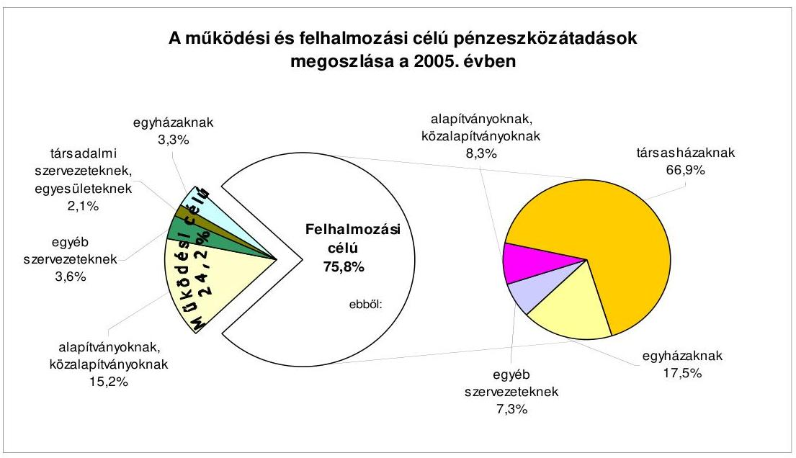
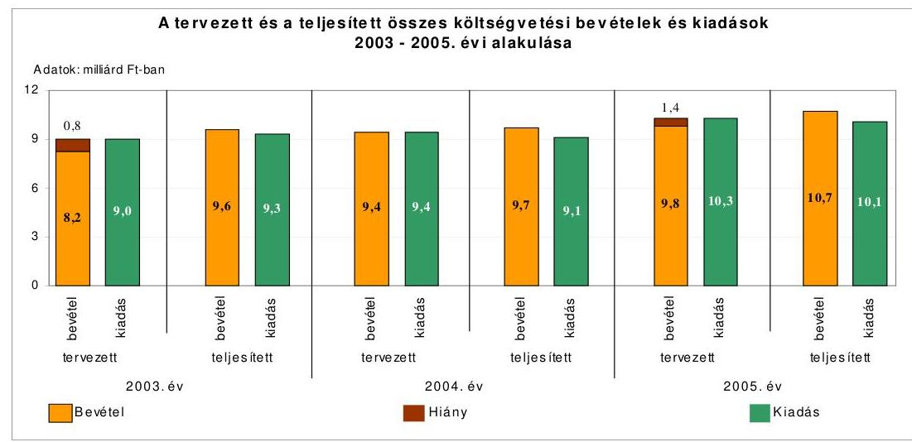
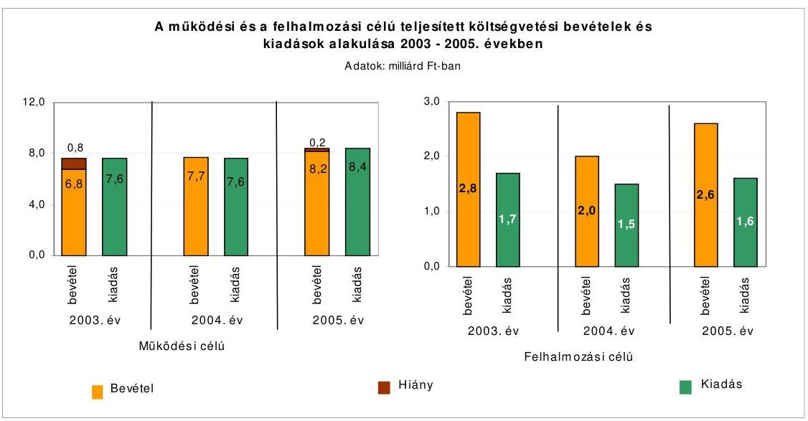
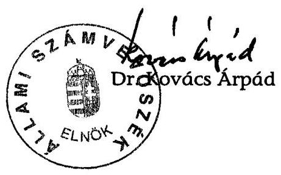
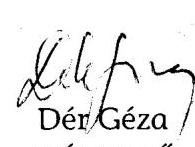
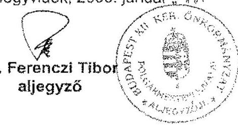

# JELENTÉS 

a Budapest Főváros XII. kerület Hegyvidék Önkormányzata gazdálkodási rendszerének 2006. évi átfogó ellenőrzéséről

---

# 3. Önkormányzati és Területi Ellenőrzési Igazgatóság 

3.3. Fővárosi Ellenőrzési Osztály

Iktatószám: V-1003-5/36/20/2006.
Témaszám: 803
Vizsgálat-azonosító szám: V0264

## Az ellenőrzést felügyelte:

Dr. Lóránt Zoltán
főigazgató
Az ellenőrzés végrehajtásáért felelős:
Dr. Sepsey Tamás
főigazgató-helyettes
Az ellenőrzést vezette:
Molnár Gyula Mihály
osztályvezető főtanácsos
Az ellenőrzést végezték:
Dr. Kiss Károly
számvevő tanácsos
Dér Géza
számvevő
Gyüre Lajosné
számvevő tanácsos

A témához kapcsolódó eddig készített számvevőszéki jelentések:
címe
sorszáma
Jelentés a helyi és a helyi kisebbségi önkormányzatok gazdálkodásának átfogó ellenőrzéséről
Jelentés a helyi önkormányzatok bérlakás építésre és korszerűsítés- 0349
re juttatott pénzügyi támogatások ellenőrzéséről

---

# TARTALOMJEGYZÉK 

BEVEZETÉS ..... 7
I. ÖSSZEGZŐ MEGÁLLAPÍTÁSOK, KÖVETKEZTETÉSEK, JAVASLATOK ..... 9
II. RÉSZLETES MEGÁLLAPÍTÁSOK ..... 25

1. A költségvetés tervezésének, végrehajtásának, az Önkormányzat vagyongazdálkodásának és a zárszámadás elkészítésének szabályszerűsége ..... 25
1.1. A költségvetési rendelet jóváhagyásának, módosításának, az előirányzatok nyilvántartásának szabályszerűsége ..... 25
1.2. A gazdálkodás szabályozottsága, a bizonylati rend és fegyelem szabályszerűsége ..... 32
1.3. A pénzügyi-számviteli feladatok ellátásának informatikai támogatottsága ..... 42
1.4. Az önkormányzati vagyon nyilvántartása, számbavétele ..... 43
1.5. A vagyonnal való gazdálkodás szabályszerűsége, célszerűsége, nyilvánossága ..... 45
1.6. A céljelleggel nyújtott támogatások szabályszerűsége ..... 55
1.7. A közbeszerzési eljárások szabályszerűsége ..... 60
1.8. A zárszámadási kötelezettség teljesítésének szabályszerűsége ..... 64
1.9. A Polgármesteri hivatal helyi kisebbségi önkormányzatok gazdálkodását segítő tevékenysége ..... 66
2. Az önkormányzati feladatok és a rendelkezésre álló források összhangja ..... 67
2.1. A feladatok meghatározása és szervezeti keretei ..... 67
2.2. A költségvetés egyensúlyának helyzete ..... 71
2.3. A feladatok finanszírozása ..... 78
3. A belső ellenőrzési rendszer működésének értékelése ..... 81
3.1. Az ellenőrzési rendszer kialakítása, működése ..... 81
3.2. A könyvvizsgálati kötelezettség teljesítése ..... 84
3.3. A korábbi számvevőszéki ellenőrzések javaslatainak hasznosulása ..... 85

---

# MELLÉKLETEK 

1. számú Az önkormányzat gazdálkodását meghatározó adatok, mutatószámok (1 oldal)
2. számú Az önkormányzati vagyon nagyságának alakulása (1 oldal)
3. számú Az Önkormányzat 2005. évi bevételeinek és kiadásainak alakulása (1 oldal)
4. számú Egyes önkormányzati feladatok finanszírozása (1 oldal)
5. számú Helyszíni ellenőrzési jegyzőkönyv (3 oldal)
6. számú Pokorni Zoltán úr, a Budapest Főváros XII. kerület Hegyvidék Önkormányzatának polgármestere által adott észrevétel (4 oldal)
7. számú Válasz Pokorni Zoltán úr, a Budapest Főváros XII. kerület Hegyvidék Önkormányzatának polgármestere által adott észrevételére (4 oldal)

---

# RÖVIDÍTÉSEK JEGYZÉKE 

## Törvények

Alkotmány
Áht.
Fot.
Hatv.
Htv.

Kbt.
Közokt. tv.
Ksztv.
Ltv.

Nek. tv.
Ötv.
Ptk.
Ptv.

Számv. tv.
Vt.

## Rendeletek

Ámr.
Ber.
Vhr.

20/1995. (III. 3.) Korm. rendelet

SzMSz
2005. évi költségvetési rendelet
2006. évi költségvetési rendelet
a Magyar Köztársaság Alkotmányáról szóló 1949. évi XX. törvény
az államháztartásról szóló 1992. évi XXXVIII. törvény
a fogyatékos személyek jogairól és esélyegyenlőségük biztosításáról szóló 1998. évi XXVI. törvény
a helyi adókról szóló 1990. évi C. törvény
a helyi önkormányzatok és szerveik, a köztársasági megbízottak, valamint egyes centrális alárendeltségű szervek feladat- és hatásköreiről szóló 1991. évi XX. törvény
a közbeszerzésekről szóló 2003. évi CXXIX. törvény
a közoktatásról szóló 1993. évi LXXIX. törvény
a közhasznú szervezetekről szóló 1997. évi CLVI. törvény
a lakások és helyiségek bérletére, valamint az elidegenítésükre vonatkozó egyes szabályokról szóló 1993. évi LXXVIII. törvény
a nemzeti és etnikai kisebbségek jogairól szóló 1993. évi LXXVII. törvény
a helyi önkormányzatokról szóló 1990. évi LXV. törvény
a Polgári Törvénykönyvről szóló 1959. évi IV. törvény
a pártok múködéséről és gazdálkodásáról szóló 1989. évi XXXIII. törvény
a számvitelről szóló 2000. évi C. törvény
a vízgazdálkodásról szóló 1995. évi LVII. törvény
az államháztartás múködési rendjéről szóló 217/1998. (XII. 30.) Korm. rendelet
a költségvetési szervek belső ellenőrzéséről szóló 193/2003. (IX. 26.) számú Korm. rendelet
az államháztartás szervezetei beszámolási és könyvvezetési kötelezettségének sajátosságairól szóló 249/2000. (XII. 24.) számú Korm. rendelet
a kisebbségi önkormányzatok költségvetésének, gazdálkodásának, vagyonjuttatásának egyes kérdéseiről szóló 20/1995. (III. 3.) Korm. rendelet
Budapest Főváros XII. kerület Hegyvidék Önkormányzatának Szervezeti és Múködési Szabályzatáról szóló 12/1995. (X. 25.) számú rendelete
Budapest Főváros XII. kerület Hegyvidék Önkormányzatának 3/2005. (III. 23.) számú rendelete a 2005. évi költségvetésről
Budapest Főváros XII. kerület Hegyvidék Önkormányzatának 2/2006. (III. 8.) számú rendelete a 2006. évi költségvetésről

---

2005. évi zárszámadási rendelet
helyiség bérbeadási rendelet
építményadó rendelet
vagyongazdálkodási rendelet

## Szórövidítések

ÁSZ
BÉT
Ellenőrzési csoport
FABER Kft.
FCSM Zrt.
FEUVE
GESZ
GVOP
gazdálkodási jogkörök szabályzata

Hágó Kft.
jegyzó
Képviselő-testület
Közbeszerzési Döntőbizottság
Oktatási iroda

Önkormányzat
Pénzügyi bizottság
Pénzügyi iroda
polgármester
Polgármesteri hivatal

Budapest Főváros XII. kerület Hegyvidék Önkormányzatának 17/2006. (V. 17.) számú rendelete a 2005. évi költségvetési zárszámadásról
Budapest Főváros XII. kerület Hegyvidék Önkormányzatának 24/1993. (XII. 23.) számú rendelete az Önkormányzat tulajdonában álló lakások és nem lakás céljára szolgáló helyiségek bérbeadásának feltételeiről
Budapest Főváros XII. kerület Hegyvidék Önkormányzatának 23/1996. (XII. 14.) számú rendelete az építményadóról
Budapest Főváros XII. kerület Hegyvidék Önkormányzatának 4/1994. (III. 2.) számú rendelete az Önkormányzat vagyona feletti tulajdonosi jogok gyakorlásáról

Állami Számvevőszék
Budapesti Értéktőzsde
Budapest Főváros XII. kerület Hegyvidék Önkormányzat Polgármesteri Hivatalának Belső Ellenőrzési Csoportja
FABER Tervező, Fővállalkozó és Ingatlanforgalmazó Korlátolt Felelősségű Társaság
Fővárosi Csatornázási Művek Zártkörű Részvénytársaság
folyamatba épített előzetes és utólagos vezetői ellenőrzés
Budapest Főváros XII. kerület Hegyvidék Önkormányzat Gazdasági Ellátó Szolgálata
Gazdasági Versenyképesség Operatív Program
Budapest Főváros XII. kerület Hegyvidék Önkormányzatának Polgármestere és Jegyzője által kiadott Pénzgazdálkodási és Kötelezettségvállalási Szabályzat
Hágó Házgondnoksági Korlátolt Felelősségű Társaság
Budapest Főváros XII. kerület Hegyvidék Önkormányzatának Jegyzője
Budapest Főváros XII. kerület Hegyvidék Önkormányzatának Képviselő-testülete
Közbeszerzések Tanácsa Közbeszerzési Döntőbizottsága
Budapest Főváros XII. kerület Hegyvidék Önkormányzat Polgármesteri Hivatalának Oktatási és Közművelődési Irodája
Budapest Főváros XII. kerület Hegyvidék Önkormányzata
Budapest Főváros XII. kerület Hegyvidék Önkormányzatának Pénzügyi Bizottsága
Budapest Főváros XII. kerület Hegyvidék Önkormányzat Polgármesteri Hivatalának Pénzügyi Irodája
Budapest Főváros XII. kerület Hegyvidék Önkormányzatának Polgármestere
Budapest Főváros XII. kerület Hegyvidék Önkormányzatának Polgármesteri Hivatala

---

| Polgármesteri hivatal | Budapest Főváros XII. kerület Hegyvidék Önkormányzat |
| :-- | :-- |
| ügyrendje | Polgármesteri Hivatalának Ugyrendje |
| Szabadidősport Központ | Budapest Főváros XII. kerület Hegyvidék Önkormányzatának Szabadidősport Központja |
| Tulajdonosi bizottság | Budapest Főváros XII. kerület Hegyvidék Önkormányzatának Tulajdonosi és Városfejlesztési Bizottsága |
| Vagyongazdálkodási | Budapest Főváros XII. kerület Hegyvidék Önkormányzat |
| iroda | Polgármesteri Hivatalának Vagyongazdálkodási Irodája |

---

.

---

# Jelentés 

## a Budapest Főváros XII. kerület Hegyvidék Önkormányzata gazdálkodási rendszerének 2006. évi átfogó ellenőrzéséről

## BEVEZETÉS

Az Ötv. 92. § (1) bekezdése, az Állami Számvevőszékről szóló 1989. évi XXXVIII. törvény 2. § (3) bekezdése, valamint az Áht. 120/A. § (1) bekezdése alapján az önkormányzatok gazdálkodását az Állami Számvevőszék ellenőrzi.

## Az ellenőrzés célja annak értékelése volt, hogy:

- az önkormányzati gazdálkodás törvényességét ${ }^{1}$, szabályszerűségét biztosítot-ták-e a tervezés, a költségvetés végrehajtása, a vagyongazdálkodás és a zárszámadás során;
- az Önkormányzat által ellátott feladatok és az azokhoz rendelkezésre álló források összhangja biztosított volt-e, különös tekintettel az egyes kiemelt feladatokra;
- a gazdálkodás szabályszerűségét biztosító belső kontrollok ${ }^{2}$ lehetővé tették-e a szabálytalanságok, hiányosságok, gazdaságtalan megoldások feltárását, megelőzését;

Az ellenőrzött időszak: a 2005. év, valamint a 2006. I. félév, az 1.5., 2.1-2.3. és 3.3. programpontok tekintetében a 2003-2004. évek is.

[^0]
[^0]:    ${ }^{1}$ A törvényi előírások betartásának elmulasztásakor a részletes megállapítások fejezetben egységesen a törvénysértés megjelölést alkalmazzuk, mivel az ÁSZ nem tehet különbséget a törvényi előírások között.
    ${ }^{2}$ A gazdálkodás szabályszerűségét biztosító kontroll alatt értjük a kiépített és működő belső irányítási és szabályozási rendszert, valamint a belső ellenőrzési funkciók ellátását.

---

Budapest Főváros XII. kerület Hegyvidék Önkormányzat közigazgatási területét 18 városrész ${ }^{3}$ alkotja. A kerület lakosainak száma 2006. január 1-én 59756 fő volt.

Az Önkormányzat 28 tagú Képviselő-testületének munkáját kilenc állandó bizottság segítette. A polgármester a 1998. évi választások óta töltötte be tisztségét, a 2006. évi önkormányzati választásokat követően a polgármester személye változott. A jegyző köztisztviselői jogviszonya 2006. február 28-án közös megegyezéssel megszűnt, ezt követően a jegyzői feladatokat a helyettesítési jogkörében eljárva az aljegyző látta el.

Az Önkormányzat feladatainak végrehajtása érdekében 39 költségvetési szervet múködtetett, amelyekből 11 önállóan gazdálkodott. A feladatok ellátásában részt vett négy közalapítványa, továbbá kettő gazdasági társasága. Az Önkormányzat költségvetési szerveinél a 2005. év végén foglalkoztatott közalkalmazottak száma 1348 fő, a köztisztviselők száma 239 fő volt. Az Önkormányzat a 2005. évben 11763 millió Ft bevételt ért el és 10921 millió Ft kiadást teljesített, a 2005. év végén 29373 millió Ft értékű könyvviteli mérleg szerinti vagyonnal rendelkezett. Az Önkormányzat gazdálkodását meghatározó adatokat, mutatószámokat az 1-3. számú mellékletek tartalmazzák.

A kerületben a 2002. évi önkormányzati választásokig nyolc ${ }^{4}$, azt követően hat ${ }^{5}$ kisebbségi önkormányzat múködött. A 2006. évi önkormányzati választások után nyolc ${ }^{6}$ kisebbségi önkormányzat alakult.

A jelentés megállapításainak, javaslatainak egyeztetése során a polgármester arról adott tájékoztatást, hogy az időközben megtett intézkedésekkel a javaslatok egy részét megvalósították. Ezekben az esetekben a jelentés II. Részletes megállapítások fejezetében az adott témához kapcsolt lábjegyzetben a megtett intézkedést feltüntettük és a kapcsolódó realizált javaslatot elhagytuk.

A jelentést az ÁSZ-ról szóló 1989. évi XXXVIII. törvény 25. § (1) bekezdése alapján észrevétel közlése céljából megküldtük Budapest Főváros XII. kerület Hegyvidék Önkormányzat polgármesterének. A kapott észrevételt a jelentés 6. számú melléklete, az arra adott választ a 7. számú melléklet tartalmazza. A számvevőszéki jelentésben a polgármester által továbbra is fenntartott észrevételeket és az arra adott válaszokat szerepeltetjük.

[^0]
[^0]:    ${ }^{3}$ Budakeszierdő, Csillebérc, Farkasrét, Farkasvölgy, Istenhegy, Jánoshegy, Kissvábhegy, Krisztinaváros, Kútvölgy, Magasút, Mártonhegy, Németvölgy, Orbánhegy, Sashegy, Svábhegy, Széchenyihegy, Virányos, Zugliget.
    ${ }^{4}$ Cigány, görög, horvát, német, örmény, ruszin, szerb, szlovák kisebbségi önkormányzat.
    ${ }^{5}$ Bolgár, horvát, német, örmény, szerb, szlovák kisebbségi önkormányzat.
    ${ }^{6}$ Bolgár, görög, horvát, német, örmény, ruszin, szerb, szlovák kisebbségi önkormányzat.

---

# I. ÖSSZEGZŐ MEGÁLLAPÍTÁSOK, KÖVETKEZTETÉSEK, JAVASLATOK 

Az Önkormányzat az Ötv-ben előírt, a gazdasági programjának meghatározására vonatkozó kötelezettségének eleget tett.

A 2005. és a 2006. évi költségvetési koncepciókat a polgármester az Áhtban előírt határidőben terjesztette a Képviselő-testület elé, a Pénzügyi bizottság koncepciókról alkotott véleményét az Ámr-ben foglaltak ellenére a koncepciók előterjesztéséhez nem csatolta. A 2005. és a 2006. évi költségvetési koncepciókat a helyben képződő bevételek és az ismert kötelezettségek figyelembevételével, a költségvetés készítés további munkálataira vonatkozó előírásokat meghatározva fogadta el a Képviselő-testület.

A polgármester az Áht-ban előírtak ellenére, a 2005. évi költségvetési rendelettervezetet határidőn túl, a 2006. évi költségvetési rendelettervezetet határidőben nyújtotta be a Képviselő-testületnek. A Képviselő-testület - az Áht. előírása ellenére - rendeletben nem határozta meg az Önkormányzat költségvetési és zárszámadási rendeleteinek előterjesztésekor a Képviselő-testület részére tájékoztatásul bemutatandó mérlegek, kimutatások tartalmi követelményeit. A 2005. és a 2006. évi költségvetési rendeletekben - az Áht-ban foglaltakat megsértve - a címrendet nem határozták meg. A polgármester a költségvetési rendelettervezetekhez a Pénzügyi bizottság véleményét az Ámr-ben foglaltak ellenére nem csatolta. A költségvetési rendeletek tartalmazták az Önkormányzat bevételeit, azonban elkülönítetten a tervezett hitel összegét, valamint a pénzmaradványt nem mutatták ki, azokat az önkormányzati saját bevételek között szerepeltették, így nem tettek eleget az Ámr-ben előírtaknak. A költségvetési rendeletekben bemutatták a múködési előirányzatokat az Önkormányzatra összesen, továbbá az önállóan és a részben önállóan gazdálkodó költségvetési szervenként, valamint a Polgármesteri hivatal költségvetését kiemelt előirányzatonkénti bontásban, és a létszámkereteket. Az Áht-ban foglaltakat ellenére a speciális célú támogatásokat elkülönítetten nem mutatták ki. A költségvetési rendeletekben - az Ámr. előírása ellenére - a felújítási előirányzatokat célonként, a felhalmozási kiadásokat feladatonként csak a Polgármesteri hivatal esetében mutatták be. Nem tettek eleget az Ámr-ben előírtaknak, mivel nem az örmény kisebbségi önkormányzat által elfogadott határozat alapján építették be az Önkormányzat költségvetési rendeletébe a kisebbségi önkormányzat költségvetését. A költségvetési rendeletekben a költségvetési szervek előirányzat átcsoportosításairól a Képviselő-testület beszámolók keretében történő tájékoztatását írták elő, ez a szabályozás nem volt összhangban az Ámr-ben előírtakkal. A költségvetési rendelettervezetek nem tartalmazták - az Áht-ban előírtak ellenére - a közvetett támogatásokról a kimutatást és annak szöveges indokolását.

A Képviselő-testület a 2005. évi költségvetési rendeletében jóváhagyott előirányzatokat négy alkalommal módosította. A Képviselő-testület az Ámr-ben foglalt költségvetési rendelet-módosítási kötelezettségének nem tett eleget, mivel a 2005. és 2006. I. negyedéveiben, valamint 2005 augusztusában a közpon-

---

ti költségvetéstől kapott pótelőirányzatokat a 2005. évi, illetve a 2006. évi költségvetési rendeleteken negyedévi időtartamon túl vezették át. A Képviselőtestület a 2005. évi költségvetési rendeletének egyes kiemelt előirányzatait az Ámr-ben előírt határidőn túl módosította. A 2005. évben az Áht. előírása ellenére a kisebbségi önkormányzatok költségvetési előirányzatainak módosítása a kisebbségi önkormányzatok határozatainak hiányában - nem a kisebbségi önkormányzatok határozatai alapján történt. A polgármester az átruházott, illetve - az általa előzetesen engedélyezett - az intézményi saját hatáskörben végrehajtott előirányzat átcsoportosítások kilenctizedéről az Ámr-ben előírtak ellenére a jegyző előkészítésében 30 napon túl tájékoztatta a Képviselőtestületet.

A Polgármesteri hivatal szervezetének felépítését és múködésének rendszerét a Polgármesteri hivatal „ügyrendjében" rögzítették, amely az Ámr. előírása ellenére nem tartalmazta az alapító okirat keltét, számát, továbbá a költségvetés végrehajtására szolgáló számlaszámot. A Pénzügyi iroda az Ámr. előírása ellenére nem rendelkezett ügyrenddel, azt a helyszíni vizsgálat ideje alatt készítették el. A polgármester és a jegyző a gazdálkodási jogkörök szabályzatában rögzítette a kötelezettségvállalásra, az utalványozásra és az ellenjegyzésre vonatkozó felhatalmazásokat. A jegyző szabályozta a szakmai teljesítés igazolásának módját és kijelölte az azt végző személyeket. Az érvényesítési feladatokat ellátó dolgozók - 2006. szeptember 22-ig - a jegyző írásbeli megbízásával az Ámr. előírása ellenére nem rendelkeztek. A gazdálkodási jogkörök szabályzatában éltek az Ámr-ben biztosított lehetőséggel, miszerint az 50 ezer Ft-ot el nem érő kifizetések esetében nem szükséges előzetes írásbeli kötelezettségvállalás, azonban ennek rendjét és nyilvántartási formáját - az Ámr. előírása ellenére - belső szabályzatban nem rögzítették. A gazdálkodási és ellenőrzési jogkörök gyakorlásáról a felhatalmazottakat nem számoltatták be, a beszámoltatás formáját és gyakoriságát nem szabályozták.

A Polgármesteri hivatal számviteli politikáját, a kapcsolódó szabályzatokat a jegyző elkészítette, és a Htv. előírása alapján meghatározta a költségvetési szervek egységes számviteli rendjét. A számviteli politika tartalma összhangban volt a Vhr. előírásaival. A leltározási szabályzat tartalmazta a leltározás módját, munkaszakaszait, a leltározásban résztvevők feladatait, felelősségét. Az ingatlanok, a gépek, berendezések és felszerelések, valamint a jármúvek esetében kétévenként írtak elő mennyiségi felvétellel történő leltározást, azonban annak szabályait a Vhr-ben foglalt előírás ellenére rendeletben nem rögzítették. Az eszközök és források értékelési szabályzatában - a Vhr. előírásai szerint - eszközcsoportonkénti részletezettségben írták elő az értékelés szabályait, az értékvesztés elszámolásának és visszaírásának rendjét. A helyi adó követelések esetén egyedi értékelési kötelezettséget írtak elő, az adó követelések értékelésénél az egyszerúsített értékelést alkalmazták. A pénzkezelési szabályzatban rögzítették a bankszámlaforgalommal, a bankkártyával és az ügyfélterminál kezelésével kapcsolatos előírásokat. A szabályzatban úgy rendelkeztek, hogy a Polgármesteri hivatalban házi pénztárat nem múködtetnek, meghatározták a költségvetési elszámolási számláról történő készpénzfelvétel és az arra történő készpénzbefizetések rendjét. Elkészítették a felesleges vagyontárgyak feltárásáról, hasznosításáról, a selejtezés rendjéről szóló szabályzatot, előírták az eljárási rendet, annak bizonylatait, meghatározták a minősítésre és döntésre jogosultakat.

---

A számlarendben a Vhr-ben foglaltak ellenére nem határozták meg az analitikus nyilvántartások vezetésének módját, azok formáját és tartalmát, nem rögzítették az egyeztetések dokumentálási módját, nem írták elő az analitikus nyilvántartások adataiból készített összesítő bizonylatok (feladások) elkészítésének határidejét, továbbá nem rögzítették, hogy a főkönyvi számlák további bontásával, vagy részletező, analitikus nyilvántartások vezetésével biztosítják az önkormányzati törzsvagyon, valamint a nem törzsvagyon részét képező eszközök elkülönített nyilvántartását. A Polgármesteri hivatal számviteli szabályzatai tartalmazták a kisebbségi önkormányzatok számviteli elszámolási, nyilvántartási és pénzkezelési szabályait is. A Polgármesteri hivatalban a gazdálkodási feladatokat ellátó dolgozók munkaköri leírásaiban nem szerepeltek az érvényesítés, a szakmai teljesítés igazolás és az utalvány ellenjegyzés feladatai, továbbá azokban nem rögzítették az esetleges eltérések dokumentálásának módját és a jelzési kötelezettséget. Ezen hiányosságokat a helyszíni vizsgálat ideje alatt pótolták. A jegyző az Áht. előírását megsértve nem gondoskodott a FEUVE megszervezéséről, múködtetéséről, valamint az Ámr. előírásai ellenére nem készítette el a Polgármesteri hivatal ellenőrzési nyomvonalát, nem alakította ki és nem múködtette a kockázatkezelés rendjét, továbbá nem szabályozta a szabálytalanságok kezelésének eljárásrendjét.

A 2005. évben és a 2006. I. félévben az operatív gazdálkodási és ellenőrzési jogkörök gyakorlásánál az összeférhetetlenségi szabályokat betartották, a feladatokat - az érvényesítés kivételével - a szabályzatokban az arra felhatalmazottak végezték. A költségvetést terhelő kötelezettségvállalásokat az Ámr. előírása alapján írásba foglalták, azonban az Ámr. előírása ellenére elmaradt a kötelezettségvállalások 2\%-ánál az ellenjegyzés. A Számv. tv. előírásait megsértve a bizonylatok több mint egynegyede nem tartalmazta a folyamatba épített ellenőrzési feladatok elvégzését igazoló aláírásokat, illetve a segélykifizetések alapjául szolgáló összesítő bizonylatokon a kiállító aláírását. Az utalványozásra alkalmazott formanyomtatvány nem felelt meg az Ámr-ben foglalt előírásoknak. Az utalványrendeletek 7\%-a az Ámr. előírása ellenére nem tartalmazta a kötelezettségvállalás nyilvántartásba vételi sorszámát. Az Ámr-ben foglaltak ellenére a szakmai teljesítés igazolása nem történt meg a bizonylatok 3\%-ánál. Az érvényesítők a bizonylatok 17\%-ánál nem végezték el az Ámr-ben rögzített folyamatba épített ellenőrzési feladatokat, mivel nem ellenőrizték a kötelezettségvállalás tárgyával összefüggő fedezet meglétét, nem észrevételezték a kötelezettségvállalás ellenjegyzésének és a szakmai teljesítés igazolásának elmaradását, továbbá a bizonylatokon a Számv. tv-ben előírt alaki és tartalmi kellékek hiányosságait, a szükséges aláírások, valamint a kötelezettségvállalás nyilvántartásba vételi sorszáma feltüntetésének hiányát. A kötelezettségvállalás és az utalvány ellenjegyzője a kiadások 8\%-ánál az Ámr. előírása ellenére nem győződött meg arról, hogy a teljesítéshez biztosított-e a kötelezettségvállalás tárgyával összefüggő kiadási előirányzat, továbbá, hogy a kötelezettségvállalás nem sérti-e a gazdálkodásra vonatkozó - az Ötv. és az éves költségvetési rendeletben foglalt - hatásköri szabályokat, aminek következtében az előirányzatok túllépésével a kötelezettségvállaló megsértette az Áht. előírásait is. Az utalvány ellenjegyzője - az Ámr. előírásai ellenére - a bizonylatok közel egynegyedénél nem látta el az ellenjegyzésre vonatkozó jogkörét, továbbá elmulasztotta ellenőrzési feladatainak elvégzését az aláírását tartalmazó bizonylatokon, amelyeken hiányzott a kötelezettségvállalás ellenjegyzése, a szakmai teljesítés igazolása, a kötelezettségvállalás nyilvántartásba vételi sorszámának

---

feltüntetése, illetve a bizonylatok teljes körénél, melyeken az érvényesítést a jegyző írásbeli megbízása nélkül végezték. A pénzkezelési szabályzat előlegek folyósítására és elszámolására vonatkozó előírásaival ellentétesen négy fő részére állandó előleget biztosítottak, illetve az elszámolásra kifizetett összegek egynegyedénél (átlagosan 11 nappal) túllépték az elszámolási határidőket. Az elszámolási határidők meghatározása során nem tartották be a pénzkezelési szabályzat azon előírását, amely szerint a negyedévek végén nem lehet elszámolásra kiadott összeg.

A 2005. évben és a 2006. I. félévben a pénzforgalmat érintő gazdasági események bizonylatainak rögzítése a számviteli nyilvántartásokban a Vhrben előírt határidőben történt meg, azonban az egyéb gazdasági események elszámolása során a 2005. évben nem tartották be a Vhr-ben előírt határidőt. A főkönyvi és az analitikus nyilvántartások egyeztetését negyedévenként elvégezték. A 2005. évi könyvviteli mérleget és a pénzforgalmi jelentést főkönyvi kivonattal támasztották alá. A 2005. évben a kötelezettségvállalások analitikus nyilvántartását nem folyamatosan és nem naprakészen vezették, ezáltal abból az Ámr. előírásai ellenére nem volt megállapítható az évenkénti kötelezettségvállalás összege és nem biztosította annak lehetőségét, hogy a költségvetés végrehajtása során a kötelezettségvállalás és az utalványozás csak a jóváhagyott kiadási előirányzatok mértékéig teljesüljön. A 2006. évben a kötelezettségvállalások analitikus nyilvántartását folyamatosan és naprakészen vezették. Az Áht. előírását megsértve önkormányzati szinten túllépték a 2005. évi költségvetés ellátottak pénzbeli juttatásainak kiemelt előirányzatát. Az éves költségvetési előirányzatát - az Áht. előírásait megsértve - kettő önállóan és 15 részben önállóan gazdálkodó intézmény, az egyes kiemelt előirányzatait a Polgármesteri hivatal, kilenc önálló, továbbá 21 részben önálló gazdálkodási jogkörrel rendelkező intézmény lépte túl. A 2005. évi előirányzat túllépések okait - a Képviselőtestület erre irányuló döntése ellenére - nem vizsgálták, felelősségre vonás nem történt.

A Polgármesteri hivatal számviteli rendszerének informatikai támogatását külső szolgáltatóval kötött szerződésekkel biztosították. A főkönyvi és az analitikus nyilvántartások programjai között nem volt közvetlen adatátadást lehetővé tevő kapcsolat. A pénzügyi-számviteli területen a 2005. évben eszközök beszerzése és programok fejlesztése történt. A Polgármesteri hivatalban informatikai stratégiát és katasztrófa elhárítási tervet nem készítettek. Az egyes programokhoz a hozzáférési jogosultságot kialakították, azt dokumentálták. A pénzügyi-számviteli területen dolgozók rendelkeztek az alkalmazott informatikai rendszer üzemeltetési dokumentációjával és a felhasználók részére készített leírással. A Pénzügyi iroda dolgozói felének a munkaköri leírása nem tartalmazta a munkakörök ellátásához szükséges rendszer megnevezését és a felhasználói jogosultságot.

Az Önkormányzatnál a vagyon nyilvántartása a Vhr. előírásainak megfelel. Önkormányzati forrásból a 2003. és a 2005. években víziközmű fejlesztés nem történt. A Polgármesteri hivatal a 2005. évi leltározási kötelezettségének nem a Vhr. előírásai szerint tett eleget, mivel a tárgyi eszközökre vonatkozóan nem teljesítették a mennyiségi felvétellel történő leltározást. Az Önkormányzati vagyon értékelése során a követelések értékelését a Számv. tv előírása ellenére nem végezték el. Az adókövetelések esetében a 2005. évben a követelés értéke-

---

lését egyszerűsített értékelési eljárással elvégezték, annak ellenére, hogy a csoportos értékelési eljárással nem kívántak élni. A részesedések nyilvántartásáról gondoskodtak, az értékelésükhöz szükséges információk rendelkezésre álltak. A 2005. évben az értékvesztés elszámolásának szükségességét nem vizsgálták, a Számv. tv. előírását figyelmen kívül hagyva értékvesztést nem számoltak el, annak ellenére, hogy az indokolt volt. Az értékpapírok esetében értékvesztés elszámolása és az értékvesztés visszaírásának elszámolása nem volt indokolt, mivel annak összege a számviteli politikában meghatározott jelentős összeg értéke alatt maradt.

Az Önkormányzat a vagyonnal történő gazdálkodását vagyongazdálkodási, valamint helyiség bérbeadási rendeletben szabályozta, melyek hatálya a teljes vagyoni körre kiterjedt. Elkülönítették a forgalomképes és a törzsvagyon körét, ezzel eleget tettek a Htv-ben és az Ötv-ben előírtaknak. A vagyongazdálkodási rendeletben az Ötv-ben előírt lehetőséggel nem éltek, a forgalomképesség szerinti besorolás megváltoztatásának módjáról nem rendelkeztek. Értékhatárhoz kötve szabályozták a rendelkezési jogokat, a vagyont érintő döntéseket a Képviselő-testület, a Tulajdonosi bizottság és a polgármester hozták. Az Önkormányzatnál betartották az Áht. előírásait, mivel a vagyongazdálkodási rendeletben szabályozták az ingyenes vagyonátadás és a követelésről történő lemondás eseteit és módját, öt millió Ft-ban meghatározták azt az értékhatárt, amely felett csak nyilvános pályázat útján lehet vagyont értékesíteni. Egy vagyonértékesítés során a vagyongazdálkodási rendeletben foglaltak ellenére a versenyeztetési eljárást mellőzték. Kettő törzsvagyoni körbe tartozó ingatlan elidegenítése során értékbecslés nem készült. Az Önkormányzat a forgalomképtelen törzsvagyonába tartozó közút és közpark elidegenítésével megsértette az Ötv. előírását. Az értékesített ingatlanok forgalomképes vagyoni körbe történő átsorolásáról a Képviselő-testület a vagyongazdálkodási rendelet módosításával nem döntött. Az Önkormányzatnál a 2003-2006. I. félévében kettő ingyenes vagyonátadás történt. Az Önkormányzat gazdasági társaság részére - kép-viselő-testületi döntés alapján - történő víziközmű tulajdonba adásával megsértette az Ötv. és a Vt. előírását, mivel a víziközmű a törzsvagyon körébe tartozik. A közzétételi kötelezettséget szabályozták, az Önkormányzat által nyújtott nem normatív, céljellegú fejlesztési támogatásokat és az öt millió Ft feletti nettó értékű árabeszerzésekkel, szolgáltatással, beruházással és vagyongazdálkodással kapcsolatos szerződéseket a honlapon közzétették. A 2003-2005. években az Önkormányzat vagyonának értéke 2,5\%-kal emelkedett. Az Önkormányzat érdekeit biztosító - vagyongazdálkodási rendeletben rögzített - előírásokat betartották és a garanciális elemeket a szerződésekben az ingatlan értékesítések során rögzítették. Három ingatlan bérbeadása pályáztatás nélkül történt, a helyiség bérbeadási rendelet előírásainak figyelembevételével. Az Önkormányzat bérbeadás keretében a kerületben múködő pártszervezetek részére közvetett támogatást nyújtott kedvezményes bérleti díj megállapításával, ami az Ötv. előírásaival ellentétes. Az Önkormányzatnál a 2003-2005. években követelésről lemondás nem volt. Az Önkormányzat az Ltv. előírását megsértve nem adta át a Fővárosi Önkormányzatnak az önkormányzati lakások elidegenítéséből származó bevételek 50\%-át.

Az Önkormányzat 2005. és 2006. évi költségvetési rendeleteiben megtervezett céljellegú támogatások előirányzatait a dologi, illetve a felhalmozási kiadások kiemelt előirányzataiban szerepeltették. Az Önkormányzat múködési és

---

felhalmozási célokra a 2005. évben 90 millió Ft, a 2006. I. félévben 31 millió Ft összegben nyújtott támogatást különböző szervezetek részére. A 2005. évben és a 2006. I. félévben - az Ötv. előírásait megsértve - a polgármester 18 alapítványt és négy közalapítványt összesen 11 millió Ft-tal, egy önkormányzati költségvetési szerv egy alapítványt 1 millió Ft-tal támogatott. A 2005. évben ez a költségvetési szerv az éves költségvetésében jóváhagyott dologi kiadások terhére - az Áht. előírását megsértve - három társadalmi szervezetet támogatott képviselő-testületi engedély nélkül. A Képviselő-testület az 50 lakás feletti társasházak felújításainak támogatása céljára elkülönített keret-előirányzatok terhére, a 2005. és a 2006. évi költségvetési rendeletek végrehajtási szabályai között rögzített hatásköri előírásokkal ellentétesen, határozatában felhatalmazta a Tulajdonosi bizottságot a támogatási kérelmek elbírálására. A polgármester, illetve a Tulajdonosi bizottság a céljelleggel nyújtott támogatások jóváhagyása során a 2005. évben és a 2006. I. félévben összesen 37 millió Ft átadásáról az Ötv. előírását megsértve, a költségvetési rendelet hatásköri előírásaival ellentétesen hozott döntést, mivel az általuk jóváhagyott pénzeszközátadásokra vonatkozóan a költségvetési rendeletekben nem kaptak hatáskört a Képviselő-testülettől. A támogatásban részesített szervezetekkel a polgármester támogatási szerződést, illetve megállapodást kötött, amelyekben az Áht-ban foglaltaknak megfelelően előírták a számadási kötelezettséget. A támogatottak 7\%-a (12 szervezet) az elszámolási kötelezettségét az előírt határidő után teljesítette. A támogatottak egytizede ( 16 szervezet) nem nyújtott be számadást, a Polgármesteri hivatal a számadások pótlására 14 szervezetet felszólított. A határidő, illetve a támogatási szerződés módosítását kérelmező kettő egyházi szervezet kérelmének elbírálásáról a helyszíni vizsgálat befejezéséig nem döntöttek. A számadás pótlására felszólított támogatottak 2006. november 3-ig nem tettek eleget elszámolási kötelezettségüknek, ennek ellenére a finanszírozó a támogatás összegének visszafizetésére az Áht. előírását megsértve nem intézkedett. A támogatások rendeltetés szerinti felhasználását a támogatottak közel egyharmadánál az Áht. megsértve nem ellenőrizték. Az Önkormányzat által az Angelica Alapítvány részére biztosított támogatás elszámolását és felhasználását ellenőrizte az ÁSZ, és céltól eltérő felhasználást nem állapított meg.

Az Önkormányzat a 2005. és a 2006. éves összesített közbeszerzési terveit elkészítette. A polgármester utasításban rendelkezett az Önkormányzat és a Polgármesteri hivatal esetében alkalmazandó közbeszerzési eljárási szabályokról. Az Önkormányzat a beszerzései becsült értékének megállapításakor a Kbt. szerint járt el, az egybeszámításra vonatkozó szabályt betartották. A közbeszerzési eljárást a Kbt. hatálya alá tartozó beszerzésekre alkalmazták, eljárás mellőzésére nem került sor. Az ÁSZ ellenőrzés által részletesen vizsgált közbeszerzési eljárás során a Kbt. előírásait - az eljárás eredményéről szóló tájékoztató késedelmes közzététele kivételével - betartották. A polgármester a 2005. évben lefolytatott közbeszerzésekről az éves statisztikai összegzést - a Kbt-ben foglalt határidőn túl - késedelmesen küldte meg a Közbeszerzések Tanácsa részére. A közbeszerzések, illetve a közbeszerzési eljárások szabályszerűségét a Polgármesteri hivatalnál belső ellenőrzés keretében vizsgálták, azonban az Önkormányzat önállóan gazdálkodó költségvetési szerveinél - a Kbt-ben előírtak ellenére nem ellenőrizték. A Közbeszerzési Döntőbizottság a 2005. évben kettő alkalommal indított eljárást az Önkormányzat ellen a közbeszerzési eljárásra vonatkozó szabályok megsértése miatt, a Közbeszerzési Döntőbizottság határozatában a jogorvoslati kérelemnek részben helyt adott, azonban bírság kiszabá-

---

sát mellőzte, a másik esetben a benyújtott kérelmet a Közbeszerzési Döntőbizottság elutasította.

A 2005. évi zárszámadási rendelettervezetet a polgármester az Áht-ban előírt határidőn belül terjesztette a Képviselő-testület elé. A zárszámadási rendelet a költségvetési rendelettel összehasonlítható módon készült. A 2005. évi zárszámadásról szóló rendelettervezet az Áht-ban előírtak ellenére nem tartalmazta a speciális célú támogatásokat az Önkormányzatra összesen és költségvetési szervenként. A zárszámadási rendeletben az Ámr. előírása ellenére a felújítási előirányzatokat célonként, a felhalmozási kiadásokat feladatonként az intézmények esetében nem mutatták be. A zárszámadás előterjesztésekor a Képviselő-testület részére bemutatták az Áht. szerinti összevont mérlegeket, a többéves kihatással járó döntéseket szöveges indoklással, továbbá a vagyonkimutatást. A közvetett támogatásokat a szöveges indoklással együtt, az Áht-ban foglaltak ellenére nem mutatták be. Az Áht-ban foglaltak ellenére az Önkormányzat 2005. évi zárszámadási rendeletébe a helyi kisebbségi önkormányzatok zárszámadását - a helyi kisebbségi önkormányzatok zárszámadási határozatainak hiányában - nem a helyi kisebbségi önkormányzatok határozatai alapján építették be. A Képviselő-testület a zárszámadási rendeletben - az Ámrben előírtak ellenére - a részben önállóan gazdálkodó költségvetési szervek pénzmaradványát nem, hanem önkormányzati szinten összevontan, valamint önállóan gazdálkodó költségvetési szervenként hagyta jóvá. A Polgármesteri hivatal módosított pénzmaradványát a Vhr-ben, illetve az Ámr-ben foglaltak figyelembevételével állapították meg. Az önkormányzati intézmények költségvetési beszámolóit a Polgármesteri hivatal felülvizsgálta, azonban a költségvetési szerveket az éves számszaki beszámolójuk és múködésük elbírálásáról, jóváhagyásáról írásban az Ámr-ben foglaltak ellenére nem értesítették. A zárszámadási rendelet és a költségvetési beszámoló számszaki adatainak összhangját a múködési és felhalmozási célú pénzeszközátadások tekintetében nem biztosították.

Az Önkormányzat illetékességi területén múködő hat helyi kisebbségi önkormányzattal a polgármester megkötötte az együttmúködési megállapodásokat, amelyeket az Önkormányzat és a kisebbségi önkormányzatok testületei határozattal nem hagyták jóvá, ezzel az Ötv-ben, illetve a Nek. tv-ben foglaltakat nem tartották be. Az együttmúködési megállapodásokban az elfogadott zárszámadási határozatok továbbítására konkrét időpontot nem jelöltek meg, így az Ámr-ben foglaltaknak nem tettek eleget. Az együttmúködési megállapodásokat a 2005. évre vonatkozóan az Ámr-ben előírt január 15-i határidőig nem módosították. A Polgármesteri hivatalban elkülönítetten vezették a kisebbségi önkormányzatok vagyoni- és számviteli nyilvántartásait. Az Önkormányzat - a Nek. tv. előírását betartva - gondoskodott a kisebbségi önkormányzatok testületi múködésének tárgyi feltételeiről, múködésüket önkormányzati pénzeszközök juttatásával is segítette.

A Képviselő-testület nem határozta meg - az Ötv. előírásai ellenére - a kötelező és az önként vállalt feladatai ellátásának módját és mértékét. Az Önkormányzat kötelező és önként vállalt feladatait az általa alapított költségvetési szervekkel, gazdasági társaságaival, közalapítványaival, gazdasági társaságok részére adott megbízásokkal, valamint egyéb szervezetekkel kötött ellátási szerződésekkel biztosította. A Képviselő-testület a gazdaságossági, pénzügyi szem-

---

pontok alapján, a feladatellátás hatékonyabb szervezeti megoldása érdekében a 2003-2005. években különböző, az intézményrendszer felépítését érintő - bölcsőde, óvoda, szociális-, illetve egészségügyi intézmény megszüntetése, összevonása, középfokú oktatási intézmények Budapest Főváros Önkormányzatának, illetve a Semmelweis Egyetemnek történő átadása, közalapítványok összevonása - intézkedéseket hozott. A végrehajtott szervezeti változások szakmai és gazdasági előnyeit a Képviselő-testület a vonatkozó előterjesztések alapján értékelte.

Az Önkormányzat költségvetésének egyensúlya a 2003. és a 2005. években a jóváhagyott költségvetési rendeletek szerint nem volt biztosított, a tervezett hiány mértéke a költségvetési főösszeg 8\%-ának, illetve 5\%-ának felelt meg. A tervezett hiány kialakulásában szerepet játszott a saját bevételek alultervezése és a felhalmozási kiadások túltervezés. A hiányt a költségvetésekben hitel felvételével tervezték pótolni. A 2004. évben a tervezett költségvetési bevételek 37 millió Ft-tal meghaladták a tervezett költségvetési kiadásokat. Az Önkormányzat költségvetési egyensúlya a tervezetthez képest kedvezőbben alakult, mert a 2003-2005. évek költségvetéseinek teljesítése során a költségvetési bevételek fedezetet nyújtottak a költségvetési kiadásokra. A múködési célú kiadások fedezetére a 2003. évben 801 millió Ft, a 2005. évben 235 millió Ft felhalmozási célú bevételt fordítottak. Az Önkormányzat gazdálkodásához mind a három évben vettek fel likviditási hitelt, amit a 2003. évben az adott éven belül nem fizettek vissza. Az Önkormányzat hosszúlejáratú adósságszolgálati kötelezettsége az időszak alatt megháromszorozódott, a 2005. év végén 949 millió Ft volt. A Képviselő-testület fejlesztési célhitelek igénybevételéről a 2003. és a 2004. évben döntött, illetve a 2006. évben kötvénykibocsátásról határozott. A hitelfelvételek indokait és megalapozottságát a Pénzügyi bizottság az Ötv. előírása alapján vizsgálta. A döntések során az adósságot keletkeztető kötelezettségvállalás felső határát bemutatták és betartották. A költségvetés egyensúlyának javítása érdekében az önkormányzati feladatellátás hatékonyságát, az intézmények kapacitás kihasználtságát vizsgálták és intézmény megszüntetésekről, illetve átszervezésekről döntöttek. Az Önkormányzat illetékességi területén lévő építményeket az 1996. évtől adóztatják építményadóval, más helyi adót nem vezettek be. A 2004. évtől adóköteles körbe vonták a vállalkozás céljára használt lakásokat, valamint az építményadó mértékét növelték, ami a 2005. évben a Hatv-ben rögzített felső határ 96\%-át jelentette. A 2003-2005. évek közötti időszakban a helyi adóbevételek részaránya - az iparűzési adóval együtt - az öszszes bevételen belül emelkedett, az egyes években 19-23-25\% volt. Az Önkormányzat a feladatellátás finanszírozásához rendelkezésre álló forrásait a 20032005. évek között külső, ezek között pályázati úton elnyert forrásokkal növelte, a három évben felhalmozási célra összesen 102 millió Ft pénzeszközt vett át.

Az ellenőrzött időszak alatt a fajlagos kiadás a bölcsődei ellátás, az óvodai nevelés, az általános iskolai oktatás, a középiskolai oktatás, valamint a nappali szociális intézményi ellátás területén 2-30\%-kal növekedett. A nappali szociális intézményi ellátás esetében az engedélyezett férőhelyszámhoz képest a tényleges kihasználtság csökkent. Az ellátott feladatok és az azokhoz rendelkezésre álló források összhangja biztosított volt, az önkormányzati hozzájárulás mértéke a 2003. évben 39-67\%, a 2005. évben 45-63\% volt. Az önként vállalt feladatok megvalósítására a 2003-2005. években az éves költségvetési kiadások 24\%át, $21 \%$-át, illetve $20 \%$-át fordították. Az Önkormányzat önként vállalt felada-

---

tainak ellátása a 2003-2005. években nem veszélyeztette a kötelező feladatok megvalósítását. Az Önkormányzat középületeinek 30\%-ánál gondoskodott az akadálymentesítésről, a Fot. előírásai ellenére 25 önkormányzati középület akadálymentesítését nem oldották meg.

Az Önkormányzatnál a 2005. évben kialakították a belső ellenőrzési feladatok végrehajtásának szervezeti kereteit, gondoskodtak annak múködtetéséhez szükséges források biztosításáról. A belső ellenőrzések tervezési, eljárási és végrehajtási rendjét a 2003. március 13-án kiadott Ellenőrzési Szabályzatban határozták meg, melynek előírásai a jogszabályi változásokkal kapcsolatos aktualizálás elmaradása miatt nem feleltek meg a Ber-ben rögzített tartalomnak. A belső ellenőrök létszámát a Ber-ben előírtak ellenére nem kapacitás felmérés alapján állapították meg. A belső ellenőrzési kézikönyvet a Ber. előírása ellenére a jegyző nem hagyta jóvá. A belső ellenőrzési vezető nem tett eleget a Berben foglalt feladatának, mivel nem készítette el a kockázatelemzéssel alátámasztott stratégiai ellenőrzési tervet. A 2005. évi ellenőrzési tervet a Ber. előírása alapján a jegyző, a 2006. évi ellenőrzési tervet az Ötv-ben foglaltak alapján az SzMSz-ben átruházott hatáskörében eljárva a Pénzügyi bizottság hagyta jóvá. Az éves ellenőrzési tervek a Ber. előírása ellenére nem tartalmazták a tervet megalapozó kockázatelemzést. A jegyző a 2005. évben és a 2006. I. félévben az Önkormányzat belső ellenőrzése keretében - az Ötv-ben foglalt előírás alapján - gondoskodott a költségvetési szervek ellenőrzéséről. A Polgármesteri hivatalnál és az intézményeknél az éves ellenőrzési tervben foglalt feladatokat elvégezték. Az ellenőrzött intézmények vezetői a Ber. előírásainak megfelelően intézkedési tervet készítettek, az intézményi beszámolók és egy utóellenőrzés alapján a javasatok $38 \%$-os realizálására került sor. A Polgármesteri hivatal 2005. évi ellenőrzése során feltárt hibák, hiányosságok kijavítására, illetve megszüntetésére a Ber. előírása ellenére az ellenőrzött szervezeti egységek vezetői intézkedési tervet nem készítettek, ezen javaslatok realizálását a belső ellenőrzés keretében nem ellenőrizték. A jegyző az Áht. előírását megsértve, a FEUVE múködtetése tekintetében nem tett eleget beszámolási kötelezettségének. A polgármester a 2005. évi zárszámadási rendelettervezettel egyidejűleg a Képviselőtestület elé terjesztette az éves ellenőrzési jelentést a belső ellenőrzési tevékenységről, amit a Képviselő-testület jóváhagyott.

Az Önkormányzat az Ötv-ben előírt könyvvizsgálati kötelezettségét teljesítette, a könyvvizsgálattal költségvetési minősítésű könyvvizsgálót bízott meg. A könyvvizsgáló a Polgármesteri hivatal és az önkormányzati intézmények adatait összevontan tartalmazó 2005. évi egyszerűsített költségvetési beszámolót hitelesítő záradékkal látta el, auditálási eltérést nem állapított meg.

Az Önkormányzat gazdálkodását az ÁSZ a 2002. évben átfogó jelleggel ellenőrizte, amely mellett a 2003. évben a bérlakásépítésre és korszerűsítésre juttatott pénzügyi támogatásokkal kapcsolatban tartott vizsgálatot. A jelentések összesen 17 javaslatot tartalmaztak az önkormányzati gazdálkodás szabályszerűségének és a végzett munka színvonalának javítása céljából. A javaslatok háromtizedét hasznosították teljesen, öt javaslatra részben, hét javaslat végrehajtásáról nem intézkedtek. A javaslatok alapján a számviteli politikát és annak részeként elkészített szabályzatokat aktualizálták, gondoskodtak a gazdálkodási és ellenőrzési jogköröket ellátó személyek aláírás-mintáinak elkészítéséről, meghatározták a Polgármesteri hivatal egészére kiterjedően a közbeszerzés

---

folyamatait, és az abban közremúködők feladatait. Az önkormányzati lakás- és helyiségüzemeltetési, -fenntartási feladatellátás szervezeti kereteit módosították, kialakították a bérlakás értékesítés elszámolási számla és a költségvetési elszámolási számla közti átvezetések nyilvántartási rendszerét. Részben hasznosult a költségvetési rendelettervezetek határidőben történő benyújtására irányuló javaslat, mivel a polgármester a 2005. évi költségvetési rendelettervezetet az Ámr-ben előírt határidőn túl, a 2006. évi költségvetési rendelettervezetet határidőben nyújtotta be a Képviselő-testület részére. Részben intézkedtek az utalványrendelet Ámr-ben előírtaknak megfelelő tartalmú elkészítéséről, mivel az alkalmazott formanyomtatvány nem tartalmazta a befizető és a kedvezményezett címét, továbbá a kötelezettségvállalás-nyilvántartásba vétel sorszámát. Részben teljesült a költségvetési és a zárszámadási rendelettervezetek benyújtásakor az Áht-ban előírt mérlegek és kimutatások csatolására irányuló kettő javaslat, mivel a Képviselő-testület részére nem mutatták be tájékoztatásul a költségvetési rendeletek előterjesztésekor, illetőleg a 2005. évi zárszámadáskor a közvetett támogatásokat tartalmazó kimutatást és annak szöveges indoklását. Az átfogó vizsgálatról készült korábbi számvevői jelentés megállapításairól az intézkedési tervet elkészítették, azonban a Képviselő-testület tájékoztatása nem történt meg. A helyszíni ellenőrzés megkezdéséig - az Ámr. előirása ellenére nem rögzítették együttmúködési megállapodásban a zárszámadást elfogadó kisebbségi határozatok átadásának határidejét, az Áht-ban előírtak ellenére a kisebbségi önkormányzatok költségvetési előirányzatait az Önkormányzat 2005. évi költségvetési rendeletében nem a kisebbségi önkormányzatok költségvetési határozatai alapján módosították. Nem gondoskodtak a kisebbségi önkormányzatok költségvetés tervezésének, előirányzat módosításainak, valamint a költségvetési beszámolók elkészítésének Polgármesteri hivatal általi segítésére irányuló javaslat végrehajtásáról. Az önkormányzati intézmények a saját hatáskörben végrehajtott előirányzat módosításokra vonatkozó javaslatot nem hajtották végre, mivel az Ámr-ben előírt határidőt a 2005. évi módosítások kilenctizedénél nem tartották be. A részesedések 2005. évi értékelését az eszközök és források értékelési szabályzatában előírtak ellenére nem végezték el. Nem készítették el a számítástechnikai szabályzatot és a katasztrófa elhárítási tervet. Nem intézkedtek az Ltv. előírásának betartása érdekében az önkormányzati bérlakások elidegenítéséből származó bevételekből a Budapest Főváros Önkormányzatát megillető 50\%-nak az átutalásáról.

A helyszíni ellenőrzés megállapításainak hasznosítása mellett javasoljuk:

# a polgármesternek 

a jogszabályi előírások maradéktalan betartása érdekében

1. csatolja a költségvetési koncepció tervezethez az Ámr. 28. § (3) bekezdése alapján a Pénzügyi bizottság koncepció tervezetről szóló véleményét;
2. csatolja a költségvetési rendelettervezethez az Ámr. 29. § (9) bekezdésének megfelelően a Pénzügyi bizottság költségvetési rendelettervezetről szóló véleményét;
3. kezdeményezze a jegyző által készített előterjesztés alapján a Képviselő-testületnél, hogy rendeletben határozza meg az Áht. 118. §-a alapján a költségvetés előterjesz-

---

tésekor és zárszámadáskor tájékoztatásul bemutatandó mérlegek, a többéves kihatással járó döntésekről és a közvetett támogatásokról készítendő kimutatások tartalmát;
4. kezdeményezze a költségvetési rendelet módosítását annak érdekében, hogy a költségvetési szerveknek a saját hatáskörben végrehajtott előirányzat módosításairól szóló tájékoztatásra vonatkozó szabályozás az Ámr. 53. § (6) bekezdésével összhangban - 30 napon belüli tájékoztatás előírásával - történjen;
5. kezdeményezze a Képviselő-testületnél a Vhr. 37. § (7) bekezdésében előírtak betartása érdekében - a leltározási és leltárkészítési szabályzatban foglaltakkal összhangban - az ingatlanok, gépek, berendezések és felszerelések, valamint a járművek kétévenkénti mennyiségi leltározásának szabályairól szóló rendelet elfogadását;
6. intézkedjen annak érdekében, hogy az intézmények az Áht. 93. § (1) bekezdésében foglaltaknak megfelelően az éves költségvetési rendeletben részükre jóváhagyott előirányzatokon belül gazdálkodjanak, és tartsák be az Áht. 12/A. § (1) bekezdésében foglaltakat, amely szerint tárgyévi fizetési kötelezettség a jóváhagyott előirányzat mértékéig vállalható, továbbá a Képviselő-testület 67/2006. (IV. 27.) számú határozatában foglaltak végrehajtása érdekében intézkedjen a 2005. évi költségvetési előirányzat túllépések okainak vizsgálatáról;
7. gondoskodjon a vagyongazdálkodási rendelet 13. §-ában foglaltak betartása érdekében, hogy az értékhatárt meghaladó vagyonértékesítéseknél a versenyeztetési eljárást folytassák le;
8. gondoskodjon arról, hogy az Ötv. 79. § (2) bekezdése és a Vt. 6. § (3) bekezdése előírásának megfelelően a 2006. évben gazdasági társaságnak ingyenesen átadott víziközművek önkormányzati tulajdonba visszakerüljenek;
9. intézkedjen az Ötv. 78. § (1) bekezdésében foglaltak érvényre juttatása érdekében arról, hogy a kerületben működő pártszervezetek részére megállapított kedvezményes helyiség bérleti díj összhangba kerüljön az Önkormányzat helyiség bérbeadásáról szóló rendeletében rögzített bérleti díjakkal;
10. biztosítsa az Ötv. 10. § (1) bekezdésének d) pontjában előírt hatásköri szabályok betartása érdekében, hogy az alapítványoknak, közalapítványoknak nyújtott támogatások odaítéléséről minden esetben a Képviselő-testület döntsön;
11. kezdeményezze a céljelleggel nyújtott támogatások esetében a számadási kötelezettséget nem teljesítő támogatottaknál a támogatás visszafizetését az Áht. 13/A. § (2) bekezdésében előírtaknak megfelelően;
12. biztosítsa a céljelleggel nyújtott támogatásokról szóló döntései során az Ötv. 9. § (1) bekezdésében és az éves költségvetési rendeletben foglalt hatásköri szabályok betartását,
13. intézkedjen az Áht. 94. § (1) bekezdésében foglaltaknak megfelelően arról, hogy az önkormányzati költségvetési szervek társadalmi szervezeteket kizárólag a Képviselőtestület pénzeszköz átadásra vonatkozó engedélye esetén támogassanak;

---

14. intézkedjen, hogy a lefolytatott közbeszerzésekről az éves statisztikai összegzést a Kbt. 16. § (1) bekezdésében előírt határidőig a Közbeszerzések Tanácsa részére küldjék meg;
15. gondoskodjon arról, hogy a helyi kisebbségi önkormányzatokkal kötött együttműködési megállapodásokat az Ötv. 9. § (1) bekezdésében foglaltak figyelembevételével a Képviselő-testület hagyja jóvá, továbbá kezdeményezze az együttmüködési megállapodások felülvizsgálatát annak érdekében, hogy azokban az Ámr. 29. § (10) bekezdése előírása alapján rögzítsék a kisebbségi önkormányzati zárszámadási határozatok Önkormányzat részére történő továbbításának határidejét;
16. kezdeményezze, hogy a Képviselő-testület az Ötv. 8. § (2) bekezdésében foglaltak alapján határozza meg, hogy az Önkormányzat anyagi lehetőségeitől és a lakosság igényeitől függően mely feladatokat milyen mértékben és módon lát el;
17. gondoskodjon a középületek akadálymentessé tételéről, tekintettel arra, hogy a Fot. 29. § (6) bekezdésében előírt 2005. január 1-i határidő lejárt;
a munka színvonalának javítása érdekében
18. gondoskodjon a kötelezettségvállalásra és utalványozásra felhatalmazott személyek beszámoltatásáról;
19. kezdeményezze a nappali szociális ellátást végző intézmények engedélyezett férőhelyszámának felülvizsgálatát a tényleges ellátotti létszám figyelembevételével;
20. kezdeményezze a jegyző által készített előterjesztés alapján a vagyongazdálkodási rendelet módosítását, hogy abban határozzák meg a forgalomképesség szerinti besorolás megváltozatásának a módját;
21. biztosítsa, hogy a vagyon elidegenítések során az eladási ár megállapítását forgalmi értékbecsléssel támasszák alá;
22. kezdeményezze a számvevőszéki ellenőrzés tapasztalatainak képviselő-testületi megtárgyalását és a feltárt hiányosságok megszüntetése érdekében készíttessen intézkedési tervet;

# a jegyzőnek 

a jogszabályi előírások maradéktalan betartása érdekében

1. a költségvetési és zárszámadási rendelettervezet előkészítésekor:
a) biztosítsa az Ámr. 29. § (1) bekezdés a) pontja alapján, hogy a költségvetési és a zárszámadási rendeletben a bevételi források - különös tekintettel a saját bevételekre - a pénzügyminiszter elemi költségvetés összeállítására vonatkozó tájékoztatójában rögzítettek szerint kerüljenek betervezésre;
b) gondoskodjon az Ámr. 29. § (1) bekezdés c)-d) pontjai alapján arról, hogy a költségvetési és a zárszámadási rendelet a felújítási előirányzatokat célonként, a felhalmozási kiadásokat feladatonként az intézmények esetében is tartalmazza;

---

c) biztosítsa az Ámr. 32. § (1) bekezdésében előírtaknak megfelelően, hogy a kisebbségi önkormányzatok költségvetéseit a kisebbségi önkormányzat által elfogadott határozatok alapján építsék be a költségvetési rendeletbe, és az Áht. 74. § (3) bekezdésében foglalt előírás betartása érdekében, hogy az Önkormányzat költségvetési rendeletébe beépített helyi kisebbségi önkormányzati előirányzatok módosítását kizárólag a helyi kisebbségi önkormányzatok határozata alapján vezessék át, valamint a zárszámadási rendeletbe a helyi kisebbségi önkormányzatok zárszámadását a helyi kisebbségi önkormányzatok határozatai alapján építsék be;
d) kezdeményezze költségvetési rendelettervezet előkészítésével az Ámr. 53. § (2) bekezdésében foglalt előírások betartása érdekében, hogy a kapott pótelőirányzatok miatti előirányzat-módosítás határidőben megtörténjen;
e) készítse el az Ámr. 53. § (6) bekezdésének megfelelve a költségvetési szervek saját hatáskörben végrehajtott előirányzat módosításairól szóló tájékoztatót annak érdekében, hogy erről a Képviselő-testület harminc napon belüli tájékoztatása megtörténjen;
f) kezdeményezze előterjesztés biztosításával az Ámr. 53. § (6) bekezdésében előírt határidő betartása érdekében, hogy a Képviselő-testület december 31-i hatállyal, legkésőbb a költségvetési beszámoló felügyeleti szervhez történő megküldésének külön jogszabályban meghatározott határidejéig módosítsa a költségvetési rendeletét;
g) gondoskodjon az Áht. 118. §-ában előírtak betartása érdekében arról, hogy a zárszámadási rendelettervezet előterjesztésekor mutassák be a közvetett támogatásokat tartalmazó kimutatást és annak szöveges indokolását;
h) intézkedjen az Ámr. 66. § (4) bekezdésének betartása érdekében, hogy a zárszámadáskor a részben önállóan gazdálkodó költségvetési szervek pénzmaradvány összegét is hagyja jóvá a Képviselő-testület;
i) gondoskodjon arról, hogy a költségvetési szervek az Ámr. 149. § (5) bekezdésében foglaltakat megfelelően, az éves számszaki beszámolóik és müködésük elbírálásáról, jóváhagyásáról írásban értesítést kapjanak;
2. gondoskodjon az Ámr. 10. § (4) bekezdés a) és g) pontjában foglaltak betartása érdekében a Polgármesteri hivatal „ügyrendjének" kiegészítéséről az alapító okirat keltével, számával, továbbá a költségvetés végrehajtására szolgáló számlaszámmal;
3. a költségvetési gazdálkodás szabályozottsága, a gazdálkodási és a kapcsolódó ellenőrzési jogkörök gyakorlása szabályszerűségének biztosítása érdekében:
a) gondoskodjon a helyi adó követelések értékelésének szabályozása és gyakorlata közötti összhang biztosításáról, a Vhr. 31/A. § (1) bekezdésében rögzített egyszerúsített (csoportos) értékelési eljárás lehetőségének figyelembevételével módosítsa az eszközök és források értékelési szabályzatát, rögzítse az adókövetelések negyedévenkénti besorolásának elveit, az egyes minősítési kategóriák nyilvántartásának szabályait, az előző évi tapasztalati adatok alapján a százalékos mutatók meghatározásának módszerét a Vhr. 31/A. § (2)-(3) bekezdésében foglaltak alapján;

---

b) gondoskodjon a számlarend kiegészítéséről, határozza meg a Vhr. 49. § (2) bekezdésében foglaltak alapján az analitikus nyilvántartások formáját és tartalmát, azok vezetésének módját, továbbá az egyeztetések dokumentálásának módját; rögzítse a Vhr. 49. § (4) bekezdése előírásának betartása érdekében az analitikus nyilvántartások adataiból készült összesítő bizonylatok (feladások) elkészítésének határidejét; határozza meg a Vhr. 9. számú melléklete 1. k) pontjának előírása alapján a nyilvántartások vezetésének módját, amellyel biztosítják az önkormányzati törzsvagyon (ezen belül a forgalomképtelen, illetve a korlátozottan forgalomképes), valamint a nem törzsvagyon részét képező eszközök elkülönített nyilvántartását; rögzítse az Ámr. 134. § (3) bekezdésében foglalt előírás betartása érdekében a gazdasági eseményenként 50 ezer Ft-ot el nem érő kifizetések esetében a kötelezettségvállalások rendjét és nyilvántartási formáját;
c) gondoskodjon az Áht. 97. § (1) bekezdésében foglaltak betartása érdekében az Ámr. 145/8. § (1) és (2) bekezdésében előírtak alapján a Polgármesteri hivatal ellenőrzési nyomvonalának kiépítéséről, az Ámr. 145/A. § (5) bekezdésének előírása alapján a szabálytalanságok kezelésének szabályozásáról, továbbá az Ámr. 145/C. § (1)-(3) bekezdéseiben előírt kötelezettsége alapján a Polgármesteri hivatalnál a kockázatkezelés rendjének kialakításáról;
d) gondoskodjon a kötelezettségvállalások Ámr. 134. § (8) bekezdésében előírt ellenjegyzésének elvégzéséről, ennek során - az Áht. 12/A. § (1) és a 93. § (1) bekezdésében foglalt előírások betartása érdekében - tegyen eleget az Ámr. 134. § (9) bekezdésében előírt folyamatba épített ellenőrzési feladatainak, az ellenjegyzést megelőzően győződjön meg arról, hogy a kötelezettségvállalás tárgyával összefüggő kiadási előirányzat rendelkezésre áll-e, továbbá, hogy a kötelezettségvállalás a gazdálkodásra vonatkozó szabályokat, köztük az Ötv. 9. § (1) bekezdésében és az éves költésvetési rendeletben fogalt hatásköri előírásokat nem sérti-e;
e) intézkedjen az Ámr. 135. § (1) bekezdésében előírtak betartása érdekében arról, hogy valamennyi bevétel beszedésének elrendelése előtt az okmányok alapján a jegyző által írásban kijelölt személyek ellenőrizzék, szakmailag igazolják azok jogosságát, összegszerűségét, a szerződés, megrendelés, megállapodás teljesítését;
f) gondoskodjon arról, hogy az érvényesítési feladatokkal írásban megbízott dolgozók tegyenek eleget az Ámr. 135. § (1) bekezdésében előírt munkafolyamatba épített ellenőrzési feladataiknak, a szakmai teljesítésigazolás alapján ellenőrizzék az összegszerűséget, a fedezet meglétét, és az előírt alaki követelmények betartását;
g) biztosítsa a folyamatba épített ellenőrzési feladatok elvégzésével, illetve elvégeztetésével, hogy az utalvány ellenjegyzői az Ámr. 137. § (3) bekezdésének előírásai alapján az utalványrendelet - Ámr. 136. § (4) bekezdés g) pontjában előírt aláírását megelőzően ellenőrizzék, hogy a kötelezettségvállalás tárgyával összefüggő pénzügyi fedezet a megfelelő kiemelt előirányzatokon rendelkezésre áll-e, továbbá bizonyosodjanak meg arról, hogy az utalványozás a gazdálkodásra vonatkozó szabályokat nem sérti-e, illetve, hogy a szakmai teljesítés igazolása és az érvényesítés az arra jogosultak által megtörtént-e;

---

h) intézkedjen arról, hogy a kötelezettségvállalások ellenjegyzése, a szakmai teljesítés igazolása, az érvényesítés és az utalványok ellenjegyzése során az arra felhatalmazott, illetve megbízott dolgozók a munkafolyamatba épített ellenőrzési feladataik elvégzését aláírásukkal igazolják; továbbá a segély kifizetések alapjául szolgáló összesítő bizonylatokon a kiállító aláírásával igazolja az eredeti határozatok adataival való egyezőséget, ezáltal biztosítsák a Számv. tv. 167. § (1) bekezdés c) pontjában foglalt előírások betartását;
i) gondoskodjon az utalványrendelet formanyomtatványának az Ámr 136. § (4) bekezdés d) és h) pontjában foglalt előírásoknak megfelelő - a befizető és a kedvezményezett címével és a kötelezettségvállalás nyilvántartásba vételi sorszámával történő - kiegészítéséről, továbbá az utalványrendeleteken valamennyi kötelezettségvállalás nyilvántartásba vételi sorszámának feltüntetéséről;
j) gondoskodjon arról, hogy a költségvetési számláról az előleg felvételére jogosult dolgozók részére kifizetett összegek elszámolására és visszafizetésére a pénzkezelési szabályzat előírásainak megfelelő határidőt határozzanak meg, hogy a kifizetett előlegekkel a dolgozók az előírt határidőben számoljanak el, továbbá biztosítsa, hogy újabb előleg folyósítására a pénzkezelési szabályzat II. fejezet c) pontjában foglaltakkal összhangban, kizárólag a korábban felvett összegek elszámolását és az előlegmaradvány visszafizetését követően kerüljön sor;
k) gondoskodjon az Áht. 93. § (1) bekezdésében és a 12/A. § (1) bekezdésében előírtak betartása érdekében arról, hogy a Polgármesteri hivatal a költségvetés teljesítése során a jóváhagyott kiadási előirányzatokon belül gazdálkodjon, az előirányzat túllépések okait vizsgálja ki, és indokolt esetben alkalmazzon felelősségre vonást;
4. gondoskodjon arról, hogy a tárgyi eszközök leltározása a Vhr. 37. § (1) és (3) bekezdéseiben előírtaknak megfelelően évente, mennyiségi felvétellel történjen meg;
5. intézkedjen, hogy a mérleg fordulónapján fennálló követelések és meglévő részesedések év végi értékelésének feladatai keretében vizsgálják meg az értékvesztés elszámolásának szükségességét, és indokolt esetben számolják el az értékvesztést a Számv. tv. 54. § (1)-(5), illetve az 55. § (1) bekezdéseiben előírtaknak megfelelően;
6. biztosítsa, hogy a törzsvagyonként nyilvántartott vagyon - az Ötv. 79. § (2) bekezdésében foglaltak betartása érdekében - ne kerüljön elidegenítésre;
7. gondoskodjon az Ltv. 63. § (1) bekezdésében foglaltaknak megfelelően az önkormányzati lakások elidegenítéséből származó bevételből az Ltv. 62. § (5) bekezdése alapján levonható ténylegesen felmerült költségek figyelembe vételével számított összegnek a Budapest Főváros Önkormányzata részére történő átadásáról;
8. intézkedjen az Áht. 13/A. § (2) bekezdésében foglalt előírások betartása érdekében a céljelleggel nyújtott támogatások rendeltetés szerinti felhasználásának ellenőrzéséről;
9. a közbeszerzések tekintetében:
a) intézkedjen a Kbt. 98. § (2) bekezdésében foglaltakat megfelelően, az eljárás eredményéről szóló tájékoztató határidőre történő közzétételére;

---

b) gondoskodjon a Kbt. 308. § (2) bekezdésében előírtakat betartása érdekében az Önkormányzat költségvetési szerveinél a közbeszerzések, illetve a közbeszerzési eljárások felügyeleti ellenőrzés keretében történő vizsgálatáról;
10. a belső ellenőrzés jogszabályszerű kereteinek kialakítása érdekében:
a) aktualizálja a belső ellenőrzések tervezési, eljárási és végrehajtási rendjének szabályozását a Ber. 18-19. §-aiban és a 21. § (2) bekezdésében rögzített előírásokkal összhangban;
b) hagyja jóvá a belső ellenőrzési tevékenység alapjául szolgáló belső ellenőrzési kézikönyvet a Ber. 5. § (1) bekezdésében foglaltak betartása érdekében;
c) gondoskodjon a kockázatelemzéssel alátámasztott stratégiai ellenőrzési terv Ber. 12. § b) pontjában, valamint a Ber. 18-19. §-ában foglaltaknak megfelelő elkészítéséről és jóváhagyásáról, továbbá arról hogy a belső ellenőrzési vezető az éves ellenőrzési tervet támassza alá kockázatelemzéssel a Ber. 21. § (3) bekezdés a) pontjában előírt követelmények betartása érdekében;
d) biztosítsa, hogy a belső ellenőrök létszámát a Ber 4. § (6) bekezdésében előírt kapacitás felmérés alapján állapítsák meg, úgy hogy az arányban álljon a szervezet által ellátott feladatokkal, a kezelt eszközök nagyságával és a kockázatelemzés alapján elkészített stratégiai tervben foglaltakkal;
e) intézkedjen a Ber. 29. § (1) bekezdésében foglalt előírás betartásáról, hogy a belső ellenőrök által feltárt hibák, hiányosságok kijavítása, illetve megszüntetése, a javaslatok realizálása érdekében a Polgármesteri hivatal ellenőrzött szervezeti egységeinek vezetői készítsenek intézkedési tervet, a javaslatok realizálását a belső ellenőrzés keretében ellenőrizzék;
f) számoljon be az éves költségvetési beszámoló keretében az Áht. 97. § (2) bekezdésében foglalt előírás alapján a FEUVE múködtetéséről;
a munka színvonalának javítása érdekében
11. gondoskodjon a kötelezettségvállalás és az utalványozás ellenjegyzésére felhatalmazott személyek beszámoltatásáról, a beszámoltatás formájának és gyakoriságának szabályozásáról;
12. készíttesse el a Polgármesteri hivatal informatikai rendszere múködésének feltételeit meghatározó szabályzatokat, az informatikai stratégiát, továbbá a katasztrófa elhárítási tervet;
13. biztosítsa a zárszámadási rendelettervezet elkészítése során az éves beszámoló és a rendelettervezetben bemutatott adatok közötti összhangot, különös tekintettel a múködési és a felhalmozási célú pénzeszközátadásokra;
14. gondoskodjon, hogy a korábbi ÁSZ vizsgálatok által feltárt hiányosságok kijavítására megtegyék a szükséges intézkedéseket.

---

# II. RÉSZLETES MEGÁLLAPÍTÁSOK 

## 1. A KÖLTSÉGVEtÉs TERVEZÉSÉNEK, VÉGREHAJTÁsÁNAK, AZ ÖNKORMÁNYZAT VAGYONGAZDÁLKODÁSÁNAK ÉS A ZÁRSZÁMADÁS ELKÉSZÍTÉSÉNEK SZABÁLYSZERŰSÉGE

### 1.1. A költségvetési rendelet jóváhagyásának, módosításának, az előirányzatok nyilvántartásának szabályszerűsége

Az Önkormányzat az Ötv. 91. § (1) bekezdésében előírt gazdasági program készítési kötelezettségének eleget tett. A Képviselő-testület a 2005-2007. évekre szóló célkitűzéseit a 252/2005. (XI. 24.) számú határozatával elfogadott gazdasági programjában határozta meg.

A gazdasági program a korábban elfogadott hosszú távú ágazati koncepciók alapján rögzítette az egyes ágazatokra, az Önkormányzat által ellátandó feladatokra vonatkozó elveket, célokat.

A 2005. és a 2006. évre vonatkozó költségvetési koncepciókat az Ámr. 28. § (1) bekezdésében foglaltak - a helyben képződő bevételek, a központi költségvetésből származó források, továbbá a várható kiadási tételek, ismert kötelezettségek - figyelembevételével készítették el. A költségvetési koncepciókat a polgármester az Áht. 70. §-ában előírt határidőn ${ }^{7}$ belül - a 2004. november 25én, illetve a 2005. november 24-én - nyújtotta be. A Pénzügyi bizottság koncepciókról alkotott véleményét a polgármester az Ámr. 28. § (3) bekezdésében foglaltak ellenére a koncepciókhoz nem csatolta, azt a bizottság elnöke a napirend tárgyalásakor ismertette.

A közbenső egyeztetés során a polgármester által tett észrevétel szerint: „A Pénzügyi Bizottság - véleménye a vizsgálat időszakban a Képviselő-testület valamennyi ülése előtt (így költségvetés és zárszámadás tárgyalásakor is) kiosztásra került."

Az észrevétel nem megalapozott, mert az Ámr. 28. § (3) bekezdése és az Ámr. 29. § (9) bekezdése előírja, hogy a polgármester a Képviselő-testület elé terjeszti a bizottságok által megtárgyalt, a pénzügyi bizottság által véleményezett költségvetési koncepciókat, valamint költségvetési rendelettervezeteket. A hivatkozott jogszabályból egyértelműen következik, hogy a Képviselő-testület elé a koncepció tervezet, és a rendelettervezet beterjesztésével egyidejúleg kell a pénzügyi bizottság véleményét is csatolni, ezzel biztosítva elegendő felkészülési időt a képviselők számára, hogy az Önkormányzat életében az egyik legfontosabb döntéshozatalra megfelelő módon fel tudjon készülni. A Pénzügyi bizottsági véleménynek a költségvetési koncepció- és a rendelettervezeteket napirendként tárgyaló képviselőtestületi ülésen történő kiosztása és szóban is történő ismertetése nem felel meg az Ámr. 28. § (3), valamint az Ámr. 29. § (9) bekezdésében előírt követelmények-

[^0]
[^0]:    ${ }^{7}$ Az Áht. 70. §-a szerint a határidő november 30., a helyi önkormányzati képviselőtestület tagjai általános választásának évében december 15.

---

nek, mert nem biztosít elegendő felkészülési időt a képviselői vélemény átgondolt kialakításához.

A kerületben működő helyi kisebbségi önkormányzatok elnökeit a 2005. és a 2006. évi költségvetési koncepciók kisebbségi önkormányzatokra vonatkozó részéről az Ámr. 28. § (6) bekezdés előírásának megfelelően tájékoztatták, azok a koncepciókról véleményt nem alkottak. A Képviselő-testület a 2005. évi költségvetési koncepcióról a 286/2004. (XI. 25.) számú határozatával, a 2006. évi költségvetési koncepcióról a 252/2005. (XI. 24.) számú határozatával döntött, és meghatározta - az Ámr. 28. § (4) bekezdésében foglaltak figyelembevételével - a költségvetés készítés további munkálataira vonatkozó előírásokat.

A 2005. évi, illetve a 2006. évi költségvetési rendelettervezeteket a jegyző a költségvetési szervek vezetőivel - az Ámr. 29. § (4) bekezdésében foglaltaknak megfelelően - egyeztette, amelyet intézményenként írásban rögzítettek.

A Képviselő-testület az Áht. 118. §-ában foglaltakat megsértve, előterjesztés hiányában nem határozta meg rendeletben a költségvetés és a zárszámadás előterjesztésekor tájékoztatásul bemutatandó önkormányzati összevont mérlegek, valamint a többéves kihatással járó döntésekről és a közvetett támogatásokról készítendő kimutatások tartalmi követelményeit.

A közbenső egyeztetés során a polgármester által tett észrevétel szerint: "Álláspontunk szerint az Áht. 116. § 4. pont esetében maga az Áht. határozza meg a tartalmi követelményeket, ezért önkormányzati rendelet alkotás kérdése fel sem merülhet. A 6. pont tartalmi követelményeit az Ámr. határozza meg, itt sem merül fel önkormányzati rendeletalkotás kérdése. A 8. pont szerinti kimutatás a vagyonrendeletbe be lett építve. A többi pont esetében ( 9 és 10. pontok) is egyértelmú az adattartalom az Áht. előirásai szerint. Megjegyzem, a rendeletek megalkotásával a Képviselő-testület elfogadja az előterjesztésben szereplő tájékoztató kimutatásokat, mérlegeket, az ott meghatározott tartalommal és formában."

Az észrevétel nem megalapozott, mivel az Áht. 118. §-ában foglalt előírás figyelembevételével önkormányzati rendeletben kell meghatározni az Áht. 116. § 6., 9. és 10. pontjában meghatározott mérlegek, kimutatások tartalmi elemeit. Az Áht. 116. § 9. és 10. pontja nem ad szempontokat arra vonatkozóan, hogy a többéves kihatással járó döntésekről és a közvetett támogatásokról milyen tartalmú kimutatásnak kell készülnie. Az Önkormányzat összevont mérlegeinek tartalmi követelményeire az Ámr. 29. § (1) bekezdés h) pontjában foglaltak - a múködési és a felhalmozási célú bevételi és kiadási előirányzatok bemutatásáról szóló mérlegszerű kimutatás tartalmi követelményei - nem vonatkoznak, ennek figyelembevételével az Ámr. 116. § 6. pontja szerinti önkormányzati összevont mérlegek tartalmára nem ad meghatározást. Az ÁSZ az Áht. 116. § 4. pontjában, valamint az Áht. 116. § 8. pontjában előírt kimutatások tekintetében szabályozási javaslattal nem élt. Az éves költségvetési rendelet elfogadása - konkrét tartalmi, formai előírások rögzítésének hiányában - nem felelt meg az Áht. 118. §ában előírt mérlegek, kimutatások tartalmi követelményei meghatározásának.

A polgármester az Áht. 71. § (1) bekezdésében előírtakat megsértve, a 2005. évi költségvetési rendelettervezetet az előírt határidőn ${ }^{8}$ túl, 2005. március 3-án
${ }^{8}$ Az Áht. 71. § (1) bekezdése szerint a határidő a tárgyév február 15-e.

---

nyújtotta be a Képviselő-testületnek. A 2006. évi költségvetésekre vonatkozó előterjesztést a polgármester határidőben, 2006. február 3-án nyújtotta be. A költségvetési rendelettervezetekhez a polgármester a könyvvizsgálói írásos jelentését csatolta, a Pénzügyi bizottság véleményét az Ámr. 29. § (9) bekezdésében foglaltak ellenére nem csatolta, a Pénzügyi bizottság véleményét a bizottság elnöke a napirend tárgyalásakor ismertette. A polgármester a 2005. évi költségvetési rendelettervezet javasolt előirányzatainak megalapozásához nem terjesztett be rendelettervezeteket, a 2006. évi költségvetési rendelettervezet benyújtását megelőzően a Képviselő-testület megalkotta (módosította) azokat a rendeleteket ${ }^{9}$, amelyek a javasolt előirányzatokat megalapozták.

A költségvetési rendelettervezetek mellékletét képezték, a költségvetési évet követő kettő év várható előirányzatait bemutató táblázatok. A többéves kötelezettséggel járó kiadási tételek későbbi évekre vonatkozó kihatásait az Áht. 71. § (2) bekezdésében előírtaknak megfelelően a 2006. évi költségvetési rendelettervezetben bemutatták ${ }^{10}$, a 2005. évi költségvetési rendelettervezetben többéves kötelezettséggel járó kiadás hiányában nem szerepelt ezen kimutatás.

A költségvetési rendeletekben az Áht. 67. § (3) bekezdésében foglaltakat megsértve a címrendet nem határozták meg. ${ }^{11}$

A 2005. és a 2006. évi költségvetési rendeletek tartalmára, illetve szerkezetére vonatkozóan:

- a költségvetési rendeletek tartalmazták az Önkormányzat bevételeit, a pénzügyminiszter elemi költségvetés összeállítására vonatkozó tájékoztatójában rögzített főbb jogcímenkénti részletezettséggel, azonban elkülönítetten a tervezett hitel összegét, valamint a pénzmaradványt nem mutatták ki, azokat az önkormányzati saját bevételek között szerepeltették, ezzel nem tettek eleget az Ámr. 29. § (1) bekezdés a) pontjában előírtaknak;

A közbenső egyeztetés során a polgármester által tett észrevétel szerint: „A tervezett hitel és a pénzmaradvány - az előterjesztést, és a rendeletet annak mellékleteivel egyként kezelve - elkülönítetten ki van mutatva, mivel a pénzmaradvány részletes táblázatban kerül kimutatásra, a hitel pedig annak levonása után fennmaradó összeg. A zárszámadási rendelet mellékleteként mutatjuk be az egyszerüsített pénzforgalmi jelentést, amelyben elkülönítetten és összevontan is megjelennek a finanszírozási múveletek kiadásai, bevételei, illetve annak eredménye."

[^0]
[^0]:    ${ }^{9}$ Az Önkormányzat 21/2005. (XII. 14.) számú rendelete Budapest Hegyvidék XII. kerület Önkormányzat által biztosított, személyes gondoskodást nyújtó gyermekjóléti alapellátásokról, a 20/2005. (XII. 14.) számú rendelete a személyes gondoskodást nyújtó szociális ellátásokról.
    ${ }^{10}$ A 2006. évi rendelettervezetben több éves kötelezettségként mutatták ki a Csörsz utcai sportcsarnok, a Művelődési Központ építésének, valamint a Maros u. 54. szám alatti iskola átalakítás felhalmozási előirányzatát.
    ${ }^{11}$ A közbenső egyeztetés során a polgármester által adott tájékoztatás szerint a 2006. december 7-i képviselő-testületi ülésen a költségvetési rendelet módosításával a címrendet meghatározták.

---

Az észrevétel nem megalapozott, mivel a költségvetési rendeletekben az Ámr. 29. § (1) bekezdés a) pontjában előírtak ellenére a sajátos bevételek között - az önkormányzati igazgatási tevékenység szakfeladaton - szerepeltették a múködési célú hitel és a pénzmaradvány összegét. A Magyar Államkincstár felé benyújtandó költségvetés 16. számú űrlapja rögzíti az Önkormányzat saját bevételeinek részletezését. Ebben a múködési célú hitelfelvétel és az előző évi pénzmaradvány nem szerepel.

- a költségvetési rendeletekben bemutatták a múködési elöirányzatokat az Önkormányzatra összesen, továbbá az önállóan és a részben önállóan gazdálkodó költségvetési szervenként, valamint a Polgármesteri hivatal költségvetését kiemelt előirányzatonkénti bontásban, illetve a létszámkereteket. Az Áht. 69. § (1) bekezdésében foglaltakat megsértették, mivel a speciális célú támogatásokat elkülönítetten nem mutatták ki ${ }^{12}$, azokat a dologi kiadások kiemelt előirányzataiban szerepeltették;
- a költségvetési rendeletekben az Ámr. 29. § (1) bekezdés c) és d) pontjaiban foglaltak ellenére az intézményeknél a felújítási előirányzatokat célonként, a felhalmozási kiadásokat feladatonként nem mutatták be, a költségvetési szervek költségvetésében „felhalmozás" előirányzatot terveztek, amelyen belül a felújítási előirányzatokat célonként, illetve a felhalmozási kiadásokat nem nevesítették és különítették el;

A közbenső egyeztetés során a polgármester által tett észrevétel szerint: „Az Ámr. 29. § (1) bekezdése a)-e) pontjaiban külön nevesíti azokat a jogcímeket, amelyeket önálló és részben önálló költségvetési szervenként be kell mutatni a költségvetésben. Álláspontunk szerint a c(-d) pontok kizárólag az Önkormányzatra vonatkoznak, és mivel Önkormányzatunk a felújítási és felhalmozási feladatokat az intézmények tekintetében központilag tervezi és hajtja végre, ezért kérjük, hogy álláspontjukat birálják felül. Az intézmények részére biztosított csekély összegű felhalmozási keret kizárólag előre nem ismert, kisebb értékú felhalmozási kiadásokra szolgál, ennek részletezése nem lenne a költségvetésben életszerü."

Az észrevétel nem megalapozott, mivel az intézmények költségvetése az önkormányzati költségvetésbe beépül, az intézmények tervezett felújítási és felhalmozási kiadásai tekintetében is érvényesülnie kell az Ámr. 29. § (1) bekezdés c) és d) pontjában előírtaknak. A költségvetési szervek költségvetésében a „felhalmozási elöirányzat" tervezésével nem biztosították a felújítási előirányzatok célonkénti, illetve a felhalmozási kiadások feladatonkénti megjelenítését.

- mindkét költségvetésben terveztek általános, illetve céltartalékot. A céltartalékként az államháztartási céltartalékot - a 2005. évben 91,2 millió Ftot, a 2006. évben 35,4 millió Ft-ot - különítettek el;
- az Ámr. 29. § (1) bekezdés h) pontjában foglaltaknak megfelelően a múködési és felhalmozási célú bevételi és kiadási előirányzatokat mérlegszerűen, egymástól elkülönítetten, de együttesen egyensúlyban tartalmazta a 2005. és a 2006. évi költségvetési rendelettervezet;

[^0]
[^0]:    ${ }^{12}$ A közbenső egyeztetés során a polgármester által adott tájékoztatás szerint a 2006. december 7-i képviselő-testületi ülésen a költségvetési rendelet módosításával a speciális célú támogatásokat elkülönítetten mutatták ki.

---

- a 2005. és a 2006. év várható bevételi és kiadási előirányzatai teljesüléséről az Ámr. 29. § (1) bekezdés j) pontjában foglaltak alapján - előirányzat felhasználási ütemtervet csatoltak a költségvetési rendeletekhez.

A költségvetési rendeletek elkülönítetten tartalmazták a kisebbségi önkormányzatok költségvetéseit. Az örmény kisebbségi önkormányzat költségvetését nem az általa elfogadott határozat alapján építették be a költségvetési rendeletekbe, így az Ámr. 32. § (1) bekezdésében előírtaknak nem tettek eleget.

Az örmény kisebbségi önkormányzat a 2005. évre vonatkozó költségvetési főöszszegét a H-15/2004. (XI. 9.) számú határozatában 1340 ezer Ft-ban, a 2006. évi költségvetési főösszegét a H-14/2005. (XI. 17.) számú határozatában 1230 ezer Ftban fogadta el. Az Önkormányzat költségvetésében a 2005. évben 714 ezer Ft, a 2006. évben 640 ezer Ft előirányzatot állítottak be, ezzel nem tettek eleget az Ámr. 32. § (1) bekezdésében előírtaknak, mivel nem az örmény kisebbségi önkormányzat által elfogadott határozat alapján, annak változtatása nélkül építették be az előirányzatokat.

Az Áht. 8/A. § (7) bekezdésében foglaltakat betartották, mivel a 2005. és a 2006. évi költségvetési rendeletekben finanszírozási célú pénzügyi múveletet nem mutattak ki költségvetési bevételként, illetve kiadásként.

A Képviselő-testület a 2005. évi költségvetési rendeletben a bevételek főösszegét 9836,9 millió Ft-ban, a kiadások főösszegét 10336,9 millió Ft-ban, a 2006. évi költségvetési rendeletben a bevételi főösszeget 13483,5 millió Ft-ban, a kiadási főösszeget 13 983,5 millió Ft-ban állapította meg. A bevételek-kiadások föösszegének különbségeként - az Áht. 8. § (1) bekezdésében foglaltaknak megfelelően - a hiányt bemutatták a költségvetési rendeletekben. A költségvetési hiány összegét - mindkét évben 500 millió Ft-ot - hitel felvételével tervezte fedezni a Képviselő-testület.

A 2005. évi, valamint a 2006. évi költségvetési rendeletek a költségvetés végrehajtására vonatkozóan a következő szabályozást tartalmazták:

- A Képviselő-testület a létszámkeretek és a költségvetési rendeletben jóváhagyott kiemelt előirányzatok megváltoztatása tekintetében nem élt az Áht. 74. § (2) bekezdésében biztosított hatáskör átruházási lehetőséggel. A költségvetési szervek közötti előirányzat átcsoportosításra - az érintettek kezdeményezésére - esetenként, legfeljebb 15 millió Ft összeghatárig a polgármester kapott felhatalmazást.
- A Képviselő-testület a költségvetési szervek saját hatáskörú előirányzat módosítási jogkörével kapcsolatosan a költségvetési rendeletekben - a polgármester előzetes engedélyének kikötésével - a részelőirányzatok közötti átcsoportosításra adott felhatalmazást. A költségvetési rendeletekben az engedélyezett átcsoportosításokról a Képviselő-testület - a fél- és a háromnegyed éves - beszámolók keretében történő tájékoztatását írták elő. Ezen tájékoztatási kötelezettség előírása ellentétes volt az Ámr. 53. § (6) bekezdésében előírtakkal, mely szerint a saját hatáskörben végrehajtott előirányzat változtatásokról, a jegyző előkészítésében a polgármester a Képviselő-testületet 30 napon belül tájékoztatja.

---

- A Képviselő-testület felhatalmazása alapján az önállóan és részben önállóan gazdálkodó intézmények jóváhagyott bevételi előirányzatain felüli többletbevételeiket intézményi hatáskörben használhatták fel, a bevétel megszerzése érdekében felmerült költségek levonása után.
- A Képviselő-testület az általános tartalék előirányzata feletti rendelkezési jogot a polgármesterre ruházta, azzal a kikötéssel, hogy a felhasználásról a költségvetési beszámolók keretében a Képviselő-testületet tájékoztatni kell.
- A Képviselő-testület az Áht. 75. §-ában foglaltak alapján, éven belüli likviditási hitel felvételéhez döntési jogot biztosított a polgármester részére. A 2005. évi költségvetési rendeletben a költségvetési hiány finanszírozásához szükséges hitel felvételét kizárólag a bankszámlavezető pénzintézettől tette lehetővé a rendeleti szabályozás. Ezen szabályozás nem volt célszerú, mivel nem adott lehetőséget több pénzintézeti ajánlat bekérésére a legkedvezőbb hitelkonstrukció érdekében. A 2006. évi költségvetési rendeletben már nem szerepelt a számlavezető pénzintézettől történő hitel igénybevételi korlátozás.
- Előírták az önkormányzati intézmények, a helyi kisebbségi önkormányzatok finanszírozásának rendjét a kiskincstári rendszer múködtetésével.
- Szabályozták - az Áht. 8/A. § (1) bekezdésében foglaltak figyelembevételével - az átmenetileg szabad pénzeszközök felhasználásának módját, mely szerint a polgármester jogosult ezek betétként való elhelyezésére, továbbá állampapírokba történő befektetésére.

A költségvetési rendeletek előterjesztéseiben nem mutatták be a Képviselőtestület tájékoztatása céljából az Áht. 116. § 10. pontjában előírt közvetett támogatásokat tartalmazó kimutatást és a szöveges indoklást, ezzel megsértették az Áht. 118. §-ában előírtakat ${ }^{13}$. Az Áht. 116. § 6. pontjában előírt Önkormányzat összevont mérlegét és elkülönítetten a helyi kisebbségi önkormányzatok mérlegeit, az Áht. 116. § 9. pontjában előírt a többéves kihatással járó döntések számszerúsítését évenkénti bontásban, szöveges indokolással, valamint összesítve a 2005. és a 2006. évi költségvetési rendeletek előterjesztésekor bemutatták, az Áht. 118. §-ában foglaltaknak megfelelően.

Az Önkormányzat a 2005. évi költségvetését négy alkalommal ${ }^{14}$ módosította. A 2005. évi eredeti bevételi és kiadási előirányzat 1258,5 millió Ft-tal (12,2\%-kal) növekedett. A bevételi előirányzat változások összetevői a következők voltak: az Önkormányzat múködési bevétele 116,8 millió Ft-tal (13,3\%), a sajátos bevételek 704,6 millió Ft-tal (30,7\%), az Önkormányzat költségvetési támogatása 519,1 millió Ft-tal (10,6\%), a felhalmozási és tőke jellegű bevételek 166,9 millió Ft-tal ( $8,8 \%$ ) történő növekedése, illetve az átvett pénzeszközök

[^0]
[^0]:    ${ }^{13}$ A közbenső egyeztetés során a polgármester által adott tájékoztatás szerint a 2006. december 7-i képviselő-testületi ülésen a költségvetési rendelet módosításával a Képvi-selő-testület tájékoztatása céljából az Áht. 116. § 10. pontjában előírt közvetett támogatásokat tartalmazó kimutatást és a szöveges indoklást elkészítették.
    ${ }^{14}$ Az Önkormányzat 13/2005. (VIII. 10.) számú, a 22/2005. (XII. 14.) számú, az 1/2006. (III. 8.) számú, valamint a 17/2006. (V. 17.) számú rendeleteivel.

---

248,9 millió Ft-tal (70,3\%-kal) történő csökkenése. A kiadási előirányzat módosulását eredményezte a múködési kiadások előirányzatának 1751,6 millió Fttal ( $22,5 \%$ ), ellátottak pénzbeli juttatása 54,9 millió Ft-tal ( $23,5 \%$ ) történő növekedése, valamint a felhalmozási és felújítási kiadások előirányzatának 548 millió Ft-tal ( $23,5 \%$ ) történő csökkenése.

A költségvetési előirányzatok módosítására előterjesztett rendelettervezetek a költségvetéssel összehasonlítható módon tartalmazták a módosítással érintett előirányzatokat, az előirányzat változások hitelt érdemlően dokumentáltak voltak.

A Képviselő-testület az Ámr. 53. § (2) bekezdésében foglalt költségvetési rende-let-módosítási kötelezettségének nem tett eleget, mivel

- a 2005. I. negyedévében a központi költségvetéstől kapott központosított előirányzatokat ${ }^{15}$, valamint az egyes szociális feladatok kiegészítő támogatása címén kapott összegeket - összesen 21,5 millió Ft - a 2005. évi költségvetési rendeleten az első költségvetési rendelet módosításakor - a 2005. július 28-i képviselő-testületi ülésen - vezették át;
- a 2005. augusztus 26-án az egyes szociális feladatok támogatása címén kapott összeget - összesen 6,3 millió Ft - a 2005. évi költségvetési rendeleten a 22/2005. (XII. 14.) számú módosító rendelettel vezették át.

A Képviselő-testület a 2005. évi költségvetési rendeletének egyes kiemelt előirányzatait az Ámr. 53. § (6) bekezdésében előírt határidőn túl ${ }^{16}$, a zárszámadási rendelet elfogadásakor - a 2006. április 27-i ülésén - módosította.

A zárszámadási rendeletben módosították az önkormányzati szintű személyi juttatások előirányzatát -16,2 millió Ft-tal, a dologi kiadások előirányzatát $+16,2$ millió Ft-tal. A módosítás oka, hogy a Diána úti Általános Iskola és Gimnázium Semmelweis Egyetem részére történő átadása miatt a normatív hozzájárulást pénzeszköz átadásként a Polgármesteri hivatal költségvetésébe csoportosították át, az intézményi költségvetés terhére.

A közbenső egyeztetés során a polgármester által tett észrevétel szerint: „Tekintettel arra, hogy egy esetben egy speciális intézmény átadás-átvétellel összefüggő probléma miatt - mindössze egy tétel érintően - fordult elő a költségvetési rendelet utólagos módosítása, nem általános jelleggel, kérjük ennek a javaslatnak az elhagyását."

Az észrevétel nem megalapozott, mivel az Ámr. 53. § (6) bekezdésében foglaltak ellenére a 2005. évi költségvetési rendeletet határidőn túl, a zárszámadási rende-

[^0]
[^0]:    ${ }^{15}$ Az Önkormányzat központosított előirányzatok keretében - a Magyar Államkincstár értesítése alapján - 2005. február 9-én a Fővárosi kerületek belterületi útjainak szilárd burkolattal való ellátására 4,2 millió Ft, 2005. február 9-én és 2005. március 2-án kiegészítő támogatás helyi önkormányzatok bérkiadásaihoz 3,2-3,2 millió Ft pótelőirányzatot kapott.
    ${ }^{16}$ A költségvetési beszámoló felügyeleti szervhez történő megküldésének külön jogszabályban meghatározott határidejéig, amely a Vhr. 10. § (1) bekezdése alapján február 28-a.

---

lettel módosították. Az Ámr. hivatkozott bekezdése a Vhr. 10. § (1) bekezdésére utalással a rendeletmódosítást február 28-ig teszi lehetővé, december 31-i visszamenőleges hatállyal. Az Ámr-ben foglaltak be nem tartása arra tekintet nélkül megvalósult, hogy a zárszámadási rendelettel történő költségvetési rendeletmódosítás egy előirányzatot érintett, ezért javaslatunkat fenntartjuk.

A polgármester átruházott, illetve - az általa előzetesen engedélyezett - intézményi hatáskörben végrehajtott elöirányzat átcsoportosítások 88,7\%-ról az Ámr. 53. § (6) bekezdésében előírtak ellenére a jegyző előkészítésében a polgármester 30 napon túl, egy-két hónapos késedelemmel tájékoztatta - a költségvetési rendelet módosításának keretében - a Képviselő-testületet.

A közbenső egyeztetés során a polgármester által tett észrevétel szerint: „A költségvetési szerveknek saját hatáskörben végrehajtott átcsoportosításokra az önkormányzat költségvetési rendeletének 8. § (4) bekezdése alapján nem volt lehetőségük, ezért kérjük ennek a javaslatnak a mellózését."

Az észrevétel nem megalapozott, mivel a 2005. és a 2006. évi költségvetési rendeletek hivatkozott 8. § (4) bekezdése az önkormányzati költségvetési szervek részére biztosít előirányzatok közötti - az előirányzat átcsoportosítási jog előzetes engedélyhez kötése mellett - átcsoportosítási jogot. Az Ámr. 53. § (4) bekezdése alapján, figyelemmel az Ámr. 51. § (1) bekezdésében foglaltakra - „az önállóan gazdálkodó költségvetési szerv saját előirányzat módosítási hatáskörben ... a megfelelő̉ részelöirányzatokat felemelheti." - a költségvetési szervek a polgármester által előzetesen engedélyezett részelőirányzatait érintő előirányzat változtatásai saját hatáskörben végrehajtott előirányzat módosításnak minősülnek. Ezekről az Ámr. 53. § (6) bekezdése alapján a jegyző előkészítésében a polgármesternek 30 napon belül a Képviselő-testületet tájékoztatni kell.

A helyi kisebbségi önkormányzati előirányzatok módosításának költségvetési rendeleten történő - Ámr. 53. § (8) bekezdésében előírt - átvezetése során a Képviselő-testület az előirányzatokat nem a helyi kisebbségi önkormányzatok határozata alapján módosította, ezzel megsértette az Áht. 74. § (3) bekezdésének előírását, miszerint a helyi kisebbségi önkormányzati előirányzat kizárólag a kisebbségi önkormányzat határozata alapján módosítható.

A 2006. évi költségvetési rendeletet 2006. június 30 -ig nem módosították, a Képviselő-testület az Ámr. 53. § (2) bekezdésében foglalt költségvetési rendeletmódosítási kötelezettségének nem tett eleget, mivel a 2006. I. negyedévében a központi költségvetéstől az egyes szociális feladatok kiegészítő támogatása címén kapott összegeket - összesen 23,9 millió Ft - a 2006. évi költségvetési rendeleten az első költségvetési rendelet-módosításkor - a 13/2006. (VIII. 9.) számú rendelettel - vezették át.

# 1.2. A gazdálkodás szabályozottsága, a bizonylati rend és fegyelem szabályszerúsége 

A Polgármesteri hivatal szervezeti felépítését, múködésének rendszerét, a szervezeti egységek - ezen belül a gazdasági szervezet - megnevezését az Ámr. 10. § (4) bekezdés f) pontjában foglaltaknak megfelelő tartalommal a Polgármesteri

---

hivatal „ügyrendjében" ${ }^{17}$ rögzítették, amely nem tartalmazta az Ámr. 10. § (4) bekezdés a) és g) pontjában előírtak ellenére az alapító okirat keltét, számát, továbbá a költségvetés végrehajtására szolgáló számlaszámot. A gazdasági szervezet - Pénzügyi iroda - ügyrenddel nem rendelkezett, ezáltal az Ámr. 17. § (5) bekezdésében foglalt előírás ellenére ügyrendben nem határozták meg a pénzügyi-gazdasági feladatok ellátásáért felelős személyek által ellátandó feladatokat, a vezetők és más dolgozók feladat-, hatás- és jogkörét. A Pénzügyi iroda ügyrendjét a helyszíni vizsgálat ideje alatt elkészítették.

A polgármester és a jegyző az operatív gazdálkodással összefüggő gazdálkodási és ellenőrzési jogköröket a gazdálkodási jogkörök szabályzatában rögzítette. A szabályozás értelmében:

- A polgármester az Ámr. 134. § (2) bekezdése alapján kötelezettségvállalásra összeghatár nélkül felhatalmazta az alpolgármestert az önkormányzati feladatellátás kiadásaira vonatkozóan. A Polgármesteri hivatal múködési kiadásai tekintetében a jegyző, a dologi kiadások esetében a jegyző távollétében az aljegyző kapott összeghatár nélkül felhatalmazást kötelezettségvállalásra. Az utalványozási jogkör gyakorlására a polgármester az Ámr. 136. § (1) bekezdése alapján - a feladatok megjelölésével - öszszeghatár nélkül hatalmazta fel az alpolgármestert, a jegyzőt, az aljegyzőt és a Pénzügyi iroda egy dolgozóját.
- A jegyző a kötelezettségvállalások és az utalványozás ellenjegyzésére az Ámr. 134. § (2), illetve a 137. § (2) bekezdésében foglaltak alapján az önkormányzati feladatellátásra vonatkozóan az aljegyző részére, a Polgármesteri hivatal múködési kiadásai tekintetében a pénzügyi irodavezető, távollétében a pénzügyi irodavezető helyettes részére adott felhatalmazást.
- A jegyző az Ámr. 135. § (3) bekezdésében foglalt előírás alapján rendelkezett a kiadások szakmai teljesítés igazolásának módjáról, a szakmai teljesítés igazolására az ágazatilag érintett irodák vezetöit jelölte ki.

Az érvényesítési feladatokat ellátó dolgozók rendelkeztek az Ámr. 135. § (2) bekezdésében előírt iskolai végzettséggel és pénzügyi-számviteli képesítéssel, azonban a jogszabályi előírás ellenére - 2006. szeptember 22-ig - a jegyző írásbeli megbízásával nem rendelkeztek.

A Polgármesteri hivatalnál a gazdálkodási és ellenőrzési jogkörök felhatalmazottainak kijelölésénél biztosították az Ámr. 135. § (5) bekezdésében és a 138. § (1)-(3) bekezdéseiben foglaltak szerinti összeférhetetlenségi követelmények érvényesülését. A gazdálkodási és ellenőrzési jogkörök gyakorlásáról a felhatalmazottakat nem számoltatták be, a beszámoltatás formáját és gyakoriságát nem szabályozták.

[^0]
[^0]:    ${ }^{17}$ A Polgármesteri hivatali „ügyrendjét" az SzMSz 65. § (3) bekezdésében történt hatáskör átruházás alapján a polgármester és a jegyző 2000. szeptember 15-én hagyta jóvá, amit 2001. december 18-án, 2004. március 5-én, június 25-én és szeptember 14-én módosítottak.

---

A gazdálkodási jogkörök szabályzatában - az Ámr. 134. § (3) bekezdésében biztosított lehetőséggel élve - meghatározták, hogy nem szükséges előzetes, írásbeli kötelezettségvállalás az 50 ezer Ft-ot el nem érő kifizetések esetében, azonban az Ámr. 134. § (3) bekezdésének előírása ellenére ennek rendjét és nyilvántartási formáját belső szabályzatban nem rögzítették.

A jegyző a Htv. 140. § (1) bekezdés c) pontjában foglaltak alapján kialakította a Polgármesteri hivatal és az intézmények egységes számviteli rendjét. Elkészítette a Polgármesteri hivatal számviteli politikáját ${ }^{18}$ és ahhoz kapcsolódóan a leltározási és leltárkészítési szabályzatot, az eszközök és források értékelési szabályzatát, a pénzkezelési szabályzatot, a selejtezési szabályzatot, valamint a számlarendet.

A számviteli politikában a Vhr. 8. § (5) bekezdésében foglaltak alapján rögzítették, hogy a számviteli elszámolás és értékelés szempontjából, mit tekintenek lényegesnek és nem lényegesnek, továbbá jelentős összegnek és nem jelentős összegnek. A jelentős összegű hiba nagyságát a mérleg főösszeg 2\%ában, illetve 100 millió Ft-ban rögzítették a Vhr. 5. § 8. pontjában meghatározott módon. Meghatározták, hogy mit tekintenek figyelembe veendő szempontnak a megbízható és valós összkép kialakítását befolyásoló lényeges információk tekintetében, a kis értékű vagyoni értékű jogok, a szellemi termékek és a tárgyi eszközök minősítésénél, az értékpapírok forgóeszközzé, vagy befektetett eszközzé minősítésénél. A Vhr. 8. § (8) bekezdésének megfelelően kijelölték a mérlegkészítés időpontját - február 28-át -, ameddig az értékelési feladatokat el kell végezni, illetve amíg a költségvetési évre vonatkozóan a könyvekben helyesbítések végezhetők. A számviteli politika tartalmazta a terven felüli értékcsökkenés és az értékvesztés, valamint azok visszaírásának szabályait.

A leltározási és leltárkészítési szabályzatban előírták a leltározási módokat, a leltározásban közreműködők feladatait, felelősségét, a leltározás előkészítésével, ütemezésével, megszervezésével és végrehajtásával kapcsolatos feladatokat, a leltárértékelés szabályait, a leltározás és az értékelés ellenőrzésének, illetve a leltárkülönbözetek megállapításának és rendezésének módját. Meghatározták a leltározás és a könyvvitel adatainak egyeztetési feladatait, a leltározás során alkalmazandó nyomtatványok körét és azok kezelésével kapcsolatos szabályokat. A szabályzat tartalmazta az üzemeltetésre, kezelésre átadott eszközök leltározásának szabályait, rendelkezett a könyvviteli mérlegben értékkel nem szereplő új, vagy használt és használatban lévő készletek leltározásának idejéről és módjáról. A szabályzatban az ingatlanok, a gépek, berendezések és felszerelések, valamint a jármúvek esetében kétévenként írtak elő mennyiségi felvétellel történő leltározást a Vhr. 37. § (7) bekezdésében meghatározott lehetőséggel élve, azonban azt a jogszabályi előírás ellenére rendeletben nem szabályozták.

[^0]
[^0]:    ${ }^{18}$ A számviteli politikát, valamint a Vhr. 8. § (4) bekezdésében és a 37. § (5) bekezdésében meghatározott szabályzatokat a jegyző és a polgármester 2005. április 11-én léptette hatályba, az ezt megelőzően kiadott számviteli politika és a kapcsolódó szabályzatok 2003. május 15 -től voltak hatályosak.

---

A közbenső egyeztetés során a polgármester által tett észrevétel szerint: „A Képvi-selő-testület a 2005. évi zárszámadási rendeletével módosította a vagyonrendeletét, melynek része a leltározás is. Kérjük ennek a javaslatnak a mellózését."

Az észrevétel nem megalapozott, mivel az abban hivatkozott - a 2005. évi zárszámadási rendelettel módosított - vagyongazdálkodási rendeleti előírás, miszerint „...A jegyző köteles a vagyonnyilvántartás folyamatos nyilvántartásáról, valamint a külön jogszabályban foglaltak szerinti leltározásról gondoskodni." nem tartalmazott arra vonatkozó szabályozást, hogy a Vhr. 37. § (7) bekezdése alapján a tárgyi eszközök mennyiségi felvétellel történő leltározását kétévenként lehet végrehajtani.

A további vagyonelemek leltározási módjának meghatározása tekintetében a leltározási szabályzat megfelelt a Vhr. 37. § (1) és (3) bekezdéseiben foglalt előírásoknak.

Az eszközök és források értékelési szabályzatában meghatározták az eszközök bekerülési értékébe beszámítandó kifizetések tartalmát, megnevezését, eszközcsoportonkénti részletezettségben. A Vhr. 8. § (17) bekezdés a-d) pontjai előírásainak megfelelően rögzítették a jogszabályon alapuló jogerős követelések értékelésének elveit, az áruszállításból és szolgáltatásnyújtásból származó követelések vevő általi elismerése igazolásának, a követelés értéke meghatározásának módját, a számlázás és a követelésekkel kapcsolatos adatok nyilvántartásának rendjét, az adós minősítés szempontjait, valamint követeléstípusonként a kis összegű követelések év végi meghatározásának elveit, dokumentálásának szabályait. Az eszközök és források értékelési szabályzatában a helyi adó követelések esetén is egyedi értékelési kötelezettséget írtak elő, a 2005. évben alkalmazott csoportos értékelés gyakorlata ellenére a szabályozásban nem éltek a Vhr. 31/A. § (1) bekezdése alapján alkalmazható egyszerűsített (csoportos) értékelési eljárás lehetőségével. Az adókövetelések esetén a Vhr. 31/A. § (2)-(3) bekezdései előírása ellenére nem rögzítették az értékvesztés öszszegének negyedévenkénti megállapításának kötelezettségét, a negyedévenkénti besorolás elveit, az egyes minősítési kategóriák meghatározásának szabályait, az előző évi tapasztalati adatok alapján a százalékos mutatók meghatározásának módszerét. A szabályozás szerint nem kívántak élni a - Számv. tv. 57. § (3) bekezdésében, valamint a Vhr. 32/A. § (5) bekezdésében biztosított - piaci értékelés lehetőségével.

A Polgármesteri hivatal saját kivitelezésben nem végzett beruházást, nem állított elő terméket, nem értékesített és nem nyújtott szolgáltatást, ezért önköltség számítási szabályzatot nem kellett készítenie.

A pénzkezelési szabályzat tartalmazta az Ámr. 103. § (2), (6) és (7) bekezdése alapján megnyitható bankszámlák körét, rendeltetését és az azok feletti rendelkezésre jogosultak megnevezését. A szabályzatban felsorolták azokat a bankszámlákat, amelyekről készpénz vehető fel, rögzítették a készpénzkifizeté-

---

sek, továbbá az előlegek igénybevételének ${ }^{19}$, nyilvántartásának, elszámolásának ${ }^{20}$ részletes szabályait. A szabályzatban meghatározták, hogy az elszámolásra felvett összeg megőrzéséért, célnak megfelelő felhasználásáért, határidőben történő elszámolásáért az előleget felvevő dolgozó felelős. Előírták a szigorú számadás alá vont nyomtatványok, nyilvántartások kezelésével, elszámolásával kapcsolatos teendőket. A szabályzatban rögzítették a bankkártyával történő készpénzfelvétel rendjét és az ügyfélterminál használatának szabályait. A pénzkezelési szabályzatban úgy rendelkeztek, hogy a Polgármesteri hivatal készpénz forgalmának lebonyolítására házi pénztárat nem múködtetnek. Meghatározták a költségvetési elszámolási számláról történő készpénzfelvétel és az arra történő készpénzbefizetések rendjét ${ }^{21}$.

A selejtezési szabályzat tartalmazta a minősítési jogokat gyakorló munkaköröket, a feleslegessé vált vagyontárgyak jellemzőit, a selejtezés és a hasznosítás során követendő eljárási rendet, az ármegállapítás szabályait, a selejtezés bizonylati rendjét, a kiselejtezett eszközökkel, illetve a vonatkozó nyilvántartásokkal kapcsolatos feladatokat. A selejtezési szabályzat szerint a döntéshozatalra jogosult - a selejtezési bizottság javaslata alapján - a jegyző.

A számlarend a Számv. tv. 161. § (2) bekezdés a)-b) pontjaiban előírtaknak megfelelően tartalmazta az alkalmazásra kijelölt főkönyvi számlák számjelét, megnevezését, tartalmát, értékváltozásainak jogcímeit. A számlarendben meghatározták a főkönyvi számlákat érintő gazdasági eseményeket, azoknak más számlákkal való kapcsolatát. A számlarendben az egyeztetési, zárlati teendők rendszerességét előírták, meghatározták annak módját. A Vhr. 49. § (2) bekezdésében foglalt szabályozási kötelezettségnek nem tettek eleget, mivel nem határozták meg az analitikus nyilvántartások vezetésének módját, azok formáját és tartalmát, és nem rögzítették az egyeztetések dokumentálási módját. A számlarendben szabályozták a főkönyvi számla és az analitikus nyilvántartás kapcsolatát, azonban nem határozták meg a Vhr. 49. § (4) bekezdésének előírása ellenére az analitikus nyilvántartások adataiból készített összesítő bizonylatok (feladások) elkészítésének határidejét. A számlarendben - a Vhr. 9. számú melléklete 1. k) pontjának előírása ellenére - nem rögzítették, hogy a főkönyvi számlák további bontásával, vagy analitikus nyilvántartások vezeté-

[^0]
[^0]:    ${ }^{19}$ A szabályozás szerint állandó előleget a Fenntartási iroda vezetője - 200 ezer Ft-ig vehet fel, az előleggel a felhasználást követően azonnal, illetve három napot meghaladó távollét esetén, továbbá - a felhasználástól függetlenül - minden negyed év végén el kell számolni. A szabályzatban rögzítették, hogy ugyanaz a személy újabb összeget elszámolásra csak akkor vehet fel, ha a korábban felvett összeggel elszámolt.
    ${ }^{20}$ Előírták, hogy a negyedévek végén, illetve az év zárása miatt december 31-én semmilyen jogcímen nem lehet elszámolásra kiadott összeg, ennek érdekében a kiadott összegek elszámolására olyan határidőt kell megjelölni, hogy ez az előírás végrehajtható legyen.
    ${ }^{21}$ A pénzkezelési szabályzat szerint a készpénz felvételére, illetve az Önkormányzatot megillető készpénzbefizetések beszedésére a számlavezető pénzintézetnél az arra rendszeresített készpénz felvételi bizonylat, illetve készpénz átutalási megbízás felhasználásával van lehetőség a gazdálkodásra vonatkozó előírások betartásával.

---

sével biztosítják az önkormányzati törzsvagyon (ezen belül a forgalomképtelen, illetve a korlátozottan forgalomképes), valamint a nem törzsvagyon részét képező eszközök elkülönített nyilvántartását.

A Polgármesteri hivatal számviteli politikája a Vhr 8. § (3) bekezdésének előírása alapján tartalmazta a kisebbségi önkormányzati gazdálkodással összefüggő sajátos feladatok szabályozását. A kisebbségi önkormányzatok vagyoni és számviteli nyilvántartásait a Polgármesteri hivatal nyilvántartásán belül elkülönítetten vezették, ezáltal eleget tettek a 20/1995. (III. 3.) Korm. rendelet 15. §-ában foglaltaknak.

A pénzügyi-számviteli területen dolgozók munkaköri leírásaiban előírták a főkönyvi-analitikus nyilvántartás egyeztetési, ellenőrzési kötelezettséget, a helyettesítések rendjét, a dolgozók hatáskörét és felelősségét. A munkaköri leírások tartalmazták az operatív gazdálkodási feladatokat, azonban a folyamatba épített ellenőrzési feladatok közül az érvényesítés, a szakmai tejesítés igazolás és az utalvány ellenjegyzése nem szerepelt a dolgozók munkaköri leírásaiban. Az egyeztetési feladatokat előírták a munkaköri leírásokban, azonban nem rögzítették az eltérés dokumentálásának módját és a jelzési kötelezettséget. A munkaköri leírásokat a helyszíni vizsgálat ideje alatt a hiányzó feladatokkal kiegészítették. Az operatív gazdálkodás és a számviteli politika különböző területeinek rendjét meghatározó szabályzatok elkészítése során a helyi sajátosságokat figyelembe vették. A szabályzatok és a munkaköri leírások folyamatba épített ellenőrzésre, egyeztetésre vonatkozó előírásai a munkaköri leírások helyszíni ellenőrzés ideje alatt elkészített kiegészítései figyelembevételével egymással összhangban voltak.

A jegyző az Áht. 97. § (1) bekezdésében foglaltakat megsértve nem gondoskodott a FEUVE megszervezéséről, működtetéséről, mivel a FEUVE keretei között az Ámr. 145/B. § (1)-(2) bekezdéseiben foglalt előírások ellenére nem készítette el a Polgármesteri hivatal tervezési, pénzügyi lebonyolítási és ellenőrzési folyamatainak szöveges, vagy táblázatba foglalt vagy folyamatábrákkal szemléltetett ellenőrzési nyomvonalát. Az Ámr. 145/C. § (1)-(3) bekezdéseiben előírt kötelezettségének a jegyző nem tett eleget, nem alakította ki és nem múködtette a kockázatkezelés rendjét, továbbá az Ámr. 145/A. § (5) bekezdésének előírása ellenére nem szabályozta a szabálytalanságok kezelésének eljárásrendjét.

A költségvetést terhelő kötelezettségvállalásokat az Ámr. 134. § (8) bekezdésének előírását figyelembe véve írásba foglalták. A Polgármesteri hivatalban a gazdálkodási és ellenőrzési jogkörök gyakorlása során a bankszámla pénzmozgások bizonylatain, illetve az utalványrendeleteken a kötelezettségvállalást, a kötelezettségvállalás ellenjegyzését, a szakmai teljesítés igazolását, az utalvány ellenjegyzését és az utalványozást az arra jogosultak látták el. Az érvényesítést - 2006. szeptember 22-én kiadott megbízásig - a bizonylatok teljes körénél a jegyző írásbeli megbízása nélkül, jogosulatlanul végezték el, ezáltal nem tartották be az Ámr. 135. § (2) bekezdésében foglalt azon előírást, amely szerint érvényesítést a jegyző által írásban megbízott személy végezhet.

A könyvviteli nyilvántartásokban elszámolt gazdasági műveletekről a Számv. tv. 165. § (1) bekezdésében előírt számviteli bizonylatokat kiállították. A gazda-

---

sági eseményeket magukba foglaló, a könyvviteli elszámolást közvetlenül alátámasztó bizonylatok a Számv. tv. 167. § (1) bekezdésében előírtakat megsértve az alaki és tartalmi követelményeknek - az Ámr. 134-137. §-aiban és a pénzkezelési szabályzatban foglaltak ellenére - a következők miatt nem feleltek meg:

- A Számv. tv. 167. § (1) bekezdés c) pontjában foglaltakat megsértve, a kötelezettségvállalási bizonylatok 2,4\%-a az Ámr. 134. § (8) bekezdésének előírása ellenére nem tartalmazta a kötelezettségvállalás ellenjegyzőjének aláírását, továbbá a bizonylatok 10,3\%-án - a segély kifizetések alapjául szolgáló összesítő bizonylatokon - hiányzott a kiállító aláírása, ezáltal nem igazolták az eredeti határozatok adataival való egyezőséget.
- Az Ámr. 136. § (4) bekezdés h) pontjában előírtak ellenére a kötelezettségvállalások 7,1\%-ánál az utalványrendeleteken nem tüntették fel a kötelezettségvállalás nyilvántartásba vételének sorszámát.
- A kötelezettségvállalás ellenjegyzóje a kiadási bizonylatok 7,6\%-ánál a Polgármesteri hivatal ellátottak pénzbeli juttatási előirányzatát (2,4 millió Ft-tal) meghaladó kifizetések, továbbá 15 szervezet, összesen 16 millió Ft öszszegű céljellegű támogatása esetén - nem tett eleget az Ámr. 134. § (9) bekezdésében előírt munkafolyamatba épített ellenőrzési feladatainak, mivel nem győződött meg arról, hogy a kötelezettségvállalás tárgyával összefüggő kiadási előirányzat rendelkezésre áll-e, továbbá, hogy a kötelezettségvállalás nem sérti-e a gazdálkodásra vonatkozó, köztük az Ötv. 9. § (1) bekezdésében és az éves költségvetési rendeletben foglalt hatásköri szabályokat. Ezen hiányosságok következtében a kötelezettségvállaló megsértette az Áht. 12/A. § (1) és a 93. § (1) bekezdésében foglaltakat.

A 2005. évben és a 2006. I. félévben a céljellegú támogatások nyújtása során öszszesen 15 szervezet 16 millió Ft összegű támogatása esetében nem az éves költségvetési rendeletben meghatározott kiemelt előirányzatokon belül gazdálkodtak, mivel a kötelezettségvállalás tárgyával összefüggő pénzeszköz átadási előirányzat nem állt rendelkezésre a költségvetési rendeletekben és a döntéshozók ezen előirányzatokra nem kaptak döntési hatáskört a Képviselő-testülettől.

- A szakmai teljesítés igazolására kijelölt személyek a bizonylatok 2,9\%-ánál nem végezték el a szakmai teljesítés igazolását, nem tettek eleget az Ámr. 135. § (1) bekezdésében előírt ellenőrzési kötelezettségüknek, mivel ezen bevételek beszedésének elrendelése előtt, okmányok alapján nem ellenőrizték, szakmailag nem igazolták azok jogosultságát, összegszerűségét a szerződés, megrendelés, megállapodás teljesítését.
- Az érvényesítők - Ámr. 135. § (1) bekezdésében előírtak ellenére - a kiadási bizonylatok 7,6\%-ánál nem ellenőrizték a fedezet meglétét, továbbá a bizonylatok 13,4\%-ánál az előírt alaki követelmények betartását, így azokat annak ellenére érvényesítették, hogy elmaradt a kötelezettségvállalás ellenjegyzése, a szakmai teljesítés igazolása, továbbá hiányzott az utalványrendeleteken a kötelezettségvállalás-nyilvántartásba vételi sorszámának feltüntetése.

---

- Az utalvány ellenjegyzöje a bizonylatok 24,3\%-ánál az utalványrendeleteken nem igazolta aláírásával az ellenjegyzés ellenőrzési feladatának elvégzését, ezáltal nem tett eleget az Ámr. 136. § (4) bekezdés g) pontjában foglalt előírásnak. Az ellenjegyzést végző elmulasztotta az Ámr. 137. § (3) bekezdésében előírt ellenőrzési feladatainak elvégzését az aláírását tartalmazó bizonylatokon, mivel nem kifogásolta a kötelezettségvállalás ellenjegyzésének, a szakmai teljesítés igazolásának, illetve a kötelezettségvállalás nyilvántartásba vételi sorszámának feltüntetésének elmaradását. A kiadási bizonylatok 7,6\%-ánál az ellenjegyzést megelőzően nem győződött meg arról, hogy a kötelezettségvállalás tárgyával összefüggő kiadási előirányzat rendelkezésre áll-e, továbbá, hogy a kötelezettségvállalás nem sérti-e a költségvetési rendeletben rögzített hatásköri szabályokat. A bizonylatok teljes körénél az utalvány ellenjegyző̉je nem győződött meg arról, hogy az utalványrendeleteken az érvényesítés a jegyző által írásban kijelölt személyek által megtörtént-e.

Az elszámolásra kifizetett és elszámolt előlegekről naprakész analitikus nyilvántartást vezettek. A nyilvántartás alkalmas volt a költségvetési számláról elszámolásra felvett pénzeszközök elszámolási határidőinek és elszámolásainak nyomon követésére, ellenőrzésére. Az elszámolásokban szereplő számlák tekintetében a nyilvántartás tartalmazta a főkönyvi könyveléshez, továbbá a kötelezettségvállalások nyilvántartásához kapcsolódó azonosító adatokat, egyeztetési pontokat. A kifizetett előlegekkel a dolgozók az elszámolások 20,6\%-ánál a részükre előírt határidőn túl számoltak el ${ }^{22}$. Az elszámolási határidők meghatározása során az engedélyező irodavezetők nem tartották be a pénzkezelési szabályzatban foglalt azon előírást, amely szerint a negyedévek végén, semmilyen jogcímen nem lehet elszámolásra kiadott összeg ${ }^{23}$. A pénzkezelési szabályzat II. fejezete c) pontjának előirásaival ellentétesen négy fő részére ${ }^{24}$, az elszámolásra kiadott tételek $22,4 \%$-ánál annak ellenére teljesítettek előleg kifizetést, hogy az előzőleg felvett összeg maradványát nem fizették vissza.

Az utalványozó aláírását a bizonylatok az Ámr. 136. § (4) bekezdés g) pontjában foglaltaknak megfelelően tartalmazták. A külön írásbeli rendelkezésként végzett utalványozásra alkalmazott formanyomtatvány nem felelt meg az Ámr 136.§ (4) bekezdés d) és h) pontjában foglalt előírásoknak, mivel nem tartalmazta a befizető és a kedvezményezett címét, továbbá a kötelezettségvállalás-nyilvántartásba vételi sorszámát.

[^0]
[^0]:    ${ }^{22}$ Az elszámolási határidőket átlagosan 11 nappal (1-77 nap) lépték túl.
    ${ }^{23}$ A Polgármesteri hivatal által vezetett analitikus nyilvántartásban 2005 június 30 -án 146,9 ezer Ft, 2005 szeptember 30-án 496,2 ezer Ft, 2006. március 31-én 650,0 ezer Ft, 2006. június 30 -án 820,0 ezer Ft elszámolásra kiadott és el nem számolt összeg szerepelt.
    ${ }^{24}$ Az állandó előleg igénybevételére jogosult Fenntartási iroda vezetőjén kívül további négy fő részére állandó előleget biztosítottak, a 2005. évben három fő részére 50-50 ezer Ft-ig, egy fő részére 30 ezer Ft-ig, a 2006. évben három fő részére 100-100 ezer Ft-ig, egy fő részére 50 ezer Ft-ig.

---

A gazdálkodási jogkörök gyakorlása során az Ámr. 135. § (5) bekezdésében és a 138. § (1)-(3) bekezdéseiben rögzített összeférhetetlenségi követelményeket betartották. Kötelezettségvállalás és utalványozás ellenjegyzése utasításra nem történt.

A költségvetési pénzforgalmat érintő gazdasági események bizonylatainak adatait, az idősoros könyvelés adatai szerint a Vhr. 51. § (1) bekezdés a) pontjában előírtaknak megfelelő időben - a költségvetési számláról elszámolásra kifizetett összegek felhasználását az elszámolással egy időben, a bankszámlák pénzmozgásait a pénzintézeti értesítés megérkezésekor - rögzítették a számviteli nyilvántartásban. A 2005. évi egyéb gazdasági eseményeket az analitikus nyilvántartásokból készített összesítő bizonylatok (feladások) alapján a Vhr. 51. § (1) bekezdés b) pontjában foglalt előírás ellenére a tárgynegyedévet követő hónap 15. napját követően ${ }^{25}$ rögzítették a könyvviteli nyilvántartásokban. A 2006. évi állományváltozásokat az előírásoknak megfelelő határidőben (a tárgynegyedévet követő hónap 12. napjáig) számolták el a könyvvitelben.

A Polgármesteri hivatal a múködési és felhalmozási célú kiadások és a bevételek előirányzatait, valamint azok teljesítését a főkönyvi könyvelésben közgazdasági osztályozás szerint elszámolta, amelyeket a költségvetés szerkezeti rendjében meghatározottak figyelembevételével és a kialakított belső kódok szerint alábontva könyveltek a főkönyvi számlákon. A teljesített bevételek és kiadások elszámolása a főkönyvi számlákon a Vhr. 9. számú mellékletének a számlaosztályok tartalmára vonatkozó előírásai szerint történt.

A fókönyvi és az analitikus nyilvántartások, valamint a bizonylatok adatai közötti egyeztetési pontokat kialakították, az egyeztetést a számlarend előírásainak megfelelően negyedévente elvégezték. A könyvviteli mérleget és a pénzforgalmi jelentést a 2005. évi beszámoló összeállítását megelőzően a Vhr. 17. számú melléklete szerinti főkönyvi kivonattal alátámasztották.

A költségvetési előirányzatokat terhelő kötelezettségvállalásokról az analitikus nyilvántartást a 2005. és a 2006. évi költségvetési rendeletekben bemutatott kiemelt előirányzatonként, ezen belül költségvetési soronként vezették. A nyilvántartás - a szabályozás hiánya ellenére - tartalmazta az 50 ezer Ft-ot el nem érő kötelezettségvállalásokat is. A 2005. évben a nyilvántartást nem folyamatosan és nem naprakészen vezették, ezáltal az Áht. 12/A. § (1) bekezdésének előírása ellenére nem biztosította annak lehetőségét, hogy a költségvetés végrehajtása során kötelezettségvállalás és utalványozás csak a jóváhagyott kiadási előirányzatok mértékéig teljesüljön. Az Ámr. 134. § (13) bekezdésében foglalt előírás ellenére a nyilvántartásból nem volt megállapítható az évenkénti kötelezettségvállalás összege. A 2006. évben a kötelezettségvállalások analitikus nyilvántartását folyamatosan és naprakészen vezették, ezáltal eleget tettek az Áht. 12/A. § (1) bekezdésében foglaltaknak.

[^0]
[^0]:    ${ }^{25}$ A 2005. év negyedévenkénti állományváltozásait 2005. április 25-én; 2005. július 19én, 20-án, 21-én; 2005. október 24-én és 2006. március 13-án rögzítették a főkönyvi számlákon.

---

Az Önkormányzatnál a 2005. évi zárszámadási rendelet szerint a 2005. évben 11595,4 millió Ft módosított kiadási elöirányzathoz viszonyítva 10921,4 millió Ft kiadást teljesítettek, a jóváhagyott kiemelt előirányzatokat önkormányzati szinten az ellátottak pénzbeli juttatásai esetében túllépték, amelyre az Áht. 12. § (4) bekezdése alapján lehetőség volt. Az éves költségvetési előirányzatát kettő önállóan és 15 részben önállóan gazdálkodó intézmény, az egyes kiemelt előirányzatait a Polgármesteri hivatal, kilenc önálló, továbbá 21 részben önálló gazdálkodási jogkörrel rendelkező intézmény lépte túl. A költségvetési előirányzataikat túllépő költségvetési intézmények és a Polgármesteri hivatal megsértették az Áht. 93. § (1) bekezdésében foglalt, a jóváhagyott előirányzatokon belüli gazdálkodásra vonatkozó kötelezettséget, valamint az Áht. 12/A. § (1) bekezdésének azon előírását, amely szerint tárgyévi fizetési kötelezettség a jóváhagyott kiadási előirányzatok mértékéig vállalható és kifizetés is ezen összeghatárig rendelhető el.

Az éves költségvetési kiadási előirányzataikat az intézmények 0,1-7,8\%-kal lépték túl, a túllépés legkisebb összege 27 ezer Ft, legnagyobb összege 6312 ezer Ft volt. A személyi jellegű kiadások kiemelt előirányzatait 16 intézmény, a munkaadókat terhelő járulékok előirányzatait 13 intézmény, a dologi kiadások előirányzatait 11 intézmény, a felhalmozási kiadások előirányzatait 16 intézmény lépte túl. A költségvetési szerveknél a kiemelt előirányzatok túllépésének aránya a személyi jellegű kiadások esetében 1,2-11,7\%, a munkaadókat terhelő járulékok tekintetében 0,1-6,5\%, a dologi kiadásoknál 2,6-57,2\% és a felhalmozási kiadásoknál 4,0193,8\% között volt. Az intézményi költségvetési kiadási előirányzatok túllépéseit elsődlegesen az okozta, hogy az intézményi többletbevételek felhasználása nem a 2005. évi költségvetési rendelet szabályainak megfelelően történt, mivel ezen előirányzatok esetében a saját hatáskörú módosításokról az intézmények nem teljesítették tájékoztatási kötelezettségüket, ezáltal elmaradt az előirányzatok jóváhagyása a költségvetési rendeletben.

A közbenső egyeztetés során a polgármester nem értett egyet az ÁSZ megállapításával, mert álláspontja szerint: „Kizárólag az ellátottak pénzbeni juttatásán volt túllépés. Az Áht. 12. § (4) bekezdése szerint „az éves költségvetés jóváhagyásakor meghatározott egyes kiadási elöirányzatok elöirányzat módosítás nélkül is túlléphetők. Ezek csak olyan elöirányzatok lehetnek, amelyek esetében törvényben, kormányrendeletben megállapított támogatásra, ellátásra vonatkozó jogosultság eredményezhet elöirányzatot meghaladó kiadást."

A Polgármesterei hivatal költségvetési kiadási előirányzatokon belüli gazdálkodására vonatkozó javaslatot és megállapításokat továbbra is fenntartjuk, mivel a 2005. évi ellátottak pénzbeli juttatása kiadási előirányzatainak túllépésén kívül - a 2005. évben és a 2006. I. félévben a céljellegú támogatások nyújtása során összesen 15 szervezet 16 millió Ft összegű támogatása esetében a kötelezettségvállalás tárgyával összefüggő pénzeszköz átadási előirányzat nem állt rendelkezésre a költségvetési rendeletekben, és a döntéshozók ezen előirányzatokra vonatkozóan nem kaptak döntési hatáskört a Képviselő-testülettől. A kötelezettségvállalás tárgyával összefüggő kiadási előirányzat hiányában történő kötelezettségvállalásokkal megsértették az Áht. 12/A. § (1) és az Áht. 93. § (1) bekezdésében foglaltakat, mivel nem az éves költségvetési rendeletben meghatározott kiemelt előirányzatokon belül gazdálkodtak. Az Áht. 12. § (4) bekezdésében foglaltak szerinti kiadási előirányzat módosítás nélküli túllépés lehetősége a számvevői jelentésben ismertetett alapítványok, egyházi szervezetek, társadalmi szervezetek (összesen 15 támogatott) esetében nem alkalmazható, mivel a részükre nyújtott támogatások nem törvényben, illetve kormányrendeletben megállapított támogatások voltak.

---

A Képviselő-testület a 2005. évi költségvetési beszámoló és a zárszámadási rendelet megalkotása során a 67/2006. (IV. 27.) számú határozatában úgy döntött, hogy azokban a költségvetési intézményekben, ahol a jóváhagyott előirányzatok nem nyújtottak fedezetet a teljesített pénzforgalmi kiadásokra, a polgármester a 2006. évben folytasson le vizsgálatot, állapítsa meg az eltérés okát és indokolt esetben kezdeményezzen felelősségre vonást, illetve intézkedjen a számviteli fegyelem betartásának szigorításáról. A 2005. évi előirányzat túllépések okait - a Képviselő-testület döntése ellenére - nem vizsgálták, felelősségre vonás nem történt.

# 1.3. A pénzügyi-számviteli feladatok ellátásának informatikai támogatottsága 

A Polgármesteri hivatal számviteli rendszerének informatikai támogatása biztosított volt, azonban a pénzügyi-számviteli feladatok ellátásához nem alakítottak ki egymásra épülő integrált rendszert. Az informatikai eszközök és rendszerek fejlesztését a 2003. évtől folyamatosan végzik, a pénzügyiszámviteli informatikai rendszer múködtetését külső szállító (rendszergazda) szolgáltatási szerződések ${ }^{26}$ alapján biztosítja.

Az analitikus nyilvántartások vezetése számítógépes programok segítségével történt, a főkönyvi könyvelést és a beszámoló készítést számítógépes feldolgozással teljesítették. A főkönyvi könyvelés az analitikus nyilvántartások programjai között nem volt közvetlen adatátadást lehetővé tevő kapcsolat, az analitikus nyilvántartásokból a feladásokat manuálisan készítették el. A Polgármesteri hivatalban a 2005. évben üzembe helyezett számítógépekből hat db (bérelt eszközként), a programokból 10 db a pénzügyi-számviteli feladatok ellátását szolgálta.

A Polgármesteri hivatalra vonatkozó hosszú távú informatikai stratégiát nem készítettek. A Polgármesteri hivatalban nem készítettek a rendkívüli események bekövetkezésekor teendő intézkedéseket meghatározó katasztrófa elhárítási tervet.

Az alkalmazott informatikai rendszer hozzáférési jogosultsági rendszerét kialakították, ennek dokumentálása hiányzott, a program hozzáférést a személyi kód múködése biztosította. A kialakított informatikai rendszer adatbiztonsági eljárásai tartalmazták a biztonságos és a feladat ellátást segítő üzemeltetés feltételeit. A folyamatban lévő korszerú integrált rendszer fejlesztése ${ }^{27}$ a 2006. október 17 -én fejeződött be. A pénzügyi-számviteli feladatok ellátásához 100\%-ban rendelkeztek az alkalmazott informatikai rendszer üzemeltetési dokumentációjával, a programok felhasználói leírásával.

[^0]
[^0]:    ${ }^{26}$ Szoftver felhasználási szerződés, rendszerkövetési szerződés, vállalkozói szerződés (üzembe helyezés, oktatás, személyi és vagyonbiztonság és az érintett területen biztonsági rendszabályok betartása és betartatása), valamint eszköz bérleti szerződés.
    ${ }^{27}$ A 2004. évi GVOP támogatással valósult meg: „Önkormányzatok információ szolgáltató tevékenység fejlesztése".

---

A Pénzügyi irodán a pénzügyi-számviteli informatikai rendszert alkalmazók közül négyen rendelkeztek számítógép-kezelői alaptanfolyami képzettséggel, három fő ECDL vizsgával, valamint a főkönyvelő szoftver üzemeltetési képesítéssel, az alkalmazott programok használatához szükséges tanfolyamokon részt vettek. A Pénzügyi iroda dolgozóinak, munkaköri leírása 55,5\%-ban nem tartalmazta a munkakörük ellátásához szükséges rendszer megnevezését és a felhasználói jogosultságot, a rendszer használatát és az azzal kapcsolatos feladatokat, felelősséget. A vizsgálat időtartama alatt a Pénzügyi iroda dolgozóinak munkaköri leírását kiegészítették.

# 1.4. Az önkormányzati vagyon nyilvántartása, számbavétele 

A Polgármesteri hivatalban a vagyon nyilvántartási feladatait a főkönyvi könyvelésben - a szabályozás hiánya ellenére - az analitikus nyilvántartások vezetésével oldották meg, amelyek keretében a Vhr. 9. számú melléklete 1. k) pontjában foglaltaknak megfelelően kialakították a törzsvagyon (ezen belül a forgalomképtelen, illetve korlátozottan forgalomképes), valamint a nem törzsvagyon részét képező eszközök elkülönített nyilvántartását.

Az ingatlanok, részesedések, értékpapírok, üzemeltetésre, kezelésre átadott eszközök, a rövid és hosszúlejáratú követelések, kötelezettségek és a pénzeszközök fókönyvi számláihoz analitikus nyilvántartások kapcsolódtak, amelyeket folyamatosan vezettek, azok értékadatai a 2005. év végi záráskor a főkönyvi könyvelésben nyilvántartott adatokkal egyezőséget mutattak.

Az Önkormányzat befektetett eszközeinek 5,9\%-a (1326 millió Ft) üzemeltetésre, kezelésre átadott eszközként szerepelt a 2005. évi könyvviteli mérlegben, a vagyonkezelő FABER Kft-vel kötött szerződés alapján. A FABER Kft. szerződésben meghatározott feladatai: az ingatlanok rendeltetésszerű használatának biztosítása, az állagmegóvás, az ingatlanok felújítása, őrzése, a bérbeadással kapcsolatos feladatok előkészítése, a helyiségbérlők nyilvántartásának vezetése, a bérleti és egyéb díjak nyilvántartása és elszámolása. A vagyonrész nyilvántartását a Polgármesteri hivatal számviteli rendszerében a Vhr. 20. § (1) bekezdésében foglaltaknak megfelelően teljesítették. Más önkormányzattal közös tulajdonban lévő üzemeltetésre, kezelésre átadott eszközt nem tartott nyilván és nem mutatott ki az Önkormányzat a 2003-2005. években készített könyvviteli mérlegében.

Önkormányzati forrásokból a 2003-2005. években víziközmű fejlesztés nem történt.

A könyvviteli mérlegben szereplő értékadatokat leltárral, illetve az azt helyettesítő kimutatással támasztották alá. A tárgyi eszközök (ingatlanok, gépek, járművek, beruházások üzemeltetésre, kezelésre átadott eszközök) leltározását a Vhr. 37. § (3) bekezdésében előírtak ellenére nem mennyiségi felvétellel végezték el, hanem a nyilvántartások egyeztetésével.

A közbenső egyeztetés során a polgármester által tett észrevétel szerint: „2005. évben nem volt szükség a tárgyi eszközökre vonatkozóan mennyiségi felvétellel történő leltározásra, mivel a jogszabály változása nyomán nem került elöírásra, hogy a bázisév a 2005. Tekintettel arra, hogy Önkormányzatunk 2004-ben tételes leltárt készített, a jog-

---

szabály előirása szerinti 2 évenként leltározás 2006-ban esedékes. A tárgyi eszközök leltározása az Önkormányzat 2005. évi zárszámadási rendeletének 3. § (1) bekezdésének megfelelően történt."

Az észrevétel nem megalapozott, mivel a 2005. december 31-i fordulónappal készített leltár időpontjában hatályos Vhr. 37. § (3) bekezdése értelmében a tárgyi eszközöket mennyiségi felvétellel kellett leltározni. A Vhr. 37. § (7) bekezdése alapján a kettő évenkénti leltározásra nem volt lehetőség az önkormányzati rendeleti szabályozás hiányában.

A Vhr. 37. § (3) bekezdésében foglaltaknak megfelelően egyeztetéssel hajtották végre a leltározást a részesedések, értékpapírok, a rövid és hosszúlejáratú követelések, a bankszámlák, valamint a kötelezettségek esetében. Az egyeztetések alapjául a részesedések esetében a részvényeket kezelők letéti igazolásai, a tulajdonosi részesedést igazoló dokumentumok, a vevő állománynál a vevőknek megküldött számlák és az analitikus nyilvántartások biztosították. A leltárak feldolgozása és kiértékelése megtörtént, hiányt nem állapítottak meg.

A Polgármesteri hivatalban a követelések, a részesedések és értékpapírok esetében rendelkezésre álltak az értékeléshez szükséges információk. A követelések 2005. év végi értékelését az adókövetelések esetében adónemenként az egyszerűsített értékelési eljárással elvégezték, annak ellenére, hogy az eszközök és források értékelési szabályzatban rögzítették, hogy nem kívánnak élni a csoportos értékelés lehetőségével. Az Önkormányzatnál a Vhr. 31. § (2) bekezdésben foglaltakat nem tartották be, mivel a követeléseknél az értékvesztés elszámolásának szükségességét nem vizsgálták, továbbá a Számv. tv. 55. § (1) bekezdésében előírtakat megsértették, mivel nem számoltak el értékvesztést annak ellenére, hogy az értékvesztés elszámolása indokolt lett volna.

A nyilvántartott követelések között a 2005. évi beszámolóban a bérbeadásokból 50,3 millió Ft származott, aminek 41,7\%-a közterület használati díjból 40,6 millió Ft összeg 45,6\%-a, fapótlási kötelezettség előírásából 15,7 millió Ft $67,5 \%$-a és építésügyi bírság 14,3 millió Ft $90,3 \%$-a 365 napon túli követelés volt. Követelésként tartottak nyilván 2005. december 31-én 24,3 millió Ft értékű 365 napon túli közterület használati díjat, amely kifizetését az igénybevevő megfellebbezte, a fellebbezés elutasítását követően bírósághoz fordult összeg törlése miatt.

Az Önkormányzat tulajdonában 350,6 millió Ft részesedés volt 2005. december 31-én, amelyekről egyedi nyilvántartást vezettek, az év végi egyeztetésről összesítő kimutatást készítettek letéti igazolások és számlakivonatok alapján. A részesedések értékeléséhez szükséges információk ${ }^{28}$ rendelkezésre álltak, de a 2003-2005. években értékvesztés elszámolás szükségességét nem vizsgálták, öt részesedés esetében az értékvesztés elszámolása - a saját tőke tartósan a jegyzett tőke alá csökkent, ezen indokoltság ellenére - nem történt meg, megsértve a Számv. tv. 54. § (1) bekezdésében előírtakat. Az Önkormányzatnak tulajdoni részesedést jelentő befektetésnél értékvesztést kell elszámolni,

[^0]
[^0]:    ${ }^{28}$ A BÉT árfolyam lista, a társaságok mérlegadatai a saját tőke és jegyzett tőke arány vizsgálatához.

---

a befektetés könyv szerinti értéke és a piaci értéke közötti - veszteségjellegű különbözet összegében, ha az tartósnak mutatkozik.

Az Önkormányzat kettő 100\%-os tulajdonú társaság részesedéseinek értékét nem csökkentették értékvesztés elszámolásával, annak ellenére, hogy a saját tőke és jegyzett tőke aránya egymást követő két évben - $61,9 \%$ és $0,3 \%$ között volt, egy 38,1\%-os tulajdonú hányadú társaság saját tőke és jegyzett tőke 52,6\% arányt mutatott, egy 13,0\%-os tulajdoni hányadú társaságnál $94,5 \%$ volt az arány és egy $2,17 \%$-os tulajdonosi hányadú társaságnál $80,1 \%$ arányt ért el a jegyzett tőke a saját tőkéhez képest.

Az Önkormányzat 5,4 millió Ft címletértékű kárpótlási jeggyel rendelkezett 2005. december 31-én, amit az önkormányzati lakások értékesítése során kapott. A 2005. évi mérleg készítésekor a Számv. tv. 54. § (4)-(6) bekezdésében előírtak szerint a kárpótlási jegyek piaci értékadatai ${ }^{29}$ figyelembevételével és a címletérték alapján vizsgálták az értékvesztés és az értékvesztés visszaírásának ${ }^{30}$ szükségességét, értékvesztést nem számoltak el, mivel az nem volt indokolt, a számviteli politikában meghatározott jelentős összeg értéke ${ }^{31}$ miatt.

A Polgármesteri hivatal a 2002-2005. években követelések, részesedések esetében nem számolt el értékvesztést.

# 1.5. A vagyonnal való gazdálkodás szabályszerűsége, célszerűsége, nyilvánossága 

Az Önkormányzat a vagyonnal történő gazdálkodás szabályait a teljes vagyoni körre kiterjedően a Htv. 138. § (1) bekezdés j) pontjában előírtak alapján a vagyongazdálkodási rendeletben és a helyiség bérbeadási rendeletben határozta meg.

A vagyongazdálkodási rendeletben az Önkormányzat nevesítette a törzsvagyont és az egyéb vagyont. Az Ötv. 79. § (2) bekezdés b) pontjában előírt lehetőséggel nem éltek, a forgalomképesség szerinti besorolás megváltoztatásának módjáról nem rendelkeztek. A vagyonnal való rendelkezési, döntési hatásköröket szabályozták, az Önkormányzatnál a tulajdonosi jogokat a Képviselő-testület, a Tulajdonosi bizottság, a polgármester és az intézményvezetők gyakorolták.

A Képviselő-testület dönt:

- a forgalomképtelen törzsvagyon hasznosításáról;

[^0]
[^0]:    ${ }^{29}$ A BÉT-en jegyzett árfolyam értékeket vették figyelembe.
    ${ }^{30}$ A 2002. évben és az azt megelőző években elszámolt 164 ezer Ft értékvesztést az értékpapírok címletértékéig visszaírták.
    ${ }^{31}$ A számviteli politika alapján a befektetett pénzügyi eszközök év végi értékelése során jelentős összegűnek kell tekinteni azt az eltérést, amely tartósnak minősül és meghaladja a bekerülési érték 20\%-át, vagy 100 ezer Ft-ot.

---

- a korlátozottan forgalomképes vagyontárgyak megszerzéséről, elidegenítéséről 20 millió Ft egyedi értékhatár felett;
- a forgalomképes önkormányzati vagyon megszerzéséről, elidegenítéséről és hasznosításáról 150 millió Ft egyedi értékhatár felett.

A Tulajdonosi bizottság dönt a korlátozottan forgalomképes önkormányzati vagyon megszerzéséről, elidegenítéséről, megterheléséről 2 millió Ft és 20 millió Ft értékhatár között, a Képviselő-testület illetékes szakmai bizottsága véleményének kikérése mellett.

A polgármester dönt:

- a korlátozottan forgalomképes önkormányzati vagyon megszerzéséről, elidegenítéséről és megterheléséről 0,2 millió Ft és 2 millió Ft értékhatár között;
- a forgalomképes önkormányzati vagyon megszerzéséről, elidegenítéséről, megterheléséről, bérbeadásáról, használatba adásáról a Tulajdonosi bizottság előzetes egyetértésével, 150 millió Ft egyedi értékhatárig;
- részesedésekhez kapcsolódó tagsági jogokról, értékpapír vétel- eladási jogokról, a Képviselő-testület havonkénti tájékoztatási kötelezettsége mellett.

Az intézményvezető dönt:

- a korlátozottan forgalomképes önkormányzati vagyon megszerzéséről, elidegenítéséről és megterheléséről 0,2 millió Ft értékhatárig;
- az intézmény használatában lévő vagyon bérbeadásáról, a polgármester előzetes hozzájárulásával.

Az Önkormányzatnál az Áht. 108. § (2) bekezdésében foglaltak alapján a vagyongazdálkodási rendeletben szabályozták az ingyenes vagyonátadás eseteit és módját, továbbá a követelésről történő lemondás eseteit és módját.

Az önkormányzati vagyon tulajdonjogát ingyenesen közérdekű célra, közalapítvány részére, közhasznú tevékenység ellátására, egyházak és társadalmi szervezetek részére, más önkormányzat részére feladat ellátás megjelölésével, képviselőtestületi döntés alapján lehet átadni.

Az Önkormányzat behajthatatlan követelésről mondhat le, a lemondást a polgármester 1 millió Ft-ig, a Tulajdonosi bizottság 1-5 millió Ft közötti és a Képvise-lö-testület 5 millió Ft egyedi nyilvántartási értékhatár felett teljesíthette.

A vagyongazdálkodási rendelet 13. §-ában az Áht. 108. § (1) bekezdése szerinti értékhatárt, öt millió Ft-ban ${ }^{32}$ állapították meg, amely felett csak nyilvános pályázat útján lehet vagyont értékesíteni, használati jogot átadni.

[^0]
[^0]:    ${ }^{32}$ Az Önkormányzat vagyongazdálkodási rendeletét módosító 10/1997. (IV. 23.) számú rendeletében állapították meg.

---

A Polgármesteri hivatalnál 2004. január 1-től kezdődően az Áht. 15/A. § és 15/B. §-aiban előírtak végrehajtására intézkedtek, a jegyző az 1/2003. számú utasításában szabályozta, hogy a törvényben rögzített értékhatárt meghaladó értékű szerződéseket a szerződés létrejöttét követő 60 napon belül az Önkormányzat honlapján közzé kell tenni. A közzétételről a 2004. év és a 2006. I. félév között a szerződés megkötését előkészítő szervezeti egység vezetői gondoskodtak. Az Önkormányzat az általa nyújtott nem normatív céljellegú fejlesztési támogatásokat, illetve az öt millió Ft feletti nettó értékű árubeszerzéseket, szolgáltatással, beruházással és vagyongazdálkodással összefüggően megkötött szerződéseket az Áht. 15/A. § (1) bekezdés és a 15/B. (1) bekezdés előírásainak megfelelően 2004. január 1-je után honlapján közzétette.

Az Önkormányzat vagyona a 2003-2005. közötti években a könyvviteli mérlegadatok ${ }^{33}$ szerint a 2003. évről a 2005. évre 2,5\%-kal emelkedett. Ezen évek könyvviteli mérlegeiben a vagyonon belül a tárgyi eszközök 72,4-82,5\%-os részarányt képviseltek, a 10\%-os aránynövekedés a 2005. évben történt. Az üzemeltetésre kezelésre átadott eszközök értéke a 2004. évről a 2005. évre 2288 millió Ft-tal csökkent, ez a vagyonrész érték a 2005. évben az önkormányzati vagyon tárgyi eszközök csoportjában szerepelt ${ }^{34}$. A források összetétele a könyvviteli mérlegben a saját tőke tekintetében 1\%-os csökkenést mutatott, a kötelezettségek részaránya 2,8\%-kal növekedett a beruházási hitelek felvétele miatt.

Az Önkormányzatnál a 2003-2005. években vagyonértékesítés, bérbeadás, selejtezés volt, apportálás nem történt. A 2003-2004. években végzett selejtezés ${ }^{35}$ a jogszabályi előírásoknak és a selejtezési szabályzat előírásainak megfelelt. Az ingatlanértékesítések és ingatlan bérbeadások szabályosságát konkrét adásvételek és bérbeadások vizsgálata alapján értékeltük:

- A polgármester a Tulajdonosi bizottság - 170/2000. (XII. 20.) számú határozatában foglalt - egyetértésével a Budapest XII. kerület Ámor u. 8848/26. helyrajzi számú közút ingatlanából $219 \mathrm{~m}^{2}$ területet, 20 ezer $\mathrm{Ft} / \mathrm{m}^{2}$ áron, a IX-1479/4/2000. számú építésigazgatási határozatban engedélyezett telekszabályozás alapján 4,4 millió Ft ellenértéken 2003. május 28-án értékesítette magánszemélyek részére. A 8700/6. helyrajzi számú közterületből a Budapest XII. kerület Öröm utcában telekszabályozás miatt - a Tulajdonosi bizottság 137/2000. (X. 11.) számú határozatában foglalt egyetértésével 5,7 millió Ft értéken, 2003. december 29-én a közút $285 \mathrm{~m}^{2}$ területet, 20 ezer $\mathrm{Ft} / \mathrm{m}^{2}$ áron a polgármester értékesítette magánszemélyek részére. A vagyongazdálkodási rendelet 13. §-ában foglaltak ellenére értékhatárt meghaladó vagyonértékesítésnél a versenyeztetési eljárást mellőzték. A kettő törzsva-

[^0]
[^0]:    ${ }^{33}$ A 2. számú mellékletben részletezve.
    ${ }^{34}$ A HÁGÓ Kft. kezeléséből az önkormányzati lakás- és nem lakás céljára szolgáló helyiségek kezelését 2005. január 1-től a GESZ végzi.
    ${ }^{35}$ A 2003. évi selejtezett ingatlan bruttó értéke 87 millió Ft, a 2004. évben selejtezett tárgyi eszközök értéke 18,9 millió Ft volt.

---

gyoni körbe tartozó ingatlan elidegenítését megelőzően értékbecslés nem készült.

A közbenső egyeztetés során a polgármester által tett észrevétel szerint: „Álláspontunk szerint valamennyi ingatlan értékesitésnél végeztettünk értékbecslést, ezt egy esetben nem tudtuk dokumentummal alátámasztani. Mivel ez nem általánosságban fordult elő, ezért kérjük ennek a javaslatnak a törlését."

Az észrevétel nem megalapozott, mivel az Önkormányzat részéről nem került előterjesztésre olyan dokumentáció, amely az értékbecslések megtörténtét alátámasztja. Az értékbecslések hiányát az ÁSZ azért is tartja aggályosnak, mert nincs viszonyítási alap annak megítéléséhez, hogy a vagyongazdálkodási rendeletben a vagyontárgy értékéhez kötött vagyongazdálkodási hatáskörök gyakorlására az adott vagyoni döntésnél mely döntéshozó jogosult, ezért javaslatunkat továbbra is fenntartjuk.

A polgármester és a jegyző mindkét elidegenítéssel megsértette az Ötv. 79. § (2) bekezdésében foglaltakat, mivel a törzsvagyon körébe tartozó közterületet értékesítettek. A vagyongazdálkodási rendelet 8. § (1) bekezdésében rögzítették, hogy a forgalomképtelen vagyontárgyak elidegenítésére kötött szerződés semmis. A Képviselő-testület a forgalomképtelen vagyontárgyak átsorolásáról nem döntött, a vagyonnyilvántartásban törzsvagyonként szerepeltek. Az Ötv. 79. § (2) bekezdés a) pontjában foglalt előírást sértő - az önkormányzati törzsvagyon körébe tartozó forgalomképtelen vagyontárgyak értékesítése - megállapodások aláírása miatt felelősség terheli a polgármestert, mivel az Ötv. 90. § (1) bekezdése szerint a helyi önkormányzat gazdálkodásának szabályszerűségéért a polgármester felelős. A jegyző felelős, mivel a döntés előkészítése során az Ötv. 36. (3) bekezdésében foglaltakat megsértette, mert jelzési kötelezettségének nem tett eleget a jogszabálysértés eseteire vonatkozóan a polgármester felé ${ }^{36}$.

- A polgármester a Tulajdonosi bizottság 69/2005. (VII. 14.) számú határozatában foglalt egyetértése alapján döntött arról, hogy a Budapest XII. kerületben lévő 9158/8., 9158/9. és 9158/10. helyrajzi számú együtt $3123 \mathrm{~m}^{2}$ területú ingatlanok - nyilvántartás szerint közpark - telekszabályozás után Budapest XII. kerület Pinty u. 13. szám alatti ingatlan nyílt licites pályázat útján kerüljön értékesítésre, minimum 120 millió Ft ( $38425 \mathrm{Ft} / \mathrm{m}^{2}$ ) induló áron. A licit ár meghatározásához ingatlanforgalmi szakvélemény készült, amely 125 millió Ft ingatlan árat határozott meg $40000 \mathrm{Ft} / \mathrm{m}^{2}$ árat figyelembe véve. A Fővárosi Önkormányzat a 20-4656/2005. számú nyilatkozatát, miszerint az elővásárlási jogával nem kíván élni 2005. november 14-én adta meg. Az ingatlan értékesítését három alkalommal, kettő országos lapban meghirdették. Egy vételi ajánlat érkezett, az árverést közjegyzői jelenléttel és hitelesítéssel folytatták és zárták le. Az árverés nyertesével 120 millió Ft vételáron az adásvételi szerződést 2005. október 12-én írták alá. A vételár utolsó részletének fizetési határideje 2005. október 17-e volt, amelyet a vevő teljesített. A közpark értékesítésével a polgármester és a jegyző megsértette az Ötv. 79. § (2) bekezdés a) pontjában előírtakat, mert törzsvagyon körébe tartozó közparkot értékesített. A törzsvagyon részét képező közterületek (a

[^0]
[^0]:    ${ }^{36}$ Az ÁSZ a személyi változások miatt nem kezdeményezi a felelősségre vonást.

---

9158/8, 9, 10. helyrajzi számú) lakóövezetbe sorolásáról a Budapest XII. kerület Városrendezési és Építési Szabályzatáról szóló 14/2005. (VII. 10.) számú rendeletben döntött az Önkormányzat, de a döntés és az 5142/1/2005. számú földhivatali határozat ${ }^{37}$ alapján a vagyon nyilvántartáson nem került átvezetésre az érintett ingatlanok építési övezeti besorolásának megváltoztatása. Az értékesített ingatlanok forgalomképes vagyoni körbe történő átsorolásáról a vagyongazdálkodási rendelet módosításával a Képviselő-testület nem döntött, a vagyonnyilvántartásban az ingatlanok törzsvagyonként szerepeltek. A polgármester és a jegyző az elidegenítéssel megsértette az Ötv. 79. § (2) bekezdésében foglaltakat, mivel törzsvagyon körébe tartozó közterületet értékesített. Az Ötv. 79. § (2) bekezdésében foglalt előírást sértő - az önkormányzati törzsvagyon körébe tartozó forgalomképtelen vagyontárgyak értékesítése - megállapodások aláírása miatt felelősség terheli a polgármestert, mivel az Ötv. 90. § (1) bekezdése szerint a helyi önkormányzat gazdálkodásának szabályszerúségéért a polgármester felelős. A jegyző felelős, mivel a döntés előkészítése során az Ötv. 36. (3) bekezdésében foglaltakat megsértette, mert jelzési kötelezettségének nem tett eleget a jogszabálysértés eseteire vonatkozóan a polgármester felé ${ }^{38}$.

A közbenső egyeztetés során a polgármester által tett észrevétel szerint: "A közterületek szabályozása kapcsán elvi éllel vetődik fel az a kérdés, hogy az épített környezet alakításáról és védelméről szóló 1997. évi LXXVIII. törvényben (a továbbiakban: Étv.) foglalt felhatalmazás alapján megalkotott Kerületi Szabályozási Terv előirásainak végrehajtása során mi a követendő eljárás. Véleményünk szerint az Önkormányzat Képviselö-testülete a helyi önkormányzati rendelet megalkotásával egyben döntött arról is, hogy a szabályozás megvalósulása esetén mi lesz a szabályozással érintett ingatlan jogi jellege. Nevezetesen amennyiben korábban egy útként funkcionáló közterületből egy ingatlanrész lejegyzésre kerül és a szomszédos beépítetlen vagy beépített ingatlanhoz kerül hozzájegyzésre, akkor annak jogi jellege a szabályozás megtörténtével azon ingatlan jogi jellegét osztja, amelyhez hozzászabályozásra kerül. A szabályozás konkrét végrehajtása egy építési hatósági eljárás, amikor is egy, a földhivatal által záradékolt vázrajz alapján konkrét ingatlanok esetében dönt az építési hatóság a szabályozásról. Ezen hatósági eljárásban megszülető engedélyező határozat jogerőre emelkedésével az érintett terület jogi jellege megváltozik." A szabályozás ingatlan-nyilvántartásban történő átvezetéséhez szükséges az érintett felek polgári jogi megállapodása is. Az Étv. 27. § (8) bekezdése oly módon rendelkezik, hogy „a kiszolgáló út létesítése, bővítése során feleslegessé vált közterületet az érintett tulajdonosok részére vételre fel kell ajánlani." A fenti jogszabályi rendelkezés egyrészt meghatározza, hogy a polgári jogi megállapodás formája adásvétel, másrészt a jogszabály imperatív a tekintetben, hogy meghatározza a vevőként szóba jöhető személyek körét. E miatt viszont nem helytálló a jelentés azon kitétele, mely felrója egy nyilvános pályázat hiányát út céljára történő lejegyzés esetén. Ugyanis az Áht., illetőleg az önkormányzati vagyonrendeletnek a nyilt, indokolt esetben zártkörü pályázaton történő értékesítésre vonatkozó rendelkezése nem alkalmazható az út céljára történő lejegyzéseknél, hiszen az ingatlan értékesítése csak és kizárólag az érintett szomszédos ingatlan tulajdonosai részére történhet. E tekintetben még elővásárlási jog gyakorlása is lehetetlen, ill. értelmezhetetlen, hiszen magával a jogintézmény céljával ellentétes. Fentiek alapján kérjük a javaslat mellőzését.
${ }^{37}$ A földhivatal határozatban a 9158/8., 9., 10. helyrajzi számú ingatlanok közterületi besorolását megszüntette, a beépítetlen terület besorolást átvezette.
${ }^{38} \mathrm{Az}$ ÁSZ a személyi változások miatt nem kezdeményezi a felelősségre vonást.

---

#### Abstract

Az Ötv. vonatkozó rendelkezései meghatározzák azon vagyonelemeket, amelyek a jogszabály rendelkezése folytán a törzsvagyon részét képezik. Ezt meghaladóan az Önkormányzat Képviselő-testülete dönthet bármely más vagyontárgynak a törzsvagyon körébe történő sorolásról. Fentiek alapján tehát a törzsvagyon körébe sorolt vagyoni elemek egy része „ex lege" sorolandó ezen körbe, míg más részük a Képviselő-testület döntése alapján tartozik a törzsvagyonhoz. A fentiekből következően, amikor a Képviselő-testület helyi rendelet alkotása következtében valamely, a törzsvagyon körébe sorolandó vagyonelemnek megváltozik a múvelési ága vagy az épitési övezeti besorolása, funkciója, s a jogszabály alapján a vonatkozó hatósági eljárások - épitési hatósági, földhivatali eljárás - lezajlanak, ezen vagyonelemek ezáltal kikerülnek az Ötv-ben meghatározott vagyonelemek közül, ezen aktus következtében megszünik a törzsvagyon körébe tartozásuk, hiszen elvesztik az „ex lege" törzsvagyonba sorolás alapjául szolgáló jellegüket. Emiatt úgy látjuk, hogy amikor pl. egy korábban közútként vagy közparkként funkcionáló ingatlan övezeti besorolását épitési telekké változtatja a Képviselő-testület által megalkotott helyi önkormányzati rendelet, akkor az adott ingatlant érintő épitési hatósági és/vagy földhivatali eljárás jogerős befejezésekor - amikor az ingatlan jogilag „kivett, beépítetlen terület" megnevezésúvé változik - külön képviselő-testületi döntés nélkül kikerül a törzsvagyon köréből, mely kört az Ötv. rögzíti. Nem vitatjuk, hogy a változás vagyonnyilvántartásban történő átvezetése szükséges, de nem a vagyonnyilvántartásban történő átvezetés dönti el, hogy az adott vagyonelem a törzsvagyon körébe tartozik-e avagy sem. Nyilvánvalóan más az eset azon vagyonelemek körében, amelyek az Ötv. „ex lege" felsorolásán kívül esnek, de a Képviselő-testület valamely okból úgy döntött, hogy a törzsvagyon körébe tartozzanak. Ezen vagyonelemeknél véleményünk szerint is megkerülhetetlenül szükséges a Képviselő-testület döntése, hiszen korábban ugyancsak az ő döntése következtében került a törzsvagyon körébe az adott vagyonelem."

Az észrevétel nem megalapozott, mert a közterületek - közutak, közpark - értékesítésével az önkormányzati törzsvagyon körébe tartozó, forgalomképtelen vagyontárgyak kerültek ki az Önkormányzat tulajdonából, annak ellenére, hogy az Ötv. 79. § (2) bekezdés a) pontja ezen vagyontárgyakat forgalomképtelennek minősíti. Az Önkormányzat vagyongazdálkodási rendeletében nem vezették át az értékesített ingatlanok forgalomképességének megváltozását, ennek hiányában azok továbbra is forgalomképtelen vagyontárgynak minősülnek.

- A Képviselő-testület - a Tulajdonosi bizottság 35/2003. (III. 26.) számú határozatában tett javaslatát figyelembe véve - a 97/2003. (III. 27.) számú határozatában arról döntött, hogy a Budapest XII. kerület Gyöngyvirág u. 8. számú 9657/3. helyrajzi számú $6048 \mathrm{~m}^{2}$ beépítetlen ingatlant 300 millió Ft értéken ( $49603 \mathrm{Ft} / \mathrm{m}^{2}$ ), nyílt licites pályázat útján értékesíti. Az ingatlan eladási árának megállapításához ingatlanforgalmi szakvéleményt nem készíttetett az Önkormányzat, a vagyongazdálkodási rendelet azt nem írta elő. Az ingatlan értékesítését országos lapokban meghirdették. A 9657/3. helyrajzi számú ingatlan licitáláson való részvételhez - határidőn belül - egy érdeklődő juttatta el a jelentkezési adatlapját. Az árverést közjegyző jelenlétében folytatták le, hitelesített jegyzőkönyvvel zárták le. Az adásvételi szerződést az árverés nyertesével 2003. december 18-án írták alá 300 millió Ft vételáron, amely megfizetése határidőben megtörtént.
- Az Önkormányzat tulajdonát képező Budapest XII. kerület Bükkös út 4/b. 9536. helyrajzi számú lakóház udvar megjelölésű ingatlan, amelynek eladásáról a Tulajdonosi bizottság 130/2003. (XII. 17.) számú határozatában foglalt egyetértése alapján - a polgármester döntött. Az ingatlanon található

---

lakásra a bérlőt az Ltv. 45. § (1) bekezdése ${ }^{39}$ alapján vételi jog, az eladási árból a helyiség bérbeadási rendelet 33. § (1) bekezdése alapján 50\% vételár kedvezmény illette meg, ezek figyelembevételével a vételárat 11,6 millió Ftban állapították meg. Az ingatlan további 1800/7931 tulajdoni hányadát értékbecslés alapján - 54,2 millió Ft vételáron értékesítették a felépítmény bérlője részére, nyilvános versenytárgyalás nélkül, ezzel megsértették az Áht. 108. § (1) bekezdésében foglalt előírást és nem tartották be a vagyongazdálkodási rendelet 13. §-ában előírtakat. Az adásvételi szerződést 2004. február 12-én írták alá, az ingatlan bérlőjével. A vételár kifizetése 2004. március 1én megtörtént.

- A Képviselő-testület a 316/2004. (XI. 25.) számú határozatában döntött a Budapest XII. kerület Nagyenyed u. 8., 10-12. és 14. szám alatti (7706., 7707. és 7708. helyrajzi számú) ingatlanok együtt történő nyílt licites értékesítésekről - a 2004. november 18-i értékbecslés alapján - minimum 1000 millió Ft kikiáltási áron. Az ingatlanok kettő országos napilapban kerültek meghirdetésre. A felhívásra egy ajánlat érkezett egy gazdasági társaság részéről. Az Önkormányzat által 2004. december 15-én közjegyző által lebonyolított licitáláson az együttesen $5448 \mathrm{~m}^{2}$ alapterületű ingatlanok $183554 \mathrm{Ft} / \mathrm{m}^{2}$ árral a vételárát a licit ár összegében 1000 millió Ft + áfában állapították meg. A nyertes ajánlattevővel 2004. december 17-én - a liciten rögzített határidőn belül - előszerződést kötöttek, tekintettel a bérlők kiköltöztetésére, az ingatlanon lévő felépítmények lebontására és a művelési ág megváltoztatására. A vételár megfizetését az előszerződésben négy részletben határozták meg, az utolsó részletet az adásvételi szerződés aláírásakor kellett megfizetni. Az adásvételi szerződést 2006. március 21-én írták alá, abban rögzítették az előszerződésben vállaltak teljesítését, a vevő nyilatkozatát a beépítésre vonatkozó szabályok betartására, a tulajdonjog bejegyzéséhez való hozzájárulás feltételét.

A szerződésekben érvényesültek az Önkormányzat érdekeit védő garanciális elemek (az eladó a vételár teljes kifizetéséig a tulajdonjogát fenntartotta, a szerződésben rögzítették a birtokba adás feltételeit, a késedelmes fizetés szankcióit, a vevő nyilatkozatát a beépítésre vonatkozó szabályok betartására).

A polgármester az Önkormányzat saját tulajdonú gazdasági társasága - Hágó Kft - részére gazdasági tevékenységének bővítése érdekében adott bérbe területet, valamint egy alapítvány részére szakképző iskolai feladat teljesítéséhez biztosított bérleti dí ellenében helyiséget, amelynek során versenyeztetési eljárást nem folytattak le, mivel a vagyongazdálkodási rendelet 13. §-ában meghatározott értékhatárt a bérbeadás összege nem érte el.

- A Tulajdonosi bizottság 81/2003. (VII. 16.) számú határozatában egyetértett, hogy a Budapest XII. kerület Királyhágó tér 6-7. szám alatti 8263. helyrajzi számú $2516 \mathrm{~m}^{2}$ területű ingatlant Hágó Kft. részére gépkocsi parkoló üzemeltetés céljából $119 \mathrm{Ft} / \mathrm{m}^{2} /$ hó áron, 300 ezer Ft/hó bérleti dijért határozott időre - 2003. augusztus 1-től 2003. december 31-ig - bérbe adta. A szerződésben részletesen rögzítették a bérlő használati jogát, az elővásárlási,

[^0]
[^0]:    ${ }^{39}$ Hatályon kívül helyezte a 2006. évi CXXXII. törvény 2006. március 31-től.

---

előbérleti jog kizárását, továbbá a károkra vonatkozó, bérleti díj fizetésre vonatkozó és felmerülő költségek viselésének kötelezettségét.

- A Budapest XII. kerület Rácz Aladár u. 81. szám alatti 8857/1. helyrajzi számú nyilvántartott helyiséget a Tulajdonosi bizottság 59/2004. (IV. 18.) számú határozatában foglalt egyetértése szerint egy lakóház udvar megnevezésű ingatlant szakképző iskola múködtetésére, öt éves tartamra havi 150 ezer Ft bérleti dijért bérbe adott. A szerződés tartalmazta az Önkormányzat érdekeit biztosító kikötéseket, az évenkénti bérleti díj megállapítására vonatkozó előírást. Külön rögzítették az ingatlanhoz tartozó felszerelések használatba adását, továbbá azt, hogy a közmúdíakat a bérlő fizeti a szolgáltatóknak.
- A Budapest XII. kerület Mártonhegyi úton lévő 9220/4. helyrajzi számú 1516 $\mathrm{m}^{2}$ beépítetlen telket a Tulajdonosi bizottság 126/2003. (XII. 17. ) számú határozatában rögzített egyetértése alapján a polgármester kettő évre bérbe adta egy magánszemély részére (a kérelme szerint) pihenőkert céljára 16 $\mathrm{Ft} / \mathrm{m}^{2} /$ hó áron, havi 24 ezer Ft bérleti dijért. A bérleti szerződésben rögzítették a használat feltételeit, a használathoz kapcsolódó költségek viselésének kötelezettségét, a bérleti díj következő évi emelkedését és a késedelmes fizetés szankcióit. A bérleti szerződést a polgármester - a Tulajdonosi bizottság 197/2005. (XII. 14.) számú határozata szerinti egyetértésével - 2010. évig meghosszabbította.

A Képviselő-testület a 2003. és a 2005. évben kettő bérbeadást a bérlő kezdeményezése alapján valósított meg pályáztatás nélkül, mivel a helyiség bérbeadási rendelet a pályáztatás mellőzését lehetővé tette ${ }^{40}$.

- A Budapest XII. kerület Márvány u. 48. szám alatt 7736/A/1. helyrajzi számú $92 \mathrm{~m}^{2}$ helyiséget - egyedüli igénylő Kft. részére - a Képviselő-testület 43/2005. (III. 3.) számú határozata alapján, a 2005. március 3-án havi 1339 $\mathrm{Ft} / \mathrm{m}^{2}$ áron, 128 ezer Ft/hó bérleti dijért 2010. március 14-ig terjedő időszakra bérbe adták. A szerződésben szerepeltek a fizetési feltételek, a folytatható tevékenység meghatározását, a berendezések rendeltetésszerú használatára vonatkozó előírás biztosításának feltételét külön átadási jegyzőkönyvben rögzítették a közüzemi díjakra vonatkozó bérlői kötelezettséget.
- A Képviselő-testület a 260/2005. (XI. 24. ) számú határozatában döntött a Budapest XII. kerület Krisztina krt. 25. szám alatti 6904/A/1. helyrajzi számú $272 \mathrm{~m}^{2}$ alapterületű helyiség tíz évre történő bérbeadásáról. Az üresen álló (korábban étteremként múködő) helyiség bérbevételére egy betéti társaság igényt jelentett be - 16,6 millió Ft összegű felújítás vállalásával - a Polgármesteri hivatalnál, a Képviselő-testület az igénylést elfogadta $926 \mathrm{Ft} / \mathrm{m}^{2} / \mathrm{hó}$ áron és 252 ezer Ft/hó bérleti díjat állapított meg. A bérleti szerződésben meghatározták a bérleti díj fizetési feltételeit, az emelés évenkénti mértékét, a késedelmes fizetés szankcióit, a helyiséghez tartozó berendezési tárgyak átadását külön jegyzőkönyvben rögzítették.

[^0]
[^0]:    ${ }^{40}$ A helyiség bérbeadási rendelet 50. § (2) bekezdés g) pontja szerint nem kell pályázatot hirdetni, ha a Képviselő-testület egyedi döntése alapján ez alól felmentést adott.

---

Az Önkormányzat a kerületben múködő nyolc pártszervezet részére ${ }^{41}$ biztosított kedvezményes bérbeadással iroda helyiséget, a kedvezmény évenkénti összege a 2003. évben 940,5 ezer Ft, a 2004. évben 859,4 ezer Ft és a 2005. évben 106,8 ezer Ft. A pártszervezetek részére nyújtott közvetett támogatással megsértették a Ptv. 4. § (2) bekezdésében megfogalmazottakat, valamint az Ötv. 78. § (1) bekezdésében előírtakat, mivel a pártszervezetek támogatása nem szolgál az önkormányzati feladatellátással kapcsolatos célokat, amire az Alkotmánybíróság határozatában ${ }^{42}$ is rámutatott. A pártszervezetek az általuk bérelt helyiségek múködési költségeit 100\%-ban megtérítették a szolgáltatóknak.

Az Önkormányzatnál a 2005. évben a jegyző a helyi adók tekintetében az adózás rendjéről szóló 2003. évi XCII. törvény 134. § (1) és (3) bekezdésében kapott felhatalmazás alapján a 2005. évben 50,0 millió Ft helyi adó, pótlék és bírságtartozás elengedéséről rendelkezett. Az Önkormányzatnál követelésről lemondás a 2003-2005. években nem volt.

Az Önkormányzatnál 2003-2006. év I. félévben kettő ingyenes vagyonátadás történt. A Képviselő-testület 236/2003. (VII. 17.) számú határozata alapján a 7653. és 7653/A. helyrajzi számokon nyilvántartott Táncsics Mihály Angol Két Tannyelvű Gimnázium által nyújtott középiskolai oktatási feladatot és az intézményi vagyont, a Budapest Főváros Önkormányzata részére ingyenesen átadták. Az Önkormányzat vagyonának csökkenését eredményező ingyenes vagyonátadás a jogszabályi előírásoknak és a vagyongazdálkodási rendelet 13/A. § (1) bekezdés e) pontjában előírtaknak megfelelt.

Az Önkormányzat az FCSM Zrt-vel, a Képviselő-testület 79/2006. (IV. 27.) számú határozatával jóváhagyott, 2006. március 22-én kötött szerződés alapján egy 218 millió Ft értékű víziközmú vagyont adott tulajdonba, ezzel megsértette az Ötv. 79. § (2) bekezdés b) pontjában és a Vt. 6. § (3) bekezdésében előírtakat, amelyek rögzítik, hogy a víziközművek a törzsvagyon körébe tartozó vagyontárgyak ${ }^{43}$. A korlátozottan forgalomképes törzsvagyon körébe tartozó víziközművek esetében a Vt. 9. § (1) bekezdése meghatározza az önkormányzat törzsvagyonába tartozó víziközművek múködtetésének
${ }^{41}$ A Munkáspárt XII. kerület Szervezete, Magyar Kereszténydemokrata Szövetség, Szabad Demokraták Szövetsége, Magyar Igazság és Élet Pártja, Kereszténydemokrata Néppárt, Magyarországi Szociáldemokrata Párt, FIDESZ Magyar Polgári Szövetség, Független Kisgazdapárt.
${ }^{42}$ Az Alkotmánybíróság önkormányzati rendelet törvényességének és alkalmasságának vizsgálatára irányuló indítvány alapján meghozott 47/2002. (X. 11.) számú határozata.
${ }^{43}$ Az Alkotmánybíróság önkormányzati rendeleti előírás felülvizsgálatára és megsemmisítésére irányuló kezdeményezés tárgyában meghozott 10/2002. (III. 20.) és 11/2002. (III. 30.) számú határozataiban rámutatott, hogy a víziközművek tulajdonjogának gazdasági társaság részére történő átadása törvénysértő.

---

formáit ${ }^{44}$, ennek figyelembe vételével a víziközmű vagyon az Önkormányzat tulajdonából nem vonható ki.

A közbenső egyeztetés során a polgármester által tett észrevétel szerint: „Véleményünket a Trócsányi Ügyvédi Iroda által külön leirtak szerint mellékletként csatoljuk (csatorna átadás). Ennek alapján kérjük a javaslat mellőzését és a jelentésben törlését. Az Állami Számvevőszék egyrészt nem pontosan hivatkozik a víziközmúvekre vonatkozó törvényi rendelkezésekre. A hivatkozott Ötv. rendelkezés a közmüveket, köztük a víziközmüveket nem forgalomképtelen, hanem mindössze korlátozottan forgalomképes törzsvagyonnak minősíti, míg a hivatkozott Vt. szakasz mindössze az állami tulajdonból önkormányzati tulajdonba átadott víziközmúveknek törzsvagyonba tartozását mondja ki, még annak is - nyilvánvalóan az Ötv. említett rendelkezésével összhangban - a forgalomképtelenségének kimondása nélkül. A fentiek értelmében még az állami tulajdonból önkormányzati tulajdonba adott víziközmü forgalomképtelensége, illetőleg gazdasági társaság részére történő átruházhatóságának tilalma sem állapítható meg egyértelmüen, amit igazolt a főváros területén a teljes - volt állami tulajdonból a Fővárosi Önkormányzat tulajdonába került - szennyvízhálózatnak a Fővárosi Csatornázási Múvek Rt-nek a tulajdonba adása a Fővárosi Önkormányzat által. A víziközmú vagyon átruházását a hivatkozott és a többi esetben a Cégbíróságok is jogszerünek tekintették, a víziközmúvek jogszerú átruházhatóságára vonatkozó Belügyminisztériumi állásponttal egyezően. Továbbá a fentiektől függetlenül is az Állami Számvevőszék tévesen hivatkozik arra, hogy az általa vizsgált 2006. március 22-i Szerződés alapján víziközmü vagyon tulajdonba adása történt volna. A Szerződés 3. pontja értelmében a csatornaszakaszok „a fővárosi szennyvízelvezető törzshálózathoz történt hozzáépitésének tényével, ráépités jogcímén" kerültek az FCSM tulajdonába. A tulajdonszerzés tehát nem az Önkormányzat általi átruházással, hanem a Ptk. 137. § alapján, az FCSM tulajdonában álló szennyvízhálózathoz történt hozzáépités jogi ténye alapján történt meg. Az ezt megállapító szerződés értelemszerüen semmilyen, a fentiek szerint egyébként is tévesen hivatkozott jogszabályi rendelkezésekbe nem ütközik, az Állami Számvevőszék által kifogásolt tulajdonba adás nem történt. Megjegyzem, az önállóan nem müködtethető csatornaszakaszok fentiekben Ptk. alapján rendezett tulajdonjogi helyzetén nem változtat az sem, hogy esetlegesen a csatornaszakaszok nyilvántartása átmeneti ideig nem volt megfelelő. Mindezek alapján az Állami Számvevőszék által a 2006. március 22-i Szerződés kapcsán hivatkozott jogszabálysértések nem állapíthatóak meg."

Az észrevételben foglaltak figyelembevételével az FCSM Zrt-nek átadott víziközmú vagyonnal kapcsolatosan a részletes megállapításokban nem szerepeltetjük a forgalomképtelen besorolásra való hivatkozást. Az észrevétel további részét annak megalapozottsága hiányában nem fogadjuk el. Álláspontunk szerint a közmúvagyon megszerzésére a Ptk. 137. §-a alapján nincs mód, mivel a Ptk. ráépítésre vonatkozó szabálya a föld-, illetve épület tulajdonjogának megszerzésére alkalmazható, ami ebben az esetben nem állt fenn, egyébként is a beruházás önkormányzati forrásból történt, ezért sem megalapozott a ráépítés, mint tulajdonszerzési jogcím, továbbá nem a „ráépitő" fedezte a beruházás költségeit. A Ptk. 137. § (1) bekezdése rögzíti, hogy „ha valaki, anélkül, hogy erre jogosult lenne..." ez a feltétel sem állt fenn, mivel a beruházásra csak érvényes hatósági engedélyek alapján kerülhetett sor. Nem tartjuk megalapozottnak az észrevétel azon
${ }^{44}$ A Vt. 9. § (1) bekezdése szerint az önkormányzat e törzsvagyon müködtetésére: saját többségi részesedésével múködő gazdálkodó szervezetet hozhat létre, vagy költségvetési, illetőleg önkormányzati intézményt alapíthat, vagy a müködtetés időleges jogát koncessziós szerződésben a pályázat nyertesének engedheti át.

---

megállapítását, hogy a közművagyon tulajdonba adása nem történt meg, mivel az Önkormányzat nyilvántartása alapján, az önkormányzati forrásból megvalósított szennyvízcsatorna közmú - 218273820 Ft bruttó értéken - 2006. február 28-án az Önkormányzat vagyonában szerepelt. A közmú tulajdonjogát rendező, 2006. március 22-én aláírt szerződés 3. pontja szerint „a felek megállapodnak, hogy a csatornaszakaszok és azok tartozékai tulajdonjogát azoknak a fővárosi szennyvízelvezető törzshálózathoz történt hozzáépítésének tényével, ráépités jogcímén az FCSM Rt. szerezte meg", a 4. pontjának utolsó mondata szerint „az Önkormányzat kijelenti, hogy az FCSM Rt. 3. pont szerinti tulajdonszerzését tudomásul veszi és azzal kapcsolatban az FCSM Rt-vel szemben anyagi igénye nincsen". A Vt. 6. § (3) bekezdése rögzíti, hogy az önkormányzati víziközmű vagyon a törzsvagyon körébe tartozik és a Vt. 9. § (1) bekezdése taxatíve meghatározza, hogy az Önkormányzat a víziközmúvet hogyan üzemeltetheti. Az idézett jogszabályi hivatkozások figyelembevételével nem lehetséges a víziközmú vagyon önkormányzati tulajdonjogának gazdálkodó szervezet részére történő átadása, amelyre az Alkotmánybíróság önkormányzati rendeleti előírás felülvizsgálatára és megsemmisítésére irányuló kezdeményezés tárgyában meghozott 10/2002. (III. 20.) és 11/2002. (III. 30.) számú határozataiban is rámutatott.

Az Önkormányzat a Fővárosi Önkormányzat részére az önkormányzati lakások elidegenítéséből származó bevétel 50\%-át a 2003. évben 16,3 millió Ft-ot, a 2004. évben 34,6 millió Ft-ot és a 2005. évben 54,8 millió Ft-ot nem utalta át az Ltv. 63. § (1) bekezdésében foglaltakat megsértve.

# 1.6. A céljelleggel nyújtott támogatások szabályszerűsége 

Az Önkormányzatnál a 2005. és a 2006. évi költségvetési rendeletekben a speciális célú, valamint a felhalmozási célú támogatások előirányzatait a dologi kiadások, illetve a felhalmozási kiadások kiemelt előirányzatain belül - a támogatottak, illetve a keret-előirányzatok megjelölésével - tervezték meg.

A 2005. évi költségvetési rendeletben a dologi és felhalmozási kiadások között a támogatások nyújtása céljából meghatározott, összesen 93,1 millió Ft előirányzat ${ }^{45}$ az eredeti költségvetés kiadásainak 0,9\%-át tette ki. Az Önkormányzat a 2006. évi költségvetési rendeletében 116 millió Ft céljellegú támogatást tervezett. A 2006. I. félévben 10,6 millió Ft múködési és 20,5 millió Ft felhalmozási célú támogatást folyósítottak.

A 2005. évben az Önkormányzat céljelleggel - nem szociális ellátásként - az alábbi kiadási jogcímeken és összegben adott át pénzeszközöket társadalmi szervezeteknek, egyesületeknek, alapítványoknak, közalapítványoknak és egyéb szervezeteknek.

[^0]
[^0]:    ${ }^{45}$ A 2005. évi költségvetési rendeletben a dologi kiemelt előirányzatok között tervezték a Logopédiai és Természetvédő Óvoda Alapítvány múködési célú támogatását 8,6 millió Ft összegben, a Sport és Testnevelési Egyetem múködési célú támogatását 1,5 millió Ft összegben, a Székelyudvarhelyi Sapientia Egyetem múködési célú támogatását 5 millió Ft összegben. A felhalmozási kiadások kiemelt előirányzataiban nevesítették az 50 lakás feletti, továbbá az 50 lakás alatti társasházak felújítására tervezett 38 millió Ft, illetve 40 millió Ft összegű keret-előirányzatokat.

---

Adatok: millió Ft-ban

| Megnevezés | 2005. év |
| :--: | :--: |
| Múködési célú pénzeszközátadások | 21,9 |
| - alapítványoknak, közalapítványoknak | 13,7 |
| - egyházaknak | 3,0 |
| - társadalmi szervezeteknek, egyesületeknek | 1,9 |
| - egyéb szervezeteknek | 3,3 |
| Felhalmozási célú pénzeszközátadások | 68,5 |
| - alapítványoknak, közalapítványoknak | 5,7 |
| - társasházaknak | 45,8 |
| - egyházaknak | 12,0 |
| - egyéb szervezeteknek | 5,0 |
| Mindösszesen ${ }^{46}$ | 90,4 |

A 2005. évben a támogatott szervezetek részére átadott pénzeszközök 24,2\%-át működési célra, $75,8 \%$-át felhalmozási célra biztosította az Önkormányzat. A 163 támogatott szervezetből múködési célú támogatásban 48, felhalmozási célú támogatásban 115 szervezet ${ }^{47}$ részesült.

Az Önkormányzat támogatást nyújtott társasházak felújítására, előkertek kialakítására, rendbetételére és épületek homlokzatának javítására. A támogatások a kerület közművelődési, kulturális és sport programjait, valamint az egyházak múködési feltételeinek javítását segítették. Az Önkormányzat támogatta a testvérvárosi kapcsolatok megvalósítását, valamint a Székelyudvarhelyet ért természeti csapás okozta károk helyreállítását. A Hegyvidék közterületi rendjének javítása, a közrend biztosítása érdekében a polgárőrség és a közrendvédelmi közalapítvány fejlesztéséhez és múködéséhez rendszeres támogatást biztosítottak.

[^0]
[^0]:    ${ }^{46}$ Az adatok a 2005. évi költségvetési beszámoló 80. űrlapján elszámolt múködési célú pénzeszköz átadások (144,2 millió Ft) közül nem tartalmazzák a Semmelweis Egyetem, a Bóbita Óvoda Alapítvány, a Pannónia Sacra Katolikus Általános Iskola, a Magyar Máltai Szeretetszolgálat és a Logopédiai és Természetvédő Óvoda Alapítvány részére feladatellátás céljából átadott pénzeszközöket, az önkormányzati intézmények részére átadott múködési célú pénzeszközöket; a felhalmozási célú pénzeszközátadások (294,8 millió Ft) közül az önkormányzati lakások pénzbeli térítésére, bérleti jog megváltására és a Hágó Kft. tőkepótlására teljesített kifizetéseket.
    ${ }^{47}$ A támogatott szervezetek között 111 társasházi támogatás szerepelt a 2005. évben.

---

A múködési és a felhalmozási célú pénzeszközátadások összetételét a 2005. évben a következő ábra szemlélteti:

A támogatások fedezetéül szolgáló keret-előirányzatok rendelkezési jogát a 2005. és a 2006. évi költségvetési rendeletekben a Képviselő-testület az alábbiak szerint szabályozta:

- Az általános tartalék időarányos részével a polgármester önállóan gazdál$\mathrm{kodik}^{48}$.
- Az 50 lakás alatti társasházak felújításának támogatására elkülönített keretelőirányzat felhasználásával kapcsolatos hatáskört ${ }^{49}$ a Képviselő-testület a polgármesternek adta át.
- Az 50 lakás feletti társasházak felújításainak támogatására elkülönített ke-ret-előirányzattal - a 2005. évben 38 millió Ft, a 2006. évben 35 millió Ft való rendelkezési joga tekintetében a Képviselő-testület nem élt az Áht. 73. § (3) bekezdésében biztosított lehetőségével, azt a költségvetési rendeletekben nem ruházta át, ezáltal a döntési hatáskör az Ötv. 9. § (1) bekezdése alapján a Képviselő-testületet illette meg. Ezen keret-előirányzatok terhére megvaló-

[^0]
[^0]:    ${ }^{48}$ A költségvetési rendeletek 9. § (3) bekezdésében foglaltak szerint a felhasználásról a jogszabályokban előírt költségvetési beszámoló keretében kell tájékoztatni a Képviselőtestületet.
    ${ }^{49}$ A 2005. és a 2006. évi költségvetési rendelet 10. § (3) bekezdésében foglaltak szerint a támogatási döntések meghozatalára pályázat útján a polgármester kapott döntési hatáskört az e célra a felhalmozási kiadások között jóváhagyott - mindkét évben 40 millió Ft összegű - keret-előirányzat felosztása tekintetében. A polgármester részére az előirányzat felhasználásáról - a pályázatok elbírálását követő képviselő-testületi ülésen - tájékoztatási kötelezettséget írtak elő.

---

suló támogatások programját ${ }^{50}$ a Képviselő-testület határozatban jóváhagyta, egyben felhatalmazta a Tulajdonosi bizottságot a támogatási kérelmek elbírálására, amely felhatalmazás ellentétes a 2005. és a 2006. évi költségvetési rendeletek végrehajtási szabályai között rögzített hatásköri előírásokkal.

A polgármester a 2005. évben 14 alapítványt és négy közalapítványt öszszesen 10,2 millió Ft-tal, a 2006. I. félévben négy alapítványt összesen 0,7 millió Ft-tal, továbbá a Szabadidősport Központ a 2005. évben egy alapítványt 0,9 millió Ft-tal támogatott, ezáltal megsértették az Ötv. 10. § (1) bekezdés d) pontjának előírásait, amely szerint alapítvány és alapítványi forrás átadása és átvétele a Képviselő-testület kizárólagos hatáskörébe tartozik, nem ruházható át.

A közbenső egyeztetés során a polgármester által tett észrevétel szerint: az „Alapítványok támogatásával kapcsolatos észrevételt, - noha véleményem ebben a kérdésben eltérő - az ÁSZ ezzel kapcsolatos jogi értelmezése miatt elfogadjuk. Mivel időközben intézkedés történt, a 2006. évben támogatott alapítványok nevesítve a december 7-i Kép-viselő-testületi ülésre előterjesztett költségvetés rendelet módosítási javaslatában szerepelnek. Továbbá tekintettel arra, hogy álláspontunk szerint ezen kifizetések fedezete más sorokon rendelkezésre állt, a fedezetlen kötelezettségvállalás tekintetében a jegyzőkönyvet is szíveskedjenek módosítani".

Az észrevétel nem megalapozott, mivel a 2005. évben és a 2006. I. félévben a polgármester összesen 18 alapítványt és négy közalapítványt támogatott képviselő-testületi döntés nélkül, az Ötv. 10. § (1) bekezdés d) pontjában előírtakat megsértve.

A céljellegú támogatásokról a 2005. évben kifizetett támogatási összeg 11,8\%-a esetében a Képviselö-testület, 16,4\%-ban a Tulajdonosi bizottság, $71,8 \%$-a esetében a polgármester döntött. A 2006. I. félévben a támogatási összeg $16,1 \%$-a esetében a Képviselő-testület, $44,1 \%$-ánál a Tulajdonosi bizottság, $39,8 \%$-a esetében a polgármester döntött.

A céljellegú támogatások jóváhagyása során a 2005. évben és a 2006. I. félévben összesen 37,4 millió Ft átadásáról az Ötv. 9. § (1) bekezdésének előírását megsértve, a 2005. évi, illetve a 2006. évi költségvetési rendelet hatásköri előírásaival ellentétesen született döntés:

- A 2005. és a 2006. évi költségvetési rendeletben az 50 lakás feletti társasházak felújításainak támogatása céljából elkülönített keret-előirányzatok terhére a Tulajdonosi bizottság a 2005. évben és a 2006. I. félévben összesen 27 társasház részére 21,4 millió Ft összegű támogatás odaítéléséről döntött, annak ellenére, hogy a Képviselő-testület e keret-előirányzattal való rendelkezés jogát az éves költségvetési rendeletekben nem ruházta át.
- A 2005. évben a Tulajdonosi bizottság döntése alapján a magas-építőipari feladatok „felújítás és fejlesztés 2005. év" elnevezésű sorának előirányzatából összesen 12 millió Ft összegű felhalmozási célú pénzeszköz átadást teljesítet-

[^0]
[^0]:    ${ }^{50}$ A „Szövetség a nagyobb társasházakkal és lakásszövetkezetekkel" támogatási programot a Képviselő-testület a 273/2004. (X. 21.) számú határozatában hagyta jóvá.

---

tek három egyházi szervezet részére annak ellenére, hogy a bizottság a Kép-viselő-testülettől nem kapott rendelkezési jogot a keret-előirányzat terhére felhalmozási célú támogatások jóváhagyására.

- A polgármester a 2005. évi költségvetési rendeletben az Oktatási iroda „közművelődési feladatok" költségvetési során jóváhagyott dologi kiadások előirányzatai terhére összesen 1,8 millió Ft működési célú támogatás odaítéléséről döntött nyolc támogatott szervezet ${ }^{51}$ részére, annak ellenére, hogy a dologi kiadások előirányzatai terhére, múködési támogatások céljára nem rendelkezett döntési hatáskörrel. A polgármester a 2006. I. félévben az Oktatási iroda „közművelődési feladatok" sorának dologi kiadásaiból három alapítvány részére 0,6 millió Ft összegű támogatást, a Polgárvédelem „szakmai tevékenység" sorának dologi kiadásaiból egy egyesület részére 1,6 millió Ft öszszegű pénzeszköz átadást hagyott jóvá az erre vonatkozó döntési hatáskör hiányában.

Az önkormányzati költségvetési szervek közül a Szabadidősport Központ a 2005. évben három társadalmi szervezetet és egy alapítványt támogatott ${ }^{52}$ a költségvetésében jóváhagyott dologi kiadások előirányzata terhére, azonban az államháztartáson kívüli pénzeszközátadásokra vonatkozóan az Áht. 94. § (1) bekezdésében előírtakat megsértve nem rendelkezett a Képviselőtestület engedélyével.

A 2005. évben és a 2006. I. félévben támogatásban részesített szervezetek részére az Áht. 13/A. § (2) bekezdésében foglaltak alapján előírták a számadási kötelezettséget. A közhasznú szervezetek ${ }^{53}$ esetében a Ksztv. 14. § (2) bekezdésében előírtaknak megfelelően szerződésben meghatározták a támogatással való elszámolás feltételeit és módját.

A Polgármesteri hivatalban a 2005. évben és a 2006. I. félévben támogatásban részesített szervezetekről vezetett analitikus nyilvántartás tartalmazta a támogatottak megnevezését, a támogatás összegét, a támogatási szerződés keltét, a támogatás célját, azonban nem tartalmazta a számadási kötelezettség határidejét és annak tényleges teljesítési idejét, továbbá a számadás és a felhasználás ellenőrzésével kapcsolatos adatokat. A helyszíni ellenőrzés ideje alatt a 2005. évben és a 2006. I. félévben folyósított múködési és felhalmozási célú támogatások nyújtásáról, elszámolásáról és ellenőrzéséről nyilvántartás készült, amelyet a Polgármesteri hivatal a 2006. évtől vezet.

[^0]
[^0]:    ${ }^{51}$ Három alapítvány, négy egyházi szervezet és egy sportegyesület részére.
    ${ }^{52}$ Az intézmény a 2005. évben 10,6 millió Ft összegű támogatást nyújtott a Hegyvidék Sportegyesület múködésének támogatására, 1 millió Ft-ot folyósított a Magyar Bridzs Szövetség sportcélú támogatására, továbbá 0,3 millió Ft-ot utalt át a Diana SE RG Szakosztály részére terembérlés céljára. A Magyar Testnevelési Egyetem Támogató Köre Alapítvány összesen 0,9 millió Ft összegű támogatásban részesült sportprogram megvalósítása céljából.
    ${ }^{53}$ Az Önkormányzat 34 közhasznú szervezetet támogatott a 2005. évben és a 2006. I. félévben.

---

Az Önkormányzat által a 2005. évben támogatásban részesített 163 szervezet közül 16 szervezet nem tett eleget számadási kötelezettségének, a támogatottak 7,4\%-a (12 szervezet) az előírt határidő után számolt el. A benyújtott számadások felülvizsgálatát a Polgármesteri hivatalban az Áht. 13/A. § (2) bekezdésében foglalt előírás alapján a számlamásolatok tartalmi és formai ellenőrzésével teljesítették, céltól eltérő felhasználást nem állapítottak meg. Az elszámolást nem teljesítő szervezetek közül kettő egyházi szervezet levélben kérte az elszámolási határidő, illetve a támogatási szerződés (támogatás céljának és elszámolási határidejének) módosítását, amely kérelmek elbírálásáról 2006. november 3-ig a finanszírozó nem hozott döntést. A számadás benyújtását elmulasztó további 14 szervezetet a számadás pótlására a Polgármesteri hivatal felszólította ${ }^{54}$. Ezen támogatottak a felszólítás ellenére 2003. november 3-ig nem teljesítették az elszámolási kötelezettségüket, ennek ellenére a támogatások visszafizettetéséről az Áht. 13/A. § (2) bekezdésének előírásait megsértve a Polgármesteri hivatal nem intézkedett. A 2005. évi támogatások rendeltetés szerinti felhasználását a Polgármesteri hivatal 112 támogatottnál ${ }^{55}$ a helyszínen dokumentáltan ellenőrizte, azonban 52 támogatott esetében - az Áht. 13/A. § (2) bekezdésében foglaltakat megsértve - a rendeltetés szerinti felhasználás ellenőrzését nem végezték el.

A vizsgálathoz kapcsolódóan az Állami Számvevőszékről szóló 1989. évi XXXVIII. törvény 2. § (5) és (9) bekezdéseiben foglalt felhatalmazás alapján, az Áht. 13/A. §-ában előírtaknak megfelelően a helyszínen ellenőriztük az Önkormányzat által az Angelica Alapítvány részére a 2005. évben nyújtott 650 ezer Ft támogatás felhasználását. Az Önkormányzat a felújított Erzsébet-kilátó átadási ünnepségén az Angelica Alapítvány által szervezett koncert költségeihez 650 ezer Ft támogatást biztosított. A kiadások fedezetére az Önkormányzat nevében a polgármester az Áht. 13/A. § (2) bekezdésében és a Ksztv. 14. § (2) bekezdésében foglaltak alapján támogatási szerződést kötött az Angelica Alapítvánnyal, amelyben rögzítették a támogatás felhasználási célját, az elszámolási kötelezettséget, annak módját és határidejét. A koncert támogatásának átutalása az ünnepséget követően utólag történt, az előzetesen felmerült kifizetéseket az Angelica Alapítványa teljesítette, így az átutalt összeg elszámolását már a kifizetett számlák másolatának átadásával - a támogatási szerződésben előírtak szerint - határidőben teljesítették. A finanszírozó a számla másolatok tartalmi és formai ellenőrzését elvégezte, a program megvalósulása alapján a számadást és a támogatás rendeltetés szerinti felhasználását az Áht. 13/A. § (2) bekezdésének előírására figyelemmel elfogadta.

# 1.7. A közbeszerzési eljárások szabályszerűsége 

Az Önkormányzat a Kbt. 22. § (1) bekezdés d) pontja alapján a Kbt. alanyi hatálya alá tartozik, erről a Kbt. 18. §-ában foglaltak szerint a polgármester 2004.

[^0]
[^0]:    ${ }^{54}$ A Polgármesteri hivatal hét támogatottat 2005. december 31-én, további hét támogatottat 2006. június 30 -án szólított fel a számadás pótlására.
    ${ }^{55}$ A rendeltetés szerinti felhasználást 111 társasház, valamint az Angelica Alapítvány támogatása esetében ellenőrizték.

---

május 25 -én kelt levelében a Közbeszerzések Tanácsát értesítette. A Polgármesteri hivatal eleget téve a Kbt. 5. § (1) bekezdésének - a közbeszerzési terv készítésére vonatkozó előírásainak -, mint ajánlatkérő a 2005. évi és a 2006. évi összesített közbeszerzési tervét ${ }^{56}$ elkészítette.

A Képviselő-testület a 199/2004. (VII. 20.) számú határozatában az Önkormányzat közbeszerzési szabályzata megállapításának jogát a polgármesterre ruházta át. A polgármester a 2/2004. számú utasításával adta ki az Önkormányzat közbeszerzési szabályzatát, amely 2004. július 21-én lépett hatályba. A közbeszerzési szabályzatban a Kbt. 6. § (1) bekezdésében foglaltak alapján rendelkeztek a közbeszerzési eljárás előkészítésének és lefolytatásának, valamint a közbeszerzési eljárások dokumentálásának rendjéről. Részletesen szabályozták a bíráló bizottság működését, feladatait, tagjainak felelősségi rendjét. Az Önkormányzat közbeszerzési eljárásaiban az ajánlatkérő nevében eljáró személy a polgármester ${ }^{57}$ és ő állapítja meg a közbeszerzési eljárás eredményét.

A közbeszerzési szabályzat alanyi hatályát az Önkormányzatra és a Polgármesteri hivatalra terjesztették ki, az önálló gazdálkodási jogkörű önkormányzati költségvetési szervek közbeszerzési eljárásaikat saját hatáskörben bonyolították le.

Az Önkormányzat a 2005. évben összesen 20 közbeszerzési eljárást indított, amelyből:

- a közösségi értékhatárt elérő vagy meghaladó értékú közbeszerzés négy volt, egy építési beruházás, valamint három szolgáltatás;
- a nemzeti értékhatárt elérő vagy azt meghaladó értékú közbeszerzések száma négy volt, két-két építési beruházás és szolgáltatás;
- egyszerú közbeszerzési eljárásra 12 esetben került sor.

A 2006. I. félévében indított nyolc közbeszerzési eljárásból hat építési beruházásra, kettő szolgáltatásra irányult.

Az Önkormányzat a 2005. évi beszerzései becsült értékének megállapításakor a Kbt. 36-40. §-ai szerint járt el, az egybeszámításra vonatkozó szabályt betartották. A közbeszerzési eljárást a Kbt. hatálya alá tartozó beszerzésekre alkalmazták, eljárás mellózésére nem került sor.

[^0]
[^0]:    ${ }^{56}$ A Polgármesteri hivatal 2005. évi közbeszerzési tervét az év folyamán öt alkalommal aktualizálták (kiegészítették).
    ${ }^{57}$ A közbeszerzési szabályzat rendelkezése értelmében a polgármester akadályoztatása, valamint a Polgármesteri hivatal irányításával kapcsolatos egyéb feladatok polgármester és az alpolgármester közötti megosztásáról rendelkező 6/2002. számú polgármesteri utasításban megjelölt irodák - Városüzemeltetési Iroda, Városgazdálkodási Iroda - feladatkörét érintő közbeszerzések esetében az alpolgármester látja el az ajánlatkérő nevében eljáró személy feladatait.

---

A közbeszerzési eljárások szabályszerűségének ellenőrzését a „Budapest XII. kerület, Maros utca 54. szám alatti iskolaépület Zeneiskolává történő átalakítási munkái$r a^{\prime \prime}$ irányuló közbeszerzési eljárás lebonyolításának vizsgálatával végeztük.

A nemzeti értékhatárt elérő, nyílt közbeszerzési eljárás a Kbt. 402. § (2) bekezdés b) pontjában foglaltaknak megfelelt, mivel a beruházás becsült értéke 80 millió Ft volt, ami meghaladta az építési beruházásokra vonatkozó nemzeti közbeszerzési értékhatárt ${ }^{58}$.

A közbeszerzési eljárásban a Kbt. 8. § (3) bekezdés alapján az ajánlatok elbírálására hét tagú bíráló bizottságot hoztak létre, a megfelelő szakértelem közbeszerzési, pénzügyi, jogi, műszaki - biztosítása érdekében a Polgármesteri hivatal szakmai irodáinak köztisztviselőit, valamint egy ügyvédi iroda munkatársát jelölték ki. A közbeszerzési eljárásba bevont személyek írásban nyilatkoztak a Kbt. 10. § (7) bekezdésében foglaltak alapján, hogy a közbeszerzési eljárásban összeférhetetlenség személyükkel kapcsolatban nem áll fenn.

A közbeszerzési eljárás dokumentálása a Kbt. 7. § (1) bekezdésében, valamint a polgármesteri utasításban rögzítetteknek megfelelően történt.

Az ajánlati felhívás 2005. október 3-án jelent meg a Közbeszerzési Értesítőben ${ }^{59}$ a Kbt. 48. § (1) bekezdésében foglaltaknak megfelelően. Az ajánlattételi határidő lejártáig kettő vállalkozás nyújtotta be ajánlatát. Az ajánlatok felbontásánál a Kbt. 80. §-ában foglalt előírások szerint jártak el, a bontásról jegyzőkönyv készült, amit - fax útján - valamennyi ajánlattevő megkapott. A bíráló bizottság 2005. november 17-én tárgyalta az ajánlattevők ajánlatait, és az egyik ajánlatot a Kbt. 88. § (1) bekezdés d) pontja alapján érvénytelennek nyilvánította. Az ajánlatok elbírálása a Kbt. 57. § (3) bekezdése alapján meghatározott bírálati szempontoknak megfelelően történt. A bírálatkor a Kbt. 60-64. §-aiban foglaltak alapján a kizáró okok fennállását vizsgálták. A Kbt. 65. §-a alapján az ajánlatkérők alkalmasságára, annak igazolására vonatkozó előírások betartását vizsgálták. Megállapították egyidejűleg a nyertes legjobb ajánlattevőt. Az eredményhirdetés ajánlati felhívásban rögzített időpontját ${ }^{60}$ - a Kbt. 94. § (2) bekezdésében foglaltak figyelembevételével - 2005. november 18-ára módosították, amelyről az ajánlattevőket írásban értesítették. Az eredményhirdetésre a módosított időpontban került sor, amelyre a Kbt. 95. §-ában foglaltaknak megfelelően az ajánlattevőket meghívták. Az ajánlatkérő elkészítette a Kbt. 93. § (2) bekezdésében előírt összegzést az eljárásról, amit az ajánlattevőknek átadtak (megküldtek) a Kbt. 96. § (1) bekezdésében előírtak szerint. Az eljárás eredményéről szóló tájékoztatót a Kbt. 98. § (2) bekezdésében foglaltakat ${ }^{61}$ megsértve, késedelmesen 2006. január 23-án adták fel a Közbeszerzési Értesítő szerkesztő bizottságának. A vállalkozási szerződés

[^0]
[^0]:    ${ }^{58}$ Az építési beruházások nemzeti közbeszerzési értékhatára a 2005. évben 70 millió Ft volt.
    ${ }^{59}$ A Közbeszerzési Értesítő 114/2005. számában közölték a 15974/2005. számú felhívást.
    ${ }^{60}$ 2005. november 10.
    ${ }^{61}$ A hirdetményt az eredményhirdetéstől számított öt munkanapon belül kell feladni.

---

megkötésére a Kbt. 99. § (2) bekezdésében foglaltak időkereten ${ }^{62}$ belül, 2005. november 30 -án került sor, az ajánlati felhívás, a dokumentáció és az ajánlat szerinti tartalommal. A megkötött vállalkozási szerződést egy alkalommal, 2006. február 3-án módosították. A szerződés módosítása során a Kbt. 303. §-ában meghatározott feltételek fennálltak, a kivitelezési határidőt 2006. február 28-áról, 2006. március 31-ére módosították, a téli munkakörülményekre - az építési naplóban is rögzített - hivatkozással. A szerződés módosításáról a Kbt. 307. § (1) bekezdésében előírt tájékoztatót hirdetmény útján - a Közbeszerzési Értesítő 54/2006. számában, a 6636/2006. számon - közzétették. A vállalkozási szerződésben a garanciális igények - jótállás - biztosítására a szerződés nettó összegének 5\%-át visszatartotta az Önkormányzat, annak kifizetésére a műszaki átadás napjától számított egy év elteltével megtartott garanciális bejárást követően kerül sor.

A polgármester a 2005. évben lefolytatott közbeszerzésekről az éves statisztikai összegzést késedelmesen - 2006. június 14-én - küldte meg a Közbeszerzések Tanácsa részére, ezért a Kbt. 16. § (1) bekezdésében foglaltakat ${ }^{63}$ megsértette.

A Polgármesteri hivatalban a 2005. január 31-e után indított közbeszerzésekre kiterjedően soron kívüli célellenőrzést ${ }^{64}$ folytattak le a belső ellenőrök. A belső ellenőrzés - jelentésbe foglalt - megállapítása szerint a lefolytatott közbeszerzések 41\%-ában a közbeszerzési eljárásokról az összegzés leadására nem a közbeszerzési szabályzatban előírt határidőben került sor. A közbeszerzéseket, illetve a közbeszerzési eljárásokat az Önkormányzat költségvetési szerveinél felügyeleti ellenőrzés keretében nem vizsgálták, ezért a Kbt. 308. § (2) bekezdésében előírtakat - mely szerint a költségvetési szervek belső ellenőrzési rendszerében a közbeszerzéseket, illetőleg a közbeszerzési eljárásokat ellenőrizni kell - megsértették.

A Közbeszerzési Döntőbizottság előtt a 2005. évben kettő alkalommal indult eljárást az Önkormányzat ellen a közbeszerzési eljárásra vonatkozó szabályok megsértése miatt.

Az Önkormányzat által a Budapest Hegyvidék Csörsz utcai Sportcentrum kiviteli tervének elkészítése és kivitelezése tárgyában kiírt közbeszerzési eljárás ellen kettő ajánlattevő bejelentése alapján indult jogorvoslati eljárás.

A Közbeszerzési Döntőbizottság határozatában a jogorvoslati kérelemnek részben helyt adott, azonban bírság kiszabását mellőzte arra tekintettel, hogy az ajánlatkérő által megvalósított jogszabálysértések az eljárás eredményét nem befolyásolták. Az ajánlatkérőt kötelezték 150 ezer Ft igazgatási szolgáltatási díj jogorvoslati eljárást kezdeményezők részére történő megfizetésére. Az Önkormányzatot elmarasztaló döntésre a Kbt. alábbi előírásainak megsértése miatt került sor:
${ }^{62}$ Az eredményhirdetést követő 8-60 nap között kell a vállalkozási szerződést megkötni építési beruházás esetében.
${ }^{63}$ A Kbt. 16. § (1) bekezdésében előírt határidő a tárgyévet követő év május 31-e.
${ }^{64}$ Az ellenőrzés célja a közbeszerzésekről készült összegzések leadási határidejének - a közbeszerzési szabályzatban rögzítetteknek megfelelő - betartására irányult.

---

- az ajánlatkérő a Kbt. 93. § (2) bekezdésében foglaltakat megsértve, a külön minta szerinti összegzésben nem határozta meg a kérelmező ajánlata érvénytelenségének törvényi hivatkozását;
- az ajánlatkérő nem tartotta be a Kbt. 94. § (2) bekezdésében előírtakat, mivel az eredményhirdetés elhalasztásáról szóló írásbeli értesítésben nem tájékoztatta az ajánlatkérőt a szerződéskötés időpontjának megváltozásáról.

A Polgármesteri hivatal részére telefonközpont és telefonkészülékek beszerzése, üzembe helyezése tárgyú közbeszerzési eljárás ellen benyújtott kérelmet a Közbeszerzési Döntőbizottság elutasította, mivel nem találta sem indokolatlannak, sem érvénytelennek azt, hogy az ajánlatkérő Önkormányzat az ajánlattevők alkalmasságát nulla mérlegszerinti eredményhez kötötte, valamint a saját tőke nagyságára minimum 10 millió Ft értékhatárt írt elő.

# 1.8. A zárszámadási kötelezettség teljesítésének szabályszerűsége 

A polgármester az Önkormányzat 2005. évi zárszámadási rendelettervezetét az Áht. 82. §-ában előírt határidőn ${ }^{65}$ belül, a 2006. április 27-én nyújtotta be a Képviselő-testületnek. A zárszámadási rendelettervezethez csatolta a könyvvizsgálói záradékkal ellátott egyszerúsített tartalmú pénzforgalmi jelentést, mérleget és pénzmaradvány kimutatást.

A zárszámadási rendelet az Áht. 18. §-ában foglaltak betartásával a költségvetési rendelettel összehasonlítható módon készült. A 2005. évi zárszámadásról szóló rendelettervezet az Áht. 69. § (1) bekezdését megsértve nem tartalmazta a speciális célú támogatásokat az Önkormányzatra összesen és költségvetési szervenként. Az Ámr. 29. § (1) bekezdés c) és d) pontjaiban foglaltak ellenére az intézményeknél a felújítási előirányzatokat célonként, a felhalmozási kiadásokat feladatonként nem mutatták be. A zárszámadásban módosított előirányzatként nem a legutolsó költségvetési rendeletmódosítással ${ }^{66}$ elfogadott előirányzatot szerepeltették. A Polgármesteri hivatal dologi kiadásainak zárszámadási rendeletben szereplő módosított előirányzata $+21,3$ millió Ft-tal, a Diána úti Általános Iskola és Gimnázium személyi juttatások előirányzata -16,2 millió Ft-tal, a dologi kiadások előirányzata -5,1 millió Ft-tal tért el a költségvetési rendelet utolsó módosítása szerinti előirányzatoktól. A zárszámadási rendeletben szereplő eredeti előirányzatok összegei megegyeztek a költségvetési rendelet adataival.

A zárszámadási rendelet előterjesztésekor az Áht. 118. §-ában foglaltakat betartva, a Képviselő-testület részére bemutatták - az Áht. 116. § 6, 8. és 9. pontjában előírt - az Önkormányzatra vonatkozó összevont mérleget és elkülönítetten a helyi kisebbségi önkormányzatok mérlegeit, a vagyonkimutatást ${ }^{67}$, va-

[^0]
[^0]:    ${ }^{65}$ A költségvetési évet követő négy hónapon belül.
    ${ }^{66}$ Az Önkormányzat 1/2006. (III. 8.) számú rendelete.
    ${ }^{67}$ A vagyonkimutatás tartalma a Vhr. 44/A. § előírásainak megfelelt, eszköz- és forráscsoportonként bemutatta az Önkormányzat vagyonának adatait.

---

lamint szöveges indoklással a többéves kihatással járó döntéseket évenkénti bontásban. Az Áht. 118. §-ának előírásait megsértve nem mutatták be a közvetett támogatásokat és annak szöveges indokolását.

Az Önkormányzat 2005. évi zárszámadási rendeletében az Áht. 74. § (3) bekezdését megsértve a helyi kisebbségi önkormányzatok zárszámadását - a helyi kisebbségi önkormányzatok zárszámadási határozatainak hiányában - nem a helyi kisebbségi önkormányzatok határozatai alapján építették be.

A Képviselő-testület a zárszámadási rendeletben az Ámr. 66. § (4) bekezdésében előírtak ellenére a részben önállóan gazdálkodó költségvetési szervek pénzmaradványát nem, hanem önkormányzati szinten összevontan, valamint önállóan gazdálkodó költségvetési szervenként hagyta jóvá.

A közbenső egyeztetés során a polgármester által tett észrevétel szerint: „Álláspontom szerint az Ámr. 66. § (4) bekezdésének első mondata az irányadó, vagyis az önállóan gazdálkodó költségvetési szervek pénzmaradványát kell a Képviselő-testületnek, mint felügyeleti szervnek jóváhagynia, amely tartalmazza a részben önállóan gazdálkodó költségvetési szervek pénzmaradványát is. Tehát nincs olyan jogszabályi előirás, amely a részben önálló költségvetési szervek pénzmaradványának Képviselő-testületi szintü jóváhagyását tételesen előirja."

Az észrevétel nem megalapozott, mivel az Ámr. 66. § (4) bekezdése az önkormányzati költségvetési szerv pénzmaradványának jóváhagyásáról rendelkezik. Az Ámr. 14. § (1) bekezdése a költségvetési szerveket gazdálkodásuk megszervezésének módjára tekintettel önállóan gazdálkodó, illetve részben önállóan gazdálkodó költségvetési szervenként csoportosítja. Az önkormányzati alrendszerre vonatkozó ezen szabályozás alapján az önkormányzati költségvetési szervek fogalomkörébe a részben önállóan gazdálkodó költségvetési szervek is beletartoznak, így a pénzmaradványuk jóváhagyásáról a Képviselő-testületnek kell döntenie.

Az intézmények pénzmaradványának megállapítása során a Képviselő-testület az Ámr. 66. § (6) bekezdés g) pontjában biztosított elvonási jogkörében eljárva három intézménytől az intézményi kiutalatlan támogatást - összesen 2,0 millió Ft-ot - elvonta.

A Polgármesteri hivatal módosított pénzmaradványát (587,4 millió Ft) a Vhr. 38-39. §-aiban, illetve az Ámr. 65-67. §-okban foglaltak figyelembevételével állapították meg.

A Polgármesteri hivatal a 2005. évben vállalkozási tevékenységet nem folytatott.

Az Ámr. 149. § (3) bekezdésében előírt határidőn belül ${ }^{68}$ a Polgármesteri hivatalnál - a Pénzügyi iroda kijelölt munkatársa révén - elvégezték az intézmények 2005. évi költségvetési beszámolóinak felülvizsgálatát. A költségvetési szerveket az éves számszaki beszámolójuk és múködésük elbírálásáról,

[^0]
[^0]:    ${ }^{68}$ A tárgyévet követő év április 30-ig kell a felügyeleti szervnek a felülvizsgálatot elvégeznie.

---

jóváhagyásáról írásban nem értesítették, ezért az Ámr. 149. § (5) bekezdésében foglaltakat nem tartották be.

A Vhr. 10. § (1) és (5) bekezdései alapján elkészített és az államháztartás információs rendszere keretében továbbított költségvetési beszámoló és a 2005. évi zárszámadási rendelet számszaki adatainak összhangját a múködési és a felhalmozási célú pénzeszközátadások előirányzati és teljesítési adatai tekintetében nem biztosították.

Az előirányzat túllépések összegei a 2005. évi zárszámadási rendeletből és mellékleteiből nem állapíthatók meg, mivel a 2005. évi költségvetési rendeletben nem tervezett, ennek ellenére - a dologi, illetve a felhalmozási kiemelt előirányzatok terhére - megvalósított pénzeszköz átadások teljesítési adatait a 2005. évi zárszámadásban nem pénzeszköz átadásként, hanem dologi, illetve felhalmozási kiadásként mutatták be. A 2005. évi költségvetési rendelet ezen dologi, illetve a felhalmozási kiadási előirányzatait, továbbá a teljesített támogatások összegeit a főkönyvi könyvelésben a működési és a felhalmozási célú pénzeszközátadások előirányzati, illetve teljesítési számláin rögzítették, így az átadott pénzeszközök előirányzatainak túllépéseit a 2005. évi költségvetési beszámoló űrlapjai sem mutatták.

# 1.9. A Polgármesteri hivatal helyi kisebbségi önkormányzatok gazdálkodását segítő tevékenysége 

A kerületben a 2005. évben hat helyi kisebbségi önkormányzat múködött. Az Önkormányzat a Nek. tv. 27. § (1) bekezdésének ${ }^{69}$ megfelelően az SzMSz-ben rögzítette, hogy milyen módon biztosítja a kisebbségi önkormányzat részére testületi múködésük feltételeit ${ }^{70}$.

Az Önkormányzat valamennyi helyi kisebbségi önkormányzattal megkötötte az Áht. 66. §-ában és 68. § (3) bekezdésében előírt együttmüködési megállapodást. Az Önkormányzat és a kisebbségi önkormányzatok testületei határozattal nem hagyták jóvá az együttműködési megállapodásokat, ezért az Ötv. 9.§ (1) bekezdésében és a 102/C. § (1) bekezdésében ${ }^{71}$, illetve a Nek. tv. 24/B. § (2) bekezdésében foglaltakat megsértették. Az együttműködési megállapodásokat a 2005. évre vonatkozóan az Ámr. 29. § (11) bekezdésében előírt január 15-i határidőig nem módosították.

Az együttműködési megállapodásokban - az Áht. 66. § és a Nek tv. 27. § (3) bekezdésében foglaltaknak megfelelően - rögzítették, hogy a helyi kisebbségi önkormányzati gazdálkodás végrehajtását a Polgármesteri hivatal végzi. A költségvetési és a zárszámadási határozatok előkészítésében a jegyző közreműködői, illetve segítségnyújtási feladatát tartalmazták az együttmúködési megál-

[^0]
[^0]:    ${ }^{69}$ 2005. november 25 -ig 28. §.
    ${ }^{70}$ Részletesen a kisebbségi önkormányzatokkal kötött együttműködési megállapodások V. fejezetei tartalmazták.
    ${ }^{71}$ Hatályon kívül helyezve 2005. november 25-től.

---

lapodások. A kisebbségi költségvetési határozatok Önkormányzat részére továbbítására a tárgyév január 31-ig határidőt írták elő, azonban az elfogadott zárszámadási határozatok továbbítására konkrét időpontot nem jelöltek meg, ezért az Ámr. 29. § (10) bekezdésében foglaltaknak nem tettek eleget.

Az együttmúködési megállapodások szerint a helyi kisebbségi önkormányzatok zárszámadási határozatának zárszámadási rendeletbe történő beépítése érdekében a helyi kisebbségi önkormányzat elnöke határidőre információt szolgáltat.

A megállapodások - a kisebbségi önkormányzati zárszámadási határozatok Önkormányzat részére történő továbbítási határidejére vonatkozó konkrét előírás hiányában - nem voltak alkalmasak arra, hogy az Önkormányzat és a helyi kisebbségi önkormányzatok együttmúködése a költségvetési tervezés, a zárszámadás és az operatív gazdálkodás területén a központi és a helyi előírásoknak megfelelő legyen.

A pénzgazdálkodási jogkörök közül a kötelezettségvállalást, utalványozást a kisebbségi önkormányzatok elnökei végezték. Az ellenjegyzési feladatokat az Áht. 74/A. § (3) bekezdésében foglaltak alapján a kisebbségi önkormányzati testületek erre felhatalmazott tagjai, - elnökhelyettesek, kisebbségi képviselők - gyakorolták, ezt a megállapodásokban rögzítették.

Az Önkormányzat a helyi kisebbségi önkormányzatok részére helyiséget biztosított - a Polgármesteri hivatal épületében a testületi ülésekhez szükség szerint helyiséghasználatot -, a testületi múködéshez szükséges technikai és adminisztratív feltételekkel együtt. A Képviselő-testület - pályázat útján - a 2005. évben három kisebbségi önkormányzatnak, összesen 1,3 millió Ft önkormányzati támogatást nyújtott.

A Polgármesteri hivatalban a kisebbségi önkormányzatok számviteli és pénzügyi nyilvántartásait - kisebbségi önkormányzatonként - elkülönítetten vezették, a 20/1995. (III. 5.) Korm. rendeletben előírtaknak megfelelően. Külön szakfeladaton, kisebbségenkénti alábontással számolták el a kisebbségi önkormányzatok bevételeit és kiadásait. Elkülönített nyilvántartást vezettek a kisebbségi önkormányzatok használatában lévő tárgyi eszközökről. Az Áht. 103. § (2) bekezdésében foglaltaknak megfelelően kisebbségi önkormányzatonként analitikus nyilvántartást vezettek a kötelezettségvállalásokról. A jóváhagyott költségvetési előirányzatok alakulását elkülönítetten, az Áht. 103. § (1) bekezdésében előírtaknak megfelelően tartották nyilván.

# 2. AZ ÖNKORMÁNYZATI FELADATOK ÉS A RENDELKEZÉSRE ÁLLÓ FORRÁSOK ÖSSZHANGJA 

### 2.1. A feladatok meghatározása és szervezeti keretei

Az Önkormányzatnál a kötelező feladatok ellátását az Ötv. 8. § (1) és (4) bekezdésében rögzítettek alapján, az ágazati törvények előírásainak figyelembevételével szervezték meg. Az Önkormányzat a feladatok ellátását az álta-

---

la alapított költségvetési szervei, gazdasági társaságai, közhasznú szervezetei, valamint egyéb szervezetek és vállalkozások tevékenysége útján biztosította.

Az ellátandó önkormányzati feladatokat a saját alapítású költségvetési szervek, szervezetek egyedi alapító okirataiban meghatározták. A kötelező és önként vállalt önkormányzati feladatokat a szakmai koncepciókban ${ }^{72}$ rögzítették. A Képviselő-testület nem határozta meg a lakosság igényétől és az anyagi lehetőségeitől függően a kötelező és az önként vállalt feladatai ellátásának módját és mértékét, ezáltal megsértette az Ötv. 8. § (2) bekezdésében foglaltakat.

A közbenső egyeztetés során a polgármester által tett észrevétel szerint: „, A kötelező és önként vállalt önkormányzati feladatok részleteit a szakmai koncepciók és a gazdasági program tartalmazza. A feladatellátás mértékét pedig a költségvetésben a feladatokhoz rendelt összegek egyértelmüen meghatározzák, melyet a Képviselő-testület elfogadott. Megjegyzem, a 2003. évi ÁSZ vizsgálat is elfogadta ezt a gyakorlatot. Kérjük ennek a javaslatnak a mellózését."

Az észrevétel nem megalapozott, mivel az Önkormányzat nem rögzítette, hogy egyes feladatait milyen mértékben és módon - hány fő részére, milyen eszközökkel, milyen szervezeti megoldással - látja el. A költségvetésben az egyes feladatokhoz rendelt összegek elfogadásával a Képviselő-testület nem a feladatellátás mértékét és módját határozta meg.

Az Önkormányzat feladatainak ellátásában meghatározó szerepe volt az általa alapított - a 2003. év elején 12 önálló és 34 részben önálló gazdálkodási jogkörrel rendelkező - költségvetési szerveknek. A 2005. év végére az önálló intézmények száma 10-re, a részben önállóak száma 28 -ra csökkent.

Az Önkormányzat a szociális alap- és szakosított ellátást, a családsegítést, valamint a gyermekjóléti szolgáltatást részben önállóan gazdálkodó intézményének keretei között, továbbá társulás útján, illetve ellátási szerződésekkel biztosította. Az Önkormányzat a bölcsődei ellátást kötelező feladatként három részben önállóan gazdálkodó költségvetési szerve útján oldotta meg. Az Önkormányzat saját intézményein keresztül biztosította a házi segítségnyújtást, az idősek nappali szociális ellátását, a családsegítést, továbbá a gyermekjóléti szolgáltatást. A súlyosan és halmozottan fogyatékos gyermekek nappali intézményi feladatainak megoldása társulás keretében történt. Biztosították - a FABER Kft-vel kötött közszolgáltatási szerződés alapján - a közcélú foglalkoztatás megszervezését a kerületben. A támogató szolgáltatás, a szenvedélybetegek közösségi ellátására, valamint a hajléktalanok nappali ellátására szerződéseket ${ }^{73}$ kötöttek. Ugyancsak ellátási szerződéssel ${ }^{74}$ biztosították a gyer-

[^0]
[^0]:    ${ }^{72}$ Oktatáspolitikai koncepció, Szociális szolgáltatástervezési koncepció.
    ${ }^{73}$ A Magyar Máltai Szeretetszolgálat a nappali melegedői ellátást és a szenvedélybetegek közösségi ellátását; a Magyarországi Krízisintervenciós Központ Egyesület a támogató szolgálatot biztosította.
    ${ }^{74}$ A gyermekek átmeneti elhelyezését a Momo Gyermekvédő Alapítvánnyal kötött ellátási szerződéssel oldották meg. A családok átmeneti otthona szolgáltatást az SOS Krízis Alapítvány biztosította.

---

mekek átmeneti otthonába, illetve a családok átmeneti otthonába történő elhelyezést.

Az egészségügyi alapellátást gazdasági társaságok és vállalkozóként tevékenykedő orvosok megbízásával biztosították. A kerületben befejezték a felnőtt és gyermek háziorvosi, valamint a fogorvosi ellátás teljes körű funkcionális privatizációját. A felnőtt és a gyermek háziorvosi ügyelet ellátása egészségügyi szolgáltatóval kötött megállapodás útján történt. A védőnői szolgálatot közalkalmazottként foglalkoztatott munkatársakkal biztosították.

Az Önkormányzat a nevelési és alapfokú oktatási feladatok ellátása érdekében kilenc óvodát és hat iskolát - részben önálló intézményként - múködtetett. Az Önkormányzat középfokú oktatást egy gimnáziumában, valamint három alap- és középfokú oktatást egyaránt ellátó iskolájában látott el, önállóan gazdálkodó intézmények formájában, önként vállalt feladatként. Az alapfokú zenemúvészeti oktatást önként vállalt feladatként, részben önállóan gazdálkodó intézményként múködtetett önkormányzati zeneiskola végezte. A nevelési-oktatási feladatok ellátását az Önkormányzat részben önállóan gazdálkodó intézménye (Nevelési Tanácsadó) segítette. A pedagógiai szakmai szolgáltatást vállalkozási szerződés alapján biztosították. Az Önkormányzat közoktatási megállapodás ${ }^{75}$ útján támogatta a kerületben működő nem önkormányzati fenntartású nevelési-oktatási intézményeket.

A közmúvelődési feladatok ellátását három önállóan gazdálkodó önkormányzati költségvetési intézmény szolgálta, illetve ilyen célokra minden évben támogatások formájában is teljesítettek kiadásokat. A sportfeladatok ellátásáról az Önkormányzat különböző jellegű támogatások nyújtásával, a Szabadidősport Központ fenntartásával, továbbá a Sportos Edzett Hegyvidék Program támogatásával gondoskodott. A Képviselő-testület a 296/2004. (XI. 25.) számú határozatával arról döntött, hogy helytörténeti gyűjtemény és képzőművészeti kiállítóhely profillal, önálló gazdálkodási jogkörű intézményt - 2005. január 1ével - hoz létre, Hegyvidék Helytörténeti Gyűjtemény és Galéria néven.

A kommunális feladatok köréből az ivóvíz szolgáltatás, a szennyvízelvezetés és tisztítás, valamint a szemétszállítás feladatainak ellátását a Budapest Főváros Önkormányzata gazdasági társaságaival megkötött szerződések alapján biztosították. A kerületi saját kezelésben lévő helyi közutak karbantartását az Önkormányzat vállalkozók megbízásával látta el. A közterületek tisztántartását, valamint a parkok fenntartását, felújítását is különböző vállalkozói szerződésekkel biztosították.

Az Önkormányzat a lakás és nem lakás céljára szolgáló helyiségek üzemeltetési, karbantartási, felújítási, bérbeadási feladatainak ellátásáról 2005. január 1-től - a GESZ közremúködésével gondoskodott.

[^0]
[^0]:    ${ }^{75}$ Közoktatási megállapodást kötött az Önkormányzat a Pannónia Sacra Katolikus Általános Iskolával, a Bóbita Óvoda Alapítvánnyal, illetve a Logopédiai és Természetvédő Óvoda Alapítvánnyal.

---

Az Önkormányzat nem vállalt át feladatot a Budapest Fővárosi Önkormányzattól.

A Képviselő-testület a 2003-2006. I. félévben gazdasági társaságot, illetve közhasznú társaságot nem alapított. A Képviselő-testület az 55/2006. (IV. 27.) számú határozatával döntött egyes közalapítványai ${ }^{76}$ egyesítéséről és új közalapítványként a Budapest Hegyvidék Ifjúsági, Sport és Egészségügyi Közalapítványt hozta létre. Az Önkormányzat a vizsgált időszakban még a Budapest XII. kerület Hegyvidék Környezetvédelmi Közalapítványt, a Budapest XII. kerület Hegyvidék Közrendvédelmi Közalapítványt és a Budapest XII. kerület Hegyvidék Kulturális Közalapítványt múködtette.

Az Önkormányzat jelenleg kettő önkormányzati társulásban vesz részt ${ }^{77}$. A Képviselő-testület 2004. december 31-ével a „Dél-Budakörnyéki" Területfejlesztési Önkormányzati Társulásban részvételét - mivel a tagság az Önkormányzat számára eredményeket nem hozott - megszüntette. A Bel-Budai Mezőgazdasági Hatósági Igazgatási Társulás 2004. június 30 -ával történő megszüntetéséről döntött a Képviselő-testület, az ellátandó feladatot a továbbiakban saját szervezeti keretekben látták el.

Az Önkormányzat a 2003-2006. I. félév időszakában az egyes részterületeket illetően több esetben is vizsgálta és értékelte a feladatellátás mértékét és minőségét, az intézményi kapacitások kihasználását, az intézmények feladat- és hatáskörét, szervezeti felépítését. A Képviselő-testület intézményrendszerre vonatkozó, az egyes intézmények múködését közvetlenül érintő döntései során a feladatellátás struktúrájának a feladatokhoz igazodó optimális alakítása, a hatékonyabb és gazdaságosabb múködési rend biztosítása volt a cél. A 2003-2006. I. félév időszakban az Önkormányzat az alábbi, az intézményhálózatát érintő változtatásokról döntött, a feladatellátás hatékonyabb szervezeti megoldásának biztosítása érdekében:

- A Képviselő-testület a 102/2003. (III. 27.) számú határozatával döntött arról, hogy 2003. augusztus 15 -ével a Táncsics Mihály Angol Két Tannyelvű Gimnázium által nyújtott középfokú oktatási feladatot a Fővárosi Önkormányzatnak átadja. A feladat átadásával az Önkormányzat a Fővárosi Önkormányzatnak a gimnázium tárgyi eszközeit, valamint a gimnázium időarányos költségvetési előirányzatait átadta. A középfokú oktatás szervezeti rendszerét érintő változást eredményezett a Diána utcai Általános Iskola és Gimnázium átadása - a Képviselő-testület 188/2005. (VII. 28.) számú határozata alapján - a Semmelweis Egyetem részére gyakorló iskola múködtetésére. Az intézmény átadására megkötött megállapodásban rendelkeztek az ingatlan és a rajta létesített építmény ingyenes átadásáról, továbbá az idő-

[^0]
[^0]:    ${ }^{76}$ Egyesítésre került a Budapest XII. kerületi Egészség Közalapítvány, a Budapest XII. kerület Sportjáért Közalapítvány és a Budapest XII. kerület „Gyermekáldás" Közalapítvány.
    ${ }^{77}$ Fővárosi Önkormányzatok Parkolási Társulása, Habilitációs Napközi Otthon Intézményfenntartó Társulás.

---

arányos normatív hozzájárulásról, illetve a kötött felhasználású normatív támogatásokról.

- Az alapfokú nevelési-oktatási intézményhálózatot érintően, az ellátási feladat csökkenése miatt az intézményi kapacitás kihasználtság javítása érdekében a Képviselő-testület - a 104/2003. (III. 27.) számú, a 106/2003. (III. 27.) számú, valamint a 37/2006. (II. 16.) számú határozatában - kettő óvoda jogutód nélküli megszüntetéséről, valamint kettő óvoda egy intézménybe integrálásáról döntött.
- A közmúvelődési intézmények szervezeti racionalizálása keretében a Képviselő-testület a 294/2004. (XI. 25.) számú határozatával a Jókai Klub önálló intézményi státusát megszüntette és a Virányosi Közösségi Házhoz csatolta.
- A közhasznú foglalkoztatás szervezését végző Szociális Szolgáltatót - a munkanélküliek számának csökkenése miatt - a Képviselő-testület a 113/2003. (III. 27.) számú határozatával, jogutód nélkül megszüntette. A közhasznú foglalkoztatási feladatok ellátását a FÁBER Kft-vel kötött közszolgáltatási szerződés keretében oldották meg.
- Az ellátotti létszám csökkenése miatt a Képviselő-testület - a 115/2003. (III. 27.) számú határozatával - egy bölcsőde jogutód nélküli megszüntetéséről döntött.
- A Képviselő-testület 2003. április 30-i időponttal jogutód nélkül megszüntette a Pedagógiai Szolgáltató Központot, melyet a feladat szolgáltatás vásárlásával történő gazdaságosabb ellátásával indokolt.
- A Képviselő-testület az egészségügyi alap- és szakosított ellátás biztosítására létrehozott Budahegyvidéki Egészségügyi Intézményt a 118/2003. (III. 27.) számú határozatával megszüntette, a feladat ellátását a GESZ intézményi keretén belül biztosították. Az intézmény megszüntetés indoka a szakosított ellátás tervezett átvételének elmaradása, a közalkalmazott háziorvosok vállalkozóvá válása volt.

Az óvodákat, általános és középiskolákat érintő szervezeti változtatásokat eredményező önkormányzati döntéseket megelőzően egyeztettek a nevelőtestületekkel és a szülői szervezetekkel.

A szervezeti változtatások elemző értékelését a Képviselő-testület a döntéselőkészítés során, illetve az adott ágazathoz kapcsolódó koncepciók, intézkedési tervek elfogadásával, időszakos felülvizsgálatával biztosította. A 2003-2006. I. félév közötti időszakban megtett intézkedések után is megmaradt az Önkormányzat feladatellátó rendszerében az önkormányzati intézmények meghatározó szerepe.

# 2.2. A költségvetés egyensúlyának helyzete 

Az Önkormányzat tervezett költségvetési bevételei a 2003. és a 2005. évi költségvetési rendeletek szerint nem nyújtottak fedezetet a költségvetési

---

kiadásokra ${ }^{78}$. A tervezett költségvetési hiány összege a 2003. és a 2005. években a költségvetési főösszeg 8,2\%-ának, illetve 4,8\%-ának felelt meg. A hiányt a tervezés során az okozta, hogy mindkét évben az előző évi pénzmaradvány igénybevételének összegét, az intézményi múködési bevételeket és a múködési célra átvett pénzeszközöket alul-, a felhalmozási kiadásokat túltervezték. A 2004. évben a tervezett költségvetési bevételek 36,8 millió Ft-tal haladták meg a tervezett költségvetési kiadásokat, ami biztosította a pénzügyi egyensúlyt.

A 2003-2005. évi költségvetésekben a tervezett múködési célú bevételek nem nyújtottak fedezetet a tervezett múködési célú kiadásokra, a tervezett múködési hiány 1128,8 millió Ft, 223,7 millió Ft, illetve 277,6 millió Ft volt. A tervezett felhalmozási célú bevételek a 2003. évben 393,4 millió Ft-tal, a 2004. évben 260,5 millió Ft-tal haladták meg a felhalmozási célú kiadásokat, a 2005. évben a tervezett felhalmozási célú bevételek a felhalmozási célú kiadások 90,1\%-ára biztosítottak fedezetet.

Az Önkormányzat a költségvetési bevételek-kiadások egyensúlyát hitel felvételével tervezte biztosítani. A Képviselő-testület a 2003. évben 750 millió Ft, a 2004. és a 2005. évben 500 millió Ft múködési célú hitel felvételét nevesítette a költségvetés elfogadásakor.

A költségvetésekben tervezettől eltérően a teljesített előirányzatok alapján egyik évben sem keletkezett költségvetési hiány, a költségvetési bevételek fedezetet nyújtottak a költségvetési kiadásokra. A felhalmozási célú bevételek a 2003. évben 1140,7 millió Ft-tal, a 2004. évben 519,8 millió Ft-tal, a 2005. évben 914,1 millió Ft-tal haladták meg a felhalmozási célú kiadásokat. A realizált múködési célú bevételek a 2003. évben 89,4\%-ban, a 2004. évben 100,7\%-ban és a 2005. évben 97,2\%-ban biztosítottak fedezetet a múködési célú kiadásokhoz.

[^0]
[^0]:    ${ }^{78}$ A 2003. és a 2005. évi költségvetési bevételek tervezett összege 8233,4 millió Ft és 9836,9 millió Ft, a költségvetési kiadások tervezett összege 8968,8 millió Ft és 10 336,9 millió Ft volt.

---

Az Önkormányzat 2003-2005. évekre vonatkozó költségvetési beszámolói alapján a teljesített múködési és felhalmozási célú bevételek és kiadások alakulását a következő táblázat mutatja be ${ }^{79}$ :

Adatok: millió Ft-ban

| Megnevezés | 2003. év   tény | 2004. év   tény | 2005. év   tény |
| :-- | :--: | :--: | :--: |
| Múködési célú költségvetési bevételek | 6780 | 7676 | 8174 |
| Felhalmozási célú költségvetési bevéte-   lek | 2810 | 2016 | 2559 |
| Összes költségvetési bevétel | $\mathbf{9 5 9 0}$ | $\mathbf{9 6 9 2}$ | $\mathbf{1 0 7 3 3}$ |
| Múködési célú költségvetési bevétel az   összes költségvetési bevétel \%-ában | 70,7 | 79,2 | 76,2 |
| Felhalmozási célú költségvetési bevétel   az összes költségvetési bevétel \%-ában | 29,3 | 20,8 | 23,8 |
| Múködési célú költségvetési kiadások | 7581 | 7626 | 8409 |
| Felhalmozási célú költségvetési kiadások | 1670 | 1497 | 1645 |
| Összes költségvetési kiadás | $\mathbf{9 2 5 1}$ | $\mathbf{9 1 2 3}$ | $\mathbf{1 0 0 5 4}$ |
| Múködési célú költségvetési kiadások az   összes költségvetési kiadás \%-ában | 82,0 | 83,6 | 83,6 |
| Felhalmozási célú költségvetési kiadás   az összes költségvetési kiadás \%-ában | 18,0 | 16,4 | 16,4 |

A 2003. és a 2005. években a költségvetési rendeletekben tervezett hiányokhoz képest a tényleges költségvetési többletek alakulását a következő tényezők befolyásolták:

- A működési célú bevételek az eredeti előirányzathoz képest a 2003. évben 110,0\%-ra 2004. évben 106,6\%-ra, a 2005. évben 104,6\%-ra teljesültek, az Önkormányzat költségvetési támogatása - 5,0\%-kal, 7,6\%-kal, illetve 7,7\%kal - meghaladta a tervezettet. A bevételi előirányzatok túlteljesítése az egyes években az intézményi múködési bevételeknél $54,6 \%$-os, $38,1 \%$-os, illetve $11,2 \%$-os, a múködési célra átvett pénzeszközöknél $175,0 \%$-os, $77,5 \%$ os és $95,8 \%$-os volt.
- A tervezett hiányt az előző évi pénzmaradvány felhalmozási, illetve múködési célra történő igénybevétele is csökkentette.

[^0]
[^0]:    ${ }^{79}$ A bevételek és a kiadások értékadata nem tartalmazza a finanszírozási célú pénzügyi műveletek - hitelek, értékpapírok, egyéb finanszírozás - adatait.

---

- A személyi juttatások és a munkaadókat terhelő járulékok a 2003. és a 2004. évben az eredeti előirányzathoz képest alacsonyabb teljesítést mutattak ${ }^{80}$.
- A beruházási és a felújítási feladatok elmaradása, illetve következő évre történő áthúzódása miatt a felhalmozási célú kiadások teljesítése $0,5 \%$-kal, $22,6 \%$-kal, illetve $26,7 \%$-kal maradt el az eredeti előirányzatoktól.

A fejlesztési kiadásokhoz ingatlanok vásárlása céljából a 2003. évben 301 millió Ft, a 2004. évben 660 millió Ft összegű hitelt vontak be, melynek aránya az összes bevételhez viszonyítva $2,9 \%$, illetve $6,0 \%$ volt.

Az Önkormányzat pénzügyi egyensúlyát a 2003-2005. években biztosították. A három év tekintetében a teljesített költségvetési bevételek 11,9\%-kal, a költségvetési kiadások 8,7\%-kal emelkedtek. A költségvetési bevételek gyorsabb növekedési üteme miatt a költségvetési többlet 339,9 millió Ft-tal nőtt. A 2003. évről a 2005. évre a költségvetési bevételeken belül a felhalmozási célú bevételek aránya 29,3\%-ról 23,8\%-ra, a kiadások között a felhalmozási kiadások részaránya 18,0\%-ról 16,4\%-ra csökkent. A felhalmozási célú bevételek csökkenésének oka az önkormányzati tulajdonú ingatlanok értékesítéséből realizált bevételek csökkenése volt. A 2005. évi múködési célú bevételek a 2003. évhez képest $20,6 \%$-kal növekedtek - az intézményi múködési bevételek, a helyi adóbevételek, a múködési célú pénzeszköz átvételek emelkedésének hatására -, amitől 9,7 százalékponttal maradt el a múködési kiadások növekedési üteme. A 2003. évi 801,4 millió Ft összegű múködési hiány a 2005. évre 234,9 millió Ft-ra csökkent, amihez hozzájárultak az intézményhálózat átszervezéséből adódó megtakarítások.

A 2003. évben az oktatási-nevelési ágazatban az intézményi megszüntetések, összevonások, valamint óvodai, iskolai gyermek létszám csökkenése kö-

[^0]
[^0]:    ${ }^{80}$ A tervezett előirányzathoz képest a személyi juttatások a 2003. évben 97,7\%-ra, a 2004. évben $94,6 \%$-ra, a munkaadókat terhelő járulékok kiadásai $94,9 \%$-ra, illetve $93,5 \%$-ra teljesültek.

---

vetkeztében összesen 93,5 fővel csökkentették a közalkalmazotti létszámot. A létszámcsökkentés éves kihatása 101,6 millió Ft bér és járulék kiadásmegtakarítás volt. A szociális és az egészségügyi ágazatban a Budapest XII. kerület Fürj utcai Bölcsőde, a Szociális Szolgáltató, továbbá az Egészségügyi Intézmény megszüntetése összesen 75 fős közalkalmazotti létszámcsökkenést eredményezett, ami éves szinten 169 millió Ft megtakarítást jelentett. A 2004. évben a Képviselő-testület az oktatási-nevelési intézményeknél az engedélyezett foglalkoztatotti létszámot - az intézmény hálózatot érintő változtatásokhoz és az ellátott gyermeklétszámhoz igazítva - 19,5 fővel csökkentette, ami 394,1millió Ft éves szintű megtakarítást jelentett. A Képviselő-testület a 2005. évben az oktatási-nevelési intézmények létszámát 78 fővel csökkentette, a létszámcsökkentés hatásaként éves szinten 512 millió Ft megtakarítást mutattak ki.

Az Önkormányzat forrásbővítő intézkedéseket is tett a pénzügyi helyzet javítása érdekében:

- Az önkormányzati lakások, a nem lakás céljára szolgáló helyiségek, valamint az egyéb ingatlanok értékesítéséből a 2003-2005. évben vagyonértékesítés keretében az Önkormányzat a 2003. évben 1891,0 millió Ft, a 2004. évben 1020,0 millió Ft, a 2005. évben 1744,1 millió Ft bevételt realizált.
- 2004. január 1-től az építményadó éves mértékét a nem lakás céljára szolgáló építmények esetében $600 \mathrm{Ft} / \mathrm{m}^{2}$-ről, $900 \mathrm{Ft} / \mathrm{m}^{2}$-re emelték, továbbá adóköteles körbe vonták a vállalkozási tevékenység céljára használt, illetve cég székhelyéül, telephelyéül, fióktelepéül szolgáló lakásokat, ennek eredményeként az adótárgyak köre 4755 db-bal bővült, amelyekre a kivetett adó összege a 2004. évben 38,9 millió Ft volt.
- Az Önkormányzat a feladatok megvalósításához múködési és felhalmozási célú pénzeszközöket a 2003. évben 437,1 millió Ft, a 2004. évben 253,1 millió Ft, a 2005. évben 282,0 millió Ft összegben vett át. Az átvett források a működési feladatok megvalósításának finanszírozásához a 2003. évben $5,7 \%$-kal, a 2004. évben $3,2 \%$-kal, a 2005. évben $2,3 \%$-kal, a felhalmozási feladatok megvalósításához a 2003. évben $0,1 \%$-kal, a 2004. évben $0,8 \%$-kal, a 2005. évben $5,3 \%$-kal járultak hozzá. A 2003-2005. évek közötti időszakban az államháztartáson belülről (az OEP finanszírozással együtt) 861,5 millió Ft, az államháztartáson kívülről 110,7 millió Ft átvett pénzeszközben részesült az Önkormányzat.

Az Önkormányzat a 2003-2005. években nem részesült az önhibájukon kívül hátrányos helyzetben lévő, a tartósan fizetésképtelen helyzetbe került önkormányzatok és a múködésképtelen önkormányzatok egyéb támogatásában, csőd helyzetbe nem került, adósság rendezési eljárást nem kezdeményeztek ellene.

A költségvetésben tervezett feladatok megvalósításának folyamatos pénzellátása érdekében - az Ámr. 139. § (1) bekezdésében - előírt likviditási tervet az Önkormányzat pénzállományának alakulásáról a jegyző elkészítette. Az Önkormányzatnál költségvetési folyamatok alakulásának évközi üteme-

---

zéséhez, megfigyeléséhez elkészített likviditási tervben reálisan vették számításba a havonta várható bevételeket és kiadásokat. A likviditási tervet havonta aktualizálták.

Az Önkormányzat a 2003-2005. években a pénzügyi egyensúly és a fizetőképesség biztosítása érdekében a számlavezető pénzintézettől likviditási hitelt vett igénybe. A likvid hitelkeret nagysága a 2003. évi 750 millió Ft-ról a 2005. évre 500 millió Ft-ra csökkent ${ }^{81}$. Az Önkormányzatnak a 2003. évben 174, a 2004. évben 22 és a 2005. évben 62 napon keresztül volt likviditási hitele, amelynek az egyes években a napi legmagasabb összege 18,8 millió Ft, 9,1 millió Ft és 500,0 millió Ft, átlagos napi összege 6,2 millió Ft, 9,1 millió Ft és 25,0 millió Ft volt. A felvett hitelt a 2003. év végén nem fizették vissza, ami 530 millió Ft-tal járult hozzá a következő évi hiány kialakulásához, a 2004. és a 2005. években az év végéig visszafizették, így a következő évek hiányának kialakulásában nem játszott szerepet.

A 2003-2005. években az átmenetileg szabad pénzeszközöket az Önkormányzat rövidlejáratú betétként kötötte le a számlavezető pénzintézetnél, a lekötésekből az egyes években 60,0 millió Ft, 89,2 millió Ft és 52,7 millió Ft kamatbevételt realizáltak.

Az Önkormányzat a 2003. és a 2004. években a felhalmozási célú feladatok megvalósításához adósságot keletkeztető kötelezettségvállalás keretében hitelt vett igénybe. A hitelfelvételek indokait és megalapozottságát a Pénzügyi bizottság az Ötv. 92. § (13) bekezdése c) pontjában előírtak alapján vizsgálta és véleményét kialakította ${ }^{82}$.

- A Képviselő-testület a 241/2003. (VII. 17.) számú határozatában arról döntött, hogy a Budapest XII. kerület Böszörményi út 20-22 szám alatti ingatlan megvásárlásához szükséges fedezetet hitel felvételével biztosítja, a 242/2003. (VII. 17.) számú határozatában felhatalmazta a polgármestert, hogy az ingatlan vételárának megfizetése érdekében a hitel felvételéhez szükséges intézkedéseket tegye meg. A polgármester a 301 millió Ft összegű hitel felvételéről szóló szerződést - négy pénzintézet ajánlata alapján - a kiválasztott hitelintézettel 2003. szeptember 25-én kötötte meg. A Képviselő-testület döntését megalapozó előterjesztés részét képezte a korrigált saját bevétel levezetését tartalmazó számítás. A hitelfelvételről a Képviselő-testület a kötelezettségvállalás felső határának - 2199,4 millió Ft - ismeretében, annak betartásával döntött.
- A Képviselő-testület a 236/2004. és a 237/2004. (VII. 20.) számú határozataiban 660 millió Ft összegű hitel felvételéről döntött a Budapest XII. kerület Böszörményi út 24/b szám alatti felépítményes ingatlan megvásárlásához. A

[^0]
[^0]:    ${ }^{81}$ A 2003. április 23-án megkötött likviditási hitelszerződés és a 2005. május 11-én aláírt hitelszerződés módosítás szerint.
    ${ }^{82}$ A Pénzügyi bizottság a tervezett hitelek felvételével kapcsolatos véleményét a 44/2003. (VII. 14.) számú, valamint az 54/2004. (VII. 19.) számú határozatában fogalmazta meg.

---

közbeszerzési eljárás útján kiválasztott pénzintézettel a hitelszerződést a polgármester 2004. október 15 -én írta alá. A hitelkeret nagyságának meghatározása - az előterjesztésben bemutatott kötelezettségvállalási felső határ, 2150 millió Ft - figyelembevételével, annak betartásával történt.

A Képviselő-testület a 2006. évben a Sportcsarnok beruházásának finanszírozásához a 34/2006. (II. 16.) számú határozatában 2500 millió Ft értékű, 15 éves futamidejű, svájci frank alapú kötvény kibocsátásáról döntött, amelynek során az adósságot keletkeztető kötelezettségvállalás felső határát 2573,5 millió Ft - vizsgálták és betartották. Az Önkormányzat a 2003-2005. években, készfizető kezességet nem vállalt, lizingszerződést nem kötött, garanciavállalást nem tett.

Az Önkormányzat költségvetési év végén fennálló, hosszúlejáratú adósságszolgálati kötelezettsége a 2003-2005. években folyamatosan emelkedett, a 2003. évben 307,7 millió Ft, a 2004. évben 961,0 millió, a 2005. évben 975,9 millió Ft volt. Az adósságot keletkeztető kötelezettségvállalások a 2003-2005. években az Önkormányzat fizetőképességét nem veszélyeztették.

A Hatv. 1. § (1) bekezdésében foglalt felhatalmazás alapján az Önkormányzat az 1996. évben az építményadót vezette be. Az Önkormányzat gazdasági programja nem tartalmazott újabb helyi adónem bevezetésére vonatkozó elképzelést. A helyi adóbevételek - a forrásmegosztás keretében realizált iparúzési adó figyelembevételével - szerepe az összes bevételen belül a 2003-2005. évek viszonylatában emelkedett, a 2003. évben az összes önkormányzati bevétel $18,8 \%$-a, a 2004. évben $22,8 \%$-a, a 2005 . évben $25,0 \%$-a származott a helyi adóbevételekből. A helyi adókból származó bevételek a saját bevételekből a 2003. évben $28,8 \%$-os, a 2004. évben $37,7 \%$-os, a 2005. évben $36,8 \%$-os részarányt képviseltek.

Az építményadó mértéke a 2003. évben $600 \mathrm{Ft} / \mathrm{m}^{2} /$ év volt, ami a Hatv. szerinti adómérték felső határának 66,7\%-át jelentette. Az adó mértékének emelése és a vállalkozási célra használt lakások adóköteles körbe vonása következtében az adómérték 2004. január 1-től a nem lakás céljára szolgáló építmények esetében $900 \mathrm{Ft} / \mathrm{m}^{2} /$ év, a vállalkozási célra használt lakások esetében $100 \mathrm{Ft} / \mathrm{m}^{2} /$ év, ami a 2005. évben a Hatv. szerinti adómérték felső határához ${ }^{83}$ képest $95,5 \%$-os, illetve $10,6 \%$-os volt. Az Önkormányzat a 2003. évben 338,7 millió Ft, a 2004. évben 519,0 millió Ft, a 2005. évben 509,2 millió Ft építményadó bevételt realizált.

Az építményadó rendeletben ${ }^{84}$ - a Hatv-ben rögzítetteken túlmenően adómentességeket és adókedvezményt biztosítottak az adózók részére.

Adómentességet biztosítottak a magánszemélyek tulajdonában álló műtermekre, továbbá azon gépjárműtárolókra, amelyeket mozgáskorlátozott személy szállítá-

[^0]
[^0]:    ${ }^{83}$ A Hatv. 6. § c) pontjának 2005. január 1-től hatályos módosítását követően a törvényi felső adómérték (adómaximum) a 2005. évben $942 \mathrm{Ft} / \mathrm{m}^{2} /$ év.
    ${ }^{84}$ Az Önkormányzat építményadóról szóló 23/1996. (XII. 4.) számú rendelete.

---

sára szolgáló és ezért gépjármúadó alól mentes gépjármú tárolására használják. A magánszemély tulajdonában álló, továbbá a társasház közös tulajdonában álló gépjármútároló $30 \mathrm{~m}^{2}$ hasznos alapterületet meg nem haladó része $50 \%$-os adókedvezményben részesült.

Az Önkormányzat által - építményadó rendeletben - biztosított mentességek és kedvezmények a 2003. évben 47,7 millió Ft, a 2004. évben 69,7 millió Ft, a 2005. évben 83,4 millió Ft bevételkiesést okoztak, amely a helyi adó bevételekhez viszonyítva $2,5 \%, 2,8 \%$ és $2,9 \%$ volt.

Az Önkormányzat a 2003-2005. évben a feladatellátás finanszírozásához rendelkezésre álló forrásait külső, ezek között pályázati úton elnyert pénzeszközökkel is növelte. Felhalmozási célra a 2003. évben 2,1 millió Ft, a 2004. évben 11,5 millió Ft, a 2005. évben 88,2 millió Ft pénzeszközt vettek át, ami a költségvetési bevételeknek a $0,1-0,8 \%$-át jelentette. A felhalmozási célú bevételeken belül a pénzeszköz átvétel aránya $0,1 \%$-ot, $0,6 \%$-ot, illetve $3,5 \%$-ot tett ki. A 2003. évben az átvett pénzeszközök 92,2\%-a, a 2004. évben 85,1\%-a, a 2005. évben 86,2\%-a az államháztartáson belülről származott. Az Önkormányzat fejlesztéseihez a 2003-2005. évben kapott külső források eltérő arányú fedezetet biztosítottak, segítségükkel összesen 284,9 millió Ft összegű beruházás, illetve felújítás valósult meg. Az Önkormányzat által átvett források között ${ }^{85}$ a legjelentősebbek a Fővárosi Stratégiai Alapból elnyert támogatások voltak, melyek $90 \%$-ban nyújtottak fedezetet a beruházási, illetve felújítási feladatokra.

Az Önkormányzat a bevételek növelése érdekében a pályázati munka személyi, szakmai és szervezeti feltételeit kialakította, a pályázatok figyelését a polgármesteri titkárság egy dolgozója végezte, az előkészítéssel kapcsolatos teendőket a szakmai irodák köztisztviselői látták el. A pályázatok benyújtásához kapcsolódó döntések meghozatalakor a központi és önkormányzati szabályozásban foglalt hatásköri előírásokat betartották. A pályázati tevékenység összhangban volt az éves költségvetések célkitűzéseivel. A pályázatokon elnyert felhalmozási célú pénzeszközök igénybevételéhez a költségvetési rendeletekben biztosított saját erő elégséges volt. A pályázati úton elnyert támogatások segítették a költségvetési rendeletekben meghatározott célkitüzések, illetve feladatok teljesítését.

# 2.3. A feladatok finanszírozása 

Az Önkormányzat bölcsődei ellátással, óvodai neveléssel, általános iskolai oktatással, középiskolai oktatással, nappali szociális intézményi ellátással összefüggő feladatai gazdálkodási adataiból képzett fajlagos mutatóinak a 20032005. évek közötti változását a jelentés 4. számú melléklete tartalmazza. Az

[^0]
[^0]:    ${ }^{85}$ Az Önkormányzat a 2003-2005. években a Fővárosi Stratégiai Alapból összesen 51,7 millió Ft forráshoz jutott, a támogatások felhasználásával valósították meg a Kakukk utca, a Sashegyi út, továbbá a Hunyad lejtő utca és járdaburkolat felújítását. A Belügyminisztérium Nemzetközi Oktatási Központtól átvett pénzeszköz (6,5 millió Ft) segítségével végezték el a Budapest XII. kerület Böszörményi út 21. előtti járdaszakasz felújítását. Az Erzsébet Kilátó felújítását egy pénzügyi szolgáltató Rt-től átvett 20,0 millió Ft összegű felhalmozási célú pénzeszköz átvétel segítségével teljesítették.

---

Önkormányzat felsorolt feladatai mértékében, ellátási feltételeiben, múködési célú kiadásainak növekedésében meghatározó szerepe volt a közalkalmazotti béremeléseknek, ezen belül az alapilletmények növelésének, az illetménypótlék változásoknak. A fajlagos kiadások alakulását az óvodai, az általános iskolai és középiskolai tanulólétszám csökkenésének a kerületben is jelentkező tendenciája kedvezőtlenül befolyásolta. Az Önkormányzat az oktatási ágazatban folyamatos intézkedéseket tett a kapacitáskihasználtság és a finanszírozási feltételek javítására az óvodai- és a tanulócsoportok számának változtatásával.

A bölcsődei ellátás kapacitás kihasználtsága a 2003-2005. évek között 8 százalékponttal javult. Elsődlegesen a javuló kihasználtság, továbbá a múködési célú kiadásoknak a 2003-2005. évek közötti mérsékelt, 4,7\%-os növekedése miatt az egy ellátottra jutó kiadás a 2005. évben nem növekedett jelentősen a 2003. évhez viszonyítva ( 1618129 Ft-ról 1651672 Ft-ra, a növekedés 2,1\%). A finanszírozás szerkezetében meghatározó volt az önkormányzati támogatás aránya, amely az előző évekhez viszonyítva a 2005. évben 63\%-ra csökkent, a központi költségvetés normatív hozzájárulásának a növekedése mellett. Az intézményi saját bevétel részaránya a 2003-2005. évek időszakában közel azonos $(11-12 \%)$ volt.

Az óvodai nevelést biztosító intézmények kapacitás kihasználtsága a 20032005. évek között 10 százalékponttal csökkent, amelynek oka az óvodai nevelést igénybevevő vonatkozó korcsoportba tartozók számának csökkenése (1216 gyermekről 1164 gyermekre), valamint az, hogy az óvodai engedélyezett férőhelyek számát az időszakban 1153 férőhelyről 1216 férőhelyre változtatták. A csökkenő kihasználtság miatt, továbbá a múködési célú kiadások a 2003-2005. évek közötti $1,7 \%$-os növekedése miatt az egy nevelt gyermekre jutó kiadás a 2005. évben 6,2\%-al növekedett a 2003. évhez viszonyítva ( 555785 Ft-ról 590206 Ft-ra). A finanszírozás szerkezetében meghatározó volt az önkormányzati támogatás aránya, amely kis mértékben csökkent ( $57 \%$-ról $52 \%$-ra) a központi költségvetés normatív hozzájárulásának a 2003-2005. évek közötti 2\%-os növekedése mellett. A saját bevételek részesedése nem képviselt meghatározó részarányt a 2003-2005. évek időszakában (6-9\% közötti volt).

Az általános iskolai oktatást biztosító intézmények kapacitás kihasználtsága az egy tanulócsoportra jutó tanulók átlaglétszáma alapján a 2003-2005. évek között kis mértékben, 1 százalékponttal csökkent. A tanulólétszám a 20032005. évek közötti $14,3 \%$-os csökkenését követve a tanulócsoportok számát az Önkormányzat fokozatosan, a 2003-2005. évek között 158 -ról 143 -ra csökkentette. A múködési célú kiadások 2003-2005. évek közötti 6,3\%-os növekedése és a tanulólétszám csökkenése miatt az egy tanulóra jutó kiadás a 2005. évben a 2003. évhez viszonyítva jelentősen, $24,1 \%$-kal növekedett, 512940 Ft-ról 636430 Ft-ra. A finanszírozás szerkezetében a központi költségvetés normatív hozzájárulása és az önkormányzati támogatás aránya 45-51\% volt, a 20032005. évek között a finanszírozás szerkezete jelentősen nem változott.

A középiskolai oktatást biztosító intézmények kapacitás kihasználtsága az egy tanulócsoportra jutó tanulók átlaglétszáma alapján a 2004. évi 2 százalékponttal történő növekedése után a 2005. évben a 2003. évi mértékkel azonosan alakult ( 27 fó/csoport). Elsősorban kettő intézmény fenntartói jogának át-

---

adása miatt a 2003-2005. évek között a tanulólétszám és a tanulócsoportok száma jelentősen, 27,5\%-kal, illetve 26,8\%-kal csökkent. A működési célú kiadás a 2005. évben - az intézmény fenntartói jog átadása miatt - a 2003. évinek a $94 \%$-a volt, azonban a tanulólétszám csökkenése miatt az egy tanulóra jutó kiadás a 2005. évben 590804 Ft volt, amely a 2003. évi 454819 Ft-hoz viszonyítva számottevő mértékben, 29,9\%-kal növekedett. A feladatellátás finanszírozásában a központi költségvetésből származó források aránya folyamatosan csökkent (a 2003. évi 54\%-ról a 2005. évben 47\%-ra), a 2005. években az önkormányzati támogatás részaránya (45\%) közel a központi költségvetésből származó források arányát érte el. Az intézményi saját bevétel aránya 6-8\% volt.

A nappali szociális intézményi ellátást biztosító intézmények kapacitás kihasználtsága az engedélyezett férőhelyszám alapján a 2005. évre a 2003. évhez viszonyítva 6,4 százalékponttal csökkent. Ennek elsődleges oka, hogy az Önkormányzat a fogyatékos személyek napközi otthonában az engedélyezett férőhelyszámot 15 fővel növelte, azonban az ellátotti létszám növekedése - 139 fơről 169 főre - nem követte a férőhelyszám - 195-ről 210-re - növekedési ütemét. Az egy ellátottra jutó kiadás - a kapacitás kihasználtság csökkenése mellett - a múködési célú kiadások folyamatos emelkedése miatt 471259 Ft-ról 535172 Ft-ra, 13,6\%-kal emelkedett. A finanszírozás szerkezetében az önkormányzati támogatás aránya a 2005. évre 50\%-ról 45\%-ra csökkent, a központi költségvetés hozzájárulása ezzel közel azonosan - a 2005. évben 45,5\% - alakult.

Az Önkormányzat költségvetésében az önként vállalt feladatok ellátására fordított kiadások csökkenő́ részarányt képviseltek, a 2003. évben az összes költségvetési kiadás 23,9\%-át, a 2004. évben 21,2\%-át és a 2005. évben 20,5\%-át érték el. Az önként vállalt feladatok múködési célú kiadásainak részaránya 14-17,7\% között volt a vizsgált években, a legalacsonyabb részarányt a 2005. évben érte el.

Az oktatási ágazat önként vállalt feladatainak - középfokú oktatás, zeneiskola működési célú kiadásai az összes költségvetési kiadás 10,5-12,7\%-át, az összes költségvetési kiadás egy százalékát el nem érő összegű önként vállalt feladatok múködési célú kiadásai együttesen az összes költségvetési kiadás 3-7,2\%-át tették ki.

Az Önkormányzat költségvetésében az önként vállalt feladatok ellátására fordított felhalmozási célú kiadások csökkenő részarányt képviseltek, a 2003. évben az összes költségvetési kiadás 7,3\%-át, a 2004. évben 7,2\%-át, és a 2005. évben $2,9 \%$-át érték el.

Az önként vállalt feladatok felhalmozási célú pénzeszköz átadásai között a társasházak felújítására (a 2003. évben 34,1 millió Ft, a 2004. évben 48,8 millió Ft és a 2005. évben 45,8 millió Ft) fordított kiadások voltak a jelentősebbek.

Az önként vállalat feladatok a 2003-2005. években - a költségvetések teljesítési adatai alapján - nem veszélyeztették az Önkormányzat kötelező feladatainak ellátását.

---

Az Önkormányzat a középületek akadálymentessé tétele érdekében külső gazdasági társaságnak adott megbízást az Önkormányzat intézményhálózata teljes akadálymentesítési felmérésére. A felmérések alapján a 2004. április 31-i állapot szerint 493,5 millió Ft összegű kiadást jelentett a feladat megvalósítása. A 36 középület akadálymentesítésére a 2003-2005. évi költségvetésekben külön kiadási előirányzatot nem terveztek.

Az egyes években a Városüzemeltetési iroda szakfeladatán tervezett intézmény felújítási és - fejlesztési előirányzat terhére a 2003. évben 11 millió Ft-ot, a 2004. évben 4 millió Ft-ot, a 2005. évben 7,2 millió Ft-ot épület akadálymentesítési feladatokra fordítottak. A 2006. évi költségvetésben 6 millió Ft előirányzatot terveztek akadálymentesítési feladatokra.

A 2006. év I. félévéig 4,7 millió Ft felhasználásával öt önkormányzati intézmény akadálymentesítését - intézmény földszintjének megközelíthetőségét oldották meg.

Az Önkormányzat a Fot. 29. § (6) bekezdésben előírtakat megsértve a 2005. január 1-i határidőre, a felmérések alapján szükséges az akadálymentesítéssel kapcsolatos feladatok végrehajtását az önkormányzati intézmények 69,4\%-ánál - 25 középületnél - nem biztosította.

# 3. A BELSŐ ELLENŐRZÉSI RENDSZER MŰKÖDÉSÉNEK ÉRTÉKELÉSE 

### 3.1. Az ellenőrzési rendszer kialakítása, múködése

Az Önkormányzat az Ötv. 92. § (2) bekezdésében ${ }^{86}$ előírtaknak megfelelően kialakította a belső ellenőrzési feladatok végrehajtásához szükséges szervezeti kereteket. A belső ellenőrzési feladatok ellátásának módja - az Ötv. 92. § (8) bekezdésében előírtaknak megfelelően - a Képviselő-testület döntésén alapult. A Képviselő-testület a 194/2004. (VII. 20.) számú határozatában a Polgármesteri hivatal belső szervezeti tagozódásának módosítása keretében döntött az Ellenőrzési csoport létrehozásáról. A belső ellenőrzés múködtetéséhez szükséges forrásokat az Önkormányzat 2005. évi és a 2006. évi költségvetési rendeletében - az Ötv 92. § (2) és (3) bekezdésében ${ }^{87}$, illetve a Ber. 4. § (1) bekezdésében előírt kötelezettség alapján - biztosították.

A belső ellenőrzési kötelezettséget, a belső ellenőrzési egység - Ellenőrzési csoport - jogállását és feladatait a Ber. 4. § (2) bekezdésében foglaltak alapján, 2004. szeptember 14-én a Polgármesteri hivatal „ügyrendjében" írták elő. Rögzítették, hogy az Ellenőrzési csoport ellátja a Polgármesteri hivatal, valamint az intézmények felügyeleti ellenőrzési feladatait, tevékenységét közvetlenül a jegyzőnek alárendelten végzi a belső ellenőrzési vezető irányításával.

[^0]
[^0]:    ${ }^{86}$ 2005. augusztus 30-ig volt hatályos.
    ${ }^{87}$ 2005. augusztus 30-ig volt hatályos.

---

A jegyző a Htv. 140. § (1) bekezdés e) pontjában és az Áht. 97. § (1) bekezdésében foglalt ellenőrzési kötelezettsége alapján, az Önkormányzat által alapított és fenntartott költségvetési intézmények pénzügyi-gazdasági, valamint a Polgármesteri hivatal belső ellenőrzési feladatait az Ellenőrzési csoporton keresztül látta el. Az ellenőrzési feladatokat a 2005. évben, négy fő belső ellenőr munkatárs köztisztviselőként, továbbá egy fő megbízási szerződés alapján végezte. A 2006 évben a köztisztviselőként foglalkoztatott belső ellenőrök létszáma egy fővel csökkent. A belső ellenőrök létszámát nem kapacitás-felmérés alapján állapították meg, ezáltal nem tettek eleget a Ber 4. § (6) bekezdésében foglalt előírásnak, amely szerint a belső ellenőrök számát kapacitás felmérés alapján úgy kell megállapítani, hogy az arányban álljon a szervezet ${ }^{88}$ által ellátott feladatokkal, a kezelt eszközök nagyságával és a kockázatelemzésen alapuló stratégiai tervben foglaltakkal.

A belső ellenőrzések tervezési, eljárási és végrehajtási rendjét az Ellenőrzési Szabályzatban határozták meg, melynek előírásait 2003. március 13-a óta a jogszabályok változásai ellenére nem aktualizálták. A szabályozás nem tartalmazta a Ber. 18-19. §-aiban foglaltak ellenére a stratégiai terv elkészítésére vonatkozó előírásokat, továbbá a Ber. 21. § (2) bekezdésében foglaltak ellenére abban nem határozták meg, hogy az éves ellenőrzési tervnek kockázatelemzés alapján felállított prioritásokon, valamint a belső ellenőrzés rendelkezésére álló erőforrásokon kell alapulnia.

A Ber. 12. §-ában előírt belső ellenőrzési vezetői feladatok ellátására a jegyző írásban adott megbízást. A foglalkoztatott belső ellenőrök iskolai végzettsége, szakmai képesítése megfelelt a Ber. 11. § (1) bekezdésében foglalt követelményeknek. A belső ellenőrök szervezeti függetlenségét a jegyző a Ber. 6. § (1)-(2) bekezdésében foglalt előírás alapján biztosította, a belső ellenőrök közvetlenül a jegyzőnek alárendelve végezték tevékenységüket. A belső ellenőrök feladatköri függetlensége az éves ellenőrzési terv kidolgozásakor, az ellenőrzési program elkészítésekor és végrehajtásakor, az ellenőrzési módszerek kiválasztásakor, a következtetések és az ajánlások kidolgozásakor, valamint az ellenőrzési jelentések elkészítésekor az Áht. 121/A. § (4) bekezdésében foglalt előírásoknak megfelelően érvényesült. A belső ellenőröket más irányítási, végrehajtási tevékenység ellátásába nem vonták be.

A belső ellenőrzési vezető a Ber. 12. § a) pontjának előírása alapján a belső ellenőrzési kézikönyvet elkészítette ${ }^{89}$, azonban azt a Ber. 5. § (1) bekezdésében foglaltak ellenére a jegyző nem hagyta jóvá. A belső ellenőrzési vezető nem tett eleget a Ber. 12. § b) pontjában, valamint a 18. §-ában foglalt feladatának, mivel az előírások ellenére nem készítette el a kockázatelemzéssel alátámasztott stratégiai ellenőrzési tervet. A 2005. évi és a 2006. évi ellenőrzési terveket a belső ellenőrzési vezető elkészítette, a 2005. évi ellenőrzési tervet a Ber. 18. §-

[^0]
[^0]:    ${ }^{88}$ Az Önkormányzat 39 költségvetési szervet múködtet, amelyekből 11 önállóan gazdálkodik.
    ${ }^{89}$ A belső ellenőrzési vezető a 2005. október 20-án kelt levelében tájékoztatta a jegyzőt a belső ellenőrzési kézikönyv jóváhagyásának szükségességéről.

---

ában foglalt előírás szerint a jegyző hagyta jóvá. Az Ötv. 92. § (6) bekezdésében foglalt előírás alapján az SzMSz-ben átruházott hatáskörében eljárva a Pénzügyi bizottság a 31/2005. (XI. 23.) számú határozatában jóváhagyta a 2006. évi ellenőrzési tervet. A 2005. és a 2006. évre szóló ellenőrzési tervek a Ber. 21. § (3) bekezdés a) pont előírásának nem feleltek meg, mivel nem tartalmazták a tervet megalapozó elemzéseket, különös tekintettel a kockázatelemzést.

A jegyző - az Ötv. 92. § (5) bekezdésében foglalt előírás alapján - a 2005. évben gondoskodott az Önkormányzat belső ellenőrzése keretében a költségvetési szervek ellenőrzéséről. Az ellenőrzések végrehajtása során a Ber. 25. § (5) bekezdésében foglaltaknak megfelelően a vizsgálatvezető gondoskodott az ellenőrzések éves ellenőrzési tervnek megfelelő, összehangolt, az ütemezés szerinti egyeztetett időpontban történő lefolytatásáról. A Ber. 9. §-a alapján a belső ellenőrzési tevékenység során szabályszerűségi, pénzügyi és rendszer ellenőrzéseket végeztek.

A 2005. évi ellenőrzési tervben 15 ellenőrzést terveztek, melyből az ellenőrzött költségvetési szerv tíz esetben önkormányzati intézmény, öt esetben a Polgármesteri hivatal volt. A tervezett ellenőrzések az intézmények esetében a gazdálkodás szabályozottságának, a költségvetési források felhasználása rendjének, a leltározás, a vagyonnyilvántartások, a készletgazdálkodás, a költségvetési előirányzatok megalapozottságának, a részben önállóan gazdálkodó intézmények GESZ-szel való együttműködésének, a normatív állami hozzájárulások tervezésének, elszámolásának vizsgálatára vonatkoztak. A Polgármesteri hivatal gazdálkodásának belső ellenőrzése keretében tervezték a Pénzügyi iroda, a Védelmi csoport, és a Fenntartási iroda költségvetés tervezési és gazdálkodási feladatainak, a kötelezettségvállalások előkészítésének ellenőrzését; az Adóigazgatási iroda feladatkörében az adótartozások behajtása érdekében megtett intézkedések vizsgálatát; az Oktatási iroda ellenőrzése keretében az intézményigazgatók 2005. évi érettségi vizsgán végzett munkája díjazásának szabályszerűségi vizsgálatát. Az ellenőrzési tervben szereplő feladatokat végrehajtották és három soron kívüli vizsgálatot is lefolytattak, amelyek között egy a Polgármesteri hivatal pénzügyi, egy szabályszerűségi, egy az oktatási intézmények szabályszerűségi ellenőrzése volt. Az Önkormányzatnál a 2005. évben a 18 ellenőrzésből kilenc szabályszerűségi, kettő pénzügyi és hét rendszerellenőrzést végeztek.

A 2006. évi ellenőrzési terv 14 ellenőrzési feladatot tartalmazott. Az intézményeknél lefolytatandó tíz ellenőrzés a gazdálkodás színvonalának, a pénzeszközök, előirányzatok felhasználásának, célszerűségének, a gazdálkodás szabályozottságának, a korábbi vizsgálatok realizálásának, a számviteli feladatok ellátásának, a tárgyi eszközök állományváltozásainak, a felesleges vagyontárgyak selejtezésének, hasznosításának a folyamatba épített vezetői ellenőrzés múködtetésének, az intézményi előirányzatok módosításának, nyilvántartásának vizsgálatára vonatkozott. A Polgármesteri hivatal gazdálkodásának belső ellenőrzése keretében három szakmai iroda által végzett tevékenység hatékonyságának vizsgálatát tervezték. A 2006. évben - június 30-ig - az önkormányzati intézményeknél elvégeztek, és jelentéssel lezártak öt ellenőrzést, amelyekből négy az intézmények rendszer- és egy az intézmények szabályszerűségi ellenőrzésére irányult, köztük egy utóellenőrzés volt.

Az ellenőrzéseket a Ber 23-24. § előírásaiban foglaltak alapján ellenőrzési program és megbízólevél alapján végezték, az ellenőrzési jelentések a Ber. 27. § (2) és (6) bekezdéseiben előírt követelmények figyelembevételével készültek. A belső ellenőrök az ellenőrzési jelentésekben megállapításokat és ajánlásokat

---

fogalmaztak meg az ellenőrzött intézmények, illetve Polgármesteri hivatal szervezeti egységeinek vezetői részére. A belső ellenőrök az ellenőrzések során a 2005. évben és a 2006. év I. félévében a polgármester, illetve a jegyző számára megállapításokat, továbbá ajánlásokat nem fogalmaztak meg, nem tártak fel büntető-, szabálysértési-, kártérítési-, illetve fegyelmi eljárás megindítására okot adó cselekményt, mulasztást, vagy hiányosságot.

Az ellenőrzöttek a 2005. évben a Ber. 28. § (2) bekezdése alapján észrevételt nem tettek. Az ellenőrzött intézmények vezetői a Ber. 29. § (1) bekezdésének megfelelően - a belső ellenőrök által tett, összesen 40 javaslat végrehajtása érdekében - intézkedési tervet készítettek. A belső ellenőrök az intézményvezetők részére megfogalmazott javaslatok 37,5\%-ának realizálását mutatták ki az intézményi beszámolók, illetve utóellenőrzés ${ }^{90}$ alapján, a további javaslatok tekintetében beszámoló készítését nem írták elő, a folyamatos teljesítést igénylő javaslatok esetén a realizálás ellenőrzését a soron következő vizsgálatok keretében tervezik. A Polgármesteri hivatal gazdálkodásának ellenőrzése során a 2005. évben feltárt hibák, hiányosságok kijavítására, illetve megszüntetésére a Ber. 29. § (1) bekezdésének előírása ellenére az ellenőrzött szervezeti egységek vezetői intézkedési tervet nem készítettek, a javaslatok ${ }^{91}$ realizálását a belső ellenőrzés keretében nem ellenőrizték.

A 2005. évi költségvetési beszámoló keretében a jegyző beszámolt a belső ellenőrzés múködtetéséről, azonban a FEUVE múködtetése tekintetében - az Áht. 97. § (2) bekezdésének előírását megsértve - nem tett eleget beszámolási kötelezettségének. A polgármester - az Ötv. 92. § (10) bekezdésének előírása alapján a 2005. évre vonatkozó zárszámadási rendelettervezettel egyidejúleg a Képvi-selő-testület elé terjesztette az éves ellenőrzési jelentést a 2005. évi belső ellenőrzési tevékenységről. A Képviselő-testület áttekintette az általa alapított és fenntartott költségvetési szervek ellenőrzésének tapasztalatait, ezzel eleget tett a Htv. 138. § (1) bekezdés g) pontja előírásának. A Képviselő-testület az éves ellenőrzési jelentést a 83/2006. (IV. 27.) számú határozatával elfogadta, ellenőrzéssel kapcsolatos további követelményeket, elvárásokat nem fogalmazott meg.

# 3.2. A könyvvizsgálati kötelezettség teljesítése 

Az Önkormányzat az Ötv. 92/A. § (1) bekezdésében előírt kötelezettségének eleget téve - pályáztatással kiválasztott - könyvvizsgálót bízott meg a folyamatos könyvvizsgálat feladataival. A könyvvizsgáló kiválasztásánál és megbízásánál a szakmai követelményekre és az összeférhetetlenségre vonatkozó - Ötv. 92/B. §-a szerinti - előírásokat betartották.

[^0]
[^0]:    ${ }^{90}$ A Kiss János Általános és Középiskolánál a 2005. évben feltárt hiányosságok megszüntetéséről a 2006. évi ellenőrzési tervben utóellenőrzést terveztek és hajtottak végre.
    ${ }^{91}$ A belső ellenőrök a 2005. évben összesen 10 javaslatot fogalmaztak meg a Polgármesteri hivatal szervezeti egységeinek vezetői részére.

---

A könyvvizsgálattal, az egyszerúsített költségvetési beszámoló felülvizsgálatával megbízott ${ }^{92}$ könyvvizsgáló szerepelt a Magyar Könyvvizsgálói Kamara által vezetett könyvvizsgálói névjegyzékben, továbbá rendelkezett az előírt „költségvetési" minősítéssel, ezáltal az Önkormányzatnál érvényesült az Ötv. 92/B. § (1) bekezdésében foglalt előírás. A könyvvizsgálóval megkötött, határozatlan időre szóló megbízási szerződésben az Ötv. 92/B. § (3) bekezdésében foglalt előírásnak megfelelően megnevezték a könyvvizsgálatot ellátó természetes személyt.

A Polgármesteri hivatal és az önkormányzati intézmények adatait összevontan tartalmazó 2005. évi egyszerúsített költségvetési beszámolót a könyvvizsgáló hitelesítő záradékkal látta el, auditálási eltérést nem állapított meg.

# 3.3. A korábbi számvevőszéki ellenőrzések javaslatainak hasznosulása 

Az Önkormányzat gazdálkodását az ÁSZ átfogó jelleggel a 2002. évben ellenőrizte, a 2003. évtől 2005. évig terjedő időszakban az Önkormányzatnál egy témaellenőrzést végzett, a bérlakásépítésre és korszerűsítésre juttatott pénzügyi támogatások tekintetében.

Az ÁSZ az Önkormányzat gazdálkodásának átfogó ellenőrzéséről készült jelentésben rögzített hiányosságok megszüntetése érdekében kilenc szabályszerűségi és öt célszerűségi javaslatot tett. Az Önkormányzat gazdálkodásának vizsgálatáról készült számvevői jelentés javaslatainak hasznosítására intézkedési tervet készítettek a felelősök és a határidők megjelölésével. Az ellenőrzés javaslatait 21,4\%-ban realizálták, részben valósult meg öt javaslat, nem teljesítettek hat javaslatot.

Hasznosították a számviteli politika és annak részeként elkészített szabályzatok aktualizálására irányuló szabályszerűségi javaslatot.

Az Önkormányzatnál részben intézkedtek a következő négy szabályszerűségi javaslatra:

- a polgármester a 2005. évi költségvetési rendelettervezet az Áht. 71. § (1) bekezdésében előírt határidőn túl, a 2006. évi költségvetési rendelettervezetet az előírt határidőben nyújtotta be a Képviselő-testület részére;
- az utalványrendelet Ámr. 136. § (4) bekezdésében előírtaknak megfelelő tartalmú elkészítésére vonatkozó javaslat alapján elkészített formanyomtatvány nem tartalmazta a befizető és a kedvezményezett címét, továbbá a kötelezettségvállalás-nyilvántartásba vétel sorszámát;
- a költségvetési és a zárszámadási rendelettervezetek benyújtásakor az Áht. 118. §-ában előírt mérlegek és kimutatások csatolására irányuló kettő javaslatot részben teljesítették, mivel a 2005. és a 2006. évi költségvetési rendeletek előterjesztésekor, továbbá a 2005. évi zárszámadáskor a Képviselő-testület részére nem mutatták be tájékoztatásul a közvetett támogatásokat tartalmazó kimutatást és szöveges indoklást.

[^0]
[^0]:    ${ }^{92}$ A Képviselő-testület 88/1999. (IV. 15.) számú határozata alapján.

---

A szabályszerűségi javaslatok közül négy javaslatra nem intézkedtek:

- az intézményi saját hatáskörben végrehajtott előirányzat módosításokról az Ámr. 53. § (6) bekezdésében előírt tájékoztatási határidőt a 2005. évi módosítások $88,7 \%$-ánál nem tartották be;
- a kisebbségi önkormányzatok költségvetési előirányzatainak költségvetési rendeletben történő módosítására irányuló javaslatot nem hajtották végre, mivel a kisebbségi önkormányzatok költségvetési előirányzatait az Önkormányzat 2005. évi költségvetési rendeletében az Áht. 74. § (3) bekezdésében előírtak ellenére nem a kisebbségi önkormányzatok költségvetési határozatai alapján módosították;
- a zárszámadást elfogadó kisebbségi határozatok átadásának határidejét az együttműködési megállapodásban nem rögzítették, ezáltal nem tettek eleget az Ámr. 36. § (5) bekezdésében foglalt előírásnak;
- a részesedések 2005. évi értékelését az eszközök és források értékelési szabályzatában előírtak ellenére nem végezték el.

A munka színvonalának javításával kapcsolatosan hasznosítottak kettő célszerűségi javaslatot:

- gondoskodtak a gazdálkodási és ellenőrzési jogköröket ellátó személyek aláírás mintáinak elkészítéséről;
- meghatározták a Polgármesteri hivatal egészére kiterjedően a közbeszerzés folyamatait és az abban közreműködők feladatait.

A munka színvonalának javításával kapcsolatosan részben realizáltak egy célszerűségi javaslatot, mivel a korábbi számvevői jelentés megállapításairól az intézkedési tervet elkészítették, azonban a Képviselő-testület tájékoztatása nem történt meg.

A munka színvonalának javításával kapcsolatosan nem realizáltak kettő célszerűségi javaslatot:

- nem gondoskodtak a kisebbségi önkormányzatok költségvetés tervezésének, előirányzat módosításainak, valamint a költségvetési beszámolók elkészítésének Polgármesteri hivatal általi segítésére irányuló javaslat végrehajtásáról;
- nem készítették el a számítástechnikai szabályzatot és a katasztrófa elhárítási tervet.

A bérlakásépítésre és korszerűsítésre juttatott pénzügyi támogatások ellenőrzéséről készült számvevői jelentésben egy szabályszerűségi és kettő célszerűségi javaslat szerepelt, azok 66,7\%-át valósították meg, nem teljesítették a szabályszerűségi javaslatot.

A munka színvonalának javításával kapcsolatosan hasznosítottak kettő célszerűségi javaslatot:

- az ÁSZ célszerűségi javaslata alapján, annak érdekében, hogy a lakbér bevételek nagyobb arányban nyújtsanak fedezetet a bérlakások működtetésének kiadásaira a feladatellátás szervezeti kereteit 2005. január 1-től módosították, a Képviselő-testület a 251/2004. (X. 21.) számú határozatában az önkormányzati lakás- és helyiségüzemeltetési, fenntartási feladatok ellátását a 100\%-os önkormányzati tulajdonú gazdasági társaságtól a GESZ feladatkörébe utalta;

---

- az ÁSZ célszerűségi javaslata alapján az alkalmazott pénzügyi rendszer keretében kialakították a bérlakás értékesítése elszámolási számla és a költségvetési elszámolási számla közti átvezetések nyilvántartási rendszerét.

Nem realizálták a szabályszerűségi javaslatot:

- nem intézkedtek az Ltv. 63. § (1) bekezdése szerinti előírása alapján az önkormányzati bérlakások elidegenítéséből származó bevételekből a Fővárosi Önkormányzatot megillető 50\%-nak az átutalására, a Képviselő-testület 68/1996. (III. 21.) számú határozata figyelembevételével.

Budapest, 2007. január „ $\boldsymbol{\mathcal { K }}$ "

Melléklet: $\quad 7 \mathrm{db} \quad 15$ lap

---

Budapest Főváros XII. Kerület Hegyvidék Önkormányzata

# Az Önkormányzat gazdálkodását meghatározó adatok, mutatószámok 

| Megnevezés | 2005. év |
| :--: | :--: |
| A kerület állandó lakosainak száma (fő) 2006. év január 1-jén | 59756 |
| A Képviselő-testület tagjainak a száma (fő) | 28 |
| A Képviselő-testület munkáját segítő állandó bizottságok száma (db) | 9 |
| A Polgármesteri hivatalban foglalkoztatott köztisztviselők száma (fő) | 239 |
| Az összes vagyon értéke, a 2005. december 31-i számviteli mérleg szerint (millió Ft) | 29373 |
| Az adósságállomány értéke 2005. december 31-én (millió Ft) | 976 |
| Az egy lakosra jutó adósságállomány ( Ft$)$ | 16333 |
| Az összes költségvetési bevétel (millió Ft) | 10733 |
| Ebből: saját bevétel (millió Ft), melyből | 7984 |
| helyi adóbevétel (millió Ft) | 2936 |
| Az egy lakosra jutó összes költségvetési bevétel (Ft) | 179614 |
| Az egy lakosra jutó saját bevétel (Ft) | 133610 |
| Az egy lakosra jutó helyi adóbevétel (Ft) | 49133 |
| Saját bevétel/Összes költségvetési bevétel (\%) | 74,4 |
| Helyi adó bevétel/Összes költségvetési bevétel (\%) | 27 |
| Az összes teljesített költségvetési kiadás (millió Ft) | 10054 |
| Ebből: felhalmozási célú kiadás (millió Ft) | 1645 |
| Az összes költségvetési kiadásból a felhalmozási kiadás részaránya (\%) | 16,4 |
| Az egy lakosra jutó költségvetési kiadás (Ft) | 168251 |
| Az egy lakosra jutó felhalmozási kiadás (Ft) | 27529 |
| Az Önkormányzat által fenntartott költségvetési intézmények száma (db) | 38 |
| Ebből: részben önállóan gazdálkodó (db) | 28 |
| Az Önkormányzat által fenntartott költségvetési intézményekben foglalkoztatott közalkalmazottak száma (fő) | 1348 |

---

Budapest Főváros XII. Kerület Hegyvidék Önkormányzata

# Az önkormányzati vagyon nagyságának alakulása

|  Mérlegsor megnevezése | 2003.év
(ezer Ft) | 2004. év
(ezer Ft) | 2005. év
(ezer Ft) | Változás \%-a |  |   |
| --- | --- | --- | --- | --- | --- | --- |
|   |  |  |  | 2004/2003. | 2005/2004. | 2005/2003.  |
|  Immateriális javak | 29186 | 222630 | 266940 | 762,8 | 119,9 | 914,6  |
|  Tárgyi eszközök | 21275007 | 21362336 | 24238915 | 100,4 | 113,5 | 113,9  |
|  ebből: ingatlanok | 20670044 | 20849888 | 23751425 | 100,9 | 113,9 | 114,9  |
|  beruházások | 337442 | 237336 | 173860 | 70,3 | 73,3 | 51,5  |
|  Befektetett pénzügyi eszközök | 2267896 | 2002121 | 1236067 | 88,3 | 61,7 | 54,5  |
|  Üzemeltetésre átadott eszközök | 3080353 | 3613671 | 1325956 | 117,3 | - | 43,0  |
|  Befektetett eszközök összesen | 26652442 | 27200758 | 27067878 | 102,1 | 99,5 | 101,6  |
|  Forgóeszközök összesen | 2015059 | 2294982 | 2305275 | 113,9 | 100,4 | 114,4  |
|  ebből: követelések | 596264 | 967390 | 834776 | 162,2 | 86,3 | 140,0  |
|  pénzeszközök | 1369243 | 1226774 | 1362100 | 89,6 | 111,0 | 99,5  |
|  Eszközök összesen | 28667501 | 29495740 | 29373153 | 102,9 | 99,6 | 102,5  |
|  Saját tőke összesen | 26043613 | 26705382 | 26387907 | 102,5 | 98,8 | 101,3  |
|  Tartalék összesen | 1160603 | 691935 | 664806 | 59,6 | 96,1 | 57,3  |
|  Kötelezettségek összesen | 1463285 | 2098423 | 2320440 | 143,4 | 110,6 | 158,6  |
|  ebből: rövid lejáratú kötelezettségek | 882825 | 475914 | 605761 | 53,9 | 127,3 | 68,6  |
|  hosszú lejáratú kötelezettségek | 322923 | 987383 | 949298 | 305,8 | 96,1 | 294,0  |
|  Források összesen: | 28667501 | 29495740 | 29373153 | 102,9 | 99,6 | 102,5  |

Forrás: Magyar Államkincstár Fejlesztési Igazgatóság éves költségvetési beszámoló "01" számú űrlap adatai

---

# Az Önkormányzat 2005. évi bevételeinek és kiadásainak alakulása 

Adatok: ezer Ft-ban

| Mérlegsor megnevezése | Eredeti | Módosított | Teljesítés |
| :--: | :--: | :--: | :--: |
|  | elöirányzat |  |  |
| Bevételek |  |  |  |
| Intézményi müködési bevételek | 1154625 | 1223329 | 1283831 |
| Kamatbevételek | 100040 | 61735 | 52675 |
| Gépjárműadó | 320000 | 310743 | 310743 |
| Helyi adók és kapcsolódó pótlékok, bírságok | 2620381 | 2935602 | 2935602 |
| Illetékek | - | - | - |
| Személyi jövedelemadó | 842838 | 845118 | 753890 |
| Egyéb átengedett adók, adójellegủ bevételek | - | - | - |
| Önkorm. megillető bírságok és egyéb sajátos bevételek | 579000 | 571735 | 581937 |
| Müködési célra átvett pénzeszközök | 99010 | 129538 | 193828 |
| Költségvetési kiegészítések, visszatérülések | - | - | 18654 |
| Felhalmozási és tőkejellegủ bevételek | 1645189 | 1760394 | 1746088 |
| ebböl: |  |  |  |
| Tárgyi eszköz, immateriális javak értékesítése | 1645189 | 1519051 | 1519051 |
| Önkorm. lakások, egyéb helyiségek ért., cseréje | - | 238343 | 225037 |
| Részesedések értékesítése | - | - | - |
| Felhalmozási célra átvett pénzeszközök | 353877 | 83073 | 88162 |
| Kölcsönök visszatérülése | 21800 | 18117 | 18116 |
| Kölcsönök igénybevétele | - | - | - |
| Saját bevételek összesen | 7736760 | 7939384 | 7983526 |
| Önkormányzat költségvetési támogatása | 1897168 | 2042906 | 2042906 |
| Előző évi pénzmaradvány igénybevétele | 203000 | 713146 | 706286 |
| Hitelek bevételei | 500000 | 900000 | 900000 |
| Értékpapírok bevételei | - | - | - |
| Egyéb finanszírozás bevételei | - | - | 130072 |
| BEVÉTELEK MINDÖSSZESEN | 10336928 | 11595436 | 11762790 |
| Kiadások |  |  |  |
| Személyi juttatások | 3839818 | 3963001 | 3898128 |
| Munkaadókat terhelő járulékok | 1304772 | 1306689 | 1256502 |
| Dologi kiadások | 2505076 | 3073018 | 2659324 |
| Egyéb folyó kiadások | 71727 | 116644 | 159411 |
| Ellátottak pénzbeli juttatása | - | 29325 | 24424 |
| Müködési célú pénzeszköz átadás | 47700 | 156097 | 144203 |
| Társadalom- és szociálpolitikai juttatások | 233375 | 267880 | 267007 |
| Tervezett maradvány, eredmény, tartalék | 91228 | 91228 | - |
| Felújítás | 701241 | 423013 | 440851 |
| Intézményi beruházási kiadások | 1313991 | 968288 | 908919 |
| Részesedések vásárlása | - | - | - |
| Felhalmozási célú pénzeszköz átadások | 228000 | 300253 | 294792 |
| Kölcsönök nyújtása | - | - | - |
| Kölcsönök törlesztése | - | - | - |
| Hitelek törlesztése | - | 900000 | 900000 |
| Értékpapírok kiadásai | - | - | - |
| Egyéb finanszírozás kiadásai | - | - | 32200 |
| KIADÁSOK MINDÖSSZESEN | 10336928 | 11595436 | 10921361 |

Forrás: Magyar Államkincstár Fejlesztési Igazgatóság éves költségvetési beszámoló "80" számú űrlap adatai

---

# Egyes önkormányzati feladatok finanszírozása

|  Megnevezés | 2003. év | 2004. év | 2005. év | A finanszírozási források megoszlásának változása (+/- százalékpont) |   |
| --- | --- | --- | --- | --- | --- |
|   |  |  |  | $\begin{gathered} 2004-2003 . \ \text { év } \end{gathered}$ | $\begin{gathered} 2005-2004 . \ \text { év } \end{gathered}$  |
|  Bölcsődei ellátás:
Kapacitás kihasználtsága (\%) | 58 | 65 | 66 |  |   |
|  Egy ellátottra jutó kiadás (Ft/fő) | 1618129 | 1496889 | 1651672 |  |   |
|  Egy ellátottra jutó kiadás változása (előző év $=100 \%$ ) | 100,0 | 92,5 | 110,3 |  |   |
|  A kiadások forrásának megoszlása (\%) |  |  |  |  |   |
|  - állami hozzájárulás, támogatás | 21,3 | 21,3 | 24,7 | - | 3,4  |
|  - önkormányzati támogatás | 67,6 | 66,9 | 63,1 | 0,7 | 3,8  |
|  - intézményi saját bevétel | 11,1 | 11,8 | 12,2 | 0,7 | 0,4  |
|  Óvodai nevelés:
Kapacitás kihasználtsága (\%) | 106 | 101 | 96 |  |   |
|  Egy neveltre jutó kiadás (Ft/fő) | 555785 | 552529 | 590206 |  |   |
|  Egy neveltre jutó kiadás változása (előző év $=100 \%$ ) | 100,0 | 99,4 | 106,8 |  |   |
|  A kiadások forrásának megoszlása (\%) |  |  |  |  |   |
|  - állami hozzájárulás, támogatás | 36,7 | 37,8 | 38,8 | 1,1 | 1,0  |
|  - önkormányzati támogatás | 57,1 | 55,2 | 52,1 | 1,9 | 3,1  |
|  - intézményi saját bevétel | 6,2 | 6,9 | 9,1 | 0,7 | 2,2  |
|  Általános Iskolai oktatás:
Egy csoportra jutó tanulók száma (fő) | 21 | 20 | 20 |  |   |
|  Egy oktatottra jutó kiadás (Ft/fő) | 512940 | 559277 | 636430 |  |   |
|  Egy oktatottra jutó kiadás változása (előző év $=100 \%$ ) | 100,0 | 108,9 | 113,8 |  |   |
|  A kiadások forrásának megoszlása (\%) |  |  |  |  |   |
|  - állami hozzájárulás, támogatás | 45,8 | 48,3 | 41,2 | 2,5 | 7,1  |
|  - önkormányzati támogatás | 47,9 | 45,1 | 51,2 | 2,8 | 6,1  |
|  - intézményi saját bevétel | 6,3 | 6,6 | 7,6 | 0,3 | 1,0  |
|  Középiskolai oktatás:
Egy csoportra jutó tanulók száma (fő) | 27 | 29 | 27 |  |   |
|  Egy oktatott jutó kiadás (Ft/fő) | 454819 | 512947 | 590804 |  |   |
|  Egy oktatottra jutó kiadás változása (előző év $=100 \%$ ) | 100,0 | 112,8 | 115,2 |  |   |
|  A kiadások forrásának megoszlása (\%) |  |  |  |  |   |
|  - állami hozzájárulás, támogatás | 54,3 | 51,7 | 47,4 | 2,6 | 4,3  |
|  - önkormányzati támogatás | 39,4 | 41,5 | 44,7 | 2,1 | 5,2  |
|  - intézményi saját bevétel | 6,3 | 6,8 | 7,9 | 0,5 | 1,1  |
|  Nappali szociális intézményi ellátás:
Kapacitás kihasználtsága (\%) | 87 | 87 | 81 |  |   |
|  Egy ellátottra jutó kiadás (Ft/fő) | 471259 | 496782 | 535172 |  |   |
|  Egy ellátottra jutó kiadás változása (előző év $=100 \%$ ) | 100,0 | 105,4 | 107,7 |  |   |
|  A kiadások forrásának megoszlása (\%) |  |  |  |  |   |
|  - állami hozzájárulás, támogatás | 46,0 | 43,4 | 45,5 | 2,6 | 2,1  |
|  - önkormányzati támogatás | 50,2 | 50,8 | 44,9 | 0,6 | 5,9  |
|  - intézményi saját bevétel | 3,8 | 5,8 | 9,6 | 2,0 | 3,8  |
|  Bentlakásos szociális intézményi ellátás:
Kapacitás kihasználtsága (\%) | - | - | - | - | -  |
|  Egy ellátottra jutó kiadás (Ft/fő) | - | - | - | - | -  |
|  Egy ellátottra jutó kiadás változása (előző év $=100 \%$ ) |  | - | - | - |   |
|  A kiadások forrásának megoszlása (\%) |  |  |  |  |   |
|  - állami hozzájárulás, támogatás | - | - | - | - | -  |
|  - önkormányzati támogatás | - | - | - | - | -  |
|  - intézményi saját bevétel | - | - | - | - | -  |

---

5. számú melléklet
a V-1003-5/36/2006. számú jelentéshez

# HELYSZÍNI ELLENŐRZÉSI JEGYZŐKÖNYV 

Készült: Városmajori Gimnázium (1122 Budapest, Városmajor út 71.) szám alatti Gazdasági Igazgatóság helyiségében (az Angelica Alapítvány múködési székhelye), 2006. október 16-án.

## Jelen vannak:

Dér Géza számvevő az Állami Számvevőszék Fővárosi Ellenőrzési Osztálya részéről,

Gráf Zsuzsanna Angelica Alapítvány (1122 Budapest, Városmajor u. 71.),
Kertészné Nagy Erika Budapest XII. kerület Hegyvidék Önkormányzata Polgármesteri Hivatal Oktatási és Közművelődési Iroda támogató részéről.

Tárgy: Budapest XII. kerület Hegyvidék Önkormányzata Polgármesteri Hivatal (továbbiakban: Polgármesteri hivatal) által céljelleggel az Angelica Alapítvány Erzsébet-kilátó átadási ünnepségén tartott koncert költségeihez jutatott 2005. évi támogatás felhasználásának ellenőrzése, az Állami Számvevőszékről szóló 1989. évi XXXVIII. törvény 2.§. (5) és (9) bekezdésében kapott felhatalmazás alapján, valamint az államháztartásról szóló 1992. évi XXXVIII. tv. 13/A. §ban előírtak szerint.

## MEGÁLLAPÍTÁSOK

A Budapest XII. kerület Hegyvidék Önkormányzata és a felújított Erzsébetkilátó átadási ünnepségén az Angelica Alapítvány által szervezett koncertköltségeihez 650000 Ft támogatást biztosított, amelyről 2005. augusztus 5-én az Önkormányzat nevében a polgármester támogatási szerződést kötött. A támogatási szerződésben az Önkormányzat 650000 Ft -ot biztosított a koncert megvalósítására, a 2005. évi költségvetési rendelet általános tartalék előirányzatából. A támogatási szerződésben meghatározták az összeg átutalásának határidejét, felhasználási célját az elszámolás módját (számla másolatokkal) és határidejét. A támogatási szerződés megkötésével, a számadási kötelezettség előírásával eleget tettek a Ksztv. 14. § (2) bekezdésében, továbbá az Áht. 13/A. § (2) bekezdésében foglalt előírásoknak.

A támogatási szerződésben külön pontban rögzítették a céltól eltérő felhasználás szankcióit, viszont nem írták elő, hogy az önkormányzati támogatás felhasználásáról szóló eredeti számlát más szervtől kapott támogatás elszámolásához nem használhatják fel.

---

Az elkészített számadások és az eredeti bizonylatok, dokumentumok ellenőrzése során az alábbiakat állapítottuk meg:

- a koncert megvalósításának támogatására a 650000 Ft összeget 2005. október 11 -én, a rendezvényt követően utólag utalta át a Polgármesteri hivatal a támogatott 11712004-20211453 számú számlájára;
- a támogatott a koncert megvalósításához készpénzes vásárlással és banki átutalással teljesített kifizetéseket 2005. szeptember 17-e és 2005. október 9-e között;
- a teljesítés nyolc darab számlával valósult meg, öt darab számla előadó művészeti szolgáltatásról, három darab számla technikai feltételek (dobogó bérlése, felállítása, hangfelvétel) biztosításáról szólt;

| Számla   száma | Dátum | Cég | Megnevezés | Összeg |
| :--: | :--: | :--: | :--: | :--: |
| 5221908 | $\begin{aligned} & 2005.09 . \\ & 17 . \end{aligned}$ | Ifjúsági Kamarazenei Alapítvány | Kulturális szolgáltatás (fúvós) | 150000 Ft |
| 538814 | $\begin{aligned} & 2005.09 . \\ & 17 . \end{aligned}$ | Sosko András operaénekes | Előadó művészeti tevékenység | 60000 Ft |
| 586949 | $\begin{aligned} & 2005.09 . \\ & 17 . \end{aligned}$ | Mariton Kft. | Előadó művészeti tevékenység | 69000 Ft |
| 310912 | $\begin{aligned} & 2005.09 . \\ & 21 . \end{aligned}$ | MTP Keresk. és Szolg. Kft. | Dobogószállítás, felállítás | 100000 Ft |
| 6033922 | $\begin{aligned} & 2005.09 . \\ & 21 . \end{aligned}$ | NÉMED Bt. | Előadó művészet tevékenység | 50.000 Ft |
| 654786 | $\begin{aligned} & 2005.09 . \\ & 23 . \end{aligned}$ | József Attila Alapítvány | Dobogóbérlet | 35000 Ft |
| 0014933 | $\begin{aligned} & 2005.09 . \\ & 23 . \end{aligned}$ | Horváth Tamás | Hangfelvétel, hangosítás | 175000 Ft |
| 0296902 | $\begin{aligned} & 2005.10 . \\ & 09 . \end{aligned}$ | Heinczinger Éva Anna | Amatőr előadó múv. tevékenység | 15000 Ft |
| Összeg |  |  |  | 654000 Ft |

- az Angelica Alapítvány elszámolt bevételei között az Önkormányzattól kapott 650000 Ft összegű támogatás szerepelt;
- az eredeti számlák alapján teljesített kifizetéseket, összesen 654000 Ft -ot a naplófőkönyvben elszámolták;
- az Önkormányzat által biztosított támogatás és a teljesített kiadás között ( 4000 Ft ) különbséget a támogatott alapítványi forrásból fedezte;
- a támogatott a szolgáltatásokat minden esetben szóban rendelte meg;
- az eredeti bizonylatok ellenőrzések során, azok tartalmi és formai előírásaival kapcsolatosan kifogását nem állapítottunk meg. A támogatási szerződésben rögzített cél szerinti program megvalósításáról kiállított bizonylato-

---

kon feltűntetett összegek megegyeztek a könyvelésben szerepeltetett adatokkal;

- az Angelica Alapítvány a nyolc számla másolatát a támogató részére átadta, erről elszámolási listát és átvételt igazoló elismervényt nem készítettek.

A támogatott a támogatásról az előírt határidőn belül a támogató felé számla másolatok benyújtásával elszámolt. A számadás felülvizsgálatát a Polgármesteri hivatal a számla másolatok tartalmi és formai ellenőrzése útján elvégezte. A finanszírozó a támogatás rendeltetés szerinti felhasználását az Áht. 13/A. § (2) bekezdésében előírtakra figyelemmel elfogadta.

A koncert megvalósításához az Angelica Alapítvány Budapest Főváros Önkormányzatától 200000 Ft múködési támogatást kapott támogatási szerződés alapján, melyben meghatározták, hogy a támogatást kizárólag a támogatott részére (személyi juttatásra) lehet felhasználni. A támogatásról 2006. december 31-ig kell elszámolnia a támogatottnak a Budapest Főváros Önkormányzat felé.

A támogatott a bemutatott számlákon nem rögzítette, hogy azok az eredetivel mindenben megegyeznek és az eredeti példányok másolatát más szervtől származó támogatási elszámolásánál nem használta fel, ezt 2006. október 16án a helyszíni ellenőrzés során pótolták.
K.m.f.

Kertészné Nagy Erika
Gazdasági előadó
Oktatási és Közművelődési Iroda

Gräf Zsuzsanna
Alapítvány képviselöje

---

Budapest XII. kerület Hegyvidék Önkormányzata

# Polgármester 

Dr. Kovács Árpád
Elnök

Állami Számvevőszék
Hiv.sz.:V-1003-5/36/17/2006
Témaszám: 803
Vizsg.azonosító: V0264
Tárgy: észrevétel a Budapest XII. kerület Hegyvidék Önkormányzata gazdálkodási rendszerének 2006. évi átfogó ellenőrzéséről

## Tisztelt Számvevőszék!

A 2006. december 22-én érkezett számvevői jelentéssel kapcsolatban a korábbi észrevételeinket fenntartva a javaslatok sorrendjében az alábbiakban tájékoztatom:

## I. A polgármesternek szóló javaslatokkal kapcsolatban;

ad.8. Véleményünket a Trócsányi Ügyvédi Iroda által külön leírtak szerint csatoljuk
ad. 21.
A szabályozással érintett ingatlanrészek vonatkozásában az Önkormányzat Vagyongazdálkodási és Vagyonhasznosítási Bizottsága 49/2000. (IV.5.) Bp. Föv. XII. ker. Vagyon-H. sz. döntésével, az irányadó bírósági gyakorlatban foglaltak alapulvételével - ahol az ú.n. „nyesedéktelek" árat a forgalmi érték kb. 50\%-ával számolják - egy keretdöntést hozott, mely szerint 20.000,- Ft/m2 ilyen esetben a szabályozással érintett ingatlanrész ellenértéke.
Az egyes konkrét szabályozásokkal egyetértő bizottsági döntésekben mindannyiszor ezen összeg köszön vissza, az értékmeghatározás ezen alapult.

Utóbb a fent hivatkozott bizottsági döntés a 44/2001. (V.18.) Bp. Hegyv. XII. ker. Vagyon-H. sz. határozattal a megváltozott ingatlanpiaci árak figyelembevételével felülvizsgálatra került, s az irányadó érték 25.000,- Ft/m2 összegben került meghatározásra.

Végezetül megjegyezni kívánjuk, hogy az Önkormányzat vagyonrendelete nem írja elő az értékbecslés készítésének kötelezettségét, ennek ellenére az Önkormányzat - eltekintve a telekszabályozásoktól a fenti eljárási szabályok miatt - rendre elkészitteti az átruházásra kerülő ingatlanok értékbecslését vagy külsős ingatlanszakértővel vagy a Vagyongazdálkodási Iroda ilyen irányú szakképesítéssel rendelkező ügyintézőivel.

A 6. 9. 11-15. 17-20. 22. pontokban szereplő javaslatokat elfogadjuk.

1126 Budapest XII., Böszörményi út 23-25. 1535 Bp., Pf. 925
Telefon: 224-59-49 Fax: 356-58-46 Honlap: www.budapesthegyvidek.hu
Ez az irat - környezetvédelmi szempontból - újrafelhasznált papírra készült

---

# II. Jegyzönek szóló javaslatokkal kapcsolatban 

Az 1/c. 1/j. 2. 3/a. 3/c-k. 5. 8. 9/a-b. 10/a-f. 11-14. pontokban szereplő javaslatokat elfogadjuk.
ad. 1/d Az Önkormányzat költségvetési rendeletének 1. § (1) bekezdése a költségvetés kiadási és bevételi föösszegétt és a hitelt egyértelmüen meghatározza, kérjük a javaslat mellózését.
ad. 1/e)-f) A költségvetési szerveknek saját hatáskörben végrehajtott átcsoportositásokra értelmezésünk és szándékunk szerint az önkormányzat költségvetési rendeletének 8. § (4) bekezdése alapján nem volt lehetőségük. Mivel ez álláspontunk szerint eltérő értelmezés kérdése, kérjük ennek a javaslatnak a mellózését.
ad. 3/a) Nem fogadjuk el a Számlarend kiegészitésének a törzsvagyon nyilvántartására vonatkozó megállapításait mivel a vagyonnyilvántartás rendjét és formáját az önkormányzatok tulajdonában lévő ingatlanvagyon nyilvántartási és adatszolgáltatási rendjéről szóló 147/1992 (XII.6.) Korm. rendelet egyértelmüen meghatározza. Ennek értelmében a Számlarendben történő szabályozást nem tartjuk indokoltnak.

## Összefoglalva:

Véleményünk szerint egyedi tapasztalatok alapján levont következtetések általánosító megfogalmazása és az egyes hiányosságok többszöri megjelenítése a hibák, hiányosságok számosságát sugallja, felnagyitja. Mindez az önkormányzati gyakorlatot indokolatlanul kedvezőtlen színben mutatja be.

Eltérő álláspontunkat továbbra is fenntartatjuk, egyben szeretnénk felhívni a figyelmet az államháztartási szabályok összhangjának hiányára, a gyakorlati alkalmazhatóság eltérő értelmezhetőségére. Megítélésünk szerint egzakt szabályozás és kötelezően alkalmazandó módszertani útmutatók hiányában az Önkormányzat kényszerül a helyi információs igényekre figyelemmel a költségvetési és zárszámadási rendeletek mellékleteinek, számszaki adattartalmának formai meghatározására.
Javasoljuk, hogy a jövőre vonatkozóan ÁSZ által is elfogadandó egységes útmutató és konkrét segédlet kerüljön kiadásra az önkormányzatok részére.

Budapest Hegyvidék, 2006. január 11

Pekorni Zoltán polgármester

Láttam: dr. Ferenczi Tibor aljegyzö

Melléklet: 1. sz.: Nagy és Trócsányi Ügyvédi Iroda levele

---

# NAGY ÉS TRÓCSÁNYI 

## GUVVEDI IRGDA

H-1126 Budapest, Ugocei utca 4/B.
Tel. (36-1) 487-8700 $\cdot$ Fax (36-1) 487-8701

Budapest XII kerület Hegyvidék Önkormányzata
1126 Budapest.
Böszörrenényi út 23-25.
Dr. Ferenczi Tibor aljegyzö

Tárgy: Észrevétel az Állami Számvevőszék a jelentésével kapcsolatban tett önkormányzati észrevételekre küldött válaszlevelére

Tisztelt Aljegyzö Úr!
Kérésére az Állami Számvevőszéknek a jelentésével kapcsolatban tett önkormányzati észrevételekre válaszai küldött, az Önkormányzat által 2007. január 11-én iktatott levelének első oldalán szereplő, a víziközmủ vagyonra vonatkozó megállapításaira az alábbi észrevételt teszem:

Örömmel nyugtázzuk, hogy az Állami Számvevőszék a jogszabályoknak nem teljesen megfelelő, pontatlanul forgalomképtelenségre való utalást mellőzte jelentéséből.

Ugyanakkor a levél további részében az Állami Számvevőszék a jogi helyzet sajnálatos félreértése folytán téves megállapításokat tesz, amelyek nem megfelelő következtések levonására vezetnek.

A Ptk. 686.§-a értelmében az épületekre vonatkozó rendelkezéseket más építményre is megfelelően alkalmazni kell: a Ptk. építmény fogalma pedig a csatornákat egyértelműen magában foglalja. Így téves az Állami Számvevőszék megállapítása, hogy a rácpítés szabályai a csatornácpítések esetében nem vehetők figyelembe, mert azok épületre vonatkoznak.

Emellett a Ptk.-beli rácpítés nemcsak az üres földterületre való építést, hanem a már álló épülethez történő hozzácpítés, bővítés esetét is jelenti, amit a Ptk. 137.§ (3) bekezdése szabályoz. Ennek megfelelően tévesen hivatkozik az Állami Számvevőszék a Ptk. 137.§ (1) bekezdésére, hiszen a már meglévő csatornarendszerhez való hozzácpítés esetében a Ptk. 137.§ (3) bekezdése alkalmazandó.

Tény, hogy a kerületi Önkormányzat a szóban forgó beruházásával az FCSM ZRL tulajdonában álló, már meglévő csatornarendszerhez épített hozzá: a vonatkozó szabályok értelmében ezáltal fószabály szerint közös tulajdon keletkezne az egész csatornarendszeren a felek között.

Azonban a következetes értelmezési gyakorlat szerint, amit az e tárgyban hozott Legfelsőbb Bírósági állásfoglalás (PK 7. sz.) is kimond, nem indolcolt a rácpító részéről a tulajdonszerzés az egész épület - esetünkben csatornarendszer - „huzanállóátrongó és értékes szempontjából lényegtelen építkezés" esetében.

---

Márpedig igazságügyi szakertő által megállapított arány értelmében a szóban forgó kerületi szakasznk aránya az FCSM ZRL tulajdonában álló rendszerhez viszonyítva csak egy ezrelékes nagyságrendet képvisel.

Minthogy a csatornahálózat részei, így az összefüggő rendszert alkotó egyes csatornaszakaszok nyilvánvalóan egyeget képeznek, azok külön nem üzemeltethetők, az összeépüli rendszer szétválasztása fizikai és gazdasági értelemben nem lehetséges, a kerületi Önkormányzatnak a csatornarendszerhez történő hozzáépítése folytán - a hozzáépítés időpontjában - FCSM Zrt. tulajdonában levő csatornarendszer a hozzáépített szakaszokkal bővült. A fentiek értelmében az egész rendszerhez képest a hozzáépített szakaszok nagyon kis arányára tekintettel közös tulajdon keletkezése nem állapítható meg a felek között, így a hozzáépítéssel az új szakaszokon az FCSM Zrt. szerzett tulajdonjogot.

A 2006. március 22-i Szerződés a fentieket, azaz a hozzáépítéssel (amit a Ptk. a raépítés esetkörébe ven) az FCSM Zrt. tulajdonában levő csatornahálózat bővülését és így a létrejött új szakaszokon az FCSM Zrt. 1997-ben történt tulajdonszerzését deklarálja mindössze.

Mindezek alapján az Állami Számvevőszék továbbra is tévesen hivatkozik arra, hogy a 2006. március 22-i Szerződés alapján víziközmű vagyon tulajdonba adása történt volna; a felek az 1997-ben történt hozzáépítéssel bekövetkezett tulajdonjogi helyzetet deklarálták.

A könyvekben való nyilvántartás nem tulajdonjogi kategória, a nyilvántartásnak és annak változásának nincs a tulajdonjogra hatása: ahogy korábbi észrevételünkben utaltunk rá, a nyilvántartás megfelelő rendezése tulajdonjogi értelemben átadásnak nem minősíthető.

Az FCSM Zrt. tulajdonában álló szennyvitzhálózathoz történt hozzáépítés jogi ténye alapján történt tulajdonszerzésnek a felek általi múlagos megállapításával semmilyen, az önkormányzati csatornavagyon, mint törzsvagyon átruházására vonatkozó jogszabályi rendelkezés színeinek nem valósulhatott meg, minthogy ilyen vagyon nem keletkezett esetünkben és így értelemszerűen átadása sem történhetett. Az FCSM Zrt. tulajdonszerzése a fővárosi csatornahálózat tulajdonában állása folytán történt, amire a beruházó kerületi Önkormányzatnak ráhatása nincs.

Mindezek alapján fenntartjuk, hogy az Állami Számvevőszék által a 2006. március 22-i Szerződés kapcsán hivatkozott jogszabálysértések nem állapíthatóak meg.

Megjegyezzük, hogy amennyiben az Állami Számvevőszék a csatornavagyon, mint önkormányzati törzsvagyon gazdasági társaság tulajdonba adásának jogszabályellenességére vonatkozó álláspontját fenntartja, úgy alappal a fővárosi csatornarendszernek fővárosi önkormányzati tulajdonból az FCSM Zrt. tulajdonába történt átadását kifogásolhatja a Fővárosi Önkormányzat részéről. Minthogy ez a fentiek szerint szorosan érinti a kerületi beruházások tulajdonjogi helyzetét, indokolt, hogy erről az Állami Számvevőszék az Önkormányzatot tájékoztassa, így az Önkormányzat részéről ennek kifejezett kérelmezését javasoljuk az Állami Számvevőszék felé.

Budapest, 2007. január 13.

Tisztelettel:

Prof. Dr. FROCSANYI LASZLO
JOHNES
NAGYÉS FROCSANYI
JOHNES
1120. átruházás, kártyója a 400
487.6700 KW-450.6700
Prof. Dr. FROCSANYI LASZLO

www.ftl.hu

---

# Állami Számvevőszék 

Pokorni Zoltán úr, polgármester

Budapest Föváros XII. kerület Hegyvidék Önkormányzata

Budapest Pf.: 925 1535

## Tisztelt Polgármester Úr!

Köszönettel megkaptam Budapest Föváros XII. Kerület Hegyvidék Önkormányzata gazdálkodási rendszerének 2006. évi átfogó ellenőrzéséről készült számvevőszéki jelentéshez tett észrevételeit.

Az észrevételben rögzítették, hogy a számvevői jelentéssel kapcsolatosan, a 2006. december 4-én érkezett levélben megfogalmazott észrevételeket a polgármesternek címzett $1-5,7 ., 10 ., 16$. számú, valamint a jegyzőnek címzett $1 / a ., 1 / b ., 1 / h ., 3 / l ., 4 ., 6$. számú javaslatok tekintetében továbbra is fenntartják, változatlanul eltérő álláspontot képviselnek. Ezen észrevételekkel kapcsolatban a számvevőszéki jelentésbe - a részletes megállapításokon belül - beépítettük az Ön észrevételeit és az Állami Számvevőszék ezzel kapcsolatos álláspontját. Tekintettel arra, hogy a számvevőszéki jelentésre tett észrevételben a polgármesternek és a jegyzőnek címzett ezen javaslatok tekintetében nem közölt az észrevételét alátámasztó új információt, az Állami Számvevőszék részéről a számvevőszéki jelentésben rögzített álláspontunkat változatlanul fenntartjuk.

A számvevőszéki jelentés további megállapításaival kapcsolatban tett észrevételeit az alábbi indokok miatt nem tudom elfogadni:

Nem tartjuk megalapozottnak az észrevétel ad 8. pontjában foglalt azon megállapítást, hogy a közmúvagyon tulajdonba adása nem történt meg, mivel az Önkormányzat nyilvántartása alapján, az önkormányzati forrásból megvalósított szennyvízcsatorna közmủ - 218273820 Ft bruttó értéken - 2006. február 28-án az Önkormányzat vagyonában szerepelt. A közmủ tulajdonjogát rendező, 2006. március 22-én aláirt szerződés 3. pontja szerint ,, a felek megállapodnak, hogy a csatornaszakaszok és azok tartozékai tulajdonjogát azoknak a fövárosi szennyvizeivezetö törzshálózathoz történt hozzảépitésének tényével, rảépités jogcímén az FCSM Rt. szerezte meg", a 4. pontjának utolsó mondata szerint ,,az Önkormányzat kijelenti, hogy az FCSM Rt. 3. pont szerinti tulajdonszerzését tudomásul veszi és azzal kapcsolatban az FCSM Rt-vel szemben anyagi igénye nincsen". Mindezek alapján egyértelmü, hogy önkormányzati tulajdonú közmúvagyon került ki az Önkormányzat tulajdonából. A vízgazdálkodásról szóló 1995. évi LVII. törvény (továbbiakban: Vt.) 6. § (3) bekezdése rögzíti, hogy az önkormányzati víziközmủ vagyon a törzsvagyon körébe tartozik és a Vt. 9. § (1) bekezdése taxative meghatározza, hogy az Önkormányzat a víziközmüvet hogyan üzemeltetheti. Az idézett jogszabályi előírások figyelembevételével nem lehetséges a víziközmü vagyon

---

önkormányzati tulajdonjogának gazdálkodó szervezet részére történő átadása, amelyre az Alkotmánybíróság önkormányzati rendeleti előírás felülvizsgálatára és megsemmisítésére irányuló kezdeményezés tárgyában meghozott 10/2002. (III. 20.) és 11/2002. (III. 30.) számú határozataiban is rámutatott.

E körben a jogszabályok egyértelműen rendezik a jogi helyzetet, ezért megalapozatlan az Önkormányzat álláspontja, ugyanis nem lehet olyan dolgon tulajdonjogot szerezni, amely az Önkormányzat törzsvagyonába tartozik.

Az Ön által becsatolt ügyvédi iroda álláspontja jogilag megalapozatlan, az a már hivatkozott jogszabályok (önkormányzati törvény, vízgazdálkodási törvény, Ptk.) téves értelmezésén alapul, s ugyancsak megalapozatlan a Legfelsőbb Bíróság Pk. 7. sz. állásfoglalására történő hivatkozás, ugyanis a III. pont teljes szövegét kellett volna az ügyvédi irodának idéznie, nem pedig kiragadni egy részt. A III. pont az alábbiakat tartalmazza:
„III. A Ptk. 137. §-ának (3) bekezdése szerint: "Ha valaki a más tulajdonában levő épületet bővíti, ahhoz hozzáépít, vagy azt átépíti, vagy ha az idegen földön már épület áll, a ráépítéssel - a felek eltérő megállapodása hiányában közös tulajdon keletkezik."

1. A Ptk-nak ez a szabálya nem korlátozódik a lakóépületekre, alkalmazása független az épület rendeltetésétől. Ezért a közös tulajdon keletkezését - a felek eltérő rendelkezése hiányában - akkor is meg kell állapítani, ha a bővítés, átépítés, hozzáépítés melléképületekre vonatkozik, illetve melléképületet építenek rá olyan ingatlanra, amelyen már volt épület.
2. A Ptk. 137. §-a (3) bekezdésének második mondata szerint a ráépítő (hozzáépítő) tulajdoni hányadát az egész ingatlanból a hozzáépített részre eső érték aránya alapján kell megállapítani. Nem indokolt azonban tulajdonjogot keletkeztető hatást füzni az egész ingatlan használhatósága és értéke szempontjából lényegtelen építkezéshez.
3. Nem lehet bármiféle építési munkát közös tulajdon keletkezését eredményező bővítésnek, hozzáépítésnek, átépítésnek tekinteni. Nem eredményezhet közös tulajdont az épület szerkezetét nem érintő karbantartási, korszerűsítési, felújítási vagy más építési munka elvégzése, mégpedig akkor sem, ha esetleg ezáltal az épület beosztása módosul (pl. ajtóáthelyezés)."

Ebből egyértelműen látható, hogy szennyvízcsatorna építésre nem vonatkozik a hivatkozott állásfoglalás, s amennyiben a felek megállapodása az irányadó, akkor az nem irányulhat a törzsvagyonba tartozó vagyontárgy jogellenes átruházására. Másrészt az Áht. előírásai szerint önkormányzati vagyon ingyenes átruházására csak az adott önkormányzat által rendeletben meghatározott esetben és módon kerülhet sor. Mivel ilyen esetet a vagyongazdálkodási rendelet nem tartalmazott, emiatt is törvénysértő az, hogy az Önkormányzat a 218 millió Ft bruttó értéken nyilvántartott vagyontárgyát ingyenesen átruházta az FCSM Rt-re. Az Önkormányzat és az FCSM Rt. között 2006. március 22 -én létrejött szerződés 1. pontja rögzíti, hogy a szerződésben megjelölt csatornaszakaszok az Önkormányzat beruházásában létesültek. A 3. pontban állapodtak meg a felek, hogy a csatornaszakaszok tulajdonjogát az FCSM Rt. ráépítés jogcímén megszerezte, a 4. pontban jelenti ki az Önkormányzat, hogy a 3. pont szerinti tulajdon-

---

szerzést tudomásul veszi, és azzal kapcsolatban az FCSM Rt-vel szemben anyagi igénye nincs.

Felhívom polgármester úr szíves figyelmét, hogy a Ptk. 4. § (1) bekezdése előírja: a polgári jogok gyakorlása és a kötelezettségek teljesítése során a felek a jóhiszemüség és a tisztesség követelményeinek megfelelően, kölcsönösen együttmüködve kötelesek eljárni. Az 5. § (1) bekezdése tiltja a joggal való visszaélést, amennyiben a jog gyakorlása a nemzetgazdaság megkárosítására, vagy illetéktelen előnyök szerzésére vezetne. Ezzel összhangban a 202. § (2) bekezdése semmisnek nyilvánítja azokat a szerződést, mely jogszabályba ütközik, vagy amelyet jogszabály megkerülésével kötöttek, vagy ha nyilvánvalóan jóerkölcsbe ütközik.

Az Állami Számvevőszék ellenőrzései során a mindenkor hatályos jogszabályi előírásokat kéri számon az ellenőrzötteken. Az Állami Számvevőszék már 1996-ban a Budapest Főváros Önkormányzata pénzügyi- gazdasági ellenőrzésének tapasztalatairól szóló V-1012/1996. sz. alatti jelentésében megállapította, hogy a Fővárosi Önkormányzat törvénysértően járt el, amikor önkormányzati közmüberuházásokat tárgyi eszközként nem a Fővárosi Önkormányzat, hanem az FCSM Rt. és a Fővárosi Vízmúvek Rt. aktivált. A jelentés javaslatot tett a törvényes állapot helyreállítására. Mivel a vonatkozó jogszabályok érdemben azóta sem változtak, töretlen és következetes az Állami Számvevőszék jogi álláspontja e tekintetben.

Az ad 21. észrevétellel kapcsolatban: Egyes ingatlan értékesítéseknél az értékbecslés elmaradásával kapcsolatos a számvevőszéki jelentésben rögzített javaslatot és megállapítást változatlanul fenntartjuk, mivel az Önkormányzat részéről nem került bemutatásra olyan dokumentáció, amely az értékbecslések megtörténtét alátámasztja. Álláspontunk szerint értékbecslésnek nem felel meg a hivatkozott bizottsági döntéssel megállapított forgalmi érték meghatározás.

A jegyzőnek szóló javaslatokkal összefüggő ad 1/d. észrevétel figyelembevételével a számvevőszéki jelentésben a finanszírozási célú pénzügyi műveletekre vonatkozó megállapítást és javaslatot nem szerepeltetjük.

A jegyzőnek szóló javaslatokkal összefüggő ad 1/e)-f). észrevételekkel kapcsolatban a számvevőszéki jelentésben rögzített javaslatokat és megállapításokat változatlanul fenntartjuk.

A jegyzőnek szóló javaslatokkal összefüggő ad 3/a. észrevétellel kapcsolatban továbbra is fenntartjuk a számlarend szabályozási hiányosságával kapcsolatban tett kifogásunkat, mivel a számlarendben - a Vhr. 9. számú melléklete 1. k) pontjának előírása ellenére - nem rögzítették, hogy a fökönyvi számlák további bontásával, vagy analitikus nyilvántartások vezetésével biztosítják az önkormányzati törzsvagyon (ezen belül a forgalomképtelen, illetve a korlátozottan forgalomképes), valamint a nem törzsvagyon részét képező eszközök elkülönített nyilvántartását. Mivel a Vhr-ben biztosított szabályozási lehetőségek közül nem történt meg az Önkormányzatnál alkalmazandó nyilvántartási forma kiválasztása, a 147/1992 (XII. 16.) Korm. rendelet alapján felfektetett ingatlanvagyon-kataszter vezetése nem pótolta a nyilvántartás vezetésének módjára, formájára és tartalmára vonatkozó szabályozást.

---

A számvevőszéki jelentésben az egyes kifogásolt hibák, hiányosságok tényszerűen, megalapozottan kerültek bemutatásra. Az Önkormányzat tevékenységéről, illetve gyakorlatáról a jelentés objektív képet rajzol, rámutat a gazdálkodás szabályozottságát biztosítani hivatott belső kontrollok kiépítettségének hiányára, mely jelentős kockázatot jelent az erőforrások szabályos és hatékony felhasználása terén.

Az Állami Számvevőszék az elmúlt négy évben mindegyik fővárosi kerületi, megyei jogú városi, megyei önkormányzatnál ugyanolyan program alapján folytatta le az átfogó ellenőrzést. Jelentéseinket nyilvánosságra hoztuk, tapasztalataink szerint az abban foglaltakat az önkormányzatok hasznosítják. Az Országgyülés számára készített öszszegző jelentésben rámutattunk egyes jogszabályi előirások hiányosságaira és javasoltuk a Kormánynak, illetve a felelős ágazati miniszternek a szükséges intézkedések megtételét.

Tájékoztatom, hogy az Önkormányzat észrevétele, valamint az arra az Állami Számvevőszék által adott - jelen levélben megfogalmazott - válasz a nyilvánosságra hozott számvevőszéki jelentéshez kerül csatolásra.

Kérem fentiek szíves elfogadását.
Budapest, 2007. január „ 15 ,

Tisztelettel:
Dr. Kovács Arpád